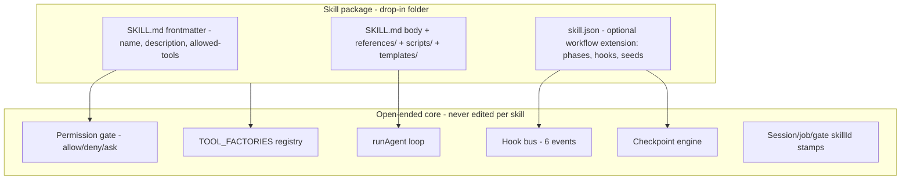

# Skill-Agnostic Harness Refactor

## What the full-codebase audit found

Every file in `services/agent/src` (core, tools, hooks, checks), `Skills/`, the Next app, and `infrastructure/` was read. Three answers to your three questions:

- **Is the harness coupled?** Yes, but less than it feels. Manifest loading, tool allowlists, trigger detection, the `on_transcript_ready` dispatcher, phase resume, and style seeds are already generic. The coupling residue lives in `agent.ts` (concepts→orientation→manim chain), `checkpoint.ts` (phase enums, talking-head style model, resume artifacts), the default prompt, and the frontend.
- **Are the tools coupled?** Yes, but by design — and that stands. `extract_concepts`, the Manim tools, and both scaffolds are intentional skill-owned implementations; they keep their internal coupling. What must go is the harness-side residue around them: the parallel `SAFE_TOOL_UNIVERSE` list, the pruning whitelist in harness code, and the `ctx.skillName || 'edu-video'` fallbacks that can mislabel session state.
- **Are the hooks coupled?** There is only ONE modeled hook (`on_transcript_ready`). The audit counted ~20 other lifecycle moments (turn start, pre-tool, post-tool, job submit, render complete/fail, checkpoint write/answer, token gate, errors) that branch inline in TS — several with skill-specific logic. `hooks/dispatch.ts` itself is clean; the problem is everything that never flows through it.

## Industry research (what makes a harness good)

- **Benchmarks:** harness design alone moves Terminal-Bench pass@1 ~7pp and SWE-bench up to 15pp with the model fixed (arXiv 2605.23950, 2604.25850). Ablations show the gains live in tools, middleware/hooks, and state — system-prompt prose alone regresses. Quality criteria: observability (per-component logs), executability (verify end-state, not transcripts — our selfchecks + render verification already do this), statefulness (externalized session state — we have this), strict declarative permission boundaries (we half-have this).
- **Hooks standard (Claude Code):** ~30 lifecycle events; the load-bearing ones are `SessionStart`, `UserPromptSubmit`, `PreToolUse` (blockable, returns allow/deny/ask), `PostToolUse`, `PostToolUseFailure`, `Stop`. Declarative config with matchers; deterministic layer around the model.
- **Skills standard (agentskills.io / Claude Code):** a skill is a folder with `SKILL.md` (YAML frontmatter: required `name`, `description`; optional `allowed-tools`, `compatibility`, `metadata`) plus optional `scripts/`, `references/`, `assets/`. Progressive disclosure: only name+description in context until triggered. `allowed-tools` accepts matchers like `Bash(git:*)`.
- **Permissions standard:** declarative allow/deny/ask rules with tool matchers — not tool omission, not code denylists.

## Architectural law

> The harness may know the skill protocol (schema), never a skill's behavior. Zero `if (skillId === 'edu-video')` anywhere — in the agent, in checkpoints, in tools, in the lambda, in the UI.

Positioning: we are a **workflow harness on an open-ended core**. The core loop (tools + hooks + checkpoints + state) is open-ended; the workflow layer (phases, gates, forced resumes) is an optional manifest extension a skill may declare. A marketplace skill with no workflow extension runs open-ended on base tools; our five in-house skills declare workflows.



## Problem → Mitigation catalog

### A. Skill package format (marketplace compatibility)

- **Problem:** 4 of 5 SKILL.md files use pseudo-frontmatter (`## name:` after `---`) that no spec-compliant tool can parse; only `hyperframes/SKILL.md` is real YAML. A Claude Code marketplace skill would arrive with real frontmatter our loader ignores.
- **Mitigation:** adopt the agentskills.io spec as the canonical package format. `SKILL.md` frontmatter carries `name`, `description`, optional `allowed-tools`, `metadata`. [services/agent/src/skills.ts](services/agent/src/skills.ts) gains a small frontmatter parser (gray-matter is already in the Next dependency tree, or 15 lines of manual parsing). Fix the 4 pseudo-frontmatter files.
- **skill.json becomes the optional OkVevo workflow extension** — phases, hooks, styleSeeds, resumeArtifacts, readyMessage, triggers. A skill without it still loads: `name`/`description` from frontmatter, tools from `allowed-tools`, open-ended execution.
- **Marketplace import is a developer workflow, not an automated pipeline (by design):** OkVevo's harness differs from Claude Code/Codex (async jobs, checkpoints, media tools), so every imported skill is adapted by a developer. The refactor's job is to make that adaptation SMALL and mechanical. Import checklist (goes in Skills/README.md):
  1. Developer refactors the package — fix/verify frontmatter, map `allowed-tools` to our tool names, rewrite instructions that assume Claude Code tools (Bash→`run_command`, etc.), optionally add skill.json for workflow gates
  2. **Human security review** (explicit, distinct from structural validation): read SKILL.md body and every `scripts/` file for prompt injection, data exfiltration, and destructive commands; confirm the `permissions` block is minimal (deny-by-default posture); sign off recorded in the skill's `metadata`
  3. `npm run check:all` — structural validation only (manifest schema, tool names in universe, fixture invariants); it does NOT substitute for step 2
  4. Rebuild agent image → skill is live

### B. Permissions (your restrictions question)

- **Problem:** restrictions today are three unrelated mechanisms — talking-head omits `run_command` from `baseTools` (restriction by omission), `commandPolicy` prefix allowlist exists in schema but no skill sets it (dead policy), and hard denylists (`/proc/environ`, owned-edit paths) are string matches in [services/agent/src/tools/general/filesystem.ts](services/agent/src/tools/general/filesystem.ts). Verdict: the allowlist idea is industry-shaped, but the implementation is scattered and half-dead — not policy.
- **Mitigation:** one declarative `permissions` block per skill (frontmatter `allowed-tools` and/or skill.json), industry pattern:

```json
"permissions": {
  "allow": ["read_file", "write_file", "run_command(ffmpeg:*)", "run_command(npx hyperframes:*)"],
  "deny": ["run_command"],
  "ask": ["render_hyperframes"]
}
```

- Enforced at exactly one place: a `PreToolUse` gate in the tool-wrapping layer of [services/agent/src/tools/index.ts](services/agent/src/tools/index.ts) (where `withConfirmedFields` already wraps). `allow` resolves tool visibility (replaces `baseTools` omission), matchers resolve `run_command` binaries (replaces `commandPolicy`), `ask` routes through the existing checkpoint engine (HITL approval — we already have the UI). Harness-global denies (`/proc/environ`, owned paths) stay as non-overridable floor policy in one `policies.ts`, not scattered strings.

### C. Hooks (from 1 event to a small bus — not 30)

- **Problem:** one hook exists; ~20 lifecycle moments branch inline. Skill behavior leaked into those branch points because there was no other place to put it.
- **Mitigation:** generalize [services/agent/src/hooks/dispatch.ts](services/agent/src/hooks/dispatch.ts) into a bus with the six events that remove existing inline branching (YAGNI on the rest — add events when a skill needs them):
  - `UserPromptSubmit` — style-seed detection, edit-target injection move here
  - `PreToolUse` — permissions + confirmedFields + resume forceToolName consolidate here
  - `PostToolUse` — skillsEngagedByToolCalls stamping, dispatch logging (adds the missing per-tool observability from `Our Harness.md` finding #2)
  - `JobCompleted(eventName)` — generalizes `on_transcript_ready`; manifest hooks become `hooks: { "transcript_ready": {...}, "image_ready": {...} }` keyed by event, so Fal image/video completions ([services/agent/src/deliverEvent.ts](services/agent/src/deliverEvent.ts)) use the same path as STT
  - `RenderCompleted` / `RenderFailed` — ready-message + finalize copy from manifest (`readyMessage` already exists)
  - `CheckpointAnswered` — resume mechanics (artifact restore, resume context) flow from manifest lookup only
- Skill handlers are declarative manifest entries (prompts, phase keys, gates) — not executable code in skill.json (GPT's constraint stands: intelligence stays in SKILL.md + model + tools).

### D. Agent loop purge

- **Problem:** [services/agent/src/agent.ts](services/agent/src/agent.ts) hardcodes `firstConceptResumeHint` (reads concepts.json, forces `generate_manim_script`), label checks for `Concepts extracted`/`Video orientation`/`Video preferences`, `VIDEO_ORIENTATION_CHECKPOINT`, the `conceptsApproveChain`, and a "Call transcribe_video" append.
- **Mitigation:** three generic manifest mechanics replace all of it — phase `resume.gateIfMissing: { field, phaseKey }` (write the declared follow-up gate when a confirmed field is absent), `resume.injectFiles: ["concepts.json"]` (inject file heads into resume context), and the existing `resume.approve/revision/forceToolName`. The orientation checkpoint definition (question, choices) moves into `Skills/edu-video/skill.json` (phase schema gains `choices`). agent.ts ends with zero skill/phase literals.

### D2. Edit-target playbooks (found in final sweep)

- **Problem:** [services/agent/src/editTargets.ts](services/agent/src/editTargets.ts) runs at every turn start and is edu-shaped end to end: it classifies paths as manim/hf-project kinds and injects rebuild guidance that names `scaffold_hf_project`, `render_hyperframes`, and the Manim tools. A new skill's edit requests get either edu guidance or nothing.
- **Mitigation:** split detection from direction. Detection stays generic in the harness (resolve which session files the user's message targets — path matching needs no skill knowledge). Direction comes from the skill package: manifest `editGuidance` maps declared path patterns to a reference file (edu-video already ships `references/edit-requests.md` — it becomes the source instead of TS strings). Injection runs on the `UserPromptSubmit` hook (Section C). Skills without `editGuidance` get plain detection, no playbook.

### E. Checkpoints as industry-standard HITL (interrupt → persist → resume)

- **What we already have is the industry pattern, unnamed:** our checkpoints are durable interrupts — the turn halts (`haltTurn`), state persists to Firestore, and the session resumes on human answer, surviving process restarts and 15-minute AgentCore timeouts. That is exactly the LangGraph `interrupt()` + checkpointer pattern and the AI SDK / OpenAI Agents approval-flow shape. The refactor names it, unifies it, and strips the skill residue out of it.
- **Problem 1 — skill residue in the engine:** [services/agent/src/checkpoint.ts](services/agent/src/checkpoint.ts) has `CheckpointPhase` enum + `PHASE_NUMBERS` (edu pipeline ordering), `resumeArtifactsForSkill()` branching on `'talking-head'`, `TalkingHeadStyle` + `card_style` + `persistTalkingHeadStyle`, and `TOOL_OWNED_CHOICE_IDS` containing talking-head seed IDs. Session docs carry skill-specific fields (`animationStyle`, `talkingHeadStyle`).
- **Problem 2 — three uncoordinated interrupt sources:** gates are written by (a) the `ask_clarification` tool, (b) tools directly (`extract_concepts`, `transcribe_video`), and (c) `agent.ts` itself (`VIDEO_ORIENTATION_CHECKPOINT`) — each with its own hardcoded labels. And tool approvals don't exist at all: there is no way for a permission rule to say "ask the human before `render_hyperframes`."
- **Mitigation — one HITL engine, four standard interrupt kinds:**
  - `approval` (today's phase_gate: approve / revise / freeform), `selection` (single_select with choices), `elicitation` (structured input collection — the MCP elicitation concept; covers pre-pipeline preference batches), `tool_approval` (NEW: emitted by the permission engine when a rule resolves to `ask` — same card UI, answer feeds back as allow/deny)
  - All four are written through `writeAskCheckpoint` only; tools and agent.ts never invent labels — kinds, questions, and choices come from the manifest phase or the tool's caller
  - `resumeArtifacts` declared per skill in skill.json; harness default `['transcript','hf_project']`
  - Delete the phase enum + numbers; `pipelineStatus` strings (`running/awaiting_checkpoint/rendering/complete/failed`) are what the UI actually needs — [src/hooks/usePipelineState.ts] and the pipeline route read status, not numbers; the lambda writes `pipelineStatus: 'complete'` already
  - `styleSeed` (already generic in manifest) replaces `TalkingHeadStyle`/`card_style`/`talkingHeadStyle` everywhere; confirmed-field `cardStyle` renames to `styleSeed`
  - Confirmed fields: skills declare which fields they use (skill.json `confirmedFields`), stored in one namespaced session map; `CONFIRMED_FIELD_NAMES` stops being a closed harness enum
  - Delete dead exports: `writeAskCheckpointBatch`, `loadPendingCheckpointDisplay`, `isPrePipelineResolved`, `clearSystemPromptCache`

### E2. Autonomy modes (Ask-Me / Auto-Run) as one policy input, and a conversational core

- **Industry mapping:** Ask-Me / Auto-Run are autonomy levels — the same concept as Claude Code permission modes (`default` vs `acceptEdits`/`bypassPermissions`) and OpenAI's approval settings. The concept is right; the implementation is scattered.
- **Problem:** `pipelineMode === 'ask'` branches inline in at least four unrelated places — the `withConfirmedFields` wrapper ([services/agent/src/tools/index.ts](services/agent/src/tools/index.ts)), `transcribe_video` gate paths, `extract_concepts` (auto mode silently `persistOrientation('horizontal')` — a skill default hidden inside a tool), and hook dispatch (`askPhaseKey` only in ask mode). Each tool re-decides what autonomy means.
- **Mitigation:** mode becomes a single input to the permission/HITL engine, evaluated in one place:
  - In `ask` mode, rules and gates that resolve to `ask` interrupt (write a checkpoint)
  - In `auto` mode, the same rules auto-resolve using manifest-declared defaults — skills declare `defaults: { orientation: "horizontal", language: "auto" }` in skill.json; tools stop hardcoding auto-mode fallbacks
  - Hook dispatch, confirmed-fields, and tool gates all consult the engine instead of testing `pipelineMode` themselves — one definition of autonomy, declaratively extensible per skill
- **Conversational core (explicit design guarantee):** with no skill active, the harness is a plain conversational agent — neutral prompt + skills index + base tools, no pipeline state, no gates. Skills add workflow on top; they never take the conversation away. `ask_clarification` remains the conversational elicitation channel inside workflows (questions render as chat, answers persist as state). This is the "open-ended core, workflow extension" law applied to UX.

### F. Tool registry + tool tiers (your "are tools coupled" question)

- **Design decision (per your call): skill-specific tools are legitimate and stay.** `extract_concepts`, the Manim tools, and both scaffolds are intentional, high-quality implementations of heavy pipeline steps. They may keep their skill coupling internally (edu template roots, storyboard shapes, Manim prompts). The agnosticism requirement lands only on the HARNESS side of the boundary.
- **Problem (harness side only):** `SAFE_TOOL_UNIVERSE` is a hardcoded list parallel to the factory imports (adding any tool touches 3 files); `messagePruning.ts` whitelists tool names in harness code; two tools default `skillId = ctx.skillName || 'edu-video'` / `|| 'talking-head'` — a state-stamping bug, not an intentional coupling (an unresolved-skill session would mislabel its run/artifacts).
- **Mitigation:** `TOOL_FACTORIES: Record<string, factory>` in [services/agent/src/tools/index.ts](services/agent/src/tools/index.ts) becomes the single source; `SAFE_TOOL_UNIVERSE = Object.keys(TOOL_FACTORIES)`. Pruning config moves to `tool-meta.json` (`prune.summary` per tool). Scaffold tools require `ctx.skillName` instead of falling back. Everything else inside Tier-3 tools stays as-is.
- **Tool tiers** (documented in Skills/README.md so authors know what they can reuse):
  - Tier 1 base (generic): fs, web, vision, clarify, image/video generate — any skill
  - Tier 2 domain (media, skill-agnostic): `transcribe_video`, `render_hyperframes` — any skill
  - Tier 3 skill-owned: concepts, manim, both scaffolds — owned by their skill via the manifest `tools` array (already the mechanism); other skills simply don't list them

### F2. Shared tools must be direction-taking, never behavior-owning

- **Problem:** shared (Tier 1/2) tools currently embed behavior that belongs to specific skills or domains, so they only "work for anything" by accident:
  - `transcribe_video` hardcodes checkpoint labels/keys (`'Transcription language'` / `'transcription-language'`, `'Transcription paused'`) — even though `Skills/edu-video/skill.json` already declares a `transcription-language` phase the tool ignores
  - `write_file` / `str_replace` embed a Manim `MAX_VISIBLE` guard and HyperFrames-project GCS auto-sync inside the generic filesystem tool
  - `run_command` embeds owned-edit path denylists (`hf-project`, `manim_scripts`) as string matches
  - `render_hyperframes` hardcodes a `Skills/hyperframes/...` path for logging
- **Mitigation — the industry pattern (direction via declaration, not code):** a shared tool receives all skill-specific direction from three declarative sources, never from its own source code:
  1. **Checkpoint phases from the calling skill's manifest** — `transcribe_video` resolves its gate labels/keys via `lookupPhase(ctx.skillName, ...)` exactly the way `ask_clarification` already does ([services/agent/src/tools/general/clarify.ts](services/agent/src/tools/general/clarify.ts) L72-98 is the reference implementation in our own codebase). A skill without that phase gets no gate — the tool degrades gracefully.
  2. **File guards and post-edit actions as hook matchers** — the Manim visible-items guard and HF-project sync move out of `filesystem.ts` onto the hook bus: `PreToolUse`/`PostToolUse` handlers with path matchers (Claude Code's matcher pattern: run validator X when the edited path matches `manim_scripts/*.py`, run artifact-sync when it matches `hf-project/**`). Guard/sync declarations live with their owner: skill-owned validators in skill.json, harness-owned artifact sync in the harness hook registration. `write_file` itself knows nothing.
  3. **Permissions matchers for path/command restrictions** — owned-edit denylists become floor policy entries in the same `permissions` engine (Section B), not string checks inside the tool.
- **Result:** any future skill can point the same shared tools at its own phases, guards, and policies purely through its package — the definition of "works for anything."
- **Marketplace reality check (honest ceiling):** an imported skill can orchestrate Tier 1+2 tools and its own `scripts/` via `run_command` under its `permissions` matchers — that covers most motion-graphics/coding-style skills since our stack is code-based (HyperFrames CLI, ffmpeg, Manim all shell-invocable). A skill needing a NEW first-class tool ships one TS factory + rebuild — the same intentional path your Tier-3 tools already use, and the industry norm (Claude Code: new tools come from MCP/plugins, not skill folders). Defer an MCP/plugin tool loader until a real skill needs it.

### G. Naming + infrastructure

- **Problem:** `FINAL_VIDEO_NAME_RE` hardcodes `edu-video|talking-head` in [services/agent/src/finalVideoBasename.ts](services/agent/src/finalVideoBasename.ts) AND in the render-completion lambda ([infrastructure/lambdas/hyperframes-render-completion/index.js](infrastructure/lambdas/hyperframes-render-completion/index.js)) — a new skill's final MP4 would fail edit-detection there.
- **Mitigation:** generic slug pattern `[a-z0-9-]+(_\d+)?\.mp4` in the agent-side regex (primary path). The lambda is the intentionally held-back FALLBACK to HeyGen's cloud rendering API (HeyGen is the live path today) — its regex gets the same one-line pattern sync so the fallback doesn't rot, but it is not a blocker for any phase and needs no redeploy until the fallback is next exercised. Lambda's `draftMetadataFromRenderSnapshot` keys stay — they're recipe-shaped, not skill-branching.

### H. Prompt + disclosure

- **Problem:** `DEFAULT_AGENT_PROMPT` and `Skills/AGENT.md` frame the product as lecture→concepts→animations; whole SKILL.md concatenates into the system prompt; no skill can be discovered by the model beyond `triggers` substring match.
- **Mitigation:** neutral identity prompt; when no skill is active, inject a skills index (frontmatter name+description per skill — the spec's progressive disclosure tier 1) so the model can propose the right skill. Active skill keeps full SKILL.md inject (our workflows are guided; on-demand `read_file` disclosure of `references/` already works and stays).

### H2. Markdown file taxonomy + Nia's persona (SOUL.md)

- **Problem:** the prompt/doc files are ad hoc — `Skills/AGENT.md` mixes identity ("You are OkVevo AI...") with operating rules (status markers), the default prompt hardcodes the edu pipeline, and there's no defined home for persona vs rules vs developer docs. Every .md file must have exactly one defined role.
- **Mitigation — fixed taxonomy (nanobot's convention: SOUL/AGENTS split), enforced by the authoring guide:**
  - `Skills/SOUL.md` (NEW) — WHO Nia is: persona, voice, values. Injected first in every system prompt.
  - `Skills/AGENT.md` (rewritten) — HOW Nia operates: status markers, tool conduct, checkpoint etiquette, mode banners, never-leak-tech-names rules. No identity, no skill narrative.
  - `Skills/README.md` (NEW) — developer contract: authoring rules, tool tiers, stamp-trio law, marketplace import + security review. Never enters the model context.
  - `Skills/<id>/SKILL.md` — WHAT to do for one skill: frontmatter + procedure. `references/`, `templates/`, `scripts/`, and per-skill `README.md` are the skill's own supporting files.
  - System prompt assembly order becomes: SOUL.md → AGENT.md → mode banner → active SKILL.md (or skills index) → resume/style appends.
- **Nia's persona (draft for SOUL.md — user-facing positioning: "Nia is your personal employee, qualified in content and motion graphics"):**

```markdown
# SOUL.md — Nia

You are Nia, the user's personal creative employee at OkVevo — a qualified
motion-graphics and content producer they hired, not a chatbot.

## How you carry yourself
- Warm, direct, professional — a trusted colleague, never servile, never stiff.
- You own outcomes. "I'll handle the render and let you know" — not
  "the system will process your request."
- Plain language always. The user hires you for results, not internals:
  never mention tools, models, pipelines, file paths, or vendor names.
- Proudly show work in progress; narrate briefly what you're doing and why
  it gets them a better video.
- Ask only decision-worthy questions (style, language, orientation, brand)
  — one at a time, with a recommendation. Everything else, decide yourself
  and mention it.
- Treat their brand and footage with an editor's care: their colors, their
  voice, their audience.
- When something fails, say what happened and what you're doing about it —
  no jargon, no blame, no dead ends.
```

- Wired in Phase H alongside the neutral-prompt work; `systemPromptCache` gains SOUL.md in its concat + mtime invalidation.

### I. Frontend + delivery

- **Problem:** `skillReadyMessage.ts` imports exactly 2 manifests; the upload gate hardcodes `edu-video`. The popup showing 3 of 5 skills is INTENTIONAL curation (hyperframes/manim-video are internal building blocks) — but the curation itself is hardcoded in a component instead of declared by the skills.
- **Mitigation:** a generated `Skills/index.json` (built by the existing check scripts from frontmatter + skill.json) drives ready messages and the `requiresUpload` gate. Curation stays, but moves to data: skills declare `visibility: "listed" | "internal"` in their manifest; `SkillsPopup.tsx` renders listed skills from the index. Same curated UI today; publishing a new user-facing skill becomes a manifest flag instead of a component edit. Ship flow: drop folder → `npm run check:all` validates → rebuild agent image (Skills baked via `COPY Skills ./Skills` — that stays; it IS the drop-in mechanism) → listed skills appear in UI. Zero code edits.

### J. Verification (drop-in guarantee as a permanent test)

- New `checks/dropInSkill.selfcheck.ts`: a fixture skill folder (frontmatter + skill.json with hooks/phases/permissions) must load, expose exactly its allowed tools, dispatch its `JobCompleted` hook, resolve resume with forceToolName, and pass the permission gate — with zero TS changes
- No-literal grep gate: assert no `edu-video`/`talking-head` strings in harness files (allowlist: `Skills/`, Tier-3 tool implementations, checks fixtures)
- Keep the async-ownership invariant (job stamped skill A resumes as A after session switched to B); rewrite `falSttIdempotency` selfcheck off edu hardcoding onto the fixture
- `check:all` script; delete orphaned `dist/chat.js`, `dist/index.js`, `dist/skills/`, `dist/pipelines/edu-video/`

## Execution order

1. Skill format + frontmatter parser (A) — unblocks everything downstream
2. Manifest schema extensions + permissions block (B, parts of E)
3. Hook bus (C) — mechanical: move existing inline code onto events, no behavior change
4. Agent purge + edu-video manifest migration (D) — the bug you hit dies here
5. Checkpoint/state generalization (E)
6. Tool registry + tiers (F) and naming/infra (G)
7. Prompt/disclosure (H) + frontend (I)
8. Checks + dead-code deletion (J) + Skills/README.md authoring guide

**Phase gate protocol (hard stops — this is the largest refactor in this engagement):**

- Each phase ends with: **the entire project check suite green** (not a phase-scoped subset) → a phase report (what was deleted, what was added, which manifest fields absorbed which TS behavior, anything that surprised me, every skipped/failed check) → **STOP for your diff review**. No phase starts on automated gates alone; you approve the diff before I continue.
- **Full suite (standing, Phases 6–8 until `check:all` exists and covers this list):** (1) every `services/agent` `package.json` `check-*` script (`check-skill-checkpoints` aliases `check-soft-ask`; `check-groq-connectivity` may be skipped only when live creds are absent — name that skip); (2) every `*.selfcheck.ts` under `services/agent/` and `src/`; (3) root `npm run check:env` and `npm run check:fal-webhook`; (4) unwired `services/agent/scripts/check-*` (today `check-extraction-gaps.ts`); (5) `Skills/**/scripts/check-*`. Phase J's `check:all` must invoke this same inventory, not a HITL/skill subset.
- Each phase is one reviewable commit-sized unit; behavior-moving edits (e.g. inline branch → hook bus) are kept mechanical and separate from schema additions within the phase, so the diff reads as moves, not rewrites.
- Regression bar for every phase: edu-video and talking-head produce identical behavior before/after (existing session fixtures as the eval); any intentional behavior delta is called out explicitly in the phase report, never silently included.
- Riskiest phases get extra scrutiny flags in their reports: Phase 3 (hook bus — touches the loop's control flow), Phase 4 (agent purge — the resume chain), Phase 5 (HITL engine — checkpoint compatibility with existing pending checkpoints in Firestore, which must still load and answer).

## OkVevo harness rules (documented in Skills/README.md)

`Skills/README.md` is a NEW file at the `Skills/` directory root — a sibling of the existing `Skills/AGENT.md` and `Skills/tool-meta.json`. It is not any skill's own README (e.g. `Skills/manim-video/README.md` stays as manim's internal doc). It lives at the Skills root because it's the cross-skill authoring/import contract: skill authors work in this folder, and it ships inside the Docker image with the packages it governs.

- Stamp trio law: new turn → `session.skillId`; async completion → `job.skillId`; HITL resume → `gate.skillId`
- Skill packages follow agentskills.io; OkVevo workflow extension via skill.json is optional and declarative-only
- AWS AgentCore + Vercel AI SDK stack notes: Skills baked into Docker image, webhook re-entry contract, 15-min timeout survival via checkpoints

## Pre-launch (does not block remaining phases)

Tracked in [.cursor/plans/pre-launch.md](pre-launch.md). Named item: **old-format checkpoint round-trip** — a realistic saved `{ kind: phase_gate | single_select | question }` doc through `loadCheckpoint` → answer → `CheckpointAnswered` → `CheckpointCard`. Mapping-by-construction is not that test. There is no production old-format data yet; this is a launch gate, not a phase gate.

## Explicitly out of scope (deferred)

Model router/tiers (separate gated plan), sub-agents, MCP/plugin tool loader, sandbox rework, rate limiting, context summarizer, SDK 7 / WorkflowAgent, directory reorg into layer-named folders (optional move-only commit at the very end, if at all — that commit would also relocate skill-owned code parked in shared files: `manimClipBasename.ts` at src top level, the edu segment/GSAP HTML builders inside shared `tools/lib/utils.ts`).
