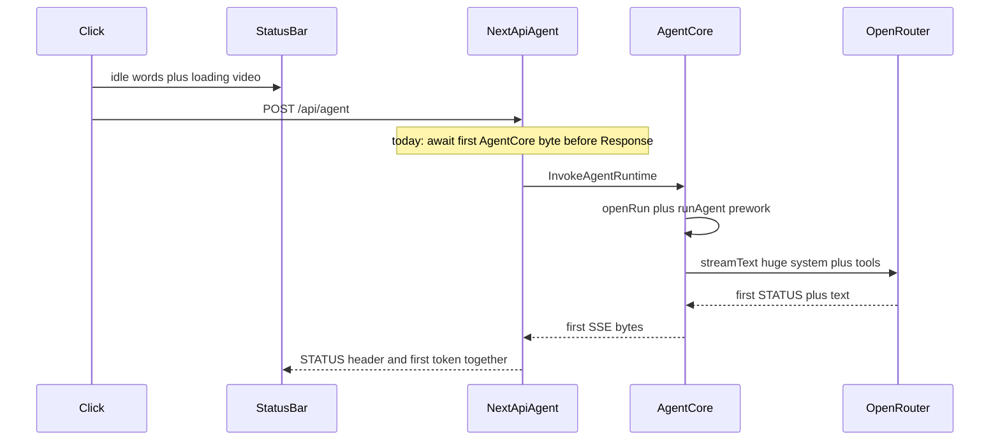

# Phase 3.7 — Studio STATUS and first token still 10–13s

Insert into [.cursor/plans/agent_latency_and_streaming_overhaul_b611da2c.plan.md](.cursor/plans/agent_latency_and_streaming_overhaul_b611da2c.plan.md) after Phase 3.6. Do not renumber Phase 4.

**Hard rule (same as 3.5):** one timing report from a real studio send before any UX change. No second model call for STATUS. Keep-alive findings and the Fix 1 / Fix 2 timing table are the **same report**, not a later phase.

## Why the status bar and streaming show up together

This is expected, not a client race.

- On send, the live header already mounts from `isPreparingSend` ([AiStudioTimeline.tsx](src/components/workspace/ai-studio/AiStudioTimeline.tsx)) and shows idle words (`Focusing` / `Framing` / … in [friendlyStatus.ts](src/lib/agent/friendlyStatus.ts)).
- A real phrase only replaces that when `getLatestStatusMarker` sees a complete `[[STATUS: …]]` in reasoning or text ([parseStatusMarker.ts](src/lib/agent/parseStatusMarker.ts)).
- AGENT.md tells the model to emit that marker as the **first line of the first reasoning block**. It is the first visible stream content. The header and the first token therefore share one clock: server TTFT.

Idle words for ~10s then STATUS + prose in the same beat is “TTFT is still 10–13s on the studio path.” It is not a 2500ms rotator hold (that only cycles idle copy). It is not smoothStream (STATUS already flushes without the 18ms word delay).



## What we already measured (do not re-bench ping)

Direct AgentCore, no Next, short “ping” ([71f224b1](71f224b1-fe4f-4b90-8d13-82022f206f21)):

- `prework_ms` ~200–340
- `model_ttft_ms` ~1.0–1.6s
- server `total_ms` ~1.2–1.9s

Studio still feels 10–13s. The leftover 8–11s is **not** that ping path. It is the browser → Next → AgentCore → skill-sized prompt path.

Ping system prompt is SOUL + AGENT + skills index (~1k tokens) and `BASE_TOOLS` only. A studio skill turn adds e.g. [Skills/edu-video/SKILL.md](Skills/edu-video/SKILL.md) (~5.3k tokens) plus that skill’s tools. Default model is `anthropic/claude-sonnet-4-6`.

## Investigation (report first — one table)

Reuse marks already in [studioPerf.ts](src/lib/agent/studioPerf.ts) / [AiStudioShell.tsx](src/components/workspace/ai-studio/AiStudioShell.tsx) / [AgentConsumerStatus.tsx](src/components/workspace/ai-studio/AgentConsumerStatus.tsx). Label `next dev` vs `next start`. n ≥ 3: one **plain chat follow-up**, one **skill follow-up** (edu-video or talking-head), one **fresh skill first send**.

Per send, one row:

- `click-to-video`
- `[studio] post-agent-ttfb` (Resource Timing TTFB of POST `/api/agent`)
- `click-to-streaming` (`useChat` status)
- `click-to-status` (first parsed `[[STATUS:]]`)
- CloudWatch `[agent] timing … prework_ms / model_ttft_ms / total_ms` for the same `sessionId`
- `cache_read` / `cache_write` (or OpenRouter `cached_tokens`) on that same timing line. Today there is **no** cache-hit log — Phase 3 caching was never proven.
- OpenRouter connection: **reused keep-alive vs fresh TCP+TLS** (see below)

**How to read the row**

- `post-agent-ttfb` ≈ 10s → Next is waiting on the first AgentCore byte ([handleAgentCore](src/app/api/agent/route.ts) peeks `reader.read()` **before** `return new Response`). Fix 2.
- `model_ttft_ms` ≈ 10s and TTFB is small → prompt/tools not cached on the skill turn. Fix 1 (then 3 only if cache still 0).
- `click-to-status` ≈ `click-to-streaming` ≈ TTFB ≈ `model_ttft` → coupling is confirmed; the number to cut is TTFT, not a separate status widget.
- Fresh TLS every turn of tens–hundreds of ms → note it; configure pooling only if the library already supports it and the measured cost is real. It will not explain 10–13s by itself.

Do not “fix” STATUS by inventing a local phrase or a preliminary model call (Phase 3.5 already rejected that).

### Same report: OpenRouter HTTP keep-alive on the pooled VM

Confirm whether AgentCore’s HTTP client to OpenRouter **reuses a warm connection across turns on the same pooled microVM**, or does TCP + TLS per turn.

Today [agent.ts](services/agent/src/agent.ts) does `createOpenRouter({ apiKey })` with **no custom `fetch`**, no `Agent`, no keepalive config. The investigation names the actual client (Node 22 global `fetch` / undici vs `node-fetch` vs something the OpenRouter provider constructs) and whether a dispatcher/pool is already in process.

Measure on two warm turns of the **same** runtime session (not a new microVM):

- Turn B immediately after turn A drains
- Turn C after a pause longer than undici’s default idle (`keepAliveTimeout` is **4s** if that is the client)

Log time from `fetch` start → response headers for the OpenRouter call (a temporary wrapped `fetch` passed into `createOpenRouter`, or equivalent). Report connect/TLS vs reused (header time near 0 after a live socket).

**Verdict in the report, then stop unless cheap:**

- Pooling exists, just unconfigured (typical: `setGlobalDispatcher(new Agent({ keepAliveTimeout: … }))` or provider `fetch` with a dispatcher) → say so; do **not** implement until this report is in, and only then if the measured handshake is worth it.
- No pooling support in the client we actually use → say so; do not build a custom pool in this phase.
- Do **not** pursue `TCP_NODELAY` / socket-level tuning or local-process tricks from the Hermes CLI report. That path is a local binary talking to a provider. This product is browser → Next → AgentCore (us-east-1) → OpenRouter. Not comparable; out of scope.

## Fix 1 — Make prompt cache actually hit

[systemPromptWithCache](services/agent/src/systemPromptCache.ts) puts `cacheControl` on a **string** system message:

```112:126:services/agent/src/systemPromptCache.ts
export function systemPromptWithCache(
  stable: string,
  volatile = ''
): SystemModelMessage | SystemModelMessage[] {
  const cached: SystemModelMessage = {
    role: 'system',
    content: stable,
    providerOptions: {
      anthropic: { cacheControl: SYSTEM_CACHE_CONTROL },
      openrouter: { cacheControl: SYSTEM_CACHE_CONTROL },
    },
  };
```

OpenRouter/AI SDK only apply Anthropic caching when `content` is a **text-block array** with `cacheControl` on the block ([issue 389](https://github.com/OpenRouterTeam/ai-sdk-provider/issues/389)). Message-level control on a string is a no-op. The current selfcheck **asserts the broken shape**.

Change to block content (`[{ type: 'text', text: stable, providerOptions: { openrouter: { cacheControl: SYSTEM_CACHE_CONTROL } } }]`). Keep volatile as a second uncached system message. Log `cache_read` / `cache_write` (or OpenRouter `cached_tokens`) on the existing `[agent] timing` line. Update [systemPromptCache.selfcheck.ts](services/agent/src/systemPromptCache.selfcheck.ts). Redeploy AgentCore — local Next cannot fix container prompt shape.

## Fix 2 — Do not hold the chat POST on the first AgentCore byte

[handleAgentCore](src/app/api/agent/route.ts) awaits `invokeAgentCoreStream` then `reader.read()` to sniff JSON `{ error: "session_limit_reached" }` and **only then** returns either HTTP **413 JSON** or the SSE `Response`. That peek is what keeps the session-limit modal clean today. It is also what makes browser TTFB wait for the first AgentCore byte.

The previous draft claimed “existing 413 handling already reads 413 JSON.” That is **wrong** once headers go out as 200 SSE before anyone knows it is an error. The 413 branch in the transport `fetch` ([AiStudioShell.tsx](src/components/workspace/ai-studio/AiStudioShell.tsx) ~436–453) never runs. `useChat` would ingest JSON as a UI stream. The `error.message` includes-`session_limit_reached` effect (~670) is a fallback for a thrown Error, not for a 200 body, and it does not set `estimatedTokens`. Net: garbled failure instead of the modal.

**Contract (must hold after Fix 2):** a session-limit hit still opens the same modal with `estimatedTokens`, and `useChat` must **not** parse the error body as SSE. HTTP 413 may still happen when Next can classify before sending; the **client must not depend on that**.

Required client change (same Fix 2, not a follow-up):

- Extract a tiny helper used by the transport `fetch` (not only `status === 413`): if the payload is `{ error: "session_limit_reached" }` — whether from a 413 response **or** from first bytes of a 200 body that start with `{` / `Content-Type: application/json` — call the same `setSessionLimitTokens` + `setSessionLimitOpen` path and return a **413 JSON Response** (or otherwise abort) so `DefaultChatTransport` never reads that body as an event stream.
- One selfcheck on the helper (413 JSON, 200 JSON-first-bytes, SSE first bytes that happen to include `{` in a `data:` line must **not** false-trigger).
- Keep the existing 413 path so local-proxy / current AgentCore peek still work.

Next.js side: return the SSE `Response` without awaiting a full model token. If the transform sees JSON `session_limit_reached` as the first bytes, it should still prefer rewriting to 413 when headers are not sent; once they are sent as 200, the client helper above is the safety net.

Optional, only if the report shows TTFB stuck until first token: `response.flushHeaders?.()` after `writeHead` in [pipeHttpUiStream](services/agent/src/agent.ts). AgentCore redeploy for that flush; client helper does not need it.

Do not ship Fix 2 without the client JSON-first-bytes case. That is the gap.

## Fix 3 — Only if Fix 1 still shows cache_read = 0

Do **not** start this until the report after Fix 1.

- `cache_control` on the last tool so tool schemas join the cached prefix.
- OpenRouter sticky `session_id` (chat `sessionId`) so follow-ups hit the same cache host.
- Still no SKILL.md rewrite unless TTFT is still >6s after a verified cache hit.

## Out of scope

- Image diet (warm-turn irrelevant).
- Changing the default model.
- Fake STATUS / extra model call.
- Phase 3.5 item 3a (refresh-before-indicator).
- `TCP_NODELAY` / Hermes-style local socket tuning.
- A custom HTTP pool if the library we use already has keepalive (configure or skip; don’t reinvent).

## Success

- Report table filled before landing Fix 1–2, including keep-alive vs fresh TLS and cache tokens.
- Warm **studio** follow-up: first parsed STATUS and first visible token both **< 6s** (plan target), not 10–13s.
- They may still land within a few hundred ms of each other — that is correct.
- Idle words may still show for that <6s window — that is the click-gated placeholder.
- Session-limit still opens the existing modal with token count; no garbled stream. Helper selfcheck covers 413 and JSON-first-bytes.
- Full check suite after the code change; AgentCore redeploy for Fix 1.

Skipped: local STATUS generator, SKILL.md cuts, image diet, socket tuning. Add SKILL.md cuts only if a verified cache hit still misses 6s.
