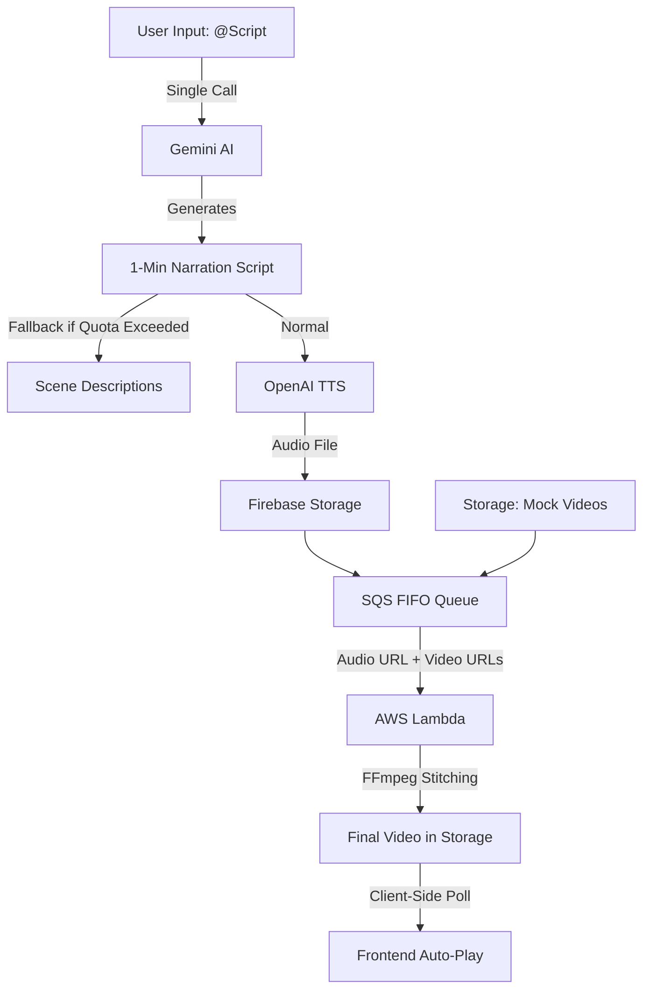

# Brick2Brick - AI Video Generation Platform

A Next.js application that generates and stitches AI-created videos using AWS SQS FIFO queues, Firebase Storage, and AWS Lambda with FFmpeg. Features deterministic video ordering, automatic polling, and seamless stitching with crossfade transitions.

## Features

### ✨ Core Functionality
- **AI Narration Pipeline**: Single-shot generation of 1-minute narration scripts + cinematic scene descriptions using Google Gemini.
- **Smart Fallback System**: Automatically handles AI quota limits (Error 429) by falling back to scene description narration, ensuring the demo flow never breaks.
- **AI Voice Generation**: High-quality TTS audio using OpenAI (Shimmer/Coral voice).
- **SQS FIFO Queue**: Deterministic video stitching with guaranteed ordering.
- **Client-Side Polling**: Direct, secure polling of Firebase Storage to detect finished videos without CORS issues.
- **Auto-Display**: Automatic display of stitched videos when ready.

### 🎬 Video Stitching Features
- **FIFO Ordering**: Strict scene order preservation via SQS FIFO queues.
- **Audio Overlay**: Merges TTS narration with stitched video.
- **Resolution Normalization**: Automatically scales videos to consistent 360x640 resolution.
- **Crossfade Transitions**: Smooth 1.5-second fade transitions between clips.
- **Demo Mode**: Includes a robust "Demo Mode" that uses pre-stored high-quality videos (`MockAIGeneratedVideos`) to demonstrate the full stitching pipeline without waiting for new generation.

## Architecture

### Enhanced AI Narration & Stitching Pipeline



### Flow Details

1. **User Input**
   - User types `@Script [story]`.
   - Triggers single-shot Gemini generation.

2. **AI Generation (Optimized)**
   - **One API Call** generating narration and scene descriptions.
   - **Automatic Fallback**: If Gemini hits a rate limit, the system gracefully uses the recognized scene visuals as the narration script.

3. **Audio Production**
   - Narration sent to OpenAI TTS (`tts-1-hd`).
   - Generated MP3 uploaded to Firebase Storage.

4. **Stitching Process (AWS Lambda via SQS)**
   - Triggered via SQS with `audioUrl` payload.
   - Downloads 3 videos (from `MockAIGeneratedVideos` in Demo Mode).
   - Mutes original video audio & overlays TTS track.
   - Stitches with crossfade transitions.

5. **Client-Side Polling**
   - Frontend directly polls Firebase Storage (`videos/` folder) for the specific stitched filename.
   - Bypasses complex proxy requirements, eliminating CORS errors.

## Prerequisites

- **Node.js** 18+ and npm
- **Firebase Project** with Storage enabled
- **AWS Account** with SQS and Lambda access
- **Google Gemini API** key (for narration)
- **OpenAI API** key (for TTS)
- **Storage Setup**: A folder named `MockAIGeneratedVideos` in Firebase Storage containing source videos (e.g., `1.mp4`, `2.mp4`, `3.mp4`) is required for Demo Mode.

## Setup Instructions

### 1. Clone and Install

```bash
git clone <your-repo-url>
cd Brick2Brick
npm install
```

### 2. Environment Variables

Create a `.env` file in the root directory:

```env
# Google Gemini API
NEXT_PUBLIC_GEMINI_API_KEY=your_gemini_api_key

# AWS Configuration for SQS
AWS_ACCESS_KEY_ID=your_id
AWS_SECRET_ACCESS_KEY=your_key
AWS_REGION=us-east-1
SQS_STITCHING_QUEUE_URL=https://sqs.us-east-1.amazonaws.com/ACCOUNT/brick2brick-stitching.fifo
```

### 3. Firebase Setup

1. Create a project at [Firebase Console](https://console.firebase.google.com/).
2. Enable **Storage**.
3. Set Rules to allow public read/write for development.
4. **Upload Mock Videos**: Create a folder `MockAIGeneratedVideos` and upload 3 clips.

### 4. AWS SQS Setup

1. Create a **Standard FIFO Queue** named `brick2brick-stitching.fifo`.
2. Enable "Content-based deduplication".
3. Copy the URL to `.env`.

### 5. AWS Lambda Setup

1. Create a Node.js 18 function `brick2brick-video-stitcher`.
2. Add the **FFmpeg Layer**.
3. Add **SQS Trigger** pointing to your FIFO queue.
4. Set Environment Variables: `FIREBASE_SERVICE_ACCOUNT_KEY` (Base64 JSON), `FIREBASE_STORAGE_BUCKET`.

## Troubleshooting

### "Quota Exceeded" (Gemini 429)
**Symptom**: AI generation fails with a red error.
**Solution**: Use the built-in fallback! The app will automatically detect this and switch to using scene descriptions for narration. You can continue the flow without interruption.

### Lambda Path / CORS Errors
**Symptom**: "Wrong path" or "CORS blocked" in console.
**Solution**: The app now uses **SQS** for triggering and **Client-Side Storage** for polling.
- Ensure `fetchStitchedVideos` in `StorageService.ts` is used (checks `videos/` folder).
- Ensure the "Stitch" button calls `stitchStorageVideos` (SQS) not the legacy Lambda function.

### FFmpeg Errors
**Check CloudWatch Logs**. Common issues:
- Input videos not found (check `MockAIGeneratedVideos` path).
- Memory limit exceeded (ensure Lambda has 2GB+ RAM).

## Performance

- **Video Stitching**: 30-40 seconds for 3 clips.
- **Total Workflow**: ~1-2 minutes.

## License

MIT License
