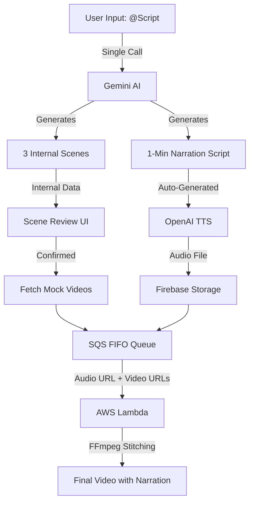

# Brick2Brick - AI Video Generation Platform

A Next.js application that generates and stitches AI-created videos using AWS SQS FIFO queues, Firebase Storage, and AWS Lambda with FFmpeg. Features deterministic video ordering, automatic polling, and seamless stitching with crossfade transitions.

## Features

### ✨ Core Functionality
- **AI Narration Pipeline**: Single-shot generation of 1-minute narration scripts + cinematic scene descriptions using Google Gemini
- **AI Voice Generation**: High-quality TTS audio using OpenAI (Shimmer/Coral voice)
- **SQS FIFO Queue**: Deterministic video stitching with guaranteed ordering
- **Audio-Video Synchronization**: Overlays TTS narration onto stitched videos, automatically muting original video audio
- **Auto-Display**: Automatic polling and display of stitched videos
- **Firebase Storage**: Store generated scripts, audio, and videos
- **AWS Lambda Processing**: Server-side video stitching with FFmpeg and audio mixing

### 🎬 Video Stitching Features
- **FIFO Ordering**: Strict scene order preservation via SQS FIFO queues
- **Audio Overlay**: Merges TTS narration with stitched video
- **Resolution Normalization**: Automatically scales videos to consistent 360x640 resolution
- **Crossfade Transitions**: Smooth 1.5-second fade transitions between clips
- **Real-time Updates**: Auto-displays final video when ready

## Architecture

### Enhanced AI Narration Pipeline



### Flow Details

1. **User Input**
   - User types `@Script [story]`
   - Triggering the single-shot Gemini generation

2. **AI Generation (Optimized)**
   - **One API Call** generating:
     - 1-minute documentary-style narration
     - 3 cinematic scene timestamps/descriptions

3. **Audio Production**
   - Narration sent to OpenAI TTS (`tts-1-hd`)
   - Generated MP3 uploaded to Firebase Storage (`audio/`)

4. **Stitching Process (AWS Lambda)**
   - Triggered via SQS with `audioUrl` payload
   - Downloads 3 videos + 1 audio file
   - Mutes original video audio
   - Overlays TTS narration track
   - Stitches with crossfade transitions

### Key Components

1. **Frontend (Next.js)**
   - Chat interface for script generation
   - Real-time Scene Reviewer
   - Audio Player for narration preview
   - Automatic SQS dispatch logic

2. **API Routes**
   - `/api/sqs/stitch` - Logic to forward `videoUrls` AND `audioUrl` to SQS
   - `/api/videos/fetch-stitched` - Poll for completed videos

3. **AWS Services**
   - **SQS FIFO**: `brick2brick-stitching.fifo`
   - **Lambda**: `brick2brick-video-stitcher` (Node.js + static FFmpeg)

4. **External APIs**
   - **Google Gemini**: Content generation
   - **OpenAI**: Text-to-Speech generation

## Prerequisites

- **Node.js** 18+ and npm
- **Firebase Project** with Storage enabled
- **AWS Account** with SQS and Lambda access
- **Google Gemini API** key (for text/scene generation)
- **OpenAI API** key (for TTS audio generation)

## Setup Instructions

### 1. Clone and Install

```bash
git clone <your-repo-url>
cd Brick2Brick
npm install
```

### 2. Environment Variables

Create a `.env` file in the root directory:

```env
# Google Gemini API (for scene planning)
NEXT_PUBLIC_GEMINI_API_KEY=your_gemini_api_key

# Groq API (optional - fallback for AI features)
NEXT_PUBLIC_GROQ_API_KEY=your_groq_api_key

# AWS Configuration for SQS
AWS_ACCESS_KEY_ID=your_aws_access_key_id
AWS_SECRET_ACCESS_KEY=your_aws_secret_access_key
AWS_REGION=us-east-1
SQS_STITCHING_QUEUE_URL=https://sqs.us-east-1.amazonaws.com/YOUR_ACCOUNT_ID/brick2brick-stitching.fifo

# Optional: Legacy Lambda endpoint (for fallback)
NEXT_PUBLIC_LAMBDA_STITCH_URL=https://your-lambda-function-url.lambda-url.us-east-1.on.aws/
```

### 3. Firebase Setup

#### Create Firebase Project
1. Go to [Firebase Console](https://console.firebase.google.com/)
2. Create a new project: `text2video-16cbf` (or your preferred name)
3. Enable **Firebase Storage**
4. Set Storage Rules to allow read/write (for development):

```
rules_version = '2';
service firebase.storage {
  match /b/{bucket}/o {
    match /{allPaths=**} {
      allow read, write: if request.auth != null || true;
    }
  }
}
```

#### Generate Service Account Key
1. Go to **Project Settings** → **Service Accounts**
2. Click **Generate New Private Key**
3. Download the JSON file
4. **Base64 encode it:**

**On Windows (PowerShell):**
```powershell
$json = Get-Content -Path "path/to/serviceAccountKey.json" -Raw
[Convert]::ToBase64String([System.Text.Encoding]::UTF8.GetBytes($json))
```

**On Linux/Mac:**
```bash
cat serviceAccountKey.json | base64 -w 0
```

5. Save the base64 string - you'll need it for Lambda environment variables

### 4. AWS SQS Setup

#### Create SQS FIFO Queue

1. **Go to AWS Console** → Search **"SQS"**
2. **Click "Create queue"**
3. **Queue Type**: Select **FIFO**
4. **Name**: `brick2brick-stitching.fifo` (must end with `.fifo`)
5. **Configuration**:
   - Visibility timeout: `900 seconds`
   - Message retention: `4 days`
   - Delivery delay: `0 seconds`
6. **FIFO Settings**:
   - Content-based deduplication: **Enable**
7. **Click "Create queue"**
8. **Copy the Queue URL** (you'll need this for `.env`)

#### Create IAM User for SQS Access

1. **Go to IAM** → **Users** → **Create user**
2. **Name**: `VidStitcher` (or your preferred name)
3. **Attach Inline Policy**:
   ```json
   {
     "Version": "2012-10-17",
     "Statement": [
       {
         "Effect": "Allow",
         "Action": [
           "sqs:SendMessage",
           "sqs:GetQueueUrl",
           "sqs:GetQueueAttributes"
         ],
         "Resource": "arn:aws:sqs:us-east-1:YOUR_ACCOUNT_ID:brick2brick-stitching.fifo"
       }
     ]
   }
   ```
4. **Create Access Keys** → Save the Access Key ID and Secret Access Key
5. **Update `.env`** with these credentials

### 5. AWS Lambda Setup

#### Create Lambda Function

1. **Go to AWS Lambda Console**
2. **Create Function:**
   - Name: `brick2brick-video-stitcher`
   - Runtime: Node.js 18.x
   - Architecture: x86_64

3. **Configure Function:**
   - **Timeout**: 900 seconds (15 minutes)
   - **Memory**: 2048 MB (Lambda auto-scales to ~3GB during execution)

4. **Add FFmpeg Layer:**
   - Go to **Layers** → **Add Layer**
   - **ARN**: `arn:aws:lambda:us-east-1:145266761615:layer:ffmpeg:4`
   - Alternative: `arn:aws:lambda:us-east-1:224059969284:layer:ffmpeg:1`

5. **Set Environment Variables:**
   - `FIREBASE_SERVICE_ACCOUNT_KEY`: (base64 encoded JSON from step 3)
   - `FIREBASE_STORAGE_BUCKET`: `text2video-16cbf.firebasestorage.app`

#### Deploy Lambda Code

```powershell
cd lambda-stitch-function
npm install

# Create deployment package
Compress-Archive -Path index.js,node_modules,package.json -DestinationPath function.zip -Force

# Deploy to Lambda
aws lambda update-function-code `
  --function-name brick2brick-video-stitcher `
  --zip-file fileb://function.zip `
  --region us-east-1
```

#### Configure SQS Trigger

**Important:** Lambda needs to be triggered by SQS, not HTTP!

1. **Add SQS Permissions to Lambda Role**:
   - Go to Lambda → **Configuration** → **Permissions**
   - Click the execution role name
   - **Add inline policy**:
   ```json
   {
     "Version": "2012-10-17",
     "Statement": [
       {
         "Effect": "Allow",
         "Action": [
           "sqs:ReceiveMessage",
           "sqs:DeleteMessage",
           "sqs:GetQueueAttributes"
         ],
         "Resource": "arn:aws:sqs:us-east-1:YOUR_ACCOUNT_ID:brick2brick-stitching.fifo"
       }
     ]
   }
   ```

2. **Add SQS Trigger to Lambda**:
   - Go to Lambda function → **Add trigger**
   - Select **SQS**
   - Choose queue: `brick2brick-stitching.fifo`
   - Batch size: `1`
   - Enable trigger: **Yes**
   - Click **Add**

#### Optional: Function URL (for fallback/testing)

You can keep the HTTP endpoint as a fallback:

1. Go to Lambda → **Configuration** → **Function URL**
2. Click **Create function URL**
3. **Settings:**
   - Auth type: **NONE**
   - Invoke mode: **RESPONSE_STREAM** (supports long execution)
   - **Enable CORS:**
     - Allow origins: `*`
     - Allow methods: `POST, OPTIONS`
     - Allow headers: `*`
4. Copy the Function URL
5. Update `.env`: `NEXT_PUBLIC_LAMBDA_STITCH_URL=<function-url>`

**Note:** Function URLs may take 15-60 minutes for DNS propagation.

### 6. Firebase Functions Setup

#### Deploy Cloud Functions

The project includes Cloud Functions for:
- Fetching videos from `MockAIGeneratedVideos/` folder
- Fetching stitched videos from `videos/` folder

```powershell
cd functions
npm install
cd ..

# Deploy to Firebase
firebase deploy --only functions
```

**Endpoints created:**
- `https://us-central1-{PROJECT_ID}.cloudfunctions.net/replicateProxy/api/videos/fetch`
- `https://us-central1-{PROJECT_ID}.cloudfunctions.net/replicateProxy/api/videos/fetch-stitched`

### 7. Run the Application

```bash
npm run dev
```

Open [http://localhost:3000](http://localhost:3000)

## Usage

### Complete Workflow

1. **Enter Your Script**
   - Type `@Script` followed by your story idea
   - Example: `@Script A lonely robot discovers a flower on Mars`
   - Press Enter
   - **Gemini AI** instantly generates both a 1-minute narration and 3 scene descriptions

2. **Review & Narration**
   - Review the generated narration script
   - Check the 3 cinematic scene descriptions
   - Type `proceed` to confirm

3. **Generate Audio (Preview)**
   - **OpenAI TTS** generates the high-quality narration audio
   - An audio player appears - listen to the preview!
   - Type `proceed` again to finalize

4. **Stitch & Create Video**
   - The system fetches mock videos (placeholders)
   - Dispatches job to **SQS FIFO Queue** with the audio URL
   - **AWS Lambda** takes over:
     - Downloads videos & audio
     - Mutes original video tracks
     - Overlays TTS narration
     - Stitches with crossfade transitions

5. **Auto-Display**
   - Frontend polls for the final video (every 5s)
   - **Video Auto-Plays** when ready! 🎉

### Monitoring

**Browser Console (F12):**
```
🎵 Generating audio narration...
✅ Audio uploaded to Firebase
🚀 Auto-dispatching to SQS with audio: https://...
✅ Dispatched to SQS: { jobId: '...', audioUrl: '...' }
```

**AWS CloudWatch Logs:**
```
Processing SQS job: stitch-...
Audio URL: https://firebasestorage...
✅ Downloaded audio: narration.mp3
Stitching 3 videos with audio overlay
✅ Stitching complete
```

**Firebase Storage:**
- **Audio**: `audio/narration-{session}.mp3`
- **Final Video**: `videos/stitched-{jobId}.mp4`

## Project Structure

```
Brick2Brick/
├── src/
│   ├── app/
│   │   ├── page.tsx              # Main application UI
│   │   └── api/
│   │       └── stitch/route.ts   # API proxy for Lambda
│   ├── components/
│   │   └── VideoPlayer.tsx       # Video player with stitch UI
│   ├── hooks/
│   │   ├── useVideoGeneration.ts # Video generation logic
│   │   └── useChatFlow.ts
        # AI chat flow
│   └── services/
│       ├── LambdaStitchService.ts # Lambda API client
│       └── StorageService.ts      # Firebase Storage client
├── lambda-stitch-function/
│   ├── index.js                   # Lambda handler (FFmpeg stitching)
│   └── package.json
└── public/                        # Static assets
```

## Key Changes & Fixes

### 1. Firebase Storage Integration
- **Issue**: Wrong bucket name (`appspot.com` vs `firebasestorage.app`)
- **Fix**: Updated Lambda to use correct bucket: `text2video-16cbf.firebasestorage.app`
- **Files**: `lambda-stitch-function/index.js`

### 2. Video Resolution Normalization
- **Issue**: FFmpeg failed when videos had different resolutions (360x640 vs 360x638)
- **Fix**: Added scaling filter to normalize all videos to 360x640
- **Implementation**: 
```javascript
[0:v]scale=360:640:force_original_aspect_ratio=decrease,pad=360:640:(ow-iw)/2:(oh-ih)/2
```

### 3. Auto-Stitch Logic
- **Issue**: Stitching triggered before user confirmation
- **Fix**: Moved logic from `useEffect` to `handleSendMessage` with proper validation
- **Files**: `src/app/page.tsx`

### 4. UI Improvements
- Manual "Stitch Videos" button for storage videos
- Loading states during stitching
- Final video player with auto-play
- Download button for stitched videos
- Hide individual videos when stitching complete

### 5. Lambda Optimization
- Timeout: 15 minutes
- Memory: 2048 MB (auto-scales to 3GB)
- Response streaming for long executions
- Enhanced error logging
- Alternative path fallback for file resolution

## Troubleshooting

### Lambda Timeout (504 Error)

**Symptom**: Request times out after 30 seconds  
**Cause**: Using API Gateway (30s limit) instead of Function URL  
**Solution**: 
1. Create Lambda Function URL with RESPONSE_STREAM
2. Update `.env` with Function URL
3. Wait for DNS propagation (15-60 mins)

**Workaround**: Video still stitches! Check CloudWatch logs for signed URL.

### DNS Propagation Delays

**Symptom**: `ENOTFOUND` errors when calling Function URL  
**Solution**:
1. Flush DNS: `ipconfig /flushdns` (Windows) or `sudo dscacheutil -flushcache` (Mac)
2. Wait 30-60 minutes
3. Try from different network (mobile hotspot)
4. Use API Gateway temporarily

### FFmpeg Errors

**Check CloudWatch Logs**: 
```
https://console.aws.amazon.com/cloudwatch/home?region=us-east-1#logs
```

Common issues:
- Missing FFmpeg layer → Add layer ARN
- Invalid video format → Check input videos are MP4
- Memory exceeded → Increase Lambda memory

### Firebase Permissions

**Symptom**: "Access denied" errors  
**Solution**: Update Storage Rules:
```
allow read, write: if true; // Development only!
```

For production, implement proper authentication.

## Performance

- **Video Generation**: 20-60 seconds per clip (Replicate)
- **Video Stitching**: 30-40 seconds for 3 clips (Lambda)
- **Total Workflow**: 2-4 minutes for complete stitched video

## Cost Estimates

- **Replicate**: ~$0.10 per 3 videos
- **AWS Lambda**: $0.0000166667 per GB-second (~$0.02 per stitch)
- **Firebase Storage**: $0.026 per GB stored
- **API Gateway**: $3.50 per million requests

**Estimated cost per video**: $0.12 - $0.15

## Development

### Local Testing

```bash
npm run dev
```

### Lambda Local Testing

```bash
cd lambda-stitch-function
node test-local.js
```

### Build for Production

```bash
npm run build
```

## Deployment

### Recommended Stack
- **Frontend**: Vercel or Firebase Hosting
- **Lambda**: AWS Lambda (us-east-1)
- **Storage**: Firebase Storage

### Environment Variables (Production)
Set all `.env` variables in your hosting platform's environment settings.

## Security Notes

- **Never commit** `.env` or Firebase service account keys
- Use **proper Firebase Security Rules** in production
- Implement **authentication** for production use
- **Rate limit** video generation endpoints
- **Validate** user inputs before processing

## Future Enhancements

- [ ] User authentication (Firebase Auth)
- [ ] Video queue management
- [ ] Progress tracking for long stitches
- [ ] Multiple stitch formats (transitions, effects)
- [ ] Video editing (trim, crop, filters)
- [ ] Batch processing
- [ ] Custom watermarks

## Support

For issues or questions:
- Check CloudWatch logs for Lambda errors
- Review browser console for frontend errors
- Verify Firebase Storage permissions
- Confirm AWS credentials are valid

## License

MIT License

## Credits

- Video Generation: [Replicate](https://replicate.com/)
- Video Processing: [FFmpeg](https://ffmpeg.org/)
- Cloud Storage: [Firebase](https://firebase.google.com/)
- Serverless Compute: [AWS Lambda](https://aws.amazon.com/lambda/)
