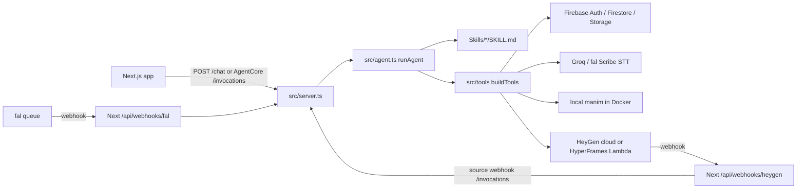

# `services/agent` harness inventory

Generated from the live tree at commit `ad1fc379` (`fix(firestore): restore collection access rules`) after refreshing all `graphify-out` graphs (AST-only, `--force --no-cluster`).

Nothing first-party is omitted. `node_modules` is listed two ways: every installed package (purpose + file count), then every file path. Secret values from `.env` are not copied.

## What this directory is

`services/agent` is the **OkVevo agent harness**: a Docker-only Express process (Nia) that turns teacher recordings into educational videos. The Next.js app is the UI and webhook receiver; this package is the worker that owns tools, Skills, Firestore session memory, Storage artifacts, Groq/fal STT, Manim, and HeyGen/HyperFrames render.

### HTTP surface (`src/server.ts`)

| Method | Path | What it does for the harness |
|---|---|---|
| POST | `/webhooks/heygen` | HMAC-verify HeyGen, claim event, finalize success or record failure |
| GET | `/health` | Compose/local liveness |
| GET | `/ping` | Bedrock AgentCore contract (`Healthy`) |
| POST | `/invocations` | AgentCore entry: runAgent, webhook short-circuit, fal STT resume, groq diagnostics |
| POST | `/renders/:sessionId/check` | Firebase-auth poll: HeyGen fetch or SFN S3 finalize |
| POST | `/chat` | UI stream (Compose) |

### Tool firewall (`src/tools/catalog.ts`)

- **BASE_TOOLS:** `run_command`, `write_file`, `read_file`, `search_files`, `web_search`, `web_extract`, `vision_analyze`, `str_replace`, `ask_clarification`, `image_generate`, `video_generate`
- **edu-video extra:** `transcribe_video`, `extract_concepts`, `generate_manim_script`, `render_manim_clip`, `plan_segments`, `scaffold_hf_project`, `restore_generation`, `render_hyperframes`
- **manim-video extra:** `generate_manim_script`, `render_manim_clip`
- **hyperframes extra:** `render_hyperframes`
- **background-generation override:** only `ask_clarification`, `image_generate`, `video_generate` (no `run_command`)

### Graphify refresh (this pass)

| Graph | Nodes | Edges | Role vs harness |
|---|---|---|---|
| repo `graphify-out/` | 7845 | 12654 | Whole OKVEVO V2 graph (Next + Skills + agent) |
| `src/graphify-out/` | 958 | 2512 | Next.js `src/` only |
| `Skills/graphify-out/` | 4871 | 5655 | Skill markdown/templates the harness loads |
| `services/agent/graphify-out/` | 892 | 2358 | This harness |
| `services/agent/src/graphify-out/` | 696 | 1958 | Harness TypeScript only |
| `services/agent/src/tools/graphify-out/` | 367 | 1040 | Tools subtree |

Nested `graphify-out` copies are **scoped views of the same code**. They are useful for `graphify query --graph <path>` but **runtime-redundant** (Nia never reads them). Prefer repo-root `graphify-out/` unless you want a smaller subgraph.

### Redundancy verdict (harness)

| Thing | Verdict |
|---|---|
| `dist/server.js` | Keep — production bundle |
| Other `dist/*.js` + maps + `.tsbuildinfo` + `dist/pipelines/edu-video/` | Leftover tsc emit from a deleted architecture — delete candidates |
| `scripts/build.mjs` | Unused vs esbuild — delete candidate |
| `*.selfcheck.ts` + `scripts/check-*.ts` | Runtime-redundant, **keep** as the regression net |
| Three nested `graphify-out/` under agent | Useful scoped graphs, duplicate of root graph |
| `src/tools/lib/utils.ts` | Oversized kernel — useful, not unused |
| `src/tools/pipeline/hyperframes.ts` `@ts-nocheck` | Useful, type-debt |
| `elevenLabsStt.ts` name | Useful fal Scribe client; name is leftover |

---

## First-party files (every path)

### `HARNESS_INVENTORY.md`

- **Size:** this file (generated inventory)
- **What it does:** Complete listing of every file under `services/agent` with purpose, exports, graphify edges, harness role, and useful-vs-redundant.
- **What it does to the harness:** Documentation only. Not imported by `src/server.ts` or `runAgent`. Nia does not read it at request time.
- **Related to:** this entire directory; all six `graphify-out` graphs; `AGENT.md`; `src/tools/catalog.ts`
- **Useful vs redundant:** Useful for humans and coding agents. Runtime-redundant.
- **Graphify relationships (EXTRACTED):**
_Added after the last graphify update; run `graphify update services/agent` to index this file._

### `.dockerignore`

- **Size:** 269 bytes · 8 lines
- **What it does:** Docker ignore list so the image build does not copy junk or secrets.
- **What it does to the harness:** Applied when Dockerfile COPY runs. Protects image size and secret leakage.
- **Related to:** Dockerfile, .env
- **Useful vs redundant:** Useful.
- **Header comment:** Unused when build context is the monorepo root (compose + AgentCore deploy). Kept only for accidental `docker build` from this directory — do NOT ignore dist; the image COPYs prebuilt services/agent/dist into the runtime image.
- **Graphify relationships (EXTRACTED):**
_No EXTRACTED graphify edges for this file in `services/agent/graphify-out/graph.json`._

### `.env`

- **Size:** 3857 bytes · 28 lines
- **What it does:** Local secrets for the agent (OpenRouter, Firebase, Groq, HeyGen, fal, AWS). Values omitted from this inventory.
- **What it does to the harness:** Loaded by dotenv in src/server.ts and by deploy-agentcore.sh --add-env.
- **Related to:** .env.example, DEPLOY.md, src/env.ts, Next webhook env (HEYGEN_CALLBACK_SECRET must match)
- **Useful vs redundant:** Useful. Never commit.
- **Graphify relationships (EXTRACTED):**
_No EXTRACTED graphify edges for this file in `services/agent/graphify-out/graph.json`._

### `.env.example`

- **Size:** 846 bytes · 27 lines
- **What it does:** Committed empty schema of every env var the harness needs.
- **What it does to the harness:** Contract between agent, Next webhooks, fal, HeyGen, Firebase, Groq, OpenRouter, HyperFrames S3.
- **Related to:** .env, src/falQueue.ts, src/callbackToken.ts, src/env.ts
- **Useful vs redundant:** Useful.
- **Graphify relationships (EXTRACTED):**
_No EXTRACTED graphify edges for this file in `services/agent/graphify-out/graph.json`._

### `AGENT.md`

- **Size:** 695 bytes · 17 lines
- **What it does:** Persona (Nia) and behaviour rules: follow skill tools, never reinvent pipelines with run_command.
- **What it does to the harness:** Intended as the base system prompt. src/skills.ts loadAgentMd() currently reads Skills/AGENT.md; this copy is the in-service persona source of truth for the agent package.
- **Related to:** src/skills.ts, src/systemPromptCache.ts, src/agent.ts, Skills/*/SKILL.md, src/tools/catalog.ts
- **Useful vs redundant:** Useful. Possible path mismatch with Skills/AGENT.md — both should stay in sync.
- **Header comment:** OkVevo Agent
- **Graphify relationships (EXTRACTED):**
- **contains:** AGENT.md → OkVevo Agent; OkVevo Agent → Behaviour; OkVevo Agent → Skills

### `agentcore.config.json`

- **Size:** 415 bytes · 10 lines
- **What it does:** Non-secret AWS pointers: runtime id/ARN, ECR, IAM role, us-east-1, PUBLIC network.
- **What it does to the harness:** Read by deploy-agentcore.sh. Secrets live on the runtime, not here.
- **Related to:** DEPLOY.md, scripts/deploy-agentcore.sh
- **Useful vs redundant:** Useful.
- **Graphify relationships (EXTRACTED):**
_No EXTRACTED graphify edges for this file in `services/agent/graphify-out/graph.json`._

### `DEPLOY.md`

- **Size:** 4764 bytes · 124 lines
- **What it does:** Runbook: ship to Bedrock AgentCore without wiping secrets; two HeyGen secrets; fal callback URL.
- **What it does to the harness:** Human ops for npm run deploy:agentcore.
- **Related to:** scripts/deploy-agentcore.sh, scripts/verify-agentcore-deploy.sh, agentcore.config.json
- **Useful vs redundant:** Useful.
- **Header comment:** Deploying the OkVevo Agent to Bedrock AgentCore
- **Graphify relationships (EXTRACTED):**
- **contains:** Adding or rotating an env var → Two HeyGen secrets (do not conflate); DEPLOY.md → Deploying the OkVevo Agent to Bedrock AgentCore; Deploying the OkVevo Agent to Bedrock AgentCore → Adding or rotating an env var; Deploying the OkVevo Agent to Bedrock AgentCore → First-run canary check (manual, do this once); Deploying the OkVevo Agent to Bedrock AgentCore → How secret preservation works; Deploying the OkVevo Agent to Bedrock AgentCore → Rollback; Deploying the OkVevo Agent to Bedrock AgentCore → The one command; Deploying the OkVevo Agent to Bedrock AgentCore → What success looks like; Deploying the OkVevo Agent to Bedrock AgentCore → When to run

### `dist/.tsbuildinfo`

- **Size:** 294122 bytes · binary/unreadable as text in dump
- **What it does:** tsc incremental cache from an older emit.
- **What it does to the harness:** Not loaded. Production is esbuild dist/server.js.
- **Related to:** tsconfig.json
- **Useful vs redundant:** Redundant cache. Safe to delete.
- **Graphify relationships (EXTRACTED):**
_No EXTRACTED graphify edges for this file in `services/agent/graphify-out/graph.json`._

### `dist/chat.js`

- **Size:** 6640 bytes · 172 lines
- **What it does:** Leftover compiled chat handler from pre-esbuild src/chat.ts.
- **What it does to the harness:** Not imported by dist/server.js.
- **Related to:** historical chat.ts
- **Useful vs redundant:** Redundant leftover. Delete candidate.
- **Functions:** `appendVideoContext`, `getLastMessageText`, `handleChat`, `openrouter`
- **Imports / requires:** `./firebase`, `./pipelines/edu-video/index`, `./session`, `./skills/loader`, `@ai-sdk/openai`, `ai`
- **Graphify relationships (EXTRACTED):**
_No EXTRACTED graphify edges for this file in `services/agent/graphify-out/graph.json`._

### `dist/chat.js.map`

- **Size:** 9447 bytes · binary/unreadable as text in dump
- **What it does:** Source map for leftover dist/chat.js.
- **What it does to the harness:** None.
- **Related to:** dist/chat.js
- **Useful vs redundant:** Redundant.
- **Graphify relationships (EXTRACTED):**
_No EXTRACTED graphify edges for this file in `services/agent/graphify-out/graph.json`._

### `dist/index.js`

- **Size:** 2404 bytes · 55 lines
- **What it does:** Leftover compiled old Express entry.
- **What it does to the harness:** None. Entry is dist/server.js.
- **Related to:** dist/server.js
- **Useful vs redundant:** Redundant.
- **Functions:** `app`
- **Imports / requires:** `./chat`, `cors`, `dotenv/config`, `express`
- **Graphify relationships (EXTRACTED):**
_No EXTRACTED graphify edges for this file in `services/agent/graphify-out/graph.json`._

### `dist/index.js.map`

- **Size:** 2056 bytes · binary/unreadable as text in dump
- **What it does:** Source map for leftover dist/index.js.
- **What it does to the harness:** None.
- **Related to:** dist/index.js
- **Useful vs redundant:** Redundant.
- **Graphify relationships (EXTRACTED):**
_No EXTRACTED graphify edges for this file in `services/agent/graphify-out/graph.json`._

### `dist/pipelines/edu-video/index.js`

- **Size:** 2472 bytes · 59 lines
- **What it does:** Leftover phase-tool pipeline (getAvailableTools). Replaced by catalog.ts + buildTools().
- **What it does to the harness:** None. Edu-video is now skill tools on the agent loop.
- **Related to:** src/tools/catalog.ts
- **Useful vs redundant:** Redundant fossil. Strong delete candidate.
- **Functions:** `getAvailableTools`, `getPhaseTools`
- **Imports / requires:** `./tools`
- **Graphify relationships (EXTRACTED):**
_No EXTRACTED graphify edges for this file in `services/agent/graphify-out/graph.json`._

### `dist/pipelines/edu-video/index.js.map`

- **Size:** 1898 bytes · binary/unreadable as text in dump
- **What it does:** Source map for leftover pipeline index.
- **What it does to the harness:** None.
- **Related to:** dist/pipelines/edu-video/index.js
- **Useful vs redundant:** Redundant.
- **Graphify relationships (EXTRACTED):**
_No EXTRACTED graphify edges for this file in `services/agent/graphify-out/graph.json`._

### `dist/pipelines/edu-video/retry.js`

- **Size:** 1627 bytes · 46 lines
- **What it does:** Leftover withRetry from old pipeline.
- **What it does to the harness:** None.
- **Related to:** old pipeline
- **Useful vs redundant:** Redundant.
- **Functions:** `withRetry`
- **Graphify relationships (EXTRACTED):**
_No EXTRACTED graphify edges for this file in `services/agent/graphify-out/graph.json`._

### `dist/pipelines/edu-video/retry.js.map`

- **Size:** 1296 bytes · binary/unreadable as text in dump
- **What it does:** Source map for leftover retry.
- **What it does to the harness:** None.
- **Related to:** dist/pipelines/edu-video/retry.js
- **Useful vs redundant:** Redundant.
- **Graphify relationships (EXTRACTED):**
_No EXTRACTED graphify edges for this file in `services/agent/graphify-out/graph.json`._

### `dist/pipelines/edu-video/storage.js`

- **Size:** 4055 bytes · 98 lines
- **What it does:** Leftover pipeline storage. Live code is src/storage.ts.
- **What it does to the harness:** None.
- **Related to:** src/storage.ts
- **Useful vs redundant:** Redundant.
- **Functions:** `bucket`, `downloadPipelineJson`, `getPublicUrl`, `pipelineFileExists`, `pipelinePath`, `updatePipelinePhase`, `uploadPipelineFile`, `uploadPipelineJson`
- **Imports / requires:** `../../firebase`, `firebase-admin/firestore`, `firebase-admin/storage`, `fs`
- **Graphify relationships (EXTRACTED):**
_No EXTRACTED graphify edges for this file in `services/agent/graphify-out/graph.json`._

### `dist/pipelines/edu-video/storage.js.map`

- **Size:** 3992 bytes · binary/unreadable as text in dump
- **What it does:** Source map for leftover pipeline storage.
- **What it does to the harness:** None.
- **Related to:** dist/pipelines/edu-video/storage.js
- **Useful vs redundant:** Redundant.
- **Graphify relationships (EXTRACTED):**
_No EXTRACTED graphify edges for this file in `services/agent/graphify-out/graph.json`._

### `dist/pipelines/edu-video/tools.js`

- **Size:** 25891 bytes · 603 lines
- **What it does:** Leftover extract_concepts / build_hf_composition implementations.
- **What it does to the harness:** None. Live tools are src/tools/pipeline/*.
- **Related to:** src/tools/pipeline/*
- **Useful vs redundant:** Redundant fossil.
- **Functions:** `buildSegmentMap`, `build_hf_composition`, `createZip`, `downloadFile`, `extractMp4FromZip`, `extract_concepts`, `getWorkdir`, `loadSkillFile`, `openrouter`, `postMultipart`, `render_draft_video`, `render_manim_clips`, `resolveSessionVideoUrl`, `transcribe_video`
- **Imports / requires:** `../../firebase`, `./retry`, `./storage`, `@ai-sdk/openai`, `ai`, `archiver`, `child_process`, `firebase-admin/storage`, `fs`, `groq-sdk`, `path`, `yauzl`, `zod`
- **Graphify relationships (EXTRACTED):**
_No EXTRACTED graphify edges for this file in `services/agent/graphify-out/graph.json`._

### `dist/pipelines/edu-video/tools.js.map`

- **Size:** 38461 bytes · binary/unreadable as text in dump
- **What it does:** Source map for leftover pipeline tools.
- **What it does to the harness:** None.
- **Related to:** dist/pipelines/edu-video/tools.js
- **Useful vs redundant:** Redundant.
- **Graphify relationships (EXTRACTED):**
_No EXTRACTED graphify edges for this file in `services/agent/graphify-out/graph.json`._

### `dist/pipelines/edu-video/types.js`

- **Size:** 775 bytes · 18 lines
- **What it does:** Leftover compiled pipeline types.
- **What it does to the harness:** None.
- **Related to:** old pipeline
- **Useful vs redundant:** Redundant.
- **Graphify relationships (EXTRACTED):**
_No EXTRACTED graphify edges for this file in `services/agent/graphify-out/graph.json`._

### `dist/pipelines/edu-video/types.js.map`

- **Size:** 1300 bytes · binary/unreadable as text in dump
- **What it does:** Source map for leftover pipeline types.
- **What it does to the harness:** None.
- **Related to:** dist/pipelines/edu-video/types.js
- **Useful vs redundant:** Redundant.
- **Graphify relationships (EXTRACTED):**
_No EXTRACTED graphify edges for this file in `services/agent/graphify-out/graph.json`._

### `dist/server.js`

- **Size:** 1651359 bytes · 44832 lines
- **What it does:** Production esbuild bundle of the entire harness (externals: firebase-admin, express, cors, groq-sdk, node-fetch, @hyperframes/aws-lambda, @aws-sdk/client-s3).
- **What it does to the harness:** Dockerfile CMD / package.json main. Every HTTP request.
- **Related to:** src/server.ts and its import graph
- **Useful vs redundant:** THE only dist file that matters.
- **Functions:** `_any`, `_array`, `_base64`, `_base64url`, `_bigint`, `_boolean`, `_catch`, `_catch2`, `_cidrv4`, `_cidrv6`, `_coercedBigint`, `_coercedBoolean`, `_coercedDate`, `_coercedNumber`, `_coercedString`, `_cuid`, `_cuid2`, `_custom`, `_date`, `_default`, `_default2`, `_discriminatedUnion`, `_e164`, `_email`, `_emoji2`, `_endsWith`, `_enum`, `_enum2`, `_file`, `_float32`, `_float64`, `_function`, `_gt`, `_gte`, `_guid`, `_includes`, `_instanceof`, `_int`, `_int32`, `_int64` _(and 971 more)_
- **Imports / requires:** `@aws-sdk/client-s3`, `@hyperframes/aws-lambda/sdk`, `child_process`, `cors`, `crypto`, `express`, `firebase-admin/app`, `firebase-admin/auth`, `firebase-admin/firestore`, `firebase-admin/storage`, `fs`, `groq-sdk`, `node:assert/strict`, `node:crypto`, `node:dns/promises`, `node:fs`, `node:path`, `os`, `path`, `stream`, `stream/promises`, `util`
- **Graphify relationships (EXTRACTED):**
_No EXTRACTED graphify edges for this file in `services/agent/graphify-out/graph.json`._

### `dist/session.js`

- **Size:** 3613 bytes · 98 lines
- **What it does:** Leftover compiled session helpers. Live code is src/session.ts inside the bundle.
- **What it does to the harness:** None.
- **Related to:** src/session.ts
- **Useful vs redundant:** Redundant duplicate.
- **Functions:** `ensureSession`, `getRecentMessages`, `getUserSessions`, `writeMessage`
- **Imports / requires:** `./firebase`, `firebase-admin/firestore`
- **Graphify relationships (EXTRACTED):**
_No EXTRACTED graphify edges for this file in `services/agent/graphify-out/graph.json`._

### `dist/session.js.map`

- **Size:** 4820 bytes · binary/unreadable as text in dump
- **What it does:** Source map for leftover dist/session.js.
- **What it does to the harness:** None.
- **Related to:** dist/session.js
- **Useful vs redundant:** Redundant.
- **Graphify relationships (EXTRACTED):**
_No EXTRACTED graphify edges for this file in `services/agent/graphify-out/graph.json`._

### `dist/skills/loader.js`

- **Size:** 3967 bytes · 103 lines
- **What it does:** Leftover compiled skill loader. Live code is src/skills.ts.
- **What it does to the harness:** None.
- **Related to:** src/skills.ts
- **Useful vs redundant:** Redundant.
- **Functions:** `detectSkill`, `getLastMessageText`, `loadAgentMd`, `loadSkillMd`, `resolveSkill`
- **Imports / requires:** `fs`, `path`
- **Graphify relationships (EXTRACTED):**
_No EXTRACTED graphify edges for this file in `services/agent/graphify-out/graph.json`._

### `dist/skills/loader.js.map`

- **Size:** 3983 bytes · binary/unreadable as text in dump
- **What it does:** Source map for leftover loader.
- **What it does to the harness:** None.
- **Related to:** dist/skills/loader.js
- **Useful vs redundant:** Redundant.
- **Graphify relationships (EXTRACTED):**
_No EXTRACTED graphify edges for this file in `services/agent/graphify-out/graph.json`._

### `Dockerfile`

- **Size:** 2864 bytes · binary/unreadable as text in dump
- **What it does:** linux/arm64 image: Node 22.22.3 (gaxios pin), Python 3.11, ffmpeg, manim, texlive; copies Skills/ and dist/server.js. No Chromium.
- **What it does to the harness:** Production runtime for AgentCore and docker compose up agent. Manim clips render in-container; HyperFrames final video renders on HeyGen cloud.
- **Related to:** package.json, dist/server.js, ../../../Skills, agentcore.config.json
- **Useful vs redundant:** Useful. Node pin is load-bearing.
- **Graphify relationships (EXTRACTED):**
_No EXTRACTED graphify edges for this file in `services/agent/graphify-out/graph.json`._

### `graphify-out/.graphify_labels.json`

- **Size:** 1183 bytes · 53 lines
- **What it does:** Label cache for graph communities (names for clusters). Scope: `graphify-out/`.
- **What it does to the harness:** Not loaded by the agent runtime. Used only by graphify viz/report.
- **Related to:** graphify-out/graph.json and sibling graphify files; nested copies exist at services/agent, src, and src/tools.
- **Useful vs redundant:** Redundant at runtime; useful for navigating the code graph. Nested graphify-out dirs duplicate the root graph at smaller scopes — useful for scoped query, redundant if you only use repo-root graphify-out/.
- **Graphify relationships (EXTRACTED):**
_No EXTRACTED graphify edges for this file in `services/agent/graphify-out/graph.json`._

### `graphify-out/.graphify_root`

- **Size:** 1 bytes · binary/unreadable as text in dump
- **What it does:** One-byte marker of which directory this graph was extracted from. Scope: `graphify-out/`.
- **What it does to the harness:** Not loaded by the agent runtime.
- **Related to:** graphify-out/graph.json and sibling graphify files; nested copies exist at services/agent, src, and src/tools.
- **Useful vs redundant:** Useful for graphify; runtime-redundant. Nested graphify-out dirs duplicate the root graph at smaller scopes — useful for scoped query, redundant if you only use repo-root graphify-out/.
- **Graphify relationships (EXTRACTED):**
_No EXTRACTED graphify edges for this file in `services/agent/graphify-out/graph.json`._

### `graphify-out/cache/ast/v0.8.40/1b8e80c5678e2d9d725b2975cf57b76d2172ab2e3ba8b5352d25fad7ff2df70b.json`

- **Size:** 1322 bytes · 1 lines
- **What it does:** Cached AST extraction blob for one source-file hash. Speeds the next `graphify update`.
- **What it does to the harness:** Not loaded by the agent. Graphify cache only.
- **Related to:** graphify-out/graph.json, graphify-out/cache/stat-index.json
- **Useful vs redundant:** Useful cache; safe to delete. Runtime-redundant.
- **Graphify relationships (EXTRACTED):**
_No EXTRACTED graphify edges for this file in `services/agent/graphify-out/graph.json`._

### `graphify-out/cache/ast/v0.8.40/3cc58f24991c8dbe19fdd689ff1a868aafe23d40627335eb0810216e680384a9.json`

- **Size:** 20601 bytes · 1 lines
- **What it does:** Cached AST extraction blob for one source-file hash. Speeds the next `graphify update`.
- **What it does to the harness:** Not loaded by the agent. Graphify cache only.
- **Related to:** graphify-out/graph.json, graphify-out/cache/stat-index.json
- **Useful vs redundant:** Useful cache; safe to delete. Runtime-redundant.
- **Graphify relationships (EXTRACTED):**
_No EXTRACTED graphify edges for this file in `services/agent/graphify-out/graph.json`._

### `graphify-out/cache/ast/v0.8.40/3fd6b3b7fb87e67a52ce6fbdd43d85741360d6f29b3c355ef29ce53fac92d405.json`

- **Size:** 4072 bytes · 1 lines
- **What it does:** Cached AST extraction blob for one source-file hash. Speeds the next `graphify update`.
- **What it does to the harness:** Not loaded by the agent. Graphify cache only.
- **Related to:** graphify-out/graph.json, graphify-out/cache/stat-index.json
- **Useful vs redundant:** Useful cache; safe to delete. Runtime-redundant.
- **Graphify relationships (EXTRACTED):**
_No EXTRACTED graphify edges for this file in `services/agent/graphify-out/graph.json`._

### `graphify-out/cache/ast/v0.8.40/978911e744ef80e2c3498284d6563395b3a7f135be0663e7db3952a5a09a53d3.json`

- **Size:** 7067 bytes · 1 lines
- **What it does:** Cached AST extraction blob for one source-file hash. Speeds the next `graphify update`.
- **What it does to the harness:** Not loaded by the agent. Graphify cache only.
- **Related to:** graphify-out/graph.json, graphify-out/cache/stat-index.json
- **Useful vs redundant:** Useful cache; safe to delete. Runtime-redundant.
- **Graphify relationships (EXTRACTED):**
_No EXTRACTED graphify edges for this file in `services/agent/graphify-out/graph.json`._

### `graphify-out/cache/ast/v0.8.40/b6e5b20ec1a8ed780ad63ded6fa07925b3954e2305b13f017ccdb5d266d63b7a.json`

- **Size:** 4840 bytes · 1 lines
- **What it does:** Cached AST extraction blob for one source-file hash. Speeds the next `graphify update`.
- **What it does to the harness:** Not loaded by the agent. Graphify cache only.
- **Related to:** graphify-out/graph.json, graphify-out/cache/stat-index.json
- **Useful vs redundant:** Useful cache; safe to delete. Runtime-redundant.
- **Graphify relationships (EXTRACTED):**
_No EXTRACTED graphify edges for this file in `services/agent/graphify-out/graph.json`._

### `graphify-out/cache/ast/v0.8.40/cab59e898180b722cbfa8e1fd9fe664207411658d2bb81d33c8501211efd77a5.json`

- **Size:** 2658 bytes · 1 lines
- **What it does:** Cached AST extraction blob for one source-file hash. Speeds the next `graphify update`.
- **What it does to the harness:** Not loaded by the agent. Graphify cache only.
- **Related to:** graphify-out/graph.json, graphify-out/cache/stat-index.json
- **Useful vs redundant:** Useful cache; safe to delete. Runtime-redundant.
- **Graphify relationships (EXTRACTED):**
_No EXTRACTED graphify edges for this file in `services/agent/graphify-out/graph.json`._

### `graphify-out/cache/ast/v0.8.40/dc1256b4cdc81c6300cfe2fb1615410f755bb38a5e460e800f53fe71c8f2bc9c.json`

- **Size:** 1128 bytes · 1 lines
- **What it does:** Cached AST extraction blob for one source-file hash. Speeds the next `graphify update`.
- **What it does to the harness:** Not loaded by the agent. Graphify cache only.
- **Related to:** graphify-out/graph.json, graphify-out/cache/stat-index.json
- **Useful vs redundant:** Useful cache; safe to delete. Runtime-redundant.
- **Graphify relationships (EXTRACTED):**
_No EXTRACTED graphify edges for this file in `services/agent/graphify-out/graph.json`._

### `graphify-out/cache/ast/v0.8.40/e85de4568f16b5897d807c93cc7f9b75152cca3e54a15816c91a7f1afbf2d413.json`

- **Size:** 74 bytes · 1 lines
- **What it does:** Cached AST extraction blob for one source-file hash. Speeds the next `graphify update`.
- **What it does to the harness:** Not loaded by the agent. Graphify cache only.
- **Related to:** graphify-out/graph.json, graphify-out/cache/stat-index.json
- **Useful vs redundant:** Useful cache; safe to delete. Runtime-redundant.
- **Graphify relationships (EXTRACTED):**
_No EXTRACTED graphify edges for this file in `services/agent/graphify-out/graph.json`._

### `graphify-out/cache/stat-index.json`

- **Size:** 1869 bytes · 1 lines
- **What it does:** mtime/hash index for incremental AST extraction. Speeds the next `graphify update`.
- **What it does to the harness:** Graphify cache only. Not loaded by `src/server.ts`.
- **Related to:** `graphify-out/graph.json`, `graphify-out/cache/ast/`
- **Useful vs redundant:** Useful cache; safe to delete (rebuilds). Runtime-redundant.
- **Graphify relationships (EXTRACTED):**
_No EXTRACTED graphify edges for this file in `services/agent/graphify-out/graph.json`._

### `graphify-out/graph.html`

- **Size:** 919576 bytes · binary/unreadable as text in dump
- **What it does:** Interactive visualization of this scope's AST graph. Scope: `graphify-out/`.
- **What it does to the harness:** Open in a browser. Not imported by server.ts.
- **Related to:** graphify-out/graph.json and sibling graphify files; nested copies exist at services/agent, src, and src/tools.
- **Useful vs redundant:** Useful for exploration; runtime-redundant. Nested graphify-out dirs duplicate the root graph at smaller scopes — useful for scoped query, redundant if you only use repo-root graphify-out/.
- **Graphify relationships (EXTRACTED):**
_No EXTRACTED graphify edges for this file in `services/agent/graphify-out/graph.json`._

### `graphify-out/graph.json`

- **Size:** 901277 bytes · binary/unreadable as text in dump
- **What it does:** AST knowledge graph (nodes + links) for `graphify query/path/explain`. Scope: `graphify-out/`.
- **What it does to the harness:** This is what Cursor graphify rules read. Not used by the LLM harness at request time.
- **Related to:** graphify-out/graph.json and sibling graphify files; nested copies exist at services/agent, src, and src/tools.
- **Useful vs redundant:** Useful for agents navigating code; runtime-redundant for Nia. Nested graphify-out dirs duplicate the root graph at smaller scopes — useful for scoped query, redundant if you only use repo-root graphify-out/.
- **Graphify relationships (EXTRACTED):**
_No EXTRACTED graphify edges for this file in `services/agent/graphify-out/graph.json`._

### `graphify-out/GRAPH_REPORT.md`

- **Size:** 14481 bytes · 290 lines
- **What it does:** Human summary of the graph: hubs, communities, surprising edges. Scope: `graphify-out/`.
- **What it does to the harness:** Navigation aid. May lag graph.json if the last update used --no-cluster.
- **Related to:** graphify-out/graph.json and sibling graphify files; nested copies exist at services/agent, src, and src/tools.
- **Useful vs redundant:** Useful for humans; runtime-redundant. Nested graphify-out dirs duplicate the root graph at smaller scopes — useful for scoped query, redundant if you only use repo-root graphify-out/.
- **Header comment:** Graph Report - agent  (2026-08-16)
- **Graphify relationships (EXTRACTED):**
_No EXTRACTED graphify edges for this file in `services/agent/graphify-out/graph.json`._

### `graphify-out/manifest.json`

- **Size:** 18107 bytes · 597 lines
- **What it does:** Which files were extracted, with hashes. Scope: `graphify-out/`.
- **What it does to the harness:** Lets graphify skip unchanged files on the next update.
- **Related to:** graphify-out/graph.json and sibling graphify files; nested copies exist at services/agent, src, and src/tools.
- **Useful vs redundant:** Useful for incremental graphs; runtime-redundant. Nested graphify-out dirs duplicate the root graph at smaller scopes — useful for scoped query, redundant if you only use repo-root graphify-out/.
- **Graphify relationships (EXTRACTED):**
_No EXTRACTED graphify edges for this file in `services/agent/graphify-out/graph.json`._

### `package-lock.json`

- **Size:** 223613 bytes · 6152 lines
- **What it does:** Pinned npm tree for reproducible Docker npm ci.
- **What it does to the harness:** Dockerfile COPY package*.json && npm ci --only=production.
- **Related to:** package.json, node_modules/, Dockerfile
- **Useful vs redundant:** Useful.
- **Graphify relationships (EXTRACTED):**
_No EXTRACTED graphify edges for this file in `services/agent/graphify-out/graph.json`._

### `package.json`

- **Size:** 2689 bytes · 50 lines
- **What it does:** okvevo-agent: esbuild src/server.ts → dist/server.js, typecheck, check-* scripts, deploy:agentcore. Local npm start is disabled.
- **What it does to the harness:** Defines runtime deps the harness imports and the check net that guards pipeline invariants.
- **Related to:** package-lock.json, tsconfig.json, Dockerfile, scripts/*
- **Useful vs redundant:** Useful. dev/start fail on purpose (port 3001 clash).
- **Graphify relationships (EXTRACTED):**
- **contains:** dependencies → @aws-sdk/client-s3; dependencies → @hyperframes/aws-lambda; dependencies → @openrouter/ai-sdk-provider; dependencies → ai; dependencies → cors; dependencies → dotenv; dependencies → esbuild; dependencies → express; dependencies → firebase-admin; dependencies → groq-sdk; dependencies → node-fetch; dependencies → zod; devDependencies → @types/cors; devDependencies → @types/express; devDependencies → @types/node; devDependencies → ts-node; devDependencies → typescript; package.json → dependencies; package.json → devDependencies; package.json → main; package.json → name; package.json → private; package.json → scripts; package.json → version; scripts → build (+19)

### `scripts/build.mjs`

- **Size:** 647 bytes · 30 lines
- **What it does:** Legacy collectTsFiles() helper. package.json build is esbuild.
- **What it does to the harness:** Not referenced by npm scripts.
- **Related to:** package.json build
- **Useful vs redundant:** Redundant. Delete candidate.
- **Functions:** `collectTsFiles`
- **Imports / requires:** `esbuild`, `fs`, `path`
- **Graphify relationships (EXTRACTED):**
- **contains:** build.mjs → collectTsFiles(); build.mjs → entryPoints

### `scripts/check-extraction-gaps.ts`

- **Size:** 3780 bytes · 96 lines
- **What it does:** Asserts concept-extraction coverage/gap logic.
- **What it does to the harness:** Not in package.json scripts; run via ts-node. Guards extract_concepts quality.
- **Related to:** src/tools/pipeline/concepts.ts, src/skills/eduVideo/planning.ts
- **Useful vs redundant:** Useful but slightly orphaned (not wired in package.json).
- **Functions:** `main`
- **Imports / requires:** `../src/lib/timelinePlanning`, `../src/skills/eduVideo/planning`, `../src/tools/lib/utils`, `../src/tools/pipeline/concepts`, `node:assert/strict`, `node:fs`
- **Header comment:** Live check: does the extraction prompt leave >=3s Mode C gaps at speaker-attention beats? Non-deterministic (calls OpenRouter) — not part of the deterministic check suite. Run: OPENROUTER_API_KEY=... ts-node scripts/check-extraction-gaps.ts
- **Graphify relationships (EXTRACTED):**
- **calls:** main() → assert(); main() → buildDeterministicSegments(); main() → buildExtractConceptsSystemPrompt(); main() → buildExtractConceptsUserMessage(); main() → callOpenRouter(); main() → finalizeExtractedConcepts(); main() → loadSkillFile(); main() → snapConceptsFromLlm(); main() → stripCodeFences()
- **contains:** check-extraction-gaps.ts → main()
- **imports:** check-extraction-gaps.ts → buildDeterministicSegments(); check-extraction-gaps.ts → buildExtractConceptsSystemPrompt(); check-extraction-gaps.ts → buildExtractConceptsUserMessage(); check-extraction-gaps.ts → callOpenRouter(); check-extraction-gaps.ts → finalizeExtractedConcepts(); check-extraction-gaps.ts → loadSkillFile(); check-extraction-gaps.ts → snapConceptsFromLlm(); check-extraction-gaps.ts → stripCodeFences()
- **imports_from:** check-extraction-gaps.ts → concepts.ts; check-extraction-gaps.ts → planning.ts; check-extraction-gaps.ts → timelinePlanning.ts; check-extraction-gaps.ts → utils.ts

### `scripts/check-groq-connectivity.sh`

- **Size:** 3954 bytes · 120 lines
- **What it does:** Bash wrapper for Groq diagnostics.
- **What it does to the harness:** npm run check-groq-connectivity.
- **Related to:** src/diagnostics/groqConnectivity.ts, scripts/run-groq-diagnostics.ts
- **Useful vs redundant:** Useful when STT fallback fails.
- **Header comment:** Groq connectivity diagnostics — local (.env) or live AgentCore (--runtime). Local:   bash scripts/check-groq-connectivity.sh bash scripts/check-groq-connectivity.sh --selfcheck Runtime: bash scripts/check-groq-connectivity.sh --runtime Runt
- **Graphify relationships (EXTRACTED):**
- **calls:** check-groq-connectivity.sh script → run_local(); check-groq-connectivity.sh script → run_runtime(); check-groq-connectivity.sh script → run_selfcheck(); run_local() → load_groq_key()
- **contains:** check-groq-connectivity.sh → check-groq-connectivity.sh script
- **defines:** check-groq-connectivity.sh → load_groq_key(); check-groq-connectivity.sh → run_local(); check-groq-connectivity.sh → run_runtime(); check-groq-connectivity.sh → run_selfcheck()

### `scripts/check-heygen-webhook.ts`

- **Size:** 64 bytes · 4 lines
- **What it does:** Imports/runs heygen webhook crypto checks.
- **What it does to the harness:** npm run check-heygen-webhook.
- **Related to:** src/heygenWebhook.ts, src/server.ts POST /webhooks/heygen
- **Useful vs redundant:** Useful.
- **Imports / requires:** `../src/heygenWebhook`
- **Graphify relationships (EXTRACTED):**
- **imports:** check-heygen-webhook.ts → selfcheck()
- **imports_from:** check-heygen-webhook.ts → heygenWebhook.ts

### `scripts/check-planning.ts`

- **Size:** 10732 bytes · 369 lines
- **What it does:** Asserts deterministic A/C segment planning.
- **What it does to the harness:** npm run check-planning.
- **Related to:** src/skills/eduVideo/planning.ts, src/lib/timelinePlanning.ts
- **Useful vs redundant:** Useful.
- **Functions:** `fsToCount`, `pipCount`
- **Imports / requires:** `../src/lib/timelinePlanning`, `../src/skills/eduVideo/planning`, `../src/tools/lib/utils`, `node:assert/strict`
- **Header comment:** Self-check: overlap resolver and deterministic segment planner. Run: npm run check-planning (from services/agent)
- **Graphify relationships (EXTRACTED):**
- **contains:** check-planning.ts → absorbSegments; check-planning.ts → allA; check-planning.ts → allC; check-planning.ts → belowSegments; check-planning.ts → boundarySegments; check-planning.ts → bridged; check-planning.ts → bridgedExact; check-planning.ts → coalesceSegs; check-planning.ts → gapSegments; check-planning.ts → leadAbsorb; check-planning.ts → leadEmit; check-planning.ts → manimHtml; check-planning.ts → overlappingSegments; check-planning.ts → partitioned; check-planning.ts → runs; check-planning.ts → segments; check-planning.ts → sessionA; check-planning.ts → sessionC; check-planning.ts → sessionFixture; check-planning.ts → sessionSegments; check-planning.ts → speakerGsap; check-planning.ts → trailAbsorb; check-planning.ts → trailEmit; check-planning.ts → { kept, dropped }
- **imports:** check-planning.ts → bridgeConceptGaps(); check-planning.ts → buildDeterministicSegments(); check-planning.ts → buildManimClipsHtml(); check-planning.ts → buildSpeakerGsap(); check-planning.ts → coalesceModeARuns(); check-planning.ts → partitionTimeline(); check-planning.ts → resolveNonOverlapping(); check-planning.ts → resolveNonOverlappingConcepts(); check-planning.ts → segmentsCoverTimeline(); check-planning.ts → segmentsHaveRequiredModes(); check-planning.ts → validatePlannedSegments()
- **imports_from:** check-planning.ts → planning.ts; check-planning.ts → timelinePlanning.ts; check-planning.ts → utils.ts

### `scripts/check-render-idempotency.ts`

- **Size:** 6902 bytes · 198 lines
- **What it does:** Asserts zip checksum idempotency so duplicate HeyGen jobs are not billed.
- **What it does to the harness:** npm run check-render-idempotency.
- **Related to:** src/tools/pipeline/hyperframes.ts, src/storage.ts persistRenderJob
- **Useful vs redundant:** Useful (cost safety).
- **Functions:** `keyFromProject`, `main`, `withTempProject`, `writeProject`, `zipEntryNames`
- **Imports / requires:** `../src/tools/pipeline/hyperframes`, `node:assert/strict`, `node:child_process`, `node:fs`, `node:os`, `node:path`
- **Graphify relationships (EXTRACTED):**
- **calls:** keyFromProject() → renderIdempotencyKeyFromZip(); keyFromProject() → zipHyperframesProject(); main() → renderIdempotencyKeyFromZip(); main() → renderIngestMode(); main() → withTempProject(); main() → zipHyperframesProject(); withTempProject() → writeProject()
- **contains:** check-render-idempotency.ts → baseFiles; check-render-idempotency.ts → keyFromProject(); check-render-idempotency.ts → main(); check-render-idempotency.ts → withTempProject(); check-render-idempotency.ts → writeProject(); check-render-idempotency.ts → zipEntryNames()
- **imports:** check-render-idempotency.ts → renderIdempotencyKeyFromZip(); check-render-idempotency.ts → renderIngestMode(); check-render-idempotency.ts → zipHyperframesProject()
- **imports_from:** check-render-idempotency.ts → hyperframes.ts

### `scripts/check-session-artifacts.ts`

- **Size:** 7066 bytes · 195 lines
- **What it does:** Asserts cold-container restore of session files from Storage.
- **What it does to the harness:** npm run check-session-artifacts. AgentCore disk is ephemeral.
- **Related to:** src/tools/lib/utils.ts ensureSessionArtifacts, src/storage.ts
- **Useful vs redundant:** Useful.
- **Functions:** `main`
- **Imports / requires:** `../src/taggedAssets`, `../src/tools/lib/utils`, `node:assert/strict`, `node:fs`, `node:os`, `node:path`
- **Header comment:** Self-check: ensureSessionArtifacts skips when present, restores when missing. Run: npm run check-session-artifacts (from services/agent)
- **Graphify relationships (EXTRACTED):**
- **calls:** main() → ensureSessionArtifacts(); main() → formatReferencedAssets(); main() → parseTaggedAssets(); main() → resolveTaggedArtifacts(); main() → sessionArtifactPresent()
- **contains:** check-session-artifacts.ts → main()
- **imports:** check-session-artifacts.ts → ensureSessionArtifacts(); check-session-artifacts.ts → formatReferencedAssets(); check-session-artifacts.ts → parseTaggedAssets(); check-session-artifacts.ts → resolveTaggedArtifacts(); check-session-artifacts.ts → sessionArtifactPresent()
- **imports_from:** check-session-artifacts.ts → taggedAssets.ts; check-session-artifacts.ts → utils.ts

### `scripts/check-session-skills.ts`

- **Size:** 3109 bytes · 118 lines
- **What it does:** Asserts which skill was engaged from tool names.
- **What it does to the harness:** npm run check-session-skills.
- **Related to:** src/sessionSkills.ts, src/tools/catalog.ts, src/agent.ts
- **Useful vs redundant:** Useful.
- **Imports / requires:** `../src/sessionSkills`, `../src/skills`, `../src/systemPromptCache`, `../src/tools`, `node:assert/strict`
- **Graphify relationships (EXTRACTED):**
- **contains:** check-session-skills.ts → ctx; check-session-skills.ts → eduSkill; check-session-skills.ts → hyperframesSkill; check-session-skills.ts → incident; check-session-skills.ts → incidentTools; check-session-skills.ts → laterTools; check-session-skills.ts → requiredIncidentTools; check-session-skills.ts → unresolvedSkill; check-session-skills.ts → used
- **imports:** check-session-skills.ts → buildTools(); check-session-skills.ts → detectSkill(); check-session-skills.ts → getCachedSystemPrompt(); check-session-skills.ts → loadAgentMd(); check-session-skills.ts → loadSkillMd(); check-session-skills.ts → resolveSessionSkillState(); check-session-skills.ts → resolveSkill(); check-session-skills.ts → skillsEngagedByToolCalls()
- **imports_from:** check-session-skills.ts → index.ts; check-session-skills.ts → sessionSkills.ts; check-session-skills.ts → skills.ts; check-session-skills.ts → systemPromptCache.ts

### `scripts/check-session-token-gate.ts`

- **Size:** 2126 bytes · 62 lines
- **What it does:** Asserts 80k warn / 130k hard token gate. Contains harness().
- **What it does to the harness:** npm run check-session-token-gate.
- **Related to:** src/sessionTokenGate.ts, src/server.ts 413
- **Useful vs redundant:** Useful.
- **Functions:** `harness`
- **Imports / requires:** `../src/sessionTokenGate`, `ai`, `node:assert/strict`
- **Header comment:** * Self-check: session token gate (chars/4) hard-stops before save/stream. Run: npm run check-session-token-gate (from services/agent)
- **Graphify relationships (EXTRACTED):**
- **calls:** harness() → gateSessionTokens()
- **contains:** check-session-token-gate.ts → hardMsgs; check-session-token-gate.ts → hardPad; check-session-token-gate.ts → harness(); check-session-token-gate.ts → small; check-session-token-gate.ts → smallEst; check-session-token-gate.ts → warnGate; check-session-token-gate.ts → warnMsgs; check-session-token-gate.ts → warnPad
- **imports:** check-session-token-gate.ts → SessionLimitReachedError; check-session-token-gate.ts → estimateMessageTokens(); check-session-token-gate.ts → gateSessionTokens()
- **imports_from:** check-session-token-gate.ts → sessionTokenGate.ts

### `scripts/check-shell-env.ts`

- **Size:** 1191 bytes · 34 lines
- **What it does:** Asserts subprocess env sanitization for run_command.
- **What it does to the harness:** npm run check-shell-env. Secret-leak boundary.
- **Related to:** src/tools/lib/utils.ts sanitizedShellEnv, src/tools/general/filesystem.ts
- **Useful vs redundant:** Useful.
- **Functions:** `main`
- **Imports / requires:** `../src/tools/general/filesystem`, `../src/tools/lib/utils`, `node:assert/strict`
- **Graphify relationships (EXTRACTED):**
- **calls:** main() → assert(); main() → execCommand(); main() → referencesProcEnviron(); main() → sanitizedShellEnv()
- **contains:** check-shell-env.ts → main()
- **imports:** check-shell-env.ts → execCommand(); check-shell-env.ts → referencesProcEnviron(); check-shell-env.ts → sanitizedShellEnv()
- **imports_from:** check-shell-env.ts → filesystem.ts; check-shell-env.ts → utils.ts

### `scripts/check-soft-ask.ts`

- **Size:** 4668 bytes · 126 lines
- **What it does:** Asserts ask-mode checkpoints (also npm run check-skill-checkpoints).
- **What it does to the harness:** npm run check-soft-ask.
- **Related to:** src/checkpoint.ts, src/skills/eduVideo/prePipelineCheckpoint.ts
- **Useful vs redundant:** Useful.
- **Functions:** `formatDuration`, `main`
- **Imports / requires:** `node:assert/strict`, `node:fs`, `node:path`
- **Header comment:** Self-check: soft ask_clarification checkpoint (Ask-Me guard + resume preamble shape). Run: npm run check-soft-ask (from services/agent)
- **Graphify relationships (EXTRACTED):**
- **calls:** main() → formatDuration()
- **contains:** check-soft-ask.ts → formatDuration(); check-soft-ask.ts → main()

### `scripts/check-speaker-normalize.ts`

- **Size:** 691 bytes · 19 lines
- **What it does:** Asserts ffmpeg speaker-normalize constants.
- **What it does to the harness:** npm run check-speaker-normalize.
- **Related to:** src/tools/lib/utils.ts normalizeSpeakerVideo
- **Useful vs redundant:** Useful.
- **Imports / requires:** `../src/tools/lib/utils`, `node:assert/strict`
- **Header comment:** Self-check: speaker normalize constants (no-upscale filter + 180MB cap). Run: npm run check-speaker-normalize (from services/agent)
- **Graphify relationships (EXTRACTED):**
- **imports_from:** check-speaker-normalize.ts → utils.ts

### `scripts/check-templates.mjs`

- **Size:** 4445 bytes · 131 lines
- **What it does:** Asserts edu-video HTML templates still have required placeholders.
- **What it does to the harness:** npm run check-templates.
- **Related to:** Skills/edu-video/templates, src/tools/lib/utils.ts substitutePlaceholders
- **Useful vs redundant:** Useful.
- **Functions:** `placeholders`
- **Imports / requires:** `node:assert`, `node:fs`, `node:path`, `node:url`
- **Header comment:** Self-check: every {{PLACEHOLDER}} in the edu-video templates must be one the scaffold_hf_project code actually substitutes, and the coupled MANIM_GSAP placeholder must exist on both sides. Fails loud if template and code drift. Run: node sc
- **Graphify relationships (EXTRACTED):**
- **contains:** check-templates.mjs → captionKeys; check-templates.mjs → checks; check-templates.mjs → hyperframesSrc; check-templates.mjs → indexKeys; check-templates.mjs → orientations; check-templates.mjs → placeholders(); check-templates.mjs → root; check-templates.mjs → sectionKeys; check-templates.mjs → templatesRoot; check-templates.mjs → toolsDir; check-templates.mjs → utilsSrc

### `scripts/check-tool-registry.ts`

- **Size:** 3198 bytes · 107 lines
- **What it does:** Asserts catalog tool names exist in buildTools() with no dupes.
- **What it does to the harness:** npm run check-tool-registry.
- **Related to:** src/tools/catalog.ts, src/tools/index.ts
- **Useful vs redundant:** Useful.
- **Functions:** `assertNoDuplicates`
- **Imports / requires:** `../src/skills`, `../src/tools`, `../src/tools/catalog`, `node:assert/strict`, `node:fs`, `node:path`
- **Graphify relationships (EXTRACTED):**
- **contains:** check-tool-registry.ts → additiveBuilt; check-tool-registry.ts → additiveExpected; check-tool-registry.ts → additiveSkills; check-tool-registry.ts → assertNoDuplicates(); check-tool-registry.ts → baseBuilt; check-tool-registry.ts → ctx; check-tool-registry.ts → skillFolders
- **imports:** check-tool-registry.ts → BASE_ONLY_SKILLS; check-tool-registry.ts → BASE_TOOLS; check-tool-registry.ts → SKILLS_DIR; check-tool-registry.ts → SKILL_BASE_OVERRIDES; check-tool-registry.ts → SKILL_TOOLS; check-tool-registry.ts → buildTools()
- **imports_from:** check-tool-registry.ts → catalog.ts; check-tool-registry.ts → index.ts; check-tool-registry.ts → skills.ts

### `scripts/check-transcript-timeout.ts`

- **Size:** 4168 bytes · 131 lines
- **What it does:** Asserts STT timeout / tool-exchange timing.
- **What it does to the harness:** npm run check-transcript-timeout.
- **Related to:** src/tools/pipeline/transcribe.ts, src/tools/lib/audioChunks.ts
- **Useful vs redundant:** Useful.
- **Functions:** `toolExchange`
- **Imports / requires:** `../src/errorMessage`, `../src/messagePruning`, `ai`, `node:assert/strict`
- **Header comment:** Self-check: prune transcribe_video results; errorMessage handles plain/circular objects. Run: npm run check-transcript-timeout (from services/agent)
- **Graphify relationships (EXTRACTED):**
- **contains:** check-transcript-timeout.ts → afterE; check-transcript-timeout.ts → afterExtractArgs; check-transcript-timeout.ts → afterT; check-transcript-timeout.ts → afterTranscribe; check-transcript-timeout.ts → beforeE; check-transcript-timeout.ts → beforeExtractArgs; check-transcript-timeout.ts → beforeT; check-transcript-timeout.ts → beforeTranscribe; check-transcript-timeout.ts → beforeWords; check-transcript-timeout.ts → circular; check-transcript-timeout.ts → messages; check-transcript-timeout.ts → pruned; check-transcript-timeout.ts → toolExchange()
- **imports:** check-transcript-timeout.ts → errorMessage(); check-transcript-timeout.ts → pruneToolResults()
- **imports_from:** check-transcript-timeout.ts → errorMessage.ts; check-transcript-timeout.ts → messagePruning.ts

### `scripts/check-webhook-delivery.ts`

- **Size:** 340 bytes · 12 lines
- **What it does:** Asserts webhook parse/deliver routing (render vs fal).
- **What it does to the harness:** npm run check-webhook-delivery. Next → AgentCore source:webhook skips the LLM.
- **Related to:** src/deliverEvent.ts, src/deliverEventParse.ts, src/server.ts /invocations
- **Useful vs redundant:** Useful.
- **Imports / requires:** `../src/callbackToken`, `../src/deliverEvent`
- **Graphify relationships (EXTRACTED):**
- **imports:** check-webhook-delivery.ts → selfcheck(); check-webhook-delivery.ts → selfcheckBackgroundIdentity()
- **imports_from:** check-webhook-delivery.ts → callbackToken.ts; check-webhook-delivery.ts → deliverEvent.ts

### `scripts/deploy-agentcore.sh`

- **Size:** 10534 bytes · 253 lines
- **What it does:** Build/push ECR, update AgentCore preserving secrets, poll READY.
- **What it does to the harness:** npm run deploy:agentcore first half. Production ship path.
- **Related to:** DEPLOY.md, Dockerfile, agentcore.config.json
- **Useful vs redundant:** Useful.
- **Header comment:** Repeatable AgentCore redeploy for services/agent. Normal deploy:   bash scripts/deploy-agentcore.sh Rollback:        bash scripts/deploy-agentcore.sh --use-existing-tag <git-sha> Add/rotate env:  bash scripts/deploy-agentcore.sh --use-exist
- **Graphify relationships (EXTRACTED):**
- **contains:** deploy-agentcore.sh → deploy-agentcore.sh script
- **defines:** deploy-agentcore.sh → AWS_REGION; deploy-agentcore.sh → cfg(); deploy-agentcore.sh → extract()

### `scripts/remux-session-videos.ts`

- **Size:** 6211 bytes · 188 lines
- **What it does:** Offline remux of session MP4s (faststart + duration vs transcript).
- **What it does to the harness:** Not in package.json. Manual repair.
- **Related to:** src/tools/lib/remuxMp4Faststart.ts, src/storage.ts
- **Useful vs redundant:** Useful ops tool; overlaps runtime remux at finalize.
- **Functions:** `isSessionVideoKind`, `lastTranscriptWordEnd`, `main`, `probeDuration`
- **Imports / requires:** `../src/firebase`, `../src/storage`, `../src/tools/lib/remuxMp4Faststart`, `../src/tools/lib/resolveCompositionDuration`, `../src/tools/lib/sessionManimClips`, `../src/tools/lib/utils`, `firebase-admin/storage`, `node:fs`, `node:os`, `node:path`
- **Header comment:** * One-off: remux session MP4s with faststart (+ optional duration trim). Usage (from services/agent, with Firebase env loaded): npx ts-node scripts/remux-session-videos.ts <sessionId> [--trim] --trim: if format.duration ≫ last transcript wo
- **Graphify relationships (EXTRACTED):**
- **calls:** isSessionVideoKind() → isRenderedManimClipKind(); main() → execCommand(); main() → getStorageBucketName(); main() → isSessionVideoKind(); main() → lastTranscriptWordEnd(); main() → parseStoragePathFromPublicUrl(); main() → probeDuration(); main() → remuxMp4Faststart(); main() → resolveCompositionDuration(); main() → uploadFileToStorageKeepLocal(); probeDuration() → execCommand()
- **contains:** remux-session-videos.ts → isSessionVideoKind(); remux-session-videos.ts → lastTranscriptWordEnd(); remux-session-videos.ts → main(); remux-session-videos.ts → probeDuration()
- **imports:** remux-session-videos.ts → db; remux-session-videos.ts → execCommand(); remux-session-videos.ts → getStorageBucketName(); remux-session-videos.ts → isRenderedManimClipKind(); remux-session-videos.ts → parseStoragePathFromPublicUrl(); remux-session-videos.ts → remuxMp4Faststart(); remux-session-videos.ts → resolveCompositionDuration(); remux-session-videos.ts → uploadFileToStorageKeepLocal()
- **imports_from:** remux-session-videos.ts → firebase.ts; remux-session-videos.ts → remuxMp4Faststart.ts; remux-session-videos.ts → resolveCompositionDuration.ts; remux-session-videos.ts → sessionManimClips.ts; remux-session-videos.ts → storage.ts; remux-session-videos.ts → utils.ts

### `scripts/run-groq-diagnostics.ts`

- **Size:** 1363 bytes · 36 lines
- **What it does:** Runs runGroqDiagnostics() + redaction selfcheck.
- **What it does to the harness:** Local/AgentCore diagnostics.groq action.
- **Related to:** src/diagnostics/groqConnectivity.ts, src/server.ts
- **Useful vs redundant:** Useful.
- **Functions:** `main`, `selfcheckRedaction`
- **Imports / requires:** `../src/diagnostics/groqConnectivity`, `node:assert/strict`
- **Graphify relationships (EXTRACTED):**
- **calls:** main() → runGroqDiagnostics(); main() → selfcheckRedaction(); selfcheckRedaction() → runGroqDiagnostics()
- **contains:** run-groq-diagnostics.ts → main(); run-groq-diagnostics.ts → selfcheckRedaction()
- **imports:** run-groq-diagnostics.ts → runGroqDiagnostics()
- **imports_from:** run-groq-diagnostics.ts → groqConnectivity.ts

### `scripts/verify-agentcore-deploy.sh`

- **Size:** 1998 bytes · 54 lines
- **What it does:** Pings runtime after deploy.
- **What it does to the harness:** npm run deploy:agentcore second half.
- **Related to:** scripts/deploy-agentcore.sh, GET /ping
- **Useful vs redundant:** Useful.
- **Header comment:** Smoke-test the deployed AgentCore runtime with a single data-plane invoke. Sends a ping and asserts a non-empty output.message. Exit non-zero on failure. Uses the AWS CLI (already required) rather than @aws-sdk/client-bedrock-agentcore, whi
- **Graphify relationships (EXTRACTED):**
- **contains:** verify-agentcore-deploy.sh → verify-agentcore-deploy.sh script

### `src/agent.ts`

- **Size:** 22260 bytes · 671 lines
- **What it does:** LLM loop: OpenRouter via AI SDK streamText, tools from buildTools(), checkpoints, token gate, pruning, skill resolve, tagged assets, edit targets.
- **What it does to the harness:** runAgent() is the brain. pipeAgentStream / pipeStaticAssistantText write UI-message streams to Next useChat. Halt-turn after checkpoints. Re-exports token-gate symbols.
- **Related to:** src/tools/index.ts buildTools, src/checkpoint.ts, src/skills.ts, src/session.ts, src/sessionTokenGate.ts, src/systemPromptCache.ts, src/taggedAssets.ts, src/editTargets.ts, src/messagePruning.ts
- **Useful vs redundant:** Useful. God node in the graph (~44 edges on runAgent).
- **Exports:** `RunAgentParams`, `SESSION_HARD_LIMIT_TOKENS`, `SESSION_WARN_TOKENS`, `SessionLimitReachedError`, `estimateMessageTokens`, `gateSessionTokens`, `injectCheckpointPart`, `pipeAgentStream`, `pipeStaticAssistantText`, `runAgent`
- **Functions:** `firstConceptResumeHint`, `getTextFromParts`, `injectCheckpointPart`, `isConceptsApproveResume`, `isOrientationChoiceResume`, `isPrePipelineResume`, `isTranscriptionLanguageResume`, `pipeAgentStream`, `pipeStaticAssistantText`, `runAgent`, `stepsHitHaltTurn`
- **Imports / requires:** `./checkpoint`, `./editTargets`, `./errorMessage`, `./messagePruning`, `./session`, `./sessionSkills`, `./sessionTokenGate`, `./skills`, `./skills/eduVideo/prePipelineCheckpoint`, `./storage`, `./systemPromptCache`, `./taggedAssets`, `./tools`, `./tools/lib/sessionManimClips`, `./tools/lib/utils`, `@openrouter/ai-sdk-provider`, `ai`, `node:crypto`, `node:fs`, `node:http`, `node:path`
- **Graphify relationships (EXTRACTED):**
- **calls:** firstConceptResumeHint() → getSessionWorkdir(); runAgent() → answerCheckpointTransaction(); runAgent() → buildResumeSystemContext(); runAgent() → buildTools(); runAgent() → clearPendingCheckpoint(); runAgent() → ensureSession(); runAgent() → ensureSessionArtifacts(); runAgent() → firstConceptResumeHint(); runAgent() → formatEditTargetsBlock(); runAgent() → formatReferencedAssets(); runAgent() → gateSessionTokens(); runAgent() → getAssetUrl(); runAgent() → getCachedSystemPrompt(); runAgent() → getSessionPipelineFields(); runAgent() → getSessionWorkdir(); runAgent() → isConceptsApproveResume(); runAgent() → isOrientationChoiceResume(); runAgent() → isPrePipelineResolved(); runAgent() → isPrePipelineResume(); runAgent() → isTranscriptionLanguageResume(); runAgent() → listSessionManimClips(); runAgent() → loadCheckpoint(); runAgent() → loadMessages(); runAgent() → maybeFrontLoadPrePipeline(); runAgent() → openrouter (+14)
- **contains:** agent.ts → RunAgentParams; agent.ts → VIDEO_ORIENTATION_CHECKPOINT; agent.ts → firstConceptResumeHint(); agent.ts → getTextFromParts(); agent.ts → injectCheckpointPart(); agent.ts → isConceptsApproveResume(); agent.ts → isOrientationChoiceResume(); agent.ts → isPrePipelineResume(); agent.ts → isTranscriptionLanguageResume(); agent.ts → openrouter; agent.ts → pipeAgentStream(); agent.ts → pipeStaticAssistantText(); agent.ts → runAgent(); agent.ts → stepsHitHaltTurn()
- **imports:** agent.ts → ArtifactNeed; agent.ts → CheckpointAnswer; agent.ts → CheckpointConflictError; agent.ts → CheckpointDisplayData; agent.ts → LoadedCheckpoint; agent.ts → StoredMessagePart; agent.ts → TaggedAsset; agent.ts → answerCheckpointTransaction(); agent.ts → buildResumeSystemContext(); agent.ts → buildTools(); agent.ts → clearPendingCheckpoint(); agent.ts → ensureSession(); agent.ts → ensureSessionArtifacts(); agent.ts → errorMessage(); agent.ts → formatEditTargetsBlock(); agent.ts → formatReferencedAssets(); agent.ts → gateSessionTokens(); agent.ts → getAssetUrl(); agent.ts → getCachedSystemPrompt(); agent.ts → getSessionPipelineFields(); agent.ts → getSessionWorkdir(); agent.ts → isHaltTurnOutput(); agent.ts → isPrePipelineResolved(); agent.ts → listSessionManimClips(); agent.ts → loadCheckpoint() (+18)
- **imports_from:** agent.ts → checkpoint.ts; agent.ts → editTargets.ts; agent.ts → errorMessage.ts; agent.ts → index.ts; agent.ts → messagePruning.ts; agent.ts → prePipelineCheckpoint.ts; agent.ts → session.ts; agent.ts → sessionManimClips.ts; agent.ts → sessionSkills.ts; agent.ts → sessionTokenGate.ts; agent.ts → skills.ts; agent.ts → storage.ts; agent.ts → systemPromptCache.ts; agent.ts → taggedAssets.ts; agent.ts → utils.ts
- **re_exports:** agent.ts → SessionLimitReachedError; agent.ts → estimateMessageTokens(); agent.ts → gateSessionTokens(); agent.ts → sessionTokenGate.ts

### `src/callbackToken.ts`

- **Size:** 1541 bytes · 48 lines
- **What it does:** HMAC-sign callback token payload so Next /api/webhooks/heygen and /fal can trust the agent.
- **What it does to the harness:** Agent signs; Next verifies with HEYGEN_CALLBACK_SECRET. Not the HeyGen webhook secret.
- **Related to:** src/tools/pipeline/hyperframes.ts, src/falQueue.ts buildFalWebhookUrl, Next webhook routes
- **Useful vs redundant:** Useful. Two-secret design is load-bearing.
- **Exports:** `CallbackTokenPayload`, `selfcheck`, `signCallbackToken`
- **Functions:** `getSecret`, `selfcheck`, `signCallbackToken`
- **Imports / requires:** `node:crypto`
- **Header comment:** Mirror of src/lib/heygen/callbackToken.ts (no shared package across the Next app / agent boundary). Keep the secret and wire format in sync.
- **Graphify relationships (EXTRACTED):**
- **calls:** selfcheck() → signCallbackToken(); signCallbackToken() → getSecret()
- **contains:** callbackToken.ts → CallbackTokenPayload; callbackToken.ts → getSecret(); callbackToken.ts → selfcheck(); callbackToken.ts → signCallbackToken()

### `src/checkpoint.ts`

- **Size:** 25904 bytes · 801 lines
- **What it does:** Ask-mode pauses: write/load/answer checkpoints, persist orientation/brand/language/skill/pipelineMode, resume system context, halt-turn.
- **What it does to the harness:** This is how the harness stops and asks the UI (orientation, transcription language, concepts approve). Firestore transactions.
- **Related to:** src/agent.ts, src/skills/eduVideo/prePipelineCheckpoint.ts, src/tools/pipeline/*, Next checkpoint UI
- **Useful vs redundant:** Useful.
- **Exports:** `AnimationStyle`, `CONCEPTS_REVISION_RESUME_MANDATORY`, `CheckpointAnswer`, `CheckpointAnswerType`, `CheckpointChoice`, `CheckpointConflictError`, `CheckpointCtx`, `CheckpointDisplayData`, `CheckpointKind`, `CheckpointPhase`, `CheckpointQuestion`, `LoadedCheckpoint`, `PipelineDecisionKey`, `RequestedLanguage`, `WriteAskCheckpointInput`, `answerCheckpointTransaction`, `buildResumeSystemContext`, `clearPendingCheckpoint`, `formatDuration`, `getSessionAnimationStyle`, `getSessionBrandColors`, `getSessionOrientation`, `getSessionPipelineFields`, `getSessionRequestedLanguage`, `isHaltTurnOutput`, `isPrePipelineResolved`, `loadCheckpoint`, `loadPendingCheckpointDisplay`, `markPrePipelineResolved`, `matchToolOwnedDecision`, `normalizeCheckpointKind`, `persistAnimationStyle`, `persistBrandColors`, `persistOrientation`, `persistPipelineMode`, `persistPrePipelineAnswers`, `persistRequestedLanguage`, `persistSkillId`, `recordSkillsUsed`, `writeAskCheckpoint` _(and 1 more)_
- **Functions:** `answerCheckpointTransaction`, `assertKindShape`, `buildResumeSystemContext`, `clearPendingCheckpoint`, `formatDuration`, `getSessionAnimationStyle`, `getSessionBrandColors`, `getSessionOrientation`, `getSessionPipelineFields`, `getSessionRequestedLanguage`, `isHaltTurnOutput`, `isPrePipelineResolved`, `loadCheckpoint`, `loadPendingCheckpointDisplay`, `markPrePipelineResolved`, `matchToolOwnedDecision`, `normalizeCheckpointKind`, `persistAnimationStyle`, `persistBrandColors`, `persistOrientation`, `persistPipelineMode`, `persistPrePipelineAnswers`, `persistRequestedLanguage`, `persistSkillId`, `recordSkillsUsed`, `supersedePendingCheckpoints`, `toDisplayData`, `writeAskCheckpoint`, `writeAskCheckpointBatch`, `writeCheckpointDoc`
- **Imports / requires:** `./firebase`, `./sessionSkills`, `./tools/lib/utils`, `firebase-admin/firestore`, `node:crypto`
- **Header comment:** * How to add a checkpoint: - kind: 'single_select' (numbered choices) | 'phase_gate' (Continue only) - allowFreeform: required boolean — orthogonal; textbox when true on either kind - Content (prompt, labels, freeform meaning) is always cal
- **Graphify relationships (EXTRACTED):**
- **calls:** getSessionPipelineFields() → recordSkillsUsed(); getSessionPipelineFields() → resolveSessionSkillState(); loadPendingCheckpointDisplay() → normalizeCheckpointKind(); persistPrePipelineAnswers() → markPrePipelineResolved(); persistPrePipelineAnswers() → parseBrandColorsFromText(); persistPrePipelineAnswers() → persistAnimationStyle(); persistPrePipelineAnswers() → persistBrandColors(); persistPrePipelineAnswers() → persistOrientation(); persistPrePipelineAnswers() → persistRequestedLanguage(); writeAskCheckpoint() → assertKindShape(); writeAskCheckpoint() → writeCheckpointDoc(); writeAskCheckpointBatch() → assertKindShape(); writeAskCheckpointBatch() → writeCheckpointDoc(); writeCheckpointDoc() → supersedePendingCheckpoints(); writeCheckpointDoc() → toDisplayData()
- **contains:** checkpoint.ts → AnimationStyle; checkpoint.ts → CheckpointAnswer; checkpoint.ts → CheckpointAnswerType; checkpoint.ts → CheckpointChoice; checkpoint.ts → CheckpointConflictError; checkpoint.ts → CheckpointCtx; checkpoint.ts → CheckpointDisplayData; checkpoint.ts → CheckpointKind; checkpoint.ts → CheckpointPhase; checkpoint.ts → CheckpointQuestion; checkpoint.ts → LoadedCheckpoint; checkpoint.ts → PHASE_NUMBERS; checkpoint.ts → PipelineDecisionKey; checkpoint.ts → RESUME_ARTIFACT_NEEDS; checkpoint.ts → RequestedLanguage; checkpoint.ts → TOOL_OWNED_CHOICE_IDS; checkpoint.ts → WriteAskBase; checkpoint.ts → WriteAskCheckpointInput; checkpoint.ts → WriteCheckpointInput; checkpoint.ts → answerCheckpointTransaction(); checkpoint.ts → assertKindShape(); checkpoint.ts → buildResumeSystemContext(); checkpoint.ts → clearPendingCheckpoint(); checkpoint.ts → formatDuration(); checkpoint.ts → getSessionAnimationStyle() (+24)
- **imports:** checkpoint.ts → BrandColors; checkpoint.ts → DEFAULT_BRAND_COLORS; checkpoint.ts → SessionArtifactNeed; checkpoint.ts → VideoOrientation; checkpoint.ts → db; checkpoint.ts → isKnownSkill(); checkpoint.ts → parseBrandColorsFromText(); checkpoint.ts → resolveSessionSkillState()
- **imports_from:** checkpoint.ts → firebase.ts; checkpoint.ts → sessionSkills.ts; checkpoint.ts → utils.ts
- **method:** CheckpointConflictError → .constructor()
- **re_exports:** checkpoint.ts → utils.ts

### `src/checkpointKind.selfcheck.ts`

- **Size:** 5842 bytes · 158 lines
- **What it does:** Assert-based self-check for `src/checkpointKind.ts` (ponytail: smallest check that fails if sibling logic breaks). Functions: assertBrandParse, assertCallSitesDeclareKindAndFreeform, assertRendererStructure, main, walkTsFiles.
- **What it does to the harness:** Not imported by src/server.ts or runAgent. Run with ts-node. Does not ship behavior to Nia.
- **Related to:** src/checkpointKind.ts
- **Useful vs redundant:** Useful as a regression net. Runtime-redundant (never on the request path).
- **Functions:** `assertBrandParse`, `assertCallSitesDeclareKindAndFreeform`, `assertRendererStructure`, `main`, `walkTsFiles`
- **Imports / requires:** `./tools/lib/utils.ts`, `node:assert/strict`, `node:fs`, `node:path`, `node:url`
- **Header comment:** * Whole-tree checkpoint kind selfcheck: - every writeAskCheckpoint( call declares kind + allowFreeform - brand hex parse 1-hex / 2-hex - renderer structure for kind × freeform (source asserts)
- **Graphify relationships (EXTRACTED):**
- **calls:** assertBrandParse() → parseBrandColorsFromText(); main() → assertBrandParse(); main() → assertCallSitesDeclareKindAndFreeform(); main() → assertRendererStructure(); main() → walkTsFiles()
- **contains:** checkpointKind.selfcheck.ts → __dirname; checkpointKind.selfcheck.ts → assertBrandParse(); checkpointKind.selfcheck.ts → assertCallSitesDeclareKindAndFreeform(); checkpointKind.selfcheck.ts → assertRendererStructure(); checkpointKind.selfcheck.ts → main(); checkpointKind.selfcheck.ts → walkTsFiles()
- **imports:** checkpointKind.selfcheck.ts → DEFAULT_BRAND_COLORS; checkpointKind.selfcheck.ts → parseBrandColorsFromText()
- **imports_from:** checkpointKind.selfcheck.ts → utils.ts

### `src/deliverEvent.ts`

- **Size:** 3571 bytes · 117 lines
- **What it does:** Apply a parsed webhook event to a session (assistant message, no LLM): render done / fal done.
- **What it does to the harness:** source:'webhook' on /invocations. Lets Next wake the agent after HeyGen/fal without another model call.
- **Related to:** src/deliverEventParse.ts, src/falSttDeliver.ts, src/storage.ts, src/server.ts
- **Useful vs redundant:** Useful.
- **Exports:** `DeliverSession`, `DeliveryTarget`, `deliverEvent`, `parseFalEvent`, `parseRenderEvent`, `parseWebhookEvent`, `selfcheck`, `selfcheckBackgroundIdentity`
- **Functions:** `deliverEvent`, `selfcheck`
- **Imports / requires:** `./deliverEventParse`, `./falSttDeliver`, `./falSttIdempotency`, `./pendingFalJob`, `./session`, `./storage`
- **Graphify relationships (EXTRACTED):**
- **calls:** deliverEvent() → clearPendingFalJob(); deliverEvent() → deliverFalStt(); deliverEvent() → finalizeBackgroundFromUrl(); deliverEvent() → finalizeRenderFromUrl(); deliverEvent() → readPendingFalJob(); deliverEvent() → recordRenderFailure(); deliverEvent() → saveMessage()
- **contains:** deliverEvent.ts → DeliverSession; deliverEvent.ts → DeliveryTarget; deliverEvent.ts → deliverEvent(); deliverEvent.ts → selfcheck()
- **imports:** deliverEvent.ts → FalEvent; deliverEvent.ts → RenderEvent; deliverEvent.ts → WebhookEvent; deliverEvent.ts → clearPendingFalJob(); deliverEvent.ts → finalizeBackgroundFromUrl(); deliverEvent.ts → finalizeRenderFromUrl(); deliverEvent.ts → parseWebhookEvent(); deliverEvent.ts → readPendingFalJob(); deliverEvent.ts → recordRenderFailure(); deliverEvent.ts → saveMessage()
- **imports_from:** deliverEvent() → falSttDeliver.ts; deliverEvent.ts → deliverEventParse.ts; deliverEvent.ts → pendingFalJob.ts; deliverEvent.ts → session.ts; deliverEvent.ts → storage.ts
- **re_exports:** deliverEvent.ts → FalEvent; deliverEvent.ts → RenderEvent; deliverEvent.ts → WebhookEvent; deliverEvent.ts → deliverEventParse.ts; deliverEvent.ts → parseFalEvent(); deliverEvent.ts → parseRenderEvent(); deliverEvent.ts → parseWebhookEvent(); deliverEvent.ts → selfcheckBackgroundIdentity(); deliverEvent.ts → storage.ts

### `src/deliverEventParse.ts`

- **Size:** 3717 bytes · 115 lines
- **What it does:** Parse webhook prompt strings into RenderEvent | FalEvent.
- **What it does to the harness:** Trust-boundary parser for webhook turns.
- **Related to:** src/deliverEvent.ts, scripts/check-webhook-delivery.ts
- **Useful vs redundant:** Useful.
- **Exports:** `FalEvent`, `RenderEvent`, `WebhookEvent`, `parseFalEvent`, `parseRenderEvent`, `parseWebhookEvent`, `selfcheck`
- **Functions:** `parseFalEvent`, `parseRenderEvent`, `parseWebhookEvent`, `selfcheck`
- **Imports / requires:** `./falQueue`
- **Graphify relationships (EXTRACTED):**
- **calls:** parseWebhookEvent() → parseFalEvent(); parseWebhookEvent() → parseRenderEvent(); selfcheck() → parseFalEvent(); selfcheck() → parseRenderEvent(); selfcheck() → parseWebhookEvent()
- **contains:** deliverEventParse.ts → FalEvent; deliverEventParse.ts → RenderEvent; deliverEventParse.ts → WebhookEvent; deliverEventParse.ts → parseFalEvent(); deliverEventParse.ts → parseRenderEvent(); deliverEventParse.ts → parseWebhookEvent(); deliverEventParse.ts → selfcheck()
- **imports:** deliverEventParse.ts → FalTaskId
- **imports_from:** deliverEventParse.ts → falQueue.ts

### `src/diagnostics/groqConnectivity.ts`

- **Size:** 4438 bytes · 163 lines
- **What it does:** Redacted Groq connectivity diagnostics (key present, timed fetch, cause codes).
- **What it does to the harness:** IAM-gated via /invocations action diagnostics.groq. No public route.
- **Related to:** scripts/run-groq-diagnostics.ts, GROQ_API_KEY, src/tools/pipeline/transcribe.ts
- **Useful vs redundant:** Useful when Groq STT is down.
- **Exports:** `DiagCheck`, `extractCauseCode`, `runGroqDiagnostics`
- **Functions:** `errorDetail`, `extractCauseCode`, `redactKey`, `runGroqDiagnostics`, `timedFetch`
- **Imports / requires:** `node:dns/promises`
- **Graphify relationships (EXTRACTED):**
- **calls:** errorDetail() → extractCauseCode(); runGroqDiagnostics() → errorDetail(); runGroqDiagnostics() → redactKey(); runGroqDiagnostics() → timedFetch(); timedFetch() → errorDetail()
- **contains:** groqConnectivity.ts → DiagCheck; groqConnectivity.ts → PROXY_VARS; groqConnectivity.ts → errorDetail(); groqConnectivity.ts → extractCauseCode(); groqConnectivity.ts → redactKey(); groqConnectivity.ts → runGroqDiagnostics(); groqConnectivity.ts → timedFetch()

### `src/editTargets.selfcheck.ts`

- **Size:** 6666 bytes · 199 lines
- **What it does:** Assert-based self-check for `src/editTargets.ts` (ponytail: smallest check that fails if sibling logic breaks). Functions: intentFiles.
- **What it does to the harness:** Not imported by src/server.ts or runAgent. Run with ts-node. Does not ship behavior to Nia.
- **Related to:** src/editTargets.ts
- **Useful vs redundant:** Useful as a regression net. Runtime-redundant (never on the request path).
- **Functions:** `intentFiles`
- **Imports / requires:** `./editTargets.ts`, `./taggedAssets.ts`, `node:assert/strict`, `node:fs`, `node:os`, `node:path`
- **Header comment:** * Run: npx tsx services/agent/src/editTargets.selfcheck.ts
- **Graphify relationships (EXTRACTED):**
- **calls:** intentFiles() → resolveEditTargets()
- **contains:** editTargets.selfcheck.ts → amb; editTargets.selfcheck.ts → bg; editTargets.selfcheck.ts → block; editTargets.selfcheck.ts → caps; editTargets.selfcheck.ts → combined; editTargets.selfcheck.ts → combinedBlock; editTargets.selfcheck.ts → draft; editTargets.selfcheck.ts → intentFiles(); editTargets.selfcheck.ts → intoH; editTargets.selfcheck.ts → manim; editTargets.selfcheck.ts → orient; editTargets.selfcheck.ts → orientBlock; editTargets.selfcheck.ts → projectDir; editTargets.selfcheck.ts → sp; editTargets.selfcheck.ts → tagged; editTargets.selfcheck.ts → workdir
- **imports:** editTargets.selfcheck.ts → ResolveEditTargetsResult; editTargets.selfcheck.ts → ResolvedTaggedAsset; editTargets.selfcheck.ts → classifyEditIntent(); editTargets.selfcheck.ts → classifyTaggedForEdit(); editTargets.selfcheck.ts → formatEditTargetsBlock(); editTargets.selfcheck.ts → looksLikeEditIntent(); editTargets.selfcheck.ts → parseOrientationTarget(); editTargets.selfcheck.ts → resolveEditTargets(); editTargets.selfcheck.ts → shouldInjectEditTargets()
- **imports_from:** editTargets.selfcheck.ts → editTargets.ts; editTargets.selfcheck.ts → taggedAssets.ts

### `src/editTargets.ts`

- **Size:** 19947 bytes · 577 lines
- **What it does:** Classify edit intent from user text (captions, speaker, concepts, restore_generation, orientation rebuild) and inject file targets into the prompt.
- **What it does to the harness:** Stops the model from rewriting the whole composition when the user said 'fix the captions'. restore_generation allowlist merge in ToolCtx.
- **Related to:** src/agent.ts, src/taggedAssets.ts, src/tools/lib/ownedEditFiles.ts, src/tools/pipeline/hyperframes.ts
- **Useful vs redundant:** Useful.
- **Exports:** `EditFileRef`, `IntentCategory`, `OrientationRebuild`, `RESTORE_GENERATION_MESSAGE`, `ResolveEditTargetsResult`, `RestoreGenerationTarget`, `classifyEditIntent`, `classifyTaggedForEdit`, `filesForIntentCategories`, `findOverlayMarkers`, `formatEditTargetsBlock`, `looksLikeEditIntent`, `parseOrientationTarget`, `resolveEditTargets`, `shouldInjectEditTargets`
- **Functions:** `classifyEditIntent`, `classifyTaggedForEdit`, `conceptFilesFromMessage`, `filesForIntentCategories`, `findOverlayMarkers`, `findRestoreGenerationTarget`, `formatEditTargetsBlock`, `formatOrientationPlaybook`, `formatRestorePreamble`, `listSectionHtml`, `looksLikeEditIntent`, `manimSafeName`, `parseOrientationTarget`, `readTruncated`, `ref`, `resolveEditTargets`, `shouldInjectEditTargets`, `uniqFiles`
- **Imports / requires:** `./finalVideoBasename`, `./taggedAssets`, `./tools/lib/sessionManimClips`, `./tools/lib/utils`, `fs`, `path`
- **Graphify relationships (EXTRACTED):**
- **calls:** classifyEditIntent() → parseOrientationTarget(); conceptFilesFromMessage() → manimSafeName(); conceptFilesFromMessage() → ref(); filesForIntentCategories() → conceptFilesFromMessage(); filesForIntentCategories() → findOverlayMarkers(); filesForIntentCategories() → listSectionHtml(); filesForIntentCategories() → ref(); filesForIntentCategories() → uniqFiles(); findRestoreGenerationTarget() → classifyTaggedForEdit(); formatEditTargetsBlock() → formatOrientationPlaybook(); formatEditTargetsBlock() → formatRestorePreamble(); resolveEditTargets() → classifyEditIntent(); resolveEditTargets() → classifyTaggedForEdit(); resolveEditTargets() → conceptFilesFromMessage(); resolveEditTargets() → filesForIntentCategories(); resolveEditTargets() → findRestoreGenerationTarget(); resolveEditTargets() → getSessionWorkdir(); resolveEditTargets() → looksLikeEditIntent(); resolveEditTargets() → parseOrientationTarget(); resolveEditTargets() → ref(); resolveEditTargets() → uniqFiles()
- **contains:** editTargets.ts → EditFileRef; editTargets.ts → IntentCategory; editTargets.ts → OrientationRebuild; editTargets.ts → ResolveEditTargetsResult; editTargets.ts → RestoreGenerationTarget; editTargets.ts → classifyEditIntent(); editTargets.ts → classifyTaggedForEdit(); editTargets.ts → conceptFilesFromMessage(); editTargets.ts → filesForIntentCategories(); editTargets.ts → findOverlayMarkers(); editTargets.ts → findRestoreGenerationTarget(); editTargets.ts → formatEditTargetsBlock(); editTargets.ts → formatOrientationPlaybook(); editTargets.ts → formatRestorePreamble(); editTargets.ts → listSectionHtml(); editTargets.ts → looksLikeEditIntent(); editTargets.ts → manimSafeName(); editTargets.ts → parseOrientationTarget(); editTargets.ts → readTruncated(); editTargets.ts → ref(); editTargets.ts → resolveEditTargets(); editTargets.ts → shouldInjectEditTargets(); editTargets.ts → uniqFiles()
- **imports:** editTargets.ts → ResolvedTaggedAsset; editTargets.ts → SessionManimClip; editTargets.ts → VideoOrientation; editTargets.ts → getSessionWorkdir()
- **imports_from:** editTargets.ts → finalVideoBasename.ts; editTargets.ts → sessionManimClips.ts; editTargets.ts → taggedAssets.ts; editTargets.ts → utils.ts

### `src/env.ts`

- **Size:** 1731 bytes · 64 lines
- **What it does:** required/localDefault helpers; storage bucket name; isLocalMode().
- **What it does to the harness:** Centralizes env reads so missing keys fail loudly.
- **Related to:** .env.example, src/firebase.ts, src/storage.ts
- **Useful vs redundant:** Useful.
- **Exports:** `env`, `getStorageBucketName`, `isLocalMode`, `localDefault`, `required`
- **Functions:** `getStorageBucketName`, `isLocalMode`, `localDefault`, `required`
- **Header comment:** * Agent-side env helpers. Localhost-only defaults; no testing/prod project hardcodes.
- **Graphify relationships (EXTRACTED):**
- **calls:** localDefault() → isLocalMode(); required() → isLocalMode()
- **contains:** env.ts → env; env.ts → getStorageBucketName(); env.ts → isLocalMode(); env.ts → localDefault(); env.ts → required()

### `src/errorMessage.ts`

- **Size:** 752 bytes · 24 lines
- **What it does:** Normalize unknown thrown values to a string.
- **What it does to the harness:** Used wherever catch (error: unknown) needs a message.
- **Related to:** src/agent.ts and tools
- **Useful vs redundant:** Useful one-liner.
- **Exports:** `errorMessage`
- **Functions:** `errorMessage`
- **Header comment:** * Safe string for UI stream errors — plain OpenRouter objects have .message, not Error.
- **Graphify relationships (EXTRACTED):**
- **contains:** errorMessage.ts → errorMessage()

### `src/falQueue.selfcheck.ts`

- **Size:** 7952 bytes · 253 lines
- **What it does:** Assert-based self-check for `src/falQueue.ts` (ponytail: smallest check that fails if sibling logic breaks). Functions: assert, mapFalStatus, matchToolOwnedDecision, needsFinalizeRecovery, parseStatedPrefs, recoveryBranch, selfcheck.
- **What it does to the harness:** Not imported by src/server.ts or runAgent. Run with ts-node. Does not ship behavior to Nia.
- **Related to:** src/falQueue.ts
- **Useful vs redundant:** Useful as a regression net. Runtime-redundant (never on the request path).
- **Functions:** `assert`, `mapFalStatus`, `matchToolOwnedDecision`, `needsFinalizeRecovery`, `parseStatedPrefs`, `recoveryBranch`, `selfcheck`
- **Imports / requires:** `./falSttIdempotency`, `./tools/lib/transcriptionProgress`, `node:fs`, `node:path`
- **Header comment:** * Selfcheck: fal status mapping + finalize-pending gates + stated prefs + tool-owned ids. Run: npx tsx src/falQueue.selfcheck.ts (ponytail: pure — no firebase imports)
- **Graphify relationships (EXTRACTED):**
- **calls:** recoveryBranch() → needsFinalizeRecovery(); selfcheck() → assert(); selfcheck() → falSttDeliveryAction(); selfcheck() → mapFalStatus(); selfcheck() → matchToolOwnedDecision(); selfcheck() → needsFinalizeRecovery(); selfcheck() → parseStatedPrefs(); selfcheck() → recoveryBranch()
- **contains:** falQueue.selfcheck.ts → assert(); falQueue.selfcheck.ts → mapFalStatus(); falQueue.selfcheck.ts → matchToolOwnedDecision(); falQueue.selfcheck.ts → needsFinalizeRecovery(); falQueue.selfcheck.ts → parseStatedPrefs(); falQueue.selfcheck.ts → recoveryBranch(); falQueue.selfcheck.ts → selfcheck()
- **imports:** falQueue.selfcheck.ts → TranscriptionProgress; falQueue.selfcheck.ts → falSttDeliveryAction()
- **imports_from:** falQueue.selfcheck.ts → falSttIdempotency.ts; falQueue.selfcheck.ts → transcriptionProgress.ts

### `src/falQueue.ts`

- **Size:** 2961 bytes · 94 lines
- **What it does:** Submit/status/result against fal queue API; buildFalWebhookUrl with signed token.
- **What it does to the harness:** image_generate, video_generate, and STT Scribe go async + webhook instead of blocking the tool call.
- **Related to:** src/tools/general/image_generate.ts, video_generate.ts, src/tools/lib/elevenLabsStt.ts, src/pendingFalJob.ts, FAL_* env
- **Useful vs redundant:** Useful.
- **Exports:** `FalQueueStatusValue`, `FalTaskId`, `buildFalWebhookUrl`, `falQueueResult`, `falQueueStatus`, `falQueueSubmit`
- **Functions:** `buildFalWebhookUrl`, `falQueueResult`, `falQueueStatus`, `falQueueSubmit`
- **Imports / requires:** `./callbackToken`
- **Graphify relationships (EXTRACTED):**
- **calls:** buildFalWebhookUrl() → signCallbackToken()
- **contains:** falQueue.ts → FalQueueStatusValue; falQueue.ts → FalTaskId; falQueue.ts → buildFalWebhookUrl(); falQueue.ts → falQueueResult(); falQueue.ts → falQueueStatus(); falQueue.ts → falQueueSubmit()
- **imports:** falQueue.ts → signCallbackToken()
- **imports_from:** falQueue.ts → callbackToken.ts

### `src/falSttDeliver.ts`

- **Size:** 19144 bytes · 566 lines
- **What it does:** Finalize fal STT: download transcript JSON, persist, resume agent, short-circuit/recover pending jobs.
- **What it does to the harness:** tryRecoverFalSttFinalize / tryResumeFalSttPending / tryShortCircuitFalSttPending run on every /invocations so a late webhook still completes transcription.
- **Related to:** src/falSttIdempotency.ts, src/pendingFalJob.ts, src/tools/pipeline/transcribe.ts, src/server.ts
- **Useful vs redundant:** Useful. High-degree graph node.
- **Exports:** `FAL_STT_CONTINUE_PROMPT`, `claimFalSttWake`, `deliverFalStt`, `falSttDeliveryAction`, `finalizeFalSttFromPayload`, `handOffAfterFalStt`, `tryRecoverFalSttFinalize`, `tryResumeFalSttPending`, `tryShortCircuitFalSttPending`
- **Functions:** `claimAndHandOff`, `claimFalSttWake`, `deliverFalStt`, `downloadJson`, `finalizeFalSttFromPayload`, `handOffAfterFalStt`, `patchProgress`, `persistTranscript`, `runAutoContinue`, `sessionHasTranscript`, `sleep`, `tryRecoverFalSttFinalize`, `tryResumeFalSttPending`, `tryShortCircuitFalSttPending`
- **Imports / requires:** `./agent`, `./checkpoint`, `./deliverEventParse`, `./falQueue`, `./falSttIdempotency`, `./firebase`, `./pendingFalJob`, `./session`, `./storage`, `./tools/lib/elevenLabsStt`, `./tools/lib/normalizeElevenLabsTranscript`, `./tools/lib/transcriptSanitize`, `./tools/lib/transcriptionProgress`, `./tools/lib/utils`, `firebase-admin/firestore`, `fs`, `path`
- **Graphify relationships (EXTRACTED):**
- **calls:** claimAndHandOff() → claimFalSttWake(); claimAndHandOff() → handOffAfterFalStt(); deliverFalStt() → claimAndHandOff(); deliverFalStt() → clearPendingFalJob(); deliverFalStt() → clearTranscriptionProgress(); deliverFalStt() → downloadJson(); deliverFalStt() → falSttDeliveryAction(); deliverFalStt() → finalizeFalSttFromPayload(); deliverFalStt() → getSessionPipelineFields(); deliverFalStt() → patchProgress(); deliverFalStt() → readPendingFalJob(); deliverFalStt() → readTranscriptionProgress(); deliverFalStt() → runAutoContinue(); deliverFalStt() → saveMessage(); finalizeFalSttFromPayload() → claimAndHandOff(); finalizeFalSttFromPayload() → normalizeElevenLabsTranscript(); finalizeFalSttFromPayload() → persistTranscript(); finalizeFalSttFromPayload() → sanitizeTranscriptWords(); finalizeFalSttFromPayload() → writeTranscriptionProgress(); handOffAfterFalStt() → clearPendingFalJob(); handOffAfterFalStt() → injectCheckpointPart(); handOffAfterFalStt() → patchProgress(); handOffAfterFalStt() → runAutoContinue(); handOffAfterFalStt() → saveMessage(); handOffAfterFalStt() → writeAskCheckpoint() (+40)
- **contains:** falSttDeliver.ts → claimAndHandOff(); falSttDeliver.ts → claimFalSttWake(); falSttDeliver.ts → deliverFalStt(); falSttDeliver.ts → downloadJson(); falSttDeliver.ts → finalizeFalSttFromPayload(); falSttDeliver.ts → handOffAfterFalStt(); falSttDeliver.ts → patchProgress(); falSttDeliver.ts → persistTranscript(); falSttDeliver.ts → runAutoContinue(); falSttDeliver.ts → sessionHasTranscript(); falSttDeliver.ts → sleep(); falSttDeliver.ts → tryRecoverFalSttFinalize(); falSttDeliver.ts → tryResumeFalSttPending(); falSttDeliver.ts → tryShortCircuitFalSttPending()
- **imports:** falSttDeliver.ts → ElevenLabsSttResult; falSttDeliver.ts → FalEvent; falSttDeliver.ts → TranscriptionProgress; falSttDeliver.ts → clearPendingFalJob(); falSttDeliver.ts → clearTranscriptionProgress(); falSttDeliver.ts → db; falSttDeliver.ts → falQueueResult(); falSttDeliver.ts → falQueueStatus(); falSttDeliver.ts → falSttDeliveryAction(); falSttDeliver.ts → getAssetUrl(); falSttDeliver.ts → getSessionPipelineFields(); falSttDeliver.ts → getSessionWorkdir(); falSttDeliver.ts → getTempPath(); falSttDeliver.ts → injectCheckpointPart(); falSttDeliver.ts → normalizeElevenLabsTranscript(); falSttDeliver.ts → progressUpdatedAtMs(); falSttDeliver.ts → readPendingFalJob(); falSttDeliver.ts → readTranscriptionProgress(); falSttDeliver.ts → resolveWakeClaim(); falSttDeliver.ts → runAgent(); falSttDeliver.ts → sanitizeTranscriptWords(); falSttDeliver.ts → saveMessage(); falSttDeliver.ts → shouldEscalateFalSttShortCircuit(); falSttDeliver.ts → shouldShortCircuitFalSttEntry(); falSttDeliver.ts → transcriptExistsNeedsWake() (+4)
- **imports_from:** falSttDeliver.ts → agent.ts; falSttDeliver.ts → checkpoint.ts; falSttDeliver.ts → deliverEventParse.ts; falSttDeliver.ts → elevenLabsStt.ts; falSttDeliver.ts → falQueue.ts; falSttDeliver.ts → falSttIdempotency.ts; falSttDeliver.ts → firebase.ts; falSttDeliver.ts → normalizeElevenLabsTranscript.ts; falSttDeliver.ts → pendingFalJob.ts; falSttDeliver.ts → session.ts; falSttDeliver.ts → sessionSkills.ts; falSttDeliver.ts → storage.ts; falSttDeliver.ts → transcriptSanitize.ts; falSttDeliver.ts → transcriptionProgress.ts; falSttDeliver.ts → utils.ts
- **re_exports:** falSttDeliver.ts → falSttDeliveryAction(); falSttDeliver.ts → falSttIdempotency.ts

### `src/falSttIdempotency.ts`

- **Size:** 10283 bytes · 313 lines
- **What it does:** Wake-claim / short-circuit rules so duplicate fal STT webhooks do not double-finalize.
- **What it does to the harness:** Called from falSttDeliver. Prevents duplicate transcripts and double agent wakes.
- **Related to:** src/falSttDeliver.ts, src/tools/lib/transcriptionProgress.ts
- **Useful vs redundant:** Useful.
- **Exports:** `falSttDeliveryAction`, `progressUpdatedAtMs`, `resolveWakeClaim`, `selfcheck`, `shouldEscalateFalSttShortCircuit`, `shouldShortCircuitFalSttEntry`, `transcriptExistsNeedsWake`
- **Functions:** `falSttDeliveryAction`, `progressUpdatedAtMs`, `resolveWakeClaim`, `selfcheck`, `shouldEscalateFalSttShortCircuit`, `shouldShortCircuitFalSttEntry`, `transcriptExistsNeedsWake`
- **Imports / requires:** `./checkpoint`, `./tools/lib/transcriptionProgress`, `dotenv`, `node:fs`, `node:path`
- **Header comment:** * Idempotency routing for duplicate webhook / stuck Auto resume / unwoken complete.
- **Graphify relationships (EXTRACTED):**
- **calls:** selfcheck() → buildResumeSystemContext(); selfcheck() → falSttDeliveryAction(); selfcheck() → resolveWakeClaim(); selfcheck() → shouldEscalateFalSttShortCircuit(); selfcheck() → shouldShortCircuitFalSttEntry(); selfcheck() → transcriptExistsNeedsWake()
- **contains:** falSttIdempotency.ts → falSttDeliveryAction(); falSttIdempotency.ts → progressUpdatedAtMs(); falSttIdempotency.ts → resolveWakeClaim(); falSttIdempotency.ts → selfcheck(); falSttIdempotency.ts → shouldEscalateFalSttShortCircuit(); falSttIdempotency.ts → shouldShortCircuitFalSttEntry(); falSttIdempotency.ts → transcriptExistsNeedsWake()
- **imports:** falSttIdempotency.ts → TranscriptionProgress
- **imports_from:** falSttIdempotency.ts → transcriptionProgress.ts; selfcheck() → checkpoint.ts

### `src/finalVideoBasename.selfcheck.ts`

- **Size:** 697 bytes · 22 lines
- **What it does:** Assert-based self-check for `src/finalVideoBasename.ts` (ponytail: smallest check that fails if sibling logic breaks). Functions: script body / main().
- **What it does to the harness:** Not imported by src/server.ts or runAgent. Run with ts-node. Does not ship behavior to Nia.
- **Related to:** src/finalVideoBasename.ts
- **Useful vs redundant:** Useful as a regression net. Runtime-redundant (never on the request path).
- **Imports / requires:** `./finalVideoBasename.ts`, `node:assert/strict`
- **Header comment:** * Assert final*.mp4 version allocator. Run: npx tsx services/agent/src/finalVideoBasename.selfcheck.ts
- **Graphify relationships (EXTRACTED):**
- **imports:** finalVideoBasename.selfcheck.ts → nextFinalVideoBasename()
- **imports_from:** finalVideoBasename.selfcheck.ts → finalVideoBasename.ts

### `src/finalVideoBasename.ts`

- **Size:** 482 bytes · 13 lines
- **What it does:** Allocate final_1, final_2, … names for rendered session videos.
- **What it does to the harness:** Avoids overwriting previous finals in Storage.
- **Related to:** src/storage.ts, src/storageContentDisposition.ts
- **Useful vs redundant:** Useful.
- **Exports:** `FINAL_VIDEO_NAME_RE`, `nextFinalVideoBasename`
- **Functions:** `nextFinalVideoBasename`
- **Header comment:** * Pick next final*.mp4 name given existing session filenames (incl. legacy draft_video.mp4).
- **Graphify relationships (EXTRACTED):**
- **contains:** finalVideoBasename.ts → nextFinalVideoBasename()

### `src/firebase.ts`

- **Size:** 1129 bytes · 41 lines
- **What it does:** Admin app init (service account JSON), exports auth + db + getStorageBucketName.
- **What it does to the harness:** Trust boundary to Firebase Auth (render check) and Firestore/Storage.
- **Related to:** src/env.ts, src/storage.ts, src/session.ts, src/server.ts
- **Useful vs redundant:** Useful.
- **Exports:** `auth`, `db`, `getStorageBucketName`
- **Functions:** `getAdminApp`, `loadServiceAccount`
- **Imports / requires:** `./env`, `firebase-admin/app`, `firebase-admin/auth`, `firebase-admin/firestore`
- **Graphify relationships (EXTRACTED):**
- **calls:** getAdminApp() → getStorageBucketName(); getAdminApp() → loadServiceAccount()
- **contains:** firebase.ts → app; firebase.ts → auth; firebase.ts → db; firebase.ts → getAdminApp(); firebase.ts → loadServiceAccount()
- **imports:** firebase.ts → getStorageBucketName()
- **imports_from:** firebase.ts → env.ts
- **re_exports:** firebase.ts → env.ts

### `src/graphify-out/.graphify_labels.json`

- **Size:** 655 bytes · 31 lines
- **What it does:** Label cache for graph communities (names for clusters). Scope: `src/graphify-out/`.
- **What it does to the harness:** Not loaded by the agent runtime. Used only by graphify viz/report.
- **Related to:** src/graphify-out/graph.json and sibling graphify files; nested copies exist at services/agent, src, and src/tools.
- **Useful vs redundant:** Redundant at runtime; useful for navigating the code graph. Nested graphify-out dirs duplicate the root graph at smaller scopes — useful for scoped query, redundant if you only use repo-root graphify-out/.
- **Graphify relationships (EXTRACTED):**
_No EXTRACTED graphify edges for this file in `services/agent/graphify-out/graph.json`._

### `src/graphify-out/.graphify_root`

- **Size:** 1 bytes · binary/unreadable as text in dump
- **What it does:** One-byte marker of which directory this graph was extracted from. Scope: `src/graphify-out/`.
- **What it does to the harness:** Not loaded by the agent runtime.
- **Related to:** src/graphify-out/graph.json and sibling graphify files; nested copies exist at services/agent, src, and src/tools.
- **Useful vs redundant:** Useful for graphify; runtime-redundant. Nested graphify-out dirs duplicate the root graph at smaller scopes — useful for scoped query, redundant if you only use repo-root graphify-out/.
- **Graphify relationships (EXTRACTED):**
_No EXTRACTED graphify edges for this file in `services/agent/graphify-out/graph.json`._

### `src/graphify-out/graph.html`

- **Size:** 539421 bytes · binary/unreadable as text in dump
- **What it does:** Interactive visualization of this scope's AST graph. Scope: `src/graphify-out/`.
- **What it does to the harness:** Open in a browser. Not imported by server.ts.
- **Related to:** src/graphify-out/graph.json and sibling graphify files; nested copies exist at services/agent, src, and src/tools.
- **Useful vs redundant:** Useful for exploration; runtime-redundant. Nested graphify-out dirs duplicate the root graph at smaller scopes — useful for scoped query, redundant if you only use repo-root graphify-out/.
- **Graphify relationships (EXTRACTED):**
_No EXTRACTED graphify edges for this file in `services/agent/graphify-out/graph.json`._

### `src/graphify-out/graph.json`

- **Size:** 720496 bytes · binary/unreadable as text in dump
- **What it does:** AST knowledge graph (nodes + links) for `graphify query/path/explain`. Scope: `src/graphify-out/`.
- **What it does to the harness:** This is what Cursor graphify rules read. Not used by the LLM harness at request time.
- **Related to:** src/graphify-out/graph.json and sibling graphify files; nested copies exist at services/agent, src, and src/tools.
- **Useful vs redundant:** Useful for agents navigating code; runtime-redundant for Nia. Nested graphify-out dirs duplicate the root graph at smaller scopes — useful for scoped query, redundant if you only use repo-root graphify-out/.
- **Graphify relationships (EXTRACTED):**
_No EXTRACTED graphify edges for this file in `services/agent/graphify-out/graph.json`._

### `src/graphify-out/GRAPH_REPORT.md`

- **Size:** 10099 bytes · 205 lines
- **What it does:** Human summary of the graph: hubs, communities, surprising edges. Scope: `src/graphify-out/`.
- **What it does to the harness:** Navigation aid. May lag graph.json if the last update used --no-cluster.
- **Related to:** src/graphify-out/graph.json and sibling graphify files; nested copies exist at services/agent, src, and src/tools.
- **Useful vs redundant:** Useful for humans; runtime-redundant. Nested graphify-out dirs duplicate the root graph at smaller scopes — useful for scoped query, redundant if you only use repo-root graphify-out/.
- **Header comment:** Graph Report - src  (2026-08-08)
- **Graphify relationships (EXTRACTED):**
_No EXTRACTED graphify edges for this file in `services/agent/graphify-out/graph.json`._

### `src/graphify-out/manifest.json`

- **Size:** 14017 bytes · 472 lines
- **What it does:** Which files were extracted, with hashes. Scope: `src/graphify-out/`.
- **What it does to the harness:** Lets graphify skip unchanged files on the next update.
- **Related to:** src/graphify-out/graph.json and sibling graphify files; nested copies exist at services/agent, src, and src/tools.
- **Useful vs redundant:** Useful for incremental graphs; runtime-redundant. Nested graphify-out dirs duplicate the root graph at smaller scopes — useful for scoped query, redundant if you only use repo-root graphify-out/.
- **Graphify relationships (EXTRACTED):**
_No EXTRACTED graphify edges for this file in `services/agent/graphify-out/graph.json`._

### `src/heygenWebhook.ts`

- **Size:** 5297 bytes · 124 lines
- **What it does:** Verify HeyGen HMAC (legacy Signature or v3 Heygen-Signature), parse video URL, fetch render detail, parse cloud render id, detect SFN ARN.
- **What it does to the harness:** POST /webhooks/heygen and /renders/:id/check. Distinguishes HeyGen cloud vs Lambda/SFN backend.
- **Related to:** src/server.ts, src/storage.ts, src/callbackToken.ts, RENDER_BACKEND env
- **Useful vs redundant:** Useful.
- **Exports:** `HeygenRenderDetail`, `fetchHeygenRender`, `isSfnExecutionArn`, `parseCloudRenderId`, `selfcheck`, `verifyHeygenSignature`, `videoUrlFromEventData`
- **Functions:** `fetchHeygenRender`, `isSfnExecutionArn`, `parseCloudRenderId`, `selfcheck`, `verifyHeygenSignature`, `videoUrlFromEventData`
- **Imports / requires:** `node:crypto`
- **Graphify relationships (EXTRACTED):**
- **calls:** selfcheck() → parseCloudRenderId(); selfcheck() → verifyHeygenSignature()
- **contains:** heygenWebhook.ts → HeygenRenderDetail; heygenWebhook.ts → fetchHeygenRender(); heygenWebhook.ts → isSfnExecutionArn(); heygenWebhook.ts → parseCloudRenderId(); heygenWebhook.ts → selfcheck(); heygenWebhook.ts → verifyHeygenSignature(); heygenWebhook.ts → videoUrlFromEventData()

### `src/lib/timelinePlanning.ts`

- **Size:** 2258 bytes · 72 lines
- **What it does:** Generic non-overlap + partitionTimeline used by edu-video segment planning.
- **What it does to the harness:** Shared math under planning.ts. Keeps mode A speaker vs mode C manim from overlapping.
- **Related to:** src/skills/eduVideo/planning.ts, scripts/check-planning.ts
- **Useful vs redundant:** Useful.
- **Exports:** `MIN_MODE_C_GAP_SECONDS`, `TIMELINE_EPSILON`, `partitionTimeline`, `resolveNonOverlapping`
- **Functions:** `itemsOverlap`, `partitionTimeline`, `resolveNonOverlapping`
- **Graphify relationships (EXTRACTED):**
- **contains:** timelinePlanning.ts → itemsOverlap(); timelinePlanning.ts → partitionTimeline(); timelinePlanning.ts → resolveNonOverlapping()

### `src/manimClipBasename.selfcheck.ts`

- **Size:** 711 bytes · 22 lines
- **What it does:** Assert-based self-check for `src/manimClipBasename.ts` (ponytail: smallest check that fails if sibling logic breaks). Functions: script body / main().
- **What it does to the harness:** Not imported by src/server.ts or runAgent. Run with ts-node. Does not ship behavior to Nia.
- **Related to:** src/manimClipBasename.ts
- **Useful vs redundant:** Useful as a regression net. Runtime-redundant (never on the request path).
- **Imports / requires:** `./manimClipBasename.ts`, `node:assert/strict`
- **Header comment:** * Assert manim clip version allocator (Foo.mp4 → Foo_2.mp4). Run: npx tsx services/agent/src/manimClipBasename.selfcheck.ts
- **Graphify relationships (EXTRACTED):**
- **imports:** manimClipBasename.selfcheck.ts → nextManimClipBasename()
- **imports_from:** manimClipBasename.selfcheck.ts → manimClipBasename.ts

### `src/manimClipBasename.ts`

- **Size:** 480 bytes · 13 lines
- **What it does:** Allocate manim clip basenames so successive renders do not clobber.
- **What it does to the harness:** Session asset naming for render_manim_clip uploads.
- **Related to:** src/storage.ts, src/tools/lib/sessionManimClips.ts
- **Useful vs redundant:** Useful.
- **Exports:** `nextManimClipBasename`
- **Functions:** `nextManimClipBasename`
- **Header comment:** * Pick next manim/{safeName}[_N].mp4 name given existing basenames under manim/.
- **Graphify relationships (EXTRACTED):**
- **contains:** manimClipBasename.ts → nextManimClipBasename()

### `src/messagePruning.ts`

- **Size:** 4081 bytes · 142 lines
- **What it does:** Summarize/drop old tool results so the context window stays under the gate.
- **What it does to the harness:** pruneToolResults() inside runAgent before streamText.
- **Related to:** src/agent.ts, src/sessionTokenGate.ts
- **Useful vs redundant:** Useful.
- **Exports:** `pruneToolResults`
- **Functions:** `parseOutputValue`, `pruneToolResults`, `segmentExchanges`, `summarizeToolMessage`, `summarizeToolName`
- **Imports / requires:** `ai`
- **Graphify relationships (EXTRACTED):**
- **calls:** pruneToolResults() → segmentExchanges(); summarizeToolName() → parseOutputValue()
- **contains:** messagePruning.ts → Exchange; messagePruning.ts → parseOutputValue(); messagePruning.ts → pruneToolResults(); messagePruning.ts → segmentExchanges(); messagePruning.ts → summarizeToolMessage(); messagePruning.ts → summarizeToolName()

### `src/pendingFalJob.ts`

- **Size:** 1150 bytes · 39 lines
- **What it does:** Firestore persist/read/clear of an in-flight fal job (STT or media).
- **What it does to the harness:** Lets a new container pick up a job the previous one submitted.
- **Related to:** src/falQueue.ts, src/falSttDeliver.ts, src/tools/general/image_generate.ts
- **Useful vs redundant:** Useful.
- **Exports:** `PendingFalJob`, `clearPendingFalJob`, `persistPendingFalJob`, `readPendingFalJob`
- **Functions:** `clearPendingFalJob`, `persistPendingFalJob`, `readPendingFalJob`
- **Imports / requires:** `./falQueue`, `./firebase`, `firebase-admin/firestore`
- **Graphify relationships (EXTRACTED):**
- **contains:** pendingFalJob.ts → PendingFalJob; pendingFalJob.ts → clearPendingFalJob(); pendingFalJob.ts → persistPendingFalJob(); pendingFalJob.ts → readPendingFalJob()
- **imports:** pendingFalJob.ts → FalTaskId; pendingFalJob.ts → db
- **imports_from:** pendingFalJob.ts → falQueue.ts; pendingFalJob.ts → firebase.ts

### `src/server.ts`

- **Size:** 16803 bytes · 534 lines
- **What it does:** Express HTTP surface of the harness. Docker-only (exits unless DOCKER_AGENT=1).
- **What it does to the harness:** Routes: POST /webhooks/heygen (HMAC, finalize render), GET /health, GET /ping (AgentCore), POST /invocations (AgentCore + webhook short-circuit + groq diagnostics), POST /renders/:sessionId/check (Firebase auth poll/finalize SFN or HeyGen), POST /chat (Compose/UI stream). Calls runAgent / deliverEvent / fal STT resume.
- **Related to:** src/agent.ts, src/heygenWebhook.ts, src/storage.ts, src/deliverEvent.ts, src/falSttDeliver.ts, src/firebase.ts, Next.js /api/webhooks/heygen and /api/agent
- **Useful vs redundant:** Useful. This is the process entry after esbuild.
- **Imports / requires:** `./agent`, `./checkpoint`, `./deliverEvent`, `./diagnostics/groqConnectivity`, `./falSttDeliver`, `./firebase`, `./heygenWebhook`, `./sessionTokenGate`, `./storage`, `./taggedAssets`, `@hyperframes/aws-lambda/sdk`, `cors`, `express`, `node:crypto`
- **Graphify relationships (EXTRACTED):**
- **contains:** server.ts → PORT; server.ts → app
- **imports:** server.ts → CheckpointConflictError; server.ts → SessionLimitReachedError; server.ts → auth; server.ts → claimHeygenEvent(); server.ts → db; server.ts → deliverEvent(); server.ts → fetchHeygenRender(); server.ts → finalizeRenderFromS3(); server.ts → finalizeRenderFromUrl(); server.ts → getRenderJob(); server.ts → getSessionPipelineFields(); server.ts → isSfnExecutionArn(); server.ts → parseTaggedAssets(); server.ts → parseWebhookEvent(); server.ts → pipeAgentStream(); server.ts → pipeStaticAssistantText(); server.ts → recordRenderFailure(); server.ts → runAgent(); server.ts → runGroqDiagnostics(); server.ts → tryRecoverFalSttFinalize(); server.ts → tryResumeFalSttPending(); server.ts → tryShortCircuitFalSttPending(); server.ts → verifyHeygenSignature(); server.ts → videoUrlFromEventData()
- **imports_from:** server.ts → agent.ts; server.ts → checkpoint.ts; server.ts → deliverEvent.ts; server.ts → falSttDeliver.ts; server.ts → firebase.ts; server.ts → groqConnectivity.ts; server.ts → heygenWebhook.ts; server.ts → sessionTokenGate.ts; server.ts → storage.ts; server.ts → taggedAssets.ts

### `src/session.ts`

- **Size:** 4497 bytes · 156 lines
- **What it does:** Firestore session docs + message load/save (ensureSession, loadMessages, saveMessage).
- **What it does to the harness:** Conversation memory for the harness. Survives AgentCore ephemeral disk.
- **Related to:** src/firebase.ts db, src/agent.ts, src/storage.ts saveMessage on finalize
- **Useful vs redundant:** Useful.
- **Exports:** `SaveMessageExtras`, `StoredMessagePart`, `ensureSession`, `loadMessages`, `saveMessage`
- **Functions:** `ensureSession`, `loadMessages`, `saveMessage`, `textParts`, `withVideoUrlInContent`
- **Imports / requires:** `./firebase`, `./taggedAssets`, `ai`, `firebase-admin/firestore`
- **Graphify relationships (EXTRACTED):**
- **calls:** saveMessage() → parseTaggedAssets()
- **contains:** session.ts → SaveMessageExtras; session.ts → StoredMessagePart; session.ts → ensureSession(); session.ts → loadMessages(); session.ts → saveMessage(); session.ts → textParts(); session.ts → withVideoUrlInContent()
- **imports:** session.ts → TaggedAsset; session.ts → db; session.ts → parseTaggedAssets()
- **imports_from:** session.ts → firebase.ts; session.ts → taggedAssets.ts

### `src/sessionSkills.ts`

- **Size:** 1720 bytes · 63 lines
- **What it does:** Maps tool-call names → skills actually used this turn; isKnownSkill().
- **What it does to the harness:** recordSkillsUsed / UI 'which pipeline ran'.
- **Related to:** src/tools/catalog.ts SKILL_TOOLS, src/agent.ts, scripts/check-session-skills.ts
- **Useful vs redundant:** Useful.
- **Exports:** `isKnownSkill`, `resolveSessionSkillState`, `skillsEngagedByToolCalls`
- **Functions:** `isKnownSkill`, `resolveSessionSkillState`, `skillsEngagedByToolCalls`
- **Imports / requires:** `./tools/catalog`
- **Graphify relationships (EXTRACTED):**
- **calls:** resolveSessionSkillState() → isKnownSkill()
- **contains:** sessionSkills.ts → SessionSkillFields; sessionSkills.ts → isKnownSkill(); sessionSkills.ts → resolveSessionSkillState(); sessionSkills.ts → skillsEngagedByToolCalls()
- **imports:** sessionSkills.ts → SKILL_TOOLS
- **imports_from:** sessionSkills.ts → catalog.ts

### `src/sessionTokenGate.ts`

- **Size:** 1514 bytes · 41 lines
- **What it does:** 80k warn / 130k hard token estimate; SessionLimitReachedError.
- **What it does to the harness:** gateSessionTokens() before the model call. Server maps hard limit to HTTP 413.
- **Related to:** src/agent.ts, src/server.ts, scripts/check-session-token-gate.ts
- **Useful vs redundant:** Useful. Cheap estimator, not a real tokenizer (ponytail ceiling).
- **Exports:** `SESSION_HARD_LIMIT_TOKENS`, `SESSION_WARN_TOKENS`, `SessionLimitReachedError`, `estimateMessageTokens`, `gateSessionTokens`
- **Functions:** `estimateMessageTokens`, `gateSessionTokens`
- **Imports / requires:** `ai`
- **Header comment:** * Soft warn band — stream continues; client shows a dismissible banner.
- **Graphify relationships (EXTRACTED):**
- **calls:** gateSessionTokens() → estimateMessageTokens()
- **contains:** sessionTokenGate.ts → SessionLimitReachedError; sessionTokenGate.ts → estimateMessageTokens(); sessionTokenGate.ts → gateSessionTokens()
- **method:** SessionLimitReachedError → .constructor()

### `src/skills.ts`

- **Size:** 2475 bytes · 87 lines
- **What it does:** Resolves skill id from request or keyword detectSkill(); loads SKILL.md from ../../../Skills; loadAgentMd().
- **What it does to the harness:** Decides which SKILL_TOOLS get attached. Without this, the model only has BASE_TOOLS.
- **Related to:** Skills/edu-video/SKILL.md, Skills/background-generation, src/tools/catalog.ts, src/systemPromptCache.ts, src/agent.ts
- **Useful vs redundant:** Useful. detectSkill('background') is broad — can false-trigger.
- **Exports:** `SKILLS_DIR`, `detectSkill`, `loadAgentMd`, `loadSkillMd`, `resolveSkill`
- **Functions:** `detectSkill`, `loadAgentMd`, `loadSkillMd`, `resolveSkill`
- **Imports / requires:** `fs`, `path`
- **Graphify relationships (EXTRACTED):**
- **calls:** resolveSkill() → detectSkill()
- **contains:** skills.ts → SKILLS_DIR; skills.ts → detectSkill(); skills.ts → loadAgentMd(); skills.ts → loadSkillMd(); skills.ts → resolveSkill()

### `src/skills/eduVideo/planning.ts`

- **Size:** 5357 bytes · 191 lines
- **What it does:** TimedConcept → PlannedSegment: bridge gaps, deterministic A/C segments, validate coverage/modes.
- **What it does to the harness:** plan_segments tool and scaffold_hf_project consume this. This is the edu-video timeline brain.
- **Related to:** src/lib/timelinePlanning.ts, src/tools/pipeline/concepts.ts, src/tools/pipeline/hyperframes.ts, src/tools/index.ts re-exports
- **Useful vs redundant:** Useful.
- **Exports:** `HF_SEGMENT_EPSILON`, `MIN_CONCEPT_SECONDS`, `MIN_MODE_C_GAP_SECONDS`, `PlannedSegment`, `TimedConcept`, `bridgeConceptGaps`, `buildDeterministicSegments`, `resolveNonOverlappingConcepts`, `segmentsCoverTimeline`, `segmentsHaveRequiredModes`, `validatePlannedSegments`
- **Functions:** `bridgeConceptGaps`, `buildDeterministicSegments`, `resolveNonOverlappingConcepts`, `segmentsCoverTimeline`, `segmentsHaveRequiredModes`, `validatePlannedSegments`
- **Imports / requires:** `../../lib/timelinePlanning`
- **Graphify relationships (EXTRACTED):**
- **calls:** buildDeterministicSegments() → partitionTimeline(); validatePlannedSegments() → segmentsCoverTimeline(); validatePlannedSegments() → segmentsHaveRequiredModes()
- **contains:** planning.ts → ManimClipRef; planning.ts → PlannedSegment; planning.ts → SegmentAnchor; planning.ts → TimedConcept; planning.ts → bridgeConceptGaps(); planning.ts → buildDeterministicSegments(); planning.ts → resolveNonOverlappingConcepts(); planning.ts → segmentsCoverTimeline(); planning.ts → segmentsHaveRequiredModes(); planning.ts → validatePlannedSegments()
- **imports:** planning.ts → partitionTimeline()
- **imports_from:** planning.ts → timelinePlanning.ts
- **re_exports:** planning.ts → timelinePlanning.ts

### `src/skills/eduVideo/prePipelineCheckpoint.ts`

- **Size:** 8946 bytes · 282 lines
- **What it does:** Front-load ask-mode questions (orientation, language, etc.) before tools run.
- **What it does to the harness:** maybeFrontLoadPrePipeline() in runAgent so the user is not asked after transcription already started.
- **Related to:** src/checkpoint.ts, src/agent.ts, src/tools/lib/transcriptionLanguage.ts
- **Useful vs redundant:** Useful.
- **Exports:** `StatedPrefs`, `maybeFrontLoadPrePipeline`, `parseStatedPrefs`, `selfcheckParseStatedPrefs`
- **Functions:** `applySilentDefaults`, `extractBrandFromVideo`, `maybeFrontLoadPrePipeline`, `parseStatedPrefs`, `probeOrientationHint`, `selfcheckParseStatedPrefs`
- **Imports / requires:** `../../checkpoint`, `../../storage`, `../../tools/lib/utils`, `fs`
- **Header comment:** * Front-load non-tool pipeline preferences before transcribe_video. Ask mode → paginated checkpoint batch; Auto → silent defaults.
- **Graphify relationships (EXTRACTED):**
- **calls:** applySilentDefaults() → markPrePipelineResolved(); applySilentDefaults() → persistAnimationStyle(); applySilentDefaults() → persistBrandColors(); applySilentDefaults() → persistOrientation(); applySilentDefaults() → persistRequestedLanguage(); extractBrandFromVideo() → downloadFile(); extractBrandFromVideo() → execCommand(); extractBrandFromVideo() → getTempPath(); maybeFrontLoadPrePipeline() → applySilentDefaults(); maybeFrontLoadPrePipeline() → extractBrandFromVideo(); maybeFrontLoadPrePipeline() → isPrePipelineResolved(); maybeFrontLoadPrePipeline() → markPrePipelineResolved(); maybeFrontLoadPrePipeline() → parseStatedPrefs(); maybeFrontLoadPrePipeline() → persistAnimationStyle(); maybeFrontLoadPrePipeline() → persistBrandColors(); maybeFrontLoadPrePipeline() → persistOrientation(); maybeFrontLoadPrePipeline() → persistRequestedLanguage(); maybeFrontLoadPrePipeline() → probeOrientationHint(); maybeFrontLoadPrePipeline() → writeAskCheckpointBatch(); probeOrientationHint() → downloadFile(); probeOrientationHint() → execCommand(); probeOrientationHint() → getTempPath(); selfcheckParseStatedPrefs() → parseStatedPrefs()
- **contains:** prePipelineCheckpoint.ts → StatedPrefs; prePipelineCheckpoint.ts → applySilentDefaults(); prePipelineCheckpoint.ts → extractBrandFromVideo(); prePipelineCheckpoint.ts → maybeFrontLoadPrePipeline(); prePipelineCheckpoint.ts → parseStatedPrefs(); prePipelineCheckpoint.ts → probeOrientationHint(); prePipelineCheckpoint.ts → selfcheckParseStatedPrefs()
- **imports:** prePipelineCheckpoint.ts → AnimationStyle; prePipelineCheckpoint.ts → BrandColors; prePipelineCheckpoint.ts → CheckpointCtx; prePipelineCheckpoint.ts → CheckpointDisplayData; prePipelineCheckpoint.ts → CheckpointQuestion; prePipelineCheckpoint.ts → DEFAULT_BRAND_COLORS; prePipelineCheckpoint.ts → RequestedLanguage; prePipelineCheckpoint.ts → VideoOrientation; prePipelineCheckpoint.ts → downloadFile(); prePipelineCheckpoint.ts → execCommand(); prePipelineCheckpoint.ts → getTempPath(); prePipelineCheckpoint.ts → isPrePipelineResolved(); prePipelineCheckpoint.ts → markPrePipelineResolved(); prePipelineCheckpoint.ts → persistAnimationStyle(); prePipelineCheckpoint.ts → persistBrandColors(); prePipelineCheckpoint.ts → persistOrientation(); prePipelineCheckpoint.ts → persistRequestedLanguage(); prePipelineCheckpoint.ts → writeAskCheckpointBatch()
- **imports_from:** prePipelineCheckpoint.ts → checkpoint.ts; prePipelineCheckpoint.ts → storage.ts; prePipelineCheckpoint.ts → utils.ts

### `src/storage.ts`

- **Size:** 18639 bytes · 602 lines
- **What it does:** Firebase Storage + S3 download: upload session artifacts, asset URLs, render job persist/finalize from URL or S3, HeyGen event claim, HF segments plan, manim/final video basename allocation.
- **What it does to the harness:** Durable store for the harness. finalizeRenderFromUrl/FromS3 is how a finished video appears in the UI. claimHeygenEvent dedups webhooks.
- **Related to:** src/firebase.ts, src/server.ts, src/tools/pipeline/hyperframes.ts, src/heygenWebhook.ts, @aws-sdk/client-s3
- **Useful vs redundant:** Useful.
- **Exports:** `HfSegmentsPlan`, `RenderJob`, `WriteAssetFields`, `allocateFinalVideoBasename`, `allocateManimClipBasename`, `backgroundAssetIdentity`, `claimHeygenEvent`, `downloadStoragePrefixToDir`, `finalizeBackgroundFromUrl`, `finalizeRenderFromLocalFile`, `finalizeRenderFromS3`, `finalizeRenderFromUrl`, `getAssetUrl`, `getHfSegmentsPlan`, `getRenderJob`, `getTempPath`, `listSessionAssetUrls`, `nextFinalVideoBasename`, `nextManimClipBasename`, `parseStoragePathFromPublicUrl`, `persistRenderJob`, `recordRenderFailure`, `selfcheckBackgroundIdentity`, `uploadDirectoryToStorage`, `uploadFileToStorageKeepLocal`, `uploadToStorage`, `walkDir`, `writeAssetUrl`, `writeHfSegmentsPlan`
- **Functions:** `allocateFinalVideoBasename`, `allocateManimClipBasename`, `backgroundAssetIdentity`, `claimHeygenEvent`, `contentTypeForPath`, `downloadStoragePrefixToDir`, `finalizeBackgroundFromUrl`, `finalizeRenderFromLocalFile`, `finalizeRenderFromS3`, `finalizeRenderFromUrl`, `getAssetUrl`, `getHfSegmentsPlan`, `getPublicUrl`, `getRenderJob`, `getTempPath`, `listSessionAssetUrls`, `parseStoragePathFromPublicUrl`, `persistRenderJob`, `recordRenderFailure`, `selfcheckBackgroundIdentity`, `uploadDirectoryToStorage`, `uploadFileToStorage`, `uploadFileToStorageKeepLocal`, `uploadToStorage`, `walkDir`, `writeAssetUrl`, `writeHfSegmentsPlan`
- **Imports / requires:** `./finalVideoBasename`, `./firebase`, `./manimClipBasename`, `./session`, `./storageContentDisposition`, `./tools/lib/remuxMp4Faststart`, `./tools/lib/renderSnapshot`, `@aws-sdk/client-s3`, `firebase-admin/firestore`, `firebase-admin/storage`, `fs`, `os`, `path`
- **Graphify relationships (EXTRACTED):**
- **calls:** allocateFinalVideoBasename() → getStorageBucketName(); allocateFinalVideoBasename() → nextFinalVideoBasename(); allocateManimClipBasename() → getStorageBucketName(); allocateManimClipBasename() → nextManimClipBasename(); downloadStoragePrefixToDir() → getStorageBucketName(); finalizeBackgroundFromUrl() → backgroundAssetIdentity(); finalizeBackgroundFromUrl() → getTempPath(); finalizeBackgroundFromUrl() → saveMessage(); finalizeBackgroundFromUrl() → uploadToStorage(); finalizeBackgroundFromUrl() → writeAssetUrl(); finalizeRenderFromLocalFile() → allocateFinalVideoBasename(); finalizeRenderFromLocalFile() → draftMetadataFromRenderSnapshot(); finalizeRenderFromLocalFile() → remuxMp4Faststart(); finalizeRenderFromLocalFile() → saveMessage(); finalizeRenderFromLocalFile() → uploadToStorage(); finalizeRenderFromLocalFile() → writeAssetUrl(); finalizeRenderFromS3() → finalizeRenderFromLocalFile(); finalizeRenderFromS3() → getTempPath(); finalizeRenderFromUrl() → finalizeRenderFromLocalFile(); finalizeRenderFromUrl() → getTempPath(); selfcheckBackgroundIdentity() → backgroundAssetIdentity(); uploadDirectoryToStorage() → getPublicUrl(); uploadDirectoryToStorage() → getStorageBucketName(); uploadDirectoryToStorage() → uploadFileToStorage(); uploadDirectoryToStorage() → walkDir() (+6)
- **contains:** storage.ts → HfSegmentsPlan; storage.ts → RenderJob; storage.ts → WriteAssetFields; storage.ts → allocateFinalVideoBasename(); storage.ts → allocateManimClipBasename(); storage.ts → backgroundAssetIdentity(); storage.ts → claimHeygenEvent(); storage.ts → contentTypeForPath(); storage.ts → downloadStoragePrefixToDir(); storage.ts → finalizeBackgroundFromUrl(); storage.ts → finalizeRenderFromLocalFile(); storage.ts → finalizeRenderFromS3(); storage.ts → finalizeRenderFromUrl(); storage.ts → getAssetUrl(); storage.ts → getHfSegmentsPlan(); storage.ts → getPublicUrl(); storage.ts → getRenderJob(); storage.ts → getTempPath(); storage.ts → listSessionAssetUrls(); storage.ts → parseStoragePathFromPublicUrl(); storage.ts → persistRenderJob(); storage.ts → recordRenderFailure(); storage.ts → selfcheckBackgroundIdentity(); storage.ts → uploadDirectoryToStorage(); storage.ts → uploadFileToStorage() (+5)
- **imports:** storage.ts → contentDispositionForStoragePath(); storage.ts → db; storage.ts → draftMetadataFromRenderSnapshot(); storage.ts → getStorageBucketName(); storage.ts → nextFinalVideoBasename(); storage.ts → nextManimClipBasename(); storage.ts → remuxMp4Faststart(); storage.ts → saveMessage()
- **imports_from:** storage.ts → finalVideoBasename.ts; storage.ts → firebase.ts; storage.ts → manimClipBasename.ts; storage.ts → remuxMp4Faststart.ts; storage.ts → renderSnapshot.ts; storage.ts → session.ts; storage.ts → storageContentDisposition.ts
- **re_exports:** storage.ts → finalVideoBasename.ts; storage.ts → manimClipBasename.ts; storage.ts → nextFinalVideoBasename(); storage.ts → nextManimClipBasename()

### `src/storageContentDisposition.selfcheck.ts`

- **Size:** 774 bytes · 29 lines
- **What it does:** Assert-based self-check for `src/storageContentDisposition.ts` (ponytail: smallest check that fails if sibling logic breaks). Functions: script body / main().
- **What it does to the harness:** Not imported by src/server.ts or runAgent. Run with ts-node. Does not ship behavior to Nia.
- **Related to:** src/storageContentDisposition.ts
- **Useful vs redundant:** Useful as a regression net. Runtime-redundant (never on the request path).
- **Imports / requires:** `./storageContentDisposition.ts`, `node:assert/strict`
- **Header comment:** * Assert Content-Disposition metadata for downloadable storage paths. Run: npx tsx services/agent/src/storageContentDisposition.selfcheck.ts
- **Graphify relationships (EXTRACTED):**
- **imports:** storageContentDisposition.selfcheck.ts → contentDispositionForStoragePath(); storageContentDisposition.selfcheck.ts → safeStorageBasename()
- **imports_from:** storageContentDisposition.selfcheck.ts → storageContentDisposition.ts

### `src/storageContentDisposition.ts`

- **Size:** 550 bytes · 15 lines
- **What it does:** Content-Disposition filename for Storage uploads (download names).
- **What it does to the harness:** Used when uploading so browsers download final.mp4 with a sane name.
- **Related to:** src/storage.ts, src/finalVideoBasename.ts
- **Useful vs redundant:** Useful.
- **Exports:** `contentDispositionForStoragePath`, `safeStorageBasename`
- **Functions:** `contentDispositionForStoragePath`, `safeStorageBasename`
- **Imports / requires:** `path`
- **Graphify relationships (EXTRACTED):**
- **calls:** contentDispositionForStoragePath() → safeStorageBasename()
- **contains:** storageContentDisposition.ts → contentDispositionForStoragePath(); storageContentDisposition.ts → safeStorageBasename()

### `src/systemPromptCache.ts`

- **Size:** 1927 bytes · 77 lines
- **What it does:** Caches AGENT.md + active SKILL.md mtime-aware so every turn does not reread disk.
- **What it does to the harness:** getCachedSystemPrompt() feeds runAgent system prompt.
- **Related to:** src/skills.ts, src/agent.ts, AGENT.md, Skills/*/SKILL.md
- **Useful vs redundant:** Useful.
- **Exports:** `clearSystemPromptCache`, `getCachedSystemPrompt`
- **Functions:** `buildSystemPrompt`, `clearSystemPromptCache`, `getAgentMdMtime`, `getCachedSystemPrompt`, `getSkillMdMtime`
- **Imports / requires:** `./skills`, `fs`, `path`
- **Graphify relationships (EXTRACTED):**
- **calls:** buildSystemPrompt() → loadAgentMd(); buildSystemPrompt() → loadSkillMd(); getCachedSystemPrompt() → buildSystemPrompt(); getCachedSystemPrompt() → getAgentMdMtime(); getCachedSystemPrompt() → getSkillMdMtime()
- **contains:** systemPromptCache.ts → CacheEntry; systemPromptCache.ts → SKILLS_DIR; systemPromptCache.ts → buildSystemPrompt(); systemPromptCache.ts → clearSystemPromptCache(); systemPromptCache.ts → getAgentMdMtime(); systemPromptCache.ts → getCachedSystemPrompt(); systemPromptCache.ts → getSkillMdMtime(); systemPromptCache.ts → systemPromptCache
- **imports:** systemPromptCache.ts → loadAgentMd(); systemPromptCache.ts → loadSkillMd()
- **imports_from:** systemPromptCache.ts → skills.ts

### `src/taggedAssets.selfcheck.ts`

- **Size:** 2928 bytes · 95 lines
- **What it does:** Assert-based self-check for `src/taggedAssets.ts` (ponytail: smallest check that fails if sibling logic breaks). Functions: script body / main().
- **What it does to the harness:** Not imported by src/server.ts or runAgent. Run with ts-node. Does not ship behavior to Nia.
- **Related to:** src/taggedAssets.ts
- **Useful vs redundant:** Useful as a regression net. Runtime-redundant (never on the request path).
- **Imports / requires:** `./taggedAssets.ts`, `node:assert/strict`
- **Header comment:** * Assert tagged media wins over uploads + hard-block rejects untagged HTTPS. Run: npx tsx services/agent/src/taggedAssets.selfcheck.ts
- **Graphify relationships (EXTRACTED):**
- **contains:** taggedAssets.selfcheck.ts → block; taggedAssets.selfcheck.ts → manimOnlyTag; taggedAssets.selfcheck.ts → mergedAllowlist; taggedAssets.selfcheck.ts → preferred; taggedAssets.selfcheck.ts → resolved; taggedAssets.selfcheck.ts → sessionExpanded; taggedAssets.selfcheck.ts → taggedA; taggedAssets.selfcheck.ts → untagged
- **imports:** taggedAssets.selfcheck.ts → ResolvedTaggedAsset; taggedAssets.selfcheck.ts → TaggedAsset; taggedAssets.selfcheck.ts → assertTaggedUrlAllowed(); taggedAssets.selfcheck.ts → formatReferencedAssets(); taggedAssets.selfcheck.ts → selectProcessingMedia()
- **imports_from:** taggedAssets.selfcheck.ts → taggedAssets.ts

### `src/taggedAssets.ts`

- **Size:** 3320 bytes · 126 lines
- **What it does:** Parse/validate user-tagged media URLs; pick processing media; format prompt block; allowlist check.
- **What it does to the harness:** UI can attach extra images/videos. assertTaggedUrlAllowed is a security boundary (no arbitrary fetch).
- **Related to:** src/agent.ts, src/editTargets.ts, src/tools/pipeline/hyperframes.ts restore_generation
- **Useful vs redundant:** Useful.
- **Exports:** `MAX_TAGGED_ASSETS`, `ResolvedTaggedAsset`, `TaggedAsset`, `assertTaggedUrlAllowed`, `formatReferencedAssets`, `parseTaggedAssets`, `selectProcessingMedia`
- **Functions:** `assertTaggedUrlAllowed`, `formatReferencedAssets`, `parseTaggedAssets`, `selectProcessingMedia`
- **Graphify relationships (EXTRACTED):**
- **contains:** taggedAssets.ts → ResolvedTaggedAsset; taggedAssets.ts → TaggedAsset; taggedAssets.ts → assertTaggedUrlAllowed(); taggedAssets.ts → formatReferencedAssets(); taggedAssets.ts → parseTaggedAssets(); taggedAssets.ts → selectProcessingMedia()

### `src/tools/catalog.ts`

- **Size:** 1047 bytes · 43 lines
- **What it does:** Allowlists: BASE_TOOLS, SKILL_TOOLS (edu-video, manim-video, hyperframes), SKILL_BASE_OVERRIDES (background-generation without run_command), BASE_ONLY_SKILLS.
- **What it does to the harness:** buildTools() filters the factory map through this. Prevents the model from shell-improvising on focused skills.
- **Related to:** src/tools/index.ts, scripts/check-tool-registry.ts, src/skills.ts, AGENT.md
- **Useful vs redundant:** Useful. This is the capability firewall.
- **Exports:** `BASE_ONLY_SKILLS`, `BASE_TOOLS`, `SKILL_BASE_OVERRIDES`, `SKILL_TOOLS`
- **Graphify relationships (EXTRACTED):**
- **contains:** catalog.ts → BASE_ONLY_SKILLS; catalog.ts → BASE_TOOLS; catalog.ts → SKILL_BASE_OVERRIDES; catalog.ts → SKILL_TOOLS

### `src/tools/general/clarify.ts`

- **Size:** 3454 bytes · 91 lines
- **What it does:** ask_clarification tool → writes a checkpoint instead of guessing.
- **What it does to the harness:** Ask-mode UX. Always in BASE and background-generation override.
- **Related to:** src/checkpoint.ts, src/tools/catalog.ts
- **Useful vs redundant:** Useful.
- **Exports:** `createClarifyTools`
- **Functions:** `createClarifyTools`
- **Imports / requires:** `../../checkpoint`, `../index`, `ai`, `zod`
- **Graphify relationships (EXTRACTED):**
- **contains:** clarify.ts → createClarifyTools()
- **imports:** clarify.ts → ToolCtx; clarify.ts → matchToolOwnedDecision(); clarify.ts → writeAskCheckpoint()
- **imports_from:** clarify.ts → checkpoint.ts; clarify.ts → index.ts

### `src/tools/general/filesystem.ts`

- **Size:** 13696 bytes · 404 lines
- **What it does:** run_command, write_file, read_file, search_files, str_replace. Session-workdir jail, artifact restore, owned-edit guards, no /proc env.
- **What it does to the harness:** Generic tools for any skill. High blast radius — catalog strips run_command from background-generation.
- **Related to:** src/tools/lib/utils.ts, ownedEditFiles.ts, strReplaceDecode.ts, hfProjectSync.ts, scripts/check-shell-env.ts
- **Useful vs redundant:** Useful and dangerous. Firewall is catalog.ts.
- **Exports:** `createFilesystemTools`, `referencesProcEnviron`
- **Functions:** `createFilesystemTools`, `ensurePathArtifacts`, `referencesProcEnviron`
- **Imports / requires:** `../../storage`, `../../taggedAssets`, `../lib/hfProjectSync`, `../lib/manimGuard`, `../lib/ownedEditFiles`, `../lib/strReplaceDecode`, `../lib/utils`, `ai`, `fs`, `path`, `zod`
- **Header comment:** @ts-nocheck
- **Graphify relationships (EXTRACTED):**
- **calls:** ensurePathArtifacts() → artifactNeedsForResolvedPath(); ensurePathArtifacts() → ensureSessionArtifacts()
- **contains:** filesystem.ts → createFilesystemTools(); filesystem.ts → ensurePathArtifacts(); filesystem.ts → referencesProcEnviron()
- **imports:** filesystem.ts → ResolvedTaggedAsset; filesystem.ts → artifactNeedsForResolvedPath(); filesystem.ts → assertManimMaxVisible(); filesystem.ts → commandTargetsOwnedEditFile(); filesystem.ts → ensureSessionArtifacts(); filesystem.ts → execCommand(); filesystem.ts → getSessionWorkdir(); filesystem.ts → globToRegex(); filesystem.ts → isBinaryBuffer(); filesystem.ts → isHfProjectPath(); filesystem.ts → isManimScriptPath(); filesystem.ts → oldStringNotFoundError(); filesystem.ts → pickStrReplacePair(); filesystem.ts → resolveToolPath(); filesystem.ts → sanitizedShellEnv(); filesystem.ts → syncHfProjectFileAfterEdit(); filesystem.ts → uploadFileToStorageKeepLocal(); filesystem.ts → walkDir()
- **imports_from:** filesystem.ts → hfProjectSync.ts; filesystem.ts → manimGuard.ts; filesystem.ts → ownedEditFiles.ts; filesystem.ts → storage.ts; filesystem.ts → strReplaceDecode.ts; filesystem.ts → taggedAssets.ts; filesystem.ts → utils.ts

### `src/tools/general/image_generate.ts`

- **Size:** 2912 bytes · 90 lines
- **What it does:** image_generate via fal queue + webhook. Model keys from mediaModelRegistry.
- **What it does to the harness:** background-generation skill and general BASE_TOOLS. Pending job persisted.
- **Related to:** src/falQueue.ts, src/pendingFalJob.ts, mediaModelRegistry.ts, FAL_API_IMAGE
- **Useful vs redundant:** Useful.
- **Exports:** `createImageGenerateTools`
- **Functions:** `createImageGenerateTools`, `resolveFalImageKey`
- **Imports / requires:** `../../falQueue`, `../../pendingFalJob`, `./mediaModelRegistry`, `ai`, `zod`
- **Header comment:** @ts-nocheck
- **Graphify relationships (EXTRACTED):**
- **contains:** image_generate.ts → createImageGenerateTools(); image_generate.ts → resolveFalImageKey()
- **imports:** image_generate.ts → IMAGE_MODEL_KEYS; image_generate.ts → ImageModelKey; image_generate.ts → buildFalWebhookUrl(); image_generate.ts → buildImageInput(); image_generate.ts → falQueueSubmit(); image_generate.ts → persistPendingFalJob()
- **imports_from:** image_generate.ts → falQueue.ts; image_generate.ts → mediaModelRegistry.ts; image_generate.ts → pendingFalJob.ts

### `src/tools/general/mediaModelRegistry.ts`

- **Size:** 10877 bytes · 459 lines
- **What it does:** Maps friendly model keys / aspect ratios / durations to fal input payloads. Has selfcheckMediaModelRegistry().
- **What it does to the harness:** Single place to add fal models without editing the two generate tools.
- **Related to:** image_generate.ts, video_generate.ts
- **Useful vs redundant:** Useful.
- **Exports:** `IMAGE_MODEL_KEYS`, `ImageModelKey`, `MediaModelKey`, `TOOL_ASPECT_RATIOS`, `ToolAspectRatio`, `VIDEO_DURATIONS`, `VIDEO_MODEL_KEYS`, `VideoDuration`, `VideoModelKey`, `buildImageInput`, `buildVideoInput`, `getImageModel`, `getVideoModel`, `resolveVideoFalModel`, `selfcheckMediaModelRegistry`
- **Functions:** `buildImageInput`, `buildVideoInput`, `getImageModel`, `getVideoModel`, `mapAspectToImageSize`, `resolveVideoFalModel`, `selfcheckMediaModelRegistry`
- **Imports / requires:** `node:assert/strict`
- **Graphify relationships (EXTRACTED):**
- **calls:** buildImageInput() → getImageModel(); buildImageInput() → mapAspectToImageSize(); buildVideoInput() → getVideoModel(); buildVideoInput() → resolveVideoFalModel(); selfcheckMediaModelRegistry() → buildImageInput(); selfcheckMediaModelRegistry() → buildVideoInput(); selfcheckMediaModelRegistry() → getVideoModel(); selfcheckMediaModelRegistry() → resolveVideoFalModel()
- **contains:** mediaModelRegistry.ts → ASPECT_TO_IMAGE_SIZE; mediaModelRegistry.ts → GPT_IMAGE_SIZES; mediaModelRegistry.ts → IMAGE_MODELS; mediaModelRegistry.ts → IMAGE_MODEL_KEYS; mediaModelRegistry.ts → ImageConstraints; mediaModelRegistry.ts → ImageModelEntry; mediaModelRegistry.ts → ImageModelKey; mediaModelRegistry.ts → KLEIN_IMAGE_SIZES; mediaModelRegistry.ts → MediaModelKey; mediaModelRegistry.ts → NANO_ASPECT_RATIOS; mediaModelRegistry.ts → NANO_PRO_ASPECT_RATIOS; mediaModelRegistry.ts → SEEDANCE_ASPECT_RATIOS; mediaModelRegistry.ts → SEEDANCE_RESOLUTIONS; mediaModelRegistry.ts → SizeMode; mediaModelRegistry.ts → TOOL_ASPECT_RATIOS; mediaModelRegistry.ts → ToolAspectRatio; mediaModelRegistry.ts → VIDEO_DURATIONS; mediaModelRegistry.ts → VIDEO_MODELS; mediaModelRegistry.ts → VIDEO_MODEL_KEYS; mediaModelRegistry.ts → VideoConstraints; mediaModelRegistry.ts → VideoDuration; mediaModelRegistry.ts → VideoModelEntry; mediaModelRegistry.ts → VideoModelKey; mediaModelRegistry.ts → buildImageInput(); mediaModelRegistry.ts → buildVideoInput() (+5)

### `src/tools/general/video_generate.ts`

- **Size:** 3584 bytes · 110 lines
- **What it does:** video_generate via fal queue + webhook.
- **What it does to the harness:** Same pattern as image_generate for B-roll/background video.
- **Related to:** src/falQueue.ts, mediaModelRegistry.ts, FAL_API_VIDEO
- **Useful vs redundant:** Useful.
- **Exports:** `createVideoGenerateTools`
- **Functions:** `createVideoGenerateTools`, `resolveFalVideoKey`
- **Imports / requires:** `../../falQueue`, `../../pendingFalJob`, `./mediaModelRegistry`, `ai`, `zod`
- **Header comment:** @ts-nocheck
- **Graphify relationships (EXTRACTED):**
- **contains:** video_generate.ts → createVideoGenerateTools(); video_generate.ts → resolveFalVideoKey()
- **imports:** video_generate.ts → VIDEO_DURATIONS; video_generate.ts → VIDEO_MODEL_KEYS; video_generate.ts → VideoModelKey; video_generate.ts → buildFalWebhookUrl(); video_generate.ts → buildVideoInput(); video_generate.ts → falQueueSubmit(); video_generate.ts → persistPendingFalJob()
- **imports_from:** video_generate.ts → falQueue.ts; video_generate.ts → mediaModelRegistry.ts; video_generate.ts → pendingFalJob.ts

### `src/tools/general/vision.ts`

- **Size:** 3365 bytes · 117 lines
- **What it does:** vision_analyze: send image to OpenRouter vision model.
- **What it does to the harness:** BASE_TOOLS. Can inspect frames/artwork.
- **Related to:** src/tools/lib/utils.ts callOpenRouter
- **Useful vs redundant:** Useful optional.
- **Exports:** `createVisionTools`
- **Functions:** `callOpenRouterVision`, `createVisionTools`, `detectMimeType`
- **Imports / requires:** `../lib/utils`, `ai`, `fs`, `os`, `path`, `zod`
- **Header comment:** @ts-nocheck
- **Graphify relationships (EXTRACTED):**
- **contains:** vision.ts → callOpenRouterVision(); vision.ts → createVisionTools(); vision.ts → detectMimeType()
- **imports:** vision.ts → downloadFile()
- **imports_from:** vision.ts → utils.ts

### `src/tools/general/web.ts`

- **Size:** 3301 bytes · 109 lines
- **What it does:** web_search / web_extract via Tavily.
- **What it does to the harness:** BASE_TOOLS research. Not a pipeline step.
- **Related to:** src/tools/catalog.ts, Tavily key if configured
- **Useful vs redundant:** Useful for ask-mode research; unused in a happy-path edu-video run.
- **Exports:** `createWebTools`
- **Functions:** `createWebTools`, `tavilyExtract`, `tavilySearch`
- **Imports / requires:** `ai`, `zod`
- **Header comment:** @ts-nocheck
- **Graphify relationships (EXTRACTED):**
- **contains:** web.ts → createWebTools(); web.ts → tavilyExtract(); web.ts → tavilySearch()

### `src/tools/graphify-out/.graphify_labels.json`

- **Size:** 271 bytes · 15 lines
- **What it does:** Label cache for graph communities (names for clusters). Scope: `src/tools/graphify-out/`.
- **What it does to the harness:** Not loaded by the agent runtime. Used only by graphify viz/report.
- **Related to:** src/tools/graphify-out/graph.json and sibling graphify files; nested copies exist at services/agent, src, and src/tools.
- **Useful vs redundant:** Redundant at runtime; useful for navigating the code graph. Nested graphify-out dirs duplicate the root graph at smaller scopes — useful for scoped query, redundant if you only use repo-root graphify-out/.
- **Graphify relationships (EXTRACTED):**
_No EXTRACTED graphify edges for this file in `services/agent/graphify-out/graph.json`._

### `src/tools/graphify-out/.graphify_root`

- **Size:** 1 bytes · binary/unreadable as text in dump
- **What it does:** One-byte marker of which directory this graph was extracted from. Scope: `src/tools/graphify-out/`.
- **What it does to the harness:** Not loaded by the agent runtime.
- **Related to:** src/tools/graphify-out/graph.json and sibling graphify files; nested copies exist at services/agent, src, and src/tools.
- **Useful vs redundant:** Useful for graphify; runtime-redundant. Nested graphify-out dirs duplicate the root graph at smaller scopes — useful for scoped query, redundant if you only use repo-root graphify-out/.
- **Graphify relationships (EXTRACTED):**
_No EXTRACTED graphify edges for this file in `services/agent/graphify-out/graph.json`._

### `src/tools/graphify-out/graph.html`

- **Size:** 315457 bytes · binary/unreadable as text in dump
- **What it does:** Interactive visualization of this scope's AST graph. Scope: `src/tools/graphify-out/`.
- **What it does to the harness:** Open in a browser. Not imported by server.ts.
- **Related to:** src/tools/graphify-out/graph.json and sibling graphify files; nested copies exist at services/agent, src, and src/tools.
- **Useful vs redundant:** Useful for exploration; runtime-redundant. Nested graphify-out dirs duplicate the root graph at smaller scopes — useful for scoped query, redundant if you only use repo-root graphify-out/.
- **Graphify relationships (EXTRACTED):**
_No EXTRACTED graphify edges for this file in `services/agent/graphify-out/graph.json`._

### `src/tools/graphify-out/graph.json`

- **Size:** 389062 bytes · binary/unreadable as text in dump
- **What it does:** AST knowledge graph (nodes + links) for `graphify query/path/explain`. Scope: `src/tools/graphify-out/`.
- **What it does to the harness:** This is what Cursor graphify rules read. Not used by the LLM harness at request time.
- **Related to:** src/tools/graphify-out/graph.json and sibling graphify files; nested copies exist at services/agent, src, and src/tools.
- **Useful vs redundant:** Useful for agents navigating code; runtime-redundant for Nia. Nested graphify-out dirs duplicate the root graph at smaller scopes — useful for scoped query, redundant if you only use repo-root graphify-out/.
- **Graphify relationships (EXTRACTED):**
_No EXTRACTED graphify edges for this file in `services/agent/graphify-out/graph.json`._

### `src/tools/graphify-out/GRAPH_REPORT.md`

- **Size:** 6251 bytes · 128 lines
- **What it does:** Human summary of the graph: hubs, communities, surprising edges. Scope: `src/tools/graphify-out/`.
- **What it does to the harness:** Navigation aid. May lag graph.json if the last update used --no-cluster.
- **Related to:** src/tools/graphify-out/graph.json and sibling graphify files; nested copies exist at services/agent, src, and src/tools.
- **Useful vs redundant:** Useful for humans; runtime-redundant. Nested graphify-out dirs duplicate the root graph at smaller scopes — useful for scoped query, redundant if you only use repo-root graphify-out/.
- **Header comment:** Graph Report - tools  (2026-08-08)
- **Graphify relationships (EXTRACTED):**
_No EXTRACTED graphify edges for this file in `services/agent/graphify-out/graph.json`._

### `src/tools/graphify-out/manifest.json`

- **Size:** 8461 bytes · 287 lines
- **What it does:** Which files were extracted, with hashes. Scope: `src/tools/graphify-out/`.
- **What it does to the harness:** Lets graphify skip unchanged files on the next update.
- **Related to:** src/tools/graphify-out/graph.json and sibling graphify files; nested copies exist at services/agent, src, and src/tools.
- **Useful vs redundant:** Useful for incremental graphs; runtime-redundant. Nested graphify-out dirs duplicate the root graph at smaller scopes — useful for scoped query, redundant if you only use repo-root graphify-out/.
- **Graphify relationships (EXTRACTED):**
_No EXTRACTED graphify edges for this file in `services/agent/graphify-out/graph.json`._

### `src/tools/index.ts`

- **Size:** 2221 bytes · 65 lines
- **What it does:** Assembles all tool factories then intersects with catalog allowlists. Exports ToolCtx, getSessionWorkdir, planning helpers.
- **What it does to the harness:** Single place runAgent gets its ToolSet. Skill list in ctx decides extra tools.
- **Related to:** src/tools/general/*, src/tools/pipeline/*, src/tools/catalog.ts, src/agent.ts
- **Useful vs redundant:** Useful.
- **Exports:** `ToolCtx`, `buildDeterministicSegments`, `buildTools`, `execCommand`, `getSessionWorkdir`, `resolveNonOverlappingConcepts`, `segmentsCoverTimeline`, `segmentsHaveRequiredModes`, `validatePlannedSegments`
- **Functions:** `buildTools`
- **Imports / requires:** `../skills/eduVideo/planning`, `../taggedAssets`, `./catalog`, `./general/clarify`, `./general/filesystem`, `./general/image_generate`, `./general/video_generate`, `./general/vision`, `./general/web`, `./lib/utils`, `./pipeline/concepts`, `./pipeline/hyperframes`, `./pipeline/manim`, `./pipeline/transcribe`
- **Graphify relationships (EXTRACTED):**
- **calls:** buildTools() → createClarifyTools(); buildTools() → createConceptsTools(); buildTools() → createFilesystemTools(); buildTools() → createHyperframesTools(); buildTools() → createImageGenerateTools(); buildTools() → createManimTools(); buildTools() → createTranscribeTools(); buildTools() → createVideoGenerateTools(); buildTools() → createVisionTools(); buildTools() → createWebTools()
- **contains:** index.ts → ToolCtx; index.ts → buildTools()
- **imports:** index.ts → BASE_TOOLS; index.ts → ResolvedTaggedAsset; index.ts → SKILL_BASE_OVERRIDES; index.ts → SKILL_TOOLS; index.ts → createClarifyTools(); index.ts → createConceptsTools(); index.ts → createFilesystemTools(); index.ts → createHyperframesTools(); index.ts → createImageGenerateTools(); index.ts → createManimTools(); index.ts → createTranscribeTools(); index.ts → createVideoGenerateTools(); index.ts → createVisionTools(); index.ts → createWebTools()
- **imports_from:** index.ts → catalog.ts; index.ts → clarify.ts; index.ts → concepts.ts; index.ts → filesystem.ts; index.ts → hyperframes.ts; index.ts → image_generate.ts; index.ts → manim.ts; index.ts → planning.ts; index.ts → taggedAssets.ts; index.ts → transcribe.ts; index.ts → utils.ts; index.ts → video_generate.ts; index.ts → vision.ts; index.ts → web.ts
- **re_exports:** index.ts → buildDeterministicSegments(); index.ts → execCommand(); index.ts → getSessionWorkdir(); index.ts → planning.ts; index.ts → resolveNonOverlappingConcepts(); index.ts → segmentsCoverTimeline(); index.ts → segmentsHaveRequiredModes(); index.ts → utils.ts; index.ts → validatePlannedSegments()

### `src/tools/lib/audioChunks.ts`

- **Size:** 7741 bytes · 246 lines
- **What it does:** ffmpeg extract FLAC, 480s windows, overlap, resplit oversize chunks, tmp disk logs.
- **What it does to the harness:** Makes transcribe_video work on long teacher videos without loading one giant file into Groq/fal.
- **Related to:** src/tools/pipeline/transcribe.ts, ensureFullAudio.ts, flacSourceUrl.ts
- **Useful vs redundant:** Useful.
- **Exports:** `AudioWindow`, `CHUNK_FFMPEG_TIMEOUT_SECONDS`, `CHUNK_OVERLAP_SECONDS`, `CHUNK_STEP_SECONDS`, `EXTRACT_TIMEOUT_SECONDS`, `MAX_CHUNK_BYTES`, `MAX_RESPLIT_DEPTH`, `cleanupTranscriptionLocals`, `extractFlac`, `extractSingleWindow`, `logTmpDisk`, `materializeWindows`, `planWindows`, `probeDurationSeconds`, `splitWindowInHalf`, `transcriptionDir`, `unlinkQuiet`, `validateLocalChunkMeta`
- **Functions:** `cleanupTranscriptionLocals`, `extractFlac`, `extractSingleWindow`, `extractWindow`, `logTmpDisk`, `materializeWindows`, `planWindows`, `probeDurationSeconds`, `splitWindowInHalf`, `transcriptionDir`, `unlinkQuiet`, `validateLocalChunkMeta`
- **Imports / requires:** `./utils`, `fs`, `os`, `path`
- **Header comment:** * Hard defaults from transcription plan — not env-tunable.
- **Graphify relationships (EXTRACTED):**
- **calls:** cleanupTranscriptionLocals() → getSessionWorkdir(); cleanupTranscriptionLocals() → unlinkQuiet(); extractFlac() → execCommand(); extractSingleWindow() → extractWindow(); extractSingleWindow() → transcriptionDir(); extractWindow() → execCommand(); materializeWindows() → transcriptionDir(); probeDurationSeconds() → execCommand(); splitWindowInHalf() → extractSingleWindow(); transcriptionDir() → getSessionWorkdir()
- **contains:** audioChunks.ts → AudioWindow; audioChunks.ts → cleanupTranscriptionLocals(); audioChunks.ts → extractFlac(); audioChunks.ts → extractSingleWindow(); audioChunks.ts → extractWindow(); audioChunks.ts → logTmpDisk(); audioChunks.ts → materializeWindows(); audioChunks.ts → planWindows(); audioChunks.ts → probeDurationSeconds(); audioChunks.ts → splitWindowInHalf(); audioChunks.ts → transcriptionDir(); audioChunks.ts → unlinkQuiet(); audioChunks.ts → validateLocalChunkMeta()
- **imports:** audioChunks.ts → execCommand(); audioChunks.ts → getSessionWorkdir()
- **imports_from:** audioChunks.ts → utils.ts

### `src/tools/lib/cloudRenderFlags.selfcheck.ts`

- **Size:** 711 bytes · 22 lines
- **What it does:** Assert-based self-check for `src/tools/lib/cloudRenderFlags.ts` (ponytail: smallest check that fails if sibling logic breaks). Functions: script body / main().
- **What it does to the harness:** Not imported by src/server.ts or runAgent. Run with ts-node. Does not ship behavior to Nia.
- **Related to:** src/tools/lib/cloudRenderFlags.ts
- **Useful vs redundant:** Useful as a regression net. Runtime-redundant (never on the request path).
- **Imports / requires:** `./utils`, `node:assert`
- **Header comment:** * Self-check: cloud CLI gets 1080p + aspect-ratio (never --resolution portrait). Run: npx tsx src/tools/lib/cloudRenderFlags.selfcheck.ts
- **Graphify relationships (EXTRACTED):**
- **imports:** cloudRenderFlags.selfcheck.ts → canvasForOrientation(); cloudRenderFlags.selfcheck.ts → cloudRenderFlags()
- **imports_from:** cloudRenderFlags.selfcheck.ts → utils.ts

### `src/tools/lib/elevenLabsStt.ts`

- **Size:** 2102 bytes · 85 lines
- **What it does:** Submit audio to fal Scribe v2 (ElevenLabs). Classify HTTP errors.
- **What it does to the harness:** Async STT path paired with fal webhooks. Name is historical — traffic is fal, not direct ElevenLabs.
- **Related to:** src/falQueue.ts, src/tools/pipeline/transcribe.ts, normalizeElevenLabsTranscript.ts
- **Useful vs redundant:** Useful. Naming is slightly misleading.
- **Exports:** `ELEVENLABS_SCRIBE_V2_MODEL`, `ElevenLabsSttError`, `ElevenLabsSttResult`, `ElevenLabsWord`, `submitElevenLabsScribeV2`
- **Functions:** `classifyHttp`, `falKey`, `submitElevenLabsScribeV2`
- **Imports / requires:** `../../falQueue`
- **Header comment:** * Fal queue adapter for ElevenLabs Scribe v2 (speech-to-text). Submit-only — result arrives via fal_webhook (no status polling).
- **Graphify relationships (EXTRACTED):**
- **calls:** submitElevenLabsScribeV2() → buildFalWebhookUrl(); submitElevenLabsScribeV2() → classifyHttp(); submitElevenLabsScribeV2() → falKey(); submitElevenLabsScribeV2() → falQueueSubmit()
- **contains:** elevenLabsStt.ts → ElevenLabsSttError; elevenLabsStt.ts → ElevenLabsSttResult; elevenLabsStt.ts → ElevenLabsWord; elevenLabsStt.ts → classifyHttp(); elevenLabsStt.ts → falKey(); elevenLabsStt.ts → submitElevenLabsScribeV2()
- **imports:** elevenLabsStt.ts → buildFalWebhookUrl(); elevenLabsStt.ts → falQueueSubmit()
- **imports_from:** elevenLabsStt.ts → falQueue.ts
- **method:** ElevenLabsSttError → .constructor()

### `src/tools/lib/ensureFullAudio.selfcheck.ts`

- **Size:** 1974 bytes · 53 lines
- **What it does:** Assert-based self-check for `src/tools/lib/ensureFullAudio.ts` (ponytail: smallest check that fails if sibling logic breaks). Functions: script body / main().
- **What it does to the harness:** Not imported by src/server.ts or runAgent. Run with ts-node. Does not ship behavior to Nia.
- **Related to:** src/tools/lib/ensureFullAudio.ts
- **Useful vs redundant:** Useful as a regression net. Runtime-redundant (never on the request path).
- **Imports / requires:** `./flacSourceUrl.ts`, `node:assert/strict`, `node:fs`, `node:os`, `node:path`
- **Header comment:** * Self-check: FLAC↔videoUrl sidecar match + stale-invalidation decision. Run: npx tsx src/tools/lib/ensureFullAudio.selfcheck.ts Offline — no Firebase. Exercises pure helpers + local file I/O in os.tmpdir().
- **Graphify relationships (EXTRACTED):**
- **contains:** ensureFullAudio.selfcheck.ts → dir; ensureFullAudio.selfcheck.ts → flacPath
- **imports:** ensureFullAudio.selfcheck.ts → flacMatchesVideo(); ensureFullAudio.selfcheck.ts → flacSourceUrlLocalPath(); ensureFullAudio.selfcheck.ts → mustInvalidateStaleVideo(); ensureFullAudio.selfcheck.ts → writeFlacSourceUrl()
- **imports_from:** ensureFullAudio.selfcheck.ts → flacSourceUrl.ts

### `src/tools/lib/ensureFullAudio.ts`

- **Size:** 4611 bytes · 132 lines
- **What it does:** Cache full FLAC extracted from the speaker video in Storage; invalidate if video changes.
- **What it does to the harness:** Avoids re-extracting audio every transcription retry.
- **Related to:** audioChunks.ts, flacSourceUrl.ts, transcribe.ts
- **Useful vs redundant:** Useful.
- **Exports:** `ensureFullAudio`, `flacMatchesVideo`, `flacSourceUrlLocalPath`, `fullAudioLocalPath`, `fullAudioSourceUrlStoragePath`, `fullAudioStoragePath`, `invalidateFullAudio`, `mustInvalidateStaleVideo`, `writeFlacSourceUrl`
- **Functions:** `deleteStorageFileQuiet`, `downloadStorageFile`, `ensureFullAudio`, `fullAudioLocalPath`, `fullAudioSourceUrlStoragePath`, `fullAudioStoragePath`, `invalidateFullAudio`
- **Imports / requires:** `../../firebase`, `../../storage`, `./audioChunks`, `./flacSourceUrl`, `./utils`, `firebase-admin/storage`, `fs`, `path`
- **Header comment:** * Lazy full-length FLAC for Auto-detect (Fal Scribe) transcription. Lookup: workdir → Storage → re-extract + upload both. FLAC is bound to its source videoUrl via a sidecar (`audio.flac.source_url`) so a new upload in the same session canno
- **Graphify relationships (EXTRACTED):**
- **calls:** deleteStorageFileQuiet() → getStorageBucketName(); downloadStorageFile() → getStorageBucketName(); ensureFullAudio() → clearLocalFlac(); ensureFullAudio() → downloadFile(); ensureFullAudio() → downloadStorageFile(); ensureFullAudio() → extractFlac(); ensureFullAudio() → flacMatchesVideo(); ensureFullAudio() → flacSourceUrlLocalPath(); ensureFullAudio() → fullAudioLocalPath(); ensureFullAudio() → fullAudioSourceUrlStoragePath(); ensureFullAudio() → fullAudioStoragePath(); ensureFullAudio() → getSessionWorkdir(); ensureFullAudio() → unlinkQuiet(); ensureFullAudio() → uploadFileToStorageKeepLocal(); ensureFullAudio() → writeFlacSourceUrl(); fullAudioLocalPath() → transcriptionDir(); fullAudioSourceUrlStoragePath() → fullAudioStoragePath(); invalidateFullAudio() → clearLocalFlac(); invalidateFullAudio() → deleteStorageFileQuiet(); invalidateFullAudio() → fullAudioLocalPath(); invalidateFullAudio() → fullAudioSourceUrlStoragePath(); invalidateFullAudio() → fullAudioStoragePath()
- **contains:** ensureFullAudio.ts → deleteStorageFileQuiet(); ensureFullAudio.ts → downloadStorageFile(); ensureFullAudio.ts → ensureFullAudio(); ensureFullAudio.ts → fullAudioLocalPath(); ensureFullAudio.ts → fullAudioSourceUrlStoragePath(); ensureFullAudio.ts → fullAudioStoragePath(); ensureFullAudio.ts → invalidateFullAudio()
- **imports:** ensureFullAudio.ts → clearLocalFlac(); ensureFullAudio.ts → downloadFile(); ensureFullAudio.ts → extractFlac(); ensureFullAudio.ts → flacMatchesVideo(); ensureFullAudio.ts → flacSourceUrlLocalPath(); ensureFullAudio.ts → getSessionWorkdir(); ensureFullAudio.ts → getStorageBucketName(); ensureFullAudio.ts → transcriptionDir(); ensureFullAudio.ts → unlinkQuiet(); ensureFullAudio.ts → uploadFileToStorageKeepLocal(); ensureFullAudio.ts → writeFlacSourceUrl()
- **imports_from:** ensureFullAudio.ts → audioChunks.ts; ensureFullAudio.ts → firebase.ts; ensureFullAudio.ts → flacSourceUrl.ts; ensureFullAudio.ts → storage.ts; ensureFullAudio.ts → utils.ts
- **re_exports:** ensureFullAudio.ts → flacMatchesVideo(); ensureFullAudio.ts → flacSourceUrl.ts; ensureFullAudio.ts → flacSourceUrlLocalPath(); ensureFullAudio.ts → mustInvalidateStaleVideo(); ensureFullAudio.ts → writeFlacSourceUrl()

### `src/tools/lib/flacSourceUrl.ts`

- **Size:** 1550 bytes · 49 lines
- **What it does:** Local sidecar file recording which video URL the FLAC was extracted from.
- **What it does to the harness:** Stale-cache detection for ensureFullAudio.
- **Related to:** ensureFullAudio.ts
- **Useful vs redundant:** Useful.
- **Exports:** `clearLocalFlac`, `flacMatchesVideo`, `flacSourceUrlLocalPath`, `mustInvalidateStaleVideo`, `writeFlacSourceUrl`
- **Functions:** `clearLocalFlac`, `flacMatchesVideo`, `flacSourceUrlLocalPath`, `mustInvalidateStaleVideo`, `unlinkQuiet`, `writeFlacSourceUrl`
- **Imports / requires:** `fs`, `path`
- **Header comment:** * FLAC ↔ videoUrl sidecar contract (local files only; no Firebase). Sidecar path: `{flacPath}.source_url` containing the source video URL.
- **Graphify relationships (EXTRACTED):**
- **calls:** clearLocalFlac() → flacSourceUrlLocalPath(); clearLocalFlac() → unlinkQuiet(); flacMatchesVideo() → flacSourceUrlLocalPath(); writeFlacSourceUrl() → flacSourceUrlLocalPath()
- **contains:** flacSourceUrl.ts → clearLocalFlac(); flacSourceUrl.ts → flacMatchesVideo(); flacSourceUrl.ts → flacSourceUrlLocalPath(); flacSourceUrl.ts → mustInvalidateStaleVideo(); flacSourceUrl.ts → unlinkQuiet(); flacSourceUrl.ts → writeFlacSourceUrl()

### `src/tools/lib/hfProjectSync.selfcheck.ts`

- **Size:** 2306 bytes · 66 lines
- **What it does:** Assert-based self-check for `src/tools/lib/hfProjectSync.ts` (ponytail: smallest check that fails if sibling logic breaks). Functions: script body / main().
- **What it does to the harness:** Not imported by src/server.ts or runAgent. Run with ts-node. Does not ship behavior to Nia.
- **Related to:** src/tools/lib/hfProjectSync.ts
- **Useful vs redundant:** Useful as a regression net. Runtime-redundant (never on the request path).
- **Imports / requires:** `./hfProjectSync.ts`, `node:assert/strict`, `node:fs`, `node:os`, `node:path`
- **Header comment:** * Run: npx tsx services/agent/src/tools/lib/hfProjectSync.selfcheck.ts
- **Graphify relationships (EXTRACTED):**
- **contains:** hfProjectSync.selfcheck.ts → filePath; hfProjectSync.selfcheck.ts → projectDir; hfProjectSync.selfcheck.ts → workdir
- **imports:** hfProjectSync.selfcheck.ts → hfProjectObjectPath(); hfProjectSync.selfcheck.ts → isHfProjectPath(); hfProjectSync.selfcheck.ts → syncHfProjectFileAfterEdit()
- **imports_from:** hfProjectSync.selfcheck.ts → hfProjectSync.ts

### `src/tools/lib/hfProjectSync.ts`

- **Size:** 2114 bytes · 60 lines
- **What it does:** After str_replace on a HyperFrames project file, upload that file back to Storage.
- **What it does to the harness:** Edits in the workdir must survive the next cold start.
- **Related to:** src/tools/general/filesystem.ts, src/storage.ts
- **Useful vs redundant:** Useful.
- **Exports:** `HfProjectUpload`, `hfProjectObjectPath`, `isHfProjectPath`, `oldStringNotFoundError`, `syncHfProjectFileAfterEdit`
- **Functions:** `hfProjectObjectPath`, `isHfProjectPath`, `oldStringNotFoundError`, `syncHfProjectFileAfterEdit`
- **Imports / requires:** `./utils`, `fs`, `path`
- **Graphify relationships (EXTRACTED):**
- **calls:** oldStringNotFoundError() → isHfProjectPath(); syncHfProjectFileAfterEdit() → hfProjectObjectPath(); syncHfProjectFileAfterEdit() → isHfProjectPath()
- **contains:** hfProjectSync.ts → HfProjectUpload; hfProjectSync.ts → hfProjectObjectPath(); hfProjectSync.ts → isHfProjectPath(); hfProjectSync.ts → oldStringNotFoundError(); hfProjectSync.ts → syncHfProjectFileAfterEdit()
- **imports:** hfProjectSync.ts → getSessionWorkdir()
- **imports_from:** hfProjectSync.ts → utils.ts

### `src/tools/lib/manimGuard.selfcheck.ts`

- **Size:** 1786 bytes · 54 lines
- **What it does:** Assert-based self-check for `src/tools/lib/manimGuard.ts` (ponytail: smallest check that fails if sibling logic breaks). Functions: script body / main().
- **What it does to the harness:** Not imported by src/server.ts or runAgent. Run with ts-node. Does not ship behavior to Nia.
- **Related to:** src/tools/lib/manimGuard.ts
- **Useful vs redundant:** Useful as a regression net. Runtime-redundant (never on the request path).
- **Imports / requires:** `./manimGuard.ts`, `node:assert/strict`
- **Header comment:** * Ordered self-check for manimGuard. Run: npx tsx src/tools/lib/manimGuard.selfcheck.ts
- **Graphify relationships (EXTRACTED):**
- **imports:** manimGuard.selfcheck.ts → assertManimMaxVisible(); manimGuard.selfcheck.ts → isManimScriptPath()
- **imports_from:** manimGuard.selfcheck.ts → manimGuard.ts

### `src/tools/lib/manimGuard.ts`

- **Size:** 1026 bytes · 24 lines
- **What it does:** isManimScriptPath + assertManimMaxVisible (don't pack the scene).
- **What it does to the harness:** generate_manim_script quality gate.
- **Related to:** src/tools/pipeline/manim.ts
- **Useful vs redundant:** Useful.
- **Exports:** `assertManimMaxVisible`, `isManimScriptPath`
- **Functions:** `assertManimMaxVisible`, `isManimScriptPath`
- **Header comment:** @ts-nocheck * Reject Manim scripts that raise MAX_VISIBLE or strip VisibleTracker.
- **Graphify relationships (EXTRACTED):**
- **contains:** manimGuard.ts → assertManimMaxVisible(); manimGuard.ts → isManimScriptPath()

### `src/tools/lib/manimOrientation.selfcheck.ts`

- **Size:** 2050 bytes · 59 lines
- **What it does:** Assert-based self-check for `src/tools/lib/manimOrientation.ts` (ponytail: smallest check that fails if sibling logic breaks). Functions: script body / main().
- **What it does to the harness:** Not imported by src/server.ts or runAgent. Run with ts-node. Does not ship behavior to Nia.
- **Related to:** src/tools/lib/manimOrientation.ts
- **Useful vs redundant:** Useful as a regression net. Runtime-redundant (never on the request path).
- **Imports / requires:** `./manimOrientation`, `node:assert`
- **Header comment:** * Self-check: vertical Manim needs BOTH square CLI pixels and equal frame units. Run: npx tsx src/tools/lib/manimOrientation.selfcheck.ts
- **Graphify relationships (EXTRACTED):**
- **contains:** manimOrientation.selfcheck.ts → hCmd; manimOrientation.selfcheck.ts → vCmd
- **imports:** manimOrientation.selfcheck.ts → assertSquareManimFrame(); manimOrientation.selfcheck.ts → buildManimRenderCmd(); manimOrientation.selfcheck.ts → resolveToolOrientation()
- **imports_from:** manimOrientation.selfcheck.ts → manimOrientation.ts

### `src/tools/lib/manimOrientation.ts`

- **Size:** 1568 bytes · 51 lines
- **What it does:** resolveToolOrientation, buildManimRenderCmd, assertSquareManimFrame for 1:1.
- **What it does to the harness:** render_manim_clip ffmpeg/manim flags vs session orientation.
- **Related to:** src/tools/pipeline/manim.ts, src/checkpoint.ts orientation
- **Useful vs redundant:** Useful.
- **Exports:** `assertSquareManimFrame`, `buildManimRenderCmd`, `resolveToolOrientation`
- **Functions:** `assertSquareManimFrame`, `buildManimRenderCmd`, `resolveToolOrientation`
- **Imports / requires:** `./utils`
- **Header comment:** * Arg wins when present (and should be persisted); otherwise session orientation. persist=true only when the tool arg explicitly set orientation.
- **Graphify relationships (EXTRACTED):**
- **contains:** manimOrientation.ts → assertSquareManimFrame(); manimOrientation.ts → buildManimRenderCmd(); manimOrientation.ts → resolveToolOrientation()
- **imports:** manimOrientation.ts → VideoOrientation
- **imports_from:** manimOrientation.ts → utils.ts

### `src/tools/lib/manimScriptPath.selfcheck.ts`

- **Size:** 831 bytes · 25 lines
- **What it does:** Assert-based self-check for `src/tools/lib/manimScriptPath.ts` (ponytail: smallest check that fails if sibling logic breaks). Functions: script body / main().
- **What it does to the harness:** Not imported by src/server.ts or runAgent. Run with ts-node. Does not ship behavior to Nia.
- **Related to:** src/tools/lib/manimScriptPath.ts
- **Useful vs redundant:** Useful as a regression net. Runtime-redundant (never on the request path).
- **Imports / requires:** `./manimScriptPath`, `./utils`, `node:assert`, `node:path`
- **Header comment:** * Self-check: omitted script_path resolves to session manim_scripts/{safeName}.py Run: npx tsx src/tools/lib/manimScriptPath.selfcheck.ts
- **Graphify relationships (EXTRACTED):**
- **contains:** manimScriptPath.selfcheck.ts → expected
- **imports:** manimScriptPath.selfcheck.ts → defaultSessionManimScriptPath(); manimScriptPath.selfcheck.ts → getSessionWorkdir()
- **imports_from:** manimScriptPath.selfcheck.ts → manimScriptPath.ts; manimScriptPath.selfcheck.ts → utils.ts

### `src/tools/lib/manimScriptPath.ts`

- **Size:** 389 bytes · 9 lines
- **What it does:** defaultSessionManimScriptPath(sessionId, className).
- **What it does to the harness:** Where generate_manim_script writes .py in the workdir.
- **Related to:** src/tools/pipeline/manim.ts
- **Useful vs redundant:** Useful one-liner module.
- **Exports:** `defaultSessionManimScriptPath`
- **Functions:** `defaultSessionManimScriptPath`
- **Imports / requires:** `./utils`, `path`
- **Header comment:** * Session path generate_manim_script writes; used when render omits script_path.
- **Graphify relationships (EXTRACTED):**
- **calls:** defaultSessionManimScriptPath() → getSessionWorkdir()
- **contains:** manimScriptPath.ts → defaultSessionManimScriptPath()
- **imports:** manimScriptPath.ts → getSessionWorkdir()
- **imports_from:** manimScriptPath.ts → utils.ts

### `src/tools/lib/normalizeElevenLabsTranscript.selfcheck.ts`

- **Size:** 2575 bytes · 73 lines
- **What it does:** Assert-based self-check for `src/tools/lib/normalizeElevenLabsTranscript.ts` (ponytail: smallest check that fails if sibling logic breaks). Functions: main.
- **What it does to the harness:** Not imported by src/server.ts or runAgent. Run with ts-node. Does not ship behavior to Nia.
- **Related to:** src/tools/lib/normalizeElevenLabsTranscript.ts
- **Useful vs redundant:** Useful as a regression net. Runtime-redundant (never on the request path).
- **Functions:** `main`
- **Imports / requires:** `./normalizeElevenLabsTranscript.ts`, `./transcriptSanitize.ts`, `node:assert/strict`
- **Header comment:** * Normalize ElevenLabs → transcript contract + sanitize. Run: npx tsx src/tools/lib/normalizeElevenLabsTranscript.selfcheck.ts
- **Graphify relationships (EXTRACTED):**
- **calls:** main() → normalizeElevenLabsTranscript(); main() → sanitizeTranscriptWords(); main() → wordsToSegments()
- **contains:** normalizeElevenLabsTranscript.selfcheck.ts → main()
- **imports:** normalizeElevenLabsTranscript.selfcheck.ts → normalizeElevenLabsTranscript(); normalizeElevenLabsTranscript.selfcheck.ts → sanitizeTranscriptWords(); normalizeElevenLabsTranscript.selfcheck.ts → wordsToSegments()
- **imports_from:** normalizeElevenLabsTranscript.selfcheck.ts → normalizeElevenLabsTranscript.ts; normalizeElevenLabsTranscript.selfcheck.ts → transcriptSanitize.ts

### `src/tools/lib/normalizeElevenLabsTranscript.ts`

- **Size:** 2955 bytes · 99 lines
- **What it does:** Normalize Scribe word/segment payload into SessionTranscript shape.
- **What it does to the harness:** After fal STT finalize, before persist.
- **Related to:** src/falSttDeliver.ts, transcriptStitch.ts
- **Useful vs redundant:** Useful.
- **Exports:** `NormalizedTranscript`, `normalizeElevenLabsTranscript`, `wordsToSegments`
- **Functions:** `isWordToken`, `normalizeElevenLabsTranscript`, `wordsToSegments`
- **Imports / requires:** `./elevenLabsStt`, `./resolveCompositionDuration`, `./transcriptionLanguage`
- **Graphify relationships (EXTRACTED):**
- **calls:** normalizeElevenLabsTranscript() → normalizeLanguageCode(); normalizeElevenLabsTranscript() → resolveCompositionDuration(); normalizeElevenLabsTranscript() → wordsToSegments()
- **contains:** normalizeElevenLabsTranscript.ts → NormalizedTranscript; normalizeElevenLabsTranscript.ts → isWordToken(); normalizeElevenLabsTranscript.ts → normalizeElevenLabsTranscript(); normalizeElevenLabsTranscript.ts → wordsToSegments()
- **imports:** normalizeElevenLabsTranscript.ts → ElevenLabsSttResult; normalizeElevenLabsTranscript.ts → ElevenLabsWord; normalizeElevenLabsTranscript.ts → normalizeLanguageCode(); normalizeElevenLabsTranscript.ts → resolveCompositionDuration()
- **imports_from:** normalizeElevenLabsTranscript.ts → elevenLabsStt.ts; normalizeElevenLabsTranscript.ts → resolveCompositionDuration.ts; normalizeElevenLabsTranscript.ts → transcriptionLanguage.ts

### `src/tools/lib/normalizeTokens.selfcheck.ts`

- **Size:** 3412 bytes · 92 lines
- **What it does:** Assert-based self-check for `src/tools/lib/normalizeTokens.ts` (ponytail: smallest check that fails if sibling logic breaks). Functions: script body / main().
- **What it does to the harness:** Not imported by src/server.ts or runAgent. Run with ts-node. Does not ship behavior to Nia.
- **Related to:** src/tools/lib/normalizeTokens.ts
- **Useful vs redundant:** Useful as a regression net. Runtime-redundant (never on the request path).
- **Imports / requires:** `./utils.ts`, `node:assert/strict`, `node:fs`, `node:os`, `node:path`
- **Header comment:** * Self-check: Unicode normalizeTokens + language persist through loadSessionTranscript. Run: npx tsx src/tools/lib/normalizeTokens.selfcheck.ts
- **Graphify relationships (EXTRACTED):**
- **contains:** normalizeTokens.selfcheck.ts → ENGLISH_CASES; normalizeTokens.selfcheck.ts → groups; normalizeTokens.selfcheck.ts → knSnap; normalizeTokens.selfcheck.ts → loaded; normalizeTokens.selfcheck.ts → workdir
- **imports:** normalizeTokens.selfcheck.ts → groupCaptionWords(); normalizeTokens.selfcheck.ts → loadSessionTranscript(); normalizeTokens.selfcheck.ts → normalizeTokens(); normalizeTokens.selfcheck.ts → snapToWords()
- **imports_from:** normalizeTokens.selfcheck.ts → utils.ts

### `src/tools/lib/orientationGuard.selfcheck.ts`

- **Size:** 1105 bytes · 37 lines
- **What it does:** Assert-based self-check for `src/tools/lib/orientationGuard.ts` (ponytail: smallest check that fails if sibling logic breaks). Functions: script body / main().
- **What it does to the harness:** Not imported by src/server.ts or runAgent. Run with ts-node. Does not ship behavior to Nia.
- **Related to:** src/tools/lib/orientationGuard.ts
- **Useful vs redundant:** Useful as a regression net. Runtime-redundant (never on the request path).
- **Imports / requires:** `./orientationGuard.ts`, `node:assert/strict`
- **Header comment:** * Self-check: HTML stage match + manim fit soft notes. Run: npx tsx src/tools/lib/orientationGuard.selfcheck.ts
- **Graphify relationships (EXTRACTED):**
- **imports:** orientationGuard.selfcheck.ts → assertHtmlMatchesOrientation(); orientationGuard.selfcheck.ts → manimFitNoteForClip(); orientationGuard.selfcheck.ts → parseStageCanvasSize()
- **imports_from:** orientationGuard.selfcheck.ts → orientationGuard.ts

### `src/tools/lib/orientationGuard.ts`

- **Size:** 2572 bytes · 64 lines
- **What it does:** assertHtmlMatchesOrientation + parseStageCanvasSize + manimFitNoteForClip.
- **What it does to the harness:** Stops scaffolding a 1920×1080 composition when the session is vertical (or vice versa).
- **Related to:** src/tools/pipeline/hyperframes.ts, src/checkpoint.ts
- **Useful vs redundant:** Useful.
- **Exports:** `assertHtmlMatchesOrientation`, `manimFitNoteForClip`, `parseStageCanvasSize`
- **Functions:** `assertHtmlMatchesOrientation`, `manimFitNoteForClip`, `parseStageCanvasSize`
- **Imports / requires:** `./utils`
- **Header comment:** * Parse #stage / body canvas size from composition HTML.
- **Graphify relationships (EXTRACTED):**
- **calls:** assertHtmlMatchesOrientation() → parseStageCanvasSize()
- **contains:** orientationGuard.ts → assertHtmlMatchesOrientation(); orientationGuard.ts → manimFitNoteForClip(); orientationGuard.ts → parseStageCanvasSize()
- **imports:** orientationGuard.ts → VideoOrientation
- **imports_from:** orientationGuard.ts → utils.ts

### `src/tools/lib/ownedEditFiles.selfcheck.ts`

- **Size:** 1532 bytes · 56 lines
- **What it does:** Assert-based self-check for `src/tools/lib/ownedEditFiles.ts` (ponytail: smallest check that fails if sibling logic breaks). Functions: script body / main().
- **What it does to the harness:** Not imported by src/server.ts or runAgent. Run with ts-node. Does not ship behavior to Nia.
- **Related to:** src/tools/lib/ownedEditFiles.ts
- **Useful vs redundant:** Useful as a regression net. Runtime-redundant (never on the request path).
- **Imports / requires:** `./ownedEditFiles.ts`, `node:assert/strict`
- **Header comment:** * Run: npx tsx services/agent/src/tools/lib/ownedEditFiles.selfcheck.ts
- **Graphify relationships (EXTRACTED):**
- **imports:** ownedEditFiles.selfcheck.ts → commandTargetsOwnedEditFile()
- **imports_from:** ownedEditFiles.selfcheck.ts → ownedEditFiles.ts

### `src/tools/lib/ownedEditFiles.ts`

- **Size:** 1145 bytes · 21 lines
- **What it does:** commandTargetsOwnedEditFile — block run_command from clobbering files the edit-target system owns.
- **What it does to the harness:** Works with editTargets.ts so the model cannot rm the composition via shell.
- **Related to:** src/tools/general/filesystem.ts, src/editTargets.ts
- **Useful vs redundant:** Useful safety.
- **Exports:** `OWNED_EDIT_SHELL_STDERR`, `commandTargetsOwnedEditFile`
- **Functions:** `commandTargetsOwnedEditFile`
- **Header comment:** * True when a shell command string references composition/script files that must be edited via write_file/str_replace — not via sed/python rewrite. Asset ingestion under capture/assets or assets is allowed.
- **Graphify relationships (EXTRACTED):**
- **contains:** ownedEditFiles.ts → commandTargetsOwnedEditFile()

### `src/tools/lib/parseBrandColorsFromText.selfcheck.ts`

- **Size:** 588 bytes · 20 lines
- **What it does:** Assert-based self-check for `src/tools/lib/parseBrandColorsFromText.ts` (ponytail: smallest check that fails if sibling logic breaks). Functions: main.
- **What it does to the harness:** Not imported by src/server.ts or runAgent. Run with ts-node. Does not ship behavior to Nia.
- **Related to:** src/tools/lib/parseBrandColorsFromText.ts
- **Useful vs redundant:** Useful as a regression net. Runtime-redundant (never on the request path).
- **Functions:** `main`
- **Imports / requires:** `./utils.ts`, `node:assert/strict`
- **Graphify relationships (EXTRACTED):**
- **calls:** main() → parseBrandColorsFromText()
- **contains:** parseBrandColorsFromText.selfcheck.ts → main()
- **imports:** parseBrandColorsFromText.selfcheck.ts → DEFAULT_BRAND_COLORS; parseBrandColorsFromText.selfcheck.ts → parseBrandColorsFromText()
- **imports_from:** parseBrandColorsFromText.selfcheck.ts → utils.ts

### `src/tools/lib/remuxMp4Faststart.selfcheck.ts`

- **Size:** 1426 bytes · 43 lines
- **What it does:** Assert-based self-check for `src/tools/lib/remuxMp4Faststart.ts` (ponytail: smallest check that fails if sibling logic breaks). Functions: main, probeDuration.
- **What it does to the harness:** Not imported by src/server.ts or runAgent. Run with ts-node. Does not ship behavior to Nia.
- **Related to:** src/tools/lib/remuxMp4Faststart.ts
- **Useful vs redundant:** Useful as a regression net. Runtime-redundant (never on the request path).
- **Functions:** `main`, `probeDuration`
- **Imports / requires:** `./remuxMp4Faststart`, `./utils`, `node:assert/strict`, `node:fs`, `node:os`, `node:path`
- **Header comment:** * Self-check: remux preserves duration (copy + faststart). Run: npx tsx src/tools/lib/remuxMp4Faststart.selfcheck.ts
- **Graphify relationships (EXTRACTED):**
- **calls:** main() → execCommand(); main() → probeDuration(); main() → remuxMp4Faststart(); probeDuration() → execCommand()
- **contains:** remuxMp4Faststart.selfcheck.ts → main(); remuxMp4Faststart.selfcheck.ts → probeDuration()
- **imports:** remuxMp4Faststart.selfcheck.ts → execCommand(); remuxMp4Faststart.selfcheck.ts → remuxMp4Faststart()
- **imports_from:** remuxMp4Faststart.selfcheck.ts → remuxMp4Faststart.ts; remuxMp4Faststart.selfcheck.ts → utils.ts

### `src/tools/lib/remuxMp4Faststart.ts`

- **Size:** 605 bytes · 20 lines
- **What it does:** ffmpeg remux +faststart so MP4s play/download before full file arrives.
- **What it does to the harness:** Called when finalizing renders into Storage.
- **Related to:** src/storage.ts, scripts/remux-session-videos.ts
- **Useful vs redundant:** Useful (corrupt-download mitigation).
- **Exports:** `remuxMp4Faststart`
- **Functions:** `remuxMp4Faststart`
- **Imports / requires:** `./utils`, `fs`
- **Header comment:** * Move moov atom to file start for WhatsApp / offline players. Stream copy only — no re-encode.
- **Graphify relationships (EXTRACTED):**
- **calls:** remuxMp4Faststart() → execCommand()
- **contains:** remuxMp4Faststart.ts → remuxMp4Faststart()
- **imports:** remuxMp4Faststart.ts → execCommand()
- **imports_from:** remuxMp4Faststart.ts → utils.ts

### `src/tools/lib/renderSnapshot.selfcheck.ts`

- **Size:** 1838 bytes · 60 lines
- **What it does:** Assert-based self-check for `src/tools/lib/renderSnapshot.ts` (ponytail: smallest check that fails if sibling logic breaks). Functions: script body / main().
- **What it does to the harness:** Not imported by src/server.ts or runAgent. Run with ts-node. Does not ship behavior to Nia.
- **Related to:** src/tools/lib/renderSnapshot.ts
- **Useful vs redundant:** Useful as a regression net. Runtime-redundant (never on the request path).
- **Imports / requires:** `./renderSnapshot.ts`, `node:assert/strict`
- **Header comment:** * Self-check: renderSnapshot → draft metadata mapping + restore parse. Run: npx tsx src/tools/lib/renderSnapshot.selfcheck.ts
- **Graphify relationships (EXTRACTED):**
- **contains:** renderSnapshot.selfcheck.ts → meta; renderSnapshot.selfcheck.ts → recipe; renderSnapshot.selfcheck.ts → snap
- **imports:** renderSnapshot.selfcheck.ts → RenderSnapshot; renderSnapshot.selfcheck.ts → draftMetadataFromRenderSnapshot(); renderSnapshot.selfcheck.ts → parseRestoreRecipe()
- **imports_from:** renderSnapshot.selfcheck.ts → renderSnapshot.ts

### `src/tools/lib/renderSnapshot.ts`

- **Size:** 4912 bytes · 132 lines
- **What it does:** Snapshot of a rendered project (manim clips, metadata) + parseRestoreRecipe for restore_generation.
- **What it does to the harness:** Lets the user say 'restore that generation' without re-transcribing.
- **Related to:** src/tools/pipeline/hyperframes.ts, src/storage.ts draftMetadataFromRenderSnapshot, src/editTargets.ts
- **Useful vs redundant:** Useful.
- **Exports:** `RENDER_SNAPSHOT_METADATA_KEYS`, `RenderSnapshot`, `RenderSnapshotManimClip`, `draftMetadataFromRenderSnapshot`, `parseRestoreRecipe`
- **Functions:** `draftMetadataFromRenderSnapshot`, `incomplete`, `parseRestoreRecipe`
- **Header comment:** * Locked draft_video.metadata keys from session.renderSnapshot. keep in sync with infrastructure/lambdas/hyperframes-render-completion/index.js draft_video metadata and services/agent/src/storage.ts finalizeRenderFromLocalFile
- **Graphify relationships (EXTRACTED):**
- **calls:** parseRestoreRecipe() → incomplete()
- **contains:** renderSnapshot.ts → RENDER_SNAPSHOT_METADATA_KEYS; renderSnapshot.ts → RenderSnapshot; renderSnapshot.ts → RenderSnapshotManimClip; renderSnapshot.ts → draftMetadataFromRenderSnapshot(); renderSnapshot.ts → incomplete(); renderSnapshot.ts → parseRestoreRecipe()

### `src/tools/lib/resolveCompositionDuration.selfcheck.ts`

- **Size:** 1193 bytes · 43 lines
- **What it does:** Assert-based self-check for `src/tools/lib/resolveCompositionDuration.ts` (ponytail: smallest check that fails if sibling logic breaks). Functions: main.
- **What it does to the harness:** Not imported by src/server.ts or runAgent. Run with ts-node. Does not ship behavior to Nia.
- **Related to:** src/tools/lib/resolveCompositionDuration.ts
- **Useful vs redundant:** Useful as a regression net. Runtime-redundant (never on the request path).
- **Functions:** `main`
- **Imports / requires:** `./resolveCompositionDuration`, `node:assert/strict`
- **Header comment:** * Self-check: dead-air clamp for composition duration. Run: npx tsx src/tools/lib/resolveCompositionDuration.selfcheck.ts
- **Graphify relationships (EXTRACTED):**
- **calls:** main() → resolveCompositionDuration()
- **contains:** resolveCompositionDuration.selfcheck.ts → main()
- **imports:** resolveCompositionDuration.selfcheck.ts → resolveCompositionDuration()
- **imports_from:** resolveCompositionDuration.selfcheck.ts → resolveCompositionDuration.ts

### `src/tools/lib/resolveCompositionDuration.ts`

- **Size:** 1902 bytes · 48 lines
- **What it does:** Composition duration from last caption/transcript word + pad/dead-air slack.
- **What it does to the harness:** hyperframes.json duration so the render is not shorter than speech.
- **Related to:** src/tools/pipeline/hyperframes.ts
- **Useful vs redundant:** Useful.
- **Exports:** `COMPOSITION_DEAD_AIR_SLACK_SECONDS`, `COMPOSITION_DURATION_PAD_SECONDS`, `resolveCompositionDuration`
- **Functions:** `resolveCompositionDuration`
- **Header comment:** * Pad after content end so last caption/frame is not hard-cut.
- **Graphify relationships (EXTRACTED):**
- **contains:** resolveCompositionDuration.ts → resolveCompositionDuration()

### `src/tools/lib/scaffoldInputDiff.selfcheck.ts`

- **Size:** 2345 bytes · 78 lines
- **What it does:** Assert-based self-check for `src/tools/lib/scaffoldInputDiff.ts` (ponytail: smallest check that fails if sibling logic breaks). Functions: script body / main().
- **What it does to the harness:** Not imported by src/server.ts or runAgent. Run with ts-node. Does not ship behavior to Nia.
- **Related to:** src/tools/lib/scaffoldInputDiff.ts
- **Useful vs redundant:** Useful as a regression net. Runtime-redundant (never on the request path).
- **Imports / requires:** `./scaffoldInputDiff.ts`, `node:assert/strict`
- **Header comment:** * Assert scaffold input-diff + session-latest manim URL preference. Run: npx tsx services/agent/src/tools/lib/scaffoldInputDiff.selfcheck.ts
- **Graphify relationships (EXTRACTED):**
- **contains:** scaffoldInputDiff.selfcheck.ts → brand; scaffoldInputDiff.selfcheck.ts → brandUpper; scaffoldInputDiff.selfcheck.ts → noPrior; scaffoldInputDiff.selfcheck.ts → orient; scaffoldInputDiff.selfcheck.ts → sameSpeaker
- **imports:** scaffoldInputDiff.selfcheck.ts → brandColorsEqual(); scaffoldInputDiff.selfcheck.ts → diffScaffoldInputs(); scaffoldInputDiff.selfcheck.ts → preferSessionManimClipUrl()
- **imports_from:** scaffoldInputDiff.selfcheck.ts → scaffoldInputDiff.ts

### `src/tools/lib/scaffoldInputDiff.ts`

- **Size:** 2058 bytes · 71 lines
- **What it does:** Diff prior scaffold inputs (brand, clips, orientation) to skip no-op rescaffolds.
- **What it does to the harness:** Idempotent scaffold_hf_project.
- **Related to:** src/tools/pipeline/hyperframes.ts, sessionManimClips.ts
- **Useful vs redundant:** Useful.
- **Exports:** `ScaffoldInputDiff`, `ScaffoldPriorInputs`, `brandColorsEqual`, `diffScaffoldInputs`, `preferSessionManimClipUrl`
- **Functions:** `brandColorsEqual`, `diffScaffoldInputs`, `preferSessionManimClipUrl`
- **Imports / requires:** `./utils`
- **Graphify relationships (EXTRACTED):**
- **calls:** diffScaffoldInputs() → brandColorsEqual()
- **contains:** scaffoldInputDiff.ts → ScaffoldInputDiff; scaffoldInputDiff.ts → ScaffoldPriorInputs; scaffoldInputDiff.ts → brandColorsEqual(); scaffoldInputDiff.ts → diffScaffoldInputs(); scaffoldInputDiff.ts → preferSessionManimClipUrl()
- **imports:** scaffoldInputDiff.ts → BrandColors
- **imports_from:** scaffoldInputDiff.ts → utils.ts

### `src/tools/lib/sessionManimClips.selfcheck.ts`

- **Size:** 1653 bytes · 66 lines
- **What it does:** Assert-based self-check for `src/tools/lib/sessionManimClips.ts` (ponytail: smallest check that fails if sibling logic breaks). Functions: script body / main().
- **What it does to the harness:** Not imported by src/server.ts or runAgent. Run with ts-node. Does not ship behavior to Nia.
- **Related to:** src/tools/lib/sessionManimClips.ts
- **Useful vs redundant:** Useful as a regression net. Runtime-redundant (never on the request path).
- **Imports / requires:** `./sessionManimClips.ts`, `node:assert/strict`
- **Header comment:** * Self-check: listSessionManimClips filters manim_* minus scripts, latest URL wins. Run: npx tsx src/tools/lib/sessionManimClips.selfcheck.ts
- **Graphify relationships (EXTRACTED):**
- **contains:** sessionManimClips.selfcheck.ts → clips; sessionManimClips.selfcheck.ts → docs
- **imports:** sessionManimClips.selfcheck.ts → isRenderedManimClipKind(); sessionManimClips.selfcheck.ts → listSessionManimClipsFromDocs(); sessionManimClips.selfcheck.ts → sessionManimClipFromDoc()
- **imports_from:** sessionManimClips.selfcheck.ts → sessionManimClips.ts

### `src/tools/lib/sessionManimClips.ts`

- **Size:** 2260 bytes · 78 lines
- **What it does:** List/count rendered manim clips from Firestore asset docs.
- **What it does to the harness:** scaffold uses real clip URLs; agent prompt can mention existing clips.
- **Related to:** src/storage.ts, src/agent.ts, src/tools/pipeline/hyperframes.ts, src/manimClipBasename.ts
- **Useful vs redundant:** Useful.
- **Exports:** `SessionManimClip`, `countRenderedManimClips`, `isRenderedManimClipKind`, `listSessionManimClips`, `listSessionManimClipsFromDocs`, `sessionManimClipFromDoc`
- **Functions:** `countRenderedManimClips`, `createdAtMs`, `isRenderedManimClipKind`, `listSessionManimClips`, `listSessionManimClipsFromDocs`, `sessionManimClipFromDoc`
- **Imports / requires:** `../../firebase.js`
- **Graphify relationships (EXTRACTED):**
- **calls:** countRenderedManimClips() → listSessionManimClips(); listSessionManimClips() → listSessionManimClipsFromDocs(); listSessionManimClipsFromDocs() → createdAtMs(); listSessionManimClipsFromDocs() → sessionManimClipFromDoc(); sessionManimClipFromDoc() → isRenderedManimClipKind()
- **contains:** sessionManimClips.ts → RankedClip; sessionManimClips.ts → SessionManimClip; sessionManimClips.ts → countRenderedManimClips(); sessionManimClips.ts → createdAtMs(); sessionManimClips.ts → isRenderedManimClipKind(); sessionManimClips.ts → listSessionManimClips(); sessionManimClips.ts → listSessionManimClipsFromDocs(); sessionManimClips.ts → sessionManimClipFromDoc()
- **imports_from:** listSessionManimClips() → firebase.ts

### `src/tools/lib/strReplaceDecode.selfcheck.ts`

- **Size:** 1562 bytes · 37 lines
- **What it does:** Assert-based self-check for `src/tools/lib/strReplaceDecode.ts` (ponytail: smallest check that fails if sibling logic breaks). Functions: script body / main().
- **What it does to the harness:** Not imported by src/server.ts or runAgent. Run with ts-node. Does not ship behavior to Nia.
- **Related to:** src/tools/lib/strReplaceDecode.ts
- **Useful vs redundant:** Useful as a regression net. Runtime-redundant (never on the request path).
- **Imports / requires:** `./strReplaceDecode.ts`, `node:assert/strict`
- **Header comment:** * Run: npx tsx services/agent/src/tools/lib/strReplaceDecode.selfcheck.ts
- **Graphify relationships (EXTRACTED):**
- **contains:** strReplaceDecode.selfcheck.ts → after; strReplaceDecode.selfcheck.ts → decoded; strReplaceDecode.selfcheck.ts → pyPair; strReplaceDecode.selfcheck.ts → real
- **imports:** strReplaceDecode.selfcheck.ts → decodeModelStringEscapes(); strReplaceDecode.selfcheck.ts → pickStrReplacePair()
- **imports_from:** strReplaceDecode.selfcheck.ts → strReplaceDecode.ts

### `src/tools/lib/strReplaceDecode.ts`

- **Size:** 1031 bytes · 31 lines
- **What it does:** decodeModelStringEscapes + pickStrReplacePair so str_replace handles model-escaped newlines.
- **What it does to the harness:** filesystem str_replace reliability.
- **Related to:** src/tools/general/filesystem.ts
- **Useful vs redundant:** Useful.
- **Exports:** `decodeModelStringEscapes`, `pickStrReplacePair`
- **Functions:** `decodeModelStringEscapes`, `pickStrReplacePair`
- **Header comment:** * Decode model-emitted literal `\n`/`\t`/`\r` at the str_replace tool boundary.
- **Graphify relationships (EXTRACTED):**
- **calls:** pickStrReplacePair() → decodeModelStringEscapes()
- **contains:** strReplaceDecode.ts → decodeModelStringEscapes(); strReplaceDecode.ts → pickStrReplacePair()

### `src/tools/lib/strReplaceNotFound.selfcheck.ts`

- **Size:** 535 bytes · 19 lines
- **What it does:** Assert-based self-check for `src/tools/lib/strReplaceNotFound.ts` (ponytail: smallest check that fails if sibling logic breaks). Functions: script body / main().
- **What it does to the harness:** Not imported by src/server.ts or runAgent. Run with ts-node. Does not ship behavior to Nia.
- **Related to:** src/tools/lib/strReplaceNotFound.ts
- **Useful vs redundant:** Useful as a regression net. Runtime-redundant (never on the request path).
- **Imports / requires:** `./hfProjectSync.ts`, `node:assert/strict`
- **Header comment:** * Run: npx tsx services/agent/src/tools/lib/strReplaceNotFound.selfcheck.ts
- **Graphify relationships (EXTRACTED):**
- **contains:** strReplaceNotFound.selfcheck.ts → err
- **imports:** strReplaceNotFound.selfcheck.ts → oldStringNotFoundError()
- **imports_from:** strReplaceNotFound.selfcheck.ts → hfProjectSync.ts

### `src/tools/lib/transcriptionLanguage.ts`

- **Size:** 1792 bytes · 52 lines
- **What it does:** Pin/normalize transcription language from checkpoint (en vs auto).
- **What it does to the harness:** Ask-mode language question → transcribe_video.
- **Related to:** src/checkpoint.ts, src/skills/eduVideo/prePipelineCheckpoint.ts, transcribe.ts
- **Useful vs redundant:** Useful.
- **Exports:** `TRANSCRIPTION_LANGUAGE_CHOICES`, `TranscriptionLanguageChoice`, `classifyTranscriptionResumeChoice`, `normalizeLanguageCode`, `pinnedLanguageFromRequest`, `resolveRequestedLanguage`
- **Functions:** `classifyTranscriptionResumeChoice`, `normalizeLanguageCode`, `pinnedLanguageFromRequest`, `resolveRequestedLanguage`
- **Header comment:** * Ask/auto transcription language: English (Groq) or Auto-detect (Fal Scribe).
- **Graphify relationships (EXTRACTED):**
- **contains:** transcriptionLanguage.ts → FAIL_CHOICES; transcriptionLanguage.ts → TRANSCRIPTION_LANGUAGE_CHOICES; transcriptionLanguage.ts → TranscriptionLanguageChoice; transcriptionLanguage.ts → classifyTranscriptionResumeChoice(); transcriptionLanguage.ts → normalizeLanguageCode(); transcriptionLanguage.ts → pinnedLanguageFromRequest(); transcriptionLanguage.ts → resolveRequestedLanguage()

### `src/tools/lib/transcriptionProgress.ts`

- **Size:** 6077 bytes · 192 lines
- **What it does:** Persist per-chunk STT progress + results in Storage/Firestore so retries resume.
- **What it does to the harness:** Idempotent transcription across container deaths.
- **Related to:** src/tools/pipeline/transcribe.ts, src/falSttIdempotency.ts
- **Useful vs redundant:** Useful.
- **Exports:** `TranscriptionProgress`, `TranscriptionProgressStatus`, `chunkStoragePath`, `clearTranscriptionProgress`, `deleteTranscriptionChunkObjects`, `loadChunkResult`, `persistChunkResult`, `readTranscriptionProgress`, `writeTranscriptionProgress`
- **Functions:** `chunkStoragePath`, `clearTranscriptionProgress`, `deleteTranscriptionChunkObjects`, `loadChunkResult`, `persistChunkResult`, `readTranscriptionProgress`, `writeTranscriptionProgress`
- **Imports / requires:** `../../firebase`, `../../storage`, `./audioChunks`, `./transcriptStitch`, `firebase-admin/firestore`, `firebase-admin/storage`, `fs`, `path`
- **Graphify relationships (EXTRACTED):**
- **calls:** deleteTranscriptionChunkObjects() → getStorageBucketName(); loadChunkResult() → chunkStoragePath(); loadChunkResult() → getStorageBucketName(); loadChunkResult() → transcriptionDir(); loadChunkResult() → validateLocalChunkMeta(); persistChunkResult() → chunkStoragePath(); persistChunkResult() → transcriptionDir(); persistChunkResult() → uploadFileToStorageKeepLocal(); persistChunkResult() → writeAssetUrl()
- **contains:** transcriptionProgress.ts → TranscriptionProgress; transcriptionProgress.ts → TranscriptionProgressStatus; transcriptionProgress.ts → chunkStoragePath(); transcriptionProgress.ts → clearTranscriptionProgress(); transcriptionProgress.ts → deleteTranscriptionChunkObjects(); transcriptionProgress.ts → loadChunkResult(); transcriptionProgress.ts → persistChunkResult(); transcriptionProgress.ts → readTranscriptionProgress(); transcriptionProgress.ts → writeTranscriptionProgress()
- **imports:** transcriptionProgress.ts → ChunkTranscript; transcriptionProgress.ts → db; transcriptionProgress.ts → getStorageBucketName(); transcriptionProgress.ts → transcriptionDir(); transcriptionProgress.ts → uploadFileToStorageKeepLocal(); transcriptionProgress.ts → validateLocalChunkMeta(); transcriptionProgress.ts → writeAssetUrl()
- **imports_from:** transcriptionProgress.ts → audioChunks.ts; transcriptionProgress.ts → firebase.ts; transcriptionProgress.ts → storage.ts; transcriptionProgress.ts → transcriptStitch.ts

### `src/tools/lib/transcriptionRouting.selfcheck.ts`

- **Size:** 1184 bytes · 35 lines
- **What it does:** Asserts STT provider routing (Groq vs fal vs OpenRouter) without hitting networks.
- **What it does to the harness:** Not on the request path.
- **Related to:** src/tools/pipeline/transcribe.ts
- **Useful vs redundant:** Useful check. Runtime-redundant.
- **Functions:** `main`
- **Imports / requires:** `../lib/elevenLabsStt`, `./transcriptionLanguage.ts`, `node:assert/strict`, `node:fs`, `node:path`
- **Header comment:** * English path must not pull ElevenLabs; auto resolves to scribe routing helpers. Run: npx tsx src/tools/lib/transcriptionRouting.selfcheck.ts
- **Graphify relationships (EXTRACTED):**
- **calls:** main() → pinnedLanguageFromRequest(); main() → resolveRequestedLanguage()
- **contains:** transcriptionRouting.selfcheck.ts → main()
- **imports:** transcriptionRouting.selfcheck.ts → pinnedLanguageFromRequest(); transcriptionRouting.selfcheck.ts → resolveRequestedLanguage()
- **imports_from:** transcriptionRouting.selfcheck.ts → transcriptionLanguage.ts

### `src/tools/lib/transcriptSanitize.selfcheck.ts`

- **Size:** 3277 bytes · 85 lines
- **What it does:** Assert-based self-check for `src/tools/lib/transcriptSanitize.ts` (ponytail: smallest check that fails if sibling logic breaks). Functions: script body / main().
- **What it does to the harness:** Not imported by src/server.ts or runAgent. Run with ts-node. Does not ship behavior to Nia.
- **Related to:** src/tools/lib/transcriptSanitize.ts
- **Useful vs redundant:** Useful as a regression net. Runtime-redundant (never on the request path).
- **Imports / requires:** `./transcriptSanitize`, `./utils`, `node:assert`, `node:fs`, `node:path`
- **Header comment:** * Self-check: word-timestamp sanitizer, fixtures from session 17391282. Run: npx tsx src/tools/lib/transcriptSanitize.selfcheck.ts
- **Graphify relationships (EXTRACTED):**
- **contains:** transcriptSanitize.selfcheck.ts → out; transcriptSanitize.selfcheck.ts → realPath; transcriptSanitize.selfcheck.ts → words
- **imports:** transcriptSanitize.selfcheck.ts → groupCaptionWords(); transcriptSanitize.selfcheck.ts → sanitizeTranscriptWords()
- **imports_from:** transcriptSanitize.selfcheck.ts → transcriptSanitize.ts; transcriptSanitize.selfcheck.ts → utils.ts

### `src/tools/lib/transcriptSanitize.ts`

- **Size:** 2607 bytes · 80 lines
- **What it does:** Clean STT words (hallucinated tokens, junk) before captions/concepts.
- **What it does to the harness:** Used by hyperframes caption grouping and concept snap.
- **Related to:** src/tools/pipeline/hyperframes.ts, concepts.ts
- **Useful vs redundant:** Useful.
- **Exports:** `sanitizeTranscriptWords`
- **Functions:** `sanitizeTranscriptWords`
- **Imports / requires:** `./utils`
- **Graphify relationships (EXTRACTED):**
- **contains:** transcriptSanitize.ts → sanitizeTranscriptWords()
- **imports:** transcriptSanitize.ts → TranscriptWord
- **imports_from:** transcriptSanitize.ts → utils.ts

### `src/tools/lib/transcriptStitch.selfcheck.ts`

- **Size:** 2606 bytes · 100 lines
- **What it does:** Assert-based self-check for `src/tools/lib/transcriptStitch.ts` (ponytail: smallest check that fails if sibling logic breaks). Functions: script body / main().
- **What it does to the harness:** Not imported by src/server.ts or runAgent. Run with ts-node. Does not ship behavior to Nia.
- **Related to:** src/tools/lib/transcriptStitch.ts
- **Useful vs redundant:** Useful as a regression net. Runtime-redundant (never on the request path).
- **Imports / requires:** `./transcriptStitch`, `node:assert`
- **Header comment:** * Self-check: midpoint cutpoint stitch + offset. Run: npx tsx src/tools/lib/transcriptStitch.selfcheck.ts
- **Graphify relationships (EXTRACTED):**
- **contains:** transcriptStitch.selfcheck.ts → a; transcriptStitch.selfcheck.ts → b; transcriptStitch.selfcheck.ts → inflated; transcriptStitch.selfcheck.ts → out; transcriptStitch.selfcheck.ts → withGap
- **imports:** transcriptStitch.selfcheck.ts → stitchChunkTranscripts()
- **imports_from:** transcriptStitch.selfcheck.ts → transcriptStitch.ts

### `src/tools/lib/transcriptStitch.ts`

- **Size:** 3701 bytes · 130 lines
- **What it does:** Stitch overlapping chunk transcripts into one word timeline.
- **What it does to the harness:** Required because audioChunks splits long files.
- **Related to:** src/tools/pipeline/transcribe.ts, audioChunks.ts
- **Useful vs redundant:** Useful.
- **Exports:** `ChunkTranscript`, `StitchSegment`, `StitchWord`, `StitchedTranscript`, `stitchChunkTranscripts`
- **Functions:** `offsetItems`, `stitchChunkTranscripts`
- **Imports / requires:** `./resolveCompositionDuration`
- **Graphify relationships (EXTRACTED):**
- **calls:** stitchChunkTranscripts() → offsetItems(); stitchChunkTranscripts() → resolveCompositionDuration()
- **contains:** transcriptStitch.ts → ChunkTranscript; transcriptStitch.ts → StitchSegment; transcriptStitch.ts → StitchWord; transcriptStitch.ts → StitchedTranscript; transcriptStitch.ts → offsetItems(); transcriptStitch.ts → stitchChunkTranscripts()
- **imports:** transcriptStitch.ts → resolveCompositionDuration()
- **imports_from:** transcriptStitch.ts → resolveCompositionDuration.ts

### `src/tools/lib/utils.ts`

- **Size:** 32433 bytes · 1013 lines
- **What it does:** Session workdir, artifact restore, execCommand, brand colors, template substitution, caption grouping, speaker normalize, composition HTML/GSAP builders, OpenRouter helper, skill file loader.
- **What it does to the harness:** Shared kernel almost every tool imports. getSessionWorkdir is a graph hub (~35 edges).
- **Related to:** Almost all src/tools/*, src/agent.ts, Skills/edu-video/templates
- **Useful vs redundant:** Useful and oversized. Split only if it keeps growing (ponytail: not now).
- **Exports:** `ArtifactEnsureStatus`, `ArtifactNeed`, `BrandColors`, `DEFAULT_BRAND_COLORS`, `DEFAULT_HYPERFRAMES_JSON`, `EDU_VIDEO_TEMPLATES_ROOT`, `EDU_VIDEO_TEMPLATE_DIR`, `ManimClipInput`, `SKILLS_DIR`, `SPEAKER_MAX_BYTES`, `SPEAKER_NORMALIZE_CRF`, `SPEAKER_NORMALIZE_PRESET`, `SPEAKER_NORMALIZE_VF`, `SectionMeta`, `SegmentInput`, `SessionArtifactNeed`, `SessionTranscript`, `TOOL_MODEL`, `TaggedArtifactNeed`, `TranscriptWord`, `VideoOrientation`, `artifactNeedsForResolvedPath`, `buildBrandCssVars`, `buildCaptionPosGsap`, `buildCompositionManifest`, `buildManimClipsHtml`, `buildManimGsap`, `buildManimPalettePrompt`, `buildSegmentId`, `buildSegmentSection`, `buildSegmentWiring`, `buildSpeakerGsap`, `callOpenRouter`, `canvasForOrientation`, `cloudRenderFlags`, `coalesceModeARuns`, `downloadFile`, `ensureSessionArtifacts`, `execCommand`, `getSessionWorkdir` _(and 22 more)_
- **Functions:** `artifactNeedsForResolvedPath`, `buildBrandCssVars`, `buildCaptionPosGsap`, `buildCompositionManifest`, `buildManimClipsHtml`, `buildManimGsap`, `buildManimPalettePrompt`, `buildSegmentId`, `buildSegmentSection`, `buildSegmentWiring`, `buildSpeakerGsap`, `callOpenRouter`, `canvasForOrientation`, `cloudRenderFlags`, `coalesceModeARuns`, `downloadFile`, `ensureSessionArtifacts`, `execCommand`, `flattenDisplayWords`, `getSessionWorkdir`, `globToRegex`, `groupCaptionWords`, `isBinaryBuffer`, `isSessionWorkdirCold`, `loadSessionTranscript`, `loadSessionTranscriptWords`, `loadSkillFile`, `normalizeSpeakerVideo`, `normalizeTokens`, `padSegmentNum`, `parseBrandColorsFromText`, `resolveBrandColors`, `resolveTaggedArtifacts`, `resolveToolPath`, `sanitizedShellEnv`, `sessionArtifactLocalPath`, `sessionArtifactPresent`, `slugConceptName`, `snapToWords`, `stripCodeFences` _(and 2 more)_
- **Imports / requires:** `../../storage`, `../../taggedAssets`, `child_process`, `fs`, `os`, `path`, `stream`, `stream/promises`, `stream/web`, `util`
- **Header comment:** @ts-nocheck
- **Graphify relationships (EXTRACTED):**
- **calls:** artifactNeedsForResolvedPath() → getSessionWorkdir(); artifactNeedsForResolvedPath() → isSessionWorkdirCold(); buildCaptionPosGsap() → coalesceModeARuns(); buildManimGsap() → coalesceModeARuns(); buildSegmentId() → padSegmentNum(); buildSegmentSection() → buildSegmentId(); buildSegmentSection() → padSegmentNum(); buildSegmentSection() → slugConceptName(); buildSegmentWiring() → canvasForOrientation(); buildSpeakerGsap() → coalesceModeARuns(); cloudRenderFlags() → canvasForOrientation(); ensureSessionArtifacts() → downloadFile(); ensureSessionArtifacts() → getSessionWorkdir(); ensureSessionArtifacts() → sessionArtifactLocalPath(); ensureSessionArtifacts() → sessionArtifactPresent(); execCommand() → execAsync; groupCaptionWords() → flattenDisplayWords(); isSessionWorkdirCold() → getSessionWorkdir(); isSessionWorkdirCold() → sessionArtifactPresent(); loadSessionTranscript() → getSessionWorkdir(); loadSessionTranscriptWords() → getSessionWorkdir(); loadSessionTranscriptWords() → loadSessionTranscript(); normalizeSpeakerVideo() → execCommand(); resolveTaggedArtifacts() → getSessionWorkdir(); resolveToolPath() → getSessionWorkdir() (+2)
- **contains:** utils.ts → ArtifactEnsureStatus; utils.ts → ArtifactNeed; utils.ts → BrandColors; utils.ts → DEFAULT_BRAND_COLORS; utils.ts → DEFAULT_HYPERFRAMES_JSON; utils.ts → EDU_VIDEO_TEMPLATES_ROOT; utils.ts → EDU_VIDEO_TEMPLATE_DIR; utils.ts → EnsureSessionArtifactsDeps; utils.ts → ManimClipInput; utils.ts → SHELL_ENV_KEYS; utils.ts → SKILLS_DIR; utils.ts → SPEAKER_PRESETS; utils.ts → SectionMeta; utils.ts → SegmentInput; utils.ts → SessionArtifactNeed; utils.ts → SessionTranscript; utils.ts → TaggedArtifactNeed; utils.ts → TranscriptWord; utils.ts → VideoOrientation; utils.ts → artifactNeedsForResolvedPath(); utils.ts → buildBrandCssVars(); utils.ts → buildCaptionPosGsap(); utils.ts → buildCompositionManifest(); utils.ts → buildManimClipsHtml(); utils.ts → buildManimGsap() (+37)
- **imports:** utils.ts → ResolvedTaggedAsset; utils.ts → TaggedAsset
- **imports_from:** ensureSessionArtifacts() → storage.ts; resolveTaggedArtifacts() → storage.ts; utils.ts → taggedAssets.ts

### `src/tools/pipeline/concepts.ts`

- **Size:** 13100 bytes · 267 lines
- **What it does:** extract_concepts: LLM over timed transcript → snapped concepts; plan_segments: deterministic A/C plan.
- **What it does to the harness:** edu-video SKILL_TOOLS. Output feeds manim + scaffold.
- **Related to:** src/skills/eduVideo/planning.ts, src/tools/lib/utils.ts loadSessionTranscript, Skills/edu-video
- **Useful vs redundant:** Useful.
- **Exports:** `buildExtractConceptsSystemPrompt`, `buildExtractConceptsUserMessage`, `createConceptsTools`, `finalizeExtractedConcepts`, `snapConceptsFromLlm`
- **Functions:** `buildExtractConceptsSystemPrompt`, `buildExtractConceptsUserMessage`, `createConceptsTools`, `finalizeExtractedConcepts`, `formatWordTimedTranscript`, `manimCoverageRatio`, `needsExtractionRetry`, `snapConceptsFromLlm`
- **Imports / requires:** `../../checkpoint`, `../../lib/timelinePlanning`, `../../skills/eduVideo/planning`, `../../storage`, `../index`, `../lib/transcriptionProgress`, `../lib/utils`, `ai`, `fs`, `path`, `zod`
- **Header comment:** @ts-nocheck
- **Graphify relationships (EXTRACTED):**
- **calls:** buildExtractConceptsUserMessage() → formatWordTimedTranscript(); finalizeExtractedConcepts() → bridgeConceptGaps(); finalizeExtractedConcepts() → resolveNonOverlappingConcepts(); needsExtractionRetry() → manimCoverageRatio(); snapConceptsFromLlm() → snapToWords()
- **contains:** concepts.ts → buildExtractConceptsSystemPrompt(); concepts.ts → buildExtractConceptsUserMessage(); concepts.ts → conceptSchema; concepts.ts → conceptsArraySchema; concepts.ts → createConceptsTools(); concepts.ts → finalizeExtractedConcepts(); concepts.ts → formatWordTimedTranscript(); concepts.ts → manimCoverageRatio(); concepts.ts → needsExtractionRetry(); concepts.ts → snapConceptsFromLlm()
- **imports:** concepts.ts → TimedConcept; concepts.ts → ToolCtx; concepts.ts → TranscriptWord; concepts.ts → bridgeConceptGaps(); concepts.ts → callOpenRouter(); concepts.ts → ensureSessionArtifacts(); concepts.ts → getSessionWorkdir(); concepts.ts → getTempPath(); concepts.ts → loadSessionTranscript(); concepts.ts → loadSessionTranscriptWords(); concepts.ts → loadSkillFile(); concepts.ts → persistOrientation(); concepts.ts → readTranscriptionProgress(); concepts.ts → resolveNonOverlappingConcepts(); concepts.ts → snapToWords(); concepts.ts → stripCodeFences(); concepts.ts → uploadToStorage(); concepts.ts → writeAskCheckpoint(); concepts.ts → writeAssetUrl()
- **imports_from:** concepts.ts → checkpoint.ts; concepts.ts → index.ts; concepts.ts → planning.ts; concepts.ts → storage.ts; concepts.ts → timelinePlanning.ts; concepts.ts → transcriptionProgress.ts; concepts.ts → utils.ts

### `src/tools/pipeline/hyperframes.ts`

- **Size:** 45740 bytes · 1267 lines
- **What it does:** scaffold_hf_project, restore_generation, render_hyperframes: copy templates, wire speaker+captions+manim, zip, submit HeyGen cloud or Lambda, idempotency.
- **What it does to the harness:** Final mile of edu-video. God-node runScaffoldHfProject. RENDER_BACKEND heygen_cloud default. Signs callback token. Caps zip 32MB URL / 200MB direct.
- **Related to:** Skills/edu-video/templates, src/tools/lib/utils.ts, renderSnapshot.ts, src/heygenWebhook.ts, src/storage.ts, src/callbackToken.ts, @hyperframes/aws-lambda
- **Useful vs redundant:** Useful. Largest source file. @ts-nocheck is debt.
- **Exports:** `RENDER_ZIP_DIRECT_CAP_BYTES`, `RENDER_ZIP_URL_CAP_BYTES`, `createHyperframesTools`, `renderIdempotencyKeyFromZip`, `renderIngestMode`, `zipHyperframesProject`
- **Functions:** `assertSessionNotRendering`, `copyIfExists`, `createHyperframesTools`, `isNonRetryableCloudError`, `isSignatureMismatch`, `manimSafeName`, `priorInputsFromManifest`, `priorInputsFromSnapshot`, `probeManimFitNotes`, `renderIdempotencyKeyFromZip`, `renderIngestMode`, `resolveManimClipsForScaffold`, `runScaffoldHfProject`, `scaffoldHyperframesProject`, `throwCloudSubmitError`, `uploadZipAssetId`, `uploadZipAssetIdOnce`, `zipHyperframesProject`
- **Imports / requires:** `../../callbackToken`, `../../checkpoint`, `../../editTargets`, `../../firebase`, `../../heygenWebhook`, `../../skills/eduVideo/planning`, `../../storage`, `../../taggedAssets`, `../index`, `../lib/orientationGuard`, `../lib/renderSnapshot`, `../lib/resolveCompositionDuration`, `../lib/scaffoldInputDiff`, `../lib/sessionManimClips`, `../lib/transcriptSanitize`, `../lib/utils`, `@hyperframes/aws-lambda/sdk`, `ai`, `crypto`, `fs`, `path`, `zod`
- **Header comment:** @ts-nocheck
- **Graphify relationships (EXTRACTED):**
- **calls:** priorInputsFromManifest() → resolveBrandColors(); priorInputsFromSnapshot() → resolveBrandColors(); probeManimFitNotes() → execCommand(); probeManimFitNotes() → manimFitNoteForClip(); resolveManimClipsForScaffold() → listSessionManimClips(); resolveManimClipsForScaffold() → preferSessionManimClipUrl(); runScaffoldHfProject() → assertSessionNotRendering(); runScaffoldHfProject() → assertTaggedUrlAllowed(); runScaffoldHfProject() → buildBrandCssVars(); runScaffoldHfProject() → buildCaptionPosGsap(); runScaffoldHfProject() → buildCompositionManifest(); runScaffoldHfProject() → buildManimClipsHtml(); runScaffoldHfProject() → buildManimGsap(); runScaffoldHfProject() → buildSegmentSection(); runScaffoldHfProject() → buildSegmentWiring(); runScaffoldHfProject() → buildSpeakerGsap(); runScaffoldHfProject() → canvasForOrientation(); runScaffoldHfProject() → copyIfExists(); runScaffoldHfProject() → diffScaffoldInputs(); runScaffoldHfProject() → downloadFile(); runScaffoldHfProject() → ensureSessionArtifacts(); runScaffoldHfProject() → execCommand(); runScaffoldHfProject() → getHfSegmentsPlan(); runScaffoldHfProject() → getSessionBrandColors(); runScaffoldHfProject() → getSessionOrientation() (+28)
- **contains:** hyperframes.ts → ScaffoldArgs; hyperframes.ts → ScaffoldManimClip; hyperframes.ts → ZIP_PY_SCRIPT; hyperframes.ts → ZIP_SKIP_DIRS; hyperframes.ts → assertSessionNotRendering(); hyperframes.ts → brandColorsSchema; hyperframes.ts → copyIfExists(); hyperframes.ts → createHyperframesTools(); hyperframes.ts → isNonRetryableCloudError(); hyperframes.ts → isSignatureMismatch(); hyperframes.ts → manimSafeName(); hyperframes.ts → plannedSegmentSchema; hyperframes.ts → priorInputsFromManifest(); hyperframes.ts → priorInputsFromSnapshot(); hyperframes.ts → probeManimFitNotes(); hyperframes.ts → renderIdempotencyKeyFromZip(); hyperframes.ts → renderIngestMode(); hyperframes.ts → resolveManimClipsForScaffold(); hyperframes.ts → runScaffoldHfProject(); hyperframes.ts → scaffoldHyperframesProject(); hyperframes.ts → throwCloudSubmitError(); hyperframes.ts → uploadZipAssetId(); hyperframes.ts → uploadZipAssetIdOnce(); hyperframes.ts → zipHyperframesProject()
- **imports:** hyperframes.ts → DEFAULT_HYPERFRAMES_JSON; hyperframes.ts → EDU_VIDEO_TEMPLATE_DIR; hyperframes.ts → RenderSnapshot; hyperframes.ts → ScaffoldPriorInputs; hyperframes.ts → ToolCtx; hyperframes.ts → VideoOrientation; hyperframes.ts → allocateFinalVideoBasename(); hyperframes.ts → assertHtmlMatchesOrientation(); hyperframes.ts → assertTaggedUrlAllowed(); hyperframes.ts → buildBrandCssVars(); hyperframes.ts → buildCaptionPosGsap(); hyperframes.ts → buildCompositionManifest(); hyperframes.ts → buildDeterministicSegments(); hyperframes.ts → buildManimClipsHtml(); hyperframes.ts → buildManimGsap(); hyperframes.ts → buildSegmentSection(); hyperframes.ts → buildSegmentWiring(); hyperframes.ts → buildSpeakerGsap(); hyperframes.ts → canvasForOrientation(); hyperframes.ts → cloudRenderFlags(); hyperframes.ts → db; hyperframes.ts → diffScaffoldInputs(); hyperframes.ts → downloadFile(); hyperframes.ts → downloadStoragePrefixToDir(); hyperframes.ts → ensureSessionArtifacts() (+36)
- **imports_from:** hyperframes.ts → callbackToken.ts; hyperframes.ts → checkpoint.ts; hyperframes.ts → editTargets.ts; hyperframes.ts → firebase.ts; hyperframes.ts → heygenWebhook.ts; hyperframes.ts → index.ts; hyperframes.ts → orientationGuard.ts; hyperframes.ts → planning.ts; hyperframes.ts → renderSnapshot.ts; hyperframes.ts → resolveCompositionDuration.ts; hyperframes.ts → scaffoldInputDiff.ts; hyperframes.ts → sessionManimClips.ts; hyperframes.ts → storage.ts; hyperframes.ts → taggedAssets.ts; hyperframes.ts → transcriptSanitize.ts; hyperframes.ts → utils.ts

### `src/tools/pipeline/manim.ts`

- **Size:** 20469 bytes · 461 lines
- **What it does:** generate_manim_script + render_manim_clip (local manim in the Docker image, orientation/guard/script path).
- **What it does to the harness:** edu-video and manim-video skills. Uploads clips via storage; lists via sessionManimClips.
- **Related to:** src/tools/lib/manim*.ts, src/manimClipBasename.ts, Dockerfile manim, Skills/manim-video
- **Useful vs redundant:** Useful.
- **Exports:** `createManimTools`
- **Functions:** `createManimTools`, `loadSessionConcepts`, `manimSafeName`, `selectManimReference`, `validatePythonSyntax`
- **Imports / requires:** `../../checkpoint`, `../../storage`, `../index`, `../lib/manimGuard`, `../lib/manimOrientation`, `../lib/manimScriptPath`, `../lib/remuxMp4Faststart`, `../lib/sessionManimClips`, `../lib/utils`, `ai`, `child_process`, `fs`, `path`, `zod`
- **Header comment:** @ts-nocheck
- **Graphify relationships (EXTRACTED):**
- **calls:** loadSessionConcepts() → getSessionWorkdir()
- **contains:** manim.ts → brandColorsSchema; manim.ts → createManimTools(); manim.ts → loadSessionConcepts(); manim.ts → manimSafeName(); manim.ts → orientationSchema; manim.ts → selectManimReference(); manim.ts → validatePythonSyntax()
- **imports:** manim.ts → ToolCtx; manim.ts → allocateManimClipBasename(); manim.ts → assertManimMaxVisible(); manim.ts → assertSquareManimFrame(); manim.ts → buildManimPalettePrompt(); manim.ts → buildManimRenderCmd(); manim.ts → callOpenRouter(); manim.ts → countRenderedManimClips(); manim.ts → db; manim.ts → defaultSessionManimScriptPath(); manim.ts → ensureSessionArtifacts(); manim.ts → execCommand(); manim.ts → formatDuration(); manim.ts → getSessionAnimationStyle(); manim.ts → getSessionBrandColors(); manim.ts → getSessionOrientation(); manim.ts → getSessionWorkdir(); manim.ts → getTempPath(); manim.ts → loadSkillFile(); manim.ts → persistOrientation(); manim.ts → remuxMp4Faststart(); manim.ts → resolveBrandColors(); manim.ts → resolveToolOrientation(); manim.ts → resolveToolPath(); manim.ts → stripCodeFences() (+3)
- **imports_from:** manim.ts → checkpoint.ts; manim.ts → firebase.ts; manim.ts → index.ts; manim.ts → manimGuard.ts; manim.ts → manimOrientation.ts; manim.ts → manimScriptPath.ts; manim.ts → remuxMp4Faststart.ts; manim.ts → sessionManimClips.ts; manim.ts → storage.ts; manim.ts → utils.ts

### `src/tools/pipeline/transcribe.ts`

- **Size:** 37590 bytes · 1024 lines
- **What it does:** transcribe_video: chunk audio, Groq/OpenRouter/fal Scribe, stitch, language pin, progress in Firestore/Storage.
- **What it does to the harness:** First edu-video tool. Long lectures go through audioChunks + fal webhook so the tool call does not block 20 minutes.
- **Related to:** src/tools/lib/audioChunks.ts, elevenLabsStt.ts, transcriptStitch.ts, transcriptionProgress.ts, src/falSttDeliver.ts, Skills/edu-video
- **Useful vs redundant:** Useful. Largest pipeline module after hyperframes.ts.
- **Exports:** `createTranscribeTools`
- **Functions:** `assertWordsPresent`, `callGroq`, `callOpenRouterAudio`, `classifyHttpStatus`, `createTranscribeTools`, `ensureFlac`, `keepPinnedLanguage`, `normalizeVerbose`, `statusOf`, `transcribeOnce`, `transcribeWindowWithResplit`
- **Imports / requires:** `../../checkpoint`, `../../falQueue`, `../../falSttDeliver`, `../../pendingFalJob`, `../../storage`, `../../taggedAssets`, `../index`, `../lib/audioChunks`, `../lib/elevenLabsStt`, `../lib/ensureFullAudio`, `../lib/flacSourceUrl`, `../lib/transcriptSanitize`, `../lib/transcriptStitch`, `../lib/transcriptionLanguage`, `../lib/transcriptionProgress`, `../lib/utils`, `ai`, `fs`, `groq-sdk`, `path`, `zod`
- **Header comment:** @ts-nocheck
- **Graphify relationships (EXTRACTED):**
- **calls:** callGroq() → assertWordsPresent(); callGroq() → classifyHttpStatus(); callGroq() → normalizeVerbose(); callGroq() → statusOf(); callOpenRouterAudio() → assertWordsPresent(); callOpenRouterAudio() → classifyHttpStatus(); callOpenRouterAudio() → normalizeVerbose(); ensureFlac() → downloadFile(); ensureFlac() → extractFlac(); ensureFlac() → flacMatchesVideo(); ensureFlac() → flacSourceUrlLocalPath(); ensureFlac() → logTmpDisk(); ensureFlac() → probeDurationSeconds(); ensureFlac() → transcriptionDir(); ensureFlac() → unlinkQuiet(); ensureFlac() → writeFlacSourceUrl(); transcribeWindowWithResplit() → splitWindowInHalf(); transcribeWindowWithResplit() → stitchChunkTranscripts(); transcribeWindowWithResplit() → transcribeOnce()
- **contains:** transcribe.ts → FAIL_CHOICES; transcribe.ts → ProviderError; transcribe.ts → ProviderKind; transcribe.ts → VerboseResult; transcribe.ts → assertWordsPresent(); transcribe.ts → callGroq(); transcribe.ts → callOpenRouterAudio(); transcribe.ts → classifyHttpStatus(); transcribe.ts → createTranscribeTools(); transcribe.ts → ensureFlac(); transcribe.ts → keepPinnedLanguage(); transcribe.ts → normalizeVerbose(); transcribe.ts → statusOf(); transcribe.ts → transcribeOnce(); transcribe.ts → transcribeWindowWithResplit()
- **imports:** transcribe.ts → AudioWindow; transcribe.ts → ChunkTranscript; transcribe.ts → ElevenLabsSttResult; transcribe.ts → TRANSCRIPTION_LANGUAGE_CHOICES; transcribe.ts → ToolCtx; transcribe.ts → TranscriptionProgress; transcribe.ts → assertTaggedUrlAllowed(); transcribe.ts → cleanupTranscriptionLocals(); transcribe.ts → clearTranscriptionProgress(); transcribe.ts → deleteTranscriptionChunkObjects(); transcribe.ts → downloadFile(); transcribe.ts → ensureFullAudio(); transcribe.ts → execCommand(); transcribe.ts → extractFlac(); transcribe.ts → extractSingleWindow(); transcribe.ts → falQueueResult(); transcribe.ts → falQueueStatus(); transcribe.ts → finalizeFalSttFromPayload(); transcribe.ts → flacMatchesVideo(); transcribe.ts → flacSourceUrlLocalPath(); transcribe.ts → formatDuration(); transcribe.ts → fullAudioStoragePath(); transcribe.ts → getAssetUrl(); transcribe.ts → getSessionPipelineFields(); transcribe.ts → getSessionRequestedLanguage() (+27)
- **imports_from:** transcribe.ts → audioChunks.ts; transcribe.ts → checkpoint.ts; transcribe.ts → elevenLabsStt.ts; transcribe.ts → ensureFullAudio.ts; transcribe.ts → falQueue.ts; transcribe.ts → falSttDeliver.ts; transcribe.ts → flacSourceUrl.ts; transcribe.ts → index.ts; transcribe.ts → pendingFalJob.ts; transcribe.ts → storage.ts; transcribe.ts → taggedAssets.ts; transcribe.ts → transcriptSanitize.ts; transcribe.ts → transcriptStitch.ts; transcribe.ts → transcriptionLanguage.ts; transcribe.ts → transcriptionProgress.ts; transcribe.ts → utils.ts
- **method:** ProviderError → .constructor()

### `src/tools/pipeline/transcriptionLanguage.selfcheck.ts`

- **Size:** 1541 bytes · 43 lines
- **What it does:** Assert-based self-check for `src/tools/pipeline/transcriptionLanguage.ts` (ponytail: smallest check that fails if sibling logic breaks). Functions: main.
- **What it does to the harness:** Not imported by src/server.ts or runAgent. Run with ts-node. Does not ship behavior to Nia.
- **Related to:** src/tools/pipeline/transcriptionLanguage.ts
- **Useful vs redundant:** Useful as a regression net. Runtime-redundant (never on the request path).
- **Functions:** `main`
- **Imports / requires:** `../lib/transcriptionLanguage.ts`, `node:assert/strict`
- **Header comment:** * Offline guards for transcription language routing. Run: npx tsx src/tools/pipeline/transcriptionLanguage.selfcheck.ts
- **Graphify relationships (EXTRACTED):**
- **calls:** main() → classifyTranscriptionResumeChoice(); main() → normalizeLanguageCode(); main() → pinnedLanguageFromRequest(); main() → resolveRequestedLanguage()
- **contains:** transcriptionLanguage.selfcheck.ts → main()
- **imports:** transcriptionLanguage.selfcheck.ts → TRANSCRIPTION_LANGUAGE_CHOICES; transcriptionLanguage.selfcheck.ts → classifyTranscriptionResumeChoice(); transcriptionLanguage.selfcheck.ts → normalizeLanguageCode(); transcriptionLanguage.selfcheck.ts → pinnedLanguageFromRequest(); transcriptionLanguage.selfcheck.ts → resolveRequestedLanguage()
- **imports_from:** transcriptionLanguage.selfcheck.ts → transcriptionLanguage.ts

### `tsconfig.json`

- **Size:** 414 bytes · 19 lines
- **What it does:** TS options for typecheck and ts-node checks. Production emit is esbuild, not tsc.
- **What it does to the harness:** npm run typecheck; check-* via ts-node.
- **Related to:** package.json, scripts/build.mjs
- **Useful vs redundant:** Useful. scripts/build.mjs is leftover vs esbuild.
- **Graphify relationships (EXTRACTED):**
- **contains:** compilerOptions → esModuleInterop; compilerOptions → incremental; compilerOptions → lib; compilerOptions → module; compilerOptions → moduleResolution; compilerOptions → outDir; compilerOptions → rootDir; compilerOptions → skipLibCheck; compilerOptions → strict; compilerOptions → target; compilerOptions → tsBuildInfoFile; compilerOptions → types; tsconfig.json → compilerOptions; tsconfig.json → exclude; tsconfig.json → include

---

## `node_modules` packages

Third-party code. The harness does not author these files. Direct dependencies are why the process can talk to OpenRouter, Firebase, fal, Groq, HeyGen, and S3.

### Direct dependencies (from `package.json`)

| Package | Why the harness has it |
|---|---|
| `@aws-sdk/client-s3` | Download HyperFrames/Lambda render output from S3 when RENDER_BACKEND is lambda (finalizeRenderFromS3). |
| `@hyperframes/aws-lambda` | HyperFrames AWS render helpers when not using HeyGen cloud. |
| `@openrouter/ai-sdk-provider` | createOpenRouter() in agent.ts — every LLM call. |
| `ai` | Vercel AI SDK: streamText, tool(), pipeUIMessageStreamToResponse. |
| `cors` | CORS on Express so the Next app can call /chat in Compose. |
| `dotenv` | Load .env in Docker/dev. |
| `esbuild` | Bundle src/server.ts → dist/server.js at build time. |
| `express` | HTTP server. |
| `firebase-admin` | Auth, Firestore, Storage — session memory and artifacts. |
| `groq-sdk` | Groq STT fallback in transcribe_video. |
| `node-fetch` | HTTP to HeyGen/fal/Tavily/OpenRouter-adjacent fetches. |
| `zod` | Tool parameter schemas. |
| `@types/cors` | TS types (dev). |
| `@types/express` | TS types (dev). |
| `@types/node` | TS types (dev). |
| `ts-node` | Run check-*.ts scripts. |
| `typescript` | typecheck. |

### Every installed package root

| Package | Version | Nested | Files | Description (from its package.json) | Path |
|---|---|---|---|---|---|
| `@ai-sdk/gateway` | 3.0.133 | no | 49 | _(no description)_ | `node_modules/@ai-sdk/gateway` |
| `@ai-sdk/provider` | 3.0.10 | no | 143 | _(no description)_ | `node_modules/@ai-sdk/provider` |
| `@ai-sdk/provider-utils` | 4.0.30 | no | 130 | _(no description)_ | `node_modules/@ai-sdk/provider-utils` |
| `@aws/lambda-invoke-store` | 0.3.0 | no | 7 | Invoke scoped data storage for AWS Lambda Node.js Runtime Environment | `node_modules/@aws/lambda-invoke-store` |
| `@aws-sdk/checksums` | 3.1000.18 | no | 127 | Checksum algorithms and flexible checksums middleware for the AWS SDK | `node_modules/@aws-sdk/checksums` |
| `@aws-sdk/client-rekognition` | 3.1088.0 | no | 361 | AWS SDK for JavaScript Rekognition Client for Node.js, Browser and React Native | `node_modules/@aws-sdk/client-rekognition` |
| `@aws-sdk/client-s3` | 3.1088.0 | no | 442 | AWS SDK for JavaScript S3 Client for Node.js, Browser and React Native | `node_modules/@aws-sdk/client-s3` |
| `@aws-sdk/client-sfn` | 3.1088.0 | no | 199 | AWS SDK for JavaScript Sfn Client for Node.js, Browser and React Native | `node_modules/@aws-sdk/client-sfn` |
| `@aws-sdk/core` | 3.975.3 | no | 324 | Core functions & classes shared by multiple AWS SDK clients. | `node_modules/@aws-sdk/core` |
| `@aws-sdk/credential-provider-env` | 3.972.59 | no | 10 | AWS credential provider that sources credentials from known environment variables | `node_modules/@aws-sdk/credential-provider-env` |
| `@aws-sdk/credential-provider-http` | 3.972.61 | no | 27 | AWS credential provider for containers and HTTP sources | `node_modules/@aws-sdk/credential-provider-http` |
| `@aws-sdk/credential-provider-ini` | 3.973.3 | no | 34 | AWS credential provider that sources credentials from ~/.aws/credentials and ~/.aws/config | `node_modules/@aws-sdk/credential-provider-ini` |
| `@aws-sdk/credential-provider-login` | 3.972.65 | no | 15 | AWS credential provider that sources credentials from aws login cached tokens | `node_modules/@aws-sdk/credential-provider-login` |
| `@aws-sdk/credential-provider-node` | 3.972.69 | no | 16 | AWS credential provider that sources credentials from a Node.JS environment. | `node_modules/@aws-sdk/credential-provider-node` |
| `@aws-sdk/credential-provider-process` | 3.972.59 | no | 19 | AWS credential provider that sources credential_process from ~/.aws/credentials and ~/.aws/config | `node_modules/@aws-sdk/credential-provider-process` |
| `@aws-sdk/credential-provider-sso` | 3.973.3 | no | 26 | AWS credential provider that exchanges a resolved SSO login token file for temporary AWS credentials | `node_modules/@aws-sdk/credential-provider-sso` |
| `@aws-sdk/credential-provider-web-identity` | 3.972.65 | no | 13 | AWS credential provider that calls STS assumeRole for temporary AWS credentials | `node_modules/@aws-sdk/credential-provider-web-identity` |
| `@aws-sdk/middleware-sdk-s3` | 3.972.64 | no | 139 | _(no description)_ | `node_modules/@aws-sdk/middleware-sdk-s3` |
| `@aws-sdk/nested-clients` | 3.997.33 | no | 357 | Nested clients for AWS SDK packages. | `node_modules/@aws-sdk/nested-clients` |
| `@aws-sdk/signature-v4-multi-region` | 3.996.41 | no | 16 | _(no description)_ | `node_modules/@aws-sdk/signature-v4-multi-region` |
| `@aws-sdk/token-providers` | 3.1088.0 | no | 37 | A collection of token providers | `node_modules/@aws-sdk/token-providers` |
| `@aws-sdk/types` | 3.974.2 | no | 124 | Types for the AWS SDK | `node_modules/@aws-sdk/types` |
| `@aws-sdk/xml-builder` | 3.972.36 | no | 28 | XML utilities for the AWS SDK | `node_modules/@aws-sdk/xml-builder` |
| `@babel/helper-string-parser` | 7.29.7 | no | 5 | A utility package to parse strings | `node_modules/@babel/helper-string-parser` |
| `@babel/helper-validator-identifier` | 7.29.7 | no | 9 | Validate identifier/keywords name | `node_modules/@babel/helper-validator-identifier` |
| `@babel/parser` | 7.29.7 | no | 8 | A JavaScript parser | `node_modules/@babel/parser` |
| `@babel/types` | 7.29.7 | no | 178 | Babel Types is a Lodash-esque utility library for AST nodes | `node_modules/@babel/types` |
| `@chenglou/pretext` | 0.0.5 | no | 58 | Fast, accurate & comprehensive text measurement & layout | `node_modules/@chenglou/pretext` |
| `@cspotcode/source-map-support` | 0.8.1 | no | 10 | Fixes stack traces for files with source maps | `node_modules/@cspotcode/source-map-support` |
| `@derhuerst/http-basic` | 8.2.4 | no | 36 | Very low level wrapper arround http.request/https.request | `node_modules/@derhuerst/http-basic` |
| `@esbuild/darwin-arm64` | 0.28.1 | no | 3 | The macOS ARM 64-bit binary for esbuild, a JavaScript bundler. | `node_modules/@esbuild/darwin-arm64` |
| `@fastify/busboy` | 3.2.0 | no | 18 | A streaming parser for HTML form data for node.js | `node_modules/@fastify/busboy` |
| `@firebase/app-check-interop-types` | 0.3.2 | no | 3 | @firebase/app-check-interop-types Types | `node_modules/@firebase/app-check-interop-types` |
| `@firebase/app-types` | 0.9.2 | no | 4 | @firebase/app Types | `node_modules/@firebase/app-types` |
| `@firebase/auth-interop-types` | 0.2.3 | no | 3 | @firebase/auth interop Types | `node_modules/@firebase/auth-interop-types` |
| `@firebase/component` | 0.6.9 | no | 29 | Firebase Component Platform | `node_modules/@firebase/component` |
| `@firebase/database` | 1.0.8 | no | 233 | _(no description)_ | `node_modules/@firebase/database` |
| `@firebase/database-compat` | 1.0.8 | no | 58 | The Realtime Database component of the Firebase JS SDK. | `node_modules/@firebase/database-compat` |
| `@firebase/database-types` | 1.0.5 | no | 3 | @firebase/database Types | `node_modules/@firebase/database-types` |
| `@firebase/logger` | 0.4.2 | no | 17 | A logger package for use in the Firebase JS SDK | `node_modules/@firebase/logger` |
| `@firebase/util` | 1.10.0 | no | 86 | _(no description)_ | `node_modules/@firebase/util` |
| `@fontsource/archivo-black` | 5.2.8 | no | 18 | Self-host the Archivo Black font in a neatly bundled NPM package. | `node_modules/@fontsource/archivo-black` |
| `@fontsource/eb-garamond` | 5.2.7 | no | 243 | Self-host the EB Garamond font in a neatly bundled NPM package. | `node_modules/@fontsource/eb-garamond` |
| `@fontsource/ibm-plex-mono` | 5.2.7 | no | 243 | Self-host the IBM Plex Mono font in a neatly bundled NPM package. | `node_modules/@fontsource/ibm-plex-mono` |
| `@fontsource/inter` | 5.2.8 | no | 419 | Self-host the Inter font in a neatly bundled NPM package. | `node_modules/@fontsource/inter` |
| `@fontsource/jetbrains-mono` | 5.2.8 | no | 325 | Self-host the JetBrains Mono font in a neatly bundled NPM package. | `node_modules/@fontsource/jetbrains-mono` |
| `@fontsource/league-gothic` | 5.2.8 | no | 22 | Self-host the League Gothic font in a neatly bundled NPM package. | `node_modules/@fontsource/league-gothic` |
| `@fontsource/montserrat` | 5.2.8 | no | 307 | Self-host the Montserrat font in a neatly bundled NPM package. | `node_modules/@fontsource/montserrat` |
| `@fontsource/nunito` | 5.2.7 | no | 275 | Self-host the Nunito font in a neatly bundled NPM package. | `node_modules/@fontsource/nunito` |
| `@fontsource/oswald` | 5.2.8 | no | 110 | Self-host the Oswald font in a neatly bundled NPM package. | `node_modules/@fontsource/oswald` |
| `@fontsource/outfit` | 5.2.8 | no | 74 | Self-host the Outfit font in a neatly bundled NPM package. | `node_modules/@fontsource/outfit` |
| `@fontsource/space-mono` | 5.2.9 | no | 55 | Self-host the Space Mono font in a neatly bundled NPM package. | `node_modules/@fontsource/space-mono` |
| `@google-cloud/firestore` | 7.11.6 | no | 185 | Firestore Client Library for Node.js | `node_modules/@google-cloud/firestore` |
| `@google-cloud/paginator` | 5.0.2 | no | 8 | A result paging utility used by Google node.js modules | `node_modules/@google-cloud/paginator` |
| `@google-cloud/projectify` | 4.0.0 | no | 6 | A simple utility for replacing the projectid token in objects. | `node_modules/@google-cloud/projectify` |
| `@google-cloud/promisify` | 4.0.0 | no | 6 | A simple utility for promisifying functions and classes. | `node_modules/@google-cloud/promisify` |
| `@google-cloud/storage` | 7.21.0 | no | 82 | Cloud Storage Client Library for Node.js | `node_modules/@google-cloud/storage` |
| `@grpc/grpc-js` | 1.14.4 | no | 681 | gRPC Library for Node - pure JS implementation | `node_modules/@grpc/grpc-js` |
| `@grpc/proto-loader` | 0.7.15 | no | 11 | gRPC utility library for loading .proto files | `node_modules/@grpc/proto-loader` |
| `@hono/node-server` | 1.19.14 | no | 55 | Node.js Adapter for Hono | `node_modules/@hono/node-server` |
| `@hyperframes/aws-lambda` | 0.7.59 | no | 46 | AWS Lambda adapter for HyperFrames distributed rendering — handler, client-side SDK, and CDK construct. | `node_modules/@hyperframes/aws-lambda` |
| `@hyperframes/core` | 0.7.59 | no | 412 | _(no description)_ | `node_modules/@hyperframes/core` |
| `@hyperframes/engine` | 0.7.59 | no | 155 | Seekable web page to video rendering engine (Puppeteer + FFmpeg) | `node_modules/@hyperframes/engine` |
| `@hyperframes/lint` | 0.7.59 | no | 8 | _(no description)_ | `node_modules/@hyperframes/lint` |
| `@hyperframes/parsers` | 0.7.59 | no | 40 | _(no description)_ | `node_modules/@hyperframes/parsers` |
| `@hyperframes/producer` | 0.7.59 | no | 179 | HTML-to-video rendering engine using Chrome's BeginFrame API | `node_modules/@hyperframes/producer` |
| `@hyperframes/studio-server` | 0.7.59 | no | 23 | _(no description)_ | `node_modules/@hyperframes/studio-server` |
| `@isaacs/fs-minipass` | 4.0.1 | no | 13 | fs read and write streams based on minipass | `node_modules/@isaacs/fs-minipass` |
| `@jridgewell/resolve-uri` | 3.1.2 | no | 8 | Resolve a URI relative to an optional base URI | `node_modules/@jridgewell/resolve-uri` |
| `@jridgewell/sourcemap-codec` | 1.5.5 | no | 27 | Encode/decode sourcemap mappings | `node_modules/@jridgewell/sourcemap-codec` |
| `@jridgewell/trace-mapping` | 0.3.9 | no | 16 | Trace the original position through a source map | `node_modules/@jridgewell/trace-mapping` |
| `@js-sdsl/ordered-map` | 4.4.2 | no | 14 | javascript standard data structure library which benchmark against C++ STL | `node_modules/@js-sdsl/ordered-map` |
| `@nodable/entities` | 2.2.0 | no | 8 | Entity parser for XML, HTML, External entites with security and NCR control | `node_modules/@nodable/entities` |
| `@openrouter/ai-sdk-provider` | 2.9.1 | no | 15 | _(no description)_ | `node_modules/@openrouter/ai-sdk-provider` |
| `@opentelemetry/api` | 1.9.1 | no | 588 | Public API for OpenTelemetry | `node_modules/@opentelemetry/api` |
| `@protobufjs/aspromise` | 1.1.2 | no | 6 | Returns a promise from a node-style callback function. | `node_modules/@protobufjs/aspromise` |
| `@protobufjs/base64` | 1.1.2 | no | 6 | A minimal base64 implementation for number arrays. | `node_modules/@protobufjs/base64` |
| `@protobufjs/codegen` | 2.0.5 | no | 6 | A minimalistic code generation utility. | `node_modules/@protobufjs/codegen` |
| `@protobufjs/eventemitter` | 1.1.1 | no | 7 | A minimal event emitter. | `node_modules/@protobufjs/eventemitter` |
| `@protobufjs/fetch` | 1.1.1 | no | 9 | Fetches the contents of a file accross node and browsers. | `node_modules/@protobufjs/fetch` |
| `@protobufjs/float` | 1.0.2 | no | 8 | Reads / writes floats / doubles from / to buffers in both modern and ancient browsers. | `node_modules/@protobufjs/float` |
| `@protobufjs/path` | 1.1.2 | no | 6 | A minimal path module to resolve Unix, Windows and URL paths alike. | `node_modules/@protobufjs/path` |
| `@protobufjs/pool` | 1.1.0 | no | 7 | A general purpose buffer pool. | `node_modules/@protobufjs/pool` |
| `@protobufjs/utf8` | 1.1.1 | no | 8 | A minimal UTF8 implementation for number arrays. | `node_modules/@protobufjs/utf8` |
| `@puppeteer/browsers` | 3.0.6 | no | 102 | Download and launch browsers | `node_modules/@puppeteer/browsers` |
| `@smithy/core` | 3.29.4 | no | 1084 | _(no description)_ | `node_modules/@smithy/core` |
| `@smithy/credential-provider-imds` | 4.4.9 | no | 55 | AWS credential provider that sources credentials from the EC2 instance metadata service and ECS container metadata service | `node_modules/@smithy/credential-provider-imds` |
| `@smithy/fetch-http-handler` | 5.6.6 | no | 16 | Provides a way to make requests | `node_modules/@smithy/fetch-http-handler` |
| `@smithy/node-http-handler` | 4.9.6 | no | 55 | Provides a way to make requests | `node_modules/@smithy/node-http-handler` |
| `@smithy/signature-v4` | 5.6.5 | no | 46 | A standalone implementation of the AWS Signature V4 request signing algorithm | `node_modules/@smithy/signature-v4` |
| `@smithy/types` | 4.16.1 | no | 223 | _(no description)_ | `node_modules/@smithy/types` |
| `@sparticuz/chromium` | 148.0.0 | no | 16 | Chromium Binary for Serverless Platforms | `node_modules/@sparticuz/chromium` |
| `@standard-schema/spec` | 1.1.0 | no | 7 | A family of specs for interoperable TypeScript | `node_modules/@standard-schema/spec` |
| `@tootallnate/once` | 2.0.1 | no | 12 | Creates a Promise that waits for a single event | `node_modules/@tootallnate/once` |
| `@tsconfig/node10` | 1.0.12 | no | 4 | A base TSConfig for working with Node 10. | `node_modules/@tsconfig/node10` |
| `@tsconfig/node12` | 1.0.11 | no | 4 | A base TSConfig for working with Node 12. | `node_modules/@tsconfig/node12` |
| `@tsconfig/node14` | 1.0.3 | no | 4 | A base TSConfig for working with Node 14. | `node_modules/@tsconfig/node14` |
| `@tsconfig/node16` | 1.0.4 | no | 4 | A base TSConfig for working with Node 16. | `node_modules/@tsconfig/node16` |
| `@types/body-parser` | 1.19.6 | no | 4 | TypeScript definitions for body-parser | `node_modules/@types/body-parser` |
| `@types/caseless` | 0.12.5 | no | 4 | TypeScript definitions for caseless | `node_modules/@types/caseless` |
| `@types/connect` | 3.4.38 | no | 4 | TypeScript definitions for connect | `node_modules/@types/connect` |
| `@types/cors` | 2.8.19 | no | 4 | TypeScript definitions for cors | `node_modules/@types/cors` |
| `@types/express` | 4.17.25 | no | 4 | TypeScript definitions for express | `node_modules/@types/express` |
| `@types/express-serve-static-core` | 4.19.8 | no | 4 | TypeScript definitions for express-serve-static-core | `node_modules/@types/express-serve-static-core` |
| `@types/http-errors` | 2.0.5 | no | 4 | TypeScript definitions for http-errors | `node_modules/@types/http-errors` |
| `@types/jsonwebtoken` | 9.0.10 | no | 4 | TypeScript definitions for jsonwebtoken | `node_modules/@types/jsonwebtoken` |
| `@types/long` | 4.0.2 | no | 4 | TypeScript definitions for long.js | `node_modules/@types/long` |
| `@types/mime` | 1.3.5 | no | 6 | TypeScript definitions for mime | `node_modules/@types/mime` |
| `@types/ms` | 2.1.0 | no | 4 | TypeScript definitions for ms | `node_modules/@types/ms` |
| `@types/node` | 20.19.43 | no | 69 | TypeScript definitions for node | `node_modules/@types/node` |
| `@types/node-fetch` | 2.6.13 | no | 5 | TypeScript definitions for node-fetch | `node_modules/@types/node-fetch` |
| `@types/qs` | 6.15.1 | no | 4 | TypeScript definitions for qs | `node_modules/@types/qs` |
| `@types/range-parser` | 1.2.7 | no | 4 | TypeScript definitions for range-parser | `node_modules/@types/range-parser` |
| `@types/request` | 2.48.13 | no | 4 | TypeScript definitions for request | `node_modules/@types/request` |
| `@types/send` | 1.2.1 | no | 4 | TypeScript definitions for send | `node_modules/@types/send` |
| `@types/serve-static` | 1.15.10 | no | 4 | TypeScript definitions for serve-static | `node_modules/@types/serve-static` |
| `@types/tough-cookie` | 4.0.5 | no | 4 | TypeScript definitions for tough-cookie | `node_modules/@types/tough-cookie` |
| `@vercel/oidc` | 3.2.0 | no | 37 | Runtime OIDC helpers intended for use with Vercel Functions | `node_modules/@vercel/oidc` |
| `abort-controller` | 3.0.0 | no | 14 | An implementation of WHATWG AbortController interface. | `node_modules/abort-controller` |
| `accepts` | 1.3.8 | no | 5 | Higher-level content negotiation | `node_modules/accepts` |
| `acorn` | 8.17.0 | no | 10 | ECMAScript parser | `node_modules/acorn` |
| `acorn-walk` | 8.3.5 | no | 8 | ECMAScript (ESTree) AST walker | `node_modules/acorn-walk` |
| `agent-base` | 7.1.4 | no | 11 | Turn a function into an `http.Agent` instance | `node_modules/agent-base` |
| `agentkeepalive` | 4.6.0 | no | 9 | Missing keepalive http.Agent | `node_modules/agentkeepalive` |
| `ai` | 6.0.208 | no | 520 | AI SDK by Vercel - build apps like ChatGPT, Claude, Gemini, and more with a single interface for any model using the Vercel AI Gateway or go direct to OpenAI, Anthropic, Google,... | `node_modules/ai` |
| `ansi-regex` | 5.0.1 | no | 5 | Regular expression for matching ANSI escape codes | `node_modules/ansi-regex` |
| `ansi-styles` | 4.3.0 | no | 5 | ANSI escape codes for styling strings in the terminal | `node_modules/ansi-styles` |
| `anynum` | 1.0.0 | no | 5 | Normalize all Unicode decimal digits (Devanagari, Arabic, Thai, etc.) to ASCII numerals. Zero dependencies, performance-first. | `node_modules/anynum` |
| `arg` | 4.1.3 | no | 5 | Another simple argument parser | `node_modules/arg` |
| `argparse` | 2.0.1 | no | 7 | CLI arguments parser. Native port of python's argparse. | `node_modules/argparse` |
| `array-flatten` | 1.1.1 | no | 4 | Flatten an array of nested arrays into a single flat array | `node_modules/array-flatten` |
| `arrify` | 2.0.1 | no | 5 | Convert a value to an array | `node_modules/arrify` |
| `ast-types` | 0.16.1 | no | 105 | Esprima-compatible implementation of the Mozilla JS Parser API | `node_modules/ast-types` |
| `async-retry` | 1.3.3 | no | 4 | Retrying made simple, easy and async | `node_modules/async-retry` |
| `asynckit` | 0.4.0 | no | 20 | Minimal async jobs utility library, with streams support | `node_modules/asynckit` |
| `b4a` | 1.8.1 | no | 12 | Bridging the gap between buffers and typed arrays | `node_modules/b4a` |
| `bare-events` | 2.9.1 | no | 10 | Event emitters for JavaScript | `node_modules/bare-events` |
| `bare-fs` | 4.7.4 | no | 27 | Native file system operations for Bare | `node_modules/bare-fs` |
| `bare-path` | 3.1.1 | no | 26 | Path manipulation library for JavaScript | `node_modules/bare-path` |
| `bare-stream` | 2.13.3 | no | 10 | Streaming data for JavaScript | `node_modules/bare-stream` |
| `bare-url` | 2.4.5 | no | 27 | WHATWG URL implementation for JavaScript | `node_modules/bare-url` |
| `base64-js` | 1.5.1 | no | 6 | Base64 encoding/decoding in pure JS | `node_modules/base64-js` |
| `bignumber.js` | 9.3.1 | no | 10 | A library for arbitrary-precision decimal and non-decimal arithmetic | `node_modules/bignumber.js` |
| `body-parser` | 1.20.5 | no | 10 | Node.js body parsing middleware | `node_modules/body-parser` |
| `boolbase` | 2.0.0 | no | 6 | two functions: One that returns true, one that returns false | `node_modules/boolbase` |
| `bowser` | 2.14.1 | no | 14 | Lightweight browser detector | `node_modules/bowser` |
| `bpm-detective` | 2.0.5 | no | 6 | Detects the BPM of a song or audio sample | `node_modules/bpm-detective` |
| `buffer-equal-constant-time` | 1.0.1 | no | 7 | Constant-time comparison of Buffers | `node_modules/buffer-equal-constant-time` |
| `buffer-from` | 1.1.2 | no | 4 | _(no description)_ | `node_modules/buffer-from` |
| `bytes` | 3.1.2 | no | 5 | Utility to parse a string bytes to bytes and vice-versa | `node_modules/bytes` |
| `call-bind-apply-helpers` | 1.0.2 | no | 21 | Helper functions around Function call/apply/bind, for use in `call-bind` | `node_modules/call-bind-apply-helpers` |
| `call-bound` | 1.0.4 | no | 11 | Robust call-bound JavaScript intrinsics, using `call-bind` and `get-intrinsic`. | `node_modules/call-bound` |
| `caseless` | 0.12.0 | no | 5 | Caseless object set/get/has, very useful when working with HTTP headers. | `node_modules/caseless` |
| `chownr` | 3.0.0 | no | 13 | like `chown -R` | `node_modules/chownr` |
| `chromium-bidi` | 16.0.1 | no | 313 | An implementation of the WebDriver BiDi protocol for Chromium implemented as a JavaScript layer translating between BiDi and CDP, running inside a Chrome tab. | `node_modules/chromium-bidi` |
| `cliui` | 8.0.1 | no | 9 | easily create complex multi-column command-line-interfaces | `node_modules/cliui` |
| `color-convert` | 2.0.1 | no | 7 | Plain color conversion functions | `node_modules/color-convert` |
| `color-name` | 1.1.4 | no | 4 | A list of color names and its values | `node_modules/color-name` |
| `combined-stream` | 1.0.8 | no | 5 | A stream that emits multiple other streams one after another. | `node_modules/combined-stream` |
| `concat-stream` | 2.0.0 | no | 4 | writable stream that concatenates strings or binary data and calls a callback with the result | `node_modules/concat-stream` |
| `content-disposition` | 0.5.4 | no | 5 | Create and parse Content-Disposition header | `node_modules/content-disposition` |
| `content-type` | 1.0.5 | no | 5 | Create and parse HTTP Content-Type header | `node_modules/content-type` |
| `cookie` | 0.7.2 | no | 5 | HTTP server cookie parsing and serialization | `node_modules/cookie` |
| `cookie-signature` | 1.0.7 | no | 4 | Sign and unsign cookies | `node_modules/cookie-signature` |
| `cors` | 2.8.6 | no | 4 | Node.js CORS middleware | `node_modules/cors` |
| `create-require` | 1.1.1 | no | 6 | Polyfill for Node.js module.createRequire (<= v12.2.0) | `node_modules/create-require` |
| `css-select` | 7.0.0 | no | 73 | a CSS selector compiler/engine | `node_modules/css-select` |
| `dom-serializer` | 3.1.1 | yes | 13 | render domhandler DOM nodes to a string | `node_modules/css-select/node_modules/dom-serializer` |
| `domelementtype` | 3.0.0 | yes | 6 | all the types of nodes in htmlparser2's dom | `node_modules/css-select/node_modules/domelementtype` |
| `domhandler` | 6.0.1 | yes | 9 | Handler for htmlparser2 that turns pages into a dom | `node_modules/css-select/node_modules/domhandler` |
| `domutils` | 4.0.2 | yes | 44 | Utilities for working with htmlparser2's dom | `node_modules/css-select/node_modules/domutils` |
| `entities` | 8.0.0 | yes | 58 | Encode & decode XML and HTML entities with ease & speed | `node_modules/css-select/node_modules/entities` |
| `css-what` | 8.0.0 | no | 24 | a CSS selector parser | `node_modules/css-what` |
| `cssesc` | 3.0.0 | no | 6 | A JavaScript library for escaping CSS strings and identifiers while generating the shortest possible ASCII-only output. | `node_modules/cssesc` |
| `cssom` | 0.5.0 | no | 26 | CSS Object Model implementation and CSS parser | `node_modules/cssom` |
| `data-uri-to-buffer` | 4.0.1 | no | 6 | Generate a Buffer instance from a Data URI string | `node_modules/data-uri-to-buffer` |
| `debug` | 2.6.9 | no | 17 | small debugging utility | `node_modules/debug` |
| `delayed-stream` | 1.0.0 | no | 6 | Buffers events from a stream until you are ready to handle them. | `node_modules/delayed-stream` |
| `depd` | 2.0.0 | no | 6 | Deprecate all the things | `node_modules/depd` |
| `destroy` | 1.2.0 | no | 4 | destroy a stream if possible | `node_modules/destroy` |
| `devtools-protocol` | 0.0.1638949 | no | 62 | The Chrome DevTools Protocol JSON | `node_modules/devtools-protocol` |
| `diff` | 4.0.4 | no | 27 | A javascript text diff implementation. | `node_modules/diff` |
| `dom-serializer` | 2.0.0 | no | 16 | render domhandler DOM nodes to a string | `node_modules/dom-serializer` |
| `entities` | 4.5.0 | yes | 68 | Encode & decode XML and HTML entities with ease & speed | `node_modules/dom-serializer/node_modules/entities` |
| `domelementtype` | 2.3.0 | no | 10 | all the types of nodes in htmlparser2's dom | `node_modules/domelementtype` |
| `domhandler` | 5.0.3 | no | 16 | Handler for htmlparser2 that turns pages into a dom | `node_modules/domhandler` |
| `domutils` | 3.2.2 | no | 68 | Utilities for working with htmlparser2's dom | `node_modules/domutils` |
| `dotenv` | 16.6.1 | no | 12 | Loads environment variables from .env file | `node_modules/dotenv` |
| `dunder-proto` | 1.0.1 | no | 15 | If available, the `Object.prototype.__proto__` accessor and mutator, call-bound | `node_modules/dunder-proto` |
| `duplexify` | 4.1.3 | no | 7 | Turn a writable and readable stream into a streams2 duplex stream with support for async initialization and streams1/streams2 input | `node_modules/duplexify` |
| `ecdsa-sig-formatter` | 1.0.11 | no | 7 | Translate ECDSA signatures between ASN.1/DER and JOSE-style concatenation | `node_modules/ecdsa-sig-formatter` |
| `ee-first` | 1.1.1 | no | 4 | return the first event in a set of ee/event pairs | `node_modules/ee-first` |
| `emoji-regex` | 8.0.0 | no | 8 | A regular expression to match all Emoji-only symbols as per the Unicode Standard. | `node_modules/emoji-regex` |
| `encodeurl` | 2.0.0 | no | 4 | Encode a URL to a percent-encoded form, excluding already-encoded sequences | `node_modules/encodeurl` |
| `end-of-stream` | 1.4.5 | no | 4 | Call a callback when a readable/writable/duplex stream has completed or failed. | `node_modules/end-of-stream` |
| `entities` | 7.0.1 | no | 109 | Encode & decode XML and HTML entities with ease & speed | `node_modules/entities` |
| `env-paths` | 2.2.1 | no | 5 | Get paths for storing things like data, config, cache, etc | `node_modules/env-paths` |
| `es-define-property` | 1.0.1 | no | 11 | `Object.defineProperty`, but not IE 8's broken one. | `node_modules/es-define-property` |
| `es-errors` | 1.3.0 | no | 22 | A simple cache for a few of the JS Error constructors. | `node_modules/es-errors` |
| `es-object-atoms` | 1.1.2 | no | 16 | ES Object-related atoms: Object, ToObject, RequireObjectCoercible | `node_modules/es-object-atoms` |
| `es-set-tostringtag` | 2.1.0 | no | 10 | A helper to optimistically set Symbol.toStringTag, when possible. | `node_modules/es-set-tostringtag` |
| `esbuild` | 0.28.1 | no | 7 | An extremely fast JavaScript and CSS bundler and minifier. | `node_modules/esbuild` |
| `escalade` | 3.2.0 | no | 11 | A tiny (183B to 210B) and fast utility to ascend parent directories | `node_modules/escalade` |
| `escape-html` | 1.0.3 | no | 4 | Escape string for use in HTML | `node_modules/escape-html` |
| `esprima` | 4.0.1 | no | 7 | ECMAScript parsing infrastructure for multipurpose analysis | `node_modules/esprima` |
| `etag` | 1.8.1 | no | 5 | Create simple HTTP ETags | `node_modules/etag` |
| `event-target-shim` | 5.0.1 | no | 10 | An implementation of WHATWG EventTarget interface. | `node_modules/event-target-shim` |
| `events-universal` | 1.0.1 | no | 7 | Universal wrapper for the Node.js events module | `node_modules/events-universal` |
| `eventsource-parser` | 3.1.0 | no | 21 | Streaming, source-agnostic EventSource/Server-Sent Events parser | `node_modules/eventsource-parser` |
| `express` | 4.22.2 | no | 16 | Fast, unopinionated, minimalist web framework | `node_modules/express` |
| `extend` | 3.0.2 | no | 10 | Port of jQuery.extend for node.js and the browser | `node_modules/extend` |
| `extend-shallow` | 2.0.1 | no | 4 | Extend an object with the properties of additional objects. node.js/javascript util. | `node_modules/extend-shallow` |
| `farmhash-modern` | 1.1.0 | no | 17 | FarmHash functions compiled using Rust and WebAssembly to make them easy to use in node.js and the browser | `node_modules/farmhash-modern` |
| `fast-deep-equal` | 3.1.3 | no | 11 | Fast deep equal | `node_modules/fast-deep-equal` |
| `fast-fifo` | 1.3.2 | no | 5 | A fast fifo implementation similar to the one powering nextTick in Node.js core | `node_modules/fast-fifo` |
| `fast-xml-builder` | 1.2.0 | no | 14 | Build XML from JSON without C/C++ based libraries | `node_modules/fast-xml-builder` |
| `fast-xml-parser` | 5.9.2 | no | 53 | Validate XML, Parse XML, Build XML without C/C++ based libraries | `node_modules/fast-xml-parser` |
| `faye-websocket` | 0.11.4 | no | 10 | Standards-compliant WebSocket server and client | `node_modules/faye-websocket` |
| `fetch-blob` | 3.2.0 | no | 10 | Blob & File implementation in Node.js, originally from node-fetch. | `node_modules/fetch-blob` |
| `ffmpeg-static` | 5.3.0 | no | 10 | ffmpeg binaries for macOS, Linux and Windows | `node_modules/ffmpeg-static` |
| `agent-base` | 6.0.2 | yes | 10 | Turn a function into an `http.Agent` instance | `node_modules/ffmpeg-static/node_modules/agent-base` |
| `debug` | 4.4.3 | yes | 7 | Lightweight debugging utility for Node.js and the browser | `node_modules/ffmpeg-static/node_modules/debug` |
| `https-proxy-agent` | 5.0.1 | yes | 11 | An HTTP(s) proxy `http.Agent` implementation for HTTPS | `node_modules/ffmpeg-static/node_modules/https-proxy-agent` |
| `ms` | 2.1.3 | yes | 4 | Tiny millisecond conversion utility | `node_modules/ffmpeg-static/node_modules/ms` |
| `ffprobe-static` | 3.1.0 | no | 11 | Static binaries for ffprobe. | `node_modules/ffprobe-static` |
| `finalhandler` | 1.3.2 | no | 6 | Node.js final http responder | `node_modules/finalhandler` |
| `firebase-admin` | 12.7.0 | no | 238 | Firebase admin SDK for Node.js | `node_modules/firebase-admin` |
| `@types/node` | 22.19.21 | yes | 73 | TypeScript definitions for node | `node_modules/firebase-admin/node_modules/@types/node` |
| `form-data` | 4.0.6 | no | 8 | A library to create readable "multipart/form-data" streams. Can be used to submit forms and file uploads to other web applications. | `node_modules/form-data` |
| `form-data-encoder` | 1.7.2 | no | 38 | Encode FormData content into the multipart/form-data format | `node_modules/form-data-encoder` |
| `formdata-node` | 4.4.1 | no | 45 | Spec-compliant FormData implementation for Node.js | `node_modules/formdata-node` |
| `web-streams-polyfill` | 4.0.0-beta.3 | yes | 15 | Web Streams, based on the WHATWG spec reference implementation | `node_modules/formdata-node/node_modules/web-streams-polyfill` |
| `formdata-polyfill` | 4.0.10 | no | 8 | HTML5 `FormData` for Browsers and Node. | `node_modules/formdata-polyfill` |
| `forwarded` | 0.2.0 | no | 5 | Parse HTTP X-Forwarded-For header | `node_modules/forwarded` |
| `fresh` | 0.5.2 | no | 5 | HTTP response freshness testing | `node_modules/fresh` |
| `function-bind` | 1.1.2 | no | 12 | Implementation of Function.prototype.bind | `node_modules/function-bind` |
| `functional-red-black-tree` | 1.0.1 | no | 7 | A fully persistent balanced binary search tree | `node_modules/functional-red-black-tree` |
| `gaxios` | 6.7.1 | no | 22 | A simple common HTTP client specifically for Google APIs and services. | `node_modules/gaxios` |
| `node-fetch` | 2.7.0 | yes | 7 | A light-weight module that brings window.fetch to node.js | `node_modules/gaxios/node_modules/node-fetch` |
| `uuid` | 9.0.1 | yes | 76 | RFC4122 (v1, v4, and v5) UUIDs | `node_modules/gaxios/node_modules/uuid` |
| `gcp-metadata` | 6.1.1 | no | 10 | Get the metadata from a Google Cloud Platform environment | `node_modules/gcp-metadata` |
| `get-caller-file` | 2.0.5 | no | 6 | _(no description)_ | `node_modules/get-caller-file` |
| `get-east-asian-width` | 1.6.0 | no | 8 | Determine the East Asian Width of a Unicode character | `node_modules/get-east-asian-width` |
| `get-intrinsic` | 1.3.0 | no | 9 | Get and robustly cache all JS language-level intrinsics at first require time | `node_modules/get-intrinsic` |
| `get-proto` | 1.0.1 | no | 15 | Robustly get the [[Prototype]] of an object | `node_modules/get-proto` |
| `google-auth-library` | 9.15.1 | no | 78 | Google APIs Authentication Client Library for Node.js | `node_modules/google-auth-library` |
| `google-gax` | 4.6.1 | no | 315 | Google API Extensions | `node_modules/google-gax` |
| `node-fetch` | 2.7.0 | yes | 7 | A light-weight module that brings window.fetch to node.js | `node_modules/google-gax/node_modules/node-fetch` |
| `uuid` | 9.0.1 | yes | 76 | RFC4122 (v1, v4, and v5) UUIDs | `node_modules/google-gax/node_modules/uuid` |
| `google-logging-utils` | 0.0.2 | no | 14 | An ad-hoc debug logger package for other libraries | `node_modules/google-logging-utils` |
| `gopd` | 1.2.0 | no | 12 | `Object.getOwnPropertyDescriptor`, but accounts for IE's broken implementation. | `node_modules/gopd` |
| `gray-matter` | 4.0.3 | no | 14 | Parse front-matter from a string or file. Fast, reliable and easy to use. Parses YAML front matter by default, but also has support for YAML, JSON, TOML or Coffee Front-Matter, ... | `node_modules/gray-matter` |
| `groq-sdk` | 0.7.0 | no | 249 | The official TypeScript library for the Groq API | `node_modules/groq-sdk` |
| `@types/node` | 18.19.130 | yes | 68 | TypeScript definitions for node | `node_modules/groq-sdk/node_modules/@types/node` |
| `node-fetch` | 2.7.0 | yes | 7 | A light-weight module that brings window.fetch to node.js | `node_modules/groq-sdk/node_modules/node-fetch` |
| `undici-types` | 5.26.5 | yes | 35 | A stand-alone types package for Undici | `node_modules/groq-sdk/node_modules/undici-types` |
| `gtoken` | 7.1.0 | no | 6 | Node.js Google Authentication Service Account Tokens | `node_modules/gtoken` |
| `has-symbols` | 1.1.0 | no | 16 | Determine if the JS environment has Symbol support. Supports spec, or shams. | `node_modules/has-symbols` |
| `has-tostringtag` | 1.0.2 | no | 16 | Determine if the JS environment has `Symbol.toStringTag` support. Supports spec, or shams. | `node_modules/has-tostringtag` |
| `hasown` | 2.0.4 | no | 10 | A robust, ES3 compatible, "has own property" predicate. | `node_modules/hasown` |
| `hono` | 4.12.30 | no | 562 | Web framework built on Web Standards | `node_modules/hono` |
| `html-entities` | 2.6.0 | no | 28 | Fastest HTML entities encode/decode library. | `node_modules/html-entities` |
| `html-escaper` | 3.0.3 | no | 10 | fast and safe way to escape and unescape &<>'" chars | `node_modules/html-escaper` |
| `htmlparser2` | 10.1.0 | no | 42 | Fast & forgiving HTML/XML parser | `node_modules/htmlparser2` |
| `http-errors` | 2.0.1 | no | 5 | Create HTTP error objects | `node_modules/http-errors` |
| `http-parser-js` | 0.5.10 | no | 5 | A pure JS HTTP parser for node. | `node_modules/http-parser-js` |
| `http-proxy-agent` | 5.0.0 | no | 8 | An HTTP(s) proxy `http.Agent` implementation for HTTP | `node_modules/http-proxy-agent` |
| `agent-base` | 6.0.2 | yes | 10 | Turn a function into an `http.Agent` instance | `node_modules/http-proxy-agent/node_modules/agent-base` |
| `debug` | 4.4.3 | yes | 7 | Lightweight debugging utility for Node.js and the browser | `node_modules/http-proxy-agent/node_modules/debug` |
| `ms` | 2.1.3 | yes | 4 | Tiny millisecond conversion utility | `node_modules/http-proxy-agent/node_modules/ms` |
| `http-response-object` | 3.0.2 | no | 9 | A simple object to represent an http response | `node_modules/http-response-object` |
| `@types/node` | 10.17.60 | yes | 48 | TypeScript definitions for Node.js | `node_modules/http-response-object/node_modules/@types/node` |
| `https-proxy-agent` | 7.0.6 | no | 11 | An HTTP(s) proxy `http.Agent` implementation for HTTPS | `node_modules/https-proxy-agent` |
| `debug` | 4.4.3 | yes | 7 | Lightweight debugging utility for Node.js and the browser | `node_modules/https-proxy-agent/node_modules/debug` |
| `ms` | 2.1.3 | yes | 4 | Tiny millisecond conversion utility | `node_modules/https-proxy-agent/node_modules/ms` |
| `humanize-ms` | 1.2.1 | no | 5 | transform humanize time to ms | `node_modules/humanize-ms` |
| `iconv-lite` | 0.4.24 | no | 26 | Convert character encodings in pure javascript. | `node_modules/iconv-lite` |
| `inherits` | 2.0.4 | no | 5 | Browser-friendly inheritance fully compatible with standard node.js inherits() | `node_modules/inherits` |
| `ipaddr.js` | 1.9.1 | no | 6 | A library for manipulating IPv4 and IPv6 addresses in JavaScript. | `node_modules/ipaddr.js` |
| `is-extendable` | 0.1.1 | no | 4 | Returns true if a value is any of the object types: array, regexp, plain object, function or date. This is useful for determining if a value can be extended, e.g. "can the value... | `node_modules/is-extendable` |
| `is-fullwidth-code-point` | 3.0.0 | no | 5 | Check if the character represented by a given Unicode code point is fullwidth | `node_modules/is-fullwidth-code-point` |
| `is-stream` | 2.0.1 | no | 5 | Check if something is a Node.js stream | `node_modules/is-stream` |
| `is-unsafe` | 1.0.1 | no | 16 | Zero-dependency, DOM-free, pure predicate for detecting unsafe strings across HTML, XML, SVG, SQL, SHELL, and REGEX contexts | `node_modules/is-unsafe` |
| `jose` | 4.15.9 | no | 284 | 'JSON Web Almost Everything' - JWA, JWS, JWE, JWT, JWK, JWKS for Node.js, Browser, Cloudflare Workers, Deno, Bun, and other Web-interoperable runtimes | `node_modules/jose` |
| `js-yaml` | 3.15.1 | no | 36 | YAML 1.2 parser and serializer | `node_modules/js-yaml` |
| `argparse` | 1.0.10 | yes | 27 | Very powerful CLI arguments parser. Native port of argparse - python's options parsing library | `node_modules/js-yaml/node_modules/argparse` |
| `json-bigint` | 1.0.0 | no | 6 | JSON.parse with bigints support | `node_modules/json-bigint` |
| `json-schema` | 0.4.0 | no | 5 | JSON Schema validation and specifications | `node_modules/json-schema` |
| `jsonwebtoken` | 9.0.3 | no | 15 | JSON Web Token implementation (symmetric and asymmetric) | `node_modules/jsonwebtoken` |
| `ms` | 2.1.3 | yes | 4 | Tiny millisecond conversion utility | `node_modules/jsonwebtoken/node_modules/ms` |
| `jwa` | 2.0.1 | no | 5 | JWA implementation (supports all JWS algorithms) | `node_modules/jwa` |
| `jwks-rsa` | 3.2.2 | no | 23 | Library to retrieve RSA public keys from a JWKS endpoint | `node_modules/jwks-rsa` |
| `debug` | 4.4.3 | yes | 7 | Lightweight debugging utility for Node.js and the browser | `node_modules/jwks-rsa/node_modules/debug` |
| `ms` | 2.1.3 | yes | 4 | Tiny millisecond conversion utility | `node_modules/jwks-rsa/node_modules/ms` |
| `jws` | 4.0.1 | no | 10 | Implementation of JSON Web Signatures | `node_modules/jws` |
| `kind-of` | 6.0.3 | no | 5 | Get the native type of a value. | `node_modules/kind-of` |
| `lilconfig` | 3.1.3 | no | 5 | A zero-dependency alternative to cosmiconfig | `node_modules/lilconfig` |
| `limiter` | 1.1.5 | no | 12 | A generic rate limiter for node.js. Useful for API clients, web crawling, or other tasks that need to be throttled | `node_modules/limiter` |
| `linkedom` | 0.18.13 | no | 504 | A triple-linked lists based DOM implementation | `node_modules/linkedom` |
| `lodash.camelcase` | 4.3.0 | no | 4 | The lodash method `_.camelCase` exported as a module. | `node_modules/lodash.camelcase` |
| `lodash.clonedeep` | 4.5.0 | no | 4 | The lodash method `_.cloneDeep` exported as a module. | `node_modules/lodash.clonedeep` |
| `lodash.includes` | 4.3.0 | no | 4 | The lodash method `_.includes` exported as a module. | `node_modules/lodash.includes` |
| `lodash.isboolean` | 3.0.3 | no | 4 | The lodash method `_.isBoolean` exported as a module. | `node_modules/lodash.isboolean` |
| `lodash.isinteger` | 4.0.4 | no | 4 | The lodash method `_.isInteger` exported as a module. | `node_modules/lodash.isinteger` |
| `lodash.isnumber` | 3.0.3 | no | 4 | The lodash method `_.isNumber` exported as a module. | `node_modules/lodash.isnumber` |
| `lodash.isplainobject` | 4.0.6 | no | 4 | The lodash method `_.isPlainObject` exported as a module. | `node_modules/lodash.isplainobject` |
| `lodash.isstring` | 4.0.1 | no | 4 | The lodash method `_.isString` exported as a module. | `node_modules/lodash.isstring` |
| `lodash.once` | 4.1.1 | no | 4 | The lodash method `_.once` exported as a module. | `node_modules/lodash.once` |
| `long` | 5.3.2 | no | 10 | A Long class for representing a 64-bit two's-complement integer value. | `node_modules/long` |
| `lru-cache` | 6.0.0 | no | 4 | A cache object that deletes the least-recently-used items. | `node_modules/lru-cache` |
| `lru-memoizer` | 2.3.0 | no | 29 | Memoize functions results using an lru-cache. | `node_modules/lru-memoizer` |
| `magic-string` | 0.30.21 | no | 11 | Modify strings, generate sourcemaps | `node_modules/magic-string` |
| `make-error` | 1.3.6 | no | 6 | Make your own error types! | `node_modules/make-error` |
| `math-intrinsics` | 1.1.0 | no | 38 | ES Math-related intrinsics and helpers, robustly cached. | `node_modules/math-intrinsics` |
| `media-typer` | 0.3.0 | no | 5 | Simple RFC 6838 media type parser and formatter | `node_modules/media-typer` |
| `merge-descriptors` | 1.0.3 | no | 5 | Merge objects using descriptors | `node_modules/merge-descriptors` |
| `methods` | 1.1.2 | no | 5 | HTTP methods that node supports | `node_modules/methods` |
| `mime` | 3.0.0 | no | 10 | A comprehensive library for mime-type mapping | `node_modules/mime` |
| `mime-db` | 1.52.0 | no | 6 | Media Type Database | `node_modules/mime-db` |
| `mime-types` | 2.1.35 | no | 5 | The ultimate javascript content-type utility. | `node_modules/mime-types` |
| `minipass` | 7.1.3 | no | 13 | minimal implementation of a PassThrough stream | `node_modules/minipass` |
| `minizlib` | 3.1.0 | no | 21 | A small fast zlib stream built on [minipass](http://npm.im/minipass) and Node.js's zlib binding. | `node_modules/minizlib` |
| `mitt` | 3.0.1 | no | 10 | Tiny 200b functional Event Emitter / pubsub. | `node_modules/mitt` |
| `modern-tar` | 0.7.6 | no | 9 | Zero dependency streaming tar parser and writer for JavaScript. | `node_modules/modern-tar` |
| `ms` | 2.0.0 | no | 4 | Tiny milisecond conversion utility | `node_modules/ms` |
| `nanoid` | 3.3.16 | no | 25 | A tiny (116 bytes), secure URL-friendly unique string ID generator | `node_modules/nanoid` |
| `negotiator` | 0.6.3 | no | 9 | HTTP content negotiation | `node_modules/negotiator` |
| `node-domexception` | 1.0.0 | no | 42 | An implementation of the DOMException class from NodeJS | `node_modules/node-domexception` |
| `node-fetch` | 3.3.2 | no | 17 | A light-weight module that brings Fetch API to node.js | `node_modules/node-fetch` |
| `node-forge` | 1.4.0 | no | 59 | JavaScript implementations of network transports, cryptography, ciphers, PKI, message digests, and various utilities. | `node_modules/node-forge` |
| `nth-check` | 3.0.1 | no | 19 | Parses and compiles CSS nth-checks to highly optimized functions. | `node_modules/nth-check` |
| `object-assign` | 4.1.1 | no | 4 | ES2015 `Object.assign()` ponyfill | `node_modules/object-assign` |
| `object-hash` | 3.0.0 | no | 5 | Generate hashes from javascript objects in node and the browser. | `node_modules/object-hash` |
| `object-inspect` | 1.13.4 | no | 34 | string representations of objects in node and the browser | `node_modules/object-inspect` |
| `on-finished` | 2.4.1 | no | 5 | Execute a callback when a request closes, finishes, or errors | `node_modules/on-finished` |
| `once` | 1.4.0 | no | 4 | Run a function exactly one time | `node_modules/once` |
| `p-limit` | 3.1.0 | no | 5 | Run multiple promise-returning & async functions with limited concurrency | `node_modules/p-limit` |
| `parse-cache-control` | 1.0.1 | no | 6 | Parse Cache-Control headers. | `node_modules/parse-cache-control` |
| `parseurl` | 1.3.3 | no | 5 | parse a url with memoization | `node_modules/parseurl` |
| `path-expression-matcher` | 1.5.0 | no | 12 | Efficient path tracking and pattern matching for XML/JSON parsers | `node_modules/path-expression-matcher` |
| `path-to-regexp` | 0.1.13 | no | 4 | Express style path to RegExp utility | `node_modules/path-to-regexp` |
| `picocolors` | 1.1.1 | no | 7 | The tiniest and the fastest library for terminal output formatting with ANSI colors | `node_modules/picocolors` |
| `postcss` | 8.5.19 | no | 55 | Tool for transforming styles with JS plugins | `node_modules/postcss` |
| `postcss-selector-parser` | 7.1.4 | no | 37 | Selector parser with built in methods for working with selector strings. | `node_modules/postcss-selector-parser` |
| `progress` | 2.0.3 | no | 7 | Flexible ascii progress bar | `node_modules/progress` |
| `proto3-json-serializer` | 2.0.2 | no | 43 | Support for proto3 JSON serialiazation/deserialization for protobuf.js | `node_modules/proto3-json-serializer` |
| `protobufjs` | 7.6.4 | no | 79 | Protocol Buffers for JavaScript (& TypeScript). | `node_modules/protobufjs` |
| `proxy-addr` | 2.0.7 | no | 5 | Determine address of proxied request | `node_modules/proxy-addr` |
| `pump` | 3.0.4 | no | 10 | pipe streams together and close all of them if one of them closes | `node_modules/pump` |
| `puppeteer` | 25.3.0 | no | 24 | A high-level API to control headless Chrome over the DevTools Protocol | `node_modules/puppeteer` |
| `puppeteer-core` | 25.3.0 | no | 912 | A high-level API to control headless Chrome over the DevTools Protocol | `node_modules/puppeteer-core` |
| `qs` | 6.15.2 | no | 20 | A querystring parser that supports nesting and arrays, with a depth limit | `node_modules/qs` |
| `range-parser` | 1.2.1 | no | 5 | Range header field string parser | `node_modules/range-parser` |
| `raw-body` | 2.5.3 | no | 5 | Get and validate the raw body of a readable stream. | `node_modules/raw-body` |
| `readable-stream` | 3.6.2 | no | 25 | Streams3, a user-land copy of the stream library from Node.js | `node_modules/readable-stream` |
| `recast` | 0.23.12 | no | 50 | JavaScript syntax tree transformer, nondestructive pretty-printer, and automatic source map generator | `node_modules/recast` |
| `require-directory` | 2.1.1 | no | 7 | Recursively iterates over specified directory, require()'ing each file, and returning a nested hash structure containing those modules. | `node_modules/require-directory` |
| `retry` | 0.13.1 | no | 8 | Abstraction for exponential and custom retry strategies for failed operations. | `node_modules/retry` |
| `retry-request` | 7.0.2 | no | 6 | Retry a request. | `node_modules/retry-request` |
| `safe-buffer` | 5.2.1 | no | 5 | Safer Node.js Buffer API | `node_modules/safe-buffer` |
| `safer-buffer` | 2.1.2 | no | 7 | Modern Buffer API polyfill without footguns | `node_modules/safer-buffer` |
| `section-matter` | 1.0.0 | no | 4 | Like front-matter, but supports multiple sections in a document. | `node_modules/section-matter` |
| `semver` | 7.8.4 | no | 53 | The semantic version parser used by npm. | `node_modules/semver` |
| `send` | 0.19.2 | no | 6 | Better streaming static file server with Range and conditional-GET support | `node_modules/send` |
| `mime` | 1.6.0 | yes | 10 | A comprehensive library for mime-type mapping | `node_modules/send/node_modules/mime` |
| `ms` | 2.1.3 | yes | 4 | Tiny millisecond conversion utility | `node_modules/send/node_modules/ms` |
| `serve-static` | 1.16.3 | no | 5 | Serve static files | `node_modules/serve-static` |
| `setprototypeof` | 1.2.0 | no | 6 | A small polyfill for Object.setprototypeof | `node_modules/setprototypeof` |
| `side-channel` | 1.1.1 | no | 12 | Store information about any JS value in a side channel. Uses WeakMap if available. | `node_modules/side-channel` |
| `side-channel-list` | 1.0.1 | no | 13 | Store information about any JS value in a side channel, using a linked list | `node_modules/side-channel-list` |
| `side-channel-map` | 1.0.1 | no | 12 | Store information about any JS value in a side channel, using a Map | `node_modules/side-channel-map` |
| `side-channel-weakmap` | 1.0.2 | no | 12 | Store information about any JS value in a side channel. Uses WeakMap if available. | `node_modules/side-channel-weakmap` |
| `source-map` | 0.6.1 | no | 20 | Generates and consumes source maps | `node_modules/source-map` |
| `source-map-js` | 1.2.1 | no | 18 | Generates and consumes source maps | `node_modules/source-map-js` |
| `sprintf-js` | 1.0.3 | no | 16 | JavaScript sprintf implementation | `node_modules/sprintf-js` |
| `statuses` | 2.0.2 | no | 6 | HTTP status utility | `node_modules/statuses` |
| `stream-events` | 1.0.5 | no | 4 | Get an event when you're being sent data or asked for it. | `node_modules/stream-events` |
| `stream-shift` | 1.0.3 | no | 6 | Returns the next buffer/object in a stream's readable queue | `node_modules/stream-shift` |
| `streamx` | 2.28.0 | no | 8 | An iteration of the Node.js core streams with a series of improvements | `node_modules/streamx` |
| `string-width` | 4.2.3 | no | 5 | Get the visual width of a string - the number of columns required to display it | `node_modules/string-width` |
| `string_decoder` | 1.3.0 | no | 4 | The string_decoder module from Node core | `node_modules/string_decoder` |
| `strip-ansi` | 6.0.1 | no | 5 | Strip ANSI escape codes from a string | `node_modules/strip-ansi` |
| `strip-bom-string` | 1.0.0 | no | 4 | Strip a byte order mark (BOM) from a string. | `node_modules/strip-bom-string` |
| `strnum` | 2.4.0 | no | 5 | Parse String to Number based on configuration | `node_modules/strnum` |
| `stubs` | 3.0.0 | no | 4 | Easy method stubber. | `node_modules/stubs` |
| `tar` | 7.5.20 | no | 249 | tar for node | `node_modules/tar` |
| `yallist` | 5.0.0 | yes | 13 | Yet Another Linked List | `node_modules/tar/node_modules/yallist` |
| `tar-fs` | 3.1.3 | no | 4 | filesystem bindings for tar-stream | `node_modules/tar-fs` |
| `tar-stream` | 3.2.0 | no | 8 | tar-stream is a streaming tar parser and generator and nothing else. It operates purely using streams which means you can easily extract/parse tarballs without ever hitting the ... | `node_modules/tar-stream` |
| `teeny-request` | 9.0.0 | no | 13 | Like request, but smaller. | `node_modules/teeny-request` |
| `agent-base` | 6.0.2 | yes | 10 | Turn a function into an `http.Agent` instance | `node_modules/teeny-request/node_modules/agent-base` |
| `debug` | 4.4.3 | yes | 7 | Lightweight debugging utility for Node.js and the browser | `node_modules/teeny-request/node_modules/debug` |
| `https-proxy-agent` | 5.0.1 | yes | 11 | An HTTP(s) proxy `http.Agent` implementation for HTTPS | `node_modules/teeny-request/node_modules/https-proxy-agent` |
| `ms` | 2.1.3 | yes | 4 | Tiny millisecond conversion utility | `node_modules/teeny-request/node_modules/ms` |
| `node-fetch` | 2.7.0 | yes | 7 | A light-weight module that brings window.fetch to node.js | `node_modules/teeny-request/node_modules/node-fetch` |
| `uuid` | 9.0.1 | yes | 76 | RFC4122 (v1, v4, and v5) UUIDs | `node_modules/teeny-request/node_modules/uuid` |
| `teex` | 1.0.1 | no | 6 | Turn a readable stream into multiple readable streamx streams | `node_modules/teex` |
| `text-decoder` | 1.2.7 | no | 6 | Streaming text decoder that preserves multibyte Unicode characters | `node_modules/text-decoder` |
| `tiny-invariant` | 1.3.3 | no | 13 | A tiny invariant function | `node_modules/tiny-invariant` |
| `toidentifier` | 1.0.1 | no | 5 | Convert a string of words to a JavaScript identifier | `node_modules/toidentifier` |
| `tr46` | 0.0.3 | no | 5 | An implementation of the Unicode TR46 spec | `node_modules/tr46` |
| `ts-node` | 10.9.2 | no | 117 | TypeScript execution environment and REPL for node.js, with source map support | `node_modules/ts-node` |
| `tslib` | 2.8.1 | no | 14 | Runtime library for TypeScript helper functions | `node_modules/tslib` |
| `type-is` | 1.6.18 | no | 5 | Infer the content-type of a request. | `node_modules/type-is` |
| `typed-query-selector` | 2.12.2 | no | 6 | Better typed `querySelector` and `querySelectorAll`. | `node_modules/typed-query-selector` |
| `typedarray` | 0.0.6 | no | 8 | TypedArray polyfill for old browsers | `node_modules/typedarray` |
| `typescript` | 5.9.3 | no | 132 | TypeScript is a language for application scale JavaScript development | `node_modules/typescript` |
| `uhyphen` | 0.2.0 | no | 9 | A micro utility to hyphenize strings | `node_modules/uhyphen` |
| `undici-types` | 6.21.0 | no | 41 | A stand-alone types package for Undici | `node_modules/undici-types` |
| `unpipe` | 1.0.0 | no | 5 | Unpipe a stream from all destinations | `node_modules/unpipe` |
| `util-deprecate` | 1.0.2 | no | 6 | The Node.js `util.deprecate()` function with browser support | `node_modules/util-deprecate` |
| `utils-merge` | 1.0.1 | no | 5 | merge() utility function | `node_modules/utils-merge` |
| `uuid` | 10.0.0 | no | 96 | RFC9562 UUIDs | `node_modules/uuid` |
| `v8-compile-cache-lib` | 3.0.1 | no | 6 | Require hook for automatic V8 compile cache persistence | `node_modules/v8-compile-cache-lib` |
| `vary` | 1.1.2 | no | 5 | Manipulate the HTTP Vary header | `node_modules/vary` |
| `wawoff2` | 2.0.1 | no | 11 | Convert TTF font to WOFF2 | `node_modules/wawoff2` |
| `web-streams-polyfill` | 3.3.3 | no | 43 | Web Streams, based on the WHATWG spec reference implementation | `node_modules/web-streams-polyfill` |
| `webdriver-bidi-protocol` | 0.4.2 | no | 22 | _(no description)_ | `node_modules/webdriver-bidi-protocol` |
| `webidl-conversions` | 3.0.1 | no | 4 | Implements the WebIDL algorithms for converting to and from JavaScript values | `node_modules/webidl-conversions` |
| `websocket-driver` | 0.7.5 | no | 17 | WebSocket protocol handler with pluggable I/O | `node_modules/websocket-driver` |
| `websocket-extensions` | 0.1.4 | no | 12 | Generic extension manager for WebSocket connections | `node_modules/websocket-extensions` |
| `whatwg-url` | 5.0.0 | no | 8 | An implementation of the WHATWG URL Standard's URL API and parsing machinery | `node_modules/whatwg-url` |
| `wrap-ansi` | 7.0.0 | no | 4 | Wordwrap a string with ANSI escape codes | `node_modules/wrap-ansi` |
| `wrappy` | 1.0.2 | no | 4 | Callback wrapping utility | `node_modules/wrappy` |
| `ws` | 8.21.1 | no | 19 | Simple to use, blazing fast and thoroughly tested websocket client and server for Node.js | `node_modules/ws` |
| `xml-naming` | 0.1.0 | no | 4 | Validates XML name productions — Name, NCName, QName, NMToken, NMTokens — for XML 1.0 and 1.1 | `node_modules/xml-naming` |
| `y18n` | 5.0.8 | no | 9 | the bare-bones internationalization library used by yargs | `node_modules/y18n` |
| `yallist` | 4.0.0 | no | 5 | Yet Another Linked List | `node_modules/yallist` |
| `yargs` | 17.7.2 | no | 62 | yargs the modern, pirate-themed, successor to optimist. | `node_modules/yargs` |
| `yargs-parser` | 21.1.1 | no | 11 | the mighty option parser used by yargs | `node_modules/yargs-parser` |
| `yn` | 3.1.1 | no | 6 | Parse yes/no like values | `node_modules/yn` |
| `yocto-queue` | 0.1.0 | no | 5 | Tiny queue data structure | `node_modules/yocto-queue` |
| `zod` | 3.25.76 | no | 596 | TypeScript-first schema declaration and validation library with static type inference | `node_modules/zod` |

Package roots listed: **433**. Nested = bundled inside another package's `node_modules`.

---

## Complete path index (every file under `services/agent`)

Format: `relative/path` · bytes · owner · role.

- `.dockerignore` · 269 B · okvevo-agent · first-party (see section above)
- `.env` · 3857 B · okvevo-agent · first-party (see section above)
- `.env.example` · 846 B · okvevo-agent · first-party (see section above)
- `AGENT.md` · 695 B · okvevo-agent · first-party (see section above)
- `DEPLOY.md` · 4764 B · okvevo-agent · first-party (see section above)
- `Dockerfile` · 2864 B · okvevo-agent · first-party (see section above)
- `agentcore.config.json` · 415 B · okvevo-agent · first-party (see section above)
- `package-lock.json` · 223613 B · okvevo-agent · first-party (see section above)
- `package.json` · 2689 B · okvevo-agent · first-party (see section above)
- `tsconfig.json` · 414 B · okvevo-agent · first-party (see section above)
- `dist/.tsbuildinfo` · 294122 B · okvevo-agent · first-party (see section above)
- `dist/chat.js` · 6640 B · okvevo-agent · first-party (see section above)
- `dist/chat.js.map` · 9447 B · okvevo-agent · first-party (see section above)
- `dist/index.js` · 2404 B · okvevo-agent · first-party (see section above)
- `dist/index.js.map` · 2056 B · okvevo-agent · first-party (see section above)
- `dist/server.js` · 1651359 B · okvevo-agent · first-party (see section above)
- `dist/session.js` · 3613 B · okvevo-agent · first-party (see section above)
- `dist/session.js.map` · 4820 B · okvevo-agent · first-party (see section above)
- `dist/pipelines/edu-video/index.js` · 2472 B · okvevo-agent · first-party (see section above)
- `dist/pipelines/edu-video/index.js.map` · 1898 B · okvevo-agent · first-party (see section above)
- `dist/pipelines/edu-video/retry.js` · 1627 B · okvevo-agent · first-party (see section above)
- `dist/pipelines/edu-video/retry.js.map` · 1296 B · okvevo-agent · first-party (see section above)
- `dist/pipelines/edu-video/storage.js` · 4055 B · okvevo-agent · first-party (see section above)
- `dist/pipelines/edu-video/storage.js.map` · 3992 B · okvevo-agent · first-party (see section above)
- `dist/pipelines/edu-video/tools.js` · 25891 B · okvevo-agent · first-party (see section above)
- `dist/pipelines/edu-video/tools.js.map` · 38461 B · okvevo-agent · first-party (see section above)
- `dist/pipelines/edu-video/types.js` · 775 B · okvevo-agent · first-party (see section above)
- `dist/pipelines/edu-video/types.js.map` · 1300 B · okvevo-agent · first-party (see section above)
- `dist/skills/loader.js` · 3967 B · okvevo-agent · first-party (see section above)
- `dist/skills/loader.js.map` · 3983 B · okvevo-agent · first-party (see section above)
- `graphify-out/.graphify_labels.json` · 1183 B · okvevo-agent · first-party (see section above)
- `graphify-out/.graphify_root` · 1 B · okvevo-agent · first-party (see section above)
- `graphify-out/GRAPH_REPORT.md` · 14481 B · okvevo-agent · first-party (see section above)
- `graphify-out/graph.html` · 919576 B · okvevo-agent · first-party (see section above)
- `graphify-out/graph.json` · 901277 B · okvevo-agent · first-party (see section above)
- `graphify-out/manifest.json` · 18107 B · okvevo-agent · first-party (see section above)
- `graphify-out/cache/stat-index.json` · 1869 B · okvevo-agent · first-party (see section above)
- `graphify-out/cache/ast/v0.8.40/1b8e80c5678e2d9d725b2975cf57b76d2172ab2e3ba8b5352d25fad7ff2df70b.json` · 1322 B · okvevo-agent · first-party (see section above)
- `graphify-out/cache/ast/v0.8.40/3cc58f24991c8dbe19fdd689ff1a868aafe23d40627335eb0810216e680384a9.json` · 20601 B · okvevo-agent · first-party (see section above)
- `graphify-out/cache/ast/v0.8.40/3fd6b3b7fb87e67a52ce6fbdd43d85741360d6f29b3c355ef29ce53fac92d405.json` · 4072 B · okvevo-agent · first-party (see section above)
- `graphify-out/cache/ast/v0.8.40/978911e744ef80e2c3498284d6563395b3a7f135be0663e7db3952a5a09a53d3.json` · 7067 B · okvevo-agent · first-party (see section above)
- `graphify-out/cache/ast/v0.8.40/b6e5b20ec1a8ed780ad63ded6fa07925b3954e2305b13f017ccdb5d266d63b7a.json` · 4840 B · okvevo-agent · first-party (see section above)
- `graphify-out/cache/ast/v0.8.40/cab59e898180b722cbfa8e1fd9fe664207411658d2bb81d33c8501211efd77a5.json` · 2658 B · okvevo-agent · first-party (see section above)
- `graphify-out/cache/ast/v0.8.40/dc1256b4cdc81c6300cfe2fb1615410f755bb38a5e460e800f53fe71c8f2bc9c.json` · 1128 B · okvevo-agent · first-party (see section above)
- `graphify-out/cache/ast/v0.8.40/e85de4568f16b5897d807c93cc7f9b75152cca3e54a15816c91a7f1afbf2d413.json` · 74 B · okvevo-agent · first-party (see section above)
- `node_modules/.package-lock.json` · 203192 B · .package-lock.json · vendor file of `.package-lock.json` — not harness source
- `node_modules/.bin/acorn` · 60 B · .bin · vendor file of `.bin` — not harness source
- `node_modules/.bin/browsers` · 211 B · .bin · vendor file of `.bin` — not harness source
- `node_modules/.bin/cssesc` · 3103 B · .bin · vendor file of `.bin` — not harness source
- `node_modules/.bin/esbuild` · 10573778 B · .bin · vendor file of `.bin` — not harness source
- `node_modules/.bin/esparse` · 4948 B · .bin · vendor file of `.bin` — not harness source
- `node_modules/.bin/esvalidate` · 7744 B · .bin · vendor file of `.bin` — not harness source
- `node_modules/.bin/fxparser` · 2697 B · .bin · vendor file of `.bin` — not harness source
- `node_modules/.bin/js-yaml` · 2727 B · .bin · vendor file of `.bin` — not harness source
- `node_modules/.bin/mime` · 1196 B · .bin · vendor file of `.bin` — not harness source
- `node_modules/.bin/nanoid` · 1129 B · .bin · vendor file of `.bin` — not harness source
- `node_modules/.bin/parser` · 363 B · .bin · vendor file of `.bin` — not harness source
- `node_modules/.bin/proto-loader-gen-types` · 39068 B · .bin · vendor file of `.bin` — not harness source
- `node_modules/.bin/puppeteer` · 1430 B · .bin · vendor file of `.bin` — not harness source
- `node_modules/.bin/semver` · 4957 B · .bin · vendor file of `.bin` — not harness source
- `node_modules/.bin/ts-node` · 26506 B · .bin · vendor file of `.bin` — not harness source
- `node_modules/.bin/ts-node-cwd` · 215 B · .bin · vendor file of `.bin` — not harness source
- `node_modules/.bin/ts-node-esm` · 211 B · .bin · vendor file of `.bin` — not harness source
- `node_modules/.bin/ts-node-script` · 221 B · .bin · vendor file of `.bin` — not harness source
- `node_modules/.bin/ts-node-transpile-only` · 227 B · .bin · vendor file of `.bin` — not harness source
- `node_modules/.bin/ts-script` · 363 B · .bin · vendor file of `.bin` — not harness source
- `node_modules/.bin/tsc` · 45 B · .bin · vendor file of `.bin` — not harness source
- `node_modules/.bin/tsserver` · 50 B · .bin · vendor file of `.bin` — not harness source
- `node_modules/.bin/uuid` · 44 B · .bin · vendor file of `.bin` — not harness source
- `node_modules/.bin/woff2_compress.js` · 1157 B · .bin · vendor file of `.bin` — not harness source
- `node_modules/.bin/woff2_decompress.js` · 1159 B · .bin · vendor file of `.bin` — not harness source
- `node_modules/@ai-sdk/gateway/CHANGELOG.md` · 42040 B · @ai-sdk/gateway · vendor file of `@ai-sdk/gateway` — not harness source
- `node_modules/@ai-sdk/gateway/LICENSE` · 552 B · @ai-sdk/gateway · vendor file of `@ai-sdk/gateway` — not harness source
- `node_modules/@ai-sdk/gateway/README.md` · 1012 B · @ai-sdk/gateway · vendor file of `@ai-sdk/gateway` — not harness source
- `node_modules/@ai-sdk/gateway/package.json` · 1970 B · @ai-sdk/gateway · vendor file of `@ai-sdk/gateway` — not harness source
- `node_modules/@ai-sdk/gateway/dist/index.d.mts` · 34316 B · @ai-sdk/gateway · vendor file of `@ai-sdk/gateway` — not harness source
- `node_modules/@ai-sdk/gateway/dist/index.d.ts` · 34316 B · @ai-sdk/gateway · vendor file of `@ai-sdk/gateway` — not harness source
- `node_modules/@ai-sdk/gateway/dist/index.js` · 66459 B · @ai-sdk/gateway · vendor file of `@ai-sdk/gateway` — not harness source
- `node_modules/@ai-sdk/gateway/dist/index.js.map` · 133280 B · @ai-sdk/gateway · vendor file of `@ai-sdk/gateway` — not harness source
- `node_modules/@ai-sdk/gateway/dist/index.mjs` · 61728 B · @ai-sdk/gateway · vendor file of `@ai-sdk/gateway` — not harness source
- `node_modules/@ai-sdk/gateway/dist/index.mjs.map` · 134341 B · @ai-sdk/gateway · vendor file of `@ai-sdk/gateway` — not harness source
- `node_modules/@ai-sdk/gateway/docs/00-ai-gateway.mdx` · 37383 B · @ai-sdk/gateway · vendor file of `@ai-sdk/gateway` — not harness source
- `node_modules/@ai-sdk/gateway/src/gateway-config.ts` · 216 B · @ai-sdk/gateway · vendor file of `@ai-sdk/gateway` — not harness source
- `node_modules/@ai-sdk/gateway/src/gateway-embedding-model-settings.ts` · 792 B · @ai-sdk/gateway · vendor file of `@ai-sdk/gateway` — not harness source
- `node_modules/@ai-sdk/gateway/src/gateway-embedding-model.ts` · 3421 B · @ai-sdk/gateway · vendor file of `@ai-sdk/gateway` — not harness source
- `node_modules/@ai-sdk/gateway/src/gateway-fetch-metadata.ts` · 3950 B · @ai-sdk/gateway · vendor file of `@ai-sdk/gateway` — not harness source
- `node_modules/@ai-sdk/gateway/src/gateway-generation-info.ts` · 4575 B · @ai-sdk/gateway · vendor file of `@ai-sdk/gateway` — not harness source
- `node_modules/@ai-sdk/gateway/src/gateway-image-model-settings.ts` · 920 B · @ai-sdk/gateway · vendor file of `@ai-sdk/gateway` — not harness source
- `node_modules/@ai-sdk/gateway/src/gateway-image-model.ts` · 4622 B · @ai-sdk/gateway · vendor file of `@ai-sdk/gateway` — not harness source
- `node_modules/@ai-sdk/gateway/src/gateway-language-model-settings.ts` · 5677 B · @ai-sdk/gateway · vendor file of `@ai-sdk/gateway` — not harness source
- `node_modules/@ai-sdk/gateway/src/gateway-language-model.ts` · 6723 B · @ai-sdk/gateway · vendor file of `@ai-sdk/gateway` — not harness source
- `node_modules/@ai-sdk/gateway/src/gateway-model-entry.ts` · 1581 B · @ai-sdk/gateway · vendor file of `@ai-sdk/gateway` — not harness source
- `node_modules/@ai-sdk/gateway/src/gateway-provider-options.ts` · 4498 B · @ai-sdk/gateway · vendor file of `@ai-sdk/gateway` — not harness source
- `node_modules/@ai-sdk/gateway/src/gateway-provider.ts` · 11679 B · @ai-sdk/gateway · vendor file of `@ai-sdk/gateway` — not harness source
- `node_modules/@ai-sdk/gateway/src/gateway-reranking-model-settings.ts` · 190 B · @ai-sdk/gateway · vendor file of `@ai-sdk/gateway` — not harness source
- `node_modules/@ai-sdk/gateway/src/gateway-reranking-model.ts` · 3404 B · @ai-sdk/gateway · vendor file of `@ai-sdk/gateway` — not harness source
- `node_modules/@ai-sdk/gateway/src/gateway-spend-report.ts` · 6261 B · @ai-sdk/gateway · vendor file of `@ai-sdk/gateway` — not harness source
- `node_modules/@ai-sdk/gateway/src/gateway-tools.ts` · 844 B · @ai-sdk/gateway · vendor file of `@ai-sdk/gateway` — not harness source
- `node_modules/@ai-sdk/gateway/src/gateway-video-model-settings.ts` · 965 B · @ai-sdk/gateway · vendor file of `@ai-sdk/gateway` — not harness source
- `node_modules/@ai-sdk/gateway/src/gateway-video-model.ts` · 7083 B · @ai-sdk/gateway · vendor file of `@ai-sdk/gateway` — not harness source
- `node_modules/@ai-sdk/gateway/src/index.ts` · 1465 B · @ai-sdk/gateway · vendor file of `@ai-sdk/gateway` — not harness source
- `node_modules/@ai-sdk/gateway/src/vercel-environment.ts` · 219 B · @ai-sdk/gateway · vendor file of `@ai-sdk/gateway` — not harness source
- `node_modules/@ai-sdk/gateway/src/version.ts` · 235 B · @ai-sdk/gateway · vendor file of `@ai-sdk/gateway` — not harness source
- `node_modules/@ai-sdk/gateway/src/errors/as-gateway-error.ts` · 2158 B · @ai-sdk/gateway · vendor file of `@ai-sdk/gateway` — not harness source
- `node_modules/@ai-sdk/gateway/src/errors/create-gateway-error.ts` · 4086 B · @ai-sdk/gateway · vendor file of `@ai-sdk/gateway` — not harness source
- `node_modules/@ai-sdk/gateway/src/errors/extract-api-call-response.ts` · 350 B · @ai-sdk/gateway · vendor file of `@ai-sdk/gateway` — not harness source
- `node_modules/@ai-sdk/gateway/src/errors/gateway-authentication-error.ts` · 2427 B · @ai-sdk/gateway · vendor file of `@ai-sdk/gateway` — not harness source
- `node_modules/@ai-sdk/gateway/src/errors/gateway-error.ts` · 1536 B · @ai-sdk/gateway · vendor file of `@ai-sdk/gateway` — not harness source
- `node_modules/@ai-sdk/gateway/src/errors/gateway-failed-dependency-error.ts` · 1008 B · @ai-sdk/gateway · vendor file of `@ai-sdk/gateway` — not harness source
- `node_modules/@ai-sdk/gateway/src/errors/gateway-forbidden-error.ts` · 868 B · @ai-sdk/gateway · vendor file of `@ai-sdk/gateway` — not harness source
- `node_modules/@ai-sdk/gateway/src/errors/gateway-internal-server-error.ts` · 842 B · @ai-sdk/gateway · vendor file of `@ai-sdk/gateway` — not harness source
- `node_modules/@ai-sdk/gateway/src/errors/gateway-invalid-request-error.ts` · 853 B · @ai-sdk/gateway · vendor file of `@ai-sdk/gateway` — not harness source
- `node_modules/@ai-sdk/gateway/src/errors/gateway-model-not-found-error.ts` · 1134 B · @ai-sdk/gateway · vendor file of `@ai-sdk/gateway` — not harness source
- `node_modules/@ai-sdk/gateway/src/errors/gateway-rate-limit-error.ts` · 805 B · @ai-sdk/gateway · vendor file of `@ai-sdk/gateway` — not harness source
- `node_modules/@ai-sdk/gateway/src/errors/gateway-response-error.ts` · 1135 B · @ai-sdk/gateway · vendor file of `@ai-sdk/gateway` — not harness source
- `node_modules/@ai-sdk/gateway/src/errors/gateway-timeout-error.ts` · 1522 B · @ai-sdk/gateway · vendor file of `@ai-sdk/gateway` — not harness source
- `node_modules/@ai-sdk/gateway/src/errors/index.ts` · 962 B · @ai-sdk/gateway · vendor file of `@ai-sdk/gateway` — not harness source
- `node_modules/@ai-sdk/gateway/src/errors/parse-auth-method.ts` · 594 B · @ai-sdk/gateway · vendor file of `@ai-sdk/gateway` — not harness source
- `node_modules/@ai-sdk/gateway/src/tool/parallel-search.ts` · 7637 B · @ai-sdk/gateway · vendor file of `@ai-sdk/gateway` — not harness source
- `node_modules/@ai-sdk/gateway/src/tool/perplexity-search.ts` · 8223 B · @ai-sdk/gateway · vendor file of `@ai-sdk/gateway` — not harness source
- `node_modules/@ai-sdk/provider/CHANGELOG.md` · 23216 B · @ai-sdk/provider · vendor file of `@ai-sdk/provider` — not harness source
- `node_modules/@ai-sdk/provider/LICENSE` · 552 B · @ai-sdk/provider · vendor file of `@ai-sdk/provider` — not harness source
- `node_modules/@ai-sdk/provider/README.md` · 49 B · @ai-sdk/provider · vendor file of `@ai-sdk/provider` — not harness source
- `node_modules/@ai-sdk/provider/package.json` · 1389 B · @ai-sdk/provider · vendor file of `@ai-sdk/provider` — not harness source
- `node_modules/@ai-sdk/provider/dist/index.d.mts` · 129727 B · @ai-sdk/provider · vendor file of `@ai-sdk/provider` — not harness source
- `node_modules/@ai-sdk/provider/dist/index.d.ts` · 129727 B · @ai-sdk/provider · vendor file of `@ai-sdk/provider` — not harness source
- `node_modules/@ai-sdk/provider/dist/index.js` · 13939 B · @ai-sdk/provider · vendor file of `@ai-sdk/provider` — not harness source
- `node_modules/@ai-sdk/provider/dist/index.js.map` · 25250 B · @ai-sdk/provider · vendor file of `@ai-sdk/provider` — not harness source
- `node_modules/@ai-sdk/provider/dist/index.mjs` · 12081 B · @ai-sdk/provider · vendor file of `@ai-sdk/provider` — not harness source
- `node_modules/@ai-sdk/provider/dist/index.mjs.map` · 24446 B · @ai-sdk/provider · vendor file of `@ai-sdk/provider` — not harness source
- `node_modules/@ai-sdk/provider/src/index.ts` · 636 B · @ai-sdk/provider · vendor file of `@ai-sdk/provider` — not harness source
- `node_modules/@ai-sdk/provider/src/embedding-model/index.ts` · 56 B · @ai-sdk/provider · vendor file of `@ai-sdk/provider` — not harness source
- `node_modules/@ai-sdk/provider/src/embedding-model/v2/embedding-model-v2-embedding.ts` · 189 B · @ai-sdk/provider · vendor file of `@ai-sdk/provider` — not harness source
- `node_modules/@ai-sdk/provider/src/embedding-model/v2/embedding-model-v2.ts` · 3054 B · @ai-sdk/provider · vendor file of `@ai-sdk/provider` — not harness source
- `node_modules/@ai-sdk/provider/src/embedding-model/v2/index.ts` · 86 B · @ai-sdk/provider · vendor file of `@ai-sdk/provider` — not harness source
- `node_modules/@ai-sdk/provider/src/embedding-model/v3/embedding-model-v3-call-options.ts` · 711 B · @ai-sdk/provider · vendor file of `@ai-sdk/provider` — not harness source
- `node_modules/@ai-sdk/provider/src/embedding-model/v3/embedding-model-v3-embedding.ts` · 189 B · @ai-sdk/provider · vendor file of `@ai-sdk/provider` — not harness source
- `node_modules/@ai-sdk/provider/src/embedding-model/v3/embedding-model-v3-result.ts` · 1108 B · @ai-sdk/provider · vendor file of `@ai-sdk/provider` — not harness source
- `node_modules/@ai-sdk/provider/src/embedding-model/v3/embedding-model-v3.ts` · 1547 B · @ai-sdk/provider · vendor file of `@ai-sdk/provider` — not harness source
- `node_modules/@ai-sdk/provider/src/embedding-model/v3/index.ts` · 182 B · @ai-sdk/provider · vendor file of `@ai-sdk/provider` — not harness source
- `node_modules/@ai-sdk/provider/src/embedding-model-middleware/index.ts` · 28 B · @ai-sdk/provider · vendor file of `@ai-sdk/provider` — not harness source
- `node_modules/@ai-sdk/provider/src/embedding-model-middleware/v3/embedding-model-v3-middleware.ts` · 2679 B · @ai-sdk/provider · vendor file of `@ai-sdk/provider` — not harness source
- `node_modules/@ai-sdk/provider/src/embedding-model-middleware/v3/index.ts` · 49 B · @ai-sdk/provider · vendor file of `@ai-sdk/provider` — not harness source
- `node_modules/@ai-sdk/provider/src/errors/ai-sdk-error.ts` · 1604 B · @ai-sdk/provider · vendor file of `@ai-sdk/provider` — not harness source
- `node_modules/@ai-sdk/provider/src/errors/api-call-error.ts` · 1519 B · @ai-sdk/provider · vendor file of `@ai-sdk/provider` — not harness source
- `node_modules/@ai-sdk/provider/src/errors/empty-response-body-error.ts` · 522 B · @ai-sdk/provider · vendor file of `@ai-sdk/provider` — not harness source
- `node_modules/@ai-sdk/provider/src/errors/get-error-message.ts` · 273 B · @ai-sdk/provider · vendor file of `@ai-sdk/provider` — not harness source
- `node_modules/@ai-sdk/provider/src/errors/index.ts` · 1028 B · @ai-sdk/provider · vendor file of `@ai-sdk/provider` — not harness source
- `node_modules/@ai-sdk/provider/src/errors/invalid-argument-error.ts` · 679 B · @ai-sdk/provider · vendor file of `@ai-sdk/provider` — not harness source
- `node_modules/@ai-sdk/provider/src/errors/invalid-prompt-error.ts` · 763 B · @ai-sdk/provider · vendor file of `@ai-sdk/provider` — not harness source
- `node_modules/@ai-sdk/provider/src/errors/invalid-response-data-error.ts` · 797 B · @ai-sdk/provider · vendor file of `@ai-sdk/provider` — not harness source
- `node_modules/@ai-sdk/provider/src/errors/json-parse-error.ts` · 734 B · @ai-sdk/provider · vendor file of `@ai-sdk/provider` — not harness source
- `node_modules/@ai-sdk/provider/src/errors/load-api-key-error.ts` · 471 B · @ai-sdk/provider · vendor file of `@ai-sdk/provider` — not harness source
- `node_modules/@ai-sdk/provider/src/errors/load-setting-error.ts` · 474 B · @ai-sdk/provider · vendor file of `@ai-sdk/provider` — not harness source
- `node_modules/@ai-sdk/provider/src/errors/no-content-generated-error.ts` · 604 B · @ai-sdk/provider · vendor file of `@ai-sdk/provider` — not harness source
- `node_modules/@ai-sdk/provider/src/errors/no-such-model-error.ts` · 1081 B · @ai-sdk/provider · vendor file of `@ai-sdk/provider` — not harness source
- `node_modules/@ai-sdk/provider/src/errors/too-many-embedding-values-for-call-error.ts` · 1200 B · @ai-sdk/provider · vendor file of `@ai-sdk/provider` — not harness source
- `node_modules/@ai-sdk/provider/src/errors/type-validation-error.ts` · 2879 B · @ai-sdk/provider · vendor file of `@ai-sdk/provider` — not harness source
- `node_modules/@ai-sdk/provider/src/errors/unsupported-functionality-error.ts` · 701 B · @ai-sdk/provider · vendor file of `@ai-sdk/provider` — not harness source
- `node_modules/@ai-sdk/provider/src/image-model/index.ts` · 56 B · @ai-sdk/provider · vendor file of `@ai-sdk/provider` — not harness source
- `node_modules/@ai-sdk/provider/src/image-model/v2/image-model-v2-call-options.ts` · 1409 B · @ai-sdk/provider · vendor file of `@ai-sdk/provider` — not harness source
- `node_modules/@ai-sdk/provider/src/image-model/v2/image-model-v2-call-warning.ts` · 460 B · @ai-sdk/provider · vendor file of `@ai-sdk/provider` — not harness source
- `node_modules/@ai-sdk/provider/src/image-model/v2/image-model-v2.ts` · 3065 B · @ai-sdk/provider · vendor file of `@ai-sdk/provider` — not harness source
- `node_modules/@ai-sdk/provider/src/image-model/v2/index.ts` · 245 B · @ai-sdk/provider · vendor file of `@ai-sdk/provider` — not harness source
- `node_modules/@ai-sdk/provider/src/image-model/v3/image-model-v3-call-options.ts` · 1920 B · @ai-sdk/provider · vendor file of `@ai-sdk/provider` — not harness source
- `node_modules/@ai-sdk/provider/src/image-model/v3/image-model-v3-file.ts` · 1229 B · @ai-sdk/provider · vendor file of `@ai-sdk/provider` — not harness source
- `node_modules/@ai-sdk/provider/src/image-model/v3/image-model-v3-usage.ts` · 411 B · @ai-sdk/provider · vendor file of `@ai-sdk/provider` — not harness source
- `node_modules/@ai-sdk/provider/src/image-model/v3/image-model-v3.ts` · 3254 B · @ai-sdk/provider · vendor file of `@ai-sdk/provider` — not harness source
- `node_modules/@ai-sdk/provider/src/image-model/v3/index.ts` · 295 B · @ai-sdk/provider · vendor file of `@ai-sdk/provider` — not harness source
- `node_modules/@ai-sdk/provider/src/image-model-middleware/index.ts` · 28 B · @ai-sdk/provider · vendor file of `@ai-sdk/provider` — not harness source
- `node_modules/@ai-sdk/provider/src/image-model-middleware/v3/image-model-v3-middleware.ts` · 2280 B · @ai-sdk/provider · vendor file of `@ai-sdk/provider` — not harness source
- `node_modules/@ai-sdk/provider/src/image-model-middleware/v3/index.ts` · 45 B · @ai-sdk/provider · vendor file of `@ai-sdk/provider` — not harness source
- `node_modules/@ai-sdk/provider/src/json-value/index.ts` · 138 B · @ai-sdk/provider · vendor file of `@ai-sdk/provider` — not harness source
- `node_modules/@ai-sdk/provider/src/json-value/is-json.ts` · 972 B · @ai-sdk/provider · vendor file of `@ai-sdk/provider` — not harness source
- `node_modules/@ai-sdk/provider/src/json-value/json-value.ts` · 384 B · @ai-sdk/provider · vendor file of `@ai-sdk/provider` — not harness source
- `node_modules/@ai-sdk/provider/src/language-model/index.ts` · 56 B · @ai-sdk/provider · vendor file of `@ai-sdk/provider` — not harness source
- `node_modules/@ai-sdk/provider/src/language-model/v2/index.ts` · 855 B · @ai-sdk/provider · vendor file of `@ai-sdk/provider` — not harness source
- `node_modules/@ai-sdk/provider/src/language-model/v2/language-model-v2-call-options.ts` · 3740 B · @ai-sdk/provider · vendor file of `@ai-sdk/provider` — not harness source
- `node_modules/@ai-sdk/provider/src/language-model/v2/language-model-v2-call-warning.ts` · 821 B · @ai-sdk/provider · vendor file of `@ai-sdk/provider` — not harness source
- `node_modules/@ai-sdk/provider/src/language-model/v2/language-model-v2-content.ts` · 650 B · @ai-sdk/provider · vendor file of `@ai-sdk/provider` — not harness source
- `node_modules/@ai-sdk/provider/src/language-model/v2/language-model-v2-data-content.ts` · 156 B · @ai-sdk/provider · vendor file of `@ai-sdk/provider` — not harness source
- `node_modules/@ai-sdk/provider/src/language-model/v2/language-model-v2-file.ts` · 810 B · @ai-sdk/provider · vendor file of `@ai-sdk/provider` — not harness source
- `node_modules/@ai-sdk/provider/src/language-model/v2/language-model-v2-finish-reason.ts` · 890 B · @ai-sdk/provider · vendor file of `@ai-sdk/provider` — not harness source
- `node_modules/@ai-sdk/provider/src/language-model/v2/language-model-v2-function-tool.ts` · 1022 B · @ai-sdk/provider · vendor file of `@ai-sdk/provider` — not harness source
- `node_modules/@ai-sdk/provider/src/language-model/v2/language-model-v2-prompt.ts` · 5838 B · @ai-sdk/provider · vendor file of `@ai-sdk/provider` — not harness source
- `node_modules/@ai-sdk/provider/src/language-model/v2/language-model-v2-provider-defined-tool.ts` · 610 B · @ai-sdk/provider · vendor file of `@ai-sdk/provider` — not harness source
- `node_modules/@ai-sdk/provider/src/language-model/v2/language-model-v2-reasoning.ts` · 320 B · @ai-sdk/provider · vendor file of `@ai-sdk/provider` — not harness source
- `node_modules/@ai-sdk/provider/src/language-model/v2/language-model-v2-response-metadata.ts` · 393 B · @ai-sdk/provider · vendor file of `@ai-sdk/provider` — not harness source
- `node_modules/@ai-sdk/provider/src/language-model/v2/language-model-v2-source.ts` · 1332 B · @ai-sdk/provider · vendor file of `@ai-sdk/provider` — not harness source
- `node_modules/@ai-sdk/provider/src/language-model/v2/language-model-v2-stream-part.ts` · 2860 B · @ai-sdk/provider · vendor file of `@ai-sdk/provider` — not harness source
- `node_modules/@ai-sdk/provider/src/language-model/v2/language-model-v2-text.ts` · 295 B · @ai-sdk/provider · vendor file of `@ai-sdk/provider` — not harness source
- `node_modules/@ai-sdk/provider/src/language-model/v2/language-model-v2-tool-call.ts` · 860 B · @ai-sdk/provider · vendor file of `@ai-sdk/provider` — not harness source
- `node_modules/@ai-sdk/provider/src/language-model/v2/language-model-v2-tool-choice.ts` · 311 B · @ai-sdk/provider · vendor file of `@ai-sdk/provider` — not harness source
- `node_modules/@ai-sdk/provider/src/language-model/v2/language-model-v2-tool-result.ts` · 1012 B · @ai-sdk/provider · vendor file of `@ai-sdk/provider` — not harness source
- `node_modules/@ai-sdk/provider/src/language-model/v2/language-model-v2-usage.ts` · 858 B · @ai-sdk/provider · vendor file of `@ai-sdk/provider` — not harness source
- `node_modules/@ai-sdk/provider/src/language-model/v2/language-model-v2.ts` · 3960 B · @ai-sdk/provider · vendor file of `@ai-sdk/provider` — not harness source
- `node_modules/@ai-sdk/provider/src/language-model/v3/index.ts` · 1009 B · @ai-sdk/provider · vendor file of `@ai-sdk/provider` — not harness source
- `node_modules/@ai-sdk/provider/src/language-model/v3/language-model-v3-call-options.ts` · 3710 B · @ai-sdk/provider · vendor file of `@ai-sdk/provider` — not harness source
- `node_modules/@ai-sdk/provider/src/language-model/v3/language-model-v3-content.ts` · 790 B · @ai-sdk/provider · vendor file of `@ai-sdk/provider` — not harness source
- `node_modules/@ai-sdk/provider/src/language-model/v3/language-model-v3-data-content.ts` · 156 B · @ai-sdk/provider · vendor file of `@ai-sdk/provider` — not harness source
- `node_modules/@ai-sdk/provider/src/language-model/v3/language-model-v3-file.ts` · 993 B · @ai-sdk/provider · vendor file of `@ai-sdk/provider` — not harness source
- `node_modules/@ai-sdk/provider/src/language-model/v3/language-model-v3-finish-reason.ts` · 1115 B · @ai-sdk/provider · vendor file of `@ai-sdk/provider` — not harness source
- `node_modules/@ai-sdk/provider/src/language-model/v3/language-model-v3-function-tool.ts` · 1538 B · @ai-sdk/provider · vendor file of `@ai-sdk/provider` — not harness source
- `node_modules/@ai-sdk/provider/src/language-model/v3/language-model-v3-generate-result.ts` · 1692 B · @ai-sdk/provider · vendor file of `@ai-sdk/provider` — not harness source
- `node_modules/@ai-sdk/provider/src/language-model/v3/language-model-v3-prompt.ts` · 10754 B · @ai-sdk/provider · vendor file of `@ai-sdk/provider` — not harness source
- `node_modules/@ai-sdk/provider/src/language-model/v3/language-model-v3-provider-tool.ts` · 755 B · @ai-sdk/provider · vendor file of `@ai-sdk/provider` — not harness source
- `node_modules/@ai-sdk/provider/src/language-model/v3/language-model-v3-reasoning.ts` · 320 B · @ai-sdk/provider · vendor file of `@ai-sdk/provider` — not harness source
- `node_modules/@ai-sdk/provider/src/language-model/v3/language-model-v3-response-metadata.ts` · 393 B · @ai-sdk/provider · vendor file of `@ai-sdk/provider` — not harness source
- `node_modules/@ai-sdk/provider/src/language-model/v3/language-model-v3-source.ts` · 1332 B · @ai-sdk/provider · vendor file of `@ai-sdk/provider` — not harness source
- `node_modules/@ai-sdk/provider/src/language-model/v3/language-model-v3-stream-part.ts` · 3026 B · @ai-sdk/provider · vendor file of `@ai-sdk/provider` — not harness source
- `node_modules/@ai-sdk/provider/src/language-model/v3/language-model-v3-stream-result.ts` · 656 B · @ai-sdk/provider · vendor file of `@ai-sdk/provider` — not harness source
- `node_modules/@ai-sdk/provider/src/language-model/v3/language-model-v3-text.ts` · 295 B · @ai-sdk/provider · vendor file of `@ai-sdk/provider` — not harness source
- `node_modules/@ai-sdk/provider/src/language-model/v3/language-model-v3-tool-approval-request.ts` · 817 B · @ai-sdk/provider · vendor file of `@ai-sdk/provider` — not harness source
- `node_modules/@ai-sdk/provider/src/language-model/v3/language-model-v3-tool-call.ts` · 1041 B · @ai-sdk/provider · vendor file of `@ai-sdk/provider` — not harness source
- `node_modules/@ai-sdk/provider/src/language-model/v3/language-model-v3-tool-choice.ts` · 311 B · @ai-sdk/provider · vendor file of `@ai-sdk/provider` — not harness source
- `node_modules/@ai-sdk/provider/src/language-model/v3/language-model-v3-tool-result.ts` · 1362 B · @ai-sdk/provider · vendor file of `@ai-sdk/provider` — not harness source
- `node_modules/@ai-sdk/provider/src/language-model/v3/language-model-v3-usage.ts` · 1277 B · @ai-sdk/provider · vendor file of `@ai-sdk/provider` — not harness source
- `node_modules/@ai-sdk/provider/src/language-model/v3/language-model-v3.ts` · 1897 B · @ai-sdk/provider · vendor file of `@ai-sdk/provider` — not harness source
- `node_modules/@ai-sdk/provider/src/language-model-middleware/index.ts` · 56 B · @ai-sdk/provider · vendor file of `@ai-sdk/provider` — not harness source
- `node_modules/@ai-sdk/provider/src/language-model-middleware/v2/index.ts` · 48 B · @ai-sdk/provider · vendor file of `@ai-sdk/provider` — not harness source
- `node_modules/@ai-sdk/provider/src/language-model-middleware/v2/language-model-v2-middleware.ts` · 3496 B · @ai-sdk/provider · vendor file of `@ai-sdk/provider` — not harness source
- `node_modules/@ai-sdk/provider/src/language-model-middleware/v3/index.ts` · 48 B · @ai-sdk/provider · vendor file of `@ai-sdk/provider` — not harness source
- `node_modules/@ai-sdk/provider/src/language-model-middleware/v3/language-model-v3-middleware.ts` · 3654 B · @ai-sdk/provider · vendor file of `@ai-sdk/provider` — not harness source
- `node_modules/@ai-sdk/provider/src/provider/index.ts` · 56 B · @ai-sdk/provider · vendor file of `@ai-sdk/provider` — not harness source
- `node_modules/@ai-sdk/provider/src/provider/v2/index.ts` · 49 B · @ai-sdk/provider · vendor file of `@ai-sdk/provider` — not harness source
- `node_modules/@ai-sdk/provider/src/provider/v2/provider-v2.ts` · 2345 B · @ai-sdk/provider · vendor file of `@ai-sdk/provider` — not harness source
- `node_modules/@ai-sdk/provider/src/provider/v3/index.ts` · 49 B · @ai-sdk/provider · vendor file of `@ai-sdk/provider` — not harness source
- `node_modules/@ai-sdk/provider/src/provider/v3/provider-v3.ts` · 3325 B · @ai-sdk/provider · vendor file of `@ai-sdk/provider` — not harness source
- `node_modules/@ai-sdk/provider/src/reranking-model/index.ts` · 28 B · @ai-sdk/provider · vendor file of `@ai-sdk/provider` — not harness source
- `node_modules/@ai-sdk/provider/src/reranking-model/v3/index.ts` · 148 B · @ai-sdk/provider · vendor file of `@ai-sdk/provider` — not harness source
- `node_modules/@ai-sdk/provider/src/reranking-model/v3/reranking-model-v3-call-options.ts` · 1080 B · @ai-sdk/provider · vendor file of `@ai-sdk/provider` — not harness source
- `node_modules/@ai-sdk/provider/src/reranking-model/v3/reranking-model-v3.ts` · 2293 B · @ai-sdk/provider · vendor file of `@ai-sdk/provider` — not harness source
- `node_modules/@ai-sdk/provider/src/shared/index.ts` · 56 B · @ai-sdk/provider · vendor file of `@ai-sdk/provider` — not harness source
- `node_modules/@ai-sdk/provider/src/shared/v2/index.ts` · 130 B · @ai-sdk/provider · vendor file of `@ai-sdk/provider` — not harness source
- `node_modules/@ai-sdk/provider/src/shared/v2/shared-v2-headers.ts` · 54 B · @ai-sdk/provider · vendor file of `@ai-sdk/provider` — not harness source
- `node_modules/@ai-sdk/provider/src/shared/v2/shared-v2-provider-metadata.ts` · 748 B · @ai-sdk/provider · vendor file of `@ai-sdk/provider` — not harness source
- `node_modules/@ai-sdk/provider/src/shared/v2/shared-v2-provider-options.ts` · 735 B · @ai-sdk/provider · vendor file of `@ai-sdk/provider` — not harness source
- `node_modules/@ai-sdk/provider/src/shared/v3/index.ts` · 167 B · @ai-sdk/provider · vendor file of `@ai-sdk/provider` — not harness source
- `node_modules/@ai-sdk/provider/src/shared/v3/shared-v3-headers.ts` · 54 B · @ai-sdk/provider · vendor file of `@ai-sdk/provider` — not harness source
- `node_modules/@ai-sdk/provider/src/shared/v3/shared-v3-provider-metadata.ts` · 728 B · @ai-sdk/provider · vendor file of `@ai-sdk/provider` — not harness source
- `node_modules/@ai-sdk/provider/src/shared/v3/shared-v3-provider-options.ts` · 721 B · @ai-sdk/provider · vendor file of `@ai-sdk/provider` — not harness source
- `node_modules/@ai-sdk/provider/src/shared/v3/shared-v3-warning.ts` · 990 B · @ai-sdk/provider · vendor file of `@ai-sdk/provider` — not harness source
- `node_modules/@ai-sdk/provider/src/speech-model/index.ts` · 56 B · @ai-sdk/provider · vendor file of `@ai-sdk/provider` — not harness source
- `node_modules/@ai-sdk/provider/src/speech-model/v2/index.ts` · 216 B · @ai-sdk/provider · vendor file of `@ai-sdk/provider` — not harness source
- `node_modules/@ai-sdk/provider/src/speech-model/v2/speech-model-v2-call-options.ts` · 1531 B · @ai-sdk/provider · vendor file of `@ai-sdk/provider` — not harness source
- `node_modules/@ai-sdk/provider/src/speech-model/v2/speech-model-v2-call-warning.ts` · 464 B · @ai-sdk/provider · vendor file of `@ai-sdk/provider` — not harness source
- `node_modules/@ai-sdk/provider/src/speech-model/v2/speech-model-v2.ts` · 2471 B · @ai-sdk/provider · vendor file of `@ai-sdk/provider` — not harness source
- `node_modules/@ai-sdk/provider/src/speech-model/v3/index.ts` · 136 B · @ai-sdk/provider · vendor file of `@ai-sdk/provider` — not harness source
- `node_modules/@ai-sdk/provider/src/speech-model/v3/speech-model-v3-call-options.ts` · 1517 B · @ai-sdk/provider · vendor file of `@ai-sdk/provider` — not harness source
- `node_modules/@ai-sdk/provider/src/speech-model/v3/speech-model-v3.ts` · 2442 B · @ai-sdk/provider · vendor file of `@ai-sdk/provider` — not harness source
- `node_modules/@ai-sdk/provider/src/transcription-model/index.ts` · 56 B · @ai-sdk/provider · vendor file of `@ai-sdk/provider` — not harness source
- `node_modules/@ai-sdk/provider/src/transcription-model/v2/index.ts` · 258 B · @ai-sdk/provider · vendor file of `@ai-sdk/provider` — not harness source
- `node_modules/@ai-sdk/provider/src/transcription-model/v2/transcription-model-v2-call-options.ts` · 1187 B · @ai-sdk/provider · vendor file of `@ai-sdk/provider` — not harness source
- `node_modules/@ai-sdk/provider/src/transcription-model/v2/transcription-model-v2-call-warning.ts` · 492 B · @ai-sdk/provider · vendor file of `@ai-sdk/provider` — not harness source
- `node_modules/@ai-sdk/provider/src/transcription-model/v2/transcription-model-v2.ts` · 3213 B · @ai-sdk/provider · vendor file of `@ai-sdk/provider` — not harness source
- `node_modules/@ai-sdk/provider/src/transcription-model/v3/index.ts` · 164 B · @ai-sdk/provider · vendor file of `@ai-sdk/provider` — not harness source
- `node_modules/@ai-sdk/provider/src/transcription-model/v3/transcription-model-v3-call-options.ts` · 1167 B · @ai-sdk/provider · vendor file of `@ai-sdk/provider` — not harness source
- `node_modules/@ai-sdk/provider/src/transcription-model/v3/transcription-model-v3.ts` · 3163 B · @ai-sdk/provider · vendor file of `@ai-sdk/provider` — not harness source
- `node_modules/@ai-sdk/provider/src/video-model/index.ts` · 28 B · @ai-sdk/provider · vendor file of `@ai-sdk/provider` — not harness source
- `node_modules/@ai-sdk/provider/src/video-model/v3/index.ts` · 363 B · @ai-sdk/provider · vendor file of `@ai-sdk/provider` — not harness source
- `node_modules/@ai-sdk/provider/src/video-model/v3/video-model-v3-call-options.ts` · 2086 B · @ai-sdk/provider · vendor file of `@ai-sdk/provider` — not harness source
- `node_modules/@ai-sdk/provider/src/video-model/v3/video-model-v3-file.ts` · 1025 B · @ai-sdk/provider · vendor file of `@ai-sdk/provider` — not harness source
- `node_modules/@ai-sdk/provider/src/video-model/v3/video-model-v3.ts` · 3579 B · @ai-sdk/provider · vendor file of `@ai-sdk/provider` — not harness source
- `node_modules/@ai-sdk/provider-utils/CHANGELOG.md` · 36314 B · @ai-sdk/provider-utils · vendor file of `@ai-sdk/provider-utils` — not harness source
- `node_modules/@ai-sdk/provider-utils/README.md` · 45 B · @ai-sdk/provider-utils · vendor file of `@ai-sdk/provider-utils` — not harness source
- `node_modules/@ai-sdk/provider-utils/package.json` · 2026 B · @ai-sdk/provider-utils · vendor file of `@ai-sdk/provider-utils` — not harness source
- `node_modules/@ai-sdk/provider-utils/test.d.ts` · 29 B · @ai-sdk/provider-utils · vendor file of `@ai-sdk/provider-utils` — not harness source
- `node_modules/@ai-sdk/provider-utils/dist/index.d.mts` · 56128 B · @ai-sdk/provider-utils · vendor file of `@ai-sdk/provider-utils` — not harness source
- `node_modules/@ai-sdk/provider-utils/dist/index.d.ts` · 56128 B · @ai-sdk/provider-utils · vendor file of `@ai-sdk/provider-utils` — not harness source
- `node_modules/@ai-sdk/provider-utils/dist/index.js` · 87663 B · @ai-sdk/provider-utils · vendor file of `@ai-sdk/provider-utils` — not harness source
- `node_modules/@ai-sdk/provider-utils/dist/index.js.map` · 210377 B · @ai-sdk/provider-utils · vendor file of `@ai-sdk/provider-utils` — not harness source
- `node_modules/@ai-sdk/provider-utils/dist/index.mjs` · 82213 B · @ai-sdk/provider-utils · vendor file of `@ai-sdk/provider-utils` — not harness source
- `node_modules/@ai-sdk/provider-utils/dist/index.mjs.map` · 210276 B · @ai-sdk/provider-utils · vendor file of `@ai-sdk/provider-utils` — not harness source
- `node_modules/@ai-sdk/provider-utils/dist/test/index.d.mts` · 756 B · @ai-sdk/provider-utils · vendor file of `@ai-sdk/provider-utils` — not harness source
- `node_modules/@ai-sdk/provider-utils/dist/test/index.d.ts` · 756 B · @ai-sdk/provider-utils · vendor file of `@ai-sdk/provider-utils` — not harness source
- `node_modules/@ai-sdk/provider-utils/dist/test/index.js` · 3192 B · @ai-sdk/provider-utils · vendor file of `@ai-sdk/provider-utils` — not harness source
- `node_modules/@ai-sdk/provider-utils/dist/test/index.js.map` · 3529 B · @ai-sdk/provider-utils · vendor file of `@ai-sdk/provider-utils` — not harness source
- `node_modules/@ai-sdk/provider-utils/dist/test/index.mjs` · 1795 B · @ai-sdk/provider-utils · vendor file of `@ai-sdk/provider-utils` — not harness source
- `node_modules/@ai-sdk/provider-utils/dist/test/index.mjs.map` · 3097 B · @ai-sdk/provider-utils · vendor file of `@ai-sdk/provider-utils` — not harness source
- `node_modules/@ai-sdk/provider-utils/src/add-additional-properties-to-json-schema.ts` · 1509 B · @ai-sdk/provider-utils · vendor file of `@ai-sdk/provider-utils` — not harness source
- `node_modules/@ai-sdk/provider-utils/src/cancel-response-body.ts` · 791 B · @ai-sdk/provider-utils · vendor file of `@ai-sdk/provider-utils` — not harness source
- `node_modules/@ai-sdk/provider-utils/src/combine-headers.ts` · 329 B · @ai-sdk/provider-utils · vendor file of `@ai-sdk/provider-utils` — not harness source
- `node_modules/@ai-sdk/provider-utils/src/convert-async-iterator-to-readable-stream.ts` · 1334 B · @ai-sdk/provider-utils · vendor file of `@ai-sdk/provider-utils` — not harness source
- `node_modules/@ai-sdk/provider-utils/src/convert-image-model-file-to-data-uri.ts` · 670 B · @ai-sdk/provider-utils · vendor file of `@ai-sdk/provider-utils` — not harness source
- `node_modules/@ai-sdk/provider-utils/src/convert-to-form-data.ts` · 1779 B · @ai-sdk/provider-utils · vendor file of `@ai-sdk/provider-utils` — not harness source
- `node_modules/@ai-sdk/provider-utils/src/create-tool-name-mapping.ts` · 2703 B · @ai-sdk/provider-utils · vendor file of `@ai-sdk/provider-utils` — not harness source
- `node_modules/@ai-sdk/provider-utils/src/delay.ts` · 1172 B · @ai-sdk/provider-utils · vendor file of `@ai-sdk/provider-utils` — not harness source
- `node_modules/@ai-sdk/provider-utils/src/delayed-promise.ts` · 1483 B · @ai-sdk/provider-utils · vendor file of `@ai-sdk/provider-utils` — not harness source
- `node_modules/@ai-sdk/provider-utils/src/download-blob.ts` · 1820 B · @ai-sdk/provider-utils · vendor file of `@ai-sdk/provider-utils` — not harness source
- `node_modules/@ai-sdk/provider-utils/src/download-error.ts` · 934 B · @ai-sdk/provider-utils · vendor file of `@ai-sdk/provider-utils` — not harness source
- `node_modules/@ai-sdk/provider-utils/src/extract-response-headers.ts` · 334 B · @ai-sdk/provider-utils · vendor file of `@ai-sdk/provider-utils` — not harness source
- `node_modules/@ai-sdk/provider-utils/src/fetch-function.ts` · 126 B · @ai-sdk/provider-utils · vendor file of `@ai-sdk/provider-utils` — not harness source
- `node_modules/@ai-sdk/provider-utils/src/fetch-with-validated-redirects.ts` · 3295 B · @ai-sdk/provider-utils · vendor file of `@ai-sdk/provider-utils` — not harness source
- `node_modules/@ai-sdk/provider-utils/src/generate-id.ts` · 1761 B · @ai-sdk/provider-utils · vendor file of `@ai-sdk/provider-utils` — not harness source
- `node_modules/@ai-sdk/provider-utils/src/get-error-message.ts` · 273 B · @ai-sdk/provider-utils · vendor file of `@ai-sdk/provider-utils` — not harness source
- `node_modules/@ai-sdk/provider-utils/src/get-from-api.ts` · 2667 B · @ai-sdk/provider-utils · vendor file of `@ai-sdk/provider-utils` — not harness source
- `node_modules/@ai-sdk/provider-utils/src/get-runtime-environment-user-agent.ts` · 611 B · @ai-sdk/provider-utils · vendor file of `@ai-sdk/provider-utils` — not harness source
- `node_modules/@ai-sdk/provider-utils/src/handle-fetch-error.ts` · 1560 B · @ai-sdk/provider-utils · vendor file of `@ai-sdk/provider-utils` — not harness source
- `node_modules/@ai-sdk/provider-utils/src/index.ts` · 2984 B · @ai-sdk/provider-utils · vendor file of `@ai-sdk/provider-utils` — not harness source
- `node_modules/@ai-sdk/provider-utils/src/inject-json-instruction.ts` · 1622 B · @ai-sdk/provider-utils · vendor file of `@ai-sdk/provider-utils` — not harness source
- `node_modules/@ai-sdk/provider-utils/src/is-abort-error.ts` · 272 B · @ai-sdk/provider-utils · vendor file of `@ai-sdk/provider-utils` — not harness source
- `node_modules/@ai-sdk/provider-utils/src/is-async-iterable.ts` · 153 B · @ai-sdk/provider-utils · vendor file of `@ai-sdk/provider-utils` — not harness source
- `node_modules/@ai-sdk/provider-utils/src/is-browser-runtime.ts` · 484 B · @ai-sdk/provider-utils · vendor file of `@ai-sdk/provider-utils` — not harness source
- `node_modules/@ai-sdk/provider-utils/src/is-non-nullable.ts` · 376 B · @ai-sdk/provider-utils · vendor file of `@ai-sdk/provider-utils` — not harness source
- `node_modules/@ai-sdk/provider-utils/src/is-same-origin.ts` · 719 B · @ai-sdk/provider-utils · vendor file of `@ai-sdk/provider-utils` — not harness source
- `node_modules/@ai-sdk/provider-utils/src/is-url-supported.ts` · 1418 B · @ai-sdk/provider-utils · vendor file of `@ai-sdk/provider-utils` — not harness source
- `node_modules/@ai-sdk/provider-utils/src/load-api-key.ts` · 1269 B · @ai-sdk/provider-utils · vendor file of `@ai-sdk/provider-utils` — not harness source
- `node_modules/@ai-sdk/provider-utils/src/load-optional-setting.ts` · 747 B · @ai-sdk/provider-utils · vendor file of `@ai-sdk/provider-utils` — not harness source
- `node_modules/@ai-sdk/provider-utils/src/load-setting.ts` · 1690 B · @ai-sdk/provider-utils · vendor file of `@ai-sdk/provider-utils` — not harness source
- `node_modules/@ai-sdk/provider-utils/src/maybe-promise-like.ts` · 93 B · @ai-sdk/provider-utils · vendor file of `@ai-sdk/provider-utils` — not harness source
- `node_modules/@ai-sdk/provider-utils/src/media-type-to-extension.ts` · 642 B · @ai-sdk/provider-utils · vendor file of `@ai-sdk/provider-utils` — not harness source
- `node_modules/@ai-sdk/provider-utils/src/normalize-headers.ts` · 965 B · @ai-sdk/provider-utils · vendor file of `@ai-sdk/provider-utils` — not harness source
- `node_modules/@ai-sdk/provider-utils/src/parse-json-event-stream.ts` · 929 B · @ai-sdk/provider-utils · vendor file of `@ai-sdk/provider-utils` — not harness source
- `node_modules/@ai-sdk/provider-utils/src/parse-json.ts` · 3314 B · @ai-sdk/provider-utils · vendor file of `@ai-sdk/provider-utils` — not harness source
- `node_modules/@ai-sdk/provider-utils/src/parse-provider-options.ts` · 876 B · @ai-sdk/provider-utils · vendor file of `@ai-sdk/provider-utils` — not harness source
- `node_modules/@ai-sdk/provider-utils/src/post-to-api.ts` · 4140 B · @ai-sdk/provider-utils · vendor file of `@ai-sdk/provider-utils` — not harness source
- `node_modules/@ai-sdk/provider-utils/src/provider-tool-factory.ts` · 3641 B · @ai-sdk/provider-utils · vendor file of `@ai-sdk/provider-utils` — not harness source
- `node_modules/@ai-sdk/provider-utils/src/read-response-with-size-limit.ts` · 2932 B · @ai-sdk/provider-utils · vendor file of `@ai-sdk/provider-utils` — not harness source
- `node_modules/@ai-sdk/provider-utils/src/remove-undefined-entries.ts` · 477 B · @ai-sdk/provider-utils · vendor file of `@ai-sdk/provider-utils` — not harness source
- `node_modules/@ai-sdk/provider-utils/src/resolve.ts` · 584 B · @ai-sdk/provider-utils · vendor file of `@ai-sdk/provider-utils` — not harness source
- `node_modules/@ai-sdk/provider-utils/src/response-handler.ts` · 5113 B · @ai-sdk/provider-utils · vendor file of `@ai-sdk/provider-utils` — not harness source
- `node_modules/@ai-sdk/provider-utils/src/schema.ts` · 7753 B · @ai-sdk/provider-utils · vendor file of `@ai-sdk/provider-utils` — not harness source
- `node_modules/@ai-sdk/provider-utils/src/secure-json-parse.ts` · 4059 B · @ai-sdk/provider-utils · vendor file of `@ai-sdk/provider-utils` — not harness source
- `node_modules/@ai-sdk/provider-utils/src/strip-file-extension.ts` · 360 B · @ai-sdk/provider-utils · vendor file of `@ai-sdk/provider-utils` — not harness source
- `node_modules/@ai-sdk/provider-utils/src/uint8-utils.ts` · 978 B · @ai-sdk/provider-utils · vendor file of `@ai-sdk/provider-utils` — not harness source
- `node_modules/@ai-sdk/provider-utils/src/validate-download-url.ts` · 7164 B · @ai-sdk/provider-utils · vendor file of `@ai-sdk/provider-utils` — not harness source
- `node_modules/@ai-sdk/provider-utils/src/validate-types.ts` · 2534 B · @ai-sdk/provider-utils · vendor file of `@ai-sdk/provider-utils` — not harness source
- `node_modules/@ai-sdk/provider-utils/src/version.ts` · 235 B · @ai-sdk/provider-utils · vendor file of `@ai-sdk/provider-utils` — not harness source
- `node_modules/@ai-sdk/provider-utils/src/with-user-agent-suffix.ts` · 1049 B · @ai-sdk/provider-utils · vendor file of `@ai-sdk/provider-utils` — not harness source
- `node_modules/@ai-sdk/provider-utils/src/without-trailing-slash.ts` · 100 B · @ai-sdk/provider-utils · vendor file of `@ai-sdk/provider-utils` — not harness source
- `node_modules/@ai-sdk/provider-utils/src/test/convert-array-to-async-iterable.ts` · 208 B · @ai-sdk/provider-utils · vendor file of `@ai-sdk/provider-utils` — not harness source
- `node_modules/@ai-sdk/provider-utils/src/test/convert-array-to-readable-stream.ts` · 307 B · @ai-sdk/provider-utils · vendor file of `@ai-sdk/provider-utils` — not harness source
- `node_modules/@ai-sdk/provider-utils/src/test/convert-async-iterable-to-array.ts` · 213 B · @ai-sdk/provider-utils · vendor file of `@ai-sdk/provider-utils` — not harness source
- `node_modules/@ai-sdk/provider-utils/src/test/convert-readable-stream-to-array.ts` · 301 B · @ai-sdk/provider-utils · vendor file of `@ai-sdk/provider-utils` — not harness source
- `node_modules/@ai-sdk/provider-utils/src/test/convert-response-stream-to-array.ts` · 284 B · @ai-sdk/provider-utils · vendor file of `@ai-sdk/provider-utils` — not harness source
- `node_modules/@ai-sdk/provider-utils/src/test/index.ts` · 320 B · @ai-sdk/provider-utils · vendor file of `@ai-sdk/provider-utils` — not harness source
- `node_modules/@ai-sdk/provider-utils/src/test/is-node-version.ts` · 171 B · @ai-sdk/provider-utils · vendor file of `@ai-sdk/provider-utils` — not harness source
- `node_modules/@ai-sdk/provider-utils/src/test/mock-id.ts` · 152 B · @ai-sdk/provider-utils · vendor file of `@ai-sdk/provider-utils` — not harness source
- `node_modules/@ai-sdk/provider-utils/src/to-json-schema/zod3-to-json-schema/LICENSE` · 777 B · @ai-sdk/provider-utils · vendor file of `@ai-sdk/provider-utils` — not harness source
- `node_modules/@ai-sdk/provider-utils/src/to-json-schema/zod3-to-json-schema/README.md` · 1167 B · @ai-sdk/provider-utils · vendor file of `@ai-sdk/provider-utils` — not harness source
- `node_modules/@ai-sdk/provider-utils/src/to-json-schema/zod3-to-json-schema/get-relative-path.ts` · 254 B · @ai-sdk/provider-utils · vendor file of `@ai-sdk/provider-utils` — not harness source
- `node_modules/@ai-sdk/provider-utils/src/to-json-schema/zod3-to-json-schema/index.ts` · 58 B · @ai-sdk/provider-utils · vendor file of `@ai-sdk/provider-utils` — not harness source
- `node_modules/@ai-sdk/provider-utils/src/to-json-schema/zod3-to-json-schema/options.ts` · 2656 B · @ai-sdk/provider-utils · vendor file of `@ai-sdk/provider-utils` — not harness source
- `node_modules/@ai-sdk/provider-utils/src/to-json-schema/zod3-to-json-schema/parse-def.ts` · 2756 B · @ai-sdk/provider-utils · vendor file of `@ai-sdk/provider-utils` — not harness source
- `node_modules/@ai-sdk/provider-utils/src/to-json-schema/zod3-to-json-schema/parse-types.ts` · 2231 B · @ai-sdk/provider-utils · vendor file of `@ai-sdk/provider-utils` — not harness source
- `node_modules/@ai-sdk/provider-utils/src/to-json-schema/zod3-to-json-schema/refs.ts` · 1153 B · @ai-sdk/provider-utils · vendor file of `@ai-sdk/provider-utils` — not harness source
- `node_modules/@ai-sdk/provider-utils/src/to-json-schema/zod3-to-json-schema/select-parser.ts` · 4712 B · @ai-sdk/provider-utils · vendor file of `@ai-sdk/provider-utils` — not harness source
- `node_modules/@ai-sdk/provider-utils/src/to-json-schema/zod3-to-json-schema/zod3-to-json-schema.ts` · 2291 B · @ai-sdk/provider-utils · vendor file of `@ai-sdk/provider-utils` — not harness source
- `node_modules/@ai-sdk/provider-utils/src/to-json-schema/zod3-to-json-schema/parsers/any.ts` · 120 B · @ai-sdk/provider-utils · vendor file of `@ai-sdk/provider-utils` — not harness source
- `node_modules/@ai-sdk/provider-utils/src/to-json-schema/zod3-to-json-schema/parsers/array.ts` · 932 B · @ai-sdk/provider-utils · vendor file of `@ai-sdk/provider-utils` — not harness source
- `node_modules/@ai-sdk/provider-utils/src/to-json-schema/zod3-to-json-schema/parsers/bigint.ts` · 955 B · @ai-sdk/provider-utils · vendor file of `@ai-sdk/provider-utils` — not harness source
- `node_modules/@ai-sdk/provider-utils/src/to-json-schema/zod3-to-json-schema/parsers/boolean.ts` · 154 B · @ai-sdk/provider-utils · vendor file of `@ai-sdk/provider-utils` — not harness source
- `node_modules/@ai-sdk/provider-utils/src/to-json-schema/zod3-to-json-schema/parsers/branded.ts` · 239 B · @ai-sdk/provider-utils · vendor file of `@ai-sdk/provider-utils` — not harness source
- `node_modules/@ai-sdk/provider-utils/src/to-json-schema/zod3-to-json-schema/parsers/catch.ts` · 240 B · @ai-sdk/provider-utils · vendor file of `@ai-sdk/provider-utils` — not harness source
- `node_modules/@ai-sdk/provider-utils/src/to-json-schema/zod3-to-json-schema/parsers/date.ts` · 1346 B · @ai-sdk/provider-utils · vendor file of `@ai-sdk/provider-utils` — not harness source
- `node_modules/@ai-sdk/provider-utils/src/to-json-schema/zod3-to-json-schema/parsers/default.ts` · 385 B · @ai-sdk/provider-utils · vendor file of `@ai-sdk/provider-utils` — not harness source
- `node_modules/@ai-sdk/provider-utils/src/to-json-schema/zod3-to-json-schema/parsers/effects.ts` · 422 B · @ai-sdk/provider-utils · vendor file of `@ai-sdk/provider-utils` — not harness source
- `node_modules/@ai-sdk/provider-utils/src/to-json-schema/zod3-to-json-schema/parsers/enum.ts` · 260 B · @ai-sdk/provider-utils · vendor file of `@ai-sdk/provider-utils` — not harness source
- `node_modules/@ai-sdk/provider-utils/src/to-json-schema/zod3-to-json-schema/parsers/intersection.ts` · 1590 B · @ai-sdk/provider-utils · vendor file of `@ai-sdk/provider-utils` — not harness source
- `node_modules/@ai-sdk/provider-utils/src/to-json-schema/zod3-to-json-schema/parsers/literal.ts` · 674 B · @ai-sdk/provider-utils · vendor file of `@ai-sdk/provider-utils` — not harness source
- `node_modules/@ai-sdk/provider-utils/src/to-json-schema/zod3-to-json-schema/parsers/map.ts` · 1137 B · @ai-sdk/provider-utils · vendor file of `@ai-sdk/provider-utils` — not harness source
- `node_modules/@ai-sdk/provider-utils/src/to-json-schema/zod3-to-json-schema/parsers/native-enum.ts` · 807 B · @ai-sdk/provider-utils · vendor file of `@ai-sdk/provider-utils` — not harness source
- `node_modules/@ai-sdk/provider-utils/src/to-json-schema/zod3-to-json-schema/parsers/never.ts` · 234 B · @ai-sdk/provider-utils · vendor file of `@ai-sdk/provider-utils` — not harness source
- `node_modules/@ai-sdk/provider-utils/src/to-json-schema/zod3-to-json-schema/parsers/null.ts` · 146 B · @ai-sdk/provider-utils · vendor file of `@ai-sdk/provider-utils` — not harness source
- `node_modules/@ai-sdk/provider-utils/src/to-json-schema/zod3-to-json-schema/parsers/nullable.ts` · 1091 B · @ai-sdk/provider-utils · vendor file of `@ai-sdk/provider-utils` — not harness source
- `node_modules/@ai-sdk/provider-utils/src/to-json-schema/zod3-to-json-schema/parsers/number.ts` · 987 B · @ai-sdk/provider-utils · vendor file of `@ai-sdk/provider-utils` — not harness source
- `node_modules/@ai-sdk/provider-utils/src/to-json-schema/zod3-to-json-schema/parsers/object.ts` · 2149 B · @ai-sdk/provider-utils · vendor file of `@ai-sdk/provider-utils` — not harness source
- `node_modules/@ai-sdk/provider-utils/src/to-json-schema/zod3-to-json-schema/parsers/optional.ts` · 674 B · @ai-sdk/provider-utils · vendor file of `@ai-sdk/provider-utils` — not harness source
- `node_modules/@ai-sdk/provider-utils/src/to-json-schema/zod3-to-json-schema/parsers/pipeline.ts` · 873 B · @ai-sdk/provider-utils · vendor file of `@ai-sdk/provider-utils` — not harness source
- `node_modules/@ai-sdk/provider-utils/src/to-json-schema/zod3-to-json-schema/parsers/promise.ts` · 323 B · @ai-sdk/provider-utils · vendor file of `@ai-sdk/provider-utils` — not harness source
- `node_modules/@ai-sdk/provider-utils/src/to-json-schema/zod3-to-json-schema/parsers/readonly.ts` · 249 B · @ai-sdk/provider-utils · vendor file of `@ai-sdk/provider-utils` — not harness source
- `node_modules/@ai-sdk/provider-utils/src/to-json-schema/zod3-to-json-schema/parsers/record.ts` · 1958 B · @ai-sdk/provider-utils · vendor file of `@ai-sdk/provider-utils` — not harness source
- `node_modules/@ai-sdk/provider-utils/src/to-json-schema/zod3-to-json-schema/parsers/set.ts` · 766 B · @ai-sdk/provider-utils · vendor file of `@ai-sdk/provider-utils` — not harness source
- `node_modules/@ai-sdk/provider-utils/src/to-json-schema/zod3-to-json-schema/parsers/string.ts` · 12883 B · @ai-sdk/provider-utils · vendor file of `@ai-sdk/provider-utils` — not harness source
- `node_modules/@ai-sdk/provider-utils/src/to-json-schema/zod3-to-json-schema/parsers/tuple.ts` · 1507 B · @ai-sdk/provider-utils · vendor file of `@ai-sdk/provider-utils` — not harness source
- `node_modules/@ai-sdk/provider-utils/src/to-json-schema/zod3-to-json-schema/parsers/undefined.ts` · 241 B · @ai-sdk/provider-utils · vendor file of `@ai-sdk/provider-utils` — not harness source
- `node_modules/@ai-sdk/provider-utils/src/to-json-schema/zod3-to-json-schema/parsers/union.ts` · 4149 B · @ai-sdk/provider-utils · vendor file of `@ai-sdk/provider-utils` — not harness source
- `node_modules/@ai-sdk/provider-utils/src/to-json-schema/zod3-to-json-schema/parsers/unknown.ts` · 207 B · @ai-sdk/provider-utils · vendor file of `@ai-sdk/provider-utils` — not harness source
- `node_modules/@ai-sdk/provider-utils/src/types/assistant-model-message.ts` · 1026 B · @ai-sdk/provider-utils · vendor file of `@ai-sdk/provider-utils` — not harness source
- `node_modules/@ai-sdk/provider-utils/src/types/content-part.ts` · 8977 B · @ai-sdk/provider-utils · vendor file of `@ai-sdk/provider-utils` — not harness source
- `node_modules/@ai-sdk/provider-utils/src/types/data-content.ts` · 177 B · @ai-sdk/provider-utils · vendor file of `@ai-sdk/provider-utils` — not harness source
- `node_modules/@ai-sdk/provider-utils/src/types/execute-tool.ts` · 769 B · @ai-sdk/provider-utils · vendor file of `@ai-sdk/provider-utils` — not harness source
- `node_modules/@ai-sdk/provider-utils/src/types/index.ts` · 1262 B · @ai-sdk/provider-utils · vendor file of `@ai-sdk/provider-utils` — not harness source
- `node_modules/@ai-sdk/provider-utils/src/types/model-message.ts` · 527 B · @ai-sdk/provider-utils · vendor file of `@ai-sdk/provider-utils` — not harness source
- `node_modules/@ai-sdk/provider-utils/src/types/provider-options.ts` · 326 B · @ai-sdk/provider-utils · vendor file of `@ai-sdk/provider-utils` — not harness source
- `node_modules/@ai-sdk/provider-utils/src/types/system-model-message.ts` · 652 B · @ai-sdk/provider-utils · vendor file of `@ai-sdk/provider-utils` — not harness source
- `node_modules/@ai-sdk/provider-utils/src/types/tool-approval-request.ts` · 451 B · @ai-sdk/provider-utils · vendor file of `@ai-sdk/provider-utils` — not harness source
- `node_modules/@ai-sdk/provider-utils/src/types/tool-approval-response.ts` · 555 B · @ai-sdk/provider-utils · vendor file of `@ai-sdk/provider-utils` — not harness source
- `node_modules/@ai-sdk/provider-utils/src/types/tool-call.ts` · 797 B · @ai-sdk/provider-utils · vendor file of `@ai-sdk/provider-utils` — not harness source
- `node_modules/@ai-sdk/provider-utils/src/types/tool-model-message.ts` · 736 B · @ai-sdk/provider-utils · vendor file of `@ai-sdk/provider-utils` — not harness source
- `node_modules/@ai-sdk/provider-utils/src/types/tool-result.ts` · 845 B · @ai-sdk/provider-utils · vendor file of `@ai-sdk/provider-utils` — not harness source
- `node_modules/@ai-sdk/provider-utils/src/types/tool.ts` · 10414 B · @ai-sdk/provider-utils · vendor file of `@ai-sdk/provider-utils` — not harness source
- `node_modules/@ai-sdk/provider-utils/src/types/user-model-message.ts` · 710 B · @ai-sdk/provider-utils · vendor file of `@ai-sdk/provider-utils` — not harness source
- `node_modules/@aws/lambda-invoke-store/LICENSE` · 10142 B · @aws/lambda-invoke-store · vendor file of `@aws/lambda-invoke-store` — not harness source
- `node_modules/@aws/lambda-invoke-store/README.md` · 7439 B · @aws/lambda-invoke-store · vendor file of `@aws/lambda-invoke-store` — not harness source
- `node_modules/@aws/lambda-invoke-store/package.json` · 1634 B · @aws/lambda-invoke-store · vendor file of `@aws/lambda-invoke-store` — not harness source
- `node_modules/@aws/lambda-invoke-store/dist-cjs/invoke-store.js` · 4237 B · @aws/lambda-invoke-store · vendor file of `@aws/lambda-invoke-store` — not harness source
- `node_modules/@aws/lambda-invoke-store/dist-es/invoke-store.js` · 4191 B · @aws/lambda-invoke-store · vendor file of `@aws/lambda-invoke-store` — not harness source
- `node_modules/@aws/lambda-invoke-store/dist-types/invoke-store.benchmark.d.ts` · 11 B · @aws/lambda-invoke-store · vendor file of `@aws/lambda-invoke-store` — not harness source
- `node_modules/@aws/lambda-invoke-store/dist-types/invoke-store.d.ts` · 1903 B · @aws/lambda-invoke-store · vendor file of `@aws/lambda-invoke-store` — not harness source
- `node_modules/@aws-sdk/checksums/LICENSE` · 11385 B · @aws-sdk/checksums · vendor file of `@aws-sdk/checksums` — not harness source
- `node_modules/@aws-sdk/checksums/README.md` · 344 B · @aws-sdk/checksums · vendor file of `@aws-sdk/checksums` — not harness source
- `node_modules/@aws-sdk/checksums/crc.d.ts` · 175 B · @aws-sdk/checksums · vendor file of `@aws-sdk/checksums` — not harness source
- `node_modules/@aws-sdk/checksums/crc.js` · 188 B · @aws-sdk/checksums · vendor file of `@aws-sdk/checksums` — not harness source
- `node_modules/@aws-sdk/checksums/flexible-checksums.d.ts` · 190 B · @aws-sdk/checksums · vendor file of `@aws-sdk/checksums` — not harness source
- `node_modules/@aws-sdk/checksums/flexible-checksums.js` · 203 B · @aws-sdk/checksums · vendor file of `@aws-sdk/checksums` — not harness source
- `node_modules/@aws-sdk/checksums/md5.d.ts` · 175 B · @aws-sdk/checksums · vendor file of `@aws-sdk/checksums` — not harness source
- `node_modules/@aws-sdk/checksums/md5.js` · 188 B · @aws-sdk/checksums · vendor file of `@aws-sdk/checksums` — not harness source
- `node_modules/@aws-sdk/checksums/package.json` · 4802 B · @aws-sdk/checksums · vendor file of `@aws-sdk/checksums` — not harness source
- `node_modules/@aws-sdk/checksums/sha.d.ts` · 175 B · @aws-sdk/checksums · vendor file of `@aws-sdk/checksums` — not harness source
- `node_modules/@aws-sdk/checksums/sha.js` · 188 B · @aws-sdk/checksums · vendor file of `@aws-sdk/checksums` — not harness source
- `node_modules/@aws-sdk/checksums/dist-cjs/index.js` · 2120 B · @aws-sdk/checksums · vendor file of `@aws-sdk/checksums` — not harness source
- `node_modules/@aws-sdk/checksums/dist-cjs/submodules/crc/index.js` · 4572 B · @aws-sdk/checksums · vendor file of `@aws-sdk/checksums` — not harness source
- `node_modules/@aws-sdk/checksums/dist-cjs/submodules/flexible-checksums/index.js` · 19612 B · @aws-sdk/checksums · vendor file of `@aws-sdk/checksums` — not harness source
- `node_modules/@aws-sdk/checksums/dist-cjs/submodules/md5/index.js` · 135 B · @aws-sdk/checksums · vendor file of `@aws-sdk/checksums` — not harness source
- `node_modules/@aws-sdk/checksums/dist-cjs/submodules/sha/index.js` · 10223 B · @aws-sdk/checksums · vendor file of `@aws-sdk/checksums` — not harness source
- `node_modules/@aws-sdk/checksums/dist-es/index.js` · 709 B · @aws-sdk/checksums · vendor file of `@aws-sdk/checksums` — not harness source
- `node_modules/@aws-sdk/checksums/dist-es/submodules/crc/index.browser.js` · 360 B · @aws-sdk/checksums · vendor file of `@aws-sdk/checksums` — not harness source
- `node_modules/@aws-sdk/checksums/dist-es/submodules/crc/index.js` · 372 B · @aws-sdk/checksums · vendor file of `@aws-sdk/checksums` — not harness source
- `node_modules/@aws-sdk/checksums/dist-es/submodules/crc/crc32c/Crc32cJs.js` · 793 B · @aws-sdk/checksums · vendor file of `@aws-sdk/checksums` — not harness source
- `node_modules/@aws-sdk/checksums/dist-es/submodules/crc/crc32c/Crc32cNode.js` · 75 B · @aws-sdk/checksums · vendor file of `@aws-sdk/checksums` — not harness source
- `node_modules/@aws-sdk/checksums/dist-es/submodules/crc/crc64-nvme/Crc64Nvme.js` · 455 B · @aws-sdk/checksums · vendor file of `@aws-sdk/checksums` — not harness source
- `node_modules/@aws-sdk/checksums/dist-es/submodules/crc/crc64-nvme/Crc64NvmeJs.js` · 2999 B · @aws-sdk/checksums · vendor file of `@aws-sdk/checksums` — not harness source
- `node_modules/@aws-sdk/checksums/dist-es/submodules/crc/crc64-nvme/crc64-nvme-crt-container.js` · 66 B · @aws-sdk/checksums · vendor file of `@aws-sdk/checksums` — not harness source
- `node_modules/@aws-sdk/checksums/dist-es/submodules/flexible-checksums/NODE_REQUEST_CHECKSUM_CALCULATION_CONFIG_OPTIONS.js` · 759 B · @aws-sdk/checksums · vendor file of `@aws-sdk/checksums` — not harness source
- `node_modules/@aws-sdk/checksums/dist-es/submodules/flexible-checksums/NODE_RESPONSE_CHECKSUM_VALIDATION_CONFIG_OPTIONS.js` · 759 B · @aws-sdk/checksums · vendor file of `@aws-sdk/checksums` — not harness source
- `node_modules/@aws-sdk/checksums/dist-es/submodules/flexible-checksums/configuration.js` · 11 B · @aws-sdk/checksums · vendor file of `@aws-sdk/checksums` — not harness source
- `node_modules/@aws-sdk/checksums/dist-es/submodules/flexible-checksums/constants.js` · 1067 B · @aws-sdk/checksums · vendor file of `@aws-sdk/checksums` — not harness source
- `node_modules/@aws-sdk/checksums/dist-es/submodules/flexible-checksums/flexibleChecksumsInputMiddleware.js` · 1705 B · @aws-sdk/checksums · vendor file of `@aws-sdk/checksums` — not harness source
- `node_modules/@aws-sdk/checksums/dist-es/submodules/flexible-checksums/flexibleChecksumsMiddleware.js` · 5473 B · @aws-sdk/checksums · vendor file of `@aws-sdk/checksums` — not harness source
- `node_modules/@aws-sdk/checksums/dist-es/submodules/flexible-checksums/flexibleChecksumsResponseMiddleware.js` · 2282 B · @aws-sdk/checksums · vendor file of `@aws-sdk/checksums` — not harness source
- `node_modules/@aws-sdk/checksums/dist-es/submodules/flexible-checksums/getChecksum.js` · 192 B · @aws-sdk/checksums · vendor file of `@aws-sdk/checksums` — not harness source
- `node_modules/@aws-sdk/checksums/dist-es/submodules/flexible-checksums/getChecksumAlgorithmForRequest.js` · 616 B · @aws-sdk/checksums · vendor file of `@aws-sdk/checksums` — not harness source
- `node_modules/@aws-sdk/checksums/dist-es/submodules/flexible-checksums/getChecksumAlgorithmListForResponse.js` · 582 B · @aws-sdk/checksums · vendor file of `@aws-sdk/checksums` — not harness source
- `node_modules/@aws-sdk/checksums/dist-es/submodules/flexible-checksums/getChecksumLocationName.js` · 202 B · @aws-sdk/checksums · vendor file of `@aws-sdk/checksums` — not harness source
- `node_modules/@aws-sdk/checksums/dist-es/submodules/flexible-checksums/getFlexibleChecksumsPlugin.js` · 897 B · @aws-sdk/checksums · vendor file of `@aws-sdk/checksums` — not harness source
- `node_modules/@aws-sdk/checksums/dist-es/submodules/flexible-checksums/hasHeader.js` · 267 B · @aws-sdk/checksums · vendor file of `@aws-sdk/checksums` — not harness source
- `node_modules/@aws-sdk/checksums/dist-es/submodules/flexible-checksums/hasHeaderWithPrefix.js` · 309 B · @aws-sdk/checksums · vendor file of `@aws-sdk/checksums` — not harness source
- `node_modules/@aws-sdk/checksums/dist-es/submodules/flexible-checksums/index.js` · 881 B · @aws-sdk/checksums · vendor file of `@aws-sdk/checksums` — not harness source
- `node_modules/@aws-sdk/checksums/dist-es/submodules/flexible-checksums/isChecksumWithPartNumber.js` · 453 B · @aws-sdk/checksums · vendor file of `@aws-sdk/checksums` — not harness source
- `node_modules/@aws-sdk/checksums/dist-es/submodules/flexible-checksums/isStreaming.js` · 190 B · @aws-sdk/checksums · vendor file of `@aws-sdk/checksums` — not harness source
- `node_modules/@aws-sdk/checksums/dist-es/submodules/flexible-checksums/resolveFlexibleChecksumsConfig.js` · 747 B · @aws-sdk/checksums · vendor file of `@aws-sdk/checksums` — not harness source
- `node_modules/@aws-sdk/checksums/dist-es/submodules/flexible-checksums/selectChecksumAlgorithmFunction.js` · 1352 B · @aws-sdk/checksums · vendor file of `@aws-sdk/checksums` — not harness source
- `node_modules/@aws-sdk/checksums/dist-es/submodules/flexible-checksums/stringHasher.js` · 228 B · @aws-sdk/checksums · vendor file of `@aws-sdk/checksums` — not harness source
- `node_modules/@aws-sdk/checksums/dist-es/submodules/flexible-checksums/stringUnionSelector.js` · 531 B · @aws-sdk/checksums · vendor file of `@aws-sdk/checksums` — not harness source
- `node_modules/@aws-sdk/checksums/dist-es/submodules/flexible-checksums/types.js` · 443 B · @aws-sdk/checksums · vendor file of `@aws-sdk/checksums` — not harness source
- `node_modules/@aws-sdk/checksums/dist-es/submodules/flexible-checksums/validateChecksumFromResponse.js` · 2234 B · @aws-sdk/checksums · vendor file of `@aws-sdk/checksums` — not harness source
- `node_modules/@aws-sdk/checksums/dist-es/submodules/md5/index.js` · 61 B · @aws-sdk/checksums · vendor file of `@aws-sdk/checksums` — not harness source
- `node_modules/@aws-sdk/checksums/dist-es/submodules/sha/index.browser.js` · 207 B · @aws-sdk/checksums · vendor file of `@aws-sdk/checksums` — not harness source
- `node_modules/@aws-sdk/checksums/dist-es/submodules/sha/index.js` · 226 B · @aws-sdk/checksums · vendor file of `@aws-sdk/checksums` — not harness source
- `node_modules/@aws-sdk/checksums/dist-es/submodules/sha/sha1/Sha1Js.js` · 6140 B · @aws-sdk/checksums · vendor file of `@aws-sdk/checksums` — not harness source
- `node_modules/@aws-sdk/checksums/dist-es/submodules/sha/sha1/Sha1Node.js` · 1637 B · @aws-sdk/checksums · vendor file of `@aws-sdk/checksums` — not harness source
- `node_modules/@aws-sdk/checksums/dist-es/submodules/sha/sha1/Sha1WebCrypto.js` · 2294 B · @aws-sdk/checksums · vendor file of `@aws-sdk/checksums` — not harness source
- `node_modules/@aws-sdk/checksums/dist-types/index.d.ts` · 911 B · @aws-sdk/checksums · vendor file of `@aws-sdk/checksums` — not harness source
- `node_modules/@aws-sdk/checksums/dist-types/submodules/crc/index.browser.d.ts` · 335 B · @aws-sdk/checksums · vendor file of `@aws-sdk/checksums` — not harness source
- `node_modules/@aws-sdk/checksums/dist-types/submodules/crc/index.d.ts` · 372 B · @aws-sdk/checksums · vendor file of `@aws-sdk/checksums` — not harness source
- `node_modules/@aws-sdk/checksums/dist-types/submodules/crc/crc32c/Crc32cJs.d.ts` · 378 B · @aws-sdk/checksums · vendor file of `@aws-sdk/checksums` — not harness source
- `node_modules/@aws-sdk/checksums/dist-types/submodules/crc/crc32c/Crc32cNode.d.ts` · 334 B · @aws-sdk/checksums · vendor file of `@aws-sdk/checksums` — not harness source
- `node_modules/@aws-sdk/checksums/dist-types/submodules/crc/crc64-nvme/Crc64Nvme.d.ts` · 543 B · @aws-sdk/checksums · vendor file of `@aws-sdk/checksums` — not harness source
- `node_modules/@aws-sdk/checksums/dist-types/submodules/crc/crc64-nvme/Crc64NvmeJs.d.ts` · 409 B · @aws-sdk/checksums · vendor file of `@aws-sdk/checksums` — not harness source
- `node_modules/@aws-sdk/checksums/dist-types/submodules/crc/crc64-nvme/crc64-nvme-crt-container.d.ts` · 350 B · @aws-sdk/checksums · vendor file of `@aws-sdk/checksums` — not harness source
- `node_modules/@aws-sdk/checksums/dist-types/submodules/flexible-checksums/NODE_REQUEST_CHECKSUM_CALCULATION_CONFIG_OPTIONS.d.ts` · 492 B · @aws-sdk/checksums · vendor file of `@aws-sdk/checksums` — not harness source
- `node_modules/@aws-sdk/checksums/dist-types/submodules/flexible-checksums/NODE_RESPONSE_CHECKSUM_VALIDATION_CONFIG_OPTIONS.d.ts` · 492 B · @aws-sdk/checksums · vendor file of `@aws-sdk/checksums` — not harness source
- `node_modules/@aws-sdk/checksums/dist-types/submodules/flexible-checksums/configuration.d.ts` · 2213 B · @aws-sdk/checksums · vendor file of `@aws-sdk/checksums` — not harness source
- `node_modules/@aws-sdk/checksums/dist-types/submodules/flexible-checksums/constants.d.ts` · 3030 B · @aws-sdk/checksums · vendor file of `@aws-sdk/checksums` — not harness source
- `node_modules/@aws-sdk/checksums/dist-types/submodules/flexible-checksums/flexibleChecksumsInputMiddleware.d.ts` · 814 B · @aws-sdk/checksums · vendor file of `@aws-sdk/checksums` — not harness source
- `node_modules/@aws-sdk/checksums/dist-types/submodules/flexible-checksums/flexibleChecksumsMiddleware.d.ts` · 1104 B · @aws-sdk/checksums · vendor file of `@aws-sdk/checksums` — not harness source
- `node_modules/@aws-sdk/checksums/dist-types/submodules/flexible-checksums/flexibleChecksumsResponseMiddleware.d.ts` · 1013 B · @aws-sdk/checksums · vendor file of `@aws-sdk/checksums` — not harness source
- `node_modules/@aws-sdk/checksums/dist-types/submodules/flexible-checksums/getChecksum.d.ts` · 358 B · @aws-sdk/checksums · vendor file of `@aws-sdk/checksums` — not harness source
- `node_modules/@aws-sdk/checksums/dist-types/submodules/flexible-checksums/getChecksumAlgorithmForRequest.d.ts` · 1020 B · @aws-sdk/checksums · vendor file of `@aws-sdk/checksums` — not harness source
- `node_modules/@aws-sdk/checksums/dist-types/submodules/flexible-checksums/getChecksumAlgorithmListForResponse.d.ts` · 302 B · @aws-sdk/checksums · vendor file of `@aws-sdk/checksums` — not harness source
- `node_modules/@aws-sdk/checksums/dist-types/submodules/flexible-checksums/getChecksumLocationName.d.ts` · 228 B · @aws-sdk/checksums · vendor file of `@aws-sdk/checksums` — not harness source
- `node_modules/@aws-sdk/checksums/dist-types/submodules/flexible-checksums/getFlexibleChecksumsPlugin.d.ts` · 788 B · @aws-sdk/checksums · vendor file of `@aws-sdk/checksums` — not harness source
- `node_modules/@aws-sdk/checksums/dist-types/submodules/flexible-checksums/hasHeader.d.ts` · 223 B · @aws-sdk/checksums · vendor file of `@aws-sdk/checksums` — not harness source
- `node_modules/@aws-sdk/checksums/dist-types/submodules/flexible-checksums/hasHeaderWithPrefix.d.ts` · 257 B · @aws-sdk/checksums · vendor file of `@aws-sdk/checksums` — not harness source
- `node_modules/@aws-sdk/checksums/dist-types/submodules/flexible-checksums/index.d.ts` · 1182 B · @aws-sdk/checksums · vendor file of `@aws-sdk/checksums` — not harness source
- `node_modules/@aws-sdk/checksums/dist-types/submodules/flexible-checksums/isChecksumWithPartNumber.d.ts` · 78 B · @aws-sdk/checksums · vendor file of `@aws-sdk/checksums` — not harness source
- `node_modules/@aws-sdk/checksums/dist-types/submodules/flexible-checksums/isStreaming.d.ts` · 130 B · @aws-sdk/checksums · vendor file of `@aws-sdk/checksums` — not harness source
- `node_modules/@aws-sdk/checksums/dist-types/submodules/flexible-checksums/resolveFlexibleChecksumsConfig.d.ts` · 2209 B · @aws-sdk/checksums · vendor file of `@aws-sdk/checksums` — not harness source
- `node_modules/@aws-sdk/checksums/dist-types/submodules/flexible-checksums/selectChecksumAlgorithmFunction.d.ts` · 459 B · @aws-sdk/checksums · vendor file of `@aws-sdk/checksums` — not harness source
- `node_modules/@aws-sdk/checksums/dist-types/submodules/flexible-checksums/stringHasher.d.ts` · 308 B · @aws-sdk/checksums · vendor file of `@aws-sdk/checksums` — not harness source
- `node_modules/@aws-sdk/checksums/dist-types/submodules/flexible-checksums/stringUnionSelector.d.ts` · 487 B · @aws-sdk/checksums · vendor file of `@aws-sdk/checksums` — not harness source
- `node_modules/@aws-sdk/checksums/dist-types/submodules/flexible-checksums/types.d.ts` · 341 B · @aws-sdk/checksums · vendor file of `@aws-sdk/checksums` — not harness source
- `node_modules/@aws-sdk/checksums/dist-types/submodules/flexible-checksums/validateChecksumFromResponse.d.ts` · 623 B · @aws-sdk/checksums · vendor file of `@aws-sdk/checksums` — not harness source
- `node_modules/@aws-sdk/checksums/dist-types/submodules/md5/index.d.ts` · 61 B · @aws-sdk/checksums · vendor file of `@aws-sdk/checksums` — not harness source
- `node_modules/@aws-sdk/checksums/dist-types/submodules/sha/index.browser.d.ts` · 182 B · @aws-sdk/checksums · vendor file of `@aws-sdk/checksums` — not harness source
- `node_modules/@aws-sdk/checksums/dist-types/submodules/sha/index.d.ts` · 226 B · @aws-sdk/checksums · vendor file of `@aws-sdk/checksums` — not harness source
- `node_modules/@aws-sdk/checksums/dist-types/submodules/sha/sha1/Sha1Js.d.ts` · 776 B · @aws-sdk/checksums · vendor file of `@aws-sdk/checksums` — not harness source
- `node_modules/@aws-sdk/checksums/dist-types/submodules/sha/sha1/Sha1Node.d.ts` · 360 B · @aws-sdk/checksums · vendor file of `@aws-sdk/checksums` — not harness source
- `node_modules/@aws-sdk/checksums/dist-types/submodules/sha/sha1/Sha1WebCrypto.d.ts` · 667 B · @aws-sdk/checksums · vendor file of `@aws-sdk/checksums` — not harness source
- `node_modules/@aws-sdk/checksums/dist-types/ts3.4/index.d.ts` · 948 B · @aws-sdk/checksums · vendor file of `@aws-sdk/checksums` — not harness source
- `node_modules/@aws-sdk/checksums/dist-types/ts3.4/submodules/crc/index.browser.d.ts` · 335 B · @aws-sdk/checksums · vendor file of `@aws-sdk/checksums` — not harness source
- `node_modules/@aws-sdk/checksums/dist-types/ts3.4/submodules/crc/index.d.ts` · 372 B · @aws-sdk/checksums · vendor file of `@aws-sdk/checksums` — not harness source
- `node_modules/@aws-sdk/checksums/dist-types/ts3.4/submodules/crc/crc32c/Crc32cJs.d.ts` · 224 B · @aws-sdk/checksums · vendor file of `@aws-sdk/checksums` — not harness source
- `node_modules/@aws-sdk/checksums/dist-types/ts3.4/submodules/crc/crc32c/Crc32cNode.d.ts` · 174 B · @aws-sdk/checksums · vendor file of `@aws-sdk/checksums` — not harness source
- `node_modules/@aws-sdk/checksums/dist-types/ts3.4/submodules/crc/crc64-nvme/Crc64Nvme.d.ts` · 214 B · @aws-sdk/checksums · vendor file of `@aws-sdk/checksums` — not harness source
- `node_modules/@aws-sdk/checksums/dist-types/ts3.4/submodules/crc/crc64-nvme/Crc64NvmeJs.d.ts` · 228 B · @aws-sdk/checksums · vendor file of `@aws-sdk/checksums` — not harness source
- `node_modules/@aws-sdk/checksums/dist-types/ts3.4/submodules/crc/crc64-nvme/crc64-nvme-crt-container.d.ts` · 146 B · @aws-sdk/checksums · vendor file of `@aws-sdk/checksums` — not harness source
- `node_modules/@aws-sdk/checksums/dist-types/ts3.4/submodules/flexible-checksums/NODE_REQUEST_CHECKSUM_CALCULATION_CONFIG_OPTIONS.d.ts` · 424 B · @aws-sdk/checksums · vendor file of `@aws-sdk/checksums` — not harness source
- `node_modules/@aws-sdk/checksums/dist-types/ts3.4/submodules/flexible-checksums/NODE_RESPONSE_CHECKSUM_VALIDATION_CONFIG_OPTIONS.d.ts` · 424 B · @aws-sdk/checksums · vendor file of `@aws-sdk/checksums` — not harness source
- `node_modules/@aws-sdk/checksums/dist-types/ts3.4/submodules/flexible-checksums/configuration.d.ts` · 983 B · @aws-sdk/checksums · vendor file of `@aws-sdk/checksums` — not harness source
- `node_modules/@aws-sdk/checksums/dist-types/ts3.4/submodules/flexible-checksums/constants.d.ts` · 1002 B · @aws-sdk/checksums · vendor file of `@aws-sdk/checksums` — not harness source
- `node_modules/@aws-sdk/checksums/dist-types/ts3.4/submodules/flexible-checksums/flexibleChecksumsInputMiddleware.d.ts` · 506 B · @aws-sdk/checksums · vendor file of `@aws-sdk/checksums` — not harness source
- `node_modules/@aws-sdk/checksums/dist-types/ts3.4/submodules/flexible-checksums/flexibleChecksumsMiddleware.d.ts` · 553 B · @aws-sdk/checksums · vendor file of `@aws-sdk/checksums` — not harness source
- `node_modules/@aws-sdk/checksums/dist-types/ts3.4/submodules/flexible-checksums/flexibleChecksumsResponseMiddleware.d.ts` · 555 B · @aws-sdk/checksums · vendor file of `@aws-sdk/checksums` — not harness source
- `node_modules/@aws-sdk/checksums/dist-types/ts3.4/submodules/flexible-checksums/getChecksum.d.ts` · 356 B · @aws-sdk/checksums · vendor file of `@aws-sdk/checksums` — not harness source
- `node_modules/@aws-sdk/checksums/dist-types/ts3.4/submodules/flexible-checksums/getChecksumAlgorithmForRequest.d.ts` · 546 B · @aws-sdk/checksums · vendor file of `@aws-sdk/checksums` — not harness source
- `node_modules/@aws-sdk/checksums/dist-types/ts3.4/submodules/flexible-checksums/getChecksumAlgorithmListForResponse.d.ts` · 168 B · @aws-sdk/checksums · vendor file of `@aws-sdk/checksums` — not harness source
- `node_modules/@aws-sdk/checksums/dist-types/ts3.4/submodules/flexible-checksums/getChecksumLocationName.d.ts` · 146 B · @aws-sdk/checksums · vendor file of `@aws-sdk/checksums` — not harness source
- `node_modules/@aws-sdk/checksums/dist-types/ts3.4/submodules/flexible-checksums/getFlexibleChecksumsPlugin.d.ts` · 741 B · @aws-sdk/checksums · vendor file of `@aws-sdk/checksums` — not harness source
- `node_modules/@aws-sdk/checksums/dist-types/ts3.4/submodules/flexible-checksums/hasHeader.d.ts` · 124 B · @aws-sdk/checksums · vendor file of `@aws-sdk/checksums` — not harness source
- `node_modules/@aws-sdk/checksums/dist-types/ts3.4/submodules/flexible-checksums/hasHeaderWithPrefix.d.ts` · 140 B · @aws-sdk/checksums · vendor file of `@aws-sdk/checksums` — not harness source
- `node_modules/@aws-sdk/checksums/dist-types/ts3.4/submodules/flexible-checksums/index.d.ts` · 1203 B · @aws-sdk/checksums · vendor file of `@aws-sdk/checksums` — not harness source
- `node_modules/@aws-sdk/checksums/dist-types/ts3.4/submodules/flexible-checksums/isChecksumWithPartNumber.d.ts` · 78 B · @aws-sdk/checksums · vendor file of `@aws-sdk/checksums` — not harness source
- `node_modules/@aws-sdk/checksums/dist-types/ts3.4/submodules/flexible-checksums/isStreaming.d.ts` · 62 B · @aws-sdk/checksums · vendor file of `@aws-sdk/checksums` — not harness source
- `node_modules/@aws-sdk/checksums/dist-types/ts3.4/submodules/flexible-checksums/resolveFlexibleChecksumsConfig.d.ts` · 1137 B · @aws-sdk/checksums · vendor file of `@aws-sdk/checksums` — not harness source
- `node_modules/@aws-sdk/checksums/dist-types/ts3.4/submodules/flexible-checksums/selectChecksumAlgorithmFunction.d.ts` · 352 B · @aws-sdk/checksums · vendor file of `@aws-sdk/checksums` — not harness source
- `node_modules/@aws-sdk/checksums/dist-types/ts3.4/submodules/flexible-checksums/stringHasher.d.ts` · 208 B · @aws-sdk/checksums · vendor file of `@aws-sdk/checksums` — not harness source
- `node_modules/@aws-sdk/checksums/dist-types/ts3.4/submodules/flexible-checksums/stringUnionSelector.d.ts` · 282 B · @aws-sdk/checksums · vendor file of `@aws-sdk/checksums` — not harness source
- `node_modules/@aws-sdk/checksums/dist-types/ts3.4/submodules/flexible-checksums/types.d.ts` · 189 B · @aws-sdk/checksums · vendor file of `@aws-sdk/checksums` — not harness source
- `node_modules/@aws-sdk/checksums/dist-types/ts3.4/submodules/flexible-checksums/validateChecksumFromResponse.d.ts` · 466 B · @aws-sdk/checksums · vendor file of `@aws-sdk/checksums` — not harness source
- `node_modules/@aws-sdk/checksums/dist-types/ts3.4/submodules/md5/index.d.ts` · 61 B · @aws-sdk/checksums · vendor file of `@aws-sdk/checksums` — not harness source
- `node_modules/@aws-sdk/checksums/dist-types/ts3.4/submodules/sha/index.browser.d.ts` · 182 B · @aws-sdk/checksums · vendor file of `@aws-sdk/checksums` — not harness source
- `node_modules/@aws-sdk/checksums/dist-types/ts3.4/submodules/sha/index.d.ts` · 226 B · @aws-sdk/checksums · vendor file of `@aws-sdk/checksums` — not harness source
- `node_modules/@aws-sdk/checksums/dist-types/ts3.4/submodules/sha/sha1/Sha1Js.d.ts` · 527 B · @aws-sdk/checksums · vendor file of `@aws-sdk/checksums` — not harness source
- `node_modules/@aws-sdk/checksums/dist-types/ts3.4/submodules/sha/sha1/Sha1Node.d.ts` · 200 B · @aws-sdk/checksums · vendor file of `@aws-sdk/checksums` — not harness source
- `node_modules/@aws-sdk/checksums/dist-types/ts3.4/submodules/sha/sha1/Sha1WebCrypto.d.ts` · 402 B · @aws-sdk/checksums · vendor file of `@aws-sdk/checksums` — not harness source
- `node_modules/@aws-sdk/client-rekognition/LICENSE` · 11390 B · @aws-sdk/client-rekognition · vendor file of `@aws-sdk/client-rekognition` — not harness source
- `node_modules/@aws-sdk/client-rekognition/README.md` · 52311 B · @aws-sdk/client-rekognition · vendor file of `@aws-sdk/client-rekognition` — not harness source
- `node_modules/@aws-sdk/client-rekognition/package.json` · 2272 B · @aws-sdk/client-rekognition · vendor file of `@aws-sdk/client-rekognition` — not harness source
- `node_modules/@aws-sdk/client-rekognition/dist-cjs/index.js` · 159660 B · @aws-sdk/client-rekognition · vendor file of `@aws-sdk/client-rekognition` — not harness source
- `node_modules/@aws-sdk/client-rekognition/dist-es/Rekognition.js` · 11067 B · @aws-sdk/client-rekognition · vendor file of `@aws-sdk/client-rekognition` — not harness source
- `node_modules/@aws-sdk/client-rekognition/dist-es/RekognitionClient.js` · 2814 B · @aws-sdk/client-rekognition · vendor file of `@aws-sdk/client-rekognition` — not harness source
- `node_modules/@aws-sdk/client-rekognition/dist-es/commandBuilder.js` · 361 B · @aws-sdk/client-rekognition · vendor file of `@aws-sdk/client-rekognition` — not harness source
- `node_modules/@aws-sdk/client-rekognition/dist-es/extensionConfiguration.js` · 11 B · @aws-sdk/client-rekognition · vendor file of `@aws-sdk/client-rekognition` — not harness source
- `node_modules/@aws-sdk/client-rekognition/dist-es/index.js` · 433 B · @aws-sdk/client-rekognition · vendor file of `@aws-sdk/client-rekognition` — not harness source
- `node_modules/@aws-sdk/client-rekognition/dist-es/runtimeConfig.browser.js` · 2065 B · @aws-sdk/client-rekognition · vendor file of `@aws-sdk/client-rekognition` — not harness source
- `node_modules/@aws-sdk/client-rekognition/dist-es/runtimeConfig.js` · 3158 B · @aws-sdk/client-rekognition · vendor file of `@aws-sdk/client-rekognition` — not harness source
- `node_modules/@aws-sdk/client-rekognition/dist-es/runtimeConfig.native.js` · 297 B · @aws-sdk/client-rekognition · vendor file of `@aws-sdk/client-rekognition` — not harness source
- `node_modules/@aws-sdk/client-rekognition/dist-es/runtimeConfig.shared.js` · 1971 B · @aws-sdk/client-rekognition · vendor file of `@aws-sdk/client-rekognition` — not harness source
- `node_modules/@aws-sdk/client-rekognition/dist-es/runtimeExtensions.js` · 1131 B · @aws-sdk/client-rekognition · vendor file of `@aws-sdk/client-rekognition` — not harness source
- `node_modules/@aws-sdk/client-rekognition/dist-es/auth/httpAuthExtensionConfiguration.js` · 1338 B · @aws-sdk/client-rekognition · vendor file of `@aws-sdk/client-rekognition` — not harness source
- `node_modules/@aws-sdk/client-rekognition/dist-es/auth/httpAuthSchemeProvider.js` · 1418 B · @aws-sdk/client-rekognition · vendor file of `@aws-sdk/client-rekognition` — not harness source
- `node_modules/@aws-sdk/client-rekognition/dist-es/commands/AssociateFacesCommand.js` · 215 B · @aws-sdk/client-rekognition · vendor file of `@aws-sdk/client-rekognition` — not harness source
- `node_modules/@aws-sdk/client-rekognition/dist-es/commands/CompareFacesCommand.js` · 207 B · @aws-sdk/client-rekognition · vendor file of `@aws-sdk/client-rekognition` — not harness source
- `node_modules/@aws-sdk/client-rekognition/dist-es/commands/CopyProjectVersionCommand.js` · 231 B · @aws-sdk/client-rekognition · vendor file of `@aws-sdk/client-rekognition` — not harness source
- `node_modules/@aws-sdk/client-rekognition/dist-es/commands/CreateCollectionCommand.js` · 223 B · @aws-sdk/client-rekognition · vendor file of `@aws-sdk/client-rekognition` — not harness source
- `node_modules/@aws-sdk/client-rekognition/dist-es/commands/CreateDatasetCommand.js` · 211 B · @aws-sdk/client-rekognition · vendor file of `@aws-sdk/client-rekognition` — not harness source
- `node_modules/@aws-sdk/client-rekognition/dist-es/commands/CreateFaceLivenessSessionCommand.js` · 259 B · @aws-sdk/client-rekognition · vendor file of `@aws-sdk/client-rekognition` — not harness source
- `node_modules/@aws-sdk/client-rekognition/dist-es/commands/CreateProjectCommand.js` · 211 B · @aws-sdk/client-rekognition · vendor file of `@aws-sdk/client-rekognition` — not harness source
- `node_modules/@aws-sdk/client-rekognition/dist-es/commands/CreateProjectVersionCommand.js` · 239 B · @aws-sdk/client-rekognition · vendor file of `@aws-sdk/client-rekognition` — not harness source
- `node_modules/@aws-sdk/client-rekognition/dist-es/commands/CreateStreamProcessorCommand.js` · 243 B · @aws-sdk/client-rekognition · vendor file of `@aws-sdk/client-rekognition` — not harness source
- `node_modules/@aws-sdk/client-rekognition/dist-es/commands/CreateUserCommand.js` · 199 B · @aws-sdk/client-rekognition · vendor file of `@aws-sdk/client-rekognition` — not harness source
- `node_modules/@aws-sdk/client-rekognition/dist-es/commands/DeleteCollectionCommand.js` · 223 B · @aws-sdk/client-rekognition · vendor file of `@aws-sdk/client-rekognition` — not harness source
- `node_modules/@aws-sdk/client-rekognition/dist-es/commands/DeleteDatasetCommand.js` · 211 B · @aws-sdk/client-rekognition · vendor file of `@aws-sdk/client-rekognition` — not harness source
- `node_modules/@aws-sdk/client-rekognition/dist-es/commands/DeleteFacesCommand.js` · 203 B · @aws-sdk/client-rekognition · vendor file of `@aws-sdk/client-rekognition` — not harness source
- `node_modules/@aws-sdk/client-rekognition/dist-es/commands/DeleteProjectCommand.js` · 211 B · @aws-sdk/client-rekognition · vendor file of `@aws-sdk/client-rekognition` — not harness source
- `node_modules/@aws-sdk/client-rekognition/dist-es/commands/DeleteProjectPolicyCommand.js` · 235 B · @aws-sdk/client-rekognition · vendor file of `@aws-sdk/client-rekognition` — not harness source
- `node_modules/@aws-sdk/client-rekognition/dist-es/commands/DeleteProjectVersionCommand.js` · 239 B · @aws-sdk/client-rekognition · vendor file of `@aws-sdk/client-rekognition` — not harness source
- `node_modules/@aws-sdk/client-rekognition/dist-es/commands/DeleteStreamProcessorCommand.js` · 243 B · @aws-sdk/client-rekognition · vendor file of `@aws-sdk/client-rekognition` — not harness source
- `node_modules/@aws-sdk/client-rekognition/dist-es/commands/DeleteUserCommand.js` · 199 B · @aws-sdk/client-rekognition · vendor file of `@aws-sdk/client-rekognition` — not harness source
- `node_modules/@aws-sdk/client-rekognition/dist-es/commands/DescribeCollectionCommand.js` · 231 B · @aws-sdk/client-rekognition · vendor file of `@aws-sdk/client-rekognition` — not harness source
- `node_modules/@aws-sdk/client-rekognition/dist-es/commands/DescribeDatasetCommand.js` · 219 B · @aws-sdk/client-rekognition · vendor file of `@aws-sdk/client-rekognition` — not harness source
- `node_modules/@aws-sdk/client-rekognition/dist-es/commands/DescribeProjectVersionsCommand.js` · 251 B · @aws-sdk/client-rekognition · vendor file of `@aws-sdk/client-rekognition` — not harness source
- `node_modules/@aws-sdk/client-rekognition/dist-es/commands/DescribeProjectsCommand.js` · 223 B · @aws-sdk/client-rekognition · vendor file of `@aws-sdk/client-rekognition` — not harness source
- `node_modules/@aws-sdk/client-rekognition/dist-es/commands/DescribeStreamProcessorCommand.js` · 251 B · @aws-sdk/client-rekognition · vendor file of `@aws-sdk/client-rekognition` — not harness source
- `node_modules/@aws-sdk/client-rekognition/dist-es/commands/DetectCustomLabelsCommand.js` · 231 B · @aws-sdk/client-rekognition · vendor file of `@aws-sdk/client-rekognition` — not harness source
- `node_modules/@aws-sdk/client-rekognition/dist-es/commands/DetectFacesCommand.js` · 203 B · @aws-sdk/client-rekognition · vendor file of `@aws-sdk/client-rekognition` — not harness source
- `node_modules/@aws-sdk/client-rekognition/dist-es/commands/DetectLabelsCommand.js` · 207 B · @aws-sdk/client-rekognition · vendor file of `@aws-sdk/client-rekognition` — not harness source
- `node_modules/@aws-sdk/client-rekognition/dist-es/commands/DetectModerationLabelsCommand.js` · 247 B · @aws-sdk/client-rekognition · vendor file of `@aws-sdk/client-rekognition` — not harness source
- `node_modules/@aws-sdk/client-rekognition/dist-es/commands/DetectProtectiveEquipmentCommand.js` · 259 B · @aws-sdk/client-rekognition · vendor file of `@aws-sdk/client-rekognition` — not harness source
- `node_modules/@aws-sdk/client-rekognition/dist-es/commands/DetectTextCommand.js` · 199 B · @aws-sdk/client-rekognition · vendor file of `@aws-sdk/client-rekognition` — not harness source
- `node_modules/@aws-sdk/client-rekognition/dist-es/commands/DisassociateFacesCommand.js` · 227 B · @aws-sdk/client-rekognition · vendor file of `@aws-sdk/client-rekognition` — not harness source
- `node_modules/@aws-sdk/client-rekognition/dist-es/commands/DistributeDatasetEntriesCommand.js` · 255 B · @aws-sdk/client-rekognition · vendor file of `@aws-sdk/client-rekognition` — not harness source
- `node_modules/@aws-sdk/client-rekognition/dist-es/commands/GetCelebrityInfoCommand.js` · 223 B · @aws-sdk/client-rekognition · vendor file of `@aws-sdk/client-rekognition` — not harness source
- `node_modules/@aws-sdk/client-rekognition/dist-es/commands/GetCelebrityRecognitionCommand.js` · 251 B · @aws-sdk/client-rekognition · vendor file of `@aws-sdk/client-rekognition` — not harness source
- `node_modules/@aws-sdk/client-rekognition/dist-es/commands/GetContentModerationCommand.js` · 239 B · @aws-sdk/client-rekognition · vendor file of `@aws-sdk/client-rekognition` — not harness source
- `node_modules/@aws-sdk/client-rekognition/dist-es/commands/GetFaceDetectionCommand.js` · 223 B · @aws-sdk/client-rekognition · vendor file of `@aws-sdk/client-rekognition` — not harness source
- `node_modules/@aws-sdk/client-rekognition/dist-es/commands/GetFaceLivenessSessionResultsCommand.js` · 275 B · @aws-sdk/client-rekognition · vendor file of `@aws-sdk/client-rekognition` — not harness source
- `node_modules/@aws-sdk/client-rekognition/dist-es/commands/GetFaceSearchCommand.js` · 211 B · @aws-sdk/client-rekognition · vendor file of `@aws-sdk/client-rekognition` — not harness source
- `node_modules/@aws-sdk/client-rekognition/dist-es/commands/GetLabelDetectionCommand.js` · 227 B · @aws-sdk/client-rekognition · vendor file of `@aws-sdk/client-rekognition` — not harness source
- `node_modules/@aws-sdk/client-rekognition/dist-es/commands/GetMediaAnalysisJobCommand.js` · 235 B · @aws-sdk/client-rekognition · vendor file of `@aws-sdk/client-rekognition` — not harness source
- `node_modules/@aws-sdk/client-rekognition/dist-es/commands/GetPersonTrackingCommand.js` · 227 B · @aws-sdk/client-rekognition · vendor file of `@aws-sdk/client-rekognition` — not harness source
- `node_modules/@aws-sdk/client-rekognition/dist-es/commands/GetSegmentDetectionCommand.js` · 235 B · @aws-sdk/client-rekognition · vendor file of `@aws-sdk/client-rekognition` — not harness source
- `node_modules/@aws-sdk/client-rekognition/dist-es/commands/GetTextDetectionCommand.js` · 223 B · @aws-sdk/client-rekognition · vendor file of `@aws-sdk/client-rekognition` — not harness source
- `node_modules/@aws-sdk/client-rekognition/dist-es/commands/IndexFacesCommand.js` · 199 B · @aws-sdk/client-rekognition · vendor file of `@aws-sdk/client-rekognition` — not harness source
- `node_modules/@aws-sdk/client-rekognition/dist-es/commands/ListCollectionsCommand.js` · 219 B · @aws-sdk/client-rekognition · vendor file of `@aws-sdk/client-rekognition` — not harness source
- `node_modules/@aws-sdk/client-rekognition/dist-es/commands/ListDatasetEntriesCommand.js` · 231 B · @aws-sdk/client-rekognition · vendor file of `@aws-sdk/client-rekognition` — not harness source
- `node_modules/@aws-sdk/client-rekognition/dist-es/commands/ListDatasetLabelsCommand.js` · 227 B · @aws-sdk/client-rekognition · vendor file of `@aws-sdk/client-rekognition` — not harness source
- `node_modules/@aws-sdk/client-rekognition/dist-es/commands/ListFacesCommand.js` · 195 B · @aws-sdk/client-rekognition · vendor file of `@aws-sdk/client-rekognition` — not harness source
- `node_modules/@aws-sdk/client-rekognition/dist-es/commands/ListMediaAnalysisJobsCommand.js` · 243 B · @aws-sdk/client-rekognition · vendor file of `@aws-sdk/client-rekognition` — not harness source
- `node_modules/@aws-sdk/client-rekognition/dist-es/commands/ListProjectPoliciesCommand.js` · 235 B · @aws-sdk/client-rekognition · vendor file of `@aws-sdk/client-rekognition` — not harness source
- `node_modules/@aws-sdk/client-rekognition/dist-es/commands/ListStreamProcessorsCommand.js` · 239 B · @aws-sdk/client-rekognition · vendor file of `@aws-sdk/client-rekognition` — not harness source
- `node_modules/@aws-sdk/client-rekognition/dist-es/commands/ListTagsForResourceCommand.js` · 235 B · @aws-sdk/client-rekognition · vendor file of `@aws-sdk/client-rekognition` — not harness source
- `node_modules/@aws-sdk/client-rekognition/dist-es/commands/ListUsersCommand.js` · 195 B · @aws-sdk/client-rekognition · vendor file of `@aws-sdk/client-rekognition` — not harness source
- `node_modules/@aws-sdk/client-rekognition/dist-es/commands/PutProjectPolicyCommand.js` · 223 B · @aws-sdk/client-rekognition · vendor file of `@aws-sdk/client-rekognition` — not harness source
- `node_modules/@aws-sdk/client-rekognition/dist-es/commands/RecognizeCelebritiesCommand.js` · 239 B · @aws-sdk/client-rekognition · vendor file of `@aws-sdk/client-rekognition` — not harness source
- `node_modules/@aws-sdk/client-rekognition/dist-es/commands/SearchFacesByImageCommand.js` · 231 B · @aws-sdk/client-rekognition · vendor file of `@aws-sdk/client-rekognition` — not harness source
- `node_modules/@aws-sdk/client-rekognition/dist-es/commands/SearchFacesCommand.js` · 203 B · @aws-sdk/client-rekognition · vendor file of `@aws-sdk/client-rekognition` — not harness source
- `node_modules/@aws-sdk/client-rekognition/dist-es/commands/SearchUsersByImageCommand.js` · 231 B · @aws-sdk/client-rekognition · vendor file of `@aws-sdk/client-rekognition` — not harness source
- `node_modules/@aws-sdk/client-rekognition/dist-es/commands/SearchUsersCommand.js` · 203 B · @aws-sdk/client-rekognition · vendor file of `@aws-sdk/client-rekognition` — not harness source
- `node_modules/@aws-sdk/client-rekognition/dist-es/commands/StartCelebrityRecognitionCommand.js` · 259 B · @aws-sdk/client-rekognition · vendor file of `@aws-sdk/client-rekognition` — not harness source
- `node_modules/@aws-sdk/client-rekognition/dist-es/commands/StartContentModerationCommand.js` · 247 B · @aws-sdk/client-rekognition · vendor file of `@aws-sdk/client-rekognition` — not harness source
- `node_modules/@aws-sdk/client-rekognition/dist-es/commands/StartFaceDetectionCommand.js` · 231 B · @aws-sdk/client-rekognition · vendor file of `@aws-sdk/client-rekognition` — not harness source
- `node_modules/@aws-sdk/client-rekognition/dist-es/commands/StartFaceSearchCommand.js` · 219 B · @aws-sdk/client-rekognition · vendor file of `@aws-sdk/client-rekognition` — not harness source
- `node_modules/@aws-sdk/client-rekognition/dist-es/commands/StartLabelDetectionCommand.js` · 235 B · @aws-sdk/client-rekognition · vendor file of `@aws-sdk/client-rekognition` — not harness source
- `node_modules/@aws-sdk/client-rekognition/dist-es/commands/StartMediaAnalysisJobCommand.js` · 243 B · @aws-sdk/client-rekognition · vendor file of `@aws-sdk/client-rekognition` — not harness source
- `node_modules/@aws-sdk/client-rekognition/dist-es/commands/StartPersonTrackingCommand.js` · 235 B · @aws-sdk/client-rekognition · vendor file of `@aws-sdk/client-rekognition` — not harness source
- `node_modules/@aws-sdk/client-rekognition/dist-es/commands/StartProjectVersionCommand.js` · 235 B · @aws-sdk/client-rekognition · vendor file of `@aws-sdk/client-rekognition` — not harness source
- `node_modules/@aws-sdk/client-rekognition/dist-es/commands/StartSegmentDetectionCommand.js` · 243 B · @aws-sdk/client-rekognition · vendor file of `@aws-sdk/client-rekognition` — not harness source
- `node_modules/@aws-sdk/client-rekognition/dist-es/commands/StartStreamProcessorCommand.js` · 239 B · @aws-sdk/client-rekognition · vendor file of `@aws-sdk/client-rekognition` — not harness source
- `node_modules/@aws-sdk/client-rekognition/dist-es/commands/StartTextDetectionCommand.js` · 231 B · @aws-sdk/client-rekognition · vendor file of `@aws-sdk/client-rekognition` — not harness source
- `node_modules/@aws-sdk/client-rekognition/dist-es/commands/StopProjectVersionCommand.js` · 231 B · @aws-sdk/client-rekognition · vendor file of `@aws-sdk/client-rekognition` — not harness source
- `node_modules/@aws-sdk/client-rekognition/dist-es/commands/StopStreamProcessorCommand.js` · 235 B · @aws-sdk/client-rekognition · vendor file of `@aws-sdk/client-rekognition` — not harness source
- `node_modules/@aws-sdk/client-rekognition/dist-es/commands/TagResourceCommand.js` · 203 B · @aws-sdk/client-rekognition · vendor file of `@aws-sdk/client-rekognition` — not harness source
- `node_modules/@aws-sdk/client-rekognition/dist-es/commands/UntagResourceCommand.js` · 211 B · @aws-sdk/client-rekognition · vendor file of `@aws-sdk/client-rekognition` — not harness source
- `node_modules/@aws-sdk/client-rekognition/dist-es/commands/UpdateDatasetEntriesCommand.js` · 239 B · @aws-sdk/client-rekognition · vendor file of `@aws-sdk/client-rekognition` — not harness source
- `node_modules/@aws-sdk/client-rekognition/dist-es/commands/UpdateStreamProcessorCommand.js` · 243 B · @aws-sdk/client-rekognition · vendor file of `@aws-sdk/client-rekognition` — not harness source
- `node_modules/@aws-sdk/client-rekognition/dist-es/commands/index.js` · 3319 B · @aws-sdk/client-rekognition · vendor file of `@aws-sdk/client-rekognition` — not harness source
- `node_modules/@aws-sdk/client-rekognition/dist-es/endpoint/EndpointParameters.js` · 567 B · @aws-sdk/client-rekognition · vendor file of `@aws-sdk/client-rekognition` — not harness source
- `node_modules/@aws-sdk/client-rekognition/dist-es/endpoint/bdd.js` · 1800 B · @aws-sdk/client-rekognition · vendor file of `@aws-sdk/client-rekognition` — not harness source
- `node_modules/@aws-sdk/client-rekognition/dist-es/endpoint/endpointResolver.js` · 578 B · @aws-sdk/client-rekognition · vendor file of `@aws-sdk/client-rekognition` — not harness source
- `node_modules/@aws-sdk/client-rekognition/dist-es/models/RekognitionServiceException.js` · 315 B · @aws-sdk/client-rekognition · vendor file of `@aws-sdk/client-rekognition` — not harness source
- `node_modules/@aws-sdk/client-rekognition/dist-es/models/enums.js` · 8057 B · @aws-sdk/client-rekognition · vendor file of `@aws-sdk/client-rekognition` — not harness source
- `node_modules/@aws-sdk/client-rekognition/dist-es/models/errors.js` · 11821 B · @aws-sdk/client-rekognition · vendor file of `@aws-sdk/client-rekognition` — not harness source
- `node_modules/@aws-sdk/client-rekognition/dist-es/models/models_0.js` · 11 B · @aws-sdk/client-rekognition · vendor file of `@aws-sdk/client-rekognition` — not harness source
- `node_modules/@aws-sdk/client-rekognition/dist-es/pagination/DescribeProjectVersionsPaginator.js` · 355 B · @aws-sdk/client-rekognition · vendor file of `@aws-sdk/client-rekognition` — not harness source
- `node_modules/@aws-sdk/client-rekognition/dist-es/pagination/DescribeProjectsPaginator.js` · 327 B · @aws-sdk/client-rekognition · vendor file of `@aws-sdk/client-rekognition` — not harness source
- `node_modules/@aws-sdk/client-rekognition/dist-es/pagination/GetCelebrityRecognitionPaginator.js` · 355 B · @aws-sdk/client-rekognition · vendor file of `@aws-sdk/client-rekognition` — not harness source
- `node_modules/@aws-sdk/client-rekognition/dist-es/pagination/GetContentModerationPaginator.js` · 343 B · @aws-sdk/client-rekognition · vendor file of `@aws-sdk/client-rekognition` — not harness source
- `node_modules/@aws-sdk/client-rekognition/dist-es/pagination/GetFaceDetectionPaginator.js` · 327 B · @aws-sdk/client-rekognition · vendor file of `@aws-sdk/client-rekognition` — not harness source
- `node_modules/@aws-sdk/client-rekognition/dist-es/pagination/GetFaceSearchPaginator.js` · 315 B · @aws-sdk/client-rekognition · vendor file of `@aws-sdk/client-rekognition` — not harness source
- `node_modules/@aws-sdk/client-rekognition/dist-es/pagination/GetLabelDetectionPaginator.js` · 331 B · @aws-sdk/client-rekognition · vendor file of `@aws-sdk/client-rekognition` — not harness source
- `node_modules/@aws-sdk/client-rekognition/dist-es/pagination/GetPersonTrackingPaginator.js` · 331 B · @aws-sdk/client-rekognition · vendor file of `@aws-sdk/client-rekognition` — not harness source
- `node_modules/@aws-sdk/client-rekognition/dist-es/pagination/GetSegmentDetectionPaginator.js` · 339 B · @aws-sdk/client-rekognition · vendor file of `@aws-sdk/client-rekognition` — not harness source
- `node_modules/@aws-sdk/client-rekognition/dist-es/pagination/GetTextDetectionPaginator.js` · 327 B · @aws-sdk/client-rekognition · vendor file of `@aws-sdk/client-rekognition` — not harness source
- `node_modules/@aws-sdk/client-rekognition/dist-es/pagination/Interfaces.js` · 11 B · @aws-sdk/client-rekognition · vendor file of `@aws-sdk/client-rekognition` — not harness source
- `node_modules/@aws-sdk/client-rekognition/dist-es/pagination/ListCollectionsPaginator.js` · 323 B · @aws-sdk/client-rekognition · vendor file of `@aws-sdk/client-rekognition` — not harness source
- `node_modules/@aws-sdk/client-rekognition/dist-es/pagination/ListDatasetEntriesPaginator.js` · 335 B · @aws-sdk/client-rekognition · vendor file of `@aws-sdk/client-rekognition` — not harness source
- `node_modules/@aws-sdk/client-rekognition/dist-es/pagination/ListDatasetLabelsPaginator.js` · 331 B · @aws-sdk/client-rekognition · vendor file of `@aws-sdk/client-rekognition` — not harness source
- `node_modules/@aws-sdk/client-rekognition/dist-es/pagination/ListFacesPaginator.js` · 298 B · @aws-sdk/client-rekognition · vendor file of `@aws-sdk/client-rekognition` — not harness source
- `node_modules/@aws-sdk/client-rekognition/dist-es/pagination/ListMediaAnalysisJobsPaginator.js` · 347 B · @aws-sdk/client-rekognition · vendor file of `@aws-sdk/client-rekognition` — not harness source
- `node_modules/@aws-sdk/client-rekognition/dist-es/pagination/ListProjectPoliciesPaginator.js` · 339 B · @aws-sdk/client-rekognition · vendor file of `@aws-sdk/client-rekognition` — not harness source
- `node_modules/@aws-sdk/client-rekognition/dist-es/pagination/ListStreamProcessorsPaginator.js` · 343 B · @aws-sdk/client-rekognition · vendor file of `@aws-sdk/client-rekognition` — not harness source
- `node_modules/@aws-sdk/client-rekognition/dist-es/pagination/ListUsersPaginator.js` · 298 B · @aws-sdk/client-rekognition · vendor file of `@aws-sdk/client-rekognition` — not harness source
- `node_modules/@aws-sdk/client-rekognition/dist-es/pagination/index.js` · 860 B · @aws-sdk/client-rekognition · vendor file of `@aws-sdk/client-rekognition` — not harness source
- `node_modules/@aws-sdk/client-rekognition/dist-es/schemas/schemas_0.js` · 80819 B · @aws-sdk/client-rekognition · vendor file of `@aws-sdk/client-rekognition` — not harness source
- `node_modules/@aws-sdk/client-rekognition/dist-es/waiters/index.js` · 106 B · @aws-sdk/client-rekognition · vendor file of `@aws-sdk/client-rekognition` — not harness source
- `node_modules/@aws-sdk/client-rekognition/dist-es/waiters/waitForProjectVersionRunning.js` · 2179 B · @aws-sdk/client-rekognition · vendor file of `@aws-sdk/client-rekognition` — not harness source
- `node_modules/@aws-sdk/client-rekognition/dist-es/waiters/waitForProjectVersionTrainingCompleted.js` · 2221 B · @aws-sdk/client-rekognition · vendor file of `@aws-sdk/client-rekognition` — not harness source
- `node_modules/@aws-sdk/client-rekognition/dist-types/Rekognition.d.ts` · 71733 B · @aws-sdk/client-rekognition · vendor file of `@aws-sdk/client-rekognition` — not harness source
- `node_modules/@aws-sdk/client-rekognition/dist-types/RekognitionClient.d.ts` · 39086 B · @aws-sdk/client-rekognition · vendor file of `@aws-sdk/client-rekognition` — not harness source
- `node_modules/@aws-sdk/client-rekognition/dist-types/commandBuilder.d.ts` · 1151 B · @aws-sdk/client-rekognition · vendor file of `@aws-sdk/client-rekognition` — not harness source
- `node_modules/@aws-sdk/client-rekognition/dist-types/extensionConfiguration.d.ts` · 527 B · @aws-sdk/client-rekognition · vendor file of `@aws-sdk/client-rekognition` — not harness source
- `node_modules/@aws-sdk/client-rekognition/dist-types/index.d.ts` · 17639 B · @aws-sdk/client-rekognition · vendor file of `@aws-sdk/client-rekognition` — not harness source
- `node_modules/@aws-sdk/client-rekognition/dist-types/runtimeConfig.browser.d.ts` · 4190 B · @aws-sdk/client-rekognition · vendor file of `@aws-sdk/client-rekognition` — not harness source
- `node_modules/@aws-sdk/client-rekognition/dist-types/runtimeConfig.d.ts` · 4131 B · @aws-sdk/client-rekognition · vendor file of `@aws-sdk/client-rekognition` — not harness source
- `node_modules/@aws-sdk/client-rekognition/dist-types/runtimeConfig.native.d.ts` · 4298 B · @aws-sdk/client-rekognition · vendor file of `@aws-sdk/client-rekognition` — not harness source
- `node_modules/@aws-sdk/client-rekognition/dist-types/runtimeConfig.shared.d.ts` · 1364 B · @aws-sdk/client-rekognition · vendor file of `@aws-sdk/client-rekognition` — not harness source
- `node_modules/@aws-sdk/client-rekognition/dist-types/runtimeExtensions.d.ts` · 449 B · @aws-sdk/client-rekognition · vendor file of `@aws-sdk/client-rekognition` — not harness source
- `node_modules/@aws-sdk/client-rekognition/dist-types/auth/httpAuthExtensionConfiguration.d.ts` · 1241 B · @aws-sdk/client-rekognition · vendor file of `@aws-sdk/client-rekognition` — not harness source
- `node_modules/@aws-sdk/client-rekognition/dist-types/auth/httpAuthSchemeProvider.d.ts` · 3112 B · @aws-sdk/client-rekognition · vendor file of `@aws-sdk/client-rekognition` — not harness source
- `node_modules/@aws-sdk/client-rekognition/dist-types/commands/AssociateFacesCommand.d.ts` · 9077 B · @aws-sdk/client-rekognition · vendor file of `@aws-sdk/client-rekognition` — not harness source
- `node_modules/@aws-sdk/client-rekognition/dist-types/commands/CompareFacesCommand.d.ts` · 13764 B · @aws-sdk/client-rekognition · vendor file of `@aws-sdk/client-rekognition` — not harness source
- `node_modules/@aws-sdk/client-rekognition/dist-types/commands/CopyProjectVersionCommand.d.ts` · 8258 B · @aws-sdk/client-rekognition · vendor file of `@aws-sdk/client-rekognition` — not harness source
- `node_modules/@aws-sdk/client-rekognition/dist-types/commands/CreateCollectionCommand.d.ts` · 5755 B · @aws-sdk/client-rekognition · vendor file of `@aws-sdk/client-rekognition` — not harness source
- `node_modules/@aws-sdk/client-rekognition/dist-types/commands/CreateDatasetCommand.d.ts` · 7529 B · @aws-sdk/client-rekognition · vendor file of `@aws-sdk/client-rekognition` — not harness source
- `node_modules/@aws-sdk/client-rekognition/dist-types/commands/CreateFaceLivenessSessionCommand.d.ts` · 5541 B · @aws-sdk/client-rekognition · vendor file of `@aws-sdk/client-rekognition` — not harness source
- `node_modules/@aws-sdk/client-rekognition/dist-types/commands/CreateProjectCommand.d.ts` · 5517 B · @aws-sdk/client-rekognition · vendor file of `@aws-sdk/client-rekognition` — not harness source
- `node_modules/@aws-sdk/client-rekognition/dist-types/commands/CreateProjectVersionCommand.d.ts` · 8882 B · @aws-sdk/client-rekognition · vendor file of `@aws-sdk/client-rekognition` — not harness source
- `node_modules/@aws-sdk/client-rekognition/dist-types/commands/CreateStreamProcessorCommand.d.ts` · 9209 B · @aws-sdk/client-rekognition · vendor file of `@aws-sdk/client-rekognition` — not harness source
- `node_modules/@aws-sdk/client-rekognition/dist-types/commands/CreateUserCommand.d.ts` · 5592 B · @aws-sdk/client-rekognition · vendor file of `@aws-sdk/client-rekognition` — not harness source
- `node_modules/@aws-sdk/client-rekognition/dist-types/commands/DeleteCollectionCommand.d.ts` · 4661 B · @aws-sdk/client-rekognition · vendor file of `@aws-sdk/client-rekognition` — not harness source
- `node_modules/@aws-sdk/client-rekognition/dist-types/commands/DeleteDatasetCommand.d.ts` · 5665 B · @aws-sdk/client-rekognition · vendor file of `@aws-sdk/client-rekognition` — not harness source
- `node_modules/@aws-sdk/client-rekognition/dist-types/commands/DeleteFacesCommand.d.ts` · 4966 B · @aws-sdk/client-rekognition · vendor file of `@aws-sdk/client-rekognition` — not harness source
- `node_modules/@aws-sdk/client-rekognition/dist-types/commands/DeleteProjectCommand.d.ts` · 5147 B · @aws-sdk/client-rekognition · vendor file of `@aws-sdk/client-rekognition` — not harness source
- `node_modules/@aws-sdk/client-rekognition/dist-types/commands/DeleteProjectPolicyCommand.d.ts` · 5172 B · @aws-sdk/client-rekognition · vendor file of `@aws-sdk/client-rekognition` — not harness source
- `node_modules/@aws-sdk/client-rekognition/dist-types/commands/DeleteProjectVersionCommand.d.ts` · 5498 B · @aws-sdk/client-rekognition · vendor file of `@aws-sdk/client-rekognition` — not harness source
- `node_modules/@aws-sdk/client-rekognition/dist-types/commands/DeleteStreamProcessorCommand.d.ts` · 4433 B · @aws-sdk/client-rekognition · vendor file of `@aws-sdk/client-rekognition` — not harness source
- `node_modules/@aws-sdk/client-rekognition/dist-types/commands/DeleteUserCommand.d.ts` · 5095 B · @aws-sdk/client-rekognition · vendor file of `@aws-sdk/client-rekognition` — not harness source
- `node_modules/@aws-sdk/client-rekognition/dist-types/commands/DescribeCollectionCommand.d.ts` · 4543 B · @aws-sdk/client-rekognition · vendor file of `@aws-sdk/client-rekognition` — not harness source
- `node_modules/@aws-sdk/client-rekognition/dist-types/commands/DescribeDatasetCommand.d.ts` · 4985 B · @aws-sdk/client-rekognition · vendor file of `@aws-sdk/client-rekognition` — not harness source
- `node_modules/@aws-sdk/client-rekognition/dist-types/commands/DescribeProjectVersionsCommand.d.ts` · 8849 B · @aws-sdk/client-rekognition · vendor file of `@aws-sdk/client-rekognition` — not harness source
- `node_modules/@aws-sdk/client-rekognition/dist-types/commands/DescribeProjectsCommand.d.ts` · 5251 B · @aws-sdk/client-rekognition · vendor file of `@aws-sdk/client-rekognition` — not harness source
- `node_modules/@aws-sdk/client-rekognition/dist-types/commands/DescribeStreamProcessorCommand.d.ts` · 6358 B · @aws-sdk/client-rekognition · vendor file of `@aws-sdk/client-rekognition` — not harness source
- `node_modules/@aws-sdk/client-rekognition/dist-types/commands/DetectCustomLabelsCommand.d.ts` · 10037 B · @aws-sdk/client-rekognition · vendor file of `@aws-sdk/client-rekognition` — not harness source
- `node_modules/@aws-sdk/client-rekognition/dist-types/commands/DetectFacesCommand.d.ts` · 10840 B · @aws-sdk/client-rekognition · vendor file of `@aws-sdk/client-rekognition` — not harness source
- `node_modules/@aws-sdk/client-rekognition/dist-types/commands/DetectLabelsCommand.d.ts` · 15243 B · @aws-sdk/client-rekognition · vendor file of `@aws-sdk/client-rekognition` — not harness source
- `node_modules/@aws-sdk/client-rekognition/dist-types/commands/DetectModerationLabelsCommand.d.ts` · 7725 B · @aws-sdk/client-rekognition · vendor file of `@aws-sdk/client-rekognition` — not harness source
- `node_modules/@aws-sdk/client-rekognition/dist-types/commands/DetectProtectiveEquipmentCommand.d.ts` · 9037 B · @aws-sdk/client-rekognition · vendor file of `@aws-sdk/client-rekognition` — not harness source
- `node_modules/@aws-sdk/client-rekognition/dist-types/commands/DetectTextCommand.d.ts` · 7893 B · @aws-sdk/client-rekognition · vendor file of `@aws-sdk/client-rekognition` — not harness source
- `node_modules/@aws-sdk/client-rekognition/dist-types/commands/DisassociateFacesCommand.d.ts` · 6791 B · @aws-sdk/client-rekognition · vendor file of `@aws-sdk/client-rekognition` — not harness source
- `node_modules/@aws-sdk/client-rekognition/dist-types/commands/DistributeDatasetEntriesCommand.d.ts` · 6381 B · @aws-sdk/client-rekognition · vendor file of `@aws-sdk/client-rekognition` — not harness source
- `node_modules/@aws-sdk/client-rekognition/dist-types/commands/GetCelebrityInfoCommand.d.ts` · 4626 B · @aws-sdk/client-rekognition · vendor file of `@aws-sdk/client-rekognition` — not harness source
- `node_modules/@aws-sdk/client-rekognition/dist-types/commands/GetCelebrityRecognitionCommand.d.ts` · 12628 B · @aws-sdk/client-rekognition · vendor file of `@aws-sdk/client-rekognition` — not harness source
- `node_modules/@aws-sdk/client-rekognition/dist-types/commands/GetContentModerationCommand.d.ts` · 8627 B · @aws-sdk/client-rekognition · vendor file of `@aws-sdk/client-rekognition` — not harness source
- `node_modules/@aws-sdk/client-rekognition/dist-types/commands/GetFaceDetectionCommand.d.ts` · 9850 B · @aws-sdk/client-rekognition · vendor file of `@aws-sdk/client-rekognition` — not harness source
- `node_modules/@aws-sdk/client-rekognition/dist-types/commands/GetFaceLivenessSessionResultsCommand.d.ts` · 6278 B · @aws-sdk/client-rekognition · vendor file of `@aws-sdk/client-rekognition` — not harness source
- `node_modules/@aws-sdk/client-rekognition/dist-types/commands/GetFaceSearchCommand.d.ts` · 11351 B · @aws-sdk/client-rekognition · vendor file of `@aws-sdk/client-rekognition` — not harness source
- `node_modules/@aws-sdk/client-rekognition/dist-types/commands/GetLabelDetectionCommand.d.ts` · 11879 B · @aws-sdk/client-rekognition · vendor file of `@aws-sdk/client-rekognition` — not harness source
- `node_modules/@aws-sdk/client-rekognition/dist-types/commands/GetMediaAnalysisJobCommand.d.ts` · 5884 B · @aws-sdk/client-rekognition · vendor file of `@aws-sdk/client-rekognition` — not harness source
- `node_modules/@aws-sdk/client-rekognition/dist-types/commands/GetPersonTrackingCommand.d.ts` · 11470 B · @aws-sdk/client-rekognition · vendor file of `@aws-sdk/client-rekognition` — not harness source
- `node_modules/@aws-sdk/client-rekognition/dist-types/commands/GetSegmentDetectionCommand.d.ts` · 8661 B · @aws-sdk/client-rekognition · vendor file of `@aws-sdk/client-rekognition` — not harness source
- `node_modules/@aws-sdk/client-rekognition/dist-types/commands/GetTextDetectionCommand.d.ts` · 7639 B · @aws-sdk/client-rekognition · vendor file of `@aws-sdk/client-rekognition` — not harness source
- `node_modules/@aws-sdk/client-rekognition/dist-types/commands/IndexFacesCommand.d.ts` · 22516 B · @aws-sdk/client-rekognition · vendor file of `@aws-sdk/client-rekognition` — not harness source
- `node_modules/@aws-sdk/client-rekognition/dist-types/commands/ListCollectionsCommand.d.ts` · 5058 B · @aws-sdk/client-rekognition · vendor file of `@aws-sdk/client-rekognition` — not harness source
- `node_modules/@aws-sdk/client-rekognition/dist-types/commands/ListDatasetEntriesCommand.d.ts` · 7276 B · @aws-sdk/client-rekognition · vendor file of `@aws-sdk/client-rekognition` — not harness source
- `node_modules/@aws-sdk/client-rekognition/dist-types/commands/ListDatasetLabelsCommand.d.ts` · 6358 B · @aws-sdk/client-rekognition · vendor file of `@aws-sdk/client-rekognition` — not harness source
- `node_modules/@aws-sdk/client-rekognition/dist-types/commands/ListFacesCommand.d.ts` · 6645 B · @aws-sdk/client-rekognition · vendor file of `@aws-sdk/client-rekognition` — not harness source
- `node_modules/@aws-sdk/client-rekognition/dist-types/commands/ListMediaAnalysisJobsCommand.d.ts` · 6316 B · @aws-sdk/client-rekognition · vendor file of `@aws-sdk/client-rekognition` — not harness source
- `node_modules/@aws-sdk/client-rekognition/dist-types/commands/ListProjectPoliciesCommand.d.ts` · 5080 B · @aws-sdk/client-rekognition · vendor file of `@aws-sdk/client-rekognition` — not harness source
- `node_modules/@aws-sdk/client-rekognition/dist-types/commands/ListStreamProcessorsCommand.d.ts` · 4424 B · @aws-sdk/client-rekognition · vendor file of `@aws-sdk/client-rekognition` — not harness source
- `node_modules/@aws-sdk/client-rekognition/dist-types/commands/ListTagsForResourceCommand.d.ts` · 4323 B · @aws-sdk/client-rekognition · vendor file of `@aws-sdk/client-rekognition` — not harness source
- `node_modules/@aws-sdk/client-rekognition/dist-types/commands/ListUsersCommand.d.ts` · 5077 B · @aws-sdk/client-rekognition · vendor file of `@aws-sdk/client-rekognition` — not harness source
- `node_modules/@aws-sdk/client-rekognition/dist-types/commands/PutProjectPolicyCommand.d.ts` · 7590 B · @aws-sdk/client-rekognition · vendor file of `@aws-sdk/client-rekognition` — not harness source
- `node_modules/@aws-sdk/client-rekognition/dist-types/commands/RecognizeCelebritiesCommand.d.ts` · 10709 B · @aws-sdk/client-rekognition · vendor file of `@aws-sdk/client-rekognition` — not harness source
- `node_modules/@aws-sdk/client-rekognition/dist-types/commands/SearchFacesByImageCommand.d.ts` · 10007 B · @aws-sdk/client-rekognition · vendor file of `@aws-sdk/client-rekognition` — not harness source
- `node_modules/@aws-sdk/client-rekognition/dist-types/commands/SearchFacesCommand.d.ts` · 7631 B · @aws-sdk/client-rekognition · vendor file of `@aws-sdk/client-rekognition` — not harness source
- `node_modules/@aws-sdk/client-rekognition/dist-types/commands/SearchUsersByImageCommand.d.ts` · 14118 B · @aws-sdk/client-rekognition · vendor file of `@aws-sdk/client-rekognition` — not harness source
- `node_modules/@aws-sdk/client-rekognition/dist-types/commands/SearchUsersCommand.d.ts` · 5534 B · @aws-sdk/client-rekognition · vendor file of `@aws-sdk/client-rekognition` — not harness source
- `node_modules/@aws-sdk/client-rekognition/dist-types/commands/StartCelebrityRecognitionCommand.d.ts` · 6656 B · @aws-sdk/client-rekognition · vendor file of `@aws-sdk/client-rekognition` — not harness source
- `node_modules/@aws-sdk/client-rekognition/dist-types/commands/StartContentModerationCommand.d.ts` · 6797 B · @aws-sdk/client-rekognition · vendor file of `@aws-sdk/client-rekognition` — not harness source
- `node_modules/@aws-sdk/client-rekognition/dist-types/commands/StartFaceDetectionCommand.d.ts` · 6439 B · @aws-sdk/client-rekognition · vendor file of `@aws-sdk/client-rekognition` — not harness source
- `node_modules/@aws-sdk/client-rekognition/dist-types/commands/StartFaceSearchCommand.d.ts` · 6560 B · @aws-sdk/client-rekognition · vendor file of `@aws-sdk/client-rekognition` — not harness source
- `node_modules/@aws-sdk/client-rekognition/dist-types/commands/StartLabelDetectionCommand.d.ts` · 8051 B · @aws-sdk/client-rekognition · vendor file of `@aws-sdk/client-rekognition` — not harness source
- `node_modules/@aws-sdk/client-rekognition/dist-types/commands/StartMediaAnalysisJobCommand.d.ts` · 7055 B · @aws-sdk/client-rekognition · vendor file of `@aws-sdk/client-rekognition` — not harness source
- `node_modules/@aws-sdk/client-rekognition/dist-types/commands/StartPersonTrackingCommand.d.ts` · 6848 B · @aws-sdk/client-rekognition · vendor file of `@aws-sdk/client-rekognition` — not harness source
- `node_modules/@aws-sdk/client-rekognition/dist-types/commands/StartProjectVersionCommand.d.ts` · 6253 B · @aws-sdk/client-rekognition · vendor file of `@aws-sdk/client-rekognition` — not harness source
- `node_modules/@aws-sdk/client-rekognition/dist-types/commands/StartSegmentDetectionCommand.d.ts` · 7469 B · @aws-sdk/client-rekognition · vendor file of `@aws-sdk/client-rekognition` — not harness source
- `node_modules/@aws-sdk/client-rekognition/dist-types/commands/StartStreamProcessorCommand.d.ts` · 5057 B · @aws-sdk/client-rekognition · vendor file of `@aws-sdk/client-rekognition` — not harness source
- `node_modules/@aws-sdk/client-rekognition/dist-types/commands/StartTextDetectionCommand.d.ts` · 6956 B · @aws-sdk/client-rekognition · vendor file of `@aws-sdk/client-rekognition` — not harness source
- `node_modules/@aws-sdk/client-rekognition/dist-types/commands/StopProjectVersionCommand.d.ts` · 5262 B · @aws-sdk/client-rekognition · vendor file of `@aws-sdk/client-rekognition` — not harness source
- `node_modules/@aws-sdk/client-rekognition/dist-types/commands/StopStreamProcessorCommand.d.ts` · 4132 B · @aws-sdk/client-rekognition · vendor file of `@aws-sdk/client-rekognition` — not harness source
- `node_modules/@aws-sdk/client-rekognition/dist-types/commands/TagResourceCommand.d.ts` · 4442 B · @aws-sdk/client-rekognition · vendor file of `@aws-sdk/client-rekognition` — not harness source
- `node_modules/@aws-sdk/client-rekognition/dist-types/commands/UntagResourceCommand.d.ts` · 4084 B · @aws-sdk/client-rekognition · vendor file of `@aws-sdk/client-rekognition` — not harness source
- `node_modules/@aws-sdk/client-rekognition/dist-types/commands/UpdateDatasetEntriesCommand.d.ts` · 7813 B · @aws-sdk/client-rekognition · vendor file of `@aws-sdk/client-rekognition` — not harness source
- `node_modules/@aws-sdk/client-rekognition/dist-types/commands/UpdateStreamProcessorCommand.d.ts` · 5226 B · @aws-sdk/client-rekognition · vendor file of `@aws-sdk/client-rekognition` — not harness source
- `node_modules/@aws-sdk/client-rekognition/dist-types/commands/index.d.ts` · 3319 B · @aws-sdk/client-rekognition · vendor file of `@aws-sdk/client-rekognition` — not harness source
- `node_modules/@aws-sdk/client-rekognition/dist-types/endpoint/EndpointParameters.d.ts` · 1569 B · @aws-sdk/client-rekognition · vendor file of `@aws-sdk/client-rekognition` — not harness source
- `node_modules/@aws-sdk/client-rekognition/dist-types/endpoint/bdd.d.ts` · 113 B · @aws-sdk/client-rekognition · vendor file of `@aws-sdk/client-rekognition` — not harness source
- `node_modules/@aws-sdk/client-rekognition/dist-types/endpoint/endpointResolver.d.ts` · 276 B · @aws-sdk/client-rekognition · vendor file of `@aws-sdk/client-rekognition` — not harness source
- `node_modules/@aws-sdk/client-rekognition/dist-types/models/RekognitionServiceException.d.ts` · 476 B · @aws-sdk/client-rekognition · vendor file of `@aws-sdk/client-rekognition` — not harness source
- `node_modules/@aws-sdk/client-rekognition/dist-types/models/enums.d.ts` · 16476 B · @aws-sdk/client-rekognition · vendor file of `@aws-sdk/client-rekognition` — not harness source
- `node_modules/@aws-sdk/client-rekognition/dist-types/models/errors.d.ts` · 14875 B · @aws-sdk/client-rekognition · vendor file of `@aws-sdk/client-rekognition` — not harness source
- `node_modules/@aws-sdk/client-rekognition/dist-types/models/models_0.d.ts` · 282090 B · @aws-sdk/client-rekognition · vendor file of `@aws-sdk/client-rekognition` — not harness source
- `node_modules/@aws-sdk/client-rekognition/dist-types/pagination/DescribeProjectVersionsPaginator.d.ts` · 486 B · @aws-sdk/client-rekognition · vendor file of `@aws-sdk/client-rekognition` — not harness source
- `node_modules/@aws-sdk/client-rekognition/dist-types/pagination/DescribeProjectsPaginator.d.ts` · 444 B · @aws-sdk/client-rekognition · vendor file of `@aws-sdk/client-rekognition` — not harness source
- `node_modules/@aws-sdk/client-rekognition/dist-types/pagination/GetCelebrityRecognitionPaginator.d.ts` · 486 B · @aws-sdk/client-rekognition · vendor file of `@aws-sdk/client-rekognition` — not harness source
- `node_modules/@aws-sdk/client-rekognition/dist-types/pagination/GetContentModerationPaginator.d.ts` · 468 B · @aws-sdk/client-rekognition · vendor file of `@aws-sdk/client-rekognition` — not harness source
- `node_modules/@aws-sdk/client-rekognition/dist-types/pagination/GetFaceDetectionPaginator.d.ts` · 444 B · @aws-sdk/client-rekognition · vendor file of `@aws-sdk/client-rekognition` — not harness source
- `node_modules/@aws-sdk/client-rekognition/dist-types/pagination/GetFaceSearchPaginator.d.ts` · 426 B · @aws-sdk/client-rekognition · vendor file of `@aws-sdk/client-rekognition` — not harness source
- `node_modules/@aws-sdk/client-rekognition/dist-types/pagination/GetLabelDetectionPaginator.d.ts` · 450 B · @aws-sdk/client-rekognition · vendor file of `@aws-sdk/client-rekognition` — not harness source
- `node_modules/@aws-sdk/client-rekognition/dist-types/pagination/GetPersonTrackingPaginator.d.ts` · 450 B · @aws-sdk/client-rekognition · vendor file of `@aws-sdk/client-rekognition` — not harness source
- `node_modules/@aws-sdk/client-rekognition/dist-types/pagination/GetSegmentDetectionPaginator.d.ts` · 462 B · @aws-sdk/client-rekognition · vendor file of `@aws-sdk/client-rekognition` — not harness source
- `node_modules/@aws-sdk/client-rekognition/dist-types/pagination/GetTextDetectionPaginator.d.ts` · 444 B · @aws-sdk/client-rekognition · vendor file of `@aws-sdk/client-rekognition` — not harness source
- `node_modules/@aws-sdk/client-rekognition/dist-types/pagination/Interfaces.d.ts` · 258 B · @aws-sdk/client-rekognition · vendor file of `@aws-sdk/client-rekognition` — not harness source
- `node_modules/@aws-sdk/client-rekognition/dist-types/pagination/ListCollectionsPaginator.d.ts` · 438 B · @aws-sdk/client-rekognition · vendor file of `@aws-sdk/client-rekognition` — not harness source
- `node_modules/@aws-sdk/client-rekognition/dist-types/pagination/ListDatasetEntriesPaginator.d.ts` · 456 B · @aws-sdk/client-rekognition · vendor file of `@aws-sdk/client-rekognition` — not harness source
- `node_modules/@aws-sdk/client-rekognition/dist-types/pagination/ListDatasetLabelsPaginator.d.ts` · 450 B · @aws-sdk/client-rekognition · vendor file of `@aws-sdk/client-rekognition` — not harness source
- `node_modules/@aws-sdk/client-rekognition/dist-types/pagination/ListFacesPaginator.d.ts` · 402 B · @aws-sdk/client-rekognition · vendor file of `@aws-sdk/client-rekognition` — not harness source
- `node_modules/@aws-sdk/client-rekognition/dist-types/pagination/ListMediaAnalysisJobsPaginator.d.ts` · 474 B · @aws-sdk/client-rekognition · vendor file of `@aws-sdk/client-rekognition` — not harness source
- `node_modules/@aws-sdk/client-rekognition/dist-types/pagination/ListProjectPoliciesPaginator.d.ts` · 462 B · @aws-sdk/client-rekognition · vendor file of `@aws-sdk/client-rekognition` — not harness source
- `node_modules/@aws-sdk/client-rekognition/dist-types/pagination/ListStreamProcessorsPaginator.d.ts` · 468 B · @aws-sdk/client-rekognition · vendor file of `@aws-sdk/client-rekognition` — not harness source
- `node_modules/@aws-sdk/client-rekognition/dist-types/pagination/ListUsersPaginator.d.ts` · 402 B · @aws-sdk/client-rekognition · vendor file of `@aws-sdk/client-rekognition` — not harness source
- `node_modules/@aws-sdk/client-rekognition/dist-types/pagination/index.d.ts` · 860 B · @aws-sdk/client-rekognition · vendor file of `@aws-sdk/client-rekognition` — not harness source
- `node_modules/@aws-sdk/client-rekognition/dist-types/schemas/schemas_0.d.ts` · 26384 B · @aws-sdk/client-rekognition · vendor file of `@aws-sdk/client-rekognition` — not harness source
- `node_modules/@aws-sdk/client-rekognition/dist-types/ts3.4/Rekognition.d.ts` · 49435 B · @aws-sdk/client-rekognition · vendor file of `@aws-sdk/client-rekognition` — not harness source
- `node_modules/@aws-sdk/client-rekognition/dist-types/ts3.4/RekognitionClient.d.ts` · 18182 B · @aws-sdk/client-rekognition · vendor file of `@aws-sdk/client-rekognition` — not harness source
- `node_modules/@aws-sdk/client-rekognition/dist-types/ts3.4/commandBuilder.d.ts` · 1178 B · @aws-sdk/client-rekognition · vendor file of `@aws-sdk/client-rekognition` — not harness source
- `node_modules/@aws-sdk/client-rekognition/dist-types/ts3.4/extensionConfiguration.d.ts` · 503 B · @aws-sdk/client-rekognition · vendor file of `@aws-sdk/client-rekognition` — not harness source
- `node_modules/@aws-sdk/client-rekognition/dist-types/ts3.4/index.d.ts` · 646 B · @aws-sdk/client-rekognition · vendor file of `@aws-sdk/client-rekognition` — not harness source
- `node_modules/@aws-sdk/client-rekognition/dist-types/ts3.4/runtimeConfig.browser.d.ts` · 4329 B · @aws-sdk/client-rekognition · vendor file of `@aws-sdk/client-rekognition` — not harness source
- `node_modules/@aws-sdk/client-rekognition/dist-types/ts3.4/runtimeConfig.d.ts` · 4279 B · @aws-sdk/client-rekognition · vendor file of `@aws-sdk/client-rekognition` — not harness source
- `node_modules/@aws-sdk/client-rekognition/dist-types/ts3.4/runtimeConfig.native.d.ts` · 4461 B · @aws-sdk/client-rekognition · vendor file of `@aws-sdk/client-rekognition` — not harness source
- `node_modules/@aws-sdk/client-rekognition/dist-types/ts3.4/runtimeConfig.shared.d.ts` · 1321 B · @aws-sdk/client-rekognition · vendor file of `@aws-sdk/client-rekognition` — not harness source
- `node_modules/@aws-sdk/client-rekognition/dist-types/ts3.4/runtimeExtensions.d.ts` · 388 B · @aws-sdk/client-rekognition · vendor file of `@aws-sdk/client-rekognition` — not harness source
- `node_modules/@aws-sdk/client-rekognition/dist-types/ts3.4/auth/httpAuthExtensionConfiguration.d.ts` · 1146 B · @aws-sdk/client-rekognition · vendor file of `@aws-sdk/client-rekognition` — not harness source
- `node_modules/@aws-sdk/client-rekognition/dist-types/ts3.4/auth/httpAuthSchemeProvider.d.ts` · 1828 B · @aws-sdk/client-rekognition · vendor file of `@aws-sdk/client-rekognition` — not harness source
- `node_modules/@aws-sdk/client-rekognition/dist-types/ts3.4/commands/AssociateFacesCommand.d.ts` · 1380 B · @aws-sdk/client-rekognition · vendor file of `@aws-sdk/client-rekognition` — not harness source
- `node_modules/@aws-sdk/client-rekognition/dist-types/ts3.4/commands/CompareFacesCommand.d.ts` · 1342 B · @aws-sdk/client-rekognition · vendor file of `@aws-sdk/client-rekognition` — not harness source
- `node_modules/@aws-sdk/client-rekognition/dist-types/ts3.4/commands/CopyProjectVersionCommand.d.ts` · 1458 B · @aws-sdk/client-rekognition · vendor file of `@aws-sdk/client-rekognition` — not harness source
- `node_modules/@aws-sdk/client-rekognition/dist-types/ts3.4/commands/CreateCollectionCommand.d.ts` · 1418 B · @aws-sdk/client-rekognition · vendor file of `@aws-sdk/client-rekognition` — not harness source
- `node_modules/@aws-sdk/client-rekognition/dist-types/ts3.4/commands/CreateDatasetCommand.d.ts` · 1361 B · @aws-sdk/client-rekognition · vendor file of `@aws-sdk/client-rekognition` — not harness source
- `node_modules/@aws-sdk/client-rekognition/dist-types/ts3.4/commands/CreateFaceLivenessSessionCommand.d.ts` · 1607 B · @aws-sdk/client-rekognition · vendor file of `@aws-sdk/client-rekognition` — not harness source
- `node_modules/@aws-sdk/client-rekognition/dist-types/ts3.4/commands/CreateProjectCommand.d.ts` · 1361 B · @aws-sdk/client-rekognition · vendor file of `@aws-sdk/client-rekognition` — not harness source
- `node_modules/@aws-sdk/client-rekognition/dist-types/ts3.4/commands/CreateProjectVersionCommand.d.ts` · 1496 B · @aws-sdk/client-rekognition · vendor file of `@aws-sdk/client-rekognition` — not harness source
- `node_modules/@aws-sdk/client-rekognition/dist-types/ts3.4/commands/CreateStreamProcessorCommand.d.ts` · 1515 B · @aws-sdk/client-rekognition · vendor file of `@aws-sdk/client-rekognition` — not harness source
- `node_modules/@aws-sdk/client-rekognition/dist-types/ts3.4/commands/CreateUserCommand.d.ts` · 1288 B · @aws-sdk/client-rekognition · vendor file of `@aws-sdk/client-rekognition` — not harness source
- `node_modules/@aws-sdk/client-rekognition/dist-types/ts3.4/commands/DeleteCollectionCommand.d.ts` · 1418 B · @aws-sdk/client-rekognition · vendor file of `@aws-sdk/client-rekognition` — not harness source
- `node_modules/@aws-sdk/client-rekognition/dist-types/ts3.4/commands/DeleteDatasetCommand.d.ts` · 1342 B · @aws-sdk/client-rekognition · vendor file of `@aws-sdk/client-rekognition` — not harness source
- `node_modules/@aws-sdk/client-rekognition/dist-types/ts3.4/commands/DeleteFacesCommand.d.ts` · 1323 B · @aws-sdk/client-rekognition · vendor file of `@aws-sdk/client-rekognition` — not harness source
- `node_modules/@aws-sdk/client-rekognition/dist-types/ts3.4/commands/DeleteProjectCommand.d.ts` · 1361 B · @aws-sdk/client-rekognition · vendor file of `@aws-sdk/client-rekognition` — not harness source
- `node_modules/@aws-sdk/client-rekognition/dist-types/ts3.4/commands/DeleteProjectPolicyCommand.d.ts` · 1452 B · @aws-sdk/client-rekognition · vendor file of `@aws-sdk/client-rekognition` — not harness source
- `node_modules/@aws-sdk/client-rekognition/dist-types/ts3.4/commands/DeleteProjectVersionCommand.d.ts` · 1496 B · @aws-sdk/client-rekognition · vendor file of `@aws-sdk/client-rekognition` — not harness source
- `node_modules/@aws-sdk/client-rekognition/dist-types/ts3.4/commands/DeleteStreamProcessorCommand.d.ts` · 1488 B · @aws-sdk/client-rekognition · vendor file of `@aws-sdk/client-rekognition` — not harness source
- `node_modules/@aws-sdk/client-rekognition/dist-types/ts3.4/commands/DeleteUserCommand.d.ts` · 1288 B · @aws-sdk/client-rekognition · vendor file of `@aws-sdk/client-rekognition` — not harness source
- `node_modules/@aws-sdk/client-rekognition/dist-types/ts3.4/commands/DescribeCollectionCommand.d.ts` · 1458 B · @aws-sdk/client-rekognition · vendor file of `@aws-sdk/client-rekognition` — not harness source
- `node_modules/@aws-sdk/client-rekognition/dist-types/ts3.4/commands/DescribeDatasetCommand.d.ts` · 1399 B · @aws-sdk/client-rekognition · vendor file of `@aws-sdk/client-rekognition` — not harness source
- `node_modules/@aws-sdk/client-rekognition/dist-types/ts3.4/commands/DescribeProjectVersionsCommand.d.ts` · 1558 B · @aws-sdk/client-rekognition · vendor file of `@aws-sdk/client-rekognition` — not harness source
- `node_modules/@aws-sdk/client-rekognition/dist-types/ts3.4/commands/DescribeProjectsCommand.d.ts` · 1429 B · @aws-sdk/client-rekognition · vendor file of `@aws-sdk/client-rekognition` — not harness source
- `node_modules/@aws-sdk/client-rekognition/dist-types/ts3.4/commands/DescribeStreamProcessorCommand.d.ts` · 1558 B · @aws-sdk/client-rekognition · vendor file of `@aws-sdk/client-rekognition` — not harness source
- `node_modules/@aws-sdk/client-rekognition/dist-types/ts3.4/commands/DetectCustomLabelsCommand.d.ts` · 1458 B · @aws-sdk/client-rekognition · vendor file of `@aws-sdk/client-rekognition` — not harness source
- `node_modules/@aws-sdk/client-rekognition/dist-types/ts3.4/commands/DetectFacesCommand.d.ts` · 1323 B · @aws-sdk/client-rekognition · vendor file of `@aws-sdk/client-rekognition` — not harness source
- `node_modules/@aws-sdk/client-rekognition/dist-types/ts3.4/commands/DetectLabelsCommand.d.ts` · 1342 B · @aws-sdk/client-rekognition · vendor file of `@aws-sdk/client-rekognition` — not harness source
- `node_modules/@aws-sdk/client-rekognition/dist-types/ts3.4/commands/DetectModerationLabelsCommand.d.ts` · 1534 B · @aws-sdk/client-rekognition · vendor file of `@aws-sdk/client-rekognition` — not harness source
- `node_modules/@aws-sdk/client-rekognition/dist-types/ts3.4/commands/DetectProtectiveEquipmentCommand.d.ts` · 1596 B · @aws-sdk/client-rekognition · vendor file of `@aws-sdk/client-rekognition` — not harness source
- `node_modules/@aws-sdk/client-rekognition/dist-types/ts3.4/commands/DetectTextCommand.d.ts` · 1304 B · @aws-sdk/client-rekognition · vendor file of `@aws-sdk/client-rekognition` — not harness source
- `node_modules/@aws-sdk/client-rekognition/dist-types/ts3.4/commands/DisassociateFacesCommand.d.ts` · 1439 B · @aws-sdk/client-rekognition · vendor file of `@aws-sdk/client-rekognition` — not harness source
- `node_modules/@aws-sdk/client-rekognition/dist-types/ts3.4/commands/DistributeDatasetEntriesCommand.d.ts` · 1547 B · @aws-sdk/client-rekognition · vendor file of `@aws-sdk/client-rekognition` — not harness source
- `node_modules/@aws-sdk/client-rekognition/dist-types/ts3.4/commands/GetCelebrityInfoCommand.d.ts` · 1418 B · @aws-sdk/client-rekognition · vendor file of `@aws-sdk/client-rekognition` — not harness source
- `node_modules/@aws-sdk/client-rekognition/dist-types/ts3.4/commands/GetCelebrityRecognitionCommand.d.ts` · 1558 B · @aws-sdk/client-rekognition · vendor file of `@aws-sdk/client-rekognition` — not harness source
- `node_modules/@aws-sdk/client-rekognition/dist-types/ts3.4/commands/GetContentModerationCommand.d.ts` · 1496 B · @aws-sdk/client-rekognition · vendor file of `@aws-sdk/client-rekognition` — not harness source
- `node_modules/@aws-sdk/client-rekognition/dist-types/ts3.4/commands/GetFaceDetectionCommand.d.ts` · 1418 B · @aws-sdk/client-rekognition · vendor file of `@aws-sdk/client-rekognition` — not harness source
- `node_modules/@aws-sdk/client-rekognition/dist-types/ts3.4/commands/GetFaceLivenessSessionResultsCommand.d.ts` · 1672 B · @aws-sdk/client-rekognition · vendor file of `@aws-sdk/client-rekognition` — not harness source
- `node_modules/@aws-sdk/client-rekognition/dist-types/ts3.4/commands/GetFaceSearchCommand.d.ts` · 1361 B · @aws-sdk/client-rekognition · vendor file of `@aws-sdk/client-rekognition` — not harness source
- `node_modules/@aws-sdk/client-rekognition/dist-types/ts3.4/commands/GetLabelDetectionCommand.d.ts` · 1439 B · @aws-sdk/client-rekognition · vendor file of `@aws-sdk/client-rekognition` — not harness source
- `node_modules/@aws-sdk/client-rekognition/dist-types/ts3.4/commands/GetMediaAnalysisJobCommand.d.ts` · 1477 B · @aws-sdk/client-rekognition · vendor file of `@aws-sdk/client-rekognition` — not harness source
- `node_modules/@aws-sdk/client-rekognition/dist-types/ts3.4/commands/GetPersonTrackingCommand.d.ts` · 1439 B · @aws-sdk/client-rekognition · vendor file of `@aws-sdk/client-rekognition` — not harness source
- `node_modules/@aws-sdk/client-rekognition/dist-types/ts3.4/commands/GetSegmentDetectionCommand.d.ts` · 1477 B · @aws-sdk/client-rekognition · vendor file of `@aws-sdk/client-rekognition` — not harness source
- `node_modules/@aws-sdk/client-rekognition/dist-types/ts3.4/commands/GetTextDetectionCommand.d.ts` · 1418 B · @aws-sdk/client-rekognition · vendor file of `@aws-sdk/client-rekognition` — not harness source
- `node_modules/@aws-sdk/client-rekognition/dist-types/ts3.4/commands/IndexFacesCommand.d.ts` · 1304 B · @aws-sdk/client-rekognition · vendor file of `@aws-sdk/client-rekognition` — not harness source
- `node_modules/@aws-sdk/client-rekognition/dist-types/ts3.4/commands/ListCollectionsCommand.d.ts` · 1410 B · @aws-sdk/client-rekognition · vendor file of `@aws-sdk/client-rekognition` — not harness source
- `node_modules/@aws-sdk/client-rekognition/dist-types/ts3.4/commands/ListDatasetEntriesCommand.d.ts` · 1458 B · @aws-sdk/client-rekognition · vendor file of `@aws-sdk/client-rekognition` — not harness source
- `node_modules/@aws-sdk/client-rekognition/dist-types/ts3.4/commands/ListDatasetLabelsCommand.d.ts` · 1439 B · @aws-sdk/client-rekognition · vendor file of `@aws-sdk/client-rekognition` — not harness source
- `node_modules/@aws-sdk/client-rekognition/dist-types/ts3.4/commands/ListFacesCommand.d.ts` · 1285 B · @aws-sdk/client-rekognition · vendor file of `@aws-sdk/client-rekognition` — not harness source
- `node_modules/@aws-sdk/client-rekognition/dist-types/ts3.4/commands/ListMediaAnalysisJobsCommand.d.ts` · 1526 B · @aws-sdk/client-rekognition · vendor file of `@aws-sdk/client-rekognition` — not harness source
- `node_modules/@aws-sdk/client-rekognition/dist-types/ts3.4/commands/ListProjectPoliciesCommand.d.ts` · 1477 B · @aws-sdk/client-rekognition · vendor file of `@aws-sdk/client-rekognition` — not harness source
- `node_modules/@aws-sdk/client-rekognition/dist-types/ts3.4/commands/ListStreamProcessorsCommand.d.ts` · 1507 B · @aws-sdk/client-rekognition · vendor file of `@aws-sdk/client-rekognition` — not harness source
- `node_modules/@aws-sdk/client-rekognition/dist-types/ts3.4/commands/ListTagsForResourceCommand.d.ts` · 1477 B · @aws-sdk/client-rekognition · vendor file of `@aws-sdk/client-rekognition` — not harness source
- `node_modules/@aws-sdk/client-rekognition/dist-types/ts3.4/commands/ListUsersCommand.d.ts` · 1285 B · @aws-sdk/client-rekognition · vendor file of `@aws-sdk/client-rekognition` — not harness source
- `node_modules/@aws-sdk/client-rekognition/dist-types/ts3.4/commands/PutProjectPolicyCommand.d.ts` · 1418 B · @aws-sdk/client-rekognition · vendor file of `@aws-sdk/client-rekognition` — not harness source
- `node_modules/@aws-sdk/client-rekognition/dist-types/ts3.4/commands/RecognizeCelebritiesCommand.d.ts` · 1496 B · @aws-sdk/client-rekognition · vendor file of `@aws-sdk/client-rekognition` — not harness source
- `node_modules/@aws-sdk/client-rekognition/dist-types/ts3.4/commands/SearchFacesByImageCommand.d.ts` · 1458 B · @aws-sdk/client-rekognition · vendor file of `@aws-sdk/client-rekognition` — not harness source
- `node_modules/@aws-sdk/client-rekognition/dist-types/ts3.4/commands/SearchFacesCommand.d.ts` · 1323 B · @aws-sdk/client-rekognition · vendor file of `@aws-sdk/client-rekognition` — not harness source
- `node_modules/@aws-sdk/client-rekognition/dist-types/ts3.4/commands/SearchUsersByImageCommand.d.ts` · 1458 B · @aws-sdk/client-rekognition · vendor file of `@aws-sdk/client-rekognition` — not harness source
- `node_modules/@aws-sdk/client-rekognition/dist-types/ts3.4/commands/SearchUsersCommand.d.ts` · 1323 B · @aws-sdk/client-rekognition · vendor file of `@aws-sdk/client-rekognition` — not harness source
- `node_modules/@aws-sdk/client-rekognition/dist-types/ts3.4/commands/StartCelebrityRecognitionCommand.d.ts` · 1596 B · @aws-sdk/client-rekognition · vendor file of `@aws-sdk/client-rekognition` — not harness source
- `node_modules/@aws-sdk/client-rekognition/dist-types/ts3.4/commands/StartContentModerationCommand.d.ts` · 1534 B · @aws-sdk/client-rekognition · vendor file of `@aws-sdk/client-rekognition` — not harness source
- `node_modules/@aws-sdk/client-rekognition/dist-types/ts3.4/commands/StartFaceDetectionCommand.d.ts` · 1458 B · @aws-sdk/client-rekognition · vendor file of `@aws-sdk/client-rekognition` — not harness source
- `node_modules/@aws-sdk/client-rekognition/dist-types/ts3.4/commands/StartFaceSearchCommand.d.ts` · 1399 B · @aws-sdk/client-rekognition · vendor file of `@aws-sdk/client-rekognition` — not harness source
- `node_modules/@aws-sdk/client-rekognition/dist-types/ts3.4/commands/StartLabelDetectionCommand.d.ts` · 1477 B · @aws-sdk/client-rekognition · vendor file of `@aws-sdk/client-rekognition` — not harness source
- `node_modules/@aws-sdk/client-rekognition/dist-types/ts3.4/commands/StartMediaAnalysisJobCommand.d.ts` · 1515 B · @aws-sdk/client-rekognition · vendor file of `@aws-sdk/client-rekognition` — not harness source
- `node_modules/@aws-sdk/client-rekognition/dist-types/ts3.4/commands/StartPersonTrackingCommand.d.ts` · 1477 B · @aws-sdk/client-rekognition · vendor file of `@aws-sdk/client-rekognition` — not harness source
- `node_modules/@aws-sdk/client-rekognition/dist-types/ts3.4/commands/StartProjectVersionCommand.d.ts` · 1477 B · @aws-sdk/client-rekognition · vendor file of `@aws-sdk/client-rekognition` — not harness source
- `node_modules/@aws-sdk/client-rekognition/dist-types/ts3.4/commands/StartSegmentDetectionCommand.d.ts` · 1515 B · @aws-sdk/client-rekognition · vendor file of `@aws-sdk/client-rekognition` — not harness source
- `node_modules/@aws-sdk/client-rekognition/dist-types/ts3.4/commands/StartStreamProcessorCommand.d.ts` · 1496 B · @aws-sdk/client-rekognition · vendor file of `@aws-sdk/client-rekognition` — not harness source
- `node_modules/@aws-sdk/client-rekognition/dist-types/ts3.4/commands/StartTextDetectionCommand.d.ts` · 1458 B · @aws-sdk/client-rekognition · vendor file of `@aws-sdk/client-rekognition` — not harness source
- `node_modules/@aws-sdk/client-rekognition/dist-types/ts3.4/commands/StopProjectVersionCommand.d.ts` · 1458 B · @aws-sdk/client-rekognition · vendor file of `@aws-sdk/client-rekognition` — not harness source
- `node_modules/@aws-sdk/client-rekognition/dist-types/ts3.4/commands/StopStreamProcessorCommand.d.ts` · 1452 B · @aws-sdk/client-rekognition · vendor file of `@aws-sdk/client-rekognition` — not harness source
- `node_modules/@aws-sdk/client-rekognition/dist-types/ts3.4/commands/TagResourceCommand.d.ts` · 1306 B · @aws-sdk/client-rekognition · vendor file of `@aws-sdk/client-rekognition` — not harness source
- `node_modules/@aws-sdk/client-rekognition/dist-types/ts3.4/commands/UntagResourceCommand.d.ts` · 1342 B · @aws-sdk/client-rekognition · vendor file of `@aws-sdk/client-rekognition` — not harness source
- `node_modules/@aws-sdk/client-rekognition/dist-types/ts3.4/commands/UpdateDatasetEntriesCommand.d.ts` · 1470 B · @aws-sdk/client-rekognition · vendor file of `@aws-sdk/client-rekognition` — not harness source
- `node_modules/@aws-sdk/client-rekognition/dist-types/ts3.4/commands/UpdateStreamProcessorCommand.d.ts` · 1488 B · @aws-sdk/client-rekognition · vendor file of `@aws-sdk/client-rekognition` — not harness source
- `node_modules/@aws-sdk/client-rekognition/dist-types/ts3.4/commands/index.d.ts` · 3319 B · @aws-sdk/client-rekognition · vendor file of `@aws-sdk/client-rekognition` — not harness source
- `node_modules/@aws-sdk/client-rekognition/dist-types/ts3.4/endpoint/EndpointParameters.d.ts` · 1489 B · @aws-sdk/client-rekognition · vendor file of `@aws-sdk/client-rekognition` — not harness source
- `node_modules/@aws-sdk/client-rekognition/dist-types/ts3.4/endpoint/bdd.d.ts` · 113 B · @aws-sdk/client-rekognition · vendor file of `@aws-sdk/client-rekognition` — not harness source
- `node_modules/@aws-sdk/client-rekognition/dist-types/ts3.4/endpoint/endpointResolver.d.ts` · 254 B · @aws-sdk/client-rekognition · vendor file of `@aws-sdk/client-rekognition` — not harness source
- `node_modules/@aws-sdk/client-rekognition/dist-types/ts3.4/models/RekognitionServiceException.d.ts` · 337 B · @aws-sdk/client-rekognition · vendor file of `@aws-sdk/client-rekognition` — not harness source
- `node_modules/@aws-sdk/client-rekognition/dist-types/ts3.4/models/enums.d.ts` · 14042 B · @aws-sdk/client-rekognition · vendor file of `@aws-sdk/client-rekognition` — not harness source
- `node_modules/@aws-sdk/client-rekognition/dist-types/ts3.4/models/errors.d.ts` · 7943 B · @aws-sdk/client-rekognition · vendor file of `@aws-sdk/client-rekognition` — not harness source
- `node_modules/@aws-sdk/client-rekognition/dist-types/ts3.4/models/models_0.d.ts` · 49396 B · @aws-sdk/client-rekognition · vendor file of `@aws-sdk/client-rekognition` — not harness source
- `node_modules/@aws-sdk/client-rekognition/dist-types/ts3.4/pagination/DescribeProjectVersionsPaginator.d.ts` · 470 B · @aws-sdk/client-rekognition · vendor file of `@aws-sdk/client-rekognition` — not harness source
- `node_modules/@aws-sdk/client-rekognition/dist-types/ts3.4/pagination/DescribeProjectsPaginator.d.ts` · 428 B · @aws-sdk/client-rekognition · vendor file of `@aws-sdk/client-rekognition` — not harness source
- `node_modules/@aws-sdk/client-rekognition/dist-types/ts3.4/pagination/GetCelebrityRecognitionPaginator.d.ts` · 470 B · @aws-sdk/client-rekognition · vendor file of `@aws-sdk/client-rekognition` — not harness source
- `node_modules/@aws-sdk/client-rekognition/dist-types/ts3.4/pagination/GetContentModerationPaginator.d.ts` · 452 B · @aws-sdk/client-rekognition · vendor file of `@aws-sdk/client-rekognition` — not harness source
- `node_modules/@aws-sdk/client-rekognition/dist-types/ts3.4/pagination/GetFaceDetectionPaginator.d.ts` · 428 B · @aws-sdk/client-rekognition · vendor file of `@aws-sdk/client-rekognition` — not harness source
- `node_modules/@aws-sdk/client-rekognition/dist-types/ts3.4/pagination/GetFaceSearchPaginator.d.ts` · 410 B · @aws-sdk/client-rekognition · vendor file of `@aws-sdk/client-rekognition` — not harness source
- `node_modules/@aws-sdk/client-rekognition/dist-types/ts3.4/pagination/GetLabelDetectionPaginator.d.ts` · 434 B · @aws-sdk/client-rekognition · vendor file of `@aws-sdk/client-rekognition` — not harness source
- `node_modules/@aws-sdk/client-rekognition/dist-types/ts3.4/pagination/GetPersonTrackingPaginator.d.ts` · 434 B · @aws-sdk/client-rekognition · vendor file of `@aws-sdk/client-rekognition` — not harness source
- `node_modules/@aws-sdk/client-rekognition/dist-types/ts3.4/pagination/GetSegmentDetectionPaginator.d.ts` · 446 B · @aws-sdk/client-rekognition · vendor file of `@aws-sdk/client-rekognition` — not harness source
- `node_modules/@aws-sdk/client-rekognition/dist-types/ts3.4/pagination/GetTextDetectionPaginator.d.ts` · 428 B · @aws-sdk/client-rekognition · vendor file of `@aws-sdk/client-rekognition` — not harness source
- `node_modules/@aws-sdk/client-rekognition/dist-types/ts3.4/pagination/Interfaces.d.ts` · 232 B · @aws-sdk/client-rekognition · vendor file of `@aws-sdk/client-rekognition` — not harness source
- `node_modules/@aws-sdk/client-rekognition/dist-types/ts3.4/pagination/ListCollectionsPaginator.d.ts` · 422 B · @aws-sdk/client-rekognition · vendor file of `@aws-sdk/client-rekognition` — not harness source
- `node_modules/@aws-sdk/client-rekognition/dist-types/ts3.4/pagination/ListDatasetEntriesPaginator.d.ts` · 440 B · @aws-sdk/client-rekognition · vendor file of `@aws-sdk/client-rekognition` — not harness source
- `node_modules/@aws-sdk/client-rekognition/dist-types/ts3.4/pagination/ListDatasetLabelsPaginator.d.ts` · 434 B · @aws-sdk/client-rekognition · vendor file of `@aws-sdk/client-rekognition` — not harness source
- `node_modules/@aws-sdk/client-rekognition/dist-types/ts3.4/pagination/ListFacesPaginator.d.ts` · 381 B · @aws-sdk/client-rekognition · vendor file of `@aws-sdk/client-rekognition` — not harness source
- `node_modules/@aws-sdk/client-rekognition/dist-types/ts3.4/pagination/ListMediaAnalysisJobsPaginator.d.ts` · 458 B · @aws-sdk/client-rekognition · vendor file of `@aws-sdk/client-rekognition` — not harness source
- `node_modules/@aws-sdk/client-rekognition/dist-types/ts3.4/pagination/ListProjectPoliciesPaginator.d.ts` · 446 B · @aws-sdk/client-rekognition · vendor file of `@aws-sdk/client-rekognition` — not harness source
- `node_modules/@aws-sdk/client-rekognition/dist-types/ts3.4/pagination/ListStreamProcessorsPaginator.d.ts` · 452 B · @aws-sdk/client-rekognition · vendor file of `@aws-sdk/client-rekognition` — not harness source
- `node_modules/@aws-sdk/client-rekognition/dist-types/ts3.4/pagination/ListUsersPaginator.d.ts` · 381 B · @aws-sdk/client-rekognition · vendor file of `@aws-sdk/client-rekognition` — not harness source
- `node_modules/@aws-sdk/client-rekognition/dist-types/ts3.4/pagination/index.d.ts` · 860 B · @aws-sdk/client-rekognition · vendor file of `@aws-sdk/client-rekognition` — not harness source
- `node_modules/@aws-sdk/client-rekognition/dist-types/ts3.4/schemas/schemas_0.d.ts` · 26302 B · @aws-sdk/client-rekognition · vendor file of `@aws-sdk/client-rekognition` — not harness source
- `node_modules/@aws-sdk/client-rekognition/dist-types/ts3.4/waiters/index.d.ts` · 106 B · @aws-sdk/client-rekognition · vendor file of `@aws-sdk/client-rekognition` — not harness source
- `node_modules/@aws-sdk/client-rekognition/dist-types/ts3.4/waiters/waitForProjectVersionRunning.d.ts` · 819 B · @aws-sdk/client-rekognition · vendor file of `@aws-sdk/client-rekognition` — not harness source
- `node_modules/@aws-sdk/client-rekognition/dist-types/ts3.4/waiters/waitForProjectVersionTrainingCompleted.d.ts` · 839 B · @aws-sdk/client-rekognition · vendor file of `@aws-sdk/client-rekognition` — not harness source
- `node_modules/@aws-sdk/client-rekognition/dist-types/waiters/index.d.ts` · 106 B · @aws-sdk/client-rekognition · vendor file of `@aws-sdk/client-rekognition` — not harness source
- `node_modules/@aws-sdk/client-rekognition/dist-types/waiters/waitForProjectVersionRunning.d.ts` · 1194 B · @aws-sdk/client-rekognition · vendor file of `@aws-sdk/client-rekognition` — not harness source
- `node_modules/@aws-sdk/client-rekognition/dist-types/waiters/waitForProjectVersionTrainingCompleted.d.ts` · 1250 B · @aws-sdk/client-rekognition · vendor file of `@aws-sdk/client-rekognition` — not harness source
- `node_modules/@aws-sdk/client-s3/LICENSE` · 11390 B · @aws-sdk/client-s3 · vendor file of `@aws-sdk/client-s3` — not harness source
- `node_modules/@aws-sdk/client-s3/README.md` · 58569 B · @aws-sdk/client-s3 · vendor file of `@aws-sdk/client-s3` — not harness source
- `node_modules/@aws-sdk/client-s3/package.json` · 3068 B · @aws-sdk/client-s3 · vendor file of `@aws-sdk/client-s3` — not harness source
- `node_modules/@aws-sdk/client-s3/dist-cjs/index.js` · 265031 B · @aws-sdk/client-s3 · vendor file of `@aws-sdk/client-s3` — not harness source
- `node_modules/@aws-sdk/client-s3/dist-es/S3.js` · 15358 B · @aws-sdk/client-s3 · vendor file of `@aws-sdk/client-s3` — not harness source
- `node_modules/@aws-sdk/client-s3/dist-es/S3Client.js` · 3912 B · @aws-sdk/client-s3 · vendor file of `@aws-sdk/client-s3` — not harness source
- `node_modules/@aws-sdk/client-s3/dist-es/commandBuilder.js` · 5089 B · @aws-sdk/client-s3 · vendor file of `@aws-sdk/client-s3` — not harness source
- `node_modules/@aws-sdk/client-s3/dist-es/extensionConfiguration.js` · 11 B · @aws-sdk/client-s3 · vendor file of `@aws-sdk/client-s3` — not harness source
- `node_modules/@aws-sdk/client-s3/dist-es/index.js` · 432 B · @aws-sdk/client-s3 · vendor file of `@aws-sdk/client-s3` — not harness source
- `node_modules/@aws-sdk/client-s3/dist-es/runtimeConfig.browser.js` · 2360 B · @aws-sdk/client-s3 · vendor file of `@aws-sdk/client-s3` — not harness source
- `node_modules/@aws-sdk/client-s3/dist-es/runtimeConfig.js` · 4475 B · @aws-sdk/client-s3 · vendor file of `@aws-sdk/client-s3` — not harness source
- `node_modules/@aws-sdk/client-s3/dist-es/runtimeConfig.native.js` · 297 B · @aws-sdk/client-s3 · vendor file of `@aws-sdk/client-s3` — not harness source
- `node_modules/@aws-sdk/client-s3/dist-es/runtimeConfig.shared.js` · 2844 B · @aws-sdk/client-s3 · vendor file of `@aws-sdk/client-s3` — not harness source
- `node_modules/@aws-sdk/client-s3/dist-es/runtimeExtensions.js` · 1131 B · @aws-sdk/client-s3 · vendor file of `@aws-sdk/client-s3` — not harness source
- `node_modules/@aws-sdk/client-s3/dist-es/auth/httpAuthExtensionConfiguration.js` · 1338 B · @aws-sdk/client-s3 · vendor file of `@aws-sdk/client-s3` — not harness source
- `node_modules/@aws-sdk/client-s3/dist-es/auth/httpAuthSchemeProvider.js` · 5496 B · @aws-sdk/client-s3 · vendor file of `@aws-sdk/client-s3` — not harness source
- `node_modules/@aws-sdk/client-s3/dist-es/commands/AbortMultipartUploadCommand.js` · 239 B · @aws-sdk/client-s3 · vendor file of `@aws-sdk/client-s3` — not harness source
- `node_modules/@aws-sdk/client-s3/dist-es/commands/CompleteMultipartUploadCommand.js` · 251 B · @aws-sdk/client-s3 · vendor file of `@aws-sdk/client-s3` — not harness source
- `node_modules/@aws-sdk/client-s3/dist-es/commands/CopyObjectCommand.js` · 199 B · @aws-sdk/client-s3 · vendor file of `@aws-sdk/client-s3` — not harness source
- `node_modules/@aws-sdk/client-s3/dist-es/commands/CreateBucketCommand.js` · 207 B · @aws-sdk/client-s3 · vendor file of `@aws-sdk/client-s3` — not harness source
- `node_modules/@aws-sdk/client-s3/dist-es/commands/CreateBucketMetadataConfigurationCommand.js` · 291 B · @aws-sdk/client-s3 · vendor file of `@aws-sdk/client-s3` — not harness source
- `node_modules/@aws-sdk/client-s3/dist-es/commands/CreateBucketMetadataTableConfigurationCommand.js` · 311 B · @aws-sdk/client-s3 · vendor file of `@aws-sdk/client-s3` — not harness source
- `node_modules/@aws-sdk/client-s3/dist-es/commands/CreateMultipartUploadCommand.js` · 243 B · @aws-sdk/client-s3 · vendor file of `@aws-sdk/client-s3` — not harness source
- `node_modules/@aws-sdk/client-s3/dist-es/commands/CreateSessionCommand.js` · 211 B · @aws-sdk/client-s3 · vendor file of `@aws-sdk/client-s3` — not harness source
- `node_modules/@aws-sdk/client-s3/dist-es/commands/DeleteBucketAnalyticsConfigurationCommand.js` · 295 B · @aws-sdk/client-s3 · vendor file of `@aws-sdk/client-s3` — not harness source
- `node_modules/@aws-sdk/client-s3/dist-es/commands/DeleteBucketCommand.js` · 207 B · @aws-sdk/client-s3 · vendor file of `@aws-sdk/client-s3` — not harness source
- `node_modules/@aws-sdk/client-s3/dist-es/commands/DeleteBucketCorsCommand.js` · 223 B · @aws-sdk/client-s3 · vendor file of `@aws-sdk/client-s3` — not harness source
- `node_modules/@aws-sdk/client-s3/dist-es/commands/DeleteBucketEncryptionCommand.js` · 247 B · @aws-sdk/client-s3 · vendor file of `@aws-sdk/client-s3` — not harness source
- `node_modules/@aws-sdk/client-s3/dist-es/commands/DeleteBucketIntelligentTieringConfigurationCommand.js` · 331 B · @aws-sdk/client-s3 · vendor file of `@aws-sdk/client-s3` — not harness source
- `node_modules/@aws-sdk/client-s3/dist-es/commands/DeleteBucketInventoryConfigurationCommand.js` · 295 B · @aws-sdk/client-s3 · vendor file of `@aws-sdk/client-s3` — not harness source
- `node_modules/@aws-sdk/client-s3/dist-es/commands/DeleteBucketLifecycleCommand.js` · 243 B · @aws-sdk/client-s3 · vendor file of `@aws-sdk/client-s3` — not harness source
- `node_modules/@aws-sdk/client-s3/dist-es/commands/DeleteBucketMetadataConfigurationCommand.js` · 291 B · @aws-sdk/client-s3 · vendor file of `@aws-sdk/client-s3` — not harness source
- `node_modules/@aws-sdk/client-s3/dist-es/commands/DeleteBucketMetadataTableConfigurationCommand.js` · 311 B · @aws-sdk/client-s3 · vendor file of `@aws-sdk/client-s3` — not harness source
- `node_modules/@aws-sdk/client-s3/dist-es/commands/DeleteBucketMetricsConfigurationCommand.js` · 287 B · @aws-sdk/client-s3 · vendor file of `@aws-sdk/client-s3` — not harness source
- `node_modules/@aws-sdk/client-s3/dist-es/commands/DeleteBucketOwnershipControlsCommand.js` · 275 B · @aws-sdk/client-s3 · vendor file of `@aws-sdk/client-s3` — not harness source
- `node_modules/@aws-sdk/client-s3/dist-es/commands/DeleteBucketPolicyCommand.js` · 231 B · @aws-sdk/client-s3 · vendor file of `@aws-sdk/client-s3` — not harness source
- `node_modules/@aws-sdk/client-s3/dist-es/commands/DeleteBucketReplicationCommand.js` · 251 B · @aws-sdk/client-s3 · vendor file of `@aws-sdk/client-s3` — not harness source
- `node_modules/@aws-sdk/client-s3/dist-es/commands/DeleteBucketTaggingCommand.js` · 235 B · @aws-sdk/client-s3 · vendor file of `@aws-sdk/client-s3` — not harness source
- `node_modules/@aws-sdk/client-s3/dist-es/commands/DeleteBucketWebsiteCommand.js` · 235 B · @aws-sdk/client-s3 · vendor file of `@aws-sdk/client-s3` — not harness source
- `node_modules/@aws-sdk/client-s3/dist-es/commands/DeleteObjectAnnotationCommand.js` · 247 B · @aws-sdk/client-s3 · vendor file of `@aws-sdk/client-s3` — not harness source
- `node_modules/@aws-sdk/client-s3/dist-es/commands/DeleteObjectCommand.js` · 207 B · @aws-sdk/client-s3 · vendor file of `@aws-sdk/client-s3` — not harness source
- `node_modules/@aws-sdk/client-s3/dist-es/commands/DeleteObjectTaggingCommand.js` · 235 B · @aws-sdk/client-s3 · vendor file of `@aws-sdk/client-s3` — not harness source
- `node_modules/@aws-sdk/client-s3/dist-es/commands/DeleteObjectsCommand.js` · 211 B · @aws-sdk/client-s3 · vendor file of `@aws-sdk/client-s3` — not harness source
- `node_modules/@aws-sdk/client-s3/dist-es/commands/DeletePublicAccessBlockCommand.js` · 251 B · @aws-sdk/client-s3 · vendor file of `@aws-sdk/client-s3` — not harness source
- `node_modules/@aws-sdk/client-s3/dist-es/commands/GetBucketAbacCommand.js` · 211 B · @aws-sdk/client-s3 · vendor file of `@aws-sdk/client-s3` — not harness source
- `node_modules/@aws-sdk/client-s3/dist-es/commands/GetBucketAccelerateConfigurationCommand.js` · 287 B · @aws-sdk/client-s3 · vendor file of `@aws-sdk/client-s3` — not harness source
- `node_modules/@aws-sdk/client-s3/dist-es/commands/GetBucketAclCommand.js` · 207 B · @aws-sdk/client-s3 · vendor file of `@aws-sdk/client-s3` — not harness source
- `node_modules/@aws-sdk/client-s3/dist-es/commands/GetBucketAnalyticsConfigurationCommand.js` · 283 B · @aws-sdk/client-s3 · vendor file of `@aws-sdk/client-s3` — not harness source
- `node_modules/@aws-sdk/client-s3/dist-es/commands/GetBucketCorsCommand.js` · 211 B · @aws-sdk/client-s3 · vendor file of `@aws-sdk/client-s3` — not harness source
- `node_modules/@aws-sdk/client-s3/dist-es/commands/GetBucketEncryptionCommand.js` · 235 B · @aws-sdk/client-s3 · vendor file of `@aws-sdk/client-s3` — not harness source
- `node_modules/@aws-sdk/client-s3/dist-es/commands/GetBucketIntelligentTieringConfigurationCommand.js` · 319 B · @aws-sdk/client-s3 · vendor file of `@aws-sdk/client-s3` — not harness source
- `node_modules/@aws-sdk/client-s3/dist-es/commands/GetBucketInventoryConfigurationCommand.js` · 283 B · @aws-sdk/client-s3 · vendor file of `@aws-sdk/client-s3` — not harness source
- `node_modules/@aws-sdk/client-s3/dist-es/commands/GetBucketLifecycleConfigurationCommand.js` · 283 B · @aws-sdk/client-s3 · vendor file of `@aws-sdk/client-s3` — not harness source
- `node_modules/@aws-sdk/client-s3/dist-es/commands/GetBucketLocationCommand.js` · 227 B · @aws-sdk/client-s3 · vendor file of `@aws-sdk/client-s3` — not harness source
- `node_modules/@aws-sdk/client-s3/dist-es/commands/GetBucketLoggingCommand.js` · 223 B · @aws-sdk/client-s3 · vendor file of `@aws-sdk/client-s3` — not harness source
- `node_modules/@aws-sdk/client-s3/dist-es/commands/GetBucketMetadataConfigurationCommand.js` · 279 B · @aws-sdk/client-s3 · vendor file of `@aws-sdk/client-s3` — not harness source
- `node_modules/@aws-sdk/client-s3/dist-es/commands/GetBucketMetadataTableConfigurationCommand.js` · 299 B · @aws-sdk/client-s3 · vendor file of `@aws-sdk/client-s3` — not harness source
- `node_modules/@aws-sdk/client-s3/dist-es/commands/GetBucketMetricsConfigurationCommand.js` · 275 B · @aws-sdk/client-s3 · vendor file of `@aws-sdk/client-s3` — not harness source
- `node_modules/@aws-sdk/client-s3/dist-es/commands/GetBucketNotificationConfigurationCommand.js` · 295 B · @aws-sdk/client-s3 · vendor file of `@aws-sdk/client-s3` — not harness source
- `node_modules/@aws-sdk/client-s3/dist-es/commands/GetBucketOwnershipControlsCommand.js` · 263 B · @aws-sdk/client-s3 · vendor file of `@aws-sdk/client-s3` — not harness source
- `node_modules/@aws-sdk/client-s3/dist-es/commands/GetBucketPolicyCommand.js` · 219 B · @aws-sdk/client-s3 · vendor file of `@aws-sdk/client-s3` — not harness source
- `node_modules/@aws-sdk/client-s3/dist-es/commands/GetBucketPolicyStatusCommand.js` · 243 B · @aws-sdk/client-s3 · vendor file of `@aws-sdk/client-s3` — not harness source
- `node_modules/@aws-sdk/client-s3/dist-es/commands/GetBucketReplicationCommand.js` · 239 B · @aws-sdk/client-s3 · vendor file of `@aws-sdk/client-s3` — not harness source
- `node_modules/@aws-sdk/client-s3/dist-es/commands/GetBucketRequestPaymentCommand.js` · 251 B · @aws-sdk/client-s3 · vendor file of `@aws-sdk/client-s3` — not harness source
- `node_modules/@aws-sdk/client-s3/dist-es/commands/GetBucketTaggingCommand.js` · 223 B · @aws-sdk/client-s3 · vendor file of `@aws-sdk/client-s3` — not harness source
- `node_modules/@aws-sdk/client-s3/dist-es/commands/GetBucketVersioningCommand.js` · 235 B · @aws-sdk/client-s3 · vendor file of `@aws-sdk/client-s3` — not harness source
- `node_modules/@aws-sdk/client-s3/dist-es/commands/GetBucketWebsiteCommand.js` · 223 B · @aws-sdk/client-s3 · vendor file of `@aws-sdk/client-s3` — not harness source
- `node_modules/@aws-sdk/client-s3/dist-es/commands/GetObjectAclCommand.js` · 207 B · @aws-sdk/client-s3 · vendor file of `@aws-sdk/client-s3` — not harness source
- `node_modules/@aws-sdk/client-s3/dist-es/commands/GetObjectAnnotationCommand.js` · 235 B · @aws-sdk/client-s3 · vendor file of `@aws-sdk/client-s3` — not harness source
- `node_modules/@aws-sdk/client-s3/dist-es/commands/GetObjectAttributesCommand.js` · 235 B · @aws-sdk/client-s3 · vendor file of `@aws-sdk/client-s3` — not harness source
- `node_modules/@aws-sdk/client-s3/dist-es/commands/GetObjectCommand.js` · 195 B · @aws-sdk/client-s3 · vendor file of `@aws-sdk/client-s3` — not harness source
- `node_modules/@aws-sdk/client-s3/dist-es/commands/GetObjectLegalHoldCommand.js` · 231 B · @aws-sdk/client-s3 · vendor file of `@aws-sdk/client-s3` — not harness source
- `node_modules/@aws-sdk/client-s3/dist-es/commands/GetObjectLockConfigurationCommand.js` · 263 B · @aws-sdk/client-s3 · vendor file of `@aws-sdk/client-s3` — not harness source
- `node_modules/@aws-sdk/client-s3/dist-es/commands/GetObjectRetentionCommand.js` · 231 B · @aws-sdk/client-s3 · vendor file of `@aws-sdk/client-s3` — not harness source
- `node_modules/@aws-sdk/client-s3/dist-es/commands/GetObjectTaggingCommand.js` · 223 B · @aws-sdk/client-s3 · vendor file of `@aws-sdk/client-s3` — not harness source
- `node_modules/@aws-sdk/client-s3/dist-es/commands/GetObjectTorrentCommand.js` · 223 B · @aws-sdk/client-s3 · vendor file of `@aws-sdk/client-s3` — not harness source
- `node_modules/@aws-sdk/client-s3/dist-es/commands/GetPublicAccessBlockCommand.js` · 239 B · @aws-sdk/client-s3 · vendor file of `@aws-sdk/client-s3` — not harness source
- `node_modules/@aws-sdk/client-s3/dist-es/commands/HeadBucketCommand.js` · 199 B · @aws-sdk/client-s3 · vendor file of `@aws-sdk/client-s3` — not harness source
- `node_modules/@aws-sdk/client-s3/dist-es/commands/HeadObjectCommand.js` · 199 B · @aws-sdk/client-s3 · vendor file of `@aws-sdk/client-s3` — not harness source
- `node_modules/@aws-sdk/client-s3/dist-es/commands/ListBucketAnalyticsConfigurationsCommand.js` · 291 B · @aws-sdk/client-s3 · vendor file of `@aws-sdk/client-s3` — not harness source
- `node_modules/@aws-sdk/client-s3/dist-es/commands/ListBucketIntelligentTieringConfigurationsCommand.js` · 327 B · @aws-sdk/client-s3 · vendor file of `@aws-sdk/client-s3` — not harness source
- `node_modules/@aws-sdk/client-s3/dist-es/commands/ListBucketInventoryConfigurationsCommand.js` · 291 B · @aws-sdk/client-s3 · vendor file of `@aws-sdk/client-s3` — not harness source
- `node_modules/@aws-sdk/client-s3/dist-es/commands/ListBucketMetricsConfigurationsCommand.js` · 283 B · @aws-sdk/client-s3 · vendor file of `@aws-sdk/client-s3` — not harness source
- `node_modules/@aws-sdk/client-s3/dist-es/commands/ListBucketsCommand.js` · 203 B · @aws-sdk/client-s3 · vendor file of `@aws-sdk/client-s3` — not harness source
- `node_modules/@aws-sdk/client-s3/dist-es/commands/ListDirectoryBucketsCommand.js` · 239 B · @aws-sdk/client-s3 · vendor file of `@aws-sdk/client-s3` — not harness source
- `node_modules/@aws-sdk/client-s3/dist-es/commands/ListMultipartUploadsCommand.js` · 239 B · @aws-sdk/client-s3 · vendor file of `@aws-sdk/client-s3` — not harness source
- `node_modules/@aws-sdk/client-s3/dist-es/commands/ListObjectAnnotationsCommand.js` · 243 B · @aws-sdk/client-s3 · vendor file of `@aws-sdk/client-s3` — not harness source
- `node_modules/@aws-sdk/client-s3/dist-es/commands/ListObjectVersionsCommand.js` · 231 B · @aws-sdk/client-s3 · vendor file of `@aws-sdk/client-s3` — not harness source
- `node_modules/@aws-sdk/client-s3/dist-es/commands/ListObjectsCommand.js` · 203 B · @aws-sdk/client-s3 · vendor file of `@aws-sdk/client-s3` — not harness source
- `node_modules/@aws-sdk/client-s3/dist-es/commands/ListObjectsV2Command.js` · 211 B · @aws-sdk/client-s3 · vendor file of `@aws-sdk/client-s3` — not harness source
- `node_modules/@aws-sdk/client-s3/dist-es/commands/ListPartsCommand.js` · 195 B · @aws-sdk/client-s3 · vendor file of `@aws-sdk/client-s3` — not harness source
- `node_modules/@aws-sdk/client-s3/dist-es/commands/PutBucketAbacCommand.js` · 211 B · @aws-sdk/client-s3 · vendor file of `@aws-sdk/client-s3` — not harness source
- `node_modules/@aws-sdk/client-s3/dist-es/commands/PutBucketAccelerateConfigurationCommand.js` · 287 B · @aws-sdk/client-s3 · vendor file of `@aws-sdk/client-s3` — not harness source
- `node_modules/@aws-sdk/client-s3/dist-es/commands/PutBucketAclCommand.js` · 207 B · @aws-sdk/client-s3 · vendor file of `@aws-sdk/client-s3` — not harness source
- `node_modules/@aws-sdk/client-s3/dist-es/commands/PutBucketAnalyticsConfigurationCommand.js` · 283 B · @aws-sdk/client-s3 · vendor file of `@aws-sdk/client-s3` — not harness source
- `node_modules/@aws-sdk/client-s3/dist-es/commands/PutBucketCorsCommand.js` · 211 B · @aws-sdk/client-s3 · vendor file of `@aws-sdk/client-s3` — not harness source
- `node_modules/@aws-sdk/client-s3/dist-es/commands/PutBucketEncryptionCommand.js` · 235 B · @aws-sdk/client-s3 · vendor file of `@aws-sdk/client-s3` — not harness source
- `node_modules/@aws-sdk/client-s3/dist-es/commands/PutBucketIntelligentTieringConfigurationCommand.js` · 319 B · @aws-sdk/client-s3 · vendor file of `@aws-sdk/client-s3` — not harness source
- `node_modules/@aws-sdk/client-s3/dist-es/commands/PutBucketInventoryConfigurationCommand.js` · 283 B · @aws-sdk/client-s3 · vendor file of `@aws-sdk/client-s3` — not harness source
- `node_modules/@aws-sdk/client-s3/dist-es/commands/PutBucketLifecycleConfigurationCommand.js` · 283 B · @aws-sdk/client-s3 · vendor file of `@aws-sdk/client-s3` — not harness source
- `node_modules/@aws-sdk/client-s3/dist-es/commands/PutBucketLoggingCommand.js` · 223 B · @aws-sdk/client-s3 · vendor file of `@aws-sdk/client-s3` — not harness source
- `node_modules/@aws-sdk/client-s3/dist-es/commands/PutBucketMetricsConfigurationCommand.js` · 275 B · @aws-sdk/client-s3 · vendor file of `@aws-sdk/client-s3` — not harness source
- `node_modules/@aws-sdk/client-s3/dist-es/commands/PutBucketNotificationConfigurationCommand.js` · 295 B · @aws-sdk/client-s3 · vendor file of `@aws-sdk/client-s3` — not harness source
- `node_modules/@aws-sdk/client-s3/dist-es/commands/PutBucketOwnershipControlsCommand.js` · 263 B · @aws-sdk/client-s3 · vendor file of `@aws-sdk/client-s3` — not harness source
- `node_modules/@aws-sdk/client-s3/dist-es/commands/PutBucketPolicyCommand.js` · 219 B · @aws-sdk/client-s3 · vendor file of `@aws-sdk/client-s3` — not harness source
- `node_modules/@aws-sdk/client-s3/dist-es/commands/PutBucketReplicationCommand.js` · 239 B · @aws-sdk/client-s3 · vendor file of `@aws-sdk/client-s3` — not harness source
- `node_modules/@aws-sdk/client-s3/dist-es/commands/PutBucketRequestPaymentCommand.js` · 251 B · @aws-sdk/client-s3 · vendor file of `@aws-sdk/client-s3` — not harness source
- `node_modules/@aws-sdk/client-s3/dist-es/commands/PutBucketTaggingCommand.js` · 223 B · @aws-sdk/client-s3 · vendor file of `@aws-sdk/client-s3` — not harness source
- `node_modules/@aws-sdk/client-s3/dist-es/commands/PutBucketVersioningCommand.js` · 235 B · @aws-sdk/client-s3 · vendor file of `@aws-sdk/client-s3` — not harness source
- `node_modules/@aws-sdk/client-s3/dist-es/commands/PutBucketWebsiteCommand.js` · 223 B · @aws-sdk/client-s3 · vendor file of `@aws-sdk/client-s3` — not harness source
- `node_modules/@aws-sdk/client-s3/dist-es/commands/PutObjectAclCommand.js` · 207 B · @aws-sdk/client-s3 · vendor file of `@aws-sdk/client-s3` — not harness source
- `node_modules/@aws-sdk/client-s3/dist-es/commands/PutObjectAnnotationCommand.js` · 237 B · @aws-sdk/client-s3 · vendor file of `@aws-sdk/client-s3` — not harness source
- `node_modules/@aws-sdk/client-s3/dist-es/commands/PutObjectCommand.js` · 197 B · @aws-sdk/client-s3 · vendor file of `@aws-sdk/client-s3` — not harness source
- `node_modules/@aws-sdk/client-s3/dist-es/commands/PutObjectLegalHoldCommand.js` · 231 B · @aws-sdk/client-s3 · vendor file of `@aws-sdk/client-s3` — not harness source
- `node_modules/@aws-sdk/client-s3/dist-es/commands/PutObjectLockConfigurationCommand.js` · 263 B · @aws-sdk/client-s3 · vendor file of `@aws-sdk/client-s3` — not harness source
- `node_modules/@aws-sdk/client-s3/dist-es/commands/PutObjectRetentionCommand.js` · 231 B · @aws-sdk/client-s3 · vendor file of `@aws-sdk/client-s3` — not harness source
- `node_modules/@aws-sdk/client-s3/dist-es/commands/PutObjectTaggingCommand.js` · 223 B · @aws-sdk/client-s3 · vendor file of `@aws-sdk/client-s3` — not harness source
- `node_modules/@aws-sdk/client-s3/dist-es/commands/PutPublicAccessBlockCommand.js` · 239 B · @aws-sdk/client-s3 · vendor file of `@aws-sdk/client-s3` — not harness source
- `node_modules/@aws-sdk/client-s3/dist-es/commands/RenameObjectCommand.js` · 207 B · @aws-sdk/client-s3 · vendor file of `@aws-sdk/client-s3` — not harness source
- `node_modules/@aws-sdk/client-s3/dist-es/commands/RestoreObjectCommand.js` · 213 B · @aws-sdk/client-s3 · vendor file of `@aws-sdk/client-s3` — not harness source
- `node_modules/@aws-sdk/client-s3/dist-es/commands/SelectObjectContentCommand.js` · 237 B · @aws-sdk/client-s3 · vendor file of `@aws-sdk/client-s3` — not harness source
- `node_modules/@aws-sdk/client-s3/dist-es/commands/UpdateBucketMetadataAnnotationTableConfigurationCommand.js` · 351 B · @aws-sdk/client-s3 · vendor file of `@aws-sdk/client-s3` — not harness source
- `node_modules/@aws-sdk/client-s3/dist-es/commands/UpdateBucketMetadataInventoryTableConfigurationCommand.js` · 347 B · @aws-sdk/client-s3 · vendor file of `@aws-sdk/client-s3` — not harness source
- `node_modules/@aws-sdk/client-s3/dist-es/commands/UpdateBucketMetadataJournalTableConfigurationCommand.js` · 339 B · @aws-sdk/client-s3 · vendor file of `@aws-sdk/client-s3` — not harness source
- `node_modules/@aws-sdk/client-s3/dist-es/commands/UpdateObjectEncryptionCommand.js` · 247 B · @aws-sdk/client-s3 · vendor file of `@aws-sdk/client-s3` — not harness source
- `node_modules/@aws-sdk/client-s3/dist-es/commands/UploadPartCommand.js` · 201 B · @aws-sdk/client-s3 · vendor file of `@aws-sdk/client-s3` — not harness source
- `node_modules/@aws-sdk/client-s3/dist-es/commands/UploadPartCopyCommand.js` · 215 B · @aws-sdk/client-s3 · vendor file of `@aws-sdk/client-s3` — not harness source
- `node_modules/@aws-sdk/client-s3/dist-es/commands/WriteGetObjectResponseCommand.js` · 247 B · @aws-sdk/client-s3 · vendor file of `@aws-sdk/client-s3` — not harness source
- `node_modules/@aws-sdk/client-s3/dist-es/commands/index.js` · 5496 B · @aws-sdk/client-s3 · vendor file of `@aws-sdk/client-s3` — not harness source
- `node_modules/@aws-sdk/client-s3/dist-es/endpoint/EndpointParameters.js` · 1460 B · @aws-sdk/client-s3 · vendor file of `@aws-sdk/client-s3` — not harness source
- `node_modules/@aws-sdk/client-s3/dist-es/endpoint/bdd.js` · 25337 B · @aws-sdk/client-s3 · vendor file of `@aws-sdk/client-s3` — not harness source
- `node_modules/@aws-sdk/client-s3/dist-es/endpoint/endpointResolver.js` · 922 B · @aws-sdk/client-s3 · vendor file of `@aws-sdk/client-s3` — not harness source
- `node_modules/@aws-sdk/client-s3/dist-es/models/S3ServiceException.js` · 297 B · @aws-sdk/client-s3 · vendor file of `@aws-sdk/client-s3` — not harness source
- `node_modules/@aws-sdk/client-s3/dist-es/models/enums.js` · 11970 B · @aws-sdk/client-s3 · vendor file of `@aws-sdk/client-s3` — not harness source
- `node_modules/@aws-sdk/client-s3/dist-es/models/errors.js` · 7170 B · @aws-sdk/client-s3 · vendor file of `@aws-sdk/client-s3` — not harness source
- `node_modules/@aws-sdk/client-s3/dist-es/models/models_0.js` · 11 B · @aws-sdk/client-s3 · vendor file of `@aws-sdk/client-s3` — not harness source
- `node_modules/@aws-sdk/client-s3/dist-es/models/models_1.js` · 11 B · @aws-sdk/client-s3 · vendor file of `@aws-sdk/client-s3` — not harness source
- `node_modules/@aws-sdk/client-s3/dist-es/pagination/Interfaces.js` · 11 B · @aws-sdk/client-s3 · vendor file of `@aws-sdk/client-s3` — not harness source
- `node_modules/@aws-sdk/client-s3/dist-es/pagination/ListBucketsPaginator.js` · 295 B · @aws-sdk/client-s3 · vendor file of `@aws-sdk/client-s3` — not harness source
- `node_modules/@aws-sdk/client-s3/dist-es/pagination/ListDirectoryBucketsPaginator.js` · 341 B · @aws-sdk/client-s3 · vendor file of `@aws-sdk/client-s3` — not harness source
- `node_modules/@aws-sdk/client-s3/dist-es/pagination/ListObjectAnnotationsPaginator.js` · 350 B · @aws-sdk/client-s3 · vendor file of `@aws-sdk/client-s3` — not harness source
- `node_modules/@aws-sdk/client-s3/dist-es/pagination/ListObjectsV2Paginator.js` · 305 B · @aws-sdk/client-s3 · vendor file of `@aws-sdk/client-s3` — not harness source
- `node_modules/@aws-sdk/client-s3/dist-es/pagination/ListPartsPaginator.js` · 287 B · @aws-sdk/client-s3 · vendor file of `@aws-sdk/client-s3` — not harness source
- `node_modules/@aws-sdk/client-s3/dist-es/pagination/index.js` · 249 B · @aws-sdk/client-s3 · vendor file of `@aws-sdk/client-s3` — not harness source
- `node_modules/@aws-sdk/client-s3/dist-es/schemas/schemas_0.js` · 136391 B · @aws-sdk/client-s3 · vendor file of `@aws-sdk/client-s3` — not harness source
- `node_modules/@aws-sdk/client-s3/dist-es/waiters/index.js` · 162 B · @aws-sdk/client-s3 · vendor file of `@aws-sdk/client-s3` — not harness source
- `node_modules/@aws-sdk/client-s3/dist-es/waiters/waitForBucketExists.js` · 1061 B · @aws-sdk/client-s3 · vendor file of `@aws-sdk/client-s3` — not harness source
- `node_modules/@aws-sdk/client-s3/dist-es/waiters/waitForBucketNotExists.js` · 1014 B · @aws-sdk/client-s3 · vendor file of `@aws-sdk/client-s3` — not harness source
- `node_modules/@aws-sdk/client-s3/dist-es/waiters/waitForObjectExists.js` · 1061 B · @aws-sdk/client-s3 · vendor file of `@aws-sdk/client-s3` — not harness source
- `node_modules/@aws-sdk/client-s3/dist-es/waiters/waitForObjectNotExists.js` · 1014 B · @aws-sdk/client-s3 · vendor file of `@aws-sdk/client-s3` — not harness source
- `node_modules/@aws-sdk/client-s3/dist-types/S3.d.ts` · 79511 B · @aws-sdk/client-s3 · vendor file of `@aws-sdk/client-s3` — not harness source
- `node_modules/@aws-sdk/client-s3/dist-types/S3Client.d.ts` · 33936 B · @aws-sdk/client-s3 · vendor file of `@aws-sdk/client-s3` — not harness source
- `node_modules/@aws-sdk/client-s3/dist-types/commandBuilder.d.ts` · 3689 B · @aws-sdk/client-s3 · vendor file of `@aws-sdk/client-s3` — not harness source
- `node_modules/@aws-sdk/client-s3/dist-types/extensionConfiguration.d.ts` · 518 B · @aws-sdk/client-s3 · vendor file of `@aws-sdk/client-s3` — not harness source
- `node_modules/@aws-sdk/client-s3/dist-types/index.d.ts` · 698 B · @aws-sdk/client-s3 · vendor file of `@aws-sdk/client-s3` — not harness source
- `node_modules/@aws-sdk/client-s3/dist-types/runtimeConfig.browser.d.ts` · 6821 B · @aws-sdk/client-s3 · vendor file of `@aws-sdk/client-s3` — not harness source
- `node_modules/@aws-sdk/client-s3/dist-types/runtimeConfig.d.ts` · 6722 B · @aws-sdk/client-s3 · vendor file of `@aws-sdk/client-s3` — not harness source
- `node_modules/@aws-sdk/client-s3/dist-types/runtimeConfig.native.d.ts` · 6929 B · @aws-sdk/client-s3 · vendor file of `@aws-sdk/client-s3` — not harness source
- `node_modules/@aws-sdk/client-s3/dist-types/runtimeConfig.shared.d.ts` · 2115 B · @aws-sdk/client-s3 · vendor file of `@aws-sdk/client-s3` — not harness source
- `node_modules/@aws-sdk/client-s3/dist-types/runtimeExtensions.d.ts` · 431 B · @aws-sdk/client-s3 · vendor file of `@aws-sdk/client-s3` — not harness source
- `node_modules/@aws-sdk/client-s3/dist-types/auth/httpAuthExtensionConfiguration.d.ts` · 1205 B · @aws-sdk/client-s3 · vendor file of `@aws-sdk/client-s3` — not harness source
- `node_modules/@aws-sdk/client-s3/dist-types/auth/httpAuthSchemeProvider.d.ts` · 3293 B · @aws-sdk/client-s3 · vendor file of `@aws-sdk/client-s3` — not harness source
- `node_modules/@aws-sdk/client-s3/dist-types/commands/AbortMultipartUploadCommand.d.ts` · 9945 B · @aws-sdk/client-s3 · vendor file of `@aws-sdk/client-s3` — not harness source
- `node_modules/@aws-sdk/client-s3/dist-types/commands/CompleteMultipartUploadCommand.d.ts` · 17484 B · @aws-sdk/client-s3 · vendor file of `@aws-sdk/client-s3` — not harness source
- `node_modules/@aws-sdk/client-s3/dist-types/commands/CopyObjectCommand.d.ts` · 21222 B · @aws-sdk/client-s3 · vendor file of `@aws-sdk/client-s3` — not harness source
- `node_modules/@aws-sdk/client-s3/dist-types/commands/CreateBucketCommand.d.ts` · 17884 B · @aws-sdk/client-s3 · vendor file of `@aws-sdk/client-s3` — not harness source
- `node_modules/@aws-sdk/client-s3/dist-types/commands/CreateBucketMetadataConfigurationCommand.d.ts` · 10782 B · @aws-sdk/client-s3 · vendor file of `@aws-sdk/client-s3` — not harness source
- `node_modules/@aws-sdk/client-s3/dist-types/commands/CreateBucketMetadataTableConfigurationCommand.d.ts` · 8210 B · @aws-sdk/client-s3 · vendor file of `@aws-sdk/client-s3` — not harness source
- `node_modules/@aws-sdk/client-s3/dist-types/commands/CreateMultipartUploadCommand.d.ts` · 27141 B · @aws-sdk/client-s3 · vendor file of `@aws-sdk/client-s3` — not harness source
- `node_modules/@aws-sdk/client-s3/dist-types/commands/CreateSessionCommand.d.ts` · 15868 B · @aws-sdk/client-s3 · vendor file of `@aws-sdk/client-s3` — not harness source
- `node_modules/@aws-sdk/client-s3/dist-types/commands/DeleteBucketAnalyticsConfigurationCommand.d.ts` · 5594 B · @aws-sdk/client-s3 · vendor file of `@aws-sdk/client-s3` — not harness source
- `node_modules/@aws-sdk/client-s3/dist-types/commands/DeleteBucketCommand.d.ts` · 6817 B · @aws-sdk/client-s3 · vendor file of `@aws-sdk/client-s3` — not harness source
- `node_modules/@aws-sdk/client-s3/dist-types/commands/DeleteBucketCorsCommand.d.ts` · 4615 B · @aws-sdk/client-s3 · vendor file of `@aws-sdk/client-s3` — not harness source
- `node_modules/@aws-sdk/client-s3/dist-types/commands/DeleteBucketEncryptionCommand.d.ts` · 7035 B · @aws-sdk/client-s3 · vendor file of `@aws-sdk/client-s3` — not harness source
- `node_modules/@aws-sdk/client-s3/dist-types/commands/DeleteBucketIntelligentTieringConfigurationCommand.d.ts` · 6136 B · @aws-sdk/client-s3 · vendor file of `@aws-sdk/client-s3` — not harness source
- `node_modules/@aws-sdk/client-s3/dist-types/commands/DeleteBucketInventoryConfigurationCommand.d.ts` · 8258 B · @aws-sdk/client-s3 · vendor file of `@aws-sdk/client-s3` — not harness source
- `node_modules/@aws-sdk/client-s3/dist-types/commands/DeleteBucketLifecycleCommand.d.ts` · 8153 B · @aws-sdk/client-s3 · vendor file of `@aws-sdk/client-s3` — not harness source
- `node_modules/@aws-sdk/client-s3/dist-types/commands/DeleteBucketMetadataConfigurationCommand.d.ts` · 6089 B · @aws-sdk/client-s3 · vendor file of `@aws-sdk/client-s3` — not harness source
- `node_modules/@aws-sdk/client-s3/dist-types/commands/DeleteBucketMetadataTableConfigurationCommand.d.ts` · 6737 B · @aws-sdk/client-s3 · vendor file of `@aws-sdk/client-s3` — not harness source
- `node_modules/@aws-sdk/client-s3/dist-types/commands/DeleteBucketMetricsConfigurationCommand.d.ts` · 8501 B · @aws-sdk/client-s3 · vendor file of `@aws-sdk/client-s3` — not harness source
- `node_modules/@aws-sdk/client-s3/dist-types/commands/DeleteBucketOwnershipControlsCommand.d.ts` · 4530 B · @aws-sdk/client-s3 · vendor file of `@aws-sdk/client-s3` — not harness source
- `node_modules/@aws-sdk/client-s3/dist-types/commands/DeleteBucketPolicyCommand.d.ts` · 8207 B · @aws-sdk/client-s3 · vendor file of `@aws-sdk/client-s3` — not harness source
- `node_modules/@aws-sdk/client-s3/dist-types/commands/DeleteBucketReplicationCommand.d.ts` · 5390 B · @aws-sdk/client-s3 · vendor file of `@aws-sdk/client-s3` — not harness source
- `node_modules/@aws-sdk/client-s3/dist-types/commands/DeleteBucketTaggingCommand.d.ts` · 4831 B · @aws-sdk/client-s3 · vendor file of `@aws-sdk/client-s3` — not harness source
- `node_modules/@aws-sdk/client-s3/dist-types/commands/DeleteBucketWebsiteCommand.d.ts` · 5232 B · @aws-sdk/client-s3 · vendor file of `@aws-sdk/client-s3` — not harness source
- `node_modules/@aws-sdk/client-s3/dist-types/commands/DeleteObjectAnnotationCommand.d.ts` · 5319 B · @aws-sdk/client-s3 · vendor file of `@aws-sdk/client-s3` — not harness source
- `node_modules/@aws-sdk/client-s3/dist-types/commands/DeleteObjectCommand.d.ts` · 13262 B · @aws-sdk/client-s3 · vendor file of `@aws-sdk/client-s3` — not harness source
- `node_modules/@aws-sdk/client-s3/dist-types/commands/DeleteObjectTaggingCommand.d.ts` · 5688 B · @aws-sdk/client-s3 · vendor file of `@aws-sdk/client-s3` — not harness source
- `node_modules/@aws-sdk/client-s3/dist-types/commands/DeleteObjectsCommand.d.ts` · 15152 B · @aws-sdk/client-s3 · vendor file of `@aws-sdk/client-s3` — not harness source
- `node_modules/@aws-sdk/client-s3/dist-types/commands/DeletePublicAccessBlockCommand.d.ts` · 5266 B · @aws-sdk/client-s3 · vendor file of `@aws-sdk/client-s3` — not harness source
- `node_modules/@aws-sdk/client-s3/dist-types/commands/GetBucketAbacCommand.d.ts` · 3217 B · @aws-sdk/client-s3 · vendor file of `@aws-sdk/client-s3` — not harness source
- `node_modules/@aws-sdk/client-s3/dist-types/commands/GetBucketAccelerateConfigurationCommand.d.ts` · 6128 B · @aws-sdk/client-s3 · vendor file of `@aws-sdk/client-s3` — not harness source
- `node_modules/@aws-sdk/client-s3/dist-types/commands/GetBucketAclCommand.d.ts` · 5702 B · @aws-sdk/client-s3 · vendor file of `@aws-sdk/client-s3` — not harness source
- `node_modules/@aws-sdk/client-s3/dist-types/commands/GetBucketAnalyticsConfigurationCommand.d.ts` · 6994 B · @aws-sdk/client-s3 · vendor file of `@aws-sdk/client-s3` — not harness source
- `node_modules/@aws-sdk/client-s3/dist-types/commands/GetBucketCorsCommand.d.ts` · 6059 B · @aws-sdk/client-s3 · vendor file of `@aws-sdk/client-s3` — not harness source
- `node_modules/@aws-sdk/client-s3/dist-types/commands/GetBucketEncryptionCommand.d.ts` · 8239 B · @aws-sdk/client-s3 · vendor file of `@aws-sdk/client-s3` — not harness source
- `node_modules/@aws-sdk/client-s3/dist-types/commands/GetBucketIntelligentTieringConfigurationCommand.d.ts` · 7197 B · @aws-sdk/client-s3 · vendor file of `@aws-sdk/client-s3` — not harness source
- `node_modules/@aws-sdk/client-s3/dist-types/commands/GetBucketInventoryConfigurationCommand.d.ts` · 9554 B · @aws-sdk/client-s3 · vendor file of `@aws-sdk/client-s3` — not harness source
- `node_modules/@aws-sdk/client-s3/dist-types/commands/GetBucketLifecycleConfigurationCommand.d.ts` · 12615 B · @aws-sdk/client-s3 · vendor file of `@aws-sdk/client-s3` — not harness source
- `node_modules/@aws-sdk/client-s3/dist-types/commands/GetBucketLocationCommand.d.ts` · 7028 B · @aws-sdk/client-s3 · vendor file of `@aws-sdk/client-s3` — not harness source
- `node_modules/@aws-sdk/client-s3/dist-types/commands/GetBucketLoggingCommand.d.ts` · 4819 B · @aws-sdk/client-s3 · vendor file of `@aws-sdk/client-s3` — not harness source
- `node_modules/@aws-sdk/client-s3/dist-types/commands/GetBucketMetadataConfigurationCommand.d.ts` · 7995 B · @aws-sdk/client-s3 · vendor file of `@aws-sdk/client-s3` — not harness source
- `node_modules/@aws-sdk/client-s3/dist-types/commands/GetBucketMetadataTableConfigurationCommand.d.ts` · 7489 B · @aws-sdk/client-s3 · vendor file of `@aws-sdk/client-s3` — not harness source
- `node_modules/@aws-sdk/client-s3/dist-types/commands/GetBucketMetricsConfigurationCommand.d.ts` · 9274 B · @aws-sdk/client-s3 · vendor file of `@aws-sdk/client-s3` — not harness source
- `node_modules/@aws-sdk/client-s3/dist-types/commands/GetBucketNotificationConfigurationCommand.d.ts` · 10319 B · @aws-sdk/client-s3 · vendor file of `@aws-sdk/client-s3` — not harness source
- `node_modules/@aws-sdk/client-s3/dist-types/commands/GetBucketOwnershipControlsCommand.d.ts` · 5653 B · @aws-sdk/client-s3 · vendor file of `@aws-sdk/client-s3` — not harness source
- `node_modules/@aws-sdk/client-s3/dist-types/commands/GetBucketPolicyCommand.d.ts` · 9028 B · @aws-sdk/client-s3 · vendor file of `@aws-sdk/client-s3` — not harness source
- `node_modules/@aws-sdk/client-s3/dist-types/commands/GetBucketPolicyStatusCommand.d.ts` · 5254 B · @aws-sdk/client-s3 · vendor file of `@aws-sdk/client-s3` — not harness source
- `node_modules/@aws-sdk/client-s3/dist-types/commands/GetBucketReplicationCommand.d.ts` · 8867 B · @aws-sdk/client-s3 · vendor file of `@aws-sdk/client-s3` — not harness source
- `node_modules/@aws-sdk/client-s3/dist-types/commands/GetBucketRequestPaymentCommand.d.ts` · 4542 B · @aws-sdk/client-s3 · vendor file of `@aws-sdk/client-s3` — not harness source
- `node_modules/@aws-sdk/client-s3/dist-types/commands/GetBucketTaggingCommand.d.ts` · 5259 B · @aws-sdk/client-s3 · vendor file of `@aws-sdk/client-s3` — not harness source
- `node_modules/@aws-sdk/client-s3/dist-types/commands/GetBucketVersioningCommand.d.ts` · 5005 B · @aws-sdk/client-s3 · vendor file of `@aws-sdk/client-s3` — not harness source
- `node_modules/@aws-sdk/client-s3/dist-types/commands/GetBucketWebsiteCommand.d.ts` · 5881 B · @aws-sdk/client-s3 · vendor file of `@aws-sdk/client-s3` — not harness source
- `node_modules/@aws-sdk/client-s3/dist-types/commands/GetObjectAclCommand.d.ts` · 7741 B · @aws-sdk/client-s3 · vendor file of `@aws-sdk/client-s3` — not harness source
- `node_modules/@aws-sdk/client-s3/dist-types/commands/GetObjectAnnotationCommand.d.ts` · 6216 B · @aws-sdk/client-s3 · vendor file of `@aws-sdk/client-s3` — not harness source
- `node_modules/@aws-sdk/client-s3/dist-types/commands/GetObjectAttributesCommand.d.ts` · 19372 B · @aws-sdk/client-s3 · vendor file of `@aws-sdk/client-s3` — not harness source
- `node_modules/@aws-sdk/client-s3/dist-types/commands/GetObjectCommand.d.ts` · 21351 B · @aws-sdk/client-s3 · vendor file of `@aws-sdk/client-s3` — not harness source
- `node_modules/@aws-sdk/client-s3/dist-types/commands/GetObjectLegalHoldCommand.d.ts` · 4142 B · @aws-sdk/client-s3 · vendor file of `@aws-sdk/client-s3` — not harness source
- `node_modules/@aws-sdk/client-s3/dist-types/commands/GetObjectLockConfigurationCommand.d.ts` · 4632 B · @aws-sdk/client-s3 · vendor file of `@aws-sdk/client-s3` — not harness source
- `node_modules/@aws-sdk/client-s3/dist-types/commands/GetObjectRetentionCommand.d.ts` · 4203 B · @aws-sdk/client-s3 · vendor file of `@aws-sdk/client-s3` — not harness source
- `node_modules/@aws-sdk/client-s3/dist-types/commands/GetObjectTaggingCommand.d.ts` · 6411 B · @aws-sdk/client-s3 · vendor file of `@aws-sdk/client-s3` — not harness source
- `node_modules/@aws-sdk/client-s3/dist-types/commands/GetObjectTorrentCommand.d.ts` · 5305 B · @aws-sdk/client-s3 · vendor file of `@aws-sdk/client-s3` — not harness source
- `node_modules/@aws-sdk/client-s3/dist-types/commands/GetPublicAccessBlockCommand.d.ts` · 6317 B · @aws-sdk/client-s3 · vendor file of `@aws-sdk/client-s3` — not harness source
- `node_modules/@aws-sdk/client-s3/dist-types/commands/HeadBucketCommand.d.ts` · 9280 B · @aws-sdk/client-s3 · vendor file of `@aws-sdk/client-s3` — not harness source
- `node_modules/@aws-sdk/client-s3/dist-types/commands/HeadObjectCommand.d.ts` · 17471 B · @aws-sdk/client-s3 · vendor file of `@aws-sdk/client-s3` — not harness source
- `node_modules/@aws-sdk/client-s3/dist-types/commands/ListBucketAnalyticsConfigurationsCommand.d.ts` · 7877 B · @aws-sdk/client-s3 · vendor file of `@aws-sdk/client-s3` — not harness source
- `node_modules/@aws-sdk/client-s3/dist-types/commands/ListBucketIntelligentTieringConfigurationsCommand.d.ts` · 7503 B · @aws-sdk/client-s3 · vendor file of `@aws-sdk/client-s3` — not harness source
- `node_modules/@aws-sdk/client-s3/dist-types/commands/ListBucketInventoryConfigurationsCommand.d.ts` · 10533 B · @aws-sdk/client-s3 · vendor file of `@aws-sdk/client-s3` — not harness source
- `node_modules/@aws-sdk/client-s3/dist-types/commands/ListBucketMetricsConfigurationsCommand.d.ts` · 10074 B · @aws-sdk/client-s3 · vendor file of `@aws-sdk/client-s3` — not harness source
- `node_modules/@aws-sdk/client-s3/dist-types/commands/ListBucketsCommand.d.ts` · 5522 B · @aws-sdk/client-s3 · vendor file of `@aws-sdk/client-s3` — not harness source
- `node_modules/@aws-sdk/client-s3/dist-types/commands/ListDirectoryBucketsCommand.d.ts` · 6096 B · @aws-sdk/client-s3 · vendor file of `@aws-sdk/client-s3` — not harness source
- `node_modules/@aws-sdk/client-s3/dist-types/commands/ListMultipartUploadsCommand.d.ts` · 16966 B · @aws-sdk/client-s3 · vendor file of `@aws-sdk/client-s3` — not harness source
- `node_modules/@aws-sdk/client-s3/dist-types/commands/ListObjectAnnotationsCommand.d.ts` · 5920 B · @aws-sdk/client-s3 · vendor file of `@aws-sdk/client-s3` — not harness source
- `node_modules/@aws-sdk/client-s3/dist-types/commands/ListObjectVersionsCommand.d.ts` · 8427 B · @aws-sdk/client-s3 · vendor file of `@aws-sdk/client-s3` — not harness source
- `node_modules/@aws-sdk/client-s3/dist-types/commands/ListObjectsCommand.d.ts` · 7980 B · @aws-sdk/client-s3 · vendor file of `@aws-sdk/client-s3` — not harness source
- `node_modules/@aws-sdk/client-s3/dist-types/commands/ListObjectsV2Command.d.ts` · 13112 B · @aws-sdk/client-s3 · vendor file of `@aws-sdk/client-s3` — not harness source
- `node_modules/@aws-sdk/client-s3/dist-types/commands/ListPartsCommand.d.ts` · 12502 B · @aws-sdk/client-s3 · vendor file of `@aws-sdk/client-s3` — not harness source
- `node_modules/@aws-sdk/client-s3/dist-types/commands/PutBucketAbacCommand.d.ts` · 3943 B · @aws-sdk/client-s3 · vendor file of `@aws-sdk/client-s3` — not harness source
- `node_modules/@aws-sdk/client-s3/dist-types/commands/PutBucketAccelerateConfigurationCommand.d.ts` · 6479 B · @aws-sdk/client-s3 · vendor file of `@aws-sdk/client-s3` — not harness source
- `node_modules/@aws-sdk/client-s3/dist-types/commands/PutBucketAclCommand.d.ts` · 16822 B · @aws-sdk/client-s3 · vendor file of `@aws-sdk/client-s3` — not harness source
- `node_modules/@aws-sdk/client-s3/dist-types/commands/PutBucketAnalyticsConfigurationCommand.d.ts` · 10002 B · @aws-sdk/client-s3 · vendor file of `@aws-sdk/client-s3` — not harness source
- `node_modules/@aws-sdk/client-s3/dist-types/commands/PutBucketCorsCommand.d.ts` · 8190 B · @aws-sdk/client-s3 · vendor file of `@aws-sdk/client-s3` — not harness source
- `node_modules/@aws-sdk/client-s3/dist-types/commands/PutBucketEncryptionCommand.d.ts` · 13942 B · @aws-sdk/client-s3 · vendor file of `@aws-sdk/client-s3` — not harness source
- `node_modules/@aws-sdk/client-s3/dist-types/commands/PutBucketIntelligentTieringConfigurationCommand.d.ts` · 8407 B · @aws-sdk/client-s3 · vendor file of `@aws-sdk/client-s3` — not harness source
- `node_modules/@aws-sdk/client-s3/dist-types/commands/PutBucketInventoryConfigurationCommand.d.ts` · 12980 B · @aws-sdk/client-s3 · vendor file of `@aws-sdk/client-s3` — not harness source
- `node_modules/@aws-sdk/client-s3/dist-types/commands/PutBucketLifecycleConfigurationCommand.d.ts` · 15910 B · @aws-sdk/client-s3 · vendor file of `@aws-sdk/client-s3` — not harness source
- `node_modules/@aws-sdk/client-s3/dist-types/commands/PutBucketLoggingCommand.d.ts` · 10943 B · @aws-sdk/client-s3 · vendor file of `@aws-sdk/client-s3` — not harness source
- `node_modules/@aws-sdk/client-s3/dist-types/commands/PutBucketMetricsConfigurationCommand.d.ts` · 9688 B · @aws-sdk/client-s3 · vendor file of `@aws-sdk/client-s3` — not harness source
- `node_modules/@aws-sdk/client-s3/dist-types/commands/PutBucketNotificationConfigurationCommand.d.ts` · 12686 B · @aws-sdk/client-s3 · vendor file of `@aws-sdk/client-s3` — not harness source
- `node_modules/@aws-sdk/client-s3/dist-types/commands/PutBucketOwnershipControlsCommand.d.ts` · 4915 B · @aws-sdk/client-s3 · vendor file of `@aws-sdk/client-s3` — not harness source
- `node_modules/@aws-sdk/client-s3/dist-types/commands/PutBucketPolicyCommand.d.ts` · 9296 B · @aws-sdk/client-s3 · vendor file of `@aws-sdk/client-s3` — not harness source
- `node_modules/@aws-sdk/client-s3/dist-types/commands/PutBucketReplicationCommand.d.ts` · 11888 B · @aws-sdk/client-s3 · vendor file of `@aws-sdk/client-s3` — not harness source
- `node_modules/@aws-sdk/client-s3/dist-types/commands/PutBucketRequestPaymentCommand.d.ts` · 5191 B · @aws-sdk/client-s3 · vendor file of `@aws-sdk/client-s3` — not harness source
- `node_modules/@aws-sdk/client-s3/dist-types/commands/PutBucketTaggingCommand.d.ts` · 8264 B · @aws-sdk/client-s3 · vendor file of `@aws-sdk/client-s3` — not harness source
- `node_modules/@aws-sdk/client-s3/dist-types/commands/PutBucketVersioningCommand.d.ts` · 7386 B · @aws-sdk/client-s3 · vendor file of `@aws-sdk/client-s3` — not harness source
- `node_modules/@aws-sdk/client-s3/dist-types/commands/PutBucketWebsiteCommand.d.ts` · 9514 B · @aws-sdk/client-s3 · vendor file of `@aws-sdk/client-s3` — not harness source
- `node_modules/@aws-sdk/client-s3/dist-types/commands/PutObjectAclCommand.d.ts` · 17032 B · @aws-sdk/client-s3 · vendor file of `@aws-sdk/client-s3` — not harness source
- `node_modules/@aws-sdk/client-s3/dist-types/commands/PutObjectAnnotationCommand.d.ts` · 7550 B · @aws-sdk/client-s3 · vendor file of `@aws-sdk/client-s3` — not harness source
- `node_modules/@aws-sdk/client-s3/dist-types/commands/PutObjectCommand.d.ts` · 23371 B · @aws-sdk/client-s3 · vendor file of `@aws-sdk/client-s3` — not harness source
- `node_modules/@aws-sdk/client-s3/dist-types/commands/PutObjectLegalHoldCommand.d.ts` · 4024 B · @aws-sdk/client-s3 · vendor file of `@aws-sdk/client-s3` — not harness source
- `node_modules/@aws-sdk/client-s3/dist-types/commands/PutObjectLockConfigurationCommand.d.ts` · 5380 B · @aws-sdk/client-s3 · vendor file of `@aws-sdk/client-s3` — not harness source
- `node_modules/@aws-sdk/client-s3/dist-types/commands/PutObjectRetentionCommand.d.ts` · 4410 B · @aws-sdk/client-s3 · vendor file of `@aws-sdk/client-s3` — not harness source
- `node_modules/@aws-sdk/client-s3/dist-types/commands/PutObjectTaggingCommand.d.ts` · 7465 B · @aws-sdk/client-s3 · vendor file of `@aws-sdk/client-s3` — not harness source
- `node_modules/@aws-sdk/client-s3/dist-types/commands/PutPublicAccessBlockCommand.d.ts` · 6135 B · @aws-sdk/client-s3 · vendor file of `@aws-sdk/client-s3` — not harness source
- `node_modules/@aws-sdk/client-s3/dist-types/commands/RenameObjectCommand.d.ts` · 7789 B · @aws-sdk/client-s3 · vendor file of `@aws-sdk/client-s3` — not harness source
- `node_modules/@aws-sdk/client-s3/dist-types/commands/RestoreObjectCommand.d.ts` · 19822 B · @aws-sdk/client-s3 · vendor file of `@aws-sdk/client-s3` — not harness source
- `node_modules/@aws-sdk/client-s3/dist-types/commands/SelectObjectContentCommand.d.ts` · 13092 B · @aws-sdk/client-s3 · vendor file of `@aws-sdk/client-s3` — not harness source
- `node_modules/@aws-sdk/client-s3/dist-types/commands/UpdateBucketMetadataAnnotationTableConfigurationCommand.d.ts` · 5901 B · @aws-sdk/client-s3 · vendor file of `@aws-sdk/client-s3` — not harness source
- `node_modules/@aws-sdk/client-s3/dist-types/commands/UpdateBucketMetadataInventoryTableConfigurationCommand.d.ts` · 8311 B · @aws-sdk/client-s3 · vendor file of `@aws-sdk/client-s3` — not harness source
- `node_modules/@aws-sdk/client-s3/dist-types/commands/UpdateBucketMetadataJournalTableConfigurationCommand.d.ts` · 6280 B · @aws-sdk/client-s3 · vendor file of `@aws-sdk/client-s3` — not harness source
- `node_modules/@aws-sdk/client-s3/dist-types/commands/UpdateObjectEncryptionCommand.d.ts` · 14227 B · @aws-sdk/client-s3 · vendor file of `@aws-sdk/client-s3` — not harness source
- `node_modules/@aws-sdk/client-s3/dist-types/commands/UploadPartCommand.d.ts` · 19288 B · @aws-sdk/client-s3 · vendor file of `@aws-sdk/client-s3` — not harness source
- `node_modules/@aws-sdk/client-s3/dist-types/commands/UploadPartCopyCommand.d.ts` · 21574 B · @aws-sdk/client-s3 · vendor file of `@aws-sdk/client-s3` — not harness source
- `node_modules/@aws-sdk/client-s3/dist-types/commands/WriteGetObjectResponseCommand.d.ts` · 8778 B · @aws-sdk/client-s3 · vendor file of `@aws-sdk/client-s3` — not harness source
- `node_modules/@aws-sdk/client-s3/dist-types/commands/index.d.ts` · 5496 B · @aws-sdk/client-s3 · vendor file of `@aws-sdk/client-s3` — not harness source
- `node_modules/@aws-sdk/client-s3/dist-types/endpoint/EndpointParameters.d.ts` · 3547 B · @aws-sdk/client-s3 · vendor file of `@aws-sdk/client-s3` — not harness source
- `node_modules/@aws-sdk/client-s3/dist-types/endpoint/bdd.d.ts` · 113 B · @aws-sdk/client-s3 · vendor file of `@aws-sdk/client-s3` — not harness source
- `node_modules/@aws-sdk/client-s3/dist-types/endpoint/endpointResolver.d.ts` · 276 B · @aws-sdk/client-s3 · vendor file of `@aws-sdk/client-s3` — not harness source
- `node_modules/@aws-sdk/client-s3/dist-types/models/S3ServiceException.d.ts` · 458 B · @aws-sdk/client-s3 · vendor file of `@aws-sdk/client-s3` — not harness source
- `node_modules/@aws-sdk/client-s3/dist-types/models/enums.d.ts` · 25491 B · @aws-sdk/client-s3 · vendor file of `@aws-sdk/client-s3` — not harness source
- `node_modules/@aws-sdk/client-s3/dist-types/models/errors.d.ts` · 9692 B · @aws-sdk/client-s3 · vendor file of `@aws-sdk/client-s3` — not harness source
- `node_modules/@aws-sdk/client-s3/dist-types/models/models_0.d.ts` · 833323 B · @aws-sdk/client-s3 · vendor file of `@aws-sdk/client-s3` — not harness source
- `node_modules/@aws-sdk/client-s3/dist-types/models/models_1.d.ts` · 112987 B · @aws-sdk/client-s3 · vendor file of `@aws-sdk/client-s3` — not harness source
- `node_modules/@aws-sdk/client-s3/dist-types/pagination/Interfaces.d.ts` · 222 B · @aws-sdk/client-s3 · vendor file of `@aws-sdk/client-s3` — not harness source
- `node_modules/@aws-sdk/client-s3/dist-types/pagination/ListBucketsPaginator.d.ts` · 396 B · @aws-sdk/client-s3 · vendor file of `@aws-sdk/client-s3` — not harness source
- `node_modules/@aws-sdk/client-s3/dist-types/pagination/ListDirectoryBucketsPaginator.d.ts` · 450 B · @aws-sdk/client-s3 · vendor file of `@aws-sdk/client-s3` — not harness source
- `node_modules/@aws-sdk/client-s3/dist-types/pagination/ListObjectAnnotationsPaginator.d.ts` · 456 B · @aws-sdk/client-s3 · vendor file of `@aws-sdk/client-s3` — not harness source
- `node_modules/@aws-sdk/client-s3/dist-types/pagination/ListObjectsV2Paginator.d.ts` · 408 B · @aws-sdk/client-s3 · vendor file of `@aws-sdk/client-s3` — not harness source
- `node_modules/@aws-sdk/client-s3/dist-types/pagination/ListPartsPaginator.d.ts` · 384 B · @aws-sdk/client-s3 · vendor file of `@aws-sdk/client-s3` — not harness source
- `node_modules/@aws-sdk/client-s3/dist-types/pagination/index.d.ts` · 249 B · @aws-sdk/client-s3 · vendor file of `@aws-sdk/client-s3` — not harness source
- `node_modules/@aws-sdk/client-s3/dist-types/schemas/schemas_0.d.ts` · 32684 B · @aws-sdk/client-s3 · vendor file of `@aws-sdk/client-s3` — not harness source
- `node_modules/@aws-sdk/client-s3/dist-types/ts3.4/S3.d.ts` · 74405 B · @aws-sdk/client-s3 · vendor file of `@aws-sdk/client-s3` — not harness source
- `node_modules/@aws-sdk/client-s3/dist-types/ts3.4/S3Client.d.ts` · 29080 B · @aws-sdk/client-s3 · vendor file of `@aws-sdk/client-s3` — not harness source
- `node_modules/@aws-sdk/client-s3/dist-types/ts3.4/commandBuilder.d.ts` · 3390 B · @aws-sdk/client-s3 · vendor file of `@aws-sdk/client-s3` — not harness source
- `node_modules/@aws-sdk/client-s3/dist-types/ts3.4/extensionConfiguration.d.ts` · 494 B · @aws-sdk/client-s3 · vendor file of `@aws-sdk/client-s3` — not harness source
- `node_modules/@aws-sdk/client-s3/dist-types/ts3.4/index.d.ts` · 636 B · @aws-sdk/client-s3 · vendor file of `@aws-sdk/client-s3` — not harness source
- `node_modules/@aws-sdk/client-s3/dist-types/ts3.4/runtimeConfig.browser.d.ts` · 7054 B · @aws-sdk/client-s3 · vendor file of `@aws-sdk/client-s3` — not harness source
- `node_modules/@aws-sdk/client-s3/dist-types/ts3.4/runtimeConfig.d.ts` · 6936 B · @aws-sdk/client-s3 · vendor file of `@aws-sdk/client-s3` — not harness source
- `node_modules/@aws-sdk/client-s3/dist-types/ts3.4/runtimeConfig.native.d.ts` · 7186 B · @aws-sdk/client-s3 · vendor file of `@aws-sdk/client-s3` — not harness source
- `node_modules/@aws-sdk/client-s3/dist-types/ts3.4/runtimeConfig.shared.d.ts` · 2105 B · @aws-sdk/client-s3 · vendor file of `@aws-sdk/client-s3` — not harness source
- `node_modules/@aws-sdk/client-s3/dist-types/ts3.4/runtimeExtensions.d.ts` · 370 B · @aws-sdk/client-s3 · vendor file of `@aws-sdk/client-s3` — not harness source
- `node_modules/@aws-sdk/client-s3/dist-types/ts3.4/auth/httpAuthExtensionConfiguration.d.ts` · 1110 B · @aws-sdk/client-s3 · vendor file of `@aws-sdk/client-s3` — not harness source
- `node_modules/@aws-sdk/client-s3/dist-types/ts3.4/auth/httpAuthSchemeProvider.d.ts` · 2006 B · @aws-sdk/client-s3 · vendor file of `@aws-sdk/client-s3` — not harness source
- `node_modules/@aws-sdk/client-s3/dist-types/ts3.4/commands/AbortMultipartUploadCommand.d.ts` · 1472 B · @aws-sdk/client-s3 · vendor file of `@aws-sdk/client-s3` — not harness source
- `node_modules/@aws-sdk/client-s3/dist-types/ts3.4/commands/CompleteMultipartUploadCommand.d.ts` · 1529 B · @aws-sdk/client-s3 · vendor file of `@aws-sdk/client-s3` — not harness source
- `node_modules/@aws-sdk/client-s3/dist-types/ts3.4/commands/CopyObjectCommand.d.ts` · 1280 B · @aws-sdk/client-s3 · vendor file of `@aws-sdk/client-s3` — not harness source
- `node_modules/@aws-sdk/client-s3/dist-types/ts3.4/commands/CreateBucketCommand.d.ts` · 1318 B · @aws-sdk/client-s3 · vendor file of `@aws-sdk/client-s3` — not harness source
- `node_modules/@aws-sdk/client-s3/dist-types/ts3.4/commands/CreateBucketMetadataConfigurationCommand.d.ts` · 1598 B · @aws-sdk/client-s3 · vendor file of `@aws-sdk/client-s3` — not harness source
- `node_modules/@aws-sdk/client-s3/dist-types/ts3.4/commands/CreateBucketMetadataTableConfigurationCommand.d.ts` · 1678 B · @aws-sdk/client-s3 · vendor file of `@aws-sdk/client-s3` — not harness source
- `node_modules/@aws-sdk/client-s3/dist-types/ts3.4/commands/CreateMultipartUploadCommand.d.ts` · 1491 B · @aws-sdk/client-s3 · vendor file of `@aws-sdk/client-s3` — not harness source
- `node_modules/@aws-sdk/client-s3/dist-types/ts3.4/commands/CreateSessionCommand.d.ts` · 1337 B · @aws-sdk/client-s3 · vendor file of `@aws-sdk/client-s3` — not harness source
- `node_modules/@aws-sdk/client-s3/dist-types/ts3.4/commands/DeleteBucketAnalyticsConfigurationCommand.d.ts` · 1614 B · @aws-sdk/client-s3 · vendor file of `@aws-sdk/client-s3` — not harness source
- `node_modules/@aws-sdk/client-s3/dist-types/ts3.4/commands/DeleteBucketCommand.d.ts` · 1262 B · @aws-sdk/client-s3 · vendor file of `@aws-sdk/client-s3` — not harness source
- `node_modules/@aws-sdk/client-s3/dist-types/ts3.4/commands/DeleteBucketCorsCommand.d.ts` · 1326 B · @aws-sdk/client-s3 · vendor file of `@aws-sdk/client-s3` — not harness source
- `node_modules/@aws-sdk/client-s3/dist-types/ts3.4/commands/DeleteBucketEncryptionCommand.d.ts` · 1422 B · @aws-sdk/client-s3 · vendor file of `@aws-sdk/client-s3` — not harness source
- `node_modules/@aws-sdk/client-s3/dist-types/ts3.4/commands/DeleteBucketIntelligentTieringConfigurationCommand.d.ts` · 1758 B · @aws-sdk/client-s3 · vendor file of `@aws-sdk/client-s3` — not harness source
- `node_modules/@aws-sdk/client-s3/dist-types/ts3.4/commands/DeleteBucketInventoryConfigurationCommand.d.ts` · 1614 B · @aws-sdk/client-s3 · vendor file of `@aws-sdk/client-s3` — not harness source
- `node_modules/@aws-sdk/client-s3/dist-types/ts3.4/commands/DeleteBucketLifecycleCommand.d.ts` · 1406 B · @aws-sdk/client-s3 · vendor file of `@aws-sdk/client-s3` — not harness source
- `node_modules/@aws-sdk/client-s3/dist-types/ts3.4/commands/DeleteBucketMetadataConfigurationCommand.d.ts` · 1598 B · @aws-sdk/client-s3 · vendor file of `@aws-sdk/client-s3` — not harness source
- `node_modules/@aws-sdk/client-s3/dist-types/ts3.4/commands/DeleteBucketMetadataTableConfigurationCommand.d.ts` · 1678 B · @aws-sdk/client-s3 · vendor file of `@aws-sdk/client-s3` — not harness source
- `node_modules/@aws-sdk/client-s3/dist-types/ts3.4/commands/DeleteBucketMetricsConfigurationCommand.d.ts` · 1582 B · @aws-sdk/client-s3 · vendor file of `@aws-sdk/client-s3` — not harness source
- `node_modules/@aws-sdk/client-s3/dist-types/ts3.4/commands/DeleteBucketOwnershipControlsCommand.d.ts` · 1534 B · @aws-sdk/client-s3 · vendor file of `@aws-sdk/client-s3` — not harness source
- `node_modules/@aws-sdk/client-s3/dist-types/ts3.4/commands/DeleteBucketPolicyCommand.d.ts` · 1358 B · @aws-sdk/client-s3 · vendor file of `@aws-sdk/client-s3` — not harness source
- `node_modules/@aws-sdk/client-s3/dist-types/ts3.4/commands/DeleteBucketReplicationCommand.d.ts` · 1438 B · @aws-sdk/client-s3 · vendor file of `@aws-sdk/client-s3` — not harness source
- `node_modules/@aws-sdk/client-s3/dist-types/ts3.4/commands/DeleteBucketTaggingCommand.d.ts` · 1374 B · @aws-sdk/client-s3 · vendor file of `@aws-sdk/client-s3` — not harness source
- `node_modules/@aws-sdk/client-s3/dist-types/ts3.4/commands/DeleteBucketWebsiteCommand.d.ts` · 1374 B · @aws-sdk/client-s3 · vendor file of `@aws-sdk/client-s3` — not harness source
- `node_modules/@aws-sdk/client-s3/dist-types/ts3.4/commands/DeleteObjectAnnotationCommand.d.ts` · 1510 B · @aws-sdk/client-s3 · vendor file of `@aws-sdk/client-s3` — not harness source
- `node_modules/@aws-sdk/client-s3/dist-types/ts3.4/commands/DeleteObjectCommand.d.ts` · 1318 B · @aws-sdk/client-s3 · vendor file of `@aws-sdk/client-s3` — not harness source
- `node_modules/@aws-sdk/client-s3/dist-types/ts3.4/commands/DeleteObjectTaggingCommand.d.ts` · 1453 B · @aws-sdk/client-s3 · vendor file of `@aws-sdk/client-s3` — not harness source
- `node_modules/@aws-sdk/client-s3/dist-types/ts3.4/commands/DeleteObjectsCommand.d.ts` · 1337 B · @aws-sdk/client-s3 · vendor file of `@aws-sdk/client-s3` — not harness source
- `node_modules/@aws-sdk/client-s3/dist-types/ts3.4/commands/DeletePublicAccessBlockCommand.d.ts` · 1438 B · @aws-sdk/client-s3 · vendor file of `@aws-sdk/client-s3` — not harness source
- `node_modules/@aws-sdk/client-s3/dist-types/ts3.4/commands/GetBucketAbacCommand.d.ts` · 1337 B · @aws-sdk/client-s3 · vendor file of `@aws-sdk/client-s3` — not harness source
- `node_modules/@aws-sdk/client-s3/dist-types/ts3.4/commands/GetBucketAccelerateConfigurationCommand.d.ts` · 1705 B · @aws-sdk/client-s3 · vendor file of `@aws-sdk/client-s3` — not harness source
- `node_modules/@aws-sdk/client-s3/dist-types/ts3.4/commands/GetBucketAclCommand.d.ts` · 1318 B · @aws-sdk/client-s3 · vendor file of `@aws-sdk/client-s3` — not harness source
- `node_modules/@aws-sdk/client-s3/dist-types/ts3.4/commands/GetBucketAnalyticsConfigurationCommand.d.ts` · 1686 B · @aws-sdk/client-s3 · vendor file of `@aws-sdk/client-s3` — not harness source
- `node_modules/@aws-sdk/client-s3/dist-types/ts3.4/commands/GetBucketCorsCommand.d.ts` · 1337 B · @aws-sdk/client-s3 · vendor file of `@aws-sdk/client-s3` — not harness source
- `node_modules/@aws-sdk/client-s3/dist-types/ts3.4/commands/GetBucketEncryptionCommand.d.ts` · 1453 B · @aws-sdk/client-s3 · vendor file of `@aws-sdk/client-s3` — not harness source
- `node_modules/@aws-sdk/client-s3/dist-types/ts3.4/commands/GetBucketIntelligentTieringConfigurationCommand.d.ts` · 1857 B · @aws-sdk/client-s3 · vendor file of `@aws-sdk/client-s3` — not harness source
- `node_modules/@aws-sdk/client-s3/dist-types/ts3.4/commands/GetBucketInventoryConfigurationCommand.d.ts` · 1686 B · @aws-sdk/client-s3 · vendor file of `@aws-sdk/client-s3` — not harness source
- `node_modules/@aws-sdk/client-s3/dist-types/ts3.4/commands/GetBucketLifecycleConfigurationCommand.d.ts` · 1686 B · @aws-sdk/client-s3 · vendor file of `@aws-sdk/client-s3` — not harness source
- `node_modules/@aws-sdk/client-s3/dist-types/ts3.4/commands/GetBucketLocationCommand.d.ts` · 1413 B · @aws-sdk/client-s3 · vendor file of `@aws-sdk/client-s3` — not harness source
- `node_modules/@aws-sdk/client-s3/dist-types/ts3.4/commands/GetBucketLoggingCommand.d.ts` · 1394 B · @aws-sdk/client-s3 · vendor file of `@aws-sdk/client-s3` — not harness source
- `node_modules/@aws-sdk/client-s3/dist-types/ts3.4/commands/GetBucketMetadataConfigurationCommand.d.ts` · 1667 B · @aws-sdk/client-s3 · vendor file of `@aws-sdk/client-s3` — not harness source
- `node_modules/@aws-sdk/client-s3/dist-types/ts3.4/commands/GetBucketMetadataTableConfigurationCommand.d.ts` · 1762 B · @aws-sdk/client-s3 · vendor file of `@aws-sdk/client-s3` — not harness source
- `node_modules/@aws-sdk/client-s3/dist-types/ts3.4/commands/GetBucketMetricsConfigurationCommand.d.ts` · 1648 B · @aws-sdk/client-s3 · vendor file of `@aws-sdk/client-s3` — not harness source
- `node_modules/@aws-sdk/client-s3/dist-types/ts3.4/commands/GetBucketNotificationConfigurationCommand.d.ts` · 1698 B · @aws-sdk/client-s3 · vendor file of `@aws-sdk/client-s3` — not harness source
- `node_modules/@aws-sdk/client-s3/dist-types/ts3.4/commands/GetBucketOwnershipControlsCommand.d.ts` · 1591 B · @aws-sdk/client-s3 · vendor file of `@aws-sdk/client-s3` — not harness source
- `node_modules/@aws-sdk/client-s3/dist-types/ts3.4/commands/GetBucketPolicyCommand.d.ts` · 1375 B · @aws-sdk/client-s3 · vendor file of `@aws-sdk/client-s3` — not harness source
- `node_modules/@aws-sdk/client-s3/dist-types/ts3.4/commands/GetBucketPolicyStatusCommand.d.ts` · 1491 B · @aws-sdk/client-s3 · vendor file of `@aws-sdk/client-s3` — not harness source
- `node_modules/@aws-sdk/client-s3/dist-types/ts3.4/commands/GetBucketReplicationCommand.d.ts` · 1472 B · @aws-sdk/client-s3 · vendor file of `@aws-sdk/client-s3` — not harness source
- `node_modules/@aws-sdk/client-s3/dist-types/ts3.4/commands/GetBucketRequestPaymentCommand.d.ts` · 1529 B · @aws-sdk/client-s3 · vendor file of `@aws-sdk/client-s3` — not harness source
- `node_modules/@aws-sdk/client-s3/dist-types/ts3.4/commands/GetBucketTaggingCommand.d.ts` · 1394 B · @aws-sdk/client-s3 · vendor file of `@aws-sdk/client-s3` — not harness source
- `node_modules/@aws-sdk/client-s3/dist-types/ts3.4/commands/GetBucketVersioningCommand.d.ts` · 1453 B · @aws-sdk/client-s3 · vendor file of `@aws-sdk/client-s3` — not harness source
- `node_modules/@aws-sdk/client-s3/dist-types/ts3.4/commands/GetBucketWebsiteCommand.d.ts` · 1394 B · @aws-sdk/client-s3 · vendor file of `@aws-sdk/client-s3` — not harness source
- `node_modules/@aws-sdk/client-s3/dist-types/ts3.4/commands/GetObjectAclCommand.d.ts` · 1318 B · @aws-sdk/client-s3 · vendor file of `@aws-sdk/client-s3` — not harness source
- `node_modules/@aws-sdk/client-s3/dist-types/ts3.4/commands/GetObjectAnnotationCommand.d.ts` · 1619 B · @aws-sdk/client-s3 · vendor file of `@aws-sdk/client-s3` — not harness source
- `node_modules/@aws-sdk/client-s3/dist-types/ts3.4/commands/GetObjectAttributesCommand.d.ts` · 1453 B · @aws-sdk/client-s3 · vendor file of `@aws-sdk/client-s3` — not harness source
- `node_modules/@aws-sdk/client-s3/dist-types/ts3.4/commands/GetObjectCommand.d.ts` · 1385 B · @aws-sdk/client-s3 · vendor file of `@aws-sdk/client-s3` — not harness source
- `node_modules/@aws-sdk/client-s3/dist-types/ts3.4/commands/GetObjectLegalHoldCommand.d.ts` · 1434 B · @aws-sdk/client-s3 · vendor file of `@aws-sdk/client-s3` — not harness source
- `node_modules/@aws-sdk/client-s3/dist-types/ts3.4/commands/GetObjectLockConfigurationCommand.d.ts` · 1591 B · @aws-sdk/client-s3 · vendor file of `@aws-sdk/client-s3` — not harness source
- `node_modules/@aws-sdk/client-s3/dist-types/ts3.4/commands/GetObjectRetentionCommand.d.ts` · 1434 B · @aws-sdk/client-s3 · vendor file of `@aws-sdk/client-s3` — not harness source
- `node_modules/@aws-sdk/client-s3/dist-types/ts3.4/commands/GetObjectTaggingCommand.d.ts` · 1394 B · @aws-sdk/client-s3 · vendor file of `@aws-sdk/client-s3` — not harness source
- `node_modules/@aws-sdk/client-s3/dist-types/ts3.4/commands/GetObjectTorrentCommand.d.ts` · 1533 B · @aws-sdk/client-s3 · vendor file of `@aws-sdk/client-s3` — not harness source
- `node_modules/@aws-sdk/client-s3/dist-types/ts3.4/commands/GetPublicAccessBlockCommand.d.ts` · 1472 B · @aws-sdk/client-s3 · vendor file of `@aws-sdk/client-s3` — not harness source
- `node_modules/@aws-sdk/client-s3/dist-types/ts3.4/commands/HeadBucketCommand.d.ts` · 1280 B · @aws-sdk/client-s3 · vendor file of `@aws-sdk/client-s3` — not harness source
- `node_modules/@aws-sdk/client-s3/dist-types/ts3.4/commands/HeadObjectCommand.d.ts` · 1280 B · @aws-sdk/client-s3 · vendor file of `@aws-sdk/client-s3` — not harness source
- `node_modules/@aws-sdk/client-s3/dist-types/ts3.4/commands/ListBucketAnalyticsConfigurationsCommand.d.ts` · 1724 B · @aws-sdk/client-s3 · vendor file of `@aws-sdk/client-s3` — not harness source
- `node_modules/@aws-sdk/client-s3/dist-types/ts3.4/commands/ListBucketIntelligentTieringConfigurationsCommand.d.ts` · 1895 B · @aws-sdk/client-s3 · vendor file of `@aws-sdk/client-s3` — not harness source
- `node_modules/@aws-sdk/client-s3/dist-types/ts3.4/commands/ListBucketInventoryConfigurationsCommand.d.ts` · 1724 B · @aws-sdk/client-s3 · vendor file of `@aws-sdk/client-s3` — not harness source
- `node_modules/@aws-sdk/client-s3/dist-types/ts3.4/commands/ListBucketMetricsConfigurationsCommand.d.ts` · 1686 B · @aws-sdk/client-s3 · vendor file of `@aws-sdk/client-s3` — not harness source
- `node_modules/@aws-sdk/client-s3/dist-types/ts3.4/commands/ListBucketsCommand.d.ts` · 1310 B · @aws-sdk/client-s3 · vendor file of `@aws-sdk/client-s3` — not harness source
- `node_modules/@aws-sdk/client-s3/dist-types/ts3.4/commands/ListDirectoryBucketsCommand.d.ts` · 1483 B · @aws-sdk/client-s3 · vendor file of `@aws-sdk/client-s3` — not harness source
- `node_modules/@aws-sdk/client-s3/dist-types/ts3.4/commands/ListMultipartUploadsCommand.d.ts` · 1472 B · @aws-sdk/client-s3 · vendor file of `@aws-sdk/client-s3` — not harness source
- `node_modules/@aws-sdk/client-s3/dist-types/ts3.4/commands/ListObjectAnnotationsCommand.d.ts` · 1491 B · @aws-sdk/client-s3 · vendor file of `@aws-sdk/client-s3` — not harness source
- `node_modules/@aws-sdk/client-s3/dist-types/ts3.4/commands/ListObjectVersionsCommand.d.ts` · 1434 B · @aws-sdk/client-s3 · vendor file of `@aws-sdk/client-s3` — not harness source
- `node_modules/@aws-sdk/client-s3/dist-types/ts3.4/commands/ListObjectsCommand.d.ts` · 1299 B · @aws-sdk/client-s3 · vendor file of `@aws-sdk/client-s3` — not harness source
- `node_modules/@aws-sdk/client-s3/dist-types/ts3.4/commands/ListObjectsV2Command.d.ts` · 1337 B · @aws-sdk/client-s3 · vendor file of `@aws-sdk/client-s3` — not harness source
- `node_modules/@aws-sdk/client-s3/dist-types/ts3.4/commands/ListPartsCommand.d.ts` · 1261 B · @aws-sdk/client-s3 · vendor file of `@aws-sdk/client-s3` — not harness source
- `node_modules/@aws-sdk/client-s3/dist-types/ts3.4/commands/PutBucketAbacCommand.d.ts` · 1278 B · @aws-sdk/client-s3 · vendor file of `@aws-sdk/client-s3` — not harness source
- `node_modules/@aws-sdk/client-s3/dist-types/ts3.4/commands/PutBucketAccelerateConfigurationCommand.d.ts` · 1582 B · @aws-sdk/client-s3 · vendor file of `@aws-sdk/client-s3` — not harness source
- `node_modules/@aws-sdk/client-s3/dist-types/ts3.4/commands/PutBucketAclCommand.d.ts` · 1262 B · @aws-sdk/client-s3 · vendor file of `@aws-sdk/client-s3` — not harness source
- `node_modules/@aws-sdk/client-s3/dist-types/ts3.4/commands/PutBucketAnalyticsConfigurationCommand.d.ts` · 1566 B · @aws-sdk/client-s3 · vendor file of `@aws-sdk/client-s3` — not harness source
- `node_modules/@aws-sdk/client-s3/dist-types/ts3.4/commands/PutBucketCorsCommand.d.ts` · 1278 B · @aws-sdk/client-s3 · vendor file of `@aws-sdk/client-s3` — not harness source
- `node_modules/@aws-sdk/client-s3/dist-types/ts3.4/commands/PutBucketEncryptionCommand.d.ts` · 1374 B · @aws-sdk/client-s3 · vendor file of `@aws-sdk/client-s3` — not harness source
- `node_modules/@aws-sdk/client-s3/dist-types/ts3.4/commands/PutBucketIntelligentTieringConfigurationCommand.d.ts` · 1710 B · @aws-sdk/client-s3 · vendor file of `@aws-sdk/client-s3` — not harness source
- `node_modules/@aws-sdk/client-s3/dist-types/ts3.4/commands/PutBucketInventoryConfigurationCommand.d.ts` · 1566 B · @aws-sdk/client-s3 · vendor file of `@aws-sdk/client-s3` — not harness source
- `node_modules/@aws-sdk/client-s3/dist-types/ts3.4/commands/PutBucketLifecycleConfigurationCommand.d.ts` · 1686 B · @aws-sdk/client-s3 · vendor file of `@aws-sdk/client-s3` — not harness source
- `node_modules/@aws-sdk/client-s3/dist-types/ts3.4/commands/PutBucketLoggingCommand.d.ts` · 1326 B · @aws-sdk/client-s3 · vendor file of `@aws-sdk/client-s3` — not harness source
- `node_modules/@aws-sdk/client-s3/dist-types/ts3.4/commands/PutBucketMetricsConfigurationCommand.d.ts` · 1534 B · @aws-sdk/client-s3 · vendor file of `@aws-sdk/client-s3` — not harness source
- `node_modules/@aws-sdk/client-s3/dist-types/ts3.4/commands/PutBucketNotificationConfigurationCommand.d.ts` · 1614 B · @aws-sdk/client-s3 · vendor file of `@aws-sdk/client-s3` — not harness source
- `node_modules/@aws-sdk/client-s3/dist-types/ts3.4/commands/PutBucketOwnershipControlsCommand.d.ts` · 1486 B · @aws-sdk/client-s3 · vendor file of `@aws-sdk/client-s3` — not harness source
- `node_modules/@aws-sdk/client-s3/dist-types/ts3.4/commands/PutBucketPolicyCommand.d.ts` · 1310 B · @aws-sdk/client-s3 · vendor file of `@aws-sdk/client-s3` — not harness source
- `node_modules/@aws-sdk/client-s3/dist-types/ts3.4/commands/PutBucketReplicationCommand.d.ts` · 1390 B · @aws-sdk/client-s3 · vendor file of `@aws-sdk/client-s3` — not harness source
- `node_modules/@aws-sdk/client-s3/dist-types/ts3.4/commands/PutBucketRequestPaymentCommand.d.ts` · 1438 B · @aws-sdk/client-s3 · vendor file of `@aws-sdk/client-s3` — not harness source
- `node_modules/@aws-sdk/client-s3/dist-types/ts3.4/commands/PutBucketTaggingCommand.d.ts` · 1326 B · @aws-sdk/client-s3 · vendor file of `@aws-sdk/client-s3` — not harness source
- `node_modules/@aws-sdk/client-s3/dist-types/ts3.4/commands/PutBucketVersioningCommand.d.ts` · 1374 B · @aws-sdk/client-s3 · vendor file of `@aws-sdk/client-s3` — not harness source
- `node_modules/@aws-sdk/client-s3/dist-types/ts3.4/commands/PutBucketWebsiteCommand.d.ts` · 1326 B · @aws-sdk/client-s3 · vendor file of `@aws-sdk/client-s3` — not harness source
- `node_modules/@aws-sdk/client-s3/dist-types/ts3.4/commands/PutObjectAclCommand.d.ts` · 1318 B · @aws-sdk/client-s3 · vendor file of `@aws-sdk/client-s3` — not harness source
- `node_modules/@aws-sdk/client-s3/dist-types/ts3.4/commands/PutObjectAnnotationCommand.d.ts` · 1615 B · @aws-sdk/client-s3 · vendor file of `@aws-sdk/client-s3` — not harness source
- `node_modules/@aws-sdk/client-s3/dist-types/ts3.4/commands/PutObjectCommand.d.ts` · 1388 B · @aws-sdk/client-s3 · vendor file of `@aws-sdk/client-s3` — not harness source
- `node_modules/@aws-sdk/client-s3/dist-types/ts3.4/commands/PutObjectLegalHoldCommand.d.ts` · 1434 B · @aws-sdk/client-s3 · vendor file of `@aws-sdk/client-s3` — not harness source
- `node_modules/@aws-sdk/client-s3/dist-types/ts3.4/commands/PutObjectLockConfigurationCommand.d.ts` · 1591 B · @aws-sdk/client-s3 · vendor file of `@aws-sdk/client-s3` — not harness source
- `node_modules/@aws-sdk/client-s3/dist-types/ts3.4/commands/PutObjectRetentionCommand.d.ts` · 1434 B · @aws-sdk/client-s3 · vendor file of `@aws-sdk/client-s3` — not harness source
- `node_modules/@aws-sdk/client-s3/dist-types/ts3.4/commands/PutObjectTaggingCommand.d.ts` · 1394 B · @aws-sdk/client-s3 · vendor file of `@aws-sdk/client-s3` — not harness source
- `node_modules/@aws-sdk/client-s3/dist-types/ts3.4/commands/PutPublicAccessBlockCommand.d.ts` · 1390 B · @aws-sdk/client-s3 · vendor file of `@aws-sdk/client-s3` — not harness source
- `node_modules/@aws-sdk/client-s3/dist-types/ts3.4/commands/RenameObjectCommand.d.ts` · 1302 B · @aws-sdk/client-s3 · vendor file of `@aws-sdk/client-s3` — not harness source
- `node_modules/@aws-sdk/client-s3/dist-types/ts3.4/commands/RestoreObjectCommand.d.ts` · 1337 B · @aws-sdk/client-s3 · vendor file of `@aws-sdk/client-s3` — not harness source
- `node_modules/@aws-sdk/client-s3/dist-types/ts3.4/commands/SelectObjectContentCommand.d.ts` · 1453 B · @aws-sdk/client-s3 · vendor file of `@aws-sdk/client-s3` — not harness source
- `node_modules/@aws-sdk/client-s3/dist-types/ts3.4/commands/UpdateBucketMetadataAnnotationTableConfigurationCommand.d.ts` · 1838 B · @aws-sdk/client-s3 · vendor file of `@aws-sdk/client-s3` — not harness source
- `node_modules/@aws-sdk/client-s3/dist-types/ts3.4/commands/UpdateBucketMetadataInventoryTableConfigurationCommand.d.ts` · 1822 B · @aws-sdk/client-s3 · vendor file of `@aws-sdk/client-s3` — not harness source
- `node_modules/@aws-sdk/client-s3/dist-types/ts3.4/commands/UpdateBucketMetadataJournalTableConfigurationCommand.d.ts` · 1790 B · @aws-sdk/client-s3 · vendor file of `@aws-sdk/client-s3` — not harness source
- `node_modules/@aws-sdk/client-s3/dist-types/ts3.4/commands/UpdateObjectEncryptionCommand.d.ts` · 1516 B · @aws-sdk/client-s3 · vendor file of `@aws-sdk/client-s3` — not harness source
- `node_modules/@aws-sdk/client-s3/dist-types/ts3.4/commands/UploadPartCommand.d.ts` · 1408 B · @aws-sdk/client-s3 · vendor file of `@aws-sdk/client-s3` — not harness source
- `node_modules/@aws-sdk/client-s3/dist-types/ts3.4/commands/UploadPartCopyCommand.d.ts` · 1356 B · @aws-sdk/client-s3 · vendor file of `@aws-sdk/client-s3` — not harness source
- `node_modules/@aws-sdk/client-s3/dist-types/ts3.4/commands/WriteGetObjectResponseCommand.d.ts` · 1562 B · @aws-sdk/client-s3 · vendor file of `@aws-sdk/client-s3` — not harness source
- `node_modules/@aws-sdk/client-s3/dist-types/ts3.4/commands/index.d.ts` · 5496 B · @aws-sdk/client-s3 · vendor file of `@aws-sdk/client-s3` — not harness source
- `node_modules/@aws-sdk/client-s3/dist-types/ts3.4/endpoint/EndpointParameters.d.ts` · 3349 B · @aws-sdk/client-s3 · vendor file of `@aws-sdk/client-s3` — not harness source
- `node_modules/@aws-sdk/client-s3/dist-types/ts3.4/endpoint/bdd.d.ts` · 113 B · @aws-sdk/client-s3 · vendor file of `@aws-sdk/client-s3` — not harness source
- `node_modules/@aws-sdk/client-s3/dist-types/ts3.4/endpoint/endpointResolver.d.ts` · 254 B · @aws-sdk/client-s3 · vendor file of `@aws-sdk/client-s3` — not harness source
- `node_modules/@aws-sdk/client-s3/dist-types/ts3.4/models/S3ServiceException.d.ts` · 328 B · @aws-sdk/client-s3 · vendor file of `@aws-sdk/client-s3` — not harness source
- `node_modules/@aws-sdk/client-s3/dist-types/ts3.4/models/enums.d.ts` · 21464 B · @aws-sdk/client-s3 · vendor file of `@aws-sdk/client-s3` — not harness source
- `node_modules/@aws-sdk/client-s3/dist-types/ts3.4/models/errors.d.ts` · 4886 B · @aws-sdk/client-s3 · vendor file of `@aws-sdk/client-s3` — not harness source
- `node_modules/@aws-sdk/client-s3/dist-types/ts3.4/models/models_0.d.ts` · 74140 B · @aws-sdk/client-s3 · vendor file of `@aws-sdk/client-s3` — not harness source
- `node_modules/@aws-sdk/client-s3/dist-types/ts3.4/models/models_1.d.ts` · 14604 B · @aws-sdk/client-s3 · vendor file of `@aws-sdk/client-s3` — not harness source
- `node_modules/@aws-sdk/client-s3/dist-types/ts3.4/pagination/Interfaces.d.ts` · 196 B · @aws-sdk/client-s3 · vendor file of `@aws-sdk/client-s3` — not harness source
- `node_modules/@aws-sdk/client-s3/dist-types/ts3.4/pagination/ListBucketsPaginator.d.ts` · 375 B · @aws-sdk/client-s3 · vendor file of `@aws-sdk/client-s3` — not harness source
- `node_modules/@aws-sdk/client-s3/dist-types/ts3.4/pagination/ListDirectoryBucketsPaginator.d.ts` · 434 B · @aws-sdk/client-s3 · vendor file of `@aws-sdk/client-s3` — not harness source
- `node_modules/@aws-sdk/client-s3/dist-types/ts3.4/pagination/ListObjectAnnotationsPaginator.d.ts` · 440 B · @aws-sdk/client-s3 · vendor file of `@aws-sdk/client-s3` — not harness source
- `node_modules/@aws-sdk/client-s3/dist-types/ts3.4/pagination/ListObjectsV2Paginator.d.ts` · 392 B · @aws-sdk/client-s3 · vendor file of `@aws-sdk/client-s3` — not harness source
- `node_modules/@aws-sdk/client-s3/dist-types/ts3.4/pagination/ListPartsPaginator.d.ts` · 363 B · @aws-sdk/client-s3 · vendor file of `@aws-sdk/client-s3` — not harness source
- `node_modules/@aws-sdk/client-s3/dist-types/ts3.4/pagination/index.d.ts` · 249 B · @aws-sdk/client-s3 · vendor file of `@aws-sdk/client-s3` — not harness source
- `node_modules/@aws-sdk/client-s3/dist-types/ts3.4/schemas/schemas_0.d.ts` · 32611 B · @aws-sdk/client-s3 · vendor file of `@aws-sdk/client-s3` — not harness source
- `node_modules/@aws-sdk/client-s3/dist-types/ts3.4/waiters/index.d.ts` · 162 B · @aws-sdk/client-s3 · vendor file of `@aws-sdk/client-s3` — not harness source
- `node_modules/@aws-sdk/client-s3/dist-types/ts3.4/waiters/waitForBucketExists.d.ts` · 642 B · @aws-sdk/client-s3 · vendor file of `@aws-sdk/client-s3` — not harness source
- `node_modules/@aws-sdk/client-s3/dist-types/ts3.4/waiters/waitForBucketNotExists.d.ts` · 678 B · @aws-sdk/client-s3 · vendor file of `@aws-sdk/client-s3` — not harness source
- `node_modules/@aws-sdk/client-s3/dist-types/ts3.4/waiters/waitForObjectExists.d.ts` · 642 B · @aws-sdk/client-s3 · vendor file of `@aws-sdk/client-s3` — not harness source
- `node_modules/@aws-sdk/client-s3/dist-types/ts3.4/waiters/waitForObjectNotExists.d.ts` · 678 B · @aws-sdk/client-s3 · vendor file of `@aws-sdk/client-s3` — not harness source
- `node_modules/@aws-sdk/client-s3/dist-types/waiters/index.d.ts` · 162 B · @aws-sdk/client-s3 · vendor file of `@aws-sdk/client-s3` — not harness source
- `node_modules/@aws-sdk/client-s3/dist-types/waiters/waitForBucketExists.d.ts` · 907 B · @aws-sdk/client-s3 · vendor file of `@aws-sdk/client-s3` — not harness source
- `node_modules/@aws-sdk/client-s3/dist-types/waiters/waitForBucketNotExists.d.ts` · 954 B · @aws-sdk/client-s3 · vendor file of `@aws-sdk/client-s3` — not harness source
- `node_modules/@aws-sdk/client-s3/dist-types/waiters/waitForObjectExists.d.ts` · 907 B · @aws-sdk/client-s3 · vendor file of `@aws-sdk/client-s3` — not harness source
- `node_modules/@aws-sdk/client-s3/dist-types/waiters/waitForObjectNotExists.d.ts` · 954 B · @aws-sdk/client-s3 · vendor file of `@aws-sdk/client-s3` — not harness source
- `node_modules/@aws-sdk/client-sfn/LICENSE` · 11390 B · @aws-sdk/client-sfn · vendor file of `@aws-sdk/client-sfn` — not harness source
- `node_modules/@aws-sdk/client-sfn/README.md` · 23639 B · @aws-sdk/client-sfn · vendor file of `@aws-sdk/client-sfn` — not harness source
- `node_modules/@aws-sdk/client-sfn/package.json` · 2240 B · @aws-sdk/client-sfn · vendor file of `@aws-sdk/client-sfn` — not harness source
- `node_modules/@aws-sdk/client-sfn/dist-cjs/index.js` · 101496 B · @aws-sdk/client-sfn · vendor file of `@aws-sdk/client-sfn` — not harness source
- `node_modules/@aws-sdk/client-sfn/dist-es/SFN.js` · 5007 B · @aws-sdk/client-sfn · vendor file of `@aws-sdk/client-sfn` — not harness source
- `node_modules/@aws-sdk/client-sfn/dist-es/SFNClient.js` · 2790 B · @aws-sdk/client-sfn · vendor file of `@aws-sdk/client-sfn` — not harness source
- `node_modules/@aws-sdk/client-sfn/dist-es/commandBuilder.js` · 493 B · @aws-sdk/client-sfn · vendor file of `@aws-sdk/client-sfn` — not harness source
- `node_modules/@aws-sdk/client-sfn/dist-es/extensionConfiguration.js` · 11 B · @aws-sdk/client-sfn · vendor file of `@aws-sdk/client-sfn` — not harness source
- `node_modules/@aws-sdk/client-sfn/dist-es/index.js` · 374 B · @aws-sdk/client-sfn · vendor file of `@aws-sdk/client-sfn` — not harness source
- `node_modules/@aws-sdk/client-sfn/dist-es/runtimeConfig.browser.js` · 2065 B · @aws-sdk/client-sfn · vendor file of `@aws-sdk/client-sfn` — not harness source
- `node_modules/@aws-sdk/client-sfn/dist-es/runtimeConfig.js` · 3158 B · @aws-sdk/client-sfn · vendor file of `@aws-sdk/client-sfn` — not harness source
- `node_modules/@aws-sdk/client-sfn/dist-es/runtimeConfig.native.js` · 297 B · @aws-sdk/client-sfn · vendor file of `@aws-sdk/client-sfn` — not harness source
- `node_modules/@aws-sdk/client-sfn/dist-es/runtimeConfig.shared.js` · 2007 B · @aws-sdk/client-sfn · vendor file of `@aws-sdk/client-sfn` — not harness source
- `node_modules/@aws-sdk/client-sfn/dist-es/runtimeExtensions.js` · 1131 B · @aws-sdk/client-sfn · vendor file of `@aws-sdk/client-sfn` — not harness source
- `node_modules/@aws-sdk/client-sfn/dist-es/auth/httpAuthExtensionConfiguration.js` · 1338 B · @aws-sdk/client-sfn · vendor file of `@aws-sdk/client-sfn` — not harness source
- `node_modules/@aws-sdk/client-sfn/dist-es/auth/httpAuthSchemeProvider.js` · 1397 B · @aws-sdk/client-sfn · vendor file of `@aws-sdk/client-sfn` — not harness source
- `node_modules/@aws-sdk/client-sfn/dist-es/commands/CreateActivityCommand.js` · 215 B · @aws-sdk/client-sfn · vendor file of `@aws-sdk/client-sfn` — not harness source
- `node_modules/@aws-sdk/client-sfn/dist-es/commands/CreateStateMachineAliasCommand.js` · 251 B · @aws-sdk/client-sfn · vendor file of `@aws-sdk/client-sfn` — not harness source
- `node_modules/@aws-sdk/client-sfn/dist-es/commands/CreateStateMachineCommand.js` · 231 B · @aws-sdk/client-sfn · vendor file of `@aws-sdk/client-sfn` — not harness source
- `node_modules/@aws-sdk/client-sfn/dist-es/commands/DeleteActivityCommand.js` · 215 B · @aws-sdk/client-sfn · vendor file of `@aws-sdk/client-sfn` — not harness source
- `node_modules/@aws-sdk/client-sfn/dist-es/commands/DeleteStateMachineAliasCommand.js` · 251 B · @aws-sdk/client-sfn · vendor file of `@aws-sdk/client-sfn` — not harness source
- `node_modules/@aws-sdk/client-sfn/dist-es/commands/DeleteStateMachineCommand.js` · 231 B · @aws-sdk/client-sfn · vendor file of `@aws-sdk/client-sfn` — not harness source
- `node_modules/@aws-sdk/client-sfn/dist-es/commands/DeleteStateMachineVersionCommand.js` · 259 B · @aws-sdk/client-sfn · vendor file of `@aws-sdk/client-sfn` — not harness source
- `node_modules/@aws-sdk/client-sfn/dist-es/commands/DescribeActivityCommand.js` · 223 B · @aws-sdk/client-sfn · vendor file of `@aws-sdk/client-sfn` — not harness source
- `node_modules/@aws-sdk/client-sfn/dist-es/commands/DescribeExecutionCommand.js` · 227 B · @aws-sdk/client-sfn · vendor file of `@aws-sdk/client-sfn` — not harness source
- `node_modules/@aws-sdk/client-sfn/dist-es/commands/DescribeMapRunCommand.js` · 215 B · @aws-sdk/client-sfn · vendor file of `@aws-sdk/client-sfn` — not harness source
- `node_modules/@aws-sdk/client-sfn/dist-es/commands/DescribeStateMachineAliasCommand.js` · 259 B · @aws-sdk/client-sfn · vendor file of `@aws-sdk/client-sfn` — not harness source
- `node_modules/@aws-sdk/client-sfn/dist-es/commands/DescribeStateMachineCommand.js` · 239 B · @aws-sdk/client-sfn · vendor file of `@aws-sdk/client-sfn` — not harness source
- `node_modules/@aws-sdk/client-sfn/dist-es/commands/DescribeStateMachineForExecutionCommand.js` · 287 B · @aws-sdk/client-sfn · vendor file of `@aws-sdk/client-sfn` — not harness source
- `node_modules/@aws-sdk/client-sfn/dist-es/commands/GetActivityTaskCommand.js` · 219 B · @aws-sdk/client-sfn · vendor file of `@aws-sdk/client-sfn` — not harness source
- `node_modules/@aws-sdk/client-sfn/dist-es/commands/GetExecutionHistoryCommand.js` · 235 B · @aws-sdk/client-sfn · vendor file of `@aws-sdk/client-sfn` — not harness source
- `node_modules/@aws-sdk/client-sfn/dist-es/commands/ListActivitiesCommand.js` · 215 B · @aws-sdk/client-sfn · vendor file of `@aws-sdk/client-sfn` — not harness source
- `node_modules/@aws-sdk/client-sfn/dist-es/commands/ListExecutionsCommand.js` · 215 B · @aws-sdk/client-sfn · vendor file of `@aws-sdk/client-sfn` — not harness source
- `node_modules/@aws-sdk/client-sfn/dist-es/commands/ListMapRunsCommand.js` · 203 B · @aws-sdk/client-sfn · vendor file of `@aws-sdk/client-sfn` — not harness source
- `node_modules/@aws-sdk/client-sfn/dist-es/commands/ListStateMachineAliasesCommand.js` · 251 B · @aws-sdk/client-sfn · vendor file of `@aws-sdk/client-sfn` — not harness source
- `node_modules/@aws-sdk/client-sfn/dist-es/commands/ListStateMachineVersionsCommand.js` · 255 B · @aws-sdk/client-sfn · vendor file of `@aws-sdk/client-sfn` — not harness source
- `node_modules/@aws-sdk/client-sfn/dist-es/commands/ListStateMachinesCommand.js` · 227 B · @aws-sdk/client-sfn · vendor file of `@aws-sdk/client-sfn` — not harness source
- `node_modules/@aws-sdk/client-sfn/dist-es/commands/ListTagsForResourceCommand.js` · 235 B · @aws-sdk/client-sfn · vendor file of `@aws-sdk/client-sfn` — not harness source
- `node_modules/@aws-sdk/client-sfn/dist-es/commands/PublishStateMachineVersionCommand.js` · 263 B · @aws-sdk/client-sfn · vendor file of `@aws-sdk/client-sfn` — not harness source
- `node_modules/@aws-sdk/client-sfn/dist-es/commands/RedriveExecutionCommand.js` · 223 B · @aws-sdk/client-sfn · vendor file of `@aws-sdk/client-sfn` — not harness source
- `node_modules/@aws-sdk/client-sfn/dist-es/commands/SendTaskFailureCommand.js` · 219 B · @aws-sdk/client-sfn · vendor file of `@aws-sdk/client-sfn` — not harness source
- `node_modules/@aws-sdk/client-sfn/dist-es/commands/SendTaskHeartbeatCommand.js` · 227 B · @aws-sdk/client-sfn · vendor file of `@aws-sdk/client-sfn` — not harness source
- `node_modules/@aws-sdk/client-sfn/dist-es/commands/SendTaskSuccessCommand.js` · 219 B · @aws-sdk/client-sfn · vendor file of `@aws-sdk/client-sfn` — not harness source
- `node_modules/@aws-sdk/client-sfn/dist-es/commands/StartExecutionCommand.js` · 215 B · @aws-sdk/client-sfn · vendor file of `@aws-sdk/client-sfn` — not harness source
- `node_modules/@aws-sdk/client-sfn/dist-es/commands/StartSyncExecutionCommand.js` · 231 B · @aws-sdk/client-sfn · vendor file of `@aws-sdk/client-sfn` — not harness source
- `node_modules/@aws-sdk/client-sfn/dist-es/commands/StopExecutionCommand.js` · 211 B · @aws-sdk/client-sfn · vendor file of `@aws-sdk/client-sfn` — not harness source
- `node_modules/@aws-sdk/client-sfn/dist-es/commands/TagResourceCommand.js` · 203 B · @aws-sdk/client-sfn · vendor file of `@aws-sdk/client-sfn` — not harness source
- `node_modules/@aws-sdk/client-sfn/dist-es/commands/TestStateCommand.js` · 195 B · @aws-sdk/client-sfn · vendor file of `@aws-sdk/client-sfn` — not harness source
- `node_modules/@aws-sdk/client-sfn/dist-es/commands/UntagResourceCommand.js` · 211 B · @aws-sdk/client-sfn · vendor file of `@aws-sdk/client-sfn` — not harness source
- `node_modules/@aws-sdk/client-sfn/dist-es/commands/UpdateMapRunCommand.js` · 207 B · @aws-sdk/client-sfn · vendor file of `@aws-sdk/client-sfn` — not harness source
- `node_modules/@aws-sdk/client-sfn/dist-es/commands/UpdateStateMachineAliasCommand.js` · 251 B · @aws-sdk/client-sfn · vendor file of `@aws-sdk/client-sfn` — not harness source
- `node_modules/@aws-sdk/client-sfn/dist-es/commands/UpdateStateMachineCommand.js` · 231 B · @aws-sdk/client-sfn · vendor file of `@aws-sdk/client-sfn` — not harness source
- `node_modules/@aws-sdk/client-sfn/dist-es/commands/ValidateStateMachineDefinitionCommand.js` · 279 B · @aws-sdk/client-sfn · vendor file of `@aws-sdk/client-sfn` — not harness source
- `node_modules/@aws-sdk/client-sfn/dist-es/commands/index.js` · 1664 B · @aws-sdk/client-sfn · vendor file of `@aws-sdk/client-sfn` — not harness source
- `node_modules/@aws-sdk/client-sfn/dist-es/endpoint/EndpointParameters.js` · 562 B · @aws-sdk/client-sfn · vendor file of `@aws-sdk/client-sfn` — not harness source
- `node_modules/@aws-sdk/client-sfn/dist-es/endpoint/bdd.js` · 1937 B · @aws-sdk/client-sfn · vendor file of `@aws-sdk/client-sfn` — not harness source
- `node_modules/@aws-sdk/client-sfn/dist-es/endpoint/endpointResolver.js` · 578 B · @aws-sdk/client-sfn · vendor file of `@aws-sdk/client-sfn` — not harness source
- `node_modules/@aws-sdk/client-sfn/dist-es/models/SFNServiceException.js` · 299 B · @aws-sdk/client-sfn · vendor file of `@aws-sdk/client-sfn` — not harness source
- `node_modules/@aws-sdk/client-sfn/dist-es/models/enums.js` · 5042 B · @aws-sdk/client-sfn · vendor file of `@aws-sdk/client-sfn` — not harness source
- `node_modules/@aws-sdk/client-sfn/dist-es/models/errors.js` · 11619 B · @aws-sdk/client-sfn · vendor file of `@aws-sdk/client-sfn` — not harness source
- `node_modules/@aws-sdk/client-sfn/dist-es/models/models_0.js` · 11 B · @aws-sdk/client-sfn · vendor file of `@aws-sdk/client-sfn` — not harness source
- `node_modules/@aws-sdk/client-sfn/dist-es/pagination/GetExecutionHistoryPaginator.js` · 315 B · @aws-sdk/client-sfn · vendor file of `@aws-sdk/client-sfn` — not harness source
- `node_modules/@aws-sdk/client-sfn/dist-es/pagination/Interfaces.js` · 11 B · @aws-sdk/client-sfn · vendor file of `@aws-sdk/client-sfn` — not harness source
- `node_modules/@aws-sdk/client-sfn/dist-es/pagination/ListActivitiesPaginator.js` · 295 B · @aws-sdk/client-sfn · vendor file of `@aws-sdk/client-sfn` — not harness source
- `node_modules/@aws-sdk/client-sfn/dist-es/pagination/ListExecutionsPaginator.js` · 295 B · @aws-sdk/client-sfn · vendor file of `@aws-sdk/client-sfn` — not harness source
- `node_modules/@aws-sdk/client-sfn/dist-es/pagination/ListMapRunsPaginator.js` · 282 B · @aws-sdk/client-sfn · vendor file of `@aws-sdk/client-sfn` — not harness source
- `node_modules/@aws-sdk/client-sfn/dist-es/pagination/ListStateMachinesPaginator.js` · 307 B · @aws-sdk/client-sfn · vendor file of `@aws-sdk/client-sfn` — not harness source
- `node_modules/@aws-sdk/client-sfn/dist-es/pagination/index.js` · 250 B · @aws-sdk/client-sfn · vendor file of `@aws-sdk/client-sfn` — not harness source
- `node_modules/@aws-sdk/client-sfn/dist-es/schemas/schemas_0.js` · 49562 B · @aws-sdk/client-sfn · vendor file of `@aws-sdk/client-sfn` — not harness source
- `node_modules/@aws-sdk/client-sfn/dist-types/SFN.d.ts` · 26755 B · @aws-sdk/client-sfn · vendor file of `@aws-sdk/client-sfn` — not harness source
- `node_modules/@aws-sdk/client-sfn/dist-types/SFNClient.d.ts` · 16307 B · @aws-sdk/client-sfn · vendor file of `@aws-sdk/client-sfn` — not harness source
- `node_modules/@aws-sdk/client-sfn/dist-types/commandBuilder.d.ts` · 1262 B · @aws-sdk/client-sfn · vendor file of `@aws-sdk/client-sfn` — not harness source
- `node_modules/@aws-sdk/client-sfn/dist-types/extensionConfiguration.d.ts` · 519 B · @aws-sdk/client-sfn · vendor file of `@aws-sdk/client-sfn` — not harness source
- `node_modules/@aws-sdk/client-sfn/dist-types/index.d.ts` · 1934 B · @aws-sdk/client-sfn · vendor file of `@aws-sdk/client-sfn` — not harness source
- `node_modules/@aws-sdk/client-sfn/dist-types/runtimeConfig.browser.d.ts` · 4158 B · @aws-sdk/client-sfn · vendor file of `@aws-sdk/client-sfn` — not harness source
- `node_modules/@aws-sdk/client-sfn/dist-types/runtimeConfig.d.ts` · 4099 B · @aws-sdk/client-sfn · vendor file of `@aws-sdk/client-sfn` — not harness source
- `node_modules/@aws-sdk/client-sfn/dist-types/runtimeConfig.native.d.ts` · 4266 B · @aws-sdk/client-sfn · vendor file of `@aws-sdk/client-sfn` — not harness source
- `node_modules/@aws-sdk/client-sfn/dist-types/runtimeConfig.shared.d.ts` · 1332 B · @aws-sdk/client-sfn · vendor file of `@aws-sdk/client-sfn` — not harness source
- `node_modules/@aws-sdk/client-sfn/dist-types/runtimeExtensions.d.ts` · 433 B · @aws-sdk/client-sfn · vendor file of `@aws-sdk/client-sfn` — not harness source
- `node_modules/@aws-sdk/client-sfn/dist-types/auth/httpAuthExtensionConfiguration.d.ts` · 1209 B · @aws-sdk/client-sfn · vendor file of `@aws-sdk/client-sfn` — not harness source
- `node_modules/@aws-sdk/client-sfn/dist-types/auth/httpAuthSchemeProvider.d.ts` · 2992 B · @aws-sdk/client-sfn · vendor file of `@aws-sdk/client-sfn` — not harness source
- `node_modules/@aws-sdk/client-sfn/dist-types/commands/CreateActivityCommand.d.ts` · 6007 B · @aws-sdk/client-sfn · vendor file of `@aws-sdk/client-sfn` — not harness source
- `node_modules/@aws-sdk/client-sfn/dist-types/commands/CreateStateMachineAliasCommand.d.ts` · 7002 B · @aws-sdk/client-sfn · vendor file of `@aws-sdk/client-sfn` — not harness source
- `node_modules/@aws-sdk/client-sfn/dist-types/commands/CreateStateMachineCommand.d.ts` · 9252 B · @aws-sdk/client-sfn · vendor file of `@aws-sdk/client-sfn` — not harness source
- `node_modules/@aws-sdk/client-sfn/dist-types/commands/DeleteActivityCommand.d.ts` · 2867 B · @aws-sdk/client-sfn · vendor file of `@aws-sdk/client-sfn` — not harness source
- `node_modules/@aws-sdk/client-sfn/dist-types/commands/DeleteStateMachineAliasCommand.d.ts` · 4799 B · @aws-sdk/client-sfn · vendor file of `@aws-sdk/client-sfn` — not harness source
- `node_modules/@aws-sdk/client-sfn/dist-types/commands/DeleteStateMachineCommand.d.ts` · 5264 B · @aws-sdk/client-sfn · vendor file of `@aws-sdk/client-sfn` — not harness source
- `node_modules/@aws-sdk/client-sfn/dist-types/commands/DeleteStateMachineVersionCommand.d.ts` · 4913 B · @aws-sdk/client-sfn · vendor file of `@aws-sdk/client-sfn` — not harness source
- `node_modules/@aws-sdk/client-sfn/dist-types/commands/DescribeActivityCommand.d.ts` · 3658 B · @aws-sdk/client-sfn · vendor file of `@aws-sdk/client-sfn` — not harness source
- `node_modules/@aws-sdk/client-sfn/dist-types/commands/DescribeExecutionCommand.d.ts` · 5696 B · @aws-sdk/client-sfn · vendor file of `@aws-sdk/client-sfn` — not harness source
- `node_modules/@aws-sdk/client-sfn/dist-types/commands/DescribeMapRunCommand.d.ts` · 5048 B · @aws-sdk/client-sfn · vendor file of `@aws-sdk/client-sfn` — not harness source
- `node_modules/@aws-sdk/client-sfn/dist-types/commands/DescribeStateMachineAliasCommand.d.ts` · 4754 B · @aws-sdk/client-sfn · vendor file of `@aws-sdk/client-sfn` — not harness source
- `node_modules/@aws-sdk/client-sfn/dist-types/commands/DescribeStateMachineCommand.d.ts` · 7341 B · @aws-sdk/client-sfn · vendor file of `@aws-sdk/client-sfn` — not harness source
- `node_modules/@aws-sdk/client-sfn/dist-types/commands/DescribeStateMachineForExecutionCommand.d.ts` · 5936 B · @aws-sdk/client-sfn · vendor file of `@aws-sdk/client-sfn` — not harness source
- `node_modules/@aws-sdk/client-sfn/dist-types/commands/GetActivityTaskCommand.d.ts` · 5006 B · @aws-sdk/client-sfn · vendor file of `@aws-sdk/client-sfn` — not harness source
- `node_modules/@aws-sdk/client-sfn/dist-types/commands/GetExecutionHistoryCommand.d.ts` · 14695 B · @aws-sdk/client-sfn · vendor file of `@aws-sdk/client-sfn` — not harness source
- `node_modules/@aws-sdk/client-sfn/dist-types/commands/ListActivitiesCommand.d.ts` · 3839 B · @aws-sdk/client-sfn · vendor file of `@aws-sdk/client-sfn` — not harness source
- `node_modules/@aws-sdk/client-sfn/dist-types/commands/ListExecutionsCommand.d.ts` · 6050 B · @aws-sdk/client-sfn · vendor file of `@aws-sdk/client-sfn` — not harness source
- `node_modules/@aws-sdk/client-sfn/dist-types/commands/ListMapRunsCommand.d.ts` · 3668 B · @aws-sdk/client-sfn · vendor file of `@aws-sdk/client-sfn` — not harness source
- `node_modules/@aws-sdk/client-sfn/dist-types/commands/ListStateMachineAliasesCommand.d.ts` · 5535 B · @aws-sdk/client-sfn · vendor file of `@aws-sdk/client-sfn` — not harness source
- `node_modules/@aws-sdk/client-sfn/dist-types/commands/ListStateMachineVersionsCommand.d.ts` · 4900 B · @aws-sdk/client-sfn · vendor file of `@aws-sdk/client-sfn` — not harness source
- `node_modules/@aws-sdk/client-sfn/dist-types/commands/ListStateMachinesCommand.d.ts` · 4006 B · @aws-sdk/client-sfn · vendor file of `@aws-sdk/client-sfn` — not harness source
- `node_modules/@aws-sdk/client-sfn/dist-types/commands/ListTagsForResourceCommand.d.ts` · 3452 B · @aws-sdk/client-sfn · vendor file of `@aws-sdk/client-sfn` — not harness source
- `node_modules/@aws-sdk/client-sfn/dist-types/commands/PublishStateMachineVersionCommand.d.ts` · 6004 B · @aws-sdk/client-sfn · vendor file of `@aws-sdk/client-sfn` — not harness source
- `node_modules/@aws-sdk/client-sfn/dist-types/commands/RedriveExecutionCommand.d.ts` · 7095 B · @aws-sdk/client-sfn · vendor file of `@aws-sdk/client-sfn` — not harness source
- `node_modules/@aws-sdk/client-sfn/dist-types/commands/SendTaskFailureCommand.d.ts` · 4470 B · @aws-sdk/client-sfn · vendor file of `@aws-sdk/client-sfn` — not harness source
- `node_modules/@aws-sdk/client-sfn/dist-types/commands/SendTaskHeartbeatCommand.d.ts` · 4771 B · @aws-sdk/client-sfn · vendor file of `@aws-sdk/client-sfn` — not harness source
- `node_modules/@aws-sdk/client-sfn/dist-types/commands/SendTaskSuccessCommand.d.ts` · 4187 B · @aws-sdk/client-sfn · vendor file of `@aws-sdk/client-sfn` — not harness source
- `node_modules/@aws-sdk/client-sfn/dist-types/commands/StartExecutionCommand.d.ts` · 7818 B · @aws-sdk/client-sfn · vendor file of `@aws-sdk/client-sfn` — not harness source
- `node_modules/@aws-sdk/client-sfn/dist-types/commands/StartSyncExecutionCommand.d.ts` · 5742 B · @aws-sdk/client-sfn · vendor file of `@aws-sdk/client-sfn` — not harness source
- `node_modules/@aws-sdk/client-sfn/dist-types/commands/StopExecutionCommand.d.ts` · 4241 B · @aws-sdk/client-sfn · vendor file of `@aws-sdk/client-sfn` — not harness source
- `node_modules/@aws-sdk/client-sfn/dist-types/commands/TagResourceCommand.d.ts` · 3858 B · @aws-sdk/client-sfn · vendor file of `@aws-sdk/client-sfn` — not harness source
- `node_modules/@aws-sdk/client-sfn/dist-types/commands/TestStateCommand.d.ts` · 9130 B · @aws-sdk/client-sfn · vendor file of `@aws-sdk/client-sfn` — not harness source
- `node_modules/@aws-sdk/client-sfn/dist-types/commands/UntagResourceCommand.d.ts` · 3039 B · @aws-sdk/client-sfn · vendor file of `@aws-sdk/client-sfn` — not harness source
- `node_modules/@aws-sdk/client-sfn/dist-types/commands/UpdateMapRunCommand.d.ts` · 3313 B · @aws-sdk/client-sfn · vendor file of `@aws-sdk/client-sfn` — not harness source
- `node_modules/@aws-sdk/client-sfn/dist-types/commands/UpdateStateMachineAliasCommand.d.ts` · 6087 B · @aws-sdk/client-sfn · vendor file of `@aws-sdk/client-sfn` — not harness source
- `node_modules/@aws-sdk/client-sfn/dist-types/commands/UpdateStateMachineCommand.d.ts` · 9993 B · @aws-sdk/client-sfn · vendor file of `@aws-sdk/client-sfn` — not harness source
- `node_modules/@aws-sdk/client-sfn/dist-types/commands/ValidateStateMachineDefinitionCommand.d.ts` · 6322 B · @aws-sdk/client-sfn · vendor file of `@aws-sdk/client-sfn` — not harness source
- `node_modules/@aws-sdk/client-sfn/dist-types/commands/index.d.ts` · 1664 B · @aws-sdk/client-sfn · vendor file of `@aws-sdk/client-sfn` — not harness source
- `node_modules/@aws-sdk/client-sfn/dist-types/endpoint/EndpointParameters.d.ts` · 1569 B · @aws-sdk/client-sfn · vendor file of `@aws-sdk/client-sfn` — not harness source
- `node_modules/@aws-sdk/client-sfn/dist-types/endpoint/bdd.d.ts` · 113 B · @aws-sdk/client-sfn · vendor file of `@aws-sdk/client-sfn` — not harness source
- `node_modules/@aws-sdk/client-sfn/dist-types/endpoint/endpointResolver.d.ts` · 276 B · @aws-sdk/client-sfn · vendor file of `@aws-sdk/client-sfn` — not harness source
- `node_modules/@aws-sdk/client-sfn/dist-types/models/SFNServiceException.d.ts` · 460 B · @aws-sdk/client-sfn · vendor file of `@aws-sdk/client-sfn` — not harness source
- `node_modules/@aws-sdk/client-sfn/dist-types/models/enums.d.ts` · 8831 B · @aws-sdk/client-sfn · vendor file of `@aws-sdk/client-sfn` — not harness source
- `node_modules/@aws-sdk/client-sfn/dist-types/models/errors.d.ts` · 13853 B · @aws-sdk/client-sfn · vendor file of `@aws-sdk/client-sfn` — not harness source
- `node_modules/@aws-sdk/client-sfn/dist-types/models/models_0.d.ts` · 146716 B · @aws-sdk/client-sfn · vendor file of `@aws-sdk/client-sfn` — not harness source
- `node_modules/@aws-sdk/client-sfn/dist-types/pagination/GetExecutionHistoryPaginator.d.ts` · 446 B · @aws-sdk/client-sfn · vendor file of `@aws-sdk/client-sfn` — not harness source
- `node_modules/@aws-sdk/client-sfn/dist-types/pagination/Interfaces.d.ts` · 226 B · @aws-sdk/client-sfn · vendor file of `@aws-sdk/client-sfn` — not harness source
- `node_modules/@aws-sdk/client-sfn/dist-types/pagination/ListActivitiesPaginator.d.ts` · 416 B · @aws-sdk/client-sfn · vendor file of `@aws-sdk/client-sfn` — not harness source
- `node_modules/@aws-sdk/client-sfn/dist-types/pagination/ListExecutionsPaginator.d.ts` · 416 B · @aws-sdk/client-sfn · vendor file of `@aws-sdk/client-sfn` — not harness source
- `node_modules/@aws-sdk/client-sfn/dist-types/pagination/ListMapRunsPaginator.d.ts` · 398 B · @aws-sdk/client-sfn · vendor file of `@aws-sdk/client-sfn` — not harness source
- `node_modules/@aws-sdk/client-sfn/dist-types/pagination/ListStateMachinesPaginator.d.ts` · 434 B · @aws-sdk/client-sfn · vendor file of `@aws-sdk/client-sfn` — not harness source
- `node_modules/@aws-sdk/client-sfn/dist-types/pagination/index.d.ts` · 250 B · @aws-sdk/client-sfn · vendor file of `@aws-sdk/client-sfn` — not harness source
- `node_modules/@aws-sdk/client-sfn/dist-types/schemas/schemas_0.d.ts` · 14155 B · @aws-sdk/client-sfn · vendor file of `@aws-sdk/client-sfn` — not harness source
- `node_modules/@aws-sdk/client-sfn/dist-types/ts3.4/SFN.d.ts` · 23513 B · @aws-sdk/client-sfn · vendor file of `@aws-sdk/client-sfn` — not harness source
- `node_modules/@aws-sdk/client-sfn/dist-types/ts3.4/SFNClient.d.ts` · 10949 B · @aws-sdk/client-sfn · vendor file of `@aws-sdk/client-sfn` — not harness source
- `node_modules/@aws-sdk/client-sfn/dist-types/ts3.4/commandBuilder.d.ts` · 1272 B · @aws-sdk/client-sfn · vendor file of `@aws-sdk/client-sfn` — not harness source
- `node_modules/@aws-sdk/client-sfn/dist-types/ts3.4/extensionConfiguration.d.ts` · 495 B · @aws-sdk/client-sfn · vendor file of `@aws-sdk/client-sfn` — not harness source
- `node_modules/@aws-sdk/client-sfn/dist-types/ts3.4/index.d.ts` · 579 B · @aws-sdk/client-sfn · vendor file of `@aws-sdk/client-sfn` — not harness source
- `node_modules/@aws-sdk/client-sfn/dist-types/ts3.4/runtimeConfig.browser.d.ts` · 4297 B · @aws-sdk/client-sfn · vendor file of `@aws-sdk/client-sfn` — not harness source
- `node_modules/@aws-sdk/client-sfn/dist-types/ts3.4/runtimeConfig.d.ts` · 4247 B · @aws-sdk/client-sfn · vendor file of `@aws-sdk/client-sfn` — not harness source
- `node_modules/@aws-sdk/client-sfn/dist-types/ts3.4/runtimeConfig.native.d.ts` · 4429 B · @aws-sdk/client-sfn · vendor file of `@aws-sdk/client-sfn` — not harness source
- `node_modules/@aws-sdk/client-sfn/dist-types/ts3.4/runtimeConfig.shared.d.ts` · 1289 B · @aws-sdk/client-sfn · vendor file of `@aws-sdk/client-sfn` — not harness source
- `node_modules/@aws-sdk/client-sfn/dist-types/ts3.4/runtimeExtensions.d.ts` · 372 B · @aws-sdk/client-sfn · vendor file of `@aws-sdk/client-sfn` — not harness source
- `node_modules/@aws-sdk/client-sfn/dist-types/ts3.4/auth/httpAuthExtensionConfiguration.d.ts` · 1114 B · @aws-sdk/client-sfn · vendor file of `@aws-sdk/client-sfn` — not harness source
- `node_modules/@aws-sdk/client-sfn/dist-types/ts3.4/auth/httpAuthSchemeProvider.d.ts` · 1708 B · @aws-sdk/client-sfn · vendor file of `@aws-sdk/client-sfn` — not harness source
- `node_modules/@aws-sdk/client-sfn/dist-types/ts3.4/commands/CreateActivityCommand.d.ts` · 1352 B · @aws-sdk/client-sfn · vendor file of `@aws-sdk/client-sfn` — not harness source
- `node_modules/@aws-sdk/client-sfn/dist-types/ts3.4/commands/CreateStateMachineAliasCommand.d.ts` · 1525 B · @aws-sdk/client-sfn · vendor file of `@aws-sdk/client-sfn` — not harness source
- `node_modules/@aws-sdk/client-sfn/dist-types/ts3.4/commands/CreateStateMachineCommand.d.ts` · 1430 B · @aws-sdk/client-sfn · vendor file of `@aws-sdk/client-sfn` — not harness source
- `node_modules/@aws-sdk/client-sfn/dist-types/ts3.4/commands/DeleteActivityCommand.d.ts` · 1334 B · @aws-sdk/client-sfn · vendor file of `@aws-sdk/client-sfn` — not harness source
- `node_modules/@aws-sdk/client-sfn/dist-types/ts3.4/commands/DeleteStateMachineAliasCommand.d.ts` · 1498 B · @aws-sdk/client-sfn · vendor file of `@aws-sdk/client-sfn` — not harness source
- `node_modules/@aws-sdk/client-sfn/dist-types/ts3.4/commands/DeleteStateMachineCommand.d.ts` · 1408 B · @aws-sdk/client-sfn · vendor file of `@aws-sdk/client-sfn` — not harness source
- `node_modules/@aws-sdk/client-sfn/dist-types/ts3.4/commands/DeleteStateMachineVersionCommand.d.ts` · 1539 B · @aws-sdk/client-sfn · vendor file of `@aws-sdk/client-sfn` — not harness source
- `node_modules/@aws-sdk/client-sfn/dist-types/ts3.4/commands/DescribeActivityCommand.d.ts` · 1390 B · @aws-sdk/client-sfn · vendor file of `@aws-sdk/client-sfn` — not harness source
- `node_modules/@aws-sdk/client-sfn/dist-types/ts3.4/commands/DescribeExecutionCommand.d.ts` · 1409 B · @aws-sdk/client-sfn · vendor file of `@aws-sdk/client-sfn` — not harness source
- `node_modules/@aws-sdk/client-sfn/dist-types/ts3.4/commands/DescribeMapRunCommand.d.ts` · 1352 B · @aws-sdk/client-sfn · vendor file of `@aws-sdk/client-sfn` — not harness source
- `node_modules/@aws-sdk/client-sfn/dist-types/ts3.4/commands/DescribeStateMachineAliasCommand.d.ts` · 1568 B · @aws-sdk/client-sfn · vendor file of `@aws-sdk/client-sfn` — not harness source
- `node_modules/@aws-sdk/client-sfn/dist-types/ts3.4/commands/DescribeStateMachineCommand.d.ts` · 1468 B · @aws-sdk/client-sfn · vendor file of `@aws-sdk/client-sfn` — not harness source
- `node_modules/@aws-sdk/client-sfn/dist-types/ts3.4/commands/DescribeStateMachineForExecutionCommand.d.ts` · 1701 B · @aws-sdk/client-sfn · vendor file of `@aws-sdk/client-sfn` — not harness source
- `node_modules/@aws-sdk/client-sfn/dist-types/ts3.4/commands/GetActivityTaskCommand.d.ts` · 1371 B · @aws-sdk/client-sfn · vendor file of `@aws-sdk/client-sfn` — not harness source
- `node_modules/@aws-sdk/client-sfn/dist-types/ts3.4/commands/GetExecutionHistoryCommand.d.ts` · 1449 B · @aws-sdk/client-sfn · vendor file of `@aws-sdk/client-sfn` — not harness source
- `node_modules/@aws-sdk/client-sfn/dist-types/ts3.4/commands/ListActivitiesCommand.d.ts` · 1363 B · @aws-sdk/client-sfn · vendor file of `@aws-sdk/client-sfn` — not harness source
- `node_modules/@aws-sdk/client-sfn/dist-types/ts3.4/commands/ListExecutionsCommand.d.ts` · 1363 B · @aws-sdk/client-sfn · vendor file of `@aws-sdk/client-sfn` — not harness source
- `node_modules/@aws-sdk/client-sfn/dist-types/ts3.4/commands/ListMapRunsCommand.d.ts` · 1295 B · @aws-sdk/client-sfn · vendor file of `@aws-sdk/client-sfn` — not harness source
- `node_modules/@aws-sdk/client-sfn/dist-types/ts3.4/commands/ListStateMachineAliasesCommand.d.ts` · 1525 B · @aws-sdk/client-sfn · vendor file of `@aws-sdk/client-sfn` — not harness source
- `node_modules/@aws-sdk/client-sfn/dist-types/ts3.4/commands/ListStateMachineVersionsCommand.d.ts` · 1544 B · @aws-sdk/client-sfn · vendor file of `@aws-sdk/client-sfn` — not harness source
- `node_modules/@aws-sdk/client-sfn/dist-types/ts3.4/commands/ListStateMachinesCommand.d.ts` · 1420 B · @aws-sdk/client-sfn · vendor file of `@aws-sdk/client-sfn` — not harness source
- `node_modules/@aws-sdk/client-sfn/dist-types/ts3.4/commands/ListTagsForResourceCommand.d.ts` · 1449 B · @aws-sdk/client-sfn · vendor file of `@aws-sdk/client-sfn` — not harness source
- `node_modules/@aws-sdk/client-sfn/dist-types/ts3.4/commands/PublishStateMachineVersionCommand.d.ts` · 1587 B · @aws-sdk/client-sfn · vendor file of `@aws-sdk/client-sfn` — not harness source
- `node_modules/@aws-sdk/client-sfn/dist-types/ts3.4/commands/RedriveExecutionCommand.d.ts` · 1390 B · @aws-sdk/client-sfn · vendor file of `@aws-sdk/client-sfn` — not harness source
- `node_modules/@aws-sdk/client-sfn/dist-types/ts3.4/commands/SendTaskFailureCommand.d.ts` · 1352 B · @aws-sdk/client-sfn · vendor file of `@aws-sdk/client-sfn` — not harness source
- `node_modules/@aws-sdk/client-sfn/dist-types/ts3.4/commands/SendTaskHeartbeatCommand.d.ts` · 1388 B · @aws-sdk/client-sfn · vendor file of `@aws-sdk/client-sfn` — not harness source
- `node_modules/@aws-sdk/client-sfn/dist-types/ts3.4/commands/SendTaskSuccessCommand.d.ts` · 1352 B · @aws-sdk/client-sfn · vendor file of `@aws-sdk/client-sfn` — not harness source
- `node_modules/@aws-sdk/client-sfn/dist-types/ts3.4/commands/StartExecutionCommand.d.ts` · 1352 B · @aws-sdk/client-sfn · vendor file of `@aws-sdk/client-sfn` — not harness source
- `node_modules/@aws-sdk/client-sfn/dist-types/ts3.4/commands/StartSyncExecutionCommand.d.ts` · 1430 B · @aws-sdk/client-sfn · vendor file of `@aws-sdk/client-sfn` — not harness source
- `node_modules/@aws-sdk/client-sfn/dist-types/ts3.4/commands/StopExecutionCommand.d.ts` · 1333 B · @aws-sdk/client-sfn · vendor file of `@aws-sdk/client-sfn` — not harness source
- `node_modules/@aws-sdk/client-sfn/dist-types/ts3.4/commands/TagResourceCommand.d.ts` · 1280 B · @aws-sdk/client-sfn · vendor file of `@aws-sdk/client-sfn` — not harness source
- `node_modules/@aws-sdk/client-sfn/dist-types/ts3.4/commands/TestStateCommand.d.ts` · 1257 B · @aws-sdk/client-sfn · vendor file of `@aws-sdk/client-sfn` — not harness source
- `node_modules/@aws-sdk/client-sfn/dist-types/ts3.4/commands/UntagResourceCommand.d.ts` · 1316 B · @aws-sdk/client-sfn · vendor file of `@aws-sdk/client-sfn` — not harness source
- `node_modules/@aws-sdk/client-sfn/dist-types/ts3.4/commands/UpdateMapRunCommand.d.ts` · 1298 B · @aws-sdk/client-sfn · vendor file of `@aws-sdk/client-sfn` — not harness source
- `node_modules/@aws-sdk/client-sfn/dist-types/ts3.4/commands/UpdateStateMachineAliasCommand.d.ts` · 1525 B · @aws-sdk/client-sfn · vendor file of `@aws-sdk/client-sfn` — not harness source
- `node_modules/@aws-sdk/client-sfn/dist-types/ts3.4/commands/UpdateStateMachineCommand.d.ts` · 1430 B · @aws-sdk/client-sfn · vendor file of `@aws-sdk/client-sfn` — not harness source
- `node_modules/@aws-sdk/client-sfn/dist-types/ts3.4/commands/ValidateStateMachineDefinitionCommand.d.ts` · 1663 B · @aws-sdk/client-sfn · vendor file of `@aws-sdk/client-sfn` — not harness source
- `node_modules/@aws-sdk/client-sfn/dist-types/ts3.4/commands/index.d.ts` · 1664 B · @aws-sdk/client-sfn · vendor file of `@aws-sdk/client-sfn` — not harness source
- `node_modules/@aws-sdk/client-sfn/dist-types/ts3.4/endpoint/EndpointParameters.d.ts` · 1489 B · @aws-sdk/client-sfn · vendor file of `@aws-sdk/client-sfn` — not harness source
- `node_modules/@aws-sdk/client-sfn/dist-types/ts3.4/endpoint/bdd.d.ts` · 113 B · @aws-sdk/client-sfn · vendor file of `@aws-sdk/client-sfn` — not harness source
- `node_modules/@aws-sdk/client-sfn/dist-types/ts3.4/endpoint/endpointResolver.d.ts` · 254 B · @aws-sdk/client-sfn · vendor file of `@aws-sdk/client-sfn` — not harness source
- `node_modules/@aws-sdk/client-sfn/dist-types/ts3.4/models/SFNServiceException.d.ts` · 329 B · @aws-sdk/client-sfn · vendor file of `@aws-sdk/client-sfn` — not harness source
- `node_modules/@aws-sdk/client-sfn/dist-types/ts3.4/models/enums.d.ts` · 7767 B · @aws-sdk/client-sfn · vendor file of `@aws-sdk/client-sfn` — not harness source
- `node_modules/@aws-sdk/client-sfn/dist-types/ts3.4/models/errors.d.ts` · 7814 B · @aws-sdk/client-sfn · vendor file of `@aws-sdk/client-sfn` — not harness source
- `node_modules/@aws-sdk/client-sfn/dist-types/ts3.4/models/models_0.d.ts` · 26606 B · @aws-sdk/client-sfn · vendor file of `@aws-sdk/client-sfn` — not harness source
- `node_modules/@aws-sdk/client-sfn/dist-types/ts3.4/pagination/GetExecutionHistoryPaginator.d.ts` · 430 B · @aws-sdk/client-sfn · vendor file of `@aws-sdk/client-sfn` — not harness source
- `node_modules/@aws-sdk/client-sfn/dist-types/ts3.4/pagination/Interfaces.d.ts` · 200 B · @aws-sdk/client-sfn · vendor file of `@aws-sdk/client-sfn` — not harness source
- `node_modules/@aws-sdk/client-sfn/dist-types/ts3.4/pagination/ListActivitiesPaginator.d.ts` · 400 B · @aws-sdk/client-sfn · vendor file of `@aws-sdk/client-sfn` — not harness source
- `node_modules/@aws-sdk/client-sfn/dist-types/ts3.4/pagination/ListExecutionsPaginator.d.ts` · 400 B · @aws-sdk/client-sfn · vendor file of `@aws-sdk/client-sfn` — not harness source
- `node_modules/@aws-sdk/client-sfn/dist-types/ts3.4/pagination/ListMapRunsPaginator.d.ts` · 377 B · @aws-sdk/client-sfn · vendor file of `@aws-sdk/client-sfn` — not harness source
- `node_modules/@aws-sdk/client-sfn/dist-types/ts3.4/pagination/ListStateMachinesPaginator.d.ts` · 418 B · @aws-sdk/client-sfn · vendor file of `@aws-sdk/client-sfn` — not harness source
- `node_modules/@aws-sdk/client-sfn/dist-types/ts3.4/pagination/index.d.ts` · 250 B · @aws-sdk/client-sfn · vendor file of `@aws-sdk/client-sfn` — not harness source
- `node_modules/@aws-sdk/client-sfn/dist-types/ts3.4/schemas/schemas_0.d.ts` · 14073 B · @aws-sdk/client-sfn · vendor file of `@aws-sdk/client-sfn` — not harness source
- `node_modules/@aws-sdk/core/LICENSE` · 11352 B · @aws-sdk/core · vendor file of `@aws-sdk/core` — not harness source
- `node_modules/@aws-sdk/core/README.md` · 2353 B · @aws-sdk/core · vendor file of `@aws-sdk/core` — not harness source
- `node_modules/@aws-sdk/core/account-id-endpoint.d.ts` · 191 B · @aws-sdk/core · vendor file of `@aws-sdk/core` — not harness source
- `node_modules/@aws-sdk/core/account-id-endpoint.js` · 204 B · @aws-sdk/core · vendor file of `@aws-sdk/core` — not harness source
- `node_modules/@aws-sdk/core/client.d.ts` · 178 B · @aws-sdk/core · vendor file of `@aws-sdk/core` — not harness source
- `node_modules/@aws-sdk/core/client.js` · 191 B · @aws-sdk/core · vendor file of `@aws-sdk/core` — not harness source
- `node_modules/@aws-sdk/core/httpAuthSchemes.d.ts` · 187 B · @aws-sdk/core · vendor file of `@aws-sdk/core` — not harness source
- `node_modules/@aws-sdk/core/httpAuthSchemes.js` · 200 B · @aws-sdk/core · vendor file of `@aws-sdk/core` — not harness source
- `node_modules/@aws-sdk/core/package.json` · 5372 B · @aws-sdk/core · vendor file of `@aws-sdk/core` — not harness source
- `node_modules/@aws-sdk/core/protocols.d.ts` · 181 B · @aws-sdk/core · vendor file of `@aws-sdk/core` — not harness source
- `node_modules/@aws-sdk/core/protocols.js` · 194 B · @aws-sdk/core · vendor file of `@aws-sdk/core` — not harness source
- `node_modules/@aws-sdk/core/util.d.ts` · 176 B · @aws-sdk/core · vendor file of `@aws-sdk/core` — not harness source
- `node_modules/@aws-sdk/core/util.js` · 189 B · @aws-sdk/core · vendor file of `@aws-sdk/core` — not harness source
- `node_modules/@aws-sdk/core/dist-cjs/index.js` · 3069 B · @aws-sdk/core · vendor file of `@aws-sdk/core` — not harness source
- `node_modules/@aws-sdk/core/dist-cjs/submodules/account-id-endpoint/index.js` · 2312 B · @aws-sdk/core · vendor file of `@aws-sdk/core` — not harness source
- `node_modules/@aws-sdk/core/dist-cjs/submodules/client/index.js` · 35508 B · @aws-sdk/core · vendor file of `@aws-sdk/core` — not harness source
- `node_modules/@aws-sdk/core/dist-cjs/submodules/httpAuthSchemes/index.js` · 14014 B · @aws-sdk/core · vendor file of `@aws-sdk/core` — not harness source
- `node_modules/@aws-sdk/core/dist-cjs/submodules/protocols/index.js` · 75413 B · @aws-sdk/core · vendor file of `@aws-sdk/core` — not harness source
- `node_modules/@aws-sdk/core/dist-cjs/submodules/util/index.js` · 1894 B · @aws-sdk/core · vendor file of `@aws-sdk/core` — not harness source
- `node_modules/@aws-sdk/core/dist-es/index.js` · 1015 B · @aws-sdk/core · vendor file of `@aws-sdk/core` — not harness source
- `node_modules/@aws-sdk/core/dist-es/submodules/account-id-endpoint/AccountIdEndpointModeConfigResolver.js` · 822 B · @aws-sdk/core · vendor file of `@aws-sdk/core` — not harness source
- `node_modules/@aws-sdk/core/dist-es/submodules/account-id-endpoint/AccountIdEndpointModeConstants.js` · 264 B · @aws-sdk/core · vendor file of `@aws-sdk/core` — not harness source
- `node_modules/@aws-sdk/core/dist-es/submodules/account-id-endpoint/NodeAccountIdEndpointModeConfigOptions.js` · 949 B · @aws-sdk/core · vendor file of `@aws-sdk/core` — not harness source
- `node_modules/@aws-sdk/core/dist-es/submodules/account-id-endpoint/index.js` · 411 B · @aws-sdk/core · vendor file of `@aws-sdk/core` — not harness source
- `node_modules/@aws-sdk/core/dist-es/submodules/client/emitWarningIfUnsupportedVersion.js` · 903 B · @aws-sdk/core · vendor file of `@aws-sdk/core` — not harness source
- `node_modules/@aws-sdk/core/dist-es/submodules/client/index.browser.js` · 2774 B · @aws-sdk/core · vendor file of `@aws-sdk/core` — not harness source
- `node_modules/@aws-sdk/core/dist-es/submodules/client/index.js` · 2705 B · @aws-sdk/core · vendor file of `@aws-sdk/core` — not harness source
- `node_modules/@aws-sdk/core/dist-es/submodules/client/index.native.js` · 2840 B · @aws-sdk/core · vendor file of `@aws-sdk/core` — not harness source
- `node_modules/@aws-sdk/core/dist-es/submodules/client/longPollMiddleware.js` · 453 B · @aws-sdk/core · vendor file of `@aws-sdk/core` — not harness source
- `node_modules/@aws-sdk/core/dist-es/submodules/client/setCredentialFeature.js` · 208 B · @aws-sdk/core · vendor file of `@aws-sdk/core` — not harness source
- `node_modules/@aws-sdk/core/dist-es/submodules/client/setFeature.js` · 476 B · @aws-sdk/core · vendor file of `@aws-sdk/core` — not harness source
- `node_modules/@aws-sdk/core/dist-es/submodules/client/setTokenFeature.js` · 173 B · @aws-sdk/core · vendor file of `@aws-sdk/core` — not harness source
- `node_modules/@aws-sdk/core/dist-es/submodules/client/middleware-host-header/hostHeaderMiddleware.js` · 1177 B · @aws-sdk/core · vendor file of `@aws-sdk/core` — not harness source
- `node_modules/@aws-sdk/core/dist-es/submodules/client/middleware-logger/loggerMiddleware.js` · 1753 B · @aws-sdk/core · vendor file of `@aws-sdk/core` — not harness source
- `node_modules/@aws-sdk/core/dist-es/submodules/client/middleware-recursion-detection/configuration.js` · 222 B · @aws-sdk/core · vendor file of `@aws-sdk/core` — not harness source
- `node_modules/@aws-sdk/core/dist-es/submodules/client/middleware-recursion-detection/getRecursionDetectionPlugin.browser.js` · 103 B · @aws-sdk/core · vendor file of `@aws-sdk/core` — not harness source
- `node_modules/@aws-sdk/core/dist-es/submodules/client/middleware-recursion-detection/getRecursionDetectionPlugin.js` · 351 B · @aws-sdk/core · vendor file of `@aws-sdk/core` — not harness source
- `node_modules/@aws-sdk/core/dist-es/submodules/client/middleware-recursion-detection/recursionDetectionMiddleware.browser.js` · 88 B · @aws-sdk/core · vendor file of `@aws-sdk/core` — not harness source
- `node_modules/@aws-sdk/core/dist-es/submodules/client/middleware-recursion-detection/recursionDetectionMiddleware.js` · 2483 B · @aws-sdk/core · vendor file of `@aws-sdk/core` — not harness source
- `node_modules/@aws-sdk/core/dist-es/submodules/client/middleware-recursion-detection/recursionDetectionMiddleware.native.js` · 88 B · @aws-sdk/core · vendor file of `@aws-sdk/core` — not harness source
- `node_modules/@aws-sdk/core/dist-es/submodules/client/middleware-user-agent/check-features.js` · 1990 B · @aws-sdk/core · vendor file of `@aws-sdk/core` — not harness source
- `node_modules/@aws-sdk/core/dist-es/submodules/client/middleware-user-agent/configurations.js` · 1229 B · @aws-sdk/core · vendor file of `@aws-sdk/core` — not harness source
- `node_modules/@aws-sdk/core/dist-es/submodules/client/middleware-user-agent/constants.js` · 315 B · @aws-sdk/core · vendor file of `@aws-sdk/core` — not harness source
- `node_modules/@aws-sdk/core/dist-es/submodules/client/middleware-user-agent/encode-features.js` · 440 B · @aws-sdk/core · vendor file of `@aws-sdk/core` — not harness source
- `node_modules/@aws-sdk/core/dist-es/submodules/client/middleware-user-agent/user-agent-middleware.js` · 3281 B · @aws-sdk/core · vendor file of `@aws-sdk/core` — not harness source
- `node_modules/@aws-sdk/core/dist-es/submodules/client/region-config-resolver/awsRegionConfig.js` · 193 B · @aws-sdk/core · vendor file of `@aws-sdk/core` — not harness source
- `node_modules/@aws-sdk/core/dist-es/submodules/client/region-config-resolver/extensions.js` · 421 B · @aws-sdk/core · vendor file of `@aws-sdk/core` — not harness source
- `node_modules/@aws-sdk/core/dist-es/submodules/client/region-config-resolver/stsRegionDefaultResolver.browser.js` · 83 B · @aws-sdk/core · vendor file of `@aws-sdk/core` — not harness source
- `node_modules/@aws-sdk/core/dist-es/submodules/client/region-config-resolver/stsRegionDefaultResolver.js` · 630 B · @aws-sdk/core · vendor file of `@aws-sdk/core` — not harness source
- `node_modules/@aws-sdk/core/dist-es/submodules/client/region-config-resolver/stsRegionDefaultResolver.native.js` · 83 B · @aws-sdk/core · vendor file of `@aws-sdk/core` — not harness source
- `node_modules/@aws-sdk/core/dist-es/submodules/client/util-endpoints/aws.js` · 444 B · @aws-sdk/core · vendor file of `@aws-sdk/core` — not harness source
- `node_modules/@aws-sdk/core/dist-es/submodules/client/util-endpoints/resolveDefaultAwsRegionalEndpointsConfig.js` · 1056 B · @aws-sdk/core · vendor file of `@aws-sdk/core` — not harness source
- `node_modules/@aws-sdk/core/dist-es/submodules/client/util-endpoints/resolveEndpoint.js` · 58 B · @aws-sdk/core · vendor file of `@aws-sdk/core` — not harness source
- `node_modules/@aws-sdk/core/dist-es/submodules/client/util-endpoints/lib/isIpAddress.js` · 54 B · @aws-sdk/core · vendor file of `@aws-sdk/core` — not harness source
- `node_modules/@aws-sdk/core/dist-es/submodules/client/util-endpoints/lib/aws/isVirtualHostableS3Bucket.js` · 681 B · @aws-sdk/core · vendor file of `@aws-sdk/core` — not harness source
- `node_modules/@aws-sdk/core/dist-es/submodules/client/util-endpoints/lib/aws/parseArn.js` · 616 B · @aws-sdk/core · vendor file of `@aws-sdk/core` — not harness source
- `node_modules/@aws-sdk/core/dist-es/submodules/client/util-endpoints/lib/aws/partition.js` · 1447 B · @aws-sdk/core · vendor file of `@aws-sdk/core` — not harness source
- `node_modules/@aws-sdk/core/dist-es/submodules/client/util-endpoints/lib/aws/partitions.js` · 9639 B · @aws-sdk/core · vendor file of `@aws-sdk/core` — not harness source
- `node_modules/@aws-sdk/core/dist-es/submodules/client/util-endpoints/types/EndpointError.js` · 56 B · @aws-sdk/core · vendor file of `@aws-sdk/core` — not harness source
- `node_modules/@aws-sdk/core/dist-es/submodules/client/util-endpoints/types/EndpointRuleObject.js` · 11 B · @aws-sdk/core · vendor file of `@aws-sdk/core` — not harness source
- `node_modules/@aws-sdk/core/dist-es/submodules/client/util-endpoints/types/ErrorRuleObject.js` · 11 B · @aws-sdk/core · vendor file of `@aws-sdk/core` — not harness source
- `node_modules/@aws-sdk/core/dist-es/submodules/client/util-endpoints/types/RuleSetObject.js` · 11 B · @aws-sdk/core · vendor file of `@aws-sdk/core` — not harness source
- `node_modules/@aws-sdk/core/dist-es/submodules/client/util-endpoints/types/TreeRuleObject.js` · 11 B · @aws-sdk/core · vendor file of `@aws-sdk/core` — not harness source
- `node_modules/@aws-sdk/core/dist-es/submodules/client/util-endpoints/types/shared.js` · 11 B · @aws-sdk/core · vendor file of `@aws-sdk/core` — not harness source
- `node_modules/@aws-sdk/core/dist-es/submodules/client/util-user-agent-browser/configurations.js` · 11 B · @aws-sdk/core · vendor file of `@aws-sdk/core` — not harness source
- `node_modules/@aws-sdk/core/dist-es/submodules/client/util-user-agent-browser/createUserAgentStringParsingProvider.js` · 873 B · @aws-sdk/core · vendor file of `@aws-sdk/core` — not harness source
- `node_modules/@aws-sdk/core/dist-es/submodules/client/util-user-agent-browser/defaultUserAgent.browser.js` · 136 B · @aws-sdk/core · vendor file of `@aws-sdk/core` — not harness source
- `node_modules/@aws-sdk/core/dist-es/submodules/client/util-user-agent-browser/defaultUserAgent.js` · 1910 B · @aws-sdk/core · vendor file of `@aws-sdk/core` — not harness source
- `node_modules/@aws-sdk/core/dist-es/submodules/client/util-user-agent-browser/defaultUserAgent.native.js` · 545 B · @aws-sdk/core · vendor file of `@aws-sdk/core` — not harness source
- `node_modules/@aws-sdk/core/dist-es/submodules/client/util-user-agent-node/crt-availability.js` · 63 B · @aws-sdk/core · vendor file of `@aws-sdk/core` — not harness source
- `node_modules/@aws-sdk/core/dist-es/submodules/client/util-user-agent-node/defaultUserAgent.js` · 1235 B · @aws-sdk/core · vendor file of `@aws-sdk/core` — not harness source
- `node_modules/@aws-sdk/core/dist-es/submodules/client/util-user-agent-node/getRuntimeUserAgentPair.js` · 336 B · @aws-sdk/core · vendor file of `@aws-sdk/core` — not harness source
- `node_modules/@aws-sdk/core/dist-es/submodules/client/util-user-agent-node/is-crt-available.js` · 193 B · @aws-sdk/core · vendor file of `@aws-sdk/core` — not harness source
- `node_modules/@aws-sdk/core/dist-es/submodules/client/util-user-agent-node/nodeAppIdConfigOptions.js` · 492 B · @aws-sdk/core · vendor file of `@aws-sdk/core` — not harness source
- `node_modules/@aws-sdk/core/dist-es/submodules/httpAuthSchemes/index.js` · 327 B · @aws-sdk/core · vendor file of `@aws-sdk/core` — not harness source
- `node_modules/@aws-sdk/core/dist-es/submodules/httpAuthSchemes/aws_sdk/AwsSdkSigV4ASigner.js` · 1179 B · @aws-sdk/core · vendor file of `@aws-sdk/core` — not harness source
- `node_modules/@aws-sdk/core/dist-es/submodules/httpAuthSchemes/aws_sdk/AwsSdkSigV4Signer.js` · 3817 B · @aws-sdk/core · vendor file of `@aws-sdk/core` — not harness source
- `node_modules/@aws-sdk/core/dist-es/submodules/httpAuthSchemes/aws_sdk/NODE_AUTH_SCHEME_PREFERENCE_OPTIONS.js` · 1066 B · @aws-sdk/core · vendor file of `@aws-sdk/core` — not harness source
- `node_modules/@aws-sdk/core/dist-es/submodules/httpAuthSchemes/aws_sdk/index.js` · 453 B · @aws-sdk/core · vendor file of `@aws-sdk/core` — not harness source
- `node_modules/@aws-sdk/core/dist-es/submodules/httpAuthSchemes/aws_sdk/resolveAwsSdkSigV4AConfig.js` · 974 B · @aws-sdk/core · vendor file of `@aws-sdk/core` — not harness source
- `node_modules/@aws-sdk/core/dist-es/submodules/httpAuthSchemes/aws_sdk/resolveAwsSdkSigV4Config.js` · 5980 B · @aws-sdk/core · vendor file of `@aws-sdk/core` — not harness source
- `node_modules/@aws-sdk/core/dist-es/submodules/httpAuthSchemes/utils/getArrayForCommaSeparatedString.js` · 148 B · @aws-sdk/core · vendor file of `@aws-sdk/core` — not harness source
- `node_modules/@aws-sdk/core/dist-es/submodules/httpAuthSchemes/utils/getBearerTokenEnvKey.js` · 125 B · @aws-sdk/core · vendor file of `@aws-sdk/core` — not harness source
- `node_modules/@aws-sdk/core/dist-es/submodules/httpAuthSchemes/utils/getDateHeader.js` · 198 B · @aws-sdk/core · vendor file of `@aws-sdk/core` — not harness source
- `node_modules/@aws-sdk/core/dist-es/submodules/httpAuthSchemes/utils/getSkewCorrectedDate.js` · 101 B · @aws-sdk/core · vendor file of `@aws-sdk/core` — not harness source
- `node_modules/@aws-sdk/core/dist-es/submodules/httpAuthSchemes/utils/getUpdatedSystemClockOffset.js` · 339 B · @aws-sdk/core · vendor file of `@aws-sdk/core` — not harness source
- `node_modules/@aws-sdk/core/dist-es/submodules/httpAuthSchemes/utils/index.js` · 189 B · @aws-sdk/core · vendor file of `@aws-sdk/core` — not harness source
- `node_modules/@aws-sdk/core/dist-es/submodules/httpAuthSchemes/utils/isClockSkewed.js` · 209 B · @aws-sdk/core · vendor file of `@aws-sdk/core` — not harness source
- `node_modules/@aws-sdk/core/dist-es/submodules/protocols/ConfigurableSerdeContext.js` · 138 B · @aws-sdk/core · vendor file of `@aws-sdk/core` — not harness source
- `node_modules/@aws-sdk/core/dist-es/submodules/protocols/ProtocolLib.js` · 5850 B · @aws-sdk/core · vendor file of `@aws-sdk/core` — not harness source
- `node_modules/@aws-sdk/core/dist-es/submodules/protocols/UnionSerde.js` · 625 B · @aws-sdk/core · vendor file of `@aws-sdk/core` — not harness source
- `node_modules/@aws-sdk/core/dist-es/submodules/protocols/coercing-serializers.js` · 1592 B · @aws-sdk/core · vendor file of `@aws-sdk/core` — not harness source
- `node_modules/@aws-sdk/core/dist-es/submodules/protocols/common.js` · 246 B · @aws-sdk/core · vendor file of `@aws-sdk/core` — not harness source
- `node_modules/@aws-sdk/core/dist-es/submodules/protocols/index.js` · 1286 B · @aws-sdk/core · vendor file of `@aws-sdk/core` — not harness source
- `node_modules/@aws-sdk/core/dist-es/submodules/protocols/cbor/AwsSmithyRpcV2CborProtocol.js` · 2555 B · @aws-sdk/core · vendor file of `@aws-sdk/core` — not harness source
- `node_modules/@aws-sdk/core/dist-es/submodules/protocols/json/AwsJson1_0Protocol.js` · 612 B · @aws-sdk/core · vendor file of `@aws-sdk/core` — not harness source
- `node_modules/@aws-sdk/core/dist-es/submodules/protocols/json/AwsJson1_1Protocol.js` · 612 B · @aws-sdk/core · vendor file of `@aws-sdk/core` — not harness source
- `node_modules/@aws-sdk/core/dist-es/submodules/protocols/json/AwsJsonRpcProtocol.js` · 3494 B · @aws-sdk/core · vendor file of `@aws-sdk/core` — not harness source
- `node_modules/@aws-sdk/core/dist-es/submodules/protocols/json/AwsRestJsonProtocol.js` · 3907 B · @aws-sdk/core · vendor file of `@aws-sdk/core` — not harness source
- `node_modules/@aws-sdk/core/dist-es/submodules/protocols/json/JsonCodec.js` · 715 B · @aws-sdk/core · vendor file of `@aws-sdk/core` — not harness source
- `node_modules/@aws-sdk/core/dist-es/submodules/protocols/json/JsonShapeDeserializer.js` · 5883 B · @aws-sdk/core · vendor file of `@aws-sdk/core` — not harness source
- `node_modules/@aws-sdk/core/dist-es/submodules/protocols/json/JsonShapeSerializer.js` · 7153 B · @aws-sdk/core · vendor file of `@aws-sdk/core` — not harness source
- `node_modules/@aws-sdk/core/dist-es/submodules/protocols/json/awsExpectUnion.js` · 277 B · @aws-sdk/core · vendor file of `@aws-sdk/core` — not harness source
- `node_modules/@aws-sdk/core/dist-es/submodules/protocols/json/jsonReplacer.js` · 1569 B · @aws-sdk/core · vendor file of `@aws-sdk/core` — not harness source
- `node_modules/@aws-sdk/core/dist-es/submodules/protocols/json/jsonReviver.js` · 672 B · @aws-sdk/core · vendor file of `@aws-sdk/core` — not harness source
- `node_modules/@aws-sdk/core/dist-es/submodules/protocols/json/parseJsonBody.js` · 2453 B · @aws-sdk/core · vendor file of `@aws-sdk/core` — not harness source
- `node_modules/@aws-sdk/core/dist-es/submodules/protocols/json/experimental/SinglePassJsonShapeSerializer.js` · 5212 B · @aws-sdk/core · vendor file of `@aws-sdk/core` — not harness source
- `node_modules/@aws-sdk/core/dist-es/submodules/protocols/query/AwsEc2QueryProtocol.js` · 569 B · @aws-sdk/core · vendor file of `@aws-sdk/core` — not harness source
- `node_modules/@aws-sdk/core/dist-es/submodules/protocols/query/AwsQueryProtocol.js` · 5799 B · @aws-sdk/core · vendor file of `@aws-sdk/core` — not harness source
- `node_modules/@aws-sdk/core/dist-es/submodules/protocols/query/QuerySerializerSettings.js` · 11 B · @aws-sdk/core · vendor file of `@aws-sdk/core` — not harness source
- `node_modules/@aws-sdk/core/dist-es/submodules/protocols/query/QueryShapeSerializer.js` · 7640 B · @aws-sdk/core · vendor file of `@aws-sdk/core` — not harness source
- `node_modules/@aws-sdk/core/dist-es/submodules/protocols/xml/AwsRestXmlProtocol.js` · 4553 B · @aws-sdk/core · vendor file of `@aws-sdk/core` — not harness source
- `node_modules/@aws-sdk/core/dist-es/submodules/protocols/xml/XmlCodec.js` · 708 B · @aws-sdk/core · vendor file of `@aws-sdk/core` — not harness source
- `node_modules/@aws-sdk/core/dist-es/submodules/protocols/xml/XmlShapeDeserializer.js` · 6149 B · @aws-sdk/core · vendor file of `@aws-sdk/core` — not harness source
- `node_modules/@aws-sdk/core/dist-es/submodules/protocols/xml/XmlShapeSerializer.js` · 12982 B · @aws-sdk/core · vendor file of `@aws-sdk/core` — not harness source
- `node_modules/@aws-sdk/core/dist-es/submodules/protocols/xml/parseXmlBody.js` · 1534 B · @aws-sdk/core · vendor file of `@aws-sdk/core` — not harness source
- `node_modules/@aws-sdk/core/dist-es/submodules/protocols/xml/simpleFormatXml.js` · 654 B · @aws-sdk/core · vendor file of `@aws-sdk/core` — not harness source
- `node_modules/@aws-sdk/core/dist-es/submodules/util/index.js` · 122 B · @aws-sdk/core · vendor file of `@aws-sdk/core` — not harness source
- `node_modules/@aws-sdk/core/dist-es/submodules/util/util-arn-parser/arn.js` · 851 B · @aws-sdk/core · vendor file of `@aws-sdk/core` — not harness source
- `node_modules/@aws-sdk/core/dist-es/submodules/util/util-format-url/format-url.js` · 957 B · @aws-sdk/core · vendor file of `@aws-sdk/core` — not harness source
- `node_modules/@aws-sdk/core/dist-types/api-extractor-type-index.d.ts` · 232 B · @aws-sdk/core · vendor file of `@aws-sdk/core` — not harness source
- `node_modules/@aws-sdk/core/dist-types/index.d.ts` · 2362 B · @aws-sdk/core · vendor file of `@aws-sdk/core` — not harness source
- `node_modules/@aws-sdk/core/dist-types/submodules/account-id-endpoint/AccountIdEndpointModeConfigResolver.d.ts` · 739 B · @aws-sdk/core · vendor file of `@aws-sdk/core` — not harness source
- `node_modules/@aws-sdk/core/dist-types/submodules/account-id-endpoint/AccountIdEndpointModeConstants.d.ts` · 404 B · @aws-sdk/core · vendor file of `@aws-sdk/core` — not harness source
- `node_modules/@aws-sdk/core/dist-types/submodules/account-id-endpoint/NodeAccountIdEndpointModeConfigOptions.d.ts` · 488 B · @aws-sdk/core · vendor file of `@aws-sdk/core` — not harness source
- `node_modules/@aws-sdk/core/dist-types/submodules/account-id-endpoint/index.d.ts` · 623 B · @aws-sdk/core · vendor file of `@aws-sdk/core` — not harness source
- `node_modules/@aws-sdk/core/dist-types/submodules/client/emitWarningIfUnsupportedVersion.d.ts` · 314 B · @aws-sdk/core · vendor file of `@aws-sdk/core` — not harness source
- `node_modules/@aws-sdk/core/dist-types/submodules/client/index.browser.d.ts` · 4283 B · @aws-sdk/core · vendor file of `@aws-sdk/core` — not harness source
- `node_modules/@aws-sdk/core/dist-types/submodules/client/index.d.ts` · 4129 B · @aws-sdk/core · vendor file of `@aws-sdk/core` — not harness source
- `node_modules/@aws-sdk/core/dist-types/submodules/client/index.native.d.ts` · 4349 B · @aws-sdk/core · vendor file of `@aws-sdk/core` — not harness source
- `node_modules/@aws-sdk/core/dist-types/submodules/client/longPollMiddleware.d.ts` · 625 B · @aws-sdk/core · vendor file of `@aws-sdk/core` — not harness source
- `node_modules/@aws-sdk/core/dist-types/submodules/client/setCredentialFeature.d.ts` · 400 B · @aws-sdk/core · vendor file of `@aws-sdk/core` — not harness source
- `node_modules/@aws-sdk/core/dist-types/submodules/client/setFeature.d.ts` · 587 B · @aws-sdk/core · vendor file of `@aws-sdk/core` — not harness source
- `node_modules/@aws-sdk/core/dist-types/submodules/client/setTokenFeature.d.ts` · 341 B · @aws-sdk/core · vendor file of `@aws-sdk/core` — not harness source
- `node_modules/@aws-sdk/core/dist-types/submodules/client/middleware-host-header/hostHeaderMiddleware.d.ts` · 1043 B · @aws-sdk/core · vendor file of `@aws-sdk/core` — not harness source
- `node_modules/@aws-sdk/core/dist-types/submodules/client/middleware-logger/loggerMiddleware.d.ts` · 521 B · @aws-sdk/core · vendor file of `@aws-sdk/core` — not harness source
- `node_modules/@aws-sdk/core/dist-types/submodules/client/middleware-recursion-detection/configuration.d.ts` · 244 B · @aws-sdk/core · vendor file of `@aws-sdk/core` — not harness source
- `node_modules/@aws-sdk/core/dist-types/submodules/client/middleware-recursion-detection/getRecursionDetectionPlugin.browser.d.ts` · 158 B · @aws-sdk/core · vendor file of `@aws-sdk/core` — not harness source
- `node_modules/@aws-sdk/core/dist-types/submodules/client/middleware-recursion-detection/getRecursionDetectionPlugin.d.ts` · 158 B · @aws-sdk/core · vendor file of `@aws-sdk/core` — not harness source
- `node_modules/@aws-sdk/core/dist-types/submodules/client/middleware-recursion-detection/recursionDetectionMiddleware.browser.d.ts` · 211 B · @aws-sdk/core · vendor file of `@aws-sdk/core` — not harness source
- `node_modules/@aws-sdk/core/dist-types/submodules/client/middleware-recursion-detection/recursionDetectionMiddleware.d.ts` · 486 B · @aws-sdk/core · vendor file of `@aws-sdk/core` — not harness source
- `node_modules/@aws-sdk/core/dist-types/submodules/client/middleware-recursion-detection/recursionDetectionMiddleware.native.d.ts` · 211 B · @aws-sdk/core · vendor file of `@aws-sdk/core` — not harness source
- `node_modules/@aws-sdk/core/dist-types/submodules/client/middleware-user-agent/check-features.d.ts` · 798 B · @aws-sdk/core · vendor file of `@aws-sdk/core` — not harness source
- `node_modules/@aws-sdk/core/dist-types/submodules/client/middleware-user-agent/configurations.d.ts` · 1316 B · @aws-sdk/core · vendor file of `@aws-sdk/core` — not harness source
- `node_modules/@aws-sdk/core/dist-types/submodules/client/middleware-user-agent/constants.d.ts` · 334 B · @aws-sdk/core · vendor file of `@aws-sdk/core` — not harness source
- `node_modules/@aws-sdk/core/dist-types/submodules/client/middleware-user-agent/encode-features.d.ts` · 149 B · @aws-sdk/core · vendor file of `@aws-sdk/core` — not harness source
- `node_modules/@aws-sdk/core/dist-types/submodules/client/middleware-user-agent/user-agent-middleware.d.ts` · 1262 B · @aws-sdk/core · vendor file of `@aws-sdk/core` — not harness source
- `node_modules/@aws-sdk/core/dist-types/submodules/client/region-config-resolver/awsRegionConfig.d.ts` · 469 B · @aws-sdk/core · vendor file of `@aws-sdk/core` — not harness source
- `node_modules/@aws-sdk/core/dist-types/submodules/client/region-config-resolver/extensions.d.ts` · 619 B · @aws-sdk/core · vendor file of `@aws-sdk/core` — not harness source
- `node_modules/@aws-sdk/core/dist-types/submodules/client/region-config-resolver/stsRegionDefaultResolver.browser.d.ts` · 96 B · @aws-sdk/core · vendor file of `@aws-sdk/core` — not harness source
- `node_modules/@aws-sdk/core/dist-types/submodules/client/region-config-resolver/stsRegionDefaultResolver.d.ts` · 465 B · @aws-sdk/core · vendor file of `@aws-sdk/core` — not harness source
- `node_modules/@aws-sdk/core/dist-types/submodules/client/region-config-resolver/stsRegionDefaultResolver.native.d.ts` · 96 B · @aws-sdk/core · vendor file of `@aws-sdk/core` — not harness source
- `node_modules/@aws-sdk/core/dist-types/submodules/client/util-endpoints/aws.d.ts` · 127 B · @aws-sdk/core · vendor file of `@aws-sdk/core` — not harness source
- `node_modules/@aws-sdk/core/dist-types/submodules/client/util-endpoints/resolveDefaultAwsRegionalEndpointsConfig.d.ts` · 2080 B · @aws-sdk/core · vendor file of `@aws-sdk/core` — not harness source
- `node_modules/@aws-sdk/core/dist-types/submodules/client/util-endpoints/resolveEndpoint.d.ts` · 58 B · @aws-sdk/core · vendor file of `@aws-sdk/core` — not harness source
- `node_modules/@aws-sdk/core/dist-types/submodules/client/util-endpoints/lib/isIpAddress.d.ts` · 54 B · @aws-sdk/core · vendor file of `@aws-sdk/core` — not harness source
- `node_modules/@aws-sdk/core/dist-types/submodules/client/util-endpoints/lib/aws/isVirtualHostableS3Bucket.d.ts` · 230 B · @aws-sdk/core · vendor file of `@aws-sdk/core` — not harness source
- `node_modules/@aws-sdk/core/dist-types/submodules/client/util-endpoints/lib/aws/parseArn.d.ts` · 303 B · @aws-sdk/core · vendor file of `@aws-sdk/core` — not harness source
- `node_modules/@aws-sdk/core/dist-types/submodules/client/util-endpoints/lib/aws/partition.d.ts` · 1153 B · @aws-sdk/core · vendor file of `@aws-sdk/core` — not harness source
- `node_modules/@aws-sdk/core/dist-types/submodules/client/util-endpoints/lib/aws/partitions.d.ts` · 21996 B · @aws-sdk/core · vendor file of `@aws-sdk/core` — not harness source
- `node_modules/@aws-sdk/core/dist-types/submodules/client/util-endpoints/types/EndpointError.d.ts` · 56 B · @aws-sdk/core · vendor file of `@aws-sdk/core` — not harness source
- `node_modules/@aws-sdk/core/dist-types/submodules/client/util-endpoints/types/EndpointRuleObject.d.ts` · 132 B · @aws-sdk/core · vendor file of `@aws-sdk/core` — not harness source
- `node_modules/@aws-sdk/core/dist-types/submodules/client/util-endpoints/types/ErrorRuleObject.d.ts` · 63 B · @aws-sdk/core · vendor file of `@aws-sdk/core` — not harness source
- `node_modules/@aws-sdk/core/dist-types/submodules/client/util-endpoints/types/RuleSetObject.d.ts` · 96 B · @aws-sdk/core · vendor file of `@aws-sdk/core` — not harness source
- `node_modules/@aws-sdk/core/dist-types/submodules/client/util-endpoints/types/TreeRuleObject.d.ts` · 76 B · @aws-sdk/core · vendor file of `@aws-sdk/core` — not harness source
- `node_modules/@aws-sdk/core/dist-types/submodules/client/util-endpoints/types/shared.d.ts` · 214 B · @aws-sdk/core · vendor file of `@aws-sdk/core` — not harness source
- `node_modules/@aws-sdk/core/dist-types/submodules/client/util-user-agent-browser/configurations.d.ts` · 117 B · @aws-sdk/core · vendor file of `@aws-sdk/core` — not harness source
- `node_modules/@aws-sdk/core/dist-types/submodules/client/util-user-agent-browser/createUserAgentStringParsingProvider.d.ts` · 704 B · @aws-sdk/core · vendor file of `@aws-sdk/core` — not harness source
- `node_modules/@aws-sdk/core/dist-types/submodules/client/util-user-agent-browser/defaultUserAgent.browser.d.ts` · 198 B · @aws-sdk/core · vendor file of `@aws-sdk/core` — not harness source
- `node_modules/@aws-sdk/core/dist-types/submodules/client/util-user-agent-browser/defaultUserAgent.d.ts` · 1001 B · @aws-sdk/core · vendor file of `@aws-sdk/core` — not harness source
- `node_modules/@aws-sdk/core/dist-types/submodules/client/util-user-agent-browser/defaultUserAgent.native.d.ts` · 700 B · @aws-sdk/core · vendor file of `@aws-sdk/core` — not harness source
- `node_modules/@aws-sdk/core/dist-types/submodules/client/util-user-agent-node/crt-availability.d.ts` · 191 B · @aws-sdk/core · vendor file of `@aws-sdk/core` — not harness source
- `node_modules/@aws-sdk/core/dist-types/submodules/client/util-user-agent-node/defaultUserAgent.d.ts` · 825 B · @aws-sdk/core · vendor file of `@aws-sdk/core` — not harness source
- `node_modules/@aws-sdk/core/dist-types/submodules/client/util-user-agent-node/getRuntimeUserAgentPair.d.ts` · 202 B · @aws-sdk/core · vendor file of `@aws-sdk/core` — not harness source
- `node_modules/@aws-sdk/core/dist-types/submodules/client/util-user-agent-node/is-crt-available.d.ts` · 138 B · @aws-sdk/core · vendor file of `@aws-sdk/core` — not harness source
- `node_modules/@aws-sdk/core/dist-types/submodules/client/util-user-agent-node/nodeAppIdConfigOptions.d.ts` · 343 B · @aws-sdk/core · vendor file of `@aws-sdk/core` — not harness source
- `node_modules/@aws-sdk/core/dist-types/submodules/httpAuthSchemes/index.d.ts` · 655 B · @aws-sdk/core · vendor file of `@aws-sdk/core` — not harness source
- `node_modules/@aws-sdk/core/dist-types/submodules/httpAuthSchemes/aws_sdk/AwsSdkSigV4ASigner.d.ts` · 497 B · @aws-sdk/core · vendor file of `@aws-sdk/core` — not harness source
- `node_modules/@aws-sdk/core/dist-types/submodules/httpAuthSchemes/aws_sdk/AwsSdkSigV4Signer.d.ts` · 1561 B · @aws-sdk/core · vendor file of `@aws-sdk/core` — not harness source
- `node_modules/@aws-sdk/core/dist-types/submodules/httpAuthSchemes/aws_sdk/NODE_AUTH_SCHEME_PREFERENCE_OPTIONS.d.ts` · 176 B · @aws-sdk/core · vendor file of `@aws-sdk/core` — not harness source
- `node_modules/@aws-sdk/core/dist-types/submodules/httpAuthSchemes/aws_sdk/index.d.ts` · 850 B · @aws-sdk/core · vendor file of `@aws-sdk/core` — not harness source
- `node_modules/@aws-sdk/core/dist-types/submodules/httpAuthSchemes/aws_sdk/resolveAwsSdkSigV4AConfig.d.ts` · 1173 B · @aws-sdk/core · vendor file of `@aws-sdk/core` — not harness source
- `node_modules/@aws-sdk/core/dist-types/submodules/httpAuthSchemes/aws_sdk/resolveAwsSdkSigV4Config.d.ts` · 4085 B · @aws-sdk/core · vendor file of `@aws-sdk/core` — not harness source
- `node_modules/@aws-sdk/core/dist-types/submodules/httpAuthSchemes/utils/getArrayForCommaSeparatedString.d.ts` · 289 B · @aws-sdk/core · vendor file of `@aws-sdk/core` — not harness source
- `node_modules/@aws-sdk/core/dist-types/submodules/httpAuthSchemes/utils/getBearerTokenEnvKey.d.ts` · 287 B · @aws-sdk/core · vendor file of `@aws-sdk/core` — not harness source
- `node_modules/@aws-sdk/core/dist-types/submodules/httpAuthSchemes/utils/getDateHeader.d.ts` · 100 B · @aws-sdk/core · vendor file of `@aws-sdk/core` — not harness source
- `node_modules/@aws-sdk/core/dist-types/submodules/httpAuthSchemes/utils/getSkewCorrectedDate.d.ts` · 235 B · @aws-sdk/core · vendor file of `@aws-sdk/core` — not harness source
- `node_modules/@aws-sdk/core/dist-types/submodules/httpAuthSchemes/utils/getUpdatedSystemClockOffset.d.ts` · 417 B · @aws-sdk/core · vendor file of `@aws-sdk/core` — not harness source
- `node_modules/@aws-sdk/core/dist-types/submodules/httpAuthSchemes/utils/index.d.ts` · 189 B · @aws-sdk/core · vendor file of `@aws-sdk/core` — not harness source
- `node_modules/@aws-sdk/core/dist-types/submodules/httpAuthSchemes/utils/isClockSkewed.d.ts` · 336 B · @aws-sdk/core · vendor file of `@aws-sdk/core` — not harness source
- `node_modules/@aws-sdk/core/dist-types/submodules/protocols/ConfigurableSerdeContext.d.ts` · 282 B · @aws-sdk/core · vendor file of `@aws-sdk/core` — not harness source
- `node_modules/@aws-sdk/core/dist-types/submodules/protocols/ProtocolLib.d.ts` · 3515 B · @aws-sdk/core · vendor file of `@aws-sdk/core` — not harness source
- `node_modules/@aws-sdk/core/dist-types/submodules/protocols/UnionSerde.d.ts` · 642 B · @aws-sdk/core · vendor file of `@aws-sdk/core` — not harness source
- `node_modules/@aws-sdk/core/dist-types/submodules/protocols/coercing-serializers.d.ts` · 398 B · @aws-sdk/core · vendor file of `@aws-sdk/core` — not harness source
- `node_modules/@aws-sdk/core/dist-types/submodules/protocols/common.d.ts` · 156 B · @aws-sdk/core · vendor file of `@aws-sdk/core` — not harness source
- `node_modules/@aws-sdk/core/dist-types/submodules/protocols/index.d.ts` · 1471 B · @aws-sdk/core · vendor file of `@aws-sdk/core` — not harness source
- `node_modules/@aws-sdk/core/dist-types/submodules/protocols/cbor/AwsSmithyRpcV2CborProtocol.d.ts` · 1177 B · @aws-sdk/core · vendor file of `@aws-sdk/core` — not harness source
- `node_modules/@aws-sdk/core/dist-types/submodules/protocols/json/AwsJson1_0Protocol.d.ts` · 813 B · @aws-sdk/core · vendor file of `@aws-sdk/core` — not harness source
- `node_modules/@aws-sdk/core/dist-types/submodules/protocols/json/AwsJson1_1Protocol.d.ts` · 813 B · @aws-sdk/core · vendor file of `@aws-sdk/core` — not harness source
- `node_modules/@aws-sdk/core/dist-types/submodules/protocols/json/AwsJsonRpcProtocol.d.ts` · 1513 B · @aws-sdk/core · vendor file of `@aws-sdk/core` — not harness source
- `node_modules/@aws-sdk/core/dist-types/submodules/protocols/json/AwsRestJsonProtocol.d.ts` · 1655 B · @aws-sdk/core · vendor file of `@aws-sdk/core` — not harness source
- `node_modules/@aws-sdk/core/dist-types/submodules/protocols/json/JsonCodec.d.ts` · 627 B · @aws-sdk/core · vendor file of `@aws-sdk/core` — not harness source
- `node_modules/@aws-sdk/core/dist-types/submodules/protocols/json/JsonShapeDeserializer.d.ts` · 593 B · @aws-sdk/core · vendor file of `@aws-sdk/core` — not harness source
- `node_modules/@aws-sdk/core/dist-types/submodules/protocols/json/JsonShapeSerializer.d.ts` · 1023 B · @aws-sdk/core · vendor file of `@aws-sdk/core` — not harness source
- `node_modules/@aws-sdk/core/dist-types/submodules/protocols/json/awsExpectUnion.d.ts` · 217 B · @aws-sdk/core · vendor file of `@aws-sdk/core` — not harness source
- `node_modules/@aws-sdk/core/dist-types/submodules/protocols/json/jsonReplacer.d.ts` · 573 B · @aws-sdk/core · vendor file of `@aws-sdk/core` — not harness source
- `node_modules/@aws-sdk/core/dist-types/submodules/protocols/json/jsonReviver.d.ts` · 485 B · @aws-sdk/core · vendor file of `@aws-sdk/core` — not harness source
- `node_modules/@aws-sdk/core/dist-types/submodules/protocols/json/parseJsonBody.d.ts` · 562 B · @aws-sdk/core · vendor file of `@aws-sdk/core` — not harness source
- `node_modules/@aws-sdk/core/dist-types/submodules/protocols/json/experimental/SinglePassJsonShapeSerializer.d.ts` · 976 B · @aws-sdk/core · vendor file of `@aws-sdk/core` — not harness source
- `node_modules/@aws-sdk/core/dist-types/submodules/protocols/query/AwsEc2QueryProtocol.d.ts` · 717 B · @aws-sdk/core · vendor file of `@aws-sdk/core` — not harness source
- `node_modules/@aws-sdk/core/dist-types/submodules/protocols/query/AwsQueryProtocol.d.ts` · 2220 B · @aws-sdk/core · vendor file of `@aws-sdk/core` — not harness source
- `node_modules/@aws-sdk/core/dist-types/submodules/protocols/query/QuerySerializerSettings.d.ts` · 317 B · @aws-sdk/core · vendor file of `@aws-sdk/core` — not harness source
- `node_modules/@aws-sdk/core/dist-types/submodules/protocols/query/QueryShapeSerializer.d.ts` · 764 B · @aws-sdk/core · vendor file of `@aws-sdk/core` — not harness source
- `node_modules/@aws-sdk/core/dist-types/submodules/protocols/xml/AwsRestXmlProtocol.d.ts` · 1602 B · @aws-sdk/core · vendor file of `@aws-sdk/core` — not harness source
- `node_modules/@aws-sdk/core/dist-types/submodules/protocols/xml/XmlCodec.d.ts` · 638 B · @aws-sdk/core · vendor file of `@aws-sdk/core` — not harness source
- `node_modules/@aws-sdk/core/dist-types/submodules/protocols/xml/XmlShapeDeserializer.d.ts` · 865 B · @aws-sdk/core · vendor file of `@aws-sdk/core` — not harness source
- `node_modules/@aws-sdk/core/dist-types/submodules/protocols/xml/XmlShapeSerializer.d.ts` · 712 B · @aws-sdk/core · vendor file of `@aws-sdk/core` — not harness source
- `node_modules/@aws-sdk/core/dist-types/submodules/protocols/xml/parseXmlBody.d.ts` · 409 B · @aws-sdk/core · vendor file of `@aws-sdk/core` — not harness source
- `node_modules/@aws-sdk/core/dist-types/submodules/protocols/xml/simpleFormatXml.d.ts` · 159 B · @aws-sdk/core · vendor file of `@aws-sdk/core` — not harness source
- `node_modules/@aws-sdk/core/dist-types/submodules/util/index.d.ts` · 172 B · @aws-sdk/core · vendor file of `@aws-sdk/core` — not harness source
- `node_modules/@aws-sdk/core/dist-types/submodules/util/util-arn-parser/arn.d.ts` · 716 B · @aws-sdk/core · vendor file of `@aws-sdk/core` — not harness source
- `node_modules/@aws-sdk/core/dist-types/submodules/util/util-format-url/format-url.d.ts` · 143 B · @aws-sdk/core · vendor file of `@aws-sdk/core` — not harness source
- `node_modules/@aws-sdk/core/dist-types/ts3.4/api-extractor-type-index.d.ts` · 197 B · @aws-sdk/core · vendor file of `@aws-sdk/core` — not harness source
- `node_modules/@aws-sdk/core/dist-types/ts3.4/index.d.ts` · 1719 B · @aws-sdk/core · vendor file of `@aws-sdk/core` — not harness source
- `node_modules/@aws-sdk/core/dist-types/ts3.4/submodules/account-id-endpoint/AccountIdEndpointModeConfigResolver.d.ts` · 587 B · @aws-sdk/core · vendor file of `@aws-sdk/core` — not harness source
- `node_modules/@aws-sdk/core/dist-types/ts3.4/submodules/account-id-endpoint/AccountIdEndpointModeConstants.d.ts` · 322 B · @aws-sdk/core · vendor file of `@aws-sdk/core` — not harness source
- `node_modules/@aws-sdk/core/dist-types/ts3.4/submodules/account-id-endpoint/NodeAccountIdEndpointModeConfigOptions.d.ts` · 415 B · @aws-sdk/core · vendor file of `@aws-sdk/core` — not harness source
- `node_modules/@aws-sdk/core/dist-types/ts3.4/submodules/account-id-endpoint/index.d.ts` · 629 B · @aws-sdk/core · vendor file of `@aws-sdk/core` — not harness source
- `node_modules/@aws-sdk/core/dist-types/ts3.4/submodules/client/emitWarningIfUnsupportedVersion.d.ts` · 141 B · @aws-sdk/core · vendor file of `@aws-sdk/core` — not harness source
- `node_modules/@aws-sdk/core/dist-types/ts3.4/submodules/client/index.browser.d.ts` · 4321 B · @aws-sdk/core · vendor file of `@aws-sdk/core` — not harness source
- `node_modules/@aws-sdk/core/dist-types/ts3.4/submodules/client/index.d.ts` · 4186 B · @aws-sdk/core · vendor file of `@aws-sdk/core` — not harness source
- `node_modules/@aws-sdk/core/dist-types/ts3.4/submodules/client/index.native.d.ts` · 4385 B · @aws-sdk/core · vendor file of `@aws-sdk/core` — not harness source
- `node_modules/@aws-sdk/core/dist-types/ts3.4/submodules/client/longPollMiddleware.d.ts` · 502 B · @aws-sdk/core · vendor file of `@aws-sdk/core` — not harness source
- `node_modules/@aws-sdk/core/dist-types/ts3.4/submodules/client/setCredentialFeature.d.ts` · 319 B · @aws-sdk/core · vendor file of `@aws-sdk/core` — not harness source
- `node_modules/@aws-sdk/core/dist-types/ts3.4/submodules/client/setFeature.d.ts` · 235 B · @aws-sdk/core · vendor file of `@aws-sdk/core` — not harness source
- `node_modules/@aws-sdk/core/dist-types/ts3.4/submodules/client/setTokenFeature.d.ts` · 266 B · @aws-sdk/core · vendor file of `@aws-sdk/core` — not harness source
- `node_modules/@aws-sdk/core/dist-types/ts3.4/submodules/client/middleware-host-header/hostHeaderMiddleware.d.ts` · 849 B · @aws-sdk/core · vendor file of `@aws-sdk/core` — not harness source
- `node_modules/@aws-sdk/core/dist-types/ts3.4/submodules/client/middleware-logger/loggerMiddleware.d.ts` · 536 B · @aws-sdk/core · vendor file of `@aws-sdk/core` — not harness source
- `node_modules/@aws-sdk/core/dist-types/ts3.4/submodules/client/middleware-recursion-detection/configuration.d.ts` · 169 B · @aws-sdk/core · vendor file of `@aws-sdk/core` — not harness source
- `node_modules/@aws-sdk/core/dist-types/ts3.4/submodules/client/middleware-recursion-detection/getRecursionDetectionPlugin.browser.d.ts` · 132 B · @aws-sdk/core · vendor file of `@aws-sdk/core` — not harness source
- `node_modules/@aws-sdk/core/dist-types/ts3.4/submodules/client/middleware-recursion-detection/getRecursionDetectionPlugin.d.ts` · 132 B · @aws-sdk/core · vendor file of `@aws-sdk/core` — not harness source
- `node_modules/@aws-sdk/core/dist-types/ts3.4/submodules/client/middleware-recursion-detection/recursionDetectionMiddleware.browser.d.ts` · 133 B · @aws-sdk/core · vendor file of `@aws-sdk/core` — not harness source
- `node_modules/@aws-sdk/core/dist-types/ts3.4/submodules/client/middleware-recursion-detection/recursionDetectionMiddleware.d.ts` · 133 B · @aws-sdk/core · vendor file of `@aws-sdk/core` — not harness source
- `node_modules/@aws-sdk/core/dist-types/ts3.4/submodules/client/middleware-recursion-detection/recursionDetectionMiddleware.native.d.ts` · 133 B · @aws-sdk/core · vendor file of `@aws-sdk/core` — not harness source
- `node_modules/@aws-sdk/core/dist-types/ts3.4/submodules/client/middleware-user-agent/check-features.d.ts` · 605 B · @aws-sdk/core · vendor file of `@aws-sdk/core` — not harness source
- `node_modules/@aws-sdk/core/dist-types/ts3.4/submodules/client/middleware-user-agent/configurations.d.ts` · 726 B · @aws-sdk/core · vendor file of `@aws-sdk/core` — not harness source
- `node_modules/@aws-sdk/core/dist-types/ts3.4/submodules/client/middleware-user-agent/constants.d.ts` · 334 B · @aws-sdk/core · vendor file of `@aws-sdk/core` — not harness source
- `node_modules/@aws-sdk/core/dist-types/ts3.4/submodules/client/middleware-user-agent/encode-features.d.ts` · 123 B · @aws-sdk/core · vendor file of `@aws-sdk/core` — not harness source
- `node_modules/@aws-sdk/core/dist-types/ts3.4/submodules/client/middleware-user-agent/user-agent-middleware.d.ts` · 706 B · @aws-sdk/core · vendor file of `@aws-sdk/core` — not harness source
- `node_modules/@aws-sdk/core/dist-types/ts3.4/submodules/client/region-config-resolver/awsRegionConfig.d.ts` · 280 B · @aws-sdk/core · vendor file of `@aws-sdk/core` — not harness source
- `node_modules/@aws-sdk/core/dist-types/ts3.4/submodules/client/region-config-resolver/extensions.d.ts` · 571 B · @aws-sdk/core · vendor file of `@aws-sdk/core` — not harness source
- `node_modules/@aws-sdk/core/dist-types/ts3.4/submodules/client/region-config-resolver/stsRegionDefaultResolver.browser.d.ts` · 75 B · @aws-sdk/core · vendor file of `@aws-sdk/core` — not harness source
- `node_modules/@aws-sdk/core/dist-types/ts3.4/submodules/client/region-config-resolver/stsRegionDefaultResolver.d.ts` · 245 B · @aws-sdk/core · vendor file of `@aws-sdk/core` — not harness source
- `node_modules/@aws-sdk/core/dist-types/ts3.4/submodules/client/region-config-resolver/stsRegionDefaultResolver.native.d.ts` · 75 B · @aws-sdk/core · vendor file of `@aws-sdk/core` — not harness source
- `node_modules/@aws-sdk/core/dist-types/ts3.4/submodules/client/util-endpoints/aws.d.ts` · 122 B · @aws-sdk/core · vendor file of `@aws-sdk/core` — not harness source
- `node_modules/@aws-sdk/core/dist-types/ts3.4/submodules/client/util-endpoints/resolveDefaultAwsRegionalEndpointsConfig.d.ts` · 1111 B · @aws-sdk/core · vendor file of `@aws-sdk/core` — not harness source
- `node_modules/@aws-sdk/core/dist-types/ts3.4/submodules/client/util-endpoints/resolveEndpoint.d.ts` · 58 B · @aws-sdk/core · vendor file of `@aws-sdk/core` — not harness source
- `node_modules/@aws-sdk/core/dist-types/ts3.4/submodules/client/util-endpoints/lib/isIpAddress.d.ts` · 54 B · @aws-sdk/core · vendor file of `@aws-sdk/core` — not harness source
- `node_modules/@aws-sdk/core/dist-types/ts3.4/submodules/client/util-endpoints/lib/aws/isVirtualHostableS3Bucket.d.ts` · 110 B · @aws-sdk/core · vendor file of `@aws-sdk/core` — not harness source
- `node_modules/@aws-sdk/core/dist-types/ts3.4/submodules/client/util-endpoints/lib/aws/parseArn.d.ts` · 115 B · @aws-sdk/core · vendor file of `@aws-sdk/core` — not harness source
- `node_modules/@aws-sdk/core/dist-types/ts3.4/submodules/client/util-endpoints/lib/aws/partition.d.ts` · 727 B · @aws-sdk/core · vendor file of `@aws-sdk/core` — not harness source
- `node_modules/@aws-sdk/core/dist-types/ts3.4/submodules/client/util-endpoints/lib/aws/partitions.d.ts` · 20784 B · @aws-sdk/core · vendor file of `@aws-sdk/core` — not harness source
- `node_modules/@aws-sdk/core/dist-types/ts3.4/submodules/client/util-endpoints/types/EndpointError.d.ts` · 56 B · @aws-sdk/core · vendor file of `@aws-sdk/core` — not harness source
- `node_modules/@aws-sdk/core/dist-types/ts3.4/submodules/client/util-endpoints/types/EndpointRuleObject.d.ts` · 135 B · @aws-sdk/core · vendor file of `@aws-sdk/core` — not harness source
- `node_modules/@aws-sdk/core/dist-types/ts3.4/submodules/client/util-endpoints/types/ErrorRuleObject.d.ts` · 58 B · @aws-sdk/core · vendor file of `@aws-sdk/core` — not harness source
- `node_modules/@aws-sdk/core/dist-types/ts3.4/submodules/client/util-endpoints/types/RuleSetObject.d.ts` · 91 B · @aws-sdk/core · vendor file of `@aws-sdk/core` — not harness source
- `node_modules/@aws-sdk/core/dist-types/ts3.4/submodules/client/util-endpoints/types/TreeRuleObject.d.ts` · 71 B · @aws-sdk/core · vendor file of `@aws-sdk/core` — not harness source
- `node_modules/@aws-sdk/core/dist-types/ts3.4/submodules/client/util-endpoints/types/shared.d.ts` · 229 B · @aws-sdk/core · vendor file of `@aws-sdk/core` — not harness source
- `node_modules/@aws-sdk/core/dist-types/ts3.4/submodules/client/util-user-agent-browser/configurations.d.ts` · 92 B · @aws-sdk/core · vendor file of `@aws-sdk/core` — not harness source
- `node_modules/@aws-sdk/core/dist-types/ts3.4/submodules/client/util-user-agent-browser/createUserAgentStringParsingProvider.d.ts` · 336 B · @aws-sdk/core · vendor file of `@aws-sdk/core` — not harness source
- `node_modules/@aws-sdk/core/dist-types/ts3.4/submodules/client/util-user-agent-browser/defaultUserAgent.browser.d.ts` · 201 B · @aws-sdk/core · vendor file of `@aws-sdk/core` — not harness source
- `node_modules/@aws-sdk/core/dist-types/ts3.4/submodules/client/util-user-agent-browser/defaultUserAgent.d.ts` · 739 B · @aws-sdk/core · vendor file of `@aws-sdk/core` — not harness source
- `node_modules/@aws-sdk/core/dist-types/ts3.4/submodules/client/util-user-agent-browser/defaultUserAgent.native.d.ts` · 527 B · @aws-sdk/core · vendor file of `@aws-sdk/core` — not harness source
- `node_modules/@aws-sdk/core/dist-types/ts3.4/submodules/client/util-user-agent-node/crt-availability.d.ts` · 70 B · @aws-sdk/core · vendor file of `@aws-sdk/core` — not harness source
- `node_modules/@aws-sdk/core/dist-types/ts3.4/submodules/client/util-user-agent-node/defaultUserAgent.d.ts` · 613 B · @aws-sdk/core · vendor file of `@aws-sdk/core` — not harness source
- `node_modules/@aws-sdk/core/dist-types/ts3.4/submodules/client/util-user-agent-node/getRuntimeUserAgentPair.d.ts` · 114 B · @aws-sdk/core · vendor file of `@aws-sdk/core` — not harness source
- `node_modules/@aws-sdk/core/dist-types/ts3.4/submodules/client/util-user-agent-node/is-crt-available.d.ts` · 112 B · @aws-sdk/core · vendor file of `@aws-sdk/core` — not harness source
- `node_modules/@aws-sdk/core/dist-types/ts3.4/submodules/client/util-user-agent-node/nodeAppIdConfigOptions.d.ts` · 275 B · @aws-sdk/core · vendor file of `@aws-sdk/core` — not harness source
- `node_modules/@aws-sdk/core/dist-types/ts3.4/submodules/httpAuthSchemes/index.d.ts` · 688 B · @aws-sdk/core · vendor file of `@aws-sdk/core` — not harness source
- `node_modules/@aws-sdk/core/dist-types/ts3.4/submodules/httpAuthSchemes/aws_sdk/AwsSdkSigV4ASigner.d.ts` · 363 B · @aws-sdk/core · vendor file of `@aws-sdk/core` — not harness source
- `node_modules/@aws-sdk/core/dist-types/ts3.4/submodules/httpAuthSchemes/aws_sdk/AwsSdkSigV4Signer.d.ts` · 1215 B · @aws-sdk/core · vendor file of `@aws-sdk/core` — not harness source
- `node_modules/@aws-sdk/core/dist-types/ts3.4/submodules/httpAuthSchemes/aws_sdk/NODE_AUTH_SCHEME_PREFERENCE_OPTIONS.d.ts` · 152 B · @aws-sdk/core · vendor file of `@aws-sdk/core` — not harness source
- `node_modules/@aws-sdk/core/dist-types/ts3.4/submodules/httpAuthSchemes/aws_sdk/index.d.ts` · 867 B · @aws-sdk/core · vendor file of `@aws-sdk/core` — not harness source
- `node_modules/@aws-sdk/core/dist-types/ts3.4/submodules/httpAuthSchemes/aws_sdk/resolveAwsSdkSigV4AConfig.d.ts` · 659 B · @aws-sdk/core · vendor file of `@aws-sdk/core` — not harness source
- `node_modules/@aws-sdk/core/dist-types/ts3.4/submodules/httpAuthSchemes/aws_sdk/resolveAwsSdkSigV4Config.d.ts` · 2167 B · @aws-sdk/core · vendor file of `@aws-sdk/core` — not harness source
- `node_modules/@aws-sdk/core/dist-types/ts3.4/submodules/httpAuthSchemes/utils/getArrayForCommaSeparatedString.d.ts` · 81 B · @aws-sdk/core · vendor file of `@aws-sdk/core` — not harness source
- `node_modules/@aws-sdk/core/dist-types/ts3.4/submodules/httpAuthSchemes/utils/getBearerTokenEnvKey.d.ts` · 76 B · @aws-sdk/core · vendor file of `@aws-sdk/core` — not harness source
- `node_modules/@aws-sdk/core/dist-types/ts3.4/submodules/httpAuthSchemes/utils/getDateHeader.d.ts` · 79 B · @aws-sdk/core · vendor file of `@aws-sdk/core` — not harness source
- `node_modules/@aws-sdk/core/dist-types/ts3.4/submodules/httpAuthSchemes/utils/getSkewCorrectedDate.d.ts` · 80 B · @aws-sdk/core · vendor file of `@aws-sdk/core` — not harness source
- `node_modules/@aws-sdk/core/dist-types/ts3.4/submodules/httpAuthSchemes/utils/getUpdatedSystemClockOffset.d.ts` · 122 B · @aws-sdk/core · vendor file of `@aws-sdk/core` — not harness source
- `node_modules/@aws-sdk/core/dist-types/ts3.4/submodules/httpAuthSchemes/utils/index.d.ts` · 189 B · @aws-sdk/core · vendor file of `@aws-sdk/core` — not harness source
- `node_modules/@aws-sdk/core/dist-types/ts3.4/submodules/httpAuthSchemes/utils/isClockSkewed.d.ts` · 95 B · @aws-sdk/core · vendor file of `@aws-sdk/core` — not harness source
- `node_modules/@aws-sdk/core/dist-types/ts3.4/submodules/protocols/ConfigurableSerdeContext.d.ts` · 252 B · @aws-sdk/core · vendor file of `@aws-sdk/core` — not harness source
- `node_modules/@aws-sdk/core/dist-types/ts3.4/submodules/protocols/ProtocolLib.d.ts` · 1436 B · @aws-sdk/core · vendor file of `@aws-sdk/core` — not harness source
- `node_modules/@aws-sdk/core/dist-types/ts3.4/submodules/protocols/UnionSerde.d.ts` · 193 B · @aws-sdk/core · vendor file of `@aws-sdk/core` — not harness source
- `node_modules/@aws-sdk/core/dist-types/ts3.4/submodules/protocols/coercing-serializers.d.ts` · 203 B · @aws-sdk/core · vendor file of `@aws-sdk/core` — not harness source
- `node_modules/@aws-sdk/core/dist-types/ts3.4/submodules/protocols/common.d.ts` · 158 B · @aws-sdk/core · vendor file of `@aws-sdk/core` — not harness source
- `node_modules/@aws-sdk/core/dist-types/ts3.4/submodules/protocols/index.d.ts` · 1465 B · @aws-sdk/core · vendor file of `@aws-sdk/core` — not harness source
- `node_modules/@aws-sdk/core/dist-types/ts3.4/submodules/protocols/cbor/AwsSmithyRpcV2CborProtocol.d.ts` · 1051 B · @aws-sdk/core · vendor file of `@aws-sdk/core` — not harness source
- `node_modules/@aws-sdk/core/dist-types/ts3.4/submodules/protocols/json/AwsJson1_0Protocol.d.ts` · 626 B · @aws-sdk/core · vendor file of `@aws-sdk/core` — not harness source
- `node_modules/@aws-sdk/core/dist-types/ts3.4/submodules/protocols/json/AwsJson1_1Protocol.d.ts` · 626 B · @aws-sdk/core · vendor file of `@aws-sdk/core` — not harness source
- `node_modules/@aws-sdk/core/dist-types/ts3.4/submodules/protocols/json/AwsJsonRpcProtocol.d.ts` · 1490 B · @aws-sdk/core · vendor file of `@aws-sdk/core` — not harness source
- `node_modules/@aws-sdk/core/dist-types/ts3.4/submodules/protocols/json/AwsRestJsonProtocol.d.ts` · 1550 B · @aws-sdk/core · vendor file of `@aws-sdk/core` — not harness source
- `node_modules/@aws-sdk/core/dist-types/ts3.4/submodules/protocols/json/JsonCodec.d.ts` · 574 B · @aws-sdk/core · vendor file of `@aws-sdk/core` — not harness source
- `node_modules/@aws-sdk/core/dist-types/ts3.4/submodules/protocols/json/JsonShapeDeserializer.d.ts` · 558 B · @aws-sdk/core · vendor file of `@aws-sdk/core` — not harness source
- `node_modules/@aws-sdk/core/dist-types/ts3.4/submodules/protocols/json/JsonShapeSerializer.d.ts` · 742 B · @aws-sdk/core · vendor file of `@aws-sdk/core` — not harness source
- `node_modules/@aws-sdk/core/dist-types/ts3.4/submodules/protocols/json/awsExpectUnion.d.ts` · 90 B · @aws-sdk/core · vendor file of `@aws-sdk/core` — not harness source
- `node_modules/@aws-sdk/core/dist-types/ts3.4/submodules/protocols/json/jsonReplacer.d.ts` · 202 B · @aws-sdk/core · vendor file of `@aws-sdk/core` — not harness source
- `node_modules/@aws-sdk/core/dist-types/ts3.4/submodules/protocols/json/jsonReviver.d.ts` · 114 B · @aws-sdk/core · vendor file of `@aws-sdk/core` — not harness source
- `node_modules/@aws-sdk/core/dist-types/ts3.4/submodules/protocols/json/parseJsonBody.d.ts` · 482 B · @aws-sdk/core · vendor file of `@aws-sdk/core` — not harness source
- `node_modules/@aws-sdk/core/dist-types/ts3.4/submodules/protocols/json/experimental/SinglePassJsonShapeSerializer.d.ts` · 585 B · @aws-sdk/core · vendor file of `@aws-sdk/core` — not harness source
- `node_modules/@aws-sdk/core/dist-types/ts3.4/submodules/protocols/query/AwsEc2QueryProtocol.d.ts` · 528 B · @aws-sdk/core · vendor file of `@aws-sdk/core` — not harness source
- `node_modules/@aws-sdk/core/dist-types/ts3.4/submodules/protocols/query/AwsQueryProtocol.d.ts` · 1930 B · @aws-sdk/core · vendor file of `@aws-sdk/core` — not harness source
- `node_modules/@aws-sdk/core/dist-types/ts3.4/submodules/protocols/query/QuerySerializerSettings.d.ts` · 210 B · @aws-sdk/core · vendor file of `@aws-sdk/core` — not harness source
- `node_modules/@aws-sdk/core/dist-types/ts3.4/submodules/protocols/query/QueryShapeSerializer.d.ts` · 744 B · @aws-sdk/core · vendor file of `@aws-sdk/core` — not harness source
- `node_modules/@aws-sdk/core/dist-types/ts3.4/submodules/protocols/xml/AwsRestXmlProtocol.d.ts` · 1549 B · @aws-sdk/core · vendor file of `@aws-sdk/core` — not harness source
- `node_modules/@aws-sdk/core/dist-types/ts3.4/submodules/protocols/xml/XmlCodec.d.ts` · 625 B · @aws-sdk/core · vendor file of `@aws-sdk/core` — not harness source
- `node_modules/@aws-sdk/core/dist-types/ts3.4/submodules/protocols/xml/XmlShapeDeserializer.d.ts` · 626 B · @aws-sdk/core · vendor file of `@aws-sdk/core` — not harness source
- `node_modules/@aws-sdk/core/dist-types/ts3.4/submodules/protocols/xml/XmlShapeSerializer.d.ts` · 661 B · @aws-sdk/core · vendor file of `@aws-sdk/core` — not harness source
- `node_modules/@aws-sdk/core/dist-types/ts3.4/submodules/protocols/xml/parseXmlBody.d.ts` · 341 B · @aws-sdk/core · vendor file of `@aws-sdk/core` — not harness source
- `node_modules/@aws-sdk/core/dist-types/ts3.4/submodules/protocols/xml/simpleFormatXml.d.ts` · 62 B · @aws-sdk/core · vendor file of `@aws-sdk/core` — not harness source
- `node_modules/@aws-sdk/core/dist-types/ts3.4/submodules/util/index.d.ts` · 167 B · @aws-sdk/core · vendor file of `@aws-sdk/core` — not harness source
- `node_modules/@aws-sdk/core/dist-types/ts3.4/submodules/util/util-arn-parser/arn.d.ts` · 396 B · @aws-sdk/core · vendor file of `@aws-sdk/core` — not harness source
- `node_modules/@aws-sdk/core/dist-types/ts3.4/submodules/util/util-format-url/format-url.d.ts` · 171 B · @aws-sdk/core · vendor file of `@aws-sdk/core` — not harness source
- `node_modules/@aws-sdk/credential-provider-env/LICENSE` · 11357 B · @aws-sdk/credential-provider-env · vendor file of `@aws-sdk/credential-provider-env` — not harness source
- `node_modules/@aws-sdk/credential-provider-env/README.md` · 962 B · @aws-sdk/credential-provider-env · vendor file of `@aws-sdk/credential-provider-env` — not harness source
- `node_modules/@aws-sdk/credential-provider-env/package.json` · 1902 B · @aws-sdk/credential-provider-env · vendor file of `@aws-sdk/credential-provider-env` — not harness source
- `node_modules/@aws-sdk/credential-provider-env/dist-cjs/index.js` · 1663 B · @aws-sdk/credential-provider-env · vendor file of `@aws-sdk/credential-provider-env` — not harness source
- `node_modules/@aws-sdk/credential-provider-env/dist-es/fromEnv.js` · 1443 B · @aws-sdk/credential-provider-env · vendor file of `@aws-sdk/credential-provider-env` — not harness source
- `node_modules/@aws-sdk/credential-provider-env/dist-es/index.js` · 126 B · @aws-sdk/credential-provider-env · vendor file of `@aws-sdk/credential-provider-env` — not harness source
- `node_modules/@aws-sdk/credential-provider-env/dist-types/fromEnv.d.ts` · 1014 B · @aws-sdk/credential-provider-env · vendor file of `@aws-sdk/credential-provider-env` — not harness source
- `node_modules/@aws-sdk/credential-provider-env/dist-types/index.d.ts` · 172 B · @aws-sdk/credential-provider-env · vendor file of `@aws-sdk/credential-provider-env` — not harness source
- `node_modules/@aws-sdk/credential-provider-env/dist-types/ts3.4/fromEnv.d.ts` · 632 B · @aws-sdk/credential-provider-env · vendor file of `@aws-sdk/credential-provider-env` — not harness source
- `node_modules/@aws-sdk/credential-provider-env/dist-types/ts3.4/index.d.ts` · 181 B · @aws-sdk/credential-provider-env · vendor file of `@aws-sdk/credential-provider-env` — not harness source
- `node_modules/@aws-sdk/credential-provider-http/README.md` · 468 B · @aws-sdk/credential-provider-http · vendor file of `@aws-sdk/credential-provider-http` — not harness source
- `node_modules/@aws-sdk/credential-provider-http/package.json` · 2409 B · @aws-sdk/credential-provider-http · vendor file of `@aws-sdk/credential-provider-http` — not harness source
- `node_modules/@aws-sdk/credential-provider-http/dist-cjs/index.js` · 7337 B · @aws-sdk/credential-provider-http · vendor file of `@aws-sdk/credential-provider-http` — not harness source
- `node_modules/@aws-sdk/credential-provider-http/dist-es/index.browser.js` · 56 B · @aws-sdk/credential-provider-http · vendor file of `@aws-sdk/credential-provider-http` — not harness source
- `node_modules/@aws-sdk/credential-provider-http/dist-es/index.js` · 48 B · @aws-sdk/credential-provider-http · vendor file of `@aws-sdk/credential-provider-http` — not harness source
- `node_modules/@aws-sdk/credential-provider-http/dist-es/fromHttp/checkUrl.js` · 1529 B · @aws-sdk/credential-provider-http · vendor file of `@aws-sdk/credential-provider-http` — not harness source
- `node_modules/@aws-sdk/credential-provider-http/dist-es/fromHttp/fromHttp.browser.js` · 1135 B · @aws-sdk/credential-provider-http · vendor file of `@aws-sdk/credential-provider-http` — not harness source
- `node_modules/@aws-sdk/credential-provider-http/dist-es/fromHttp/fromHttp.js` · 3728 B · @aws-sdk/credential-provider-http · vendor file of `@aws-sdk/credential-provider-http` — not harness source
- `node_modules/@aws-sdk/credential-provider-http/dist-es/fromHttp/fromHttpTypes.js` · 11 B · @aws-sdk/credential-provider-http · vendor file of `@aws-sdk/credential-provider-http` — not harness source
- `node_modules/@aws-sdk/credential-provider-http/dist-es/fromHttp/requestHelpers.js` · 2076 B · @aws-sdk/credential-provider-http · vendor file of `@aws-sdk/credential-provider-http` — not harness source
- `node_modules/@aws-sdk/credential-provider-http/dist-es/fromHttp/retry-wrapper.js` · 376 B · @aws-sdk/credential-provider-http · vendor file of `@aws-sdk/credential-provider-http` — not harness source
- `node_modules/@aws-sdk/credential-provider-http/dist-types/index.browser.d.ts` · 146 B · @aws-sdk/credential-provider-http · vendor file of `@aws-sdk/credential-provider-http` — not harness source
- `node_modules/@aws-sdk/credential-provider-http/dist-types/index.d.ts` · 138 B · @aws-sdk/credential-provider-http · vendor file of `@aws-sdk/credential-provider-http` — not harness source
- `node_modules/@aws-sdk/credential-provider-http/dist-types/fromHttp/checkUrl.d.ts` · 272 B · @aws-sdk/credential-provider-http · vendor file of `@aws-sdk/credential-provider-http` — not harness source
- `node_modules/@aws-sdk/credential-provider-http/dist-types/fromHttp/fromHttp.browser.d.ts` · 287 B · @aws-sdk/credential-provider-http · vendor file of `@aws-sdk/credential-provider-http` — not harness source
- `node_modules/@aws-sdk/credential-provider-http/dist-types/fromHttp/fromHttp.d.ts` · 287 B · @aws-sdk/credential-provider-http · vendor file of `@aws-sdk/credential-provider-http` — not harness source
- `node_modules/@aws-sdk/credential-provider-http/dist-types/fromHttp/fromHttpTypes.d.ts` · 1965 B · @aws-sdk/credential-provider-http · vendor file of `@aws-sdk/credential-provider-http` — not harness source
- `node_modules/@aws-sdk/credential-provider-http/dist-types/fromHttp/requestHelpers.d.ts` · 394 B · @aws-sdk/credential-provider-http · vendor file of `@aws-sdk/credential-provider-http` — not harness source
- `node_modules/@aws-sdk/credential-provider-http/dist-types/fromHttp/retry-wrapper.d.ts` · 236 B · @aws-sdk/credential-provider-http · vendor file of `@aws-sdk/credential-provider-http` — not harness source
- `node_modules/@aws-sdk/credential-provider-http/dist-types/ts3.4/index.browser.d.ts` · 141 B · @aws-sdk/credential-provider-http · vendor file of `@aws-sdk/credential-provider-http` — not harness source
- `node_modules/@aws-sdk/credential-provider-http/dist-types/ts3.4/index.d.ts` · 133 B · @aws-sdk/credential-provider-http · vendor file of `@aws-sdk/credential-provider-http` — not harness source
- `node_modules/@aws-sdk/credential-provider-http/dist-types/ts3.4/fromHttp/checkUrl.d.ts` · 108 B · @aws-sdk/credential-provider-http · vendor file of `@aws-sdk/credential-provider-http` — not harness source
- `node_modules/@aws-sdk/credential-provider-http/dist-types/ts3.4/fromHttp/fromHttp.browser.d.ts` · 207 B · @aws-sdk/credential-provider-http · vendor file of `@aws-sdk/credential-provider-http` — not harness source
- `node_modules/@aws-sdk/credential-provider-http/dist-types/ts3.4/fromHttp/fromHttp.d.ts` · 207 B · @aws-sdk/credential-provider-http · vendor file of `@aws-sdk/credential-provider-http` — not harness source
- `node_modules/@aws-sdk/credential-provider-http/dist-types/ts3.4/fromHttp/fromHttpTypes.d.ts` · 570 B · @aws-sdk/credential-provider-http · vendor file of `@aws-sdk/credential-provider-http` — not harness source
- `node_modules/@aws-sdk/credential-provider-http/dist-types/ts3.4/fromHttp/requestHelpers.d.ts` · 349 B · @aws-sdk/credential-provider-http · vendor file of `@aws-sdk/credential-provider-http` — not harness source
- `node_modules/@aws-sdk/credential-provider-http/dist-types/ts3.4/fromHttp/retry-wrapper.d.ts` · 201 B · @aws-sdk/credential-provider-http · vendor file of `@aws-sdk/credential-provider-http` — not harness source
- `node_modules/@aws-sdk/credential-provider-ini/LICENSE` · 11357 B · @aws-sdk/credential-provider-ini · vendor file of `@aws-sdk/credential-provider-ini` — not harness source
- `node_modules/@aws-sdk/credential-provider-ini/README.md` · 962 B · @aws-sdk/credential-provider-ini · vendor file of `@aws-sdk/credential-provider-ini` — not harness source
- `node_modules/@aws-sdk/credential-provider-ini/package.json` · 2489 B · @aws-sdk/credential-provider-ini · vendor file of `@aws-sdk/credential-provider-ini` — not harness source
- `node_modules/@aws-sdk/credential-provider-ini/dist-cjs/index.js` · 11576 B · @aws-sdk/credential-provider-ini · vendor file of `@aws-sdk/credential-provider-ini` — not harness source
- `node_modules/@aws-sdk/credential-provider-ini/dist-es/fromIni.js` · 486 B · @aws-sdk/credential-provider-ini · vendor file of `@aws-sdk/credential-provider-ini` — not harness source
- `node_modules/@aws-sdk/credential-provider-ini/dist-es/index.js` · 37 B · @aws-sdk/credential-provider-ini · vendor file of `@aws-sdk/credential-provider-ini` — not harness source
- `node_modules/@aws-sdk/credential-provider-ini/dist-es/resolveAssumeRoleCredentials.js` · 4566 B · @aws-sdk/credential-provider-ini · vendor file of `@aws-sdk/credential-provider-ini` — not harness source
- `node_modules/@aws-sdk/credential-provider-ini/dist-es/resolveCredentialSource.js` · 1821 B · @aws-sdk/credential-provider-ini · vendor file of `@aws-sdk/credential-provider-ini` — not harness source
- `node_modules/@aws-sdk/credential-provider-ini/dist-es/resolveLoginCredentials.js` · 555 B · @aws-sdk/credential-provider-ini · vendor file of `@aws-sdk/credential-provider-ini` — not harness source
- `node_modules/@aws-sdk/credential-provider-ini/dist-es/resolveProcessCredentials.js` · 518 B · @aws-sdk/credential-provider-ini · vendor file of `@aws-sdk/credential-provider-ini` — not harness source
- `node_modules/@aws-sdk/credential-provider-ini/dist-es/resolveProfileData.js` · 1960 B · @aws-sdk/credential-provider-ini · vendor file of `@aws-sdk/credential-provider-ini` — not harness source
- `node_modules/@aws-sdk/credential-provider-ini/dist-es/resolveSsoCredentials.js` · 1005 B · @aws-sdk/credential-provider-ini · vendor file of `@aws-sdk/credential-provider-ini` — not harness source
- `node_modules/@aws-sdk/credential-provider-ini/dist-es/resolveStaticCredentials.js` · 996 B · @aws-sdk/credential-provider-ini · vendor file of `@aws-sdk/credential-provider-ini` — not harness source
- `node_modules/@aws-sdk/credential-provider-ini/dist-es/resolveWebIdentityCredentials.js` · 999 B · @aws-sdk/credential-provider-ini · vendor file of `@aws-sdk/credential-provider-ini` — not harness source
- `node_modules/@aws-sdk/credential-provider-ini/dist-types/fromIni.d.ts` · 2469 B · @aws-sdk/credential-provider-ini · vendor file of `@aws-sdk/credential-provider-ini` — not harness source
- `node_modules/@aws-sdk/credential-provider-ini/dist-types/index.d.ts` · 83 B · @aws-sdk/credential-provider-ini · vendor file of `@aws-sdk/credential-provider-ini` — not harness source
- `node_modules/@aws-sdk/credential-provider-ini/dist-types/resolveAssumeRoleCredentials.d.ts` · 1615 B · @aws-sdk/credential-provider-ini · vendor file of `@aws-sdk/credential-provider-ini` — not harness source
- `node_modules/@aws-sdk/credential-provider-ini/dist-types/resolveCredentialSource.d.ts` · 688 B · @aws-sdk/credential-provider-ini · vendor file of `@aws-sdk/credential-provider-ini` — not harness source
- `node_modules/@aws-sdk/credential-provider-ini/dist-types/resolveLoginCredentials.d.ts` · 494 B · @aws-sdk/credential-provider-ini · vendor file of `@aws-sdk/credential-provider-ini` — not harness source
- `node_modules/@aws-sdk/credential-provider-ini/dist-types/resolveProcessCredentials.d.ts` · 442 B · @aws-sdk/credential-provider-ini · vendor file of `@aws-sdk/credential-provider-ini` — not harness source
- `node_modules/@aws-sdk/credential-provider-ini/dist-types/resolveProfileData.d.ts` · 869 B · @aws-sdk/credential-provider-ini · vendor file of `@aws-sdk/credential-provider-ini` — not harness source
- `node_modules/@aws-sdk/credential-provider-ini/dist-types/resolveSsoCredentials.d.ts` · 672 B · @aws-sdk/credential-provider-ini · vendor file of `@aws-sdk/credential-provider-ini` — not harness source
- `node_modules/@aws-sdk/credential-provider-ini/dist-types/resolveStaticCredentials.d.ts` · 615 B · @aws-sdk/credential-provider-ini · vendor file of `@aws-sdk/credential-provider-ini` — not harness source
- `node_modules/@aws-sdk/credential-provider-ini/dist-types/resolveWebIdentityCredentials.d.ts` · 675 B · @aws-sdk/credential-provider-ini · vendor file of `@aws-sdk/credential-provider-ini` — not harness source
- `node_modules/@aws-sdk/credential-provider-ini/dist-types/ts3.4/fromIni.d.ts` · 1075 B · @aws-sdk/credential-provider-ini · vendor file of `@aws-sdk/credential-provider-ini` — not harness source
- `node_modules/@aws-sdk/credential-provider-ini/dist-types/ts3.4/index.d.ts` · 78 B · @aws-sdk/credential-provider-ini · vendor file of `@aws-sdk/credential-provider-ini` — not harness source
- `node_modules/@aws-sdk/credential-provider-ini/dist-types/ts3.4/resolveAssumeRoleCredentials.d.ts` · 921 B · @aws-sdk/credential-provider-ini · vendor file of `@aws-sdk/credential-provider-ini` — not harness source
- `node_modules/@aws-sdk/credential-provider-ini/dist-types/ts3.4/resolveCredentialSource.d.ts` · 335 B · @aws-sdk/credential-provider-ini · vendor file of `@aws-sdk/credential-provider-ini` — not harness source
- `node_modules/@aws-sdk/credential-provider-ini/dist-types/ts3.4/resolveLoginCredentials.d.ts` · 446 B · @aws-sdk/credential-provider-ini · vendor file of `@aws-sdk/credential-provider-ini` — not harness source
- `node_modules/@aws-sdk/credential-provider-ini/dist-types/ts3.4/resolveProcessCredentials.d.ts` · 374 B · @aws-sdk/credential-provider-ini · vendor file of `@aws-sdk/credential-provider-ini` — not harness source
- `node_modules/@aws-sdk/credential-provider-ini/dist-types/ts3.4/resolveProfileData.d.ts` · 530 B · @aws-sdk/credential-provider-ini · vendor file of `@aws-sdk/credential-provider-ini` — not harness source
- `node_modules/@aws-sdk/credential-provider-ini/dist-types/ts3.4/resolveSsoCredentials.d.ts` · 551 B · @aws-sdk/credential-provider-ini · vendor file of `@aws-sdk/credential-provider-ini` — not harness source
- `node_modules/@aws-sdk/credential-provider-ini/dist-types/ts3.4/resolveStaticCredentials.d.ts` · 539 B · @aws-sdk/credential-provider-ini · vendor file of `@aws-sdk/credential-provider-ini` — not harness source
- `node_modules/@aws-sdk/credential-provider-ini/dist-types/ts3.4/resolveWebIdentityCredentials.d.ts` · 600 B · @aws-sdk/credential-provider-ini · vendor file of `@aws-sdk/credential-provider-ini` — not harness source
- `node_modules/@aws-sdk/credential-provider-login/README.md` · 657 B · @aws-sdk/credential-provider-login · vendor file of `@aws-sdk/credential-provider-login` — not harness source
- `node_modules/@aws-sdk/credential-provider-login/package.json` · 1975 B · @aws-sdk/credential-provider-login · vendor file of `@aws-sdk/credential-provider-login` — not harness source
- `node_modules/@aws-sdk/credential-provider-login/dist-cjs/index.js` · 12365 B · @aws-sdk/credential-provider-login · vendor file of `@aws-sdk/credential-provider-login` — not harness source
- `node_modules/@aws-sdk/credential-provider-login/dist-es/LoginCredentialsFetcher.js` · 11368 B · @aws-sdk/credential-provider-login · vendor file of `@aws-sdk/credential-provider-login` — not harness source
- `node_modules/@aws-sdk/credential-provider-login/dist-es/fromLoginCredentials.js` · 1046 B · @aws-sdk/credential-provider-login · vendor file of `@aws-sdk/credential-provider-login` — not harness source
- `node_modules/@aws-sdk/credential-provider-login/dist-es/index.js` · 63 B · @aws-sdk/credential-provider-login · vendor file of `@aws-sdk/credential-provider-login` — not harness source
- `node_modules/@aws-sdk/credential-provider-login/dist-es/types.js` · 11 B · @aws-sdk/credential-provider-login · vendor file of `@aws-sdk/credential-provider-login` — not harness source
- `node_modules/@aws-sdk/credential-provider-login/dist-types/LoginCredentialsFetcher.d.ts` · 1646 B · @aws-sdk/credential-provider-login · vendor file of `@aws-sdk/credential-provider-login` — not harness source
- `node_modules/@aws-sdk/credential-provider-login/dist-types/fromLoginCredentials.d.ts` · 371 B · @aws-sdk/credential-provider-login · vendor file of `@aws-sdk/credential-provider-login` — not harness source
- `node_modules/@aws-sdk/credential-provider-login/dist-types/index.d.ts` · 157 B · @aws-sdk/credential-provider-login · vendor file of `@aws-sdk/credential-provider-login` — not harness source
- `node_modules/@aws-sdk/credential-provider-login/dist-types/types.d.ts` · 1370 B · @aws-sdk/credential-provider-login · vendor file of `@aws-sdk/credential-provider-login` — not harness source
- `node_modules/@aws-sdk/credential-provider-login/dist-types/ts3.4/LoginCredentialsFetcher.d.ts` · 833 B · @aws-sdk/credential-provider-login · vendor file of `@aws-sdk/credential-provider-login` — not harness source
- `node_modules/@aws-sdk/credential-provider-login/dist-types/ts3.4/fromLoginCredentials.d.ts` · 258 B · @aws-sdk/credential-provider-login · vendor file of `@aws-sdk/credential-provider-login` — not harness source
- `node_modules/@aws-sdk/credential-provider-login/dist-types/ts3.4/index.d.ts` · 152 B · @aws-sdk/credential-provider-login · vendor file of `@aws-sdk/credential-provider-login` — not harness source
- `node_modules/@aws-sdk/credential-provider-login/dist-types/ts3.4/types.d.ts` · 861 B · @aws-sdk/credential-provider-login · vendor file of `@aws-sdk/credential-provider-login` — not harness source
- `node_modules/@aws-sdk/credential-provider-node/LICENSE` · 11357 B · @aws-sdk/credential-provider-node · vendor file of `@aws-sdk/credential-provider-node` — not harness source
- `node_modules/@aws-sdk/credential-provider-node/README.md` · 5301 B · @aws-sdk/credential-provider-node · vendor file of `@aws-sdk/credential-provider-node` — not harness source
- `node_modules/@aws-sdk/credential-provider-node/package.json` · 2419 B · @aws-sdk/credential-provider-node · vendor file of `@aws-sdk/credential-provider-node` — not harness source
- `node_modules/@aws-sdk/credential-provider-node/dist-cjs/index.js` · 7120 B · @aws-sdk/credential-provider-node · vendor file of `@aws-sdk/credential-provider-node` — not harness source
- `node_modules/@aws-sdk/credential-provider-node/dist-es/defaultProvider.js` · 3964 B · @aws-sdk/credential-provider-node · vendor file of `@aws-sdk/credential-provider-node` — not harness source
- `node_modules/@aws-sdk/credential-provider-node/dist-es/index.js` · 110 B · @aws-sdk/credential-provider-node · vendor file of `@aws-sdk/credential-provider-node` — not harness source
- `node_modules/@aws-sdk/credential-provider-node/dist-es/remoteProvider.js` · 1078 B · @aws-sdk/credential-provider-node · vendor file of `@aws-sdk/credential-provider-node` — not harness source
- `node_modules/@aws-sdk/credential-provider-node/dist-es/runtime/memoize-chain.js` · 2139 B · @aws-sdk/credential-provider-node · vendor file of `@aws-sdk/credential-provider-node` — not harness source
- `node_modules/@aws-sdk/credential-provider-node/dist-types/defaultProvider.d.ts` · 3177 B · @aws-sdk/credential-provider-node · vendor file of `@aws-sdk/credential-provider-node` — not harness source
- `node_modules/@aws-sdk/credential-provider-node/dist-types/index.d.ts` · 271 B · @aws-sdk/credential-provider-node · vendor file of `@aws-sdk/credential-provider-node` — not harness source
- `node_modules/@aws-sdk/credential-provider-node/dist-types/remoteProvider.d.ts` · 455 B · @aws-sdk/credential-provider-node · vendor file of `@aws-sdk/credential-provider-node` — not harness source
- `node_modules/@aws-sdk/credential-provider-node/dist-types/runtime/memoize-chain.d.ts` · 859 B · @aws-sdk/credential-provider-node · vendor file of `@aws-sdk/credential-provider-node` — not harness source
- `node_modules/@aws-sdk/credential-provider-node/dist-types/ts3.4/defaultProvider.d.ts` · 1104 B · @aws-sdk/credential-provider-node · vendor file of `@aws-sdk/credential-provider-node` — not harness source
- `node_modules/@aws-sdk/credential-provider-node/dist-types/ts3.4/index.d.ts` · 268 B · @aws-sdk/credential-provider-node · vendor file of `@aws-sdk/credential-provider-node` — not harness source
- `node_modules/@aws-sdk/credential-provider-node/dist-types/ts3.4/remoteProvider.d.ts` · 403 B · @aws-sdk/credential-provider-node · vendor file of `@aws-sdk/credential-provider-node` — not harness source
- `node_modules/@aws-sdk/credential-provider-node/dist-types/ts3.4/runtime/memoize-chain.d.ts` · 688 B · @aws-sdk/credential-provider-node · vendor file of `@aws-sdk/credential-provider-node` — not harness source
- `node_modules/@aws-sdk/credential-provider-process/LICENSE` · 11352 B · @aws-sdk/credential-provider-process · vendor file of `@aws-sdk/credential-provider-process` — not harness source
- `node_modules/@aws-sdk/credential-provider-process/README.md` · 982 B · @aws-sdk/credential-provider-process · vendor file of `@aws-sdk/credential-provider-process` — not harness source
- `node_modules/@aws-sdk/credential-provider-process/package.json` · 1930 B · @aws-sdk/credential-provider-process · vendor file of `@aws-sdk/credential-provider-process` — not harness source
- `node_modules/@aws-sdk/credential-provider-process/dist-cjs/index.js` · 3257 B · @aws-sdk/credential-provider-process · vendor file of `@aws-sdk/credential-provider-process` — not harness source
- `node_modules/@aws-sdk/credential-provider-process/dist-es/ProcessCredentials.js` · 11 B · @aws-sdk/credential-provider-process · vendor file of `@aws-sdk/credential-provider-process` — not harness source
- `node_modules/@aws-sdk/credential-provider-process/dist-es/fromProcess.js` · 506 B · @aws-sdk/credential-provider-process · vendor file of `@aws-sdk/credential-provider-process` — not harness source
- `node_modules/@aws-sdk/credential-provider-process/dist-es/getValidatedProcessCredentials.js` · 1374 B · @aws-sdk/credential-provider-process · vendor file of `@aws-sdk/credential-provider-process` — not harness source
- `node_modules/@aws-sdk/credential-provider-process/dist-es/index.js` · 45 B · @aws-sdk/credential-provider-process · vendor file of `@aws-sdk/credential-provider-process` — not harness source
- `node_modules/@aws-sdk/credential-provider-process/dist-es/resolveProcessCredentials.js` · 1533 B · @aws-sdk/credential-provider-process · vendor file of `@aws-sdk/credential-provider-process` — not harness source
- `node_modules/@aws-sdk/credential-provider-process/dist-types/ProcessCredentials.d.ts` · 240 B · @aws-sdk/credential-provider-process · vendor file of `@aws-sdk/credential-provider-process` — not harness source
- `node_modules/@aws-sdk/credential-provider-process/dist-types/fromProcess.d.ts` · 513 B · @aws-sdk/credential-provider-process · vendor file of `@aws-sdk/credential-provider-process` — not harness source
- `node_modules/@aws-sdk/credential-provider-process/dist-types/getValidatedProcessCredentials.d.ts` · 312 B · @aws-sdk/credential-provider-process · vendor file of `@aws-sdk/credential-provider-process` — not harness source
- `node_modules/@aws-sdk/credential-provider-process/dist-types/index.d.ts` · 99 B · @aws-sdk/credential-provider-process · vendor file of `@aws-sdk/credential-provider-process` — not harness source
- `node_modules/@aws-sdk/credential-provider-process/dist-types/resolveProcessCredentials.d.ts` · 251 B · @aws-sdk/credential-provider-process · vendor file of `@aws-sdk/credential-provider-process` — not harness source
- `node_modules/@aws-sdk/credential-provider-process/dist-types/ts3.4/ProcessCredentials.d.ts` · 205 B · @aws-sdk/credential-provider-process · vendor file of `@aws-sdk/credential-provider-process` — not harness source
- `node_modules/@aws-sdk/credential-provider-process/dist-types/ts3.4/fromProcess.d.ts` · 366 B · @aws-sdk/credential-provider-process · vendor file of `@aws-sdk/credential-provider-process` — not harness source
- `node_modules/@aws-sdk/credential-provider-process/dist-types/ts3.4/getValidatedProcessCredentials.d.ts` · 290 B · @aws-sdk/credential-provider-process · vendor file of `@aws-sdk/credential-provider-process` — not harness source
- `node_modules/@aws-sdk/credential-provider-process/dist-types/ts3.4/index.d.ts` · 94 B · @aws-sdk/credential-provider-process · vendor file of `@aws-sdk/credential-provider-process` — not harness source
- `node_modules/@aws-sdk/credential-provider-process/dist-types/ts3.4/resolveProcessCredentials.d.ts` · 234 B · @aws-sdk/credential-provider-process · vendor file of `@aws-sdk/credential-provider-process` — not harness source
- `node_modules/@aws-sdk/credential-provider-sso/LICENSE` · 11352 B · @aws-sdk/credential-provider-sso · vendor file of `@aws-sdk/credential-provider-sso` — not harness source
- `node_modules/@aws-sdk/credential-provider-sso/README.md` · 962 B · @aws-sdk/credential-provider-sso · vendor file of `@aws-sdk/credential-provider-sso` — not harness source
- `node_modules/@aws-sdk/credential-provider-sso/package.json` · 2160 B · @aws-sdk/credential-provider-sso · vendor file of `@aws-sdk/credential-provider-sso` — not harness source
- `node_modules/@aws-sdk/credential-provider-sso/dist-cjs/index.js` · 8232 B · @aws-sdk/credential-provider-sso · vendor file of `@aws-sdk/credential-provider-sso` — not harness source
- `node_modules/@aws-sdk/credential-provider-sso/dist-cjs/loadSso-BGYXHf8s.js` · 183 B · @aws-sdk/credential-provider-sso · vendor file of `@aws-sdk/credential-provider-sso` — not harness source
- `node_modules/@aws-sdk/credential-provider-sso/dist-es/fromSSO.js` · 3831 B · @aws-sdk/credential-provider-sso · vendor file of `@aws-sdk/credential-provider-sso` — not harness source
- `node_modules/@aws-sdk/credential-provider-sso/dist-es/index.js` · 143 B · @aws-sdk/credential-provider-sso · vendor file of `@aws-sdk/credential-provider-sso` — not harness source
- `node_modules/@aws-sdk/credential-provider-sso/dist-es/isSsoProfile.js` · 281 B · @aws-sdk/credential-provider-sso · vendor file of `@aws-sdk/credential-provider-sso` — not harness source
- `node_modules/@aws-sdk/credential-provider-sso/dist-es/loadSso.js` · 133 B · @aws-sdk/credential-provider-sso · vendor file of `@aws-sdk/credential-provider-sso` — not harness source
- `node_modules/@aws-sdk/credential-provider-sso/dist-es/resolveSSOCredentials.js` · 3678 B · @aws-sdk/credential-provider-sso · vendor file of `@aws-sdk/credential-provider-sso` — not harness source
- `node_modules/@aws-sdk/credential-provider-sso/dist-es/types.js` · 11 B · @aws-sdk/credential-provider-sso · vendor file of `@aws-sdk/credential-provider-sso` — not harness source
- `node_modules/@aws-sdk/credential-provider-sso/dist-es/validateSsoProfile.js` · 667 B · @aws-sdk/credential-provider-sso · vendor file of `@aws-sdk/credential-provider-sso` — not harness source
- `node_modules/@aws-sdk/credential-provider-sso/dist-types/fromSSO.d.ts` · 1875 B · @aws-sdk/credential-provider-sso · vendor file of `@aws-sdk/credential-provider-sso` — not harness source
- `node_modules/@aws-sdk/credential-provider-sso/dist-types/index.d.ts` · 268 B · @aws-sdk/credential-provider-sso · vendor file of `@aws-sdk/credential-provider-sso` — not harness source
- `node_modules/@aws-sdk/credential-provider-sso/dist-types/isSsoProfile.d.ts` · 191 B · @aws-sdk/credential-provider-sso · vendor file of `@aws-sdk/credential-provider-sso` — not harness source
- `node_modules/@aws-sdk/credential-provider-sso/dist-types/loadSso.d.ts` · 234 B · @aws-sdk/credential-provider-sso · vendor file of `@aws-sdk/credential-provider-sso` — not harness source
- `node_modules/@aws-sdk/credential-provider-sso/dist-types/resolveSSOCredentials.d.ts` · 462 B · @aws-sdk/credential-provider-sso · vendor file of `@aws-sdk/credential-provider-sso` — not harness source
- `node_modules/@aws-sdk/credential-provider-sso/dist-types/types.d.ts` · 444 B · @aws-sdk/credential-provider-sso · vendor file of `@aws-sdk/credential-provider-sso` — not harness source
- `node_modules/@aws-sdk/credential-provider-sso/dist-types/validateSsoProfile.d.ts` · 213 B · @aws-sdk/credential-provider-sso · vendor file of `@aws-sdk/credential-provider-sso` — not harness source
- `node_modules/@aws-sdk/credential-provider-sso/dist-types/ts3.4/fromSSO.d.ts` · 759 B · @aws-sdk/credential-provider-sso · vendor file of `@aws-sdk/credential-provider-sso` — not harness source
- `node_modules/@aws-sdk/credential-provider-sso/dist-types/ts3.4/index.d.ts` · 258 B · @aws-sdk/credential-provider-sso · vendor file of `@aws-sdk/credential-provider-sso` — not harness source
- `node_modules/@aws-sdk/credential-provider-sso/dist-types/ts3.4/isSsoProfile.d.ts` · 160 B · @aws-sdk/credential-provider-sso · vendor file of `@aws-sdk/credential-provider-sso` — not harness source
- `node_modules/@aws-sdk/credential-provider-sso/dist-types/ts3.4/loadSso.d.ts` · 229 B · @aws-sdk/credential-provider-sso · vendor file of `@aws-sdk/credential-provider-sso` — not harness source
- `node_modules/@aws-sdk/credential-provider-sso/dist-types/ts3.4/resolveSSOCredentials.d.ts` · 459 B · @aws-sdk/credential-provider-sso · vendor file of `@aws-sdk/credential-provider-sso` — not harness source
- `node_modules/@aws-sdk/credential-provider-sso/dist-types/ts3.4/types.d.ts` · 325 B · @aws-sdk/credential-provider-sso · vendor file of `@aws-sdk/credential-provider-sso` — not harness source
- `node_modules/@aws-sdk/credential-provider-sso/dist-types/ts3.4/validateSsoProfile.d.ts` · 189 B · @aws-sdk/credential-provider-sso · vendor file of `@aws-sdk/credential-provider-sso` — not harness source
- `node_modules/@aws-sdk/credential-provider-web-identity/LICENSE` · 11352 B · @aws-sdk/credential-provider-web-identity · vendor file of `@aws-sdk/credential-provider-web-identity` — not harness source
- `node_modules/@aws-sdk/credential-provider-web-identity/README.md` · 1007 B · @aws-sdk/credential-provider-web-identity · vendor file of `@aws-sdk/credential-provider-web-identity` — not harness source
- `node_modules/@aws-sdk/credential-provider-web-identity/package.json` · 2129 B · @aws-sdk/credential-provider-web-identity · vendor file of `@aws-sdk/credential-provider-web-identity` — not harness source
- `node_modules/@aws-sdk/credential-provider-web-identity/dist-cjs/index.js` · 2636 B · @aws-sdk/credential-provider-web-identity · vendor file of `@aws-sdk/credential-provider-web-identity` — not harness source
- `node_modules/@aws-sdk/credential-provider-web-identity/dist-es/fromTokenFile.js` · 1464 B · @aws-sdk/credential-provider-web-identity · vendor file of `@aws-sdk/credential-provider-web-identity` — not harness source
- `node_modules/@aws-sdk/credential-provider-web-identity/dist-es/fromWebToken.js` · 1144 B · @aws-sdk/credential-provider-web-identity · vendor file of `@aws-sdk/credential-provider-web-identity` — not harness source
- `node_modules/@aws-sdk/credential-provider-web-identity/dist-es/index.js` · 96 B · @aws-sdk/credential-provider-web-identity · vendor file of `@aws-sdk/credential-provider-web-identity` — not harness source
- `node_modules/@aws-sdk/credential-provider-web-identity/dist-types/fromTokenFile.d.ts` · 605 B · @aws-sdk/credential-provider-web-identity · vendor file of `@aws-sdk/credential-provider-web-identity` — not harness source
- `node_modules/@aws-sdk/credential-provider-web-identity/dist-types/fromWebToken.d.ts` · 8806 B · @aws-sdk/credential-provider-web-identity · vendor file of `@aws-sdk/credential-provider-web-identity` — not harness source
- `node_modules/@aws-sdk/credential-provider-web-identity/dist-types/index.d.ts` · 243 B · @aws-sdk/credential-provider-web-identity · vendor file of `@aws-sdk/credential-provider-web-identity` — not harness source
- `node_modules/@aws-sdk/credential-provider-web-identity/dist-types/ts3.4/fromTokenFile.d.ts` · 477 B · @aws-sdk/credential-provider-web-identity · vendor file of `@aws-sdk/credential-provider-web-identity` — not harness source
- `node_modules/@aws-sdk/credential-provider-web-identity/dist-types/ts3.4/fromWebToken.d.ts` · 1064 B · @aws-sdk/credential-provider-web-identity · vendor file of `@aws-sdk/credential-provider-web-identity` — not harness source
- `node_modules/@aws-sdk/credential-provider-web-identity/dist-types/ts3.4/index.d.ts` · 233 B · @aws-sdk/credential-provider-web-identity · vendor file of `@aws-sdk/credential-provider-web-identity` — not harness source
- `node_modules/@aws-sdk/middleware-sdk-s3/LICENSE` · 11385 B · @aws-sdk/middleware-sdk-s3 · vendor file of `@aws-sdk/middleware-sdk-s3` — not harness source
- `node_modules/@aws-sdk/middleware-sdk-s3/README.md` · 312 B · @aws-sdk/middleware-sdk-s3 · vendor file of `@aws-sdk/middleware-sdk-s3` — not harness source
- `node_modules/@aws-sdk/middleware-sdk-s3/package.json` · 4176 B · @aws-sdk/middleware-sdk-s3 · vendor file of `@aws-sdk/middleware-sdk-s3` — not harness source
- `node_modules/@aws-sdk/middleware-sdk-s3/s3-control.d.ts` · 182 B · @aws-sdk/middleware-sdk-s3 · vendor file of `@aws-sdk/middleware-sdk-s3` — not harness source
- `node_modules/@aws-sdk/middleware-sdk-s3/s3-control.js` · 195 B · @aws-sdk/middleware-sdk-s3 · vendor file of `@aws-sdk/middleware-sdk-s3` — not harness source
- `node_modules/@aws-sdk/middleware-sdk-s3/s3.d.ts` · 174 B · @aws-sdk/middleware-sdk-s3 · vendor file of `@aws-sdk/middleware-sdk-s3` — not harness source
- `node_modules/@aws-sdk/middleware-sdk-s3/s3.js` · 187 B · @aws-sdk/middleware-sdk-s3 · vendor file of `@aws-sdk/middleware-sdk-s3` — not harness source
- `node_modules/@aws-sdk/middleware-sdk-s3/dist-cjs/index.js` · 3032 B · @aws-sdk/middleware-sdk-s3 · vendor file of `@aws-sdk/middleware-sdk-s3` — not harness source
- `node_modules/@aws-sdk/middleware-sdk-s3/dist-cjs/submodules/s3/index.js` · 45011 B · @aws-sdk/middleware-sdk-s3 · vendor file of `@aws-sdk/middleware-sdk-s3` — not harness source
- `node_modules/@aws-sdk/middleware-sdk-s3/dist-cjs/submodules/s3-control/index.js` · 8716 B · @aws-sdk/middleware-sdk-s3 · vendor file of `@aws-sdk/middleware-sdk-s3` — not harness source
- `node_modules/@aws-sdk/middleware-sdk-s3/dist-es/index.js` · 952 B · @aws-sdk/middleware-sdk-s3 · vendor file of `@aws-sdk/middleware-sdk-s3` — not harness source
- `node_modules/@aws-sdk/middleware-sdk-s3/dist-es/submodules/s3/NodeDisableMultiregionAccessPointConfigOptions.js` · 632 B · @aws-sdk/middleware-sdk-s3 · vendor file of `@aws-sdk/middleware-sdk-s3` — not harness source
- `node_modules/@aws-sdk/middleware-sdk-s3/dist-es/submodules/s3/NodeUseArnRegionConfigOptions.js` · 508 B · @aws-sdk/middleware-sdk-s3 · vendor file of `@aws-sdk/middleware-sdk-s3` — not harness source
- `node_modules/@aws-sdk/middleware-sdk-s3/dist-es/submodules/s3/index.browser.js` · 3502 B · @aws-sdk/middleware-sdk-s3 · vendor file of `@aws-sdk/middleware-sdk-s3` — not harness source
- `node_modules/@aws-sdk/middleware-sdk-s3/dist-es/submodules/s3/index.js` · 3511 B · @aws-sdk/middleware-sdk-s3 · vendor file of `@aws-sdk/middleware-sdk-s3` — not harness source
- `node_modules/@aws-sdk/middleware-sdk-s3/dist-es/submodules/s3/middleware-bucket-endpoint/bucketEndpointMiddleware.js` · 3796 B · @aws-sdk/middleware-sdk-s3 · vendor file of `@aws-sdk/middleware-sdk-s3` — not harness source
- `node_modules/@aws-sdk/middleware-sdk-s3/dist-es/submodules/s3/middleware-bucket-endpoint/bucketHostname.js` · 6156 B · @aws-sdk/middleware-sdk-s3 · vendor file of `@aws-sdk/middleware-sdk-s3` — not harness source
- `node_modules/@aws-sdk/middleware-sdk-s3/dist-es/submodules/s3/middleware-bucket-endpoint/bucketHostnameUtils.js` · 5014 B · @aws-sdk/middleware-sdk-s3 · vendor file of `@aws-sdk/middleware-sdk-s3` — not harness source
- `node_modules/@aws-sdk/middleware-sdk-s3/dist-es/submodules/s3/middleware-bucket-endpoint/configurations.js` · 650 B · @aws-sdk/middleware-sdk-s3 · vendor file of `@aws-sdk/middleware-sdk-s3` — not harness source
- `node_modules/@aws-sdk/middleware-sdk-s3/dist-es/submodules/s3/middleware-check-content-length-header/check-content-length-header.js` · 1421 B · @aws-sdk/middleware-sdk-s3 · vendor file of `@aws-sdk/middleware-sdk-s3` — not harness source
- `node_modules/@aws-sdk/middleware-sdk-s3/dist-es/submodules/s3/middleware-expect-continue/middleware-expect-continue.js` · 1518 B · @aws-sdk/middleware-sdk-s3 · vendor file of `@aws-sdk/middleware-sdk-s3` — not harness source
- `node_modules/@aws-sdk/middleware-sdk-s3/dist-es/submodules/s3/middleware-location-constraint/configuration.js` · 77 B · @aws-sdk/middleware-sdk-s3 · vendor file of `@aws-sdk/middleware-sdk-s3` — not harness source
- `node_modules/@aws-sdk/middleware-sdk-s3/dist-es/submodules/s3/middleware-location-constraint/middleware-location-constraint.js` · 999 B · @aws-sdk/middleware-sdk-s3 · vendor file of `@aws-sdk/middleware-sdk-s3` — not harness source
- `node_modules/@aws-sdk/middleware-sdk-s3/dist-es/submodules/s3/middleware-region-redirect/bucket-endpoint-middleware.js` · 1362 B · @aws-sdk/middleware-sdk-s3 · vendor file of `@aws-sdk/middleware-sdk-s3` — not harness source
- `node_modules/@aws-sdk/middleware-sdk-s3/dist-es/submodules/s3/middleware-region-redirect/region-redirect-endpoint-middleware.js` · 1379 B · @aws-sdk/middleware-sdk-s3 · vendor file of `@aws-sdk/middleware-sdk-s3` — not harness source
- `node_modules/@aws-sdk/middleware-sdk-s3/dist-es/submodules/s3/middleware-region-redirect/region-redirect-middleware.js` · 1930 B · @aws-sdk/middleware-sdk-s3 · vendor file of `@aws-sdk/middleware-sdk-s3` — not harness source
- `node_modules/@aws-sdk/middleware-sdk-s3/dist-es/submodules/s3/middleware-s3-configuration/s3Configuration.js` · 1060 B · @aws-sdk/middleware-sdk-s3 · vendor file of `@aws-sdk/middleware-sdk-s3` — not harness source
- `node_modules/@aws-sdk/middleware-sdk-s3/dist-es/submodules/s3/middleware-s3-expires/s3-expires-middleware.js` · 1281 B · @aws-sdk/middleware-sdk-s3 · vendor file of `@aws-sdk/middleware-sdk-s3` — not harness source
- `node_modules/@aws-sdk/middleware-sdk-s3/dist-es/submodules/s3/middleware-s3-express/constants.js` · 908 B · @aws-sdk/middleware-sdk-s3 · vendor file of `@aws-sdk/middleware-sdk-s3` — not harness source
- `node_modules/@aws-sdk/middleware-sdk-s3/dist-es/submodules/s3/middleware-s3-express/classes/S3ExpressIdentityCache.js` · 1066 B · @aws-sdk/middleware-sdk-s3 · vendor file of `@aws-sdk/middleware-sdk-s3` — not harness source
- `node_modules/@aws-sdk/middleware-sdk-s3/dist-es/submodules/s3/middleware-s3-express/classes/S3ExpressIdentityCacheEntry.js` · 378 B · @aws-sdk/middleware-sdk-s3 · vendor file of `@aws-sdk/middleware-sdk-s3` — not harness source
- `node_modules/@aws-sdk/middleware-sdk-s3/dist-es/submodules/s3/middleware-s3-express/classes/S3ExpressIdentityProviderImpl.js` · 2358 B · @aws-sdk/middleware-sdk-s3 · vendor file of `@aws-sdk/middleware-sdk-s3` — not harness source
- `node_modules/@aws-sdk/middleware-sdk-s3/dist-es/submodules/s3/middleware-s3-express/classes/SignatureV4S3Express.js` · 162 B · @aws-sdk/middleware-sdk-s3 · vendor file of `@aws-sdk/middleware-sdk-s3` — not harness source
- `node_modules/@aws-sdk/middleware-sdk-s3/dist-es/submodules/s3/middleware-s3-express/functions/s3ExpressHttpSigningMiddleware.js` · 1689 B · @aws-sdk/middleware-sdk-s3 · vendor file of `@aws-sdk/middleware-sdk-s3` — not harness source
- `node_modules/@aws-sdk/middleware-sdk-s3/dist-es/submodules/s3/middleware-s3-express/functions/s3ExpressMiddleware.js` · 1885 B · @aws-sdk/middleware-sdk-s3 · vendor file of `@aws-sdk/middleware-sdk-s3` — not harness source
- `node_modules/@aws-sdk/middleware-sdk-s3/dist-es/submodules/s3/middleware-s3-express/functions/signS3Express.js` · 448 B · @aws-sdk/middleware-sdk-s3 · vendor file of `@aws-sdk/middleware-sdk-s3` — not harness source
- `node_modules/@aws-sdk/middleware-sdk-s3/dist-es/submodules/s3/middleware-s3-express/interfaces/S3ExpressIdentity.js` · 11 B · @aws-sdk/middleware-sdk-s3 · vendor file of `@aws-sdk/middleware-sdk-s3` — not harness source
- `node_modules/@aws-sdk/middleware-sdk-s3/dist-es/submodules/s3/middleware-s3-express/interfaces/S3ExpressIdentityProvider.js` · 11 B · @aws-sdk/middleware-sdk-s3 · vendor file of `@aws-sdk/middleware-sdk-s3` — not harness source
- `node_modules/@aws-sdk/middleware-sdk-s3/dist-es/submodules/s3/middleware-ssec/middleware-ssec.js` · 2253 B · @aws-sdk/middleware-sdk-s3 · vendor file of `@aws-sdk/middleware-sdk-s3` — not harness source
- `node_modules/@aws-sdk/middleware-sdk-s3/dist-es/submodules/s3/middleware-throw-200-exceptions/throw-200-exceptions.js` · 1868 B · @aws-sdk/middleware-sdk-s3 · vendor file of `@aws-sdk/middleware-sdk-s3` — not harness source
- `node_modules/@aws-sdk/middleware-sdk-s3/dist-es/submodules/s3/middleware-validate-bucket-name/validate-bucket-name.js` · 1164 B · @aws-sdk/middleware-sdk-s3 · vendor file of `@aws-sdk/middleware-sdk-s3` — not harness source
- `node_modules/@aws-sdk/middleware-sdk-s3/dist-es/submodules/s3/protocol/S3RestXmlProtocol.js` · 1121 B · @aws-sdk/middleware-sdk-s3 · vendor file of `@aws-sdk/middleware-sdk-s3` — not harness source
- `node_modules/@aws-sdk/middleware-sdk-s3/dist-es/submodules/s3/to-stream/toStream.browser.js` · 186 B · @aws-sdk/middleware-sdk-s3 · vendor file of `@aws-sdk/middleware-sdk-s3` — not harness source
- `node_modules/@aws-sdk/middleware-sdk-s3/dist-es/submodules/s3/to-stream/toStream.js` · 122 B · @aws-sdk/middleware-sdk-s3 · vendor file of `@aws-sdk/middleware-sdk-s3` — not harness source
- `node_modules/@aws-sdk/middleware-sdk-s3/dist-es/submodules/s3-control/configurations.js` · 323 B · @aws-sdk/middleware-sdk-s3 · vendor file of `@aws-sdk/middleware-sdk-s3` — not harness source
- `node_modules/@aws-sdk/middleware-sdk-s3/dist-es/submodules/s3-control/constants.js` · 266 B · @aws-sdk/middleware-sdk-s3 · vendor file of `@aws-sdk/middleware-sdk-s3` — not harness source
- `node_modules/@aws-sdk/middleware-sdk-s3/dist-es/submodules/s3-control/index.js` · 909 B · @aws-sdk/middleware-sdk-s3 · vendor file of `@aws-sdk/middleware-sdk-s3` — not harness source
- `node_modules/@aws-sdk/middleware-sdk-s3/dist-es/submodules/s3-control/middleware-host-prefix-deduplication/hostPrefixDeduplicationMiddleware.js` · 622 B · @aws-sdk/middleware-sdk-s3 · vendor file of `@aws-sdk/middleware-sdk-s3` — not harness source
- `node_modules/@aws-sdk/middleware-sdk-s3/dist-es/submodules/s3-control/middleware-process-arnables/getOutpostEndpoint.js` · 675 B · @aws-sdk/middleware-sdk-s3 · vendor file of `@aws-sdk/middleware-sdk-s3` — not harness source
- `node_modules/@aws-sdk/middleware-sdk-s3/dist-es/submodules/s3-control/middleware-process-arnables/getProcessArnablesPlugin.js` · 571 B · @aws-sdk/middleware-sdk-s3 · vendor file of `@aws-sdk/middleware-sdk-s3` — not harness source
- `node_modules/@aws-sdk/middleware-sdk-s3/dist-es/submodules/s3-control/middleware-process-arnables/parse-outpost-arnables.js` · 4010 B · @aws-sdk/middleware-sdk-s3 · vendor file of `@aws-sdk/middleware-sdk-s3` — not harness source
- `node_modules/@aws-sdk/middleware-sdk-s3/dist-es/submodules/s3-control/middleware-process-arnables/update-arnables-request.js` · 1286 B · @aws-sdk/middleware-sdk-s3 · vendor file of `@aws-sdk/middleware-sdk-s3` — not harness source
- `node_modules/@aws-sdk/middleware-sdk-s3/dist-es/submodules/s3-control/middleware-redirect-from-postid/redirect-from-postid.js` · 1095 B · @aws-sdk/middleware-sdk-s3 · vendor file of `@aws-sdk/middleware-sdk-s3` — not harness source
- `node_modules/@aws-sdk/middleware-sdk-s3/dist-types/index.d.ts` · 1105 B · @aws-sdk/middleware-sdk-s3 · vendor file of `@aws-sdk/middleware-sdk-s3` — not harness source
- `node_modules/@aws-sdk/middleware-sdk-s3/dist-types/submodules/s3/NodeDisableMultiregionAccessPointConfigOptions.d.ts` · 397 B · @aws-sdk/middleware-sdk-s3 · vendor file of `@aws-sdk/middleware-sdk-s3` — not harness source
- `node_modules/@aws-sdk/middleware-sdk-s3/dist-types/submodules/s3/NodeUseArnRegionConfigOptions.d.ts` · 420 B · @aws-sdk/middleware-sdk-s3 · vendor file of `@aws-sdk/middleware-sdk-s3` — not harness source
- `node_modules/@aws-sdk/middleware-sdk-s3/dist-types/submodules/s3/index.browser.d.ts` · 4294 B · @aws-sdk/middleware-sdk-s3 · vendor file of `@aws-sdk/middleware-sdk-s3` — not harness source
- `node_modules/@aws-sdk/middleware-sdk-s3/dist-types/submodules/s3/index.d.ts` · 4262 B · @aws-sdk/middleware-sdk-s3 · vendor file of `@aws-sdk/middleware-sdk-s3` — not harness source
- `node_modules/@aws-sdk/middleware-sdk-s3/dist-types/submodules/s3/middleware-bucket-endpoint/bucketEndpointMiddleware.d.ts` · 656 B · @aws-sdk/middleware-sdk-s3 · vendor file of `@aws-sdk/middleware-sdk-s3` — not harness source
- `node_modules/@aws-sdk/middleware-sdk-s3/dist-types/submodules/s3/middleware-bucket-endpoint/bucketHostname.d.ts` · 462 B · @aws-sdk/middleware-sdk-s3 · vendor file of `@aws-sdk/middleware-sdk-s3` — not harness source
- `node_modules/@aws-sdk/middleware-sdk-s3/dist-types/submodules/s3/middleware-bucket-endpoint/bucketHostnameUtils.d.ts` · 5096 B · @aws-sdk/middleware-sdk-s3 · vendor file of `@aws-sdk/middleware-sdk-s3` — not harness source
- `node_modules/@aws-sdk/middleware-sdk-s3/dist-types/submodules/s3/middleware-bucket-endpoint/configurations.d.ts` · 3241 B · @aws-sdk/middleware-sdk-s3 · vendor file of `@aws-sdk/middleware-sdk-s3` — not harness source
- `node_modules/@aws-sdk/middleware-sdk-s3/dist-types/submodules/s3/middleware-check-content-length-header/check-content-length-header.d.ts` · 614 B · @aws-sdk/middleware-sdk-s3 · vendor file of `@aws-sdk/middleware-sdk-s3` — not harness source
- `node_modules/@aws-sdk/middleware-sdk-s3/dist-types/submodules/s3/middleware-expect-continue/middleware-expect-continue.d.ts` · 700 B · @aws-sdk/middleware-sdk-s3 · vendor file of `@aws-sdk/middleware-sdk-s3` — not harness source
- `node_modules/@aws-sdk/middleware-sdk-s3/dist-types/submodules/s3/middleware-location-constraint/configuration.d.ts` · 524 B · @aws-sdk/middleware-sdk-s3 · vendor file of `@aws-sdk/middleware-sdk-s3` — not harness source
- `node_modules/@aws-sdk/middleware-sdk-s3/dist-types/submodules/s3/middleware-location-constraint/middleware-location-constraint.d.ts` · 796 B · @aws-sdk/middleware-sdk-s3 · vendor file of `@aws-sdk/middleware-sdk-s3` — not harness source
- `node_modules/@aws-sdk/middleware-sdk-s3/dist-types/submodules/s3/middleware-region-redirect/bucket-endpoint-middleware.d.ts` · 392 B · @aws-sdk/middleware-sdk-s3 · vendor file of `@aws-sdk/middleware-sdk-s3` — not harness source
- `node_modules/@aws-sdk/middleware-sdk-s3/dist-types/submodules/s3/middleware-region-redirect/region-redirect-endpoint-middleware.d.ts` · 406 B · @aws-sdk/middleware-sdk-s3 · vendor file of `@aws-sdk/middleware-sdk-s3` — not harness source
- `node_modules/@aws-sdk/middleware-sdk-s3/dist-types/submodules/s3/middleware-region-redirect/region-redirect-middleware.d.ts` · 607 B · @aws-sdk/middleware-sdk-s3 · vendor file of `@aws-sdk/middleware-sdk-s3` — not harness source
- `node_modules/@aws-sdk/middleware-sdk-s3/dist-types/submodules/s3/middleware-s3-configuration/s3Configuration.d.ts` · 3132 B · @aws-sdk/middleware-sdk-s3 · vendor file of `@aws-sdk/middleware-sdk-s3` — not harness source
- `node_modules/@aws-sdk/middleware-sdk-s3/dist-types/submodules/s3/middleware-s3-expires/s3-expires-middleware.d.ts` · 813 B · @aws-sdk/middleware-sdk-s3 · vendor file of `@aws-sdk/middleware-sdk-s3` — not harness source
- `node_modules/@aws-sdk/middleware-sdk-s3/dist-types/submodules/s3/middleware-s3-express/constants.d.ts` · 958 B · @aws-sdk/middleware-sdk-s3 · vendor file of `@aws-sdk/middleware-sdk-s3` — not harness source
- `node_modules/@aws-sdk/middleware-sdk-s3/dist-types/submodules/s3/middleware-s3-express/classes/S3ExpressIdentityCache.d.ts` · 570 B · @aws-sdk/middleware-sdk-s3 · vendor file of `@aws-sdk/middleware-sdk-s3` — not harness source
- `node_modules/@aws-sdk/middleware-sdk-s3/dist-types/submodules/s3/middleware-s3-express/classes/S3ExpressIdentityCacheEntry.d.ts` · 587 B · @aws-sdk/middleware-sdk-s3 · vendor file of `@aws-sdk/middleware-sdk-s3` — not harness source
- `node_modules/@aws-sdk/middleware-sdk-s3/dist-types/submodules/s3/middleware-s3-express/classes/S3ExpressIdentityProviderImpl.d.ts` · 1173 B · @aws-sdk/middleware-sdk-s3 · vendor file of `@aws-sdk/middleware-sdk-s3` — not harness source
- `node_modules/@aws-sdk/middleware-sdk-s3/dist-types/submodules/s3/middleware-s3-express/classes/SignatureV4S3Express.d.ts` · 191 B · @aws-sdk/middleware-sdk-s3 · vendor file of `@aws-sdk/middleware-sdk-s3` — not harness source
- `node_modules/@aws-sdk/middleware-sdk-s3/dist-types/submodules/s3/middleware-s3-express/functions/s3ExpressHttpSigningMiddleware.d.ts` · 1175 B · @aws-sdk/middleware-sdk-s3 · vendor file of `@aws-sdk/middleware-sdk-s3` — not harness source
- `node_modules/@aws-sdk/middleware-sdk-s3/dist-types/submodules/s3/middleware-s3-express/functions/s3ExpressMiddleware.d.ts` · 1077 B · @aws-sdk/middleware-sdk-s3 · vendor file of `@aws-sdk/middleware-sdk-s3` — not harness source
- `node_modules/@aws-sdk/middleware-sdk-s3/dist-types/submodules/s3/middleware-s3-express/functions/signS3Express.d.ts` · 554 B · @aws-sdk/middleware-sdk-s3 · vendor file of `@aws-sdk/middleware-sdk-s3` — not harness source
- `node_modules/@aws-sdk/middleware-sdk-s3/dist-types/submodules/s3/middleware-s3-express/interfaces/S3ExpressIdentity.d.ts` · 149 B · @aws-sdk/middleware-sdk-s3 · vendor file of `@aws-sdk/middleware-sdk-s3` — not harness source
- `node_modules/@aws-sdk/middleware-sdk-s3/dist-types/submodules/s3/middleware-s3-express/interfaces/S3ExpressIdentityProvider.d.ts` · 437 B · @aws-sdk/middleware-sdk-s3 · vendor file of `@aws-sdk/middleware-sdk-s3` — not harness source
- `node_modules/@aws-sdk/middleware-sdk-s3/dist-types/submodules/s3/middleware-ssec/middleware-ssec.d.ts` · 697 B · @aws-sdk/middleware-sdk-s3 · vendor file of `@aws-sdk/middleware-sdk-s3` — not harness source
- `node_modules/@aws-sdk/middleware-sdk-s3/dist-types/submodules/s3/middleware-throw-200-exceptions/throw-200-exceptions.d.ts` · 807 B · @aws-sdk/middleware-sdk-s3 · vendor file of `@aws-sdk/middleware-sdk-s3` — not harness source
- `node_modules/@aws-sdk/middleware-sdk-s3/dist-types/submodules/s3/middleware-validate-bucket-name/validate-bucket-name.d.ts` · 557 B · @aws-sdk/middleware-sdk-s3 · vendor file of `@aws-sdk/middleware-sdk-s3` — not harness source
- `node_modules/@aws-sdk/middleware-sdk-s3/dist-types/submodules/s3/protocol/S3RestXmlProtocol.d.ts` · 1146 B · @aws-sdk/middleware-sdk-s3 · vendor file of `@aws-sdk/middleware-sdk-s3` — not harness source
- `node_modules/@aws-sdk/middleware-sdk-s3/dist-types/submodules/s3/to-stream/toStream.browser.d.ts` · 90 B · @aws-sdk/middleware-sdk-s3 · vendor file of `@aws-sdk/middleware-sdk-s3` — not harness source
- `node_modules/@aws-sdk/middleware-sdk-s3/dist-types/submodules/s3/to-stream/toStream.d.ts` · 124 B · @aws-sdk/middleware-sdk-s3 · vendor file of `@aws-sdk/middleware-sdk-s3` — not harness source
- `node_modules/@aws-sdk/middleware-sdk-s3/dist-types/submodules/s3-control/configurations.d.ts` · 1568 B · @aws-sdk/middleware-sdk-s3 · vendor file of `@aws-sdk/middleware-sdk-s3` — not harness source
- `node_modules/@aws-sdk/middleware-sdk-s3/dist-types/submodules/s3-control/constants.d.ts` · 306 B · @aws-sdk/middleware-sdk-s3 · vendor file of `@aws-sdk/middleware-sdk-s3` — not harness source
- `node_modules/@aws-sdk/middleware-sdk-s3/dist-types/submodules/s3-control/index.d.ts` · 1110 B · @aws-sdk/middleware-sdk-s3 · vendor file of `@aws-sdk/middleware-sdk-s3` — not harness source
- `node_modules/@aws-sdk/middleware-sdk-s3/dist-types/submodules/s3-control/middleware-host-prefix-deduplication/hostPrefixDeduplicationMiddleware.d.ts` · 611 B · @aws-sdk/middleware-sdk-s3 · vendor file of `@aws-sdk/middleware-sdk-s3` — not harness source
- `node_modules/@aws-sdk/middleware-sdk-s3/dist-types/submodules/s3-control/middleware-process-arnables/getOutpostEndpoint.d.ts` · 291 B · @aws-sdk/middleware-sdk-s3 · vendor file of `@aws-sdk/middleware-sdk-s3` — not harness source
- `node_modules/@aws-sdk/middleware-sdk-s3/dist-types/submodules/s3-control/middleware-process-arnables/getProcessArnablesPlugin.d.ts` · 220 B · @aws-sdk/middleware-sdk-s3 · vendor file of `@aws-sdk/middleware-sdk-s3` — not harness source
- `node_modules/@aws-sdk/middleware-sdk-s3/dist-types/submodules/s3-control/middleware-process-arnables/parse-outpost-arnables.d.ts` · 1049 B · @aws-sdk/middleware-sdk-s3 · vendor file of `@aws-sdk/middleware-sdk-s3` — not harness source
- `node_modules/@aws-sdk/middleware-sdk-s3/dist-types/submodules/s3-control/middleware-process-arnables/update-arnables-request.d.ts` · 656 B · @aws-sdk/middleware-sdk-s3 · vendor file of `@aws-sdk/middleware-sdk-s3` — not harness source
- `node_modules/@aws-sdk/middleware-sdk-s3/dist-types/submodules/s3-control/middleware-redirect-from-postid/redirect-from-postid.d.ts` · 849 B · @aws-sdk/middleware-sdk-s3 · vendor file of `@aws-sdk/middleware-sdk-s3` — not harness source
- `node_modules/@aws-sdk/middleware-sdk-s3/dist-types/ts3.4/index.d.ts` · 1170 B · @aws-sdk/middleware-sdk-s3 · vendor file of `@aws-sdk/middleware-sdk-s3` — not harness source
- `node_modules/@aws-sdk/middleware-sdk-s3/dist-types/ts3.4/submodules/s3/NodeDisableMultiregionAccessPointConfigOptions.d.ts` · 396 B · @aws-sdk/middleware-sdk-s3 · vendor file of `@aws-sdk/middleware-sdk-s3` — not harness source
- `node_modules/@aws-sdk/middleware-sdk-s3/dist-types/ts3.4/submodules/s3/NodeUseArnRegionConfigOptions.d.ts` · 312 B · @aws-sdk/middleware-sdk-s3 · vendor file of `@aws-sdk/middleware-sdk-s3` — not harness source
- `node_modules/@aws-sdk/middleware-sdk-s3/dist-types/ts3.4/submodules/s3/index.browser.d.ts` · 4357 B · @aws-sdk/middleware-sdk-s3 · vendor file of `@aws-sdk/middleware-sdk-s3` — not harness source
- `node_modules/@aws-sdk/middleware-sdk-s3/dist-types/ts3.4/submodules/s3/index.d.ts` · 4337 B · @aws-sdk/middleware-sdk-s3 · vendor file of `@aws-sdk/middleware-sdk-s3` — not harness source
- `node_modules/@aws-sdk/middleware-sdk-s3/dist-types/ts3.4/submodules/s3/middleware-bucket-endpoint/bucketEndpointMiddleware.d.ts` · 470 B · @aws-sdk/middleware-sdk-s3 · vendor file of `@aws-sdk/middleware-sdk-s3` — not harness source
- `node_modules/@aws-sdk/middleware-sdk-s3/dist-types/ts3.4/submodules/s3/middleware-bucket-endpoint/bucketHostname.d.ts` · 330 B · @aws-sdk/middleware-sdk-s3 · vendor file of `@aws-sdk/middleware-sdk-s3` — not harness source
- `node_modules/@aws-sdk/middleware-sdk-s3/dist-types/ts3.4/submodules/s3/middleware-bucket-endpoint/bucketHostnameUtils.d.ts` · 2630 B · @aws-sdk/middleware-sdk-s3 · vendor file of `@aws-sdk/middleware-sdk-s3` — not harness source
- `node_modules/@aws-sdk/middleware-sdk-s3/dist-types/ts3.4/submodules/s3/middleware-bucket-endpoint/configurations.d.ts` · 1108 B · @aws-sdk/middleware-sdk-s3 · vendor file of `@aws-sdk/middleware-sdk-s3` — not harness source
- `node_modules/@aws-sdk/middleware-sdk-s3/dist-types/ts3.4/submodules/s3/middleware-check-content-length-header/check-content-length-header.d.ts` · 379 B · @aws-sdk/middleware-sdk-s3 · vendor file of `@aws-sdk/middleware-sdk-s3` — not harness source
- `node_modules/@aws-sdk/middleware-sdk-s3/dist-types/ts3.4/submodules/s3/middleware-expect-continue/middleware-expect-continue.d.ts` · 703 B · @aws-sdk/middleware-sdk-s3 · vendor file of `@aws-sdk/middleware-sdk-s3` — not harness source
- `node_modules/@aws-sdk/middleware-sdk-s3/dist-types/ts3.4/submodules/s3/middleware-location-constraint/configuration.d.ts` · 412 B · @aws-sdk/middleware-sdk-s3 · vendor file of `@aws-sdk/middleware-sdk-s3` — not harness source
- `node_modules/@aws-sdk/middleware-sdk-s3/dist-types/ts3.4/submodules/s3/middleware-location-constraint/middleware-location-constraint.d.ts` · 499 B · @aws-sdk/middleware-sdk-s3 · vendor file of `@aws-sdk/middleware-sdk-s3` — not harness source
- `node_modules/@aws-sdk/middleware-sdk-s3/dist-types/ts3.4/submodules/s3/middleware-region-redirect/bucket-endpoint-middleware.d.ts` · 348 B · @aws-sdk/middleware-sdk-s3 · vendor file of `@aws-sdk/middleware-sdk-s3` — not harness source
- `node_modules/@aws-sdk/middleware-sdk-s3/dist-types/ts3.4/submodules/s3/middleware-region-redirect/region-redirect-endpoint-middleware.d.ts` · 359 B · @aws-sdk/middleware-sdk-s3 · vendor file of `@aws-sdk/middleware-sdk-s3` — not harness source
- `node_modules/@aws-sdk/middleware-sdk-s3/dist-types/ts3.4/submodules/s3/middleware-region-redirect/region-redirect-middleware.d.ts` · 524 B · @aws-sdk/middleware-sdk-s3 · vendor file of `@aws-sdk/middleware-sdk-s3` — not harness source
- `node_modules/@aws-sdk/middleware-sdk-s3/dist-types/ts3.4/submodules/s3/middleware-s3-configuration/s3Configuration.d.ts` · 1136 B · @aws-sdk/middleware-sdk-s3 · vendor file of `@aws-sdk/middleware-sdk-s3` — not harness source
- `node_modules/@aws-sdk/middleware-sdk-s3/dist-types/ts3.4/submodules/s3/middleware-s3-expires/s3-expires-middleware.d.ts` · 439 B · @aws-sdk/middleware-sdk-s3 · vendor file of `@aws-sdk/middleware-sdk-s3` — not harness source
- `node_modules/@aws-sdk/middleware-sdk-s3/dist-types/ts3.4/submodules/s3/middleware-s3-express/constants.d.ts` · 680 B · @aws-sdk/middleware-sdk-s3 · vendor file of `@aws-sdk/middleware-sdk-s3` — not harness source
- `node_modules/@aws-sdk/middleware-sdk-s3/dist-types/ts3.4/submodules/s3/middleware-s3-express/classes/S3ExpressIdentityCache.d.ts` · 496 B · @aws-sdk/middleware-sdk-s3 · vendor file of `@aws-sdk/middleware-sdk-s3` — not harness source
- `node_modules/@aws-sdk/middleware-sdk-s3/dist-types/ts3.4/submodules/s3/middleware-s3-express/classes/S3ExpressIdentityCacheEntry.d.ts` · 334 B · @aws-sdk/middleware-sdk-s3 · vendor file of `@aws-sdk/middleware-sdk-s3` — not harness source
- `node_modules/@aws-sdk/middleware-sdk-s3/dist-types/ts3.4/submodules/s3/middleware-s3-express/classes/S3ExpressIdentityProviderImpl.d.ts` · 970 B · @aws-sdk/middleware-sdk-s3 · vendor file of `@aws-sdk/middleware-sdk-s3` — not harness source
- `node_modules/@aws-sdk/middleware-sdk-s3/dist-types/ts3.4/submodules/s3/middleware-s3-express/classes/SignatureV4S3Express.d.ts` · 169 B · @aws-sdk/middleware-sdk-s3 · vendor file of `@aws-sdk/middleware-sdk-s3` — not harness source
- `node_modules/@aws-sdk/middleware-sdk-s3/dist-types/ts3.4/submodules/s3/middleware-s3-express/functions/s3ExpressHttpSigningMiddleware.d.ts` · 1218 B · @aws-sdk/middleware-sdk-s3 · vendor file of `@aws-sdk/middleware-sdk-s3` — not harness source
- `node_modules/@aws-sdk/middleware-sdk-s3/dist-types/ts3.4/submodules/s3/middleware-s3-express/functions/s3ExpressMiddleware.d.ts` · 906 B · @aws-sdk/middleware-sdk-s3 · vendor file of `@aws-sdk/middleware-sdk-s3` — not harness source
- `node_modules/@aws-sdk/middleware-sdk-s3/dist-types/ts3.4/submodules/s3/middleware-s3-express/functions/signS3Express.d.ts` · 584 B · @aws-sdk/middleware-sdk-s3 · vendor file of `@aws-sdk/middleware-sdk-s3` — not harness source
- `node_modules/@aws-sdk/middleware-sdk-s3/dist-types/ts3.4/submodules/s3/middleware-s3-express/interfaces/S3ExpressIdentity.d.ts` · 124 B · @aws-sdk/middleware-sdk-s3 · vendor file of `@aws-sdk/middleware-sdk-s3` — not harness source
- `node_modules/@aws-sdk/middleware-sdk-s3/dist-types/ts3.4/submodules/s3/middleware-s3-express/interfaces/S3ExpressIdentityProvider.d.ts` · 305 B · @aws-sdk/middleware-sdk-s3 · vendor file of `@aws-sdk/middleware-sdk-s3` — not harness source
- `node_modules/@aws-sdk/middleware-sdk-s3/dist-types/ts3.4/submodules/s3/middleware-ssec/middleware-ssec.d.ts` · 706 B · @aws-sdk/middleware-sdk-s3 · vendor file of `@aws-sdk/middleware-sdk-s3` — not harness source
- `node_modules/@aws-sdk/middleware-sdk-s3/dist-types/ts3.4/submodules/s3/middleware-throw-200-exceptions/throw-200-exceptions.d.ts` · 546 B · @aws-sdk/middleware-sdk-s3 · vendor file of `@aws-sdk/middleware-sdk-s3` — not harness source
- `node_modules/@aws-sdk/middleware-sdk-s3/dist-types/ts3.4/submodules/s3/middleware-validate-bucket-name/validate-bucket-name.d.ts` · 492 B · @aws-sdk/middleware-sdk-s3 · vendor file of `@aws-sdk/middleware-sdk-s3` — not harness source
- `node_modules/@aws-sdk/middleware-sdk-s3/dist-types/ts3.4/submodules/s3/protocol/S3RestXmlProtocol.d.ts` · 459 B · @aws-sdk/middleware-sdk-s3 · vendor file of `@aws-sdk/middleware-sdk-s3` — not harness source
- `node_modules/@aws-sdk/middleware-sdk-s3/dist-types/ts3.4/submodules/s3/to-stream/toStream.browser.d.ts` · 69 B · @aws-sdk/middleware-sdk-s3 · vendor file of `@aws-sdk/middleware-sdk-s3` — not harness source
- `node_modules/@aws-sdk/middleware-sdk-s3/dist-types/ts3.4/submodules/s3/to-stream/toStream.d.ts` · 103 B · @aws-sdk/middleware-sdk-s3 · vendor file of `@aws-sdk/middleware-sdk-s3` — not harness source
- `node_modules/@aws-sdk/middleware-sdk-s3/dist-types/ts3.4/submodules/s3-control/configurations.d.ts` · 886 B · @aws-sdk/middleware-sdk-s3 · vendor file of `@aws-sdk/middleware-sdk-s3` — not harness source
- `node_modules/@aws-sdk/middleware-sdk-s3/dist-types/ts3.4/submodules/s3-control/constants.d.ts` · 306 B · @aws-sdk/middleware-sdk-s3 · vendor file of `@aws-sdk/middleware-sdk-s3` — not harness source
- `node_modules/@aws-sdk/middleware-sdk-s3/dist-types/ts3.4/submodules/s3-control/index.d.ts` · 1120 B · @aws-sdk/middleware-sdk-s3 · vendor file of `@aws-sdk/middleware-sdk-s3` — not harness source
- `node_modules/@aws-sdk/middleware-sdk-s3/dist-types/ts3.4/submodules/s3-control/middleware-host-prefix-deduplication/hostPrefixDeduplicationMiddleware.d.ts` · 368 B · @aws-sdk/middleware-sdk-s3 · vendor file of `@aws-sdk/middleware-sdk-s3` — not harness source
- `node_modules/@aws-sdk/middleware-sdk-s3/dist-types/ts3.4/submodules/s3-control/middleware-process-arnables/getOutpostEndpoint.d.ts` · 292 B · @aws-sdk/middleware-sdk-s3 · vendor file of `@aws-sdk/middleware-sdk-s3` — not harness source
- `node_modules/@aws-sdk/middleware-sdk-s3/dist-types/ts3.4/submodules/s3-control/middleware-process-arnables/getProcessArnablesPlugin.d.ts` · 215 B · @aws-sdk/middleware-sdk-s3 · vendor file of `@aws-sdk/middleware-sdk-s3` — not harness source
- `node_modules/@aws-sdk/middleware-sdk-s3/dist-types/ts3.4/submodules/s3-control/middleware-process-arnables/parse-outpost-arnables.d.ts` · 460 B · @aws-sdk/middleware-sdk-s3 · vendor file of `@aws-sdk/middleware-sdk-s3` — not harness source
- `node_modules/@aws-sdk/middleware-sdk-s3/dist-types/ts3.4/submodules/s3-control/middleware-process-arnables/update-arnables-request.d.ts` · 446 B · @aws-sdk/middleware-sdk-s3 · vendor file of `@aws-sdk/middleware-sdk-s3` — not harness source
- `node_modules/@aws-sdk/middleware-sdk-s3/dist-types/ts3.4/submodules/s3-control/middleware-redirect-from-postid/redirect-from-postid.d.ts` · 661 B · @aws-sdk/middleware-sdk-s3 · vendor file of `@aws-sdk/middleware-sdk-s3` — not harness source
- `node_modules/@aws-sdk/nested-clients/README.md` · 418 B · @aws-sdk/nested-clients · vendor file of `@aws-sdk/nested-clients` — not harness source
- `node_modules/@aws-sdk/nested-clients/cognito-identity.d.ts` · 188 B · @aws-sdk/nested-clients · vendor file of `@aws-sdk/nested-clients` — not harness source
- `node_modules/@aws-sdk/nested-clients/cognito-identity.js` · 201 B · @aws-sdk/nested-clients · vendor file of `@aws-sdk/nested-clients` — not harness source
- `node_modules/@aws-sdk/nested-clients/package.json` · 4418 B · @aws-sdk/nested-clients · vendor file of `@aws-sdk/nested-clients` — not harness source
- `node_modules/@aws-sdk/nested-clients/signin.d.ts` · 178 B · @aws-sdk/nested-clients · vendor file of `@aws-sdk/nested-clients` — not harness source
- `node_modules/@aws-sdk/nested-clients/signin.js` · 191 B · @aws-sdk/nested-clients · vendor file of `@aws-sdk/nested-clients` — not harness source
- `node_modules/@aws-sdk/nested-clients/sso-oidc.d.ts` · 180 B · @aws-sdk/nested-clients · vendor file of `@aws-sdk/nested-clients` — not harness source
- `node_modules/@aws-sdk/nested-clients/sso-oidc.js` · 193 B · @aws-sdk/nested-clients · vendor file of `@aws-sdk/nested-clients` — not harness source
- `node_modules/@aws-sdk/nested-clients/sso.d.ts` · 175 B · @aws-sdk/nested-clients · vendor file of `@aws-sdk/nested-clients` — not harness source
- `node_modules/@aws-sdk/nested-clients/sso.js` · 188 B · @aws-sdk/nested-clients · vendor file of `@aws-sdk/nested-clients` — not harness source
- `node_modules/@aws-sdk/nested-clients/sts.d.ts` · 175 B · @aws-sdk/nested-clients · vendor file of `@aws-sdk/nested-clients` — not harness source
- `node_modules/@aws-sdk/nested-clients/sts.js` · 188 B · @aws-sdk/nested-clients · vendor file of `@aws-sdk/nested-clients` — not harness source
- `node_modules/@aws-sdk/nested-clients/dist-cjs/index.js` · 1 B · @aws-sdk/nested-clients · vendor file of `@aws-sdk/nested-clients` — not harness source
- `node_modules/@aws-sdk/nested-clients/dist-cjs/submodules/cognito-identity/index.js` · 24875 B · @aws-sdk/nested-clients · vendor file of `@aws-sdk/nested-clients` — not harness source
- `node_modules/@aws-sdk/nested-clients/dist-cjs/submodules/signin/index.js` · 24099 B · @aws-sdk/nested-clients · vendor file of `@aws-sdk/nested-clients` — not harness source
- `node_modules/@aws-sdk/nested-clients/dist-cjs/submodules/sso/index.js` · 19537 B · @aws-sdk/nested-clients · vendor file of `@aws-sdk/nested-clients` — not harness source
- `node_modules/@aws-sdk/nested-clients/dist-cjs/submodules/sso-oidc/index.js` · 26308 B · @aws-sdk/nested-clients · vendor file of `@aws-sdk/nested-clients` — not harness source
- `node_modules/@aws-sdk/nested-clients/dist-cjs/submodules/sts/index.js` · 37806 B · @aws-sdk/nested-clients · vendor file of `@aws-sdk/nested-clients` — not harness source
- `node_modules/@aws-sdk/nested-clients/dist-es/index.js` · 11 B · @aws-sdk/nested-clients · vendor file of `@aws-sdk/nested-clients` — not harness source
- `node_modules/@aws-sdk/nested-clients/dist-es/submodules/cognito-identity/CognitoIdentity.js` · 472 B · @aws-sdk/nested-clients · vendor file of `@aws-sdk/nested-clients` — not harness source
- `node_modules/@aws-sdk/nested-clients/dist-es/submodules/cognito-identity/CognitoIdentityClient.js` · 2826 B · @aws-sdk/nested-clients · vendor file of `@aws-sdk/nested-clients` — not harness source
- `node_modules/@aws-sdk/nested-clients/dist-es/submodules/cognito-identity/commandBuilder.js` · 372 B · @aws-sdk/nested-clients · vendor file of `@aws-sdk/nested-clients` — not harness source
- `node_modules/@aws-sdk/nested-clients/dist-es/submodules/cognito-identity/extensionConfiguration.js` · 11 B · @aws-sdk/nested-clients · vendor file of `@aws-sdk/nested-clients` — not harness source
- `node_modules/@aws-sdk/nested-clients/dist-es/submodules/cognito-identity/index.js` · 360 B · @aws-sdk/nested-clients · vendor file of `@aws-sdk/nested-clients` — not harness source
- `node_modules/@aws-sdk/nested-clients/dist-es/submodules/cognito-identity/runtimeConfig.browser.js` · 1932 B · @aws-sdk/nested-clients · vendor file of `@aws-sdk/nested-clients` — not harness source
- `node_modules/@aws-sdk/nested-clients/dist-es/submodules/cognito-identity/runtimeConfig.js` · 2967 B · @aws-sdk/nested-clients · vendor file of `@aws-sdk/nested-clients` — not harness source
- `node_modules/@aws-sdk/nested-clients/dist-es/submodules/cognito-identity/runtimeConfig.native.js` · 297 B · @aws-sdk/nested-clients · vendor file of `@aws-sdk/nested-clients` — not harness source
- `node_modules/@aws-sdk/nested-clients/dist-es/submodules/cognito-identity/runtimeConfig.shared.js` · 2354 B · @aws-sdk/nested-clients · vendor file of `@aws-sdk/nested-clients` — not harness source
- `node_modules/@aws-sdk/nested-clients/dist-es/submodules/cognito-identity/runtimeExtensions.js` · 1131 B · @aws-sdk/nested-clients · vendor file of `@aws-sdk/nested-clients` — not harness source
- `node_modules/@aws-sdk/nested-clients/dist-es/submodules/cognito-identity/auth/httpAuthExtensionConfiguration.js` · 1338 B · @aws-sdk/nested-clients · vendor file of `@aws-sdk/nested-clients` — not harness source
- `node_modules/@aws-sdk/nested-clients/dist-es/submodules/cognito-identity/auth/httpAuthSchemeProvider.js` · 1915 B · @aws-sdk/nested-clients · vendor file of `@aws-sdk/nested-clients` — not harness source
- `node_modules/@aws-sdk/nested-clients/dist-es/submodules/cognito-identity/commands/GetCredentialsForIdentityCommand.js` · 259 B · @aws-sdk/nested-clients · vendor file of `@aws-sdk/nested-clients` — not harness source
- `node_modules/@aws-sdk/nested-clients/dist-es/submodules/cognito-identity/commands/GetIdCommand.js` · 179 B · @aws-sdk/nested-clients · vendor file of `@aws-sdk/nested-clients` — not harness source
- `node_modules/@aws-sdk/nested-clients/dist-es/submodules/cognito-identity/commands/index.js` · 84 B · @aws-sdk/nested-clients · vendor file of `@aws-sdk/nested-clients` — not harness source
- `node_modules/@aws-sdk/nested-clients/dist-es/submodules/cognito-identity/endpoint/EndpointParameters.js` · 572 B · @aws-sdk/nested-clients · vendor file of `@aws-sdk/nested-clients` — not harness source
- `node_modules/@aws-sdk/nested-clients/dist-es/submodules/cognito-identity/endpoint/bdd.js` · 2464 B · @aws-sdk/nested-clients · vendor file of `@aws-sdk/nested-clients` — not harness source
- `node_modules/@aws-sdk/nested-clients/dist-es/submodules/cognito-identity/endpoint/endpointResolver.js` · 578 B · @aws-sdk/nested-clients · vendor file of `@aws-sdk/nested-clients` — not harness source
- `node_modules/@aws-sdk/nested-clients/dist-es/submodules/cognito-identity/models/CognitoIdentityServiceException.js` · 323 B · @aws-sdk/nested-clients · vendor file of `@aws-sdk/nested-clients` — not harness source
- `node_modules/@aws-sdk/nested-clients/dist-es/submodules/cognito-identity/models/errors.js` · 3364 B · @aws-sdk/nested-clients · vendor file of `@aws-sdk/nested-clients` — not harness source
- `node_modules/@aws-sdk/nested-clients/dist-es/submodules/cognito-identity/models/models_0.js` · 11 B · @aws-sdk/nested-clients · vendor file of `@aws-sdk/nested-clients` — not harness source
- `node_modules/@aws-sdk/nested-clients/dist-es/submodules/cognito-identity/schemas/schemas_0.js` · 4637 B · @aws-sdk/nested-clients · vendor file of `@aws-sdk/nested-clients` — not harness source
- `node_modules/@aws-sdk/nested-clients/dist-es/submodules/signin/Signin.js` · 461 B · @aws-sdk/nested-clients · vendor file of `@aws-sdk/nested-clients` — not harness source
- `node_modules/@aws-sdk/nested-clients/dist-es/submodules/signin/SigninClient.js` · 2799 B · @aws-sdk/nested-clients · vendor file of `@aws-sdk/nested-clients` — not harness source
- `node_modules/@aws-sdk/nested-clients/dist-es/submodules/signin/commandBuilder.js` · 504 B · @aws-sdk/nested-clients · vendor file of `@aws-sdk/nested-clients` — not harness source
- `node_modules/@aws-sdk/nested-clients/dist-es/submodules/signin/extensionConfiguration.js` · 11 B · @aws-sdk/nested-clients · vendor file of `@aws-sdk/nested-clients` — not harness source
- `node_modules/@aws-sdk/nested-clients/dist-es/submodules/signin/index.js` · 356 B · @aws-sdk/nested-clients · vendor file of `@aws-sdk/nested-clients` — not harness source
- `node_modules/@aws-sdk/nested-clients/dist-es/submodules/signin/runtimeConfig.browser.js` · 2071 B · @aws-sdk/nested-clients · vendor file of `@aws-sdk/nested-clients` — not harness source
- `node_modules/@aws-sdk/nested-clients/dist-es/submodules/signin/runtimeConfig.js` · 2967 B · @aws-sdk/nested-clients · vendor file of `@aws-sdk/nested-clients` — not harness source
- `node_modules/@aws-sdk/nested-clients/dist-es/submodules/signin/runtimeConfig.native.js` · 297 B · @aws-sdk/nested-clients · vendor file of `@aws-sdk/nested-clients` — not harness source
- `node_modules/@aws-sdk/nested-clients/dist-es/submodules/signin/runtimeConfig.shared.js` · 2217 B · @aws-sdk/nested-clients · vendor file of `@aws-sdk/nested-clients` — not harness source
- `node_modules/@aws-sdk/nested-clients/dist-es/submodules/signin/runtimeExtensions.js` · 1131 B · @aws-sdk/nested-clients · vendor file of `@aws-sdk/nested-clients` — not harness source
- `node_modules/@aws-sdk/nested-clients/dist-es/submodules/signin/auth/httpAuthExtensionConfiguration.js` · 1338 B · @aws-sdk/nested-clients · vendor file of `@aws-sdk/nested-clients` — not harness source
- `node_modules/@aws-sdk/nested-clients/dist-es/submodules/signin/auth/httpAuthSchemeProvider.js` · 1709 B · @aws-sdk/nested-clients · vendor file of `@aws-sdk/nested-clients` — not harness source
- `node_modules/@aws-sdk/nested-clients/dist-es/submodules/signin/commands/CreateOAuth2TokenCommand.js` · 227 B · @aws-sdk/nested-clients · vendor file of `@aws-sdk/nested-clients` — not harness source
- `node_modules/@aws-sdk/nested-clients/dist-es/submodules/signin/commands/CreateOAuth2TokenWithIAMCommand.js` · 255 B · @aws-sdk/nested-clients · vendor file of `@aws-sdk/nested-clients` — not harness source
- `node_modules/@aws-sdk/nested-clients/dist-es/submodules/signin/commands/index.js` · 95 B · @aws-sdk/nested-clients · vendor file of `@aws-sdk/nested-clients` — not harness source
- `node_modules/@aws-sdk/nested-clients/dist-es/submodules/signin/endpoint/EndpointParameters.js` · 562 B · @aws-sdk/nested-clients · vendor file of `@aws-sdk/nested-clients` — not harness source
- `node_modules/@aws-sdk/nested-clients/dist-es/submodules/signin/endpoint/bdd.js` · 3841 B · @aws-sdk/nested-clients · vendor file of `@aws-sdk/nested-clients` — not harness source
- `node_modules/@aws-sdk/nested-clients/dist-es/submodules/signin/endpoint/endpointResolver.js` · 615 B · @aws-sdk/nested-clients · vendor file of `@aws-sdk/nested-clients` — not harness source
- `node_modules/@aws-sdk/nested-clients/dist-es/submodules/signin/models/SigninServiceException.js` · 305 B · @aws-sdk/nested-clients · vendor file of `@aws-sdk/nested-clients` — not harness source
- `node_modules/@aws-sdk/nested-clients/dist-es/submodules/signin/models/enums.js` · 430 B · @aws-sdk/nested-clients · vendor file of `@aws-sdk/nested-clients` — not harness source
- `node_modules/@aws-sdk/nested-clients/dist-es/submodules/signin/models/errors.js` · 1634 B · @aws-sdk/nested-clients · vendor file of `@aws-sdk/nested-clients` — not harness source
- `node_modules/@aws-sdk/nested-clients/dist-es/submodules/signin/models/models_0.js` · 11 B · @aws-sdk/nested-clients · vendor file of `@aws-sdk/nested-clients` — not harness source
- `node_modules/@aws-sdk/nested-clients/dist-es/submodules/signin/schemas/schemas_0.js` · 4347 B · @aws-sdk/nested-clients · vendor file of `@aws-sdk/nested-clients` — not harness source
- `node_modules/@aws-sdk/nested-clients/dist-es/submodules/sso/SSO.js` · 317 B · @aws-sdk/nested-clients · vendor file of `@aws-sdk/nested-clients` — not harness source
- `node_modules/@aws-sdk/nested-clients/dist-es/submodules/sso/SSOClient.js` · 2790 B · @aws-sdk/nested-clients · vendor file of `@aws-sdk/nested-clients` — not harness source
- `node_modules/@aws-sdk/nested-clients/dist-es/submodules/sso/commandBuilder.js` · 351 B · @aws-sdk/nested-clients · vendor file of `@aws-sdk/nested-clients` — not harness source
- `node_modules/@aws-sdk/nested-clients/dist-es/submodules/sso/extensionConfiguration.js` · 11 B · @aws-sdk/nested-clients · vendor file of `@aws-sdk/nested-clients` — not harness source
- `node_modules/@aws-sdk/nested-clients/dist-es/submodules/sso/index.js` · 312 B · @aws-sdk/nested-clients · vendor file of `@aws-sdk/nested-clients` — not harness source
- `node_modules/@aws-sdk/nested-clients/dist-es/submodules/sso/runtimeConfig.browser.js` · 1932 B · @aws-sdk/nested-clients · vendor file of `@aws-sdk/nested-clients` — not harness source
- `node_modules/@aws-sdk/nested-clients/dist-es/submodules/sso/runtimeConfig.js` · 2967 B · @aws-sdk/nested-clients · vendor file of `@aws-sdk/nested-clients` — not harness source
- `node_modules/@aws-sdk/nested-clients/dist-es/submodules/sso/runtimeConfig.native.js` · 297 B · @aws-sdk/nested-clients · vendor file of `@aws-sdk/nested-clients` — not harness source
- `node_modules/@aws-sdk/nested-clients/dist-es/submodules/sso/runtimeConfig.shared.js` · 2215 B · @aws-sdk/nested-clients · vendor file of `@aws-sdk/nested-clients` — not harness source
- `node_modules/@aws-sdk/nested-clients/dist-es/submodules/sso/runtimeExtensions.js` · 1131 B · @aws-sdk/nested-clients · vendor file of `@aws-sdk/nested-clients` — not harness source
- `node_modules/@aws-sdk/nested-clients/dist-es/submodules/sso/auth/httpAuthExtensionConfiguration.js` · 1338 B · @aws-sdk/nested-clients · vendor file of `@aws-sdk/nested-clients` — not harness source
- `node_modules/@aws-sdk/nested-clients/dist-es/submodules/sso/auth/httpAuthSchemeProvider.js` · 1710 B · @aws-sdk/nested-clients · vendor file of `@aws-sdk/nested-clients` — not harness source
- `node_modules/@aws-sdk/nested-clients/dist-es/submodules/sso/commands/GetRoleCredentialsCommand.js` · 231 B · @aws-sdk/nested-clients · vendor file of `@aws-sdk/nested-clients` — not harness source
- `node_modules/@aws-sdk/nested-clients/dist-es/submodules/sso/commands/index.js` · 45 B · @aws-sdk/nested-clients · vendor file of `@aws-sdk/nested-clients` — not harness source
- `node_modules/@aws-sdk/nested-clients/dist-es/submodules/sso/endpoint/EndpointParameters.js` · 568 B · @aws-sdk/nested-clients · vendor file of `@aws-sdk/nested-clients` — not harness source
- `node_modules/@aws-sdk/nested-clients/dist-es/submodules/sso/endpoint/bdd.js` · 1945 B · @aws-sdk/nested-clients · vendor file of `@aws-sdk/nested-clients` — not harness source
- `node_modules/@aws-sdk/nested-clients/dist-es/submodules/sso/endpoint/endpointResolver.js` · 578 B · @aws-sdk/nested-clients · vendor file of `@aws-sdk/nested-clients` — not harness source
- `node_modules/@aws-sdk/nested-clients/dist-es/submodules/sso/models/SSOServiceException.js` · 299 B · @aws-sdk/nested-clients · vendor file of `@aws-sdk/nested-clients` — not harness source
- `node_modules/@aws-sdk/nested-clients/dist-es/submodules/sso/models/errors.js` · 1492 B · @aws-sdk/nested-clients · vendor file of `@aws-sdk/nested-clients` — not harness source
- `node_modules/@aws-sdk/nested-clients/dist-es/submodules/sso/models/models_0.js` · 11 B · @aws-sdk/nested-clients · vendor file of `@aws-sdk/nested-clients` — not harness source
- `node_modules/@aws-sdk/nested-clients/dist-es/submodules/sso/schemas/schemas_0.js` · 3026 B · @aws-sdk/nested-clients · vendor file of `@aws-sdk/nested-clients` — not harness source
- `node_modules/@aws-sdk/nested-clients/dist-es/submodules/sso-oidc/SSOOIDC.js` · 316 B · @aws-sdk/nested-clients · vendor file of `@aws-sdk/nested-clients` — not harness source
- `node_modules/@aws-sdk/nested-clients/dist-es/submodules/sso-oidc/SSOOIDCClient.js` · 2802 B · @aws-sdk/nested-clients · vendor file of `@aws-sdk/nested-clients` — not harness source
- `node_modules/@aws-sdk/nested-clients/dist-es/submodules/sso-oidc/commandBuilder.js` · 356 B · @aws-sdk/nested-clients · vendor file of `@aws-sdk/nested-clients` — not harness source
- `node_modules/@aws-sdk/nested-clients/dist-es/submodules/sso-oidc/extensionConfiguration.js` · 11 B · @aws-sdk/nested-clients · vendor file of `@aws-sdk/nested-clients` — not harness source
- `node_modules/@aws-sdk/nested-clients/dist-es/submodules/sso-oidc/index.js` · 360 B · @aws-sdk/nested-clients · vendor file of `@aws-sdk/nested-clients` — not harness source
- `node_modules/@aws-sdk/nested-clients/dist-es/submodules/sso-oidc/runtimeConfig.browser.js` · 1932 B · @aws-sdk/nested-clients · vendor file of `@aws-sdk/nested-clients` — not harness source
- `node_modules/@aws-sdk/nested-clients/dist-es/submodules/sso-oidc/runtimeConfig.js` · 2967 B · @aws-sdk/nested-clients · vendor file of `@aws-sdk/nested-clients` — not harness source
- `node_modules/@aws-sdk/nested-clients/dist-es/submodules/sso-oidc/runtimeConfig.native.js` · 297 B · @aws-sdk/nested-clients · vendor file of `@aws-sdk/nested-clients` — not harness source
- `node_modules/@aws-sdk/nested-clients/dist-es/submodules/sso-oidc/runtimeConfig.shared.js` · 2233 B · @aws-sdk/nested-clients · vendor file of `@aws-sdk/nested-clients` — not harness source
- `node_modules/@aws-sdk/nested-clients/dist-es/submodules/sso-oidc/runtimeExtensions.js` · 1131 B · @aws-sdk/nested-clients · vendor file of `@aws-sdk/nested-clients` — not harness source
- `node_modules/@aws-sdk/nested-clients/dist-es/submodules/sso-oidc/auth/httpAuthExtensionConfiguration.js` · 1338 B · @aws-sdk/nested-clients · vendor file of `@aws-sdk/nested-clients` — not harness source
- `node_modules/@aws-sdk/nested-clients/dist-es/submodules/sso-oidc/auth/httpAuthSchemeProvider.js` · 1708 B · @aws-sdk/nested-clients · vendor file of `@aws-sdk/nested-clients` — not harness source
- `node_modules/@aws-sdk/nested-clients/dist-es/submodules/sso-oidc/commands/CreateTokenCommand.js` · 203 B · @aws-sdk/nested-clients · vendor file of `@aws-sdk/nested-clients` — not harness source
- `node_modules/@aws-sdk/nested-clients/dist-es/submodules/sso-oidc/commands/index.js` · 38 B · @aws-sdk/nested-clients · vendor file of `@aws-sdk/nested-clients` — not harness source
- `node_modules/@aws-sdk/nested-clients/dist-es/submodules/sso-oidc/endpoint/EndpointParameters.js` · 565 B · @aws-sdk/nested-clients · vendor file of `@aws-sdk/nested-clients` — not harness source
- `node_modules/@aws-sdk/nested-clients/dist-es/submodules/sso-oidc/endpoint/bdd.js` · 1915 B · @aws-sdk/nested-clients · vendor file of `@aws-sdk/nested-clients` — not harness source
- `node_modules/@aws-sdk/nested-clients/dist-es/submodules/sso-oidc/endpoint/endpointResolver.js` · 578 B · @aws-sdk/nested-clients · vendor file of `@aws-sdk/nested-clients` — not harness source
- `node_modules/@aws-sdk/nested-clients/dist-es/submodules/sso-oidc/models/SSOOIDCServiceException.js` · 307 B · @aws-sdk/nested-clients · vendor file of `@aws-sdk/nested-clients` — not harness source
- `node_modules/@aws-sdk/nested-clients/dist-es/submodules/sso-oidc/models/enums.js` · 356 B · @aws-sdk/nested-clients · vendor file of `@aws-sdk/nested-clients` — not harness source
- `node_modules/@aws-sdk/nested-clients/dist-es/submodules/sso-oidc/models/errors.js` · 5422 B · @aws-sdk/nested-clients · vendor file of `@aws-sdk/nested-clients` — not harness source
- `node_modules/@aws-sdk/nested-clients/dist-es/submodules/sso-oidc/models/models_0.js` · 11 B · @aws-sdk/nested-clients · vendor file of `@aws-sdk/nested-clients` — not harness source
- `node_modules/@aws-sdk/nested-clients/dist-es/submodules/sso-oidc/schemas/schemas_0.js` · 4862 B · @aws-sdk/nested-clients · vendor file of `@aws-sdk/nested-clients` — not harness source
- `node_modules/@aws-sdk/nested-clients/dist-es/submodules/sts/STS.js` · 428 B · @aws-sdk/nested-clients · vendor file of `@aws-sdk/nested-clients` — not harness source
- `node_modules/@aws-sdk/nested-clients/dist-es/submodules/sts/STSClient.js` · 2845 B · @aws-sdk/nested-clients · vendor file of `@aws-sdk/nested-clients` — not harness source
- `node_modules/@aws-sdk/nested-clients/dist-es/submodules/sts/commandBuilder.js` · 367 B · @aws-sdk/nested-clients · vendor file of `@aws-sdk/nested-clients` — not harness source
- `node_modules/@aws-sdk/nested-clients/dist-es/submodules/sts/defaultRoleAssumers.js` · 1220 B · @aws-sdk/nested-clients · vendor file of `@aws-sdk/nested-clients` — not harness source
- `node_modules/@aws-sdk/nested-clients/dist-es/submodules/sts/defaultStsRoleAssumers.js` · 5551 B · @aws-sdk/nested-clients · vendor file of `@aws-sdk/nested-clients` — not harness source
- `node_modules/@aws-sdk/nested-clients/dist-es/submodules/sts/extensionConfiguration.js` · 11 B · @aws-sdk/nested-clients · vendor file of `@aws-sdk/nested-clients` — not harness source
- `node_modules/@aws-sdk/nested-clients/dist-es/submodules/sts/index.js` · 351 B · @aws-sdk/nested-clients · vendor file of `@aws-sdk/nested-clients` — not harness source
- `node_modules/@aws-sdk/nested-clients/dist-es/submodules/sts/runtimeConfig.browser.js` · 2071 B · @aws-sdk/nested-clients · vendor file of `@aws-sdk/nested-clients` — not harness source
- `node_modules/@aws-sdk/nested-clients/dist-es/submodules/sts/runtimeConfig.js` · 4009 B · @aws-sdk/nested-clients · vendor file of `@aws-sdk/nested-clients` — not harness source
- `node_modules/@aws-sdk/nested-clients/dist-es/submodules/sts/runtimeConfig.native.js` · 297 B · @aws-sdk/nested-clients · vendor file of `@aws-sdk/nested-clients` — not harness source
- `node_modules/@aws-sdk/nested-clients/dist-es/submodules/sts/runtimeConfig.shared.js` · 2684 B · @aws-sdk/nested-clients · vendor file of `@aws-sdk/nested-clients` — not harness source
- `node_modules/@aws-sdk/nested-clients/dist-es/submodules/sts/runtimeExtensions.js` · 1131 B · @aws-sdk/nested-clients · vendor file of `@aws-sdk/nested-clients` — not harness source
- `node_modules/@aws-sdk/nested-clients/dist-es/submodules/sts/auth/httpAuthExtensionConfiguration.js` · 1338 B · @aws-sdk/nested-clients · vendor file of `@aws-sdk/nested-clients` — not harness source
- `node_modules/@aws-sdk/nested-clients/dist-es/submodules/sts/auth/httpAuthSchemeProvider.js` · 5919 B · @aws-sdk/nested-clients · vendor file of `@aws-sdk/nested-clients` — not harness source
- `node_modules/@aws-sdk/nested-clients/dist-es/submodules/sts/commands/AssumeRoleCommand.js` · 199 B · @aws-sdk/nested-clients · vendor file of `@aws-sdk/nested-clients` — not harness source
- `node_modules/@aws-sdk/nested-clients/dist-es/submodules/sts/commands/AssumeRoleWithWebIdentityCommand.js` · 259 B · @aws-sdk/nested-clients · vendor file of `@aws-sdk/nested-clients` — not harness source
- `node_modules/@aws-sdk/nested-clients/dist-es/submodules/sts/commands/index.js` · 89 B · @aws-sdk/nested-clients · vendor file of `@aws-sdk/nested-clients` — not harness source
- `node_modules/@aws-sdk/nested-clients/dist-es/submodules/sts/endpoint/EndpointParameters.js` · 699 B · @aws-sdk/nested-clients · vendor file of `@aws-sdk/nested-clients` — not harness source
- `node_modules/@aws-sdk/nested-clients/dist-es/submodules/sts/endpoint/bdd.js` · 3046 B · @aws-sdk/nested-clients · vendor file of `@aws-sdk/nested-clients` — not harness source
- `node_modules/@aws-sdk/nested-clients/dist-es/submodules/sts/endpoint/endpointResolver.js` · 599 B · @aws-sdk/nested-clients · vendor file of `@aws-sdk/nested-clients` — not harness source
- `node_modules/@aws-sdk/nested-clients/dist-es/submodules/sts/models/STSServiceException.js` · 299 B · @aws-sdk/nested-clients · vendor file of `@aws-sdk/nested-clients` — not harness source
- `node_modules/@aws-sdk/nested-clients/dist-es/submodules/sts/models/errors.js` · 2677 B · @aws-sdk/nested-clients · vendor file of `@aws-sdk/nested-clients` — not harness source
- `node_modules/@aws-sdk/nested-clients/dist-es/submodules/sts/models/models_0.js` · 11 B · @aws-sdk/nested-clients · vendor file of `@aws-sdk/nested-clients` — not harness source
- `node_modules/@aws-sdk/nested-clients/dist-es/submodules/sts/schemas/schemas_0.js` · 5997 B · @aws-sdk/nested-clients · vendor file of `@aws-sdk/nested-clients` — not harness source
- `node_modules/@aws-sdk/nested-clients/dist-types/index.d.ts` · 140 B · @aws-sdk/nested-clients · vendor file of `@aws-sdk/nested-clients` — not harness source
- `node_modules/@aws-sdk/nested-clients/dist-types/submodules/cognito-identity/CognitoIdentity.d.ts` · 2823 B · @aws-sdk/nested-clients · vendor file of `@aws-sdk/nested-clients` — not harness source
- `node_modules/@aws-sdk/nested-clients/dist-types/submodules/cognito-identity/CognitoIdentityClient.d.ts` · 9560 B · @aws-sdk/nested-clients · vendor file of `@aws-sdk/nested-clients` — not harness source
- `node_modules/@aws-sdk/nested-clients/dist-types/submodules/cognito-identity/commandBuilder.d.ts` · 1167 B · @aws-sdk/nested-clients · vendor file of `@aws-sdk/nested-clients` — not harness source
- `node_modules/@aws-sdk/nested-clients/dist-types/submodules/cognito-identity/extensionConfiguration.d.ts` · 531 B · @aws-sdk/nested-clients · vendor file of `@aws-sdk/nested-clients` — not harness source
- `node_modules/@aws-sdk/nested-clients/dist-types/submodules/cognito-identity/index.d.ts` · 1983 B · @aws-sdk/nested-clients · vendor file of `@aws-sdk/nested-clients` — not harness source
- `node_modules/@aws-sdk/nested-clients/dist-types/submodules/cognito-identity/runtimeConfig.browser.d.ts` · 4577 B · @aws-sdk/nested-clients · vendor file of `@aws-sdk/nested-clients` — not harness source
- `node_modules/@aws-sdk/nested-clients/dist-types/submodules/cognito-identity/runtimeConfig.d.ts` · 4424 B · @aws-sdk/nested-clients · vendor file of `@aws-sdk/nested-clients` — not harness source
- `node_modules/@aws-sdk/nested-clients/dist-types/submodules/cognito-identity/runtimeConfig.native.d.ts` · 4685 B · @aws-sdk/nested-clients · vendor file of `@aws-sdk/nested-clients` — not harness source
- `node_modules/@aws-sdk/nested-clients/dist-types/submodules/cognito-identity/runtimeConfig.shared.d.ts` · 1998 B · @aws-sdk/nested-clients · vendor file of `@aws-sdk/nested-clients` — not harness source
- `node_modules/@aws-sdk/nested-clients/dist-types/submodules/cognito-identity/runtimeExtensions.d.ts` · 457 B · @aws-sdk/nested-clients · vendor file of `@aws-sdk/nested-clients` — not harness source
- `node_modules/@aws-sdk/nested-clients/dist-types/submodules/cognito-identity/auth/httpAuthExtensionConfiguration.d.ts` · 1257 B · @aws-sdk/nested-clients · vendor file of `@aws-sdk/nested-clients` — not harness source
- `node_modules/@aws-sdk/nested-clients/dist-types/submodules/cognito-identity/auth/httpAuthSchemeProvider.d.ts` · 3172 B · @aws-sdk/nested-clients · vendor file of `@aws-sdk/nested-clients` — not harness source
- `node_modules/@aws-sdk/nested-clients/dist-types/submodules/cognito-identity/commands/GetCredentialsForIdentityCommand.d.ts` · 5837 B · @aws-sdk/nested-clients · vendor file of `@aws-sdk/nested-clients` — not harness source
- `node_modules/@aws-sdk/nested-clients/dist-types/submodules/cognito-identity/commands/GetIdCommand.d.ts` · 4206 B · @aws-sdk/nested-clients · vendor file of `@aws-sdk/nested-clients` — not harness source
- `node_modules/@aws-sdk/nested-clients/dist-types/submodules/cognito-identity/commands/index.d.ts` · 84 B · @aws-sdk/nested-clients · vendor file of `@aws-sdk/nested-clients` — not harness source
- `node_modules/@aws-sdk/nested-clients/dist-types/submodules/cognito-identity/endpoint/EndpointParameters.d.ts` · 1569 B · @aws-sdk/nested-clients · vendor file of `@aws-sdk/nested-clients` — not harness source
- `node_modules/@aws-sdk/nested-clients/dist-types/submodules/cognito-identity/endpoint/bdd.d.ts` · 113 B · @aws-sdk/nested-clients · vendor file of `@aws-sdk/nested-clients` — not harness source
- `node_modules/@aws-sdk/nested-clients/dist-types/submodules/cognito-identity/endpoint/endpointResolver.d.ts` · 276 B · @aws-sdk/nested-clients · vendor file of `@aws-sdk/nested-clients` — not harness source
- `node_modules/@aws-sdk/nested-clients/dist-types/submodules/cognito-identity/models/CognitoIdentityServiceException.d.ts` · 484 B · @aws-sdk/nested-clients · vendor file of `@aws-sdk/nested-clients` — not harness source
- `node_modules/@aws-sdk/nested-clients/dist-types/submodules/cognito-identity/models/errors.d.ts` · 4220 B · @aws-sdk/nested-clients · vendor file of `@aws-sdk/nested-clients` — not harness source
- `node_modules/@aws-sdk/nested-clients/dist-types/submodules/cognito-identity/models/models_0.d.ts` · 4510 B · @aws-sdk/nested-clients · vendor file of `@aws-sdk/nested-clients` — not harness source
- `node_modules/@aws-sdk/nested-clients/dist-types/submodules/cognito-identity/schemas/schemas_0.d.ts` · 1402 B · @aws-sdk/nested-clients · vendor file of `@aws-sdk/nested-clients` — not harness source
- `node_modules/@aws-sdk/nested-clients/dist-types/submodules/signin/Signin.d.ts` · 1732 B · @aws-sdk/nested-clients · vendor file of `@aws-sdk/nested-clients` — not harness source
- `node_modules/@aws-sdk/nested-clients/dist-types/submodules/signin/SigninClient.d.ts` · 8533 B · @aws-sdk/nested-clients · vendor file of `@aws-sdk/nested-clients` — not harness source
- `node_modules/@aws-sdk/nested-clients/dist-types/submodules/signin/commandBuilder.d.ts` · 1210 B · @aws-sdk/nested-clients · vendor file of `@aws-sdk/nested-clients` — not harness source
- `node_modules/@aws-sdk/nested-clients/dist-types/submodules/signin/extensionConfiguration.d.ts` · 522 B · @aws-sdk/nested-clients · vendor file of `@aws-sdk/nested-clients` — not harness source
- `node_modules/@aws-sdk/nested-clients/dist-types/submodules/signin/index.d.ts` · 790 B · @aws-sdk/nested-clients · vendor file of `@aws-sdk/nested-clients` — not harness source
- `node_modules/@aws-sdk/nested-clients/dist-types/submodules/signin/runtimeConfig.browser.d.ts` · 4727 B · @aws-sdk/nested-clients · vendor file of `@aws-sdk/nested-clients` — not harness source
- `node_modules/@aws-sdk/nested-clients/dist-types/submodules/signin/runtimeConfig.d.ts` · 4492 B · @aws-sdk/nested-clients · vendor file of `@aws-sdk/nested-clients` — not harness source
- `node_modules/@aws-sdk/nested-clients/dist-types/submodules/signin/runtimeConfig.native.d.ts` · 4835 B · @aws-sdk/nested-clients · vendor file of `@aws-sdk/nested-clients` — not harness source
- `node_modules/@aws-sdk/nested-clients/dist-types/submodules/signin/runtimeConfig.shared.d.ts` · 1964 B · @aws-sdk/nested-clients · vendor file of `@aws-sdk/nested-clients` — not harness source
- `node_modules/@aws-sdk/nested-clients/dist-types/submodules/signin/runtimeExtensions.d.ts` · 439 B · @aws-sdk/nested-clients · vendor file of `@aws-sdk/nested-clients` — not harness source
- `node_modules/@aws-sdk/nested-clients/dist-types/submodules/signin/auth/httpAuthExtensionConfiguration.d.ts` · 1221 B · @aws-sdk/nested-clients · vendor file of `@aws-sdk/nested-clients` — not harness source
- `node_modules/@aws-sdk/nested-clients/dist-types/submodules/signin/auth/httpAuthSchemeProvider.d.ts` · 3037 B · @aws-sdk/nested-clients · vendor file of `@aws-sdk/nested-clients` — not harness source
- `node_modules/@aws-sdk/nested-clients/dist-types/submodules/signin/commands/CreateOAuth2TokenCommand.d.ts` · 6660 B · @aws-sdk/nested-clients · vendor file of `@aws-sdk/nested-clients` — not harness source
- `node_modules/@aws-sdk/nested-clients/dist-types/submodules/signin/commands/CreateOAuth2TokenWithIAMCommand.d.ts` · 4988 B · @aws-sdk/nested-clients · vendor file of `@aws-sdk/nested-clients` — not harness source
- `node_modules/@aws-sdk/nested-clients/dist-types/submodules/signin/commands/index.d.ts` · 95 B · @aws-sdk/nested-clients · vendor file of `@aws-sdk/nested-clients` — not harness source
- `node_modules/@aws-sdk/nested-clients/dist-types/submodules/signin/endpoint/EndpointParameters.d.ts` · 1654 B · @aws-sdk/nested-clients · vendor file of `@aws-sdk/nested-clients` — not harness source
- `node_modules/@aws-sdk/nested-clients/dist-types/submodules/signin/endpoint/bdd.d.ts` · 113 B · @aws-sdk/nested-clients · vendor file of `@aws-sdk/nested-clients` — not harness source
- `node_modules/@aws-sdk/nested-clients/dist-types/submodules/signin/endpoint/endpointResolver.d.ts` · 276 B · @aws-sdk/nested-clients · vendor file of `@aws-sdk/nested-clients` — not harness source
- `node_modules/@aws-sdk/nested-clients/dist-types/submodules/signin/models/SigninServiceException.d.ts` · 466 B · @aws-sdk/nested-clients · vendor file of `@aws-sdk/nested-clients` — not harness source
- `node_modules/@aws-sdk/nested-clients/dist-types/submodules/signin/models/enums.d.ts` · 1295 B · @aws-sdk/nested-clients · vendor file of `@aws-sdk/nested-clients` — not harness source
- `node_modules/@aws-sdk/nested-clients/dist-types/submodules/signin/models/errors.d.ts` · 3420 B · @aws-sdk/nested-clients · vendor file of `@aws-sdk/nested-clients` — not harness source
- `node_modules/@aws-sdk/nested-clients/dist-types/submodules/signin/models/models_0.d.ts` · 5533 B · @aws-sdk/nested-clients · vendor file of `@aws-sdk/nested-clients` — not harness source
- `node_modules/@aws-sdk/nested-clients/dist-types/submodules/signin/schemas/schemas_0.d.ts` · 1225 B · @aws-sdk/nested-clients · vendor file of `@aws-sdk/nested-clients` — not harness source
- `node_modules/@aws-sdk/nested-clients/dist-types/submodules/sso/SSO.d.ts` · 2316 B · @aws-sdk/nested-clients · vendor file of `@aws-sdk/nested-clients` — not harness source
- `node_modules/@aws-sdk/nested-clients/dist-types/submodules/sso/SSOClient.d.ts` · 9328 B · @aws-sdk/nested-clients · vendor file of `@aws-sdk/nested-clients` — not harness source
- `node_modules/@aws-sdk/nested-clients/dist-types/submodules/sso/commandBuilder.d.ts` · 1284 B · @aws-sdk/nested-clients · vendor file of `@aws-sdk/nested-clients` — not harness source
- `node_modules/@aws-sdk/nested-clients/dist-types/submodules/sso/extensionConfiguration.d.ts` · 519 B · @aws-sdk/nested-clients · vendor file of `@aws-sdk/nested-clients` — not harness source
- `node_modules/@aws-sdk/nested-clients/dist-types/submodules/sso/index.d.ts` · 2033 B · @aws-sdk/nested-clients · vendor file of `@aws-sdk/nested-clients` — not harness source
- `node_modules/@aws-sdk/nested-clients/dist-types/submodules/sso/runtimeConfig.browser.d.ts` · 4530 B · @aws-sdk/nested-clients · vendor file of `@aws-sdk/nested-clients` — not harness source
- `node_modules/@aws-sdk/nested-clients/dist-types/submodules/sso/runtimeConfig.d.ts` · 4377 B · @aws-sdk/nested-clients · vendor file of `@aws-sdk/nested-clients` — not harness source
- `node_modules/@aws-sdk/nested-clients/dist-types/submodules/sso/runtimeConfig.native.d.ts` · 4638 B · @aws-sdk/nested-clients · vendor file of `@aws-sdk/nested-clients` — not harness source
- `node_modules/@aws-sdk/nested-clients/dist-types/submodules/sso/runtimeConfig.shared.d.ts` · 1952 B · @aws-sdk/nested-clients · vendor file of `@aws-sdk/nested-clients` — not harness source
- `node_modules/@aws-sdk/nested-clients/dist-types/submodules/sso/runtimeExtensions.d.ts` · 433 B · @aws-sdk/nested-clients · vendor file of `@aws-sdk/nested-clients` — not harness source
- `node_modules/@aws-sdk/nested-clients/dist-types/submodules/sso/auth/httpAuthExtensionConfiguration.d.ts` · 1209 B · @aws-sdk/nested-clients · vendor file of `@aws-sdk/nested-clients` — not harness source
- `node_modules/@aws-sdk/nested-clients/dist-types/submodules/sso/auth/httpAuthSchemeProvider.d.ts` · 2992 B · @aws-sdk/nested-clients · vendor file of `@aws-sdk/nested-clients` — not harness source
- `node_modules/@aws-sdk/nested-clients/dist-types/submodules/sso/commands/GetRoleCredentialsCommand.d.ts` · 4023 B · @aws-sdk/nested-clients · vendor file of `@aws-sdk/nested-clients` — not harness source
- `node_modules/@aws-sdk/nested-clients/dist-types/submodules/sso/commands/index.d.ts` · 45 B · @aws-sdk/nested-clients · vendor file of `@aws-sdk/nested-clients` — not harness source
- `node_modules/@aws-sdk/nested-clients/dist-types/submodules/sso/endpoint/EndpointParameters.d.ts` · 1569 B · @aws-sdk/nested-clients · vendor file of `@aws-sdk/nested-clients` — not harness source
- `node_modules/@aws-sdk/nested-clients/dist-types/submodules/sso/endpoint/bdd.d.ts` · 113 B · @aws-sdk/nested-clients · vendor file of `@aws-sdk/nested-clients` — not harness source
- `node_modules/@aws-sdk/nested-clients/dist-types/submodules/sso/endpoint/endpointResolver.d.ts` · 276 B · @aws-sdk/nested-clients · vendor file of `@aws-sdk/nested-clients` — not harness source
- `node_modules/@aws-sdk/nested-clients/dist-types/submodules/sso/models/SSOServiceException.d.ts` · 460 B · @aws-sdk/nested-clients · vendor file of `@aws-sdk/nested-clients` — not harness source
- `node_modules/@aws-sdk/nested-clients/dist-types/submodules/sso/models/errors.d.ts` · 1780 B · @aws-sdk/nested-clients · vendor file of `@aws-sdk/nested-clients` — not harness source
- `node_modules/@aws-sdk/nested-clients/dist-types/submodules/sso/models/models_0.d.ts` · 2370 B · @aws-sdk/nested-clients · vendor file of `@aws-sdk/nested-clients` — not harness source
- `node_modules/@aws-sdk/nested-clients/dist-types/submodules/sso/schemas/schemas_0.d.ts` · 870 B · @aws-sdk/nested-clients · vendor file of `@aws-sdk/nested-clients` — not harness source
- `node_modules/@aws-sdk/nested-clients/dist-types/submodules/sso-oidc/SSOOIDC.d.ts` · 3828 B · @aws-sdk/nested-clients · vendor file of `@aws-sdk/nested-clients` — not harness source
- `node_modules/@aws-sdk/nested-clients/dist-types/submodules/sso-oidc/SSOOIDCClient.d.ts` · 10932 B · @aws-sdk/nested-clients · vendor file of `@aws-sdk/nested-clients` — not harness source
- `node_modules/@aws-sdk/nested-clients/dist-types/submodules/sso-oidc/commandBuilder.d.ts` · 1258 B · @aws-sdk/nested-clients · vendor file of `@aws-sdk/nested-clients` — not harness source
- `node_modules/@aws-sdk/nested-clients/dist-types/submodules/sso-oidc/extensionConfiguration.d.ts` · 523 B · @aws-sdk/nested-clients · vendor file of `@aws-sdk/nested-clients` — not harness source
- `node_modules/@aws-sdk/nested-clients/dist-types/submodules/sso-oidc/index.d.ts` · 3664 B · @aws-sdk/nested-clients · vendor file of `@aws-sdk/nested-clients` — not harness source
- `node_modules/@aws-sdk/nested-clients/dist-types/submodules/sso-oidc/runtimeConfig.browser.d.ts` · 4546 B · @aws-sdk/nested-clients · vendor file of `@aws-sdk/nested-clients` — not harness source
- `node_modules/@aws-sdk/nested-clients/dist-types/submodules/sso-oidc/runtimeConfig.d.ts` · 4393 B · @aws-sdk/nested-clients · vendor file of `@aws-sdk/nested-clients` — not harness source
- `node_modules/@aws-sdk/nested-clients/dist-types/submodules/sso-oidc/runtimeConfig.native.d.ts` · 4654 B · @aws-sdk/nested-clients · vendor file of `@aws-sdk/nested-clients` — not harness source
- `node_modules/@aws-sdk/nested-clients/dist-types/submodules/sso-oidc/runtimeConfig.shared.d.ts` · 1968 B · @aws-sdk/nested-clients · vendor file of `@aws-sdk/nested-clients` — not harness source
- `node_modules/@aws-sdk/nested-clients/dist-types/submodules/sso-oidc/runtimeExtensions.d.ts` · 441 B · @aws-sdk/nested-clients · vendor file of `@aws-sdk/nested-clients` — not harness source
- `node_modules/@aws-sdk/nested-clients/dist-types/submodules/sso-oidc/auth/httpAuthExtensionConfiguration.d.ts` · 1225 B · @aws-sdk/nested-clients · vendor file of `@aws-sdk/nested-clients` — not harness source
- `node_modules/@aws-sdk/nested-clients/dist-types/submodules/sso-oidc/auth/httpAuthSchemeProvider.d.ts` · 3052 B · @aws-sdk/nested-clients · vendor file of `@aws-sdk/nested-clients` — not harness source
- `node_modules/@aws-sdk/nested-clients/dist-types/submodules/sso-oidc/commands/CreateTokenCommand.d.ts` · 8056 B · @aws-sdk/nested-clients · vendor file of `@aws-sdk/nested-clients` — not harness source
- `node_modules/@aws-sdk/nested-clients/dist-types/submodules/sso-oidc/commands/index.d.ts` · 38 B · @aws-sdk/nested-clients · vendor file of `@aws-sdk/nested-clients` — not harness source
- `node_modules/@aws-sdk/nested-clients/dist-types/submodules/sso-oidc/endpoint/EndpointParameters.d.ts` · 1569 B · @aws-sdk/nested-clients · vendor file of `@aws-sdk/nested-clients` — not harness source
- `node_modules/@aws-sdk/nested-clients/dist-types/submodules/sso-oidc/endpoint/bdd.d.ts` · 113 B · @aws-sdk/nested-clients · vendor file of `@aws-sdk/nested-clients` — not harness source
- `node_modules/@aws-sdk/nested-clients/dist-types/submodules/sso-oidc/endpoint/endpointResolver.d.ts` · 276 B · @aws-sdk/nested-clients · vendor file of `@aws-sdk/nested-clients` — not harness source
- `node_modules/@aws-sdk/nested-clients/dist-types/submodules/sso-oidc/models/SSOOIDCServiceException.d.ts` · 468 B · @aws-sdk/nested-clients · vendor file of `@aws-sdk/nested-clients` — not harness source
- `node_modules/@aws-sdk/nested-clients/dist-types/submodules/sso-oidc/models/enums.d.ts` · 759 B · @aws-sdk/nested-clients · vendor file of `@aws-sdk/nested-clients` — not harness source
- `node_modules/@aws-sdk/nested-clients/dist-types/submodules/sso-oidc/models/errors.d.ts` · 9607 B · @aws-sdk/nested-clients · vendor file of `@aws-sdk/nested-clients` — not harness source
- `node_modules/@aws-sdk/nested-clients/dist-types/submodules/sso-oidc/models/models_0.d.ts` · 4812 B · @aws-sdk/nested-clients · vendor file of `@aws-sdk/nested-clients` — not harness source
- `node_modules/@aws-sdk/nested-clients/dist-types/submodules/sso-oidc/schemas/schemas_0.d.ts` · 1241 B · @aws-sdk/nested-clients · vendor file of `@aws-sdk/nested-clients` — not harness source
- `node_modules/@aws-sdk/nested-clients/dist-types/submodules/sts/STS.d.ts` · 1869 B · @aws-sdk/nested-clients · vendor file of `@aws-sdk/nested-clients` — not harness source
- `node_modules/@aws-sdk/nested-clients/dist-types/submodules/sts/STSClient.d.ts` · 8691 B · @aws-sdk/nested-clients · vendor file of `@aws-sdk/nested-clients` — not harness source
- `node_modules/@aws-sdk/nested-clients/dist-types/submodules/sts/commandBuilder.d.ts` · 1119 B · @aws-sdk/nested-clients · vendor file of `@aws-sdk/nested-clients` — not harness source
- `node_modules/@aws-sdk/nested-clients/dist-types/submodules/sts/defaultRoleAssumers.d.ts` · 1445 B · @aws-sdk/nested-clients · vendor file of `@aws-sdk/nested-clients` — not harness source
- `node_modules/@aws-sdk/nested-clients/dist-types/submodules/sts/defaultStsRoleAssumers.d.ts` · 1632 B · @aws-sdk/nested-clients · vendor file of `@aws-sdk/nested-clients` — not harness source
- `node_modules/@aws-sdk/nested-clients/dist-types/submodules/sts/extensionConfiguration.d.ts` · 519 B · @aws-sdk/nested-clients · vendor file of `@aws-sdk/nested-clients` — not harness source
- `node_modules/@aws-sdk/nested-clients/dist-types/submodules/sts/index.d.ts` · 1015 B · @aws-sdk/nested-clients · vendor file of `@aws-sdk/nested-clients` — not harness source
- `node_modules/@aws-sdk/nested-clients/dist-types/submodules/sts/runtimeConfig.browser.d.ts` · 4999 B · @aws-sdk/nested-clients · vendor file of `@aws-sdk/nested-clients` — not harness source
- `node_modules/@aws-sdk/nested-clients/dist-types/submodules/sts/runtimeConfig.d.ts` · 4815 B · @aws-sdk/nested-clients · vendor file of `@aws-sdk/nested-clients` — not harness source
- `node_modules/@aws-sdk/nested-clients/dist-types/submodules/sts/runtimeConfig.native.d.ts` · 5107 B · @aws-sdk/nested-clients · vendor file of `@aws-sdk/nested-clients` — not harness source
- `node_modules/@aws-sdk/nested-clients/dist-types/submodules/sts/runtimeConfig.shared.d.ts` · 2239 B · @aws-sdk/nested-clients · vendor file of `@aws-sdk/nested-clients` — not harness source
- `node_modules/@aws-sdk/nested-clients/dist-types/submodules/sts/runtimeExtensions.d.ts` · 433 B · @aws-sdk/nested-clients · vendor file of `@aws-sdk/nested-clients` — not harness source
- `node_modules/@aws-sdk/nested-clients/dist-types/submodules/sts/auth/httpAuthExtensionConfiguration.d.ts` · 1209 B · @aws-sdk/nested-clients · vendor file of `@aws-sdk/nested-clients` — not harness source
- `node_modules/@aws-sdk/nested-clients/dist-types/submodules/sts/auth/httpAuthSchemeProvider.d.ts` · 3309 B · @aws-sdk/nested-clients · vendor file of `@aws-sdk/nested-clients` — not harness source
- `node_modules/@aws-sdk/nested-clients/dist-types/submodules/sts/commands/AssumeRoleCommand.d.ts` · 14534 B · @aws-sdk/nested-clients · vendor file of `@aws-sdk/nested-clients` — not harness source
- `node_modules/@aws-sdk/nested-clients/dist-types/submodules/sts/commands/AssumeRoleWithWebIdentityCommand.d.ts` · 19300 B · @aws-sdk/nested-clients · vendor file of `@aws-sdk/nested-clients` — not harness source
- `node_modules/@aws-sdk/nested-clients/dist-types/submodules/sts/commands/index.d.ts` · 89 B · @aws-sdk/nested-clients · vendor file of `@aws-sdk/nested-clients` — not harness source
- `node_modules/@aws-sdk/nested-clients/dist-types/submodules/sts/endpoint/EndpointParameters.d.ts` · 1816 B · @aws-sdk/nested-clients · vendor file of `@aws-sdk/nested-clients` — not harness source
- `node_modules/@aws-sdk/nested-clients/dist-types/submodules/sts/endpoint/bdd.d.ts` · 113 B · @aws-sdk/nested-clients · vendor file of `@aws-sdk/nested-clients` — not harness source
- `node_modules/@aws-sdk/nested-clients/dist-types/submodules/sts/endpoint/endpointResolver.d.ts` · 276 B · @aws-sdk/nested-clients · vendor file of `@aws-sdk/nested-clients` — not harness source
- `node_modules/@aws-sdk/nested-clients/dist-types/submodules/sts/models/STSServiceException.d.ts` · 460 B · @aws-sdk/nested-clients · vendor file of `@aws-sdk/nested-clients` — not harness source
- `node_modules/@aws-sdk/nested-clients/dist-types/submodules/sts/models/errors.d.ts` · 5098 B · @aws-sdk/nested-clients · vendor file of `@aws-sdk/nested-clients` — not harness source
- `node_modules/@aws-sdk/nested-clients/dist-types/submodules/sts/models/models_0.d.ts` · 40241 B · @aws-sdk/nested-clients · vendor file of `@aws-sdk/nested-clients` — not harness source
- `node_modules/@aws-sdk/nested-clients/dist-types/submodules/sts/schemas/schemas_0.d.ts` · 1519 B · @aws-sdk/nested-clients · vendor file of `@aws-sdk/nested-clients` — not harness source
- `node_modules/@aws-sdk/nested-clients/dist-types/ts3.4/index.d.ts` · 11 B · @aws-sdk/nested-clients · vendor file of `@aws-sdk/nested-clients` — not harness source
- `node_modules/@aws-sdk/nested-clients/dist-types/ts3.4/submodules/cognito-identity/CognitoIdentity.d.ts` · 1358 B · @aws-sdk/nested-clients · vendor file of `@aws-sdk/nested-clients` — not harness source
- `node_modules/@aws-sdk/nested-clients/dist-types/ts3.4/submodules/cognito-identity/CognitoIdentityClient.d.ts` · 4092 B · @aws-sdk/nested-clients · vendor file of `@aws-sdk/nested-clients` — not harness source
- `node_modules/@aws-sdk/nested-clients/dist-types/ts3.4/submodules/cognito-identity/commandBuilder.d.ts` · 1194 B · @aws-sdk/nested-clients · vendor file of `@aws-sdk/nested-clients` — not harness source
- `node_modules/@aws-sdk/nested-clients/dist-types/ts3.4/submodules/cognito-identity/extensionConfiguration.d.ts` · 507 B · @aws-sdk/nested-clients · vendor file of `@aws-sdk/nested-clients` — not harness source
- `node_modules/@aws-sdk/nested-clients/dist-types/ts3.4/submodules/cognito-identity/index.d.ts` · 577 B · @aws-sdk/nested-clients · vendor file of `@aws-sdk/nested-clients` — not harness source
- `node_modules/@aws-sdk/nested-clients/dist-types/ts3.4/submodules/cognito-identity/runtimeConfig.browser.d.ts` · 4898 B · @aws-sdk/nested-clients · vendor file of `@aws-sdk/nested-clients` — not harness source
- `node_modules/@aws-sdk/nested-clients/dist-types/ts3.4/submodules/cognito-identity/runtimeConfig.d.ts` · 4737 B · @aws-sdk/nested-clients · vendor file of `@aws-sdk/nested-clients` — not harness source
- `node_modules/@aws-sdk/nested-clients/dist-types/ts3.4/submodules/cognito-identity/runtimeConfig.native.d.ts` · 5030 B · @aws-sdk/nested-clients · vendor file of `@aws-sdk/nested-clients` — not harness source
- `node_modules/@aws-sdk/nested-clients/dist-types/ts3.4/submodules/cognito-identity/runtimeConfig.shared.d.ts` · 2140 B · @aws-sdk/nested-clients · vendor file of `@aws-sdk/nested-clients` — not harness source
- `node_modules/@aws-sdk/nested-clients/dist-types/ts3.4/submodules/cognito-identity/runtimeExtensions.d.ts` · 396 B · @aws-sdk/nested-clients · vendor file of `@aws-sdk/nested-clients` — not harness source
- `node_modules/@aws-sdk/nested-clients/dist-types/ts3.4/submodules/cognito-identity/auth/httpAuthExtensionConfiguration.d.ts` · 1162 B · @aws-sdk/nested-clients · vendor file of `@aws-sdk/nested-clients` — not harness source
- `node_modules/@aws-sdk/nested-clients/dist-types/ts3.4/submodules/cognito-identity/auth/httpAuthSchemeProvider.d.ts` · 1888 B · @aws-sdk/nested-clients · vendor file of `@aws-sdk/nested-clients` — not harness source
- `node_modules/@aws-sdk/nested-clients/dist-types/ts3.4/submodules/cognito-identity/commands/GetCredentialsForIdentityCommand.d.ts` · 1598 B · @aws-sdk/nested-clients · vendor file of `@aws-sdk/nested-clients` — not harness source
- `node_modules/@aws-sdk/nested-clients/dist-types/ts3.4/submodules/cognito-identity/commands/GetIdCommand.d.ts` · 1211 B · @aws-sdk/nested-clients · vendor file of `@aws-sdk/nested-clients` — not harness source
- `node_modules/@aws-sdk/nested-clients/dist-types/ts3.4/submodules/cognito-identity/commands/index.d.ts` · 84 B · @aws-sdk/nested-clients · vendor file of `@aws-sdk/nested-clients` — not harness source
- `node_modules/@aws-sdk/nested-clients/dist-types/ts3.4/submodules/cognito-identity/endpoint/EndpointParameters.d.ts` · 1489 B · @aws-sdk/nested-clients · vendor file of `@aws-sdk/nested-clients` — not harness source
- `node_modules/@aws-sdk/nested-clients/dist-types/ts3.4/submodules/cognito-identity/endpoint/bdd.d.ts` · 113 B · @aws-sdk/nested-clients · vendor file of `@aws-sdk/nested-clients` — not harness source
- `node_modules/@aws-sdk/nested-clients/dist-types/ts3.4/submodules/cognito-identity/endpoint/endpointResolver.d.ts` · 254 B · @aws-sdk/nested-clients · vendor file of `@aws-sdk/nested-clients` — not harness source
- `node_modules/@aws-sdk/nested-clients/dist-types/ts3.4/submodules/cognito-identity/models/CognitoIdentityServiceException.d.ts` · 341 B · @aws-sdk/nested-clients · vendor file of `@aws-sdk/nested-clients` — not harness source
- `node_modules/@aws-sdk/nested-clients/dist-types/ts3.4/submodules/cognito-identity/models/errors.d.ts` · 2354 B · @aws-sdk/nested-clients · vendor file of `@aws-sdk/nested-clients` — not harness source
- `node_modules/@aws-sdk/nested-clients/dist-types/ts3.4/submodules/cognito-identity/models/models_0.d.ts` · 696 B · @aws-sdk/nested-clients · vendor file of `@aws-sdk/nested-clients` — not harness source
- `node_modules/@aws-sdk/nested-clients/dist-types/ts3.4/submodules/cognito-identity/schemas/schemas_0.d.ts` · 1320 B · @aws-sdk/nested-clients · vendor file of `@aws-sdk/nested-clients` — not harness source
- `node_modules/@aws-sdk/nested-clients/dist-types/ts3.4/submodules/signin/Signin.d.ts` · 1467 B · @aws-sdk/nested-clients · vendor file of `@aws-sdk/nested-clients` — not harness source
- `node_modules/@aws-sdk/nested-clients/dist-types/ts3.4/submodules/signin/SigninClient.d.ts` · 4164 B · @aws-sdk/nested-clients · vendor file of `@aws-sdk/nested-clients` — not harness source
- `node_modules/@aws-sdk/nested-clients/dist-types/ts3.4/submodules/signin/commandBuilder.d.ts` · 1209 B · @aws-sdk/nested-clients · vendor file of `@aws-sdk/nested-clients` — not harness source
- `node_modules/@aws-sdk/nested-clients/dist-types/ts3.4/submodules/signin/extensionConfiguration.d.ts` · 498 B · @aws-sdk/nested-clients · vendor file of `@aws-sdk/nested-clients` — not harness source
- `node_modules/@aws-sdk/nested-clients/dist-types/ts3.4/submodules/signin/index.d.ts` · 564 B · @aws-sdk/nested-clients · vendor file of `@aws-sdk/nested-clients` — not harness source
- `node_modules/@aws-sdk/nested-clients/dist-types/ts3.4/submodules/signin/runtimeConfig.browser.d.ts` · 5056 B · @aws-sdk/nested-clients · vendor file of `@aws-sdk/nested-clients` — not harness source
- `node_modules/@aws-sdk/nested-clients/dist-types/ts3.4/submodules/signin/runtimeConfig.d.ts` · 4803 B · @aws-sdk/nested-clients · vendor file of `@aws-sdk/nested-clients` — not harness source
- `node_modules/@aws-sdk/nested-clients/dist-types/ts3.4/submodules/signin/runtimeConfig.native.d.ts` · 5188 B · @aws-sdk/nested-clients · vendor file of `@aws-sdk/nested-clients` — not harness source
- `node_modules/@aws-sdk/nested-clients/dist-types/ts3.4/submodules/signin/runtimeConfig.shared.d.ts` · 2106 B · @aws-sdk/nested-clients · vendor file of `@aws-sdk/nested-clients` — not harness source
- `node_modules/@aws-sdk/nested-clients/dist-types/ts3.4/submodules/signin/runtimeExtensions.d.ts` · 378 B · @aws-sdk/nested-clients · vendor file of `@aws-sdk/nested-clients` — not harness source
- `node_modules/@aws-sdk/nested-clients/dist-types/ts3.4/submodules/signin/auth/httpAuthExtensionConfiguration.d.ts` · 1126 B · @aws-sdk/nested-clients · vendor file of `@aws-sdk/nested-clients` — not harness source
- `node_modules/@aws-sdk/nested-clients/dist-types/ts3.4/submodules/signin/auth/httpAuthSchemeProvider.d.ts` · 1753 B · @aws-sdk/nested-clients · vendor file of `@aws-sdk/nested-clients` — not harness source
- `node_modules/@aws-sdk/nested-clients/dist-types/ts3.4/submodules/signin/commands/CreateOAuth2TokenCommand.d.ts` · 1429 B · @aws-sdk/nested-clients · vendor file of `@aws-sdk/nested-clients` — not harness source
- `node_modules/@aws-sdk/nested-clients/dist-types/ts3.4/submodules/signin/commands/CreateOAuth2TokenWithIAMCommand.d.ts` · 1567 B · @aws-sdk/nested-clients · vendor file of `@aws-sdk/nested-clients` — not harness source
- `node_modules/@aws-sdk/nested-clients/dist-types/ts3.4/submodules/signin/commands/index.d.ts` · 95 B · @aws-sdk/nested-clients · vendor file of `@aws-sdk/nested-clients` — not harness source
- `node_modules/@aws-sdk/nested-clients/dist-types/ts3.4/submodules/signin/endpoint/EndpointParameters.d.ts` · 1570 B · @aws-sdk/nested-clients · vendor file of `@aws-sdk/nested-clients` — not harness source
- `node_modules/@aws-sdk/nested-clients/dist-types/ts3.4/submodules/signin/endpoint/bdd.d.ts` · 113 B · @aws-sdk/nested-clients · vendor file of `@aws-sdk/nested-clients` — not harness source
- `node_modules/@aws-sdk/nested-clients/dist-types/ts3.4/submodules/signin/endpoint/endpointResolver.d.ts` · 254 B · @aws-sdk/nested-clients · vendor file of `@aws-sdk/nested-clients` — not harness source
- `node_modules/@aws-sdk/nested-clients/dist-types/ts3.4/submodules/signin/models/SigninServiceException.d.ts` · 332 B · @aws-sdk/nested-clients · vendor file of `@aws-sdk/nested-clients` — not harness source
- `node_modules/@aws-sdk/nested-clients/dist-types/ts3.4/submodules/signin/models/enums.d.ts` · 586 B · @aws-sdk/nested-clients · vendor file of `@aws-sdk/nested-clients` — not harness source
- `node_modules/@aws-sdk/nested-clients/dist-types/ts3.4/submodules/signin/models/errors.d.ts` · 1266 B · @aws-sdk/nested-clients · vendor file of `@aws-sdk/nested-clients` — not harness source
- `node_modules/@aws-sdk/nested-clients/dist-types/ts3.4/submodules/signin/models/models_0.d.ts` · 1102 B · @aws-sdk/nested-clients · vendor file of `@aws-sdk/nested-clients` — not harness source
- `node_modules/@aws-sdk/nested-clients/dist-types/ts3.4/submodules/signin/schemas/schemas_0.d.ts` · 1143 B · @aws-sdk/nested-clients · vendor file of `@aws-sdk/nested-clients` — not harness source
- `node_modules/@aws-sdk/nested-clients/dist-types/ts3.4/submodules/sso/SSO.d.ts` · 796 B · @aws-sdk/nested-clients · vendor file of `@aws-sdk/nested-clients` — not harness source
- `node_modules/@aws-sdk/nested-clients/dist-types/ts3.4/submodules/sso/SSOClient.d.ts` · 3795 B · @aws-sdk/nested-clients · vendor file of `@aws-sdk/nested-clients` — not harness source
- `node_modules/@aws-sdk/nested-clients/dist-types/ts3.4/submodules/sso/commandBuilder.d.ts` · 1311 B · @aws-sdk/nested-clients · vendor file of `@aws-sdk/nested-clients` — not harness source
- `node_modules/@aws-sdk/nested-clients/dist-types/ts3.4/submodules/sso/extensionConfiguration.d.ts` · 495 B · @aws-sdk/nested-clients · vendor file of `@aws-sdk/nested-clients` — not harness source
- `node_modules/@aws-sdk/nested-clients/dist-types/ts3.4/submodules/sso/index.d.ts` · 517 B · @aws-sdk/nested-clients · vendor file of `@aws-sdk/nested-clients` — not harness source
- `node_modules/@aws-sdk/nested-clients/dist-types/ts3.4/submodules/sso/runtimeConfig.browser.d.ts` · 4851 B · @aws-sdk/nested-clients · vendor file of `@aws-sdk/nested-clients` — not harness source
- `node_modules/@aws-sdk/nested-clients/dist-types/ts3.4/submodules/sso/runtimeConfig.d.ts` · 4690 B · @aws-sdk/nested-clients · vendor file of `@aws-sdk/nested-clients` — not harness source
- `node_modules/@aws-sdk/nested-clients/dist-types/ts3.4/submodules/sso/runtimeConfig.native.d.ts` · 4983 B · @aws-sdk/nested-clients · vendor file of `@aws-sdk/nested-clients` — not harness source
- `node_modules/@aws-sdk/nested-clients/dist-types/ts3.4/submodules/sso/runtimeConfig.shared.d.ts` · 2094 B · @aws-sdk/nested-clients · vendor file of `@aws-sdk/nested-clients` — not harness source
- `node_modules/@aws-sdk/nested-clients/dist-types/ts3.4/submodules/sso/runtimeExtensions.d.ts` · 372 B · @aws-sdk/nested-clients · vendor file of `@aws-sdk/nested-clients` — not harness source
- `node_modules/@aws-sdk/nested-clients/dist-types/ts3.4/submodules/sso/auth/httpAuthExtensionConfiguration.d.ts` · 1114 B · @aws-sdk/nested-clients · vendor file of `@aws-sdk/nested-clients` — not harness source
- `node_modules/@aws-sdk/nested-clients/dist-types/ts3.4/submodules/sso/auth/httpAuthSchemeProvider.d.ts` · 1708 B · @aws-sdk/nested-clients · vendor file of `@aws-sdk/nested-clients` — not harness source
- `node_modules/@aws-sdk/nested-clients/dist-types/ts3.4/submodules/sso/commands/GetRoleCredentialsCommand.d.ts` · 1442 B · @aws-sdk/nested-clients · vendor file of `@aws-sdk/nested-clients` — not harness source
- `node_modules/@aws-sdk/nested-clients/dist-types/ts3.4/submodules/sso/commands/index.d.ts` · 45 B · @aws-sdk/nested-clients · vendor file of `@aws-sdk/nested-clients` — not harness source
- `node_modules/@aws-sdk/nested-clients/dist-types/ts3.4/submodules/sso/endpoint/EndpointParameters.d.ts` · 1489 B · @aws-sdk/nested-clients · vendor file of `@aws-sdk/nested-clients` — not harness source
- `node_modules/@aws-sdk/nested-clients/dist-types/ts3.4/submodules/sso/endpoint/bdd.d.ts` · 113 B · @aws-sdk/nested-clients · vendor file of `@aws-sdk/nested-clients` — not harness source
- `node_modules/@aws-sdk/nested-clients/dist-types/ts3.4/submodules/sso/endpoint/endpointResolver.d.ts` · 254 B · @aws-sdk/nested-clients · vendor file of `@aws-sdk/nested-clients` — not harness source
- `node_modules/@aws-sdk/nested-clients/dist-types/ts3.4/submodules/sso/models/SSOServiceException.d.ts` · 329 B · @aws-sdk/nested-clients · vendor file of `@aws-sdk/nested-clients` — not harness source
- `node_modules/@aws-sdk/nested-clients/dist-types/ts3.4/submodules/sso/models/errors.d.ts` · 1095 B · @aws-sdk/nested-clients · vendor file of `@aws-sdk/nested-clients` — not harness source
- `node_modules/@aws-sdk/nested-clients/dist-types/ts3.4/submodules/sso/models/models_0.d.ts` · 429 B · @aws-sdk/nested-clients · vendor file of `@aws-sdk/nested-clients` — not harness source
- `node_modules/@aws-sdk/nested-clients/dist-types/ts3.4/submodules/sso/schemas/schemas_0.d.ts` · 788 B · @aws-sdk/nested-clients · vendor file of `@aws-sdk/nested-clients` — not harness source
- `node_modules/@aws-sdk/nested-clients/dist-types/ts3.4/submodules/sso-oidc/SSOOIDC.d.ts` · 731 B · @aws-sdk/nested-clients · vendor file of `@aws-sdk/nested-clients` — not harness source
- `node_modules/@aws-sdk/nested-clients/dist-types/ts3.4/submodules/sso-oidc/SSOOIDCClient.d.ts` · 3795 B · @aws-sdk/nested-clients · vendor file of `@aws-sdk/nested-clients` — not harness source
- `node_modules/@aws-sdk/nested-clients/dist-types/ts3.4/submodules/sso-oidc/commandBuilder.d.ts` · 1285 B · @aws-sdk/nested-clients · vendor file of `@aws-sdk/nested-clients` — not harness source
- `node_modules/@aws-sdk/nested-clients/dist-types/ts3.4/submodules/sso-oidc/extensionConfiguration.d.ts` · 499 B · @aws-sdk/nested-clients · vendor file of `@aws-sdk/nested-clients` — not harness source
- `node_modules/@aws-sdk/nested-clients/dist-types/ts3.4/submodules/sso-oidc/index.d.ts` · 569 B · @aws-sdk/nested-clients · vendor file of `@aws-sdk/nested-clients` — not harness source
- `node_modules/@aws-sdk/nested-clients/dist-types/ts3.4/submodules/sso-oidc/runtimeConfig.browser.d.ts` · 4867 B · @aws-sdk/nested-clients · vendor file of `@aws-sdk/nested-clients` — not harness source
- `node_modules/@aws-sdk/nested-clients/dist-types/ts3.4/submodules/sso-oidc/runtimeConfig.d.ts` · 4706 B · @aws-sdk/nested-clients · vendor file of `@aws-sdk/nested-clients` — not harness source
- `node_modules/@aws-sdk/nested-clients/dist-types/ts3.4/submodules/sso-oidc/runtimeConfig.native.d.ts` · 4999 B · @aws-sdk/nested-clients · vendor file of `@aws-sdk/nested-clients` — not harness source
- `node_modules/@aws-sdk/nested-clients/dist-types/ts3.4/submodules/sso-oidc/runtimeConfig.shared.d.ts` · 2110 B · @aws-sdk/nested-clients · vendor file of `@aws-sdk/nested-clients` — not harness source
- `node_modules/@aws-sdk/nested-clients/dist-types/ts3.4/submodules/sso-oidc/runtimeExtensions.d.ts` · 380 B · @aws-sdk/nested-clients · vendor file of `@aws-sdk/nested-clients` — not harness source
- `node_modules/@aws-sdk/nested-clients/dist-types/ts3.4/submodules/sso-oidc/auth/httpAuthExtensionConfiguration.d.ts` · 1130 B · @aws-sdk/nested-clients · vendor file of `@aws-sdk/nested-clients` — not harness source
- `node_modules/@aws-sdk/nested-clients/dist-types/ts3.4/submodules/sso-oidc/auth/httpAuthSchemeProvider.d.ts` · 1768 B · @aws-sdk/nested-clients · vendor file of `@aws-sdk/nested-clients` — not harness source
- `node_modules/@aws-sdk/nested-clients/dist-types/ts3.4/submodules/sso-oidc/commands/CreateTokenCommand.d.ts` · 1287 B · @aws-sdk/nested-clients · vendor file of `@aws-sdk/nested-clients` — not harness source
- `node_modules/@aws-sdk/nested-clients/dist-types/ts3.4/submodules/sso-oidc/commands/index.d.ts` · 38 B · @aws-sdk/nested-clients · vendor file of `@aws-sdk/nested-clients` — not harness source
- `node_modules/@aws-sdk/nested-clients/dist-types/ts3.4/submodules/sso-oidc/endpoint/EndpointParameters.d.ts` · 1489 B · @aws-sdk/nested-clients · vendor file of `@aws-sdk/nested-clients` — not harness source
- `node_modules/@aws-sdk/nested-clients/dist-types/ts3.4/submodules/sso-oidc/endpoint/bdd.d.ts` · 113 B · @aws-sdk/nested-clients · vendor file of `@aws-sdk/nested-clients` — not harness source
- `node_modules/@aws-sdk/nested-clients/dist-types/ts3.4/submodules/sso-oidc/endpoint/endpointResolver.d.ts` · 254 B · @aws-sdk/nested-clients · vendor file of `@aws-sdk/nested-clients` — not harness source
- `node_modules/@aws-sdk/nested-clients/dist-types/ts3.4/submodules/sso-oidc/models/SSOOIDCServiceException.d.ts` · 333 B · @aws-sdk/nested-clients · vendor file of `@aws-sdk/nested-clients` — not harness source
- `node_modules/@aws-sdk/nested-clients/dist-types/ts3.4/submodules/sso-oidc/models/enums.d.ts` · 659 B · @aws-sdk/nested-clients · vendor file of `@aws-sdk/nested-clients` — not harness source
- `node_modules/@aws-sdk/nested-clients/dist-types/ts3.4/submodules/sso-oidc/models/errors.d.ts` · 3711 B · @aws-sdk/nested-clients · vendor file of `@aws-sdk/nested-clients` — not harness source
- `node_modules/@aws-sdk/nested-clients/dist-types/ts3.4/submodules/sso-oidc/models/models_0.d.ts` · 561 B · @aws-sdk/nested-clients · vendor file of `@aws-sdk/nested-clients` — not harness source
- `node_modules/@aws-sdk/nested-clients/dist-types/ts3.4/submodules/sso-oidc/schemas/schemas_0.d.ts` · 1159 B · @aws-sdk/nested-clients · vendor file of `@aws-sdk/nested-clients` — not harness source
- `node_modules/@aws-sdk/nested-clients/dist-types/ts3.4/submodules/sts/STS.d.ts` · 1372 B · @aws-sdk/nested-clients · vendor file of `@aws-sdk/nested-clients` — not harness source
- `node_modules/@aws-sdk/nested-clients/dist-types/ts3.4/submodules/sts/STSClient.d.ts` · 4087 B · @aws-sdk/nested-clients · vendor file of `@aws-sdk/nested-clients` — not harness source
- `node_modules/@aws-sdk/nested-clients/dist-types/ts3.4/submodules/sts/commandBuilder.d.ts` · 1139 B · @aws-sdk/nested-clients · vendor file of `@aws-sdk/nested-clients` — not harness source
- `node_modules/@aws-sdk/nested-clients/dist-types/ts3.4/submodules/sts/defaultRoleAssumers.d.ts` · 752 B · @aws-sdk/nested-clients · vendor file of `@aws-sdk/nested-clients` — not harness source
- `node_modules/@aws-sdk/nested-clients/dist-types/ts3.4/submodules/sts/defaultStsRoleAssumers.d.ts` · 1317 B · @aws-sdk/nested-clients · vendor file of `@aws-sdk/nested-clients` — not harness source
- `node_modules/@aws-sdk/nested-clients/dist-types/ts3.4/submodules/sts/extensionConfiguration.d.ts` · 495 B · @aws-sdk/nested-clients · vendor file of `@aws-sdk/nested-clients` — not harness source
- `node_modules/@aws-sdk/nested-clients/dist-types/ts3.4/submodules/sts/index.d.ts` · 556 B · @aws-sdk/nested-clients · vendor file of `@aws-sdk/nested-clients` — not harness source
- `node_modules/@aws-sdk/nested-clients/dist-types/ts3.4/submodules/sts/runtimeConfig.browser.d.ts` · 5360 B · @aws-sdk/nested-clients · vendor file of `@aws-sdk/nested-clients` — not harness source
- `node_modules/@aws-sdk/nested-clients/dist-types/ts3.4/submodules/sts/runtimeConfig.d.ts` · 5139 B · @aws-sdk/nested-clients · vendor file of `@aws-sdk/nested-clients` — not harness source
- `node_modules/@aws-sdk/nested-clients/dist-types/ts3.4/submodules/sts/runtimeConfig.native.d.ts` · 5492 B · @aws-sdk/nested-clients · vendor file of `@aws-sdk/nested-clients` — not harness source
- `node_modules/@aws-sdk/nested-clients/dist-types/ts3.4/submodules/sts/runtimeConfig.shared.d.ts` · 2416 B · @aws-sdk/nested-clients · vendor file of `@aws-sdk/nested-clients` — not harness source
- `node_modules/@aws-sdk/nested-clients/dist-types/ts3.4/submodules/sts/runtimeExtensions.d.ts` · 372 B · @aws-sdk/nested-clients · vendor file of `@aws-sdk/nested-clients` — not harness source
- `node_modules/@aws-sdk/nested-clients/dist-types/ts3.4/submodules/sts/auth/httpAuthExtensionConfiguration.d.ts` · 1114 B · @aws-sdk/nested-clients · vendor file of `@aws-sdk/nested-clients` — not harness source
- `node_modules/@aws-sdk/nested-clients/dist-types/ts3.4/submodules/sts/auth/httpAuthSchemeProvider.d.ts` · 2022 B · @aws-sdk/nested-clients · vendor file of `@aws-sdk/nested-clients` — not harness source
- `node_modules/@aws-sdk/nested-clients/dist-types/ts3.4/submodules/sts/commands/AssumeRoleCommand.d.ts` · 1288 B · @aws-sdk/nested-clients · vendor file of `@aws-sdk/nested-clients` — not harness source
- `node_modules/@aws-sdk/nested-clients/dist-types/ts3.4/submodules/sts/commands/AssumeRoleWithWebIdentityCommand.d.ts` · 1580 B · @aws-sdk/nested-clients · vendor file of `@aws-sdk/nested-clients` — not harness source
- `node_modules/@aws-sdk/nested-clients/dist-types/ts3.4/submodules/sts/commands/index.d.ts` · 89 B · @aws-sdk/nested-clients · vendor file of `@aws-sdk/nested-clients` — not harness source
- `node_modules/@aws-sdk/nested-clients/dist-types/ts3.4/submodules/sts/endpoint/EndpointParameters.d.ts` · 1720 B · @aws-sdk/nested-clients · vendor file of `@aws-sdk/nested-clients` — not harness source
- `node_modules/@aws-sdk/nested-clients/dist-types/ts3.4/submodules/sts/endpoint/bdd.d.ts` · 113 B · @aws-sdk/nested-clients · vendor file of `@aws-sdk/nested-clients` — not harness source
- `node_modules/@aws-sdk/nested-clients/dist-types/ts3.4/submodules/sts/endpoint/endpointResolver.d.ts` · 254 B · @aws-sdk/nested-clients · vendor file of `@aws-sdk/nested-clients` — not harness source
- `node_modules/@aws-sdk/nested-clients/dist-types/ts3.4/submodules/sts/models/STSServiceException.d.ts` · 329 B · @aws-sdk/nested-clients · vendor file of `@aws-sdk/nested-clients` — not harness source
- `node_modules/@aws-sdk/nested-clients/dist-types/ts3.4/submodules/sts/models/errors.d.ts` · 1890 B · @aws-sdk/nested-clients · vendor file of `@aws-sdk/nested-clients` — not harness source
- `node_modules/@aws-sdk/nested-clients/dist-types/ts3.4/submodules/sts/models/models_0.d.ts` · 1915 B · @aws-sdk/nested-clients · vendor file of `@aws-sdk/nested-clients` — not harness source
- `node_modules/@aws-sdk/nested-clients/dist-types/ts3.4/submodules/sts/schemas/schemas_0.d.ts` · 1437 B · @aws-sdk/nested-clients · vendor file of `@aws-sdk/nested-clients` — not harness source
- `node_modules/@aws-sdk/signature-v4-multi-region/LICENSE` · 11385 B · @aws-sdk/signature-v4-multi-region · vendor file of `@aws-sdk/signature-v4-multi-region` — not harness source
- `node_modules/@aws-sdk/signature-v4-multi-region/README.md` · 2032 B · @aws-sdk/signature-v4-multi-region · vendor file of `@aws-sdk/signature-v4-multi-region` — not harness source
- `node_modules/@aws-sdk/signature-v4-multi-region/package.json` · 1971 B · @aws-sdk/signature-v4-multi-region · vendor file of `@aws-sdk/signature-v4-multi-region` — not harness source
- `node_modules/@aws-sdk/signature-v4-multi-region/dist-cjs/index.js` · 8084 B · @aws-sdk/signature-v4-multi-region · vendor file of `@aws-sdk/signature-v4-multi-region` — not harness source
- `node_modules/@aws-sdk/signature-v4-multi-region/dist-es/SignatureV4MultiRegion.js` · 6170 B · @aws-sdk/signature-v4-multi-region · vendor file of `@aws-sdk/signature-v4-multi-region` — not harness source
- `node_modules/@aws-sdk/signature-v4-multi-region/dist-es/SignatureV4SignWithCredentials.js` · 1878 B · @aws-sdk/signature-v4-multi-region · vendor file of `@aws-sdk/signature-v4-multi-region` — not harness source
- `node_modules/@aws-sdk/signature-v4-multi-region/dist-es/index.js` · 222 B · @aws-sdk/signature-v4-multi-region · vendor file of `@aws-sdk/signature-v4-multi-region` — not harness source
- `node_modules/@aws-sdk/signature-v4-multi-region/dist-es/signature-v4-crt-container.js` · 67 B · @aws-sdk/signature-v4-multi-region · vendor file of `@aws-sdk/signature-v4-multi-region` — not harness source
- `node_modules/@aws-sdk/signature-v4-multi-region/dist-types/SignatureV4MultiRegion.d.ts` · 1871 B · @aws-sdk/signature-v4-multi-region · vendor file of `@aws-sdk/signature-v4-multi-region` — not harness source
- `node_modules/@aws-sdk/signature-v4-multi-region/dist-types/SignatureV4SignWithCredentials.d.ts` · 926 B · @aws-sdk/signature-v4-multi-region · vendor file of `@aws-sdk/signature-v4-multi-region` — not harness source
- `node_modules/@aws-sdk/signature-v4-multi-region/dist-types/index.d.ts` · 281 B · @aws-sdk/signature-v4-multi-region · vendor file of `@aws-sdk/signature-v4-multi-region` — not harness source
- `node_modules/@aws-sdk/signature-v4-multi-region/dist-types/signature-v4-crt-container.d.ts` · 949 B · @aws-sdk/signature-v4-multi-region · vendor file of `@aws-sdk/signature-v4-multi-region` — not harness source
- `node_modules/@aws-sdk/signature-v4-multi-region/dist-types/ts3.4/SignatureV4MultiRegion.d.ts` · 1197 B · @aws-sdk/signature-v4-multi-region · vendor file of `@aws-sdk/signature-v4-multi-region` — not harness source
- `node_modules/@aws-sdk/signature-v4-multi-region/dist-types/ts3.4/SignatureV4SignWithCredentials.d.ts` · 762 B · @aws-sdk/signature-v4-multi-region · vendor file of `@aws-sdk/signature-v4-multi-region` — not harness source
- `node_modules/@aws-sdk/signature-v4-multi-region/dist-types/ts3.4/index.d.ts` · 271 B · @aws-sdk/signature-v4-multi-region · vendor file of `@aws-sdk/signature-v4-multi-region` — not harness source
- `node_modules/@aws-sdk/signature-v4-multi-region/dist-types/ts3.4/signature-v4-crt-container.d.ts` · 551 B · @aws-sdk/signature-v4-multi-region · vendor file of `@aws-sdk/signature-v4-multi-region` — not harness source
- `node_modules/@aws-sdk/token-providers/LICENSE` · 11357 B · @aws-sdk/token-providers · vendor file of `@aws-sdk/token-providers` — not harness source
- `node_modules/@aws-sdk/token-providers/README.md` · 2224 B · @aws-sdk/token-providers · vendor file of `@aws-sdk/token-providers` — not harness source
- `node_modules/@aws-sdk/token-providers/package.json` · 2088 B · @aws-sdk/token-providers · vendor file of `@aws-sdk/token-providers` — not harness source
- `node_modules/@aws-sdk/token-providers/dist-cjs/index.js` · 6931 B · @aws-sdk/token-providers · vendor file of `@aws-sdk/token-providers` — not harness source
- `node_modules/@aws-sdk/token-providers/dist-es/constants.js` · 161 B · @aws-sdk/token-providers · vendor file of `@aws-sdk/token-providers` — not harness source
- `node_modules/@aws-sdk/token-providers/dist-es/fromEnvSigningName.js` · 847 B · @aws-sdk/token-providers · vendor file of `@aws-sdk/token-providers` — not harness source
- `node_modules/@aws-sdk/token-providers/dist-es/fromSso.js` · 3762 B · @aws-sdk/token-providers · vendor file of `@aws-sdk/token-providers` — not harness source
- `node_modules/@aws-sdk/token-providers/dist-es/fromStatic.js` · 330 B · @aws-sdk/token-providers · vendor file of `@aws-sdk/token-providers` — not harness source
- `node_modules/@aws-sdk/token-providers/dist-es/getNewSsoOidcToken.js` · 555 B · @aws-sdk/token-providers · vendor file of `@aws-sdk/token-providers` — not harness source
- `node_modules/@aws-sdk/token-providers/dist-es/getSsoOidcClient.js` · 560 B · @aws-sdk/token-providers · vendor file of `@aws-sdk/token-providers` — not harness source
- `node_modules/@aws-sdk/token-providers/dist-es/index.js` · 186 B · @aws-sdk/token-providers · vendor file of `@aws-sdk/token-providers` — not harness source
- `node_modules/@aws-sdk/token-providers/dist-es/nodeProvider.js` · 424 B · @aws-sdk/token-providers · vendor file of `@aws-sdk/token-providers` — not harness source
- `node_modules/@aws-sdk/token-providers/dist-es/validateTokenExpiry.js` · 318 B · @aws-sdk/token-providers · vendor file of `@aws-sdk/token-providers` — not harness source
- `node_modules/@aws-sdk/token-providers/dist-es/validateTokenKey.js` · 375 B · @aws-sdk/token-providers · vendor file of `@aws-sdk/token-providers` — not harness source
- `node_modules/@aws-sdk/token-providers/dist-es/writeSSOTokenToFile.js` · 361 B · @aws-sdk/token-providers · vendor file of `@aws-sdk/token-providers` — not harness source
- `node_modules/@aws-sdk/token-providers/dist-types/constants.d.ts` · 416 B · @aws-sdk/token-providers · vendor file of `@aws-sdk/token-providers` — not harness source
- `node_modules/@aws-sdk/token-providers/dist-types/fromEnvSigningName.d.ts` · 753 B · @aws-sdk/token-providers · vendor file of `@aws-sdk/token-providers` — not harness source
- `node_modules/@aws-sdk/token-providers/dist-types/fromSso.d.ts` · 564 B · @aws-sdk/token-providers · vendor file of `@aws-sdk/token-providers` — not harness source
- `node_modules/@aws-sdk/token-providers/dist-types/fromStatic.d.ts` · 376 B · @aws-sdk/token-providers · vendor file of `@aws-sdk/token-providers` — not harness source
- `node_modules/@aws-sdk/token-providers/dist-types/getNewSsoOidcToken.d.ts` · 499 B · @aws-sdk/token-providers · vendor file of `@aws-sdk/token-providers` — not harness source
- `node_modules/@aws-sdk/token-providers/dist-types/getSsoOidcClient.d.ts` · 393 B · @aws-sdk/token-providers · vendor file of `@aws-sdk/token-providers` — not harness source
- `node_modules/@aws-sdk/token-providers/dist-types/index.d.ts` · 352 B · @aws-sdk/token-providers · vendor file of `@aws-sdk/token-providers` — not harness source
- `node_modules/@aws-sdk/token-providers/dist-types/nodeProvider.d.ts` · 857 B · @aws-sdk/token-providers · vendor file of `@aws-sdk/token-providers` — not harness source
- `node_modules/@aws-sdk/token-providers/dist-types/validateTokenExpiry.d.ts` · 185 B · @aws-sdk/token-providers · vendor file of `@aws-sdk/token-providers` — not harness source
- `node_modules/@aws-sdk/token-providers/dist-types/validateTokenKey.d.ts` · 168 B · @aws-sdk/token-providers · vendor file of `@aws-sdk/token-providers` — not harness source
- `node_modules/@aws-sdk/token-providers/dist-types/writeSSOTokenToFile.d.ts` · 243 B · @aws-sdk/token-providers · vendor file of `@aws-sdk/token-providers` — not harness source
- `node_modules/@aws-sdk/token-providers/dist-types/ts3.4/constants.d.ts` · 171 B · @aws-sdk/token-providers · vendor file of `@aws-sdk/token-providers` — not harness source
- `node_modules/@aws-sdk/token-providers/dist-types/ts3.4/fromEnvSigningName.d.ts` · 308 B · @aws-sdk/token-providers · vendor file of `@aws-sdk/token-providers` — not harness source
- `node_modules/@aws-sdk/token-providers/dist-types/ts3.4/fromSso.d.ts` · 378 B · @aws-sdk/token-providers · vendor file of `@aws-sdk/token-providers` — not harness source
- `node_modules/@aws-sdk/token-providers/dist-types/ts3.4/fromStatic.d.ts` · 288 B · @aws-sdk/token-providers · vendor file of `@aws-sdk/token-providers` — not harness source
- `node_modules/@aws-sdk/token-providers/dist-types/ts3.4/getNewSsoOidcToken.d.ts` · 404 B · @aws-sdk/token-providers · vendor file of `@aws-sdk/token-providers` — not harness source
- `node_modules/@aws-sdk/token-providers/dist-types/ts3.4/getSsoOidcClient.d.ts` · 321 B · @aws-sdk/token-providers · vendor file of `@aws-sdk/token-providers` — not harness source
- `node_modules/@aws-sdk/token-providers/dist-types/ts3.4/index.d.ts` · 337 B · @aws-sdk/token-providers · vendor file of `@aws-sdk/token-providers` — not harness source
- `node_modules/@aws-sdk/token-providers/dist-types/ts3.4/nodeProvider.d.ts` · 179 B · @aws-sdk/token-providers · vendor file of `@aws-sdk/token-providers` — not harness source
- `node_modules/@aws-sdk/token-providers/dist-types/ts3.4/validateTokenExpiry.d.ts` · 122 B · @aws-sdk/token-providers · vendor file of `@aws-sdk/token-providers` — not harness source
- `node_modules/@aws-sdk/token-providers/dist-types/ts3.4/validateTokenKey.d.ts` · 100 B · @aws-sdk/token-providers · vendor file of `@aws-sdk/token-providers` — not harness source
- `node_modules/@aws-sdk/token-providers/dist-types/ts3.4/writeSSOTokenToFile.d.ts` · 141 B · @aws-sdk/token-providers · vendor file of `@aws-sdk/token-providers` — not harness source
- `node_modules/@aws-sdk/types/LICENSE` · 11357 B · @aws-sdk/types · vendor file of `@aws-sdk/types` — not harness source
- `node_modules/@aws-sdk/types/README.md` · 252 B · @aws-sdk/types · vendor file of `@aws-sdk/types` — not harness source
- `node_modules/@aws-sdk/types/package.json` · 1663 B · @aws-sdk/types · vendor file of `@aws-sdk/types` — not harness source
- `node_modules/@aws-sdk/types/dist-cjs/index.js` · 460 B · @aws-sdk/types · vendor file of `@aws-sdk/types` — not harness source
- `node_modules/@aws-sdk/types/dist-es/abort.js` · 11 B · @aws-sdk/types · vendor file of `@aws-sdk/types` — not harness source
- `node_modules/@aws-sdk/types/dist-es/auth.js` · 50 B · @aws-sdk/types · vendor file of `@aws-sdk/types` — not harness source
- `node_modules/@aws-sdk/types/dist-es/checksum.js` · 11 B · @aws-sdk/types · vendor file of `@aws-sdk/types` — not harness source
- `node_modules/@aws-sdk/types/dist-es/client.js` · 11 B · @aws-sdk/types · vendor file of `@aws-sdk/types` — not harness source
- `node_modules/@aws-sdk/types/dist-es/command.js` · 11 B · @aws-sdk/types · vendor file of `@aws-sdk/types` — not harness source
- `node_modules/@aws-sdk/types/dist-es/connection.js` · 11 B · @aws-sdk/types · vendor file of `@aws-sdk/types` — not harness source
- `node_modules/@aws-sdk/types/dist-es/credentials.js` · 11 B · @aws-sdk/types · vendor file of `@aws-sdk/types` — not harness source
- `node_modules/@aws-sdk/types/dist-es/crypto.js` · 11 B · @aws-sdk/types · vendor file of `@aws-sdk/types` — not harness source
- `node_modules/@aws-sdk/types/dist-es/dns.js` · 175 B · @aws-sdk/types · vendor file of `@aws-sdk/types` — not harness source
- `node_modules/@aws-sdk/types/dist-es/encode.js` · 11 B · @aws-sdk/types · vendor file of `@aws-sdk/types` — not harness source
- `node_modules/@aws-sdk/types/dist-es/endpoint.js` · 51 B · @aws-sdk/types · vendor file of `@aws-sdk/types` — not harness source
- `node_modules/@aws-sdk/types/dist-es/eventStream.js` · 11 B · @aws-sdk/types · vendor file of `@aws-sdk/types` — not harness source
- `node_modules/@aws-sdk/types/dist-es/feature-ids.js` · 11 B · @aws-sdk/types · vendor file of `@aws-sdk/types` — not harness source
- `node_modules/@aws-sdk/types/dist-es/function.js` · 11 B · @aws-sdk/types · vendor file of `@aws-sdk/types` — not harness source
- `node_modules/@aws-sdk/types/dist-es/http.js` · 11 B · @aws-sdk/types · vendor file of `@aws-sdk/types` — not harness source
- `node_modules/@aws-sdk/types/dist-es/index.js` · 185 B · @aws-sdk/types · vendor file of `@aws-sdk/types` — not harness source
- `node_modules/@aws-sdk/types/dist-es/logger.js` · 11 B · @aws-sdk/types · vendor file of `@aws-sdk/types` — not harness source
- `node_modules/@aws-sdk/types/dist-es/middleware.js` · 11 B · @aws-sdk/types · vendor file of `@aws-sdk/types` — not harness source
- `node_modules/@aws-sdk/types/dist-es/pagination.js` · 11 B · @aws-sdk/types · vendor file of `@aws-sdk/types` — not harness source
- `node_modules/@aws-sdk/types/dist-es/profile.js` · 11 B · @aws-sdk/types · vendor file of `@aws-sdk/types` — not harness source
- `node_modules/@aws-sdk/types/dist-es/request.js` · 11 B · @aws-sdk/types · vendor file of `@aws-sdk/types` — not harness source
- `node_modules/@aws-sdk/types/dist-es/response.js` · 11 B · @aws-sdk/types · vendor file of `@aws-sdk/types` — not harness source
- `node_modules/@aws-sdk/types/dist-es/retry.js` · 11 B · @aws-sdk/types · vendor file of `@aws-sdk/types` — not harness source
- `node_modules/@aws-sdk/types/dist-es/serde.js` · 11 B · @aws-sdk/types · vendor file of `@aws-sdk/types` — not harness source
- `node_modules/@aws-sdk/types/dist-es/shapes.js` · 11 B · @aws-sdk/types · vendor file of `@aws-sdk/types` — not harness source
- `node_modules/@aws-sdk/types/dist-es/signature.js` · 11 B · @aws-sdk/types · vendor file of `@aws-sdk/types` — not harness source
- `node_modules/@aws-sdk/types/dist-es/stream.js` · 11 B · @aws-sdk/types · vendor file of `@aws-sdk/types` — not harness source
- `node_modules/@aws-sdk/types/dist-es/token.js` · 11 B · @aws-sdk/types · vendor file of `@aws-sdk/types` — not harness source
- `node_modules/@aws-sdk/types/dist-es/transfer.js` · 56 B · @aws-sdk/types · vendor file of `@aws-sdk/types` — not harness source
- `node_modules/@aws-sdk/types/dist-es/uri.js` · 11 B · @aws-sdk/types · vendor file of `@aws-sdk/types` — not harness source
- `node_modules/@aws-sdk/types/dist-es/util.js` · 11 B · @aws-sdk/types · vendor file of `@aws-sdk/types` — not harness source
- `node_modules/@aws-sdk/types/dist-es/waiter.js` · 11 B · @aws-sdk/types · vendor file of `@aws-sdk/types` — not harness source
- `node_modules/@aws-sdk/types/dist-es/blob/blob-types.js` · 11 B · @aws-sdk/types · vendor file of `@aws-sdk/types` — not harness source
- `node_modules/@aws-sdk/types/dist-es/extensions/index.js` · 11 B · @aws-sdk/types · vendor file of `@aws-sdk/types` — not harness source
- `node_modules/@aws-sdk/types/dist-es/identity/AnonymousIdentity.js` · 11 B · @aws-sdk/types · vendor file of `@aws-sdk/types` — not harness source
- `node_modules/@aws-sdk/types/dist-es/identity/AwsCredentialIdentity.js` · 11 B · @aws-sdk/types · vendor file of `@aws-sdk/types` — not harness source
- `node_modules/@aws-sdk/types/dist-es/identity/Identity.js` · 11 B · @aws-sdk/types · vendor file of `@aws-sdk/types` — not harness source
- `node_modules/@aws-sdk/types/dist-es/identity/LoginIdentity.js` · 11 B · @aws-sdk/types · vendor file of `@aws-sdk/types` — not harness source
- `node_modules/@aws-sdk/types/dist-es/identity/TokenIdentity.js` · 11 B · @aws-sdk/types · vendor file of `@aws-sdk/types` — not harness source
- `node_modules/@aws-sdk/types/dist-es/identity/index.js` · 11 B · @aws-sdk/types · vendor file of `@aws-sdk/types` — not harness source
- `node_modules/@aws-sdk/types/dist-types/abort.d.ts` · 81 B · @aws-sdk/types · vendor file of `@aws-sdk/types` — not harness source
- `node_modules/@aws-sdk/types/dist-types/auth.d.ts` · 119 B · @aws-sdk/types · vendor file of `@aws-sdk/types` — not harness source
- `node_modules/@aws-sdk/types/dist-types/checksum.d.ts` · 68 B · @aws-sdk/types · vendor file of `@aws-sdk/types` — not harness source
- `node_modules/@aws-sdk/types/dist-types/client.d.ts` · 45 B · @aws-sdk/types · vendor file of `@aws-sdk/types` — not harness source
- `node_modules/@aws-sdk/types/dist-types/command.d.ts` · 46 B · @aws-sdk/types · vendor file of `@aws-sdk/types` — not harness source
- `node_modules/@aws-sdk/types/dist-types/connection.d.ts` · 127 B · @aws-sdk/types · vendor file of `@aws-sdk/types` — not harness source
- `node_modules/@aws-sdk/types/dist-types/credentials.d.ts` · 1528 B · @aws-sdk/types · vendor file of `@aws-sdk/types` — not harness source
- `node_modules/@aws-sdk/types/dist-types/crypto.d.ts` · 100 B · @aws-sdk/types · vendor file of `@aws-sdk/types` — not harness source
- `node_modules/@aws-sdk/types/dist-types/dns.d.ts` · 2559 B · @aws-sdk/types · vendor file of `@aws-sdk/types` — not harness source
- `node_modules/@aws-sdk/types/dist-types/encode.d.ts` · 106 B · @aws-sdk/types · vendor file of `@aws-sdk/types` — not harness source
- `node_modules/@aws-sdk/types/dist-types/endpoint.d.ts` · 190 B · @aws-sdk/types · vendor file of `@aws-sdk/types` — not harness source
- `node_modules/@aws-sdk/types/dist-types/eventStream.d.ts` · 506 B · @aws-sdk/types · vendor file of `@aws-sdk/types` — not harness source
- `node_modules/@aws-sdk/types/dist-types/feature-ids.d.ts` · 2069 B · @aws-sdk/types · vendor file of `@aws-sdk/types` — not harness source
- `node_modules/@aws-sdk/types/dist-types/function.d.ts` · 419 B · @aws-sdk/types · vendor file of `@aws-sdk/types` — not harness source
- `node_modules/@aws-sdk/types/dist-types/http.d.ts` · 1179 B · @aws-sdk/types · vendor file of `@aws-sdk/types` — not harness source
- `node_modules/@aws-sdk/types/dist-types/index.d.ts` · 5188 B · @aws-sdk/types · vendor file of `@aws-sdk/types` — not harness source
- `node_modules/@aws-sdk/types/dist-types/logger.d.ts` · 637 B · @aws-sdk/types · vendor file of `@aws-sdk/types` — not harness source
- `node_modules/@aws-sdk/types/dist-types/middleware.d.ts` · 1195 B · @aws-sdk/types · vendor file of `@aws-sdk/types` — not harness source
- `node_modules/@aws-sdk/types/dist-types/pagination.d.ts` · 73 B · @aws-sdk/types · vendor file of `@aws-sdk/types` — not harness source
- `node_modules/@aws-sdk/types/dist-types/profile.d.ts` · 92 B · @aws-sdk/types · vendor file of `@aws-sdk/types` — not harness source
- `node_modules/@aws-sdk/types/dist-types/request.d.ts` · 88 B · @aws-sdk/types · vendor file of `@aws-sdk/types` — not harness source
- `node_modules/@aws-sdk/types/dist-types/response.d.ts` · 137 B · @aws-sdk/types · vendor file of `@aws-sdk/types` — not harness source
- `node_modules/@aws-sdk/types/dist-types/retry.d.ts` · 258 B · @aws-sdk/types · vendor file of `@aws-sdk/types` — not harness source
- `node_modules/@aws-sdk/types/dist-types/serde.d.ts` · 828 B · @aws-sdk/types · vendor file of `@aws-sdk/types` — not harness source
- `node_modules/@aws-sdk/types/dist-types/shapes.d.ts` · 94 B · @aws-sdk/types · vendor file of `@aws-sdk/types` — not harness source
- `node_modules/@aws-sdk/types/dist-types/signature.d.ts` · 266 B · @aws-sdk/types · vendor file of `@aws-sdk/types` — not harness source
- `node_modules/@aws-sdk/types/dist-types/stream.d.ts` · 102 B · @aws-sdk/types · vendor file of `@aws-sdk/types` — not harness source
- `node_modules/@aws-sdk/types/dist-types/token.d.ts` · 380 B · @aws-sdk/types · vendor file of `@aws-sdk/types` — not harness source
- `node_modules/@aws-sdk/types/dist-types/transfer.d.ts` · 171 B · @aws-sdk/types · vendor file of `@aws-sdk/types` — not harness source
- `node_modules/@aws-sdk/types/dist-types/uri.d.ts` · 42 B · @aws-sdk/types · vendor file of `@aws-sdk/types` — not harness source
- `node_modules/@aws-sdk/types/dist-types/util.d.ts` · 217 B · @aws-sdk/types · vendor file of `@aws-sdk/types` — not harness source
- `node_modules/@aws-sdk/types/dist-types/waiter.d.ts` · 58 B · @aws-sdk/types · vendor file of `@aws-sdk/types` — not harness source
- `node_modules/@aws-sdk/types/dist-types/blob/blob-types.d.ts` · 75 B · @aws-sdk/types · vendor file of `@aws-sdk/types` — not harness source
- `node_modules/@aws-sdk/types/dist-types/extensions/index.d.ts` · 200 B · @aws-sdk/types · vendor file of `@aws-sdk/types` — not harness source
- `node_modules/@aws-sdk/types/dist-types/identity/AnonymousIdentity.d.ts` · 119 B · @aws-sdk/types · vendor file of `@aws-sdk/types` — not harness source
- `node_modules/@aws-sdk/types/dist-types/identity/AwsCredentialIdentity.d.ts` · 2199 B · @aws-sdk/types · vendor file of `@aws-sdk/types` — not harness source
- `node_modules/@aws-sdk/types/dist-types/identity/Identity.d.ts` · 65 B · @aws-sdk/types · vendor file of `@aws-sdk/types` — not harness source
- `node_modules/@aws-sdk/types/dist-types/identity/LoginIdentity.d.ts` · 365 B · @aws-sdk/types · vendor file of `@aws-sdk/types` — not harness source
- `node_modules/@aws-sdk/types/dist-types/identity/TokenIdentity.d.ts` · 353 B · @aws-sdk/types · vendor file of `@aws-sdk/types` — not harness source
- `node_modules/@aws-sdk/types/dist-types/identity/index.d.ts` · 536 B · @aws-sdk/types · vendor file of `@aws-sdk/types` — not harness source
- `node_modules/@aws-sdk/types/dist-types/ts3.4/abort.d.ts` · 76 B · @aws-sdk/types · vendor file of `@aws-sdk/types` — not harness source
- `node_modules/@aws-sdk/types/dist-types/ts3.4/auth.d.ts` · 114 B · @aws-sdk/types · vendor file of `@aws-sdk/types` — not harness source
- `node_modules/@aws-sdk/types/dist-types/ts3.4/checksum.d.ts` · 63 B · @aws-sdk/types · vendor file of `@aws-sdk/types` — not harness source
- `node_modules/@aws-sdk/types/dist-types/ts3.4/client.d.ts` · 40 B · @aws-sdk/types · vendor file of `@aws-sdk/types` — not harness source
- `node_modules/@aws-sdk/types/dist-types/ts3.4/command.d.ts` · 41 B · @aws-sdk/types · vendor file of `@aws-sdk/types` — not harness source
- `node_modules/@aws-sdk/types/dist-types/ts3.4/connection.d.ts` · 130 B · @aws-sdk/types · vendor file of `@aws-sdk/types` — not harness source
- `node_modules/@aws-sdk/types/dist-types/ts3.4/credentials.d.ts` · 502 B · @aws-sdk/types · vendor file of `@aws-sdk/types` — not harness source
- `node_modules/@aws-sdk/types/dist-types/ts3.4/crypto.d.ts` · 95 B · @aws-sdk/types · vendor file of `@aws-sdk/types` — not harness source
- `node_modules/@aws-sdk/types/dist-types/ts3.4/dns.d.ts` · 481 B · @aws-sdk/types · vendor file of `@aws-sdk/types` — not harness source
- `node_modules/@aws-sdk/types/dist-types/ts3.4/encode.d.ts` · 101 B · @aws-sdk/types · vendor file of `@aws-sdk/types` — not harness source
- `node_modules/@aws-sdk/types/dist-types/ts3.4/endpoint.d.ts` · 197 B · @aws-sdk/types · vendor file of `@aws-sdk/types` — not harness source
- `node_modules/@aws-sdk/types/dist-types/ts3.4/eventStream.d.ts` · 545 B · @aws-sdk/types · vendor file of `@aws-sdk/types` — not harness source
- `node_modules/@aws-sdk/types/dist-types/ts3.4/feature-ids.d.ts` · 1906 B · @aws-sdk/types · vendor file of `@aws-sdk/types` — not harness source
- `node_modules/@aws-sdk/types/dist-types/ts3.4/function.d.ts` · 273 B · @aws-sdk/types · vendor file of `@aws-sdk/types` — not harness source
- `node_modules/@aws-sdk/types/dist-types/ts3.4/http.d.ts` · 439 B · @aws-sdk/types · vendor file of `@aws-sdk/types` — not harness source
- `node_modules/@aws-sdk/types/dist-types/ts3.4/index.d.ts` · 5278 B · @aws-sdk/types · vendor file of `@aws-sdk/types` — not harness source
- `node_modules/@aws-sdk/types/dist-types/ts3.4/logger.d.ts` · 251 B · @aws-sdk/types · vendor file of `@aws-sdk/types` — not harness source
- `node_modules/@aws-sdk/types/dist-types/ts3.4/middleware.d.ts` · 1130 B · @aws-sdk/types · vendor file of `@aws-sdk/types` — not harness source
- `node_modules/@aws-sdk/types/dist-types/ts3.4/pagination.d.ts` · 68 B · @aws-sdk/types · vendor file of `@aws-sdk/types` — not harness source
- `node_modules/@aws-sdk/types/dist-types/ts3.4/profile.d.ts` · 87 B · @aws-sdk/types · vendor file of `@aws-sdk/types` — not harness source
- `node_modules/@aws-sdk/types/dist-types/ts3.4/request.d.ts` · 63 B · @aws-sdk/types · vendor file of `@aws-sdk/types` — not harness source
- `node_modules/@aws-sdk/types/dist-types/ts3.4/response.d.ts` · 109 B · @aws-sdk/types · vendor file of `@aws-sdk/types` — not harness source
- `node_modules/@aws-sdk/types/dist-types/ts3.4/retry.d.ts` · 273 B · @aws-sdk/types · vendor file of `@aws-sdk/types` — not harness source
- `node_modules/@aws-sdk/types/dist-types/ts3.4/serde.d.ts` · 318 B · @aws-sdk/types · vendor file of `@aws-sdk/types` — not harness source
- `node_modules/@aws-sdk/types/dist-types/ts3.4/shapes.d.ts` · 89 B · @aws-sdk/types · vendor file of `@aws-sdk/types` — not harness source
- `node_modules/@aws-sdk/types/dist-types/ts3.4/signature.d.ts` · 287 B · @aws-sdk/types · vendor file of `@aws-sdk/types` — not harness source
- `node_modules/@aws-sdk/types/dist-types/ts3.4/stream.d.ts` · 97 B · @aws-sdk/types · vendor file of `@aws-sdk/types` — not harness source
- `node_modules/@aws-sdk/types/dist-types/ts3.4/token.d.ts` · 172 B · @aws-sdk/types · vendor file of `@aws-sdk/types` — not harness source
- `node_modules/@aws-sdk/types/dist-types/ts3.4/transfer.d.ts` · 175 B · @aws-sdk/types · vendor file of `@aws-sdk/types` — not harness source
- `node_modules/@aws-sdk/types/dist-types/ts3.4/uri.d.ts` · 37 B · @aws-sdk/types · vendor file of `@aws-sdk/types` — not harness source
- `node_modules/@aws-sdk/types/dist-types/ts3.4/util.d.ts` · 236 B · @aws-sdk/types · vendor file of `@aws-sdk/types` — not harness source
- `node_modules/@aws-sdk/types/dist-types/ts3.4/waiter.d.ts` · 53 B · @aws-sdk/types · vendor file of `@aws-sdk/types` — not harness source
- `node_modules/@aws-sdk/types/dist-types/ts3.4/blob/blob-types.d.ts` · 65 B · @aws-sdk/types · vendor file of `@aws-sdk/types` — not harness source
- `node_modules/@aws-sdk/types/dist-types/ts3.4/extensions/index.d.ts` · 170 B · @aws-sdk/types · vendor file of `@aws-sdk/types` — not harness source
- `node_modules/@aws-sdk/types/dist-types/ts3.4/identity/AnonymousIdentity.d.ts` · 94 B · @aws-sdk/types · vendor file of `@aws-sdk/types` — not harness source
- `node_modules/@aws-sdk/types/dist-types/ts3.4/identity/AwsCredentialIdentity.d.ts` · 1056 B · @aws-sdk/types · vendor file of `@aws-sdk/types` — not harness source
- `node_modules/@aws-sdk/types/dist-types/ts3.4/identity/Identity.d.ts` · 60 B · @aws-sdk/types · vendor file of `@aws-sdk/types` — not harness source
- `node_modules/@aws-sdk/types/dist-types/ts3.4/identity/LoginIdentity.d.ts` · 236 B · @aws-sdk/types · vendor file of `@aws-sdk/types` — not harness source
- `node_modules/@aws-sdk/types/dist-types/ts3.4/identity/TokenIdentity.d.ts` · 263 B · @aws-sdk/types · vendor file of `@aws-sdk/types` — not harness source
- `node_modules/@aws-sdk/types/dist-types/ts3.4/identity/index.d.ts` · 525 B · @aws-sdk/types · vendor file of `@aws-sdk/types` — not harness source
- `node_modules/@aws-sdk/xml-builder/LICENSE` · 11357 B · @aws-sdk/xml-builder · vendor file of `@aws-sdk/xml-builder` — not harness source
- `node_modules/@aws-sdk/xml-builder/README.md` · 788 B · @aws-sdk/xml-builder · vendor file of `@aws-sdk/xml-builder` — not harness source
- `node_modules/@aws-sdk/xml-builder/package.json` · 1958 B · @aws-sdk/xml-builder · vendor file of `@aws-sdk/xml-builder` — not harness source
- `node_modules/@aws-sdk/xml-builder/dist-cjs/index.js` · 10404 B · @aws-sdk/xml-builder · vendor file of `@aws-sdk/xml-builder` — not harness source
- `node_modules/@aws-sdk/xml-builder/dist-es/XmlNode.js` · 2546 B · @aws-sdk/xml-builder · vendor file of `@aws-sdk/xml-builder` — not harness source
- `node_modules/@aws-sdk/xml-builder/dist-es/XmlText.js` · 215 B · @aws-sdk/xml-builder · vendor file of `@aws-sdk/xml-builder` — not harness source
- `node_modules/@aws-sdk/xml-builder/dist-es/escape-attribute.js` · 248 B · @aws-sdk/xml-builder · vendor file of `@aws-sdk/xml-builder` — not harness source
- `node_modules/@aws-sdk/xml-builder/dist-es/escape-element.js` · 384 B · @aws-sdk/xml-builder · vendor file of `@aws-sdk/xml-builder` — not harness source
- `node_modules/@aws-sdk/xml-builder/dist-es/index.js` · 115 B · @aws-sdk/xml-builder · vendor file of `@aws-sdk/xml-builder` — not harness source
- `node_modules/@aws-sdk/xml-builder/dist-es/stringable.js` · 11 B · @aws-sdk/xml-builder · vendor file of `@aws-sdk/xml-builder` — not harness source
- `node_modules/@aws-sdk/xml-builder/dist-es/xml-parser.browser.js` · 2149 B · @aws-sdk/xml-builder · vendor file of `@aws-sdk/xml-builder` — not harness source
- `node_modules/@aws-sdk/xml-builder/dist-es/xml-parser.js` · 7099 B · @aws-sdk/xml-builder · vendor file of `@aws-sdk/xml-builder` — not harness source
- `node_modules/@aws-sdk/xml-builder/dist-types/XmlNode.d.ts` · 1474 B · @aws-sdk/xml-builder · vendor file of `@aws-sdk/xml-builder` — not harness source
- `node_modules/@aws-sdk/xml-builder/dist-types/XmlText.d.ts` · 235 B · @aws-sdk/xml-builder · vendor file of `@aws-sdk/xml-builder` — not harness source
- `node_modules/@aws-sdk/xml-builder/dist-types/escape-attribute.d.ts` · 147 B · @aws-sdk/xml-builder · vendor file of `@aws-sdk/xml-builder` — not harness source
- `node_modules/@aws-sdk/xml-builder/dist-types/escape-element.d.ts` · 143 B · @aws-sdk/xml-builder · vendor file of `@aws-sdk/xml-builder` — not harness source
- `node_modules/@aws-sdk/xml-builder/dist-types/index.d.ts` · 115 B · @aws-sdk/xml-builder · vendor file of `@aws-sdk/xml-builder` — not harness source
- `node_modules/@aws-sdk/xml-builder/dist-types/stringable.d.ts` · 77 B · @aws-sdk/xml-builder · vendor file of `@aws-sdk/xml-builder` — not harness source
- `node_modules/@aws-sdk/xml-builder/dist-types/xml-parser.browser.d.ts` · 273 B · @aws-sdk/xml-builder · vendor file of `@aws-sdk/xml-builder` — not harness source
- `node_modules/@aws-sdk/xml-builder/dist-types/xml-parser.d.ts` · 109 B · @aws-sdk/xml-builder · vendor file of `@aws-sdk/xml-builder` — not harness source
- `node_modules/@aws-sdk/xml-builder/dist-types/ts3.4/XmlNode.d.ts` · 804 B · @aws-sdk/xml-builder · vendor file of `@aws-sdk/xml-builder` — not harness source
- `node_modules/@aws-sdk/xml-builder/dist-types/ts3.4/XmlText.d.ts` · 167 B · @aws-sdk/xml-builder · vendor file of `@aws-sdk/xml-builder` — not harness source
- `node_modules/@aws-sdk/xml-builder/dist-types/ts3.4/escape-attribute.d.ts` · 64 B · @aws-sdk/xml-builder · vendor file of `@aws-sdk/xml-builder` — not harness source
- `node_modules/@aws-sdk/xml-builder/dist-types/ts3.4/escape-element.d.ts` · 62 B · @aws-sdk/xml-builder · vendor file of `@aws-sdk/xml-builder` — not harness source
- `node_modules/@aws-sdk/xml-builder/dist-types/ts3.4/index.d.ts` · 115 B · @aws-sdk/xml-builder · vendor file of `@aws-sdk/xml-builder` — not harness source
- `node_modules/@aws-sdk/xml-builder/dist-types/ts3.4/stringable.d.ts` · 54 B · @aws-sdk/xml-builder · vendor file of `@aws-sdk/xml-builder` — not harness source
- `node_modules/@aws-sdk/xml-builder/dist-types/ts3.4/xml-parser.browser.d.ts` · 58 B · @aws-sdk/xml-builder · vendor file of `@aws-sdk/xml-builder` — not harness source
- `node_modules/@aws-sdk/xml-builder/dist-types/ts3.4/xml-parser.d.ts` · 52 B · @aws-sdk/xml-builder · vendor file of `@aws-sdk/xml-builder` — not harness source
- `node_modules/@babel/helper-string-parser/LICENSE` · 1106 B · @babel/helper-string-parser · vendor file of `@babel/helper-string-parser` — not harness source
- `node_modules/@babel/helper-string-parser/README.md` · 335 B · @babel/helper-string-parser · vendor file of `@babel/helper-string-parser` — not harness source
- `node_modules/@babel/helper-string-parser/package.json` · 758 B · @babel/helper-string-parser · vendor file of `@babel/helper-string-parser` — not harness source
- `node_modules/@babel/helper-string-parser/lib/index.js` · 7860 B · @babel/helper-string-parser · vendor file of `@babel/helper-string-parser` — not harness source
- `node_modules/@babel/helper-string-parser/lib/index.js.map` · 21757 B · @babel/helper-string-parser · vendor file of `@babel/helper-string-parser` — not harness source
- `node_modules/@babel/helper-validator-identifier/LICENSE` · 1106 B · @babel/helper-validator-identifier · vendor file of `@babel/helper-validator-identifier` — not harness source
- `node_modules/@babel/helper-validator-identifier/README.md` · 369 B · @babel/helper-validator-identifier · vendor file of `@babel/helper-validator-identifier` — not harness source
- `node_modules/@babel/helper-validator-identifier/package.json` · 738 B · @babel/helper-validator-identifier · vendor file of `@babel/helper-validator-identifier` — not harness source
- `node_modules/@babel/helper-validator-identifier/lib/identifier.js` · 12543 B · @babel/helper-validator-identifier · vendor file of `@babel/helper-validator-identifier` — not harness source
- `node_modules/@babel/helper-validator-identifier/lib/identifier.js.map` · 26771 B · @babel/helper-validator-identifier · vendor file of `@babel/helper-validator-identifier` — not harness source
- `node_modules/@babel/helper-validator-identifier/lib/index.js` · 1362 B · @babel/helper-validator-identifier · vendor file of `@babel/helper-validator-identifier` — not harness source
- `node_modules/@babel/helper-validator-identifier/lib/index.js.map` · 505 B · @babel/helper-validator-identifier · vendor file of `@babel/helper-validator-identifier` — not harness source
- `node_modules/@babel/helper-validator-identifier/lib/keyword.js` · 1577 B · @babel/helper-validator-identifier · vendor file of `@babel/helper-validator-identifier` — not harness source
- `node_modules/@babel/helper-validator-identifier/lib/keyword.js.map` · 3842 B · @babel/helper-validator-identifier · vendor file of `@babel/helper-validator-identifier` — not harness source
- `node_modules/@babel/parser/CHANGELOG.md` · 38238 B · @babel/parser · vendor file of `@babel/parser` — not harness source
- `node_modules/@babel/parser/LICENSE` · 1086 B · @babel/parser · vendor file of `@babel/parser` — not harness source
- `node_modules/@babel/parser/README.md` · 412 B · @babel/parser · vendor file of `@babel/parser` — not harness source
- `node_modules/@babel/parser/package.json` · 1382 B · @babel/parser · vendor file of `@babel/parser` — not harness source
- `node_modules/@babel/parser/bin/babel-parser.js` · 363 B · @babel/parser · vendor file of `@babel/parser` — not harness source
- `node_modules/@babel/parser/lib/index.js` · 512666 B · @babel/parser · vendor file of `@babel/parser` — not harness source
- `node_modules/@babel/parser/lib/index.js.map` · 1434020 B · @babel/parser · vendor file of `@babel/parser` — not harness source
- `node_modules/@babel/parser/typings/babel-parser.d.ts` · 9317 B · @babel/parser · vendor file of `@babel/parser` — not harness source
- `node_modules/@babel/types/LICENSE` · 1106 B · @babel/types · vendor file of `@babel/types` — not harness source
- `node_modules/@babel/types/README.md` · 446 B · @babel/types · vendor file of `@babel/types` — not harness source
- `node_modules/@babel/types/package.json` · 1065 B · @babel/types · vendor file of `@babel/types` — not harness source
- `node_modules/@babel/types/lib/index-legacy.d.ts` · 170968 B · @babel/types · vendor file of `@babel/types` — not harness source
- `node_modules/@babel/types/lib/index.d.ts` · 666005 B · @babel/types · vendor file of `@babel/types` — not harness source
- `node_modules/@babel/types/lib/index.js` · 17306 B · @babel/types · vendor file of `@babel/types` — not harness source
- `node_modules/@babel/types/lib/index.js.flow` · 179591 B · @babel/types · vendor file of `@babel/types` — not harness source
- `node_modules/@babel/types/lib/index.js.map` · 13272 B · @babel/types · vendor file of `@babel/types` — not harness source
- `node_modules/@babel/types/lib/asserts/assertNode.js` · 465 B · @babel/types · vendor file of `@babel/types` — not harness source
- `node_modules/@babel/types/lib/asserts/assertNode.js.map` · 842 B · @babel/types · vendor file of `@babel/types` — not harness source
- `node_modules/@babel/types/lib/asserts/generated/index.js` · 45593 B · @babel/types · vendor file of `@babel/types` — not harness source
- `node_modules/@babel/types/lib/asserts/generated/index.js.map` · 101071 B · @babel/types · vendor file of `@babel/types` — not harness source
- `node_modules/@babel/types/lib/ast-types/generated/index.js` · 49 B · @babel/types · vendor file of `@babel/types` — not harness source
- `node_modules/@babel/types/lib/ast-types/generated/index.js.map` · 223851 B · @babel/types · vendor file of `@babel/types` — not harness source
- `node_modules/@babel/types/lib/builders/productions.js` · 333 B · @babel/types · vendor file of `@babel/types` — not harness source
- `node_modules/@babel/types/lib/builders/productions.js.map` · 527 B · @babel/types · vendor file of `@babel/types` — not harness source
- `node_modules/@babel/types/lib/builders/validateNode.js` · 614 B · @babel/types · vendor file of `@babel/types` — not harness source
- `node_modules/@babel/types/lib/builders/validateNode.js.map` · 1469 B · @babel/types · vendor file of `@babel/types` — not harness source
- `node_modules/@babel/types/lib/builders/flow/createFlowUnionType.js` · 534 B · @babel/types · vendor file of `@babel/types` — not harness source
- `node_modules/@babel/types/lib/builders/flow/createFlowUnionType.js.map` · 1208 B · @babel/types · vendor file of `@babel/types` — not harness source
- `node_modules/@babel/types/lib/builders/flow/createTypeAnnotationBasedOnTypeof.js` · 1058 B · @babel/types · vendor file of `@babel/types` — not harness source
- `node_modules/@babel/types/lib/builders/flow/createTypeAnnotationBasedOnTypeof.js.map` · 2662 B · @babel/types · vendor file of `@babel/types` — not harness source
- `node_modules/@babel/types/lib/builders/generated/index.js` · 809 B · @babel/types · vendor file of `@babel/types` — not harness source
- `node_modules/@babel/types/lib/builders/generated/index.js.map` · 6773 B · @babel/types · vendor file of `@babel/types` — not harness source
- `node_modules/@babel/types/lib/builders/generated/lowercase.js` · 85733 B · @babel/types · vendor file of `@babel/types` — not harness source
- `node_modules/@babel/types/lib/builders/generated/lowercase.js.map` · 203104 B · @babel/types · vendor file of `@babel/types` — not harness source
- `node_modules/@babel/types/lib/builders/generated/uppercase.js` · 27089 B · @babel/types · vendor file of `@babel/types` — not harness source
- `node_modules/@babel/types/lib/builders/generated/uppercase.js.map` · 36712 B · @babel/types · vendor file of `@babel/types` — not harness source
- `node_modules/@babel/types/lib/builders/react/buildChildren.js` · 769 B · @babel/types · vendor file of `@babel/types` — not harness source
- `node_modules/@babel/types/lib/builders/react/buildChildren.js.map` · 1797 B · @babel/types · vendor file of `@babel/types` — not harness source
- `node_modules/@babel/types/lib/builders/typescript/createTSUnionType.js` · 729 B · @babel/types · vendor file of `@babel/types` — not harness source
- `node_modules/@babel/types/lib/builders/typescript/createTSUnionType.js.map` · 1626 B · @babel/types · vendor file of `@babel/types` — not harness source
- `node_modules/@babel/types/lib/clone/clone.js` · 256 B · @babel/types · vendor file of `@babel/types` — not harness source
- `node_modules/@babel/types/lib/clone/clone.js.map` · 627 B · @babel/types · vendor file of `@babel/types` — not harness source
- `node_modules/@babel/types/lib/clone/cloneDeep.js` · 261 B · @babel/types · vendor file of `@babel/types` — not harness source
- `node_modules/@babel/types/lib/clone/cloneDeep.js.map` · 635 B · @babel/types · vendor file of `@babel/types` — not harness source
- `node_modules/@babel/types/lib/clone/cloneDeepWithoutLoc.js` · 303 B · @babel/types · vendor file of `@babel/types` — not harness source
- `node_modules/@babel/types/lib/clone/cloneDeepWithoutLoc.js.map` · 735 B · @babel/types · vendor file of `@babel/types` — not harness source
- `node_modules/@babel/types/lib/clone/cloneNode.js` · 3314 B · @babel/types · vendor file of `@babel/types` — not harness source
- `node_modules/@babel/types/lib/clone/cloneNode.js.map` · 9135 B · @babel/types · vendor file of `@babel/types` — not harness source
- `node_modules/@babel/types/lib/clone/cloneWithoutLoc.js` · 292 B · @babel/types · vendor file of `@babel/types` — not harness source
- `node_modules/@babel/types/lib/clone/cloneWithoutLoc.js.map` · 642 B · @babel/types · vendor file of `@babel/types` — not harness source
- `node_modules/@babel/types/lib/comments/addComment.js` · 374 B · @babel/types · vendor file of `@babel/types` — not harness source
- `node_modules/@babel/types/lib/comments/addComment.js.map` · 898 B · @babel/types · vendor file of `@babel/types` — not harness source
- `node_modules/@babel/types/lib/comments/addComments.js` · 476 B · @babel/types · vendor file of `@babel/types` — not harness source
- `node_modules/@babel/types/lib/comments/addComments.js.map` · 1195 B · @babel/types · vendor file of `@babel/types` — not harness source
- `node_modules/@babel/types/lib/comments/inheritInnerComments.js` · 323 B · @babel/types · vendor file of `@babel/types` — not harness source
- `node_modules/@babel/types/lib/comments/inheritInnerComments.js.map` · 576 B · @babel/types · vendor file of `@babel/types` — not harness source
- `node_modules/@babel/types/lib/comments/inheritLeadingComments.js` · 331 B · @babel/types · vendor file of `@babel/types` — not harness source
- `node_modules/@babel/types/lib/comments/inheritLeadingComments.js.map` · 586 B · @babel/types · vendor file of `@babel/types` — not harness source
- `node_modules/@babel/types/lib/comments/inheritTrailingComments.js` · 335 B · @babel/types · vendor file of `@babel/types` — not harness source
- `node_modules/@babel/types/lib/comments/inheritTrailingComments.js.map` · 590 B · @babel/types · vendor file of `@babel/types` — not harness source
- `node_modules/@babel/types/lib/comments/inheritsComments.js` · 595 B · @babel/types · vendor file of `@babel/types` — not harness source
- `node_modules/@babel/types/lib/comments/inheritsComments.js.map` · 1195 B · @babel/types · vendor file of `@babel/types` — not harness source
- `node_modules/@babel/types/lib/comments/removeComments.js` · 321 B · @babel/types · vendor file of `@babel/types` — not harness source
- `node_modules/@babel/types/lib/comments/removeComments.js.map` · 691 B · @babel/types · vendor file of `@babel/types` — not harness source
- `node_modules/@babel/types/lib/constants/index.js` · 2739 B · @babel/types · vendor file of `@babel/types` — not harness source
- `node_modules/@babel/types/lib/constants/index.js.map` · 4674 B · @babel/types · vendor file of `@babel/types` — not harness source
- `node_modules/@babel/types/lib/constants/generated/index.js` · 6364 B · @babel/types · vendor file of `@babel/types` — not harness source
- `node_modules/@babel/types/lib/constants/generated/index.js.map` · 8657 B · @babel/types · vendor file of `@babel/types` — not harness source
- `node_modules/@babel/types/lib/converters/ensureBlock.js` · 333 B · @babel/types · vendor file of `@babel/types` — not harness source
- `node_modules/@babel/types/lib/converters/ensureBlock.js.map` · 1022 B · @babel/types · vendor file of `@babel/types` — not harness source
- `node_modules/@babel/types/lib/converters/gatherSequenceExpressions.js` · 2437 B · @babel/types · vendor file of `@babel/types` — not harness source
- `node_modules/@babel/types/lib/converters/gatherSequenceExpressions.js.map` · 6220 B · @babel/types · vendor file of `@babel/types` — not harness source
- `node_modules/@babel/types/lib/converters/toBindingIdentifierName.js` · 393 B · @babel/types · vendor file of `@babel/types` — not harness source
- `node_modules/@babel/types/lib/converters/toBindingIdentifierName.js.map` · 673 B · @babel/types · vendor file of `@babel/types` — not harness source
- `node_modules/@babel/types/lib/converters/toBlock.js` · 758 B · @babel/types · vendor file of `@babel/types` — not harness source
- `node_modules/@babel/types/lib/converters/toBlock.js.map` · 1709 B · @babel/types · vendor file of `@babel/types` — not harness source
- `node_modules/@babel/types/lib/converters/toComputedKey.js` · 450 B · @babel/types · vendor file of `@babel/types` — not harness source
- `node_modules/@babel/types/lib/converters/toComputedKey.js.map` · 1219 B · @babel/types · vendor file of `@babel/types` — not harness source
- `node_modules/@babel/types/lib/converters/toExpression.js` · 737 B · @babel/types · vendor file of `@babel/types` — not harness source
- `node_modules/@babel/types/lib/converters/toExpression.js.map` · 2534 B · @babel/types · vendor file of `@babel/types` — not harness source
- `node_modules/@babel/types/lib/converters/toIdentifier.js` · 737 B · @babel/types · vendor file of `@babel/types` — not harness source
- `node_modules/@babel/types/lib/converters/toIdentifier.js.map` · 1649 B · @babel/types · vendor file of `@babel/types` — not harness source
- `node_modules/@babel/types/lib/converters/toKeyAlias.js` · 1047 B · @babel/types · vendor file of `@babel/types` — not harness source
- `node_modules/@babel/types/lib/converters/toKeyAlias.js.map` · 2667 B · @babel/types · vendor file of `@babel/types` — not harness source
- `node_modules/@babel/types/lib/converters/toSequenceExpression.js` · 540 B · @babel/types · vendor file of `@babel/types` — not harness source
- `node_modules/@babel/types/lib/converters/toSequenceExpression.js.map` · 1807 B · @babel/types · vendor file of `@babel/types` — not harness source
- `node_modules/@babel/types/lib/converters/toStatement.js` · 997 B · @babel/types · vendor file of `@babel/types` — not harness source
- `node_modules/@babel/types/lib/converters/toStatement.js.map` · 2973 B · @babel/types · vendor file of `@babel/types` — not harness source
- `node_modules/@babel/types/lib/converters/valueToNode.js` · 2832 B · @babel/types · vendor file of `@babel/types` — not harness source
- `node_modules/@babel/types/lib/converters/valueToNode.js.map` · 7811 B · @babel/types · vendor file of `@babel/types` — not harness source
- `node_modules/@babel/types/lib/definitions/core.js` · 55646 B · @babel/types · vendor file of `@babel/types` — not harness source
- `node_modules/@babel/types/lib/definitions/core.js.map` · 128496 B · @babel/types · vendor file of `@babel/types` — not harness source
- `node_modules/@babel/types/lib/definitions/deprecated-aliases.js` · 275 B · @babel/types · vendor file of `@babel/types` — not harness source
- `node_modules/@babel/types/lib/definitions/deprecated-aliases.js.map` · 359 B · @babel/types · vendor file of `@babel/types` — not harness source
- `node_modules/@babel/types/lib/definitions/experimental.js` · 2887 B · @babel/types · vendor file of `@babel/types` — not harness source
- `node_modules/@babel/types/lib/definitions/experimental.js.map` · 6965 B · @babel/types · vendor file of `@babel/types` — not harness source
- `node_modules/@babel/types/lib/definitions/flow.js` · 16513 B · @babel/types · vendor file of `@babel/types` — not harness source
- `node_modules/@babel/types/lib/definitions/flow.js.map` · 33424 B · @babel/types · vendor file of `@babel/types` — not harness source
- `node_modules/@babel/types/lib/definitions/index.js` · 2749 B · @babel/types · vendor file of `@babel/types` — not harness source
- `node_modules/@babel/types/lib/definitions/index.js.map` · 2770 B · @babel/types · vendor file of `@babel/types` — not harness source
- `node_modules/@babel/types/lib/definitions/jsx.js` · 4231 B · @babel/types · vendor file of `@babel/types` — not harness source
- `node_modules/@babel/types/lib/definitions/jsx.js.map` · 9458 B · @babel/types · vendor file of `@babel/types` — not harness source
- `node_modules/@babel/types/lib/definitions/misc.js` · 746 B · @babel/types · vendor file of `@babel/types` — not harness source
- `node_modules/@babel/types/lib/definitions/misc.js.map` · 1872 B · @babel/types · vendor file of `@babel/types` — not harness source
- `node_modules/@babel/types/lib/definitions/placeholders.js` · 1042 B · @babel/types · vendor file of `@babel/types` — not harness source
- `node_modules/@babel/types/lib/definitions/placeholders.js.map` · 2051 B · @babel/types · vendor file of `@babel/types` — not harness source
- `node_modules/@babel/types/lib/definitions/typescript.js` · 16858 B · @babel/types · vendor file of `@babel/types` — not harness source
- `node_modules/@babel/types/lib/definitions/typescript.js.map` · 39441 B · @babel/types · vendor file of `@babel/types` — not harness source
- `node_modules/@babel/types/lib/definitions/utils.js` · 9685 B · @babel/types · vendor file of `@babel/types` — not harness source
- `node_modules/@babel/types/lib/definitions/utils.js.map` · 23660 B · @babel/types · vendor file of `@babel/types` — not harness source
- `node_modules/@babel/types/lib/modifications/appendToMemberExpression.js` · 480 B · @babel/types · vendor file of `@babel/types` — not harness source
- `node_modules/@babel/types/lib/modifications/appendToMemberExpression.js.map` · 1112 B · @babel/types · vendor file of `@babel/types` — not harness source
- `node_modules/@babel/types/lib/modifications/inherits.js` · 746 B · @babel/types · vendor file of `@babel/types` — not harness source
- `node_modules/@babel/types/lib/modifications/inherits.js.map` · 2166 B · @babel/types · vendor file of `@babel/types` — not harness source
- `node_modules/@babel/types/lib/modifications/prependToMemberExpression.js` · 552 B · @babel/types · vendor file of `@babel/types` — not harness source
- `node_modules/@babel/types/lib/modifications/prependToMemberExpression.js.map` · 1179 B · @babel/types · vendor file of `@babel/types` — not harness source
- `node_modules/@babel/types/lib/modifications/removeProperties.js` · 802 B · @babel/types · vendor file of `@babel/types` — not harness source
- `node_modules/@babel/types/lib/modifications/removeProperties.js.map` · 2403 B · @babel/types · vendor file of `@babel/types` — not harness source
- `node_modules/@babel/types/lib/modifications/removePropertiesDeep.js` · 418 B · @babel/types · vendor file of `@babel/types` — not harness source
- `node_modules/@babel/types/lib/modifications/removePropertiesDeep.js.map` · 803 B · @babel/types · vendor file of `@babel/types` — not harness source
- `node_modules/@babel/types/lib/modifications/flow/removeTypeDuplicates.js` · 1869 B · @babel/types · vendor file of `@babel/types` — not harness source
- `node_modules/@babel/types/lib/modifications/flow/removeTypeDuplicates.js.map` · 5013 B · @babel/types · vendor file of `@babel/types` — not harness source
- `node_modules/@babel/types/lib/modifications/typescript/removeTypeDuplicates.js` · 2006 B · @babel/types · vendor file of `@babel/types` — not harness source
- `node_modules/@babel/types/lib/modifications/typescript/removeTypeDuplicates.js.map` · 5472 B · @babel/types · vendor file of `@babel/types` — not harness source
- `node_modules/@babel/types/lib/retrievers/getAssignmentIdentifiers.js` · 1156 B · @babel/types · vendor file of `@babel/types` — not harness source
- `node_modules/@babel/types/lib/retrievers/getAssignmentIdentifiers.js.map` · 2825 B · @babel/types · vendor file of `@babel/types` — not harness source
- `node_modules/@babel/types/lib/retrievers/getBindingIdentifiers.js` · 2949 B · @babel/types · vendor file of `@babel/types` — not harness source
- `node_modules/@babel/types/lib/retrievers/getBindingIdentifiers.js.map` · 9016 B · @babel/types · vendor file of `@babel/types` — not harness source
- `node_modules/@babel/types/lib/retrievers/getFunctionName.js` · 1721 B · @babel/types · vendor file of `@babel/types` — not harness source
- `node_modules/@babel/types/lib/retrievers/getFunctionName.js.map` · 4955 B · @babel/types · vendor file of `@babel/types` — not harness source
- `node_modules/@babel/types/lib/retrievers/getOuterBindingIdentifiers.js` · 419 B · @babel/types · vendor file of `@babel/types` — not harness source
- `node_modules/@babel/types/lib/retrievers/getOuterBindingIdentifiers.js.map` · 1112 B · @babel/types · vendor file of `@babel/types` — not harness source
- `node_modules/@babel/types/lib/traverse/traverse.js` · 1227 B · @babel/types · vendor file of `@babel/types` — not harness source
- `node_modules/@babel/types/lib/traverse/traverse.js.map` · 3536 B · @babel/types · vendor file of `@babel/types` — not harness source
- `node_modules/@babel/types/lib/traverse/traverseFast.js` · 961 B · @babel/types · vendor file of `@babel/types` — not harness source
- `node_modules/@babel/types/lib/traverse/traverseFast.js.map` · 2789 B · @babel/types · vendor file of `@babel/types` — not harness source
- `node_modules/@babel/types/lib/utils/deprecationWarning.js` · 1223 B · @babel/types · vendor file of `@babel/types` — not harness source
- `node_modules/@babel/types/lib/utils/deprecationWarning.js.map` · 3225 B · @babel/types · vendor file of `@babel/types` — not harness source
- `node_modules/@babel/types/lib/utils/inherit.js` · 304 B · @babel/types · vendor file of `@babel/types` — not harness source
- `node_modules/@babel/types/lib/utils/inherit.js.map` · 890 B · @babel/types · vendor file of `@babel/types` — not harness source
- `node_modules/@babel/types/lib/utils/shallowEqual.js` · 350 B · @babel/types · vendor file of `@babel/types` — not harness source
- `node_modules/@babel/types/lib/utils/shallowEqual.js.map` · 811 B · @babel/types · vendor file of `@babel/types` — not harness source
- `node_modules/@babel/types/lib/utils/react/cleanJSXElementLiteralChild.js` · 1175 B · @babel/types · vendor file of `@babel/types` — not harness source
- `node_modules/@babel/types/lib/utils/react/cleanJSXElementLiteralChild.js.map` · 2838 B · @babel/types · vendor file of `@babel/types` — not harness source
- `node_modules/@babel/types/lib/validators/buildMatchMemberExpression.js` · 409 B · @babel/types · vendor file of `@babel/types` — not harness source
- `node_modules/@babel/types/lib/validators/buildMatchMemberExpression.js.map` · 1079 B · @babel/types · vendor file of `@babel/types` — not harness source
- `node_modules/@babel/types/lib/validators/is.js` · 769 B · @babel/types · vendor file of `@babel/types` — not harness source
- `node_modules/@babel/types/lib/validators/is.js.map` · 3049 B · @babel/types · vendor file of `@babel/types` — not harness source
- `node_modules/@babel/types/lib/validators/isBinding.js` · 776 B · @babel/types · vendor file of `@babel/types` — not harness source
- `node_modules/@babel/types/lib/validators/isBinding.js.map` · 2033 B · @babel/types · vendor file of `@babel/types` — not harness source
- `node_modules/@babel/types/lib/validators/isBlockScoped.js` · 390 B · @babel/types · vendor file of `@babel/types` — not harness source
- `node_modules/@babel/types/lib/validators/isBlockScoped.js.map` · 841 B · @babel/types · vendor file of `@babel/types` — not harness source
- `node_modules/@babel/types/lib/validators/isImmutable.js` · 487 B · @babel/types · vendor file of `@babel/types` — not harness source
- `node_modules/@babel/types/lib/validators/isImmutable.js.map` · 1062 B · @babel/types · vendor file of `@babel/types` — not harness source
- `node_modules/@babel/types/lib/validators/isLet.js` · 384 B · @babel/types · vendor file of `@babel/types` — not harness source
- `node_modules/@babel/types/lib/validators/isLet.js.map` · 1169 B · @babel/types · vendor file of `@babel/types` — not harness source
- `node_modules/@babel/types/lib/validators/isNode.js` · 270 B · @babel/types · vendor file of `@babel/types` — not harness source
- `node_modules/@babel/types/lib/validators/isNode.js.map` · 534 B · @babel/types · vendor file of `@babel/types` — not harness source
- `node_modules/@babel/types/lib/validators/isNodesEquivalent.js` · 1481 B · @babel/types · vendor file of `@babel/types` — not harness source
- `node_modules/@babel/types/lib/validators/isNodesEquivalent.js.map` · 3489 B · @babel/types · vendor file of `@babel/types` — not harness source
- `node_modules/@babel/types/lib/validators/isPlaceholderType.js` · 470 B · @babel/types · vendor file of `@babel/types` — not harness source
- `node_modules/@babel/types/lib/validators/isPlaceholderType.js.map` · 999 B · @babel/types · vendor file of `@babel/types` — not harness source
- `node_modules/@babel/types/lib/validators/isReferenced.js` · 2615 B · @babel/types · vendor file of `@babel/types` — not harness source
- `node_modules/@babel/types/lib/validators/isReferenced.js.map` · 7035 B · @babel/types · vendor file of `@babel/types` — not harness source
- `node_modules/@babel/types/lib/validators/isScope.js` · 534 B · @babel/types · vendor file of `@babel/types` — not harness source
- `node_modules/@babel/types/lib/validators/isScope.js.map` · 1517 B · @babel/types · vendor file of `@babel/types` — not harness source
- `node_modules/@babel/types/lib/validators/isSpecifierDefault.js` · 410 B · @babel/types · vendor file of `@babel/types` — not harness source
- `node_modules/@babel/types/lib/validators/isSpecifierDefault.js.map` · 994 B · @babel/types · vendor file of `@babel/types` — not harness source
- `node_modules/@babel/types/lib/validators/isType.js` · 505 B · @babel/types · vendor file of `@babel/types` — not harness source
- `node_modules/@babel/types/lib/validators/isType.js.map` · 1687 B · @babel/types · vendor file of `@babel/types` — not harness source
- `node_modules/@babel/types/lib/validators/isValidES3Identifier.js` · 649 B · @babel/types · vendor file of `@babel/types` — not harness source
- `node_modules/@babel/types/lib/validators/isValidES3Identifier.js.map` · 1483 B · @babel/types · vendor file of `@babel/types` — not harness source
- `node_modules/@babel/types/lib/validators/isValidIdentifier.js` · 584 B · @babel/types · vendor file of `@babel/types` — not harness source
- `node_modules/@babel/types/lib/validators/isValidIdentifier.js.map` · 1191 B · @babel/types · vendor file of `@babel/types` — not harness source
- `node_modules/@babel/types/lib/validators/isVar.js` · 383 B · @babel/types · vendor file of `@babel/types` — not harness source
- `node_modules/@babel/types/lib/validators/isVar.js.map` · 1178 B · @babel/types · vendor file of `@babel/types` — not harness source
- `node_modules/@babel/types/lib/validators/matchesPattern.js` · 1422 B · @babel/types · vendor file of `@babel/types` — not harness source
- `node_modules/@babel/types/lib/validators/matchesPattern.js.map` · 3894 B · @babel/types · vendor file of `@babel/types` — not harness source
- `node_modules/@babel/types/lib/validators/validate.js` · 1490 B · @babel/types · vendor file of `@babel/types` — not harness source
- `node_modules/@babel/types/lib/validators/validate.js.map` · 3177 B · @babel/types · vendor file of `@babel/types` — not harness source
- `node_modules/@babel/types/lib/validators/generated/index.js` · 96324 B · @babel/types · vendor file of `@babel/types` — not harness source
- `node_modules/@babel/types/lib/validators/generated/index.js.map` · 290238 B · @babel/types · vendor file of `@babel/types` — not harness source
- `node_modules/@babel/types/lib/validators/react/isCompatTag.js` · 232 B · @babel/types · vendor file of `@babel/types` — not harness source
- `node_modules/@babel/types/lib/validators/react/isCompatTag.js.map` · 437 B · @babel/types · vendor file of `@babel/types` — not harness source
- `node_modules/@babel/types/lib/validators/react/isReactComponent.js` · 368 B · @babel/types · vendor file of `@babel/types` — not harness source
- `node_modules/@babel/types/lib/validators/react/isReactComponent.js.map` · 587 B · @babel/types · vendor file of `@babel/types` — not harness source
- `node_modules/@chenglou/pretext/CHANGELOG.md` · 3689 B · @chenglou/pretext · vendor file of `@chenglou/pretext` — not harness source
- `node_modules/@chenglou/pretext/LICENSE` · 1077 B · @chenglou/pretext · vendor file of `@chenglou/pretext` — not harness source
- `node_modules/@chenglou/pretext/README.md` · 15243 B · @chenglou/pretext · vendor file of `@chenglou/pretext` — not harness source
- `node_modules/@chenglou/pretext/package.json` · 4235 B · @chenglou/pretext · vendor file of `@chenglou/pretext` — not harness source
- `node_modules/@chenglou/pretext/dist/analysis.d.ts` · 1468 B · @chenglou/pretext · vendor file of `@chenglou/pretext` — not harness source
- `node_modules/@chenglou/pretext/dist/analysis.js` · 37342 B · @chenglou/pretext · vendor file of `@chenglou/pretext` — not harness source
- `node_modules/@chenglou/pretext/dist/bidi.d.ts` · 105 B · @chenglou/pretext · vendor file of `@chenglou/pretext` — not harness source
- `node_modules/@chenglou/pretext/dist/bidi.js` · 5675 B · @chenglou/pretext · vendor file of `@chenglou/pretext` — not harness source
- `node_modules/@chenglou/pretext/dist/layout.d.ts` · 2876 B · @chenglou/pretext · vendor file of `@chenglou/pretext` — not harness source
- `node_modules/@chenglou/pretext/dist/layout.js` · 21895 B · @chenglou/pretext · vendor file of `@chenglou/pretext` — not harness source
- `node_modules/@chenglou/pretext/dist/line-break.d.ts` · 1589 B · @chenglou/pretext · vendor file of `@chenglou/pretext` — not harness source
- `node_modules/@chenglou/pretext/dist/line-break.js` · 32758 B · @chenglou/pretext · vendor file of `@chenglou/pretext` — not harness source
- `node_modules/@chenglou/pretext/dist/measurement.d.ts` · 1622 B · @chenglou/pretext · vendor file of `@chenglou/pretext` — not harness source
- `node_modules/@chenglou/pretext/dist/measurement.js` · 8345 B · @chenglou/pretext · vendor file of `@chenglou/pretext` — not harness source
- `node_modules/@chenglou/pretext/dist/rich-inline.d.ts` · 1744 B · @chenglou/pretext · vendor file of `@chenglou/pretext` — not harness source
- `node_modules/@chenglou/pretext/dist/rich-inline.js` · 15943 B · @chenglou/pretext · vendor file of `@chenglou/pretext` — not harness source
- `node_modules/@chenglou/pretext/dist/generated/bidi-data.d.ts` · 351 B · @chenglou/pretext · vendor file of `@chenglou/pretext` — not harness source
- `node_modules/@chenglou/pretext/dist/generated/bidi-data.js` · 23424 B · @chenglou/pretext · vendor file of `@chenglou/pretext` — not harness source
- `node_modules/@chenglou/pretext/pages/assets/claude-symbol.svg` · 4095 B · @chenglou/pretext · vendor file of `@chenglou/pretext` — not harness source
- `node_modules/@chenglou/pretext/pages/assets/openai-symbol.svg` · 2422 B · @chenglou/pretext · vendor file of `@chenglou/pretext` — not harness source
- `node_modules/@chenglou/pretext/pages/demos/accordion.html` · 6179 B · @chenglou/pretext · vendor file of `@chenglou/pretext` — not harness source
- `node_modules/@chenglou/pretext/pages/demos/accordion.ts` · 7103 B · @chenglou/pretext · vendor file of `@chenglou/pretext` — not harness source
- `node_modules/@chenglou/pretext/pages/demos/bubbles-shared.ts` · 3385 B · @chenglou/pretext · vendor file of `@chenglou/pretext` — not harness source
- `node_modules/@chenglou/pretext/pages/demos/bubbles.html` · 12547 B · @chenglou/pretext · vendor file of `@chenglou/pretext` — not harness source
- `node_modules/@chenglou/pretext/pages/demos/bubbles.ts` · 3665 B · @chenglou/pretext · vendor file of `@chenglou/pretext` — not harness source
- `node_modules/@chenglou/pretext/pages/demos/dynamic-layout-text.ts` · 10245 B · @chenglou/pretext · vendor file of `@chenglou/pretext` — not harness source
- `node_modules/@chenglou/pretext/pages/demos/dynamic-layout.html` · 4384 B · @chenglou/pretext · vendor file of `@chenglou/pretext` — not harness source
- `node_modules/@chenglou/pretext/pages/demos/dynamic-layout.ts` · 28748 B · @chenglou/pretext · vendor file of `@chenglou/pretext` — not harness source
- `node_modules/@chenglou/pretext/pages/demos/editorial-engine.html` · 2703 B · @chenglou/pretext · vendor file of `@chenglou/pretext` — not harness source
- `node_modules/@chenglou/pretext/pages/demos/editorial-engine.ts` · 41411 B · @chenglou/pretext · vendor file of `@chenglou/pretext` — not harness source
- `node_modules/@chenglou/pretext/pages/demos/index.html` · 4402 B · @chenglou/pretext · vendor file of `@chenglou/pretext` — not harness source
- `node_modules/@chenglou/pretext/pages/demos/justification-comparison.data.ts` · 7480 B · @chenglou/pretext · vendor file of `@chenglou/pretext` — not harness source
- `node_modules/@chenglou/pretext/pages/demos/justification-comparison.html` · 6884 B · @chenglou/pretext · vendor file of `@chenglou/pretext` — not harness source
- `node_modules/@chenglou/pretext/pages/demos/justification-comparison.model.ts` · 17722 B · @chenglou/pretext · vendor file of `@chenglou/pretext` — not harness source
- `node_modules/@chenglou/pretext/pages/demos/justification-comparison.ts` · 2121 B · @chenglou/pretext · vendor file of `@chenglou/pretext` — not harness source
- `node_modules/@chenglou/pretext/pages/demos/justification-comparison.ui.ts` · 11418 B · @chenglou/pretext · vendor file of `@chenglou/pretext` — not harness source
- `node_modules/@chenglou/pretext/pages/demos/markdown-chat.data.ts` · 9381 B · @chenglou/pretext · vendor file of `@chenglou/pretext` — not harness source
- `node_modules/@chenglou/pretext/pages/demos/markdown-chat.html` · 8094 B · @chenglou/pretext · vendor file of `@chenglou/pretext` — not harness source
- `node_modules/@chenglou/pretext/pages/demos/markdown-chat.model.ts` · 28641 B · @chenglou/pretext · vendor file of `@chenglou/pretext` — not harness source
- `node_modules/@chenglou/pretext/pages/demos/markdown-chat.ts` · 12909 B · @chenglou/pretext · vendor file of `@chenglou/pretext` — not harness source
- `node_modules/@chenglou/pretext/pages/demos/rich-note.html` · 5892 B · @chenglou/pretext · vendor file of `@chenglou/pretext` — not harness source
- `node_modules/@chenglou/pretext/pages/demos/rich-note.model.ts` · 6006 B · @chenglou/pretext · vendor file of `@chenglou/pretext` — not harness source
- `node_modules/@chenglou/pretext/pages/demos/rich-note.ts` · 3622 B · @chenglou/pretext · vendor file of `@chenglou/pretext` — not harness source
- `node_modules/@chenglou/pretext/pages/demos/svg.d.ts` · 68 B · @chenglou/pretext · vendor file of `@chenglou/pretext` — not harness source
- `node_modules/@chenglou/pretext/pages/demos/variable-typographic-ascii.html` · 4107 B · @chenglou/pretext · vendor file of `@chenglou/pretext` — not harness source
- `node_modules/@chenglou/pretext/pages/demos/variable-typographic-ascii.ts` · 13011 B · @chenglou/pretext · vendor file of `@chenglou/pretext` — not harness source
- `node_modules/@chenglou/pretext/pages/demos/wrap-geometry.ts` · 10053 B · @chenglou/pretext · vendor file of `@chenglou/pretext` — not harness source
- `node_modules/@chenglou/pretext/pages/demos/masonry/index.html` · 668 B · @chenglou/pretext · vendor file of `@chenglou/pretext` — not harness source
- `node_modules/@chenglou/pretext/pages/demos/masonry/index.ts` · 4634 B · @chenglou/pretext · vendor file of `@chenglou/pretext` — not harness source
- `node_modules/@chenglou/pretext/pages/demos/masonry/shower-thoughts.json` · 249654 B · @chenglou/pretext · vendor file of `@chenglou/pretext` — not harness source
- `node_modules/@chenglou/pretext/src/analysis.ts` · 36201 B · @chenglou/pretext · vendor file of `@chenglou/pretext` — not harness source
- `node_modules/@chenglou/pretext/src/bidi.ts` · 5079 B · @chenglou/pretext · vendor file of `@chenglou/pretext` — not harness source
- `node_modules/@chenglou/pretext/src/layout.ts` · 26699 B · @chenglou/pretext · vendor file of `@chenglou/pretext` — not harness source
- `node_modules/@chenglou/pretext/src/line-break.ts` · 31136 B · @chenglou/pretext · vendor file of `@chenglou/pretext` — not harness source
- `node_modules/@chenglou/pretext/src/measurement.ts` · 8942 B · @chenglou/pretext · vendor file of `@chenglou/pretext` — not harness source
- `node_modules/@chenglou/pretext/src/rich-inline.ts` · 18456 B · @chenglou/pretext · vendor file of `@chenglou/pretext` — not harness source
- `node_modules/@chenglou/pretext/src/text-modules.d.ts` · 70 B · @chenglou/pretext · vendor file of `@chenglou/pretext` — not harness source
- `node_modules/@chenglou/pretext/src/generated/bidi-data.ts` · 21729 B · @chenglou/pretext · vendor file of `@chenglou/pretext` — not harness source
- `node_modules/@cspotcode/source-map-support/LICENSE.md` · 1079 B · @cspotcode/source-map-support · vendor file of `@cspotcode/source-map-support` — not harness source
- `node_modules/@cspotcode/source-map-support/README.md` · 10115 B · @cspotcode/source-map-support · vendor file of `@cspotcode/source-map-support` — not harness source
- `node_modules/@cspotcode/source-map-support/browser-source-map-support.js` · 53583 B · @cspotcode/source-map-support · vendor file of `@cspotcode/source-map-support` — not harness source
- `node_modules/@cspotcode/source-map-support/package.json` · 1210 B · @cspotcode/source-map-support · vendor file of `@cspotcode/source-map-support` — not harness source
- `node_modules/@cspotcode/source-map-support/register-hook-require.d.ts` · 261 B · @cspotcode/source-map-support · vendor file of `@cspotcode/source-map-support` — not harness source
- `node_modules/@cspotcode/source-map-support/register-hook-require.js` · 50 B · @cspotcode/source-map-support · vendor file of `@cspotcode/source-map-support` — not harness source
- `node_modules/@cspotcode/source-map-support/register.d.ts` · 229 B · @cspotcode/source-map-support · vendor file of `@cspotcode/source-map-support` — not harness source
- `node_modules/@cspotcode/source-map-support/register.js` · 25 B · @cspotcode/source-map-support · vendor file of `@cspotcode/source-map-support` — not harness source
- `node_modules/@cspotcode/source-map-support/source-map-support.d.ts` · 2722 B · @cspotcode/source-map-support · vendor file of `@cspotcode/source-map-support` — not harness source
- `node_modules/@cspotcode/source-map-support/source-map-support.js` · 32815 B · @cspotcode/source-map-support · vendor file of `@cspotcode/source-map-support` — not harness source
- `node_modules/@derhuerst/http-basic/LICENSE` · 1069 B · @derhuerst/http-basic · vendor file of `@derhuerst/http-basic` — not harness source
- `node_modules/@derhuerst/http-basic/README.md` · 5399 B · @derhuerst/http-basic · vendor file of `@derhuerst/http-basic` — not harness source
- `node_modules/@derhuerst/http-basic/package.json` · 1131 B · @derhuerst/http-basic · vendor file of `@derhuerst/http-basic` — not harness source
- `node_modules/@derhuerst/http-basic/lib/CachedResponse.d.ts` · 262 B · @derhuerst/http-basic · vendor file of `@derhuerst/http-basic` — not harness source
- `node_modules/@derhuerst/http-basic/lib/CachedResponse.js` · 41 B · @derhuerst/http-basic · vendor file of `@derhuerst/http-basic` — not harness source
- `node_modules/@derhuerst/http-basic/lib/CachedResponse.js.flow` · 261 B · @derhuerst/http-basic · vendor file of `@derhuerst/http-basic` — not harness source
- `node_modules/@derhuerst/http-basic/lib/Callback.d.ts` · 216 B · @derhuerst/http-basic · vendor file of `@derhuerst/http-basic` — not harness source
- `node_modules/@derhuerst/http-basic/lib/Callback.js` · 41 B · @derhuerst/http-basic · vendor file of `@derhuerst/http-basic` — not harness source
- `node_modules/@derhuerst/http-basic/lib/Callback.js.flow` · 209 B · @derhuerst/http-basic · vendor file of `@derhuerst/http-basic` — not harness source
- `node_modules/@derhuerst/http-basic/lib/FileCache.d.ts` · 653 B · @derhuerst/http-basic · vendor file of `@derhuerst/http-basic` — not harness source
- `node_modules/@derhuerst/http-basic/lib/FileCache.js` · 4181 B · @derhuerst/http-basic · vendor file of `@derhuerst/http-basic` — not harness source
- `node_modules/@derhuerst/http-basic/lib/FileCache.js.flow` · 650 B · @derhuerst/http-basic · vendor file of `@derhuerst/http-basic` — not harness source
- `node_modules/@derhuerst/http-basic/lib/Headers.d.ts` · 126 B · @derhuerst/http-basic · vendor file of `@derhuerst/http-basic` — not harness source
- `node_modules/@derhuerst/http-basic/lib/Headers.js` · 41 B · @derhuerst/http-basic · vendor file of `@derhuerst/http-basic` — not harness source
- `node_modules/@derhuerst/http-basic/lib/Headers.js.flow` · 133 B · @derhuerst/http-basic · vendor file of `@derhuerst/http-basic` — not harness source
- `node_modules/@derhuerst/http-basic/lib/HttpVerb.d.ts` · 135 B · @derhuerst/http-basic · vendor file of `@derhuerst/http-basic` — not harness source
- `node_modules/@derhuerst/http-basic/lib/HttpVerb.js` · 41 B · @derhuerst/http-basic · vendor file of `@derhuerst/http-basic` — not harness source
- `node_modules/@derhuerst/http-basic/lib/HttpVerb.js.flow` · 187 B · @derhuerst/http-basic · vendor file of `@derhuerst/http-basic` — not harness source
- `node_modules/@derhuerst/http-basic/lib/ICache.d.ts` · 453 B · @derhuerst/http-basic · vendor file of `@derhuerst/http-basic` — not harness source
- `node_modules/@derhuerst/http-basic/lib/ICache.js` · 41 B · @derhuerst/http-basic · vendor file of `@derhuerst/http-basic` — not harness source
- `node_modules/@derhuerst/http-basic/lib/ICache.js.flow` · 509 B · @derhuerst/http-basic · vendor file of `@derhuerst/http-basic` — not harness source
- `node_modules/@derhuerst/http-basic/lib/MemoryCache.d.ts` · 526 B · @derhuerst/http-basic · vendor file of `@derhuerst/http-basic` — not harness source
- `node_modules/@derhuerst/http-basic/lib/MemoryCache.js` · 2096 B · @derhuerst/http-basic · vendor file of `@derhuerst/http-basic` — not harness source
- `node_modules/@derhuerst/http-basic/lib/MemoryCache.js.flow` · 541 B · @derhuerst/http-basic · vendor file of `@derhuerst/http-basic` — not harness source
- `node_modules/@derhuerst/http-basic/lib/Options.d.ts` · 1215 B · @derhuerst/http-basic · vendor file of `@derhuerst/http-basic` — not harness source
- `node_modules/@derhuerst/http-basic/lib/Options.js` · 41 B · @derhuerst/http-basic · vendor file of `@derhuerst/http-basic` — not harness source
- `node_modules/@derhuerst/http-basic/lib/Options.js.flow` · 1249 B · @derhuerst/http-basic · vendor file of `@derhuerst/http-basic` — not harness source
- `node_modules/@derhuerst/http-basic/lib/cache-control-utils.d.ts` · 547 B · @derhuerst/http-basic · vendor file of `@derhuerst/http-basic` — not harness source
- `node_modules/@derhuerst/http-basic/lib/cache-control-utils.js` · 2179 B · @derhuerst/http-basic · vendor file of `@derhuerst/http-basic` — not harness source
- `node_modules/@derhuerst/http-basic/lib/cache-control-utils.js.flow` · 415 B · @derhuerst/http-basic · vendor file of `@derhuerst/http-basic` — not harness source
- `node_modules/@derhuerst/http-basic/lib/cache-utils.d.ts` · 378 B · @derhuerst/http-basic · vendor file of `@derhuerst/http-basic` — not harness source
- `node_modules/@derhuerst/http-basic/lib/cache-utils.js` · 1431 B · @derhuerst/http-basic · vendor file of `@derhuerst/http-basic` — not harness source
- `node_modules/@derhuerst/http-basic/lib/cache-utils.js.flow` · 467 B · @derhuerst/http-basic · vendor file of `@derhuerst/http-basic` — not harness source
- `node_modules/@derhuerst/http-basic/lib/index.d.ts` · 876 B · @derhuerst/http-basic · vendor file of `@derhuerst/http-basic` — not harness source
- `node_modules/@derhuerst/http-basic/lib/index.js` · 16655 B · @derhuerst/http-basic · vendor file of `@derhuerst/http-basic` — not harness source
- `node_modules/@derhuerst/http-basic/lib/index.js.flow` · 884 B · @derhuerst/http-basic · vendor file of `@derhuerst/http-basic` — not harness source
- `node_modules/@esbuild/darwin-arm64/README.md` · 145 B · @esbuild/darwin-arm64 · vendor file of `@esbuild/darwin-arm64` — not harness source
- `node_modules/@esbuild/darwin-arm64/package.json` · 382 B · @esbuild/darwin-arm64 · vendor file of `@esbuild/darwin-arm64` — not harness source
- `node_modules/@esbuild/darwin-arm64/bin/esbuild` · 10573778 B · @esbuild/darwin-arm64 · vendor file of `@esbuild/darwin-arm64` — not harness source
- `node_modules/@fastify/busboy/LICENSE` · 1206 B · @fastify/busboy · vendor file of `@fastify/busboy` — not harness source
- `node_modules/@fastify/busboy/README.md` · 11487 B · @fastify/busboy · vendor file of `@fastify/busboy` — not harness source
- `node_modules/@fastify/busboy/package.json` · 1971 B · @fastify/busboy · vendor file of `@fastify/busboy` — not harness source
- `node_modules/@fastify/busboy/deps/dicer/LICENSE` · 1067 B · @fastify/busboy · vendor file of `@fastify/busboy` — not harness source
- `node_modules/@fastify/busboy/deps/dicer/lib/Dicer.js` · 6408 B · @fastify/busboy · vendor file of `@fastify/busboy` — not harness source
- `node_modules/@fastify/busboy/deps/dicer/lib/HeaderParser.js` · 2773 B · @fastify/busboy · vendor file of `@fastify/busboy` — not harness source
- `node_modules/@fastify/busboy/deps/dicer/lib/PartStream.js` · 294 B · @fastify/busboy · vendor file of `@fastify/busboy` — not harness source
- `node_modules/@fastify/busboy/deps/dicer/lib/dicer.d.ts` · 9854 B · @fastify/busboy · vendor file of `@fastify/busboy` — not harness source
- `node_modules/@fastify/busboy/deps/streamsearch/sbmh.js` · 7169 B · @fastify/busboy · vendor file of `@fastify/busboy` — not harness source
- `node_modules/@fastify/busboy/lib/main.d.ts` · 6613 B · @fastify/busboy · vendor file of `@fastify/busboy` — not harness source
- `node_modules/@fastify/busboy/lib/main.js` · 2169 B · @fastify/busboy · vendor file of `@fastify/busboy` — not harness source
- `node_modules/@fastify/busboy/lib/types/multipart.js` · 8712 B · @fastify/busboy · vendor file of `@fastify/busboy` — not harness source
- `node_modules/@fastify/busboy/lib/types/urlencoded.js` · 5841 B · @fastify/busboy · vendor file of `@fastify/busboy` — not harness source
- `node_modules/@fastify/busboy/lib/utils/Decoder.js` · 1425 B · @fastify/busboy · vendor file of `@fastify/busboy` — not harness source
- `node_modules/@fastify/busboy/lib/utils/basename.js` · 420 B · @fastify/busboy · vendor file of `@fastify/busboy` — not harness source
- `node_modules/@fastify/busboy/lib/utils/decodeText.js` · 2488 B · @fastify/busboy · vendor file of `@fastify/busboy` — not harness source
- `node_modules/@fastify/busboy/lib/utils/getLimit.js` · 359 B · @fastify/busboy · vendor file of `@fastify/busboy` — not harness source
- `node_modules/@fastify/busboy/lib/utils/parseParams.js` · 10166 B · @fastify/busboy · vendor file of `@fastify/busboy` — not harness source
- `node_modules/@firebase/app-check-interop-types/README.md` · 201 B · @firebase/app-check-interop-types · vendor file of `@firebase/app-check-interop-types` — not harness source
- `node_modules/@firebase/app-check-interop-types/index.d.ts` · 2033 B · @firebase/app-check-interop-types · vendor file of `@firebase/app-check-interop-types` — not harness source
- `node_modules/@firebase/app-check-interop-types/package.json` · 668 B · @firebase/app-check-interop-types · vendor file of `@firebase/app-check-interop-types` — not harness source
- `node_modules/@firebase/app-types/README.md` · 187 B · @firebase/app-types · vendor file of `@firebase/app-types` — not harness source
- `node_modules/@firebase/app-types/index.d.ts` · 3421 B · @firebase/app-types · vendor file of `@firebase/app-types` — not harness source
- `node_modules/@firebase/app-types/package.json` · 695 B · @firebase/app-types · vendor file of `@firebase/app-types` — not harness source
- `node_modules/@firebase/app-types/private.d.ts` · 5255 B · @firebase/app-types · vendor file of `@firebase/app-types` — not harness source
- `node_modules/@firebase/auth-interop-types/README.md` · 196 B · @firebase/auth-interop-types · vendor file of `@firebase/auth-interop-types` — not harness source
- `node_modules/@firebase/auth-interop-types/index.d.ts` · 1131 B · @firebase/auth-interop-types · vendor file of `@firebase/auth-interop-types` — not harness source
- `node_modules/@firebase/auth-interop-types/package.json` · 639 B · @firebase/auth-interop-types · vendor file of `@firebase/auth-interop-types` — not harness source
- `node_modules/@firebase/component/README.md` · 260 B · @firebase/component · vendor file of `@firebase/component` — not harness source
- `node_modules/@firebase/component/package.json` · 1956 B · @firebase/component · vendor file of `@firebase/component` — not harness source
- `node_modules/@firebase/component/dist/index.cjs.js` · 20634 B · @firebase/component · vendor file of `@firebase/component` — not harness source
- `node_modules/@firebase/component/dist/index.cjs.js.map` · 30162 B · @firebase/component · vendor file of `@firebase/component` — not harness source
- `node_modules/@firebase/component/dist/index.d.ts` · 908 B · @firebase/component · vendor file of `@firebase/component` — not harness source
- `node_modules/@firebase/component/dist/esm/index.d.ts` · 908 B · @firebase/component · vendor file of `@firebase/component` — not harness source
- `node_modules/@firebase/component/dist/esm/index.esm2017.js` · 16997 B · @firebase/component · vendor file of `@firebase/component` — not harness source
- `node_modules/@firebase/component/dist/esm/index.esm2017.js.map` · 27934 B · @firebase/component · vendor file of `@firebase/component` — not harness source
- `node_modules/@firebase/component/dist/esm/index.esm5.js` · 20484 B · @firebase/component · vendor file of `@firebase/component` — not harness source
- `node_modules/@firebase/component/dist/esm/index.esm5.js.map` · 30112 B · @firebase/component · vendor file of `@firebase/component` — not harness source
- `node_modules/@firebase/component/dist/esm/package.json` · 17 B · @firebase/component · vendor file of `@firebase/component` — not harness source
- `node_modules/@firebase/component/dist/esm/src/component.d.ts` · 1845 B · @firebase/component · vendor file of `@firebase/component` — not harness source
- `node_modules/@firebase/component/dist/esm/src/component_container.d.ts` · 1962 B · @firebase/component · vendor file of `@firebase/component` — not harness source
- `node_modules/@firebase/component/dist/esm/src/component_container.test.d.ts` · 783 B · @firebase/component · vendor file of `@firebase/component` — not harness source
- `node_modules/@firebase/component/dist/esm/src/constants.d.ts` · 677 B · @firebase/component · vendor file of `@firebase/component` — not harness source
- `node_modules/@firebase/component/dist/esm/src/provider.d.ts` · 3302 B · @firebase/component · vendor file of `@firebase/component` — not harness source
- `node_modules/@firebase/component/dist/esm/src/provider.test.d.ts` · 761 B · @firebase/component · vendor file of `@firebase/component` — not harness source
- `node_modules/@firebase/component/dist/esm/src/types.d.ts` · 2808 B · @firebase/component · vendor file of `@firebase/component` — not harness source
- `node_modules/@firebase/component/dist/esm/test/setup.d.ts` · 633 B · @firebase/component · vendor file of `@firebase/component` — not harness source
- `node_modules/@firebase/component/dist/esm/test/util.d.ts` · 419 B · @firebase/component · vendor file of `@firebase/component` — not harness source
- `node_modules/@firebase/component/dist/src/component.d.ts` · 1845 B · @firebase/component · vendor file of `@firebase/component` — not harness source
- `node_modules/@firebase/component/dist/src/component_container.d.ts` · 1962 B · @firebase/component · vendor file of `@firebase/component` — not harness source
- `node_modules/@firebase/component/dist/src/component_container.test.d.ts` · 783 B · @firebase/component · vendor file of `@firebase/component` — not harness source
- `node_modules/@firebase/component/dist/src/constants.d.ts` · 677 B · @firebase/component · vendor file of `@firebase/component` — not harness source
- `node_modules/@firebase/component/dist/src/provider.d.ts` · 3302 B · @firebase/component · vendor file of `@firebase/component` — not harness source
- `node_modules/@firebase/component/dist/src/provider.test.d.ts` · 761 B · @firebase/component · vendor file of `@firebase/component` — not harness source
- `node_modules/@firebase/component/dist/src/types.d.ts` · 2808 B · @firebase/component · vendor file of `@firebase/component` — not harness source
- `node_modules/@firebase/component/dist/test/setup.d.ts` · 633 B · @firebase/component · vendor file of `@firebase/component` — not harness source
- `node_modules/@firebase/component/dist/test/util.d.ts` · 419 B · @firebase/component · vendor file of `@firebase/component` — not harness source
- `node_modules/@firebase/database/README.md` · 261 B · @firebase/database · vendor file of `@firebase/database` — not harness source
- `node_modules/@firebase/database/package.json` · 3376 B · @firebase/database · vendor file of `@firebase/database` — not harness source
- `node_modules/@firebase/database/dist/index.cjs.js` · 565855 B · @firebase/database · vendor file of `@firebase/database` — not harness source
- `node_modules/@firebase/database/dist/index.cjs.js.map` · 1016963 B · @firebase/database · vendor file of `@firebase/database` — not harness source
- `node_modules/@firebase/database/dist/index.esm2017.js` · 564120 B · @firebase/database · vendor file of `@firebase/database` — not harness source
- `node_modules/@firebase/database/dist/index.esm2017.js.map` · 1016194 B · @firebase/database · vendor file of `@firebase/database` — not harness source
- `node_modules/@firebase/database/dist/index.esm5.js` · 602612 B · @firebase/database · vendor file of `@firebase/database` — not harness source
- `node_modules/@firebase/database/dist/index.esm5.js.map` · 1046375 B · @firebase/database · vendor file of `@firebase/database` — not harness source
- `node_modules/@firebase/database/dist/index.node.cjs.js` · 605533 B · @firebase/database · vendor file of `@firebase/database` — not harness source
- `node_modules/@firebase/database/dist/index.node.cjs.js.map` · 1047859 B · @firebase/database · vendor file of `@firebase/database` — not harness source
- `node_modules/@firebase/database/dist/index.standalone.js` · 602887 B · @firebase/database · vendor file of `@firebase/database` — not harness source
- `node_modules/@firebase/database/dist/index.standalone.js.map` · 1044134 B · @firebase/database · vendor file of `@firebase/database` — not harness source
- `node_modules/@firebase/database/dist/internal.d.ts` · 124539 B · @firebase/database · vendor file of `@firebase/database` — not harness source
- `node_modules/@firebase/database/dist/private.d.ts` · 120253 B · @firebase/database · vendor file of `@firebase/database` — not harness source
- `node_modules/@firebase/database/dist/public.d.ts` · 70641 B · @firebase/database · vendor file of `@firebase/database` — not harness source
- `node_modules/@firebase/database/dist/node-esm/index.node.esm.js` · 564819 B · @firebase/database · vendor file of `@firebase/database` — not harness source
- `node_modules/@firebase/database/dist/node-esm/index.node.esm.js.map` · 1016985 B · @firebase/database · vendor file of `@firebase/database` — not harness source
- `node_modules/@firebase/database/dist/node-esm/package.json` · 17 B · @firebase/database · vendor file of `@firebase/database` — not harness source
- `node_modules/@firebase/database/dist/node-esm/src/api.d.ts` · 703 B · @firebase/database · vendor file of `@firebase/database` — not harness source
- `node_modules/@firebase/database/dist/node-esm/src/api.standalone.d.ts` · 2244 B · @firebase/database · vendor file of `@firebase/database` — not harness source
- `node_modules/@firebase/database/dist/node-esm/src/index.d.ts` · 877 B · @firebase/database · vendor file of `@firebase/database` — not harness source
- `node_modules/@firebase/database/dist/node-esm/src/index.node.d.ts` · 645 B · @firebase/database · vendor file of `@firebase/database` — not harness source
- `node_modules/@firebase/database/dist/node-esm/src/index.standalone.d.ts` · 656 B · @firebase/database · vendor file of `@firebase/database` — not harness source
- `node_modules/@firebase/database/dist/node-esm/src/register.d.ts` · 67 B · @firebase/database · vendor file of `@firebase/database` — not harness source
- `node_modules/@firebase/database/dist/node-esm/src/api/Database.d.ts` · 6069 B · @firebase/database · vendor file of `@firebase/database` — not harness source
- `node_modules/@firebase/database/dist/node-esm/src/api/OnDisconnect.d.ts` · 5321 B · @firebase/database · vendor file of `@firebase/database` — not harness source
- `node_modules/@firebase/database/dist/node-esm/src/api/Reference.d.ts` · 5193 B · @firebase/database · vendor file of `@firebase/database` — not harness source
- `node_modules/@firebase/database/dist/node-esm/src/api/Reference_impl.d.ts` · 57351 B · @firebase/database · vendor file of `@firebase/database` — not harness source
- `node_modules/@firebase/database/dist/node-esm/src/api/ServerValue.d.ts` · 1195 B · @firebase/database · vendor file of `@firebase/database` — not harness source
- `node_modules/@firebase/database/dist/node-esm/src/api/Transaction.d.ts` · 4039 B · @firebase/database · vendor file of `@firebase/database` — not harness source
- `node_modules/@firebase/database/dist/node-esm/src/api/test_access.d.ts` · 1276 B · @firebase/database · vendor file of `@firebase/database` — not harness source
- `node_modules/@firebase/database/dist/node-esm/src/core/AppCheckTokenProvider.d.ts` · 1268 B · @firebase/database · vendor file of `@firebase/database` — not harness source
- `node_modules/@firebase/database/dist/node-esm/src/core/AuthTokenProvider.d.ts` · 2290 B · @firebase/database · vendor file of `@firebase/database` — not harness source
- `node_modules/@firebase/database/dist/node-esm/src/core/CompoundWrite.d.ts` · 3996 B · @firebase/database · vendor file of `@firebase/database` — not harness source
- `node_modules/@firebase/database/dist/node-esm/src/core/PersistentConnection.d.ts` · 5697 B · @firebase/database · vendor file of `@firebase/database` — not harness source
- `node_modules/@firebase/database/dist/node-esm/src/core/ReadonlyRestClient.d.ts` · 2635 B · @firebase/database · vendor file of `@firebase/database` — not harness source
- `node_modules/@firebase/database/dist/node-esm/src/core/Repo.d.ts` · 7333 B · @firebase/database · vendor file of `@firebase/database` — not harness source
- `node_modules/@firebase/database/dist/node-esm/src/core/RepoInfo.d.ts` · 2228 B · @firebase/database · vendor file of `@firebase/database` — not harness source
- `node_modules/@firebase/database/dist/node-esm/src/core/ServerActions.d.ts` · 2244 B · @firebase/database · vendor file of `@firebase/database` — not harness source
- `node_modules/@firebase/database/dist/node-esm/src/core/SnapshotHolder.d.ts` · 960 B · @firebase/database · vendor file of `@firebase/database` — not harness source
- `node_modules/@firebase/database/dist/node-esm/src/core/SparseSnapshotTree.d.ts` · 2612 B · @firebase/database · vendor file of `@firebase/database` — not harness source
- `node_modules/@firebase/database/dist/node-esm/src/core/SyncPoint.d.ts` · 4533 B · @firebase/database · vendor file of `@firebase/database` — not harness source
- `node_modules/@firebase/database/dist/node-esm/src/core/SyncTree.d.ts` · 7697 B · @firebase/database · vendor file of `@firebase/database` — not harness source
- `node_modules/@firebase/database/dist/node-esm/src/core/WriteTree.d.ts` · 10250 B · @firebase/database · vendor file of `@firebase/database` — not harness source
- `node_modules/@firebase/database/dist/node-esm/src/core/version.d.ts` · 875 B · @firebase/database · vendor file of `@firebase/database` — not harness source
- `node_modules/@firebase/database/dist/node-esm/src/core/operation/AckUserWrite.d.ts` · 1440 B · @firebase/database · vendor file of `@firebase/database` — not harness source
- `node_modules/@firebase/database/dist/node-esm/src/core/operation/ListenComplete.d.ts` · 1007 B · @firebase/database · vendor file of `@firebase/database` — not harness source
- `node_modules/@firebase/database/dist/node-esm/src/core/operation/Merge.d.ts` · 1311 B · @firebase/database · vendor file of `@firebase/database` — not harness source
- `node_modules/@firebase/database/dist/node-esm/src/core/operation/Operation.d.ts` · 1375 B · @firebase/database · vendor file of `@firebase/database` — not harness source
- `node_modules/@firebase/database/dist/node-esm/src/core/operation/Overwrite.d.ts` · 1064 B · @firebase/database · vendor file of `@firebase/database` — not harness source
- `node_modules/@firebase/database/dist/node-esm/src/core/snap/ChildrenNode.d.ts` · 4421 B · @firebase/database · vendor file of `@firebase/database` — not harness source
- `node_modules/@firebase/database/dist/node-esm/src/core/snap/IndexMap.d.ts` · 1702 B · @firebase/database · vendor file of `@firebase/database` — not harness source
- `node_modules/@firebase/database/dist/node-esm/src/core/snap/LeafNode.d.ts` · 3089 B · @firebase/database · vendor file of `@firebase/database` — not harness source
- `node_modules/@firebase/database/dist/node-esm/src/core/snap/Node.d.ts` · 4600 B · @firebase/database · vendor file of `@firebase/database` — not harness source
- `node_modules/@firebase/database/dist/node-esm/src/core/snap/childSet.d.ts` · 1446 B · @firebase/database · vendor file of `@firebase/database` — not harness source
- `node_modules/@firebase/database/dist/node-esm/src/core/snap/comparators.d.ts` · 827 B · @firebase/database · vendor file of `@firebase/database` — not harness source
- `node_modules/@firebase/database/dist/node-esm/src/core/snap/nodeFromJSON.d.ts` · 995 B · @firebase/database · vendor file of `@firebase/database` — not harness source
- `node_modules/@firebase/database/dist/node-esm/src/core/snap/snap.d.ts` · 924 B · @firebase/database · vendor file of `@firebase/database` — not harness source
- `node_modules/@firebase/database/dist/node-esm/src/core/snap/indexes/Index.d.ts` · 1952 B · @firebase/database · vendor file of `@firebase/database` — not harness source
- `node_modules/@firebase/database/dist/node-esm/src/core/snap/indexes/KeyIndex.d.ts` · 1310 B · @firebase/database · vendor file of `@firebase/database` — not harness source
- `node_modules/@firebase/database/dist/node-esm/src/core/snap/indexes/PathIndex.d.ts` · 1100 B · @firebase/database · vendor file of `@firebase/database` — not harness source
- `node_modules/@firebase/database/dist/node-esm/src/core/snap/indexes/PriorityIndex.d.ts` · 1317 B · @firebase/database · vendor file of `@firebase/database` — not harness source
- `node_modules/@firebase/database/dist/node-esm/src/core/snap/indexes/ValueIndex.d.ts` · 1178 B · @firebase/database · vendor file of `@firebase/database` — not harness source
- `node_modules/@firebase/database/dist/node-esm/src/core/stats/StatsCollection.d.ts` · 844 B · @firebase/database · vendor file of `@firebase/database` — not harness source
- `node_modules/@firebase/database/dist/node-esm/src/core/stats/StatsListener.d.ts` · 991 B · @firebase/database · vendor file of `@firebase/database` — not harness source
- `node_modules/@firebase/database/dist/node-esm/src/core/stats/StatsManager.d.ts` · 915 B · @firebase/database · vendor file of `@firebase/database` — not harness source
- `node_modules/@firebase/database/dist/node-esm/src/core/stats/StatsReporter.d.ts` · 1074 B · @firebase/database · vendor file of `@firebase/database` — not harness source
- `node_modules/@firebase/database/dist/node-esm/src/core/storage/DOMStorageWrapper.d.ts` · 1669 B · @firebase/database · vendor file of `@firebase/database` — not harness source
- `node_modules/@firebase/database/dist/node-esm/src/core/storage/MemoryStorage.d.ts` · 976 B · @firebase/database · vendor file of `@firebase/database` — not harness source
- `node_modules/@firebase/database/dist/node-esm/src/core/storage/storage.d.ts` · 983 B · @firebase/database · vendor file of `@firebase/database` — not harness source
- `node_modules/@firebase/database/dist/node-esm/src/core/util/EventEmitter.d.ts` · 1533 B · @firebase/database · vendor file of `@firebase/database` — not harness source
- `node_modules/@firebase/database/dist/node-esm/src/core/util/ImmutableTree.d.ts` · 4248 B · @firebase/database · vendor file of `@firebase/database` — not harness source
- `node_modules/@firebase/database/dist/node-esm/src/core/util/NextPushId.d.ts` · 1517 B · @firebase/database · vendor file of `@firebase/database` — not harness source
- `node_modules/@firebase/database/dist/node-esm/src/core/util/OnlineMonitor.d.ts` · 1207 B · @firebase/database · vendor file of `@firebase/database` — not harness source
- `node_modules/@firebase/database/dist/node-esm/src/core/util/Path.d.ts` · 3492 B · @firebase/database · vendor file of `@firebase/database` — not harness source
- `node_modules/@firebase/database/dist/node-esm/src/core/util/ServerValues.d.ts` · 2158 B · @firebase/database · vendor file of `@firebase/database` — not harness source
- `node_modules/@firebase/database/dist/node-esm/src/core/util/SortedMap.d.ts` · 11249 B · @firebase/database · vendor file of `@firebase/database` — not harness source
- `node_modules/@firebase/database/dist/node-esm/src/core/util/Tree.d.ts` · 3849 B · @firebase/database · vendor file of `@firebase/database` — not harness source
- `node_modules/@firebase/database/dist/node-esm/src/core/util/VisibilityMonitor.d.ts` · 876 B · @firebase/database · vendor file of `@firebase/database` — not harness source
- `node_modules/@firebase/database/dist/node-esm/src/core/util/misc.d.ts` · 683 B · @firebase/database · vendor file of `@firebase/database` — not harness source
- `node_modules/@firebase/database/dist/node-esm/src/core/util/util.d.ts` · 7286 B · @firebase/database · vendor file of `@firebase/database` — not harness source
- `node_modules/@firebase/database/dist/node-esm/src/core/util/validation.d.ts` · 3277 B · @firebase/database · vendor file of `@firebase/database` — not harness source
- `node_modules/@firebase/database/dist/node-esm/src/core/util/libs/parser.d.ts` · 1066 B · @firebase/database · vendor file of `@firebase/database` — not harness source
- `node_modules/@firebase/database/dist/node-esm/src/core/view/CacheNode.d.ts` · 1745 B · @firebase/database · vendor file of `@firebase/database` — not harness source
- `node_modules/@firebase/database/dist/node-esm/src/core/view/Change.d.ts` · 2004 B · @firebase/database · vendor file of `@firebase/database` — not harness source
- `node_modules/@firebase/database/dist/node-esm/src/core/view/ChildChangeAccumulator.d.ts` · 814 B · @firebase/database · vendor file of `@firebase/database` — not harness source
- `node_modules/@firebase/database/dist/node-esm/src/core/view/CompleteChildSource.d.ts` · 2457 B · @firebase/database · vendor file of `@firebase/database` — not harness source
- `node_modules/@firebase/database/dist/node-esm/src/core/view/Event.d.ts` · 2411 B · @firebase/database · vendor file of `@firebase/database` — not harness source
- `node_modules/@firebase/database/dist/node-esm/src/core/view/EventGenerator.d.ts` · 1778 B · @firebase/database · vendor file of `@firebase/database` — not harness source
- `node_modules/@firebase/database/dist/node-esm/src/core/view/EventQueue.d.ts` · 2846 B · @firebase/database · vendor file of `@firebase/database` — not harness source
- `node_modules/@firebase/database/dist/node-esm/src/core/view/EventRegistration.d.ts` · 3591 B · @firebase/database · vendor file of `@firebase/database` — not harness source
- `node_modules/@firebase/database/dist/node-esm/src/core/view/QueryParams.d.ts` · 3980 B · @firebase/database · vendor file of `@firebase/database` — not harness source
- `node_modules/@firebase/database/dist/node-esm/src/core/view/View.d.ts` · 2892 B · @firebase/database · vendor file of `@firebase/database` — not harness source
- `node_modules/@firebase/database/dist/node-esm/src/core/view/ViewCache.d.ts` · 1544 B · @firebase/database · vendor file of `@firebase/database` — not harness source
- `node_modules/@firebase/database/dist/node-esm/src/core/view/ViewProcessor.d.ts` · 1458 B · @firebase/database · vendor file of `@firebase/database` — not harness source
- `node_modules/@firebase/database/dist/node-esm/src/core/view/filter/IndexedFilter.d.ts` · 1594 B · @firebase/database · vendor file of `@firebase/database` — not harness source
- `node_modules/@firebase/database/dist/node-esm/src/core/view/filter/LimitedFilter.d.ts` · 2049 B · @firebase/database · vendor file of `@firebase/database` — not harness source
- `node_modules/@firebase/database/dist/node-esm/src/core/view/filter/NodeFilter.d.ts` · 2344 B · @firebase/database · vendor file of `@firebase/database` — not harness source
- `node_modules/@firebase/database/dist/node-esm/src/core/view/filter/RangedFilter.d.ts` · 2016 B · @firebase/database · vendor file of `@firebase/database` — not harness source
- `node_modules/@firebase/database/dist/node-esm/src/internal/index.d.ts` · 1600 B · @firebase/database · vendor file of `@firebase/database` — not harness source
- `node_modules/@firebase/database/dist/node-esm/src/realtime/BrowserPollConnection.d.ts` · 8262 B · @firebase/database · vendor file of `@firebase/database` — not harness source
- `node_modules/@firebase/database/dist/node-esm/src/realtime/Connection.d.ts` · 3940 B · @firebase/database · vendor file of `@firebase/database` — not harness source
- `node_modules/@firebase/database/dist/node-esm/src/realtime/Constants.d.ts` · 1143 B · @firebase/database · vendor file of `@firebase/database` — not harness source
- `node_modules/@firebase/database/dist/node-esm/src/realtime/Transport.d.ts` · 2325 B · @firebase/database · vendor file of `@firebase/database` — not harness source
- `node_modules/@firebase/database/dist/node-esm/src/realtime/TransportManager.d.ts` · 2016 B · @firebase/database · vendor file of `@firebase/database` — not harness source
- `node_modules/@firebase/database/dist/node-esm/src/realtime/WebSocketConnection.d.ts` · 4642 B · @firebase/database · vendor file of `@firebase/database` — not harness source
- `node_modules/@firebase/database/dist/node-esm/src/realtime/polling/PacketReceiver.d.ts` · 1524 B · @firebase/database · vendor file of `@firebase/database` — not harness source
- `node_modules/@firebase/database/dist/node-esm/test/compound_write.test.d.ts` · 633 B · @firebase/database · vendor file of `@firebase/database` — not harness source
- `node_modules/@firebase/database/dist/node-esm/test/connection.test.d.ts` · 633 B · @firebase/database · vendor file of `@firebase/database` — not harness source
- `node_modules/@firebase/database/dist/node-esm/test/deno.test.d.ts` · 633 B · @firebase/database · vendor file of `@firebase/database` — not harness source
- `node_modules/@firebase/database/dist/node-esm/test/node.test.d.ts` · 633 B · @firebase/database · vendor file of `@firebase/database` — not harness source
- `node_modules/@firebase/database/dist/node-esm/test/parser.test.d.ts` · 633 B · @firebase/database · vendor file of `@firebase/database` — not harness source
- `node_modules/@firebase/database/dist/node-esm/test/path.test.d.ts` · 633 B · @firebase/database · vendor file of `@firebase/database` — not harness source
- `node_modules/@firebase/database/dist/node-esm/test/pushid.test.d.ts` · 633 B · @firebase/database · vendor file of `@firebase/database` — not harness source
- `node_modules/@firebase/database/dist/node-esm/test/queryconstraint.test.d.ts` · 633 B · @firebase/database · vendor file of `@firebase/database` — not harness source
- `node_modules/@firebase/database/dist/node-esm/test/repoinfo.test.d.ts` · 633 B · @firebase/database · vendor file of `@firebase/database` — not harness source
- `node_modules/@firebase/database/dist/node-esm/test/sortedmap.test.d.ts` · 633 B · @firebase/database · vendor file of `@firebase/database` — not harness source
- `node_modules/@firebase/database/dist/node-esm/test/sparsesnapshottree.test.d.ts` · 633 B · @firebase/database · vendor file of `@firebase/database` — not harness source
- `node_modules/@firebase/database/dist/node-esm/test/syncpoint.test.d.ts` · 633 B · @firebase/database · vendor file of `@firebase/database` — not harness source
- `node_modules/@firebase/database/dist/node-esm/test/transport.test.d.ts` · 633 B · @firebase/database · vendor file of `@firebase/database` — not harness source
- `node_modules/@firebase/database/dist/node-esm/test/websocketconnection.test.d.ts` · 633 B · @firebase/database · vendor file of `@firebase/database` — not harness source
- `node_modules/@firebase/database/dist/node-esm/test/exp/integration.test.d.ts` · 700 B · @firebase/database · vendor file of `@firebase/database` — not harness source
- `node_modules/@firebase/database/dist/node-esm/test/helpers/EventAccumulator.d.ts` · 1205 B · @firebase/database · vendor file of `@firebase/database` — not harness source
- `node_modules/@firebase/database/dist/node-esm/test/helpers/syncpoint-util.d.ts` · 1078 B · @firebase/database · vendor file of `@firebase/database` — not harness source
- `node_modules/@firebase/database/dist/node-esm/test/helpers/util.d.ts` · 1770 B · @firebase/database · vendor file of `@firebase/database` — not harness source
- `node_modules/@firebase/database/dist/src/api.d.ts` · 703 B · @firebase/database · vendor file of `@firebase/database` — not harness source
- `node_modules/@firebase/database/dist/src/api.standalone.d.ts` · 2244 B · @firebase/database · vendor file of `@firebase/database` — not harness source
- `node_modules/@firebase/database/dist/src/index.d.ts` · 877 B · @firebase/database · vendor file of `@firebase/database` — not harness source
- `node_modules/@firebase/database/dist/src/index.node.d.ts` · 645 B · @firebase/database · vendor file of `@firebase/database` — not harness source
- `node_modules/@firebase/database/dist/src/index.standalone.d.ts` · 656 B · @firebase/database · vendor file of `@firebase/database` — not harness source
- `node_modules/@firebase/database/dist/src/register.d.ts` · 67 B · @firebase/database · vendor file of `@firebase/database` — not harness source
- `node_modules/@firebase/database/dist/src/tsdoc-metadata.json` · 328 B · @firebase/database · vendor file of `@firebase/database` — not harness source
- `node_modules/@firebase/database/dist/src/api/Database.d.ts` · 6069 B · @firebase/database · vendor file of `@firebase/database` — not harness source
- `node_modules/@firebase/database/dist/src/api/OnDisconnect.d.ts` · 5321 B · @firebase/database · vendor file of `@firebase/database` — not harness source
- `node_modules/@firebase/database/dist/src/api/Reference.d.ts` · 5193 B · @firebase/database · vendor file of `@firebase/database` — not harness source
- `node_modules/@firebase/database/dist/src/api/Reference_impl.d.ts` · 57351 B · @firebase/database · vendor file of `@firebase/database` — not harness source
- `node_modules/@firebase/database/dist/src/api/ServerValue.d.ts` · 1195 B · @firebase/database · vendor file of `@firebase/database` — not harness source
- `node_modules/@firebase/database/dist/src/api/Transaction.d.ts` · 4039 B · @firebase/database · vendor file of `@firebase/database` — not harness source
- `node_modules/@firebase/database/dist/src/api/test_access.d.ts` · 1276 B · @firebase/database · vendor file of `@firebase/database` — not harness source
- `node_modules/@firebase/database/dist/src/core/AppCheckTokenProvider.d.ts` · 1268 B · @firebase/database · vendor file of `@firebase/database` — not harness source
- `node_modules/@firebase/database/dist/src/core/AuthTokenProvider.d.ts` · 2290 B · @firebase/database · vendor file of `@firebase/database` — not harness source
- `node_modules/@firebase/database/dist/src/core/CompoundWrite.d.ts` · 3996 B · @firebase/database · vendor file of `@firebase/database` — not harness source
- `node_modules/@firebase/database/dist/src/core/PersistentConnection.d.ts` · 5697 B · @firebase/database · vendor file of `@firebase/database` — not harness source
- `node_modules/@firebase/database/dist/src/core/ReadonlyRestClient.d.ts` · 2635 B · @firebase/database · vendor file of `@firebase/database` — not harness source
- `node_modules/@firebase/database/dist/src/core/Repo.d.ts` · 7333 B · @firebase/database · vendor file of `@firebase/database` — not harness source
- `node_modules/@firebase/database/dist/src/core/RepoInfo.d.ts` · 2228 B · @firebase/database · vendor file of `@firebase/database` — not harness source
- `node_modules/@firebase/database/dist/src/core/ServerActions.d.ts` · 2244 B · @firebase/database · vendor file of `@firebase/database` — not harness source
- `node_modules/@firebase/database/dist/src/core/SnapshotHolder.d.ts` · 960 B · @firebase/database · vendor file of `@firebase/database` — not harness source
- `node_modules/@firebase/database/dist/src/core/SparseSnapshotTree.d.ts` · 2612 B · @firebase/database · vendor file of `@firebase/database` — not harness source
- `node_modules/@firebase/database/dist/src/core/SyncPoint.d.ts` · 4533 B · @firebase/database · vendor file of `@firebase/database` — not harness source
- `node_modules/@firebase/database/dist/src/core/SyncTree.d.ts` · 7697 B · @firebase/database · vendor file of `@firebase/database` — not harness source
- `node_modules/@firebase/database/dist/src/core/WriteTree.d.ts` · 10250 B · @firebase/database · vendor file of `@firebase/database` — not harness source
- `node_modules/@firebase/database/dist/src/core/version.d.ts` · 875 B · @firebase/database · vendor file of `@firebase/database` — not harness source
- `node_modules/@firebase/database/dist/src/core/operation/AckUserWrite.d.ts` · 1440 B · @firebase/database · vendor file of `@firebase/database` — not harness source
- `node_modules/@firebase/database/dist/src/core/operation/ListenComplete.d.ts` · 1007 B · @firebase/database · vendor file of `@firebase/database` — not harness source
- `node_modules/@firebase/database/dist/src/core/operation/Merge.d.ts` · 1311 B · @firebase/database · vendor file of `@firebase/database` — not harness source
- `node_modules/@firebase/database/dist/src/core/operation/Operation.d.ts` · 1375 B · @firebase/database · vendor file of `@firebase/database` — not harness source
- `node_modules/@firebase/database/dist/src/core/operation/Overwrite.d.ts` · 1064 B · @firebase/database · vendor file of `@firebase/database` — not harness source
- `node_modules/@firebase/database/dist/src/core/snap/ChildrenNode.d.ts` · 4421 B · @firebase/database · vendor file of `@firebase/database` — not harness source
- `node_modules/@firebase/database/dist/src/core/snap/IndexMap.d.ts` · 1702 B · @firebase/database · vendor file of `@firebase/database` — not harness source
- `node_modules/@firebase/database/dist/src/core/snap/LeafNode.d.ts` · 3089 B · @firebase/database · vendor file of `@firebase/database` — not harness source
- `node_modules/@firebase/database/dist/src/core/snap/Node.d.ts` · 4600 B · @firebase/database · vendor file of `@firebase/database` — not harness source
- `node_modules/@firebase/database/dist/src/core/snap/childSet.d.ts` · 1446 B · @firebase/database · vendor file of `@firebase/database` — not harness source
- `node_modules/@firebase/database/dist/src/core/snap/comparators.d.ts` · 827 B · @firebase/database · vendor file of `@firebase/database` — not harness source
- `node_modules/@firebase/database/dist/src/core/snap/nodeFromJSON.d.ts` · 995 B · @firebase/database · vendor file of `@firebase/database` — not harness source
- `node_modules/@firebase/database/dist/src/core/snap/snap.d.ts` · 924 B · @firebase/database · vendor file of `@firebase/database` — not harness source
- `node_modules/@firebase/database/dist/src/core/snap/indexes/Index.d.ts` · 1952 B · @firebase/database · vendor file of `@firebase/database` — not harness source
- `node_modules/@firebase/database/dist/src/core/snap/indexes/KeyIndex.d.ts` · 1310 B · @firebase/database · vendor file of `@firebase/database` — not harness source
- `node_modules/@firebase/database/dist/src/core/snap/indexes/PathIndex.d.ts` · 1100 B · @firebase/database · vendor file of `@firebase/database` — not harness source
- `node_modules/@firebase/database/dist/src/core/snap/indexes/PriorityIndex.d.ts` · 1317 B · @firebase/database · vendor file of `@firebase/database` — not harness source
- `node_modules/@firebase/database/dist/src/core/snap/indexes/ValueIndex.d.ts` · 1178 B · @firebase/database · vendor file of `@firebase/database` — not harness source
- `node_modules/@firebase/database/dist/src/core/stats/StatsCollection.d.ts` · 844 B · @firebase/database · vendor file of `@firebase/database` — not harness source
- `node_modules/@firebase/database/dist/src/core/stats/StatsListener.d.ts` · 991 B · @firebase/database · vendor file of `@firebase/database` — not harness source
- `node_modules/@firebase/database/dist/src/core/stats/StatsManager.d.ts` · 915 B · @firebase/database · vendor file of `@firebase/database` — not harness source
- `node_modules/@firebase/database/dist/src/core/stats/StatsReporter.d.ts` · 1074 B · @firebase/database · vendor file of `@firebase/database` — not harness source
- `node_modules/@firebase/database/dist/src/core/storage/DOMStorageWrapper.d.ts` · 1669 B · @firebase/database · vendor file of `@firebase/database` — not harness source
- `node_modules/@firebase/database/dist/src/core/storage/MemoryStorage.d.ts` · 976 B · @firebase/database · vendor file of `@firebase/database` — not harness source
- `node_modules/@firebase/database/dist/src/core/storage/storage.d.ts` · 983 B · @firebase/database · vendor file of `@firebase/database` — not harness source
- `node_modules/@firebase/database/dist/src/core/util/EventEmitter.d.ts` · 1533 B · @firebase/database · vendor file of `@firebase/database` — not harness source
- `node_modules/@firebase/database/dist/src/core/util/ImmutableTree.d.ts` · 4248 B · @firebase/database · vendor file of `@firebase/database` — not harness source
- `node_modules/@firebase/database/dist/src/core/util/NextPushId.d.ts` · 1517 B · @firebase/database · vendor file of `@firebase/database` — not harness source
- `node_modules/@firebase/database/dist/src/core/util/OnlineMonitor.d.ts` · 1207 B · @firebase/database · vendor file of `@firebase/database` — not harness source
- `node_modules/@firebase/database/dist/src/core/util/Path.d.ts` · 3492 B · @firebase/database · vendor file of `@firebase/database` — not harness source
- `node_modules/@firebase/database/dist/src/core/util/ServerValues.d.ts` · 2158 B · @firebase/database · vendor file of `@firebase/database` — not harness source
- `node_modules/@firebase/database/dist/src/core/util/SortedMap.d.ts` · 11249 B · @firebase/database · vendor file of `@firebase/database` — not harness source
- `node_modules/@firebase/database/dist/src/core/util/Tree.d.ts` · 3849 B · @firebase/database · vendor file of `@firebase/database` — not harness source
- `node_modules/@firebase/database/dist/src/core/util/VisibilityMonitor.d.ts` · 876 B · @firebase/database · vendor file of `@firebase/database` — not harness source
- `node_modules/@firebase/database/dist/src/core/util/misc.d.ts` · 683 B · @firebase/database · vendor file of `@firebase/database` — not harness source
- `node_modules/@firebase/database/dist/src/core/util/util.d.ts` · 7286 B · @firebase/database · vendor file of `@firebase/database` — not harness source
- `node_modules/@firebase/database/dist/src/core/util/validation.d.ts` · 3277 B · @firebase/database · vendor file of `@firebase/database` — not harness source
- `node_modules/@firebase/database/dist/src/core/util/libs/parser.d.ts` · 1066 B · @firebase/database · vendor file of `@firebase/database` — not harness source
- `node_modules/@firebase/database/dist/src/core/view/CacheNode.d.ts` · 1745 B · @firebase/database · vendor file of `@firebase/database` — not harness source
- `node_modules/@firebase/database/dist/src/core/view/Change.d.ts` · 2004 B · @firebase/database · vendor file of `@firebase/database` — not harness source
- `node_modules/@firebase/database/dist/src/core/view/ChildChangeAccumulator.d.ts` · 814 B · @firebase/database · vendor file of `@firebase/database` — not harness source
- `node_modules/@firebase/database/dist/src/core/view/CompleteChildSource.d.ts` · 2457 B · @firebase/database · vendor file of `@firebase/database` — not harness source
- `node_modules/@firebase/database/dist/src/core/view/Event.d.ts` · 2411 B · @firebase/database · vendor file of `@firebase/database` — not harness source
- `node_modules/@firebase/database/dist/src/core/view/EventGenerator.d.ts` · 1778 B · @firebase/database · vendor file of `@firebase/database` — not harness source
- `node_modules/@firebase/database/dist/src/core/view/EventQueue.d.ts` · 2846 B · @firebase/database · vendor file of `@firebase/database` — not harness source
- `node_modules/@firebase/database/dist/src/core/view/EventRegistration.d.ts` · 3591 B · @firebase/database · vendor file of `@firebase/database` — not harness source
- `node_modules/@firebase/database/dist/src/core/view/QueryParams.d.ts` · 3980 B · @firebase/database · vendor file of `@firebase/database` — not harness source
- `node_modules/@firebase/database/dist/src/core/view/View.d.ts` · 2892 B · @firebase/database · vendor file of `@firebase/database` — not harness source
- `node_modules/@firebase/database/dist/src/core/view/ViewCache.d.ts` · 1544 B · @firebase/database · vendor file of `@firebase/database` — not harness source
- `node_modules/@firebase/database/dist/src/core/view/ViewProcessor.d.ts` · 1458 B · @firebase/database · vendor file of `@firebase/database` — not harness source
- `node_modules/@firebase/database/dist/src/core/view/filter/IndexedFilter.d.ts` · 1594 B · @firebase/database · vendor file of `@firebase/database` — not harness source
- `node_modules/@firebase/database/dist/src/core/view/filter/LimitedFilter.d.ts` · 2049 B · @firebase/database · vendor file of `@firebase/database` — not harness source
- `node_modules/@firebase/database/dist/src/core/view/filter/NodeFilter.d.ts` · 2344 B · @firebase/database · vendor file of `@firebase/database` — not harness source
- `node_modules/@firebase/database/dist/src/core/view/filter/RangedFilter.d.ts` · 2016 B · @firebase/database · vendor file of `@firebase/database` — not harness source
- `node_modules/@firebase/database/dist/src/internal/index.d.ts` · 1600 B · @firebase/database · vendor file of `@firebase/database` — not harness source
- `node_modules/@firebase/database/dist/src/realtime/BrowserPollConnection.d.ts` · 8262 B · @firebase/database · vendor file of `@firebase/database` — not harness source
- `node_modules/@firebase/database/dist/src/realtime/Connection.d.ts` · 3940 B · @firebase/database · vendor file of `@firebase/database` — not harness source
- `node_modules/@firebase/database/dist/src/realtime/Constants.d.ts` · 1143 B · @firebase/database · vendor file of `@firebase/database` — not harness source
- `node_modules/@firebase/database/dist/src/realtime/Transport.d.ts` · 2325 B · @firebase/database · vendor file of `@firebase/database` — not harness source
- `node_modules/@firebase/database/dist/src/realtime/TransportManager.d.ts` · 2016 B · @firebase/database · vendor file of `@firebase/database` — not harness source
- `node_modules/@firebase/database/dist/src/realtime/WebSocketConnection.d.ts` · 4642 B · @firebase/database · vendor file of `@firebase/database` — not harness source
- `node_modules/@firebase/database/dist/src/realtime/polling/PacketReceiver.d.ts` · 1524 B · @firebase/database · vendor file of `@firebase/database` — not harness source
- `node_modules/@firebase/database/dist/test/compound_write.test.d.ts` · 633 B · @firebase/database · vendor file of `@firebase/database` — not harness source
- `node_modules/@firebase/database/dist/test/connection.test.d.ts` · 633 B · @firebase/database · vendor file of `@firebase/database` — not harness source
- `node_modules/@firebase/database/dist/test/deno.test.d.ts` · 633 B · @firebase/database · vendor file of `@firebase/database` — not harness source
- `node_modules/@firebase/database/dist/test/node.test.d.ts` · 633 B · @firebase/database · vendor file of `@firebase/database` — not harness source
- `node_modules/@firebase/database/dist/test/parser.test.d.ts` · 633 B · @firebase/database · vendor file of `@firebase/database` — not harness source
- `node_modules/@firebase/database/dist/test/path.test.d.ts` · 633 B · @firebase/database · vendor file of `@firebase/database` — not harness source
- `node_modules/@firebase/database/dist/test/pushid.test.d.ts` · 633 B · @firebase/database · vendor file of `@firebase/database` — not harness source
- `node_modules/@firebase/database/dist/test/queryconstraint.test.d.ts` · 633 B · @firebase/database · vendor file of `@firebase/database` — not harness source
- `node_modules/@firebase/database/dist/test/repoinfo.test.d.ts` · 633 B · @firebase/database · vendor file of `@firebase/database` — not harness source
- `node_modules/@firebase/database/dist/test/sortedmap.test.d.ts` · 633 B · @firebase/database · vendor file of `@firebase/database` — not harness source
- `node_modules/@firebase/database/dist/test/sparsesnapshottree.test.d.ts` · 633 B · @firebase/database · vendor file of `@firebase/database` — not harness source
- `node_modules/@firebase/database/dist/test/syncpoint.test.d.ts` · 633 B · @firebase/database · vendor file of `@firebase/database` — not harness source
- `node_modules/@firebase/database/dist/test/transport.test.d.ts` · 633 B · @firebase/database · vendor file of `@firebase/database` — not harness source
- `node_modules/@firebase/database/dist/test/websocketconnection.test.d.ts` · 633 B · @firebase/database · vendor file of `@firebase/database` — not harness source
- `node_modules/@firebase/database/dist/test/exp/integration.test.d.ts` · 700 B · @firebase/database · vendor file of `@firebase/database` — not harness source
- `node_modules/@firebase/database/dist/test/helpers/EventAccumulator.d.ts` · 1205 B · @firebase/database · vendor file of `@firebase/database` — not harness source
- `node_modules/@firebase/database/dist/test/helpers/syncpoint-util.d.ts` · 1078 B · @firebase/database · vendor file of `@firebase/database` — not harness source
- `node_modules/@firebase/database/dist/test/helpers/util.d.ts` · 1770 B · @firebase/database · vendor file of `@firebase/database` — not harness source
- `node_modules/@firebase/database-compat/README.md` · 296 B · @firebase/database-compat · vendor file of `@firebase/database-compat` — not harness source
- `node_modules/@firebase/database-compat/package.json` · 3005 B · @firebase/database-compat · vendor file of `@firebase/database-compat` — not harness source
- `node_modules/@firebase/database-compat/dist/index.esm2017.js` · 35247 B · @firebase/database-compat · vendor file of `@firebase/database-compat` — not harness source
- `node_modules/@firebase/database-compat/dist/index.esm2017.js.map` · 65264 B · @firebase/database-compat · vendor file of `@firebase/database-compat` — not harness source
- `node_modules/@firebase/database-compat/dist/index.esm5.js` · 39649 B · @firebase/database-compat · vendor file of `@firebase/database-compat` — not harness source
- `node_modules/@firebase/database-compat/dist/index.esm5.js.map` · 69472 B · @firebase/database-compat · vendor file of `@firebase/database-compat` — not harness source
- `node_modules/@firebase/database-compat/dist/index.js` · 40168 B · @firebase/database-compat · vendor file of `@firebase/database-compat` — not harness source
- `node_modules/@firebase/database-compat/dist/index.js.map` · 70505 B · @firebase/database-compat · vendor file of `@firebase/database-compat` — not harness source
- `node_modules/@firebase/database-compat/dist/index.standalone.js` · 738605 B · @firebase/database-compat · vendor file of `@firebase/database-compat` — not harness source
- `node_modules/@firebase/database-compat/dist/index.standalone.js.map` · 1344035 B · @firebase/database-compat · vendor file of `@firebase/database-compat` — not harness source
- `node_modules/@firebase/database-compat/dist/database-compat/src/index.d.ts` · 5877 B · @firebase/database-compat · vendor file of `@firebase/database-compat` — not harness source
- `node_modules/@firebase/database-compat/dist/database-compat/src/index.node.d.ts` · 1088 B · @firebase/database-compat · vendor file of `@firebase/database-compat` — not harness source
- `node_modules/@firebase/database-compat/dist/database-compat/src/index.standalone.d.ts` · 2084 B · @firebase/database-compat · vendor file of `@firebase/database-compat` — not harness source
- `node_modules/@firebase/database-compat/dist/database-compat/src/api/Database.d.ts` · 2881 B · @firebase/database-compat · vendor file of `@firebase/database-compat` — not harness source
- `node_modules/@firebase/database-compat/dist/database-compat/src/api/Reference.d.ts` · 8497 B · @firebase/database-compat · vendor file of `@firebase/database-compat` — not harness source
- `node_modules/@firebase/database-compat/dist/database-compat/src/api/TransactionResult.d.ts` · 930 B · @firebase/database-compat · vendor file of `@firebase/database-compat` — not harness source
- `node_modules/@firebase/database-compat/dist/database-compat/src/api/internal.d.ts` · 1609 B · @firebase/database-compat · vendor file of `@firebase/database-compat` — not harness source
- `node_modules/@firebase/database-compat/dist/database-compat/src/api/onDisconnect.d.ts` · 1365 B · @firebase/database-compat · vendor file of `@firebase/database-compat` — not harness source
- `node_modules/@firebase/database-compat/dist/database-compat/src/util/util.d.ts` · 672 B · @firebase/database-compat · vendor file of `@firebase/database-compat` — not harness source
- `node_modules/@firebase/database-compat/dist/database-compat/src/util/validation.d.ts` · 847 B · @firebase/database-compat · vendor file of `@firebase/database-compat` — not harness source
- `node_modules/@firebase/database-compat/dist/database-compat/test/database.test.d.ts` · 645 B · @firebase/database-compat · vendor file of `@firebase/database-compat` — not harness source
- `node_modules/@firebase/database-compat/dist/database-compat/test/datasnapshot.test.d.ts` · 633 B · @firebase/database-compat · vendor file of `@firebase/database-compat` — not harness source
- `node_modules/@firebase/database-compat/dist/database-compat/test/info.test.d.ts` · 633 B · @firebase/database-compat · vendor file of `@firebase/database-compat` — not harness source
- `node_modules/@firebase/database-compat/dist/database-compat/test/order.test.d.ts` · 633 B · @firebase/database-compat · vendor file of `@firebase/database-compat` — not harness source
- `node_modules/@firebase/database-compat/dist/database-compat/test/order_by.test.d.ts` · 633 B · @firebase/database-compat · vendor file of `@firebase/database-compat` — not harness source
- `node_modules/@firebase/database-compat/dist/database-compat/test/promise.test.d.ts` · 633 B · @firebase/database-compat · vendor file of `@firebase/database-compat` — not harness source
- `node_modules/@firebase/database-compat/dist/database-compat/test/query.test.d.ts` · 633 B · @firebase/database-compat · vendor file of `@firebase/database-compat` — not harness source
- `node_modules/@firebase/database-compat/dist/database-compat/test/servervalues.test.d.ts` · 633 B · @firebase/database-compat · vendor file of `@firebase/database-compat` — not harness source
- `node_modules/@firebase/database-compat/dist/database-compat/test/transaction.test.d.ts` · 645 B · @firebase/database-compat · vendor file of `@firebase/database-compat` — not harness source
- `node_modules/@firebase/database-compat/dist/database-compat/test/browser/crawler_support.test.d.ts` · 633 B · @firebase/database-compat · vendor file of `@firebase/database-compat` — not harness source
- `node_modules/@firebase/database-compat/dist/database-compat/test/helpers/events.d.ts` · 1268 B · @firebase/database-compat · vendor file of `@firebase/database-compat` — not harness source
- `node_modules/@firebase/database-compat/dist/database-compat/test/helpers/util.d.ts` · 1928 B · @firebase/database-compat · vendor file of `@firebase/database-compat` — not harness source
- `node_modules/@firebase/database-compat/dist/node-esm/index.js` · 35217 B · @firebase/database-compat · vendor file of `@firebase/database-compat` — not harness source
- `node_modules/@firebase/database-compat/dist/node-esm/index.js.map` · 65291 B · @firebase/database-compat · vendor file of `@firebase/database-compat` — not harness source
- `node_modules/@firebase/database-compat/dist/node-esm/package.json` · 17 B · @firebase/database-compat · vendor file of `@firebase/database-compat` — not harness source
- `node_modules/@firebase/database-compat/dist/node-esm/database-compat/src/index.d.ts` · 1245 B · @firebase/database-compat · vendor file of `@firebase/database-compat` — not harness source
- `node_modules/@firebase/database-compat/dist/node-esm/database-compat/src/index.node.d.ts` · 1088 B · @firebase/database-compat · vendor file of `@firebase/database-compat` — not harness source
- `node_modules/@firebase/database-compat/dist/node-esm/database-compat/src/index.standalone.d.ts` · 2084 B · @firebase/database-compat · vendor file of `@firebase/database-compat` — not harness source
- `node_modules/@firebase/database-compat/dist/node-esm/database-compat/src/api/Database.d.ts` · 2881 B · @firebase/database-compat · vendor file of `@firebase/database-compat` — not harness source
- `node_modules/@firebase/database-compat/dist/node-esm/database-compat/src/api/Reference.d.ts` · 8497 B · @firebase/database-compat · vendor file of `@firebase/database-compat` — not harness source
- `node_modules/@firebase/database-compat/dist/node-esm/database-compat/src/api/TransactionResult.d.ts` · 930 B · @firebase/database-compat · vendor file of `@firebase/database-compat` — not harness source
- `node_modules/@firebase/database-compat/dist/node-esm/database-compat/src/api/internal.d.ts` · 1609 B · @firebase/database-compat · vendor file of `@firebase/database-compat` — not harness source
- `node_modules/@firebase/database-compat/dist/node-esm/database-compat/src/api/onDisconnect.d.ts` · 1365 B · @firebase/database-compat · vendor file of `@firebase/database-compat` — not harness source
- `node_modules/@firebase/database-compat/dist/node-esm/database-compat/src/util/util.d.ts` · 672 B · @firebase/database-compat · vendor file of `@firebase/database-compat` — not harness source
- `node_modules/@firebase/database-compat/dist/node-esm/database-compat/src/util/validation.d.ts` · 847 B · @firebase/database-compat · vendor file of `@firebase/database-compat` — not harness source
- `node_modules/@firebase/database-compat/dist/node-esm/database-compat/test/database.test.d.ts` · 645 B · @firebase/database-compat · vendor file of `@firebase/database-compat` — not harness source
- `node_modules/@firebase/database-compat/dist/node-esm/database-compat/test/datasnapshot.test.d.ts` · 633 B · @firebase/database-compat · vendor file of `@firebase/database-compat` — not harness source
- `node_modules/@firebase/database-compat/dist/node-esm/database-compat/test/info.test.d.ts` · 633 B · @firebase/database-compat · vendor file of `@firebase/database-compat` — not harness source
- `node_modules/@firebase/database-compat/dist/node-esm/database-compat/test/order.test.d.ts` · 633 B · @firebase/database-compat · vendor file of `@firebase/database-compat` — not harness source
- `node_modules/@firebase/database-compat/dist/node-esm/database-compat/test/order_by.test.d.ts` · 633 B · @firebase/database-compat · vendor file of `@firebase/database-compat` — not harness source
- `node_modules/@firebase/database-compat/dist/node-esm/database-compat/test/promise.test.d.ts` · 633 B · @firebase/database-compat · vendor file of `@firebase/database-compat` — not harness source
- `node_modules/@firebase/database-compat/dist/node-esm/database-compat/test/query.test.d.ts` · 633 B · @firebase/database-compat · vendor file of `@firebase/database-compat` — not harness source
- `node_modules/@firebase/database-compat/dist/node-esm/database-compat/test/servervalues.test.d.ts` · 633 B · @firebase/database-compat · vendor file of `@firebase/database-compat` — not harness source
- `node_modules/@firebase/database-compat/dist/node-esm/database-compat/test/transaction.test.d.ts` · 645 B · @firebase/database-compat · vendor file of `@firebase/database-compat` — not harness source
- `node_modules/@firebase/database-compat/dist/node-esm/database-compat/test/browser/crawler_support.test.d.ts` · 633 B · @firebase/database-compat · vendor file of `@firebase/database-compat` — not harness source
- `node_modules/@firebase/database-compat/dist/node-esm/database-compat/test/helpers/events.d.ts` · 1268 B · @firebase/database-compat · vendor file of `@firebase/database-compat` — not harness source
- `node_modules/@firebase/database-compat/dist/node-esm/database-compat/test/helpers/util.d.ts` · 1928 B · @firebase/database-compat · vendor file of `@firebase/database-compat` — not harness source
- `node_modules/@firebase/database-compat/standalone/package.json` · 246 B · @firebase/database-compat · vendor file of `@firebase/database-compat` — not harness source
- `node_modules/@firebase/database-types/README.md` · 192 B · @firebase/database-types · vendor file of `@firebase/database-types` — not harness source
- `node_modules/@firebase/database-types/index.d.ts` · 5346 B · @firebase/database-types · vendor file of `@firebase/database-types` — not harness source
- `node_modules/@firebase/database-types/package.json` · 727 B · @firebase/database-types · vendor file of `@firebase/database-types` — not harness source
- `node_modules/@firebase/logger/README.md` · 1243 B · @firebase/logger · vendor file of `@firebase/logger` — not harness source
- `node_modules/@firebase/logger/package.json` · 1918 B · @firebase/logger · vendor file of `@firebase/logger` — not harness source
- `node_modules/@firebase/logger/dist/index.cjs.js` · 10219 B · @firebase/logger · vendor file of `@firebase/logger` — not harness source
- `node_modules/@firebase/logger/dist/index.cjs.js.map` · 15654 B · @firebase/logger · vendor file of `@firebase/logger` — not harness source
- `node_modules/@firebase/logger/dist/index.d.ts` · 756 B · @firebase/logger · vendor file of `@firebase/logger` — not harness source
- `node_modules/@firebase/logger/dist/esm/index.d.ts` · 756 B · @firebase/logger · vendor file of `@firebase/logger` — not harness source
- `node_modules/@firebase/logger/dist/esm/index.esm2017.js` · 7543 B · @firebase/logger · vendor file of `@firebase/logger` — not harness source
- `node_modules/@firebase/logger/dist/esm/index.esm2017.js.map` · 13154 B · @firebase/logger · vendor file of `@firebase/logger` — not harness source
- `node_modules/@firebase/logger/dist/esm/index.esm5.js` · 9817 B · @firebase/logger · vendor file of `@firebase/logger` — not harness source
- `node_modules/@firebase/logger/dist/esm/index.esm5.js.map` · 15550 B · @firebase/logger · vendor file of `@firebase/logger` — not harness source
- `node_modules/@firebase/logger/dist/esm/package.json` · 17 B · @firebase/logger · vendor file of `@firebase/logger` — not harness source
- `node_modules/@firebase/logger/dist/esm/src/logger.d.ts` · 3394 B · @firebase/logger · vendor file of `@firebase/logger` — not harness source
- `node_modules/@firebase/logger/dist/esm/test/custom-logger.test.d.ts` · 633 B · @firebase/logger · vendor file of `@firebase/logger` — not harness source
- `node_modules/@firebase/logger/dist/esm/test/logger.test.d.ts` · 633 B · @firebase/logger · vendor file of `@firebase/logger` — not harness source
- `node_modules/@firebase/logger/dist/src/logger.d.ts` · 3394 B · @firebase/logger · vendor file of `@firebase/logger` — not harness source
- `node_modules/@firebase/logger/dist/test/custom-logger.test.d.ts` · 633 B · @firebase/logger · vendor file of `@firebase/logger` — not harness source
- `node_modules/@firebase/logger/dist/test/logger.test.d.ts` · 633 B · @firebase/logger · vendor file of `@firebase/logger` — not harness source
- `node_modules/@firebase/util/README.md` · 517 B · @firebase/util · vendor file of `@firebase/util` — not harness source
- `node_modules/@firebase/util/package.json` · 2329 B · @firebase/util · vendor file of `@firebase/util` — not harness source
- `node_modules/@firebase/util/dist/index.cjs.js` · 76018 B · @firebase/util · vendor file of `@firebase/util` — not harness source
- `node_modules/@firebase/util/dist/index.cjs.js.map` · 122514 B · @firebase/util · vendor file of `@firebase/util` — not harness source
- `node_modules/@firebase/util/dist/index.d.ts` · 1359 B · @firebase/util · vendor file of `@firebase/util` — not harness source
- `node_modules/@firebase/util/dist/index.esm2017.js` · 74331 B · @firebase/util · vendor file of `@firebase/util` — not harness source
- `node_modules/@firebase/util/dist/index.esm2017.js.map` · 122447 B · @firebase/util · vendor file of `@firebase/util` — not harness source
- `node_modules/@firebase/util/dist/index.esm5.js` · 75540 B · @firebase/util · vendor file of `@firebase/util` — not harness source
- `node_modules/@firebase/util/dist/index.esm5.js.map` · 124844 B · @firebase/util · vendor file of `@firebase/util` — not harness source
- `node_modules/@firebase/util/dist/index.node.cjs.js` · 77958 B · @firebase/util · vendor file of `@firebase/util` — not harness source
- `node_modules/@firebase/util/dist/index.node.cjs.js.map` · 126542 B · @firebase/util · vendor file of `@firebase/util` — not harness source
- `node_modules/@firebase/util/dist/index.node.d.ts` · 1359 B · @firebase/util · vendor file of `@firebase/util` — not harness source
- `node_modules/@firebase/util/dist/tsdoc-metadata.json` · 328 B · @firebase/util · vendor file of `@firebase/util` — not harness source
- `node_modules/@firebase/util/dist/util-public.d.ts` · 30959 B · @firebase/util · vendor file of `@firebase/util` — not harness source
- `node_modules/@firebase/util/dist/util.d.ts` · 31700 B · @firebase/util · vendor file of `@firebase/util` — not harness source
- `node_modules/@firebase/util/dist/node-esm/index.d.ts` · 1359 B · @firebase/util · vendor file of `@firebase/util` — not harness source
- `node_modules/@firebase/util/dist/node-esm/index.node.d.ts` · 1359 B · @firebase/util · vendor file of `@firebase/util` — not harness source
- `node_modules/@firebase/util/dist/node-esm/index.node.esm.js` · 75052 B · @firebase/util · vendor file of `@firebase/util` — not harness source
- `node_modules/@firebase/util/dist/node-esm/index.node.esm.js.map` · 124117 B · @firebase/util · vendor file of `@firebase/util` — not harness source
- `node_modules/@firebase/util/dist/node-esm/package.json` · 17 B · @firebase/util · vendor file of `@firebase/util` — not harness source
- `node_modules/@firebase/util/dist/node-esm/src/assert.d.ts` · 890 B · @firebase/util · vendor file of `@firebase/util` — not harness source
- `node_modules/@firebase/util/dist/node-esm/src/compat.d.ts` · 784 B · @firebase/util · vendor file of `@firebase/util` — not harness source
- `node_modules/@firebase/util/dist/node-esm/src/constants.d.ts` · 1062 B · @firebase/util · vendor file of `@firebase/util` — not harness source
- `node_modules/@firebase/util/dist/node-esm/src/crypt.d.ts` · 2191 B · @firebase/util · vendor file of `@firebase/util` — not harness source
- `node_modules/@firebase/util/dist/node-esm/src/deepCopy.d.ts` · 1438 B · @firebase/util · vendor file of `@firebase/util` — not harness source
- `node_modules/@firebase/util/dist/node-esm/src/defaults.d.ts` · 2993 B · @firebase/util · vendor file of `@firebase/util` — not harness source
- `node_modules/@firebase/util/dist/node-esm/src/deferred.d.ts` · 1254 B · @firebase/util · vendor file of `@firebase/util` — not harness source
- `node_modules/@firebase/util/dist/node-esm/src/emulator.d.ts` · 1614 B · @firebase/util · vendor file of `@firebase/util` — not harness source
- `node_modules/@firebase/util/dist/node-esm/src/environment.d.ts` · 3224 B · @firebase/util · vendor file of `@firebase/util` — not harness source
- `node_modules/@firebase/util/dist/node-esm/src/errors.d.ts` · 2909 B · @firebase/util · vendor file of `@firebase/util` — not harness source
- `node_modules/@firebase/util/dist/node-esm/src/exponential_backoff.d.ts` · 1399 B · @firebase/util · vendor file of `@firebase/util` — not harness source
- `node_modules/@firebase/util/dist/node-esm/src/formatters.d.ts` · 735 B · @firebase/util · vendor file of `@firebase/util` — not harness source
- `node_modules/@firebase/util/dist/node-esm/src/global.d.ts` · 802 B · @firebase/util · vendor file of `@firebase/util` — not harness source
- `node_modules/@firebase/util/dist/node-esm/src/json.d.ts` · 1098 B · @firebase/util · vendor file of `@firebase/util` — not harness source
- `node_modules/@firebase/util/dist/node-esm/src/jwt.d.ts` · 2607 B · @firebase/util · vendor file of `@firebase/util` — not harness source
- `node_modules/@firebase/util/dist/node-esm/src/obj.d.ts` · 1193 B · @firebase/util · vendor file of `@firebase/util` — not harness source
- `node_modules/@firebase/util/dist/node-esm/src/promise.d.ts` · 820 B · @firebase/util · vendor file of `@firebase/util` — not harness source
- `node_modules/@firebase/util/dist/node-esm/src/query.d.ts` · 1309 B · @firebase/util · vendor file of `@firebase/util` — not harness source
- `node_modules/@firebase/util/dist/node-esm/src/sha1.d.ts` · 2339 B · @firebase/util · vendor file of `@firebase/util` — not harness source
- `node_modules/@firebase/util/dist/node-esm/src/subscribe.d.ts` · 1951 B · @firebase/util · vendor file of `@firebase/util` — not harness source
- `node_modules/@firebase/util/dist/node-esm/src/utf8.d.ts` · 946 B · @firebase/util · vendor file of `@firebase/util` — not harness source
- `node_modules/@firebase/util/dist/node-esm/src/uuid.d.ts` · 765 B · @firebase/util · vendor file of `@firebase/util` — not harness source
- `node_modules/@firebase/util/dist/node-esm/src/validation.d.ts` · 1921 B · @firebase/util · vendor file of `@firebase/util` — not harness source
- `node_modules/@firebase/util/dist/node-esm/test/base64.test.d.ts` · 12 B · @firebase/util · vendor file of `@firebase/util` — not harness source
- `node_modules/@firebase/util/dist/node-esm/test/compat.test.d.ts` · 633 B · @firebase/util · vendor file of `@firebase/util` — not harness source
- `node_modules/@firebase/util/dist/node-esm/test/deepCopy.test.d.ts` · 12 B · @firebase/util · vendor file of `@firebase/util` — not harness source
- `node_modules/@firebase/util/dist/node-esm/test/defaults.test.d.ts` · 12 B · @firebase/util · vendor file of `@firebase/util` — not harness source
- `node_modules/@firebase/util/dist/node-esm/test/emulator.test.d.ts` · 12 B · @firebase/util · vendor file of `@firebase/util` — not harness source
- `node_modules/@firebase/util/dist/node-esm/test/environments.test.d.ts` · 633 B · @firebase/util · vendor file of `@firebase/util` — not harness source
- `node_modules/@firebase/util/dist/node-esm/test/errors.test.d.ts` · 12 B · @firebase/util · vendor file of `@firebase/util` — not harness source
- `node_modules/@firebase/util/dist/node-esm/test/exponential_backoff.test.d.ts` · 633 B · @firebase/util · vendor file of `@firebase/util` — not harness source
- `node_modules/@firebase/util/dist/node-esm/test/object.test.d.ts` · 633 B · @firebase/util · vendor file of `@firebase/util` — not harness source
- `node_modules/@firebase/util/dist/node-esm/test/subscribe.test.d.ts` · 633 B · @firebase/util · vendor file of `@firebase/util` — not harness source
- `node_modules/@firebase/util/dist/src/assert.d.ts` · 890 B · @firebase/util · vendor file of `@firebase/util` — not harness source
- `node_modules/@firebase/util/dist/src/compat.d.ts` · 784 B · @firebase/util · vendor file of `@firebase/util` — not harness source
- `node_modules/@firebase/util/dist/src/constants.d.ts` · 1062 B · @firebase/util · vendor file of `@firebase/util` — not harness source
- `node_modules/@firebase/util/dist/src/crypt.d.ts` · 2191 B · @firebase/util · vendor file of `@firebase/util` — not harness source
- `node_modules/@firebase/util/dist/src/deepCopy.d.ts` · 1438 B · @firebase/util · vendor file of `@firebase/util` — not harness source
- `node_modules/@firebase/util/dist/src/defaults.d.ts` · 2993 B · @firebase/util · vendor file of `@firebase/util` — not harness source
- `node_modules/@firebase/util/dist/src/deferred.d.ts` · 1254 B · @firebase/util · vendor file of `@firebase/util` — not harness source
- `node_modules/@firebase/util/dist/src/emulator.d.ts` · 1614 B · @firebase/util · vendor file of `@firebase/util` — not harness source
- `node_modules/@firebase/util/dist/src/environment.d.ts` · 3224 B · @firebase/util · vendor file of `@firebase/util` — not harness source
- `node_modules/@firebase/util/dist/src/errors.d.ts` · 2909 B · @firebase/util · vendor file of `@firebase/util` — not harness source
- `node_modules/@firebase/util/dist/src/exponential_backoff.d.ts` · 1399 B · @firebase/util · vendor file of `@firebase/util` — not harness source
- `node_modules/@firebase/util/dist/src/formatters.d.ts` · 735 B · @firebase/util · vendor file of `@firebase/util` — not harness source
- `node_modules/@firebase/util/dist/src/global.d.ts` · 802 B · @firebase/util · vendor file of `@firebase/util` — not harness source
- `node_modules/@firebase/util/dist/src/json.d.ts` · 1098 B · @firebase/util · vendor file of `@firebase/util` — not harness source
- `node_modules/@firebase/util/dist/src/jwt.d.ts` · 2607 B · @firebase/util · vendor file of `@firebase/util` — not harness source
- `node_modules/@firebase/util/dist/src/obj.d.ts` · 1193 B · @firebase/util · vendor file of `@firebase/util` — not harness source
- `node_modules/@firebase/util/dist/src/promise.d.ts` · 820 B · @firebase/util · vendor file of `@firebase/util` — not harness source
- `node_modules/@firebase/util/dist/src/query.d.ts` · 1309 B · @firebase/util · vendor file of `@firebase/util` — not harness source
- `node_modules/@firebase/util/dist/src/sha1.d.ts` · 2339 B · @firebase/util · vendor file of `@firebase/util` — not harness source
- `node_modules/@firebase/util/dist/src/subscribe.d.ts` · 1951 B · @firebase/util · vendor file of `@firebase/util` — not harness source
- `node_modules/@firebase/util/dist/src/utf8.d.ts` · 946 B · @firebase/util · vendor file of `@firebase/util` — not harness source
- `node_modules/@firebase/util/dist/src/uuid.d.ts` · 765 B · @firebase/util · vendor file of `@firebase/util` — not harness source
- `node_modules/@firebase/util/dist/src/validation.d.ts` · 1921 B · @firebase/util · vendor file of `@firebase/util` — not harness source
- `node_modules/@firebase/util/dist/test/base64.test.d.ts` · 12 B · @firebase/util · vendor file of `@firebase/util` — not harness source
- `node_modules/@firebase/util/dist/test/compat.test.d.ts` · 633 B · @firebase/util · vendor file of `@firebase/util` — not harness source
- `node_modules/@firebase/util/dist/test/deepCopy.test.d.ts` · 12 B · @firebase/util · vendor file of `@firebase/util` — not harness source
- `node_modules/@firebase/util/dist/test/defaults.test.d.ts` · 12 B · @firebase/util · vendor file of `@firebase/util` — not harness source
- `node_modules/@firebase/util/dist/test/emulator.test.d.ts` · 12 B · @firebase/util · vendor file of `@firebase/util` — not harness source
- `node_modules/@firebase/util/dist/test/environments.test.d.ts` · 633 B · @firebase/util · vendor file of `@firebase/util` — not harness source
- `node_modules/@firebase/util/dist/test/errors.test.d.ts` · 12 B · @firebase/util · vendor file of `@firebase/util` — not harness source
- `node_modules/@firebase/util/dist/test/exponential_backoff.test.d.ts` · 633 B · @firebase/util · vendor file of `@firebase/util` — not harness source
- `node_modules/@firebase/util/dist/test/object.test.d.ts` · 633 B · @firebase/util · vendor file of `@firebase/util` — not harness source
- `node_modules/@firebase/util/dist/test/subscribe.test.d.ts` · 633 B · @firebase/util · vendor file of `@firebase/util` — not harness source
- `node_modules/@fontsource/archivo-black/400.css` · 954 B · @fontsource/archivo-black · vendor file of `@fontsource/archivo-black` — not harness source
- `node_modules/@fontsource/archivo-black/CHANGELOG.md` · 111 B · @fontsource/archivo-black · vendor file of `@fontsource/archivo-black` — not harness source
- `node_modules/@fontsource/archivo-black/LICENSE` · 4398 B · @fontsource/archivo-black · vendor file of `@fontsource/archivo-black` — not harness source
- `node_modules/@fontsource/archivo-black/README.md` · 2598 B · @fontsource/archivo-black · vendor file of `@fontsource/archivo-black` — not harness source
- `node_modules/@fontsource/archivo-black/index.css` · 954 B · @fontsource/archivo-black · vendor file of `@fontsource/archivo-black` — not harness source
- `node_modules/@fontsource/archivo-black/latin-400.css` · 286 B · @fontsource/archivo-black · vendor file of `@fontsource/archivo-black` — not harness source
- `node_modules/@fontsource/archivo-black/latin-ext-400.css` · 298 B · @fontsource/archivo-black · vendor file of `@fontsource/archivo-black` — not harness source
- `node_modules/@fontsource/archivo-black/latin-ext.css` · 298 B · @fontsource/archivo-black · vendor file of `@fontsource/archivo-black` — not harness source
- `node_modules/@fontsource/archivo-black/latin.css` · 286 B · @fontsource/archivo-black · vendor file of `@fontsource/archivo-black` — not harness source
- `node_modules/@fontsource/archivo-black/metadata.json` · 531 B · @fontsource/archivo-black · vendor file of `@fontsource/archivo-black` — not harness source
- `node_modules/@fontsource/archivo-black/package.json` · 1412 B · @fontsource/archivo-black · vendor file of `@fontsource/archivo-black` — not harness source
- `node_modules/@fontsource/archivo-black/unicode.json` · 366 B · @fontsource/archivo-black · vendor file of `@fontsource/archivo-black` — not harness source
- `node_modules/@fontsource/archivo-black/files/archivo-black-latin-400-normal.woff` · 13004 B · @fontsource/archivo-black · vendor file of `@fontsource/archivo-black` — not harness source
- `node_modules/@fontsource/archivo-black/files/archivo-black-latin-400-normal.woff2` · 18604 B · @fontsource/archivo-black · vendor file of `@fontsource/archivo-black` — not harness source
- `node_modules/@fontsource/archivo-black/files/archivo-black-latin-ext-400-normal.woff` · 8784 B · @fontsource/archivo-black · vendor file of `@fontsource/archivo-black` — not harness source
- `node_modules/@fontsource/archivo-black/files/archivo-black-latin-ext-400-normal.woff2` · 14332 B · @fontsource/archivo-black · vendor file of `@fontsource/archivo-black` — not harness source
- `node_modules/@fontsource/archivo-black/scss/metadata.scss` · 804 B · @fontsource/archivo-black · vendor file of `@fontsource/archivo-black` — not harness source
- `node_modules/@fontsource/archivo-black/scss/mixins.scss` · 6041 B · @fontsource/archivo-black · vendor file of `@fontsource/archivo-black` — not harness source
- `node_modules/@fontsource/eb-garamond/400-italic.css` · 2822 B · @fontsource/eb-garamond · vendor file of `@fontsource/eb-garamond` — not harness source
- `node_modules/@fontsource/eb-garamond/400.css` · 2822 B · @fontsource/eb-garamond · vendor file of `@fontsource/eb-garamond` — not harness source
- `node_modules/@fontsource/eb-garamond/500-italic.css` · 2822 B · @fontsource/eb-garamond · vendor file of `@fontsource/eb-garamond` — not harness source
- `node_modules/@fontsource/eb-garamond/500.css` · 2822 B · @fontsource/eb-garamond · vendor file of `@fontsource/eb-garamond` — not harness source
- `node_modules/@fontsource/eb-garamond/600-italic.css` · 2822 B · @fontsource/eb-garamond · vendor file of `@fontsource/eb-garamond` — not harness source
- `node_modules/@fontsource/eb-garamond/600.css` · 2822 B · @fontsource/eb-garamond · vendor file of `@fontsource/eb-garamond` — not harness source
- `node_modules/@fontsource/eb-garamond/700-italic.css` · 2822 B · @fontsource/eb-garamond · vendor file of `@fontsource/eb-garamond` — not harness source
- `node_modules/@fontsource/eb-garamond/700.css` · 2822 B · @fontsource/eb-garamond · vendor file of `@fontsource/eb-garamond` — not harness source
- `node_modules/@fontsource/eb-garamond/800-italic.css` · 2822 B · @fontsource/eb-garamond · vendor file of `@fontsource/eb-garamond` — not harness source
- `node_modules/@fontsource/eb-garamond/800.css` · 2822 B · @fontsource/eb-garamond · vendor file of `@fontsource/eb-garamond` — not harness source
- `node_modules/@fontsource/eb-garamond/CHANGELOG.md` · 111 B · @fontsource/eb-garamond · vendor file of `@fontsource/eb-garamond` — not harness source
- `node_modules/@fontsource/eb-garamond/LICENSE` · 4519 B · @fontsource/eb-garamond · vendor file of `@fontsource/eb-garamond` — not harness source
- `node_modules/@fontsource/eb-garamond/README.md` · 2765 B · @fontsource/eb-garamond · vendor file of `@fontsource/eb-garamond` — not harness source
- `node_modules/@fontsource/eb-garamond/cyrillic-400-italic.css` · 287 B · @fontsource/eb-garamond · vendor file of `@fontsource/eb-garamond` — not harness source
- `node_modules/@fontsource/eb-garamond/cyrillic-400.css` · 287 B · @fontsource/eb-garamond · vendor file of `@fontsource/eb-garamond` — not harness source
- `node_modules/@fontsource/eb-garamond/cyrillic-500-italic.css` · 287 B · @fontsource/eb-garamond · vendor file of `@fontsource/eb-garamond` — not harness source
- `node_modules/@fontsource/eb-garamond/cyrillic-500.css` · 287 B · @fontsource/eb-garamond · vendor file of `@fontsource/eb-garamond` — not harness source
- `node_modules/@fontsource/eb-garamond/cyrillic-600-italic.css` · 287 B · @fontsource/eb-garamond · vendor file of `@fontsource/eb-garamond` — not harness source
- `node_modules/@fontsource/eb-garamond/cyrillic-600.css` · 287 B · @fontsource/eb-garamond · vendor file of `@fontsource/eb-garamond` — not harness source
- `node_modules/@fontsource/eb-garamond/cyrillic-700-italic.css` · 287 B · @fontsource/eb-garamond · vendor file of `@fontsource/eb-garamond` — not harness source
- `node_modules/@fontsource/eb-garamond/cyrillic-700.css` · 287 B · @fontsource/eb-garamond · vendor file of `@fontsource/eb-garamond` — not harness source
- `node_modules/@fontsource/eb-garamond/cyrillic-800-italic.css` · 287 B · @fontsource/eb-garamond · vendor file of `@fontsource/eb-garamond` — not harness source
- `node_modules/@fontsource/eb-garamond/cyrillic-800.css` · 287 B · @fontsource/eb-garamond · vendor file of `@fontsource/eb-garamond` — not harness source
- `node_modules/@fontsource/eb-garamond/cyrillic-ext-400-italic.css` · 299 B · @fontsource/eb-garamond · vendor file of `@fontsource/eb-garamond` — not harness source
- `node_modules/@fontsource/eb-garamond/cyrillic-ext-400.css` · 299 B · @fontsource/eb-garamond · vendor file of `@fontsource/eb-garamond` — not harness source
- `node_modules/@fontsource/eb-garamond/cyrillic-ext-500-italic.css` · 299 B · @fontsource/eb-garamond · vendor file of `@fontsource/eb-garamond` — not harness source
- `node_modules/@fontsource/eb-garamond/cyrillic-ext-500.css` · 299 B · @fontsource/eb-garamond · vendor file of `@fontsource/eb-garamond` — not harness source
- `node_modules/@fontsource/eb-garamond/cyrillic-ext-600-italic.css` · 299 B · @fontsource/eb-garamond · vendor file of `@fontsource/eb-garamond` — not harness source
- `node_modules/@fontsource/eb-garamond/cyrillic-ext-600.css` · 299 B · @fontsource/eb-garamond · vendor file of `@fontsource/eb-garamond` — not harness source
- `node_modules/@fontsource/eb-garamond/cyrillic-ext-700-italic.css` · 299 B · @fontsource/eb-garamond · vendor file of `@fontsource/eb-garamond` — not harness source
- `node_modules/@fontsource/eb-garamond/cyrillic-ext-700.css` · 299 B · @fontsource/eb-garamond · vendor file of `@fontsource/eb-garamond` — not harness source
- `node_modules/@fontsource/eb-garamond/cyrillic-ext-800-italic.css` · 299 B · @fontsource/eb-garamond · vendor file of `@fontsource/eb-garamond` — not harness source
- `node_modules/@fontsource/eb-garamond/cyrillic-ext-800.css` · 299 B · @fontsource/eb-garamond · vendor file of `@fontsource/eb-garamond` — not harness source
- `node_modules/@fontsource/eb-garamond/cyrillic-ext-italic.css` · 1503 B · @fontsource/eb-garamond · vendor file of `@fontsource/eb-garamond` — not harness source
- `node_modules/@fontsource/eb-garamond/cyrillic-ext.css` · 1503 B · @fontsource/eb-garamond · vendor file of `@fontsource/eb-garamond` — not harness source
- `node_modules/@fontsource/eb-garamond/cyrillic-italic.css` · 1443 B · @fontsource/eb-garamond · vendor file of `@fontsource/eb-garamond` — not harness source
- `node_modules/@fontsource/eb-garamond/cyrillic.css` · 1443 B · @fontsource/eb-garamond · vendor file of `@fontsource/eb-garamond` — not harness source
- `node_modules/@fontsource/eb-garamond/greek-400-italic.css` · 278 B · @fontsource/eb-garamond · vendor file of `@fontsource/eb-garamond` — not harness source
- `node_modules/@fontsource/eb-garamond/greek-400.css` · 278 B · @fontsource/eb-garamond · vendor file of `@fontsource/eb-garamond` — not harness source
- `node_modules/@fontsource/eb-garamond/greek-500-italic.css` · 278 B · @fontsource/eb-garamond · vendor file of `@fontsource/eb-garamond` — not harness source
- `node_modules/@fontsource/eb-garamond/greek-500.css` · 278 B · @fontsource/eb-garamond · vendor file of `@fontsource/eb-garamond` — not harness source
- `node_modules/@fontsource/eb-garamond/greek-600-italic.css` · 278 B · @fontsource/eb-garamond · vendor file of `@fontsource/eb-garamond` — not harness source
- `node_modules/@fontsource/eb-garamond/greek-600.css` · 278 B · @fontsource/eb-garamond · vendor file of `@fontsource/eb-garamond` — not harness source
- `node_modules/@fontsource/eb-garamond/greek-700-italic.css` · 278 B · @fontsource/eb-garamond · vendor file of `@fontsource/eb-garamond` — not harness source
- `node_modules/@fontsource/eb-garamond/greek-700.css` · 278 B · @fontsource/eb-garamond · vendor file of `@fontsource/eb-garamond` — not harness source
- `node_modules/@fontsource/eb-garamond/greek-800-italic.css` · 278 B · @fontsource/eb-garamond · vendor file of `@fontsource/eb-garamond` — not harness source
- `node_modules/@fontsource/eb-garamond/greek-800.css` · 278 B · @fontsource/eb-garamond · vendor file of `@fontsource/eb-garamond` — not harness source
- `node_modules/@fontsource/eb-garamond/greek-ext-400-italic.css` · 290 B · @fontsource/eb-garamond · vendor file of `@fontsource/eb-garamond` — not harness source
- `node_modules/@fontsource/eb-garamond/greek-ext-400.css` · 290 B · @fontsource/eb-garamond · vendor file of `@fontsource/eb-garamond` — not harness source
- `node_modules/@fontsource/eb-garamond/greek-ext-500-italic.css` · 290 B · @fontsource/eb-garamond · vendor file of `@fontsource/eb-garamond` — not harness source
- `node_modules/@fontsource/eb-garamond/greek-ext-500.css` · 290 B · @fontsource/eb-garamond · vendor file of `@fontsource/eb-garamond` — not harness source
- `node_modules/@fontsource/eb-garamond/greek-ext-600-italic.css` · 290 B · @fontsource/eb-garamond · vendor file of `@fontsource/eb-garamond` — not harness source
- `node_modules/@fontsource/eb-garamond/greek-ext-600.css` · 290 B · @fontsource/eb-garamond · vendor file of `@fontsource/eb-garamond` — not harness source
- `node_modules/@fontsource/eb-garamond/greek-ext-700-italic.css` · 290 B · @fontsource/eb-garamond · vendor file of `@fontsource/eb-garamond` — not harness source
- `node_modules/@fontsource/eb-garamond/greek-ext-700.css` · 290 B · @fontsource/eb-garamond · vendor file of `@fontsource/eb-garamond` — not harness source
- `node_modules/@fontsource/eb-garamond/greek-ext-800-italic.css` · 290 B · @fontsource/eb-garamond · vendor file of `@fontsource/eb-garamond` — not harness source
- `node_modules/@fontsource/eb-garamond/greek-ext-800.css` · 290 B · @fontsource/eb-garamond · vendor file of `@fontsource/eb-garamond` — not harness source
- `node_modules/@fontsource/eb-garamond/greek-ext-italic.css` · 1458 B · @fontsource/eb-garamond · vendor file of `@fontsource/eb-garamond` — not harness source
- `node_modules/@fontsource/eb-garamond/greek-ext.css` · 1458 B · @fontsource/eb-garamond · vendor file of `@fontsource/eb-garamond` — not harness source
- `node_modules/@fontsource/eb-garamond/greek-italic.css` · 1398 B · @fontsource/eb-garamond · vendor file of `@fontsource/eb-garamond` — not harness source
- `node_modules/@fontsource/eb-garamond/greek.css` · 1398 B · @fontsource/eb-garamond · vendor file of `@fontsource/eb-garamond` — not harness source
- `node_modules/@fontsource/eb-garamond/index.css` · 2822 B · @fontsource/eb-garamond · vendor file of `@fontsource/eb-garamond` — not harness source
- `node_modules/@fontsource/eb-garamond/latin-400-italic.css` · 278 B · @fontsource/eb-garamond · vendor file of `@fontsource/eb-garamond` — not harness source
- `node_modules/@fontsource/eb-garamond/latin-400.css` · 278 B · @fontsource/eb-garamond · vendor file of `@fontsource/eb-garamond` — not harness source
- `node_modules/@fontsource/eb-garamond/latin-500-italic.css` · 278 B · @fontsource/eb-garamond · vendor file of `@fontsource/eb-garamond` — not harness source
- `node_modules/@fontsource/eb-garamond/latin-500.css` · 278 B · @fontsource/eb-garamond · vendor file of `@fontsource/eb-garamond` — not harness source
- `node_modules/@fontsource/eb-garamond/latin-600-italic.css` · 278 B · @fontsource/eb-garamond · vendor file of `@fontsource/eb-garamond` — not harness source
- `node_modules/@fontsource/eb-garamond/latin-600.css` · 278 B · @fontsource/eb-garamond · vendor file of `@fontsource/eb-garamond` — not harness source
- `node_modules/@fontsource/eb-garamond/latin-700-italic.css` · 278 B · @fontsource/eb-garamond · vendor file of `@fontsource/eb-garamond` — not harness source
- `node_modules/@fontsource/eb-garamond/latin-700.css` · 278 B · @fontsource/eb-garamond · vendor file of `@fontsource/eb-garamond` — not harness source
- `node_modules/@fontsource/eb-garamond/latin-800-italic.css` · 278 B · @fontsource/eb-garamond · vendor file of `@fontsource/eb-garamond` — not harness source
- `node_modules/@fontsource/eb-garamond/latin-800.css` · 278 B · @fontsource/eb-garamond · vendor file of `@fontsource/eb-garamond` — not harness source
- `node_modules/@fontsource/eb-garamond/latin-ext-400-italic.css` · 290 B · @fontsource/eb-garamond · vendor file of `@fontsource/eb-garamond` — not harness source
- `node_modules/@fontsource/eb-garamond/latin-ext-400.css` · 290 B · @fontsource/eb-garamond · vendor file of `@fontsource/eb-garamond` — not harness source
- `node_modules/@fontsource/eb-garamond/latin-ext-500-italic.css` · 290 B · @fontsource/eb-garamond · vendor file of `@fontsource/eb-garamond` — not harness source
- `node_modules/@fontsource/eb-garamond/latin-ext-500.css` · 290 B · @fontsource/eb-garamond · vendor file of `@fontsource/eb-garamond` — not harness source
- `node_modules/@fontsource/eb-garamond/latin-ext-600-italic.css` · 290 B · @fontsource/eb-garamond · vendor file of `@fontsource/eb-garamond` — not harness source
- `node_modules/@fontsource/eb-garamond/latin-ext-600.css` · 290 B · @fontsource/eb-garamond · vendor file of `@fontsource/eb-garamond` — not harness source
- `node_modules/@fontsource/eb-garamond/latin-ext-700-italic.css` · 290 B · @fontsource/eb-garamond · vendor file of `@fontsource/eb-garamond` — not harness source
- `node_modules/@fontsource/eb-garamond/latin-ext-700.css` · 290 B · @fontsource/eb-garamond · vendor file of `@fontsource/eb-garamond` — not harness source
- `node_modules/@fontsource/eb-garamond/latin-ext-800-italic.css` · 290 B · @fontsource/eb-garamond · vendor file of `@fontsource/eb-garamond` — not harness source
- `node_modules/@fontsource/eb-garamond/latin-ext-800.css` · 290 B · @fontsource/eb-garamond · vendor file of `@fontsource/eb-garamond` — not harness source
- `node_modules/@fontsource/eb-garamond/latin-ext-italic.css` · 1458 B · @fontsource/eb-garamond · vendor file of `@fontsource/eb-garamond` — not harness source
- `node_modules/@fontsource/eb-garamond/latin-ext.css` · 1458 B · @fontsource/eb-garamond · vendor file of `@fontsource/eb-garamond` — not harness source
- `node_modules/@fontsource/eb-garamond/latin-italic.css` · 1398 B · @fontsource/eb-garamond · vendor file of `@fontsource/eb-garamond` — not harness source
- `node_modules/@fontsource/eb-garamond/latin.css` · 1398 B · @fontsource/eb-garamond · vendor file of `@fontsource/eb-garamond` — not harness source
- `node_modules/@fontsource/eb-garamond/metadata.json` · 908 B · @fontsource/eb-garamond · vendor file of `@fontsource/eb-garamond` — not harness source
- `node_modules/@fontsource/eb-garamond/package.json` · 1400 B · @fontsource/eb-garamond · vendor file of `@fontsource/eb-garamond` — not harness source
- `node_modules/@fontsource/eb-garamond/unicode.json` · 792 B · @fontsource/eb-garamond · vendor file of `@fontsource/eb-garamond` — not harness source
- `node_modules/@fontsource/eb-garamond/vietnamese-400-italic.css` · 293 B · @fontsource/eb-garamond · vendor file of `@fontsource/eb-garamond` — not harness source
- `node_modules/@fontsource/eb-garamond/vietnamese-400.css` · 293 B · @fontsource/eb-garamond · vendor file of `@fontsource/eb-garamond` — not harness source
- `node_modules/@fontsource/eb-garamond/vietnamese-500-italic.css` · 293 B · @fontsource/eb-garamond · vendor file of `@fontsource/eb-garamond` — not harness source
- `node_modules/@fontsource/eb-garamond/vietnamese-500.css` · 293 B · @fontsource/eb-garamond · vendor file of `@fontsource/eb-garamond` — not harness source
- `node_modules/@fontsource/eb-garamond/vietnamese-600-italic.css` · 293 B · @fontsource/eb-garamond · vendor file of `@fontsource/eb-garamond` — not harness source
- `node_modules/@fontsource/eb-garamond/vietnamese-600.css` · 293 B · @fontsource/eb-garamond · vendor file of `@fontsource/eb-garamond` — not harness source
- `node_modules/@fontsource/eb-garamond/vietnamese-700-italic.css` · 293 B · @fontsource/eb-garamond · vendor file of `@fontsource/eb-garamond` — not harness source
- `node_modules/@fontsource/eb-garamond/vietnamese-700.css` · 293 B · @fontsource/eb-garamond · vendor file of `@fontsource/eb-garamond` — not harness source
- `node_modules/@fontsource/eb-garamond/vietnamese-800-italic.css` · 293 B · @fontsource/eb-garamond · vendor file of `@fontsource/eb-garamond` — not harness source
- `node_modules/@fontsource/eb-garamond/vietnamese-800.css` · 293 B · @fontsource/eb-garamond · vendor file of `@fontsource/eb-garamond` — not harness source
- `node_modules/@fontsource/eb-garamond/vietnamese-italic.css` · 1473 B · @fontsource/eb-garamond · vendor file of `@fontsource/eb-garamond` — not harness source
- `node_modules/@fontsource/eb-garamond/vietnamese.css` · 1473 B · @fontsource/eb-garamond · vendor file of `@fontsource/eb-garamond` — not harness source
- `node_modules/@fontsource/eb-garamond/files/eb-garamond-cyrillic-400-italic.woff` · 16120 B · @fontsource/eb-garamond · vendor file of `@fontsource/eb-garamond` — not harness source
- `node_modules/@fontsource/eb-garamond/files/eb-garamond-cyrillic-400-italic.woff2` · 13532 B · @fontsource/eb-garamond · vendor file of `@fontsource/eb-garamond` — not harness source
- `node_modules/@fontsource/eb-garamond/files/eb-garamond-cyrillic-400-normal.woff` · 15544 B · @fontsource/eb-garamond · vendor file of `@fontsource/eb-garamond` — not harness source
- `node_modules/@fontsource/eb-garamond/files/eb-garamond-cyrillic-400-normal.woff2` · 13244 B · @fontsource/eb-garamond · vendor file of `@fontsource/eb-garamond` — not harness source
- `node_modules/@fontsource/eb-garamond/files/eb-garamond-cyrillic-500-italic.woff` · 17512 B · @fontsource/eb-garamond · vendor file of `@fontsource/eb-garamond` — not harness source
- `node_modules/@fontsource/eb-garamond/files/eb-garamond-cyrillic-500-italic.woff2` · 14756 B · @fontsource/eb-garamond · vendor file of `@fontsource/eb-garamond` — not harness source
- `node_modules/@fontsource/eb-garamond/files/eb-garamond-cyrillic-500-normal.woff` · 16728 B · @fontsource/eb-garamond · vendor file of `@fontsource/eb-garamond` — not harness source
- `node_modules/@fontsource/eb-garamond/files/eb-garamond-cyrillic-500-normal.woff2` · 14420 B · @fontsource/eb-garamond · vendor file of `@fontsource/eb-garamond` — not harness source
- `node_modules/@fontsource/eb-garamond/files/eb-garamond-cyrillic-600-italic.woff` · 17472 B · @fontsource/eb-garamond · vendor file of `@fontsource/eb-garamond` — not harness source
- `node_modules/@fontsource/eb-garamond/files/eb-garamond-cyrillic-600-italic.woff2` · 14800 B · @fontsource/eb-garamond · vendor file of `@fontsource/eb-garamond` — not harness source
- `node_modules/@fontsource/eb-garamond/files/eb-garamond-cyrillic-600-normal.woff` · 16824 B · @fontsource/eb-garamond · vendor file of `@fontsource/eb-garamond` — not harness source
- `node_modules/@fontsource/eb-garamond/files/eb-garamond-cyrillic-600-normal.woff2` · 14488 B · @fontsource/eb-garamond · vendor file of `@fontsource/eb-garamond` — not harness source
- `node_modules/@fontsource/eb-garamond/files/eb-garamond-cyrillic-700-italic.woff` · 17524 B · @fontsource/eb-garamond · vendor file of `@fontsource/eb-garamond` — not harness source
- `node_modules/@fontsource/eb-garamond/files/eb-garamond-cyrillic-700-italic.woff2` · 14848 B · @fontsource/eb-garamond · vendor file of `@fontsource/eb-garamond` — not harness source
- `node_modules/@fontsource/eb-garamond/files/eb-garamond-cyrillic-700-normal.woff` · 16560 B · @fontsource/eb-garamond · vendor file of `@fontsource/eb-garamond` — not harness source
- `node_modules/@fontsource/eb-garamond/files/eb-garamond-cyrillic-700-normal.woff2` · 14324 B · @fontsource/eb-garamond · vendor file of `@fontsource/eb-garamond` — not harness source
- `node_modules/@fontsource/eb-garamond/files/eb-garamond-cyrillic-800-italic.woff` · 16640 B · @fontsource/eb-garamond · vendor file of `@fontsource/eb-garamond` — not harness source
- `node_modules/@fontsource/eb-garamond/files/eb-garamond-cyrillic-800-italic.woff2` · 14068 B · @fontsource/eb-garamond · vendor file of `@fontsource/eb-garamond` — not harness source
- `node_modules/@fontsource/eb-garamond/files/eb-garamond-cyrillic-800-normal.woff` · 15232 B · @fontsource/eb-garamond · vendor file of `@fontsource/eb-garamond` — not harness source
- `node_modules/@fontsource/eb-garamond/files/eb-garamond-cyrillic-800-normal.woff2` · 12940 B · @fontsource/eb-garamond · vendor file of `@fontsource/eb-garamond` — not harness source
- `node_modules/@fontsource/eb-garamond/files/eb-garamond-cyrillic-ext-400-italic.woff` · 22168 B · @fontsource/eb-garamond · vendor file of `@fontsource/eb-garamond` — not harness source
- `node_modules/@fontsource/eb-garamond/files/eb-garamond-cyrillic-ext-400-italic.woff2` · 17920 B · @fontsource/eb-garamond · vendor file of `@fontsource/eb-garamond` — not harness source
- `node_modules/@fontsource/eb-garamond/files/eb-garamond-cyrillic-ext-400-normal.woff` · 20416 B · @fontsource/eb-garamond · vendor file of `@fontsource/eb-garamond` — not harness source
- `node_modules/@fontsource/eb-garamond/files/eb-garamond-cyrillic-ext-400-normal.woff2` · 16748 B · @fontsource/eb-garamond · vendor file of `@fontsource/eb-garamond` — not harness source
- `node_modules/@fontsource/eb-garamond/files/eb-garamond-cyrillic-ext-500-italic.woff` · 23976 B · @fontsource/eb-garamond · vendor file of `@fontsource/eb-garamond` — not harness source
- `node_modules/@fontsource/eb-garamond/files/eb-garamond-cyrillic-ext-500-italic.woff2` · 19612 B · @fontsource/eb-garamond · vendor file of `@fontsource/eb-garamond` — not harness source
- `node_modules/@fontsource/eb-garamond/files/eb-garamond-cyrillic-ext-500-normal.woff` · 22296 B · @fontsource/eb-garamond · vendor file of `@fontsource/eb-garamond` — not harness source
- `node_modules/@fontsource/eb-garamond/files/eb-garamond-cyrillic-ext-500-normal.woff2` · 18792 B · @fontsource/eb-garamond · vendor file of `@fontsource/eb-garamond` — not harness source
- `node_modules/@fontsource/eb-garamond/files/eb-garamond-cyrillic-ext-600-italic.woff` · 23816 B · @fontsource/eb-garamond · vendor file of `@fontsource/eb-garamond` — not harness source
- `node_modules/@fontsource/eb-garamond/files/eb-garamond-cyrillic-ext-600-italic.woff2` · 19564 B · @fontsource/eb-garamond · vendor file of `@fontsource/eb-garamond` — not harness source
- `node_modules/@fontsource/eb-garamond/files/eb-garamond-cyrillic-ext-600-normal.woff` · 22428 B · @fontsource/eb-garamond · vendor file of `@fontsource/eb-garamond` — not harness source
- `node_modules/@fontsource/eb-garamond/files/eb-garamond-cyrillic-ext-600-normal.woff2` · 18836 B · @fontsource/eb-garamond · vendor file of `@fontsource/eb-garamond` — not harness source
- `node_modules/@fontsource/eb-garamond/files/eb-garamond-cyrillic-ext-700-italic.woff` · 23864 B · @fontsource/eb-garamond · vendor file of `@fontsource/eb-garamond` — not harness source
- `node_modules/@fontsource/eb-garamond/files/eb-garamond-cyrillic-ext-700-italic.woff2` · 19580 B · @fontsource/eb-garamond · vendor file of `@fontsource/eb-garamond` — not harness source
- `node_modules/@fontsource/eb-garamond/files/eb-garamond-cyrillic-ext-700-normal.woff` · 22228 B · @fontsource/eb-garamond · vendor file of `@fontsource/eb-garamond` — not harness source
- `node_modules/@fontsource/eb-garamond/files/eb-garamond-cyrillic-ext-700-normal.woff2` · 18672 B · @fontsource/eb-garamond · vendor file of `@fontsource/eb-garamond` — not harness source
- `node_modules/@fontsource/eb-garamond/files/eb-garamond-cyrillic-ext-800-italic.woff` · 22200 B · @fontsource/eb-garamond · vendor file of `@fontsource/eb-garamond` — not harness source
- `node_modules/@fontsource/eb-garamond/files/eb-garamond-cyrillic-ext-800-italic.woff2` · 18056 B · @fontsource/eb-garamond · vendor file of `@fontsource/eb-garamond` — not harness source
- `node_modules/@fontsource/eb-garamond/files/eb-garamond-cyrillic-ext-800-normal.woff` · 20432 B · @fontsource/eb-garamond · vendor file of `@fontsource/eb-garamond` — not harness source
- `node_modules/@fontsource/eb-garamond/files/eb-garamond-cyrillic-ext-800-normal.woff2` · 16828 B · @fontsource/eb-garamond · vendor file of `@fontsource/eb-garamond` — not harness source
- `node_modules/@fontsource/eb-garamond/files/eb-garamond-greek-400-italic.woff` · 12488 B · @fontsource/eb-garamond · vendor file of `@fontsource/eb-garamond` — not harness source
- `node_modules/@fontsource/eb-garamond/files/eb-garamond-greek-400-italic.woff2` · 10524 B · @fontsource/eb-garamond · vendor file of `@fontsource/eb-garamond` — not harness source
- `node_modules/@fontsource/eb-garamond/files/eb-garamond-greek-400-normal.woff` · 12584 B · @fontsource/eb-garamond · vendor file of `@fontsource/eb-garamond` — not harness source
- `node_modules/@fontsource/eb-garamond/files/eb-garamond-greek-400-normal.woff2` · 10764 B · @fontsource/eb-garamond · vendor file of `@fontsource/eb-garamond` — not harness source
- `node_modules/@fontsource/eb-garamond/files/eb-garamond-greek-500-italic.woff` · 12900 B · @fontsource/eb-garamond · vendor file of `@fontsource/eb-garamond` — not harness source
- `node_modules/@fontsource/eb-garamond/files/eb-garamond-greek-500-italic.woff2` · 10896 B · @fontsource/eb-garamond · vendor file of `@fontsource/eb-garamond` — not harness source
- `node_modules/@fontsource/eb-garamond/files/eb-garamond-greek-500-normal.woff` · 12928 B · @fontsource/eb-garamond · vendor file of `@fontsource/eb-garamond` — not harness source
- `node_modules/@fontsource/eb-garamond/files/eb-garamond-greek-500-normal.woff2` · 11092 B · @fontsource/eb-garamond · vendor file of `@fontsource/eb-garamond` — not harness source
- `node_modules/@fontsource/eb-garamond/files/eb-garamond-greek-600-italic.woff` · 12876 B · @fontsource/eb-garamond · vendor file of `@fontsource/eb-garamond` — not harness source
- `node_modules/@fontsource/eb-garamond/files/eb-garamond-greek-600-italic.woff2` · 10920 B · @fontsource/eb-garamond · vendor file of `@fontsource/eb-garamond` — not harness source
- `node_modules/@fontsource/eb-garamond/files/eb-garamond-greek-600-normal.woff` · 13008 B · @fontsource/eb-garamond · vendor file of `@fontsource/eb-garamond` — not harness source
- `node_modules/@fontsource/eb-garamond/files/eb-garamond-greek-600-normal.woff2` · 11192 B · @fontsource/eb-garamond · vendor file of `@fontsource/eb-garamond` — not harness source
- `node_modules/@fontsource/eb-garamond/files/eb-garamond-greek-700-italic.woff` · 12852 B · @fontsource/eb-garamond · vendor file of `@fontsource/eb-garamond` — not harness source
- `node_modules/@fontsource/eb-garamond/files/eb-garamond-greek-700-italic.woff2` · 10908 B · @fontsource/eb-garamond · vendor file of `@fontsource/eb-garamond` — not harness source
- `node_modules/@fontsource/eb-garamond/files/eb-garamond-greek-700-normal.woff` · 12868 B · @fontsource/eb-garamond · vendor file of `@fontsource/eb-garamond` — not harness source
- `node_modules/@fontsource/eb-garamond/files/eb-garamond-greek-700-normal.woff2` · 11108 B · @fontsource/eb-garamond · vendor file of `@fontsource/eb-garamond` — not harness source
- `node_modules/@fontsource/eb-garamond/files/eb-garamond-greek-800-italic.woff` · 12612 B · @fontsource/eb-garamond · vendor file of `@fontsource/eb-garamond` — not harness source
- `node_modules/@fontsource/eb-garamond/files/eb-garamond-greek-800-italic.woff2` · 10648 B · @fontsource/eb-garamond · vendor file of `@fontsource/eb-garamond` — not harness source
- `node_modules/@fontsource/eb-garamond/files/eb-garamond-greek-800-normal.woff` · 12516 B · @fontsource/eb-garamond · vendor file of `@fontsource/eb-garamond` — not harness source
- `node_modules/@fontsource/eb-garamond/files/eb-garamond-greek-800-normal.woff2` · 10732 B · @fontsource/eb-garamond · vendor file of `@fontsource/eb-garamond` — not harness source
- `node_modules/@fontsource/eb-garamond/files/eb-garamond-greek-ext-400-italic.woff` · 9136 B · @fontsource/eb-garamond · vendor file of `@fontsource/eb-garamond` — not harness source
- `node_modules/@fontsource/eb-garamond/files/eb-garamond-greek-ext-400-italic.woff2` · 6784 B · @fontsource/eb-garamond · vendor file of `@fontsource/eb-garamond` — not harness source
- `node_modules/@fontsource/eb-garamond/files/eb-garamond-greek-ext-400-normal.woff` · 9780 B · @fontsource/eb-garamond · vendor file of `@fontsource/eb-garamond` — not harness source
- `node_modules/@fontsource/eb-garamond/files/eb-garamond-greek-ext-400-normal.woff2` · 7216 B · @fontsource/eb-garamond · vendor file of `@fontsource/eb-garamond` — not harness source
- `node_modules/@fontsource/eb-garamond/files/eb-garamond-greek-ext-500-italic.woff` · 9596 B · @fontsource/eb-garamond · vendor file of `@fontsource/eb-garamond` — not harness source
- `node_modules/@fontsource/eb-garamond/files/eb-garamond-greek-ext-500-italic.woff2` · 7152 B · @fontsource/eb-garamond · vendor file of `@fontsource/eb-garamond` — not harness source
- `node_modules/@fontsource/eb-garamond/files/eb-garamond-greek-ext-500-normal.woff` · 11176 B · @fontsource/eb-garamond · vendor file of `@fontsource/eb-garamond` — not harness source
- `node_modules/@fontsource/eb-garamond/files/eb-garamond-greek-ext-500-normal.woff2` · 8332 B · @fontsource/eb-garamond · vendor file of `@fontsource/eb-garamond` — not harness source
- `node_modules/@fontsource/eb-garamond/files/eb-garamond-greek-ext-600-italic.woff` · 9612 B · @fontsource/eb-garamond · vendor file of `@fontsource/eb-garamond` — not harness source
- `node_modules/@fontsource/eb-garamond/files/eb-garamond-greek-ext-600-italic.woff2` · 7160 B · @fontsource/eb-garamond · vendor file of `@fontsource/eb-garamond` — not harness source
- `node_modules/@fontsource/eb-garamond/files/eb-garamond-greek-ext-600-normal.woff` · 10996 B · @fontsource/eb-garamond · vendor file of `@fontsource/eb-garamond` — not harness source
- `node_modules/@fontsource/eb-garamond/files/eb-garamond-greek-ext-600-normal.woff2` · 8244 B · @fontsource/eb-garamond · vendor file of `@fontsource/eb-garamond` — not harness source
- `node_modules/@fontsource/eb-garamond/files/eb-garamond-greek-ext-700-italic.woff` · 9700 B · @fontsource/eb-garamond · vendor file of `@fontsource/eb-garamond` — not harness source
- `node_modules/@fontsource/eb-garamond/files/eb-garamond-greek-ext-700-italic.woff2` · 7204 B · @fontsource/eb-garamond · vendor file of `@fontsource/eb-garamond` — not harness source
- `node_modules/@fontsource/eb-garamond/files/eb-garamond-greek-ext-700-normal.woff` · 11236 B · @fontsource/eb-garamond · vendor file of `@fontsource/eb-garamond` — not harness source
- `node_modules/@fontsource/eb-garamond/files/eb-garamond-greek-ext-700-normal.woff2` · 8292 B · @fontsource/eb-garamond · vendor file of `@fontsource/eb-garamond` — not harness source
- `node_modules/@fontsource/eb-garamond/files/eb-garamond-greek-ext-800-italic.woff` · 9652 B · @fontsource/eb-garamond · vendor file of `@fontsource/eb-garamond` — not harness source
- `node_modules/@fontsource/eb-garamond/files/eb-garamond-greek-ext-800-italic.woff2` · 7028 B · @fontsource/eb-garamond · vendor file of `@fontsource/eb-garamond` — not harness source
- `node_modules/@fontsource/eb-garamond/files/eb-garamond-greek-ext-800-normal.woff` · 10132 B · @fontsource/eb-garamond · vendor file of `@fontsource/eb-garamond` — not harness source
- `node_modules/@fontsource/eb-garamond/files/eb-garamond-greek-ext-800-normal.woff2` · 7328 B · @fontsource/eb-garamond · vendor file of `@fontsource/eb-garamond` — not harness source
- `node_modules/@fontsource/eb-garamond/files/eb-garamond-latin-400-italic.woff` · 27136 B · @fontsource/eb-garamond · vendor file of `@fontsource/eb-garamond` — not harness source
- `node_modules/@fontsource/eb-garamond/files/eb-garamond-latin-400-italic.woff2` · 22172 B · @fontsource/eb-garamond · vendor file of `@fontsource/eb-garamond` — not harness source
- `node_modules/@fontsource/eb-garamond/files/eb-garamond-latin-400-normal.woff` · 26268 B · @fontsource/eb-garamond · vendor file of `@fontsource/eb-garamond` — not harness source
- `node_modules/@fontsource/eb-garamond/files/eb-garamond-latin-400-normal.woff2` · 21704 B · @fontsource/eb-garamond · vendor file of `@fontsource/eb-garamond` — not harness source
- `node_modules/@fontsource/eb-garamond/files/eb-garamond-latin-500-italic.woff` · 28632 B · @fontsource/eb-garamond · vendor file of `@fontsource/eb-garamond` — not harness source
- `node_modules/@fontsource/eb-garamond/files/eb-garamond-latin-500-italic.woff2` · 23612 B · @fontsource/eb-garamond · vendor file of `@fontsource/eb-garamond` — not harness source
- `node_modules/@fontsource/eb-garamond/files/eb-garamond-latin-500-normal.woff` · 27868 B · @fontsource/eb-garamond · vendor file of `@fontsource/eb-garamond` — not harness source
- `node_modules/@fontsource/eb-garamond/files/eb-garamond-latin-500-normal.woff2` · 23012 B · @fontsource/eb-garamond · vendor file of `@fontsource/eb-garamond` — not harness source
- `node_modules/@fontsource/eb-garamond/files/eb-garamond-latin-600-italic.woff` · 28576 B · @fontsource/eb-garamond · vendor file of `@fontsource/eb-garamond` — not harness source
- `node_modules/@fontsource/eb-garamond/files/eb-garamond-latin-600-italic.woff2` · 23584 B · @fontsource/eb-garamond · vendor file of `@fontsource/eb-garamond` — not harness source
- `node_modules/@fontsource/eb-garamond/files/eb-garamond-latin-600-normal.woff` · 28068 B · @fontsource/eb-garamond · vendor file of `@fontsource/eb-garamond` — not harness source
- `node_modules/@fontsource/eb-garamond/files/eb-garamond-latin-600-normal.woff2` · 23112 B · @fontsource/eb-garamond · vendor file of `@fontsource/eb-garamond` — not harness source
- `node_modules/@fontsource/eb-garamond/files/eb-garamond-latin-700-italic.woff` · 28644 B · @fontsource/eb-garamond · vendor file of `@fontsource/eb-garamond` — not harness source
- `node_modules/@fontsource/eb-garamond/files/eb-garamond-latin-700-italic.woff2` · 23696 B · @fontsource/eb-garamond · vendor file of `@fontsource/eb-garamond` — not harness source
- `node_modules/@fontsource/eb-garamond/files/eb-garamond-latin-700-normal.woff` · 27788 B · @fontsource/eb-garamond · vendor file of `@fontsource/eb-garamond` — not harness source
- `node_modules/@fontsource/eb-garamond/files/eb-garamond-latin-700-normal.woff2` · 23076 B · @fontsource/eb-garamond · vendor file of `@fontsource/eb-garamond` — not harness source
- `node_modules/@fontsource/eb-garamond/files/eb-garamond-latin-800-italic.woff` · 27688 B · @fontsource/eb-garamond · vendor file of `@fontsource/eb-garamond` — not harness source
- `node_modules/@fontsource/eb-garamond/files/eb-garamond-latin-800-italic.woff2` · 22716 B · @fontsource/eb-garamond · vendor file of `@fontsource/eb-garamond` — not harness source
- `node_modules/@fontsource/eb-garamond/files/eb-garamond-latin-800-normal.woff` · 26716 B · @fontsource/eb-garamond · vendor file of `@fontsource/eb-garamond` — not harness source
- `node_modules/@fontsource/eb-garamond/files/eb-garamond-latin-800-normal.woff2` · 21940 B · @fontsource/eb-garamond · vendor file of `@fontsource/eb-garamond` — not harness source
- `node_modules/@fontsource/eb-garamond/files/eb-garamond-latin-ext-400-italic.woff` · 63860 B · @fontsource/eb-garamond · vendor file of `@fontsource/eb-garamond` — not harness source
- `node_modules/@fontsource/eb-garamond/files/eb-garamond-latin-ext-400-italic.woff2` · 45940 B · @fontsource/eb-garamond · vendor file of `@fontsource/eb-garamond` — not harness source
- `node_modules/@fontsource/eb-garamond/files/eb-garamond-latin-ext-400-normal.woff` · 77536 B · @fontsource/eb-garamond · vendor file of `@fontsource/eb-garamond` — not harness source
- `node_modules/@fontsource/eb-garamond/files/eb-garamond-latin-ext-400-normal.woff2` · 57272 B · @fontsource/eb-garamond · vendor file of `@fontsource/eb-garamond` — not harness source
- `node_modules/@fontsource/eb-garamond/files/eb-garamond-latin-ext-500-italic.woff` · 67864 B · @fontsource/eb-garamond · vendor file of `@fontsource/eb-garamond` — not harness source
- `node_modules/@fontsource/eb-garamond/files/eb-garamond-latin-ext-500-italic.woff2` · 49864 B · @fontsource/eb-garamond · vendor file of `@fontsource/eb-garamond` — not harness source
- `node_modules/@fontsource/eb-garamond/files/eb-garamond-latin-ext-500-normal.woff` · 85308 B · @fontsource/eb-garamond · vendor file of `@fontsource/eb-garamond` — not harness source
- `node_modules/@fontsource/eb-garamond/files/eb-garamond-latin-ext-500-normal.woff2` · 64664 B · @fontsource/eb-garamond · vendor file of `@fontsource/eb-garamond` — not harness source
- `node_modules/@fontsource/eb-garamond/files/eb-garamond-latin-ext-600-italic.woff` · 67808 B · @fontsource/eb-garamond · vendor file of `@fontsource/eb-garamond` — not harness source
- `node_modules/@fontsource/eb-garamond/files/eb-garamond-latin-ext-600-italic.woff2` · 50116 B · @fontsource/eb-garamond · vendor file of `@fontsource/eb-garamond` — not harness source
- `node_modules/@fontsource/eb-garamond/files/eb-garamond-latin-ext-600-normal.woff` · 85512 B · @fontsource/eb-garamond · vendor file of `@fontsource/eb-garamond` — not harness source
- `node_modules/@fontsource/eb-garamond/files/eb-garamond-latin-ext-600-normal.woff2` · 64720 B · @fontsource/eb-garamond · vendor file of `@fontsource/eb-garamond` — not harness source
- `node_modules/@fontsource/eb-garamond/files/eb-garamond-latin-ext-700-italic.woff` · 67700 B · @fontsource/eb-garamond · vendor file of `@fontsource/eb-garamond` — not harness source
- `node_modules/@fontsource/eb-garamond/files/eb-garamond-latin-ext-700-italic.woff2` · 50124 B · @fontsource/eb-garamond · vendor file of `@fontsource/eb-garamond` — not harness source
- `node_modules/@fontsource/eb-garamond/files/eb-garamond-latin-ext-700-normal.woff` · 84660 B · @fontsource/eb-garamond · vendor file of `@fontsource/eb-garamond` — not harness source
- `node_modules/@fontsource/eb-garamond/files/eb-garamond-latin-ext-700-normal.woff2` · 64244 B · @fontsource/eb-garamond · vendor file of `@fontsource/eb-garamond` — not harness source
- `node_modules/@fontsource/eb-garamond/files/eb-garamond-latin-ext-800-italic.woff` · 64904 B · @fontsource/eb-garamond · vendor file of `@fontsource/eb-garamond` — not harness source
- `node_modules/@fontsource/eb-garamond/files/eb-garamond-latin-ext-800-italic.woff2` · 47000 B · @fontsource/eb-garamond · vendor file of `@fontsource/eb-garamond` — not harness source
- `node_modules/@fontsource/eb-garamond/files/eb-garamond-latin-ext-800-normal.woff` · 79612 B · @fontsource/eb-garamond · vendor file of `@fontsource/eb-garamond` — not harness source
- `node_modules/@fontsource/eb-garamond/files/eb-garamond-latin-ext-800-normal.woff2` · 58840 B · @fontsource/eb-garamond · vendor file of `@fontsource/eb-garamond` — not harness source
- `node_modules/@fontsource/eb-garamond/files/eb-garamond-vietnamese-400-italic.woff` · 8512 B · @fontsource/eb-garamond · vendor file of `@fontsource/eb-garamond` — not harness source
- `node_modules/@fontsource/eb-garamond/files/eb-garamond-vietnamese-400-italic.woff2` · 6564 B · @fontsource/eb-garamond · vendor file of `@fontsource/eb-garamond` — not harness source
- `node_modules/@fontsource/eb-garamond/files/eb-garamond-vietnamese-400-normal.woff` · 8360 B · @fontsource/eb-garamond · vendor file of `@fontsource/eb-garamond` — not harness source
- `node_modules/@fontsource/eb-garamond/files/eb-garamond-vietnamese-400-normal.woff2` · 6612 B · @fontsource/eb-garamond · vendor file of `@fontsource/eb-garamond` — not harness source
- `node_modules/@fontsource/eb-garamond/files/eb-garamond-vietnamese-500-italic.woff` · 9192 B · @fontsource/eb-garamond · vendor file of `@fontsource/eb-garamond` — not harness source
- `node_modules/@fontsource/eb-garamond/files/eb-garamond-vietnamese-500-italic.woff2` · 7224 B · @fontsource/eb-garamond · vendor file of `@fontsource/eb-garamond` — not harness source
- `node_modules/@fontsource/eb-garamond/files/eb-garamond-vietnamese-500-normal.woff` · 9172 B · @fontsource/eb-garamond · vendor file of `@fontsource/eb-garamond` — not harness source
- `node_modules/@fontsource/eb-garamond/files/eb-garamond-vietnamese-500-normal.woff2` · 7340 B · @fontsource/eb-garamond · vendor file of `@fontsource/eb-garamond` — not harness source
- `node_modules/@fontsource/eb-garamond/files/eb-garamond-vietnamese-600-italic.woff` · 9192 B · @fontsource/eb-garamond · vendor file of `@fontsource/eb-garamond` — not harness source
- `node_modules/@fontsource/eb-garamond/files/eb-garamond-vietnamese-600-italic.woff2` · 7204 B · @fontsource/eb-garamond · vendor file of `@fontsource/eb-garamond` — not harness source
- `node_modules/@fontsource/eb-garamond/files/eb-garamond-vietnamese-600-normal.woff` · 9232 B · @fontsource/eb-garamond · vendor file of `@fontsource/eb-garamond` — not harness source
- `node_modules/@fontsource/eb-garamond/files/eb-garamond-vietnamese-600-normal.woff2` · 7392 B · @fontsource/eb-garamond · vendor file of `@fontsource/eb-garamond` — not harness source
- `node_modules/@fontsource/eb-garamond/files/eb-garamond-vietnamese-700-italic.woff` · 9208 B · @fontsource/eb-garamond · vendor file of `@fontsource/eb-garamond` — not harness source
- `node_modules/@fontsource/eb-garamond/files/eb-garamond-vietnamese-700-italic.woff2` · 7212 B · @fontsource/eb-garamond · vendor file of `@fontsource/eb-garamond` — not harness source
- `node_modules/@fontsource/eb-garamond/files/eb-garamond-vietnamese-700-normal.woff` · 9188 B · @fontsource/eb-garamond · vendor file of `@fontsource/eb-garamond` — not harness source
- `node_modules/@fontsource/eb-garamond/files/eb-garamond-vietnamese-700-normal.woff2` · 7352 B · @fontsource/eb-garamond · vendor file of `@fontsource/eb-garamond` — not harness source
- `node_modules/@fontsource/eb-garamond/files/eb-garamond-vietnamese-800-italic.woff` · 8624 B · @fontsource/eb-garamond · vendor file of `@fontsource/eb-garamond` — not harness source
- `node_modules/@fontsource/eb-garamond/files/eb-garamond-vietnamese-800-italic.woff2` · 6676 B · @fontsource/eb-garamond · vendor file of `@fontsource/eb-garamond` — not harness source
- `node_modules/@fontsource/eb-garamond/files/eb-garamond-vietnamese-800-normal.woff` · 8580 B · @fontsource/eb-garamond · vendor file of `@fontsource/eb-garamond` — not harness source
- `node_modules/@fontsource/eb-garamond/files/eb-garamond-vietnamese-800-normal.woff2` · 6716 B · @fontsource/eb-garamond · vendor file of `@fontsource/eb-garamond` — not harness source
- `node_modules/@fontsource/eb-garamond/scss/metadata.scss` · 1303 B · @fontsource/eb-garamond · vendor file of `@fontsource/eb-garamond` — not harness source
- `node_modules/@fontsource/eb-garamond/scss/mixins.scss` · 6041 B · @fontsource/eb-garamond · vendor file of `@fontsource/eb-garamond` — not harness source
- `node_modules/@fontsource/ibm-plex-mono/100-italic.css` · 2175 B · @fontsource/ibm-plex-mono · vendor file of `@fontsource/ibm-plex-mono` — not harness source
- `node_modules/@fontsource/ibm-plex-mono/100.css` · 2175 B · @fontsource/ibm-plex-mono · vendor file of `@fontsource/ibm-plex-mono` — not harness source
- `node_modules/@fontsource/ibm-plex-mono/200-italic.css` · 2175 B · @fontsource/ibm-plex-mono · vendor file of `@fontsource/ibm-plex-mono` — not harness source
- `node_modules/@fontsource/ibm-plex-mono/200.css` · 2175 B · @fontsource/ibm-plex-mono · vendor file of `@fontsource/ibm-plex-mono` — not harness source
- `node_modules/@fontsource/ibm-plex-mono/300-italic.css` · 2175 B · @fontsource/ibm-plex-mono · vendor file of `@fontsource/ibm-plex-mono` — not harness source
- `node_modules/@fontsource/ibm-plex-mono/300.css` · 2175 B · @fontsource/ibm-plex-mono · vendor file of `@fontsource/ibm-plex-mono` — not harness source
- `node_modules/@fontsource/ibm-plex-mono/400-italic.css` · 2175 B · @fontsource/ibm-plex-mono · vendor file of `@fontsource/ibm-plex-mono` — not harness source
- `node_modules/@fontsource/ibm-plex-mono/400.css` · 2175 B · @fontsource/ibm-plex-mono · vendor file of `@fontsource/ibm-plex-mono` — not harness source
- `node_modules/@fontsource/ibm-plex-mono/500-italic.css` · 2175 B · @fontsource/ibm-plex-mono · vendor file of `@fontsource/ibm-plex-mono` — not harness source
- `node_modules/@fontsource/ibm-plex-mono/500.css` · 2175 B · @fontsource/ibm-plex-mono · vendor file of `@fontsource/ibm-plex-mono` — not harness source
- `node_modules/@fontsource/ibm-plex-mono/600-italic.css` · 2175 B · @fontsource/ibm-plex-mono · vendor file of `@fontsource/ibm-plex-mono` — not harness source
- `node_modules/@fontsource/ibm-plex-mono/600.css` · 2175 B · @fontsource/ibm-plex-mono · vendor file of `@fontsource/ibm-plex-mono` — not harness source
- `node_modules/@fontsource/ibm-plex-mono/700-italic.css` · 2175 B · @fontsource/ibm-plex-mono · vendor file of `@fontsource/ibm-plex-mono` — not harness source
- `node_modules/@fontsource/ibm-plex-mono/700.css` · 2175 B · @fontsource/ibm-plex-mono · vendor file of `@fontsource/ibm-plex-mono` — not harness source
- `node_modules/@fontsource/ibm-plex-mono/CHANGELOG.md` · 111 B · @fontsource/ibm-plex-mono · vendor file of `@fontsource/ibm-plex-mono` — not harness source
- `node_modules/@fontsource/ibm-plex-mono/LICENSE` · 5299 B · @fontsource/ibm-plex-mono · vendor file of `@fontsource/ibm-plex-mono` — not harness source
- `node_modules/@fontsource/ibm-plex-mono/README.md` · 3563 B · @fontsource/ibm-plex-mono · vendor file of `@fontsource/ibm-plex-mono` — not harness source
- `node_modules/@fontsource/ibm-plex-mono/cyrillic-100-italic.css` · 295 B · @fontsource/ibm-plex-mono · vendor file of `@fontsource/ibm-plex-mono` — not harness source
- `node_modules/@fontsource/ibm-plex-mono/cyrillic-100.css` · 295 B · @fontsource/ibm-plex-mono · vendor file of `@fontsource/ibm-plex-mono` — not harness source
- `node_modules/@fontsource/ibm-plex-mono/cyrillic-200-italic.css` · 295 B · @fontsource/ibm-plex-mono · vendor file of `@fontsource/ibm-plex-mono` — not harness source
- `node_modules/@fontsource/ibm-plex-mono/cyrillic-200.css` · 295 B · @fontsource/ibm-plex-mono · vendor file of `@fontsource/ibm-plex-mono` — not harness source
- `node_modules/@fontsource/ibm-plex-mono/cyrillic-300-italic.css` · 295 B · @fontsource/ibm-plex-mono · vendor file of `@fontsource/ibm-plex-mono` — not harness source
- `node_modules/@fontsource/ibm-plex-mono/cyrillic-300.css` · 295 B · @fontsource/ibm-plex-mono · vendor file of `@fontsource/ibm-plex-mono` — not harness source
- `node_modules/@fontsource/ibm-plex-mono/cyrillic-400-italic.css` · 295 B · @fontsource/ibm-plex-mono · vendor file of `@fontsource/ibm-plex-mono` — not harness source
- `node_modules/@fontsource/ibm-plex-mono/cyrillic-400.css` · 295 B · @fontsource/ibm-plex-mono · vendor file of `@fontsource/ibm-plex-mono` — not harness source
- `node_modules/@fontsource/ibm-plex-mono/cyrillic-500-italic.css` · 295 B · @fontsource/ibm-plex-mono · vendor file of `@fontsource/ibm-plex-mono` — not harness source
- `node_modules/@fontsource/ibm-plex-mono/cyrillic-500.css` · 295 B · @fontsource/ibm-plex-mono · vendor file of `@fontsource/ibm-plex-mono` — not harness source
- `node_modules/@fontsource/ibm-plex-mono/cyrillic-600-italic.css` · 295 B · @fontsource/ibm-plex-mono · vendor file of `@fontsource/ibm-plex-mono` — not harness source
- `node_modules/@fontsource/ibm-plex-mono/cyrillic-600.css` · 295 B · @fontsource/ibm-plex-mono · vendor file of `@fontsource/ibm-plex-mono` — not harness source
- `node_modules/@fontsource/ibm-plex-mono/cyrillic-700-italic.css` · 295 B · @fontsource/ibm-plex-mono · vendor file of `@fontsource/ibm-plex-mono` — not harness source
- `node_modules/@fontsource/ibm-plex-mono/cyrillic-700.css` · 295 B · @fontsource/ibm-plex-mono · vendor file of `@fontsource/ibm-plex-mono` — not harness source
- `node_modules/@fontsource/ibm-plex-mono/cyrillic-ext-100-italic.css` · 307 B · @fontsource/ibm-plex-mono · vendor file of `@fontsource/ibm-plex-mono` — not harness source
- `node_modules/@fontsource/ibm-plex-mono/cyrillic-ext-100.css` · 307 B · @fontsource/ibm-plex-mono · vendor file of `@fontsource/ibm-plex-mono` — not harness source
- `node_modules/@fontsource/ibm-plex-mono/cyrillic-ext-200-italic.css` · 307 B · @fontsource/ibm-plex-mono · vendor file of `@fontsource/ibm-plex-mono` — not harness source
- `node_modules/@fontsource/ibm-plex-mono/cyrillic-ext-200.css` · 307 B · @fontsource/ibm-plex-mono · vendor file of `@fontsource/ibm-plex-mono` — not harness source
- `node_modules/@fontsource/ibm-plex-mono/cyrillic-ext-300-italic.css` · 307 B · @fontsource/ibm-plex-mono · vendor file of `@fontsource/ibm-plex-mono` — not harness source
- `node_modules/@fontsource/ibm-plex-mono/cyrillic-ext-300.css` · 307 B · @fontsource/ibm-plex-mono · vendor file of `@fontsource/ibm-plex-mono` — not harness source
- `node_modules/@fontsource/ibm-plex-mono/cyrillic-ext-400-italic.css` · 307 B · @fontsource/ibm-plex-mono · vendor file of `@fontsource/ibm-plex-mono` — not harness source
- `node_modules/@fontsource/ibm-plex-mono/cyrillic-ext-400.css` · 307 B · @fontsource/ibm-plex-mono · vendor file of `@fontsource/ibm-plex-mono` — not harness source
- `node_modules/@fontsource/ibm-plex-mono/cyrillic-ext-500-italic.css` · 307 B · @fontsource/ibm-plex-mono · vendor file of `@fontsource/ibm-plex-mono` — not harness source
- `node_modules/@fontsource/ibm-plex-mono/cyrillic-ext-500.css` · 307 B · @fontsource/ibm-plex-mono · vendor file of `@fontsource/ibm-plex-mono` — not harness source
- `node_modules/@fontsource/ibm-plex-mono/cyrillic-ext-600-italic.css` · 307 B · @fontsource/ibm-plex-mono · vendor file of `@fontsource/ibm-plex-mono` — not harness source
- `node_modules/@fontsource/ibm-plex-mono/cyrillic-ext-600.css` · 307 B · @fontsource/ibm-plex-mono · vendor file of `@fontsource/ibm-plex-mono` — not harness source
- `node_modules/@fontsource/ibm-plex-mono/cyrillic-ext-700-italic.css` · 307 B · @fontsource/ibm-plex-mono · vendor file of `@fontsource/ibm-plex-mono` — not harness source
- `node_modules/@fontsource/ibm-plex-mono/cyrillic-ext-700.css` · 307 B · @fontsource/ibm-plex-mono · vendor file of `@fontsource/ibm-plex-mono` — not harness source
- `node_modules/@fontsource/ibm-plex-mono/cyrillic-ext-italic.css` · 2161 B · @fontsource/ibm-plex-mono · vendor file of `@fontsource/ibm-plex-mono` — not harness source
- `node_modules/@fontsource/ibm-plex-mono/cyrillic-ext.css` · 2161 B · @fontsource/ibm-plex-mono · vendor file of `@fontsource/ibm-plex-mono` — not harness source
- `node_modules/@fontsource/ibm-plex-mono/cyrillic-italic.css` · 2077 B · @fontsource/ibm-plex-mono · vendor file of `@fontsource/ibm-plex-mono` — not harness source
- `node_modules/@fontsource/ibm-plex-mono/cyrillic.css` · 2077 B · @fontsource/ibm-plex-mono · vendor file of `@fontsource/ibm-plex-mono` — not harness source
- `node_modules/@fontsource/ibm-plex-mono/index.css` · 2175 B · @fontsource/ibm-plex-mono · vendor file of `@fontsource/ibm-plex-mono` — not harness source
- `node_modules/@fontsource/ibm-plex-mono/latin-100-italic.css` · 286 B · @fontsource/ibm-plex-mono · vendor file of `@fontsource/ibm-plex-mono` — not harness source
- `node_modules/@fontsource/ibm-plex-mono/latin-100.css` · 286 B · @fontsource/ibm-plex-mono · vendor file of `@fontsource/ibm-plex-mono` — not harness source
- `node_modules/@fontsource/ibm-plex-mono/latin-200-italic.css` · 286 B · @fontsource/ibm-plex-mono · vendor file of `@fontsource/ibm-plex-mono` — not harness source
- `node_modules/@fontsource/ibm-plex-mono/latin-200.css` · 286 B · @fontsource/ibm-plex-mono · vendor file of `@fontsource/ibm-plex-mono` — not harness source
- `node_modules/@fontsource/ibm-plex-mono/latin-300-italic.css` · 286 B · @fontsource/ibm-plex-mono · vendor file of `@fontsource/ibm-plex-mono` — not harness source
- `node_modules/@fontsource/ibm-plex-mono/latin-300.css` · 286 B · @fontsource/ibm-plex-mono · vendor file of `@fontsource/ibm-plex-mono` — not harness source
- `node_modules/@fontsource/ibm-plex-mono/latin-400-italic.css` · 286 B · @fontsource/ibm-plex-mono · vendor file of `@fontsource/ibm-plex-mono` — not harness source
- `node_modules/@fontsource/ibm-plex-mono/latin-400.css` · 286 B · @fontsource/ibm-plex-mono · vendor file of `@fontsource/ibm-plex-mono` — not harness source
- `node_modules/@fontsource/ibm-plex-mono/latin-500-italic.css` · 286 B · @fontsource/ibm-plex-mono · vendor file of `@fontsource/ibm-plex-mono` — not harness source
- `node_modules/@fontsource/ibm-plex-mono/latin-500.css` · 286 B · @fontsource/ibm-plex-mono · vendor file of `@fontsource/ibm-plex-mono` — not harness source
- `node_modules/@fontsource/ibm-plex-mono/latin-600-italic.css` · 286 B · @fontsource/ibm-plex-mono · vendor file of `@fontsource/ibm-plex-mono` — not harness source
- `node_modules/@fontsource/ibm-plex-mono/latin-600.css` · 286 B · @fontsource/ibm-plex-mono · vendor file of `@fontsource/ibm-plex-mono` — not harness source
- `node_modules/@fontsource/ibm-plex-mono/latin-700-italic.css` · 286 B · @fontsource/ibm-plex-mono · vendor file of `@fontsource/ibm-plex-mono` — not harness source
- `node_modules/@fontsource/ibm-plex-mono/latin-700.css` · 286 B · @fontsource/ibm-plex-mono · vendor file of `@fontsource/ibm-plex-mono` — not harness source
- `node_modules/@fontsource/ibm-plex-mono/latin-ext-100-italic.css` · 298 B · @fontsource/ibm-plex-mono · vendor file of `@fontsource/ibm-plex-mono` — not harness source
- `node_modules/@fontsource/ibm-plex-mono/latin-ext-100.css` · 298 B · @fontsource/ibm-plex-mono · vendor file of `@fontsource/ibm-plex-mono` — not harness source
- `node_modules/@fontsource/ibm-plex-mono/latin-ext-200-italic.css` · 298 B · @fontsource/ibm-plex-mono · vendor file of `@fontsource/ibm-plex-mono` — not harness source
- `node_modules/@fontsource/ibm-plex-mono/latin-ext-200.css` · 298 B · @fontsource/ibm-plex-mono · vendor file of `@fontsource/ibm-plex-mono` — not harness source
- `node_modules/@fontsource/ibm-plex-mono/latin-ext-300-italic.css` · 298 B · @fontsource/ibm-plex-mono · vendor file of `@fontsource/ibm-plex-mono` — not harness source
- `node_modules/@fontsource/ibm-plex-mono/latin-ext-300.css` · 298 B · @fontsource/ibm-plex-mono · vendor file of `@fontsource/ibm-plex-mono` — not harness source
- `node_modules/@fontsource/ibm-plex-mono/latin-ext-400-italic.css` · 298 B · @fontsource/ibm-plex-mono · vendor file of `@fontsource/ibm-plex-mono` — not harness source
- `node_modules/@fontsource/ibm-plex-mono/latin-ext-400.css` · 298 B · @fontsource/ibm-plex-mono · vendor file of `@fontsource/ibm-plex-mono` — not harness source
- `node_modules/@fontsource/ibm-plex-mono/latin-ext-500-italic.css` · 298 B · @fontsource/ibm-plex-mono · vendor file of `@fontsource/ibm-plex-mono` — not harness source
- `node_modules/@fontsource/ibm-plex-mono/latin-ext-500.css` · 298 B · @fontsource/ibm-plex-mono · vendor file of `@fontsource/ibm-plex-mono` — not harness source
- `node_modules/@fontsource/ibm-plex-mono/latin-ext-600-italic.css` · 298 B · @fontsource/ibm-plex-mono · vendor file of `@fontsource/ibm-plex-mono` — not harness source
- `node_modules/@fontsource/ibm-plex-mono/latin-ext-600.css` · 298 B · @fontsource/ibm-plex-mono · vendor file of `@fontsource/ibm-plex-mono` — not harness source
- `node_modules/@fontsource/ibm-plex-mono/latin-ext-700-italic.css` · 298 B · @fontsource/ibm-plex-mono · vendor file of `@fontsource/ibm-plex-mono` — not harness source
- `node_modules/@fontsource/ibm-plex-mono/latin-ext-700.css` · 298 B · @fontsource/ibm-plex-mono · vendor file of `@fontsource/ibm-plex-mono` — not harness source
- `node_modules/@fontsource/ibm-plex-mono/latin-ext-italic.css` · 2098 B · @fontsource/ibm-plex-mono · vendor file of `@fontsource/ibm-plex-mono` — not harness source
- `node_modules/@fontsource/ibm-plex-mono/latin-ext.css` · 2098 B · @fontsource/ibm-plex-mono · vendor file of `@fontsource/ibm-plex-mono` — not harness source
- `node_modules/@fontsource/ibm-plex-mono/latin-italic.css` · 2014 B · @fontsource/ibm-plex-mono · vendor file of `@fontsource/ibm-plex-mono` — not harness source
- `node_modules/@fontsource/ibm-plex-mono/latin.css` · 2014 B · @fontsource/ibm-plex-mono · vendor file of `@fontsource/ibm-plex-mono` — not harness source
- `node_modules/@fontsource/ibm-plex-mono/metadata.json` · 1513 B · @fontsource/ibm-plex-mono · vendor file of `@fontsource/ibm-plex-mono` — not harness source
- `node_modules/@fontsource/ibm-plex-mono/package.json` · 1412 B · @fontsource/ibm-plex-mono · vendor file of `@fontsource/ibm-plex-mono` — not harness source
- `node_modules/@fontsource/ibm-plex-mono/unicode.json` · 681 B · @fontsource/ibm-plex-mono · vendor file of `@fontsource/ibm-plex-mono` — not harness source
- `node_modules/@fontsource/ibm-plex-mono/vietnamese-100-italic.css` · 301 B · @fontsource/ibm-plex-mono · vendor file of `@fontsource/ibm-plex-mono` — not harness source
- `node_modules/@fontsource/ibm-plex-mono/vietnamese-100.css` · 301 B · @fontsource/ibm-plex-mono · vendor file of `@fontsource/ibm-plex-mono` — not harness source
- `node_modules/@fontsource/ibm-plex-mono/vietnamese-200-italic.css` · 301 B · @fontsource/ibm-plex-mono · vendor file of `@fontsource/ibm-plex-mono` — not harness source
- `node_modules/@fontsource/ibm-plex-mono/vietnamese-200.css` · 301 B · @fontsource/ibm-plex-mono · vendor file of `@fontsource/ibm-plex-mono` — not harness source
- `node_modules/@fontsource/ibm-plex-mono/vietnamese-300-italic.css` · 301 B · @fontsource/ibm-plex-mono · vendor file of `@fontsource/ibm-plex-mono` — not harness source
- `node_modules/@fontsource/ibm-plex-mono/vietnamese-300.css` · 301 B · @fontsource/ibm-plex-mono · vendor file of `@fontsource/ibm-plex-mono` — not harness source
- `node_modules/@fontsource/ibm-plex-mono/vietnamese-400-italic.css` · 301 B · @fontsource/ibm-plex-mono · vendor file of `@fontsource/ibm-plex-mono` — not harness source
- `node_modules/@fontsource/ibm-plex-mono/vietnamese-400.css` · 301 B · @fontsource/ibm-plex-mono · vendor file of `@fontsource/ibm-plex-mono` — not harness source
- `node_modules/@fontsource/ibm-plex-mono/vietnamese-500-italic.css` · 301 B · @fontsource/ibm-plex-mono · vendor file of `@fontsource/ibm-plex-mono` — not harness source
- `node_modules/@fontsource/ibm-plex-mono/vietnamese-500.css` · 301 B · @fontsource/ibm-plex-mono · vendor file of `@fontsource/ibm-plex-mono` — not harness source
- `node_modules/@fontsource/ibm-plex-mono/vietnamese-600-italic.css` · 301 B · @fontsource/ibm-plex-mono · vendor file of `@fontsource/ibm-plex-mono` — not harness source
- `node_modules/@fontsource/ibm-plex-mono/vietnamese-600.css` · 301 B · @fontsource/ibm-plex-mono · vendor file of `@fontsource/ibm-plex-mono` — not harness source
- `node_modules/@fontsource/ibm-plex-mono/vietnamese-700-italic.css` · 301 B · @fontsource/ibm-plex-mono · vendor file of `@fontsource/ibm-plex-mono` — not harness source
- `node_modules/@fontsource/ibm-plex-mono/vietnamese-700.css` · 301 B · @fontsource/ibm-plex-mono · vendor file of `@fontsource/ibm-plex-mono` — not harness source
- `node_modules/@fontsource/ibm-plex-mono/vietnamese-italic.css` · 2119 B · @fontsource/ibm-plex-mono · vendor file of `@fontsource/ibm-plex-mono` — not harness source
- `node_modules/@fontsource/ibm-plex-mono/vietnamese.css` · 2119 B · @fontsource/ibm-plex-mono · vendor file of `@fontsource/ibm-plex-mono` — not harness source
- `node_modules/@fontsource/ibm-plex-mono/files/ibm-plex-mono-cyrillic-100-italic.woff` · 8752 B · @fontsource/ibm-plex-mono · vendor file of `@fontsource/ibm-plex-mono` — not harness source
- `node_modules/@fontsource/ibm-plex-mono/files/ibm-plex-mono-cyrillic-100-italic.woff2` · 10428 B · @fontsource/ibm-plex-mono · vendor file of `@fontsource/ibm-plex-mono` — not harness source
- `node_modules/@fontsource/ibm-plex-mono/files/ibm-plex-mono-cyrillic-100-normal.woff` · 7020 B · @fontsource/ibm-plex-mono · vendor file of `@fontsource/ibm-plex-mono` — not harness source
- `node_modules/@fontsource/ibm-plex-mono/files/ibm-plex-mono-cyrillic-100-normal.woff2` · 8388 B · @fontsource/ibm-plex-mono · vendor file of `@fontsource/ibm-plex-mono` — not harness source
- `node_modules/@fontsource/ibm-plex-mono/files/ibm-plex-mono-cyrillic-200-italic.woff` · 8956 B · @fontsource/ibm-plex-mono · vendor file of `@fontsource/ibm-plex-mono` — not harness source
- `node_modules/@fontsource/ibm-plex-mono/files/ibm-plex-mono-cyrillic-200-italic.woff2` · 10400 B · @fontsource/ibm-plex-mono · vendor file of `@fontsource/ibm-plex-mono` — not harness source
- `node_modules/@fontsource/ibm-plex-mono/files/ibm-plex-mono-cyrillic-200-normal.woff` · 7072 B · @fontsource/ibm-plex-mono · vendor file of `@fontsource/ibm-plex-mono` — not harness source
- `node_modules/@fontsource/ibm-plex-mono/files/ibm-plex-mono-cyrillic-200-normal.woff2` · 8212 B · @fontsource/ibm-plex-mono · vendor file of `@fontsource/ibm-plex-mono` — not harness source
- `node_modules/@fontsource/ibm-plex-mono/files/ibm-plex-mono-cyrillic-300-italic.woff` · 9112 B · @fontsource/ibm-plex-mono · vendor file of `@fontsource/ibm-plex-mono` — not harness source
- `node_modules/@fontsource/ibm-plex-mono/files/ibm-plex-mono-cyrillic-300-italic.woff2` · 10612 B · @fontsource/ibm-plex-mono · vendor file of `@fontsource/ibm-plex-mono` — not harness source
- `node_modules/@fontsource/ibm-plex-mono/files/ibm-plex-mono-cyrillic-300-normal.woff` · 7084 B · @fontsource/ibm-plex-mono · vendor file of `@fontsource/ibm-plex-mono` — not harness source
- `node_modules/@fontsource/ibm-plex-mono/files/ibm-plex-mono-cyrillic-300-normal.woff2` · 8268 B · @fontsource/ibm-plex-mono · vendor file of `@fontsource/ibm-plex-mono` — not harness source
- `node_modules/@fontsource/ibm-plex-mono/files/ibm-plex-mono-cyrillic-400-italic.woff` · 8940 B · @fontsource/ibm-plex-mono · vendor file of `@fontsource/ibm-plex-mono` — not harness source
- `node_modules/@fontsource/ibm-plex-mono/files/ibm-plex-mono-cyrillic-400-italic.woff2` · 10404 B · @fontsource/ibm-plex-mono · vendor file of `@fontsource/ibm-plex-mono` — not harness source
- `node_modules/@fontsource/ibm-plex-mono/files/ibm-plex-mono-cyrillic-400-normal.woff` · 7204 B · @fontsource/ibm-plex-mono · vendor file of `@fontsource/ibm-plex-mono` — not harness source
- `node_modules/@fontsource/ibm-plex-mono/files/ibm-plex-mono-cyrillic-400-normal.woff2` · 8356 B · @fontsource/ibm-plex-mono · vendor file of `@fontsource/ibm-plex-mono` — not harness source
- `node_modules/@fontsource/ibm-plex-mono/files/ibm-plex-mono-cyrillic-500-italic.woff` · 9156 B · @fontsource/ibm-plex-mono · vendor file of `@fontsource/ibm-plex-mono` — not harness source
- `node_modules/@fontsource/ibm-plex-mono/files/ibm-plex-mono-cyrillic-500-italic.woff2` · 10668 B · @fontsource/ibm-plex-mono · vendor file of `@fontsource/ibm-plex-mono` — not harness source
- `node_modules/@fontsource/ibm-plex-mono/files/ibm-plex-mono-cyrillic-500-normal.woff` · 7208 B · @fontsource/ibm-plex-mono · vendor file of `@fontsource/ibm-plex-mono` — not harness source
- `node_modules/@fontsource/ibm-plex-mono/files/ibm-plex-mono-cyrillic-500-normal.woff2` · 8460 B · @fontsource/ibm-plex-mono · vendor file of `@fontsource/ibm-plex-mono` — not harness source
- `node_modules/@fontsource/ibm-plex-mono/files/ibm-plex-mono-cyrillic-600-italic.woff` · 9104 B · @fontsource/ibm-plex-mono · vendor file of `@fontsource/ibm-plex-mono` — not harness source
- `node_modules/@fontsource/ibm-plex-mono/files/ibm-plex-mono-cyrillic-600-italic.woff2` · 11472 B · @fontsource/ibm-plex-mono · vendor file of `@fontsource/ibm-plex-mono` — not harness source
- `node_modules/@fontsource/ibm-plex-mono/files/ibm-plex-mono-cyrillic-600-normal.woff` · 7268 B · @fontsource/ibm-plex-mono · vendor file of `@fontsource/ibm-plex-mono` — not harness source
- `node_modules/@fontsource/ibm-plex-mono/files/ibm-plex-mono-cyrillic-600-normal.woff2` · 9352 B · @fontsource/ibm-plex-mono · vendor file of `@fontsource/ibm-plex-mono` — not harness source
- `node_modules/@fontsource/ibm-plex-mono/files/ibm-plex-mono-cyrillic-700-italic.woff` · 8968 B · @fontsource/ibm-plex-mono · vendor file of `@fontsource/ibm-plex-mono` — not harness source
- `node_modules/@fontsource/ibm-plex-mono/files/ibm-plex-mono-cyrillic-700-italic.woff2` · 10528 B · @fontsource/ibm-plex-mono · vendor file of `@fontsource/ibm-plex-mono` — not harness source
- `node_modules/@fontsource/ibm-plex-mono/files/ibm-plex-mono-cyrillic-700-normal.woff` · 7276 B · @fontsource/ibm-plex-mono · vendor file of `@fontsource/ibm-plex-mono` — not harness source
- `node_modules/@fontsource/ibm-plex-mono/files/ibm-plex-mono-cyrillic-700-normal.woff2` · 8676 B · @fontsource/ibm-plex-mono · vendor file of `@fontsource/ibm-plex-mono` — not harness source
- `node_modules/@fontsource/ibm-plex-mono/files/ibm-plex-mono-cyrillic-ext-100-italic.woff` · 6316 B · @fontsource/ibm-plex-mono · vendor file of `@fontsource/ibm-plex-mono` — not harness source
- `node_modules/@fontsource/ibm-plex-mono/files/ibm-plex-mono-cyrillic-ext-100-italic.woff2` · 7844 B · @fontsource/ibm-plex-mono · vendor file of `@fontsource/ibm-plex-mono` — not harness source
- `node_modules/@fontsource/ibm-plex-mono/files/ibm-plex-mono-cyrillic-ext-100-normal.woff` · 5560 B · @fontsource/ibm-plex-mono · vendor file of `@fontsource/ibm-plex-mono` — not harness source
- `node_modules/@fontsource/ibm-plex-mono/files/ibm-plex-mono-cyrillic-ext-100-normal.woff2` · 6956 B · @fontsource/ibm-plex-mono · vendor file of `@fontsource/ibm-plex-mono` — not harness source
- `node_modules/@fontsource/ibm-plex-mono/files/ibm-plex-mono-cyrillic-ext-200-italic.woff` · 6416 B · @fontsource/ibm-plex-mono · vendor file of `@fontsource/ibm-plex-mono` — not harness source
- `node_modules/@fontsource/ibm-plex-mono/files/ibm-plex-mono-cyrillic-ext-200-italic.woff2` · 7628 B · @fontsource/ibm-plex-mono · vendor file of `@fontsource/ibm-plex-mono` — not harness source
- `node_modules/@fontsource/ibm-plex-mono/files/ibm-plex-mono-cyrillic-ext-200-normal.woff` · 5584 B · @fontsource/ibm-plex-mono · vendor file of `@fontsource/ibm-plex-mono` — not harness source
- `node_modules/@fontsource/ibm-plex-mono/files/ibm-plex-mono-cyrillic-ext-200-normal.woff2` · 6664 B · @fontsource/ibm-plex-mono · vendor file of `@fontsource/ibm-plex-mono` — not harness source
- `node_modules/@fontsource/ibm-plex-mono/files/ibm-plex-mono-cyrillic-ext-300-italic.woff` · 6660 B · @fontsource/ibm-plex-mono · vendor file of `@fontsource/ibm-plex-mono` — not harness source
- `node_modules/@fontsource/ibm-plex-mono/files/ibm-plex-mono-cyrillic-ext-300-italic.woff2` · 7876 B · @fontsource/ibm-plex-mono · vendor file of `@fontsource/ibm-plex-mono` — not harness source
- `node_modules/@fontsource/ibm-plex-mono/files/ibm-plex-mono-cyrillic-ext-300-normal.woff` · 5640 B · @fontsource/ibm-plex-mono · vendor file of `@fontsource/ibm-plex-mono` — not harness source
- `node_modules/@fontsource/ibm-plex-mono/files/ibm-plex-mono-cyrillic-ext-300-normal.woff2` · 6780 B · @fontsource/ibm-plex-mono · vendor file of `@fontsource/ibm-plex-mono` — not harness source
- `node_modules/@fontsource/ibm-plex-mono/files/ibm-plex-mono-cyrillic-ext-400-italic.woff` · 6644 B · @fontsource/ibm-plex-mono · vendor file of `@fontsource/ibm-plex-mono` — not harness source
- `node_modules/@fontsource/ibm-plex-mono/files/ibm-plex-mono-cyrillic-ext-400-italic.woff2` · 7864 B · @fontsource/ibm-plex-mono · vendor file of `@fontsource/ibm-plex-mono` — not harness source
- `node_modules/@fontsource/ibm-plex-mono/files/ibm-plex-mono-cyrillic-ext-400-normal.woff` · 5820 B · @fontsource/ibm-plex-mono · vendor file of `@fontsource/ibm-plex-mono` — not harness source
- `node_modules/@fontsource/ibm-plex-mono/files/ibm-plex-mono-cyrillic-ext-400-normal.woff2` · 6912 B · @fontsource/ibm-plex-mono · vendor file of `@fontsource/ibm-plex-mono` — not harness source
- `node_modules/@fontsource/ibm-plex-mono/files/ibm-plex-mono-cyrillic-ext-500-italic.woff` · 6664 B · @fontsource/ibm-plex-mono · vendor file of `@fontsource/ibm-plex-mono` — not harness source
- `node_modules/@fontsource/ibm-plex-mono/files/ibm-plex-mono-cyrillic-ext-500-italic.woff2` · 7872 B · @fontsource/ibm-plex-mono · vendor file of `@fontsource/ibm-plex-mono` — not harness source
- `node_modules/@fontsource/ibm-plex-mono/files/ibm-plex-mono-cyrillic-ext-500-normal.woff` · 5772 B · @fontsource/ibm-plex-mono · vendor file of `@fontsource/ibm-plex-mono` — not harness source
- `node_modules/@fontsource/ibm-plex-mono/files/ibm-plex-mono-cyrillic-ext-500-normal.woff2` · 6972 B · @fontsource/ibm-plex-mono · vendor file of `@fontsource/ibm-plex-mono` — not harness source
- `node_modules/@fontsource/ibm-plex-mono/files/ibm-plex-mono-cyrillic-ext-600-italic.woff` · 6612 B · @fontsource/ibm-plex-mono · vendor file of `@fontsource/ibm-plex-mono` — not harness source
- `node_modules/@fontsource/ibm-plex-mono/files/ibm-plex-mono-cyrillic-ext-600-italic.woff2` · 8712 B · @fontsource/ibm-plex-mono · vendor file of `@fontsource/ibm-plex-mono` — not harness source
- `node_modules/@fontsource/ibm-plex-mono/files/ibm-plex-mono-cyrillic-ext-600-normal.woff` · 5792 B · @fontsource/ibm-plex-mono · vendor file of `@fontsource/ibm-plex-mono` — not harness source
- `node_modules/@fontsource/ibm-plex-mono/files/ibm-plex-mono-cyrillic-ext-600-normal.woff2` · 7692 B · @fontsource/ibm-plex-mono · vendor file of `@fontsource/ibm-plex-mono` — not harness source
- `node_modules/@fontsource/ibm-plex-mono/files/ibm-plex-mono-cyrillic-ext-700-italic.woff` · 6500 B · @fontsource/ibm-plex-mono · vendor file of `@fontsource/ibm-plex-mono` — not harness source
- `node_modules/@fontsource/ibm-plex-mono/files/ibm-plex-mono-cyrillic-ext-700-italic.woff2` · 7868 B · @fontsource/ibm-plex-mono · vendor file of `@fontsource/ibm-plex-mono` — not harness source
- `node_modules/@fontsource/ibm-plex-mono/files/ibm-plex-mono-cyrillic-ext-700-normal.woff` · 5752 B · @fontsource/ibm-plex-mono · vendor file of `@fontsource/ibm-plex-mono` — not harness source
- `node_modules/@fontsource/ibm-plex-mono/files/ibm-plex-mono-cyrillic-ext-700-normal.woff2` · 7184 B · @fontsource/ibm-plex-mono · vendor file of `@fontsource/ibm-plex-mono` — not harness source
- `node_modules/@fontsource/ibm-plex-mono/files/ibm-plex-mono-latin-100-italic.woff` · 14488 B · @fontsource/ibm-plex-mono · vendor file of `@fontsource/ibm-plex-mono` — not harness source
- `node_modules/@fontsource/ibm-plex-mono/files/ibm-plex-mono-latin-100-italic.woff2` · 16124 B · @fontsource/ibm-plex-mono · vendor file of `@fontsource/ibm-plex-mono` — not harness source
- `node_modules/@fontsource/ibm-plex-mono/files/ibm-plex-mono-latin-100-normal.woff` · 13244 B · @fontsource/ibm-plex-mono · vendor file of `@fontsource/ibm-plex-mono` — not harness source
- `node_modules/@fontsource/ibm-plex-mono/files/ibm-plex-mono-latin-100-normal.woff2` · 14848 B · @fontsource/ibm-plex-mono · vendor file of `@fontsource/ibm-plex-mono` — not harness source
- `node_modules/@fontsource/ibm-plex-mono/files/ibm-plex-mono-latin-200-italic.woff` · 14952 B · @fontsource/ibm-plex-mono · vendor file of `@fontsource/ibm-plex-mono` — not harness source
- `node_modules/@fontsource/ibm-plex-mono/files/ibm-plex-mono-latin-200-italic.woff2` · 16408 B · @fontsource/ibm-plex-mono · vendor file of `@fontsource/ibm-plex-mono` — not harness source
- `node_modules/@fontsource/ibm-plex-mono/files/ibm-plex-mono-latin-200-normal.woff` · 13288 B · @fontsource/ibm-plex-mono · vendor file of `@fontsource/ibm-plex-mono` — not harness source
- `node_modules/@fontsource/ibm-plex-mono/files/ibm-plex-mono-latin-200-normal.woff2` · 14940 B · @fontsource/ibm-plex-mono · vendor file of `@fontsource/ibm-plex-mono` — not harness source
- `node_modules/@fontsource/ibm-plex-mono/files/ibm-plex-mono-latin-300-italic.woff` · 14952 B · @fontsource/ibm-plex-mono · vendor file of `@fontsource/ibm-plex-mono` — not harness source
- `node_modules/@fontsource/ibm-plex-mono/files/ibm-plex-mono-latin-300-italic.woff2` · 16276 B · @fontsource/ibm-plex-mono · vendor file of `@fontsource/ibm-plex-mono` — not harness source
- `node_modules/@fontsource/ibm-plex-mono/files/ibm-plex-mono-latin-300-normal.woff` · 13148 B · @fontsource/ibm-plex-mono · vendor file of `@fontsource/ibm-plex-mono` — not harness source
- `node_modules/@fontsource/ibm-plex-mono/files/ibm-plex-mono-latin-300-normal.woff2` · 14748 B · @fontsource/ibm-plex-mono · vendor file of `@fontsource/ibm-plex-mono` — not harness source
- `node_modules/@fontsource/ibm-plex-mono/files/ibm-plex-mono-latin-400-italic.woff` · 14992 B · @fontsource/ibm-plex-mono · vendor file of `@fontsource/ibm-plex-mono` — not harness source
- `node_modules/@fontsource/ibm-plex-mono/files/ibm-plex-mono-latin-400-italic.woff2` · 16448 B · @fontsource/ibm-plex-mono · vendor file of `@fontsource/ibm-plex-mono` — not harness source
- `node_modules/@fontsource/ibm-plex-mono/files/ibm-plex-mono-latin-400-normal.woff` · 13144 B · @fontsource/ibm-plex-mono · vendor file of `@fontsource/ibm-plex-mono` — not harness source
- `node_modules/@fontsource/ibm-plex-mono/files/ibm-plex-mono-latin-400-normal.woff2` · 14708 B · @fontsource/ibm-plex-mono · vendor file of `@fontsource/ibm-plex-mono` — not harness source
- `node_modules/@fontsource/ibm-plex-mono/files/ibm-plex-mono-latin-500-italic.woff` · 15072 B · @fontsource/ibm-plex-mono · vendor file of `@fontsource/ibm-plex-mono` — not harness source
- `node_modules/@fontsource/ibm-plex-mono/files/ibm-plex-mono-latin-500-italic.woff2` · 16484 B · @fontsource/ibm-plex-mono · vendor file of `@fontsource/ibm-plex-mono` — not harness source
- `node_modules/@fontsource/ibm-plex-mono/files/ibm-plex-mono-latin-500-normal.woff` · 13156 B · @fontsource/ibm-plex-mono · vendor file of `@fontsource/ibm-plex-mono` — not harness source
- `node_modules/@fontsource/ibm-plex-mono/files/ibm-plex-mono-latin-500-normal.woff2` · 14888 B · @fontsource/ibm-plex-mono · vendor file of `@fontsource/ibm-plex-mono` — not harness source
- `node_modules/@fontsource/ibm-plex-mono/files/ibm-plex-mono-latin-600-italic.woff` · 15060 B · @fontsource/ibm-plex-mono · vendor file of `@fontsource/ibm-plex-mono` — not harness source
- `node_modules/@fontsource/ibm-plex-mono/files/ibm-plex-mono-latin-600-italic.woff2` · 17356 B · @fontsource/ibm-plex-mono · vendor file of `@fontsource/ibm-plex-mono` — not harness source
- `node_modules/@fontsource/ibm-plex-mono/files/ibm-plex-mono-latin-600-normal.woff` · 13208 B · @fontsource/ibm-plex-mono · vendor file of `@fontsource/ibm-plex-mono` — not harness source
- `node_modules/@fontsource/ibm-plex-mono/files/ibm-plex-mono-latin-600-normal.woff2` · 15620 B · @fontsource/ibm-plex-mono · vendor file of `@fontsource/ibm-plex-mono` — not harness source
- `node_modules/@fontsource/ibm-plex-mono/files/ibm-plex-mono-latin-700-italic.woff` · 14964 B · @fontsource/ibm-plex-mono · vendor file of `@fontsource/ibm-plex-mono` — not harness source
- `node_modules/@fontsource/ibm-plex-mono/files/ibm-plex-mono-latin-700-italic.woff2` · 16540 B · @fontsource/ibm-plex-mono · vendor file of `@fontsource/ibm-plex-mono` — not harness source
- `node_modules/@fontsource/ibm-plex-mono/files/ibm-plex-mono-latin-700-normal.woff` · 13212 B · @fontsource/ibm-plex-mono · vendor file of `@fontsource/ibm-plex-mono` — not harness source
- `node_modules/@fontsource/ibm-plex-mono/files/ibm-plex-mono-latin-700-normal.woff2` · 14908 B · @fontsource/ibm-plex-mono · vendor file of `@fontsource/ibm-plex-mono` — not harness source
- `node_modules/@fontsource/ibm-plex-mono/files/ibm-plex-mono-latin-ext-100-italic.woff` · 12468 B · @fontsource/ibm-plex-mono · vendor file of `@fontsource/ibm-plex-mono` — not harness source
- `node_modules/@fontsource/ibm-plex-mono/files/ibm-plex-mono-latin-ext-100-italic.woff2` · 14272 B · @fontsource/ibm-plex-mono · vendor file of `@fontsource/ibm-plex-mono` — not harness source
- `node_modules/@fontsource/ibm-plex-mono/files/ibm-plex-mono-latin-ext-100-normal.woff` · 11624 B · @fontsource/ibm-plex-mono · vendor file of `@fontsource/ibm-plex-mono` — not harness source
- `node_modules/@fontsource/ibm-plex-mono/files/ibm-plex-mono-latin-ext-100-normal.woff2` · 13328 B · @fontsource/ibm-plex-mono · vendor file of `@fontsource/ibm-plex-mono` — not harness source
- `node_modules/@fontsource/ibm-plex-mono/files/ibm-plex-mono-latin-ext-200-italic.woff` · 12948 B · @fontsource/ibm-plex-mono · vendor file of `@fontsource/ibm-plex-mono` — not harness source
- `node_modules/@fontsource/ibm-plex-mono/files/ibm-plex-mono-latin-ext-200-italic.woff2` · 14640 B · @fontsource/ibm-plex-mono · vendor file of `@fontsource/ibm-plex-mono` — not harness source
- `node_modules/@fontsource/ibm-plex-mono/files/ibm-plex-mono-latin-ext-200-normal.woff` · 11700 B · @fontsource/ibm-plex-mono · vendor file of `@fontsource/ibm-plex-mono` — not harness source
- `node_modules/@fontsource/ibm-plex-mono/files/ibm-plex-mono-latin-ext-200-normal.woff2` · 13420 B · @fontsource/ibm-plex-mono · vendor file of `@fontsource/ibm-plex-mono` — not harness source
- `node_modules/@fontsource/ibm-plex-mono/files/ibm-plex-mono-latin-ext-300-italic.woff` · 12892 B · @fontsource/ibm-plex-mono · vendor file of `@fontsource/ibm-plex-mono` — not harness source
- `node_modules/@fontsource/ibm-plex-mono/files/ibm-plex-mono-latin-ext-300-italic.woff2` · 14588 B · @fontsource/ibm-plex-mono · vendor file of `@fontsource/ibm-plex-mono` — not harness source
- `node_modules/@fontsource/ibm-plex-mono/files/ibm-plex-mono-latin-ext-300-normal.woff` · 11716 B · @fontsource/ibm-plex-mono · vendor file of `@fontsource/ibm-plex-mono` — not harness source
- `node_modules/@fontsource/ibm-plex-mono/files/ibm-plex-mono-latin-ext-300-normal.woff2` · 13404 B · @fontsource/ibm-plex-mono · vendor file of `@fontsource/ibm-plex-mono` — not harness source
- `node_modules/@fontsource/ibm-plex-mono/files/ibm-plex-mono-latin-ext-400-italic.woff` · 12888 B · @fontsource/ibm-plex-mono · vendor file of `@fontsource/ibm-plex-mono` — not harness source
- `node_modules/@fontsource/ibm-plex-mono/files/ibm-plex-mono-latin-ext-400-italic.woff2` · 14524 B · @fontsource/ibm-plex-mono · vendor file of `@fontsource/ibm-plex-mono` — not harness source
- `node_modules/@fontsource/ibm-plex-mono/files/ibm-plex-mono-latin-ext-400-normal.woff` · 11768 B · @fontsource/ibm-plex-mono · vendor file of `@fontsource/ibm-plex-mono` — not harness source
- `node_modules/@fontsource/ibm-plex-mono/files/ibm-plex-mono-latin-ext-400-normal.woff2` · 13348 B · @fontsource/ibm-plex-mono · vendor file of `@fontsource/ibm-plex-mono` — not harness source
- `node_modules/@fontsource/ibm-plex-mono/files/ibm-plex-mono-latin-ext-500-italic.woff` · 13096 B · @fontsource/ibm-plex-mono · vendor file of `@fontsource/ibm-plex-mono` — not harness source
- `node_modules/@fontsource/ibm-plex-mono/files/ibm-plex-mono-latin-ext-500-italic.woff2` · 14676 B · @fontsource/ibm-plex-mono · vendor file of `@fontsource/ibm-plex-mono` — not harness source
- `node_modules/@fontsource/ibm-plex-mono/files/ibm-plex-mono-latin-ext-500-normal.woff` · 11768 B · @fontsource/ibm-plex-mono · vendor file of `@fontsource/ibm-plex-mono` — not harness source
- `node_modules/@fontsource/ibm-plex-mono/files/ibm-plex-mono-latin-ext-500-normal.woff2` · 13432 B · @fontsource/ibm-plex-mono · vendor file of `@fontsource/ibm-plex-mono` — not harness source
- `node_modules/@fontsource/ibm-plex-mono/files/ibm-plex-mono-latin-ext-600-italic.woff` · 13140 B · @fontsource/ibm-plex-mono · vendor file of `@fontsource/ibm-plex-mono` — not harness source
- `node_modules/@fontsource/ibm-plex-mono/files/ibm-plex-mono-latin-ext-600-italic.woff2` · 15460 B · @fontsource/ibm-plex-mono · vendor file of `@fontsource/ibm-plex-mono` — not harness source
- `node_modules/@fontsource/ibm-plex-mono/files/ibm-plex-mono-latin-ext-600-normal.woff` · 11832 B · @fontsource/ibm-plex-mono · vendor file of `@fontsource/ibm-plex-mono` — not harness source
- `node_modules/@fontsource/ibm-plex-mono/files/ibm-plex-mono-latin-ext-600-normal.woff2` · 14328 B · @fontsource/ibm-plex-mono · vendor file of `@fontsource/ibm-plex-mono` — not harness source
- `node_modules/@fontsource/ibm-plex-mono/files/ibm-plex-mono-latin-ext-700-italic.woff` · 13060 B · @fontsource/ibm-plex-mono · vendor file of `@fontsource/ibm-plex-mono` — not harness source
- `node_modules/@fontsource/ibm-plex-mono/files/ibm-plex-mono-latin-ext-700-italic.woff2` · 14684 B · @fontsource/ibm-plex-mono · vendor file of `@fontsource/ibm-plex-mono` — not harness source
- `node_modules/@fontsource/ibm-plex-mono/files/ibm-plex-mono-latin-ext-700-normal.woff` · 11648 B · @fontsource/ibm-plex-mono · vendor file of `@fontsource/ibm-plex-mono` — not harness source
- `node_modules/@fontsource/ibm-plex-mono/files/ibm-plex-mono-latin-ext-700-normal.woff2` · 13380 B · @fontsource/ibm-plex-mono · vendor file of `@fontsource/ibm-plex-mono` — not harness source
- `node_modules/@fontsource/ibm-plex-mono/files/ibm-plex-mono-vietnamese-100-italic.woff` · 5840 B · @fontsource/ibm-plex-mono · vendor file of `@fontsource/ibm-plex-mono` — not harness source
- `node_modules/@fontsource/ibm-plex-mono/files/ibm-plex-mono-vietnamese-100-italic.woff2` · 6312 B · @fontsource/ibm-plex-mono · vendor file of `@fontsource/ibm-plex-mono` — not harness source
- `node_modules/@fontsource/ibm-plex-mono/files/ibm-plex-mono-vietnamese-100-normal.woff` · 5412 B · @fontsource/ibm-plex-mono · vendor file of `@fontsource/ibm-plex-mono` — not harness source
- `node_modules/@fontsource/ibm-plex-mono/files/ibm-plex-mono-vietnamese-100-normal.woff2` · 5828 B · @fontsource/ibm-plex-mono · vendor file of `@fontsource/ibm-plex-mono` — not harness source
- `node_modules/@fontsource/ibm-plex-mono/files/ibm-plex-mono-vietnamese-200-italic.woff` · 6152 B · @fontsource/ibm-plex-mono · vendor file of `@fontsource/ibm-plex-mono` — not harness source
- `node_modules/@fontsource/ibm-plex-mono/files/ibm-plex-mono-vietnamese-200-italic.woff2` · 6600 B · @fontsource/ibm-plex-mono · vendor file of `@fontsource/ibm-plex-mono` — not harness source
- `node_modules/@fontsource/ibm-plex-mono/files/ibm-plex-mono-vietnamese-200-normal.woff` · 5528 B · @fontsource/ibm-plex-mono · vendor file of `@fontsource/ibm-plex-mono` — not harness source
- `node_modules/@fontsource/ibm-plex-mono/files/ibm-plex-mono-vietnamese-200-normal.woff2` · 5908 B · @fontsource/ibm-plex-mono · vendor file of `@fontsource/ibm-plex-mono` — not harness source
- `node_modules/@fontsource/ibm-plex-mono/files/ibm-plex-mono-vietnamese-300-italic.woff` · 6108 B · @fontsource/ibm-plex-mono · vendor file of `@fontsource/ibm-plex-mono` — not harness source
- `node_modules/@fontsource/ibm-plex-mono/files/ibm-plex-mono-vietnamese-300-italic.woff2` · 6372 B · @fontsource/ibm-plex-mono · vendor file of `@fontsource/ibm-plex-mono` — not harness source
- `node_modules/@fontsource/ibm-plex-mono/files/ibm-plex-mono-vietnamese-300-normal.woff` · 5564 B · @fontsource/ibm-plex-mono · vendor file of `@fontsource/ibm-plex-mono` — not harness source
- `node_modules/@fontsource/ibm-plex-mono/files/ibm-plex-mono-vietnamese-300-normal.woff2` · 5832 B · @fontsource/ibm-plex-mono · vendor file of `@fontsource/ibm-plex-mono` — not harness source
- `node_modules/@fontsource/ibm-plex-mono/files/ibm-plex-mono-vietnamese-400-italic.woff` · 6112 B · @fontsource/ibm-plex-mono · vendor file of `@fontsource/ibm-plex-mono` — not harness source
- `node_modules/@fontsource/ibm-plex-mono/files/ibm-plex-mono-vietnamese-400-italic.woff2` · 6364 B · @fontsource/ibm-plex-mono · vendor file of `@fontsource/ibm-plex-mono` — not harness source
- `node_modules/@fontsource/ibm-plex-mono/files/ibm-plex-mono-vietnamese-400-normal.woff` · 5620 B · @fontsource/ibm-plex-mono · vendor file of `@fontsource/ibm-plex-mono` — not harness source
- `node_modules/@fontsource/ibm-plex-mono/files/ibm-plex-mono-vietnamese-400-normal.woff2` · 5868 B · @fontsource/ibm-plex-mono · vendor file of `@fontsource/ibm-plex-mono` — not harness source
- `node_modules/@fontsource/ibm-plex-mono/files/ibm-plex-mono-vietnamese-500-italic.woff` · 6328 B · @fontsource/ibm-plex-mono · vendor file of `@fontsource/ibm-plex-mono` — not harness source
- `node_modules/@fontsource/ibm-plex-mono/files/ibm-plex-mono-vietnamese-500-italic.woff2` · 6512 B · @fontsource/ibm-plex-mono · vendor file of `@fontsource/ibm-plex-mono` — not harness source
- `node_modules/@fontsource/ibm-plex-mono/files/ibm-plex-mono-vietnamese-500-normal.woff` · 5616 B · @fontsource/ibm-plex-mono · vendor file of `@fontsource/ibm-plex-mono` — not harness source
- `node_modules/@fontsource/ibm-plex-mono/files/ibm-plex-mono-vietnamese-500-normal.woff2` · 6040 B · @fontsource/ibm-plex-mono · vendor file of `@fontsource/ibm-plex-mono` — not harness source
- `node_modules/@fontsource/ibm-plex-mono/files/ibm-plex-mono-vietnamese-600-italic.woff` · 6296 B · @fontsource/ibm-plex-mono · vendor file of `@fontsource/ibm-plex-mono` — not harness source
- `node_modules/@fontsource/ibm-plex-mono/files/ibm-plex-mono-vietnamese-600-italic.woff2` · 7292 B · @fontsource/ibm-plex-mono · vendor file of `@fontsource/ibm-plex-mono` — not harness source
- `node_modules/@fontsource/ibm-plex-mono/files/ibm-plex-mono-vietnamese-600-normal.woff` · 5712 B · @fontsource/ibm-plex-mono · vendor file of `@fontsource/ibm-plex-mono` — not harness source
- `node_modules/@fontsource/ibm-plex-mono/files/ibm-plex-mono-vietnamese-600-normal.woff2` · 6932 B · @fontsource/ibm-plex-mono · vendor file of `@fontsource/ibm-plex-mono` — not harness source
- `node_modules/@fontsource/ibm-plex-mono/files/ibm-plex-mono-vietnamese-700-italic.woff` · 6252 B · @fontsource/ibm-plex-mono · vendor file of `@fontsource/ibm-plex-mono` — not harness source
- `node_modules/@fontsource/ibm-plex-mono/files/ibm-plex-mono-vietnamese-700-italic.woff2` · 6480 B · @fontsource/ibm-plex-mono · vendor file of `@fontsource/ibm-plex-mono` — not harness source
- `node_modules/@fontsource/ibm-plex-mono/files/ibm-plex-mono-vietnamese-700-normal.woff` · 5640 B · @fontsource/ibm-plex-mono · vendor file of `@fontsource/ibm-plex-mono` — not harness source
- `node_modules/@fontsource/ibm-plex-mono/files/ibm-plex-mono-vietnamese-700-normal.woff2` · 6068 B · @fontsource/ibm-plex-mono · vendor file of `@fontsource/ibm-plex-mono` — not harness source
- `node_modules/@fontsource/ibm-plex-mono/scss/metadata.scss` · 1192 B · @fontsource/ibm-plex-mono · vendor file of `@fontsource/ibm-plex-mono` — not harness source
- `node_modules/@fontsource/ibm-plex-mono/scss/mixins.scss` · 6041 B · @fontsource/ibm-plex-mono · vendor file of `@fontsource/ibm-plex-mono` — not harness source
- `node_modules/@fontsource/inter/100-italic.css` · 2654 B · @fontsource/inter · vendor file of `@fontsource/inter` — not harness source
- `node_modules/@fontsource/inter/100.css` · 2654 B · @fontsource/inter · vendor file of `@fontsource/inter` — not harness source
- `node_modules/@fontsource/inter/200-italic.css` · 2654 B · @fontsource/inter · vendor file of `@fontsource/inter` — not harness source
- `node_modules/@fontsource/inter/200.css` · 2654 B · @fontsource/inter · vendor file of `@fontsource/inter` — not harness source
- `node_modules/@fontsource/inter/300-italic.css` · 2654 B · @fontsource/inter · vendor file of `@fontsource/inter` — not harness source
- `node_modules/@fontsource/inter/300.css` · 2654 B · @fontsource/inter · vendor file of `@fontsource/inter` — not harness source
- `node_modules/@fontsource/inter/400-italic.css` · 2654 B · @fontsource/inter · vendor file of `@fontsource/inter` — not harness source
- `node_modules/@fontsource/inter/400.css` · 2654 B · @fontsource/inter · vendor file of `@fontsource/inter` — not harness source
- `node_modules/@fontsource/inter/500-italic.css` · 2654 B · @fontsource/inter · vendor file of `@fontsource/inter` — not harness source
- `node_modules/@fontsource/inter/500.css` · 2654 B · @fontsource/inter · vendor file of `@fontsource/inter` — not harness source
- `node_modules/@fontsource/inter/600-italic.css` · 2654 B · @fontsource/inter · vendor file of `@fontsource/inter` — not harness source
- `node_modules/@fontsource/inter/600.css` · 2654 B · @fontsource/inter · vendor file of `@fontsource/inter` — not harness source
- `node_modules/@fontsource/inter/700-italic.css` · 2654 B · @fontsource/inter · vendor file of `@fontsource/inter` — not harness source
- `node_modules/@fontsource/inter/700.css` · 2654 B · @fontsource/inter · vendor file of `@fontsource/inter` — not harness source
- `node_modules/@fontsource/inter/800-italic.css` · 2654 B · @fontsource/inter · vendor file of `@fontsource/inter` — not harness source
- `node_modules/@fontsource/inter/800.css` · 2654 B · @fontsource/inter · vendor file of `@fontsource/inter` — not harness source
- `node_modules/@fontsource/inter/900-italic.css` · 2654 B · @fontsource/inter · vendor file of `@fontsource/inter` — not harness source
- `node_modules/@fontsource/inter/900.css` · 2654 B · @fontsource/inter · vendor file of `@fontsource/inter` — not harness source
- `node_modules/@fontsource/inter/CHANGELOG.md` · 111 B · @fontsource/inter · vendor file of `@fontsource/inter` — not harness source
- `node_modules/@fontsource/inter/LICENSE` · 4477 B · @fontsource/inter · vendor file of `@fontsource/inter` — not harness source
- `node_modules/@fontsource/inter/README.md` · 2661 B · @fontsource/inter · vendor file of `@fontsource/inter` — not harness source
- `node_modules/@fontsource/inter/cyrillic-100-italic.css` · 263 B · @fontsource/inter · vendor file of `@fontsource/inter` — not harness source
- `node_modules/@fontsource/inter/cyrillic-100.css` · 263 B · @fontsource/inter · vendor file of `@fontsource/inter` — not harness source
- `node_modules/@fontsource/inter/cyrillic-200-italic.css` · 263 B · @fontsource/inter · vendor file of `@fontsource/inter` — not harness source
- `node_modules/@fontsource/inter/cyrillic-200.css` · 263 B · @fontsource/inter · vendor file of `@fontsource/inter` — not harness source
- `node_modules/@fontsource/inter/cyrillic-300-italic.css` · 263 B · @fontsource/inter · vendor file of `@fontsource/inter` — not harness source
- `node_modules/@fontsource/inter/cyrillic-300.css` · 263 B · @fontsource/inter · vendor file of `@fontsource/inter` — not harness source
- `node_modules/@fontsource/inter/cyrillic-400-italic.css` · 263 B · @fontsource/inter · vendor file of `@fontsource/inter` — not harness source
- `node_modules/@fontsource/inter/cyrillic-400.css` · 263 B · @fontsource/inter · vendor file of `@fontsource/inter` — not harness source
- `node_modules/@fontsource/inter/cyrillic-500-italic.css` · 263 B · @fontsource/inter · vendor file of `@fontsource/inter` — not harness source
- `node_modules/@fontsource/inter/cyrillic-500.css` · 263 B · @fontsource/inter · vendor file of `@fontsource/inter` — not harness source
- `node_modules/@fontsource/inter/cyrillic-600-italic.css` · 263 B · @fontsource/inter · vendor file of `@fontsource/inter` — not harness source
- `node_modules/@fontsource/inter/cyrillic-600.css` · 263 B · @fontsource/inter · vendor file of `@fontsource/inter` — not harness source
- `node_modules/@fontsource/inter/cyrillic-700-italic.css` · 263 B · @fontsource/inter · vendor file of `@fontsource/inter` — not harness source
- `node_modules/@fontsource/inter/cyrillic-700.css` · 263 B · @fontsource/inter · vendor file of `@fontsource/inter` — not harness source
- `node_modules/@fontsource/inter/cyrillic-800-italic.css` · 263 B · @fontsource/inter · vendor file of `@fontsource/inter` — not harness source
- `node_modules/@fontsource/inter/cyrillic-800.css` · 263 B · @fontsource/inter · vendor file of `@fontsource/inter` — not harness source
- `node_modules/@fontsource/inter/cyrillic-900-italic.css` · 263 B · @fontsource/inter · vendor file of `@fontsource/inter` — not harness source
- `node_modules/@fontsource/inter/cyrillic-900.css` · 263 B · @fontsource/inter · vendor file of `@fontsource/inter` — not harness source
- `node_modules/@fontsource/inter/cyrillic-ext-100-italic.css` · 275 B · @fontsource/inter · vendor file of `@fontsource/inter` — not harness source
- `node_modules/@fontsource/inter/cyrillic-ext-100.css` · 275 B · @fontsource/inter · vendor file of `@fontsource/inter` — not harness source
- `node_modules/@fontsource/inter/cyrillic-ext-200-italic.css` · 275 B · @fontsource/inter · vendor file of `@fontsource/inter` — not harness source
- `node_modules/@fontsource/inter/cyrillic-ext-200.css` · 275 B · @fontsource/inter · vendor file of `@fontsource/inter` — not harness source
- `node_modules/@fontsource/inter/cyrillic-ext-300-italic.css` · 275 B · @fontsource/inter · vendor file of `@fontsource/inter` — not harness source
- `node_modules/@fontsource/inter/cyrillic-ext-300.css` · 275 B · @fontsource/inter · vendor file of `@fontsource/inter` — not harness source
- `node_modules/@fontsource/inter/cyrillic-ext-400-italic.css` · 275 B · @fontsource/inter · vendor file of `@fontsource/inter` — not harness source
- `node_modules/@fontsource/inter/cyrillic-ext-400.css` · 275 B · @fontsource/inter · vendor file of `@fontsource/inter` — not harness source
- `node_modules/@fontsource/inter/cyrillic-ext-500-italic.css` · 275 B · @fontsource/inter · vendor file of `@fontsource/inter` — not harness source
- `node_modules/@fontsource/inter/cyrillic-ext-500.css` · 275 B · @fontsource/inter · vendor file of `@fontsource/inter` — not harness source
- `node_modules/@fontsource/inter/cyrillic-ext-600-italic.css` · 275 B · @fontsource/inter · vendor file of `@fontsource/inter` — not harness source
- `node_modules/@fontsource/inter/cyrillic-ext-600.css` · 275 B · @fontsource/inter · vendor file of `@fontsource/inter` — not harness source
- `node_modules/@fontsource/inter/cyrillic-ext-700-italic.css` · 275 B · @fontsource/inter · vendor file of `@fontsource/inter` — not harness source
- `node_modules/@fontsource/inter/cyrillic-ext-700.css` · 275 B · @fontsource/inter · vendor file of `@fontsource/inter` — not harness source
- `node_modules/@fontsource/inter/cyrillic-ext-800-italic.css` · 275 B · @fontsource/inter · vendor file of `@fontsource/inter` — not harness source
- `node_modules/@fontsource/inter/cyrillic-ext-800.css` · 275 B · @fontsource/inter · vendor file of `@fontsource/inter` — not harness source
- `node_modules/@fontsource/inter/cyrillic-ext-900-italic.css` · 275 B · @fontsource/inter · vendor file of `@fontsource/inter` — not harness source
- `node_modules/@fontsource/inter/cyrillic-ext-900.css` · 275 B · @fontsource/inter · vendor file of `@fontsource/inter` — not harness source
- `node_modules/@fontsource/inter/cyrillic-ext-italic.css` · 2491 B · @fontsource/inter · vendor file of `@fontsource/inter` — not harness source
- `node_modules/@fontsource/inter/cyrillic-ext.css` · 2491 B · @fontsource/inter · vendor file of `@fontsource/inter` — not harness source
- `node_modules/@fontsource/inter/cyrillic-italic.css` · 2383 B · @fontsource/inter · vendor file of `@fontsource/inter` — not harness source
- `node_modules/@fontsource/inter/cyrillic.css` · 2383 B · @fontsource/inter · vendor file of `@fontsource/inter` — not harness source
- `node_modules/@fontsource/inter/greek-100-italic.css` · 254 B · @fontsource/inter · vendor file of `@fontsource/inter` — not harness source
- `node_modules/@fontsource/inter/greek-100.css` · 254 B · @fontsource/inter · vendor file of `@fontsource/inter` — not harness source
- `node_modules/@fontsource/inter/greek-200-italic.css` · 254 B · @fontsource/inter · vendor file of `@fontsource/inter` — not harness source
- `node_modules/@fontsource/inter/greek-200.css` · 254 B · @fontsource/inter · vendor file of `@fontsource/inter` — not harness source
- `node_modules/@fontsource/inter/greek-300-italic.css` · 254 B · @fontsource/inter · vendor file of `@fontsource/inter` — not harness source
- `node_modules/@fontsource/inter/greek-300.css` · 254 B · @fontsource/inter · vendor file of `@fontsource/inter` — not harness source
- `node_modules/@fontsource/inter/greek-400-italic.css` · 254 B · @fontsource/inter · vendor file of `@fontsource/inter` — not harness source
- `node_modules/@fontsource/inter/greek-400.css` · 254 B · @fontsource/inter · vendor file of `@fontsource/inter` — not harness source
- `node_modules/@fontsource/inter/greek-500-italic.css` · 254 B · @fontsource/inter · vendor file of `@fontsource/inter` — not harness source
- `node_modules/@fontsource/inter/greek-500.css` · 254 B · @fontsource/inter · vendor file of `@fontsource/inter` — not harness source
- `node_modules/@fontsource/inter/greek-600-italic.css` · 254 B · @fontsource/inter · vendor file of `@fontsource/inter` — not harness source
- `node_modules/@fontsource/inter/greek-600.css` · 254 B · @fontsource/inter · vendor file of `@fontsource/inter` — not harness source
- `node_modules/@fontsource/inter/greek-700-italic.css` · 254 B · @fontsource/inter · vendor file of `@fontsource/inter` — not harness source
- `node_modules/@fontsource/inter/greek-700.css` · 254 B · @fontsource/inter · vendor file of `@fontsource/inter` — not harness source
- `node_modules/@fontsource/inter/greek-800-italic.css` · 254 B · @fontsource/inter · vendor file of `@fontsource/inter` — not harness source
- `node_modules/@fontsource/inter/greek-800.css` · 254 B · @fontsource/inter · vendor file of `@fontsource/inter` — not harness source
- `node_modules/@fontsource/inter/greek-900-italic.css` · 254 B · @fontsource/inter · vendor file of `@fontsource/inter` — not harness source
- `node_modules/@fontsource/inter/greek-900.css` · 254 B · @fontsource/inter · vendor file of `@fontsource/inter` — not harness source
- `node_modules/@fontsource/inter/greek-ext-100-italic.css` · 266 B · @fontsource/inter · vendor file of `@fontsource/inter` — not harness source
- `node_modules/@fontsource/inter/greek-ext-100.css` · 266 B · @fontsource/inter · vendor file of `@fontsource/inter` — not harness source
- `node_modules/@fontsource/inter/greek-ext-200-italic.css` · 266 B · @fontsource/inter · vendor file of `@fontsource/inter` — not harness source
- `node_modules/@fontsource/inter/greek-ext-200.css` · 266 B · @fontsource/inter · vendor file of `@fontsource/inter` — not harness source
- `node_modules/@fontsource/inter/greek-ext-300-italic.css` · 266 B · @fontsource/inter · vendor file of `@fontsource/inter` — not harness source
- `node_modules/@fontsource/inter/greek-ext-300.css` · 266 B · @fontsource/inter · vendor file of `@fontsource/inter` — not harness source
- `node_modules/@fontsource/inter/greek-ext-400-italic.css` · 266 B · @fontsource/inter · vendor file of `@fontsource/inter` — not harness source
- `node_modules/@fontsource/inter/greek-ext-400.css` · 266 B · @fontsource/inter · vendor file of `@fontsource/inter` — not harness source
- `node_modules/@fontsource/inter/greek-ext-500-italic.css` · 266 B · @fontsource/inter · vendor file of `@fontsource/inter` — not harness source
- `node_modules/@fontsource/inter/greek-ext-500.css` · 266 B · @fontsource/inter · vendor file of `@fontsource/inter` — not harness source
- `node_modules/@fontsource/inter/greek-ext-600-italic.css` · 266 B · @fontsource/inter · vendor file of `@fontsource/inter` — not harness source
- `node_modules/@fontsource/inter/greek-ext-600.css` · 266 B · @fontsource/inter · vendor file of `@fontsource/inter` — not harness source
- `node_modules/@fontsource/inter/greek-ext-700-italic.css` · 266 B · @fontsource/inter · vendor file of `@fontsource/inter` — not harness source
- `node_modules/@fontsource/inter/greek-ext-700.css` · 266 B · @fontsource/inter · vendor file of `@fontsource/inter` — not harness source
- `node_modules/@fontsource/inter/greek-ext-800-italic.css` · 266 B · @fontsource/inter · vendor file of `@fontsource/inter` — not harness source
- `node_modules/@fontsource/inter/greek-ext-800.css` · 266 B · @fontsource/inter · vendor file of `@fontsource/inter` — not harness source
- `node_modules/@fontsource/inter/greek-ext-900-italic.css` · 266 B · @fontsource/inter · vendor file of `@fontsource/inter` — not harness source
- `node_modules/@fontsource/inter/greek-ext-900.css` · 266 B · @fontsource/inter · vendor file of `@fontsource/inter` — not harness source
- `node_modules/@fontsource/inter/greek-ext-italic.css` · 2410 B · @fontsource/inter · vendor file of `@fontsource/inter` — not harness source
- `node_modules/@fontsource/inter/greek-ext.css` · 2410 B · @fontsource/inter · vendor file of `@fontsource/inter` — not harness source
- `node_modules/@fontsource/inter/greek-italic.css` · 2302 B · @fontsource/inter · vendor file of `@fontsource/inter` — not harness source
- `node_modules/@fontsource/inter/greek.css` · 2302 B · @fontsource/inter · vendor file of `@fontsource/inter` — not harness source
- `node_modules/@fontsource/inter/index.css` · 2654 B · @fontsource/inter · vendor file of `@fontsource/inter` — not harness source
- `node_modules/@fontsource/inter/latin-100-italic.css` · 254 B · @fontsource/inter · vendor file of `@fontsource/inter` — not harness source
- `node_modules/@fontsource/inter/latin-100.css` · 254 B · @fontsource/inter · vendor file of `@fontsource/inter` — not harness source
- `node_modules/@fontsource/inter/latin-200-italic.css` · 254 B · @fontsource/inter · vendor file of `@fontsource/inter` — not harness source
- `node_modules/@fontsource/inter/latin-200.css` · 254 B · @fontsource/inter · vendor file of `@fontsource/inter` — not harness source
- `node_modules/@fontsource/inter/latin-300-italic.css` · 254 B · @fontsource/inter · vendor file of `@fontsource/inter` — not harness source
- `node_modules/@fontsource/inter/latin-300.css` · 254 B · @fontsource/inter · vendor file of `@fontsource/inter` — not harness source
- `node_modules/@fontsource/inter/latin-400-italic.css` · 254 B · @fontsource/inter · vendor file of `@fontsource/inter` — not harness source
- `node_modules/@fontsource/inter/latin-400.css` · 254 B · @fontsource/inter · vendor file of `@fontsource/inter` — not harness source
- `node_modules/@fontsource/inter/latin-500-italic.css` · 254 B · @fontsource/inter · vendor file of `@fontsource/inter` — not harness source
- `node_modules/@fontsource/inter/latin-500.css` · 254 B · @fontsource/inter · vendor file of `@fontsource/inter` — not harness source
- `node_modules/@fontsource/inter/latin-600-italic.css` · 254 B · @fontsource/inter · vendor file of `@fontsource/inter` — not harness source
- `node_modules/@fontsource/inter/latin-600.css` · 254 B · @fontsource/inter · vendor file of `@fontsource/inter` — not harness source
- `node_modules/@fontsource/inter/latin-700-italic.css` · 254 B · @fontsource/inter · vendor file of `@fontsource/inter` — not harness source
- `node_modules/@fontsource/inter/latin-700.css` · 254 B · @fontsource/inter · vendor file of `@fontsource/inter` — not harness source
- `node_modules/@fontsource/inter/latin-800-italic.css` · 254 B · @fontsource/inter · vendor file of `@fontsource/inter` — not harness source
- `node_modules/@fontsource/inter/latin-800.css` · 254 B · @fontsource/inter · vendor file of `@fontsource/inter` — not harness source
- `node_modules/@fontsource/inter/latin-900-italic.css` · 254 B · @fontsource/inter · vendor file of `@fontsource/inter` — not harness source
- `node_modules/@fontsource/inter/latin-900.css` · 254 B · @fontsource/inter · vendor file of `@fontsource/inter` — not harness source
- `node_modules/@fontsource/inter/latin-ext-100-italic.css` · 266 B · @fontsource/inter · vendor file of `@fontsource/inter` — not harness source
- `node_modules/@fontsource/inter/latin-ext-100.css` · 266 B · @fontsource/inter · vendor file of `@fontsource/inter` — not harness source
- `node_modules/@fontsource/inter/latin-ext-200-italic.css` · 266 B · @fontsource/inter · vendor file of `@fontsource/inter` — not harness source
- `node_modules/@fontsource/inter/latin-ext-200.css` · 266 B · @fontsource/inter · vendor file of `@fontsource/inter` — not harness source
- `node_modules/@fontsource/inter/latin-ext-300-italic.css` · 266 B · @fontsource/inter · vendor file of `@fontsource/inter` — not harness source
- `node_modules/@fontsource/inter/latin-ext-300.css` · 266 B · @fontsource/inter · vendor file of `@fontsource/inter` — not harness source
- `node_modules/@fontsource/inter/latin-ext-400-italic.css` · 266 B · @fontsource/inter · vendor file of `@fontsource/inter` — not harness source
- `node_modules/@fontsource/inter/latin-ext-400.css` · 266 B · @fontsource/inter · vendor file of `@fontsource/inter` — not harness source
- `node_modules/@fontsource/inter/latin-ext-500-italic.css` · 266 B · @fontsource/inter · vendor file of `@fontsource/inter` — not harness source
- `node_modules/@fontsource/inter/latin-ext-500.css` · 266 B · @fontsource/inter · vendor file of `@fontsource/inter` — not harness source
- `node_modules/@fontsource/inter/latin-ext-600-italic.css` · 266 B · @fontsource/inter · vendor file of `@fontsource/inter` — not harness source
- `node_modules/@fontsource/inter/latin-ext-600.css` · 266 B · @fontsource/inter · vendor file of `@fontsource/inter` — not harness source
- `node_modules/@fontsource/inter/latin-ext-700-italic.css` · 266 B · @fontsource/inter · vendor file of `@fontsource/inter` — not harness source
- `node_modules/@fontsource/inter/latin-ext-700.css` · 266 B · @fontsource/inter · vendor file of `@fontsource/inter` — not harness source
- `node_modules/@fontsource/inter/latin-ext-800-italic.css` · 266 B · @fontsource/inter · vendor file of `@fontsource/inter` — not harness source
- `node_modules/@fontsource/inter/latin-ext-800.css` · 266 B · @fontsource/inter · vendor file of `@fontsource/inter` — not harness source
- `node_modules/@fontsource/inter/latin-ext-900-italic.css` · 266 B · @fontsource/inter · vendor file of `@fontsource/inter` — not harness source
- `node_modules/@fontsource/inter/latin-ext-900.css` · 266 B · @fontsource/inter · vendor file of `@fontsource/inter` — not harness source
- `node_modules/@fontsource/inter/latin-ext-italic.css` · 2410 B · @fontsource/inter · vendor file of `@fontsource/inter` — not harness source
- `node_modules/@fontsource/inter/latin-ext.css` · 2410 B · @fontsource/inter · vendor file of `@fontsource/inter` — not harness source
- `node_modules/@fontsource/inter/latin-italic.css` · 2302 B · @fontsource/inter · vendor file of `@fontsource/inter` — not harness source
- `node_modules/@fontsource/inter/latin.css` · 2302 B · @fontsource/inter · vendor file of `@fontsource/inter` — not harness source
- `node_modules/@fontsource/inter/metadata.json` · 951 B · @fontsource/inter · vendor file of `@fontsource/inter` — not harness source
- `node_modules/@fontsource/inter/package.json` · 1364 B · @fontsource/inter · vendor file of `@fontsource/inter` — not harness source
- `node_modules/@fontsource/inter/unicode.json` · 792 B · @fontsource/inter · vendor file of `@fontsource/inter` — not harness source
- `node_modules/@fontsource/inter/vietnamese-100-italic.css` · 269 B · @fontsource/inter · vendor file of `@fontsource/inter` — not harness source
- `node_modules/@fontsource/inter/vietnamese-100.css` · 269 B · @fontsource/inter · vendor file of `@fontsource/inter` — not harness source
- `node_modules/@fontsource/inter/vietnamese-200-italic.css` · 269 B · @fontsource/inter · vendor file of `@fontsource/inter` — not harness source
- `node_modules/@fontsource/inter/vietnamese-200.css` · 269 B · @fontsource/inter · vendor file of `@fontsource/inter` — not harness source
- `node_modules/@fontsource/inter/vietnamese-300-italic.css` · 269 B · @fontsource/inter · vendor file of `@fontsource/inter` — not harness source
- `node_modules/@fontsource/inter/vietnamese-300.css` · 269 B · @fontsource/inter · vendor file of `@fontsource/inter` — not harness source
- `node_modules/@fontsource/inter/vietnamese-400-italic.css` · 269 B · @fontsource/inter · vendor file of `@fontsource/inter` — not harness source
- `node_modules/@fontsource/inter/vietnamese-400.css` · 269 B · @fontsource/inter · vendor file of `@fontsource/inter` — not harness source
- `node_modules/@fontsource/inter/vietnamese-500-italic.css` · 269 B · @fontsource/inter · vendor file of `@fontsource/inter` — not harness source
- `node_modules/@fontsource/inter/vietnamese-500.css` · 269 B · @fontsource/inter · vendor file of `@fontsource/inter` — not harness source
- `node_modules/@fontsource/inter/vietnamese-600-italic.css` · 269 B · @fontsource/inter · vendor file of `@fontsource/inter` — not harness source
- `node_modules/@fontsource/inter/vietnamese-600.css` · 269 B · @fontsource/inter · vendor file of `@fontsource/inter` — not harness source
- `node_modules/@fontsource/inter/vietnamese-700-italic.css` · 269 B · @fontsource/inter · vendor file of `@fontsource/inter` — not harness source
- `node_modules/@fontsource/inter/vietnamese-700.css` · 269 B · @fontsource/inter · vendor file of `@fontsource/inter` — not harness source
- `node_modules/@fontsource/inter/vietnamese-800-italic.css` · 269 B · @fontsource/inter · vendor file of `@fontsource/inter` — not harness source
- `node_modules/@fontsource/inter/vietnamese-800.css` · 269 B · @fontsource/inter · vendor file of `@fontsource/inter` — not harness source
- `node_modules/@fontsource/inter/vietnamese-900-italic.css` · 269 B · @fontsource/inter · vendor file of `@fontsource/inter` — not harness source
- `node_modules/@fontsource/inter/vietnamese-900.css` · 269 B · @fontsource/inter · vendor file of `@fontsource/inter` — not harness source
- `node_modules/@fontsource/inter/vietnamese-italic.css` · 2437 B · @fontsource/inter · vendor file of `@fontsource/inter` — not harness source
- `node_modules/@fontsource/inter/vietnamese.css` · 2437 B · @fontsource/inter · vendor file of `@fontsource/inter` — not harness source
- `node_modules/@fontsource/inter/files/inter-cyrillic-100-italic.woff` · 10292 B · @fontsource/inter · vendor file of `@fontsource/inter` — not harness source
- `node_modules/@fontsource/inter/files/inter-cyrillic-100-italic.woff2` · 8180 B · @fontsource/inter · vendor file of `@fontsource/inter` — not harness source
- `node_modules/@fontsource/inter/files/inter-cyrillic-100-normal.woff` · 9636 B · @fontsource/inter · vendor file of `@fontsource/inter` — not harness source
- `node_modules/@fontsource/inter/files/inter-cyrillic-100-normal.woff2` · 7612 B · @fontsource/inter · vendor file of `@fontsource/inter` — not harness source
- `node_modules/@fontsource/inter/files/inter-cyrillic-200-italic.woff` · 10528 B · @fontsource/inter · vendor file of `@fontsource/inter` — not harness source
- `node_modules/@fontsource/inter/files/inter-cyrillic-200-italic.woff2` · 8372 B · @fontsource/inter · vendor file of `@fontsource/inter` — not harness source
- `node_modules/@fontsource/inter/files/inter-cyrillic-200-normal.woff` · 9868 B · @fontsource/inter · vendor file of `@fontsource/inter` — not harness source
- `node_modules/@fontsource/inter/files/inter-cyrillic-200-normal.woff2` · 7816 B · @fontsource/inter · vendor file of `@fontsource/inter` — not harness source
- `node_modules/@fontsource/inter/files/inter-cyrillic-300-italic.woff` · 10508 B · @fontsource/inter · vendor file of `@fontsource/inter` — not harness source
- `node_modules/@fontsource/inter/files/inter-cyrillic-300-italic.woff2` · 8392 B · @fontsource/inter · vendor file of `@fontsource/inter` — not harness source
- `node_modules/@fontsource/inter/files/inter-cyrillic-300-normal.woff` · 9816 B · @fontsource/inter · vendor file of `@fontsource/inter` — not harness source
- `node_modules/@fontsource/inter/files/inter-cyrillic-300-normal.woff2` · 7812 B · @fontsource/inter · vendor file of `@fontsource/inter` — not harness source
- `node_modules/@fontsource/inter/files/inter-cyrillic-400-italic.woff` · 10420 B · @fontsource/inter · vendor file of `@fontsource/inter` — not harness source
- `node_modules/@fontsource/inter/files/inter-cyrillic-400-italic.woff2` · 8216 B · @fontsource/inter · vendor file of `@fontsource/inter` — not harness source
- `node_modules/@fontsource/inter/files/inter-cyrillic-400-normal.woff` · 9780 B · @fontsource/inter · vendor file of `@fontsource/inter` — not harness source
- `node_modules/@fontsource/inter/files/inter-cyrillic-400-normal.woff2` · 7712 B · @fontsource/inter · vendor file of `@fontsource/inter` — not harness source
- `node_modules/@fontsource/inter/files/inter-cyrillic-500-italic.woff` · 10624 B · @fontsource/inter · vendor file of `@fontsource/inter` — not harness source
- `node_modules/@fontsource/inter/files/inter-cyrillic-500-italic.woff2` · 8484 B · @fontsource/inter · vendor file of `@fontsource/inter` — not harness source
- `node_modules/@fontsource/inter/files/inter-cyrillic-500-normal.woff` · 9940 B · @fontsource/inter · vendor file of `@fontsource/inter` — not harness source
- `node_modules/@fontsource/inter/files/inter-cyrillic-500-normal.woff2` · 7900 B · @fontsource/inter · vendor file of `@fontsource/inter` — not harness source
- `node_modules/@fontsource/inter/files/inter-cyrillic-600-italic.woff` · 10636 B · @fontsource/inter · vendor file of `@fontsource/inter` — not harness source
- `node_modules/@fontsource/inter/files/inter-cyrillic-600-italic.woff2` · 8476 B · @fontsource/inter · vendor file of `@fontsource/inter` — not harness source
- `node_modules/@fontsource/inter/files/inter-cyrillic-600-normal.woff` · 9936 B · @fontsource/inter · vendor file of `@fontsource/inter` — not harness source
- `node_modules/@fontsource/inter/files/inter-cyrillic-600-normal.woff2` · 7972 B · @fontsource/inter · vendor file of `@fontsource/inter` — not harness source
- `node_modules/@fontsource/inter/files/inter-cyrillic-700-italic.woff` · 10624 B · @fontsource/inter · vendor file of `@fontsource/inter` — not harness source
- `node_modules/@fontsource/inter/files/inter-cyrillic-700-italic.woff2` · 8428 B · @fontsource/inter · vendor file of `@fontsource/inter` — not harness source
- `node_modules/@fontsource/inter/files/inter-cyrillic-700-normal.woff` · 9912 B · @fontsource/inter · vendor file of `@fontsource/inter` — not harness source
- `node_modules/@fontsource/inter/files/inter-cyrillic-700-normal.woff2` · 7904 B · @fontsource/inter · vendor file of `@fontsource/inter` — not harness source
- `node_modules/@fontsource/inter/files/inter-cyrillic-800-italic.woff` · 10604 B · @fontsource/inter · vendor file of `@fontsource/inter` — not harness source
- `node_modules/@fontsource/inter/files/inter-cyrillic-800-italic.woff2` · 8436 B · @fontsource/inter · vendor file of `@fontsource/inter` — not harness source
- `node_modules/@fontsource/inter/files/inter-cyrillic-800-normal.woff` · 9944 B · @fontsource/inter · vendor file of `@fontsource/inter` — not harness source
- `node_modules/@fontsource/inter/files/inter-cyrillic-800-normal.woff2` · 7992 B · @fontsource/inter · vendor file of `@fontsource/inter` — not harness source
- `node_modules/@fontsource/inter/files/inter-cyrillic-900-italic.woff` · 10432 B · @fontsource/inter · vendor file of `@fontsource/inter` — not harness source
- `node_modules/@fontsource/inter/files/inter-cyrillic-900-italic.woff2` · 8316 B · @fontsource/inter · vendor file of `@fontsource/inter` — not harness source
- `node_modules/@fontsource/inter/files/inter-cyrillic-900-normal.woff` · 9832 B · @fontsource/inter · vendor file of `@fontsource/inter` — not harness source
- `node_modules/@fontsource/inter/files/inter-cyrillic-900-normal.woff2` · 7808 B · @fontsource/inter · vendor file of `@fontsource/inter` — not harness source
- `node_modules/@fontsource/inter/files/inter-cyrillic-ext-100-italic.woff` · 13884 B · @fontsource/inter · vendor file of `@fontsource/inter` — not harness source
- `node_modules/@fontsource/inter/files/inter-cyrillic-ext-100-italic.woff2` · 10564 B · @fontsource/inter · vendor file of `@fontsource/inter` — not harness source
- `node_modules/@fontsource/inter/files/inter-cyrillic-ext-100-normal.woff` · 12996 B · @fontsource/inter · vendor file of `@fontsource/inter` — not harness source
- `node_modules/@fontsource/inter/files/inter-cyrillic-ext-100-normal.woff2` · 9920 B · @fontsource/inter · vendor file of `@fontsource/inter` — not harness source
- `node_modules/@fontsource/inter/files/inter-cyrillic-ext-200-italic.woff` · 14252 B · @fontsource/inter · vendor file of `@fontsource/inter` — not harness source
- `node_modules/@fontsource/inter/files/inter-cyrillic-ext-200-italic.woff2` · 10884 B · @fontsource/inter · vendor file of `@fontsource/inter` — not harness source
- `node_modules/@fontsource/inter/files/inter-cyrillic-ext-200-normal.woff` · 13416 B · @fontsource/inter · vendor file of `@fontsource/inter` — not harness source
- `node_modules/@fontsource/inter/files/inter-cyrillic-ext-200-normal.woff2` · 10268 B · @fontsource/inter · vendor file of `@fontsource/inter` — not harness source
- `node_modules/@fontsource/inter/files/inter-cyrillic-ext-300-italic.woff` · 14260 B · @fontsource/inter · vendor file of `@fontsource/inter` — not harness source
- `node_modules/@fontsource/inter/files/inter-cyrillic-ext-300-italic.woff2` · 10976 B · @fontsource/inter · vendor file of `@fontsource/inter` — not harness source
- `node_modules/@fontsource/inter/files/inter-cyrillic-ext-300-normal.woff` · 13400 B · @fontsource/inter · vendor file of `@fontsource/inter` — not harness source
- `node_modules/@fontsource/inter/files/inter-cyrillic-ext-300-normal.woff2` · 10356 B · @fontsource/inter · vendor file of `@fontsource/inter` — not harness source
- `node_modules/@fontsource/inter/files/inter-cyrillic-ext-400-italic.woff` · 14088 B · @fontsource/inter · vendor file of `@fontsource/inter` — not harness source
- `node_modules/@fontsource/inter/files/inter-cyrillic-ext-400-italic.woff2` · 10804 B · @fontsource/inter · vendor file of `@fontsource/inter` — not harness source
- `node_modules/@fontsource/inter/files/inter-cyrillic-ext-400-normal.woff` · 13336 B · @fontsource/inter · vendor file of `@fontsource/inter` — not harness source
- `node_modules/@fontsource/inter/files/inter-cyrillic-ext-400-normal.woff2` · 10232 B · @fontsource/inter · vendor file of `@fontsource/inter` — not harness source
- `node_modules/@fontsource/inter/files/inter-cyrillic-ext-500-italic.woff` · 14196 B · @fontsource/inter · vendor file of `@fontsource/inter` — not harness source
- `node_modules/@fontsource/inter/files/inter-cyrillic-ext-500-italic.woff2` · 11060 B · @fontsource/inter · vendor file of `@fontsource/inter` — not harness source
- `node_modules/@fontsource/inter/files/inter-cyrillic-ext-500-normal.woff` · 13452 B · @fontsource/inter · vendor file of `@fontsource/inter` — not harness source
- `node_modules/@fontsource/inter/files/inter-cyrillic-ext-500-normal.woff2` · 10432 B · @fontsource/inter · vendor file of `@fontsource/inter` — not harness source
- `node_modules/@fontsource/inter/files/inter-cyrillic-ext-600-italic.woff` · 14296 B · @fontsource/inter · vendor file of `@fontsource/inter` — not harness source
- `node_modules/@fontsource/inter/files/inter-cyrillic-ext-600-italic.woff2` · 11104 B · @fontsource/inter · vendor file of `@fontsource/inter` — not harness source
- `node_modules/@fontsource/inter/files/inter-cyrillic-ext-600-normal.woff` · 13464 B · @fontsource/inter · vendor file of `@fontsource/inter` — not harness source
- `node_modules/@fontsource/inter/files/inter-cyrillic-ext-600-normal.woff2` · 10484 B · @fontsource/inter · vendor file of `@fontsource/inter` — not harness source
- `node_modules/@fontsource/inter/files/inter-cyrillic-ext-700-italic.woff` · 14340 B · @fontsource/inter · vendor file of `@fontsource/inter` — not harness source
- `node_modules/@fontsource/inter/files/inter-cyrillic-ext-700-italic.woff2` · 11112 B · @fontsource/inter · vendor file of `@fontsource/inter` — not harness source
- `node_modules/@fontsource/inter/files/inter-cyrillic-ext-700-normal.woff` · 13408 B · @fontsource/inter · vendor file of `@fontsource/inter` — not harness source
- `node_modules/@fontsource/inter/files/inter-cyrillic-ext-700-normal.woff2` · 10496 B · @fontsource/inter · vendor file of `@fontsource/inter` — not harness source
- `node_modules/@fontsource/inter/files/inter-cyrillic-ext-800-italic.woff` · 14336 B · @fontsource/inter · vendor file of `@fontsource/inter` — not harness source
- `node_modules/@fontsource/inter/files/inter-cyrillic-ext-800-italic.woff2` · 11140 B · @fontsource/inter · vendor file of `@fontsource/inter` — not harness source
- `node_modules/@fontsource/inter/files/inter-cyrillic-ext-800-normal.woff` · 13476 B · @fontsource/inter · vendor file of `@fontsource/inter` — not harness source
- `node_modules/@fontsource/inter/files/inter-cyrillic-ext-800-normal.woff2` · 10440 B · @fontsource/inter · vendor file of `@fontsource/inter` — not harness source
- `node_modules/@fontsource/inter/files/inter-cyrillic-ext-900-italic.woff` · 14112 B · @fontsource/inter · vendor file of `@fontsource/inter` — not harness source
- `node_modules/@fontsource/inter/files/inter-cyrillic-ext-900-italic.woff2` · 10976 B · @fontsource/inter · vendor file of `@fontsource/inter` — not harness source
- `node_modules/@fontsource/inter/files/inter-cyrillic-ext-900-normal.woff` · 13216 B · @fontsource/inter · vendor file of `@fontsource/inter` — not harness source
- `node_modules/@fontsource/inter/files/inter-cyrillic-ext-900-normal.woff2` · 10164 B · @fontsource/inter · vendor file of `@fontsource/inter` — not harness source
- `node_modules/@fontsource/inter/files/inter-greek-100-italic.woff` · 10588 B · @fontsource/inter · vendor file of `@fontsource/inter` — not harness source
- `node_modules/@fontsource/inter/files/inter-greek-100-italic.woff2` · 8320 B · @fontsource/inter · vendor file of `@fontsource/inter` — not harness source
- `node_modules/@fontsource/inter/files/inter-greek-100-normal.woff` · 9784 B · @fontsource/inter · vendor file of `@fontsource/inter` — not harness source
- `node_modules/@fontsource/inter/files/inter-greek-100-normal.woff2` · 7712 B · @fontsource/inter · vendor file of `@fontsource/inter` — not harness source
- `node_modules/@fontsource/inter/files/inter-greek-200-italic.woff` · 10768 B · @fontsource/inter · vendor file of `@fontsource/inter` — not harness source
- `node_modules/@fontsource/inter/files/inter-greek-200-italic.woff2` · 8548 B · @fontsource/inter · vendor file of `@fontsource/inter` — not harness source
- `node_modules/@fontsource/inter/files/inter-greek-200-normal.woff` · 10008 B · @fontsource/inter · vendor file of `@fontsource/inter` — not harness source
- `node_modules/@fontsource/inter/files/inter-greek-200-normal.woff2` · 7912 B · @fontsource/inter · vendor file of `@fontsource/inter` — not harness source
- `node_modules/@fontsource/inter/files/inter-greek-300-italic.woff` · 10740 B · @fontsource/inter · vendor file of `@fontsource/inter` — not harness source
- `node_modules/@fontsource/inter/files/inter-greek-300-italic.woff2` · 8588 B · @fontsource/inter · vendor file of `@fontsource/inter` — not harness source
- `node_modules/@fontsource/inter/files/inter-greek-300-normal.woff` · 9996 B · @fontsource/inter · vendor file of `@fontsource/inter` — not harness source
- `node_modules/@fontsource/inter/files/inter-greek-300-normal.woff2` · 8004 B · @fontsource/inter · vendor file of `@fontsource/inter` — not harness source
- `node_modules/@fontsource/inter/files/inter-greek-400-italic.woff` · 10660 B · @fontsource/inter · vendor file of `@fontsource/inter` — not harness source
- `node_modules/@fontsource/inter/files/inter-greek-400-italic.woff2` · 8444 B · @fontsource/inter · vendor file of `@fontsource/inter` — not harness source
- `node_modules/@fontsource/inter/files/inter-greek-400-normal.woff` · 9924 B · @fontsource/inter · vendor file of `@fontsource/inter` — not harness source
- `node_modules/@fontsource/inter/files/inter-greek-400-normal.woff2` · 7776 B · @fontsource/inter · vendor file of `@fontsource/inter` — not harness source
- `node_modules/@fontsource/inter/files/inter-greek-500-italic.woff` · 10744 B · @fontsource/inter · vendor file of `@fontsource/inter` — not harness source
- `node_modules/@fontsource/inter/files/inter-greek-500-italic.woff2` · 8572 B · @fontsource/inter · vendor file of `@fontsource/inter` — not harness source
- `node_modules/@fontsource/inter/files/inter-greek-500-normal.woff` · 9980 B · @fontsource/inter · vendor file of `@fontsource/inter` — not harness source
- `node_modules/@fontsource/inter/files/inter-greek-500-normal.woff2` · 7920 B · @fontsource/inter · vendor file of `@fontsource/inter` — not harness source
- `node_modules/@fontsource/inter/files/inter-greek-600-italic.woff` · 10788 B · @fontsource/inter · vendor file of `@fontsource/inter` — not harness source
- `node_modules/@fontsource/inter/files/inter-greek-600-italic.woff2` · 8620 B · @fontsource/inter · vendor file of `@fontsource/inter` — not harness source
- `node_modules/@fontsource/inter/files/inter-greek-600-normal.woff` · 10032 B · @fontsource/inter · vendor file of `@fontsource/inter` — not harness source
- `node_modules/@fontsource/inter/files/inter-greek-600-normal.woff2` · 7944 B · @fontsource/inter · vendor file of `@fontsource/inter` — not harness source
- `node_modules/@fontsource/inter/files/inter-greek-700-italic.woff` · 10768 B · @fontsource/inter · vendor file of `@fontsource/inter` — not harness source
- `node_modules/@fontsource/inter/files/inter-greek-700-italic.woff2` · 8636 B · @fontsource/inter · vendor file of `@fontsource/inter` — not harness source
- `node_modules/@fontsource/inter/files/inter-greek-700-normal.woff` · 9980 B · @fontsource/inter · vendor file of `@fontsource/inter` — not harness source
- `node_modules/@fontsource/inter/files/inter-greek-700-normal.woff2` · 7920 B · @fontsource/inter · vendor file of `@fontsource/inter` — not harness source
- `node_modules/@fontsource/inter/files/inter-greek-800-italic.woff` · 10720 B · @fontsource/inter · vendor file of `@fontsource/inter` — not harness source
- `node_modules/@fontsource/inter/files/inter-greek-800-italic.woff2` · 8636 B · @fontsource/inter · vendor file of `@fontsource/inter` — not harness source
- `node_modules/@fontsource/inter/files/inter-greek-800-normal.woff` · 9964 B · @fontsource/inter · vendor file of `@fontsource/inter` — not harness source
- `node_modules/@fontsource/inter/files/inter-greek-800-normal.woff2` · 7892 B · @fontsource/inter · vendor file of `@fontsource/inter` — not harness source
- `node_modules/@fontsource/inter/files/inter-greek-900-italic.woff` · 10596 B · @fontsource/inter · vendor file of `@fontsource/inter` — not harness source
- `node_modules/@fontsource/inter/files/inter-greek-900-italic.woff2` · 8540 B · @fontsource/inter · vendor file of `@fontsource/inter` — not harness source
- `node_modules/@fontsource/inter/files/inter-greek-900-normal.woff` · 9900 B · @fontsource/inter · vendor file of `@fontsource/inter` — not harness source
- `node_modules/@fontsource/inter/files/inter-greek-900-normal.woff2` · 7840 B · @fontsource/inter · vendor file of `@fontsource/inter` — not harness source
- `node_modules/@fontsource/inter/files/inter-greek-ext-100-italic.woff` · 7348 B · @fontsource/inter · vendor file of `@fontsource/inter` — not harness source
- `node_modules/@fontsource/inter/files/inter-greek-ext-100-italic.woff2` · 5520 B · @fontsource/inter · vendor file of `@fontsource/inter` — not harness source
- `node_modules/@fontsource/inter/files/inter-greek-ext-100-normal.woff` · 6972 B · @fontsource/inter · vendor file of `@fontsource/inter` — not harness source
- `node_modules/@fontsource/inter/files/inter-greek-ext-100-normal.woff2` · 5192 B · @fontsource/inter · vendor file of `@fontsource/inter` — not harness source
- `node_modules/@fontsource/inter/files/inter-greek-ext-200-italic.woff` · 7500 B · @fontsource/inter · vendor file of `@fontsource/inter` — not harness source
- `node_modules/@fontsource/inter/files/inter-greek-ext-200-italic.woff2` · 5620 B · @fontsource/inter · vendor file of `@fontsource/inter` — not harness source
- `node_modules/@fontsource/inter/files/inter-greek-ext-200-normal.woff` · 7148 B · @fontsource/inter · vendor file of `@fontsource/inter` — not harness source
- `node_modules/@fontsource/inter/files/inter-greek-ext-200-normal.woff2` · 5452 B · @fontsource/inter · vendor file of `@fontsource/inter` — not harness source
- `node_modules/@fontsource/inter/files/inter-greek-ext-300-italic.woff` · 7492 B · @fontsource/inter · vendor file of `@fontsource/inter` — not harness source
- `node_modules/@fontsource/inter/files/inter-greek-ext-300-italic.woff2` · 5640 B · @fontsource/inter · vendor file of `@fontsource/inter` — not harness source
- `node_modules/@fontsource/inter/files/inter-greek-ext-300-normal.woff` · 7128 B · @fontsource/inter · vendor file of `@fontsource/inter` — not harness source
- `node_modules/@fontsource/inter/files/inter-greek-ext-300-normal.woff2` · 5348 B · @fontsource/inter · vendor file of `@fontsource/inter` — not harness source
- `node_modules/@fontsource/inter/files/inter-greek-ext-400-italic.woff` · 7416 B · @fontsource/inter · vendor file of `@fontsource/inter` — not harness source
- `node_modules/@fontsource/inter/files/inter-greek-ext-400-italic.woff2` · 5528 B · @fontsource/inter · vendor file of `@fontsource/inter` — not harness source
- `node_modules/@fontsource/inter/files/inter-greek-ext-400-normal.woff` · 7064 B · @fontsource/inter · vendor file of `@fontsource/inter` — not harness source
- `node_modules/@fontsource/inter/files/inter-greek-ext-400-normal.woff2` · 5264 B · @fontsource/inter · vendor file of `@fontsource/inter` — not harness source
- `node_modules/@fontsource/inter/files/inter-greek-ext-500-italic.woff` · 7576 B · @fontsource/inter · vendor file of `@fontsource/inter` — not harness source
- `node_modules/@fontsource/inter/files/inter-greek-ext-500-italic.woff2` · 5736 B · @fontsource/inter · vendor file of `@fontsource/inter` — not harness source
- `node_modules/@fontsource/inter/files/inter-greek-ext-500-normal.woff` · 7192 B · @fontsource/inter · vendor file of `@fontsource/inter` — not harness source
- `node_modules/@fontsource/inter/files/inter-greek-ext-500-normal.woff2` · 5428 B · @fontsource/inter · vendor file of `@fontsource/inter` — not harness source
- `node_modules/@fontsource/inter/files/inter-greek-ext-600-italic.woff` · 7572 B · @fontsource/inter · vendor file of `@fontsource/inter` — not harness source
- `node_modules/@fontsource/inter/files/inter-greek-ext-600-italic.woff2` · 5764 B · @fontsource/inter · vendor file of `@fontsource/inter` — not harness source
- `node_modules/@fontsource/inter/files/inter-greek-ext-600-normal.woff` · 7212 B · @fontsource/inter · vendor file of `@fontsource/inter` — not harness source
- `node_modules/@fontsource/inter/files/inter-greek-ext-600-normal.woff2` · 5432 B · @fontsource/inter · vendor file of `@fontsource/inter` — not harness source
- `node_modules/@fontsource/inter/files/inter-greek-ext-700-italic.woff` · 7572 B · @fontsource/inter · vendor file of `@fontsource/inter` — not harness source
- `node_modules/@fontsource/inter/files/inter-greek-ext-700-italic.woff2` · 5744 B · @fontsource/inter · vendor file of `@fontsource/inter` — not harness source
- `node_modules/@fontsource/inter/files/inter-greek-ext-700-normal.woff` · 7216 B · @fontsource/inter · vendor file of `@fontsource/inter` — not harness source
- `node_modules/@fontsource/inter/files/inter-greek-ext-700-normal.woff2` · 5444 B · @fontsource/inter · vendor file of `@fontsource/inter` — not harness source
- `node_modules/@fontsource/inter/files/inter-greek-ext-800-italic.woff` · 7604 B · @fontsource/inter · vendor file of `@fontsource/inter` — not harness source
- `node_modules/@fontsource/inter/files/inter-greek-ext-800-italic.woff2` · 5728 B · @fontsource/inter · vendor file of `@fontsource/inter` — not harness source
- `node_modules/@fontsource/inter/files/inter-greek-ext-800-normal.woff` · 7204 B · @fontsource/inter · vendor file of `@fontsource/inter` — not harness source
- `node_modules/@fontsource/inter/files/inter-greek-ext-800-normal.woff2` · 5548 B · @fontsource/inter · vendor file of `@fontsource/inter` — not harness source
- `node_modules/@fontsource/inter/files/inter-greek-ext-900-italic.woff` · 7468 B · @fontsource/inter · vendor file of `@fontsource/inter` — not harness source
- `node_modules/@fontsource/inter/files/inter-greek-ext-900-italic.woff2` · 5612 B · @fontsource/inter · vendor file of `@fontsource/inter` — not harness source
- `node_modules/@fontsource/inter/files/inter-greek-ext-900-normal.woff` · 7100 B · @fontsource/inter · vendor file of `@fontsource/inter` — not harness source
- `node_modules/@fontsource/inter/files/inter-greek-ext-900-normal.woff2` · 5348 B · @fontsource/inter · vendor file of `@fontsource/inter` — not harness source
- `node_modules/@fontsource/inter/files/inter-latin-100-italic.woff` · 32288 B · @fontsource/inter · vendor file of `@fontsource/inter` — not harness source
- `node_modules/@fontsource/inter/files/inter-latin-100-italic.woff2` · 24692 B · @fontsource/inter · vendor file of `@fontsource/inter` — not harness source
- `node_modules/@fontsource/inter/files/inter-latin-100-normal.woff` · 30372 B · @fontsource/inter · vendor file of `@fontsource/inter` — not harness source
- `node_modules/@fontsource/inter/files/inter-latin-100-normal.woff2` · 23392 B · @fontsource/inter · vendor file of `@fontsource/inter` — not harness source
- `node_modules/@fontsource/inter/files/inter-latin-200-italic.woff` · 32736 B · @fontsource/inter · vendor file of `@fontsource/inter` — not harness source
- `node_modules/@fontsource/inter/files/inter-latin-200-italic.woff2` · 25308 B · @fontsource/inter · vendor file of `@fontsource/inter` — not harness source
- `node_modules/@fontsource/inter/files/inter-latin-200-normal.woff` · 30968 B · @fontsource/inter · vendor file of `@fontsource/inter` — not harness source
- `node_modules/@fontsource/inter/files/inter-latin-200-normal.woff2` · 23920 B · @fontsource/inter · vendor file of `@fontsource/inter` — not harness source
- `node_modules/@fontsource/inter/files/inter-latin-300-italic.woff` · 32796 B · @fontsource/inter · vendor file of `@fontsource/inter` — not harness source
- `node_modules/@fontsource/inter/files/inter-latin-300-italic.woff2` · 25340 B · @fontsource/inter · vendor file of `@fontsource/inter` — not harness source
- `node_modules/@fontsource/inter/files/inter-latin-300-normal.woff` · 31012 B · @fontsource/inter · vendor file of `@fontsource/inter` — not harness source
- `node_modules/@fontsource/inter/files/inter-latin-300-normal.woff2` · 23916 B · @fontsource/inter · vendor file of `@fontsource/inter` — not harness source
- `node_modules/@fontsource/inter/files/inter-latin-400-italic.woff` · 32420 B · @fontsource/inter · vendor file of `@fontsource/inter` — not harness source
- `node_modules/@fontsource/inter/files/inter-latin-400-italic.woff2` · 25040 B · @fontsource/inter · vendor file of `@fontsource/inter` — not harness source
- `node_modules/@fontsource/inter/files/inter-latin-400-normal.woff` · 30696 B · @fontsource/inter · vendor file of `@fontsource/inter` — not harness source
- `node_modules/@fontsource/inter/files/inter-latin-400-normal.woff2` · 23664 B · @fontsource/inter · vendor file of `@fontsource/inter` — not harness source
- `node_modules/@fontsource/inter/files/inter-latin-500-italic.woff` · 33036 B · @fontsource/inter · vendor file of `@fontsource/inter` — not harness source
- `node_modules/@fontsource/inter/files/inter-latin-500-italic.woff2` · 25636 B · @fontsource/inter · vendor file of `@fontsource/inter` — not harness source
- `node_modules/@fontsource/inter/files/inter-latin-500-normal.woff` · 31284 B · @fontsource/inter · vendor file of `@fontsource/inter` — not harness source
- `node_modules/@fontsource/inter/files/inter-latin-500-normal.woff2` · 24272 B · @fontsource/inter · vendor file of `@fontsource/inter` — not harness source
- `node_modules/@fontsource/inter/files/inter-latin-600-italic.woff` · 33132 B · @fontsource/inter · vendor file of `@fontsource/inter` — not harness source
- `node_modules/@fontsource/inter/files/inter-latin-600-italic.woff2` · 25812 B · @fontsource/inter · vendor file of `@fontsource/inter` — not harness source
- `node_modules/@fontsource/inter/files/inter-latin-600-normal.woff` · 31260 B · @fontsource/inter · vendor file of `@fontsource/inter` — not harness source
- `node_modules/@fontsource/inter/files/inter-latin-600-normal.woff2` · 24452 B · @fontsource/inter · vendor file of `@fontsource/inter` — not harness source
- `node_modules/@fontsource/inter/files/inter-latin-700-italic.woff` · 33160 B · @fontsource/inter · vendor file of `@fontsource/inter` — not harness source
- `node_modules/@fontsource/inter/files/inter-latin-700-italic.woff2` · 25868 B · @fontsource/inter · vendor file of `@fontsource/inter` — not harness source
- `node_modules/@fontsource/inter/files/inter-latin-700-normal.woff` · 31320 B · @fontsource/inter · vendor file of `@fontsource/inter` — not harness source
- `node_modules/@fontsource/inter/files/inter-latin-700-normal.woff2` · 24356 B · @fontsource/inter · vendor file of `@fontsource/inter` — not harness source
- `node_modules/@fontsource/inter/files/inter-latin-800-italic.woff` · 33096 B · @fontsource/inter · vendor file of `@fontsource/inter` — not harness source
- `node_modules/@fontsource/inter/files/inter-latin-800-italic.woff2` · 25924 B · @fontsource/inter · vendor file of `@fontsource/inter` — not harness source
- `node_modules/@fontsource/inter/files/inter-latin-800-normal.woff` · 31296 B · @fontsource/inter · vendor file of `@fontsource/inter` — not harness source
- `node_modules/@fontsource/inter/files/inter-latin-800-normal.woff2` · 24400 B · @fontsource/inter · vendor file of `@fontsource/inter` — not harness source
- `node_modules/@fontsource/inter/files/inter-latin-900-italic.woff` · 32612 B · @fontsource/inter · vendor file of `@fontsource/inter` — not harness source
- `node_modules/@fontsource/inter/files/inter-latin-900-italic.woff2` · 25400 B · @fontsource/inter · vendor file of `@fontsource/inter` — not harness source
- `node_modules/@fontsource/inter/files/inter-latin-900-normal.woff` · 30680 B · @fontsource/inter · vendor file of `@fontsource/inter` — not harness source
- `node_modules/@fontsource/inter/files/inter-latin-900-normal.woff2` · 23900 B · @fontsource/inter · vendor file of `@fontsource/inter` — not harness source
- `node_modules/@fontsource/inter/files/inter-latin-ext-100-italic.woff` · 51112 B · @fontsource/inter · vendor file of `@fontsource/inter` — not harness source
- `node_modules/@fontsource/inter/files/inter-latin-ext-100-italic.woff2` · 36820 B · @fontsource/inter · vendor file of `@fontsource/inter` — not harness source
- `node_modules/@fontsource/inter/files/inter-latin-ext-100-normal.woff` · 47156 B · @fontsource/inter · vendor file of `@fontsource/inter` — not harness source
- `node_modules/@fontsource/inter/files/inter-latin-ext-100-normal.woff2` · 34412 B · @fontsource/inter · vendor file of `@fontsource/inter` — not harness source
- `node_modules/@fontsource/inter/files/inter-latin-ext-200-italic.woff` · 52260 B · @fontsource/inter · vendor file of `@fontsource/inter` — not harness source
- `node_modules/@fontsource/inter/files/inter-latin-ext-200-italic.woff2` · 38200 B · @fontsource/inter · vendor file of `@fontsource/inter` — not harness source
- `node_modules/@fontsource/inter/files/inter-latin-ext-200-normal.woff` · 48632 B · @fontsource/inter · vendor file of `@fontsource/inter` — not harness source
- `node_modules/@fontsource/inter/files/inter-latin-ext-200-normal.woff2` · 35816 B · @fontsource/inter · vendor file of `@fontsource/inter` — not harness source
- `node_modules/@fontsource/inter/files/inter-latin-ext-300-italic.woff` · 52248 B · @fontsource/inter · vendor file of `@fontsource/inter` — not harness source
- `node_modules/@fontsource/inter/files/inter-latin-ext-300-italic.woff2` · 38260 B · @fontsource/inter · vendor file of `@fontsource/inter` — not harness source
- `node_modules/@fontsource/inter/files/inter-latin-ext-300-normal.woff` · 48608 B · @fontsource/inter · vendor file of `@fontsource/inter` — not harness source
- `node_modules/@fontsource/inter/files/inter-latin-ext-300-normal.woff2` · 35880 B · @fontsource/inter · vendor file of `@fontsource/inter` — not harness source
- `node_modules/@fontsource/inter/files/inter-latin-ext-400-italic.woff` · 51224 B · @fontsource/inter · vendor file of `@fontsource/inter` — not harness source
- `node_modules/@fontsource/inter/files/inter-latin-ext-400-italic.woff2` · 37592 B · @fontsource/inter · vendor file of `@fontsource/inter` — not harness source
- `node_modules/@fontsource/inter/files/inter-latin-ext-400-normal.woff` · 47560 B · @fontsource/inter · vendor file of `@fontsource/inter` — not harness source
- `node_modules/@fontsource/inter/files/inter-latin-ext-400-normal.woff2` · 35000 B · @fontsource/inter · vendor file of `@fontsource/inter` — not harness source
- `node_modules/@fontsource/inter/files/inter-latin-ext-500-italic.woff` · 52360 B · @fontsource/inter · vendor file of `@fontsource/inter` — not harness source
- `node_modules/@fontsource/inter/files/inter-latin-ext-500-italic.woff2` · 38948 B · @fontsource/inter · vendor file of `@fontsource/inter` — not harness source
- `node_modules/@fontsource/inter/files/inter-latin-ext-500-normal.woff` · 48492 B · @fontsource/inter · vendor file of `@fontsource/inter` — not harness source
- `node_modules/@fontsource/inter/files/inter-latin-ext-500-normal.woff2` · 36024 B · @fontsource/inter · vendor file of `@fontsource/inter` — not harness source
- `node_modules/@fontsource/inter/files/inter-latin-ext-600-italic.woff` · 52480 B · @fontsource/inter · vendor file of `@fontsource/inter` — not harness source
- `node_modules/@fontsource/inter/files/inter-latin-ext-600-italic.woff2` · 38968 B · @fontsource/inter · vendor file of `@fontsource/inter` — not harness source
- `node_modules/@fontsource/inter/files/inter-latin-ext-600-normal.woff` · 48668 B · @fontsource/inter · vendor file of `@fontsource/inter` — not harness source
- `node_modules/@fontsource/inter/files/inter-latin-ext-600-normal.woff2` · 36260 B · @fontsource/inter · vendor file of `@fontsource/inter` — not harness source
- `node_modules/@fontsource/inter/files/inter-latin-ext-700-italic.woff` · 52404 B · @fontsource/inter · vendor file of `@fontsource/inter` — not harness source
- `node_modules/@fontsource/inter/files/inter-latin-ext-700-italic.woff2` · 39068 B · @fontsource/inter · vendor file of `@fontsource/inter` — not harness source
- `node_modules/@fontsource/inter/files/inter-latin-ext-700-normal.woff` · 48632 B · @fontsource/inter · vendor file of `@fontsource/inter` — not harness source
- `node_modules/@fontsource/inter/files/inter-latin-ext-700-normal.woff2` · 36244 B · @fontsource/inter · vendor file of `@fontsource/inter` — not harness source
- `node_modules/@fontsource/inter/files/inter-latin-ext-800-italic.woff` · 52524 B · @fontsource/inter · vendor file of `@fontsource/inter` — not harness source
- `node_modules/@fontsource/inter/files/inter-latin-ext-800-italic.woff2` · 39056 B · @fontsource/inter · vendor file of `@fontsource/inter` — not harness source
- `node_modules/@fontsource/inter/files/inter-latin-ext-800-normal.woff` · 48592 B · @fontsource/inter · vendor file of `@fontsource/inter` — not harness source
- `node_modules/@fontsource/inter/files/inter-latin-ext-800-normal.woff2` · 36128 B · @fontsource/inter · vendor file of `@fontsource/inter` — not harness source
- `node_modules/@fontsource/inter/files/inter-latin-ext-900-italic.woff` · 51496 B · @fontsource/inter · vendor file of `@fontsource/inter` — not harness source
- `node_modules/@fontsource/inter/files/inter-latin-ext-900-italic.woff2` · 38064 B · @fontsource/inter · vendor file of `@fontsource/inter` — not harness source
- `node_modules/@fontsource/inter/files/inter-latin-ext-900-normal.woff` · 47656 B · @fontsource/inter · vendor file of `@fontsource/inter` — not harness source
- `node_modules/@fontsource/inter/files/inter-latin-ext-900-normal.woff2` · 35328 B · @fontsource/inter · vendor file of `@fontsource/inter` — not harness source
- `node_modules/@fontsource/inter/files/inter-vietnamese-100-italic.woff` · 6596 B · @fontsource/inter · vendor file of `@fontsource/inter` — not harness source
- `node_modules/@fontsource/inter/files/inter-vietnamese-100-italic.woff2` · 5056 B · @fontsource/inter · vendor file of `@fontsource/inter` — not harness source
- `node_modules/@fontsource/inter/files/inter-vietnamese-100-normal.woff` · 6444 B · @fontsource/inter · vendor file of `@fontsource/inter` — not harness source
- `node_modules/@fontsource/inter/files/inter-vietnamese-100-normal.woff2` · 4904 B · @fontsource/inter · vendor file of `@fontsource/inter` — not harness source
- `node_modules/@fontsource/inter/files/inter-vietnamese-200-italic.woff` · 6748 B · @fontsource/inter · vendor file of `@fontsource/inter` — not harness source
- `node_modules/@fontsource/inter/files/inter-vietnamese-200-italic.woff2` · 5268 B · @fontsource/inter · vendor file of `@fontsource/inter` — not harness source
- `node_modules/@fontsource/inter/files/inter-vietnamese-200-normal.woff` · 6568 B · @fontsource/inter · vendor file of `@fontsource/inter` — not harness source
- `node_modules/@fontsource/inter/files/inter-vietnamese-200-normal.woff2` · 5092 B · @fontsource/inter · vendor file of `@fontsource/inter` — not harness source
- `node_modules/@fontsource/inter/files/inter-vietnamese-300-italic.woff` · 6788 B · @fontsource/inter · vendor file of `@fontsource/inter` — not harness source
- `node_modules/@fontsource/inter/files/inter-vietnamese-300-italic.woff2` · 5292 B · @fontsource/inter · vendor file of `@fontsource/inter` — not harness source
- `node_modules/@fontsource/inter/files/inter-vietnamese-300-normal.woff` · 6588 B · @fontsource/inter · vendor file of `@fontsource/inter` — not harness source
- `node_modules/@fontsource/inter/files/inter-vietnamese-300-normal.woff2` · 5060 B · @fontsource/inter · vendor file of `@fontsource/inter` — not harness source
- `node_modules/@fontsource/inter/files/inter-vietnamese-400-italic.woff` · 6684 B · @fontsource/inter · vendor file of `@fontsource/inter` — not harness source
- `node_modules/@fontsource/inter/files/inter-vietnamese-400-italic.woff2` · 5132 B · @fontsource/inter · vendor file of `@fontsource/inter` — not harness source
- `node_modules/@fontsource/inter/files/inter-vietnamese-400-normal.woff` · 6500 B · @fontsource/inter · vendor file of `@fontsource/inter` — not harness source
- `node_modules/@fontsource/inter/files/inter-vietnamese-400-normal.woff2` · 4972 B · @fontsource/inter · vendor file of `@fontsource/inter` — not harness source
- `node_modules/@fontsource/inter/files/inter-vietnamese-500-italic.woff` · 6824 B · @fontsource/inter · vendor file of `@fontsource/inter` — not harness source
- `node_modules/@fontsource/inter/files/inter-vietnamese-500-italic.woff2` · 5280 B · @fontsource/inter · vendor file of `@fontsource/inter` — not harness source
- `node_modules/@fontsource/inter/files/inter-vietnamese-500-normal.woff` · 6596 B · @fontsource/inter · vendor file of `@fontsource/inter` — not harness source
- `node_modules/@fontsource/inter/files/inter-vietnamese-500-normal.woff2` · 5112 B · @fontsource/inter · vendor file of `@fontsource/inter` — not harness source
- `node_modules/@fontsource/inter/files/inter-vietnamese-600-italic.woff` · 6864 B · @fontsource/inter · vendor file of `@fontsource/inter` — not harness source
- `node_modules/@fontsource/inter/files/inter-vietnamese-600-italic.woff2` · 5380 B · @fontsource/inter · vendor file of `@fontsource/inter` — not harness source
- `node_modules/@fontsource/inter/files/inter-vietnamese-600-normal.woff` · 6640 B · @fontsource/inter · vendor file of `@fontsource/inter` — not harness source
- `node_modules/@fontsource/inter/files/inter-vietnamese-600-normal.woff2` · 5100 B · @fontsource/inter · vendor file of `@fontsource/inter` — not harness source
- `node_modules/@fontsource/inter/files/inter-vietnamese-700-italic.woff` · 6836 B · @fontsource/inter · vendor file of `@fontsource/inter` — not harness source
- `node_modules/@fontsource/inter/files/inter-vietnamese-700-italic.woff2` · 5308 B · @fontsource/inter · vendor file of `@fontsource/inter` — not harness source
- `node_modules/@fontsource/inter/files/inter-vietnamese-700-normal.woff` · 6632 B · @fontsource/inter · vendor file of `@fontsource/inter` — not harness source
- `node_modules/@fontsource/inter/files/inter-vietnamese-700-normal.woff2` · 5104 B · @fontsource/inter · vendor file of `@fontsource/inter` — not harness source
- `node_modules/@fontsource/inter/files/inter-vietnamese-800-italic.woff` · 6836 B · @fontsource/inter · vendor file of `@fontsource/inter` — not harness source
- `node_modules/@fontsource/inter/files/inter-vietnamese-800-italic.woff2` · 5324 B · @fontsource/inter · vendor file of `@fontsource/inter` — not harness source
- `node_modules/@fontsource/inter/files/inter-vietnamese-800-normal.woff` · 6644 B · @fontsource/inter · vendor file of `@fontsource/inter` — not harness source
- `node_modules/@fontsource/inter/files/inter-vietnamese-800-normal.woff2` · 5176 B · @fontsource/inter · vendor file of `@fontsource/inter` — not harness source
- `node_modules/@fontsource/inter/files/inter-vietnamese-900-italic.woff` · 6696 B · @fontsource/inter · vendor file of `@fontsource/inter` — not harness source
- `node_modules/@fontsource/inter/files/inter-vietnamese-900-italic.woff2` · 5196 B · @fontsource/inter · vendor file of `@fontsource/inter` — not harness source
- `node_modules/@fontsource/inter/files/inter-vietnamese-900-normal.woff` · 6456 B · @fontsource/inter · vendor file of `@fontsource/inter` — not harness source
- `node_modules/@fontsource/inter/files/inter-vietnamese-900-normal.woff2` · 5028 B · @fontsource/inter · vendor file of `@fontsource/inter` — not harness source
- `node_modules/@fontsource/inter/scss/metadata.scss` · 1316 B · @fontsource/inter · vendor file of `@fontsource/inter` — not harness source
- `node_modules/@fontsource/inter/scss/mixins.scss` · 6041 B · @fontsource/inter · vendor file of `@fontsource/inter` — not harness source
- `node_modules/@fontsource/jetbrains-mono/100-italic.css` · 2572 B · @fontsource/jetbrains-mono · vendor file of `@fontsource/jetbrains-mono` — not harness source
- `node_modules/@fontsource/jetbrains-mono/100.css` · 2572 B · @fontsource/jetbrains-mono · vendor file of `@fontsource/jetbrains-mono` — not harness source
- `node_modules/@fontsource/jetbrains-mono/200-italic.css` · 2572 B · @fontsource/jetbrains-mono · vendor file of `@fontsource/jetbrains-mono` — not harness source
- `node_modules/@fontsource/jetbrains-mono/200.css` · 2572 B · @fontsource/jetbrains-mono · vendor file of `@fontsource/jetbrains-mono` — not harness source
- `node_modules/@fontsource/jetbrains-mono/300-italic.css` · 2572 B · @fontsource/jetbrains-mono · vendor file of `@fontsource/jetbrains-mono` — not harness source
- `node_modules/@fontsource/jetbrains-mono/300.css` · 2572 B · @fontsource/jetbrains-mono · vendor file of `@fontsource/jetbrains-mono` — not harness source
- `node_modules/@fontsource/jetbrains-mono/400-italic.css` · 2572 B · @fontsource/jetbrains-mono · vendor file of `@fontsource/jetbrains-mono` — not harness source
- `node_modules/@fontsource/jetbrains-mono/400.css` · 2572 B · @fontsource/jetbrains-mono · vendor file of `@fontsource/jetbrains-mono` — not harness source
- `node_modules/@fontsource/jetbrains-mono/500-italic.css` · 2572 B · @fontsource/jetbrains-mono · vendor file of `@fontsource/jetbrains-mono` — not harness source
- `node_modules/@fontsource/jetbrains-mono/500.css` · 2572 B · @fontsource/jetbrains-mono · vendor file of `@fontsource/jetbrains-mono` — not harness source
- `node_modules/@fontsource/jetbrains-mono/600-italic.css` · 2572 B · @fontsource/jetbrains-mono · vendor file of `@fontsource/jetbrains-mono` — not harness source
- `node_modules/@fontsource/jetbrains-mono/600.css` · 2572 B · @fontsource/jetbrains-mono · vendor file of `@fontsource/jetbrains-mono` — not harness source
- `node_modules/@fontsource/jetbrains-mono/700-italic.css` · 2572 B · @fontsource/jetbrains-mono · vendor file of `@fontsource/jetbrains-mono` — not harness source
- `node_modules/@fontsource/jetbrains-mono/700.css` · 2572 B · @fontsource/jetbrains-mono · vendor file of `@fontsource/jetbrains-mono` — not harness source
- `node_modules/@fontsource/jetbrains-mono/800-italic.css` · 2572 B · @fontsource/jetbrains-mono · vendor file of `@fontsource/jetbrains-mono` — not harness source
- `node_modules/@fontsource/jetbrains-mono/800.css` · 2572 B · @fontsource/jetbrains-mono · vendor file of `@fontsource/jetbrains-mono` — not harness source
- `node_modules/@fontsource/jetbrains-mono/CHANGELOG.md` · 111 B · @fontsource/jetbrains-mono · vendor file of `@fontsource/jetbrains-mono` — not harness source
- `node_modules/@fontsource/jetbrains-mono/LICENSE` · 4524 B · @fontsource/jetbrains-mono · vendor file of `@fontsource/jetbrains-mono` — not harness source
- `node_modules/@fontsource/jetbrains-mono/README.md` · 2811 B · @fontsource/jetbrains-mono · vendor file of `@fontsource/jetbrains-mono` — not harness source
- `node_modules/@fontsource/jetbrains-mono/cyrillic-100-italic.css` · 299 B · @fontsource/jetbrains-mono · vendor file of `@fontsource/jetbrains-mono` — not harness source
- `node_modules/@fontsource/jetbrains-mono/cyrillic-100.css` · 299 B · @fontsource/jetbrains-mono · vendor file of `@fontsource/jetbrains-mono` — not harness source
- `node_modules/@fontsource/jetbrains-mono/cyrillic-200-italic.css` · 299 B · @fontsource/jetbrains-mono · vendor file of `@fontsource/jetbrains-mono` — not harness source
- `node_modules/@fontsource/jetbrains-mono/cyrillic-200.css` · 299 B · @fontsource/jetbrains-mono · vendor file of `@fontsource/jetbrains-mono` — not harness source
- `node_modules/@fontsource/jetbrains-mono/cyrillic-300-italic.css` · 299 B · @fontsource/jetbrains-mono · vendor file of `@fontsource/jetbrains-mono` — not harness source
- `node_modules/@fontsource/jetbrains-mono/cyrillic-300.css` · 299 B · @fontsource/jetbrains-mono · vendor file of `@fontsource/jetbrains-mono` — not harness source
- `node_modules/@fontsource/jetbrains-mono/cyrillic-400-italic.css` · 299 B · @fontsource/jetbrains-mono · vendor file of `@fontsource/jetbrains-mono` — not harness source
- `node_modules/@fontsource/jetbrains-mono/cyrillic-400.css` · 299 B · @fontsource/jetbrains-mono · vendor file of `@fontsource/jetbrains-mono` — not harness source
- `node_modules/@fontsource/jetbrains-mono/cyrillic-500-italic.css` · 299 B · @fontsource/jetbrains-mono · vendor file of `@fontsource/jetbrains-mono` — not harness source
- `node_modules/@fontsource/jetbrains-mono/cyrillic-500.css` · 299 B · @fontsource/jetbrains-mono · vendor file of `@fontsource/jetbrains-mono` — not harness source
- `node_modules/@fontsource/jetbrains-mono/cyrillic-600-italic.css` · 299 B · @fontsource/jetbrains-mono · vendor file of `@fontsource/jetbrains-mono` — not harness source
- `node_modules/@fontsource/jetbrains-mono/cyrillic-600.css` · 299 B · @fontsource/jetbrains-mono · vendor file of `@fontsource/jetbrains-mono` — not harness source
- `node_modules/@fontsource/jetbrains-mono/cyrillic-700-italic.css` · 299 B · @fontsource/jetbrains-mono · vendor file of `@fontsource/jetbrains-mono` — not harness source
- `node_modules/@fontsource/jetbrains-mono/cyrillic-700.css` · 299 B · @fontsource/jetbrains-mono · vendor file of `@fontsource/jetbrains-mono` — not harness source
- `node_modules/@fontsource/jetbrains-mono/cyrillic-800-italic.css` · 299 B · @fontsource/jetbrains-mono · vendor file of `@fontsource/jetbrains-mono` — not harness source
- `node_modules/@fontsource/jetbrains-mono/cyrillic-800.css` · 299 B · @fontsource/jetbrains-mono · vendor file of `@fontsource/jetbrains-mono` — not harness source
- `node_modules/@fontsource/jetbrains-mono/cyrillic-ext-100-italic.css` · 311 B · @fontsource/jetbrains-mono · vendor file of `@fontsource/jetbrains-mono` — not harness source
- `node_modules/@fontsource/jetbrains-mono/cyrillic-ext-100.css` · 311 B · @fontsource/jetbrains-mono · vendor file of `@fontsource/jetbrains-mono` — not harness source
- `node_modules/@fontsource/jetbrains-mono/cyrillic-ext-200-italic.css` · 311 B · @fontsource/jetbrains-mono · vendor file of `@fontsource/jetbrains-mono` — not harness source
- `node_modules/@fontsource/jetbrains-mono/cyrillic-ext-200.css` · 311 B · @fontsource/jetbrains-mono · vendor file of `@fontsource/jetbrains-mono` — not harness source
- `node_modules/@fontsource/jetbrains-mono/cyrillic-ext-300-italic.css` · 311 B · @fontsource/jetbrains-mono · vendor file of `@fontsource/jetbrains-mono` — not harness source
- `node_modules/@fontsource/jetbrains-mono/cyrillic-ext-300.css` · 311 B · @fontsource/jetbrains-mono · vendor file of `@fontsource/jetbrains-mono` — not harness source
- `node_modules/@fontsource/jetbrains-mono/cyrillic-ext-400-italic.css` · 311 B · @fontsource/jetbrains-mono · vendor file of `@fontsource/jetbrains-mono` — not harness source
- `node_modules/@fontsource/jetbrains-mono/cyrillic-ext-400.css` · 311 B · @fontsource/jetbrains-mono · vendor file of `@fontsource/jetbrains-mono` — not harness source
- `node_modules/@fontsource/jetbrains-mono/cyrillic-ext-500-italic.css` · 311 B · @fontsource/jetbrains-mono · vendor file of `@fontsource/jetbrains-mono` — not harness source
- `node_modules/@fontsource/jetbrains-mono/cyrillic-ext-500.css` · 311 B · @fontsource/jetbrains-mono · vendor file of `@fontsource/jetbrains-mono` — not harness source
- `node_modules/@fontsource/jetbrains-mono/cyrillic-ext-600-italic.css` · 311 B · @fontsource/jetbrains-mono · vendor file of `@fontsource/jetbrains-mono` — not harness source
- `node_modules/@fontsource/jetbrains-mono/cyrillic-ext-600.css` · 311 B · @fontsource/jetbrains-mono · vendor file of `@fontsource/jetbrains-mono` — not harness source
- `node_modules/@fontsource/jetbrains-mono/cyrillic-ext-700-italic.css` · 311 B · @fontsource/jetbrains-mono · vendor file of `@fontsource/jetbrains-mono` — not harness source
- `node_modules/@fontsource/jetbrains-mono/cyrillic-ext-700.css` · 311 B · @fontsource/jetbrains-mono · vendor file of `@fontsource/jetbrains-mono` — not harness source
- `node_modules/@fontsource/jetbrains-mono/cyrillic-ext-800-italic.css` · 311 B · @fontsource/jetbrains-mono · vendor file of `@fontsource/jetbrains-mono` — not harness source
- `node_modules/@fontsource/jetbrains-mono/cyrillic-ext-800.css` · 311 B · @fontsource/jetbrains-mono · vendor file of `@fontsource/jetbrains-mono` — not harness source
- `node_modules/@fontsource/jetbrains-mono/cyrillic-ext-italic.css` · 2502 B · @fontsource/jetbrains-mono · vendor file of `@fontsource/jetbrains-mono` — not harness source
- `node_modules/@fontsource/jetbrains-mono/cyrillic-ext.css` · 2502 B · @fontsource/jetbrains-mono · vendor file of `@fontsource/jetbrains-mono` — not harness source
- `node_modules/@fontsource/jetbrains-mono/cyrillic-italic.css` · 2406 B · @fontsource/jetbrains-mono · vendor file of `@fontsource/jetbrains-mono` — not harness source
- `node_modules/@fontsource/jetbrains-mono/cyrillic.css` · 2406 B · @fontsource/jetbrains-mono · vendor file of `@fontsource/jetbrains-mono` — not harness source
- `node_modules/@fontsource/jetbrains-mono/greek-100-italic.css` · 290 B · @fontsource/jetbrains-mono · vendor file of `@fontsource/jetbrains-mono` — not harness source
- `node_modules/@fontsource/jetbrains-mono/greek-100.css` · 290 B · @fontsource/jetbrains-mono · vendor file of `@fontsource/jetbrains-mono` — not harness source
- `node_modules/@fontsource/jetbrains-mono/greek-200-italic.css` · 290 B · @fontsource/jetbrains-mono · vendor file of `@fontsource/jetbrains-mono` — not harness source
- `node_modules/@fontsource/jetbrains-mono/greek-200.css` · 290 B · @fontsource/jetbrains-mono · vendor file of `@fontsource/jetbrains-mono` — not harness source
- `node_modules/@fontsource/jetbrains-mono/greek-300-italic.css` · 290 B · @fontsource/jetbrains-mono · vendor file of `@fontsource/jetbrains-mono` — not harness source
- `node_modules/@fontsource/jetbrains-mono/greek-300.css` · 290 B · @fontsource/jetbrains-mono · vendor file of `@fontsource/jetbrains-mono` — not harness source
- `node_modules/@fontsource/jetbrains-mono/greek-400-italic.css` · 290 B · @fontsource/jetbrains-mono · vendor file of `@fontsource/jetbrains-mono` — not harness source
- `node_modules/@fontsource/jetbrains-mono/greek-400.css` · 290 B · @fontsource/jetbrains-mono · vendor file of `@fontsource/jetbrains-mono` — not harness source
- `node_modules/@fontsource/jetbrains-mono/greek-500-italic.css` · 290 B · @fontsource/jetbrains-mono · vendor file of `@fontsource/jetbrains-mono` — not harness source
- `node_modules/@fontsource/jetbrains-mono/greek-500.css` · 290 B · @fontsource/jetbrains-mono · vendor file of `@fontsource/jetbrains-mono` — not harness source
- `node_modules/@fontsource/jetbrains-mono/greek-600-italic.css` · 290 B · @fontsource/jetbrains-mono · vendor file of `@fontsource/jetbrains-mono` — not harness source
- `node_modules/@fontsource/jetbrains-mono/greek-600.css` · 290 B · @fontsource/jetbrains-mono · vendor file of `@fontsource/jetbrains-mono` — not harness source
- `node_modules/@fontsource/jetbrains-mono/greek-700-italic.css` · 290 B · @fontsource/jetbrains-mono · vendor file of `@fontsource/jetbrains-mono` — not harness source
- `node_modules/@fontsource/jetbrains-mono/greek-700.css` · 290 B · @fontsource/jetbrains-mono · vendor file of `@fontsource/jetbrains-mono` — not harness source
- `node_modules/@fontsource/jetbrains-mono/greek-800-italic.css` · 290 B · @fontsource/jetbrains-mono · vendor file of `@fontsource/jetbrains-mono` — not harness source
- `node_modules/@fontsource/jetbrains-mono/greek-800.css` · 290 B · @fontsource/jetbrains-mono · vendor file of `@fontsource/jetbrains-mono` — not harness source
- `node_modules/@fontsource/jetbrains-mono/greek-italic.css` · 2334 B · @fontsource/jetbrains-mono · vendor file of `@fontsource/jetbrains-mono` — not harness source
- `node_modules/@fontsource/jetbrains-mono/greek.css` · 2334 B · @fontsource/jetbrains-mono · vendor file of `@fontsource/jetbrains-mono` — not harness source
- `node_modules/@fontsource/jetbrains-mono/index.css` · 2572 B · @fontsource/jetbrains-mono · vendor file of `@fontsource/jetbrains-mono` — not harness source
- `node_modules/@fontsource/jetbrains-mono/latin-100-italic.css` · 290 B · @fontsource/jetbrains-mono · vendor file of `@fontsource/jetbrains-mono` — not harness source
- `node_modules/@fontsource/jetbrains-mono/latin-100.css` · 290 B · @fontsource/jetbrains-mono · vendor file of `@fontsource/jetbrains-mono` — not harness source
- `node_modules/@fontsource/jetbrains-mono/latin-200-italic.css` · 290 B · @fontsource/jetbrains-mono · vendor file of `@fontsource/jetbrains-mono` — not harness source
- `node_modules/@fontsource/jetbrains-mono/latin-200.css` · 290 B · @fontsource/jetbrains-mono · vendor file of `@fontsource/jetbrains-mono` — not harness source
- `node_modules/@fontsource/jetbrains-mono/latin-300-italic.css` · 290 B · @fontsource/jetbrains-mono · vendor file of `@fontsource/jetbrains-mono` — not harness source
- `node_modules/@fontsource/jetbrains-mono/latin-300.css` · 290 B · @fontsource/jetbrains-mono · vendor file of `@fontsource/jetbrains-mono` — not harness source
- `node_modules/@fontsource/jetbrains-mono/latin-400-italic.css` · 290 B · @fontsource/jetbrains-mono · vendor file of `@fontsource/jetbrains-mono` — not harness source
- `node_modules/@fontsource/jetbrains-mono/latin-400.css` · 290 B · @fontsource/jetbrains-mono · vendor file of `@fontsource/jetbrains-mono` — not harness source
- `node_modules/@fontsource/jetbrains-mono/latin-500-italic.css` · 290 B · @fontsource/jetbrains-mono · vendor file of `@fontsource/jetbrains-mono` — not harness source
- `node_modules/@fontsource/jetbrains-mono/latin-500.css` · 290 B · @fontsource/jetbrains-mono · vendor file of `@fontsource/jetbrains-mono` — not harness source
- `node_modules/@fontsource/jetbrains-mono/latin-600-italic.css` · 290 B · @fontsource/jetbrains-mono · vendor file of `@fontsource/jetbrains-mono` — not harness source
- `node_modules/@fontsource/jetbrains-mono/latin-600.css` · 290 B · @fontsource/jetbrains-mono · vendor file of `@fontsource/jetbrains-mono` — not harness source
- `node_modules/@fontsource/jetbrains-mono/latin-700-italic.css` · 290 B · @fontsource/jetbrains-mono · vendor file of `@fontsource/jetbrains-mono` — not harness source
- `node_modules/@fontsource/jetbrains-mono/latin-700.css` · 290 B · @fontsource/jetbrains-mono · vendor file of `@fontsource/jetbrains-mono` — not harness source
- `node_modules/@fontsource/jetbrains-mono/latin-800-italic.css` · 290 B · @fontsource/jetbrains-mono · vendor file of `@fontsource/jetbrains-mono` — not harness source
- `node_modules/@fontsource/jetbrains-mono/latin-800.css` · 290 B · @fontsource/jetbrains-mono · vendor file of `@fontsource/jetbrains-mono` — not harness source
- `node_modules/@fontsource/jetbrains-mono/latin-ext-100-italic.css` · 302 B · @fontsource/jetbrains-mono · vendor file of `@fontsource/jetbrains-mono` — not harness source
- `node_modules/@fontsource/jetbrains-mono/latin-ext-100.css` · 302 B · @fontsource/jetbrains-mono · vendor file of `@fontsource/jetbrains-mono` — not harness source
- `node_modules/@fontsource/jetbrains-mono/latin-ext-200-italic.css` · 302 B · @fontsource/jetbrains-mono · vendor file of `@fontsource/jetbrains-mono` — not harness source
- `node_modules/@fontsource/jetbrains-mono/latin-ext-200.css` · 302 B · @fontsource/jetbrains-mono · vendor file of `@fontsource/jetbrains-mono` — not harness source
- `node_modules/@fontsource/jetbrains-mono/latin-ext-300-italic.css` · 302 B · @fontsource/jetbrains-mono · vendor file of `@fontsource/jetbrains-mono` — not harness source
- `node_modules/@fontsource/jetbrains-mono/latin-ext-300.css` · 302 B · @fontsource/jetbrains-mono · vendor file of `@fontsource/jetbrains-mono` — not harness source
- `node_modules/@fontsource/jetbrains-mono/latin-ext-400-italic.css` · 302 B · @fontsource/jetbrains-mono · vendor file of `@fontsource/jetbrains-mono` — not harness source
- `node_modules/@fontsource/jetbrains-mono/latin-ext-400.css` · 302 B · @fontsource/jetbrains-mono · vendor file of `@fontsource/jetbrains-mono` — not harness source
- `node_modules/@fontsource/jetbrains-mono/latin-ext-500-italic.css` · 302 B · @fontsource/jetbrains-mono · vendor file of `@fontsource/jetbrains-mono` — not harness source
- `node_modules/@fontsource/jetbrains-mono/latin-ext-500.css` · 302 B · @fontsource/jetbrains-mono · vendor file of `@fontsource/jetbrains-mono` — not harness source
- `node_modules/@fontsource/jetbrains-mono/latin-ext-600-italic.css` · 302 B · @fontsource/jetbrains-mono · vendor file of `@fontsource/jetbrains-mono` — not harness source
- `node_modules/@fontsource/jetbrains-mono/latin-ext-600.css` · 302 B · @fontsource/jetbrains-mono · vendor file of `@fontsource/jetbrains-mono` — not harness source
- `node_modules/@fontsource/jetbrains-mono/latin-ext-700-italic.css` · 302 B · @fontsource/jetbrains-mono · vendor file of `@fontsource/jetbrains-mono` — not harness source
- `node_modules/@fontsource/jetbrains-mono/latin-ext-700.css` · 302 B · @fontsource/jetbrains-mono · vendor file of `@fontsource/jetbrains-mono` — not harness source
- `node_modules/@fontsource/jetbrains-mono/latin-ext-800-italic.css` · 302 B · @fontsource/jetbrains-mono · vendor file of `@fontsource/jetbrains-mono` — not harness source
- `node_modules/@fontsource/jetbrains-mono/latin-ext-800.css` · 302 B · @fontsource/jetbrains-mono · vendor file of `@fontsource/jetbrains-mono` — not harness source
- `node_modules/@fontsource/jetbrains-mono/latin-ext-italic.css` · 2430 B · @fontsource/jetbrains-mono · vendor file of `@fontsource/jetbrains-mono` — not harness source
- `node_modules/@fontsource/jetbrains-mono/latin-ext.css` · 2430 B · @fontsource/jetbrains-mono · vendor file of `@fontsource/jetbrains-mono` — not harness source
- `node_modules/@fontsource/jetbrains-mono/latin-italic.css` · 2334 B · @fontsource/jetbrains-mono · vendor file of `@fontsource/jetbrains-mono` — not harness source
- `node_modules/@fontsource/jetbrains-mono/latin.css` · 2334 B · @fontsource/jetbrains-mono · vendor file of `@fontsource/jetbrains-mono` — not harness source
- `node_modules/@fontsource/jetbrains-mono/metadata.json` · 921 B · @fontsource/jetbrains-mono · vendor file of `@fontsource/jetbrains-mono` — not harness source
- `node_modules/@fontsource/jetbrains-mono/package.json` · 1418 B · @fontsource/jetbrains-mono · vendor file of `@fontsource/jetbrains-mono` — not harness source
- `node_modules/@fontsource/jetbrains-mono/unicode.json` · 762 B · @fontsource/jetbrains-mono · vendor file of `@fontsource/jetbrains-mono` — not harness source
- `node_modules/@fontsource/jetbrains-mono/vietnamese-100-italic.css` · 305 B · @fontsource/jetbrains-mono · vendor file of `@fontsource/jetbrains-mono` — not harness source
- `node_modules/@fontsource/jetbrains-mono/vietnamese-100.css` · 305 B · @fontsource/jetbrains-mono · vendor file of `@fontsource/jetbrains-mono` — not harness source
- `node_modules/@fontsource/jetbrains-mono/vietnamese-200-italic.css` · 305 B · @fontsource/jetbrains-mono · vendor file of `@fontsource/jetbrains-mono` — not harness source
- `node_modules/@fontsource/jetbrains-mono/vietnamese-200.css` · 305 B · @fontsource/jetbrains-mono · vendor file of `@fontsource/jetbrains-mono` — not harness source
- `node_modules/@fontsource/jetbrains-mono/vietnamese-300-italic.css` · 305 B · @fontsource/jetbrains-mono · vendor file of `@fontsource/jetbrains-mono` — not harness source
- `node_modules/@fontsource/jetbrains-mono/vietnamese-300.css` · 305 B · @fontsource/jetbrains-mono · vendor file of `@fontsource/jetbrains-mono` — not harness source
- `node_modules/@fontsource/jetbrains-mono/vietnamese-400-italic.css` · 305 B · @fontsource/jetbrains-mono · vendor file of `@fontsource/jetbrains-mono` — not harness source
- `node_modules/@fontsource/jetbrains-mono/vietnamese-400.css` · 305 B · @fontsource/jetbrains-mono · vendor file of `@fontsource/jetbrains-mono` — not harness source
- `node_modules/@fontsource/jetbrains-mono/vietnamese-500-italic.css` · 305 B · @fontsource/jetbrains-mono · vendor file of `@fontsource/jetbrains-mono` — not harness source
- `node_modules/@fontsource/jetbrains-mono/vietnamese-500.css` · 305 B · @fontsource/jetbrains-mono · vendor file of `@fontsource/jetbrains-mono` — not harness source
- `node_modules/@fontsource/jetbrains-mono/vietnamese-600-italic.css` · 305 B · @fontsource/jetbrains-mono · vendor file of `@fontsource/jetbrains-mono` — not harness source
- `node_modules/@fontsource/jetbrains-mono/vietnamese-600.css` · 305 B · @fontsource/jetbrains-mono · vendor file of `@fontsource/jetbrains-mono` — not harness source
- `node_modules/@fontsource/jetbrains-mono/vietnamese-700-italic.css` · 305 B · @fontsource/jetbrains-mono · vendor file of `@fontsource/jetbrains-mono` — not harness source
- `node_modules/@fontsource/jetbrains-mono/vietnamese-700.css` · 305 B · @fontsource/jetbrains-mono · vendor file of `@fontsource/jetbrains-mono` — not harness source
- `node_modules/@fontsource/jetbrains-mono/vietnamese-800-italic.css` · 305 B · @fontsource/jetbrains-mono · vendor file of `@fontsource/jetbrains-mono` — not harness source
- `node_modules/@fontsource/jetbrains-mono/vietnamese-800.css` · 305 B · @fontsource/jetbrains-mono · vendor file of `@fontsource/jetbrains-mono` — not harness source
- `node_modules/@fontsource/jetbrains-mono/vietnamese-italic.css` · 2454 B · @fontsource/jetbrains-mono · vendor file of `@fontsource/jetbrains-mono` — not harness source
- `node_modules/@fontsource/jetbrains-mono/vietnamese.css` · 2454 B · @fontsource/jetbrains-mono · vendor file of `@fontsource/jetbrains-mono` — not harness source
- `node_modules/@fontsource/jetbrains-mono/files/jetbrains-mono-cyrillic-100-italic.woff` · 7660 B · @fontsource/jetbrains-mono · vendor file of `@fontsource/jetbrains-mono` — not harness source
- `node_modules/@fontsource/jetbrains-mono/files/jetbrains-mono-cyrillic-100-italic.woff2` · 5820 B · @fontsource/jetbrains-mono · vendor file of `@fontsource/jetbrains-mono` — not harness source
- `node_modules/@fontsource/jetbrains-mono/files/jetbrains-mono-cyrillic-100-normal.woff` · 6820 B · @fontsource/jetbrains-mono · vendor file of `@fontsource/jetbrains-mono` — not harness source
- `node_modules/@fontsource/jetbrains-mono/files/jetbrains-mono-cyrillic-100-normal.woff2` · 5164 B · @fontsource/jetbrains-mono · vendor file of `@fontsource/jetbrains-mono` — not harness source
- `node_modules/@fontsource/jetbrains-mono/files/jetbrains-mono-cyrillic-200-italic.woff` · 7848 B · @fontsource/jetbrains-mono · vendor file of `@fontsource/jetbrains-mono` — not harness source
- `node_modules/@fontsource/jetbrains-mono/files/jetbrains-mono-cyrillic-200-italic.woff2` · 5984 B · @fontsource/jetbrains-mono · vendor file of `@fontsource/jetbrains-mono` — not harness source
- `node_modules/@fontsource/jetbrains-mono/files/jetbrains-mono-cyrillic-200-normal.woff` · 7024 B · @fontsource/jetbrains-mono · vendor file of `@fontsource/jetbrains-mono` — not harness source
- `node_modules/@fontsource/jetbrains-mono/files/jetbrains-mono-cyrillic-200-normal.woff2` · 5320 B · @fontsource/jetbrains-mono · vendor file of `@fontsource/jetbrains-mono` — not harness source
- `node_modules/@fontsource/jetbrains-mono/files/jetbrains-mono-cyrillic-300-italic.woff` · 7852 B · @fontsource/jetbrains-mono · vendor file of `@fontsource/jetbrains-mono` — not harness source
- `node_modules/@fontsource/jetbrains-mono/files/jetbrains-mono-cyrillic-300-italic.woff2` · 5976 B · @fontsource/jetbrains-mono · vendor file of `@fontsource/jetbrains-mono` — not harness source
- `node_modules/@fontsource/jetbrains-mono/files/jetbrains-mono-cyrillic-300-normal.woff` · 7028 B · @fontsource/jetbrains-mono · vendor file of `@fontsource/jetbrains-mono` — not harness source
- `node_modules/@fontsource/jetbrains-mono/files/jetbrains-mono-cyrillic-300-normal.woff2` · 5348 B · @fontsource/jetbrains-mono · vendor file of `@fontsource/jetbrains-mono` — not harness source
- `node_modules/@fontsource/jetbrains-mono/files/jetbrains-mono-cyrillic-400-italic.woff` · 7808 B · @fontsource/jetbrains-mono · vendor file of `@fontsource/jetbrains-mono` — not harness source
- `node_modules/@fontsource/jetbrains-mono/files/jetbrains-mono-cyrillic-400-italic.woff2` · 5876 B · @fontsource/jetbrains-mono · vendor file of `@fontsource/jetbrains-mono` — not harness source
- `node_modules/@fontsource/jetbrains-mono/files/jetbrains-mono-cyrillic-400-normal.woff` · 6976 B · @fontsource/jetbrains-mono · vendor file of `@fontsource/jetbrains-mono` — not harness source
- `node_modules/@fontsource/jetbrains-mono/files/jetbrains-mono-cyrillic-400-normal.woff2` · 5328 B · @fontsource/jetbrains-mono · vendor file of `@fontsource/jetbrains-mono` — not harness source
- `node_modules/@fontsource/jetbrains-mono/files/jetbrains-mono-cyrillic-500-italic.woff` · 7852 B · @fontsource/jetbrains-mono · vendor file of `@fontsource/jetbrains-mono` — not harness source
- `node_modules/@fontsource/jetbrains-mono/files/jetbrains-mono-cyrillic-500-italic.woff2` · 6004 B · @fontsource/jetbrains-mono · vendor file of `@fontsource/jetbrains-mono` — not harness source
- `node_modules/@fontsource/jetbrains-mono/files/jetbrains-mono-cyrillic-500-normal.woff` · 7024 B · @fontsource/jetbrains-mono · vendor file of `@fontsource/jetbrains-mono` — not harness source
- `node_modules/@fontsource/jetbrains-mono/files/jetbrains-mono-cyrillic-500-normal.woff2` · 5356 B · @fontsource/jetbrains-mono · vendor file of `@fontsource/jetbrains-mono` — not harness source
- `node_modules/@fontsource/jetbrains-mono/files/jetbrains-mono-cyrillic-600-italic.woff` · 7804 B · @fontsource/jetbrains-mono · vendor file of `@fontsource/jetbrains-mono` — not harness source
- `node_modules/@fontsource/jetbrains-mono/files/jetbrains-mono-cyrillic-600-italic.woff2` · 5984 B · @fontsource/jetbrains-mono · vendor file of `@fontsource/jetbrains-mono` — not harness source
- `node_modules/@fontsource/jetbrains-mono/files/jetbrains-mono-cyrillic-600-normal.woff` · 7020 B · @fontsource/jetbrains-mono · vendor file of `@fontsource/jetbrains-mono` — not harness source
- `node_modules/@fontsource/jetbrains-mono/files/jetbrains-mono-cyrillic-600-normal.woff2` · 5384 B · @fontsource/jetbrains-mono · vendor file of `@fontsource/jetbrains-mono` — not harness source
- `node_modules/@fontsource/jetbrains-mono/files/jetbrains-mono-cyrillic-700-italic.woff` · 7840 B · @fontsource/jetbrains-mono · vendor file of `@fontsource/jetbrains-mono` — not harness source
- `node_modules/@fontsource/jetbrains-mono/files/jetbrains-mono-cyrillic-700-italic.woff2` · 5976 B · @fontsource/jetbrains-mono · vendor file of `@fontsource/jetbrains-mono` — not harness source
- `node_modules/@fontsource/jetbrains-mono/files/jetbrains-mono-cyrillic-700-normal.woff` · 7016 B · @fontsource/jetbrains-mono · vendor file of `@fontsource/jetbrains-mono` — not harness source
- `node_modules/@fontsource/jetbrains-mono/files/jetbrains-mono-cyrillic-700-normal.woff2` · 5336 B · @fontsource/jetbrains-mono · vendor file of `@fontsource/jetbrains-mono` — not harness source
- `node_modules/@fontsource/jetbrains-mono/files/jetbrains-mono-cyrillic-800-italic.woff` · 7620 B · @fontsource/jetbrains-mono · vendor file of `@fontsource/jetbrains-mono` — not harness source
- `node_modules/@fontsource/jetbrains-mono/files/jetbrains-mono-cyrillic-800-italic.woff2` · 5772 B · @fontsource/jetbrains-mono · vendor file of `@fontsource/jetbrains-mono` — not harness source
- `node_modules/@fontsource/jetbrains-mono/files/jetbrains-mono-cyrillic-800-normal.woff` · 6832 B · @fontsource/jetbrains-mono · vendor file of `@fontsource/jetbrains-mono` — not harness source
- `node_modules/@fontsource/jetbrains-mono/files/jetbrains-mono-cyrillic-800-normal.woff2` · 5216 B · @fontsource/jetbrains-mono · vendor file of `@fontsource/jetbrains-mono` — not harness source
- `node_modules/@fontsource/jetbrains-mono/files/jetbrains-mono-cyrillic-ext-100-italic.woff` · 1764 B · @fontsource/jetbrains-mono · vendor file of `@fontsource/jetbrains-mono` — not harness source
- `node_modules/@fontsource/jetbrains-mono/files/jetbrains-mono-cyrillic-ext-100-italic.woff2` · 1200 B · @fontsource/jetbrains-mono · vendor file of `@fontsource/jetbrains-mono` — not harness source
- `node_modules/@fontsource/jetbrains-mono/files/jetbrains-mono-cyrillic-ext-100-normal.woff` · 1720 B · @fontsource/jetbrains-mono · vendor file of `@fontsource/jetbrains-mono` — not harness source
- `node_modules/@fontsource/jetbrains-mono/files/jetbrains-mono-cyrillic-ext-100-normal.woff2` · 1160 B · @fontsource/jetbrains-mono · vendor file of `@fontsource/jetbrains-mono` — not harness source
- `node_modules/@fontsource/jetbrains-mono/files/jetbrains-mono-cyrillic-ext-200-italic.woff` · 1776 B · @fontsource/jetbrains-mono · vendor file of `@fontsource/jetbrains-mono` — not harness source
- `node_modules/@fontsource/jetbrains-mono/files/jetbrains-mono-cyrillic-ext-200-italic.woff2` · 1212 B · @fontsource/jetbrains-mono · vendor file of `@fontsource/jetbrains-mono` — not harness source
- `node_modules/@fontsource/jetbrains-mono/files/jetbrains-mono-cyrillic-ext-200-normal.woff` · 1740 B · @fontsource/jetbrains-mono · vendor file of `@fontsource/jetbrains-mono` — not harness source
- `node_modules/@fontsource/jetbrains-mono/files/jetbrains-mono-cyrillic-ext-200-normal.woff2` · 1172 B · @fontsource/jetbrains-mono · vendor file of `@fontsource/jetbrains-mono` — not harness source
- `node_modules/@fontsource/jetbrains-mono/files/jetbrains-mono-cyrillic-ext-300-italic.woff` · 1788 B · @fontsource/jetbrains-mono · vendor file of `@fontsource/jetbrains-mono` — not harness source
- `node_modules/@fontsource/jetbrains-mono/files/jetbrains-mono-cyrillic-ext-300-italic.woff2` · 1212 B · @fontsource/jetbrains-mono · vendor file of `@fontsource/jetbrains-mono` — not harness source
- `node_modules/@fontsource/jetbrains-mono/files/jetbrains-mono-cyrillic-ext-300-normal.woff` · 1736 B · @fontsource/jetbrains-mono · vendor file of `@fontsource/jetbrains-mono` — not harness source
- `node_modules/@fontsource/jetbrains-mono/files/jetbrains-mono-cyrillic-ext-300-normal.woff2` · 1172 B · @fontsource/jetbrains-mono · vendor file of `@fontsource/jetbrains-mono` — not harness source
- `node_modules/@fontsource/jetbrains-mono/files/jetbrains-mono-cyrillic-ext-400-italic.woff` · 1788 B · @fontsource/jetbrains-mono · vendor file of `@fontsource/jetbrains-mono` — not harness source
- `node_modules/@fontsource/jetbrains-mono/files/jetbrains-mono-cyrillic-ext-400-italic.woff2` · 1208 B · @fontsource/jetbrains-mono · vendor file of `@fontsource/jetbrains-mono` — not harness source
- `node_modules/@fontsource/jetbrains-mono/files/jetbrains-mono-cyrillic-ext-400-normal.woff` · 1748 B · @fontsource/jetbrains-mono · vendor file of `@fontsource/jetbrains-mono` — not harness source
- `node_modules/@fontsource/jetbrains-mono/files/jetbrains-mono-cyrillic-ext-400-normal.woff2` · 1160 B · @fontsource/jetbrains-mono · vendor file of `@fontsource/jetbrains-mono` — not harness source
- `node_modules/@fontsource/jetbrains-mono/files/jetbrains-mono-cyrillic-ext-500-italic.woff` · 1796 B · @fontsource/jetbrains-mono · vendor file of `@fontsource/jetbrains-mono` — not harness source
- `node_modules/@fontsource/jetbrains-mono/files/jetbrains-mono-cyrillic-ext-500-italic.woff2` · 1208 B · @fontsource/jetbrains-mono · vendor file of `@fontsource/jetbrains-mono` — not harness source
- `node_modules/@fontsource/jetbrains-mono/files/jetbrains-mono-cyrillic-ext-500-normal.woff` · 1744 B · @fontsource/jetbrains-mono · vendor file of `@fontsource/jetbrains-mono` — not harness source
- `node_modules/@fontsource/jetbrains-mono/files/jetbrains-mono-cyrillic-ext-500-normal.woff2` · 1172 B · @fontsource/jetbrains-mono · vendor file of `@fontsource/jetbrains-mono` — not harness source
- `node_modules/@fontsource/jetbrains-mono/files/jetbrains-mono-cyrillic-ext-600-italic.woff` · 1772 B · @fontsource/jetbrains-mono · vendor file of `@fontsource/jetbrains-mono` — not harness source
- `node_modules/@fontsource/jetbrains-mono/files/jetbrains-mono-cyrillic-ext-600-italic.woff2` · 1204 B · @fontsource/jetbrains-mono · vendor file of `@fontsource/jetbrains-mono` — not harness source
- `node_modules/@fontsource/jetbrains-mono/files/jetbrains-mono-cyrillic-ext-600-normal.woff` · 1728 B · @fontsource/jetbrains-mono · vendor file of `@fontsource/jetbrains-mono` — not harness source
- `node_modules/@fontsource/jetbrains-mono/files/jetbrains-mono-cyrillic-ext-600-normal.woff2` · 1160 B · @fontsource/jetbrains-mono · vendor file of `@fontsource/jetbrains-mono` — not harness source
- `node_modules/@fontsource/jetbrains-mono/files/jetbrains-mono-cyrillic-ext-700-italic.woff` · 1784 B · @fontsource/jetbrains-mono · vendor file of `@fontsource/jetbrains-mono` — not harness source
- `node_modules/@fontsource/jetbrains-mono/files/jetbrains-mono-cyrillic-ext-700-italic.woff2` · 1196 B · @fontsource/jetbrains-mono · vendor file of `@fontsource/jetbrains-mono` — not harness source
- `node_modules/@fontsource/jetbrains-mono/files/jetbrains-mono-cyrillic-ext-700-normal.woff` · 1728 B · @fontsource/jetbrains-mono · vendor file of `@fontsource/jetbrains-mono` — not harness source
- `node_modules/@fontsource/jetbrains-mono/files/jetbrains-mono-cyrillic-ext-700-normal.woff2` · 1152 B · @fontsource/jetbrains-mono · vendor file of `@fontsource/jetbrains-mono` — not harness source
- `node_modules/@fontsource/jetbrains-mono/files/jetbrains-mono-cyrillic-ext-800-italic.woff` · 1792 B · @fontsource/jetbrains-mono · vendor file of `@fontsource/jetbrains-mono` — not harness source
- `node_modules/@fontsource/jetbrains-mono/files/jetbrains-mono-cyrillic-ext-800-italic.woff2` · 1212 B · @fontsource/jetbrains-mono · vendor file of `@fontsource/jetbrains-mono` — not harness source
- `node_modules/@fontsource/jetbrains-mono/files/jetbrains-mono-cyrillic-ext-800-normal.woff` · 1732 B · @fontsource/jetbrains-mono · vendor file of `@fontsource/jetbrains-mono` — not harness source
- `node_modules/@fontsource/jetbrains-mono/files/jetbrains-mono-cyrillic-ext-800-normal.woff2` · 1176 B · @fontsource/jetbrains-mono · vendor file of `@fontsource/jetbrains-mono` — not harness source
- `node_modules/@fontsource/jetbrains-mono/files/jetbrains-mono-greek-100-italic.woff` · 5868 B · @fontsource/jetbrains-mono · vendor file of `@fontsource/jetbrains-mono` — not harness source
- `node_modules/@fontsource/jetbrains-mono/files/jetbrains-mono-greek-100-italic.woff2` · 4392 B · @fontsource/jetbrains-mono · vendor file of `@fontsource/jetbrains-mono` — not harness source
- `node_modules/@fontsource/jetbrains-mono/files/jetbrains-mono-greek-100-normal.woff` · 5620 B · @fontsource/jetbrains-mono · vendor file of `@fontsource/jetbrains-mono` — not harness source
- `node_modules/@fontsource/jetbrains-mono/files/jetbrains-mono-greek-100-normal.woff2` · 4212 B · @fontsource/jetbrains-mono · vendor file of `@fontsource/jetbrains-mono` — not harness source
- `node_modules/@fontsource/jetbrains-mono/files/jetbrains-mono-greek-200-italic.woff` · 5924 B · @fontsource/jetbrains-mono · vendor file of `@fontsource/jetbrains-mono` — not harness source
- `node_modules/@fontsource/jetbrains-mono/files/jetbrains-mono-greek-200-italic.woff2` · 4472 B · @fontsource/jetbrains-mono · vendor file of `@fontsource/jetbrains-mono` — not harness source
- `node_modules/@fontsource/jetbrains-mono/files/jetbrains-mono-greek-200-normal.woff` · 5724 B · @fontsource/jetbrains-mono · vendor file of `@fontsource/jetbrains-mono` — not harness source
- `node_modules/@fontsource/jetbrains-mono/files/jetbrains-mono-greek-200-normal.woff2` · 4260 B · @fontsource/jetbrains-mono · vendor file of `@fontsource/jetbrains-mono` — not harness source
- `node_modules/@fontsource/jetbrains-mono/files/jetbrains-mono-greek-300-italic.woff` · 5944 B · @fontsource/jetbrains-mono · vendor file of `@fontsource/jetbrains-mono` — not harness source
- `node_modules/@fontsource/jetbrains-mono/files/jetbrains-mono-greek-300-italic.woff2` · 4524 B · @fontsource/jetbrains-mono · vendor file of `@fontsource/jetbrains-mono` — not harness source
- `node_modules/@fontsource/jetbrains-mono/files/jetbrains-mono-greek-300-normal.woff` · 5712 B · @fontsource/jetbrains-mono · vendor file of `@fontsource/jetbrains-mono` — not harness source
- `node_modules/@fontsource/jetbrains-mono/files/jetbrains-mono-greek-300-normal.woff2` · 4348 B · @fontsource/jetbrains-mono · vendor file of `@fontsource/jetbrains-mono` — not harness source
- `node_modules/@fontsource/jetbrains-mono/files/jetbrains-mono-greek-400-italic.woff` · 5912 B · @fontsource/jetbrains-mono · vendor file of `@fontsource/jetbrains-mono` — not harness source
- `node_modules/@fontsource/jetbrains-mono/files/jetbrains-mono-greek-400-italic.woff2` · 4400 B · @fontsource/jetbrains-mono · vendor file of `@fontsource/jetbrains-mono` — not harness source
- `node_modules/@fontsource/jetbrains-mono/files/jetbrains-mono-greek-400-normal.woff` · 5664 B · @fontsource/jetbrains-mono · vendor file of `@fontsource/jetbrains-mono` — not harness source
- `node_modules/@fontsource/jetbrains-mono/files/jetbrains-mono-greek-400-normal.woff2` · 4228 B · @fontsource/jetbrains-mono · vendor file of `@fontsource/jetbrains-mono` — not harness source
- `node_modules/@fontsource/jetbrains-mono/files/jetbrains-mono-greek-500-italic.woff` · 5976 B · @fontsource/jetbrains-mono · vendor file of `@fontsource/jetbrains-mono` — not harness source
- `node_modules/@fontsource/jetbrains-mono/files/jetbrains-mono-greek-500-italic.woff2` · 4520 B · @fontsource/jetbrains-mono · vendor file of `@fontsource/jetbrains-mono` — not harness source
- `node_modules/@fontsource/jetbrains-mono/files/jetbrains-mono-greek-500-normal.woff` · 5720 B · @fontsource/jetbrains-mono · vendor file of `@fontsource/jetbrains-mono` — not harness source
- `node_modules/@fontsource/jetbrains-mono/files/jetbrains-mono-greek-500-normal.woff2` · 4284 B · @fontsource/jetbrains-mono · vendor file of `@fontsource/jetbrains-mono` — not harness source
- `node_modules/@fontsource/jetbrains-mono/files/jetbrains-mono-greek-600-italic.woff` · 5952 B · @fontsource/jetbrains-mono · vendor file of `@fontsource/jetbrains-mono` — not harness source
- `node_modules/@fontsource/jetbrains-mono/files/jetbrains-mono-greek-600-italic.woff2` · 4484 B · @fontsource/jetbrains-mono · vendor file of `@fontsource/jetbrains-mono` — not harness source
- `node_modules/@fontsource/jetbrains-mono/files/jetbrains-mono-greek-600-normal.woff` · 5700 B · @fontsource/jetbrains-mono · vendor file of `@fontsource/jetbrains-mono` — not harness source
- `node_modules/@fontsource/jetbrains-mono/files/jetbrains-mono-greek-600-normal.woff2` · 4308 B · @fontsource/jetbrains-mono · vendor file of `@fontsource/jetbrains-mono` — not harness source
- `node_modules/@fontsource/jetbrains-mono/files/jetbrains-mono-greek-700-italic.woff` · 5964 B · @fontsource/jetbrains-mono · vendor file of `@fontsource/jetbrains-mono` — not harness source
- `node_modules/@fontsource/jetbrains-mono/files/jetbrains-mono-greek-700-italic.woff2` · 4504 B · @fontsource/jetbrains-mono · vendor file of `@fontsource/jetbrains-mono` — not harness source
- `node_modules/@fontsource/jetbrains-mono/files/jetbrains-mono-greek-700-normal.woff` · 5696 B · @fontsource/jetbrains-mono · vendor file of `@fontsource/jetbrains-mono` — not harness source
- `node_modules/@fontsource/jetbrains-mono/files/jetbrains-mono-greek-700-normal.woff2` · 4300 B · @fontsource/jetbrains-mono · vendor file of `@fontsource/jetbrains-mono` — not harness source
- `node_modules/@fontsource/jetbrains-mono/files/jetbrains-mono-greek-800-italic.woff` · 5876 B · @fontsource/jetbrains-mono · vendor file of `@fontsource/jetbrains-mono` — not harness source
- `node_modules/@fontsource/jetbrains-mono/files/jetbrains-mono-greek-800-italic.woff2` · 4448 B · @fontsource/jetbrains-mono · vendor file of `@fontsource/jetbrains-mono` — not harness source
- `node_modules/@fontsource/jetbrains-mono/files/jetbrains-mono-greek-800-normal.woff` · 5600 B · @fontsource/jetbrains-mono · vendor file of `@fontsource/jetbrains-mono` — not harness source
- `node_modules/@fontsource/jetbrains-mono/files/jetbrains-mono-greek-800-normal.woff2` · 4268 B · @fontsource/jetbrains-mono · vendor file of `@fontsource/jetbrains-mono` — not harness source
- `node_modules/@fontsource/jetbrains-mono/files/jetbrains-mono-latin-100-italic.woff` · 29292 B · @fontsource/jetbrains-mono · vendor file of `@fontsource/jetbrains-mono` — not harness source
- `node_modules/@fontsource/jetbrains-mono/files/jetbrains-mono-latin-100-italic.woff2` · 22452 B · @fontsource/jetbrains-mono · vendor file of `@fontsource/jetbrains-mono` — not harness source
- `node_modules/@fontsource/jetbrains-mono/files/jetbrains-mono-latin-100-normal.woff` · 27632 B · @fontsource/jetbrains-mono · vendor file of `@fontsource/jetbrains-mono` — not harness source
- `node_modules/@fontsource/jetbrains-mono/files/jetbrains-mono-latin-100-normal.woff2` · 21276 B · @fontsource/jetbrains-mono · vendor file of `@fontsource/jetbrains-mono` — not harness source
- `node_modules/@fontsource/jetbrains-mono/files/jetbrains-mono-latin-200-italic.woff` · 29804 B · @fontsource/jetbrains-mono · vendor file of `@fontsource/jetbrains-mono` — not harness source
- `node_modules/@fontsource/jetbrains-mono/files/jetbrains-mono-latin-200-italic.woff2` · 22880 B · @fontsource/jetbrains-mono · vendor file of `@fontsource/jetbrains-mono` — not harness source
- `node_modules/@fontsource/jetbrains-mono/files/jetbrains-mono-latin-200-normal.woff` · 28184 B · @fontsource/jetbrains-mono · vendor file of `@fontsource/jetbrains-mono` — not harness source
- `node_modules/@fontsource/jetbrains-mono/files/jetbrains-mono-latin-200-normal.woff2` · 21888 B · @fontsource/jetbrains-mono · vendor file of `@fontsource/jetbrains-mono` — not harness source
- `node_modules/@fontsource/jetbrains-mono/files/jetbrains-mono-latin-300-italic.woff` · 29892 B · @fontsource/jetbrains-mono · vendor file of `@fontsource/jetbrains-mono` — not harness source
- `node_modules/@fontsource/jetbrains-mono/files/jetbrains-mono-latin-300-italic.woff2` · 23196 B · @fontsource/jetbrains-mono · vendor file of `@fontsource/jetbrains-mono` — not harness source
- `node_modules/@fontsource/jetbrains-mono/files/jetbrains-mono-latin-300-normal.woff` · 28280 B · @fontsource/jetbrains-mono · vendor file of `@fontsource/jetbrains-mono` — not harness source
- `node_modules/@fontsource/jetbrains-mono/files/jetbrains-mono-latin-300-normal.woff2` · 21956 B · @fontsource/jetbrains-mono · vendor file of `@fontsource/jetbrains-mono` — not harness source
- `node_modules/@fontsource/jetbrains-mono/files/jetbrains-mono-latin-400-italic.woff` · 29004 B · @fontsource/jetbrains-mono · vendor file of `@fontsource/jetbrains-mono` — not harness source
- `node_modules/@fontsource/jetbrains-mono/files/jetbrains-mono-latin-400-italic.woff2` · 22228 B · @fontsource/jetbrains-mono · vendor file of `@fontsource/jetbrains-mono` — not harness source
- `node_modules/@fontsource/jetbrains-mono/files/jetbrains-mono-latin-400-normal.woff` · 27496 B · @fontsource/jetbrains-mono · vendor file of `@fontsource/jetbrains-mono` — not harness source
- `node_modules/@fontsource/jetbrains-mono/files/jetbrains-mono-latin-400-normal.woff2` · 21168 B · @fontsource/jetbrains-mono · vendor file of `@fontsource/jetbrains-mono` — not harness source
- `node_modules/@fontsource/jetbrains-mono/files/jetbrains-mono-latin-500-italic.woff` · 29828 B · @fontsource/jetbrains-mono · vendor file of `@fontsource/jetbrains-mono` — not harness source
- `node_modules/@fontsource/jetbrains-mono/files/jetbrains-mono-latin-500-italic.woff2` · 23020 B · @fontsource/jetbrains-mono · vendor file of `@fontsource/jetbrains-mono` — not harness source
- `node_modules/@fontsource/jetbrains-mono/files/jetbrains-mono-latin-500-normal.woff` · 28208 B · @fontsource/jetbrains-mono · vendor file of `@fontsource/jetbrains-mono` — not harness source
- `node_modules/@fontsource/jetbrains-mono/files/jetbrains-mono-latin-500-normal.woff2` · 21832 B · @fontsource/jetbrains-mono · vendor file of `@fontsource/jetbrains-mono` — not harness source
- `node_modules/@fontsource/jetbrains-mono/files/jetbrains-mono-latin-600-italic.woff` · 29756 B · @fontsource/jetbrains-mono · vendor file of `@fontsource/jetbrains-mono` — not harness source
- `node_modules/@fontsource/jetbrains-mono/files/jetbrains-mono-latin-600-italic.woff2` · 23100 B · @fontsource/jetbrains-mono · vendor file of `@fontsource/jetbrains-mono` — not harness source
- `node_modules/@fontsource/jetbrains-mono/files/jetbrains-mono-latin-600-normal.woff` · 28180 B · @fontsource/jetbrains-mono · vendor file of `@fontsource/jetbrains-mono` — not harness source
- `node_modules/@fontsource/jetbrains-mono/files/jetbrains-mono-latin-600-normal.woff2` · 21860 B · @fontsource/jetbrains-mono · vendor file of `@fontsource/jetbrains-mono` — not harness source
- `node_modules/@fontsource/jetbrains-mono/files/jetbrains-mono-latin-700-italic.woff` · 29780 B · @fontsource/jetbrains-mono · vendor file of `@fontsource/jetbrains-mono` — not harness source
- `node_modules/@fontsource/jetbrains-mono/files/jetbrains-mono-latin-700-italic.woff2` · 23116 B · @fontsource/jetbrains-mono · vendor file of `@fontsource/jetbrains-mono` — not harness source
- `node_modules/@fontsource/jetbrains-mono/files/jetbrains-mono-latin-700-normal.woff` · 28208 B · @fontsource/jetbrains-mono · vendor file of `@fontsource/jetbrains-mono` — not harness source
- `node_modules/@fontsource/jetbrains-mono/files/jetbrains-mono-latin-700-normal.woff2` · 21908 B · @fontsource/jetbrains-mono · vendor file of `@fontsource/jetbrains-mono` — not harness source
- `node_modules/@fontsource/jetbrains-mono/files/jetbrains-mono-latin-800-italic.woff` · 29032 B · @fontsource/jetbrains-mono · vendor file of `@fontsource/jetbrains-mono` — not harness source
- `node_modules/@fontsource/jetbrains-mono/files/jetbrains-mono-latin-800-italic.woff2` · 22324 B · @fontsource/jetbrains-mono · vendor file of `@fontsource/jetbrains-mono` — not harness source
- `node_modules/@fontsource/jetbrains-mono/files/jetbrains-mono-latin-800-normal.woff` · 27388 B · @fontsource/jetbrains-mono · vendor file of `@fontsource/jetbrains-mono` — not harness source
- `node_modules/@fontsource/jetbrains-mono/files/jetbrains-mono-latin-800-normal.woff2` · 21236 B · @fontsource/jetbrains-mono · vendor file of `@fontsource/jetbrains-mono` — not harness source
- `node_modules/@fontsource/jetbrains-mono/files/jetbrains-mono-latin-ext-100-italic.woff` · 11032 B · @fontsource/jetbrains-mono · vendor file of `@fontsource/jetbrains-mono` — not harness source
- `node_modules/@fontsource/jetbrains-mono/files/jetbrains-mono-latin-ext-100-italic.woff2` · 7940 B · @fontsource/jetbrains-mono · vendor file of `@fontsource/jetbrains-mono` — not harness source
- `node_modules/@fontsource/jetbrains-mono/files/jetbrains-mono-latin-ext-100-normal.woff` · 10092 B · @fontsource/jetbrains-mono · vendor file of `@fontsource/jetbrains-mono` — not harness source
- `node_modules/@fontsource/jetbrains-mono/files/jetbrains-mono-latin-ext-100-normal.woff2` · 7248 B · @fontsource/jetbrains-mono · vendor file of `@fontsource/jetbrains-mono` — not harness source
- `node_modules/@fontsource/jetbrains-mono/files/jetbrains-mono-latin-ext-200-italic.woff` · 11184 B · @fontsource/jetbrains-mono · vendor file of `@fontsource/jetbrains-mono` — not harness source
- `node_modules/@fontsource/jetbrains-mono/files/jetbrains-mono-latin-ext-200-italic.woff2` · 8100 B · @fontsource/jetbrains-mono · vendor file of `@fontsource/jetbrains-mono` — not harness source
- `node_modules/@fontsource/jetbrains-mono/files/jetbrains-mono-latin-ext-200-normal.woff` · 10308 B · @fontsource/jetbrains-mono · vendor file of `@fontsource/jetbrains-mono` — not harness source
- `node_modules/@fontsource/jetbrains-mono/files/jetbrains-mono-latin-ext-200-normal.woff2` · 7436 B · @fontsource/jetbrains-mono · vendor file of `@fontsource/jetbrains-mono` — not harness source
- `node_modules/@fontsource/jetbrains-mono/files/jetbrains-mono-latin-ext-300-italic.woff` · 11236 B · @fontsource/jetbrains-mono · vendor file of `@fontsource/jetbrains-mono` — not harness source
- `node_modules/@fontsource/jetbrains-mono/files/jetbrains-mono-latin-ext-300-italic.woff2` · 8240 B · @fontsource/jetbrains-mono · vendor file of `@fontsource/jetbrains-mono` — not harness source
- `node_modules/@fontsource/jetbrains-mono/files/jetbrains-mono-latin-ext-300-normal.woff` · 10316 B · @fontsource/jetbrains-mono · vendor file of `@fontsource/jetbrains-mono` — not harness source
- `node_modules/@fontsource/jetbrains-mono/files/jetbrains-mono-latin-ext-300-normal.woff2` · 7544 B · @fontsource/jetbrains-mono · vendor file of `@fontsource/jetbrains-mono` — not harness source
- `node_modules/@fontsource/jetbrains-mono/files/jetbrains-mono-latin-ext-400-italic.woff` · 11036 B · @fontsource/jetbrains-mono · vendor file of `@fontsource/jetbrains-mono` — not harness source
- `node_modules/@fontsource/jetbrains-mono/files/jetbrains-mono-latin-ext-400-italic.woff2` · 7972 B · @fontsource/jetbrains-mono · vendor file of `@fontsource/jetbrains-mono` — not harness source
- `node_modules/@fontsource/jetbrains-mono/files/jetbrains-mono-latin-ext-400-normal.woff` · 10128 B · @fontsource/jetbrains-mono · vendor file of `@fontsource/jetbrains-mono` — not harness source
- `node_modules/@fontsource/jetbrains-mono/files/jetbrains-mono-latin-ext-400-normal.woff2` · 7336 B · @fontsource/jetbrains-mono · vendor file of `@fontsource/jetbrains-mono` — not harness source
- `node_modules/@fontsource/jetbrains-mono/files/jetbrains-mono-latin-ext-500-italic.woff` · 11252 B · @fontsource/jetbrains-mono · vendor file of `@fontsource/jetbrains-mono` — not harness source
- `node_modules/@fontsource/jetbrains-mono/files/jetbrains-mono-latin-ext-500-italic.woff2` · 8212 B · @fontsource/jetbrains-mono · vendor file of `@fontsource/jetbrains-mono` — not harness source
- `node_modules/@fontsource/jetbrains-mono/files/jetbrains-mono-latin-ext-500-normal.woff` · 10336 B · @fontsource/jetbrains-mono · vendor file of `@fontsource/jetbrains-mono` — not harness source
- `node_modules/@fontsource/jetbrains-mono/files/jetbrains-mono-latin-ext-500-normal.woff2` · 7528 B · @fontsource/jetbrains-mono · vendor file of `@fontsource/jetbrains-mono` — not harness source
- `node_modules/@fontsource/jetbrains-mono/files/jetbrains-mono-latin-ext-600-italic.woff` · 11196 B · @fontsource/jetbrains-mono · vendor file of `@fontsource/jetbrains-mono` — not harness source
- `node_modules/@fontsource/jetbrains-mono/files/jetbrains-mono-latin-ext-600-italic.woff2` · 8188 B · @fontsource/jetbrains-mono · vendor file of `@fontsource/jetbrains-mono` — not harness source
- `node_modules/@fontsource/jetbrains-mono/files/jetbrains-mono-latin-ext-600-normal.woff` · 10316 B · @fontsource/jetbrains-mono · vendor file of `@fontsource/jetbrains-mono` — not harness source
- `node_modules/@fontsource/jetbrains-mono/files/jetbrains-mono-latin-ext-600-normal.woff2` · 7512 B · @fontsource/jetbrains-mono · vendor file of `@fontsource/jetbrains-mono` — not harness source
- `node_modules/@fontsource/jetbrains-mono/files/jetbrains-mono-latin-ext-700-italic.woff` · 11252 B · @fontsource/jetbrains-mono · vendor file of `@fontsource/jetbrains-mono` — not harness source
- `node_modules/@fontsource/jetbrains-mono/files/jetbrains-mono-latin-ext-700-italic.woff2` · 8148 B · @fontsource/jetbrains-mono · vendor file of `@fontsource/jetbrains-mono` — not harness source
- `node_modules/@fontsource/jetbrains-mono/files/jetbrains-mono-latin-ext-700-normal.woff` · 10304 B · @fontsource/jetbrains-mono · vendor file of `@fontsource/jetbrains-mono` — not harness source
- `node_modules/@fontsource/jetbrains-mono/files/jetbrains-mono-latin-ext-700-normal.woff2` · 7472 B · @fontsource/jetbrains-mono · vendor file of `@fontsource/jetbrains-mono` — not harness source
- `node_modules/@fontsource/jetbrains-mono/files/jetbrains-mono-latin-ext-800-italic.woff` · 10984 B · @fontsource/jetbrains-mono · vendor file of `@fontsource/jetbrains-mono` — not harness source
- `node_modules/@fontsource/jetbrains-mono/files/jetbrains-mono-latin-ext-800-italic.woff2` · 7936 B · @fontsource/jetbrains-mono · vendor file of `@fontsource/jetbrains-mono` — not harness source
- `node_modules/@fontsource/jetbrains-mono/files/jetbrains-mono-latin-ext-800-normal.woff` · 10064 B · @fontsource/jetbrains-mono · vendor file of `@fontsource/jetbrains-mono` — not harness source
- `node_modules/@fontsource/jetbrains-mono/files/jetbrains-mono-latin-ext-800-normal.woff2` · 7280 B · @fontsource/jetbrains-mono · vendor file of `@fontsource/jetbrains-mono` — not harness source
- `node_modules/@fontsource/jetbrains-mono/files/jetbrains-mono-vietnamese-100-italic.woff` · 5652 B · @fontsource/jetbrains-mono · vendor file of `@fontsource/jetbrains-mono` — not harness source
- `node_modules/@fontsource/jetbrains-mono/files/jetbrains-mono-vietnamese-100-italic.woff2` · 4140 B · @fontsource/jetbrains-mono · vendor file of `@fontsource/jetbrains-mono` — not harness source
- `node_modules/@fontsource/jetbrains-mono/files/jetbrains-mono-vietnamese-100-normal.woff` · 5204 B · @fontsource/jetbrains-mono · vendor file of `@fontsource/jetbrains-mono` — not harness source
- `node_modules/@fontsource/jetbrains-mono/files/jetbrains-mono-vietnamese-100-normal.woff2` · 3768 B · @fontsource/jetbrains-mono · vendor file of `@fontsource/jetbrains-mono` — not harness source
- `node_modules/@fontsource/jetbrains-mono/files/jetbrains-mono-vietnamese-200-italic.woff` · 5740 B · @fontsource/jetbrains-mono · vendor file of `@fontsource/jetbrains-mono` — not harness source
- `node_modules/@fontsource/jetbrains-mono/files/jetbrains-mono-vietnamese-200-italic.woff2` · 4220 B · @fontsource/jetbrains-mono · vendor file of `@fontsource/jetbrains-mono` — not harness source
- `node_modules/@fontsource/jetbrains-mono/files/jetbrains-mono-vietnamese-200-normal.woff` · 5384 B · @fontsource/jetbrains-mono · vendor file of `@fontsource/jetbrains-mono` — not harness source
- `node_modules/@fontsource/jetbrains-mono/files/jetbrains-mono-vietnamese-200-normal.woff2` · 3960 B · @fontsource/jetbrains-mono · vendor file of `@fontsource/jetbrains-mono` — not harness source
- `node_modules/@fontsource/jetbrains-mono/files/jetbrains-mono-vietnamese-300-italic.woff` · 5736 B · @fontsource/jetbrains-mono · vendor file of `@fontsource/jetbrains-mono` — not harness source
- `node_modules/@fontsource/jetbrains-mono/files/jetbrains-mono-vietnamese-300-italic.woff2` · 4188 B · @fontsource/jetbrains-mono · vendor file of `@fontsource/jetbrains-mono` — not harness source
- `node_modules/@fontsource/jetbrains-mono/files/jetbrains-mono-vietnamese-300-normal.woff` · 5404 B · @fontsource/jetbrains-mono · vendor file of `@fontsource/jetbrains-mono` — not harness source
- `node_modules/@fontsource/jetbrains-mono/files/jetbrains-mono-vietnamese-300-normal.woff2` · 3964 B · @fontsource/jetbrains-mono · vendor file of `@fontsource/jetbrains-mono` — not harness source
- `node_modules/@fontsource/jetbrains-mono/files/jetbrains-mono-vietnamese-400-italic.woff` · 5700 B · @fontsource/jetbrains-mono · vendor file of `@fontsource/jetbrains-mono` — not harness source
- `node_modules/@fontsource/jetbrains-mono/files/jetbrains-mono-vietnamese-400-italic.woff2` · 4152 B · @fontsource/jetbrains-mono · vendor file of `@fontsource/jetbrains-mono` — not harness source
- `node_modules/@fontsource/jetbrains-mono/files/jetbrains-mono-vietnamese-400-normal.woff` · 5372 B · @fontsource/jetbrains-mono · vendor file of `@fontsource/jetbrains-mono` — not harness source
- `node_modules/@fontsource/jetbrains-mono/files/jetbrains-mono-vietnamese-400-normal.woff2` · 3924 B · @fontsource/jetbrains-mono · vendor file of `@fontsource/jetbrains-mono` — not harness source
- `node_modules/@fontsource/jetbrains-mono/files/jetbrains-mono-vietnamese-500-italic.woff` · 5852 B · @fontsource/jetbrains-mono · vendor file of `@fontsource/jetbrains-mono` — not harness source
- `node_modules/@fontsource/jetbrains-mono/files/jetbrains-mono-vietnamese-500-italic.woff2` · 4276 B · @fontsource/jetbrains-mono · vendor file of `@fontsource/jetbrains-mono` — not harness source
- `node_modules/@fontsource/jetbrains-mono/files/jetbrains-mono-vietnamese-500-normal.woff` · 5476 B · @fontsource/jetbrains-mono · vendor file of `@fontsource/jetbrains-mono` — not harness source
- `node_modules/@fontsource/jetbrains-mono/files/jetbrains-mono-vietnamese-500-normal.woff2` · 4040 B · @fontsource/jetbrains-mono · vendor file of `@fontsource/jetbrains-mono` — not harness source
- `node_modules/@fontsource/jetbrains-mono/files/jetbrains-mono-vietnamese-600-italic.woff` · 5824 B · @fontsource/jetbrains-mono · vendor file of `@fontsource/jetbrains-mono` — not harness source
- `node_modules/@fontsource/jetbrains-mono/files/jetbrains-mono-vietnamese-600-italic.woff2` · 4284 B · @fontsource/jetbrains-mono · vendor file of `@fontsource/jetbrains-mono` — not harness source
- `node_modules/@fontsource/jetbrains-mono/files/jetbrains-mono-vietnamese-600-normal.woff` · 5476 B · @fontsource/jetbrains-mono · vendor file of `@fontsource/jetbrains-mono` — not harness source
- `node_modules/@fontsource/jetbrains-mono/files/jetbrains-mono-vietnamese-600-normal.woff2` · 3996 B · @fontsource/jetbrains-mono · vendor file of `@fontsource/jetbrains-mono` — not harness source
- `node_modules/@fontsource/jetbrains-mono/files/jetbrains-mono-vietnamese-700-italic.woff` · 5860 B · @fontsource/jetbrains-mono · vendor file of `@fontsource/jetbrains-mono` — not harness source
- `node_modules/@fontsource/jetbrains-mono/files/jetbrains-mono-vietnamese-700-italic.woff2` · 4276 B · @fontsource/jetbrains-mono · vendor file of `@fontsource/jetbrains-mono` — not harness source
- `node_modules/@fontsource/jetbrains-mono/files/jetbrains-mono-vietnamese-700-normal.woff` · 5452 B · @fontsource/jetbrains-mono · vendor file of `@fontsource/jetbrains-mono` — not harness source
- `node_modules/@fontsource/jetbrains-mono/files/jetbrains-mono-vietnamese-700-normal.woff2` · 3992 B · @fontsource/jetbrains-mono · vendor file of `@fontsource/jetbrains-mono` — not harness source
- `node_modules/@fontsource/jetbrains-mono/files/jetbrains-mono-vietnamese-800-italic.woff` · 5712 B · @fontsource/jetbrains-mono · vendor file of `@fontsource/jetbrains-mono` — not harness source
- `node_modules/@fontsource/jetbrains-mono/files/jetbrains-mono-vietnamese-800-italic.woff2` · 4184 B · @fontsource/jetbrains-mono · vendor file of `@fontsource/jetbrains-mono` — not harness source
- `node_modules/@fontsource/jetbrains-mono/files/jetbrains-mono-vietnamese-800-normal.woff` · 5324 B · @fontsource/jetbrains-mono · vendor file of `@fontsource/jetbrains-mono` — not harness source
- `node_modules/@fontsource/jetbrains-mono/files/jetbrains-mono-vietnamese-800-normal.woff2` · 3908 B · @fontsource/jetbrains-mono · vendor file of `@fontsource/jetbrains-mono` — not harness source
- `node_modules/@fontsource/jetbrains-mono/scss/metadata.scss` · 1287 B · @fontsource/jetbrains-mono · vendor file of `@fontsource/jetbrains-mono` — not harness source
- `node_modules/@fontsource/jetbrains-mono/scss/mixins.scss` · 6041 B · @fontsource/jetbrains-mono · vendor file of `@fontsource/jetbrains-mono` — not harness source
- `node_modules/@fontsource/league-gothic/400.css` · 1416 B · @fontsource/league-gothic · vendor file of `@fontsource/league-gothic` — not harness source
- `node_modules/@fontsource/league-gothic/CHANGELOG.md` · 111 B · @fontsource/league-gothic · vendor file of `@fontsource/league-gothic` — not harness source
- `node_modules/@fontsource/league-gothic/LICENSE` · 4398 B · @fontsource/league-gothic · vendor file of `@fontsource/league-gothic` — not harness source
- `node_modules/@fontsource/league-gothic/README.md` · 2609 B · @fontsource/league-gothic · vendor file of `@fontsource/league-gothic` — not harness source
- `node_modules/@fontsource/league-gothic/index.css` · 1416 B · @fontsource/league-gothic · vendor file of `@fontsource/league-gothic` — not harness source
- `node_modules/@fontsource/league-gothic/latin-400.css` · 286 B · @fontsource/league-gothic · vendor file of `@fontsource/league-gothic` — not harness source
- `node_modules/@fontsource/league-gothic/latin-ext-400.css` · 298 B · @fontsource/league-gothic · vendor file of `@fontsource/league-gothic` — not harness source
- `node_modules/@fontsource/league-gothic/latin-ext.css` · 298 B · @fontsource/league-gothic · vendor file of `@fontsource/league-gothic` — not harness source
- `node_modules/@fontsource/league-gothic/latin.css` · 286 B · @fontsource/league-gothic · vendor file of `@fontsource/league-gothic` — not harness source
- `node_modules/@fontsource/league-gothic/metadata.json` · 618 B · @fontsource/league-gothic · vendor file of `@fontsource/league-gothic` — not harness source
- `node_modules/@fontsource/league-gothic/package.json` · 1412 B · @fontsource/league-gothic · vendor file of `@fontsource/league-gothic` — not harness source
- `node_modules/@fontsource/league-gothic/unicode.json` · 526 B · @fontsource/league-gothic · vendor file of `@fontsource/league-gothic` — not harness source
- `node_modules/@fontsource/league-gothic/vietnamese-400.css` · 301 B · @fontsource/league-gothic · vendor file of `@fontsource/league-gothic` — not harness source
- `node_modules/@fontsource/league-gothic/vietnamese.css` · 301 B · @fontsource/league-gothic · vendor file of `@fontsource/league-gothic` — not harness source
- `node_modules/@fontsource/league-gothic/files/league-gothic-latin-400-normal.woff` · 13604 B · @fontsource/league-gothic · vendor file of `@fontsource/league-gothic` — not harness source
- `node_modules/@fontsource/league-gothic/files/league-gothic-latin-400-normal.woff2` · 10436 B · @fontsource/league-gothic · vendor file of `@fontsource/league-gothic` — not harness source
- `node_modules/@fontsource/league-gothic/files/league-gothic-latin-ext-400-normal.woff` · 9188 B · @fontsource/league-gothic · vendor file of `@fontsource/league-gothic` — not harness source
- `node_modules/@fontsource/league-gothic/files/league-gothic-latin-ext-400-normal.woff2` · 6792 B · @fontsource/league-gothic · vendor file of `@fontsource/league-gothic` — not harness source
- `node_modules/@fontsource/league-gothic/files/league-gothic-vietnamese-400-normal.woff` · 5648 B · @fontsource/league-gothic · vendor file of `@fontsource/league-gothic` — not harness source
- `node_modules/@fontsource/league-gothic/files/league-gothic-vietnamese-400-normal.woff2` · 4012 B · @fontsource/league-gothic · vendor file of `@fontsource/league-gothic` — not harness source
- `node_modules/@fontsource/league-gothic/scss/metadata.scss` · 976 B · @fontsource/league-gothic · vendor file of `@fontsource/league-gothic` — not harness source
- `node_modules/@fontsource/league-gothic/scss/mixins.scss` · 6041 B · @fontsource/league-gothic · vendor file of `@fontsource/league-gothic` — not harness source
- `node_modules/@fontsource/montserrat/100-italic.css` · 2115 B · @fontsource/montserrat · vendor file of `@fontsource/montserrat` — not harness source
- `node_modules/@fontsource/montserrat/100.css` · 2115 B · @fontsource/montserrat · vendor file of `@fontsource/montserrat` — not harness source
- `node_modules/@fontsource/montserrat/200-italic.css` · 2115 B · @fontsource/montserrat · vendor file of `@fontsource/montserrat` — not harness source
- `node_modules/@fontsource/montserrat/200.css` · 2115 B · @fontsource/montserrat · vendor file of `@fontsource/montserrat` — not harness source
- `node_modules/@fontsource/montserrat/300-italic.css` · 2115 B · @fontsource/montserrat · vendor file of `@fontsource/montserrat` — not harness source
- `node_modules/@fontsource/montserrat/300.css` · 2115 B · @fontsource/montserrat · vendor file of `@fontsource/montserrat` — not harness source
- `node_modules/@fontsource/montserrat/400-italic.css` · 2115 B · @fontsource/montserrat · vendor file of `@fontsource/montserrat` — not harness source
- `node_modules/@fontsource/montserrat/400.css` · 2115 B · @fontsource/montserrat · vendor file of `@fontsource/montserrat` — not harness source
- `node_modules/@fontsource/montserrat/500-italic.css` · 2115 B · @fontsource/montserrat · vendor file of `@fontsource/montserrat` — not harness source
- `node_modules/@fontsource/montserrat/500.css` · 2115 B · @fontsource/montserrat · vendor file of `@fontsource/montserrat` — not harness source
- `node_modules/@fontsource/montserrat/600-italic.css` · 2115 B · @fontsource/montserrat · vendor file of `@fontsource/montserrat` — not harness source
- `node_modules/@fontsource/montserrat/600.css` · 2115 B · @fontsource/montserrat · vendor file of `@fontsource/montserrat` — not harness source
- `node_modules/@fontsource/montserrat/700-italic.css` · 2115 B · @fontsource/montserrat · vendor file of `@fontsource/montserrat` — not harness source
- `node_modules/@fontsource/montserrat/700.css` · 2115 B · @fontsource/montserrat · vendor file of `@fontsource/montserrat` — not harness source
- `node_modules/@fontsource/montserrat/800-italic.css` · 2115 B · @fontsource/montserrat · vendor file of `@fontsource/montserrat` — not harness source
- `node_modules/@fontsource/montserrat/800.css` · 2115 B · @fontsource/montserrat · vendor file of `@fontsource/montserrat` — not harness source
- `node_modules/@fontsource/montserrat/900-italic.css` · 2115 B · @fontsource/montserrat · vendor file of `@fontsource/montserrat` — not harness source
- `node_modules/@fontsource/montserrat/900.css` · 2115 B · @fontsource/montserrat · vendor file of `@fontsource/montserrat` — not harness source
- `node_modules/@fontsource/montserrat/CHANGELOG.md` · 111 B · @fontsource/montserrat · vendor file of `@fontsource/montserrat` — not harness source
- `node_modules/@fontsource/montserrat/LICENSE` · 4509 B · @fontsource/montserrat · vendor file of `@fontsource/montserrat` — not harness source
- `node_modules/@fontsource/montserrat/README.md` · 2742 B · @fontsource/montserrat · vendor file of `@fontsource/montserrat` — not harness source
- `node_modules/@fontsource/montserrat/cyrillic-100-italic.css` · 283 B · @fontsource/montserrat · vendor file of `@fontsource/montserrat` — not harness source
- `node_modules/@fontsource/montserrat/cyrillic-100.css` · 283 B · @fontsource/montserrat · vendor file of `@fontsource/montserrat` — not harness source
- `node_modules/@fontsource/montserrat/cyrillic-200-italic.css` · 283 B · @fontsource/montserrat · vendor file of `@fontsource/montserrat` — not harness source
- `node_modules/@fontsource/montserrat/cyrillic-200.css` · 283 B · @fontsource/montserrat · vendor file of `@fontsource/montserrat` — not harness source
- `node_modules/@fontsource/montserrat/cyrillic-300-italic.css` · 283 B · @fontsource/montserrat · vendor file of `@fontsource/montserrat` — not harness source
- `node_modules/@fontsource/montserrat/cyrillic-300.css` · 283 B · @fontsource/montserrat · vendor file of `@fontsource/montserrat` — not harness source
- `node_modules/@fontsource/montserrat/cyrillic-400-italic.css` · 283 B · @fontsource/montserrat · vendor file of `@fontsource/montserrat` — not harness source
- `node_modules/@fontsource/montserrat/cyrillic-400.css` · 283 B · @fontsource/montserrat · vendor file of `@fontsource/montserrat` — not harness source
- `node_modules/@fontsource/montserrat/cyrillic-500-italic.css` · 283 B · @fontsource/montserrat · vendor file of `@fontsource/montserrat` — not harness source
- `node_modules/@fontsource/montserrat/cyrillic-500.css` · 283 B · @fontsource/montserrat · vendor file of `@fontsource/montserrat` — not harness source
- `node_modules/@fontsource/montserrat/cyrillic-600-italic.css` · 283 B · @fontsource/montserrat · vendor file of `@fontsource/montserrat` — not harness source
- `node_modules/@fontsource/montserrat/cyrillic-600.css` · 283 B · @fontsource/montserrat · vendor file of `@fontsource/montserrat` — not harness source
- `node_modules/@fontsource/montserrat/cyrillic-700-italic.css` · 283 B · @fontsource/montserrat · vendor file of `@fontsource/montserrat` — not harness source
- `node_modules/@fontsource/montserrat/cyrillic-700.css` · 283 B · @fontsource/montserrat · vendor file of `@fontsource/montserrat` — not harness source
- `node_modules/@fontsource/montserrat/cyrillic-800-italic.css` · 283 B · @fontsource/montserrat · vendor file of `@fontsource/montserrat` — not harness source
- `node_modules/@fontsource/montserrat/cyrillic-800.css` · 283 B · @fontsource/montserrat · vendor file of `@fontsource/montserrat` — not harness source
- `node_modules/@fontsource/montserrat/cyrillic-900-italic.css` · 283 B · @fontsource/montserrat · vendor file of `@fontsource/montserrat` — not harness source
- `node_modules/@fontsource/montserrat/cyrillic-900.css` · 283 B · @fontsource/montserrat · vendor file of `@fontsource/montserrat` — not harness source
- `node_modules/@fontsource/montserrat/cyrillic-ext-100-italic.css` · 295 B · @fontsource/montserrat · vendor file of `@fontsource/montserrat` — not harness source
- `node_modules/@fontsource/montserrat/cyrillic-ext-100.css` · 295 B · @fontsource/montserrat · vendor file of `@fontsource/montserrat` — not harness source
- `node_modules/@fontsource/montserrat/cyrillic-ext-200-italic.css` · 295 B · @fontsource/montserrat · vendor file of `@fontsource/montserrat` — not harness source
- `node_modules/@fontsource/montserrat/cyrillic-ext-200.css` · 295 B · @fontsource/montserrat · vendor file of `@fontsource/montserrat` — not harness source
- `node_modules/@fontsource/montserrat/cyrillic-ext-300-italic.css` · 295 B · @fontsource/montserrat · vendor file of `@fontsource/montserrat` — not harness source
- `node_modules/@fontsource/montserrat/cyrillic-ext-300.css` · 295 B · @fontsource/montserrat · vendor file of `@fontsource/montserrat` — not harness source
- `node_modules/@fontsource/montserrat/cyrillic-ext-400-italic.css` · 295 B · @fontsource/montserrat · vendor file of `@fontsource/montserrat` — not harness source
- `node_modules/@fontsource/montserrat/cyrillic-ext-400.css` · 295 B · @fontsource/montserrat · vendor file of `@fontsource/montserrat` — not harness source
- `node_modules/@fontsource/montserrat/cyrillic-ext-500-italic.css` · 295 B · @fontsource/montserrat · vendor file of `@fontsource/montserrat` — not harness source
- `node_modules/@fontsource/montserrat/cyrillic-ext-500.css` · 295 B · @fontsource/montserrat · vendor file of `@fontsource/montserrat` — not harness source
- `node_modules/@fontsource/montserrat/cyrillic-ext-600-italic.css` · 295 B · @fontsource/montserrat · vendor file of `@fontsource/montserrat` — not harness source
- `node_modules/@fontsource/montserrat/cyrillic-ext-600.css` · 295 B · @fontsource/montserrat · vendor file of `@fontsource/montserrat` — not harness source
- `node_modules/@fontsource/montserrat/cyrillic-ext-700-italic.css` · 295 B · @fontsource/montserrat · vendor file of `@fontsource/montserrat` — not harness source
- `node_modules/@fontsource/montserrat/cyrillic-ext-700.css` · 295 B · @fontsource/montserrat · vendor file of `@fontsource/montserrat` — not harness source
- `node_modules/@fontsource/montserrat/cyrillic-ext-800-italic.css` · 295 B · @fontsource/montserrat · vendor file of `@fontsource/montserrat` — not harness source
- `node_modules/@fontsource/montserrat/cyrillic-ext-800.css` · 295 B · @fontsource/montserrat · vendor file of `@fontsource/montserrat` — not harness source
- `node_modules/@fontsource/montserrat/cyrillic-ext-900-italic.css` · 295 B · @fontsource/montserrat · vendor file of `@fontsource/montserrat` — not harness source
- `node_modules/@fontsource/montserrat/cyrillic-ext-900.css` · 295 B · @fontsource/montserrat · vendor file of `@fontsource/montserrat` — not harness source
- `node_modules/@fontsource/montserrat/cyrillic-ext-italic.css` · 2671 B · @fontsource/montserrat · vendor file of `@fontsource/montserrat` — not harness source
- `node_modules/@fontsource/montserrat/cyrillic-ext.css` · 2671 B · @fontsource/montserrat · vendor file of `@fontsource/montserrat` — not harness source
- `node_modules/@fontsource/montserrat/cyrillic-italic.css` · 2563 B · @fontsource/montserrat · vendor file of `@fontsource/montserrat` — not harness source
- `node_modules/@fontsource/montserrat/cyrillic.css` · 2563 B · @fontsource/montserrat · vendor file of `@fontsource/montserrat` — not harness source
- `node_modules/@fontsource/montserrat/index.css` · 2115 B · @fontsource/montserrat · vendor file of `@fontsource/montserrat` — not harness source
- `node_modules/@fontsource/montserrat/latin-100-italic.css` · 274 B · @fontsource/montserrat · vendor file of `@fontsource/montserrat` — not harness source
- `node_modules/@fontsource/montserrat/latin-100.css` · 274 B · @fontsource/montserrat · vendor file of `@fontsource/montserrat` — not harness source
- `node_modules/@fontsource/montserrat/latin-200-italic.css` · 274 B · @fontsource/montserrat · vendor file of `@fontsource/montserrat` — not harness source
- `node_modules/@fontsource/montserrat/latin-200.css` · 274 B · @fontsource/montserrat · vendor file of `@fontsource/montserrat` — not harness source
- `node_modules/@fontsource/montserrat/latin-300-italic.css` · 274 B · @fontsource/montserrat · vendor file of `@fontsource/montserrat` — not harness source
- `node_modules/@fontsource/montserrat/latin-300.css` · 274 B · @fontsource/montserrat · vendor file of `@fontsource/montserrat` — not harness source
- `node_modules/@fontsource/montserrat/latin-400-italic.css` · 274 B · @fontsource/montserrat · vendor file of `@fontsource/montserrat` — not harness source
- `node_modules/@fontsource/montserrat/latin-400.css` · 274 B · @fontsource/montserrat · vendor file of `@fontsource/montserrat` — not harness source
- `node_modules/@fontsource/montserrat/latin-500-italic.css` · 274 B · @fontsource/montserrat · vendor file of `@fontsource/montserrat` — not harness source
- `node_modules/@fontsource/montserrat/latin-500.css` · 274 B · @fontsource/montserrat · vendor file of `@fontsource/montserrat` — not harness source
- `node_modules/@fontsource/montserrat/latin-600-italic.css` · 274 B · @fontsource/montserrat · vendor file of `@fontsource/montserrat` — not harness source
- `node_modules/@fontsource/montserrat/latin-600.css` · 274 B · @fontsource/montserrat · vendor file of `@fontsource/montserrat` — not harness source
- `node_modules/@fontsource/montserrat/latin-700-italic.css` · 274 B · @fontsource/montserrat · vendor file of `@fontsource/montserrat` — not harness source
- `node_modules/@fontsource/montserrat/latin-700.css` · 274 B · @fontsource/montserrat · vendor file of `@fontsource/montserrat` — not harness source
- `node_modules/@fontsource/montserrat/latin-800-italic.css` · 274 B · @fontsource/montserrat · vendor file of `@fontsource/montserrat` — not harness source
- `node_modules/@fontsource/montserrat/latin-800.css` · 274 B · @fontsource/montserrat · vendor file of `@fontsource/montserrat` — not harness source
- `node_modules/@fontsource/montserrat/latin-900-italic.css` · 274 B · @fontsource/montserrat · vendor file of `@fontsource/montserrat` — not harness source
- `node_modules/@fontsource/montserrat/latin-900.css` · 274 B · @fontsource/montserrat · vendor file of `@fontsource/montserrat` — not harness source
- `node_modules/@fontsource/montserrat/latin-ext-100-italic.css` · 286 B · @fontsource/montserrat · vendor file of `@fontsource/montserrat` — not harness source
- `node_modules/@fontsource/montserrat/latin-ext-100.css` · 286 B · @fontsource/montserrat · vendor file of `@fontsource/montserrat` — not harness source
- `node_modules/@fontsource/montserrat/latin-ext-200-italic.css` · 286 B · @fontsource/montserrat · vendor file of `@fontsource/montserrat` — not harness source
- `node_modules/@fontsource/montserrat/latin-ext-200.css` · 286 B · @fontsource/montserrat · vendor file of `@fontsource/montserrat` — not harness source
- `node_modules/@fontsource/montserrat/latin-ext-300-italic.css` · 286 B · @fontsource/montserrat · vendor file of `@fontsource/montserrat` — not harness source
- `node_modules/@fontsource/montserrat/latin-ext-300.css` · 286 B · @fontsource/montserrat · vendor file of `@fontsource/montserrat` — not harness source
- `node_modules/@fontsource/montserrat/latin-ext-400-italic.css` · 286 B · @fontsource/montserrat · vendor file of `@fontsource/montserrat` — not harness source
- `node_modules/@fontsource/montserrat/latin-ext-400.css` · 286 B · @fontsource/montserrat · vendor file of `@fontsource/montserrat` — not harness source
- `node_modules/@fontsource/montserrat/latin-ext-500-italic.css` · 286 B · @fontsource/montserrat · vendor file of `@fontsource/montserrat` — not harness source
- `node_modules/@fontsource/montserrat/latin-ext-500.css` · 286 B · @fontsource/montserrat · vendor file of `@fontsource/montserrat` — not harness source
- `node_modules/@fontsource/montserrat/latin-ext-600-italic.css` · 286 B · @fontsource/montserrat · vendor file of `@fontsource/montserrat` — not harness source
- `node_modules/@fontsource/montserrat/latin-ext-600.css` · 286 B · @fontsource/montserrat · vendor file of `@fontsource/montserrat` — not harness source
- `node_modules/@fontsource/montserrat/latin-ext-700-italic.css` · 286 B · @fontsource/montserrat · vendor file of `@fontsource/montserrat` — not harness source
- `node_modules/@fontsource/montserrat/latin-ext-700.css` · 286 B · @fontsource/montserrat · vendor file of `@fontsource/montserrat` — not harness source
- `node_modules/@fontsource/montserrat/latin-ext-800-italic.css` · 286 B · @fontsource/montserrat · vendor file of `@fontsource/montserrat` — not harness source
- `node_modules/@fontsource/montserrat/latin-ext-800.css` · 286 B · @fontsource/montserrat · vendor file of `@fontsource/montserrat` — not harness source
- `node_modules/@fontsource/montserrat/latin-ext-900-italic.css` · 286 B · @fontsource/montserrat · vendor file of `@fontsource/montserrat` — not harness source
- `node_modules/@fontsource/montserrat/latin-ext-900.css` · 286 B · @fontsource/montserrat · vendor file of `@fontsource/montserrat` — not harness source
- `node_modules/@fontsource/montserrat/latin-ext-italic.css` · 2590 B · @fontsource/montserrat · vendor file of `@fontsource/montserrat` — not harness source
- `node_modules/@fontsource/montserrat/latin-ext.css` · 2590 B · @fontsource/montserrat · vendor file of `@fontsource/montserrat` — not harness source
- `node_modules/@fontsource/montserrat/latin-italic.css` · 2482 B · @fontsource/montserrat · vendor file of `@fontsource/montserrat` — not harness source
- `node_modules/@fontsource/montserrat/latin.css` · 2482 B · @fontsource/montserrat · vendor file of `@fontsource/montserrat` — not harness source
- `node_modules/@fontsource/montserrat/metadata.json` · 867 B · @fontsource/montserrat · vendor file of `@fontsource/montserrat` — not harness source
- `node_modules/@fontsource/montserrat/package.json` · 1394 B · @fontsource/montserrat · vendor file of `@fontsource/montserrat` — not harness source
- `node_modules/@fontsource/montserrat/unicode.json` · 681 B · @fontsource/montserrat · vendor file of `@fontsource/montserrat` — not harness source
- `node_modules/@fontsource/montserrat/vietnamese-100-italic.css` · 289 B · @fontsource/montserrat · vendor file of `@fontsource/montserrat` — not harness source
- `node_modules/@fontsource/montserrat/vietnamese-100.css` · 289 B · @fontsource/montserrat · vendor file of `@fontsource/montserrat` — not harness source
- `node_modules/@fontsource/montserrat/vietnamese-200-italic.css` · 289 B · @fontsource/montserrat · vendor file of `@fontsource/montserrat` — not harness source
- `node_modules/@fontsource/montserrat/vietnamese-200.css` · 289 B · @fontsource/montserrat · vendor file of `@fontsource/montserrat` — not harness source
- `node_modules/@fontsource/montserrat/vietnamese-300-italic.css` · 289 B · @fontsource/montserrat · vendor file of `@fontsource/montserrat` — not harness source
- `node_modules/@fontsource/montserrat/vietnamese-300.css` · 289 B · @fontsource/montserrat · vendor file of `@fontsource/montserrat` — not harness source
- `node_modules/@fontsource/montserrat/vietnamese-400-italic.css` · 289 B · @fontsource/montserrat · vendor file of `@fontsource/montserrat` — not harness source
- `node_modules/@fontsource/montserrat/vietnamese-400.css` · 289 B · @fontsource/montserrat · vendor file of `@fontsource/montserrat` — not harness source
- `node_modules/@fontsource/montserrat/vietnamese-500-italic.css` · 289 B · @fontsource/montserrat · vendor file of `@fontsource/montserrat` — not harness source
- `node_modules/@fontsource/montserrat/vietnamese-500.css` · 289 B · @fontsource/montserrat · vendor file of `@fontsource/montserrat` — not harness source
- `node_modules/@fontsource/montserrat/vietnamese-600-italic.css` · 289 B · @fontsource/montserrat · vendor file of `@fontsource/montserrat` — not harness source
- `node_modules/@fontsource/montserrat/vietnamese-600.css` · 289 B · @fontsource/montserrat · vendor file of `@fontsource/montserrat` — not harness source
- `node_modules/@fontsource/montserrat/vietnamese-700-italic.css` · 289 B · @fontsource/montserrat · vendor file of `@fontsource/montserrat` — not harness source
- `node_modules/@fontsource/montserrat/vietnamese-700.css` · 289 B · @fontsource/montserrat · vendor file of `@fontsource/montserrat` — not harness source
- `node_modules/@fontsource/montserrat/vietnamese-800-italic.css` · 289 B · @fontsource/montserrat · vendor file of `@fontsource/montserrat` — not harness source
- `node_modules/@fontsource/montserrat/vietnamese-800.css` · 289 B · @fontsource/montserrat · vendor file of `@fontsource/montserrat` — not harness source
- `node_modules/@fontsource/montserrat/vietnamese-900-italic.css` · 289 B · @fontsource/montserrat · vendor file of `@fontsource/montserrat` — not harness source
- `node_modules/@fontsource/montserrat/vietnamese-900.css` · 289 B · @fontsource/montserrat · vendor file of `@fontsource/montserrat` — not harness source
- `node_modules/@fontsource/montserrat/vietnamese-italic.css` · 2617 B · @fontsource/montserrat · vendor file of `@fontsource/montserrat` — not harness source
- `node_modules/@fontsource/montserrat/vietnamese.css` · 2617 B · @fontsource/montserrat · vendor file of `@fontsource/montserrat` — not harness source
- `node_modules/@fontsource/montserrat/files/montserrat-cyrillic-100-italic.woff` · 10904 B · @fontsource/montserrat · vendor file of `@fontsource/montserrat` — not harness source
- `node_modules/@fontsource/montserrat/files/montserrat-cyrillic-100-italic.woff2` · 10904 B · @fontsource/montserrat · vendor file of `@fontsource/montserrat` — not harness source
- `node_modules/@fontsource/montserrat/files/montserrat-cyrillic-100-normal.woff` · 10524 B · @fontsource/montserrat · vendor file of `@fontsource/montserrat` — not harness source
- `node_modules/@fontsource/montserrat/files/montserrat-cyrillic-100-normal.woff2` · 10664 B · @fontsource/montserrat · vendor file of `@fontsource/montserrat` — not harness source
- `node_modules/@fontsource/montserrat/files/montserrat-cyrillic-200-italic.woff` · 11228 B · @fontsource/montserrat · vendor file of `@fontsource/montserrat` — not harness source
- `node_modules/@fontsource/montserrat/files/montserrat-cyrillic-200-italic.woff2` · 11236 B · @fontsource/montserrat · vendor file of `@fontsource/montserrat` — not harness source
- `node_modules/@fontsource/montserrat/files/montserrat-cyrillic-200-normal.woff` · 10868 B · @fontsource/montserrat · vendor file of `@fontsource/montserrat` — not harness source
- `node_modules/@fontsource/montserrat/files/montserrat-cyrillic-200-normal.woff2` · 11040 B · @fontsource/montserrat · vendor file of `@fontsource/montserrat` — not harness source
- `node_modules/@fontsource/montserrat/files/montserrat-cyrillic-300-italic.woff` · 11212 B · @fontsource/montserrat · vendor file of `@fontsource/montserrat` — not harness source
- `node_modules/@fontsource/montserrat/files/montserrat-cyrillic-300-italic.woff2` · 11308 B · @fontsource/montserrat · vendor file of `@fontsource/montserrat` — not harness source
- `node_modules/@fontsource/montserrat/files/montserrat-cyrillic-300-normal.woff` · 10864 B · @fontsource/montserrat · vendor file of `@fontsource/montserrat` — not harness source
- `node_modules/@fontsource/montserrat/files/montserrat-cyrillic-300-normal.woff2` · 11020 B · @fontsource/montserrat · vendor file of `@fontsource/montserrat` — not harness source
- `node_modules/@fontsource/montserrat/files/montserrat-cyrillic-400-italic.woff` · 11228 B · @fontsource/montserrat · vendor file of `@fontsource/montserrat` — not harness source
- `node_modules/@fontsource/montserrat/files/montserrat-cyrillic-400-italic.woff2` · 11324 B · @fontsource/montserrat · vendor file of `@fontsource/montserrat` — not harness source
- `node_modules/@fontsource/montserrat/files/montserrat-cyrillic-400-normal.woff` · 10912 B · @fontsource/montserrat · vendor file of `@fontsource/montserrat` — not harness source
- `node_modules/@fontsource/montserrat/files/montserrat-cyrillic-400-normal.woff2` · 10980 B · @fontsource/montserrat · vendor file of `@fontsource/montserrat` — not harness source
- `node_modules/@fontsource/montserrat/files/montserrat-cyrillic-500-italic.woff` · 11248 B · @fontsource/montserrat · vendor file of `@fontsource/montserrat` — not harness source
- `node_modules/@fontsource/montserrat/files/montserrat-cyrillic-500-italic.woff2` · 11384 B · @fontsource/montserrat · vendor file of `@fontsource/montserrat` — not harness source
- `node_modules/@fontsource/montserrat/files/montserrat-cyrillic-500-normal.woff` · 10992 B · @fontsource/montserrat · vendor file of `@fontsource/montserrat` — not harness source
- `node_modules/@fontsource/montserrat/files/montserrat-cyrillic-500-normal.woff2` · 11128 B · @fontsource/montserrat · vendor file of `@fontsource/montserrat` — not harness source
- `node_modules/@fontsource/montserrat/files/montserrat-cyrillic-600-italic.woff` · 11260 B · @fontsource/montserrat · vendor file of `@fontsource/montserrat` — not harness source
- `node_modules/@fontsource/montserrat/files/montserrat-cyrillic-600-italic.woff2` · 11336 B · @fontsource/montserrat · vendor file of `@fontsource/montserrat` — not harness source
- `node_modules/@fontsource/montserrat/files/montserrat-cyrillic-600-normal.woff` · 10976 B · @fontsource/montserrat · vendor file of `@fontsource/montserrat` — not harness source
- `node_modules/@fontsource/montserrat/files/montserrat-cyrillic-600-normal.woff2` · 11120 B · @fontsource/montserrat · vendor file of `@fontsource/montserrat` — not harness source
- `node_modules/@fontsource/montserrat/files/montserrat-cyrillic-700-italic.woff` · 11212 B · @fontsource/montserrat · vendor file of `@fontsource/montserrat` — not harness source
- `node_modules/@fontsource/montserrat/files/montserrat-cyrillic-700-italic.woff2` · 11292 B · @fontsource/montserrat · vendor file of `@fontsource/montserrat` — not harness source
- `node_modules/@fontsource/montserrat/files/montserrat-cyrillic-700-normal.woff` · 10928 B · @fontsource/montserrat · vendor file of `@fontsource/montserrat` — not harness source
- `node_modules/@fontsource/montserrat/files/montserrat-cyrillic-700-normal.woff2` · 11160 B · @fontsource/montserrat · vendor file of `@fontsource/montserrat` — not harness source
- `node_modules/@fontsource/montserrat/files/montserrat-cyrillic-800-italic.woff` · 11280 B · @fontsource/montserrat · vendor file of `@fontsource/montserrat` — not harness source
- `node_modules/@fontsource/montserrat/files/montserrat-cyrillic-800-italic.woff2` · 11420 B · @fontsource/montserrat · vendor file of `@fontsource/montserrat` — not harness source
- `node_modules/@fontsource/montserrat/files/montserrat-cyrillic-800-normal.woff` · 10924 B · @fontsource/montserrat · vendor file of `@fontsource/montserrat` — not harness source
- `node_modules/@fontsource/montserrat/files/montserrat-cyrillic-800-normal.woff2` · 11180 B · @fontsource/montserrat · vendor file of `@fontsource/montserrat` — not harness source
- `node_modules/@fontsource/montserrat/files/montserrat-cyrillic-900-italic.woff` · 10984 B · @fontsource/montserrat · vendor file of `@fontsource/montserrat` — not harness source
- `node_modules/@fontsource/montserrat/files/montserrat-cyrillic-900-italic.woff2` · 11168 B · @fontsource/montserrat · vendor file of `@fontsource/montserrat` — not harness source
- `node_modules/@fontsource/montserrat/files/montserrat-cyrillic-900-normal.woff` · 10544 B · @fontsource/montserrat · vendor file of `@fontsource/montserrat` — not harness source
- `node_modules/@fontsource/montserrat/files/montserrat-cyrillic-900-normal.woff2` · 10908 B · @fontsource/montserrat · vendor file of `@fontsource/montserrat` — not harness source
- `node_modules/@fontsource/montserrat/files/montserrat-cyrillic-ext-100-italic.woff` · 11920 B · @fontsource/montserrat · vendor file of `@fontsource/montserrat` — not harness source
- `node_modules/@fontsource/montserrat/files/montserrat-cyrillic-ext-100-italic.woff2` · 11584 B · @fontsource/montserrat · vendor file of `@fontsource/montserrat` — not harness source
- `node_modules/@fontsource/montserrat/files/montserrat-cyrillic-ext-100-normal.woff` · 11456 B · @fontsource/montserrat · vendor file of `@fontsource/montserrat` — not harness source
- `node_modules/@fontsource/montserrat/files/montserrat-cyrillic-ext-100-normal.woff2` · 11324 B · @fontsource/montserrat · vendor file of `@fontsource/montserrat` — not harness source
- `node_modules/@fontsource/montserrat/files/montserrat-cyrillic-ext-200-italic.woff` · 12316 B · @fontsource/montserrat · vendor file of `@fontsource/montserrat` — not harness source
- `node_modules/@fontsource/montserrat/files/montserrat-cyrillic-ext-200-italic.woff2` · 12076 B · @fontsource/montserrat · vendor file of `@fontsource/montserrat` — not harness source
- `node_modules/@fontsource/montserrat/files/montserrat-cyrillic-ext-200-normal.woff` · 11936 B · @fontsource/montserrat · vendor file of `@fontsource/montserrat` — not harness source
- `node_modules/@fontsource/montserrat/files/montserrat-cyrillic-ext-200-normal.woff2` · 11768 B · @fontsource/montserrat · vendor file of `@fontsource/montserrat` — not harness source
- `node_modules/@fontsource/montserrat/files/montserrat-cyrillic-ext-300-italic.woff` · 12444 B · @fontsource/montserrat · vendor file of `@fontsource/montserrat` — not harness source
- `node_modules/@fontsource/montserrat/files/montserrat-cyrillic-ext-300-italic.woff2` · 12152 B · @fontsource/montserrat · vendor file of `@fontsource/montserrat` — not harness source
- `node_modules/@fontsource/montserrat/files/montserrat-cyrillic-ext-300-normal.woff` · 12052 B · @fontsource/montserrat · vendor file of `@fontsource/montserrat` — not harness source
- `node_modules/@fontsource/montserrat/files/montserrat-cyrillic-ext-300-normal.woff2` · 11840 B · @fontsource/montserrat · vendor file of `@fontsource/montserrat` — not harness source
- `node_modules/@fontsource/montserrat/files/montserrat-cyrillic-ext-400-italic.woff` · 12460 B · @fontsource/montserrat · vendor file of `@fontsource/montserrat` — not harness source
- `node_modules/@fontsource/montserrat/files/montserrat-cyrillic-ext-400-italic.woff2` · 12192 B · @fontsource/montserrat · vendor file of `@fontsource/montserrat` — not harness source
- `node_modules/@fontsource/montserrat/files/montserrat-cyrillic-ext-400-normal.woff` · 12088 B · @fontsource/montserrat · vendor file of `@fontsource/montserrat` — not harness source
- `node_modules/@fontsource/montserrat/files/montserrat-cyrillic-ext-400-normal.woff2` · 11940 B · @fontsource/montserrat · vendor file of `@fontsource/montserrat` — not harness source
- `node_modules/@fontsource/montserrat/files/montserrat-cyrillic-ext-500-italic.woff` · 12488 B · @fontsource/montserrat · vendor file of `@fontsource/montserrat` — not harness source
- `node_modules/@fontsource/montserrat/files/montserrat-cyrillic-ext-500-italic.woff2` · 12260 B · @fontsource/montserrat · vendor file of `@fontsource/montserrat` — not harness source
- `node_modules/@fontsource/montserrat/files/montserrat-cyrillic-ext-500-normal.woff` · 12056 B · @fontsource/montserrat · vendor file of `@fontsource/montserrat` — not harness source
- `node_modules/@fontsource/montserrat/files/montserrat-cyrillic-ext-500-normal.woff2` · 11956 B · @fontsource/montserrat · vendor file of `@fontsource/montserrat` — not harness source
- `node_modules/@fontsource/montserrat/files/montserrat-cyrillic-ext-600-italic.woff` · 12552 B · @fontsource/montserrat · vendor file of `@fontsource/montserrat` — not harness source
- `node_modules/@fontsource/montserrat/files/montserrat-cyrillic-ext-600-italic.woff2` · 12408 B · @fontsource/montserrat · vendor file of `@fontsource/montserrat` — not harness source
- `node_modules/@fontsource/montserrat/files/montserrat-cyrillic-ext-600-normal.woff` · 12084 B · @fontsource/montserrat · vendor file of `@fontsource/montserrat` — not harness source
- `node_modules/@fontsource/montserrat/files/montserrat-cyrillic-ext-600-normal.woff2` · 12060 B · @fontsource/montserrat · vendor file of `@fontsource/montserrat` — not harness source
- `node_modules/@fontsource/montserrat/files/montserrat-cyrillic-ext-700-italic.woff` · 12616 B · @fontsource/montserrat · vendor file of `@fontsource/montserrat` — not harness source
- `node_modules/@fontsource/montserrat/files/montserrat-cyrillic-ext-700-italic.woff2` · 12444 B · @fontsource/montserrat · vendor file of `@fontsource/montserrat` — not harness source
- `node_modules/@fontsource/montserrat/files/montserrat-cyrillic-ext-700-normal.woff` · 12076 B · @fontsource/montserrat · vendor file of `@fontsource/montserrat` — not harness source
- `node_modules/@fontsource/montserrat/files/montserrat-cyrillic-ext-700-normal.woff2` · 12060 B · @fontsource/montserrat · vendor file of `@fontsource/montserrat` — not harness source
- `node_modules/@fontsource/montserrat/files/montserrat-cyrillic-ext-800-italic.woff` · 12532 B · @fontsource/montserrat · vendor file of `@fontsource/montserrat` — not harness source
- `node_modules/@fontsource/montserrat/files/montserrat-cyrillic-ext-800-italic.woff2` · 12424 B · @fontsource/montserrat · vendor file of `@fontsource/montserrat` — not harness source
- `node_modules/@fontsource/montserrat/files/montserrat-cyrillic-ext-800-normal.woff` · 12036 B · @fontsource/montserrat · vendor file of `@fontsource/montserrat` — not harness source
- `node_modules/@fontsource/montserrat/files/montserrat-cyrillic-ext-800-normal.woff2` · 12144 B · @fontsource/montserrat · vendor file of `@fontsource/montserrat` — not harness source
- `node_modules/@fontsource/montserrat/files/montserrat-cyrillic-ext-900-italic.woff` · 12092 B · @fontsource/montserrat · vendor file of `@fontsource/montserrat` — not harness source
- `node_modules/@fontsource/montserrat/files/montserrat-cyrillic-ext-900-italic.woff2` · 12036 B · @fontsource/montserrat · vendor file of `@fontsource/montserrat` — not harness source
- `node_modules/@fontsource/montserrat/files/montserrat-cyrillic-ext-900-normal.woff` · 11580 B · @fontsource/montserrat · vendor file of `@fontsource/montserrat` — not harness source
- `node_modules/@fontsource/montserrat/files/montserrat-cyrillic-ext-900-normal.woff2` · 11572 B · @fontsource/montserrat · vendor file of `@fontsource/montserrat` — not harness source
- `node_modules/@fontsource/montserrat/files/montserrat-latin-100-italic.woff` · 20216 B · @fontsource/montserrat · vendor file of `@fontsource/montserrat` — not harness source
- `node_modules/@fontsource/montserrat/files/montserrat-latin-100-italic.woff2` · 17952 B · @fontsource/montserrat · vendor file of `@fontsource/montserrat` — not harness source
- `node_modules/@fontsource/montserrat/files/montserrat-latin-100-normal.woff` · 19496 B · @fontsource/montserrat · vendor file of `@fontsource/montserrat` — not harness source
- `node_modules/@fontsource/montserrat/files/montserrat-latin-100-normal.woff2` · 17612 B · @fontsource/montserrat · vendor file of `@fontsource/montserrat` — not harness source
- `node_modules/@fontsource/montserrat/files/montserrat-latin-200-italic.woff` · 21192 B · @fontsource/montserrat · vendor file of `@fontsource/montserrat` — not harness source
- `node_modules/@fontsource/montserrat/files/montserrat-latin-200-italic.woff2` · 19000 B · @fontsource/montserrat · vendor file of `@fontsource/montserrat` — not harness source
- `node_modules/@fontsource/montserrat/files/montserrat-latin-200-normal.woff` · 20456 B · @fontsource/montserrat · vendor file of `@fontsource/montserrat` — not harness source
- `node_modules/@fontsource/montserrat/files/montserrat-latin-200-normal.woff2` · 18508 B · @fontsource/montserrat · vendor file of `@fontsource/montserrat` — not harness source
- `node_modules/@fontsource/montserrat/files/montserrat-latin-300-italic.woff` · 21424 B · @fontsource/montserrat · vendor file of `@fontsource/montserrat` — not harness source
- `node_modules/@fontsource/montserrat/files/montserrat-latin-300-italic.woff2` · 19140 B · @fontsource/montserrat · vendor file of `@fontsource/montserrat` — not harness source
- `node_modules/@fontsource/montserrat/files/montserrat-latin-300-normal.woff` · 20704 B · @fontsource/montserrat · vendor file of `@fontsource/montserrat` — not harness source
- `node_modules/@fontsource/montserrat/files/montserrat-latin-300-normal.woff2` · 18708 B · @fontsource/montserrat · vendor file of `@fontsource/montserrat` — not harness source
- `node_modules/@fontsource/montserrat/files/montserrat-latin-400-italic.woff` · 21336 B · @fontsource/montserrat · vendor file of `@fontsource/montserrat` — not harness source
- `node_modules/@fontsource/montserrat/files/montserrat-latin-400-italic.woff2` · 19260 B · @fontsource/montserrat · vendor file of `@fontsource/montserrat` — not harness source
- `node_modules/@fontsource/montserrat/files/montserrat-latin-400-normal.woff` · 20648 B · @fontsource/montserrat · vendor file of `@fontsource/montserrat` — not harness source
- `node_modules/@fontsource/montserrat/files/montserrat-latin-400-normal.woff2` · 18780 B · @fontsource/montserrat · vendor file of `@fontsource/montserrat` — not harness source
- `node_modules/@fontsource/montserrat/files/montserrat-latin-500-italic.woff` · 21340 B · @fontsource/montserrat · vendor file of `@fontsource/montserrat` — not harness source
- `node_modules/@fontsource/montserrat/files/montserrat-latin-500-italic.woff2` · 19316 B · @fontsource/montserrat · vendor file of `@fontsource/montserrat` — not harness source
- `node_modules/@fontsource/montserrat/files/montserrat-latin-500-normal.woff` · 20608 B · @fontsource/montserrat · vendor file of `@fontsource/montserrat` — not harness source
- `node_modules/@fontsource/montserrat/files/montserrat-latin-500-normal.woff2` · 18748 B · @fontsource/montserrat · vendor file of `@fontsource/montserrat` — not harness source
- `node_modules/@fontsource/montserrat/files/montserrat-latin-600-italic.woff` · 21300 B · @fontsource/montserrat · vendor file of `@fontsource/montserrat` — not harness source
- `node_modules/@fontsource/montserrat/files/montserrat-latin-600-italic.woff2` · 19432 B · @fontsource/montserrat · vendor file of `@fontsource/montserrat` — not harness source
- `node_modules/@fontsource/montserrat/files/montserrat-latin-600-normal.woff` · 20548 B · @fontsource/montserrat · vendor file of `@fontsource/montserrat` — not harness source
- `node_modules/@fontsource/montserrat/files/montserrat-latin-600-normal.woff2` · 18688 B · @fontsource/montserrat · vendor file of `@fontsource/montserrat` — not harness source
- `node_modules/@fontsource/montserrat/files/montserrat-latin-700-italic.woff` · 21468 B · @fontsource/montserrat · vendor file of `@fontsource/montserrat` — not harness source
- `node_modules/@fontsource/montserrat/files/montserrat-latin-700-italic.woff2` · 19560 B · @fontsource/montserrat · vendor file of `@fontsource/montserrat` — not harness source
- `node_modules/@fontsource/montserrat/files/montserrat-latin-700-normal.woff` · 20672 B · @fontsource/montserrat · vendor file of `@fontsource/montserrat` — not harness source
- `node_modules/@fontsource/montserrat/files/montserrat-latin-700-normal.woff2` · 18824 B · @fontsource/montserrat · vendor file of `@fontsource/montserrat` — not harness source
- `node_modules/@fontsource/montserrat/files/montserrat-latin-800-italic.woff` · 21508 B · @fontsource/montserrat · vendor file of `@fontsource/montserrat` — not harness source
- `node_modules/@fontsource/montserrat/files/montserrat-latin-800-italic.woff2` · 19720 B · @fontsource/montserrat · vendor file of `@fontsource/montserrat` — not harness source
- `node_modules/@fontsource/montserrat/files/montserrat-latin-800-normal.woff` · 20660 B · @fontsource/montserrat · vendor file of `@fontsource/montserrat` — not harness source
- `node_modules/@fontsource/montserrat/files/montserrat-latin-800-normal.woff2` · 19012 B · @fontsource/montserrat · vendor file of `@fontsource/montserrat` — not harness source
- `node_modules/@fontsource/montserrat/files/montserrat-latin-900-italic.woff` · 20252 B · @fontsource/montserrat · vendor file of `@fontsource/montserrat` — not harness source
- `node_modules/@fontsource/montserrat/files/montserrat-latin-900-italic.woff2` · 18624 B · @fontsource/montserrat · vendor file of `@fontsource/montserrat` — not harness source
- `node_modules/@fontsource/montserrat/files/montserrat-latin-900-normal.woff` · 19504 B · @fontsource/montserrat · vendor file of `@fontsource/montserrat` — not harness source
- `node_modules/@fontsource/montserrat/files/montserrat-latin-900-normal.woff2` · 18020 B · @fontsource/montserrat · vendor file of `@fontsource/montserrat` — not harness source
- `node_modules/@fontsource/montserrat/files/montserrat-latin-ext-100-italic.woff` · 40960 B · @fontsource/montserrat · vendor file of `@fontsource/montserrat` — not harness source
- `node_modules/@fontsource/montserrat/files/montserrat-latin-ext-100-italic.woff2` · 31876 B · @fontsource/montserrat · vendor file of `@fontsource/montserrat` — not harness source
- `node_modules/@fontsource/montserrat/files/montserrat-latin-ext-100-normal.woff` · 38676 B · @fontsource/montserrat · vendor file of `@fontsource/montserrat` — not harness source
- `node_modules/@fontsource/montserrat/files/montserrat-latin-ext-100-normal.woff2` · 30480 B · @fontsource/montserrat · vendor file of `@fontsource/montserrat` — not harness source
- `node_modules/@fontsource/montserrat/files/montserrat-latin-ext-200-italic.woff` · 42396 B · @fontsource/montserrat · vendor file of `@fontsource/montserrat` — not harness source
- `node_modules/@fontsource/montserrat/files/montserrat-latin-ext-200-italic.woff2` · 33416 B · @fontsource/montserrat · vendor file of `@fontsource/montserrat` — not harness source
- `node_modules/@fontsource/montserrat/files/montserrat-latin-ext-200-normal.woff` · 39952 B · @fontsource/montserrat · vendor file of `@fontsource/montserrat` — not harness source
- `node_modules/@fontsource/montserrat/files/montserrat-latin-ext-200-normal.woff2` · 31804 B · @fontsource/montserrat · vendor file of `@fontsource/montserrat` — not harness source
- `node_modules/@fontsource/montserrat/files/montserrat-latin-ext-300-italic.woff` · 42452 B · @fontsource/montserrat · vendor file of `@fontsource/montserrat` — not harness source
- `node_modules/@fontsource/montserrat/files/montserrat-latin-ext-300-italic.woff2` · 33500 B · @fontsource/montserrat · vendor file of `@fontsource/montserrat` — not harness source
- `node_modules/@fontsource/montserrat/files/montserrat-latin-ext-300-normal.woff` · 40212 B · @fontsource/montserrat · vendor file of `@fontsource/montserrat` — not harness source
- `node_modules/@fontsource/montserrat/files/montserrat-latin-ext-300-normal.woff2` · 31912 B · @fontsource/montserrat · vendor file of `@fontsource/montserrat` — not harness source
- `node_modules/@fontsource/montserrat/files/montserrat-latin-ext-400-italic.woff` · 42416 B · @fontsource/montserrat · vendor file of `@fontsource/montserrat` — not harness source
- `node_modules/@fontsource/montserrat/files/montserrat-latin-ext-400-italic.woff2` · 33704 B · @fontsource/montserrat · vendor file of `@fontsource/montserrat` — not harness source
- `node_modules/@fontsource/montserrat/files/montserrat-latin-ext-400-normal.woff` · 40368 B · @fontsource/montserrat · vendor file of `@fontsource/montserrat` — not harness source
- `node_modules/@fontsource/montserrat/files/montserrat-latin-ext-400-normal.woff2` · 32272 B · @fontsource/montserrat · vendor file of `@fontsource/montserrat` — not harness source
- `node_modules/@fontsource/montserrat/files/montserrat-latin-ext-500-italic.woff` · 42400 B · @fontsource/montserrat · vendor file of `@fontsource/montserrat` — not harness source
- `node_modules/@fontsource/montserrat/files/montserrat-latin-ext-500-italic.woff2` · 33892 B · @fontsource/montserrat · vendor file of `@fontsource/montserrat` — not harness source
- `node_modules/@fontsource/montserrat/files/montserrat-latin-ext-500-normal.woff` · 40392 B · @fontsource/montserrat · vendor file of `@fontsource/montserrat` — not harness source
- `node_modules/@fontsource/montserrat/files/montserrat-latin-ext-500-normal.woff2` · 32292 B · @fontsource/montserrat · vendor file of `@fontsource/montserrat` — not harness source
- `node_modules/@fontsource/montserrat/files/montserrat-latin-ext-600-italic.woff` · 43016 B · @fontsource/montserrat · vendor file of `@fontsource/montserrat` — not harness source
- `node_modules/@fontsource/montserrat/files/montserrat-latin-ext-600-italic.woff2` · 34584 B · @fontsource/montserrat · vendor file of `@fontsource/montserrat` — not harness source
- `node_modules/@fontsource/montserrat/files/montserrat-latin-ext-600-normal.woff` · 41036 B · @fontsource/montserrat · vendor file of `@fontsource/montserrat` — not harness source
- `node_modules/@fontsource/montserrat/files/montserrat-latin-ext-600-normal.woff2` · 33192 B · @fontsource/montserrat · vendor file of `@fontsource/montserrat` — not harness source
- `node_modules/@fontsource/montserrat/files/montserrat-latin-ext-700-italic.woff` · 43304 B · @fontsource/montserrat · vendor file of `@fontsource/montserrat` — not harness source
- `node_modules/@fontsource/montserrat/files/montserrat-latin-ext-700-italic.woff2` · 34980 B · @fontsource/montserrat · vendor file of `@fontsource/montserrat` — not harness source
- `node_modules/@fontsource/montserrat/files/montserrat-latin-ext-700-normal.woff` · 41344 B · @fontsource/montserrat · vendor file of `@fontsource/montserrat` — not harness source
- `node_modules/@fontsource/montserrat/files/montserrat-latin-ext-700-normal.woff2` · 33532 B · @fontsource/montserrat · vendor file of `@fontsource/montserrat` — not harness source
- `node_modules/@fontsource/montserrat/files/montserrat-latin-ext-800-italic.woff` · 43612 B · @fontsource/montserrat · vendor file of `@fontsource/montserrat` — not harness source
- `node_modules/@fontsource/montserrat/files/montserrat-latin-ext-800-italic.woff2` · 35180 B · @fontsource/montserrat · vendor file of `@fontsource/montserrat` — not harness source
- `node_modules/@fontsource/montserrat/files/montserrat-latin-ext-800-normal.woff` · 41688 B · @fontsource/montserrat · vendor file of `@fontsource/montserrat` — not harness source
- `node_modules/@fontsource/montserrat/files/montserrat-latin-ext-800-normal.woff2` · 33624 B · @fontsource/montserrat · vendor file of `@fontsource/montserrat` — not harness source
- `node_modules/@fontsource/montserrat/files/montserrat-latin-ext-900-italic.woff` · 42372 B · @fontsource/montserrat · vendor file of `@fontsource/montserrat` — not harness source
- `node_modules/@fontsource/montserrat/files/montserrat-latin-ext-900-italic.woff2` · 33800 B · @fontsource/montserrat · vendor file of `@fontsource/montserrat` — not harness source
- `node_modules/@fontsource/montserrat/files/montserrat-latin-ext-900-normal.woff` · 40336 B · @fontsource/montserrat · vendor file of `@fontsource/montserrat` — not harness source
- `node_modules/@fontsource/montserrat/files/montserrat-latin-ext-900-normal.woff2` · 32420 B · @fontsource/montserrat · vendor file of `@fontsource/montserrat` — not harness source
- `node_modules/@fontsource/montserrat/files/montserrat-vietnamese-100-italic.woff` · 7328 B · @fontsource/montserrat · vendor file of `@fontsource/montserrat` — not harness source
- `node_modules/@fontsource/montserrat/files/montserrat-vietnamese-100-italic.woff2` · 7900 B · @fontsource/montserrat · vendor file of `@fontsource/montserrat` — not harness source
- `node_modules/@fontsource/montserrat/files/montserrat-vietnamese-100-normal.woff` · 6988 B · @fontsource/montserrat · vendor file of `@fontsource/montserrat` — not harness source
- `node_modules/@fontsource/montserrat/files/montserrat-vietnamese-100-normal.woff2` · 7584 B · @fontsource/montserrat · vendor file of `@fontsource/montserrat` — not harness source
- `node_modules/@fontsource/montserrat/files/montserrat-vietnamese-200-italic.woff` · 7432 B · @fontsource/montserrat · vendor file of `@fontsource/montserrat` — not harness source
- `node_modules/@fontsource/montserrat/files/montserrat-vietnamese-200-italic.woff2` · 8000 B · @fontsource/montserrat · vendor file of `@fontsource/montserrat` — not harness source
- `node_modules/@fontsource/montserrat/files/montserrat-vietnamese-200-normal.woff` · 7160 B · @fontsource/montserrat · vendor file of `@fontsource/montserrat` — not harness source
- `node_modules/@fontsource/montserrat/files/montserrat-vietnamese-200-normal.woff2` · 7748 B · @fontsource/montserrat · vendor file of `@fontsource/montserrat` — not harness source
- `node_modules/@fontsource/montserrat/files/montserrat-vietnamese-300-italic.woff` · 7492 B · @fontsource/montserrat · vendor file of `@fontsource/montserrat` — not harness source
- `node_modules/@fontsource/montserrat/files/montserrat-vietnamese-300-italic.woff2` · 8048 B · @fontsource/montserrat · vendor file of `@fontsource/montserrat` — not harness source
- `node_modules/@fontsource/montserrat/files/montserrat-vietnamese-300-normal.woff` · 7248 B · @fontsource/montserrat · vendor file of `@fontsource/montserrat` — not harness source
- `node_modules/@fontsource/montserrat/files/montserrat-vietnamese-300-normal.woff2` · 7800 B · @fontsource/montserrat · vendor file of `@fontsource/montserrat` — not harness source
- `node_modules/@fontsource/montserrat/files/montserrat-vietnamese-400-italic.woff` · 7512 B · @fontsource/montserrat · vendor file of `@fontsource/montserrat` — not harness source
- `node_modules/@fontsource/montserrat/files/montserrat-vietnamese-400-italic.woff2` · 8012 B · @fontsource/montserrat · vendor file of `@fontsource/montserrat` — not harness source
- `node_modules/@fontsource/montserrat/files/montserrat-vietnamese-400-normal.woff` · 7268 B · @fontsource/montserrat · vendor file of `@fontsource/montserrat` — not harness source
- `node_modules/@fontsource/montserrat/files/montserrat-vietnamese-400-normal.woff2` · 7896 B · @fontsource/montserrat · vendor file of `@fontsource/montserrat` — not harness source
- `node_modules/@fontsource/montserrat/files/montserrat-vietnamese-500-italic.woff` · 7488 B · @fontsource/montserrat · vendor file of `@fontsource/montserrat` — not harness source
- `node_modules/@fontsource/montserrat/files/montserrat-vietnamese-500-italic.woff2` · 8076 B · @fontsource/montserrat · vendor file of `@fontsource/montserrat` — not harness source
- `node_modules/@fontsource/montserrat/files/montserrat-vietnamese-500-normal.woff` · 7248 B · @fontsource/montserrat · vendor file of `@fontsource/montserrat` — not harness source
- `node_modules/@fontsource/montserrat/files/montserrat-vietnamese-500-normal.woff2` · 7872 B · @fontsource/montserrat · vendor file of `@fontsource/montserrat` — not harness source
- `node_modules/@fontsource/montserrat/files/montserrat-vietnamese-600-italic.woff` · 7572 B · @fontsource/montserrat · vendor file of `@fontsource/montserrat` — not harness source
- `node_modules/@fontsource/montserrat/files/montserrat-vietnamese-600-italic.woff2` · 8132 B · @fontsource/montserrat · vendor file of `@fontsource/montserrat` — not harness source
- `node_modules/@fontsource/montserrat/files/montserrat-vietnamese-600-normal.woff` · 7304 B · @fontsource/montserrat · vendor file of `@fontsource/montserrat` — not harness source
- `node_modules/@fontsource/montserrat/files/montserrat-vietnamese-600-normal.woff2` · 7904 B · @fontsource/montserrat · vendor file of `@fontsource/montserrat` — not harness source
- `node_modules/@fontsource/montserrat/files/montserrat-vietnamese-700-italic.woff` · 7572 B · @fontsource/montserrat · vendor file of `@fontsource/montserrat` — not harness source
- `node_modules/@fontsource/montserrat/files/montserrat-vietnamese-700-italic.woff2` · 8200 B · @fontsource/montserrat · vendor file of `@fontsource/montserrat` — not harness source
- `node_modules/@fontsource/montserrat/files/montserrat-vietnamese-700-normal.woff` · 7304 B · @fontsource/montserrat · vendor file of `@fontsource/montserrat` — not harness source
- `node_modules/@fontsource/montserrat/files/montserrat-vietnamese-700-normal.woff2` · 7904 B · @fontsource/montserrat · vendor file of `@fontsource/montserrat` — not harness source
- `node_modules/@fontsource/montserrat/files/montserrat-vietnamese-800-italic.woff` · 7620 B · @fontsource/montserrat · vendor file of `@fontsource/montserrat` — not harness source
- `node_modules/@fontsource/montserrat/files/montserrat-vietnamese-800-italic.woff2` · 8176 B · @fontsource/montserrat · vendor file of `@fontsource/montserrat` — not harness source
- `node_modules/@fontsource/montserrat/files/montserrat-vietnamese-800-normal.woff` · 7328 B · @fontsource/montserrat · vendor file of `@fontsource/montserrat` — not harness source
- `node_modules/@fontsource/montserrat/files/montserrat-vietnamese-800-normal.woff2` · 7900 B · @fontsource/montserrat · vendor file of `@fontsource/montserrat` — not harness source
- `node_modules/@fontsource/montserrat/files/montserrat-vietnamese-900-italic.woff` · 7528 B · @fontsource/montserrat · vendor file of `@fontsource/montserrat` — not harness source
- `node_modules/@fontsource/montserrat/files/montserrat-vietnamese-900-italic.woff2` · 8128 B · @fontsource/montserrat · vendor file of `@fontsource/montserrat` — not harness source
- `node_modules/@fontsource/montserrat/files/montserrat-vietnamese-900-normal.woff` · 7208 B · @fontsource/montserrat · vendor file of `@fontsource/montserrat` — not harness source
- `node_modules/@fontsource/montserrat/files/montserrat-vietnamese-900-normal.woff2` · 7832 B · @fontsource/montserrat · vendor file of `@fontsource/montserrat` — not harness source
- `node_modules/@fontsource/montserrat/scss/metadata.scss` · 1197 B · @fontsource/montserrat · vendor file of `@fontsource/montserrat` — not harness source
- `node_modules/@fontsource/montserrat/scss/mixins.scss` · 6041 B · @fontsource/montserrat · vendor file of `@fontsource/montserrat` — not harness source
- `node_modules/@fontsource/nunito/200-italic.css` · 2035 B · @fontsource/nunito · vendor file of `@fontsource/nunito` — not harness source
- `node_modules/@fontsource/nunito/200.css` · 2035 B · @fontsource/nunito · vendor file of `@fontsource/nunito` — not harness source
- `node_modules/@fontsource/nunito/300-italic.css` · 2035 B · @fontsource/nunito · vendor file of `@fontsource/nunito` — not harness source
- `node_modules/@fontsource/nunito/300.css` · 2035 B · @fontsource/nunito · vendor file of `@fontsource/nunito` — not harness source
- `node_modules/@fontsource/nunito/400-italic.css` · 2035 B · @fontsource/nunito · vendor file of `@fontsource/nunito` — not harness source
- `node_modules/@fontsource/nunito/400.css` · 2035 B · @fontsource/nunito · vendor file of `@fontsource/nunito` — not harness source
- `node_modules/@fontsource/nunito/500-italic.css` · 2035 B · @fontsource/nunito · vendor file of `@fontsource/nunito` — not harness source
- `node_modules/@fontsource/nunito/500.css` · 2035 B · @fontsource/nunito · vendor file of `@fontsource/nunito` — not harness source
- `node_modules/@fontsource/nunito/600-italic.css` · 2035 B · @fontsource/nunito · vendor file of `@fontsource/nunito` — not harness source
- `node_modules/@fontsource/nunito/600.css` · 2035 B · @fontsource/nunito · vendor file of `@fontsource/nunito` — not harness source
- `node_modules/@fontsource/nunito/700-italic.css` · 2035 B · @fontsource/nunito · vendor file of `@fontsource/nunito` — not harness source
- `node_modules/@fontsource/nunito/700.css` · 2035 B · @fontsource/nunito · vendor file of `@fontsource/nunito` — not harness source
- `node_modules/@fontsource/nunito/800-italic.css` · 2035 B · @fontsource/nunito · vendor file of `@fontsource/nunito` — not harness source
- `node_modules/@fontsource/nunito/800.css` · 2035 B · @fontsource/nunito · vendor file of `@fontsource/nunito` — not harness source
- `node_modules/@fontsource/nunito/900-italic.css` · 2035 B · @fontsource/nunito · vendor file of `@fontsource/nunito` — not harness source
- `node_modules/@fontsource/nunito/900.css` · 2035 B · @fontsource/nunito · vendor file of `@fontsource/nunito` — not harness source
- `node_modules/@fontsource/nunito/CHANGELOG.md` · 111 B · @fontsource/nunito · vendor file of `@fontsource/nunito` — not harness source
- `node_modules/@fontsource/nunito/LICENSE` · 4491 B · @fontsource/nunito · vendor file of `@fontsource/nunito` — not harness source
- `node_modules/@fontsource/nunito/README.md` · 2668 B · @fontsource/nunito · vendor file of `@fontsource/nunito` — not harness source
- `node_modules/@fontsource/nunito/cyrillic-200-italic.css` · 267 B · @fontsource/nunito · vendor file of `@fontsource/nunito` — not harness source
- `node_modules/@fontsource/nunito/cyrillic-200.css` · 267 B · @fontsource/nunito · vendor file of `@fontsource/nunito` — not harness source
- `node_modules/@fontsource/nunito/cyrillic-300-italic.css` · 267 B · @fontsource/nunito · vendor file of `@fontsource/nunito` — not harness source
- `node_modules/@fontsource/nunito/cyrillic-300.css` · 267 B · @fontsource/nunito · vendor file of `@fontsource/nunito` — not harness source
- `node_modules/@fontsource/nunito/cyrillic-400-italic.css` · 267 B · @fontsource/nunito · vendor file of `@fontsource/nunito` — not harness source
- `node_modules/@fontsource/nunito/cyrillic-400.css` · 267 B · @fontsource/nunito · vendor file of `@fontsource/nunito` — not harness source
- `node_modules/@fontsource/nunito/cyrillic-500-italic.css` · 267 B · @fontsource/nunito · vendor file of `@fontsource/nunito` — not harness source
- `node_modules/@fontsource/nunito/cyrillic-500.css` · 267 B · @fontsource/nunito · vendor file of `@fontsource/nunito` — not harness source
- `node_modules/@fontsource/nunito/cyrillic-600-italic.css` · 267 B · @fontsource/nunito · vendor file of `@fontsource/nunito` — not harness source
- `node_modules/@fontsource/nunito/cyrillic-600.css` · 267 B · @fontsource/nunito · vendor file of `@fontsource/nunito` — not harness source
- `node_modules/@fontsource/nunito/cyrillic-700-italic.css` · 267 B · @fontsource/nunito · vendor file of `@fontsource/nunito` — not harness source
- `node_modules/@fontsource/nunito/cyrillic-700.css` · 267 B · @fontsource/nunito · vendor file of `@fontsource/nunito` — not harness source
- `node_modules/@fontsource/nunito/cyrillic-800-italic.css` · 267 B · @fontsource/nunito · vendor file of `@fontsource/nunito` — not harness source
- `node_modules/@fontsource/nunito/cyrillic-800.css` · 267 B · @fontsource/nunito · vendor file of `@fontsource/nunito` — not harness source
- `node_modules/@fontsource/nunito/cyrillic-900-italic.css` · 267 B · @fontsource/nunito · vendor file of `@fontsource/nunito` — not harness source
- `node_modules/@fontsource/nunito/cyrillic-900.css` · 267 B · @fontsource/nunito · vendor file of `@fontsource/nunito` — not harness source
- `node_modules/@fontsource/nunito/cyrillic-ext-200-italic.css` · 279 B · @fontsource/nunito · vendor file of `@fontsource/nunito` — not harness source
- `node_modules/@fontsource/nunito/cyrillic-ext-200.css` · 279 B · @fontsource/nunito · vendor file of `@fontsource/nunito` — not harness source
- `node_modules/@fontsource/nunito/cyrillic-ext-300-italic.css` · 279 B · @fontsource/nunito · vendor file of `@fontsource/nunito` — not harness source
- `node_modules/@fontsource/nunito/cyrillic-ext-300.css` · 279 B · @fontsource/nunito · vendor file of `@fontsource/nunito` — not harness source
- `node_modules/@fontsource/nunito/cyrillic-ext-400-italic.css` · 279 B · @fontsource/nunito · vendor file of `@fontsource/nunito` — not harness source
- `node_modules/@fontsource/nunito/cyrillic-ext-400.css` · 279 B · @fontsource/nunito · vendor file of `@fontsource/nunito` — not harness source
- `node_modules/@fontsource/nunito/cyrillic-ext-500-italic.css` · 279 B · @fontsource/nunito · vendor file of `@fontsource/nunito` — not harness source
- `node_modules/@fontsource/nunito/cyrillic-ext-500.css` · 279 B · @fontsource/nunito · vendor file of `@fontsource/nunito` — not harness source
- `node_modules/@fontsource/nunito/cyrillic-ext-600-italic.css` · 279 B · @fontsource/nunito · vendor file of `@fontsource/nunito` — not harness source
- `node_modules/@fontsource/nunito/cyrillic-ext-600.css` · 279 B · @fontsource/nunito · vendor file of `@fontsource/nunito` — not harness source
- `node_modules/@fontsource/nunito/cyrillic-ext-700-italic.css` · 279 B · @fontsource/nunito · vendor file of `@fontsource/nunito` — not harness source
- `node_modules/@fontsource/nunito/cyrillic-ext-700.css` · 279 B · @fontsource/nunito · vendor file of `@fontsource/nunito` — not harness source
- `node_modules/@fontsource/nunito/cyrillic-ext-800-italic.css` · 279 B · @fontsource/nunito · vendor file of `@fontsource/nunito` — not harness source
- `node_modules/@fontsource/nunito/cyrillic-ext-800.css` · 279 B · @fontsource/nunito · vendor file of `@fontsource/nunito` — not harness source
- `node_modules/@fontsource/nunito/cyrillic-ext-900-italic.css` · 279 B · @fontsource/nunito · vendor file of `@fontsource/nunito` — not harness source
- `node_modules/@fontsource/nunito/cyrillic-ext-900.css` · 279 B · @fontsource/nunito · vendor file of `@fontsource/nunito` — not harness source
- `node_modules/@fontsource/nunito/cyrillic-ext-italic.css` · 2246 B · @fontsource/nunito · vendor file of `@fontsource/nunito` — not harness source
- `node_modules/@fontsource/nunito/cyrillic-ext.css` · 2246 B · @fontsource/nunito · vendor file of `@fontsource/nunito` — not harness source
- `node_modules/@fontsource/nunito/cyrillic-italic.css` · 2150 B · @fontsource/nunito · vendor file of `@fontsource/nunito` — not harness source
- `node_modules/@fontsource/nunito/cyrillic.css` · 2150 B · @fontsource/nunito · vendor file of `@fontsource/nunito` — not harness source
- `node_modules/@fontsource/nunito/index.css` · 2035 B · @fontsource/nunito · vendor file of `@fontsource/nunito` — not harness source
- `node_modules/@fontsource/nunito/latin-200-italic.css` · 258 B · @fontsource/nunito · vendor file of `@fontsource/nunito` — not harness source
- `node_modules/@fontsource/nunito/latin-200.css` · 258 B · @fontsource/nunito · vendor file of `@fontsource/nunito` — not harness source
- `node_modules/@fontsource/nunito/latin-300-italic.css` · 258 B · @fontsource/nunito · vendor file of `@fontsource/nunito` — not harness source
- `node_modules/@fontsource/nunito/latin-300.css` · 258 B · @fontsource/nunito · vendor file of `@fontsource/nunito` — not harness source
- `node_modules/@fontsource/nunito/latin-400-italic.css` · 258 B · @fontsource/nunito · vendor file of `@fontsource/nunito` — not harness source
- `node_modules/@fontsource/nunito/latin-400.css` · 258 B · @fontsource/nunito · vendor file of `@fontsource/nunito` — not harness source
- `node_modules/@fontsource/nunito/latin-500-italic.css` · 258 B · @fontsource/nunito · vendor file of `@fontsource/nunito` — not harness source
- `node_modules/@fontsource/nunito/latin-500.css` · 258 B · @fontsource/nunito · vendor file of `@fontsource/nunito` — not harness source
- `node_modules/@fontsource/nunito/latin-600-italic.css` · 258 B · @fontsource/nunito · vendor file of `@fontsource/nunito` — not harness source
- `node_modules/@fontsource/nunito/latin-600.css` · 258 B · @fontsource/nunito · vendor file of `@fontsource/nunito` — not harness source
- `node_modules/@fontsource/nunito/latin-700-italic.css` · 258 B · @fontsource/nunito · vendor file of `@fontsource/nunito` — not harness source
- `node_modules/@fontsource/nunito/latin-700.css` · 258 B · @fontsource/nunito · vendor file of `@fontsource/nunito` — not harness source
- `node_modules/@fontsource/nunito/latin-800-italic.css` · 258 B · @fontsource/nunito · vendor file of `@fontsource/nunito` — not harness source
- `node_modules/@fontsource/nunito/latin-800.css` · 258 B · @fontsource/nunito · vendor file of `@fontsource/nunito` — not harness source
- `node_modules/@fontsource/nunito/latin-900-italic.css` · 258 B · @fontsource/nunito · vendor file of `@fontsource/nunito` — not harness source
- `node_modules/@fontsource/nunito/latin-900.css` · 258 B · @fontsource/nunito · vendor file of `@fontsource/nunito` — not harness source
- `node_modules/@fontsource/nunito/latin-ext-200-italic.css` · 270 B · @fontsource/nunito · vendor file of `@fontsource/nunito` — not harness source
- `node_modules/@fontsource/nunito/latin-ext-200.css` · 270 B · @fontsource/nunito · vendor file of `@fontsource/nunito` — not harness source
- `node_modules/@fontsource/nunito/latin-ext-300-italic.css` · 270 B · @fontsource/nunito · vendor file of `@fontsource/nunito` — not harness source
- `node_modules/@fontsource/nunito/latin-ext-300.css` · 270 B · @fontsource/nunito · vendor file of `@fontsource/nunito` — not harness source
- `node_modules/@fontsource/nunito/latin-ext-400-italic.css` · 270 B · @fontsource/nunito · vendor file of `@fontsource/nunito` — not harness source
- `node_modules/@fontsource/nunito/latin-ext-400.css` · 270 B · @fontsource/nunito · vendor file of `@fontsource/nunito` — not harness source
- `node_modules/@fontsource/nunito/latin-ext-500-italic.css` · 270 B · @fontsource/nunito · vendor file of `@fontsource/nunito` — not harness source
- `node_modules/@fontsource/nunito/latin-ext-500.css` · 270 B · @fontsource/nunito · vendor file of `@fontsource/nunito` — not harness source
- `node_modules/@fontsource/nunito/latin-ext-600-italic.css` · 270 B · @fontsource/nunito · vendor file of `@fontsource/nunito` — not harness source
- `node_modules/@fontsource/nunito/latin-ext-600.css` · 270 B · @fontsource/nunito · vendor file of `@fontsource/nunito` — not harness source
- `node_modules/@fontsource/nunito/latin-ext-700-italic.css` · 270 B · @fontsource/nunito · vendor file of `@fontsource/nunito` — not harness source
- `node_modules/@fontsource/nunito/latin-ext-700.css` · 270 B · @fontsource/nunito · vendor file of `@fontsource/nunito` — not harness source
- `node_modules/@fontsource/nunito/latin-ext-800-italic.css` · 270 B · @fontsource/nunito · vendor file of `@fontsource/nunito` — not harness source
- `node_modules/@fontsource/nunito/latin-ext-800.css` · 270 B · @fontsource/nunito · vendor file of `@fontsource/nunito` — not harness source
- `node_modules/@fontsource/nunito/latin-ext-900-italic.css` · 270 B · @fontsource/nunito · vendor file of `@fontsource/nunito` — not harness source
- `node_modules/@fontsource/nunito/latin-ext-900.css` · 270 B · @fontsource/nunito · vendor file of `@fontsource/nunito` — not harness source
- `node_modules/@fontsource/nunito/latin-ext-italic.css` · 2174 B · @fontsource/nunito · vendor file of `@fontsource/nunito` — not harness source
- `node_modules/@fontsource/nunito/latin-ext.css` · 2174 B · @fontsource/nunito · vendor file of `@fontsource/nunito` — not harness source
- `node_modules/@fontsource/nunito/latin-italic.css` · 2078 B · @fontsource/nunito · vendor file of `@fontsource/nunito` — not harness source
- `node_modules/@fontsource/nunito/latin.css` · 2078 B · @fontsource/nunito · vendor file of `@fontsource/nunito` — not harness source
- `node_modules/@fontsource/nunito/metadata.json` · 837 B · @fontsource/nunito · vendor file of `@fontsource/nunito` — not harness source
- `node_modules/@fontsource/nunito/package.json` · 1370 B · @fontsource/nunito · vendor file of `@fontsource/nunito` — not harness source
- `node_modules/@fontsource/nunito/unicode.json` · 681 B · @fontsource/nunito · vendor file of `@fontsource/nunito` — not harness source
- `node_modules/@fontsource/nunito/vietnamese-200-italic.css` · 273 B · @fontsource/nunito · vendor file of `@fontsource/nunito` — not harness source
- `node_modules/@fontsource/nunito/vietnamese-200.css` · 273 B · @fontsource/nunito · vendor file of `@fontsource/nunito` — not harness source
- `node_modules/@fontsource/nunito/vietnamese-300-italic.css` · 273 B · @fontsource/nunito · vendor file of `@fontsource/nunito` — not harness source
- `node_modules/@fontsource/nunito/vietnamese-300.css` · 273 B · @fontsource/nunito · vendor file of `@fontsource/nunito` — not harness source
- `node_modules/@fontsource/nunito/vietnamese-400-italic.css` · 273 B · @fontsource/nunito · vendor file of `@fontsource/nunito` — not harness source
- `node_modules/@fontsource/nunito/vietnamese-400.css` · 273 B · @fontsource/nunito · vendor file of `@fontsource/nunito` — not harness source
- `node_modules/@fontsource/nunito/vietnamese-500-italic.css` · 273 B · @fontsource/nunito · vendor file of `@fontsource/nunito` — not harness source
- `node_modules/@fontsource/nunito/vietnamese-500.css` · 273 B · @fontsource/nunito · vendor file of `@fontsource/nunito` — not harness source
- `node_modules/@fontsource/nunito/vietnamese-600-italic.css` · 273 B · @fontsource/nunito · vendor file of `@fontsource/nunito` — not harness source
- `node_modules/@fontsource/nunito/vietnamese-600.css` · 273 B · @fontsource/nunito · vendor file of `@fontsource/nunito` — not harness source
- `node_modules/@fontsource/nunito/vietnamese-700-italic.css` · 273 B · @fontsource/nunito · vendor file of `@fontsource/nunito` — not harness source
- `node_modules/@fontsource/nunito/vietnamese-700.css` · 273 B · @fontsource/nunito · vendor file of `@fontsource/nunito` — not harness source
- `node_modules/@fontsource/nunito/vietnamese-800-italic.css` · 273 B · @fontsource/nunito · vendor file of `@fontsource/nunito` — not harness source
- `node_modules/@fontsource/nunito/vietnamese-800.css` · 273 B · @fontsource/nunito · vendor file of `@fontsource/nunito` — not harness source
- `node_modules/@fontsource/nunito/vietnamese-900-italic.css` · 273 B · @fontsource/nunito · vendor file of `@fontsource/nunito` — not harness source
- `node_modules/@fontsource/nunito/vietnamese-900.css` · 273 B · @fontsource/nunito · vendor file of `@fontsource/nunito` — not harness source
- `node_modules/@fontsource/nunito/vietnamese-italic.css` · 2198 B · @fontsource/nunito · vendor file of `@fontsource/nunito` — not harness source
- `node_modules/@fontsource/nunito/vietnamese.css` · 2198 B · @fontsource/nunito · vendor file of `@fontsource/nunito` — not harness source
- `node_modules/@fontsource/nunito/files/nunito-cyrillic-200-italic.woff` · 10640 B · @fontsource/nunito · vendor file of `@fontsource/nunito` — not harness source
- `node_modules/@fontsource/nunito/files/nunito-cyrillic-200-italic.woff2` · 8336 B · @fontsource/nunito · vendor file of `@fontsource/nunito` — not harness source
- `node_modules/@fontsource/nunito/files/nunito-cyrillic-200-normal.woff` · 10088 B · @fontsource/nunito · vendor file of `@fontsource/nunito` — not harness source
- `node_modules/@fontsource/nunito/files/nunito-cyrillic-200-normal.woff2` · 7852 B · @fontsource/nunito · vendor file of `@fontsource/nunito` — not harness source
- `node_modules/@fontsource/nunito/files/nunito-cyrillic-300-italic.woff` · 11124 B · @fontsource/nunito · vendor file of `@fontsource/nunito` — not harness source
- `node_modules/@fontsource/nunito/files/nunito-cyrillic-300-italic.woff2` · 8992 B · @fontsource/nunito · vendor file of `@fontsource/nunito` — not harness source
- `node_modules/@fontsource/nunito/files/nunito-cyrillic-300-normal.woff` · 10460 B · @fontsource/nunito · vendor file of `@fontsource/nunito` — not harness source
- `node_modules/@fontsource/nunito/files/nunito-cyrillic-300-normal.woff2` · 8492 B · @fontsource/nunito · vendor file of `@fontsource/nunito` — not harness source
- `node_modules/@fontsource/nunito/files/nunito-cyrillic-400-italic.woff` · 11212 B · @fontsource/nunito · vendor file of `@fontsource/nunito` — not harness source
- `node_modules/@fontsource/nunito/files/nunito-cyrillic-400-italic.woff2` · 8976 B · @fontsource/nunito · vendor file of `@fontsource/nunito` — not harness source
- `node_modules/@fontsource/nunito/files/nunito-cyrillic-400-normal.woff` · 10460 B · @fontsource/nunito · vendor file of `@fontsource/nunito` — not harness source
- `node_modules/@fontsource/nunito/files/nunito-cyrillic-400-normal.woff2` · 8468 B · @fontsource/nunito · vendor file of `@fontsource/nunito` — not harness source
- `node_modules/@fontsource/nunito/files/nunito-cyrillic-500-italic.woff` · 11256 B · @fontsource/nunito · vendor file of `@fontsource/nunito` — not harness source
- `node_modules/@fontsource/nunito/files/nunito-cyrillic-500-italic.woff2` · 9092 B · @fontsource/nunito · vendor file of `@fontsource/nunito` — not harness source
- `node_modules/@fontsource/nunito/files/nunito-cyrillic-500-normal.woff` · 10472 B · @fontsource/nunito · vendor file of `@fontsource/nunito` — not harness source
- `node_modules/@fontsource/nunito/files/nunito-cyrillic-500-normal.woff2` · 8404 B · @fontsource/nunito · vendor file of `@fontsource/nunito` — not harness source
- `node_modules/@fontsource/nunito/files/nunito-cyrillic-600-italic.woff` · 11248 B · @fontsource/nunito · vendor file of `@fontsource/nunito` — not harness source
- `node_modules/@fontsource/nunito/files/nunito-cyrillic-600-italic.woff2` · 9160 B · @fontsource/nunito · vendor file of `@fontsource/nunito` — not harness source
- `node_modules/@fontsource/nunito/files/nunito-cyrillic-600-normal.woff` · 10544 B · @fontsource/nunito · vendor file of `@fontsource/nunito` — not harness source
- `node_modules/@fontsource/nunito/files/nunito-cyrillic-600-normal.woff2` · 8536 B · @fontsource/nunito · vendor file of `@fontsource/nunito` — not harness source
- `node_modules/@fontsource/nunito/files/nunito-cyrillic-700-italic.woff` · 11104 B · @fontsource/nunito · vendor file of `@fontsource/nunito` — not harness source
- `node_modules/@fontsource/nunito/files/nunito-cyrillic-700-italic.woff2` · 9056 B · @fontsource/nunito · vendor file of `@fontsource/nunito` — not harness source
- `node_modules/@fontsource/nunito/files/nunito-cyrillic-700-normal.woff` · 10400 B · @fontsource/nunito · vendor file of `@fontsource/nunito` — not harness source
- `node_modules/@fontsource/nunito/files/nunito-cyrillic-700-normal.woff2` · 8516 B · @fontsource/nunito · vendor file of `@fontsource/nunito` — not harness source
- `node_modules/@fontsource/nunito/files/nunito-cyrillic-800-italic.woff` · 11276 B · @fontsource/nunito · vendor file of `@fontsource/nunito` — not harness source
- `node_modules/@fontsource/nunito/files/nunito-cyrillic-800-italic.woff2` · 9220 B · @fontsource/nunito · vendor file of `@fontsource/nunito` — not harness source
- `node_modules/@fontsource/nunito/files/nunito-cyrillic-800-normal.woff` · 10464 B · @fontsource/nunito · vendor file of `@fontsource/nunito` — not harness source
- `node_modules/@fontsource/nunito/files/nunito-cyrillic-800-normal.woff2` · 8496 B · @fontsource/nunito · vendor file of `@fontsource/nunito` — not harness source
- `node_modules/@fontsource/nunito/files/nunito-cyrillic-900-italic.woff` · 11248 B · @fontsource/nunito · vendor file of `@fontsource/nunito` — not harness source
- `node_modules/@fontsource/nunito/files/nunito-cyrillic-900-italic.woff2` · 9264 B · @fontsource/nunito · vendor file of `@fontsource/nunito` — not harness source
- `node_modules/@fontsource/nunito/files/nunito-cyrillic-900-normal.woff` · 10476 B · @fontsource/nunito · vendor file of `@fontsource/nunito` — not harness source
- `node_modules/@fontsource/nunito/files/nunito-cyrillic-900-normal.woff2` · 8596 B · @fontsource/nunito · vendor file of `@fontsource/nunito` — not harness source
- `node_modules/@fontsource/nunito/files/nunito-cyrillic-ext-200-italic.woff` · 14092 B · @fontsource/nunito · vendor file of `@fontsource/nunito` — not harness source
- `node_modules/@fontsource/nunito/files/nunito-cyrillic-ext-200-italic.woff2` · 10760 B · @fontsource/nunito · vendor file of `@fontsource/nunito` — not harness source
- `node_modules/@fontsource/nunito/files/nunito-cyrillic-ext-200-normal.woff` · 13308 B · @fontsource/nunito · vendor file of `@fontsource/nunito` — not harness source
- `node_modules/@fontsource/nunito/files/nunito-cyrillic-ext-200-normal.woff2` · 10132 B · @fontsource/nunito · vendor file of `@fontsource/nunito` — not harness source
- `node_modules/@fontsource/nunito/files/nunito-cyrillic-ext-300-italic.woff` · 14904 B · @fontsource/nunito · vendor file of `@fontsource/nunito` — not harness source
- `node_modules/@fontsource/nunito/files/nunito-cyrillic-ext-300-italic.woff2` · 11940 B · @fontsource/nunito · vendor file of `@fontsource/nunito` — not harness source
- `node_modules/@fontsource/nunito/files/nunito-cyrillic-ext-300-normal.woff` · 13936 B · @fontsource/nunito · vendor file of `@fontsource/nunito` — not harness source
- `node_modules/@fontsource/nunito/files/nunito-cyrillic-ext-300-normal.woff2` · 10924 B · @fontsource/nunito · vendor file of `@fontsource/nunito` — not harness source
- `node_modules/@fontsource/nunito/files/nunito-cyrillic-ext-400-italic.woff` · 15068 B · @fontsource/nunito · vendor file of `@fontsource/nunito` — not harness source
- `node_modules/@fontsource/nunito/files/nunito-cyrillic-ext-400-italic.woff2` · 11860 B · @fontsource/nunito · vendor file of `@fontsource/nunito` — not harness source
- `node_modules/@fontsource/nunito/files/nunito-cyrillic-ext-400-normal.woff` · 14108 B · @fontsource/nunito · vendor file of `@fontsource/nunito` — not harness source
- `node_modules/@fontsource/nunito/files/nunito-cyrillic-ext-400-normal.woff2` · 11164 B · @fontsource/nunito · vendor file of `@fontsource/nunito` — not harness source
- `node_modules/@fontsource/nunito/files/nunito-cyrillic-ext-500-italic.woff` · 15116 B · @fontsource/nunito · vendor file of `@fontsource/nunito` — not harness source
- `node_modules/@fontsource/nunito/files/nunito-cyrillic-ext-500-italic.woff2` · 12044 B · @fontsource/nunito · vendor file of `@fontsource/nunito` — not harness source
- `node_modules/@fontsource/nunito/files/nunito-cyrillic-ext-500-normal.woff` · 14108 B · @fontsource/nunito · vendor file of `@fontsource/nunito` — not harness source
- `node_modules/@fontsource/nunito/files/nunito-cyrillic-ext-500-normal.woff2` · 11136 B · @fontsource/nunito · vendor file of `@fontsource/nunito` — not harness source
- `node_modules/@fontsource/nunito/files/nunito-cyrillic-ext-600-italic.woff` · 15128 B · @fontsource/nunito · vendor file of `@fontsource/nunito` — not harness source
- `node_modules/@fontsource/nunito/files/nunito-cyrillic-ext-600-italic.woff2` · 12060 B · @fontsource/nunito · vendor file of `@fontsource/nunito` — not harness source
- `node_modules/@fontsource/nunito/files/nunito-cyrillic-ext-600-normal.woff` · 14096 B · @fontsource/nunito · vendor file of `@fontsource/nunito` — not harness source
- `node_modules/@fontsource/nunito/files/nunito-cyrillic-ext-600-normal.woff2` · 11204 B · @fontsource/nunito · vendor file of `@fontsource/nunito` — not harness source
- `node_modules/@fontsource/nunito/files/nunito-cyrillic-ext-700-italic.woff` · 14760 B · @fontsource/nunito · vendor file of `@fontsource/nunito` — not harness source
- `node_modules/@fontsource/nunito/files/nunito-cyrillic-ext-700-italic.woff2` · 11600 B · @fontsource/nunito · vendor file of `@fontsource/nunito` — not harness source
- `node_modules/@fontsource/nunito/files/nunito-cyrillic-ext-700-normal.woff` · 13872 B · @fontsource/nunito · vendor file of `@fontsource/nunito` — not harness source
- `node_modules/@fontsource/nunito/files/nunito-cyrillic-ext-700-normal.woff2` · 10988 B · @fontsource/nunito · vendor file of `@fontsource/nunito` — not harness source
- `node_modules/@fontsource/nunito/files/nunito-cyrillic-ext-800-italic.woff` · 15108 B · @fontsource/nunito · vendor file of `@fontsource/nunito` — not harness source
- `node_modules/@fontsource/nunito/files/nunito-cyrillic-ext-800-italic.woff2` · 12040 B · @fontsource/nunito · vendor file of `@fontsource/nunito` — not harness source
- `node_modules/@fontsource/nunito/files/nunito-cyrillic-ext-800-normal.woff` · 14060 B · @fontsource/nunito · vendor file of `@fontsource/nunito` — not harness source
- `node_modules/@fontsource/nunito/files/nunito-cyrillic-ext-800-normal.woff2` · 11260 B · @fontsource/nunito · vendor file of `@fontsource/nunito` — not harness source
- `node_modules/@fontsource/nunito/files/nunito-cyrillic-ext-900-italic.woff` · 15108 B · @fontsource/nunito · vendor file of `@fontsource/nunito` — not harness source
- `node_modules/@fontsource/nunito/files/nunito-cyrillic-ext-900-italic.woff2` · 12196 B · @fontsource/nunito · vendor file of `@fontsource/nunito` — not harness source
- `node_modules/@fontsource/nunito/files/nunito-cyrillic-ext-900-normal.woff` · 13984 B · @fontsource/nunito · vendor file of `@fontsource/nunito` — not harness source
- `node_modules/@fontsource/nunito/files/nunito-cyrillic-ext-900-normal.woff2` · 11252 B · @fontsource/nunito · vendor file of `@fontsource/nunito` — not harness source
- `node_modules/@fontsource/nunito/files/nunito-latin-200-italic.woff` · 19976 B · @fontsource/nunito · vendor file of `@fontsource/nunito` — not harness source
- `node_modules/@fontsource/nunito/files/nunito-latin-200-italic.woff2` · 15644 B · @fontsource/nunito · vendor file of `@fontsource/nunito` — not harness source
- `node_modules/@fontsource/nunito/files/nunito-latin-200-normal.woff` · 19112 B · @fontsource/nunito · vendor file of `@fontsource/nunito` — not harness source
- `node_modules/@fontsource/nunito/files/nunito-latin-200-normal.woff2` · 14980 B · @fontsource/nunito · vendor file of `@fontsource/nunito` — not harness source
- `node_modules/@fontsource/nunito/files/nunito-latin-300-italic.woff` · 21120 B · @fontsource/nunito · vendor file of `@fontsource/nunito` — not harness source
- `node_modules/@fontsource/nunito/files/nunito-latin-300-italic.woff2` · 17024 B · @fontsource/nunito · vendor file of `@fontsource/nunito` — not harness source
- `node_modules/@fontsource/nunito/files/nunito-latin-300-normal.woff` · 20076 B · @fontsource/nunito · vendor file of `@fontsource/nunito` — not harness source
- `node_modules/@fontsource/nunito/files/nunito-latin-300-normal.woff2` · 16084 B · @fontsource/nunito · vendor file of `@fontsource/nunito` — not harness source
- `node_modules/@fontsource/nunito/files/nunito-latin-400-italic.woff` · 21428 B · @fontsource/nunito · vendor file of `@fontsource/nunito` — not harness source
- `node_modules/@fontsource/nunito/files/nunito-latin-400-italic.woff2` · 17140 B · @fontsource/nunito · vendor file of `@fontsource/nunito` — not harness source
- `node_modules/@fontsource/nunito/files/nunito-latin-400-normal.woff` · 20332 B · @fontsource/nunito · vendor file of `@fontsource/nunito` — not harness source
- `node_modules/@fontsource/nunito/files/nunito-latin-400-normal.woff2` · 16316 B · @fontsource/nunito · vendor file of `@fontsource/nunito` — not harness source
- `node_modules/@fontsource/nunito/files/nunito-latin-500-italic.woff` · 21500 B · @fontsource/nunito · vendor file of `@fontsource/nunito` — not harness source
- `node_modules/@fontsource/nunito/files/nunito-latin-500-italic.woff2` · 17304 B · @fontsource/nunito · vendor file of `@fontsource/nunito` — not harness source
- `node_modules/@fontsource/nunito/files/nunito-latin-500-normal.woff` · 20372 B · @fontsource/nunito · vendor file of `@fontsource/nunito` — not harness source
- `node_modules/@fontsource/nunito/files/nunito-latin-500-normal.woff2` · 16428 B · @fontsource/nunito · vendor file of `@fontsource/nunito` — not harness source
- `node_modules/@fontsource/nunito/files/nunito-latin-600-italic.woff` · 21520 B · @fontsource/nunito · vendor file of `@fontsource/nunito` — not harness source
- `node_modules/@fontsource/nunito/files/nunito-latin-600-italic.woff2` · 17376 B · @fontsource/nunito · vendor file of `@fontsource/nunito` — not harness source
- `node_modules/@fontsource/nunito/files/nunito-latin-600-normal.woff` · 20492 B · @fontsource/nunito · vendor file of `@fontsource/nunito` — not harness source
- `node_modules/@fontsource/nunito/files/nunito-latin-600-normal.woff2` · 16556 B · @fontsource/nunito · vendor file of `@fontsource/nunito` — not harness source
- `node_modules/@fontsource/nunito/files/nunito-latin-700-italic.woff` · 21016 B · @fontsource/nunito · vendor file of `@fontsource/nunito` — not harness source
- `node_modules/@fontsource/nunito/files/nunito-latin-700-italic.woff2` · 17148 B · @fontsource/nunito · vendor file of `@fontsource/nunito` — not harness source
- `node_modules/@fontsource/nunito/files/nunito-latin-700-normal.woff` · 19988 B · @fontsource/nunito · vendor file of `@fontsource/nunito` — not harness source
- `node_modules/@fontsource/nunito/files/nunito-latin-700-normal.woff2` · 16228 B · @fontsource/nunito · vendor file of `@fontsource/nunito` — not harness source
- `node_modules/@fontsource/nunito/files/nunito-latin-800-italic.woff` · 21532 B · @fontsource/nunito · vendor file of `@fontsource/nunito` — not harness source
- `node_modules/@fontsource/nunito/files/nunito-latin-800-italic.woff2` · 17484 B · @fontsource/nunito · vendor file of `@fontsource/nunito` — not harness source
- `node_modules/@fontsource/nunito/files/nunito-latin-800-normal.woff` · 20360 B · @fontsource/nunito · vendor file of `@fontsource/nunito` — not harness source
- `node_modules/@fontsource/nunito/files/nunito-latin-800-normal.woff2` · 16520 B · @fontsource/nunito · vendor file of `@fontsource/nunito` — not harness source
- `node_modules/@fontsource/nunito/files/nunito-latin-900-italic.woff` · 21444 B · @fontsource/nunito · vendor file of `@fontsource/nunito` — not harness source
- `node_modules/@fontsource/nunito/files/nunito-latin-900-italic.woff2` · 17432 B · @fontsource/nunito · vendor file of `@fontsource/nunito` — not harness source
- `node_modules/@fontsource/nunito/files/nunito-latin-900-normal.woff` · 20468 B · @fontsource/nunito · vendor file of `@fontsource/nunito` — not harness source
- `node_modules/@fontsource/nunito/files/nunito-latin-900-normal.woff2` · 16676 B · @fontsource/nunito · vendor file of `@fontsource/nunito` — not harness source
- `node_modules/@fontsource/nunito/files/nunito-latin-ext-200-italic.woff` · 21140 B · @fontsource/nunito · vendor file of `@fontsource/nunito` — not harness source
- `node_modules/@fontsource/nunito/files/nunito-latin-ext-200-italic.woff2` · 15464 B · @fontsource/nunito · vendor file of `@fontsource/nunito` — not harness source
- `node_modules/@fontsource/nunito/files/nunito-latin-ext-200-normal.woff` · 20100 B · @fontsource/nunito · vendor file of `@fontsource/nunito` — not harness source
- `node_modules/@fontsource/nunito/files/nunito-latin-ext-200-normal.woff2` · 14728 B · @fontsource/nunito · vendor file of `@fontsource/nunito` — not harness source
- `node_modules/@fontsource/nunito/files/nunito-latin-ext-300-italic.woff` · 22256 B · @fontsource/nunito · vendor file of `@fontsource/nunito` — not harness source
- `node_modules/@fontsource/nunito/files/nunito-latin-ext-300-italic.woff2` · 16720 B · @fontsource/nunito · vendor file of `@fontsource/nunito` — not harness source
- `node_modules/@fontsource/nunito/files/nunito-latin-ext-300-normal.woff` · 21032 B · @fontsource/nunito · vendor file of `@fontsource/nunito` — not harness source
- `node_modules/@fontsource/nunito/files/nunito-latin-ext-300-normal.woff2` · 15680 B · @fontsource/nunito · vendor file of `@fontsource/nunito` — not harness source
- `node_modules/@fontsource/nunito/files/nunito-latin-ext-400-italic.woff` · 22448 B · @fontsource/nunito · vendor file of `@fontsource/nunito` — not harness source
- `node_modules/@fontsource/nunito/files/nunito-latin-ext-400-italic.woff2` · 16864 B · @fontsource/nunito · vendor file of `@fontsource/nunito` — not harness source
- `node_modules/@fontsource/nunito/files/nunito-latin-ext-400-normal.woff` · 21288 B · @fontsource/nunito · vendor file of `@fontsource/nunito` — not harness source
- `node_modules/@fontsource/nunito/files/nunito-latin-ext-400-normal.woff2` · 15888 B · @fontsource/nunito · vendor file of `@fontsource/nunito` — not harness source
- `node_modules/@fontsource/nunito/files/nunito-latin-ext-500-italic.woff` · 22496 B · @fontsource/nunito · vendor file of `@fontsource/nunito` — not harness source
- `node_modules/@fontsource/nunito/files/nunito-latin-ext-500-italic.woff2` · 16884 B · @fontsource/nunito · vendor file of `@fontsource/nunito` — not harness source
- `node_modules/@fontsource/nunito/files/nunito-latin-ext-500-normal.woff` · 21224 B · @fontsource/nunito · vendor file of `@fontsource/nunito` — not harness source
- `node_modules/@fontsource/nunito/files/nunito-latin-ext-500-normal.woff2` · 15976 B · @fontsource/nunito · vendor file of `@fontsource/nunito` — not harness source
- `node_modules/@fontsource/nunito/files/nunito-latin-ext-600-italic.woff` · 22500 B · @fontsource/nunito · vendor file of `@fontsource/nunito` — not harness source
- `node_modules/@fontsource/nunito/files/nunito-latin-ext-600-italic.woff2` · 16972 B · @fontsource/nunito · vendor file of `@fontsource/nunito` — not harness source
- `node_modules/@fontsource/nunito/files/nunito-latin-ext-600-normal.woff` · 21304 B · @fontsource/nunito · vendor file of `@fontsource/nunito` — not harness source
- `node_modules/@fontsource/nunito/files/nunito-latin-ext-600-normal.woff2` · 16088 B · @fontsource/nunito · vendor file of `@fontsource/nunito` — not harness source
- `node_modules/@fontsource/nunito/files/nunito-latin-ext-700-italic.woff` · 22204 B · @fontsource/nunito · vendor file of `@fontsource/nunito` — not harness source
- `node_modules/@fontsource/nunito/files/nunito-latin-ext-700-italic.woff2` · 16736 B · @fontsource/nunito · vendor file of `@fontsource/nunito` — not harness source
- `node_modules/@fontsource/nunito/files/nunito-latin-ext-700-normal.woff` · 21008 B · @fontsource/nunito · vendor file of `@fontsource/nunito` — not harness source
- `node_modules/@fontsource/nunito/files/nunito-latin-ext-700-normal.woff2` · 15820 B · @fontsource/nunito · vendor file of `@fontsource/nunito` — not harness source
- `node_modules/@fontsource/nunito/files/nunito-latin-ext-800-italic.woff` · 22728 B · @fontsource/nunito · vendor file of `@fontsource/nunito` — not harness source
- `node_modules/@fontsource/nunito/files/nunito-latin-ext-800-italic.woff2` · 17436 B · @fontsource/nunito · vendor file of `@fontsource/nunito` — not harness source
- `node_modules/@fontsource/nunito/files/nunito-latin-ext-800-normal.woff` · 21424 B · @fontsource/nunito · vendor file of `@fontsource/nunito` — not harness source
- `node_modules/@fontsource/nunito/files/nunito-latin-ext-800-normal.woff2` · 16284 B · @fontsource/nunito · vendor file of `@fontsource/nunito` — not harness source
- `node_modules/@fontsource/nunito/files/nunito-latin-ext-900-italic.woff` · 22728 B · @fontsource/nunito · vendor file of `@fontsource/nunito` — not harness source
- `node_modules/@fontsource/nunito/files/nunito-latin-ext-900-italic.woff2` · 17364 B · @fontsource/nunito · vendor file of `@fontsource/nunito` — not harness source
- `node_modules/@fontsource/nunito/files/nunito-latin-ext-900-normal.woff` · 21416 B · @fontsource/nunito · vendor file of `@fontsource/nunito` — not harness source
- `node_modules/@fontsource/nunito/files/nunito-latin-ext-900-normal.woff2` · 16268 B · @fontsource/nunito · vendor file of `@fontsource/nunito` — not harness source
- `node_modules/@fontsource/nunito/files/nunito-vietnamese-200-italic.woff` · 8132 B · @fontsource/nunito · vendor file of `@fontsource/nunito` — not harness source
- `node_modules/@fontsource/nunito/files/nunito-vietnamese-200-italic.woff2` · 5888 B · @fontsource/nunito · vendor file of `@fontsource/nunito` — not harness source
- `node_modules/@fontsource/nunito/files/nunito-vietnamese-200-normal.woff` · 7812 B · @fontsource/nunito · vendor file of `@fontsource/nunito` — not harness source
- `node_modules/@fontsource/nunito/files/nunito-vietnamese-200-normal.woff2` · 5620 B · @fontsource/nunito · vendor file of `@fontsource/nunito` — not harness source
- `node_modules/@fontsource/nunito/files/nunito-vietnamese-300-italic.woff` · 8724 B · @fontsource/nunito · vendor file of `@fontsource/nunito` — not harness source
- `node_modules/@fontsource/nunito/files/nunito-vietnamese-300-italic.woff2` · 6520 B · @fontsource/nunito · vendor file of `@fontsource/nunito` — not harness source
- `node_modules/@fontsource/nunito/files/nunito-vietnamese-300-normal.woff` · 8120 B · @fontsource/nunito · vendor file of `@fontsource/nunito` — not harness source
- `node_modules/@fontsource/nunito/files/nunito-vietnamese-300-normal.woff2` · 6004 B · @fontsource/nunito · vendor file of `@fontsource/nunito` — not harness source
- `node_modules/@fontsource/nunito/files/nunito-vietnamese-400-italic.woff` · 8816 B · @fontsource/nunito · vendor file of `@fontsource/nunito` — not harness source
- `node_modules/@fontsource/nunito/files/nunito-vietnamese-400-italic.woff2` · 6584 B · @fontsource/nunito · vendor file of `@fontsource/nunito` — not harness source
- `node_modules/@fontsource/nunito/files/nunito-vietnamese-400-normal.woff` · 8248 B · @fontsource/nunito · vendor file of `@fontsource/nunito` — not harness source
- `node_modules/@fontsource/nunito/files/nunito-vietnamese-400-normal.woff2` · 6120 B · @fontsource/nunito · vendor file of `@fontsource/nunito` — not harness source
- `node_modules/@fontsource/nunito/files/nunito-vietnamese-500-italic.woff` · 8856 B · @fontsource/nunito · vendor file of `@fontsource/nunito` — not harness source
- `node_modules/@fontsource/nunito/files/nunito-vietnamese-500-italic.woff2` · 6672 B · @fontsource/nunito · vendor file of `@fontsource/nunito` — not harness source
- `node_modules/@fontsource/nunito/files/nunito-vietnamese-500-normal.woff` · 8268 B · @fontsource/nunito · vendor file of `@fontsource/nunito` — not harness source
- `node_modules/@fontsource/nunito/files/nunito-vietnamese-500-normal.woff2` · 6148 B · @fontsource/nunito · vendor file of `@fontsource/nunito` — not harness source
- `node_modules/@fontsource/nunito/files/nunito-vietnamese-600-italic.woff` · 8880 B · @fontsource/nunito · vendor file of `@fontsource/nunito` — not harness source
- `node_modules/@fontsource/nunito/files/nunito-vietnamese-600-italic.woff2` · 6708 B · @fontsource/nunito · vendor file of `@fontsource/nunito` — not harness source
- `node_modules/@fontsource/nunito/files/nunito-vietnamese-600-normal.woff` · 8272 B · @fontsource/nunito · vendor file of `@fontsource/nunito` — not harness source
- `node_modules/@fontsource/nunito/files/nunito-vietnamese-600-normal.woff2` · 6196 B · @fontsource/nunito · vendor file of `@fontsource/nunito` — not harness source
- `node_modules/@fontsource/nunito/files/nunito-vietnamese-700-italic.woff` · 8440 B · @fontsource/nunito · vendor file of `@fontsource/nunito` — not harness source
- `node_modules/@fontsource/nunito/files/nunito-vietnamese-700-italic.woff2` · 6280 B · @fontsource/nunito · vendor file of `@fontsource/nunito` — not harness source
- `node_modules/@fontsource/nunito/files/nunito-vietnamese-700-normal.woff` · 8072 B · @fontsource/nunito · vendor file of `@fontsource/nunito` — not harness source
- `node_modules/@fontsource/nunito/files/nunito-vietnamese-700-normal.woff2` · 5960 B · @fontsource/nunito · vendor file of `@fontsource/nunito` — not harness source
- `node_modules/@fontsource/nunito/files/nunito-vietnamese-800-italic.woff` · 8924 B · @fontsource/nunito · vendor file of `@fontsource/nunito` — not harness source
- `node_modules/@fontsource/nunito/files/nunito-vietnamese-800-italic.woff2` · 6784 B · @fontsource/nunito · vendor file of `@fontsource/nunito` — not harness source
- `node_modules/@fontsource/nunito/files/nunito-vietnamese-800-normal.woff` · 8300 B · @fontsource/nunito · vendor file of `@fontsource/nunito` — not harness source
- `node_modules/@fontsource/nunito/files/nunito-vietnamese-800-normal.woff2` · 6224 B · @fontsource/nunito · vendor file of `@fontsource/nunito` — not harness source
- `node_modules/@fontsource/nunito/files/nunito-vietnamese-900-italic.woff` · 8864 B · @fontsource/nunito · vendor file of `@fontsource/nunito` — not harness source
- `node_modules/@fontsource/nunito/files/nunito-vietnamese-900-italic.woff2` · 6676 B · @fontsource/nunito · vendor file of `@fontsource/nunito` — not harness source
- `node_modules/@fontsource/nunito/files/nunito-vietnamese-900-normal.woff` · 8340 B · @fontsource/nunito · vendor file of `@fontsource/nunito` — not harness source
- `node_modules/@fontsource/nunito/files/nunito-vietnamese-900-normal.woff2` · 6328 B · @fontsource/nunito · vendor file of `@fontsource/nunito` — not harness source
- `node_modules/@fontsource/nunito/scss/metadata.scss` · 1184 B · @fontsource/nunito · vendor file of `@fontsource/nunito` — not harness source
- `node_modules/@fontsource/nunito/scss/mixins.scss` · 6041 B · @fontsource/nunito · vendor file of `@fontsource/nunito` — not harness source
- `node_modules/@fontsource/oswald/200.css` · 2035 B · @fontsource/oswald · vendor file of `@fontsource/oswald` — not harness source
- `node_modules/@fontsource/oswald/300.css` · 2035 B · @fontsource/oswald · vendor file of `@fontsource/oswald` — not harness source
- `node_modules/@fontsource/oswald/400.css` · 2035 B · @fontsource/oswald · vendor file of `@fontsource/oswald` — not harness source
- `node_modules/@fontsource/oswald/500.css` · 2035 B · @fontsource/oswald · vendor file of `@fontsource/oswald` — not harness source
- `node_modules/@fontsource/oswald/600.css` · 2035 B · @fontsource/oswald · vendor file of `@fontsource/oswald` — not harness source
- `node_modules/@fontsource/oswald/700.css` · 2035 B · @fontsource/oswald · vendor file of `@fontsource/oswald` — not harness source
- `node_modules/@fontsource/oswald/CHANGELOG.md` · 111 B · @fontsource/oswald · vendor file of `@fontsource/oswald` — not harness source
- `node_modules/@fontsource/oswald/LICENSE` · 4388 B · @fontsource/oswald · vendor file of `@fontsource/oswald` — not harness source
- `node_modules/@fontsource/oswald/README.md` · 2550 B · @fontsource/oswald · vendor file of `@fontsource/oswald` — not harness source
- `node_modules/@fontsource/oswald/cyrillic-200.css` · 267 B · @fontsource/oswald · vendor file of `@fontsource/oswald` — not harness source
- `node_modules/@fontsource/oswald/cyrillic-300.css` · 267 B · @fontsource/oswald · vendor file of `@fontsource/oswald` — not harness source
- `node_modules/@fontsource/oswald/cyrillic-400.css` · 267 B · @fontsource/oswald · vendor file of `@fontsource/oswald` — not harness source
- `node_modules/@fontsource/oswald/cyrillic-500.css` · 267 B · @fontsource/oswald · vendor file of `@fontsource/oswald` — not harness source
- `node_modules/@fontsource/oswald/cyrillic-600.css` · 267 B · @fontsource/oswald · vendor file of `@fontsource/oswald` — not harness source
- `node_modules/@fontsource/oswald/cyrillic-700.css` · 267 B · @fontsource/oswald · vendor file of `@fontsource/oswald` — not harness source
- `node_modules/@fontsource/oswald/cyrillic-ext-200.css` · 279 B · @fontsource/oswald · vendor file of `@fontsource/oswald` — not harness source
- `node_modules/@fontsource/oswald/cyrillic-ext-300.css` · 279 B · @fontsource/oswald · vendor file of `@fontsource/oswald` — not harness source
- `node_modules/@fontsource/oswald/cyrillic-ext-400.css` · 279 B · @fontsource/oswald · vendor file of `@fontsource/oswald` — not harness source
- `node_modules/@fontsource/oswald/cyrillic-ext-500.css` · 279 B · @fontsource/oswald · vendor file of `@fontsource/oswald` — not harness source
- `node_modules/@fontsource/oswald/cyrillic-ext-600.css` · 279 B · @fontsource/oswald · vendor file of `@fontsource/oswald` — not harness source
- `node_modules/@fontsource/oswald/cyrillic-ext-700.css` · 279 B · @fontsource/oswald · vendor file of `@fontsource/oswald` — not harness source
- `node_modules/@fontsource/oswald/cyrillic-ext.css` · 1684 B · @fontsource/oswald · vendor file of `@fontsource/oswald` — not harness source
- `node_modules/@fontsource/oswald/cyrillic.css` · 1612 B · @fontsource/oswald · vendor file of `@fontsource/oswald` — not harness source
- `node_modules/@fontsource/oswald/index.css` · 2035 B · @fontsource/oswald · vendor file of `@fontsource/oswald` — not harness source
- `node_modules/@fontsource/oswald/latin-200.css` · 258 B · @fontsource/oswald · vendor file of `@fontsource/oswald` — not harness source
- `node_modules/@fontsource/oswald/latin-300.css` · 258 B · @fontsource/oswald · vendor file of `@fontsource/oswald` — not harness source
- `node_modules/@fontsource/oswald/latin-400.css` · 258 B · @fontsource/oswald · vendor file of `@fontsource/oswald` — not harness source
- `node_modules/@fontsource/oswald/latin-500.css` · 258 B · @fontsource/oswald · vendor file of `@fontsource/oswald` — not harness source
- `node_modules/@fontsource/oswald/latin-600.css` · 258 B · @fontsource/oswald · vendor file of `@fontsource/oswald` — not harness source
- `node_modules/@fontsource/oswald/latin-700.css` · 258 B · @fontsource/oswald · vendor file of `@fontsource/oswald` — not harness source
- `node_modules/@fontsource/oswald/latin-ext-200.css` · 270 B · @fontsource/oswald · vendor file of `@fontsource/oswald` — not harness source
- `node_modules/@fontsource/oswald/latin-ext-300.css` · 270 B · @fontsource/oswald · vendor file of `@fontsource/oswald` — not harness source
- `node_modules/@fontsource/oswald/latin-ext-400.css` · 270 B · @fontsource/oswald · vendor file of `@fontsource/oswald` — not harness source
- `node_modules/@fontsource/oswald/latin-ext-500.css` · 270 B · @fontsource/oswald · vendor file of `@fontsource/oswald` — not harness source
- `node_modules/@fontsource/oswald/latin-ext-600.css` · 270 B · @fontsource/oswald · vendor file of `@fontsource/oswald` — not harness source
- `node_modules/@fontsource/oswald/latin-ext-700.css` · 270 B · @fontsource/oswald · vendor file of `@fontsource/oswald` — not harness source
- `node_modules/@fontsource/oswald/latin-ext.css` · 1630 B · @fontsource/oswald · vendor file of `@fontsource/oswald` — not harness source
- `node_modules/@fontsource/oswald/latin.css` · 1558 B · @fontsource/oswald · vendor file of `@fontsource/oswald` — not harness source
- `node_modules/@fontsource/oswald/metadata.json` · 646 B · @fontsource/oswald · vendor file of `@fontsource/oswald` — not harness source
- `node_modules/@fontsource/oswald/package.json` · 1370 B · @fontsource/oswald · vendor file of `@fontsource/oswald` — not harness source
- `node_modules/@fontsource/oswald/unicode.json` · 681 B · @fontsource/oswald · vendor file of `@fontsource/oswald` — not harness source
- `node_modules/@fontsource/oswald/vietnamese-200.css` · 273 B · @fontsource/oswald · vendor file of `@fontsource/oswald` — not harness source
- `node_modules/@fontsource/oswald/vietnamese-300.css` · 273 B · @fontsource/oswald · vendor file of `@fontsource/oswald` — not harness source
- `node_modules/@fontsource/oswald/vietnamese-400.css` · 273 B · @fontsource/oswald · vendor file of `@fontsource/oswald` — not harness source
- `node_modules/@fontsource/oswald/vietnamese-500.css` · 273 B · @fontsource/oswald · vendor file of `@fontsource/oswald` — not harness source
- `node_modules/@fontsource/oswald/vietnamese-600.css` · 273 B · @fontsource/oswald · vendor file of `@fontsource/oswald` — not harness source
- `node_modules/@fontsource/oswald/vietnamese-700.css` · 273 B · @fontsource/oswald · vendor file of `@fontsource/oswald` — not harness source
- `node_modules/@fontsource/oswald/vietnamese.css` · 1648 B · @fontsource/oswald · vendor file of `@fontsource/oswald` — not harness source
- `node_modules/@fontsource/oswald/files/oswald-cyrillic-200-normal.woff` · 8340 B · @fontsource/oswald · vendor file of `@fontsource/oswald` — not harness source
- `node_modules/@fontsource/oswald/files/oswald-cyrillic-200-normal.woff2` · 6648 B · @fontsource/oswald · vendor file of `@fontsource/oswald` — not harness source
- `node_modules/@fontsource/oswald/files/oswald-cyrillic-300-normal.woff` · 8464 B · @fontsource/oswald · vendor file of `@fontsource/oswald` — not harness source
- `node_modules/@fontsource/oswald/files/oswald-cyrillic-300-normal.woff2` · 6752 B · @fontsource/oswald · vendor file of `@fontsource/oswald` — not harness source
- `node_modules/@fontsource/oswald/files/oswald-cyrillic-400-normal.woff` · 8468 B · @fontsource/oswald · vendor file of `@fontsource/oswald` — not harness source
- `node_modules/@fontsource/oswald/files/oswald-cyrillic-400-normal.woff2` · 6700 B · @fontsource/oswald · vendor file of `@fontsource/oswald` — not harness source
- `node_modules/@fontsource/oswald/files/oswald-cyrillic-500-normal.woff` · 8608 B · @fontsource/oswald · vendor file of `@fontsource/oswald` — not harness source
- `node_modules/@fontsource/oswald/files/oswald-cyrillic-500-normal.woff2` · 6844 B · @fontsource/oswald · vendor file of `@fontsource/oswald` — not harness source
- `node_modules/@fontsource/oswald/files/oswald-cyrillic-600-normal.woff` · 8592 B · @fontsource/oswald · vendor file of `@fontsource/oswald` — not harness source
- `node_modules/@fontsource/oswald/files/oswald-cyrillic-600-normal.woff2` · 6844 B · @fontsource/oswald · vendor file of `@fontsource/oswald` — not harness source
- `node_modules/@fontsource/oswald/files/oswald-cyrillic-700-normal.woff` · 8544 B · @fontsource/oswald · vendor file of `@fontsource/oswald` — not harness source
- `node_modules/@fontsource/oswald/files/oswald-cyrillic-700-normal.woff2` · 6752 B · @fontsource/oswald · vendor file of `@fontsource/oswald` — not harness source
- `node_modules/@fontsource/oswald/files/oswald-cyrillic-ext-200-normal.woff` · 10220 B · @fontsource/oswald · vendor file of `@fontsource/oswald` — not harness source
- `node_modules/@fontsource/oswald/files/oswald-cyrillic-ext-200-normal.woff2` · 7680 B · @fontsource/oswald · vendor file of `@fontsource/oswald` — not harness source
- `node_modules/@fontsource/oswald/files/oswald-cyrillic-ext-300-normal.woff` · 10488 B · @fontsource/oswald · vendor file of `@fontsource/oswald` — not harness source
- `node_modules/@fontsource/oswald/files/oswald-cyrillic-ext-300-normal.woff2` · 7968 B · @fontsource/oswald · vendor file of `@fontsource/oswald` — not harness source
- `node_modules/@fontsource/oswald/files/oswald-cyrillic-ext-400-normal.woff` · 10260 B · @fontsource/oswald · vendor file of `@fontsource/oswald` — not harness source
- `node_modules/@fontsource/oswald/files/oswald-cyrillic-ext-400-normal.woff2` · 7688 B · @fontsource/oswald · vendor file of `@fontsource/oswald` — not harness source
- `node_modules/@fontsource/oswald/files/oswald-cyrillic-ext-500-normal.woff` · 10576 B · @fontsource/oswald · vendor file of `@fontsource/oswald` — not harness source
- `node_modules/@fontsource/oswald/files/oswald-cyrillic-ext-500-normal.woff2` · 8132 B · @fontsource/oswald · vendor file of `@fontsource/oswald` — not harness source
- `node_modules/@fontsource/oswald/files/oswald-cyrillic-ext-600-normal.woff` · 10580 B · @fontsource/oswald · vendor file of `@fontsource/oswald` — not harness source
- `node_modules/@fontsource/oswald/files/oswald-cyrillic-ext-600-normal.woff2` · 8080 B · @fontsource/oswald · vendor file of `@fontsource/oswald` — not harness source
- `node_modules/@fontsource/oswald/files/oswald-cyrillic-ext-700-normal.woff` · 10492 B · @fontsource/oswald · vendor file of `@fontsource/oswald` — not harness source
- `node_modules/@fontsource/oswald/files/oswald-cyrillic-ext-700-normal.woff2` · 7964 B · @fontsource/oswald · vendor file of `@fontsource/oswald` — not harness source
- `node_modules/@fontsource/oswald/files/oswald-latin-200-normal.woff` · 15452 B · @fontsource/oswald · vendor file of `@fontsource/oswald` — not harness source
- `node_modules/@fontsource/oswald/files/oswald-latin-200-normal.woff2` · 12252 B · @fontsource/oswald · vendor file of `@fontsource/oswald` — not harness source
- `node_modules/@fontsource/oswald/files/oswald-latin-300-normal.woff` · 15868 B · @fontsource/oswald · vendor file of `@fontsource/oswald` — not harness source
- `node_modules/@fontsource/oswald/files/oswald-latin-300-normal.woff2` · 12552 B · @fontsource/oswald · vendor file of `@fontsource/oswald` — not harness source
- `node_modules/@fontsource/oswald/files/oswald-latin-400-normal.woff` · 15692 B · @fontsource/oswald · vendor file of `@fontsource/oswald` — not harness source
- `node_modules/@fontsource/oswald/files/oswald-latin-400-normal.woff2` · 12248 B · @fontsource/oswald · vendor file of `@fontsource/oswald` — not harness source
- `node_modules/@fontsource/oswald/files/oswald-latin-500-normal.woff` · 16156 B · @fontsource/oswald · vendor file of `@fontsource/oswald` — not harness source
- `node_modules/@fontsource/oswald/files/oswald-latin-500-normal.woff2` · 12704 B · @fontsource/oswald · vendor file of `@fontsource/oswald` — not harness source
- `node_modules/@fontsource/oswald/files/oswald-latin-600-normal.woff` · 16176 B · @fontsource/oswald · vendor file of `@fontsource/oswald` — not harness source
- `node_modules/@fontsource/oswald/files/oswald-latin-600-normal.woff2` · 12740 B · @fontsource/oswald · vendor file of `@fontsource/oswald` — not harness source
- `node_modules/@fontsource/oswald/files/oswald-latin-700-normal.woff` · 16076 B · @fontsource/oswald · vendor file of `@fontsource/oswald` — not harness source
- `node_modules/@fontsource/oswald/files/oswald-latin-700-normal.woff2` · 12672 B · @fontsource/oswald · vendor file of `@fontsource/oswald` — not harness source
- `node_modules/@fontsource/oswald/files/oswald-latin-ext-200-normal.woff` · 15664 B · @fontsource/oswald · vendor file of `@fontsource/oswald` — not harness source
- `node_modules/@fontsource/oswald/files/oswald-latin-ext-200-normal.woff2` · 11620 B · @fontsource/oswald · vendor file of `@fontsource/oswald` — not harness source
- `node_modules/@fontsource/oswald/files/oswald-latin-ext-300-normal.woff` · 15936 B · @fontsource/oswald · vendor file of `@fontsource/oswald` — not harness source
- `node_modules/@fontsource/oswald/files/oswald-latin-ext-300-normal.woff2` · 11772 B · @fontsource/oswald · vendor file of `@fontsource/oswald` — not harness source
- `node_modules/@fontsource/oswald/files/oswald-latin-ext-400-normal.woff` · 15852 B · @fontsource/oswald · vendor file of `@fontsource/oswald` — not harness source
- `node_modules/@fontsource/oswald/files/oswald-latin-ext-400-normal.woff2` · 11624 B · @fontsource/oswald · vendor file of `@fontsource/oswald` — not harness source
- `node_modules/@fontsource/oswald/files/oswald-latin-ext-500-normal.woff` · 16184 B · @fontsource/oswald · vendor file of `@fontsource/oswald` — not harness source
- `node_modules/@fontsource/oswald/files/oswald-latin-ext-500-normal.woff2` · 12044 B · @fontsource/oswald · vendor file of `@fontsource/oswald` — not harness source
- `node_modules/@fontsource/oswald/files/oswald-latin-ext-600-normal.woff` · 16156 B · @fontsource/oswald · vendor file of `@fontsource/oswald` — not harness source
- `node_modules/@fontsource/oswald/files/oswald-latin-ext-600-normal.woff2` · 12036 B · @fontsource/oswald · vendor file of `@fontsource/oswald` — not harness source
- `node_modules/@fontsource/oswald/files/oswald-latin-ext-700-normal.woff` · 16132 B · @fontsource/oswald · vendor file of `@fontsource/oswald` — not harness source
- `node_modules/@fontsource/oswald/files/oswald-latin-ext-700-normal.woff2` · 11980 B · @fontsource/oswald · vendor file of `@fontsource/oswald` — not harness source
- `node_modules/@fontsource/oswald/files/oswald-vietnamese-200-normal.woff` · 5832 B · @fontsource/oswald · vendor file of `@fontsource/oswald` — not harness source
- `node_modules/@fontsource/oswald/files/oswald-vietnamese-200-normal.woff2` · 4124 B · @fontsource/oswald · vendor file of `@fontsource/oswald` — not harness source
- `node_modules/@fontsource/oswald/files/oswald-vietnamese-300-normal.woff` · 5868 B · @fontsource/oswald · vendor file of `@fontsource/oswald` — not harness source
- `node_modules/@fontsource/oswald/files/oswald-vietnamese-300-normal.woff2` · 4168 B · @fontsource/oswald · vendor file of `@fontsource/oswald` — not harness source
- `node_modules/@fontsource/oswald/files/oswald-vietnamese-400-normal.woff` · 5816 B · @fontsource/oswald · vendor file of `@fontsource/oswald` — not harness source
- `node_modules/@fontsource/oswald/files/oswald-vietnamese-400-normal.woff2` · 4068 B · @fontsource/oswald · vendor file of `@fontsource/oswald` — not harness source
- `node_modules/@fontsource/oswald/files/oswald-vietnamese-500-normal.woff` · 5908 B · @fontsource/oswald · vendor file of `@fontsource/oswald` — not harness source
- `node_modules/@fontsource/oswald/files/oswald-vietnamese-500-normal.woff2` · 4176 B · @fontsource/oswald · vendor file of `@fontsource/oswald` — not harness source
- `node_modules/@fontsource/oswald/files/oswald-vietnamese-600-normal.woff` · 5888 B · @fontsource/oswald · vendor file of `@fontsource/oswald` — not harness source
- `node_modules/@fontsource/oswald/files/oswald-vietnamese-600-normal.woff2` · 4140 B · @fontsource/oswald · vendor file of `@fontsource/oswald` — not harness source
- `node_modules/@fontsource/oswald/files/oswald-vietnamese-700-normal.woff` · 5860 B · @fontsource/oswald · vendor file of `@fontsource/oswald` — not harness source
- `node_modules/@fontsource/oswald/files/oswald-vietnamese-700-normal.woff2` · 4192 B · @fontsource/oswald · vendor file of `@fontsource/oswald` — not harness source
- `node_modules/@fontsource/oswald/scss/metadata.scss` · 1166 B · @fontsource/oswald · vendor file of `@fontsource/oswald` — not harness source
- `node_modules/@fontsource/oswald/scss/mixins.scss` · 6041 B · @fontsource/oswald · vendor file of `@fontsource/oswald` — not harness source
- `node_modules/@fontsource/outfit/100.css` · 898 B · @fontsource/outfit · vendor file of `@fontsource/outfit` — not harness source
- `node_modules/@fontsource/outfit/200.css` · 898 B · @fontsource/outfit · vendor file of `@fontsource/outfit` — not harness source
- `node_modules/@fontsource/outfit/300.css` · 898 B · @fontsource/outfit · vendor file of `@fontsource/outfit` — not harness source
- `node_modules/@fontsource/outfit/400.css` · 898 B · @fontsource/outfit · vendor file of `@fontsource/outfit` — not harness source
- `node_modules/@fontsource/outfit/500.css` · 898 B · @fontsource/outfit · vendor file of `@fontsource/outfit` — not harness source
- `node_modules/@fontsource/outfit/600.css` · 898 B · @fontsource/outfit · vendor file of `@fontsource/outfit` — not harness source
- `node_modules/@fontsource/outfit/700.css` · 898 B · @fontsource/outfit · vendor file of `@fontsource/outfit` — not harness source
- `node_modules/@fontsource/outfit/800.css` · 898 B · @fontsource/outfit · vendor file of `@fontsource/outfit` — not harness source
- `node_modules/@fontsource/outfit/900.css` · 898 B · @fontsource/outfit · vendor file of `@fontsource/outfit` — not harness source
- `node_modules/@fontsource/outfit/CHANGELOG.md` · 111 B · @fontsource/outfit · vendor file of `@fontsource/outfit` — not harness source
- `node_modules/@fontsource/outfit/LICENSE` · 4387 B · @fontsource/outfit · vendor file of `@fontsource/outfit` — not harness source
- `node_modules/@fontsource/outfit/README.md` · 2528 B · @fontsource/outfit · vendor file of `@fontsource/outfit` — not harness source
- `node_modules/@fontsource/outfit/index.css` · 898 B · @fontsource/outfit · vendor file of `@fontsource/outfit` — not harness source
- `node_modules/@fontsource/outfit/latin-100.css` · 258 B · @fontsource/outfit · vendor file of `@fontsource/outfit` — not harness source
- `node_modules/@fontsource/outfit/latin-200.css` · 258 B · @fontsource/outfit · vendor file of `@fontsource/outfit` — not harness source
- `node_modules/@fontsource/outfit/latin-300.css` · 258 B · @fontsource/outfit · vendor file of `@fontsource/outfit` — not harness source
- `node_modules/@fontsource/outfit/latin-400.css` · 258 B · @fontsource/outfit · vendor file of `@fontsource/outfit` — not harness source
- `node_modules/@fontsource/outfit/latin-500.css` · 258 B · @fontsource/outfit · vendor file of `@fontsource/outfit` — not harness source
- `node_modules/@fontsource/outfit/latin-600.css` · 258 B · @fontsource/outfit · vendor file of `@fontsource/outfit` — not harness source
- `node_modules/@fontsource/outfit/latin-700.css` · 258 B · @fontsource/outfit · vendor file of `@fontsource/outfit` — not harness source
- `node_modules/@fontsource/outfit/latin-800.css` · 258 B · @fontsource/outfit · vendor file of `@fontsource/outfit` — not harness source
- `node_modules/@fontsource/outfit/latin-900.css` · 258 B · @fontsource/outfit · vendor file of `@fontsource/outfit` — not harness source
- `node_modules/@fontsource/outfit/latin-ext-100.css` · 270 B · @fontsource/outfit · vendor file of `@fontsource/outfit` — not harness source
- `node_modules/@fontsource/outfit/latin-ext-200.css` · 270 B · @fontsource/outfit · vendor file of `@fontsource/outfit` — not harness source
- `node_modules/@fontsource/outfit/latin-ext-300.css` · 270 B · @fontsource/outfit · vendor file of `@fontsource/outfit` — not harness source
- `node_modules/@fontsource/outfit/latin-ext-400.css` · 270 B · @fontsource/outfit · vendor file of `@fontsource/outfit` — not harness source
- `node_modules/@fontsource/outfit/latin-ext-500.css` · 270 B · @fontsource/outfit · vendor file of `@fontsource/outfit` — not harness source
- `node_modules/@fontsource/outfit/latin-ext-600.css` · 270 B · @fontsource/outfit · vendor file of `@fontsource/outfit` — not harness source
- `node_modules/@fontsource/outfit/latin-ext-700.css` · 270 B · @fontsource/outfit · vendor file of `@fontsource/outfit` — not harness source
- `node_modules/@fontsource/outfit/latin-ext-800.css` · 270 B · @fontsource/outfit · vendor file of `@fontsource/outfit` — not harness source
- `node_modules/@fontsource/outfit/latin-ext-900.css` · 270 B · @fontsource/outfit · vendor file of `@fontsource/outfit` — not harness source
- `node_modules/@fontsource/outfit/latin-ext.css` · 2446 B · @fontsource/outfit · vendor file of `@fontsource/outfit` — not harness source
- `node_modules/@fontsource/outfit/latin.css` · 2338 B · @fontsource/outfit · vendor file of `@fontsource/outfit` — not harness source
- `node_modules/@fontsource/outfit/metadata.json` · 618 B · @fontsource/outfit · vendor file of `@fontsource/outfit` — not harness source
- `node_modules/@fontsource/outfit/package.json` · 1370 B · @fontsource/outfit · vendor file of `@fontsource/outfit` — not harness source
- `node_modules/@fontsource/outfit/unicode.json` · 366 B · @fontsource/outfit · vendor file of `@fontsource/outfit` — not harness source
- `node_modules/@fontsource/outfit/files/outfit-latin-100-normal.woff` · 17612 B · @fontsource/outfit · vendor file of `@fontsource/outfit` — not harness source
- `node_modules/@fontsource/outfit/files/outfit-latin-100-normal.woff2` · 13184 B · @fontsource/outfit · vendor file of `@fontsource/outfit` — not harness source
- `node_modules/@fontsource/outfit/files/outfit-latin-200-normal.woff` · 18344 B · @fontsource/outfit · vendor file of `@fontsource/outfit` — not harness source
- `node_modules/@fontsource/outfit/files/outfit-latin-200-normal.woff2` · 13956 B · @fontsource/outfit · vendor file of `@fontsource/outfit` — not harness source
- `node_modules/@fontsource/outfit/files/outfit-latin-300-normal.woff` · 18196 B · @fontsource/outfit · vendor file of `@fontsource/outfit` — not harness source
- `node_modules/@fontsource/outfit/files/outfit-latin-300-normal.woff2` · 13956 B · @fontsource/outfit · vendor file of `@fontsource/outfit` — not harness source
- `node_modules/@fontsource/outfit/files/outfit-latin-400-normal.woff` · 18232 B · @fontsource/outfit · vendor file of `@fontsource/outfit` — not harness source
- `node_modules/@fontsource/outfit/files/outfit-latin-400-normal.woff2` · 14032 B · @fontsource/outfit · vendor file of `@fontsource/outfit` — not harness source
- `node_modules/@fontsource/outfit/files/outfit-latin-500-normal.woff` · 17688 B · @fontsource/outfit · vendor file of `@fontsource/outfit` — not harness source
- `node_modules/@fontsource/outfit/files/outfit-latin-500-normal.woff2` · 13528 B · @fontsource/outfit · vendor file of `@fontsource/outfit` — not harness source
- `node_modules/@fontsource/outfit/files/outfit-latin-600-normal.woff` · 18412 B · @fontsource/outfit · vendor file of `@fontsource/outfit` — not harness source
- `node_modules/@fontsource/outfit/files/outfit-latin-600-normal.woff2` · 14140 B · @fontsource/outfit · vendor file of `@fontsource/outfit` — not harness source
- `node_modules/@fontsource/outfit/files/outfit-latin-700-normal.woff` · 18344 B · @fontsource/outfit · vendor file of `@fontsource/outfit` — not harness source
- `node_modules/@fontsource/outfit/files/outfit-latin-700-normal.woff2` · 14060 B · @fontsource/outfit · vendor file of `@fontsource/outfit` — not harness source
- `node_modules/@fontsource/outfit/files/outfit-latin-800-normal.woff` · 18396 B · @fontsource/outfit · vendor file of `@fontsource/outfit` — not harness source
- `node_modules/@fontsource/outfit/files/outfit-latin-800-normal.woff2` · 14048 B · @fontsource/outfit · vendor file of `@fontsource/outfit` — not harness source
- `node_modules/@fontsource/outfit/files/outfit-latin-900-normal.woff` · 17752 B · @fontsource/outfit · vendor file of `@fontsource/outfit` — not harness source
- `node_modules/@fontsource/outfit/files/outfit-latin-900-normal.woff2` · 13500 B · @fontsource/outfit · vendor file of `@fontsource/outfit` — not harness source
- `node_modules/@fontsource/outfit/files/outfit-latin-ext-100-normal.woff` · 8376 B · @fontsource/outfit · vendor file of `@fontsource/outfit` — not harness source
- `node_modules/@fontsource/outfit/files/outfit-latin-ext-100-normal.woff2` · 6192 B · @fontsource/outfit · vendor file of `@fontsource/outfit` — not harness source
- `node_modules/@fontsource/outfit/files/outfit-latin-ext-200-normal.woff` · 8596 B · @fontsource/outfit · vendor file of `@fontsource/outfit` — not harness source
- `node_modules/@fontsource/outfit/files/outfit-latin-ext-200-normal.woff2` · 6368 B · @fontsource/outfit · vendor file of `@fontsource/outfit` — not harness source
- `node_modules/@fontsource/outfit/files/outfit-latin-ext-300-normal.woff` · 8548 B · @fontsource/outfit · vendor file of `@fontsource/outfit` — not harness source
- `node_modules/@fontsource/outfit/files/outfit-latin-ext-300-normal.woff2` · 6384 B · @fontsource/outfit · vendor file of `@fontsource/outfit` — not harness source
- `node_modules/@fontsource/outfit/files/outfit-latin-ext-400-normal.woff` · 8640 B · @fontsource/outfit · vendor file of `@fontsource/outfit` — not harness source
- `node_modules/@fontsource/outfit/files/outfit-latin-ext-400-normal.woff2` · 6380 B · @fontsource/outfit · vendor file of `@fontsource/outfit` — not harness source
- `node_modules/@fontsource/outfit/files/outfit-latin-ext-500-normal.woff` · 8492 B · @fontsource/outfit · vendor file of `@fontsource/outfit` — not harness source
- `node_modules/@fontsource/outfit/files/outfit-latin-ext-500-normal.woff2` · 6244 B · @fontsource/outfit · vendor file of `@fontsource/outfit` — not harness source
- `node_modules/@fontsource/outfit/files/outfit-latin-ext-600-normal.woff` · 8752 B · @fontsource/outfit · vendor file of `@fontsource/outfit` — not harness source
- `node_modules/@fontsource/outfit/files/outfit-latin-ext-600-normal.woff2` · 6528 B · @fontsource/outfit · vendor file of `@fontsource/outfit` — not harness source
- `node_modules/@fontsource/outfit/files/outfit-latin-ext-700-normal.woff` · 8784 B · @fontsource/outfit · vendor file of `@fontsource/outfit` — not harness source
- `node_modules/@fontsource/outfit/files/outfit-latin-ext-700-normal.woff2` · 6484 B · @fontsource/outfit · vendor file of `@fontsource/outfit` — not harness source
- `node_modules/@fontsource/outfit/files/outfit-latin-ext-800-normal.woff` · 8764 B · @fontsource/outfit · vendor file of `@fontsource/outfit` — not harness source
- `node_modules/@fontsource/outfit/files/outfit-latin-ext-800-normal.woff2` · 6472 B · @fontsource/outfit · vendor file of `@fontsource/outfit` — not harness source
- `node_modules/@fontsource/outfit/files/outfit-latin-ext-900-normal.woff` · 8716 B · @fontsource/outfit · vendor file of `@fontsource/outfit` — not harness source
- `node_modules/@fontsource/outfit/files/outfit-latin-ext-900-normal.woff2` · 6420 B · @fontsource/outfit · vendor file of `@fontsource/outfit` — not harness source
- `node_modules/@fontsource/outfit/scss/metadata.scss` · 830 B · @fontsource/outfit · vendor file of `@fontsource/outfit` — not harness source
- `node_modules/@fontsource/outfit/scss/mixins.scss` · 6041 B · @fontsource/outfit · vendor file of `@fontsource/outfit` — not harness source
- `node_modules/@fontsource/space-mono/400-italic.css` · 1380 B · @fontsource/space-mono · vendor file of `@fontsource/space-mono` — not harness source
- `node_modules/@fontsource/space-mono/400.css` · 1380 B · @fontsource/space-mono · vendor file of `@fontsource/space-mono` — not harness source
- `node_modules/@fontsource/space-mono/700-italic.css` · 1380 B · @fontsource/space-mono · vendor file of `@fontsource/space-mono` — not harness source
- `node_modules/@fontsource/space-mono/700.css` · 1380 B · @fontsource/space-mono · vendor file of `@fontsource/space-mono` — not harness source
- `node_modules/@fontsource/space-mono/CHANGELOG.md` · 111 B · @fontsource/space-mono · vendor file of `@fontsource/space-mono` — not harness source
- `node_modules/@fontsource/space-mono/LICENSE` · 4726 B · @fontsource/space-mono · vendor file of `@fontsource/space-mono` — not harness source
- `node_modules/@fontsource/space-mono/README.md` · 2909 B · @fontsource/space-mono · vendor file of `@fontsource/space-mono` — not harness source
- `node_modules/@fontsource/space-mono/index.css` · 1380 B · @fontsource/space-mono · vendor file of `@fontsource/space-mono` — not harness source
- `node_modules/@fontsource/space-mono/latin-400-italic.css` · 274 B · @fontsource/space-mono · vendor file of `@fontsource/space-mono` — not harness source
- `node_modules/@fontsource/space-mono/latin-400.css` · 274 B · @fontsource/space-mono · vendor file of `@fontsource/space-mono` — not harness source
- `node_modules/@fontsource/space-mono/latin-700-italic.css` · 274 B · @fontsource/space-mono · vendor file of `@fontsource/space-mono` — not harness source
- `node_modules/@fontsource/space-mono/latin-700.css` · 274 B · @fontsource/space-mono · vendor file of `@fontsource/space-mono` — not harness source
- `node_modules/@fontsource/space-mono/latin-ext-400-italic.css` · 286 B · @fontsource/space-mono · vendor file of `@fontsource/space-mono` — not harness source
- `node_modules/@fontsource/space-mono/latin-ext-400.css` · 286 B · @fontsource/space-mono · vendor file of `@fontsource/space-mono` — not harness source
- `node_modules/@fontsource/space-mono/latin-ext-700-italic.css` · 286 B · @fontsource/space-mono · vendor file of `@fontsource/space-mono` — not harness source
- `node_modules/@fontsource/space-mono/latin-ext-700.css` · 286 B · @fontsource/space-mono · vendor file of `@fontsource/space-mono` — not harness source
- `node_modules/@fontsource/space-mono/latin-ext-italic.css` · 574 B · @fontsource/space-mono · vendor file of `@fontsource/space-mono` — not harness source
- `node_modules/@fontsource/space-mono/latin-ext.css` · 574 B · @fontsource/space-mono · vendor file of `@fontsource/space-mono` — not harness source
- `node_modules/@fontsource/space-mono/latin-italic.css` · 550 B · @fontsource/space-mono · vendor file of `@fontsource/space-mono` — not harness source
- `node_modules/@fontsource/space-mono/latin.css` · 550 B · @fontsource/space-mono · vendor file of `@fontsource/space-mono` — not harness source
- `node_modules/@fontsource/space-mono/metadata.json` · 881 B · @fontsource/space-mono · vendor file of `@fontsource/space-mono` — not harness source
- `node_modules/@fontsource/space-mono/package.json` · 1394 B · @fontsource/space-mono · vendor file of `@fontsource/space-mono` — not harness source
- `node_modules/@fontsource/space-mono/unicode.json` · 526 B · @fontsource/space-mono · vendor file of `@fontsource/space-mono` — not harness source
- `node_modules/@fontsource/space-mono/vietnamese-400-italic.css` · 289 B · @fontsource/space-mono · vendor file of `@fontsource/space-mono` — not harness source
- `node_modules/@fontsource/space-mono/vietnamese-400.css` · 289 B · @fontsource/space-mono · vendor file of `@fontsource/space-mono` — not harness source
- `node_modules/@fontsource/space-mono/vietnamese-700-italic.css` · 289 B · @fontsource/space-mono · vendor file of `@fontsource/space-mono` — not harness source
- `node_modules/@fontsource/space-mono/vietnamese-700.css` · 289 B · @fontsource/space-mono · vendor file of `@fontsource/space-mono` — not harness source
- `node_modules/@fontsource/space-mono/vietnamese-italic.css` · 580 B · @fontsource/space-mono · vendor file of `@fontsource/space-mono` — not harness source
- `node_modules/@fontsource/space-mono/vietnamese.css` · 580 B · @fontsource/space-mono · vendor file of `@fontsource/space-mono` — not harness source
- `node_modules/@fontsource/space-mono/files/space-mono-latin-400-italic.woff` · 13824 B · @fontsource/space-mono · vendor file of `@fontsource/space-mono` — not harness source
- `node_modules/@fontsource/space-mono/files/space-mono-latin-400-italic.woff2` · 18300 B · @fontsource/space-mono · vendor file of `@fontsource/space-mono` — not harness source
- `node_modules/@fontsource/space-mono/files/space-mono-latin-400-normal.woff` · 12312 B · @fontsource/space-mono · vendor file of `@fontsource/space-mono` — not harness source
- `node_modules/@fontsource/space-mono/files/space-mono-latin-400-normal.woff2` · 16520 B · @fontsource/space-mono · vendor file of `@fontsource/space-mono` — not harness source
- `node_modules/@fontsource/space-mono/files/space-mono-latin-700-italic.woff` · 13648 B · @fontsource/space-mono · vendor file of `@fontsource/space-mono` — not harness source
- `node_modules/@fontsource/space-mono/files/space-mono-latin-700-italic.woff2` · 18640 B · @fontsource/space-mono · vendor file of `@fontsource/space-mono` — not harness source
- `node_modules/@fontsource/space-mono/files/space-mono-latin-700-normal.woff` · 12416 B · @fontsource/space-mono · vendor file of `@fontsource/space-mono` — not harness source
- `node_modules/@fontsource/space-mono/files/space-mono-latin-700-normal.woff2` · 16724 B · @fontsource/space-mono · vendor file of `@fontsource/space-mono` — not harness source
- `node_modules/@fontsource/space-mono/files/space-mono-latin-ext-400-italic.woff` · 12892 B · @fontsource/space-mono · vendor file of `@fontsource/space-mono` — not harness source
- `node_modules/@fontsource/space-mono/files/space-mono-latin-ext-400-italic.woff2` · 17196 B · @fontsource/space-mono · vendor file of `@fontsource/space-mono` — not harness source
- `node_modules/@fontsource/space-mono/files/space-mono-latin-ext-400-normal.woff` · 12608 B · @fontsource/space-mono · vendor file of `@fontsource/space-mono` — not harness source
- `node_modules/@fontsource/space-mono/files/space-mono-latin-ext-400-normal.woff2` · 15832 B · @fontsource/space-mono · vendor file of `@fontsource/space-mono` — not harness source
- `node_modules/@fontsource/space-mono/files/space-mono-latin-ext-700-italic.woff` · 13140 B · @fontsource/space-mono · vendor file of `@fontsource/space-mono` — not harness source
- `node_modules/@fontsource/space-mono/files/space-mono-latin-ext-700-italic.woff2` · 17740 B · @fontsource/space-mono · vendor file of `@fontsource/space-mono` — not harness source
- `node_modules/@fontsource/space-mono/files/space-mono-latin-ext-700-normal.woff` · 12484 B · @fontsource/space-mono · vendor file of `@fontsource/space-mono` — not harness source
- `node_modules/@fontsource/space-mono/files/space-mono-latin-ext-700-normal.woff2` · 15808 B · @fontsource/space-mono · vendor file of `@fontsource/space-mono` — not harness source
- `node_modules/@fontsource/space-mono/files/space-mono-vietnamese-400-italic.woff` · 5884 B · @fontsource/space-mono · vendor file of `@fontsource/space-mono` — not harness source
- `node_modules/@fontsource/space-mono/files/space-mono-vietnamese-400-italic.woff2` · 9688 B · @fontsource/space-mono · vendor file of `@fontsource/space-mono` — not harness source
- `node_modules/@fontsource/space-mono/files/space-mono-vietnamese-400-normal.woff` · 5412 B · @fontsource/space-mono · vendor file of `@fontsource/space-mono` — not harness source
- `node_modules/@fontsource/space-mono/files/space-mono-vietnamese-400-normal.woff2` · 7272 B · @fontsource/space-mono · vendor file of `@fontsource/space-mono` — not harness source
- `node_modules/@fontsource/space-mono/files/space-mono-vietnamese-700-italic.woff` · 5236 B · @fontsource/space-mono · vendor file of `@fontsource/space-mono` — not harness source
- `node_modules/@fontsource/space-mono/files/space-mono-vietnamese-700-italic.woff2` · 7392 B · @fontsource/space-mono · vendor file of `@fontsource/space-mono` — not harness source
- `node_modules/@fontsource/space-mono/files/space-mono-vietnamese-700-normal.woff` · 5448 B · @fontsource/space-mono · vendor file of `@fontsource/space-mono` — not harness source
- `node_modules/@fontsource/space-mono/files/space-mono-vietnamese-700-normal.woff2` · 7332 B · @fontsource/space-mono · vendor file of `@fontsource/space-mono` — not harness source
- `node_modules/@fontsource/space-mono/scss/metadata.scss` · 982 B · @fontsource/space-mono · vendor file of `@fontsource/space-mono` — not harness source
- `node_modules/@fontsource/space-mono/scss/mixins.scss` · 6041 B · @fontsource/space-mono · vendor file of `@fontsource/space-mono` — not harness source
- `node_modules/@google-cloud/firestore/LICENSE` · 11358 B · @google-cloud/firestore · vendor file of `@google-cloud/firestore` — not harness source
- `node_modules/@google-cloud/firestore/README.md` · 8249 B · @google-cloud/firestore · vendor file of `@google-cloud/firestore` — not harness source
- `node_modules/@google-cloud/firestore/package.json` · 4758 B · @google-cloud/firestore · vendor file of `@google-cloud/firestore` — not harness source
- `node_modules/@google-cloud/firestore/build/protos/admin_v1.json` · 56443 B · @google-cloud/firestore · vendor file of `@google-cloud/firestore` — not harness source
- `node_modules/@google-cloud/firestore/build/protos/firestore_admin_v1_proto_api.d.ts` · 414474 B · @google-cloud/firestore · vendor file of `@google-cloud/firestore` — not harness source
- `node_modules/@google-cloud/firestore/build/protos/firestore_admin_v1_proto_api.js` · 272316 B · @google-cloud/firestore · vendor file of `@google-cloud/firestore` — not harness source
- `node_modules/@google-cloud/firestore/build/protos/firestore_v1_proto_api.d.ts` · 423265 B · @google-cloud/firestore · vendor file of `@google-cloud/firestore` — not harness source
- `node_modules/@google-cloud/firestore/build/protos/firestore_v1_proto_api.js` · 305557 B · @google-cloud/firestore · vendor file of `@google-cloud/firestore` — not harness source
- `node_modules/@google-cloud/firestore/build/protos/firestore_v1beta1_proto_api.d.ts` · 375201 B · @google-cloud/firestore · vendor file of `@google-cloud/firestore` — not harness source
- `node_modules/@google-cloud/firestore/build/protos/firestore_v1beta1_proto_api.js` · 272631 B · @google-cloud/firestore · vendor file of `@google-cloud/firestore` — not harness source
- `node_modules/@google-cloud/firestore/build/protos/update.sh` · 4870 B · @google-cloud/firestore · vendor file of `@google-cloud/firestore` — not harness source
- `node_modules/@google-cloud/firestore/build/protos/v1.json` · 47356 B · @google-cloud/firestore · vendor file of `@google-cloud/firestore` — not harness source
- `node_modules/@google-cloud/firestore/build/protos/v1beta1.json` · 43080 B · @google-cloud/firestore · vendor file of `@google-cloud/firestore` — not harness source
- `node_modules/@google-cloud/firestore/build/protos/firestore/bundle.proto` · 3778 B · @google-cloud/firestore · vendor file of `@google-cloud/firestore` — not harness source
- `node_modules/@google-cloud/firestore/build/protos/google/api/annotations.proto` · 1045 B · @google-cloud/firestore · vendor file of `@google-cloud/firestore` — not harness source
- `node_modules/@google-cloud/firestore/build/protos/google/api/client.proto` · 16994 B · @google-cloud/firestore · vendor file of `@google-cloud/firestore` — not harness source
- `node_modules/@google-cloud/firestore/build/protos/google/api/field_behavior.proto` · 4306 B · @google-cloud/firestore · vendor file of `@google-cloud/firestore` — not harness source
- `node_modules/@google-cloud/firestore/build/protos/google/api/http.proto` · 15091 B · @google-cloud/firestore · vendor file of `@google-cloud/firestore` — not harness source
- `node_modules/@google-cloud/firestore/build/protos/google/api/launch_stage.proto` · 3083 B · @google-cloud/firestore · vendor file of `@google-cloud/firestore` — not harness source
- `node_modules/@google-cloud/firestore/build/protos/google/api/resource.proto` · 9026 B · @google-cloud/firestore · vendor file of `@google-cloud/firestore` — not harness source
- `node_modules/@google-cloud/firestore/build/protos/google/firestore/admin/v1/backup.proto` · 3897 B · @google-cloud/firestore · vendor file of `@google-cloud/firestore` — not harness source
- `node_modules/@google-cloud/firestore/build/protos/google/firestore/admin/v1/database.proto` · 12571 B · @google-cloud/firestore · vendor file of `@google-cloud/firestore` — not harness source
- `node_modules/@google-cloud/firestore/build/protos/google/firestore/admin/v1/field.proto` · 5933 B · @google-cloud/firestore · vendor file of `@google-cloud/firestore` — not harness source
- `node_modules/@google-cloud/firestore/build/protos/google/firestore/admin/v1/firestore_admin.proto` · 36321 B · @google-cloud/firestore · vendor file of `@google-cloud/firestore` — not harness source
- `node_modules/@google-cloud/firestore/build/protos/google/firestore/admin/v1/index.proto` · 7478 B · @google-cloud/firestore · vendor file of `@google-cloud/firestore` — not harness source
- `node_modules/@google-cloud/firestore/build/protos/google/firestore/admin/v1/location.proto` · 1225 B · @google-cloud/firestore · vendor file of `@google-cloud/firestore` — not harness source
- `node_modules/@google-cloud/firestore/build/protos/google/firestore/admin/v1/operation.proto` · 9818 B · @google-cloud/firestore · vendor file of `@google-cloud/firestore` — not harness source
- `node_modules/@google-cloud/firestore/build/protos/google/firestore/admin/v1/schedule.proto` · 3417 B · @google-cloud/firestore · vendor file of `@google-cloud/firestore` — not harness source
- `node_modules/@google-cloud/firestore/build/protos/google/firestore/v1/aggregation_result.proto` · 1745 B · @google-cloud/firestore · vendor file of `@google-cloud/firestore` — not harness source
- `node_modules/@google-cloud/firestore/build/protos/google/firestore/v1/bloom_filter.proto` · 3028 B · @google-cloud/firestore · vendor file of `@google-cloud/firestore` — not harness source
- `node_modules/@google-cloud/firestore/build/protos/google/firestore/v1/common.proto` · 3257 B · @google-cloud/firestore · vendor file of `@google-cloud/firestore` — not harness source
- `node_modules/@google-cloud/firestore/build/protos/google/firestore/v1/document.proto` · 5234 B · @google-cloud/firestore · vendor file of `@google-cloud/firestore` — not harness source
- `node_modules/@google-cloud/firestore/build/protos/google/firestore/v1/firestore.proto` · 42898 B · @google-cloud/firestore · vendor file of `@google-cloud/firestore` — not harness source
- `node_modules/@google-cloud/firestore/build/protos/google/firestore/v1/query.proto` · 19290 B · @google-cloud/firestore · vendor file of `@google-cloud/firestore` — not harness source
- `node_modules/@google-cloud/firestore/build/protos/google/firestore/v1/query_profile.proto` · 3202 B · @google-cloud/firestore · vendor file of `@google-cloud/firestore` — not harness source
- `node_modules/@google-cloud/firestore/build/protos/google/firestore/v1/write.proto` · 11947 B · @google-cloud/firestore · vendor file of `@google-cloud/firestore` — not harness source
- `node_modules/@google-cloud/firestore/build/protos/google/firestore/v1beta1/common.proto` · 2984 B · @google-cloud/firestore · vendor file of `@google-cloud/firestore` — not harness source
- `node_modules/@google-cloud/firestore/build/protos/google/firestore/v1beta1/document.proto` · 5187 B · @google-cloud/firestore · vendor file of `@google-cloud/firestore` — not harness source
- `node_modules/@google-cloud/firestore/build/protos/google/firestore/v1beta1/firestore.proto` · 33955 B · @google-cloud/firestore · vendor file of `@google-cloud/firestore` — not harness source
- `node_modules/@google-cloud/firestore/build/protos/google/firestore/v1beta1/query.proto` · 8694 B · @google-cloud/firestore · vendor file of `@google-cloud/firestore` — not harness source
- `node_modules/@google-cloud/firestore/build/protos/google/firestore/v1beta1/undeliverable_first_gen_event.proto` · 2420 B · @google-cloud/firestore · vendor file of `@google-cloud/firestore` — not harness source
- `node_modules/@google-cloud/firestore/build/protos/google/firestore/v1beta1/write.proto` · 10924 B · @google-cloud/firestore · vendor file of `@google-cloud/firestore` — not harness source
- `node_modules/@google-cloud/firestore/build/protos/google/longrunning/operations.proto` · 10041 B · @google-cloud/firestore · vendor file of `@google-cloud/firestore` — not harness source
- `node_modules/@google-cloud/firestore/build/protos/google/protobuf/any.proto` · 6154 B · @google-cloud/firestore · vendor file of `@google-cloud/firestore` — not harness source
- `node_modules/@google-cloud/firestore/build/protos/google/protobuf/descriptor.proto` · 49836 B · @google-cloud/firestore · vendor file of `@google-cloud/firestore` — not harness source
- `node_modules/@google-cloud/firestore/build/protos/google/protobuf/duration.proto` · 4892 B · @google-cloud/firestore · vendor file of `@google-cloud/firestore` — not harness source
- `node_modules/@google-cloud/firestore/build/protos/google/protobuf/empty.proto` · 2363 B · @google-cloud/firestore · vendor file of `@google-cloud/firestore` — not harness source
- `node_modules/@google-cloud/firestore/build/protos/google/protobuf/field_mask.proto` · 8185 B · @google-cloud/firestore · vendor file of `@google-cloud/firestore` — not harness source
- `node_modules/@google-cloud/firestore/build/protos/google/protobuf/struct.proto` · 3778 B · @google-cloud/firestore · vendor file of `@google-cloud/firestore` — not harness source
- `node_modules/@google-cloud/firestore/build/protos/google/protobuf/timestamp.proto` · 6449 B · @google-cloud/firestore · vendor file of `@google-cloud/firestore` — not harness source
- `node_modules/@google-cloud/firestore/build/protos/google/protobuf/wrappers.proto` · 4044 B · @google-cloud/firestore · vendor file of `@google-cloud/firestore` — not harness source
- `node_modules/@google-cloud/firestore/build/protos/google/rpc/status.proto` · 1934 B · @google-cloud/firestore · vendor file of `@google-cloud/firestore` — not harness source
- `node_modules/@google-cloud/firestore/build/protos/google/type/dayofweek.proto` · 1204 B · @google-cloud/firestore · vendor file of `@google-cloud/firestore` — not harness source
- `node_modules/@google-cloud/firestore/build/protos/google/type/latlng.proto` · 1447 B · @google-cloud/firestore · vendor file of `@google-cloud/firestore` — not harness source
- `node_modules/@google-cloud/firestore/build/src/aggregate.d.ts` · 3840 B · @google-cloud/firestore · vendor file of `@google-cloud/firestore` — not harness source
- `node_modules/@google-cloud/firestore/build/src/aggregate.js` · 4529 B · @google-cloud/firestore · vendor file of `@google-cloud/firestore` — not harness source
- `node_modules/@google-cloud/firestore/build/src/backoff.d.ts` · 5516 B · @google-cloud/firestore · vendor file of `@google-cloud/firestore` — not harness source
- `node_modules/@google-cloud/firestore/build/src/backoff.js` · 7982 B · @google-cloud/firestore · vendor file of `@google-cloud/firestore` — not harness source
- `node_modules/@google-cloud/firestore/build/src/bulk-writer.d.ts` · 19728 B · @google-cloud/firestore · vendor file of `@google-cloud/firestore` — not harness source
- `node_modules/@google-cloud/firestore/build/src/bulk-writer.js` · 36327 B · @google-cloud/firestore · vendor file of `@google-cloud/firestore` — not harness source
- `node_modules/@google-cloud/firestore/build/src/bundle.d.ts` · 819 B · @google-cloud/firestore · vendor file of `@google-cloud/firestore` — not harness source
- `node_modules/@google-cloud/firestore/build/src/bundle.js` · 8452 B · @google-cloud/firestore · vendor file of `@google-cloud/firestore` — not harness source
- `node_modules/@google-cloud/firestore/build/src/collection-group.d.ts` · 3951 B · @google-cloud/firestore · vendor file of `@google-cloud/firestore` — not harness source
- `node_modules/@google-cloud/firestore/build/src/collection-group.js` · 4888 B · @google-cloud/firestore · vendor file of `@google-cloud/firestore` — not harness source
- `node_modules/@google-cloud/firestore/build/src/convert.d.ts` · 3075 B · @google-cloud/firestore · vendor file of `@google-cloud/firestore` — not harness source
- `node_modules/@google-cloud/firestore/build/src/convert.js` · 9039 B · @google-cloud/firestore · vendor file of `@google-cloud/firestore` — not harness source
- `node_modules/@google-cloud/firestore/build/src/document-change.d.ts` · 5201 B · @google-cloud/firestore · vendor file of `@google-cloud/firestore` — not harness source
- `node_modules/@google-cloud/firestore/build/src/document-change.js` · 5284 B · @google-cloud/firestore · vendor file of `@google-cloud/firestore` — not harness source
- `node_modules/@google-cloud/firestore/build/src/document-reader.d.ts` · 3151 B · @google-cloud/firestore · vendor file of `@google-cloud/firestore` — not harness source
- `node_modules/@google-cloud/firestore/build/src/document-reader.js` · 7009 B · @google-cloud/firestore · vendor file of `@google-cloud/firestore` — not harness source
- `node_modules/@google-cloud/firestore/build/src/document.d.ts` · 19253 B · @google-cloud/firestore · vendor file of `@google-cloud/firestore` — not harness source
- `node_modules/@google-cloud/firestore/build/src/document.js` · 30532 B · @google-cloud/firestore · vendor file of `@google-cloud/firestore` — not harness source
- `node_modules/@google-cloud/firestore/build/src/field-value.d.ts` · 9764 B · @google-cloud/firestore · vendor file of `@google-cloud/firestore` — not harness source
- `node_modules/@google-cloud/firestore/build/src/field-value.js` · 15549 B · @google-cloud/firestore · vendor file of `@google-cloud/firestore` — not harness source
- `node_modules/@google-cloud/firestore/build/src/filter.d.ts` · 6824 B · @google-cloud/firestore · vendor file of `@google-cloud/firestore` — not harness source
- `node_modules/@google-cloud/firestore/build/src/filter.js` · 6973 B · @google-cloud/firestore · vendor file of `@google-cloud/firestore` — not harness source
- `node_modules/@google-cloud/firestore/build/src/geo-point.d.ts` · 2644 B · @google-cloud/firestore · vendor file of `@google-cloud/firestore` — not harness source
- `node_modules/@google-cloud/firestore/build/src/geo-point.js` · 3217 B · @google-cloud/firestore · vendor file of `@google-cloud/firestore` — not harness source
- `node_modules/@google-cloud/firestore/build/src/index.d.ts` · 39655 B · @google-cloud/firestore · vendor file of `@google-cloud/firestore` — not harness source
- `node_modules/@google-cloud/firestore/build/src/index.js` · 67142 B · @google-cloud/firestore · vendor file of `@google-cloud/firestore` — not harness source
- `node_modules/@google-cloud/firestore/build/src/logger.d.ts` · 1310 B · @google-cloud/firestore · vendor file of `@google-cloud/firestore` — not harness source
- `node_modules/@google-cloud/firestore/build/src/logger.js` · 2038 B · @google-cloud/firestore · vendor file of `@google-cloud/firestore` — not harness source
- `node_modules/@google-cloud/firestore/build/src/map-type.d.ts` · 792 B · @google-cloud/firestore · vendor file of `@google-cloud/firestore` — not harness source
- `node_modules/@google-cloud/firestore/build/src/map-type.js` · 974 B · @google-cloud/firestore · vendor file of `@google-cloud/firestore` — not harness source
- `node_modules/@google-cloud/firestore/build/src/order.d.ts` · 1257 B · @google-cloud/firestore · vendor file of `@google-cloud/firestore` — not harness source
- `node_modules/@google-cloud/firestore/build/src/order.js` · 12071 B · @google-cloud/firestore · vendor file of `@google-cloud/firestore` — not harness source
- `node_modules/@google-cloud/firestore/build/src/path.d.ts` · 12387 B · @google-cloud/firestore · vendor file of `@google-cloud/firestore` — not harness source
- `node_modules/@google-cloud/firestore/build/src/path.js` · 20197 B · @google-cloud/firestore · vendor file of `@google-cloud/firestore` — not harness source
- `node_modules/@google-cloud/firestore/build/src/pool.d.ts` · 5135 B · @google-cloud/firestore · vendor file of `@google-cloud/firestore` — not harness source
- `node_modules/@google-cloud/firestore/build/src/pool.js` · 16341 B · @google-cloud/firestore · vendor file of `@google-cloud/firestore` — not harness source
- `node_modules/@google-cloud/firestore/build/src/query-partition.d.ts` · 4169 B · @google-cloud/firestore · vendor file of `@google-cloud/firestore` — not harness source
- `node_modules/@google-cloud/firestore/build/src/query-partition.js` · 5885 B · @google-cloud/firestore · vendor file of `@google-cloud/firestore` — not harness source
- `node_modules/@google-cloud/firestore/build/src/query-profile.d.ts` · 3096 B · @google-cloud/firestore · vendor file of `@google-cloud/firestore` — not harness source
- `node_modules/@google-cloud/firestore/build/src/query-profile.js` · 3533 B · @google-cloud/firestore · vendor file of `@google-cloud/firestore` — not harness source
- `node_modules/@google-cloud/firestore/build/src/rate-limiter.d.ts` · 3015 B · @google-cloud/firestore · vendor file of `@google-cloud/firestore` — not harness source
- `node_modules/@google-cloud/firestore/build/src/rate-limiter.js` · 5850 B · @google-cloud/firestore · vendor file of `@google-cloud/firestore` — not harness source
- `node_modules/@google-cloud/firestore/build/src/recursive-delete.d.ts` · 5714 B · @google-cloud/firestore · vendor file of `@google-cloud/firestore` — not harness source
- `node_modules/@google-cloud/firestore/build/src/recursive-delete.js` · 10062 B · @google-cloud/firestore · vendor file of `@google-cloud/firestore` — not harness source
- `node_modules/@google-cloud/firestore/build/src/serializer.d.ts` · 3870 B · @google-cloud/firestore · vendor file of `@google-cloud/firestore` — not harness source
- `node_modules/@google-cloud/firestore/build/src/serializer.js` · 16105 B · @google-cloud/firestore · vendor file of `@google-cloud/firestore` — not harness source
- `node_modules/@google-cloud/firestore/build/src/status-code.d.ts` · 1121 B · @google-cloud/firestore · vendor file of `@google-cloud/firestore` — not harness source
- `node_modules/@google-cloud/firestore/build/src/status-code.js` · 712 B · @google-cloud/firestore · vendor file of `@google-cloud/firestore` — not harness source
- `node_modules/@google-cloud/firestore/build/src/timestamp.d.ts` · 6987 B · @google-cloud/firestore · vendor file of `@google-cloud/firestore` — not harness source
- `node_modules/@google-cloud/firestore/build/src/timestamp.js` · 9697 B · @google-cloud/firestore · vendor file of `@google-cloud/firestore` — not harness source
- `node_modules/@google-cloud/firestore/build/src/transaction.d.ts` · 11971 B · @google-cloud/firestore · vendor file of `@google-cloud/firestore` — not harness source
- `node_modules/@google-cloud/firestore/build/src/transaction.js` · 26442 B · @google-cloud/firestore · vendor file of `@google-cloud/firestore` — not harness source
- `node_modules/@google-cloud/firestore/build/src/types.d.ts` · 4004 B · @google-cloud/firestore · vendor file of `@google-cloud/firestore` — not harness source
- `node_modules/@google-cloud/firestore/build/src/types.js` · 1352 B · @google-cloud/firestore · vendor file of `@google-cloud/firestore` — not harness source
- `node_modules/@google-cloud/firestore/build/src/util.d.ts` · 5342 B · @google-cloud/firestore · vendor file of `@google-cloud/firestore` — not harness source
- `node_modules/@google-cloud/firestore/build/src/util.js` · 9197 B · @google-cloud/firestore · vendor file of `@google-cloud/firestore` — not harness source
- `node_modules/@google-cloud/firestore/build/src/validate.d.ts` · 6527 B · @google-cloud/firestore · vendor file of `@google-cloud/firestore` — not harness source
- `node_modules/@google-cloud/firestore/build/src/validate.js` · 11905 B · @google-cloud/firestore · vendor file of `@google-cloud/firestore` — not harness source
- `node_modules/@google-cloud/firestore/build/src/watch.d.ts` · 10361 B · @google-cloud/firestore · vendor file of `@google-cloud/firestore` — not harness source
- `node_modules/@google-cloud/firestore/build/src/watch.js` · 25453 B · @google-cloud/firestore · vendor file of `@google-cloud/firestore` — not harness source
- `node_modules/@google-cloud/firestore/build/src/write-batch.d.ts` · 10931 B · @google-cloud/firestore · vendor file of `@google-cloud/firestore` — not harness source
- `node_modules/@google-cloud/firestore/build/src/write-batch.js` · 27662 B · @google-cloud/firestore · vendor file of `@google-cloud/firestore` — not harness source
- `node_modules/@google-cloud/firestore/build/src/reference/aggregate-query-snapshot.d.ts` · 2916 B · @google-cloud/firestore · vendor file of `@google-cloud/firestore` — not harness source
- `node_modules/@google-cloud/firestore/build/src/reference/aggregate-query-snapshot.js` · 3055 B · @google-cloud/firestore · vendor file of `@google-cloud/firestore` — not harness source
- `node_modules/@google-cloud/firestore/build/src/reference/aggregate-query.d.ts` · 5732 B · @google-cloud/firestore · vendor file of `@google-cloud/firestore` — not harness source
- `node_modules/@google-cloud/firestore/build/src/reference/aggregate-query.js` · 12368 B · @google-cloud/firestore · vendor file of `@google-cloud/firestore` — not harness source
- `node_modules/@google-cloud/firestore/build/src/reference/collection-reference.d.ts` · 5878 B · @google-cloud/firestore · vendor file of `@google-cloud/firestore` — not harness source
- `node_modules/@google-cloud/firestore/build/src/reference/collection-reference.js` · 10925 B · @google-cloud/firestore · vendor file of `@google-cloud/firestore` — not harness source
- `node_modules/@google-cloud/firestore/build/src/reference/composite-filter-internal.d.ts` · 1295 B · @google-cloud/firestore · vendor file of `@google-cloud/firestore` — not harness source
- `node_modules/@google-cloud/firestore/build/src/reference/composite-filter-internal.js` · 2510 B · @google-cloud/firestore · vendor file of `@google-cloud/firestore` — not harness source
- `node_modules/@google-cloud/firestore/build/src/reference/constants.d.ts` · 1334 B · @google-cloud/firestore · vendor file of `@google-cloud/firestore` — not harness source
- `node_modules/@google-cloud/firestore/build/src/reference/constants.js` · 1630 B · @google-cloud/firestore · vendor file of `@google-cloud/firestore` — not harness source
- `node_modules/@google-cloud/firestore/build/src/reference/document-reference.d.ts` · 12197 B · @google-cloud/firestore · vendor file of `@google-cloud/firestore` — not harness source
- `node_modules/@google-cloud/firestore/build/src/reference/document-reference.js` · 19231 B · @google-cloud/firestore · vendor file of `@google-cloud/firestore` — not harness source
- `node_modules/@google-cloud/firestore/build/src/reference/field-filter-internal.d.ts` · 1972 B · @google-cloud/firestore · vendor file of `@google-cloud/firestore` — not harness source
- `node_modules/@google-cloud/firestore/build/src/reference/field-filter-internal.js` · 3415 B · @google-cloud/firestore · vendor file of `@google-cloud/firestore` — not harness source
- `node_modules/@google-cloud/firestore/build/src/reference/field-order.d.ts` · 1450 B · @google-cloud/firestore · vendor file of `@google-cloud/firestore` — not harness source
- `node_modules/@google-cloud/firestore/build/src/reference/field-order.js` · 1563 B · @google-cloud/firestore · vendor file of `@google-cloud/firestore` — not harness source
- `node_modules/@google-cloud/firestore/build/src/reference/filter-internal.d.ts` · 1179 B · @google-cloud/firestore · vendor file of `@google-cloud/firestore` — not harness source
- `node_modules/@google-cloud/firestore/build/src/reference/filter-internal.js` · 837 B · @google-cloud/firestore · vendor file of `@google-cloud/firestore` — not harness source
- `node_modules/@google-cloud/firestore/build/src/reference/helpers.d.ts` · 2806 B · @google-cloud/firestore · vendor file of `@google-cloud/firestore` — not harness source
- `node_modules/@google-cloud/firestore/build/src/reference/helpers.js` · 4106 B · @google-cloud/firestore · vendor file of `@google-cloud/firestore` — not harness source
- `node_modules/@google-cloud/firestore/build/src/reference/query-options.d.ts` · 4070 B · @google-cloud/firestore · vendor file of `@google-cloud/firestore` — not harness source
- `node_modules/@google-cloud/firestore/build/src/reference/query-options.js` · 6032 B · @google-cloud/firestore · vendor file of `@google-cloud/firestore` — not harness source
- `node_modules/@google-cloud/firestore/build/src/reference/query-snapshot.d.ts` · 6883 B · @google-cloud/firestore · vendor file of `@google-cloud/firestore` — not harness source
- `node_modules/@google-cloud/firestore/build/src/reference/query-snapshot.js` · 8079 B · @google-cloud/firestore · vendor file of `@google-cloud/firestore` — not harness source
- `node_modules/@google-cloud/firestore/build/src/reference/query-util.d.ts` · 2327 B · @google-cloud/firestore · vendor file of `@google-cloud/firestore` — not harness source
- `node_modules/@google-cloud/firestore/build/src/reference/query-util.js` · 14518 B · @google-cloud/firestore · vendor file of `@google-cloud/firestore` — not harness source
- `node_modules/@google-cloud/firestore/build/src/reference/query.d.ts` · 30194 B · @google-cloud/firestore · vendor file of `@google-cloud/firestore` — not harness source
- `node_modules/@google-cloud/firestore/build/src/reference/query.js` · 47460 B · @google-cloud/firestore · vendor file of `@google-cloud/firestore` — not harness source
- `node_modules/@google-cloud/firestore/build/src/reference/types.d.ts` · 2248 B · @google-cloud/firestore · vendor file of `@google-cloud/firestore` — not harness source
- `node_modules/@google-cloud/firestore/build/src/reference/types.js` · 1506 B · @google-cloud/firestore · vendor file of `@google-cloud/firestore` — not harness source
- `node_modules/@google-cloud/firestore/build/src/reference/vector-query-options.d.ts` · 2389 B · @google-cloud/firestore · vendor file of `@google-cloud/firestore` — not harness source
- `node_modules/@google-cloud/firestore/build/src/reference/vector-query-options.js` · 743 B · @google-cloud/firestore · vendor file of `@google-cloud/firestore` — not harness source
- `node_modules/@google-cloud/firestore/build/src/reference/vector-query-snapshot.d.ts` · 6957 B · @google-cloud/firestore · vendor file of `@google-cloud/firestore` — not harness source
- `node_modules/@google-cloud/firestore/build/src/reference/vector-query-snapshot.js` · 8147 B · @google-cloud/firestore · vendor file of `@google-cloud/firestore` — not harness source
- `node_modules/@google-cloud/firestore/build/src/reference/vector-query.d.ts` · 5360 B · @google-cloud/firestore · vendor file of `@google-cloud/firestore` — not harness source
- `node_modules/@google-cloud/firestore/build/src/reference/vector-query.js` · 8009 B · @google-cloud/firestore · vendor file of `@google-cloud/firestore` — not harness source
- `node_modules/@google-cloud/firestore/build/src/telemetry/disabled-trace-util.d.ts` · 1023 B · @google-cloud/firestore · vendor file of `@google-cloud/firestore` — not harness source
- `node_modules/@google-cloud/firestore/build/src/telemetry/disabled-trace-util.js` · 858 B · @google-cloud/firestore · vendor file of `@google-cloud/firestore` — not harness source
- `node_modules/@google-cloud/firestore/build/src/telemetry/enabled-trace-util.d.ts` · 1394 B · @google-cloud/firestore · vendor file of `@google-cloud/firestore` — not harness source
- `node_modules/@google-cloud/firestore/build/src/telemetry/enabled-trace-util.js` · 8620 B · @google-cloud/firestore · vendor file of `@google-cloud/firestore` — not harness source
- `node_modules/@google-cloud/firestore/build/src/telemetry/span.d.ts` · 987 B · @google-cloud/firestore · vendor file of `@google-cloud/firestore` — not harness source
- `node_modules/@google-cloud/firestore/build/src/telemetry/span.js` · 1341 B · @google-cloud/firestore · vendor file of `@google-cloud/firestore` — not harness source
- `node_modules/@google-cloud/firestore/build/src/telemetry/trace-util.d.ts` · 3719 B · @google-cloud/firestore · vendor file of `@google-cloud/firestore` — not harness source
- `node_modules/@google-cloud/firestore/build/src/telemetry/trace-util.js` · 4106 B · @google-cloud/firestore · vendor file of `@google-cloud/firestore` — not harness source
- `node_modules/@google-cloud/firestore/build/src/v1/firestore_admin_client.d.ts` · 101871 B · @google-cloud/firestore · vendor file of `@google-cloud/firestore` — not harness source
- `node_modules/@google-cloud/firestore/build/src/v1/firestore_admin_client.js` · 87596 B · @google-cloud/firestore · vendor file of `@google-cloud/firestore` — not harness source
- `node_modules/@google-cloud/firestore/build/src/v1/firestore_admin_client_config.json` · 4368 B · @google-cloud/firestore · vendor file of `@google-cloud/firestore` — not harness source
- `node_modules/@google-cloud/firestore/build/src/v1/firestore_admin_proto_list.json` · 475 B · @google-cloud/firestore · vendor file of `@google-cloud/firestore` — not harness source
- `node_modules/@google-cloud/firestore/build/src/v1/firestore_client.d.ts` · 70088 B · @google-cloud/firestore · vendor file of `@google-cloud/firestore` — not harness source
- `node_modules/@google-cloud/firestore/build/src/v1/firestore_client.js` · 65407 B · @google-cloud/firestore · vendor file of `@google-cloud/firestore` — not harness source
- `node_modules/@google-cloud/firestore/build/src/v1/firestore_client_config.json` · 4184 B · @google-cloud/firestore · vendor file of `@google-cloud/firestore` — not harness source
- `node_modules/@google-cloud/firestore/build/src/v1/firestore_proto_list.json` · 439 B · @google-cloud/firestore · vendor file of `@google-cloud/firestore` — not harness source
- `node_modules/@google-cloud/firestore/build/src/v1/gapic_metadata.json` · 4232 B · @google-cloud/firestore · vendor file of `@google-cloud/firestore` — not harness source
- `node_modules/@google-cloud/firestore/build/src/v1/index.d.ts` · 169 B · @google-cloud/firestore · vendor file of `@google-cloud/firestore` — not harness source
- `node_modules/@google-cloud/firestore/build/src/v1/index.js` · 1435 B · @google-cloud/firestore · vendor file of `@google-cloud/firestore` — not harness source
- `node_modules/@google-cloud/firestore/build/src/v1beta1/firestore_client.d.ts` · 58691 B · @google-cloud/firestore · vendor file of `@google-cloud/firestore` — not harness source
- `node_modules/@google-cloud/firestore/build/src/v1beta1/firestore_client.js` · 54456 B · @google-cloud/firestore · vendor file of `@google-cloud/firestore` — not harness source
- `node_modules/@google-cloud/firestore/build/src/v1beta1/firestore_client_config.json` · 2926 B · @google-cloud/firestore · vendor file of `@google-cloud/firestore` — not harness source
- `node_modules/@google-cloud/firestore/build/src/v1beta1/firestore_proto_list.json` · 365 B · @google-cloud/firestore · vendor file of `@google-cloud/firestore` — not harness source
- `node_modules/@google-cloud/firestore/build/src/v1beta1/gapic_metadata.json` · 4104 B · @google-cloud/firestore · vendor file of `@google-cloud/firestore` — not harness source
- `node_modules/@google-cloud/firestore/build/src/v1beta1/index.d.ts` · 82 B · @google-cloud/firestore · vendor file of `@google-cloud/firestore` — not harness source
- `node_modules/@google-cloud/firestore/build/src/v1beta1/index.js` · 1410 B · @google-cloud/firestore · vendor file of `@google-cloud/firestore` — not harness source
- `node_modules/@google-cloud/firestore/types/firestore.d.ts` · 126056 B · @google-cloud/firestore · vendor file of `@google-cloud/firestore` — not harness source
- `node_modules/@google-cloud/firestore/types/protos/firestore_admin_v1_proto_api.d.ts` · 414474 B · @google-cloud/firestore · vendor file of `@google-cloud/firestore` — not harness source
- `node_modules/@google-cloud/firestore/types/protos/firestore_v1_proto_api.d.ts` · 423265 B · @google-cloud/firestore · vendor file of `@google-cloud/firestore` — not harness source
- `node_modules/@google-cloud/firestore/types/protos/firestore_v1beta1_proto_api.d.ts` · 375201 B · @google-cloud/firestore · vendor file of `@google-cloud/firestore` — not harness source
- `node_modules/@google-cloud/firestore/types/v1/firestore_admin_client.d.ts` · 103384 B · @google-cloud/firestore · vendor file of `@google-cloud/firestore` — not harness source
- `node_modules/@google-cloud/firestore/types/v1/firestore_client.d.ts` · 69741 B · @google-cloud/firestore · vendor file of `@google-cloud/firestore` — not harness source
- `node_modules/@google-cloud/firestore/types/v1beta1/firestore_client.d.ts` · 58747 B · @google-cloud/firestore · vendor file of `@google-cloud/firestore` — not harness source
- `node_modules/@google-cloud/paginator/CHANGELOG.md` · 13967 B · @google-cloud/paginator · vendor file of `@google-cloud/paginator` — not harness source
- `node_modules/@google-cloud/paginator/LICENSE` · 11358 B · @google-cloud/paginator · vendor file of `@google-cloud/paginator` — not harness source
- `node_modules/@google-cloud/paginator/README.md` · 5370 B · @google-cloud/paginator · vendor file of `@google-cloud/paginator` — not harness source
- `node_modules/@google-cloud/paginator/package.json` · 1538 B · @google-cloud/paginator · vendor file of `@google-cloud/paginator` — not harness source
- `node_modules/@google-cloud/paginator/build/src/index.d.ts` · 5172 B · @google-cloud/paginator · vendor file of `@google-cloud/paginator` — not harness source
- `node_modules/@google-cloud/paginator/build/src/index.js` · 8745 B · @google-cloud/paginator · vendor file of `@google-cloud/paginator` — not harness source
- `node_modules/@google-cloud/paginator/build/src/resource-stream.d.ts` · 1680 B · @google-cloud/paginator · vendor file of `@google-cloud/paginator` — not harness source
- `node_modules/@google-cloud/paginator/build/src/resource-stream.js` · 3117 B · @google-cloud/paginator · vendor file of `@google-cloud/paginator` — not harness source
- `node_modules/@google-cloud/projectify/CHANGELOG.md` · 11054 B · @google-cloud/projectify · vendor file of `@google-cloud/projectify` — not harness source
- `node_modules/@google-cloud/projectify/LICENSE` · 11358 B · @google-cloud/projectify · vendor file of `@google-cloud/projectify` — not harness source
- `node_modules/@google-cloud/projectify/README.md` · 5167 B · @google-cloud/projectify · vendor file of `@google-cloud/projectify` — not harness source
- `node_modules/@google-cloud/projectify/package.json` · 1276 B · @google-cloud/projectify · vendor file of `@google-cloud/projectify` — not harness source
- `node_modules/@google-cloud/projectify/build/src/index.d.ts` · 587 B · @google-cloud/projectify · vendor file of `@google-cloud/projectify` — not harness source
- `node_modules/@google-cloud/projectify/build/src/index.js` · 2594 B · @google-cloud/projectify · vendor file of `@google-cloud/projectify` — not harness source
- `node_modules/@google-cloud/promisify/CHANGELOG.md` · 10391 B · @google-cloud/promisify · vendor file of `@google-cloud/promisify` — not harness source
- `node_modules/@google-cloud/promisify/LICENSE` · 11358 B · @google-cloud/promisify · vendor file of `@google-cloud/promisify` — not harness source
- `node_modules/@google-cloud/promisify/README.md` · 5708 B · @google-cloud/promisify · vendor file of `@google-cloud/promisify` — not harness source
- `node_modules/@google-cloud/promisify/package.json` · 1372 B · @google-cloud/promisify · vendor file of `@google-cloud/promisify` — not harness source
- `node_modules/@google-cloud/promisify/build/src/index.d.ts` · 2116 B · @google-cloud/promisify · vendor file of `@google-cloud/promisify` — not harness source
- `node_modules/@google-cloud/promisify/build/src/index.js` · 5590 B · @google-cloud/promisify · vendor file of `@google-cloud/promisify` — not harness source
- `node_modules/@google-cloud/storage/LICENSE` · 11358 B · @google-cloud/storage · vendor file of `@google-cloud/storage` — not harness source
- `node_modules/@google-cloud/storage/README.md` · 52568 B · @google-cloud/storage · vendor file of `@google-cloud/storage` — not harness source
- `node_modules/@google-cloud/storage/package.json` · 4402 B · @google-cloud/storage · vendor file of `@google-cloud/storage` — not harness source
- `node_modules/@google-cloud/storage/build/cjs/package.json` · 26 B · @google-cloud/storage · vendor file of `@google-cloud/storage` — not harness source
- `node_modules/@google-cloud/storage/build/cjs/src/acl.d.ts` · 5647 B · @google-cloud/storage · vendor file of `@google-cloud/storage` — not harness source
- `node_modules/@google-cloud/storage/build/cjs/src/acl.js` · 26591 B · @google-cloud/storage · vendor file of `@google-cloud/storage` — not harness source
- `node_modules/@google-cloud/storage/build/cjs/src/bucket.d.ts` · 31996 B · @google-cloud/storage · vendor file of `@google-cloud/storage` — not harness source
- `node_modules/@google-cloud/storage/build/cjs/src/bucket.js` · 144754 B · @google-cloud/storage · vendor file of `@google-cloud/storage` — not harness source
- `node_modules/@google-cloud/storage/build/cjs/src/channel.d.ts` · 1027 B · @google-cloud/storage · vendor file of `@google-cloud/storage` — not harness source
- `node_modules/@google-cloud/storage/build/cjs/src/channel.js` · 3266 B · @google-cloud/storage · vendor file of `@google-cloud/storage` — not harness source
- `node_modules/@google-cloud/storage/build/cjs/src/crc32c.d.ts` · 11400 B · @google-cloud/storage · vendor file of `@google-cloud/storage` — not harness source
- `node_modules/@google-cloud/storage/build/cjs/src/crc32c.js` · 12376 B · @google-cloud/storage · vendor file of `@google-cloud/storage` — not harness source
- `node_modules/@google-cloud/storage/build/cjs/src/file.d.ts` · 42616 B · @google-cloud/storage · vendor file of `@google-cloud/storage` — not harness source
- `node_modules/@google-cloud/storage/build/cjs/src/file.js` · 152303 B · @google-cloud/storage · vendor file of `@google-cloud/storage` — not harness source
- `node_modules/@google-cloud/storage/build/cjs/src/hash-stream-validator.d.ts` · 1907 B · @google-cloud/storage · vendor file of `@google-cloud/storage` — not harness source
- `node_modules/@google-cloud/storage/build/cjs/src/hash-stream-validator.js` · 6390 B · @google-cloud/storage · vendor file of `@google-cloud/storage` — not harness source
- `node_modules/@google-cloud/storage/build/cjs/src/hmacKey.d.ts` · 3487 B · @google-cloud/storage · vendor file of `@google-cloud/storage` — not harness source
- `node_modules/@google-cloud/storage/build/cjs/src/hmacKey.js` · 13185 B · @google-cloud/storage · vendor file of `@google-cloud/storage` — not harness source
- `node_modules/@google-cloud/storage/build/cjs/src/iam.d.ts` · 4092 B · @google-cloud/storage · vendor file of `@google-cloud/storage` — not harness source
- `node_modules/@google-cloud/storage/build/cjs/src/iam.js` · 11739 B · @google-cloud/storage · vendor file of `@google-cloud/storage` — not harness source
- `node_modules/@google-cloud/storage/build/cjs/src/index.d.ts` · 5967 B · @google-cloud/storage · vendor file of `@google-cloud/storage` — not harness source
- `node_modules/@google-cloud/storage/build/cjs/src/index.js` · 4580 B · @google-cloud/storage · vendor file of `@google-cloud/storage` — not harness source
- `node_modules/@google-cloud/storage/build/cjs/src/notification.d.ts` · 3449 B · @google-cloud/storage · vendor file of `@google-cloud/storage` — not harness source
- `node_modules/@google-cloud/storage/build/cjs/src/notification.js` · 10594 B · @google-cloud/storage · vendor file of `@google-cloud/storage` — not harness source
- `node_modules/@google-cloud/storage/build/cjs/src/package-json-helper.cjs` · 750 B · @google-cloud/storage · vendor file of `@google-cloud/storage` — not harness source
- `node_modules/@google-cloud/storage/build/cjs/src/resumable-upload.d.ts` · 12431 B · @google-cloud/storage · vendor file of `@google-cloud/storage` — not harness source
- `node_modules/@google-cloud/storage/build/cjs/src/resumable-upload.js` · 45453 B · @google-cloud/storage · vendor file of `@google-cloud/storage` — not harness source
- `node_modules/@google-cloud/storage/build/cjs/src/signer.d.ts` · 4686 B · @google-cloud/storage · vendor file of `@google-cloud/storage` — not harness source
- `node_modules/@google-cloud/storage/build/cjs/src/signer.js` · 14256 B · @google-cloud/storage · vendor file of `@google-cloud/storage` — not harness source
- `node_modules/@google-cloud/storage/build/cjs/src/storage.d.ts` · 27046 B · @google-cloud/storage · vendor file of `@google-cloud/storage` — not harness source
- `node_modules/@google-cloud/storage/build/cjs/src/storage.js` · 47308 B · @google-cloud/storage · vendor file of `@google-cloud/storage` — not harness source
- `node_modules/@google-cloud/storage/build/cjs/src/transfer-manager.d.ts` · 14253 B · @google-cloud/storage · vendor file of `@google-cloud/storage` — not harness source
- `node_modules/@google-cloud/storage/build/cjs/src/transfer-manager.js` · 36900 B · @google-cloud/storage · vendor file of `@google-cloud/storage` — not harness source
- `node_modules/@google-cloud/storage/build/cjs/src/util.d.ts` · 4250 B · @google-cloud/storage · vendor file of `@google-cloud/storage` — not harness source
- `node_modules/@google-cloud/storage/build/cjs/src/util.js` · 11294 B · @google-cloud/storage · vendor file of `@google-cloud/storage` — not harness source
- `node_modules/@google-cloud/storage/build/cjs/src/nodejs-common/index.d.ts` · 1178 B · @google-cloud/storage · vendor file of `@google-cloud/storage` — not harness source
- `node_modules/@google-cloud/storage/build/cjs/src/nodejs-common/index.js` · 774 B · @google-cloud/storage · vendor file of `@google-cloud/storage` — not harness source
- `node_modules/@google-cloud/storage/build/cjs/src/nodejs-common/service-object.d.ts` · 8531 B · @google-cloud/storage · vendor file of `@google-cloud/storage` — not harness source
- `node_modules/@google-cloud/storage/build/cjs/src/nodejs-common/service-object.js` · 12053 B · @google-cloud/storage · vendor file of `@google-cloud/storage` — not harness source
- `node_modules/@google-cloud/storage/build/cjs/src/nodejs-common/service.d.ts` · 4652 B · @google-cloud/storage · vendor file of `@google-cloud/storage` — not harness source
- `node_modules/@google-cloud/storage/build/cjs/src/nodejs-common/service.js` · 8858 B · @google-cloud/storage · vendor file of `@google-cloud/storage` — not harness source
- `node_modules/@google-cloud/storage/build/cjs/src/nodejs-common/util.d.ts` · 13537 B · @google-cloud/storage · vendor file of `@google-cloud/storage` — not harness source
- `node_modules/@google-cloud/storage/build/cjs/src/nodejs-common/util.js` · 29751 B · @google-cloud/storage · vendor file of `@google-cloud/storage` — not harness source
- `node_modules/@google-cloud/storage/build/esm/src/acl.d.ts` · 5647 B · @google-cloud/storage · vendor file of `@google-cloud/storage` — not harness source
- `node_modules/@google-cloud/storage/build/esm/src/acl.js` · 26406 B · @google-cloud/storage · vendor file of `@google-cloud/storage` — not harness source
- `node_modules/@google-cloud/storage/build/esm/src/bucket.d.ts` · 31996 B · @google-cloud/storage · vendor file of `@google-cloud/storage` — not harness source
- `node_modules/@google-cloud/storage/build/esm/src/bucket.js` · 142608 B · @google-cloud/storage · vendor file of `@google-cloud/storage` — not harness source
- `node_modules/@google-cloud/storage/build/esm/src/channel.d.ts` · 1027 B · @google-cloud/storage · vendor file of `@google-cloud/storage` — not harness source
- `node_modules/@google-cloud/storage/build/esm/src/channel.js` · 3238 B · @google-cloud/storage · vendor file of `@google-cloud/storage` — not harness source
- `node_modules/@google-cloud/storage/build/esm/src/crc32c.d.ts` · 11400 B · @google-cloud/storage · vendor file of `@google-cloud/storage` — not harness source
- `node_modules/@google-cloud/storage/build/esm/src/crc32c.js` · 11986 B · @google-cloud/storage · vendor file of `@google-cloud/storage` — not harness source
- `node_modules/@google-cloud/storage/build/esm/src/file.d.ts` · 42616 B · @google-cloud/storage · vendor file of `@google-cloud/storage` — not harness source
- `node_modules/@google-cloud/storage/build/esm/src/file.js` · 149797 B · @google-cloud/storage · vendor file of `@google-cloud/storage` — not harness source
- `node_modules/@google-cloud/storage/build/esm/src/hash-stream-validator.d.ts` · 1907 B · @google-cloud/storage · vendor file of `@google-cloud/storage` — not harness source
- `node_modules/@google-cloud/storage/build/esm/src/hash-stream-validator.js` · 6250 B · @google-cloud/storage · vendor file of `@google-cloud/storage` — not harness source
- `node_modules/@google-cloud/storage/build/esm/src/hmacKey.d.ts` · 3487 B · @google-cloud/storage · vendor file of `@google-cloud/storage` — not harness source
- `node_modules/@google-cloud/storage/build/esm/src/hmacKey.js` · 13030 B · @google-cloud/storage · vendor file of `@google-cloud/storage` — not harness source
- `node_modules/@google-cloud/storage/build/esm/src/iam.d.ts` · 4092 B · @google-cloud/storage · vendor file of `@google-cloud/storage` — not harness source
- `node_modules/@google-cloud/storage/build/esm/src/iam.js` · 11519 B · @google-cloud/storage · vendor file of `@google-cloud/storage` — not harness source
- `node_modules/@google-cloud/storage/build/esm/src/index.d.ts` · 5967 B · @google-cloud/storage · vendor file of `@google-cloud/storage` — not harness source
- `node_modules/@google-cloud/storage/build/esm/src/index.js` · 2369 B · @google-cloud/storage · vendor file of `@google-cloud/storage` — not harness source
- `node_modules/@google-cloud/storage/build/esm/src/notification.d.ts` · 3449 B · @google-cloud/storage · vendor file of `@google-cloud/storage` — not harness source
- `node_modules/@google-cloud/storage/build/esm/src/notification.js` · 10576 B · @google-cloud/storage · vendor file of `@google-cloud/storage` — not harness source
- `node_modules/@google-cloud/storage/build/esm/src/package-json-helper.cjs` · 750 B · @google-cloud/storage · vendor file of `@google-cloud/storage` — not harness source
- `node_modules/@google-cloud/storage/build/esm/src/resumable-upload.d.ts` · 12431 B · @google-cloud/storage · vendor file of `@google-cloud/storage` — not harness source
- `node_modules/@google-cloud/storage/build/esm/src/resumable-upload.js` · 43321 B · @google-cloud/storage · vendor file of `@google-cloud/storage` — not harness source
- `node_modules/@google-cloud/storage/build/esm/src/signer.d.ts` · 4686 B · @google-cloud/storage · vendor file of `@google-cloud/storage` — not harness source
- `node_modules/@google-cloud/storage/build/esm/src/signer.js` · 12501 B · @google-cloud/storage · vendor file of `@google-cloud/storage` — not harness source
- `node_modules/@google-cloud/storage/build/esm/src/storage.d.ts` · 27046 B · @google-cloud/storage · vendor file of `@google-cloud/storage` — not harness source
- `node_modules/@google-cloud/storage/build/esm/src/storage.js` · 46395 B · @google-cloud/storage · vendor file of `@google-cloud/storage` — not harness source
- `node_modules/@google-cloud/storage/build/esm/src/transfer-manager.d.ts` · 14253 B · @google-cloud/storage · vendor file of `@google-cloud/storage` — not harness source
- `node_modules/@google-cloud/storage/build/esm/src/transfer-manager.js` · 34745 B · @google-cloud/storage · vendor file of `@google-cloud/storage` — not harness source
- `node_modules/@google-cloud/storage/build/esm/src/util.d.ts` · 4250 B · @google-cloud/storage · vendor file of `@google-cloud/storage` — not harness source
- `node_modules/@google-cloud/storage/build/esm/src/util.js` · 9774 B · @google-cloud/storage · vendor file of `@google-cloud/storage` — not harness source
- `node_modules/@google-cloud/storage/build/esm/src/nodejs-common/index.d.ts` · 1178 B · @google-cloud/storage · vendor file of `@google-cloud/storage` — not harness source
- `node_modules/@google-cloud/storage/build/esm/src/nodejs-common/index.js` · 140 B · @google-cloud/storage · vendor file of `@google-cloud/storage` — not harness source
- `node_modules/@google-cloud/storage/build/esm/src/nodejs-common/service-object.d.ts` · 8531 B · @google-cloud/storage · vendor file of `@google-cloud/storage` — not harness source
- `node_modules/@google-cloud/storage/build/esm/src/nodejs-common/service-object.js` · 11853 B · @google-cloud/storage · vendor file of `@google-cloud/storage` — not harness source
- `node_modules/@google-cloud/storage/build/esm/src/nodejs-common/service.d.ts` · 4652 B · @google-cloud/storage · vendor file of `@google-cloud/storage` — not harness source
- `node_modules/@google-cloud/storage/build/esm/src/nodejs-common/service.js` · 7279 B · @google-cloud/storage · vendor file of `@google-cloud/storage` — not harness source
- `node_modules/@google-cloud/storage/build/esm/src/nodejs-common/util.d.ts` · 13537 B · @google-cloud/storage · vendor file of `@google-cloud/storage` — not harness source
- `node_modules/@google-cloud/storage/build/esm/src/nodejs-common/util.js` · 27625 B · @google-cloud/storage · vendor file of `@google-cloud/storage` — not harness source
- `node_modules/@grpc/grpc-js/LICENSE` · 11357 B · @grpc/grpc-js · vendor file of `@grpc/grpc-js` — not harness source
- `node_modules/@grpc/grpc-js/README.md` · 4460 B · @grpc/grpc-js · vendor file of `@grpc/grpc-js` — not harness source
- `node_modules/@grpc/grpc-js/package.json` · 3284 B · @grpc/grpc-js · vendor file of `@grpc/grpc-js` — not harness source
- `node_modules/@grpc/grpc-js/build/src/admin.d.ts` · 447 B · @grpc/grpc-js · vendor file of `@grpc/grpc-js` — not harness source
- `node_modules/@grpc/grpc-js/build/src/admin.js` · 1203 B · @grpc/grpc-js · vendor file of `@grpc/grpc-js` — not harness source
- `node_modules/@grpc/grpc-js/build/src/admin.js.map` · 483 B · @grpc/grpc-js · vendor file of `@grpc/grpc-js` — not harness source
- `node_modules/@grpc/grpc-js/build/src/auth-context.d.ts` · 150 B · @grpc/grpc-js · vendor file of `@grpc/grpc-js` — not harness source
- `node_modules/@grpc/grpc-js/build/src/auth-context.js` · 717 B · @grpc/grpc-js · vendor file of `@grpc/grpc-js` — not harness source
- `node_modules/@grpc/grpc-js/build/src/auth-context.js.map` · 143 B · @grpc/grpc-js · vendor file of `@grpc/grpc-js` — not harness source
- `node_modules/@grpc/grpc-js/build/src/backoff-timeout.d.ts` · 2578 B · @grpc/grpc-js · vendor file of `@grpc/grpc-js` — not harness source
- `node_modules/@grpc/grpc-js/build/src/backoff-timeout.js` · 6287 B · @grpc/grpc-js · vendor file of `@grpc/grpc-js` — not harness source
- `node_modules/@grpc/grpc-js/build/src/backoff-timeout.js.map` · 3994 B · @grpc/grpc-js · vendor file of `@grpc/grpc-js` — not harness source
- `node_modules/@grpc/grpc-js/build/src/call-credentials.d.ts` · 2432 B · @grpc/grpc-js · vendor file of `@grpc/grpc-js` — not harness source
- `node_modules/@grpc/grpc-js/build/src/call-credentials.js` · 5172 B · @grpc/grpc-js · vendor file of `@grpc/grpc-js` — not harness source
- `node_modules/@grpc/grpc-js/build/src/call-credentials.js.map` · 3488 B · @grpc/grpc-js · vendor file of `@grpc/grpc-js` — not harness source
- `node_modules/@grpc/grpc-js/build/src/call-interface.d.ts` · 3330 B · @grpc/grpc-js · vendor file of `@grpc/grpc-js` — not harness source
- `node_modules/@grpc/grpc-js/build/src/call-interface.js` · 3576 B · @grpc/grpc-js · vendor file of `@grpc/grpc-js` — not harness source
- `node_modules/@grpc/grpc-js/build/src/call-interface.js.map` · 2236 B · @grpc/grpc-js · vendor file of `@grpc/grpc-js` — not harness source
- `node_modules/@grpc/grpc-js/build/src/call-number.d.ts` · 53 B · @grpc/grpc-js · vendor file of `@grpc/grpc-js` — not harness source
- `node_modules/@grpc/grpc-js/build/src/call-number.js` · 849 B · @grpc/grpc-js · vendor file of `@grpc/grpc-js` — not harness source
- `node_modules/@grpc/grpc-js/build/src/call-number.js.map` · 239 B · @grpc/grpc-js · vendor file of `@grpc/grpc-js` — not harness source
- `node_modules/@grpc/grpc-js/build/src/call.d.ts` · 3763 B · @grpc/grpc-js · vendor file of `@grpc/grpc-js` — not harness source
- `node_modules/@grpc/grpc-js/build/src/call.js` · 5779 B · @grpc/grpc-js · vendor file of `@grpc/grpc-js` — not harness source
- `node_modules/@grpc/grpc-js/build/src/call.js.map` · 3267 B · @grpc/grpc-js · vendor file of `@grpc/grpc-js` — not harness source
- `node_modules/@grpc/grpc-js/build/src/certificate-provider.d.ts` · 1765 B · @grpc/grpc-js · vendor file of `@grpc/grpc-js` — not harness source
- `node_modules/@grpc/grpc-js/build/src/certificate-provider.js` · 6124 B · @grpc/grpc-js · vendor file of `@grpc/grpc-js` — not harness source
- `node_modules/@grpc/grpc-js/build/src/certificate-provider.js.map` · 4327 B · @grpc/grpc-js · vendor file of `@grpc/grpc-js` — not harness source
- `node_modules/@grpc/grpc-js/build/src/channel-credentials.d.ts` · 5528 B · @grpc/grpc-js · vendor file of `@grpc/grpc-js` — not harness source
- `node_modules/@grpc/grpc-js/build/src/channel-credentials.js` · 18045 B · @grpc/grpc-js · vendor file of `@grpc/grpc-js` — not harness source
- `node_modules/@grpc/grpc-js/build/src/channel-credentials.js.map` · 11145 B · @grpc/grpc-js · vendor file of `@grpc/grpc-js` — not harness source
- `node_modules/@grpc/grpc-js/build/src/channel-options.d.ts` · 3438 B · @grpc/grpc-js · vendor file of `@grpc/grpc-js` — not harness source
- `node_modules/@grpc/grpc-js/build/src/channel-options.js` · 2663 B · @grpc/grpc-js · vendor file of `@grpc/grpc-js` — not harness source
- `node_modules/@grpc/grpc-js/build/src/channel-options.js.map` · 1524 B · @grpc/grpc-js · vendor file of `@grpc/grpc-js` — not harness source
- `node_modules/@grpc/grpc-js/build/src/channel.d.ts` · 3752 B · @grpc/grpc-js · vendor file of `@grpc/grpc-js` — not harness source
- `node_modules/@grpc/grpc-js/build/src/channel.js` · 2729 B · @grpc/grpc-js · vendor file of `@grpc/grpc-js` — not harness source
- `node_modules/@grpc/grpc-js/build/src/channel.js.map` · 1483 B · @grpc/grpc-js · vendor file of `@grpc/grpc-js` — not harness source
- `node_modules/@grpc/grpc-js/build/src/channelz.d.ts` · 5897 B · @grpc/grpc-js · vendor file of `@grpc/grpc-js` — not harness source
- `node_modules/@grpc/grpc-js/build/src/channelz.js` · 22978 B · @grpc/grpc-js · vendor file of `@grpc/grpc-js` — not harness source
- `node_modules/@grpc/grpc-js/build/src/channelz.js.map` · 16917 B · @grpc/grpc-js · vendor file of `@grpc/grpc-js` — not harness source
- `node_modules/@grpc/grpc-js/build/src/client-interceptors.d.ts` · 4741 B · @grpc/grpc-js · vendor file of `@grpc/grpc-js` — not harness source
- `node_modules/@grpc/grpc-js/build/src/client-interceptors.js` · 17875 B · @grpc/grpc-js · vendor file of `@grpc/grpc-js` — not harness source
- `node_modules/@grpc/grpc-js/build/src/client-interceptors.js.map` · 10903 B · @grpc/grpc-js · vendor file of `@grpc/grpc-js` — not harness source
- `node_modules/@grpc/grpc-js/build/src/client.d.ts` · 5786 B · @grpc/grpc-js · vendor file of `@grpc/grpc-js` — not harness source
- `node_modules/@grpc/grpc-js/build/src/client.js` · 19103 B · @grpc/grpc-js · vendor file of `@grpc/grpc-js` — not harness source
- `node_modules/@grpc/grpc-js/build/src/client.js.map` · 12301 B · @grpc/grpc-js · vendor file of `@grpc/grpc-js` — not harness source
- `node_modules/@grpc/grpc-js/build/src/compression-algorithms.d.ts` · 94 B · @grpc/grpc-js · vendor file of `@grpc/grpc-js` — not harness source
- `node_modules/@grpc/grpc-js/build/src/compression-algorithms.js` · 1148 B · @grpc/grpc-js · vendor file of `@grpc/grpc-js` — not harness source
- `node_modules/@grpc/grpc-js/build/src/compression-algorithms.js.map` · 289 B · @grpc/grpc-js · vendor file of `@grpc/grpc-js` — not harness source
- `node_modules/@grpc/grpc-js/build/src/compression-filter.d.ts` · 1242 B · @grpc/grpc-js · vendor file of `@grpc/grpc-js` — not harness source
- `node_modules/@grpc/grpc-js/build/src/compression-filter.js` · 13103 B · @grpc/grpc-js · vendor file of `@grpc/grpc-js` — not harness source
- `node_modules/@grpc/grpc-js/build/src/compression-filter.js.map` · 8399 B · @grpc/grpc-js · vendor file of `@grpc/grpc-js` — not harness source
- `node_modules/@grpc/grpc-js/build/src/connectivity-state.d.ts` · 135 B · @grpc/grpc-js · vendor file of `@grpc/grpc-js` — not harness source
- `node_modules/@grpc/grpc-js/build/src/connectivity-state.js` · 1256 B · @grpc/grpc-js · vendor file of `@grpc/grpc-js` — not harness source
- `node_modules/@grpc/grpc-js/build/src/connectivity-state.js.map` · 315 B · @grpc/grpc-js · vendor file of `@grpc/grpc-js` — not harness source
- `node_modules/@grpc/grpc-js/build/src/constants.d.ts` · 944 B · @grpc/grpc-js · vendor file of `@grpc/grpc-js` — not harness source
- `node_modules/@grpc/grpc-js/build/src/constants.js` · 3082 B · @grpc/grpc-js · vendor file of `@grpc/grpc-js` — not harness source
- `node_modules/@grpc/grpc-js/build/src/constants.js.map` · 919 B · @grpc/grpc-js · vendor file of `@grpc/grpc-js` — not harness source
- `node_modules/@grpc/grpc-js/build/src/control-plane-status.d.ts` · 169 B · @grpc/grpc-js · vendor file of `@grpc/grpc-js` — not harness source
- `node_modules/@grpc/grpc-js/build/src/control-plane-status.js` · 1534 B · @grpc/grpc-js · vendor file of `@grpc/grpc-js` — not harness source
- `node_modules/@grpc/grpc-js/build/src/control-plane-status.js.map` · 690 B · @grpc/grpc-js · vendor file of `@grpc/grpc-js` — not harness source
- `node_modules/@grpc/grpc-js/build/src/deadline.d.ts` · 995 B · @grpc/grpc-js · vendor file of `@grpc/grpc-js` — not harness source
- `node_modules/@grpc/grpc-js/build/src/deadline.js` · 3574 B · @grpc/grpc-js · vendor file of `@grpc/grpc-js` — not harness source
- `node_modules/@grpc/grpc-js/build/src/deadline.js.map` · 2242 B · @grpc/grpc-js · vendor file of `@grpc/grpc-js` — not harness source
- `node_modules/@grpc/grpc-js/build/src/duration.d.ts` · 653 B · @grpc/grpc-js · vendor file of `@grpc/grpc-js` — not harness source
- `node_modules/@grpc/grpc-js/build/src/duration.js` · 2356 B · @grpc/grpc-js · vendor file of `@grpc/grpc-js` — not harness source
- `node_modules/@grpc/grpc-js/build/src/duration.js.map` · 1805 B · @grpc/grpc-js · vendor file of `@grpc/grpc-js` — not harness source
- `node_modules/@grpc/grpc-js/build/src/environment.d.ts` · 66 B · @grpc/grpc-js · vendor file of `@grpc/grpc-js` — not harness source
- `node_modules/@grpc/grpc-js/build/src/environment.js` · 931 B · @grpc/grpc-js · vendor file of `@grpc/grpc-js` — not harness source
- `node_modules/@grpc/grpc-js/build/src/environment.js.map` · 235 B · @grpc/grpc-js · vendor file of `@grpc/grpc-js` — not harness source
- `node_modules/@grpc/grpc-js/build/src/error.d.ts` · 134 B · @grpc/grpc-js · vendor file of `@grpc/grpc-js` — not harness source
- `node_modules/@grpc/grpc-js/build/src/error.js` · 1179 B · @grpc/grpc-js · vendor file of `@grpc/grpc-js` — not harness source
- `node_modules/@grpc/grpc-js/build/src/error.js.map` · 560 B · @grpc/grpc-js · vendor file of `@grpc/grpc-js` — not harness source
- `node_modules/@grpc/grpc-js/build/src/events.d.ts` · 521 B · @grpc/grpc-js · vendor file of `@grpc/grpc-js` — not harness source
- `node_modules/@grpc/grpc-js/build/src/events.js` · 711 B · @grpc/grpc-js · vendor file of `@grpc/grpc-js` — not harness source
- `node_modules/@grpc/grpc-js/build/src/events.js.map` · 131 B · @grpc/grpc-js · vendor file of `@grpc/grpc-js` — not harness source
- `node_modules/@grpc/grpc-js/build/src/experimental.d.ts` · 2105 B · @grpc/grpc-js · vendor file of `@grpc/grpc-js` — not harness source
- `node_modules/@grpc/grpc-js/build/src/experimental.js` · 7290 B · @grpc/grpc-js · vendor file of `@grpc/grpc-js` — not harness source
- `node_modules/@grpc/grpc-js/build/src/experimental.js.map` · 1176 B · @grpc/grpc-js · vendor file of `@grpc/grpc-js` — not harness source
- `node_modules/@grpc/grpc-js/build/src/filter-stack.d.ts` · 938 B · @grpc/grpc-js · vendor file of `@grpc/grpc-js` — not harness source
- `node_modules/@grpc/grpc-js/build/src/filter-stack.js` · 2540 B · @grpc/grpc-js · vendor file of `@grpc/grpc-js` — not harness source
- `node_modules/@grpc/grpc-js/build/src/filter-stack.js.map` · 2135 B · @grpc/grpc-js · vendor file of `@grpc/grpc-js` — not harness source
- `node_modules/@grpc/grpc-js/build/src/filter.d.ts` · 1161 B · @grpc/grpc-js · vendor file of `@grpc/grpc-js` — not harness source
- `node_modules/@grpc/grpc-js/build/src/filter.js` · 1111 B · @grpc/grpc-js · vendor file of `@grpc/grpc-js` — not harness source
- `node_modules/@grpc/grpc-js/build/src/filter.js.map` · 464 B · @grpc/grpc-js · vendor file of `@grpc/grpc-js` — not harness source
- `node_modules/@grpc/grpc-js/build/src/http_proxy.d.ts` · 653 B · @grpc/grpc-js · vendor file of `@grpc/grpc-js` — not harness source
- `node_modules/@grpc/grpc-js/build/src/http_proxy.js` · 9504 B · @grpc/grpc-js · vendor file of `@grpc/grpc-js` — not harness source
- `node_modules/@grpc/grpc-js/build/src/http_proxy.js.map` · 7286 B · @grpc/grpc-js · vendor file of `@grpc/grpc-js` — not harness source
- `node_modules/@grpc/grpc-js/build/src/index.d.ts` · 5867 B · @grpc/grpc-js · vendor file of `@grpc/grpc-js` — not harness source
- `node_modules/@grpc/grpc-js/build/src/index.js` · 10007 B · @grpc/grpc-js · vendor file of `@grpc/grpc-js` — not harness source
- `node_modules/@grpc/grpc-js/build/src/index.js.map` · 3127 B · @grpc/grpc-js · vendor file of `@grpc/grpc-js` — not harness source
- `node_modules/@grpc/grpc-js/build/src/internal-channel.d.ts` · 5553 B · @grpc/grpc-js · vendor file of `@grpc/grpc-js` — not harness source
- `node_modules/@grpc/grpc-js/build/src/internal-channel.js` · 27366 B · @grpc/grpc-js · vendor file of `@grpc/grpc-js` — not harness source
- `node_modules/@grpc/grpc-js/build/src/internal-channel.js.map` · 18490 B · @grpc/grpc-js · vendor file of `@grpc/grpc-js` — not harness source
- `node_modules/@grpc/grpc-js/build/src/load-balancer-child-handler.d.ts` · 1039 B · @grpc/grpc-js · vendor file of `@grpc/grpc-js` — not harness source
- `node_modules/@grpc/grpc-js/build/src/load-balancer-child-handler.js` · 5866 B · @grpc/grpc-js · vendor file of `@grpc/grpc-js` — not harness source
- `node_modules/@grpc/grpc-js/build/src/load-balancer-child-handler.js.map` · 3679 B · @grpc/grpc-js · vendor file of `@grpc/grpc-js` — not harness source
- `node_modules/@grpc/grpc-js/build/src/load-balancer-outlier-detection.d.ts` · 3125 B · @grpc/grpc-js · vendor file of `@grpc/grpc-js` — not harness source
- `node_modules/@grpc/grpc-js/build/src/load-balancer-outlier-detection.js` · 25256 B · @grpc/grpc-js · vendor file of `@grpc/grpc-js` — not harness source
- `node_modules/@grpc/grpc-js/build/src/load-balancer-outlier-detection.js.map` · 18248 B · @grpc/grpc-js · vendor file of `@grpc/grpc-js` — not harness source
- `node_modules/@grpc/grpc-js/build/src/load-balancer-pick-first.d.ts` · 5285 B · @grpc/grpc-js · vendor file of `@grpc/grpc-js` — not harness source
- `node_modules/@grpc/grpc-js/build/src/load-balancer-pick-first.js` · 22090 B · @grpc/grpc-js · vendor file of `@grpc/grpc-js` — not harness source
- `node_modules/@grpc/grpc-js/build/src/load-balancer-pick-first.js.map` · 13785 B · @grpc/grpc-js · vendor file of `@grpc/grpc-js` — not harness source
- `node_modules/@grpc/grpc-js/build/src/load-balancer-round-robin.d.ts` · 1011 B · @grpc/grpc-js · vendor file of `@grpc/grpc-js` — not harness source
- `node_modules/@grpc/grpc-js/build/src/load-balancer-round-robin.js` · 8951 B · @grpc/grpc-js · vendor file of `@grpc/grpc-js` — not harness source
- `node_modules/@grpc/grpc-js/build/src/load-balancer-round-robin.js.map` · 5825 B · @grpc/grpc-js · vendor file of `@grpc/grpc-js` — not harness source
- `node_modules/@grpc/grpc-js/build/src/load-balancer-weighted-round-robin.d.ts` · 1088 B · @grpc/grpc-js · vendor file of `@grpc/grpc-js` — not harness source
- `node_modules/@grpc/grpc-js/build/src/load-balancer-weighted-round-robin.js` · 18691 B · @grpc/grpc-js · vendor file of `@grpc/grpc-js` — not harness source
- `node_modules/@grpc/grpc-js/build/src/load-balancer-weighted-round-robin.js.map` · 13037 B · @grpc/grpc-js · vendor file of `@grpc/grpc-js` — not harness source
- `node_modules/@grpc/grpc-js/build/src/load-balancer.d.ts` · 4924 B · @grpc/grpc-js · vendor file of `@grpc/grpc-js` — not harness source
- `node_modules/@grpc/grpc-js/build/src/load-balancer.js` · 5013 B · @grpc/grpc-js · vendor file of `@grpc/grpc-js` — not harness source
- `node_modules/@grpc/grpc-js/build/src/load-balancer.js.map` · 2868 B · @grpc/grpc-js · vendor file of `@grpc/grpc-js` — not harness source
- `node_modules/@grpc/grpc-js/build/src/load-balancing-call.d.ts` · 2000 B · @grpc/grpc-js · vendor file of `@grpc/grpc-js` — not harness source
- `node_modules/@grpc/grpc-js/build/src/load-balancing-call.js` · 13599 B · @grpc/grpc-js · vendor file of `@grpc/grpc-js` — not harness source
- `node_modules/@grpc/grpc-js/build/src/load-balancing-call.js.map` · 8950 B · @grpc/grpc-js · vendor file of `@grpc/grpc-js` — not harness source
- `node_modules/@grpc/grpc-js/build/src/logging.d.ts` · 477 B · @grpc/grpc-js · vendor file of `@grpc/grpc-js` — not harness source
- `node_modules/@grpc/grpc-js/build/src/logging.js` · 4200 B · @grpc/grpc-js · vendor file of `@grpc/grpc-js` — not harness source
- `node_modules/@grpc/grpc-js/build/src/logging.js.map` · 3009 B · @grpc/grpc-js · vendor file of `@grpc/grpc-js` — not harness source
- `node_modules/@grpc/grpc-js/build/src/make-client.d.ts` · 2971 B · @grpc/grpc-js · vendor file of `@grpc/grpc-js` — not harness source
- `node_modules/@grpc/grpc-js/build/src/make-client.js` · 5424 B · @grpc/grpc-js · vendor file of `@grpc/grpc-js` — not harness source
- `node_modules/@grpc/grpc-js/build/src/make-client.js.map` · 3277 B · @grpc/grpc-js · vendor file of `@grpc/grpc-js` — not harness source
- `node_modules/@grpc/grpc-js/build/src/metadata.d.ts` · 3635 B · @grpc/grpc-js · vendor file of `@grpc/grpc-js` — not harness source
- `node_modules/@grpc/grpc-js/build/src/metadata.js` · 9368 B · @grpc/grpc-js · vendor file of `@grpc/grpc-js` — not harness source
- `node_modules/@grpc/grpc-js/build/src/metadata.js.map` · 6176 B · @grpc/grpc-js · vendor file of `@grpc/grpc-js` — not harness source
- `node_modules/@grpc/grpc-js/build/src/object-stream.d.ts` · 1573 B · @grpc/grpc-js · vendor file of `@grpc/grpc-js` — not harness source
- `node_modules/@grpc/grpc-js/build/src/object-stream.js` · 718 B · @grpc/grpc-js · vendor file of `@grpc/grpc-js` — not harness source
- `node_modules/@grpc/grpc-js/build/src/object-stream.js.map` · 145 B · @grpc/grpc-js · vendor file of `@grpc/grpc-js` — not harness source
- `node_modules/@grpc/grpc-js/build/src/orca.d.ts` · 3319 B · @grpc/grpc-js · vendor file of `@grpc/grpc-js` — not harness source
- `node_modules/@grpc/grpc-js/build/src/orca.js` · 11724 B · @grpc/grpc-js · vendor file of `@grpc/grpc-js` — not harness source
- `node_modules/@grpc/grpc-js/build/src/orca.js.map` · 7983 B · @grpc/grpc-js · vendor file of `@grpc/grpc-js` — not harness source
- `node_modules/@grpc/grpc-js/build/src/picker.d.ts` · 3291 B · @grpc/grpc-js · vendor file of `@grpc/grpc-js` — not harness source
- `node_modules/@grpc/grpc-js/build/src/picker.js` · 3288 B · @grpc/grpc-js · vendor file of `@grpc/grpc-js` — not harness source
- `node_modules/@grpc/grpc-js/build/src/picker.js.map` · 1338 B · @grpc/grpc-js · vendor file of `@grpc/grpc-js` — not harness source
- `node_modules/@grpc/grpc-js/build/src/priority-queue.d.ts` · 1608 B · @grpc/grpc-js · vendor file of `@grpc/grpc-js` — not harness source
- `node_modules/@grpc/grpc-js/build/src/priority-queue.js` · 3762 B · @grpc/grpc-js · vendor file of `@grpc/grpc-js` — not harness source
- `node_modules/@grpc/grpc-js/build/src/priority-queue.js.map` · 2848 B · @grpc/grpc-js · vendor file of `@grpc/grpc-js` — not harness source
- `node_modules/@grpc/grpc-js/build/src/resolver-dns.d.ts` · 362 B · @grpc/grpc-js · vendor file of `@grpc/grpc-js` — not harness source
- `node_modules/@grpc/grpc-js/build/src/resolver-dns.js` · 16268 B · @grpc/grpc-js · vendor file of `@grpc/grpc-js` — not harness source
- `node_modules/@grpc/grpc-js/build/src/resolver-dns.js.map` · 9361 B · @grpc/grpc-js · vendor file of `@grpc/grpc-js` — not harness source
- `node_modules/@grpc/grpc-js/build/src/resolver-ip.d.ts` · 39 B · @grpc/grpc-js · vendor file of `@grpc/grpc-js` — not harness source
- `node_modules/@grpc/grpc-js/build/src/resolver-ip.js` · 4179 B · @grpc/grpc-js · vendor file of `@grpc/grpc-js` — not harness source
- `node_modules/@grpc/grpc-js/build/src/resolver-ip.js.map` · 2864 B · @grpc/grpc-js · vendor file of `@grpc/grpc-js` — not harness source
- `node_modules/@grpc/grpc-js/build/src/resolver-uds.d.ts` · 39 B · @grpc/grpc-js · vendor file of `@grpc/grpc-js` — not harness source
- `node_modules/@grpc/grpc-js/build/src/resolver-uds.js` · 1688 B · @grpc/grpc-js · vendor file of `@grpc/grpc-js` — not harness source
- `node_modules/@grpc/grpc-js/build/src/resolver-uds.js.map` · 1030 B · @grpc/grpc-js · vendor file of `@grpc/grpc-js` — not harness source
- `node_modules/@grpc/grpc-js/build/src/resolver.d.ts` · 4443 B · @grpc/grpc-js · vendor file of `@grpc/grpc-js` — not harness source
- `node_modules/@grpc/grpc-js/build/src/resolver.js` · 3206 B · @grpc/grpc-js · vendor file of `@grpc/grpc-js` — not harness source
- `node_modules/@grpc/grpc-js/build/src/resolver.js.map` · 1506 B · @grpc/grpc-js · vendor file of `@grpc/grpc-js` — not harness source
- `node_modules/@grpc/grpc-js/build/src/resolving-call.d.ts` · 2058 B · @grpc/grpc-js · vendor file of `@grpc/grpc-js` — not harness source
- `node_modules/@grpc/grpc-js/build/src/resolving-call.js` · 12954 B · @grpc/grpc-js · vendor file of `@grpc/grpc-js` — not harness source
- `node_modules/@grpc/grpc-js/build/src/resolving-call.js.map` · 10300 B · @grpc/grpc-js · vendor file of `@grpc/grpc-js` — not harness source
- `node_modules/@grpc/grpc-js/build/src/resolving-load-balancer.d.ts` · 2941 B · @grpc/grpc-js · vendor file of `@grpc/grpc-js` — not harness source
- `node_modules/@grpc/grpc-js/build/src/resolving-load-balancer.js` · 13556 B · @grpc/grpc-js · vendor file of `@grpc/grpc-js` — not harness source
- `node_modules/@grpc/grpc-js/build/src/resolving-load-balancer.js.map` · 7832 B · @grpc/grpc-js · vendor file of `@grpc/grpc-js` — not harness source
- `node_modules/@grpc/grpc-js/build/src/retrying-call.d.ts` · 3742 B · @grpc/grpc-js · vendor file of `@grpc/grpc-js` — not harness source
- `node_modules/@grpc/grpc-js/build/src/retrying-call.js` · 29233 B · @grpc/grpc-js · vendor file of `@grpc/grpc-js` — not harness source
- `node_modules/@grpc/grpc-js/build/src/retrying-call.js.map` · 21633 B · @grpc/grpc-js · vendor file of `@grpc/grpc-js` — not harness source
- `node_modules/@grpc/grpc-js/build/src/server-call.d.ts` · 6964 B · @grpc/grpc-js · vendor file of `@grpc/grpc-js` — not harness source
- `node_modules/@grpc/grpc-js/build/src/server-call.js` · 6918 B · @grpc/grpc-js · vendor file of `@grpc/grpc-js` — not harness source
- `node_modules/@grpc/grpc-js/build/src/server-call.js.map` · 5449 B · @grpc/grpc-js · vendor file of `@grpc/grpc-js` — not harness source
- `node_modules/@grpc/grpc-js/build/src/server-credentials.d.ts` · 2501 B · @grpc/grpc-js · vendor file of `@grpc/grpc-js` — not harness source
- `node_modules/@grpc/grpc-js/build/src/server-credentials.js` · 11817 B · @grpc/grpc-js · vendor file of `@grpc/grpc-js` — not harness source
- `node_modules/@grpc/grpc-js/build/src/server-credentials.js.map` · 8896 B · @grpc/grpc-js · vendor file of `@grpc/grpc-js` — not harness source
- `node_modules/@grpc/grpc-js/build/src/server-interceptors.d.ts` · 7910 B · @grpc/grpc-js · vendor file of `@grpc/grpc-js` — not harness source
- `node_modules/@grpc/grpc-js/build/src/server-interceptors.js` · 30376 B · @grpc/grpc-js · vendor file of `@grpc/grpc-js` — not harness source
- `node_modules/@grpc/grpc-js/build/src/server-interceptors.js.map` · 23190 B · @grpc/grpc-js · vendor file of `@grpc/grpc-js` — not harness source
- `node_modules/@grpc/grpc-js/build/src/server.d.ts` · 5410 B · @grpc/grpc-js · vendor file of `@grpc/grpc-js` — not harness source
- `node_modules/@grpc/grpc-js/build/src/server.js` · 82362 B · @grpc/grpc-js · vendor file of `@grpc/grpc-js` — not harness source
- `node_modules/@grpc/grpc-js/build/src/server.js.map` · 49358 B · @grpc/grpc-js · vendor file of `@grpc/grpc-js` — not harness source
- `node_modules/@grpc/grpc-js/build/src/service-config.d.ts` · 2177 B · @grpc/grpc-js · vendor file of `@grpc/grpc-js` — not harness source
- `node_modules/@grpc/grpc-js/build/src/service-config.js` · 17194 B · @grpc/grpc-js · vendor file of `@grpc/grpc-js` — not harness source
- `node_modules/@grpc/grpc-js/build/src/service-config.js.map` · 12220 B · @grpc/grpc-js · vendor file of `@grpc/grpc-js` — not harness source
- `node_modules/@grpc/grpc-js/build/src/single-subchannel-channel.d.ts` · 1044 B · @grpc/grpc-js · vendor file of `@grpc/grpc-js` — not harness source
- `node_modules/@grpc/grpc-js/build/src/single-subchannel-channel.js` · 9989 B · @grpc/grpc-js · vendor file of `@grpc/grpc-js` — not harness source
- `node_modules/@grpc/grpc-js/build/src/single-subchannel-channel.js.map` · 7235 B · @grpc/grpc-js · vendor file of `@grpc/grpc-js` — not harness source
- `node_modules/@grpc/grpc-js/build/src/status-builder.d.ts` · 657 B · @grpc/grpc-js · vendor file of `@grpc/grpc-js` — not harness source
- `node_modules/@grpc/grpc-js/build/src/status-builder.js` · 1767 B · @grpc/grpc-js · vendor file of `@grpc/grpc-js` — not harness source
- `node_modules/@grpc/grpc-js/build/src/status-builder.js.map` · 1002 B · @grpc/grpc-js · vendor file of `@grpc/grpc-js` — not harness source
- `node_modules/@grpc/grpc-js/build/src/stream-decoder.d.ts` · 363 B · @grpc/grpc-js · vendor file of `@grpc/grpc-js` — not harness source
- `node_modules/@grpc/grpc-js/build/src/stream-decoder.js` · 4626 B · @grpc/grpc-js · vendor file of `@grpc/grpc-js` — not harness source
- `node_modules/@grpc/grpc-js/build/src/stream-decoder.js.map` · 3012 B · @grpc/grpc-js · vendor file of `@grpc/grpc-js` — not harness source
- `node_modules/@grpc/grpc-js/build/src/subchannel-address.d.ts` · 1965 B · @grpc/grpc-js · vendor file of `@grpc/grpc-js` — not harness source
- `node_modules/@grpc/grpc-js/build/src/subchannel-address.js` · 5928 B · @grpc/grpc-js · vendor file of `@grpc/grpc-js` — not harness source
- `node_modules/@grpc/grpc-js/build/src/subchannel-address.js.map` · 5024 B · @grpc/grpc-js · vendor file of `@grpc/grpc-js` — not harness source
- `node_modules/@grpc/grpc-js/build/src/subchannel-call.d.ts` · 2436 B · @grpc/grpc-js · vendor file of `@grpc/grpc-js` — not harness source
- `node_modules/@grpc/grpc-js/build/src/subchannel-call.js` · 23941 B · @grpc/grpc-js · vendor file of `@grpc/grpc-js` — not harness source
- `node_modules/@grpc/grpc-js/build/src/subchannel-call.js.map` · 13271 B · @grpc/grpc-js · vendor file of `@grpc/grpc-js` — not harness source
- `node_modules/@grpc/grpc-js/build/src/subchannel-interface.d.ts` · 3427 B · @grpc/grpc-js · vendor file of `@grpc/grpc-js` — not harness source
- `node_modules/@grpc/grpc-js/build/src/subchannel-interface.js` · 3565 B · @grpc/grpc-js · vendor file of `@grpc/grpc-js` — not harness source
- `node_modules/@grpc/grpc-js/build/src/subchannel-interface.js.map` · 2522 B · @grpc/grpc-js · vendor file of `@grpc/grpc-js` — not harness source
- `node_modules/@grpc/grpc-js/build/src/subchannel-pool.d.ts` · 1472 B · @grpc/grpc-js · vendor file of `@grpc/grpc-js` — not harness source
- `node_modules/@grpc/grpc-js/build/src/subchannel-pool.js` · 5644 B · @grpc/grpc-js · vendor file of `@grpc/grpc-js` — not harness source
- `node_modules/@grpc/grpc-js/build/src/subchannel-pool.js.map` · 2591 B · @grpc/grpc-js · vendor file of `@grpc/grpc-js` — not harness source
- `node_modules/@grpc/grpc-js/build/src/subchannel.d.ts` · 5532 B · @grpc/grpc-js · vendor file of `@grpc/grpc-js` — not harness source
- `node_modules/@grpc/grpc-js/build/src/subchannel.js` · 16794 B · @grpc/grpc-js · vendor file of `@grpc/grpc-js` — not harness source
- `node_modules/@grpc/grpc-js/build/src/subchannel.js.map` · 9993 B · @grpc/grpc-js · vendor file of `@grpc/grpc-js` — not harness source
- `node_modules/@grpc/grpc-js/build/src/tls-helpers.d.ts` · 118 B · @grpc/grpc-js · vendor file of `@grpc/grpc-js` — not harness source
- `node_modules/@grpc/grpc-js/build/src/tls-helpers.js` · 1242 B · @grpc/grpc-js · vendor file of `@grpc/grpc-js` — not harness source
- `node_modules/@grpc/grpc-js/build/src/tls-helpers.js.map` · 523 B · @grpc/grpc-js · vendor file of `@grpc/grpc-js` — not harness source
- `node_modules/@grpc/grpc-js/build/src/transport.d.ts` · 5229 B · @grpc/grpc-js · vendor file of `@grpc/grpc-js` — not harness source
- `node_modules/@grpc/grpc-js/build/src/transport.js` · 27765 B · @grpc/grpc-js · vendor file of `@grpc/grpc-js` — not harness source
- `node_modules/@grpc/grpc-js/build/src/transport.js.map` · 17983 B · @grpc/grpc-js · vendor file of `@grpc/grpc-js` — not harness source
- `node_modules/@grpc/grpc-js/build/src/uri-parser.d.ts` · 426 B · @grpc/grpc-js · vendor file of `@grpc/grpc-js` — not harness source
- `node_modules/@grpc/grpc-js/build/src/uri-parser.js` · 3619 B · @grpc/grpc-js · vendor file of `@grpc/grpc-js` — not harness source
- `node_modules/@grpc/grpc-js/build/src/uri-parser.js.map` · 2562 B · @grpc/grpc-js · vendor file of `@grpc/grpc-js` — not harness source
- `node_modules/@grpc/grpc-js/build/src/generated/channelz.d.ts` · 14798 B · @grpc/grpc-js · vendor file of `@grpc/grpc-js` — not harness source
- `node_modules/@grpc/grpc-js/build/src/generated/channelz.js` · 113 B · @grpc/grpc-js · vendor file of `@grpc/grpc-js` — not harness source
- `node_modules/@grpc/grpc-js/build/src/generated/channelz.js.map` · 124 B · @grpc/grpc-js · vendor file of `@grpc/grpc-js` — not harness source
- `node_modules/@grpc/grpc-js/build/src/generated/orca.d.ts` · 15939 B · @grpc/grpc-js · vendor file of `@grpc/grpc-js` — not harness source
- `node_modules/@grpc/grpc-js/build/src/generated/orca.js` · 109 B · @grpc/grpc-js · vendor file of `@grpc/grpc-js` — not harness source
- `node_modules/@grpc/grpc-js/build/src/generated/orca.js.map` · 116 B · @grpc/grpc-js · vendor file of `@grpc/grpc-js` — not harness source
- `node_modules/@grpc/grpc-js/build/src/generated/google/protobuf/Any.d.ts` · 239 B · @grpc/grpc-js · vendor file of `@grpc/grpc-js` — not harness source
- `node_modules/@grpc/grpc-js/build/src/generated/google/protobuf/Any.js` · 131 B · @grpc/grpc-js · vendor file of `@grpc/grpc-js` — not harness source
- `node_modules/@grpc/grpc-js/build/src/generated/google/protobuf/Any.js.map` · 148 B · @grpc/grpc-js · vendor file of `@grpc/grpc-js` — not harness source
- `node_modules/@grpc/grpc-js/build/src/generated/google/protobuf/BoolValue.d.ts` · 119 B · @grpc/grpc-js · vendor file of `@grpc/grpc-js` — not harness source
- `node_modules/@grpc/grpc-js/build/src/generated/google/protobuf/BoolValue.js` · 137 B · @grpc/grpc-js · vendor file of `@grpc/grpc-js` — not harness source
- `node_modules/@grpc/grpc-js/build/src/generated/google/protobuf/BoolValue.js.map` · 160 B · @grpc/grpc-js · vendor file of `@grpc/grpc-js` — not harness source
- `node_modules/@grpc/grpc-js/build/src/generated/google/protobuf/BytesValue.d.ts` · 141 B · @grpc/grpc-js · vendor file of `@grpc/grpc-js` — not harness source
- `node_modules/@grpc/grpc-js/build/src/generated/google/protobuf/BytesValue.js` · 138 B · @grpc/grpc-js · vendor file of `@grpc/grpc-js` — not harness source
- `node_modules/@grpc/grpc-js/build/src/generated/google/protobuf/BytesValue.js.map` · 162 B · @grpc/grpc-js · vendor file of `@grpc/grpc-js` — not harness source
- `node_modules/@grpc/grpc-js/build/src/generated/google/protobuf/DescriptorProto.d.ts` · 3361 B · @grpc/grpc-js · vendor file of `@grpc/grpc-js` — not harness source
- `node_modules/@grpc/grpc-js/build/src/generated/google/protobuf/DescriptorProto.js` · 143 B · @grpc/grpc-js · vendor file of `@grpc/grpc-js` — not harness source
- `node_modules/@grpc/grpc-js/build/src/generated/google/protobuf/DescriptorProto.js.map` · 172 B · @grpc/grpc-js · vendor file of `@grpc/grpc-js` — not harness source
- `node_modules/@grpc/grpc-js/build/src/generated/google/protobuf/DoubleValue.d.ts` · 130 B · @grpc/grpc-js · vendor file of `@grpc/grpc-js` — not harness source
- `node_modules/@grpc/grpc-js/build/src/generated/google/protobuf/DoubleValue.js` · 139 B · @grpc/grpc-js · vendor file of `@grpc/grpc-js` — not harness source
- `node_modules/@grpc/grpc-js/build/src/generated/google/protobuf/DoubleValue.js.map` · 164 B · @grpc/grpc-js · vendor file of `@grpc/grpc-js` — not harness source
- `node_modules/@grpc/grpc-js/build/src/generated/google/protobuf/Duration.d.ts` · 230 B · @grpc/grpc-js · vendor file of `@grpc/grpc-js` — not harness source
- `node_modules/@grpc/grpc-js/build/src/generated/google/protobuf/Duration.js` · 136 B · @grpc/grpc-js · vendor file of `@grpc/grpc-js` — not harness source
- `node_modules/@grpc/grpc-js/build/src/generated/google/protobuf/Duration.js.map` · 158 B · @grpc/grpc-js · vendor file of `@grpc/grpc-js` — not harness source
- `node_modules/@grpc/grpc-js/build/src/generated/google/protobuf/Edition.d.ts` · 1090 B · @grpc/grpc-js · vendor file of `@grpc/grpc-js` — not harness source
- `node_modules/@grpc/grpc-js/build/src/generated/google/protobuf/Edition.js` · 702 B · @grpc/grpc-js · vendor file of `@grpc/grpc-js` — not harness source
- `node_modules/@grpc/grpc-js/build/src/generated/google/protobuf/Edition.js.map` · 469 B · @grpc/grpc-js · vendor file of `@grpc/grpc-js` — not harness source
- `node_modules/@grpc/grpc-js/build/src/generated/google/protobuf/EnumDescriptorProto.d.ts` · 1565 B · @grpc/grpc-js · vendor file of `@grpc/grpc-js` — not harness source
- `node_modules/@grpc/grpc-js/build/src/generated/google/protobuf/EnumDescriptorProto.js` · 147 B · @grpc/grpc-js · vendor file of `@grpc/grpc-js` — not harness source
- `node_modules/@grpc/grpc-js/build/src/generated/google/protobuf/EnumDescriptorProto.js.map` · 180 B · @grpc/grpc-js · vendor file of `@grpc/grpc-js` — not harness source
- `node_modules/@grpc/grpc-js/build/src/generated/google/protobuf/EnumOptions.d.ts` · 994 B · @grpc/grpc-js · vendor file of `@grpc/grpc-js` — not harness source
- `node_modules/@grpc/grpc-js/build/src/generated/google/protobuf/EnumOptions.js` · 139 B · @grpc/grpc-js · vendor file of `@grpc/grpc-js` — not harness source
- `node_modules/@grpc/grpc-js/build/src/generated/google/protobuf/EnumOptions.js.map` · 164 B · @grpc/grpc-js · vendor file of `@grpc/grpc-js` — not harness source
- `node_modules/@grpc/grpc-js/build/src/generated/google/protobuf/EnumValueDescriptorProto.d.ts` · 509 B · @grpc/grpc-js · vendor file of `@grpc/grpc-js` — not harness source
- `node_modules/@grpc/grpc-js/build/src/generated/google/protobuf/EnumValueDescriptorProto.js` · 152 B · @grpc/grpc-js · vendor file of `@grpc/grpc-js` — not harness source
- `node_modules/@grpc/grpc-js/build/src/generated/google/protobuf/EnumValueDescriptorProto.js.map` · 190 B · @grpc/grpc-js · vendor file of `@grpc/grpc-js` — not harness source
- `node_modules/@grpc/grpc-js/build/src/generated/google/protobuf/EnumValueOptions.d.ts` · 1150 B · @grpc/grpc-js · vendor file of `@grpc/grpc-js` — not harness source
- `node_modules/@grpc/grpc-js/build/src/generated/google/protobuf/EnumValueOptions.js` · 144 B · @grpc/grpc-js · vendor file of `@grpc/grpc-js` — not harness source
- `node_modules/@grpc/grpc-js/build/src/generated/google/protobuf/EnumValueOptions.js.map` · 174 B · @grpc/grpc-js · vendor file of `@grpc/grpc-js` — not harness source
- `node_modules/@grpc/grpc-js/build/src/generated/google/protobuf/ExtensionRangeOptions.d.ts` · 1944 B · @grpc/grpc-js · vendor file of `@grpc/grpc-js` — not harness source
- `node_modules/@grpc/grpc-js/build/src/generated/google/protobuf/ExtensionRangeOptions.js` · 381 B · @grpc/grpc-js · vendor file of `@grpc/grpc-js` — not harness source
- `node_modules/@grpc/grpc-js/build/src/generated/google/protobuf/ExtensionRangeOptions.js.map` · 275 B · @grpc/grpc-js · vendor file of `@grpc/grpc-js` — not harness source
- `node_modules/@grpc/grpc-js/build/src/generated/google/protobuf/FeatureSet.d.ts` · 5851 B · @grpc/grpc-js · vendor file of `@grpc/grpc-js` — not harness source
- `node_modules/@grpc/grpc-js/build/src/generated/google/protobuf/FeatureSet.js` · 2286 B · @grpc/grpc-js · vendor file of `@grpc/grpc-js` — not harness source
- `node_modules/@grpc/grpc-js/build/src/generated/google/protobuf/FeatureSet.js.map` · 1130 B · @grpc/grpc-js · vendor file of `@grpc/grpc-js` — not harness source
- `node_modules/@grpc/grpc-js/build/src/generated/google/protobuf/FeatureSetDefaults.d.ts` · 1313 B · @grpc/grpc-js · vendor file of `@grpc/grpc-js` — not harness source
- `node_modules/@grpc/grpc-js/build/src/generated/google/protobuf/FeatureSetDefaults.js` · 146 B · @grpc/grpc-js · vendor file of `@grpc/grpc-js` — not harness source
- `node_modules/@grpc/grpc-js/build/src/generated/google/protobuf/FeatureSetDefaults.js.map` · 178 B · @grpc/grpc-js · vendor file of `@grpc/grpc-js` — not harness source
- `node_modules/@grpc/grpc-js/build/src/generated/google/protobuf/FieldDescriptorProto.d.ts` · 2985 B · @grpc/grpc-js · vendor file of `@grpc/grpc-js` — not harness source
- `node_modules/@grpc/grpc-js/build/src/generated/google/protobuf/FieldDescriptorProto.js` · 1112 B · @grpc/grpc-js · vendor file of `@grpc/grpc-js` — not harness source
- `node_modules/@grpc/grpc-js/build/src/generated/google/protobuf/FieldDescriptorProto.js.map` · 722 B · @grpc/grpc-js · vendor file of `@grpc/grpc-js` — not harness source
- `node_modules/@grpc/grpc-js/build/src/generated/google/protobuf/FieldOptions.d.ts` · 5731 B · @grpc/grpc-js · vendor file of `@grpc/grpc-js` — not harness source
- `node_modules/@grpc/grpc-js/build/src/generated/google/protobuf/FieldOptions.js` · 1440 B · @grpc/grpc-js · vendor file of `@grpc/grpc-js` — not harness source
- `node_modules/@grpc/grpc-js/build/src/generated/google/protobuf/FieldOptions.js.map` · 799 B · @grpc/grpc-js · vendor file of `@grpc/grpc-js` — not harness source
- `node_modules/@grpc/grpc-js/build/src/generated/google/protobuf/FileDescriptorProto.d.ts` · 2662 B · @grpc/grpc-js · vendor file of `@grpc/grpc-js` — not harness source
- `node_modules/@grpc/grpc-js/build/src/generated/google/protobuf/FileDescriptorProto.js` · 147 B · @grpc/grpc-js · vendor file of `@grpc/grpc-js` — not harness source
- `node_modules/@grpc/grpc-js/build/src/generated/google/protobuf/FileDescriptorProto.js.map` · 180 B · @grpc/grpc-js · vendor file of `@grpc/grpc-js` — not harness source
- `node_modules/@grpc/grpc-js/build/src/generated/google/protobuf/FileDescriptorSet.d.ts` · 406 B · @grpc/grpc-js · vendor file of `@grpc/grpc-js` — not harness source
- `node_modules/@grpc/grpc-js/build/src/generated/google/protobuf/FileDescriptorSet.js` · 145 B · @grpc/grpc-js · vendor file of `@grpc/grpc-js` — not harness source
- `node_modules/@grpc/grpc-js/build/src/generated/google/protobuf/FileDescriptorSet.js.map` · 176 B · @grpc/grpc-js · vendor file of `@grpc/grpc-js` — not harness source
- `node_modules/@grpc/grpc-js/build/src/generated/google/protobuf/FileOptions.d.ts` · 2592 B · @grpc/grpc-js · vendor file of `@grpc/grpc-js` — not harness source
- `node_modules/@grpc/grpc-js/build/src/generated/google/protobuf/FileOptions.js` · 361 B · @grpc/grpc-js · vendor file of `@grpc/grpc-js` — not harness source
- `node_modules/@grpc/grpc-js/build/src/generated/google/protobuf/FileOptions.js.map` · 274 B · @grpc/grpc-js · vendor file of `@grpc/grpc-js` — not harness source
- `node_modules/@grpc/grpc-js/build/src/generated/google/protobuf/FloatValue.d.ts` · 128 B · @grpc/grpc-js · vendor file of `@grpc/grpc-js` — not harness source
- `node_modules/@grpc/grpc-js/build/src/generated/google/protobuf/FloatValue.js` · 138 B · @grpc/grpc-js · vendor file of `@grpc/grpc-js` — not harness source
- `node_modules/@grpc/grpc-js/build/src/generated/google/protobuf/FloatValue.js.map` · 162 B · @grpc/grpc-js · vendor file of `@grpc/grpc-js` — not harness source
- `node_modules/@grpc/grpc-js/build/src/generated/google/protobuf/GeneratedCodeInfo.d.ts` · 1207 B · @grpc/grpc-js · vendor file of `@grpc/grpc-js` — not harness source
- `node_modules/@grpc/grpc-js/build/src/generated/google/protobuf/GeneratedCodeInfo.js` · 365 B · @grpc/grpc-js · vendor file of `@grpc/grpc-js` — not harness source
- `node_modules/@grpc/grpc-js/build/src/generated/google/protobuf/GeneratedCodeInfo.js.map` · 285 B · @grpc/grpc-js · vendor file of `@grpc/grpc-js` — not harness source
- `node_modules/@grpc/grpc-js/build/src/generated/google/protobuf/Int32Value.d.ts` · 119 B · @grpc/grpc-js · vendor file of `@grpc/grpc-js` — not harness source
- `node_modules/@grpc/grpc-js/build/src/generated/google/protobuf/Int32Value.js` · 138 B · @grpc/grpc-js · vendor file of `@grpc/grpc-js` — not harness source
- `node_modules/@grpc/grpc-js/build/src/generated/google/protobuf/Int32Value.js.map` · 162 B · @grpc/grpc-js · vendor file of `@grpc/grpc-js` — not harness source
- `node_modules/@grpc/grpc-js/build/src/generated/google/protobuf/Int64Value.d.ts` · 183 B · @grpc/grpc-js · vendor file of `@grpc/grpc-js` — not harness source
- `node_modules/@grpc/grpc-js/build/src/generated/google/protobuf/Int64Value.js` · 138 B · @grpc/grpc-js · vendor file of `@grpc/grpc-js` — not harness source
- `node_modules/@grpc/grpc-js/build/src/generated/google/protobuf/Int64Value.js.map` · 162 B · @grpc/grpc-js · vendor file of `@grpc/grpc-js` — not harness source
- `node_modules/@grpc/grpc-js/build/src/generated/google/protobuf/MessageOptions.d.ts` · 1245 B · @grpc/grpc-js · vendor file of `@grpc/grpc-js` — not harness source
- `node_modules/@grpc/grpc-js/build/src/generated/google/protobuf/MessageOptions.js` · 142 B · @grpc/grpc-js · vendor file of `@grpc/grpc-js` — not harness source
- `node_modules/@grpc/grpc-js/build/src/generated/google/protobuf/MessageOptions.js.map` · 170 B · @grpc/grpc-js · vendor file of `@grpc/grpc-js` — not harness source
- `node_modules/@grpc/grpc-js/build/src/generated/google/protobuf/MethodDescriptorProto.d.ts` · 683 B · @grpc/grpc-js · vendor file of `@grpc/grpc-js` — not harness source
- `node_modules/@grpc/grpc-js/build/src/generated/google/protobuf/MethodDescriptorProto.js` · 149 B · @grpc/grpc-js · vendor file of `@grpc/grpc-js` — not harness source
- `node_modules/@grpc/grpc-js/build/src/generated/google/protobuf/MethodDescriptorProto.js.map` · 184 B · @grpc/grpc-js · vendor file of `@grpc/grpc-js` — not harness source
- `node_modules/@grpc/grpc-js/build/src/generated/google/protobuf/MethodOptions.d.ts` · 1461 B · @grpc/grpc-js · vendor file of `@grpc/grpc-js` — not harness source
- `node_modules/@grpc/grpc-js/build/src/generated/google/protobuf/MethodOptions.js` · 411 B · @grpc/grpc-js · vendor file of `@grpc/grpc-js` — not harness source
- `node_modules/@grpc/grpc-js/build/src/generated/google/protobuf/MethodOptions.js.map` · 285 B · @grpc/grpc-js · vendor file of `@grpc/grpc-js` — not harness source
- `node_modules/@grpc/grpc-js/build/src/generated/google/protobuf/OneofDescriptorProto.d.ts` · 424 B · @grpc/grpc-js · vendor file of `@grpc/grpc-js` — not harness source
- `node_modules/@grpc/grpc-js/build/src/generated/google/protobuf/OneofDescriptorProto.js` · 148 B · @grpc/grpc-js · vendor file of `@grpc/grpc-js` — not harness source
- `node_modules/@grpc/grpc-js/build/src/generated/google/protobuf/OneofDescriptorProto.js.map` · 182 B · @grpc/grpc-js · vendor file of `@grpc/grpc-js` — not harness source
- `node_modules/@grpc/grpc-js/build/src/generated/google/protobuf/OneofOptions.d.ts` · 776 B · @grpc/grpc-js · vendor file of `@grpc/grpc-js` — not harness source
- `node_modules/@grpc/grpc-js/build/src/generated/google/protobuf/OneofOptions.js` · 140 B · @grpc/grpc-js · vendor file of `@grpc/grpc-js` — not harness source
- `node_modules/@grpc/grpc-js/build/src/generated/google/protobuf/OneofOptions.js.map` · 166 B · @grpc/grpc-js · vendor file of `@grpc/grpc-js` — not harness source
- `node_modules/@grpc/grpc-js/build/src/generated/google/protobuf/ServiceDescriptorProto.d.ts` · 780 B · @grpc/grpc-js · vendor file of `@grpc/grpc-js` — not harness source
- `node_modules/@grpc/grpc-js/build/src/generated/google/protobuf/ServiceDescriptorProto.js` · 150 B · @grpc/grpc-js · vendor file of `@grpc/grpc-js` — not harness source
- `node_modules/@grpc/grpc-js/build/src/generated/google/protobuf/ServiceDescriptorProto.js.map` · 186 B · @grpc/grpc-js · vendor file of `@grpc/grpc-js` — not harness source
- `node_modules/@grpc/grpc-js/build/src/generated/google/protobuf/ServiceOptions.d.ts` · 764 B · @grpc/grpc-js · vendor file of `@grpc/grpc-js` — not harness source
- `node_modules/@grpc/grpc-js/build/src/generated/google/protobuf/ServiceOptions.js` · 142 B · @grpc/grpc-js · vendor file of `@grpc/grpc-js` — not harness source
- `node_modules/@grpc/grpc-js/build/src/generated/google/protobuf/ServiceOptions.js.map` · 170 B · @grpc/grpc-js · vendor file of `@grpc/grpc-js` — not harness source
- `node_modules/@grpc/grpc-js/build/src/generated/google/protobuf/SourceCodeInfo.d.ts` · 666 B · @grpc/grpc-js · vendor file of `@grpc/grpc-js` — not harness source
- `node_modules/@grpc/grpc-js/build/src/generated/google/protobuf/SourceCodeInfo.js` · 142 B · @grpc/grpc-js · vendor file of `@grpc/grpc-js` — not harness source
- `node_modules/@grpc/grpc-js/build/src/generated/google/protobuf/SourceCodeInfo.js.map` · 170 B · @grpc/grpc-js · vendor file of `@grpc/grpc-js` — not harness source
- `node_modules/@grpc/grpc-js/build/src/generated/google/protobuf/StringValue.d.ts` · 121 B · @grpc/grpc-js · vendor file of `@grpc/grpc-js` — not harness source
- `node_modules/@grpc/grpc-js/build/src/generated/google/protobuf/StringValue.js` · 139 B · @grpc/grpc-js · vendor file of `@grpc/grpc-js` — not harness source
- `node_modules/@grpc/grpc-js/build/src/generated/google/protobuf/StringValue.js.map` · 164 B · @grpc/grpc-js · vendor file of `@grpc/grpc-js` — not harness source
- `node_modules/@grpc/grpc-js/build/src/generated/google/protobuf/SymbolVisibility.d.ts` · 400 B · @grpc/grpc-js · vendor file of `@grpc/grpc-js` — not harness source
- `node_modules/@grpc/grpc-js/build/src/generated/google/protobuf/SymbolVisibility.js` · 339 B · @grpc/grpc-js · vendor file of `@grpc/grpc-js` — not harness source
- `node_modules/@grpc/grpc-js/build/src/generated/google/protobuf/SymbolVisibility.js.map` · 284 B · @grpc/grpc-js · vendor file of `@grpc/grpc-js` — not harness source
- `node_modules/@grpc/grpc-js/build/src/generated/google/protobuf/Timestamp.d.ts` · 232 B · @grpc/grpc-js · vendor file of `@grpc/grpc-js` — not harness source
- `node_modules/@grpc/grpc-js/build/src/generated/google/protobuf/Timestamp.js` · 137 B · @grpc/grpc-js · vendor file of `@grpc/grpc-js` — not harness source
- `node_modules/@grpc/grpc-js/build/src/generated/google/protobuf/Timestamp.js.map` · 160 B · @grpc/grpc-js · vendor file of `@grpc/grpc-js` — not harness source
- `node_modules/@grpc/grpc-js/build/src/generated/google/protobuf/UInt32Value.d.ts` · 121 B · @grpc/grpc-js · vendor file of `@grpc/grpc-js` — not harness source
- `node_modules/@grpc/grpc-js/build/src/generated/google/protobuf/UInt32Value.js` · 139 B · @grpc/grpc-js · vendor file of `@grpc/grpc-js` — not harness source
- `node_modules/@grpc/grpc-js/build/src/generated/google/protobuf/UInt32Value.js.map` · 164 B · @grpc/grpc-js · vendor file of `@grpc/grpc-js` — not harness source
- `node_modules/@grpc/grpc-js/build/src/generated/google/protobuf/UInt64Value.d.ts` · 185 B · @grpc/grpc-js · vendor file of `@grpc/grpc-js` — not harness source
- `node_modules/@grpc/grpc-js/build/src/generated/google/protobuf/UInt64Value.js` · 139 B · @grpc/grpc-js · vendor file of `@grpc/grpc-js` — not harness source
- `node_modules/@grpc/grpc-js/build/src/generated/google/protobuf/UInt64Value.js.map` · 164 B · @grpc/grpc-js · vendor file of `@grpc/grpc-js` — not harness source
- `node_modules/@grpc/grpc-js/build/src/generated/google/protobuf/UninterpretedOption.d.ts` · 980 B · @grpc/grpc-js · vendor file of `@grpc/grpc-js` — not harness source
- `node_modules/@grpc/grpc-js/build/src/generated/google/protobuf/UninterpretedOption.js` · 147 B · @grpc/grpc-js · vendor file of `@grpc/grpc-js` — not harness source
- `node_modules/@grpc/grpc-js/build/src/generated/google/protobuf/UninterpretedOption.js.map` · 180 B · @grpc/grpc-js · vendor file of `@grpc/grpc-js` — not harness source
- `node_modules/@grpc/grpc-js/build/src/generated/grpc/channelz/v1/Address.d.ts` · 2415 B · @grpc/grpc-js · vendor file of `@grpc/grpc-js` — not harness source
- `node_modules/@grpc/grpc-js/build/src/generated/grpc/channelz/v1/Address.js` · 151 B · @grpc/grpc-js · vendor file of `@grpc/grpc-js` — not harness source
- `node_modules/@grpc/grpc-js/build/src/generated/grpc/channelz/v1/Address.js.map` · 160 B · @grpc/grpc-js · vendor file of `@grpc/grpc-js` — not harness source
- `node_modules/@grpc/grpc-js/build/src/generated/grpc/channelz/v1/Channel.d.ts` · 2898 B · @grpc/grpc-js · vendor file of `@grpc/grpc-js` — not harness source
- `node_modules/@grpc/grpc-js/build/src/generated/grpc/channelz/v1/Channel.js` · 151 B · @grpc/grpc-js · vendor file of `@grpc/grpc-js` — not harness source
- `node_modules/@grpc/grpc-js/build/src/generated/grpc/channelz/v1/Channel.js.map` · 160 B · @grpc/grpc-js · vendor file of `@grpc/grpc-js` — not harness source
- `node_modules/@grpc/grpc-js/build/src/generated/grpc/channelz/v1/ChannelConnectivityState.d.ts` · 1185 B · @grpc/grpc-js · vendor file of `@grpc/grpc-js` — not harness source
- `node_modules/@grpc/grpc-js/build/src/generated/grpc/channelz/v1/ChannelConnectivityState.js` · 500 B · @grpc/grpc-js · vendor file of `@grpc/grpc-js` — not harness source
- `node_modules/@grpc/grpc-js/build/src/generated/grpc/channelz/v1/ChannelConnectivityState.js.map` · 370 B · @grpc/grpc-js · vendor file of `@grpc/grpc-js` — not harness source
- `node_modules/@grpc/grpc-js/build/src/generated/grpc/channelz/v1/ChannelData.d.ts` · 2741 B · @grpc/grpc-js · vendor file of `@grpc/grpc-js` — not harness source
- `node_modules/@grpc/grpc-js/build/src/generated/grpc/channelz/v1/ChannelData.js` · 155 B · @grpc/grpc-js · vendor file of `@grpc/grpc-js` — not harness source
- `node_modules/@grpc/grpc-js/build/src/generated/grpc/channelz/v1/ChannelData.js.map` · 168 B · @grpc/grpc-js · vendor file of `@grpc/grpc-js` — not harness source
- `node_modules/@grpc/grpc-js/build/src/generated/grpc/channelz/v1/ChannelRef.d.ts` · 662 B · @grpc/grpc-js · vendor file of `@grpc/grpc-js` — not harness source
- `node_modules/@grpc/grpc-js/build/src/generated/grpc/channelz/v1/ChannelRef.js` · 154 B · @grpc/grpc-js · vendor file of `@grpc/grpc-js` — not harness source
- `node_modules/@grpc/grpc-js/build/src/generated/grpc/channelz/v1/ChannelRef.js.map` · 166 B · @grpc/grpc-js · vendor file of `@grpc/grpc-js` — not harness source
- `node_modules/@grpc/grpc-js/build/src/generated/grpc/channelz/v1/ChannelTrace.d.ts` · 1662 B · @grpc/grpc-js · vendor file of `@grpc/grpc-js` — not harness source
- `node_modules/@grpc/grpc-js/build/src/generated/grpc/channelz/v1/ChannelTrace.js` · 156 B · @grpc/grpc-js · vendor file of `@grpc/grpc-js` — not harness source
- `node_modules/@grpc/grpc-js/build/src/generated/grpc/channelz/v1/ChannelTrace.js.map` · 170 B · @grpc/grpc-js · vendor file of `@grpc/grpc-js` — not harness source
- `node_modules/@grpc/grpc-js/build/src/generated/grpc/channelz/v1/ChannelTraceEvent.d.ts` · 3098 B · @grpc/grpc-js · vendor file of `@grpc/grpc-js` — not harness source
- `node_modules/@grpc/grpc-js/build/src/generated/grpc/channelz/v1/ChannelTraceEvent.js` · 491 B · @grpc/grpc-js · vendor file of `@grpc/grpc-js` — not harness source
- `node_modules/@grpc/grpc-js/build/src/generated/grpc/channelz/v1/ChannelTraceEvent.js.map` · 323 B · @grpc/grpc-js · vendor file of `@grpc/grpc-js` — not harness source
- `node_modules/@grpc/grpc-js/build/src/generated/grpc/channelz/v1/Channelz.d.ts` · 17632 B · @grpc/grpc-js · vendor file of `@grpc/grpc-js` — not harness source
- `node_modules/@grpc/grpc-js/build/src/generated/grpc/channelz/v1/Channelz.js` · 152 B · @grpc/grpc-js · vendor file of `@grpc/grpc-js` — not harness source
- `node_modules/@grpc/grpc-js/build/src/generated/grpc/channelz/v1/Channelz.js.map` · 162 B · @grpc/grpc-js · vendor file of `@grpc/grpc-js` — not harness source
- `node_modules/@grpc/grpc-js/build/src/generated/grpc/channelz/v1/GetChannelRequest.d.ts` · 375 B · @grpc/grpc-js · vendor file of `@grpc/grpc-js` — not harness source
- `node_modules/@grpc/grpc-js/build/src/generated/grpc/channelz/v1/GetChannelRequest.js` · 161 B · @grpc/grpc-js · vendor file of `@grpc/grpc-js` — not harness source
- `node_modules/@grpc/grpc-js/build/src/generated/grpc/channelz/v1/GetChannelRequest.js.map` · 180 B · @grpc/grpc-js · vendor file of `@grpc/grpc-js` — not harness source
- `node_modules/@grpc/grpc-js/build/src/generated/grpc/channelz/v1/GetChannelResponse.d.ts` · 578 B · @grpc/grpc-js · vendor file of `@grpc/grpc-js` — not harness source
- `node_modules/@grpc/grpc-js/build/src/generated/grpc/channelz/v1/GetChannelResponse.js` · 162 B · @grpc/grpc-js · vendor file of `@grpc/grpc-js` — not harness source
- `node_modules/@grpc/grpc-js/build/src/generated/grpc/channelz/v1/GetChannelResponse.js.map` · 182 B · @grpc/grpc-js · vendor file of `@grpc/grpc-js` — not harness source
- `node_modules/@grpc/grpc-js/build/src/generated/grpc/channelz/v1/GetServerRequest.d.ts` · 367 B · @grpc/grpc-js · vendor file of `@grpc/grpc-js` — not harness source
- `node_modules/@grpc/grpc-js/build/src/generated/grpc/channelz/v1/GetServerRequest.js` · 160 B · @grpc/grpc-js · vendor file of `@grpc/grpc-js` — not harness source
- `node_modules/@grpc/grpc-js/build/src/generated/grpc/channelz/v1/GetServerRequest.js.map` · 178 B · @grpc/grpc-js · vendor file of `@grpc/grpc-js` — not harness source
- `node_modules/@grpc/grpc-js/build/src/generated/grpc/channelz/v1/GetServerResponse.d.ts` · 563 B · @grpc/grpc-js · vendor file of `@grpc/grpc-js` — not harness source
- `node_modules/@grpc/grpc-js/build/src/generated/grpc/channelz/v1/GetServerResponse.js` · 161 B · @grpc/grpc-js · vendor file of `@grpc/grpc-js` — not harness source
- `node_modules/@grpc/grpc-js/build/src/generated/grpc/channelz/v1/GetServerResponse.js.map` · 180 B · @grpc/grpc-js · vendor file of `@grpc/grpc-js` — not harness source
- `node_modules/@grpc/grpc-js/build/src/generated/grpc/channelz/v1/GetServerSocketsRequest.d.ts` · 1399 B · @grpc/grpc-js · vendor file of `@grpc/grpc-js` — not harness source
- `node_modules/@grpc/grpc-js/build/src/generated/grpc/channelz/v1/GetServerSocketsRequest.js` · 167 B · @grpc/grpc-js · vendor file of `@grpc/grpc-js` — not harness source
- `node_modules/@grpc/grpc-js/build/src/generated/grpc/channelz/v1/GetServerSocketsRequest.js.map` · 192 B · @grpc/grpc-js · vendor file of `@grpc/grpc-js` — not harness source
- `node_modules/@grpc/grpc-js/build/src/generated/grpc/channelz/v1/GetServerSocketsResponse.d.ts` · 1209 B · @grpc/grpc-js · vendor file of `@grpc/grpc-js` — not harness source
- `node_modules/@grpc/grpc-js/build/src/generated/grpc/channelz/v1/GetServerSocketsResponse.js` · 168 B · @grpc/grpc-js · vendor file of `@grpc/grpc-js` — not harness source
- `node_modules/@grpc/grpc-js/build/src/generated/grpc/channelz/v1/GetServerSocketsResponse.js.map` · 194 B · @grpc/grpc-js · vendor file of `@grpc/grpc-js` — not harness source
- `node_modules/@grpc/grpc-js/build/src/generated/grpc/channelz/v1/GetServersRequest.d.ts` · 1316 B · @grpc/grpc-js · vendor file of `@grpc/grpc-js` — not harness source
- `node_modules/@grpc/grpc-js/build/src/generated/grpc/channelz/v1/GetServersRequest.js` · 161 B · @grpc/grpc-js · vendor file of `@grpc/grpc-js` — not harness source
- `node_modules/@grpc/grpc-js/build/src/generated/grpc/channelz/v1/GetServersRequest.js.map` · 180 B · @grpc/grpc-js · vendor file of `@grpc/grpc-js` — not harness source
- `node_modules/@grpc/grpc-js/build/src/generated/grpc/channelz/v1/GetServersResponse.d.ts` · 1160 B · @grpc/grpc-js · vendor file of `@grpc/grpc-js` — not harness source
- `node_modules/@grpc/grpc-js/build/src/generated/grpc/channelz/v1/GetServersResponse.js` · 162 B · @grpc/grpc-js · vendor file of `@grpc/grpc-js` — not harness source
- `node_modules/@grpc/grpc-js/build/src/generated/grpc/channelz/v1/GetServersResponse.js.map` · 182 B · @grpc/grpc-js · vendor file of `@grpc/grpc-js` — not harness source
- `node_modules/@grpc/grpc-js/build/src/generated/grpc/channelz/v1/GetSocketRequest.d.ts` · 768 B · @grpc/grpc-js · vendor file of `@grpc/grpc-js` — not harness source
- `node_modules/@grpc/grpc-js/build/src/generated/grpc/channelz/v1/GetSocketRequest.js` · 160 B · @grpc/grpc-js · vendor file of `@grpc/grpc-js` — not harness source
- `node_modules/@grpc/grpc-js/build/src/generated/grpc/channelz/v1/GetSocketRequest.js.map` · 178 B · @grpc/grpc-js · vendor file of `@grpc/grpc-js` — not harness source
- `node_modules/@grpc/grpc-js/build/src/generated/grpc/channelz/v1/GetSocketResponse.d.ts` · 563 B · @grpc/grpc-js · vendor file of `@grpc/grpc-js` — not harness source
- `node_modules/@grpc/grpc-js/build/src/generated/grpc/channelz/v1/GetSocketResponse.js` · 161 B · @grpc/grpc-js · vendor file of `@grpc/grpc-js` — not harness source
- `node_modules/@grpc/grpc-js/build/src/generated/grpc/channelz/v1/GetSocketResponse.js.map` · 180 B · @grpc/grpc-js · vendor file of `@grpc/grpc-js` — not harness source
- `node_modules/@grpc/grpc-js/build/src/generated/grpc/channelz/v1/GetSubchannelRequest.d.ts` · 399 B · @grpc/grpc-js · vendor file of `@grpc/grpc-js` — not harness source
- `node_modules/@grpc/grpc-js/build/src/generated/grpc/channelz/v1/GetSubchannelRequest.js` · 164 B · @grpc/grpc-js · vendor file of `@grpc/grpc-js` — not harness source
- `node_modules/@grpc/grpc-js/build/src/generated/grpc/channelz/v1/GetSubchannelRequest.js.map` · 186 B · @grpc/grpc-js · vendor file of `@grpc/grpc-js` — not harness source
- `node_modules/@grpc/grpc-js/build/src/generated/grpc/channelz/v1/GetSubchannelResponse.d.ts` · 623 B · @grpc/grpc-js · vendor file of `@grpc/grpc-js` — not harness source
- `node_modules/@grpc/grpc-js/build/src/generated/grpc/channelz/v1/GetSubchannelResponse.js` · 165 B · @grpc/grpc-js · vendor file of `@grpc/grpc-js` — not harness source
- `node_modules/@grpc/grpc-js/build/src/generated/grpc/channelz/v1/GetSubchannelResponse.js.map` · 188 B · @grpc/grpc-js · vendor file of `@grpc/grpc-js` — not harness source
- `node_modules/@grpc/grpc-js/build/src/generated/grpc/channelz/v1/GetTopChannelsRequest.d.ts` · 1334 B · @grpc/grpc-js · vendor file of `@grpc/grpc-js` — not harness source
- `node_modules/@grpc/grpc-js/build/src/generated/grpc/channelz/v1/GetTopChannelsRequest.js` · 165 B · @grpc/grpc-js · vendor file of `@grpc/grpc-js` — not harness source
- `node_modules/@grpc/grpc-js/build/src/generated/grpc/channelz/v1/GetTopChannelsRequest.js.map` · 188 B · @grpc/grpc-js · vendor file of `@grpc/grpc-js` — not harness source
- `node_modules/@grpc/grpc-js/build/src/generated/grpc/channelz/v1/GetTopChannelsResponse.d.ts` · 1183 B · @grpc/grpc-js · vendor file of `@grpc/grpc-js` — not harness source
- `node_modules/@grpc/grpc-js/build/src/generated/grpc/channelz/v1/GetTopChannelsResponse.js` · 166 B · @grpc/grpc-js · vendor file of `@grpc/grpc-js` — not harness source
- `node_modules/@grpc/grpc-js/build/src/generated/grpc/channelz/v1/GetTopChannelsResponse.js.map` · 190 B · @grpc/grpc-js · vendor file of `@grpc/grpc-js` — not harness source
- `node_modules/@grpc/grpc-js/build/src/generated/grpc/channelz/v1/Security.d.ts` · 2432 B · @grpc/grpc-js · vendor file of `@grpc/grpc-js` — not harness source
- `node_modules/@grpc/grpc-js/build/src/generated/grpc/channelz/v1/Security.js` · 152 B · @grpc/grpc-js · vendor file of `@grpc/grpc-js` — not harness source
- `node_modules/@grpc/grpc-js/build/src/generated/grpc/channelz/v1/Security.js.map` · 162 B · @grpc/grpc-js · vendor file of `@grpc/grpc-js` — not harness source
- `node_modules/@grpc/grpc-js/build/src/generated/grpc/channelz/v1/Server.d.ts` · 1607 B · @grpc/grpc-js · vendor file of `@grpc/grpc-js` — not harness source
- `node_modules/@grpc/grpc-js/build/src/generated/grpc/channelz/v1/Server.js` · 150 B · @grpc/grpc-js · vendor file of `@grpc/grpc-js` — not harness source
- `node_modules/@grpc/grpc-js/build/src/generated/grpc/channelz/v1/Server.js.map` · 158 B · @grpc/grpc-js · vendor file of `@grpc/grpc-js` — not harness source
- `node_modules/@grpc/grpc-js/build/src/generated/grpc/channelz/v1/ServerData.d.ts` · 1883 B · @grpc/grpc-js · vendor file of `@grpc/grpc-js` — not harness source
- `node_modules/@grpc/grpc-js/build/src/generated/grpc/channelz/v1/ServerData.js` · 154 B · @grpc/grpc-js · vendor file of `@grpc/grpc-js` — not harness source
- `node_modules/@grpc/grpc-js/build/src/generated/grpc/channelz/v1/ServerData.js.map` · 166 B · @grpc/grpc-js · vendor file of `@grpc/grpc-js` — not harness source
- `node_modules/@grpc/grpc-js/build/src/generated/grpc/channelz/v1/ServerRef.d.ts` · 662 B · @grpc/grpc-js · vendor file of `@grpc/grpc-js` — not harness source
- `node_modules/@grpc/grpc-js/build/src/generated/grpc/channelz/v1/ServerRef.js` · 153 B · @grpc/grpc-js · vendor file of `@grpc/grpc-js` — not harness source
- `node_modules/@grpc/grpc-js/build/src/generated/grpc/channelz/v1/ServerRef.js.map` · 164 B · @grpc/grpc-js · vendor file of `@grpc/grpc-js` — not harness source
- `node_modules/@grpc/grpc-js/build/src/generated/grpc/channelz/v1/Socket.d.ts` · 2418 B · @grpc/grpc-js · vendor file of `@grpc/grpc-js` — not harness source
- `node_modules/@grpc/grpc-js/build/src/generated/grpc/channelz/v1/Socket.js` · 150 B · @grpc/grpc-js · vendor file of `@grpc/grpc-js` — not harness source
- `node_modules/@grpc/grpc-js/build/src/generated/grpc/channelz/v1/Socket.js.map` · 158 B · @grpc/grpc-js · vendor file of `@grpc/grpc-js` — not harness source
- `node_modules/@grpc/grpc-js/build/src/generated/grpc/channelz/v1/SocketData.d.ts` · 6048 B · @grpc/grpc-js · vendor file of `@grpc/grpc-js` — not harness source
- `node_modules/@grpc/grpc-js/build/src/generated/grpc/channelz/v1/SocketData.js` · 154 B · @grpc/grpc-js · vendor file of `@grpc/grpc-js` — not harness source
- `node_modules/@grpc/grpc-js/build/src/generated/grpc/channelz/v1/SocketData.js.map` · 166 B · @grpc/grpc-js · vendor file of `@grpc/grpc-js` — not harness source
- `node_modules/@grpc/grpc-js/build/src/generated/grpc/channelz/v1/SocketOption.d.ts` · 1449 B · @grpc/grpc-js · vendor file of `@grpc/grpc-js` — not harness source
- `node_modules/@grpc/grpc-js/build/src/generated/grpc/channelz/v1/SocketOption.js` · 156 B · @grpc/grpc-js · vendor file of `@grpc/grpc-js` — not harness source
- `node_modules/@grpc/grpc-js/build/src/generated/grpc/channelz/v1/SocketOption.js.map` · 170 B · @grpc/grpc-js · vendor file of `@grpc/grpc-js` — not harness source
- `node_modules/@grpc/grpc-js/build/src/generated/grpc/channelz/v1/SocketOptionLinger.d.ts` · 855 B · @grpc/grpc-js · vendor file of `@grpc/grpc-js` — not harness source
- `node_modules/@grpc/grpc-js/build/src/generated/grpc/channelz/v1/SocketOptionLinger.js` · 162 B · @grpc/grpc-js · vendor file of `@grpc/grpc-js` — not harness source
- `node_modules/@grpc/grpc-js/build/src/generated/grpc/channelz/v1/SocketOptionLinger.js.map` · 182 B · @grpc/grpc-js · vendor file of `@grpc/grpc-js` — not harness source
- `node_modules/@grpc/grpc-js/build/src/generated/grpc/channelz/v1/SocketOptionTcpInfo.d.ts` · 2105 B · @grpc/grpc-js · vendor file of `@grpc/grpc-js` — not harness source
- `node_modules/@grpc/grpc-js/build/src/generated/grpc/channelz/v1/SocketOptionTcpInfo.js` · 163 B · @grpc/grpc-js · vendor file of `@grpc/grpc-js` — not harness source
- `node_modules/@grpc/grpc-js/build/src/generated/grpc/channelz/v1/SocketOptionTcpInfo.js.map` · 184 B · @grpc/grpc-js · vendor file of `@grpc/grpc-js` — not harness source
- `node_modules/@grpc/grpc-js/build/src/generated/grpc/channelz/v1/SocketOptionTimeout.d.ts` · 586 B · @grpc/grpc-js · vendor file of `@grpc/grpc-js` — not harness source
- `node_modules/@grpc/grpc-js/build/src/generated/grpc/channelz/v1/SocketOptionTimeout.js` · 163 B · @grpc/grpc-js · vendor file of `@grpc/grpc-js` — not harness source
- `node_modules/@grpc/grpc-js/build/src/generated/grpc/channelz/v1/SocketOptionTimeout.js.map` · 184 B · @grpc/grpc-js · vendor file of `@grpc/grpc-js` — not harness source
- `node_modules/@grpc/grpc-js/build/src/generated/grpc/channelz/v1/SocketRef.d.ts` · 650 B · @grpc/grpc-js · vendor file of `@grpc/grpc-js` — not harness source
- `node_modules/@grpc/grpc-js/build/src/generated/grpc/channelz/v1/SocketRef.js` · 153 B · @grpc/grpc-js · vendor file of `@grpc/grpc-js` — not harness source
- `node_modules/@grpc/grpc-js/build/src/generated/grpc/channelz/v1/SocketRef.js.map` · 164 B · @grpc/grpc-js · vendor file of `@grpc/grpc-js` — not harness source
- `node_modules/@grpc/grpc-js/build/src/generated/grpc/channelz/v1/Subchannel.d.ts` · 2984 B · @grpc/grpc-js · vendor file of `@grpc/grpc-js` — not harness source
- `node_modules/@grpc/grpc-js/build/src/generated/grpc/channelz/v1/Subchannel.js` · 154 B · @grpc/grpc-js · vendor file of `@grpc/grpc-js` — not harness source
- `node_modules/@grpc/grpc-js/build/src/generated/grpc/channelz/v1/Subchannel.js.map` · 166 B · @grpc/grpc-js · vendor file of `@grpc/grpc-js` — not harness source
- `node_modules/@grpc/grpc-js/build/src/generated/grpc/channelz/v1/SubchannelRef.d.ts` · 698 B · @grpc/grpc-js · vendor file of `@grpc/grpc-js` — not harness source
- `node_modules/@grpc/grpc-js/build/src/generated/grpc/channelz/v1/SubchannelRef.js` · 157 B · @grpc/grpc-js · vendor file of `@grpc/grpc-js` — not harness source
- `node_modules/@grpc/grpc-js/build/src/generated/grpc/channelz/v1/SubchannelRef.js.map` · 172 B · @grpc/grpc-js · vendor file of `@grpc/grpc-js` — not harness source
- `node_modules/@grpc/grpc-js/build/src/generated/validate/AnyRules.d.ts` · 1065 B · @grpc/grpc-js · vendor file of `@grpc/grpc-js` — not harness source
- `node_modules/@grpc/grpc-js/build/src/generated/validate/AnyRules.js` · 181 B · @grpc/grpc-js · vendor file of `@grpc/grpc-js` — not harness source
- `node_modules/@grpc/grpc-js/build/src/generated/validate/AnyRules.js.map` · 148 B · @grpc/grpc-js · vendor file of `@grpc/grpc-js` — not harness source
- `node_modules/@grpc/grpc-js/build/src/generated/validate/BoolRules.d.ts` · 445 B · @grpc/grpc-js · vendor file of `@grpc/grpc-js` — not harness source
- `node_modules/@grpc/grpc-js/build/src/generated/validate/BoolRules.js` · 182 B · @grpc/grpc-js · vendor file of `@grpc/grpc-js` — not harness source
- `node_modules/@grpc/grpc-js/build/src/generated/validate/BoolRules.js.map` · 150 B · @grpc/grpc-js · vendor file of `@grpc/grpc-js` — not harness source
- `node_modules/@grpc/grpc-js/build/src/generated/validate/BytesRules.d.ts` · 4360 B · @grpc/grpc-js · vendor file of `@grpc/grpc-js` — not harness source
- `node_modules/@grpc/grpc-js/build/src/generated/validate/BytesRules.js` · 183 B · @grpc/grpc-js · vendor file of `@grpc/grpc-js` — not harness source
- `node_modules/@grpc/grpc-js/build/src/generated/validate/BytesRules.js.map` · 152 B · @grpc/grpc-js · vendor file of `@grpc/grpc-js` — not harness source
- `node_modules/@grpc/grpc-js/build/src/generated/validate/DoubleRules.d.ts` · 2492 B · @grpc/grpc-js · vendor file of `@grpc/grpc-js` — not harness source
- `node_modules/@grpc/grpc-js/build/src/generated/validate/DoubleRules.js` · 184 B · @grpc/grpc-js · vendor file of `@grpc/grpc-js` — not harness source
- `node_modules/@grpc/grpc-js/build/src/generated/validate/DoubleRules.js.map` · 154 B · @grpc/grpc-js · vendor file of `@grpc/grpc-js` — not harness source
- `node_modules/@grpc/grpc-js/build/src/generated/validate/DurationRules.d.ts` · 2855 B · @grpc/grpc-js · vendor file of `@grpc/grpc-js` — not harness source
- `node_modules/@grpc/grpc-js/build/src/generated/validate/DurationRules.js` · 186 B · @grpc/grpc-js · vendor file of `@grpc/grpc-js` — not harness source
- `node_modules/@grpc/grpc-js/build/src/generated/validate/DurationRules.js.map` · 158 B · @grpc/grpc-js · vendor file of `@grpc/grpc-js` — not harness source
- `node_modules/@grpc/grpc-js/build/src/generated/validate/EnumRules.d.ts` · 1332 B · @grpc/grpc-js · vendor file of `@grpc/grpc-js` — not harness source
- `node_modules/@grpc/grpc-js/build/src/generated/validate/EnumRules.js` · 182 B · @grpc/grpc-js · vendor file of `@grpc/grpc-js` — not harness source
- `node_modules/@grpc/grpc-js/build/src/generated/validate/EnumRules.js.map` · 150 B · @grpc/grpc-js · vendor file of `@grpc/grpc-js` — not harness source
- `node_modules/@grpc/grpc-js/build/src/generated/validate/FieldRules.d.ts` · 6433 B · @grpc/grpc-js · vendor file of `@grpc/grpc-js` — not harness source
- `node_modules/@grpc/grpc-js/build/src/generated/validate/FieldRules.js` · 183 B · @grpc/grpc-js · vendor file of `@grpc/grpc-js` — not harness source
- `node_modules/@grpc/grpc-js/build/src/generated/validate/FieldRules.js.map` · 152 B · @grpc/grpc-js · vendor file of `@grpc/grpc-js` — not harness source
- `node_modules/@grpc/grpc-js/build/src/generated/validate/Fixed32Rules.d.ts` · 2435 B · @grpc/grpc-js · vendor file of `@grpc/grpc-js` — not harness source
- `node_modules/@grpc/grpc-js/build/src/generated/validate/Fixed32Rules.js` · 185 B · @grpc/grpc-js · vendor file of `@grpc/grpc-js` — not harness source
- `node_modules/@grpc/grpc-js/build/src/generated/validate/Fixed32Rules.js.map` · 156 B · @grpc/grpc-js · vendor file of `@grpc/grpc-js` — not harness source
- `node_modules/@grpc/grpc-js/build/src/generated/validate/Fixed64Rules.d.ts` · 2595 B · @grpc/grpc-js · vendor file of `@grpc/grpc-js` — not harness source
- `node_modules/@grpc/grpc-js/build/src/generated/validate/Fixed64Rules.js` · 185 B · @grpc/grpc-js · vendor file of `@grpc/grpc-js` — not harness source
- `node_modules/@grpc/grpc-js/build/src/generated/validate/Fixed64Rules.js.map` · 156 B · @grpc/grpc-js · vendor file of `@grpc/grpc-js` — not harness source
- `node_modules/@grpc/grpc-js/build/src/generated/validate/FloatRules.d.ts` · 2486 B · @grpc/grpc-js · vendor file of `@grpc/grpc-js` — not harness source
- `node_modules/@grpc/grpc-js/build/src/generated/validate/FloatRules.js` · 183 B · @grpc/grpc-js · vendor file of `@grpc/grpc-js` — not harness source
- `node_modules/@grpc/grpc-js/build/src/generated/validate/FloatRules.js.map` · 152 B · @grpc/grpc-js · vendor file of `@grpc/grpc-js` — not harness source
- `node_modules/@grpc/grpc-js/build/src/generated/validate/Int32Rules.d.ts` · 2423 B · @grpc/grpc-js · vendor file of `@grpc/grpc-js` — not harness source
- `node_modules/@grpc/grpc-js/build/src/generated/validate/Int32Rules.js` · 183 B · @grpc/grpc-js · vendor file of `@grpc/grpc-js` — not harness source
- `node_modules/@grpc/grpc-js/build/src/generated/validate/Int32Rules.js.map` · 152 B · @grpc/grpc-js · vendor file of `@grpc/grpc-js` — not harness source
- `node_modules/@grpc/grpc-js/build/src/generated/validate/Int64Rules.d.ts` · 2583 B · @grpc/grpc-js · vendor file of `@grpc/grpc-js` — not harness source
- `node_modules/@grpc/grpc-js/build/src/generated/validate/Int64Rules.js` · 183 B · @grpc/grpc-js · vendor file of `@grpc/grpc-js` — not harness source
- `node_modules/@grpc/grpc-js/build/src/generated/validate/Int64Rules.js.map` · 152 B · @grpc/grpc-js · vendor file of `@grpc/grpc-js` — not harness source
- `node_modules/@grpc/grpc-js/build/src/generated/validate/KnownRegex.d.ts` · 759 B · @grpc/grpc-js · vendor file of `@grpc/grpc-js` — not harness source
- `node_modules/@grpc/grpc-js/build/src/generated/validate/KnownRegex.js` · 537 B · @grpc/grpc-js · vendor file of `@grpc/grpc-js` — not harness source
- `node_modules/@grpc/grpc-js/build/src/generated/validate/KnownRegex.js.map` · 290 B · @grpc/grpc-js · vendor file of `@grpc/grpc-js` — not harness source
- `node_modules/@grpc/grpc-js/build/src/generated/validate/MapRules.d.ts` · 2139 B · @grpc/grpc-js · vendor file of `@grpc/grpc-js` — not harness source
- `node_modules/@grpc/grpc-js/build/src/generated/validate/MapRules.js` · 181 B · @grpc/grpc-js · vendor file of `@grpc/grpc-js` — not harness source
- `node_modules/@grpc/grpc-js/build/src/generated/validate/MapRules.js.map` · 148 B · @grpc/grpc-js · vendor file of `@grpc/grpc-js` — not harness source
- `node_modules/@grpc/grpc-js/build/src/generated/validate/MessageRules.d.ts` · 836 B · @grpc/grpc-js · vendor file of `@grpc/grpc-js` — not harness source
- `node_modules/@grpc/grpc-js/build/src/generated/validate/MessageRules.js` · 185 B · @grpc/grpc-js · vendor file of `@grpc/grpc-js` — not harness source
- `node_modules/@grpc/grpc-js/build/src/generated/validate/MessageRules.js.map` · 156 B · @grpc/grpc-js · vendor file of `@grpc/grpc-js` — not harness source
- `node_modules/@grpc/grpc-js/build/src/generated/validate/RepeatedRules.d.ts` · 1986 B · @grpc/grpc-js · vendor file of `@grpc/grpc-js` — not harness source
- `node_modules/@grpc/grpc-js/build/src/generated/validate/RepeatedRules.js` · 186 B · @grpc/grpc-js · vendor file of `@grpc/grpc-js` — not harness source
- `node_modules/@grpc/grpc-js/build/src/generated/validate/RepeatedRules.js.map` · 158 B · @grpc/grpc-js · vendor file of `@grpc/grpc-js` — not harness source
- `node_modules/@grpc/grpc-js/build/src/generated/validate/SFixed32Rules.d.ts` · 2441 B · @grpc/grpc-js · vendor file of `@grpc/grpc-js` — not harness source
- `node_modules/@grpc/grpc-js/build/src/generated/validate/SFixed32Rules.js` · 186 B · @grpc/grpc-js · vendor file of `@grpc/grpc-js` — not harness source
- `node_modules/@grpc/grpc-js/build/src/generated/validate/SFixed32Rules.js.map` · 158 B · @grpc/grpc-js · vendor file of `@grpc/grpc-js` — not harness source
- `node_modules/@grpc/grpc-js/build/src/generated/validate/SFixed64Rules.d.ts` · 2601 B · @grpc/grpc-js · vendor file of `@grpc/grpc-js` — not harness source
- `node_modules/@grpc/grpc-js/build/src/generated/validate/SFixed64Rules.js` · 186 B · @grpc/grpc-js · vendor file of `@grpc/grpc-js` — not harness source
- `node_modules/@grpc/grpc-js/build/src/generated/validate/SFixed64Rules.js.map` · 158 B · @grpc/grpc-js · vendor file of `@grpc/grpc-js` — not harness source
- `node_modules/@grpc/grpc-js/build/src/generated/validate/SInt32Rules.d.ts` · 2429 B · @grpc/grpc-js · vendor file of `@grpc/grpc-js` — not harness source
- `node_modules/@grpc/grpc-js/build/src/generated/validate/SInt32Rules.js` · 184 B · @grpc/grpc-js · vendor file of `@grpc/grpc-js` — not harness source
- `node_modules/@grpc/grpc-js/build/src/generated/validate/SInt32Rules.js.map` · 154 B · @grpc/grpc-js · vendor file of `@grpc/grpc-js` — not harness source
- `node_modules/@grpc/grpc-js/build/src/generated/validate/SInt64Rules.d.ts` · 2589 B · @grpc/grpc-js · vendor file of `@grpc/grpc-js` — not harness source
- `node_modules/@grpc/grpc-js/build/src/generated/validate/SInt64Rules.js` · 184 B · @grpc/grpc-js · vendor file of `@grpc/grpc-js` — not harness source
- `node_modules/@grpc/grpc-js/build/src/generated/validate/SInt64Rules.js.map` · 154 B · @grpc/grpc-js · vendor file of `@grpc/grpc-js` — not harness source
- `node_modules/@grpc/grpc-js/build/src/generated/validate/StringRules.d.ts` · 9865 B · @grpc/grpc-js · vendor file of `@grpc/grpc-js` — not harness source
- `node_modules/@grpc/grpc-js/build/src/generated/validate/StringRules.js` · 184 B · @grpc/grpc-js · vendor file of `@grpc/grpc-js` — not harness source
- `node_modules/@grpc/grpc-js/build/src/generated/validate/StringRules.js.map` · 154 B · @grpc/grpc-js · vendor file of `@grpc/grpc-js` — not harness source
- `node_modules/@grpc/grpc-js/build/src/generated/validate/TimestampRules.d.ts` · 3550 B · @grpc/grpc-js · vendor file of `@grpc/grpc-js` — not harness source
- `node_modules/@grpc/grpc-js/build/src/generated/validate/TimestampRules.js` · 187 B · @grpc/grpc-js · vendor file of `@grpc/grpc-js` — not harness source
- `node_modules/@grpc/grpc-js/build/src/generated/validate/TimestampRules.js.map` · 160 B · @grpc/grpc-js · vendor file of `@grpc/grpc-js` — not harness source
- `node_modules/@grpc/grpc-js/build/src/generated/validate/UInt32Rules.d.ts` · 2429 B · @grpc/grpc-js · vendor file of `@grpc/grpc-js` — not harness source
- `node_modules/@grpc/grpc-js/build/src/generated/validate/UInt32Rules.js` · 184 B · @grpc/grpc-js · vendor file of `@grpc/grpc-js` — not harness source
- `node_modules/@grpc/grpc-js/build/src/generated/validate/UInt32Rules.js.map` · 154 B · @grpc/grpc-js · vendor file of `@grpc/grpc-js` — not harness source
- `node_modules/@grpc/grpc-js/build/src/generated/validate/UInt64Rules.d.ts` · 2589 B · @grpc/grpc-js · vendor file of `@grpc/grpc-js` — not harness source
- `node_modules/@grpc/grpc-js/build/src/generated/validate/UInt64Rules.js` · 184 B · @grpc/grpc-js · vendor file of `@grpc/grpc-js` — not harness source
- `node_modules/@grpc/grpc-js/build/src/generated/validate/UInt64Rules.js.map` · 154 B · @grpc/grpc-js · vendor file of `@grpc/grpc-js` — not harness source
- `node_modules/@grpc/grpc-js/build/src/generated/xds/data/orca/v3/OrcaLoadReport.d.ts` · 4517 B · @grpc/grpc-js · vendor file of `@grpc/grpc-js` — not harness source
- `node_modules/@grpc/grpc-js/build/src/generated/xds/data/orca/v3/OrcaLoadReport.js` · 187 B · @grpc/grpc-js · vendor file of `@grpc/grpc-js` — not harness source
- `node_modules/@grpc/grpc-js/build/src/generated/xds/data/orca/v3/OrcaLoadReport.js.map` · 177 B · @grpc/grpc-js · vendor file of `@grpc/grpc-js` — not harness source
- `node_modules/@grpc/grpc-js/build/src/generated/xds/service/orca/v3/OpenRcaService.d.ts` · 3054 B · @grpc/grpc-js · vendor file of `@grpc/grpc-js` — not harness source
- `node_modules/@grpc/grpc-js/build/src/generated/xds/service/orca/v3/OpenRcaService.js` · 178 B · @grpc/grpc-js · vendor file of `@grpc/grpc-js` — not harness source
- `node_modules/@grpc/grpc-js/build/src/generated/xds/service/orca/v3/OpenRcaService.js.map` · 180 B · @grpc/grpc-js · vendor file of `@grpc/grpc-js` — not harness source
- `node_modules/@grpc/grpc-js/build/src/generated/xds/service/orca/v3/OrcaLoadReportRequest.d.ts` · 1116 B · @grpc/grpc-js · vendor file of `@grpc/grpc-js` — not harness source
- `node_modules/@grpc/grpc-js/build/src/generated/xds/service/orca/v3/OrcaLoadReportRequest.js` · 185 B · @grpc/grpc-js · vendor file of `@grpc/grpc-js` — not harness source
- `node_modules/@grpc/grpc-js/build/src/generated/xds/service/orca/v3/OrcaLoadReportRequest.js.map` · 194 B · @grpc/grpc-js · vendor file of `@grpc/grpc-js` — not harness source
- `node_modules/@grpc/grpc-js/node_modules/.bin/proto-loader-gen-types` · 39261 B · @grpc/grpc-js · vendor file of `@grpc/grpc-js` — not harness source
- `node_modules/@grpc/grpc-js/node_modules/@grpc/proto-loader/LICENSE` · 11357 B · @grpc/grpc-js · vendor file of `@grpc/grpc-js` — not harness source
- `node_modules/@grpc/grpc-js/node_modules/@grpc/proto-loader/README.md` · 7298 B · @grpc/grpc-js · vendor file of `@grpc/grpc-js` — not harness source
- `node_modules/@grpc/grpc-js/node_modules/@grpc/proto-loader/package.json` · 2297 B · @grpc/grpc-js · vendor file of `@grpc/grpc-js` — not harness source
- `node_modules/@grpc/grpc-js/node_modules/@grpc/proto-loader/build/bin/proto-loader-gen-types.js` · 39261 B · @grpc/grpc-js · vendor file of `@grpc/grpc-js` — not harness source
- `node_modules/@grpc/grpc-js/node_modules/@grpc/proto-loader/build/bin/proto-loader-gen-types.js.map` · 31180 B · @grpc/grpc-js · vendor file of `@grpc/grpc-js` — not harness source
- `node_modules/@grpc/grpc-js/node_modules/@grpc/proto-loader/build/src/index.d.ts` · 6619 B · @grpc/grpc-js · vendor file of `@grpc/grpc-js` — not harness source
- `node_modules/@grpc/grpc-js/node_modules/@grpc/proto-loader/build/src/index.js` · 10264 B · @grpc/grpc-js · vendor file of `@grpc/grpc-js` — not harness source
- `node_modules/@grpc/grpc-js/node_modules/@grpc/proto-loader/build/src/index.js.map` · 6553 B · @grpc/grpc-js · vendor file of `@grpc/grpc-js` — not harness source
- `node_modules/@grpc/grpc-js/node_modules/@grpc/proto-loader/build/src/util.d.ts` · 1137 B · @grpc/grpc-js · vendor file of `@grpc/grpc-js` — not harness source
- `node_modules/@grpc/grpc-js/node_modules/@grpc/proto-loader/build/src/util.js` · 3754 B · @grpc/grpc-js · vendor file of `@grpc/grpc-js` — not harness source
- `node_modules/@grpc/grpc-js/node_modules/@grpc/proto-loader/build/src/util.js.map` · 2460 B · @grpc/grpc-js · vendor file of `@grpc/grpc-js` — not harness source
- `node_modules/@grpc/grpc-js/proto/channelz.proto` · 19803 B · @grpc/grpc-js · vendor file of `@grpc/grpc-js` — not harness source
- `node_modules/@grpc/grpc-js/proto/protoc-gen-validate/LICENSE` · 11358 B · @grpc/grpc-js · vendor file of `@grpc/grpc-js` — not harness source
- `node_modules/@grpc/grpc-js/proto/protoc-gen-validate/validate/validate.proto` · 28545 B · @grpc/grpc-js · vendor file of `@grpc/grpc-js` — not harness source
- `node_modules/@grpc/grpc-js/proto/xds/LICENSE` · 11357 B · @grpc/grpc-js · vendor file of `@grpc/grpc-js` — not harness source
- `node_modules/@grpc/grpc-js/proto/xds/xds/data/orca/v3/orca_load_report.proto` · 2618 B · @grpc/grpc-js · vendor file of `@grpc/grpc-js` — not harness source
- `node_modules/@grpc/grpc-js/proto/xds/xds/service/orca/v3/orca.proto` · 1608 B · @grpc/grpc-js · vendor file of `@grpc/grpc-js` — not harness source
- `node_modules/@grpc/grpc-js/src/admin.ts` · 1363 B · @grpc/grpc-js · vendor file of `@grpc/grpc-js` — not harness source
- `node_modules/@grpc/grpc-js/src/auth-context.ts` · 748 B · @grpc/grpc-js · vendor file of `@grpc/grpc-js` — not harness source
- `node_modules/@grpc/grpc-js/src/backoff-timeout.ts` · 5901 B · @grpc/grpc-js · vendor file of `@grpc/grpc-js` — not harness source
- `node_modules/@grpc/grpc-js/src/call-credentials.ts` · 6572 B · @grpc/grpc-js · vendor file of `@grpc/grpc-js` — not harness source
- `node_modules/@grpc/grpc-js/src/call-interface.ts` · 5650 B · @grpc/grpc-js · vendor file of `@grpc/grpc-js` — not harness source
- `node_modules/@grpc/grpc-js/src/call-number.ts` · 693 B · @grpc/grpc-js · vendor file of `@grpc/grpc-js` — not harness source
- `node_modules/@grpc/grpc-js/src/call.ts` · 5913 B · @grpc/grpc-js · vendor file of `@grpc/grpc-js` — not harness source
- `node_modules/@grpc/grpc-js/src/certificate-provider.ts` · 6814 B · @grpc/grpc-js · vendor file of `@grpc/grpc-js` — not harness source
- `node_modules/@grpc/grpc-js/src/channel-credentials.ts` · 18339 B · @grpc/grpc-js · vendor file of `@grpc/grpc-js` — not harness source
- `node_modules/@grpc/grpc-js/src/channel-options.ts` · 4734 B · @grpc/grpc-js · vendor file of `@grpc/grpc-js` — not harness source
- `node_modules/@grpc/grpc-js/src/channel.ts` · 5610 B · @grpc/grpc-js · vendor file of `@grpc/grpc-js` — not harness source
- `node_modules/@grpc/grpc-js/src/channelz.ts` · 28183 B · @grpc/grpc-js · vendor file of `@grpc/grpc-js` — not harness source
- `node_modules/@grpc/grpc-js/src/client-interceptors.ts` · 18099 B · @grpc/grpc-js · vendor file of `@grpc/grpc-js` — not harness source
- `node_modules/@grpc/grpc-js/src/client.ts` · 25102 B · @grpc/grpc-js · vendor file of `@grpc/grpc-js` — not harness source
- `node_modules/@grpc/grpc-js/src/compression-algorithms.ts` · 682 B · @grpc/grpc-js · vendor file of `@grpc/grpc-js` — not harness source
- `node_modules/@grpc/grpc-js/src/compression-filter.ts` · 12828 B · @grpc/grpc-js · vendor file of `@grpc/grpc-js` — not harness source
- `node_modules/@grpc/grpc-js/src/connectivity-state.ts` · 699 B · @grpc/grpc-js · vendor file of `@grpc/grpc-js` — not harness source
- `node_modules/@grpc/grpc-js/src/constants.ts` · 1651 B · @grpc/grpc-js · vendor file of `@grpc/grpc-js` — not harness source
- `node_modules/@grpc/grpc-js/src/control-plane-status.ts` · 1237 B · @grpc/grpc-js · vendor file of `@grpc/grpc-js` — not harness source
- `node_modules/@grpc/grpc-js/src/deadline.ts` · 3254 B · @grpc/grpc-js · vendor file of `@grpc/grpc-js` — not harness source
- `node_modules/@grpc/grpc-js/src/duration.ts` · 2224 B · @grpc/grpc-js · vendor file of `@grpc/grpc-js` — not harness source
- `node_modules/@grpc/grpc-js/src/environment.ts` · 725 B · @grpc/grpc-js · vendor file of `@grpc/grpc-js` — not harness source
- `node_modules/@grpc/grpc-js/src/error.ts` · 1063 B · @grpc/grpc-js · vendor file of `@grpc/grpc-js` — not harness source
- `node_modules/@grpc/grpc-js/src/events.ts` · 1108 B · @grpc/grpc-js · vendor file of `@grpc/grpc-js` — not harness source
- `node_modules/@grpc/grpc-js/src/experimental.ts` · 2194 B · @grpc/grpc-js · vendor file of `@grpc/grpc-js` — not harness source
- `node_modules/@grpc/grpc-js/src/filter-stack.ts` · 2672 B · @grpc/grpc-js · vendor file of `@grpc/grpc-js` — not harness source
- `node_modules/@grpc/grpc-js/src/filter.ts` · 1887 B · @grpc/grpc-js · vendor file of `@grpc/grpc-js` — not harness source
- `node_modules/@grpc/grpc-js/src/http_proxy.ts` · 8964 B · @grpc/grpc-js · vendor file of `@grpc/grpc-js` — not harness source
- `node_modules/@grpc/grpc-js/src/index.ts` · 8396 B · @grpc/grpc-js · vendor file of `@grpc/grpc-js` — not harness source
- `node_modules/@grpc/grpc-js/src/internal-channel.ts` · 27021 B · @grpc/grpc-js · vendor file of `@grpc/grpc-js` — not harness source
- `node_modules/@grpc/grpc-js/src/load-balancer-child-handler.ts` · 5647 B · @grpc/grpc-js · vendor file of `@grpc/grpc-js` — not harness source
- `node_modules/@grpc/grpc-js/src/load-balancer-outlier-detection.ts` · 25546 B · @grpc/grpc-js · vendor file of `@grpc/grpc-js` — not harness source
- `node_modules/@grpc/grpc-js/src/load-balancer-pick-first.ts` · 20934 B · @grpc/grpc-js · vendor file of `@grpc/grpc-js` — not harness source
- `node_modules/@grpc/grpc-js/src/load-balancer-round-robin.ts` · 8694 B · @grpc/grpc-js · vendor file of `@grpc/grpc-js` — not harness source
- `node_modules/@grpc/grpc-js/src/load-balancer-weighted-round-robin.ts` · 17581 B · @grpc/grpc-js · vendor file of `@grpc/grpc-js` — not harness source
- `node_modules/@grpc/grpc-js/src/load-balancer.ts` · 8181 B · @grpc/grpc-js · vendor file of `@grpc/grpc-js` — not harness source
- `node_modules/@grpc/grpc-js/src/load-balancing-call.ts` · 13073 B · @grpc/grpc-js · vendor file of `@grpc/grpc-js` — not harness source
- `node_modules/@grpc/grpc-js/src/logging.ts` · 3626 B · @grpc/grpc-js · vendor file of `@grpc/grpc-js` — not harness source
- `node_modules/@grpc/grpc-js/src/make-client.ts` · 7199 B · @grpc/grpc-js · vendor file of `@grpc/grpc-js` — not harness source
- `node_modules/@grpc/grpc-js/src/metadata.ts` · 9529 B · @grpc/grpc-js · vendor file of `@grpc/grpc-js` — not harness source
- `node_modules/@grpc/grpc-js/src/object-stream.ts` · 2262 B · @grpc/grpc-js · vendor file of `@grpc/grpc-js` — not harness source
- `node_modules/@grpc/grpc-js/src/orca.ts` · 11340 B · @grpc/grpc-js · vendor file of `@grpc/grpc-js` — not harness source
- `node_modules/@grpc/grpc-js/src/picker.ts` · 4600 B · @grpc/grpc-js · vendor file of `@grpc/grpc-js` — not harness source
- `node_modules/@grpc/grpc-js/src/priority-queue.ts` · 3530 B · @grpc/grpc-js · vendor file of `@grpc/grpc-js` — not harness source
- `node_modules/@grpc/grpc-js/src/resolver-dns.ts` · 15553 B · @grpc/grpc-js · vendor file of `@grpc/grpc-js` — not harness source
- `node_modules/@grpc/grpc-js/src/resolver-ip.ts` · 3861 B · @grpc/grpc-js · vendor file of `@grpc/grpc-js` — not harness source
- `node_modules/@grpc/grpc-js/src/resolver-uds.ts` · 1748 B · @grpc/grpc-js · vendor file of `@grpc/grpc-js` — not harness source
- `node_modules/@grpc/grpc-js/src/resolver.ts` · 5942 B · @grpc/grpc-js · vendor file of `@grpc/grpc-js` — not harness source
- `node_modules/@grpc/grpc-js/src/resolving-call.ts` · 12186 B · @grpc/grpc-js · vendor file of `@grpc/grpc-js` — not harness source
- `node_modules/@grpc/grpc-js/src/resolving-load-balancer.ts` · 13227 B · @grpc/grpc-js · vendor file of `@grpc/grpc-js` — not harness source
- `node_modules/@grpc/grpc-js/src/retrying-call.ts` · 28111 B · @grpc/grpc-js · vendor file of `@grpc/grpc-js` — not harness source
- `node_modules/@grpc/grpc-js/src/server-call.ts` · 10941 B · @grpc/grpc-js · vendor file of `@grpc/grpc-js` — not harness source
- `node_modules/@grpc/grpc-js/src/server-credentials.ts` · 11450 B · @grpc/grpc-js · vendor file of `@grpc/grpc-js` — not harness source
- `node_modules/@grpc/grpc-js/src/server-interceptors.ts` · 31168 B · @grpc/grpc-js · vendor file of `@grpc/grpc-js` — not harness source
- `node_modules/@grpc/grpc-js/src/server.ts` · 67951 B · @grpc/grpc-js · vendor file of `@grpc/grpc-js` — not harness source
- `node_modules/@grpc/grpc-js/src/service-config.ts` · 17300 B · @grpc/grpc-js · vendor file of `@grpc/grpc-js` — not harness source
- `node_modules/@grpc/grpc-js/src/single-subchannel-channel.ts` · 9473 B · @grpc/grpc-js · vendor file of `@grpc/grpc-js` — not harness source
- `node_modules/@grpc/grpc-js/src/status-builder.ts` · 1783 B · @grpc/grpc-js · vendor file of `@grpc/grpc-js` — not harness source
- `node_modules/@grpc/grpc-js/src/stream-decoder.ts` · 3800 B · @grpc/grpc-js · vendor file of `@grpc/grpc-js` — not harness source
- `node_modules/@grpc/grpc-js/src/subchannel-address.ts` · 6054 B · @grpc/grpc-js · vendor file of `@grpc/grpc-js` — not harness source
- `node_modules/@grpc/grpc-js/src/subchannel-call.ts` · 21614 B · @grpc/grpc-js · vendor file of `@grpc/grpc-js` — not harness source
- `node_modules/@grpc/grpc-js/src/subchannel-interface.ts` · 5696 B · @grpc/grpc-js · vendor file of `@grpc/grpc-js` — not harness source
- `node_modules/@grpc/grpc-js/src/subchannel-pool.ts` · 5490 B · @grpc/grpc-js · vendor file of `@grpc/grpc-js` — not harness source
- `node_modules/@grpc/grpc-js/src/subchannel.ts` · 17082 B · @grpc/grpc-js · vendor file of `@grpc/grpc-js` — not harness source
- `node_modules/@grpc/grpc-js/src/tls-helpers.ts` · 1088 B · @grpc/grpc-js · vendor file of `@grpc/grpc-js` — not harness source
- `node_modules/@grpc/grpc-js/src/transport.ts` · 26085 B · @grpc/grpc-js · vendor file of `@grpc/grpc-js` — not harness source
- `node_modules/@grpc/grpc-js/src/uri-parser.ts` · 3165 B · @grpc/grpc-js · vendor file of `@grpc/grpc-js` — not harness source
- `node_modules/@grpc/grpc-js/src/generated/channelz.ts` · 14279 B · @grpc/grpc-js · vendor file of `@grpc/grpc-js` — not harness source
- `node_modules/@grpc/grpc-js/src/generated/orca.ts` · 15340 B · @grpc/grpc-js · vendor file of `@grpc/grpc-js` — not harness source
- `node_modules/@grpc/grpc-js/src/generated/google/protobuf/Any.ts` · 256 B · @grpc/grpc-js · vendor file of `@grpc/grpc-js` — not harness source
- `node_modules/@grpc/grpc-js/src/generated/google/protobuf/BoolValue.ts` · 141 B · @grpc/grpc-js · vendor file of `@grpc/grpc-js` — not harness source
- `node_modules/@grpc/grpc-js/src/generated/google/protobuf/BytesValue.ts` · 163 B · @grpc/grpc-js · vendor file of `@grpc/grpc-js` — not harness source
- `node_modules/@grpc/grpc-js/src/generated/google/protobuf/DescriptorProto.ts` · 3327 B · @grpc/grpc-js · vendor file of `@grpc/grpc-js` — not harness source
- `node_modules/@grpc/grpc-js/src/generated/google/protobuf/DoubleValue.ts` · 152 B · @grpc/grpc-js · vendor file of `@grpc/grpc-js` — not harness source
- `node_modules/@grpc/grpc-js/src/generated/google/protobuf/Duration.ts` · 248 B · @grpc/grpc-js · vendor file of `@grpc/grpc-js` — not harness source
- `node_modules/@grpc/grpc-js/src/generated/google/protobuf/Edition.ts` · 1034 B · @grpc/grpc-js · vendor file of `@grpc/grpc-js` — not harness source
- `node_modules/@grpc/grpc-js/src/generated/google/protobuf/EnumDescriptorProto.ts` · 1561 B · @grpc/grpc-js · vendor file of `@grpc/grpc-js` — not harness source
- `node_modules/@grpc/grpc-js/src/generated/google/protobuf/EnumOptions.ts` · 988 B · @grpc/grpc-js · vendor file of `@grpc/grpc-js` — not harness source
- `node_modules/@grpc/grpc-js/src/generated/google/protobuf/EnumValueDescriptorProto.ts` · 523 B · @grpc/grpc-js · vendor file of `@grpc/grpc-js` — not harness source
- `node_modules/@grpc/grpc-js/src/generated/google/protobuf/EnumValueOptions.ts` · 1156 B · @grpc/grpc-js · vendor file of `@grpc/grpc-js` — not harness source
- `node_modules/@grpc/grpc-js/src/generated/google/protobuf/ExtensionRangeOptions.ts` · 1951 B · @grpc/grpc-js · vendor file of `@grpc/grpc-js` — not harness source
- `node_modules/@grpc/grpc-js/src/generated/google/protobuf/FeatureSet.ts` · 5890 B · @grpc/grpc-js · vendor file of `@grpc/grpc-js` — not harness source
- `node_modules/@grpc/grpc-js/src/generated/google/protobuf/FeatureSetDefaults.ts` · 1317 B · @grpc/grpc-js · vendor file of `@grpc/grpc-js` — not harness source
- `node_modules/@grpc/grpc-js/src/generated/google/protobuf/FieldDescriptorProto.ts` · 2878 B · @grpc/grpc-js · vendor file of `@grpc/grpc-js` — not harness source
- `node_modules/@grpc/grpc-js/src/generated/google/protobuf/FieldOptions.ts` · 5648 B · @grpc/grpc-js · vendor file of `@grpc/grpc-js` — not harness source
- `node_modules/@grpc/grpc-js/src/generated/google/protobuf/FileDescriptorProto.ts` · 2632 B · @grpc/grpc-js · vendor file of `@grpc/grpc-js` — not harness source
- `node_modules/@grpc/grpc-js/src/generated/google/protobuf/FileDescriptorSet.ts` · 428 B · @grpc/grpc-js · vendor file of `@grpc/grpc-js` — not harness source
- `node_modules/@grpc/grpc-js/src/generated/google/protobuf/FileOptions.ts` · 2530 B · @grpc/grpc-js · vendor file of `@grpc/grpc-js` — not harness source
- `node_modules/@grpc/grpc-js/src/generated/google/protobuf/FloatValue.ts` · 150 B · @grpc/grpc-js · vendor file of `@grpc/grpc-js` — not harness source
- `node_modules/@grpc/grpc-js/src/generated/google/protobuf/GeneratedCodeInfo.ts` · 1219 B · @grpc/grpc-js · vendor file of `@grpc/grpc-js` — not harness source
- `node_modules/@grpc/grpc-js/src/generated/google/protobuf/Int32Value.ts` · 141 B · @grpc/grpc-js · vendor file of `@grpc/grpc-js` — not harness source
- `node_modules/@grpc/grpc-js/src/generated/google/protobuf/Int64Value.ts` · 205 B · @grpc/grpc-js · vendor file of `@grpc/grpc-js` — not harness source
- `node_modules/@grpc/grpc-js/src/generated/google/protobuf/MessageOptions.ts` · 1227 B · @grpc/grpc-js · vendor file of `@grpc/grpc-js` — not harness source
- `node_modules/@grpc/grpc-js/src/generated/google/protobuf/MethodDescriptorProto.ts` · 685 B · @grpc/grpc-js · vendor file of `@grpc/grpc-js` — not harness source
- `node_modules/@grpc/grpc-js/src/generated/google/protobuf/MethodOptions.ts` · 1479 B · @grpc/grpc-js · vendor file of `@grpc/grpc-js` — not harness source
- `node_modules/@grpc/grpc-js/src/generated/google/protobuf/OneofDescriptorProto.ts` · 442 B · @grpc/grpc-js · vendor file of `@grpc/grpc-js` — not harness source
- `node_modules/@grpc/grpc-js/src/generated/google/protobuf/OneofOptions.ts` · 790 B · @grpc/grpc-js · vendor file of `@grpc/grpc-js` — not harness source
- `node_modules/@grpc/grpc-js/src/generated/google/protobuf/ServiceDescriptorProto.ts` · 794 B · @grpc/grpc-js · vendor file of `@grpc/grpc-js` — not harness source
- `node_modules/@grpc/grpc-js/src/generated/google/protobuf/ServiceOptions.ts` · 778 B · @grpc/grpc-js · vendor file of `@grpc/grpc-js` — not harness source
- `node_modules/@grpc/grpc-js/src/generated/google/protobuf/SourceCodeInfo.ts` · 670 B · @grpc/grpc-js · vendor file of `@grpc/grpc-js` — not harness source
- `node_modules/@grpc/grpc-js/src/generated/google/protobuf/StringValue.ts` · 143 B · @grpc/grpc-js · vendor file of `@grpc/grpc-js` — not harness source
- `node_modules/@grpc/grpc-js/src/generated/google/protobuf/SymbolVisibility.ts` · 407 B · @grpc/grpc-js · vendor file of `@grpc/grpc-js` — not harness source
- `node_modules/@grpc/grpc-js/src/generated/google/protobuf/Timestamp.ts` · 250 B · @grpc/grpc-js · vendor file of `@grpc/grpc-js` — not harness source
- `node_modules/@grpc/grpc-js/src/generated/google/protobuf/UInt32Value.ts` · 143 B · @grpc/grpc-js · vendor file of `@grpc/grpc-js` — not harness source
- `node_modules/@grpc/grpc-js/src/generated/google/protobuf/UInt64Value.ts` · 207 B · @grpc/grpc-js · vendor file of `@grpc/grpc-js` — not harness source
- `node_modules/@grpc/grpc-js/src/generated/google/protobuf/UninterpretedOption.ts` · 972 B · @grpc/grpc-js · vendor file of `@grpc/grpc-js` — not harness source
- `node_modules/@grpc/grpc-js/src/generated/grpc/channelz/v1/Address.ts` · 2367 B · @grpc/grpc-js · vendor file of `@grpc/grpc-js` — not harness source
- `node_modules/@grpc/grpc-js/src/generated/grpc/channelz/v1/Channel.ts` · 2840 B · @grpc/grpc-js · vendor file of `@grpc/grpc-js` — not harness source
- `node_modules/@grpc/grpc-js/src/generated/grpc/channelz/v1/ChannelConnectivityState.ts` · 1226 B · @grpc/grpc-js · vendor file of `@grpc/grpc-js` — not harness source
- `node_modules/@grpc/grpc-js/src/generated/grpc/channelz/v1/ChannelData.ts` · 2667 B · @grpc/grpc-js · vendor file of `@grpc/grpc-js` — not harness source
- `node_modules/@grpc/grpc-js/src/generated/grpc/channelz/v1/ChannelRef.ts` · 672 B · @grpc/grpc-js · vendor file of `@grpc/grpc-js` — not harness source
- `node_modules/@grpc/grpc-js/src/generated/grpc/channelz/v1/ChannelTrace.ts` · 1648 B · @grpc/grpc-js · vendor file of `@grpc/grpc-js` — not harness source
- `node_modules/@grpc/grpc-js/src/generated/grpc/channelz/v1/ChannelTraceEvent.ts` · 3069 B · @grpc/grpc-js · vendor file of `@grpc/grpc-js` — not harness source
- `node_modules/@grpc/grpc-js/src/generated/grpc/channelz/v1/Channelz.ts` · 17450 B · @grpc/grpc-js · vendor file of `@grpc/grpc-js` — not harness source
- `node_modules/@grpc/grpc-js/src/generated/grpc/channelz/v1/GetChannelRequest.ts` · 401 B · @grpc/grpc-js · vendor file of `@grpc/grpc-js` — not harness source
- `node_modules/@grpc/grpc-js/src/generated/grpc/channelz/v1/GetChannelResponse.ts` · 600 B · @grpc/grpc-js · vendor file of `@grpc/grpc-js` — not harness source
- `node_modules/@grpc/grpc-js/src/generated/grpc/channelz/v1/GetServerRequest.ts` · 393 B · @grpc/grpc-js · vendor file of `@grpc/grpc-js` — not harness source
- `node_modules/@grpc/grpc-js/src/generated/grpc/channelz/v1/GetServerResponse.ts` · 585 B · @grpc/grpc-js · vendor file of `@grpc/grpc-js` — not harness source
- `node_modules/@grpc/grpc-js/src/generated/grpc/channelz/v1/GetServerSocketsRequest.ts` · 1381 B · @grpc/grpc-js · vendor file of `@grpc/grpc-js` — not harness source
- `node_modules/@grpc/grpc-js/src/generated/grpc/channelz/v1/GetServerSocketsResponse.ts` · 1203 B · @grpc/grpc-js · vendor file of `@grpc/grpc-js` — not harness source
- `node_modules/@grpc/grpc-js/src/generated/grpc/channelz/v1/GetServersRequest.ts` · 1302 B · @grpc/grpc-js · vendor file of `@grpc/grpc-js` — not harness source
- `node_modules/@grpc/grpc-js/src/generated/grpc/channelz/v1/GetServersResponse.ts` · 1154 B · @grpc/grpc-js · vendor file of `@grpc/grpc-js` — not harness source
- `node_modules/@grpc/grpc-js/src/generated/grpc/channelz/v1/GetSocketRequest.ts` · 770 B · @grpc/grpc-js · vendor file of `@grpc/grpc-js` — not harness source
- `node_modules/@grpc/grpc-js/src/generated/grpc/channelz/v1/GetSocketResponse.ts` · 585 B · @grpc/grpc-js · vendor file of `@grpc/grpc-js` — not harness source
- `node_modules/@grpc/grpc-js/src/generated/grpc/channelz/v1/GetSubchannelRequest.ts` · 425 B · @grpc/grpc-js · vendor file of `@grpc/grpc-js` — not harness source
- `node_modules/@grpc/grpc-js/src/generated/grpc/channelz/v1/GetSubchannelResponse.ts` · 645 B · @grpc/grpc-js · vendor file of `@grpc/grpc-js` — not harness source
- `node_modules/@grpc/grpc-js/src/generated/grpc/channelz/v1/GetTopChannelsRequest.ts` · 1320 B · @grpc/grpc-js · vendor file of `@grpc/grpc-js` — not harness source
- `node_modules/@grpc/grpc-js/src/generated/grpc/channelz/v1/GetTopChannelsResponse.ts` · 1177 B · @grpc/grpc-js · vendor file of `@grpc/grpc-js` — not harness source
- `node_modules/@grpc/grpc-js/src/generated/grpc/channelz/v1/Security.ts` · 2350 B · @grpc/grpc-js · vendor file of `@grpc/grpc-js` — not harness source
- `node_modules/@grpc/grpc-js/src/generated/grpc/channelz/v1/Server.ts` · 1597 B · @grpc/grpc-js · vendor file of `@grpc/grpc-js` — not harness source
- `node_modules/@grpc/grpc-js/src/generated/grpc/channelz/v1/ServerData.ts` · 1845 B · @grpc/grpc-js · vendor file of `@grpc/grpc-js` — not harness source
- `node_modules/@grpc/grpc-js/src/generated/grpc/channelz/v1/ServerRef.ts` · 672 B · @grpc/grpc-js · vendor file of `@grpc/grpc-js` — not harness source
- `node_modules/@grpc/grpc-js/src/generated/grpc/channelz/v1/Socket.ts` · 2356 B · @grpc/grpc-js · vendor file of `@grpc/grpc-js` — not harness source
- `node_modules/@grpc/grpc-js/src/generated/grpc/channelz/v1/SocketData.ts` · 5834 B · @grpc/grpc-js · vendor file of `@grpc/grpc-js` — not harness source
- `node_modules/@grpc/grpc-js/src/generated/grpc/channelz/v1/SocketOption.ts` · 1431 B · @grpc/grpc-js · vendor file of `@grpc/grpc-js` — not harness source
- `node_modules/@grpc/grpc-js/src/generated/grpc/channelz/v1/SocketOptionLinger.ts` · 865 B · @grpc/grpc-js · vendor file of `@grpc/grpc-js` — not harness source
- `node_modules/@grpc/grpc-js/src/generated/grpc/channelz/v1/SocketOptionTcpInfo.ts` · 2031 B · @grpc/grpc-js · vendor file of `@grpc/grpc-js` — not harness source
- `node_modules/@grpc/grpc-js/src/generated/grpc/channelz/v1/SocketOptionTimeout.ts` · 624 B · @grpc/grpc-js · vendor file of `@grpc/grpc-js` — not harness source
- `node_modules/@grpc/grpc-js/src/generated/grpc/channelz/v1/SocketRef.ts` · 660 B · @grpc/grpc-js · vendor file of `@grpc/grpc-js` — not harness source
- `node_modules/@grpc/grpc-js/src/generated/grpc/channelz/v1/Subchannel.ts` · 2926 B · @grpc/grpc-js · vendor file of `@grpc/grpc-js` — not harness source
- `node_modules/@grpc/grpc-js/src/generated/grpc/channelz/v1/SubchannelRef.ts` · 708 B · @grpc/grpc-js · vendor file of `@grpc/grpc-js` — not harness source
- `node_modules/@grpc/grpc-js/src/generated/validate/AnyRules.ts` · 1080 B · @grpc/grpc-js · vendor file of `@grpc/grpc-js` — not harness source
- `node_modules/@grpc/grpc-js/src/generated/validate/BoolRules.ts` · 500 B · @grpc/grpc-js · vendor file of `@grpc/grpc-js` — not harness source
- `node_modules/@grpc/grpc-js/src/generated/validate/BytesRules.ts` · 4147 B · @grpc/grpc-js · vendor file of `@grpc/grpc-js` — not harness source
- `node_modules/@grpc/grpc-js/src/generated/validate/DoubleRules.ts` · 2419 B · @grpc/grpc-js · vendor file of `@grpc/grpc-js` — not harness source
- `node_modules/@grpc/grpc-js/src/generated/validate/DurationRules.ts` · 2774 B · @grpc/grpc-js · vendor file of `@grpc/grpc-js` — not harness source
- `node_modules/@grpc/grpc-js/src/generated/validate/EnumRules.ts` · 1327 B · @grpc/grpc-js · vendor file of `@grpc/grpc-js` — not harness source
- `node_modules/@grpc/grpc-js/src/generated/validate/FieldRules.ts` · 6296 B · @grpc/grpc-js · vendor file of `@grpc/grpc-js` — not harness source
- `node_modules/@grpc/grpc-js/src/generated/validate/Fixed32Rules.ts` · 2362 B · @grpc/grpc-js · vendor file of `@grpc/grpc-js` — not harness source
- `node_modules/@grpc/grpc-js/src/generated/validate/Fixed64Rules.ts` · 2522 B · @grpc/grpc-js · vendor file of `@grpc/grpc-js` — not harness source
- `node_modules/@grpc/grpc-js/src/generated/validate/FloatRules.ts` · 2413 B · @grpc/grpc-js · vendor file of `@grpc/grpc-js` — not harness source
- `node_modules/@grpc/grpc-js/src/generated/validate/Int32Rules.ts` · 2350 B · @grpc/grpc-js · vendor file of `@grpc/grpc-js` — not harness source
- `node_modules/@grpc/grpc-js/src/generated/validate/Int64Rules.ts` · 2510 B · @grpc/grpc-js · vendor file of `@grpc/grpc-js` — not harness source
- `node_modules/@grpc/grpc-js/src/generated/validate/KnownRegex.ts` · 809 B · @grpc/grpc-js · vendor file of `@grpc/grpc-js` — not harness source
- `node_modules/@grpc/grpc-js/src/generated/validate/MapRules.ts` · 2110 B · @grpc/grpc-js · vendor file of `@grpc/grpc-js` — not harness source
- `node_modules/@grpc/grpc-js/src/generated/validate/MessageRules.ts` · 871 B · @grpc/grpc-js · vendor file of `@grpc/grpc-js` — not harness source
- `node_modules/@grpc/grpc-js/src/generated/validate/RepeatedRules.ts` · 1969 B · @grpc/grpc-js · vendor file of `@grpc/grpc-js` — not harness source
- `node_modules/@grpc/grpc-js/src/generated/validate/SFixed32Rules.ts` · 2368 B · @grpc/grpc-js · vendor file of `@grpc/grpc-js` — not harness source
- `node_modules/@grpc/grpc-js/src/generated/validate/SFixed64Rules.ts` · 2528 B · @grpc/grpc-js · vendor file of `@grpc/grpc-js` — not harness source
- `node_modules/@grpc/grpc-js/src/generated/validate/SInt32Rules.ts` · 2356 B · @grpc/grpc-js · vendor file of `@grpc/grpc-js` — not harness source
- `node_modules/@grpc/grpc-js/src/generated/validate/SInt64Rules.ts` · 2516 B · @grpc/grpc-js · vendor file of `@grpc/grpc-js` — not harness source
- `node_modules/@grpc/grpc-js/src/generated/validate/StringRules.ts` · 9356 B · @grpc/grpc-js · vendor file of `@grpc/grpc-js` — not harness source
- `node_modules/@grpc/grpc-js/src/generated/validate/TimestampRules.ts` · 3445 B · @grpc/grpc-js · vendor file of `@grpc/grpc-js` — not harness source
- `node_modules/@grpc/grpc-js/src/generated/validate/UInt32Rules.ts` · 2356 B · @grpc/grpc-js · vendor file of `@grpc/grpc-js` — not harness source
- `node_modules/@grpc/grpc-js/src/generated/validate/UInt64Rules.ts` · 2516 B · @grpc/grpc-js · vendor file of `@grpc/grpc-js` — not harness source
- `node_modules/@grpc/grpc-js/src/generated/xds/data/orca/v3/OrcaLoadReport.ts` · 4290 B · @grpc/grpc-js · vendor file of `@grpc/grpc-js` — not harness source
- `node_modules/@grpc/grpc-js/src/generated/xds/service/orca/v3/OpenRcaService.ts` · 3108 B · @grpc/grpc-js · vendor file of `@grpc/grpc-js` — not harness source
- `node_modules/@grpc/grpc-js/src/generated/xds/service/orca/v3/OrcaLoadReportRequest.ts` · 1138 B · @grpc/grpc-js · vendor file of `@grpc/grpc-js` — not harness source
- `node_modules/@grpc/proto-loader/LICENSE` · 11357 B · @grpc/proto-loader · vendor file of `@grpc/proto-loader` — not harness source
- `node_modules/@grpc/proto-loader/README.md` · 7298 B · @grpc/proto-loader · vendor file of `@grpc/proto-loader` — not harness source
- `node_modules/@grpc/proto-loader/package.json` · 2298 B · @grpc/proto-loader · vendor file of `@grpc/proto-loader` — not harness source
- `node_modules/@grpc/proto-loader/build/bin/proto-loader-gen-types.js` · 39068 B · @grpc/proto-loader · vendor file of `@grpc/proto-loader` — not harness source
- `node_modules/@grpc/proto-loader/build/bin/proto-loader-gen-types.js.map` · 31025 B · @grpc/proto-loader · vendor file of `@grpc/proto-loader` — not harness source
- `node_modules/@grpc/proto-loader/build/src/index.d.ts` · 6435 B · @grpc/proto-loader · vendor file of `@grpc/proto-loader` — not harness source
- `node_modules/@grpc/proto-loader/build/src/index.js` · 10124 B · @grpc/proto-loader · vendor file of `@grpc/proto-loader` — not harness source
- `node_modules/@grpc/proto-loader/build/src/index.js.map` · 6425 B · @grpc/proto-loader · vendor file of `@grpc/proto-loader` — not harness source
- `node_modules/@grpc/proto-loader/build/src/util.d.ts` · 1137 B · @grpc/proto-loader · vendor file of `@grpc/proto-loader` — not harness source
- `node_modules/@grpc/proto-loader/build/src/util.js` · 3754 B · @grpc/proto-loader · vendor file of `@grpc/proto-loader` — not harness source
- `node_modules/@grpc/proto-loader/build/src/util.js.map` · 2460 B · @grpc/proto-loader · vendor file of `@grpc/proto-loader` — not harness source
- `node_modules/@hono/node-server/LICENSE` · 1101 B · @hono/node-server · vendor file of `@hono/node-server` — not harness source
- `node_modules/@hono/node-server/README.md` · 8471 B · @hono/node-server · vendor file of `@hono/node-server` — not harness source
- `node_modules/@hono/node-server/package.json` · 2633 B · @hono/node-server · vendor file of `@hono/node-server` — not harness source
- `node_modules/@hono/node-server/dist/conninfo.d.mts` · 191 B · @hono/node-server · vendor file of `@hono/node-server` — not harness source
- `node_modules/@hono/node-server/dist/conninfo.d.ts` · 191 B · @hono/node-server · vendor file of `@hono/node-server` — not harness source
- `node_modules/@hono/node-server/dist/conninfo.js` · 1465 B · @hono/node-server · vendor file of `@hono/node-server` — not harness source
- `node_modules/@hono/node-server/dist/conninfo.mjs` · 444 B · @hono/node-server · vendor file of `@hono/node-server` — not harness source
- `node_modules/@hono/node-server/dist/globals.d.mts` · 13 B · @hono/node-server · vendor file of `@hono/node-server` — not harness source
- `node_modules/@hono/node-server/dist/globals.d.ts` · 13 B · @hono/node-server · vendor file of `@hono/node-server` — not harness source
- `node_modules/@hono/node-server/dist/globals.js` · 1340 B · @hono/node-server · vendor file of `@hono/node-server` — not harness source
- `node_modules/@hono/node-server/dist/globals.mjs` · 119 B · @hono/node-server · vendor file of `@hono/node-server` — not harness source
- `node_modules/@hono/node-server/dist/index.d.mts` · 310 B · @hono/node-server · vendor file of `@hono/node-server` — not harness source
- `node_modules/@hono/node-server/dist/index.d.ts` · 306 B · @hono/node-server · vendor file of `@hono/node-server` — not harness source
- `node_modules/@hono/node-server/dist/index.js` · 21287 B · @hono/node-server · vendor file of `@hono/node-server` — not harness source
- `node_modules/@hono/node-server/dist/index.mjs` · 19403 B · @hono/node-server · vendor file of `@hono/node-server` — not harness source
- `node_modules/@hono/node-server/dist/listener.d.mts` · 582 B · @hono/node-server · vendor file of `@hono/node-server` — not harness source
- `node_modules/@hono/node-server/dist/listener.d.ts` · 581 B · @hono/node-server · vendor file of `@hono/node-server` — not harness source
- `node_modules/@hono/node-server/dist/listener.js` · 20307 B · @hono/node-server · vendor file of `@hono/node-server` — not harness source
- `node_modules/@hono/node-server/dist/listener.mjs` · 18529 B · @hono/node-server · vendor file of `@hono/node-server` — not harness source
- `node_modules/@hono/node-server/dist/request.d.mts` · 1057 B · @hono/node-server · vendor file of `@hono/node-server` — not harness source
- `node_modules/@hono/node-server/dist/request.d.ts` · 1057 B · @hono/node-server · vendor file of `@hono/node-server` — not harness source
- `node_modules/@hono/node-server/dist/request.js` · 7240 B · @hono/node-server · vendor file of `@hono/node-server` — not harness source
- `node_modules/@hono/node-server/dist/request.mjs` · 5849 B · @hono/node-server · vendor file of `@hono/node-server` — not harness source
- `node_modules/@hono/node-server/dist/response.d.mts` · 905 B · @hono/node-server · vendor file of `@hono/node-server` — not harness source
- `node_modules/@hono/node-server/dist/response.d.ts` · 905 B · @hono/node-server · vendor file of `@hono/node-server` — not harness source
- `node_modules/@hono/node-server/dist/response.js` · 3608 B · @hono/node-server · vendor file of `@hono/node-server` — not harness source
- `node_modules/@hono/node-server/dist/response.mjs` · 2525 B · @hono/node-server · vendor file of `@hono/node-server` — not harness source
- `node_modules/@hono/node-server/dist/serve-static.d.mts` · 698 B · @hono/node-server · vendor file of `@hono/node-server` — not harness source
- `node_modules/@hono/node-server/dist/serve-static.d.ts` · 698 B · @hono/node-server · vendor file of `@hono/node-server` — not harness source
- `node_modules/@hono/node-server/dist/serve-static.js` · 6388 B · @hono/node-server · vendor file of `@hono/node-server` — not harness source
- `node_modules/@hono/node-server/dist/serve-static.mjs` · 5171 B · @hono/node-server · vendor file of `@hono/node-server` — not harness source
- `node_modules/@hono/node-server/dist/server.d.mts` · 367 B · @hono/node-server · vendor file of `@hono/node-server` — not harness source
- `node_modules/@hono/node-server/dist/server.d.ts` · 366 B · @hono/node-server · vendor file of `@hono/node-server` — not harness source
- `node_modules/@hono/node-server/dist/server.js` · 21157 B · @hono/node-server · vendor file of `@hono/node-server` — not harness source
- `node_modules/@hono/node-server/dist/server.mjs` · 19365 B · @hono/node-server · vendor file of `@hono/node-server` — not harness source
- `node_modules/@hono/node-server/dist/types.d.mts` · 1785 B · @hono/node-server · vendor file of `@hono/node-server` — not harness source
- `node_modules/@hono/node-server/dist/types.d.ts` · 1785 B · @hono/node-server · vendor file of `@hono/node-server` — not harness source
- `node_modules/@hono/node-server/dist/types.js` · 758 B · @hono/node-server · vendor file of `@hono/node-server` — not harness source
- `node_modules/@hono/node-server/dist/types.mjs` · 0 B · @hono/node-server · vendor file of `@hono/node-server` — not harness source
- `node_modules/@hono/node-server/dist/utils.d.mts` · 839 B · @hono/node-server · vendor file of `@hono/node-server` — not harness source
- `node_modules/@hono/node-server/dist/utils.d.ts` · 839 B · @hono/node-server · vendor file of `@hono/node-server` — not harness source
- `node_modules/@hono/node-server/dist/utils.js` · 3122 B · @hono/node-server · vendor file of `@hono/node-server` — not harness source
- `node_modules/@hono/node-server/dist/utils.mjs` · 1892 B · @hono/node-server · vendor file of `@hono/node-server` — not harness source
- `node_modules/@hono/node-server/dist/vercel.d.mts` · 301 B · @hono/node-server · vendor file of `@hono/node-server` — not harness source
- `node_modules/@hono/node-server/dist/vercel.d.ts` · 301 B · @hono/node-server · vendor file of `@hono/node-server` — not harness source
- `node_modules/@hono/node-server/dist/vercel.js` · 20368 B · @hono/node-server · vendor file of `@hono/node-server` — not harness source
- `node_modules/@hono/node-server/dist/vercel.mjs` · 18602 B · @hono/node-server · vendor file of `@hono/node-server` — not harness source
- `node_modules/@hono/node-server/dist/utils/response.d.mts` · 82 B · @hono/node-server · vendor file of `@hono/node-server` — not harness source
- `node_modules/@hono/node-server/dist/utils/response.d.ts` · 82 B · @hono/node-server · vendor file of `@hono/node-server` — not harness source
- `node_modules/@hono/node-server/dist/utils/response.js` · 1301 B · @hono/node-server · vendor file of `@hono/node-server` — not harness source
- `node_modules/@hono/node-server/dist/utils/response.mjs` · 234 B · @hono/node-server · vendor file of `@hono/node-server` — not harness source
- `node_modules/@hono/node-server/dist/utils/response/constants.d.mts` · 82 B · @hono/node-server · vendor file of `@hono/node-server` — not harness source
- `node_modules/@hono/node-server/dist/utils/response/constants.d.ts` · 82 B · @hono/node-server · vendor file of `@hono/node-server` — not harness source
- `node_modules/@hono/node-server/dist/utils/response/constants.js` · 1138 B · @hono/node-server · vendor file of `@hono/node-server` — not harness source
- `node_modules/@hono/node-server/dist/utils/response/constants.mjs` · 108 B · @hono/node-server · vendor file of `@hono/node-server` — not harness source
- `node_modules/@hyperframes/aws-lambda/LICENSE` · 10763 B · @hyperframes/aws-lambda · vendor file of `@hyperframes/aws-lambda` — not harness source
- `node_modules/@hyperframes/aws-lambda/README.md` · 8962 B · @hyperframes/aws-lambda · vendor file of `@hyperframes/aws-lambda` — not harness source
- `node_modules/@hyperframes/aws-lambda/package.json` · 2234 B · @hyperframes/aws-lambda · vendor file of `@hyperframes/aws-lambda` — not harness source
- `node_modules/@hyperframes/aws-lambda/dist/chromium.d.ts` · 4024 B · @hyperframes/aws-lambda · vendor file of `@hyperframes/aws-lambda` — not harness source
- `node_modules/@hyperframes/aws-lambda/dist/chromium.d.ts.map` · 815 B · @hyperframes/aws-lambda · vendor file of `@hyperframes/aws-lambda` — not harness source
- `node_modules/@hyperframes/aws-lambda/dist/events.d.ts` · 5292 B · @hyperframes/aws-lambda · vendor file of `@hyperframes/aws-lambda` — not harness source
- `node_modules/@hyperframes/aws-lambda/dist/events.d.ts.map` · 2095 B · @hyperframes/aws-lambda · vendor file of `@hyperframes/aws-lambda` — not harness source
- `node_modules/@hyperframes/aws-lambda/dist/formatExtension.d.ts` · 587 B · @hyperframes/aws-lambda · vendor file of `@hyperframes/aws-lambda` — not harness source
- `node_modules/@hyperframes/aws-lambda/dist/formatExtension.d.ts.map` · 288 B · @hyperframes/aws-lambda · vendor file of `@hyperframes/aws-lambda` — not harness source
- `node_modules/@hyperframes/aws-lambda/dist/handler.d.ts` · 2005 B · @hyperframes/aws-lambda · vendor file of `@hyperframes/aws-lambda` — not harness source
- `node_modules/@hyperframes/aws-lambda/dist/handler.d.ts.map` · 790 B · @hyperframes/aws-lambda · vendor file of `@hyperframes/aws-lambda` — not harness source
- `node_modules/@hyperframes/aws-lambda/dist/handler.js` · 16978 B · @hyperframes/aws-lambda · vendor file of `@hyperframes/aws-lambda` — not harness source
- `node_modules/@hyperframes/aws-lambda/dist/handler.js.map` · 47409 B · @hyperframes/aws-lambda · vendor file of `@hyperframes/aws-lambda` — not harness source
- `node_modules/@hyperframes/aws-lambda/dist/index.d.ts` · 2192 B · @hyperframes/aws-lambda · vendor file of `@hyperframes/aws-lambda` — not harness source
- `node_modules/@hyperframes/aws-lambda/dist/index.d.ts.map` · 1011 B · @hyperframes/aws-lambda · vendor file of `@hyperframes/aws-lambda` — not harness source
- `node_modules/@hyperframes/aws-lambda/dist/index.js` · 32300 B · @hyperframes/aws-lambda · vendor file of `@hyperframes/aws-lambda` — not harness source
- `node_modules/@hyperframes/aws-lambda/dist/index.js.map` · 89549 B · @hyperframes/aws-lambda · vendor file of `@hyperframes/aws-lambda` — not harness source
- `node_modules/@hyperframes/aws-lambda/dist/s3Transport.d.ts` · 2625 B · @hyperframes/aws-lambda · vendor file of `@hyperframes/aws-lambda` — not harness source
- `node_modules/@hyperframes/aws-lambda/dist/s3Transport.d.ts.map` · 891 B · @hyperframes/aws-lambda · vendor file of `@hyperframes/aws-lambda` — not harness source
- `node_modules/@hyperframes/aws-lambda/dist/cdk/HyperframesRenderStack.d.ts` · 3314 B · @hyperframes/aws-lambda · vendor file of `@hyperframes/aws-lambda` — not harness source
- `node_modules/@hyperframes/aws-lambda/dist/cdk/HyperframesRenderStack.d.ts.map` · 1176 B · @hyperframes/aws-lambda · vendor file of `@hyperframes/aws-lambda` — not harness source
- `node_modules/@hyperframes/aws-lambda/dist/cdk/index.d.ts` · 431 B · @hyperframes/aws-lambda · vendor file of `@hyperframes/aws-lambda` — not harness source
- `node_modules/@hyperframes/aws-lambda/dist/cdk/index.d.ts.map` · 189 B · @hyperframes/aws-lambda · vendor file of `@hyperframes/aws-lambda` — not harness source
- `node_modules/@hyperframes/aws-lambda/dist/cdk/index.js` · 10416 B · @hyperframes/aws-lambda · vendor file of `@hyperframes/aws-lambda` — not harness source
- `node_modules/@hyperframes/aws-lambda/dist/cdk/index.js.map` · 19600 B · @hyperframes/aws-lambda · vendor file of `@hyperframes/aws-lambda` — not harness source
- `node_modules/@hyperframes/aws-lambda/dist/sdk/costAccounting.d.ts` · 2394 B · @hyperframes/aws-lambda · vendor file of `@hyperframes/aws-lambda` — not harness source
- `node_modules/@hyperframes/aws-lambda/dist/sdk/costAccounting.d.ts.map` · 693 B · @hyperframes/aws-lambda · vendor file of `@hyperframes/aws-lambda` — not harness source
- `node_modules/@hyperframes/aws-lambda/dist/sdk/deploySite.d.ts` · 2629 B · @hyperframes/aws-lambda · vendor file of `@hyperframes/aws-lambda` — not harness source
- `node_modules/@hyperframes/aws-lambda/dist/sdk/deploySite.d.ts.map` · 792 B · @hyperframes/aws-lambda · vendor file of `@hyperframes/aws-lambda` — not harness source
- `node_modules/@hyperframes/aws-lambda/dist/sdk/getRenderProgress.d.ts` · 3126 B · @hyperframes/aws-lambda · vendor file of `@hyperframes/aws-lambda` — not harness source
- `node_modules/@hyperframes/aws-lambda/dist/sdk/getRenderProgress.d.ts.map` · 1272 B · @hyperframes/aws-lambda · vendor file of `@hyperframes/aws-lambda` — not harness source
- `node_modules/@hyperframes/aws-lambda/dist/sdk/index.d.ts` · 1201 B · @hyperframes/aws-lambda · vendor file of `@hyperframes/aws-lambda` — not harness source
- `node_modules/@hyperframes/aws-lambda/dist/sdk/index.d.ts.map` · 654 B · @hyperframes/aws-lambda · vendor file of `@hyperframes/aws-lambda` — not harness source
- `node_modules/@hyperframes/aws-lambda/dist/sdk/index.js` · 16919 B · @hyperframes/aws-lambda · vendor file of `@hyperframes/aws-lambda` — not harness source
- `node_modules/@hyperframes/aws-lambda/dist/sdk/index.js.map` · 49722 B · @hyperframes/aws-lambda · vendor file of `@hyperframes/aws-lambda` — not harness source
- `node_modules/@hyperframes/aws-lambda/dist/sdk/renderToLambda.d.ts` · 2936 B · @hyperframes/aws-lambda · vendor file of `@hyperframes/aws-lambda` — not harness source
- `node_modules/@hyperframes/aws-lambda/dist/sdk/renderToLambda.d.ts.map` · 1127 B · @hyperframes/aws-lambda · vendor file of `@hyperframes/aws-lambda` — not harness source
- `node_modules/@hyperframes/aws-lambda/dist/sdk/validateConfig.d.ts` · 1969 B · @hyperframes/aws-lambda · vendor file of `@hyperframes/aws-lambda` — not harness source
- `node_modules/@hyperframes/aws-lambda/dist/sdk/validateConfig.d.ts.map` · 346 B · @hyperframes/aws-lambda · vendor file of `@hyperframes/aws-lambda` — not harness source
- `node_modules/@hyperframes/aws-lambda/scripts/_formatBytes.ts` · 702 B · @hyperframes/aws-lambda · vendor file of `@hyperframes/aws-lambda` — not harness source
- `node_modules/@hyperframes/aws-lambda/scripts/_handlerBanner.ts` · 1515 B · @hyperframes/aws-lambda · vendor file of `@hyperframes/aws-lambda` — not harness source
- `node_modules/@hyperframes/aws-lambda/scripts/build-zip.test.ts` · 3283 B · @hyperframes/aws-lambda · vendor file of `@hyperframes/aws-lambda` — not harness source
- `node_modules/@hyperframes/aws-lambda/scripts/build-zip.ts` · 21782 B · @hyperframes/aws-lambda · vendor file of `@hyperframes/aws-lambda` — not harness source
- `node_modules/@hyperframes/aws-lambda/scripts/probe-beginframe.dockerfile` · 2013 B · @hyperframes/aws-lambda · vendor file of `@hyperframes/aws-lambda` — not harness source
- `node_modules/@hyperframes/aws-lambda/scripts/probe-beginframe.ts` · 5984 B · @hyperframes/aws-lambda · vendor file of `@hyperframes/aws-lambda` — not harness source
- `node_modules/@hyperframes/aws-lambda/scripts/verify-zip-size.ts` · 2847 B · @hyperframes/aws-lambda · vendor file of `@hyperframes/aws-lambda` — not harness source
- `node_modules/@hyperframes/core/LICENSE` · 10763 B · @hyperframes/core · vendor file of `@hyperframes/core` — not harness source
- `node_modules/@hyperframes/core/README.md` · 2847 B · @hyperframes/core · vendor file of `@hyperframes/core` — not harness source
- `node_modules/@hyperframes/core/package.json` · 8715 B · @hyperframes/core · vendor file of `@hyperframes/core` — not harness source
- `node_modules/@hyperframes/core/dist/colorGrading.d.ts` · 3943 B · @hyperframes/core · vendor file of `@hyperframes/core` — not harness source
- `node_modules/@hyperframes/core/dist/colorGrading.d.ts.map` · 2937 B · @hyperframes/core · vendor file of `@hyperframes/core` — not harness source
- `node_modules/@hyperframes/core/dist/colorGrading.js` · 11913 B · @hyperframes/core · vendor file of `@hyperframes/core` — not harness source
- `node_modules/@hyperframes/core/dist/colorGrading.js.map` · 12441 B · @hyperframes/core · vendor file of `@hyperframes/core` — not harness source
- `node_modules/@hyperframes/core/dist/colorLuts.d.ts` · 800 B · @hyperframes/core · vendor file of `@hyperframes/core` — not harness source
- `node_modules/@hyperframes/core/dist/colorLuts.d.ts.map` · 806 B · @hyperframes/core · vendor file of `@hyperframes/core` — not harness source
- `node_modules/@hyperframes/core/dist/colorLuts.js` · 6826 B · @hyperframes/core · vendor file of `@hyperframes/core` — not harness source
- `node_modules/@hyperframes/core/dist/colorLuts.js.map` · 7392 B · @hyperframes/core · vendor file of `@hyperframes/core` — not harness source
- `node_modules/@hyperframes/core/dist/core.types.d.ts` · 3902 B · @hyperframes/core · vendor file of `@hyperframes/core` — not harness source
- `node_modules/@hyperframes/core/dist/core.types.d.ts.map` · 1562 B · @hyperframes/core · vendor file of `@hyperframes/core` — not harness source
- `node_modules/@hyperframes/core/dist/core.types.js` · 4585 B · @hyperframes/core · vendor file of `@hyperframes/core` — not harness source
- `node_modules/@hyperframes/core/dist/core.types.js.map` · 3425 B · @hyperframes/core · vendor file of `@hyperframes/core` — not harness source
- `node_modules/@hyperframes/core/dist/hyperframe.runtime.iife.js` · 261106 B · @hyperframes/core · vendor file of `@hyperframes/core` — not harness source
- `node_modules/@hyperframes/core/dist/index.d.ts` · 6233 B · @hyperframes/core · vendor file of `@hyperframes/core` — not harness source
- `node_modules/@hyperframes/core/dist/index.d.ts.map` · 4104 B · @hyperframes/core · vendor file of `@hyperframes/core` — not harness source
- `node_modules/@hyperframes/core/dist/index.js` · 4094 B · @hyperframes/core · vendor file of `@hyperframes/core` — not harness source
- `node_modules/@hyperframes/core/dist/index.js.map` · 2490 B · @hyperframes/core · vendor file of `@hyperframes/core` — not harness source
- `node_modules/@hyperframes/core/dist/lottieReadiness.d.ts` · 474 B · @hyperframes/core · vendor file of `@hyperframes/core` — not harness source
- `node_modules/@hyperframes/core/dist/lottieReadiness.d.ts.map` · 194 B · @hyperframes/core · vendor file of `@hyperframes/core` — not harness source
- `node_modules/@hyperframes/core/dist/lottieReadiness.js` · 710 B · @hyperframes/core · vendor file of `@hyperframes/core` — not harness source
- `node_modules/@hyperframes/core/dist/lottieReadiness.js.map` · 450 B · @hyperframes/core · vendor file of `@hyperframes/core` — not harness source
- `node_modules/@hyperframes/core/dist/safePath.d.ts` · 1955 B · @hyperframes/core · vendor file of `@hyperframes/core` — not harness source
- `node_modules/@hyperframes/core/dist/safePath.d.ts.map` · 316 B · @hyperframes/core · vendor file of `@hyperframes/core` — not harness source
- `node_modules/@hyperframes/core/dist/safePath.js` · 3139 B · @hyperframes/core · vendor file of `@hyperframes/core` — not harness source
- `node_modules/@hyperframes/core/dist/safePath.js.map` · 1373 B · @hyperframes/core · vendor file of `@hyperframes/core` — not harness source
- `node_modules/@hyperframes/core/dist/telemetryRedaction.d.ts` · 138 B · @hyperframes/core · vendor file of `@hyperframes/core` — not harness source
- `node_modules/@hyperframes/core/dist/telemetryRedaction.d.ts.map` · 202 B · @hyperframes/core · vendor file of `@hyperframes/core` — not harness source
- `node_modules/@hyperframes/core/dist/telemetryRedaction.js` · 910 B · @hyperframes/core · vendor file of `@hyperframes/core` — not harness source
- `node_modules/@hyperframes/core/dist/telemetryRedaction.js.map` · 829 B · @hyperframes/core · vendor file of `@hyperframes/core` — not harness source
- `node_modules/@hyperframes/core/dist/tokenSlug.d.ts` · 753 B · @hyperframes/core · vendor file of `@hyperframes/core` — not harness source
- `node_modules/@hyperframes/core/dist/tokenSlug.d.ts.map` · 326 B · @hyperframes/core · vendor file of `@hyperframes/core` — not harness source
- `node_modules/@hyperframes/core/dist/tokenSlug.js` · 1617 B · @hyperframes/core · vendor file of `@hyperframes/core` — not harness source
- `node_modules/@hyperframes/core/dist/tokenSlug.js.map` · 1339 B · @hyperframes/core · vendor file of `@hyperframes/core` — not harness source
- `node_modules/@hyperframes/core/dist/variables.d.ts` · 1113 B · @hyperframes/core · vendor file of `@hyperframes/core` — not harness source
- `node_modules/@hyperframes/core/dist/variables.d.ts.map` · 542 B · @hyperframes/core · vendor file of `@hyperframes/core` — not harness source
- `node_modules/@hyperframes/core/dist/variables.js` · 771 B · @hyperframes/core · vendor file of `@hyperframes/core` — not harness source
- `node_modules/@hyperframes/core/dist/variables.js.map` · 335 B · @hyperframes/core · vendor file of `@hyperframes/core` — not harness source
- `node_modules/@hyperframes/core/dist/adapters/gsap.d.ts` · 497 B · @hyperframes/core · vendor file of `@hyperframes/core` — not harness source
- `node_modules/@hyperframes/core/dist/adapters/gsap.d.ts.map` · 535 B · @hyperframes/core · vendor file of `@hyperframes/core` — not harness source
- `node_modules/@hyperframes/core/dist/adapters/gsap.js` · 964 B · @hyperframes/core · vendor file of `@hyperframes/core` — not harness source
- `node_modules/@hyperframes/core/dist/adapters/gsap.js.map` · 1122 B · @hyperframes/core · vendor file of `@hyperframes/core` — not harness source
- `node_modules/@hyperframes/core/dist/adapters/index.d.ts` · 229 B · @hyperframes/core · vendor file of `@hyperframes/core` — not harness source
- `node_modules/@hyperframes/core/dist/adapters/index.d.ts.map` · 265 B · @hyperframes/core · vendor file of `@hyperframes/core` — not harness source
- `node_modules/@hyperframes/core/dist/adapters/index.js` · 85 B · @hyperframes/core · vendor file of `@hyperframes/core` — not harness source
- `node_modules/@hyperframes/core/dist/adapters/index.js.map` · 155 B · @hyperframes/core · vendor file of `@hyperframes/core` — not harness source
- `node_modules/@hyperframes/core/dist/adapters/types.d.ts` · 438 B · @hyperframes/core · vendor file of `@hyperframes/core` — not harness source
- `node_modules/@hyperframes/core/dist/adapters/types.d.ts.map` · 579 B · @hyperframes/core · vendor file of `@hyperframes/core` — not harness source
- `node_modules/@hyperframes/core/dist/adapters/types.js` · 44 B · @hyperframes/core · vendor file of `@hyperframes/core` — not harness source
- `node_modules/@hyperframes/core/dist/adapters/types.js.map` · 114 B · @hyperframes/core · vendor file of `@hyperframes/core` — not harness source
- `node_modules/@hyperframes/core/dist/beats/beatDetection.d.ts` · 1334 B · @hyperframes/core · vendor file of `@hyperframes/core` — not harness source
- `node_modules/@hyperframes/core/dist/beats/beatDetection.d.ts.map` · 962 B · @hyperframes/core · vendor file of `@hyperframes/core` — not harness source
- `node_modules/@hyperframes/core/dist/beats/beatDetection.js` · 8972 B · @hyperframes/core · vendor file of `@hyperframes/core` — not harness source
- `node_modules/@hyperframes/core/dist/beats/beatDetection.js.map` · 9227 B · @hyperframes/core · vendor file of `@hyperframes/core` — not harness source
- `node_modules/@hyperframes/core/dist/beats/beatFile.d.ts` · 1084 B · @hyperframes/core · vendor file of `@hyperframes/core` — not harness source
- `node_modules/@hyperframes/core/dist/beats/beatFile.d.ts.map` · 623 B · @hyperframes/core · vendor file of `@hyperframes/core` — not harness source
- `node_modules/@hyperframes/core/dist/beats/beatFile.js` · 4623 B · @hyperframes/core · vendor file of `@hyperframes/core` — not harness source
- `node_modules/@hyperframes/core/dist/beats/beatFile.js.map` · 3775 B · @hyperframes/core · vendor file of `@hyperframes/core` — not harness source
- `node_modules/@hyperframes/core/dist/beats/index.d.ts` · 102 B · @hyperframes/core · vendor file of `@hyperframes/core` — not harness source
- `node_modules/@hyperframes/core/dist/beats/index.d.ts.map` · 155 B · @hyperframes/core · vendor file of `@hyperframes/core` — not harness source
- `node_modules/@hyperframes/core/dist/beats/index.js` · 100 B · @hyperframes/core · vendor file of `@hyperframes/core` — not harness source
- `node_modules/@hyperframes/core/dist/beats/index.js.map` · 153 B · @hyperframes/core · vendor file of `@hyperframes/core` — not harness source
- `node_modules/@hyperframes/core/dist/compiler/assetPaths.d.ts` · 148 B · @hyperframes/core · vendor file of `@hyperframes/core` — not harness source
- `node_modules/@hyperframes/core/dist/compiler/assetPaths.d.ts.map` · 200 B · @hyperframes/core · vendor file of `@hyperframes/core` — not harness source
- `node_modules/@hyperframes/core/dist/compiler/assetPaths.js` · 214 B · @hyperframes/core · vendor file of `@hyperframes/core` — not harness source
- `node_modules/@hyperframes/core/dist/compiler/assetPaths.js.map` · 211 B · @hyperframes/core · vendor file of `@hyperframes/core` — not harness source
- `node_modules/@hyperframes/core/dist/compiler/compositionScoping.d.ts` · 1532 B · @hyperframes/core · vendor file of `@hyperframes/core` — not harness source
- `node_modules/@hyperframes/core/dist/compiler/compositionScoping.d.ts.map` · 763 B · @hyperframes/core · vendor file of `@hyperframes/core` — not harness source
- `node_modules/@hyperframes/core/dist/compiler/compositionScoping.js` · 23430 B · @hyperframes/core · vendor file of `@hyperframes/core` — not harness source
- `node_modules/@hyperframes/core/dist/compiler/compositionScoping.js.map` · 8092 B · @hyperframes/core · vendor file of `@hyperframes/core` — not harness source
- `node_modules/@hyperframes/core/dist/compiler/htmlBundler.d.ts` · 3006 B · @hyperframes/core · vendor file of `@hyperframes/core` — not harness source
- `node_modules/@hyperframes/core/dist/compiler/htmlBundler.d.ts.map` · 1054 B · @hyperframes/core · vendor file of `@hyperframes/core` — not harness source
- `node_modules/@hyperframes/core/dist/compiler/htmlBundler.js` · 49891 B · @hyperframes/core · vendor file of `@hyperframes/core` — not harness source
- `node_modules/@hyperframes/core/dist/compiler/htmlBundler.js.map` · 42609 B · @hyperframes/core · vendor file of `@hyperframes/core` — not harness source
- `node_modules/@hyperframes/core/dist/compiler/htmlCompiler.d.ts` · 938 B · @hyperframes/core · vendor file of `@hyperframes/core` — not harness source
- `node_modules/@hyperframes/core/dist/compiler/htmlCompiler.d.ts.map` · 359 B · @hyperframes/core · vendor file of `@hyperframes/core` — not harness source
- `node_modules/@hyperframes/core/dist/compiler/htmlCompiler.js` · 2779 B · @hyperframes/core · vendor file of `@hyperframes/core` — not harness source
- `node_modules/@hyperframes/core/dist/compiler/htmlCompiler.js.map` · 2227 B · @hyperframes/core · vendor file of `@hyperframes/core` — not harness source
- `node_modules/@hyperframes/core/dist/compiler/htmlDocument.d.ts` · 658 B · @hyperframes/core · vendor file of `@hyperframes/core` — not harness source
- `node_modules/@hyperframes/core/dist/compiler/htmlDocument.d.ts.map` · 510 B · @hyperframes/core · vendor file of `@hyperframes/core` — not harness source
- `node_modules/@hyperframes/core/dist/compiler/htmlDocument.js` · 6930 B · @hyperframes/core · vendor file of `@hyperframes/core` — not harness source
- `node_modules/@hyperframes/core/dist/compiler/htmlDocument.js.map` · 6946 B · @hyperframes/core · vendor file of `@hyperframes/core` — not harness source
- `node_modules/@hyperframes/core/dist/compiler/index.d.ts` · 1653 B · @hyperframes/core · vendor file of `@hyperframes/core` — not harness source
- `node_modules/@hyperframes/core/dist/compiler/index.d.ts.map` · 1172 B · @hyperframes/core · vendor file of `@hyperframes/core` — not harness source
- `node_modules/@hyperframes/core/dist/compiler/index.js` · 1793 B · @hyperframes/core · vendor file of `@hyperframes/core` — not harness source
- `node_modules/@hyperframes/core/dist/compiler/index.js.map` · 976 B · @hyperframes/core · vendor file of `@hyperframes/core` — not harness source
- `node_modules/@hyperframes/core/dist/compiler/inlineSubCompositions.d.ts` · 5212 B · @hyperframes/core · vendor file of `@hyperframes/core` — not harness source
- `node_modules/@hyperframes/core/dist/compiler/inlineSubCompositions.d.ts.map` · 1641 B · @hyperframes/core · vendor file of `@hyperframes/core` — not harness source
- `node_modules/@hyperframes/core/dist/compiler/inlineSubCompositions.js` · 14153 B · @hyperframes/core · vendor file of `@hyperframes/core` — not harness source
- `node_modules/@hyperframes/core/dist/compiler/inlineSubCompositions.js.map` · 8989 B · @hyperframes/core · vendor file of `@hyperframes/core` — not harness source
- `node_modules/@hyperframes/core/dist/compiler/rewriteSubCompPaths.d.ts` · 188 B · @hyperframes/core · vendor file of `@hyperframes/core` — not harness source
- `node_modules/@hyperframes/core/dist/compiler/rewriteSubCompPaths.d.ts.map` · 227 B · @hyperframes/core · vendor file of `@hyperframes/core` — not harness source
- `node_modules/@hyperframes/core/dist/compiler/rewriteSubCompPaths.js` · 254 B · @hyperframes/core · vendor file of `@hyperframes/core` — not harness source
- `node_modules/@hyperframes/core/dist/compiler/rewriteSubCompPaths.js.map` · 238 B · @hyperframes/core · vendor file of `@hyperframes/core` — not harness source
- `node_modules/@hyperframes/core/dist/compiler/staticGuard.d.ts` · 502 B · @hyperframes/core · vendor file of `@hyperframes/core` — not harness source
- `node_modules/@hyperframes/core/dist/compiler/staticGuard.d.ts.map` · 427 B · @hyperframes/core · vendor file of `@hyperframes/core` — not harness source
- `node_modules/@hyperframes/core/dist/compiler/staticGuard.js` · 1110 B · @hyperframes/core · vendor file of `@hyperframes/core` — not harness source
- `node_modules/@hyperframes/core/dist/compiler/staticGuard.js.map` · 1147 B · @hyperframes/core · vendor file of `@hyperframes/core` — not harness source
- `node_modules/@hyperframes/core/dist/compiler/subCompositionValidity.d.ts` · 192 B · @hyperframes/core · vendor file of `@hyperframes/core` — not harness source
- `node_modules/@hyperframes/core/dist/compiler/subCompositionValidity.d.ts.map` · 184 B · @hyperframes/core · vendor file of `@hyperframes/core` — not harness source
- `node_modules/@hyperframes/core/dist/compiler/subCompositionValidity.js` · 190 B · @hyperframes/core · vendor file of `@hyperframes/core` — not harness source
- `node_modules/@hyperframes/core/dist/compiler/subCompositionValidity.js.map` · 182 B · @hyperframes/core · vendor file of `@hyperframes/core` — not harness source
- `node_modules/@hyperframes/core/dist/compiler/timingCompiler.d.ts` · 2748 B · @hyperframes/core · vendor file of `@hyperframes/core` — not harness source
- `node_modules/@hyperframes/core/dist/compiler/timingCompiler.d.ts.map` · 1237 B · @hyperframes/core · vendor file of `@hyperframes/core` — not harness source
- `node_modules/@hyperframes/core/dist/compiler/timingCompiler.js` · 10659 B · @hyperframes/core · vendor file of `@hyperframes/core` — not harness source
- `node_modules/@hyperframes/core/dist/compiler/timingCompiler.js.map` · 7613 B · @hyperframes/core · vendor file of `@hyperframes/core` — not harness source
- `node_modules/@hyperframes/core/dist/compiler/timingResolver.d.ts` · 3908 B · @hyperframes/core · vendor file of `@hyperframes/core` — not harness source
- `node_modules/@hyperframes/core/dist/compiler/timingResolver.d.ts.map` · 1110 B · @hyperframes/core · vendor file of `@hyperframes/core` — not harness source
- `node_modules/@hyperframes/core/dist/compiler/timingResolver.js` · 3666 B · @hyperframes/core · vendor file of `@hyperframes/core` — not harness source
- `node_modules/@hyperframes/core/dist/compiler/timingResolver.js.map` · 1631 B · @hyperframes/core · vendor file of `@hyperframes/core` — not harness source
- `node_modules/@hyperframes/core/dist/editing/affordances.d.ts` · 3155 B · @hyperframes/core · vendor file of `@hyperframes/core` — not harness source
- `node_modules/@hyperframes/core/dist/editing/affordances.d.ts.map` · 1418 B · @hyperframes/core · vendor file of `@hyperframes/core` — not harness source
- `node_modules/@hyperframes/core/dist/editing/affordances.js` · 6201 B · @hyperframes/core · vendor file of `@hyperframes/core` — not harness source
- `node_modules/@hyperframes/core/dist/editing/affordances.js.map` · 5160 B · @hyperframes/core · vendor file of `@hyperframes/core` — not harness source
- `node_modules/@hyperframes/core/dist/figma/assetSnippet.d.ts` · 194 B · @hyperframes/core · vendor file of `@hyperframes/core` — not harness source
- `node_modules/@hyperframes/core/dist/figma/assetSnippet.d.ts.map` · 241 B · @hyperframes/core · vendor file of `@hyperframes/core` — not harness source
- `node_modules/@hyperframes/core/dist/figma/assetSnippet.js` · 814 B · @hyperframes/core · vendor file of `@hyperframes/core` — not harness source
- `node_modules/@hyperframes/core/dist/figma/assetSnippet.js.map` · 927 B · @hyperframes/core · vendor file of `@hyperframes/core` — not harness source
- `node_modules/@hyperframes/core/dist/figma/bindings.d.ts` · 2051 B · @hyperframes/core · vendor file of `@hyperframes/core` — not harness source
- `node_modules/@hyperframes/core/dist/figma/bindings.d.ts.map` · 962 B · @hyperframes/core · vendor file of `@hyperframes/core` — not harness source
- `node_modules/@hyperframes/core/dist/figma/bindings.js` · 3401 B · @hyperframes/core · vendor file of `@hyperframes/core` — not harness source
- `node_modules/@hyperframes/core/dist/figma/bindings.js.map` · 2918 B · @hyperframes/core · vendor file of `@hyperframes/core` — not harness source
- `node_modules/@hyperframes/core/dist/figma/client.d.ts` · 3456 B · @hyperframes/core · vendor file of `@hyperframes/core` — not harness source
- `node_modules/@hyperframes/core/dist/figma/client.d.ts.map` · 2662 B · @hyperframes/core · vendor file of `@hyperframes/core` — not harness source
- `node_modules/@hyperframes/core/dist/figma/client.js` · 13121 B · @hyperframes/core · vendor file of `@hyperframes/core` — not harness source
- `node_modules/@hyperframes/core/dist/figma/client.js.map` · 10107 B · @hyperframes/core · vendor file of `@hyperframes/core` — not harness source
- `node_modules/@hyperframes/core/dist/figma/color.d.ts` · 209 B · @hyperframes/core · vendor file of `@hyperframes/core` — not harness source
- `node_modules/@hyperframes/core/dist/figma/color.d.ts.map` · 203 B · @hyperframes/core · vendor file of `@hyperframes/core` — not harness source
- `node_modules/@hyperframes/core/dist/figma/color.js` · 850 B · @hyperframes/core · vendor file of `@hyperframes/core` — not harness source
- `node_modules/@hyperframes/core/dist/figma/color.js.map` · 1137 B · @hyperframes/core · vendor file of `@hyperframes/core` — not harness source
- `node_modules/@hyperframes/core/dist/figma/emitTimelineScript.d.ts` · 165 B · @hyperframes/core · vendor file of `@hyperframes/core` — not harness source
- `node_modules/@hyperframes/core/dist/figma/emitTimelineScript.d.ts.map` · 241 B · @hyperframes/core · vendor file of `@hyperframes/core` — not harness source
- `node_modules/@hyperframes/core/dist/figma/emitTimelineScript.js` · 1969 B · @hyperframes/core · vendor file of `@hyperframes/core` — not harness source
- `node_modules/@hyperframes/core/dist/figma/emitTimelineScript.js.map` · 2247 B · @hyperframes/core · vendor file of `@hyperframes/core` — not harness source
- `node_modules/@hyperframes/core/dist/figma/freeze.d.ts` · 845 B · @hyperframes/core · vendor file of `@hyperframes/core` — not harness source
- `node_modules/@hyperframes/core/dist/figma/freeze.d.ts.map` · 517 B · @hyperframes/core · vendor file of `@hyperframes/core` — not harness source
- `node_modules/@hyperframes/core/dist/figma/freeze.js` · 2723 B · @hyperframes/core · vendor file of `@hyperframes/core` — not harness source
- `node_modules/@hyperframes/core/dist/figma/freeze.js.map` · 2367 B · @hyperframes/core · vendor file of `@hyperframes/core` — not harness source
- `node_modules/@hyperframes/core/dist/figma/index.d.ts` · 1841 B · @hyperframes/core · vendor file of `@hyperframes/core` — not harness source
- `node_modules/@hyperframes/core/dist/figma/index.d.ts.map` · 1512 B · @hyperframes/core · vendor file of `@hyperframes/core` — not harness source
- `node_modules/@hyperframes/core/dist/figma/index.js` · 1166 B · @hyperframes/core · vendor file of `@hyperframes/core` — not harness source
- `node_modules/@hyperframes/core/dist/figma/index.js.map` · 1011 B · @hyperframes/core · vendor file of `@hyperframes/core` — not harness source
- `node_modules/@hyperframes/core/dist/figma/jsonl.d.ts` · 173 B · @hyperframes/core · vendor file of `@hyperframes/core` — not harness source
- `node_modules/@hyperframes/core/dist/figma/jsonl.d.ts.map` · 183 B · @hyperframes/core · vendor file of `@hyperframes/core` — not harness source
- `node_modules/@hyperframes/core/dist/figma/jsonl.js` · 798 B · @hyperframes/core · vendor file of `@hyperframes/core` — not harness source
- `node_modules/@hyperframes/core/dist/figma/jsonl.js.map` · 755 B · @hyperframes/core · vendor file of `@hyperframes/core` — not harness source
- `node_modules/@hyperframes/core/dist/figma/manifest.d.ts` · 1600 B · @hyperframes/core · vendor file of `@hyperframes/core` — not harness source
- `node_modules/@hyperframes/core/dist/figma/manifest.d.ts.map` · 983 B · @hyperframes/core · vendor file of `@hyperframes/core` — not harness source
- `node_modules/@hyperframes/core/dist/figma/manifest.js` · 4624 B · @hyperframes/core · vendor file of `@hyperframes/core` — not harness source
- `node_modules/@hyperframes/core/dist/figma/manifest.js.map` · 4243 B · @hyperframes/core · vendor file of `@hyperframes/core` — not harness source
- `node_modules/@hyperframes/core/dist/figma/mediaIndex.d.ts` · 881 B · @hyperframes/core · vendor file of `@hyperframes/core` — not harness source
- `node_modules/@hyperframes/core/dist/figma/mediaIndex.d.ts.map` · 376 B · @hyperframes/core · vendor file of `@hyperframes/core` — not harness source
- `node_modules/@hyperframes/core/dist/figma/mediaIndex.js` · 2916 B · @hyperframes/core · vendor file of `@hyperframes/core` — not harness source
- `node_modules/@hyperframes/core/dist/figma/mediaIndex.js.map` · 3353 B · @hyperframes/core · vendor file of `@hyperframes/core` — not harness source
- `node_modules/@hyperframes/core/dist/figma/motionContextToDocs.d.ts` · 2565 B · @hyperframes/core · vendor file of `@hyperframes/core` — not harness source
- `node_modules/@hyperframes/core/dist/figma/motionContextToDocs.d.ts.map` · 884 B · @hyperframes/core · vendor file of `@hyperframes/core` — not harness source
- `node_modules/@hyperframes/core/dist/figma/motionContextToDocs.js` · 7182 B · @hyperframes/core · vendor file of `@hyperframes/core` — not harness source
- `node_modules/@hyperframes/core/dist/figma/motionContextToDocs.js.map` · 6077 B · @hyperframes/core · vendor file of `@hyperframes/core` — not harness source
- `node_modules/@hyperframes/core/dist/figma/motionEase.d.ts` · 158 B · @hyperframes/core · vendor file of `@hyperframes/core` — not harness source
- `node_modules/@hyperframes/core/dist/figma/motionEase.d.ts.map` · 232 B · @hyperframes/core · vendor file of `@hyperframes/core` — not harness source
- `node_modules/@hyperframes/core/dist/figma/motionEase.js` · 1572 B · @hyperframes/core · vendor file of `@hyperframes/core` — not harness source
- `node_modules/@hyperframes/core/dist/figma/motionEase.js.map` · 1350 B · @hyperframes/core · vendor file of `@hyperframes/core` — not harness source
- `node_modules/@hyperframes/core/dist/figma/motionToGsap.d.ts` · 166 B · @hyperframes/core · vendor file of `@hyperframes/core` — not harness source
- `node_modules/@hyperframes/core/dist/figma/motionToGsap.d.ts.map` · 236 B · @hyperframes/core · vendor file of `@hyperframes/core` — not harness source
- `node_modules/@hyperframes/core/dist/figma/motionToGsap.js` · 2515 B · @hyperframes/core · vendor file of `@hyperframes/core` — not harness source
- `node_modules/@hyperframes/core/dist/figma/motionToGsap.js.map` · 2675 B · @hyperframes/core · vendor file of `@hyperframes/core` — not harness source
- `node_modules/@hyperframes/core/dist/figma/nodeDocument.d.ts` · 254 B · @hyperframes/core · vendor file of `@hyperframes/core` — not harness source
- `node_modules/@hyperframes/core/dist/figma/nodeDocument.d.ts.map` · 250 B · @hyperframes/core · vendor file of `@hyperframes/core` — not harness source
- `node_modules/@hyperframes/core/dist/figma/nodeDocument.js` · 823 B · @hyperframes/core · vendor file of `@hyperframes/core` — not harness source
- `node_modules/@hyperframes/core/dist/figma/nodeDocument.js.map` · 915 B · @hyperframes/core · vendor file of `@hyperframes/core` — not harness source
- `node_modules/@hyperframes/core/dist/figma/nodeToHtml.d.ts` · 1888 B · @hyperframes/core · vendor file of `@hyperframes/core` — not harness source
- `node_modules/@hyperframes/core/dist/figma/nodeToHtml.d.ts.map` · 659 B · @hyperframes/core · vendor file of `@hyperframes/core` — not harness source
- `node_modules/@hyperframes/core/dist/figma/nodeToHtml.js` · 12696 B · @hyperframes/core · vendor file of `@hyperframes/core` — not harness source
- `node_modules/@hyperframes/core/dist/figma/nodeToHtml.js.map` · 10894 B · @hyperframes/core · vendor file of `@hyperframes/core` — not harness source
- `node_modules/@hyperframes/core/dist/figma/parseFigmaRef.d.ts` · 148 B · @hyperframes/core · vendor file of `@hyperframes/core` — not harness source
- `node_modules/@hyperframes/core/dist/figma/parseFigmaRef.d.ts.map` · 228 B · @hyperframes/core · vendor file of `@hyperframes/core` — not harness source
- `node_modules/@hyperframes/core/dist/figma/parseFigmaRef.js` · 1230 B · @hyperframes/core · vendor file of `@hyperframes/core` — not harness source
- `node_modules/@hyperframes/core/dist/figma/parseFigmaRef.js.map` · 1519 B · @hyperframes/core · vendor file of `@hyperframes/core` — not harness source
- `node_modules/@hyperframes/core/dist/figma/resolveBindings.d.ts` · 1324 B · @hyperframes/core · vendor file of `@hyperframes/core` — not harness source
- `node_modules/@hyperframes/core/dist/figma/resolveBindings.d.ts.map` · 612 B · @hyperframes/core · vendor file of `@hyperframes/core` — not harness source
- `node_modules/@hyperframes/core/dist/figma/resolveBindings.js` · 2683 B · @hyperframes/core · vendor file of `@hyperframes/core` — not harness source
- `node_modules/@hyperframes/core/dist/figma/resolveBindings.js.map` · 2485 B · @hyperframes/core · vendor file of `@hyperframes/core` — not harness source
- `node_modules/@hyperframes/core/dist/figma/sanitizeSvg.d.ts` · 877 B · @hyperframes/core · vendor file of `@hyperframes/core` — not harness source
- `node_modules/@hyperframes/core/dist/figma/sanitizeSvg.d.ts.map` · 202 B · @hyperframes/core · vendor file of `@hyperframes/core` — not harness source
- `node_modules/@hyperframes/core/dist/figma/sanitizeSvg.js` · 2609 B · @hyperframes/core · vendor file of `@hyperframes/core` — not harness source
- `node_modules/@hyperframes/core/dist/figma/sanitizeSvg.js.map` · 1666 B · @hyperframes/core · vendor file of `@hyperframes/core` — not harness source
- `node_modules/@hyperframes/core/dist/figma/tokensToVariables.d.ts` · 1424 B · @hyperframes/core · vendor file of `@hyperframes/core` — not harness source
- `node_modules/@hyperframes/core/dist/figma/tokensToVariables.d.ts.map` · 1034 B · @hyperframes/core · vendor file of `@hyperframes/core` — not harness source
- `node_modules/@hyperframes/core/dist/figma/tokensToVariables.js` · 4713 B · @hyperframes/core · vendor file of `@hyperframes/core` — not harness source
- `node_modules/@hyperframes/core/dist/figma/tokensToVariables.js.map` · 3772 B · @hyperframes/core · vendor file of `@hyperframes/core` — not harness source
- `node_modules/@hyperframes/core/dist/figma/types.d.ts` · 2451 B · @hyperframes/core · vendor file of `@hyperframes/core` — not harness source
- `node_modules/@hyperframes/core/dist/figma/types.d.ts.map` · 2073 B · @hyperframes/core · vendor file of `@hyperframes/core` — not harness source
- `node_modules/@hyperframes/core/dist/figma/types.js` · 44 B · @hyperframes/core · vendor file of `@hyperframes/core` — not harness source
- `node_modules/@hyperframes/core/dist/figma/types.js.map` · 111 B · @hyperframes/core · vendor file of `@hyperframes/core` — not harness source
- `node_modules/@hyperframes/core/dist/fonts/aliases.d.ts` · 165 B · @hyperframes/core · vendor file of `@hyperframes/core` — not harness source
- `node_modules/@hyperframes/core/dist/fonts/aliases.d.ts.map` · 194 B · @hyperframes/core · vendor file of `@hyperframes/core` — not harness source
- `node_modules/@hyperframes/core/dist/fonts/aliases.js` · 231 B · @hyperframes/core · vendor file of `@hyperframes/core` — not harness source
- `node_modules/@hyperframes/core/dist/fonts/aliases.js.map` · 205 B · @hyperframes/core · vendor file of `@hyperframes/core` — not harness source
- `node_modules/@hyperframes/core/dist/fonts/systemFontLocator.d.ts` · 1240 B · @hyperframes/core · vendor file of `@hyperframes/core` — not harness source
- `node_modules/@hyperframes/core/dist/fonts/systemFontLocator.d.ts.map` · 955 B · @hyperframes/core · vendor file of `@hyperframes/core` — not harness source
- `node_modules/@hyperframes/core/dist/fonts/systemFontLocator.js` · 12052 B · @hyperframes/core · vendor file of `@hyperframes/core` — not harness source
- `node_modules/@hyperframes/core/dist/fonts/systemFontLocator.js.map` · 12627 B · @hyperframes/core · vendor file of `@hyperframes/core` — not harness source
- `node_modules/@hyperframes/core/dist/generated/position-edits-render-inline.d.ts` · 200 B · @hyperframes/core · vendor file of `@hyperframes/core` — not harness source
- `node_modules/@hyperframes/core/dist/generated/position-edits-render-inline.d.ts.map` · 210 B · @hyperframes/core · vendor file of `@hyperframes/core` — not harness source
- `node_modules/@hyperframes/core/dist/generated/position-edits-render-inline.js` · 3783 B · @hyperframes/core · vendor file of `@hyperframes/core` — not harness source
- `node_modules/@hyperframes/core/dist/generated/position-edits-render-inline.js.map` · 281 B · @hyperframes/core · vendor file of `@hyperframes/core` — not harness source
- `node_modules/@hyperframes/core/dist/generated/runtime-inline.d.ts` · 281 B · @hyperframes/core · vendor file of `@hyperframes/core` — not harness source
- `node_modules/@hyperframes/core/dist/generated/runtime-inline.d.ts.map` · 182 B · @hyperframes/core · vendor file of `@hyperframes/core` — not harness source
- `node_modules/@hyperframes/core/dist/generated/runtime-inline.js` · 269318 B · @hyperframes/core · vendor file of `@hyperframes/core` — not harness source
- `node_modules/@hyperframes/core/dist/generated/runtime-inline.js.map` · 251 B · @hyperframes/core · vendor file of `@hyperframes/core` — not harness source
- `node_modules/@hyperframes/core/dist/generators/hyperframes.d.ts` · 1035 B · @hyperframes/core · vendor file of `@hyperframes/core` — not harness source
- `node_modules/@hyperframes/core/dist/generators/hyperframes.d.ts.map` · 1014 B · @hyperframes/core · vendor file of `@hyperframes/core` — not harness source
- `node_modules/@hyperframes/core/dist/generators/hyperframes.js` · 26741 B · @hyperframes/core · vendor file of `@hyperframes/core` — not harness source
- `node_modules/@hyperframes/core/dist/generators/hyperframes.js.map` · 20150 B · @hyperframes/core · vendor file of `@hyperframes/core` — not harness source
- `node_modules/@hyperframes/core/dist/inline-scripts/hyperframe.d.ts` · 625 B · @hyperframes/core · vendor file of `@hyperframes/core` — not harness source
- `node_modules/@hyperframes/core/dist/inline-scripts/hyperframe.d.ts.map` · 412 B · @hyperframes/core · vendor file of `@hyperframes/core` — not harness source
- `node_modules/@hyperframes/core/dist/inline-scripts/hyperframe.js` · 608 B · @hyperframes/core · vendor file of `@hyperframes/core` — not harness source
- `node_modules/@hyperframes/core/dist/inline-scripts/hyperframe.js.map` · 494 B · @hyperframes/core · vendor file of `@hyperframes/core` — not harness source
- `node_modules/@hyperframes/core/dist/inline-scripts/hyperframesRuntime.engine.d.ts` · 583 B · @hyperframes/core · vendor file of `@hyperframes/core` — not harness source
- `node_modules/@hyperframes/core/dist/inline-scripts/hyperframesRuntime.engine.d.ts.map` · 378 B · @hyperframes/core · vendor file of `@hyperframes/core` — not harness source
- `node_modules/@hyperframes/core/dist/inline-scripts/hyperframesRuntime.engine.js` · 1636 B · @hyperframes/core · vendor file of `@hyperframes/core` — not harness source
- `node_modules/@hyperframes/core/dist/inline-scripts/hyperframesRuntime.engine.js.map` · 1456 B · @hyperframes/core · vendor file of `@hyperframes/core` — not harness source
- `node_modules/@hyperframes/core/dist/inline-scripts/parityContract.d.ts` · 800 B · @hyperframes/core · vendor file of `@hyperframes/core` — not harness source
- `node_modules/@hyperframes/core/dist/inline-scripts/parityContract.d.ts.map` · 432 B · @hyperframes/core · vendor file of `@hyperframes/core` — not harness source
- `node_modules/@hyperframes/core/dist/inline-scripts/parityContract.js` · 1185 B · @hyperframes/core · vendor file of `@hyperframes/core` — not harness source
- `node_modules/@hyperframes/core/dist/inline-scripts/parityContract.js.map` · 1146 B · @hyperframes/core · vendor file of `@hyperframes/core` — not harness source
- `node_modules/@hyperframes/core/dist/inline-scripts/pickerApi.d.ts` · 1090 B · @hyperframes/core · vendor file of `@hyperframes/core` — not harness source
- `node_modules/@hyperframes/core/dist/inline-scripts/pickerApi.d.ts.map` · 1192 B · @hyperframes/core · vendor file of `@hyperframes/core` — not harness source
- `node_modules/@hyperframes/core/dist/inline-scripts/pickerApi.js` · 48 B · @hyperframes/core · vendor file of `@hyperframes/core` — not harness source
- `node_modules/@hyperframes/core/dist/inline-scripts/pickerApi.js.map` · 128 B · @hyperframes/core · vendor file of `@hyperframes/core` — not harness source
- `node_modules/@hyperframes/core/dist/inline-scripts/runtimeContract.d.ts` · 718 B · @hyperframes/core · vendor file of `@hyperframes/core` — not harness source
- `node_modules/@hyperframes/core/dist/inline-scripts/runtimeContract.d.ts.map` · 317 B · @hyperframes/core · vendor file of `@hyperframes/core` — not harness source
- `node_modules/@hyperframes/core/dist/inline-scripts/runtimeContract.js` · 579 B · @hyperframes/core · vendor file of `@hyperframes/core` — not harness source
- `node_modules/@hyperframes/core/dist/inline-scripts/runtimeContract.js.map` · 520 B · @hyperframes/core · vendor file of `@hyperframes/core` — not harness source
- `node_modules/@hyperframes/core/dist/lint/index.d.ts` · 119 B · @hyperframes/core · vendor file of `@hyperframes/core` — not harness source
- `node_modules/@hyperframes/core/dist/lint/index.d.ts.map` · 146 B · @hyperframes/core · vendor file of `@hyperframes/core` — not harness source
- `node_modules/@hyperframes/core/dist/lint/index.js` · 117 B · @hyperframes/core · vendor file of `@hyperframes/core` — not harness source
- `node_modules/@hyperframes/core/dist/lint/index.js.map` · 144 B · @hyperframes/core · vendor file of `@hyperframes/core` — not harness source
- `node_modules/@hyperframes/core/dist/media/gif.d.ts` · 442 B · @hyperframes/core · vendor file of `@hyperframes/core` — not harness source
- `node_modules/@hyperframes/core/dist/media/gif.d.ts.map` · 415 B · @hyperframes/core · vendor file of `@hyperframes/core` — not harness source
- `node_modules/@hyperframes/core/dist/media/gif.js` · 4876 B · @hyperframes/core · vendor file of `@hyperframes/core` — not harness source
- `node_modules/@hyperframes/core/dist/media/gif.js.map` · 5092 B · @hyperframes/core · vendor file of `@hyperframes/core` — not harness source
- `node_modules/@hyperframes/core/dist/parsers/gsapConstants.d.ts` · 163 B · @hyperframes/core · vendor file of `@hyperframes/core` — not harness source
- `node_modules/@hyperframes/core/dist/parsers/gsapConstants.d.ts.map` · 165 B · @hyperframes/core · vendor file of `@hyperframes/core` — not harness source
- `node_modules/@hyperframes/core/dist/parsers/gsapConstants.js` · 161 B · @hyperframes/core · vendor file of `@hyperframes/core` — not harness source
- `node_modules/@hyperframes/core/dist/parsers/gsapConstants.js.map` · 163 B · @hyperframes/core · vendor file of `@hyperframes/core` — not harness source
- `node_modules/@hyperframes/core/dist/parsers/gsapParserAcorn.d.ts` · 171 B · @hyperframes/core · vendor file of `@hyperframes/core` — not harness source
- `node_modules/@hyperframes/core/dist/parsers/gsapParserAcorn.d.ts.map` · 169 B · @hyperframes/core · vendor file of `@hyperframes/core` — not harness source
- `node_modules/@hyperframes/core/dist/parsers/gsapParserAcorn.js` · 169 B · @hyperframes/core · vendor file of `@hyperframes/core` — not harness source
- `node_modules/@hyperframes/core/dist/parsers/gsapParserAcorn.js.map` · 167 B · @hyperframes/core · vendor file of `@hyperframes/core` — not harness source
- `node_modules/@hyperframes/core/dist/parsers/gsapParserExports.d.ts` · 161 B · @hyperframes/core · vendor file of `@hyperframes/core` — not harness source
- `node_modules/@hyperframes/core/dist/parsers/gsapParserExports.d.ts.map` · 173 B · @hyperframes/core · vendor file of `@hyperframes/core` — not harness source
- `node_modules/@hyperframes/core/dist/parsers/gsapParserExports.js` · 159 B · @hyperframes/core · vendor file of `@hyperframes/core` — not harness source
- `node_modules/@hyperframes/core/dist/parsers/gsapParserExports.js.map` · 171 B · @hyperframes/core · vendor file of `@hyperframes/core` — not harness source
- `node_modules/@hyperframes/core/dist/parsers/gsapWriterAcorn.d.ts` · 171 B · @hyperframes/core · vendor file of `@hyperframes/core` — not harness source
- `node_modules/@hyperframes/core/dist/parsers/gsapWriterAcorn.d.ts.map` · 169 B · @hyperframes/core · vendor file of `@hyperframes/core` — not harness source
- `node_modules/@hyperframes/core/dist/parsers/gsapWriterAcorn.js` · 169 B · @hyperframes/core · vendor file of `@hyperframes/core` — not harness source
- `node_modules/@hyperframes/core/dist/parsers/gsapWriterAcorn.js.map` · 167 B · @hyperframes/core · vendor file of `@hyperframes/core` — not harness source
- `node_modules/@hyperframes/core/dist/parsers/hfIds.d.ts` · 139 B · @hyperframes/core · vendor file of `@hyperframes/core` — not harness source
- `node_modules/@hyperframes/core/dist/parsers/hfIds.d.ts.map` · 149 B · @hyperframes/core · vendor file of `@hyperframes/core` — not harness source
- `node_modules/@hyperframes/core/dist/parsers/hfIds.js` · 137 B · @hyperframes/core · vendor file of `@hyperframes/core` — not harness source
- `node_modules/@hyperframes/core/dist/parsers/hfIds.js.map` · 147 B · @hyperframes/core · vendor file of `@hyperframes/core` — not harness source
- `node_modules/@hyperframes/core/dist/parsers/springEase.d.ts` · 154 B · @hyperframes/core · vendor file of `@hyperframes/core` — not harness source
- `node_modules/@hyperframes/core/dist/parsers/springEase.d.ts.map` · 159 B · @hyperframes/core · vendor file of `@hyperframes/core` — not harness source
- `node_modules/@hyperframes/core/dist/parsers/springEase.js` · 152 B · @hyperframes/core · vendor file of `@hyperframes/core` — not harness source
- `node_modules/@hyperframes/core/dist/parsers/springEase.js.map` · 157 B · @hyperframes/core · vendor file of `@hyperframes/core` — not harness source
- `node_modules/@hyperframes/core/dist/registry/index.d.ts` · 442 B · @hyperframes/core · vendor file of `@hyperframes/core` — not harness source
- `node_modules/@hyperframes/core/dist/registry/index.d.ts.map` · 418 B · @hyperframes/core · vendor file of `@hyperframes/core` — not harness source
- `node_modules/@hyperframes/core/dist/registry/index.js` · 188 B · @hyperframes/core · vendor file of `@hyperframes/core` — not harness source
- `node_modules/@hyperframes/core/dist/registry/index.js.map` · 231 B · @hyperframes/core · vendor file of `@hyperframes/core` — not harness source
- `node_modules/@hyperframes/core/dist/registry/types.d.ts` · 5967 B · @hyperframes/core · vendor file of `@hyperframes/core` — not harness source
- `node_modules/@hyperframes/core/dist/registry/types.d.ts.map` · 3214 B · @hyperframes/core · vendor file of `@hyperframes/core` — not harness source
- `node_modules/@hyperframes/core/dist/registry/types.js` · 2965 B · @hyperframes/core · vendor file of `@hyperframes/core` — not harness source
- `node_modules/@hyperframes/core/dist/registry/types.js.map` · 2495 B · @hyperframes/core · vendor file of `@hyperframes/core` — not harness source
- `node_modules/@hyperframes/core/dist/runtime/analytics.d.ts` · 1049 B · @hyperframes/core · vendor file of `@hyperframes/core` — not harness source
- `node_modules/@hyperframes/core/dist/runtime/analytics.d.ts.map` · 538 B · @hyperframes/core · vendor file of `@hyperframes/core` — not harness source
- `node_modules/@hyperframes/core/dist/runtime/analytics.js` · 957 B · @hyperframes/core · vendor file of `@hyperframes/core` — not harness source
- `node_modules/@hyperframes/core/dist/runtime/analytics.js.map` · 618 B · @hyperframes/core · vendor file of `@hyperframes/core` — not harness source
- `node_modules/@hyperframes/core/dist/runtime/clipTree.d.ts` · 1669 B · @hyperframes/core · vendor file of `@hyperframes/core` — not harness source
- `node_modules/@hyperframes/core/dist/runtime/clipTree.d.ts.map` · 803 B · @hyperframes/core · vendor file of `@hyperframes/core` — not harness source
- `node_modules/@hyperframes/core/dist/runtime/clipTree.js` · 3696 B · @hyperframes/core · vendor file of `@hyperframes/core` — not harness source
- `node_modules/@hyperframes/core/dist/runtime/clipTree.js.map` · 3041 B · @hyperframes/core · vendor file of `@hyperframes/core` — not harness source
- `node_modules/@hyperframes/core/dist/runtime/diagnostics.d.ts` · 112 B · @hyperframes/core · vendor file of `@hyperframes/core` — not harness source
- `node_modules/@hyperframes/core/dist/runtime/diagnostics.d.ts.map` · 206 B · @hyperframes/core · vendor file of `@hyperframes/core` — not harness source
- `node_modules/@hyperframes/core/dist/runtime/diagnostics.js` · 2432 B · @hyperframes/core · vendor file of `@hyperframes/core` — not harness source
- `node_modules/@hyperframes/core/dist/runtime/diagnostics.js.map` · 746 B · @hyperframes/core · vendor file of `@hyperframes/core` — not harness source
- `node_modules/@hyperframes/core/dist/runtime/flattenedRoot.d.ts` · 561 B · @hyperframes/core · vendor file of `@hyperframes/core` — not harness source
- `node_modules/@hyperframes/core/dist/runtime/flattenedRoot.d.ts.map` · 245 B · @hyperframes/core · vendor file of `@hyperframes/core` — not harness source
- `node_modules/@hyperframes/core/dist/runtime/flattenedRoot.js` · 1145 B · @hyperframes/core · vendor file of `@hyperframes/core` — not harness source
- `node_modules/@hyperframes/core/dist/runtime/flattenedRoot.js.map` · 708 B · @hyperframes/core · vendor file of `@hyperframes/core` — not harness source
- `node_modules/@hyperframes/core/dist/runtime/getVariables.d.ts` · 2319 B · @hyperframes/core · vendor file of `@hyperframes/core` — not harness source
- `node_modules/@hyperframes/core/dist/runtime/getVariables.d.ts.map` · 791 B · @hyperframes/core · vendor file of `@hyperframes/core` — not harness source
- `node_modules/@hyperframes/core/dist/runtime/getVariables.js` · 7696 B · @hyperframes/core · vendor file of `@hyperframes/core` — not harness source
- `node_modules/@hyperframes/core/dist/runtime/getVariables.js.map` · 5216 B · @hyperframes/core · vendor file of `@hyperframes/core` — not harness source
- `node_modules/@hyperframes/core/dist/runtime/globals.d.ts` · 319 B · @hyperframes/core · vendor file of `@hyperframes/core` — not harness source
- `node_modules/@hyperframes/core/dist/runtime/globals.d.ts.map` · 377 B · @hyperframes/core · vendor file of `@hyperframes/core` — not harness source
- `node_modules/@hyperframes/core/dist/runtime/globals.js` · 96 B · @hyperframes/core · vendor file of `@hyperframes/core` — not harness source
- `node_modules/@hyperframes/core/dist/runtime/globals.js.map` · 169 B · @hyperframes/core · vendor file of `@hyperframes/core` — not harness source
- `node_modules/@hyperframes/core/dist/runtime/mediaVolumeEnvelope.d.ts` · 2363 B · @hyperframes/core · vendor file of `@hyperframes/core` — not harness source
- `node_modules/@hyperframes/core/dist/runtime/mediaVolumeEnvelope.d.ts.map` · 977 B · @hyperframes/core · vendor file of `@hyperframes/core` — not harness source
- `node_modules/@hyperframes/core/dist/runtime/mediaVolumeEnvelope.js` · 5473 B · @hyperframes/core · vendor file of `@hyperframes/core` — not harness source
- `node_modules/@hyperframes/core/dist/runtime/mediaVolumeEnvelope.js.map` · 5399 B · @hyperframes/core · vendor file of `@hyperframes/core` — not harness source
- `node_modules/@hyperframes/core/dist/runtime/positionEdits.d.ts` · 2821 B · @hyperframes/core · vendor file of `@hyperframes/core` — not harness source
- `node_modules/@hyperframes/core/dist/runtime/positionEdits.d.ts.map` · 710 B · @hyperframes/core · vendor file of `@hyperframes/core` — not harness source
- `node_modules/@hyperframes/core/dist/runtime/positionEdits.js` · 12078 B · @hyperframes/core · vendor file of `@hyperframes/core` — not harness source
- `node_modules/@hyperframes/core/dist/runtime/positionEdits.js.map` · 8717 B · @hyperframes/core · vendor file of `@hyperframes/core` — not harness source
- `node_modules/@hyperframes/core/dist/runtime/protocol.d.ts` · 1111 B · @hyperframes/core · vendor file of `@hyperframes/core` — not harness source
- `node_modules/@hyperframes/core/dist/runtime/protocol.d.ts.map` · 948 B · @hyperframes/core · vendor file of `@hyperframes/core` — not harness source
- `node_modules/@hyperframes/core/dist/runtime/protocol.js` · 2510 B · @hyperframes/core · vendor file of `@hyperframes/core` — not harness source
- `node_modules/@hyperframes/core/dist/runtime/protocol.js.map` · 2580 B · @hyperframes/core · vendor file of `@hyperframes/core` — not harness source
- `node_modules/@hyperframes/core/dist/runtime/stackingContext.d.ts` · 403 B · @hyperframes/core · vendor file of `@hyperframes/core` — not harness source
- `node_modules/@hyperframes/core/dist/runtime/stackingContext.d.ts.map` · 236 B · @hyperframes/core · vendor file of `@hyperframes/core` — not harness source
- `node_modules/@hyperframes/core/dist/runtime/stackingContext.js` · 4176 B · @hyperframes/core · vendor file of `@hyperframes/core` — not harness source
- `node_modules/@hyperframes/core/dist/runtime/stackingContext.js.map` · 3675 B · @hyperframes/core · vendor file of `@hyperframes/core` — not harness source
- `node_modules/@hyperframes/core/dist/runtime/startExpression.d.ts` · 1231 B · @hyperframes/core · vendor file of `@hyperframes/core` — not harness source
- `node_modules/@hyperframes/core/dist/runtime/startExpression.d.ts.map` · 526 B · @hyperframes/core · vendor file of `@hyperframes/core` — not harness source
- `node_modules/@hyperframes/core/dist/runtime/startExpression.js` · 1934 B · @hyperframes/core · vendor file of `@hyperframes/core` — not harness source
- `node_modules/@hyperframes/core/dist/runtime/startExpression.js.map` · 1389 B · @hyperframes/core · vendor file of `@hyperframes/core` — not harness source
- `node_modules/@hyperframes/core/dist/runtime/types.d.ts` · 10142 B · @hyperframes/core · vendor file of `@hyperframes/core` — not harness source
- `node_modules/@hyperframes/core/dist/runtime/types.d.ts.map` · 6588 B · @hyperframes/core · vendor file of `@hyperframes/core` — not harness source
- `node_modules/@hyperframes/core/dist/runtime/types.js` · 44 B · @hyperframes/core · vendor file of `@hyperframes/core` — not harness source
- `node_modules/@hyperframes/core/dist/runtime/types.js.map` · 113 B · @hyperframes/core · vendor file of `@hyperframes/core` — not harness source
- `node_modules/@hyperframes/core/dist/runtime/validateVariables.d.ts` · 1002 B · @hyperframes/core · vendor file of `@hyperframes/core` — not harness source
- `node_modules/@hyperframes/core/dist/runtime/validateVariables.d.ts.map` · 699 B · @hyperframes/core · vendor file of `@hyperframes/core` — not harness source
- `node_modules/@hyperframes/core/dist/runtime/validateVariables.js` · 5369 B · @hyperframes/core · vendor file of `@hyperframes/core` — not harness source
- `node_modules/@hyperframes/core/dist/runtime/validateVariables.js.map` · 3970 B · @hyperframes/core · vendor file of `@hyperframes/core` — not harness source
- `node_modules/@hyperframes/core/dist/slideshow/index.d.ts` · 83 B · @hyperframes/core · vendor file of `@hyperframes/core` — not harness source
- `node_modules/@hyperframes/core/dist/slideshow/index.d.ts.map` · 138 B · @hyperframes/core · vendor file of `@hyperframes/core` — not harness source
- `node_modules/@hyperframes/core/dist/slideshow/index.js` · 159 B · @hyperframes/core · vendor file of `@hyperframes/core` — not harness source
- `node_modules/@hyperframes/core/dist/slideshow/index.js.map` · 149 B · @hyperframes/core · vendor file of `@hyperframes/core` — not harness source
- `node_modules/@hyperframes/core/dist/storyboard/editStoryboard.d.ts` · 1120 B · @hyperframes/core · vendor file of `@hyperframes/core` — not harness source
- `node_modules/@hyperframes/core/dist/storyboard/editStoryboard.d.ts.map` · 698 B · @hyperframes/core · vendor file of `@hyperframes/core` — not harness source
- `node_modules/@hyperframes/core/dist/storyboard/editStoryboard.js` · 4526 B · @hyperframes/core · vendor file of `@hyperframes/core` — not harness source
- `node_modules/@hyperframes/core/dist/storyboard/editStoryboard.js.map` · 3033 B · @hyperframes/core · vendor file of `@hyperframes/core` — not harness source
- `node_modules/@hyperframes/core/dist/storyboard/index.d.ts` · 418 B · @hyperframes/core · vendor file of `@hyperframes/core` — not harness source
- `node_modules/@hyperframes/core/dist/storyboard/index.d.ts.map` · 401 B · @hyperframes/core · vendor file of `@hyperframes/core` — not harness source
- `node_modules/@hyperframes/core/dist/storyboard/index.js` · 303 B · @hyperframes/core · vendor file of `@hyperframes/core` — not harness source
- `node_modules/@hyperframes/core/dist/storyboard/index.js.map` · 313 B · @hyperframes/core · vendor file of `@hyperframes/core` — not harness source
- `node_modules/@hyperframes/core/dist/storyboard/parseStoryboard.d.ts` · 1358 B · @hyperframes/core · vendor file of `@hyperframes/core` — not harness source
- `node_modules/@hyperframes/core/dist/storyboard/parseStoryboard.d.ts.map` · 358 B · @hyperframes/core · vendor file of `@hyperframes/core` — not harness source
- `node_modules/@hyperframes/core/dist/storyboard/parseStoryboard.js` · 10119 B · @hyperframes/core · vendor file of `@hyperframes/core` — not harness source
- `node_modules/@hyperframes/core/dist/storyboard/parseStoryboard.js.map` · 9088 B · @hyperframes/core · vendor file of `@hyperframes/core` — not harness source
- `node_modules/@hyperframes/core/dist/storyboard/types.d.ts` · 3925 B · @hyperframes/core · vendor file of `@hyperframes/core` — not harness source
- `node_modules/@hyperframes/core/dist/storyboard/types.d.ts.map` · 1599 B · @hyperframes/core · vendor file of `@hyperframes/core` — not harness source
- `node_modules/@hyperframes/core/dist/storyboard/types.js` · 1166 B · @hyperframes/core · vendor file of `@hyperframes/core` — not harness source
- `node_modules/@hyperframes/core/dist/storyboard/types.js.map` · 385 B · @hyperframes/core · vendor file of `@hyperframes/core` — not harness source
- `node_modules/@hyperframes/core/dist/studio-api/index.d.ts` · 137 B · @hyperframes/core · vendor file of `@hyperframes/core` — not harness source
- `node_modules/@hyperframes/core/dist/studio-api/index.d.ts.map` · 152 B · @hyperframes/core · vendor file of `@hyperframes/core` — not harness source
- `node_modules/@hyperframes/core/dist/studio-api/index.js` · 135 B · @hyperframes/core · vendor file of `@hyperframes/core` — not harness source
- `node_modules/@hyperframes/core/dist/studio-api/index.js.map` · 150 B · @hyperframes/core · vendor file of `@hyperframes/core` — not harness source
- `node_modules/@hyperframes/core/dist/studio-api/helpers/draftMarkers.d.ts` · 172 B · @hyperframes/core · vendor file of `@hyperframes/core` — not harness source
- `node_modules/@hyperframes/core/dist/studio-api/helpers/draftMarkers.d.ts.map` · 177 B · @hyperframes/core · vendor file of `@hyperframes/core` — not harness source
- `node_modules/@hyperframes/core/dist/studio-api/helpers/draftMarkers.js` · 170 B · @hyperframes/core · vendor file of `@hyperframes/core` — not harness source
- `node_modules/@hyperframes/core/dist/studio-api/helpers/draftMarkers.js.map` · 175 B · @hyperframes/core · vendor file of `@hyperframes/core` — not harness source
- `node_modules/@hyperframes/core/dist/studio-api/helpers/finiteMutation.d.ts` · 178 B · @hyperframes/core · vendor file of `@hyperframes/core` — not harness source
- `node_modules/@hyperframes/core/dist/studio-api/helpers/finiteMutation.d.ts.map` · 181 B · @hyperframes/core · vendor file of `@hyperframes/core` — not harness source
- `node_modules/@hyperframes/core/dist/studio-api/helpers/finiteMutation.js` · 176 B · @hyperframes/core · vendor file of `@hyperframes/core` — not harness source
- `node_modules/@hyperframes/core/dist/studio-api/helpers/finiteMutation.js.map` · 179 B · @hyperframes/core · vendor file of `@hyperframes/core` — not harness source
- `node_modules/@hyperframes/core/dist/studio-api/helpers/manualEditsRenderScript.d.ts` · 209 B · @hyperframes/core · vendor file of `@hyperframes/core` — not harness source
- `node_modules/@hyperframes/core/dist/studio-api/helpers/manualEditsRenderScript.d.ts.map` · 199 B · @hyperframes/core · vendor file of `@hyperframes/core` — not harness source
- `node_modules/@hyperframes/core/dist/studio-api/helpers/manualEditsRenderScript.js` · 207 B · @hyperframes/core · vendor file of `@hyperframes/core` — not harness source
- `node_modules/@hyperframes/core/dist/studio-api/helpers/manualEditsRenderScript.js.map` · 197 B · @hyperframes/core · vendor file of `@hyperframes/core` — not harness source
- `node_modules/@hyperframes/core/dist/studio-api/helpers/screenshotClip.d.ts` · 178 B · @hyperframes/core · vendor file of `@hyperframes/core` — not harness source
- `node_modules/@hyperframes/core/dist/studio-api/helpers/screenshotClip.d.ts.map` · 181 B · @hyperframes/core · vendor file of `@hyperframes/core` — not harness source
- `node_modules/@hyperframes/core/dist/studio-api/helpers/screenshotClip.js` · 176 B · @hyperframes/core · vendor file of `@hyperframes/core` — not harness source
- `node_modules/@hyperframes/core/dist/studio-api/helpers/screenshotClip.js.map` · 179 B · @hyperframes/core · vendor file of `@hyperframes/core` — not harness source
- `node_modules/@hyperframes/core/dist/studio-api/helpers/studioMotionRenderScript.d.ts` · 212 B · @hyperframes/core · vendor file of `@hyperframes/core` — not harness source
- `node_modules/@hyperframes/core/dist/studio-api/helpers/studioMotionRenderScript.d.ts.map` · 201 B · @hyperframes/core · vendor file of `@hyperframes/core` — not harness source
- `node_modules/@hyperframes/core/dist/studio-api/helpers/studioMotionRenderScript.js` · 210 B · @hyperframes/core · vendor file of `@hyperframes/core` — not harness source
- `node_modules/@hyperframes/core/dist/studio-api/helpers/studioMotionRenderScript.js.map` · 199 B · @hyperframes/core · vendor file of `@hyperframes/core` — not harness source
- `node_modules/@hyperframes/core/dist/templates/base.d.ts` · 249 B · @hyperframes/core · vendor file of `@hyperframes/core` — not harness source
- `node_modules/@hyperframes/core/dist/templates/base.d.ts.map` · 275 B · @hyperframes/core · vendor file of `@hyperframes/core` — not harness source
- `node_modules/@hyperframes/core/dist/templates/base.js` · 654 B · @hyperframes/core · vendor file of `@hyperframes/core` — not harness source
- `node_modules/@hyperframes/core/dist/templates/base.js.map` · 407 B · @hyperframes/core · vendor file of `@hyperframes/core` — not harness source
- `node_modules/@hyperframes/core/dist/templates/constants.d.ts` · 891 B · @hyperframes/core · vendor file of `@hyperframes/core` — not harness source
- `node_modules/@hyperframes/core/dist/templates/constants.d.ts.map` · 325 B · @hyperframes/core · vendor file of `@hyperframes/core` — not harness source
- `node_modules/@hyperframes/core/dist/templates/constants.js` · 838 B · @hyperframes/core · vendor file of `@hyperframes/core` — not harness source
- `node_modules/@hyperframes/core/dist/templates/constants.js.map` · 383 B · @hyperframes/core · vendor file of `@hyperframes/core` — not harness source
- `node_modules/@hyperframes/core/dist/text/fitTextFontSize.d.ts` · 676 B · @hyperframes/core · vendor file of `@hyperframes/core` — not harness source
- `node_modules/@hyperframes/core/dist/text/fitTextFontSize.d.ts.map` · 606 B · @hyperframes/core · vendor file of `@hyperframes/core` — not harness source
- `node_modules/@hyperframes/core/dist/text/fitTextFontSize.js` · 815 B · @hyperframes/core · vendor file of `@hyperframes/core` — not harness source
- `node_modules/@hyperframes/core/dist/text/fitTextFontSize.js.map` · 1013 B · @hyperframes/core · vendor file of `@hyperframes/core` — not harness source
- `node_modules/@hyperframes/core/dist/text/index.d.ts` · 166 B · @hyperframes/core · vendor file of `@hyperframes/core` — not harness source
- `node_modules/@hyperframes/core/dist/text/index.d.ts.map` · 206 B · @hyperframes/core · vendor file of `@hyperframes/core` — not harness source
- `node_modules/@hyperframes/core/dist/text/index.js` · 89 B · @hyperframes/core · vendor file of `@hyperframes/core` — not harness source
- `node_modules/@hyperframes/core/dist/text/index.js.map` · 151 B · @hyperframes/core · vendor file of `@hyperframes/core` — not harness source
- `node_modules/@hyperframes/core/dist/utils/cssSelector.d.ts` · 155 B · @hyperframes/core · vendor file of `@hyperframes/core` — not harness source
- `node_modules/@hyperframes/core/dist/utils/cssSelector.d.ts.map` · 254 B · @hyperframes/core · vendor file of `@hyperframes/core` — not harness source
- `node_modules/@hyperframes/core/dist/utils/cssSelector.js` · 438 B · @hyperframes/core · vendor file of `@hyperframes/core` — not harness source
- `node_modules/@hyperframes/core/dist/utils/cssSelector.js.map` · 491 B · @hyperframes/core · vendor file of `@hyperframes/core` — not harness source
- `node_modules/@hyperframes/core/dist/utils/htmlAttrSafety.d.ts` · 612 B · @hyperframes/core · vendor file of `@hyperframes/core` — not harness source
- `node_modules/@hyperframes/core/dist/utils/htmlAttrSafety.d.ts.map` · 409 B · @hyperframes/core · vendor file of `@hyperframes/core` — not harness source
- `node_modules/@hyperframes/core/dist/utils/htmlAttrSafety.js` · 2006 B · @hyperframes/core · vendor file of `@hyperframes/core` — not harness source
- `node_modules/@hyperframes/core/dist/utils/htmlAttrSafety.js.map` · 1669 B · @hyperframes/core · vendor file of `@hyperframes/core` — not harness source
- `node_modules/@hyperframes/core/dist/utils/renderOutputTimestamp.d.ts` · 195 B · @hyperframes/core · vendor file of `@hyperframes/core` — not harness source
- `node_modules/@hyperframes/core/dist/utils/renderOutputTimestamp.d.ts.map` · 212 B · @hyperframes/core · vendor file of `@hyperframes/core` — not harness source
- `node_modules/@hyperframes/core/dist/utils/renderOutputTimestamp.js` · 462 B · @hyperframes/core · vendor file of `@hyperframes/core` — not harness source
- `node_modules/@hyperframes/core/dist/utils/renderOutputTimestamp.js.map` · 642 B · @hyperframes/core · vendor file of `@hyperframes/core` — not harness source
- `node_modules/@hyperframes/core/dist/utils/urlPath.d.ts` · 99 B · @hyperframes/core · vendor file of `@hyperframes/core` — not harness source
- `node_modules/@hyperframes/core/dist/utils/urlPath.d.ts.map` · 160 B · @hyperframes/core · vendor file of `@hyperframes/core` — not harness source
- `node_modules/@hyperframes/core/dist/utils/urlPath.js` · 165 B · @hyperframes/core · vendor file of `@hyperframes/core` — not harness source
- `node_modules/@hyperframes/core/dist/utils/urlPath.js.map` · 171 B · @hyperframes/core · vendor file of `@hyperframes/core` — not harness source
- `node_modules/@hyperframes/core/docs/common-mistakes.md` · 3019 B · @hyperframes/core · vendor file of `@hyperframes/core` — not harness source
- `node_modules/@hyperframes/core/docs/core.md` · 22675 B · @hyperframes/core · vendor file of `@hyperframes/core` — not harness source
- `node_modules/@hyperframes/core/docs/core_notes.md` · 3764 B · @hyperframes/core · vendor file of `@hyperframes/core` — not harness source
- `node_modules/@hyperframes/core/docs/quickstart-template.html` · 6908 B · @hyperframes/core · vendor file of `@hyperframes/core` — not harness source
- `node_modules/@hyperframes/core/docs/versions/changelog.md` · 328 B · @hyperframes/core · vendor file of `@hyperframes/core` — not harness source
- `node_modules/@hyperframes/core/docs/versions/v0.1/core.md` · 16489 B · @hyperframes/core · vendor file of `@hyperframes/core` — not harness source
- `node_modules/@hyperframes/core/node_modules/.bin/esbuild` · 9934834 B · @hyperframes/core · vendor file of `@hyperframes/core` — not harness source
- `node_modules/@hyperframes/core/node_modules/@esbuild/darwin-arm64/README.md` · 145 B · @hyperframes/core · vendor file of `@hyperframes/core` — not harness source
- `node_modules/@hyperframes/core/node_modules/@esbuild/darwin-arm64/package.json` · 383 B · @hyperframes/core · vendor file of `@hyperframes/core` — not harness source
- `node_modules/@hyperframes/core/node_modules/@esbuild/darwin-arm64/bin/esbuild` · 9934834 B · @hyperframes/core · vendor file of `@hyperframes/core` — not harness source
- `node_modules/@hyperframes/core/node_modules/esbuild/LICENSE.md` · 1069 B · @hyperframes/core · vendor file of `@hyperframes/core` — not harness source
- `node_modules/@hyperframes/core/node_modules/esbuild/README.md` · 175 B · @hyperframes/core · vendor file of `@hyperframes/core` — not harness source
- `node_modules/@hyperframes/core/node_modules/esbuild/install.js` · 11160 B · @hyperframes/core · vendor file of `@hyperframes/core` — not harness source
- `node_modules/@hyperframes/core/node_modules/esbuild/package.json` · 1490 B · @hyperframes/core · vendor file of `@hyperframes/core` — not harness source
- `node_modules/@hyperframes/core/node_modules/esbuild/bin/esbuild` · 9934834 B · @hyperframes/core · vendor file of `@hyperframes/core` — not harness source
- `node_modules/@hyperframes/core/node_modules/esbuild/lib/main.d.ts` · 23392 B · @hyperframes/core · vendor file of `@hyperframes/core` — not harness source
- `node_modules/@hyperframes/core/node_modules/esbuild/lib/main.js` · 88706 B · @hyperframes/core · vendor file of `@hyperframes/core` — not harness source
- `node_modules/@hyperframes/core/schemas/registry-item.json` · 4123 B · @hyperframes/core · vendor file of `@hyperframes/core` — not harness source
- `node_modules/@hyperframes/core/schemas/registry.json` · 1422 B · @hyperframes/core · vendor file of `@hyperframes/core` — not harness source
- `node_modules/@hyperframes/engine/LICENSE` · 10763 B · @hyperframes/engine · vendor file of `@hyperframes/engine` — not harness source
- `node_modules/@hyperframes/engine/README.md` · 2918 B · @hyperframes/engine · vendor file of `@hyperframes/engine` — not harness source
- `node_modules/@hyperframes/engine/package.json` · 1347 B · @hyperframes/engine · vendor file of `@hyperframes/engine` — not harness source
- `node_modules/@hyperframes/engine/dist/config.d.ts` · 14331 B · @hyperframes/engine · vendor file of `@hyperframes/engine` — not harness source
- `node_modules/@hyperframes/engine/dist/config.d.ts.map` · 2631 B · @hyperframes/engine · vendor file of `@hyperframes/engine` — not harness source
- `node_modules/@hyperframes/engine/dist/config.js` · 18395 B · @hyperframes/engine · vendor file of `@hyperframes/engine` — not harness source
- `node_modules/@hyperframes/engine/dist/config.js.map` · 9444 B · @hyperframes/engine · vendor file of `@hyperframes/engine` — not harness source
- `node_modules/@hyperframes/engine/dist/index.d.ts` · 7154 B · @hyperframes/engine · vendor file of `@hyperframes/engine` — not harness source
- `node_modules/@hyperframes/engine/dist/index.d.ts.map` · 3747 B · @hyperframes/engine · vendor file of `@hyperframes/engine` — not harness source
- `node_modules/@hyperframes/engine/dist/index.js` · 7776 B · @hyperframes/engine · vendor file of `@hyperframes/engine` — not harness source
- `node_modules/@hyperframes/engine/dist/index.js.map` · 2853 B · @hyperframes/engine · vendor file of `@hyperframes/engine` — not harness source
- `node_modules/@hyperframes/engine/dist/types.d.ts` · 11234 B · @hyperframes/engine · vendor file of `@hyperframes/engine` — not harness source
- `node_modules/@hyperframes/engine/dist/types.d.ts.map` · 3307 B · @hyperframes/engine · vendor file of `@hyperframes/engine` — not harness source
- `node_modules/@hyperframes/engine/dist/types.js` · 44 B · @hyperframes/engine · vendor file of `@hyperframes/engine` — not harness source
- `node_modules/@hyperframes/engine/dist/types.js.map` · 102 B · @hyperframes/engine · vendor file of `@hyperframes/engine` — not harness source
- `node_modules/@hyperframes/engine/dist/services/audioMixer.d.ts` · 680 B · @hyperframes/engine · vendor file of `@hyperframes/engine` — not harness source
- `node_modules/@hyperframes/engine/dist/services/audioMixer.d.ts.map` · 649 B · @hyperframes/engine · vendor file of `@hyperframes/engine` — not harness source
- `node_modules/@hyperframes/engine/dist/services/audioMixer.js` · 23064 B · @hyperframes/engine · vendor file of `@hyperframes/engine` — not harness source
- `node_modules/@hyperframes/engine/dist/services/audioMixer.js.map` · 19019 B · @hyperframes/engine · vendor file of `@hyperframes/engine` — not harness source
- `node_modules/@hyperframes/engine/dist/services/audioMixer.types.d.ts` · 732 B · @hyperframes/engine · vendor file of `@hyperframes/engine` — not harness source
- `node_modules/@hyperframes/engine/dist/services/audioMixer.types.d.ts.map` · 901 B · @hyperframes/engine · vendor file of `@hyperframes/engine` — not harness source
- `node_modules/@hyperframes/engine/dist/services/audioMixer.types.js` · 55 B · @hyperframes/engine · vendor file of `@hyperframes/engine` — not harness source
- `node_modules/@hyperframes/engine/dist/services/audioMixer.types.js.map` · 136 B · @hyperframes/engine · vendor file of `@hyperframes/engine` — not harness source
- `node_modules/@hyperframes/engine/dist/services/audioVolumeEnvelope.d.ts` · 1431 B · @hyperframes/engine · vendor file of `@hyperframes/engine` — not harness source
- `node_modules/@hyperframes/engine/dist/services/audioVolumeEnvelope.d.ts.map` · 358 B · @hyperframes/engine · vendor file of `@hyperframes/engine` — not harness source
- `node_modules/@hyperframes/engine/dist/services/audioVolumeEnvelope.js` · 5828 B · @hyperframes/engine · vendor file of `@hyperframes/engine` — not harness source
- `node_modules/@hyperframes/engine/dist/services/audioVolumeEnvelope.js.map` · 4055 B · @hyperframes/engine · vendor file of `@hyperframes/engine` — not harness source
- `node_modules/@hyperframes/engine/dist/services/browserManager.d.ts` · 3273 B · @hyperframes/engine · vendor file of `@hyperframes/engine` — not harness source
- `node_modules/@hyperframes/engine/dist/services/browserManager.d.ts.map` · 1718 B · @hyperframes/engine · vendor file of `@hyperframes/engine` — not harness source
- `node_modules/@hyperframes/engine/dist/services/browserManager.js` · 25948 B · @hyperframes/engine · vendor file of `@hyperframes/engine` — not harness source
- `node_modules/@hyperframes/engine/dist/services/browserManager.js.map` · 16303 B · @hyperframes/engine · vendor file of `@hyperframes/engine` — not harness source
- `node_modules/@hyperframes/engine/dist/services/chunkEncoder.d.ts` · 2923 B · @hyperframes/engine · vendor file of `@hyperframes/engine` — not harness source
- `node_modules/@hyperframes/engine/dist/services/chunkEncoder.d.ts.map` · 2115 B · @hyperframes/engine · vendor file of `@hyperframes/engine` — not harness source
- `node_modules/@hyperframes/engine/dist/services/chunkEncoder.js` · 30994 B · @hyperframes/engine · vendor file of `@hyperframes/engine` — not harness source
- `node_modules/@hyperframes/engine/dist/services/chunkEncoder.js.map` · 22847 B · @hyperframes/engine · vendor file of `@hyperframes/engine` — not harness source
- `node_modules/@hyperframes/engine/dist/services/chunkEncoder.types.d.ts` · 2184 B · @hyperframes/engine · vendor file of `@hyperframes/engine` — not harness source
- `node_modules/@hyperframes/engine/dist/services/chunkEncoder.types.d.ts.map` · 1094 B · @hyperframes/engine · vendor file of `@hyperframes/engine` — not harness source
- `node_modules/@hyperframes/engine/dist/services/chunkEncoder.types.js` · 57 B · @hyperframes/engine · vendor file of `@hyperframes/engine` — not harness source
- `node_modules/@hyperframes/engine/dist/services/chunkEncoder.types.js.map` · 140 B · @hyperframes/engine · vendor file of `@hyperframes/engine` — not harness source
- `node_modules/@hyperframes/engine/dist/services/drawElementService.d.ts` · 8271 B · @hyperframes/engine · vendor file of `@hyperframes/engine` — not harness source
- `node_modules/@hyperframes/engine/dist/services/drawElementService.d.ts.map` · 1470 B · @hyperframes/engine · vendor file of `@hyperframes/engine` — not harness source
- `node_modules/@hyperframes/engine/dist/services/drawElementService.js` · 48576 B · @hyperframes/engine · vendor file of `@hyperframes/engine` — not harness source
- `node_modules/@hyperframes/engine/dist/services/drawElementService.js.map` · 29362 B · @hyperframes/engine · vendor file of `@hyperframes/engine` — not harness source
- `node_modules/@hyperframes/engine/dist/services/extractionCache.d.ts` · 8538 B · @hyperframes/engine · vendor file of `@hyperframes/engine` — not harness source
- `node_modules/@hyperframes/engine/dist/services/extractionCache.d.ts.map` · 2684 B · @hyperframes/engine · vendor file of `@hyperframes/engine` — not harness source
- `node_modules/@hyperframes/engine/dist/services/extractionCache.js` · 13822 B · @hyperframes/engine · vendor file of `@hyperframes/engine` — not harness source
- `node_modules/@hyperframes/engine/dist/services/extractionCache.js.map` · 8731 B · @hyperframes/engine · vendor file of `@hyperframes/engine` — not harness source
- `node_modules/@hyperframes/engine/dist/services/fileServer.d.ts` · 916 B · @hyperframes/engine · vendor file of `@hyperframes/engine` — not harness source
- `node_modules/@hyperframes/engine/dist/services/fileServer.d.ts.map` · 584 B · @hyperframes/engine · vendor file of `@hyperframes/engine` — not harness source
- `node_modules/@hyperframes/engine/dist/services/fileServer.js` · 3151 B · @hyperframes/engine · vendor file of `@hyperframes/engine` — not harness source
- `node_modules/@hyperframes/engine/dist/services/fileServer.js.map` · 2846 B · @hyperframes/engine · vendor file of `@hyperframes/engine` — not harness source
- `node_modules/@hyperframes/engine/dist/services/frameCapture.d.ts` · 25203 B · @hyperframes/engine · vendor file of `@hyperframes/engine` — not harness source
- `node_modules/@hyperframes/engine/dist/services/frameCapture.d.ts.map` · 8069 B · @hyperframes/engine · vendor file of `@hyperframes/engine` — not harness source
- `node_modules/@hyperframes/engine/dist/services/frameCapture.js` · 152337 B · @hyperframes/engine · vendor file of `@hyperframes/engine` — not harness source
- `node_modules/@hyperframes/engine/dist/services/frameCapture.js.map` · 86375 B · @hyperframes/engine · vendor file of `@hyperframes/engine` — not harness source
- `node_modules/@hyperframes/engine/dist/services/hdrCapture.d.ts` · 1835 B · @hyperframes/engine · vendor file of `@hyperframes/engine` — not harness source
- `node_modules/@hyperframes/engine/dist/services/hdrCapture.d.ts.map` · 853 B · @hyperframes/engine · vendor file of `@hyperframes/engine` — not harness source
- `node_modules/@hyperframes/engine/dist/services/hdrCapture.js` · 10179 B · @hyperframes/engine · vendor file of `@hyperframes/engine` — not harness source
- `node_modules/@hyperframes/engine/dist/services/hdrCapture.js.map` · 7805 B · @hyperframes/engine · vendor file of `@hyperframes/engine` — not harness source
- `node_modules/@hyperframes/engine/dist/services/parallelCoordinator.d.ts` · 5325 B · @hyperframes/engine · vendor file of `@hyperframes/engine` — not harness source
- `node_modules/@hyperframes/engine/dist/services/parallelCoordinator.d.ts.map` · 2822 B · @hyperframes/engine · vendor file of `@hyperframes/engine` — not harness source
- `node_modules/@hyperframes/engine/dist/services/parallelCoordinator.js` · 19259 B · @hyperframes/engine · vendor file of `@hyperframes/engine` — not harness source
- `node_modules/@hyperframes/engine/dist/services/parallelCoordinator.js.map` · 14587 B · @hyperframes/engine · vendor file of `@hyperframes/engine` — not harness source
- `node_modules/@hyperframes/engine/dist/services/referenceResolver.d.ts` · 1826 B · @hyperframes/engine · vendor file of `@hyperframes/engine` — not harness source
- `node_modules/@hyperframes/engine/dist/services/referenceResolver.d.ts.map` · 566 B · @hyperframes/engine · vendor file of `@hyperframes/engine` — not harness source
- `node_modules/@hyperframes/engine/dist/services/referenceResolver.js` · 3996 B · @hyperframes/engine · vendor file of `@hyperframes/engine` — not harness source
- `node_modules/@hyperframes/engine/dist/services/referenceResolver.js.map` · 2352 B · @hyperframes/engine · vendor file of `@hyperframes/engine` — not harness source
- `node_modules/@hyperframes/engine/dist/services/screenshotService.d.ts` · 9875 B · @hyperframes/engine · vendor file of `@hyperframes/engine` — not harness source
- `node_modules/@hyperframes/engine/dist/services/screenshotService.d.ts.map` · 2010 B · @hyperframes/engine · vendor file of `@hyperframes/engine` — not harness source
- `node_modules/@hyperframes/engine/dist/services/screenshotService.js` · 37082 B · @hyperframes/engine · vendor file of `@hyperframes/engine` — not harness source
- `node_modules/@hyperframes/engine/dist/services/screenshotService.js.map` · 19660 B · @hyperframes/engine · vendor file of `@hyperframes/engine` — not harness source
- `node_modules/@hyperframes/engine/dist/services/streamingEncoder.d.ts` · 4069 B · @hyperframes/engine · vendor file of `@hyperframes/engine` — not harness source
- `node_modules/@hyperframes/engine/dist/services/streamingEncoder.d.ts.map` · 1941 B · @hyperframes/engine · vendor file of `@hyperframes/engine` — not harness source
- `node_modules/@hyperframes/engine/dist/services/streamingEncoder.js` · 21162 B · @hyperframes/engine · vendor file of `@hyperframes/engine` — not harness source
- `node_modules/@hyperframes/engine/dist/services/streamingEncoder.js.map` · 14697 B · @hyperframes/engine · vendor file of `@hyperframes/engine` — not harness source
- `node_modules/@hyperframes/engine/dist/services/systemMemory.d.ts` · 2537 B · @hyperframes/engine · vendor file of `@hyperframes/engine` — not harness source
- `node_modules/@hyperframes/engine/dist/services/systemMemory.d.ts.map` · 500 B · @hyperframes/engine · vendor file of `@hyperframes/engine` — not harness source
- `node_modules/@hyperframes/engine/dist/services/systemMemory.js` · 6418 B · @hyperframes/engine · vendor file of `@hyperframes/engine` — not harness source
- `node_modules/@hyperframes/engine/dist/services/systemMemory.js.map` · 3631 B · @hyperframes/engine · vendor file of `@hyperframes/engine` — not harness source
- `node_modules/@hyperframes/engine/dist/services/threeDProjection.d.ts` · 4218 B · @hyperframes/engine · vendor file of `@hyperframes/engine` — not harness source
- `node_modules/@hyperframes/engine/dist/services/threeDProjection.d.ts.map` · 713 B · @hyperframes/engine · vendor file of `@hyperframes/engine` — not harness source
- `node_modules/@hyperframes/engine/dist/services/threeDProjection.js` · 43568 B · @hyperframes/engine · vendor file of `@hyperframes/engine` — not harness source
- `node_modules/@hyperframes/engine/dist/services/threeDProjection.js.map` · 34267 B · @hyperframes/engine · vendor file of `@hyperframes/engine` — not harness source
- `node_modules/@hyperframes/engine/dist/services/videoFrameExtractor.d.ts` · 8434 B · @hyperframes/engine · vendor file of `@hyperframes/engine` — not harness source
- `node_modules/@hyperframes/engine/dist/services/videoFrameExtractor.d.ts.map` · 4215 B · @hyperframes/engine · vendor file of `@hyperframes/engine` — not harness source
- `node_modules/@hyperframes/engine/dist/services/videoFrameExtractor.js` · 50516 B · @hyperframes/engine · vendor file of `@hyperframes/engine` — not harness source
- `node_modules/@hyperframes/engine/dist/services/videoFrameExtractor.js.map` · 39690 B · @hyperframes/engine · vendor file of `@hyperframes/engine` — not harness source
- `node_modules/@hyperframes/engine/dist/services/videoFrameInjector.d.ts` · 6607 B · @hyperframes/engine · vendor file of `@hyperframes/engine` — not harness source
- `node_modules/@hyperframes/engine/dist/services/videoFrameInjector.d.ts.map` · 2568 B · @hyperframes/engine · vendor file of `@hyperframes/engine` — not harness source
- `node_modules/@hyperframes/engine/dist/services/videoFrameInjector.js` · 26050 B · @hyperframes/engine · vendor file of `@hyperframes/engine` — not harness source
- `node_modules/@hyperframes/engine/dist/services/videoFrameInjector.js.map` · 19122 B · @hyperframes/engine · vendor file of `@hyperframes/engine` — not harness source
- `node_modules/@hyperframes/engine/dist/services/vp9Options.d.ts` · 348 B · @hyperframes/engine · vendor file of `@hyperframes/engine` — not harness source
- `node_modules/@hyperframes/engine/dist/services/vp9Options.d.ts.map` · 379 B · @hyperframes/engine · vendor file of `@hyperframes/engine` — not harness source
- `node_modules/@hyperframes/engine/dist/services/vp9Options.js` · 520 B · @hyperframes/engine · vendor file of `@hyperframes/engine` — not harness source
- `node_modules/@hyperframes/engine/dist/services/vp9Options.js.map` · 677 B · @hyperframes/engine · vendor file of `@hyperframes/engine` — not harness source
- `node_modules/@hyperframes/engine/dist/utils/alphaBlit.d.ts` · 7977 B · @hyperframes/engine · vendor file of `@hyperframes/engine` — not harness source
- `node_modules/@hyperframes/engine/dist/utils/alphaBlit.d.ts.map` · 1907 B · @hyperframes/engine · vendor file of `@hyperframes/engine` — not harness source
- `node_modules/@hyperframes/engine/dist/utils/alphaBlit.js` · 38105 B · @hyperframes/engine · vendor file of `@hyperframes/engine` — not harness source
- `node_modules/@hyperframes/engine/dist/utils/alphaBlit.js.map` · 32899 B · @hyperframes/engine · vendor file of `@hyperframes/engine` — not harness source
- `node_modules/@hyperframes/engine/dist/utils/assertSwiftShader.d.ts` · 2686 B · @hyperframes/engine · vendor file of `@hyperframes/engine` — not harness source
- `node_modules/@hyperframes/engine/dist/utils/assertSwiftShader.d.ts.map` · 790 B · @hyperframes/engine · vendor file of `@hyperframes/engine` — not harness source
- `node_modules/@hyperframes/engine/dist/utils/assertSwiftShader.js` · 5035 B · @hyperframes/engine · vendor file of `@hyperframes/engine` — not harness source
- `node_modules/@hyperframes/engine/dist/utils/assertSwiftShader.js.map` · 1989 B · @hyperframes/engine · vendor file of `@hyperframes/engine` — not harness source
- `node_modules/@hyperframes/engine/dist/utils/evenDimensions.d.ts` · 1850 B · @hyperframes/engine · vendor file of `@hyperframes/engine` — not harness source
- `node_modules/@hyperframes/engine/dist/utils/evenDimensions.d.ts.map` · 368 B · @hyperframes/engine · vendor file of `@hyperframes/engine` — not harness source
- `node_modules/@hyperframes/engine/dist/utils/evenDimensions.js` · 2498 B · @hyperframes/engine · vendor file of `@hyperframes/engine` — not harness source
- `node_modules/@hyperframes/engine/dist/utils/evenDimensions.js.map` · 762 B · @hyperframes/engine · vendor file of `@hyperframes/engine` — not harness source
- `node_modules/@hyperframes/engine/dist/utils/ffmpegBinaries.d.ts` · 350 B · @hyperframes/engine · vendor file of `@hyperframes/engine` — not harness source
- `node_modules/@hyperframes/engine/dist/utils/ffmpegBinaries.d.ts.map` · 303 B · @hyperframes/engine · vendor file of `@hyperframes/engine` — not harness source
- `node_modules/@hyperframes/engine/dist/utils/ffmpegBinaries.js` · 3932 B · @hyperframes/engine · vendor file of `@hyperframes/engine` — not harness source
- `node_modules/@hyperframes/engine/dist/utils/ffmpegBinaries.js.map` · 3957 B · @hyperframes/engine · vendor file of `@hyperframes/engine` — not harness source
- `node_modules/@hyperframes/engine/dist/utils/ffprobe.d.ts` · 2827 B · @hyperframes/engine · vendor file of `@hyperframes/engine` — not harness source
- `node_modules/@hyperframes/engine/dist/utils/ffprobe.d.ts.map` · 1407 B · @hyperframes/engine · vendor file of `@hyperframes/engine` — not harness source
- `node_modules/@hyperframes/engine/dist/utils/ffprobe.js` · 14141 B · @hyperframes/engine · vendor file of `@hyperframes/engine` — not harness source
- `node_modules/@hyperframes/engine/dist/utils/ffprobe.js.map` · 12459 B · @hyperframes/engine · vendor file of `@hyperframes/engine` — not harness source
- `node_modules/@hyperframes/engine/dist/utils/gpuEncoder.d.ts` · 1487 B · @hyperframes/engine · vendor file of `@hyperframes/engine` — not harness source
- `node_modules/@hyperframes/engine/dist/utils/gpuEncoder.d.ts.map` · 818 B · @hyperframes/engine · vendor file of `@hyperframes/engine` — not harness source
- `node_modules/@hyperframes/engine/dist/utils/gpuEncoder.js` · 7840 B · @hyperframes/engine · vendor file of `@hyperframes/engine` — not harness source
- `node_modules/@hyperframes/engine/dist/utils/gpuEncoder.js.map` · 6478 B · @hyperframes/engine · vendor file of `@hyperframes/engine` — not harness source
- `node_modules/@hyperframes/engine/dist/utils/hdr.d.ts` · 3512 B · @hyperframes/engine · vendor file of `@hyperframes/engine` — not harness source
- `node_modules/@hyperframes/engine/dist/utils/hdr.d.ts.map` · 1023 B · @hyperframes/engine · vendor file of `@hyperframes/engine` — not harness source
- `node_modules/@hyperframes/engine/dist/utils/hdr.js` · 3403 B · @hyperframes/engine · vendor file of `@hyperframes/engine` — not harness source
- `node_modules/@hyperframes/engine/dist/utils/hdr.js.map` · 1515 B · @hyperframes/engine · vendor file of `@hyperframes/engine` — not harness source
- `node_modules/@hyperframes/engine/dist/utils/htmlTemplate.d.ts` · 430 B · @hyperframes/engine · vendor file of `@hyperframes/engine` — not harness source
- `node_modules/@hyperframes/engine/dist/utils/htmlTemplate.d.ts.map` · 194 B · @hyperframes/engine · vendor file of `@hyperframes/engine` — not harness source
- `node_modules/@hyperframes/engine/dist/utils/htmlTemplate.js` · 1457 B · @hyperframes/engine · vendor file of `@hyperframes/engine` — not harness source
- `node_modules/@hyperframes/engine/dist/utils/htmlTemplate.js.map` · 1268 B · @hyperframes/engine · vendor file of `@hyperframes/engine` — not harness source
- `node_modules/@hyperframes/engine/dist/utils/layerCompositor.d.ts` · 1540 B · @hyperframes/engine · vendor file of `@hyperframes/engine` — not harness source
- `node_modules/@hyperframes/engine/dist/utils/layerCompositor.d.ts.map` · 478 B · @hyperframes/engine · vendor file of `@hyperframes/engine` — not harness source
- `node_modules/@hyperframes/engine/dist/utils/layerCompositor.js` · 2076 B · @hyperframes/engine · vendor file of `@hyperframes/engine` — not harness source
- `node_modules/@hyperframes/engine/dist/utils/layerCompositor.js.map` · 969 B · @hyperframes/engine · vendor file of `@hyperframes/engine` — not harness source
- `node_modules/@hyperframes/engine/dist/utils/parityContract.d.ts` · 132 B · @hyperframes/engine · vendor file of `@hyperframes/engine` — not harness source
- `node_modules/@hyperframes/engine/dist/utils/parityContract.d.ts.map` · 186 B · @hyperframes/engine · vendor file of `@hyperframes/engine` — not harness source
- `node_modules/@hyperframes/engine/dist/utils/parityContract.js` · 130 B · @hyperframes/engine · vendor file of `@hyperframes/engine` — not harness source
- `node_modules/@hyperframes/engine/dist/utils/parityContract.js.map` · 184 B · @hyperframes/engine · vendor file of `@hyperframes/engine` — not harness source
- `node_modules/@hyperframes/engine/dist/utils/processTracker.d.ts` · 332 B · @hyperframes/engine · vendor file of `@hyperframes/engine` — not harness source
- `node_modules/@hyperframes/engine/dist/utils/processTracker.d.ts.map` · 281 B · @hyperframes/engine · vendor file of `@hyperframes/engine` — not harness source
- `node_modules/@hyperframes/engine/dist/utils/processTracker.js` · 996 B · @hyperframes/engine · vendor file of `@hyperframes/engine` — not harness source
- `node_modules/@hyperframes/engine/dist/utils/processTracker.js.map` · 1060 B · @hyperframes/engine · vendor file of `@hyperframes/engine` — not harness source
- `node_modules/@hyperframes/engine/dist/utils/readWebGlVendorInfoFromCanvas.d.ts` · 952 B · @hyperframes/engine · vendor file of `@hyperframes/engine` — not harness source
- `node_modules/@hyperframes/engine/dist/utils/readWebGlVendorInfoFromCanvas.d.ts.map` · 352 B · @hyperframes/engine · vendor file of `@hyperframes/engine` — not harness source
- `node_modules/@hyperframes/engine/dist/utils/readWebGlVendorInfoFromCanvas.js` · 2056 B · @hyperframes/engine · vendor file of `@hyperframes/engine` — not harness source
- `node_modules/@hyperframes/engine/dist/utils/readWebGlVendorInfoFromCanvas.js.map` · 1270 B · @hyperframes/engine · vendor file of `@hyperframes/engine` — not harness source
- `node_modules/@hyperframes/engine/dist/utils/runFfmpeg.d.ts` · 1192 B · @hyperframes/engine · vendor file of `@hyperframes/engine` — not harness source
- `node_modules/@hyperframes/engine/dist/utils/runFfmpeg.d.ts.map` · 648 B · @hyperframes/engine · vendor file of `@hyperframes/engine` — not harness source
- `node_modules/@hyperframes/engine/dist/utils/runFfmpeg.js` · 4424 B · @hyperframes/engine · vendor file of `@hyperframes/engine` — not harness source
- `node_modules/@hyperframes/engine/dist/utils/runFfmpeg.js.map` · 3317 B · @hyperframes/engine · vendor file of `@hyperframes/engine` — not harness source
- `node_modules/@hyperframes/engine/dist/utils/shaderTransitions.d.ts` · 7588 B · @hyperframes/engine · vendor file of `@hyperframes/engine` — not harness source
- `node_modules/@hyperframes/engine/dist/utils/shaderTransitions.d.ts.map` · 2187 B · @hyperframes/engine · vendor file of `@hyperframes/engine` — not harness source
- `node_modules/@hyperframes/engine/dist/utils/shaderTransitions.js` · 43430 B · @hyperframes/engine · vendor file of `@hyperframes/engine` — not harness source
- `node_modules/@hyperframes/engine/dist/utils/shaderTransitions.js.map` · 47742 B · @hyperframes/engine · vendor file of `@hyperframes/engine` — not harness source
- `node_modules/@hyperframes/engine/dist/utils/urlDownloader.d.ts` · 461 B · @hyperframes/engine · vendor file of `@hyperframes/engine` — not harness source
- `node_modules/@hyperframes/engine/dist/utils/urlDownloader.d.ts.map` · 362 B · @hyperframes/engine · vendor file of `@hyperframes/engine` — not harness source
- `node_modules/@hyperframes/engine/dist/utils/urlDownloader.js` · 4921 B · @hyperframes/engine · vendor file of `@hyperframes/engine` — not harness source
- `node_modules/@hyperframes/engine/dist/utils/urlDownloader.js.map` · 4332 B · @hyperframes/engine · vendor file of `@hyperframes/engine` — not harness source
- `node_modules/@hyperframes/lint/LICENSE` · 10763 B · @hyperframes/lint · vendor file of `@hyperframes/lint` — not harness source
- `node_modules/@hyperframes/lint/package.json` · 1060 B · @hyperframes/lint · vendor file of `@hyperframes/lint` — not harness source
- `node_modules/@hyperframes/lint/dist/browser.d.ts` · 2049 B · @hyperframes/lint · vendor file of `@hyperframes/lint` — not harness source
- `node_modules/@hyperframes/lint/dist/browser.js` · 173243 B · @hyperframes/lint · vendor file of `@hyperframes/lint` — not harness source
- `node_modules/@hyperframes/lint/dist/browser.js.map` · 316652 B · @hyperframes/lint · vendor file of `@hyperframes/lint` — not harness source
- `node_modules/@hyperframes/lint/dist/index.d.ts` · 2382 B · @hyperframes/lint · vendor file of `@hyperframes/lint` — not harness source
- `node_modules/@hyperframes/lint/dist/index.js` · 192852 B · @hyperframes/lint · vendor file of `@hyperframes/lint` — not harness source
- `node_modules/@hyperframes/lint/dist/index.js.map` · 354707 B · @hyperframes/lint · vendor file of `@hyperframes/lint` — not harness source
- `node_modules/@hyperframes/parsers/LICENSE` · 10763 B · @hyperframes/parsers · vendor file of `@hyperframes/parsers` — not harness source
- `node_modules/@hyperframes/parsers/package.json` · 2334 B · @hyperframes/parsers · vendor file of `@hyperframes/parsers` — not harness source
- `node_modules/@hyperframes/parsers/dist/assets.d.ts` · 3451 B · @hyperframes/parsers · vendor file of `@hyperframes/parsers` — not harness source
- `node_modules/@hyperframes/parsers/dist/assets.js` · 2606 B · @hyperframes/parsers · vendor file of `@hyperframes/parsers` — not harness source
- `node_modules/@hyperframes/parsers/dist/assets.js.map` · 7901 B · @hyperframes/parsers · vendor file of `@hyperframes/parsers` — not harness source
- `node_modules/@hyperframes/parsers/dist/composition.d.ts` · 6760 B · @hyperframes/parsers · vendor file of `@hyperframes/parsers` — not harness source
- `node_modules/@hyperframes/parsers/dist/composition.js` · 10766 B · @hyperframes/parsers · vendor file of `@hyperframes/parsers` — not harness source
- `node_modules/@hyperframes/parsers/dist/composition.js.map` · 35267 B · @hyperframes/parsers · vendor file of `@hyperframes/parsers` — not harness source
- `node_modules/@hyperframes/parsers/dist/gsapConstants.d.ts` · 769 B · @hyperframes/parsers · vendor file of `@hyperframes/parsers` — not harness source
- `node_modules/@hyperframes/parsers/dist/gsapConstants.js` · 2341 B · @hyperframes/parsers · vendor file of `@hyperframes/parsers` — not harness source
- `node_modules/@hyperframes/parsers/dist/gsapConstants.js.map` · 5013 B · @hyperframes/parsers · vendor file of `@hyperframes/parsers` — not harness source
- `node_modules/@hyperframes/parsers/dist/gsapParser.d.ts` · 10904 B · @hyperframes/parsers · vendor file of `@hyperframes/parsers` — not harness source
- `node_modules/@hyperframes/parsers/dist/gsapParser.js` · 97473 B · @hyperframes/parsers · vendor file of `@hyperframes/parsers` — not harness source
- `node_modules/@hyperframes/parsers/dist/gsapParser.js.map` · 231175 B · @hyperframes/parsers · vendor file of `@hyperframes/parsers` — not harness source
- `node_modules/@hyperframes/parsers/dist/gsapParserAcorn.d.ts` · 1997 B · @hyperframes/parsers · vendor file of `@hyperframes/parsers` — not harness source
- `node_modules/@hyperframes/parsers/dist/gsapParserAcorn.js` · 65380 B · @hyperframes/parsers · vendor file of `@hyperframes/parsers` — not harness source
- `node_modules/@hyperframes/parsers/dist/gsapParserAcorn.js.map` · 174650 B · @hyperframes/parsers · vendor file of `@hyperframes/parsers` — not harness source
- `node_modules/@hyperframes/parsers/dist/gsapParserExports.d.ts` · 917 B · @hyperframes/parsers · vendor file of `@hyperframes/parsers` — not harness source
- `node_modules/@hyperframes/parsers/dist/gsapParserExports.js` · 74320 B · @hyperframes/parsers · vendor file of `@hyperframes/parsers` — not harness source
- `node_modules/@hyperframes/parsers/dist/gsapParserExports.js.map` · 314012 B · @hyperframes/parsers · vendor file of `@hyperframes/parsers` — not harness source
- `node_modules/@hyperframes/parsers/dist/gsapSerialize-CTPaxKTV.d.ts` · 7281 B · @hyperframes/parsers · vendor file of `@hyperframes/parsers` — not harness source
- `node_modules/@hyperframes/parsers/dist/gsapWriterAcorn.d.ts` · 8367 B · @hyperframes/parsers · vendor file of `@hyperframes/parsers` — not harness source
- `node_modules/@hyperframes/parsers/dist/gsapWriterAcorn.js` · 110992 B · @hyperframes/parsers · vendor file of `@hyperframes/parsers` — not harness source
- `node_modules/@hyperframes/parsers/dist/gsapWriterAcorn.js.map` · 316028 B · @hyperframes/parsers · vendor file of `@hyperframes/parsers` — not harness source
- `node_modules/@hyperframes/parsers/dist/hfIds.d.ts` · 1435 B · @hyperframes/parsers · vendor file of `@hyperframes/parsers` — not harness source
- `node_modules/@hyperframes/parsers/dist/hfIds.js` · 3286 B · @hyperframes/parsers · vendor file of `@hyperframes/parsers` — not harness source
- `node_modules/@hyperframes/parsers/dist/hfIds.js.map` · 11085 B · @hyperframes/parsers · vendor file of `@hyperframes/parsers` — not harness source
- `node_modules/@hyperframes/parsers/dist/index.d.ts` · 7756 B · @hyperframes/parsers · vendor file of `@hyperframes/parsers` — not harness source
- `node_modules/@hyperframes/parsers/dist/index.js` · 122687 B · @hyperframes/parsers · vendor file of `@hyperframes/parsers` — not harness source
- `node_modules/@hyperframes/parsers/dist/index.js.map` · 542746 B · @hyperframes/parsers · vendor file of `@hyperframes/parsers` — not harness source
- `node_modules/@hyperframes/parsers/dist/slideshow.d.ts` · 3285 B · @hyperframes/parsers · vendor file of `@hyperframes/parsers` — not harness source
- `node_modules/@hyperframes/parsers/dist/slideshow.js` · 5715 B · @hyperframes/parsers · vendor file of `@hyperframes/parsers` — not harness source
- `node_modules/@hyperframes/parsers/dist/slideshow.js.map` · 14597 B · @hyperframes/parsers · vendor file of `@hyperframes/parsers` — not harness source
- `node_modules/@hyperframes/parsers/dist/springEase.d.ts` · 1153 B · @hyperframes/parsers · vendor file of `@hyperframes/parsers` — not harness source
- `node_modules/@hyperframes/parsers/dist/springEase.js` · 1815 B · @hyperframes/parsers · vendor file of `@hyperframes/parsers` — not harness source
- `node_modules/@hyperframes/parsers/dist/springEase.js.map` · 4863 B · @hyperframes/parsers · vendor file of `@hyperframes/parsers` — not harness source
- `node_modules/@hyperframes/parsers/dist/subCompositionValidity.d.ts` · 4095 B · @hyperframes/parsers · vendor file of `@hyperframes/parsers` — not harness source
- `node_modules/@hyperframes/parsers/dist/subCompositionValidity.js` · 1374 B · @hyperframes/parsers · vendor file of `@hyperframes/parsers` — not harness source
- `node_modules/@hyperframes/parsers/dist/subCompositionValidity.js.map` · 6725 B · @hyperframes/parsers · vendor file of `@hyperframes/parsers` — not harness source
- `node_modules/@hyperframes/parsers/dist/types-CaeOJXdW.d.ts` · 12494 B · @hyperframes/parsers · vendor file of `@hyperframes/parsers` — not harness source
- `node_modules/@hyperframes/producer/LICENSE` · 10763 B · @hyperframes/producer · vendor file of `@hyperframes/producer` — not harness source
- `node_modules/@hyperframes/producer/README.md` · 9418 B · @hyperframes/producer · vendor file of `@hyperframes/producer` — not harness source
- `node_modules/@hyperframes/producer/package.json` · 5061 B · @hyperframes/producer · vendor file of `@hyperframes/producer` — not harness source
- `node_modules/@hyperframes/producer/dist/benchmark.d.ts` · 839 B · @hyperframes/producer · vendor file of `@hyperframes/producer` — not harness source
- `node_modules/@hyperframes/producer/dist/benchmark.d.ts.map` · 140 B · @hyperframes/producer · vendor file of `@hyperframes/producer` — not harness source
- `node_modules/@hyperframes/producer/dist/config.d.ts` · 286 B · @hyperframes/producer · vendor file of `@hyperframes/producer` — not harness source
- `node_modules/@hyperframes/producer/dist/config.d.ts.map` · 211 B · @hyperframes/producer · vendor file of `@hyperframes/producer` — not harness source
- `node_modules/@hyperframes/producer/dist/distributed.d.ts` · 2488 B · @hyperframes/producer · vendor file of `@hyperframes/producer` — not harness source
- `node_modules/@hyperframes/producer/dist/distributed.d.ts.map` · 894 B · @hyperframes/producer · vendor file of `@hyperframes/producer` — not harness source
- `node_modules/@hyperframes/producer/dist/distributed.js` · 8914558 B · @hyperframes/producer · vendor file of `@hyperframes/producer` — not harness source
- `node_modules/@hyperframes/producer/dist/distributed.js.map` · 14346602 B · @hyperframes/producer · vendor file of `@hyperframes/producer` — not harness source
- `node_modules/@hyperframes/producer/dist/hyperframe.manifest.json` · 536 B · @hyperframes/producer · vendor file of `@hyperframes/producer` — not harness source
- `node_modules/@hyperframes/producer/dist/hyperframe.runtime.iife.js` · 261106 B · @hyperframes/producer · vendor file of `@hyperframes/producer` — not harness source
- `node_modules/@hyperframes/producer/dist/index.d.ts` · 2460 B · @hyperframes/producer · vendor file of `@hyperframes/producer` — not harness source
- `node_modules/@hyperframes/producer/dist/index.d.ts.map` · 1620 B · @hyperframes/producer · vendor file of `@hyperframes/producer` — not harness source
- `node_modules/@hyperframes/producer/dist/index.js` · 9378026 B · @hyperframes/producer · vendor file of `@hyperframes/producer` — not harness source
- `node_modules/@hyperframes/producer/dist/index.js.map` · 15113402 B · @hyperframes/producer · vendor file of `@hyperframes/producer` — not harness source
- `node_modules/@hyperframes/producer/dist/logger.d.ts` · 2235 B · @hyperframes/producer · vendor file of `@hyperframes/producer` — not harness source
- `node_modules/@hyperframes/producer/dist/logger.d.ts.map` · 802 B · @hyperframes/producer · vendor file of `@hyperframes/producer` — not harness source
- `node_modules/@hyperframes/producer/dist/parity-fixtures.d.ts` · 56 B · @hyperframes/producer · vendor file of `@hyperframes/producer` — not harness source
- `node_modules/@hyperframes/producer/dist/parity-fixtures.d.ts.map` · 124 B · @hyperframes/producer · vendor file of `@hyperframes/producer` — not harness source
- `node_modules/@hyperframes/producer/dist/parity-harness.d.ts` · 55 B · @hyperframes/producer · vendor file of `@hyperframes/producer` — not harness source
- `node_modules/@hyperframes/producer/dist/parity-harness.d.ts.map` · 122 B · @hyperframes/producer · vendor file of `@hyperframes/producer` — not harness source
- `node_modules/@hyperframes/producer/dist/perf-gate.d.ts` · 50 B · @hyperframes/producer · vendor file of `@hyperframes/producer` — not harness source
- `node_modules/@hyperframes/producer/dist/perf-gate.d.ts.map` · 112 B · @hyperframes/producer · vendor file of `@hyperframes/producer` — not harness source
- `node_modules/@hyperframes/producer/dist/public-server.js` · 9322124 B · @hyperframes/producer · vendor file of `@hyperframes/producer` — not harness source
- `node_modules/@hyperframes/producer/dist/public-server.js.map` · 14922978 B · @hyperframes/producer · vendor file of `@hyperframes/producer` — not harness source
- `node_modules/@hyperframes/producer/dist/regression-harness-distributed.d.ts` · 7293 B · @hyperframes/producer · vendor file of `@hyperframes/producer` — not harness source
- `node_modules/@hyperframes/producer/dist/regression-harness-distributed.d.ts.map` · 1454 B · @hyperframes/producer · vendor file of `@hyperframes/producer` — not harness source
- `node_modules/@hyperframes/producer/dist/regression-harness-lambda-local-types.d.ts` · 1654 B · @hyperframes/producer · vendor file of `@hyperframes/producer` — not harness source
- `node_modules/@hyperframes/producer/dist/regression-harness-lambda-local-types.d.ts.map` · 750 B · @hyperframes/producer · vendor file of `@hyperframes/producer` — not harness source
- `node_modules/@hyperframes/producer/dist/regression-harness.d.ts` · 364 B · @hyperframes/producer · vendor file of `@hyperframes/producer` — not harness source
- `node_modules/@hyperframes/producer/dist/regression-harness.d.ts.map` · 395 B · @hyperframes/producer · vendor file of `@hyperframes/producer` — not harness source
- `node_modules/@hyperframes/producer/dist/runtime-conformance.d.ts` · 60 B · @hyperframes/producer · vendor file of `@hyperframes/producer` — not harness source
- `node_modules/@hyperframes/producer/dist/runtime-conformance.d.ts.map` · 132 B · @hyperframes/producer · vendor file of `@hyperframes/producer` — not harness source
- `node_modules/@hyperframes/producer/dist/server.d.ts` · 3850 B · @hyperframes/producer · vendor file of `@hyperframes/producer` — not harness source
- `node_modules/@hyperframes/producer/dist/server.d.ts.map` · 2243 B · @hyperframes/producer · vendor file of `@hyperframes/producer` — not harness source
- `node_modules/@hyperframes/producer/dist/transparency-test.d.ts` · 846 B · @hyperframes/producer · vendor file of `@hyperframes/producer` — not harness source
- `node_modules/@hyperframes/producer/dist/transparency-test.d.ts.map` · 153 B · @hyperframes/producer · vendor file of `@hyperframes/producer` — not harness source
- `node_modules/@hyperframes/producer/dist/generated/hf-early-stub-inline.d.ts` · 313 B · @hyperframes/producer · vendor file of `@hyperframes/producer` — not harness source
- `node_modules/@hyperframes/producer/dist/generated/hf-early-stub-inline.d.ts.map` · 192 B · @hyperframes/producer · vendor file of `@hyperframes/producer` — not harness source
- `node_modules/@hyperframes/producer/dist/services/animatedGifPrep.d.ts` · 1270 B · @hyperframes/producer · vendor file of `@hyperframes/producer` — not harness source
- `node_modules/@hyperframes/producer/dist/services/animatedGifPrep.d.ts.map` · 1302 B · @hyperframes/producer · vendor file of `@hyperframes/producer` — not harness source
- `node_modules/@hyperframes/producer/dist/services/audioExtractor.d.ts` · 1319 B · @hyperframes/producer · vendor file of `@hyperframes/producer` — not harness source
- `node_modules/@hyperframes/producer/dist/services/audioExtractor.d.ts.map` · 786 B · @hyperframes/producer · vendor file of `@hyperframes/producer` — not harness source
- `node_modules/@hyperframes/producer/dist/services/audioMixer.d.ts` · 287 B · @hyperframes/producer · vendor file of `@hyperframes/producer` — not harness source
- `node_modules/@hyperframes/producer/dist/services/audioMixer.d.ts.map` · 241 B · @hyperframes/producer · vendor file of `@hyperframes/producer` — not harness source
- `node_modules/@hyperframes/producer/dist/services/browserManager.d.ts` · 381 B · @hyperframes/producer · vendor file of `@hyperframes/producer` — not harness source
- `node_modules/@hyperframes/producer/dist/services/browserManager.d.ts.map` · 296 B · @hyperframes/producer · vendor file of `@hyperframes/producer` — not harness source
- `node_modules/@hyperframes/producer/dist/services/chunkEncoder.d.ts` · 385 B · @hyperframes/producer · vendor file of `@hyperframes/producer` — not harness source
- `node_modules/@hyperframes/producer/dist/services/chunkEncoder.d.ts.map` · 308 B · @hyperframes/producer · vendor file of `@hyperframes/producer` — not harness source
- `node_modules/@hyperframes/producer/dist/services/compilationRunner.d.ts` · 1026 B · @hyperframes/producer · vendor file of `@hyperframes/producer` — not harness source
- `node_modules/@hyperframes/producer/dist/services/compilationRunner.d.ts.map` · 735 B · @hyperframes/producer · vendor file of `@hyperframes/producer` — not harness source
- `node_modules/@hyperframes/producer/dist/services/compilationTester.d.ts` · 950 B · @hyperframes/producer · vendor file of `@hyperframes/producer` — not harness source
- `node_modules/@hyperframes/producer/dist/services/compilationTester.d.ts.map` · 743 B · @hyperframes/producer · vendor file of `@hyperframes/producer` — not harness source
- `node_modules/@hyperframes/producer/dist/services/deterministicFonts.d.ts` · 5076 B · @hyperframes/producer · vendor file of `@hyperframes/producer` — not harness source
- `node_modules/@hyperframes/producer/dist/services/deterministicFonts.d.ts.map` · 1926 B · @hyperframes/producer · vendor file of `@hyperframes/producer` — not harness source
- `node_modules/@hyperframes/producer/dist/services/fileServer.d.ts` · 12332 B · @hyperframes/producer · vendor file of `@hyperframes/producer` — not harness source
- `node_modules/@hyperframes/producer/dist/services/fileServer.d.ts.map` · 2146 B · @hyperframes/producer · vendor file of `@hyperframes/producer` — not harness source
- `node_modules/@hyperframes/producer/dist/services/fontCompression.d.ts` · 371 B · @hyperframes/producer · vendor file of `@hyperframes/producer` — not harness source
- `node_modules/@hyperframes/producer/dist/services/fontCompression.d.ts.map` · 453 B · @hyperframes/producer · vendor file of `@hyperframes/producer` — not harness source
- `node_modules/@hyperframes/producer/dist/services/fontData.generated.d.ts` · 251 B · @hyperframes/producer · vendor file of `@hyperframes/producer` — not harness source
- `node_modules/@hyperframes/producer/dist/services/fontData.generated.d.ts.map` · 218 B · @hyperframes/producer · vendor file of `@hyperframes/producer` — not harness source
- `node_modules/@hyperframes/producer/dist/services/frameCapture.d.ts` · 532 B · @hyperframes/producer · vendor file of `@hyperframes/producer` — not harness source
- `node_modules/@hyperframes/producer/dist/services/frameCapture.d.ts.map` · 389 B · @hyperframes/producer · vendor file of `@hyperframes/producer` — not harness source
- `node_modules/@hyperframes/producer/dist/services/frameDirCache.d.ts` · 3681 B · @hyperframes/producer · vendor file of `@hyperframes/producer` — not harness source
- `node_modules/@hyperframes/producer/dist/services/frameDirCache.d.ts.map` · 462 B · @hyperframes/producer · vendor file of `@hyperframes/producer` — not harness source
- `node_modules/@hyperframes/producer/dist/services/hdrCompositor.d.ts` · 6295 B · @hyperframes/producer · vendor file of `@hyperframes/producer` — not harness source
- `node_modules/@hyperframes/producer/dist/services/hdrCompositor.d.ts.map` · 2996 B · @hyperframes/producer · vendor file of `@hyperframes/producer` — not harness source
- `node_modules/@hyperframes/producer/dist/services/hdrImageTransferCache.d.ts` · 821 B · @hyperframes/producer · vendor file of `@hyperframes/producer` — not harness source
- `node_modules/@hyperframes/producer/dist/services/hdrImageTransferCache.d.ts.map` · 517 B · @hyperframes/producer · vendor file of `@hyperframes/producer` — not harness source
- `node_modules/@hyperframes/producer/dist/services/healthWorker.d.ts` · 3561 B · @hyperframes/producer · vendor file of `@hyperframes/producer` — not harness source
- `node_modules/@hyperframes/producer/dist/services/healthWorker.d.ts.map` · 872 B · @hyperframes/producer · vendor file of `@hyperframes/producer` — not harness source
- `node_modules/@hyperframes/producer/dist/services/healthWorkerThread.d.ts` · 879 B · @hyperframes/producer · vendor file of `@hyperframes/producer` — not harness source
- `node_modules/@hyperframes/producer/dist/services/healthWorkerThread.d.ts.map` · 168 B · @hyperframes/producer · vendor file of `@hyperframes/producer` — not harness source
- `node_modules/@hyperframes/producer/dist/services/healthWorkerThread.js` · 1782 B · @hyperframes/producer · vendor file of `@hyperframes/producer` — not harness source
- `node_modules/@hyperframes/producer/dist/services/healthWorkerThread.js.map` · 4717 B · @hyperframes/producer · vendor file of `@hyperframes/producer` — not harness source
- `node_modules/@hyperframes/producer/dist/services/htmlCompiler.d.ts` · 11745 B · @hyperframes/producer · vendor file of `@hyperframes/producer` — not harness source
- `node_modules/@hyperframes/producer/dist/services/htmlCompiler.d.ts.map` · 4185 B · @hyperframes/producer · vendor file of `@hyperframes/producer` — not harness source
- `node_modules/@hyperframes/producer/dist/services/hyperframeLint.d.ts` · 510 B · @hyperframes/producer · vendor file of `@hyperframes/producer` — not harness source
- `node_modules/@hyperframes/producer/dist/services/hyperframeLint.d.ts.map` · 531 B · @hyperframes/producer · vendor file of `@hyperframes/producer` — not harness source
- `node_modules/@hyperframes/producer/dist/services/hyperframeRuntimeLoader.d.ts` · 452 B · @hyperframes/producer · vendor file of `@hyperframes/producer` — not harness source
- `node_modules/@hyperframes/producer/dist/services/hyperframeRuntimeLoader.d.ts.map` · 428 B · @hyperframes/producer · vendor file of `@hyperframes/producer` — not harness source
- `node_modules/@hyperframes/producer/dist/services/parallelCoordinator.d.ts` · 373 B · @hyperframes/producer · vendor file of `@hyperframes/producer` — not harness source
- `node_modules/@hyperframes/producer/dist/services/parallelCoordinator.d.ts.map` · 301 B · @hyperframes/producer · vendor file of `@hyperframes/producer` — not harness source
- `node_modules/@hyperframes/producer/dist/services/renderOrchestrator.d.ts` · 35366 B · @hyperframes/producer · vendor file of `@hyperframes/producer` — not harness source
- `node_modules/@hyperframes/producer/dist/services/renderOrchestrator.d.ts.map` · 11259 B · @hyperframes/producer · vendor file of `@hyperframes/producer` — not harness source
- `node_modules/@hyperframes/producer/dist/services/shaderTransitionWorker.d.ts` · 2696 B · @hyperframes/producer · vendor file of `@hyperframes/producer` — not harness source
- `node_modules/@hyperframes/producer/dist/services/shaderTransitionWorker.d.ts.map` · 518 B · @hyperframes/producer · vendor file of `@hyperframes/producer` — not harness source
- `node_modules/@hyperframes/producer/dist/services/shaderTransitionWorker.js` · 24675 B · @hyperframes/producer · vendor file of `@hyperframes/producer` — not harness source
- `node_modules/@hyperframes/producer/dist/services/shaderTransitionWorker.js.map` · 76616 B · @hyperframes/producer · vendor file of `@hyperframes/producer` — not harness source
- `node_modules/@hyperframes/producer/dist/services/shaderTransitionWorkerPool.d.ts` · 3878 B · @hyperframes/producer · vendor file of `@hyperframes/producer` — not harness source
- `node_modules/@hyperframes/producer/dist/services/shaderTransitionWorkerPool.d.ts.map` · 1313 B · @hyperframes/producer · vendor file of `@hyperframes/producer` — not harness source
- `node_modules/@hyperframes/producer/dist/services/distributed/assemble.d.ts` · 3471 B · @hyperframes/producer · vendor file of `@hyperframes/producer` — not harness source
- `node_modules/@hyperframes/producer/dist/services/distributed/assemble.d.ts.map` · 676 B · @hyperframes/producer · vendor file of `@hyperframes/producer` — not harness source
- `node_modules/@hyperframes/producer/dist/services/distributed/plan.d.ts` · 17478 B · @hyperframes/producer · vendor file of `@hyperframes/producer` — not harness source
- `node_modules/@hyperframes/producer/dist/services/distributed/plan.d.ts.map` · 3622 B · @hyperframes/producer · vendor file of `@hyperframes/producer` — not harness source
- `node_modules/@hyperframes/producer/dist/services/distributed/projectHash.d.ts` · 1300 B · @hyperframes/producer · vendor file of `@hyperframes/producer` — not harness source
- `node_modules/@hyperframes/producer/dist/services/distributed/projectHash.d.ts.map` · 236 B · @hyperframes/producer · vendor file of `@hyperframes/producer` — not harness source
- `node_modules/@hyperframes/producer/dist/services/distributed/renderChunk.d.ts` · 8332 B · @hyperframes/producer · vendor file of `@hyperframes/producer` — not harness source
- `node_modules/@hyperframes/producer/dist/services/distributed/renderChunk.d.ts.map` · 1861 B · @hyperframes/producer · vendor file of `@hyperframes/producer` — not harness source
- `node_modules/@hyperframes/producer/dist/services/distributed/renderConfigValidation.d.ts` · 2861 B · @hyperframes/producer · vendor file of `@hyperframes/producer` — not harness source
- `node_modules/@hyperframes/producer/dist/services/distributed/renderConfigValidation.d.ts.map` · 655 B · @hyperframes/producer · vendor file of `@hyperframes/producer` — not harness source
- `node_modules/@hyperframes/producer/dist/services/distributed/shared.d.ts` · 3519 B · @hyperframes/producer · vendor file of `@hyperframes/producer` — not harness source
- `node_modules/@hyperframes/producer/dist/services/distributed/shared.d.ts.map` · 1446 B · @hyperframes/producer · vendor file of `@hyperframes/producer` — not harness source
- `node_modules/@hyperframes/producer/dist/services/render/artifactTransaction.d.ts` · 1290 B · @hyperframes/producer · vendor file of `@hyperframes/producer` — not harness source
- `node_modules/@hyperframes/producer/dist/services/render/artifactTransaction.d.ts.map` · 907 B · @hyperframes/producer · vendor file of `@hyperframes/producer` — not harness source
- `node_modules/@hyperframes/producer/dist/services/render/audioPadTrim.d.ts` · 4660 B · @hyperframes/producer · vendor file of `@hyperframes/producer` — not harness source
- `node_modules/@hyperframes/producer/dist/services/render/audioPadTrim.d.ts.map` · 2084 B · @hyperframes/producer · vendor file of `@hyperframes/producer` — not harness source
- `node_modules/@hyperframes/producer/dist/services/render/captureBeyondViewport.d.ts` · 1262 B · @hyperframes/producer · vendor file of `@hyperframes/producer` — not harness source
- `node_modules/@hyperframes/producer/dist/services/render/captureBeyondViewport.d.ts.map` · 250 B · @hyperframes/producer · vendor file of `@hyperframes/producer` — not harness source
- `node_modules/@hyperframes/producer/dist/services/render/captureCost.d.ts` · 5100 B · @hyperframes/producer · vendor file of `@hyperframes/producer` — not harness source
- `node_modules/@hyperframes/producer/dist/services/render/captureCost.d.ts.map` · 2559 B · @hyperframes/producer · vendor file of `@hyperframes/producer` — not harness source
- `node_modules/@hyperframes/producer/dist/services/render/captureStageError.d.ts` · 452 B · @hyperframes/producer · vendor file of `@hyperframes/producer` — not harness source
- `node_modules/@hyperframes/producer/dist/services/render/captureStageError.d.ts.map` · 478 B · @hyperframes/producer · vendor file of `@hyperframes/producer` — not harness source
- `node_modules/@hyperframes/producer/dist/services/render/cleanup.d.ts` · 1945 B · @hyperframes/producer · vendor file of `@hyperframes/producer` — not harness source
- `node_modules/@hyperframes/producer/dist/services/render/cleanup.d.ts.map` · 1181 B · @hyperframes/producer · vendor file of `@hyperframes/producer` — not harness source
- `node_modules/@hyperframes/producer/dist/services/render/hdrMode.d.ts` · 1031 B · @hyperframes/producer · vendor file of `@hyperframes/producer` — not harness source
- `node_modules/@hyperframes/producer/dist/services/render/hdrMode.d.ts.map` · 631 B · @hyperframes/producer · vendor file of `@hyperframes/producer` — not harness source
- `node_modules/@hyperframes/producer/dist/services/render/hdrPerf.d.ts` · 1797 B · @hyperframes/producer · vendor file of `@hyperframes/producer` — not harness source
- `node_modules/@hyperframes/producer/dist/services/render/hdrPerf.d.ts.map` · 1419 B · @hyperframes/producer · vendor file of `@hyperframes/producer` — not harness source
- `node_modules/@hyperframes/producer/dist/services/render/observability.d.ts` · 7180 B · @hyperframes/producer · vendor file of `@hyperframes/producer` — not harness source
- `node_modules/@hyperframes/producer/dist/services/render/observability.d.ts.map` · 3887 B · @hyperframes/producer · vendor file of `@hyperframes/producer` — not harness source
- `node_modules/@hyperframes/producer/dist/services/render/perfSummary.d.ts` · 4838 B · @hyperframes/producer · vendor file of `@hyperframes/producer` — not harness source
- `node_modules/@hyperframes/producer/dist/services/render/perfSummary.d.ts.map` · 2276 B · @hyperframes/producer · vendor file of `@hyperframes/producer` — not harness source
- `node_modules/@hyperframes/producer/dist/services/render/planValidation.d.ts` · 4121 B · @hyperframes/producer · vendor file of `@hyperframes/producer` — not harness source
- `node_modules/@hyperframes/producer/dist/services/render/planValidation.d.ts.map` · 935 B · @hyperframes/producer · vendor file of `@hyperframes/producer` — not harness source
- `node_modules/@hyperframes/producer/dist/services/render/renderEventPublisher.d.ts` · 920 B · @hyperframes/producer · vendor file of `@hyperframes/producer` — not harness source
- `node_modules/@hyperframes/producer/dist/services/render/renderEventPublisher.d.ts.map` · 802 B · @hyperframes/producer · vendor file of `@hyperframes/producer` — not harness source
- `node_modules/@hyperframes/producer/dist/services/render/runtimeEnvSnapshot.d.ts` · 2797 B · @hyperframes/producer · vendor file of `@hyperframes/producer` — not harness source
- `node_modules/@hyperframes/producer/dist/services/render/runtimeEnvSnapshot.d.ts.map` · 567 B · @hyperframes/producer · vendor file of `@hyperframes/producer` — not harness source
- `node_modules/@hyperframes/producer/dist/services/render/shared.d.ts` · 7772 B · @hyperframes/producer · vendor file of `@hyperframes/producer` — not harness source
- `node_modules/@hyperframes/producer/dist/services/render/shared.d.ts.map` · 3179 B · @hyperframes/producer · vendor file of `@hyperframes/producer` — not harness source
- `node_modules/@hyperframes/producer/dist/services/render/stages/assembleStage.d.ts` · 1555 B · @hyperframes/producer · vendor file of `@hyperframes/producer` — not harness source
- `node_modules/@hyperframes/producer/dist/services/render/stages/assembleStage.d.ts.map` · 677 B · @hyperframes/producer · vendor file of `@hyperframes/producer` — not harness source
- `node_modules/@hyperframes/producer/dist/services/render/stages/audioStage.d.ts` · 2089 B · @hyperframes/producer · vendor file of `@hyperframes/producer` — not harness source
- `node_modules/@hyperframes/producer/dist/services/render/stages/audioStage.d.ts.map` · 758 B · @hyperframes/producer · vendor file of `@hyperframes/producer` — not harness source
- `node_modules/@hyperframes/producer/dist/services/render/stages/captureHdrFrameShared.d.ts` · 5220 B · @hyperframes/producer · vendor file of `@hyperframes/producer` — not harness source
- `node_modules/@hyperframes/producer/dist/services/render/stages/captureHdrFrameShared.d.ts.map` · 3139 B · @hyperframes/producer · vendor file of `@hyperframes/producer` — not harness source
- `node_modules/@hyperframes/producer/dist/services/render/stages/captureHdrHybridLoop.d.ts` · 2396 B · @hyperframes/producer · vendor file of `@hyperframes/producer` — not harness source
- `node_modules/@hyperframes/producer/dist/services/render/stages/captureHdrHybridLoop.d.ts.map` · 1532 B · @hyperframes/producer · vendor file of `@hyperframes/producer` — not harness source
- `node_modules/@hyperframes/producer/dist/services/render/stages/captureHdrResources.d.ts` · 4201 B · @hyperframes/producer · vendor file of `@hyperframes/producer` — not harness source
- `node_modules/@hyperframes/producer/dist/services/render/stages/captureHdrResources.d.ts.map` · 2173 B · @hyperframes/producer · vendor file of `@hyperframes/producer` — not harness source
- `node_modules/@hyperframes/producer/dist/services/render/stages/captureHdrSequentialLoop.d.ts` · 1930 B · @hyperframes/producer · vendor file of `@hyperframes/producer` — not harness source
- `node_modules/@hyperframes/producer/dist/services/render/stages/captureHdrSequentialLoop.d.ts.map` · 1397 B · @hyperframes/producer · vendor file of `@hyperframes/producer` — not harness source
- `node_modules/@hyperframes/producer/dist/services/render/stages/captureHdrStage.d.ts` · 4699 B · @hyperframes/producer · vendor file of `@hyperframes/producer` — not harness source
- `node_modules/@hyperframes/producer/dist/services/render/stages/captureHdrStage.d.ts.map` · 1967 B · @hyperframes/producer · vendor file of `@hyperframes/producer` — not harness source
- `node_modules/@hyperframes/producer/dist/services/render/stages/captureStage.d.ts` · 6318 B · @hyperframes/producer · vendor file of `@hyperframes/producer` — not harness source
- `node_modules/@hyperframes/producer/dist/services/render/stages/captureStage.d.ts.map` · 1637 B · @hyperframes/producer · vendor file of `@hyperframes/producer` — not harness source
- `node_modules/@hyperframes/producer/dist/services/render/stages/captureStreamingStage.d.ts` · 6473 B · @hyperframes/producer · vendor file of `@hyperframes/producer` — not harness source
- `node_modules/@hyperframes/producer/dist/services/render/stages/captureStreamingStage.d.ts.map` · 1910 B · @hyperframes/producer · vendor file of `@hyperframes/producer` — not harness source
- `node_modules/@hyperframes/producer/dist/services/render/stages/compileStage.d.ts` · 5089 B · @hyperframes/producer · vendor file of `@hyperframes/producer` — not harness source
- `node_modules/@hyperframes/producer/dist/services/render/stages/compileStage.d.ts.map` · 1297 B · @hyperframes/producer · vendor file of `@hyperframes/producer` — not harness source
- `node_modules/@hyperframes/producer/dist/services/render/stages/encodeStage.d.ts` · 4347 B · @hyperframes/producer · vendor file of `@hyperframes/producer` — not harness source
- `node_modules/@hyperframes/producer/dist/services/render/stages/encodeStage.d.ts.map` · 1426 B · @hyperframes/producer · vendor file of `@hyperframes/producer` — not harness source
- `node_modules/@hyperframes/producer/dist/services/render/stages/extractVideosStage.d.ts` · 5138 B · @hyperframes/producer · vendor file of `@hyperframes/producer` — not harness source
- `node_modules/@hyperframes/producer/dist/services/render/stages/extractVideosStage.d.ts.map` · 1759 B · @hyperframes/producer · vendor file of `@hyperframes/producer` — not harness source
- `node_modules/@hyperframes/producer/dist/services/render/stages/freezePlan.d.ts` · 6195 B · @hyperframes/producer · vendor file of `@hyperframes/producer` — not harness source
- `node_modules/@hyperframes/producer/dist/services/render/stages/freezePlan.d.ts.map` · 2068 B · @hyperframes/producer · vendor file of `@hyperframes/producer` — not harness source
- `node_modules/@hyperframes/producer/dist/services/render/stages/gifEncodeArgs.d.ts` · 429 B · @hyperframes/producer · vendor file of `@hyperframes/producer` — not harness source
- `node_modules/@hyperframes/producer/dist/services/render/stages/gifEncodeArgs.d.ts.map` · 506 B · @hyperframes/producer · vendor file of `@hyperframes/producer` — not harness source
- `node_modules/@hyperframes/producer/dist/services/render/stages/planHash.d.ts` · 3899 B · @hyperframes/producer · vendor file of `@hyperframes/producer` — not harness source
- `node_modules/@hyperframes/producer/dist/services/render/stages/planHash.d.ts.map` · 1057 B · @hyperframes/producer · vendor file of `@hyperframes/producer` — not harness source
- `node_modules/@hyperframes/producer/dist/services/render/stages/probeStage.d.ts` · 5564 B · @hyperframes/producer · vendor file of `@hyperframes/producer` — not harness source
- `node_modules/@hyperframes/producer/dist/services/render/stages/probeStage.d.ts.map` · 1970 B · @hyperframes/producer · vendor file of `@hyperframes/producer` — not harness source
- `node_modules/@hyperframes/producer/dist/utils/audioRegression.d.ts` · 1950 B · @hyperframes/producer · vendor file of `@hyperframes/producer` — not harness source
- `node_modules/@hyperframes/producer/dist/utils/audioRegression.d.ts.map` · 690 B · @hyperframes/producer · vendor file of `@hyperframes/producer` — not harness source
- `node_modules/@hyperframes/producer/dist/utils/errorMessage.d.ts` · 646 B · @hyperframes/producer · vendor file of `@hyperframes/producer` — not harness source
- `node_modules/@hyperframes/producer/dist/utils/errorMessage.d.ts.map` · 203 B · @hyperframes/producer · vendor file of `@hyperframes/producer` — not harness source
- `node_modules/@hyperframes/producer/dist/utils/ffprobe.d.ts` · 287 B · @hyperframes/producer · vendor file of `@hyperframes/producer` — not harness source
- `node_modules/@hyperframes/producer/dist/utils/ffprobe.d.ts.map` · 231 B · @hyperframes/producer · vendor file of `@hyperframes/producer` — not harness source
- `node_modules/@hyperframes/producer/dist/utils/parityContract.d.ts` · 246 B · @hyperframes/producer · vendor file of `@hyperframes/producer` — not harness source
- `node_modules/@hyperframes/producer/dist/utils/parityContract.d.ts.map` · 198 B · @hyperframes/producer · vendor file of `@hyperframes/producer` — not harness source
- `node_modules/@hyperframes/producer/dist/utils/paths.d.ts` · 2421 B · @hyperframes/producer · vendor file of `@hyperframes/producer` — not harness source
- `node_modules/@hyperframes/producer/dist/utils/paths.d.ts.map` · 956 B · @hyperframes/producer · vendor file of `@hyperframes/producer` — not harness source
- `node_modules/@hyperframes/producer/dist/utils/semaphore.d.ts` · 465 B · @hyperframes/producer · vendor file of `@hyperframes/producer` — not harness source
- `node_modules/@hyperframes/producer/dist/utils/semaphore.d.ts.map` · 406 B · @hyperframes/producer · vendor file of `@hyperframes/producer` — not harness source
- `node_modules/@hyperframes/producer/dist/utils/urlDownloader.d.ts` · 241 B · @hyperframes/producer · vendor file of `@hyperframes/producer` — not harness source
- `node_modules/@hyperframes/producer/dist/utils/urlDownloader.d.ts.map` · 204 B · @hyperframes/producer · vendor file of `@hyperframes/producer` — not harness source
- `node_modules/@hyperframes/studio-server/LICENSE` · 10763 B · @hyperframes/studio-server · vendor file of `@hyperframes/studio-server` — not harness source
- `node_modules/@hyperframes/studio-server/package.json` · 1905 B · @hyperframes/studio-server · vendor file of `@hyperframes/studio-server` — not harness source
- `node_modules/@hyperframes/studio-server/dist/index.d.ts` · 10787 B · @hyperframes/studio-server · vendor file of `@hyperframes/studio-server` — not harness source
- `node_modules/@hyperframes/studio-server/dist/index.js` · 194512 B · @hyperframes/studio-server · vendor file of `@hyperframes/studio-server` — not harness source
- `node_modules/@hyperframes/studio-server/dist/index.js.map` · 412426 B · @hyperframes/studio-server · vendor file of `@hyperframes/studio-server` — not harness source
- `node_modules/@hyperframes/studio-server/dist/helpers/draftMarkers.d.ts` · 703 B · @hyperframes/studio-server · vendor file of `@hyperframes/studio-server` — not harness source
- `node_modules/@hyperframes/studio-server/dist/helpers/draftMarkers.js` · 478 B · @hyperframes/studio-server · vendor file of `@hyperframes/studio-server` — not harness source
- `node_modules/@hyperframes/studio-server/dist/helpers/draftMarkers.js.map` · 788 B · @hyperframes/studio-server · vendor file of `@hyperframes/studio-server` — not harness source
- `node_modules/@hyperframes/studio-server/dist/helpers/finiteMutation.d.ts` · 499 B · @hyperframes/studio-server · vendor file of `@hyperframes/studio-server` — not harness source
- `node_modules/@hyperframes/studio-server/dist/helpers/finiteMutation.js` · 1006 B · @hyperframes/studio-server · vendor file of `@hyperframes/studio-server` — not harness source
- `node_modules/@hyperframes/studio-server/dist/helpers/finiteMutation.js.map` · 2049 B · @hyperframes/studio-server · vendor file of `@hyperframes/studio-server` — not harness source
- `node_modules/@hyperframes/studio-server/dist/helpers/manualEditsRenderScript.d.ts` · 841 B · @hyperframes/studio-server · vendor file of `@hyperframes/studio-server` — not harness source
- `node_modules/@hyperframes/studio-server/dist/helpers/manualEditsRenderScript.js` · 22164 B · @hyperframes/studio-server · vendor file of `@hyperframes/studio-server` — not harness source
- `node_modules/@hyperframes/studio-server/dist/helpers/manualEditsRenderScript.js.map` · 42072 B · @hyperframes/studio-server · vendor file of `@hyperframes/studio-server` — not harness source
- `node_modules/@hyperframes/studio-server/dist/helpers/screenshotClip.d.ts` · 270 B · @hyperframes/studio-server · vendor file of `@hyperframes/studio-server` — not harness source
- `node_modules/@hyperframes/studio-server/dist/helpers/screenshotClip.js` · 932 B · @hyperframes/studio-server · vendor file of `@hyperframes/studio-server` — not harness source
- `node_modules/@hyperframes/studio-server/dist/helpers/screenshotClip.js.map` · 1836 B · @hyperframes/studio-server · vendor file of `@hyperframes/studio-server` — not harness source
- `node_modules/@hyperframes/studio-server/dist/helpers/sourceMutation.d.ts` · 2675 B · @hyperframes/studio-server · vendor file of `@hyperframes/studio-server` — not harness source
- `node_modules/@hyperframes/studio-server/dist/helpers/sourceMutation.js` · 15538 B · @hyperframes/studio-server · vendor file of `@hyperframes/studio-server` — not harness source
- `node_modules/@hyperframes/studio-server/dist/helpers/sourceMutation.js.map` · 35096 B · @hyperframes/studio-server · vendor file of `@hyperframes/studio-server` — not harness source
- `node_modules/@hyperframes/studio-server/dist/helpers/studioMotionRenderScript.d.ts` · 502 B · @hyperframes/studio-server · vendor file of `@hyperframes/studio-server` — not harness source
- `node_modules/@hyperframes/studio-server/dist/helpers/studioMotionRenderScript.js` · 8241 B · @hyperframes/studio-server · vendor file of `@hyperframes/studio-server` — not harness source
- `node_modules/@hyperframes/studio-server/dist/helpers/studioMotionRenderScript.js.map` · 15449 B · @hyperframes/studio-server · vendor file of `@hyperframes/studio-server` — not harness source
- `node_modules/@isaacs/fs-minipass/LICENSE` · 765 B · @isaacs/fs-minipass · vendor file of `@isaacs/fs-minipass` — not harness source
- `node_modules/@isaacs/fs-minipass/README.md` · 2546 B · @isaacs/fs-minipass · vendor file of `@isaacs/fs-minipass` — not harness source
- `node_modules/@isaacs/fs-minipass/package.json` · 1675 B · @isaacs/fs-minipass · vendor file of `@isaacs/fs-minipass` — not harness source
- `node_modules/@isaacs/fs-minipass/dist/commonjs/index.d.ts` · 3906 B · @isaacs/fs-minipass · vendor file of `@isaacs/fs-minipass` — not harness source
- `node_modules/@isaacs/fs-minipass/dist/commonjs/index.d.ts.map` · 4163 B · @isaacs/fs-minipass · vendor file of `@isaacs/fs-minipass` — not harness source
- `node_modules/@isaacs/fs-minipass/dist/commonjs/index.js` · 12791 B · @isaacs/fs-minipass · vendor file of `@isaacs/fs-minipass` — not harness source
- `node_modules/@isaacs/fs-minipass/dist/commonjs/index.js.map` · 27213 B · @isaacs/fs-minipass · vendor file of `@isaacs/fs-minipass` — not harness source
- `node_modules/@isaacs/fs-minipass/dist/commonjs/package.json` · 25 B · @isaacs/fs-minipass · vendor file of `@isaacs/fs-minipass` — not harness source
- `node_modules/@isaacs/fs-minipass/dist/esm/index.d.ts` · 3981 B · @isaacs/fs-minipass · vendor file of `@isaacs/fs-minipass` — not harness source
- `node_modules/@isaacs/fs-minipass/dist/esm/index.d.ts.map` · 4163 B · @isaacs/fs-minipass · vendor file of `@isaacs/fs-minipass` — not harness source
- `node_modules/@isaacs/fs-minipass/dist/esm/index.js` · 12129 B · @isaacs/fs-minipass · vendor file of `@isaacs/fs-minipass` — not harness source
- `node_modules/@isaacs/fs-minipass/dist/esm/index.js.map` · 27237 B · @isaacs/fs-minipass · vendor file of `@isaacs/fs-minipass` — not harness source
- `node_modules/@isaacs/fs-minipass/dist/esm/package.json` · 23 B · @isaacs/fs-minipass · vendor file of `@isaacs/fs-minipass` — not harness source
- `node_modules/@jridgewell/resolve-uri/LICENSE` · 1079 B · @jridgewell/resolve-uri · vendor file of `@jridgewell/resolve-uri` — not harness source
- `node_modules/@jridgewell/resolve-uri/README.md` · 2826 B · @jridgewell/resolve-uri · vendor file of `@jridgewell/resolve-uri` — not harness source
- `node_modules/@jridgewell/resolve-uri/package.json` · 2063 B · @jridgewell/resolve-uri · vendor file of `@jridgewell/resolve-uri` — not harness source
- `node_modules/@jridgewell/resolve-uri/dist/resolve-uri.mjs` · 8609 B · @jridgewell/resolve-uri · vendor file of `@jridgewell/resolve-uri` — not harness source
- `node_modules/@jridgewell/resolve-uri/dist/resolve-uri.mjs.map` · 14262 B · @jridgewell/resolve-uri · vendor file of `@jridgewell/resolve-uri` — not harness source
- `node_modules/@jridgewell/resolve-uri/dist/resolve-uri.umd.js` · 9866 B · @jridgewell/resolve-uri · vendor file of `@jridgewell/resolve-uri` — not harness source
- `node_modules/@jridgewell/resolve-uri/dist/resolve-uri.umd.js.map` · 14298 B · @jridgewell/resolve-uri · vendor file of `@jridgewell/resolve-uri` — not harness source
- `node_modules/@jridgewell/resolve-uri/dist/types/resolve-uri.d.ts` · 150 B · @jridgewell/resolve-uri · vendor file of `@jridgewell/resolve-uri` — not harness source
- `node_modules/@jridgewell/sourcemap-codec/LICENSE` · 1080 B · @jridgewell/sourcemap-codec · vendor file of `@jridgewell/sourcemap-codec` — not harness source
- `node_modules/@jridgewell/sourcemap-codec/README.md` · 10051 B · @jridgewell/sourcemap-codec · vendor file of `@jridgewell/sourcemap-codec` — not harness source
- `node_modules/@jridgewell/sourcemap-codec/package.json` · 2150 B · @jridgewell/sourcemap-codec · vendor file of `@jridgewell/sourcemap-codec` — not harness source
- `node_modules/@jridgewell/sourcemap-codec/dist/sourcemap-codec.mjs` · 12869 B · @jridgewell/sourcemap-codec · vendor file of `@jridgewell/sourcemap-codec` — not harness source
- `node_modules/@jridgewell/sourcemap-codec/dist/sourcemap-codec.mjs.map` · 9612 B · @jridgewell/sourcemap-codec · vendor file of `@jridgewell/sourcemap-codec` — not harness source
- `node_modules/@jridgewell/sourcemap-codec/dist/sourcemap-codec.umd.js` · 14590 B · @jridgewell/sourcemap-codec · vendor file of `@jridgewell/sourcemap-codec` — not harness source
- `node_modules/@jridgewell/sourcemap-codec/dist/sourcemap-codec.umd.js.map` · 9700 B · @jridgewell/sourcemap-codec · vendor file of `@jridgewell/sourcemap-codec` — not harness source
- `node_modules/@jridgewell/sourcemap-codec/src/scopes.ts` · 9713 B · @jridgewell/sourcemap-codec · vendor file of `@jridgewell/sourcemap-codec` — not harness source
- `node_modules/@jridgewell/sourcemap-codec/src/sourcemap-codec.ts` · 3203 B · @jridgewell/sourcemap-codec · vendor file of `@jridgewell/sourcemap-codec` — not harness source
- `node_modules/@jridgewell/sourcemap-codec/src/strings.ts` · 1503 B · @jridgewell/sourcemap-codec · vendor file of `@jridgewell/sourcemap-codec` — not harness source
- `node_modules/@jridgewell/sourcemap-codec/src/vlq.ts` · 1387 B · @jridgewell/sourcemap-codec · vendor file of `@jridgewell/sourcemap-codec` — not harness source
- `node_modules/@jridgewell/sourcemap-codec/types/scopes.d.cts` · 1151 B · @jridgewell/sourcemap-codec · vendor file of `@jridgewell/sourcemap-codec` — not harness source
- `node_modules/@jridgewell/sourcemap-codec/types/scopes.d.cts.map` · 1348 B · @jridgewell/sourcemap-codec · vendor file of `@jridgewell/sourcemap-codec` — not harness source
- `node_modules/@jridgewell/sourcemap-codec/types/scopes.d.mts` · 1151 B · @jridgewell/sourcemap-codec · vendor file of `@jridgewell/sourcemap-codec` — not harness source
- `node_modules/@jridgewell/sourcemap-codec/types/scopes.d.mts.map` · 1348 B · @jridgewell/sourcemap-codec · vendor file of `@jridgewell/sourcemap-codec` — not harness source
- `node_modules/@jridgewell/sourcemap-codec/types/sourcemap-codec.d.cts` · 699 B · @jridgewell/sourcemap-codec · vendor file of `@jridgewell/sourcemap-codec` — not harness source
- `node_modules/@jridgewell/sourcemap-codec/types/sourcemap-codec.d.cts.map` · 705 B · @jridgewell/sourcemap-codec · vendor file of `@jridgewell/sourcemap-codec` — not harness source
- `node_modules/@jridgewell/sourcemap-codec/types/sourcemap-codec.d.mts` · 699 B · @jridgewell/sourcemap-codec · vendor file of `@jridgewell/sourcemap-codec` — not harness source
- `node_modules/@jridgewell/sourcemap-codec/types/sourcemap-codec.d.mts.map` · 705 B · @jridgewell/sourcemap-codec · vendor file of `@jridgewell/sourcemap-codec` — not harness source
- `node_modules/@jridgewell/sourcemap-codec/types/strings.d.cts` · 361 B · @jridgewell/sourcemap-codec · vendor file of `@jridgewell/sourcemap-codec` — not harness source
- `node_modules/@jridgewell/sourcemap-codec/types/strings.d.cts.map` · 422 B · @jridgewell/sourcemap-codec · vendor file of `@jridgewell/sourcemap-codec` — not harness source
- `node_modules/@jridgewell/sourcemap-codec/types/strings.d.mts` · 361 B · @jridgewell/sourcemap-codec · vendor file of `@jridgewell/sourcemap-codec` — not harness source
- `node_modules/@jridgewell/sourcemap-codec/types/strings.d.mts.map` · 422 B · @jridgewell/sourcemap-codec · vendor file of `@jridgewell/sourcemap-codec` — not harness source
- `node_modules/@jridgewell/sourcemap-codec/types/vlq.d.cts` · 442 B · @jridgewell/sourcemap-codec · vendor file of `@jridgewell/sourcemap-codec` — not harness source
- `node_modules/@jridgewell/sourcemap-codec/types/vlq.d.cts.map` · 449 B · @jridgewell/sourcemap-codec · vendor file of `@jridgewell/sourcemap-codec` — not harness source
- `node_modules/@jridgewell/sourcemap-codec/types/vlq.d.mts` · 442 B · @jridgewell/sourcemap-codec · vendor file of `@jridgewell/sourcemap-codec` — not harness source
- `node_modules/@jridgewell/sourcemap-codec/types/vlq.d.mts.map` · 449 B · @jridgewell/sourcemap-codec · vendor file of `@jridgewell/sourcemap-codec` — not harness source
- `node_modules/@jridgewell/trace-mapping/LICENSE` · 1080 B · @jridgewell/trace-mapping · vendor file of `@jridgewell/trace-mapping` — not harness source
- `node_modules/@jridgewell/trace-mapping/README.md` · 7300 B · @jridgewell/trace-mapping · vendor file of `@jridgewell/trace-mapping` — not harness source
- `node_modules/@jridgewell/trace-mapping/package.json` · 2166 B · @jridgewell/trace-mapping · vendor file of `@jridgewell/trace-mapping` — not harness source
- `node_modules/@jridgewell/trace-mapping/dist/trace-mapping.mjs` · 19414 B · @jridgewell/trace-mapping · vendor file of `@jridgewell/trace-mapping` — not harness source
- `node_modules/@jridgewell/trace-mapping/dist/trace-mapping.mjs.map` · 15178 B · @jridgewell/trace-mapping · vendor file of `@jridgewell/trace-mapping` — not harness source
- `node_modules/@jridgewell/trace-mapping/dist/trace-mapping.umd.js` · 22396 B · @jridgewell/trace-mapping · vendor file of `@jridgewell/trace-mapping` — not harness source
- `node_modules/@jridgewell/trace-mapping/dist/trace-mapping.umd.js.map` · 15515 B · @jridgewell/trace-mapping · vendor file of `@jridgewell/trace-mapping` — not harness source
- `node_modules/@jridgewell/trace-mapping/dist/types/any-map.d.ts` · 319 B · @jridgewell/trace-mapping · vendor file of `@jridgewell/trace-mapping` — not harness source
- `node_modules/@jridgewell/trace-mapping/dist/types/binary-search.d.ts` · 1546 B · @jridgewell/trace-mapping · vendor file of `@jridgewell/trace-mapping` — not harness source
- `node_modules/@jridgewell/trace-mapping/dist/types/by-source.d.ts` · 349 B · @jridgewell/trace-mapping · vendor file of `@jridgewell/trace-mapping` — not harness source
- `node_modules/@jridgewell/trace-mapping/dist/types/resolve.d.ts` · 82 B · @jridgewell/trace-mapping · vendor file of `@jridgewell/trace-mapping` — not harness source
- `node_modules/@jridgewell/trace-mapping/dist/types/sort.d.ts` · 166 B · @jridgewell/trace-mapping · vendor file of `@jridgewell/trace-mapping` — not harness source
- `node_modules/@jridgewell/trace-mapping/dist/types/sourcemap-segment.d.ts` · 783 B · @jridgewell/trace-mapping · vendor file of `@jridgewell/trace-mapping` — not harness source
- `node_modules/@jridgewell/trace-mapping/dist/types/strip-filename.d.ts` · 152 B · @jridgewell/trace-mapping · vendor file of `@jridgewell/trace-mapping` — not harness source
- `node_modules/@jridgewell/trace-mapping/dist/types/trace-mapping.d.ts` · 3614 B · @jridgewell/trace-mapping · vendor file of `@jridgewell/trace-mapping` — not harness source
- `node_modules/@jridgewell/trace-mapping/dist/types/types.d.ts` · 2218 B · @jridgewell/trace-mapping · vendor file of `@jridgewell/trace-mapping` — not harness source
- `node_modules/@js-sdsl/ordered-map/CHANGELOG.md` · 6536 B · @js-sdsl/ordered-map · vendor file of `@js-sdsl/ordered-map` — not harness source
- `node_modules/@js-sdsl/ordered-map/LICENSE` · 1067 B · @js-sdsl/ordered-map · vendor file of `@js-sdsl/ordered-map` — not harness source
- `node_modules/@js-sdsl/ordered-map/README.md` · 16636 B · @js-sdsl/ordered-map · vendor file of `@js-sdsl/ordered-map` — not harness source
- `node_modules/@js-sdsl/ordered-map/README.zh-CN.md` · 16634 B · @js-sdsl/ordered-map · vendor file of `@js-sdsl/ordered-map` — not harness source
- `node_modules/@js-sdsl/ordered-map/package.json` · 3775 B · @js-sdsl/ordered-map · vendor file of `@js-sdsl/ordered-map` — not harness source
- `node_modules/@js-sdsl/ordered-map/dist/cjs/index.d.ts` · 13593 B · @js-sdsl/ordered-map · vendor file of `@js-sdsl/ordered-map` — not harness source
- `node_modules/@js-sdsl/ordered-map/dist/cjs/index.js` · 20626 B · @js-sdsl/ordered-map · vendor file of `@js-sdsl/ordered-map` — not harness source
- `node_modules/@js-sdsl/ordered-map/dist/cjs/index.js.map` · 87846 B · @js-sdsl/ordered-map · vendor file of `@js-sdsl/ordered-map` — not harness source
- `node_modules/@js-sdsl/ordered-map/dist/esm/index.d.ts` · 13593 B · @js-sdsl/ordered-map · vendor file of `@js-sdsl/ordered-map` — not harness source
- `node_modules/@js-sdsl/ordered-map/dist/esm/index.js` · 27533 B · @js-sdsl/ordered-map · vendor file of `@js-sdsl/ordered-map` — not harness source
- `node_modules/@js-sdsl/ordered-map/dist/esm/index.js.map` · 118703 B · @js-sdsl/ordered-map · vendor file of `@js-sdsl/ordered-map` — not harness source
- `node_modules/@js-sdsl/ordered-map/dist/umd/ordered-map.js` · 41037 B · @js-sdsl/ordered-map · vendor file of `@js-sdsl/ordered-map` — not harness source
- `node_modules/@js-sdsl/ordered-map/dist/umd/ordered-map.min.js` · 10642 B · @js-sdsl/ordered-map · vendor file of `@js-sdsl/ordered-map` — not harness source
- `node_modules/@js-sdsl/ordered-map/dist/umd/ordered-map.min.js.map` · 21980 B · @js-sdsl/ordered-map · vendor file of `@js-sdsl/ordered-map` — not harness source
- `node_modules/@nodable/entities/README.md` · 966 B · @nodable/entities · vendor file of `@nodable/entities` — not harness source
- `node_modules/@nodable/entities/package.json` · 1270 B · @nodable/entities · vendor file of `@nodable/entities` — not harness source
- `node_modules/@nodable/entities/src/EntityDecoder.js` · 25816 B · @nodable/entities · vendor file of `@nodable/entities` — not harness source
- `node_modules/@nodable/entities/src/EntityEncoder.js` · 6324 B · @nodable/entities · vendor file of `@nodable/entities` — not harness source
- `node_modules/@nodable/entities/src/entities.js` · 19128 B · @nodable/entities · vendor file of `@nodable/entities` — not harness source
- `node_modules/@nodable/entities/src/entityTries.js` · 1801 B · @nodable/entities · vendor file of `@nodable/entities` — not harness source
- `node_modules/@nodable/entities/src/index.d.ts` · 11592 B · @nodable/entities · vendor file of `@nodable/entities` — not harness source
- `node_modules/@nodable/entities/src/index.js` · 481 B · @nodable/entities · vendor file of `@nodable/entities` — not harness source
- `node_modules/@openrouter/ai-sdk-provider/LICENSE` · 10713 B · @openrouter/ai-sdk-provider · vendor file of `@openrouter/ai-sdk-provider` — not harness source
- `node_modules/@openrouter/ai-sdk-provider/README.md` · 12374 B · @openrouter/ai-sdk-provider · vendor file of `@openrouter/ai-sdk-provider` — not harness source
- `node_modules/@openrouter/ai-sdk-provider/package.json` · 2341 B · @openrouter/ai-sdk-provider · vendor file of `@openrouter/ai-sdk-provider` — not harness source
- `node_modules/@openrouter/ai-sdk-provider/dist/index.d.mts` · 32040 B · @openrouter/ai-sdk-provider · vendor file of `@openrouter/ai-sdk-provider` — not harness source
- `node_modules/@openrouter/ai-sdk-provider/dist/index.d.ts` · 32040 B · @openrouter/ai-sdk-provider · vendor file of `@openrouter/ai-sdk-provider` — not harness source
- `node_modules/@openrouter/ai-sdk-provider/dist/index.js` · 184171 B · @openrouter/ai-sdk-provider · vendor file of `@openrouter/ai-sdk-provider` — not harness source
- `node_modules/@openrouter/ai-sdk-provider/dist/index.js.map` · 456044 B · @openrouter/ai-sdk-provider · vendor file of `@openrouter/ai-sdk-provider` — not harness source
- `node_modules/@openrouter/ai-sdk-provider/dist/index.mjs` · 179369 B · @openrouter/ai-sdk-provider · vendor file of `@openrouter/ai-sdk-provider` — not harness source
- `node_modules/@openrouter/ai-sdk-provider/dist/index.mjs.map` · 455909 B · @openrouter/ai-sdk-provider · vendor file of `@openrouter/ai-sdk-provider` — not harness source
- `node_modules/@openrouter/ai-sdk-provider/dist/internal/index.d.mts` · 26086 B · @openrouter/ai-sdk-provider · vendor file of `@openrouter/ai-sdk-provider` — not harness source
- `node_modules/@openrouter/ai-sdk-provider/dist/internal/index.d.ts` · 26086 B · @openrouter/ai-sdk-provider · vendor file of `@openrouter/ai-sdk-provider` — not harness source
- `node_modules/@openrouter/ai-sdk-provider/dist/internal/index.js` · 175307 B · @openrouter/ai-sdk-provider · vendor file of `@openrouter/ai-sdk-provider` — not harness source
- `node_modules/@openrouter/ai-sdk-provider/dist/internal/index.js.map` · 431934 B · @openrouter/ai-sdk-provider · vendor file of `@openrouter/ai-sdk-provider` — not harness source
- `node_modules/@openrouter/ai-sdk-provider/dist/internal/index.mjs` · 170328 B · @openrouter/ai-sdk-provider · vendor file of `@openrouter/ai-sdk-provider` — not harness source
- `node_modules/@openrouter/ai-sdk-provider/dist/internal/index.mjs.map` · 431474 B · @openrouter/ai-sdk-provider · vendor file of `@openrouter/ai-sdk-provider` — not harness source
- `node_modules/@opentelemetry/api/LICENSE` · 11357 B · @opentelemetry/api · vendor file of `@opentelemetry/api` — not harness source
- `node_modules/@opentelemetry/api/README.md` · 8313 B · @opentelemetry/api · vendor file of `@opentelemetry/api` — not harness source
- `node_modules/@opentelemetry/api/package.json` · 2974 B · @opentelemetry/api · vendor file of `@opentelemetry/api` — not harness source
- `node_modules/@opentelemetry/api/build/esm/context-api.d.ts` · 181 B · @opentelemetry/api · vendor file of `@opentelemetry/api` — not harness source
- `node_modules/@opentelemetry/api/build/esm/context-api.js` · 380 B · @opentelemetry/api · vendor file of `@opentelemetry/api` — not harness source
- `node_modules/@opentelemetry/api/build/esm/context-api.js.map` · 639 B · @opentelemetry/api · vendor file of `@opentelemetry/api` — not harness source
- `node_modules/@opentelemetry/api/build/esm/diag-api.d.ts` · 380 B · @opentelemetry/api · vendor file of `@opentelemetry/api` — not harness source
- `node_modules/@opentelemetry/api/build/esm/diag-api.js` · 576 B · @opentelemetry/api · vendor file of `@opentelemetry/api` — not harness source
- `node_modules/@opentelemetry/api/build/esm/diag-api.js.map` · 840 B · @opentelemetry/api · vendor file of `@opentelemetry/api` — not harness source
- `node_modules/@opentelemetry/api/build/esm/index.d.ts` · 3469 B · @opentelemetry/api · vendor file of `@opentelemetry/api` — not harness source
- `node_modules/@opentelemetry/api/build/esm/index.js` · 1755 B · @opentelemetry/api · vendor file of `@opentelemetry/api` — not harness source
- `node_modules/@opentelemetry/api/build/esm/index.js.map` · 5157 B · @opentelemetry/api · vendor file of `@opentelemetry/api` — not harness source
- `node_modules/@opentelemetry/api/build/esm/metrics-api.d.ts` · 184 B · @opentelemetry/api · vendor file of `@opentelemetry/api` — not harness source
- `node_modules/@opentelemetry/api/build/esm/metrics-api.js` · 383 B · @opentelemetry/api · vendor file of `@opentelemetry/api` — not harness source
- `node_modules/@opentelemetry/api/build/esm/metrics-api.js.map` · 644 B · @opentelemetry/api · vendor file of `@opentelemetry/api` — not harness source
- `node_modules/@opentelemetry/api/build/esm/propagation-api.d.ts` · 208 B · @opentelemetry/api · vendor file of `@opentelemetry/api` — not harness source
- `node_modules/@opentelemetry/api/build/esm/propagation-api.js` · 407 B · @opentelemetry/api · vendor file of `@opentelemetry/api` — not harness source
- `node_modules/@opentelemetry/api/build/esm/propagation-api.js.map` · 674 B · @opentelemetry/api · vendor file of `@opentelemetry/api` — not harness source
- `node_modules/@opentelemetry/api/build/esm/trace-api.d.ts` · 172 B · @opentelemetry/api · vendor file of `@opentelemetry/api` — not harness source
- `node_modules/@opentelemetry/api/build/esm/trace-api.js` · 371 B · @opentelemetry/api · vendor file of `@opentelemetry/api` — not harness source
- `node_modules/@opentelemetry/api/build/esm/trace-api.js.map` · 632 B · @opentelemetry/api · vendor file of `@opentelemetry/api` — not harness source
- `node_modules/@opentelemetry/api/build/esm/version.d.ts` · 77 B · @opentelemetry/api · vendor file of `@opentelemetry/api` — not harness source
- `node_modules/@opentelemetry/api/build/esm/version.js` · 213 B · @opentelemetry/api · vendor file of `@opentelemetry/api` — not harness source
- `node_modules/@opentelemetry/api/build/esm/version.js.map` · 381 B · @opentelemetry/api · vendor file of `@opentelemetry/api` — not harness source
- `node_modules/@opentelemetry/api/build/esm/api/context.d.ts` · 1673 B · @opentelemetry/api · vendor file of `@opentelemetry/api` — not harness source
- `node_modules/@opentelemetry/api/build/esm/api/context.js` · 2329 B · @opentelemetry/api · vendor file of `@opentelemetry/api` — not harness source
- `node_modules/@opentelemetry/api/build/esm/api/context.js.map` · 3987 B · @opentelemetry/api · vendor file of `@opentelemetry/api` — not harness source
- `node_modules/@opentelemetry/api/build/esm/api/diag.d.ts` · 930 B · @opentelemetry/api · vendor file of `@opentelemetry/api` — not harness source
- `node_modules/@opentelemetry/api/build/esm/api/diag.js` · 3415 B · @opentelemetry/api · vendor file of `@opentelemetry/api` — not harness source
- `node_modules/@opentelemetry/api/build/esm/api/diag.js.map` · 6174 B · @opentelemetry/api · vendor file of `@opentelemetry/api` — not harness source
- `node_modules/@opentelemetry/api/build/esm/api/metrics.d.ts` · 1061 B · @opentelemetry/api · vendor file of `@opentelemetry/api` — not harness source
- `node_modules/@opentelemetry/api/build/esm/api/metrics.js` · 1512 B · @opentelemetry/api · vendor file of `@opentelemetry/api` — not harness source
- `node_modules/@opentelemetry/api/build/esm/api/metrics.js.map` · 2796 B · @opentelemetry/api · vendor file of `@opentelemetry/api` — not harness source
- `node_modules/@opentelemetry/api/build/esm/api/propagation.d.ts` · 2099 B · @opentelemetry/api · vendor file of `@opentelemetry/api` — not harness source
- `node_modules/@opentelemetry/api/build/esm/api/propagation.js` · 2829 B · @opentelemetry/api · vendor file of `@opentelemetry/api` — not harness source
- `node_modules/@opentelemetry/api/build/esm/api/propagation.js.map` · 4898 B · @opentelemetry/api · vendor file of `@opentelemetry/api` — not harness source
- `node_modules/@opentelemetry/api/build/esm/api/trace.d.ts` · 1595 B · @opentelemetry/api · vendor file of `@opentelemetry/api` — not harness source
- `node_modules/@opentelemetry/api/build/esm/api/trace.js` · 2334 B · @opentelemetry/api · vendor file of `@opentelemetry/api` — not harness source
- `node_modules/@opentelemetry/api/build/esm/api/trace.js.map` · 4160 B · @opentelemetry/api · vendor file of `@opentelemetry/api` — not harness source
- `node_modules/@opentelemetry/api/build/esm/baggage/context-helpers.d.ts` · 1032 B · @opentelemetry/api · vendor file of `@opentelemetry/api` — not harness source
- `node_modules/@opentelemetry/api/build/esm/baggage/context-helpers.js` · 1309 B · @opentelemetry/api · vendor file of `@opentelemetry/api` — not harness source
- `node_modules/@opentelemetry/api/build/esm/baggage/context-helpers.js.map` · 2280 B · @opentelemetry/api · vendor file of `@opentelemetry/api` — not harness source
- `node_modules/@opentelemetry/api/build/esm/baggage/types.d.ts` · 2083 B · @opentelemetry/api · vendor file of `@opentelemetry/api` — not harness source
- `node_modules/@opentelemetry/api/build/esm/baggage/types.js` · 129 B · @opentelemetry/api · vendor file of `@opentelemetry/api` — not harness source
- `node_modules/@opentelemetry/api/build/esm/baggage/types.js.map` · 2372 B · @opentelemetry/api · vendor file of `@opentelemetry/api` — not harness source
- `node_modules/@opentelemetry/api/build/esm/baggage/utils.d.ts` · 625 B · @opentelemetry/api · vendor file of `@opentelemetry/api` — not harness source
- `node_modules/@opentelemetry/api/build/esm/baggage/utils.js` · 1078 B · @opentelemetry/api · vendor file of `@opentelemetry/api` — not harness source
- `node_modules/@opentelemetry/api/build/esm/baggage/utils.js.map` · 1962 B · @opentelemetry/api · vendor file of `@opentelemetry/api` — not harness source
- `node_modules/@opentelemetry/api/build/esm/baggage/internal/baggage-impl.d.ts` · 510 B · @opentelemetry/api · vendor file of `@opentelemetry/api` — not harness source
- `node_modules/@opentelemetry/api/build/esm/baggage/internal/baggage-impl.js` · 1090 B · @opentelemetry/api · vendor file of `@opentelemetry/api` — not harness source
- `node_modules/@opentelemetry/api/build/esm/baggage/internal/baggage-impl.js.map` · 2543 B · @opentelemetry/api · vendor file of `@opentelemetry/api` — not harness source
- `node_modules/@opentelemetry/api/build/esm/baggage/internal/symbol.d.ts` · 167 B · @opentelemetry/api · vendor file of `@opentelemetry/api` — not harness source
- `node_modules/@opentelemetry/api/build/esm/baggage/internal/symbol.js` · 260 B · @opentelemetry/api · vendor file of `@opentelemetry/api` — not harness source
- `node_modules/@opentelemetry/api/build/esm/baggage/internal/symbol.js.map` · 469 B · @opentelemetry/api · vendor file of `@opentelemetry/api` — not harness source
- `node_modules/@opentelemetry/api/build/esm/common/Attributes.d.ts` · 647 B · @opentelemetry/api · vendor file of `@opentelemetry/api` — not harness source
- `node_modules/@opentelemetry/api/build/esm/common/Attributes.js` · 134 B · @opentelemetry/api · vendor file of `@opentelemetry/api` — not harness source
- `node_modules/@opentelemetry/api/build/esm/common/Attributes.js.map` · 894 B · @opentelemetry/api · vendor file of `@opentelemetry/api` — not harness source
- `node_modules/@opentelemetry/api/build/esm/common/Exception.d.ts` · 640 B · @opentelemetry/api · vendor file of `@opentelemetry/api` — not harness source
- `node_modules/@opentelemetry/api/build/esm/common/Exception.js` · 133 B · @opentelemetry/api · vendor file of `@opentelemetry/api` — not harness source
- `node_modules/@opentelemetry/api/build/esm/common/Exception.js.map` · 859 B · @opentelemetry/api · vendor file of `@opentelemetry/api` — not harness source
- `node_modules/@opentelemetry/api/build/esm/common/Time.d.ts` · 1113 B · @opentelemetry/api · vendor file of `@opentelemetry/api` — not harness source
- `node_modules/@opentelemetry/api/build/esm/common/Time.js` · 43 B · @opentelemetry/api · vendor file of `@opentelemetry/api` — not harness source
- `node_modules/@opentelemetry/api/build/esm/common/Time.js.map` · 1328 B · @opentelemetry/api · vendor file of `@opentelemetry/api` — not harness source
- `node_modules/@opentelemetry/api/build/esm/context/NoopContextManager.d.ts` · 448 B · @opentelemetry/api · vendor file of `@opentelemetry/api` — not harness source
- `node_modules/@opentelemetry/api/build/esm/context/NoopContextManager.js` · 493 B · @opentelemetry/api · vendor file of `@opentelemetry/api` — not harness source
- `node_modules/@opentelemetry/api/build/esm/context/NoopContextManager.js.map` · 1268 B · @opentelemetry/api · vendor file of `@opentelemetry/api` — not harness source
- `node_modules/@opentelemetry/api/build/esm/context/context.d.ts` · 386 B · @opentelemetry/api · vendor file of `@opentelemetry/api` — not harness source
- `node_modules/@opentelemetry/api/build/esm/context/context.js` · 1662 B · @opentelemetry/api · vendor file of `@opentelemetry/api` — not harness source
- `node_modules/@opentelemetry/api/build/esm/context/context.js.map` · 3611 B · @opentelemetry/api · vendor file of `@opentelemetry/api` — not harness source
- `node_modules/@opentelemetry/api/build/esm/context/types.d.ts` · 1831 B · @opentelemetry/api · vendor file of `@opentelemetry/api` — not harness source
- `node_modules/@opentelemetry/api/build/esm/context/types.js` · 129 B · @opentelemetry/api · vendor file of `@opentelemetry/api` — not harness source
- `node_modules/@opentelemetry/api/build/esm/context/types.js.map` · 2038 B · @opentelemetry/api · vendor file of `@opentelemetry/api` — not harness source
- `node_modules/@opentelemetry/api/build/esm/diag/ComponentLogger.d.ts` · 841 B · @opentelemetry/api · vendor file of `@opentelemetry/api` — not harness source
- `node_modules/@opentelemetry/api/build/esm/diag/ComponentLogger.js` · 1354 B · @opentelemetry/api · vendor file of `@opentelemetry/api` — not harness source
- `node_modules/@opentelemetry/api/build/esm/diag/ComponentLogger.js.map` · 2704 B · @opentelemetry/api · vendor file of `@opentelemetry/api` — not harness source
- `node_modules/@opentelemetry/api/build/esm/diag/consoleLogger.d.ts` · 1980 B · @opentelemetry/api · vendor file of `@opentelemetry/api` — not harness source
- `node_modules/@opentelemetry/api/build/esm/diag/consoleLogger.js` · 2542 B · @opentelemetry/api · vendor file of `@opentelemetry/api` — not harness source
- `node_modules/@opentelemetry/api/build/esm/diag/consoleLogger.js.map` · 5674 B · @opentelemetry/api · vendor file of `@opentelemetry/api` — not harness source
- `node_modules/@opentelemetry/api/build/esm/diag/types.d.ts` · 4355 B · @opentelemetry/api · vendor file of `@opentelemetry/api` — not harness source
- `node_modules/@opentelemetry/api/build/esm/diag/types.js` · 1349 B · @opentelemetry/api · vendor file of `@opentelemetry/api` — not harness source
- `node_modules/@opentelemetry/api/build/esm/diag/types.js.map` · 4846 B · @opentelemetry/api · vendor file of `@opentelemetry/api` — not harness source
- `node_modules/@opentelemetry/api/build/esm/diag/internal/logLevelLogger.d.ts` · 235 B · @opentelemetry/api · vendor file of `@opentelemetry/api` — not harness source
- `node_modules/@opentelemetry/api/build/esm/diag/internal/logLevelLogger.js` · 1028 B · @opentelemetry/api · vendor file of `@opentelemetry/api` — not harness source
- `node_modules/@opentelemetry/api/build/esm/diag/internal/logLevelLogger.js.map` · 2142 B · @opentelemetry/api · vendor file of `@opentelemetry/api` — not harness source
- `node_modules/@opentelemetry/api/build/esm/diag/internal/noopLogger.d.ts` · 279 B · @opentelemetry/api · vendor file of `@opentelemetry/api` — not harness source
- `node_modules/@opentelemetry/api/build/esm/diag/internal/noopLogger.js` · 512 B · @opentelemetry/api · vendor file of `@opentelemetry/api` — not harness source
- `node_modules/@opentelemetry/api/build/esm/diag/internal/noopLogger.js.map` · 896 B · @opentelemetry/api · vendor file of `@opentelemetry/api` — not harness source
- `node_modules/@opentelemetry/api/build/esm/experimental/index.d.ts` · 282 B · @opentelemetry/api · vendor file of `@opentelemetry/api` — not harness source
- `node_modules/@opentelemetry/api/build/esm/experimental/index.js` · 299 B · @opentelemetry/api · vendor file of `@opentelemetry/api` — not harness source
- `node_modules/@opentelemetry/api/build/esm/experimental/index.js.map` · 564 B · @opentelemetry/api · vendor file of `@opentelemetry/api` — not harness source
- `node_modules/@opentelemetry/api/build/esm/experimental/trace/SugaredOptions.d.ts` · 490 B · @opentelemetry/api · vendor file of `@opentelemetry/api` — not harness source
- `node_modules/@opentelemetry/api/build/esm/experimental/trace/SugaredOptions.js` · 138 B · @opentelemetry/api · vendor file of `@opentelemetry/api` — not harness source
- `node_modules/@opentelemetry/api/build/esm/experimental/trace/SugaredOptions.js.map` · 720 B · @opentelemetry/api · vendor file of `@opentelemetry/api` — not harness source
- `node_modules/@opentelemetry/api/build/esm/experimental/trace/SugaredTracer.d.ts` · 3282 B · @opentelemetry/api · vendor file of `@opentelemetry/api` — not harness source
- `node_modules/@opentelemetry/api/build/esm/experimental/trace/SugaredTracer.js` · 2609 B · @opentelemetry/api · vendor file of `@opentelemetry/api` — not harness source
- `node_modules/@opentelemetry/api/build/esm/experimental/trace/SugaredTracer.js.map` · 8890 B · @opentelemetry/api · vendor file of `@opentelemetry/api` — not harness source
- `node_modules/@opentelemetry/api/build/esm/internal/global-utils.d.ts` · 930 B · @opentelemetry/api · vendor file of `@opentelemetry/api` — not harness source
- `node_modules/@opentelemetry/api/build/esm/internal/global-utils.js` · 2165 B · @opentelemetry/api · vendor file of `@opentelemetry/api` — not harness source
- `node_modules/@opentelemetry/api/build/esm/internal/global-utils.js.map` · 4835 B · @opentelemetry/api · vendor file of `@opentelemetry/api` — not harness source
- `node_modules/@opentelemetry/api/build/esm/internal/semver.d.ts` · 1997 B · @opentelemetry/api · vendor file of `@opentelemetry/api` — not harness source
- `node_modules/@opentelemetry/api/build/esm/internal/semver.js` · 4484 B · @opentelemetry/api · vendor file of `@opentelemetry/api` — not harness source
- `node_modules/@opentelemetry/api/build/esm/internal/semver.js.map` · 6718 B · @opentelemetry/api · vendor file of `@opentelemetry/api` — not harness source
- `node_modules/@opentelemetry/api/build/esm/metrics/Meter.d.ts` · 5317 B · @opentelemetry/api · vendor file of `@opentelemetry/api` — not harness source
- `node_modules/@opentelemetry/api/build/esm/metrics/Meter.js` · 129 B · @opentelemetry/api · vendor file of `@opentelemetry/api` — not harness source
- `node_modules/@opentelemetry/api/build/esm/metrics/Meter.js.map` · 5703 B · @opentelemetry/api · vendor file of `@opentelemetry/api` — not harness source
- `node_modules/@opentelemetry/api/build/esm/metrics/MeterProvider.d.ts` · 711 B · @opentelemetry/api · vendor file of `@opentelemetry/api` — not harness source
- `node_modules/@opentelemetry/api/build/esm/metrics/MeterProvider.js` · 137 B · @opentelemetry/api · vendor file of `@opentelemetry/api` — not harness source
- `node_modules/@opentelemetry/api/build/esm/metrics/MeterProvider.js.map` · 924 B · @opentelemetry/api · vendor file of `@opentelemetry/api` — not harness source
- `node_modules/@opentelemetry/api/build/esm/metrics/Metric.d.ts` · 6114 B · @opentelemetry/api · vendor file of `@opentelemetry/api` — not harness source
- `node_modules/@opentelemetry/api/build/esm/metrics/Metric.js` · 384 B · @opentelemetry/api · vendor file of `@opentelemetry/api` — not harness source
- `node_modules/@opentelemetry/api/build/esm/metrics/Metric.js.map` · 6643 B · @opentelemetry/api · vendor file of `@opentelemetry/api` — not harness source
- `node_modules/@opentelemetry/api/build/esm/metrics/NoopMeter.d.ts` · 3607 B · @opentelemetry/api · vendor file of `@opentelemetry/api` — not harness source
- `node_modules/@opentelemetry/api/build/esm/metrics/NoopMeter.js` · 3063 B · @opentelemetry/api · vendor file of `@opentelemetry/api` — not harness source
- `node_modules/@opentelemetry/api/build/esm/metrics/NoopMeter.js.map` · 6073 B · @opentelemetry/api · vendor file of `@opentelemetry/api` — not harness source
- `node_modules/@opentelemetry/api/build/esm/metrics/NoopMeterProvider.d.ts` · 483 B · @opentelemetry/api · vendor file of `@opentelemetry/api` — not harness source
- `node_modules/@opentelemetry/api/build/esm/metrics/NoopMeterProvider.js` · 463 B · @opentelemetry/api · vendor file of `@opentelemetry/api` — not harness source
- `node_modules/@opentelemetry/api/build/esm/metrics/NoopMeterProvider.js.map` · 985 B · @opentelemetry/api · vendor file of `@opentelemetry/api` — not harness source
- `node_modules/@opentelemetry/api/build/esm/propagation/NoopTextMapPropagator.d.ts` · 561 B · @opentelemetry/api · vendor file of `@opentelemetry/api` — not harness source
- `node_modules/@opentelemetry/api/build/esm/propagation/NoopTextMapPropagator.js` · 495 B · @opentelemetry/api · vendor file of `@opentelemetry/api` — not harness source
- `node_modules/@opentelemetry/api/build/esm/propagation/NoopTextMapPropagator.js.map` · 1045 B · @opentelemetry/api · vendor file of `@opentelemetry/api` — not harness source
- `node_modules/@opentelemetry/api/build/esm/propagation/TextMapPropagator.d.ts` · 3457 B · @opentelemetry/api · vendor file of `@opentelemetry/api` — not harness source
- `node_modules/@opentelemetry/api/build/esm/propagation/TextMapPropagator.js` · 648 B · @opentelemetry/api · vendor file of `@opentelemetry/api` — not harness source
- `node_modules/@opentelemetry/api/build/esm/propagation/TextMapPropagator.js.map` · 4767 B · @opentelemetry/api · vendor file of `@opentelemetry/api` — not harness source
- `node_modules/@opentelemetry/api/build/esm/trace/NonRecordingSpan.d.ts` · 1169 B · @opentelemetry/api · vendor file of `@opentelemetry/api` — not harness source
- `node_modules/@opentelemetry/api/build/esm/trace/NonRecordingSpan.js` · 1371 B · @opentelemetry/api · vendor file of `@opentelemetry/api` — not harness source
- `node_modules/@opentelemetry/api/build/esm/trace/NonRecordingSpan.js.map` · 2900 B · @opentelemetry/api · vendor file of `@opentelemetry/api` — not harness source
- `node_modules/@opentelemetry/api/build/esm/trace/NoopTracer.d.ts` · 780 B · @opentelemetry/api · vendor file of `@opentelemetry/api` — not harness source
- `node_modules/@opentelemetry/api/build/esm/trace/NoopTracer.js` · 2180 B · @opentelemetry/api · vendor file of `@opentelemetry/api` — not harness source
- `node_modules/@opentelemetry/api/build/esm/trace/NoopTracer.js.map` · 4896 B · @opentelemetry/api · vendor file of `@opentelemetry/api` — not harness source
- `node_modules/@opentelemetry/api/build/esm/trace/NoopTracerProvider.d.ts` · 511 B · @opentelemetry/api · vendor file of `@opentelemetry/api` — not harness source
- `node_modules/@opentelemetry/api/build/esm/trace/NoopTracerProvider.js` · 449 B · @opentelemetry/api · vendor file of `@opentelemetry/api` — not harness source
- `node_modules/@opentelemetry/api/build/esm/trace/NoopTracerProvider.js.map` · 999 B · @opentelemetry/api · vendor file of `@opentelemetry/api` — not harness source
- `node_modules/@opentelemetry/api/build/esm/trace/ProxyTracer.d.ts` · 1209 B · @opentelemetry/api · vendor file of `@opentelemetry/api` — not harness source
- `node_modules/@opentelemetry/api/build/esm/trace/ProxyTracer.js` · 1262 B · @opentelemetry/api · vendor file of `@opentelemetry/api` — not harness source
- `node_modules/@opentelemetry/api/build/esm/trace/ProxyTracer.js.map` · 3286 B · @opentelemetry/api · vendor file of `@opentelemetry/api` — not harness source
- `node_modules/@opentelemetry/api/build/esm/trace/ProxyTracerProvider.d.ts` · 1089 B · @opentelemetry/api · vendor file of `@opentelemetry/api` — not harness source
- `node_modules/@opentelemetry/api/build/esm/trace/ProxyTracerProvider.js` · 1455 B · @opentelemetry/api · vendor file of `@opentelemetry/api` — not harness source
- `node_modules/@opentelemetry/api/build/esm/trace/ProxyTracerProvider.js.map` · 2486 B · @opentelemetry/api · vendor file of `@opentelemetry/api` — not harness source
- `node_modules/@opentelemetry/api/build/esm/trace/Sampler.d.ts` · 1600 B · @opentelemetry/api · vendor file of `@opentelemetry/api` — not harness source
- `node_modules/@opentelemetry/api/build/esm/trace/Sampler.js` · 131 B · @opentelemetry/api · vendor file of `@opentelemetry/api` — not harness source
- `node_modules/@opentelemetry/api/build/esm/trace/Sampler.js.map` · 1842 B · @opentelemetry/api · vendor file of `@opentelemetry/api` — not harness source
- `node_modules/@opentelemetry/api/build/esm/trace/SamplingResult.d.ts` · 1824 B · @opentelemetry/api · vendor file of `@opentelemetry/api` — not harness source
- `node_modules/@opentelemetry/api/build/esm/trace/SamplingResult.js` · 1029 B · @opentelemetry/api · vendor file of `@opentelemetry/api` — not harness source
- `node_modules/@opentelemetry/api/build/esm/trace/SamplingResult.js.map` · 2199 B · @opentelemetry/api · vendor file of `@opentelemetry/api` — not harness source
- `node_modules/@opentelemetry/api/build/esm/trace/SpanOptions.d.ts` · 755 B · @opentelemetry/api · vendor file of `@opentelemetry/api` — not harness source
- `node_modules/@opentelemetry/api/build/esm/trace/SpanOptions.js` · 135 B · @opentelemetry/api · vendor file of `@opentelemetry/api` — not harness source
- `node_modules/@opentelemetry/api/build/esm/trace/SpanOptions.js.map` · 972 B · @opentelemetry/api · vendor file of `@opentelemetry/api` — not harness source
- `node_modules/@opentelemetry/api/build/esm/trace/attributes.d.ts` · 344 B · @opentelemetry/api · vendor file of `@opentelemetry/api` — not harness source
- `node_modules/@opentelemetry/api/build/esm/trace/attributes.js` · 134 B · @opentelemetry/api · vendor file of `@opentelemetry/api` — not harness source
- `node_modules/@opentelemetry/api/build/esm/trace/attributes.js.map` · 567 B · @opentelemetry/api · vendor file of `@opentelemetry/api` — not harness source
- `node_modules/@opentelemetry/api/build/esm/trace/context-utils.d.ts` · 1275 B · @opentelemetry/api · vendor file of `@opentelemetry/api` — not harness source
- `node_modules/@opentelemetry/api/build/esm/trace/context-utils.js` · 1644 B · @opentelemetry/api · vendor file of `@opentelemetry/api` — not harness source
- `node_modules/@opentelemetry/api/build/esm/trace/context-utils.js.map` · 2969 B · @opentelemetry/api · vendor file of `@opentelemetry/api` — not harness source
- `node_modules/@opentelemetry/api/build/esm/trace/invalid-span-constants.d.ts` · 364 B · @opentelemetry/api · vendor file of `@opentelemetry/api` — not harness source
- `node_modules/@opentelemetry/api/build/esm/trace/invalid-span-constants.js` · 500 B · @opentelemetry/api · vendor file of `@opentelemetry/api` — not harness source
- `node_modules/@opentelemetry/api/build/esm/trace/invalid-span-constants.js.map` · 996 B · @opentelemetry/api · vendor file of `@opentelemetry/api` — not harness source
- `node_modules/@opentelemetry/api/build/esm/trace/link.d.ts` · 1295 B · @opentelemetry/api · vendor file of `@opentelemetry/api` — not harness source
- `node_modules/@opentelemetry/api/build/esm/trace/link.js` · 128 B · @opentelemetry/api · vendor file of `@opentelemetry/api` — not harness source
- `node_modules/@opentelemetry/api/build/esm/trace/link.js.map` · 1514 B · @opentelemetry/api · vendor file of `@opentelemetry/api` — not harness source
- `node_modules/@opentelemetry/api/build/esm/trace/span.d.ts` · 5019 B · @opentelemetry/api · vendor file of `@opentelemetry/api` — not harness source
- `node_modules/@opentelemetry/api/build/esm/trace/span.js` · 128 B · @opentelemetry/api · vendor file of `@opentelemetry/api` — not harness source
- `node_modules/@opentelemetry/api/build/esm/trace/span.js.map` · 5172 B · @opentelemetry/api · vendor file of `@opentelemetry/api` — not harness source
- `node_modules/@opentelemetry/api/build/esm/trace/span_context.d.ts` · 2145 B · @opentelemetry/api · vendor file of `@opentelemetry/api` — not harness source
- `node_modules/@opentelemetry/api/build/esm/trace/span_context.js` · 136 B · @opentelemetry/api · vendor file of `@opentelemetry/api` — not harness source
- `node_modules/@opentelemetry/api/build/esm/trace/span_context.js.map` · 2321 B · @opentelemetry/api · vendor file of `@opentelemetry/api` — not harness source
- `node_modules/@opentelemetry/api/build/esm/trace/span_kind.d.ts` · 952 B · @opentelemetry/api · vendor file of `@opentelemetry/api` — not harness source
- `node_modules/@opentelemetry/api/build/esm/trace/span_kind.js` · 1251 B · @opentelemetry/api · vendor file of `@opentelemetry/api` — not harness source
- `node_modules/@opentelemetry/api/build/esm/trace/span_kind.js.map` · 1376 B · @opentelemetry/api · vendor file of `@opentelemetry/api` — not harness source
- `node_modules/@opentelemetry/api/build/esm/trace/spancontext-utils.d.ts` · 804 B · @opentelemetry/api · vendor file of `@opentelemetry/api` — not harness source
- `node_modules/@opentelemetry/api/build/esm/trace/spancontext-utils.js` · 2047 B · @opentelemetry/api · vendor file of `@opentelemetry/api` — not harness source
- `node_modules/@opentelemetry/api/build/esm/trace/spancontext-utils.js.map` · 4684 B · @opentelemetry/api · vendor file of `@opentelemetry/api` — not harness source
- `node_modules/@opentelemetry/api/build/esm/trace/status.d.ts` · 605 B · @opentelemetry/api · vendor file of `@opentelemetry/api` — not harness source
- `node_modules/@opentelemetry/api/build/esm/trace/status.js` · 687 B · @opentelemetry/api · vendor file of `@opentelemetry/api` — not harness source
- `node_modules/@opentelemetry/api/build/esm/trace/status.js.map` · 971 B · @opentelemetry/api · vendor file of `@opentelemetry/api` — not harness source
- `node_modules/@opentelemetry/api/build/esm/trace/trace_flags.d.ts` · 234 B · @opentelemetry/api · vendor file of `@opentelemetry/api` — not harness source
- `node_modules/@opentelemetry/api/build/esm/trace/trace_flags.js` · 441 B · @opentelemetry/api · vendor file of `@opentelemetry/api` — not harness source
- `node_modules/@opentelemetry/api/build/esm/trace/trace_flags.js.map` · 592 B · @opentelemetry/api · vendor file of `@opentelemetry/api` — not harness source
- `node_modules/@opentelemetry/api/build/esm/trace/trace_state.d.ts` · 1520 B · @opentelemetry/api · vendor file of `@opentelemetry/api` — not harness source
- `node_modules/@opentelemetry/api/build/esm/trace/trace_state.js` · 135 B · @opentelemetry/api · vendor file of `@opentelemetry/api` — not harness source
- `node_modules/@opentelemetry/api/build/esm/trace/trace_state.js.map` · 1862 B · @opentelemetry/api · vendor file of `@opentelemetry/api` — not harness source
- `node_modules/@opentelemetry/api/build/esm/trace/tracer.d.ts` · 2695 B · @opentelemetry/api · vendor file of `@opentelemetry/api` — not harness source
- `node_modules/@opentelemetry/api/build/esm/trace/tracer.js` · 130 B · @opentelemetry/api · vendor file of `@opentelemetry/api` — not harness source
- `node_modules/@opentelemetry/api/build/esm/trace/tracer.js.map` · 2911 B · @opentelemetry/api · vendor file of `@opentelemetry/api` — not harness source
- `node_modules/@opentelemetry/api/build/esm/trace/tracer_options.d.ts` · 267 B · @opentelemetry/api · vendor file of `@opentelemetry/api` — not harness source
- `node_modules/@opentelemetry/api/build/esm/trace/tracer_options.js` · 138 B · @opentelemetry/api · vendor file of `@opentelemetry/api` — not harness source
- `node_modules/@opentelemetry/api/build/esm/trace/tracer_options.js.map` · 482 B · @opentelemetry/api · vendor file of `@opentelemetry/api` — not harness source
- `node_modules/@opentelemetry/api/build/esm/trace/tracer_provider.d.ts` · 878 B · @opentelemetry/api · vendor file of `@opentelemetry/api` — not harness source
- `node_modules/@opentelemetry/api/build/esm/trace/tracer_provider.js` · 139 B · @opentelemetry/api · vendor file of `@opentelemetry/api` — not harness source
- `node_modules/@opentelemetry/api/build/esm/trace/tracer_provider.js.map` · 1089 B · @opentelemetry/api · vendor file of `@opentelemetry/api` — not harness source
- `node_modules/@opentelemetry/api/build/esm/trace/internal/tracestate-impl.d.ts` · 823 B · @opentelemetry/api · vendor file of `@opentelemetry/api` — not harness source
- `node_modules/@opentelemetry/api/build/esm/trace/internal/tracestate-impl.js` · 3427 B · @opentelemetry/api · vendor file of `@opentelemetry/api` — not harness source
- `node_modules/@opentelemetry/api/build/esm/trace/internal/tracestate-impl.js.map` · 6146 B · @opentelemetry/api · vendor file of `@opentelemetry/api` — not harness source
- `node_modules/@opentelemetry/api/build/esm/trace/internal/tracestate-validators.d.ts` · 750 B · @opentelemetry/api · vendor file of `@opentelemetry/api` — not harness source
- `node_modules/@opentelemetry/api/build/esm/trace/internal/tracestate-validators.js` · 1315 B · @opentelemetry/api · vendor file of `@opentelemetry/api` — not harness source
- `node_modules/@opentelemetry/api/build/esm/trace/internal/tracestate-validators.js.map` · 2061 B · @opentelemetry/api · vendor file of `@opentelemetry/api` — not harness source
- `node_modules/@opentelemetry/api/build/esm/trace/internal/utils.d.ts` · 187 B · @opentelemetry/api · vendor file of `@opentelemetry/api` — not harness source
- `node_modules/@opentelemetry/api/build/esm/trace/internal/utils.js` · 292 B · @opentelemetry/api · vendor file of `@opentelemetry/api` — not harness source
- `node_modules/@opentelemetry/api/build/esm/trace/internal/utils.js.map` · 642 B · @opentelemetry/api · vendor file of `@opentelemetry/api` — not harness source
- `node_modules/@opentelemetry/api/build/esnext/context-api.d.ts` · 181 B · @opentelemetry/api · vendor file of `@opentelemetry/api` — not harness source
- `node_modules/@opentelemetry/api/build/esnext/context-api.js` · 380 B · @opentelemetry/api · vendor file of `@opentelemetry/api` — not harness source
- `node_modules/@opentelemetry/api/build/esnext/context-api.js.map` · 639 B · @opentelemetry/api · vendor file of `@opentelemetry/api` — not harness source
- `node_modules/@opentelemetry/api/build/esnext/diag-api.d.ts` · 380 B · @opentelemetry/api · vendor file of `@opentelemetry/api` — not harness source
- `node_modules/@opentelemetry/api/build/esnext/diag-api.js` · 576 B · @opentelemetry/api · vendor file of `@opentelemetry/api` — not harness source
- `node_modules/@opentelemetry/api/build/esnext/diag-api.js.map` · 840 B · @opentelemetry/api · vendor file of `@opentelemetry/api` — not harness source
- `node_modules/@opentelemetry/api/build/esnext/index.d.ts` · 3469 B · @opentelemetry/api · vendor file of `@opentelemetry/api` — not harness source
- `node_modules/@opentelemetry/api/build/esnext/index.js` · 1755 B · @opentelemetry/api · vendor file of `@opentelemetry/api` — not harness source
- `node_modules/@opentelemetry/api/build/esnext/index.js.map` · 5157 B · @opentelemetry/api · vendor file of `@opentelemetry/api` — not harness source
- `node_modules/@opentelemetry/api/build/esnext/metrics-api.d.ts` · 184 B · @opentelemetry/api · vendor file of `@opentelemetry/api` — not harness source
- `node_modules/@opentelemetry/api/build/esnext/metrics-api.js` · 383 B · @opentelemetry/api · vendor file of `@opentelemetry/api` — not harness source
- `node_modules/@opentelemetry/api/build/esnext/metrics-api.js.map` · 644 B · @opentelemetry/api · vendor file of `@opentelemetry/api` — not harness source
- `node_modules/@opentelemetry/api/build/esnext/propagation-api.d.ts` · 208 B · @opentelemetry/api · vendor file of `@opentelemetry/api` — not harness source
- `node_modules/@opentelemetry/api/build/esnext/propagation-api.js` · 407 B · @opentelemetry/api · vendor file of `@opentelemetry/api` — not harness source
- `node_modules/@opentelemetry/api/build/esnext/propagation-api.js.map` · 674 B · @opentelemetry/api · vendor file of `@opentelemetry/api` — not harness source
- `node_modules/@opentelemetry/api/build/esnext/trace-api.d.ts` · 172 B · @opentelemetry/api · vendor file of `@opentelemetry/api` — not harness source
- `node_modules/@opentelemetry/api/build/esnext/trace-api.js` · 371 B · @opentelemetry/api · vendor file of `@opentelemetry/api` — not harness source
- `node_modules/@opentelemetry/api/build/esnext/trace-api.js.map` · 632 B · @opentelemetry/api · vendor file of `@opentelemetry/api` — not harness source
- `node_modules/@opentelemetry/api/build/esnext/version.d.ts` · 77 B · @opentelemetry/api · vendor file of `@opentelemetry/api` — not harness source
- `node_modules/@opentelemetry/api/build/esnext/version.js` · 213 B · @opentelemetry/api · vendor file of `@opentelemetry/api` — not harness source
- `node_modules/@opentelemetry/api/build/esnext/version.js.map` · 381 B · @opentelemetry/api · vendor file of `@opentelemetry/api` — not harness source
- `node_modules/@opentelemetry/api/build/esnext/api/context.d.ts` · 1673 B · @opentelemetry/api · vendor file of `@opentelemetry/api` — not harness source
- `node_modules/@opentelemetry/api/build/esnext/api/context.js` · 2329 B · @opentelemetry/api · vendor file of `@opentelemetry/api` — not harness source
- `node_modules/@opentelemetry/api/build/esnext/api/context.js.map` · 3987 B · @opentelemetry/api · vendor file of `@opentelemetry/api` — not harness source
- `node_modules/@opentelemetry/api/build/esnext/api/diag.d.ts` · 930 B · @opentelemetry/api · vendor file of `@opentelemetry/api` — not harness source
- `node_modules/@opentelemetry/api/build/esnext/api/diag.js` · 3415 B · @opentelemetry/api · vendor file of `@opentelemetry/api` — not harness source
- `node_modules/@opentelemetry/api/build/esnext/api/diag.js.map` · 6174 B · @opentelemetry/api · vendor file of `@opentelemetry/api` — not harness source
- `node_modules/@opentelemetry/api/build/esnext/api/metrics.d.ts` · 1061 B · @opentelemetry/api · vendor file of `@opentelemetry/api` — not harness source
- `node_modules/@opentelemetry/api/build/esnext/api/metrics.js` · 1512 B · @opentelemetry/api · vendor file of `@opentelemetry/api` — not harness source
- `node_modules/@opentelemetry/api/build/esnext/api/metrics.js.map` · 2796 B · @opentelemetry/api · vendor file of `@opentelemetry/api` — not harness source
- `node_modules/@opentelemetry/api/build/esnext/api/propagation.d.ts` · 2099 B · @opentelemetry/api · vendor file of `@opentelemetry/api` — not harness source
- `node_modules/@opentelemetry/api/build/esnext/api/propagation.js` · 2829 B · @opentelemetry/api · vendor file of `@opentelemetry/api` — not harness source
- `node_modules/@opentelemetry/api/build/esnext/api/propagation.js.map` · 4898 B · @opentelemetry/api · vendor file of `@opentelemetry/api` — not harness source
- `node_modules/@opentelemetry/api/build/esnext/api/trace.d.ts` · 1595 B · @opentelemetry/api · vendor file of `@opentelemetry/api` — not harness source
- `node_modules/@opentelemetry/api/build/esnext/api/trace.js` · 2334 B · @opentelemetry/api · vendor file of `@opentelemetry/api` — not harness source
- `node_modules/@opentelemetry/api/build/esnext/api/trace.js.map` · 4160 B · @opentelemetry/api · vendor file of `@opentelemetry/api` — not harness source
- `node_modules/@opentelemetry/api/build/esnext/baggage/context-helpers.d.ts` · 1032 B · @opentelemetry/api · vendor file of `@opentelemetry/api` — not harness source
- `node_modules/@opentelemetry/api/build/esnext/baggage/context-helpers.js` · 1309 B · @opentelemetry/api · vendor file of `@opentelemetry/api` — not harness source
- `node_modules/@opentelemetry/api/build/esnext/baggage/context-helpers.js.map` · 2280 B · @opentelemetry/api · vendor file of `@opentelemetry/api` — not harness source
- `node_modules/@opentelemetry/api/build/esnext/baggage/types.d.ts` · 2083 B · @opentelemetry/api · vendor file of `@opentelemetry/api` — not harness source
- `node_modules/@opentelemetry/api/build/esnext/baggage/types.js` · 129 B · @opentelemetry/api · vendor file of `@opentelemetry/api` — not harness source
- `node_modules/@opentelemetry/api/build/esnext/baggage/types.js.map` · 2372 B · @opentelemetry/api · vendor file of `@opentelemetry/api` — not harness source
- `node_modules/@opentelemetry/api/build/esnext/baggage/utils.d.ts` · 625 B · @opentelemetry/api · vendor file of `@opentelemetry/api` — not harness source
- `node_modules/@opentelemetry/api/build/esnext/baggage/utils.js` · 1078 B · @opentelemetry/api · vendor file of `@opentelemetry/api` — not harness source
- `node_modules/@opentelemetry/api/build/esnext/baggage/utils.js.map` · 1962 B · @opentelemetry/api · vendor file of `@opentelemetry/api` — not harness source
- `node_modules/@opentelemetry/api/build/esnext/baggage/internal/baggage-impl.d.ts` · 510 B · @opentelemetry/api · vendor file of `@opentelemetry/api` — not harness source
- `node_modules/@opentelemetry/api/build/esnext/baggage/internal/baggage-impl.js` · 1090 B · @opentelemetry/api · vendor file of `@opentelemetry/api` — not harness source
- `node_modules/@opentelemetry/api/build/esnext/baggage/internal/baggage-impl.js.map` · 2543 B · @opentelemetry/api · vendor file of `@opentelemetry/api` — not harness source
- `node_modules/@opentelemetry/api/build/esnext/baggage/internal/symbol.d.ts` · 167 B · @opentelemetry/api · vendor file of `@opentelemetry/api` — not harness source
- `node_modules/@opentelemetry/api/build/esnext/baggage/internal/symbol.js` · 260 B · @opentelemetry/api · vendor file of `@opentelemetry/api` — not harness source
- `node_modules/@opentelemetry/api/build/esnext/baggage/internal/symbol.js.map` · 469 B · @opentelemetry/api · vendor file of `@opentelemetry/api` — not harness source
- `node_modules/@opentelemetry/api/build/esnext/common/Attributes.d.ts` · 647 B · @opentelemetry/api · vendor file of `@opentelemetry/api` — not harness source
- `node_modules/@opentelemetry/api/build/esnext/common/Attributes.js` · 134 B · @opentelemetry/api · vendor file of `@opentelemetry/api` — not harness source
- `node_modules/@opentelemetry/api/build/esnext/common/Attributes.js.map` · 894 B · @opentelemetry/api · vendor file of `@opentelemetry/api` — not harness source
- `node_modules/@opentelemetry/api/build/esnext/common/Exception.d.ts` · 640 B · @opentelemetry/api · vendor file of `@opentelemetry/api` — not harness source
- `node_modules/@opentelemetry/api/build/esnext/common/Exception.js` · 133 B · @opentelemetry/api · vendor file of `@opentelemetry/api` — not harness source
- `node_modules/@opentelemetry/api/build/esnext/common/Exception.js.map` · 859 B · @opentelemetry/api · vendor file of `@opentelemetry/api` — not harness source
- `node_modules/@opentelemetry/api/build/esnext/common/Time.d.ts` · 1113 B · @opentelemetry/api · vendor file of `@opentelemetry/api` — not harness source
- `node_modules/@opentelemetry/api/build/esnext/common/Time.js` · 43 B · @opentelemetry/api · vendor file of `@opentelemetry/api` — not harness source
- `node_modules/@opentelemetry/api/build/esnext/common/Time.js.map` · 1328 B · @opentelemetry/api · vendor file of `@opentelemetry/api` — not harness source
- `node_modules/@opentelemetry/api/build/esnext/context/NoopContextManager.d.ts` · 448 B · @opentelemetry/api · vendor file of `@opentelemetry/api` — not harness source
- `node_modules/@opentelemetry/api/build/esnext/context/NoopContextManager.js` · 493 B · @opentelemetry/api · vendor file of `@opentelemetry/api` — not harness source
- `node_modules/@opentelemetry/api/build/esnext/context/NoopContextManager.js.map` · 1268 B · @opentelemetry/api · vendor file of `@opentelemetry/api` — not harness source
- `node_modules/@opentelemetry/api/build/esnext/context/context.d.ts` · 386 B · @opentelemetry/api · vendor file of `@opentelemetry/api` — not harness source
- `node_modules/@opentelemetry/api/build/esnext/context/context.js` · 1662 B · @opentelemetry/api · vendor file of `@opentelemetry/api` — not harness source
- `node_modules/@opentelemetry/api/build/esnext/context/context.js.map` · 3611 B · @opentelemetry/api · vendor file of `@opentelemetry/api` — not harness source
- `node_modules/@opentelemetry/api/build/esnext/context/types.d.ts` · 1831 B · @opentelemetry/api · vendor file of `@opentelemetry/api` — not harness source
- `node_modules/@opentelemetry/api/build/esnext/context/types.js` · 129 B · @opentelemetry/api · vendor file of `@opentelemetry/api` — not harness source
- `node_modules/@opentelemetry/api/build/esnext/context/types.js.map` · 2038 B · @opentelemetry/api · vendor file of `@opentelemetry/api` — not harness source
- `node_modules/@opentelemetry/api/build/esnext/diag/ComponentLogger.d.ts` · 841 B · @opentelemetry/api · vendor file of `@opentelemetry/api` — not harness source
- `node_modules/@opentelemetry/api/build/esnext/diag/ComponentLogger.js` · 1354 B · @opentelemetry/api · vendor file of `@opentelemetry/api` — not harness source
- `node_modules/@opentelemetry/api/build/esnext/diag/ComponentLogger.js.map` · 2704 B · @opentelemetry/api · vendor file of `@opentelemetry/api` — not harness source
- `node_modules/@opentelemetry/api/build/esnext/diag/consoleLogger.d.ts` · 1980 B · @opentelemetry/api · vendor file of `@opentelemetry/api` — not harness source
- `node_modules/@opentelemetry/api/build/esnext/diag/consoleLogger.js` · 2542 B · @opentelemetry/api · vendor file of `@opentelemetry/api` — not harness source
- `node_modules/@opentelemetry/api/build/esnext/diag/consoleLogger.js.map` · 5674 B · @opentelemetry/api · vendor file of `@opentelemetry/api` — not harness source
- `node_modules/@opentelemetry/api/build/esnext/diag/types.d.ts` · 4355 B · @opentelemetry/api · vendor file of `@opentelemetry/api` — not harness source
- `node_modules/@opentelemetry/api/build/esnext/diag/types.js` · 1349 B · @opentelemetry/api · vendor file of `@opentelemetry/api` — not harness source
- `node_modules/@opentelemetry/api/build/esnext/diag/types.js.map` · 4846 B · @opentelemetry/api · vendor file of `@opentelemetry/api` — not harness source
- `node_modules/@opentelemetry/api/build/esnext/diag/internal/logLevelLogger.d.ts` · 235 B · @opentelemetry/api · vendor file of `@opentelemetry/api` — not harness source
- `node_modules/@opentelemetry/api/build/esnext/diag/internal/logLevelLogger.js` · 1028 B · @opentelemetry/api · vendor file of `@opentelemetry/api` — not harness source
- `node_modules/@opentelemetry/api/build/esnext/diag/internal/logLevelLogger.js.map` · 2142 B · @opentelemetry/api · vendor file of `@opentelemetry/api` — not harness source
- `node_modules/@opentelemetry/api/build/esnext/diag/internal/noopLogger.d.ts` · 279 B · @opentelemetry/api · vendor file of `@opentelemetry/api` — not harness source
- `node_modules/@opentelemetry/api/build/esnext/diag/internal/noopLogger.js` · 512 B · @opentelemetry/api · vendor file of `@opentelemetry/api` — not harness source
- `node_modules/@opentelemetry/api/build/esnext/diag/internal/noopLogger.js.map` · 896 B · @opentelemetry/api · vendor file of `@opentelemetry/api` — not harness source
- `node_modules/@opentelemetry/api/build/esnext/experimental/index.d.ts` · 282 B · @opentelemetry/api · vendor file of `@opentelemetry/api` — not harness source
- `node_modules/@opentelemetry/api/build/esnext/experimental/index.js` · 299 B · @opentelemetry/api · vendor file of `@opentelemetry/api` — not harness source
- `node_modules/@opentelemetry/api/build/esnext/experimental/index.js.map` · 564 B · @opentelemetry/api · vendor file of `@opentelemetry/api` — not harness source
- `node_modules/@opentelemetry/api/build/esnext/experimental/trace/SugaredOptions.d.ts` · 490 B · @opentelemetry/api · vendor file of `@opentelemetry/api` — not harness source
- `node_modules/@opentelemetry/api/build/esnext/experimental/trace/SugaredOptions.js` · 138 B · @opentelemetry/api · vendor file of `@opentelemetry/api` — not harness source
- `node_modules/@opentelemetry/api/build/esnext/experimental/trace/SugaredOptions.js.map` · 720 B · @opentelemetry/api · vendor file of `@opentelemetry/api` — not harness source
- `node_modules/@opentelemetry/api/build/esnext/experimental/trace/SugaredTracer.d.ts` · 3282 B · @opentelemetry/api · vendor file of `@opentelemetry/api` — not harness source
- `node_modules/@opentelemetry/api/build/esnext/experimental/trace/SugaredTracer.js` · 2609 B · @opentelemetry/api · vendor file of `@opentelemetry/api` — not harness source
- `node_modules/@opentelemetry/api/build/esnext/experimental/trace/SugaredTracer.js.map` · 8890 B · @opentelemetry/api · vendor file of `@opentelemetry/api` — not harness source
- `node_modules/@opentelemetry/api/build/esnext/internal/global-utils.d.ts` · 930 B · @opentelemetry/api · vendor file of `@opentelemetry/api` — not harness source
- `node_modules/@opentelemetry/api/build/esnext/internal/global-utils.js` · 2165 B · @opentelemetry/api · vendor file of `@opentelemetry/api` — not harness source
- `node_modules/@opentelemetry/api/build/esnext/internal/global-utils.js.map` · 4835 B · @opentelemetry/api · vendor file of `@opentelemetry/api` — not harness source
- `node_modules/@opentelemetry/api/build/esnext/internal/semver.d.ts` · 1997 B · @opentelemetry/api · vendor file of `@opentelemetry/api` — not harness source
- `node_modules/@opentelemetry/api/build/esnext/internal/semver.js` · 4484 B · @opentelemetry/api · vendor file of `@opentelemetry/api` — not harness source
- `node_modules/@opentelemetry/api/build/esnext/internal/semver.js.map` · 6718 B · @opentelemetry/api · vendor file of `@opentelemetry/api` — not harness source
- `node_modules/@opentelemetry/api/build/esnext/metrics/Meter.d.ts` · 5317 B · @opentelemetry/api · vendor file of `@opentelemetry/api` — not harness source
- `node_modules/@opentelemetry/api/build/esnext/metrics/Meter.js` · 129 B · @opentelemetry/api · vendor file of `@opentelemetry/api` — not harness source
- `node_modules/@opentelemetry/api/build/esnext/metrics/Meter.js.map` · 5703 B · @opentelemetry/api · vendor file of `@opentelemetry/api` — not harness source
- `node_modules/@opentelemetry/api/build/esnext/metrics/MeterProvider.d.ts` · 711 B · @opentelemetry/api · vendor file of `@opentelemetry/api` — not harness source
- `node_modules/@opentelemetry/api/build/esnext/metrics/MeterProvider.js` · 137 B · @opentelemetry/api · vendor file of `@opentelemetry/api` — not harness source
- `node_modules/@opentelemetry/api/build/esnext/metrics/MeterProvider.js.map` · 924 B · @opentelemetry/api · vendor file of `@opentelemetry/api` — not harness source
- `node_modules/@opentelemetry/api/build/esnext/metrics/Metric.d.ts` · 6114 B · @opentelemetry/api · vendor file of `@opentelemetry/api` — not harness source
- `node_modules/@opentelemetry/api/build/esnext/metrics/Metric.js` · 384 B · @opentelemetry/api · vendor file of `@opentelemetry/api` — not harness source
- `node_modules/@opentelemetry/api/build/esnext/metrics/Metric.js.map` · 6643 B · @opentelemetry/api · vendor file of `@opentelemetry/api` — not harness source
- `node_modules/@opentelemetry/api/build/esnext/metrics/NoopMeter.d.ts` · 3607 B · @opentelemetry/api · vendor file of `@opentelemetry/api` — not harness source
- `node_modules/@opentelemetry/api/build/esnext/metrics/NoopMeter.js` · 3063 B · @opentelemetry/api · vendor file of `@opentelemetry/api` — not harness source
- `node_modules/@opentelemetry/api/build/esnext/metrics/NoopMeter.js.map` · 6073 B · @opentelemetry/api · vendor file of `@opentelemetry/api` — not harness source
- `node_modules/@opentelemetry/api/build/esnext/metrics/NoopMeterProvider.d.ts` · 483 B · @opentelemetry/api · vendor file of `@opentelemetry/api` — not harness source
- `node_modules/@opentelemetry/api/build/esnext/metrics/NoopMeterProvider.js` · 463 B · @opentelemetry/api · vendor file of `@opentelemetry/api` — not harness source
- `node_modules/@opentelemetry/api/build/esnext/metrics/NoopMeterProvider.js.map` · 985 B · @opentelemetry/api · vendor file of `@opentelemetry/api` — not harness source
- `node_modules/@opentelemetry/api/build/esnext/propagation/NoopTextMapPropagator.d.ts` · 561 B · @opentelemetry/api · vendor file of `@opentelemetry/api` — not harness source
- `node_modules/@opentelemetry/api/build/esnext/propagation/NoopTextMapPropagator.js` · 495 B · @opentelemetry/api · vendor file of `@opentelemetry/api` — not harness source
- `node_modules/@opentelemetry/api/build/esnext/propagation/NoopTextMapPropagator.js.map` · 1045 B · @opentelemetry/api · vendor file of `@opentelemetry/api` — not harness source
- `node_modules/@opentelemetry/api/build/esnext/propagation/TextMapPropagator.d.ts` · 3457 B · @opentelemetry/api · vendor file of `@opentelemetry/api` — not harness source
- `node_modules/@opentelemetry/api/build/esnext/propagation/TextMapPropagator.js` · 648 B · @opentelemetry/api · vendor file of `@opentelemetry/api` — not harness source
- `node_modules/@opentelemetry/api/build/esnext/propagation/TextMapPropagator.js.map` · 4767 B · @opentelemetry/api · vendor file of `@opentelemetry/api` — not harness source
- `node_modules/@opentelemetry/api/build/esnext/trace/NonRecordingSpan.d.ts` · 1169 B · @opentelemetry/api · vendor file of `@opentelemetry/api` — not harness source
- `node_modules/@opentelemetry/api/build/esnext/trace/NonRecordingSpan.js` · 1371 B · @opentelemetry/api · vendor file of `@opentelemetry/api` — not harness source
- `node_modules/@opentelemetry/api/build/esnext/trace/NonRecordingSpan.js.map` · 2900 B · @opentelemetry/api · vendor file of `@opentelemetry/api` — not harness source
- `node_modules/@opentelemetry/api/build/esnext/trace/NoopTracer.d.ts` · 780 B · @opentelemetry/api · vendor file of `@opentelemetry/api` — not harness source
- `node_modules/@opentelemetry/api/build/esnext/trace/NoopTracer.js` · 2180 B · @opentelemetry/api · vendor file of `@opentelemetry/api` — not harness source
- `node_modules/@opentelemetry/api/build/esnext/trace/NoopTracer.js.map` · 4896 B · @opentelemetry/api · vendor file of `@opentelemetry/api` — not harness source
- `node_modules/@opentelemetry/api/build/esnext/trace/NoopTracerProvider.d.ts` · 511 B · @opentelemetry/api · vendor file of `@opentelemetry/api` — not harness source
- `node_modules/@opentelemetry/api/build/esnext/trace/NoopTracerProvider.js` · 449 B · @opentelemetry/api · vendor file of `@opentelemetry/api` — not harness source
- `node_modules/@opentelemetry/api/build/esnext/trace/NoopTracerProvider.js.map` · 999 B · @opentelemetry/api · vendor file of `@opentelemetry/api` — not harness source
- `node_modules/@opentelemetry/api/build/esnext/trace/ProxyTracer.d.ts` · 1209 B · @opentelemetry/api · vendor file of `@opentelemetry/api` — not harness source
- `node_modules/@opentelemetry/api/build/esnext/trace/ProxyTracer.js` · 1262 B · @opentelemetry/api · vendor file of `@opentelemetry/api` — not harness source
- `node_modules/@opentelemetry/api/build/esnext/trace/ProxyTracer.js.map` · 3286 B · @opentelemetry/api · vendor file of `@opentelemetry/api` — not harness source
- `node_modules/@opentelemetry/api/build/esnext/trace/ProxyTracerProvider.d.ts` · 1089 B · @opentelemetry/api · vendor file of `@opentelemetry/api` — not harness source
- `node_modules/@opentelemetry/api/build/esnext/trace/ProxyTracerProvider.js` · 1455 B · @opentelemetry/api · vendor file of `@opentelemetry/api` — not harness source
- `node_modules/@opentelemetry/api/build/esnext/trace/ProxyTracerProvider.js.map` · 2486 B · @opentelemetry/api · vendor file of `@opentelemetry/api` — not harness source
- `node_modules/@opentelemetry/api/build/esnext/trace/Sampler.d.ts` · 1600 B · @opentelemetry/api · vendor file of `@opentelemetry/api` — not harness source
- `node_modules/@opentelemetry/api/build/esnext/trace/Sampler.js` · 131 B · @opentelemetry/api · vendor file of `@opentelemetry/api` — not harness source
- `node_modules/@opentelemetry/api/build/esnext/trace/Sampler.js.map` · 1842 B · @opentelemetry/api · vendor file of `@opentelemetry/api` — not harness source
- `node_modules/@opentelemetry/api/build/esnext/trace/SamplingResult.d.ts` · 1824 B · @opentelemetry/api · vendor file of `@opentelemetry/api` — not harness source
- `node_modules/@opentelemetry/api/build/esnext/trace/SamplingResult.js` · 1029 B · @opentelemetry/api · vendor file of `@opentelemetry/api` — not harness source
- `node_modules/@opentelemetry/api/build/esnext/trace/SamplingResult.js.map` · 2199 B · @opentelemetry/api · vendor file of `@opentelemetry/api` — not harness source
- `node_modules/@opentelemetry/api/build/esnext/trace/SpanOptions.d.ts` · 755 B · @opentelemetry/api · vendor file of `@opentelemetry/api` — not harness source
- `node_modules/@opentelemetry/api/build/esnext/trace/SpanOptions.js` · 135 B · @opentelemetry/api · vendor file of `@opentelemetry/api` — not harness source
- `node_modules/@opentelemetry/api/build/esnext/trace/SpanOptions.js.map` · 972 B · @opentelemetry/api · vendor file of `@opentelemetry/api` — not harness source
- `node_modules/@opentelemetry/api/build/esnext/trace/attributes.d.ts` · 344 B · @opentelemetry/api · vendor file of `@opentelemetry/api` — not harness source
- `node_modules/@opentelemetry/api/build/esnext/trace/attributes.js` · 134 B · @opentelemetry/api · vendor file of `@opentelemetry/api` — not harness source
- `node_modules/@opentelemetry/api/build/esnext/trace/attributes.js.map` · 567 B · @opentelemetry/api · vendor file of `@opentelemetry/api` — not harness source
- `node_modules/@opentelemetry/api/build/esnext/trace/context-utils.d.ts` · 1275 B · @opentelemetry/api · vendor file of `@opentelemetry/api` — not harness source
- `node_modules/@opentelemetry/api/build/esnext/trace/context-utils.js` · 1644 B · @opentelemetry/api · vendor file of `@opentelemetry/api` — not harness source
- `node_modules/@opentelemetry/api/build/esnext/trace/context-utils.js.map` · 2969 B · @opentelemetry/api · vendor file of `@opentelemetry/api` — not harness source
- `node_modules/@opentelemetry/api/build/esnext/trace/invalid-span-constants.d.ts` · 364 B · @opentelemetry/api · vendor file of `@opentelemetry/api` — not harness source
- `node_modules/@opentelemetry/api/build/esnext/trace/invalid-span-constants.js` · 500 B · @opentelemetry/api · vendor file of `@opentelemetry/api` — not harness source
- `node_modules/@opentelemetry/api/build/esnext/trace/invalid-span-constants.js.map` · 996 B · @opentelemetry/api · vendor file of `@opentelemetry/api` — not harness source
- `node_modules/@opentelemetry/api/build/esnext/trace/link.d.ts` · 1295 B · @opentelemetry/api · vendor file of `@opentelemetry/api` — not harness source
- `node_modules/@opentelemetry/api/build/esnext/trace/link.js` · 128 B · @opentelemetry/api · vendor file of `@opentelemetry/api` — not harness source
- `node_modules/@opentelemetry/api/build/esnext/trace/link.js.map` · 1514 B · @opentelemetry/api · vendor file of `@opentelemetry/api` — not harness source
- `node_modules/@opentelemetry/api/build/esnext/trace/span.d.ts` · 5019 B · @opentelemetry/api · vendor file of `@opentelemetry/api` — not harness source
- `node_modules/@opentelemetry/api/build/esnext/trace/span.js` · 128 B · @opentelemetry/api · vendor file of `@opentelemetry/api` — not harness source
- `node_modules/@opentelemetry/api/build/esnext/trace/span.js.map` · 5172 B · @opentelemetry/api · vendor file of `@opentelemetry/api` — not harness source
- `node_modules/@opentelemetry/api/build/esnext/trace/span_context.d.ts` · 2145 B · @opentelemetry/api · vendor file of `@opentelemetry/api` — not harness source
- `node_modules/@opentelemetry/api/build/esnext/trace/span_context.js` · 136 B · @opentelemetry/api · vendor file of `@opentelemetry/api` — not harness source
- `node_modules/@opentelemetry/api/build/esnext/trace/span_context.js.map` · 2321 B · @opentelemetry/api · vendor file of `@opentelemetry/api` — not harness source
- `node_modules/@opentelemetry/api/build/esnext/trace/span_kind.d.ts` · 952 B · @opentelemetry/api · vendor file of `@opentelemetry/api` — not harness source
- `node_modules/@opentelemetry/api/build/esnext/trace/span_kind.js` · 1251 B · @opentelemetry/api · vendor file of `@opentelemetry/api` — not harness source
- `node_modules/@opentelemetry/api/build/esnext/trace/span_kind.js.map` · 1376 B · @opentelemetry/api · vendor file of `@opentelemetry/api` — not harness source
- `node_modules/@opentelemetry/api/build/esnext/trace/spancontext-utils.d.ts` · 804 B · @opentelemetry/api · vendor file of `@opentelemetry/api` — not harness source
- `node_modules/@opentelemetry/api/build/esnext/trace/spancontext-utils.js` · 2047 B · @opentelemetry/api · vendor file of `@opentelemetry/api` — not harness source
- `node_modules/@opentelemetry/api/build/esnext/trace/spancontext-utils.js.map` · 4684 B · @opentelemetry/api · vendor file of `@opentelemetry/api` — not harness source
- `node_modules/@opentelemetry/api/build/esnext/trace/status.d.ts` · 605 B · @opentelemetry/api · vendor file of `@opentelemetry/api` — not harness source
- `node_modules/@opentelemetry/api/build/esnext/trace/status.js` · 687 B · @opentelemetry/api · vendor file of `@opentelemetry/api` — not harness source
- `node_modules/@opentelemetry/api/build/esnext/trace/status.js.map` · 971 B · @opentelemetry/api · vendor file of `@opentelemetry/api` — not harness source
- `node_modules/@opentelemetry/api/build/esnext/trace/trace_flags.d.ts` · 234 B · @opentelemetry/api · vendor file of `@opentelemetry/api` — not harness source
- `node_modules/@opentelemetry/api/build/esnext/trace/trace_flags.js` · 441 B · @opentelemetry/api · vendor file of `@opentelemetry/api` — not harness source
- `node_modules/@opentelemetry/api/build/esnext/trace/trace_flags.js.map` · 592 B · @opentelemetry/api · vendor file of `@opentelemetry/api` — not harness source
- `node_modules/@opentelemetry/api/build/esnext/trace/trace_state.d.ts` · 1520 B · @opentelemetry/api · vendor file of `@opentelemetry/api` — not harness source
- `node_modules/@opentelemetry/api/build/esnext/trace/trace_state.js` · 135 B · @opentelemetry/api · vendor file of `@opentelemetry/api` — not harness source
- `node_modules/@opentelemetry/api/build/esnext/trace/trace_state.js.map` · 1862 B · @opentelemetry/api · vendor file of `@opentelemetry/api` — not harness source
- `node_modules/@opentelemetry/api/build/esnext/trace/tracer.d.ts` · 2695 B · @opentelemetry/api · vendor file of `@opentelemetry/api` — not harness source
- `node_modules/@opentelemetry/api/build/esnext/trace/tracer.js` · 130 B · @opentelemetry/api · vendor file of `@opentelemetry/api` — not harness source
- `node_modules/@opentelemetry/api/build/esnext/trace/tracer.js.map` · 2911 B · @opentelemetry/api · vendor file of `@opentelemetry/api` — not harness source
- `node_modules/@opentelemetry/api/build/esnext/trace/tracer_options.d.ts` · 267 B · @opentelemetry/api · vendor file of `@opentelemetry/api` — not harness source
- `node_modules/@opentelemetry/api/build/esnext/trace/tracer_options.js` · 138 B · @opentelemetry/api · vendor file of `@opentelemetry/api` — not harness source
- `node_modules/@opentelemetry/api/build/esnext/trace/tracer_options.js.map` · 482 B · @opentelemetry/api · vendor file of `@opentelemetry/api` — not harness source
- `node_modules/@opentelemetry/api/build/esnext/trace/tracer_provider.d.ts` · 878 B · @opentelemetry/api · vendor file of `@opentelemetry/api` — not harness source
- `node_modules/@opentelemetry/api/build/esnext/trace/tracer_provider.js` · 139 B · @opentelemetry/api · vendor file of `@opentelemetry/api` — not harness source
- `node_modules/@opentelemetry/api/build/esnext/trace/tracer_provider.js.map` · 1089 B · @opentelemetry/api · vendor file of `@opentelemetry/api` — not harness source
- `node_modules/@opentelemetry/api/build/esnext/trace/internal/tracestate-impl.d.ts` · 823 B · @opentelemetry/api · vendor file of `@opentelemetry/api` — not harness source
- `node_modules/@opentelemetry/api/build/esnext/trace/internal/tracestate-impl.js` · 3427 B · @opentelemetry/api · vendor file of `@opentelemetry/api` — not harness source
- `node_modules/@opentelemetry/api/build/esnext/trace/internal/tracestate-impl.js.map` · 6146 B · @opentelemetry/api · vendor file of `@opentelemetry/api` — not harness source
- `node_modules/@opentelemetry/api/build/esnext/trace/internal/tracestate-validators.d.ts` · 750 B · @opentelemetry/api · vendor file of `@opentelemetry/api` — not harness source
- `node_modules/@opentelemetry/api/build/esnext/trace/internal/tracestate-validators.js` · 1315 B · @opentelemetry/api · vendor file of `@opentelemetry/api` — not harness source
- `node_modules/@opentelemetry/api/build/esnext/trace/internal/tracestate-validators.js.map` · 2061 B · @opentelemetry/api · vendor file of `@opentelemetry/api` — not harness source
- `node_modules/@opentelemetry/api/build/esnext/trace/internal/utils.d.ts` · 187 B · @opentelemetry/api · vendor file of `@opentelemetry/api` — not harness source
- `node_modules/@opentelemetry/api/build/esnext/trace/internal/utils.js` · 292 B · @opentelemetry/api · vendor file of `@opentelemetry/api` — not harness source
- `node_modules/@opentelemetry/api/build/esnext/trace/internal/utils.js.map` · 642 B · @opentelemetry/api · vendor file of `@opentelemetry/api` — not harness source
- `node_modules/@opentelemetry/api/build/src/context-api.d.ts` · 181 B · @opentelemetry/api · vendor file of `@opentelemetry/api` — not harness source
- `node_modules/@opentelemetry/api/build/src/context-api.js` · 488 B · @opentelemetry/api · vendor file of `@opentelemetry/api` — not harness source
- `node_modules/@opentelemetry/api/build/src/context-api.js.map` · 605 B · @opentelemetry/api · vendor file of `@opentelemetry/api` — not harness source
- `node_modules/@opentelemetry/api/build/src/diag-api.d.ts` · 380 B · @opentelemetry/api · vendor file of `@opentelemetry/api` — not harness source
- `node_modules/@opentelemetry/api/build/src/diag-api.js` · 678 B · @opentelemetry/api · vendor file of `@opentelemetry/api` — not harness source
- `node_modules/@opentelemetry/api/build/src/diag-api.js.map` · 805 B · @opentelemetry/api · vendor file of `@opentelemetry/api` — not harness source
- `node_modules/@opentelemetry/api/build/src/index.d.ts` · 3469 B · @opentelemetry/api · vendor file of `@opentelemetry/api` — not harness source
- `node_modules/@opentelemetry/api/build/src/index.js` · 5989 B · @opentelemetry/api · vendor file of `@opentelemetry/api` — not harness source
- `node_modules/@opentelemetry/api/build/src/index.js.map` · 5039 B · @opentelemetry/api · vendor file of `@opentelemetry/api` — not harness source
- `node_modules/@opentelemetry/api/build/src/metrics-api.d.ts` · 184 B · @opentelemetry/api · vendor file of `@opentelemetry/api` — not harness source
- `node_modules/@opentelemetry/api/build/src/metrics-api.js` · 491 B · @opentelemetry/api · vendor file of `@opentelemetry/api` — not harness source
- `node_modules/@opentelemetry/api/build/src/metrics-api.js.map` · 610 B · @opentelemetry/api · vendor file of `@opentelemetry/api` — not harness source
- `node_modules/@opentelemetry/api/build/src/propagation-api.d.ts` · 208 B · @opentelemetry/api · vendor file of `@opentelemetry/api` — not harness source
- `node_modules/@opentelemetry/api/build/src/propagation-api.js` · 523 B · @opentelemetry/api · vendor file of `@opentelemetry/api` — not harness source
- `node_modules/@opentelemetry/api/build/src/propagation-api.js.map` · 638 B · @opentelemetry/api · vendor file of `@opentelemetry/api` — not harness source
- `node_modules/@opentelemetry/api/build/src/trace-api.d.ts` · 172 B · @opentelemetry/api · vendor file of `@opentelemetry/api` — not harness source
- `node_modules/@opentelemetry/api/build/src/trace-api.js` · 475 B · @opentelemetry/api · vendor file of `@opentelemetry/api` — not harness source
- `node_modules/@opentelemetry/api/build/src/trace-api.js.map` · 598 B · @opentelemetry/api · vendor file of `@opentelemetry/api` — not harness source
- `node_modules/@opentelemetry/api/build/src/version.d.ts` · 77 B · @opentelemetry/api · vendor file of `@opentelemetry/api` — not harness source
- `node_modules/@opentelemetry/api/build/src/version.js` · 311 B · @opentelemetry/api · vendor file of `@opentelemetry/api` — not harness source
- `node_modules/@opentelemetry/api/build/src/version.js.map` · 374 B · @opentelemetry/api · vendor file of `@opentelemetry/api` — not harness source
- `node_modules/@opentelemetry/api/build/src/api/context.d.ts` · 1673 B · @opentelemetry/api · vendor file of `@opentelemetry/api` — not harness source
- `node_modules/@opentelemetry/api/build/src/api/context.js` · 2530 B · @opentelemetry/api · vendor file of `@opentelemetry/api` — not harness source
- `node_modules/@opentelemetry/api/build/src/api/context.js.map` · 3902 B · @opentelemetry/api · vendor file of `@opentelemetry/api` — not harness source
- `node_modules/@opentelemetry/api/build/src/api/diag.d.ts` · 930 B · @opentelemetry/api · vendor file of `@opentelemetry/api` — not harness source
- `node_modules/@opentelemetry/api/build/src/api/diag.js` · 3633 B · @opentelemetry/api · vendor file of `@opentelemetry/api` — not harness source
- `node_modules/@opentelemetry/api/build/src/api/diag.js.map` · 6070 B · @opentelemetry/api · vendor file of `@opentelemetry/api` — not harness source
- `node_modules/@opentelemetry/api/build/src/api/metrics.d.ts` · 1061 B · @opentelemetry/api · vendor file of `@opentelemetry/api` — not harness source
- `node_modules/@opentelemetry/api/build/src/api/metrics.js` · 1710 B · @opentelemetry/api · vendor file of `@opentelemetry/api` — not harness source
- `node_modules/@opentelemetry/api/build/src/api/metrics.js.map` · 2711 B · @opentelemetry/api · vendor file of `@opentelemetry/api` — not harness source
- `node_modules/@opentelemetry/api/build/src/api/propagation.d.ts` · 2099 B · @opentelemetry/api · vendor file of `@opentelemetry/api` — not harness source
- `node_modules/@opentelemetry/api/build/src/api/propagation.js` · 3099 B · @opentelemetry/api · vendor file of `@opentelemetry/api` — not harness source
- `node_modules/@opentelemetry/api/build/src/api/propagation.js.map` · 4678 B · @opentelemetry/api · vendor file of `@opentelemetry/api` — not harness source
- `node_modules/@opentelemetry/api/build/src/api/trace.d.ts` · 1595 B · @opentelemetry/api · vendor file of `@opentelemetry/api` — not harness source
- `node_modules/@opentelemetry/api/build/src/api/trace.js` · 2612 B · @opentelemetry/api · vendor file of `@opentelemetry/api` — not harness source
- `node_modules/@opentelemetry/api/build/src/api/trace.js.map` · 3958 B · @opentelemetry/api · vendor file of `@opentelemetry/api` — not harness source
- `node_modules/@opentelemetry/api/build/src/baggage/context-helpers.d.ts` · 1032 B · @opentelemetry/api · vendor file of `@opentelemetry/api` — not harness source
- `node_modules/@opentelemetry/api/build/src/baggage/context-helpers.js` · 1628 B · @opentelemetry/api · vendor file of `@opentelemetry/api` — not harness source
- `node_modules/@opentelemetry/api/build/src/baggage/context-helpers.js.map` · 2255 B · @opentelemetry/api · vendor file of `@opentelemetry/api` — not harness source
- `node_modules/@opentelemetry/api/build/src/baggage/types.d.ts` · 2083 B · @opentelemetry/api · vendor file of `@opentelemetry/api` — not harness source
- `node_modules/@opentelemetry/api/build/src/baggage/types.js` · 195 B · @opentelemetry/api · vendor file of `@opentelemetry/api` — not harness source
- `node_modules/@opentelemetry/api/build/src/baggage/types.js.map` · 2373 B · @opentelemetry/api · vendor file of `@opentelemetry/api` — not harness source
- `node_modules/@opentelemetry/api/build/src/baggage/utils.d.ts` · 625 B · @opentelemetry/api · vendor file of `@opentelemetry/api` — not harness source
- `node_modules/@opentelemetry/api/build/src/baggage/utils.js` · 1344 B · @opentelemetry/api · vendor file of `@opentelemetry/api` — not harness source
- `node_modules/@opentelemetry/api/build/src/baggage/utils.js.map` · 1892 B · @opentelemetry/api · vendor file of `@opentelemetry/api` — not harness source
- `node_modules/@opentelemetry/api/build/src/baggage/internal/baggage-impl.d.ts` · 510 B · @opentelemetry/api · vendor file of `@opentelemetry/api` — not harness source
- `node_modules/@opentelemetry/api/build/src/baggage/internal/baggage-impl.js` · 1225 B · @opentelemetry/api · vendor file of `@opentelemetry/api` — not harness source
- `node_modules/@opentelemetry/api/build/src/baggage/internal/baggage-impl.js.map` · 2554 B · @opentelemetry/api · vendor file of `@opentelemetry/api` — not harness source
- `node_modules/@opentelemetry/api/build/src/baggage/internal/symbol.d.ts` · 167 B · @opentelemetry/api · vendor file of `@opentelemetry/api` — not harness source
- `node_modules/@opentelemetry/api/build/src/baggage/internal/symbol.js` · 377 B · @opentelemetry/api · vendor file of `@opentelemetry/api` — not harness source
- `node_modules/@opentelemetry/api/build/src/baggage/internal/symbol.js.map` · 462 B · @opentelemetry/api · vendor file of `@opentelemetry/api` — not harness source
- `node_modules/@opentelemetry/api/build/src/common/Attributes.d.ts` · 647 B · @opentelemetry/api · vendor file of `@opentelemetry/api` — not harness source
- `node_modules/@opentelemetry/api/build/src/common/Attributes.js` · 200 B · @opentelemetry/api · vendor file of `@opentelemetry/api` — not harness source
- `node_modules/@opentelemetry/api/build/src/common/Attributes.js.map` · 895 B · @opentelemetry/api · vendor file of `@opentelemetry/api` — not harness source
- `node_modules/@opentelemetry/api/build/src/common/Exception.d.ts` · 640 B · @opentelemetry/api · vendor file of `@opentelemetry/api` — not harness source
- `node_modules/@opentelemetry/api/build/src/common/Exception.js` · 199 B · @opentelemetry/api · vendor file of `@opentelemetry/api` — not harness source
- `node_modules/@opentelemetry/api/build/src/common/Exception.js.map` · 860 B · @opentelemetry/api · vendor file of `@opentelemetry/api` — not harness source
- `node_modules/@opentelemetry/api/build/src/common/Time.d.ts` · 1113 B · @opentelemetry/api · vendor file of `@opentelemetry/api` — not harness source
- `node_modules/@opentelemetry/api/build/src/common/Time.js` · 109 B · @opentelemetry/api · vendor file of `@opentelemetry/api` — not harness source
- `node_modules/@opentelemetry/api/build/src/common/Time.js.map` · 1328 B · @opentelemetry/api · vendor file of `@opentelemetry/api` — not harness source
- `node_modules/@opentelemetry/api/build/src/context/NoopContextManager.d.ts` · 448 B · @opentelemetry/api · vendor file of `@opentelemetry/api` — not harness source
- `node_modules/@opentelemetry/api/build/src/context/NoopContextManager.js` · 657 B · @opentelemetry/api · vendor file of `@opentelemetry/api` — not harness source
- `node_modules/@opentelemetry/api/build/src/context/NoopContextManager.js.map` · 1252 B · @opentelemetry/api · vendor file of `@opentelemetry/api` — not harness source
- `node_modules/@opentelemetry/api/build/src/context/context.d.ts` · 386 B · @opentelemetry/api · vendor file of `@opentelemetry/api` — not harness source
- `node_modules/@opentelemetry/api/build/src/context/context.js` · 1830 B · @opentelemetry/api · vendor file of `@opentelemetry/api` — not harness source
- `node_modules/@opentelemetry/api/build/src/context/context.js.map` · 3611 B · @opentelemetry/api · vendor file of `@opentelemetry/api` — not harness source
- `node_modules/@opentelemetry/api/build/src/context/types.d.ts` · 1831 B · @opentelemetry/api · vendor file of `@opentelemetry/api` — not harness source
- `node_modules/@opentelemetry/api/build/src/context/types.js` · 195 B · @opentelemetry/api · vendor file of `@opentelemetry/api` — not harness source
- `node_modules/@opentelemetry/api/build/src/context/types.js.map` · 2039 B · @opentelemetry/api · vendor file of `@opentelemetry/api` — not harness source
- `node_modules/@opentelemetry/api/build/src/diag/ComponentLogger.d.ts` · 841 B · @opentelemetry/api · vendor file of `@opentelemetry/api` — not harness source
- `node_modules/@opentelemetry/api/build/src/diag/ComponentLogger.js` · 1539 B · @opentelemetry/api · vendor file of `@opentelemetry/api` — not harness source
- `node_modules/@opentelemetry/api/build/src/diag/ComponentLogger.js.map` · 2691 B · @opentelemetry/api · vendor file of `@opentelemetry/api` — not harness source
- `node_modules/@opentelemetry/api/build/src/diag/consoleLogger.d.ts` · 1980 B · @opentelemetry/api · vendor file of `@opentelemetry/api` — not harness source
- `node_modules/@opentelemetry/api/build/src/diag/consoleLogger.js` · 2748 B · @opentelemetry/api · vendor file of `@opentelemetry/api` — not harness source
- `node_modules/@opentelemetry/api/build/src/diag/consoleLogger.js.map` · 5675 B · @opentelemetry/api · vendor file of `@opentelemetry/api` — not harness source
- `node_modules/@opentelemetry/api/build/src/diag/types.d.ts` · 4355 B · @opentelemetry/api · vendor file of `@opentelemetry/api` — not harness source
- `node_modules/@opentelemetry/api/build/src/diag/types.js` · 1481 B · @opentelemetry/api · vendor file of `@opentelemetry/api` — not harness source
- `node_modules/@opentelemetry/api/build/src/diag/types.js.map` · 4851 B · @opentelemetry/api · vendor file of `@opentelemetry/api` — not harness source
- `node_modules/@opentelemetry/api/build/src/diag/internal/logLevelLogger.d.ts` · 235 B · @opentelemetry/api · vendor file of `@opentelemetry/api` — not harness source
- `node_modules/@opentelemetry/api/build/src/diag/internal/logLevelLogger.js` · 1270 B · @opentelemetry/api · vendor file of `@opentelemetry/api` — not harness source
- `node_modules/@opentelemetry/api/build/src/diag/internal/logLevelLogger.js.map` · 2135 B · @opentelemetry/api · vendor file of `@opentelemetry/api` — not harness source
- `node_modules/@opentelemetry/api/build/src/diag/internal/noopLogger.d.ts` · 279 B · @opentelemetry/api · vendor file of `@opentelemetry/api` — not harness source
- `node_modules/@opentelemetry/api/build/src/diag/internal/noopLogger.js` · 674 B · @opentelemetry/api · vendor file of `@opentelemetry/api` — not harness source
- `node_modules/@opentelemetry/api/build/src/diag/internal/noopLogger.js.map` · 906 B · @opentelemetry/api · vendor file of `@opentelemetry/api` — not harness source
- `node_modules/@opentelemetry/api/build/src/experimental/index.d.ts` · 282 B · @opentelemetry/api · vendor file of `@opentelemetry/api` — not harness source
- `node_modules/@opentelemetry/api/build/src/experimental/index.js` · 674 B · @opentelemetry/api · vendor file of `@opentelemetry/api` — not harness source
- `node_modules/@opentelemetry/api/build/src/experimental/index.js.map` · 570 B · @opentelemetry/api · vendor file of `@opentelemetry/api` — not harness source
- `node_modules/@opentelemetry/api/build/src/experimental/trace/SugaredOptions.d.ts` · 490 B · @opentelemetry/api · vendor file of `@opentelemetry/api` — not harness source
- `node_modules/@opentelemetry/api/build/src/experimental/trace/SugaredOptions.js` · 204 B · @opentelemetry/api · vendor file of `@opentelemetry/api` — not harness source
- `node_modules/@opentelemetry/api/build/src/experimental/trace/SugaredOptions.js.map` · 721 B · @opentelemetry/api · vendor file of `@opentelemetry/api` — not harness source
- `node_modules/@opentelemetry/api/build/src/experimental/trace/SugaredTracer.d.ts` · 3282 B · @opentelemetry/api · vendor file of `@opentelemetry/api` — not harness source
- `node_modules/@opentelemetry/api/build/src/experimental/trace/SugaredTracer.js` · 2769 B · @opentelemetry/api · vendor file of `@opentelemetry/api` — not harness source
- `node_modules/@opentelemetry/api/build/src/experimental/trace/SugaredTracer.js.map` · 8861 B · @opentelemetry/api · vendor file of `@opentelemetry/api` — not harness source
- `node_modules/@opentelemetry/api/build/src/internal/global-utils.d.ts` · 930 B · @opentelemetry/api · vendor file of `@opentelemetry/api` — not harness source
- `node_modules/@opentelemetry/api/build/src/internal/global-utils.js` · 2492 B · @opentelemetry/api · vendor file of `@opentelemetry/api` — not harness source
- `node_modules/@opentelemetry/api/build/src/internal/global-utils.js.map` · 4817 B · @opentelemetry/api · vendor file of `@opentelemetry/api` — not harness source
- `node_modules/@opentelemetry/api/build/src/internal/semver.d.ts` · 1997 B · @opentelemetry/api · vendor file of `@opentelemetry/api` — not harness source
- `node_modules/@opentelemetry/api/build/src/internal/semver.js` · 4686 B · @opentelemetry/api · vendor file of `@opentelemetry/api` — not harness source
- `node_modules/@opentelemetry/api/build/src/internal/semver.js.map` · 6693 B · @opentelemetry/api · vendor file of `@opentelemetry/api` — not harness source
- `node_modules/@opentelemetry/api/build/src/metrics/Meter.d.ts` · 5317 B · @opentelemetry/api · vendor file of `@opentelemetry/api` — not harness source
- `node_modules/@opentelemetry/api/build/src/metrics/Meter.js` · 195 B · @opentelemetry/api · vendor file of `@opentelemetry/api` — not harness source
- `node_modules/@opentelemetry/api/build/src/metrics/Meter.js.map` · 5704 B · @opentelemetry/api · vendor file of `@opentelemetry/api` — not harness source
- `node_modules/@opentelemetry/api/build/src/metrics/MeterProvider.d.ts` · 711 B · @opentelemetry/api · vendor file of `@opentelemetry/api` — not harness source
- `node_modules/@opentelemetry/api/build/src/metrics/MeterProvider.js` · 203 B · @opentelemetry/api · vendor file of `@opentelemetry/api` — not harness source
- `node_modules/@opentelemetry/api/build/src/metrics/MeterProvider.js.map` · 925 B · @opentelemetry/api · vendor file of `@opentelemetry/api` — not harness source
- `node_modules/@opentelemetry/api/build/src/metrics/Metric.d.ts` · 6114 B · @opentelemetry/api · vendor file of `@opentelemetry/api` — not harness source
- `node_modules/@opentelemetry/api/build/src/metrics/Metric.js` · 510 B · @opentelemetry/api · vendor file of `@opentelemetry/api` — not harness source
- `node_modules/@opentelemetry/api/build/src/metrics/Metric.js.map` · 6648 B · @opentelemetry/api · vendor file of `@opentelemetry/api` — not harness source
- `node_modules/@opentelemetry/api/build/src/metrics/NoopMeter.d.ts` · 3607 B · @opentelemetry/api · vendor file of `@opentelemetry/api` — not harness source
- `node_modules/@opentelemetry/api/build/src/metrics/NoopMeter.js` · 4276 B · @opentelemetry/api · vendor file of `@opentelemetry/api` — not harness source
- `node_modules/@opentelemetry/api/build/src/metrics/NoopMeter.js.map` · 6072 B · @opentelemetry/api · vendor file of `@opentelemetry/api` — not harness source
- `node_modules/@opentelemetry/api/build/src/metrics/NoopMeterProvider.d.ts` · 483 B · @opentelemetry/api · vendor file of `@opentelemetry/api` — not harness source
- `node_modules/@opentelemetry/api/build/src/metrics/NoopMeterProvider.js` · 655 B · @opentelemetry/api · vendor file of `@opentelemetry/api` — not harness source
- `node_modules/@opentelemetry/api/build/src/metrics/NoopMeterProvider.js.map` · 957 B · @opentelemetry/api · vendor file of `@opentelemetry/api` — not harness source
- `node_modules/@opentelemetry/api/build/src/propagation/NoopTextMapPropagator.d.ts` · 561 B · @opentelemetry/api · vendor file of `@opentelemetry/api` — not harness source
- `node_modules/@opentelemetry/api/build/src/propagation/NoopTextMapPropagator.js` · 660 B · @opentelemetry/api · vendor file of `@opentelemetry/api` — not harness source
- `node_modules/@opentelemetry/api/build/src/propagation/NoopTextMapPropagator.js.map` · 1054 B · @opentelemetry/api · vendor file of `@opentelemetry/api` — not harness source
- `node_modules/@opentelemetry/api/build/src/propagation/TextMapPropagator.d.ts` · 3457 B · @opentelemetry/api · vendor file of `@opentelemetry/api` — not harness source
- `node_modules/@opentelemetry/api/build/src/propagation/TextMapPropagator.js` · 785 B · @opentelemetry/api · vendor file of `@opentelemetry/api` — not harness source
- `node_modules/@opentelemetry/api/build/src/propagation/TextMapPropagator.js.map` · 4750 B · @opentelemetry/api · vendor file of `@opentelemetry/api` — not harness source
- `node_modules/@opentelemetry/api/build/src/trace/NonRecordingSpan.d.ts` · 1169 B · @opentelemetry/api · vendor file of `@opentelemetry/api` — not harness source
- `node_modules/@opentelemetry/api/build/src/trace/NonRecordingSpan.js` · 1551 B · @opentelemetry/api · vendor file of `@opentelemetry/api` — not harness source
- `node_modules/@opentelemetry/api/build/src/trace/NonRecordingSpan.js.map` · 2879 B · @opentelemetry/api · vendor file of `@opentelemetry/api` — not harness source
- `node_modules/@opentelemetry/api/build/src/trace/NoopTracer.d.ts` · 780 B · @opentelemetry/api · vendor file of `@opentelemetry/api` — not harness source
- `node_modules/@opentelemetry/api/build/src/trace/NoopTracer.js` · 2444 B · @opentelemetry/api · vendor file of `@opentelemetry/api` — not harness source
- `node_modules/@opentelemetry/api/build/src/trace/NoopTracer.js.map` · 4791 B · @opentelemetry/api · vendor file of `@opentelemetry/api` — not harness source
- `node_modules/@opentelemetry/api/build/src/trace/NoopTracerProvider.d.ts` · 511 B · @opentelemetry/api · vendor file of `@opentelemetry/api` — not harness source
- `node_modules/@opentelemetry/api/build/src/trace/NoopTracerProvider.js` · 621 B · @opentelemetry/api · vendor file of `@opentelemetry/api` — not harness source
- `node_modules/@opentelemetry/api/build/src/trace/NoopTracerProvider.js.map` · 981 B · @opentelemetry/api · vendor file of `@opentelemetry/api` — not harness source
- `node_modules/@opentelemetry/api/build/src/trace/ProxyTracer.d.ts` · 1209 B · @opentelemetry/api · vendor file of `@opentelemetry/api` — not harness source
- `node_modules/@opentelemetry/api/build/src/trace/ProxyTracer.js` · 1413 B · @opentelemetry/api · vendor file of `@opentelemetry/api` — not harness source
- `node_modules/@opentelemetry/api/build/src/trace/ProxyTracer.js.map` · 3270 B · @opentelemetry/api · vendor file of `@opentelemetry/api` — not harness source
- `node_modules/@opentelemetry/api/build/src/trace/ProxyTracerProvider.d.ts` · 1089 B · @opentelemetry/api · vendor file of `@opentelemetry/api` — not harness source
- `node_modules/@opentelemetry/api/build/src/trace/ProxyTracerProvider.js` · 1655 B · @opentelemetry/api · vendor file of `@opentelemetry/api` — not harness source
- `node_modules/@opentelemetry/api/build/src/trace/ProxyTracerProvider.js.map` · 2438 B · @opentelemetry/api · vendor file of `@opentelemetry/api` — not harness source
- `node_modules/@opentelemetry/api/build/src/trace/Sampler.d.ts` · 1600 B · @opentelemetry/api · vendor file of `@opentelemetry/api` — not harness source
- `node_modules/@opentelemetry/api/build/src/trace/Sampler.js` · 197 B · @opentelemetry/api · vendor file of `@opentelemetry/api` — not harness source
- `node_modules/@opentelemetry/api/build/src/trace/Sampler.js.map` · 1843 B · @opentelemetry/api · vendor file of `@opentelemetry/api` — not harness source
- `node_modules/@opentelemetry/api/build/src/trace/SamplingResult.d.ts` · 1824 B · @opentelemetry/api · vendor file of `@opentelemetry/api` — not harness source
- `node_modules/@opentelemetry/api/build/src/trace/SamplingResult.js` · 1169 B · @opentelemetry/api · vendor file of `@opentelemetry/api` — not harness source
- `node_modules/@opentelemetry/api/build/src/trace/SamplingResult.js.map` · 2205 B · @opentelemetry/api · vendor file of `@opentelemetry/api` — not harness source
- `node_modules/@opentelemetry/api/build/src/trace/SpanOptions.d.ts` · 755 B · @opentelemetry/api · vendor file of `@opentelemetry/api` — not harness source
- `node_modules/@opentelemetry/api/build/src/trace/SpanOptions.js` · 201 B · @opentelemetry/api · vendor file of `@opentelemetry/api` — not harness source
- `node_modules/@opentelemetry/api/build/src/trace/SpanOptions.js.map` · 973 B · @opentelemetry/api · vendor file of `@opentelemetry/api` — not harness source
- `node_modules/@opentelemetry/api/build/src/trace/attributes.d.ts` · 344 B · @opentelemetry/api · vendor file of `@opentelemetry/api` — not harness source
- `node_modules/@opentelemetry/api/build/src/trace/attributes.js` · 200 B · @opentelemetry/api · vendor file of `@opentelemetry/api` — not harness source
- `node_modules/@opentelemetry/api/build/src/trace/attributes.js.map` · 568 B · @opentelemetry/api · vendor file of `@opentelemetry/api` — not harness source
- `node_modules/@opentelemetry/api/build/src/trace/context-utils.d.ts` · 1275 B · @opentelemetry/api · vendor file of `@opentelemetry/api` — not harness source
- `node_modules/@opentelemetry/api/build/src/trace/context-utils.js` · 2067 B · @opentelemetry/api · vendor file of `@opentelemetry/api` — not harness source
- `node_modules/@opentelemetry/api/build/src/trace/context-utils.js.map` · 2926 B · @opentelemetry/api · vendor file of `@opentelemetry/api` — not harness source
- `node_modules/@opentelemetry/api/build/src/trace/invalid-span-constants.d.ts` · 364 B · @opentelemetry/api · vendor file of `@opentelemetry/api` — not harness source
- `node_modules/@opentelemetry/api/build/src/trace/invalid-span-constants.js` · 686 B · @opentelemetry/api · vendor file of `@opentelemetry/api` — not harness source
- `node_modules/@opentelemetry/api/build/src/trace/invalid-span-constants.js.map` · 944 B · @opentelemetry/api · vendor file of `@opentelemetry/api` — not harness source
- `node_modules/@opentelemetry/api/build/src/trace/link.d.ts` · 1295 B · @opentelemetry/api · vendor file of `@opentelemetry/api` — not harness source
- `node_modules/@opentelemetry/api/build/src/trace/link.js` · 194 B · @opentelemetry/api · vendor file of `@opentelemetry/api` — not harness source
- `node_modules/@opentelemetry/api/build/src/trace/link.js.map` · 1515 B · @opentelemetry/api · vendor file of `@opentelemetry/api` — not harness source
- `node_modules/@opentelemetry/api/build/src/trace/span.d.ts` · 5019 B · @opentelemetry/api · vendor file of `@opentelemetry/api` — not harness source
- `node_modules/@opentelemetry/api/build/src/trace/span.js` · 194 B · @opentelemetry/api · vendor file of `@opentelemetry/api` — not harness source
- `node_modules/@opentelemetry/api/build/src/trace/span.js.map` · 5173 B · @opentelemetry/api · vendor file of `@opentelemetry/api` — not harness source
- `node_modules/@opentelemetry/api/build/src/trace/span_context.d.ts` · 2145 B · @opentelemetry/api · vendor file of `@opentelemetry/api` — not harness source
- `node_modules/@opentelemetry/api/build/src/trace/span_context.js` · 202 B · @opentelemetry/api · vendor file of `@opentelemetry/api` — not harness source
- `node_modules/@opentelemetry/api/build/src/trace/span_context.js.map` · 2322 B · @opentelemetry/api · vendor file of `@opentelemetry/api` — not harness source
- `node_modules/@opentelemetry/api/build/src/trace/span_kind.d.ts` · 952 B · @opentelemetry/api · vendor file of `@opentelemetry/api` — not harness source
- `node_modules/@opentelemetry/api/build/src/trace/span_kind.js` · 1375 B · @opentelemetry/api · vendor file of `@opentelemetry/api` — not harness source
- `node_modules/@opentelemetry/api/build/src/trace/span_kind.js.map` · 1381 B · @opentelemetry/api · vendor file of `@opentelemetry/api` — not harness source
- `node_modules/@opentelemetry/api/build/src/trace/spancontext-utils.d.ts` · 804 B · @opentelemetry/api · vendor file of `@opentelemetry/api` — not harness source
- `node_modules/@opentelemetry/api/build/src/trace/spancontext-utils.js` · 2446 B · @opentelemetry/api · vendor file of `@opentelemetry/api` — not harness source
- `node_modules/@opentelemetry/api/build/src/trace/spancontext-utils.js.map` · 4645 B · @opentelemetry/api · vendor file of `@opentelemetry/api` — not harness source
- `node_modules/@opentelemetry/api/build/src/trace/status.d.ts` · 605 B · @opentelemetry/api · vendor file of `@opentelemetry/api` — not harness source
- `node_modules/@opentelemetry/api/build/src/trace/status.js` · 823 B · @opentelemetry/api · vendor file of `@opentelemetry/api` — not harness source
- `node_modules/@opentelemetry/api/build/src/trace/status.js.map` · 976 B · @opentelemetry/api · vendor file of `@opentelemetry/api` — not harness source
- `node_modules/@opentelemetry/api/build/src/trace/trace_flags.d.ts` · 234 B · @opentelemetry/api · vendor file of `@opentelemetry/api` — not harness source
- `node_modules/@opentelemetry/api/build/src/trace/trace_flags.js` · 569 B · @opentelemetry/api · vendor file of `@opentelemetry/api` — not harness source
- `node_modules/@opentelemetry/api/build/src/trace/trace_flags.js.map` · 597 B · @opentelemetry/api · vendor file of `@opentelemetry/api` — not harness source
- `node_modules/@opentelemetry/api/build/src/trace/trace_state.d.ts` · 1520 B · @opentelemetry/api · vendor file of `@opentelemetry/api` — not harness source
- `node_modules/@opentelemetry/api/build/src/trace/trace_state.js` · 201 B · @opentelemetry/api · vendor file of `@opentelemetry/api` — not harness source
- `node_modules/@opentelemetry/api/build/src/trace/trace_state.js.map` · 1863 B · @opentelemetry/api · vendor file of `@opentelemetry/api` — not harness source
- `node_modules/@opentelemetry/api/build/src/trace/tracer.d.ts` · 2695 B · @opentelemetry/api · vendor file of `@opentelemetry/api` — not harness source
- `node_modules/@opentelemetry/api/build/src/trace/tracer.js` · 196 B · @opentelemetry/api · vendor file of `@opentelemetry/api` — not harness source
- `node_modules/@opentelemetry/api/build/src/trace/tracer.js.map` · 2912 B · @opentelemetry/api · vendor file of `@opentelemetry/api` — not harness source
- `node_modules/@opentelemetry/api/build/src/trace/tracer_options.d.ts` · 267 B · @opentelemetry/api · vendor file of `@opentelemetry/api` — not harness source
- `node_modules/@opentelemetry/api/build/src/trace/tracer_options.js` · 204 B · @opentelemetry/api · vendor file of `@opentelemetry/api` — not harness source
- `node_modules/@opentelemetry/api/build/src/trace/tracer_options.js.map` · 483 B · @opentelemetry/api · vendor file of `@opentelemetry/api` — not harness source
- `node_modules/@opentelemetry/api/build/src/trace/tracer_provider.d.ts` · 878 B · @opentelemetry/api · vendor file of `@opentelemetry/api` — not harness source
- `node_modules/@opentelemetry/api/build/src/trace/tracer_provider.js` · 205 B · @opentelemetry/api · vendor file of `@opentelemetry/api` — not harness source
- `node_modules/@opentelemetry/api/build/src/trace/tracer_provider.js.map` · 1090 B · @opentelemetry/api · vendor file of `@opentelemetry/api` — not harness source
- `node_modules/@opentelemetry/api/build/src/trace/internal/tracestate-impl.d.ts` · 823 B · @opentelemetry/api · vendor file of `@opentelemetry/api` — not harness source
- `node_modules/@opentelemetry/api/build/src/trace/internal/tracestate-impl.js` · 3627 B · @opentelemetry/api · vendor file of `@opentelemetry/api` — not harness source
- `node_modules/@opentelemetry/api/build/src/trace/internal/tracestate-impl.js.map` · 6129 B · @opentelemetry/api · vendor file of `@opentelemetry/api` — not harness source
- `node_modules/@opentelemetry/api/build/src/trace/internal/tracestate-validators.d.ts` · 750 B · @opentelemetry/api · vendor file of `@opentelemetry/api` — not harness source
- `node_modules/@opentelemetry/api/build/src/trace/internal/tracestate-validators.js` · 1506 B · @opentelemetry/api · vendor file of `@opentelemetry/api` — not harness source
- `node_modules/@opentelemetry/api/build/src/trace/internal/tracestate-validators.js.map` · 2078 B · @opentelemetry/api · vendor file of `@opentelemetry/api` — not harness source
- `node_modules/@opentelemetry/api/build/src/trace/internal/utils.d.ts` · 187 B · @opentelemetry/api · vendor file of `@opentelemetry/api` — not harness source
- `node_modules/@opentelemetry/api/build/src/trace/internal/utils.js` · 464 B · @opentelemetry/api · vendor file of `@opentelemetry/api` — not harness source
- `node_modules/@opentelemetry/api/build/src/trace/internal/utils.js.map` · 623 B · @opentelemetry/api · vendor file of `@opentelemetry/api` — not harness source
- `node_modules/@protobufjs/aspromise/LICENSE` · 1505 B · @protobufjs/aspromise · vendor file of `@protobufjs/aspromise` — not harness source
- `node_modules/@protobufjs/aspromise/README.md` · 464 B · @protobufjs/aspromise · vendor file of `@protobufjs/aspromise` — not harness source
- `node_modules/@protobufjs/aspromise/index.d.ts` · 458 B · @protobufjs/aspromise · vendor file of `@protobufjs/aspromise` — not harness source
- `node_modules/@protobufjs/aspromise/index.js` · 1592 B · @protobufjs/aspromise · vendor file of `@protobufjs/aspromise` — not harness source
- `node_modules/@protobufjs/aspromise/package.json` · 581 B · @protobufjs/aspromise · vendor file of `@protobufjs/aspromise` — not harness source
- `node_modules/@protobufjs/aspromise/tests/index.js` · 4455 B · @protobufjs/aspromise · vendor file of `@protobufjs/aspromise` — not harness source
- `node_modules/@protobufjs/base64/LICENSE` · 1505 B · @protobufjs/base64 · vendor file of `@protobufjs/base64` — not harness source
- `node_modules/@protobufjs/base64/README.md` · 705 B · @protobufjs/base64 · vendor file of `@protobufjs/base64` — not harness source
- `node_modules/@protobufjs/base64/index.d.ts` · 1126 B · @protobufjs/base64 · vendor file of `@protobufjs/base64` — not harness source
- `node_modules/@protobufjs/base64/index.js` · 3943 B · @protobufjs/base64 · vendor file of `@protobufjs/base64` — not harness source
- `node_modules/@protobufjs/base64/package.json` · 574 B · @protobufjs/base64 · vendor file of `@protobufjs/base64` — not harness source
- `node_modules/@protobufjs/base64/tests/index.js` · 1371 B · @protobufjs/base64 · vendor file of `@protobufjs/base64` — not harness source
- `node_modules/@protobufjs/codegen/LICENSE` · 1505 B · @protobufjs/codegen · vendor file of `@protobufjs/codegen` — not harness source
- `node_modules/@protobufjs/codegen/README.md` · 1872 B · @protobufjs/codegen · vendor file of `@protobufjs/codegen` — not harness source
- `node_modules/@protobufjs/codegen/index.d.ts` · 1162 B · @protobufjs/codegen · vendor file of `@protobufjs/codegen` — not harness source
- `node_modules/@protobufjs/codegen/index.js` · 4495 B · @protobufjs/codegen · vendor file of `@protobufjs/codegen` — not harness source
- `node_modules/@protobufjs/codegen/package.json` · 359 B · @protobufjs/codegen · vendor file of `@protobufjs/codegen` — not harness source
- `node_modules/@protobufjs/codegen/tests/index.js` · 356 B · @protobufjs/codegen · vendor file of `@protobufjs/codegen` — not harness source
- `node_modules/@protobufjs/eventemitter/CHANGELOG.md` · 357 B · @protobufjs/eventemitter · vendor file of `@protobufjs/eventemitter` — not harness source
- `node_modules/@protobufjs/eventemitter/LICENSE` · 1505 B · @protobufjs/eventemitter · vendor file of `@protobufjs/eventemitter` — not harness source
- `node_modules/@protobufjs/eventemitter/README.md` · 822 B · @protobufjs/eventemitter · vendor file of `@protobufjs/eventemitter` — not harness source
- `node_modules/@protobufjs/eventemitter/index.d.ts` · 1378 B · @protobufjs/eventemitter · vendor file of `@protobufjs/eventemitter` — not harness source
- `node_modules/@protobufjs/eventemitter/index.js` · 2348 B · @protobufjs/eventemitter · vendor file of `@protobufjs/eventemitter` — not harness source
- `node_modules/@protobufjs/eventemitter/package.json` · 554 B · @protobufjs/eventemitter · vendor file of `@protobufjs/eventemitter` — not harness source
- `node_modules/@protobufjs/eventemitter/tests/index.js` · 3346 B · @protobufjs/eventemitter · vendor file of `@protobufjs/eventemitter` — not harness source
- `node_modules/@protobufjs/fetch/CHANGELOG.md` · 357 B · @protobufjs/fetch · vendor file of `@protobufjs/fetch` — not harness source
- `node_modules/@protobufjs/fetch/LICENSE` · 1505 B · @protobufjs/fetch · vendor file of `@protobufjs/fetch` — not harness source
- `node_modules/@protobufjs/fetch/README.md` · 505 B · @protobufjs/fetch · vendor file of `@protobufjs/fetch` — not harness source
- `node_modules/@protobufjs/fetch/index.d.ts` · 1654 B · @protobufjs/fetch · vendor file of `@protobufjs/fetch` — not harness source
- `node_modules/@protobufjs/fetch/index.js` · 3960 B · @protobufjs/fetch · vendor file of `@protobufjs/fetch` — not harness source
- `node_modules/@protobufjs/fetch/package.json` · 687 B · @protobufjs/fetch · vendor file of `@protobufjs/fetch` — not harness source
- `node_modules/@protobufjs/fetch/tests/index.js` · 5929 B · @protobufjs/fetch · vendor file of `@protobufjs/fetch` — not harness source
- `node_modules/@protobufjs/fetch/tests/data/file.txt` · 8 B · @protobufjs/fetch · vendor file of `@protobufjs/fetch` — not harness source
- `node_modules/@protobufjs/fetch/util/fs.js` · 267 B · @protobufjs/fetch · vendor file of `@protobufjs/fetch` — not harness source
- `node_modules/@protobufjs/float/LICENSE` · 1505 B · @protobufjs/float · vendor file of `@protobufjs/float` — not harness source
- `node_modules/@protobufjs/float/README.md` · 4144 B · @protobufjs/float · vendor file of `@protobufjs/float` — not harness source
- `node_modules/@protobufjs/float/index.d.ts` · 2543 B · @protobufjs/float · vendor file of `@protobufjs/float` — not harness source
- `node_modules/@protobufjs/float/index.js` · 11448 B · @protobufjs/float · vendor file of `@protobufjs/float` — not harness source
- `node_modules/@protobufjs/float/package.json` · 738 B · @protobufjs/float · vendor file of `@protobufjs/float` — not harness source
- `node_modules/@protobufjs/float/bench/index.js` · 1966 B · @protobufjs/float · vendor file of `@protobufjs/float` — not harness source
- `node_modules/@protobufjs/float/bench/suite.js` · 1522 B · @protobufjs/float · vendor file of `@protobufjs/float` — not harness source
- `node_modules/@protobufjs/float/tests/index.js` · 3102 B · @protobufjs/float · vendor file of `@protobufjs/float` — not harness source
- `node_modules/@protobufjs/path/LICENSE` · 1505 B · @protobufjs/path · vendor file of `@protobufjs/path` — not harness source
- `node_modules/@protobufjs/path/README.md` · 700 B · @protobufjs/path · vendor file of `@protobufjs/path` — not harness source
- `node_modules/@protobufjs/path/index.d.ts` · 838 B · @protobufjs/path · vendor file of `@protobufjs/path` — not harness source
- `node_modules/@protobufjs/path/index.js` · 2049 B · @protobufjs/path · vendor file of `@protobufjs/path` — not harness source
- `node_modules/@protobufjs/path/package.json` · 589 B · @protobufjs/path · vendor file of `@protobufjs/path` — not harness source
- `node_modules/@protobufjs/path/tests/index.js` · 2089 B · @protobufjs/path · vendor file of `@protobufjs/path` — not harness source
- `node_modules/@protobufjs/pool/.npmignore` · 39 B · @protobufjs/pool · vendor file of `@protobufjs/pool` — not harness source
- `node_modules/@protobufjs/pool/LICENSE` · 1505 B · @protobufjs/pool · vendor file of `@protobufjs/pool` — not harness source
- `node_modules/@protobufjs/pool/README.md` · 510 B · @protobufjs/pool · vendor file of `@protobufjs/pool` — not harness source
- `node_modules/@protobufjs/pool/index.d.ts` · 905 B · @protobufjs/pool · vendor file of `@protobufjs/pool` — not harness source
- `node_modules/@protobufjs/pool/index.js` · 1240 B · @protobufjs/pool · vendor file of `@protobufjs/pool` — not harness source
- `node_modules/@protobufjs/pool/package.json` · 533 B · @protobufjs/pool · vendor file of `@protobufjs/pool` — not harness source
- `node_modules/@protobufjs/pool/tests/index.js` · 1517 B · @protobufjs/pool · vendor file of `@protobufjs/pool` — not harness source
- `node_modules/@protobufjs/utf8/LICENSE` · 1505 B · @protobufjs/utf8 · vendor file of `@protobufjs/utf8` — not harness source
- `node_modules/@protobufjs/utf8/README.md` · 649 B · @protobufjs/utf8 · vendor file of `@protobufjs/utf8` — not harness source
- `node_modules/@protobufjs/utf8/index.d.ts` · 758 B · @protobufjs/utf8 · vendor file of `@protobufjs/utf8` — not harness source
- `node_modules/@protobufjs/utf8/index.js` · 3367 B · @protobufjs/utf8 · vendor file of `@protobufjs/utf8` — not harness source
- `node_modules/@protobufjs/utf8/package.json` · 572 B · @protobufjs/utf8 · vendor file of `@protobufjs/utf8` — not harness source
- `node_modules/@protobufjs/utf8/tests/index.js` · 3185 B · @protobufjs/utf8 · vendor file of `@protobufjs/utf8` — not harness source
- `node_modules/@protobufjs/utf8/tests/data/surrogate_pair_bug.txt` · 16595 B · @protobufjs/utf8 · vendor file of `@protobufjs/utf8` — not harness source
- `node_modules/@protobufjs/utf8/tests/data/utf8.txt` · 14597 B · @protobufjs/utf8 · vendor file of `@protobufjs/utf8` — not harness source
- `node_modules/@puppeteer/browsers/README.md` · 6114 B · @puppeteer/browsers · vendor file of `@puppeteer/browsers` — not harness source
- `node_modules/@puppeteer/browsers/package.json` · 2296 B · @puppeteer/browsers · vendor file of `@puppeteer/browsers` — not harness source
- `node_modules/@puppeteer/browsers/lib/CLI.d.ts` · 740 B · @puppeteer/browsers · vendor file of `@puppeteer/browsers` — not harness source
- `node_modules/@puppeteer/browsers/lib/CLI.d.ts.map` · 691 B · @puppeteer/browsers · vendor file of `@puppeteer/browsers` — not harness source
- `node_modules/@puppeteer/browsers/lib/CLI.js` · 19956 B · @puppeteer/browsers · vendor file of `@puppeteer/browsers` — not harness source
- `node_modules/@puppeteer/browsers/lib/CLI.js.map` · 13951 B · @puppeteer/browsers · vendor file of `@puppeteer/browsers` — not harness source
- `node_modules/@puppeteer/browsers/lib/Cache.d.ts` · 2750 B · @puppeteer/browsers · vendor file of `@puppeteer/browsers` — not harness source
- `node_modules/@puppeteer/browsers/lib/Cache.d.ts.map` · 1653 B · @puppeteer/browsers · vendor file of `@puppeteer/browsers` — not harness source
- `node_modules/@puppeteer/browsers/lib/Cache.js` · 6985 B · @puppeteer/browsers · vendor file of `@puppeteer/browsers` — not harness source
- `node_modules/@puppeteer/browsers/lib/Cache.js.map` · 6391 B · @puppeteer/browsers · vendor file of `@puppeteer/browsers` — not harness source
- `node_modules/@puppeteer/browsers/lib/DefaultProvider.d.ts` · 797 B · @puppeteer/browsers · vendor file of `@puppeteer/browsers` — not harness source
- `node_modules/@puppeteer/browsers/lib/DefaultProvider.d.ts.map` · 550 B · @puppeteer/browsers · vendor file of `@puppeteer/browsers` — not harness source
- `node_modules/@puppeteer/browsers/lib/DefaultProvider.js` · 1021 B · @puppeteer/browsers · vendor file of `@puppeteer/browsers` — not harness source
- `node_modules/@puppeteer/browsers/lib/DefaultProvider.js.map` · 830 B · @puppeteer/browsers · vendor file of `@puppeteer/browsers` — not harness source
- `node_modules/@puppeteer/browsers/lib/ProgressBar.d.ts` · 874 B · @puppeteer/browsers · vendor file of `@puppeteer/browsers` — not harness source
- `node_modules/@puppeteer/browsers/lib/ProgressBar.d.ts.map` · 320 B · @puppeteer/browsers · vendor file of `@puppeteer/browsers` — not harness source
- `node_modules/@puppeteer/browsers/lib/ProgressBar.js` · 5246 B · @puppeteer/browsers · vendor file of `@puppeteer/browsers` — not harness source
- `node_modules/@puppeteer/browsers/lib/ProgressBar.js.map` · 4450 B · @puppeteer/browsers · vendor file of `@puppeteer/browsers` — not harness source
- `node_modules/@puppeteer/browsers/lib/debug.d.ts` · 230 B · @puppeteer/browsers · vendor file of `@puppeteer/browsers` — not harness source
- `node_modules/@puppeteer/browsers/lib/debug.d.ts.map` · 243 B · @puppeteer/browsers · vendor file of `@puppeteer/browsers` — not harness source
- `node_modules/@puppeteer/browsers/lib/debug.js` · 274 B · @puppeteer/browsers · vendor file of `@puppeteer/browsers` — not harness source
- `node_modules/@puppeteer/browsers/lib/debug.js.map` · 340 B · @puppeteer/browsers · vendor file of `@puppeteer/browsers` — not harness source
- `node_modules/@puppeteer/browsers/lib/detectPlatform.d.ts` · 296 B · @puppeteer/browsers · vendor file of `@puppeteer/browsers` — not harness source
- `node_modules/@puppeteer/browsers/lib/detectPlatform.d.ts.map` · 234 B · @puppeteer/browsers · vendor file of `@puppeteer/browsers` — not harness source
- `node_modules/@puppeteer/browsers/lib/detectPlatform.js` · 1426 B · @puppeteer/browsers · vendor file of `@puppeteer/browsers` — not harness source
- `node_modules/@puppeteer/browsers/lib/detectPlatform.js.map` · 1371 B · @puppeteer/browsers · vendor file of `@puppeteer/browsers` — not harness source
- `node_modules/@puppeteer/browsers/lib/fileUtil.d.ts` · 476 B · @puppeteer/browsers · vendor file of `@puppeteer/browsers` — not harness source
- `node_modules/@puppeteer/browsers/lib/fileUtil.d.ts.map` · 377 B · @puppeteer/browsers · vendor file of `@puppeteer/browsers` — not harness source
- `node_modules/@puppeteer/browsers/lib/fileUtil.js` · 11280 B · @puppeteer/browsers · vendor file of `@puppeteer/browsers` — not harness source
- `node_modules/@puppeteer/browsers/lib/fileUtil.js.map` · 9779 B · @puppeteer/browsers · vendor file of `@puppeteer/browsers` — not harness source
- `node_modules/@puppeteer/browsers/lib/httpUtil.d.ts` · 748 B · @puppeteer/browsers · vendor file of `@puppeteer/browsers` — not harness source
- `node_modules/@puppeteer/browsers/lib/httpUtil.d.ts.map` · 778 B · @puppeteer/browsers · vendor file of `@puppeteer/browsers` — not harness source
- `node_modules/@puppeteer/browsers/lib/httpUtil.js` · 5861 B · @puppeteer/browsers · vendor file of `@puppeteer/browsers` — not harness source
- `node_modules/@puppeteer/browsers/lib/httpUtil.js.map` · 5464 B · @puppeteer/browsers · vendor file of `@puppeteer/browsers` — not harness source
- `node_modules/@puppeteer/browsers/lib/install.d.ts` · 5890 B · @puppeteer/browsers · vendor file of `@puppeteer/browsers` — not harness source
- `node_modules/@puppeteer/browsers/lib/install.d.ts.map` · 1984 B · @puppeteer/browsers · vendor file of `@puppeteer/browsers` — not harness source
- `node_modules/@puppeteer/browsers/lib/install.js` · 13924 B · @puppeteer/browsers · vendor file of `@puppeteer/browsers` — not harness source
- `node_modules/@puppeteer/browsers/lib/install.js.map` · 11834 B · @puppeteer/browsers · vendor file of `@puppeteer/browsers` — not harness source
- `node_modules/@puppeteer/browsers/lib/launch.d.ts` · 4981 B · @puppeteer/browsers · vendor file of `@puppeteer/browsers` — not harness source
- `node_modules/@puppeteer/browsers/lib/launch.d.ts.map` · 2110 B · @puppeteer/browsers · vendor file of `@puppeteer/browsers` — not harness source
- `node_modules/@puppeteer/browsers/lib/launch.js` · 15108 B · @puppeteer/browsers · vendor file of `@puppeteer/browsers` — not harness source
- `node_modules/@puppeteer/browsers/lib/launch.js.map` · 12633 B · @puppeteer/browsers · vendor file of `@puppeteer/browsers` — not harness source
- `node_modules/@puppeteer/browsers/lib/main-cli.d.ts` · 158 B · @puppeteer/browsers · vendor file of `@puppeteer/browsers` — not harness source
- `node_modules/@puppeteer/browsers/lib/main-cli.d.ts.map` · 123 B · @puppeteer/browsers · vendor file of `@puppeteer/browsers` — not harness source
- `node_modules/@puppeteer/browsers/lib/main-cli.js` · 211 B · @puppeteer/browsers · vendor file of `@puppeteer/browsers` — not harness source
- `node_modules/@puppeteer/browsers/lib/main-cli.js.map` · 227 B · @puppeteer/browsers · vendor file of `@puppeteer/browsers` — not harness source
- `node_modules/@puppeteer/browsers/lib/main.d.ts` · 1273 B · @puppeteer/browsers · vendor file of `@puppeteer/browsers` — not harness source
- `node_modules/@puppeteer/browsers/lib/main.d.ts.map` · 941 B · @puppeteer/browsers · vendor file of `@puppeteer/browsers` — not harness source
- `node_modules/@puppeteer/browsers/lib/main.js` · 900 B · @puppeteer/browsers · vendor file of `@puppeteer/browsers` — not harness source
- `node_modules/@puppeteer/browsers/lib/main.js.map` · 690 B · @puppeteer/browsers · vendor file of `@puppeteer/browsers` — not harness source
- `node_modules/@puppeteer/browsers/lib/provider.d.ts` · 5145 B · @puppeteer/browsers · vendor file of `@puppeteer/browsers` — not harness source
- `node_modules/@puppeteer/browsers/lib/provider.d.ts.map` · 953 B · @puppeteer/browsers · vendor file of `@puppeteer/browsers` — not harness source
- `node_modules/@puppeteer/browsers/lib/provider.js` · 351 B · @puppeteer/browsers · vendor file of `@puppeteer/browsers` — not harness source
- `node_modules/@puppeteer/browsers/lib/provider.js.map` · 282 B · @puppeteer/browsers · vendor file of `@puppeteer/browsers` — not harness source
- `node_modules/@puppeteer/browsers/lib/browser-data/browser-data.d.ts` · 3215 B · @puppeteer/browsers · vendor file of `@puppeteer/browsers` — not harness source
- `node_modules/@puppeteer/browsers/lib/browser-data/browser-data.d.ts.map` · 1403 B · @puppeteer/browsers · vendor file of `@puppeteer/browsers` — not harness source
- `node_modules/@puppeteer/browsers/lib/browser-data/browser-data.js` · 9558 B · @puppeteer/browsers · vendor file of `@puppeteer/browsers` — not harness source
- `node_modules/@puppeteer/browsers/lib/browser-data/browser-data.js.map` · 7462 B · @puppeteer/browsers · vendor file of `@puppeteer/browsers` — not harness source
- `node_modules/@puppeteer/browsers/lib/browser-data/chrome-headless-shell.d.ts` · 474 B · @puppeteer/browsers · vendor file of `@puppeteer/browsers` — not harness source
- `node_modules/@puppeteer/browsers/lib/browser-data/chrome-headless-shell.d.ts.map` · 494 B · @puppeteer/browsers · vendor file of `@puppeteer/browsers` — not harness source
- `node_modules/@puppeteer/browsers/lib/browser-data/chrome-headless-shell.js` · 1694 B · @puppeteer/browsers · vendor file of `@puppeteer/browsers` — not harness source
- `node_modules/@puppeteer/browsers/lib/browser-data/chrome-headless-shell.js.map` · 1440 B · @puppeteer/browsers · vendor file of `@puppeteer/browsers` — not harness source
- `node_modules/@puppeteer/browsers/lib/browser-data/chrome.d.ts` · 1618 B · @puppeteer/browsers · vendor file of `@puppeteer/browsers` — not harness source
- `node_modules/@puppeteer/browsers/lib/browser-data/chrome.d.ts.map` · 1347 B · @puppeteer/browsers · vendor file of `@puppeteer/browsers` — not harness source
- `node_modules/@puppeteer/browsers/lib/browser-data/chrome.js` · 12235 B · @puppeteer/browsers · vendor file of `@puppeteer/browsers` — not harness source
- `node_modules/@puppeteer/browsers/lib/browser-data/chrome.js.map` · 9536 B · @puppeteer/browsers · vendor file of `@puppeteer/browsers` — not harness source
- `node_modules/@puppeteer/browsers/lib/browser-data/chromedriver.d.ts` · 465 B · @puppeteer/browsers · vendor file of `@puppeteer/browsers` — not harness source
- `node_modules/@puppeteer/browsers/lib/browser-data/chromedriver.d.ts.map` · 475 B · @puppeteer/browsers · vendor file of `@puppeteer/browsers` — not harness source
- `node_modules/@puppeteer/browsers/lib/browser-data/chromedriver.js` · 1591 B · @puppeteer/browsers · vendor file of `@puppeteer/browsers` — not harness source
- `node_modules/@puppeteer/browsers/lib/browser-data/chromedriver.js.map` · 1410 B · @puppeteer/browsers · vendor file of `@puppeteer/browsers` — not harness source
- `node_modules/@puppeteer/browsers/lib/browser-data/chromium.d.ts` · 642 B · @puppeteer/browsers · vendor file of `@puppeteer/browsers` — not harness source
- `node_modules/@puppeteer/browsers/lib/browser-data/chromium.d.ts.map` · 574 B · @puppeteer/browsers · vendor file of `@puppeteer/browsers` — not harness source
- `node_modules/@puppeteer/browsers/lib/browser-data/chromium.js` · 2281 B · @puppeteer/browsers · vendor file of `@puppeteer/browsers` — not harness source
- `node_modules/@puppeteer/browsers/lib/browser-data/chromium.js.map` · 2036 B · @puppeteer/browsers · vendor file of `@puppeteer/browsers` — not harness source
- `node_modules/@puppeteer/browsers/lib/browser-data/firefox.d.ts` · 1030 B · @puppeteer/browsers · vendor file of `@puppeteer/browsers` — not harness source
- `node_modules/@puppeteer/browsers/lib/browser-data/firefox.d.ts.map` · 858 B · @puppeteer/browsers · vendor file of `@puppeteer/browsers` — not harness source
- `node_modules/@puppeteer/browsers/lib/browser-data/firefox.js` · 16607 B · @puppeteer/browsers · vendor file of `@puppeteer/browsers` — not harness source
- `node_modules/@puppeteer/browsers/lib/browser-data/firefox.js.map` · 9568 B · @puppeteer/browsers · vendor file of `@puppeteer/browsers` — not harness source
- `node_modules/@puppeteer/browsers/lib/browser-data/types.d.ts` · 1465 B · @puppeteer/browsers · vendor file of `@puppeteer/browsers` — not harness source
- `node_modules/@puppeteer/browsers/lib/browser-data/types.d.ts.map` · 824 B · @puppeteer/browsers · vendor file of `@puppeteer/browsers` — not harness source
- `node_modules/@puppeteer/browsers/lib/browser-data/types.js` · 2077 B · @puppeteer/browsers · vendor file of `@puppeteer/browsers` — not harness source
- `node_modules/@puppeteer/browsers/lib/browser-data/types.js.map` · 1114 B · @puppeteer/browsers · vendor file of `@puppeteer/browsers` — not harness source
- `node_modules/@puppeteer/browsers/node_modules/ansi-regex/index.d.ts` · 689 B · @puppeteer/browsers · vendor file of `@puppeteer/browsers` — not harness source
- `node_modules/@puppeteer/browsers/node_modules/ansi-regex/index.js` · 590 B · @puppeteer/browsers · vendor file of `@puppeteer/browsers` — not harness source
- `node_modules/@puppeteer/browsers/node_modules/ansi-regex/license` · 1117 B · @puppeteer/browsers · vendor file of `@puppeteer/browsers` — not harness source
- `node_modules/@puppeteer/browsers/node_modules/ansi-regex/package.json` · 1035 B · @puppeteer/browsers · vendor file of `@puppeteer/browsers` — not harness source
- `node_modules/@puppeteer/browsers/node_modules/ansi-regex/readme.md` · 2434 B · @puppeteer/browsers · vendor file of `@puppeteer/browsers` — not harness source
- `node_modules/@puppeteer/browsers/node_modules/ansi-styles/index.d.ts` · 5186 B · @puppeteer/browsers · vendor file of `@puppeteer/browsers` — not harness source
- `node_modules/@puppeteer/browsers/node_modules/ansi-styles/index.js` · 5256 B · @puppeteer/browsers · vendor file of `@puppeteer/browsers` — not harness source
- `node_modules/@puppeteer/browsers/node_modules/ansi-styles/license` · 1117 B · @puppeteer/browsers · vendor file of `@puppeteer/browsers` — not harness source
- `node_modules/@puppeteer/browsers/node_modules/ansi-styles/package.json` · 1021 B · @puppeteer/browsers · vendor file of `@puppeteer/browsers` — not harness source
- `node_modules/@puppeteer/browsers/node_modules/ansi-styles/readme.md` · 4908 B · @puppeteer/browsers · vendor file of `@puppeteer/browsers` — not harness source
- `node_modules/@puppeteer/browsers/node_modules/cliui/CHANGELOG.md` · 5179 B · @puppeteer/browsers · vendor file of `@puppeteer/browsers` — not harness source
- `node_modules/@puppeteer/browsers/node_modules/cliui/LICENSE.txt` · 731 B · @puppeteer/browsers · vendor file of `@puppeteer/browsers` — not harness source
- `node_modules/@puppeteer/browsers/node_modules/cliui/README.md` · 3364 B · @puppeteer/browsers · vendor file of `@puppeteer/browsers` — not harness source
- `node_modules/@puppeteer/browsers/node_modules/cliui/index.mjs` · 351 B · @puppeteer/browsers · vendor file of `@puppeteer/browsers` — not harness source
- `node_modules/@puppeteer/browsers/node_modules/cliui/package.json` · 1631 B · @puppeteer/browsers · vendor file of `@puppeteer/browsers` — not harness source
- `node_modules/@puppeteer/browsers/node_modules/cliui/build/tsconfig.tsbuildinfo` · 36445 B · @puppeteer/browsers · vendor file of `@puppeteer/browsers` — not harness source
- `node_modules/@puppeteer/browsers/node_modules/cliui/build/lib/index.js` · 9659 B · @puppeteer/browsers · vendor file of `@puppeteer/browsers` — not harness source
- `node_modules/@puppeteer/browsers/node_modules/emoji-regex/LICENSE-MIT.txt` · 1077 B · @puppeteer/browsers · vendor file of `@puppeteer/browsers` — not harness source
- `node_modules/@puppeteer/browsers/node_modules/emoji-regex/README.md` · 4038 B · @puppeteer/browsers · vendor file of `@puppeteer/browsers` — not harness source
- `node_modules/@puppeteer/browsers/node_modules/emoji-regex/index.d.ts` · 81 B · @puppeteer/browsers · vendor file of `@puppeteer/browsers` — not harness source
- `node_modules/@puppeteer/browsers/node_modules/emoji-regex/index.js` · 14183 B · @puppeteer/browsers · vendor file of `@puppeteer/browsers` — not harness source
- `node_modules/@puppeteer/browsers/node_modules/emoji-regex/index.mjs` · 14181 B · @puppeteer/browsers · vendor file of `@puppeteer/browsers` — not harness source
- `node_modules/@puppeteer/browsers/node_modules/emoji-regex/package.json` · 984 B · @puppeteer/browsers · vendor file of `@puppeteer/browsers` — not harness source
- `node_modules/@puppeteer/browsers/node_modules/string-width/index.d.ts` · 1345 B · @puppeteer/browsers · vendor file of `@puppeteer/browsers` — not harness source
- `node_modules/@puppeteer/browsers/node_modules/string-width/index.js` · 2231 B · @puppeteer/browsers · vendor file of `@puppeteer/browsers` — not harness source
- `node_modules/@puppeteer/browsers/node_modules/string-width/license` · 1117 B · @puppeteer/browsers · vendor file of `@puppeteer/browsers` — not harness source
- `node_modules/@puppeteer/browsers/node_modules/string-width/package.json` · 1140 B · @puppeteer/browsers · vendor file of `@puppeteer/browsers` — not harness source
- `node_modules/@puppeteer/browsers/node_modules/string-width/readme.md` · 1940 B · @puppeteer/browsers · vendor file of `@puppeteer/browsers` — not harness source
- `node_modules/@puppeteer/browsers/node_modules/strip-ansi/index.d.ts` · 349 B · @puppeteer/browsers · vendor file of `@puppeteer/browsers` — not harness source
- `node_modules/@puppeteer/browsers/node_modules/strip-ansi/index.js` · 626 B · @puppeteer/browsers · vendor file of `@puppeteer/browsers` — not harness source
- `node_modules/@puppeteer/browsers/node_modules/strip-ansi/license` · 1117 B · @puppeteer/browsers · vendor file of `@puppeteer/browsers` — not harness source
- `node_modules/@puppeteer/browsers/node_modules/strip-ansi/package.json` · 961 B · @puppeteer/browsers · vendor file of `@puppeteer/browsers` — not harness source
- `node_modules/@puppeteer/browsers/node_modules/strip-ansi/readme.md` · 1223 B · @puppeteer/browsers · vendor file of `@puppeteer/browsers` — not harness source
- `node_modules/@puppeteer/browsers/node_modules/wrap-ansi/index.d.ts` · 1274 B · @puppeteer/browsers · vendor file of `@puppeteer/browsers` — not harness source
- `node_modules/@puppeteer/browsers/node_modules/wrap-ansi/index.js` · 6059 B · @puppeteer/browsers · vendor file of `@puppeteer/browsers` — not harness source
- `node_modules/@puppeteer/browsers/node_modules/wrap-ansi/license` · 1117 B · @puppeteer/browsers · vendor file of `@puppeteer/browsers` — not harness source
- `node_modules/@puppeteer/browsers/node_modules/wrap-ansi/package.json` · 1147 B · @puppeteer/browsers · vendor file of `@puppeteer/browsers` — not harness source
- `node_modules/@puppeteer/browsers/node_modules/wrap-ansi/readme.md` · 1887 B · @puppeteer/browsers · vendor file of `@puppeteer/browsers` — not harness source
- `node_modules/@puppeteer/browsers/node_modules/yargs/LICENSE` · 1146 B · @puppeteer/browsers · vendor file of `@puppeteer/browsers` — not harness source
- `node_modules/@puppeteer/browsers/node_modules/yargs/README.md` · 5402 B · @puppeteer/browsers · vendor file of `@puppeteer/browsers` — not harness source
- `node_modules/@puppeteer/browsers/node_modules/yargs/browser.d.ts` · 134 B · @puppeteer/browsers · vendor file of `@puppeteer/browsers` — not harness source
- `node_modules/@puppeteer/browsers/node_modules/yargs/browser.mjs` · 232 B · @puppeteer/browsers · vendor file of `@puppeteer/browsers` — not harness source
- `node_modules/@puppeteer/browsers/node_modules/yargs/index.mjs` · 268 B · @puppeteer/browsers · vendor file of `@puppeteer/browsers` — not harness source
- `node_modules/@puppeteer/browsers/node_modules/yargs/package.json` · 2704 B · @puppeteer/browsers · vendor file of `@puppeteer/browsers` — not harness source
- `node_modules/@puppeteer/browsers/node_modules/yargs/build/lib/argsert.js` · 2477 B · @puppeteer/browsers · vendor file of `@puppeteer/browsers` — not harness source
- `node_modules/@puppeteer/browsers/node_modules/yargs/build/lib/command.js` · 20606 B · @puppeteer/browsers · vendor file of `@puppeteer/browsers` — not harness source
- `node_modules/@puppeteer/browsers/node_modules/yargs/build/lib/completion-templates.js` · 1818 B · @puppeteer/browsers · vendor file of `@puppeteer/browsers` — not harness source
- `node_modules/@puppeteer/browsers/node_modules/yargs/build/lib/completion.js` · 10495 B · @puppeteer/browsers · vendor file of `@puppeteer/browsers` — not harness source
- `node_modules/@puppeteer/browsers/node_modules/yargs/build/lib/middleware.js` · 3221 B · @puppeteer/browsers · vendor file of `@puppeteer/browsers` — not harness source
- `node_modules/@puppeteer/browsers/node_modules/yargs/build/lib/parse-command.js` · 1060 B · @puppeteer/browsers · vendor file of `@puppeteer/browsers` — not harness source
- `node_modules/@puppeteer/browsers/node_modules/yargs/build/lib/usage.js` · 21402 B · @puppeteer/browsers · vendor file of `@puppeteer/browsers` — not harness source
- `node_modules/@puppeteer/browsers/node_modules/yargs/build/lib/validation.js` · 12653 B · @puppeteer/browsers · vendor file of `@puppeteer/browsers` — not harness source
- `node_modules/@puppeteer/browsers/node_modules/yargs/build/lib/yargs-factory.js` · 78295 B · @puppeteer/browsers · vendor file of `@puppeteer/browsers` — not harness source
- `node_modules/@puppeteer/browsers/node_modules/yargs/build/lib/yerror.js` · 234 B · @puppeteer/browsers · vendor file of `@puppeteer/browsers` — not harness source
- `node_modules/@puppeteer/browsers/node_modules/yargs/build/lib/typings/common-types.js` · 308 B · @puppeteer/browsers · vendor file of `@puppeteer/browsers` — not harness source
- `node_modules/@puppeteer/browsers/node_modules/yargs/build/lib/typings/yargs-parser-types.js` · 11 B · @puppeteer/browsers · vendor file of `@puppeteer/browsers` — not harness source
- `node_modules/@puppeteer/browsers/node_modules/yargs/build/lib/utils/apply-extends.js` · 2059 B · @puppeteer/browsers · vendor file of `@puppeteer/browsers` — not harness source
- `node_modules/@puppeteer/browsers/node_modules/yargs/build/lib/utils/is-promise.js` · 155 B · @puppeteer/browsers · vendor file of `@puppeteer/browsers` — not harness source
- `node_modules/@puppeteer/browsers/node_modules/yargs/build/lib/utils/levenshtein.js` · 1031 B · @puppeteer/browsers · vendor file of `@puppeteer/browsers` — not harness source
- `node_modules/@puppeteer/browsers/node_modules/yargs/build/lib/utils/maybe-async-result.js` · 496 B · @puppeteer/browsers · vendor file of `@puppeteer/browsers` — not harness source
- `node_modules/@puppeteer/browsers/node_modules/yargs/build/lib/utils/obj-filter.js` · 299 B · @puppeteer/browsers · vendor file of `@puppeteer/browsers` — not harness source
- `node_modules/@puppeteer/browsers/node_modules/yargs/build/lib/utils/process-argv.js` · 436 B · @puppeteer/browsers · vendor file of `@puppeteer/browsers` — not harness source
- `node_modules/@puppeteer/browsers/node_modules/yargs/build/lib/utils/set-blocking.js` · 386 B · @puppeteer/browsers · vendor file of `@puppeteer/browsers` — not harness source
- `node_modules/@puppeteer/browsers/node_modules/yargs/build/lib/utils/which-module.js` · 321 B · @puppeteer/browsers · vendor file of `@puppeteer/browsers` — not harness source
- `node_modules/@puppeteer/browsers/node_modules/yargs/helpers/helpers.mjs` · 384 B · @puppeteer/browsers · vendor file of `@puppeteer/browsers` — not harness source
- `node_modules/@puppeteer/browsers/node_modules/yargs/helpers/package.json` · 25 B · @puppeteer/browsers · vendor file of `@puppeteer/browsers` — not harness source
- `node_modules/@puppeteer/browsers/node_modules/yargs/lib/platform-shims/browser.mjs` · 2375 B · @puppeteer/browsers · vendor file of `@puppeteer/browsers` — not harness source
- `node_modules/@puppeteer/browsers/node_modules/yargs/lib/platform-shims/esm.mjs` · 1829 B · @puppeteer/browsers · vendor file of `@puppeteer/browsers` — not harness source
- `node_modules/@puppeteer/browsers/node_modules/yargs/locales/be.json` · 2602 B · @puppeteer/browsers · vendor file of `@puppeteer/browsers` — not harness source
- `node_modules/@puppeteer/browsers/node_modules/yargs/locales/cs.json` · 2024 B · @puppeteer/browsers · vendor file of `@puppeteer/browsers` — not harness source
- `node_modules/@puppeteer/browsers/node_modules/yargs/locales/de.json` · 1805 B · @puppeteer/browsers · vendor file of `@puppeteer/browsers` — not harness source
- `node_modules/@puppeteer/browsers/node_modules/yargs/locales/en.json` · 2019 B · @puppeteer/browsers · vendor file of `@puppeteer/browsers` — not harness source
- `node_modules/@puppeteer/browsers/node_modules/yargs/locales/es.json` · 1885 B · @puppeteer/browsers · vendor file of `@puppeteer/browsers` — not harness source
- `node_modules/@puppeteer/browsers/node_modules/yargs/locales/fi.json` · 2113 B · @puppeteer/browsers · vendor file of `@puppeteer/browsers` — not harness source
- `node_modules/@puppeteer/browsers/node_modules/yargs/locales/fr.json` · 2117 B · @puppeteer/browsers · vendor file of `@puppeteer/browsers` — not harness source
- `node_modules/@puppeteer/browsers/node_modules/yargs/locales/he.json` · 2487 B · @puppeteer/browsers · vendor file of `@puppeteer/browsers` — not harness source
- `node_modules/@puppeteer/browsers/node_modules/yargs/locales/hi.json` · 3074 B · @puppeteer/browsers · vendor file of `@puppeteer/browsers` — not harness source
- `node_modules/@puppeteer/browsers/node_modules/yargs/locales/hu.json` · 1883 B · @puppeteer/browsers · vendor file of `@puppeteer/browsers` — not harness source
- `node_modules/@puppeteer/browsers/node_modules/yargs/locales/id.json` · 1821 B · @puppeteer/browsers · vendor file of `@puppeteer/browsers` — not harness source
- `node_modules/@puppeteer/browsers/node_modules/yargs/locales/it.json` · 1855 B · @puppeteer/browsers · vendor file of `@puppeteer/browsers` — not harness source
- `node_modules/@puppeteer/browsers/node_modules/yargs/locales/ja.json` · 2411 B · @puppeteer/browsers · vendor file of `@puppeteer/browsers` — not harness source
- `node_modules/@puppeteer/browsers/node_modules/yargs/locales/ko.json` · 2257 B · @puppeteer/browsers · vendor file of `@puppeteer/browsers` — not harness source
- `node_modules/@puppeteer/browsers/node_modules/yargs/locales/nb.json` · 1680 B · @puppeteer/browsers · vendor file of `@puppeteer/browsers` — not harness source
- `node_modules/@puppeteer/browsers/node_modules/yargs/locales/nl.json` · 1958 B · @puppeteer/browsers · vendor file of `@puppeteer/browsers` — not harness source
- `node_modules/@puppeteer/browsers/node_modules/yargs/locales/nn.json` · 1661 B · @puppeteer/browsers · vendor file of `@puppeteer/browsers` — not harness source
- `node_modules/@puppeteer/browsers/node_modules/yargs/locales/pirate.json` · 569 B · @puppeteer/browsers · vendor file of `@puppeteer/browsers` — not harness source
- `node_modules/@puppeteer/browsers/node_modules/yargs/locales/pl.json` · 2075 B · @puppeteer/browsers · vendor file of `@puppeteer/browsers` — not harness source
- `node_modules/@puppeteer/browsers/node_modules/yargs/locales/pt.json` · 1917 B · @puppeteer/browsers · vendor file of `@puppeteer/browsers` — not harness source
- `node_modules/@puppeteer/browsers/node_modules/yargs/locales/pt_BR.json` · 1932 B · @puppeteer/browsers · vendor file of `@puppeteer/browsers` — not harness source
- `node_modules/@puppeteer/browsers/node_modules/yargs/locales/ru.json` · 2972 B · @puppeteer/browsers · vendor file of `@puppeteer/browsers` — not harness source
- `node_modules/@puppeteer/browsers/node_modules/yargs/locales/th.json` · 3278 B · @puppeteer/browsers · vendor file of `@puppeteer/browsers` — not harness source
- `node_modules/@puppeteer/browsers/node_modules/yargs/locales/tr.json` · 1912 B · @puppeteer/browsers · vendor file of `@puppeteer/browsers` — not harness source
- `node_modules/@puppeteer/browsers/node_modules/yargs/locales/uk_UA.json` · 2748 B · @puppeteer/browsers · vendor file of `@puppeteer/browsers` — not harness source
- `node_modules/@puppeteer/browsers/node_modules/yargs/locales/uz.json` · 2157 B · @puppeteer/browsers · vendor file of `@puppeteer/browsers` — not harness source
- `node_modules/@puppeteer/browsers/node_modules/yargs/locales/zh_CN.json` · 1907 B · @puppeteer/browsers · vendor file of `@puppeteer/browsers` — not harness source
- `node_modules/@puppeteer/browsers/node_modules/yargs/locales/zh_TW.json` · 2055 B · @puppeteer/browsers · vendor file of `@puppeteer/browsers` — not harness source
- `node_modules/@puppeteer/browsers/node_modules/yargs-parser/CHANGELOG.md` · 16889 B · @puppeteer/browsers · vendor file of `@puppeteer/browsers` — not harness source
- `node_modules/@puppeteer/browsers/node_modules/yargs-parser/LICENSE.txt` · 731 B · @puppeteer/browsers · vendor file of `@puppeteer/browsers` — not harness source
- `node_modules/@puppeteer/browsers/node_modules/yargs-parser/README.md` · 11916 B · @puppeteer/browsers · vendor file of `@puppeteer/browsers` — not harness source
- `node_modules/@puppeteer/browsers/node_modules/yargs-parser/browser.js` · 1016 B · @puppeteer/browsers · vendor file of `@puppeteer/browsers` — not harness source
- `node_modules/@puppeteer/browsers/node_modules/yargs-parser/package.json` · 1968 B · @puppeteer/browsers · vendor file of `@puppeteer/browsers` — not harness source
- `node_modules/@puppeteer/browsers/node_modules/yargs-parser/build/lib/index.js` · 2637 B · @puppeteer/browsers · vendor file of `@puppeteer/browsers` — not harness source
- `node_modules/@puppeteer/browsers/node_modules/yargs-parser/build/lib/string-utils.js` · 2084 B · @puppeteer/browsers · vendor file of `@puppeteer/browsers` — not harness source
- `node_modules/@puppeteer/browsers/node_modules/yargs-parser/build/lib/tokenize-arg-string.js` · 1092 B · @puppeteer/browsers · vendor file of `@puppeteer/browsers` — not harness source
- `node_modules/@puppeteer/browsers/node_modules/yargs-parser/build/lib/yargs-parser-types.js` · 425 B · @puppeteer/browsers · vendor file of `@puppeteer/browsers` — not harness source
- `node_modules/@puppeteer/browsers/node_modules/yargs-parser/build/lib/yargs-parser.js` · 46870 B · @puppeteer/browsers · vendor file of `@puppeteer/browsers` — not harness source
- `node_modules/@puppeteer/browsers/src/CLI.ts` · 22114 B · @puppeteer/browsers · vendor file of `@puppeteer/browsers` — not harness source
- `node_modules/@puppeteer/browsers/src/Cache.ts` · 8021 B · @puppeteer/browsers · vendor file of `@puppeteer/browsers` — not harness source
- `node_modules/@puppeteer/browsers/src/DefaultProvider.ts` · 1373 B · @puppeteer/browsers · vendor file of `@puppeteer/browsers` — not harness source
- `node_modules/@puppeteer/browsers/src/ProgressBar.ts` · 5072 B · @puppeteer/browsers · vendor file of `@puppeteer/browsers` — not harness source
- `node_modules/@puppeteer/browsers/src/debug.ts` · 308 B · @puppeteer/browsers · vendor file of `@puppeteer/browsers` — not harness source
- `node_modules/@puppeteer/browsers/src/detectPlatform.ts` · 1342 B · @puppeteer/browsers · vendor file of `@puppeteer/browsers` — not harness source
- `node_modules/@puppeteer/browsers/src/fileUtil.ts` · 10937 B · @puppeteer/browsers · vendor file of `@puppeteer/browsers` — not harness source
- `node_modules/@puppeteer/browsers/src/httpUtil.ts` · 5499 B · @puppeteer/browsers · vendor file of `@puppeteer/browsers` — not harness source
- `node_modules/@puppeteer/browsers/src/install.ts` · 18670 B · @puppeteer/browsers · vendor file of `@puppeteer/browsers` — not harness source
- `node_modules/@puppeteer/browsers/src/launch.ts` · 17676 B · @puppeteer/browsers · vendor file of `@puppeteer/browsers` — not harness source
- `node_modules/@puppeteer/browsers/src/main-cli.ts` · 176 B · @puppeteer/browsers · vendor file of `@puppeteer/browsers` — not harness source
- `node_modules/@puppeteer/browsers/src/main.ts` · 1294 B · @puppeteer/browsers · vendor file of `@puppeteer/browsers` — not harness source
- `node_modules/@puppeteer/browsers/src/provider.ts` · 4986 B · @puppeteer/browsers · vendor file of `@puppeteer/browsers` — not harness source
- `node_modules/@puppeteer/browsers/src/browser-data/browser-data.ts` · 9308 B · @puppeteer/browsers · vendor file of `@puppeteer/browsers` — not harness source
- `node_modules/@puppeteer/browsers/src/browser-data/chrome-headless-shell.ts` · 1749 B · @puppeteer/browsers · vendor file of `@puppeteer/browsers` — not harness source
- `node_modules/@puppeteer/browsers/src/browser-data/chrome.ts` · 13082 B · @puppeteer/browsers · vendor file of `@puppeteer/browsers` — not harness source
- `node_modules/@puppeteer/browsers/src/browser-data/chromedriver.ts` · 1594 B · @puppeteer/browsers · vendor file of `@puppeteer/browsers` — not harness source
- `node_modules/@puppeteer/browsers/src/browser-data/chromium.ts` · 2419 B · @puppeteer/browsers · vendor file of `@puppeteer/browsers` — not harness source
- `node_modules/@puppeteer/browsers/src/browser-data/firefox.ts` · 15769 B · @puppeteer/browsers · vendor file of `@puppeteer/browsers` — not harness source
- `node_modules/@puppeteer/browsers/src/browser-data/types.ts` · 1527 B · @puppeteer/browsers · vendor file of `@puppeteer/browsers` — not harness source
- `node_modules/@smithy/core/LICENSE` · 11385 B · @smithy/core · vendor file of `@smithy/core` — not harness source
- `node_modules/@smithy/core/README.md` · 3223 B · @smithy/core · vendor file of `@smithy/core` — not harness source
- `node_modules/@smithy/core/cbor.d.ts` · 176 B · @smithy/core · vendor file of `@smithy/core` — not harness source
- `node_modules/@smithy/core/cbor.js` · 189 B · @smithy/core · vendor file of `@smithy/core` — not harness source
- `node_modules/@smithy/core/checksum.d.ts` · 180 B · @smithy/core · vendor file of `@smithy/core` — not harness source
- `node_modules/@smithy/core/checksum.js` · 193 B · @smithy/core · vendor file of `@smithy/core` — not harness source
- `node_modules/@smithy/core/client.d.ts` · 178 B · @smithy/core · vendor file of `@smithy/core` — not harness source
- `node_modules/@smithy/core/client.js` · 191 B · @smithy/core · vendor file of `@smithy/core` — not harness source
- `node_modules/@smithy/core/config.d.ts` · 178 B · @smithy/core · vendor file of `@smithy/core` — not harness source
- `node_modules/@smithy/core/config.js` · 191 B · @smithy/core · vendor file of `@smithy/core` — not harness source
- `node_modules/@smithy/core/endpoints.d.ts` · 181 B · @smithy/core · vendor file of `@smithy/core` — not harness source
- `node_modules/@smithy/core/endpoints.js` · 194 B · @smithy/core · vendor file of `@smithy/core` — not harness source
- `node_modules/@smithy/core/event-streams.d.ts` · 185 B · @smithy/core · vendor file of `@smithy/core` — not harness source
- `node_modules/@smithy/core/event-streams.js` · 198 B · @smithy/core · vendor file of `@smithy/core` — not harness source
- `node_modules/@smithy/core/package.json` · 10340 B · @smithy/core · vendor file of `@smithy/core` — not harness source
- `node_modules/@smithy/core/protocols.d.ts` · 181 B · @smithy/core · vendor file of `@smithy/core` — not harness source
- `node_modules/@smithy/core/protocols.js` · 194 B · @smithy/core · vendor file of `@smithy/core` — not harness source
- `node_modules/@smithy/core/retry.d.ts` · 177 B · @smithy/core · vendor file of `@smithy/core` — not harness source
- `node_modules/@smithy/core/retry.js` · 190 B · @smithy/core · vendor file of `@smithy/core` — not harness source
- `node_modules/@smithy/core/schema.d.ts` · 178 B · @smithy/core · vendor file of `@smithy/core` — not harness source
- `node_modules/@smithy/core/schema.js` · 191 B · @smithy/core · vendor file of `@smithy/core` — not harness source
- `node_modules/@smithy/core/serde.d.ts` · 177 B · @smithy/core · vendor file of `@smithy/core` — not harness source
- `node_modules/@smithy/core/serde.js` · 190 B · @smithy/core · vendor file of `@smithy/core` — not harness source
- `node_modules/@smithy/core/transport.d.ts` · 181 B · @smithy/core · vendor file of `@smithy/core` — not harness source
- `node_modules/@smithy/core/transport.js` · 194 B · @smithy/core · vendor file of `@smithy/core` — not harness source
- `node_modules/@smithy/core/dist-cjs/index.js` · 13444 B · @smithy/core · vendor file of `@smithy/core` — not harness source
- `node_modules/@smithy/core/dist-cjs/submodules/cbor/index.js` · 43057 B · @smithy/core · vendor file of `@smithy/core` — not harness source
- `node_modules/@smithy/core/dist-cjs/submodules/checksum/index.browser.js` · 13947 B · @smithy/core · vendor file of `@smithy/core` — not harness source
- `node_modules/@smithy/core/dist-cjs/submodules/checksum/index.js` · 18654 B · @smithy/core · vendor file of `@smithy/core` — not harness source
- `node_modules/@smithy/core/dist-cjs/submodules/checksum/index.native.js` · 14895 B · @smithy/core · vendor file of `@smithy/core` — not harness source
- `node_modules/@smithy/core/dist-cjs/submodules/client/index.js` · 42098 B · @smithy/core · vendor file of `@smithy/core` — not harness source
- `node_modules/@smithy/core/dist-cjs/submodules/config/index.browser.js` · 14398 B · @smithy/core · vendor file of `@smithy/core` — not harness source
- `node_modules/@smithy/core/dist-cjs/submodules/config/index.js` · 29346 B · @smithy/core · vendor file of `@smithy/core` — not harness source
- `node_modules/@smithy/core/dist-cjs/submodules/config/index.native.js` · 13849 B · @smithy/core · vendor file of `@smithy/core` — not harness source
- `node_modules/@smithy/core/dist-cjs/submodules/endpoints/index.browser.js` · 30899 B · @smithy/core · vendor file of `@smithy/core` — not harness source
- `node_modules/@smithy/core/dist-cjs/submodules/endpoints/index.js` · 32324 B · @smithy/core · vendor file of `@smithy/core` — not harness source
- `node_modules/@smithy/core/dist-cjs/submodules/event-streams/index.browser.js` · 35304 B · @smithy/core · vendor file of `@smithy/core` — not harness source
- `node_modules/@smithy/core/dist-cjs/submodules/event-streams/index.js` · 35850 B · @smithy/core · vendor file of `@smithy/core` — not harness source
- `node_modules/@smithy/core/dist-cjs/submodules/protocols/index.js` · 40218 B · @smithy/core · vendor file of `@smithy/core` — not harness source
- `node_modules/@smithy/core/dist-cjs/submodules/retry/index.browser.js` · 32232 B · @smithy/core · vendor file of `@smithy/core` — not harness source
- `node_modules/@smithy/core/dist-cjs/submodules/retry/index.js` · 33330 B · @smithy/core · vendor file of `@smithy/core` — not harness source
- `node_modules/@smithy/core/dist-cjs/submodules/schema/index.js` · 21454 B · @smithy/core · vendor file of `@smithy/core` — not harness source
- `node_modules/@smithy/core/dist-cjs/submodules/serde/index.browser.js` · 49630 B · @smithy/core · vendor file of `@smithy/core` — not harness source
- `node_modules/@smithy/core/dist-cjs/submodules/serde/index.js` · 60980 B · @smithy/core · vendor file of `@smithy/core` — not harness source
- `node_modules/@smithy/core/dist-cjs/submodules/serde/index.native.js` · 49630 B · @smithy/core · vendor file of `@smithy/core` — not harness source
- `node_modules/@smithy/core/dist-cjs/submodules/transport/index.js` · 5170 B · @smithy/core · vendor file of `@smithy/core` — not harness source
- `node_modules/@smithy/core/dist-es/index.js` · 954 B · @smithy/core · vendor file of `@smithy/core` — not harness source
- `node_modules/@smithy/core/dist-es/normalizeProvider.js` · 186 B · @smithy/core · vendor file of `@smithy/core` — not harness source
- `node_modules/@smithy/core/dist-es/setFeature.js` · 334 B · @smithy/core · vendor file of `@smithy/core` — not harness source
- `node_modules/@smithy/core/dist-es/legacy-root-exports/middleware-http-auth-scheme/getHttpAuthSchemeEndpointRuleSetPlugin.js` · 725 B · @smithy/core · vendor file of `@smithy/core` — not harness source
- `node_modules/@smithy/core/dist-es/legacy-root-exports/middleware-http-auth-scheme/getHttpAuthSchemePlugin.js` · 680 B · @smithy/core · vendor file of `@smithy/core` — not harness source
- `node_modules/@smithy/core/dist-es/legacy-root-exports/middleware-http-auth-scheme/httpAuthSchemeMiddleware.js` · 2132 B · @smithy/core · vendor file of `@smithy/core` — not harness source
- `node_modules/@smithy/core/dist-es/legacy-root-exports/middleware-http-auth-scheme/index.js` · 321 B · @smithy/core · vendor file of `@smithy/core` — not harness source
- `node_modules/@smithy/core/dist-es/legacy-root-exports/middleware-http-auth-scheme/resolveAuthOptions.js` · 888 B · @smithy/core · vendor file of `@smithy/core` — not harness source
- `node_modules/@smithy/core/dist-es/legacy-root-exports/middleware-http-signing/getHttpSigningMiddleware.js` · 556 B · @smithy/core · vendor file of `@smithy/core` — not harness source
- `node_modules/@smithy/core/dist-es/legacy-root-exports/middleware-http-signing/httpSigningMiddleware.js` · 1060 B · @smithy/core · vendor file of `@smithy/core` — not harness source
- `node_modules/@smithy/core/dist-es/legacy-root-exports/middleware-http-signing/index.js` · 162 B · @smithy/core · vendor file of `@smithy/core` — not harness source
- `node_modules/@smithy/core/dist-es/legacy-root-exports/pagination/createPaginator.js` · 1663 B · @smithy/core · vendor file of `@smithy/core` — not harness source
- `node_modules/@smithy/core/dist-es/legacy-root-exports/util-identity-and-auth/DefaultIdentityProviderConfig.js` · 385 B · @smithy/core · vendor file of `@smithy/core` — not harness source
- `node_modules/@smithy/core/dist-es/legacy-root-exports/util-identity-and-auth/index.js` · 340 B · @smithy/core · vendor file of `@smithy/core` — not harness source
- `node_modules/@smithy/core/dist-es/legacy-root-exports/util-identity-and-auth/memoizeIdentityProvider.js` · 1850 B · @smithy/core · vendor file of `@smithy/core` — not harness source
- `node_modules/@smithy/core/dist-es/legacy-root-exports/util-identity-and-auth/httpAuthSchemes/httpApiKeyAuth.js` · 1610 B · @smithy/core · vendor file of `@smithy/core` — not harness source
- `node_modules/@smithy/core/dist-es/legacy-root-exports/util-identity-and-auth/httpAuthSchemes/httpBearerAuth.js` · 473 B · @smithy/core · vendor file of `@smithy/core` — not harness source
- `node_modules/@smithy/core/dist-es/legacy-root-exports/util-identity-and-auth/httpAuthSchemes/index.js` · 155 B · @smithy/core · vendor file of `@smithy/core` — not harness source
- `node_modules/@smithy/core/dist-es/legacy-root-exports/util-identity-and-auth/httpAuthSchemes/noAuth.js` · 123 B · @smithy/core · vendor file of `@smithy/core` — not harness source
- `node_modules/@smithy/core/dist-es/submodules/cbor/CborCodec.js` · 7976 B · @smithy/core · vendor file of `@smithy/core` — not harness source
- `node_modules/@smithy/core/dist-es/submodules/cbor/SmithyRpcV2CborProtocol.js` · 4076 B · @smithy/core · vendor file of `@smithy/core` — not harness source
- `node_modules/@smithy/core/dist-es/submodules/cbor/byte-printer.js` · 1117 B · @smithy/core · vendor file of `@smithy/core` — not harness source
- `node_modules/@smithy/core/dist-es/submodules/cbor/cbor-decode.js` · 15912 B · @smithy/core · vendor file of `@smithy/core` — not harness source
- `node_modules/@smithy/core/dist-es/submodules/cbor/cbor-encode.js` · 11449 B · @smithy/core · vendor file of `@smithy/core` — not harness source
- `node_modules/@smithy/core/dist-es/submodules/cbor/cbor-types.js` · 823 B · @smithy/core · vendor file of `@smithy/core` — not harness source
- `node_modules/@smithy/core/dist-es/submodules/cbor/cbor.js` · 609 B · @smithy/core · vendor file of `@smithy/core` — not harness source
- `node_modules/@smithy/core/dist-es/submodules/cbor/index.js` · 383 B · @smithy/core · vendor file of `@smithy/core` — not harness source
- `node_modules/@smithy/core/dist-es/submodules/cbor/parseCborBody.js` · 3145 B · @smithy/core · vendor file of `@smithy/core` — not harness source
- `node_modules/@smithy/core/dist-es/submodules/checksum/index.browser.js` · 576 B · @smithy/core · vendor file of `@smithy/core` — not harness source
- `node_modules/@smithy/core/dist-es/submodules/checksum/index.js` · 667 B · @smithy/core · vendor file of `@smithy/core` — not harness source
- `node_modules/@smithy/core/dist-es/submodules/checksum/index.native.js` · 583 B · @smithy/core · vendor file of `@smithy/core` — not harness source
- `node_modules/@smithy/core/dist-es/submodules/checksum/chunked-blob-reader/chunked-blob-reader.js` · 367 B · @smithy/core · vendor file of `@smithy/core` — not harness source
- `node_modules/@smithy/core/dist-es/submodules/checksum/chunked-blob-reader/chunked-blob-reader.native.js` · 987 B · @smithy/core · vendor file of `@smithy/core` — not harness source
- `node_modules/@smithy/core/dist-es/submodules/checksum/crc32/Crc32Js.js` · 799 B · @smithy/core · vendor file of `@smithy/core` — not harness source
- `node_modules/@smithy/core/dist-es/submodules/checksum/crc32/Crc32Node.js` · 743 B · @smithy/core · vendor file of `@smithy/core` — not harness source
- `node_modules/@smithy/core/dist-es/submodules/checksum/hash-blob-browser/blobHasher.js` · 281 B · @smithy/core · vendor file of `@smithy/core` — not harness source
- `node_modules/@smithy/core/dist-es/submodules/checksum/hash-stream-node/HashCalculator.js` · 446 B · @smithy/core · vendor file of `@smithy/core` — not harness source
- `node_modules/@smithy/core/dist-es/submodules/checksum/hash-stream-node/fileStreamHasher.js` · 897 B · @smithy/core · vendor file of `@smithy/core` — not harness source
- `node_modules/@smithy/core/dist-es/submodules/checksum/hash-stream-node/readableStreamHasher.js` · 713 B · @smithy/core · vendor file of `@smithy/core` — not harness source
- `node_modules/@smithy/core/dist-es/submodules/checksum/md5/Md5Js.js` · 2982 B · @smithy/core · vendor file of `@smithy/core` — not harness source
- `node_modules/@smithy/core/dist-es/submodules/checksum/md5/Md5Node.js` · 784 B · @smithy/core · vendor file of `@smithy/core` — not harness source
- `node_modules/@smithy/core/dist-es/submodules/checksum/sha256/Sha256Js.js` · 6815 B · @smithy/core · vendor file of `@smithy/core` — not harness source
- `node_modules/@smithy/core/dist-es/submodules/checksum/sha256/Sha256Node.js` · 1653 B · @smithy/core · vendor file of `@smithy/core` — not harness source
- `node_modules/@smithy/core/dist-es/submodules/checksum/sha256/Sha256WebCrypto.js` · 2320 B · @smithy/core · vendor file of `@smithy/core` — not harness source
- `node_modules/@smithy/core/dist-es/submodules/client/index.js` · 2134 B · @smithy/core · vendor file of `@smithy/core` — not harness source
- `node_modules/@smithy/core/dist-es/submodules/client/invalid-dependency/invalidFunction.js` · 85 B · @smithy/core · vendor file of `@smithy/core` — not harness source
- `node_modules/@smithy/core/dist-es/submodules/client/invalid-dependency/invalidProvider.js` · 75 B · @smithy/core · vendor file of `@smithy/core` — not harness source
- `node_modules/@smithy/core/dist-es/submodules/client/middleware-stack/MiddlewareStack.js` · 11543 B · @smithy/core · vendor file of `@smithy/core` — not harness source
- `node_modules/@smithy/core/dist-es/submodules/client/middleware-stack/types.js` · 11 B · @smithy/core · vendor file of `@smithy/core` — not harness source
- `node_modules/@smithy/core/dist-es/submodules/client/smithy-client/NoOpLogger.js` · 106 B · @smithy/core · vendor file of `@smithy/core` — not harness source
- `node_modules/@smithy/core/dist-es/submodules/client/smithy-client/client-command-builder.js` · 742 B · @smithy/core · vendor file of `@smithy/core` — not harness source
- `node_modules/@smithy/core/dist-es/submodules/client/smithy-client/client.js` · 1821 B · @smithy/core · vendor file of `@smithy/core` — not harness source
- `node_modules/@smithy/core/dist-es/submodules/client/smithy-client/command.js` · 4644 B · @smithy/core · vendor file of `@smithy/core` — not harness source
- `node_modules/@smithy/core/dist-es/submodules/client/smithy-client/constants.js` · 62 B · @smithy/core · vendor file of `@smithy/core` — not harness source
- `node_modules/@smithy/core/dist-es/submodules/client/smithy-client/create-aggregated-client.js` · 2049 B · @smithy/core · vendor file of `@smithy/core` — not harness source
- `node_modules/@smithy/core/dist-es/submodules/client/smithy-client/default-error-handler.js` · 1058 B · @smithy/core · vendor file of `@smithy/core` — not harness source
- `node_modules/@smithy/core/dist-es/submodules/client/smithy-client/defaults-mode.js` · 690 B · @smithy/core · vendor file of `@smithy/core` — not harness source
- `node_modules/@smithy/core/dist-es/submodules/client/smithy-client/emitWarningIfUnsupportedVersion.js` · 229 B · @smithy/core · vendor file of `@smithy/core` — not harness source
- `node_modules/@smithy/core/dist-es/submodules/client/smithy-client/exceptions.js` · 1736 B · @smithy/core · vendor file of `@smithy/core` — not harness source
- `node_modules/@smithy/core/dist-es/submodules/client/smithy-client/get-array-if-single-item.js` · 107 B · @smithy/core · vendor file of `@smithy/core` — not harness source
- `node_modules/@smithy/core/dist-es/submodules/client/smithy-client/get-value-from-text-node.js` · 429 B · @smithy/core · vendor file of `@smithy/core` — not harness source
- `node_modules/@smithy/core/dist-es/submodules/client/smithy-client/is-serializable-header-value.js` · 83 B · @smithy/core · vendor file of `@smithy/core` — not harness source
- `node_modules/@smithy/core/dist-es/submodules/client/smithy-client/object-mapping.js` · 3094 B · @smithy/core · vendor file of `@smithy/core` — not harness source
- `node_modules/@smithy/core/dist-es/submodules/client/smithy-client/schemaLogFilter.js` · 1149 B · @smithy/core · vendor file of `@smithy/core` — not harness source
- `node_modules/@smithy/core/dist-es/submodules/client/smithy-client/ser-utils.js` · 366 B · @smithy/core · vendor file of `@smithy/core` — not harness source
- `node_modules/@smithy/core/dist-es/submodules/client/smithy-client/serde-json.js` · 457 B · @smithy/core · vendor file of `@smithy/core` — not harness source
- `node_modules/@smithy/core/dist-es/submodules/client/smithy-client/extensions/checksum.js` · 1775 B · @smithy/core · vendor file of `@smithy/core` — not harness source
- `node_modules/@smithy/core/dist-es/submodules/client/smithy-client/extensions/defaultExtensionConfiguration.js` · 577 B · @smithy/core · vendor file of `@smithy/core` — not harness source
- `node_modules/@smithy/core/dist-es/submodules/client/smithy-client/extensions/retry.js` · 488 B · @smithy/core · vendor file of `@smithy/core` — not harness source
- `node_modules/@smithy/core/dist-es/submodules/client/util-waiter/circularReplacer.js` · 320 B · @smithy/core · vendor file of `@smithy/core` — not harness source
- `node_modules/@smithy/core/dist-es/submodules/client/util-waiter/createWaiter.js` · 1630 B · @smithy/core · vendor file of `@smithy/core` — not harness source
- `node_modules/@smithy/core/dist-es/submodules/client/util-waiter/poller.js` · 3814 B · @smithy/core · vendor file of `@smithy/core` — not harness source
- `node_modules/@smithy/core/dist-es/submodules/client/util-waiter/waiter.js` · 1200 B · @smithy/core · vendor file of `@smithy/core` — not harness source
- `node_modules/@smithy/core/dist-es/submodules/client/util-waiter/utils/sleep.js` · 113 B · @smithy/core · vendor file of `@smithy/core` — not harness source
- `node_modules/@smithy/core/dist-es/submodules/client/util-waiter/utils/validate.js` · 888 B · @smithy/core · vendor file of `@smithy/core` — not harness source
- `node_modules/@smithy/core/dist-es/submodules/config/index.browser.js` · 2277 B · @smithy/core · vendor file of `@smithy/core` — not harness source
- `node_modules/@smithy/core/dist-es/submodules/config/index.js` · 2652 B · @smithy/core · vendor file of `@smithy/core` — not harness source
- `node_modules/@smithy/core/dist-es/submodules/config/index.native.js` · 2276 B · @smithy/core · vendor file of `@smithy/core` — not harness source
- `node_modules/@smithy/core/dist-es/submodules/config/config-resolver/endpointsConfig/NodeUseDualstackEndpointConfigOptions.js` · 945 B · @smithy/core · vendor file of `@smithy/core` — not harness source
- `node_modules/@smithy/core/dist-es/submodules/config/config-resolver/endpointsConfig/NodeUseFipsEndpointConfigOptions.js` · 890 B · @smithy/core · vendor file of `@smithy/core` — not harness source
- `node_modules/@smithy/core/dist-es/submodules/config/config-resolver/endpointsConfig/resolveCustomEndpointsConfig.js` · 467 B · @smithy/core · vendor file of `@smithy/core` — not harness source
- `node_modules/@smithy/core/dist-es/submodules/config/config-resolver/endpointsConfig/resolveEndpointsConfig.js` · 690 B · @smithy/core · vendor file of `@smithy/core` — not harness source
- `node_modules/@smithy/core/dist-es/submodules/config/config-resolver/endpointsConfig/utils/getEndpointFromRegion.js` · 749 B · @smithy/core · vendor file of `@smithy/core` — not harness source
- `node_modules/@smithy/core/dist-es/submodules/config/config-resolver/regionConfig/checkRegion.js` · 643 B · @smithy/core · vendor file of `@smithy/core` — not harness source
- `node_modules/@smithy/core/dist-es/submodules/config/config-resolver/regionConfig/config.js` · 616 B · @smithy/core · vendor file of `@smithy/core` — not harness source
- `node_modules/@smithy/core/dist-es/submodules/config/config-resolver/regionConfig/getInstanceMetadataRegion.js` · 3089 B · @smithy/core · vendor file of `@smithy/core` — not harness source
- `node_modules/@smithy/core/dist-es/submodules/config/config-resolver/regionConfig/getRealRegion.js` · 257 B · @smithy/core · vendor file of `@smithy/core` — not harness source
- `node_modules/@smithy/core/dist-es/submodules/config/config-resolver/regionConfig/isFipsRegion.js` · 128 B · @smithy/core · vendor file of `@smithy/core` — not harness source
- `node_modules/@smithy/core/dist-es/submodules/config/config-resolver/regionConfig/resolveRegionConfig.js` · 959 B · @smithy/core · vendor file of `@smithy/core` — not harness source
- `node_modules/@smithy/core/dist-es/submodules/config/config-resolver/regionInfo/EndpointVariant.js` · 11 B · @smithy/core · vendor file of `@smithy/core` — not harness source
- `node_modules/@smithy/core/dist-es/submodules/config/config-resolver/regionInfo/EndpointVariantTag.js` · 11 B · @smithy/core · vendor file of `@smithy/core` — not harness source
- `node_modules/@smithy/core/dist-es/submodules/config/config-resolver/regionInfo/PartitionHash.js` · 11 B · @smithy/core · vendor file of `@smithy/core` — not harness source
- `node_modules/@smithy/core/dist-es/submodules/config/config-resolver/regionInfo/RegionHash.js` · 11 B · @smithy/core · vendor file of `@smithy/core` — not harness source
- `node_modules/@smithy/core/dist-es/submodules/config/config-resolver/regionInfo/getHostnameFromVariants.js` · 238 B · @smithy/core · vendor file of `@smithy/core` — not harness source
- `node_modules/@smithy/core/dist-es/submodules/config/config-resolver/regionInfo/getRegionInfo.js` · 1629 B · @smithy/core · vendor file of `@smithy/core` — not harness source
- `node_modules/@smithy/core/dist-es/submodules/config/config-resolver/regionInfo/getResolvedHostname.js` · 239 B · @smithy/core · vendor file of `@smithy/core` — not harness source
- `node_modules/@smithy/core/dist-es/submodules/config/config-resolver/regionInfo/getResolvedPartition.js` · 169 B · @smithy/core · vendor file of `@smithy/core` — not harness source
- `node_modules/@smithy/core/dist-es/submodules/config/config-resolver/regionInfo/getResolvedSigningRegion.js` · 492 B · @smithy/core · vendor file of `@smithy/core` — not harness source
- `node_modules/@smithy/core/dist-es/submodules/config/defaults-mode/constants.js` · 594 B · @smithy/core · vendor file of `@smithy/core` — not harness source
- `node_modules/@smithy/core/dist-es/submodules/config/defaults-mode/defaultsModeConfig.js` · 368 B · @smithy/core · vendor file of `@smithy/core` — not harness source
- `node_modules/@smithy/core/dist-es/submodules/config/defaults-mode/resolveDefaultsModeConfig.browser.js` · 1354 B · @smithy/core · vendor file of `@smithy/core` — not harness source
- `node_modules/@smithy/core/dist-es/submodules/config/defaults-mode/resolveDefaultsModeConfig.js` · 2094 B · @smithy/core · vendor file of `@smithy/core` — not harness source
- `node_modules/@smithy/core/dist-es/submodules/config/defaults-mode/resolveDefaultsModeConfig.native.js` · 805 B · @smithy/core · vendor file of `@smithy/core` — not harness source
- `node_modules/@smithy/core/dist-es/submodules/config/node-config-provider/configLoader.js` · 644 B · @smithy/core · vendor file of `@smithy/core` — not harness source
- `node_modules/@smithy/core/dist-es/submodules/config/node-config-provider/fromEnv.js` · 564 B · @smithy/core · vendor file of `@smithy/core` — not harness source
- `node_modules/@smithy/core/dist-es/submodules/config/node-config-provider/fromSharedConfigFiles.js` · 1329 B · @smithy/core · vendor file of `@smithy/core` — not harness source
- `node_modules/@smithy/core/dist-es/submodules/config/node-config-provider/fromStatic.js` · 248 B · @smithy/core · vendor file of `@smithy/core` — not harness source
- `node_modules/@smithy/core/dist-es/submodules/config/node-config-provider/getSelectorName.js` · 383 B · @smithy/core · vendor file of `@smithy/core` — not harness source
- `node_modules/@smithy/core/dist-es/submodules/config/property-provider/CredentialsProviderError.js` · 307 B · @smithy/core · vendor file of `@smithy/core` — not harness source
- `node_modules/@smithy/core/dist-es/submodules/config/property-provider/ProviderError.js` · 820 B · @smithy/core · vendor file of `@smithy/core` — not harness source
- `node_modules/@smithy/core/dist-es/submodules/config/property-provider/TokenProviderError.js` · 289 B · @smithy/core · vendor file of `@smithy/core` — not harness source
- `node_modules/@smithy/core/dist-es/submodules/config/property-provider/chain.js` · 579 B · @smithy/core · vendor file of `@smithy/core` — not harness source
- `node_modules/@smithy/core/dist-es/submodules/config/property-provider/fromValue.js` · 78 B · @smithy/core · vendor file of `@smithy/core` — not harness source
- `node_modules/@smithy/core/dist-es/submodules/config/property-provider/memoize.js` · 1201 B · @smithy/core · vendor file of `@smithy/core` — not harness source
- `node_modules/@smithy/core/dist-es/submodules/config/shared-ini-file-loader/constants.js` · 44 B · @smithy/core · vendor file of `@smithy/core` — not harness source
- `node_modules/@smithy/core/dist-es/submodules/config/shared-ini-file-loader/externalDataInterceptor.js` · 445 B · @smithy/core · vendor file of `@smithy/core` — not harness source
- `node_modules/@smithy/core/dist-es/submodules/config/shared-ini-file-loader/getConfigData.js` · 748 B · @smithy/core · vendor file of `@smithy/core` — not harness source
- `node_modules/@smithy/core/dist-es/submodules/config/shared-ini-file-loader/getConfigFilepath.js` · 236 B · @smithy/core · vendor file of `@smithy/core` — not harness source
- `node_modules/@smithy/core/dist-es/submodules/config/shared-ini-file-loader/getCredentialsFilepath.js` · 268 B · @smithy/core · vendor file of `@smithy/core` — not harness source
- `node_modules/@smithy/core/dist-es/submodules/config/shared-ini-file-loader/getHomeDir.js` · 681 B · @smithy/core · vendor file of `@smithy/core` — not harness source
- `node_modules/@smithy/core/dist-es/submodules/config/shared-ini-file-loader/getProfileName.js` · 185 B · @smithy/core · vendor file of `@smithy/core` — not harness source
- `node_modules/@smithy/core/dist-es/submodules/config/shared-ini-file-loader/getSSOTokenFilepath.js` · 337 B · @smithy/core · vendor file of `@smithy/core` — not harness source
- `node_modules/@smithy/core/dist-es/submodules/config/shared-ini-file-loader/getSSOTokenFromFile.js` · 423 B · @smithy/core · vendor file of `@smithy/core` — not harness source
- `node_modules/@smithy/core/dist-es/submodules/config/shared-ini-file-loader/getSsoSessionData.js` · 392 B · @smithy/core · vendor file of `@smithy/core` — not harness source
- `node_modules/@smithy/core/dist-es/submodules/config/shared-ini-file-loader/loadSharedConfigFiles.js` · 1489 B · @smithy/core · vendor file of `@smithy/core` — not harness source
- `node_modules/@smithy/core/dist-es/submodules/config/shared-ini-file-loader/loadSsoSessionData.js` · 408 B · @smithy/core · vendor file of `@smithy/core` — not harness source
- `node_modules/@smithy/core/dist-es/submodules/config/shared-ini-file-loader/mergeConfigFiles.js` · 383 B · @smithy/core · vendor file of `@smithy/core` — not harness source
- `node_modules/@smithy/core/dist-es/submodules/config/shared-ini-file-loader/parseIni.js` · 2262 B · @smithy/core · vendor file of `@smithy/core` — not harness source
- `node_modules/@smithy/core/dist-es/submodules/config/shared-ini-file-loader/parseKnownFiles.js` · 313 B · @smithy/core · vendor file of `@smithy/core` — not harness source
- `node_modules/@smithy/core/dist-es/submodules/config/shared-ini-file-loader/readFile.js` · 406 B · @smithy/core · vendor file of `@smithy/core` — not harness source
- `node_modules/@smithy/core/dist-es/submodules/config/shared-ini-file-loader/types.js` · 11 B · @smithy/core · vendor file of `@smithy/core` — not harness source
- `node_modules/@smithy/core/dist-es/submodules/config/util-config-provider/booleanSelector.js` · 306 B · @smithy/core · vendor file of `@smithy/core` — not harness source
- `node_modules/@smithy/core/dist-es/submodules/config/util-config-provider/numberSelector.js` · 317 B · @smithy/core · vendor file of `@smithy/core` — not harness source
- `node_modules/@smithy/core/dist-es/submodules/config/util-config-provider/types.js` · 178 B · @smithy/core · vendor file of `@smithy/core` — not harness source
- `node_modules/@smithy/core/dist-es/submodules/endpoints/index.browser.js` · 1812 B · @smithy/core · vendor file of `@smithy/core` — not harness source
- `node_modules/@smithy/core/dist-es/submodules/endpoints/index.js` · 1804 B · @smithy/core · vendor file of `@smithy/core` — not harness source
- `node_modules/@smithy/core/dist-es/submodules/endpoints/middleware-endpoint/endpointMiddleware.js` · 2200 B · @smithy/core · vendor file of `@smithy/core` — not harness source
- `node_modules/@smithy/core/dist-es/submodules/endpoints/middleware-endpoint/getEndpointPlugin.js` · 866 B · @smithy/core · vendor file of `@smithy/core` — not harness source
- `node_modules/@smithy/core/dist-es/submodules/endpoints/middleware-endpoint/resolveEndpointConfig.js` · 1192 B · @smithy/core · vendor file of `@smithy/core` — not harness source
- `node_modules/@smithy/core/dist-es/submodules/endpoints/middleware-endpoint/resolveEndpointRequiredConfig.js` · 342 B · @smithy/core · vendor file of `@smithy/core` — not harness source
- `node_modules/@smithy/core/dist-es/submodules/endpoints/middleware-endpoint/adaptors/createConfigValueProvider.js` · 2199 B · @smithy/core · vendor file of `@smithy/core` — not harness source
- `node_modules/@smithy/core/dist-es/submodules/endpoints/middleware-endpoint/adaptors/getEndpointFromConfig.browser.js` · 69 B · @smithy/core · vendor file of `@smithy/core` — not harness source
- `node_modules/@smithy/core/dist-es/submodules/endpoints/middleware-endpoint/adaptors/getEndpointFromConfig.js` · 224 B · @smithy/core · vendor file of `@smithy/core` — not harness source
- `node_modules/@smithy/core/dist-es/submodules/endpoints/middleware-endpoint/adaptors/getEndpointFromInstructions.js` · 3069 B · @smithy/core · vendor file of `@smithy/core` — not harness source
- `node_modules/@smithy/core/dist-es/submodules/endpoints/middleware-endpoint/adaptors/getEndpointUrlConfig.js` · 1372 B · @smithy/core · vendor file of `@smithy/core` — not harness source
- `node_modules/@smithy/core/dist-es/submodules/endpoints/middleware-endpoint/adaptors/toEndpointV1.js` · 55 B · @smithy/core · vendor file of `@smithy/core` — not harness source
- `node_modules/@smithy/core/dist-es/submodules/endpoints/middleware-endpoint/service-customizations/index.js` · 121 B · @smithy/core · vendor file of `@smithy/core` — not harness source
- `node_modules/@smithy/core/dist-es/submodules/endpoints/middleware-endpoint/service-customizations/s3.js` · 1773 B · @smithy/core · vendor file of `@smithy/core` — not harness source
- `node_modules/@smithy/core/dist-es/submodules/endpoints/util-endpoints/decideEndpoint.js` · 1812 B · @smithy/core · vendor file of `@smithy/core` — not harness source
- `node_modules/@smithy/core/dist-es/submodules/endpoints/util-endpoints/getEndpointUrlConfig.js` · 808 B · @smithy/core · vendor file of `@smithy/core` — not harness source
- `node_modules/@smithy/core/dist-es/submodules/endpoints/util-endpoints/resolveEndpoint.js` · 1053 B · @smithy/core · vendor file of `@smithy/core` — not harness source
- `node_modules/@smithy/core/dist-es/submodules/endpoints/util-endpoints/bdd/BinaryDecisionDiagram.js` · 397 B · @smithy/core · vendor file of `@smithy/core` — not harness source
- `node_modules/@smithy/core/dist-es/submodules/endpoints/util-endpoints/cache/EndpointCache.js` · 1382 B · @smithy/core · vendor file of `@smithy/core` — not harness source
- `node_modules/@smithy/core/dist-es/submodules/endpoints/util-endpoints/debug/debugId.js` · 36 B · @smithy/core · vendor file of `@smithy/core` — not harness source
- `node_modules/@smithy/core/dist-es/submodules/endpoints/util-endpoints/debug/index.js` · 86 B · @smithy/core · vendor file of `@smithy/core` — not harness source
- `node_modules/@smithy/core/dist-es/submodules/endpoints/util-endpoints/debug/toDebugString.js` · 359 B · @smithy/core · vendor file of `@smithy/core` — not harness source
- `node_modules/@smithy/core/dist-es/submodules/endpoints/util-endpoints/lib/booleanEquals.js` · 68 B · @smithy/core · vendor file of `@smithy/core` — not harness source
- `node_modules/@smithy/core/dist-es/submodules/endpoints/util-endpoints/lib/coalesce.js` · 157 B · @smithy/core · vendor file of `@smithy/core` — not harness source
- `node_modules/@smithy/core/dist-es/submodules/endpoints/util-endpoints/lib/getAttr.js` · 487 B · @smithy/core · vendor file of `@smithy/core` — not harness source
- `node_modules/@smithy/core/dist-es/submodules/endpoints/util-endpoints/lib/getAttrPathList.js` · 925 B · @smithy/core · vendor file of `@smithy/core` — not harness source
- `node_modules/@smithy/core/dist-es/submodules/endpoints/util-endpoints/lib/index.js` · 476 B · @smithy/core · vendor file of `@smithy/core` — not harness source
- `node_modules/@smithy/core/dist-es/submodules/endpoints/util-endpoints/lib/isIpAddress.js` · 245 B · @smithy/core · vendor file of `@smithy/core` — not harness source
- `node_modules/@smithy/core/dist-es/submodules/endpoints/util-endpoints/lib/isSet.js` · 47 B · @smithy/core · vendor file of `@smithy/core` — not harness source
- `node_modules/@smithy/core/dist-es/submodules/endpoints/util-endpoints/lib/ite.js` · 105 B · @smithy/core · vendor file of `@smithy/core` — not harness source
- `node_modules/@smithy/core/dist-es/submodules/endpoints/util-endpoints/lib/not.js` · 38 B · @smithy/core · vendor file of `@smithy/core` — not harness source
- `node_modules/@smithy/core/dist-es/submodules/endpoints/util-endpoints/lib/parseURL.js` · 1813 B · @smithy/core · vendor file of `@smithy/core` — not harness source
- `node_modules/@smithy/core/dist-es/submodules/endpoints/util-endpoints/lib/split.js` · 325 B · @smithy/core · vendor file of `@smithy/core` — not harness source
- `node_modules/@smithy/core/dist-es/submodules/endpoints/util-endpoints/lib/stringEquals.js` · 67 B · @smithy/core · vendor file of `@smithy/core` — not harness source
- `node_modules/@smithy/core/dist-es/submodules/endpoints/util-endpoints/lib/substring.js` · 331 B · @smithy/core · vendor file of `@smithy/core` — not harness source
- `node_modules/@smithy/core/dist-es/submodules/endpoints/util-endpoints/lib/uriEncode.js` · 140 B · @smithy/core · vendor file of `@smithy/core` — not harness source
- `node_modules/@smithy/core/dist-es/submodules/endpoints/util-endpoints/types/EndpointError.js` · 139 B · @smithy/core · vendor file of `@smithy/core` — not harness source
- `node_modules/@smithy/core/dist-es/submodules/endpoints/util-endpoints/types/EndpointFunctions.js` · 11 B · @smithy/core · vendor file of `@smithy/core` — not harness source
- `node_modules/@smithy/core/dist-es/submodules/endpoints/util-endpoints/types/EndpointRuleObject.js` · 11 B · @smithy/core · vendor file of `@smithy/core` — not harness source
- `node_modules/@smithy/core/dist-es/submodules/endpoints/util-endpoints/types/ErrorRuleObject.js` · 11 B · @smithy/core · vendor file of `@smithy/core` — not harness source
- `node_modules/@smithy/core/dist-es/submodules/endpoints/util-endpoints/types/RuleSetObject.js` · 11 B · @smithy/core · vendor file of `@smithy/core` — not harness source
- `node_modules/@smithy/core/dist-es/submodules/endpoints/util-endpoints/types/TreeRuleObject.js` · 11 B · @smithy/core · vendor file of `@smithy/core` — not harness source
- `node_modules/@smithy/core/dist-es/submodules/endpoints/util-endpoints/types/index.js` · 49 B · @smithy/core · vendor file of `@smithy/core` — not harness source
- `node_modules/@smithy/core/dist-es/submodules/endpoints/util-endpoints/types/shared.js` · 11 B · @smithy/core · vendor file of `@smithy/core` — not harness source
- `node_modules/@smithy/core/dist-es/submodules/endpoints/util-endpoints/utils/callFunction.js` · 53 B · @smithy/core · vendor file of `@smithy/core` — not harness source
- `node_modules/@smithy/core/dist-es/submodules/endpoints/util-endpoints/utils/customEndpointFunctions.js` · 43 B · @smithy/core · vendor file of `@smithy/core` — not harness source
- `node_modules/@smithy/core/dist-es/submodules/endpoints/util-endpoints/utils/endpointFunctions.js` · 356 B · @smithy/core · vendor file of `@smithy/core` — not harness source
- `node_modules/@smithy/core/dist-es/submodules/endpoints/util-endpoints/utils/evaluateCondition.js` · 720 B · @smithy/core · vendor file of `@smithy/core` — not harness source
- `node_modules/@smithy/core/dist-es/submodules/endpoints/util-endpoints/utils/evaluateConditions.js` · 1016 B · @smithy/core · vendor file of `@smithy/core` — not harness source
- `node_modules/@smithy/core/dist-es/submodules/endpoints/util-endpoints/utils/evaluateEndpointRule.js` · 1232 B · @smithy/core · vendor file of `@smithy/core` — not harness source
- `node_modules/@smithy/core/dist-es/submodules/endpoints/util-endpoints/utils/evaluateErrorRule.js` · 663 B · @smithy/core · vendor file of `@smithy/core` — not harness source
- `node_modules/@smithy/core/dist-es/submodules/endpoints/util-endpoints/utils/evaluateExpression.js` · 1789 B · @smithy/core · vendor file of `@smithy/core` — not harness source
- `node_modules/@smithy/core/dist-es/submodules/endpoints/util-endpoints/utils/evaluateRules.js` · 1520 B · @smithy/core · vendor file of `@smithy/core` — not harness source
- `node_modules/@smithy/core/dist-es/submodules/endpoints/util-endpoints/utils/evaluateTemplate.js` · 1575 B · @smithy/core · vendor file of `@smithy/core` — not harness source
- `node_modules/@smithy/core/dist-es/submodules/endpoints/util-endpoints/utils/evaluateTreeRule.js` · 52 B · @smithy/core · vendor file of `@smithy/core` — not harness source
- `node_modules/@smithy/core/dist-es/submodules/endpoints/util-endpoints/utils/getEndpointHeaders.js` · 607 B · @smithy/core · vendor file of `@smithy/core` — not harness source
- `node_modules/@smithy/core/dist-es/submodules/endpoints/util-endpoints/utils/getEndpointProperties.js` · 1110 B · @smithy/core · vendor file of `@smithy/core` — not harness source
- `node_modules/@smithy/core/dist-es/submodules/endpoints/util-endpoints/utils/getEndpointProperty.js` · 63 B · @smithy/core · vendor file of `@smithy/core` — not harness source
- `node_modules/@smithy/core/dist-es/submodules/endpoints/util-endpoints/utils/getEndpointUrl.js` · 582 B · @smithy/core · vendor file of `@smithy/core` — not harness source
- `node_modules/@smithy/core/dist-es/submodules/endpoints/util-endpoints/utils/getReferenceValue.js` · 132 B · @smithy/core · vendor file of `@smithy/core` — not harness source
- `node_modules/@smithy/core/dist-es/submodules/endpoints/util-endpoints/utils/index.js` · 143 B · @smithy/core · vendor file of `@smithy/core` — not harness source
- `node_modules/@smithy/core/dist-es/submodules/event-streams/EventStreamSerde.js` · 11293 B · @smithy/core · vendor file of `@smithy/core` — not harness source
- `node_modules/@smithy/core/dist-es/submodules/event-streams/index.browser.js` · 1312 B · @smithy/core · vendor file of `@smithy/core` — not harness source
- `node_modules/@smithy/core/dist-es/submodules/event-streams/index.js` · 1304 B · @smithy/core · vendor file of `@smithy/core` — not harness source
- `node_modules/@smithy/core/dist-es/submodules/event-streams/eventstream-codec/EventStreamCodec.js` · 2239 B · @smithy/core · vendor file of `@smithy/core` — not harness source
- `node_modules/@smithy/core/dist-es/submodules/event-streams/eventstream-codec/HeaderMarshaller.js` · 8323 B · @smithy/core · vendor file of `@smithy/core` — not harness source
- `node_modules/@smithy/core/dist-es/submodules/event-streams/eventstream-codec/Int64.js` · 1300 B · @smithy/core · vendor file of `@smithy/core` — not harness source
- `node_modules/@smithy/core/dist-es/submodules/event-streams/eventstream-codec/Message.js` · 11 B · @smithy/core · vendor file of `@smithy/core` — not harness source
- `node_modules/@smithy/core/dist-es/submodules/event-streams/eventstream-codec/MessageDecoderStream.js` · 388 B · @smithy/core · vendor file of `@smithy/core` — not harness source
- `node_modules/@smithy/core/dist-es/submodules/event-streams/eventstream-codec/MessageEncoderStream.js` · 477 B · @smithy/core · vendor file of `@smithy/core` — not harness source
- `node_modules/@smithy/core/dist-es/submodules/event-streams/eventstream-codec/SmithyMessageDecoderStream.js` · 484 B · @smithy/core · vendor file of `@smithy/core` — not harness source
- `node_modules/@smithy/core/dist-es/submodules/event-streams/eventstream-codec/SmithyMessageEncoderStream.js` · 396 B · @smithy/core · vendor file of `@smithy/core` — not harness source
- `node_modules/@smithy/core/dist-es/submodules/event-streams/eventstream-codec/splitMessage.js` · 1939 B · @smithy/core · vendor file of `@smithy/core` — not harness source
- `node_modules/@smithy/core/dist-es/submodules/event-streams/eventstream-serde/EventStreamMarshaller.browser.js` · 1124 B · @smithy/core · vendor file of `@smithy/core` — not harness source
- `node_modules/@smithy/core/dist-es/submodules/event-streams/eventstream-serde/EventStreamMarshaller.js` · 1594 B · @smithy/core · vendor file of `@smithy/core` — not harness source
- `node_modules/@smithy/core/dist-es/submodules/event-streams/eventstream-serde/utils.js` · 832 B · @smithy/core · vendor file of `@smithy/core` — not harness source
- `node_modules/@smithy/core/dist-es/submodules/event-streams/eventstream-serde-config-resolver/EventStreamSerdeConfig.js` · 149 B · @smithy/core · vendor file of `@smithy/core` — not harness source
- `node_modules/@smithy/core/dist-es/submodules/event-streams/eventstream-serde-universal/EventStreamMarshaller.js` · 1493 B · @smithy/core · vendor file of `@smithy/core` — not harness source
- `node_modules/@smithy/core/dist-es/submodules/event-streams/eventstream-serde-universal/getChunkedStream.js` · 3069 B · @smithy/core · vendor file of `@smithy/core` — not harness source
- `node_modules/@smithy/core/dist-es/submodules/event-streams/eventstream-serde-universal/getUnmarshalledStream.js` · 1902 B · @smithy/core · vendor file of `@smithy/core` — not harness source
- `node_modules/@smithy/core/dist-es/submodules/protocols/HttpBindingProtocol.js` · 12821 B · @smithy/core · vendor file of `@smithy/core` — not harness source
- `node_modules/@smithy/core/dist-es/submodules/protocols/HttpProtocol.js` · 6167 B · @smithy/core · vendor file of `@smithy/core` — not harness source
- `node_modules/@smithy/core/dist-es/submodules/protocols/RpcProtocol.js` · 3837 B · @smithy/core · vendor file of `@smithy/core` — not harness source
- `node_modules/@smithy/core/dist-es/submodules/protocols/SerdeContext.js` · 132 B · @smithy/core · vendor file of `@smithy/core` — not harness source
- `node_modules/@smithy/core/dist-es/submodules/protocols/collect-stream-body.js` · 462 B · @smithy/core · vendor file of `@smithy/core` — not harness source
- `node_modules/@smithy/core/dist-es/submodules/protocols/extended-encode-uri-component.js` · 195 B · @smithy/core · vendor file of `@smithy/core` — not harness source
- `node_modules/@smithy/core/dist-es/submodules/protocols/index.js` · 1735 B · @smithy/core · vendor file of `@smithy/core` — not harness source
- `node_modules/@smithy/core/dist-es/submodules/protocols/requestBuilder.js` · 1883 B · @smithy/core · vendor file of `@smithy/core` — not harness source
- `node_modules/@smithy/core/dist-es/submodules/protocols/resolve-path.js` · 877 B · @smithy/core · vendor file of `@smithy/core` — not harness source
- `node_modules/@smithy/core/dist-es/submodules/protocols/middleware-content-length/contentLengthMiddleware.js` · 1333 B · @smithy/core · vendor file of `@smithy/core` — not harness source
- `node_modules/@smithy/core/dist-es/submodules/protocols/protocol-http/Field.js` · 630 B · @smithy/core · vendor file of `@smithy/core` — not harness source
- `node_modules/@smithy/core/dist-es/submodules/protocols/protocol-http/Fields.js` · 551 B · @smithy/core · vendor file of `@smithy/core` — not harness source
- `node_modules/@smithy/core/dist-es/submodules/protocols/protocol-http/httpHandler.js` · 11 B · @smithy/core · vendor file of `@smithy/core` — not harness source
- `node_modules/@smithy/core/dist-es/submodules/protocols/protocol-http/types.js` · 11 B · @smithy/core · vendor file of `@smithy/core` — not harness source
- `node_modules/@smithy/core/dist-es/submodules/protocols/protocol-http/extensions/httpExtensionConfiguration.js` · 692 B · @smithy/core · vendor file of `@smithy/core` — not harness source
- `node_modules/@smithy/core/dist-es/submodules/protocols/querystring-builder/buildQueryString.js` · 667 B · @smithy/core · vendor file of `@smithy/core` — not harness source
- `node_modules/@smithy/core/dist-es/submodules/protocols/serde/FromStringShapeDeserializer.js` · 2601 B · @smithy/core · vendor file of `@smithy/core` — not harness source
- `node_modules/@smithy/core/dist-es/submodules/protocols/serde/HttpInterceptingShapeDeserializer.js` · 1657 B · @smithy/core · vendor file of `@smithy/core` — not harness source
- `node_modules/@smithy/core/dist-es/submodules/protocols/serde/HttpInterceptingShapeSerializer.js` · 1221 B · @smithy/core · vendor file of `@smithy/core` — not harness source
- `node_modules/@smithy/core/dist-es/submodules/protocols/serde/ToStringShapeSerializer.js` · 3963 B · @smithy/core · vendor file of `@smithy/core` — not harness source
- `node_modules/@smithy/core/dist-es/submodules/protocols/serde/determineTimestampFormat.js` · 722 B · @smithy/core · vendor file of `@smithy/core` — not harness source
- `node_modules/@smithy/core/dist-es/submodules/protocols/util-uri-escape/escape-uri-path.js` · 121 B · @smithy/core · vendor file of `@smithy/core` — not harness source
- `node_modules/@smithy/core/dist-es/submodules/protocols/util-uri-escape/escape-uri.js` · 165 B · @smithy/core · vendor file of `@smithy/core` — not harness source
- `node_modules/@smithy/core/dist-es/submodules/retry/index.browser.js` · 2413 B · @smithy/core · vendor file of `@smithy/core` — not harness source
- `node_modules/@smithy/core/dist-es/submodules/retry/index.js` · 2262 B · @smithy/core · vendor file of `@smithy/core` — not harness source
- `node_modules/@smithy/core/dist-es/submodules/retry/middleware-retry/configurations.js` · 2669 B · @smithy/core · vendor file of `@smithy/core` — not harness source
- `node_modules/@smithy/core/dist-es/submodules/retry/middleware-retry/longPollMiddleware.js` · 453 B · @smithy/core · vendor file of `@smithy/core` — not harness source
- `node_modules/@smithy/core/dist-es/submodules/retry/middleware-retry/omitRetryHeadersMiddleware.js` · 853 B · @smithy/core · vendor file of `@smithy/core` — not harness source
- `node_modules/@smithy/core/dist-es/submodules/retry/middleware-retry/parseRetryAfterHeader.js` · 1992 B · @smithy/core · vendor file of `@smithy/core` — not harness source
- `node_modules/@smithy/core/dist-es/submodules/retry/middleware-retry/retryMiddleware.js` · 4798 B · @smithy/core · vendor file of `@smithy/core` — not harness source
- `node_modules/@smithy/core/dist-es/submodules/retry/middleware-retry/util.js` · 307 B · @smithy/core · vendor file of `@smithy/core` — not harness source
- `node_modules/@smithy/core/dist-es/submodules/retry/middleware-retry/isStreamingPayload/isStreamingPayload.browser.js` · 88 B · @smithy/core · vendor file of `@smithy/core` — not harness source
- `node_modules/@smithy/core/dist-es/submodules/retry/middleware-retry/isStreamingPayload/isStreamingPayload.js` · 212 B · @smithy/core · vendor file of `@smithy/core` — not harness source
- `node_modules/@smithy/core/dist-es/submodules/retry/middleware-retry/retry-pre-sra-deprecated/AdaptiveRetryStrategy.js` · 884 B · @smithy/core · vendor file of `@smithy/core` — not harness source
- `node_modules/@smithy/core/dist-es/submodules/retry/middleware-retry/retry-pre-sra-deprecated/StandardRetryStrategy.js` · 4277 B · @smithy/core · vendor file of `@smithy/core` — not harness source
- `node_modules/@smithy/core/dist-es/submodules/retry/middleware-retry/retry-pre-sra-deprecated/defaultRetryQuota.js` · 1282 B · @smithy/core · vendor file of `@smithy/core` — not harness source
- `node_modules/@smithy/core/dist-es/submodules/retry/middleware-retry/retry-pre-sra-deprecated/delayDecider.js` · 212 B · @smithy/core · vendor file of `@smithy/core` — not harness source
- `node_modules/@smithy/core/dist-es/submodules/retry/middleware-retry/retry-pre-sra-deprecated/retryDecider.js` · 375 B · @smithy/core · vendor file of `@smithy/core` — not harness source
- `node_modules/@smithy/core/dist-es/submodules/retry/middleware-retry/retry-pre-sra-deprecated/types.js` · 11 B · @smithy/core · vendor file of `@smithy/core` — not harness source
- `node_modules/@smithy/core/dist-es/submodules/retry/service-error-classification/constants.js` · 1014 B · @smithy/core · vendor file of `@smithy/core` — not harness source
- `node_modules/@smithy/core/dist-es/submodules/retry/service-error-classification/service-error-classification.js` · 2202 B · @smithy/core · vendor file of `@smithy/core` — not harness source
- `node_modules/@smithy/core/dist-es/submodules/retry/util-retry/AdaptiveRetryStrategy.js` · 1511 B · @smithy/core · vendor file of `@smithy/core` — not harness source
- `node_modules/@smithy/core/dist-es/submodules/retry/util-retry/ConfiguredRetryStrategy.js` · 827 B · @smithy/core · vendor file of `@smithy/core` — not harness source
- `node_modules/@smithy/core/dist-es/submodules/retry/util-retry/DefaultRateLimiter.js` · 4346 B · @smithy/core · vendor file of `@smithy/core` — not harness source
- `node_modules/@smithy/core/dist-es/submodules/retry/util-retry/DefaultRetryBackoffStrategy.js` · 419 B · @smithy/core · vendor file of `@smithy/core` — not harness source
- `node_modules/@smithy/core/dist-es/submodules/retry/util-retry/DefaultRetryToken.js` · 605 B · @smithy/core · vendor file of `@smithy/core` — not harness source
- `node_modules/@smithy/core/dist-es/submodules/retry/util-retry/StandardRetryStrategy.js` · 4412 B · @smithy/core · vendor file of `@smithy/core` — not harness source
- `node_modules/@smithy/core/dist-es/submodules/retry/util-retry/config.js` · 268 B · @smithy/core · vendor file of `@smithy/core` — not harness source
- `node_modules/@smithy/core/dist-es/submodules/retry/util-retry/constants.js` · 394 B · @smithy/core · vendor file of `@smithy/core` — not harness source
- `node_modules/@smithy/core/dist-es/submodules/retry/util-retry/retries-2026-config.js` · 501 B · @smithy/core · vendor file of `@smithy/core` — not harness source
- `node_modules/@smithy/core/dist-es/submodules/retry/util-retry/types.js` · 11 B · @smithy/core · vendor file of `@smithy/core` — not harness source
- `node_modules/@smithy/core/dist-es/submodules/schema/TypeRegistry.js` · 3249 B · @smithy/core · vendor file of `@smithy/core` — not harness source
- `node_modules/@smithy/core/dist-es/submodules/schema/deref.js` · 140 B · @smithy/core · vendor file of `@smithy/core` — not harness source
- `node_modules/@smithy/core/dist-es/submodules/schema/index.js` · 921 B · @smithy/core · vendor file of `@smithy/core` — not harness source
- `node_modules/@smithy/core/dist-es/submodules/schema/middleware/getSchemaSerdePlugin.js` · 847 B · @smithy/core · vendor file of `@smithy/core` — not harness source
- `node_modules/@smithy/core/dist-es/submodules/schema/middleware/schema-middleware-types.js` · 11 B · @smithy/core · vendor file of `@smithy/core` — not harness source
- `node_modules/@smithy/core/dist-es/submodules/schema/middleware/schemaDeserializationMiddleware.js` · 2424 B · @smithy/core · vendor file of `@smithy/core` — not harness source
- `node_modules/@smithy/core/dist-es/submodules/schema/middleware/schemaSerializationMiddleware.js` · 680 B · @smithy/core · vendor file of `@smithy/core` — not harness source
- `node_modules/@smithy/core/dist-es/submodules/schema/schemas/ErrorSchema.js` · 438 B · @smithy/core · vendor file of `@smithy/core` — not harness source
- `node_modules/@smithy/core/dist-es/submodules/schema/schemas/ListSchema.js` · 350 B · @smithy/core · vendor file of `@smithy/core` — not harness source
- `node_modules/@smithy/core/dist-es/submodules/schema/schemas/MapSchema.js` · 387 B · @smithy/core · vendor file of `@smithy/core` — not harness source
- `node_modules/@smithy/core/dist-es/submodules/schema/schemas/NormalizedSchema.js` · 9738 B · @smithy/core · vendor file of `@smithy/core` — not harness source
- `node_modules/@smithy/core/dist-es/submodules/schema/schemas/OperationSchema.js` · 377 B · @smithy/core · vendor file of `@smithy/core` — not harness source
- `node_modules/@smithy/core/dist-es/submodules/schema/schemas/Schema.js` · 550 B · @smithy/core · vendor file of `@smithy/core` — not harness source
- `node_modules/@smithy/core/dist-es/submodules/schema/schemas/SimpleSchema.js` · 507 B · @smithy/core · vendor file of `@smithy/core` — not harness source
- `node_modules/@smithy/core/dist-es/submodules/schema/schemas/StructureSchema.js` · 411 B · @smithy/core · vendor file of `@smithy/core` — not harness source
- `node_modules/@smithy/core/dist-es/submodules/schema/schemas/operation.js` · 136 B · @smithy/core · vendor file of `@smithy/core` — not harness source
- `node_modules/@smithy/core/dist-es/submodules/schema/schemas/sentinels.js` · 464 B · @smithy/core · vendor file of `@smithy/core` — not harness source
- `node_modules/@smithy/core/dist-es/submodules/schema/schemas/translateTraits.js` · 643 B · @smithy/core · vendor file of `@smithy/core` — not harness source
- `node_modules/@smithy/core/dist-es/submodules/serde/concatBytes.js` · 381 B · @smithy/core · vendor file of `@smithy/core` — not harness source
- `node_modules/@smithy/core/dist-es/submodules/serde/copyDocumentWithTransform.js` · 96 B · @smithy/core · vendor file of `@smithy/core` — not harness source
- `node_modules/@smithy/core/dist-es/submodules/serde/date-utils.js` · 8773 B · @smithy/core · vendor file of `@smithy/core` — not harness source
- `node_modules/@smithy/core/dist-es/submodules/serde/index.browser.js` · 3158 B · @smithy/core · vendor file of `@smithy/core` — not harness source
- `node_modules/@smithy/core/dist-es/submodules/serde/index.js` · 3067 B · @smithy/core · vendor file of `@smithy/core` — not harness source
- `node_modules/@smithy/core/dist-es/submodules/serde/index.native.js` · 3328 B · @smithy/core · vendor file of `@smithy/core` — not harness source
- `node_modules/@smithy/core/dist-es/submodules/serde/lazy-json.js` · 781 B · @smithy/core · vendor file of `@smithy/core` — not harness source
- `node_modules/@smithy/core/dist-es/submodules/serde/parse-utils.js` · 7433 B · @smithy/core · vendor file of `@smithy/core` — not harness source
- `node_modules/@smithy/core/dist-es/submodules/serde/quote-header.js` · 162 B · @smithy/core · vendor file of `@smithy/core` — not harness source
- `node_modules/@smithy/core/dist-es/submodules/serde/split-every.js` · 879 B · @smithy/core · vendor file of `@smithy/core` — not harness source
- `node_modules/@smithy/core/dist-es/submodules/serde/split-header.js` · 984 B · @smithy/core · vendor file of `@smithy/core` — not harness source
- `node_modules/@smithy/core/dist-es/submodules/serde/hash-node/hash-node.js` · 1153 B · @smithy/core · vendor file of `@smithy/core` — not harness source
- `node_modules/@smithy/core/dist-es/submodules/serde/is-array-buffer/is-array-buffer.js` · 175 B · @smithy/core · vendor file of `@smithy/core` — not harness source
- `node_modules/@smithy/core/dist-es/submodules/serde/middleware-serde/deserializerMiddleware.js` · 2145 B · @smithy/core · vendor file of `@smithy/core` — not harness source
- `node_modules/@smithy/core/dist-es/submodules/serde/middleware-serde/serdePlugin.js` · 786 B · @smithy/core · vendor file of `@smithy/core` — not harness source
- `node_modules/@smithy/core/dist-es/submodules/serde/middleware-serde/serializerMiddleware.js` · 551 B · @smithy/core · vendor file of `@smithy/core` — not harness source
- `node_modules/@smithy/core/dist-es/submodules/serde/schema-serde-lib/schema-date-utils.js` · 4030 B · @smithy/core · vendor file of `@smithy/core` — not harness source
- `node_modules/@smithy/core/dist-es/submodules/serde/util-base64/constants-for-browser.js` · 362 B · @smithy/core · vendor file of `@smithy/core` — not harness source
- `node_modules/@smithy/core/dist-es/submodules/serde/util-base64/fromBase64.browser.js` · 1392 B · @smithy/core · vendor file of `@smithy/core` — not harness source
- `node_modules/@smithy/core/dist-es/submodules/serde/util-base64/fromBase64.js` · 491 B · @smithy/core · vendor file of `@smithy/core` — not harness source
- `node_modules/@smithy/core/dist-es/submodules/serde/util-base64/toBase64.browser.js` · 1449 B · @smithy/core · vendor file of `@smithy/core` — not harness source
- `node_modules/@smithy/core/dist-es/submodules/serde/util-base64/toBase64.js` · 621 B · @smithy/core · vendor file of `@smithy/core` — not harness source
- `node_modules/@smithy/core/dist-es/submodules/serde/util-body-length/calculateBodyLength.browser.js` · 874 B · @smithy/core · vendor file of `@smithy/core` — not harness source
- `node_modules/@smithy/core/dist-es/submodules/serde/util-body-length/calculateBodyLength.js` · 835 B · @smithy/core · vendor file of `@smithy/core` — not harness source
- `node_modules/@smithy/core/dist-es/submodules/serde/util-buffer-from/buffer-from.js` · 650 B · @smithy/core · vendor file of `@smithy/core` — not harness source
- `node_modules/@smithy/core/dist-es/submodules/serde/util-hex-encoding/hex-encoding.js` · 1028 B · @smithy/core · vendor file of `@smithy/core` — not harness source
- `node_modules/@smithy/core/dist-es/submodules/serde/util-stream/ByteArrayCollector.js` · 891 B · @smithy/core · vendor file of `@smithy/core` — not harness source
- `node_modules/@smithy/core/dist-es/submodules/serde/util-stream/createBufferedReadable.browser.js` · 3093 B · @smithy/core · vendor file of `@smithy/core` — not harness source
- `node_modules/@smithy/core/dist-es/submodules/serde/util-stream/createBufferedReadable.js` · 2098 B · @smithy/core · vendor file of `@smithy/core` — not harness source
- `node_modules/@smithy/core/dist-es/submodules/serde/util-stream/getAwsChunkedEncodingStream.browser.js` · 1221 B · @smithy/core · vendor file of `@smithy/core` — not harness source
- `node_modules/@smithy/core/dist-es/submodules/serde/util-stream/getAwsChunkedEncodingStream.js` · 1684 B · @smithy/core · vendor file of `@smithy/core` — not harness source
- `node_modules/@smithy/core/dist-es/submodules/serde/util-stream/headStream.browser.js` · 923 B · @smithy/core · vendor file of `@smithy/core` — not harness source
- `node_modules/@smithy/core/dist-es/submodules/serde/util-stream/headStream.js` · 1372 B · @smithy/core · vendor file of `@smithy/core` — not harness source
- `node_modules/@smithy/core/dist-es/submodules/serde/util-stream/sdk-stream-mixin.browser.js` · 2768 B · @smithy/core · vendor file of `@smithy/core` — not harness source
- `node_modules/@smithy/core/dist-es/submodules/serde/util-stream/sdk-stream-mixin.js` · 2079 B · @smithy/core · vendor file of `@smithy/core` — not harness source
- `node_modules/@smithy/core/dist-es/submodules/serde/util-stream/splitStream.browser.js` · 201 B · @smithy/core · vendor file of `@smithy/core` — not harness source
- `node_modules/@smithy/core/dist-es/submodules/serde/util-stream/splitStream.js` · 484 B · @smithy/core · vendor file of `@smithy/core` — not harness source
- `node_modules/@smithy/core/dist-es/submodules/serde/util-stream/stream-collector.browser.js` · 768 B · @smithy/core · vendor file of `@smithy/core` — not harness source
- `node_modules/@smithy/core/dist-es/submodules/serde/util-stream/stream-collector.js` · 1061 B · @smithy/core · vendor file of `@smithy/core` — not harness source
- `node_modules/@smithy/core/dist-es/submodules/serde/util-stream/stream-type-check.js` · 320 B · @smithy/core · vendor file of `@smithy/core` — not harness source
- `node_modules/@smithy/core/dist-es/submodules/serde/util-stream/blob/Uint8ArrayBlobAdapter.js` · 923 B · @smithy/core · vendor file of `@smithy/core` — not harness source
- `node_modules/@smithy/core/dist-es/submodules/serde/util-stream/checksum/ChecksumStream.browser.js` · 157 B · @smithy/core · vendor file of `@smithy/core` — not harness source
- `node_modules/@smithy/core/dist-es/submodules/serde/util-stream/checksum/ChecksumStream.js` · 2142 B · @smithy/core · vendor file of `@smithy/core` — not harness source
- `node_modules/@smithy/core/dist-es/submodules/serde/util-stream/checksum/createChecksumStream.browser.js` · 1601 B · @smithy/core · vendor file of `@smithy/core` — not harness source
- `node_modules/@smithy/core/dist-es/submodules/serde/util-stream/checksum/createChecksumStream.js` · 424 B · @smithy/core · vendor file of `@smithy/core` — not harness source
- `node_modules/@smithy/core/dist-es/submodules/serde/util-utf8/fromUtf8.browser.js` · 68 B · @smithy/core · vendor file of `@smithy/core` — not harness source
- `node_modules/@smithy/core/dist-es/submodules/serde/util-utf8/fromUtf8.js` · 247 B · @smithy/core · vendor file of `@smithy/core` — not harness source
- `node_modules/@smithy/core/dist-es/submodules/serde/util-utf8/toUint8Array.browser.js` · 412 B · @smithy/core · vendor file of `@smithy/core` — not harness source
- `node_modules/@smithy/core/dist-es/submodules/serde/util-utf8/toUint8Array.js` · 404 B · @smithy/core · vendor file of `@smithy/core` — not harness source
- `node_modules/@smithy/core/dist-es/submodules/serde/util-utf8/toUtf8.browser.js` · 382 B · @smithy/core · vendor file of `@smithy/core` — not harness source
- `node_modules/@smithy/core/dist-es/submodules/serde/util-utf8/toUtf8.js` · 493 B · @smithy/core · vendor file of `@smithy/core` — not harness source
- `node_modules/@smithy/core/dist-es/submodules/serde/uuid/v4.js` · 1111 B · @smithy/core · vendor file of `@smithy/core` — not harness source
- `node_modules/@smithy/core/dist-es/submodules/serde/value/NumericValue.js` · 808 B · @smithy/core · vendor file of `@smithy/core` — not harness source
- `node_modules/@smithy/core/dist-es/submodules/transport/getSmithyContext.js` · 164 B · @smithy/core · vendor file of `@smithy/core` — not harness source
- `node_modules/@smithy/core/dist-es/submodules/transport/httpRequest.js` · 1832 B · @smithy/core · vendor file of `@smithy/core` — not harness source
- `node_modules/@smithy/core/dist-es/submodules/transport/httpResponse.js` · 486 B · @smithy/core · vendor file of `@smithy/core` — not harness source
- `node_modules/@smithy/core/dist-es/submodules/transport/index.js` · 453 B · @smithy/core · vendor file of `@smithy/core` — not harness source
- `node_modules/@smithy/core/dist-es/submodules/transport/isValidHostLabel.js` · 408 B · @smithy/core · vendor file of `@smithy/core` — not harness source
- `node_modules/@smithy/core/dist-es/submodules/transport/isValidHostname.js` · 142 B · @smithy/core · vendor file of `@smithy/core` — not harness source
- `node_modules/@smithy/core/dist-es/submodules/transport/normalizeProvider.js` · 186 B · @smithy/core · vendor file of `@smithy/core` — not harness source
- `node_modules/@smithy/core/dist-es/submodules/transport/parseQueryString.js` · 692 B · @smithy/core · vendor file of `@smithy/core` — not harness source
- `node_modules/@smithy/core/dist-es/submodules/transport/parseUrl.js` · 462 B · @smithy/core · vendor file of `@smithy/core` — not harness source
- `node_modules/@smithy/core/dist-es/submodules/transport/toEndpointV1.js` · 577 B · @smithy/core · vendor file of `@smithy/core` — not harness source
- `node_modules/@smithy/core/dist-types/index.d.ts` · 1200 B · @smithy/core · vendor file of `@smithy/core` — not harness source
- `node_modules/@smithy/core/dist-types/normalizeProvider.d.ts` · 232 B · @smithy/core · vendor file of `@smithy/core` — not harness source
- `node_modules/@smithy/core/dist-types/setFeature.d.ts` · 584 B · @smithy/core · vendor file of `@smithy/core` — not harness source
- `node_modules/@smithy/core/dist-types/legacy-root-exports/middleware-http-auth-scheme/getHttpAuthSchemeEndpointRuleSetPlugin.d.ts` · 1296 B · @smithy/core · vendor file of `@smithy/core` — not harness source
- `node_modules/@smithy/core/dist-types/legacy-root-exports/middleware-http-auth-scheme/getHttpAuthSchemePlugin.d.ts` · 1236 B · @smithy/core · vendor file of `@smithy/core` — not harness source
- `node_modules/@smithy/core/dist-types/legacy-root-exports/middleware-http-auth-scheme/httpAuthSchemeMiddleware.d.ts` · 1699 B · @smithy/core · vendor file of `@smithy/core` — not harness source
- `node_modules/@smithy/core/dist-types/legacy-root-exports/middleware-http-auth-scheme/index.d.ts` · 391 B · @smithy/core · vendor file of `@smithy/core` — not harness source
- `node_modules/@smithy/core/dist-types/legacy-root-exports/middleware-http-auth-scheme/resolveAuthOptions.d.ts` · 514 B · @smithy/core · vendor file of `@smithy/core` — not harness source
- `node_modules/@smithy/core/dist-types/legacy-root-exports/middleware-http-signing/getHttpSigningMiddleware.d.ts` · 392 B · @smithy/core · vendor file of `@smithy/core` — not harness source
- `node_modules/@smithy/core/dist-types/legacy-root-exports/middleware-http-signing/httpSigningMiddleware.d.ts` · 236 B · @smithy/core · vendor file of `@smithy/core` — not harness source
- `node_modules/@smithy/core/dist-types/legacy-root-exports/middleware-http-signing/index.d.ts` · 162 B · @smithy/core · vendor file of `@smithy/core` — not harness source
- `node_modules/@smithy/core/dist-types/legacy-root-exports/pagination/createPaginator.d.ts` · 487 B · @smithy/core · vendor file of `@smithy/core` — not harness source
- `node_modules/@smithy/core/dist-types/legacy-root-exports/util-identity-and-auth/DefaultIdentityProviderConfig.d.ts` · 661 B · @smithy/core · vendor file of `@smithy/core` — not harness source
- `node_modules/@smithy/core/dist-types/legacy-root-exports/util-identity-and-auth/index.d.ts` · 415 B · @smithy/core · vendor file of `@smithy/core` — not harness source
- `node_modules/@smithy/core/dist-types/legacy-root-exports/util-identity-and-auth/memoizeIdentityProvider.d.ts` · 1052 B · @smithy/core · vendor file of `@smithy/core` — not harness source
- `node_modules/@smithy/core/dist-types/legacy-root-exports/util-identity-and-auth/httpAuthSchemes/httpApiKeyAuth.d.ts` · 372 B · @smithy/core · vendor file of `@smithy/core` — not harness source
- `node_modules/@smithy/core/dist-types/legacy-root-exports/util-identity-and-auth/httpAuthSchemes/httpBearerAuth.d.ts` · 360 B · @smithy/core · vendor file of `@smithy/core` — not harness source
- `node_modules/@smithy/core/dist-types/legacy-root-exports/util-identity-and-auth/httpAuthSchemes/index.d.ts` · 155 B · @smithy/core · vendor file of `@smithy/core` — not harness source
- `node_modules/@smithy/core/dist-types/legacy-root-exports/util-identity-and-auth/httpAuthSchemes/noAuth.d.ts` · 335 B · @smithy/core · vendor file of `@smithy/core` — not harness source
- `node_modules/@smithy/core/dist-types/submodules/cbor/CborCodec.d.ts` · 1079 B · @smithy/core · vendor file of `@smithy/core` — not harness source
- `node_modules/@smithy/core/dist-types/submodules/cbor/SmithyRpcV2CborProtocol.d.ts` · 1552 B · @smithy/core · vendor file of `@smithy/core` — not harness source
- `node_modules/@smithy/core/dist-types/submodules/cbor/byte-printer.d.ts` · 204 B · @smithy/core · vendor file of `@smithy/core` — not harness source
- `node_modules/@smithy/core/dist-types/submodules/cbor/cbor-decode.d.ts` · 585 B · @smithy/core · vendor file of `@smithy/core` — not harness source
- `node_modules/@smithy/core/dist-types/submodules/cbor/cbor-encode.d.ts` · 294 B · @smithy/core · vendor file of `@smithy/core` — not harness source
- `node_modules/@smithy/core/dist-types/submodules/cbor/cbor-types.d.ts` · 2363 B · @smithy/core · vendor file of `@smithy/core` — not harness source
- `node_modules/@smithy/core/dist-types/submodules/cbor/cbor.d.ts` · 878 B · @smithy/core · vendor file of `@smithy/core` — not harness source
- `node_modules/@smithy/core/dist-types/submodules/cbor/index.d.ts` · 383 B · @smithy/core · vendor file of `@smithy/core` — not harness source
- `node_modules/@smithy/core/dist-types/submodules/cbor/parseCborBody.d.ts` · 1030 B · @smithy/core · vendor file of `@smithy/core` — not harness source
- `node_modules/@smithy/core/dist-types/submodules/checksum/index.browser.d.ts` · 595 B · @smithy/core · vendor file of `@smithy/core` — not harness source
- `node_modules/@smithy/core/dist-types/submodules/checksum/index.d.ts` · 667 B · @smithy/core · vendor file of `@smithy/core` — not harness source
- `node_modules/@smithy/core/dist-types/submodules/checksum/index.native.d.ts` · 602 B · @smithy/core · vendor file of `@smithy/core` — not harness source
- `node_modules/@smithy/core/dist-types/submodules/checksum/chunked-blob-reader/chunked-blob-reader.d.ts` · 195 B · @smithy/core · vendor file of `@smithy/core` — not harness source
- `node_modules/@smithy/core/dist-types/submodules/checksum/chunked-blob-reader/chunked-blob-reader.native.d.ts` · 142 B · @smithy/core · vendor file of `@smithy/core` — not harness source
- `node_modules/@smithy/core/dist-types/submodules/checksum/crc32/Crc32Js.d.ts` · 469 B · @smithy/core · vendor file of `@smithy/core` — not harness source
- `node_modules/@smithy/core/dist-types/submodules/checksum/crc32/Crc32Node.d.ts` · 422 B · @smithy/core · vendor file of `@smithy/core` — not harness source
- `node_modules/@smithy/core/dist-types/submodules/checksum/hash-blob-browser/blobHasher.d.ts` · 125 B · @smithy/core · vendor file of `@smithy/core` — not harness source
- `node_modules/@smithy/core/dist-types/submodules/checksum/hash-stream-node/HashCalculator.d.ts` · 380 B · @smithy/core · vendor file of `@smithy/core` — not harness source
- `node_modules/@smithy/core/dist-types/submodules/checksum/hash-stream-node/fileStreamHasher.d.ts` · 180 B · @smithy/core · vendor file of `@smithy/core` — not harness source
- `node_modules/@smithy/core/dist-types/submodules/checksum/hash-stream-node/readableStreamHasher.d.ts` · 184 B · @smithy/core · vendor file of `@smithy/core` — not harness source
- `node_modules/@smithy/core/dist-types/submodules/checksum/md5/Md5Js.d.ts` · 534 B · @smithy/core · vendor file of `@smithy/core` — not harness source
- `node_modules/@smithy/core/dist-types/submodules/checksum/md5/Md5Node.d.ts` · 405 B · @smithy/core · vendor file of `@smithy/core` — not harness source
- `node_modules/@smithy/core/dist-types/submodules/checksum/sha256/Sha256Js.d.ts` · 920 B · @smithy/core · vendor file of `@smithy/core` — not harness source
- `node_modules/@smithy/core/dist-types/submodules/checksum/sha256/Sha256Node.d.ts` · 368 B · @smithy/core · vendor file of `@smithy/core` — not harness source
- `node_modules/@smithy/core/dist-types/submodules/checksum/sha256/Sha256WebCrypto.d.ts` · 714 B · @smithy/core · vendor file of `@smithy/core` — not harness source
- `node_modules/@smithy/core/dist-types/submodules/client/index.d.ts` · 2973 B · @smithy/core · vendor file of `@smithy/core` — not harness source
- `node_modules/@smithy/core/dist-types/submodules/client/invalid-dependency/invalidFunction.d.ts` · 93 B · @smithy/core · vendor file of `@smithy/core` — not harness source
- `node_modules/@smithy/core/dist-types/submodules/client/invalid-dependency/invalidProvider.d.ts` · 142 B · @smithy/core · vendor file of `@smithy/core` — not harness source
- `node_modules/@smithy/core/dist-types/submodules/client/middleware-stack/MiddlewareStack.d.ts` · 195 B · @smithy/core · vendor file of `@smithy/core` — not harness source
- `node_modules/@smithy/core/dist-types/submodules/client/middleware-stack/types.d.ts` · 1330 B · @smithy/core · vendor file of `@smithy/core` — not harness source
- `node_modules/@smithy/core/dist-types/submodules/client/smithy-client/NoOpLogger.d.ts` · 213 B · @smithy/core · vendor file of `@smithy/core` — not harness source
- `node_modules/@smithy/core/dist-types/submodules/client/smithy-client/client-command-builder.d.ts` · 1331 B · @smithy/core · vendor file of `@smithy/core` — not harness source
- `node_modules/@smithy/core/dist-types/submodules/client/smithy-client/client.d.ts` · 3866 B · @smithy/core · vendor file of `@smithy/core` — not harness source
- `node_modules/@smithy/core/dist-types/submodules/client/smithy-client/command.d.ts` · 5206 B · @smithy/core · vendor file of `@smithy/core` — not harness source
- `node_modules/@smithy/core/dist-types/submodules/client/smithy-client/constants.d.ts` · 91 B · @smithy/core · vendor file of `@smithy/core` — not harness source
- `node_modules/@smithy/core/dist-types/submodules/client/smithy-client/create-aggregated-client.d.ts` · 543 B · @smithy/core · vendor file of `@smithy/core` — not harness source
- `node_modules/@smithy/core/dist-types/submodules/client/smithy-client/default-error-handler.d.ts` · 450 B · @smithy/core · vendor file of `@smithy/core` — not harness source
- `node_modules/@smithy/core/dist-types/submodules/client/smithy-client/defaults-mode.d.ts` · 2745 B · @smithy/core · vendor file of `@smithy/core` — not harness source
- `node_modules/@smithy/core/dist-types/submodules/client/smithy-client/emitWarningIfUnsupportedVersion.d.ts` · 233 B · @smithy/core · vendor file of `@smithy/core` — not harness source
- `node_modules/@smithy/core/dist-types/submodules/client/smithy-client/exceptions.d.ts` · 1725 B · @smithy/core · vendor file of `@smithy/core` — not harness source
- `node_modules/@smithy/core/dist-types/submodules/client/smithy-client/get-array-if-single-item.d.ts` · 202 B · @smithy/core · vendor file of `@smithy/core` — not harness source
- `node_modules/@smithy/core/dist-types/submodules/client/smithy-client/get-value-from-text-node.d.ts` · 181 B · @smithy/core · vendor file of `@smithy/core` — not harness source
- `node_modules/@smithy/core/dist-types/submodules/client/smithy-client/is-serializable-header-value.d.ts` · 148 B · @smithy/core · vendor file of `@smithy/core` — not harness source
- `node_modules/@smithy/core/dist-types/submodules/client/smithy-client/object-mapping.d.ts` · 4695 B · @smithy/core · vendor file of `@smithy/core` — not harness source
- `node_modules/@smithy/core/dist-types/submodules/client/smithy-client/schemaLogFilter.d.ts` · 302 B · @smithy/core · vendor file of `@smithy/core` — not harness source
- `node_modules/@smithy/core/dist-types/submodules/client/smithy-client/ser-utils.d.ts` · 496 B · @smithy/core · vendor file of `@smithy/core` — not harness source
- `node_modules/@smithy/core/dist-types/submodules/client/smithy-client/serde-json.d.ts` · 359 B · @smithy/core · vendor file of `@smithy/core` — not harness source
- `node_modules/@smithy/core/dist-types/submodules/client/smithy-client/extensions/checksum.d.ts` · 1059 B · @smithy/core · vendor file of `@smithy/core` — not harness source
- `node_modules/@smithy/core/dist-types/submodules/client/smithy-client/extensions/defaultExtensionConfiguration.d.ts` · 1960 B · @smithy/core · vendor file of `@smithy/core` — not harness source
- `node_modules/@smithy/core/dist-types/submodules/client/smithy-client/extensions/retry.d.ts` · 678 B · @smithy/core · vendor file of `@smithy/core` — not harness source
- `node_modules/@smithy/core/dist-types/submodules/client/util-waiter/circularReplacer.d.ts` · 153 B · @smithy/core · vendor file of `@smithy/core` — not harness source
- `node_modules/@smithy/core/dist-types/submodules/client/util-waiter/createWaiter.d.ts` · 550 B · @smithy/core · vendor file of `@smithy/core` — not harness source
- `node_modules/@smithy/core/dist-types/submodules/client/util-waiter/poller.d.ts` · 705 B · @smithy/core · vendor file of `@smithy/core` — not harness source
- `node_modules/@smithy/core/dist-types/submodules/client/util-waiter/waiter.d.ts` · 1269 B · @smithy/core · vendor file of `@smithy/core` — not harness source
- `node_modules/@smithy/core/dist-types/submodules/client/util-waiter/utils/sleep.d.ts` · 88 B · @smithy/core · vendor file of `@smithy/core` — not harness source
- `node_modules/@smithy/core/dist-types/submodules/client/util-waiter/utils/validate.d.ts` · 270 B · @smithy/core · vendor file of `@smithy/core` — not harness source
- `node_modules/@smithy/core/dist-types/submodules/config/index.browser.d.ts` · 3940 B · @smithy/core · vendor file of `@smithy/core` — not harness source
- `node_modules/@smithy/core/dist-types/submodules/config/index.d.ts` · 3722 B · @smithy/core · vendor file of `@smithy/core` — not harness source
- `node_modules/@smithy/core/dist-types/submodules/config/index.native.d.ts` · 3939 B · @smithy/core · vendor file of `@smithy/core` — not harness source
- `node_modules/@smithy/core/dist-types/submodules/config/config-resolver/endpointsConfig/NodeUseDualstackEndpointConfigOptions.d.ts` · 722 B · @smithy/core · vendor file of `@smithy/core` — not harness source
- `node_modules/@smithy/core/dist-types/submodules/config/config-resolver/endpointsConfig/NodeUseFipsEndpointConfigOptions.d.ts` · 682 B · @smithy/core · vendor file of `@smithy/core` — not harness source
- `node_modules/@smithy/core/dist-types/submodules/config/config-resolver/endpointsConfig/resolveCustomEndpointsConfig.d.ts` · 1129 B · @smithy/core · vendor file of `@smithy/core` — not harness source
- `node_modules/@smithy/core/dist-types/submodules/config/config-resolver/endpointsConfig/resolveEndpointsConfig.d.ts` · 1811 B · @smithy/core · vendor file of `@smithy/core` — not harness source
- `node_modules/@smithy/core/dist-types/submodules/config/config-resolver/endpointsConfig/utils/getEndpointFromRegion.d.ts` · 464 B · @smithy/core · vendor file of `@smithy/core` — not harness source
- `node_modules/@smithy/core/dist-types/submodules/config/config-resolver/regionConfig/checkRegion.d.ts` · 266 B · @smithy/core · vendor file of `@smithy/core` — not harness source
- `node_modules/@smithy/core/dist-types/submodules/config/config-resolver/regionConfig/config.d.ts` · 446 B · @smithy/core · vendor file of `@smithy/core` — not harness source
- `node_modules/@smithy/core/dist-types/submodules/config/config-resolver/regionConfig/getInstanceMetadataRegion.d.ts` · 222 B · @smithy/core · vendor file of `@smithy/core` — not harness source
- `node_modules/@smithy/core/dist-types/submodules/config/config-resolver/regionConfig/getRealRegion.d.ts` · 85 B · @smithy/core · vendor file of `@smithy/core` — not harness source
- `node_modules/@smithy/core/dist-types/submodules/config/config-resolver/regionConfig/isFipsRegion.d.ts` · 85 B · @smithy/core · vendor file of `@smithy/core` — not harness source
- `node_modules/@smithy/core/dist-types/submodules/config/config-resolver/regionConfig/resolveRegionConfig.d.ts` · 834 B · @smithy/core · vendor file of `@smithy/core` — not harness source
- `node_modules/@smithy/core/dist-types/submodules/config/config-resolver/regionInfo/EndpointVariant.d.ts` · 282 B · @smithy/core · vendor file of `@smithy/core` — not harness source
- `node_modules/@smithy/core/dist-types/submodules/config/config-resolver/regionInfo/EndpointVariantTag.d.ts` · 244 B · @smithy/core · vendor file of `@smithy/core` — not harness source
- `node_modules/@smithy/core/dist-types/submodules/config/config-resolver/regionInfo/PartitionHash.d.ts` · 480 B · @smithy/core · vendor file of `@smithy/core` — not harness source
- `node_modules/@smithy/core/dist-types/submodules/config/config-resolver/regionInfo/RegionHash.d.ts` · 405 B · @smithy/core · vendor file of `@smithy/core` — not harness source
- `node_modules/@smithy/core/dist-types/submodules/config/config-resolver/regionInfo/getHostnameFromVariants.d.ts` · 497 B · @smithy/core · vendor file of `@smithy/core` — not harness source
- `node_modules/@smithy/core/dist-types/submodules/config/config-resolver/regionInfo/getRegionInfo.d.ts` · 663 B · @smithy/core · vendor file of `@smithy/core` — not harness source
- `node_modules/@smithy/core/dist-types/submodules/config/config-resolver/regionInfo/getResolvedHostname.d.ts` · 396 B · @smithy/core · vendor file of `@smithy/core` — not harness source
- `node_modules/@smithy/core/dist-types/submodules/config/config-resolver/regionInfo/getResolvedPartition.d.ts` · 386 B · @smithy/core · vendor file of `@smithy/core` — not harness source
- `node_modules/@smithy/core/dist-types/submodules/config/config-resolver/regionInfo/getResolvedSigningRegion.d.ts` · 437 B · @smithy/core · vendor file of `@smithy/core` — not harness source
- `node_modules/@smithy/core/dist-types/submodules/config/defaults-mode/constants.d.ts` · 801 B · @smithy/core · vendor file of `@smithy/core` — not harness source
- `node_modules/@smithy/core/dist-types/submodules/config/defaults-mode/defaultsModeConfig.d.ts` · 254 B · @smithy/core · vendor file of `@smithy/core` — not harness source
- `node_modules/@smithy/core/dist-types/submodules/config/defaults-mode/resolveDefaultsModeConfig.browser.d.ts` · 637 B · @smithy/core · vendor file of `@smithy/core` — not harness source
- `node_modules/@smithy/core/dist-types/submodules/config/defaults-mode/resolveDefaultsModeConfig.d.ts` · 637 B · @smithy/core · vendor file of `@smithy/core` — not harness source
- `node_modules/@smithy/core/dist-types/submodules/config/defaults-mode/resolveDefaultsModeConfig.native.d.ts` · 555 B · @smithy/core · vendor file of `@smithy/core` — not harness source
- `node_modules/@smithy/core/dist-types/submodules/config/node-config-provider/configLoader.d.ts` · 1051 B · @smithy/core · vendor file of `@smithy/core` — not harness source
- `node_modules/@smithy/core/dist-types/submodules/config/node-config-provider/fromEnv.d.ts` · 606 B · @smithy/core · vendor file of `@smithy/core` — not harness source
- `node_modules/@smithy/core/dist-types/submodules/config/node-config-provider/fromSharedConfigFiles.d.ts` · 928 B · @smithy/core · vendor file of `@smithy/core` — not harness source
- `node_modules/@smithy/core/dist-types/submodules/config/node-config-provider/fromStatic.d.ts` · 240 B · @smithy/core · vendor file of `@smithy/core` — not harness source
- `node_modules/@smithy/core/dist-types/submodules/config/node-config-provider/getSelectorName.d.ts` · 368 B · @smithy/core · vendor file of `@smithy/core` — not harness source
- `node_modules/@smithy/core/dist-types/submodules/config/property-provider/CredentialsProviderError.d.ts` · 1095 B · @smithy/core · vendor file of `@smithy/core` — not harness source
- `node_modules/@smithy/core/dist-types/submodules/config/property-provider/ProviderError.d.ts` · 1282 B · @smithy/core · vendor file of `@smithy/core` — not harness source
- `node_modules/@smithy/core/dist-types/submodules/config/property-provider/TokenProviderError.d.ts` · 1084 B · @smithy/core · vendor file of `@smithy/core` — not harness source
- `node_modules/@smithy/core/dist-types/submodules/config/property-provider/chain.d.ts` · 569 B · @smithy/core · vendor file of `@smithy/core` — not harness source
- `node_modules/@smithy/core/dist-types/submodules/config/property-provider/fromValue.d.ts` · 136 B · @smithy/core · vendor file of `@smithy/core` — not harness source
- `node_modules/@smithy/core/dist-types/submodules/config/property-provider/memoize.d.ts` · 2050 B · @smithy/core · vendor file of `@smithy/core` — not harness source
- `node_modules/@smithy/core/dist-types/submodules/config/shared-ini-file-loader/constants.d.ts` · 73 B · @smithy/core · vendor file of `@smithy/core` — not harness source
- `node_modules/@smithy/core/dist-types/submodules/config/shared-ini-file-loader/externalDataInterceptor.d.ts` · 279 B · @smithy/core · vendor file of `@smithy/core` — not harness source
- `node_modules/@smithy/core/dist-types/submodules/config/shared-ini-file-loader/getConfigData.d.ts` · 292 B · @smithy/core · vendor file of `@smithy/core` — not harness source
- `node_modules/@smithy/core/dist-types/submodules/config/shared-ini-file-loader/getConfigFilepath.d.ts` · 112 B · @smithy/core · vendor file of `@smithy/core` — not harness source
- `node_modules/@smithy/core/dist-types/submodules/config/shared-ini-file-loader/getCredentialsFilepath.d.ts` · 134 B · @smithy/core · vendor file of `@smithy/core` — not harness source
- `node_modules/@smithy/core/dist-types/submodules/config/shared-ini-file-loader/getHomeDir.d.ts` · 122 B · @smithy/core · vendor file of `@smithy/core` — not harness source
- `node_modules/@smithy/core/dist-types/submodules/config/shared-ini-file-loader/getProfileName.d.ts` · 306 B · @smithy/core · vendor file of `@smithy/core` — not harness source
- `node_modules/@smithy/core/dist-types/submodules/config/shared-ini-file-loader/getSSOTokenFilepath.d.ts` · 150 B · @smithy/core · vendor file of `@smithy/core` — not harness source
- `node_modules/@smithy/core/dist-types/submodules/config/shared-ini-file-loader/getSSOTokenFromFile.d.ts` · 1696 B · @smithy/core · vendor file of `@smithy/core` — not harness source
- `node_modules/@smithy/core/dist-types/submodules/config/shared-ini-file-loader/getSsoSessionData.d.ts` · 274 B · @smithy/core · vendor file of `@smithy/core` — not harness source
- `node_modules/@smithy/core/dist-types/submodules/config/shared-ini-file-loader/loadSharedConfigFiles.d.ts` · 1127 B · @smithy/core · vendor file of `@smithy/core` — not harness source
- `node_modules/@smithy/core/dist-types/submodules/config/shared-ini-file-loader/loadSsoSessionData.d.ts` · 487 B · @smithy/core · vendor file of `@smithy/core` — not harness source
- `node_modules/@smithy/core/dist-types/submodules/config/shared-ini-file-loader/mergeConfigFiles.d.ts` · 247 B · @smithy/core · vendor file of `@smithy/core` — not harness source
- `node_modules/@smithy/core/dist-types/submodules/config/shared-ini-file-loader/parseIni.d.ts` · 119 B · @smithy/core · vendor file of `@smithy/core` — not harness source
- `node_modules/@smithy/core/dist-types/submodules/config/shared-ini-file-loader/parseKnownFiles.d.ts` · 499 B · @smithy/core · vendor file of `@smithy/core` — not harness source
- `node_modules/@smithy/core/dist-types/submodules/config/shared-ini-file-loader/readFile.d.ts` · 471 B · @smithy/core · vendor file of `@smithy/core` — not harness source
- `node_modules/@smithy/core/dist-types/submodules/config/shared-ini-file-loader/types.d.ts` · 516 B · @smithy/core · vendor file of `@smithy/core` — not harness source
- `node_modules/@smithy/core/dist-types/submodules/config/util-config-provider/booleanSelector.d.ts` · 402 B · @smithy/core · vendor file of `@smithy/core` — not harness source
- `node_modules/@smithy/core/dist-types/submodules/config/util-config-provider/numberSelector.d.ts` · 371 B · @smithy/core · vendor file of `@smithy/core` — not harness source
- `node_modules/@smithy/core/dist-types/submodules/config/util-config-provider/types.d.ts` · 89 B · @smithy/core · vendor file of `@smithy/core` — not harness source
- `node_modules/@smithy/core/dist-types/submodules/endpoints/index.browser.d.ts` · 3514 B · @smithy/core · vendor file of `@smithy/core` — not harness source
- `node_modules/@smithy/core/dist-types/submodules/endpoints/index.d.ts` · 3514 B · @smithy/core · vendor file of `@smithy/core` — not harness source
- `node_modules/@smithy/core/dist-types/submodules/endpoints/middleware-endpoint/endpointMiddleware.d.ts` · 565 B · @smithy/core · vendor file of `@smithy/core` — not harness source
- `node_modules/@smithy/core/dist-types/submodules/endpoints/middleware-endpoint/getEndpointPlugin.d.ts` · 678 B · @smithy/core · vendor file of `@smithy/core` — not harness source
- `node_modules/@smithy/core/dist-types/submodules/endpoints/middleware-endpoint/resolveEndpointConfig.d.ts` · 3993 B · @smithy/core · vendor file of `@smithy/core` — not harness source
- `node_modules/@smithy/core/dist-types/submodules/endpoints/middleware-endpoint/resolveEndpointRequiredConfig.d.ts` · 994 B · @smithy/core · vendor file of `@smithy/core` — not harness source
- `node_modules/@smithy/core/dist-types/submodules/endpoints/middleware-endpoint/adaptors/createConfigValueProvider.d.ts` · 783 B · @smithy/core · vendor file of `@smithy/core` — not harness source
- `node_modules/@smithy/core/dist-types/submodules/endpoints/middleware-endpoint/adaptors/getEndpointFromConfig.browser.d.ts` · 97 B · @smithy/core · vendor file of `@smithy/core` — not harness source
- `node_modules/@smithy/core/dist-types/submodules/endpoints/middleware-endpoint/adaptors/getEndpointFromConfig.d.ts` · 118 B · @smithy/core · vendor file of `@smithy/core` — not harness source
- `node_modules/@smithy/core/dist-types/submodules/endpoints/middleware-endpoint/adaptors/getEndpointFromInstructions.d.ts` · 1169 B · @smithy/core · vendor file of `@smithy/core` — not harness source
- `node_modules/@smithy/core/dist-types/submodules/endpoints/middleware-endpoint/adaptors/getEndpointUrlConfig.d.ts` · 175 B · @smithy/core · vendor file of `@smithy/core` — not harness source
- `node_modules/@smithy/core/dist-types/submodules/endpoints/middleware-endpoint/adaptors/toEndpointV1.d.ts` · 149 B · @smithy/core · vendor file of `@smithy/core` — not harness source
- `node_modules/@smithy/core/dist-types/submodules/endpoints/middleware-endpoint/service-customizations/index.d.ts` · 142 B · @smithy/core · vendor file of `@smithy/core` — not harness source
- `node_modules/@smithy/core/dist-types/submodules/endpoints/middleware-endpoint/service-customizations/s3.d.ts` · 796 B · @smithy/core · vendor file of `@smithy/core` — not harness source
- `node_modules/@smithy/core/dist-types/submodules/endpoints/util-endpoints/decideEndpoint.d.ts` · 375 B · @smithy/core · vendor file of `@smithy/core` — not harness source
- `node_modules/@smithy/core/dist-types/submodules/endpoints/util-endpoints/getEndpointUrlConfig.d.ts` · 521 B · @smithy/core · vendor file of `@smithy/core` — not harness source
- `node_modules/@smithy/core/dist-types/submodules/endpoints/util-endpoints/resolveEndpoint.d.ts` · 328 B · @smithy/core · vendor file of `@smithy/core` — not harness source
- `node_modules/@smithy/core/dist-types/submodules/endpoints/util-endpoints/bdd/BinaryDecisionDiagram.d.ts` · 756 B · @smithy/core · vendor file of `@smithy/core` — not harness source
- `node_modules/@smithy/core/dist-types/submodules/endpoints/util-endpoints/cache/EndpointCache.d.ts` · 1117 B · @smithy/core · vendor file of `@smithy/core` — not harness source
- `node_modules/@smithy/core/dist-types/submodules/endpoints/util-endpoints/debug/debugId.d.ts` · 44 B · @smithy/core · vendor file of `@smithy/core` — not harness source
- `node_modules/@smithy/core/dist-types/submodules/endpoints/util-endpoints/debug/index.d.ts` · 86 B · @smithy/core · vendor file of `@smithy/core` — not harness source
- `node_modules/@smithy/core/dist-types/submodules/endpoints/util-endpoints/debug/toDebugString.d.ts` · 611 B · @smithy/core · vendor file of `@smithy/core` — not harness source
- `node_modules/@smithy/core/dist-types/submodules/endpoints/util-endpoints/lib/booleanEquals.d.ts` · 196 B · @smithy/core · vendor file of `@smithy/core` — not harness source
- `node_modules/@smithy/core/dist-types/submodules/endpoints/util-endpoints/lib/coalesce.d.ts` · 230 B · @smithy/core · vendor file of `@smithy/core` — not harness source
- `node_modules/@smithy/core/dist-types/submodules/endpoints/util-endpoints/lib/getAttr.d.ts` · 270 B · @smithy/core · vendor file of `@smithy/core` — not harness source
- `node_modules/@smithy/core/dist-types/submodules/endpoints/util-endpoints/lib/getAttrPathList.d.ts` · 148 B · @smithy/core · vendor file of `@smithy/core` — not harness source
- `node_modules/@smithy/core/dist-types/submodules/endpoints/util-endpoints/lib/index.d.ts` · 523 B · @smithy/core · vendor file of `@smithy/core` — not harness source
- `node_modules/@smithy/core/dist-types/submodules/endpoints/util-endpoints/lib/isIpAddress.d.ts` · 123 B · @smithy/core · vendor file of `@smithy/core` — not harness source
- `node_modules/@smithy/core/dist-types/submodules/endpoints/util-endpoints/lib/isSet.d.ts` · 196 B · @smithy/core · vendor file of `@smithy/core` — not harness source
- `node_modules/@smithy/core/dist-types/submodules/endpoints/util-endpoints/lib/ite.d.ts` · 233 B · @smithy/core · vendor file of `@smithy/core` — not harness source
- `node_modules/@smithy/core/dist-types/submodules/endpoints/util-endpoints/lib/not.d.ts` · 155 B · @smithy/core · vendor file of `@smithy/core` — not harness source
- `node_modules/@smithy/core/dist-types/submodules/endpoints/util-endpoints/lib/parseURL.d.ts` · 234 B · @smithy/core · vendor file of `@smithy/core` — not harness source
- `node_modules/@smithy/core/dist-types/submodules/endpoints/util-endpoints/lib/split.d.ts` · 477 B · @smithy/core · vendor file of `@smithy/core` — not harness source
- `node_modules/@smithy/core/dist-types/submodules/endpoints/util-endpoints/lib/stringEquals.d.ts` · 192 B · @smithy/core · vendor file of `@smithy/core` — not harness source
- `node_modules/@smithy/core/dist-types/submodules/endpoints/util-endpoints/lib/substring.d.ts` · 458 B · @smithy/core · vendor file of `@smithy/core` — not harness source
- `node_modules/@smithy/core/dist-types/submodules/endpoints/util-endpoints/lib/uriEncode.d.ts` · 120 B · @smithy/core · vendor file of `@smithy/core` — not harness source
- `node_modules/@smithy/core/dist-types/submodules/endpoints/util-endpoints/types/EndpointError.d.ts` · 87 B · @smithy/core · vendor file of `@smithy/core` — not harness source
- `node_modules/@smithy/core/dist-types/submodules/endpoints/util-endpoints/types/EndpointFunctions.d.ts` · 132 B · @smithy/core · vendor file of `@smithy/core` — not harness source
- `node_modules/@smithy/core/dist-types/submodules/endpoints/util-endpoints/types/EndpointRuleObject.d.ts` · 453 B · @smithy/core · vendor file of `@smithy/core` — not harness source
- `node_modules/@smithy/core/dist-types/submodules/endpoints/util-endpoints/types/ErrorRuleObject.d.ts` · 124 B · @smithy/core · vendor file of `@smithy/core` — not harness source
- `node_modules/@smithy/core/dist-types/submodules/endpoints/util-endpoints/types/RuleSetObject.d.ts` · 294 B · @smithy/core · vendor file of `@smithy/core` — not harness source
- `node_modules/@smithy/core/dist-types/submodules/endpoints/util-endpoints/types/TreeRuleObject.d.ts` · 195 B · @smithy/core · vendor file of `@smithy/core` — not harness source
- `node_modules/@smithy/core/dist-types/submodules/endpoints/util-endpoints/types/index.d.ts` · 658 B · @smithy/core · vendor file of `@smithy/core` — not harness source
- `node_modules/@smithy/core/dist-types/submodules/endpoints/util-endpoints/types/shared.d.ts` · 922 B · @smithy/core · vendor file of `@smithy/core` — not harness source
- `node_modules/@smithy/core/dist-types/submodules/endpoints/util-endpoints/utils/callFunction.d.ts` · 53 B · @smithy/core · vendor file of `@smithy/core` — not harness source
- `node_modules/@smithy/core/dist-types/submodules/endpoints/util-endpoints/utils/customEndpointFunctions.d.ts` · 158 B · @smithy/core · vendor file of `@smithy/core` — not harness source
- `node_modules/@smithy/core/dist-types/submodules/endpoints/util-endpoints/utils/endpointFunctions.d.ts` · 110 B · @smithy/core · vendor file of `@smithy/core` — not harness source
- `node_modules/@smithy/core/dist-types/submodules/endpoints/util-endpoints/utils/evaluateCondition.d.ts` · 343 B · @smithy/core · vendor file of `@smithy/core` — not harness source
- `node_modules/@smithy/core/dist-types/submodules/endpoints/util-endpoints/utils/evaluateConditions.d.ts` · 335 B · @smithy/core · vendor file of `@smithy/core` — not harness source
- `node_modules/@smithy/core/dist-types/submodules/endpoints/util-endpoints/utils/evaluateEndpointRule.d.ts` · 249 B · @smithy/core · vendor file of `@smithy/core` — not harness source
- `node_modules/@smithy/core/dist-types/submodules/endpoints/util-endpoints/utils/evaluateErrorRule.d.ts` · 175 B · @smithy/core · vendor file of `@smithy/core` — not harness source
- `node_modules/@smithy/core/dist-types/submodules/endpoints/util-endpoints/utils/evaluateExpression.d.ts` · 571 B · @smithy/core · vendor file of `@smithy/core` — not harness source
- `node_modules/@smithy/core/dist-types/submodules/endpoints/util-endpoints/utils/evaluateRules.d.ts` · 573 B · @smithy/core · vendor file of `@smithy/core` — not harness source
- `node_modules/@smithy/core/dist-types/submodules/endpoints/util-endpoints/utils/evaluateTemplate.d.ts` · 144 B · @smithy/core · vendor file of `@smithy/core` — not harness source
- `node_modules/@smithy/core/dist-types/submodules/endpoints/util-endpoints/utils/evaluateTreeRule.d.ts` · 52 B · @smithy/core · vendor file of `@smithy/core` — not harness source
- `node_modules/@smithy/core/dist-types/submodules/endpoints/util-endpoints/utils/getEndpointHeaders.d.ts` · 206 B · @smithy/core · vendor file of `@smithy/core` — not harness source
- `node_modules/@smithy/core/dist-types/submodules/endpoints/util-endpoints/utils/getEndpointProperties.d.ts` · 704 B · @smithy/core · vendor file of `@smithy/core` — not harness source
- `node_modules/@smithy/core/dist-types/submodules/endpoints/util-endpoints/utils/getEndpointProperty.d.ts` · 63 B · @smithy/core · vendor file of `@smithy/core` — not harness source
- `node_modules/@smithy/core/dist-types/submodules/endpoints/util-endpoints/utils/getEndpointUrl.d.ts` · 163 B · @smithy/core · vendor file of `@smithy/core` — not harness source
- `node_modules/@smithy/core/dist-types/submodules/endpoints/util-endpoints/utils/getReferenceValue.d.ts` · 407 B · @smithy/core · vendor file of `@smithy/core` — not harness source
- `node_modules/@smithy/core/dist-types/submodules/endpoints/util-endpoints/utils/index.d.ts` · 143 B · @smithy/core · vendor file of `@smithy/core` — not harness source
- `node_modules/@smithy/core/dist-types/submodules/event-streams/EventStreamSerde.d.ts` · 2567 B · @smithy/core · vendor file of `@smithy/core` — not harness source
- `node_modules/@smithy/core/dist-types/submodules/event-streams/index.browser.d.ts` · 2469 B · @smithy/core · vendor file of `@smithy/core` — not harness source
- `node_modules/@smithy/core/dist-types/submodules/event-streams/index.d.ts` · 2453 B · @smithy/core · vendor file of `@smithy/core` — not harness source
- `node_modules/@smithy/core/dist-types/submodules/event-streams/eventstream-codec/EventStreamCodec.d.ts` · 1245 B · @smithy/core · vendor file of `@smithy/core` — not harness source
- `node_modules/@smithy/core/dist-types/submodules/event-streams/eventstream-codec/HeaderMarshaller.d.ts` · 373 B · @smithy/core · vendor file of `@smithy/core` — not harness source
- `node_modules/@smithy/core/dist-types/submodules/event-streams/eventstream-codec/Int64.d.ts` · 703 B · @smithy/core · vendor file of `@smithy/core` — not harness source
- `node_modules/@smithy/core/dist-types/submodules/event-streams/eventstream-codec/Message.d.ts` · 1255 B · @smithy/core · vendor file of `@smithy/core` — not harness source
- `node_modules/@smithy/core/dist-types/submodules/event-streams/eventstream-codec/MessageDecoderStream.d.ts` · 472 B · @smithy/core · vendor file of `@smithy/core` — not harness source
- `node_modules/@smithy/core/dist-types/submodules/event-streams/eventstream-codec/MessageEncoderStream.d.ts` · 508 B · @smithy/core · vendor file of `@smithy/core` — not harness source
- `node_modules/@smithy/core/dist-types/submodules/event-streams/eventstream-codec/SmithyMessageDecoderStream.d.ts` · 521 B · @smithy/core · vendor file of `@smithy/core` — not harness source
- `node_modules/@smithy/core/dist-types/submodules/event-streams/eventstream-codec/SmithyMessageEncoderStream.d.ts` · 484 B · @smithy/core · vendor file of `@smithy/core` — not harness source
- `node_modules/@smithy/core/dist-types/submodules/event-streams/eventstream-codec/splitMessage.d.ts` · 226 B · @smithy/core · vendor file of `@smithy/core` — not harness source
- `node_modules/@smithy/core/dist-types/submodules/event-streams/eventstream-serde/EventStreamMarshaller.browser.d.ts` · 2134 B · @smithy/core · vendor file of `@smithy/core` — not harness source
- `node_modules/@smithy/core/dist-types/submodules/event-streams/eventstream-serde/EventStreamMarshaller.d.ts` · 1234 B · @smithy/core · vendor file of `@smithy/core` — not harness source
- `node_modules/@smithy/core/dist-types/submodules/event-streams/eventstream-serde/utils.d.ts` · 490 B · @smithy/core · vendor file of `@smithy/core` — not harness source
- `node_modules/@smithy/core/dist-types/submodules/event-streams/eventstream-serde-config-resolver/EventStreamSerdeConfig.d.ts` · 673 B · @smithy/core · vendor file of `@smithy/core` — not harness source
- `node_modules/@smithy/core/dist-types/submodules/event-streams/eventstream-serde-universal/EventStreamMarshaller.d.ts` · 851 B · @smithy/core · vendor file of `@smithy/core` — not harness source
- `node_modules/@smithy/core/dist-types/submodules/event-streams/eventstream-serde-universal/getChunkedStream.d.ts` · 125 B · @smithy/core · vendor file of `@smithy/core` — not harness source
- `node_modules/@smithy/core/dist-types/submodules/event-streams/eventstream-serde-universal/getUnmarshalledStream.d.ts` · 744 B · @smithy/core · vendor file of `@smithy/core` — not harness source
- `node_modules/@smithy/core/dist-types/submodules/protocols/HttpBindingProtocol.d.ts` · 1741 B · @smithy/core · vendor file of `@smithy/core` — not harness source
- `node_modules/@smithy/core/dist-types/submodules/protocols/HttpProtocol.d.ts` · 5150 B · @smithy/core · vendor file of `@smithy/core` — not harness source
- `node_modules/@smithy/core/dist-types/submodules/protocols/RpcProtocol.d.ts` · 878 B · @smithy/core · vendor file of `@smithy/core` — not harness source
- `node_modules/@smithy/core/dist-types/submodules/protocols/SerdeContext.d.ts` · 456 B · @smithy/core · vendor file of `@smithy/core` — not harness source
- `node_modules/@smithy/core/dist-types/submodules/protocols/collect-stream-body.d.ts` · 359 B · @smithy/core · vendor file of `@smithy/core` — not harness source
- `node_modules/@smithy/core/dist-types/submodules/protocols/extended-encode-uri-component.d.ts` · 203 B · @smithy/core · vendor file of `@smithy/core` — not harness source
- `node_modules/@smithy/core/dist-types/submodules/protocols/index.d.ts` · 2081 B · @smithy/core · vendor file of `@smithy/core` — not harness source
- `node_modules/@smithy/core/dist-types/submodules/protocols/requestBuilder.d.ts` · 1303 B · @smithy/core · vendor file of `@smithy/core` — not harness source
- `node_modules/@smithy/core/dist-types/submodules/protocols/resolve-path.d.ts` · 214 B · @smithy/core · vendor file of `@smithy/core` — not harness source
- `node_modules/@smithy/core/dist-types/submodules/protocols/middleware-content-length/contentLengthMiddleware.d.ts` · 428 B · @smithy/core · vendor file of `@smithy/core` — not harness source
- `node_modules/@smithy/core/dist-types/submodules/protocols/protocol-http/Field.d.ts` · 1273 B · @smithy/core · vendor file of `@smithy/core` — not harness source
- `node_modules/@smithy/core/dist-types/submodules/protocols/protocol-http/Fields.d.ts` · 1302 B · @smithy/core · vendor file of `@smithy/core` — not harness source
- `node_modules/@smithy/core/dist-types/submodules/protocols/protocol-http/httpHandler.d.ts` · 1467 B · @smithy/core · vendor file of `@smithy/core` — not harness source
- `node_modules/@smithy/core/dist-types/submodules/protocols/protocol-http/types.d.ts` · 772 B · @smithy/core · vendor file of `@smithy/core` — not harness source
- `node_modules/@smithy/core/dist-types/submodules/protocols/protocol-http/extensions/httpExtensionConfiguration.d.ts` · 1414 B · @smithy/core · vendor file of `@smithy/core` — not harness source
- `node_modules/@smithy/core/dist-types/submodules/protocols/querystring-builder/buildQueryString.d.ts` · 153 B · @smithy/core · vendor file of `@smithy/core` — not harness source
- `node_modules/@smithy/core/dist-types/submodules/protocols/serde/FromStringShapeDeserializer.d.ts` · 432 B · @smithy/core · vendor file of `@smithy/core` — not harness source
- `node_modules/@smithy/core/dist-types/submodules/protocols/serde/HttpInterceptingShapeDeserializer.d.ts` · 968 B · @smithy/core · vendor file of `@smithy/core` — not harness source
- `node_modules/@smithy/core/dist-types/submodules/protocols/serde/HttpInterceptingShapeSerializer.d.ts` · 1133 B · @smithy/core · vendor file of `@smithy/core` — not harness source
- `node_modules/@smithy/core/dist-types/submodules/protocols/serde/ToStringShapeSerializer.d.ts` · 445 B · @smithy/core · vendor file of `@smithy/core` — not harness source
- `node_modules/@smithy/core/dist-types/submodules/protocols/serde/determineTimestampFormat.d.ts` · 571 B · @smithy/core · vendor file of `@smithy/core` — not harness source
- `node_modules/@smithy/core/dist-types/submodules/protocols/util-uri-escape/escape-uri-path.d.ts` · 82 B · @smithy/core · vendor file of `@smithy/core` — not harness source
- `node_modules/@smithy/core/dist-types/submodules/protocols/util-uri-escape/escape-uri.d.ts` · 78 B · @smithy/core · vendor file of `@smithy/core` — not harness source
- `node_modules/@smithy/core/dist-types/submodules/retry/index.browser.d.ts` · 3079 B · @smithy/core · vendor file of `@smithy/core` — not harness source
- `node_modules/@smithy/core/dist-types/submodules/retry/index.d.ts` · 2906 B · @smithy/core · vendor file of `@smithy/core` — not harness source
- `node_modules/@smithy/core/dist-types/submodules/retry/middleware-retry/configurations.d.ts` · 1863 B · @smithy/core · vendor file of `@smithy/core` — not harness source
- `node_modules/@smithy/core/dist-types/submodules/retry/middleware-retry/longPollMiddleware.d.ts` · 703 B · @smithy/core · vendor file of `@smithy/core` — not harness source
- `node_modules/@smithy/core/dist-types/submodules/retry/middleware-retry/omitRetryHeadersMiddleware.d.ts` · 586 B · @smithy/core · vendor file of `@smithy/core` — not harness source
- `node_modules/@smithy/core/dist-types/submodules/retry/middleware-retry/parseRetryAfterHeader.d.ts` · 319 B · @smithy/core · vendor file of `@smithy/core` — not harness source
- `node_modules/@smithy/core/dist-types/submodules/retry/middleware-retry/retryMiddleware.d.ts` · 927 B · @smithy/core · vendor file of `@smithy/core` — not harness source
- `node_modules/@smithy/core/dist-types/submodules/retry/middleware-retry/util.d.ts` · 110 B · @smithy/core · vendor file of `@smithy/core` — not harness source
- `node_modules/@smithy/core/dist-types/submodules/retry/middleware-retry/isStreamingPayload/isStreamingPayload.browser.d.ts` · 156 B · @smithy/core · vendor file of `@smithy/core` — not harness source
- `node_modules/@smithy/core/dist-types/submodules/retry/middleware-retry/isStreamingPayload/isStreamingPayload.d.ts` · 156 B · @smithy/core · vendor file of `@smithy/core` — not harness source
- `node_modules/@smithy/core/dist-types/submodules/retry/middleware-retry/retry-pre-sra-deprecated/AdaptiveRetryStrategy.d.ts` · 1003 B · @smithy/core · vendor file of `@smithy/core` — not harness source
- `node_modules/@smithy/core/dist-types/submodules/retry/middleware-retry/retry-pre-sra-deprecated/StandardRetryStrategy.d.ts` · 1211 B · @smithy/core · vendor file of `@smithy/core` — not harness source
- `node_modules/@smithy/core/dist-types/submodules/retry/middleware-retry/retry-pre-sra-deprecated/defaultRetryQuota.d.ts` · 874 B · @smithy/core · vendor file of `@smithy/core` — not harness source
- `node_modules/@smithy/core/dist-types/submodules/retry/middleware-retry/retry-pre-sra-deprecated/delayDecider.d.ts` · 230 B · @smithy/core · vendor file of `@smithy/core` — not harness source
- `node_modules/@smithy/core/dist-types/submodules/retry/middleware-retry/retry-pre-sra-deprecated/retryDecider.d.ts` · 238 B · @smithy/core · vendor file of `@smithy/core` — not harness source
- `node_modules/@smithy/core/dist-types/submodules/retry/middleware-retry/retry-pre-sra-deprecated/types.d.ts` · 2061 B · @smithy/core · vendor file of `@smithy/core` — not harness source
- `node_modules/@smithy/core/dist-types/submodules/retry/service-error-classification/constants.d.ts` · 875 B · @smithy/core · vendor file of `@smithy/core` — not harness source
- `node_modules/@smithy/core/dist-types/submodules/retry/service-error-classification/service-error-classification.d.ts` · 1200 B · @smithy/core · vendor file of `@smithy/core` — not harness source
- `node_modules/@smithy/core/dist-types/submodules/retry/util-retry/AdaptiveRetryStrategy.d.ts` · 1607 B · @smithy/core · vendor file of `@smithy/core` — not harness source
- `node_modules/@smithy/core/dist-types/submodules/retry/util-retry/ConfiguredRetryStrategy.d.ts` · 1243 B · @smithy/core · vendor file of `@smithy/core` — not harness source
- `node_modules/@smithy/core/dist-types/submodules/retry/util-retry/DefaultRateLimiter.d.ts` · 3647 B · @smithy/core · vendor file of `@smithy/core` — not harness source
- `node_modules/@smithy/core/dist-types/submodules/retry/util-retry/DefaultRetryBackoffStrategy.d.ts` · 361 B · @smithy/core · vendor file of `@smithy/core` — not harness source
- `node_modules/@smithy/core/dist-types/submodules/retry/util-retry/DefaultRetryToken.d.ts` · 540 B · @smithy/core · vendor file of `@smithy/core` — not harness source
- `node_modules/@smithy/core/dist-types/submodules/retry/util-retry/StandardRetryStrategy.d.ts` · 1942 B · @smithy/core · vendor file of `@smithy/core` — not harness source
- `node_modules/@smithy/core/dist-types/submodules/retry/util-retry/config.d.ts` · 427 B · @smithy/core · vendor file of `@smithy/core` — not harness source
- `node_modules/@smithy/core/dist-types/submodules/retry/util-retry/constants.d.ts` · 1474 B · @smithy/core · vendor file of `@smithy/core` — not harness source
- `node_modules/@smithy/core/dist-types/submodules/retry/util-retry/retries-2026-config.d.ts` · 283 B · @smithy/core · vendor file of `@smithy/core` — not harness source
- `node_modules/@smithy/core/dist-types/submodules/retry/util-retry/types.d.ts` · 782 B · @smithy/core · vendor file of `@smithy/core` — not harness source
- `node_modules/@smithy/core/dist-types/submodules/schema/TypeRegistry.d.ts` · 3038 B · @smithy/core · vendor file of `@smithy/core` — not harness source
- `node_modules/@smithy/core/dist-types/submodules/schema/deref.d.ts` · 178 B · @smithy/core · vendor file of `@smithy/core` — not harness source
- `node_modules/@smithy/core/dist-types/submodules/schema/index.d.ts` · 921 B · @smithy/core · vendor file of `@smithy/core` — not harness source
- `node_modules/@smithy/core/dist-types/submodules/schema/middleware/getSchemaSerdePlugin.d.ts` · 581 B · @smithy/core · vendor file of `@smithy/core` — not harness source
- `node_modules/@smithy/core/dist-types/submodules/schema/middleware/schema-middleware-types.d.ts` · 236 B · @smithy/core · vendor file of `@smithy/core` — not harness source
- `node_modules/@smithy/core/dist-types/submodules/schema/middleware/schemaDeserializationMiddleware.d.ts` · 460 B · @smithy/core · vendor file of `@smithy/core` — not harness source
- `node_modules/@smithy/core/dist-types/submodules/schema/middleware/schemaSerializationMiddleware.d.ts` · 457 B · @smithy/core · vendor file of `@smithy/core` — not harness source
- `node_modules/@smithy/core/dist-types/submodules/schema/schemas/ErrorSchema.d.ts` · 1427 B · @smithy/core · vendor file of `@smithy/core` — not harness source
- `node_modules/@smithy/core/dist-types/submodules/schema/schemas/ListSchema.d.ts` · 711 B · @smithy/core · vendor file of `@smithy/core` — not harness source
- `node_modules/@smithy/core/dist-types/submodules/schema/schemas/MapSchema.d.ts` · 777 B · @smithy/core · vendor file of `@smithy/core` — not harness source
- `node_modules/@smithy/core/dist-types/submodules/schema/schemas/NormalizedSchema.d.ts` · 5526 B · @smithy/core · vendor file of `@smithy/core` — not harness source
- `node_modules/@smithy/core/dist-types/submodules/schema/schemas/OperationSchema.d.ts` · 829 B · @smithy/core · vendor file of `@smithy/core` — not harness source
- `node_modules/@smithy/core/dist-types/submodules/schema/schemas/Schema.d.ts` · 537 B · @smithy/core · vendor file of `@smithy/core` — not harness source
- `node_modules/@smithy/core/dist-types/submodules/schema/schemas/SimpleSchema.d.ts` · 989 B · @smithy/core · vendor file of `@smithy/core` — not harness source
- `node_modules/@smithy/core/dist-types/submodules/schema/schemas/StructureSchema.d.ts` · 762 B · @smithy/core · vendor file of `@smithy/core` — not harness source
- `node_modules/@smithy/core/dist-types/submodules/schema/schemas/operation.d.ts` · 357 B · @smithy/core · vendor file of `@smithy/core` — not harness source
- `node_modules/@smithy/core/dist-types/submodules/schema/schemas/sentinels.d.ts` · 997 B · @smithy/core · vendor file of `@smithy/core` — not harness source
- `node_modules/@smithy/core/dist-types/submodules/schema/schemas/translateTraits.d.ts` · 433 B · @smithy/core · vendor file of `@smithy/core` — not harness source
- `node_modules/@smithy/core/dist-types/submodules/serde/concatBytes.d.ts` · 292 B · @smithy/core · vendor file of `@smithy/core` — not harness source
- `node_modules/@smithy/core/dist-types/submodules/serde/copyDocumentWithTransform.d.ts` · 294 B · @smithy/core · vendor file of `@smithy/core` — not harness source
- `node_modules/@smithy/core/dist-types/submodules/serde/date-utils.d.ts` · 2656 B · @smithy/core · vendor file of `@smithy/core` — not harness source
- `node_modules/@smithy/core/dist-types/submodules/serde/index.browser.d.ts` · 3244 B · @smithy/core · vendor file of `@smithy/core` — not harness source
- `node_modules/@smithy/core/dist-types/submodules/serde/index.d.ts` · 3085 B · @smithy/core · vendor file of `@smithy/core` — not harness source
- `node_modules/@smithy/core/dist-types/submodules/serde/index.native.d.ts` · 3182 B · @smithy/core · vendor file of `@smithy/core` — not harness source
- `node_modules/@smithy/core/dist-types/submodules/serde/lazy-json.d.ts` · 1425 B · @smithy/core · vendor file of `@smithy/core` — not harness source
- `node_modules/@smithy/core/dist-types/submodules/serde/parse-utils.d.ts` · 10154 B · @smithy/core · vendor file of `@smithy/core` — not harness source
- `node_modules/@smithy/core/dist-types/submodules/serde/quote-header.d.ts` · 169 B · @smithy/core · vendor file of `@smithy/core` — not harness source
- `node_modules/@smithy/core/dist-types/submodules/serde/split-every.d.ts` · 423 B · @smithy/core · vendor file of `@smithy/core` — not harness source
- `node_modules/@smithy/core/dist-types/submodules/serde/split-header.d.ts` · 167 B · @smithy/core · vendor file of `@smithy/core` — not harness source
- `node_modules/@smithy/core/dist-types/submodules/serde/hash-node/hash-node.d.ts` · 419 B · @smithy/core · vendor file of `@smithy/core` — not harness source
- `node_modules/@smithy/core/dist-types/submodules/serde/is-array-buffer/is-array-buffer.d.ts` · 91 B · @smithy/core · vendor file of `@smithy/core` — not harness source
- `node_modules/@smithy/core/dist-types/submodules/serde/middleware-serde/deserializerMiddleware.d.ts` · 488 B · @smithy/core · vendor file of `@smithy/core` — not harness source
- `node_modules/@smithy/core/dist-types/submodules/serde/middleware-serde/serdePlugin.d.ts` · 1185 B · @smithy/core · vendor file of `@smithy/core` — not harness source
- `node_modules/@smithy/core/dist-types/submodules/serde/middleware-serde/serializerMiddleware.d.ts` · 469 B · @smithy/core · vendor file of `@smithy/core` — not harness source
- `node_modules/@smithy/core/dist-types/submodules/serde/schema-serde-lib/schema-date-utils.d.ts` · 1681 B · @smithy/core · vendor file of `@smithy/core` — not harness source
- `node_modules/@smithy/core/dist-types/submodules/serde/util-base64/constants-for-browser.d.ts` · 238 B · @smithy/core · vendor file of `@smithy/core` — not harness source
- `node_modules/@smithy/core/dist-types/submodules/serde/util-base64/fromBase64.browser.d.ts` · 238 B · @smithy/core · vendor file of `@smithy/core` — not harness source
- `node_modules/@smithy/core/dist-types/submodules/serde/util-base64/fromBase64.d.ts` · 216 B · @smithy/core · vendor file of `@smithy/core` — not harness source
- `node_modules/@smithy/core/dist-types/submodules/serde/util-base64/toBase64.browser.d.ts` · 309 B · @smithy/core · vendor file of `@smithy/core` — not harness source
- `node_modules/@smithy/core/dist-types/submodules/serde/util-base64/toBase64.d.ts` · 288 B · @smithy/core · vendor file of `@smithy/core` — not harness source
- `node_modules/@smithy/core/dist-types/submodules/serde/util-body-length/calculateBodyLength.browser.d.ts` · 98 B · @smithy/core · vendor file of `@smithy/core` — not harness source
- `node_modules/@smithy/core/dist-types/submodules/serde/util-body-length/calculateBodyLength.d.ts` · 98 B · @smithy/core · vendor file of `@smithy/core` — not harness source
- `node_modules/@smithy/core/dist-types/submodules/serde/util-buffer-from/buffer-from.d.ts` · 363 B · @smithy/core · vendor file of `@smithy/core` — not harness source
- `node_modules/@smithy/core/dist-types/submodules/serde/util-hex-encoding/hex-encoding.d.ts` · 373 B · @smithy/core · vendor file of `@smithy/core` — not harness source
- `node_modules/@smithy/core/dist-types/submodules/serde/util-stream/ByteArrayCollector.d.ts` · 354 B · @smithy/core · vendor file of `@smithy/core` — not harness source
- `node_modules/@smithy/core/dist-types/submodules/serde/util-stream/createBufferedReadable.browser.d.ts` · 1834 B · @smithy/core · vendor file of `@smithy/core` — not harness source
- `node_modules/@smithy/core/dist-types/submodules/serde/util-stream/createBufferedReadable.d.ts` · 726 B · @smithy/core · vendor file of `@smithy/core` — not harness source
- `node_modules/@smithy/core/dist-types/submodules/serde/util-stream/getAwsChunkedEncodingStream.browser.d.ts` · 182 B · @smithy/core · vendor file of `@smithy/core` — not harness source
- `node_modules/@smithy/core/dist-types/submodules/serde/util-stream/getAwsChunkedEncodingStream.d.ts` · 419 B · @smithy/core · vendor file of `@smithy/core` — not harness source
- `node_modules/@smithy/core/dist-types/submodules/serde/util-stream/headStream.browser.d.ts` · 301 B · @smithy/core · vendor file of `@smithy/core` — not harness source
- `node_modules/@smithy/core/dist-types/submodules/serde/util-stream/headStream.d.ts` · 375 B · @smithy/core · vendor file of `@smithy/core` — not harness source
- `node_modules/@smithy/core/dist-types/submodules/serde/util-stream/sdk-stream-mixin.browser.d.ts` · 235 B · @smithy/core · vendor file of `@smithy/core` — not harness source
- `node_modules/@smithy/core/dist-types/submodules/serde/util-stream/sdk-stream-mixin.d.ts` · 329 B · @smithy/core · vendor file of `@smithy/core` — not harness source
- `node_modules/@smithy/core/dist-types/submodules/serde/util-stream/splitStream.browser.d.ts` · 189 B · @smithy/core · vendor file of `@smithy/core` — not harness source
- `node_modules/@smithy/core/dist-types/submodules/serde/util-stream/splitStream.d.ts` · 362 B · @smithy/core · vendor file of `@smithy/core` — not harness source
- `node_modules/@smithy/core/dist-types/submodules/serde/util-stream/stream-collector.browser.d.ts` · 319 B · @smithy/core · vendor file of `@smithy/core` — not harness source
- `node_modules/@smithy/core/dist-types/submodules/serde/util-stream/stream-collector.d.ts` · 263 B · @smithy/core · vendor file of `@smithy/core` — not harness source
- `node_modules/@smithy/core/dist-types/submodules/serde/util-stream/stream-type-check.d.ts` · 424 B · @smithy/core · vendor file of `@smithy/core` — not harness source
- `node_modules/@smithy/core/dist-types/submodules/serde/util-stream/blob/Uint8ArrayBlobAdapter.d.ts` · 733 B · @smithy/core · vendor file of `@smithy/core` — not harness source
- `node_modules/@smithy/core/dist-types/submodules/serde/util-stream/checksum/ChecksumStream.browser.d.ts` · 917 B · @smithy/core · vendor file of `@smithy/core` — not harness source
- `node_modules/@smithy/core/dist-types/submodules/serde/util-stream/checksum/ChecksumStream.d.ts` · 2641 B · @smithy/core · vendor file of `@smithy/core` — not harness source
- `node_modules/@smithy/core/dist-types/submodules/serde/util-stream/checksum/createChecksumStream.browser.d.ts` · 581 B · @smithy/core · vendor file of `@smithy/core` — not harness source
- `node_modules/@smithy/core/dist-types/submodules/serde/util-stream/checksum/createChecksumStream.d.ts` · 553 B · @smithy/core · vendor file of `@smithy/core` — not harness source
- `node_modules/@smithy/core/dist-types/submodules/serde/util-utf8/fromUtf8.browser.d.ts` · 62 B · @smithy/core · vendor file of `@smithy/core` — not harness source
- `node_modules/@smithy/core/dist-types/submodules/serde/util-utf8/fromUtf8.d.ts` · 62 B · @smithy/core · vendor file of `@smithy/core` — not harness source
- `node_modules/@smithy/core/dist-types/submodules/serde/util-utf8/toUint8Array.browser.d.ts` · 118 B · @smithy/core · vendor file of `@smithy/core` — not harness source
- `node_modules/@smithy/core/dist-types/submodules/serde/util-utf8/toUint8Array.d.ts` · 97 B · @smithy/core · vendor file of `@smithy/core` — not harness source
- `node_modules/@smithy/core/dist-types/submodules/serde/util-utf8/toUtf8.browser.d.ts` · 217 B · @smithy/core · vendor file of `@smithy/core` — not harness source
- `node_modules/@smithy/core/dist-types/submodules/serde/util-utf8/toUtf8.d.ts` · 217 B · @smithy/core · vendor file of `@smithy/core` — not harness source
- `node_modules/@smithy/core/dist-types/submodules/serde/uuid/v4.d.ts` · 879 B · @smithy/core · vendor file of `@smithy/core` — not harness source
- `node_modules/@smithy/core/dist-types/submodules/serde/value/NumericValue.d.ts` · 1016 B · @smithy/core · vendor file of `@smithy/core` — not harness source
- `node_modules/@smithy/core/dist-types/submodules/transport/getSmithyContext.d.ts` · 185 B · @smithy/core · vendor file of `@smithy/core` — not harness source
- `node_modules/@smithy/core/dist-types/submodules/transport/httpRequest.d.ts` · 1745 B · @smithy/core · vendor file of `@smithy/core` — not harness source
- `node_modules/@smithy/core/dist-types/submodules/transport/httpResponse.d.ts` · 793 B · @smithy/core · vendor file of `@smithy/core` — not harness source
- `node_modules/@smithy/core/dist-types/submodules/transport/index.d.ts` · 504 B · @smithy/core · vendor file of `@smithy/core` — not harness source
- `node_modules/@smithy/core/dist-types/submodules/transport/isValidHostLabel.d.ts` · 323 B · @smithy/core · vendor file of `@smithy/core` — not harness source
- `node_modules/@smithy/core/dist-types/submodules/transport/isValidHostname.d.ts` · 68 B · @smithy/core · vendor file of `@smithy/core` — not harness source
- `node_modules/@smithy/core/dist-types/submodules/transport/normalizeProvider.d.ts` · 232 B · @smithy/core · vendor file of `@smithy/core` — not harness source
- `node_modules/@smithy/core/dist-types/submodules/transport/parseQueryString.d.ts` · 159 B · @smithy/core · vendor file of `@smithy/core` — not harness source
- `node_modules/@smithy/core/dist-types/submodules/transport/parseUrl.d.ts` · 111 B · @smithy/core · vendor file of `@smithy/core` — not harness source
- `node_modules/@smithy/core/dist-types/submodules/transport/toEndpointV1.d.ts` · 217 B · @smithy/core · vendor file of `@smithy/core` — not harness source
- `node_modules/@smithy/core/dist-types/ts3.4/index.d.ts` · 1204 B · @smithy/core · vendor file of `@smithy/core` — not harness source
- `node_modules/@smithy/core/dist-types/ts3.4/normalizeProvider.d.ts` · 234 B · @smithy/core · vendor file of `@smithy/core` — not harness source
- `node_modules/@smithy/core/dist-types/ts3.4/setFeature.d.ts` · 591 B · @smithy/core · vendor file of `@smithy/core` — not harness source
- `node_modules/@smithy/core/dist-types/ts3.4/legacy-root-exports/middleware-http-auth-scheme/getHttpAuthSchemeEndpointRuleSetPlugin.d.ts` · 1304 B · @smithy/core · vendor file of `@smithy/core` — not harness source
- `node_modules/@smithy/core/dist-types/ts3.4/legacy-root-exports/middleware-http-auth-scheme/getHttpAuthSchemePlugin.d.ts` · 1244 B · @smithy/core · vendor file of `@smithy/core` — not harness source
- `node_modules/@smithy/core/dist-types/ts3.4/legacy-root-exports/middleware-http-auth-scheme/httpAuthSchemeMiddleware.d.ts` · 1727 B · @smithy/core · vendor file of `@smithy/core` — not harness source
- `node_modules/@smithy/core/dist-types/ts3.4/legacy-root-exports/middleware-http-auth-scheme/index.d.ts` · 390 B · @smithy/core · vendor file of `@smithy/core` — not harness source
- `node_modules/@smithy/core/dist-types/ts3.4/legacy-root-exports/middleware-http-auth-scheme/resolveAuthOptions.d.ts` · 519 B · @smithy/core · vendor file of `@smithy/core` — not harness source
- `node_modules/@smithy/core/dist-types/ts3.4/legacy-root-exports/middleware-http-signing/getHttpSigningMiddleware.d.ts` · 396 B · @smithy/core · vendor file of `@smithy/core` — not harness source
- `node_modules/@smithy/core/dist-types/ts3.4/legacy-root-exports/middleware-http-signing/httpSigningMiddleware.d.ts` · 236 B · @smithy/core · vendor file of `@smithy/core` — not harness source
- `node_modules/@smithy/core/dist-types/ts3.4/legacy-root-exports/middleware-http-signing/index.d.ts` · 164 B · @smithy/core · vendor file of `@smithy/core` — not harness source
- `node_modules/@smithy/core/dist-types/ts3.4/legacy-root-exports/pagination/createPaginator.d.ts` · 489 B · @smithy/core · vendor file of `@smithy/core` — not harness source
- `node_modules/@smithy/core/dist-types/ts3.4/legacy-root-exports/util-identity-and-auth/DefaultIdentityProviderConfig.d.ts` · 671 B · @smithy/core · vendor file of `@smithy/core` — not harness source
- `node_modules/@smithy/core/dist-types/ts3.4/legacy-root-exports/util-identity-and-auth/index.d.ts` · 414 B · @smithy/core · vendor file of `@smithy/core` — not harness source
- `node_modules/@smithy/core/dist-types/ts3.4/legacy-root-exports/util-identity-and-auth/memoizeIdentityProvider.d.ts` · 1078 B · @smithy/core · vendor file of `@smithy/core` — not harness source
- `node_modules/@smithy/core/dist-types/ts3.4/legacy-root-exports/util-identity-and-auth/httpAuthSchemes/httpApiKeyAuth.d.ts` · 365 B · @smithy/core · vendor file of `@smithy/core` — not harness source
- `node_modules/@smithy/core/dist-types/ts3.4/legacy-root-exports/util-identity-and-auth/httpAuthSchemes/httpBearerAuth.d.ts` · 363 B · @smithy/core · vendor file of `@smithy/core` — not harness source
- `node_modules/@smithy/core/dist-types/ts3.4/legacy-root-exports/util-identity-and-auth/httpAuthSchemes/index.d.ts` · 158 B · @smithy/core · vendor file of `@smithy/core` — not harness source
- `node_modules/@smithy/core/dist-types/ts3.4/legacy-root-exports/util-identity-and-auth/httpAuthSchemes/noAuth.d.ts` · 338 B · @smithy/core · vendor file of `@smithy/core` — not harness source
- `node_modules/@smithy/core/dist-types/ts3.4/submodules/cbor/CborCodec.d.ts` · 1107 B · @smithy/core · vendor file of `@smithy/core` — not harness source
- `node_modules/@smithy/core/dist-types/ts3.4/submodules/cbor/SmithyRpcV2CborProtocol.d.ts` · 1575 B · @smithy/core · vendor file of `@smithy/core` — not harness source
- `node_modules/@smithy/core/dist-types/ts3.4/submodules/cbor/byte-printer.d.ts` · 210 B · @smithy/core · vendor file of `@smithy/core` — not harness source
- `node_modules/@smithy/core/dist-types/ts3.4/submodules/cbor/cbor-decode.d.ts` · 587 B · @smithy/core · vendor file of `@smithy/core` — not harness source
- `node_modules/@smithy/core/dist-types/ts3.4/submodules/cbor/cbor-encode.d.ts` · 307 B · @smithy/core · vendor file of `@smithy/core` — not harness source
- `node_modules/@smithy/core/dist-types/ts3.4/submodules/cbor/cbor-types.d.ts` · 2438 B · @smithy/core · vendor file of `@smithy/core` — not harness source
- `node_modules/@smithy/core/dist-types/ts3.4/submodules/cbor/cbor.d.ts` · 903 B · @smithy/core · vendor file of `@smithy/core` — not harness source
- `node_modules/@smithy/core/dist-types/ts3.4/submodules/cbor/index.d.ts` · 388 B · @smithy/core · vendor file of `@smithy/core` — not harness source
- `node_modules/@smithy/core/dist-types/ts3.4/submodules/cbor/parseCborBody.d.ts` · 1051 B · @smithy/core · vendor file of `@smithy/core` — not harness source
- `node_modules/@smithy/core/dist-types/ts3.4/submodules/checksum/index.browser.d.ts` · 606 B · @smithy/core · vendor file of `@smithy/core` — not harness source
- `node_modules/@smithy/core/dist-types/ts3.4/submodules/checksum/index.d.ts` · 678 B · @smithy/core · vendor file of `@smithy/core` — not harness source
- `node_modules/@smithy/core/dist-types/ts3.4/submodules/checksum/index.native.d.ts` · 613 B · @smithy/core · vendor file of `@smithy/core` — not harness source
- `node_modules/@smithy/core/dist-types/ts3.4/submodules/checksum/chunked-blob-reader/chunked-blob-reader.d.ts` · 201 B · @smithy/core · vendor file of `@smithy/core` — not harness source
- `node_modules/@smithy/core/dist-types/ts3.4/submodules/checksum/chunked-blob-reader/chunked-blob-reader.native.d.ts` · 146 B · @smithy/core · vendor file of `@smithy/core` — not harness source
- `node_modules/@smithy/core/dist-types/ts3.4/submodules/checksum/crc32/Crc32Js.d.ts` · 482 B · @smithy/core · vendor file of `@smithy/core` — not harness source
- `node_modules/@smithy/core/dist-types/ts3.4/submodules/checksum/crc32/Crc32Node.d.ts` · 435 B · @smithy/core · vendor file of `@smithy/core` — not harness source
- `node_modules/@smithy/core/dist-types/ts3.4/submodules/checksum/hash-blob-browser/blobHasher.d.ts` · 125 B · @smithy/core · vendor file of `@smithy/core` — not harness source
- `node_modules/@smithy/core/dist-types/ts3.4/submodules/checksum/hash-stream-node/HashCalculator.d.ts` · 380 B · @smithy/core · vendor file of `@smithy/core` — not harness source
- `node_modules/@smithy/core/dist-types/ts3.4/submodules/checksum/hash-stream-node/fileStreamHasher.d.ts` · 176 B · @smithy/core · vendor file of `@smithy/core` — not harness source
- `node_modules/@smithy/core/dist-types/ts3.4/submodules/checksum/hash-stream-node/readableStreamHasher.d.ts` · 180 B · @smithy/core · vendor file of `@smithy/core` — not harness source
- `node_modules/@smithy/core/dist-types/ts3.4/submodules/checksum/md5/Md5Js.d.ts` · 548 B · @smithy/core · vendor file of `@smithy/core` — not harness source
- `node_modules/@smithy/core/dist-types/ts3.4/submodules/checksum/md5/Md5Node.d.ts` · 417 B · @smithy/core · vendor file of `@smithy/core` — not harness source
- `node_modules/@smithy/core/dist-types/ts3.4/submodules/checksum/sha256/Sha256Js.d.ts` · 943 B · @smithy/core · vendor file of `@smithy/core` — not harness source
- `node_modules/@smithy/core/dist-types/ts3.4/submodules/checksum/sha256/Sha256Node.d.ts` · 376 B · @smithy/core · vendor file of `@smithy/core` — not harness source
- `node_modules/@smithy/core/dist-types/ts3.4/submodules/checksum/sha256/Sha256WebCrypto.d.ts` · 731 B · @smithy/core · vendor file of `@smithy/core` — not harness source
- `node_modules/@smithy/core/dist-types/ts3.4/submodules/client/index.d.ts` · 2838 B · @smithy/core · vendor file of `@smithy/core` — not harness source
- `node_modules/@smithy/core/dist-types/ts3.4/submodules/client/invalid-dependency/invalidFunction.d.ts` · 97 B · @smithy/core · vendor file of `@smithy/core` — not harness source
- `node_modules/@smithy/core/dist-types/ts3.4/submodules/client/invalid-dependency/invalidProvider.d.ts` · 142 B · @smithy/core · vendor file of `@smithy/core` — not harness source
- `node_modules/@smithy/core/dist-types/ts3.4/submodules/client/middleware-stack/MiddlewareStack.d.ts` · 195 B · @smithy/core · vendor file of `@smithy/core` — not harness source
- `node_modules/@smithy/core/dist-types/ts3.4/submodules/client/middleware-stack/types.d.ts` · 1347 B · @smithy/core · vendor file of `@smithy/core` — not harness source
- `node_modules/@smithy/core/dist-types/ts3.4/submodules/client/smithy-client/NoOpLogger.d.ts` · 219 B · @smithy/core · vendor file of `@smithy/core` — not harness source
- `node_modules/@smithy/core/dist-types/ts3.4/submodules/client/smithy-client/client-command-builder.d.ts` · 1343 B · @smithy/core · vendor file of `@smithy/core` — not harness source
- `node_modules/@smithy/core/dist-types/ts3.4/submodules/client/smithy-client/client.d.ts` · 3945 B · @smithy/core · vendor file of `@smithy/core` — not harness source
- `node_modules/@smithy/core/dist-types/ts3.4/submodules/client/smithy-client/command.d.ts` · 5249 B · @smithy/core · vendor file of `@smithy/core` — not harness source
- `node_modules/@smithy/core/dist-types/ts3.4/submodules/client/smithy-client/constants.d.ts` · 95 B · @smithy/core · vendor file of `@smithy/core` — not harness source
- `node_modules/@smithy/core/dist-types/ts3.4/submodules/client/smithy-client/create-aggregated-client.d.ts` · 554 B · @smithy/core · vendor file of `@smithy/core` — not harness source
- `node_modules/@smithy/core/dist-types/ts3.4/submodules/client/smithy-client/default-error-handler.d.ts` · 465 B · @smithy/core · vendor file of `@smithy/core` — not harness source
- `node_modules/@smithy/core/dist-types/ts3.4/submodules/client/smithy-client/defaults-mode.d.ts` · 2773 B · @smithy/core · vendor file of `@smithy/core` — not harness source
- `node_modules/@smithy/core/dist-types/ts3.4/submodules/client/smithy-client/emitWarningIfUnsupportedVersion.d.ts` · 240 B · @smithy/core · vendor file of `@smithy/core` — not harness source
- `node_modules/@smithy/core/dist-types/ts3.4/submodules/client/smithy-client/exceptions.d.ts` · 1792 B · @smithy/core · vendor file of `@smithy/core` — not harness source
- `node_modules/@smithy/core/dist-types/ts3.4/submodules/client/smithy-client/get-array-if-single-item.d.ts` · 209 B · @smithy/core · vendor file of `@smithy/core` — not harness source
- `node_modules/@smithy/core/dist-types/ts3.4/submodules/client/smithy-client/get-value-from-text-node.d.ts` · 188 B · @smithy/core · vendor file of `@smithy/core` — not harness source
- `node_modules/@smithy/core/dist-types/ts3.4/submodules/client/smithy-client/is-serializable-header-value.d.ts` · 153 B · @smithy/core · vendor file of `@smithy/core` — not harness source
- `node_modules/@smithy/core/dist-types/ts3.4/submodules/client/smithy-client/object-mapping.d.ts` · 4928 B · @smithy/core · vendor file of `@smithy/core` — not harness source
- `node_modules/@smithy/core/dist-types/ts3.4/submodules/client/smithy-client/schemaLogFilter.d.ts` · 306 B · @smithy/core · vendor file of `@smithy/core` — not harness source
- `node_modules/@smithy/core/dist-types/ts3.4/submodules/client/smithy-client/ser-utils.d.ts` · 510 B · @smithy/core · vendor file of `@smithy/core` — not harness source
- `node_modules/@smithy/core/dist-types/ts3.4/submodules/client/smithy-client/serde-json.d.ts` · 369 B · @smithy/core · vendor file of `@smithy/core` — not harness source
- `node_modules/@smithy/core/dist-types/ts3.4/submodules/client/smithy-client/extensions/checksum.d.ts` · 1064 B · @smithy/core · vendor file of `@smithy/core` — not harness source
- `node_modules/@smithy/core/dist-types/ts3.4/submodules/client/smithy-client/extensions/defaultExtensionConfiguration.d.ts` · 1983 B · @smithy/core · vendor file of `@smithy/core` — not harness source
- `node_modules/@smithy/core/dist-types/ts3.4/submodules/client/smithy-client/extensions/retry.d.ts` · 691 B · @smithy/core · vendor file of `@smithy/core` — not harness source
- `node_modules/@smithy/core/dist-types/ts3.4/submodules/client/util-waiter/circularReplacer.d.ts` · 159 B · @smithy/core · vendor file of `@smithy/core` — not harness source
- `node_modules/@smithy/core/dist-types/ts3.4/submodules/client/util-waiter/createWaiter.d.ts` · 551 B · @smithy/core · vendor file of `@smithy/core` — not harness source
- `node_modules/@smithy/core/dist-types/ts3.4/submodules/client/util-waiter/poller.d.ts` · 706 B · @smithy/core · vendor file of `@smithy/core` — not harness source
- `node_modules/@smithy/core/dist-types/ts3.4/submodules/client/util-waiter/waiter.d.ts` · 1308 B · @smithy/core · vendor file of `@smithy/core` — not harness source
- `node_modules/@smithy/core/dist-types/ts3.4/submodules/client/util-waiter/utils/sleep.d.ts` · 92 B · @smithy/core · vendor file of `@smithy/core` — not harness source
- `node_modules/@smithy/core/dist-types/ts3.4/submodules/client/util-waiter/utils/validate.d.ts` · 273 B · @smithy/core · vendor file of `@smithy/core` — not harness source
- `node_modules/@smithy/core/dist-types/ts3.4/submodules/config/index.browser.d.ts` · 3881 B · @smithy/core · vendor file of `@smithy/core` — not harness source
- `node_modules/@smithy/core/dist-types/ts3.4/submodules/config/index.d.ts` · 3619 B · @smithy/core · vendor file of `@smithy/core` — not harness source
- `node_modules/@smithy/core/dist-types/ts3.4/submodules/config/index.native.d.ts` · 3880 B · @smithy/core · vendor file of `@smithy/core` — not harness source
- `node_modules/@smithy/core/dist-types/ts3.4/submodules/config/config-resolver/endpointsConfig/NodeUseDualstackEndpointConfigOptions.d.ts` · 740 B · @smithy/core · vendor file of `@smithy/core` — not harness source
- `node_modules/@smithy/core/dist-types/ts3.4/submodules/config/config-resolver/endpointsConfig/NodeUseFipsEndpointConfigOptions.d.ts` · 700 B · @smithy/core · vendor file of `@smithy/core` — not harness source
- `node_modules/@smithy/core/dist-types/ts3.4/submodules/config/config-resolver/endpointsConfig/resolveCustomEndpointsConfig.d.ts` · 1156 B · @smithy/core · vendor file of `@smithy/core` — not harness source
- `node_modules/@smithy/core/dist-types/ts3.4/submodules/config/config-resolver/endpointsConfig/resolveEndpointsConfig.d.ts` · 1863 B · @smithy/core · vendor file of `@smithy/core` — not harness source
- `node_modules/@smithy/core/dist-types/ts3.4/submodules/config/config-resolver/endpointsConfig/utils/getEndpointFromRegion.d.ts` · 470 B · @smithy/core · vendor file of `@smithy/core` — not harness source
- `node_modules/@smithy/core/dist-types/ts3.4/submodules/config/config-resolver/regionConfig/checkRegion.d.ts` · 275 B · @smithy/core · vendor file of `@smithy/core` — not harness source
- `node_modules/@smithy/core/dist-types/ts3.4/submodules/config/config-resolver/regionConfig/config.d.ts` · 458 B · @smithy/core · vendor file of `@smithy/core` — not harness source
- `node_modules/@smithy/core/dist-types/ts3.4/submodules/config/config-resolver/regionConfig/getInstanceMetadataRegion.d.ts` · 229 B · @smithy/core · vendor file of `@smithy/core` — not harness source
- `node_modules/@smithy/core/dist-types/ts3.4/submodules/config/config-resolver/regionConfig/getRealRegion.d.ts` · 89 B · @smithy/core · vendor file of `@smithy/core` — not harness source
- `node_modules/@smithy/core/dist-types/ts3.4/submodules/config/config-resolver/regionConfig/isFipsRegion.d.ts` · 89 B · @smithy/core · vendor file of `@smithy/core` — not harness source
- `node_modules/@smithy/core/dist-types/ts3.4/submodules/config/config-resolver/regionConfig/resolveRegionConfig.d.ts` · 863 B · @smithy/core · vendor file of `@smithy/core` — not harness source
- `node_modules/@smithy/core/dist-types/ts3.4/submodules/config/config-resolver/regionInfo/EndpointVariant.d.ts` · 288 B · @smithy/core · vendor file of `@smithy/core` — not harness source
- `node_modules/@smithy/core/dist-types/ts3.4/submodules/config/config-resolver/regionInfo/EndpointVariantTag.d.ts` · 254 B · @smithy/core · vendor file of `@smithy/core` — not harness source
- `node_modules/@smithy/core/dist-types/ts3.4/submodules/config/config-resolver/regionInfo/PartitionHash.d.ts` · 490 B · @smithy/core · vendor file of `@smithy/core` — not harness source
- `node_modules/@smithy/core/dist-types/ts3.4/submodules/config/config-resolver/regionInfo/RegionHash.d.ts` · 413 B · @smithy/core · vendor file of `@smithy/core` — not harness source
- `node_modules/@smithy/core/dist-types/ts3.4/submodules/config/config-resolver/regionInfo/getHostnameFromVariants.d.ts` · 506 B · @smithy/core · vendor file of `@smithy/core` — not harness source
- `node_modules/@smithy/core/dist-types/ts3.4/submodules/config/config-resolver/regionInfo/getRegionInfo.d.ts` · 667 B · @smithy/core · vendor file of `@smithy/core` — not harness source
- `node_modules/@smithy/core/dist-types/ts3.4/submodules/config/config-resolver/regionInfo/getResolvedHostname.d.ts` · 409 B · @smithy/core · vendor file of `@smithy/core` — not harness source
- `node_modules/@smithy/core/dist-types/ts3.4/submodules/config/config-resolver/regionInfo/getResolvedPartition.d.ts` · 394 B · @smithy/core · vendor file of `@smithy/core` — not harness source
- `node_modules/@smithy/core/dist-types/ts3.4/submodules/config/config-resolver/regionInfo/getResolvedSigningRegion.d.ts` · 451 B · @smithy/core · vendor file of `@smithy/core` — not harness source
- `node_modules/@smithy/core/dist-types/ts3.4/submodules/config/defaults-mode/constants.d.ts` · 837 B · @smithy/core · vendor file of `@smithy/core` — not harness source
- `node_modules/@smithy/core/dist-types/ts3.4/submodules/config/defaults-mode/defaultsModeConfig.d.ts` · 250 B · @smithy/core · vendor file of `@smithy/core` — not harness source
- `node_modules/@smithy/core/dist-types/ts3.4/submodules/config/defaults-mode/resolveDefaultsModeConfig.browser.d.ts` · 644 B · @smithy/core · vendor file of `@smithy/core` — not harness source
- `node_modules/@smithy/core/dist-types/ts3.4/submodules/config/defaults-mode/resolveDefaultsModeConfig.d.ts` · 644 B · @smithy/core · vendor file of `@smithy/core` — not harness source
- `node_modules/@smithy/core/dist-types/ts3.4/submodules/config/defaults-mode/resolveDefaultsModeConfig.native.d.ts` · 561 B · @smithy/core · vendor file of `@smithy/core` — not harness source
- `node_modules/@smithy/core/dist-types/ts3.4/submodules/config/node-config-provider/configLoader.d.ts` · 1052 B · @smithy/core · vendor file of `@smithy/core` — not harness source
- `node_modules/@smithy/core/dist-types/ts3.4/submodules/config/node-config-provider/fromEnv.d.ts` · 621 B · @smithy/core · vendor file of `@smithy/core` — not harness source
- `node_modules/@smithy/core/dist-types/ts3.4/submodules/config/node-config-provider/fromSharedConfigFiles.d.ts` · 940 B · @smithy/core · vendor file of `@smithy/core` — not harness source
- `node_modules/@smithy/core/dist-types/ts3.4/submodules/config/node-config-provider/fromStatic.d.ts` · 244 B · @smithy/core · vendor file of `@smithy/core` — not harness source
- `node_modules/@smithy/core/dist-types/ts3.4/submodules/config/node-config-provider/getSelectorName.d.ts` · 377 B · @smithy/core · vendor file of `@smithy/core` — not harness source
- `node_modules/@smithy/core/dist-types/ts3.4/submodules/config/property-provider/CredentialsProviderError.d.ts` · 1119 B · @smithy/core · vendor file of `@smithy/core` — not harness source
- `node_modules/@smithy/core/dist-types/ts3.4/submodules/config/property-provider/ProviderError.d.ts` · 1315 B · @smithy/core · vendor file of `@smithy/core` — not harness source
- `node_modules/@smithy/core/dist-types/ts3.4/submodules/config/property-provider/TokenProviderError.d.ts` · 1108 B · @smithy/core · vendor file of `@smithy/core` — not harness source
- `node_modules/@smithy/core/dist-types/ts3.4/submodules/config/property-provider/chain.d.ts` · 576 B · @smithy/core · vendor file of `@smithy/core` — not harness source
- `node_modules/@smithy/core/dist-types/ts3.4/submodules/config/property-provider/fromValue.d.ts` · 136 B · @smithy/core · vendor file of `@smithy/core` — not harness source
- `node_modules/@smithy/core/dist-types/ts3.4/submodules/config/property-provider/memoize.d.ts` · 2085 B · @smithy/core · vendor file of `@smithy/core` — not harness source
- `node_modules/@smithy/core/dist-types/ts3.4/submodules/config/shared-ini-file-loader/constants.d.ts` · 77 B · @smithy/core · vendor file of `@smithy/core` — not harness source
- `node_modules/@smithy/core/dist-types/ts3.4/submodules/config/shared-ini-file-loader/externalDataInterceptor.d.ts` · 288 B · @smithy/core · vendor file of `@smithy/core` — not harness source
- `node_modules/@smithy/core/dist-types/ts3.4/submodules/config/shared-ini-file-loader/getConfigData.d.ts` · 295 B · @smithy/core · vendor file of `@smithy/core` — not harness source
- `node_modules/@smithy/core/dist-types/ts3.4/submodules/config/shared-ini-file-loader/getConfigFilepath.d.ts` · 114 B · @smithy/core · vendor file of `@smithy/core` — not harness source
- `node_modules/@smithy/core/dist-types/ts3.4/submodules/config/shared-ini-file-loader/getCredentialsFilepath.d.ts` · 136 B · @smithy/core · vendor file of `@smithy/core` — not harness source
- `node_modules/@smithy/core/dist-types/ts3.4/submodules/config/shared-ini-file-loader/getHomeDir.d.ts` · 128 B · @smithy/core · vendor file of `@smithy/core` — not harness source
- `node_modules/@smithy/core/dist-types/ts3.4/submodules/config/shared-ini-file-loader/getProfileName.d.ts` · 321 B · @smithy/core · vendor file of `@smithy/core` — not harness source
- `node_modules/@smithy/core/dist-types/ts3.4/submodules/config/shared-ini-file-loader/getSSOTokenFilepath.d.ts` · 155 B · @smithy/core · vendor file of `@smithy/core` — not harness source
- `node_modules/@smithy/core/dist-types/ts3.4/submodules/config/shared-ini-file-loader/getSSOTokenFromFile.d.ts` · 1749 B · @smithy/core · vendor file of `@smithy/core` — not harness source
- `node_modules/@smithy/core/dist-types/ts3.4/submodules/config/shared-ini-file-loader/getSsoSessionData.d.ts` · 275 B · @smithy/core · vendor file of `@smithy/core` — not harness source
- `node_modules/@smithy/core/dist-types/ts3.4/submodules/config/shared-ini-file-loader/loadSharedConfigFiles.d.ts` · 1155 B · @smithy/core · vendor file of `@smithy/core` — not harness source
- `node_modules/@smithy/core/dist-types/ts3.4/submodules/config/shared-ini-file-loader/loadSsoSessionData.d.ts` · 499 B · @smithy/core · vendor file of `@smithy/core` — not harness source
- `node_modules/@smithy/core/dist-types/ts3.4/submodules/config/shared-ini-file-loader/mergeConfigFiles.d.ts` · 249 B · @smithy/core · vendor file of `@smithy/core` — not harness source
- `node_modules/@smithy/core/dist-types/ts3.4/submodules/config/shared-ini-file-loader/parseIni.d.ts` · 116 B · @smithy/core · vendor file of `@smithy/core` — not harness source
- `node_modules/@smithy/core/dist-types/ts3.4/submodules/config/shared-ini-file-loader/parseKnownFiles.d.ts` · 507 B · @smithy/core · vendor file of `@smithy/core` — not harness source
- `node_modules/@smithy/core/dist-types/ts3.4/submodules/config/shared-ini-file-loader/readFile.d.ts` · 492 B · @smithy/core · vendor file of `@smithy/core` — not harness source
- `node_modules/@smithy/core/dist-types/ts3.4/submodules/config/shared-ini-file-loader/types.d.ts` · 527 B · @smithy/core · vendor file of `@smithy/core` — not harness source
- `node_modules/@smithy/core/dist-types/ts3.4/submodules/config/util-config-provider/booleanSelector.d.ts` · 407 B · @smithy/core · vendor file of `@smithy/core` — not harness source
- `node_modules/@smithy/core/dist-types/ts3.4/submodules/config/util-config-provider/numberSelector.d.ts` · 375 B · @smithy/core · vendor file of `@smithy/core` — not harness source
- `node_modules/@smithy/core/dist-types/ts3.4/submodules/config/util-config-provider/types.d.ts` · 93 B · @smithy/core · vendor file of `@smithy/core` — not harness source
- `node_modules/@smithy/core/dist-types/ts3.4/submodules/endpoints/index.browser.d.ts` · 3512 B · @smithy/core · vendor file of `@smithy/core` — not harness source
- `node_modules/@smithy/core/dist-types/ts3.4/submodules/endpoints/index.d.ts` · 3512 B · @smithy/core · vendor file of `@smithy/core` — not harness source
- `node_modules/@smithy/core/dist-types/ts3.4/submodules/endpoints/middleware-endpoint/endpointMiddleware.d.ts` · 560 B · @smithy/core · vendor file of `@smithy/core` — not harness source
- `node_modules/@smithy/core/dist-types/ts3.4/submodules/endpoints/middleware-endpoint/getEndpointPlugin.d.ts` · 674 B · @smithy/core · vendor file of `@smithy/core` — not harness source
- `node_modules/@smithy/core/dist-types/ts3.4/submodules/endpoints/middleware-endpoint/resolveEndpointConfig.d.ts` · 4093 B · @smithy/core · vendor file of `@smithy/core` — not harness source
- `node_modules/@smithy/core/dist-types/ts3.4/submodules/endpoints/middleware-endpoint/resolveEndpointRequiredConfig.d.ts` · 1021 B · @smithy/core · vendor file of `@smithy/core` — not harness source
- `node_modules/@smithy/core/dist-types/ts3.4/submodules/endpoints/middleware-endpoint/adaptors/createConfigValueProvider.d.ts` · 797 B · @smithy/core · vendor file of `@smithy/core` — not harness source
- `node_modules/@smithy/core/dist-types/ts3.4/submodules/endpoints/middleware-endpoint/adaptors/getEndpointFromConfig.browser.d.ts` · 98 B · @smithy/core · vendor file of `@smithy/core` — not harness source
- `node_modules/@smithy/core/dist-types/ts3.4/submodules/endpoints/middleware-endpoint/adaptors/getEndpointFromConfig.d.ts` · 122 B · @smithy/core · vendor file of `@smithy/core` — not harness source
- `node_modules/@smithy/core/dist-types/ts3.4/submodules/endpoints/middleware-endpoint/adaptors/getEndpointFromInstructions.d.ts` · 1179 B · @smithy/core · vendor file of `@smithy/core` — not harness source
- `node_modules/@smithy/core/dist-types/ts3.4/submodules/endpoints/middleware-endpoint/adaptors/getEndpointUrlConfig.d.ts` · 172 B · @smithy/core · vendor file of `@smithy/core` — not harness source
- `node_modules/@smithy/core/dist-types/ts3.4/submodules/endpoints/middleware-endpoint/adaptors/toEndpointV1.d.ts` · 154 B · @smithy/core · vendor file of `@smithy/core` — not harness source
- `node_modules/@smithy/core/dist-types/ts3.4/submodules/endpoints/middleware-endpoint/service-customizations/index.d.ts` · 146 B · @smithy/core · vendor file of `@smithy/core` — not harness source
- `node_modules/@smithy/core/dist-types/ts3.4/submodules/endpoints/middleware-endpoint/service-customizations/s3.d.ts` · 817 B · @smithy/core · vendor file of `@smithy/core` — not harness source
- `node_modules/@smithy/core/dist-types/ts3.4/submodules/endpoints/util-endpoints/decideEndpoint.d.ts` · 367 B · @smithy/core · vendor file of `@smithy/core` — not harness source
- `node_modules/@smithy/core/dist-types/ts3.4/submodules/endpoints/util-endpoints/getEndpointUrlConfig.d.ts` · 533 B · @smithy/core · vendor file of `@smithy/core` — not harness source
- `node_modules/@smithy/core/dist-types/ts3.4/submodules/endpoints/util-endpoints/resolveEndpoint.d.ts` · 319 B · @smithy/core · vendor file of `@smithy/core` — not harness source
- `node_modules/@smithy/core/dist-types/ts3.4/submodules/endpoints/util-endpoints/bdd/BinaryDecisionDiagram.d.ts` · 851 B · @smithy/core · vendor file of `@smithy/core` — not harness source
- `node_modules/@smithy/core/dist-types/ts3.4/submodules/endpoints/util-endpoints/cache/EndpointCache.d.ts` · 1146 B · @smithy/core · vendor file of `@smithy/core` — not harness source
- `node_modules/@smithy/core/dist-types/ts3.4/submodules/endpoints/util-endpoints/debug/debugId.d.ts` · 45 B · @smithy/core · vendor file of `@smithy/core` — not harness source
- `node_modules/@smithy/core/dist-types/ts3.4/submodules/endpoints/util-endpoints/debug/index.d.ts` · 88 B · @smithy/core · vendor file of `@smithy/core` — not harness source
- `node_modules/@smithy/core/dist-types/ts3.4/submodules/endpoints/util-endpoints/debug/toDebugString.d.ts` · 605 B · @smithy/core · vendor file of `@smithy/core` — not harness source
- `node_modules/@smithy/core/dist-types/ts3.4/submodules/endpoints/util-endpoints/lib/booleanEquals.d.ts` · 201 B · @smithy/core · vendor file of `@smithy/core` — not harness source
- `node_modules/@smithy/core/dist-types/ts3.4/submodules/endpoints/util-endpoints/lib/coalesce.d.ts` · 237 B · @smithy/core · vendor file of `@smithy/core` — not harness source
- `node_modules/@smithy/core/dist-types/ts3.4/submodules/endpoints/util-endpoints/lib/getAttr.d.ts` · 277 B · @smithy/core · vendor file of `@smithy/core` — not harness source
- `node_modules/@smithy/core/dist-types/ts3.4/submodules/endpoints/util-endpoints/lib/getAttrPathList.d.ts` · 152 B · @smithy/core · vendor file of `@smithy/core` — not harness source
- `node_modules/@smithy/core/dist-types/ts3.4/submodules/endpoints/util-endpoints/lib/index.d.ts` · 531 B · @smithy/core · vendor file of `@smithy/core` — not harness source
- `node_modules/@smithy/core/dist-types/ts3.4/submodules/endpoints/util-endpoints/lib/isIpAddress.d.ts` · 127 B · @smithy/core · vendor file of `@smithy/core` — not harness source
- `node_modules/@smithy/core/dist-types/ts3.4/submodules/endpoints/util-endpoints/lib/isSet.d.ts` · 201 B · @smithy/core · vendor file of `@smithy/core` — not harness source
- `node_modules/@smithy/core/dist-types/ts3.4/submodules/endpoints/util-endpoints/lib/ite.d.ts` · 239 B · @smithy/core · vendor file of `@smithy/core` — not harness source
- `node_modules/@smithy/core/dist-types/ts3.4/submodules/endpoints/util-endpoints/lib/not.d.ts` · 160 B · @smithy/core · vendor file of `@smithy/core` — not harness source
- `node_modules/@smithy/core/dist-types/ts3.4/submodules/endpoints/util-endpoints/lib/parseURL.d.ts` · 229 B · @smithy/core · vendor file of `@smithy/core` — not harness source
- `node_modules/@smithy/core/dist-types/ts3.4/submodules/endpoints/util-endpoints/lib/split.d.ts` · 488 B · @smithy/core · vendor file of `@smithy/core` — not harness source
- `node_modules/@smithy/core/dist-types/ts3.4/submodules/endpoints/util-endpoints/lib/stringEquals.d.ts` · 197 B · @smithy/core · vendor file of `@smithy/core` — not harness source
- `node_modules/@smithy/core/dist-types/ts3.4/submodules/endpoints/util-endpoints/lib/substring.d.ts` · 465 B · @smithy/core · vendor file of `@smithy/core` — not harness source
- `node_modules/@smithy/core/dist-types/ts3.4/submodules/endpoints/util-endpoints/lib/uriEncode.d.ts` · 124 B · @smithy/core · vendor file of `@smithy/core` — not harness source
- `node_modules/@smithy/core/dist-types/ts3.4/submodules/endpoints/util-endpoints/types/EndpointError.d.ts` · 90 B · @smithy/core · vendor file of `@smithy/core` — not harness source
- `node_modules/@smithy/core/dist-types/ts3.4/submodules/endpoints/util-endpoints/types/EndpointFunctions.d.ts` · 129 B · @smithy/core · vendor file of `@smithy/core` — not harness source
- `node_modules/@smithy/core/dist-types/ts3.4/submodules/endpoints/util-endpoints/types/EndpointRuleObject.d.ts` · 453 B · @smithy/core · vendor file of `@smithy/core` — not harness source
- `node_modules/@smithy/core/dist-types/ts3.4/submodules/endpoints/util-endpoints/types/ErrorRuleObject.d.ts` · 121 B · @smithy/core · vendor file of `@smithy/core` — not harness source
- `node_modules/@smithy/core/dist-types/ts3.4/submodules/endpoints/util-endpoints/types/RuleSetObject.d.ts` · 293 B · @smithy/core · vendor file of `@smithy/core` — not harness source
- `node_modules/@smithy/core/dist-types/ts3.4/submodules/endpoints/util-endpoints/types/TreeRuleObject.d.ts` · 193 B · @smithy/core · vendor file of `@smithy/core` — not harness source
- `node_modules/@smithy/core/dist-types/ts3.4/submodules/endpoints/util-endpoints/types/index.d.ts` · 635 B · @smithy/core · vendor file of `@smithy/core` — not harness source
- `node_modules/@smithy/core/dist-types/ts3.4/submodules/endpoints/util-endpoints/types/shared.d.ts` · 942 B · @smithy/core · vendor file of `@smithy/core` — not harness source
- `node_modules/@smithy/core/dist-types/ts3.4/submodules/endpoints/util-endpoints/utils/callFunction.d.ts` · 54 B · @smithy/core · vendor file of `@smithy/core` — not harness source
- `node_modules/@smithy/core/dist-types/ts3.4/submodules/endpoints/util-endpoints/utils/customEndpointFunctions.d.ts` · 157 B · @smithy/core · vendor file of `@smithy/core` — not harness source
- `node_modules/@smithy/core/dist-types/ts3.4/submodules/endpoints/util-endpoints/utils/endpointFunctions.d.ts` · 107 B · @smithy/core · vendor file of `@smithy/core` — not harness source
- `node_modules/@smithy/core/dist-types/ts3.4/submodules/endpoints/util-endpoints/utils/evaluateCondition.d.ts` · 344 B · @smithy/core · vendor file of `@smithy/core` — not harness source
- `node_modules/@smithy/core/dist-types/ts3.4/submodules/endpoints/util-endpoints/utils/evaluateConditions.d.ts` · 338 B · @smithy/core · vendor file of `@smithy/core` — not harness source
- `node_modules/@smithy/core/dist-types/ts3.4/submodules/endpoints/util-endpoints/utils/evaluateEndpointRule.d.ts` · 242 B · @smithy/core · vendor file of `@smithy/core` — not harness source
- `node_modules/@smithy/core/dist-types/ts3.4/submodules/endpoints/util-endpoints/utils/evaluateErrorRule.d.ts` · 167 B · @smithy/core · vendor file of `@smithy/core` — not harness source
- `node_modules/@smithy/core/dist-types/ts3.4/submodules/endpoints/util-endpoints/utils/evaluateExpression.d.ts` · 558 B · @smithy/core · vendor file of `@smithy/core` — not harness source
- `node_modules/@smithy/core/dist-types/ts3.4/submodules/endpoints/util-endpoints/utils/evaluateRules.d.ts` · 561 B · @smithy/core · vendor file of `@smithy/core` — not harness source
- `node_modules/@smithy/core/dist-types/ts3.4/submodules/endpoints/util-endpoints/utils/evaluateTemplate.d.ts` · 141 B · @smithy/core · vendor file of `@smithy/core` — not harness source
- `node_modules/@smithy/core/dist-types/ts3.4/submodules/endpoints/util-endpoints/utils/evaluateTreeRule.d.ts` · 53 B · @smithy/core · vendor file of `@smithy/core` — not harness source
- `node_modules/@smithy/core/dist-types/ts3.4/submodules/endpoints/util-endpoints/utils/getEndpointHeaders.d.ts` · 198 B · @smithy/core · vendor file of `@smithy/core` — not harness source
- `node_modules/@smithy/core/dist-types/ts3.4/submodules/endpoints/util-endpoints/utils/getEndpointProperties.d.ts` · 697 B · @smithy/core · vendor file of `@smithy/core` — not harness source
- `node_modules/@smithy/core/dist-types/ts3.4/submodules/endpoints/util-endpoints/utils/getEndpointProperty.d.ts` · 64 B · @smithy/core · vendor file of `@smithy/core` — not harness source
- `node_modules/@smithy/core/dist-types/ts3.4/submodules/endpoints/util-endpoints/utils/getEndpointUrl.d.ts` · 155 B · @smithy/core · vendor file of `@smithy/core` — not harness source
- `node_modules/@smithy/core/dist-types/ts3.4/submodules/endpoints/util-endpoints/utils/getReferenceValue.d.ts` · 406 B · @smithy/core · vendor file of `@smithy/core` — not harness source
- `node_modules/@smithy/core/dist-types/ts3.4/submodules/endpoints/util-endpoints/utils/index.d.ts` · 145 B · @smithy/core · vendor file of `@smithy/core` — not harness source
- `node_modules/@smithy/core/dist-types/ts3.4/submodules/event-streams/EventStreamSerde.d.ts` · 2617 B · @smithy/core · vendor file of `@smithy/core` — not harness source
- `node_modules/@smithy/core/dist-types/ts3.4/submodules/event-streams/index.browser.d.ts` · 2447 B · @smithy/core · vendor file of `@smithy/core` — not harness source
- `node_modules/@smithy/core/dist-types/ts3.4/submodules/event-streams/index.d.ts` · 2431 B · @smithy/core · vendor file of `@smithy/core` — not harness source
- `node_modules/@smithy/core/dist-types/ts3.4/submodules/event-streams/eventstream-codec/EventStreamCodec.d.ts` · 1270 B · @smithy/core · vendor file of `@smithy/core` — not harness source
- `node_modules/@smithy/core/dist-types/ts3.4/submodules/event-streams/eventstream-codec/HeaderMarshaller.d.ts` · 380 B · @smithy/core · vendor file of `@smithy/core` — not harness source
- `node_modules/@smithy/core/dist-types/ts3.4/submodules/event-streams/eventstream-codec/Int64.d.ts` · 718 B · @smithy/core · vendor file of `@smithy/core` — not harness source
- `node_modules/@smithy/core/dist-types/ts3.4/submodules/event-streams/eventstream-codec/Message.d.ts` · 1276 B · @smithy/core · vendor file of `@smithy/core` — not harness source
- `node_modules/@smithy/core/dist-types/ts3.4/submodules/event-streams/eventstream-codec/MessageDecoderStream.d.ts` · 484 B · @smithy/core · vendor file of `@smithy/core` — not harness source
- `node_modules/@smithy/core/dist-types/ts3.4/submodules/event-streams/eventstream-codec/MessageEncoderStream.d.ts` · 521 B · @smithy/core · vendor file of `@smithy/core` — not harness source
- `node_modules/@smithy/core/dist-types/ts3.4/submodules/event-streams/eventstream-codec/SmithyMessageDecoderStream.d.ts` · 533 B · @smithy/core · vendor file of `@smithy/core` — not harness source
- `node_modules/@smithy/core/dist-types/ts3.4/submodules/event-streams/eventstream-codec/SmithyMessageEncoderStream.d.ts` · 496 B · @smithy/core · vendor file of `@smithy/core` — not harness source
- `node_modules/@smithy/core/dist-types/ts3.4/submodules/event-streams/eventstream-codec/splitMessage.d.ts` · 237 B · @smithy/core · vendor file of `@smithy/core` — not harness source
- `node_modules/@smithy/core/dist-types/ts3.4/submodules/event-streams/eventstream-serde/EventStreamMarshaller.browser.d.ts` · 2175 B · @smithy/core · vendor file of `@smithy/core` — not harness source
- `node_modules/@smithy/core/dist-types/ts3.4/submodules/event-streams/eventstream-serde/EventStreamMarshaller.d.ts` · 1260 B · @smithy/core · vendor file of `@smithy/core` — not harness source
- `node_modules/@smithy/core/dist-types/ts3.4/submodules/event-streams/eventstream-serde/utils.d.ts` · 501 B · @smithy/core · vendor file of `@smithy/core` — not harness source
- `node_modules/@smithy/core/dist-types/ts3.4/submodules/event-streams/eventstream-serde-config-resolver/EventStreamSerdeConfig.d.ts` · 695 B · @smithy/core · vendor file of `@smithy/core` — not harness source
- `node_modules/@smithy/core/dist-types/ts3.4/submodules/event-streams/eventstream-serde-universal/EventStreamMarshaller.d.ts` · 868 B · @smithy/core · vendor file of `@smithy/core` — not harness source
- `node_modules/@smithy/core/dist-types/ts3.4/submodules/event-streams/eventstream-serde-universal/getChunkedStream.d.ts` · 129 B · @smithy/core · vendor file of `@smithy/core` — not harness source
- `node_modules/@smithy/core/dist-types/ts3.4/submodules/event-streams/eventstream-serde-universal/getUnmarshalledStream.d.ts` · 752 B · @smithy/core · vendor file of `@smithy/core` — not harness source
- `node_modules/@smithy/core/dist-types/ts3.4/submodules/protocols/HttpBindingProtocol.d.ts` · 1762 B · @smithy/core · vendor file of `@smithy/core` — not harness source
- `node_modules/@smithy/core/dist-types/ts3.4/submodules/protocols/HttpProtocol.d.ts` · 5235 B · @smithy/core · vendor file of `@smithy/core` — not harness source
- `node_modules/@smithy/core/dist-types/ts3.4/submodules/protocols/RpcProtocol.d.ts` · 884 B · @smithy/core · vendor file of `@smithy/core` — not harness source
- `node_modules/@smithy/core/dist-types/ts3.4/submodules/protocols/SerdeContext.d.ts` · 467 B · @smithy/core · vendor file of `@smithy/core` — not harness source
- `node_modules/@smithy/core/dist-types/ts3.4/submodules/protocols/collect-stream-body.d.ts` · 364 B · @smithy/core · vendor file of `@smithy/core` — not harness source
- `node_modules/@smithy/core/dist-types/ts3.4/submodules/protocols/extended-encode-uri-component.d.ts` · 210 B · @smithy/core · vendor file of `@smithy/core` — not harness source
- `node_modules/@smithy/core/dist-types/ts3.4/submodules/protocols/index.d.ts` · 2051 B · @smithy/core · vendor file of `@smithy/core` — not harness source
- `node_modules/@smithy/core/dist-types/ts3.4/submodules/protocols/requestBuilder.d.ts` · 1350 B · @smithy/core · vendor file of `@smithy/core` — not harness source
- `node_modules/@smithy/core/dist-types/ts3.4/submodules/protocols/resolve-path.d.ts` · 218 B · @smithy/core · vendor file of `@smithy/core` — not harness source
- `node_modules/@smithy/core/dist-types/ts3.4/submodules/protocols/middleware-content-length/contentLengthMiddleware.d.ts` · 429 B · @smithy/core · vendor file of `@smithy/core` — not harness source
- `node_modules/@smithy/core/dist-types/ts3.4/submodules/protocols/protocol-http/Field.d.ts` · 1317 B · @smithy/core · vendor file of `@smithy/core` — not harness source
- `node_modules/@smithy/core/dist-types/ts3.4/submodules/protocols/protocol-http/Fields.d.ts` · 1336 B · @smithy/core · vendor file of `@smithy/core` — not harness source
- `node_modules/@smithy/core/dist-types/ts3.4/submodules/protocols/protocol-http/httpHandler.d.ts` · 1488 B · @smithy/core · vendor file of `@smithy/core` — not harness source
- `node_modules/@smithy/core/dist-types/ts3.4/submodules/protocols/protocol-http/types.d.ts` · 788 B · @smithy/core · vendor file of `@smithy/core` — not harness source
- `node_modules/@smithy/core/dist-types/ts3.4/submodules/protocols/protocol-http/extensions/httpExtensionConfiguration.d.ts` · 1442 B · @smithy/core · vendor file of `@smithy/core` — not harness source
- `node_modules/@smithy/core/dist-types/ts3.4/submodules/protocols/querystring-builder/buildQueryString.d.ts` · 153 B · @smithy/core · vendor file of `@smithy/core` — not harness source
- `node_modules/@smithy/core/dist-types/ts3.4/submodules/protocols/serde/FromStringShapeDeserializer.d.ts` · 440 B · @smithy/core · vendor file of `@smithy/core` — not harness source
- `node_modules/@smithy/core/dist-types/ts3.4/submodules/protocols/serde/HttpInterceptingShapeDeserializer.d.ts` · 984 B · @smithy/core · vendor file of `@smithy/core` — not harness source
- `node_modules/@smithy/core/dist-types/ts3.4/submodules/protocols/serde/HttpInterceptingShapeSerializer.d.ts` · 1151 B · @smithy/core · vendor file of `@smithy/core` — not harness source
- `node_modules/@smithy/core/dist-types/ts3.4/submodules/protocols/serde/ToStringShapeSerializer.d.ts` · 454 B · @smithy/core · vendor file of `@smithy/core` — not harness source
- `node_modules/@smithy/core/dist-types/ts3.4/submodules/protocols/serde/determineTimestampFormat.d.ts` · 570 B · @smithy/core · vendor file of `@smithy/core` — not harness source
- `node_modules/@smithy/core/dist-types/ts3.4/submodules/protocols/util-uri-escape/escape-uri-path.d.ts` · 86 B · @smithy/core · vendor file of `@smithy/core` — not harness source
- `node_modules/@smithy/core/dist-types/ts3.4/submodules/protocols/util-uri-escape/escape-uri.d.ts` · 82 B · @smithy/core · vendor file of `@smithy/core` — not harness source
- `node_modules/@smithy/core/dist-types/ts3.4/submodules/retry/index.browser.d.ts` · 3068 B · @smithy/core · vendor file of `@smithy/core` — not harness source
- `node_modules/@smithy/core/dist-types/ts3.4/submodules/retry/index.d.ts` · 2889 B · @smithy/core · vendor file of `@smithy/core` — not harness source
- `node_modules/@smithy/core/dist-types/ts3.4/submodules/retry/middleware-retry/configurations.d.ts` · 1924 B · @smithy/core · vendor file of `@smithy/core` — not harness source
- `node_modules/@smithy/core/dist-types/ts3.4/submodules/retry/middleware-retry/longPollMiddleware.d.ts` · 708 B · @smithy/core · vendor file of `@smithy/core` — not harness source
- `node_modules/@smithy/core/dist-types/ts3.4/submodules/retry/middleware-retry/omitRetryHeadersMiddleware.d.ts` · 596 B · @smithy/core · vendor file of `@smithy/core` — not harness source
- `node_modules/@smithy/core/dist-types/ts3.4/submodules/retry/middleware-retry/parseRetryAfterHeader.d.ts` · 324 B · @smithy/core · vendor file of `@smithy/core` — not harness source
- `node_modules/@smithy/core/dist-types/ts3.4/submodules/retry/middleware-retry/retryMiddleware.d.ts` · 936 B · @smithy/core · vendor file of `@smithy/core` — not harness source
- `node_modules/@smithy/core/dist-types/ts3.4/submodules/retry/middleware-retry/util.d.ts` · 107 B · @smithy/core · vendor file of `@smithy/core` — not harness source
- `node_modules/@smithy/core/dist-types/ts3.4/submodules/retry/middleware-retry/isStreamingPayload/isStreamingPayload.browser.d.ts` · 156 B · @smithy/core · vendor file of `@smithy/core` — not harness source
- `node_modules/@smithy/core/dist-types/ts3.4/submodules/retry/middleware-retry/isStreamingPayload/isStreamingPayload.d.ts` · 156 B · @smithy/core · vendor file of `@smithy/core` — not harness source
- `node_modules/@smithy/core/dist-types/ts3.4/submodules/retry/middleware-retry/retry-pre-sra-deprecated/AdaptiveRetryStrategy.d.ts` · 1011 B · @smithy/core · vendor file of `@smithy/core` — not harness source
- `node_modules/@smithy/core/dist-types/ts3.4/submodules/retry/middleware-retry/retry-pre-sra-deprecated/StandardRetryStrategy.d.ts` · 1234 B · @smithy/core · vendor file of `@smithy/core` — not harness source
- `node_modules/@smithy/core/dist-types/ts3.4/submodules/retry/middleware-retry/retry-pre-sra-deprecated/defaultRetryQuota.d.ts` · 895 B · @smithy/core · vendor file of `@smithy/core` — not harness source
- `node_modules/@smithy/core/dist-types/ts3.4/submodules/retry/middleware-retry/retry-pre-sra-deprecated/delayDecider.d.ts` · 236 B · @smithy/core · vendor file of `@smithy/core` — not harness source
- `node_modules/@smithy/core/dist-types/ts3.4/submodules/retry/middleware-retry/retry-pre-sra-deprecated/retryDecider.d.ts` · 239 B · @smithy/core · vendor file of `@smithy/core` — not harness source
- `node_modules/@smithy/core/dist-types/ts3.4/submodules/retry/middleware-retry/retry-pre-sra-deprecated/types.d.ts` · 2121 B · @smithy/core · vendor file of `@smithy/core` — not harness source
- `node_modules/@smithy/core/dist-types/ts3.4/submodules/retry/service-error-classification/constants.d.ts` · 905 B · @smithy/core · vendor file of `@smithy/core` — not harness source
- `node_modules/@smithy/core/dist-types/ts3.4/submodules/retry/service-error-classification/service-error-classification.d.ts` · 1225 B · @smithy/core · vendor file of `@smithy/core` — not harness source
- `node_modules/@smithy/core/dist-types/ts3.4/submodules/retry/util-retry/AdaptiveRetryStrategy.d.ts` · 1630 B · @smithy/core · vendor file of `@smithy/core` — not harness source
- `node_modules/@smithy/core/dist-types/ts3.4/submodules/retry/util-retry/ConfiguredRetryStrategy.d.ts` · 1269 B · @smithy/core · vendor file of `@smithy/core` — not harness source
- `node_modules/@smithy/core/dist-types/ts3.4/submodules/retry/util-retry/DefaultRateLimiter.d.ts` · 3761 B · @smithy/core · vendor file of `@smithy/core` — not harness source
- `node_modules/@smithy/core/dist-types/ts3.4/submodules/retry/util-retry/DefaultRetryBackoffStrategy.d.ts` · 368 B · @smithy/core · vendor file of `@smithy/core` — not harness source
- `node_modules/@smithy/core/dist-types/ts3.4/submodules/retry/util-retry/DefaultRetryToken.d.ts` · 553 B · @smithy/core · vendor file of `@smithy/core` — not harness source
- `node_modules/@smithy/core/dist-types/ts3.4/submodules/retry/util-retry/StandardRetryStrategy.d.ts` · 1993 B · @smithy/core · vendor file of `@smithy/core` — not harness source
- `node_modules/@smithy/core/dist-types/ts3.4/submodules/retry/util-retry/config.d.ts` · 447 B · @smithy/core · vendor file of `@smithy/core` — not harness source
- `node_modules/@smithy/core/dist-types/ts3.4/submodules/retry/util-retry/constants.d.ts` · 1534 B · @smithy/core · vendor file of `@smithy/core` — not harness source
- `node_modules/@smithy/core/dist-types/ts3.4/submodules/retry/util-retry/retries-2026-config.d.ts` · 294 B · @smithy/core · vendor file of `@smithy/core` — not harness source
- `node_modules/@smithy/core/dist-types/ts3.4/submodules/retry/util-retry/types.d.ts` · 801 B · @smithy/core · vendor file of `@smithy/core` — not harness source
- `node_modules/@smithy/core/dist-types/ts3.4/submodules/schema/TypeRegistry.d.ts` · 3099 B · @smithy/core · vendor file of `@smithy/core` — not harness source
- `node_modules/@smithy/core/dist-types/ts3.4/submodules/schema/deref.d.ts` · 179 B · @smithy/core · vendor file of `@smithy/core` — not harness source
- `node_modules/@smithy/core/dist-types/ts3.4/submodules/schema/index.d.ts` · 935 B · @smithy/core · vendor file of `@smithy/core` — not harness source
- `node_modules/@smithy/core/dist-types/ts3.4/submodules/schema/middleware/getSchemaSerdePlugin.d.ts` · 585 B · @smithy/core · vendor file of `@smithy/core` — not harness source
- `node_modules/@smithy/core/dist-types/ts3.4/submodules/schema/middleware/schema-middleware-types.d.ts` · 345 B · @smithy/core · vendor file of `@smithy/core` — not harness source
- `node_modules/@smithy/core/dist-types/ts3.4/submodules/schema/middleware/schemaDeserializationMiddleware.d.ts` · 459 B · @smithy/core · vendor file of `@smithy/core` — not harness source
- `node_modules/@smithy/core/dist-types/ts3.4/submodules/schema/middleware/schemaSerializationMiddleware.d.ts` · 453 B · @smithy/core · vendor file of `@smithy/core` — not harness source
- `node_modules/@smithy/core/dist-types/ts3.4/submodules/schema/schemas/ErrorSchema.d.ts` · 1459 B · @smithy/core · vendor file of `@smithy/core` — not harness source
- `node_modules/@smithy/core/dist-types/ts3.4/submodules/schema/schemas/ListSchema.d.ts` · 729 B · @smithy/core · vendor file of `@smithy/core` — not harness source
- `node_modules/@smithy/core/dist-types/ts3.4/submodules/schema/schemas/MapSchema.d.ts` · 796 B · @smithy/core · vendor file of `@smithy/core` — not harness source
- `node_modules/@smithy/core/dist-types/ts3.4/submodules/schema/schemas/NormalizedSchema.d.ts` · 5689 B · @smithy/core · vendor file of `@smithy/core` — not harness source
- `node_modules/@smithy/core/dist-types/ts3.4/submodules/schema/schemas/OperationSchema.d.ts` · 847 B · @smithy/core · vendor file of `@smithy/core` — not harness source
- `node_modules/@smithy/core/dist-types/ts3.4/submodules/schema/schemas/Schema.d.ts` · 566 B · @smithy/core · vendor file of `@smithy/core` — not harness source
- `node_modules/@smithy/core/dist-types/ts3.4/submodules/schema/schemas/SimpleSchema.d.ts` · 1012 B · @smithy/core · vendor file of `@smithy/core` — not harness source
- `node_modules/@smithy/core/dist-types/ts3.4/submodules/schema/schemas/StructureSchema.d.ts` · 780 B · @smithy/core · vendor file of `@smithy/core` — not harness source
- `node_modules/@smithy/core/dist-types/ts3.4/submodules/schema/schemas/operation.d.ts` · 359 B · @smithy/core · vendor file of `@smithy/core` — not harness source
- `node_modules/@smithy/core/dist-types/ts3.4/submodules/schema/schemas/sentinels.d.ts` · 1015 B · @smithy/core · vendor file of `@smithy/core` — not harness source
- `node_modules/@smithy/core/dist-types/ts3.4/submodules/schema/schemas/translateTraits.d.ts` · 441 B · @smithy/core · vendor file of `@smithy/core` — not harness source
- `node_modules/@smithy/core/dist-types/ts3.4/submodules/serde/concatBytes.d.ts` · 298 B · @smithy/core · vendor file of `@smithy/core` — not harness source
- `node_modules/@smithy/core/dist-types/ts3.4/submodules/serde/copyDocumentWithTransform.d.ts` · 295 B · @smithy/core · vendor file of `@smithy/core` — not harness source
- `node_modules/@smithy/core/dist-types/ts3.4/submodules/serde/date-utils.d.ts` · 2717 B · @smithy/core · vendor file of `@smithy/core` — not harness source
- `node_modules/@smithy/core/dist-types/ts3.4/submodules/serde/index.browser.d.ts` · 3259 B · @smithy/core · vendor file of `@smithy/core` — not harness source
- `node_modules/@smithy/core/dist-types/ts3.4/submodules/serde/index.d.ts` · 3098 B · @smithy/core · vendor file of `@smithy/core` — not harness source
- `node_modules/@smithy/core/dist-types/ts3.4/submodules/serde/index.native.d.ts` · 3195 B · @smithy/core · vendor file of `@smithy/core` — not harness source
- `node_modules/@smithy/core/dist-types/ts3.4/submodules/serde/lazy-json.d.ts` · 1468 B · @smithy/core · vendor file of `@smithy/core` — not harness source
- `node_modules/@smithy/core/dist-types/ts3.4/submodules/serde/parse-utils.d.ts` · 10404 B · @smithy/core · vendor file of `@smithy/core` — not harness source
- `node_modules/@smithy/core/dist-types/ts3.4/submodules/serde/quote-header.d.ts` · 175 B · @smithy/core · vendor file of `@smithy/core` — not harness source
- `node_modules/@smithy/core/dist-types/ts3.4/submodules/serde/split-every.d.ts` · 433 B · @smithy/core · vendor file of `@smithy/core` — not harness source
- `node_modules/@smithy/core/dist-types/ts3.4/submodules/serde/split-header.d.ts` · 172 B · @smithy/core · vendor file of `@smithy/core` — not harness source
- `node_modules/@smithy/core/dist-types/ts3.4/submodules/serde/hash-node/hash-node.d.ts` · 427 B · @smithy/core · vendor file of `@smithy/core` — not harness source
- `node_modules/@smithy/core/dist-types/ts3.4/submodules/serde/is-array-buffer/is-array-buffer.d.ts` · 95 B · @smithy/core · vendor file of `@smithy/core` — not harness source
- `node_modules/@smithy/core/dist-types/ts3.4/submodules/serde/middleware-serde/deserializerMiddleware.d.ts` · 489 B · @smithy/core · vendor file of `@smithy/core` — not harness source
- `node_modules/@smithy/core/dist-types/ts3.4/submodules/serde/middleware-serde/serdePlugin.d.ts` · 1204 B · @smithy/core · vendor file of `@smithy/core` — not harness source
- `node_modules/@smithy/core/dist-types/ts3.4/submodules/serde/middleware-serde/serializerMiddleware.d.ts` · 470 B · @smithy/core · vendor file of `@smithy/core` — not harness source
- `node_modules/@smithy/core/dist-types/ts3.4/submodules/serde/schema-serde-lib/schema-date-utils.d.ts` · 1719 B · @smithy/core · vendor file of `@smithy/core` — not harness source
- `node_modules/@smithy/core/dist-types/ts3.4/submodules/serde/util-base64/constants-for-browser.d.ts` · 243 B · @smithy/core · vendor file of `@smithy/core` — not harness source
- `node_modules/@smithy/core/dist-types/ts3.4/submodules/serde/util-base64/fromBase64.browser.d.ts` · 246 B · @smithy/core · vendor file of `@smithy/core` — not harness source
- `node_modules/@smithy/core/dist-types/ts3.4/submodules/serde/util-base64/fromBase64.d.ts` · 223 B · @smithy/core · vendor file of `@smithy/core` — not harness source
- `node_modules/@smithy/core/dist-types/ts3.4/submodules/serde/util-base64/toBase64.browser.d.ts` · 318 B · @smithy/core · vendor file of `@smithy/core` — not harness source
- `node_modules/@smithy/core/dist-types/ts3.4/submodules/serde/util-base64/toBase64.d.ts` · 296 B · @smithy/core · vendor file of `@smithy/core` — not harness source
- `node_modules/@smithy/core/dist-types/ts3.4/submodules/serde/util-body-length/calculateBodyLength.browser.d.ts` · 102 B · @smithy/core · vendor file of `@smithy/core` — not harness source
- `node_modules/@smithy/core/dist-types/ts3.4/submodules/serde/util-body-length/calculateBodyLength.d.ts` · 102 B · @smithy/core · vendor file of `@smithy/core` — not harness source
- `node_modules/@smithy/core/dist-types/ts3.4/submodules/serde/util-buffer-from/buffer-from.d.ts` · 375 B · @smithy/core · vendor file of `@smithy/core` — not harness source
- `node_modules/@smithy/core/dist-types/ts3.4/submodules/serde/util-hex-encoding/hex-encoding.d.ts` · 385 B · @smithy/core · vendor file of `@smithy/core` — not harness source
- `node_modules/@smithy/core/dist-types/ts3.4/submodules/serde/util-stream/ByteArrayCollector.d.ts` · 367 B · @smithy/core · vendor file of `@smithy/core` — not harness source
- `node_modules/@smithy/core/dist-types/ts3.4/submodules/serde/util-stream/createBufferedReadable.browser.d.ts` · 1898 B · @smithy/core · vendor file of `@smithy/core` — not harness source
- `node_modules/@smithy/core/dist-types/ts3.4/submodules/serde/util-stream/createBufferedReadable.d.ts` · 737 B · @smithy/core · vendor file of `@smithy/core` — not harness source
- `node_modules/@smithy/core/dist-types/ts3.4/submodules/serde/util-stream/getAwsChunkedEncodingStream.browser.d.ts` · 182 B · @smithy/core · vendor file of `@smithy/core` — not harness source
- `node_modules/@smithy/core/dist-types/ts3.4/submodules/serde/util-stream/getAwsChunkedEncodingStream.d.ts` · 424 B · @smithy/core · vendor file of `@smithy/core` — not harness source
- `node_modules/@smithy/core/dist-types/ts3.4/submodules/serde/util-stream/headStream.browser.d.ts` · 308 B · @smithy/core · vendor file of `@smithy/core` — not harness source
- `node_modules/@smithy/core/dist-types/ts3.4/submodules/serde/util-stream/headStream.d.ts` · 379 B · @smithy/core · vendor file of `@smithy/core` — not harness source
- `node_modules/@smithy/core/dist-types/ts3.4/submodules/serde/util-stream/sdk-stream-mixin.browser.d.ts` · 237 B · @smithy/core · vendor file of `@smithy/core` — not harness source
- `node_modules/@smithy/core/dist-types/ts3.4/submodules/serde/util-stream/sdk-stream-mixin.d.ts` · 332 B · @smithy/core · vendor file of `@smithy/core` — not harness source
- `node_modules/@smithy/core/dist-types/ts3.4/submodules/serde/util-stream/splitStream.browser.d.ts` · 207 B · @smithy/core · vendor file of `@smithy/core` — not harness source
- `node_modules/@smithy/core/dist-types/ts3.4/submodules/serde/util-stream/splitStream.d.ts` · 394 B · @smithy/core · vendor file of `@smithy/core` — not harness source
- `node_modules/@smithy/core/dist-types/ts3.4/submodules/serde/util-stream/stream-collector.browser.d.ts` · 331 B · @smithy/core · vendor file of `@smithy/core` — not harness source
- `node_modules/@smithy/core/dist-types/ts3.4/submodules/serde/util-stream/stream-collector.d.ts` · 259 B · @smithy/core · vendor file of `@smithy/core` — not harness source
- `node_modules/@smithy/core/dist-types/ts3.4/submodules/serde/util-stream/stream-type-check.d.ts` · 441 B · @smithy/core · vendor file of `@smithy/core` — not harness source
- `node_modules/@smithy/core/dist-types/ts3.4/submodules/serde/util-stream/blob/Uint8ArrayBlobAdapter.d.ts` · 746 B · @smithy/core · vendor file of `@smithy/core` — not harness source
- `node_modules/@smithy/core/dist-types/ts3.4/submodules/serde/util-stream/checksum/ChecksumStream.browser.d.ts` · 949 B · @smithy/core · vendor file of `@smithy/core` — not harness source
- `node_modules/@smithy/core/dist-types/ts3.4/submodules/serde/util-stream/checksum/ChecksumStream.d.ts` · 2713 B · @smithy/core · vendor file of `@smithy/core` — not harness source
- `node_modules/@smithy/core/dist-types/ts3.4/submodules/serde/util-stream/checksum/createChecksumStream.browser.d.ts` · 590 B · @smithy/core · vendor file of `@smithy/core` — not harness source
- `node_modules/@smithy/core/dist-types/ts3.4/submodules/serde/util-stream/checksum/createChecksumStream.d.ts` · 551 B · @smithy/core · vendor file of `@smithy/core` — not harness source
- `node_modules/@smithy/core/dist-types/ts3.4/submodules/serde/util-utf8/fromUtf8.browser.d.ts` · 63 B · @smithy/core · vendor file of `@smithy/core` — not harness source
- `node_modules/@smithy/core/dist-types/ts3.4/submodules/serde/util-utf8/fromUtf8.d.ts` · 63 B · @smithy/core · vendor file of `@smithy/core` — not harness source
- `node_modules/@smithy/core/dist-types/ts3.4/submodules/serde/util-utf8/toUint8Array.browser.d.ts` · 122 B · @smithy/core · vendor file of `@smithy/core` — not harness source
- `node_modules/@smithy/core/dist-types/ts3.4/submodules/serde/util-utf8/toUint8Array.d.ts` · 98 B · @smithy/core · vendor file of `@smithy/core` — not harness source
- `node_modules/@smithy/core/dist-types/ts3.4/submodules/serde/util-utf8/toUtf8.browser.d.ts` · 224 B · @smithy/core · vendor file of `@smithy/core` — not harness source
- `node_modules/@smithy/core/dist-types/ts3.4/submodules/serde/util-utf8/toUtf8.d.ts` · 224 B · @smithy/core · vendor file of `@smithy/core` — not harness source
- `node_modules/@smithy/core/dist-types/ts3.4/submodules/serde/uuid/v4.d.ts` · 903 B · @smithy/core · vendor file of `@smithy/core` — not harness source
- `node_modules/@smithy/core/dist-types/ts3.4/submodules/serde/value/NumericValue.d.ts` · 1049 B · @smithy/core · vendor file of `@smithy/core` — not harness source
- `node_modules/@smithy/core/dist-types/ts3.4/submodules/transport/getSmithyContext.d.ts` · 185 B · @smithy/core · vendor file of `@smithy/core` — not harness source
- `node_modules/@smithy/core/dist-types/ts3.4/submodules/transport/httpRequest.d.ts` · 1768 B · @smithy/core · vendor file of `@smithy/core` — not harness source
- `node_modules/@smithy/core/dist-types/ts3.4/submodules/transport/httpResponse.d.ts` · 817 B · @smithy/core · vendor file of `@smithy/core` — not harness source
- `node_modules/@smithy/core/dist-types/ts3.4/submodules/transport/index.d.ts` · 509 B · @smithy/core · vendor file of `@smithy/core` — not harness source
- `node_modules/@smithy/core/dist-types/ts3.4/submodules/transport/isValidHostLabel.d.ts` · 330 B · @smithy/core · vendor file of `@smithy/core` — not harness source
- `node_modules/@smithy/core/dist-types/ts3.4/submodules/transport/isValidHostname.d.ts` · 69 B · @smithy/core · vendor file of `@smithy/core` — not harness source
- `node_modules/@smithy/core/dist-types/ts3.4/submodules/transport/normalizeProvider.d.ts` · 234 B · @smithy/core · vendor file of `@smithy/core` — not harness source
- `node_modules/@smithy/core/dist-types/ts3.4/submodules/transport/parseQueryString.d.ts` · 159 B · @smithy/core · vendor file of `@smithy/core` — not harness source
- `node_modules/@smithy/core/dist-types/ts3.4/submodules/transport/parseUrl.d.ts` · 111 B · @smithy/core · vendor file of `@smithy/core` — not harness source
- `node_modules/@smithy/core/dist-types/ts3.4/submodules/transport/toEndpointV1.d.ts` · 218 B · @smithy/core · vendor file of `@smithy/core` — not harness source
- `node_modules/@smithy/credential-provider-imds/LICENSE` · 11357 B · @smithy/credential-provider-imds · vendor file of `@smithy/credential-provider-imds` — not harness source
- `node_modules/@smithy/credential-provider-imds/README.md` · 960 B · @smithy/credential-provider-imds · vendor file of `@smithy/credential-provider-imds` — not harness source
- `node_modules/@smithy/credential-provider-imds/package.json` · 1986 B · @smithy/credential-provider-imds · vendor file of `@smithy/credential-provider-imds` — not harness source
- `node_modules/@smithy/credential-provider-imds/dist-cjs/index.js` · 15218 B · @smithy/credential-provider-imds · vendor file of `@smithy/credential-provider-imds` — not harness source
- `node_modules/@smithy/credential-provider-imds/dist-es/fromContainerMetadata.js` · 3311 B · @smithy/credential-provider-imds · vendor file of `@smithy/credential-provider-imds` — not harness source
- `node_modules/@smithy/credential-provider-imds/dist-es/fromInstanceMetadata.js` · 6160 B · @smithy/credential-provider-imds · vendor file of `@smithy/credential-provider-imds` — not harness source
- `node_modules/@smithy/credential-provider-imds/dist-es/index.js` · 497 B · @smithy/credential-provider-imds · vendor file of `@smithy/credential-provider-imds` — not harness source
- `node_modules/@smithy/credential-provider-imds/dist-es/types.js` · 11 B · @smithy/credential-provider-imds · vendor file of `@smithy/credential-provider-imds` — not harness source
- `node_modules/@smithy/credential-provider-imds/dist-es/config/Endpoint.js` · 175 B · @smithy/credential-provider-imds · vendor file of `@smithy/credential-provider-imds` — not harness source
- `node_modules/@smithy/credential-provider-imds/dist-es/config/EndpointConfigOptions.js` · 341 B · @smithy/credential-provider-imds · vendor file of `@smithy/credential-provider-imds` — not harness source
- `node_modules/@smithy/credential-provider-imds/dist-es/config/EndpointMode.js` · 163 B · @smithy/credential-provider-imds · vendor file of `@smithy/credential-provider-imds` — not harness source
- `node_modules/@smithy/credential-provider-imds/dist-es/config/EndpointModeConfigOptions.js` · 431 B · @smithy/credential-provider-imds · vendor file of `@smithy/credential-provider-imds` — not harness source
- `node_modules/@smithy/credential-provider-imds/dist-es/error/InstanceMetadataV1FallbackError.js` · 419 B · @smithy/credential-provider-imds · vendor file of `@smithy/credential-provider-imds` — not harness source
- `node_modules/@smithy/credential-provider-imds/dist-es/remoteProvider/ImdsCredentials.js` · 524 B · @smithy/credential-provider-imds · vendor file of `@smithy/credential-provider-imds` — not harness source
- `node_modules/@smithy/credential-provider-imds/dist-es/remoteProvider/RemoteProviderInit.js` · 210 B · @smithy/credential-provider-imds · vendor file of `@smithy/credential-provider-imds` — not harness source
- `node_modules/@smithy/credential-provider-imds/dist-es/remoteProvider/httpRequest.js` · 1304 B · @smithy/credential-provider-imds · vendor file of `@smithy/credential-provider-imds` — not harness source
- `node_modules/@smithy/credential-provider-imds/dist-es/remoteProvider/node-http.js` · 57 B · @smithy/credential-provider-imds · vendor file of `@smithy/credential-provider-imds` — not harness source
- `node_modules/@smithy/credential-provider-imds/dist-es/remoteProvider/retry.js` · 191 B · @smithy/credential-provider-imds · vendor file of `@smithy/credential-provider-imds` — not harness source
- `node_modules/@smithy/credential-provider-imds/dist-es/utils/getExtendedInstanceMetadataCredentials.js` · 1079 B · @smithy/credential-provider-imds · vendor file of `@smithy/credential-provider-imds` — not harness source
- `node_modules/@smithy/credential-provider-imds/dist-es/utils/getInstanceMetadataEndpoint.js` · 1074 B · @smithy/credential-provider-imds · vendor file of `@smithy/credential-provider-imds` — not harness source
- `node_modules/@smithy/credential-provider-imds/dist-es/utils/staticStabilityProvider.js` · 924 B · @smithy/credential-provider-imds · vendor file of `@smithy/credential-provider-imds` — not harness source
- `node_modules/@smithy/credential-provider-imds/dist-types/fromContainerMetadata.d.ts` · 691 B · @smithy/credential-provider-imds · vendor file of `@smithy/credential-provider-imds` — not harness source
- `node_modules/@smithy/credential-provider-imds/dist-types/fromInstanceMetadata.d.ts` · 427 B · @smithy/credential-provider-imds · vendor file of `@smithy/credential-provider-imds` — not harness source
- `node_modules/@smithy/credential-provider-imds/dist-types/index.d.ts` · 805 B · @smithy/credential-provider-imds · vendor file of `@smithy/credential-provider-imds` — not harness source
- `node_modules/@smithy/credential-provider-imds/dist-types/types.d.ts` · 200 B · @smithy/credential-provider-imds · vendor file of `@smithy/credential-provider-imds` — not harness source
- `node_modules/@smithy/credential-provider-imds/dist-types/config/Endpoint.d.ts` · 127 B · @smithy/credential-provider-imds · vendor file of `@smithy/credential-provider-imds` — not harness source
- `node_modules/@smithy/credential-provider-imds/dist-types/config/EndpointConfigOptions.d.ts` · 373 B · @smithy/credential-provider-imds · vendor file of `@smithy/credential-provider-imds` — not harness source
- `node_modules/@smithy/credential-provider-imds/dist-types/config/EndpointMode.d.ts` · 95 B · @smithy/credential-provider-imds · vendor file of `@smithy/credential-provider-imds` — not harness source
- `node_modules/@smithy/credential-provider-imds/dist-types/config/EndpointModeConfigOptions.d.ts` · 398 B · @smithy/credential-provider-imds · vendor file of `@smithy/credential-provider-imds` — not harness source
- `node_modules/@smithy/credential-provider-imds/dist-types/error/InstanceMetadataV1FallbackError.d.ts` · 420 B · @smithy/credential-provider-imds · vendor file of `@smithy/credential-provider-imds` — not harness source
- `node_modules/@smithy/credential-provider-imds/dist-types/remoteProvider/ImdsCredentials.d.ts` · 452 B · @smithy/credential-provider-imds · vendor file of `@smithy/credential-provider-imds` — not harness source
- `node_modules/@smithy/credential-provider-imds/dist-types/remoteProvider/RemoteProviderInit.d.ts` · 854 B · @smithy/credential-provider-imds · vendor file of `@smithy/credential-provider-imds` — not harness source
- `node_modules/@smithy/credential-provider-imds/dist-types/remoteProvider/httpRequest.d.ts` · 149 B · @smithy/credential-provider-imds · vendor file of `@smithy/credential-provider-imds` — not harness source
- `node_modules/@smithy/credential-provider-imds/dist-types/remoteProvider/node-http.d.ts` · 57 B · @smithy/credential-provider-imds · vendor file of `@smithy/credential-provider-imds` — not harness source
- `node_modules/@smithy/credential-provider-imds/dist-types/remoteProvider/retry.d.ts` · 202 B · @smithy/credential-provider-imds · vendor file of `@smithy/credential-provider-imds` — not harness source
- `node_modules/@smithy/credential-provider-imds/dist-types/ts3.4/fromContainerMetadata.d.ts` · 702 B · @smithy/credential-provider-imds · vendor file of `@smithy/credential-provider-imds` — not harness source
- `node_modules/@smithy/credential-provider-imds/dist-types/ts3.4/fromInstanceMetadata.d.ts` · 422 B · @smithy/credential-provider-imds · vendor file of `@smithy/credential-provider-imds` — not harness source
- `node_modules/@smithy/credential-provider-imds/dist-types/ts3.4/index.d.ts` · 800 B · @smithy/credential-provider-imds · vendor file of `@smithy/credential-provider-imds` — not harness source
- `node_modules/@smithy/credential-provider-imds/dist-types/ts3.4/types.d.ts` · 202 B · @smithy/credential-provider-imds · vendor file of `@smithy/credential-provider-imds` — not harness source
- `node_modules/@smithy/credential-provider-imds/dist-types/ts3.4/config/Endpoint.d.ts` · 134 B · @smithy/credential-provider-imds · vendor file of `@smithy/credential-provider-imds` — not harness source
- `node_modules/@smithy/credential-provider-imds/dist-types/ts3.4/config/EndpointConfigOptions.d.ts` · 381 B · @smithy/credential-provider-imds · vendor file of `@smithy/credential-provider-imds` — not harness source
- `node_modules/@smithy/credential-provider-imds/dist-types/ts3.4/config/EndpointMode.d.ts` · 102 B · @smithy/credential-provider-imds · vendor file of `@smithy/credential-provider-imds` — not harness source
- `node_modules/@smithy/credential-provider-imds/dist-types/ts3.4/config/EndpointModeConfigOptions.d.ts` · 406 B · @smithy/credential-provider-imds · vendor file of `@smithy/credential-provider-imds` — not harness source
- `node_modules/@smithy/credential-provider-imds/dist-types/ts3.4/error/InstanceMetadataV1FallbackError.d.ts` · 432 B · @smithy/credential-provider-imds · vendor file of `@smithy/credential-provider-imds` — not harness source
- `node_modules/@smithy/credential-provider-imds/dist-types/ts3.4/remoteProvider/ImdsCredentials.d.ts` · 466 B · @smithy/credential-provider-imds · vendor file of `@smithy/credential-provider-imds` — not harness source
- `node_modules/@smithy/credential-provider-imds/dist-types/ts3.4/remoteProvider/RemoteProviderInit.d.ts` · 889 B · @smithy/credential-provider-imds · vendor file of `@smithy/credential-provider-imds` — not harness source
- `node_modules/@smithy/credential-provider-imds/dist-types/ts3.4/remoteProvider/httpRequest.d.ts` · 149 B · @smithy/credential-provider-imds · vendor file of `@smithy/credential-provider-imds` — not harness source
- `node_modules/@smithy/credential-provider-imds/dist-types/ts3.4/remoteProvider/node-http.d.ts` · 59 B · @smithy/credential-provider-imds · vendor file of `@smithy/credential-provider-imds` — not harness source
- `node_modules/@smithy/credential-provider-imds/dist-types/ts3.4/remoteProvider/retry.d.ts` · 212 B · @smithy/credential-provider-imds · vendor file of `@smithy/credential-provider-imds` — not harness source
- `node_modules/@smithy/credential-provider-imds/dist-types/ts3.4/utils/getExtendedInstanceMetadataCredentials.d.ts` · 275 B · @smithy/credential-provider-imds · vendor file of `@smithy/credential-provider-imds` — not harness source
- `node_modules/@smithy/credential-provider-imds/dist-types/ts3.4/utils/getInstanceMetadataEndpoint.d.ts` · 940 B · @smithy/credential-provider-imds · vendor file of `@smithy/credential-provider-imds` — not harness source
- `node_modules/@smithy/credential-provider-imds/dist-types/ts3.4/utils/staticStabilityProvider.d.ts` · 716 B · @smithy/credential-provider-imds · vendor file of `@smithy/credential-provider-imds` — not harness source
- `node_modules/@smithy/credential-provider-imds/dist-types/utils/getExtendedInstanceMetadataCredentials.d.ts` · 279 B · @smithy/credential-provider-imds · vendor file of `@smithy/credential-provider-imds` — not harness source
- `node_modules/@smithy/credential-provider-imds/dist-types/utils/getInstanceMetadataEndpoint.d.ts` · 924 B · @smithy/credential-provider-imds · vendor file of `@smithy/credential-provider-imds` — not harness source
- `node_modules/@smithy/credential-provider-imds/dist-types/utils/staticStabilityProvider.d.ts` · 711 B · @smithy/credential-provider-imds · vendor file of `@smithy/credential-provider-imds` — not harness source
- `node_modules/@smithy/fetch-http-handler/LICENSE` · 11357 B · @smithy/fetch-http-handler · vendor file of `@smithy/fetch-http-handler` — not harness source
- `node_modules/@smithy/fetch-http-handler/README.md` · 722 B · @smithy/fetch-http-handler · vendor file of `@smithy/fetch-http-handler` — not harness source
- `node_modules/@smithy/fetch-http-handler/package.json` · 2056 B · @smithy/fetch-http-handler · vendor file of `@smithy/fetch-http-handler` — not harness source
- `node_modules/@smithy/fetch-http-handler/dist-cjs/index.js` · 6642 B · @smithy/fetch-http-handler · vendor file of `@smithy/fetch-http-handler` — not harness source
- `node_modules/@smithy/fetch-http-handler/dist-es/create-request.js` · 100 B · @smithy/fetch-http-handler · vendor file of `@smithy/fetch-http-handler` — not harness source
- `node_modules/@smithy/fetch-http-handler/dist-es/fetch-http-handler.js` · 6079 B · @smithy/fetch-http-handler · vendor file of `@smithy/fetch-http-handler` — not harness source
- `node_modules/@smithy/fetch-http-handler/dist-es/index.js` · 130 B · @smithy/fetch-http-handler · vendor file of `@smithy/fetch-http-handler` — not harness source
- `node_modules/@smithy/fetch-http-handler/dist-es/request-timeout.js` · 394 B · @smithy/fetch-http-handler · vendor file of `@smithy/fetch-http-handler` — not harness source
- `node_modules/@smithy/fetch-http-handler/dist-types/create-request.d.ts` · 247 B · @smithy/fetch-http-handler · vendor file of `@smithy/fetch-http-handler` — not harness source
- `node_modules/@smithy/fetch-http-handler/dist-types/fetch-http-handler.d.ts` · 1451 B · @smithy/fetch-http-handler · vendor file of `@smithy/fetch-http-handler` — not harness source
- `node_modules/@smithy/fetch-http-handler/dist-types/index.d.ts` · 194 B · @smithy/fetch-http-handler · vendor file of `@smithy/fetch-http-handler` — not harness source
- `node_modules/@smithy/fetch-http-handler/dist-types/request-timeout.d.ts` · 78 B · @smithy/fetch-http-handler · vendor file of `@smithy/fetch-http-handler` — not harness source
- `node_modules/@smithy/fetch-http-handler/dist-types/ts3.4/create-request.d.ts` · 249 B · @smithy/fetch-http-handler · vendor file of `@smithy/fetch-http-handler` — not harness source
- `node_modules/@smithy/fetch-http-handler/dist-types/ts3.4/fetch-http-handler.d.ts` · 1450 B · @smithy/fetch-http-handler · vendor file of `@smithy/fetch-http-handler` — not harness source
- `node_modules/@smithy/fetch-http-handler/dist-types/ts3.4/index.d.ts` · 185 B · @smithy/fetch-http-handler · vendor file of `@smithy/fetch-http-handler` — not harness source
- `node_modules/@smithy/fetch-http-handler/dist-types/ts3.4/request-timeout.d.ts` · 79 B · @smithy/fetch-http-handler · vendor file of `@smithy/fetch-http-handler` — not harness source
- `node_modules/@smithy/node-http-handler/LICENSE` · 11357 B · @smithy/node-http-handler · vendor file of `@smithy/node-http-handler` — not harness source
- `node_modules/@smithy/node-http-handler/README.md` · 677 B · @smithy/node-http-handler · vendor file of `@smithy/node-http-handler` — not harness source
- `node_modules/@smithy/node-http-handler/package.json` · 1932 B · @smithy/node-http-handler · vendor file of `@smithy/node-http-handler` — not harness source
- `node_modules/@smithy/node-http-handler/dist-cjs/index.js` · 31660 B · @smithy/node-http-handler · vendor file of `@smithy/node-http-handler` — not harness source
- `node_modules/@smithy/node-http-handler/dist-es/build-abort-error.js` · 673 B · @smithy/node-http-handler · vendor file of `@smithy/node-http-handler` — not harness source
- `node_modules/@smithy/node-http-handler/dist-es/constants.js` · 80 B · @smithy/node-http-handler · vendor file of `@smithy/node-http-handler` — not harness source
- `node_modules/@smithy/node-http-handler/dist-es/get-transformed-headers.js` · 336 B · @smithy/node-http-handler · vendor file of `@smithy/node-http-handler` — not harness source
- `node_modules/@smithy/node-http-handler/dist-es/index.js` · 191 B · @smithy/node-http-handler · vendor file of `@smithy/node-http-handler` — not harness source
- `node_modules/@smithy/node-http-handler/dist-es/node-http-handler.js` · 10430 B · @smithy/node-http-handler · vendor file of `@smithy/node-http-handler` — not harness source
- `node_modules/@smithy/node-http-handler/dist-es/node-http2-connection-manager.js` · 5100 B · @smithy/node-http-handler · vendor file of `@smithy/node-http-handler` — not harness source
- `node_modules/@smithy/node-http-handler/dist-es/node-http2-connection-pool.js` · 1295 B · @smithy/node-http-handler · vendor file of `@smithy/node-http-handler` — not harness source
- `node_modules/@smithy/node-http-handler/dist-es/node-http2-handler.js` · 7451 B · @smithy/node-http-handler · vendor file of `@smithy/node-http-handler` — not harness source
- `node_modules/@smithy/node-http-handler/dist-es/node-http2.js` · 60 B · @smithy/node-http-handler · vendor file of `@smithy/node-http-handler` — not harness source
- `node_modules/@smithy/node-http-handler/dist-es/node-https.js` · 60 B · @smithy/node-http-handler · vendor file of `@smithy/node-http-handler` — not harness source
- `node_modules/@smithy/node-http-handler/dist-es/set-connection-timeout.js` · 1272 B · @smithy/node-http-handler · vendor file of `@smithy/node-http-handler` — not harness source
- `node_modules/@smithy/node-http-handler/dist-es/set-request-timeout.js` · 888 B · @smithy/node-http-handler · vendor file of `@smithy/node-http-handler` — not harness source
- `node_modules/@smithy/node-http-handler/dist-es/set-socket-keep-alive.js` · 710 B · @smithy/node-http-handler · vendor file of `@smithy/node-http-handler` — not harness source
- `node_modules/@smithy/node-http-handler/dist-es/set-socket-timeout.js` · 1036 B · @smithy/node-http-handler · vendor file of `@smithy/node-http-handler` — not harness source
- `node_modules/@smithy/node-http-handler/dist-es/timing.js` · 133 B · @smithy/node-http-handler · vendor file of `@smithy/node-http-handler` — not harness source
- `node_modules/@smithy/node-http-handler/dist-es/write-request-body.js` · 2181 B · @smithy/node-http-handler · vendor file of `@smithy/node-http-handler` — not harness source
- `node_modules/@smithy/node-http-handler/dist-es/http2/ClientHttp2SessionRef.js` · 1206 B · @smithy/node-http-handler · vendor file of `@smithy/node-http-handler` — not harness source
- `node_modules/@smithy/node-http-handler/dist-types/build-abort-error.d.ts` · 488 B · @smithy/node-http-handler · vendor file of `@smithy/node-http-handler` — not harness source
- `node_modules/@smithy/node-http-handler/dist-types/constants.d.ts` · 218 B · @smithy/node-http-handler · vendor file of `@smithy/node-http-handler` — not harness source
- `node_modules/@smithy/node-http-handler/dist-types/get-transformed-headers.d.ts` · 219 B · @smithy/node-http-handler · vendor file of `@smithy/node-http-handler` — not harness source
- `node_modules/@smithy/node-http-handler/dist-types/index.d.ts` · 250 B · @smithy/node-http-handler · vendor file of `@smithy/node-http-handler` — not harness source
- `node_modules/@smithy/node-http-handler/dist-types/node-http-handler.d.ts` · 1953 B · @smithy/node-http-handler · vendor file of `@smithy/node-http-handler` — not harness source
- `node_modules/@smithy/node-http-handler/dist-types/node-http2-connection-manager.d.ts` · 2084 B · @smithy/node-http-handler · vendor file of `@smithy/node-http-handler` — not harness source
- `node_modules/@smithy/node-http-handler/dist-types/node-http2-connection-pool.d.ts` · 1356 B · @smithy/node-http-handler · vendor file of `@smithy/node-http-handler` — not harness source
- `node_modules/@smithy/node-http-handler/dist-types/node-http2-handler.d.ts` · 3139 B · @smithy/node-http-handler · vendor file of `@smithy/node-http-handler` — not harness source
- `node_modules/@smithy/node-http-handler/dist-types/node-http2.d.ts` · 60 B · @smithy/node-http-handler · vendor file of `@smithy/node-http-handler` — not harness source
- `node_modules/@smithy/node-http-handler/dist-types/node-https.d.ts` · 60 B · @smithy/node-http-handler · vendor file of `@smithy/node-http-handler` — not harness source
- `node_modules/@smithy/node-http-handler/dist-types/set-connection-timeout.d.ts` · 196 B · @smithy/node-http-handler · vendor file of `@smithy/node-http-handler` — not harness source
- `node_modules/@smithy/node-http-handler/dist-types/set-request-timeout.d.ts` · 288 B · @smithy/node-http-handler · vendor file of `@smithy/node-http-handler` — not harness source
- `node_modules/@smithy/node-http-handler/dist-types/set-socket-keep-alive.d.ts` · 316 B · @smithy/node-http-handler · vendor file of `@smithy/node-http-handler` — not harness source
- `node_modules/@smithy/node-http-handler/dist-types/set-socket-timeout.d.ts` · 192 B · @smithy/node-http-handler · vendor file of `@smithy/node-http-handler` — not harness source
- `node_modules/@smithy/node-http-handler/dist-types/timing.d.ts` · 239 B · @smithy/node-http-handler · vendor file of `@smithy/node-http-handler` — not harness source
- `node_modules/@smithy/node-http-handler/dist-types/write-request-body.d.ts` · 630 B · @smithy/node-http-handler · vendor file of `@smithy/node-http-handler` — not harness source
- `node_modules/@smithy/node-http-handler/dist-types/http2/ClientHttp2SessionRef.d.ts` · 1298 B · @smithy/node-http-handler · vendor file of `@smithy/node-http-handler` — not harness source
- `node_modules/@smithy/node-http-handler/dist-types/ts3.4/build-abort-error.d.ts` · 498 B · @smithy/node-http-handler · vendor file of `@smithy/node-http-handler` — not harness source
- `node_modules/@smithy/node-http-handler/dist-types/ts3.4/constants.d.ts` · 223 B · @smithy/node-http-handler · vendor file of `@smithy/node-http-handler` — not harness source
- `node_modules/@smithy/node-http-handler/dist-types/ts3.4/get-transformed-headers.d.ts` · 213 B · @smithy/node-http-handler · vendor file of `@smithy/node-http-handler` — not harness source
- `node_modules/@smithy/node-http-handler/dist-types/ts3.4/index.d.ts` · 243 B · @smithy/node-http-handler · vendor file of `@smithy/node-http-handler` — not harness source
- `node_modules/@smithy/node-http-handler/dist-types/ts3.4/node-http-handler.d.ts` · 1970 B · @smithy/node-http-handler · vendor file of `@smithy/node-http-handler` — not harness source
- `node_modules/@smithy/node-http-handler/dist-types/ts3.4/node-http2-connection-manager.d.ts` · 2115 B · @smithy/node-http-handler · vendor file of `@smithy/node-http-handler` — not harness source
- `node_modules/@smithy/node-http-handler/dist-types/ts3.4/node-http2-connection-pool.d.ts` · 1382 B · @smithy/node-http-handler · vendor file of `@smithy/node-http-handler` — not harness source
- `node_modules/@smithy/node-http-handler/dist-types/ts3.4/node-http2-handler.d.ts` · 3195 B · @smithy/node-http-handler · vendor file of `@smithy/node-http-handler` — not harness source
- `node_modules/@smithy/node-http-handler/dist-types/ts3.4/node-http2.d.ts` · 62 B · @smithy/node-http-handler · vendor file of `@smithy/node-http-handler` — not harness source
- `node_modules/@smithy/node-http-handler/dist-types/ts3.4/node-https.d.ts` · 62 B · @smithy/node-http-handler · vendor file of `@smithy/node-http-handler` — not harness source
- `node_modules/@smithy/node-http-handler/dist-types/ts3.4/set-connection-timeout.d.ts` · 193 B · @smithy/node-http-handler · vendor file of `@smithy/node-http-handler` — not harness source
- `node_modules/@smithy/node-http-handler/dist-types/ts3.4/set-request-timeout.d.ts` · 284 B · @smithy/node-http-handler · vendor file of `@smithy/node-http-handler` — not harness source
- `node_modules/@smithy/node-http-handler/dist-types/ts3.4/set-socket-keep-alive.d.ts` · 317 B · @smithy/node-http-handler · vendor file of `@smithy/node-http-handler` — not harness source
- `node_modules/@smithy/node-http-handler/dist-types/ts3.4/set-socket-timeout.d.ts` · 189 B · @smithy/node-http-handler · vendor file of `@smithy/node-http-handler` — not harness source
- `node_modules/@smithy/node-http-handler/dist-types/ts3.4/timing.d.ts` · 248 B · @smithy/node-http-handler · vendor file of `@smithy/node-http-handler` — not harness source
- `node_modules/@smithy/node-http-handler/dist-types/ts3.4/write-request-body.d.ts` · 627 B · @smithy/node-http-handler · vendor file of `@smithy/node-http-handler` — not harness source
- `node_modules/@smithy/node-http-handler/dist-types/ts3.4/http2/ClientHttp2SessionRef.d.ts` · 1339 B · @smithy/node-http-handler · vendor file of `@smithy/node-http-handler` — not harness source
- `node_modules/@smithy/signature-v4/LICENSE` · 11357 B · @smithy/signature-v4 · vendor file of `@smithy/signature-v4` — not harness source
- `node_modules/@smithy/signature-v4/README.md` · 657 B · @smithy/signature-v4 · vendor file of `@smithy/signature-v4` — not harness source
- `node_modules/@smithy/signature-v4/package.json` · 1873 B · @smithy/signature-v4 · vendor file of `@smithy/signature-v4` — not harness source
- `node_modules/@smithy/signature-v4/dist-cjs/index.js` · 23723 B · @smithy/signature-v4 · vendor file of `@smithy/signature-v4` — not harness source
- `node_modules/@smithy/signature-v4/dist-es/HeaderFormatter.js` · 5368 B · @smithy/signature-v4 · vendor file of `@smithy/signature-v4` — not harness source
- `node_modules/@smithy/signature-v4/dist-es/SignatureV4.js` · 7734 B · @smithy/signature-v4 · vendor file of `@smithy/signature-v4` — not harness source
- `node_modules/@smithy/signature-v4/dist-es/SignatureV4Base.js` · 2996 B · @smithy/signature-v4 · vendor file of `@smithy/signature-v4` — not harness source
- `node_modules/@smithy/signature-v4/dist-es/constants.js` · 1794 B · @smithy/signature-v4 · vendor file of `@smithy/signature-v4` — not harness source
- `node_modules/@smithy/signature-v4/dist-es/credentialDerivation.js` · 1402 B · @smithy/signature-v4 · vendor file of `@smithy/signature-v4` — not harness source
- `node_modules/@smithy/signature-v4/dist-es/getCanonicalHeaders.js` · 935 B · @smithy/signature-v4 · vendor file of `@smithy/signature-v4` — not harness source
- `node_modules/@smithy/signature-v4/dist-es/getCanonicalQuery.js` · 985 B · @smithy/signature-v4 · vendor file of `@smithy/signature-v4` — not harness source
- `node_modules/@smithy/signature-v4/dist-es/getPayloadHash.js` · 769 B · @smithy/signature-v4 · vendor file of `@smithy/signature-v4` — not harness source
- `node_modules/@smithy/signature-v4/dist-es/headerUtil.js` · 843 B · @smithy/signature-v4 · vendor file of `@smithy/signature-v4` — not harness source
- `node_modules/@smithy/signature-v4/dist-es/index.js` · 1148 B · @smithy/signature-v4 · vendor file of `@smithy/signature-v4` — not harness source
- `node_modules/@smithy/signature-v4/dist-es/moveHeadersToQuery.js` · 579 B · @smithy/signature-v4 · vendor file of `@smithy/signature-v4` — not harness source
- `node_modules/@smithy/signature-v4/dist-es/prepareRequest.js` · 410 B · @smithy/signature-v4 · vendor file of `@smithy/signature-v4` — not harness source
- `node_modules/@smithy/signature-v4/dist-es/signature-v4a-container.js` · 66 B · @smithy/signature-v4 · vendor file of `@smithy/signature-v4` — not harness source
- `node_modules/@smithy/signature-v4/dist-es/utilDate.js` · 392 B · @smithy/signature-v4 · vendor file of `@smithy/signature-v4` — not harness source
- `node_modules/@smithy/signature-v4/dist-types/HeaderFormatter.d.ts` · 877 B · @smithy/signature-v4 · vendor file of `@smithy/signature-v4` — not harness source
- `node_modules/@smithy/signature-v4/dist-types/SignatureV4.d.ts` · 1475 B · @smithy/signature-v4 · vendor file of `@smithy/signature-v4` — not harness source
- `node_modules/@smithy/signature-v4/dist-types/SignatureV4Base.d.ts` · 2657 B · @smithy/signature-v4 · vendor file of `@smithy/signature-v4` — not harness source
- `node_modules/@smithy/signature-v4/dist-types/constants.d.ts` · 1901 B · @smithy/signature-v4 · vendor file of `@smithy/signature-v4` — not harness source
- `node_modules/@smithy/signature-v4/dist-types/credentialDerivation.d.ts` · 1379 B · @smithy/signature-v4 · vendor file of `@smithy/signature-v4` — not harness source
- `node_modules/@smithy/signature-v4/dist-types/getCanonicalHeaders.d.ts` · 229 B · @smithy/signature-v4 · vendor file of `@smithy/signature-v4` — not harness source
- `node_modules/@smithy/signature-v4/dist-types/getCanonicalQuery.d.ts` · 147 B · @smithy/signature-v4 · vendor file of `@smithy/signature-v4` — not harness source
- `node_modules/@smithy/signature-v4/dist-types/getPayloadHash.d.ts` · 255 B · @smithy/signature-v4 · vendor file of `@smithy/signature-v4` — not harness source
- `node_modules/@smithy/signature-v4/dist-types/headerUtil.d.ts` · 325 B · @smithy/signature-v4 · vendor file of `@smithy/signature-v4` — not harness source
- `node_modules/@smithy/signature-v4/dist-types/index.d.ts` · 1269 B · @smithy/signature-v4 · vendor file of `@smithy/signature-v4` — not harness source
- `node_modules/@smithy/signature-v4/dist-types/moveHeadersToQuery.d.ts` · 313 B · @smithy/signature-v4 · vendor file of `@smithy/signature-v4` — not harness source
- `node_modules/@smithy/signature-v4/dist-types/prepareRequest.d.ts` · 165 B · @smithy/signature-v4 · vendor file of `@smithy/signature-v4` — not harness source
- `node_modules/@smithy/signature-v4/dist-types/signature-v4a-container.d.ts` · 637 B · @smithy/signature-v4 · vendor file of `@smithy/signature-v4` — not harness source
- `node_modules/@smithy/signature-v4/dist-types/utilDate.d.ts` · 141 B · @smithy/signature-v4 · vendor file of `@smithy/signature-v4` — not harness source
- `node_modules/@smithy/signature-v4/dist-types/ts3.4/HeaderFormatter.d.ts` · 897 B · @smithy/signature-v4 · vendor file of `@smithy/signature-v4` — not harness source
- `node_modules/@smithy/signature-v4/dist-types/ts3.4/SignatureV4.d.ts` · 1480 B · @smithy/signature-v4 · vendor file of `@smithy/signature-v4` — not harness source
- `node_modules/@smithy/signature-v4/dist-types/ts3.4/SignatureV4Base.d.ts` · 2721 B · @smithy/signature-v4 · vendor file of `@smithy/signature-v4` — not harness source
- `node_modules/@smithy/signature-v4/dist-types/ts3.4/constants.d.ts` · 1944 B · @smithy/signature-v4 · vendor file of `@smithy/signature-v4` — not harness source
- `node_modules/@smithy/signature-v4/dist-types/ts3.4/credentialDerivation.d.ts` · 1404 B · @smithy/signature-v4 · vendor file of `@smithy/signature-v4` — not harness source
- `node_modules/@smithy/signature-v4/dist-types/ts3.4/getCanonicalHeaders.d.ts` · 229 B · @smithy/signature-v4 · vendor file of `@smithy/signature-v4` — not harness source
- `node_modules/@smithy/signature-v4/dist-types/ts3.4/getCanonicalQuery.d.ts` · 147 B · @smithy/signature-v4 · vendor file of `@smithy/signature-v4` — not harness source
- `node_modules/@smithy/signature-v4/dist-types/ts3.4/getPayloadHash.d.ts` · 255 B · @smithy/signature-v4 · vendor file of `@smithy/signature-v4` — not harness source
- `node_modules/@smithy/signature-v4/dist-types/ts3.4/headerUtil.d.ts` · 324 B · @smithy/signature-v4 · vendor file of `@smithy/signature-v4` — not harness source
- `node_modules/@smithy/signature-v4/dist-types/ts3.4/index.d.ts` · 1266 B · @smithy/signature-v4 · vendor file of `@smithy/signature-v4` — not harness source
- `node_modules/@smithy/signature-v4/dist-types/ts3.4/moveHeadersToQuery.d.ts` · 318 B · @smithy/signature-v4 · vendor file of `@smithy/signature-v4` — not harness source
- `node_modules/@smithy/signature-v4/dist-types/ts3.4/prepareRequest.d.ts` · 165 B · @smithy/signature-v4 · vendor file of `@smithy/signature-v4` — not harness source
- `node_modules/@smithy/signature-v4/dist-types/ts3.4/signature-v4a-container.d.ts` · 655 B · @smithy/signature-v4 · vendor file of `@smithy/signature-v4` — not harness source
- `node_modules/@smithy/signature-v4/dist-types/ts3.4/utilDate.d.ts` · 143 B · @smithy/signature-v4 · vendor file of `@smithy/signature-v4` — not harness source
- `node_modules/@smithy/types/LICENSE` · 11385 B · @smithy/types · vendor file of `@smithy/types` — not harness source
- `node_modules/@smithy/types/README.md` · 3936 B · @smithy/types · vendor file of `@smithy/types` — not harness source
- `node_modules/@smithy/types/package.json` · 1897 B · @smithy/types · vendor file of `@smithy/types` — not harness source
- `node_modules/@smithy/types/dist-cjs/index.js` · 3349 B · @smithy/types · vendor file of `@smithy/types` — not harness source
- `node_modules/@smithy/types/dist-es/abort-handler.js` · 11 B · @smithy/types · vendor file of `@smithy/types` — not harness source
- `node_modules/@smithy/types/dist-es/abort.js` · 11 B · @smithy/types · vendor file of `@smithy/types` — not harness source
- `node_modules/@smithy/types/dist-es/checksum.js` · 11 B · @smithy/types · vendor file of `@smithy/types` — not harness source
- `node_modules/@smithy/types/dist-es/client.js` · 11 B · @smithy/types · vendor file of `@smithy/types` — not harness source
- `node_modules/@smithy/types/dist-es/command.js` · 11 B · @smithy/types · vendor file of `@smithy/types` — not harness source
- `node_modules/@smithy/types/dist-es/crypto.js` · 11 B · @smithy/types · vendor file of `@smithy/types` — not harness source
- `node_modules/@smithy/types/dist-es/encode.js` · 11 B · @smithy/types · vendor file of `@smithy/types` — not harness source
- `node_modules/@smithy/types/dist-es/endpoint.js` · 195 B · @smithy/types · vendor file of `@smithy/types` — not harness source
- `node_modules/@smithy/types/dist-es/eventStream.js` · 11 B · @smithy/types · vendor file of `@smithy/types` — not harness source
- `node_modules/@smithy/types/dist-es/feature-ids.js` · 11 B · @smithy/types · vendor file of `@smithy/types` — not harness source
- `node_modules/@smithy/types/dist-es/http.js` · 217 B · @smithy/types · vendor file of `@smithy/types` — not harness source
- `node_modules/@smithy/types/dist-es/index.js` · 407 B · @smithy/types · vendor file of `@smithy/types` — not harness source
- `node_modules/@smithy/types/dist-es/logger.js` · 11 B · @smithy/types · vendor file of `@smithy/types` — not harness source
- `node_modules/@smithy/types/dist-es/metrics.js` · 11 B · @smithy/types · vendor file of `@smithy/types` — not harness source
- `node_modules/@smithy/types/dist-es/middleware.js` · 54 B · @smithy/types · vendor file of `@smithy/types` — not harness source
- `node_modules/@smithy/types/dist-es/pagination.js` · 11 B · @smithy/types · vendor file of `@smithy/types` — not harness source
- `node_modules/@smithy/types/dist-es/profile.js` · 240 B · @smithy/types · vendor file of `@smithy/types` — not harness source
- `node_modules/@smithy/types/dist-es/response.js` · 11 B · @smithy/types · vendor file of `@smithy/types` — not harness source
- `node_modules/@smithy/types/dist-es/retry.js` · 11 B · @smithy/types · vendor file of `@smithy/types` — not harness source
- `node_modules/@smithy/types/dist-es/serde.js` · 11 B · @smithy/types · vendor file of `@smithy/types` — not harness source
- `node_modules/@smithy/types/dist-es/shapes.js` · 11 B · @smithy/types · vendor file of `@smithy/types` — not harness source
- `node_modules/@smithy/types/dist-es/signature.js` · 11 B · @smithy/types · vendor file of `@smithy/types` — not harness source
- `node_modules/@smithy/types/dist-es/stream.js` · 11 B · @smithy/types · vendor file of `@smithy/types` — not harness source
- `node_modules/@smithy/types/dist-es/transfer.js` · 290 B · @smithy/types · vendor file of `@smithy/types` — not harness source
- `node_modules/@smithy/types/dist-es/uri.js` · 11 B · @smithy/types · vendor file of `@smithy/types` — not harness source
- `node_modules/@smithy/types/dist-es/util.js` · 11 B · @smithy/types · vendor file of `@smithy/types` — not harness source
- `node_modules/@smithy/types/dist-es/waiter.js` · 11 B · @smithy/types · vendor file of `@smithy/types` — not harness source
- `node_modules/@smithy/types/dist-es/auth/HttpApiKeyAuth.js` · 229 B · @smithy/types · vendor file of `@smithy/types` — not harness source
- `node_modules/@smithy/types/dist-es/auth/HttpAuthScheme.js` · 11 B · @smithy/types · vendor file of `@smithy/types` — not harness source
- `node_modules/@smithy/types/dist-es/auth/HttpAuthSchemeProvider.js` · 11 B · @smithy/types · vendor file of `@smithy/types` — not harness source
- `node_modules/@smithy/types/dist-es/auth/HttpSigner.js` · 11 B · @smithy/types · vendor file of `@smithy/types` — not harness source
- `node_modules/@smithy/types/dist-es/auth/IdentityProviderConfig.js` · 11 B · @smithy/types · vendor file of `@smithy/types` — not harness source
- `node_modules/@smithy/types/dist-es/auth/auth.js` · 193 B · @smithy/types · vendor file of `@smithy/types` — not harness source
- `node_modules/@smithy/types/dist-es/auth/index.js` · 102 B · @smithy/types · vendor file of `@smithy/types` — not harness source
- `node_modules/@smithy/types/dist-es/blob/blob-payload-input-types.js` · 11 B · @smithy/types · vendor file of `@smithy/types` — not harness source
- `node_modules/@smithy/types/dist-es/connection/config.js` · 11 B · @smithy/types · vendor file of `@smithy/types` — not harness source
- `node_modules/@smithy/types/dist-es/connection/index.js` · 11 B · @smithy/types · vendor file of `@smithy/types` — not harness source
- `node_modules/@smithy/types/dist-es/connection/manager.js` · 11 B · @smithy/types · vendor file of `@smithy/types` — not harness source
- `node_modules/@smithy/types/dist-es/connection/pool.js` · 11 B · @smithy/types · vendor file of `@smithy/types` — not harness source
- `node_modules/@smithy/types/dist-es/downlevel-ts3.4/transform/type-transform.js` · 11 B · @smithy/types · vendor file of `@smithy/types` — not harness source
- `node_modules/@smithy/types/dist-es/endpoints/EndpointParameterInstructions.js` · 11 B · @smithy/types · vendor file of `@smithy/types` — not harness source
- `node_modules/@smithy/types/dist-es/endpoints/EndpointRuleObject.js` · 11 B · @smithy/types · vendor file of `@smithy/types` — not harness source
- `node_modules/@smithy/types/dist-es/endpoints/ErrorRuleObject.js` · 11 B · @smithy/types · vendor file of `@smithy/types` — not harness source
- `node_modules/@smithy/types/dist-es/endpoints/RuleSetObject.js` · 11 B · @smithy/types · vendor file of `@smithy/types` — not harness source
- `node_modules/@smithy/types/dist-es/endpoints/TreeRuleObject.js` · 11 B · @smithy/types · vendor file of `@smithy/types` — not harness source
- `node_modules/@smithy/types/dist-es/endpoints/index.js` · 11 B · @smithy/types · vendor file of `@smithy/types` — not harness source
- `node_modules/@smithy/types/dist-es/endpoints/shared.js` · 11 B · @smithy/types · vendor file of `@smithy/types` — not harness source
- `node_modules/@smithy/types/dist-es/extensions/checksum.js` · 1268 B · @smithy/types · vendor file of `@smithy/types` — not harness source
- `node_modules/@smithy/types/dist-es/extensions/defaultClientConfiguration.js` · 315 B · @smithy/types · vendor file of `@smithy/types` — not harness source
- `node_modules/@smithy/types/dist-es/extensions/defaultExtensionConfiguration.js` · 11 B · @smithy/types · vendor file of `@smithy/types` — not harness source
- `node_modules/@smithy/types/dist-es/extensions/index.js` · 149 B · @smithy/types · vendor file of `@smithy/types` — not harness source
- `node_modules/@smithy/types/dist-es/extensions/retry.js` · 11 B · @smithy/types · vendor file of `@smithy/types` — not harness source
- `node_modules/@smithy/types/dist-es/externals-check/browser-externals-check.js` · 11 B · @smithy/types · vendor file of `@smithy/types` — not harness source
- `node_modules/@smithy/types/dist-es/http/httpHandlerInitialization.js` · 11 B · @smithy/types · vendor file of `@smithy/types` — not harness source
- `node_modules/@smithy/types/dist-es/identity/apiKeyIdentity.js` · 11 B · @smithy/types · vendor file of `@smithy/types` — not harness source
- `node_modules/@smithy/types/dist-es/identity/awsCredentialIdentity.js` · 11 B · @smithy/types · vendor file of `@smithy/types` — not harness source
- `node_modules/@smithy/types/dist-es/identity/identity.js` · 11 B · @smithy/types · vendor file of `@smithy/types` — not harness source
- `node_modules/@smithy/types/dist-es/identity/index.js` · 11 B · @smithy/types · vendor file of `@smithy/types` — not harness source
- `node_modules/@smithy/types/dist-es/identity/tokenIdentity.js` · 11 B · @smithy/types · vendor file of `@smithy/types` — not harness source
- `node_modules/@smithy/types/dist-es/schema/schema-deprecated.js` · 11 B · @smithy/types · vendor file of `@smithy/types` — not harness source
- `node_modules/@smithy/types/dist-es/schema/schema.js` · 11 B · @smithy/types · vendor file of `@smithy/types` — not harness source
- `node_modules/@smithy/types/dist-es/schema/sentinels.js` · 11 B · @smithy/types · vendor file of `@smithy/types` — not harness source
- `node_modules/@smithy/types/dist-es/schema/static-schemas.js` · 11 B · @smithy/types · vendor file of `@smithy/types` — not harness source
- `node_modules/@smithy/types/dist-es/schema/traits.js` · 11 B · @smithy/types · vendor file of `@smithy/types` — not harness source
- `node_modules/@smithy/types/dist-es/streaming-payload/streaming-blob-common-types.js` · 11 B · @smithy/types · vendor file of `@smithy/types` — not harness source
- `node_modules/@smithy/types/dist-es/streaming-payload/streaming-blob-payload-input-types.js` · 11 B · @smithy/types · vendor file of `@smithy/types` — not harness source
- `node_modules/@smithy/types/dist-es/streaming-payload/streaming-blob-payload-output-types.js` · 11 B · @smithy/types · vendor file of `@smithy/types` — not harness source
- `node_modules/@smithy/types/dist-es/transform/client-method-transforms.js` · 11 B · @smithy/types · vendor file of `@smithy/types` — not harness source
- `node_modules/@smithy/types/dist-es/transform/client-payload-blob-type-narrow.js` · 11 B · @smithy/types · vendor file of `@smithy/types` — not harness source
- `node_modules/@smithy/types/dist-es/transform/exact.js` · 11 B · @smithy/types · vendor file of `@smithy/types` — not harness source
- `node_modules/@smithy/types/dist-es/transform/mutable.js` · 11 B · @smithy/types · vendor file of `@smithy/types` — not harness source
- `node_modules/@smithy/types/dist-es/transform/no-undefined.js` · 11 B · @smithy/types · vendor file of `@smithy/types` — not harness source
- `node_modules/@smithy/types/dist-es/transform/type-transform.js` · 11 B · @smithy/types · vendor file of `@smithy/types` — not harness source
- `node_modules/@smithy/types/dist-types/abort-handler.d.ts` · 185 B · @smithy/types · vendor file of `@smithy/types` — not harness source
- `node_modules/@smithy/types/dist-types/abort.d.ts` · 1591 B · @smithy/types · vendor file of `@smithy/types` — not harness source
- `node_modules/@smithy/types/dist-types/checksum.d.ts` · 2092 B · @smithy/types · vendor file of `@smithy/types` — not harness source
- `node_modules/@smithy/types/dist-types/client.d.ts` · 3258 B · @smithy/types · vendor file of `@smithy/types` — not harness source
- `node_modules/@smithy/types/dist-types/command.d.ts` · 1221 B · @smithy/types · vendor file of `@smithy/types` — not harness source
- `node_modules/@smithy/types/dist-types/crypto.d.ts` · 1890 B · @smithy/types · vendor file of `@smithy/types` — not harness source
- `node_modules/@smithy/types/dist-types/encode.d.ts` · 639 B · @smithy/types · vendor file of `@smithy/types` — not harness source
- `node_modules/@smithy/types/dist-types/endpoint.d.ts` · 1618 B · @smithy/types · vendor file of `@smithy/types` — not harness source
- `node_modules/@smithy/types/dist-types/eventStream.d.ts` · 3575 B · @smithy/types · vendor file of `@smithy/types` — not harness source
- `node_modules/@smithy/types/dist-types/feature-ids.d.ts` · 360 B · @smithy/types · vendor file of `@smithy/types` — not harness source
- `node_modules/@smithy/types/dist-types/http.d.ts` · 3027 B · @smithy/types · vendor file of `@smithy/types` — not harness source
- `node_modules/@smithy/types/dist-types/index.d.ts` · 8519 B · @smithy/types · vendor file of `@smithy/types` — not harness source
- `node_modules/@smithy/types/dist-types/logger.d.ts` · 360 B · @smithy/types · vendor file of `@smithy/types` — not harness source
- `node_modules/@smithy/types/dist-types/metrics.d.ts` · 3820 B · @smithy/types · vendor file of `@smithy/types` — not harness source
- `node_modules/@smithy/types/dist-types/middleware.d.ts` · 19522 B · @smithy/types · vendor file of `@smithy/types` — not harness source
- `node_modules/@smithy/types/dist-types/pagination.d.ts` · 1176 B · @smithy/types · vendor file of `@smithy/types` — not harness source
- `node_modules/@smithy/types/dist-types/profile.d.ts` · 537 B · @smithy/types · vendor file of `@smithy/types` — not harness source
- `node_modules/@smithy/types/dist-types/response.d.ts` · 988 B · @smithy/types · vendor file of `@smithy/types` — not harness source
- `node_modules/@smithy/types/dist-types/retry.d.ts` · 5078 B · @smithy/types · vendor file of `@smithy/types` — not harness source
- `node_modules/@smithy/types/dist-types/serde.d.ts` · 3113 B · @smithy/types · vendor file of `@smithy/types` — not harness source
- `node_modules/@smithy/types/dist-types/shapes.d.ts` · 2660 B · @smithy/types · vendor file of `@smithy/types` — not harness source
- `node_modules/@smithy/types/dist-types/signature.d.ts` · 5269 B · @smithy/types · vendor file of `@smithy/types` — not harness source
- `node_modules/@smithy/types/dist-types/stream.d.ts` · 783 B · @smithy/types · vendor file of `@smithy/types` — not harness source
- `node_modules/@smithy/types/dist-types/transfer.d.ts` · 1070 B · @smithy/types · vendor file of `@smithy/types` — not harness source
- `node_modules/@smithy/types/dist-types/uri.d.ts` · 400 B · @smithy/types · vendor file of `@smithy/types` — not harness source
- `node_modules/@smithy/types/dist-types/util.d.ts` · 5243 B · @smithy/types · vendor file of `@smithy/types` — not harness source
- `node_modules/@smithy/types/dist-types/waiter.d.ts` · 1260 B · @smithy/types · vendor file of `@smithy/types` — not harness source
- `node_modules/@smithy/types/dist-types/auth/HttpApiKeyAuth.d.ts` · 111 B · @smithy/types · vendor file of `@smithy/types` — not harness source
- `node_modules/@smithy/types/dist-types/auth/HttpAuthScheme.d.ts` · 1542 B · @smithy/types · vendor file of `@smithy/types` — not harness source
- `node_modules/@smithy/types/dist-types/auth/HttpAuthSchemeProvider.d.ts` · 662 B · @smithy/types · vendor file of `@smithy/types` — not harness source
- `node_modules/@smithy/types/dist-types/auth/HttpSigner.d.ts` · 1424 B · @smithy/types · vendor file of `@smithy/types` — not harness source
- `node_modules/@smithy/types/dist-types/auth/IdentityProviderConfig.d.ts` · 570 B · @smithy/types · vendor file of `@smithy/types` — not harness source
- `node_modules/@smithy/types/dist-types/auth/auth.d.ts` · 1288 B · @smithy/types · vendor file of `@smithy/types` — not harness source
- `node_modules/@smithy/types/dist-types/auth/index.d.ts` · 561 B · @smithy/types · vendor file of `@smithy/types` — not harness source
- `node_modules/@smithy/types/dist-types/blob/blob-payload-input-types.d.ts` · 1548 B · @smithy/types · vendor file of `@smithy/types` — not harness source
- `node_modules/@smithy/types/dist-types/connection/config.d.ts` · 404 B · @smithy/types · vendor file of `@smithy/types` — not harness source
- `node_modules/@smithy/types/dist-types/connection/index.d.ts` · 194 B · @smithy/types · vendor file of `@smithy/types` — not harness source
- `node_modules/@smithy/types/dist-types/connection/manager.d.ts` · 972 B · @smithy/types · vendor file of `@smithy/types` — not harness source
- `node_modules/@smithy/types/dist-types/connection/pool.d.ts` · 740 B · @smithy/types · vendor file of `@smithy/types` — not harness source
- `node_modules/@smithy/types/dist-types/downlevel-ts3.4/transform/type-transform.d.ts` · 973 B · @smithy/types · vendor file of `@smithy/types` — not harness source
- `node_modules/@smithy/types/dist-types/endpoints/EndpointParameterInstructions.d.ts` · 858 B · @smithy/types · vendor file of `@smithy/types` — not harness source
- `node_modules/@smithy/types/dist-types/endpoints/EndpointRuleObject.d.ts` · 630 B · @smithy/types · vendor file of `@smithy/types` — not harness source
- `node_modules/@smithy/types/dist-types/endpoints/ErrorRuleObject.d.ts` · 221 B · @smithy/types · vendor file of `@smithy/types` — not harness source
- `node_modules/@smithy/types/dist-types/endpoints/RuleSetObject.d.ts` · 572 B · @smithy/types · vendor file of `@smithy/types` — not harness source
- `node_modules/@smithy/types/dist-types/endpoints/TreeRuleObject.d.ts` · 439 B · @smithy/types · vendor file of `@smithy/types` — not harness source
- `node_modules/@smithy/types/dist-types/endpoints/index.d.ts` · 547 B · @smithy/types · vendor file of `@smithy/types` — not harness source
- `node_modules/@smithy/types/dist-types/endpoints/shared.d.ts` · 984 B · @smithy/types · vendor file of `@smithy/types` — not harness source
- `node_modules/@smithy/types/dist-types/extensions/checksum.d.ts` · 1488 B · @smithy/types · vendor file of `@smithy/types` — not harness source
- `node_modules/@smithy/types/dist-types/extensions/defaultClientConfiguration.d.ts` · 1092 B · @smithy/types · vendor file of `@smithy/types` — not harness source
- `node_modules/@smithy/types/dist-types/extensions/defaultExtensionConfiguration.d.ts` · 349 B · @smithy/types · vendor file of `@smithy/types` — not harness source
- `node_modules/@smithy/types/dist-types/extensions/index.d.ts` · 450 B · @smithy/types · vendor file of `@smithy/types` — not harness source
- `node_modules/@smithy/types/dist-types/extensions/retry.d.ts` · 588 B · @smithy/types · vendor file of `@smithy/types` — not harness source
- `node_modules/@smithy/types/dist-types/externals-check/browser-externals-check.d.ts` · 1119 B · @smithy/types · vendor file of `@smithy/types` — not harness source
- `node_modules/@smithy/types/dist-types/http/httpHandlerInitialization.d.ts` · 4535 B · @smithy/types · vendor file of `@smithy/types` — not harness source
- `node_modules/@smithy/types/dist-types/identity/apiKeyIdentity.d.ts` · 306 B · @smithy/types · vendor file of `@smithy/types` — not harness source
- `node_modules/@smithy/types/dist-types/identity/awsCredentialIdentity.d.ts` · 754 B · @smithy/types · vendor file of `@smithy/types` — not harness source
- `node_modules/@smithy/types/dist-types/identity/identity.d.ts` · 326 B · @smithy/types · vendor file of `@smithy/types` — not harness source
- `node_modules/@smithy/types/dist-types/identity/index.d.ts` · 320 B · @smithy/types · vendor file of `@smithy/types` — not harness source
- `node_modules/@smithy/types/dist-types/identity/tokenIdentity.d.ts` · 311 B · @smithy/types · vendor file of `@smithy/types` — not harness source
- `node_modules/@smithy/types/dist-types/schema/schema-deprecated.d.ts` · 4745 B · @smithy/types · vendor file of `@smithy/types` — not harness source
- `node_modules/@smithy/types/dist-types/schema/schema.d.ts` · 7440 B · @smithy/types · vendor file of `@smithy/types` — not harness source
- `node_modules/@smithy/types/dist-types/schema/sentinels.d.ts` · 1238 B · @smithy/types · vendor file of `@smithy/types` — not harness source
- `node_modules/@smithy/types/dist-types/schema/static-schemas.d.ts` · 1848 B · @smithy/types · vendor file of `@smithy/types` — not harness source
- `node_modules/@smithy/types/dist-types/schema/traits.d.ts` · 964 B · @smithy/types · vendor file of `@smithy/types` — not harness source
- `node_modules/@smithy/types/dist-types/streaming-payload/streaming-blob-common-types.d.ts` · 1198 B · @smithy/types · vendor file of `@smithy/types` — not harness source
- `node_modules/@smithy/types/dist-types/streaming-payload/streaming-blob-payload-input-types.d.ts` · 2922 B · @smithy/types · vendor file of `@smithy/types` — not harness source
- `node_modules/@smithy/types/dist-types/streaming-payload/streaming-blob-payload-output-types.d.ts` · 2024 B · @smithy/types · vendor file of `@smithy/types` — not harness source
- `node_modules/@smithy/types/dist-types/transform/client-method-transforms.d.ts` · 2449 B · @smithy/types · vendor file of `@smithy/types` — not harness source
- `node_modules/@smithy/types/dist-types/transform/client-payload-blob-type-narrow.d.ts` · 3516 B · @smithy/types · vendor file of `@smithy/types` — not harness source
- `node_modules/@smithy/types/dist-types/transform/exact.d.ts` · 152 B · @smithy/types · vendor file of `@smithy/types` — not harness source
- `node_modules/@smithy/types/dist-types/transform/mutable.d.ts` · 110 B · @smithy/types · vendor file of `@smithy/types` — not harness source
- `node_modules/@smithy/types/dist-types/transform/no-undefined.d.ts` · 2932 B · @smithy/types · vendor file of `@smithy/types` — not harness source
- `node_modules/@smithy/types/dist-types/transform/type-transform.d.ts` · 1626 B · @smithy/types · vendor file of `@smithy/types` — not harness source
- `node_modules/@smithy/types/dist-types/ts3.4/abort-handler.d.ts` · 187 B · @smithy/types · vendor file of `@smithy/types` — not harness source
- `node_modules/@smithy/types/dist-types/ts3.4/abort.d.ts` · 1607 B · @smithy/types · vendor file of `@smithy/types` — not harness source
- `node_modules/@smithy/types/dist-types/ts3.4/checksum.d.ts` · 2148 B · @smithy/types · vendor file of `@smithy/types` — not harness source
- `node_modules/@smithy/types/dist-types/ts3.4/client.d.ts` · 3295 B · @smithy/types · vendor file of `@smithy/types` — not harness source
- `node_modules/@smithy/types/dist-types/ts3.4/command.d.ts` · 1239 B · @smithy/types · vendor file of `@smithy/types` — not harness source
- `node_modules/@smithy/types/dist-types/ts3.4/crypto.d.ts` · 1948 B · @smithy/types · vendor file of `@smithy/types` — not harness source
- `node_modules/@smithy/types/dist-types/ts3.4/encode.d.ts` · 665 B · @smithy/types · vendor file of `@smithy/types` — not harness source
- `node_modules/@smithy/types/dist-types/ts3.4/endpoint.d.ts` · 1690 B · @smithy/types · vendor file of `@smithy/types` — not harness source
- `node_modules/@smithy/types/dist-types/ts3.4/eventStream.d.ts` · 3697 B · @smithy/types · vendor file of `@smithy/types` — not harness source
- `node_modules/@smithy/types/dist-types/ts3.4/feature-ids.d.ts` · 376 B · @smithy/types · vendor file of `@smithy/types` — not harness source
- `node_modules/@smithy/types/dist-types/ts3.4/http.d.ts` · 3127 B · @smithy/types · vendor file of `@smithy/types` — not harness source
- `node_modules/@smithy/types/dist-types/ts3.4/index.d.ts` · 8346 B · @smithy/types · vendor file of `@smithy/types` — not harness source
- `node_modules/@smithy/types/dist-types/ts3.4/logger.d.ts` · 373 B · @smithy/types · vendor file of `@smithy/types` — not harness source
- `node_modules/@smithy/types/dist-types/ts3.4/metrics.d.ts` · 3913 B · @smithy/types · vendor file of `@smithy/types` — not harness source
- `node_modules/@smithy/types/dist-types/ts3.4/middleware.d.ts` · 20059 B · @smithy/types · vendor file of `@smithy/types` — not harness source
- `node_modules/@smithy/types/dist-types/ts3.4/pagination.d.ts` · 1199 B · @smithy/types · vendor file of `@smithy/types` — not harness source
- `node_modules/@smithy/types/dist-types/ts3.4/profile.d.ts` · 567 B · @smithy/types · vendor file of `@smithy/types` — not harness source
- `node_modules/@smithy/types/dist-types/ts3.4/response.d.ts` · 1028 B · @smithy/types · vendor file of `@smithy/types` — not harness source
- `node_modules/@smithy/types/dist-types/ts3.4/retry.d.ts` · 5235 B · @smithy/types · vendor file of `@smithy/types` — not harness source
- `node_modules/@smithy/types/dist-types/ts3.4/serde.d.ts` · 3207 B · @smithy/types · vendor file of `@smithy/types` — not harness source
- `node_modules/@smithy/types/dist-types/ts3.4/shapes.d.ts` · 2729 B · @smithy/types · vendor file of `@smithy/types` — not harness source
- `node_modules/@smithy/types/dist-types/ts3.4/signature.d.ts` · 5426 B · @smithy/types · vendor file of `@smithy/types` — not harness source
- `node_modules/@smithy/types/dist-types/ts3.4/stream.d.ts` · 790 B · @smithy/types · vendor file of `@smithy/types` — not harness source
- `node_modules/@smithy/types/dist-types/ts3.4/transfer.d.ts` · 1112 B · @smithy/types · vendor file of `@smithy/types` — not harness source
- `node_modules/@smithy/types/dist-types/ts3.4/uri.d.ts` · 412 B · @smithy/types · vendor file of `@smithy/types` — not harness source
- `node_modules/@smithy/types/dist-types/ts3.4/util.d.ts` · 5472 B · @smithy/types · vendor file of `@smithy/types` — not harness source
- `node_modules/@smithy/types/dist-types/ts3.4/waiter.d.ts` · 1290 B · @smithy/types · vendor file of `@smithy/types` — not harness source
- `node_modules/@smithy/types/dist-types/ts3.4/auth/HttpApiKeyAuth.d.ts` · 118 B · @smithy/types · vendor file of `@smithy/types` — not harness source
- `node_modules/@smithy/types/dist-types/ts3.4/auth/HttpAuthScheme.d.ts` · 1571 B · @smithy/types · vendor file of `@smithy/types` — not harness source
- `node_modules/@smithy/types/dist-types/ts3.4/auth/HttpAuthSchemeProvider.d.ts` · 672 B · @smithy/types · vendor file of `@smithy/types` — not harness source
- `node_modules/@smithy/types/dist-types/ts3.4/auth/HttpSigner.d.ts` · 1455 B · @smithy/types · vendor file of `@smithy/types` — not harness source
- `node_modules/@smithy/types/dist-types/ts3.4/auth/IdentityProviderConfig.d.ts` · 574 B · @smithy/types · vendor file of `@smithy/types` — not harness source
- `node_modules/@smithy/types/dist-types/ts3.4/auth/auth.d.ts` · 1347 B · @smithy/types · vendor file of `@smithy/types` — not harness source
- `node_modules/@smithy/types/dist-types/ts3.4/auth/index.d.ts` · 543 B · @smithy/types · vendor file of `@smithy/types` — not harness source
- `node_modules/@smithy/types/dist-types/ts3.4/blob/blob-payload-input-types.d.ts` · 1575 B · @smithy/types · vendor file of `@smithy/types` — not harness source
- `node_modules/@smithy/types/dist-types/ts3.4/connection/config.d.ts` · 419 B · @smithy/types · vendor file of `@smithy/types` — not harness source
- `node_modules/@smithy/types/dist-types/ts3.4/connection/index.d.ts` · 182 B · @smithy/types · vendor file of `@smithy/types` — not harness source
- `node_modules/@smithy/types/dist-types/ts3.4/connection/manager.d.ts` · 996 B · @smithy/types · vendor file of `@smithy/types` — not harness source
- `node_modules/@smithy/types/dist-types/ts3.4/connection/pool.d.ts` · 772 B · @smithy/types · vendor file of `@smithy/types` — not harness source
- `node_modules/@smithy/types/dist-types/ts3.4/downlevel-ts3.4/transform/type-transform.d.ts` · 1093 B · @smithy/types · vendor file of `@smithy/types` — not harness source
- `node_modules/@smithy/types/dist-types/ts3.4/endpoints/EndpointParameterInstructions.d.ts` · 899 B · @smithy/types · vendor file of `@smithy/types` — not harness source
- `node_modules/@smithy/types/dist-types/ts3.4/endpoints/EndpointRuleObject.d.ts` · 647 B · @smithy/types · vendor file of `@smithy/types` — not harness source
- `node_modules/@smithy/types/dist-types/ts3.4/endpoints/ErrorRuleObject.d.ts` · 226 B · @smithy/types · vendor file of `@smithy/types` — not harness source
- `node_modules/@smithy/types/dist-types/ts3.4/endpoints/RuleSetObject.d.ts` · 595 B · @smithy/types · vendor file of `@smithy/types` — not harness source
- `node_modules/@smithy/types/dist-types/ts3.4/endpoints/TreeRuleObject.d.ts` · 440 B · @smithy/types · vendor file of `@smithy/types` — not harness source
- `node_modules/@smithy/types/dist-types/ts3.4/endpoints/index.d.ts` · 527 B · @smithy/types · vendor file of `@smithy/types` — not harness source
- `node_modules/@smithy/types/dist-types/ts3.4/endpoints/shared.d.ts` · 1034 B · @smithy/types · vendor file of `@smithy/types` — not harness source
- `node_modules/@smithy/types/dist-types/ts3.4/extensions/checksum.d.ts` · 1536 B · @smithy/types · vendor file of `@smithy/types` — not harness source
- `node_modules/@smithy/types/dist-types/ts3.4/extensions/defaultClientConfiguration.d.ts` · 1119 B · @smithy/types · vendor file of `@smithy/types` — not harness source
- `node_modules/@smithy/types/dist-types/ts3.4/extensions/defaultExtensionConfiguration.d.ts` · 348 B · @smithy/types · vendor file of `@smithy/types` — not harness source
- `node_modules/@smithy/types/dist-types/ts3.4/extensions/index.d.ts` · 436 B · @smithy/types · vendor file of `@smithy/types` — not harness source
- `node_modules/@smithy/types/dist-types/ts3.4/extensions/retry.d.ts` · 596 B · @smithy/types · vendor file of `@smithy/types` — not harness source
- `node_modules/@smithy/types/dist-types/ts3.4/externals-check/browser-externals-check.d.ts` · 1149 B · @smithy/types · vendor file of `@smithy/types` — not harness source
- `node_modules/@smithy/types/dist-types/ts3.4/http/httpHandlerInitialization.d.ts` · 4643 B · @smithy/types · vendor file of `@smithy/types` — not harness source
- `node_modules/@smithy/types/dist-types/ts3.4/identity/apiKeyIdentity.d.ts` · 315 B · @smithy/types · vendor file of `@smithy/types` — not harness source
- `node_modules/@smithy/types/dist-types/ts3.4/identity/awsCredentialIdentity.d.ts` · 780 B · @smithy/types · vendor file of `@smithy/types` — not harness source
- `node_modules/@smithy/types/dist-types/ts3.4/identity/identity.d.ts` · 341 B · @smithy/types · vendor file of `@smithy/types` — not harness source
- `node_modules/@smithy/types/dist-types/ts3.4/identity/index.d.ts` · 304 B · @smithy/types · vendor file of `@smithy/types` — not harness source
- `node_modules/@smithy/types/dist-types/ts3.4/identity/tokenIdentity.d.ts` · 320 B · @smithy/types · vendor file of `@smithy/types` — not harness source
- `node_modules/@smithy/types/dist-types/ts3.4/schema/schema-deprecated.d.ts` · 4896 B · @smithy/types · vendor file of `@smithy/types` — not harness source
- `node_modules/@smithy/types/dist-types/ts3.4/schema/schema.d.ts` · 7754 B · @smithy/types · vendor file of `@smithy/types` — not harness source
- `node_modules/@smithy/types/dist-types/ts3.4/schema/sentinels.d.ts` · 1303 B · @smithy/types · vendor file of `@smithy/types` — not harness source
- `node_modules/@smithy/types/dist-types/ts3.4/schema/static-schemas.d.ts` · 2031 B · @smithy/types · vendor file of `@smithy/types` — not harness source
- `node_modules/@smithy/types/dist-types/ts3.4/schema/traits.d.ts` · 1010 B · @smithy/types · vendor file of `@smithy/types` — not harness source
- `node_modules/@smithy/types/dist-types/ts3.4/streaming-payload/streaming-blob-common-types.d.ts` · 1216 B · @smithy/types · vendor file of `@smithy/types` — not harness source
- `node_modules/@smithy/types/dist-types/ts3.4/streaming-payload/streaming-blob-payload-input-types.d.ts` · 2966 B · @smithy/types · vendor file of `@smithy/types` — not harness source
- `node_modules/@smithy/types/dist-types/ts3.4/streaming-payload/streaming-blob-payload-output-types.d.ts` · 2045 B · @smithy/types · vendor file of `@smithy/types` — not harness source
- `node_modules/@smithy/types/dist-types/ts3.4/transform/client-method-transforms.d.ts` · 2455 B · @smithy/types · vendor file of `@smithy/types` — not harness source
- `node_modules/@smithy/types/dist-types/ts3.4/transform/client-payload-blob-type-narrow.d.ts` · 3571 B · @smithy/types · vendor file of `@smithy/types` — not harness source
- `node_modules/@smithy/types/dist-types/ts3.4/transform/exact.d.ts` · 190 B · @smithy/types · vendor file of `@smithy/types` — not harness source
- `node_modules/@smithy/types/dist-types/ts3.4/transform/mutable.d.ts` · 116 B · @smithy/types · vendor file of `@smithy/types` — not harness source
- `node_modules/@smithy/types/dist-types/ts3.4/transform/no-undefined.d.ts` · 3113 B · @smithy/types · vendor file of `@smithy/types` — not harness source
- `node_modules/@smithy/types/dist-types/ts3.4/transform/type-transform.d.ts` · 1093 B · @smithy/types · vendor file of `@smithy/types` — not harness source
- `node_modules/@sparticuz/chromium/LICENSE` · 1098 B · @sparticuz/chromium · vendor file of `@sparticuz/chromium` — not harness source
- `node_modules/@sparticuz/chromium/README.md` · 24335 B · @sparticuz/chromium · vendor file of `@sparticuz/chromium` — not harness source
- `node_modules/@sparticuz/chromium/package.json` · 2234 B · @sparticuz/chromium · vendor file of `@sparticuz/chromium` — not harness source
- `node_modules/@sparticuz/chromium/bin/al2023.tar.br` · 1075752 B · @sparticuz/chromium · vendor file of `@sparticuz/chromium` — not harness source
- `node_modules/@sparticuz/chromium/bin/chromium.br` · 64158708 B · @sparticuz/chromium · vendor file of `@sparticuz/chromium` — not harness source
- `node_modules/@sparticuz/chromium/bin/fonts.tar.br` · 183831 B · @sparticuz/chromium · vendor file of `@sparticuz/chromium` — not harness source
- `node_modules/@sparticuz/chromium/bin/swiftshader.tar.br` · 3498775 B · @sparticuz/chromium · vendor file of `@sparticuz/chromium` — not harness source
- `node_modules/@sparticuz/chromium/build/cjs/index.cjs` · 9493 B · @sparticuz/chromium · vendor file of `@sparticuz/chromium` — not harness source
- `node_modules/@sparticuz/chromium/build/cjs/index.d.cts` · 1835 B · @sparticuz/chromium · vendor file of `@sparticuz/chromium` — not harness source
- `node_modules/@sparticuz/chromium/build/esm/helper.d.ts` · 1244 B · @sparticuz/chromium · vendor file of `@sparticuz/chromium` — not harness source
- `node_modules/@sparticuz/chromium/build/esm/index.d.mts` · 1834 B · @sparticuz/chromium · vendor file of `@sparticuz/chromium` — not harness source
- `node_modules/@sparticuz/chromium/build/esm/index.d.ts` · 1402 B · @sparticuz/chromium · vendor file of `@sparticuz/chromium` — not harness source
- `node_modules/@sparticuz/chromium/build/esm/index.mjs` · 8940 B · @sparticuz/chromium · vendor file of `@sparticuz/chromium` — not harness source
- `node_modules/@sparticuz/chromium/build/esm/lambdafs.d.ts` · 246 B · @sparticuz/chromium · vendor file of `@sparticuz/chromium` — not harness source
- `node_modules/@sparticuz/chromium/build/esm/paths.cjs.d.ts` · 105 B · @sparticuz/chromium · vendor file of `@sparticuz/chromium` — not harness source
- `node_modules/@sparticuz/chromium/build/esm/paths.d.ts` · 100 B · @sparticuz/chromium · vendor file of `@sparticuz/chromium` — not harness source
- `node_modules/@standard-schema/spec/LICENSE` · 1071 B · @standard-schema/spec · vendor file of `@standard-schema/spec` — not harness source
- `node_modules/@standard-schema/spec/README.md` · 7551 B · @standard-schema/spec · vendor file of `@standard-schema/spec` — not harness source
- `node_modules/@standard-schema/spec/package.json` · 1146 B · @standard-schema/spec · vendor file of `@standard-schema/spec` — not harness source
- `node_modules/@standard-schema/spec/dist/index.cjs` · 754 B · @standard-schema/spec · vendor file of `@standard-schema/spec` — not harness source
- `node_modules/@standard-schema/spec/dist/index.d.cts` · 6056 B · @standard-schema/spec · vendor file of `@standard-schema/spec` — not harness source
- `node_modules/@standard-schema/spec/dist/index.d.ts` · 6056 B · @standard-schema/spec · vendor file of `@standard-schema/spec` — not harness source
- `node_modules/@standard-schema/spec/dist/index.js` · 0 B · @standard-schema/spec · vendor file of `@standard-schema/spec` — not harness source
- `node_modules/@tootallnate/once/LICENSE` · 1071 B · @tootallnate/once · vendor file of `@tootallnate/once` — not harness source
- `node_modules/@tootallnate/once/README.md` · 2693 B · @tootallnate/once · vendor file of `@tootallnate/once` — not harness source
- `node_modules/@tootallnate/once/package.json` · 1319 B · @tootallnate/once · vendor file of `@tootallnate/once` — not harness source
- `node_modules/@tootallnate/once/dist/index.d.ts` · 407 B · @tootallnate/once · vendor file of `@tootallnate/once` — not harness source
- `node_modules/@tootallnate/once/dist/index.js` · 1165 B · @tootallnate/once · vendor file of `@tootallnate/once` — not harness source
- `node_modules/@tootallnate/once/dist/index.js.map` · 1075 B · @tootallnate/once · vendor file of `@tootallnate/once` — not harness source
- `node_modules/@tootallnate/once/dist/overloaded-parameters.d.ts` · 7845 B · @tootallnate/once · vendor file of `@tootallnate/once` — not harness source
- `node_modules/@tootallnate/once/dist/overloaded-parameters.js` · 126 B · @tootallnate/once · vendor file of `@tootallnate/once` — not harness source
- `node_modules/@tootallnate/once/dist/overloaded-parameters.js.map` · 134 B · @tootallnate/once · vendor file of `@tootallnate/once` — not harness source
- `node_modules/@tootallnate/once/dist/types.d.ts` · 989 B · @tootallnate/once · vendor file of `@tootallnate/once` — not harness source
- `node_modules/@tootallnate/once/dist/types.js` · 110 B · @tootallnate/once · vendor file of `@tootallnate/once` — not harness source
- `node_modules/@tootallnate/once/dist/types.js.map` · 102 B · @tootallnate/once · vendor file of `@tootallnate/once` — not harness source
- `node_modules/@tsconfig/node10/LICENSE` · 1073 B · @tsconfig/node10 · vendor file of `@tsconfig/node10` — not harness source
- `node_modules/@tsconfig/node10/README.md` · 666 B · @tsconfig/node10 · vendor file of `@tsconfig/node10` — not harness source
- `node_modules/@tsconfig/node10/package.json` · 306 B · @tsconfig/node10 · vendor file of `@tsconfig/node10` — not harness source
- `node_modules/@tsconfig/node10/tsconfig.json` · 265 B · @tsconfig/node10 · vendor file of `@tsconfig/node10` — not harness source
- `node_modules/@tsconfig/node12/LICENSE` · 1073 B · @tsconfig/node12 · vendor file of `@tsconfig/node12` — not harness source
- `node_modules/@tsconfig/node12/README.md` · 789 B · @tsconfig/node12 · vendor file of `@tsconfig/node12` — not harness source
- `node_modules/@tsconfig/node12/package.json` · 247 B · @tsconfig/node12 · vendor file of `@tsconfig/node12` — not harness source
- `node_modules/@tsconfig/node12/tsconfig.json` · 388 B · @tsconfig/node12 · vendor file of `@tsconfig/node12` — not harness source
- `node_modules/@tsconfig/node14/LICENSE` · 1073 B · @tsconfig/node14 · vendor file of `@tsconfig/node14` — not harness source
- `node_modules/@tsconfig/node14/README.md` · 737 B · @tsconfig/node14 · vendor file of `@tsconfig/node14` — not harness source
- `node_modules/@tsconfig/node14/package.json` · 246 B · @tsconfig/node14 · vendor file of `@tsconfig/node14` — not harness source
- `node_modules/@tsconfig/node14/tsconfig.json` · 336 B · @tsconfig/node14 · vendor file of `@tsconfig/node14` — not harness source
- `node_modules/@tsconfig/node16/LICENSE` · 1073 B · @tsconfig/node16 · vendor file of `@tsconfig/node16` — not harness source
- `node_modules/@tsconfig/node16/README.md` · 735 B · @tsconfig/node16 · vendor file of `@tsconfig/node16` — not harness source
- `node_modules/@tsconfig/node16/package.json` · 305 B · @tsconfig/node16 · vendor file of `@tsconfig/node16` — not harness source
- `node_modules/@tsconfig/node16/tsconfig.json` · 334 B · @tsconfig/node16 · vendor file of `@tsconfig/node16` — not harness source
- `node_modules/@types/body-parser/LICENSE` · 1141 B · @types/body-parser · vendor file of `@types/body-parser` — not harness source
- `node_modules/@types/body-parser/README.md` · 937 B · @types/body-parser · vendor file of `@types/body-parser` — not harness source
- `node_modules/@types/body-parser/index.d.ts` · 3844 B · @types/body-parser · vendor file of `@types/body-parser` — not harness source
- `node_modules/@types/body-parser/package.json` · 1966 B · @types/body-parser · vendor file of `@types/body-parser` — not harness source
- `node_modules/@types/caseless/LICENSE` · 1141 B · @types/caseless · vendor file of `@types/caseless` — not harness source
- `node_modules/@types/caseless/README.md` · 1588 B · @types/caseless · vendor file of `@types/caseless` — not harness source
- `node_modules/@types/caseless/index.d.ts` · 904 B · @types/caseless · vendor file of `@types/caseless` — not harness source
- `node_modules/@types/caseless/package.json` · 1087 B · @types/caseless · vendor file of `@types/caseless` — not harness source
- `node_modules/@types/connect/LICENSE` · 1141 B · @types/connect · vendor file of `@types/connect` — not harness source
- `node_modules/@types/connect/README.md` · 562 B · @types/connect · vendor file of `@types/connect` — not harness source
- `node_modules/@types/connect/index.d.ts` · 3239 B · @types/connect · vendor file of `@types/connect` — not harness source
- `node_modules/@types/connect/package.json` · 965 B · @types/connect · vendor file of `@types/connect` — not harness source
- `node_modules/@types/cors/LICENSE` · 1141 B · @types/cors · vendor file of `@types/cors` — not harness source
- `node_modules/@types/cors/README.md` · 2297 B · @types/cors · vendor file of `@types/cors` — not harness source
- `node_modules/@types/cors/index.d.ts` · 1578 B · @types/cors · vendor file of `@types/cors` — not harness source
- `node_modules/@types/cors/package.json` · 1132 B · @types/cors · vendor file of `@types/cors` — not harness source
- `node_modules/@types/express/LICENSE` · 1141 B · @types/express · vendor file of `@types/express` — not harness source
- `node_modules/@types/express/README.md` · 887 B · @types/express · vendor file of `@types/express` — not harness source
- `node_modules/@types/express/index.d.ts` · 4416 B · @types/express · vendor file of `@types/express` — not harness source
- `node_modules/@types/express/package.json` · 1442 B · @types/express · vendor file of `@types/express` — not harness source
- `node_modules/@types/express-serve-static-core/LICENSE` · 1141 B · @types/express-serve-static-core · vendor file of `@types/express-serve-static-core` — not harness source
- `node_modules/@types/express-serve-static-core/README.md` · 931 B · @types/express-serve-static-core · vendor file of `@types/express-serve-static-core` — not harness source
- `node_modules/@types/express-serve-static-core/index.d.ts` · 41885 B · @types/express-serve-static-core · vendor file of `@types/express-serve-static-core` — not harness source
- `node_modules/@types/express-serve-static-core/package.json` · 1622 B · @types/express-serve-static-core · vendor file of `@types/express-serve-static-core` — not harness source
- `node_modules/@types/http-errors/LICENSE` · 1141 B · @types/http-errors · vendor file of `@types/http-errors` — not harness source
- `node_modules/@types/http-errors/README.md` · 590 B · @types/http-errors · vendor file of `@types/http-errors` — not harness source
- `node_modules/@types/http-errors/index.d.ts` · 3946 B · @types/http-errors · vendor file of `@types/http-errors` — not harness source
- `node_modules/@types/http-errors/package.json` · 1150 B · @types/http-errors · vendor file of `@types/http-errors` — not harness source
- `node_modules/@types/jsonwebtoken/LICENSE` · 1141 B · @types/jsonwebtoken · vendor file of `@types/jsonwebtoken` — not harness source
- `node_modules/@types/jsonwebtoken/README.md` · 1105 B · @types/jsonwebtoken · vendor file of `@types/jsonwebtoken` — not harness source
- `node_modules/@types/jsonwebtoken/index.d.ts` · 8923 B · @types/jsonwebtoken · vendor file of `@types/jsonwebtoken` — not harness source
- `node_modules/@types/jsonwebtoken/package.json` · 2543 B · @types/jsonwebtoken · vendor file of `@types/jsonwebtoken` — not harness source
- `node_modules/@types/long/LICENSE` · 1141 B · @types/long · vendor file of `@types/long` — not harness source
- `node_modules/@types/long/README.md` · 494 B · @types/long · vendor file of `@types/long` — not harness source
- `node_modules/@types/long/index.d.ts` · 10834 B · @types/long · vendor file of `@types/long` — not harness source
- `node_modules/@types/long/package.json` · 792 B · @types/long · vendor file of `@types/long` — not harness source
- `node_modules/@types/mime/LICENSE` · 1141 B · @types/mime · vendor file of `@types/mime` — not harness source
- `node_modules/@types/mime/Mime.d.ts` · 270 B · @types/mime · vendor file of `@types/mime` — not harness source
- `node_modules/@types/mime/README.md` · 511 B · @types/mime · vendor file of `@types/mime` — not harness source
- `node_modules/@types/mime/index.d.ts` · 812 B · @types/mime · vendor file of `@types/mime` — not harness source
- `node_modules/@types/mime/lite.d.ts` · 124 B · @types/mime · vendor file of `@types/mime` — not harness source
- `node_modules/@types/mime/package.json` · 923 B · @types/mime · vendor file of `@types/mime` — not harness source
- `node_modules/@types/ms/LICENSE` · 1141 B · @types/ms · vendor file of `@types/ms` — not harness source
- `node_modules/@types/ms/README.md` · 1863 B · @types/ms · vendor file of `@types/ms` — not harness source
- `node_modules/@types/ms/index.d.ts` · 1301 B · @types/ms · vendor file of `@types/ms` — not harness source
- `node_modules/@types/ms/package.json` · 796 B · @types/ms · vendor file of `@types/ms` — not harness source
- `node_modules/@types/node/LICENSE` · 1141 B · @types/node · vendor file of `@types/node` — not harness source
- `node_modules/@types/node/README.md` · 1500 B · @types/node · vendor file of `@types/node` — not harness source
- `node_modules/@types/node/assert.d.ts` · 44590 B · @types/node · vendor file of `@types/node` — not harness source
- `node_modules/@types/node/async_hooks.d.ts` · 25601 B · @types/node · vendor file of `@types/node` — not harness source
- `node_modules/@types/node/buffer.buffer.d.ts` · 22704 B · @types/node · vendor file of `@types/node` — not harness source
- `node_modules/@types/node/buffer.d.ts` · 88372 B · @types/node · vendor file of `@types/node` — not harness source
- `node_modules/@types/node/child_process.d.ts` · 66686 B · @types/node · vendor file of `@types/node` — not harness source
- `node_modules/@types/node/cluster.d.ts` · 27918 B · @types/node · vendor file of `@types/node` — not harness source
- `node_modules/@types/node/console.d.ts` · 21255 B · @types/node · vendor file of `@types/node` — not harness source
- `node_modules/@types/node/constants.d.ts` · 816 B · @types/node · vendor file of `@types/node` — not harness source
- `node_modules/@types/node/crypto.d.ts` · 196548 B · @types/node · vendor file of `@types/node` — not harness source
- `node_modules/@types/node/dgram.d.ts` · 27968 B · @types/node · vendor file of `@types/node` — not harness source
- `node_modules/@types/node/diagnostics_channel.d.ts` · 25227 B · @types/node · vendor file of `@types/node` — not harness source
- `node_modules/@types/node/dns.d.ts` · 35556 B · @types/node · vendor file of `@types/node` — not harness source
- `node_modules/@types/node/domain.d.ts` · 7815 B · @types/node · vendor file of `@types/node` — not harness source
- `node_modules/@types/node/events.d.ts` · 44280 B · @types/node · vendor file of `@types/node` — not harness source
- `node_modules/@types/node/fs.d.ts` · 188318 B · @types/node · vendor file of `@types/node` — not harness source
- `node_modules/@types/node/globals.d.ts` · 6114 B · @types/node · vendor file of `@types/node` — not harness source
- `node_modules/@types/node/globals.typedarray.d.ts` · 1825 B · @types/node · vendor file of `@types/node` — not harness source
- `node_modules/@types/node/http.d.ts` · 91405 B · @types/node · vendor file of `@types/node` — not harness source
- `node_modules/@types/node/http2.d.ts` · 131592 B · @types/node · vendor file of `@types/node` — not harness source
- `node_modules/@types/node/https.d.ts` · 25837 B · @types/node · vendor file of `@types/node` — not harness source
- `node_modules/@types/node/index.d.ts` · 3967 B · @types/node · vendor file of `@types/node` — not harness source
- `node_modules/@types/node/inspector.generated.d.ts` · 197533 B · @types/node · vendor file of `@types/node` — not harness source
- `node_modules/@types/node/module.d.ts` · 23396 B · @types/node · vendor file of `@types/node` — not harness source
- `node_modules/@types/node/net.d.ts` · 47623 B · @types/node · vendor file of `@types/node` — not harness source
- `node_modules/@types/node/os.d.ts` · 19443 B · @types/node · vendor file of `@types/node` — not harness source
- `node_modules/@types/node/package.json` · 4128 B · @types/node · vendor file of `@types/node` — not harness source
- `node_modules/@types/node/path.d.ts` · 8337 B · @types/node · vendor file of `@types/node` — not harness source
- `node_modules/@types/node/perf_hooks.d.ts` · 38089 B · @types/node · vendor file of `@types/node` — not harness source
- `node_modules/@types/node/process.d.ts` · 98931 B · @types/node · vendor file of `@types/node` — not harness source
- `node_modules/@types/node/punycode.d.ts` · 5482 B · @types/node · vendor file of `@types/node` — not harness source
- `node_modules/@types/node/querystring.d.ts` · 7128 B · @types/node · vendor file of `@types/node` — not harness source
- `node_modules/@types/node/readline.d.ts` · 25921 B · @types/node · vendor file of `@types/node` — not harness source
- `node_modules/@types/node/repl.d.ts` · 19510 B · @types/node · vendor file of `@types/node` — not harness source
- `node_modules/@types/node/sea.d.ts` · 6207 B · @types/node · vendor file of `@types/node` — not harness source
- `node_modules/@types/node/stream.d.ts` · 87071 B · @types/node · vendor file of `@types/node` — not harness source
- `node_modules/@types/node/string_decoder.d.ts` · 2812 B · @types/node · vendor file of `@types/node` — not harness source
- `node_modules/@types/node/test.d.ts` · 82395 B · @types/node · vendor file of `@types/node` — not harness source
- `node_modules/@types/node/timers.d.ts` · 14568 B · @types/node · vendor file of `@types/node` — not harness source
- `node_modules/@types/node/tls.d.ts` · 59378 B · @types/node · vendor file of `@types/node` — not harness source
- `node_modules/@types/node/trace_events.d.ts` · 8929 B · @types/node · vendor file of `@types/node` — not harness source
- `node_modules/@types/node/tty.d.ts` · 10056 B · @types/node · vendor file of `@types/node` — not harness source
- `node_modules/@types/node/url.d.ts` · 42470 B · @types/node · vendor file of `@types/node` — not harness source
- `node_modules/@types/node/util.d.ts` · 89927 B · @types/node · vendor file of `@types/node` — not harness source
- `node_modules/@types/node/v8.d.ts` · 34873 B · @types/node · vendor file of `@types/node` — not harness source
- `node_modules/@types/node/vm.d.ts` · 46095 B · @types/node · vendor file of `@types/node` — not harness source
- `node_modules/@types/node/wasi.d.ts` · 7942 B · @types/node · vendor file of `@types/node` — not harness source
- `node_modules/@types/node/worker_threads.d.ts` · 35148 B · @types/node · vendor file of `@types/node` — not harness source
- `node_modules/@types/node/zlib.d.ts` · 22117 B · @types/node · vendor file of `@types/node` — not harness source
- `node_modules/@types/node/assert/strict.d.ts` · 201 B · @types/node · vendor file of `@types/node` — not harness source
- `node_modules/@types/node/compatibility/disposable.d.ts` · 473 B · @types/node · vendor file of `@types/node` — not harness source
- `node_modules/@types/node/compatibility/index.d.ts` · 533 B · @types/node · vendor file of `@types/node` — not harness source
- `node_modules/@types/node/compatibility/indexable.d.ts` · 990 B · @types/node · vendor file of `@types/node` — not harness source
- `node_modules/@types/node/compatibility/iterators.d.ts` · 1303 B · @types/node · vendor file of `@types/node` — not harness source
- `node_modules/@types/node/dns/promises.d.ts` · 20383 B · @types/node · vendor file of `@types/node` — not harness source
- `node_modules/@types/node/fs/promises.d.ts` · 55422 B · @types/node · vendor file of `@types/node` — not harness source
- `node_modules/@types/node/readline/promises.d.ts` · 6456 B · @types/node · vendor file of `@types/node` — not harness source
- `node_modules/@types/node/stream/consumers.d.ts` · 1619 B · @types/node · vendor file of `@types/node` — not harness source
- `node_modules/@types/node/stream/promises.d.ts` · 2971 B · @types/node · vendor file of `@types/node` — not harness source
- `node_modules/@types/node/stream/web.d.ts` · 25444 B · @types/node · vendor file of `@types/node` — not harness source
- `node_modules/@types/node/timers/promises.d.ts` · 3780 B · @types/node · vendor file of `@types/node` — not harness source
- `node_modules/@types/node/ts5.6/buffer.buffer.d.ts` · 22077 B · @types/node · vendor file of `@types/node` — not harness source
- `node_modules/@types/node/ts5.6/globals.typedarray.d.ts` · 1160 B · @types/node · vendor file of `@types/node` — not harness source
- `node_modules/@types/node/ts5.6/index.d.ts` · 4164 B · @types/node · vendor file of `@types/node` — not harness source
- `node_modules/@types/node/web-globals/abortcontroller.d.ts` · 1145 B · @types/node · vendor file of `@types/node` — not harness source
- `node_modules/@types/node/web-globals/domexception.d.ts` · 2565 B · @types/node · vendor file of `@types/node` — not harness source
- `node_modules/@types/node/web-globals/events.d.ts` · 2871 B · @types/node · vendor file of `@types/node` — not harness source
- `node_modules/@types/node/web-globals/fetch.d.ts` · 2700 B · @types/node · vendor file of `@types/node` — not harness source
- `node_modules/@types/node-fetch/LICENSE` · 1141 B · @types/node-fetch · vendor file of `@types/node-fetch` — not harness source
- `node_modules/@types/node-fetch/README.md` · 1101 B · @types/node-fetch · vendor file of `@types/node-fetch` — not harness source
- `node_modules/@types/node-fetch/externals.d.ts` · 898 B · @types/node-fetch · vendor file of `@types/node-fetch` — not harness source
- `node_modules/@types/node-fetch/index.d.ts` · 6232 B · @types/node-fetch · vendor file of `@types/node-fetch` — not harness source
- `node_modules/@types/node-fetch/package.json` · 2568 B · @types/node-fetch · vendor file of `@types/node-fetch` — not harness source
- `node_modules/@types/qs/LICENSE` · 1141 B · @types/qs · vendor file of `@types/qs` — not harness source
- `node_modules/@types/qs/README.md` · 803 B · @types/qs · vendor file of `@types/qs` — not harness source
- `node_modules/@types/qs/index.d.ts` · 3646 B · @types/qs · vendor file of `@types/qs` — not harness source
- `node_modules/@types/qs/package.json` · 1974 B · @types/qs · vendor file of `@types/qs` — not harness source
- `node_modules/@types/range-parser/LICENSE` · 1141 B · @types/range-parser · vendor file of `@types/range-parser` — not harness source
- `node_modules/@types/range-parser/README.md` · 1640 B · @types/range-parser · vendor file of `@types/range-parser` — not harness source
- `node_modules/@types/range-parser/index.d.ts` · 1029 B · @types/range-parser · vendor file of `@types/range-parser` — not harness source
- `node_modules/@types/range-parser/package.json` · 805 B · @types/range-parser · vendor file of `@types/range-parser` — not harness source
- `node_modules/@types/request/LICENSE` · 1141 B · @types/request · vendor file of `@types/request` — not harness source
- `node_modules/@types/request/README.md` · 1089 B · @types/request · vendor file of `@types/request` — not harness source
- `node_modules/@types/request/index.d.ts` · 15412 B · @types/request · vendor file of `@types/request` — not harness source
- `node_modules/@types/request/package.json` · 2166 B · @types/request · vendor file of `@types/request` — not harness source
- `node_modules/@types/request/node_modules/form-data/CHANGELOG.md` · 49192 B · @types/request · vendor file of `@types/request` — not harness source
- `node_modules/@types/request/node_modules/form-data/License` · 1118 B · @types/request · vendor file of `@types/request` — not harness source
- `node_modules/@types/request/node_modules/form-data/README.md` · 11519 B · @types/request · vendor file of `@types/request` — not harness source
- `node_modules/@types/request/node_modules/form-data/index.d.ts` · 1390 B · @types/request · vendor file of `@types/request` — not harness source
- `node_modules/@types/request/node_modules/form-data/package.json` · 2998 B · @types/request · vendor file of `@types/request` — not harness source
- `node_modules/@types/request/node_modules/form-data/lib/browser.js` · 117 B · @types/request · vendor file of `@types/request` — not harness source
- `node_modules/@types/request/node_modules/form-data/lib/form_data.js` · 14201 B · @types/request · vendor file of `@types/request` — not harness source
- `node_modules/@types/request/node_modules/form-data/lib/populate.js` · 191 B · @types/request · vendor file of `@types/request` — not harness source
- `node_modules/@types/send/LICENSE` · 1141 B · @types/send · vendor file of `@types/send` — not harness source
- `node_modules/@types/send/README.md` · 620 B · @types/send · vendor file of `@types/send` — not harness source
- `node_modules/@types/send/index.d.ts` · 6078 B · @types/send · vendor file of `@types/send` — not harness source
- `node_modules/@types/send/package.json` · 1167 B · @types/send · vendor file of `@types/send` — not harness source
- `node_modules/@types/serve-static/LICENSE` · 1141 B · @types/serve-static · vendor file of `@types/serve-static` — not harness source
- `node_modules/@types/serve-static/README.md` · 814 B · @types/serve-static · vendor file of `@types/serve-static` — not harness source
- `node_modules/@types/serve-static/index.d.ts` · 4680 B · @types/serve-static · vendor file of `@types/serve-static` — not harness source
- `node_modules/@types/serve-static/package.json` · 1398 B · @types/serve-static · vendor file of `@types/serve-static` — not harness source
- `node_modules/@types/serve-static/node_modules/@types/send/LICENSE` · 1141 B · @types/serve-static · vendor file of `@types/serve-static` — not harness source
- `node_modules/@types/serve-static/node_modules/@types/send/README.md` · 677 B · @types/serve-static · vendor file of `@types/serve-static` — not harness source
- `node_modules/@types/serve-static/node_modules/@types/send/index.d.ts` · 7078 B · @types/serve-static · vendor file of `@types/serve-static` — not harness source
- `node_modules/@types/serve-static/node_modules/@types/send/package.json` · 1197 B · @types/serve-static · vendor file of `@types/serve-static` — not harness source
- `node_modules/@types/tough-cookie/LICENSE` · 1141 B · @types/tough-cookie · vendor file of `@types/tough-cookie` — not harness source
- `node_modules/@types/tough-cookie/README.md` · 582 B · @types/tough-cookie · vendor file of `@types/tough-cookie` — not harness source
- `node_modules/@types/tough-cookie/index.d.ts` · 10707 B · @types/tough-cookie · vendor file of `@types/tough-cookie` — not harness source
- `node_modules/@types/tough-cookie/package.json` · 1106 B · @types/tough-cookie · vendor file of `@types/tough-cookie` — not harness source
- `node_modules/@vercel/oidc/CHANGELOG.md` · 3091 B · @vercel/oidc · vendor file of `@vercel/oidc` — not harness source
- `node_modules/@vercel/oidc/LICENSE` · 11343 B · @vercel/oidc · vendor file of `@vercel/oidc` — not harness source
- `node_modules/@vercel/oidc/README.md` · 1202 B · @vercel/oidc · vendor file of `@vercel/oidc` — not harness source
- `node_modules/@vercel/oidc/package.json` · 1320 B · @vercel/oidc · vendor file of `@vercel/oidc` — not harness source
- `node_modules/@vercel/oidc/dist/auth-config.d.ts` · 1070 B · @vercel/oidc · vendor file of `@vercel/oidc` — not harness source
- `node_modules/@vercel/oidc/dist/auth-config.js` · 3169 B · @vercel/oidc · vendor file of `@vercel/oidc` — not harness source
- `node_modules/@vercel/oidc/dist/auth-errors.d.ts` · 485 B · @vercel/oidc · vendor file of `@vercel/oidc` — not harness source
- `node_modules/@vercel/oidc/dist/auth-errors.js` · 1603 B · @vercel/oidc · vendor file of `@vercel/oidc` — not harness source
- `node_modules/@vercel/oidc/dist/get-context.d.ts` · 176 B · @vercel/oidc · vendor file of `@vercel/oidc` — not harness source
- `node_modules/@vercel/oidc/dist/get-context.js` · 1323 B · @vercel/oidc · vendor file of `@vercel/oidc` — not harness source
- `node_modules/@vercel/oidc/dist/get-vercel-oidc-token.d.ts` · 3503 B · @vercel/oidc · vendor file of `@vercel/oidc` — not harness source
- `node_modules/@vercel/oidc/dist/get-vercel-oidc-token.js` · 3040 B · @vercel/oidc · vendor file of `@vercel/oidc` — not harness source
- `node_modules/@vercel/oidc/dist/get-vercel-oidc-token.test.d.ts` · 11 B · @vercel/oidc · vendor file of `@vercel/oidc` — not harness source
- `node_modules/@vercel/oidc/dist/get-vercel-oidc-token.test.js` · 15404 B · @vercel/oidc · vendor file of `@vercel/oidc` — not harness source
- `node_modules/@vercel/oidc/dist/index-browser.d.ts` · 313 B · @vercel/oidc · vendor file of `@vercel/oidc` — not harness source
- `node_modules/@vercel/oidc/dist/index-browser.js` · 1833 B · @vercel/oidc · vendor file of `@vercel/oidc` — not harness source
- `node_modules/@vercel/oidc/dist/index-browser.test.d.ts` · 11 B · @vercel/oidc · vendor file of `@vercel/oidc` — not harness source
- `node_modules/@vercel/oidc/dist/index-browser.test.js` · 1591 B · @vercel/oidc · vendor file of `@vercel/oidc` — not harness source
- `node_modules/@vercel/oidc/dist/index.d.ts` · 267 B · @vercel/oidc · vendor file of `@vercel/oidc` — not harness source
- `node_modules/@vercel/oidc/dist/index.js` · 1781 B · @vercel/oidc · vendor file of `@vercel/oidc` — not harness source
- `node_modules/@vercel/oidc/dist/oauth.d.ts` · 489 B · @vercel/oidc · vendor file of `@vercel/oidc` — not harness source
- `node_modules/@vercel/oidc/dist/oauth.js` · 3176 B · @vercel/oidc · vendor file of `@vercel/oidc` — not harness source
- `node_modules/@vercel/oidc/dist/token-error.d.ts` · 156 B · @vercel/oidc · vendor file of `@vercel/oidc` — not harness source
- `node_modules/@vercel/oidc/dist/token-error.js` · 1399 B · @vercel/oidc · vendor file of `@vercel/oidc` — not harness source
- `node_modules/@vercel/oidc/dist/token-io.d.ts` · 111 B · @vercel/oidc · vendor file of `@vercel/oidc` — not harness source
- `node_modules/@vercel/oidc/dist/token-io.js` · 2881 B · @vercel/oidc · vendor file of `@vercel/oidc` — not harness source
- `node_modules/@vercel/oidc/dist/token-util.d.ts` · 1235 B · @vercel/oidc · vendor file of `@vercel/oidc` — not harness source
- `node_modules/@vercel/oidc/dist/token-util.js` · 7616 B · @vercel/oidc · vendor file of `@vercel/oidc` — not harness source
- `node_modules/@vercel/oidc/dist/token-util.test.d.ts` · 11 B · @vercel/oidc · vendor file of `@vercel/oidc` — not harness source
- `node_modules/@vercel/oidc/dist/token-util.test.js` · 10478 B · @vercel/oidc · vendor file of `@vercel/oidc` — not harness source
- `node_modules/@vercel/oidc/dist/token.d.ts` · 749 B · @vercel/oidc · vendor file of `@vercel/oidc` — not harness source
- `node_modules/@vercel/oidc/dist/token.js` · 2487 B · @vercel/oidc · vendor file of `@vercel/oidc` — not harness source
- `node_modules/@vercel/oidc/dist/token.test.d.ts` · 11 B · @vercel/oidc · vendor file of `@vercel/oidc` — not harness source
- `node_modules/@vercel/oidc/dist/token.test.js` · 9181 B · @vercel/oidc · vendor file of `@vercel/oidc` — not harness source
- `node_modules/@vercel/oidc/docs/README.md` · 4560 B · @vercel/oidc · vendor file of `@vercel/oidc` — not harness source
- `node_modules/@vercel/oidc/docs/classes/AccessTokenMissingError.md` · 3728 B · @vercel/oidc · vendor file of `@vercel/oidc` — not harness source
- `node_modules/@vercel/oidc/docs/classes/RefreshAccessTokenFailedError.md` · 3921 B · @vercel/oidc · vendor file of `@vercel/oidc` — not harness source
- `node_modules/abort-controller/LICENSE` · 1071 B · abort-controller · vendor file of `abort-controller` — not harness source
- `node_modules/abort-controller/README.md` · 3223 B · abort-controller · vendor file of `abort-controller` — not harness source
- `node_modules/abort-controller/browser.js` · 394 B · abort-controller · vendor file of `abort-controller` — not harness source
- `node_modules/abort-controller/browser.mjs` · 337 B · abort-controller · vendor file of `abort-controller` — not harness source
- `node_modules/abort-controller/package.json` · 2915 B · abort-controller · vendor file of `abort-controller` — not harness source
- `node_modules/abort-controller/polyfill.js` · 558 B · abort-controller · vendor file of `abort-controller` — not harness source
- `node_modules/abort-controller/polyfill.mjs` · 535 B · abort-controller · vendor file of `abort-controller` — not harness source
- `node_modules/abort-controller/dist/abort-controller.d.ts` · 1020 B · abort-controller · vendor file of `abort-controller` — not harness source
- `node_modules/abort-controller/dist/abort-controller.js` · 3610 B · abort-controller · vendor file of `abort-controller` — not harness source
- `node_modules/abort-controller/dist/abort-controller.js.map` · 6364 B · abort-controller · vendor file of `abort-controller` — not harness source
- `node_modules/abort-controller/dist/abort-controller.mjs` · 3311 B · abort-controller · vendor file of `abort-controller` — not harness source
- `node_modules/abort-controller/dist/abort-controller.mjs.map` · 6312 B · abort-controller · vendor file of `abort-controller` — not harness source
- `node_modules/abort-controller/dist/abort-controller.umd.js` · 9266 B · abort-controller · vendor file of `abort-controller` — not harness source
- `node_modules/abort-controller/dist/abort-controller.umd.js.map` · 37381 B · abort-controller · vendor file of `abort-controller` — not harness source
- `node_modules/accepts/HISTORY.md` · 5096 B · accepts · vendor file of `accepts` — not harness source
- `node_modules/accepts/LICENSE` · 1167 B · accepts · vendor file of `accepts` — not harness source
- `node_modules/accepts/README.md` · 4123 B · accepts · vendor file of `accepts` — not harness source
- `node_modules/accepts/index.js` · 5252 B · accepts · vendor file of `accepts` — not harness source
- `node_modules/accepts/package.json` · 1157 B · accepts · vendor file of `accepts` — not harness source
- `node_modules/acorn/CHANGELOG.md` · 24187 B · acorn · vendor file of `acorn` — not harness source
- `node_modules/acorn/LICENSE` · 1099 B · acorn · vendor file of `acorn` — not harness source
- `node_modules/acorn/README.md` · 11495 B · acorn · vendor file of `acorn` — not harness source
- `node_modules/acorn/package.json` · 1067 B · acorn · vendor file of `acorn` — not harness source
- `node_modules/acorn/bin/acorn` · 60 B · acorn · vendor file of `acorn` — not harness source
- `node_modules/acorn/dist/acorn.d.mts` · 22139 B · acorn · vendor file of `acorn` — not harness source
- `node_modules/acorn/dist/acorn.d.ts` · 22139 B · acorn · vendor file of `acorn` — not harness source
- `node_modules/acorn/dist/acorn.js` · 244682 B · acorn · vendor file of `acorn` — not harness source
- `node_modules/acorn/dist/acorn.mjs` · 232769 B · acorn · vendor file of `acorn` — not harness source
- `node_modules/acorn/dist/bin.js` · 3329 B · acorn · vendor file of `acorn` — not harness source
- `node_modules/acorn-walk/CHANGELOG.md` · 3913 B · acorn-walk · vendor file of `acorn-walk` — not harness source
- `node_modules/acorn-walk/LICENSE` · 1099 B · acorn-walk · vendor file of `acorn-walk` — not harness source
- `node_modules/acorn-walk/README.md` · 4467 B · acorn-walk · vendor file of `acorn-walk` — not harness source
- `node_modules/acorn-walk/package.json` · 1074 B · acorn-walk · vendor file of `acorn-walk` — not harness source
- `node_modules/acorn-walk/dist/walk.d.mts` · 5601 B · acorn-walk · vendor file of `acorn-walk` — not harness source
- `node_modules/acorn-walk/dist/walk.d.ts` · 5601 B · acorn-walk · vendor file of `acorn-walk` — not harness source
- `node_modules/acorn-walk/dist/walk.js` · 16739 B · acorn-walk · vendor file of `acorn-walk` — not harness source
- `node_modules/acorn-walk/dist/walk.mjs` · 15271 B · acorn-walk · vendor file of `acorn-walk` — not harness source
- `node_modules/agent-base/LICENSE` · 1101 B · agent-base · vendor file of `agent-base` — not harness source
- `node_modules/agent-base/README.md` · 2459 B · agent-base · vendor file of `agent-base` — not harness source
- `node_modules/agent-base/package.json` · 1059 B · agent-base · vendor file of `agent-base` — not harness source
- `node_modules/agent-base/dist/helpers.d.ts` · 624 B · agent-base · vendor file of `agent-base` — not harness source
- `node_modules/agent-base/dist/helpers.d.ts.map` · 585 B · agent-base · vendor file of `agent-base` — not harness source
- `node_modules/agent-base/dist/helpers.js` · 2314 B · agent-base · vendor file of `agent-base` — not harness source
- `node_modules/agent-base/dist/helpers.js.map` · 1401 B · agent-base · vendor file of `agent-base` — not harness source
- `node_modules/agent-base/dist/index.d.ts` · 1519 B · agent-base · vendor file of `agent-base` — not harness source
- `node_modules/agent-base/dist/index.d.ts.map` · 1430 B · agent-base · vendor file of `agent-base` — not harness source
- `node_modules/agent-base/dist/index.js` · 7324 B · agent-base · vendor file of `agent-base` — not harness source
- `node_modules/agent-base/dist/index.js.map` · 4146 B · agent-base · vendor file of `agent-base` — not harness source
- `node_modules/agentkeepalive/LICENSE` · 1144 B · agentkeepalive · vendor file of `agentkeepalive` — not harness source
- `node_modules/agentkeepalive/README.md` · 11813 B · agentkeepalive · vendor file of `agentkeepalive` — not harness source
- `node_modules/agentkeepalive/browser.js` · 144 B · agentkeepalive · vendor file of `agentkeepalive` — not harness source
- `node_modules/agentkeepalive/index.d.ts` · 2136 B · agentkeepalive · vendor file of `agentkeepalive` — not harness source
- `node_modules/agentkeepalive/index.js` · 236 B · agentkeepalive · vendor file of `agentkeepalive` — not harness source
- `node_modules/agentkeepalive/package.json` · 1324 B · agentkeepalive · vendor file of `agentkeepalive` — not harness source
- `node_modules/agentkeepalive/lib/agent.js` · 15296 B · agentkeepalive · vendor file of `agentkeepalive` — not harness source
- `node_modules/agentkeepalive/lib/constants.js` · 559 B · agentkeepalive · vendor file of `agentkeepalive` — not harness source
- `node_modules/agentkeepalive/lib/https_agent.js` · 1264 B · agentkeepalive · vendor file of `agentkeepalive` — not harness source
- `node_modules/ai/CHANGELOG.md` · 194881 B · ai · vendor file of `ai` — not harness source
- `node_modules/ai/LICENSE` · 552 B · ai · vendor file of `ai` — not harness source
- `node_modules/ai/README.md` · 7076 B · ai · vendor file of `ai` — not harness source
- `node_modules/ai/internal.d.ts` · 33 B · ai · vendor file of `ai` — not harness source
- `node_modules/ai/package.json` · 3083 B · ai · vendor file of `ai` — not harness source
- `node_modules/ai/test.d.ts` · 29 B · ai · vendor file of `ai` — not harness source
- `node_modules/ai/dist/index.d.mts` · 251842 B · ai · vendor file of `ai` — not harness source
- `node_modules/ai/dist/index.d.ts` · 251842 B · ai · vendor file of `ai` — not harness source
- `node_modules/ai/dist/index.js` · 471860 B · ai · vendor file of `ai` — not harness source
- `node_modules/ai/dist/index.js.map` · 1040155 B · ai · vendor file of `ai` — not harness source
- `node_modules/ai/dist/index.mjs` · 457457 B · ai · vendor file of `ai` — not harness source
- `node_modules/ai/dist/index.mjs.map` · 1042288 B · ai · vendor file of `ai` — not harness source
- `node_modules/ai/dist/internal/index.d.mts` · 11466 B · ai · vendor file of `ai` — not harness source
- `node_modules/ai/dist/internal/index.d.ts` · 11466 B · ai · vendor file of `ai` — not harness source
- `node_modules/ai/dist/internal/index.js` · 42274 B · ai · vendor file of `ai` — not harness source
- `node_modules/ai/dist/internal/index.js.map` · 90412 B · ai · vendor file of `ai` — not harness source
- `node_modules/ai/dist/internal/index.mjs` · 38971 B · ai · vendor file of `ai` — not harness source
- `node_modules/ai/dist/internal/index.mjs.map` · 90404 B · ai · vendor file of `ai` — not harness source
- `node_modules/ai/dist/test/index.d.mts` · 7020 B · ai · vendor file of `ai` — not harness source
- `node_modules/ai/dist/test/index.d.ts` · 7020 B · ai · vendor file of `ai` — not harness source
- `node_modules/ai/dist/test/index.js` · 8165 B · ai · vendor file of `ai` — not harness source
- `node_modules/ai/dist/test/index.js.map` · 17185 B · ai · vendor file of `ai` — not harness source
- `node_modules/ai/dist/test/index.mjs` · 6482 B · ai · vendor file of `ai` — not harness source
- `node_modules/ai/dist/test/index.mjs.map` · 17092 B · ai · vendor file of `ai` — not harness source
- `node_modules/ai/docs/00-introduction/index.mdx` · 2625 B · ai · vendor file of `ai` — not harness source
- `node_modules/ai/docs/02-foundations/01-overview.mdx` · 2926 B · ai · vendor file of `ai` — not harness source
- `node_modules/ai/docs/02-foundations/02-providers-and-models.mdx` · 17226 B · ai · vendor file of `ai` — not harness source
- `node_modules/ai/docs/02-foundations/03-prompts.mdx` · 17444 B · ai · vendor file of `ai` — not harness source
- `node_modules/ai/docs/02-foundations/04-tools.mdx` · 13051 B · ai · vendor file of `ai` — not harness source
- `node_modules/ai/docs/02-foundations/05-streaming.mdx` · 3129 B · ai · vendor file of `ai` — not harness source
- `node_modules/ai/docs/02-foundations/06-provider-options.mdx` · 10842 B · ai · vendor file of `ai` — not harness source
- `node_modules/ai/docs/02-foundations/index.mdx` · 1322 B · ai · vendor file of `ai` — not harness source
- `node_modules/ai/docs/02-getting-started/00-choosing-a-provider.mdx` · 3757 B · ai · vendor file of `ai` — not harness source
- `node_modules/ai/docs/02-getting-started/01-navigating-the-library.mdx` · 7497 B · ai · vendor file of `ai` — not harness source
- `node_modules/ai/docs/02-getting-started/02-nextjs-app-router.mdx` · 23225 B · ai · vendor file of `ai` — not harness source
- `node_modules/ai/docs/02-getting-started/03-nextjs-pages-router.mdx` · 22842 B · ai · vendor file of `ai` — not harness source
- `node_modules/ai/docs/02-getting-started/04-svelte.mdx` · 24845 B · ai · vendor file of `ai` — not harness source
- `node_modules/ai/docs/02-getting-started/05-nuxt.mdx` · 22869 B · ai · vendor file of `ai` — not harness source
- `node_modules/ai/docs/02-getting-started/06-nodejs.mdx` · 18915 B · ai · vendor file of `ai` — not harness source
- `node_modules/ai/docs/02-getting-started/07-expo.mdx` · 28558 B · ai · vendor file of `ai` — not harness source
- `node_modules/ai/docs/02-getting-started/08-tanstack-start.mdx` · 24200 B · ai · vendor file of `ai` — not harness source
- `node_modules/ai/docs/02-getting-started/09-coding-agents.mdx` · 6677 B · ai · vendor file of `ai` — not harness source
- `node_modules/ai/docs/02-getting-started/index.mdx` · 1201 B · ai · vendor file of `ai` — not harness source
- `node_modules/ai/docs/03-agents/01-overview.mdx` · 3512 B · ai · vendor file of `ai` — not harness source
- `node_modules/ai/docs/03-agents/02-building-agents.mdx` · 10614 B · ai · vendor file of `ai` — not harness source
- `node_modules/ai/docs/03-agents/03-workflows.mdx` · 13275 B · ai · vendor file of `ai` — not harness source
- `node_modules/ai/docs/03-agents/04-loop-control.mdx` · 11406 B · ai · vendor file of `ai` — not harness source
- `node_modules/ai/docs/03-agents/05-configuring-call-options.mdx` · 7422 B · ai · vendor file of `ai` — not harness source
- `node_modules/ai/docs/03-agents/06-memory.mdx` · 9112 B · ai · vendor file of `ai` — not harness source
- `node_modules/ai/docs/03-agents/06-subagents.mdx` · 12917 B · ai · vendor file of `ai` — not harness source
- `node_modules/ai/docs/03-agents/index.mdx` · 1351 B · ai · vendor file of `ai` — not harness source
- `node_modules/ai/docs/03-ai-sdk-core/01-overview.mdx` · 2118 B · ai · vendor file of `ai` — not harness source
- `node_modules/ai/docs/03-ai-sdk-core/05-generating-text.mdx` · 23603 B · ai · vendor file of `ai` — not harness source
- `node_modules/ai/docs/03-ai-sdk-core/10-generating-structured-data.mdx` · 15902 B · ai · vendor file of `ai` — not harness source
- `node_modules/ai/docs/03-ai-sdk-core/15-tools-and-tool-calling.mdx` · 37523 B · ai · vendor file of `ai` — not harness source
- `node_modules/ai/docs/03-ai-sdk-core/16-mcp-tools.mdx` · 13263 B · ai · vendor file of `ai` — not harness source
- `node_modules/ai/docs/03-ai-sdk-core/20-prompt-engineering.mdx` · 4947 B · ai · vendor file of `ai` — not harness source
- `node_modules/ai/docs/03-ai-sdk-core/25-settings.mdx` · 6078 B · ai · vendor file of `ai` — not harness source
- `node_modules/ai/docs/03-ai-sdk-core/30-embeddings.mdx` · 9120 B · ai · vendor file of `ai` — not harness source
- `node_modules/ai/docs/03-ai-sdk-core/31-reranking.mdx` · 7233 B · ai · vendor file of `ai` — not harness source
- `node_modules/ai/docs/03-ai-sdk-core/35-image-generation.mdx` · 25749 B · ai · vendor file of `ai` — not harness source
- `node_modules/ai/docs/03-ai-sdk-core/36-transcription.mdx` · 9198 B · ai · vendor file of `ai` — not harness source
- `node_modules/ai/docs/03-ai-sdk-core/37-speech.mdx` · 5454 B · ai · vendor file of `ai` — not harness source
- `node_modules/ai/docs/03-ai-sdk-core/38-video-generation.mdx` · 12781 B · ai · vendor file of `ai` — not harness source
- `node_modules/ai/docs/03-ai-sdk-core/40-middleware.mdx` · 16036 B · ai · vendor file of `ai` — not harness source
- `node_modules/ai/docs/03-ai-sdk-core/45-provider-management.mdx` · 10290 B · ai · vendor file of `ai` — not harness source
- `node_modules/ai/docs/03-ai-sdk-core/50-error-handling.mdx` · 3598 B · ai · vendor file of `ai` — not harness source
- `node_modules/ai/docs/03-ai-sdk-core/55-testing.mdx` · 6692 B · ai · vendor file of `ai` — not harness source
- `node_modules/ai/docs/03-ai-sdk-core/60-telemetry.mdx` · 17857 B · ai · vendor file of `ai` — not harness source
- `node_modules/ai/docs/03-ai-sdk-core/65-devtools.mdx` · 3691 B · ai · vendor file of `ai` — not harness source
- `node_modules/ai/docs/03-ai-sdk-core/65-event-listeners.mdx` · 25144 B · ai · vendor file of `ai` — not harness source
- `node_modules/ai/docs/03-ai-sdk-core/index.mdx` · 2674 B · ai · vendor file of `ai` — not harness source
- `node_modules/ai/docs/04-ai-sdk-ui/01-overview.mdx` · 3935 B · ai · vendor file of `ai` — not harness source
- `node_modules/ai/docs/04-ai-sdk-ui/02-chatbot.mdx` · 37195 B · ai · vendor file of `ai` — not harness source
- `node_modules/ai/docs/04-ai-sdk-ui/03-chatbot-message-persistence.mdx` · 17051 B · ai · vendor file of `ai` — not harness source
- `node_modules/ai/docs/04-ai-sdk-ui/03-chatbot-resume-streams.mdx` · 15195 B · ai · vendor file of `ai` — not harness source
- `node_modules/ai/docs/04-ai-sdk-ui/03-chatbot-tool-usage.mdx` · 22805 B · ai · vendor file of `ai` — not harness source
- `node_modules/ai/docs/04-ai-sdk-ui/04-generative-user-interfaces.mdx` · 12288 B · ai · vendor file of `ai` — not harness source
- `node_modules/ai/docs/04-ai-sdk-ui/05-completion.mdx` · 5661 B · ai · vendor file of `ai` — not harness source
- `node_modules/ai/docs/04-ai-sdk-ui/08-object-generation.mdx` · 9209 B · ai · vendor file of `ai` — not harness source
- `node_modules/ai/docs/04-ai-sdk-ui/20-streaming-data.mdx` · 11601 B · ai · vendor file of `ai` — not harness source
- `node_modules/ai/docs/04-ai-sdk-ui/21-error-handling.mdx` · 4956 B · ai · vendor file of `ai` — not harness source
- `node_modules/ai/docs/04-ai-sdk-ui/21-transport.mdx` · 5213 B · ai · vendor file of `ai` — not harness source
- `node_modules/ai/docs/04-ai-sdk-ui/24-reading-ui-message-streams.mdx` · 2752 B · ai · vendor file of `ai` — not harness source
- `node_modules/ai/docs/04-ai-sdk-ui/25-message-metadata.mdx` · 4717 B · ai · vendor file of `ai` — not harness source
- `node_modules/ai/docs/04-ai-sdk-ui/50-stream-protocol.mdx` · 11027 B · ai · vendor file of `ai` — not harness source
- `node_modules/ai/docs/04-ai-sdk-ui/index.mdx` · 1831 B · ai · vendor file of `ai` — not harness source
- `node_modules/ai/docs/05-ai-sdk-rsc/01-overview.mdx` · 3431 B · ai · vendor file of `ai` — not harness source
- `node_modules/ai/docs/05-ai-sdk-rsc/02-streaming-react-components.mdx` · 9524 B · ai · vendor file of `ai` — not harness source
- `node_modules/ai/docs/05-ai-sdk-rsc/03-generative-ui-state.mdx` · 9965 B · ai · vendor file of `ai` — not harness source
- `node_modules/ai/docs/05-ai-sdk-rsc/03-saving-and-restoring-states.mdx` · 3637 B · ai · vendor file of `ai` — not harness source
- `node_modules/ai/docs/05-ai-sdk-rsc/04-multistep-interfaces.mdx` · 9880 B · ai · vendor file of `ai` — not harness source
- `node_modules/ai/docs/05-ai-sdk-rsc/05-streaming-values.mdx` · 5611 B · ai · vendor file of `ai` — not harness source
- `node_modules/ai/docs/05-ai-sdk-rsc/06-loading-state.mdx` · 8258 B · ai · vendor file of `ai` — not harness source
- `node_modules/ai/docs/05-ai-sdk-rsc/08-error-handling.mdx` · 2671 B · ai · vendor file of `ai` — not harness source
- `node_modules/ai/docs/05-ai-sdk-rsc/09-authentication.mdx` · 1387 B · ai · vendor file of `ai` — not harness source
- `node_modules/ai/docs/05-ai-sdk-rsc/10-migrating-to-ui.mdx` · 21971 B · ai · vendor file of `ai` — not harness source
- `node_modules/ai/docs/05-ai-sdk-rsc/index.mdx` · 1797 B · ai · vendor file of `ai` — not harness source
- `node_modules/ai/docs/06-advanced/01-prompt-engineering.mdx` · 6011 B · ai · vendor file of `ai` — not harness source
- `node_modules/ai/docs/06-advanced/02-stopping-streams.mdx` · 5568 B · ai · vendor file of `ai` — not harness source
- `node_modules/ai/docs/06-advanced/03-backpressure.mdx` · 8648 B · ai · vendor file of `ai` — not harness source
- `node_modules/ai/docs/06-advanced/04-caching.mdx` · 5906 B · ai · vendor file of `ai` — not harness source
- `node_modules/ai/docs/06-advanced/05-multiple-streamables.mdx` · 2471 B · ai · vendor file of `ai` — not harness source
- `node_modules/ai/docs/06-advanced/06-rate-limiting.mdx` · 1803 B · ai · vendor file of `ai` — not harness source
- `node_modules/ai/docs/06-advanced/07-rendering-ui-with-language-models.mdx` · 8219 B · ai · vendor file of `ai` — not harness source
- `node_modules/ai/docs/06-advanced/08-model-as-router.mdx` · 6178 B · ai · vendor file of `ai` — not harness source
- `node_modules/ai/docs/06-advanced/09-multistep-interfaces.mdx` · 7259 B · ai · vendor file of `ai` — not harness source
- `node_modules/ai/docs/06-advanced/09-sequential-generations.mdx` · 2007 B · ai · vendor file of `ai` — not harness source
- `node_modules/ai/docs/06-advanced/10-vercel-deployment-guide.mdx` · 5926 B · ai · vendor file of `ai` — not harness source
- `node_modules/ai/docs/06-advanced/index.mdx` · 479 B · ai · vendor file of `ai` — not harness source
- `node_modules/ai/docs/07-reference/index.mdx` · 657 B · ai · vendor file of `ai` — not harness source
- `node_modules/ai/docs/07-reference/01-ai-sdk-core/01-generate-text.mdx` · 102363 B · ai · vendor file of `ai` — not harness source
- `node_modules/ai/docs/07-reference/01-ai-sdk-core/02-stream-text.mdx` · 138280 B · ai · vendor file of `ai` — not harness source
- `node_modules/ai/docs/07-reference/01-ai-sdk-core/05-embed.mdx` · 5226 B · ai · vendor file of `ai` — not harness source
- `node_modules/ai/docs/07-reference/01-ai-sdk-core/06-embed-many.mdx` · 5238 B · ai · vendor file of `ai` — not harness source
- `node_modules/ai/docs/07-reference/01-ai-sdk-core/06-rerank.mdx` · 8092 B · ai · vendor file of `ai` — not harness source
- `node_modules/ai/docs/07-reference/01-ai-sdk-core/10-generate-image.mdx` · 6587 B · ai · vendor file of `ai` — not harness source
- `node_modules/ai/docs/07-reference/01-ai-sdk-core/11-transcribe.mdx` · 4252 B · ai · vendor file of `ai` — not harness source
- `node_modules/ai/docs/07-reference/01-ai-sdk-core/12-generate-speech.mdx` · 5493 B · ai · vendor file of `ai` — not harness source
- `node_modules/ai/docs/07-reference/01-ai-sdk-core/13-generate-video.mdx` · 7359 B · ai · vendor file of `ai` — not harness source
- `node_modules/ai/docs/07-reference/01-ai-sdk-core/15-agent.mdx` · 8399 B · ai · vendor file of `ai` — not harness source
- `node_modules/ai/docs/07-reference/01-ai-sdk-core/16-tool-loop-agent.mdx` · 14686 B · ai · vendor file of `ai` — not harness source
- `node_modules/ai/docs/07-reference/01-ai-sdk-core/17-create-agent-ui-stream.mdx` · 5935 B · ai · vendor file of `ai` — not harness source
- `node_modules/ai/docs/07-reference/01-ai-sdk-core/18-create-agent-ui-stream-response.mdx` · 6296 B · ai · vendor file of `ai` — not harness source
- `node_modules/ai/docs/07-reference/01-ai-sdk-core/18-pipe-agent-ui-stream-to-response.mdx` · 5653 B · ai · vendor file of `ai` — not harness source
- `node_modules/ai/docs/07-reference/01-ai-sdk-core/20-tool.mdx` · 9225 B · ai · vendor file of `ai` — not harness source
- `node_modules/ai/docs/07-reference/01-ai-sdk-core/22-dynamic-tool.mdx` · 8032 B · ai · vendor file of `ai` — not harness source
- `node_modules/ai/docs/07-reference/01-ai-sdk-core/23-create-mcp-client.mdx` · 14646 B · ai · vendor file of `ai` — not harness source
- `node_modules/ai/docs/07-reference/01-ai-sdk-core/24-mcp-stdio-transport.mdx` · 1921 B · ai · vendor file of `ai` — not harness source
- `node_modules/ai/docs/07-reference/01-ai-sdk-core/25-json-schema.mdx` · 2610 B · ai · vendor file of `ai` — not harness source
- `node_modules/ai/docs/07-reference/01-ai-sdk-core/26-zod-schema.mdx` · 3253 B · ai · vendor file of `ai` — not harness source
- `node_modules/ai/docs/07-reference/01-ai-sdk-core/27-valibot-schema.mdx` · 1237 B · ai · vendor file of `ai` — not harness source
- `node_modules/ai/docs/07-reference/01-ai-sdk-core/28-output.mdx` · 9184 B · ai · vendor file of `ai` — not harness source
- `node_modules/ai/docs/07-reference/01-ai-sdk-core/30-model-message.mdx` · 9297 B · ai · vendor file of `ai` — not harness source
- `node_modules/ai/docs/07-reference/01-ai-sdk-core/31-ui-message.mdx` · 5127 B · ai · vendor file of `ai` — not harness source
- `node_modules/ai/docs/07-reference/01-ai-sdk-core/32-validate-ui-messages.mdx` · 2088 B · ai · vendor file of `ai` — not harness source
- `node_modules/ai/docs/07-reference/01-ai-sdk-core/33-safe-validate-ui-messages.mdx` · 2370 B · ai · vendor file of `ai` — not harness source
- `node_modules/ai/docs/07-reference/01-ai-sdk-core/40-provider-registry.mdx` · 5592 B · ai · vendor file of `ai` — not harness source
- `node_modules/ai/docs/07-reference/01-ai-sdk-core/42-custom-provider.mdx` · 4465 B · ai · vendor file of `ai` — not harness source
- `node_modules/ai/docs/07-reference/01-ai-sdk-core/50-cosine-similarity.mdx` · 1268 B · ai · vendor file of `ai` — not harness source
- `node_modules/ai/docs/07-reference/01-ai-sdk-core/60-wrap-language-model.mdx` · 1595 B · ai · vendor file of `ai` — not harness source
- `node_modules/ai/docs/07-reference/01-ai-sdk-core/61-wrap-image-model.mdx` · 1585 B · ai · vendor file of `ai` — not harness source
- `node_modules/ai/docs/07-reference/01-ai-sdk-core/65-language-model-v2-middleware.mdx` · 2726 B · ai · vendor file of `ai` — not harness source
- `node_modules/ai/docs/07-reference/01-ai-sdk-core/66-extract-reasoning-middleware.mdx` · 1907 B · ai · vendor file of `ai` — not harness source
- `node_modules/ai/docs/07-reference/01-ai-sdk-core/67-simulate-streaming-middleware.mdx` · 1877 B · ai · vendor file of `ai` — not harness source
- `node_modules/ai/docs/07-reference/01-ai-sdk-core/68-default-settings-middleware.mdx` · 2139 B · ai · vendor file of `ai` — not harness source
- `node_modules/ai/docs/07-reference/01-ai-sdk-core/69-add-tool-input-examples-middleware.mdx` · 4247 B · ai · vendor file of `ai` — not harness source
- `node_modules/ai/docs/07-reference/01-ai-sdk-core/70-extract-json-middleware.mdx` · 3715 B · ai · vendor file of `ai` — not harness source
- `node_modules/ai/docs/07-reference/01-ai-sdk-core/70-step-count-is.mdx` · 1871 B · ai · vendor file of `ai` — not harness source
- `node_modules/ai/docs/07-reference/01-ai-sdk-core/71-has-tool-call.mdx` · 2687 B · ai · vendor file of `ai` — not harness source
- `node_modules/ai/docs/07-reference/01-ai-sdk-core/72-loop-finished.mdx` · 2305 B · ai · vendor file of `ai` — not harness source
- `node_modules/ai/docs/07-reference/01-ai-sdk-core/75-simulate-readable-stream.mdx` · 2371 B · ai · vendor file of `ai` — not harness source
- `node_modules/ai/docs/07-reference/01-ai-sdk-core/80-smooth-stream.mdx` · 3801 B · ai · vendor file of `ai` — not harness source
- `node_modules/ai/docs/07-reference/01-ai-sdk-core/90-generate-id.mdx` · 496 B · ai · vendor file of `ai` — not harness source
- `node_modules/ai/docs/07-reference/01-ai-sdk-core/91-create-id-generator.mdx` · 2099 B · ai · vendor file of `ai` — not harness source
- `node_modules/ai/docs/07-reference/01-ai-sdk-core/92-default-generated-file.mdx` · 1437 B · ai · vendor file of `ai` — not harness source
- `node_modules/ai/docs/07-reference/01-ai-sdk-core/index.mdx` · 5874 B · ai · vendor file of `ai` — not harness source
- `node_modules/ai/docs/07-reference/02-ai-sdk-ui/01-use-chat.mdx` · 17756 B · ai · vendor file of `ai` — not harness source
- `node_modules/ai/docs/07-reference/02-ai-sdk-ui/02-use-completion.mdx` · 5621 B · ai · vendor file of `ai` — not harness source
- `node_modules/ai/docs/07-reference/02-ai-sdk-ui/03-use-object.mdx` · 5228 B · ai · vendor file of `ai` — not harness source
- `node_modules/ai/docs/07-reference/02-ai-sdk-ui/31-convert-to-model-messages.mdx` · 6205 B · ai · vendor file of `ai` — not harness source
- `node_modules/ai/docs/07-reference/02-ai-sdk-ui/32-prune-messages.mdx` · 3783 B · ai · vendor file of `ai` — not harness source
- `node_modules/ai/docs/07-reference/02-ai-sdk-ui/40-create-ui-message-stream.mdx` · 5036 B · ai · vendor file of `ai` — not harness source
- `node_modules/ai/docs/07-reference/02-ai-sdk-ui/41-create-ui-message-stream-response.mdx` · 2670 B · ai · vendor file of `ai` — not harness source
- `node_modules/ai/docs/07-reference/02-ai-sdk-ui/42-pipe-ui-message-stream-to-response.mdx` · 1927 B · ai · vendor file of `ai` — not harness source
- `node_modules/ai/docs/07-reference/02-ai-sdk-ui/43-read-ui-message-stream.mdx` · 1531 B · ai · vendor file of `ai` — not harness source
- `node_modules/ai/docs/07-reference/02-ai-sdk-ui/46-infer-ui-tools.mdx` · 2174 B · ai · vendor file of `ai` — not harness source
- `node_modules/ai/docs/07-reference/02-ai-sdk-ui/47-infer-ui-tool.mdx` · 1450 B · ai · vendor file of `ai` — not harness source
- `node_modules/ai/docs/07-reference/02-ai-sdk-ui/50-direct-chat-transport.mdx` · 8775 B · ai · vendor file of `ai` — not harness source
- `node_modules/ai/docs/07-reference/02-ai-sdk-ui/index.mdx` · 4329 B · ai · vendor file of `ai` — not harness source
- `node_modules/ai/docs/07-reference/03-ai-sdk-rsc/01-stream-ui.mdx` · 27415 B · ai · vendor file of `ai` — not harness source
- `node_modules/ai/docs/07-reference/03-ai-sdk-rsc/02-create-ai.mdx` · 2346 B · ai · vendor file of `ai` — not harness source
- `node_modules/ai/docs/07-reference/03-ai-sdk-rsc/03-create-streamable-ui.mdx` · 2293 B · ai · vendor file of `ai` — not harness source
- `node_modules/ai/docs/07-reference/03-ai-sdk-rsc/04-create-streamable-value.mdx` · 2230 B · ai · vendor file of `ai` — not harness source
- `node_modules/ai/docs/07-reference/03-ai-sdk-rsc/05-read-streamable-value.mdx` · 1753 B · ai · vendor file of `ai` — not harness source
- `node_modules/ai/docs/07-reference/03-ai-sdk-rsc/06-get-ai-state.mdx` · 1014 B · ai · vendor file of `ai` — not harness source
- `node_modules/ai/docs/07-reference/03-ai-sdk-rsc/07-get-mutable-ai-state.mdx` · 1461 B · ai · vendor file of `ai` — not harness source
- `node_modules/ai/docs/07-reference/03-ai-sdk-rsc/08-use-ai-state.mdx` · 944 B · ai · vendor file of `ai` — not harness source
- `node_modules/ai/docs/07-reference/03-ai-sdk-rsc/09-use-actions.mdx` · 1320 B · ai · vendor file of `ai` — not harness source
- `node_modules/ai/docs/07-reference/03-ai-sdk-rsc/10-use-ui-state.mdx` · 1019 B · ai · vendor file of `ai` — not harness source
- `node_modules/ai/docs/07-reference/03-ai-sdk-rsc/11-use-streamable-value.mdx` · 1367 B · ai · vendor file of `ai` — not harness source
- `node_modules/ai/docs/07-reference/03-ai-sdk-rsc/20-render.mdx` · 8092 B · ai · vendor file of `ai` — not harness source
- `node_modules/ai/docs/07-reference/03-ai-sdk-rsc/index.mdx` · 2139 B · ai · vendor file of `ai` — not harness source
- `node_modules/ai/docs/07-reference/05-ai-sdk-errors/ai-api-call-error.mdx` · 909 B · ai · vendor file of `ai` — not harness source
- `node_modules/ai/docs/07-reference/05-ai-sdk-errors/ai-download-error.mdx` · 738 B · ai · vendor file of `ai` — not harness source
- `node_modules/ai/docs/07-reference/05-ai-sdk-errors/ai-empty-response-body-error.mdx` · 485 B · ai · vendor file of `ai` — not harness source
- `node_modules/ai/docs/07-reference/05-ai-sdk-errors/ai-invalid-argument-error.mdx` · 550 B · ai · vendor file of `ai` — not harness source
- `node_modules/ai/docs/07-reference/05-ai-sdk-errors/ai-invalid-data-content-error.mdx` · 796 B · ai · vendor file of `ai` — not harness source
- `node_modules/ai/docs/07-reference/05-ai-sdk-errors/ai-invalid-message-role-error.mdx` · 557 B · ai · vendor file of `ai` — not harness source
- `node_modules/ai/docs/07-reference/05-ai-sdk-errors/ai-invalid-prompt-error.mdx` · 997 B · ai · vendor file of `ai` — not harness source
- `node_modules/ai/docs/07-reference/05-ai-sdk-errors/ai-invalid-response-data-error.mdx` · 553 B · ai · vendor file of `ai` — not harness source
- `node_modules/ai/docs/07-reference/05-ai-sdk-errors/ai-invalid-tool-approval-error.mdx` · 605 B · ai · vendor file of `ai` — not harness source
- `node_modules/ai/docs/07-reference/05-ai-sdk-errors/ai-invalid-tool-approval-signature-error.mdx` · 1042 B · ai · vendor file of `ai` — not harness source
- `node_modules/ai/docs/07-reference/05-ai-sdk-errors/ai-invalid-tool-input-error.mdx` · 597 B · ai · vendor file of `ai` — not harness source
- `node_modules/ai/docs/07-reference/05-ai-sdk-errors/ai-json-parse-error.mdx` · 500 B · ai · vendor file of `ai` — not harness source
- `node_modules/ai/docs/07-reference/05-ai-sdk-errors/ai-load-api-key-error.mdx` · 436 B · ai · vendor file of `ai` — not harness source
- `node_modules/ai/docs/07-reference/05-ai-sdk-errors/ai-load-setting-error.mdx` · 444 B · ai · vendor file of `ai` — not harness source
- `node_modules/ai/docs/07-reference/05-ai-sdk-errors/ai-message-conversion-error.mdx` · 533 B · ai · vendor file of `ai` — not harness source
- `node_modules/ai/docs/07-reference/05-ai-sdk-errors/ai-no-content-generated-error.mdx` · 541 B · ai · vendor file of `ai` — not harness source
- `node_modules/ai/docs/07-reference/05-ai-sdk-errors/ai-no-image-generated-error.mdx` · 1060 B · ai · vendor file of `ai` — not harness source
- `node_modules/ai/docs/07-reference/05-ai-sdk-errors/ai-no-object-generated-error.mdx` · 1808 B · ai · vendor file of `ai` — not harness source
- `node_modules/ai/docs/07-reference/05-ai-sdk-errors/ai-no-output-generated-error.mdx` · 628 B · ai · vendor file of `ai` — not harness source
- `node_modules/ai/docs/07-reference/05-ai-sdk-errors/ai-no-speech-generated-error.mdx` · 536 B · ai · vendor file of `ai` — not harness source
- `node_modules/ai/docs/07-reference/05-ai-sdk-errors/ai-no-such-model-error.mdx` · 694 B · ai · vendor file of `ai` — not harness source
- `node_modules/ai/docs/07-reference/05-ai-sdk-errors/ai-no-such-provider-error.mdx` · 632 B · ai · vendor file of `ai` — not harness source
- `node_modules/ai/docs/07-reference/05-ai-sdk-errors/ai-no-such-tool-error.mdx` · 622 B · ai · vendor file of `ai` — not harness source
- `node_modules/ai/docs/07-reference/05-ai-sdk-errors/ai-no-transcript-generated-error.mdx` · 572 B · ai · vendor file of `ai` — not harness source
- `node_modules/ai/docs/07-reference/05-ai-sdk-errors/ai-no-video-generated-error.mdx` · 1094 B · ai · vendor file of `ai` — not harness source
- `node_modules/ai/docs/07-reference/05-ai-sdk-errors/ai-retry-error.mdx` · 574 B · ai · vendor file of `ai` — not harness source
- `node_modules/ai/docs/07-reference/05-ai-sdk-errors/ai-too-many-embedding-values-for-call-error.mdx` · 744 B · ai · vendor file of `ai` — not harness source
- `node_modules/ai/docs/07-reference/05-ai-sdk-errors/ai-tool-call-not-found-for-approval-error.mdx` · 765 B · ai · vendor file of `ai` — not harness source
- `node_modules/ai/docs/07-reference/05-ai-sdk-errors/ai-tool-call-repair-error.mdx` · 782 B · ai · vendor file of `ai` — not harness source
- `node_modules/ai/docs/07-reference/05-ai-sdk-errors/ai-type-validation-error.mdx` · 529 B · ai · vendor file of `ai` — not harness source
- `node_modules/ai/docs/07-reference/05-ai-sdk-errors/ai-ui-message-stream-error.mdx` · 2601 B · ai · vendor file of `ai` — not harness source
- `node_modules/ai/docs/07-reference/05-ai-sdk-errors/ai-unsupported-functionality-error.mdx` · 625 B · ai · vendor file of `ai` — not harness source
- `node_modules/ai/docs/07-reference/05-ai-sdk-errors/index.mdx` · 2824 B · ai · vendor file of `ai` — not harness source
- `node_modules/ai/docs/08-migration-guides/00-versioning.mdx` · 1611 B · ai · vendor file of `ai` — not harness source
- `node_modules/ai/docs/08-migration-guides/24-migration-guide-6-0.mdx` · 23874 B · ai · vendor file of `ai` — not harness source
- `node_modules/ai/docs/08-migration-guides/25-migration-guide-5-0-data.mdx` · 25000 B · ai · vendor file of `ai` — not harness source
- `node_modules/ai/docs/08-migration-guides/26-migration-guide-5-0.mdx` · 92356 B · ai · vendor file of `ai` — not harness source
- `node_modules/ai/docs/08-migration-guides/27-migration-guide-4-2.mdx` · 3529 B · ai · vendor file of `ai` — not harness source
- `node_modules/ai/docs/08-migration-guides/28-migration-guide-4-1.mdx` · 304 B · ai · vendor file of `ai` — not harness source
- `node_modules/ai/docs/08-migration-guides/29-migration-guide-4-0.mdx` · 38245 B · ai · vendor file of `ai` — not harness source
- `node_modules/ai/docs/08-migration-guides/36-migration-guide-3-4.mdx` · 304 B · ai · vendor file of `ai` — not harness source
- `node_modules/ai/docs/08-migration-guides/37-migration-guide-3-3.mdx` · 3631 B · ai · vendor file of `ai` — not harness source
- `node_modules/ai/docs/08-migration-guides/38-migration-guide-3-2.mdx` · 1522 B · ai · vendor file of `ai` — not harness source
- `node_modules/ai/docs/08-migration-guides/39-migration-guide-3-1.mdx` · 6078 B · ai · vendor file of `ai` — not harness source
- `node_modules/ai/docs/08-migration-guides/index.mdx` · 970 B · ai · vendor file of `ai` — not harness source
- `node_modules/ai/docs/09-troubleshooting/01-azure-stream-slow.mdx` · 912 B · ai · vendor file of `ai` — not harness source
- `node_modules/ai/docs/09-troubleshooting/03-server-actions-in-client-components.mdx` · 1177 B · ai · vendor file of `ai` — not harness source
- `node_modules/ai/docs/09-troubleshooting/04-strange-stream-output.mdx` · 1247 B · ai · vendor file of `ai` — not harness source
- `node_modules/ai/docs/09-troubleshooting/05-streamable-ui-errors.mdx` · 407 B · ai · vendor file of `ai` — not harness source
- `node_modules/ai/docs/09-troubleshooting/05-tool-invocation-missing-result.mdx` · 3143 B · ai · vendor file of `ai` — not harness source
- `node_modules/ai/docs/09-troubleshooting/06-streaming-not-working-when-deployed.mdx` · 746 B · ai · vendor file of `ai` — not harness source
- `node_modules/ai/docs/09-troubleshooting/06-streaming-not-working-when-proxied.mdx` · 767 B · ai · vendor file of `ai` — not harness source
- `node_modules/ai/docs/09-troubleshooting/06-timeout-on-vercel.mdx` · 1805 B · ai · vendor file of `ai` — not harness source
- `node_modules/ai/docs/09-troubleshooting/07-unclosed-streams.mdx` · 985 B · ai · vendor file of `ai` — not harness source
- `node_modules/ai/docs/09-troubleshooting/08-use-chat-failed-to-parse-stream.mdx` · 1296 B · ai · vendor file of `ai` — not harness source
- `node_modules/ai/docs/09-troubleshooting/09-client-stream-error.mdx` · 1431 B · ai · vendor file of `ai` — not harness source
- `node_modules/ai/docs/09-troubleshooting/10-use-chat-tools-no-response.mdx` · 947 B · ai · vendor file of `ai` — not harness source
- `node_modules/ai/docs/09-troubleshooting/11-use-chat-custom-request-options.mdx` · 4312 B · ai · vendor file of `ai` — not harness source
- `node_modules/ai/docs/09-troubleshooting/12-typescript-performance-zod.mdx` · 1592 B · ai · vendor file of `ai` — not harness source
- `node_modules/ai/docs/09-troubleshooting/12-use-chat-an-error-occurred.mdx` · 1291 B · ai · vendor file of `ai` — not harness source
- `node_modules/ai/docs/09-troubleshooting/13-repeated-assistant-messages.mdx` · 2278 B · ai · vendor file of `ai` — not harness source
- `node_modules/ai/docs/09-troubleshooting/14-stream-abort-handling.mdx` · 2390 B · ai · vendor file of `ai` — not harness source
- `node_modules/ai/docs/09-troubleshooting/14-tool-calling-with-structured-outputs.mdx` · 1593 B · ai · vendor file of `ai` — not harness source
- `node_modules/ai/docs/09-troubleshooting/15-abort-breaks-resumable-streams.mdx` · 2708 B · ai · vendor file of `ai` — not harness source
- `node_modules/ai/docs/09-troubleshooting/15-stream-text-not-working.mdx` · 937 B · ai · vendor file of `ai` — not harness source
- `node_modules/ai/docs/09-troubleshooting/16-streaming-status-delay.mdx` · 1621 B · ai · vendor file of `ai` — not harness source
- `node_modules/ai/docs/09-troubleshooting/17-use-chat-stale-body-data.mdx` · 4294 B · ai · vendor file of `ai` — not harness source
- `node_modules/ai/docs/09-troubleshooting/18-ontoolcall-type-narrowing.mdx` · 2003 B · ai · vendor file of `ai` — not harness source
- `node_modules/ai/docs/09-troubleshooting/19-unsupported-model-version.mdx` · 2039 B · ai · vendor file of `ai` — not harness source
- `node_modules/ai/docs/09-troubleshooting/20-no-object-generated-content-filter.mdx` · 3138 B · ai · vendor file of `ai` — not harness source
- `node_modules/ai/docs/09-troubleshooting/21-missing-tool-results-error.mdx` · 2229 B · ai · vendor file of `ai` — not harness source
- `node_modules/ai/docs/09-troubleshooting/30-model-is-not-assignable-to-type.mdx` · 622 B · ai · vendor file of `ai` — not harness source
- `node_modules/ai/docs/09-troubleshooting/40-typescript-cannot-find-namespace-jsx.mdx` · 623 B · ai · vendor file of `ai` — not harness source
- `node_modules/ai/docs/09-troubleshooting/50-react-maximum-update-depth-exceeded.mdx` · 1076 B · ai · vendor file of `ai` — not harness source
- `node_modules/ai/docs/09-troubleshooting/60-jest-cannot-find-module-ai-rsc.mdx` · 579 B · ai · vendor file of `ai` — not harness source
- `node_modules/ai/docs/09-troubleshooting/70-high-memory-usage-with-images.mdx` · 3460 B · ai · vendor file of `ai` — not harness source
- `node_modules/ai/docs/09-troubleshooting/index.mdx` · 340 B · ai · vendor file of `ai` — not harness source
- `node_modules/ai/src/global.ts` · 1307 B · ai · vendor file of `ai` — not harness source
- `node_modules/ai/src/index.ts` · 1173 B · ai · vendor file of `ai` — not harness source
- `node_modules/ai/src/version.ts` · 177 B · ai · vendor file of `ai` — not harness source
- `node_modules/ai/src/agent/agent.ts` · 3561 B · ai · vendor file of `ai` — not harness source
- `node_modules/ai/src/agent/create-agent-ui-stream-response.ts` · 2361 B · ai · vendor file of `ai` — not harness source
- `node_modules/ai/src/agent/create-agent-ui-stream.ts` · 2867 B · ai · vendor file of `ai` — not harness source
- `node_modules/ai/src/agent/index.ts` · 961 B · ai · vendor file of `ai` — not harness source
- `node_modules/ai/src/agent/infer-agent-tools.ts` · 190 B · ai · vendor file of `ai` — not harness source
- `node_modules/ai/src/agent/infer-agent-ui-message.ts` · 328 B · ai · vendor file of `ai` — not harness source
- `node_modules/ai/src/agent/pipe-agent-ui-stream-to-response.ts` · 2483 B · ai · vendor file of `ai` — not harness source
- `node_modules/ai/src/agent/tool-loop-agent-settings.ts` · 5810 B · ai · vendor file of `ai` — not harness source
- `node_modules/ai/src/agent/tool-loop-agent.ts` · 4897 B · ai · vendor file of `ai` — not harness source
- `node_modules/ai/src/embed/embed-many-result.ts` · 1107 B · ai · vendor file of `ai` — not harness source
- `node_modules/ai/src/embed/embed-many.ts` · 12633 B · ai · vendor file of `ai` — not harness source
- `node_modules/ai/src/embed/embed-result.ts` · 975 B · ai · vendor file of `ai` — not harness source
- `node_modules/ai/src/embed/embed.ts` · 6907 B · ai · vendor file of `ai` — not harness source
- `node_modules/ai/src/embed/index.ts` · 124 B · ai · vendor file of `ai` — not harness source
- `node_modules/ai/src/error/index.ts` · 1910 B · ai · vendor file of `ai` — not harness source
- `node_modules/ai/src/error/invalid-argument-error.ts` · 762 B · ai · vendor file of `ai` — not harness source
- `node_modules/ai/src/error/invalid-stream-part-error.ts` · 736 B · ai · vendor file of `ai` — not harness source
- `node_modules/ai/src/error/invalid-tool-approval-error.ts` · 745 B · ai · vendor file of `ai` — not harness source
- `node_modules/ai/src/error/invalid-tool-approval-signature-error.ts` · 869 B · ai · vendor file of `ai` — not harness source
- `node_modules/ai/src/error/invalid-tool-input-error.ts` · 824 B · ai · vendor file of `ai` — not harness source
- `node_modules/ai/src/error/missing-tool-result-error.ts` · 750 B · ai · vendor file of `ai` — not harness source
- `node_modules/ai/src/error/no-image-generated-error.ts` · 1074 B · ai · vendor file of `ai` — not harness source
- `node_modules/ai/src/error/no-object-generated-error.ts` · 2028 B · ai · vendor file of `ai` — not harness source
- `node_modules/ai/src/error/no-output-generated-error.ts` · 652 B · ai · vendor file of `ai` — not harness source
- `node_modules/ai/src/error/no-speech-generated-error.ts` · 827 B · ai · vendor file of `ai` — not harness source
- `node_modules/ai/src/error/no-such-tool-error.ts` · 946 B · ai · vendor file of `ai` — not harness source
- `node_modules/ai/src/error/no-transcript-generated-error.ts` · 870 B · ai · vendor file of `ai` — not harness source
- `node_modules/ai/src/error/no-video-generated-error.ts` · 1405 B · ai · vendor file of `ai` — not harness source
- `node_modules/ai/src/error/tool-call-not-found-for-approval-error.ts` · 810 B · ai · vendor file of `ai` — not harness source
- `node_modules/ai/src/error/tool-call-repair-error.ts` · 933 B · ai · vendor file of `ai` — not harness source
- `node_modules/ai/src/error/ui-message-stream-error.ts` · 1281 B · ai · vendor file of `ai` — not harness source
- `node_modules/ai/src/error/unsupported-model-version-error.ts` · 768 B · ai · vendor file of `ai` — not harness source
- `node_modules/ai/src/error/verify-no-object-generated-error.ts` · 869 B · ai · vendor file of `ai` — not harness source
- `node_modules/ai/src/generate-image/generate-image-result.ts` · 1319 B · ai · vendor file of `ai` — not harness source
- `node_modules/ai/src/generate-image/generate-image.ts` · 10451 B · ai · vendor file of `ai` — not harness source
- `node_modules/ai/src/generate-image/index.ts` · 572 B · ai · vendor file of `ai` — not harness source
- `node_modules/ai/src/generate-object/generate-object-result.ts` · 1689 B · ai · vendor file of `ai` — not harness source
- `node_modules/ai/src/generate-object/generate-object.ts` · 19579 B · ai · vendor file of `ai` — not harness source
- `node_modules/ai/src/generate-object/index.ts` · 385 B · ai · vendor file of `ai` — not harness source
- `node_modules/ai/src/generate-object/inject-json-instruction.ts` · 918 B · ai · vendor file of `ai` — not harness source
- `node_modules/ai/src/generate-object/output-strategy.ts` · 11595 B · ai · vendor file of `ai` — not harness source
- `node_modules/ai/src/generate-object/parse-and-validate-object-result.ts` · 3559 B · ai · vendor file of `ai` — not harness source
- `node_modules/ai/src/generate-object/repair-text.ts` · 395 B · ai · vendor file of `ai` — not harness source
- `node_modules/ai/src/generate-object/stream-object-result.ts` · 3844 B · ai · vendor file of `ai` — not harness source
- `node_modules/ai/src/generate-object/stream-object.ts` · 33211 B · ai · vendor file of `ai` — not harness source
- `node_modules/ai/src/generate-object/validate-object-generation-input.ts` · 3649 B · ai · vendor file of `ai` — not harness source
- `node_modules/ai/src/generate-speech/generate-speech-result.ts` · 905 B · ai · vendor file of `ai` — not harness source
- `node_modules/ai/src/generate-speech/generate-speech.ts` · 5463 B · ai · vendor file of `ai` — not harness source
- `node_modules/ai/src/generate-speech/generated-audio-file.ts` · 1385 B · ai · vendor file of `ai` — not harness source
- `node_modules/ai/src/generate-speech/index.ts` · 240 B · ai · vendor file of `ai` — not harness source
- `node_modules/ai/src/generate-text/callback-events.ts` · 10825 B · ai · vendor file of `ai` — not harness source
- `node_modules/ai/src/generate-text/collect-tool-approvals.ts` · 3591 B · ai · vendor file of `ai` — not harness source
- `node_modules/ai/src/generate-text/content-part.ts` · 1167 B · ai · vendor file of `ai` — not harness source
- `node_modules/ai/src/generate-text/execute-tool-call.ts` · 5986 B · ai · vendor file of `ai` — not harness source
- `node_modules/ai/src/generate-text/extract-reasoning-content.ts` · 425 B · ai · vendor file of `ai` — not harness source
- `node_modules/ai/src/generate-text/extract-text-content.ts` · 411 B · ai · vendor file of `ai` — not harness source
- `node_modules/ai/src/generate-text/generate-text-result.ts` · 5020 B · ai · vendor file of `ai` — not harness source
- `node_modules/ai/src/generate-text/generate-text.ts` · 57325 B · ai · vendor file of `ai` — not harness source
- `node_modules/ai/src/generate-text/generated-file.ts` · 1670 B · ai · vendor file of `ai` — not harness source
- `node_modules/ai/src/generate-text/index.ts` · 2401 B · ai · vendor file of `ai` — not harness source
- `node_modules/ai/src/generate-text/is-approval-needed.ts` · 688 B · ai · vendor file of `ai` — not harness source
- `node_modules/ai/src/generate-text/output-utils.ts` · 680 B · ai · vendor file of `ai` — not harness source
- `node_modules/ai/src/generate-text/output.ts` · 17825 B · ai · vendor file of `ai` — not harness source
- `node_modules/ai/src/generate-text/parse-tool-call.ts` · 5696 B · ai · vendor file of `ai` — not harness source
- `node_modules/ai/src/generate-text/prepare-step.ts` · 3190 B · ai · vendor file of `ai` — not harness source
- `node_modules/ai/src/generate-text/prune-messages.ts` · 5446 B · ai · vendor file of `ai` — not harness source
- `node_modules/ai/src/generate-text/reasoning-output.ts` · 509 B · ai · vendor file of `ai` — not harness source
- `node_modules/ai/src/generate-text/reasoning.ts` · 296 B · ai · vendor file of `ai` — not harness source
- `node_modules/ai/src/generate-text/response-message.ts` · 296 B · ai · vendor file of `ai` — not harness source
- `node_modules/ai/src/generate-text/run-tools-transformation.ts` · 14926 B · ai · vendor file of `ai` — not harness source
- `node_modules/ai/src/generate-text/smooth-stream.ts` · 5077 B · ai · vendor file of `ai` — not harness source
- `node_modules/ai/src/generate-text/step-result.ts` · 7814 B · ai · vendor file of `ai` — not harness source
- `node_modules/ai/src/generate-text/stop-condition.ts` · 962 B · ai · vendor file of `ai` — not harness source
- `node_modules/ai/src/generate-text/stream-text-result.ts` · 13939 B · ai · vendor file of `ai` — not harness source
- `node_modules/ai/src/generate-text/stream-text.ts` · 102075 B · ai · vendor file of `ai` — not harness source
- `node_modules/ai/src/generate-text/to-response-messages.ts` · 4532 B · ai · vendor file of `ai` — not harness source
- `node_modules/ai/src/generate-text/tool-approval-request-output.ts` · 640 B · ai · vendor file of `ai` — not harness source
- `node_modules/ai/src/generate-text/tool-approval-signature.ts` · 3159 B · ai · vendor file of `ai` — not harness source
- `node_modules/ai/src/generate-text/tool-call-repair-function.ts` · 1336 B · ai · vendor file of `ai` — not harness source
- `node_modules/ai/src/generate-text/tool-call.ts` · 1354 B · ai · vendor file of `ai` — not harness source
- `node_modules/ai/src/generate-text/tool-error.ts` · 1022 B · ai · vendor file of `ai` — not harness source
- `node_modules/ai/src/generate-text/tool-output-denied.ts` · 589 B · ai · vendor file of `ai` — not harness source
- `node_modules/ai/src/generate-text/tool-output.ts` · 252 B · ai · vendor file of `ai` — not harness source
- `node_modules/ai/src/generate-text/tool-result.ts` · 1128 B · ai · vendor file of `ai` — not harness source
- `node_modules/ai/src/generate-text/tool-set.ts` · 329 B · ai · vendor file of `ai` — not harness source
- `node_modules/ai/src/generate-text/validate-tool-approvals.ts` · 4166 B · ai · vendor file of `ai` — not harness source
- `node_modules/ai/src/generate-video/generate-video-result.ts` · 1026 B · ai · vendor file of `ai` — not harness source
- `node_modules/ai/src/generate-video/generate-video.ts` · 10986 B · ai · vendor file of `ai` — not harness source
- `node_modules/ai/src/generate-video/index.ts` · 192 B · ai · vendor file of `ai` — not harness source
- `node_modules/ai/src/logger/index.ts` · 214 B · ai · vendor file of `ai` — not harness source
- `node_modules/ai/src/logger/log-warnings.ts` · 3650 B · ai · vendor file of `ai` — not harness source
- `node_modules/ai/src/middleware/add-tool-input-examples-middleware.ts` · 2789 B · ai · vendor file of `ai` — not harness source
- `node_modules/ai/src/middleware/default-embedding-settings-middleware.ts` · 673 B · ai · vendor file of `ai` — not harness source
- `node_modules/ai/src/middleware/default-settings-middleware.ts` · 1307 B · ai · vendor file of `ai` — not harness source
- `node_modules/ai/src/middleware/extract-json-middleware.ts` · 6864 B · ai · vendor file of `ai` — not harness source
- `node_modules/ai/src/middleware/extract-reasoning-middleware.ts` · 8428 B · ai · vendor file of `ai` — not harness source
- `node_modules/ai/src/middleware/index.ts` · 700 B · ai · vendor file of `ai` — not harness source
- `node_modules/ai/src/middleware/simulate-streaming-middleware.ts` · 2364 B · ai · vendor file of `ai` — not harness source
- `node_modules/ai/src/middleware/wrap-embedding-model.ts` · 2906 B · ai · vendor file of `ai` — not harness source
- `node_modules/ai/src/middleware/wrap-image-model.ts` · 3003 B · ai · vendor file of `ai` — not harness source
- `node_modules/ai/src/middleware/wrap-language-model.ts` · 3463 B · ai · vendor file of `ai` — not harness source
- `node_modules/ai/src/middleware/wrap-provider.ts` · 2466 B · ai · vendor file of `ai` — not harness source
- `node_modules/ai/src/model/as-embedding-model-v3.ts` · 753 B · ai · vendor file of `ai` — not harness source
- `node_modules/ai/src/model/as-image-model-v3.ts` · 705 B · ai · vendor file of `ai` — not harness source
- `node_modules/ai/src/model/as-language-model-v3.ts` · 2992 B · ai · vendor file of `ai` — not harness source
- `node_modules/ai/src/model/as-provider-v3.ts` · 1409 B · ai · vendor file of `ai` — not harness source
- `node_modules/ai/src/model/as-speech-model-v3.ts` · 713 B · ai · vendor file of `ai` — not harness source
- `node_modules/ai/src/model/as-transcription-model-v3.ts` · 774 B · ai · vendor file of `ai` — not harness source
- `node_modules/ai/src/model/resolve-model.ts` · 5655 B · ai · vendor file of `ai` — not harness source
- `node_modules/ai/src/prompt/call-settings.ts` · 4401 B · ai · vendor file of `ai` — not harness source
- `node_modules/ai/src/prompt/content-part.ts` · 5932 B · ai · vendor file of `ai` — not harness source
- `node_modules/ai/src/prompt/convert-to-language-model-prompt.ts` · 17050 B · ai · vendor file of `ai` — not harness source
- `node_modules/ai/src/prompt/create-tool-model-output.ts` · 945 B · ai · vendor file of `ai` — not harness source
- `node_modules/ai/src/prompt/data-content.ts` · 3547 B · ai · vendor file of `ai` — not harness source
- `node_modules/ai/src/prompt/index.ts` · 603 B · ai · vendor file of `ai` — not harness source
- `node_modules/ai/src/prompt/invalid-data-content-error.ts` · 760 B · ai · vendor file of `ai` — not harness source
- `node_modules/ai/src/prompt/invalid-message-role-error.ts` · 681 B · ai · vendor file of `ai` — not harness source
- `node_modules/ai/src/prompt/message-conversion-error.ts` · 722 B · ai · vendor file of `ai` — not harness source
- `node_modules/ai/src/prompt/message.ts` · 1852 B · ai · vendor file of `ai` — not harness source
- `node_modules/ai/src/prompt/prepare-call-settings.ts` · 2511 B · ai · vendor file of `ai` — not harness source
- `node_modules/ai/src/prompt/prepare-tools-and-tool-choice.ts` · 2498 B · ai · vendor file of `ai` — not harness source
- `node_modules/ai/src/prompt/prompt.ts` · 1446 B · ai · vendor file of `ai` — not harness source
- `node_modules/ai/src/prompt/split-data-url.ts` · 387 B · ai · vendor file of `ai` — not harness source
- `node_modules/ai/src/prompt/standardize-prompt.ts` · 3379 B · ai · vendor file of `ai` — not harness source
- `node_modules/ai/src/prompt/wrap-gateway-error.ts` · 973 B · ai · vendor file of `ai` — not harness source
- `node_modules/ai/src/registry/custom-provider.ts` · 6786 B · ai · vendor file of `ai` — not harness source
- `node_modules/ai/src/registry/index.ts` · 318 B · ai · vendor file of `ai` — not harness source
- `node_modules/ai/src/registry/no-such-provider-error.ts` · 1110 B · ai · vendor file of `ai` — not harness source
- `node_modules/ai/src/registry/provider-registry.ts` · 10613 B · ai · vendor file of `ai` — not harness source
- `node_modules/ai/src/rerank/index.ts` · 88 B · ai · vendor file of `ai` — not harness source
- `node_modules/ai/src/rerank/rerank-result.ts` · 1527 B · ai · vendor file of `ai` — not harness source
- `node_modules/ai/src/rerank/rerank.ts` · 7663 B · ai · vendor file of `ai` — not harness source
- `node_modules/ai/src/telemetry/assemble-operation-name.ts` · 556 B · ai · vendor file of `ai` — not harness source
- `node_modules/ai/src/telemetry/get-base-telemetry-attributes.ts` · 1713 B · ai · vendor file of `ai` — not harness source
- `node_modules/ai/src/telemetry/get-global-telemetry-integration.ts` · 3055 B · ai · vendor file of `ai` — not harness source
- `node_modules/ai/src/telemetry/get-tracer.ts` · 348 B · ai · vendor file of `ai` — not harness source
- `node_modules/ai/src/telemetry/index.ts` · 292 B · ai · vendor file of `ai` — not harness source
- `node_modules/ai/src/telemetry/noop-tracer.ts` · 1153 B · ai · vendor file of `ai` — not harness source
- `node_modules/ai/src/telemetry/record-span.ts` · 1773 B · ai · vendor file of `ai` — not harness source
- `node_modules/ai/src/telemetry/select-telemetry-attributes.ts` · 1820 B · ai · vendor file of `ai` — not harness source
- `node_modules/ai/src/telemetry/stringify-for-telemetry.ts` · 1129 B · ai · vendor file of `ai` — not harness source
- `node_modules/ai/src/telemetry/telemetry-integration-registry.ts` · 523 B · ai · vendor file of `ai` — not harness source
- `node_modules/ai/src/telemetry/telemetry-integration.ts` · 849 B · ai · vendor file of `ai` — not harness source
- `node_modules/ai/src/telemetry/telemetry-settings.ts` · 1575 B · ai · vendor file of `ai` — not harness source
- `node_modules/ai/src/test/mock-embedding-model-v2.ts` · 1294 B · ai · vendor file of `ai` — not harness source
- `node_modules/ai/src/test/mock-embedding-model-v3.ts` · 1661 B · ai · vendor file of `ai` — not harness source
- `node_modules/ai/src/test/mock-image-model-v2.ts` · 885 B · ai · vendor file of `ai` — not harness source
- `node_modules/ai/src/test/mock-image-model-v3.ts` · 885 B · ai · vendor file of `ai` — not harness source
- `node_modules/ai/src/test/mock-language-model-v2.ts` · 2224 B · ai · vendor file of `ai` — not harness source
- `node_modules/ai/src/test/mock-language-model-v3.ts` · 2203 B · ai · vendor file of `ai` — not harness source
- `node_modules/ai/src/test/mock-provider-v2.ts` · 2106 B · ai · vendor file of `ai` — not harness source
- `node_modules/ai/src/test/mock-provider-v3.ts` · 2485 B · ai · vendor file of `ai` — not harness source
- `node_modules/ai/src/test/mock-reranking-model-v3.ts` · 716 B · ai · vendor file of `ai` — not harness source
- `node_modules/ai/src/test/mock-server-response.ts` · 1546 B · ai · vendor file of `ai` — not harness source
- `node_modules/ai/src/test/mock-speech-model-v2.ts` · 702 B · ai · vendor file of `ai` — not harness source
- `node_modules/ai/src/test/mock-speech-model-v3.ts` · 702 B · ai · vendor file of `ai` — not harness source
- `node_modules/ai/src/test/mock-tracer.ts` · 3327 B · ai · vendor file of `ai` — not harness source
- `node_modules/ai/src/test/mock-transcription-model-v2.ts` · 765 B · ai · vendor file of `ai` — not harness source
- `node_modules/ai/src/test/mock-transcription-model-v3.ts` · 765 B · ai · vendor file of `ai` — not harness source
- `node_modules/ai/src/test/mock-values.ts` · 141 B · ai · vendor file of `ai` — not harness source
- `node_modules/ai/src/test/mock-video-model-v3.ts` · 1015 B · ai · vendor file of `ai` — not harness source
- `node_modules/ai/src/test/not-implemented.ts` · 82 B · ai · vendor file of `ai` — not harness source
- `node_modules/ai/src/text-stream/create-text-stream-response.ts` · 993 B · ai · vendor file of `ai` — not harness source
- `node_modules/ai/src/text-stream/index.ts` · 149 B · ai · vendor file of `ai` — not harness source
- `node_modules/ai/src/text-stream/pipe-text-stream-to-response.ts` · 1219 B · ai · vendor file of `ai` — not harness source
- `node_modules/ai/src/transcribe/index.ts` · 170 B · ai · vendor file of `ai` — not harness source
- `node_modules/ai/src/transcribe/transcribe-result.ts` · 1715 B · ai · vendor file of `ai` — not harness source
- `node_modules/ai/src/transcribe/transcribe.ts` · 5689 B · ai · vendor file of `ai` — not harness source
- `node_modules/ai/src/types/embedding-model-middleware.ts` · 136 B · ai · vendor file of `ai` — not harness source
- `node_modules/ai/src/types/embedding-model.ts` · 331 B · ai · vendor file of `ai` — not harness source
- `node_modules/ai/src/types/image-model-middleware.ts` · 124 B · ai · vendor file of `ai` — not harness source
- `node_modules/ai/src/types/image-model-response-metadata.ts` · 311 B · ai · vendor file of `ai` — not harness source
- `node_modules/ai/src/types/image-model.ts` · 452 B · ai · vendor file of `ai` — not harness source
- `node_modules/ai/src/types/index.ts` · 1431 B · ai · vendor file of `ai` — not harness source
- `node_modules/ai/src/types/json-value.ts` · 379 B · ai · vendor file of `ai` — not harness source
- `node_modules/ai/src/types/language-model-middleware.ts` · 133 B · ai · vendor file of `ai` — not harness source
- `node_modules/ai/src/types/language-model-request-metadata.ts` · 136 B · ai · vendor file of `ai` — not harness source
- `node_modules/ai/src/types/language-model-response-metadata.ts` · 431 B · ai · vendor file of `ai` — not harness source
- `node_modules/ai/src/types/language-model.ts` · 2919 B · ai · vendor file of `ai` — not harness source
- `node_modules/ai/src/types/provider-metadata.ts` · 546 B · ai · vendor file of `ai` — not harness source
- `node_modules/ai/src/types/provider.ts` · 1832 B · ai · vendor file of `ai` — not harness source
- `node_modules/ai/src/types/reranking-model.ts` · 170 B · ai · vendor file of `ai` — not harness source
- `node_modules/ai/src/types/speech-model-response-metadata.ts` · 363 B · ai · vendor file of `ai` — not harness source
- `node_modules/ai/src/types/speech-model.ts` · 189 B · ai · vendor file of `ai` — not harness source
- `node_modules/ai/src/types/transcription-model-response-metadata.ts` · 319 B · ai · vendor file of `ai` — not harness source
- `node_modules/ai/src/types/transcription-model.ts` · 244 B · ai · vendor file of `ai` — not harness source
- `node_modules/ai/src/types/usage.ts` · 5183 B · ai · vendor file of `ai` — not harness source
- `node_modules/ai/src/types/video-model-response-metadata.ts` · 685 B · ai · vendor file of `ai` — not harness source
- `node_modules/ai/src/types/video-model.ts` · 319 B · ai · vendor file of `ai` — not harness source
- `node_modules/ai/src/types/warning.ts` · 266 B · ai · vendor file of `ai` — not harness source
- `node_modules/ai/src/ui/call-completion-api.ts` · 3958 B · ai · vendor file of `ai` — not harness source
- `node_modules/ai/src/ui/chat-transport.ts` · 4157 B · ai · vendor file of `ai` — not harness source
- `node_modules/ai/src/ui/chat.ts` · 22153 B · ai · vendor file of `ai` — not harness source
- `node_modules/ai/src/ui/convert-file-list-to-file-ui-parts.ts` · 962 B · ai · vendor file of `ai` — not harness source
- `node_modules/ai/src/ui/convert-to-model-messages.ts` · 13387 B · ai · vendor file of `ai` — not harness source
- `node_modules/ai/src/ui/default-chat-transport.ts` · 1044 B · ai · vendor file of `ai` — not harness source
- `node_modules/ai/src/ui/direct-chat-transport.ts` · 3608 B · ai · vendor file of `ai` — not harness source
- `node_modules/ai/src/ui/http-chat-transport.ts` · 7991 B · ai · vendor file of `ai` — not harness source
- `node_modules/ai/src/ui/index.ts` · 2137 B · ai · vendor file of `ai` — not harness source
- `node_modules/ai/src/ui/last-assistant-message-is-complete-with-approval-responses.ts` · 1224 B · ai · vendor file of `ai` — not harness source
- `node_modules/ai/src/ui/last-assistant-message-is-complete-with-tool-calls.ts` · 1036 B · ai · vendor file of `ai` — not harness source
- `node_modules/ai/src/ui/process-text-stream.ts` · 394 B · ai · vendor file of `ai` — not harness source
- `node_modules/ai/src/ui/process-ui-message-stream.ts` · 32156 B · ai · vendor file of `ai` — not harness source
- `node_modules/ai/src/ui/text-stream-chat-transport.ts` · 770 B · ai · vendor file of `ai` — not harness source
- `node_modules/ai/src/ui/transform-text-to-ui-message-stream.ts` · 814 B · ai · vendor file of `ai` — not harness source
- `node_modules/ai/src/ui/ui-messages.ts` · 13251 B · ai · vendor file of `ai` — not harness source
- `node_modules/ai/src/ui/use-completion.ts` · 2115 B · ai · vendor file of `ai` — not harness source
- `node_modules/ai/src/ui/validate-ui-messages.ts` · 20751 B · ai · vendor file of `ai` — not harness source
- `node_modules/ai/src/ui-message-stream/create-ui-message-stream-response.ts` · 1773 B · ai · vendor file of `ai` — not harness source
- `node_modules/ai/src/ui-message-stream/create-ui-message-stream.ts` · 4773 B · ai · vendor file of `ai` — not harness source
- `node_modules/ai/src/ui-message-stream/get-response-ui-message-id.ts` · 1277 B · ai · vendor file of `ai` — not harness source
- `node_modules/ai/src/ui-message-stream/handle-ui-message-stream-finish.ts` · 4784 B · ai · vendor file of `ai` — not harness source
- `node_modules/ai/src/ui-message-stream/index.ts` · 837 B · ai · vendor file of `ai` — not harness source
- `node_modules/ai/src/ui-message-stream/json-to-sse-transform-stream.ts` · 549 B · ai · vendor file of `ai` — not harness source
- `node_modules/ai/src/ui-message-stream/pipe-ui-message-stream-to-response.ts` · 2014 B · ai · vendor file of `ai` — not harness source
- `node_modules/ai/src/ui-message-stream/read-ui-message-stream.ts` · 2635 B · ai · vendor file of `ai` — not harness source
- `node_modules/ai/src/ui-message-stream/ui-message-chunks.ts` · 10020 B · ai · vendor file of `ai` — not harness source
- `node_modules/ai/src/ui-message-stream/ui-message-stream-headers.ts` · 241 B · ai · vendor file of `ai` — not harness source
- `node_modules/ai/src/ui-message-stream/ui-message-stream-on-finish-callback.ts` · 858 B · ai · vendor file of `ai` — not harness source
- `node_modules/ai/src/ui-message-stream/ui-message-stream-on-step-finish-callback.ts` · 800 B · ai · vendor file of `ai` — not harness source
- `node_modules/ai/src/ui-message-stream/ui-message-stream-response-init.ts` · 556 B · ai · vendor file of `ai` — not harness source
- `node_modules/ai/src/ui-message-stream/ui-message-stream-writer.ts` · 720 B · ai · vendor file of `ai` — not harness source
- `node_modules/ai/src/util/as-array.ts` · 140 B · ai · vendor file of `ai` — not harness source
- `node_modules/ai/src/util/async-iterable-stream.ts` · 2937 B · ai · vendor file of `ai` — not harness source
- `node_modules/ai/src/util/consume-stream.ts` · 915 B · ai · vendor file of `ai` — not harness source
- `node_modules/ai/src/util/cosine-similarity.ts` · 1416 B · ai · vendor file of `ai` — not harness source
- `node_modules/ai/src/util/create-id-map.ts` · 472 B · ai · vendor file of `ai` — not harness source
- `node_modules/ai/src/util/create-resolvable-promise.ts` · 826 B · ai · vendor file of `ai` — not harness source
- `node_modules/ai/src/util/create-stitchable-stream.ts` · 3313 B · ai · vendor file of `ai` — not harness source
- `node_modules/ai/src/util/data-url.ts` · 463 B · ai · vendor file of `ai` — not harness source
- `node_modules/ai/src/util/deep-partial.ts` · 3513 B · ai · vendor file of `ai` — not harness source
- `node_modules/ai/src/util/detect-media-type.ts` · 4898 B · ai · vendor file of `ai` — not harness source
- `node_modules/ai/src/util/error-handler.ts` · 53 B · ai · vendor file of `ai` — not harness source
- `node_modules/ai/src/util/fix-json.ts` · 9556 B · ai · vendor file of `ai` — not harness source
- `node_modules/ai/src/util/get-potential-start-index.ts` · 1309 B · ai · vendor file of `ai` — not harness source
- `node_modules/ai/src/util/index.ts` · 732 B · ai · vendor file of `ai` — not harness source
- `node_modules/ai/src/util/is-deep-equal-data.ts` · 1621 B · ai · vendor file of `ai` — not harness source
- `node_modules/ai/src/util/is-non-empty-object.ts` · 188 B · ai · vendor file of `ai` — not harness source
- `node_modules/ai/src/util/job.ts` · 39 B · ai · vendor file of `ai` — not harness source
- `node_modules/ai/src/util/log-v2-compatibility-warning.ts` · 446 B · ai · vendor file of `ai` — not harness source
- `node_modules/ai/src/util/merge-abort-signals.ts` · 1124 B · ai · vendor file of `ai` — not harness source
- `node_modules/ai/src/util/merge-objects.ts` · 2863 B · ai · vendor file of `ai` — not harness source
- `node_modules/ai/src/util/notify.ts` · 633 B · ai · vendor file of `ai` — not harness source
- `node_modules/ai/src/util/now.ts` · 163 B · ai · vendor file of `ai` — not harness source
- `node_modules/ai/src/util/parse-partial-json.ts` · 819 B · ai · vendor file of `ai` — not harness source
- `node_modules/ai/src/util/prepare-headers.ts` · 356 B · ai · vendor file of `ai` — not harness source
- `node_modules/ai/src/util/prepare-retries.ts` · 1092 B · ai · vendor file of `ai` — not harness source
- `node_modules/ai/src/util/retry-error.ts` · 973 B · ai · vendor file of `ai` — not harness source
- `node_modules/ai/src/util/retry-with-exponential-backoff.ts` · 4391 B · ai · vendor file of `ai` — not harness source
- `node_modules/ai/src/util/serial-job-executor.ts` · 686 B · ai · vendor file of `ai` — not harness source
- `node_modules/ai/src/util/simulate-readable-stream.ts` · 1765 B · ai · vendor file of `ai` — not harness source
- `node_modules/ai/src/util/split-array.ts` · 574 B · ai · vendor file of `ai` — not harness source
- `node_modules/ai/src/util/value-of.ts` · 2275 B · ai · vendor file of `ai` — not harness source
- `node_modules/ai/src/util/write-to-server-response.ts` · 1143 B · ai · vendor file of `ai` — not harness source
- `node_modules/ai/src/util/download/create-download.ts` · 604 B · ai · vendor file of `ai` — not harness source
- `node_modules/ai/src/util/download/download-function.ts` · 1514 B · ai · vendor file of `ai` — not harness source
- `node_modules/ai/src/util/download/download.ts` · 1818 B · ai · vendor file of `ai` — not harness source
- `node_modules/ansi-regex/index.d.ts` · 744 B · ansi-regex · vendor file of `ansi-regex` — not harness source
- `node_modules/ansi-regex/index.js` · 350 B · ansi-regex · vendor file of `ansi-regex` — not harness source
- `node_modules/ansi-regex/license` · 1109 B · ansi-regex · vendor file of `ansi-regex` — not harness source
- `node_modules/ansi-regex/package.json` · 841 B · ansi-regex · vendor file of `ansi-regex` — not harness source
- `node_modules/ansi-regex/readme.md` · 2565 B · ansi-regex · vendor file of `ansi-regex` — not harness source
- `node_modules/ansi-styles/index.d.ts` · 6349 B · ansi-styles · vendor file of `ansi-styles` — not harness source
- `node_modules/ansi-styles/index.js` · 4139 B · ansi-styles · vendor file of `ansi-styles` — not harness source
- `node_modules/ansi-styles/license` · 1109 B · ansi-styles · vendor file of `ansi-styles` — not harness source
- `node_modules/ansi-styles/package.json` · 1054 B · ansi-styles · vendor file of `ansi-styles` — not harness source
- `node_modules/ansi-styles/readme.md` · 4327 B · ansi-styles · vendor file of `ansi-styles` — not harness source
- `node_modules/anynum/LICENSE` · 1077 B · anynum · vendor file of `anynum` — not harness source
- `node_modules/anynum/README.md` · 4642 B · anynum · vendor file of `anynum` — not harness source
- `node_modules/anynum/anynum.js` · 4309 B · anynum · vendor file of `anynum` — not harness source
- `node_modules/anynum/digitTable.js` · 5126 B · anynum · vendor file of `anynum` — not harness source
- `node_modules/anynum/package.json` · 895 B · anynum · vendor file of `anynum` — not harness source
- `node_modules/arg/LICENSE.md` · 1072 B · arg · vendor file of `arg` — not harness source
- `node_modules/arg/README.md` · 6605 B · arg · vendor file of `arg` — not harness source
- `node_modules/arg/index.d.ts` · 764 B · arg · vendor file of `arg` — not harness source
- `node_modules/arg/index.js` · 3893 B · arg · vendor file of `arg` — not harness source
- `node_modules/arg/package.json` · 567 B · arg · vendor file of `arg` — not harness source
- `node_modules/argparse/CHANGELOG.md` · 5966 B · argparse · vendor file of `argparse` — not harness source
- `node_modules/argparse/LICENSE` · 12775 B · argparse · vendor file of `argparse` — not harness source
- `node_modules/argparse/README.md` · 2768 B · argparse · vendor file of `argparse` — not harness source
- `node_modules/argparse/argparse.js` · 129714 B · argparse · vendor file of `argparse` — not harness source
- `node_modules/argparse/package.json` · 682 B · argparse · vendor file of `argparse` — not harness source
- `node_modules/argparse/lib/sub.js` · 2252 B · argparse · vendor file of `argparse` — not harness source
- `node_modules/argparse/lib/textwrap.js` · 17391 B · argparse · vendor file of `argparse` — not harness source
- `node_modules/array-flatten/LICENSE` · 1103 B · array-flatten · vendor file of `array-flatten` — not harness source
- `node_modules/array-flatten/README.md` · 1245 B · array-flatten · vendor file of `array-flatten` — not harness source
- `node_modules/array-flatten/array-flatten.js` · 1195 B · array-flatten · vendor file of `array-flatten` — not harness source
- `node_modules/array-flatten/package.json` · 879 B · array-flatten · vendor file of `array-flatten` — not harness source
- `node_modules/arrify/index.d.ts` · 645 B · arrify · vendor file of `arrify` — not harness source
- `node_modules/arrify/index.js` · 333 B · arrify · vendor file of `arrify` — not harness source
- `node_modules/arrify/license` · 1109 B · arrify · vendor file of `arrify` — not harness source
- `node_modules/arrify/package.json` · 555 B · arrify · vendor file of `arrify` — not harness source
- `node_modules/arrify/readme.md` · 543 B · arrify · vendor file of `arrify` — not harness source
- `node_modules/ast-types/LICENSE` · 1075 B · ast-types · vendor file of `ast-types` — not harness source
- `node_modules/ast-types/README.md` · 16823 B · ast-types · vendor file of `ast-types` — not harness source
- `node_modules/ast-types/package.json` · 1624 B · ast-types · vendor file of `ast-types` — not harness source
- `node_modules/ast-types/lib/equiv.d.ts` · 159 B · ast-types · vendor file of `ast-types` — not harness source
- `node_modules/ast-types/lib/equiv.js` · 5262 B · ast-types · vendor file of `ast-types` — not harness source
- `node_modules/ast-types/lib/equiv.js.map` · 4867 B · ast-types · vendor file of `ast-types` — not harness source
- `node_modules/ast-types/lib/fork.d.ts` · 1993 B · ast-types · vendor file of `ast-types` — not harness source
- `node_modules/ast-types/lib/fork.js` · 1900 B · ast-types · vendor file of `ast-types` — not harness source
- `node_modules/ast-types/lib/fork.js.map` · 1591 B · ast-types · vendor file of `ast-types` — not harness source
- `node_modules/ast-types/lib/main.d.ts` · 1916 B · ast-types · vendor file of `ast-types` — not harness source
- `node_modules/ast-types/lib/main.js` · 2669 B · ast-types · vendor file of `ast-types` — not harness source
- `node_modules/ast-types/lib/main.js.map` · 922 B · ast-types · vendor file of `ast-types` — not harness source
- `node_modules/ast-types/lib/node-path.d.ts` · 750 B · ast-types · vendor file of `ast-types` — not harness source
- `node_modules/ast-types/lib/node-path.js` · 15601 B · ast-types · vendor file of `ast-types` — not harness source
- `node_modules/ast-types/lib/node-path.js.map` · 11718 B · ast-types · vendor file of `ast-types` — not harness source
- `node_modules/ast-types/lib/path-visitor.d.ts` · 1657 B · ast-types · vendor file of `ast-types` — not harness source
- `node_modules/ast-types/lib/path-visitor.js` · 13721 B · ast-types · vendor file of `ast-types` — not harness source
- `node_modules/ast-types/lib/path-visitor.js.map` · 10857 B · ast-types · vendor file of `ast-types` — not harness source
- `node_modules/ast-types/lib/path.d.ts` · 823 B · ast-types · vendor file of `ast-types` — not harness source
- `node_modules/ast-types/lib/path.js` · 11788 B · ast-types · vendor file of `ast-types` — not harness source
- `node_modules/ast-types/lib/path.js.map` · 10843 B · ast-types · vendor file of `ast-types` — not harness source
- `node_modules/ast-types/lib/scope.d.ts` · 764 B · ast-types · vendor file of `ast-types` — not harness source
- `node_modules/ast-types/lib/scope.js` · 14551 B · ast-types · vendor file of `ast-types` — not harness source
- `node_modules/ast-types/lib/scope.js.map` · 12362 B · ast-types · vendor file of `ast-types` — not harness source
- `node_modules/ast-types/lib/shared.d.ts` · 588 B · ast-types · vendor file of `ast-types` — not harness source
- `node_modules/ast-types/lib/shared.js` · 4170 B · ast-types · vendor file of `ast-types` — not harness source
- `node_modules/ast-types/lib/shared.js.map` · 2231 B · ast-types · vendor file of `ast-types` — not harness source
- `node_modules/ast-types/lib/types.d.ts` · 4784 B · ast-types · vendor file of `ast-types` — not harness source
- `node_modules/ast-types/lib/types.js` · 32172 B · ast-types · vendor file of `ast-types` — not harness source
- `node_modules/ast-types/lib/types.js.map` · 22559 B · ast-types · vendor file of `ast-types` — not harness source
- `node_modules/ast-types/lib/def/babel-core.d.ts` · 77 B · ast-types · vendor file of `ast-types` — not harness source
- `node_modules/ast-types/lib/def/babel-core.js` · 10008 B · ast-types · vendor file of `ast-types` — not harness source
- `node_modules/ast-types/lib/def/babel-core.js.map` · 10150 B · ast-types · vendor file of `ast-types` — not harness source
- `node_modules/ast-types/lib/def/babel.d.ts` · 77 B · ast-types · vendor file of `ast-types` — not harness source
- `node_modules/ast-types/lib/def/babel.js` · 969 B · ast-types · vendor file of `ast-types` — not harness source
- `node_modules/ast-types/lib/def/babel.js.map` · 684 B · ast-types · vendor file of `ast-types` — not harness source
- `node_modules/ast-types/lib/def/core.d.ts` · 77 B · ast-types · vendor file of `ast-types` — not harness source
- `node_modules/ast-types/lib/def/core.js` · 11609 B · ast-types · vendor file of `ast-types` — not harness source
- `node_modules/ast-types/lib/def/core.js.map` · 11942 B · ast-types · vendor file of `ast-types` — not harness source
- `node_modules/ast-types/lib/def/es-proposals.d.ts` · 77 B · ast-types · vendor file of `ast-types` — not harness source
- `node_modules/ast-types/lib/def/es-proposals.js` · 2696 B · ast-types · vendor file of `ast-types` — not harness source
- `node_modules/ast-types/lib/def/es-proposals.js.map` · 2695 B · ast-types · vendor file of `ast-types` — not harness source
- `node_modules/ast-types/lib/def/es2016.d.ts` · 77 B · ast-types · vendor file of `ast-types` — not harness source
- `node_modules/ast-types/lib/def/es2016.js` · 702 B · ast-types · vendor file of `ast-types` — not harness source
- `node_modules/ast-types/lib/def/es2016.js.map` · 380 B · ast-types · vendor file of `ast-types` — not harness source
- `node_modules/ast-types/lib/def/es2017.d.ts` · 77 B · ast-types · vendor file of `ast-types` — not harness source
- `node_modules/ast-types/lib/def/es2017.js` · 816 B · ast-types · vendor file of `ast-types` — not harness source
- `node_modules/ast-types/lib/def/es2017.js.map` · 701 B · ast-types · vendor file of `ast-types` — not harness source
- `node_modules/ast-types/lib/def/es2018.d.ts` · 77 B · ast-types · vendor file of `ast-types` — not harness source
- `node_modules/ast-types/lib/def/es2018.js` · 1396 B · ast-types · vendor file of `ast-types` — not harness source
- `node_modules/ast-types/lib/def/es2018.js.map` · 1405 B · ast-types · vendor file of `ast-types` — not harness source
- `node_modules/ast-types/lib/def/es2019.d.ts` · 77 B · ast-types · vendor file of `ast-types` — not harness source
- `node_modules/ast-types/lib/def/es2019.js` · 733 B · ast-types · vendor file of `ast-types` — not harness source
- `node_modules/ast-types/lib/def/es2019.js.map` · 656 B · ast-types · vendor file of `ast-types` — not harness source
- `node_modules/ast-types/lib/def/es2020.d.ts` · 77 B · ast-types · vendor file of `ast-types` — not harness source
- `node_modules/ast-types/lib/def/es2020.js` · 2108 B · ast-types · vendor file of `ast-types` — not harness source
- `node_modules/ast-types/lib/def/es2020.js.map` · 1801 B · ast-types · vendor file of `ast-types` — not harness source
- `node_modules/ast-types/lib/def/es2021.d.ts` · 77 B · ast-types · vendor file of `ast-types` — not harness source
- `node_modules/ast-types/lib/def/es2021.js` · 638 B · ast-types · vendor file of `ast-types` — not harness source
- `node_modules/ast-types/lib/def/es2021.js.map` · 358 B · ast-types · vendor file of `ast-types` — not harness source
- `node_modules/ast-types/lib/def/es2022.d.ts` · 77 B · ast-types · vendor file of `ast-types` — not harness source
- `node_modules/ast-types/lib/def/es2022.js` · 653 B · ast-types · vendor file of `ast-types` — not harness source
- `node_modules/ast-types/lib/def/es2022.js.map` · 539 B · ast-types · vendor file of `ast-types` — not harness source
- `node_modules/ast-types/lib/def/es6.d.ts` · 77 B · ast-types · vendor file of `ast-types` — not harness source
- `node_modules/ast-types/lib/def/es6.js` · 10714 B · ast-types · vendor file of `ast-types` — not harness source
- `node_modules/ast-types/lib/def/es6.js.map` · 10280 B · ast-types · vendor file of `ast-types` — not harness source
- `node_modules/ast-types/lib/def/esprima.d.ts` · 77 B · ast-types · vendor file of `ast-types` — not harness source
- `node_modules/ast-types/lib/def/esprima.js` · 2167 B · ast-types · vendor file of `ast-types` — not harness source
- `node_modules/ast-types/lib/def/esprima.js.map` · 2090 B · ast-types · vendor file of `ast-types` — not harness source
- `node_modules/ast-types/lib/def/flow.d.ts` · 77 B · ast-types · vendor file of `ast-types` — not harness source
- `node_modules/ast-types/lib/def/flow.js` · 14142 B · ast-types · vendor file of `ast-types` — not harness source
- `node_modules/ast-types/lib/def/flow.js.map` · 15077 B · ast-types · vendor file of `ast-types` — not harness source
- `node_modules/ast-types/lib/def/jsx.d.ts` · 77 B · ast-types · vendor file of `ast-types` — not harness source
- `node_modules/ast-types/lib/def/jsx.js` · 4595 B · ast-types · vendor file of `ast-types` — not harness source
- `node_modules/ast-types/lib/def/jsx.js.map` · 4245 B · ast-types · vendor file of `ast-types` — not harness source
- `node_modules/ast-types/lib/def/type-annotations.d.ts` · 256 B · ast-types · vendor file of `ast-types` — not harness source
- `node_modules/ast-types/lib/def/type-annotations.js` · 1968 B · ast-types · vendor file of `ast-types` — not harness source
- `node_modules/ast-types/lib/def/type-annotations.js.map` · 1786 B · ast-types · vendor file of `ast-types` — not harness source
- `node_modules/ast-types/lib/def/typescript.d.ts` · 77 B · ast-types · vendor file of `ast-types` — not harness source
- `node_modules/ast-types/lib/def/typescript.js` · 16542 B · ast-types · vendor file of `ast-types` — not harness source
- `node_modules/ast-types/lib/def/typescript.js.map` · 16034 B · ast-types · vendor file of `ast-types` — not harness source
- `node_modules/ast-types/lib/def/operators/core.d.ts` · 131 B · ast-types · vendor file of `ast-types` — not harness source
- `node_modules/ast-types/lib/def/operators/core.js` · 757 B · ast-types · vendor file of `ast-types` — not harness source
- `node_modules/ast-types/lib/def/operators/core.js.map` · 662 B · ast-types · vendor file of `ast-types` — not harness source
- `node_modules/ast-types/lib/def/operators/es2016.d.ts` · 163 B · ast-types · vendor file of `ast-types` — not harness source
- `node_modules/ast-types/lib/def/operators/es2016.js` · 842 B · ast-types · vendor file of `ast-types` — not harness source
- `node_modules/ast-types/lib/def/operators/es2016.js.map` · 613 B · ast-types · vendor file of `ast-types` — not harness source
- `node_modules/ast-types/lib/def/operators/es2020.d.ts` · 163 B · ast-types · vendor file of `ast-types` — not harness source
- `node_modules/ast-types/lib/def/operators/es2020.js` · 666 B · ast-types · vendor file of `ast-types` — not harness source
- `node_modules/ast-types/lib/def/operators/es2020.js.map` · 479 B · ast-types · vendor file of `ast-types` — not harness source
- `node_modules/ast-types/lib/def/operators/es2021.d.ts` · 163 B · ast-types · vendor file of `ast-types` — not harness source
- `node_modules/ast-types/lib/def/operators/es2021.js` · 798 B · ast-types · vendor file of `ast-types` — not harness source
- `node_modules/ast-types/lib/def/operators/es2021.js.map` · 588 B · ast-types · vendor file of `ast-types` — not harness source
- `node_modules/ast-types/lib/gen/builders.d.ts` · 121122 B · ast-types · vendor file of `ast-types` — not harness source
- `node_modules/ast-types/lib/gen/builders.js` · 113 B · ast-types · vendor file of `ast-types` — not harness source
- `node_modules/ast-types/lib/gen/builders.js.map` · 115 B · ast-types · vendor file of `ast-types` — not harness source
- `node_modules/ast-types/lib/gen/kinds.d.ts` · 45821 B · ast-types · vendor file of `ast-types` — not harness source
- `node_modules/ast-types/lib/gen/kinds.js` · 110 B · ast-types · vendor file of `ast-types` — not harness source
- `node_modules/ast-types/lib/gen/kinds.js.map` · 109 B · ast-types · vendor file of `ast-types` — not harness source
- `node_modules/ast-types/lib/gen/namedTypes.d.ts` · 93196 B · ast-types · vendor file of `ast-types` — not harness source
- `node_modules/ast-types/lib/gen/namedTypes.js` · 251 B · ast-types · vendor file of `ast-types` — not harness source
- `node_modules/ast-types/lib/gen/namedTypes.js.map` · 219 B · ast-types · vendor file of `ast-types` — not harness source
- `node_modules/ast-types/lib/gen/visitor.d.ts` · 28668 B · ast-types · vendor file of `ast-types` — not harness source
- `node_modules/ast-types/lib/gen/visitor.js` · 112 B · ast-types · vendor file of `ast-types` — not harness source
- `node_modules/ast-types/lib/gen/visitor.js.map` · 113 B · ast-types · vendor file of `ast-types` — not harness source
- `node_modules/async-retry/LICENSE.md` · 1079 B · async-retry · vendor file of `async-retry` — not harness source
- `node_modules/async-retry/README.md` · 1791 B · async-retry · vendor file of `async-retry` — not harness source
- `node_modules/async-retry/package.json` · 1168 B · async-retry · vendor file of `async-retry` — not harness source
- `node_modules/async-retry/lib/index.js` · 1177 B · async-retry · vendor file of `async-retry` — not harness source
- `node_modules/asynckit/LICENSE` · 1078 B · asynckit · vendor file of `asynckit` — not harness source
- `node_modules/asynckit/README.md` · 7640 B · asynckit · vendor file of `asynckit` — not harness source
- `node_modules/asynckit/bench.js` · 1256 B · asynckit · vendor file of `asynckit` — not harness source
- `node_modules/asynckit/index.js` · 156 B · asynckit · vendor file of `asynckit` — not harness source
- `node_modules/asynckit/package.json` · 1611 B · asynckit · vendor file of `asynckit` — not harness source
- `node_modules/asynckit/parallel.js` · 1017 B · asynckit · vendor file of `asynckit` — not harness source
- `node_modules/asynckit/serial.js` · 501 B · asynckit · vendor file of `asynckit` — not harness source
- `node_modules/asynckit/serialOrdered.js` · 1751 B · asynckit · vendor file of `asynckit` — not harness source
- `node_modules/asynckit/stream.js` · 703 B · asynckit · vendor file of `asynckit` — not harness source
- `node_modules/asynckit/lib/abort.js` · 497 B · asynckit · vendor file of `asynckit` — not harness source
- `node_modules/asynckit/lib/async.js` · 599 B · asynckit · vendor file of `asynckit` — not harness source
- `node_modules/asynckit/lib/defer.js` · 441 B · asynckit · vendor file of `asynckit` — not harness source
- `node_modules/asynckit/lib/iterate.js` · 1794 B · asynckit · vendor file of `asynckit` — not harness source
- `node_modules/asynckit/lib/readable_asynckit.js` · 1611 B · asynckit · vendor file of `asynckit` — not harness source
- `node_modules/asynckit/lib/readable_parallel.js` · 673 B · asynckit · vendor file of `asynckit` — not harness source
- `node_modules/asynckit/lib/readable_serial.js` · 655 B · asynckit · vendor file of `asynckit` — not harness source
- `node_modules/asynckit/lib/readable_serial_ordered.js` · 941 B · asynckit · vendor file of `asynckit` — not harness source
- `node_modules/asynckit/lib/state.js` · 941 B · asynckit · vendor file of `asynckit` — not harness source
- `node_modules/asynckit/lib/streamify.js` · 2964 B · asynckit · vendor file of `asynckit` — not harness source
- `node_modules/asynckit/lib/terminator.js` · 533 B · asynckit · vendor file of `asynckit` — not harness source
- `node_modules/b4a/LICENSE` · 11357 B · b4a · vendor file of `b4a` — not harness source
- `node_modules/b4a/README.md` · 4450 B · b4a · vendor file of `b4a` — not harness source
- `node_modules/b4a/browser.js` · 13336 B · b4a · vendor file of `b4a` — not harness source
- `node_modules/b4a/index.js` · 4054 B · b4a · vendor file of `b4a` — not harness source
- `node_modules/b4a/package.json` · 1245 B · b4a · vendor file of `b4a` — not harness source
- `node_modules/b4a/react-native.js` · 105 B · b4a · vendor file of `b4a` — not harness source
- `node_modules/b4a/lib/ascii.js` · 459 B · b4a · vendor file of `b4a` — not harness source
- `node_modules/b4a/lib/base64.js` · 1474 B · b4a · vendor file of `b4a` — not harness source
- `node_modules/b4a/lib/hex.js` · 1028 B · b4a · vendor file of `b4a` — not harness source
- `node_modules/b4a/lib/latin1.js` · 452 B · b4a · vendor file of `b4a` — not harness source
- `node_modules/b4a/lib/utf16le.js` · 641 B · b4a · vendor file of `b4a` — not harness source
- `node_modules/b4a/lib/utf8.js` · 2732 B · b4a · vendor file of `b4a` — not harness source
- `node_modules/bare-events/LICENSE` · 11357 B · bare-events · vendor file of `bare-events` — not harness source
- `node_modules/bare-events/README.md` · 280 B · bare-events · vendor file of `bare-events` — not harness source
- `node_modules/bare-events/global.d.ts` · 450 B · bare-events · vendor file of `bare-events` — not harness source
- `node_modules/bare-events/global.js` · 141 B · bare-events · vendor file of `bare-events` — not harness source
- `node_modules/bare-events/index.d.ts` · 2589 B · bare-events · vendor file of `bare-events` — not harness source
- `node_modules/bare-events/index.js` · 8307 B · bare-events · vendor file of `bare-events` — not harness source
- `node_modules/bare-events/package.json` · 1504 B · bare-events · vendor file of `bare-events` — not harness source
- `node_modules/bare-events/web.d.ts` · 1624 B · bare-events · vendor file of `bare-events` — not harness source
- `node_modules/bare-events/web.js` · 7800 B · bare-events · vendor file of `bare-events` — not harness source
- `node_modules/bare-events/lib/errors.js` · 671 B · bare-events · vendor file of `bare-events` — not harness source
- `node_modules/bare-fs/CMakeLists.txt` · 203 B · bare-fs · vendor file of `bare-fs` — not harness source
- `node_modules/bare-fs/LICENSE` · 11357 B · bare-fs · vendor file of `bare-fs` — not harness source
- `node_modules/bare-fs/README.md` · 21794 B · bare-fs · vendor file of `bare-fs` — not harness source
- `node_modules/bare-fs/binding.c` · 67091 B · bare-fs · vendor file of `bare-fs` — not harness source
- `node_modules/bare-fs/binding.js` · 33 B · bare-fs · vendor file of `bare-fs` — not harness source
- `node_modules/bare-fs/index.d.ts` · 31983 B · bare-fs · vendor file of `bare-fs` — not harness source
- `node_modules/bare-fs/index.js` · 58907 B · bare-fs · vendor file of `bare-fs` — not harness source
- `node_modules/bare-fs/package.json` · 1654 B · bare-fs · vendor file of `bare-fs` — not harness source
- `node_modules/bare-fs/promises.d.ts` · 8423 B · bare-fs · vendor file of `bare-fs` — not harness source
- `node_modules/bare-fs/promises.js` · 2401 B · bare-fs · vendor file of `bare-fs` — not harness source
- `node_modules/bare-fs/lib/constants.d.ts` · 880 B · bare-fs · vendor file of `bare-fs` — not harness source
- `node_modules/bare-fs/lib/constants.js` · 1494 B · bare-fs · vendor file of `bare-fs` — not harness source
- `node_modules/bare-fs/lib/errors.d.ts` · 232 B · bare-fs · vendor file of `bare-fs` — not harness source
- `node_modules/bare-fs/lib/errors.js` · 1166 B · bare-fs · vendor file of `bare-fs` — not harness source
- `node_modules/bare-fs/prebuilds/android-arm/bare-fs.bare` · 55016 B · bare-fs · vendor file of `bare-fs` — not harness source
- `node_modules/bare-fs/prebuilds/android-arm64/bare-fs.bare` · 70456 B · bare-fs · vendor file of `bare-fs` — not harness source
- `node_modules/bare-fs/prebuilds/android-ia32/bare-fs.bare` · 60368 B · bare-fs · vendor file of `bare-fs` — not harness source
- `node_modules/bare-fs/prebuilds/android-x64/bare-fs.bare` · 65208 B · bare-fs · vendor file of `bare-fs` — not harness source
- `node_modules/bare-fs/prebuilds/darwin-arm64/bare-fs.bare` · 94336 B · bare-fs · vendor file of `bare-fs` — not harness source
- `node_modules/bare-fs/prebuilds/darwin-x64/bare-fs.bare` · 64800 B · bare-fs · vendor file of `bare-fs` — not harness source
- `node_modules/bare-fs/prebuilds/ios-arm64/bare-fs.bare` · 109848 B · bare-fs · vendor file of `bare-fs` — not harness source
- `node_modules/bare-fs/prebuilds/ios-arm64-simulator/bare-fs.bare` · 94272 B · bare-fs · vendor file of `bare-fs` — not harness source
- `node_modules/bare-fs/prebuilds/ios-x64-simulator/bare-fs.bare` · 64736 B · bare-fs · vendor file of `bare-fs` — not harness source
- `node_modules/bare-fs/prebuilds/linux-arm64/bare-fs.bare` · 62808 B · bare-fs · vendor file of `bare-fs` — not harness source
- `node_modules/bare-fs/prebuilds/linux-x64/bare-fs.bare` · 62176 B · bare-fs · vendor file of `bare-fs` — not harness source
- `node_modules/bare-fs/prebuilds/win32-arm64/bare-fs.bare` · 146944 B · bare-fs · vendor file of `bare-fs` — not harness source
- `node_modules/bare-fs/prebuilds/win32-x64/bare-fs.bare` · 156672 B · bare-fs · vendor file of `bare-fs` — not harness source
- `node_modules/bare-path/CMakeLists.txt` · 209 B · bare-path · vendor file of `bare-path` — not harness source
- `node_modules/bare-path/LICENSE` · 11357 B · bare-path · vendor file of `bare-path` — not harness source
- `node_modules/bare-path/NOTICE` · 1174 B · bare-path · vendor file of `bare-path` — not harness source
- `node_modules/bare-path/README.md` · 224 B · bare-path · vendor file of `bare-path` — not harness source
- `node_modules/bare-path/binding.c` · 2320 B · bare-path · vendor file of `bare-path` — not harness source
- `node_modules/bare-path/binding.js` · 33 B · bare-path · vendor file of `bare-path` — not harness source
- `node_modules/bare-path/index.d.ts` · 661 B · bare-path · vendor file of `bare-path` — not harness source
- `node_modules/bare-path/index.js` · 287 B · bare-path · vendor file of `bare-path` — not harness source
- `node_modules/bare-path/package.json` · 1106 B · bare-path · vendor file of `bare-path` — not harness source
- `node_modules/bare-path/lib/constants.js` · 247 B · bare-path · vendor file of `bare-path` — not harness source
- `node_modules/bare-path/lib/posix.js` · 6399 B · bare-path · vendor file of `bare-path` — not harness source
- `node_modules/bare-path/lib/shared.js` · 2148 B · bare-path · vendor file of `bare-path` — not harness source
- `node_modules/bare-path/lib/win32.js` · 13987 B · bare-path · vendor file of `bare-path` — not harness source
- `node_modules/bare-path/prebuilds/android-arm/bare-path.bare` · 6236 B · bare-path · vendor file of `bare-path` — not harness source
- `node_modules/bare-path/prebuilds/android-arm64/bare-path.bare` · 7696 B · bare-path · vendor file of `bare-path` — not harness source
- `node_modules/bare-path/prebuilds/android-ia32/bare-path.bare` · 5700 B · bare-path · vendor file of `bare-path` — not harness source
- `node_modules/bare-path/prebuilds/android-x64/bare-path.bare` · 7240 B · bare-path · vendor file of `bare-path` — not harness source
- `node_modules/bare-path/prebuilds/darwin-arm64/bare-path.bare` · 50848 B · bare-path · vendor file of `bare-path` — not harness source
- `node_modules/bare-path/prebuilds/darwin-x64/bare-path.bare` · 17536 B · bare-path · vendor file of `bare-path` — not harness source
- `node_modules/bare-path/prebuilds/ios-arm64/bare-path.bare` · 66680 B · bare-path · vendor file of `bare-path` — not harness source
- `node_modules/bare-path/prebuilds/ios-arm64-simulator/bare-path.bare` · 50784 B · bare-path · vendor file of `bare-path` — not harness source
- `node_modules/bare-path/prebuilds/ios-x64-simulator/bare-path.bare` · 17472 B · bare-path · vendor file of `bare-path` — not harness source
- `node_modules/bare-path/prebuilds/linux-arm64/bare-path.bare` · 8008 B · bare-path · vendor file of `bare-path` — not harness source
- `node_modules/bare-path/prebuilds/linux-x64/bare-path.bare` · 7264 B · bare-path · vendor file of `bare-path` — not harness source
- `node_modules/bare-path/prebuilds/win32-arm64/bare-path.bare` · 108544 B · bare-path · vendor file of `bare-path` — not harness source
- `node_modules/bare-path/prebuilds/win32-x64/bare-path.bare` · 112640 B · bare-path · vendor file of `bare-path` — not harness source
- `node_modules/bare-stream/LICENSE` · 11357 B · bare-stream · vendor file of `bare-stream` — not harness source
- `node_modules/bare-stream/README.md` · 9708 B · bare-stream · vendor file of `bare-stream` — not harness source
- `node_modules/bare-stream/global.d.ts` · 1370 B · bare-stream · vendor file of `bare-stream` — not harness source
- `node_modules/bare-stream/global.js` · 688 B · bare-stream · vendor file of `bare-stream` — not harness source
- `node_modules/bare-stream/index.d.ts` · 6835 B · bare-stream · vendor file of `bare-stream` — not harness source
- `node_modules/bare-stream/index.js` · 10904 B · bare-stream · vendor file of `bare-stream` — not harness source
- `node_modules/bare-stream/package.json` · 1676 B · bare-stream · vendor file of `bare-stream` — not harness source
- `node_modules/bare-stream/promises.js` · 77 B · bare-stream · vendor file of `bare-stream` — not harness source
- `node_modules/bare-stream/web.d.ts` · 4184 B · bare-stream · vendor file of `bare-stream` — not harness source
- `node_modules/bare-stream/web.js` · 13980 B · bare-stream · vendor file of `bare-stream` — not harness source
- `node_modules/bare-url/CMakeLists.txt` · 502 B · bare-url · vendor file of `bare-url` — not harness source
- `node_modules/bare-url/LICENSE` · 11357 B · bare-url · vendor file of `bare-url` — not harness source
- `node_modules/bare-url/README.md` · 4052 B · bare-url · vendor file of `bare-url` — not harness source
- `node_modules/bare-url/binding.c` · 3759 B · bare-url · vendor file of `bare-url` — not harness source
- `node_modules/bare-url/binding.js` · 33 B · bare-url · vendor file of `bare-url` — not harness source
- `node_modules/bare-url/global.d.ts` · 291 B · bare-url · vendor file of `bare-url` — not harness source
- `node_modules/bare-url/global.js` · 86 B · bare-url · vendor file of `bare-url` — not harness source
- `node_modules/bare-url/index.d.ts` · 933 B · bare-url · vendor file of `bare-url` — not harness source
- `node_modules/bare-url/index.js` · 9449 B · bare-url · vendor file of `bare-url` — not harness source
- `node_modules/bare-url/package.json` · 1219 B · bare-url · vendor file of `bare-url` — not harness source
- `node_modules/bare-url/lib/errors.d.ts` · 172 B · bare-url · vendor file of `bare-url` — not harness source
- `node_modules/bare-url/lib/errors.js` · 778 B · bare-url · vendor file of `bare-url` — not harness source
- `node_modules/bare-url/lib/url-search-params.d.ts` · 652 B · bare-url · vendor file of `bare-url` — not harness source
- `node_modules/bare-url/lib/url-search-params.js` · 4331 B · bare-url · vendor file of `bare-url` — not harness source
- `node_modules/bare-url/prebuilds/android-arm/bare-url.bare` · 71112 B · bare-url · vendor file of `bare-url` — not harness source
- `node_modules/bare-url/prebuilds/android-arm64/bare-url.bare` · 100728 B · bare-url · vendor file of `bare-url` — not harness source
- `node_modules/bare-url/prebuilds/android-ia32/bare-url.bare` · 92336 B · bare-url · vendor file of `bare-url` — not harness source
- `node_modules/bare-url/prebuilds/android-x64/bare-url.bare` · 101264 B · bare-url · vendor file of `bare-url` — not harness source
- `node_modules/bare-url/prebuilds/darwin-arm64/bare-url.bare` · 124688 B · bare-url · vendor file of `bare-url` — not harness source
- `node_modules/bare-url/prebuilds/darwin-x64/bare-url.bare` · 98992 B · bare-url · vendor file of `bare-url` — not harness source
- `node_modules/bare-url/prebuilds/ios-arm64/bare-url.bare` · 139952 B · bare-url · vendor file of `bare-url` — not harness source
- `node_modules/bare-url/prebuilds/ios-arm64-simulator/bare-url.bare` · 124688 B · bare-url · vendor file of `bare-url` — not harness source
- `node_modules/bare-url/prebuilds/ios-x64-simulator/bare-url.bare` · 98992 B · bare-url · vendor file of `bare-url` — not harness source
- `node_modules/bare-url/prebuilds/linux-arm64/bare-url.bare` · 93744 B · bare-url · vendor file of `bare-url` — not harness source
- `node_modules/bare-url/prebuilds/linux-x64/bare-url.bare` · 102776 B · bare-url · vendor file of `bare-url` — not harness source
- `node_modules/bare-url/prebuilds/win32-arm64/bare-url.bare` · 164864 B · bare-url · vendor file of `bare-url` — not harness source
- `node_modules/bare-url/prebuilds/win32-x64/bare-url.bare` · 173568 B · bare-url · vendor file of `bare-url` — not harness source
- `node_modules/base64-js/LICENSE` · 1081 B · base64-js · vendor file of `base64-js` — not harness source
- `node_modules/base64-js/README.md` · 1143 B · base64-js · vendor file of `base64-js` — not harness source
- `node_modules/base64-js/base64js.min.js` · 2192 B · base64-js · vendor file of `base64-js` — not harness source
- `node_modules/base64-js/index.d.ts` · 161 B · base64-js · vendor file of `base64-js` — not harness source
- `node_modules/base64-js/index.js` · 3932 B · base64-js · vendor file of `base64-js` — not harness source
- `node_modules/base64-js/package.json` · 1115 B · base64-js · vendor file of `base64-js` — not harness source
- `node_modules/bignumber.js/CHANGELOG.md` · 9622 B · bignumber.js · vendor file of `bignumber.js` — not harness source
- `node_modules/bignumber.js/LICENCE.md` · 1147 B · bignumber.js · vendor file of `bignumber.js` — not harness source
- `node_modules/bignumber.js/README.md` · 11064 B · bignumber.js · vendor file of `bignumber.js` — not harness source
- `node_modules/bignumber.js/bignumber.d.mts` · 158 B · bignumber.js · vendor file of `bignumber.js` — not harness source
- `node_modules/bignumber.js/bignumber.d.ts` · 96 B · bignumber.js · vendor file of `bignumber.js` — not harness source
- `node_modules/bignumber.js/bignumber.js` · 89684 B · bignumber.js · vendor file of `bignumber.js` — not harness source
- `node_modules/bignumber.js/bignumber.mjs` · 84714 B · bignumber.js · vendor file of `bignumber.js` — not harness source
- `node_modules/bignumber.js/package.json` · 1309 B · bignumber.js · vendor file of `bignumber.js` — not harness source
- `node_modules/bignumber.js/types.d.ts` · 66480 B · bignumber.js · vendor file of `bignumber.js` — not harness source
- `node_modules/bignumber.js/doc/API.html` · 87315 B · bignumber.js · vendor file of `bignumber.js` — not harness source
- `node_modules/body-parser/HISTORY.md` · 17090 B · body-parser · vendor file of `body-parser` — not harness source
- `node_modules/body-parser/LICENSE` · 1172 B · body-parser · vendor file of `body-parser` — not harness source
- `node_modules/body-parser/README.md` · 19180 B · body-parser · vendor file of `body-parser` — not harness source
- `node_modules/body-parser/index.js` · 2681 B · body-parser · vendor file of `body-parser` — not harness source
- `node_modules/body-parser/package.json` · 1461 B · body-parser · vendor file of `body-parser` — not harness source
- `node_modules/body-parser/lib/read.js` · 4325 B · body-parser · vendor file of `body-parser` — not harness source
- `node_modules/body-parser/lib/types/json.js` · 5247 B · body-parser · vendor file of `body-parser` — not harness source
- `node_modules/body-parser/lib/types/raw.js` · 1884 B · body-parser · vendor file of `body-parser` — not harness source
- `node_modules/body-parser/lib/types/text.js` · 2285 B · body-parser · vendor file of `body-parser` — not harness source
- `node_modules/body-parser/lib/types/urlencoded.js` · 6252 B · body-parser · vendor file of `body-parser` — not harness source
- `node_modules/boolbase/LICENSE` · 751 B · boolbase · vendor file of `boolbase` — not harness source
- `node_modules/boolbase/README.md` · 676 B · boolbase · vendor file of `boolbase` — not harness source
- `node_modules/boolbase/package.json` · 966 B · boolbase · vendor file of `boolbase` — not harness source
- `node_modules/boolbase/dist/index.d.ts` · 121 B · boolbase · vendor file of `boolbase` — not harness source
- `node_modules/boolbase/dist/index.d.ts.map` · 169 B · boolbase · vendor file of `boolbase` — not harness source
- `node_modules/boolbase/dist/index.js` · 98 B · boolbase · vendor file of `boolbase` — not harness source
- `node_modules/bowser/LICENSE` · 1797 B · bowser · vendor file of `bowser` — not harness source
- `node_modules/bowser/README.md` · 9121 B · bowser · vendor file of `bowser` — not harness source
- `node_modules/bowser/bundled.js` · 124519 B · bowser · vendor file of `bowser` — not harness source
- `node_modules/bowser/es5.js` · 36752 B · bowser · vendor file of `bowser` — not harness source
- `node_modules/bowser/index.d.ts` · 9636 B · bowser · vendor file of `bowser` — not harness source
- `node_modules/bowser/package.json` · 2381 B · bowser · vendor file of `bowser` — not harness source
- `node_modules/bowser/src/bowser.js` · 2450 B · bowser · vendor file of `bowser` — not harness source
- `node_modules/bowser/src/constants.js` · 4502 B · bowser · vendor file of `bowser` — not harness source
- `node_modules/bowser/src/parser-browsers.js` · 26762 B · bowser · vendor file of `bowser` — not harness source
- `node_modules/bowser/src/parser-engines.js` · 2211 B · bowser · vendor file of `bowser` — not harness source
- `node_modules/bowser/src/parser-os.js` · 4242 B · bowser · vendor file of `bowser` — not harness source
- `node_modules/bowser/src/parser-platforms.js` · 9305 B · bowser · vendor file of `bowser` — not harness source
- `node_modules/bowser/src/parser.js` · 15762 B · bowser · vendor file of `bowser` — not harness source
- `node_modules/bowser/src/utils.js` · 8853 B · bowser · vendor file of `bowser` — not harness source
- `node_modules/bpm-detective/README.md` · 1555 B · bpm-detective · vendor file of `bpm-detective` — not harness source
- `node_modules/bpm-detective/package.json` · 1216 B · bpm-detective · vendor file of `bpm-detective` — not harness source
- `node_modules/bpm-detective/dist/bpm-detective.js` · 3374 B · bpm-detective · vendor file of `bpm-detective` — not harness source
- `node_modules/bpm-detective/lib/detect.js` · 5569 B · bpm-detective · vendor file of `bpm-detective` — not harness source
- `node_modules/bpm-detective/lib/index.js` · 46 B · bpm-detective · vendor file of `bpm-detective` — not harness source
- `node_modules/bpm-detective/src/detect.js` · 5352 B · bpm-detective · vendor file of `bpm-detective` — not harness source
- `node_modules/buffer-equal-constant-time/.npmignore` · 26 B · buffer-equal-constant-time · vendor file of `buffer-equal-constant-time` — not harness source
- `node_modules/buffer-equal-constant-time/.travis.yml` · 45 B · buffer-equal-constant-time · vendor file of `buffer-equal-constant-time` — not harness source
- `node_modules/buffer-equal-constant-time/LICENSE.txt` · 1518 B · buffer-equal-constant-time · vendor file of `buffer-equal-constant-time` — not harness source
- `node_modules/buffer-equal-constant-time/README.md` · 1101 B · buffer-equal-constant-time · vendor file of `buffer-equal-constant-time` — not harness source
- `node_modules/buffer-equal-constant-time/index.js` · 1045 B · buffer-equal-constant-time · vendor file of `buffer-equal-constant-time` — not harness source
- `node_modules/buffer-equal-constant-time/package.json` · 484 B · buffer-equal-constant-time · vendor file of `buffer-equal-constant-time` — not harness source
- `node_modules/buffer-equal-constant-time/test.js` · 1013 B · buffer-equal-constant-time · vendor file of `buffer-equal-constant-time` — not harness source
- `node_modules/buffer-from/LICENSE` · 1078 B · buffer-from · vendor file of `buffer-from` — not harness source
- `node_modules/buffer-from/index.js` · 1675 B · buffer-from · vendor file of `buffer-from` — not harness source
- `node_modules/buffer-from/package.json` · 304 B · buffer-from · vendor file of `buffer-from` — not harness source
- `node_modules/buffer-from/readme.md` · 1990 B · buffer-from · vendor file of `buffer-from` — not harness source
- `node_modules/bytes/History.md` · 1775 B · bytes · vendor file of `bytes` — not harness source
- `node_modules/bytes/LICENSE` · 1153 B · bytes · vendor file of `bytes` — not harness source
- `node_modules/bytes/Readme.md` · 4770 B · bytes · vendor file of `bytes` — not harness source
- `node_modules/bytes/index.js` · 3613 B · bytes · vendor file of `bytes` — not harness source
- `node_modules/bytes/package.json` · 959 B · bytes · vendor file of `bytes` — not harness source
- `node_modules/call-bind-apply-helpers/.eslintrc` · 232 B · call-bind-apply-helpers · vendor file of `call-bind-apply-helpers` — not harness source
- `node_modules/call-bind-apply-helpers/.nycrc` · 139 B · call-bind-apply-helpers · vendor file of `call-bind-apply-helpers` — not harness source
- `node_modules/call-bind-apply-helpers/CHANGELOG.md` · 1938 B · call-bind-apply-helpers · vendor file of `call-bind-apply-helpers` — not harness source
- `node_modules/call-bind-apply-helpers/LICENSE` · 1071 B · call-bind-apply-helpers · vendor file of `call-bind-apply-helpers` — not harness source
- `node_modules/call-bind-apply-helpers/README.md` · 2330 B · call-bind-apply-helpers · vendor file of `call-bind-apply-helpers` — not harness source
- `node_modules/call-bind-apply-helpers/actualApply.d.ts` · 23 B · call-bind-apply-helpers · vendor file of `call-bind-apply-helpers` — not harness source
- `node_modules/call-bind-apply-helpers/actualApply.js` · 280 B · call-bind-apply-helpers · vendor file of `call-bind-apply-helpers` — not harness source
- `node_modules/call-bind-apply-helpers/applyBind.d.ts` · 614 B · call-bind-apply-helpers · vendor file of `call-bind-apply-helpers` — not harness source
- `node_modules/call-bind-apply-helpers/applyBind.js` · 264 B · call-bind-apply-helpers · vendor file of `call-bind-apply-helpers` — not harness source
- `node_modules/call-bind-apply-helpers/functionApply.d.ts` · 34 B · call-bind-apply-helpers · vendor file of `call-bind-apply-helpers` — not harness source
- `node_modules/call-bind-apply-helpers/functionApply.js` · 99 B · call-bind-apply-helpers · vendor file of `call-bind-apply-helpers` — not harness source
- `node_modules/call-bind-apply-helpers/functionCall.d.ts` · 33 B · call-bind-apply-helpers · vendor file of `call-bind-apply-helpers` — not harness source
- `node_modules/call-bind-apply-helpers/functionCall.js` · 97 B · call-bind-apply-helpers · vendor file of `call-bind-apply-helpers` — not harness source
- `node_modules/call-bind-apply-helpers/index.d.ts` · 2226 B · call-bind-apply-helpers · vendor file of `call-bind-apply-helpers` — not harness source
- `node_modules/call-bind-apply-helpers/index.js` · 511 B · call-bind-apply-helpers · vendor file of `call-bind-apply-helpers` — not harness source
- `node_modules/call-bind-apply-helpers/package.json` · 2480 B · call-bind-apply-helpers · vendor file of `call-bind-apply-helpers` — not harness source
- `node_modules/call-bind-apply-helpers/reflectApply.d.ts` · 82 B · call-bind-apply-helpers · vendor file of `call-bind-apply-helpers` — not harness source
- `node_modules/call-bind-apply-helpers/reflectApply.js` · 132 B · call-bind-apply-helpers · vendor file of `call-bind-apply-helpers` — not harness source
- `node_modules/call-bind-apply-helpers/tsconfig.json` · 115 B · call-bind-apply-helpers · vendor file of `call-bind-apply-helpers` — not harness source
- `node_modules/call-bind-apply-helpers/.github/FUNDING.yml` · 594 B · call-bind-apply-helpers · vendor file of `call-bind-apply-helpers` — not harness source
- `node_modules/call-bind-apply-helpers/test/index.js` · 2658 B · call-bind-apply-helpers · vendor file of `call-bind-apply-helpers` — not harness source
- `node_modules/call-bound/.eslintrc` · 138 B · call-bound · vendor file of `call-bound` — not harness source
- `node_modules/call-bound/.nycrc` · 139 B · call-bound · vendor file of `call-bound` — not harness source
- `node_modules/call-bound/CHANGELOG.md` · 2880 B · call-bound · vendor file of `call-bound` — not harness source
- `node_modules/call-bound/LICENSE` · 1071 B · call-bound · vendor file of `call-bound` — not harness source
- `node_modules/call-bound/README.md` · 1897 B · call-bound · vendor file of `call-bound` — not harness source
- `node_modules/call-bound/index.d.ts` · 4651 B · call-bound · vendor file of `call-bound` — not harness source
- `node_modules/call-bound/index.js` · 687 B · call-bound · vendor file of `call-bound` — not harness source
- `node_modules/call-bound/package.json` · 2507 B · call-bound · vendor file of `call-bound` — not harness source
- `node_modules/call-bound/tsconfig.json` · 137 B · call-bound · vendor file of `call-bound` — not harness source
- `node_modules/call-bound/.github/FUNDING.yml` · 581 B · call-bound · vendor file of `call-bound` — not harness source
- `node_modules/call-bound/test/index.js` · 2418 B · call-bound · vendor file of `call-bound` — not harness source
- `node_modules/caseless/LICENSE` · 9113 B · caseless · vendor file of `caseless` — not harness source
- `node_modules/caseless/README.md` · 1173 B · caseless · vendor file of `caseless` — not harness source
- `node_modules/caseless/index.js` · 1786 B · caseless · vendor file of `caseless` — not harness source
- `node_modules/caseless/package.json` · 593 B · caseless · vendor file of `caseless` — not harness source
- `node_modules/caseless/test.js` · 1585 B · caseless · vendor file of `caseless` — not harness source
- `node_modules/chownr/LICENSE.md` · 1764 B · chownr · vendor file of `chownr` — not harness source
- `node_modules/chownr/README.md` · 59 B · chownr · vendor file of `chownr` — not harness source
- `node_modules/chownr/package.json` · 1621 B · chownr · vendor file of `chownr` — not harness source
- `node_modules/chownr/dist/commonjs/index.d.ts` · 218 B · chownr · vendor file of `chownr` — not harness source
- `node_modules/chownr/dist/commonjs/index.d.ts.map` · 251 B · chownr · vendor file of `chownr` — not harness source
- `node_modules/chownr/dist/commonjs/index.js` · 3059 B · chownr · vendor file of `chownr` — not harness source
- `node_modules/chownr/dist/commonjs/index.js.map` · 6020 B · chownr · vendor file of `chownr` — not harness source
- `node_modules/chownr/dist/commonjs/package.json` · 25 B · chownr · vendor file of `chownr` — not harness source
- `node_modules/chownr/dist/esm/index.d.ts` · 218 B · chownr · vendor file of `chownr` — not harness source
- `node_modules/chownr/dist/esm/index.d.ts.map` · 251 B · chownr · vendor file of `chownr` — not harness source
- `node_modules/chownr/dist/esm/index.js` · 2534 B · chownr · vendor file of `chownr` — not harness source
- `node_modules/chownr/dist/esm/index.js.map` · 6005 B · chownr · vendor file of `chownr` — not harness source
- `node_modules/chownr/dist/esm/package.json` · 23 B · chownr · vendor file of `chownr` — not harness source
- `node_modules/chromium-bidi/.browser` · 19 B · chromium-bidi · vendor file of `chromium-bidi` — not harness source
- `node_modules/chromium-bidi/LICENSE` · 11357 B · chromium-bidi · vendor file of `chromium-bidi` — not harness source
- `node_modules/chromium-bidi/README.md` · 20049 B · chromium-bidi · vendor file of `chromium-bidi` — not harness source
- `node_modules/chromium-bidi/package.json` · 5362 B · chromium-bidi · vendor file of `chromium-bidi` — not harness source
- `node_modules/chromium-bidi/lib/THIRD_PARTY_NOTICES` · 2345 B · chromium-bidi · vendor file of `chromium-bidi` — not harness source
- `node_modules/chromium-bidi/lib/index.d.ts` · 746 B · chromium-bidi · vendor file of `chromium-bidi` — not harness source
- `node_modules/chromium-bidi/lib/index.js` · 779 B · chromium-bidi · vendor file of `chromium-bidi` — not harness source
- `node_modules/chromium-bidi/lib/index.js.map` · 200 B · chromium-bidi · vendor file of `chromium-bidi` — not harness source
- `node_modules/chromium-bidi/lib/bidiMapper/BidiMapper.d.ts` · 1353 B · chromium-bidi · vendor file of `chromium-bidi` — not harness source
- `node_modules/chromium-bidi/lib/bidiMapper/BidiMapper.js` · 1099 B · chromium-bidi · vendor file of `chromium-bidi` — not harness source
- `node_modules/chromium-bidi/lib/bidiMapper/BidiMapper.js.map` · 290 B · chromium-bidi · vendor file of `chromium-bidi` — not harness source
- `node_modules/chromium-bidi/lib/bidiMapper/BidiNoOpParser.d.ts` · 7520 B · chromium-bidi · vendor file of `chromium-bidi` — not harness source
- `node_modules/chromium-bidi/lib/bidiMapper/BidiNoOpParser.js` · 6935 B · chromium-bidi · vendor file of `chromium-bidi` — not harness source
- `node_modules/chromium-bidi/lib/bidiMapper/BidiNoOpParser.js.map` · 4703 B · chromium-bidi · vendor file of `chromium-bidi` — not harness source
- `node_modules/chromium-bidi/lib/bidiMapper/BidiParser.d.ts` · 7381 B · chromium-bidi · vendor file of `chromium-bidi` — not harness source
- `node_modules/chromium-bidi/lib/bidiMapper/BidiParser.js` · 685 B · chromium-bidi · vendor file of `chromium-bidi` — not harness source
- `node_modules/chromium-bidi/lib/bidiMapper/BidiParser.js.map` · 149 B · chromium-bidi · vendor file of `chromium-bidi` — not harness source
- `node_modules/chromium-bidi/lib/bidiMapper/BidiServer.d.ts` · 1821 B · chromium-bidi · vendor file of `chromium-bidi` — not harness source
- `node_modules/chromium-bidi/lib/bidiMapper/BidiServer.js` · 8620 B · chromium-bidi · vendor file of `chromium-bidi` — not harness source
- `node_modules/chromium-bidi/lib/bidiMapper/BidiServer.js.map` · 5544 B · chromium-bidi · vendor file of `chromium-bidi` — not harness source
- `node_modules/chromium-bidi/lib/bidiMapper/BidiTransport.d.ts` · 919 B · chromium-bidi · vendor file of `chromium-bidi` — not harness source
- `node_modules/chromium-bidi/lib/bidiMapper/BidiTransport.js` · 688 B · chromium-bidi · vendor file of `chromium-bidi` — not harness source
- `node_modules/chromium-bidi/lib/bidiMapper/BidiTransport.js.map` · 155 B · chromium-bidi · vendor file of `chromium-bidi` — not harness source
- `node_modules/chromium-bidi/lib/bidiMapper/CommandProcessor.d.ts` · 2766 B · chromium-bidi · vendor file of `chromium-bidi` — not harness source
- `node_modules/chromium-bidi/lib/bidiMapper/CommandProcessor.js` · 21769 B · chromium-bidi · vendor file of `chromium-bidi` — not harness source
- `node_modules/chromium-bidi/lib/bidiMapper/CommandProcessor.js.map` · 15011 B · chromium-bidi · vendor file of `chromium-bidi` — not harness source
- `node_modules/chromium-bidi/lib/bidiMapper/MapperOptions.d.ts` · 291 B · chromium-bidi · vendor file of `chromium-bidi` — not harness source
- `node_modules/chromium-bidi/lib/bidiMapper/MapperOptions.js` · 701 B · chromium-bidi · vendor file of `chromium-bidi` — not harness source
- `node_modules/chromium-bidi/lib/bidiMapper/MapperOptions.js.map` · 157 B · chromium-bidi · vendor file of `chromium-bidi` — not harness source
- `node_modules/chromium-bidi/lib/bidiMapper/OutgoingMessage.d.ts` · 1235 B · chromium-bidi · vendor file of `chromium-bidi` — not harness source
- `node_modules/chromium-bidi/lib/bidiMapper/OutgoingMessage.js` · 1563 B · chromium-bidi · vendor file of `chromium-bidi` — not harness source
- `node_modules/chromium-bidi/lib/bidiMapper/OutgoingMessage.js.map` · 933 B · chromium-bidi · vendor file of `chromium-bidi` — not harness source
- `node_modules/chromium-bidi/lib/bidiMapper/modules/bluetooth/BluetoothProcessor.d.ts` · 2367 B · chromium-bidi · vendor file of `chromium-bidi` — not harness source
- `node_modules/chromium-bidi/lib/bidiMapper/modules/bluetooth/BluetoothProcessor.js` · 19359 B · chromium-bidi · vendor file of `chromium-bidi` — not harness source
- `node_modules/chromium-bidi/lib/bidiMapper/modules/bluetooth/BluetoothProcessor.js.map` · 14060 B · chromium-bidi · vendor file of `chromium-bidi` — not harness source
- `node_modules/chromium-bidi/lib/bidiMapper/modules/browser/BrowserProcessor.d.ts` · 2075 B · chromium-bidi · vendor file of `chromium-bidi` — not harness source
- `node_modules/chromium-bidi/lib/bidiMapper/modules/browser/BrowserProcessor.js` · 12643 B · chromium-bidi · vendor file of `chromium-bidi` — not harness source
- `node_modules/chromium-bidi/lib/bidiMapper/modules/browser/BrowserProcessor.js.map` · 8578 B · chromium-bidi · vendor file of `chromium-bidi` — not harness source
- `node_modules/chromium-bidi/lib/bidiMapper/modules/browser/ContextConfig.d.ts` · 2466 B · chromium-bidi · vendor file of `chromium-bidi` — not harness source
- `node_modules/chromium-bidi/lib/bidiMapper/modules/browser/ContextConfig.js` · 2432 B · chromium-bidi · vendor file of `chromium-bidi` — not harness source
- `node_modules/chromium-bidi/lib/bidiMapper/modules/browser/ContextConfig.js.map` · 1103 B · chromium-bidi · vendor file of `chromium-bidi` — not harness source
- `node_modules/chromium-bidi/lib/bidiMapper/modules/browser/ContextConfigStorage.d.ts` · 1871 B · chromium-bidi · vendor file of `chromium-bidi` — not harness source
- `node_modules/chromium-bidi/lib/bidiMapper/modules/browser/ContextConfigStorage.js` · 4162 B · chromium-bidi · vendor file of `chromium-bidi` — not harness source
- `node_modules/chromium-bidi/lib/bidiMapper/modules/browser/ContextConfigStorage.js.map` · 1973 B · chromium-bidi · vendor file of `chromium-bidi` — not harness source
- `node_modules/chromium-bidi/lib/bidiMapper/modules/browser/UserContextStorage.d.ts` · 1060 B · chromium-bidi · vendor file of `chromium-bidi` — not harness source
- `node_modules/chromium-bidi/lib/bidiMapper/modules/browser/UserContextStorage.js` · 1929 B · chromium-bidi · vendor file of `chromium-bidi` — not harness source
- `node_modules/chromium-bidi/lib/bidiMapper/modules/browser/UserContextStorage.js.map` · 1180 B · chromium-bidi · vendor file of `chromium-bidi` — not harness source
- `node_modules/chromium-bidi/lib/bidiMapper/modules/cdp/CdpProcessor.d.ts` · 1348 B · chromium-bidi · vendor file of `chromium-bidi` — not harness source
- `node_modules/chromium-bidi/lib/bidiMapper/modules/cdp/CdpProcessor.js` · 2126 B · chromium-bidi · vendor file of `chromium-bidi` — not harness source
- `node_modules/chromium-bidi/lib/bidiMapper/modules/cdp/CdpProcessor.js.map` · 1455 B · chromium-bidi · vendor file of `chromium-bidi` — not harness source
- `node_modules/chromium-bidi/lib/bidiMapper/modules/cdp/CdpTarget.d.ts` · 4064 B · chromium-bidi · vendor file of `chromium-bidi` — not harness source
- `node_modules/chromium-bidi/lib/bidiMapper/modules/cdp/CdpTarget.js` · 29452 B · chromium-bidi · vendor file of `chromium-bidi` — not harness source
- `node_modules/chromium-bidi/lib/bidiMapper/modules/cdp/CdpTarget.js.map` · 20462 B · chromium-bidi · vendor file of `chromium-bidi` — not harness source
- `node_modules/chromium-bidi/lib/bidiMapper/modules/cdp/CdpTargetManager.d.ts` · 1388 B · chromium-bidi · vendor file of `chromium-bidi` — not harness source
- `node_modules/chromium-bidi/lib/bidiMapper/modules/cdp/CdpTargetManager.js` · 12762 B · chromium-bidi · vendor file of `chromium-bidi` — not harness source
- `node_modules/chromium-bidi/lib/bidiMapper/modules/cdp/CdpTargetManager.js.map` · 8750 B · chromium-bidi · vendor file of `chromium-bidi` — not harness source
- `node_modules/chromium-bidi/lib/bidiMapper/modules/context/BrowsingContextImpl.d.ts` · 5504 B · chromium-bidi · vendor file of `chromium-bidi` — not harness source
- `node_modules/chromium-bidi/lib/bidiMapper/modules/context/BrowsingContextImpl.js` · 67029 B · chromium-bidi · vendor file of `chromium-bidi` — not harness source
- `node_modules/chromium-bidi/lib/bidiMapper/modules/context/BrowsingContextImpl.js.map` · 47246 B · chromium-bidi · vendor file of `chromium-bidi` — not harness source
- `node_modules/chromium-bidi/lib/bidiMapper/modules/context/BrowsingContextProcessor.d.ts` · 1843 B · chromium-bidi · vendor file of `chromium-bidi` — not harness source
- `node_modules/chromium-bidi/lib/bidiMapper/modules/context/BrowsingContextProcessor.js` · 12869 B · chromium-bidi · vendor file of `chromium-bidi` — not harness source
- `node_modules/chromium-bidi/lib/bidiMapper/modules/context/BrowsingContextProcessor.js.map` · 8961 B · chromium-bidi · vendor file of `chromium-bidi` — not harness source
- `node_modules/chromium-bidi/lib/bidiMapper/modules/context/BrowsingContextStorage.d.ts` · 2448 B · chromium-bidi · vendor file of `chromium-bidi` — not harness source
- `node_modules/chromium-bidi/lib/bidiMapper/modules/context/BrowsingContextStorage.js` · 4669 B · chromium-bidi · vendor file of `chromium-bidi` — not harness source
- `node_modules/chromium-bidi/lib/bidiMapper/modules/context/BrowsingContextStorage.js.map` · 3259 B · chromium-bidi · vendor file of `chromium-bidi` — not harness source
- `node_modules/chromium-bidi/lib/bidiMapper/modules/context/NavigationTracker.d.ts` · 3743 B · chromium-bidi · vendor file of `chromium-bidi` — not harness source
- `node_modules/chromium-bidi/lib/bidiMapper/modules/context/NavigationTracker.js` · 13931 B · chromium-bidi · vendor file of `chromium-bidi` — not harness source
- `node_modules/chromium-bidi/lib/bidiMapper/modules/context/NavigationTracker.js.map` · 8562 B · chromium-bidi · vendor file of `chromium-bidi` — not harness source
- `node_modules/chromium-bidi/lib/bidiMapper/modules/emulation/EmulationProcessor.d.ts` · 2522 B · chromium-bidi · vendor file of `chromium-bidi` — not harness source
- `node_modules/chromium-bidi/lib/bidiMapper/modules/emulation/EmulationProcessor.js` · 19137 B · chromium-bidi · vendor file of `chromium-bidi` — not harness source
- `node_modules/chromium-bidi/lib/bidiMapper/modules/emulation/EmulationProcessor.js.map` · 13894 B · chromium-bidi · vendor file of `chromium-bidi` — not harness source
- `node_modules/chromium-bidi/lib/bidiMapper/modules/input/ActionDispatcher.d.ts` · 1341 B · chromium-bidi · vendor file of `chromium-bidi` — not harness source
- `node_modules/chromium-bidi/lib/bidiMapper/modules/input/ActionDispatcher.js` · 29774 B · chromium-bidi · vendor file of `chromium-bidi` — not harness source
- `node_modules/chromium-bidi/lib/bidiMapper/modules/input/ActionDispatcher.js.map` · 22483 B · chromium-bidi · vendor file of `chromium-bidi` — not harness source
- `node_modules/chromium-bidi/lib/bidiMapper/modules/input/ActionOption.d.ts` · 913 B · chromium-bidi · vendor file of `chromium-bidi` — not harness source
- `node_modules/chromium-bidi/lib/bidiMapper/modules/input/ActionOption.js` · 687 B · chromium-bidi · vendor file of `chromium-bidi` — not harness source
- `node_modules/chromium-bidi/lib/bidiMapper/modules/input/ActionOption.js.map` · 173 B · chromium-bidi · vendor file of `chromium-bidi` — not harness source
- `node_modules/chromium-bidi/lib/bidiMapper/modules/input/InputProcessor.d.ts` · 510 B · chromium-bidi · vendor file of `chromium-bidi` — not harness source
- `node_modules/chromium-bidi/lib/bidiMapper/modules/input/InputProcessor.js` · 9195 B · chromium-bidi · vendor file of `chromium-bidi` — not harness source
- `node_modules/chromium-bidi/lib/bidiMapper/modules/input/InputProcessor.js.map` · 6828 B · chromium-bidi · vendor file of `chromium-bidi` — not harness source
- `node_modules/chromium-bidi/lib/bidiMapper/modules/input/InputSource.d.ts` · 2782 B · chromium-bidi · vendor file of `chromium-bidi` — not harness source
- `node_modules/chromium-bidi/lib/bidiMapper/modules/input/InputSource.js` · 4838 B · chromium-bidi · vendor file of `chromium-bidi` — not harness source
- `node_modules/chromium-bidi/lib/bidiMapper/modules/input/InputSource.js.map` · 3405 B · chromium-bidi · vendor file of `chromium-bidi` — not harness source
- `node_modules/chromium-bidi/lib/bidiMapper/modules/input/InputState.d.ts` · 1269 B · chromium-bidi · vendor file of `chromium-bidi` — not harness source
- `node_modules/chromium-bidi/lib/bidiMapper/modules/input/InputState.js` · 3530 B · chromium-bidi · vendor file of `chromium-bidi` — not harness source
- `node_modules/chromium-bidi/lib/bidiMapper/modules/input/InputState.js.map` · 2460 B · chromium-bidi · vendor file of `chromium-bidi` — not harness source
- `node_modules/chromium-bidi/lib/bidiMapper/modules/input/InputStateManager.d.ts` · 903 B · chromium-bidi · vendor file of `chromium-bidi` — not harness source
- `node_modules/chromium-bidi/lib/bidiMapper/modules/input/InputStateManager.js` · 1145 B · chromium-bidi · vendor file of `chromium-bidi` — not harness source
- `node_modules/chromium-bidi/lib/bidiMapper/modules/input/InputStateManager.js.map` · 586 B · chromium-bidi · vendor file of `chromium-bidi` — not harness source
- `node_modules/chromium-bidi/lib/bidiMapper/modules/input/USKeyboardLayout.d.ts` · 707 B · chromium-bidi · vendor file of `chromium-bidi` — not harness source
- `node_modules/chromium-bidi/lib/bidiMapper/modules/input/USKeyboardLayout.js` · 4597 B · chromium-bidi · vendor file of `chromium-bidi` — not harness source
- `node_modules/chromium-bidi/lib/bidiMapper/modules/input/USKeyboardLayout.js.map` · 5265 B · chromium-bidi · vendor file of `chromium-bidi` — not harness source
- `node_modules/chromium-bidi/lib/bidiMapper/modules/input/keyUtils.d.ts` · 1233 B · chromium-bidi · vendor file of `chromium-bidi` — not harness source
- `node_modules/chromium-bidi/lib/bidiMapper/modules/input/keyUtils.js` · 12251 B · chromium-bidi · vendor file of `chromium-bidi` — not harness source
- `node_modules/chromium-bidi/lib/bidiMapper/modules/input/keyUtils.js.map` · 8622 B · chromium-bidi · vendor file of `chromium-bidi` — not harness source
- `node_modules/chromium-bidi/lib/bidiMapper/modules/log/LogManager.d.ts` · 441 B · chromium-bidi · vendor file of `chromium-bidi` — not harness source
- `node_modules/chromium-bidi/lib/bidiMapper/modules/log/LogManager.js` · 7645 B · chromium-bidi · vendor file of `chromium-bidi` — not harness source
- `node_modules/chromium-bidi/lib/bidiMapper/modules/log/LogManager.js.map` · 5574 B · chromium-bidi · vendor file of `chromium-bidi` — not harness source
- `node_modules/chromium-bidi/lib/bidiMapper/modules/log/logHelper.d.ts` · 1007 B · chromium-bidi · vendor file of `chromium-bidi` — not harness source
- `node_modules/chromium-bidi/lib/bidiMapper/modules/log/logHelper.js` · 5485 B · chromium-bidi · vendor file of `chromium-bidi` — not harness source
- `node_modules/chromium-bidi/lib/bidiMapper/modules/log/logHelper.js.map` · 4645 B · chromium-bidi · vendor file of `chromium-bidi` — not harness source
- `node_modules/chromium-bidi/lib/bidiMapper/modules/network/CollectorsStorage.d.ts` · 975 B · chromium-bidi · vendor file of `chromium-bidi` — not harness source
- `node_modules/chromium-bidi/lib/bidiMapper/modules/network/CollectorsStorage.js` · 6851 B · chromium-bidi · vendor file of `chromium-bidi` — not harness source
- `node_modules/chromium-bidi/lib/bidiMapper/modules/network/CollectorsStorage.js.map` · 4872 B · chromium-bidi · vendor file of `chromium-bidi` — not harness source
- `node_modules/chromium-bidi/lib/bidiMapper/modules/network/NetworkProcessor.d.ts` · 3130 B · chromium-bidi · vendor file of `chromium-bidi` — not harness source
- `node_modules/chromium-bidi/lib/bidiMapper/modules/network/NetworkProcessor.js` · 22811 B · chromium-bidi · vendor file of `chromium-bidi` — not harness source
- `node_modules/chromium-bidi/lib/bidiMapper/modules/network/NetworkProcessor.js.map` · 16342 B · chromium-bidi · vendor file of `chromium-bidi` — not harness source
- `node_modules/chromium-bidi/lib/bidiMapper/modules/network/NetworkRequest.d.ts` · 3262 B · chromium-bidi · vendor file of `chromium-bidi` — not harness source
- `node_modules/chromium-bidi/lib/bidiMapper/modules/network/NetworkRequest.js` · 37406 B · chromium-bidi · vendor file of `chromium-bidi` — not harness source
- `node_modules/chromium-bidi/lib/bidiMapper/modules/network/NetworkRequest.js.map` · 26355 B · chromium-bidi · vendor file of `chromium-bidi` — not harness source
- `node_modules/chromium-bidi/lib/bidiMapper/modules/network/NetworkStorage.d.ts` · 2825 B · chromium-bidi · vendor file of `chromium-bidi` — not harness source
- `node_modules/chromium-bidi/lib/bidiMapper/modules/network/NetworkStorage.js` · 14607 B · chromium-bidi · vendor file of `chromium-bidi` — not harness source
- `node_modules/chromium-bidi/lib/bidiMapper/modules/network/NetworkStorage.js.map` · 10648 B · chromium-bidi · vendor file of `chromium-bidi` — not harness source
- `node_modules/chromium-bidi/lib/bidiMapper/modules/network/NetworkUtils.d.ts` · 3456 B · chromium-bidi · vendor file of `chromium-bidi` — not harness source
- `node_modules/chromium-bidi/lib/bidiMapper/modules/network/NetworkUtils.js` · 10370 B · chromium-bidi · vendor file of `chromium-bidi` — not harness source
- `node_modules/chromium-bidi/lib/bidiMapper/modules/network/NetworkUtils.js.map` · 8017 B · chromium-bidi · vendor file of `chromium-bidi` — not harness source
- `node_modules/chromium-bidi/lib/bidiMapper/modules/permissions/PermissionsProcessor.d.ts` · 973 B · chromium-bidi · vendor file of `chromium-bidi` — not harness source
- `node_modules/chromium-bidi/lib/bidiMapper/modules/permissions/PermissionsProcessor.js` · 1926 B · chromium-bidi · vendor file of `chromium-bidi` — not harness source
- `node_modules/chromium-bidi/lib/bidiMapper/modules/permissions/PermissionsProcessor.js.map` · 1028 B · chromium-bidi · vendor file of `chromium-bidi` — not harness source
- `node_modules/chromium-bidi/lib/bidiMapper/modules/script/ChannelProxy.d.ts` · 1375 B · chromium-bidi · vendor file of `chromium-bidi` — not harness source
- `node_modules/chromium-bidi/lib/bidiMapper/modules/script/ChannelProxy.js` · 10110 B · chromium-bidi · vendor file of `chromium-bidi` — not harness source
- `node_modules/chromium-bidi/lib/bidiMapper/modules/script/ChannelProxy.js.map` · 5436 B · chromium-bidi · vendor file of `chromium-bidi` — not harness source
- `node_modules/chromium-bidi/lib/bidiMapper/modules/script/PreloadScript.d.ts` · 1826 B · chromium-bidi · vendor file of `chromium-bidi` — not harness source
- `node_modules/chromium-bidi/lib/bidiMapper/modules/script/PreloadScript.js` · 4860 B · chromium-bidi · vendor file of `chromium-bidi` — not harness source
- `node_modules/chromium-bidi/lib/bidiMapper/modules/script/PreloadScript.js.map` · 2731 B · chromium-bidi · vendor file of `chromium-bidi` — not harness source
- `node_modules/chromium-bidi/lib/bidiMapper/modules/script/PreloadScriptStorage.d.ts` · 920 B · chromium-bidi · vendor file of `chromium-bidi` — not harness source
- `node_modules/chromium-bidi/lib/bidiMapper/modules/script/PreloadScriptStorage.js` · 2733 B · chromium-bidi · vendor file of `chromium-bidi` — not harness source
- `node_modules/chromium-bidi/lib/bidiMapper/modules/script/PreloadScriptStorage.js.map` · 1944 B · chromium-bidi · vendor file of `chromium-bidi` — not harness source
- `node_modules/chromium-bidi/lib/bidiMapper/modules/script/Realm.d.ts` · 3951 B · chromium-bidi · vendor file of `chromium-bidi` — not harness source
- `node_modules/chromium-bidi/lib/bidiMapper/modules/script/Realm.js` · 21295 B · chromium-bidi · vendor file of `chromium-bidi` — not harness source
- `node_modules/chromium-bidi/lib/bidiMapper/modules/script/Realm.js.map` · 14679 B · chromium-bidi · vendor file of `chromium-bidi` — not harness source
- `node_modules/chromium-bidi/lib/bidiMapper/modules/script/RealmStorage.d.ts` · 1867 B · chromium-bidi · vendor file of `chromium-bidi` — not harness source
- `node_modules/chromium-bidi/lib/bidiMapper/modules/script/RealmStorage.js` · 3164 B · chromium-bidi · vendor file of `chromium-bidi` — not harness source
- `node_modules/chromium-bidi/lib/bidiMapper/modules/script/RealmStorage.js.map` · 2801 B · chromium-bidi · vendor file of `chromium-bidi` — not harness source
- `node_modules/chromium-bidi/lib/bidiMapper/modules/script/ScriptProcessor.d.ts` · 1909 B · chromium-bidi · vendor file of `chromium-bidi` — not harness source
- `node_modules/chromium-bidi/lib/bidiMapper/modules/script/ScriptProcessor.js` · 5572 B · chromium-bidi · vendor file of `chromium-bidi` — not harness source
- `node_modules/chromium-bidi/lib/bidiMapper/modules/script/ScriptProcessor.js.map` · 4605 B · chromium-bidi · vendor file of `chromium-bidi` — not harness source
- `node_modules/chromium-bidi/lib/bidiMapper/modules/script/SharedId.d.ts` · 258 B · chromium-bidi · vendor file of `chromium-bidi` — not harness source
- `node_modules/chromium-bidi/lib/bidiMapper/modules/script/SharedId.js` · 2274 B · chromium-bidi · vendor file of `chromium-bidi` — not harness source
- `node_modules/chromium-bidi/lib/bidiMapper/modules/script/SharedId.js.map` · 1625 B · chromium-bidi · vendor file of `chromium-bidi` — not harness source
- `node_modules/chromium-bidi/lib/bidiMapper/modules/script/WindowRealm.d.ts` · 2731 B · chromium-bidi · vendor file of `chromium-bidi` — not harness source
- `node_modules/chromium-bidi/lib/bidiMapper/modules/script/WindowRealm.js` · 6673 B · chromium-bidi · vendor file of `chromium-bidi` — not harness source
- `node_modules/chromium-bidi/lib/bidiMapper/modules/script/WindowRealm.js.map` · 4563 B · chromium-bidi · vendor file of `chromium-bidi` — not harness source
- `node_modules/chromium-bidi/lib/bidiMapper/modules/script/WorkerRealm.d.ts` · 1751 B · chromium-bidi · vendor file of `chromium-bidi` — not harness source
- `node_modules/chromium-bidi/lib/bidiMapper/modules/script/WorkerRealm.js` · 2427 B · chromium-bidi · vendor file of `chromium-bidi` — not harness source
- `node_modules/chromium-bidi/lib/bidiMapper/modules/script/WorkerRealm.js.map` · 1593 B · chromium-bidi · vendor file of `chromium-bidi` — not harness source
- `node_modules/chromium-bidi/lib/bidiMapper/modules/session/EventManager.d.ts` · 2919 B · chromium-bidi · vendor file of `chromium-bidi` — not harness source
- `node_modules/chromium-bidi/lib/bidiMapper/modules/session/EventManager.js` · 11497 B · chromium-bidi · vendor file of `chromium-bidi` — not harness source
- `node_modules/chromium-bidi/lib/bidiMapper/modules/session/EventManager.js.map` · 8558 B · chromium-bidi · vendor file of `chromium-bidi` — not harness source
- `node_modules/chromium-bidi/lib/bidiMapper/modules/session/SessionProcessor.d.ts` · 1466 B · chromium-bidi · vendor file of `chromium-bidi` — not harness source
- `node_modules/chromium-bidi/lib/bidiMapper/modules/session/SessionProcessor.js` · 5433 B · chromium-bidi · vendor file of `chromium-bidi` — not harness source
- `node_modules/chromium-bidi/lib/bidiMapper/modules/session/SessionProcessor.js.map` · 3259 B · chromium-bidi · vendor file of `chromium-bidi` — not harness source
- `node_modules/chromium-bidi/lib/bidiMapper/modules/session/SubscriptionManager.d.ts` · 3014 B · chromium-bidi · vendor file of `chromium-bidi` — not harness source
- `node_modules/chromium-bidi/lib/bidiMapper/modules/session/SubscriptionManager.js` · 10141 B · chromium-bidi · vendor file of `chromium-bidi` — not harness source
- `node_modules/chromium-bidi/lib/bidiMapper/modules/session/SubscriptionManager.js.map` · 7487 B · chromium-bidi · vendor file of `chromium-bidi` — not harness source
- `node_modules/chromium-bidi/lib/bidiMapper/modules/session/events.d.ts` · 1065 B · chromium-bidi · vendor file of `chromium-bidi` — not harness source
- `node_modules/chromium-bidi/lib/bidiMapper/modules/session/events.js` · 1280 B · chromium-bidi · vendor file of `chromium-bidi` — not harness source
- `node_modules/chromium-bidi/lib/bidiMapper/modules/session/events.js.map` · 623 B · chromium-bidi · vendor file of `chromium-bidi` — not harness source
- `node_modules/chromium-bidi/lib/bidiMapper/modules/speculation/SpeculationProcessor.d.ts` · 996 B · chromium-bidi · vendor file of `chromium-bidi` — not harness source
- `node_modules/chromium-bidi/lib/bidiMapper/modules/speculation/SpeculationProcessor.js` · 2305 B · chromium-bidi · vendor file of `chromium-bidi` — not harness source
- `node_modules/chromium-bidi/lib/bidiMapper/modules/speculation/SpeculationProcessor.js.map` · 1150 B · chromium-bidi · vendor file of `chromium-bidi` — not harness source
- `node_modules/chromium-bidi/lib/bidiMapper/modules/storage/StorageProcessor.d.ts` · 772 B · chromium-bidi · vendor file of `chromium-bidi` — not harness source
- `node_modules/chromium-bidi/lib/bidiMapper/modules/storage/StorageProcessor.js` · 8642 B · chromium-bidi · vendor file of `chromium-bidi` — not harness source
- `node_modules/chromium-bidi/lib/bidiMapper/modules/storage/StorageProcessor.js.map` · 6250 B · chromium-bidi · vendor file of `chromium-bidi` — not harness source
- `node_modules/chromium-bidi/lib/bidiMapper/modules/webExtension/WebExtensionProcessor.d.ts` · 1117 B · chromium-bidi · vendor file of `chromium-bidi` — not harness source
- `node_modules/chromium-bidi/lib/bidiMapper/modules/webExtension/WebExtensionProcessor.js` · 2283 B · chromium-bidi · vendor file of `chromium-bidi` — not harness source
- `node_modules/chromium-bidi/lib/bidiMapper/modules/webExtension/WebExtensionProcessor.js.map` · 1339 B · chromium-bidi · vendor file of `chromium-bidi` — not harness source
- `node_modules/chromium-bidi/lib/bidiServer/BrowserInstance.d.ts` · 951 B · chromium-bidi · vendor file of `chromium-bidi` — not harness source
- `node_modules/chromium-bidi/lib/bidiServer/BrowserInstance.js` · 4467 B · chromium-bidi · vendor file of `chromium-bidi` — not harness source
- `node_modules/chromium-bidi/lib/bidiServer/BrowserInstance.js.map` · 2428 B · chromium-bidi · vendor file of `chromium-bidi` — not harness source
- `node_modules/chromium-bidi/lib/bidiServer/MapperCdpConnection.d.ts` · 1041 B · chromium-bidi · vendor file of `chromium-bidi` — not harness source
- `node_modules/chromium-bidi/lib/bidiServer/MapperCdpConnection.js` · 5476 B · chromium-bidi · vendor file of `chromium-bidi` — not harness source
- `node_modules/chromium-bidi/lib/bidiServer/MapperCdpConnection.js.map` · 4213 B · chromium-bidi · vendor file of `chromium-bidi` — not harness source
- `node_modules/chromium-bidi/lib/bidiServer/PipeTransport.d.ts` · 335 B · chromium-bidi · vendor file of `chromium-bidi` — not harness source
- `node_modules/chromium-bidi/lib/bidiServer/PipeTransport.js` · 2662 B · chromium-bidi · vendor file of `chromium-bidi` — not harness source
- `node_modules/chromium-bidi/lib/bidiServer/PipeTransport.js.map` · 2102 B · chromium-bidi · vendor file of `chromium-bidi` — not harness source
- `node_modules/chromium-bidi/lib/bidiServer/SimpleTransport.d.ts` · 519 B · chromium-bidi · vendor file of `chromium-bidi` — not harness source
- `node_modules/chromium-bidi/lib/bidiServer/SimpleTransport.js` · 1259 B · chromium-bidi · vendor file of `chromium-bidi` — not harness source
- `node_modules/chromium-bidi/lib/bidiServer/SimpleTransport.js.map` · 460 B · chromium-bidi · vendor file of `chromium-bidi` — not harness source
- `node_modules/chromium-bidi/lib/bidiServer/WebSocketServer.d.ts` · 179 B · chromium-bidi · vendor file of `chromium-bidi` — not harness source
- `node_modules/chromium-bidi/lib/bidiServer/WebSocketServer.js` · 16618 B · chromium-bidi · vendor file of `chromium-bidi` — not harness source
- `node_modules/chromium-bidi/lib/bidiServer/WebSocketServer.js.map` · 11954 B · chromium-bidi · vendor file of `chromium-bidi` — not harness source
- `node_modules/chromium-bidi/lib/bidiServer/index.d.ts` · 799 B · chromium-bidi · vendor file of `chromium-bidi` — not harness source
- `node_modules/chromium-bidi/lib/bidiServer/index.js` · 1785 B · chromium-bidi · vendor file of `chromium-bidi` — not harness source
- `node_modules/chromium-bidi/lib/bidiServer/index.js.map` · 1150 B · chromium-bidi · vendor file of `chromium-bidi` — not harness source
- `node_modules/chromium-bidi/lib/bidiServer/reader.d.ts` · 699 B · chromium-bidi · vendor file of `chromium-bidi` — not harness source
- `node_modules/chromium-bidi/lib/bidiServer/reader.js` · 866 B · chromium-bidi · vendor file of `chromium-bidi` — not harness source
- `node_modules/chromium-bidi/lib/bidiServer/reader.js.map` · 365 B · chromium-bidi · vendor file of `chromium-bidi` — not harness source
- `node_modules/chromium-bidi/lib/bidiTab/BidiParser.d.ts` · 7486 B · chromium-bidi · vendor file of `chromium-bidi` — not harness source
- `node_modules/chromium-bidi/lib/bidiTab/BidiParser.js` · 9895 B · chromium-bidi · vendor file of `chromium-bidi` — not harness source
- `node_modules/chromium-bidi/lib/bidiTab/BidiParser.js.map` · 7400 B · chromium-bidi · vendor file of `chromium-bidi` — not harness source
- `node_modules/chromium-bidi/lib/bidiTab/Transport.d.ts` · 1529 B · chromium-bidi · vendor file of `chromium-bidi` — not harness source
- `node_modules/chromium-bidi/lib/bidiTab/Transport.js` · 4831 B · chromium-bidi · vendor file of `chromium-bidi` — not harness source
- `node_modules/chromium-bidi/lib/bidiTab/Transport.js.map` · 4243 B · chromium-bidi · vendor file of `chromium-bidi` — not harness source
- `node_modules/chromium-bidi/lib/bidiTab/bidiTab.d.ts` · 1177 B · chromium-bidi · vendor file of `chromium-bidi` — not harness source
- `node_modules/chromium-bidi/lib/bidiTab/bidiTab.js` · 2258 B · chromium-bidi · vendor file of `chromium-bidi` — not harness source
- `node_modules/chromium-bidi/lib/bidiTab/bidiTab.js.map` · 1085 B · chromium-bidi · vendor file of `chromium-bidi` — not harness source
- `node_modules/chromium-bidi/lib/bidiTab/mapperTabPage.d.ts` · 813 B · chromium-bidi · vendor file of `chromium-bidi` — not harness source
- `node_modules/chromium-bidi/lib/bidiTab/mapperTabPage.js` · 3307 B · chromium-bidi · vendor file of `chromium-bidi` — not harness source
- `node_modules/chromium-bidi/lib/bidiTab/mapperTabPage.js.map` · 1560 B · chromium-bidi · vendor file of `chromium-bidi` — not harness source
- `node_modules/chromium-bidi/lib/cdp/CdpClient.d.ts` · 2706 B · chromium-bidi · vendor file of `chromium-bidi` — not harness source
- `node_modules/chromium-bidi/lib/cdp/CdpClient.js` · 1406 B · chromium-bidi · vendor file of `chromium-bidi` — not harness source
- `node_modules/chromium-bidi/lib/cdp/CdpClient.js.map` · 716 B · chromium-bidi · vendor file of `chromium-bidi` — not harness source
- `node_modules/chromium-bidi/lib/cdp/CdpConnection.d.ts` · 2002 B · chromium-bidi · vendor file of `chromium-bidi` — not harness source
- `node_modules/chromium-bidi/lib/cdp/CdpConnection.js` · 5087 B · chromium-bidi · vendor file of `chromium-bidi` — not harness source
- `node_modules/chromium-bidi/lib/cdp/CdpConnection.js.map` · 4055 B · chromium-bidi · vendor file of `chromium-bidi` — not harness source
- `node_modules/chromium-bidi/lib/cdp/cdp.d.ts` · 737 B · chromium-bidi · vendor file of `chromium-bidi` — not harness source
- `node_modules/chromium-bidi/lib/cdp/cdp.js` · 768 B · chromium-bidi · vendor file of `chromium-bidi` — not harness source
- `node_modules/chromium-bidi/lib/cdp/cdp.js.map` · 196 B · chromium-bidi · vendor file of `chromium-bidi` — not harness source
- `node_modules/chromium-bidi/lib/cdp/cdpMessage.d.ts` · 1159 B · chromium-bidi · vendor file of `chromium-bidi` — not harness source
- `node_modules/chromium-bidi/lib/cdp/cdpMessage.js` · 49 B · chromium-bidi · vendor file of `chromium-bidi` — not harness source
- `node_modules/chromium-bidi/lib/cdp/cdpMessage.js.map` · 119 B · chromium-bidi · vendor file of `chromium-bidi` — not harness source
- `node_modules/chromium-bidi/lib/iife/mapperTab.js` · 835249 B · chromium-bidi · vendor file of `chromium-bidi` — not harness source
- `node_modules/chromium-bidi/lib/iife/mapperTab.js.map` · 4427174 B · chromium-bidi · vendor file of `chromium-bidi` — not harness source
- `node_modules/chromium-bidi/lib/protocol/ErrorResponse.d.ts` · 4666 B · chromium-bidi · vendor file of `chromium-bidi` — not harness source
- `node_modules/chromium-bidi/lib/protocol/ErrorResponse.js` · 6336 B · chromium-bidi · vendor file of `chromium-bidi` — not harness source
- `node_modules/chromium-bidi/lib/protocol/ErrorResponse.js.map` · 3963 B · chromium-bidi · vendor file of `chromium-bidi` — not harness source
- `node_modules/chromium-bidi/lib/protocol/cdp.d.ts` · 2844 B · chromium-bidi · vendor file of `chromium-bidi` — not harness source
- `node_modules/chromium-bidi/lib/protocol/cdp.js` · 42 B · chromium-bidi · vendor file of `chromium-bidi` — not harness source
- `node_modules/chromium-bidi/lib/protocol/cdp.js.map` · 110 B · chromium-bidi · vendor file of `chromium-bidi` — not harness source
- `node_modules/chromium-bidi/lib/protocol/chromium-bidi.d.ts` · 5431 B · chromium-bidi · vendor file of `chromium-bidi` — not harness source
- `node_modules/chromium-bidi/lib/protocol/chromium-bidi.js` · 5379 B · chromium-bidi · vendor file of `chromium-bidi` — not harness source
- `node_modules/chromium-bidi/lib/protocol/chromium-bidi.js.map` · 2677 B · chromium-bidi · vendor file of `chromium-bidi` — not harness source
- `node_modules/chromium-bidi/lib/protocol/protocol.d.ts` · 1063 B · chromium-bidi · vendor file of `chromium-bidi` — not harness source
- `node_modules/chromium-bidi/lib/protocol/protocol.js` · 1176 B · chromium-bidi · vendor file of `chromium-bidi` — not harness source
- `node_modules/chromium-bidi/lib/protocol/protocol.js.map` · 382 B · chromium-bidi · vendor file of `chromium-bidi` — not harness source
- `node_modules/chromium-bidi/lib/protocol/generated/webdriver-bidi-bluetooth.d.ts` · 10281 B · chromium-bidi · vendor file of `chromium-bidi` — not harness source
- `node_modules/chromium-bidi/lib/protocol/generated/webdriver-bidi-bluetooth.js` · 699 B · chromium-bidi · vendor file of `chromium-bidi` — not harness source
- `node_modules/chromium-bidi/lib/protocol/generated/webdriver-bidi-bluetooth.js.map` · 188 B · chromium-bidi · vendor file of `chromium-bidi` — not harness source
- `node_modules/chromium-bidi/lib/protocol/generated/webdriver-bidi-nav-speculation.d.ts` · 1459 B · chromium-bidi · vendor file of `chromium-bidi` — not harness source
- `node_modules/chromium-bidi/lib/protocol/generated/webdriver-bidi-nav-speculation.js` · 705 B · chromium-bidi · vendor file of `chromium-bidi` — not harness source
- `node_modules/chromium-bidi/lib/protocol/generated/webdriver-bidi-nav-speculation.js.map` · 200 B · chromium-bidi · vendor file of `chromium-bidi` — not harness source
- `node_modules/chromium-bidi/lib/protocol/generated/webdriver-bidi-permissions.d.ts` · 1588 B · chromium-bidi · vendor file of `chromium-bidi` — not harness source
- `node_modules/chromium-bidi/lib/protocol/generated/webdriver-bidi-permissions.js` · 701 B · chromium-bidi · vendor file of `chromium-bidi` — not harness source
- `node_modules/chromium-bidi/lib/protocol/generated/webdriver-bidi-permissions.js.map` · 192 B · chromium-bidi · vendor file of `chromium-bidi` — not harness source
- `node_modules/chromium-bidi/lib/protocol/generated/webdriver-bidi-ua-client-hints.d.ts` · 1966 B · chromium-bidi · vendor file of `chromium-bidi` — not harness source
- `node_modules/chromium-bidi/lib/protocol/generated/webdriver-bidi-ua-client-hints.js` · 705 B · chromium-bidi · vendor file of `chromium-bidi` — not harness source
- `node_modules/chromium-bidi/lib/protocol/generated/webdriver-bidi-ua-client-hints.js.map` · 200 B · chromium-bidi · vendor file of `chromium-bidi` — not harness source
- `node_modules/chromium-bidi/lib/protocol/generated/webdriver-bidi.d.ts` · 82103 B · chromium-bidi · vendor file of `chromium-bidi` — not harness source
- `node_modules/chromium-bidi/lib/protocol/generated/webdriver-bidi.js` · 689 B · chromium-bidi · vendor file of `chromium-bidi` — not harness source
- `node_modules/chromium-bidi/lib/protocol/generated/webdriver-bidi.js.map` · 168 B · chromium-bidi · vendor file of `chromium-bidi` — not harness source
- `node_modules/chromium-bidi/lib/protocol-parser/protocol-parser.d.ts` · 10585 B · chromium-bidi · vendor file of `chromium-bidi` — not harness source
- `node_modules/chromium-bidi/lib/protocol-parser/protocol-parser.js` · 24002 B · chromium-bidi · vendor file of `chromium-bidi` — not harness source
- `node_modules/chromium-bidi/lib/protocol-parser/protocol-parser.js.map` · 13524 B · chromium-bidi · vendor file of `chromium-bidi` — not harness source
- `node_modules/chromium-bidi/lib/protocol-parser/generated/webdriver-bidi-bluetooth.d.ts` · 74235 B · chromium-bidi · vendor file of `chromium-bidi` — not harness source
- `node_modules/chromium-bidi/lib/protocol-parser/generated/webdriver-bidi-bluetooth.js` · 14295 B · chromium-bidi · vendor file of `chromium-bidi` — not harness source
- `node_modules/chromium-bidi/lib/protocol-parser/generated/webdriver-bidi-bluetooth.js.map` · 12606 B · chromium-bidi · vendor file of `chromium-bidi` — not harness source
- `node_modules/chromium-bidi/lib/protocol-parser/generated/webdriver-bidi-nav-speculation.d.ts` · 3583 B · chromium-bidi · vendor file of `chromium-bidi` — not harness source
- `node_modules/chromium-bidi/lib/protocol-parser/generated/webdriver-bidi-nav-speculation.js` · 1827 B · chromium-bidi · vendor file of `chromium-bidi` — not harness source
- `node_modules/chromium-bidi/lib/protocol-parser/generated/webdriver-bidi-nav-speculation.js.map` · 1063 B · chromium-bidi · vendor file of `chromium-bidi` — not harness source
- `node_modules/chromium-bidi/lib/protocol-parser/generated/webdriver-bidi-permissions.d.ts` · 5692 B · chromium-bidi · vendor file of `chromium-bidi` — not harness source
- `node_modules/chromium-bidi/lib/protocol-parser/generated/webdriver-bidi-permissions.js` · 2065 B · chromium-bidi · vendor file of `chromium-bidi` — not harness source
- `node_modules/chromium-bidi/lib/protocol-parser/generated/webdriver-bidi-permissions.js.map` · 1327 B · chromium-bidi · vendor file of `chromium-bidi` — not harness source
- `node_modules/chromium-bidi/lib/protocol-parser/generated/webdriver-bidi-ua-client-hints.d.ts` · 16074 B · chromium-bidi · vendor file of `chromium-bidi` — not harness source
- `node_modules/chromium-bidi/lib/protocol-parser/generated/webdriver-bidi-ua-client-hints.js` · 2845 B · chromium-bidi · vendor file of `chromium-bidi` — not harness source
- `node_modules/chromium-bidi/lib/protocol-parser/generated/webdriver-bidi-ua-client-hints.js.map` · 2069 B · chromium-bidi · vendor file of `chromium-bidi` — not harness source
- `node_modules/chromium-bidi/lib/protocol-parser/generated/webdriver-bidi.d.ts` · 2319390 B · chromium-bidi · vendor file of `chromium-bidi` — not harness source
- `node_modules/chromium-bidi/lib/protocol-parser/generated/webdriver-bidi.js` · 114732 B · chromium-bidi · vendor file of `chromium-bidi` — not harness source
- `node_modules/chromium-bidi/lib/protocol-parser/generated/webdriver-bidi.js.map` · 115038 B · chromium-bidi · vendor file of `chromium-bidi` — not harness source
- `node_modules/chromium-bidi/lib/utils/Buffer.d.ts` · 978 B · chromium-bidi · vendor file of `chromium-bidi` — not harness source
- `node_modules/chromium-bidi/lib/utils/Buffer.js` · 1375 B · chromium-bidi · vendor file of `chromium-bidi` — not harness source
- `node_modules/chromium-bidi/lib/utils/Buffer.js.map` · 712 B · chromium-bidi · vendor file of `chromium-bidi` — not harness source
- `node_modules/chromium-bidi/lib/utils/DefaultMap.d.ts` · 1031 B · chromium-bidi · vendor file of `chromium-bidi` — not harness source
- `node_modules/chromium-bidi/lib/utils/DefaultMap.js` · 1292 B · chromium-bidi · vendor file of `chromium-bidi` — not harness source
- `node_modules/chromium-bidi/lib/utils/DefaultMap.js.map` · 554 B · chromium-bidi · vendor file of `chromium-bidi` — not harness source
- `node_modules/chromium-bidi/lib/utils/Deferred.d.ts` · 1279 B · chromium-bidi · vendor file of `chromium-bidi` — not harness source
- `node_modules/chromium-bidi/lib/utils/Deferred.js` · 1998 B · chromium-bidi · vendor file of `chromium-bidi` — not harness source
- `node_modules/chromium-bidi/lib/utils/Deferred.js.map` · 1443 B · chromium-bidi · vendor file of `chromium-bidi` — not harness source
- `node_modules/chromium-bidi/lib/utils/EventEmitter.d.ts` · 2592 B · chromium-bidi · vendor file of `chromium-bidi` — not harness source
- `node_modules/chromium-bidi/lib/utils/EventEmitter.js` · 2200 B · chromium-bidi · vendor file of `chromium-bidi` — not harness source
- `node_modules/chromium-bidi/lib/utils/EventEmitter.js.map` · 1085 B · chromium-bidi · vendor file of `chromium-bidi` — not harness source
- `node_modules/chromium-bidi/lib/utils/IdWrapper.d.ts` · 795 B · chromium-bidi · vendor file of `chromium-bidi` — not harness source
- `node_modules/chromium-bidi/lib/utils/IdWrapper.js` · 916 B · chromium-bidi · vendor file of `chromium-bidi` — not harness source
- `node_modules/chromium-bidi/lib/utils/IdWrapper.js.map` · 347 B · chromium-bidi · vendor file of `chromium-bidi` — not harness source
- `node_modules/chromium-bidi/lib/utils/Mutex.d.ts` · 1113 B · chromium-bidi · vendor file of `chromium-bidi` — not harness source
- `node_modules/chromium-bidi/lib/utils/Mutex.js` · 2163 B · chromium-bidi · vendor file of `chromium-bidi` — not harness source
- `node_modules/chromium-bidi/lib/utils/Mutex.js.map` · 1258 B · chromium-bidi · vendor file of `chromium-bidi` — not harness source
- `node_modules/chromium-bidi/lib/utils/ProcessingQueue.d.ts` · 959 B · chromium-bidi · vendor file of `chromium-bidi` — not harness source
- `node_modules/chromium-bidi/lib/utils/ProcessingQueue.js` · 2209 B · chromium-bidi · vendor file of `chromium-bidi` — not harness source
- `node_modules/chromium-bidi/lib/utils/ProcessingQueue.js.map` · 1582 B · chromium-bidi · vendor file of `chromium-bidi` — not harness source
- `node_modules/chromium-bidi/lib/utils/assert.d.ts` · 722 B · chromium-bidi · vendor file of `chromium-bidi` — not harness source
- `node_modules/chromium-bidi/lib/utils/assert.js` · 811 B · chromium-bidi · vendor file of `chromium-bidi` — not harness source
- `node_modules/chromium-bidi/lib/utils/assert.js.map` · 281 B · chromium-bidi · vendor file of `chromium-bidi` — not harness source
- `node_modules/chromium-bidi/lib/utils/base64.d.ts` · 876 B · chromium-bidi · vendor file of `chromium-bidi` — not harness source
- `node_modules/chromium-bidi/lib/utils/base64.js` · 1134 B · chromium-bidi · vendor file of `chromium-bidi` — not harness source
- `node_modules/chromium-bidi/lib/utils/base64.js.map` · 392 B · chromium-bidi · vendor file of `chromium-bidi` — not harness source
- `node_modules/chromium-bidi/lib/utils/cdpErrorConstants.d.ts` · 888 B · chromium-bidi · vendor file of `chromium-bidi` — not harness source
- `node_modules/chromium-bidi/lib/utils/cdpErrorConstants.js` · 692 B · chromium-bidi · vendor file of `chromium-bidi` — not harness source
- `node_modules/chromium-bidi/lib/utils/cdpErrorConstants.js.map` · 158 B · chromium-bidi · vendor file of `chromium-bidi` — not harness source
- `node_modules/chromium-bidi/lib/utils/graphemeTools.d.ts` · 334 B · chromium-bidi · vendor file of `chromium-bidi` — not harness source
- `node_modules/chromium-bidi/lib/utils/graphemeTools.js` · 1382 B · chromium-bidi · vendor file of `chromium-bidi` — not harness source
- `node_modules/chromium-bidi/lib/utils/graphemeTools.js.map` · 538 B · chromium-bidi · vendor file of `chromium-bidi` — not harness source
- `node_modules/chromium-bidi/lib/utils/log.d.ts` · 948 B · chromium-bidi · vendor file of `chromium-bidi` — not harness source
- `node_modules/chromium-bidi/lib/utils/log.js` · 1003 B · chromium-bidi · vendor file of `chromium-bidi` — not harness source
- `node_modules/chromium-bidi/lib/utils/log.js.map` · 335 B · chromium-bidi · vendor file of `chromium-bidi` — not harness source
- `node_modules/chromium-bidi/lib/utils/result.d.ts` · 750 B · chromium-bidi · vendor file of `chromium-bidi` — not harness source
- `node_modules/chromium-bidi/lib/utils/result.js` · 681 B · chromium-bidi · vendor file of `chromium-bidi` — not harness source
- `node_modules/chromium-bidi/lib/utils/result.js.map` · 136 B · chromium-bidi · vendor file of `chromium-bidi` — not harness source
- `node_modules/chromium-bidi/lib/utils/time.d.ts` · 684 B · chromium-bidi · vendor file of `chromium-bidi` — not harness source
- `node_modules/chromium-bidi/lib/utils/time.js` · 997 B · chromium-bidi · vendor file of `chromium-bidi` — not harness source
- `node_modules/chromium-bidi/lib/utils/time.js.map` · 261 B · chromium-bidi · vendor file of `chromium-bidi` — not harness source
- `node_modules/chromium-bidi/lib/utils/transport.d.ts` · 948 B · chromium-bidi · vendor file of `chromium-bidi` — not harness source
- `node_modules/chromium-bidi/lib/utils/transport.js` · 684 B · chromium-bidi · vendor file of `chromium-bidi` — not harness source
- `node_modules/chromium-bidi/lib/utils/transport.js.map` · 142 B · chromium-bidi · vendor file of `chromium-bidi` — not harness source
- `node_modules/chromium-bidi/lib/utils/unitConversions.d.ts` · 753 B · chromium-bidi · vendor file of `chromium-bidi` — not harness source
- `node_modules/chromium-bidi/lib/utils/unitConversions.js` · 797 B · chromium-bidi · vendor file of `chromium-bidi` — not harness source
- `node_modules/chromium-bidi/lib/utils/unitConversions.js.map` · 239 B · chromium-bidi · vendor file of `chromium-bidi` — not harness source
- `node_modules/chromium-bidi/lib/utils/urlHelpers.d.ts` · 376 B · chromium-bidi · vendor file of `chromium-bidi` — not harness source
- `node_modules/chromium-bidi/lib/utils/urlHelpers.js` · 1821 B · chromium-bidi · vendor file of `chromium-bidi` — not harness source
- `node_modules/chromium-bidi/lib/utils/urlHelpers.js.map` · 789 B · chromium-bidi · vendor file of `chromium-bidi` — not harness source
- `node_modules/chromium-bidi/lib/utils/uuid.d.ts` · 931 B · chromium-bidi · vendor file of `chromium-bidi` — not harness source
- `node_modules/chromium-bidi/lib/utils/uuid.js` · 2418 B · chromium-bidi · vendor file of `chromium-bidi` — not harness source
- `node_modules/chromium-bidi/lib/utils/uuid.js.map` · 1440 B · chromium-bidi · vendor file of `chromium-bidi` — not harness source
- `node_modules/cliui/CHANGELOG.md` · 4572 B · cliui · vendor file of `cliui` — not harness source
- `node_modules/cliui/LICENSE.txt` · 731 B · cliui · vendor file of `cliui` — not harness source
- `node_modules/cliui/README.md` · 2998 B · cliui · vendor file of `cliui` — not harness source
- `node_modules/cliui/index.mjs` · 309 B · cliui · vendor file of `cliui` — not harness source
- `node_modules/cliui/package.json` · 2023 B · cliui · vendor file of `cliui` — not harness source
- `node_modules/cliui/build/index.cjs` · 9953 B · cliui · vendor file of `cliui` — not harness source
- `node_modules/cliui/build/index.d.cts` · 1050 B · cliui · vendor file of `cliui` — not harness source
- `node_modules/cliui/build/lib/index.js` · 9667 B · cliui · vendor file of `cliui` — not harness source
- `node_modules/cliui/build/lib/string-utils.js` · 1011 B · cliui · vendor file of `cliui` — not harness source
- `node_modules/color-convert/CHANGELOG.md` · 1417 B · color-convert · vendor file of `color-convert` — not harness source
- `node_modules/color-convert/LICENSE` · 1087 B · color-convert · vendor file of `color-convert` — not harness source
- `node_modules/color-convert/README.md` · 2853 B · color-convert · vendor file of `color-convert` — not harness source
- `node_modules/color-convert/conversions.js` · 17040 B · color-convert · vendor file of `color-convert` — not harness source
- `node_modules/color-convert/index.js` · 1708 B · color-convert · vendor file of `color-convert` — not harness source
- `node_modules/color-convert/package.json` · 827 B · color-convert · vendor file of `color-convert` — not harness source
- `node_modules/color-convert/route.js` · 2257 B · color-convert · vendor file of `color-convert` — not harness source
- `node_modules/color-name/LICENSE` · 1085 B · color-name · vendor file of `color-name` — not harness source
- `node_modules/color-name/README.md` · 384 B · color-name · vendor file of `color-name` — not harness source
- `node_modules/color-name/index.js` · 4617 B · color-name · vendor file of `color-name` — not harness source
- `node_modules/color-name/package.json` · 607 B · color-name · vendor file of `color-name` — not harness source
- `node_modules/combined-stream/License` · 1085 B · combined-stream · vendor file of `combined-stream` — not harness source
- `node_modules/combined-stream/Readme.md` · 4551 B · combined-stream · vendor file of `combined-stream` — not harness source
- `node_modules/combined-stream/package.json` · 640 B · combined-stream · vendor file of `combined-stream` — not harness source
- `node_modules/combined-stream/yarn.lock` · 551 B · combined-stream · vendor file of `combined-stream` — not harness source
- `node_modules/combined-stream/lib/combined_stream.js` · 4687 B · combined-stream · vendor file of `combined-stream` — not harness source
- `node_modules/concat-stream/LICENSE` · 1084 B · concat-stream · vendor file of `concat-stream` — not harness source
- `node_modules/concat-stream/index.js` · 3775 B · concat-stream · vendor file of `concat-stream` — not harness source
- `node_modules/concat-stream/package.json` · 1187 B · concat-stream · vendor file of `concat-stream` — not harness source
- `node_modules/concat-stream/readme.md` · 3510 B · concat-stream · vendor file of `concat-stream` — not harness source
- `node_modules/content-disposition/HISTORY.md` · 1020 B · content-disposition · vendor file of `content-disposition` — not harness source
- `node_modules/content-disposition/LICENSE` · 1094 B · content-disposition · vendor file of `content-disposition` — not harness source
- `node_modules/content-disposition/README.md` · 5205 B · content-disposition · vendor file of `content-disposition` — not harness source
- `node_modules/content-disposition/index.js` · 10594 B · content-disposition · vendor file of `content-disposition` — not harness source
- `node_modules/content-disposition/package.json` · 1200 B · content-disposition · vendor file of `content-disposition` — not harness source
- `node_modules/content-type/HISTORY.md` · 523 B · content-type · vendor file of `content-type` — not harness source
- `node_modules/content-type/LICENSE` · 1089 B · content-type · vendor file of `content-type` — not harness source
- `node_modules/content-type/README.md` · 2782 B · content-type · vendor file of `content-type` — not harness source
- `node_modules/content-type/index.js` · 5002 B · content-type · vendor file of `content-type` — not harness source
- `node_modules/content-type/package.json` · 1075 B · content-type · vendor file of `content-type` — not harness source
- `node_modules/cookie/LICENSE` · 1175 B · cookie · vendor file of `cookie` — not harness source
- `node_modules/cookie/README.md` · 11769 B · cookie · vendor file of `cookie` — not harness source
- `node_modules/cookie/SECURITY.md` · 1180 B · cookie · vendor file of `cookie` — not harness source
- `node_modules/cookie/index.js` · 8166 B · cookie · vendor file of `cookie` — not harness source
- `node_modules/cookie/package.json` · 1092 B · cookie · vendor file of `cookie` — not harness source
- `node_modules/cookie-signature/History.md` · 818 B · cookie-signature · vendor file of `cookie-signature` — not harness source
- `node_modules/cookie-signature/Readme.md` · 1490 B · cookie-signature · vendor file of `cookie-signature` — not harness source
- `node_modules/cookie-signature/index.js` · 1284 B · cookie-signature · vendor file of `cookie-signature` — not harness source
- `node_modules/cookie-signature/package.json` · 491 B · cookie-signature · vendor file of `cookie-signature` — not harness source
- `node_modules/cors/LICENSE` · 1095 B · cors · vendor file of `cors` — not harness source
- `node_modules/cors/README.md` · 11348 B · cors · vendor file of `cors` — not harness source
- `node_modules/cors/package.json` · 926 B · cors · vendor file of `cors` — not harness source
- `node_modules/cors/lib/index.js` · 6587 B · cors · vendor file of `cors` — not harness source
- `node_modules/create-require/CHANGELOG.md` · 1343 B · create-require · vendor file of `create-require` — not harness source
- `node_modules/create-require/LICENSE` · 1161 B · create-require · vendor file of `create-require` — not harness source
- `node_modules/create-require/README.md` · 1422 B · create-require · vendor file of `create-require` — not harness source
- `node_modules/create-require/create-require.d.ts` · 105 B · create-require · vendor file of `create-require` — not harness source
- `node_modules/create-require/create-require.js` · 1240 B · create-require · vendor file of `create-require` — not harness source
- `node_modules/create-require/package.json` · 983 B · create-require · vendor file of `create-require` — not harness source
- `node_modules/css-select/LICENSE` · 1260 B · css-select · vendor file of `css-select` — not harness source
- `node_modules/css-select/README.md` · 15619 B · css-select · vendor file of `css-select` — not harness source
- `node_modules/css-select/package.json` · 1950 B · css-select · vendor file of `css-select` — not harness source
- `node_modules/css-select/dist/attributes.d.ts` · 435 B · css-select · vendor file of `css-select` — not harness source
- `node_modules/css-select/dist/attributes.d.ts.map` · 458 B · css-select · vendor file of `css-select` — not harness source
- `node_modules/css-select/dist/attributes.js` · 7094 B · css-select · vendor file of `css-select` — not harness source
- `node_modules/css-select/dist/attributes.js.map` · 6800 B · css-select · vendor file of `css-select` — not harness source
- `node_modules/css-select/dist/compile.d.ts` · 589 B · css-select · vendor file of `css-select` — not harness source
- `node_modules/css-select/dist/compile.d.ts.map` · 393 B · css-select · vendor file of `css-select` — not harness source
- `node_modules/css-select/dist/compile.js` · 3993 B · css-select · vendor file of `css-select` — not harness source
- `node_modules/css-select/dist/compile.js.map` · 3484 B · css-select · vendor file of `css-select` — not harness source
- `node_modules/css-select/dist/general.d.ts` · 895 B · css-select · vendor file of `css-select` — not harness source
- `node_modules/css-select/dist/general.d.ts.map` · 495 B · css-select · vendor file of `css-select` — not harness source
- `node_modules/css-select/dist/general.js` · 6499 B · css-select · vendor file of `css-select` — not harness source
- `node_modules/css-select/dist/general.js.map` · 4873 B · css-select · vendor file of `css-select` — not harness source
- `node_modules/css-select/dist/index.d.ts` · 3754 B · css-select · vendor file of `css-select` — not harness source
- `node_modules/css-select/dist/index.d.ts.map` · 1585 B · css-select · vendor file of `css-select` — not harness source
- `node_modules/css-select/dist/index.js` · 5833 B · css-select · vendor file of `css-select` — not harness source
- `node_modules/css-select/dist/index.js.map` · 3400 B · css-select · vendor file of `css-select` — not harness source
- `node_modules/css-select/dist/types.d.ts` · 5617 B · css-select · vendor file of `css-select` — not harness source
- `node_modules/css-select/dist/types.d.ts.map` · 2787 B · css-select · vendor file of `css-select` — not harness source
- `node_modules/css-select/dist/types.js` · 44 B · css-select · vendor file of `css-select` — not harness source
- `node_modules/css-select/dist/types.js.map` · 102 B · css-select · vendor file of `css-select` — not harness source
- `node_modules/css-select/dist/helpers/cache.d.ts` · 1102 B · css-select · vendor file of `css-select` — not harness source
- `node_modules/css-select/dist/helpers/cache.d.ts.map` · 422 B · css-select · vendor file of `css-select` — not harness source
- `node_modules/css-select/dist/helpers/cache.js` · 1979 B · css-select · vendor file of `css-select` — not harness source
- `node_modules/css-select/dist/helpers/cache.js.map` · 1275 B · css-select · vendor file of `css-select` — not harness source
- `node_modules/css-select/dist/helpers/options.d.ts` · 468 B · css-select · vendor file of `css-select` — not harness source
- `node_modules/css-select/dist/helpers/options.d.ts.map` · 313 B · css-select · vendor file of `css-select` — not harness source
- `node_modules/css-select/dist/helpers/options.js` · 460 B · css-select · vendor file of `css-select` — not harness source
- `node_modules/css-select/dist/helpers/options.js.map` · 293 B · css-select · vendor file of `css-select` — not harness source
- `node_modules/css-select/dist/helpers/querying.d.ts` · 1890 B · css-select · vendor file of `css-select` — not harness source
- `node_modules/css-select/dist/helpers/querying.d.ts.map` · 879 B · css-select · vendor file of `css-select` — not harness source
- `node_modules/css-select/dist/helpers/querying.js` · 4443 B · css-select · vendor file of `css-select` — not harness source
- `node_modules/css-select/dist/helpers/querying.js.map` · 2994 B · css-select · vendor file of `css-select` — not harness source
- `node_modules/css-select/dist/helpers/selectors.d.ts` · 1019 B · css-select · vendor file of `css-select` — not harness source
- `node_modules/css-select/dist/helpers/selectors.d.ts.map` · 508 B · css-select · vendor file of `css-select` — not harness source
- `node_modules/css-select/dist/helpers/selectors.js` · 3655 B · css-select · vendor file of `css-select` — not harness source
- `node_modules/css-select/dist/helpers/selectors.js.map` · 3144 B · css-select · vendor file of `css-select` — not harness source
- `node_modules/css-select/dist/pseudo-selectors/aliases.d.ts` · 155 B · css-select · vendor file of `css-select` — not harness source
- `node_modules/css-select/dist/pseudo-selectors/aliases.d.ts.map` · 200 B · css-select · vendor file of `css-select` — not harness source
- `node_modules/css-select/dist/pseudo-selectors/aliases.js` · 2387 B · css-select · vendor file of `css-select` — not harness source
- `node_modules/css-select/dist/pseudo-selectors/aliases.js.map` · 800 B · css-select · vendor file of `css-select` — not harness source
- `node_modules/css-select/dist/pseudo-selectors/filters.d.ts` · 493 B · css-select · vendor file of `css-select` — not harness source
- `node_modules/css-select/dist/pseudo-selectors/filters.d.ts.map` · 552 B · css-select · vendor file of `css-select` — not harness source
- `node_modules/css-select/dist/pseudo-selectors/filters.js` · 6735 B · css-select · vendor file of `css-select` — not harness source
- `node_modules/css-select/dist/pseudo-selectors/filters.js.map` · 6584 B · css-select · vendor file of `css-select` — not harness source
- `node_modules/css-select/dist/pseudo-selectors/index.d.ts` · 947 B · css-select · vendor file of `css-select` — not harness source
- `node_modules/css-select/dist/pseudo-selectors/index.d.ts.map` · 640 B · css-select · vendor file of `css-select` — not harness source
- `node_modules/css-select/dist/pseudo-selectors/index.js` · 2712 B · css-select · vendor file of `css-select` — not harness source
- `node_modules/css-select/dist/pseudo-selectors/index.js.map` · 2043 B · css-select · vendor file of `css-select` — not harness source
- `node_modules/css-select/dist/pseudo-selectors/pseudos.d.ts` · 895 B · css-select · vendor file of `css-select` — not harness source
- `node_modules/css-select/dist/pseudo-selectors/pseudos.d.ts.map` · 668 B · css-select · vendor file of `css-select` — not harness source
- `node_modules/css-select/dist/pseudo-selectors/pseudos.js` · 4010 B · css-select · vendor file of `css-select` — not harness source
- `node_modules/css-select/dist/pseudo-selectors/pseudos.js.map` · 3317 B · css-select · vendor file of `css-select` — not harness source
- `node_modules/css-select/dist/pseudo-selectors/subselects.d.ts` · 677 B · css-select · vendor file of `css-select` — not harness source
- `node_modules/css-select/dist/pseudo-selectors/subselects.d.ts.map` · 644 B · css-select · vendor file of `css-select` — not harness source
- `node_modules/css-select/dist/pseudo-selectors/subselects.js` · 3906 B · css-select · vendor file of `css-select` — not harness source
- `node_modules/css-select/dist/pseudo-selectors/subselects.js.map` · 3174 B · css-select · vendor file of `css-select` — not harness source
- `node_modules/css-select/node_modules/dom-serializer/LICENSE` · 1075 B · css-select · vendor file of `css-select` — not harness source
- `node_modules/css-select/node_modules/dom-serializer/README.md` · 4599 B · css-select · vendor file of `css-select` — not harness source
- `node_modules/css-select/node_modules/dom-serializer/package.json` · 1714 B · css-select · vendor file of `css-select` — not harness source
- `node_modules/css-select/node_modules/dom-serializer/dist/foreign-names.d.ts` · 489 B · css-select · vendor file of `css-select` — not harness source
- `node_modules/css-select/node_modules/dom-serializer/dist/foreign-names.d.ts.map` · 207 B · css-select · vendor file of `css-select` — not harness source
- `node_modules/css-select/node_modules/dom-serializer/dist/foreign-names.js` · 1792 B · css-select · vendor file of `css-select` — not harness source
- `node_modules/css-select/node_modules/dom-serializer/dist/foreign-names.js.map` · 494 B · css-select · vendor file of `css-select` — not harness source
- `node_modules/css-select/node_modules/dom-serializer/dist/index.d.ts` · 3231 B · css-select · vendor file of `css-select` — not harness source
- `node_modules/css-select/node_modules/dom-serializer/dist/index.d.ts.map` · 593 B · css-select · vendor file of `css-select` — not harness source
- `node_modules/css-select/node_modules/dom-serializer/dist/index.js` · 7202 B · css-select · vendor file of `css-select` — not harness source
- `node_modules/css-select/node_modules/dom-serializer/dist/index.js.map` · 4963 B · css-select · vendor file of `css-select` — not harness source
- `node_modules/css-select/node_modules/dom-serializer/src/foreign-names.ts` · 1794 B · css-select · vendor file of `css-select` — not harness source
- `node_modules/css-select/node_modules/dom-serializer/src/index.ts` · 10095 B · css-select · vendor file of `css-select` — not harness source
- `node_modules/css-select/node_modules/domelementtype/LICENSE` · 1260 B · css-select · vendor file of `css-select` — not harness source
- `node_modules/css-select/node_modules/domelementtype/package.json` · 1559 B · css-select · vendor file of `css-select` — not harness source
- `node_modules/css-select/node_modules/domelementtype/readme.md` · 45 B · css-select · vendor file of `css-select` — not harness source
- `node_modules/css-select/node_modules/domelementtype/dist/index.d.ts` · 1553 B · css-select · vendor file of `css-select` — not harness source
- `node_modules/css-select/node_modules/domelementtype/dist/index.d.ts.map` · 1024 B · css-select · vendor file of `css-select` — not harness source
- `node_modules/css-select/node_modules/domelementtype/dist/index.js` · 2222 B · css-select · vendor file of `css-select` — not harness source
- `node_modules/css-select/node_modules/domhandler/LICENSE` · 1260 B · css-select · vendor file of `css-select` — not harness source
- `node_modules/css-select/node_modules/domhandler/package.json` · 1906 B · css-select · vendor file of `css-select` — not harness source
- `node_modules/css-select/node_modules/domhandler/readme.md` · 2280 B · css-select · vendor file of `css-select` — not harness source
- `node_modules/css-select/node_modules/domhandler/dist/index.d.ts` · 2732 B · css-select · vendor file of `css-select` — not harness source
- `node_modules/css-select/node_modules/domhandler/dist/index.d.ts.map` · 1794 B · css-select · vendor file of `css-select` — not harness source
- `node_modules/css-select/node_modules/domhandler/dist/index.js` · 4800 B · css-select · vendor file of `css-select` — not harness source
- `node_modules/css-select/node_modules/domhandler/dist/node.d.ts` · 8340 B · css-select · vendor file of `css-select` — not harness source
- `node_modules/css-select/node_modules/domhandler/dist/node.d.ts.map` · 4491 B · css-select · vendor file of `css-select` — not harness source
- `node_modules/css-select/node_modules/domhandler/dist/node.js` · 9626 B · css-select · vendor file of `css-select` — not harness source
- `node_modules/css-select/node_modules/domutils/LICENSE` · 1260 B · css-select · vendor file of `css-select` — not harness source
- `node_modules/css-select/node_modules/domutils/package.json` · 1920 B · css-select · vendor file of `css-select` — not harness source
- `node_modules/css-select/node_modules/domutils/readme.md` · 1624 B · css-select · vendor file of `css-select` — not harness source
- `node_modules/css-select/node_modules/domutils/dist/feeds.d.ts` · 1486 B · css-select · vendor file of `css-select` — not harness source
- `node_modules/css-select/node_modules/domutils/dist/feeds.d.ts.map` · 1367 B · css-select · vendor file of `css-select` — not harness source
- `node_modules/css-select/node_modules/domutils/dist/feeds.js` · 5811 B · css-select · vendor file of `css-select` — not harness source
- `node_modules/css-select/node_modules/domutils/dist/feeds.js.map` · 4973 B · css-select · vendor file of `css-select` — not harness source
- `node_modules/css-select/node_modules/domutils/dist/helpers.d.ts` · 2387 B · css-select · vendor file of `css-select` — not harness source
- `node_modules/css-select/node_modules/domutils/dist/helpers.d.ts.map` · 560 B · css-select · vendor file of `css-select` — not harness source
- `node_modules/css-select/node_modules/domutils/dist/helpers.js` · 5024 B · css-select · vendor file of `css-select` — not harness source
- `node_modules/css-select/node_modules/domutils/dist/helpers.js.map` · 3006 B · css-select · vendor file of `css-select` — not harness source
- `node_modules/css-select/node_modules/domutils/dist/index.d.ts` · 252 B · css-select · vendor file of `css-select` — not harness source
- `node_modules/css-select/node_modules/domutils/dist/index.d.ts.map` · 255 B · css-select · vendor file of `css-select` — not harness source
- `node_modules/css-select/node_modules/domutils/dist/index.js` · 250 B · css-select · vendor file of `css-select` — not harness source
- `node_modules/css-select/node_modules/domutils/dist/index.js.map` · 253 B · css-select · vendor file of `css-select` — not harness source
- `node_modules/css-select/node_modules/domutils/dist/legacy.d.ts` · 3440 B · css-select · vendor file of `css-select` — not harness source
- `node_modules/css-select/node_modules/domutils/dist/legacy.d.ts.map` · 1601 B · css-select · vendor file of `css-select` — not harness source
- `node_modules/css-select/node_modules/domutils/dist/legacy.js` · 5320 B · css-select · vendor file of `css-select` — not harness source
- `node_modules/css-select/node_modules/domutils/dist/legacy.js.map` · 3392 B · css-select · vendor file of `css-select` — not harness source
- `node_modules/css-select/node_modules/domutils/dist/manipulation.d.ts` · 1511 B · css-select · vendor file of `css-select` — not harness source
- `node_modules/css-select/node_modules/domutils/dist/manipulation.d.ts.map` · 685 B · css-select · vendor file of `css-select` — not harness source
- `node_modules/css-select/node_modules/domutils/dist/manipulation.js` · 3676 B · css-select · vendor file of `css-select` — not harness source
- `node_modules/css-select/node_modules/domutils/dist/manipulation.js.map` · 3472 B · css-select · vendor file of `css-select` — not harness source
- `node_modules/css-select/node_modules/domutils/dist/querying.d.ts` · 2380 B · css-select · vendor file of `css-select` — not harness source
- `node_modules/css-select/node_modules/domutils/dist/querying.d.ts.map` · 969 B · css-select · vendor file of `css-select` — not harness source
- `node_modules/css-select/node_modules/domutils/dist/querying.js` · 4703 B · css-select · vendor file of `css-select` — not harness source
- `node_modules/css-select/node_modules/domutils/dist/querying.js.map` · 3322 B · css-select · vendor file of `css-select` — not harness source
- `node_modules/css-select/node_modules/domutils/dist/stringify.d.ts` · 1771 B · css-select · vendor file of `css-select` — not harness source
- `node_modules/css-select/node_modules/domutils/dist/stringify.d.ts.map` · 678 B · css-select · vendor file of `css-select` — not harness source
- `node_modules/css-select/node_modules/domutils/dist/stringify.js` · 2562 B · css-select · vendor file of `css-select` — not harness source
- `node_modules/css-select/node_modules/domutils/dist/stringify.js.map` · 1899 B · css-select · vendor file of `css-select` — not harness source
- `node_modules/css-select/node_modules/domutils/dist/traversal.d.ts` · 2533 B · css-select · vendor file of `css-select` — not harness source
- `node_modules/css-select/node_modules/domutils/dist/traversal.d.ts.map` · 853 B · css-select · vendor file of `css-select` — not harness source
- `node_modules/css-select/node_modules/domutils/dist/traversal.js` · 3076 B · css-select · vendor file of `css-select` — not harness source
- `node_modules/css-select/node_modules/domutils/dist/traversal.js.map` · 1864 B · css-select · vendor file of `css-select` — not harness source
- `node_modules/css-select/node_modules/domutils/src/feeds.ts` · 7657 B · css-select · vendor file of `css-select` — not harness source
- `node_modules/css-select/node_modules/domutils/src/helpers.ts` · 4842 B · css-select · vendor file of `css-select` — not harness source
- `node_modules/css-select/node_modules/domutils/src/index.ts` · 217 B · css-select · vendor file of `css-select` — not harness source
- `node_modules/css-select/node_modules/domutils/src/legacy.ts` · 7091 B · css-select · vendor file of `css-select` — not harness source
- `node_modules/css-select/node_modules/domutils/src/manipulation.ts` · 3855 B · css-select · vendor file of `css-select` — not harness source
- `node_modules/css-select/node_modules/domutils/src/querying.ts` · 5191 B · css-select · vendor file of `css-select` — not harness source
- `node_modules/css-select/node_modules/domutils/src/stringify.ts` · 2745 B · css-select · vendor file of `css-select` — not harness source
- `node_modules/css-select/node_modules/domutils/src/traversal.ts` · 3689 B · css-select · vendor file of `css-select` — not harness source
- `node_modules/css-select/node_modules/domutils/src/__snapshots__/feeds.spec.ts.snap` · 3627 B · css-select · vendor file of `css-select` — not harness source
- `node_modules/css-select/node_modules/entities/LICENSE` · 1260 B · css-select · vendor file of `css-select` — not harness source
- `node_modules/css-select/node_modules/entities/package.json` · 2563 B · css-select · vendor file of `css-select` — not harness source
- `node_modules/css-select/node_modules/entities/readme.md` · 5220 B · css-select · vendor file of `css-select` — not harness source
- `node_modules/css-select/node_modules/entities/dist/decode-codepoint.d.ts` · 336 B · css-select · vendor file of `css-select` — not harness source
- `node_modules/css-select/node_modules/entities/dist/decode-codepoint.d.ts.map` · 195 B · css-select · vendor file of `css-select` — not harness source
- `node_modules/css-select/node_modules/entities/dist/decode-codepoint.js` · 1160 B · css-select · vendor file of `css-select` — not harness source
- `node_modules/css-select/node_modules/entities/dist/decode-codepoint.js.map` · 1272 B · css-select · vendor file of `css-select` — not harness source
- `node_modules/css-select/node_modules/entities/dist/decode.d.ts` · 8025 B · css-select · vendor file of `css-select` — not harness source
- `node_modules/css-select/node_modules/entities/dist/decode.d.ts.map` · 2006 B · css-select · vendor file of `css-select` — not harness source
- `node_modules/css-select/node_modules/entities/dist/decode.js` · 22923 B · css-select · vendor file of `css-select` — not harness source
- `node_modules/css-select/node_modules/entities/dist/decode.js.map` · 13722 B · css-select · vendor file of `css-select` — not harness source
- `node_modules/css-select/node_modules/entities/dist/encode.d.ts` · 1051 B · css-select · vendor file of `css-select` — not harness source
- `node_modules/css-select/node_modules/entities/dist/encode.d.ts.map` · 250 B · css-select · vendor file of `css-select` — not harness source
- `node_modules/css-select/node_modules/entities/dist/encode.js` · 3272 B · css-select · vendor file of `css-select` — not harness source
- `node_modules/css-select/node_modules/entities/dist/encode.js.map` · 2388 B · css-select · vendor file of `css-select` — not harness source
- `node_modules/css-select/node_modules/entities/dist/escape.d.ts` · 1861 B · css-select · vendor file of `css-select` — not harness source
- `node_modules/css-select/node_modules/entities/dist/escape.d.ts.map` · 597 B · css-select · vendor file of `css-select` — not harness source
- `node_modules/css-select/node_modules/entities/dist/escape.js` · 4740 B · css-select · vendor file of `css-select` — not harness source
- `node_modules/css-select/node_modules/entities/dist/escape.js.map` · 3238 B · css-select · vendor file of `css-select` — not harness source
- `node_modules/css-select/node_modules/entities/dist/index.d.ts` · 2808 B · css-select · vendor file of `css-select` — not harness source
- `node_modules/css-select/node_modules/entities/dist/index.d.ts.map` · 1120 B · css-select · vendor file of `css-select` — not harness source
- `node_modules/css-select/node_modules/entities/dist/index.js` · 3604 B · css-select · vendor file of `css-select` — not harness source
- `node_modules/css-select/node_modules/entities/dist/index.js.map` · 2230 B · css-select · vendor file of `css-select` — not harness source
- `node_modules/css-select/node_modules/entities/dist/generated/decode-data-html.d.ts` · 133 B · css-select · vendor file of `css-select` — not harness source
- `node_modules/css-select/node_modules/entities/dist/generated/decode-data-html.d.ts.map` · 187 B · css-select · vendor file of `css-select` — not harness source
- `node_modules/css-select/node_modules/entities/dist/generated/decode-data-html.js` · 32453 B · css-select · vendor file of `css-select` — not harness source
- `node_modules/css-select/node_modules/entities/dist/generated/decode-data-html.js.map` · 281 B · css-select · vendor file of `css-select` — not harness source
- `node_modules/css-select/node_modules/entities/dist/generated/decode-data-xml.d.ts` · 130 B · css-select · vendor file of `css-select` — not harness source
- `node_modules/css-select/node_modules/entities/dist/generated/decode-data-xml.d.ts.map` · 185 B · css-select · vendor file of `css-select` — not harness source
- `node_modules/css-select/node_modules/entities/dist/generated/decode-data-xml.js` · 314 B · css-select · vendor file of `css-select` — not harness source
- `node_modules/css-select/node_modules/entities/dist/generated/decode-data-xml.js.map` · 273 B · css-select · vendor file of `css-select` — not harness source
- `node_modules/css-select/node_modules/entities/dist/generated/encode-html.d.ts` · 290 B · css-select · vendor file of `css-select` — not harness source
- `node_modules/css-select/node_modules/entities/dist/generated/encode-html.d.ts.map` · 264 B · css-select · vendor file of `css-select` — not harness source
- `node_modules/css-select/node_modules/entities/dist/generated/encode-html.js` · 13401 B · css-select · vendor file of `css-select` — not harness source
- `node_modules/css-select/node_modules/entities/dist/generated/encode-html.js.map` · 347 B · css-select · vendor file of `css-select` — not harness source
- `node_modules/css-select/node_modules/entities/dist/internal/bin-trie-flags.d.ts` · 706 B · css-select · vendor file of `css-select` — not harness source
- `node_modules/css-select/node_modules/entities/dist/internal/bin-trie-flags.d.ts.map` · 241 B · css-select · vendor file of `css-select` — not harness source
- `node_modules/css-select/node_modules/entities/dist/internal/bin-trie-flags.js` · 942 B · css-select · vendor file of `css-select` — not harness source
- `node_modules/css-select/node_modules/entities/dist/internal/bin-trie-flags.js.map` · 298 B · css-select · vendor file of `css-select` — not harness source
- `node_modules/css-select/node_modules/entities/dist/internal/decode-shared.d.ts` · 262 B · css-select · vendor file of `css-select` — not harness source
- `node_modules/css-select/node_modules/entities/dist/internal/decode-shared.d.ts.map` · 197 B · css-select · vendor file of `css-select` — not harness source
- `node_modules/css-select/node_modules/entities/dist/internal/decode-shared.js` · 617 B · css-select · vendor file of `css-select` — not harness source
- `node_modules/css-select/node_modules/entities/dist/internal/decode-shared.js.map` · 687 B · css-select · vendor file of `css-select` — not harness source
- `node_modules/css-select/node_modules/entities/dist/internal/encode-shared.d.ts` · 1346 B · css-select · vendor file of `css-select` — not harness source
- `node_modules/css-select/node_modules/entities/dist/internal/encode-shared.d.ts.map` · 460 B · css-select · vendor file of `css-select` — not harness source
- `node_modules/css-select/node_modules/entities/dist/internal/encode-shared.js` · 3618 B · css-select · vendor file of `css-select` — not harness source
- `node_modules/css-select/node_modules/entities/dist/internal/encode-shared.js.map` · 3044 B · css-select · vendor file of `css-select` — not harness source
- `node_modules/css-select/node_modules/entities/src/decode-codepoint.ts` · 1149 B · css-select · vendor file of `css-select` — not harness source
- `node_modules/css-select/node_modules/entities/src/decode.ts` · 23647 B · css-select · vendor file of `css-select` — not harness source
- `node_modules/css-select/node_modules/entities/src/encode.ts` · 3302 B · css-select · vendor file of `css-select` — not harness source
- `node_modules/css-select/node_modules/entities/src/escape.ts` · 5173 B · css-select · vendor file of `css-select` — not harness source
- `node_modules/css-select/node_modules/entities/src/index.ts` · 4188 B · css-select · vendor file of `css-select` — not harness source
- `node_modules/css-select/node_modules/entities/src/generated/decode-data-html.ts` · 32430 B · css-select · vendor file of `css-select` — not harness source
- `node_modules/css-select/node_modules/entities/src/generated/decode-data-xml.ts` · 292 B · css-select · vendor file of `css-select` — not harness source
- `node_modules/css-select/node_modules/entities/src/generated/encode-html.ts` · 13440 B · css-select · vendor file of `css-select` — not harness source
- `node_modules/css-select/node_modules/entities/src/internal/bin-trie-flags.ts` · 723 B · css-select · vendor file of `css-select` — not harness source
- `node_modules/css-select/node_modules/entities/src/internal/decode-shared.ts` · 607 B · css-select · vendor file of `css-select` — not harness source
- `node_modules/css-select/node_modules/entities/src/internal/encode-shared.ts` · 4534 B · css-select · vendor file of `css-select` — not harness source
- `node_modules/css-select/src/attributes.ts` · 7967 B · css-select · vendor file of `css-select` — not harness source
- `node_modules/css-select/src/compile.ts` · 4732 B · css-select · vendor file of `css-select` — not harness source
- `node_modules/css-select/src/general.ts` · 7558 B · css-select · vendor file of `css-select` — not harness source
- `node_modules/css-select/src/index.ts` · 8131 B · css-select · vendor file of `css-select` — not harness source
- `node_modules/css-select/src/types.ts` · 5816 B · css-select · vendor file of `css-select` — not harness source
- `node_modules/css-select/src/helpers/cache.ts` · 2226 B · css-select · vendor file of `css-select` — not harness source
- `node_modules/css-select/src/helpers/options.ts` · 589 B · css-select · vendor file of `css-select` — not harness source
- `node_modules/css-select/src/helpers/querying.ts` · 4973 B · css-select · vendor file of `css-select` — not harness source
- `node_modules/css-select/src/helpers/selectors.ts` · 4154 B · css-select · vendor file of `css-select` — not harness source
- `node_modules/css-select/src/pseudo-selectors/aliases.ts` · 2414 B · css-select · vendor file of `css-select` — not harness source
- `node_modules/css-select/src/pseudo-selectors/filters.ts` · 7767 B · css-select · vendor file of `css-select` — not harness source
- `node_modules/css-select/src/pseudo-selectors/index.ts` · 3101 B · css-select · vendor file of `css-select` — not harness source
- `node_modules/css-select/src/pseudo-selectors/pseudos.ts` · 4609 B · css-select · vendor file of `css-select` — not harness source
- `node_modules/css-select/src/pseudo-selectors/subselects.ts` · 5115 B · css-select · vendor file of `css-select` — not harness source
- `node_modules/css-what/LICENSE` · 1260 B · css-what · vendor file of `css-what` — not harness source
- `node_modules/css-what/package.json` · 1655 B · css-what · vendor file of `css-what` — not harness source
- `node_modules/css-what/readme.md` · 4198 B · css-what · vendor file of `css-what` — not harness source
- `node_modules/css-what/dist/index.d.ts` · 156 B · css-what · vendor file of `css-what` — not harness source
- `node_modules/css-what/dist/index.d.ts.map` · 217 B · css-what · vendor file of `css-what` — not harness source
- `node_modules/css-what/dist/index.js` · 121 B · css-what · vendor file of `css-what` — not harness source
- `node_modules/css-what/dist/parse.d.ts` · 681 B · css-what · vendor file of `css-what` — not harness source
- `node_modules/css-what/dist/parse.d.ts.map` · 323 B · css-what · vendor file of `css-what` — not harness source
- `node_modules/css-what/dist/parse.js` · 19354 B · css-what · vendor file of `css-what` — not harness source
- `node_modules/css-what/dist/stringify.d.ts` · 240 B · css-what · vendor file of `css-what` — not harness source
- `node_modules/css-what/dist/stringify.d.ts.map` · 235 B · css-what · vendor file of `css-what` — not harness source
- `node_modules/css-what/dist/stringify.js` · 4827 B · css-what · vendor file of `css-what` — not harness source
- `node_modules/css-what/dist/types.d.ts` · 2455 B · css-what · vendor file of `css-what` — not harness source
- `node_modules/css-what/dist/types.d.ts.map` · 1689 B · css-what · vendor file of `css-what` — not harness source
- `node_modules/css-what/dist/types.js` · 1419 B · css-what · vendor file of `css-what` — not harness source
- `node_modules/css-what/src/index.ts` · 121 B · css-what · vendor file of `css-what` — not harness source
- `node_modules/css-what/src/parse.spec.ts` · 1809 B · css-what · vendor file of `css-what` — not harness source
- `node_modules/css-what/src/parse.ts` · 19983 B · css-what · vendor file of `css-what` — not harness source
- `node_modules/css-what/src/stringify.spec.ts` · 796 B · css-what · vendor file of `css-what` — not harness source
- `node_modules/css-what/src/stringify.ts` · 5720 B · css-what · vendor file of `css-what` — not harness source
- `node_modules/css-what/src/types.ts` · 2454 B · css-what · vendor file of `css-what` — not harness source
- `node_modules/css-what/src/wpt.spec.ts` · 7080 B · css-what · vendor file of `css-what` — not harness source
- `node_modules/css-what/src/__fixtures__/out.json` · 438037 B · css-what · vendor file of `css-what` — not harness source
- `node_modules/css-what/src/__fixtures__/tests.ts` · 25905 B · css-what · vendor file of `css-what` — not harness source
- `node_modules/cssesc/LICENSE-MIT.txt` · 1077 B · cssesc · vendor file of `cssesc` — not harness source
- `node_modules/cssesc/README.md` · 6585 B · cssesc · vendor file of `cssesc` — not harness source
- `node_modules/cssesc/cssesc.js` · 3514 B · cssesc · vendor file of `cssesc` — not harness source
- `node_modules/cssesc/package.json` · 1252 B · cssesc · vendor file of `cssesc` — not harness source
- `node_modules/cssesc/bin/cssesc` · 3103 B · cssesc · vendor file of `cssesc` — not harness source
- `node_modules/cssesc/man/cssesc.1` · 1957 B · cssesc · vendor file of `cssesc` — not harness source
- `node_modules/cssom/LICENSE.txt` · 1054 B · cssom · vendor file of `cssom` — not harness source
- `node_modules/cssom/README.mdown` · 2028 B · cssom · vendor file of `cssom` — not harness source
- `node_modules/cssom/package.json` · 337 B · cssom · vendor file of `cssom` — not harness source
- `node_modules/cssom/lib/CSSConditionRule.js` · 678 B · cssom · vendor file of `cssom` — not harness source
- `node_modules/cssom/lib/CSSDocumentRule.js` · 1126 B · cssom · vendor file of `cssom` — not harness source
- `node_modules/cssom/lib/CSSFontFaceRule.js` · 1065 B · cssom · vendor file of `cssom` — not harness source
- `node_modules/cssom/lib/CSSGroupingRule.js` · 1893 B · cssom · vendor file of `cssom` — not harness source
- `node_modules/cssom/lib/CSSHostRule.js` · 913 B · cssom · vendor file of `cssom` — not harness source
- `node_modules/cssom/lib/CSSImportRule.js` · 3321 B · cssom · vendor file of `cssom` — not harness source
- `node_modules/cssom/lib/CSSKeyframeRule.js` · 1099 B · cssom · vendor file of `cssom` — not harness source
- `node_modules/cssom/lib/CSSKeyframesRule.js` · 1177 B · cssom · vendor file of `cssom` — not harness source
- `node_modules/cssom/lib/CSSMediaRule.js` · 1445 B · cssom · vendor file of `cssom` — not harness source
- `node_modules/cssom/lib/CSSOM.js` · 18 B · cssom · vendor file of `cssom` — not harness source
- `node_modules/cssom/lib/CSSRule.js` · 1052 B · cssom · vendor file of `cssom` — not harness source
- `node_modules/cssom/lib/CSSStyleDeclaration.js` · 3590 B · cssom · vendor file of `cssom` — not harness source
- `node_modules/cssom/lib/CSSStyleRule.js` · 3617 B · cssom · vendor file of `cssom` — not harness source
- `node_modules/cssom/lib/CSSStyleSheet.js` · 2422 B · cssom · vendor file of `cssom` — not harness source
- `node_modules/cssom/lib/CSSSupportsRule.js` · 990 B · cssom · vendor file of `cssom` — not harness source
- `node_modules/cssom/lib/CSSValue.js` · 887 B · cssom · vendor file of `cssom` — not harness source
- `node_modules/cssom/lib/CSSValueExpression.js` · 5368 B · cssom · vendor file of `cssom` — not harness source
- `node_modules/cssom/lib/MatcherList.js` · 1340 B · cssom · vendor file of `cssom` — not harness source
- `node_modules/cssom/lib/MediaList.js` · 1028 B · cssom · vendor file of `cssom` — not harness source
- `node_modules/cssom/lib/StyleSheet.js` · 272 B · cssom · vendor file of `cssom` — not harness source
- `node_modules/cssom/lib/clone.js` · 2094 B · cssom · vendor file of `cssom` — not harness source
- `node_modules/cssom/lib/index.js` · 1362 B · cssom · vendor file of `cssom` — not harness source
- `node_modules/cssom/lib/parse.js` · 11889 B · cssom · vendor file of `cssom` — not harness source
- `node_modules/data-uri-to-buffer/README.md` · 2926 B · data-uri-to-buffer · vendor file of `data-uri-to-buffer` — not harness source
- `node_modules/data-uri-to-buffer/package.json` · 1350 B · data-uri-to-buffer · vendor file of `data-uri-to-buffer` — not harness source
- `node_modules/data-uri-to-buffer/dist/index.d.ts` · 439 B · data-uri-to-buffer · vendor file of `data-uri-to-buffer` — not harness source
- `node_modules/data-uri-to-buffer/dist/index.js` · 1852 B · data-uri-to-buffer · vendor file of `data-uri-to-buffer` — not harness source
- `node_modules/data-uri-to-buffer/dist/index.js.map` · 1697 B · data-uri-to-buffer · vendor file of `data-uri-to-buffer` — not harness source
- `node_modules/data-uri-to-buffer/src/index.ts` · 1785 B · data-uri-to-buffer · vendor file of `data-uri-to-buffer` — not harness source
- `node_modules/debug/.coveralls.yml` · 46 B · debug · vendor file of `debug` — not harness source
- `node_modules/debug/.eslintrc` · 180 B · debug · vendor file of `debug` — not harness source
- `node_modules/debug/.npmignore` · 72 B · debug · vendor file of `debug` — not harness source
- `node_modules/debug/.travis.yml` · 140 B · debug · vendor file of `debug` — not harness source
- `node_modules/debug/CHANGELOG.md` · 11707 B · debug · vendor file of `debug` — not harness source
- `node_modules/debug/LICENSE` · 1107 B · debug · vendor file of `debug` — not harness source
- `node_modules/debug/Makefile` · 1059 B · debug · vendor file of `debug` — not harness source
- `node_modules/debug/README.md` · 17918 B · debug · vendor file of `debug` — not harness source
- `node_modules/debug/component.json` · 321 B · debug · vendor file of `debug` — not harness source
- `node_modules/debug/karma.conf.js` · 1736 B · debug · vendor file of `debug` — not harness source
- `node_modules/debug/node.js` · 40 B · debug · vendor file of `debug` — not harness source
- `node_modules/debug/package.json` · 1138 B · debug · vendor file of `debug` — not harness source
- `node_modules/debug/src/browser.js` · 4734 B · debug · vendor file of `debug` — not harness source
- `node_modules/debug/src/debug.js` · 4394 B · debug · vendor file of `debug` — not harness source
- `node_modules/debug/src/index.js` · 263 B · debug · vendor file of `debug` — not harness source
- `node_modules/debug/src/inspector-log.js` · 373 B · debug · vendor file of `debug` — not harness source
- `node_modules/debug/src/node.js` · 6015 B · debug · vendor file of `debug` — not harness source
- `node_modules/delayed-stream/.npmignore` · 5 B · delayed-stream · vendor file of `delayed-stream` — not harness source
- `node_modules/delayed-stream/License` · 1085 B · delayed-stream · vendor file of `delayed-stream` — not harness source
- `node_modules/delayed-stream/Makefile` · 57 B · delayed-stream · vendor file of `delayed-stream` — not harness source
- `node_modules/delayed-stream/Readme.md` · 3871 B · delayed-stream · vendor file of `delayed-stream` — not harness source
- `node_modules/delayed-stream/package.json` · 684 B · delayed-stream · vendor file of `delayed-stream` — not harness source
- `node_modules/delayed-stream/lib/delayed_stream.js` · 2319 B · delayed-stream · vendor file of `delayed-stream` — not harness source
- `node_modules/depd/History.md` · 2256 B · depd · vendor file of `depd` — not harness source
- `node_modules/depd/LICENSE` · 1094 B · depd · vendor file of `depd` — not harness source
- `node_modules/depd/Readme.md` · 9988 B · depd · vendor file of `depd` — not harness source
- `node_modules/depd/index.js` · 10932 B · depd · vendor file of `depd` — not harness source
- `node_modules/depd/package.json` · 1335 B · depd · vendor file of `depd` — not harness source
- `node_modules/depd/lib/browser/index.js` · 1512 B · depd · vendor file of `depd` — not harness source
- `node_modules/destroy/LICENSE` · 1173 B · destroy · vendor file of `destroy` — not harness source
- `node_modules/destroy/README.md` · 2459 B · destroy · vendor file of `destroy` — not harness source
- `node_modules/destroy/index.js` · 4258 B · destroy · vendor file of `destroy` — not harness source
- `node_modules/destroy/package.json` · 1128 B · destroy · vendor file of `destroy` — not harness source
- `node_modules/devtools-protocol/LICENSE` · 1559 B · devtools-protocol · vendor file of `devtools-protocol` — not harness source
- `node_modules/devtools-protocol/README.md` · 1326 B · devtools-protocol · vendor file of `devtools-protocol` — not harness source
- `node_modules/devtools-protocol/package.json` · 428 B · devtools-protocol · vendor file of `devtools-protocol` — not harness source
- `node_modules/devtools-protocol/json/browser_protocol.json` · 1414184 B · devtools-protocol · vendor file of `devtools-protocol` — not harness source
- `node_modules/devtools-protocol/json/js_protocol.json` · 181640 B · devtools-protocol · vendor file of `devtools-protocol` — not harness source
- `node_modules/devtools-protocol/pdl/browser_protocol.pdl` · 1798 B · devtools-protocol · vendor file of `devtools-protocol` — not harness source
- `node_modules/devtools-protocol/pdl/js_protocol.pdl` · 70466 B · devtools-protocol · vendor file of `devtools-protocol` — not harness source
- `node_modules/devtools-protocol/pdl/domains/Accessibility.pdl` · 10264 B · devtools-protocol · vendor file of `devtools-protocol` — not harness source
- `node_modules/devtools-protocol/pdl/domains/Ads.pdl` · 1149 B · devtools-protocol · vendor file of `devtools-protocol` — not harness source
- `node_modules/devtools-protocol/pdl/domains/Animation.pdl` · 5871 B · devtools-protocol · vendor file of `devtools-protocol` — not harness source
- `node_modules/devtools-protocol/pdl/domains/Audits.pdl` · 31490 B · devtools-protocol · vendor file of `devtools-protocol` — not harness source
- `node_modules/devtools-protocol/pdl/domains/Autofill.pdl` · 3960 B · devtools-protocol · vendor file of `devtools-protocol` — not harness source
- `node_modules/devtools-protocol/pdl/domains/BackgroundService.pdl` · 2395 B · devtools-protocol · vendor file of `devtools-protocol` — not harness source
- `node_modules/devtools-protocol/pdl/domains/BluetoothEmulation.pdl` · 7481 B · devtools-protocol · vendor file of `devtools-protocol` — not harness source
- `node_modules/devtools-protocol/pdl/domains/Browser.pdl` · 11817 B · devtools-protocol · vendor file of `devtools-protocol` — not harness source
- `node_modules/devtools-protocol/pdl/domains/CSS.pdl` · 42195 B · devtools-protocol · vendor file of `devtools-protocol` — not harness source
- `node_modules/devtools-protocol/pdl/domains/CacheStorage.pdl` · 3473 B · devtools-protocol · vendor file of `devtools-protocol` — not harness source
- `node_modules/devtools-protocol/pdl/domains/Cast.pdl` · 1931 B · devtools-protocol · vendor file of `devtools-protocol` — not harness source
- `node_modules/devtools-protocol/pdl/domains/CrashReportContext.pdl` · 660 B · devtools-protocol · vendor file of `devtools-protocol` — not harness source
- `node_modules/devtools-protocol/pdl/domains/DOM.pdl` · 31990 B · devtools-protocol · vendor file of `devtools-protocol` — not harness source
- `node_modules/devtools-protocol/pdl/domains/DOMDebugger.pdl` · 4310 B · devtools-protocol · vendor file of `devtools-protocol` — not harness source
- `node_modules/devtools-protocol/pdl/domains/DOMSnapshot.pdl` · 14813 B · devtools-protocol · vendor file of `devtools-protocol` — not harness source
- `node_modules/devtools-protocol/pdl/domains/DOMStorage.pdl` · 1747 B · devtools-protocol · vendor file of `devtools-protocol` — not harness source
- `node_modules/devtools-protocol/pdl/domains/DeviceAccess.pdl` · 1223 B · devtools-protocol · vendor file of `devtools-protocol` — not harness source
- `node_modules/devtools-protocol/pdl/domains/DeviceOrientation.pdl` · 566 B · devtools-protocol · vendor file of `devtools-protocol` — not harness source
- `node_modules/devtools-protocol/pdl/domains/Emulation.pdl` · 24965 B · devtools-protocol · vendor file of `devtools-protocol` — not harness source
- `node_modules/devtools-protocol/pdl/domains/EventBreakpoints.pdl` · 903 B · devtools-protocol · vendor file of `devtools-protocol` — not harness source
- `node_modules/devtools-protocol/pdl/domains/Extensions.pdl` · 2852 B · devtools-protocol · vendor file of `devtools-protocol` — not harness source
- `node_modules/devtools-protocol/pdl/domains/FedCm.pdl` · 2681 B · devtools-protocol · vendor file of `devtools-protocol` — not harness source
- `node_modules/devtools-protocol/pdl/domains/Fetch.pdl` · 11003 B · devtools-protocol · vendor file of `devtools-protocol` — not harness source
- `node_modules/devtools-protocol/pdl/domains/FileSystem.pdl` · 1300 B · devtools-protocol · vendor file of `devtools-protocol` — not harness source
- `node_modules/devtools-protocol/pdl/domains/HeadlessExperimental.pdl` · 2738 B · devtools-protocol · vendor file of `devtools-protocol` — not harness source
- `node_modules/devtools-protocol/pdl/domains/IO.pdl` · 1546 B · devtools-protocol · vendor file of `devtools-protocol` — not harness source
- `node_modules/devtools-protocol/pdl/domains/IndexedDB.pdl` · 6963 B · devtools-protocol · vendor file of `devtools-protocol` — not harness source
- `node_modules/devtools-protocol/pdl/domains/Input.pdl` · 14431 B · devtools-protocol · vendor file of `devtools-protocol` — not harness source
- `node_modules/devtools-protocol/pdl/domains/Inspector.pdl` · 890 B · devtools-protocol · vendor file of `devtools-protocol` — not harness source
- `node_modules/devtools-protocol/pdl/domains/LayerTree.pdl` · 5958 B · devtools-protocol · vendor file of `devtools-protocol` — not harness source
- `node_modules/devtools-protocol/pdl/domains/Log.pdl` · 2373 B · devtools-protocol · vendor file of `devtools-protocol` — not harness source
- `node_modules/devtools-protocol/pdl/domains/Media.pdl` · 3733 B · devtools-protocol · vendor file of `devtools-protocol` — not harness source
- `node_modules/devtools-protocol/pdl/domains/Memory.pdl` · 3388 B · devtools-protocol · vendor file of `devtools-protocol` — not harness source
- `node_modules/devtools-protocol/pdl/domains/Network.pdl` · 94318 B · devtools-protocol · vendor file of `devtools-protocol` — not harness source
- `node_modules/devtools-protocol/pdl/domains/Overlay.pdl` · 20111 B · devtools-protocol · vendor file of `devtools-protocol` — not harness source
- `node_modules/devtools-protocol/pdl/domains/PWA.pdl` · 5754 B · devtools-protocol · vendor file of `devtools-protocol` — not harness source
- `node_modules/devtools-protocol/pdl/domains/Page.pdl` · 60331 B · devtools-protocol · vendor file of `devtools-protocol` — not harness source
- `node_modules/devtools-protocol/pdl/domains/Performance.pdl` · 1599 B · devtools-protocol · vendor file of `devtools-protocol` — not harness source
- `node_modules/devtools-protocol/pdl/domains/PerformanceTimeline.pdl` · 2806 B · devtools-protocol · vendor file of `devtools-protocol` — not harness source
- `node_modules/devtools-protocol/pdl/domains/Preload.pdl` · 10889 B · devtools-protocol · vendor file of `devtools-protocol` — not harness source
- `node_modules/devtools-protocol/pdl/domains/Security.pdl` · 7334 B · devtools-protocol · vendor file of `devtools-protocol` — not harness source
- `node_modules/devtools-protocol/pdl/domains/ServiceWorker.pdl` · 2872 B · devtools-protocol · vendor file of `devtools-protocol` — not harness source
- `node_modules/devtools-protocol/pdl/domains/SmartCardEmulation.pdl` · 13575 B · devtools-protocol · vendor file of `devtools-protocol` — not harness source
- `node_modules/devtools-protocol/pdl/domains/Storage.pdl` · 21380 B · devtools-protocol · vendor file of `devtools-protocol` — not harness source
- `node_modules/devtools-protocol/pdl/domains/SystemInfo.pdl` · 4766 B · devtools-protocol · vendor file of `devtools-protocol` — not harness source
- `node_modules/devtools-protocol/pdl/domains/Target.pdl` · 14837 B · devtools-protocol · vendor file of `devtools-protocol` — not harness source
- `node_modules/devtools-protocol/pdl/domains/Tethering.pdl` · 814 B · devtools-protocol · vendor file of `devtools-protocol` — not harness source
- `node_modules/devtools-protocol/pdl/domains/Tracing.pdl` · 6463 B · devtools-protocol · vendor file of `devtools-protocol` — not harness source
- `node_modules/devtools-protocol/pdl/domains/WebAudio.pdl` · 5906 B · devtools-protocol · vendor file of `devtools-protocol` — not harness source
- `node_modules/devtools-protocol/pdl/domains/WebAuthn.pdl` · 9253 B · devtools-protocol · vendor file of `devtools-protocol` — not harness source
- `node_modules/devtools-protocol/pdl/domains/WebMCP.pdl` · 3802 B · devtools-protocol · vendor file of `devtools-protocol` — not harness source
- `node_modules/devtools-protocol/types/protocol-mapping.d.ts` · 246077 B · devtools-protocol · vendor file of `devtools-protocol` — not harness source
- `node_modules/devtools-protocol/types/protocol-proxy-api.d.ts` · 220303 B · devtools-protocol · vendor file of `devtools-protocol` — not harness source
- `node_modules/devtools-protocol/types/protocol-tests-proxy-api.d.ts` · 318884 B · devtools-protocol · vendor file of `devtools-protocol` — not harness source
- `node_modules/devtools-protocol/types/protocol.d.ts` · 737707 B · devtools-protocol · vendor file of `devtools-protocol` — not harness source
- `node_modules/diff/CONTRIBUTING.md` · 1177 B · diff · vendor file of `diff` — not harness source
- `node_modules/diff/LICENSE` · 1572 B · diff · vendor file of `diff` — not harness source
- `node_modules/diff/README.md` · 8791 B · diff · vendor file of `diff` — not harness source
- `node_modules/diff/package.json` · 2107 B · diff · vendor file of `diff` — not harness source
- `node_modules/diff/release-notes.md` · 16566 B · diff · vendor file of `diff` — not harness source
- `node_modules/diff/runtime.js` · 67 B · diff · vendor file of `diff` — not harness source
- `node_modules/diff/dist/diff.js` · 46888 B · diff · vendor file of `diff` — not harness source
- `node_modules/diff/dist/diff.min.js` · 15425 B · diff · vendor file of `diff` — not harness source
- `node_modules/diff/lib/index.es6.js` · 43582 B · diff · vendor file of `diff` — not harness source
- `node_modules/diff/lib/index.js` · 7231 B · diff · vendor file of `diff` — not harness source
- `node_modules/diff/lib/convert/dmp.js` · 2255 B · diff · vendor file of `diff` — not harness source
- `node_modules/diff/lib/convert/xml.js` · 3359 B · diff · vendor file of `diff` — not harness source
- `node_modules/diff/lib/diff/array.js` · 2287 B · diff · vendor file of `diff` — not harness source
- `node_modules/diff/lib/diff/base.js` · 30920 B · diff · vendor file of `diff` — not harness source
- `node_modules/diff/lib/diff/character.js` · 1658 B · diff · vendor file of `diff` — not harness source
- `node_modules/diff/lib/diff/css.js` · 1949 B · diff · vendor file of `diff` — not harness source
- `node_modules/diff/lib/diff/json.js` · 12890 B · diff · vendor file of `diff` — not harness source
- `node_modules/diff/lib/diff/line.js` · 5673 B · diff · vendor file of `diff` — not harness source
- `node_modules/diff/lib/diff/sentence.js` · 2073 B · diff · vendor file of `diff` — not harness source
- `node_modules/diff/lib/diff/word.js` · 8525 B · diff · vendor file of `diff` — not harness source
- `node_modules/diff/lib/patch/apply.js` · 20185 B · diff · vendor file of `diff` — not harness source
- `node_modules/diff/lib/patch/create.js` · 21307 B · diff · vendor file of `diff` — not harness source
- `node_modules/diff/lib/patch/merge.js` · 50414 B · diff · vendor file of `diff` — not harness source
- `node_modules/diff/lib/patch/parse.js` · 17036 B · diff · vendor file of `diff` — not harness source
- `node_modules/diff/lib/util/array.js` · 2026 B · diff · vendor file of `diff` — not harness source
- `node_modules/diff/lib/util/distance-iterator.js` · 4638 B · diff · vendor file of `diff` — not harness source
- `node_modules/diff/lib/util/params.js` · 1752 B · diff · vendor file of `diff` — not harness source
- `node_modules/dom-serializer/LICENSE` · 1098 B · dom-serializer · vendor file of `dom-serializer` — not harness source
- `node_modules/dom-serializer/README.md` · 3458 B · dom-serializer · vendor file of `dom-serializer` — not harness source
- `node_modules/dom-serializer/package.json` · 2019 B · dom-serializer · vendor file of `dom-serializer` — not harness source
- `node_modules/dom-serializer/lib/foreignNames.d.ts` · 156 B · dom-serializer · vendor file of `dom-serializer` — not harness source
- `node_modules/dom-serializer/lib/foreignNames.d.ts.map` · 183 B · dom-serializer · vendor file of `dom-serializer` — not harness source
- `node_modules/dom-serializer/lib/foreignNames.js` · 2206 B · dom-serializer · vendor file of `dom-serializer` — not harness source
- `node_modules/dom-serializer/lib/index.d.ts` · 1826 B · dom-serializer · vendor file of `dom-serializer` — not harness source
- `node_modules/dom-serializer/lib/index.d.ts.map` · 564 B · dom-serializer · vendor file of `dom-serializer` — not harness source
- `node_modules/dom-serializer/lib/index.js` · 7122 B · dom-serializer · vendor file of `dom-serializer` — not harness source
- `node_modules/dom-serializer/lib/esm/foreignNames.d.ts` · 156 B · dom-serializer · vendor file of `dom-serializer` — not harness source
- `node_modules/dom-serializer/lib/esm/foreignNames.d.ts.map` · 186 B · dom-serializer · vendor file of `dom-serializer` — not harness source
- `node_modules/dom-serializer/lib/esm/foreignNames.js` · 2047 B · dom-serializer · vendor file of `dom-serializer` — not harness source
- `node_modules/dom-serializer/lib/esm/index.d.ts` · 1826 B · dom-serializer · vendor file of `dom-serializer` — not harness source
- `node_modules/dom-serializer/lib/esm/index.d.ts.map` · 567 B · dom-serializer · vendor file of `dom-serializer` — not harness source
- `node_modules/dom-serializer/lib/esm/index.js` · 5381 B · dom-serializer · vendor file of `dom-serializer` — not harness source
- `node_modules/dom-serializer/lib/esm/package.json` · 18 B · dom-serializer · vendor file of `dom-serializer` — not harness source
- `node_modules/dom-serializer/node_modules/entities/LICENSE` · 1260 B · dom-serializer · vendor file of `dom-serializer` — not harness source
- `node_modules/dom-serializer/node_modules/entities/package.json` · 2883 B · dom-serializer · vendor file of `dom-serializer` — not harness source
- `node_modules/dom-serializer/node_modules/entities/readme.md` · 5074 B · dom-serializer · vendor file of `dom-serializer` — not harness source
- `node_modules/dom-serializer/node_modules/entities/lib/decode.d.ts` · 8102 B · dom-serializer · vendor file of `dom-serializer` — not harness source
- `node_modules/dom-serializer/node_modules/entities/lib/decode.d.ts.map` · 2210 B · dom-serializer · vendor file of `dom-serializer` — not harness source
- `node_modules/dom-serializer/node_modules/entities/lib/decode.js` · 22611 B · dom-serializer · vendor file of `dom-serializer` — not harness source
- `node_modules/dom-serializer/node_modules/entities/lib/decode.js.map` · 11591 B · dom-serializer · vendor file of `dom-serializer` — not harness source
- `node_modules/dom-serializer/node_modules/entities/lib/decode_codepoint.d.ts` · 765 B · dom-serializer · vendor file of `dom-serializer` — not harness source
- `node_modules/dom-serializer/node_modules/entities/lib/decode_codepoint.d.ts.map` · 395 B · dom-serializer · vendor file of `dom-serializer` — not harness source
- `node_modules/dom-serializer/node_modules/entities/lib/decode_codepoint.js` · 2312 B · dom-serializer · vendor file of `dom-serializer` — not harness source
- `node_modules/dom-serializer/node_modules/entities/lib/decode_codepoint.js.map` · 1909 B · dom-serializer · vendor file of `dom-serializer` — not harness source
- `node_modules/dom-serializer/node_modules/entities/lib/encode.d.ts` · 949 B · dom-serializer · vendor file of `dom-serializer` — not harness source
- `node_modules/dom-serializer/node_modules/entities/lib/encode.d.ts.map` · 334 B · dom-serializer · vendor file of `dom-serializer` — not harness source
- `node_modules/dom-serializer/node_modules/entities/lib/encode.js` · 2967 B · dom-serializer · vendor file of `dom-serializer` — not harness source
- `node_modules/dom-serializer/node_modules/entities/lib/encode.js.map` · 1835 B · dom-serializer · vendor file of `dom-serializer` — not harness source
- `node_modules/dom-serializer/node_modules/entities/lib/escape.d.ts` · 1543 B · dom-serializer · vendor file of `dom-serializer` — not harness source
- `node_modules/dom-serializer/node_modules/entities/lib/escape.d.ts.map` · 587 B · dom-serializer · vendor file of `dom-serializer` — not harness source
- `node_modules/dom-serializer/node_modules/entities/lib/escape.js` · 4311 B · dom-serializer · vendor file of `dom-serializer` — not harness source
- `node_modules/dom-serializer/node_modules/entities/lib/escape.js.map` · 2874 B · dom-serializer · vendor file of `dom-serializer` — not harness source
- `node_modules/dom-serializer/node_modules/entities/lib/index.d.ts` · 3332 B · dom-serializer · vendor file of `dom-serializer` — not harness source
- `node_modules/dom-serializer/node_modules/entities/lib/index.d.ts.map` · 1417 B · dom-serializer · vendor file of `dom-serializer` — not harness source
- `node_modules/dom-serializer/node_modules/entities/lib/index.js` · 7144 B · dom-serializer · vendor file of `dom-serializer` — not harness source
- `node_modules/dom-serializer/node_modules/entities/lib/index.js.map` · 2641 B · dom-serializer · vendor file of `dom-serializer` — not harness source
- `node_modules/dom-serializer/node_modules/entities/lib/esm/decode.d.ts` · 8102 B · dom-serializer · vendor file of `dom-serializer` — not harness source
- `node_modules/dom-serializer/node_modules/entities/lib/esm/decode.d.ts.map` · 2210 B · dom-serializer · vendor file of `dom-serializer` — not harness source
- `node_modules/dom-serializer/node_modules/entities/lib/esm/decode.js` · 19810 B · dom-serializer · vendor file of `dom-serializer` — not harness source
- `node_modules/dom-serializer/node_modules/entities/lib/esm/decode.js.map` · 11475 B · dom-serializer · vendor file of `dom-serializer` — not harness source
- `node_modules/dom-serializer/node_modules/entities/lib/esm/decode_codepoint.d.ts` · 765 B · dom-serializer · vendor file of `dom-serializer` — not harness source
- `node_modules/dom-serializer/node_modules/entities/lib/esm/decode_codepoint.d.ts.map` · 395 B · dom-serializer · vendor file of `dom-serializer` — not harness source
- `node_modules/dom-serializer/node_modules/entities/lib/esm/decode_codepoint.js` · 2112 B · dom-serializer · vendor file of `dom-serializer` — not harness source
- `node_modules/dom-serializer/node_modules/entities/lib/esm/decode_codepoint.js.map` · 1906 B · dom-serializer · vendor file of `dom-serializer` — not harness source
- `node_modules/dom-serializer/node_modules/entities/lib/esm/encode.d.ts` · 949 B · dom-serializer · vendor file of `dom-serializer` — not harness source
- `node_modules/dom-serializer/node_modules/entities/lib/esm/encode.d.ts.map` · 334 B · dom-serializer · vendor file of `dom-serializer` — not harness source
- `node_modules/dom-serializer/node_modules/entities/lib/esm/encode.js` · 2569 B · dom-serializer · vendor file of `dom-serializer` — not harness source
- `node_modules/dom-serializer/node_modules/entities/lib/esm/encode.js.map` · 1865 B · dom-serializer · vendor file of `dom-serializer` — not harness source
- `node_modules/dom-serializer/node_modules/entities/lib/esm/escape.d.ts` · 1543 B · dom-serializer · vendor file of `dom-serializer` — not harness source
- `node_modules/dom-serializer/node_modules/entities/lib/esm/escape.d.ts.map` · 587 B · dom-serializer · vendor file of `dom-serializer` — not harness source
- `node_modules/dom-serializer/node_modules/entities/lib/esm/escape.js` · 3965 B · dom-serializer · vendor file of `dom-serializer` — not harness source
- `node_modules/dom-serializer/node_modules/entities/lib/esm/escape.js.map` · 2897 B · dom-serializer · vendor file of `dom-serializer` — not harness source
- `node_modules/dom-serializer/node_modules/entities/lib/esm/index.d.ts` · 3332 B · dom-serializer · vendor file of `dom-serializer` — not harness source
- `node_modules/dom-serializer/node_modules/entities/lib/esm/index.d.ts.map` · 1417 B · dom-serializer · vendor file of `dom-serializer` — not harness source
- `node_modules/dom-serializer/node_modules/entities/lib/esm/index.js` · 4057 B · dom-serializer · vendor file of `dom-serializer` — not harness source
- `node_modules/dom-serializer/node_modules/entities/lib/esm/index.js.map` · 2545 B · dom-serializer · vendor file of `dom-serializer` — not harness source
- `node_modules/dom-serializer/node_modules/entities/lib/esm/package.json` · 18 B · dom-serializer · vendor file of `dom-serializer` — not harness source
- `node_modules/dom-serializer/node_modules/entities/lib/esm/generated/decode-data-html.d.ts` · 108 B · dom-serializer · vendor file of `dom-serializer` — not harness source
- `node_modules/dom-serializer/node_modules/entities/lib/esm/generated/decode-data-html.d.ts.map` · 233 B · dom-serializer · vendor file of `dom-serializer` — not harness source
- `node_modules/dom-serializer/node_modules/entities/lib/esm/generated/decode-data-html.js` · 47724 B · dom-serializer · vendor file of `dom-serializer` — not harness source
- `node_modules/dom-serializer/node_modules/entities/lib/esm/generated/decode-data-html.js.map` · 396 B · dom-serializer · vendor file of `dom-serializer` — not harness source
- `node_modules/dom-serializer/node_modules/entities/lib/esm/generated/decode-data-xml.d.ts` · 107 B · dom-serializer · vendor file of `dom-serializer` — not harness source
- `node_modules/dom-serializer/node_modules/entities/lib/esm/generated/decode-data-xml.d.ts.map` · 231 B · dom-serializer · vendor file of `dom-serializer` — not harness source
- `node_modules/dom-serializer/node_modules/entities/lib/esm/generated/decode-data-xml.js` · 279 B · dom-serializer · vendor file of `dom-serializer` — not harness source
- `node_modules/dom-serializer/node_modules/entities/lib/esm/generated/decode-data-xml.js.map` · 388 B · dom-serializer · vendor file of `dom-serializer` — not harness source
- `node_modules/dom-serializer/node_modules/entities/lib/esm/generated/encode-html.d.ts` · 232 B · dom-serializer · vendor file of `dom-serializer` — not harness source
- `node_modules/dom-serializer/node_modules/entities/lib/esm/generated/encode-html.d.ts.map` · 387 B · dom-serializer · vendor file of `dom-serializer` — not harness source
- `node_modules/dom-serializer/node_modules/entities/lib/esm/generated/encode-html.js` · 27039 B · dom-serializer · vendor file of `dom-serializer` — not harness source
- `node_modules/dom-serializer/node_modules/entities/lib/esm/generated/encode-html.js.map` · 48225 B · dom-serializer · vendor file of `dom-serializer` — not harness source
- `node_modules/dom-serializer/node_modules/entities/lib/generated/decode-data-html.d.ts` · 108 B · dom-serializer · vendor file of `dom-serializer` — not harness source
- `node_modules/dom-serializer/node_modules/entities/lib/generated/decode-data-html.d.ts.map` · 233 B · dom-serializer · vendor file of `dom-serializer` — not harness source
- `node_modules/dom-serializer/node_modules/entities/lib/generated/decode-data-html.js` · 47822 B · dom-serializer · vendor file of `dom-serializer` — not harness source
- `node_modules/dom-serializer/node_modules/entities/lib/generated/decode-data-html.js.map` · 404 B · dom-serializer · vendor file of `dom-serializer` — not harness source
- `node_modules/dom-serializer/node_modules/entities/lib/generated/decode-data-xml.d.ts` · 107 B · dom-serializer · vendor file of `dom-serializer` — not harness source
- `node_modules/dom-serializer/node_modules/entities/lib/generated/decode-data-xml.d.ts.map` · 231 B · dom-serializer · vendor file of `dom-serializer` — not harness source
- `node_modules/dom-serializer/node_modules/entities/lib/generated/decode-data-xml.js` · 377 B · dom-serializer · vendor file of `dom-serializer` — not harness source
- `node_modules/dom-serializer/node_modules/entities/lib/generated/decode-data-xml.js.map` · 396 B · dom-serializer · vendor file of `dom-serializer` — not harness source
- `node_modules/dom-serializer/node_modules/entities/lib/generated/encode-html.d.ts` · 232 B · dom-serializer · vendor file of `dom-serializer` — not harness source
- `node_modules/dom-serializer/node_modules/entities/lib/generated/encode-html.d.ts.map` · 387 B · dom-serializer · vendor file of `dom-serializer` — not harness source
- `node_modules/dom-serializer/node_modules/entities/lib/generated/encode-html.js` · 27119 B · dom-serializer · vendor file of `dom-serializer` — not harness source
- `node_modules/dom-serializer/node_modules/entities/lib/generated/encode-html.js.map` · 48228 B · dom-serializer · vendor file of `dom-serializer` — not harness source
- `node_modules/domelementtype/LICENSE` · 1260 B · domelementtype · vendor file of `domelementtype` — not harness source
- `node_modules/domelementtype/package.json` · 1543 B · domelementtype · vendor file of `domelementtype` — not harness source
- `node_modules/domelementtype/readme.md` · 45 B · domelementtype · vendor file of `domelementtype` — not harness source
- `node_modules/domelementtype/lib/index.d.ts` · 1502 B · domelementtype · vendor file of `domelementtype` — not harness source
- `node_modules/domelementtype/lib/index.d.ts.map` · 898 B · domelementtype · vendor file of `domelementtype` — not harness source
- `node_modules/domelementtype/lib/index.js` · 1978 B · domelementtype · vendor file of `domelementtype` — not harness source
- `node_modules/domelementtype/lib/esm/index.d.ts` · 1502 B · domelementtype · vendor file of `domelementtype` — not harness source
- `node_modules/domelementtype/lib/esm/index.d.ts.map` · 901 B · domelementtype · vendor file of `domelementtype` — not harness source
- `node_modules/domelementtype/lib/esm/index.js` · 1712 B · domelementtype · vendor file of `domelementtype` — not harness source
- `node_modules/domelementtype/lib/esm/package.json` · 18 B · domelementtype · vendor file of `domelementtype` — not harness source
- `node_modules/domhandler/LICENSE` · 1260 B · domhandler · vendor file of `domhandler` — not harness source
- `node_modules/domhandler/package.json` · 2241 B · domhandler · vendor file of `domhandler` — not harness source
- `node_modules/domhandler/readme.md` · 2779 B · domhandler · vendor file of `domhandler` — not harness source
- `node_modules/domhandler/lib/index.d.ts` · 2626 B · domhandler · vendor file of `domhandler` — not harness source
- `node_modules/domhandler/lib/index.d.ts.map` · 1749 B · domhandler · vendor file of `domhandler` — not harness source
- `node_modules/domhandler/lib/index.js` · 6110 B · domhandler · vendor file of `domhandler` — not harness source
- `node_modules/domhandler/lib/node.d.ts` · 8048 B · domhandler · vendor file of `domhandler` — not harness source
- `node_modules/domhandler/lib/node.d.ts.map` · 4403 B · domhandler · vendor file of `domhandler` — not harness source
- `node_modules/domhandler/lib/node.js` · 15382 B · domhandler · vendor file of `domhandler` — not harness source
- `node_modules/domhandler/lib/esm/index.d.ts` · 2626 B · domhandler · vendor file of `domhandler` — not harness source
- `node_modules/domhandler/lib/esm/index.d.ts.map` · 1752 B · domhandler · vendor file of `domhandler` — not harness source
- `node_modules/domhandler/lib/esm/index.js` · 4678 B · domhandler · vendor file of `domhandler` — not harness source
- `node_modules/domhandler/lib/esm/node.d.ts` · 8048 B · domhandler · vendor file of `domhandler` — not harness source
- `node_modules/domhandler/lib/esm/node.d.ts.map` · 4406 B · domhandler · vendor file of `domhandler` — not harness source
- `node_modules/domhandler/lib/esm/node.js` · 9213 B · domhandler · vendor file of `domhandler` — not harness source
- `node_modules/domhandler/lib/esm/package.json` · 18 B · domhandler · vendor file of `domhandler` — not harness source
- `node_modules/domutils/LICENSE` · 1260 B · domutils · vendor file of `domutils` — not harness source
- `node_modules/domutils/package.json` · 2560 B · domutils · vendor file of `domutils` — not harness source
- `node_modules/domutils/readme.md` · 2167 B · domutils · vendor file of `domutils` — not harness source
- `node_modules/domutils/lib/feeds.d.ts` · 1481 B · domutils · vendor file of `domutils` — not harness source
- `node_modules/domutils/lib/feeds.d.ts.map` · 1453 B · domutils · vendor file of `domutils` — not harness source
- `node_modules/domutils/lib/feeds.js` · 6452 B · domutils · vendor file of `domutils` — not harness source
- `node_modules/domutils/lib/feeds.js.map` · 5120 B · domutils · vendor file of `domutils` — not harness source
- `node_modules/domutils/lib/helpers.d.ts` · 2382 B · domutils · vendor file of `domutils` — not harness source
- `node_modules/domutils/lib/helpers.d.ts.map` · 639 B · domutils · vendor file of `domutils` — not harness source
- `node_modules/domutils/lib/helpers.js` · 5265 B · domutils · vendor file of `domutils` — not harness source
- `node_modules/domutils/lib/helpers.js.map` · 3088 B · domutils · vendor file of `domutils` — not harness source
- `node_modules/domutils/lib/index.d.ts` · 407 B · domutils · vendor file of `domutils` — not harness source
- `node_modules/domutils/lib/index.d.ts.map` · 445 B · domutils · vendor file of `domutils` — not harness source
- `node_modules/domutils/lib/index.js` · 2070 B · domutils · vendor file of `domutils` — not harness source
- `node_modules/domutils/lib/index.js.map` · 447 B · domutils · vendor file of `domutils` — not harness source
- `node_modules/domutils/lib/legacy.d.ts` · 3430 B · domutils · vendor file of `domutils` — not harness source
- `node_modules/domutils/lib/legacy.d.ts.map` · 1677 B · domutils · vendor file of `domutils` — not harness source
- `node_modules/domutils/lib/legacy.js` · 6232 B · domutils · vendor file of `domutils` — not harness source
- `node_modules/domutils/lib/legacy.js.map` · 3647 B · domutils · vendor file of `domutils` — not harness source
- `node_modules/domutils/lib/manipulation.d.ts` · 1474 B · domutils · vendor file of `domutils` — not harness source
- `node_modules/domutils/lib/manipulation.d.ts.map` · 769 B · domutils · vendor file of `domutils` — not harness source
- `node_modules/domutils/lib/manipulation.js` · 3595 B · domutils · vendor file of `domutils` — not harness source
- `node_modules/domutils/lib/manipulation.js.map` · 3501 B · domutils · vendor file of `domutils` — not harness source
- `node_modules/domutils/lib/querying.d.ts` · 2796 B · domutils · vendor file of `domutils` — not harness source
- `node_modules/domutils/lib/querying.d.ts.map` · 1181 B · domutils · vendor file of `domutils` — not harness source
- `node_modules/domutils/lib/querying.js` · 5577 B · domutils · vendor file of `domutils` — not harness source
- `node_modules/domutils/lib/querying.js.map` · 3702 B · domutils · vendor file of `domutils` — not harness source
- `node_modules/domutils/lib/stringify.d.ts` · 1761 B · domutils · vendor file of `domutils` — not harness source
- `node_modules/domutils/lib/stringify.d.ts.map` · 754 B · domutils · vendor file of `domutils` — not harness source
- `node_modules/domutils/lib/stringify.js` · 3138 B · domutils · vendor file of `domutils` — not harness source
- `node_modules/domutils/lib/stringify.js.map` · 1982 B · domutils · vendor file of `domutils` — not harness source
- `node_modules/domutils/lib/traversal.d.ts` · 2268 B · domutils · vendor file of `domutils` — not harness source
- `node_modules/domutils/lib/traversal.d.ts.map` · 902 B · domutils · vendor file of `domutils` — not harness source
- `node_modules/domutils/lib/traversal.js` · 3554 B · domutils · vendor file of `domutils` — not harness source
- `node_modules/domutils/lib/traversal.js.map` · 1967 B · domutils · vendor file of `domutils` — not harness source
- `node_modules/domutils/lib/esm/feeds.d.ts` · 1481 B · domutils · vendor file of `domutils` — not harness source
- `node_modules/domutils/lib/esm/feeds.d.ts.map` · 1453 B · domutils · vendor file of `domutils` — not harness source
- `node_modules/domutils/lib/esm/feeds.js` · 5981 B · domutils · vendor file of `domutils` — not harness source
- `node_modules/domutils/lib/esm/feeds.js.map` · 5078 B · domutils · vendor file of `domutils` — not harness source
- `node_modules/domutils/lib/esm/helpers.d.ts` · 2382 B · domutils · vendor file of `domutils` — not harness source
- `node_modules/domutils/lib/esm/helpers.d.ts.map` · 639 B · domutils · vendor file of `domutils` — not harness source
- `node_modules/domutils/lib/esm/helpers.js` · 4981 B · domutils · vendor file of `domutils` — not harness source
- `node_modules/domutils/lib/esm/helpers.js.map` · 3090 B · domutils · vendor file of `domutils` — not harness source
- `node_modules/domutils/lib/esm/index.d.ts` · 407 B · domutils · vendor file of `domutils` — not harness source
- `node_modules/domutils/lib/esm/index.d.ts.map` · 445 B · domutils · vendor file of `domutils` — not harness source
- `node_modules/domutils/lib/esm/index.js` · 405 B · domutils · vendor file of `domutils` — not harness source
- `node_modules/domutils/lib/esm/index.js.map` · 443 B · domutils · vendor file of `domutils` — not harness source
- `node_modules/domutils/lib/esm/legacy.d.ts` · 3430 B · domutils · vendor file of `domutils` — not harness source
- `node_modules/domutils/lib/esm/legacy.d.ts.map` · 1677 B · domutils · vendor file of `domutils` — not harness source
- `node_modules/domutils/lib/esm/legacy.js` · 5209 B · domutils · vendor file of `domutils` — not harness source
- `node_modules/domutils/lib/esm/legacy.js.map` · 3440 B · domutils · vendor file of `domutils` — not harness source
- `node_modules/domutils/lib/esm/manipulation.d.ts` · 1474 B · domutils · vendor file of `domutils` — not harness source
- `node_modules/domutils/lib/esm/manipulation.d.ts.map` · 769 B · domutils · vendor file of `domutils` — not harness source
- `node_modules/domutils/lib/esm/manipulation.js` · 3376 B · domutils · vendor file of `domutils` — not harness source
- `node_modules/domutils/lib/esm/manipulation.js.map` · 3465 B · domutils · vendor file of `domutils` — not harness source
- `node_modules/domutils/lib/esm/package.json` · 18 B · domutils · vendor file of `domutils` — not harness source
- `node_modules/domutils/lib/esm/querying.d.ts` · 2796 B · domutils · vendor file of `domutils` — not harness source
- `node_modules/domutils/lib/esm/querying.d.ts.map` · 1181 B · domutils · vendor file of `domutils` — not harness source
- `node_modules/domutils/lib/esm/querying.js` · 5124 B · domutils · vendor file of `domutils` — not harness source
- `node_modules/domutils/lib/esm/querying.js.map` · 3603 B · domutils · vendor file of `domutils` — not harness source
- `node_modules/domutils/lib/esm/stringify.d.ts` · 1761 B · domutils · vendor file of `domutils` — not harness source
- `node_modules/domutils/lib/esm/stringify.d.ts.map` · 754 B · domutils · vendor file of `domutils` — not harness source
- `node_modules/domutils/lib/esm/stringify.js` · 2562 B · domutils · vendor file of `domutils` — not harness source
- `node_modules/domutils/lib/esm/stringify.js.map` · 1985 B · domutils · vendor file of `domutils` — not harness source
- `node_modules/domutils/lib/esm/traversal.d.ts` · 2268 B · domutils · vendor file of `domutils` — not harness source
- `node_modules/domutils/lib/esm/traversal.d.ts.map` · 902 B · domutils · vendor file of `domutils` — not harness source
- `node_modules/domutils/lib/esm/traversal.js` · 3092 B · domutils · vendor file of `domutils` — not harness source
- `node_modules/domutils/lib/esm/traversal.js.map` · 1924 B · domutils · vendor file of `domutils` — not harness source
- `node_modules/dotenv/CHANGELOG.md` · 18344 B · dotenv · vendor file of `dotenv` — not harness source
- `node_modules/dotenv/LICENSE` · 1294 B · dotenv · vendor file of `dotenv` — not harness source
- `node_modules/dotenv/README-es.md` · 15605 B · dotenv · vendor file of `dotenv` — not harness source
- `node_modules/dotenv/README.md` · 22474 B · dotenv · vendor file of `dotenv` — not harness source
- `node_modules/dotenv/SECURITY.md` · 69 B · dotenv · vendor file of `dotenv` — not harness source
- `node_modules/dotenv/config.d.ts` · 11 B · dotenv · vendor file of `dotenv` — not harness source
- `node_modules/dotenv/config.js` · 176 B · dotenv · vendor file of `dotenv` — not harness source
- `node_modules/dotenv/package.json` · 1688 B · dotenv · vendor file of `dotenv` — not harness source
- `node_modules/dotenv/lib/cli-options.js` · 385 B · dotenv · vendor file of `dotenv` — not harness source
- `node_modules/dotenv/lib/env-options.js` · 733 B · dotenv · vendor file of `dotenv` — not harness source
- `node_modules/dotenv/lib/main.d.ts` · 5109 B · dotenv · vendor file of `dotenv` — not harness source
- `node_modules/dotenv/lib/main.js` · 10703 B · dotenv · vendor file of `dotenv` — not harness source
- `node_modules/dunder-proto/.eslintrc` · 43 B · dunder-proto · vendor file of `dunder-proto` — not harness source
- `node_modules/dunder-proto/.nycrc` · 216 B · dunder-proto · vendor file of `dunder-proto` — not harness source
- `node_modules/dunder-proto/CHANGELOG.md` · 1547 B · dunder-proto · vendor file of `dunder-proto` — not harness source
- `node_modules/dunder-proto/LICENSE` · 1073 B · dunder-proto · vendor file of `dunder-proto` — not harness source
- `node_modules/dunder-proto/README.md` · 1907 B · dunder-proto · vendor file of `dunder-proto` — not harness source
- `node_modules/dunder-proto/get.d.ts` · 121 B · dunder-proto · vendor file of `dunder-proto` — not harness source
- `node_modules/dunder-proto/get.js` · 980 B · dunder-proto · vendor file of `dunder-proto` — not harness source
- `node_modules/dunder-proto/package.json` · 2108 B · dunder-proto · vendor file of `dunder-proto` — not harness source
- `node_modules/dunder-proto/set.d.ts` · 144 B · dunder-proto · vendor file of `dunder-proto` — not harness source
- `node_modules/dunder-proto/set.js` · 1276 B · dunder-proto · vendor file of `dunder-proto` — not harness source
- `node_modules/dunder-proto/tsconfig.json` · 116 B · dunder-proto · vendor file of `dunder-proto` — not harness source
- `node_modules/dunder-proto/.github/FUNDING.yml` · 583 B · dunder-proto · vendor file of `dunder-proto` — not harness source
- `node_modules/dunder-proto/test/get.js` · 1143 B · dunder-proto · vendor file of `dunder-proto` — not harness source
- `node_modules/dunder-proto/test/index.js` · 51 B · dunder-proto · vendor file of `dunder-proto` — not harness source
- `node_modules/dunder-proto/test/set.js` · 1695 B · dunder-proto · vendor file of `dunder-proto` — not harness source
- `node_modules/duplexify/.travis.yml` · 88 B · duplexify · vendor file of `duplexify` — not harness source
- `node_modules/duplexify/LICENSE` · 1078 B · duplexify · vendor file of `duplexify` — not harness source
- `node_modules/duplexify/README.md` · 2698 B · duplexify · vendor file of `duplexify` — not harness source
- `node_modules/duplexify/example.js` · 370 B · duplexify · vendor file of `duplexify` — not harness source
- `node_modules/duplexify/index.js` · 5983 B · duplexify · vendor file of `duplexify` — not harness source
- `node_modules/duplexify/package.json` · 915 B · duplexify · vendor file of `duplexify` — not harness source
- `node_modules/duplexify/test.js` · 7169 B · duplexify · vendor file of `duplexify` — not harness source
- `node_modules/ecdsa-sig-formatter/CODEOWNERS` · 11 B · ecdsa-sig-formatter · vendor file of `ecdsa-sig-formatter` — not harness source
- `node_modules/ecdsa-sig-formatter/LICENSE` · 11312 B · ecdsa-sig-formatter · vendor file of `ecdsa-sig-formatter` — not harness source
- `node_modules/ecdsa-sig-formatter/README.md` · 1872 B · ecdsa-sig-formatter · vendor file of `ecdsa-sig-formatter` — not harness source
- `node_modules/ecdsa-sig-formatter/package.json` · 1234 B · ecdsa-sig-formatter · vendor file of `ecdsa-sig-formatter` — not harness source
- `node_modules/ecdsa-sig-formatter/src/ecdsa-sig-formatter.d.ts` · 694 B · ecdsa-sig-formatter · vendor file of `ecdsa-sig-formatter` — not harness source
- `node_modules/ecdsa-sig-formatter/src/ecdsa-sig-formatter.js` · 5009 B · ecdsa-sig-formatter · vendor file of `ecdsa-sig-formatter` — not harness source
- `node_modules/ecdsa-sig-formatter/src/param-bytes-for-alg.js` · 456 B · ecdsa-sig-formatter · vendor file of `ecdsa-sig-formatter` — not harness source
- `node_modules/ee-first/LICENSE` · 1099 B · ee-first · vendor file of `ee-first` — not harness source
- `node_modules/ee-first/README.md` · 2617 B · ee-first · vendor file of `ee-first` — not harness source
- `node_modules/ee-first/index.js` · 1684 B · ee-first · vendor file of `ee-first` — not harness source
- `node_modules/ee-first/package.json` · 859 B · ee-first · vendor file of `ee-first` — not harness source
- `node_modules/emoji-regex/LICENSE-MIT.txt` · 1077 B · emoji-regex · vendor file of `emoji-regex` — not harness source
- `node_modules/emoji-regex/README.md` · 2691 B · emoji-regex · vendor file of `emoji-regex` — not harness source
- `node_modules/emoji-regex/index.d.ts` · 427 B · emoji-regex · vendor file of `emoji-regex` — not harness source
- `node_modules/emoji-regex/index.js` · 10286 B · emoji-regex · vendor file of `emoji-regex` — not harness source
- `node_modules/emoji-regex/package.json` · 1278 B · emoji-regex · vendor file of `emoji-regex` — not harness source
- `node_modules/emoji-regex/text.js` · 10287 B · emoji-regex · vendor file of `emoji-regex` — not harness source
- `node_modules/emoji-regex/es2015/index.js` · 11104 B · emoji-regex · vendor file of `emoji-regex` — not harness source
- `node_modules/emoji-regex/es2015/text.js` · 11105 B · emoji-regex · vendor file of `emoji-regex` — not harness source
- `node_modules/encodeurl/LICENSE` · 1089 B · encodeurl · vendor file of `encodeurl` — not harness source
- `node_modules/encodeurl/README.md` · 3221 B · encodeurl · vendor file of `encodeurl` — not harness source
- `node_modules/encodeurl/index.js` · 1578 B · encodeurl · vendor file of `encodeurl` — not harness source
- `node_modules/encodeurl/package.json` · 1092 B · encodeurl · vendor file of `encodeurl` — not harness source
- `node_modules/end-of-stream/LICENSE` · 1078 B · end-of-stream · vendor file of `end-of-stream` — not harness source
- `node_modules/end-of-stream/README.md` · 1701 B · end-of-stream · vendor file of `end-of-stream` — not harness source
- `node_modules/end-of-stream/index.js` · 2739 B · end-of-stream · vendor file of `end-of-stream` — not harness source
- `node_modules/end-of-stream/package.json` · 777 B · end-of-stream · vendor file of `end-of-stream` — not harness source
- `node_modules/entities/LICENSE` · 1260 B · entities · vendor file of `entities` — not harness source
- `node_modules/entities/decode.d.ts` · 119 B · entities · vendor file of `entities` — not harness source
- `node_modules/entities/decode.js` · 149 B · entities · vendor file of `entities` — not harness source
- `node_modules/entities/escape.d.ts` · 119 B · entities · vendor file of `entities` — not harness source
- `node_modules/entities/escape.js` · 149 B · entities · vendor file of `entities` — not harness source
- `node_modules/entities/package.json` · 3740 B · entities · vendor file of `entities` — not harness source
- `node_modules/entities/readme.md` · 5816 B · entities · vendor file of `entities` — not harness source
- `node_modules/entities/dist/commonjs/decode-codepoint.d.ts` · 765 B · entities · vendor file of `entities` — not harness source
- `node_modules/entities/dist/commonjs/decode-codepoint.d.ts.map` · 348 B · entities · vendor file of `entities` — not harness source
- `node_modules/entities/dist/commonjs/decode-codepoint.js` · 2285 B · entities · vendor file of `entities` — not harness source
- `node_modules/entities/dist/commonjs/decode-codepoint.js.map` · 1869 B · entities · vendor file of `entities` — not harness source
- `node_modules/entities/dist/commonjs/decode.d.ts` · 8049 B · entities · vendor file of `entities` — not harness source
- `node_modules/entities/dist/commonjs/decode.d.ts.map` · 2037 B · entities · vendor file of `entities` — not harness source
- `node_modules/entities/dist/commonjs/decode.js` · 24682 B · entities · vendor file of `entities` — not harness source
- `node_modules/entities/dist/commonjs/decode.js.map` · 13694 B · entities · vendor file of `entities` — not harness source
- `node_modules/entities/dist/commonjs/encode.d.ts` · 951 B · entities · vendor file of `entities` — not harness source
- `node_modules/entities/dist/commonjs/encode.d.ts.map` · 251 B · entities · vendor file of `entities` — not harness source
- `node_modules/entities/dist/commonjs/encode.js` · 3341 B · entities · vendor file of `entities` — not harness source
- `node_modules/entities/dist/commonjs/encode.js.map` · 2344 B · entities · vendor file of `entities` — not harness source
- `node_modules/entities/dist/commonjs/escape.d.ts` · 1667 B · entities · vendor file of `entities` — not harness source
- `node_modules/entities/dist/commonjs/escape.d.ts.map` · 590 B · entities · vendor file of `entities` — not harness source
- `node_modules/entities/dist/commonjs/escape.js` · 4777 B · entities · vendor file of `entities` — not harness source
- `node_modules/entities/dist/commonjs/escape.js.map` · 3177 B · entities · vendor file of `entities` — not harness source
- `node_modules/entities/dist/commonjs/index.d.ts` · 3338 B · entities · vendor file of `entities` — not harness source
- `node_modules/entities/dist/commonjs/index.d.ts.map` · 1335 B · entities · vendor file of `entities` — not harness source
- `node_modules/entities/dist/commonjs/index.js` · 7349 B · entities · vendor file of `entities` — not harness source
- `node_modules/entities/dist/commonjs/index.js.map` · 2737 B · entities · vendor file of `entities` — not harness source
- `node_modules/entities/dist/commonjs/package.json` · 25 B · entities · vendor file of `entities` — not harness source
- `node_modules/entities/dist/commonjs/generated/decode-data-html.d.ts` · 96 B · entities · vendor file of `entities` — not harness source
- `node_modules/entities/dist/commonjs/generated/decode-data-html.d.ts.map` · 177 B · entities · vendor file of `entities` — not harness source
- `node_modules/entities/dist/commonjs/generated/decode-data-html.js` · 32536 B · entities · vendor file of `entities` — not harness source
- `node_modules/entities/dist/commonjs/generated/decode-data-html.js.map` · 230 B · entities · vendor file of `entities` — not harness source
- `node_modules/entities/dist/commonjs/generated/decode-data-xml.d.ts` · 94 B · entities · vendor file of `entities` — not harness source
- `node_modules/entities/dist/commonjs/generated/decode-data-xml.d.ts.map` · 175 B · entities · vendor file of `entities` — not harness source
- `node_modules/entities/dist/commonjs/generated/decode-data-xml.js` · 397 B · entities · vendor file of `entities` — not harness source
- `node_modules/entities/dist/commonjs/generated/decode-data-xml.js.map` · 222 B · entities · vendor file of `entities` — not harness source
- `node_modules/entities/dist/commonjs/generated/encode-html.d.ts` · 169 B · entities · vendor file of `entities` — not harness source
- `node_modules/entities/dist/commonjs/generated/encode-html.d.ts.map` · 241 B · entities · vendor file of `entities` — not harness source
- `node_modules/entities/dist/commonjs/generated/encode-html.js` · 13479 B · entities · vendor file of `entities` — not harness source
- `node_modules/entities/dist/commonjs/generated/encode-html.js.map` · 305 B · entities · vendor file of `entities` — not harness source
- `node_modules/entities/dist/commonjs/internal/bin-trie-flags.d.ts` · 706 B · entities · vendor file of `entities` — not harness source
- `node_modules/entities/dist/commonjs/internal/bin-trie-flags.d.ts.map` · 244 B · entities · vendor file of `entities` — not harness source
- `node_modules/entities/dist/commonjs/internal/bin-trie-flags.js` · 1066 B · entities · vendor file of `entities` — not harness source
- `node_modules/entities/dist/commonjs/internal/bin-trie-flags.js.map` · 295 B · entities · vendor file of `entities` — not harness source
- `node_modules/entities/dist/commonjs/internal/decode-shared.d.ts` · 109 B · entities · vendor file of `entities` — not harness source
- `node_modules/entities/dist/commonjs/internal/decode-shared.d.ts.map` · 188 B · entities · vendor file of `entities` — not harness source
- `node_modules/entities/dist/commonjs/internal/decode-shared.js` · 1381 B · entities · vendor file of `entities` — not harness source
- `node_modules/entities/dist/commonjs/internal/decode-shared.js.map` · 1033 B · entities · vendor file of `entities` — not harness source
- `node_modules/entities/dist/commonjs/internal/encode-shared.d.ts` · 1289 B · entities · vendor file of `entities` — not harness source
- `node_modules/entities/dist/commonjs/internal/encode-shared.d.ts.map` · 462 B · entities · vendor file of `entities` — not harness source
- `node_modules/entities/dist/commonjs/internal/encode-shared.js` · 3663 B · entities · vendor file of `entities` — not harness source
- `node_modules/entities/dist/commonjs/internal/encode-shared.js.map` · 3066 B · entities · vendor file of `entities` — not harness source
- `node_modules/entities/dist/esm/decode-codepoint.d.ts` · 765 B · entities · vendor file of `entities` — not harness source
- `node_modules/entities/dist/esm/decode-codepoint.d.ts.map` · 348 B · entities · vendor file of `entities` — not harness source
- `node_modules/entities/dist/esm/decode-codepoint.js` · 2094 B · entities · vendor file of `entities` — not harness source
- `node_modules/entities/dist/esm/decode-codepoint.js.map` · 1854 B · entities · vendor file of `entities` — not harness source
- `node_modules/entities/dist/esm/decode.d.ts` · 8049 B · entities · vendor file of `entities` — not harness source
- `node_modules/entities/dist/esm/decode.d.ts.map` · 2037 B · entities · vendor file of `entities` — not harness source
- `node_modules/entities/dist/esm/decode.js` · 23157 B · entities · vendor file of `entities` — not harness source
- `node_modules/entities/dist/esm/decode.js.map` · 13761 B · entities · vendor file of `entities` — not harness source
- `node_modules/entities/dist/esm/encode.d.ts` · 951 B · entities · vendor file of `entities` — not harness source
- `node_modules/entities/dist/esm/encode.d.ts.map` · 251 B · entities · vendor file of `entities` — not harness source
- `node_modules/entities/dist/esm/encode.js` · 3159 B · entities · vendor file of `entities` — not harness source
- `node_modules/entities/dist/esm/encode.js.map` · 2389 B · entities · vendor file of `entities` — not harness source
- `node_modules/entities/dist/esm/escape.d.ts` · 1667 B · entities · vendor file of `entities` — not harness source
- `node_modules/entities/dist/esm/escape.d.ts.map` · 590 B · entities · vendor file of `entities` — not harness source
- `node_modules/entities/dist/esm/escape.js` · 4574 B · entities · vendor file of `entities` — not harness source
- `node_modules/entities/dist/esm/escape.js.map` · 3238 B · entities · vendor file of `entities` — not harness source
- `node_modules/entities/dist/esm/index.d.ts` · 3338 B · entities · vendor file of `entities` — not harness source
- `node_modules/entities/dist/esm/index.d.ts.map` · 1335 B · entities · vendor file of `entities` — not harness source
- `node_modules/entities/dist/esm/index.js` · 4444 B · entities · vendor file of `entities` — not harness source
- `node_modules/entities/dist/esm/index.js.map` · 2723 B · entities · vendor file of `entities` — not harness source
- `node_modules/entities/dist/esm/package.json` · 23 B · entities · vendor file of `entities` — not harness source
- `node_modules/entities/dist/esm/generated/decode-data-html.d.ts` · 96 B · entities · vendor file of `entities` — not harness source
- `node_modules/entities/dist/esm/generated/decode-data-html.d.ts.map` · 177 B · entities · vendor file of `entities` — not harness source
- `node_modules/entities/dist/esm/generated/decode-data-html.js` · 32416 B · entities · vendor file of `entities` — not harness source
- `node_modules/entities/dist/esm/generated/decode-data-html.js.map` · 271 B · entities · vendor file of `entities` — not harness source
- `node_modules/entities/dist/esm/generated/decode-data-xml.d.ts` · 94 B · entities · vendor file of `entities` — not harness source
- `node_modules/entities/dist/esm/generated/decode-data-xml.d.ts.map` · 175 B · entities · vendor file of `entities` — not harness source
- `node_modules/entities/dist/esm/generated/decode-data-xml.js` · 278 B · entities · vendor file of `entities` — not harness source
- `node_modules/entities/dist/esm/generated/decode-data-xml.js.map` · 263 B · entities · vendor file of `entities` — not harness source
- `node_modules/entities/dist/esm/generated/encode-html.d.ts` · 169 B · entities · vendor file of `entities` — not harness source
- `node_modules/entities/dist/esm/generated/encode-html.d.ts.map` · 241 B · entities · vendor file of `entities` — not harness source
- `node_modules/entities/dist/esm/generated/encode-html.js` · 13353 B · entities · vendor file of `entities` — not harness source
- `node_modules/entities/dist/esm/generated/encode-html.js.map` · 337 B · entities · vendor file of `entities` — not harness source
- `node_modules/entities/dist/esm/internal/bin-trie-flags.d.ts` · 706 B · entities · vendor file of `entities` — not harness source
- `node_modules/entities/dist/esm/internal/bin-trie-flags.d.ts.map` · 244 B · entities · vendor file of `entities` — not harness source
- `node_modules/entities/dist/esm/internal/bin-trie-flags.js` · 942 B · entities · vendor file of `entities` — not harness source
- `node_modules/entities/dist/esm/internal/bin-trie-flags.js.map` · 301 B · entities · vendor file of `entities` — not harness source
- `node_modules/entities/dist/esm/internal/decode-shared.d.ts` · 109 B · entities · vendor file of `entities` — not harness source
- `node_modules/entities/dist/esm/internal/decode-shared.d.ts.map` · 188 B · entities · vendor file of `entities` — not harness source
- `node_modules/entities/dist/esm/internal/decode-shared.js` · 1274 B · entities · vendor file of `entities` — not harness source
- `node_modules/entities/dist/esm/internal/decode-shared.js.map` · 1022 B · entities · vendor file of `entities` — not harness source
- `node_modules/entities/dist/esm/internal/encode-shared.d.ts` · 1289 B · entities · vendor file of `entities` — not harness source
- `node_modules/entities/dist/esm/internal/encode-shared.d.ts.map` · 462 B · entities · vendor file of `entities` — not harness source
- `node_modules/entities/dist/esm/internal/encode-shared.js` · 3550 B · entities · vendor file of `entities` — not harness source
- `node_modules/entities/dist/esm/internal/encode-shared.js.map` · 3055 B · entities · vendor file of `entities` — not harness source
- `node_modules/entities/src/decode-codepoint.ts` · 2164 B · entities · vendor file of `entities` — not harness source
- `node_modules/entities/src/decode.ts` · 23654 B · entities · vendor file of `entities` — not harness source
- `node_modules/entities/src/encode.ts` · 3202 B · entities · vendor file of `entities` — not harness source
- `node_modules/entities/src/escape.ts` · 5047 B · entities · vendor file of `entities` — not harness source
- `node_modules/entities/src/index.ts` · 5086 B · entities · vendor file of `entities` — not harness source
- `node_modules/entities/src/generated/.eslintrc.json` · 250 B · entities · vendor file of `entities` — not harness source
- `node_modules/entities/src/generated/decode-data-html.ts` · 32393 B · entities · vendor file of `entities` — not harness source
- `node_modules/entities/src/generated/decode-data-xml.ts` · 256 B · entities · vendor file of `entities` — not harness source
- `node_modules/entities/src/generated/encode-html.ts` · 13392 B · entities · vendor file of `entities` — not harness source
- `node_modules/entities/src/internal/bin-trie-flags.ts` · 723 B · entities · vendor file of `entities` — not harness source
- `node_modules/entities/src/internal/decode-shared.ts` · 1276 B · entities · vendor file of `entities` — not harness source
- `node_modules/entities/src/internal/encode-shared.ts` · 4466 B · entities · vendor file of `entities` — not harness source
- `node_modules/env-paths/index.d.ts` · 3074 B · env-paths · vendor file of `env-paths` — not harness source
- `node_modules/env-paths/index.js` · 2155 B · env-paths · vendor file of `env-paths` — not harness source
- `node_modules/env-paths/license` · 1109 B · env-paths · vendor file of `env-paths` — not harness source
- `node_modules/env-paths/package.json` · 698 B · env-paths · vendor file of `env-paths` — not harness source
- `node_modules/env-paths/readme.md` · 3127 B · env-paths · vendor file of `env-paths` — not harness source
- `node_modules/es-define-property/.eslintrc` · 144 B · es-define-property · vendor file of `es-define-property` — not harness source
- `node_modules/es-define-property/.nycrc` · 139 B · es-define-property · vendor file of `es-define-property` — not harness source
- `node_modules/es-define-property/CHANGELOG.md` · 2296 B · es-define-property · vendor file of `es-define-property` — not harness source
- `node_modules/es-define-property/LICENSE` · 1071 B · es-define-property · vendor file of `es-define-property` — not harness source
- `node_modules/es-define-property/README.md` · 2056 B · es-define-property · vendor file of `es-define-property` — not harness source
- `node_modules/es-define-property/index.d.ts` · 93 B · es-define-property · vendor file of `es-define-property` — not harness source
- `node_modules/es-define-property/index.js` · 288 B · es-define-property · vendor file of `es-define-property` — not harness source
- `node_modules/es-define-property/package.json` · 2129 B · es-define-property · vendor file of `es-define-property` — not harness source
- `node_modules/es-define-property/tsconfig.json` · 138 B · es-define-property · vendor file of `es-define-property` — not harness source
- `node_modules/es-define-property/.github/FUNDING.yml` · 564 B · es-define-property · vendor file of `es-define-property` — not harness source
- `node_modules/es-define-property/test/index.js` · 1299 B · es-define-property · vendor file of `es-define-property` — not harness source
- `node_modules/es-errors/.eslintrc` · 43 B · es-errors · vendor file of `es-errors` — not harness source
- `node_modules/es-errors/CHANGELOG.md` · 1833 B · es-errors · vendor file of `es-errors` — not harness source
- `node_modules/es-errors/LICENSE` · 1071 B · es-errors · vendor file of `es-errors` — not harness source
- `node_modules/es-errors/README.md` · 2114 B · es-errors · vendor file of `es-errors` — not harness source
- `node_modules/es-errors/eval.d.ts` · 68 B · es-errors · vendor file of `es-errors` — not harness source
- `node_modules/es-errors/eval.js` · 75 B · es-errors · vendor file of `es-errors` — not harness source
- `node_modules/es-errors/index.d.ts` · 56 B · es-errors · vendor file of `es-errors` — not harness source
- `node_modules/es-errors/index.js` · 66 B · es-errors · vendor file of `es-errors` — not harness source
- `node_modules/es-errors/package.json` · 2174 B · es-errors · vendor file of `es-errors` — not harness source
- `node_modules/es-errors/range.d.ts` · 71 B · es-errors · vendor file of `es-errors` — not harness source
- `node_modules/es-errors/range.js` · 77 B · es-errors · vendor file of `es-errors` — not harness source
- `node_modules/es-errors/ref.d.ts` · 83 B · es-errors · vendor file of `es-errors` — not harness source
- `node_modules/es-errors/ref.js` · 79 B · es-errors · vendor file of `es-errors` — not harness source
- `node_modules/es-errors/syntax.d.ts` · 74 B · es-errors · vendor file of `es-errors` — not harness source
- `node_modules/es-errors/syntax.js` · 79 B · es-errors · vendor file of `es-errors` — not harness source
- `node_modules/es-errors/tsconfig.json` · 3170 B · es-errors · vendor file of `es-errors` — not harness source
- `node_modules/es-errors/type.d.ts` · 67 B · es-errors · vendor file of `es-errors` — not harness source
- `node_modules/es-errors/type.js` · 75 B · es-errors · vendor file of `es-errors` — not harness source
- `node_modules/es-errors/uri.d.ts` · 65 B · es-errors · vendor file of `es-errors` — not harness source
- `node_modules/es-errors/uri.js` · 73 B · es-errors · vendor file of `es-errors` — not harness source
- `node_modules/es-errors/.github/FUNDING.yml` · 555 B · es-errors · vendor file of `es-errors` — not harness source
- `node_modules/es-errors/test/index.js` · 356 B · es-errors · vendor file of `es-errors` — not harness source
- `node_modules/es-object-atoms/.eslintrc` · 229 B · es-object-atoms · vendor file of `es-object-atoms` — not harness source
- `node_modules/es-object-atoms/CHANGELOG.md` · 2622 B · es-object-atoms · vendor file of `es-object-atoms` — not harness source
- `node_modules/es-object-atoms/LICENSE` · 1071 B · es-object-atoms · vendor file of `es-object-atoms` — not harness source
- `node_modules/es-object-atoms/README.md` · 2603 B · es-object-atoms · vendor file of `es-object-atoms` — not harness source
- `node_modules/es-object-atoms/RequireObjectCoercible.d.ts` · 123 B · es-object-atoms · vendor file of `es-object-atoms` — not harness source
- `node_modules/es-object-atoms/RequireObjectCoercible.js` · 313 B · es-object-atoms · vendor file of `es-object-atoms` — not harness source
- `node_modules/es-object-atoms/ToObject.d.ts` · 352 B · es-object-atoms · vendor file of `es-object-atoms` — not harness source
- `node_modules/es-object-atoms/ToObject.js` · 250 B · es-object-atoms · vendor file of `es-object-atoms` — not harness source
- `node_modules/es-object-atoms/index.d.ts` · 59 B · es-object-atoms · vendor file of `es-object-atoms` — not harness source
- `node_modules/es-object-atoms/index.js` · 67 B · es-object-atoms · vendor file of `es-object-atoms` — not harness source
- `node_modules/es-object-atoms/isObject.d.ts` · 104 B · es-object-atoms · vendor file of `es-object-atoms` — not harness source
- `node_modules/es-object-atoms/isObject.js` · 161 B · es-object-atoms · vendor file of `es-object-atoms` — not harness source
- `node_modules/es-object-atoms/package.json` · 2249 B · es-object-atoms · vendor file of `es-object-atoms` — not harness source
- `node_modules/es-object-atoms/tsconfig.json` · 112 B · es-object-atoms · vendor file of `es-object-atoms` — not harness source
- `node_modules/es-object-atoms/.github/FUNDING.yml` · 555 B · es-object-atoms · vendor file of `es-object-atoms` — not harness source
- `node_modules/es-object-atoms/test/index.js` · 1097 B · es-object-atoms · vendor file of `es-object-atoms` — not harness source
- `node_modules/es-set-tostringtag/.eslintrc` · 138 B · es-set-tostringtag · vendor file of `es-set-tostringtag` — not harness source
- `node_modules/es-set-tostringtag/.nycrc` · 139 B · es-set-tostringtag · vendor file of `es-set-tostringtag` — not harness source
- `node_modules/es-set-tostringtag/CHANGELOG.md` · 4968 B · es-set-tostringtag · vendor file of `es-set-tostringtag` — not harness source
- `node_modules/es-set-tostringtag/LICENSE` · 1073 B · es-set-tostringtag · vendor file of `es-set-tostringtag` — not harness source
- `node_modules/es-set-tostringtag/README.md` · 2233 B · es-set-tostringtag · vendor file of `es-set-tostringtag` — not harness source
- `node_modules/es-set-tostringtag/index.d.ts` · 236 B · es-set-tostringtag · vendor file of `es-set-tostringtag` — not harness source
- `node_modules/es-set-tostringtag/index.js` · 1213 B · es-set-tostringtag · vendor file of `es-set-tostringtag` — not harness source
- `node_modules/es-set-tostringtag/package.json` · 2193 B · es-set-tostringtag · vendor file of `es-set-tostringtag` — not harness source
- `node_modules/es-set-tostringtag/tsconfig.json` · 116 B · es-set-tostringtag · vendor file of `es-set-tostringtag` — not harness source
- `node_modules/es-set-tostringtag/test/index.js` · 2235 B · es-set-tostringtag · vendor file of `es-set-tostringtag` — not harness source
- `node_modules/esbuild/LICENSE.md` · 1069 B · esbuild · vendor file of `esbuild` — not harness source
- `node_modules/esbuild/README.md` · 175 B · esbuild · vendor file of `esbuild` — not harness source
- `node_modules/esbuild/install.js` · 11773 B · esbuild · vendor file of `esbuild` — not harness source
- `node_modules/esbuild/package.json` · 3980 B · esbuild · vendor file of `esbuild` — not harness source
- `node_modules/esbuild/bin/esbuild` · 10573778 B · esbuild · vendor file of `esbuild` — not harness source
- `node_modules/esbuild/lib/main.d.ts` · 23392 B · esbuild · vendor file of `esbuild` — not harness source
- `node_modules/esbuild/lib/main.js` · 97214 B · esbuild · vendor file of `esbuild` — not harness source
- `node_modules/escalade/index.d.mts` · 236 B · escalade · vendor file of `escalade` — not harness source
- `node_modules/escalade/index.d.ts` · 301 B · escalade · vendor file of `escalade` — not harness source
- `node_modules/escalade/license` · 1104 B · escalade · vendor file of `escalade` — not harness source
- `node_modules/escalade/package.json` · 1461 B · escalade · vendor file of `escalade` — not harness source
- `node_modules/escalade/readme.md` · 6993 B · escalade · vendor file of `escalade` — not harness source
- `node_modules/escalade/dist/index.js` · 534 B · escalade · vendor file of `escalade` — not harness source
- `node_modules/escalade/dist/index.mjs` · 517 B · escalade · vendor file of `escalade` — not harness source
- `node_modules/escalade/sync/index.d.mts` · 177 B · escalade · vendor file of `escalade` — not harness source
- `node_modules/escalade/sync/index.d.ts` · 242 B · escalade · vendor file of `escalade` — not harness source
- `node_modules/escalade/sync/index.js` · 416 B · escalade · vendor file of `escalade` — not harness source
- `node_modules/escalade/sync/index.mjs` · 404 B · escalade · vendor file of `escalade` — not harness source
- `node_modules/escape-html/LICENSE` · 1157 B · escape-html · vendor file of `escape-html` — not harness source
- `node_modules/escape-html/Readme.md` · 707 B · escape-html · vendor file of `escape-html` — not harness source
- `node_modules/escape-html/index.js` · 1362 B · escape-html · vendor file of `escape-html` — not harness source
- `node_modules/escape-html/package.json` · 434 B · escape-html · vendor file of `escape-html` — not harness source
- `node_modules/esprima/ChangeLog` · 9913 B · esprima · vendor file of `esprima` — not harness source
- `node_modules/esprima/LICENSE.BSD` · 1303 B · esprima · vendor file of `esprima` — not harness source
- `node_modules/esprima/README.md` · 2427 B · esprima · vendor file of `esprima` — not harness source
- `node_modules/esprima/package.json` · 4459 B · esprima · vendor file of `esprima` — not harness source
- `node_modules/esprima/bin/esparse.js` · 4948 B · esprima · vendor file of `esprima` — not harness source
- `node_modules/esprima/bin/esvalidate.js` · 7744 B · esprima · vendor file of `esprima` — not harness source
- `node_modules/esprima/dist/esprima.js` · 283567 B · esprima · vendor file of `esprima` — not harness source
- `node_modules/etag/HISTORY.md` · 1732 B · etag · vendor file of `etag` — not harness source
- `node_modules/etag/LICENSE` · 1094 B · etag · vendor file of `etag` — not harness source
- `node_modules/etag/README.md` · 4198 B · etag · vendor file of `etag` — not harness source
- `node_modules/etag/index.js` · 2479 B · etag · vendor file of `etag` — not harness source
- `node_modules/etag/package.json` · 1306 B · etag · vendor file of `etag` — not harness source
- `node_modules/event-target-shim/LICENSE` · 1082 B · event-target-shim · vendor file of `event-target-shim` — not harness source
- `node_modules/event-target-shim/README.md` · 8897 B · event-target-shim · vendor file of `event-target-shim` — not harness source
- `node_modules/event-target-shim/index.d.ts` · 10757 B · event-target-shim · vendor file of `event-target-shim` — not harness source
- `node_modules/event-target-shim/package.json` · 2559 B · event-target-shim · vendor file of `event-target-shim` — not harness source
- `node_modules/event-target-shim/dist/event-target-shim.js` · 23692 B · event-target-shim · vendor file of `event-target-shim` — not harness source
- `node_modules/event-target-shim/dist/event-target-shim.js.map` · 37070 B · event-target-shim · vendor file of `event-target-shim` — not harness source
- `node_modules/event-target-shim/dist/event-target-shim.mjs` · 23411 B · event-target-shim · vendor file of `event-target-shim` — not harness source
- `node_modules/event-target-shim/dist/event-target-shim.mjs.map` · 37059 B · event-target-shim · vendor file of `event-target-shim` — not harness source
- `node_modules/event-target-shim/dist/event-target-shim.umd.js` · 6994 B · event-target-shim · vendor file of `event-target-shim` — not harness source
- `node_modules/event-target-shim/dist/event-target-shim.umd.js.map` · 37362 B · event-target-shim · vendor file of `event-target-shim` — not harness source
- `node_modules/events-universal/LICENSE` · 11357 B · events-universal · vendor file of `events-universal` — not harness source
- `node_modules/events-universal/README.md` · 197 B · events-universal · vendor file of `events-universal` — not harness source
- `node_modules/events-universal/bare.js` · 40 B · events-universal · vendor file of `events-universal` — not harness source
- `node_modules/events-universal/default.js` · 35 B · events-universal · vendor file of `events-universal` — not harness source
- `node_modules/events-universal/index.js` · 40 B · events-universal · vendor file of `events-universal` — not harness source
- `node_modules/events-universal/package.json` · 908 B · events-universal · vendor file of `events-universal` — not harness source
- `node_modules/events-universal/react-native.js` · 40 B · events-universal · vendor file of `events-universal` — not harness source
- `node_modules/eventsource-parser/LICENSE` · 1098 B · eventsource-parser · vendor file of `eventsource-parser` — not harness source
- `node_modules/eventsource-parser/README.md` · 6612 B · eventsource-parser · vendor file of `eventsource-parser` — not harness source
- `node_modules/eventsource-parser/package.json` · 2734 B · eventsource-parser · vendor file of `eventsource-parser` — not harness source
- `node_modules/eventsource-parser/stream.js` · 129 B · eventsource-parser · vendor file of `eventsource-parser` — not harness source
- `node_modules/eventsource-parser/dist/index.cjs` · 7919 B · eventsource-parser · vendor file of `eventsource-parser` — not harness source
- `node_modules/eventsource-parser/dist/index.cjs.map` · 22532 B · eventsource-parser · vendor file of `eventsource-parser` — not harness source
- `node_modules/eventsource-parser/dist/index.d.cts` · 5481 B · eventsource-parser · vendor file of `eventsource-parser` — not harness source
- `node_modules/eventsource-parser/dist/index.d.ts` · 5481 B · eventsource-parser · vendor file of `eventsource-parser` — not harness source
- `node_modules/eventsource-parser/dist/index.js` · 7814 B · eventsource-parser · vendor file of `eventsource-parser` — not harness source
- `node_modules/eventsource-parser/dist/index.js.map` · 22527 B · eventsource-parser · vendor file of `eventsource-parser` — not harness source
- `node_modules/eventsource-parser/dist/stream.cjs` · 905 B · eventsource-parser · vendor file of `eventsource-parser` — not harness source
- `node_modules/eventsource-parser/dist/stream.cjs.map` · 3907 B · eventsource-parser · vendor file of `eventsource-parser` — not harness source
- `node_modules/eventsource-parser/dist/stream.d.cts` · 3556 B · eventsource-parser · vendor file of `eventsource-parser` — not harness source
- `node_modules/eventsource-parser/dist/stream.d.ts` · 3556 B · eventsource-parser · vendor file of `eventsource-parser` — not harness source
- `node_modules/eventsource-parser/dist/stream.js` · 825 B · eventsource-parser · vendor file of `eventsource-parser` — not harness source
- `node_modules/eventsource-parser/dist/stream.js.map` · 3882 B · eventsource-parser · vendor file of `eventsource-parser` — not harness source
- `node_modules/eventsource-parser/src/errors.ts` · 998 B · eventsource-parser · vendor file of `eventsource-parser` — not harness source
- `node_modules/eventsource-parser/src/index.ts` · 207 B · eventsource-parser · vendor file of `eventsource-parser` — not harness source
- `node_modules/eventsource-parser/src/parse.ts` · 15608 B · eventsource-parser · vendor file of `eventsource-parser` — not harness source
- `node_modules/eventsource-parser/src/stream.ts` · 3221 B · eventsource-parser · vendor file of `eventsource-parser` — not harness source
- `node_modules/eventsource-parser/src/types.ts` · 4226 B · eventsource-parser · vendor file of `eventsource-parser` — not harness source
- `node_modules/express/History.md` · 116409 B · express · vendor file of `express` — not harness source
- `node_modules/express/LICENSE` · 1249 B · express · vendor file of `express` — not harness source
- `node_modules/express/Readme.md` · 9806 B · express · vendor file of `express` — not harness source
- `node_modules/express/index.js` · 224 B · express · vendor file of `express` — not harness source
- `node_modules/express/package.json` · 2821 B · express · vendor file of `express` — not harness source
- `node_modules/express/lib/application.js` · 14593 B · express · vendor file of `express` — not harness source
- `node_modules/express/lib/express.js` · 2409 B · express · vendor file of `express` — not harness source
- `node_modules/express/lib/request.js` · 12505 B · express · vendor file of `express` — not harness source
- `node_modules/express/lib/response.js` · 28729 B · express · vendor file of `express` — not harness source
- `node_modules/express/lib/utils.js` · 5893 B · express · vendor file of `express` — not harness source
- `node_modules/express/lib/view.js` · 3325 B · express · vendor file of `express` — not harness source
- `node_modules/express/lib/middleware/init.js` · 853 B · express · vendor file of `express` — not harness source
- `node_modules/express/lib/middleware/query.js` · 885 B · express · vendor file of `express` — not harness source
- `node_modules/express/lib/router/index.js` · 15123 B · express · vendor file of `express` — not harness source
- `node_modules/express/lib/router/layer.js` · 3296 B · express · vendor file of `express` — not harness source
- `node_modules/express/lib/router/route.js` · 4399 B · express · vendor file of `express` — not harness source
- `node_modules/extend/.editorconfig` · 286 B · extend · vendor file of `extend` — not harness source
- `node_modules/extend/.eslintrc` · 397 B · extend · vendor file of `extend` — not harness source
- `node_modules/extend/.jscs.json` · 4096 B · extend · vendor file of `extend` — not harness source
- `node_modules/extend/.travis.yml` · 6899 B · extend · vendor file of `extend` — not harness source
- `node_modules/extend/CHANGELOG.md` · 2779 B · extend · vendor file of `extend` — not harness source
- `node_modules/extend/LICENSE` · 1081 B · extend · vendor file of `extend` — not harness source
- `node_modules/extend/README.md` · 3034 B · extend · vendor file of `extend` — not harness source
- `node_modules/extend/component.json` · 581 B · extend · vendor file of `extend` — not harness source
- `node_modules/extend/index.js` · 3321 B · extend · vendor file of `extend` — not harness source
- `node_modules/extend/package.json` · 987 B · extend · vendor file of `extend` — not harness source
- `node_modules/extend-shallow/LICENSE` · 1088 B · extend-shallow · vendor file of `extend-shallow` — not harness source
- `node_modules/extend-shallow/README.md` · 1982 B · extend-shallow · vendor file of `extend-shallow` — not harness source
- `node_modules/extend-shallow/index.js` · 576 B · extend-shallow · vendor file of `extend-shallow` — not harness source
- `node_modules/extend-shallow/package.json` · 1173 B · extend-shallow · vendor file of `extend-shallow` — not harness source
- `node_modules/farmhash-modern/LICENSE` · 1072 B · farmhash-modern · vendor file of `farmhash-modern` — not harness source
- `node_modules/farmhash-modern/README.md` · 4210 B · farmhash-modern · vendor file of `farmhash-modern` — not harness source
- `node_modules/farmhash-modern/package.json` · 2751 B · farmhash-modern · vendor file of `farmhash-modern` — not harness source
- `node_modules/farmhash-modern/bin/bundler/farmhash_modern.js` · 172 B · farmhash-modern · vendor file of `farmhash-modern` — not harness source
- `node_modules/farmhash-modern/bin/bundler/farmhash_modern_bg.js` · 5963 B · farmhash-modern · vendor file of `farmhash-modern` — not harness source
- `node_modules/farmhash-modern/bin/bundler/farmhash_modern_bg.wasm` · 28329 B · farmhash-modern · vendor file of `farmhash-modern` — not harness source
- `node_modules/farmhash-modern/bin/nodejs/farmhash_modern.js` · 6219 B · farmhash-modern · vendor file of `farmhash-modern` — not harness source
- `node_modules/farmhash-modern/bin/nodejs/farmhash_modern_bg.wasm` · 28333 B · farmhash-modern · vendor file of `farmhash-modern` — not harness source
- `node_modules/farmhash-modern/lib/.tsbuildinfo` · 22955 B · farmhash-modern · vendor file of `farmhash-modern` — not harness source
- `node_modules/farmhash-modern/lib/browser.d.ts` · 1616 B · farmhash-modern · vendor file of `farmhash-modern` — not harness source
- `node_modules/farmhash-modern/lib/browser.js` · 2545 B · farmhash-modern · vendor file of `farmhash-modern` — not harness source
- `node_modules/farmhash-modern/lib/index.cjs` · 2656 B · farmhash-modern · vendor file of `farmhash-modern` — not harness source
- `node_modules/farmhash-modern/lib/index.d.cts` · 1616 B · farmhash-modern · vendor file of `farmhash-modern` — not harness source
- `node_modules/farmhash-modern/lib/index.d.mts` · 1616 B · farmhash-modern · vendor file of `farmhash-modern` — not harness source
- `node_modules/farmhash-modern/lib/index.d.ts` · 1616 B · farmhash-modern · vendor file of `farmhash-modern` — not harness source
- `node_modules/farmhash-modern/lib/index.js` · 2544 B · farmhash-modern · vendor file of `farmhash-modern` — not harness source
- `node_modules/farmhash-modern/lib/index.mjs` · 2544 B · farmhash-modern · vendor file of `farmhash-modern` — not harness source
- `node_modules/fast-deep-equal/LICENSE` · 1074 B · fast-deep-equal · vendor file of `fast-deep-equal` — not harness source
- `node_modules/fast-deep-equal/README.md` · 3323 B · fast-deep-equal · vendor file of `fast-deep-equal` — not harness source
- `node_modules/fast-deep-equal/index.d.ts` · 103 B · fast-deep-equal · vendor file of `fast-deep-equal` — not harness source
- `node_modules/fast-deep-equal/index.js` · 1177 B · fast-deep-equal · vendor file of `fast-deep-equal` — not harness source
- `node_modules/fast-deep-equal/package.json` · 1496 B · fast-deep-equal · vendor file of `fast-deep-equal` — not harness source
- `node_modules/fast-deep-equal/react.d.ts` · 66 B · fast-deep-equal · vendor file of `fast-deep-equal` — not harness source
- `node_modules/fast-deep-equal/react.js` · 1451 B · fast-deep-equal · vendor file of `fast-deep-equal` — not harness source
- `node_modules/fast-deep-equal/es6/index.d.ts` · 66 B · fast-deep-equal · vendor file of `fast-deep-equal` — not harness source
- `node_modules/fast-deep-equal/es6/index.js` · 1935 B · fast-deep-equal · vendor file of `fast-deep-equal` — not harness source
- `node_modules/fast-deep-equal/es6/react.d.ts` · 66 B · fast-deep-equal · vendor file of `fast-deep-equal` — not harness source
- `node_modules/fast-deep-equal/es6/react.js` · 2209 B · fast-deep-equal · vendor file of `fast-deep-equal` — not harness source
- `node_modules/fast-fifo/LICENSE` · 1079 B · fast-fifo · vendor file of `fast-fifo` — not harness source
- `node_modules/fast-fifo/README.md` · 1464 B · fast-fifo · vendor file of `fast-fifo` — not harness source
- `node_modules/fast-fifo/fixed-size.js` · 875 B · fast-fifo · vendor file of `fast-fifo` — not harness source
- `node_modules/fast-fifo/index.js` · 972 B · fast-fifo · vendor file of `fast-fifo` — not harness source
- `node_modules/fast-fifo/package.json` · 682 B · fast-fifo · vendor file of `fast-fifo` — not harness source
- `node_modules/fast-xml-builder/CHANGELOG.md` · 990 B · fast-xml-builder · vendor file of `fast-xml-builder` — not harness source
- `node_modules/fast-xml-builder/LICENSE` · 1077 B · fast-xml-builder · vendor file of `fast-xml-builder` — not harness source
- `node_modules/fast-xml-builder/README.md` · 4518 B · fast-xml-builder · vendor file of `fast-xml-builder` — not harness source
- `node_modules/fast-xml-builder/package.json` · 2035 B · fast-xml-builder · vendor file of `fast-xml-builder` — not harness source
- `node_modules/fast-xml-builder/lib/fxb.cjs` · 20650 B · fast-xml-builder · vendor file of `fast-xml-builder` — not harness source
- `node_modules/fast-xml-builder/lib/fxb.d.cts` · 7096 B · fast-xml-builder · vendor file of `fast-xml-builder` — not harness source
- `node_modules/fast-xml-builder/lib/fxb.min.js` · 22332 B · fast-xml-builder · vendor file of `fast-xml-builder` — not harness source
- `node_modules/fast-xml-builder/lib/fxb.min.js.map` · 102556 B · fast-xml-builder · vendor file of `fast-xml-builder` — not harness source
- `node_modules/fast-xml-builder/src/fxb.d.ts` · 7161 B · fast-xml-builder · vendor file of `fast-xml-builder` — not harness source
- `node_modules/fast-xml-builder/src/fxb.js` · 22632 B · fast-xml-builder · vendor file of `fast-xml-builder` — not harness source
- `node_modules/fast-xml-builder/src/ignoreAttributes.js` · 586 B · fast-xml-builder · vendor file of `fast-xml-builder` — not harness source
- `node_modules/fast-xml-builder/src/orderedJs2Xml.js` · 13437 B · fast-xml-builder · vendor file of `fast-xml-builder` — not harness source
- `node_modules/fast-xml-builder/src/prettifyJs2Xml.js` · 0 B · fast-xml-builder · vendor file of `fast-xml-builder` — not harness source
- `node_modules/fast-xml-builder/src/util.js` · 504 B · fast-xml-builder · vendor file of `fast-xml-builder` — not harness source
- `node_modules/fast-xml-parser/CHANGELOG.md` · 30672 B · fast-xml-parser · vendor file of `fast-xml-parser` — not harness source
- `node_modules/fast-xml-parser/LICENSE` · 1073 B · fast-xml-parser · vendor file of `fast-xml-parser` — not harness source
- `node_modules/fast-xml-parser/README.md` · 8857 B · fast-xml-parser · vendor file of `fast-xml-parser` — not harness source
- `node_modules/fast-xml-parser/package.json` · 2216 B · fast-xml-parser · vendor file of `fast-xml-parser` — not harness source
- `node_modules/fast-xml-parser/lib/fxbuilder.min.js` · 20905 B · fast-xml-parser · vendor file of `fast-xml-parser` — not harness source
- `node_modules/fast-xml-parser/lib/fxbuilder.min.js.map` · 101985 B · fast-xml-parser · vendor file of `fast-xml-parser` — not harness source
- `node_modules/fast-xml-parser/lib/fxp.cjs` · 74360 B · fast-xml-parser · vendor file of `fast-xml-parser` — not harness source
- `node_modules/fast-xml-parser/lib/fxp.d.cts` · 19711 B · fast-xml-parser · vendor file of `fast-xml-parser` — not harness source
- `node_modules/fast-xml-parser/lib/fxp.min.js` · 75910 B · fast-xml-parser · vendor file of `fast-xml-parser` — not harness source
- `node_modules/fast-xml-parser/lib/fxp.min.js.map` · 351720 B · fast-xml-parser · vendor file of `fast-xml-parser` — not harness source
- `node_modules/fast-xml-parser/lib/fxparser.min.js` · 62274 B · fast-xml-parser · vendor file of `fast-xml-parser` — not harness source
- `node_modules/fast-xml-parser/lib/fxparser.min.js.map` · 293776 B · fast-xml-parser · vendor file of `fast-xml-parser` — not harness source
- `node_modules/fast-xml-parser/lib/fxvalidator.min.js` · 5798 B · fast-xml-parser · vendor file of `fast-xml-parser` — not harness source
- `node_modules/fast-xml-parser/lib/fxvalidator.min.js.map` · 27029 B · fast-xml-parser · vendor file of `fast-xml-parser` — not harness source
- `node_modules/fast-xml-parser/src/fxp.d.ts` · 19621 B · fast-xml-parser · vendor file of `fast-xml-parser` — not harness source
- `node_modules/fast-xml-parser/src/fxp.js` · 259 B · fast-xml-parser · vendor file of `fast-xml-parser` — not harness source
- `node_modules/fast-xml-parser/src/ignoreAttributes.js` · 586 B · fast-xml-parser · vendor file of `fast-xml-parser` — not harness source
- `node_modules/fast-xml-parser/src/util.js` · 1644 B · fast-xml-parser · vendor file of `fast-xml-parser` — not harness source
- `node_modules/fast-xml-parser/src/validator.js` · 14483 B · fast-xml-parser · vendor file of `fast-xml-parser` — not harness source
- `node_modules/fast-xml-parser/src/cli/cli.js` · 2697 B · fast-xml-parser · vendor file of `fast-xml-parser` — not harness source
- `node_modules/fast-xml-parser/src/cli/man.js` · 577 B · fast-xml-parser · vendor file of `fast-xml-parser` — not harness source
- `node_modules/fast-xml-parser/src/cli/read.js` · 816 B · fast-xml-parser · vendor file of `fast-xml-parser` — not harness source
- `node_modules/fast-xml-parser/src/v6/CharsSymbol.js` · 345 B · fast-xml-parser · vendor file of `fast-xml-parser` — not harness source
- `node_modules/fast-xml-parser/src/v6/EntitiesParser.js` · 3640 B · fast-xml-parser · vendor file of `fast-xml-parser` — not harness source
- `node_modules/fast-xml-parser/src/v6/OptionsBuilder.js` · 1861 B · fast-xml-parser · vendor file of `fast-xml-parser` — not harness source
- `node_modules/fast-xml-parser/src/v6/Report.js` · 0 B · fast-xml-parser · vendor file of `fast-xml-parser` — not harness source
- `node_modules/fast-xml-parser/src/v6/TagPath.js` · 2371 B · fast-xml-parser · vendor file of `fast-xml-parser` — not harness source
- `node_modules/fast-xml-parser/src/v6/TagPathMatcher.js` · 261 B · fast-xml-parser · vendor file of `fast-xml-parser` — not harness source
- `node_modules/fast-xml-parser/src/v6/XMLParser.js` · 3092 B · fast-xml-parser · vendor file of `fast-xml-parser` — not harness source
- `node_modules/fast-xml-parser/src/v6/Xml2JsParser.js` · 8038 B · fast-xml-parser · vendor file of `fast-xml-parser` — not harness source
- `node_modules/fast-xml-parser/src/v6/XmlPartReader.js` · 6276 B · fast-xml-parser · vendor file of `fast-xml-parser` — not harness source
- `node_modules/fast-xml-parser/src/v6/XmlSpecialTagsReader.js` · 3344 B · fast-xml-parser · vendor file of `fast-xml-parser` — not harness source
- `node_modules/fast-xml-parser/src/v6/OutputBuilders/BaseOutputBuilder.js` · 1710 B · fast-xml-parser · vendor file of `fast-xml-parser` — not harness source
- `node_modules/fast-xml-parser/src/v6/OutputBuilders/JsArrBuilder.js` · 2884 B · fast-xml-parser · vendor file of `fast-xml-parser` — not harness source
- `node_modules/fast-xml-parser/src/v6/OutputBuilders/JsMinArrBuilder.js` · 2955 B · fast-xml-parser · vendor file of `fast-xml-parser` — not harness source
- `node_modules/fast-xml-parser/src/v6/OutputBuilders/JsObjBuilder.js` · 4020 B · fast-xml-parser · vendor file of `fast-xml-parser` — not harness source
- `node_modules/fast-xml-parser/src/v6/OutputBuilders/ParserOptionsBuilder.js` · 2274 B · fast-xml-parser · vendor file of `fast-xml-parser` — not harness source
- `node_modules/fast-xml-parser/src/v6/inputSource/BufferSource.js` · 3107 B · fast-xml-parser · vendor file of `fast-xml-parser` — not harness source
- `node_modules/fast-xml-parser/src/v6/inputSource/StringSource.js` · 3141 B · fast-xml-parser · vendor file of `fast-xml-parser` — not harness source
- `node_modules/fast-xml-parser/src/v6/valueParsers/EntitiesParser.js` · 3527 B · fast-xml-parser · vendor file of `fast-xml-parser` — not harness source
- `node_modules/fast-xml-parser/src/v6/valueParsers/booleanParser.js` · 631 B · fast-xml-parser · vendor file of `fast-xml-parser` — not harness source
- `node_modules/fast-xml-parser/src/v6/valueParsers/booleanParserExt.js` · 489 B · fast-xml-parser · vendor file of `fast-xml-parser` — not harness source
- `node_modules/fast-xml-parser/src/v6/valueParsers/currency.js` · 1249 B · fast-xml-parser · vendor file of `fast-xml-parser` — not harness source
- `node_modules/fast-xml-parser/src/v6/valueParsers/join.js` · 182 B · fast-xml-parser · vendor file of `fast-xml-parser` — not harness source
- `node_modules/fast-xml-parser/src/v6/valueParsers/number.js` · 268 B · fast-xml-parser · vendor file of `fast-xml-parser` — not harness source
- `node_modules/fast-xml-parser/src/v6/valueParsers/trim.js` · 134 B · fast-xml-parser · vendor file of `fast-xml-parser` — not harness source
- `node_modules/fast-xml-parser/src/xmlbuilder/json2xml.js` · 228 B · fast-xml-parser · vendor file of `fast-xml-parser` — not harness source
- `node_modules/fast-xml-parser/src/xmlparser/DocTypeReader.js` · 14832 B · fast-xml-parser · vendor file of `fast-xml-parser` — not harness source
- `node_modules/fast-xml-parser/src/xmlparser/OptionsBuilder.js` · 5422 B · fast-xml-parser · vendor file of `fast-xml-parser` — not harness source
- `node_modules/fast-xml-parser/src/xmlparser/OrderedObjParser.js` · 29946 B · fast-xml-parser · vendor file of `fast-xml-parser` — not harness source
- `node_modules/fast-xml-parser/src/xmlparser/XMLParser.js` · 2688 B · fast-xml-parser · vendor file of `fast-xml-parser` — not harness source
- `node_modules/fast-xml-parser/src/xmlparser/node2json.js` · 5647 B · fast-xml-parser · vendor file of `fast-xml-parser` — not harness source
- `node_modules/fast-xml-parser/src/xmlparser/xmlNode.js` · 1304 B · fast-xml-parser · vendor file of `fast-xml-parser` — not harness source
- `node_modules/faye-websocket/CHANGELOG.md` · 3499 B · faye-websocket · vendor file of `faye-websocket` — not harness source
- `node_modules/faye-websocket/LICENSE.md` · 558 B · faye-websocket · vendor file of `faye-websocket` — not harness source
- `node_modules/faye-websocket/README.md` · 11158 B · faye-websocket · vendor file of `faye-websocket` — not harness source
- `node_modules/faye-websocket/package.json` · 1166 B · faye-websocket · vendor file of `faye-websocket` — not harness source
- `node_modules/faye-websocket/lib/faye/eventsource.js` · 3776 B · faye-websocket · vendor file of `faye-websocket` — not harness source
- `node_modules/faye-websocket/lib/faye/websocket.js` · 1317 B · faye-websocket · vendor file of `faye-websocket` — not harness source
- `node_modules/faye-websocket/lib/faye/websocket/api.js` · 5417 B · faye-websocket · vendor file of `faye-websocket` — not harness source
- `node_modules/faye-websocket/lib/faye/websocket/client.js` · 2739 B · faye-websocket · vendor file of `faye-websocket` — not harness source
- `node_modules/faye-websocket/lib/faye/websocket/api/event.js` · 520 B · faye-websocket · vendor file of `faye-websocket` — not harness source
- `node_modules/faye-websocket/lib/faye/websocket/api/event_target.js` · 639 B · faye-websocket · vendor file of `faye-websocket` — not harness source
- `node_modules/fetch-blob/LICENSE` · 1068 B · fetch-blob · vendor file of `fetch-blob` — not harness source
- `node_modules/fetch-blob/README.md` · 5106 B · fetch-blob · vendor file of `fetch-blob` — not harness source
- `node_modules/fetch-blob/file.d.ts` · 102 B · fetch-blob · vendor file of `fetch-blob` — not harness source
- `node_modules/fetch-blob/file.js` · 1228 B · fetch-blob · vendor file of `fetch-blob` — not harness source
- `node_modules/fetch-blob/from.d.ts` · 819 B · fetch-blob · vendor file of `fetch-blob` — not harness source
- `node_modules/fetch-blob/from.js` · 2648 B · fetch-blob · vendor file of `fetch-blob` — not harness source
- `node_modules/fetch-blob/index.d.ts` · 102 B · fetch-blob · vendor file of `fetch-blob` — not harness source
- `node_modules/fetch-blob/index.js` · 7432 B · fetch-blob · vendor file of `fetch-blob` — not harness source
- `node_modules/fetch-blob/package.json` · 1646 B · fetch-blob · vendor file of `fetch-blob` — not harness source
- `node_modules/fetch-blob/streams.cjs` · 1604 B · fetch-blob · vendor file of `fetch-blob` — not harness source
- `node_modules/ffmpeg-static/LICENSE` · 35149 B · ffmpeg-static · vendor file of `ffmpeg-static` — not harness source
- `node_modules/ffmpeg-static/README.md` · 3250 B · ffmpeg-static · vendor file of `ffmpeg-static` — not harness source
- `node_modules/ffmpeg-static/example.js` · 1095 B · ffmpeg-static · vendor file of `ffmpeg-static` — not harness source
- `node_modules/ffmpeg-static/ffmpeg` · 45568216 B · ffmpeg-static · vendor file of `ffmpeg-static` — not harness source
- `node_modules/ffmpeg-static/ffmpeg.LICENSE` · 4376 B · ffmpeg-static · vendor file of `ffmpeg-static` — not harness source
- `node_modules/ffmpeg-static/ffmpeg.README` · 1810 B · ffmpeg-static · vendor file of `ffmpeg-static` — not harness source
- `node_modules/ffmpeg-static/index.js` · 1152 B · ffmpeg-static · vendor file of `ffmpeg-static` — not harness source
- `node_modules/ffmpeg-static/install.js` · 6186 B · ffmpeg-static · vendor file of `ffmpeg-static` — not harness source
- `node_modules/ffmpeg-static/package.json` · 1295 B · ffmpeg-static · vendor file of `ffmpeg-static` — not harness source
- `node_modules/ffmpeg-static/node_modules/agent-base/README.md` · 5056 B · ffmpeg-static · vendor file of `ffmpeg-static` — not harness source
- `node_modules/ffmpeg-static/node_modules/agent-base/package.json` · 1635 B · ffmpeg-static · vendor file of `ffmpeg-static` — not harness source
- `node_modules/ffmpeg-static/node_modules/agent-base/dist/src/index.d.ts` · 3197 B · ffmpeg-static · vendor file of `ffmpeg-static` — not harness source
- `node_modules/ffmpeg-static/node_modules/agent-base/dist/src/index.js` · 7910 B · ffmpeg-static · vendor file of `ffmpeg-static` — not harness source
- `node_modules/ffmpeg-static/node_modules/agent-base/dist/src/index.js.map` · 5824 B · ffmpeg-static · vendor file of `ffmpeg-static` — not harness source
- `node_modules/ffmpeg-static/node_modules/agent-base/dist/src/promisify.d.ts` · 299 B · ffmpeg-static · vendor file of `ffmpeg-static` — not harness source
- `node_modules/ffmpeg-static/node_modules/agent-base/dist/src/promisify.js` · 495 B · ffmpeg-static · vendor file of `ffmpeg-static` — not harness source
- `node_modules/ffmpeg-static/node_modules/agent-base/dist/src/promisify.js.map` · 499 B · ffmpeg-static · vendor file of `ffmpeg-static` — not harness source
- `node_modules/ffmpeg-static/node_modules/agent-base/src/index.ts` · 9018 B · ffmpeg-static · vendor file of `ffmpeg-static` — not harness source
- `node_modules/ffmpeg-static/node_modules/agent-base/src/promisify.ts` · 649 B · ffmpeg-static · vendor file of `ffmpeg-static` — not harness source
- `node_modules/ffmpeg-static/node_modules/debug/LICENSE` · 1139 B · ffmpeg-static · vendor file of `ffmpeg-static` — not harness source
- `node_modules/ffmpeg-static/node_modules/debug/README.md` · 22115 B · ffmpeg-static · vendor file of `ffmpeg-static` — not harness source
- `node_modules/ffmpeg-static/node_modules/debug/package.json` · 1479 B · ffmpeg-static · vendor file of `ffmpeg-static` — not harness source
- `node_modules/ffmpeg-static/node_modules/debug/src/browser.js` · 6103 B · ffmpeg-static · vendor file of `ffmpeg-static` — not harness source
- `node_modules/ffmpeg-static/node_modules/debug/src/common.js` · 6915 B · ffmpeg-static · vendor file of `ffmpeg-static` — not harness source
- `node_modules/ffmpeg-static/node_modules/debug/src/index.js` · 314 B · ffmpeg-static · vendor file of `ffmpeg-static` — not harness source
- `node_modules/ffmpeg-static/node_modules/debug/src/node.js` · 4728 B · ffmpeg-static · vendor file of `ffmpeg-static` — not harness source
- `node_modules/ffmpeg-static/node_modules/https-proxy-agent/README.md` · 4761 B · ffmpeg-static · vendor file of `ffmpeg-static` — not harness source
- `node_modules/ffmpeg-static/node_modules/https-proxy-agent/package.json` · 1405 B · ffmpeg-static · vendor file of `ffmpeg-static` — not harness source
- `node_modules/ffmpeg-static/node_modules/https-proxy-agent/dist/agent.d.ts` · 1126 B · ffmpeg-static · vendor file of `ffmpeg-static` — not harness source
- `node_modules/ffmpeg-static/node_modules/https-proxy-agent/dist/agent.js` · 7841 B · ffmpeg-static · vendor file of `ffmpeg-static` — not harness source
- `node_modules/ffmpeg-static/node_modules/https-proxy-agent/dist/agent.js.map` · 4367 B · ffmpeg-static · vendor file of `ffmpeg-static` — not harness source
- `node_modules/ffmpeg-static/node_modules/https-proxy-agent/dist/index.d.ts` · 970 B · ffmpeg-static · vendor file of `ffmpeg-static` — not harness source
- `node_modules/ffmpeg-static/node_modules/https-proxy-agent/dist/index.js` · 579 B · ffmpeg-static · vendor file of `ffmpeg-static` — not harness source
- `node_modules/ffmpeg-static/node_modules/https-proxy-agent/dist/index.js.map` · 362 B · ffmpeg-static · vendor file of `ffmpeg-static` — not harness source
- `node_modules/ffmpeg-static/node_modules/https-proxy-agent/dist/parse-proxy-response.d.ts` · 233 B · ffmpeg-static · vendor file of `ffmpeg-static` — not harness source
- `node_modules/ffmpeg-static/node_modules/https-proxy-agent/dist/parse-proxy-response.js` · 2460 B · ffmpeg-static · vendor file of `ffmpeg-static` — not harness source
- `node_modules/ffmpeg-static/node_modules/https-proxy-agent/dist/parse-proxy-response.js.map` · 1904 B · ffmpeg-static · vendor file of `ffmpeg-static` — not harness source
- `node_modules/ffmpeg-static/node_modules/ms/index.js` · 3024 B · ffmpeg-static · vendor file of `ffmpeg-static` — not harness source
- `node_modules/ffmpeg-static/node_modules/ms/license.md` · 1079 B · ffmpeg-static · vendor file of `ffmpeg-static` — not harness source
- `node_modules/ffmpeg-static/node_modules/ms/package.json` · 732 B · ffmpeg-static · vendor file of `ffmpeg-static` — not harness source
- `node_modules/ffmpeg-static/node_modules/ms/readme.md` · 1886 B · ffmpeg-static · vendor file of `ffmpeg-static` — not harness source
- `node_modules/ffmpeg-static/types/index.d.ts` · 68 B · ffmpeg-static · vendor file of `ffmpeg-static` — not harness source
- `node_modules/ffprobe-static/LICENSE` · 1081 B · ffprobe-static · vendor file of `ffprobe-static` — not harness source
- `node_modules/ffprobe-static/README.md` · 985 B · ffprobe-static · vendor file of `ffprobe-static` — not harness source
- `node_modules/ffprobe-static/index.js` · 603 B · ffprobe-static · vendor file of `ffprobe-static` — not harness source
- `node_modules/ffprobe-static/package.json` · 413 B · ffprobe-static · vendor file of `ffprobe-static` — not harness source
- `node_modules/ffprobe-static/bin/darwin/arm64/ffprobe` · 76519264 B · ffprobe-static · vendor file of `ffprobe-static` — not harness source
- `node_modules/ffprobe-static/bin/darwin/x64/ffprobe` · 62198052 B · ffprobe-static · vendor file of `ffprobe-static` — not harness source
- `node_modules/ffprobe-static/bin/linux/ia32/ffprobe` · 39678900 B · ffprobe-static · vendor file of `ffprobe-static` — not harness source
- `node_modules/ffprobe-static/bin/linux/x64/ffprobe` · 64541160 B · ffprobe-static · vendor file of `ffprobe-static` — not harness source
- `node_modules/ffprobe-static/bin/win32/ia32/ffprobe.exe` · 45498880 B · ffprobe-static · vendor file of `ffprobe-static` — not harness source
- `node_modules/ffprobe-static/bin/win32/x64/ffprobe.exe` · 63059968 B · ffprobe-static · vendor file of `ffprobe-static` — not harness source
- `node_modules/ffprobe-static/tests/index.js` · 229 B · ffprobe-static · vendor file of `ffprobe-static` — not harness source
- `node_modules/finalhandler/HISTORY.md` · 4662 B · finalhandler · vendor file of `finalhandler` — not harness source
- `node_modules/finalhandler/LICENSE` · 1119 B · finalhandler · vendor file of `finalhandler` — not harness source
- `node_modules/finalhandler/README.md` · 4120 B · finalhandler · vendor file of `finalhandler` — not harness source
- `node_modules/finalhandler/SECURITY.md` · 1202 B · finalhandler · vendor file of `finalhandler` — not harness source
- `node_modules/finalhandler/index.js` · 6768 B · finalhandler · vendor file of `finalhandler` — not harness source
- `node_modules/finalhandler/package.json` · 1278 B · finalhandler · vendor file of `finalhandler` — not harness source
- `node_modules/firebase-admin/CHANGELOG.md` · 169 B · firebase-admin · vendor file of `firebase-admin` — not harness source
- `node_modules/firebase-admin/LICENSE` · 11357 B · firebase-admin · vendor file of `firebase-admin` — not harness source
- `node_modules/firebase-admin/README.md` · 3036 B · firebase-admin · vendor file of `firebase-admin` — not harness source
- `node_modules/firebase-admin/package.json` · 7964 B · firebase-admin · vendor file of `firebase-admin` — not harness source
- `node_modules/firebase-admin/lib/default-namespace.d.ts` · 741 B · firebase-admin · vendor file of `firebase-admin` — not harness source
- `node_modules/firebase-admin/lib/default-namespace.js` · 1209 B · firebase-admin · vendor file of `firebase-admin` — not harness source
- `node_modules/firebase-admin/lib/firebase-namespace-api.d.ts` · 4279 B · firebase-admin · vendor file of `firebase-admin` — not harness source
- `node_modules/firebase-admin/lib/firebase-namespace-api.js` · 4238 B · firebase-admin · vendor file of `firebase-admin` — not harness source
- `node_modules/firebase-admin/lib/index.d.ts` · 737 B · firebase-admin · vendor file of `firebase-admin` — not harness source
- `node_modules/firebase-admin/lib/index.js` · 1404 B · firebase-admin · vendor file of `firebase-admin` — not harness source
- `node_modules/firebase-admin/lib/app/core.d.ts` · 6721 B · firebase-admin · vendor file of `firebase-admin` — not harness source
- `node_modules/firebase-admin/lib/app/core.js` · 713 B · firebase-admin · vendor file of `firebase-admin` — not harness source
- `node_modules/firebase-admin/lib/app/credential-factory.d.ts` · 4778 B · firebase-admin · vendor file of `firebase-admin` — not harness source
- `node_modules/firebase-admin/lib/app/credential-factory.js` · 5940 B · firebase-admin · vendor file of `firebase-admin` — not harness source
- `node_modules/firebase-admin/lib/app/credential-internal.d.ts` · 5352 B · firebase-admin · vendor file of `firebase-admin` — not harness source
- `node_modules/firebase-admin/lib/app/credential-internal.js` · 23264 B · firebase-admin · vendor file of `firebase-admin` — not harness source
- `node_modules/firebase-admin/lib/app/credential.d.ts` · 1437 B · firebase-admin · vendor file of `firebase-admin` — not harness source
- `node_modules/firebase-admin/lib/app/credential.js` · 713 B · firebase-admin · vendor file of `firebase-admin` — not harness source
- `node_modules/firebase-admin/lib/app/firebase-app.d.ts` · 1831 B · firebase-admin · vendor file of `firebase-admin` — not harness source
- `node_modules/firebase-admin/lib/app/firebase-app.js` · 8975 B · firebase-admin · vendor file of `firebase-admin` — not harness source
- `node_modules/firebase-admin/lib/app/firebase-namespace.d.ts` · 7050 B · firebase-admin · vendor file of `firebase-admin` — not harness source
- `node_modules/firebase-admin/lib/app/firebase-namespace.js` · 12816 B · firebase-admin · vendor file of `firebase-admin` — not harness source
- `node_modules/firebase-admin/lib/app/index.d.ts` · 1137 B · firebase-admin · vendor file of `firebase-admin` — not harness source
- `node_modules/firebase-admin/lib/app/index.js` · 2296 B · firebase-admin · vendor file of `firebase-admin` — not harness source
- `node_modules/firebase-admin/lib/app/lifecycle.d.ts` · 2313 B · firebase-admin · vendor file of `firebase-admin` — not harness source
- `node_modules/firebase-admin/lib/app/lifecycle.js` · 7059 B · firebase-admin · vendor file of `firebase-admin` — not harness source
- `node_modules/firebase-admin/lib/app-check/app-check-api-client-internal.d.ts` · 1309 B · firebase-admin · vendor file of `firebase-admin` — not harness source
- `node_modules/firebase-admin/lib/app-check/app-check-api-client-internal.js` · 8631 B · firebase-admin · vendor file of `firebase-admin` — not harness source
- `node_modules/firebase-admin/lib/app-check/app-check-api.d.ts` · 5089 B · firebase-admin · vendor file of `firebase-admin` — not harness source
- `node_modules/firebase-admin/lib/app-check/app-check-api.js` · 713 B · firebase-admin · vendor file of `firebase-admin` — not harness source
- `node_modules/firebase-admin/lib/app-check/app-check-namespace.d.ts` · 2816 B · firebase-admin · vendor file of `firebase-admin` — not harness source
- `node_modules/firebase-admin/lib/app-check/app-check-namespace.js` · 701 B · firebase-admin · vendor file of `firebase-admin` — not harness source
- `node_modules/firebase-admin/lib/app-check/app-check.d.ts` · 2113 B · firebase-admin · vendor file of `firebase-admin` — not harness source
- `node_modules/firebase-admin/lib/app-check/app-check.js` · 3879 B · firebase-admin · vendor file of `firebase-admin` — not harness source
- `node_modules/firebase-admin/lib/app-check/index.d.ts` · 1843 B · firebase-admin · vendor file of `firebase-admin` — not harness source
- `node_modules/firebase-admin/lib/app-check/index.js` · 2152 B · firebase-admin · vendor file of `firebase-admin` — not harness source
- `node_modules/firebase-admin/lib/app-check/token-generator.d.ts` · 1010 B · firebase-admin · vendor file of `firebase-admin` — not harness source
- `node_modules/firebase-admin/lib/app-check/token-generator.js` · 7111 B · firebase-admin · vendor file of `firebase-admin` — not harness source
- `node_modules/firebase-admin/lib/app-check/token-verifier.d.ts` · 635 B · firebase-admin · vendor file of `firebase-admin` — not harness source
- `node_modules/firebase-admin/lib/app-check/token-verifier.js` · 6870 B · firebase-admin · vendor file of `firebase-admin` — not harness source
- `node_modules/firebase-admin/lib/auth/action-code-settings-builder.d.ts` · 3657 B · firebase-admin · vendor file of `firebase-admin` — not harness source
- `node_modules/firebase-admin/lib/auth/action-code-settings-builder.js` · 6245 B · firebase-admin · vendor file of `firebase-admin` — not harness source
- `node_modules/firebase-admin/lib/auth/auth-api-request.d.ts` · 7986 B · firebase-admin · vendor file of `firebase-admin` — not harness source
- `node_modules/firebase-admin/lib/auth/auth-api-request.js` · 90770 B · firebase-admin · vendor file of `firebase-admin` — not harness source
- `node_modules/firebase-admin/lib/auth/auth-config.d.ts` · 26646 B · firebase-admin · vendor file of `firebase-admin` — not harness source
- `node_modules/firebase-admin/lib/auth/auth-config.js` · 58572 B · firebase-admin · vendor file of `firebase-admin` — not harness source
- `node_modules/firebase-admin/lib/auth/auth-namespace.d.ts` · 11003 B · firebase-admin · vendor file of `firebase-admin` — not harness source
- `node_modules/firebase-admin/lib/auth/auth-namespace.js` · 701 B · firebase-admin · vendor file of `firebase-admin` — not harness source
- `node_modules/firebase-admin/lib/auth/auth.d.ts` · 1712 B · firebase-admin · vendor file of `firebase-admin` — not harness source
- `node_modules/firebase-admin/lib/auth/auth.js` · 2231 B · firebase-admin · vendor file of `firebase-admin` — not harness source
- `node_modules/firebase-admin/lib/auth/base-auth.d.ts` · 30255 B · firebase-admin · vendor file of `firebase-admin` — not harness source
- `node_modules/firebase-admin/lib/auth/base-auth.js` · 47247 B · firebase-admin · vendor file of `firebase-admin` — not harness source
- `node_modules/firebase-admin/lib/auth/identifier.d.ts` · 1754 B · firebase-admin · vendor file of `firebase-admin` — not harness source
- `node_modules/firebase-admin/lib/auth/identifier.js` · 1489 B · firebase-admin · vendor file of `firebase-admin` — not harness source
- `node_modules/firebase-admin/lib/auth/index.d.ts` · 3479 B · firebase-admin · vendor file of `firebase-admin` — not harness source
- `node_modules/firebase-admin/lib/auth/index.js` · 4297 B · firebase-admin · vendor file of `firebase-admin` — not harness source
- `node_modules/firebase-admin/lib/auth/project-config-manager.d.ts` · 764 B · firebase-admin · vendor file of `firebase-admin` — not harness source
- `node_modules/firebase-admin/lib/auth/project-config-manager.js` · 1536 B · firebase-admin · vendor file of `firebase-admin` — not harness source
- `node_modules/firebase-admin/lib/auth/project-config.d.ts` · 3522 B · firebase-admin · vendor file of `firebase-admin` — not harness source
- `node_modules/firebase-admin/lib/auth/project-config.js` · 7085 B · firebase-admin · vendor file of `firebase-admin` — not harness source
- `node_modules/firebase-admin/lib/auth/tenant-manager.d.ts` · 6176 B · firebase-admin · vendor file of `firebase-admin` — not harness source
- `node_modules/firebase-admin/lib/auth/tenant-manager.js` · 9305 B · firebase-admin · vendor file of `firebase-admin` — not harness source
- `node_modules/firebase-admin/lib/auth/tenant.d.ts` · 6670 B · firebase-admin · vendor file of `firebase-admin` — not harness source
- `node_modules/firebase-admin/lib/auth/tenant.js` · 12320 B · firebase-admin · vendor file of `firebase-admin` — not harness source
- `node_modules/firebase-admin/lib/auth/token-generator.d.ts` · 1528 B · firebase-admin · vendor file of `firebase-admin` — not harness source
- `node_modules/firebase-admin/lib/auth/token-generator.js` · 8593 B · firebase-admin · vendor file of `firebase-admin` — not harness source
- `node_modules/firebase-admin/lib/auth/token-verifier.d.ts` · 7647 B · firebase-admin · vendor file of `firebase-admin` — not harness source
- `node_modules/firebase-admin/lib/auth/token-verifier.js` · 16469 B · firebase-admin · vendor file of `firebase-admin` — not harness source
- `node_modules/firebase-admin/lib/auth/user-import-builder.d.ts` · 10966 B · firebase-admin · vendor file of `firebase-admin` — not harness source
- `node_modules/firebase-admin/lib/auth/user-import-builder.js` · 18269 B · firebase-admin · vendor file of `firebase-admin` — not harness source
- `node_modules/firebase-admin/lib/auth/user-record.d.ts` · 8680 B · firebase-admin · vendor file of `firebase-admin` — not harness source
- `node_modules/firebase-admin/lib/auth/user-record.js` · 15297 B · firebase-admin · vendor file of `firebase-admin` — not harness source
- `node_modules/firebase-admin/lib/credential/index.d.ts` · 5431 B · firebase-admin · vendor file of `firebase-admin` — not harness source
- `node_modules/firebase-admin/lib/credential/index.js` · 5147 B · firebase-admin · vendor file of `firebase-admin` — not harness source
- `node_modules/firebase-admin/lib/data-connect/data-connect-api-client-internal.d.ts` · 1315 B · firebase-admin · vendor file of `firebase-admin` — not harness source
- `node_modules/firebase-admin/lib/data-connect/data-connect-api-client-internal.js` · 7865 B · firebase-admin · vendor file of `firebase-admin` — not harness source
- `node_modules/firebase-admin/lib/data-connect/data-connect-api.d.ts` · 1474 B · firebase-admin · vendor file of `firebase-admin` — not harness source
- `node_modules/firebase-admin/lib/data-connect/data-connect-api.js` · 713 B · firebase-admin · vendor file of `firebase-admin` — not harness source
- `node_modules/firebase-admin/lib/data-connect/data-connect.d.ts` · 2257 B · firebase-admin · vendor file of `firebase-admin` — not harness source
- `node_modules/firebase-admin/lib/data-connect/data-connect.js` · 3005 B · firebase-admin · vendor file of `firebase-admin` — not harness source
- `node_modules/firebase-admin/lib/data-connect/index.d.ts` · 2294 B · firebase-admin · vendor file of `firebase-admin` — not harness source
- `node_modules/firebase-admin/lib/data-connect/index.js` · 2704 B · firebase-admin · vendor file of `firebase-admin` — not harness source
- `node_modules/firebase-admin/lib/database/database-namespace.d.ts` · 3833 B · firebase-admin · vendor file of `firebase-admin` — not harness source
- `node_modules/firebase-admin/lib/database/database-namespace.js` · 870 B · firebase-admin · vendor file of `firebase-admin` — not harness source
- `node_modules/firebase-admin/lib/database/database.d.ts` · 2483 B · firebase-admin · vendor file of `firebase-admin` — not harness source
- `node_modules/firebase-admin/lib/database/database.js` · 9257 B · firebase-admin · vendor file of `firebase-admin` — not harness source
- `node_modules/firebase-admin/lib/database/index.d.ts` · 3316 B · firebase-admin · vendor file of `firebase-admin` — not harness source
- `node_modules/firebase-admin/lib/database/index.js` · 4057 B · firebase-admin · vendor file of `firebase-admin` — not harness source
- `node_modules/firebase-admin/lib/esm/package.json` · 17 B · firebase-admin · vendor file of `firebase-admin` — not harness source
- `node_modules/firebase-admin/lib/esm/app/index.js` · 477 B · firebase-admin · vendor file of `firebase-admin` — not harness source
- `node_modules/firebase-admin/lib/esm/app-check/index.js` · 127 B · firebase-admin · vendor file of `firebase-admin` — not harness source
- `node_modules/firebase-admin/lib/esm/auth/index.js` · 804 B · firebase-admin · vendor file of `firebase-admin` — not harness source
- `node_modules/firebase-admin/lib/esm/data-connect/index.js` · 142 B · firebase-admin · vendor file of `firebase-admin` — not harness source
- `node_modules/firebase-admin/lib/esm/database/index.js` · 302 B · firebase-admin · vendor file of `firebase-admin` — not harness source
- `node_modules/firebase-admin/lib/esm/eventarc/index.js` · 162 B · firebase-admin · vendor file of `firebase-admin` — not harness source
- `node_modules/firebase-admin/lib/esm/extensions/index.js` · 172 B · firebase-admin · vendor file of `firebase-admin` — not harness source
- `node_modules/firebase-admin/lib/esm/firestore/index.js` · 1371 B · firebase-admin · vendor file of `firebase-admin` — not harness source
- `node_modules/firebase-admin/lib/esm/functions/index.js` · 171 B · firebase-admin · vendor file of `firebase-admin` — not harness source
- `node_modules/firebase-admin/lib/esm/installations/index.js` · 303 B · firebase-admin · vendor file of `firebase-admin` — not harness source
- `node_modules/firebase-admin/lib/esm/instance-id/index.js` · 277 B · firebase-admin · vendor file of `firebase-admin` — not harness source
- `node_modules/firebase-admin/lib/esm/machine-learning/index.js` · 194 B · firebase-admin · vendor file of `firebase-admin` — not harness source
- `node_modules/firebase-admin/lib/esm/messaging/index.js` · 267 B · firebase-admin · vendor file of `firebase-admin` — not harness source
- `node_modules/firebase-admin/lib/esm/project-management/index.js` · 424 B · firebase-admin · vendor file of `firebase-admin` — not harness source
- `node_modules/firebase-admin/lib/esm/remote-config/index.js` · 279 B · firebase-admin · vendor file of `firebase-admin` — not harness source
- `node_modules/firebase-admin/lib/esm/security-rules/index.js` · 248 B · firebase-admin · vendor file of `firebase-admin` — not harness source
- `node_modules/firebase-admin/lib/esm/storage/index.js` · 171 B · firebase-admin · vendor file of `firebase-admin` — not harness source
- `node_modules/firebase-admin/lib/eventarc/cloudevent.d.ts` · 3056 B · firebase-admin · vendor file of `firebase-admin` — not harness source
- `node_modules/firebase-admin/lib/eventarc/cloudevent.js` · 713 B · firebase-admin · vendor file of `firebase-admin` — not harness source
- `node_modules/firebase-admin/lib/eventarc/eventarc-client-internal.d.ts` · 647 B · firebase-admin · vendor file of `firebase-admin` — not harness source
- `node_modules/firebase-admin/lib/eventarc/eventarc-client-internal.js` · 5682 B · firebase-admin · vendor file of `firebase-admin` — not harness source
- `node_modules/firebase-admin/lib/eventarc/eventarc-utils.d.ts` · 1189 B · firebase-admin · vendor file of `firebase-admin` — not harness source
- `node_modules/firebase-admin/lib/eventarc/eventarc-utils.js` · 4782 B · firebase-admin · vendor file of `firebase-admin` — not harness source
- `node_modules/firebase-admin/lib/eventarc/eventarc.d.ts` · 3657 B · firebase-admin · vendor file of `firebase-admin` — not harness source
- `node_modules/firebase-admin/lib/eventarc/eventarc.js` · 4296 B · firebase-admin · vendor file of `firebase-admin` — not harness source
- `node_modules/firebase-admin/lib/eventarc/index.d.ts` · 1773 B · firebase-admin · vendor file of `firebase-admin` — not harness source
- `node_modules/firebase-admin/lib/eventarc/index.js` · 2274 B · firebase-admin · vendor file of `firebase-admin` — not harness source
- `node_modules/firebase-admin/lib/extensions/extensions-api-client-internal.d.ts` · 1135 B · firebase-admin · vendor file of `firebase-admin` — not harness source
- `node_modules/firebase-admin/lib/extensions/extensions-api-client-internal.js` · 4264 B · firebase-admin · vendor file of `firebase-admin` — not harness source
- `node_modules/firebase-admin/lib/extensions/extensions-api.d.ts` · 1743 B · firebase-admin · vendor file of `firebase-admin` — not harness source
- `node_modules/firebase-admin/lib/extensions/extensions-api.js` · 713 B · firebase-admin · vendor file of `firebase-admin` — not harness source
- `node_modules/firebase-admin/lib/extensions/extensions.d.ts` · 2701 B · firebase-admin · vendor file of `firebase-admin` — not harness source
- `node_modules/firebase-admin/lib/extensions/extensions.js` · 4717 B · firebase-admin · vendor file of `firebase-admin` — not harness source
- `node_modules/firebase-admin/lib/extensions/index.d.ts` · 1833 B · firebase-admin · vendor file of `firebase-admin` — not harness source
- `node_modules/firebase-admin/lib/extensions/index.js` · 2372 B · firebase-admin · vendor file of `firebase-admin` — not harness source
- `node_modules/firebase-admin/lib/firestore/firestore-internal.d.ts` · 1994 B · firebase-admin · vendor file of `firebase-admin` — not harness source
- `node_modules/firebase-admin/lib/firestore/firestore-internal.js` · 5861 B · firebase-admin · vendor file of `firebase-admin` — not harness source
- `node_modules/firebase-admin/lib/firestore/firestore-namespace.d.ts` · 3860 B · firebase-admin · vendor file of `firebase-admin` — not harness source
- `node_modules/firebase-admin/lib/firestore/firestore-namespace.js` · 2465 B · firebase-admin · vendor file of `firebase-admin` — not harness source
- `node_modules/firebase-admin/lib/firestore/index.d.ts` · 5476 B · firebase-admin · vendor file of `firebase-admin` — not harness source
- `node_modules/firebase-admin/lib/firestore/index.js` · 5866 B · firebase-admin · vendor file of `firebase-admin` — not harness source
- `node_modules/firebase-admin/lib/functions/functions-api-client-internal.d.ts` · 1960 B · firebase-admin · vendor file of `firebase-admin` — not harness source
- `node_modules/firebase-admin/lib/functions/functions-api-client-internal.js` · 16556 B · firebase-admin · vendor file of `firebase-admin` — not harness source
- `node_modules/firebase-admin/lib/functions/functions-api.d.ts` · 4164 B · firebase-admin · vendor file of `firebase-admin` — not harness source
- `node_modules/firebase-admin/lib/functions/functions-api.js` · 713 B · firebase-admin · vendor file of `firebase-admin` — not harness source
- `node_modules/firebase-admin/lib/functions/functions.d.ts` · 2696 B · firebase-admin · vendor file of `firebase-admin` — not harness source
- `node_modules/firebase-admin/lib/functions/functions.js` · 4209 B · firebase-admin · vendor file of `firebase-admin` — not harness source
- `node_modules/firebase-admin/lib/functions/index.d.ts` · 1852 B · firebase-admin · vendor file of `firebase-admin` — not harness source
- `node_modules/firebase-admin/lib/functions/index.js` · 2321 B · firebase-admin · vendor file of `firebase-admin` — not harness source
- `node_modules/firebase-admin/lib/installations/index.d.ts` · 1889 B · firebase-admin · vendor file of `firebase-admin` — not harness source
- `node_modules/firebase-admin/lib/installations/index.js` · 2695 B · firebase-admin · vendor file of `firebase-admin` — not harness source
- `node_modules/firebase-admin/lib/installations/installations-namespace.d.ts` · 1990 B · firebase-admin · vendor file of `firebase-admin` — not harness source
- `node_modules/firebase-admin/lib/installations/installations-namespace.js` · 701 B · firebase-admin · vendor file of `firebase-admin` — not harness source
- `node_modules/firebase-admin/lib/installations/installations-request-handler.d.ts` · 1473 B · firebase-admin · vendor file of `firebase-admin` — not harness source
- `node_modules/firebase-admin/lib/installations/installations-request-handler.js` · 5018 B · firebase-admin · vendor file of `firebase-admin` — not harness source
- `node_modules/firebase-admin/lib/installations/installations.d.ts` · 1288 B · firebase-admin · vendor file of `firebase-admin` — not harness source
- `node_modules/firebase-admin/lib/installations/installations.js` · 2144 B · firebase-admin · vendor file of `firebase-admin` — not harness source
- `node_modules/firebase-admin/lib/instance-id/index.d.ts` · 2228 B · firebase-admin · vendor file of `firebase-admin` — not harness source
- `node_modules/firebase-admin/lib/instance-id/index.js` · 3001 B · firebase-admin · vendor file of `firebase-admin` — not harness source
- `node_modules/firebase-admin/lib/instance-id/instance-id-namespace.d.ts` · 1249 B · firebase-admin · vendor file of `firebase-admin` — not harness source
- `node_modules/firebase-admin/lib/instance-id/instance-id-namespace.js` · 107 B · firebase-admin · vendor file of `firebase-admin` — not harness source
- `node_modules/firebase-admin/lib/instance-id/instance-id.d.ts` · 1758 B · firebase-admin · vendor file of `firebase-admin` — not harness source
- `node_modules/firebase-admin/lib/instance-id/instance-id.js` · 3019 B · firebase-admin · vendor file of `firebase-admin` — not harness source
- `node_modules/firebase-admin/lib/machine-learning/index.d.ts` · 1988 B · firebase-admin · vendor file of `firebase-admin` — not harness source
- `node_modules/firebase-admin/lib/machine-learning/index.js` · 2483 B · firebase-admin · vendor file of `firebase-admin` — not harness source
- `node_modules/firebase-admin/lib/machine-learning/machine-learning-api-client.d.ts` · 2872 B · firebase-admin · vendor file of `firebase-admin` — not harness source
- `node_modules/firebase-admin/lib/machine-learning/machine-learning-api-client.js` · 12366 B · firebase-admin · vendor file of `firebase-admin` — not harness source
- `node_modules/firebase-admin/lib/machine-learning/machine-learning-namespace.d.ts` · 3211 B · firebase-admin · vendor file of `firebase-admin` — not harness source
- `node_modules/firebase-admin/lib/machine-learning/machine-learning-namespace.js` · 701 B · firebase-admin · vendor file of `firebase-admin` — not harness source
- `node_modules/firebase-admin/lib/machine-learning/machine-learning-utils.d.ts` · 1296 B · firebase-admin · vendor file of `firebase-admin` — not harness source
- `node_modules/firebase-admin/lib/machine-learning/machine-learning-utils.js` · 2541 B · firebase-admin · vendor file of `firebase-admin` — not harness source
- `node_modules/firebase-admin/lib/machine-learning/machine-learning.d.ts` · 5648 B · firebase-admin · vendor file of `firebase-admin` — not harness source
- `node_modules/firebase-admin/lib/machine-learning/machine-learning.js` · 12372 B · firebase-admin · vendor file of `firebase-admin` — not harness source
- `node_modules/firebase-admin/lib/messaging/batch-request-internal.d.ts` · 2167 B · firebase-admin · vendor file of `firebase-admin` — not harness source
- `node_modules/firebase-admin/lib/messaging/batch-request-internal.js` · 5250 B · firebase-admin · vendor file of `firebase-admin` — not harness source
- `node_modules/firebase-admin/lib/messaging/index.d.ts` · 2413 B · firebase-admin · vendor file of `firebase-admin` — not harness source
- `node_modules/firebase-admin/lib/messaging/index.js` · 2568 B · firebase-admin · vendor file of `firebase-admin` — not harness source
- `node_modules/firebase-admin/lib/messaging/messaging-api-request-internal.d.ts` · 3029 B · firebase-admin · vendor file of `firebase-admin` — not harness source
- `node_modules/firebase-admin/lib/messaging/messaging-api-request-internal.js` · 7825 B · firebase-admin · vendor file of `firebase-admin` — not harness source
- `node_modules/firebase-admin/lib/messaging/messaging-api.d.ts` · 35360 B · firebase-admin · vendor file of `firebase-admin` — not harness source
- `node_modules/firebase-admin/lib/messaging/messaging-api.js` · 713 B · firebase-admin · vendor file of `firebase-admin` — not harness source
- `node_modules/firebase-admin/lib/messaging/messaging-errors-internal.d.ts` · 1324 B · firebase-admin · vendor file of `firebase-admin` — not harness source
- `node_modules/firebase-admin/lib/messaging/messaging-errors-internal.js` · 3808 B · firebase-admin · vendor file of `firebase-admin` — not harness source
- `node_modules/firebase-admin/lib/messaging/messaging-internal.d.ts` · 1181 B · firebase-admin · vendor file of `firebase-admin` — not harness source
- `node_modules/firebase-admin/lib/messaging/messaging-internal.js` · 23104 B · firebase-admin · vendor file of `firebase-admin` — not harness source
- `node_modules/firebase-admin/lib/messaging/messaging-namespace.d.ts` · 7388 B · firebase-admin · vendor file of `firebase-admin` — not harness source
- `node_modules/firebase-admin/lib/messaging/messaging-namespace.js` · 701 B · firebase-admin · vendor file of `firebase-admin` — not harness source
- `node_modules/firebase-admin/lib/messaging/messaging.d.ts` · 14719 B · firebase-admin · vendor file of `firebase-admin` — not harness source
- `node_modules/firebase-admin/lib/messaging/messaging.js` · 48393 B · firebase-admin · vendor file of `firebase-admin` — not harness source
- `node_modules/firebase-admin/lib/project-management/android-app.d.ts` · 3731 B · firebase-admin · vendor file of `firebase-admin` — not harness source
- `node_modules/firebase-admin/lib/project-management/android-app.js` · 8311 B · firebase-admin · vendor file of `firebase-admin` — not harness source
- `node_modules/firebase-admin/lib/project-management/app-metadata.d.ts` · 2271 B · firebase-admin · vendor file of `firebase-admin` — not harness source
- `node_modules/firebase-admin/lib/project-management/app-metadata.js` · 1252 B · firebase-admin · vendor file of `firebase-admin` — not harness source
- `node_modules/firebase-admin/lib/project-management/index.d.ts` · 2158 B · firebase-admin · vendor file of `firebase-admin` — not harness source
- `node_modules/firebase-admin/lib/project-management/index.js` · 3362 B · firebase-admin · vendor file of `firebase-admin` — not harness source
- `node_modules/firebase-admin/lib/project-management/ios-app.d.ts` · 2171 B · firebase-admin · vendor file of `firebase-admin` — not harness source
- `node_modules/firebase-admin/lib/project-management/ios-app.js` · 4229 B · firebase-admin · vendor file of `firebase-admin` — not harness source
- `node_modules/firebase-admin/lib/project-management/project-management-api-request-internal.d.ts` · 735 B · firebase-admin · vendor file of `firebase-admin` — not harness source
- `node_modules/firebase-admin/lib/project-management/project-management-api-request-internal.js` · 11668 B · firebase-admin · vendor file of `firebase-admin` — not harness source
- `node_modules/firebase-admin/lib/project-management/project-management-namespace.d.ts` · 3283 B · firebase-admin · vendor file of `firebase-admin` — not harness source
- `node_modules/firebase-admin/lib/project-management/project-management-namespace.js` · 701 B · firebase-admin · vendor file of `firebase-admin` — not harness source
- `node_modules/firebase-admin/lib/project-management/project-management.d.ts` · 4179 B · firebase-admin · vendor file of `firebase-admin` — not harness source
- `node_modules/firebase-admin/lib/project-management/project-management.js` · 10690 B · firebase-admin · vendor file of `firebase-admin` — not harness source
- `node_modules/firebase-admin/lib/remote-config/condition-evaluator-internal.d.ts` · 635 B · firebase-admin · vendor file of `firebase-admin` — not harness source
- `node_modules/firebase-admin/lib/remote-config/condition-evaluator-internal.js` · 12595 B · firebase-admin · vendor file of `firebase-admin` — not harness source
- `node_modules/firebase-admin/lib/remote-config/index.d.ts` · 2460 B · firebase-admin · vendor file of `firebase-admin` — not harness source
- `node_modules/firebase-admin/lib/remote-config/index.js` · 2694 B · firebase-admin · vendor file of `firebase-admin` — not harness source
- `node_modules/firebase-admin/lib/remote-config/remote-config-api-client-internal.d.ts` · 1280 B · firebase-admin · vendor file of `firebase-admin` — not harness source
- `node_modules/firebase-admin/lib/remote-config/remote-config-api-client-internal.js` · 17427 B · firebase-admin · vendor file of `firebase-admin` — not harness source
- `node_modules/firebase-admin/lib/remote-config/remote-config-api.d.ts` · 21799 B · firebase-admin · vendor file of `firebase-admin` — not harness source
- `node_modules/firebase-admin/lib/remote-config/remote-config-api.js` · 5070 B · firebase-admin · vendor file of `firebase-admin` — not harness source
- `node_modules/firebase-admin/lib/remote-config/remote-config-namespace.d.ts` · 4400 B · firebase-admin · vendor file of `firebase-admin` — not harness source
- `node_modules/firebase-admin/lib/remote-config/remote-config-namespace.js` · 701 B · firebase-admin · vendor file of `firebase-admin` — not harness source
- `node_modules/firebase-admin/lib/remote-config/remote-config.d.ts` · 4968 B · firebase-admin · vendor file of `firebase-admin` — not harness source
- `node_modules/firebase-admin/lib/remote-config/remote-config.js` · 20599 B · firebase-admin · vendor file of `firebase-admin` — not harness source
- `node_modules/firebase-admin/lib/remote-config/internal/value-impl.d.ts` · 635 B · firebase-admin · vendor file of `firebase-admin` — not harness source
- `node_modules/firebase-admin/lib/remote-config/internal/value-impl.js` · 1815 B · firebase-admin · vendor file of `firebase-admin` — not harness source
- `node_modules/firebase-admin/lib/security-rules/index.d.ts` · 1876 B · firebase-admin · vendor file of `firebase-admin` — not harness source
- `node_modules/firebase-admin/lib/security-rules/index.js` · 2634 B · firebase-admin · vendor file of `firebase-admin` — not harness source
- `node_modules/firebase-admin/lib/security-rules/security-rules-api-client-internal.d.ts` · 2593 B · firebase-admin · vendor file of `firebase-admin` — not harness source
- `node_modules/firebase-admin/lib/security-rules/security-rules-api-client-internal.js` · 9640 B · firebase-admin · vendor file of `firebase-admin` — not harness source
- `node_modules/firebase-admin/lib/security-rules/security-rules-internal.d.ts` · 1053 B · firebase-admin · vendor file of `firebase-admin` — not harness source
- `node_modules/firebase-admin/lib/security-rules/security-rules-internal.js` · 1016 B · firebase-admin · vendor file of `firebase-admin` — not harness source
- `node_modules/firebase-admin/lib/security-rules/security-rules-namespace.d.ts` · 2636 B · firebase-admin · vendor file of `firebase-admin` — not harness source
- `node_modules/firebase-admin/lib/security-rules/security-rules-namespace.js` · 701 B · firebase-admin · vendor file of `firebase-admin` — not harness source
- `node_modules/firebase-admin/lib/security-rules/security-rules.d.ts` · 7718 B · firebase-admin · vendor file of `firebase-admin` — not harness source
- `node_modules/firebase-admin/lib/security-rules/security-rules.js` · 12687 B · firebase-admin · vendor file of `firebase-admin` — not harness source
- `node_modules/firebase-admin/lib/storage/index.d.ts` · 1863 B · firebase-admin · vendor file of `firebase-admin` — not harness source
- `node_modules/firebase-admin/lib/storage/index.js` · 2903 B · firebase-admin · vendor file of `firebase-admin` — not harness source
- `node_modules/firebase-admin/lib/storage/storage-namespace.d.ts` · 1474 B · firebase-admin · vendor file of `firebase-admin` — not harness source
- `node_modules/firebase-admin/lib/storage/storage-namespace.js` · 701 B · firebase-admin · vendor file of `firebase-admin` — not harness source
- `node_modules/firebase-admin/lib/storage/storage.d.ts` · 1532 B · firebase-admin · vendor file of `firebase-admin` — not harness source
- `node_modules/firebase-admin/lib/storage/storage.js` · 5154 B · firebase-admin · vendor file of `firebase-admin` — not harness source
- `node_modules/firebase-admin/lib/storage/utils.d.ts` · 570 B · firebase-admin · vendor file of `firebase-admin` — not harness source
- `node_modules/firebase-admin/lib/storage/utils.js` · 649 B · firebase-admin · vendor file of `firebase-admin` — not harness source
- `node_modules/firebase-admin/lib/utils/api-request.d.ts` · 13564 B · firebase-admin · vendor file of `firebase-admin` — not harness source
- `node_modules/firebase-admin/lib/utils/api-request.js` · 38993 B · firebase-admin · vendor file of `firebase-admin` — not harness source
- `node_modules/firebase-admin/lib/utils/crypto-signer.d.ts` · 4290 B · firebase-admin · vendor file of `firebase-admin` — not harness source
- `node_modules/firebase-admin/lib/utils/crypto-signer.js` · 7921 B · firebase-admin · vendor file of `firebase-admin` — not harness source
- `node_modules/firebase-admin/lib/utils/deep-copy.d.ts` · 1607 B · firebase-admin · vendor file of `firebase-admin` — not harness source
- `node_modules/firebase-admin/lib/utils/deep-copy.js` · 2721 B · firebase-admin · vendor file of `firebase-admin` — not harness source
- `node_modules/firebase-admin/lib/utils/error.d.ts` · 14632 B · firebase-admin · vendor file of `firebase-admin` — not harness source
- `node_modules/firebase-admin/lib/utils/error.js` · 43624 B · firebase-admin · vendor file of `firebase-admin` — not harness source
- `node_modules/firebase-admin/lib/utils/index.d.ts` · 6133 B · firebase-admin · vendor file of `firebase-admin` — not harness source
- `node_modules/firebase-admin/lib/utils/index.js` · 11046 B · firebase-admin · vendor file of `firebase-admin` — not harness source
- `node_modules/firebase-admin/lib/utils/jwt.d.ts` · 4266 B · firebase-admin · vendor file of `firebase-admin` — not harness source
- `node_modules/firebase-admin/lib/utils/jwt.js` · 12865 B · firebase-admin · vendor file of `firebase-admin` — not harness source
- `node_modules/firebase-admin/lib/utils/validator.d.ts` · 4895 B · firebase-admin · vendor file of `firebase-admin` — not harness source
- `node_modules/firebase-admin/lib/utils/validator.js` · 8901 B · firebase-admin · vendor file of `firebase-admin` — not harness source
- `node_modules/firebase-admin/node_modules/@types/node/LICENSE` · 1141 B · firebase-admin · vendor file of `firebase-admin` — not harness source
- `node_modules/firebase-admin/node_modules/@types/node/README.md` · 1541 B · firebase-admin · vendor file of `firebase-admin` — not harness source
- `node_modules/firebase-admin/node_modules/@types/node/assert.d.ts` · 45270 B · firebase-admin · vendor file of `firebase-admin` — not harness source
- `node_modules/firebase-admin/node_modules/@types/node/async_hooks.d.ts` · 25553 B · firebase-admin · vendor file of `firebase-admin` — not harness source
- `node_modules/firebase-admin/node_modules/@types/node/buffer.buffer.d.ts` · 22839 B · firebase-admin · vendor file of `firebase-admin` — not harness source
- `node_modules/firebase-admin/node_modules/@types/node/buffer.d.ts` · 88244 B · firebase-admin · vendor file of `firebase-admin` — not harness source
- `node_modules/firebase-admin/node_modules/@types/node/child_process.d.ts` · 66722 B · firebase-admin · vendor file of `firebase-admin` — not harness source
- `node_modules/firebase-admin/node_modules/@types/node/cluster.d.ts` · 27926 B · firebase-admin · vendor file of `firebase-admin` — not harness source
- `node_modules/firebase-admin/node_modules/@types/node/console.d.ts` · 21249 B · firebase-admin · vendor file of `firebase-admin` — not harness source
- `node_modules/firebase-admin/node_modules/@types/node/constants.d.ts` · 816 B · firebase-admin · vendor file of `firebase-admin` — not harness source
- `node_modules/firebase-admin/node_modules/@types/node/crypto.d.ts` · 192007 B · firebase-admin · vendor file of `firebase-admin` — not harness source
- `node_modules/firebase-admin/node_modules/@types/node/dgram.d.ts` · 28114 B · firebase-admin · vendor file of `firebase-admin` — not harness source
- `node_modules/firebase-admin/node_modules/@types/node/diagnostics_channel.d.ts` · 25224 B · firebase-admin · vendor file of `firebase-admin` — not harness source
- `node_modules/firebase-admin/node_modules/@types/node/dns.d.ts` · 37027 B · firebase-admin · vendor file of `firebase-admin` — not harness source
- `node_modules/firebase-admin/node_modules/@types/node/domain.d.ts` · 7812 B · firebase-admin · vendor file of `firebase-admin` — not harness source
- `node_modules/firebase-admin/node_modules/@types/node/events.d.ts` · 44252 B · firebase-admin · vendor file of `firebase-admin` — not harness source
- `node_modules/firebase-admin/node_modules/@types/node/fs.d.ts` · 190341 B · firebase-admin · vendor file of `firebase-admin` — not harness source
- `node_modules/firebase-admin/node_modules/@types/node/globals.d.ts` · 6114 B · firebase-admin · vendor file of `firebase-admin` — not harness source
- `node_modules/firebase-admin/node_modules/@types/node/globals.typedarray.d.ts` · 1825 B · firebase-admin · vendor file of `firebase-admin` — not harness source
- `node_modules/firebase-admin/node_modules/@types/node/http.d.ts` · 92874 B · firebase-admin · vendor file of `firebase-admin` — not harness source
- `node_modules/firebase-admin/node_modules/@types/node/http2.d.ts` · 132100 B · firebase-admin · vendor file of `firebase-admin` — not harness source
- `node_modules/firebase-admin/node_modules/@types/node/https.d.ts` · 25856 B · firebase-admin · vendor file of `firebase-admin` — not harness source
- `node_modules/firebase-admin/node_modules/@types/node/index.d.ts` · 4146 B · firebase-admin · vendor file of `firebase-admin` — not harness source
- `node_modules/firebase-admin/node_modules/@types/node/inspector.d.ts` · 11019 B · firebase-admin · vendor file of `firebase-admin` — not harness source
- `node_modules/firebase-admin/node_modules/@types/node/inspector.generated.d.ts` · 205045 B · firebase-admin · vendor file of `firebase-admin` — not harness source
- `node_modules/firebase-admin/node_modules/@types/node/module.d.ts` · 40283 B · firebase-admin · vendor file of `firebase-admin` — not harness source
- `node_modules/firebase-admin/node_modules/@types/node/net.d.ts` · 49205 B · firebase-admin · vendor file of `firebase-admin` — not harness source
- `node_modules/firebase-admin/node_modules/@types/node/os.d.ts` · 19431 B · firebase-admin · vendor file of `firebase-admin` — not harness source
- `node_modules/firebase-admin/node_modules/@types/node/package.json` · 4275 B · firebase-admin · vendor file of `firebase-admin` — not harness source
- `node_modules/firebase-admin/node_modules/@types/node/path.d.ts` · 8333 B · firebase-admin · vendor file of `firebase-admin` — not harness source
- `node_modules/firebase-admin/node_modules/@types/node/perf_hooks.d.ts` · 38425 B · firebase-admin · vendor file of `firebase-admin` — not harness source
- `node_modules/firebase-admin/node_modules/@types/node/process.d.ts` · 107574 B · firebase-admin · vendor file of `firebase-admin` — not harness source
- `node_modules/firebase-admin/node_modules/@types/node/punycode.d.ts` · 5479 B · firebase-admin · vendor file of `firebase-admin` — not harness source
- `node_modules/firebase-admin/node_modules/@types/node/querystring.d.ts` · 7125 B · firebase-admin · vendor file of `firebase-admin` — not harness source
- `node_modules/firebase-admin/node_modules/@types/node/readline.d.ts` · 25878 B · firebase-admin · vendor file of `firebase-admin` — not harness source
- `node_modules/firebase-admin/node_modules/@types/node/repl.d.ts` · 19459 B · firebase-admin · vendor file of `firebase-admin` — not harness source
- `node_modules/firebase-admin/node_modules/@types/node/sea.d.ts` · 6195 B · firebase-admin · vendor file of `firebase-admin` — not harness source
- `node_modules/firebase-admin/node_modules/@types/node/sqlite.d.ts` · 36079 B · firebase-admin · vendor file of `firebase-admin` — not harness source
- `node_modules/firebase-admin/node_modules/@types/node/stream.d.ts` · 86756 B · firebase-admin · vendor file of `firebase-admin` — not harness source
- `node_modules/firebase-admin/node_modules/@types/node/string_decoder.d.ts` · 2809 B · firebase-admin · vendor file of `firebase-admin` — not harness source
- `node_modules/firebase-admin/node_modules/@types/node/test.d.ts` · 101442 B · firebase-admin · vendor file of `firebase-admin` — not harness source
- `node_modules/firebase-admin/node_modules/@types/node/timers.d.ts` · 14636 B · firebase-admin · vendor file of `firebase-admin` — not harness source
- `node_modules/firebase-admin/node_modules/@types/node/tls.d.ts` · 62617 B · firebase-admin · vendor file of `firebase-admin` — not harness source
- `node_modules/firebase-admin/node_modules/@types/node/trace_events.d.ts` · 8926 B · firebase-admin · vendor file of `firebase-admin` — not harness source
- `node_modules/firebase-admin/node_modules/@types/node/tty.d.ts` · 10053 B · firebase-admin · vendor file of `firebase-admin` — not harness source
- `node_modules/firebase-admin/node_modules/@types/node/url.d.ts` · 43390 B · firebase-admin · vendor file of `firebase-admin` — not harness source
- `node_modules/firebase-admin/node_modules/@types/node/util.d.ts` · 99419 B · firebase-admin · vendor file of `firebase-admin` — not harness source
- `node_modules/firebase-admin/node_modules/@types/node/v8.d.ts` · 38762 B · firebase-admin · vendor file of `firebase-admin` — not harness source
- `node_modules/firebase-admin/node_modules/@types/node/vm.d.ts` · 46012 B · firebase-admin · vendor file of `firebase-admin` — not harness source
- `node_modules/firebase-admin/node_modules/@types/node/wasi.d.ts` · 7944 B · firebase-admin · vendor file of `firebase-admin` — not harness source
- `node_modules/firebase-admin/node_modules/@types/node/worker_threads.d.ts` · 37728 B · firebase-admin · vendor file of `firebase-admin` — not harness source
- `node_modules/firebase-admin/node_modules/@types/node/zlib.d.ts` · 27954 B · firebase-admin · vendor file of `firebase-admin` — not harness source
- `node_modules/firebase-admin/node_modules/@types/node/assert/strict.d.ts` · 3003 B · firebase-admin · vendor file of `firebase-admin` — not harness source
- `node_modules/firebase-admin/node_modules/@types/node/compatibility/disposable.d.ts` · 328 B · firebase-admin · vendor file of `firebase-admin` — not harness source
- `node_modules/firebase-admin/node_modules/@types/node/compatibility/index.d.ts` · 533 B · firebase-admin · vendor file of `firebase-admin` — not harness source
- `node_modules/firebase-admin/node_modules/@types/node/compatibility/indexable.d.ts` · 990 B · firebase-admin · vendor file of `firebase-admin` — not harness source
- `node_modules/firebase-admin/node_modules/@types/node/compatibility/iterators.d.ts` · 1173 B · firebase-admin · vendor file of `firebase-admin` — not harness source
- `node_modules/firebase-admin/node_modules/@types/node/dns/promises.d.ts` · 21098 B · firebase-admin · vendor file of `firebase-admin` — not harness source
- `node_modules/firebase-admin/node_modules/@types/node/fs/promises.d.ts` · 55693 B · firebase-admin · vendor file of `firebase-admin` — not harness source
- `node_modules/firebase-admin/node_modules/@types/node/readline/promises.d.ts` · 6439 B · firebase-admin · vendor file of `firebase-admin` — not harness source
- `node_modules/firebase-admin/node_modules/@types/node/stream/consumers.d.ts` · 1619 B · firebase-admin · vendor file of `firebase-admin` — not harness source
- `node_modules/firebase-admin/node_modules/@types/node/stream/promises.d.ts` · 2971 B · firebase-admin · vendor file of `firebase-admin` — not harness source
- `node_modules/firebase-admin/node_modules/@types/node/stream/web.d.ts` · 29945 B · firebase-admin · vendor file of `firebase-admin` — not harness source
- `node_modules/firebase-admin/node_modules/@types/node/timers/promises.d.ts` · 3780 B · firebase-admin · vendor file of `firebase-admin` — not harness source
- `node_modules/firebase-admin/node_modules/@types/node/ts5.6/buffer.buffer.d.ts` · 22077 B · firebase-admin · vendor file of `firebase-admin` — not harness source
- `node_modules/firebase-admin/node_modules/@types/node/ts5.6/globals.typedarray.d.ts` · 1160 B · firebase-admin · vendor file of `firebase-admin` — not harness source
- `node_modules/firebase-admin/node_modules/@types/node/ts5.6/index.d.ts` · 4355 B · firebase-admin · vendor file of `firebase-admin` — not harness source
- `node_modules/firebase-admin/node_modules/@types/node/web-globals/abortcontroller.d.ts` · 1145 B · firebase-admin · vendor file of `firebase-admin` — not harness source
- `node_modules/firebase-admin/node_modules/@types/node/web-globals/domexception.d.ts` · 2565 B · firebase-admin · vendor file of `firebase-admin` — not harness source
- `node_modules/firebase-admin/node_modules/@types/node/web-globals/events.d.ts` · 2871 B · firebase-admin · vendor file of `firebase-admin` — not harness source
- `node_modules/firebase-admin/node_modules/@types/node/web-globals/fetch.d.ts` · 2700 B · firebase-admin · vendor file of `firebase-admin` — not harness source
- `node_modules/firebase-admin/node_modules/@types/node/web-globals/navigator.d.ts` · 811 B · firebase-admin · vendor file of `firebase-admin` — not harness source
- `node_modules/firebase-admin/node_modules/@types/node/web-globals/storage.d.ts` · 724 B · firebase-admin · vendor file of `firebase-admin` — not harness source
- `node_modules/form-data/CHANGELOG.md` · 50480 B · form-data · vendor file of `form-data` — not harness source
- `node_modules/form-data/License` · 1118 B · form-data · vendor file of `form-data` — not harness source
- `node_modules/form-data/README.md` · 12034 B · form-data · vendor file of `form-data` — not harness source
- `node_modules/form-data/index.d.ts` · 1825 B · form-data · vendor file of `form-data` — not harness source
- `node_modules/form-data/package.json` · 3009 B · form-data · vendor file of `form-data` — not harness source
- `node_modules/form-data/lib/browser.js` · 117 B · form-data · vendor file of `form-data` — not harness source
- `node_modules/form-data/lib/form_data.js` · 15086 B · form-data · vendor file of `form-data` — not harness source
- `node_modules/form-data/lib/populate.js` · 232 B · form-data · vendor file of `form-data` — not harness source
- `node_modules/form-data-encoder/license` · 1082 B · form-data-encoder · vendor file of `form-data-encoder` — not harness source
- `node_modules/form-data-encoder/package.json` · 1948 B · form-data-encoder · vendor file of `form-data-encoder` — not harness source
- `node_modules/form-data-encoder/readme.md` · 10735 B · form-data-encoder · vendor file of `form-data-encoder` — not harness source
- `node_modules/form-data-encoder/@type/FileLike.d.ts` · 979 B · form-data-encoder · vendor file of `form-data-encoder` — not harness source
- `node_modules/form-data-encoder/@type/FormDataEncoder.d.ts` · 5602 B · form-data-encoder · vendor file of `form-data-encoder` — not harness source
- `node_modules/form-data-encoder/@type/FormDataLike.d.ts` · 2299 B · form-data-encoder · vendor file of `form-data-encoder` — not harness source
- `node_modules/form-data-encoder/@type/index.d.ts` · 165 B · form-data-encoder · vendor file of `form-data-encoder` — not harness source
- `node_modules/form-data-encoder/@type/util/createBoundary.d.ts` · 273 B · form-data-encoder · vendor file of `form-data-encoder` — not harness source
- `node_modules/form-data-encoder/@type/util/escapeName.d.ts` · 303 B · form-data-encoder · vendor file of `form-data-encoder` — not harness source
- `node_modules/form-data-encoder/@type/util/isFileLike.d.ts` · 843 B · form-data-encoder · vendor file of `form-data-encoder` — not harness source
- `node_modules/form-data-encoder/@type/util/isFormData.d.ts` · 414 B · form-data-encoder · vendor file of `form-data-encoder` — not harness source
- `node_modules/form-data-encoder/@type/util/isFunction.d.ts` · 159 B · form-data-encoder · vendor file of `form-data-encoder` — not harness source
- `node_modules/form-data-encoder/@type/util/isPlainObject.d.ts` · 95 B · form-data-encoder · vendor file of `form-data-encoder` — not harness source
- `node_modules/form-data-encoder/@type/util/normalizeValue.d.ts` · 320 B · form-data-encoder · vendor file of `form-data-encoder` — not harness source
- `node_modules/form-data-encoder/lib/cjs/FileLike.js` · 77 B · form-data-encoder · vendor file of `form-data-encoder` — not harness source
- `node_modules/form-data-encoder/lib/cjs/FormDataEncoder.js` · 8258 B · form-data-encoder · vendor file of `form-data-encoder` — not harness source
- `node_modules/form-data-encoder/lib/cjs/FormDataLike.js` · 77 B · form-data-encoder · vendor file of `form-data-encoder` — not harness source
- `node_modules/form-data-encoder/lib/cjs/index.js` · 844 B · form-data-encoder · vendor file of `form-data-encoder` — not harness source
- `node_modules/form-data-encoder/lib/cjs/package.json` · 25 B · form-data-encoder · vendor file of `form-data-encoder` — not harness source
- `node_modules/form-data-encoder/lib/cjs/util/createBoundary.js` · 343 B · form-data-encoder · vendor file of `form-data-encoder` — not harness source
- `node_modules/form-data-encoder/lib/cjs/util/escapeName.js` · 230 B · form-data-encoder · vendor file of `form-data-encoder` — not harness source
- `node_modules/form-data-encoder/lib/cjs/util/isFileLike.js` · 649 B · form-data-encoder · vendor file of `form-data-encoder` — not harness source
- `node_modules/form-data-encoder/lib/cjs/util/isFormData.js` · 756 B · form-data-encoder · vendor file of `form-data-encoder` — not harness source
- `node_modules/form-data-encoder/lib/cjs/util/isFunction.js` · 168 B · form-data-encoder · vendor file of `form-data-encoder` — not harness source
- `node_modules/form-data-encoder/lib/cjs/util/isPlainObject.js` · 522 B · form-data-encoder · vendor file of `form-data-encoder` — not harness source
- `node_modules/form-data-encoder/lib/cjs/util/normalizeValue.js` · 356 B · form-data-encoder · vendor file of `form-data-encoder` — not harness source
- `node_modules/form-data-encoder/lib/esm/FileLike.js` · 11 B · form-data-encoder · vendor file of `form-data-encoder` — not harness source
- `node_modules/form-data-encoder/lib/esm/FormDataEncoder.js` · 7617 B · form-data-encoder · vendor file of `form-data-encoder` — not harness source
- `node_modules/form-data-encoder/lib/esm/FormDataLike.js` · 11 B · form-data-encoder · vendor file of `form-data-encoder` — not harness source
- `node_modules/form-data-encoder/lib/esm/index.js` · 180 B · form-data-encoder · vendor file of `form-data-encoder` — not harness source
- `node_modules/form-data-encoder/lib/esm/package.json` · 23 B · form-data-encoder · vendor file of `form-data-encoder` — not harness source
- `node_modules/form-data-encoder/lib/esm/util/createBoundary.js` · 263 B · form-data-encoder · vendor file of `form-data-encoder` — not harness source
- `node_modules/form-data-encoder/lib/esm/util/escapeName.js` · 150 B · form-data-encoder · vendor file of `form-data-encoder` — not harness source
- `node_modules/form-data-encoder/lib/esm/util/isFileLike.js` · 327 B · form-data-encoder · vendor file of `form-data-encoder` — not harness source
- `node_modules/form-data-encoder/lib/esm/util/isFormData.js` · 361 B · form-data-encoder · vendor file of `form-data-encoder` — not harness source
- `node_modules/form-data-encoder/lib/esm/util/isFunction.js` · 88 B · form-data-encoder · vendor file of `form-data-encoder` — not harness source
- `node_modules/form-data-encoder/lib/esm/util/isPlainObject.js` · 442 B · form-data-encoder · vendor file of `form-data-encoder` — not harness source
- `node_modules/form-data-encoder/lib/esm/util/normalizeValue.js` · 276 B · form-data-encoder · vendor file of `form-data-encoder` — not harness source
- `node_modules/formdata-node/license` · 1082 B · formdata-node · vendor file of `formdata-node` — not harness source
- `node_modules/formdata-node/package.json` · 2693 B · formdata-node · vendor file of `formdata-node` — not harness source
- `node_modules/formdata-node/readme.md` · 21860 B · formdata-node · vendor file of `formdata-node` — not harness source
- `node_modules/formdata-node/@type/Blob.d.ts` · 4518 B · formdata-node · vendor file of `formdata-node` — not harness source
- `node_modules/formdata-node/@type/BlobPart.d.ts` · 107 B · formdata-node · vendor file of `formdata-node` — not harness source
- `node_modules/formdata-node/@type/File.d.ts` · 2533 B · formdata-node · vendor file of `formdata-node` — not harness source
- `node_modules/formdata-node/@type/FormData.d.ts` · 5623 B · formdata-node · vendor file of `formdata-node` — not harness source
- `node_modules/formdata-node/@type/blobHelpers.d.ts` · 534 B · formdata-node · vendor file of `formdata-node` — not harness source
- `node_modules/formdata-node/@type/browser.d.ts` · 367 B · formdata-node · vendor file of `formdata-node` — not harness source
- `node_modules/formdata-node/@type/deprecateConstructorEntries.d.ts` · 62 B · formdata-node · vendor file of `formdata-node` — not harness source
- `node_modules/formdata-node/@type/fileFromPath.d.ts` · 2247 B · formdata-node · vendor file of `formdata-node` — not harness source
- `node_modules/formdata-node/@type/index.d.ts` · 76 B · formdata-node · vendor file of `formdata-node` — not harness source
- `node_modules/formdata-node/@type/isBlob.d.ts` · 95 B · formdata-node · vendor file of `formdata-node` — not harness source
- `node_modules/formdata-node/@type/isFile.d.ts` · 207 B · formdata-node · vendor file of `formdata-node` — not harness source
- `node_modules/formdata-node/@type/isFunction.d.ts` · 72 B · formdata-node · vendor file of `formdata-node` — not harness source
- `node_modules/formdata-node/@type/isPlainObject.d.ts` · 95 B · formdata-node · vendor file of `formdata-node` — not harness source
- `node_modules/formdata-node/lib/node-domexception.d.ts` · 105 B · formdata-node · vendor file of `formdata-node` — not harness source
- `node_modules/formdata-node/lib/cjs/Blob.js` · 5763 B · formdata-node · vendor file of `formdata-node` — not harness source
- `node_modules/formdata-node/lib/cjs/BlobPart.js` · 77 B · formdata-node · vendor file of `formdata-node` — not harness source
- `node_modules/formdata-node/lib/cjs/File.js` · 2559 B · formdata-node · vendor file of `formdata-node` — not harness source
- `node_modules/formdata-node/lib/cjs/FormData.js` · 5749 B · formdata-node · vendor file of `formdata-node` — not harness source
- `node_modules/formdata-node/lib/cjs/blobHelpers.js` · 2754 B · formdata-node · vendor file of `formdata-node` — not harness source
- `node_modules/formdata-node/lib/cjs/browser.js` · 449 B · formdata-node · vendor file of `formdata-node` — not harness source
- `node_modules/formdata-node/lib/cjs/deprecateConstructorEntries.js` · 337 B · formdata-node · vendor file of `formdata-node` — not harness source
- `node_modules/formdata-node/lib/cjs/fileFromPath.js` · 4804 B · formdata-node · vendor file of `formdata-node` — not harness source
- `node_modules/formdata-node/lib/cjs/index.js` · 719 B · formdata-node · vendor file of `formdata-node` — not harness source
- `node_modules/formdata-node/lib/cjs/isBlob.js` · 217 B · formdata-node · vendor file of `formdata-node` — not harness source
- `node_modules/formdata-node/lib/cjs/isFile.js` · 217 B · formdata-node · vendor file of `formdata-node` — not harness source
- `node_modules/formdata-node/lib/cjs/isFunction.js` · 200 B · formdata-node · vendor file of `formdata-node` — not harness source
- `node_modules/formdata-node/lib/cjs/isPlainObject.js` · 522 B · formdata-node · vendor file of `formdata-node` — not harness source
- `node_modules/formdata-node/lib/cjs/package.json` · 25 B · formdata-node · vendor file of `formdata-node` — not harness source
- `node_modules/formdata-node/lib/esm/Blob.js` · 5467 B · formdata-node · vendor file of `formdata-node` — not harness source
- `node_modules/formdata-node/lib/esm/BlobPart.js` · 11 B · formdata-node · vendor file of `formdata-node` — not harness source
- `node_modules/formdata-node/lib/esm/File.js` · 2431 B · formdata-node · vendor file of `formdata-node` — not harness source
- `node_modules/formdata-node/lib/esm/FormData.js` · 5323 B · formdata-node · vendor file of `formdata-node` — not harness source
- `node_modules/formdata-node/lib/esm/blobHelpers.js` · 2542 B · formdata-node · vendor file of `formdata-node` — not harness source
- `node_modules/formdata-node/lib/esm/browser.js` · 259 B · formdata-node · vendor file of `formdata-node` — not harness source
- `node_modules/formdata-node/lib/esm/deprecateConstructorEntries.js` · 209 B · formdata-node · vendor file of `formdata-node` — not harness source
- `node_modules/formdata-node/lib/esm/fileFromPath.js` · 3832 B · formdata-node · vendor file of `formdata-node` — not harness source
- `node_modules/formdata-node/lib/esm/index.js` · 85 B · formdata-node · vendor file of `formdata-node` — not harness source
- `node_modules/formdata-node/lib/esm/isBlob.js` · 90 B · formdata-node · vendor file of `formdata-node` — not harness source
- `node_modules/formdata-node/lib/esm/isFile.js` · 90 B · formdata-node · vendor file of `formdata-node` — not harness source
- `node_modules/formdata-node/lib/esm/isFunction.js` · 68 B · formdata-node · vendor file of `formdata-node` — not harness source
- `node_modules/formdata-node/lib/esm/isPlainObject.js` · 442 B · formdata-node · vendor file of `formdata-node` — not harness source
- `node_modules/formdata-node/lib/esm/package.json` · 23 B · formdata-node · vendor file of `formdata-node` — not harness source
- `node_modules/formdata-node/node_modules/web-streams-polyfill/LICENSE` · 1120 B · formdata-node · vendor file of `formdata-node` — not harness source
- `node_modules/formdata-node/node_modules/web-streams-polyfill/README.md` · 9240 B · formdata-node · vendor file of `formdata-node` — not harness source
- `node_modules/formdata-node/node_modules/web-streams-polyfill/package.json` · 3503 B · formdata-node · vendor file of `formdata-node` — not harness source
- `node_modules/formdata-node/node_modules/web-streams-polyfill/dist/polyfill.es5.js` · 64678 B · formdata-node · vendor file of `formdata-node` — not harness source
- `node_modules/formdata-node/node_modules/web-streams-polyfill/dist/polyfill.js` · 60052 B · formdata-node · vendor file of `formdata-node` — not harness source
- `node_modules/formdata-node/node_modules/web-streams-polyfill/dist/ponyfill.es5.js` · 64727 B · formdata-node · vendor file of `formdata-node` — not harness source
- `node_modules/formdata-node/node_modules/web-streams-polyfill/dist/ponyfill.es5.mjs` · 64438 B · formdata-node · vendor file of `formdata-node` — not harness source
- `node_modules/formdata-node/node_modules/web-streams-polyfill/dist/ponyfill.js` · 60096 B · formdata-node · vendor file of `formdata-node` — not harness source
- `node_modules/formdata-node/node_modules/web-streams-polyfill/dist/ponyfill.mjs` · 59447 B · formdata-node · vendor file of `formdata-node` — not harness source
- `node_modules/formdata-node/node_modules/web-streams-polyfill/es5/package.json` · 151 B · formdata-node · vendor file of `formdata-node` — not harness source
- `node_modules/formdata-node/node_modules/web-streams-polyfill/polyfill/package.json` · 107 B · formdata-node · vendor file of `formdata-node` — not harness source
- `node_modules/formdata-node/node_modules/web-streams-polyfill/polyfill/es5/package.json` · 117 B · formdata-node · vendor file of `formdata-node` — not harness source
- `node_modules/formdata-node/node_modules/web-streams-polyfill/types/polyfill.d.ts` · 2624 B · formdata-node · vendor file of `formdata-node` — not harness source
- `node_modules/formdata-node/node_modules/web-streams-polyfill/types/ponyfill.d.ts` · 32272 B · formdata-node · vendor file of `formdata-node` — not harness source
- `node_modules/formdata-node/node_modules/web-streams-polyfill/types/tsdoc-metadata.json` · 329 B · formdata-node · vendor file of `formdata-node` — not harness source
- `node_modules/formdata-polyfill/FormData.js` · 11874 B · formdata-polyfill · vendor file of `formdata-polyfill` — not harness source
- `node_modules/formdata-polyfill/LICENSE` · 1083 B · formdata-polyfill · vendor file of `formdata-polyfill` — not harness source
- `node_modules/formdata-polyfill/README.md` · 5295 B · formdata-polyfill · vendor file of `formdata-polyfill` — not harness source
- `node_modules/formdata-polyfill/esm.min.d.ts` · 145 B · formdata-polyfill · vendor file of `formdata-polyfill` — not harness source
- `node_modules/formdata-polyfill/esm.min.js` · 2378 B · formdata-polyfill · vendor file of `formdata-polyfill` — not harness source
- `node_modules/formdata-polyfill/formdata-to-blob.js` · 1296 B · formdata-polyfill · vendor file of `formdata-polyfill` — not harness source
- `node_modules/formdata-polyfill/formdata.min.js` · 8890 B · formdata-polyfill · vendor file of `formdata-polyfill` — not harness source
- `node_modules/formdata-polyfill/package.json` · 1259 B · formdata-polyfill · vendor file of `formdata-polyfill` — not harness source
- `node_modules/forwarded/HISTORY.md` · 400 B · forwarded · vendor file of `forwarded` — not harness source
- `node_modules/forwarded/LICENSE` · 1094 B · forwarded · vendor file of `forwarded` — not harness source
- `node_modules/forwarded/README.md` · 1654 B · forwarded · vendor file of `forwarded` — not harness source
- `node_modules/forwarded/index.js` · 1578 B · forwarded · vendor file of `forwarded` — not harness source
- `node_modules/forwarded/package.json` · 1150 B · forwarded · vendor file of `forwarded` — not harness source
- `node_modules/fresh/HISTORY.md` · 1500 B · fresh · vendor file of `fresh` — not harness source
- `node_modules/fresh/LICENSE` · 1174 B · fresh · vendor file of `fresh` — not harness source
- `node_modules/fresh/README.md` · 3374 B · fresh · vendor file of `fresh` — not harness source
- `node_modules/fresh/index.js` · 2711 B · fresh · vendor file of `fresh` — not harness source
- `node_modules/fresh/package.json` · 1357 B · fresh · vendor file of `fresh` — not harness source
- `node_modules/function-bind/.eslintrc` · 253 B · function-bind · vendor file of `function-bind` — not harness source
- `node_modules/function-bind/.nycrc` · 216 B · function-bind · vendor file of `function-bind` — not harness source
- `node_modules/function-bind/CHANGELOG.md` · 13812 B · function-bind · vendor file of `function-bind` — not harness source
- `node_modules/function-bind/LICENSE` · 1052 B · function-bind · vendor file of `function-bind` — not harness source
- `node_modules/function-bind/README.md` · 1755 B · function-bind · vendor file of `function-bind` — not harness source
- `node_modules/function-bind/implementation.js` · 2043 B · function-bind · vendor file of `function-bind` — not harness source
- `node_modules/function-bind/index.js` · 126 B · function-bind · vendor file of `function-bind` — not harness source
- `node_modules/function-bind/package.json` · 2262 B · function-bind · vendor file of `function-bind` — not harness source
- `node_modules/function-bind/.github/FUNDING.yml` · 584 B · function-bind · vendor file of `function-bind` — not harness source
- `node_modules/function-bind/.github/SECURITY.md` · 157 B · function-bind · vendor file of `function-bind` — not harness source
- `node_modules/function-bind/test/.eslintrc` · 176 B · function-bind · vendor file of `function-bind` — not harness source
- `node_modules/function-bind/test/index.js` · 8991 B · function-bind · vendor file of `function-bind` — not harness source
- `node_modules/functional-red-black-tree/.npmignore` · 109 B · functional-red-black-tree · vendor file of `functional-red-black-tree` — not harness source
- `node_modules/functional-red-black-tree/LICENSE` · 1082 B · functional-red-black-tree · vendor file of `functional-red-black-tree` — not harness source
- `node_modules/functional-red-black-tree/README.md` · 7159 B · functional-red-black-tree · vendor file of `functional-red-black-tree` — not harness source
- `node_modules/functional-red-black-tree/package.json` · 800 B · functional-red-black-tree · vendor file of `functional-red-black-tree` — not harness source
- `node_modules/functional-red-black-tree/rbtree.js` · 22324 B · functional-red-black-tree · vendor file of `functional-red-black-tree` — not harness source
- `node_modules/functional-red-black-tree/bench/test.js` · 201 B · functional-red-black-tree · vendor file of `functional-red-black-tree` — not harness source
- `node_modules/functional-red-black-tree/test/test.js` · 11782 B · functional-red-black-tree · vendor file of `functional-red-black-tree` — not harness source
- `node_modules/gaxios/CHANGELOG.md` · 19084 B · gaxios · vendor file of `gaxios` — not harness source
- `node_modules/gaxios/LICENSE` · 11358 B · gaxios · vendor file of `gaxios` — not harness source
- `node_modules/gaxios/README.md` · 7018 B · gaxios · vendor file of `gaxios` — not harness source
- `node_modules/gaxios/package.json` · 2714 B · gaxios · vendor file of `gaxios` — not harness source
- `node_modules/gaxios/build/src/common.d.ts` · 9834 B · gaxios · vendor file of `gaxios` — not harness source
- `node_modules/gaxios/build/src/common.js` · 7060 B · gaxios · vendor file of `gaxios` — not harness source
- `node_modules/gaxios/build/src/common.js.map` · 4703 B · gaxios · vendor file of `gaxios` — not harness source
- `node_modules/gaxios/build/src/gaxios.d.ts` · 2451 B · gaxios · vendor file of `gaxios` — not harness source
- `node_modules/gaxios/build/src/gaxios.js` · 20573 B · gaxios · vendor file of `gaxios` — not harness source
- `node_modules/gaxios/build/src/gaxios.js.map` · 12678 B · gaxios · vendor file of `gaxios` — not harness source
- `node_modules/gaxios/build/src/index.d.ts` · 562 B · gaxios · vendor file of `gaxios` — not harness source
- `node_modules/gaxios/build/src/index.js` · 2120 B · gaxios · vendor file of `gaxios` — not harness source
- `node_modules/gaxios/build/src/index.js.map` · 519 B · gaxios · vendor file of `gaxios` — not harness source
- `node_modules/gaxios/build/src/interceptor.d.ts` · 1118 B · gaxios · vendor file of `gaxios` — not harness source
- `node_modules/gaxios/build/src/interceptor.js` · 944 B · gaxios · vendor file of `gaxios` — not harness source
- `node_modules/gaxios/build/src/interceptor.js.map` · 326 B · gaxios · vendor file of `gaxios` — not harness source
- `node_modules/gaxios/build/src/retry.d.ts` · 240 B · gaxios · vendor file of `gaxios` — not harness source
- `node_modules/gaxios/build/src/retry.js` · 6429 B · gaxios · vendor file of `gaxios` — not harness source
- `node_modules/gaxios/build/src/retry.js.map` · 4616 B · gaxios · vendor file of `gaxios` — not harness source
- `node_modules/gaxios/build/src/util.d.ts` · 70 B · gaxios · vendor file of `gaxios` — not harness source
- `node_modules/gaxios/build/src/util.js` · 759 B · gaxios · vendor file of `gaxios` — not harness source
- `node_modules/gaxios/build/src/util.js.map` · 302 B · gaxios · vendor file of `gaxios` — not harness source
- `node_modules/gaxios/node_modules/.bin/uuid` · 44 B · gaxios · vendor file of `gaxios` — not harness source
- `node_modules/gaxios/node_modules/node-fetch/LICENSE.md` · 1079 B · gaxios · vendor file of `gaxios` — not harness source
- `node_modules/gaxios/node_modules/node-fetch/README.md` · 21332 B · gaxios · vendor file of `gaxios` — not harness source
- `node_modules/gaxios/node_modules/node-fetch/browser.js` · 781 B · gaxios · vendor file of `gaxios` — not harness source
- `node_modules/gaxios/node_modules/node-fetch/package.json` · 2668 B · gaxios · vendor file of `gaxios` — not harness source
- `node_modules/gaxios/node_modules/node-fetch/lib/index.es.js` · 45346 B · gaxios · vendor file of `gaxios` — not harness source
- `node_modules/gaxios/node_modules/node-fetch/lib/index.js` · 45775 B · gaxios · vendor file of `gaxios` — not harness source
- `node_modules/gaxios/node_modules/node-fetch/lib/index.mjs` · 45272 B · gaxios · vendor file of `gaxios` — not harness source
- `node_modules/gaxios/node_modules/uuid/CHANGELOG.md` · 16207 B · gaxios · vendor file of `gaxios` — not harness source
- `node_modules/gaxios/node_modules/uuid/CONTRIBUTING.md` · 513 B · gaxios · vendor file of `gaxios` — not harness source
- `node_modules/gaxios/node_modules/uuid/LICENSE.md` · 1109 B · gaxios · vendor file of `gaxios` — not harness source
- `node_modules/gaxios/node_modules/uuid/README.md` · 16971 B · gaxios · vendor file of `gaxios` — not harness source
- `node_modules/gaxios/node_modules/uuid/package.json` · 4539 B · gaxios · vendor file of `gaxios` — not harness source
- `node_modules/gaxios/node_modules/uuid/wrapper.mjs` · 323 B · gaxios · vendor file of `gaxios` — not harness source
- `node_modules/gaxios/node_modules/uuid/dist/index.js` · 1765 B · gaxios · vendor file of `gaxios` — not harness source
- `node_modules/gaxios/node_modules/uuid/dist/md5-browser.js` · 7015 B · gaxios · vendor file of `gaxios` — not harness source
- `node_modules/gaxios/node_modules/uuid/dist/md5.js` · 550 B · gaxios · vendor file of `gaxios` — not harness source
- `node_modules/gaxios/node_modules/uuid/dist/native-browser.js` · 271 B · gaxios · vendor file of `gaxios` — not harness source
- `node_modules/gaxios/node_modules/uuid/dist/native.js` · 350 B · gaxios · vendor file of `gaxios` — not harness source
- `node_modules/gaxios/node_modules/uuid/dist/nil.js` · 188 B · gaxios · vendor file of `gaxios` — not harness source
- `node_modules/gaxios/node_modules/uuid/dist/parse.js` · 1380 B · gaxios · vendor file of `gaxios` — not harness source
- `node_modules/gaxios/node_modules/uuid/dist/regex.js` · 267 B · gaxios · vendor file of `gaxios` — not harness source
- `node_modules/gaxios/node_modules/uuid/dist/rng-browser.js` · 927 B · gaxios · vendor file of `gaxios` — not harness source
- `node_modules/gaxios/node_modules/uuid/dist/rng.js` · 549 B · gaxios · vendor file of `gaxios` — not harness source
- `node_modules/gaxios/node_modules/uuid/dist/sha1-browser.js` · 2609 B · gaxios · vendor file of `gaxios` — not harness source
- `node_modules/gaxios/node_modules/uuid/dist/sha1.js` · 553 B · gaxios · vendor file of `gaxios` — not harness source
- `node_modules/gaxios/node_modules/uuid/dist/stringify.js` · 1779 B · gaxios · vendor file of `gaxios` — not harness source
- `node_modules/gaxios/node_modules/uuid/dist/uuid-bin.js` · 2030 B · gaxios · vendor file of `gaxios` — not harness source
- `node_modules/gaxios/node_modules/uuid/dist/v1.js` · 3602 B · gaxios · vendor file of `gaxios` — not harness source
- `node_modules/gaxios/node_modules/uuid/dist/v3.js` · 414 B · gaxios · vendor file of `gaxios` — not harness source
- `node_modules/gaxios/node_modules/uuid/dist/v35.js` · 2076 B · gaxios · vendor file of `gaxios` — not harness source
- `node_modules/gaxios/node_modules/uuid/dist/v4.js` · 1009 B · gaxios · vendor file of `gaxios` — not harness source
- `node_modules/gaxios/node_modules/uuid/dist/v5.js` · 417 B · gaxios · vendor file of `gaxios` — not harness source
- `node_modules/gaxios/node_modules/uuid/dist/validate.js` · 410 B · gaxios · vendor file of `gaxios` — not harness source
- `node_modules/gaxios/node_modules/uuid/dist/version.js` · 474 B · gaxios · vendor file of `gaxios` — not harness source
- `node_modules/gaxios/node_modules/uuid/dist/bin/uuid` · 44 B · gaxios · vendor file of `gaxios` — not harness source
- `node_modules/gaxios/node_modules/uuid/dist/commonjs-browser/index.js` · 1792 B · gaxios · vendor file of `gaxios` — not harness source
- `node_modules/gaxios/node_modules/uuid/dist/commonjs-browser/md5.js` · 7015 B · gaxios · vendor file of `gaxios` — not harness source
- `node_modules/gaxios/node_modules/uuid/dist/commonjs-browser/native.js` · 271 B · gaxios · vendor file of `gaxios` — not harness source
- `node_modules/gaxios/node_modules/uuid/dist/commonjs-browser/nil.js` · 188 B · gaxios · vendor file of `gaxios` — not harness source
- `node_modules/gaxios/node_modules/uuid/dist/commonjs-browser/parse.js` · 1380 B · gaxios · vendor file of `gaxios` — not harness source
- `node_modules/gaxios/node_modules/uuid/dist/commonjs-browser/regex.js` · 267 B · gaxios · vendor file of `gaxios` — not harness source
- `node_modules/gaxios/node_modules/uuid/dist/commonjs-browser/rng.js` · 927 B · gaxios · vendor file of `gaxios` — not harness source
- `node_modules/gaxios/node_modules/uuid/dist/commonjs-browser/sha1.js` · 2609 B · gaxios · vendor file of `gaxios` — not harness source
- `node_modules/gaxios/node_modules/uuid/dist/commonjs-browser/stringify.js` · 1779 B · gaxios · vendor file of `gaxios` — not harness source
- `node_modules/gaxios/node_modules/uuid/dist/commonjs-browser/v1.js` · 3602 B · gaxios · vendor file of `gaxios` — not harness source
- `node_modules/gaxios/node_modules/uuid/dist/commonjs-browser/v3.js` · 414 B · gaxios · vendor file of `gaxios` — not harness source
- `node_modules/gaxios/node_modules/uuid/dist/commonjs-browser/v35.js` · 2076 B · gaxios · vendor file of `gaxios` — not harness source
- `node_modules/gaxios/node_modules/uuid/dist/commonjs-browser/v4.js` · 1009 B · gaxios · vendor file of `gaxios` — not harness source
- `node_modules/gaxios/node_modules/uuid/dist/commonjs-browser/v5.js` · 417 B · gaxios · vendor file of `gaxios` — not harness source
- `node_modules/gaxios/node_modules/uuid/dist/commonjs-browser/validate.js` · 410 B · gaxios · vendor file of `gaxios` — not harness source
- `node_modules/gaxios/node_modules/uuid/dist/commonjs-browser/version.js` · 474 B · gaxios · vendor file of `gaxios` — not harness source
- `node_modules/gaxios/node_modules/uuid/dist/esm-browser/index.js` · 412 B · gaxios · vendor file of `gaxios` — not harness source
- `node_modules/gaxios/node_modules/uuid/dist/esm-browser/md5.js` · 6880 B · gaxios · vendor file of `gaxios` — not harness source
- `node_modules/gaxios/node_modules/uuid/dist/esm-browser/native.js` · 137 B · gaxios · vendor file of `gaxios` — not harness source
- `node_modules/gaxios/node_modules/uuid/dist/esm-browser/nil.js` · 54 B · gaxios · vendor file of `gaxios` — not harness source
- `node_modules/gaxios/node_modules/uuid/dist/esm-browser/parse.js` · 1106 B · gaxios · vendor file of `gaxios` — not harness source
- `node_modules/gaxios/node_modules/uuid/dist/esm-browser/regex.js` · 133 B · gaxios · vendor file of `gaxios` — not harness source
- `node_modules/gaxios/node_modules/uuid/dist/esm-browser/rng.js` · 838 B · gaxios · vendor file of `gaxios` — not harness source
- `node_modules/gaxios/node_modules/uuid/dist/esm-browser/sha1.js` · 2474 B · gaxios · vendor file of `gaxios` — not harness source
- `node_modules/gaxios/node_modules/uuid/dist/esm-browser/stringify.js` · 1469 B · gaxios · vendor file of `gaxios` — not harness source
- `node_modules/gaxios/node_modules/uuid/dist/esm-browser/v1.js` · 3322 B · gaxios · vendor file of `gaxios` — not harness source
- `node_modules/gaxios/node_modules/uuid/dist/esm-browser/v3.js` · 107 B · gaxios · vendor file of `gaxios` — not harness source
- `node_modules/gaxios/node_modules/uuid/dist/esm-browser/v35.js` · 1776 B · gaxios · vendor file of `gaxios` — not harness source
- `node_modules/gaxios/node_modules/uuid/dist/esm-browser/v4.js` · 680 B · gaxios · vendor file of `gaxios` — not harness source
- `node_modules/gaxios/node_modules/uuid/dist/esm-browser/v5.js` · 110 B · gaxios · vendor file of `gaxios` — not harness source
- `node_modules/gaxios/node_modules/uuid/dist/esm-browser/validate.js` · 141 B · gaxios · vendor file of `gaxios` — not harness source
- `node_modules/gaxios/node_modules/uuid/dist/esm-browser/version.js` · 200 B · gaxios · vendor file of `gaxios` — not harness source
- `node_modules/gaxios/node_modules/uuid/dist/esm-node/index.js` · 412 B · gaxios · vendor file of `gaxios` — not harness source
- `node_modules/gaxios/node_modules/uuid/dist/esm-node/md5.js` · 281 B · gaxios · vendor file of `gaxios` — not harness source
- `node_modules/gaxios/node_modules/uuid/dist/esm-node/native.js` · 80 B · gaxios · vendor file of `gaxios` — not harness source
- `node_modules/gaxios/node_modules/uuid/dist/esm-node/nil.js` · 54 B · gaxios · vendor file of `gaxios` — not harness source
- `node_modules/gaxios/node_modules/uuid/dist/esm-node/parse.js` · 1106 B · gaxios · vendor file of `gaxios` — not harness source
- `node_modules/gaxios/node_modules/uuid/dist/esm-node/regex.js` · 133 B · gaxios · vendor file of `gaxios` — not harness source
- `node_modules/gaxios/node_modules/uuid/dist/esm-node/rng.js` · 323 B · gaxios · vendor file of `gaxios` — not harness source
- `node_modules/gaxios/node_modules/uuid/dist/esm-node/sha1.js` · 284 B · gaxios · vendor file of `gaxios` — not harness source
- `node_modules/gaxios/node_modules/uuid/dist/esm-node/stringify.js` · 1469 B · gaxios · vendor file of `gaxios` — not harness source
- `node_modules/gaxios/node_modules/uuid/dist/esm-node/v1.js` · 3322 B · gaxios · vendor file of `gaxios` — not harness source
- `node_modules/gaxios/node_modules/uuid/dist/esm-node/v3.js` · 107 B · gaxios · vendor file of `gaxios` — not harness source
- `node_modules/gaxios/node_modules/uuid/dist/esm-node/v35.js` · 1776 B · gaxios · vendor file of `gaxios` — not harness source
- `node_modules/gaxios/node_modules/uuid/dist/esm-node/v4.js` · 680 B · gaxios · vendor file of `gaxios` — not harness source
- `node_modules/gaxios/node_modules/uuid/dist/esm-node/v5.js` · 110 B · gaxios · vendor file of `gaxios` — not harness source
- `node_modules/gaxios/node_modules/uuid/dist/esm-node/validate.js` · 141 B · gaxios · vendor file of `gaxios` — not harness source
- `node_modules/gaxios/node_modules/uuid/dist/esm-node/version.js` · 200 B · gaxios · vendor file of `gaxios` — not harness source
- `node_modules/gcp-metadata/CHANGELOG.md` · 25638 B · gcp-metadata · vendor file of `gcp-metadata` — not harness source
- `node_modules/gcp-metadata/LICENSE` · 11358 B · gcp-metadata · vendor file of `gcp-metadata` — not harness source
- `node_modules/gcp-metadata/README.md` · 8509 B · gcp-metadata · vendor file of `gcp-metadata` — not harness source
- `node_modules/gcp-metadata/package.json` · 1983 B · gcp-metadata · vendor file of `gcp-metadata` — not harness source
- `node_modules/gcp-metadata/build/src/gcp-residency.d.ts` · 2257 B · gcp-metadata · vendor file of `gcp-metadata` — not harness source
- `node_modules/gcp-metadata/build/src/gcp-residency.js` · 4427 B · gcp-metadata · vendor file of `gcp-metadata` — not harness source
- `node_modules/gcp-metadata/build/src/gcp-residency.js.map` · 1457 B · gcp-metadata · vendor file of `gcp-metadata` — not harness source
- `node_modules/gcp-metadata/build/src/index.d.ts` · 5106 B · gcp-metadata · vendor file of `gcp-metadata` — not harness source
- `node_modules/gcp-metadata/build/src/index.js` · 14442 B · gcp-metadata · vendor file of `gcp-metadata` — not harness source
- `node_modules/gcp-metadata/build/src/index.js.map` · 7764 B · gcp-metadata · vendor file of `gcp-metadata` — not harness source
- `node_modules/get-caller-file/LICENSE.md` · 745 B · get-caller-file · vendor file of `get-caller-file` — not harness source
- `node_modules/get-caller-file/README.md` · 1068 B · get-caller-file · vendor file of `get-caller-file` — not harness source
- `node_modules/get-caller-file/index.d.ts` · 71 B · get-caller-file · vendor file of `get-caller-file` — not harness source
- `node_modules/get-caller-file/index.js` · 1108 B · get-caller-file · vendor file of `get-caller-file` — not harness source
- `node_modules/get-caller-file/index.js.map` · 773 B · get-caller-file · vendor file of `get-caller-file` — not harness source
- `node_modules/get-caller-file/package.json` · 954 B · get-caller-file · vendor file of `get-caller-file` — not harness source
- `node_modules/get-east-asian-width/index.d.ts` · 1542 B · get-east-asian-width · vendor file of `get-east-asian-width` — not harness source
- `node_modules/get-east-asian-width/index.js` · 730 B · get-east-asian-width · vendor file of `get-east-asian-width` — not harness source
- `node_modules/get-east-asian-width/license` · 1117 B · get-east-asian-width · vendor file of `get-east-asian-width` — not harness source
- `node_modules/get-east-asian-width/lookup-data.js` · 4734 B · get-east-asian-width · vendor file of `get-east-asian-width` — not harness source
- `node_modules/get-east-asian-width/lookup.js` · 2671 B · get-east-asian-width · vendor file of `get-east-asian-width` — not harness source
- `node_modules/get-east-asian-width/package.json` · 1281 B · get-east-asian-width · vendor file of `get-east-asian-width` — not harness source
- `node_modules/get-east-asian-width/readme.md` · 1867 B · get-east-asian-width · vendor file of `get-east-asian-width` — not harness source
- `node_modules/get-east-asian-width/utilities.js` · 650 B · get-east-asian-width · vendor file of `get-east-asian-width` — not harness source
- `node_modules/get-intrinsic/.eslintrc` · 647 B · get-intrinsic · vendor file of `get-intrinsic` — not harness source
- `node_modules/get-intrinsic/.nycrc` · 139 B · get-intrinsic · vendor file of `get-intrinsic` — not harness source
- `node_modules/get-intrinsic/CHANGELOG.md` · 15537 B · get-intrinsic · vendor file of `get-intrinsic` — not harness source
- `node_modules/get-intrinsic/LICENSE` · 1071 B · get-intrinsic · vendor file of `get-intrinsic` — not harness source
- `node_modules/get-intrinsic/README.md` · 2791 B · get-intrinsic · vendor file of `get-intrinsic` — not harness source
- `node_modules/get-intrinsic/index.js` · 14439 B · get-intrinsic · vendor file of `get-intrinsic` — not harness source
- `node_modules/get-intrinsic/package.json` · 2576 B · get-intrinsic · vendor file of `get-intrinsic` — not harness source
- `node_modules/get-intrinsic/.github/FUNDING.yml` · 584 B · get-intrinsic · vendor file of `get-intrinsic` — not harness source
- `node_modules/get-intrinsic/test/GetIntrinsic.js` · 8758 B · get-intrinsic · vendor file of `get-intrinsic` — not harness source
- `node_modules/get-proto/.eslintrc` · 104 B · get-proto · vendor file of `get-proto` — not harness source
- `node_modules/get-proto/.nycrc` · 139 B · get-proto · vendor file of `get-proto` — not harness source
- `node_modules/get-proto/CHANGELOG.md` · 1054 B · get-proto · vendor file of `get-proto` — not harness source
- `node_modules/get-proto/LICENSE` · 1071 B · get-proto · vendor file of `get-proto` — not harness source
- `node_modules/get-proto/Object.getPrototypeOf.d.ts` · 125 B · get-proto · vendor file of `get-proto` — not harness source
- `node_modules/get-proto/Object.getPrototypeOf.js` · 156 B · get-proto · vendor file of `get-proto` — not harness source
- `node_modules/get-proto/README.md` · 1794 B · get-proto · vendor file of `get-proto` — not harness source
- `node_modules/get-proto/Reflect.getPrototypeOf.d.ts` · 67 B · get-proto · vendor file of `get-proto` — not harness source
- `node_modules/get-proto/Reflect.getPrototypeOf.js` · 150 B · get-proto · vendor file of `get-proto` — not harness source
- `node_modules/get-proto/index.d.ts` · 126 B · get-proto · vendor file of `get-proto` — not harness source
- `node_modules/get-proto/index.js` · 821 B · get-proto · vendor file of `get-proto` — not harness source
- `node_modules/get-proto/package.json` · 2176 B · get-proto · vendor file of `get-proto` — not harness source
- `node_modules/get-proto/tsconfig.json` · 118 B · get-proto · vendor file of `get-proto` — not harness source
- `node_modules/get-proto/.github/FUNDING.yml` · 580 B · get-proto · vendor file of `get-proto` — not harness source
- `node_modules/get-proto/test/index.js` · 2359 B · get-proto · vendor file of `get-proto` — not harness source
- `node_modules/google-auth-library/CHANGELOG.md` · 91134 B · google-auth-library · vendor file of `google-auth-library` — not harness source
- `node_modules/google-auth-library/LICENSE` · 11358 B · google-auth-library · vendor file of `google-auth-library` — not harness source
- `node_modules/google-auth-library/README.md` · 81404 B · google-auth-library · vendor file of `google-auth-library` — not harness source
- `node_modules/google-auth-library/package.json` · 2612 B · google-auth-library · vendor file of `google-auth-library` — not harness source
- `node_modules/google-auth-library/build/src/index.d.ts` · 2436 B · google-auth-library · vendor file of `google-auth-library` — not harness source
- `node_modules/google-auth-library/build/src/index.js` · 6063 B · google-auth-library · vendor file of `google-auth-library` — not harness source
- `node_modules/google-auth-library/build/src/messages.d.ts` · 269 B · google-auth-library · vendor file of `google-auth-library` — not harness source
- `node_modules/google-auth-library/build/src/messages.js` · 1548 B · google-auth-library · vendor file of `google-auth-library` — not harness source
- `node_modules/google-auth-library/build/src/options.d.ts` · 54 B · google-auth-library · vendor file of `google-auth-library` — not harness source
- `node_modules/google-auth-library/build/src/options.js` · 1620 B · google-auth-library · vendor file of `google-auth-library` — not harness source
- `node_modules/google-auth-library/build/src/transporters.d.ts` · 1322 B · google-auth-library · vendor file of `google-auth-library` — not harness source
- `node_modules/google-auth-library/build/src/transporters.js` · 3972 B · google-auth-library · vendor file of `google-auth-library` — not harness source
- `node_modules/google-auth-library/build/src/util.d.ts` · 3567 B · google-auth-library · vendor file of `google-auth-library` — not harness source
- `node_modules/google-auth-library/build/src/util.js` · 4785 B · google-auth-library · vendor file of `google-auth-library` — not harness source
- `node_modules/google-auth-library/build/src/auth/authclient.d.ts` · 7449 B · google-auth-library · vendor file of `google-auth-library` — not harness source
- `node_modules/google-auth-library/build/src/auth/authclient.js` · 4735 B · google-auth-library · vendor file of `google-auth-library` — not harness source
- `node_modules/google-auth-library/build/src/auth/awsclient.d.ts` · 5689 B · google-auth-library · vendor file of `google-auth-library` — not harness source
- `node_modules/google-auth-library/build/src/auth/awsclient.js` · 8407 B · google-auth-library · vendor file of `google-auth-library` — not harness source
- `node_modules/google-auth-library/build/src/auth/awsrequestsigner.d.ts` · 1626 B · google-auth-library · vendor file of `google-auth-library` — not harness source
- `node_modules/google-auth-library/build/src/auth/awsrequestsigner.js` · 9252 B · google-auth-library · vendor file of `google-auth-library` — not harness source
- `node_modules/google-auth-library/build/src/auth/baseexternalclient.d.ts` · 13323 B · google-auth-library · vendor file of `google-auth-library` — not harness source
- `node_modules/google-auth-library/build/src/auth/baseexternalclient.js` · 22396 B · google-auth-library · vendor file of `google-auth-library` — not harness source
- `node_modules/google-auth-library/build/src/auth/computeclient.d.ts` · 1387 B · google-auth-library · vendor file of `google-auth-library` — not harness source
- `node_modules/google-auth-library/build/src/auth/computeclient.js` · 4502 B · google-auth-library · vendor file of `google-auth-library` — not harness source
- `node_modules/google-auth-library/build/src/auth/credentials.d.ts` · 2336 B · google-auth-library · vendor file of `google-auth-library` — not harness source
- `node_modules/google-auth-library/build/src/auth/credentials.js` · 665 B · google-auth-library · vendor file of `google-auth-library` — not harness source
- `node_modules/google-auth-library/build/src/auth/defaultawssecuritycredentialssupplier.d.ts` · 3795 B · google-auth-library · vendor file of `google-auth-library` — not harness source
- `node_modules/google-auth-library/build/src/auth/defaultawssecuritycredentialssupplier.js` · 11188 B · google-auth-library · vendor file of `google-auth-library` — not harness source
- `node_modules/google-auth-library/build/src/auth/downscopedclient.d.ts` · 6486 B · google-auth-library · vendor file of `google-auth-library` — not harness source
- `node_modules/google-auth-library/build/src/auth/downscopedclient.js` · 12393 B · google-auth-library · vendor file of `google-auth-library` — not harness source
- `node_modules/google-auth-library/build/src/auth/envDetect.d.ts` · 324 B · google-auth-library · vendor file of `google-auth-library` — not harness source
- `node_modules/google-auth-library/build/src/auth/envDetect.js` · 2589 B · google-auth-library · vendor file of `google-auth-library` — not harness source
- `node_modules/google-auth-library/build/src/auth/executable-response.d.ts` · 4489 B · google-auth-library · vendor file of `google-auth-library` — not harness source
- `node_modules/google-auth-library/build/src/auth/executable-response.js` · 6667 B · google-auth-library · vendor file of `google-auth-library` — not harness source
- `node_modules/google-auth-library/build/src/auth/externalAccountAuthorizedUserClient.d.ts` · 3592 B · google-auth-library · vendor file of `google-auth-library` — not harness source
- `node_modules/google-auth-library/build/src/auth/externalAccountAuthorizedUserClient.js` · 10623 B · google-auth-library · vendor file of `google-auth-library` — not harness source
- `node_modules/google-auth-library/build/src/auth/externalclient.d.ts` · 1439 B · google-auth-library · vendor file of `google-auth-library` — not harness source
- `node_modules/google-auth-library/build/src/auth/externalclient.js` · 3016 B · google-auth-library · vendor file of `google-auth-library` — not harness source
- `node_modules/google-auth-library/build/src/auth/filesubjecttokensupplier.d.ts` · 1718 B · google-auth-library · vendor file of `google-auth-library` — not harness source
- `node_modules/google-auth-library/build/src/auth/filesubjecttokensupplier.js` · 3540 B · google-auth-library · vendor file of `google-auth-library` — not harness source
- `node_modules/google-auth-library/build/src/auth/googleauth.d.ts` · 15864 B · google-auth-library · vendor file of `google-auth-library` — not harness source
- `node_modules/google-auth-library/build/src/auth/googleauth.js` · 36250 B · google-auth-library · vendor file of `google-auth-library` — not harness source
- `node_modules/google-auth-library/build/src/auth/iam.d.ts` · 623 B · google-auth-library · vendor file of `google-auth-library` — not harness source
- `node_modules/google-auth-library/build/src/auth/iam.js` · 1317 B · google-auth-library · vendor file of `google-auth-library` — not harness source
- `node_modules/google-auth-library/build/src/auth/identitypoolclient.d.ts` · 4486 B · google-auth-library · vendor file of `google-auth-library` — not harness source
- `node_modules/google-auth-library/build/src/auth/identitypoolclient.js` · 5439 B · google-auth-library · vendor file of `google-auth-library` — not harness source
- `node_modules/google-auth-library/build/src/auth/idtokenclient.d.ts` · 957 B · google-auth-library · vendor file of `google-auth-library` — not harness source
- `node_modules/google-auth-library/build/src/auth/idtokenclient.js` · 2085 B · google-auth-library · vendor file of `google-auth-library` — not harness source
- `node_modules/google-auth-library/build/src/auth/impersonated.d.ts` · 5231 B · google-auth-library · vendor file of `google-auth-library` — not harness source
- `node_modules/google-auth-library/build/src/auth/impersonated.js` · 8910 B · google-auth-library · vendor file of `google-auth-library` — not harness source
- `node_modules/google-auth-library/build/src/auth/jwtaccess.d.ts` · 2378 B · google-auth-library · vendor file of `google-auth-library` — not harness source
- `node_modules/google-auth-library/build/src/auth/jwtaccess.js` · 6968 B · google-auth-library · vendor file of `google-auth-library` — not harness source
- `node_modules/google-auth-library/build/src/auth/jwtclient.d.ts` · 4922 B · google-auth-library · vendor file of `google-auth-library` — not harness source
- `node_modules/google-auth-library/build/src/auth/jwtclient.js` · 11026 B · google-auth-library · vendor file of `google-auth-library` — not harness source
- `node_modules/google-auth-library/build/src/auth/loginticket.d.ts` · 5367 B · google-auth-library · vendor file of `google-auth-library` — not harness source
- `node_modules/google-auth-library/build/src/auth/loginticket.js` · 1729 B · google-auth-library · vendor file of `google-auth-library` — not harness source
- `node_modules/google-auth-library/build/src/auth/oauth2client.d.ts` · 24126 B · google-auth-library · vendor file of `google-auth-library` — not harness source
- `node_modules/google-auth-library/build/src/auth/oauth2client.js` · 32713 B · google-auth-library · vendor file of `google-auth-library` — not harness source
- `node_modules/google-auth-library/build/src/auth/oauth2common.d.ts` · 3728 B · google-auth-library · vendor file of `google-auth-library` — not harness source
- `node_modules/google-auth-library/build/src/auth/oauth2common.js` · 8170 B · google-auth-library · vendor file of `google-auth-library` — not harness source
- `node_modules/google-auth-library/build/src/auth/passthrough.d.ts` · 1139 B · google-auth-library · vendor file of `google-auth-library` — not harness source
- `node_modules/google-auth-library/build/src/auth/passthrough.js` · 1847 B · google-auth-library · vendor file of `google-auth-library` — not harness source
- `node_modules/google-auth-library/build/src/auth/pluggable-auth-client.d.ts` · 6066 B · google-auth-library · vendor file of `google-auth-library` — not harness source
- `node_modules/google-auth-library/build/src/auth/pluggable-auth-client.js` · 10022 B · google-auth-library · vendor file of `google-auth-library` — not harness source
- `node_modules/google-auth-library/build/src/auth/pluggable-auth-handler.d.ts` · 1842 B · google-auth-library · vendor file of `google-auth-library` — not harness source
- `node_modules/google-auth-library/build/src/auth/pluggable-auth-handler.js` · 6774 B · google-auth-library · vendor file of `google-auth-library` — not harness source
- `node_modules/google-auth-library/build/src/auth/refreshclient.d.ts` · 1983 B · google-auth-library · vendor file of `google-auth-library` — not harness source
- `node_modules/google-auth-library/build/src/auth/refreshclient.js` · 5046 B · google-auth-library · vendor file of `google-auth-library` — not harness source
- `node_modules/google-auth-library/build/src/auth/stscredentials.d.ts` · 4642 B · google-auth-library · vendor file of `google-auth-library` — not harness source
- `node_modules/google-auth-library/build/src/auth/stscredentials.js` · 4899 B · google-auth-library · vendor file of `google-auth-library` — not harness source
- `node_modules/google-auth-library/build/src/auth/urlsubjecttokensupplier.d.ts` · 2186 B · google-auth-library · vendor file of `google-auth-library` — not harness source
- `node_modules/google-auth-library/build/src/auth/urlsubjecttokensupplier.js` · 2596 B · google-auth-library · vendor file of `google-auth-library` — not harness source
- `node_modules/google-auth-library/build/src/crypto/crypto.d.ts` · 1752 B · google-auth-library · vendor file of `google-auth-library` — not harness source
- `node_modules/google-auth-library/build/src/crypto/crypto.js` · 1727 B · google-auth-library · vendor file of `google-auth-library` — not harness source
- `node_modules/google-auth-library/build/src/crypto/browser/crypto.d.ts` · 1227 B · google-auth-library · vendor file of `google-auth-library` — not harness source
- `node_modules/google-auth-library/build/src/crypto/browser/crypto.js` · 5415 B · google-auth-library · vendor file of `google-auth-library` — not harness source
- `node_modules/google-auth-library/build/src/crypto/node/crypto.d.ts` · 1161 B · google-auth-library · vendor file of `google-auth-library` — not harness source
- `node_modules/google-auth-library/build/src/crypto/node/crypto.js` · 3143 B · google-auth-library · vendor file of `google-auth-library` — not harness source
- `node_modules/google-gax/package.json` · 5292 B · google-gax · vendor file of `google-gax` — not harness source
- `node_modules/google-gax/build/protos/compute_operations.d.ts` · 360370 B · google-gax · vendor file of `google-gax` — not harness source
- `node_modules/google-gax/build/protos/compute_operations.js` · 229634 B · google-gax · vendor file of `google-gax` — not harness source
- `node_modules/google-gax/build/protos/compute_operations.json` · 32618 B · google-gax · vendor file of `google-gax` — not harness source
- `node_modules/google-gax/build/protos/http.d.ts` · 13947 B · google-gax · vendor file of `google-gax` — not harness source
- `node_modules/google-gax/build/protos/http.js` · 10971 B · google-gax · vendor file of `google-gax` — not harness source
- `node_modules/google-gax/build/protos/iam_service.d.ts` · 227536 B · google-gax · vendor file of `google-gax` — not harness source
- `node_modules/google-gax/build/protos/iam_service.js` · 172167 B · google-gax · vendor file of `google-gax` — not harness source
- `node_modules/google-gax/build/protos/iam_service.json` · 15296 B · google-gax · vendor file of `google-gax` — not harness source
- `node_modules/google-gax/build/protos/locations.d.ts` · 182364 B · google-gax · vendor file of `google-gax` — not harness source
- `node_modules/google-gax/build/protos/locations.js` · 143367 B · google-gax · vendor file of `google-gax` — not harness source
- `node_modules/google-gax/build/protos/locations.json` · 12161 B · google-gax · vendor file of `google-gax` — not harness source
- `node_modules/google-gax/build/protos/operations.d.ts` · 213897 B · google-gax · vendor file of `google-gax` — not harness source
- `node_modules/google-gax/build/protos/operations.js` · 157124 B · google-gax · vendor file of `google-gax` — not harness source
- `node_modules/google-gax/build/protos/operations.json` · 13879 B · google-gax · vendor file of `google-gax` — not harness source
- `node_modules/google-gax/build/protos/status.json` · 2192 B · google-gax · vendor file of `google-gax` — not harness source
- `node_modules/google-gax/build/protos/google/api/annotations.proto` · 1045 B · google-gax · vendor file of `google-gax` — not harness source
- `node_modules/google-gax/build/protos/google/api/auth.proto` · 9257 B · google-gax · vendor file of `google-gax` — not harness source
- `node_modules/google-gax/build/protos/google/api/backend.proto` · 7014 B · google-gax · vendor file of `google-gax` — not harness source
- `node_modules/google-gax/build/protos/google/api/billing.proto` · 3062 B · google-gax · vendor file of `google-gax` — not harness source
- `node_modules/google-gax/build/protos/google/api/client.proto` · 14713 B · google-gax · vendor file of `google-gax` — not harness source
- `node_modules/google-gax/build/protos/google/api/config_change.proto` · 3166 B · google-gax · vendor file of `google-gax` — not harness source
- `node_modules/google-gax/build/protos/google/api/consumer.proto` · 2717 B · google-gax · vendor file of `google-gax` — not harness source
- `node_modules/google-gax/build/protos/google/api/context.proto` · 3067 B · google-gax · vendor file of `google-gax` — not harness source
- `node_modules/google-gax/build/protos/google/api/control.proto` · 1436 B · google-gax · vendor file of `google-gax` — not harness source
- `node_modules/google-gax/build/protos/google/api/distribution.proto` · 8660 B · google-gax · vendor file of `google-gax` — not harness source
- `node_modules/google-gax/build/protos/google/api/documentation.proto` · 6940 B · google-gax · vendor file of `google-gax` — not harness source
- `node_modules/google-gax/build/protos/google/api/endpoint.proto` · 3028 B · google-gax · vendor file of `google-gax` — not harness source
- `node_modules/google-gax/build/protos/google/api/error_reason.proto` · 22644 B · google-gax · vendor file of `google-gax` — not harness source
- `node_modules/google-gax/build/protos/google/api/field_behavior.proto` · 4306 B · google-gax · vendor file of `google-gax` — not harness source
- `node_modules/google-gax/build/protos/google/api/field_info.proto` · 3156 B · google-gax · vendor file of `google-gax` — not harness source
- `node_modules/google-gax/build/protos/google/api/http.proto` · 15159 B · google-gax · vendor file of `google-gax` — not harness source
- `node_modules/google-gax/build/protos/google/api/httpbody.proto` · 2693 B · google-gax · vendor file of `google-gax` — not harness source
- `node_modules/google-gax/build/protos/google/api/label.proto` · 1389 B · google-gax · vendor file of `google-gax` — not harness source
- `node_modules/google-gax/build/protos/google/api/launch_stage.proto` · 3083 B · google-gax · vendor file of `google-gax` — not harness source
- `node_modules/google-gax/build/protos/google/api/log.proto` · 2043 B · google-gax · vendor file of `google-gax` — not harness source
- `node_modules/google-gax/build/protos/google/api/logging.proto` · 3174 B · google-gax · vendor file of `google-gax` — not harness source
- `node_modules/google-gax/build/protos/google/api/metric.proto` · 10605 B · google-gax · vendor file of `google-gax` — not harness source
- `node_modules/google-gax/build/protos/google/api/monitored_resource.proto` · 5920 B · google-gax · vendor file of `google-gax` — not harness source
- `node_modules/google-gax/build/protos/google/api/monitoring.proto` · 4457 B · google-gax · vendor file of `google-gax` — not harness source
- `node_modules/google-gax/build/protos/google/api/policy.proto` · 3254 B · google-gax · vendor file of `google-gax` — not harness source
- `node_modules/google-gax/build/protos/google/api/quota.proto` · 7138 B · google-gax · vendor file of `google-gax` — not harness source
- `node_modules/google-gax/build/protos/google/api/resource.proto` · 8744 B · google-gax · vendor file of `google-gax` — not harness source
- `node_modules/google-gax/build/protos/google/api/routing.proto` · 14929 B · google-gax · vendor file of `google-gax` — not harness source
- `node_modules/google-gax/build/protos/google/api/service.proto` · 6762 B · google-gax · vendor file of `google-gax` — not harness source
- `node_modules/google-gax/build/protos/google/api/source_info.proto` · 1091 B · google-gax · vendor file of `google-gax` — not harness source
- `node_modules/google-gax/build/protos/google/api/system_parameter.proto` · 3475 B · google-gax · vendor file of `google-gax` — not harness source
- `node_modules/google-gax/build/protos/google/api/usage.proto` · 3787 B · google-gax · vendor file of `google-gax` — not harness source
- `node_modules/google-gax/build/protos/google/api/visibility.proto` · 3799 B · google-gax · vendor file of `google-gax` — not harness source
- `node_modules/google-gax/build/protos/google/api/apikeys/v2/apikeys.proto` · 10169 B · google-gax · vendor file of `google-gax` — not harness source
- `node_modules/google-gax/build/protos/google/api/apikeys/v2/resources.proto` · 6730 B · google-gax · vendor file of `google-gax` — not harness source
- `node_modules/google-gax/build/protos/google/api/cloudquotas/v1/cloudquotas.proto` · 12324 B · google-gax · vendor file of `google-gax` — not harness source
- `node_modules/google-gax/build/protos/google/api/cloudquotas/v1/resources.proto` · 12474 B · google-gax · vendor file of `google-gax` — not harness source
- `node_modules/google-gax/build/protos/google/api/expr/conformance/v1alpha1/conformance_service.proto` · 6338 B · google-gax · vendor file of `google-gax` — not harness source
- `node_modules/google-gax/build/protos/google/api/expr/v1alpha1/checked.proto` · 11783 B · google-gax · vendor file of `google-gax` — not harness source
- `node_modules/google-gax/build/protos/google/api/expr/v1alpha1/eval.proto` · 4128 B · google-gax · vendor file of `google-gax` — not harness source
- `node_modules/google-gax/build/protos/google/api/expr/v1alpha1/explain.proto` · 1757 B · google-gax · vendor file of `google-gax` — not harness source
- `node_modules/google-gax/build/protos/google/api/expr/v1alpha1/syntax.proto` · 13749 B · google-gax · vendor file of `google-gax` — not harness source
- `node_modules/google-gax/build/protos/google/api/expr/v1alpha1/value.proto` · 2843 B · google-gax · vendor file of `google-gax` — not harness source
- `node_modules/google-gax/build/protos/google/api/expr/v1beta1/decl.proto` · 2226 B · google-gax · vendor file of `google-gax` — not harness source
- `node_modules/google-gax/build/protos/google/api/expr/v1beta1/eval.proto` · 4215 B · google-gax · vendor file of `google-gax` — not harness source
- `node_modules/google-gax/build/protos/google/api/expr/v1beta1/expr.proto` · 8868 B · google-gax · vendor file of `google-gax` — not harness source
- `node_modules/google-gax/build/protos/google/api/expr/v1beta1/source.proto` · 2155 B · google-gax · vendor file of `google-gax` — not harness source
- `node_modules/google-gax/build/protos/google/api/expr/v1beta1/value.proto` · 2845 B · google-gax · vendor file of `google-gax` — not harness source
- `node_modules/google-gax/build/protos/google/api/servicecontrol/v1/check_error.proto` · 4351 B · google-gax · vendor file of `google-gax` — not harness source
- `node_modules/google-gax/build/protos/google/api/servicecontrol/v1/distribution.proto` · 6973 B · google-gax · vendor file of `google-gax` — not harness source
- `node_modules/google-gax/build/protos/google/api/servicecontrol/v1/http_request.proto` · 3468 B · google-gax · vendor file of `google-gax` — not harness source
- `node_modules/google-gax/build/protos/google/api/servicecontrol/v1/log_entry.proto` · 4894 B · google-gax · vendor file of `google-gax` — not harness source
- `node_modules/google-gax/build/protos/google/api/servicecontrol/v1/metric_value.proto` · 3172 B · google-gax · vendor file of `google-gax` — not harness source
- `node_modules/google-gax/build/protos/google/api/servicecontrol/v1/operation.proto` · 5184 B · google-gax · vendor file of `google-gax` — not harness source
- `node_modules/google-gax/build/protos/google/api/servicecontrol/v1/quota_controller.proto` · 9954 B · google-gax · vendor file of `google-gax` — not harness source
- `node_modules/google-gax/build/protos/google/api/servicecontrol/v1/service_controller.proto` · 10335 B · google-gax · vendor file of `google-gax` — not harness source
- `node_modules/google-gax/build/protos/google/api/servicecontrol/v2/service_controller.proto` · 7945 B · google-gax · vendor file of `google-gax` — not harness source
- `node_modules/google-gax/build/protos/google/api/servicemanagement/v1/resources.proto` · 9878 B · google-gax · vendor file of `google-gax` — not harness source
- `node_modules/google-gax/build/protos/google/api/servicemanagement/v1/servicemanager.proto` · 20005 B · google-gax · vendor file of `google-gax` — not harness source
- `node_modules/google-gax/build/protos/google/api/serviceusage/v1/resources.proto` · 4562 B · google-gax · vendor file of `google-gax` — not harness source
- `node_modules/google-gax/build/protos/google/api/serviceusage/v1/serviceusage.proto` · 11086 B · google-gax · vendor file of `google-gax` — not harness source
- `node_modules/google-gax/build/protos/google/api/serviceusage/v1beta1/resources.proto` · 17379 B · google-gax · vendor file of `google-gax` — not harness source
- `node_modules/google-gax/build/protos/google/api/serviceusage/v1beta1/serviceusage.proto` · 29715 B · google-gax · vendor file of `google-gax` — not harness source
- `node_modules/google-gax/build/protos/google/cloud/location/locations.proto` · 3604 B · google-gax · vendor file of `google-gax` — not harness source
- `node_modules/google-gax/build/protos/google/iam/v1/iam_policy.proto` · 5838 B · google-gax · vendor file of `google-gax` — not harness source
- `node_modules/google-gax/build/protos/google/iam/v1/options.proto` · 1893 B · google-gax · vendor file of `google-gax` — not harness source
- `node_modules/google-gax/build/protos/google/iam/v1/policy.proto` · 15009 B · google-gax · vendor file of `google-gax` — not harness source
- `node_modules/google-gax/build/protos/google/iam/v1/logging/audit_data.proto` · 1245 B · google-gax · vendor file of `google-gax` — not harness source
- `node_modules/google-gax/build/protos/google/logging/type/http_request.proto` · 3601 B · google-gax · vendor file of `google-gax` — not harness source
- `node_modules/google-gax/build/protos/google/logging/type/log_severity.proto` · 2555 B · google-gax · vendor file of `google-gax` — not harness source
- `node_modules/google-gax/build/protos/google/longrunning/operations.proto` · 10513 B · google-gax · vendor file of `google-gax` — not harness source
- `node_modules/google-gax/build/protos/google/monitoring/v3/alert.proto` · 32928 B · google-gax · vendor file of `google-gax` — not harness source
- `node_modules/google-gax/build/protos/google/monitoring/v3/alert_service.proto` · 10611 B · google-gax · vendor file of `google-gax` — not harness source
- `node_modules/google-gax/build/protos/google/monitoring/v3/common.proto` · 23810 B · google-gax · vendor file of `google-gax` — not harness source
- `node_modules/google-gax/build/protos/google/monitoring/v3/dropped_labels.proto` · 2079 B · google-gax · vendor file of `google-gax` — not harness source
- `node_modules/google-gax/build/protos/google/monitoring/v3/group.proto` · 3870 B · google-gax · vendor file of `google-gax` — not harness source
- `node_modules/google-gax/build/protos/google/monitoring/v3/group_service.proto` · 10756 B · google-gax · vendor file of `google-gax` — not harness source
- `node_modules/google-gax/build/protos/google/monitoring/v3/metric.proto` · 9343 B · google-gax · vendor file of `google-gax` — not harness source
- `node_modules/google-gax/build/protos/google/monitoring/v3/metric_service.proto` · 20920 B · google-gax · vendor file of `google-gax` — not harness source
- `node_modules/google-gax/build/protos/google/monitoring/v3/mutation_record.proto` · 1307 B · google-gax · vendor file of `google-gax` — not harness source
- `node_modules/google-gax/build/protos/google/monitoring/v3/notification.proto` · 9125 B · google-gax · vendor file of `google-gax` — not harness source
- `node_modules/google-gax/build/protos/google/monitoring/v3/notification_service.proto` · 18874 B · google-gax · vendor file of `google-gax` — not harness source
- `node_modules/google-gax/build/protos/google/monitoring/v3/query_service.proto` · 1939 B · google-gax · vendor file of `google-gax` — not harness source
- `node_modules/google-gax/build/protos/google/monitoring/v3/service.proto` · 19592 B · google-gax · vendor file of `google-gax` — not harness source
- `node_modules/google-gax/build/protos/google/monitoring/v3/service_service.proto` · 13255 B · google-gax · vendor file of `google-gax` — not harness source
- `node_modules/google-gax/build/protos/google/monitoring/v3/snooze.proto` · 3141 B · google-gax · vendor file of `google-gax` — not harness source
- `node_modules/google-gax/build/protos/google/monitoring/v3/snooze_service.proto` · 8061 B · google-gax · vendor file of `google-gax` — not harness source
- `node_modules/google-gax/build/protos/google/monitoring/v3/span_context.proto` · 1788 B · google-gax · vendor file of `google-gax` — not harness source
- `node_modules/google-gax/build/protos/google/monitoring/v3/uptime.proto` · 22888 B · google-gax · vendor file of `google-gax` — not harness source
- `node_modules/google-gax/build/protos/google/monitoring/v3/uptime_service.proto` · 10501 B · google-gax · vendor file of `google-gax` — not harness source
- `node_modules/google-gax/build/protos/google/protobuf/any.proto` · 6154 B · google-gax · vendor file of `google-gax` — not harness source
- `node_modules/google-gax/build/protos/google/protobuf/api.proto` · 7728 B · google-gax · vendor file of `google-gax` — not harness source
- `node_modules/google-gax/build/protos/google/protobuf/cpp_features.proto` · 1351 B · google-gax · vendor file of `google-gax` — not harness source
- `node_modules/google-gax/build/protos/google/protobuf/descriptor.proto` · 50008 B · google-gax · vendor file of `google-gax` — not harness source
- `node_modules/google-gax/build/protos/google/protobuf/duration.proto` · 4892 B · google-gax · vendor file of `google-gax` — not harness source
- `node_modules/google-gax/build/protos/google/protobuf/empty.proto` · 2363 B · google-gax · vendor file of `google-gax` — not harness source
- `node_modules/google-gax/build/protos/google/protobuf/field_mask.proto` · 8185 B · google-gax · vendor file of `google-gax` — not harness source
- `node_modules/google-gax/build/protos/google/protobuf/sample_messages_edition.proto` · 14454 B · google-gax · vendor file of `google-gax` — not harness source
- `node_modules/google-gax/build/protos/google/protobuf/source_context.proto` · 2341 B · google-gax · vendor file of `google-gax` — not harness source
- `node_modules/google-gax/build/protos/google/protobuf/struct.proto` · 3778 B · google-gax · vendor file of `google-gax` — not harness source
- `node_modules/google-gax/build/protos/google/protobuf/timestamp.proto` · 6449 B · google-gax · vendor file of `google-gax` — not harness source
- `node_modules/google-gax/build/protos/google/protobuf/type.proto` · 6367 B · google-gax · vendor file of `google-gax` — not harness source
- `node_modules/google-gax/build/protos/google/protobuf/wrappers.proto` · 4044 B · google-gax · vendor file of `google-gax` — not harness source
- `node_modules/google-gax/build/protos/google/protobuf/bridge/message_set.proto` · 3292 B · google-gax · vendor file of `google-gax` — not harness source
- `node_modules/google-gax/build/protos/google/protobuf/compiler/plugin.proto` · 8556 B · google-gax · vendor file of `google-gax` — not harness source
- `node_modules/google-gax/build/protos/google/protobuf/compiler/ruby/ruby_generated_code.proto` · 2139 B · google-gax · vendor file of `google-gax` — not harness source
- `node_modules/google-gax/build/protos/google/protobuf/compiler/ruby/ruby_generated_code_proto2.proto` · 2422 B · google-gax · vendor file of `google-gax` — not harness source
- `node_modules/google-gax/build/protos/google/protobuf/compiler/ruby/ruby_generated_code_proto2_import.proto` · 345 B · google-gax · vendor file of `google-gax` — not harness source
- `node_modules/google-gax/build/protos/google/protobuf/compiler/ruby/ruby_generated_pkg_explicit.proto` · 398 B · google-gax · vendor file of `google-gax` — not harness source
- `node_modules/google-gax/build/protos/google/protobuf/compiler/ruby/ruby_generated_pkg_explicit_legacy.proto` · 409 B · google-gax · vendor file of `google-gax` — not harness source
- `node_modules/google-gax/build/protos/google/protobuf/compiler/ruby/ruby_generated_pkg_implicit.proto` · 364 B · google-gax · vendor file of `google-gax` — not harness source
- `node_modules/google-gax/build/protos/google/protobuf/editions/codegen_tests/proto2_enum.proto` · 693 B · google-gax · vendor file of `google-gax` — not harness source
- `node_modules/google-gax/build/protos/google/protobuf/editions/codegen_tests/proto2_group.proto` · 459 B · google-gax · vendor file of `google-gax` — not harness source
- `node_modules/google-gax/build/protos/google/protobuf/editions/codegen_tests/proto2_import.proto` · 491 B · google-gax · vendor file of `google-gax` — not harness source
- `node_modules/google-gax/build/protos/google/protobuf/editions/codegen_tests/proto2_inline_comments.proto` · 836 B · google-gax · vendor file of `google-gax` — not harness source
- `node_modules/google-gax/build/protos/google/protobuf/editions/codegen_tests/proto2_multiline_comments.proto` · 574 B · google-gax · vendor file of `google-gax` — not harness source
- `node_modules/google-gax/build/protos/google/protobuf/editions/codegen_tests/proto2_optional.proto` · 2154 B · google-gax · vendor file of `google-gax` — not harness source
- `node_modules/google-gax/build/protos/google/protobuf/editions/codegen_tests/proto2_packed.proto` · 413 B · google-gax · vendor file of `google-gax` — not harness source
- `node_modules/google-gax/build/protos/google/protobuf/editions/codegen_tests/proto2_proto3_enum.proto` · 610 B · google-gax · vendor file of `google-gax` — not harness source
- `node_modules/google-gax/build/protos/google/protobuf/editions/codegen_tests/proto2_required.proto` · 1572 B · google-gax · vendor file of `google-gax` — not harness source
- `node_modules/google-gax/build/protos/google/protobuf/editions/codegen_tests/proto2_unpacked.proto` · 543 B · google-gax · vendor file of `google-gax` — not harness source
- `node_modules/google-gax/build/protos/google/protobuf/editions/codegen_tests/proto2_utf8_disabled.proto` · 443 B · google-gax · vendor file of `google-gax` — not harness source
- `node_modules/google-gax/build/protos/google/protobuf/editions/codegen_tests/proto2_utf8_lite.proto` · 475 B · google-gax · vendor file of `google-gax` — not harness source
- `node_modules/google-gax/build/protos/google/protobuf/editions/codegen_tests/proto2_utf8_verify.proto` · 403 B · google-gax · vendor file of `google-gax` — not harness source
- `node_modules/google-gax/build/protos/google/protobuf/editions/codegen_tests/proto3_enum.proto` · 579 B · google-gax · vendor file of `google-gax` — not harness source
- `node_modules/google-gax/build/protos/google/protobuf/editions/codegen_tests/proto3_implicit.proto` · 1869 B · google-gax · vendor file of `google-gax` — not harness source
- `node_modules/google-gax/build/protos/google/protobuf/editions/codegen_tests/proto3_import.proto` · 482 B · google-gax · vendor file of `google-gax` — not harness source
- `node_modules/google-gax/build/protos/google/protobuf/editions/codegen_tests/proto3_optional.proto` · 1577 B · google-gax · vendor file of `google-gax` — not harness source
- `node_modules/google-gax/build/protos/google/protobuf/editions/codegen_tests/proto3_packed.proto` · 588 B · google-gax · vendor file of `google-gax` — not harness source
- `node_modules/google-gax/build/protos/google/protobuf/editions/codegen_tests/proto3_unpacked.proto` · 585 B · google-gax · vendor file of `google-gax` — not harness source
- `node_modules/google-gax/build/protos/google/protobuf/editions/codegen_tests/proto3_utf8_strict.proto` · 432 B · google-gax · vendor file of `google-gax` — not harness source
- `node_modules/google-gax/build/protos/google/protobuf/editions/golden/editions_transform_proto2.proto` · 2821 B · google-gax · vendor file of `google-gax` — not harness source
- `node_modules/google-gax/build/protos/google/protobuf/editions/golden/editions_transform_proto2_lite.proto` · 529 B · google-gax · vendor file of `google-gax` — not harness source
- `node_modules/google-gax/build/protos/google/protobuf/editions/golden/editions_transform_proto2_utf8_disabled.proto` · 501 B · google-gax · vendor file of `google-gax` — not harness source
- `node_modules/google-gax/build/protos/google/protobuf/editions/golden/editions_transform_proto3.proto` · 824 B · google-gax · vendor file of `google-gax` — not harness source
- `node_modules/google-gax/build/protos/google/protobuf/editions/golden/editions_transform_proto3_utf8_disabled.proto` · 507 B · google-gax · vendor file of `google-gax` — not harness source
- `node_modules/google-gax/build/protos/google/protobuf/editions/golden/simple_proto2.proto` · 397 B · google-gax · vendor file of `google-gax` — not harness source
- `node_modules/google-gax/build/protos/google/protobuf/editions/golden/simple_proto2_import.proto` · 463 B · google-gax · vendor file of `google-gax` — not harness source
- `node_modules/google-gax/build/protos/google/protobuf/editions/golden/simple_proto3.proto` · 397 B · google-gax · vendor file of `google-gax` — not harness source
- `node_modules/google-gax/build/protos/google/protobuf/editions/proto/editions_transform_proto2.proto` · 2364 B · google-gax · vendor file of `google-gax` — not harness source
- `node_modules/google-gax/build/protos/google/protobuf/editions/proto/editions_transform_proto2_lite.proto` · 510 B · google-gax · vendor file of `google-gax` — not harness source
- `node_modules/google-gax/build/protos/google/protobuf/editions/proto/editions_transform_proto2_utf8_disabled.proto` · 482 B · google-gax · vendor file of `google-gax` — not harness source
- `node_modules/google-gax/build/protos/google/protobuf/editions/proto/editions_transform_proto3.proto` · 666 B · google-gax · vendor file of `google-gax` — not harness source
- `node_modules/google-gax/build/protos/google/protobuf/editions/proto/editions_transform_proto3_utf8_disabled.proto` · 467 B · google-gax · vendor file of `google-gax` — not harness source
- `node_modules/google-gax/build/protos/google/protobuf/util/json_format.proto` · 2350 B · google-gax · vendor file of `google-gax` — not harness source
- `node_modules/google-gax/build/protos/google/protobuf/util/json_format_proto3.proto` · 7945 B · google-gax · vendor file of `google-gax` — not harness source
- `node_modules/google-gax/build/protos/google/rpc/code.proto` · 7138 B · google-gax · vendor file of `google-gax` — not harness source
- `node_modules/google-gax/build/protos/google/rpc/error_details.proto` · 10869 B · google-gax · vendor file of `google-gax` — not harness source
- `node_modules/google-gax/build/protos/google/rpc/http.proto` · 1940 B · google-gax · vendor file of `google-gax` — not harness source
- `node_modules/google-gax/build/protos/google/rpc/status.proto` · 1934 B · google-gax · vendor file of `google-gax` — not harness source
- `node_modules/google-gax/build/protos/google/rpc/context/attribute_context.proto` · 14852 B · google-gax · vendor file of `google-gax` — not harness source
- `node_modules/google-gax/build/protos/google/rpc/context/audit_context.proto` · 1861 B · google-gax · vendor file of `google-gax` — not harness source
- `node_modules/google-gax/build/protos/google/type/calendar_period.proto` · 1762 B · google-gax · vendor file of `google-gax` — not harness source
- `node_modules/google-gax/build/protos/google/type/color.proto` · 6376 B · google-gax · vendor file of `google-gax` — not harness source
- `node_modules/google-gax/build/protos/google/type/date.proto` · 1955 B · google-gax · vendor file of `google-gax` — not harness source
- `node_modules/google-gax/build/protos/google/type/datetime.proto` · 3905 B · google-gax · vendor file of `google-gax` — not harness source
- `node_modules/google-gax/build/protos/google/type/dayofweek.proto` · 1204 B · google-gax · vendor file of `google-gax` — not harness source
- `node_modules/google-gax/build/protos/google/type/decimal.proto` · 4213 B · google-gax · vendor file of `google-gax` — not harness source
- `node_modules/google-gax/build/protos/google/type/expr.proto` · 2730 B · google-gax · vendor file of `google-gax` — not harness source
- `node_modules/google-gax/build/protos/google/type/fraction.proto` · 1156 B · google-gax · vendor file of `google-gax` — not harness source
- `node_modules/google-gax/build/protos/google/type/interval.proto` · 1667 B · google-gax · vendor file of `google-gax` — not harness source
- `node_modules/google-gax/build/protos/google/type/latlng.proto` · 1447 B · google-gax · vendor file of `google-gax` — not harness source
- `node_modules/google-gax/build/protos/google/type/localized_text.proto` · 1303 B · google-gax · vendor file of `google-gax` — not harness source
- `node_modules/google-gax/build/protos/google/type/money.proto` · 1603 B · google-gax · vendor file of `google-gax` — not harness source
- `node_modules/google-gax/build/protos/google/type/month.proto` · 1479 B · google-gax · vendor file of `google-gax` — not harness source
- `node_modules/google-gax/build/protos/google/type/phone_number.proto` · 4744 B · google-gax · vendor file of `google-gax` — not harness source
- `node_modules/google-gax/build/protos/google/type/postal_address.proto` · 6235 B · google-gax · vendor file of `google-gax` — not harness source
- `node_modules/google-gax/build/protos/google/type/quaternion.proto` · 3791 B · google-gax · vendor file of `google-gax` — not harness source
- `node_modules/google-gax/build/protos/google/type/timeofday.proto` · 1667 B · google-gax · vendor file of `google-gax` — not harness source
- `node_modules/google-gax/build/src/apiCaller.d.ts` · 1746 B · google-gax · vendor file of `google-gax` — not harness source
- `node_modules/google-gax/build/src/apiCaller.js` · 1003 B · google-gax · vendor file of `google-gax` — not harness source
- `node_modules/google-gax/build/src/apiCaller.js.map` · 334 B · google-gax · vendor file of `google-gax` — not harness source
- `node_modules/google-gax/build/src/apitypes.d.ts` · 2759 B · google-gax · vendor file of `google-gax` — not harness source
- `node_modules/google-gax/build/src/apitypes.js` · 709 B · google-gax · vendor file of `google-gax` — not harness source
- `node_modules/google-gax/build/src/apitypes.js.map` · 134 B · google-gax · vendor file of `google-gax` — not harness source
- `node_modules/google-gax/build/src/call.d.ts` · 1957 B · google-gax · vendor file of `google-gax` — not harness source
- `node_modules/google-gax/build/src/call.js` · 3885 B · google-gax · vendor file of `google-gax` — not harness source
- `node_modules/google-gax/build/src/call.js.map` · 2210 B · google-gax · vendor file of `google-gax` — not harness source
- `node_modules/google-gax/build/src/clientInterface.d.ts` · 1852 B · google-gax · vendor file of `google-gax` — not harness source
- `node_modules/google-gax/build/src/clientInterface.js` · 908 B · google-gax · vendor file of `google-gax` — not harness source
- `node_modules/google-gax/build/src/clientInterface.js.map` · 333 B · google-gax · vendor file of `google-gax` — not harness source
- `node_modules/google-gax/build/src/createApiCall.d.ts` · 1802 B · google-gax · vendor file of `google-gax` — not harness source
- `node_modules/google-gax/build/src/createApiCall.js` · 6264 B · google-gax · vendor file of `google-gax` — not harness source
- `node_modules/google-gax/build/src/createApiCall.js.map` · 2790 B · google-gax · vendor file of `google-gax` — not harness source
- `node_modules/google-gax/build/src/descriptor.d.ts` · 1073 B · google-gax · vendor file of `google-gax` — not harness source
- `node_modules/google-gax/build/src/descriptor.js` · 1691 B · google-gax · vendor file of `google-gax` — not harness source
- `node_modules/google-gax/build/src/descriptor.js.map` · 286 B · google-gax · vendor file of `google-gax` — not harness source
- `node_modules/google-gax/build/src/fallback.d.ts` · 7910 B · google-gax · vendor file of `google-gax` — not harness source
- `node_modules/google-gax/build/src/fallback.js` · 17438 B · google-gax · vendor file of `google-gax` — not harness source
- `node_modules/google-gax/build/src/fallback.js.map` · 7661 B · google-gax · vendor file of `google-gax` — not harness source
- `node_modules/google-gax/build/src/fallbackRest.d.ts` · 938 B · google-gax · vendor file of `google-gax` — not harness source
- `node_modules/google-gax/build/src/fallbackRest.js` · 3242 B · google-gax · vendor file of `google-gax` — not harness source
- `node_modules/google-gax/build/src/fallbackRest.js.map` · 2188 B · google-gax · vendor file of `google-gax` — not harness source
- `node_modules/google-gax/build/src/fallbackServiceStub.d.ts` · 1652 B · google-gax · vendor file of `google-gax` — not harness source
- `node_modules/google-gax/build/src/fallbackServiceStub.js` · 6288 B · google-gax · vendor file of `google-gax` — not harness source
- `node_modules/google-gax/build/src/fallbackServiceStub.js.map` · 3869 B · google-gax · vendor file of `google-gax` — not harness source
- `node_modules/google-gax/build/src/featureDetection.d.ts` · 754 B · google-gax · vendor file of `google-gax` — not harness source
- `node_modules/google-gax/build/src/featureDetection.js` · 1769 B · google-gax · vendor file of `google-gax` — not harness source
- `node_modules/google-gax/build/src/featureDetection.js.map` · 787 B · google-gax · vendor file of `google-gax` — not harness source
- `node_modules/google-gax/build/src/gax.d.ts` · 17392 B · google-gax · vendor file of `google-gax` — not harness source
- `node_modules/google-gax/build/src/gax.js` · 28088 B · google-gax · vendor file of `google-gax` — not harness source
- `node_modules/google-gax/build/src/gax.js.map` · 11183 B · google-gax · vendor file of `google-gax` — not harness source
- `node_modules/google-gax/build/src/googleError.d.ts` · 2395 B · google-gax · vendor file of `google-gax` — not harness source
- `node_modules/google-gax/build/src/googleError.js` · 9885 B · google-gax · vendor file of `google-gax` — not harness source
- `node_modules/google-gax/build/src/googleError.js.map` · 6313 B · google-gax · vendor file of `google-gax` — not harness source
- `node_modules/google-gax/build/src/grpc.d.ts` · 9077 B · google-gax · vendor file of `google-gax` — not harness source
- `node_modules/google-gax/build/src/grpc.js` · 21475 B · google-gax · vendor file of `google-gax` — not harness source
- `node_modules/google-gax/build/src/grpc.js.map` · 12286 B · google-gax · vendor file of `google-gax` — not harness source
- `node_modules/google-gax/build/src/iamService.d.ts` · 5966 B · google-gax · vendor file of `google-gax` — not harness source
- `node_modules/google-gax/build/src/iamService.js` · 9053 B · google-gax · vendor file of `google-gax` — not harness source
- `node_modules/google-gax/build/src/iamService.js.map` · 6118 B · google-gax · vendor file of `google-gax` — not harness source
- `node_modules/google-gax/build/src/iam_policy_service_client_config.json` · 1063 B · google-gax · vendor file of `google-gax` — not harness source
- `node_modules/google-gax/build/src/index.d.ts` · 3136 B · google-gax · vendor file of `google-gax` — not harness source
- `node_modules/google-gax/build/src/index.js` · 7599 B · google-gax · vendor file of `google-gax` — not harness source
- `node_modules/google-gax/build/src/index.js.map` · 1717 B · google-gax · vendor file of `google-gax` — not harness source
- `node_modules/google-gax/build/src/locationService.d.ts` · 7410 B · google-gax · vendor file of `google-gax` — not harness source
- `node_modules/google-gax/build/src/locationService.js` · 17079 B · google-gax · vendor file of `google-gax` — not harness source
- `node_modules/google-gax/build/src/locationService.js.map` · 7201 B · google-gax · vendor file of `google-gax` — not harness source
- `node_modules/google-gax/build/src/locations_client_config.json` · 933 B · google-gax · vendor file of `google-gax` — not harness source
- `node_modules/google-gax/build/src/operationsClient.d.ts` · 16282 B · google-gax · vendor file of `google-gax` — not harness source
- `node_modules/google-gax/build/src/operationsClient.js` · 19983 B · google-gax · vendor file of `google-gax` — not harness source
- `node_modules/google-gax/build/src/operationsClient.js.map` · 5913 B · google-gax · vendor file of `google-gax` — not harness source
- `node_modules/google-gax/build/src/operations_client_config.json` · 1249 B · google-gax · vendor file of `google-gax` — not harness source
- `node_modules/google-gax/build/src/pathTemplate.d.ts` · 1966 B · google-gax · vendor file of `google-gax` — not harness source
- `node_modules/google-gax/build/src/pathTemplate.js` · 9933 B · google-gax · vendor file of `google-gax` — not harness source
- `node_modules/google-gax/build/src/pathTemplate.js.map` · 7006 B · google-gax · vendor file of `google-gax` — not harness source
- `node_modules/google-gax/build/src/protobuf.d.ts` · 651 B · google-gax · vendor file of `google-gax` — not harness source
- `node_modules/google-gax/build/src/protobuf.js` · 1037 B · google-gax · vendor file of `google-gax` — not harness source
- `node_modules/google-gax/build/src/protobuf.js.map` · 207 B · google-gax · vendor file of `google-gax` — not harness source
- `node_modules/google-gax/build/src/protosList.json` · 5465 B · google-gax · vendor file of `google-gax` — not harness source
- `node_modules/google-gax/build/src/routingHeader.d.ts` · 1124 B · google-gax · vendor file of `google-gax` — not harness source
- `node_modules/google-gax/build/src/routingHeader.js` · 1288 B · google-gax · vendor file of `google-gax` — not harness source
- `node_modules/google-gax/build/src/routingHeader.js.map` · 284 B · google-gax · vendor file of `google-gax` — not harness source
- `node_modules/google-gax/build/src/status.d.ts` · 1153 B · google-gax · vendor file of `google-gax` — not harness source
- `node_modules/google-gax/build/src/status.js` · 3185 B · google-gax · vendor file of `google-gax` — not harness source
- `node_modules/google-gax/build/src/status.js.map` · 1602 B · google-gax · vendor file of `google-gax` — not harness source
- `node_modules/google-gax/build/src/streamArrayParser.d.ts` · 2211 B · google-gax · vendor file of `google-gax` — not harness source
- `node_modules/google-gax/build/src/streamArrayParser.js` · 6170 B · google-gax · vendor file of `google-gax` — not harness source
- `node_modules/google-gax/build/src/streamArrayParser.js.map` · 3402 B · google-gax · vendor file of `google-gax` — not harness source
- `node_modules/google-gax/build/src/transcoding.d.ts` · 2371 B · google-gax · vendor file of `google-gax` — not harness source
- `node_modules/google-gax/build/src/transcoding.js` · 10550 B · google-gax · vendor file of `google-gax` — not harness source
- `node_modules/google-gax/build/src/transcoding.js.map` · 9147 B · google-gax · vendor file of `google-gax` — not harness source
- `node_modules/google-gax/build/src/util.d.ts` · 811 B · google-gax · vendor file of `google-gax` — not harness source
- `node_modules/google-gax/build/src/util.js` · 3612 B · google-gax · vendor file of `google-gax` — not harness source
- `node_modules/google-gax/build/src/util.js.map` · 2525 B · google-gax · vendor file of `google-gax` — not harness source
- `node_modules/google-gax/build/src/warnings.d.ts` · 682 B · google-gax · vendor file of `google-gax` — not harness source
- `node_modules/google-gax/build/src/warnings.js` · 1358 B · google-gax · vendor file of `google-gax` — not harness source
- `node_modules/google-gax/build/src/warnings.js.map` · 674 B · google-gax · vendor file of `google-gax` — not harness source
- `node_modules/google-gax/build/src/bundlingCalls/bundleApiCaller.d.ts` · 1543 B · google-gax · vendor file of `google-gax` — not harness source
- `node_modules/google-gax/build/src/bundlingCalls/bundleApiCaller.js` · 1752 B · google-gax · vendor file of `google-gax` — not harness source
- `node_modules/google-gax/build/src/bundlingCalls/bundleApiCaller.js.map` · 982 B · google-gax · vendor file of `google-gax` — not harness source
- `node_modules/google-gax/build/src/bundlingCalls/bundleDescriptor.d.ts` · 2717 B · google-gax · vendor file of `google-gax` — not harness source
- `node_modules/google-gax/build/src/bundlingCalls/bundleDescriptor.js` · 3339 B · google-gax · vendor file of `google-gax` — not harness source
- `node_modules/google-gax/build/src/bundlingCalls/bundleDescriptor.js.map` · 886 B · google-gax · vendor file of `google-gax` — not harness source
- `node_modules/google-gax/build/src/bundlingCalls/bundleExecutor.d.ts` · 4644 B · google-gax · vendor file of `google-gax` — not harness source
- `node_modules/google-gax/build/src/bundlingCalls/bundleExecutor.js` · 7891 B · google-gax · vendor file of `google-gax` — not harness source
- `node_modules/google-gax/build/src/bundlingCalls/bundleExecutor.js.map` · 5223 B · google-gax · vendor file of `google-gax` — not harness source
- `node_modules/google-gax/build/src/bundlingCalls/bundlingUtils.d.ts` · 1250 B · google-gax · vendor file of `google-gax` — not harness source
- `node_modules/google-gax/build/src/bundlingCalls/bundlingUtils.js` · 2301 B · google-gax · vendor file of `google-gax` — not harness source
- `node_modules/google-gax/build/src/bundlingCalls/bundlingUtils.js.map` · 1000 B · google-gax · vendor file of `google-gax` — not harness source
- `node_modules/google-gax/build/src/bundlingCalls/task.d.ts` · 3624 B · google-gax · vendor file of `google-gax` — not harness source
- `node_modules/google-gax/build/src/bundlingCalls/task.js` · 7941 B · google-gax · vendor file of `google-gax` — not harness source
- `node_modules/google-gax/build/src/bundlingCalls/task.js.map` · 5264 B · google-gax · vendor file of `google-gax` — not harness source
- `node_modules/google-gax/build/src/longRunningCalls/longRunningApiCaller.d.ts` · 1853 B · google-gax · vendor file of `google-gax` — not harness source
- `node_modules/google-gax/build/src/longRunningCalls/longRunningApiCaller.js` · 2589 B · google-gax · vendor file of `google-gax` — not harness source
- `node_modules/google-gax/build/src/longRunningCalls/longRunningApiCaller.js.map` · 1473 B · google-gax · vendor file of `google-gax` — not harness source
- `node_modules/google-gax/build/src/longRunningCalls/longRunningDescriptor.d.ts` · 1357 B · google-gax · vendor file of `google-gax` — not harness source
- `node_modules/google-gax/build/src/longRunningCalls/longRunningDescriptor.js` · 1287 B · google-gax · vendor file of `google-gax` — not harness source
- `node_modules/google-gax/build/src/longRunningCalls/longRunningDescriptor.js.map` · 469 B · google-gax · vendor file of `google-gax` — not harness source
- `node_modules/google-gax/build/src/longRunningCalls/longrunning.d.ts` · 5457 B · google-gax · vendor file of `google-gax` — not harness source
- `node_modules/google-gax/build/src/longRunningCalls/longrunning.js` · 11147 B · google-gax · vendor file of `google-gax` — not harness source
- `node_modules/google-gax/build/src/longRunningCalls/longrunning.js.map` · 7119 B · google-gax · vendor file of `google-gax` — not harness source
- `node_modules/google-gax/build/src/normalCalls/normalApiCaller.d.ts` · 1335 B · google-gax · vendor file of `google-gax` — not harness source
- `node_modules/google-gax/build/src/normalCalls/normalApiCaller.js` · 1350 B · google-gax · vendor file of `google-gax` — not harness source
- `node_modules/google-gax/build/src/normalCalls/normalApiCaller.js.map` · 678 B · google-gax · vendor file of `google-gax` — not harness source
- `node_modules/google-gax/build/src/normalCalls/retries.d.ts` · 1337 B · google-gax · vendor file of `google-gax` — not harness source
- `node_modules/google-gax/build/src/normalCalls/retries.js` · 6091 B · google-gax · vendor file of `google-gax` — not harness source
- `node_modules/google-gax/build/src/normalCalls/retries.js.map` · 3767 B · google-gax · vendor file of `google-gax` — not harness source
- `node_modules/google-gax/build/src/normalCalls/timeout.d.ts` · 1394 B · google-gax · vendor file of `google-gax` — not harness source
- `node_modules/google-gax/build/src/normalCalls/timeout.js` · 1933 B · google-gax · vendor file of `google-gax` — not harness source
- `node_modules/google-gax/build/src/normalCalls/timeout.js.map` · 713 B · google-gax · vendor file of `google-gax` — not harness source
- `node_modules/google-gax/build/src/paginationCalls/pageDescriptor.d.ts` · 1787 B · google-gax · vendor file of `google-gax` — not harness source
- `node_modules/google-gax/build/src/paginationCalls/pageDescriptor.js` · 6796 B · google-gax · vendor file of `google-gax` — not harness source
- `node_modules/google-gax/build/src/paginationCalls/pageDescriptor.js.map` · 4193 B · google-gax · vendor file of `google-gax` — not harness source
- `node_modules/google-gax/build/src/paginationCalls/pagedApiCaller.d.ts` · 4204 B · google-gax · vendor file of `google-gax` — not harness source
- `node_modules/google-gax/build/src/paginationCalls/pagedApiCaller.js` · 6572 B · google-gax · vendor file of `google-gax` — not harness source
- `node_modules/google-gax/build/src/paginationCalls/pagedApiCaller.js.map` · 2531 B · google-gax · vendor file of `google-gax` — not harness source
- `node_modules/google-gax/build/src/paginationCalls/resourceCollector.d.ts` · 1423 B · google-gax · vendor file of `google-gax` — not harness source
- `node_modules/google-gax/build/src/paginationCalls/resourceCollector.js` · 2480 B · google-gax · vendor file of `google-gax` — not harness source
- `node_modules/google-gax/build/src/paginationCalls/resourceCollector.js.map` · 1398 B · google-gax · vendor file of `google-gax` — not harness source
- `node_modules/google-gax/build/src/streamingCalls/streamDescriptor.d.ts` · 1053 B · google-gax · vendor file of `google-gax` — not harness source
- `node_modules/google-gax/build/src/streamingCalls/streamDescriptor.js` · 1426 B · google-gax · vendor file of `google-gax` — not harness source
- `node_modules/google-gax/build/src/streamingCalls/streamDescriptor.js.map` · 530 B · google-gax · vendor file of `google-gax` — not harness source
- `node_modules/google-gax/build/src/streamingCalls/streaming.d.ts` · 5840 B · google-gax · vendor file of `google-gax` — not harness source
- `node_modules/google-gax/build/src/streamingCalls/streaming.js` · 22202 B · google-gax · vendor file of `google-gax` — not harness source
- `node_modules/google-gax/build/src/streamingCalls/streaming.js.map` · 11043 B · google-gax · vendor file of `google-gax` — not harness source
- `node_modules/google-gax/build/src/streamingCalls/streamingApiCaller.d.ts` · 1510 B · google-gax · vendor file of `google-gax` — not harness source
- `node_modules/google-gax/build/src/streamingCalls/streamingApiCaller.js` · 2435 B · google-gax · vendor file of `google-gax` — not harness source
- `node_modules/google-gax/build/src/streamingCalls/streamingApiCaller.js.map` · 1446 B · google-gax · vendor file of `google-gax` — not harness source
- `node_modules/google-gax/node_modules/.bin/uuid` · 44 B · google-gax · vendor file of `google-gax` — not harness source
- `node_modules/google-gax/node_modules/node-fetch/LICENSE.md` · 1079 B · google-gax · vendor file of `google-gax` — not harness source
- `node_modules/google-gax/node_modules/node-fetch/README.md` · 21332 B · google-gax · vendor file of `google-gax` — not harness source
- `node_modules/google-gax/node_modules/node-fetch/browser.js` · 781 B · google-gax · vendor file of `google-gax` — not harness source
- `node_modules/google-gax/node_modules/node-fetch/package.json` · 2668 B · google-gax · vendor file of `google-gax` — not harness source
- `node_modules/google-gax/node_modules/node-fetch/lib/index.es.js` · 45346 B · google-gax · vendor file of `google-gax` — not harness source
- `node_modules/google-gax/node_modules/node-fetch/lib/index.js` · 45775 B · google-gax · vendor file of `google-gax` — not harness source
- `node_modules/google-gax/node_modules/node-fetch/lib/index.mjs` · 45272 B · google-gax · vendor file of `google-gax` — not harness source
- `node_modules/google-gax/node_modules/uuid/CHANGELOG.md` · 16207 B · google-gax · vendor file of `google-gax` — not harness source
- `node_modules/google-gax/node_modules/uuid/CONTRIBUTING.md` · 513 B · google-gax · vendor file of `google-gax` — not harness source
- `node_modules/google-gax/node_modules/uuid/LICENSE.md` · 1109 B · google-gax · vendor file of `google-gax` — not harness source
- `node_modules/google-gax/node_modules/uuid/README.md` · 16971 B · google-gax · vendor file of `google-gax` — not harness source
- `node_modules/google-gax/node_modules/uuid/package.json` · 4539 B · google-gax · vendor file of `google-gax` — not harness source
- `node_modules/google-gax/node_modules/uuid/wrapper.mjs` · 323 B · google-gax · vendor file of `google-gax` — not harness source
- `node_modules/google-gax/node_modules/uuid/dist/index.js` · 1765 B · google-gax · vendor file of `google-gax` — not harness source
- `node_modules/google-gax/node_modules/uuid/dist/md5-browser.js` · 7015 B · google-gax · vendor file of `google-gax` — not harness source
- `node_modules/google-gax/node_modules/uuid/dist/md5.js` · 550 B · google-gax · vendor file of `google-gax` — not harness source
- `node_modules/google-gax/node_modules/uuid/dist/native-browser.js` · 271 B · google-gax · vendor file of `google-gax` — not harness source
- `node_modules/google-gax/node_modules/uuid/dist/native.js` · 350 B · google-gax · vendor file of `google-gax` — not harness source
- `node_modules/google-gax/node_modules/uuid/dist/nil.js` · 188 B · google-gax · vendor file of `google-gax` — not harness source
- `node_modules/google-gax/node_modules/uuid/dist/parse.js` · 1380 B · google-gax · vendor file of `google-gax` — not harness source
- `node_modules/google-gax/node_modules/uuid/dist/regex.js` · 267 B · google-gax · vendor file of `google-gax` — not harness source
- `node_modules/google-gax/node_modules/uuid/dist/rng-browser.js` · 927 B · google-gax · vendor file of `google-gax` — not harness source
- `node_modules/google-gax/node_modules/uuid/dist/rng.js` · 549 B · google-gax · vendor file of `google-gax` — not harness source
- `node_modules/google-gax/node_modules/uuid/dist/sha1-browser.js` · 2609 B · google-gax · vendor file of `google-gax` — not harness source
- `node_modules/google-gax/node_modules/uuid/dist/sha1.js` · 553 B · google-gax · vendor file of `google-gax` — not harness source
- `node_modules/google-gax/node_modules/uuid/dist/stringify.js` · 1779 B · google-gax · vendor file of `google-gax` — not harness source
- `node_modules/google-gax/node_modules/uuid/dist/uuid-bin.js` · 2030 B · google-gax · vendor file of `google-gax` — not harness source
- `node_modules/google-gax/node_modules/uuid/dist/v1.js` · 3602 B · google-gax · vendor file of `google-gax` — not harness source
- `node_modules/google-gax/node_modules/uuid/dist/v3.js` · 414 B · google-gax · vendor file of `google-gax` — not harness source
- `node_modules/google-gax/node_modules/uuid/dist/v35.js` · 2076 B · google-gax · vendor file of `google-gax` — not harness source
- `node_modules/google-gax/node_modules/uuid/dist/v4.js` · 1009 B · google-gax · vendor file of `google-gax` — not harness source
- `node_modules/google-gax/node_modules/uuid/dist/v5.js` · 417 B · google-gax · vendor file of `google-gax` — not harness source
- `node_modules/google-gax/node_modules/uuid/dist/validate.js` · 410 B · google-gax · vendor file of `google-gax` — not harness source
- `node_modules/google-gax/node_modules/uuid/dist/version.js` · 474 B · google-gax · vendor file of `google-gax` — not harness source
- `node_modules/google-gax/node_modules/uuid/dist/bin/uuid` · 44 B · google-gax · vendor file of `google-gax` — not harness source
- `node_modules/google-gax/node_modules/uuid/dist/commonjs-browser/index.js` · 1792 B · google-gax · vendor file of `google-gax` — not harness source
- `node_modules/google-gax/node_modules/uuid/dist/commonjs-browser/md5.js` · 7015 B · google-gax · vendor file of `google-gax` — not harness source
- `node_modules/google-gax/node_modules/uuid/dist/commonjs-browser/native.js` · 271 B · google-gax · vendor file of `google-gax` — not harness source
- `node_modules/google-gax/node_modules/uuid/dist/commonjs-browser/nil.js` · 188 B · google-gax · vendor file of `google-gax` — not harness source
- `node_modules/google-gax/node_modules/uuid/dist/commonjs-browser/parse.js` · 1380 B · google-gax · vendor file of `google-gax` — not harness source
- `node_modules/google-gax/node_modules/uuid/dist/commonjs-browser/regex.js` · 267 B · google-gax · vendor file of `google-gax` — not harness source
- `node_modules/google-gax/node_modules/uuid/dist/commonjs-browser/rng.js` · 927 B · google-gax · vendor file of `google-gax` — not harness source
- `node_modules/google-gax/node_modules/uuid/dist/commonjs-browser/sha1.js` · 2609 B · google-gax · vendor file of `google-gax` — not harness source
- `node_modules/google-gax/node_modules/uuid/dist/commonjs-browser/stringify.js` · 1779 B · google-gax · vendor file of `google-gax` — not harness source
- `node_modules/google-gax/node_modules/uuid/dist/commonjs-browser/v1.js` · 3602 B · google-gax · vendor file of `google-gax` — not harness source
- `node_modules/google-gax/node_modules/uuid/dist/commonjs-browser/v3.js` · 414 B · google-gax · vendor file of `google-gax` — not harness source
- `node_modules/google-gax/node_modules/uuid/dist/commonjs-browser/v35.js` · 2076 B · google-gax · vendor file of `google-gax` — not harness source
- `node_modules/google-gax/node_modules/uuid/dist/commonjs-browser/v4.js` · 1009 B · google-gax · vendor file of `google-gax` — not harness source
- `node_modules/google-gax/node_modules/uuid/dist/commonjs-browser/v5.js` · 417 B · google-gax · vendor file of `google-gax` — not harness source
- `node_modules/google-gax/node_modules/uuid/dist/commonjs-browser/validate.js` · 410 B · google-gax · vendor file of `google-gax` — not harness source
- `node_modules/google-gax/node_modules/uuid/dist/commonjs-browser/version.js` · 474 B · google-gax · vendor file of `google-gax` — not harness source
- `node_modules/google-gax/node_modules/uuid/dist/esm-browser/index.js` · 412 B · google-gax · vendor file of `google-gax` — not harness source
- `node_modules/google-gax/node_modules/uuid/dist/esm-browser/md5.js` · 6880 B · google-gax · vendor file of `google-gax` — not harness source
- `node_modules/google-gax/node_modules/uuid/dist/esm-browser/native.js` · 137 B · google-gax · vendor file of `google-gax` — not harness source
- `node_modules/google-gax/node_modules/uuid/dist/esm-browser/nil.js` · 54 B · google-gax · vendor file of `google-gax` — not harness source
- `node_modules/google-gax/node_modules/uuid/dist/esm-browser/parse.js` · 1106 B · google-gax · vendor file of `google-gax` — not harness source
- `node_modules/google-gax/node_modules/uuid/dist/esm-browser/regex.js` · 133 B · google-gax · vendor file of `google-gax` — not harness source
- `node_modules/google-gax/node_modules/uuid/dist/esm-browser/rng.js` · 838 B · google-gax · vendor file of `google-gax` — not harness source
- `node_modules/google-gax/node_modules/uuid/dist/esm-browser/sha1.js` · 2474 B · google-gax · vendor file of `google-gax` — not harness source
- `node_modules/google-gax/node_modules/uuid/dist/esm-browser/stringify.js` · 1469 B · google-gax · vendor file of `google-gax` — not harness source
- `node_modules/google-gax/node_modules/uuid/dist/esm-browser/v1.js` · 3322 B · google-gax · vendor file of `google-gax` — not harness source
- `node_modules/google-gax/node_modules/uuid/dist/esm-browser/v3.js` · 107 B · google-gax · vendor file of `google-gax` — not harness source
- `node_modules/google-gax/node_modules/uuid/dist/esm-browser/v35.js` · 1776 B · google-gax · vendor file of `google-gax` — not harness source
- `node_modules/google-gax/node_modules/uuid/dist/esm-browser/v4.js` · 680 B · google-gax · vendor file of `google-gax` — not harness source
- `node_modules/google-gax/node_modules/uuid/dist/esm-browser/v5.js` · 110 B · google-gax · vendor file of `google-gax` — not harness source
- `node_modules/google-gax/node_modules/uuid/dist/esm-browser/validate.js` · 141 B · google-gax · vendor file of `google-gax` — not harness source
- `node_modules/google-gax/node_modules/uuid/dist/esm-browser/version.js` · 200 B · google-gax · vendor file of `google-gax` — not harness source
- `node_modules/google-gax/node_modules/uuid/dist/esm-node/index.js` · 412 B · google-gax · vendor file of `google-gax` — not harness source
- `node_modules/google-gax/node_modules/uuid/dist/esm-node/md5.js` · 281 B · google-gax · vendor file of `google-gax` — not harness source
- `node_modules/google-gax/node_modules/uuid/dist/esm-node/native.js` · 80 B · google-gax · vendor file of `google-gax` — not harness source
- `node_modules/google-gax/node_modules/uuid/dist/esm-node/nil.js` · 54 B · google-gax · vendor file of `google-gax` — not harness source
- `node_modules/google-gax/node_modules/uuid/dist/esm-node/parse.js` · 1106 B · google-gax · vendor file of `google-gax` — not harness source
- `node_modules/google-gax/node_modules/uuid/dist/esm-node/regex.js` · 133 B · google-gax · vendor file of `google-gax` — not harness source
- `node_modules/google-gax/node_modules/uuid/dist/esm-node/rng.js` · 323 B · google-gax · vendor file of `google-gax` — not harness source
- `node_modules/google-gax/node_modules/uuid/dist/esm-node/sha1.js` · 284 B · google-gax · vendor file of `google-gax` — not harness source
- `node_modules/google-gax/node_modules/uuid/dist/esm-node/stringify.js` · 1469 B · google-gax · vendor file of `google-gax` — not harness source
- `node_modules/google-gax/node_modules/uuid/dist/esm-node/v1.js` · 3322 B · google-gax · vendor file of `google-gax` — not harness source
- `node_modules/google-gax/node_modules/uuid/dist/esm-node/v3.js` · 107 B · google-gax · vendor file of `google-gax` — not harness source
- `node_modules/google-gax/node_modules/uuid/dist/esm-node/v35.js` · 1776 B · google-gax · vendor file of `google-gax` — not harness source
- `node_modules/google-gax/node_modules/uuid/dist/esm-node/v4.js` · 680 B · google-gax · vendor file of `google-gax` — not harness source
- `node_modules/google-gax/node_modules/uuid/dist/esm-node/v5.js` · 110 B · google-gax · vendor file of `google-gax` — not harness source
- `node_modules/google-gax/node_modules/uuid/dist/esm-node/validate.js` · 141 B · google-gax · vendor file of `google-gax` — not harness source
- `node_modules/google-gax/node_modules/uuid/dist/esm-node/version.js` · 200 B · google-gax · vendor file of `google-gax` — not harness source
- `node_modules/google-logging-utils/LICENSE` · 11358 B · google-logging-utils · vendor file of `google-logging-utils` — not harness source
- `node_modules/google-logging-utils/package.json` · 1007 B · google-logging-utils · vendor file of `google-logging-utils` — not harness source
- `node_modules/google-logging-utils/build/src/colours.d.ts` · 795 B · google-logging-utils · vendor file of `google-logging-utils` — not harness source
- `node_modules/google-logging-utils/build/src/colours.js` · 2520 B · google-logging-utils · vendor file of `google-logging-utils` — not harness source
- `node_modules/google-logging-utils/build/src/colours.js.map` · 1823 B · google-logging-utils · vendor file of `google-logging-utils` — not harness source
- `node_modules/google-logging-utils/build/src/index.d.ts` · 33 B · google-logging-utils · vendor file of `google-logging-utils` — not harness source
- `node_modules/google-logging-utils/build/src/index.js` · 1429 B · google-logging-utils · vendor file of `google-logging-utils` — not harness source
- `node_modules/google-logging-utils/build/src/index.js.map` · 292 B · google-logging-utils · vendor file of `google-logging-utils` — not harness source
- `node_modules/google-logging-utils/build/src/logging-utils.d.ts` · 7963 B · google-logging-utils · vendor file of `google-logging-utils` — not harness source
- `node_modules/google-logging-utils/build/src/logging-utils.js` · 16052 B · google-logging-utils · vendor file of `google-logging-utils` — not harness source
- `node_modules/google-logging-utils/build/src/logging-utils.js.map` · 8567 B · google-logging-utils · vendor file of `google-logging-utils` — not harness source
- `node_modules/google-logging-utils/build/src/temporal.d.ts` · 1524 B · google-logging-utils · vendor file of `google-logging-utils` — not harness source
- `node_modules/google-logging-utils/build/src/temporal.js` · 2718 B · google-logging-utils · vendor file of `google-logging-utils` — not harness source
- `node_modules/google-logging-utils/build/src/temporal.js.map` · 1296 B · google-logging-utils · vendor file of `google-logging-utils` — not harness source
- `node_modules/gopd/.eslintrc` · 224 B · gopd · vendor file of `gopd` — not harness source
- `node_modules/gopd/CHANGELOG.md` · 3077 B · gopd · vendor file of `gopd` — not harness source
- `node_modules/gopd/LICENSE` · 1071 B · gopd · vendor file of `gopd` — not harness source
- `node_modules/gopd/README.md` · 1562 B · gopd · vendor file of `gopd` — not harness source
- `node_modules/gopd/gOPD.d.ts` · 42 B · gopd · vendor file of `gopd` — not harness source
- `node_modules/gopd/gOPD.js` · 97 B · gopd · vendor file of `gopd` — not harness source
- `node_modules/gopd/index.d.ts` · 173 B · gopd · vendor file of `gopd` — not harness source
- `node_modules/gopd/index.js` · 206 B · gopd · vendor file of `gopd` — not harness source
- `node_modules/gopd/package.json` · 2070 B · gopd · vendor file of `gopd` — not harness source
- `node_modules/gopd/tsconfig.json` · 116 B · gopd · vendor file of `gopd` — not harness source
- `node_modules/gopd/.github/FUNDING.yml` · 575 B · gopd · vendor file of `gopd` — not harness source
- `node_modules/gopd/test/index.js` · 656 B · gopd · vendor file of `gopd` — not harness source
- `node_modules/gray-matter/CHANGELOG.md` · 655 B · gray-matter · vendor file of `gray-matter` — not harness source
- `node_modules/gray-matter/LICENSE` · 1088 B · gray-matter · vendor file of `gray-matter` — not harness source
- `node_modules/gray-matter/README.md` · 16832 B · gray-matter · vendor file of `gray-matter` — not harness source
- `node_modules/gray-matter/gray-matter.d.ts` · 3875 B · gray-matter · vendor file of `gray-matter` — not harness source
- `node_modules/gray-matter/index.js` · 6140 B · gray-matter · vendor file of `gray-matter` — not harness source
- `node_modules/gray-matter/package.json` · 2862 B · gray-matter · vendor file of `gray-matter` — not harness source
- `node_modules/gray-matter/lib/defaults.js` · 539 B · gray-matter · vendor file of `gray-matter` — not harness source
- `node_modules/gray-matter/lib/engine.js` · 648 B · gray-matter · vendor file of `gray-matter` — not harness source
- `node_modules/gray-matter/lib/engines.js` · 1023 B · gray-matter · vendor file of `gray-matter` — not harness source
- `node_modules/gray-matter/lib/excerpt.js` · 741 B · gray-matter · vendor file of `gray-matter` — not harness source
- `node_modules/gray-matter/lib/parse.js` · 389 B · gray-matter · vendor file of `gray-matter` — not harness source
- `node_modules/gray-matter/lib/stringify.js` · 1427 B · gray-matter · vendor file of `gray-matter` — not harness source
- `node_modules/gray-matter/lib/to-file.js` · 1145 B · gray-matter · vendor file of `gray-matter` — not harness source
- `node_modules/gray-matter/lib/utils.js` · 1257 B · gray-matter · vendor file of `gray-matter` — not harness source
- `node_modules/groq-sdk/CHANGELOG.md` · 10698 B · groq-sdk · vendor file of `groq-sdk` — not harness source
- `node_modules/groq-sdk/LICENSE` · 11334 B · groq-sdk · vendor file of `groq-sdk` — not harness source
- `node_modules/groq-sdk/README.md` · 12945 B · groq-sdk · vendor file of `groq-sdk` — not harness source
- `node_modules/groq-sdk/core.d.ts` · 11231 B · groq-sdk · vendor file of `groq-sdk` — not harness source
- `node_modules/groq-sdk/core.d.ts.map` · 8635 B · groq-sdk · vendor file of `groq-sdk` — not harness source
- `node_modules/groq-sdk/core.js` · 36146 B · groq-sdk · vendor file of `groq-sdk` — not harness source
- `node_modules/groq-sdk/core.js.map` · 27163 B · groq-sdk · vendor file of `groq-sdk` — not harness source
- `node_modules/groq-sdk/core.mjs` · 34041 B · groq-sdk · vendor file of `groq-sdk` — not harness source
- `node_modules/groq-sdk/core.mjs.map` · 26888 B · groq-sdk · vendor file of `groq-sdk` — not harness source
- `node_modules/groq-sdk/error.d.ts` · 1779 B · groq-sdk · vendor file of `groq-sdk` — not harness source
- `node_modules/groq-sdk/error.d.ts.map` · 1537 B · groq-sdk · vendor file of `groq-sdk` — not harness source
- `node_modules/groq-sdk/error.js` · 4902 B · groq-sdk · vendor file of `groq-sdk` — not harness source
- `node_modules/groq-sdk/error.js.map` · 3405 B · groq-sdk · vendor file of `groq-sdk` — not harness source
- `node_modules/groq-sdk/error.mjs` · 3945 B · groq-sdk · vendor file of `groq-sdk` — not harness source
- `node_modules/groq-sdk/error.mjs.map` · 3321 B · groq-sdk · vendor file of `groq-sdk` — not harness source
- `node_modules/groq-sdk/index.d.mts` · 6796 B · groq-sdk · vendor file of `groq-sdk` — not harness source
- `node_modules/groq-sdk/index.d.ts` · 6796 B · groq-sdk · vendor file of `groq-sdk` — not harness source
- `node_modules/groq-sdk/index.d.ts.map` · 2899 B · groq-sdk · vendor file of `groq-sdk` — not harness source
- `node_modules/groq-sdk/index.js` · 6835 B · groq-sdk · vendor file of `groq-sdk` — not harness source
- `node_modules/groq-sdk/index.js.map` · 2850 B · groq-sdk · vendor file of `groq-sdk` — not harness source
- `node_modules/groq-sdk/index.mjs` · 4770 B · groq-sdk · vendor file of `groq-sdk` — not harness source
- `node_modules/groq-sdk/index.mjs.map` · 2712 B · groq-sdk · vendor file of `groq-sdk` — not harness source
- `node_modules/groq-sdk/package.json` · 2651 B · groq-sdk · vendor file of `groq-sdk` — not harness source
- `node_modules/groq-sdk/resource.d.ts` · 175 B · groq-sdk · vendor file of `groq-sdk` — not harness source
- `node_modules/groq-sdk/resource.d.ts.map` · 231 B · groq-sdk · vendor file of `groq-sdk` — not harness source
- `node_modules/groq-sdk/resource.js` · 350 B · groq-sdk · vendor file of `groq-sdk` — not harness source
- `node_modules/groq-sdk/resource.js.map` · 214 B · groq-sdk · vendor file of `groq-sdk` — not harness source
- `node_modules/groq-sdk/resource.mjs` · 216 B · groq-sdk · vendor file of `groq-sdk` — not harness source
- `node_modules/groq-sdk/resource.mjs.map` · 206 B · groq-sdk · vendor file of `groq-sdk` — not harness source
- `node_modules/groq-sdk/uploads.d.ts` · 3951 B · groq-sdk · vendor file of `groq-sdk` — not harness source
- `node_modules/groq-sdk/uploads.d.ts.map` · 1758 B · groq-sdk · vendor file of `groq-sdk` — not harness source
- `node_modules/groq-sdk/uploads.js` · 7199 B · groq-sdk · vendor file of `groq-sdk` — not harness source
- `node_modules/groq-sdk/uploads.js.map` · 5865 B · groq-sdk · vendor file of `groq-sdk` — not harness source
- `node_modules/groq-sdk/uploads.mjs` · 6276 B · groq-sdk · vendor file of `groq-sdk` — not harness source
- `node_modules/groq-sdk/uploads.mjs.map` · 5712 B · groq-sdk · vendor file of `groq-sdk` — not harness source
- `node_modules/groq-sdk/version.d.ts` · 77 B · groq-sdk · vendor file of `groq-sdk` — not harness source
- `node_modules/groq-sdk/version.d.ts.map` · 134 B · groq-sdk · vendor file of `groq-sdk` — not harness source
- `node_modules/groq-sdk/version.js` · 193 B · groq-sdk · vendor file of `groq-sdk` — not harness source
- `node_modules/groq-sdk/version.js.map` · 147 B · groq-sdk · vendor file of `groq-sdk` — not harness source
- `node_modules/groq-sdk/version.mjs` · 96 B · groq-sdk · vendor file of `groq-sdk` — not harness source
- `node_modules/groq-sdk/version.mjs.map` · 155 B · groq-sdk · vendor file of `groq-sdk` — not harness source
- `node_modules/groq-sdk/_shims/MultipartBody.d.ts` · 251 B · groq-sdk · vendor file of `groq-sdk` — not harness source
- `node_modules/groq-sdk/_shims/MultipartBody.d.ts.map` · 251 B · groq-sdk · vendor file of `groq-sdk` — not harness source
- `node_modules/groq-sdk/_shims/MultipartBody.js` · 426 B · groq-sdk · vendor file of `groq-sdk` — not harness source
- `node_modules/groq-sdk/_shims/MultipartBody.js.map` · 289 B · groq-sdk · vendor file of `groq-sdk` — not harness source
- `node_modules/groq-sdk/_shims/MultipartBody.mjs` · 286 B · groq-sdk · vendor file of `groq-sdk` — not harness source
- `node_modules/groq-sdk/_shims/MultipartBody.mjs.map` · 281 B · groq-sdk · vendor file of `groq-sdk` — not harness source
- `node_modules/groq-sdk/_shims/README.md` · 2626 B · groq-sdk · vendor file of `groq-sdk` — not harness source
- `node_modules/groq-sdk/_shims/bun-runtime.d.ts` · 216 B · groq-sdk · vendor file of `groq-sdk` — not harness source
- `node_modules/groq-sdk/_shims/bun-runtime.d.ts.map` · 212 B · groq-sdk · vendor file of `groq-sdk` — not harness source
- `node_modules/groq-sdk/_shims/bun-runtime.js` · 486 B · groq-sdk · vendor file of `groq-sdk` — not harness source
- `node_modules/groq-sdk/_shims/bun-runtime.js.map` · 343 B · groq-sdk · vendor file of `groq-sdk` — not harness source
- `node_modules/groq-sdk/_shims/bun-runtime.mjs` · 361 B · groq-sdk · vendor file of `groq-sdk` — not harness source
- `node_modules/groq-sdk/_shims/bun-runtime.mjs.map` · 373 B · groq-sdk · vendor file of `groq-sdk` — not harness source
- `node_modules/groq-sdk/_shims/index.d.ts` · 3132 B · groq-sdk · vendor file of `groq-sdk` — not harness source
- `node_modules/groq-sdk/_shims/index.js` · 392 B · groq-sdk · vendor file of `groq-sdk` — not harness source
- `node_modules/groq-sdk/_shims/index.mjs` · 281 B · groq-sdk · vendor file of `groq-sdk` — not harness source
- `node_modules/groq-sdk/_shims/manual-types.d.ts` · 337 B · groq-sdk · vendor file of `groq-sdk` — not harness source
- `node_modules/groq-sdk/_shims/manual-types.js` · 86 B · groq-sdk · vendor file of `groq-sdk` — not harness source
- `node_modules/groq-sdk/_shims/manual-types.mjs` · 86 B · groq-sdk · vendor file of `groq-sdk` — not harness source
- `node_modules/groq-sdk/_shims/node-runtime.d.ts` · 131 B · groq-sdk · vendor file of `groq-sdk` — not harness source
- `node_modules/groq-sdk/_shims/node-runtime.d.ts.map` · 205 B · groq-sdk · vendor file of `groq-sdk` — not harness source
- `node_modules/groq-sdk/_shims/node-runtime.js` · 3895 B · groq-sdk · vendor file of `groq-sdk` — not harness source
- `node_modules/groq-sdk/_shims/node-runtime.js.map` · 1913 B · groq-sdk · vendor file of `groq-sdk` — not harness source
- `node_modules/groq-sdk/_shims/node-runtime.mjs` · 2338 B · groq-sdk · vendor file of `groq-sdk` — not harness source
- `node_modules/groq-sdk/_shims/node-runtime.mjs.map` · 2019 B · groq-sdk · vendor file of `groq-sdk` — not harness source
- `node_modules/groq-sdk/_shims/node-types.d.ts` · 1243 B · groq-sdk · vendor file of `groq-sdk` — not harness source
- `node_modules/groq-sdk/_shims/node-types.js` · 86 B · groq-sdk · vendor file of `groq-sdk` — not harness source
- `node_modules/groq-sdk/_shims/node-types.mjs` · 86 B · groq-sdk · vendor file of `groq-sdk` — not harness source
- `node_modules/groq-sdk/_shims/registry.d.ts` · 1699 B · groq-sdk · vendor file of `groq-sdk` — not harness source
- `node_modules/groq-sdk/_shims/registry.d.ts.map` · 1887 B · groq-sdk · vendor file of `groq-sdk` — not harness source
- `node_modules/groq-sdk/_shims/registry.js` · 1845 B · groq-sdk · vendor file of `groq-sdk` — not harness source
- `node_modules/groq-sdk/_shims/registry.js.map` · 1356 B · groq-sdk · vendor file of `groq-sdk` — not harness source
- `node_modules/groq-sdk/_shims/registry.mjs` · 1340 B · groq-sdk · vendor file of `groq-sdk` — not harness source
- `node_modules/groq-sdk/_shims/registry.mjs.map` · 1480 B · groq-sdk · vendor file of `groq-sdk` — not harness source
- `node_modules/groq-sdk/_shims/web-runtime.d.ts` · 188 B · groq-sdk · vendor file of `groq-sdk` — not harness source
- `node_modules/groq-sdk/_shims/web-runtime.d.ts.map` · 266 B · groq-sdk · vendor file of `groq-sdk` — not harness source
- `node_modules/groq-sdk/_shims/web-runtime.js` · 2944 B · groq-sdk · vendor file of `groq-sdk` — not harness source
- `node_modules/groq-sdk/_shims/web-runtime.js.map` · 1758 B · groq-sdk · vendor file of `groq-sdk` — not harness source
- `node_modules/groq-sdk/_shims/web-runtime.mjs` · 2709 B · groq-sdk · vendor file of `groq-sdk` — not harness source
- `node_modules/groq-sdk/_shims/web-runtime.mjs.map` · 1743 B · groq-sdk · vendor file of `groq-sdk` — not harness source
- `node_modules/groq-sdk/_shims/web-types.d.ts` · 2073 B · groq-sdk · vendor file of `groq-sdk` — not harness source
- `node_modules/groq-sdk/_shims/web-types.js` · 86 B · groq-sdk · vendor file of `groq-sdk` — not harness source
- `node_modules/groq-sdk/_shims/web-types.mjs` · 86 B · groq-sdk · vendor file of `groq-sdk` — not harness source
- `node_modules/groq-sdk/_shims/auto/runtime-bun.d.ts` · 162 B · groq-sdk · vendor file of `groq-sdk` — not harness source
- `node_modules/groq-sdk/_shims/auto/runtime-bun.d.ts.map` · 163 B · groq-sdk · vendor file of `groq-sdk` — not harness source
- `node_modules/groq-sdk/_shims/auto/runtime-bun.js` · 935 B · groq-sdk · vendor file of `groq-sdk` — not harness source
- `node_modules/groq-sdk/_shims/auto/runtime-bun.js.map` · 167 B · groq-sdk · vendor file of `groq-sdk` — not harness source
- `node_modules/groq-sdk/_shims/auto/runtime-bun.mjs` · 76 B · groq-sdk · vendor file of `groq-sdk` — not harness source
- `node_modules/groq-sdk/_shims/auto/runtime-bun.mjs.map` · 130 B · groq-sdk · vendor file of `groq-sdk` — not harness source
- `node_modules/groq-sdk/_shims/auto/runtime-node.d.ts` · 164 B · groq-sdk · vendor file of `groq-sdk` — not harness source
- `node_modules/groq-sdk/_shims/auto/runtime-node.d.ts.map` · 165 B · groq-sdk · vendor file of `groq-sdk` — not harness source
- `node_modules/groq-sdk/_shims/auto/runtime-node.js` · 937 B · groq-sdk · vendor file of `groq-sdk` — not harness source
- `node_modules/groq-sdk/_shims/auto/runtime-node.js.map` · 169 B · groq-sdk · vendor file of `groq-sdk` — not harness source
- `node_modules/groq-sdk/_shims/auto/runtime-node.mjs` · 78 B · groq-sdk · vendor file of `groq-sdk` — not harness source
- `node_modules/groq-sdk/_shims/auto/runtime-node.mjs.map` · 132 B · groq-sdk · vendor file of `groq-sdk` — not harness source
- `node_modules/groq-sdk/_shims/auto/runtime.d.ts` · 158 B · groq-sdk · vendor file of `groq-sdk` — not harness source
- `node_modules/groq-sdk/_shims/auto/runtime.d.ts.map` · 155 B · groq-sdk · vendor file of `groq-sdk` — not harness source
- `node_modules/groq-sdk/_shims/auto/runtime.js` · 931 B · groq-sdk · vendor file of `groq-sdk` — not harness source
- `node_modules/groq-sdk/_shims/auto/runtime.js.map` · 159 B · groq-sdk · vendor file of `groq-sdk` — not harness source
- `node_modules/groq-sdk/_shims/auto/runtime.mjs` · 72 B · groq-sdk · vendor file of `groq-sdk` — not harness source
- `node_modules/groq-sdk/_shims/auto/runtime.mjs.map` · 122 B · groq-sdk · vendor file of `groq-sdk` — not harness source
- `node_modules/groq-sdk/_shims/auto/types-node.d.ts` · 160 B · groq-sdk · vendor file of `groq-sdk` — not harness source
- `node_modules/groq-sdk/_shims/auto/types-node.d.ts.map` · 159 B · groq-sdk · vendor file of `groq-sdk` — not harness source
- `node_modules/groq-sdk/_shims/auto/types-node.js` · 933 B · groq-sdk · vendor file of `groq-sdk` — not harness source
- `node_modules/groq-sdk/_shims/auto/types-node.js.map` · 165 B · groq-sdk · vendor file of `groq-sdk` — not harness source
- `node_modules/groq-sdk/_shims/auto/types-node.mjs` · 74 B · groq-sdk · vendor file of `groq-sdk` — not harness source
- `node_modules/groq-sdk/_shims/auto/types-node.mjs.map` · 128 B · groq-sdk · vendor file of `groq-sdk` — not harness source
- `node_modules/groq-sdk/_shims/auto/types.d.ts` · 3001 B · groq-sdk · vendor file of `groq-sdk` — not harness source
- `node_modules/groq-sdk/_shims/auto/types.js` · 86 B · groq-sdk · vendor file of `groq-sdk` — not harness source
- `node_modules/groq-sdk/_shims/auto/types.mjs` · 86 B · groq-sdk · vendor file of `groq-sdk` — not harness source
- `node_modules/groq-sdk/lib/streaming.d.ts` · 1624 B · groq-sdk · vendor file of `groq-sdk` — not harness source
- `node_modules/groq-sdk/lib/streaming.d.ts.map` · 906 B · groq-sdk · vendor file of `groq-sdk` — not harness source
- `node_modules/groq-sdk/lib/streaming.js` · 12254 B · groq-sdk · vendor file of `groq-sdk` — not harness source
- `node_modules/groq-sdk/lib/streaming.js.map` · 9445 B · groq-sdk · vendor file of `groq-sdk` — not harness source
- `node_modules/groq-sdk/lib/streaming.mjs` · 11999 B · groq-sdk · vendor file of `groq-sdk` — not harness source
- `node_modules/groq-sdk/lib/streaming.mjs.map` · 9444 B · groq-sdk · vendor file of `groq-sdk` — not harness source
- `node_modules/groq-sdk/node_modules/@types/node/LICENSE` · 1141 B · groq-sdk · vendor file of `groq-sdk` — not harness source
- `node_modules/groq-sdk/node_modules/@types/node/README.md` · 1548 B · groq-sdk · vendor file of `groq-sdk` — not harness source
- `node_modules/groq-sdk/node_modules/@types/node/assert.d.ts` · 41499 B · groq-sdk · vendor file of `groq-sdk` — not harness source
- `node_modules/groq-sdk/node_modules/@types/node/async_hooks.d.ts` · 24196 B · groq-sdk · vendor file of `groq-sdk` — not harness source
- `node_modules/groq-sdk/node_modules/@types/node/buffer.buffer.d.ts` · 22105 B · groq-sdk · vendor file of `groq-sdk` — not harness source
- `node_modules/groq-sdk/node_modules/@types/node/buffer.d.ts` · 87295 B · groq-sdk · vendor file of `groq-sdk` — not harness source
- `node_modules/groq-sdk/node_modules/@types/node/child_process.d.ts` · 65452 B · groq-sdk · vendor file of `groq-sdk` — not harness source
- `node_modules/groq-sdk/node_modules/@types/node/cluster.d.ts` · 28008 B · groq-sdk · vendor file of `groq-sdk` — not harness source
- `node_modules/groq-sdk/node_modules/@types/node/console.d.ts` · 21255 B · groq-sdk · vendor file of `groq-sdk` — not harness source
- `node_modules/groq-sdk/node_modules/@types/node/constants.d.ts` · 816 B · groq-sdk · vendor file of `groq-sdk` — not harness source
- `node_modules/groq-sdk/node_modules/@types/node/crypto.d.ts` · 189858 B · groq-sdk · vendor file of `groq-sdk` — not harness source
- `node_modules/groq-sdk/node_modules/@types/node/dgram.d.ts` · 27758 B · groq-sdk · vendor file of `groq-sdk` — not harness source
- `node_modules/groq-sdk/node_modules/@types/node/diagnostics_channel.d.ts` · 23298 B · groq-sdk · vendor file of `groq-sdk` — not harness source
- `node_modules/groq-sdk/node_modules/@types/node/dns.d.ts` · 34597 B · groq-sdk · vendor file of `groq-sdk` — not harness source
- `node_modules/groq-sdk/node_modules/@types/node/domain.d.ts` · 7810 B · groq-sdk · vendor file of `groq-sdk` — not harness source
- `node_modules/groq-sdk/node_modules/@types/node/events.d.ts` · 38778 B · groq-sdk · vendor file of `groq-sdk` — not harness source
- `node_modules/groq-sdk/node_modules/@types/node/fs.d.ts` · 188559 B · groq-sdk · vendor file of `groq-sdk` — not harness source
- `node_modules/groq-sdk/node_modules/@types/node/globals.d.ts` · 6000 B · groq-sdk · vendor file of `groq-sdk` — not harness source
- `node_modules/groq-sdk/node_modules/@types/node/globals.typedarray.d.ts` · 777 B · groq-sdk · vendor file of `groq-sdk` — not harness source
- `node_modules/groq-sdk/node_modules/@types/node/http.d.ts` · 86296 B · groq-sdk · vendor file of `groq-sdk` — not harness source
- `node_modules/groq-sdk/node_modules/@types/node/http2.d.ts` · 126767 B · groq-sdk · vendor file of `groq-sdk` — not harness source
- `node_modules/groq-sdk/node_modules/@types/node/https.d.ts` · 24992 B · groq-sdk · vendor file of `groq-sdk` — not harness source
- `node_modules/groq-sdk/node_modules/@types/node/index.d.ts` · 3933 B · groq-sdk · vendor file of `groq-sdk` — not harness source
- `node_modules/groq-sdk/node_modules/@types/node/inspector.generated.d.ts` · 126577 B · groq-sdk · vendor file of `groq-sdk` — not harness source
- `node_modules/groq-sdk/node_modules/@types/node/module.d.ts` · 21640 B · groq-sdk · vendor file of `groq-sdk` — not harness source
- `node_modules/groq-sdk/node_modules/@types/node/net.d.ts` · 41663 B · groq-sdk · vendor file of `groq-sdk` — not harness source
- `node_modules/groq-sdk/node_modules/@types/node/os.d.ts` · 17909 B · groq-sdk · vendor file of `groq-sdk` — not harness source
- `node_modules/groq-sdk/node_modules/@types/node/package.json` · 4283 B · groq-sdk · vendor file of `groq-sdk` — not harness source
- `node_modules/groq-sdk/node_modules/@types/node/path.d.ts` · 7741 B · groq-sdk · vendor file of `groq-sdk` — not harness source
- `node_modules/groq-sdk/node_modules/@types/node/perf_hooks.d.ts` · 34078 B · groq-sdk · vendor file of `groq-sdk` — not harness source
- `node_modules/groq-sdk/node_modules/@types/node/process.d.ts` · 80786 B · groq-sdk · vendor file of `groq-sdk` — not harness source
- `node_modules/groq-sdk/node_modules/@types/node/punycode.d.ts` · 5478 B · groq-sdk · vendor file of `groq-sdk` — not harness source
- `node_modules/groq-sdk/node_modules/@types/node/querystring.d.ts` · 6619 B · groq-sdk · vendor file of `groq-sdk` — not harness source
- `node_modules/groq-sdk/node_modules/@types/node/readline.d.ts` · 29094 B · groq-sdk · vendor file of `groq-sdk` — not harness source
- `node_modules/groq-sdk/node_modules/@types/node/repl.d.ts` · 19511 B · groq-sdk · vendor file of `groq-sdk` — not harness source
- `node_modules/groq-sdk/node_modules/@types/node/stream.d.ts` · 84424 B · groq-sdk · vendor file of `groq-sdk` — not harness source
- `node_modules/groq-sdk/node_modules/@types/node/string_decoder.d.ts` · 2828 B · groq-sdk · vendor file of `groq-sdk` — not harness source
- `node_modules/groq-sdk/node_modules/@types/node/test.d.ts` · 57717 B · groq-sdk · vendor file of `groq-sdk` — not harness source
- `node_modules/groq-sdk/node_modules/@types/node/timers.d.ts` · 14540 B · groq-sdk · vendor file of `groq-sdk` — not harness source
- `node_modules/groq-sdk/node_modules/@types/node/tls.d.ts` · 56252 B · groq-sdk · vendor file of `groq-sdk` — not harness source
- `node_modules/groq-sdk/node_modules/@types/node/trace_events.d.ts` · 7159 B · groq-sdk · vendor file of `groq-sdk` — not harness source
- `node_modules/groq-sdk/node_modules/@types/node/tty.d.ts` · 9879 B · groq-sdk · vendor file of `groq-sdk` — not harness source
- `node_modules/groq-sdk/node_modules/@types/node/url.d.ts` · 41962 B · groq-sdk · vendor file of `groq-sdk` — not harness source
- `node_modules/groq-sdk/node_modules/@types/node/util.d.ts` · 81897 B · groq-sdk · vendor file of `groq-sdk` — not harness source
- `node_modules/groq-sdk/node_modules/@types/node/v8.d.ts` · 31753 B · groq-sdk · vendor file of `groq-sdk` — not harness source
- `node_modules/groq-sdk/node_modules/@types/node/vm.d.ts` · 30463 B · groq-sdk · vendor file of `groq-sdk` — not harness source
- `node_modules/groq-sdk/node_modules/@types/node/wasi.d.ts` · 7118 B · groq-sdk · vendor file of `groq-sdk` — not harness source
- `node_modules/groq-sdk/node_modules/@types/node/worker_threads.d.ts` · 33847 B · groq-sdk · vendor file of `groq-sdk` — not harness source
- `node_modules/groq-sdk/node_modules/@types/node/zlib.d.ts` · 19510 B · groq-sdk · vendor file of `groq-sdk` — not harness source
- `node_modules/groq-sdk/node_modules/@types/node/assert/strict.d.ts` · 201 B · groq-sdk · vendor file of `groq-sdk` — not harness source
- `node_modules/groq-sdk/node_modules/@types/node/compatibility/disposable.d.ts` · 328 B · groq-sdk · vendor file of `groq-sdk` — not harness source
- `node_modules/groq-sdk/node_modules/@types/node/compatibility/index.d.ts` · 533 B · groq-sdk · vendor file of `groq-sdk` — not harness source
- `node_modules/groq-sdk/node_modules/@types/node/compatibility/indexable.d.ts` · 990 B · groq-sdk · vendor file of `groq-sdk` — not harness source
- `node_modules/groq-sdk/node_modules/@types/node/compatibility/iterators.d.ts` · 1173 B · groq-sdk · vendor file of `groq-sdk` — not harness source
- `node_modules/groq-sdk/node_modules/@types/node/dns/promises.d.ts` · 20295 B · groq-sdk · vendor file of `groq-sdk` — not harness source
- `node_modules/groq-sdk/node_modules/@types/node/fs/promises.d.ts` · 52978 B · groq-sdk · vendor file of `groq-sdk` — not harness source
- `node_modules/groq-sdk/node_modules/@types/node/readline/promises.d.ts` · 6556 B · groq-sdk · vendor file of `groq-sdk` — not harness source
- `node_modules/groq-sdk/node_modules/@types/node/stream/consumers.d.ts` · 1593 B · groq-sdk · vendor file of `groq-sdk` — not harness source
- `node_modules/groq-sdk/node_modules/@types/node/stream/promises.d.ts` · 2971 B · groq-sdk · vendor file of `groq-sdk` — not harness source
- `node_modules/groq-sdk/node_modules/@types/node/stream/web.d.ts` · 25244 B · groq-sdk · vendor file of `groq-sdk` — not harness source
- `node_modules/groq-sdk/node_modules/@types/node/timers/promises.d.ts` · 3775 B · groq-sdk · vendor file of `groq-sdk` — not harness source
- `node_modules/groq-sdk/node_modules/@types/node/ts5.6/buffer.buffer.d.ts` · 21560 B · groq-sdk · vendor file of `groq-sdk` — not harness source
- `node_modules/groq-sdk/node_modules/@types/node/ts5.6/globals.typedarray.d.ts` · 457 B · groq-sdk · vendor file of `groq-sdk` — not harness source
- `node_modules/groq-sdk/node_modules/@types/node/ts5.6/index.d.ts` · 4127 B · groq-sdk · vendor file of `groq-sdk` — not harness source
- `node_modules/groq-sdk/node_modules/@types/node/web-globals/abortcontroller.d.ts` · 1145 B · groq-sdk · vendor file of `groq-sdk` — not harness source
- `node_modules/groq-sdk/node_modules/@types/node/web-globals/domexception.d.ts` · 2565 B · groq-sdk · vendor file of `groq-sdk` — not harness source
- `node_modules/groq-sdk/node_modules/@types/node/web-globals/events.d.ts` · 2326 B · groq-sdk · vendor file of `groq-sdk` — not harness source
- `node_modules/groq-sdk/node_modules/@types/node/web-globals/fetch.d.ts` · 1713 B · groq-sdk · vendor file of `groq-sdk` — not harness source
- `node_modules/groq-sdk/node_modules/node-fetch/LICENSE.md` · 1079 B · groq-sdk · vendor file of `groq-sdk` — not harness source
- `node_modules/groq-sdk/node_modules/node-fetch/README.md` · 21332 B · groq-sdk · vendor file of `groq-sdk` — not harness source
- `node_modules/groq-sdk/node_modules/node-fetch/browser.js` · 781 B · groq-sdk · vendor file of `groq-sdk` — not harness source
- `node_modules/groq-sdk/node_modules/node-fetch/package.json` · 2668 B · groq-sdk · vendor file of `groq-sdk` — not harness source
- `node_modules/groq-sdk/node_modules/node-fetch/lib/index.es.js` · 45346 B · groq-sdk · vendor file of `groq-sdk` — not harness source
- `node_modules/groq-sdk/node_modules/node-fetch/lib/index.js` · 45775 B · groq-sdk · vendor file of `groq-sdk` — not harness source
- `node_modules/groq-sdk/node_modules/node-fetch/lib/index.mjs` · 45272 B · groq-sdk · vendor file of `groq-sdk` — not harness source
- `node_modules/groq-sdk/node_modules/undici-types/README.md` · 455 B · groq-sdk · vendor file of `groq-sdk` — not harness source
- `node_modules/groq-sdk/node_modules/undici-types/agent.d.ts` · 1065 B · groq-sdk · vendor file of `groq-sdk` — not harness source
- `node_modules/groq-sdk/node_modules/undici-types/api.d.ts` · 1455 B · groq-sdk · vendor file of `groq-sdk` — not harness source
- `node_modules/groq-sdk/node_modules/undici-types/balanced-pool.d.ts` · 609 B · groq-sdk · vendor file of `groq-sdk` — not harness source
- `node_modules/groq-sdk/node_modules/undici-types/cache.d.ts` · 1251 B · groq-sdk · vendor file of `groq-sdk` — not harness source
- `node_modules/groq-sdk/node_modules/undici-types/client.d.ts` · 4629 B · groq-sdk · vendor file of `groq-sdk` — not harness source
- `node_modules/groq-sdk/node_modules/undici-types/connector.d.ts` · 1029 B · groq-sdk · vendor file of `groq-sdk` — not harness source
- `node_modules/groq-sdk/node_modules/undici-types/content-type.d.ts` · 561 B · groq-sdk · vendor file of `groq-sdk` — not harness source
- `node_modules/groq-sdk/node_modules/undici-types/cookies.d.ts` · 635 B · groq-sdk · vendor file of `groq-sdk` — not harness source
- `node_modules/groq-sdk/node_modules/undici-types/diagnostics-channel.d.ts` · 1634 B · groq-sdk · vendor file of `groq-sdk` — not harness source
- `node_modules/groq-sdk/node_modules/undici-types/dispatcher.d.ts` · 13412 B · groq-sdk · vendor file of `groq-sdk` — not harness source
- `node_modules/groq-sdk/node_modules/undici-types/errors.d.ts` · 3730 B · groq-sdk · vendor file of `groq-sdk` — not harness source
- `node_modules/groq-sdk/node_modules/undici-types/fetch.d.ts` · 5458 B · groq-sdk · vendor file of `groq-sdk` — not harness source
- `node_modules/groq-sdk/node_modules/undici-types/file.d.ts` · 1707 B · groq-sdk · vendor file of `groq-sdk` — not harness source
- `node_modules/groq-sdk/node_modules/undici-types/filereader.d.ts` · 1453 B · groq-sdk · vendor file of `groq-sdk` — not harness source
- `node_modules/groq-sdk/node_modules/undici-types/formdata.d.ts` · 5012 B · groq-sdk · vendor file of `groq-sdk` — not harness source
- `node_modules/groq-sdk/node_modules/undici-types/global-dispatcher.d.ts` · 276 B · groq-sdk · vendor file of `groq-sdk` — not harness source
- `node_modules/groq-sdk/node_modules/undici-types/global-origin.d.ts` · 175 B · groq-sdk · vendor file of `groq-sdk` — not harness source
- `node_modules/groq-sdk/node_modules/undici-types/handlers.d.ts` · 387 B · groq-sdk · vendor file of `groq-sdk` — not harness source
- `node_modules/groq-sdk/node_modules/undici-types/header.d.ts` · 133 B · groq-sdk · vendor file of `groq-sdk` — not harness source
- `node_modules/groq-sdk/node_modules/undici-types/index.d.ts` · 2967 B · groq-sdk · vendor file of `groq-sdk` — not harness source
- `node_modules/groq-sdk/node_modules/undici-types/interceptors.d.ts` · 215 B · groq-sdk · vendor file of `groq-sdk` — not harness source
- `node_modules/groq-sdk/node_modules/undici-types/mock-agent.d.ts` · 2535 B · groq-sdk · vendor file of `groq-sdk` — not harness source
- `node_modules/groq-sdk/node_modules/undici-types/mock-client.d.ts` · 1002 B · groq-sdk · vendor file of `groq-sdk` — not harness source
- `node_modules/groq-sdk/node_modules/undici-types/mock-errors.d.ts` · 338 B · groq-sdk · vendor file of `groq-sdk` — not harness source
- `node_modules/groq-sdk/node_modules/undici-types/mock-interceptor.d.ts` · 3892 B · groq-sdk · vendor file of `groq-sdk` — not harness source
- `node_modules/groq-sdk/node_modules/undici-types/mock-pool.d.ts` · 974 B · groq-sdk · vendor file of `groq-sdk` — not harness source
- `node_modules/groq-sdk/node_modules/undici-types/package.json` · 1193 B · groq-sdk · vendor file of `groq-sdk` — not harness source
- `node_modules/groq-sdk/node_modules/undici-types/patch.d.ts` · 1678 B · groq-sdk · vendor file of `groq-sdk` — not harness source
- `node_modules/groq-sdk/node_modules/undici-types/pool-stats.d.ts` · 669 B · groq-sdk · vendor file of `groq-sdk` — not harness source
- `node_modules/groq-sdk/node_modules/undici-types/pool.d.ts` · 1008 B · groq-sdk · vendor file of `groq-sdk` — not harness source
- `node_modules/groq-sdk/node_modules/undici-types/proxy-agent.d.ts` · 836 B · groq-sdk · vendor file of `groq-sdk` — not harness source
- `node_modules/groq-sdk/node_modules/undici-types/readable.d.ts` · 1622 B · groq-sdk · vendor file of `groq-sdk` — not harness source
- `node_modules/groq-sdk/node_modules/undici-types/webidl.d.ts` · 5630 B · groq-sdk · vendor file of `groq-sdk` — not harness source
- `node_modules/groq-sdk/node_modules/undici-types/websocket.d.ts` · 3428 B · groq-sdk · vendor file of `groq-sdk` — not harness source
- `node_modules/groq-sdk/resources/completions.d.ts` · 1033 B · groq-sdk · vendor file of `groq-sdk` — not harness source
- `node_modules/groq-sdk/resources/completions.d.ts.map` · 626 B · groq-sdk · vendor file of `groq-sdk` — not harness source
- `node_modules/groq-sdk/resources/completions.js` · 462 B · groq-sdk · vendor file of `groq-sdk` — not harness source
- `node_modules/groq-sdk/resources/completions.js.map` · 264 B · groq-sdk · vendor file of `groq-sdk` — not harness source
- `node_modules/groq-sdk/resources/completions.mjs` · 288 B · groq-sdk · vendor file of `groq-sdk` — not harness source
- `node_modules/groq-sdk/resources/completions.mjs.map` · 249 B · groq-sdk · vendor file of `groq-sdk` — not harness source
- `node_modules/groq-sdk/resources/embeddings.d.ts` · 2786 B · groq-sdk · vendor file of `groq-sdk` — not harness source
- `node_modules/groq-sdk/resources/embeddings.d.ts.map` · 1338 B · groq-sdk · vendor file of `groq-sdk` — not harness source
- `node_modules/groq-sdk/resources/embeddings.js` · 648 B · groq-sdk · vendor file of `groq-sdk` — not harness source
- `node_modules/groq-sdk/resources/embeddings.js.map` · 408 B · groq-sdk · vendor file of `groq-sdk` — not harness source
- `node_modules/groq-sdk/resources/embeddings.mjs` · 478 B · groq-sdk · vendor file of `groq-sdk` — not harness source
- `node_modules/groq-sdk/resources/embeddings.mjs.map` · 395 B · groq-sdk · vendor file of `groq-sdk` — not harness source
- `node_modules/groq-sdk/resources/index.d.ts` · 393 B · groq-sdk · vendor file of `groq-sdk` — not harness source
- `node_modules/groq-sdk/resources/index.d.ts.map` · 414 B · groq-sdk · vendor file of `groq-sdk` — not harness source
- `node_modules/groq-sdk/resources/index.js` · 1809 B · groq-sdk · vendor file of `groq-sdk` — not harness source
- `node_modules/groq-sdk/resources/index.js.map` · 326 B · groq-sdk · vendor file of `groq-sdk` — not harness source
- `node_modules/groq-sdk/resources/index.mjs` · 369 B · groq-sdk · vendor file of `groq-sdk` — not harness source
- `node_modules/groq-sdk/resources/index.mjs.map` · 231 B · groq-sdk · vendor file of `groq-sdk` — not harness source
- `node_modules/groq-sdk/resources/models.d.ts` · 1454 B · groq-sdk · vendor file of `groq-sdk` — not harness source
- `node_modules/groq-sdk/resources/models.d.ts.map` · 1130 B · groq-sdk · vendor file of `groq-sdk` — not harness source
- `node_modules/groq-sdk/resources/models.js` · 855 B · groq-sdk · vendor file of `groq-sdk` — not harness source
- `node_modules/groq-sdk/resources/models.js.map` · 625 B · groq-sdk · vendor file of `groq-sdk` — not harness source
- `node_modules/groq-sdk/resources/models.mjs` · 701 B · groq-sdk · vendor file of `groq-sdk` — not harness source
- `node_modules/groq-sdk/resources/models.mjs.map` · 612 B · groq-sdk · vendor file of `groq-sdk` — not harness source
- `node_modules/groq-sdk/resources/shared.d.ts` · 1354 B · groq-sdk · vendor file of `groq-sdk` — not harness source
- `node_modules/groq-sdk/resources/shared.d.ts.map` · 499 B · groq-sdk · vendor file of `groq-sdk` — not harness source
- `node_modules/groq-sdk/resources/shared.js` · 198 B · groq-sdk · vendor file of `groq-sdk` — not harness source
- `node_modules/groq-sdk/resources/shared.js.map` · 126 B · groq-sdk · vendor file of `groq-sdk` — not harness source
- `node_modules/groq-sdk/resources/shared.mjs` · 133 B · groq-sdk · vendor file of `groq-sdk` — not harness source
- `node_modules/groq-sdk/resources/shared.mjs.map` · 126 B · groq-sdk · vendor file of `groq-sdk` — not harness source
- `node_modules/groq-sdk/resources/audio/audio.d.ts` · 820 B · groq-sdk · vendor file of `groq-sdk` — not harness source
- `node_modules/groq-sdk/resources/audio/audio.d.ts.map` · 669 B · groq-sdk · vendor file of `groq-sdk` — not harness source
- `node_modules/groq-sdk/resources/audio/audio.js` · 1907 B · groq-sdk · vendor file of `groq-sdk` — not harness source
- `node_modules/groq-sdk/resources/audio/audio.js.map` · 534 B · groq-sdk · vendor file of `groq-sdk` — not harness source
- `node_modules/groq-sdk/resources/audio/audio.mjs` · 704 B · groq-sdk · vendor file of `groq-sdk` — not harness source
- `node_modules/groq-sdk/resources/audio/audio.mjs.map` · 507 B · groq-sdk · vendor file of `groq-sdk` — not harness source
- `node_modules/groq-sdk/resources/audio/index.d.ts` · 255 B · groq-sdk · vendor file of `groq-sdk` — not harness source
- `node_modules/groq-sdk/resources/audio/index.d.ts.map` · 292 B · groq-sdk · vendor file of `groq-sdk` — not harness source
- `node_modules/groq-sdk/resources/audio/index.js` · 781 B · groq-sdk · vendor file of `groq-sdk` — not harness source
- `node_modules/groq-sdk/resources/audio/index.js.map` · 239 B · groq-sdk · vendor file of `groq-sdk` — not harness source
- `node_modules/groq-sdk/resources/audio/index.mjs` · 264 B · groq-sdk · vendor file of `groq-sdk` — not harness source
- `node_modules/groq-sdk/resources/audio/index.mjs.map` · 197 B · groq-sdk · vendor file of `groq-sdk` — not harness source
- `node_modules/groq-sdk/resources/audio/transcriptions.d.ts` · 3402 B · groq-sdk · vendor file of `groq-sdk` — not harness source
- `node_modules/groq-sdk/resources/audio/transcriptions.d.ts.map` · 2031 B · groq-sdk · vendor file of `groq-sdk` — not harness source
- `node_modules/groq-sdk/resources/audio/transcriptions.js` · 1797 B · groq-sdk · vendor file of `groq-sdk` — not harness source
- `node_modules/groq-sdk/resources/audio/transcriptions.js.map` · 489 B · groq-sdk · vendor file of `groq-sdk` — not harness source
- `node_modules/groq-sdk/resources/audio/transcriptions.mjs` · 571 B · groq-sdk · vendor file of `groq-sdk` — not harness source
- `node_modules/groq-sdk/resources/audio/transcriptions.mjs.map` · 455 B · groq-sdk · vendor file of `groq-sdk` — not harness source
- `node_modules/groq-sdk/resources/audio/translations.d.ts` · 1829 B · groq-sdk · vendor file of `groq-sdk` — not harness source
- `node_modules/groq-sdk/resources/audio/translations.d.ts.map` · 872 B · groq-sdk · vendor file of `groq-sdk` — not harness source
- `node_modules/groq-sdk/resources/audio/translations.js` · 1765 B · groq-sdk · vendor file of `groq-sdk` — not harness source
- `node_modules/groq-sdk/resources/audio/translations.js.map` · 485 B · groq-sdk · vendor file of `groq-sdk` — not harness source
- `node_modules/groq-sdk/resources/audio/translations.mjs` · 547 B · groq-sdk · vendor file of `groq-sdk` — not harness source
- `node_modules/groq-sdk/resources/audio/translations.mjs.map` · 451 B · groq-sdk · vendor file of `groq-sdk` — not harness source
- `node_modules/groq-sdk/resources/chat/chat.d.ts` · 2142 B · groq-sdk · vendor file of `groq-sdk` — not harness source
- `node_modules/groq-sdk/resources/chat/chat.d.ts.map` · 1337 B · groq-sdk · vendor file of `groq-sdk` — not harness source
- `node_modules/groq-sdk/resources/chat/chat.js` · 1674 B · groq-sdk · vendor file of `groq-sdk` — not harness source
- `node_modules/groq-sdk/resources/chat/chat.js.map` · 412 B · groq-sdk · vendor file of `groq-sdk` — not harness source
- `node_modules/groq-sdk/resources/chat/chat.mjs` · 488 B · groq-sdk · vendor file of `groq-sdk` — not harness source
- `node_modules/groq-sdk/resources/chat/chat.mjs.map` · 380 B · groq-sdk · vendor file of `groq-sdk` — not harness source
- `node_modules/groq-sdk/resources/chat/completions.d.ts` · 29594 B · groq-sdk · vendor file of `groq-sdk` — not harness source
- `node_modules/groq-sdk/resources/chat/completions.d.ts.map` · 9315 B · groq-sdk · vendor file of `groq-sdk` — not harness source
- `node_modules/groq-sdk/resources/chat/completions.js` · 661 B · groq-sdk · vendor file of `groq-sdk` — not harness source
- `node_modules/groq-sdk/resources/chat/completions.js.map` · 457 B · groq-sdk · vendor file of `groq-sdk` — not harness source
- `node_modules/groq-sdk/resources/chat/completions.mjs` · 487 B · groq-sdk · vendor file of `groq-sdk` — not harness source
- `node_modules/groq-sdk/resources/chat/completions.mjs.map` · 442 B · groq-sdk · vendor file of `groq-sdk` — not harness source
- `node_modules/groq-sdk/resources/chat/index.d.ts` · 687 B · groq-sdk · vendor file of `groq-sdk` — not harness source
- `node_modules/groq-sdk/resources/chat/index.d.ts.map` · 459 B · groq-sdk · vendor file of `groq-sdk` — not harness source
- `node_modules/groq-sdk/resources/chat/index.js` · 555 B · groq-sdk · vendor file of `groq-sdk` — not harness source
- `node_modules/groq-sdk/resources/chat/index.js.map` · 204 B · groq-sdk · vendor file of `groq-sdk` — not harness source
- `node_modules/groq-sdk/resources/chat/index.mjs` · 206 B · groq-sdk · vendor file of `groq-sdk` — not harness source
- `node_modules/groq-sdk/resources/chat/index.mjs.map` · 174 B · groq-sdk · vendor file of `groq-sdk` — not harness source
- `node_modules/groq-sdk/shims/node.d.ts` · 1167 B · groq-sdk · vendor file of `groq-sdk` — not harness source
- `node_modules/groq-sdk/shims/node.d.ts.map` · 1057 B · groq-sdk · vendor file of `groq-sdk` — not harness source
- `node_modules/groq-sdk/shims/node.js` · 1388 B · groq-sdk · vendor file of `groq-sdk` — not harness source
- `node_modules/groq-sdk/shims/node.js.map` · 226 B · groq-sdk · vendor file of `groq-sdk` — not harness source
- `node_modules/groq-sdk/shims/node.mjs` · 216 B · groq-sdk · vendor file of `groq-sdk` — not harness source
- `node_modules/groq-sdk/shims/node.mjs.map` · 197 B · groq-sdk · vendor file of `groq-sdk` — not harness source
- `node_modules/groq-sdk/shims/web.d.ts` · 1072 B · groq-sdk · vendor file of `groq-sdk` — not harness source
- `node_modules/groq-sdk/shims/web.d.ts.map` · 1052 B · groq-sdk · vendor file of `groq-sdk` — not harness source
- `node_modules/groq-sdk/shims/web.js` · 1409 B · groq-sdk · vendor file of `groq-sdk` — not harness source
- `node_modules/groq-sdk/shims/web.js.map` · 256 B · groq-sdk · vendor file of `groq-sdk` — not harness source
- `node_modules/groq-sdk/shims/web.mjs` · 239 B · groq-sdk · vendor file of `groq-sdk` — not harness source
- `node_modules/groq-sdk/shims/web.mjs.map` · 227 B · groq-sdk · vendor file of `groq-sdk` — not harness source
- `node_modules/groq-sdk/src/core.ts` · 37622 B · groq-sdk · vendor file of `groq-sdk` — not harness source
- `node_modules/groq-sdk/src/error.ts` · 3882 B · groq-sdk · vendor file of `groq-sdk` — not harness source
- `node_modules/groq-sdk/src/index.ts` · 7737 B · groq-sdk · vendor file of `groq-sdk` — not harness source
- `node_modules/groq-sdk/src/resource.ts` · 244 B · groq-sdk · vendor file of `groq-sdk` — not harness source
- `node_modules/groq-sdk/src/tsconfig.json` · 322 B · groq-sdk · vendor file of `groq-sdk` — not harness source
- `node_modules/groq-sdk/src/uploads.ts` · 8745 B · groq-sdk · vendor file of `groq-sdk` — not harness source
- `node_modules/groq-sdk/src/version.ts` · 60 B · groq-sdk · vendor file of `groq-sdk` — not harness source
- `node_modules/groq-sdk/src/_shims/MultipartBody.ts` · 223 B · groq-sdk · vendor file of `groq-sdk` — not harness source
- `node_modules/groq-sdk/src/_shims/README.md` · 2626 B · groq-sdk · vendor file of `groq-sdk` — not harness source
- `node_modules/groq-sdk/src/_shims/bun-runtime.ts` · 468 B · groq-sdk · vendor file of `groq-sdk` — not harness source
- `node_modules/groq-sdk/src/_shims/index.d.ts` · 3112 B · groq-sdk · vendor file of `groq-sdk` — not harness source
- `node_modules/groq-sdk/src/_shims/index.js` · 392 B · groq-sdk · vendor file of `groq-sdk` — not harness source
- `node_modules/groq-sdk/src/_shims/index.mjs` · 267 B · groq-sdk · vendor file of `groq-sdk` — not harness source
- `node_modules/groq-sdk/src/_shims/manual-types.d.ts` · 337 B · groq-sdk · vendor file of `groq-sdk` — not harness source
- `node_modules/groq-sdk/src/_shims/manual-types.js` · 86 B · groq-sdk · vendor file of `groq-sdk` — not harness source
- `node_modules/groq-sdk/src/_shims/manual-types.mjs` · 86 B · groq-sdk · vendor file of `groq-sdk` — not harness source
- `node_modules/groq-sdk/src/_shims/node-runtime.ts` · 3133 B · groq-sdk · vendor file of `groq-sdk` — not harness source
- `node_modules/groq-sdk/src/_shims/node-types.d.ts` · 1243 B · groq-sdk · vendor file of `groq-sdk` — not harness source
- `node_modules/groq-sdk/src/_shims/node-types.js` · 86 B · groq-sdk · vendor file of `groq-sdk` — not harness source
- `node_modules/groq-sdk/src/_shims/node-types.mjs` · 86 B · groq-sdk · vendor file of `groq-sdk` — not harness source
- `node_modules/groq-sdk/src/_shims/registry.ts` · 2446 B · groq-sdk · vendor file of `groq-sdk` — not harness source
- `node_modules/groq-sdk/src/_shims/web-runtime.ts` · 3049 B · groq-sdk · vendor file of `groq-sdk` — not harness source
- `node_modules/groq-sdk/src/_shims/web-types.d.ts` · 2073 B · groq-sdk · vendor file of `groq-sdk` — not harness source
- `node_modules/groq-sdk/src/_shims/web-types.js` · 86 B · groq-sdk · vendor file of `groq-sdk` — not harness source
- `node_modules/groq-sdk/src/_shims/web-types.mjs` · 86 B · groq-sdk · vendor file of `groq-sdk` — not harness source
- `node_modules/groq-sdk/src/_shims/auto/runtime-bun.ts` · 118 B · groq-sdk · vendor file of `groq-sdk` — not harness source
- `node_modules/groq-sdk/src/_shims/auto/runtime-node.ts` · 119 B · groq-sdk · vendor file of `groq-sdk` — not harness source
- `node_modules/groq-sdk/src/_shims/auto/runtime.ts` · 118 B · groq-sdk · vendor file of `groq-sdk` — not harness source
- `node_modules/groq-sdk/src/_shims/auto/types-node.ts` · 117 B · groq-sdk · vendor file of `groq-sdk` — not harness source
- `node_modules/groq-sdk/src/_shims/auto/types.d.ts` · 3001 B · groq-sdk · vendor file of `groq-sdk` — not harness source
- `node_modules/groq-sdk/src/_shims/auto/types.js` · 86 B · groq-sdk · vendor file of `groq-sdk` — not harness source
- `node_modules/groq-sdk/src/_shims/auto/types.mjs` · 86 B · groq-sdk · vendor file of `groq-sdk` — not harness source
- `node_modules/groq-sdk/src/lib/.keep` · 225 B · groq-sdk · vendor file of `groq-sdk` — not harness source
- `node_modules/groq-sdk/src/lib/streaming.ts` · 11144 B · groq-sdk · vendor file of `groq-sdk` — not harness source
- `node_modules/groq-sdk/src/resources/completions.ts` · 1008 B · groq-sdk · vendor file of `groq-sdk` — not harness source
- `node_modules/groq-sdk/src/resources/embeddings.ts` · 2764 B · groq-sdk · vendor file of `groq-sdk` — not harness source
- `node_modules/groq-sdk/src/resources/index.ts` · 428 B · groq-sdk · vendor file of `groq-sdk` — not harness source
- `node_modules/groq-sdk/src/resources/models.ts` · 1635 B · groq-sdk · vendor file of `groq-sdk` — not harness source
- `node_modules/groq-sdk/src/resources/shared.ts` · 1367 B · groq-sdk · vendor file of `groq-sdk` — not harness source
- `node_modules/groq-sdk/src/resources/audio/audio.ts` · 936 B · groq-sdk · vendor file of `groq-sdk` — not harness source
- `node_modules/groq-sdk/src/resources/audio/index.ts` · 299 B · groq-sdk · vendor file of `groq-sdk` — not harness source
- `node_modules/groq-sdk/src/resources/audio/transcriptions.ts` · 3874 B · groq-sdk · vendor file of `groq-sdk` — not harness source
- `node_modules/groq-sdk/src/resources/audio/translations.ts` · 1931 B · groq-sdk · vendor file of `groq-sdk` — not harness source
- `node_modules/groq-sdk/src/resources/chat/chat.ts` · 2179 B · groq-sdk · vendor file of `groq-sdk` — not harness source
- `node_modules/groq-sdk/src/resources/chat/completions.ts` · 28270 B · groq-sdk · vendor file of `groq-sdk` — not harness source
- `node_modules/groq-sdk/src/resources/chat/index.ts` · 776 B · groq-sdk · vendor file of `groq-sdk` — not harness source
- `node_modules/groq-sdk/src/shims/node.ts` · 1564 B · groq-sdk · vendor file of `groq-sdk` — not harness source
- `node_modules/groq-sdk/src/shims/web.ts` · 1588 B · groq-sdk · vendor file of `groq-sdk` — not harness source
- `node_modules/gtoken/CHANGELOG.md` · 19271 B · gtoken · vendor file of `gtoken` — not harness source
- `node_modules/gtoken/LICENSE` · 1076 B · gtoken · vendor file of `gtoken` — not harness source
- `node_modules/gtoken/README.md` · 5527 B · gtoken · vendor file of `gtoken` — not harness source
- `node_modules/gtoken/package.json` · 1497 B · gtoken · vendor file of `gtoken` — not harness source
- `node_modules/gtoken/build/src/index.d.ts` · 2741 B · gtoken · vendor file of `gtoken` — not harness source
- `node_modules/gtoken/build/src/index.js` · 11276 B · gtoken · vendor file of `gtoken` — not harness source
- `node_modules/has-symbols/.eslintrc` · 164 B · has-symbols · vendor file of `has-symbols` — not harness source
- `node_modules/has-symbols/.nycrc` · 139 B · has-symbols · vendor file of `has-symbols` — not harness source
- `node_modules/has-symbols/CHANGELOG.md` · 9431 B · has-symbols · vendor file of `has-symbols` — not harness source
- `node_modules/has-symbols/LICENSE` · 1071 B · has-symbols · vendor file of `has-symbols` — not harness source
- `node_modules/has-symbols/README.md` · 2044 B · has-symbols · vendor file of `has-symbols` — not harness source
- `node_modules/has-symbols/index.d.ts` · 73 B · has-symbols · vendor file of `has-symbols` — not harness source
- `node_modules/has-symbols/index.js` · 447 B · has-symbols · vendor file of `has-symbols` — not harness source
- `node_modules/has-symbols/package.json` · 2974 B · has-symbols · vendor file of `has-symbols` — not harness source
- `node_modules/has-symbols/shams.d.ts` · 69 B · has-symbols · vendor file of `has-symbols` — not harness source
- `node_modules/has-symbols/shams.js` · 1922 B · has-symbols · vendor file of `has-symbols` — not harness source
- `node_modules/has-symbols/tsconfig.json` · 143 B · has-symbols · vendor file of `has-symbols` — not harness source
- `node_modules/has-symbols/.github/FUNDING.yml` · 582 B · has-symbols · vendor file of `has-symbols` — not harness source
- `node_modules/has-symbols/test/index.js` · 654 B · has-symbols · vendor file of `has-symbols` — not harness source
- `node_modules/has-symbols/test/tests.js` · 2139 B · has-symbols · vendor file of `has-symbols` — not harness source
- `node_modules/has-symbols/test/shams/core-js.js` · 797 B · has-symbols · vendor file of `has-symbols` — not harness source
- `node_modules/has-symbols/test/shams/get-own-property-symbols.js` · 760 B · has-symbols · vendor file of `has-symbols` — not harness source
- `node_modules/has-tostringtag/.eslintrc` · 43 B · has-tostringtag · vendor file of `has-tostringtag` — not harness source
- `node_modules/has-tostringtag/.nycrc` · 216 B · has-tostringtag · vendor file of `has-tostringtag` — not harness source
- `node_modules/has-tostringtag/CHANGELOG.md` · 3543 B · has-tostringtag · vendor file of `has-tostringtag` — not harness source
- `node_modules/has-tostringtag/LICENSE` · 1067 B · has-tostringtag · vendor file of `has-tostringtag` — not harness source
- `node_modules/has-tostringtag/README.md` · 2190 B · has-tostringtag · vendor file of `has-tostringtag` — not harness source
- `node_modules/has-tostringtag/index.d.ts` · 70 B · has-tostringtag · vendor file of `has-tostringtag` — not harness source
- `node_modules/has-tostringtag/index.js` · 196 B · has-tostringtag · vendor file of `has-tostringtag` — not harness source
- `node_modules/has-tostringtag/package.json` · 2838 B · has-tostringtag · vendor file of `has-tostringtag` — not harness source
- `node_modules/has-tostringtag/shams.d.ts` · 80 B · has-tostringtag · vendor file of `has-tostringtag` — not harness source
- `node_modules/has-tostringtag/shams.js` · 189 B · has-tostringtag · vendor file of `has-tostringtag` — not harness source
- `node_modules/has-tostringtag/tsconfig.json` · 3611 B · has-tostringtag · vendor file of `has-tostringtag` — not harness source
- `node_modules/has-tostringtag/.github/FUNDING.yml` · 586 B · has-tostringtag · vendor file of `has-tostringtag` — not harness source
- `node_modules/has-tostringtag/test/index.js` · 679 B · has-tostringtag · vendor file of `has-tostringtag` — not harness source
- `node_modules/has-tostringtag/test/tests.js` · 532 B · has-tostringtag · vendor file of `has-tostringtag` — not harness source
- `node_modules/has-tostringtag/test/shams/core-js.js` · 935 B · has-tostringtag · vendor file of `has-tostringtag` — not harness source
- `node_modules/has-tostringtag/test/shams/get-own-property-symbols.js` · 828 B · has-tostringtag · vendor file of `has-tostringtag` — not harness source
- `node_modules/hasown/.nycrc` · 216 B · hasown · vendor file of `hasown` — not harness source
- `node_modules/hasown/CHANGELOG.md` · 4078 B · hasown · vendor file of `hasown` — not harness source
- `node_modules/hasown/LICENSE` · 1083 B · hasown · vendor file of `hasown` — not harness source
- `node_modules/hasown/README.md` · 1613 B · hasown · vendor file of `hasown` — not harness source
- `node_modules/hasown/eslint.config.mjs` · 136 B · hasown · vendor file of `hasown` — not harness source
- `node_modules/hasown/index.d.ts` · 117 B · hasown · vendor file of `hasown` — not harness source
- `node_modules/hasown/index.js` · 206 B · hasown · vendor file of `hasown` — not harness source
- `node_modules/hasown/package.json` · 2258 B · hasown · vendor file of `hasown` — not harness source
- `node_modules/hasown/tsconfig.json` · 73 B · hasown · vendor file of `hasown` — not harness source
- `node_modules/hasown/.github/FUNDING.yml` · 552 B · hasown · vendor file of `hasown` — not harness source
- `node_modules/hono/LICENSE` · 1101 B · hono · vendor file of `hono` — not harness source
- `node_modules/hono/README.md` · 3639 B · hono · vendor file of `hono` — not harness source
- `node_modules/hono/package.json` · 23303 B · hono · vendor file of `hono` — not harness source
- `node_modules/hono/dist/compose.js` · 1161 B · hono · vendor file of `hono` — not harness source
- `node_modules/hono/dist/context.js` · 10916 B · hono · vendor file of `hono` — not harness source
- `node_modules/hono/dist/hono-base.js` · 11425 B · hono · vendor file of `hono` — not harness source
- `node_modules/hono/dist/hono.js` · 610 B · hono · vendor file of `hono` — not harness source
- `node_modules/hono/dist/http-exception.js` · 957 B · hono · vendor file of `hono` — not harness source
- `node_modules/hono/dist/index.js` · 120 B · hono · vendor file of `hono` — not harness source
- `node_modules/hono/dist/request.js` · 8054 B · hono · vendor file of `hono` — not harness source
- `node_modules/hono/dist/router.js` · 433 B · hono · vendor file of `hono` — not harness source
- `node_modules/hono/dist/types.js` · 77 B · hono · vendor file of `hono` — not harness source
- `node_modules/hono/dist/adapter/aws-lambda/conninfo.js` · 610 B · hono · vendor file of `hono` — not harness source
- `node_modules/hono/dist/adapter/aws-lambda/handler.js` · 11203 B · hono · vendor file of `hono` — not harness source
- `node_modules/hono/dist/adapter/aws-lambda/index.js` · 243 B · hono · vendor file of `hono` — not harness source
- `node_modules/hono/dist/adapter/aws-lambda/types.js` · 0 B · hono · vendor file of `hono` — not harness source
- `node_modules/hono/dist/adapter/bun/conninfo.js` · 655 B · hono · vendor file of `hono` — not harness source
- `node_modules/hono/dist/adapter/bun/index.js` · 447 B · hono · vendor file of `hono` — not harness source
- `node_modules/hono/dist/adapter/bun/serve-static.js` · 752 B · hono · vendor file of `hono` — not harness source
- `node_modules/hono/dist/adapter/bun/server.js` · 124 B · hono · vendor file of `hono` — not harness source
- `node_modules/hono/dist/adapter/bun/ssg.js` · 379 B · hono · vendor file of `hono` — not harness source
- `node_modules/hono/dist/adapter/bun/websocket.js` · 2030 B · hono · vendor file of `hono` — not harness source
- `node_modules/hono/dist/adapter/cloudflare-pages/conninfo.js` · 164 B · hono · vendor file of `hono` — not harness source
- `node_modules/hono/dist/adapter/cloudflare-pages/handler.js` · 1619 B · hono · vendor file of `hono` — not harness source
- `node_modules/hono/dist/adapter/cloudflare-pages/index.js` · 227 B · hono · vendor file of `hono` — not harness source
- `node_modules/hono/dist/adapter/cloudflare-workers/conninfo.js` · 166 B · hono · vendor file of `hono` — not harness source
- `node_modules/hono/dist/adapter/cloudflare-workers/index.js` · 256 B · hono · vendor file of `hono` — not harness source
- `node_modules/hono/dist/adapter/cloudflare-workers/serve-static-module.js` · 204 B · hono · vendor file of `hono` — not harness source
- `node_modules/hono/dist/adapter/cloudflare-workers/serve-static.js` · 720 B · hono · vendor file of `hono` — not harness source
- `node_modules/hono/dist/adapter/cloudflare-workers/utils.js` · 915 B · hono · vendor file of `hono` — not harness source
- `node_modules/hono/dist/adapter/cloudflare-workers/websocket.js` · 1259 B · hono · vendor file of `hono` — not harness source
- `node_modules/hono/dist/adapter/deno/conninfo.js` · 259 B · hono · vendor file of `hono` — not harness source
- `node_modules/hono/dist/adapter/deno/deno.d.js` · 0 B · hono · vendor file of `hono` — not harness source
- `node_modules/hono/dist/adapter/deno/index.js` · 324 B · hono · vendor file of `hono` — not harness source
- `node_modules/hono/dist/adapter/deno/serve-static.js` · 937 B · hono · vendor file of `hono` — not harness source
- `node_modules/hono/dist/adapter/deno/ssg.js` · 566 B · hono · vendor file of `hono` — not harness source
- `node_modules/hono/dist/adapter/deno/websocket.js` · 1116 B · hono · vendor file of `hono` — not harness source
- `node_modules/hono/dist/adapter/lambda-edge/conninfo.js` · 169 B · hono · vendor file of `hono` — not harness source
- `node_modules/hono/dist/adapter/lambda-edge/handler.js` · 3137 B · hono · vendor file of `hono` — not harness source
- `node_modules/hono/dist/adapter/lambda-edge/index.js` · 156 B · hono · vendor file of `hono` — not harness source
- `node_modules/hono/dist/adapter/netlify/conninfo.js` · 140 B · hono · vendor file of `hono` — not harness source
- `node_modules/hono/dist/adapter/netlify/handler.js` · 156 B · hono · vendor file of `hono` — not harness source
- `node_modules/hono/dist/adapter/netlify/index.js` · 58 B · hono · vendor file of `hono` — not harness source
- `node_modules/hono/dist/adapter/netlify/mod.js` · 150 B · hono · vendor file of `hono` — not harness source
- `node_modules/hono/dist/adapter/service-worker/handler.js` · 490 B · hono · vendor file of `hono` — not harness source
- `node_modules/hono/dist/adapter/service-worker/index.js` · 192 B · hono · vendor file of `hono` — not harness source
- `node_modules/hono/dist/adapter/service-worker/types.js` · 0 B · hono · vendor file of `hono` — not harness source
- `node_modules/hono/dist/adapter/vercel/conninfo.js` · 278 B · hono · vendor file of `hono` — not harness source
- `node_modules/hono/dist/adapter/vercel/handler.js` · 115 B · hono · vendor file of `hono` — not harness source
- `node_modules/hono/dist/adapter/vercel/index.js` · 151 B · hono · vendor file of `hono` — not harness source
- `node_modules/hono/dist/cjs/compose.js` · 2140 B · hono · vendor file of `hono` — not harness source
- `node_modules/hono/dist/cjs/context.js` · 11933 B · hono · vendor file of `hono` — not harness source
- `node_modules/hono/dist/cjs/hono-base.js` · 12563 B · hono · vendor file of `hono` — not harness source
- `node_modules/hono/dist/cjs/hono.js` · 1645 B · hono · vendor file of `hono` — not harness source
- `node_modules/hono/dist/cjs/http-exception.js` · 1953 B · hono · vendor file of `hono` — not harness source
- `node_modules/hono/dist/cjs/index.js` · 1146 B · hono · vendor file of `hono` — not harness source
- `node_modules/hono/dist/cjs/package.json` · 25 B · hono · vendor file of `hono` — not harness source
- `node_modules/hono/dist/cjs/request.js` · 9136 B · hono · vendor file of `hono` — not harness source
- `node_modules/hono/dist/cjs/router.js` · 1641 B · hono · vendor file of `hono` — not harness source
- `node_modules/hono/dist/cjs/types.js` · 1057 B · hono · vendor file of `hono` — not harness source
- `node_modules/hono/dist/cjs/adapter/aws-lambda/conninfo.js` · 1580 B · hono · vendor file of `hono` — not harness source
- `node_modules/hono/dist/cjs/adapter/aws-lambda/handler.js` · 12579 B · hono · vendor file of `hono` — not harness source
- `node_modules/hono/dist/cjs/adapter/aws-lambda/index.js` · 1367 B · hono · vendor file of `hono` — not harness source
- `node_modules/hono/dist/cjs/adapter/aws-lambda/types.js` · 727 B · hono · vendor file of `hono` — not harness source
- `node_modules/hono/dist/cjs/adapter/bun/conninfo.js` · 1648 B · hono · vendor file of `hono` — not harness source
- `node_modules/hono/dist/cjs/adapter/bun/index.js` · 1743 B · hono · vendor file of `hono` — not harness source
- `node_modules/hono/dist/cjs/adapter/bun/serve-static.js` · 1802 B · hono · vendor file of `hono` — not harness source
- `node_modules/hono/dist/cjs/adapter/bun/server.js` · 1099 B · hono · vendor file of `hono` — not harness source
- `node_modules/hono/dist/cjs/adapter/bun/ssg.js` · 1382 B · hono · vendor file of `hono` — not harness source
- `node_modules/hono/dist/cjs/adapter/bun/websocket.js` · 3174 B · hono · vendor file of `hono` — not harness source
- `node_modules/hono/dist/cjs/adapter/cloudflare-pages/conninfo.js` · 1128 B · hono · vendor file of `hono` — not harness source
- `node_modules/hono/dist/cjs/adapter/cloudflare-pages/handler.js` · 2695 B · hono · vendor file of `hono` — not harness source
- `node_modules/hono/dist/cjs/adapter/cloudflare-pages/index.js` · 1352 B · hono · vendor file of `hono` — not harness source
- `node_modules/hono/dist/cjs/adapter/cloudflare-workers/conninfo.js` · 1128 B · hono · vendor file of `hono` — not harness source
- `node_modules/hono/dist/cjs/adapter/cloudflare-workers/index.js` · 1394 B · hono · vendor file of `hono` — not harness source
- `node_modules/hono/dist/cjs/adapter/cloudflare-workers/serve-static-module.js` · 1204 B · hono · vendor file of `hono` — not harness source
- `node_modules/hono/dist/cjs/adapter/cloudflare-workers/serve-static.js` · 1695 B · hono · vendor file of `hono` — not harness source
- `node_modules/hono/dist/cjs/adapter/cloudflare-workers/utils.js` · 1891 B · hono · vendor file of `hono` — not harness source
- `node_modules/hono/dist/cjs/adapter/cloudflare-workers/websocket.js` · 2246 B · hono · vendor file of `hono` — not harness source
- `node_modules/hono/dist/cjs/adapter/deno/conninfo.js` · 1235 B · hono · vendor file of `hono` — not harness source
- `node_modules/hono/dist/cjs/adapter/deno/deno.d.js` · 0 B · hono · vendor file of `hono` — not harness source
- `node_modules/hono/dist/cjs/adapter/deno/index.js` · 1495 B · hono · vendor file of `hono` — not harness source
- `node_modules/hono/dist/cjs/adapter/deno/serve-static.js` · 1957 B · hono · vendor file of `hono` — not harness source
- `node_modules/hono/dist/cjs/adapter/deno/ssg.js` · 1574 B · hono · vendor file of `hono` — not harness source
- `node_modules/hono/dist/cjs/adapter/deno/websocket.js` · 2117 B · hono · vendor file of `hono` — not harness source
- `node_modules/hono/dist/cjs/adapter/lambda-edge/conninfo.js` · 1138 B · hono · vendor file of `hono` — not harness source
- `node_modules/hono/dist/cjs/adapter/lambda-edge/handler.js` · 4851 B · hono · vendor file of `hono` — not harness source
- `node_modules/hono/dist/cjs/adapter/lambda-edge/index.js` · 1194 B · hono · vendor file of `hono` — not harness source
- `node_modules/hono/dist/cjs/adapter/netlify/conninfo.js` · 1113 B · hono · vendor file of `hono` — not harness source
- `node_modules/hono/dist/cjs/adapter/netlify/handler.js` · 1117 B · hono · vendor file of `hono` — not harness source
- `node_modules/hono/dist/cjs/adapter/netlify/index.js` · 1053 B · hono · vendor file of `hono` — not harness source
- `node_modules/hono/dist/cjs/adapter/netlify/mod.js` · 1170 B · hono · vendor file of `hono` — not harness source
- `node_modules/hono/dist/cjs/adapter/service-worker/handler.js` · 1444 B · hono · vendor file of `hono` — not harness source
- `node_modules/hono/dist/cjs/adapter/service-worker/index.js` · 1228 B · hono · vendor file of `hono` — not harness source
- `node_modules/hono/dist/cjs/adapter/service-worker/types.js` · 727 B · hono · vendor file of `hono` — not harness source
- `node_modules/hono/dist/cjs/adapter/vercel/conninfo.js` · 1252 B · hono · vendor file of `hono` — not harness source
- `node_modules/hono/dist/cjs/adapter/vercel/handler.js` · 1077 B · hono · vendor file of `hono` — not harness source
- `node_modules/hono/dist/cjs/adapter/vercel/index.js` · 1179 B · hono · vendor file of `hono` — not harness source
- `node_modules/hono/dist/cjs/client/client.js` · 6452 B · hono · vendor file of `hono` — not harness source
- `node_modules/hono/dist/cjs/client/fetch-result-please.js` · 2746 B · hono · vendor file of `hono` — not harness source
- `node_modules/hono/dist/cjs/client/index.js` · 1229 B · hono · vendor file of `hono` — not harness source
- `node_modules/hono/dist/cjs/client/types.js` · 727 B · hono · vendor file of `hono` — not harness source
- `node_modules/hono/dist/cjs/client/utils.js` · 3294 B · hono · vendor file of `hono` — not harness source
- `node_modules/hono/dist/cjs/helper/accepts/accepts.js` · 1668 B · hono · vendor file of `hono` — not harness source
- `node_modules/hono/dist/cjs/helper/accepts/index.js` · 1075 B · hono · vendor file of `hono` — not harness source
- `node_modules/hono/dist/cjs/helper/adapter/index.js` · 2543 B · hono · vendor file of `hono` — not harness source
- `node_modules/hono/dist/cjs/helper/conninfo/index.js` · 733 B · hono · vendor file of `hono` — not harness source
- `node_modules/hono/dist/cjs/helper/conninfo/types.js` · 727 B · hono · vendor file of `hono` — not harness source
- `node_modules/hono/dist/cjs/helper/cookie/index.js` · 4166 B · hono · vendor file of `hono` — not harness source
- `node_modules/hono/dist/cjs/helper/css/common.js` · 8859 B · hono · vendor file of `hono` — not harness source
- `node_modules/hono/dist/cjs/helper/css/index.js` · 5962 B · hono · vendor file of `hono` — not harness source
- `node_modules/hono/dist/cjs/helper/dev/index.js` · 2885 B · hono · vendor file of `hono` — not harness source
- `node_modules/hono/dist/cjs/helper/factory/index.js` · 1873 B · hono · vendor file of `hono` — not harness source
- `node_modules/hono/dist/cjs/helper/html/index.js` · 2520 B · hono · vendor file of `hono` — not harness source
- `node_modules/hono/dist/cjs/helper/proxy/index.js` · 3560 B · hono · vendor file of `hono` — not harness source
- `node_modules/hono/dist/cjs/helper/route/index.js` · 2648 B · hono · vendor file of `hono` — not harness source
- `node_modules/hono/dist/cjs/helper/ssg/index.js` · 1802 B · hono · vendor file of `hono` — not harness source
- `node_modules/hono/dist/cjs/helper/ssg/middleware.js` · 2361 B · hono · vendor file of `hono` — not harness source
- `node_modules/hono/dist/cjs/helper/ssg/plugins.js` · 2277 B · hono · vendor file of `hono` — not harness source
- `node_modules/hono/dist/cjs/helper/ssg/ssg.js` · 11291 B · hono · vendor file of `hono` — not harness source
- `node_modules/hono/dist/cjs/helper/ssg/utils.js` · 3319 B · hono · vendor file of `hono` — not harness source
- `node_modules/hono/dist/cjs/helper/streaming/index.js` · 1331 B · hono · vendor file of `hono` — not harness source
- `node_modules/hono/dist/cjs/helper/streaming/sse.js` · 3072 B · hono · vendor file of `hono` — not harness source
- `node_modules/hono/dist/cjs/helper/streaming/stream.js` · 1875 B · hono · vendor file of `hono` — not harness source
- `node_modules/hono/dist/cjs/helper/streaming/text.js` · 1333 B · hono · vendor file of `hono` — not harness source
- `node_modules/hono/dist/cjs/helper/streaming/utils.js` · 1339 B · hono · vendor file of `hono` — not harness source
- `node_modules/hono/dist/cjs/helper/testing/index.js` · 1322 B · hono · vendor file of `hono` — not harness source
- `node_modules/hono/dist/cjs/helper/websocket/index.js` · 2433 B · hono · vendor file of `hono` — not harness source
- `node_modules/hono/dist/cjs/jsx/base.js` · 11805 B · hono · vendor file of `hono` — not harness source
- `node_modules/hono/dist/cjs/jsx/children.js` · 1542 B · hono · vendor file of `hono` — not harness source
- `node_modules/hono/dist/cjs/jsx/components.js` · 7915 B · hono · vendor file of `hono` — not harness source
- `node_modules/hono/dist/cjs/jsx/constants.js` · 1635 B · hono · vendor file of `hono` — not harness source
- `node_modules/hono/dist/cjs/jsx/context.js` · 6277 B · hono · vendor file of `hono` — not harness source
- `node_modules/hono/dist/cjs/jsx/index.js` · 5005 B · hono · vendor file of `hono` — not harness source
- `node_modules/hono/dist/cjs/jsx/intrinsic-elements.js` · 753 B · hono · vendor file of `hono` — not harness source
- `node_modules/hono/dist/cjs/jsx/jsx-dev-runtime.js` · 1525 B · hono · vendor file of `hono` — not harness source
- `node_modules/hono/dist/cjs/jsx/jsx-runtime.js` · 2615 B · hono · vendor file of `hono` — not harness source
- `node_modules/hono/dist/cjs/jsx/streaming.js` · 6347 B · hono · vendor file of `hono` — not harness source
- `node_modules/hono/dist/cjs/jsx/types.js` · 727 B · hono · vendor file of `hono` — not harness source
- `node_modules/hono/dist/cjs/jsx/utils.js` · 6028 B · hono · vendor file of `hono` — not harness source
- `node_modules/hono/dist/cjs/jsx/dom/client.js` · 2310 B · hono · vendor file of `hono` — not harness source
- `node_modules/hono/dist/cjs/jsx/dom/components.js` · 1828 B · hono · vendor file of `hono` — not harness source
- `node_modules/hono/dist/cjs/jsx/dom/context.js` · 2232 B · hono · vendor file of `hono` — not harness source
- `node_modules/hono/dist/cjs/jsx/dom/css.js` · 5313 B · hono · vendor file of `hono` — not harness source
- `node_modules/hono/dist/cjs/jsx/dom/index.js` · 6273 B · hono · vendor file of `hono` — not harness source
- `node_modules/hono/dist/cjs/jsx/dom/jsx-dev-runtime.js` · 2035 B · hono · vendor file of `hono` — not harness source
- `node_modules/hono/dist/cjs/jsx/dom/jsx-runtime.js` · 1279 B · hono · vendor file of `hono` — not harness source
- `node_modules/hono/dist/cjs/jsx/dom/render.js` · 21038 B · hono · vendor file of `hono` — not harness source
- `node_modules/hono/dist/cjs/jsx/dom/server.js` · 2677 B · hono · vendor file of `hono` — not harness source
- `node_modules/hono/dist/cjs/jsx/dom/utils.js` · 1197 B · hono · vendor file of `hono` — not harness source
- `node_modules/hono/dist/cjs/jsx/dom/hooks/index.js` · 2565 B · hono · vendor file of `hono` — not harness source
- `node_modules/hono/dist/cjs/jsx/dom/intrinsic-element/components.js` · 11379 B · hono · vendor file of `hono` — not harness source
- `node_modules/hono/dist/cjs/jsx/hooks/index.js` · 11221 B · hono · vendor file of `hono` — not harness source
- `node_modules/hono/dist/cjs/jsx/intrinsic-element/common.js` · 1807 B · hono · vendor file of `hono` — not harness source
- `node_modules/hono/dist/cjs/jsx/intrinsic-element/components.js` · 7058 B · hono · vendor file of `hono` — not harness source
- `node_modules/hono/dist/cjs/middleware/basic-auth/index.js` · 3499 B · hono · vendor file of `hono` — not harness source
- `node_modules/hono/dist/cjs/middleware/bearer-auth/index.js` · 4860 B · hono · vendor file of `hono` — not harness source
- `node_modules/hono/dist/cjs/middleware/body-limit/index.js` · 2509 B · hono · vendor file of `hono` — not harness source
- `node_modules/hono/dist/cjs/middleware/cache/index.js` · 4806 B · hono · vendor file of `hono` — not harness source
- `node_modules/hono/dist/cjs/middleware/combine/index.js` · 3178 B · hono · vendor file of `hono` — not harness source
- `node_modules/hono/dist/cjs/middleware/compress/index.js` · 3826 B · hono · vendor file of `hono` — not harness source
- `node_modules/hono/dist/cjs/middleware/context-storage/index.js` · 1655 B · hono · vendor file of `hono` — not harness source
- `node_modules/hono/dist/cjs/middleware/cors/index.js` · 3564 B · hono · vendor file of `hono` — not harness source
- `node_modules/hono/dist/cjs/middleware/csrf/index.js` · 3117 B · hono · vendor file of `hono` — not harness source
- `node_modules/hono/dist/cjs/middleware/etag/digest.js` · 1789 B · hono · vendor file of `hono` — not harness source
- `node_modules/hono/dist/cjs/middleware/etag/index.js` · 2974 B · hono · vendor file of `hono` — not harness source
- `node_modules/hono/dist/cjs/middleware/ip-restriction/index.js` · 6325 B · hono · vendor file of `hono` — not harness source
- `node_modules/hono/dist/cjs/middleware/jsx-renderer/index.js` · 2927 B · hono · vendor file of `hono` — not harness source
- `node_modules/hono/dist/cjs/middleware/jwk/index.js` · 1039 B · hono · vendor file of `hono` — not harness source
- `node_modules/hono/dist/cjs/middleware/jwk/jwk.js` · 4734 B · hono · vendor file of `hono` — not harness source
- `node_modules/hono/dist/cjs/middleware/jwt/index.js` · 1355 B · hono · vendor file of `hono` — not harness source
- `node_modules/hono/dist/cjs/middleware/jwt/jwt.js` · 4680 B · hono · vendor file of `hono` — not harness source
- `node_modules/hono/dist/cjs/middleware/language/index.js` · 1419 B · hono · vendor file of `hono` — not harness source
- `node_modules/hono/dist/cjs/middleware/language/language.js` · 6290 B · hono · vendor file of `hono` — not harness source
- `node_modules/hono/dist/cjs/middleware/logger/index.js` · 2628 B · hono · vendor file of `hono` — not harness source
- `node_modules/hono/dist/cjs/middleware/method-override/index.js` · 3751 B · hono · vendor file of `hono` — not harness source
- `node_modules/hono/dist/cjs/middleware/powered-by/index.js` · 1207 B · hono · vendor file of `hono` — not harness source
- `node_modules/hono/dist/cjs/middleware/pretty-json/index.js` · 1507 B · hono · vendor file of `hono` — not harness source
- `node_modules/hono/dist/cjs/middleware/request-id/index.js` · 1099 B · hono · vendor file of `hono` — not harness source
- `node_modules/hono/dist/cjs/middleware/request-id/request-id.js` · 1496 B · hono · vendor file of `hono` — not harness source
- `node_modules/hono/dist/cjs/middleware/secure-headers/index.js` · 1188 B · hono · vendor file of `hono` — not harness source
- `node_modules/hono/dist/cjs/middleware/secure-headers/permissions-policy.js` · 753 B · hono · vendor file of `hono` — not harness source
- `node_modules/hono/dist/cjs/middleware/secure-headers/secure-headers.js` · 7020 B · hono · vendor file of `hono` — not harness source
- `node_modules/hono/dist/cjs/middleware/serve-static/index.js` · 3548 B · hono · vendor file of `hono` — not harness source
- `node_modules/hono/dist/cjs/middleware/serve-static/path.js` · 1469 B · hono · vendor file of `hono` — not harness source
- `node_modules/hono/dist/cjs/middleware/timeout/index.js` · 1682 B · hono · vendor file of `hono` — not harness source
- `node_modules/hono/dist/cjs/middleware/timing/index.js` · 1285 B · hono · vendor file of `hono` — not harness source
- `node_modules/hono/dist/cjs/middleware/timing/timing.js` · 4070 B · hono · vendor file of `hono` — not harness source
- `node_modules/hono/dist/cjs/middleware/trailing-slash/index.js` · 2630 B · hono · vendor file of `hono` — not harness source
- `node_modules/hono/dist/cjs/preset/quick.js` · 1494 B · hono · vendor file of `hono` — not harness source
- `node_modules/hono/dist/cjs/preset/tiny.js` · 1276 B · hono · vendor file of `hono` — not harness source
- `node_modules/hono/dist/cjs/request/constants.js` · 1101 B · hono · vendor file of `hono` — not harness source
- `node_modules/hono/dist/cjs/router/linear-router/index.js` · 1105 B · hono · vendor file of `hono` — not harness source
- `node_modules/hono/dist/cjs/router/linear-router/router.js` · 5731 B · hono · vendor file of `hono` — not harness source
- `node_modules/hono/dist/cjs/router/pattern-router/index.js` · 1111 B · hono · vendor file of `hono` — not harness source
- `node_modules/hono/dist/cjs/router/pattern-router/router.js` · 2473 B · hono · vendor file of `hono` — not harness source
- `node_modules/hono/dist/cjs/router/reg-exp-router/index.js` · 1446 B · hono · vendor file of `hono` — not harness source
- `node_modules/hono/dist/cjs/router/reg-exp-router/matcher.js` · 1663 B · hono · vendor file of `hono` — not harness source
- `node_modules/hono/dist/cjs/router/reg-exp-router/node.js` · 4381 B · hono · vendor file of `hono` — not harness source
- `node_modules/hono/dist/cjs/router/reg-exp-router/prepared-router.js` · 5438 B · hono · vendor file of `hono` — not harness source
- `node_modules/hono/dist/cjs/router/reg-exp-router/router.js` · 7677 B · hono · vendor file of `hono` — not harness source
- `node_modules/hono/dist/cjs/router/reg-exp-router/trie.js` · 2640 B · hono · vendor file of `hono` — not harness source
- `node_modules/hono/dist/cjs/router/smart-router/index.js` · 1099 B · hono · vendor file of `hono` — not harness source
- `node_modules/hono/dist/cjs/router/smart-router/router.js` · 2435 B · hono · vendor file of `hono` — not harness source
- `node_modules/hono/dist/cjs/router/trie-router/index.js` · 1093 B · hono · vendor file of `hono` — not harness source
- `node_modules/hono/dist/cjs/router/trie-router/node.js` · 7415 B · hono · vendor file of `hono` — not harness source
- `node_modules/hono/dist/cjs/router/trie-router/router.js` · 1603 B · hono · vendor file of `hono` — not harness source
- `node_modules/hono/dist/cjs/utils/accept.js` · 6635 B · hono · vendor file of `hono` — not harness source
- `node_modules/hono/dist/cjs/utils/basic-auth.js` · 1623 B · hono · vendor file of `hono` — not harness source
- `node_modules/hono/dist/cjs/utils/body.js` · 3637 B · hono · vendor file of `hono` — not harness source
- `node_modules/hono/dist/cjs/utils/buffer.js` · 3333 B · hono · vendor file of `hono` — not harness source
- `node_modules/hono/dist/cjs/utils/color.js` · 1800 B · hono · vendor file of `hono` — not harness source
- `node_modules/hono/dist/cjs/utils/compress.js` · 1784 B · hono · vendor file of `hono` — not harness source
- `node_modules/hono/dist/cjs/utils/concurrent.js` · 1840 B · hono · vendor file of `hono` — not harness source
- `node_modules/hono/dist/cjs/utils/constants.js` · 1097 B · hono · vendor file of `hono` — not harness source
- `node_modules/hono/dist/cjs/utils/cookie.js` · 6930 B · hono · vendor file of `hono` — not harness source
- `node_modules/hono/dist/cjs/utils/crypto.js` · 2189 B · hono · vendor file of `hono` — not harness source
- `node_modules/hono/dist/cjs/utils/encode.js` · 1971 B · hono · vendor file of `hono` — not harness source
- `node_modules/hono/dist/cjs/utils/filepath.js` · 2080 B · hono · vendor file of `hono` — not harness source
- `node_modules/hono/dist/cjs/utils/handler.js` · 1448 B · hono · vendor file of `hono` — not harness source
- `node_modules/hono/dist/cjs/utils/headers.js` · 731 B · hono · vendor file of `hono` — not harness source
- `node_modules/hono/dist/cjs/utils/html.js` · 4216 B · hono · vendor file of `hono` — not harness source
- `node_modules/hono/dist/cjs/utils/http-status.js` · 739 B · hono · vendor file of `hono` — not harness source
- `node_modules/hono/dist/cjs/utils/ipaddr.js` · 9426 B · hono · vendor file of `hono` — not harness source
- `node_modules/hono/dist/cjs/utils/mime.js` · 3156 B · hono · vendor file of `hono` — not harness source
- `node_modules/hono/dist/cjs/utils/stream.js` · 2806 B · hono · vendor file of `hono` — not harness source
- `node_modules/hono/dist/cjs/utils/types.js` · 727 B · hono · vendor file of `hono` — not harness source
- `node_modules/hono/dist/cjs/utils/url.js` · 7927 B · hono · vendor file of `hono` — not harness source
- `node_modules/hono/dist/cjs/utils/jwt/index.js` · 1164 B · hono · vendor file of `hono` — not harness source
- `node_modules/hono/dist/cjs/utils/jwt/jwa.js` · 1633 B · hono · vendor file of `hono` — not harness source
- `node_modules/hono/dist/cjs/utils/jwt/jws.js` · 6254 B · hono · vendor file of `hono` — not harness source
- `node_modules/hono/dist/cjs/utils/jwt/jwt.js` · 7740 B · hono · vendor file of `hono` — not harness source
- `node_modules/hono/dist/cjs/utils/jwt/types.js` · 5434 B · hono · vendor file of `hono` — not harness source
- `node_modules/hono/dist/cjs/utils/jwt/utf8.js` · 1147 B · hono · vendor file of `hono` — not harness source
- `node_modules/hono/dist/cjs/validator/index.js` · 1093 B · hono · vendor file of `hono` — not harness source
- `node_modules/hono/dist/cjs/validator/utils.js` · 727 B · hono · vendor file of `hono` — not harness source
- `node_modules/hono/dist/cjs/validator/validator.js` · 3853 B · hono · vendor file of `hono` — not harness source
- `node_modules/hono/dist/client/client.js` · 5420 B · hono · vendor file of `hono` — not harness source
- `node_modules/hono/dist/client/fetch-result-please.js` · 1717 B · hono · vendor file of `hono` — not harness source
- `node_modules/hono/dist/client/index.js` · 167 B · hono · vendor file of `hono` — not harness source
- `node_modules/hono/dist/client/types.js` · 0 B · hono · vendor file of `hono` — not harness source
- `node_modules/hono/dist/client/utils.js` · 1967 B · hono · vendor file of `hono` — not harness source
- `node_modules/hono/dist/helper/accepts/accepts.js` · 649 B · hono · vendor file of `hono` — not harness source
- `node_modules/hono/dist/helper/accepts/index.js` · 93 B · hono · vendor file of `hono` — not harness source
- `node_modules/hono/dist/helper/adapter/index.js` · 1447 B · hono · vendor file of `hono` — not harness source
- `node_modules/hono/dist/helper/conninfo/index.js` · 0 B · hono · vendor file of `hono` — not harness source
- `node_modules/hono/dist/helper/conninfo/types.js` · 0 B · hono · vendor file of `hono` — not harness source
- `node_modules/hono/dist/helper/cookie/index.js` · 2791 B · hono · vendor file of `hono` — not harness source
- `node_modules/hono/dist/helper/css/common.js` · 7235 B · hono · vendor file of `hono` — not harness source
- `node_modules/hono/dist/helper/css/index.js` · 4680 B · hono · vendor file of `hono` — not harness source
- `node_modules/hono/dist/helper/dev/index.js` · 1789 B · hono · vendor file of `hono` — not harness source
- `node_modules/hono/dist/helper/factory/index.js` · 815 B · hono · vendor file of `hono` — not harness source
- `node_modules/hono/dist/helper/html/index.js` · 1472 B · hono · vendor file of `hono` — not harness source
- `node_modules/hono/dist/helper/proxy/index.js` · 2568 B · hono · vendor file of `hono` — not harness source
- `node_modules/hono/dist/helper/route/index.js` · 1547 B · hono · vendor file of `hono` — not harness source
- `node_modules/hono/dist/helper/ssg/index.js` · 369 B · hono · vendor file of `hono` — not harness source
- `node_modules/hono/dist/helper/ssg/middleware.js` · 1107 B · hono · vendor file of `hono` — not harness source
- `node_modules/hono/dist/helper/ssg/plugins.js` · 1242 B · hono · vendor file of `hono` — not harness source
- `node_modules/hono/dist/helper/ssg/ssg.js` · 9771 B · hono · vendor file of `hono` — not harness source
- `node_modules/hono/dist/helper/ssg/utils.js` · 2130 B · hono · vendor file of `hono` — not harness source
- `node_modules/hono/dist/helper/streaming/index.js` · 233 B · hono · vendor file of `hono` — not harness source
- `node_modules/hono/dist/helper/streaming/sse.js` · 2058 B · hono · vendor file of `hono` — not harness source
- `node_modules/hono/dist/helper/streaming/stream.js` · 893 B · hono · vendor file of `hono` — not harness source
- `node_modules/hono/dist/helper/streaming/text.js` · 349 B · hono · vendor file of `hono` — not harness source
- `node_modules/hono/dist/helper/streaming/utils.js` · 367 B · hono · vendor file of `hono` — not harness source
- `node_modules/hono/dist/helper/testing/index.js` · 330 B · hono · vendor file of `hono` — not harness source
- `node_modules/hono/dist/helper/websocket/index.js` · 1358 B · hono · vendor file of `hono` — not harness source
- `node_modules/hono/dist/jsx/base.js` · 9648 B · hono · vendor file of `hono` — not harness source
- `node_modules/hono/dist/jsx/children.js` · 535 B · hono · vendor file of `hono` — not harness source
- `node_modules/hono/dist/jsx/components.js` · 6578 B · hono · vendor file of `hono` — not harness source
- `node_modules/hono/dist/jsx/constants.js` · 458 B · hono · vendor file of `hono` — not harness source
- `node_modules/hono/dist/jsx/context.js` · 5038 B · hono · vendor file of `hono` — not harness source
- `node_modules/hono/dist/jsx/index.js` · 1942 B · hono · vendor file of `hono` — not harness source
- `node_modules/hono/dist/jsx/intrinsic-elements.js` · 0 B · hono · vendor file of `hono` — not harness source
- `node_modules/hono/dist/jsx/jsx-dev-runtime.js` · 444 B · hono · vendor file of `hono` — not harness source
- `node_modules/hono/dist/jsx/jsx-runtime.js` · 1354 B · hono · vendor file of `hono` — not harness source
- `node_modules/hono/dist/jsx/streaming.js` · 4959 B · hono · vendor file of `hono` — not harness source
- `node_modules/hono/dist/jsx/types.js` · 0 B · hono · vendor file of `hono` — not harness source
- `node_modules/hono/dist/jsx/utils.js` · 4841 B · hono · vendor file of `hono` — not harness source
- `node_modules/hono/dist/jsx/dom/client.js` · 1257 B · hono · vendor file of `hono` — not harness source
- `node_modules/hono/dist/jsx/dom/components.js` · 726 B · hono · vendor file of `hono` — not harness source
- `node_modules/hono/dist/jsx/dom/context.js` · 1128 B · hono · vendor file of `hono` — not harness source
- `node_modules/hono/dist/jsx/dom/css.js` · 4041 B · hono · vendor file of `hono` — not harness source
- `node_modules/hono/dist/jsx/dom/index.js` · 2962 B · hono · vendor file of `hono` — not harness source
- `node_modules/hono/dist/jsx/dom/jsx-dev-runtime.js` · 416 B · hono · vendor file of `hono` — not harness source
- `node_modules/hono/dist/jsx/dom/jsx-runtime.js` · 204 B · hono · vendor file of `hono` — not harness source
- `node_modules/hono/dist/jsx/dom/render.js` · 19369 B · hono · vendor file of `hono` — not harness source
- `node_modules/hono/dist/jsx/dom/server.js` · 996 B · hono · vendor file of `hono` — not harness source
- `node_modules/hono/dist/jsx/dom/utils.js` · 195 B · hono · vendor file of `hono` — not harness source
- `node_modules/hono/dist/jsx/dom/hooks/index.js` · 1336 B · hono · vendor file of `hono` — not harness source
- `node_modules/hono/dist/jsx/dom/intrinsic-element/components.js` · 10014 B · hono · vendor file of `hono` — not harness source
- `node_modules/hono/dist/jsx/hooks/index.js` · 9127 B · hono · vendor file of `hono` — not harness source
- `node_modules/hono/dist/jsx/intrinsic-element/common.js` · 632 B · hono · vendor file of `hono` — not harness source
- `node_modules/hono/dist/jsx/intrinsic-element/components.js` · 5577 B · hono · vendor file of `hono` — not harness source
- `node_modules/hono/dist/middleware/basic-auth/index.js` · 2437 B · hono · vendor file of `hono` — not harness source
- `node_modules/hono/dist/middleware/bearer-auth/index.js` · 3820 B · hono · vendor file of `hono` — not harness source
- `node_modules/hono/dist/middleware/body-limit/index.js` · 1509 B · hono · vendor file of `hono` — not harness source
- `node_modules/hono/dist/middleware/cache/index.js` · 3844 B · hono · vendor file of `hono` — not harness source
- `node_modules/hono/dist/middleware/combine/index.js` · 2108 B · hono · vendor file of `hono` — not harness source
- `node_modules/hono/dist/middleware/compress/index.js` · 2749 B · hono · vendor file of `hono` — not harness source
- `node_modules/hono/dist/middleware/context-storage/index.js` · 558 B · hono · vendor file of `hono` — not harness source
- `node_modules/hono/dist/middleware/cors/index.js` · 2614 B · hono · vendor file of `hono` — not harness source
- `node_modules/hono/dist/middleware/csrf/index.js` · 2133 B · hono · vendor file of `hono` — not harness source
- `node_modules/hono/dist/middleware/etag/digest.js` · 812 B · hono · vendor file of `hono` — not harness source
- `node_modules/hono/dist/middleware/etag/index.js` · 1954 B · hono · vendor file of `hono` — not harness source
- `node_modules/hono/dist/middleware/ip-restriction/index.js` · 5177 B · hono · vendor file of `hono` — not harness source
- `node_modules/hono/dist/middleware/jsx-renderer/index.js` · 1787 B · hono · vendor file of `hono` — not harness source
- `node_modules/hono/dist/middleware/jwk/index.js` · 81 B · hono · vendor file of `hono` — not harness source
- `node_modules/hono/dist/middleware/jwk/jwk.js` · 3616 B · hono · vendor file of `hono` — not harness source
- `node_modules/hono/dist/middleware/jwt/index.js` · 240 B · hono · vendor file of `hono` — not harness source
- `node_modules/hono/dist/middleware/jwt/jwt.js` · 3402 B · hono · vendor file of `hono` — not harness source
- `node_modules/hono/dist/middleware/language/index.js` · 273 B · hono · vendor file of `hono` — not harness source
- `node_modules/hono/dist/middleware/language/language.js` · 4881 B · hono · vendor file of `hono` — not harness source
- `node_modules/hono/dist/middleware/logger/index.js` · 1466 B · hono · vendor file of `hono` — not harness source
- `node_modules/hono/dist/middleware/method-override/index.js` · 2740 B · hono · vendor file of `hono` — not harness source
- `node_modules/hono/dist/middleware/powered-by/index.js` · 235 B · hono · vendor file of `hono` — not harness source
- `node_modules/hono/dist/middleware/pretty-json/index.js` · 531 B · hono · vendor file of `hono` — not harness source
- `node_modules/hono/dist/middleware/request-id/index.js` · 107 B · hono · vendor file of `hono` — not harness source
- `node_modules/hono/dist/middleware/request-id/request-id.js` · 529 B · hono · vendor file of `hono` — not harness source
- `node_modules/hono/dist/middleware/secure-headers/index.js` · 139 B · hono · vendor file of `hono` — not harness source
- `node_modules/hono/dist/middleware/secure-headers/permissions-policy.js` · 0 B · hono · vendor file of `hono` — not harness source
- `node_modules/hono/dist/middleware/secure-headers/secure-headers.js` · 5995 B · hono · vendor file of `hono` — not harness source
- `node_modules/hono/dist/middleware/serve-static/index.js` · 2518 B · hono · vendor file of `hono` — not harness source
- `node_modules/hono/dist/middleware/serve-static/path.js` · 512 B · hono · vendor file of `hono` — not harness source
- `node_modules/hono/dist/middleware/timeout/index.js` · 692 B · hono · vendor file of `hono` — not harness source
- `node_modules/hono/dist/middleware/timing/index.js` · 183 B · hono · vendor file of `hono` — not harness source
- `node_modules/hono/dist/middleware/timing/timing.js` · 2971 B · hono · vendor file of `hono` — not harness source
- `node_modules/hono/dist/middleware/trailing-slash/index.js` · 1582 B · hono · vendor file of `hono` — not harness source
- `node_modules/hono/dist/preset/quick.js` · 466 B · hono · vendor file of `hono` — not harness source
- `node_modules/hono/dist/preset/tiny.js` · 284 B · hono · vendor file of `hono` — not harness source
- `node_modules/hono/dist/request/constants.js` · 108 B · hono · vendor file of `hono` — not harness source
- `node_modules/hono/dist/router/linear-router/index.js` · 108 B · hono · vendor file of `hono` — not harness source
- `node_modules/hono/dist/router/linear-router/router.js` · 4768 B · hono · vendor file of `hono` — not harness source
- `node_modules/hono/dist/router/pattern-router/index.js` · 111 B · hono · vendor file of `hono` — not harness source
- `node_modules/hono/dist/router/pattern-router/router.js` · 1513 B · hono · vendor file of `hono` — not harness source
- `node_modules/hono/dist/router/reg-exp-router/index.js` · 274 B · hono · vendor file of `hono` — not harness source
- `node_modules/hono/dist/router/reg-exp-router/matcher.js` · 670 B · hono · vendor file of `hono` — not harness source
- `node_modules/hono/dist/router/reg-exp-router/node.js` · 3411 B · hono · vendor file of `hono` — not harness source
- `node_modules/hono/dist/router/reg-exp-router/prepared-router.js` · 4252 B · hono · vendor file of `hono` — not harness source
- `node_modules/hono/dist/router/reg-exp-router/router.js` · 6502 B · hono · vendor file of `hono` — not harness source
- `node_modules/hono/dist/router/reg-exp-router/trie.js` · 1689 B · hono · vendor file of `hono` — not harness source
- `node_modules/hono/dist/router/smart-router/index.js` · 105 B · hono · vendor file of `hono` — not harness source
- `node_modules/hono/dist/router/smart-router/router.js` · 1496 B · hono · vendor file of `hono` — not harness source
- `node_modules/hono/dist/router/trie-router/index.js` · 102 B · hono · vendor file of `hono` — not harness source
- `node_modules/hono/dist/router/trie-router/node.js` · 6456 B · hono · vendor file of `hono` — not harness source
- `node_modules/hono/dist/router/trie-router/router.js` · 633 B · hono · vendor file of `hono` — not harness source
- `node_modules/hono/dist/types/compose.d.ts` · 897 B · hono · vendor file of `hono` — not harness source
- `node_modules/hono/dist/types/context.d.ts` · 15468 B · hono · vendor file of `hono` — not harness source
- `node_modules/hono/dist/types/hono-base.d.ts` · 8149 B · hono · vendor file of `hono` — not harness source
- `node_modules/hono/dist/types/hono.d.ts` · 758 B · hono · vendor file of `hono` — not harness source
- `node_modules/hono/dist/types/http-exception.d.ts` · 1985 B · hono · vendor file of `hono` — not harness source
- `node_modules/hono/dist/types/index.d.ts` · 1084 B · hono · vendor file of `hono` — not harness source
- `node_modules/hono/dist/types/package.json` · 25 B · hono · vendor file of `hono` — not harness source
- `node_modules/hono/dist/types/request.d.ts` · 9807 B · hono · vendor file of `hono` — not harness source
- `node_modules/hono/dist/types/router.d.ts` · 2781 B · hono · vendor file of `hono` — not harness source
- `node_modules/hono/dist/types/types.d.ts` · 75544 B · hono · vendor file of `hono` — not harness source
- `node_modules/hono/dist/types/adapter/aws-lambda/conninfo.d.ts` · 798 B · hono · vendor file of `hono` — not harness source
- `node_modules/hono/dist/types/adapter/aws-lambda/handler.d.ts` · 7907 B · hono · vendor file of `hono` — not harness source
- `node_modules/hono/dist/types/adapter/aws-lambda/index.d.ts` · 360 B · hono · vendor file of `hono` — not harness source
- `node_modules/hono/dist/types/adapter/aws-lambda/types.d.ts` · 3675 B · hono · vendor file of `hono` — not harness source
- `node_modules/hono/dist/types/adapter/bun/conninfo.d.ts` · 179 B · hono · vendor file of `hono` — not harness source
- `node_modules/hono/dist/types/adapter/bun/index.d.ts` · 378 B · hono · vendor file of `hono` — not harness source
- `node_modules/hono/dist/types/adapter/bun/serve-static.d.ts` · 243 B · hono · vendor file of `hono` — not harness source
- `node_modules/hono/dist/types/adapter/bun/server.d.ts` · 309 B · hono · vendor file of `hono` — not harness source
- `node_modules/hono/dist/types/adapter/bun/ssg.d.ts` · 392 B · hono · vendor file of `hono` — not harness source
- `node_modules/hono/dist/types/adapter/bun/websocket.d.ts` · 1342 B · hono · vendor file of `hono` — not harness source
- `node_modules/hono/dist/types/adapter/cloudflare-pages/conninfo.d.ts` · 562 B · hono · vendor file of `hono` — not harness source
- `node_modules/hono/dist/types/adapter/cloudflare-pages/handler.d.ts` · 1516 B · hono · vendor file of `hono` — not harness source
- `node_modules/hono/dist/types/adapter/cloudflare-pages/index.d.ts` · 213 B · hono · vendor file of `hono` — not harness source
- `node_modules/hono/dist/types/adapter/cloudflare-workers/conninfo.d.ts` · 105 B · hono · vendor file of `hono` — not harness source
- `node_modules/hono/dist/types/adapter/cloudflare-workers/index.d.ts` · 202 B · hono · vendor file of `hono` — not harness source
- `node_modules/hono/dist/types/adapter/cloudflare-workers/serve-static-module.d.ts` · 268 B · hono · vendor file of `hono` — not harness source
- `node_modules/hono/dist/types/adapter/cloudflare-workers/serve-static.d.ts` · 869 B · hono · vendor file of `hono` — not harness source
- `node_modules/hono/dist/types/adapter/cloudflare-workers/utils.d.ts` · 211 B · hono · vendor file of `hono` — not harness source
- `node_modules/hono/dist/types/adapter/cloudflare-workers/websocket.d.ts` · 184 B · hono · vendor file of `hono` — not harness source
- `node_modules/hono/dist/types/adapter/deno/conninfo.d.ts` · 180 B · hono · vendor file of `hono` — not harness source
- `node_modules/hono/dist/types/adapter/deno/index.d.ts` · 234 B · hono · vendor file of `hono` — not harness source
- `node_modules/hono/dist/types/adapter/deno/serve-static.d.ts` · 243 B · hono · vendor file of `hono` — not harness source
- `node_modules/hono/dist/types/adapter/deno/ssg.d.ts` · 400 B · hono · vendor file of `hono` — not harness source
- `node_modules/hono/dist/types/adapter/deno/websocket.d.ts` · 162 B · hono · vendor file of `hono` — not harness source
- `node_modules/hono/dist/types/adapter/lambda-edge/conninfo.d.ts` · 105 B · hono · vendor file of `hono` — not harness source
- `node_modules/hono/dist/types/adapter/lambda-edge/handler.d.ts` · 2349 B · hono · vendor file of `hono` — not harness source
- `node_modules/hono/dist/types/adapter/lambda-edge/index.d.ts` · 252 B · hono · vendor file of `hono` — not harness source
- `node_modules/hono/dist/types/adapter/netlify/conninfo.d.ts` · 534 B · hono · vendor file of `hono` — not harness source
- `node_modules/hono/dist/types/adapter/netlify/handler.d.ts` · 158 B · hono · vendor file of `hono` — not harness source
- `node_modules/hono/dist/types/adapter/netlify/index.d.ts` · 71 B · hono · vendor file of `hono` — not harness source
- `node_modules/hono/dist/types/adapter/netlify/mod.d.ts` · 78 B · hono · vendor file of `hono` — not harness source
- `node_modules/hono/dist/types/adapter/service-worker/handler.d.ts` · 479 B · hono · vendor file of `hono` — not harness source
- `node_modules/hono/dist/types/adapter/service-worker/index.d.ts` · 875 B · hono · vendor file of `hono` — not harness source
- `node_modules/hono/dist/types/adapter/service-worker/types.d.ts` · 392 B · hono · vendor file of `hono` — not harness source
- `node_modules/hono/dist/types/adapter/vercel/conninfo.d.ts` · 105 B · hono · vendor file of `hono` — not harness source
- `node_modules/hono/dist/types/adapter/vercel/handler.d.ts` · 147 B · hono · vendor file of `hono` — not harness source
- `node_modules/hono/dist/types/adapter/vercel/index.d.ts` · 125 B · hono · vendor file of `hono` — not harness source
- `node_modules/hono/dist/types/client/client.d.ts` · 338 B · hono · vendor file of `hono` — not harness source
- `node_modules/hono/dist/types/client/fetch-result-please.d.ts` · 1075 B · hono · vendor file of `hono` — not harness source
- `node_modules/hono/dist/types/client/index.d.ts` · 311 B · hono · vendor file of `hono` — not harness source
- `node_modules/hono/dist/types/client/types.d.ts` · 11796 B · hono · vendor file of `hono` — not harness source
- `node_modules/hono/dist/types/client/utils.d.ts` · 1598 B · hono · vendor file of `hono` — not harness source
- `node_modules/hono/dist/types/helper/accepts/accepts.d.ts` · 847 B · hono · vendor file of `hono` — not harness source
- `node_modules/hono/dist/types/helper/accepts/index.d.ts` · 84 B · hono · vendor file of `hono` — not harness source
- `node_modules/hono/dist/types/helper/adapter/index.d.ts` · 586 B · hono · vendor file of `hono` — not harness source
- `node_modules/hono/dist/types/helper/conninfo/index.d.ts` · 128 B · hono · vendor file of `hono` — not harness source
- `node_modules/hono/dist/types/helper/conninfo/types.d.ts` · 689 B · hono · vendor file of `hono` — not harness source
- `node_modules/hono/dist/types/helper/cookie/index.d.ts` · 1431 B · hono · vendor file of `hono` — not harness source
- `node_modules/hono/dist/types/helper/css/common.d.ts` · 3026 B · hono · vendor file of `hono` — not harness source
- `node_modules/hono/dist/types/helper/css/index.d.ts` · 2460 B · hono · vendor file of `hono` — not harness source
- `node_modules/hono/dist/types/helper/dev/index.d.ts` · 579 B · hono · vendor file of `hono` — not harness source
- `node_modules/hono/dist/types/helper/factory/index.d.ts` · 11128 B · hono · vendor file of `hono` — not harness source
- `node_modules/hono/dist/types/helper/html/index.d.ts` · 291 B · hono · vendor file of `hono` — not harness source
- `node_modules/hono/dist/types/helper/proxy/index.d.ts` · 2806 B · hono · vendor file of `hono` — not harness source
- `node_modules/hono/dist/types/helper/route/index.d.ts` · 2410 B · hono · vendor file of `hono` — not harness source
- `node_modules/hono/dist/types/helper/ssg/index.d.ts` · 234 B · hono · vendor file of `hono` — not harness source
- `node_modules/hono/dist/types/helper/ssg/middleware.d.ts` · 1358 B · hono · vendor file of `hono` — not harness source
- `node_modules/hono/dist/types/helper/ssg/plugins.d.ts` · 895 B · hono · vendor file of `hono` — not harness source
- `node_modules/hono/dist/types/helper/ssg/ssg.d.ts` · 3695 B · hono · vendor file of `hono` — not harness source
- `node_modules/hono/dist/types/helper/ssg/utils.d.ts` · 614 B · hono · vendor file of `hono` — not harness source
- `node_modules/hono/dist/types/helper/streaming/index.d.ts` · 214 B · hono · vendor file of `hono` — not harness source
- `node_modules/hono/dist/types/helper/streaming/sse.d.ts` · 573 B · hono · vendor file of `hono` — not harness source
- `node_modules/hono/dist/types/helper/streaming/stream.d.ts` · 258 B · hono · vendor file of `hono` — not harness source
- `node_modules/hono/dist/types/helper/streaming/text.d.ts` · 267 B · hono · vendor file of `hono` — not harness source
- `node_modules/hono/dist/types/helper/streaming/utils.d.ts` · 51 B · hono · vendor file of `hono` — not harness source
- `node_modules/hono/dist/types/helper/testing/index.d.ts` · 656 B · hono · vendor file of `hono` — not harness source
- `node_modules/hono/dist/types/helper/websocket/index.d.ts` · 2409 B · hono · vendor file of `hono` — not harness source
- `node_modules/hono/dist/types/jsx/base.d.ts` · 2680 B · hono · vendor file of `hono` — not harness source
- `node_modules/hono/dist/types/jsx/children.d.ts` · 429 B · hono · vendor file of `hono` — not harness source
- `node_modules/hono/dist/types/jsx/components.d.ts` · 561 B · hono · vendor file of `hono` — not harness source
- `node_modules/hono/dist/types/jsx/constants.d.ts` · 299 B · hono · vendor file of `hono` — not harness source
- `node_modules/hono/dist/types/jsx/context.d.ts` · 2280 B · hono · vendor file of `hono` — not harness source
- `node_modules/hono/dist/types/jsx/index.d.ts` · 5505 B · hono · vendor file of `hono` — not harness source
- `node_modules/hono/dist/types/jsx/intrinsic-elements.d.ts` · 32687 B · hono · vendor file of `hono` — not harness source
- `node_modules/hono/dist/types/jsx/jsx-dev-runtime.d.ts` · 287 B · hono · vendor file of `hono` — not harness source
- `node_modules/hono/dist/types/jsx/jsx-runtime.d.ts` · 595 B · hono · vendor file of `hono` — not harness source
- `node_modules/hono/dist/types/jsx/streaming.d.ts` · 1103 B · hono · vendor file of `hono` — not harness source
- `node_modules/hono/dist/types/jsx/types.d.ts` · 1353 B · hono · vendor file of `hono` — not harness source
- `node_modules/hono/dist/types/jsx/utils.d.ts` · 350 B · hono · vendor file of `hono` — not harness source
- `node_modules/hono/dist/types/jsx/dom/client.d.ts` · 1291 B · hono · vendor file of `hono` — not harness source
- `node_modules/hono/dist/types/jsx/dom/components.d.ts` · 353 B · hono · vendor file of `hono` — not harness source
- `node_modules/hono/dist/types/jsx/dom/context.d.ts` · 197 B · hono · vendor file of `hono` — not harness source
- `node_modules/hono/dist/types/jsx/dom/css.d.ts` · 2489 B · hono · vendor file of `hono` — not harness source
- `node_modules/hono/dist/types/jsx/dom/index.d.ts` · 5761 B · hono · vendor file of `hono` — not harness source
- `node_modules/hono/dist/types/jsx/dom/jsx-dev-runtime.d.ts` · 328 B · hono · vendor file of `hono` — not harness source
- `node_modules/hono/dist/types/jsx/dom/jsx-runtime.d.ts` · 230 B · hono · vendor file of `hono` — not harness source
- `node_modules/hono/dist/types/jsx/dom/render.d.ts` · 2469 B · hono · vendor file of `hono` — not harness source
- `node_modules/hono/dist/types/jsx/dom/server.d.ts` · 5786 B · hono · vendor file of `hono` — not harness source
- `node_modules/hono/dist/types/jsx/dom/utils.d.ts` · 69 B · hono · vendor file of `hono` — not harness source
- `node_modules/hono/dist/types/jsx/dom/hooks/index.d.ts` · 1322 B · hono · vendor file of `hono` — not harness source
- `node_modules/hono/dist/types/jsx/dom/intrinsic-element/components.d.ts` · 1029 B · hono · vendor file of `hono` — not harness source
- `node_modules/hono/dist/types/jsx/hooks/index.d.ts` · 2585 B · hono · vendor file of `hono` — not harness source
- `node_modules/hono/dist/types/jsx/intrinsic-element/common.d.ts` · 393 B · hono · vendor file of `hono` — not harness source
- `node_modules/hono/dist/types/jsx/intrinsic-element/components.d.ts` · 708 B · hono · vendor file of `hono` — not harness source
- `node_modules/hono/dist/types/middleware/basic-auth/index.d.ts` · 2557 B · hono · vendor file of `hono` — not harness source
- `node_modules/hono/dist/types/middleware/bearer-auth/index.d.ts` · 4660 B · hono · vendor file of `hono` — not harness source
- `node_modules/hono/dist/types/middleware/body-limit/index.d.ts` · 1274 B · hono · vendor file of `hono` — not harness source
- `node_modules/hono/dist/types/middleware/cache/index.d.ts` · 2259 B · hono · vendor file of `hono` — not harness source
- `node_modules/hono/dist/types/middleware/combine/index.d.ts` · 3272 B · hono · vendor file of `hono` — not harness source
- `node_modules/hono/dist/types/middleware/compress/index.d.ts` · 1871 B · hono · vendor file of `hono` — not harness source
- `node_modules/hono/dist/types/middleware/context-storage/index.d.ts` · 975 B · hono · vendor file of `hono` — not harness source
- `node_modules/hono/dist/types/middleware/cors/index.d.ts` · 2227 B · hono · vendor file of `hono` — not harness source
- `node_modules/hono/dist/types/middleware/csrf/index.d.ts` · 3177 B · hono · vendor file of `hono` — not harness source
- `node_modules/hono/dist/types/middleware/etag/digest.d.ts` · 203 B · hono · vendor file of `hono` — not harness source
- `node_modules/hono/dist/types/middleware/etag/index.d.ts` · 1670 B · hono · vendor file of `hono` — not harness source
- `node_modules/hono/dist/types/middleware/ip-restriction/index.d.ts` · 2310 B · hono · vendor file of `hono` — not harness source
- `node_modules/hono/dist/types/middleware/jsx-renderer/index.d.ts` · 2593 B · hono · vendor file of `hono` — not harness source
- `node_modules/hono/dist/types/middleware/jwk/index.d.ts` · 29 B · hono · vendor file of `hono` — not harness source
- `node_modules/hono/dist/types/middleware/jwk/jwk.d.ts` · 2822 B · hono · vendor file of `hono` — not harness source
- `node_modules/hono/dist/types/middleware/jwt/index.d.ts` · 292 B · hono · vendor file of `hono` — not harness source
- `node_modules/hono/dist/types/middleware/jwt/jwt.d.ts` · 2925 B · hono · vendor file of `hono` — not harness source
- `node_modules/hono/dist/types/middleware/language/index.d.ts` · 383 B · hono · vendor file of `hono` — not harness source
- `node_modules/hono/dist/types/middleware/language/language.d.ts` · 4104 B · hono · vendor file of `hono` — not harness source
- `node_modules/hono/dist/types/middleware/logger/index.d.ts` · 635 B · hono · vendor file of `hono` — not harness source
- `node_modules/hono/dist/types/middleware/method-override/index.d.ts` · 1434 B · hono · vendor file of `hono` — not harness source
- `node_modules/hono/dist/types/middleware/powered-by/index.d.ts` · 699 B · hono · vendor file of `hono` — not harness source
- `node_modules/hono/dist/types/middleware/pretty-json/index.d.ts` · 1013 B · hono · vendor file of `hono` — not harness source
- `node_modules/hono/dist/types/middleware/request-id/index.d.ts` · 229 B · hono · vendor file of `hono` — not harness source
- `node_modules/hono/dist/types/middleware/request-id/request-id.d.ts` · 1172 B · hono · vendor file of `hono` — not harness source
- `node_modules/hono/dist/types/middleware/secure-headers/index.d.ts` · 336 B · hono · vendor file of `hono` — not harness source
- `node_modules/hono/dist/types/middleware/secure-headers/permissions-policy.d.ts` · 1725 B · hono · vendor file of `hono` — not harness source
- `node_modules/hono/dist/types/middleware/secure-headers/secure-headers.d.ts` · 5845 B · hono · vendor file of `hono` — not harness source
- `node_modules/hono/dist/types/middleware/serve-static/index.d.ts` · 1291 B · hono · vendor file of `hono` — not harness source
- `node_modules/hono/dist/types/middleware/serve-static/path.d.ts` · 249 B · hono · vendor file of `hono` — not harness source
- `node_modules/hono/dist/types/middleware/timeout/index.d.ts` · 1073 B · hono · vendor file of `hono` — not harness source
- `node_modules/hono/dist/types/middleware/timing/index.d.ts` · 245 B · hono · vendor file of `hono` — not harness source
- `node_modules/hono/dist/types/middleware/timing/timing.d.ts` · 4158 B · hono · vendor file of `hono` — not harness source
- `node_modules/hono/dist/types/middleware/trailing-slash/index.d.ts` · 2956 B · hono · vendor file of `hono` — not harness source
- `node_modules/hono/dist/types/preset/quick.d.ts` · 412 B · hono · vendor file of `hono` — not harness source
- `node_modules/hono/dist/types/preset/tiny.d.ts` · 413 B · hono · vendor file of `hono` — not harness source
- `node_modules/hono/dist/types/request/constants.d.ts` · 54 B · hono · vendor file of `hono` — not harness source
- `node_modules/hono/dist/types/router/linear-router/index.d.ts` · 86 B · hono · vendor file of `hono` — not harness source
- `node_modules/hono/dist/types/router/linear-router/router.d.ts` · 255 B · hono · vendor file of `hono` — not harness source
- `node_modules/hono/dist/types/router/pattern-router/index.d.ts` · 88 B · hono · vendor file of `hono` — not harness source
- `node_modules/hono/dist/types/router/pattern-router/router.d.ts` · 256 B · hono · vendor file of `hono` — not harness source
- `node_modules/hono/dist/types/router/reg-exp-router/index.d.ts` · 182 B · hono · vendor file of `hono` — not harness source
- `node_modules/hono/dist/types/router/reg-exp-router/matcher.d.ts` · 450 B · hono · vendor file of `hono` — not harness source
- `node_modules/hono/dist/types/router/reg-exp-router/node.d.ts` · 357 B · hono · vendor file of `hono` — not harness source
- `node_modules/hono/dist/types/router/reg-exp-router/prepared-router.d.ts` · 808 B · hono · vendor file of `hono` — not harness source
- `node_modules/hono/dist/types/router/reg-exp-router/router.d.ts` · 382 B · hono · vendor file of `hono` — not harness source
- `node_modules/hono/dist/types/router/reg-exp-router/trie.d.ts` · 278 B · hono · vendor file of `hono` — not harness source
- `node_modules/hono/dist/types/router/smart-router/index.d.ts` · 84 B · hono · vendor file of `hono` — not harness source
- `node_modules/hono/dist/types/router/smart-router/router.d.ts` · 351 B · hono · vendor file of `hono` — not harness source
- `node_modules/hono/dist/types/router/trie-router/index.d.ts` · 82 B · hono · vendor file of `hono` — not harness source
- `node_modules/hono/dist/types/router/trie-router/node.d.ts` · 296 B · hono · vendor file of `hono` — not harness source
- `node_modules/hono/dist/types/router/trie-router/router.d.ts` · 272 B · hono · vendor file of `hono` — not harness source
- `node_modules/hono/dist/types/utils/accept.d.ts` · 167 B · hono · vendor file of `hono` — not harness source
- `node_modules/hono/dist/types/utils/basic-auth.d.ts` · 131 B · hono · vendor file of `hono` — not harness source
- `node_modules/hono/dist/types/utils/body.d.ts` · 2896 B · hono · vendor file of `hono` — not harness source
- `node_modules/hono/dist/types/utils/buffer.d.ts` · 855 B · hono · vendor file of `hono` — not harness source
- `node_modules/hono/dist/types/utils/color.d.ts` · 665 B · hono · vendor file of `hono` — not harness source
- `node_modules/hono/dist/types/utils/compress.d.ts` · 159 B · hono · vendor file of `hono` — not harness source
- `node_modules/hono/dist/types/utils/concurrent.d.ts` · 231 B · hono · vendor file of `hono` — not harness source
- `node_modules/hono/dist/types/utils/constants.d.ts` · 115 B · hono · vendor file of `hono` — not harness source
- `node_modules/hono/dist/types/utils/cookie.d.ts` · 1534 B · hono · vendor file of `hono` — not harness source
- `node_modules/hono/dist/types/utils/crypto.d.ts` · 530 B · hono · vendor file of `hono` — not harness source
- `node_modules/hono/dist/types/utils/encode.d.ts` · 336 B · hono · vendor file of `hono` — not harness source
- `node_modules/hono/dist/types/utils/filepath.d.ts` · 365 B · hono · vendor file of `hono` — not harness source
- `node_modules/hono/dist/types/utils/handler.d.ts` · 179 B · hono · vendor file of `hono` — not harness source
- `node_modules/hono/dist/types/utils/headers.d.ts` · 6130 B · hono · vendor file of `hono` — not harness source
- `node_modules/hono/dist/types/utils/html.d.ts` · 1845 B · hono · vendor file of `hono` — not harness source
- `node_modules/hono/dist/types/utils/http-status.d.ts` · 1385 B · hono · vendor file of `hono` — not harness source
- `node_modules/hono/dist/types/utils/ipaddr.d.ts` · 1835 B · hono · vendor file of `hono` — not harness source
- `node_modules/hono/dist/types/utils/mime.d.ts` · 2575 B · hono · vendor file of `hono` — not harness source
- `node_modules/hono/dist/types/utils/stream.d.ts` · 868 B · hono · vendor file of `hono` — not harness source
- `node_modules/hono/dist/types/utils/types.d.ts` · 3810 B · hono · vendor file of `hono` — not harness source
- `node_modules/hono/dist/types/utils/url.d.ts` · 1863 B · hono · vendor file of `hono` — not harness source
- `node_modules/hono/dist/types/utils/jwt/index.d.ts` · 873 B · hono · vendor file of `hono` — not harness source
- `node_modules/hono/dist/types/utils/jwt/jwa.d.ts` · 665 B · hono · vendor file of `hono` — not harness source
- `node_modules/hono/dist/types/utils/jwt/jws.d.ts` · 556 B · hono · vendor file of `hono` — not harness source
- `node_modules/hono/dist/types/utils/jwt/jwt.d.ts` · 1685 B · hono · vendor file of `hono` — not harness source
- `node_modules/hono/dist/types/utils/jwt/types.d.ts` · 2498 B · hono · vendor file of `hono` — not harness source
- `node_modules/hono/dist/types/utils/jwt/utf8.d.ts` · 154 B · hono · vendor file of `hono` — not harness source
- `node_modules/hono/dist/types/validator/index.d.ts` · 181 B · hono · vendor file of `hono` — not harness source
- `node_modules/hono/dist/types/validator/utils.d.ts` · 1870 B · hono · vendor file of `hono` — not harness source
- `node_modules/hono/dist/types/validator/validator.d.ts` · 2207 B · hono · vendor file of `hono` — not harness source
- `node_modules/hono/dist/utils/accept.js` · 5640 B · hono · vendor file of `hono` — not harness source
- `node_modules/hono/dist/utils/basic-auth.js` · 628 B · hono · vendor file of `hono` — not harness source
- `node_modules/hono/dist/utils/body.js` · 2648 B · hono · vendor file of `hono` — not harness source
- `node_modules/hono/dist/utils/buffer.js` · 2199 B · hono · vendor file of `hono` — not harness source
- `node_modules/hono/dist/utils/color.js` · 765 B · hono · vendor file of `hono` — not harness source
- `node_modules/hono/dist/utils/compress.js` · 761 B · hono · vendor file of `hono` — not harness source
- `node_modules/hono/dist/utils/concurrent.js` · 853 B · hono · vendor file of `hono` — not harness source
- `node_modules/hono/dist/utils/constants.js` · 102 B · hono · vendor file of `hono` — not harness source
- `node_modules/hono/dist/utils/cookie.js` · 5832 B · hono · vendor file of `hono` — not harness source
- `node_modules/hono/dist/utils/crypto.js` · 1144 B · hono · vendor file of `hono` — not harness source
- `node_modules/hono/dist/utils/encode.js` · 864 B · hono · vendor file of `hono` — not harness source
- `node_modules/hono/dist/utils/filepath.js` · 1017 B · hono · vendor file of `hono` — not harness source
- `node_modules/hono/dist/utils/handler.js` · 387 B · hono · vendor file of `hono` — not harness source
- `node_modules/hono/dist/utils/headers.js` · 0 B · hono · vendor file of `hono` — not harness source
- `node_modules/hono/dist/utils/html.js` · 3001 B · hono · vendor file of `hono` — not harness source
- `node_modules/hono/dist/utils/http-status.js` · 0 B · hono · vendor file of `hono` — not harness source
- `node_modules/hono/dist/utils/ipaddr.js` · 7947 B · hono · vendor file of `hono` — not harness source
- `node_modules/hono/dist/utils/mime.js` · 2126 B · hono · vendor file of `hono` — not harness source
- `node_modules/hono/dist/utils/stream.js` · 1834 B · hono · vendor file of `hono` — not harness source
- `node_modules/hono/dist/utils/types.js` · 0 B · hono · vendor file of `hono` — not harness source
- `node_modules/hono/dist/utils/url.js` · 6458 B · hono · vendor file of `hono` — not harness source
- `node_modules/hono/dist/utils/jwt/index.js` · 161 B · hono · vendor file of `hono` — not harness source
- `node_modules/hono/dist/utils/jwt/jwa.js` · 660 B · hono · vendor file of `hono` — not harness source
- `node_modules/hono/dist/utils/jwt/jws.js` · 5187 B · hono · vendor file of `hono` — not harness source
- `node_modules/hono/dist/utils/jwt/jwt.js` · 6471 B · hono · vendor file of `hono` — not harness source
- `node_modules/hono/dist/utils/jwt/types.js` · 3790 B · hono · vendor file of `hono` — not harness source
- `node_modules/hono/dist/utils/jwt/utf8.js` · 140 B · hono · vendor file of `hono` — not harness source
- `node_modules/hono/dist/validator/index.js` · 94 B · hono · vendor file of `hono` — not harness source
- `node_modules/hono/dist/validator/utils.js` · 0 B · hono · vendor file of `hono` — not harness source
- `node_modules/hono/dist/validator/validator.js` · 2797 B · hono · vendor file of `hono` — not harness source
- `node_modules/html-entities/LICENSE` · 1055 B · html-entities · vendor file of `html-entities` — not harness source
- `node_modules/html-entities/README.md` · 7178 B · html-entities · vendor file of `html-entities` — not harness source
- `node_modules/html-entities/package.json` · 3036 B · html-entities · vendor file of `html-entities` — not harness source
- `node_modules/html-entities/dist/commonjs/index.d.ts` · 971 B · html-entities · vendor file of `html-entities` — not harness source
- `node_modules/html-entities/dist/commonjs/index.js` · 5416 B · html-entities · vendor file of `html-entities` — not harness source
- `node_modules/html-entities/dist/commonjs/index.js.flow` · 1083 B · html-entities · vendor file of `html-entities` — not harness source
- `node_modules/html-entities/dist/commonjs/index.js.map` · 3965 B · html-entities · vendor file of `html-entities` — not harness source
- `node_modules/html-entities/dist/commonjs/named-references.js` · 28141 B · html-entities · vendor file of `html-entities` — not harness source
- `node_modules/html-entities/dist/commonjs/named-references.js.map` · 1569 B · html-entities · vendor file of `html-entities` — not harness source
- `node_modules/html-entities/dist/commonjs/numeric-unicode-map.js` · 601 B · html-entities · vendor file of `html-entities` — not harness source
- `node_modules/html-entities/dist/commonjs/numeric-unicode-map.js.map` · 729 B · html-entities · vendor file of `html-entities` — not harness source
- `node_modules/html-entities/dist/commonjs/package.json` · 25 B · html-entities · vendor file of `html-entities` — not harness source
- `node_modules/html-entities/dist/commonjs/surrogate-pairs.js` · 912 B · html-entities · vendor file of `html-entities` — not harness source
- `node_modules/html-entities/dist/commonjs/surrogate-pairs.js.map` · 777 B · html-entities · vendor file of `html-entities` — not harness source
- `node_modules/html-entities/dist/esm/index.d.ts` · 971 B · html-entities · vendor file of `html-entities` — not harness source
- `node_modules/html-entities/dist/esm/index.js` · 5096 B · html-entities · vendor file of `html-entities` — not harness source
- `node_modules/html-entities/dist/esm/index.js.map` · 4033 B · html-entities · vendor file of `html-entities` — not harness source
- `node_modules/html-entities/dist/esm/named-references.js` · 27982 B · html-entities · vendor file of `html-entities` — not harness source
- `node_modules/html-entities/dist/esm/named-references.js.map` · 1582 B · html-entities · vendor file of `html-entities` — not harness source
- `node_modules/html-entities/dist/esm/numeric-unicode-map.js` · 491 B · html-entities · vendor file of `html-entities` — not harness source
- `node_modules/html-entities/dist/esm/numeric-unicode-map.js.map` · 736 B · html-entities · vendor file of `html-entities` — not harness source
- `node_modules/html-entities/dist/esm/package.json` · 23 B · html-entities · vendor file of `html-entities` — not harness source
- `node_modules/html-entities/dist/esm/surrogate-pairs.js` · 738 B · html-entities · vendor file of `html-entities` — not harness source
- `node_modules/html-entities/dist/esm/surrogate-pairs.js.map` · 814 B · html-entities · vendor file of `html-entities` — not harness source
- `node_modules/html-entities/src/index.ts` · 5213 B · html-entities · vendor file of `html-entities` — not harness source
- `node_modules/html-entities/src/named-references.ts` · 27914 B · html-entities · vendor file of `html-entities` — not harness source
- `node_modules/html-entities/src/numeric-unicode-map.ts` · 470 B · html-entities · vendor file of `html-entities` — not harness source
- `node_modules/html-entities/src/surrogate-pairs.ts` · 791 B · html-entities · vendor file of `html-entities` — not harness source
- `node_modules/html-escaper/LICENSE.txt` · 1089 B · html-escaper · vendor file of `html-escaper` — not harness source
- `node_modules/html-escaper/README.md` · 5011 B · html-escaper · vendor file of `html-escaper` — not harness source
- `node_modules/html-escaper/index.js` · 2568 B · html-escaper · vendor file of `html-escaper` — not harness source
- `node_modules/html-escaper/min.js` · 397 B · html-escaper · vendor file of `html-escaper` — not harness source
- `node_modules/html-escaper/package.json` · 1317 B · html-escaper · vendor file of `html-escaper` — not harness source
- `node_modules/html-escaper/cjs/index.js` · 2371 B · html-escaper · vendor file of `html-escaper` — not harness source
- `node_modules/html-escaper/cjs/package.json` · 19 B · html-escaper · vendor file of `html-escaper` — not harness source
- `node_modules/html-escaper/esm/index.js` · 2317 B · html-escaper · vendor file of `html-escaper` — not harness source
- `node_modules/html-escaper/test/index.js` · 459 B · html-escaper · vendor file of `html-escaper` — not harness source
- `node_modules/html-escaper/test/package.json` · 19 B · html-escaper · vendor file of `html-escaper` — not harness source
- `node_modules/htmlparser2/LICENSE` · 1104 B · htmlparser2 · vendor file of `htmlparser2` — not harness source
- `node_modules/htmlparser2/README.md` · 7597 B · htmlparser2 · vendor file of `htmlparser2` — not harness source
- `node_modules/htmlparser2/WritableStream.js` · 157 B · htmlparser2 · vendor file of `htmlparser2` — not harness source
- `node_modules/htmlparser2/package.json` · 3275 B · htmlparser2 · vendor file of `htmlparser2` — not harness source
- `node_modules/htmlparser2/dist/commonjs/Parser.d.ts` · 6553 B · htmlparser2 · vendor file of `htmlparser2` — not harness source
- `node_modules/htmlparser2/dist/commonjs/Parser.d.ts.map` · 3748 B · htmlparser2 · vendor file of `htmlparser2` — not harness source
- `node_modules/htmlparser2/dist/commonjs/Parser.js` · 18290 B · htmlparser2 · vendor file of `htmlparser2` — not harness source
- `node_modules/htmlparser2/dist/commonjs/Parser.js.map` · 14904 B · htmlparser2 · vendor file of `htmlparser2` — not harness source
- `node_modules/htmlparser2/dist/commonjs/Tokenizer.d.ts` · 4638 B · htmlparser2 · vendor file of `htmlparser2` — not harness source
- `node_modules/htmlparser2/dist/commonjs/Tokenizer.d.ts.map` · 2907 B · htmlparser2 · vendor file of `htmlparser2` — not harness source
- `node_modules/htmlparser2/dist/commonjs/Tokenizer.js` · 30715 B · htmlparser2 · vendor file of `htmlparser2` — not harness source
- `node_modules/htmlparser2/dist/commonjs/Tokenizer.js.map` · 25386 B · htmlparser2 · vendor file of `htmlparser2` — not harness source
- `node_modules/htmlparser2/dist/commonjs/WritableStream.d.ts` · 556 B · htmlparser2 · vendor file of `htmlparser2` — not harness source
- `node_modules/htmlparser2/dist/commonjs/WritableStream.d.ts.map` · 550 B · htmlparser2 · vendor file of `htmlparser2` — not harness source
- `node_modules/htmlparser2/dist/commonjs/WritableStream.js` · 1263 B · htmlparser2 · vendor file of `htmlparser2` — not harness source
- `node_modules/htmlparser2/dist/commonjs/WritableStream.js.map` · 874 B · htmlparser2 · vendor file of `htmlparser2` — not harness source
- `node_modules/htmlparser2/dist/commonjs/index.d.ts` · 2833 B · htmlparser2 · vendor file of `htmlparser2` — not harness source
- `node_modules/htmlparser2/dist/commonjs/index.d.ts.map` · 1446 B · htmlparser2 · vendor file of `htmlparser2` — not harness source
- `node_modules/htmlparser2/dist/commonjs/index.js` · 5707 B · htmlparser2 · vendor file of `htmlparser2` — not harness source
- `node_modules/htmlparser2/dist/commonjs/index.js.map` · 1494 B · htmlparser2 · vendor file of `htmlparser2` — not harness source
- `node_modules/htmlparser2/dist/commonjs/package.json` · 25 B · htmlparser2 · vendor file of `htmlparser2` — not harness source
- `node_modules/htmlparser2/dist/esm/Parser.d.ts` · 6553 B · htmlparser2 · vendor file of `htmlparser2` — not harness source
- `node_modules/htmlparser2/dist/esm/Parser.d.ts.map` · 3748 B · htmlparser2 · vendor file of `htmlparser2` — not harness source
- `node_modules/htmlparser2/dist/esm/Parser.js` · 16720 B · htmlparser2 · vendor file of `htmlparser2` — not harness source
- `node_modules/htmlparser2/dist/esm/Parser.js.map` · 14915 B · htmlparser2 · vendor file of `htmlparser2` — not harness source
- `node_modules/htmlparser2/dist/esm/Tokenizer.d.ts` · 4638 B · htmlparser2 · vendor file of `htmlparser2` — not harness source
- `node_modules/htmlparser2/dist/esm/Tokenizer.d.ts.map` · 2907 B · htmlparser2 · vendor file of `htmlparser2` — not harness source
- `node_modules/htmlparser2/dist/esm/Tokenizer.js` · 30579 B · htmlparser2 · vendor file of `htmlparser2` — not harness source
- `node_modules/htmlparser2/dist/esm/Tokenizer.js.map` · 25446 B · htmlparser2 · vendor file of `htmlparser2` — not harness source
- `node_modules/htmlparser2/dist/esm/WritableStream.d.ts` · 556 B · htmlparser2 · vendor file of `htmlparser2` — not harness source
- `node_modules/htmlparser2/dist/esm/WritableStream.d.ts.map` · 550 B · htmlparser2 · vendor file of `htmlparser2` — not harness source
- `node_modules/htmlparser2/dist/esm/WritableStream.js` · 1050 B · htmlparser2 · vendor file of `htmlparser2` — not harness source
- `node_modules/htmlparser2/dist/esm/WritableStream.js.map` · 947 B · htmlparser2 · vendor file of `htmlparser2` — not harness source
- `node_modules/htmlparser2/dist/esm/index.d.ts` · 2833 B · htmlparser2 · vendor file of `htmlparser2` — not harness source
- `node_modules/htmlparser2/dist/esm/index.d.ts.map` · 1446 B · htmlparser2 · vendor file of `htmlparser2` — not harness source
- `node_modules/htmlparser2/dist/esm/index.js` · 2977 B · htmlparser2 · vendor file of `htmlparser2` — not harness source
- `node_modules/htmlparser2/dist/esm/index.js.map` · 1564 B · htmlparser2 · vendor file of `htmlparser2` — not harness source
- `node_modules/htmlparser2/dist/esm/package.json` · 23 B · htmlparser2 · vendor file of `htmlparser2` — not harness source
- `node_modules/htmlparser2/src/Parser.ts` · 18668 B · htmlparser2 · vendor file of `htmlparser2` — not harness source
- `node_modules/htmlparser2/src/Tokenizer.ts` · 30605 B · htmlparser2 · vendor file of `htmlparser2` — not harness source
- `node_modules/htmlparser2/src/WritableStream.ts` · 1303 B · htmlparser2 · vendor file of `htmlparser2` — not harness source
- `node_modules/htmlparser2/src/index.ts` · 3673 B · htmlparser2 · vendor file of `htmlparser2` — not harness source
- `node_modules/http-errors/HISTORY.md` · 4094 B · http-errors · vendor file of `http-errors` — not harness source
- `node_modules/http-errors/LICENSE` · 1168 B · http-errors · vendor file of `http-errors` — not harness source
- `node_modules/http-errors/README.md` · 5962 B · http-errors · vendor file of `http-errors` — not harness source
- `node_modules/http-errors/index.js` · 6430 B · http-errors · vendor file of `http-errors` — not harness source
- `node_modules/http-errors/package.json` · 1410 B · http-errors · vendor file of `http-errors` — not harness source
- `node_modules/http-parser-js/LICENSE.md` · 5180 B · http-parser-js · vendor file of `http-parser-js` — not harness source
- `node_modules/http-parser-js/README.md` · 1848 B · http-parser-js · vendor file of `http-parser-js` — not harness source
- `node_modules/http-parser-js/http-parser.d.ts` · 4634 B · http-parser-js · vendor file of `http-parser-js` — not harness source
- `node_modules/http-parser-js/http-parser.js` · 13899 B · http-parser-js · vendor file of `http-parser-js` — not harness source
- `node_modules/http-parser-js/package.json` · 910 B · http-parser-js · vendor file of `http-parser-js` — not harness source
- `node_modules/http-proxy-agent/README.md` · 2527 B · http-proxy-agent · vendor file of `http-proxy-agent` — not harness source
- `node_modules/http-proxy-agent/package.json` · 1425 B · http-proxy-agent · vendor file of `http-proxy-agent` — not harness source
- `node_modules/http-proxy-agent/dist/agent.d.ts` · 941 B · http-proxy-agent · vendor file of `http-proxy-agent` — not harness source
- `node_modules/http-proxy-agent/dist/agent.js` · 6608 B · http-proxy-agent · vendor file of `http-proxy-agent` — not harness source
- `node_modules/http-proxy-agent/dist/agent.js.map` · 3781 B · http-proxy-agent · vendor file of `http-proxy-agent` — not harness source
- `node_modules/http-proxy-agent/dist/index.d.ts` · 872 B · http-proxy-agent · vendor file of `http-proxy-agent` — not harness source
- `node_modules/http-proxy-agent/dist/index.js` · 571 B · http-proxy-agent · vendor file of `http-proxy-agent` — not harness source
- `node_modules/http-proxy-agent/dist/index.js.map` · 359 B · http-proxy-agent · vendor file of `http-proxy-agent` — not harness source
- `node_modules/http-proxy-agent/node_modules/agent-base/README.md` · 5056 B · http-proxy-agent · vendor file of `http-proxy-agent` — not harness source
- `node_modules/http-proxy-agent/node_modules/agent-base/package.json` · 1635 B · http-proxy-agent · vendor file of `http-proxy-agent` — not harness source
- `node_modules/http-proxy-agent/node_modules/agent-base/dist/src/index.d.ts` · 3197 B · http-proxy-agent · vendor file of `http-proxy-agent` — not harness source
- `node_modules/http-proxy-agent/node_modules/agent-base/dist/src/index.js` · 7910 B · http-proxy-agent · vendor file of `http-proxy-agent` — not harness source
- `node_modules/http-proxy-agent/node_modules/agent-base/dist/src/index.js.map` · 5824 B · http-proxy-agent · vendor file of `http-proxy-agent` — not harness source
- `node_modules/http-proxy-agent/node_modules/agent-base/dist/src/promisify.d.ts` · 299 B · http-proxy-agent · vendor file of `http-proxy-agent` — not harness source
- `node_modules/http-proxy-agent/node_modules/agent-base/dist/src/promisify.js` · 495 B · http-proxy-agent · vendor file of `http-proxy-agent` — not harness source
- `node_modules/http-proxy-agent/node_modules/agent-base/dist/src/promisify.js.map` · 499 B · http-proxy-agent · vendor file of `http-proxy-agent` — not harness source
- `node_modules/http-proxy-agent/node_modules/agent-base/src/index.ts` · 9018 B · http-proxy-agent · vendor file of `http-proxy-agent` — not harness source
- `node_modules/http-proxy-agent/node_modules/agent-base/src/promisify.ts` · 649 B · http-proxy-agent · vendor file of `http-proxy-agent` — not harness source
- `node_modules/http-proxy-agent/node_modules/debug/LICENSE` · 1139 B · http-proxy-agent · vendor file of `http-proxy-agent` — not harness source
- `node_modules/http-proxy-agent/node_modules/debug/README.md` · 22115 B · http-proxy-agent · vendor file of `http-proxy-agent` — not harness source
- `node_modules/http-proxy-agent/node_modules/debug/package.json` · 1479 B · http-proxy-agent · vendor file of `http-proxy-agent` — not harness source
- `node_modules/http-proxy-agent/node_modules/debug/src/browser.js` · 6103 B · http-proxy-agent · vendor file of `http-proxy-agent` — not harness source
- `node_modules/http-proxy-agent/node_modules/debug/src/common.js` · 6915 B · http-proxy-agent · vendor file of `http-proxy-agent` — not harness source
- `node_modules/http-proxy-agent/node_modules/debug/src/index.js` · 314 B · http-proxy-agent · vendor file of `http-proxy-agent` — not harness source
- `node_modules/http-proxy-agent/node_modules/debug/src/node.js` · 4728 B · http-proxy-agent · vendor file of `http-proxy-agent` — not harness source
- `node_modules/http-proxy-agent/node_modules/ms/index.js` · 3024 B · http-proxy-agent · vendor file of `http-proxy-agent` — not harness source
- `node_modules/http-proxy-agent/node_modules/ms/license.md` · 1079 B · http-proxy-agent · vendor file of `http-proxy-agent` — not harness source
- `node_modules/http-proxy-agent/node_modules/ms/package.json` · 732 B · http-proxy-agent · vendor file of `http-proxy-agent` — not harness source
- `node_modules/http-proxy-agent/node_modules/ms/readme.md` · 1886 B · http-proxy-agent · vendor file of `http-proxy-agent` — not harness source
- `node_modules/http-response-object/LICENSE` · 1058 B · http-response-object · vendor file of `http-response-object` — not harness source
- `node_modules/http-response-object/README.md` · 1711 B · http-response-object · vendor file of `http-response-object` — not harness source
- `node_modules/http-response-object/package.json` · 737 B · http-response-object · vendor file of `http-response-object` — not harness source
- `node_modules/http-response-object/lib/headers.d.ts` · 83 B · http-response-object · vendor file of `http-response-object` — not harness source
- `node_modules/http-response-object/lib/headers.js` · 41 B · http-response-object · vendor file of `http-response-object` — not harness source
- `node_modules/http-response-object/lib/headers.js.flow` · 119 B · http-response-object · vendor file of `http-response-object` — not harness source
- `node_modules/http-response-object/lib/index.d.ts` · 444 B · http-response-object · vendor file of `http-response-object` — not harness source
- `node_modules/http-response-object/lib/index.js` · 2170 B · http-response-object · vendor file of `http-response-object` — not harness source
- `node_modules/http-response-object/lib/index.js.flow` · 421 B · http-response-object · vendor file of `http-response-object` — not harness source
- `node_modules/http-response-object/node_modules/@types/node/LICENSE` · 1141 B · http-response-object · vendor file of `http-response-object` — not harness source
- `node_modules/http-response-object/node_modules/@types/node/README.md` · 2099 B · http-response-object · vendor file of `http-response-object` — not harness source
- `node_modules/http-response-object/node_modules/@types/node/assert.d.ts` · 4330 B · http-response-object · vendor file of `http-response-object` — not harness source
- `node_modules/http-response-object/node_modules/@types/node/async_hooks.d.ts` · 5641 B · http-response-object · vendor file of `http-response-object` — not harness source
- `node_modules/http-response-object/node_modules/@types/node/base.d.ts` · 905 B · http-response-object · vendor file of `http-response-object` — not harness source
- `node_modules/http-response-object/node_modules/@types/node/buffer.d.ts` · 535 B · http-response-object · vendor file of `http-response-object` — not harness source
- `node_modules/http-response-object/node_modules/@types/node/child_process.d.ts` · 19376 B · http-response-object · vendor file of `http-response-object` — not harness source
- `node_modules/http-response-object/node_modules/@types/node/cluster.d.ts` · 15894 B · http-response-object · vendor file of `http-response-object` — not harness source
- `node_modules/http-response-object/node_modules/@types/node/console.d.ts` · 51 B · http-response-object · vendor file of `http-response-object` — not harness source
- `node_modules/http-response-object/node_modules/@types/node/constants.d.ts` · 22962 B · http-response-object · vendor file of `http-response-object` — not harness source
- `node_modules/http-response-object/node_modules/@types/node/crypto.d.ts` · 24417 B · http-response-object · vendor file of `http-response-object` — not harness source
- `node_modules/http-response-object/node_modules/@types/node/dgram.d.ts` · 4595 B · http-response-object · vendor file of `http-response-object` — not harness source
- `node_modules/http-response-object/node_modules/@types/node/dns.d.ts` · 16070 B · http-response-object · vendor file of `http-response-object` — not harness source
- `node_modules/http-response-object/node_modules/@types/node/domain.d.ts` · 469 B · http-response-object · vendor file of `http-response-object` — not harness source
- `node_modules/http-response-object/node_modules/@types/node/events.d.ts` · 1038 B · http-response-object · vendor file of `http-response-object` — not harness source
- `node_modules/http-response-object/node_modules/@types/node/fs.d.ts` · 126508 B · http-response-object · vendor file of `http-response-object` — not harness source
- `node_modules/http-response-object/node_modules/@types/node/globals.d.ts` · 43408 B · http-response-object · vendor file of `http-response-object` — not harness source
- `node_modules/http-response-object/node_modules/@types/node/http.d.ts` · 10155 B · http-response-object · vendor file of `http-response-object` — not harness source
- `node_modules/http-response-object/node_modules/@types/node/http2.d.ts` · 50586 B · http-response-object · vendor file of `http-response-object` — not harness source
- `node_modules/http-response-object/node_modules/@types/node/https.d.ts` · 2189 B · http-response-object · vendor file of `http-response-object` — not harness source
- `node_modules/http-response-object/node_modules/@types/node/index.d.ts` · 2440 B · http-response-object · vendor file of `http-response-object` — not harness source
- `node_modules/http-response-object/node_modules/@types/node/inspector.d.ts` · 123116 B · http-response-object · vendor file of `http-response-object` — not harness source
- `node_modules/http-response-object/node_modules/@types/node/module.d.ts` · 56 B · http-response-object · vendor file of `http-response-object` — not harness source
- `node_modules/http-response-object/node_modules/@types/node/net.d.ts` · 11975 B · http-response-object · vendor file of `http-response-object` — not harness source
- `node_modules/http-response-object/node_modules/@types/node/os.d.ts` · 7814 B · http-response-object · vendor file of `http-response-object` — not harness source
- `node_modules/http-response-object/node_modules/@types/node/package.json` · 5329 B · http-response-object · vendor file of `http-response-object` — not harness source
- `node_modules/http-response-object/node_modules/@types/node/path.d.ts` · 5920 B · http-response-object · vendor file of `http-response-object` — not harness source
- `node_modules/http-response-object/node_modules/@types/node/perf_hooks.d.ts` · 6950 B · http-response-object · vendor file of `http-response-object` — not harness source
- `node_modules/http-response-object/node_modules/@types/node/process.d.ts` · 51 B · http-response-object · vendor file of `http-response-object` — not harness source
- `node_modules/http-response-object/node_modules/@types/node/punycode.d.ts` · 3159 B · http-response-object · vendor file of `http-response-object` — not harness source
- `node_modules/http-response-object/node_modules/@types/node/querystring.d.ts` · 564 B · http-response-object · vendor file of `http-response-object` — not harness source
- `node_modules/http-response-object/node_modules/@types/node/readline.d.ts` · 6401 B · http-response-object · vendor file of `http-response-object` — not harness source
- `node_modules/http-response-object/node_modules/@types/node/repl.d.ts` · 17401 B · http-response-object · vendor file of `http-response-object` — not harness source
- `node_modules/http-response-object/node_modules/@types/node/stream.d.ts` · 17125 B · http-response-object · vendor file of `http-response-object` — not harness source
- `node_modules/http-response-object/node_modules/@types/node/string_decoder.d.ts` · 238 B · http-response-object · vendor file of `http-response-object` — not harness source
- `node_modules/http-response-object/node_modules/@types/node/timers.d.ts` · 826 B · http-response-object · vendor file of `http-response-object` — not harness source
- `node_modules/http-response-object/node_modules/@types/node/tls.d.ts` · 22011 B · http-response-object · vendor file of `http-response-object` — not harness source
- `node_modules/http-response-object/node_modules/@types/node/trace_events.d.ts` · 2122 B · http-response-object · vendor file of `http-response-object` — not harness source
- `node_modules/http-response-object/node_modules/@types/node/tty.d.ts` · 460 B · http-response-object · vendor file of `http-response-object` — not harness source
- `node_modules/http-response-object/node_modules/@types/node/url.d.ts` · 3565 B · http-response-object · vendor file of `http-response-object` — not harness source
- `node_modules/http-response-object/node_modules/@types/node/util.d.ts` · 12400 B · http-response-object · vendor file of `http-response-object` — not harness source
- `node_modules/http-response-object/node_modules/@types/node/v8.d.ts` · 890 B · http-response-object · vendor file of `http-response-object` — not harness source
- `node_modules/http-response-object/node_modules/@types/node/vm.d.ts` · 3434 B · http-response-object · vendor file of `http-response-object` — not harness source
- `node_modules/http-response-object/node_modules/@types/node/worker_threads.d.ts` · 5886 B · http-response-object · vendor file of `http-response-object` — not harness source
- `node_modules/http-response-object/node_modules/@types/node/zlib.d.ts` · 13478 B · http-response-object · vendor file of `http-response-object` — not harness source
- `node_modules/http-response-object/node_modules/@types/node/ts3.6/assert.d.ts` · 3325 B · http-response-object · vendor file of `http-response-object` — not harness source
- `node_modules/http-response-object/node_modules/@types/node/ts3.6/base.d.ts` · 2356 B · http-response-object · vendor file of `http-response-object` — not harness source
- `node_modules/http-response-object/node_modules/@types/node/ts3.6/index.d.ts` · 287 B · http-response-object · vendor file of `http-response-object` — not harness source
- `node_modules/https-proxy-agent/LICENSE` · 1101 B · https-proxy-agent · vendor file of `https-proxy-agent` — not harness source
- `node_modules/https-proxy-agent/README.md` · 2172 B · https-proxy-agent · vendor file of `https-proxy-agent` — not harness source
- `node_modules/https-proxy-agent/package.json` · 1223 B · https-proxy-agent · vendor file of `https-proxy-agent` — not harness source
- `node_modules/https-proxy-agent/dist/index.d.ts` · 2004 B · https-proxy-agent · vendor file of `https-proxy-agent` — not harness source
- `node_modules/https-proxy-agent/dist/index.d.ts.map` · 1393 B · https-proxy-agent · vendor file of `https-proxy-agent` — not harness source
- `node_modules/https-proxy-agent/dist/index.js` · 7451 B · https-proxy-agent · vendor file of `https-proxy-agent` — not harness source
- `node_modules/https-proxy-agent/dist/index.js.map` · 4591 B · https-proxy-agent · vendor file of `https-proxy-agent` — not harness source
- `node_modules/https-proxy-agent/dist/parse-proxy-response.d.ts` · 469 B · https-proxy-agent · vendor file of `https-proxy-agent` — not harness source
- `node_modules/https-proxy-agent/dist/parse-proxy-response.d.ts.map` · 448 B · https-proxy-agent · vendor file of `https-proxy-agent` — not harness source
- `node_modules/https-proxy-agent/dist/parse-proxy-response.js` · 3908 B · https-proxy-agent · vendor file of `https-proxy-agent` — not harness source
- `node_modules/https-proxy-agent/dist/parse-proxy-response.js.map` · 2946 B · https-proxy-agent · vendor file of `https-proxy-agent` — not harness source
- `node_modules/https-proxy-agent/node_modules/debug/LICENSE` · 1139 B · https-proxy-agent · vendor file of `https-proxy-agent` — not harness source
- `node_modules/https-proxy-agent/node_modules/debug/README.md` · 22115 B · https-proxy-agent · vendor file of `https-proxy-agent` — not harness source
- `node_modules/https-proxy-agent/node_modules/debug/package.json` · 1479 B · https-proxy-agent · vendor file of `https-proxy-agent` — not harness source
- `node_modules/https-proxy-agent/node_modules/debug/src/browser.js` · 6103 B · https-proxy-agent · vendor file of `https-proxy-agent` — not harness source
- `node_modules/https-proxy-agent/node_modules/debug/src/common.js` · 6915 B · https-proxy-agent · vendor file of `https-proxy-agent` — not harness source
- `node_modules/https-proxy-agent/node_modules/debug/src/index.js` · 314 B · https-proxy-agent · vendor file of `https-proxy-agent` — not harness source
- `node_modules/https-proxy-agent/node_modules/debug/src/node.js` · 4728 B · https-proxy-agent · vendor file of `https-proxy-agent` — not harness source
- `node_modules/https-proxy-agent/node_modules/ms/index.js` · 3024 B · https-proxy-agent · vendor file of `https-proxy-agent` — not harness source
- `node_modules/https-proxy-agent/node_modules/ms/license.md` · 1079 B · https-proxy-agent · vendor file of `https-proxy-agent` — not harness source
- `node_modules/https-proxy-agent/node_modules/ms/package.json` · 732 B · https-proxy-agent · vendor file of `https-proxy-agent` — not harness source
- `node_modules/https-proxy-agent/node_modules/ms/readme.md` · 1886 B · https-proxy-agent · vendor file of `https-proxy-agent` — not harness source
- `node_modules/humanize-ms/History.md` · 368 B · humanize-ms · vendor file of `humanize-ms` — not harness source
- `node_modules/humanize-ms/LICENSE` · 1023 B · humanize-ms · vendor file of `humanize-ms` — not harness source
- `node_modules/humanize-ms/README.md` · 1137 B · humanize-ms · vendor file of `humanize-ms` — not harness source
- `node_modules/humanize-ms/index.js` · 442 B · humanize-ms · vendor file of `humanize-ms` — not harness source
- `node_modules/humanize-ms/package.json` · 686 B · humanize-ms · vendor file of `humanize-ms` — not harness source
- `node_modules/iconv-lite/Changelog.md` · 4342 B · iconv-lite · vendor file of `iconv-lite` — not harness source
- `node_modules/iconv-lite/LICENSE` · 1064 B · iconv-lite · vendor file of `iconv-lite` — not harness source
- `node_modules/iconv-lite/README.md` · 6534 B · iconv-lite · vendor file of `iconv-lite` — not harness source
- `node_modules/iconv-lite/package.json` · 1227 B · iconv-lite · vendor file of `iconv-lite` — not harness source
- `node_modules/iconv-lite/encodings/dbcs-codec.js` · 21415 B · iconv-lite · vendor file of `iconv-lite` — not harness source
- `node_modules/iconv-lite/encodings/dbcs-data.js` · 8291 B · iconv-lite · vendor file of `iconv-lite` — not harness source
- `node_modules/iconv-lite/encodings/index.js` · 710 B · iconv-lite · vendor file of `iconv-lite` — not harness source
- `node_modules/iconv-lite/encodings/internal.js` · 6115 B · iconv-lite · vendor file of `iconv-lite` — not harness source
- `node_modules/iconv-lite/encodings/sbcs-codec.js` · 2191 B · iconv-lite · vendor file of `iconv-lite` — not harness source
- `node_modules/iconv-lite/encodings/sbcs-data-generated.js` · 32034 B · iconv-lite · vendor file of `iconv-lite` — not harness source
- `node_modules/iconv-lite/encodings/sbcs-data.js` · 4686 B · iconv-lite · vendor file of `iconv-lite` — not harness source
- `node_modules/iconv-lite/encodings/utf16.js` · 5011 B · iconv-lite · vendor file of `iconv-lite` — not harness source
- `node_modules/iconv-lite/encodings/utf7.js` · 9215 B · iconv-lite · vendor file of `iconv-lite` — not harness source
- `node_modules/iconv-lite/encodings/tables/big5-added.json` · 17717 B · iconv-lite · vendor file of `iconv-lite` — not harness source
- `node_modules/iconv-lite/encodings/tables/cp936.json` · 47320 B · iconv-lite · vendor file of `iconv-lite` — not harness source
- `node_modules/iconv-lite/encodings/tables/cp949.json` · 38122 B · iconv-lite · vendor file of `iconv-lite` — not harness source
- `node_modules/iconv-lite/encodings/tables/cp950.json` · 42356 B · iconv-lite · vendor file of `iconv-lite` — not harness source
- `node_modules/iconv-lite/encodings/tables/eucjp.json` · 41064 B · iconv-lite · vendor file of `iconv-lite` — not harness source
- `node_modules/iconv-lite/encodings/tables/gb18030-ranges.json` · 2216 B · iconv-lite · vendor file of `iconv-lite` — not harness source
- `node_modules/iconv-lite/encodings/tables/gbk-added.json` · 1227 B · iconv-lite · vendor file of `iconv-lite` — not harness source
- `node_modules/iconv-lite/encodings/tables/shiftjis.json` · 23782 B · iconv-lite · vendor file of `iconv-lite` — not harness source
- `node_modules/iconv-lite/lib/bom-handling.js` · 1109 B · iconv-lite · vendor file of `iconv-lite` — not harness source
- `node_modules/iconv-lite/lib/extend-node.js` · 8701 B · iconv-lite · vendor file of `iconv-lite` — not harness source
- `node_modules/iconv-lite/lib/index.d.ts` · 982 B · iconv-lite · vendor file of `iconv-lite` — not harness source
- `node_modules/iconv-lite/lib/index.js` · 5123 B · iconv-lite · vendor file of `iconv-lite` — not harness source
- `node_modules/iconv-lite/lib/streams.js` · 3387 B · iconv-lite · vendor file of `iconv-lite` — not harness source
- `node_modules/inherits/LICENSE` · 749 B · inherits · vendor file of `inherits` — not harness source
- `node_modules/inherits/README.md` · 1625 B · inherits · vendor file of `inherits` — not harness source
- `node_modules/inherits/inherits.js` · 250 B · inherits · vendor file of `inherits` — not harness source
- `node_modules/inherits/inherits_browser.js` · 753 B · inherits · vendor file of `inherits` — not harness source
- `node_modules/inherits/package.json` · 581 B · inherits · vendor file of `inherits` — not harness source
- `node_modules/ipaddr.js/LICENSE` · 1087 B · ipaddr.js · vendor file of `ipaddr.js` — not harness source
- `node_modules/ipaddr.js/README.md` · 8309 B · ipaddr.js · vendor file of `ipaddr.js` — not harness source
- `node_modules/ipaddr.js/ipaddr.min.js` · 9738 B · ipaddr.js · vendor file of `ipaddr.js` — not harness source
- `node_modules/ipaddr.js/package.json` · 719 B · ipaddr.js · vendor file of `ipaddr.js` — not harness source
- `node_modules/ipaddr.js/lib/ipaddr.js` · 19333 B · ipaddr.js · vendor file of `ipaddr.js` — not harness source
- `node_modules/ipaddr.js/lib/ipaddr.js.d.ts` · 2959 B · ipaddr.js · vendor file of `ipaddr.js` — not harness source
- `node_modules/is-extendable/LICENSE` · 1083 B · is-extendable · vendor file of `is-extendable` — not harness source
- `node_modules/is-extendable/README.md` · 2546 B · is-extendable · vendor file of `is-extendable` — not harness source
- `node_modules/is-extendable/index.js` · 331 B · is-extendable · vendor file of `is-extendable` — not harness source
- `node_modules/is-extendable/package.json` · 1131 B · is-extendable · vendor file of `is-extendable` — not harness source
- `node_modules/is-fullwidth-code-point/index.d.ts` · 549 B · is-fullwidth-code-point · vendor file of `is-fullwidth-code-point` — not harness source
- `node_modules/is-fullwidth-code-point/index.js` · 1756 B · is-fullwidth-code-point · vendor file of `is-fullwidth-code-point` — not harness source
- `node_modules/is-fullwidth-code-point/license` · 1109 B · is-fullwidth-code-point · vendor file of `is-fullwidth-code-point` — not harness source
- `node_modules/is-fullwidth-code-point/package.json` · 737 B · is-fullwidth-code-point · vendor file of `is-fullwidth-code-point` — not harness source
- `node_modules/is-fullwidth-code-point/readme.md` · 843 B · is-fullwidth-code-point · vendor file of `is-fullwidth-code-point` — not harness source
- `node_modules/is-stream/index.d.ts` · 1778 B · is-stream · vendor file of `is-stream` — not harness source
- `node_modules/is-stream/index.js` · 677 B · is-stream · vendor file of `is-stream` — not harness source
- `node_modules/is-stream/license` · 1117 B · is-stream · vendor file of `is-stream` — not harness source
- `node_modules/is-stream/package.json` · 734 B · is-stream · vendor file of `is-stream` — not harness source
- `node_modules/is-stream/readme.md` · 1621 B · is-stream · vendor file of `is-stream` — not harness source
- `node_modules/is-unsafe/LICENSE` · 1077 B · is-unsafe · vendor file of `is-unsafe` — not harness source
- `node_modules/is-unsafe/README.md` · 19463 B · is-unsafe · vendor file of `is-unsafe` — not harness source
- `node_modules/is-unsafe/package.json` · 1031 B · is-unsafe · vendor file of `is-unsafe` — not harness source
- `node_modules/is-unsafe/src/index.cjs` · 809 B · is-unsafe · vendor file of `is-unsafe` — not harness source
- `node_modules/is-unsafe/src/index.d.ts` · 683 B · is-unsafe · vendor file of `is-unsafe` — not harness source
- `node_modules/is-unsafe/src/index.js` · 6370 B · is-unsafe · vendor file of `is-unsafe` — not harness source
- `node_modules/is-unsafe/src/registry.js` · 1581 B · is-unsafe · vendor file of `is-unsafe` — not harness source
- `node_modules/is-unsafe/src/contexts/html.js` · 3327 B · is-unsafe · vendor file of `is-unsafe` — not harness source
- `node_modules/is-unsafe/src/contexts/log.js` · 4234 B · is-unsafe · vendor file of `is-unsafe` — not harness source
- `node_modules/is-unsafe/src/contexts/nosql.js` · 4255 B · is-unsafe · vendor file of `is-unsafe` — not harness source
- `node_modules/is-unsafe/src/contexts/redos.js` · 2262 B · is-unsafe · vendor file of `is-unsafe` — not harness source
- `node_modules/is-unsafe/src/contexts/shell.js` · 2981 B · is-unsafe · vendor file of `is-unsafe` — not harness source
- `node_modules/is-unsafe/src/contexts/sql-strict.js` · 1742 B · is-unsafe · vendor file of `is-unsafe` — not harness source
- `node_modules/is-unsafe/src/contexts/sql.js` · 3063 B · is-unsafe · vendor file of `is-unsafe` — not harness source
- `node_modules/is-unsafe/src/contexts/svg.js` · 3053 B · is-unsafe · vendor file of `is-unsafe` — not harness source
- `node_modules/is-unsafe/src/contexts/xml.js` · 2486 B · is-unsafe · vendor file of `is-unsafe` — not harness source
- `node_modules/jose/LICENSE.md` · 1079 B · jose · vendor file of `jose` — not harness source
- `node_modules/jose/README.md` · 7770 B · jose · vendor file of `jose` — not harness source
- `node_modules/jose/package.json` · 1963 B · jose · vendor file of `jose` — not harness source
- `node_modules/jose/dist/browser/index.js` · 1803 B · jose · vendor file of `jose` — not harness source
- `node_modules/jose/dist/browser/package.json` · 38 B · jose · vendor file of `jose` — not harness source
- `node_modules/jose/dist/browser/jwe/compact/decrypt.js` · 1072 B · jose · vendor file of `jose` — not harness source
- `node_modules/jose/dist/browser/jwe/compact/encrypt.js` · 881 B · jose · vendor file of `jose` — not harness source
- `node_modules/jose/dist/browser/jwe/flattened/decrypt.js` · 6560 B · jose · vendor file of `jose` — not harness source
- `node_modules/jose/dist/browser/jwe/flattened/encrypt.js` · 7068 B · jose · vendor file of `jose` — not harness source
- `node_modules/jose/dist/browser/jwe/general/decrypt.js` · 1130 B · jose · vendor file of `jose` — not harness source
- `node_modules/jose/dist/browser/jwe/general/encrypt.js` · 7813 B · jose · vendor file of `jose` — not harness source
- `node_modules/jose/dist/browser/jwk/embedded.js` · 732 B · jose · vendor file of `jose` — not harness source
- `node_modules/jose/dist/browser/jwk/thumbprint.js` · 2421 B · jose · vendor file of `jose` — not harness source
- `node_modules/jose/dist/browser/jwks/local.js` · 4080 B · jose · vendor file of `jose` — not harness source
- `node_modules/jose/dist/browser/jwks/remote.js` · 3314 B · jose · vendor file of `jose` — not harness source
- `node_modules/jose/dist/browser/jws/compact/sign.js` · 611 B · jose · vendor file of `jose` — not harness source
- `node_modules/jose/dist/browser/jws/compact/verify.js` · 898 B · jose · vendor file of `jose` — not harness source
- `node_modules/jose/dist/browser/jws/flattened/sign.js` · 3272 B · jose · vendor file of `jose` — not harness source
- `node_modules/jose/dist/browser/jws/flattened/verify.js` · 4455 B · jose · vendor file of `jose` — not harness source
- `node_modules/jose/dist/browser/jws/general/sign.js` · 2213 B · jose · vendor file of `jose` — not harness source
- `node_modules/jose/dist/browser/jws/general/verify.js` · 903 B · jose · vendor file of `jose` — not harness source
- `node_modules/jose/dist/browser/jwt/decrypt.js` · 1240 B · jose · vendor file of `jose` — not harness source
- `node_modules/jose/dist/browser/jwt/encrypt.js` · 2403 B · jose · vendor file of `jose` — not harness source
- `node_modules/jose/dist/browser/jwt/produce.js` · 1597 B · jose · vendor file of `jose` — not harness source
- `node_modules/jose/dist/browser/jwt/sign.js` · 884 B · jose · vendor file of `jose` — not harness source
- `node_modules/jose/dist/browser/jwt/unsecured.js` · 1284 B · jose · vendor file of `jose` — not harness source
- `node_modules/jose/dist/browser/jwt/verify.js` · 779 B · jose · vendor file of `jose` — not harness source
- `node_modules/jose/dist/browser/key/export.js` · 386 B · jose · vendor file of `jose` — not harness source
- `node_modules/jose/dist/browser/key/generate_key_pair.js` · 161 B · jose · vendor file of `jose` — not harness source
- `node_modules/jose/dist/browser/key/generate_secret.js` · 159 B · jose · vendor file of `jose` — not harness source
- `node_modules/jose/dist/browser/key/import.js` · 2175 B · jose · vendor file of `jose` — not harness source
- `node_modules/jose/dist/browser/lib/aesgcmkw.js` · 688 B · jose · vendor file of `jose` — not harness source
- `node_modules/jose/dist/browser/lib/buffer_utils.js` · 1742 B · jose · vendor file of `jose` — not harness source
- `node_modules/jose/dist/browser/lib/cek.js` · 602 B · jose · vendor file of `jose` — not harness source
- `node_modules/jose/dist/browser/lib/check_iv_length.js` · 276 B · jose · vendor file of `jose` — not harness source
- `node_modules/jose/dist/browser/lib/check_key_type.js` · 1933 B · jose · vendor file of `jose` — not harness source
- `node_modules/jose/dist/browser/lib/check_p2s.js` · 229 B · jose · vendor file of `jose` — not harness source
- `node_modules/jose/dist/browser/lib/crypto_key.js` · 5259 B · jose · vendor file of `jose` — not harness source
- `node_modules/jose/dist/browser/lib/decrypt_key_management.js` · 5725 B · jose · vendor file of `jose` — not harness source
- `node_modules/jose/dist/browser/lib/encrypt_key_management.js` · 3459 B · jose · vendor file of `jose` — not harness source
- `node_modules/jose/dist/browser/lib/epoch.js` · 60 B · jose · vendor file of `jose` — not harness source
- `node_modules/jose/dist/browser/lib/format_pem.js` · 190 B · jose · vendor file of `jose` — not harness source
- `node_modules/jose/dist/browser/lib/invalid_key_input.js` · 972 B · jose · vendor file of `jose` — not harness source
- `node_modules/jose/dist/browser/lib/is_disjoint.js` · 594 B · jose · vendor file of `jose` — not harness source
- `node_modules/jose/dist/browser/lib/is_object.js` · 510 B · jose · vendor file of `jose` — not harness source
- `node_modules/jose/dist/browser/lib/iv.js` · 607 B · jose · vendor file of `jose` — not harness source
- `node_modules/jose/dist/browser/lib/jwt_claims_set.js` · 4257 B · jose · vendor file of `jose` — not harness source
- `node_modules/jose/dist/browser/lib/secs.js` · 1209 B · jose · vendor file of `jose` — not harness source
- `node_modules/jose/dist/browser/lib/validate_algorithms.js` · 388 B · jose · vendor file of `jose` — not harness source
- `node_modules/jose/dist/browser/lib/validate_crit.js` · 1585 B · jose · vendor file of `jose` — not harness source
- `node_modules/jose/dist/browser/runtime/aeskw.js` · 1447 B · jose · vendor file of `jose` — not harness source
- `node_modules/jose/dist/browser/runtime/asn1.js` · 7260 B · jose · vendor file of `jose` — not harness source
- `node_modules/jose/dist/browser/runtime/base64url.js` · 1223 B · jose · vendor file of `jose` — not harness source
- `node_modules/jose/dist/browser/runtime/bogus.js` · 122 B · jose · vendor file of `jose` — not harness source
- `node_modules/jose/dist/browser/runtime/check_cek_length.js` · 321 B · jose · vendor file of `jose` — not harness source
- `node_modules/jose/dist/browser/runtime/check_key_length.js` · 324 B · jose · vendor file of `jose` — not harness source
- `node_modules/jose/dist/browser/runtime/decrypt.js` · 3175 B · jose · vendor file of `jose` — not harness source
- `node_modules/jose/dist/browser/runtime/digest.js` · 237 B · jose · vendor file of `jose` — not harness source
- `node_modules/jose/dist/browser/runtime/ecdhes.js` · 1915 B · jose · vendor file of `jose` — not harness source
- `node_modules/jose/dist/browser/runtime/encrypt.js` · 2782 B · jose · vendor file of `jose` — not harness source
- `node_modules/jose/dist/browser/runtime/fetch_jwks.js` · 1039 B · jose · vendor file of `jose` — not harness source
- `node_modules/jose/dist/browser/runtime/generate.js` · 5559 B · jose · vendor file of `jose` — not harness source
- `node_modules/jose/dist/browser/runtime/get_sign_verify_key.js` · 711 B · jose · vendor file of `jose` — not harness source
- `node_modules/jose/dist/browser/runtime/is_key_like.js` · 140 B · jose · vendor file of `jose` — not harness source
- `node_modules/jose/dist/browser/runtime/jwk_to_key.js` · 5636 B · jose · vendor file of `jose` — not harness source
- `node_modules/jose/dist/browser/runtime/key_to_jwk.js` · 733 B · jose · vendor file of `jose` — not harness source
- `node_modules/jose/dist/browser/runtime/pbes2kw.js` · 2086 B · jose · vendor file of `jose` — not harness source
- `node_modules/jose/dist/browser/runtime/random.js` · 89 B · jose · vendor file of `jose` — not harness source
- `node_modules/jose/dist/browser/runtime/rsaes.js` · 1842 B · jose · vendor file of `jose` — not harness source
- `node_modules/jose/dist/browser/runtime/runtime.js` · 31 B · jose · vendor file of `jose` — not harness source
- `node_modules/jose/dist/browser/runtime/sign.js` · 492 B · jose · vendor file of `jose` — not harness source
- `node_modules/jose/dist/browser/runtime/subtle_dsa.js` · 890 B · jose · vendor file of `jose` — not harness source
- `node_modules/jose/dist/browser/runtime/subtle_rsaes.js` · 397 B · jose · vendor file of `jose` — not harness source
- `node_modules/jose/dist/browser/runtime/timing_safe_equal.js` · 538 B · jose · vendor file of `jose` — not harness source
- `node_modules/jose/dist/browser/runtime/verify.js` · 575 B · jose · vendor file of `jose` — not harness source
- `node_modules/jose/dist/browser/runtime/webcrypto.js` · 85 B · jose · vendor file of `jose` — not harness source
- `node_modules/jose/dist/browser/runtime/zlib.js` · 570 B · jose · vendor file of `jose` — not harness source
- `node_modules/jose/dist/browser/util/base64url.js` · 134 B · jose · vendor file of `jose` — not harness source
- `node_modules/jose/dist/browser/util/decode_jwt.js` · 1116 B · jose · vendor file of `jose` — not harness source
- `node_modules/jose/dist/browser/util/decode_protected_header.js` · 1069 B · jose · vendor file of `jose` — not harness source
- `node_modules/jose/dist/browser/util/errors.js` · 4337 B · jose · vendor file of `jose` — not harness source
- `node_modules/jose/dist/browser/util/runtime.js` · 65 B · jose · vendor file of `jose` — not harness source
- `node_modules/jose/dist/node/cjs/index.js` · 6914 B · jose · vendor file of `jose` — not harness source
- `node_modules/jose/dist/node/cjs/jwe/compact/decrypt.js` · 1286 B · jose · vendor file of `jose` — not harness source
- `node_modules/jose/dist/node/cjs/jwe/compact/encrypt.js` · 1035 B · jose · vendor file of `jose` — not harness source
- `node_modules/jose/dist/node/cjs/jwe/flattened/decrypt.js` · 7406 B · jose · vendor file of `jose` — not harness source
- `node_modules/jose/dist/node/cjs/jwe/flattened/encrypt.js` · 7679 B · jose · vendor file of `jose` — not harness source
- `node_modules/jose/dist/node/cjs/jwe/general/decrypt.js` · 1357 B · jose · vendor file of `jose` — not harness source
- `node_modules/jose/dist/node/cjs/jwe/general/encrypt.js` · 8195 B · jose · vendor file of `jose` — not harness source
- `node_modules/jose/dist/node/cjs/jwk/embedded.js` · 943 B · jose · vendor file of `jose` — not harness source
- `node_modules/jose/dist/node/cjs/jwk/thumbprint.js` · 2789 B · jose · vendor file of `jose` — not harness source
- `node_modules/jose/dist/node/cjs/jwks/local.js` · 4372 B · jose · vendor file of `jose` — not harness source
- `node_modules/jose/dist/node/cjs/jwks/remote.js` · 3521 B · jose · vendor file of `jose` — not harness source
- `node_modules/jose/dist/node/cjs/jws/compact/sign.js` · 753 B · jose · vendor file of `jose` — not harness source
- `node_modules/jose/dist/node/cjs/jws/compact/verify.js` · 1108 B · jose · vendor file of `jose` — not harness source
- `node_modules/jose/dist/node/cjs/jws/flattened/sign.js` · 3767 B · jose · vendor file of `jose` — not harness source
- `node_modules/jose/dist/node/cjs/jws/flattened/verify.js` · 5095 B · jose · vendor file of `jose` — not harness source
- `node_modules/jose/dist/node/cjs/jws/general/sign.js` · 2381 B · jose · vendor file of `jose` — not harness source
- `node_modules/jose/dist/node/cjs/jws/general/verify.js` · 1103 B · jose · vendor file of `jose` — not harness source
- `node_modules/jose/dist/node/cjs/jwt/decrypt.js` · 1449 B · jose · vendor file of `jose` — not harness source
- `node_modules/jose/dist/node/cjs/jwt/encrypt.js` · 2592 B · jose · vendor file of `jose` — not harness source
- `node_modules/jose/dist/node/cjs/jwt/produce.js` · 1869 B · jose · vendor file of `jose` — not harness source
- `node_modules/jose/dist/node/cjs/jwt/sign.js` · 1075 B · jose · vendor file of `jose` — not harness source
- `node_modules/jose/dist/node/cjs/jwt/unsecured.js` · 1536 B · jose · vendor file of `jose` — not harness source
- `node_modules/jose/dist/node/cjs/jwt/verify.js` · 974 B · jose · vendor file of `jose` — not harness source
- `node_modules/jose/dist/node/cjs/key/export.js` · 636 B · jose · vendor file of `jose` — not harness source
- `node_modules/jose/dist/node/cjs/key/generate_key_pair.js` · 321 B · jose · vendor file of `jose` — not harness source
- `node_modules/jose/dist/node/cjs/key/generate_secret.js` · 316 B · jose · vendor file of `jose` — not harness source
- `node_modules/jose/dist/node/cjs/key/import.js` · 2568 B · jose · vendor file of `jose` — not harness source
- `node_modules/jose/dist/node/cjs/lib/aesgcmkw.js` · 935 B · jose · vendor file of `jose` — not harness source
- `node_modules/jose/dist/node/cjs/lib/buffer_utils.js` · 2135 B · jose · vendor file of `jose` — not harness source
- `node_modules/jose/dist/node/cjs/lib/cek.js` · 770 B · jose · vendor file of `jose` — not harness source
- `node_modules/jose/dist/node/cjs/lib/check_iv_length.js` · 382 B · jose · vendor file of `jose` — not harness source
- `node_modules/jose/dist/node/cjs/lib/check_key_type.js` · 2227 B · jose · vendor file of `jose` — not harness source
- `node_modules/jose/dist/node/cjs/lib/check_p2s.js` · 333 B · jose · vendor file of `jose` — not harness source
- `node_modules/jose/dist/node/cjs/lib/crypto_key.js` · 5480 B · jose · vendor file of `jose` — not harness source
- `node_modules/jose/dist/node/cjs/lib/decrypt_key_management.js` · 6261 B · jose · vendor file of `jose` — not harness source
- `node_modules/jose/dist/node/cjs/lib/encrypt_key_management.js` · 3746 B · jose · vendor file of `jose` — not harness source
- `node_modules/jose/dist/node/cjs/lib/epoch.js` · 140 B · jose · vendor file of `jose` — not harness source
- `node_modules/jose/dist/node/cjs/lib/invalid_key_input.js` · 1098 B · jose · vendor file of `jose` — not harness source
- `node_modules/jose/dist/node/cjs/lib/is_disjoint.js` · 674 B · jose · vendor file of `jose` — not harness source
- `node_modules/jose/dist/node/cjs/lib/is_object.js` · 600 B · jose · vendor file of `jose` — not harness source
- `node_modules/jose/dist/node/cjs/lib/iv.js` · 775 B · jose · vendor file of `jose` — not harness source
- `node_modules/jose/dist/node/cjs/lib/jwt_claims_set.js` · 4585 B · jose · vendor file of `jose` — not harness source
- `node_modules/jose/dist/node/cjs/lib/secs.js` · 1289 B · jose · vendor file of `jose` — not harness source
- `node_modules/jose/dist/node/cjs/lib/validate_algorithms.js` · 468 B · jose · vendor file of `jose` — not harness source
- `node_modules/jose/dist/node/cjs/lib/validate_crit.js` · 1673 B · jose · vendor file of `jose` — not harness source
- `node_modules/jose/dist/node/cjs/runtime/aeskw.js` · 2524 B · jose · vendor file of `jose` — not harness source
- `node_modules/jose/dist/node/cjs/runtime/asn1.js` · 1960 B · jose · vendor file of `jose` — not harness source
- `node_modules/jose/dist/node/cjs/runtime/asn1_sequence_decoder.js` · 1386 B · jose · vendor file of `jose` — not harness source
- `node_modules/jose/dist/node/cjs/runtime/asn1_sequence_encoder.js` · 3632 B · jose · vendor file of `jose` — not harness source
- `node_modules/jose/dist/node/cjs/runtime/base64url.js` · 1080 B · jose · vendor file of `jose` — not harness source
- `node_modules/jose/dist/node/cjs/runtime/cbc_tag.js` · 532 B · jose · vendor file of `jose` — not harness source
- `node_modules/jose/dist/node/cjs/runtime/check_cek_length.js` · 1447 B · jose · vendor file of `jose` — not harness source
- `node_modules/jose/dist/node/cjs/runtime/check_modulus_length.js` · 1743 B · jose · vendor file of `jose` — not harness source
- `node_modules/jose/dist/node/cjs/runtime/ciphers.js` · 263 B · jose · vendor file of `jose` — not harness source
- `node_modules/jose/dist/node/cjs/runtime/decrypt.js` · 3801 B · jose · vendor file of `jose` — not harness source
- `node_modules/jose/dist/node/cjs/runtime/digest.js` · 234 B · jose · vendor file of `jose` — not harness source
- `node_modules/jose/dist/node/cjs/runtime/dsa_digest.js` · 711 B · jose · vendor file of `jose` — not harness source
- `node_modules/jose/dist/node/cjs/runtime/ecdhes.js` · 3175 B · jose · vendor file of `jose` — not harness source
- `node_modules/jose/dist/node/cjs/runtime/encrypt.js` · 3226 B · jose · vendor file of `jose` — not harness source
- `node_modules/jose/dist/node/cjs/runtime/fetch_jwks.js` · 1460 B · jose · vendor file of `jose` — not harness source
- `node_modules/jose/dist/node/cjs/runtime/flags.js` · 573 B · jose · vendor file of `jose` — not harness source
- `node_modules/jose/dist/node/cjs/runtime/generate.js` · 4256 B · jose · vendor file of `jose` — not harness source
- `node_modules/jose/dist/node/cjs/runtime/get_named_curve.js` · 3618 B · jose · vendor file of `jose` — not harness source
- `node_modules/jose/dist/node/cjs/runtime/get_sign_verify_key.js` · 1014 B · jose · vendor file of `jose` — not harness source
- `node_modules/jose/dist/node/cjs/runtime/hmac_digest.js` · 506 B · jose · vendor file of `jose` — not harness source
- `node_modules/jose/dist/node/cjs/runtime/is_key_like.js` · 543 B · jose · vendor file of `jose` — not harness source
- `node_modules/jose/dist/node/cjs/runtime/is_key_object.js` · 292 B · jose · vendor file of `jose` — not harness source
- `node_modules/jose/dist/node/cjs/runtime/jwk_to_key.js` · 5535 B · jose · vendor file of `jose` — not harness source
- `node_modules/jose/dist/node/cjs/runtime/key_to_jwk.js` · 7180 B · jose · vendor file of `jose` — not harness source
- `node_modules/jose/dist/node/cjs/runtime/node_key.js` · 3676 B · jose · vendor file of `jose` — not harness source
- `node_modules/jose/dist/node/cjs/runtime/pbes2kw.js` · 2302 B · jose · vendor file of `jose` — not harness source
- `node_modules/jose/dist/node/cjs/runtime/random.js` · 256 B · jose · vendor file of `jose` — not harness source
- `node_modules/jose/dist/node/cjs/runtime/rsaes.js` · 2534 B · jose · vendor file of `jose` — not harness source
- `node_modules/jose/dist/node/cjs/runtime/runtime.js` · 110 B · jose · vendor file of `jose` — not harness source
- `node_modules/jose/dist/node/cjs/runtime/sign.js` · 948 B · jose · vendor file of `jose` — not harness source
- `node_modules/jose/dist/node/cjs/runtime/timing_safe_equal.js` · 198 B · jose · vendor file of `jose` — not harness source
- `node_modules/jose/dist/node/cjs/runtime/verify.js` · 1282 B · jose · vendor file of `jose` — not harness source
- `node_modules/jose/dist/node/cjs/runtime/webcrypto.js` · 354 B · jose · vendor file of `jose` — not harness source
- `node_modules/jose/dist/node/cjs/runtime/zlib.js` · 601 B · jose · vendor file of `jose` — not harness source
- `node_modules/jose/dist/node/cjs/util/base64url.js` · 243 B · jose · vendor file of `jose` — not harness source
- `node_modules/jose/dist/node/cjs/util/decode_jwt.js` · 1393 B · jose · vendor file of `jose` — not harness source
- `node_modules/jose/dist/node/cjs/util/decode_protected_header.js` · 1301 B · jose · vendor file of `jose` — not harness source
- `node_modules/jose/dist/node/cjs/util/errors.js` · 5444 B · jose · vendor file of `jose` — not harness source
- `node_modules/jose/dist/node/cjs/util/runtime.js` · 172 B · jose · vendor file of `jose` — not harness source
- `node_modules/jose/dist/node/esm/index.js` · 1731 B · jose · vendor file of `jose` — not harness source
- `node_modules/jose/dist/node/esm/package.json` · 38 B · jose · vendor file of `jose` — not harness source
- `node_modules/jose/dist/node/esm/jwe/compact/decrypt.js` · 1072 B · jose · vendor file of `jose` — not harness source
- `node_modules/jose/dist/node/esm/jwe/compact/encrypt.js` · 881 B · jose · vendor file of `jose` — not harness source
- `node_modules/jose/dist/node/esm/jwe/flattened/decrypt.js` · 6530 B · jose · vendor file of `jose` — not harness source
- `node_modules/jose/dist/node/esm/jwe/flattened/encrypt.js` · 7068 B · jose · vendor file of `jose` — not harness source
- `node_modules/jose/dist/node/esm/jwe/general/decrypt.js` · 1125 B · jose · vendor file of `jose` — not harness source
- `node_modules/jose/dist/node/esm/jwe/general/encrypt.js` · 7813 B · jose · vendor file of `jose` — not harness source
- `node_modules/jose/dist/node/esm/jwk/embedded.js` · 732 B · jose · vendor file of `jose` — not harness source
- `node_modules/jose/dist/node/esm/jwk/thumbprint.js` · 2421 B · jose · vendor file of `jose` — not harness source
- `node_modules/jose/dist/node/esm/jwks/local.js` · 4075 B · jose · vendor file of `jose` — not harness source
- `node_modules/jose/dist/node/esm/jwks/remote.js` · 3314 B · jose · vendor file of `jose` — not harness source
- `node_modules/jose/dist/node/esm/jws/compact/sign.js` · 611 B · jose · vendor file of `jose` — not harness source
- `node_modules/jose/dist/node/esm/jws/compact/verify.js` · 898 B · jose · vendor file of `jose` — not harness source
- `node_modules/jose/dist/node/esm/jws/flattened/sign.js` · 3272 B · jose · vendor file of `jose` — not harness source
- `node_modules/jose/dist/node/esm/jws/flattened/verify.js` · 4440 B · jose · vendor file of `jose` — not harness source
- `node_modules/jose/dist/node/esm/jws/general/sign.js` · 2213 B · jose · vendor file of `jose` — not harness source
- `node_modules/jose/dist/node/esm/jws/general/verify.js` · 898 B · jose · vendor file of `jose` — not harness source
- `node_modules/jose/dist/node/esm/jwt/decrypt.js` · 1240 B · jose · vendor file of `jose` — not harness source
- `node_modules/jose/dist/node/esm/jwt/encrypt.js` · 2403 B · jose · vendor file of `jose` — not harness source
- `node_modules/jose/dist/node/esm/jwt/produce.js` · 1597 B · jose · vendor file of `jose` — not harness source
- `node_modules/jose/dist/node/esm/jwt/sign.js` · 884 B · jose · vendor file of `jose` — not harness source
- `node_modules/jose/dist/node/esm/jwt/unsecured.js` · 1279 B · jose · vendor file of `jose` — not harness source
- `node_modules/jose/dist/node/esm/jwt/verify.js` · 779 B · jose · vendor file of `jose` — not harness source
- `node_modules/jose/dist/node/esm/key/export.js` · 386 B · jose · vendor file of `jose` — not harness source
- `node_modules/jose/dist/node/esm/key/generate_key_pair.js` · 161 B · jose · vendor file of `jose` — not harness source
- `node_modules/jose/dist/node/esm/key/generate_secret.js` · 159 B · jose · vendor file of `jose` — not harness source
- `node_modules/jose/dist/node/esm/key/import.js` · 2175 B · jose · vendor file of `jose` — not harness source
- `node_modules/jose/dist/node/esm/lib/aesgcmkw.js` · 688 B · jose · vendor file of `jose` — not harness source
- `node_modules/jose/dist/node/esm/lib/buffer_utils.js` · 1742 B · jose · vendor file of `jose` — not harness source
- `node_modules/jose/dist/node/esm/lib/cek.js` · 602 B · jose · vendor file of `jose` — not harness source
- `node_modules/jose/dist/node/esm/lib/check_iv_length.js` · 276 B · jose · vendor file of `jose` — not harness source
- `node_modules/jose/dist/node/esm/lib/check_key_type.js` · 1933 B · jose · vendor file of `jose` — not harness source
- `node_modules/jose/dist/node/esm/lib/check_p2s.js` · 229 B · jose · vendor file of `jose` — not harness source
- `node_modules/jose/dist/node/esm/lib/crypto_key.js` · 5259 B · jose · vendor file of `jose` — not harness source
- `node_modules/jose/dist/node/esm/lib/decrypt_key_management.js` · 5700 B · jose · vendor file of `jose` — not harness source
- `node_modules/jose/dist/node/esm/lib/encrypt_key_management.js` · 3459 B · jose · vendor file of `jose` — not harness source
- `node_modules/jose/dist/node/esm/lib/epoch.js` · 60 B · jose · vendor file of `jose` — not harness source
- `node_modules/jose/dist/node/esm/lib/invalid_key_input.js` · 972 B · jose · vendor file of `jose` — not harness source
- `node_modules/jose/dist/node/esm/lib/is_disjoint.js` · 594 B · jose · vendor file of `jose` — not harness source
- `node_modules/jose/dist/node/esm/lib/is_object.js` · 510 B · jose · vendor file of `jose` — not harness source
- `node_modules/jose/dist/node/esm/lib/iv.js` · 607 B · jose · vendor file of `jose` — not harness source
- `node_modules/jose/dist/node/esm/lib/jwt_claims_set.js` · 4252 B · jose · vendor file of `jose` — not harness source
- `node_modules/jose/dist/node/esm/lib/secs.js` · 1209 B · jose · vendor file of `jose` — not harness source
- `node_modules/jose/dist/node/esm/lib/validate_algorithms.js` · 388 B · jose · vendor file of `jose` — not harness source
- `node_modules/jose/dist/node/esm/lib/validate_crit.js` · 1585 B · jose · vendor file of `jose` — not harness source
- `node_modules/jose/dist/node/esm/runtime/aeskw.js` · 2099 B · jose · vendor file of `jose` — not harness source
- `node_modules/jose/dist/node/esm/runtime/asn1.js` · 1522 B · jose · vendor file of `jose` — not harness source
- `node_modules/jose/dist/node/esm/runtime/asn1_sequence_decoder.js` · 1285 B · jose · vendor file of `jose` — not harness source
- `node_modules/jose/dist/node/esm/runtime/asn1_sequence_encoder.js` · 3344 B · jose · vendor file of `jose` — not harness source
- `node_modules/jose/dist/node/esm/runtime/base64url.js` · 736 B · jose · vendor file of `jose` — not harness source
- `node_modules/jose/dist/node/esm/runtime/cbc_tag.js` · 383 B · jose · vendor file of `jose` — not harness source
- `node_modules/jose/dist/node/esm/runtime/check_cek_length.js` · 1315 B · jose · vendor file of `jose` — not harness source
- `node_modules/jose/dist/node/esm/runtime/check_modulus_length.js` · 1545 B · jose · vendor file of `jose` — not harness source
- `node_modules/jose/dist/node/esm/runtime/ciphers.js` · 170 B · jose · vendor file of `jose` — not harness source
- `node_modules/jose/dist/node/esm/runtime/decrypt.js` · 3297 B · jose · vendor file of `jose` — not harness source
- `node_modules/jose/dist/node/esm/runtime/digest.js` · 141 B · jose · vendor file of `jose` — not harness source
- `node_modules/jose/dist/node/esm/runtime/dsa_digest.js` · 612 B · jose · vendor file of `jose` — not harness source
- `node_modules/jose/dist/node/esm/runtime/ecdhes.js` · 2447 B · jose · vendor file of `jose` — not harness source
- `node_modules/jose/dist/node/esm/runtime/encrypt.js` · 2767 B · jose · vendor file of `jose` — not harness source
- `node_modules/jose/dist/node/esm/runtime/fetch_jwks.js` · 1277 B · jose · vendor file of `jose` — not harness source
- `node_modules/jose/dist/node/esm/runtime/flags.js` · 419 B · jose · vendor file of `jose` — not harness source
- `node_modules/jose/dist/node/esm/runtime/generate.js` · 3907 B · jose · vendor file of `jose` — not harness source
- `node_modules/jose/dist/node/esm/runtime/get_named_curve.js` · 3262 B · jose · vendor file of `jose` — not harness source
- `node_modules/jose/dist/node/esm/runtime/get_sign_verify_key.js` · 759 B · jose · vendor file of `jose` — not harness source
- `node_modules/jose/dist/node/esm/runtime/hmac_digest.js` · 406 B · jose · vendor file of `jose` — not harness source
- `node_modules/jose/dist/node/esm/runtime/is_key_like.js` · 350 B · jose · vendor file of `jose` — not harness source
- `node_modules/jose/dist/node/esm/runtime/is_key_object.js` · 203 B · jose · vendor file of `jose` — not harness source
- `node_modules/jose/dist/node/esm/runtime/jwk_to_key.js` · 4888 B · jose · vendor file of `jose` — not harness source
- `node_modules/jose/dist/node/esm/runtime/key_to_jwk.js` · 6508 B · jose · vendor file of `jose` — not harness source
- `node_modules/jose/dist/node/esm/runtime/node_key.js` · 3387 B · jose · vendor file of `jose` — not harness source
- `node_modules/jose/dist/node/esm/runtime/pbes2kw.js` · 1844 B · jose · vendor file of `jose` — not harness source
- `node_modules/jose/dist/node/esm/runtime/random.js` · 52 B · jose · vendor file of `jose` — not harness source
- `node_modules/jose/dist/node/esm/runtime/rsaes.js` · 2191 B · jose · vendor file of `jose` — not harness source
- `node_modules/jose/dist/node/esm/runtime/runtime.js` · 30 B · jose · vendor file of `jose` — not harness source
- `node_modules/jose/dist/node/esm/runtime/sign.js` · 724 B · jose · vendor file of `jose` — not harness source
- `node_modules/jose/dist/node/esm/runtime/timing_safe_equal.js` · 112 B · jose · vendor file of `jose` — not harness source
- `node_modules/jose/dist/node/esm/runtime/verify.js` · 1057 B · jose · vendor file of `jose` — not harness source
- `node_modules/jose/dist/node/esm/runtime/webcrypto.js` · 249 B · jose · vendor file of `jose` — not harness source
- `node_modules/jose/dist/node/esm/runtime/zlib.js` · 453 B · jose · vendor file of `jose` — not harness source
- `node_modules/jose/dist/node/esm/util/base64url.js` · 134 B · jose · vendor file of `jose` — not harness source
- `node_modules/jose/dist/node/esm/util/decode_jwt.js` · 1106 B · jose · vendor file of `jose` — not harness source
- `node_modules/jose/dist/node/esm/util/decode_protected_header.js` · 1064 B · jose · vendor file of `jose` — not harness source
- `node_modules/jose/dist/node/esm/util/errors.js` · 4337 B · jose · vendor file of `jose` — not harness source
- `node_modules/jose/dist/node/esm/util/runtime.js` · 65 B · jose · vendor file of `jose` — not harness source
- `node_modules/jose/dist/types/index.d.ts` · 3457 B · jose · vendor file of `jose` — not harness source
- `node_modules/jose/dist/types/types.d.ts` · 20241 B · jose · vendor file of `jose` — not harness source
- `node_modules/jose/dist/types/jwe/compact/decrypt.d.ts` · 1274 B · jose · vendor file of `jose` — not harness source
- `node_modules/jose/dist/types/jwe/compact/encrypt.d.ts` · 2232 B · jose · vendor file of `jose` — not harness source
- `node_modules/jose/dist/types/jwe/flattened/decrypt.d.ts` · 1280 B · jose · vendor file of `jose` — not harness source
- `node_modules/jose/dist/types/jwe/flattened/encrypt.d.ts` · 3305 B · jose · vendor file of `jose` — not harness source
- `node_modules/jose/dist/types/jwe/general/decrypt.d.ts` · 1254 B · jose · vendor file of `jose` — not harness source
- `node_modules/jose/dist/types/jwe/general/encrypt.d.ts` · 2464 B · jose · vendor file of `jose` — not harness source
- `node_modules/jose/dist/types/jwk/embedded.d.ts` · 633 B · jose · vendor file of `jose` — not harness source
- `node_modules/jose/dist/types/jwk/thumbprint.d.ts` · 830 B · jose · vendor file of `jose` — not harness source
- `node_modules/jose/dist/types/jwks/local.d.ts` · 1395 B · jose · vendor file of `jose` — not harness source
- `node_modules/jose/dist/types/jwks/remote.d.ts` · 2647 B · jose · vendor file of `jose` — not harness source
- `node_modules/jose/dist/types/jws/compact/sign.d.ts` · 909 B · jose · vendor file of `jose` — not harness source
- `node_modules/jose/dist/types/jws/compact/verify.d.ts` · 1436 B · jose · vendor file of `jose` — not harness source
- `node_modules/jose/dist/types/jws/flattened/sign.d.ts` · 1211 B · jose · vendor file of `jose` — not harness source
- `node_modules/jose/dist/types/jws/flattened/verify.d.ts` · 1452 B · jose · vendor file of `jose` — not harness source
- `node_modules/jose/dist/types/jws/general/sign.d.ts` · 1708 B · jose · vendor file of `jose` — not harness source
- `node_modules/jose/dist/types/jws/general/verify.d.ts` · 1431 B · jose · vendor file of `jose` — not harness source
- `node_modules/jose/dist/types/jwt/decrypt.d.ts` · 1669 B · jose · vendor file of `jose` — not harness source
- `node_modules/jose/dist/types/jwt/encrypt.d.ts` · 3225 B · jose · vendor file of `jose` — not harness source
- `node_modules/jose/dist/types/jwt/produce.d.ts` · 1862 B · jose · vendor file of `jose` — not harness source
- `node_modules/jose/dist/types/jwt/sign.d.ts` · 879 B · jose · vendor file of `jose` — not harness source
- `node_modules/jose/dist/types/jwt/unsecured.d.ts` · 708 B · jose · vendor file of `jose` — not harness source
- `node_modules/jose/dist/types/jwt/verify.d.ts` · 1753 B · jose · vendor file of `jose` — not harness source
- `node_modules/jose/dist/types/key/export.d.ts` · 821 B · jose · vendor file of `jose` — not harness source
- `node_modules/jose/dist/types/key/generate_key_pair.d.ts` · 1638 B · jose · vendor file of `jose` — not harness source
- `node_modules/jose/dist/types/key/generate_secret.d.ts` · 858 B · jose · vendor file of `jose` — not harness source
- `node_modules/jose/dist/types/key/import.d.ts` · 3083 B · jose · vendor file of `jose` — not harness source
- `node_modules/jose/dist/types/util/base64url.d.ts` · 515 B · jose · vendor file of `jose` — not harness source
- `node_modules/jose/dist/types/util/decode_jwt.d.ts` · 511 B · jose · vendor file of `jose` — not harness source
- `node_modules/jose/dist/types/util/decode_protected_header.d.ts` · 416 B · jose · vendor file of `jose` — not harness source
- `node_modules/jose/dist/types/util/errors.d.ts` · 4121 B · jose · vendor file of `jose` — not harness source
- `node_modules/jose/dist/types/util/runtime.d.ts` · 111 B · jose · vendor file of `jose` — not harness source
- `node_modules/js-yaml/LICENSE` · 1084 B · js-yaml · vendor file of `js-yaml` — not harness source
- `node_modules/js-yaml/README.md` · 10279 B · js-yaml · vendor file of `js-yaml` — not harness source
- `node_modules/js-yaml/index.js` · 81 B · js-yaml · vendor file of `js-yaml` — not harness source
- `node_modules/js-yaml/package.json` · 1208 B · js-yaml · vendor file of `js-yaml` — not harness source
- `node_modules/js-yaml/bin/js-yaml.js` · 2727 B · js-yaml · vendor file of `js-yaml` — not harness source
- `node_modules/js-yaml/dist/js-yaml.js` · 111352 B · js-yaml · vendor file of `js-yaml` — not harness source
- `node_modules/js-yaml/dist/js-yaml.min.js` · 42410 B · js-yaml · vendor file of `js-yaml` — not harness source
- `node_modules/js-yaml/lib/js-yaml.js` · 1665 B · js-yaml · vendor file of `js-yaml` — not harness source
- `node_modules/js-yaml/lib/js-yaml/common.js` · 1177 B · js-yaml · vendor file of `js-yaml` — not harness source
- `node_modules/js-yaml/lib/js-yaml/dumper.js` · 27488 B · js-yaml · vendor file of `js-yaml` — not harness source
- `node_modules/js-yaml/lib/js-yaml/exception.js` · 1024 B · js-yaml · vendor file of `js-yaml` — not harness source
- `node_modules/js-yaml/lib/js-yaml/loader.js` · 45215 B · js-yaml · vendor file of `js-yaml` — not harness source
- `node_modules/js-yaml/lib/js-yaml/mark.js` · 1562 B · js-yaml · vendor file of `js-yaml` — not harness source
- `node_modules/js-yaml/lib/js-yaml/schema.js` · 2753 B · js-yaml · vendor file of `js-yaml` — not harness source
- `node_modules/js-yaml/lib/js-yaml/type.js` · 1586 B · js-yaml · vendor file of `js-yaml` — not harness source
- `node_modules/js-yaml/lib/js-yaml/schema/core.js` · 362 B · js-yaml · vendor file of `js-yaml` — not harness source
- `node_modules/js-yaml/lib/js-yaml/schema/default_full.js` · 610 B · js-yaml · vendor file of `js-yaml` — not harness source
- `node_modules/js-yaml/lib/js-yaml/schema/default_safe.js` · 601 B · js-yaml · vendor file of `js-yaml` — not harness source
- `node_modules/js-yaml/lib/js-yaml/schema/failsafe.js` · 278 B · js-yaml · vendor file of `js-yaml` — not harness source
- `node_modules/js-yaml/lib/js-yaml/schema/json.js` · 586 B · js-yaml · vendor file of `js-yaml` — not harness source
- `node_modules/js-yaml/lib/js-yaml/type/binary.js` · 3274 B · js-yaml · vendor file of `js-yaml` — not harness source
- `node_modules/js-yaml/lib/js-yaml/type/bool.js` · 971 B · js-yaml · vendor file of `js-yaml` — not harness source
- `node_modules/js-yaml/lib/js-yaml/type/float.js` · 2840 B · js-yaml · vendor file of `js-yaml` — not harness source
- `node_modules/js-yaml/lib/js-yaml/type/int.js` · 4066 B · js-yaml · vendor file of `js-yaml` — not harness source
- `node_modules/js-yaml/lib/js-yaml/type/map.js` · 190 B · js-yaml · vendor file of `js-yaml` — not harness source
- `node_modules/js-yaml/lib/js-yaml/type/merge.js` · 230 B · js-yaml · vendor file of `js-yaml` — not harness source
- `node_modules/js-yaml/lib/js-yaml/type/null.js` · 761 B · js-yaml · vendor file of `js-yaml` — not harness source
- `node_modules/js-yaml/lib/js-yaml/type/omap.js` · 1060 B · js-yaml · vendor file of `js-yaml` — not harness source
- `node_modules/js-yaml/lib/js-yaml/type/pairs.js` · 1084 B · js-yaml · vendor file of `js-yaml` — not harness source
- `node_modules/js-yaml/lib/js-yaml/type/seq.js` · 191 B · js-yaml · vendor file of `js-yaml` — not harness source
- `node_modules/js-yaml/lib/js-yaml/type/set.js` · 547 B · js-yaml · vendor file of `js-yaml` — not harness source
- `node_modules/js-yaml/lib/js-yaml/type/str.js` · 189 B · js-yaml · vendor file of `js-yaml` — not harness source
- `node_modules/js-yaml/lib/js-yaml/type/timestamp.js` · 2571 B · js-yaml · vendor file of `js-yaml` — not harness source
- `node_modules/js-yaml/lib/js-yaml/type/js/function.js` · 2819 B · js-yaml · vendor file of `js-yaml` — not harness source
- `node_modules/js-yaml/lib/js-yaml/type/js/regexp.js` · 1572 B · js-yaml · vendor file of `js-yaml` — not harness source
- `node_modules/js-yaml/lib/js-yaml/type/js/undefined.js` · 573 B · js-yaml · vendor file of `js-yaml` — not harness source
- `node_modules/js-yaml/node_modules/argparse/CHANGELOG.md` · 3428 B · js-yaml · vendor file of `js-yaml` — not harness source
- `node_modules/js-yaml/node_modules/argparse/LICENSE` · 1079 B · js-yaml · vendor file of `js-yaml` — not harness source
- `node_modules/js-yaml/node_modules/argparse/README.md` · 8404 B · js-yaml · vendor file of `js-yaml` — not harness source
- `node_modules/js-yaml/node_modules/argparse/index.js` · 59 B · js-yaml · vendor file of `js-yaml` — not harness source
- `node_modules/js-yaml/node_modules/argparse/package.json` · 638 B · js-yaml · vendor file of `js-yaml` — not harness source
- `node_modules/js-yaml/node_modules/argparse/lib/action.js` · 4659 B · js-yaml · vendor file of `js-yaml` — not harness source
- `node_modules/js-yaml/node_modules/argparse/lib/action_container.js` · 15055 B · js-yaml · vendor file of `js-yaml` — not harness source
- `node_modules/js-yaml/node_modules/argparse/lib/argparse.js` · 618 B · js-yaml · vendor file of `js-yaml` — not harness source
- `node_modules/js-yaml/node_modules/argparse/lib/argument_parser.js` · 35223 B · js-yaml · vendor file of `js-yaml` — not harness source
- `node_modules/js-yaml/node_modules/argparse/lib/const.js` · 340 B · js-yaml · vendor file of `js-yaml` — not harness source
- `node_modules/js-yaml/node_modules/argparse/lib/namespace.js` · 1824 B · js-yaml · vendor file of `js-yaml` — not harness source
- `node_modules/js-yaml/node_modules/argparse/lib/utils.js` · 1281 B · js-yaml · vendor file of `js-yaml` — not harness source
- `node_modules/js-yaml/node_modules/argparse/lib/action/append.js` · 1565 B · js-yaml · vendor file of `js-yaml` — not harness source
- `node_modules/js-yaml/node_modules/argparse/lib/action/count.js` · 1036 B · js-yaml · vendor file of `js-yaml` — not harness source
- `node_modules/js-yaml/node_modules/argparse/lib/action/help.js` · 1120 B · js-yaml · vendor file of `js-yaml` — not harness source
- `node_modules/js-yaml/node_modules/argparse/lib/action/store.js` · 1350 B · js-yaml · vendor file of `js-yaml` — not harness source
- `node_modules/js-yaml/node_modules/argparse/lib/action/subparsers.js` · 3590 B · js-yaml · vendor file of `js-yaml` — not harness source
- `node_modules/js-yaml/node_modules/argparse/lib/action/version.js` · 1244 B · js-yaml · vendor file of `js-yaml` — not harness source
- `node_modules/js-yaml/node_modules/argparse/lib/action/append/constant.js` · 1430 B · js-yaml · vendor file of `js-yaml` — not harness source
- `node_modules/js-yaml/node_modules/argparse/lib/action/store/constant.js` · 1332 B · js-yaml · vendor file of `js-yaml` — not harness source
- `node_modules/js-yaml/node_modules/argparse/lib/action/store/false.js` · 704 B · js-yaml · vendor file of `js-yaml` — not harness source
- `node_modules/js-yaml/node_modules/argparse/lib/action/store/true.js` · 693 B · js-yaml · vendor file of `js-yaml` — not harness source
- `node_modules/js-yaml/node_modules/argparse/lib/argument/error.js` · 1183 B · js-yaml · vendor file of `js-yaml` — not harness source
- `node_modules/js-yaml/node_modules/argparse/lib/argument/exclusive.js` · 1589 B · js-yaml · vendor file of `js-yaml` — not harness source
- `node_modules/js-yaml/node_modules/argparse/lib/argument/group.js` · 2330 B · js-yaml · vendor file of `js-yaml` — not harness source
- `node_modules/js-yaml/node_modules/argparse/lib/help/added_formatters.js` · 2647 B · js-yaml · vendor file of `js-yaml` — not harness source
- `node_modules/js-yaml/node_modules/argparse/lib/help/formatter.js` · 22025 B · js-yaml · vendor file of `js-yaml` — not harness source
- `node_modules/json-bigint/LICENSE` · 1081 B · json-bigint · vendor file of `json-bigint` — not harness source
- `node_modules/json-bigint/README.md` · 8837 B · json-bigint · vendor file of `json-bigint` — not harness source
- `node_modules/json-bigint/index.js` · 409 B · json-bigint · vendor file of `json-bigint` — not harness source
- `node_modules/json-bigint/package.json` · 683 B · json-bigint · vendor file of `json-bigint` — not harness source
- `node_modules/json-bigint/lib/parse.js` · 12834 B · json-bigint · vendor file of `json-bigint` — not harness source
- `node_modules/json-bigint/lib/stringify.js` · 13501 B · json-bigint · vendor file of `json-bigint` — not harness source
- `node_modules/json-schema/LICENSE` · 11583 B · json-schema · vendor file of `json-schema` — not harness source
- `node_modules/json-schema/README.md` · 821 B · json-schema · vendor file of `json-schema` — not harness source
- `node_modules/json-schema/package.json` · 597 B · json-schema · vendor file of `json-schema` — not harness source
- `node_modules/json-schema/lib/links.js` · 2126 B · json-schema · vendor file of `json-schema` — not harness source
- `node_modules/json-schema/lib/validate.js` · 10952 B · json-schema · vendor file of `json-schema` — not harness source
- `node_modules/jsonwebtoken/LICENSE` · 1121 B · jsonwebtoken · vendor file of `jsonwebtoken` — not harness source
- `node_modules/jsonwebtoken/README.md` · 17709 B · jsonwebtoken · vendor file of `jsonwebtoken` — not harness source
- `node_modules/jsonwebtoken/decode.js` · 767 B · jsonwebtoken · vendor file of `jsonwebtoken` — not harness source
- `node_modules/jsonwebtoken/index.js` · 276 B · jsonwebtoken · vendor file of `jsonwebtoken` — not harness source
- `node_modules/jsonwebtoken/package.json` · 1428 B · jsonwebtoken · vendor file of `jsonwebtoken` — not harness source
- `node_modules/jsonwebtoken/sign.js` · 9350 B · jsonwebtoken · vendor file of `jsonwebtoken` — not harness source
- `node_modules/jsonwebtoken/verify.js` · 8612 B · jsonwebtoken · vendor file of `jsonwebtoken` — not harness source
- `node_modules/jsonwebtoken/lib/JsonWebTokenError.js` · 428 B · jsonwebtoken · vendor file of `jsonwebtoken` — not harness source
- `node_modules/jsonwebtoken/lib/NotBeforeError.js` · 362 B · jsonwebtoken · vendor file of `jsonwebtoken` — not harness source
- `node_modules/jsonwebtoken/lib/TokenExpiredError.js` · 395 B · jsonwebtoken · vendor file of `jsonwebtoken` — not harness source
- `node_modules/jsonwebtoken/lib/asymmetricKeyDetailsSupported.js` · 99 B · jsonwebtoken · vendor file of `jsonwebtoken` — not harness source
- `node_modules/jsonwebtoken/lib/psSupported.js` · 107 B · jsonwebtoken · vendor file of `jsonwebtoken` — not harness source
- `node_modules/jsonwebtoken/lib/rsaPssKeyDetailsSupported.js` · 99 B · jsonwebtoken · vendor file of `jsonwebtoken` — not harness source
- `node_modules/jsonwebtoken/lib/timespan.js` · 412 B · jsonwebtoken · vendor file of `jsonwebtoken` — not harness source
- `node_modules/jsonwebtoken/lib/validateAsymmetricKey.js` · 2238 B · jsonwebtoken · vendor file of `jsonwebtoken` — not harness source
- `node_modules/jsonwebtoken/node_modules/ms/index.js` · 3024 B · jsonwebtoken · vendor file of `jsonwebtoken` — not harness source
- `node_modules/jsonwebtoken/node_modules/ms/license.md` · 1079 B · jsonwebtoken · vendor file of `jsonwebtoken` — not harness source
- `node_modules/jsonwebtoken/node_modules/ms/package.json` · 732 B · jsonwebtoken · vendor file of `jsonwebtoken` — not harness source
- `node_modules/jsonwebtoken/node_modules/ms/readme.md` · 1886 B · jsonwebtoken · vendor file of `jsonwebtoken` — not harness source
- `node_modules/jwa/LICENSE` · 1068 B · jwa · vendor file of `jwa` — not harness source
- `node_modules/jwa/README.md` · 5369 B · jwa · vendor file of `jwa` — not harness source
- `node_modules/jwa/index.js` · 6800 B · jwa · vendor file of `jwa` — not harness source
- `node_modules/jwa/opslevel.yml` · 66 B · jwa · vendor file of `jwa` — not harness source
- `node_modules/jwa/package.json` · 749 B · jwa · vendor file of `jwa` — not harness source
- `node_modules/jwks-rsa/LICENSE` · 1085 B · jwks-rsa · vendor file of `jwks-rsa` — not harness source
- `node_modules/jwks-rsa/README.md` · 3474 B · jwks-rsa · vendor file of `jwks-rsa` — not harness source
- `node_modules/jwks-rsa/index.d.ts` · 3911 B · jwks-rsa · vendor file of `jwks-rsa` — not harness source
- `node_modules/jwks-rsa/package.json` · 2177 B · jwks-rsa · vendor file of `jwks-rsa` — not harness source
- `node_modules/jwks-rsa/node_modules/debug/LICENSE` · 1139 B · jwks-rsa · vendor file of `jwks-rsa` — not harness source
- `node_modules/jwks-rsa/node_modules/debug/README.md` · 22115 B · jwks-rsa · vendor file of `jwks-rsa` — not harness source
- `node_modules/jwks-rsa/node_modules/debug/package.json` · 1479 B · jwks-rsa · vendor file of `jwks-rsa` — not harness source
- `node_modules/jwks-rsa/node_modules/debug/src/browser.js` · 6103 B · jwks-rsa · vendor file of `jwks-rsa` — not harness source
- `node_modules/jwks-rsa/node_modules/debug/src/common.js` · 6915 B · jwks-rsa · vendor file of `jwks-rsa` — not harness source
- `node_modules/jwks-rsa/node_modules/debug/src/index.js` · 314 B · jwks-rsa · vendor file of `jwks-rsa` — not harness source
- `node_modules/jwks-rsa/node_modules/debug/src/node.js` · 4728 B · jwks-rsa · vendor file of `jwks-rsa` — not harness source
- `node_modules/jwks-rsa/node_modules/ms/index.js` · 3024 B · jwks-rsa · vendor file of `jwks-rsa` — not harness source
- `node_modules/jwks-rsa/node_modules/ms/license.md` · 1079 B · jwks-rsa · vendor file of `jwks-rsa` — not harness source
- `node_modules/jwks-rsa/node_modules/ms/package.json` · 732 B · jwks-rsa · vendor file of `jwks-rsa` — not harness source
- `node_modules/jwks-rsa/node_modules/ms/readme.md` · 1886 B · jwks-rsa · vendor file of `jwks-rsa` — not harness source
- `node_modules/jwks-rsa/src/JwksClient.js` · 2610 B · jwks-rsa · vendor file of `jwks-rsa` — not harness source
- `node_modules/jwks-rsa/src/index.js` · 934 B · jwks-rsa · vendor file of `jwks-rsa` — not harness source
- `node_modules/jwks-rsa/src/utils.js` · 1893 B · jwks-rsa · vendor file of `jwks-rsa` — not harness source
- `node_modules/jwks-rsa/src/errors/ArgumentError.js` · 317 B · jwks-rsa · vendor file of `jwks-rsa` — not harness source
- `node_modules/jwks-rsa/src/errors/JwksError.js` · 293 B · jwks-rsa · vendor file of `jwks-rsa` — not harness source
- `node_modules/jwks-rsa/src/errors/JwksRateLimitError.js` · 347 B · jwks-rsa · vendor file of `jwks-rsa` — not harness source
- `node_modules/jwks-rsa/src/errors/SigningKeyNotFoundError.js` · 377 B · jwks-rsa · vendor file of `jwks-rsa` — not harness source
- `node_modules/jwks-rsa/src/errors/index.js` · 223 B · jwks-rsa · vendor file of `jwks-rsa` — not harness source
- `node_modules/jwks-rsa/src/integrations/config.js` · 193 B · jwks-rsa · vendor file of `jwks-rsa` — not harness source
- `node_modules/jwks-rsa/src/integrations/express.js` · 1781 B · jwks-rsa · vendor file of `jwks-rsa` — not harness source
- `node_modules/jwks-rsa/src/integrations/hapi.js` · 1891 B · jwks-rsa · vendor file of `jwks-rsa` — not harness source
- `node_modules/jwks-rsa/src/integrations/koa.js` · 887 B · jwks-rsa · vendor file of `jwks-rsa` — not harness source
- `node_modules/jwks-rsa/src/integrations/passport.js` · 1495 B · jwks-rsa · vendor file of `jwks-rsa` — not harness source
- `node_modules/jwks-rsa/src/wrappers/cache.js` · 521 B · jwks-rsa · vendor file of `jwks-rsa` — not harness source
- `node_modules/jwks-rsa/src/wrappers/callbackSupport.js` · 358 B · jwks-rsa · vendor file of `jwks-rsa` — not harness source
- `node_modules/jwks-rsa/src/wrappers/index.js` · 277 B · jwks-rsa · vendor file of `jwks-rsa` — not harness source
- `node_modules/jwks-rsa/src/wrappers/interceptor.js` · 784 B · jwks-rsa · vendor file of `jwks-rsa` — not harness source
- `node_modules/jwks-rsa/src/wrappers/rateLimit.js` · 1102 B · jwks-rsa · vendor file of `jwks-rsa` — not harness source
- `node_modules/jwks-rsa/src/wrappers/request.js` · 1633 B · jwks-rsa · vendor file of `jwks-rsa` — not harness source
- `node_modules/jws/CHANGELOG.md` · 2076 B · jws · vendor file of `jws` — not harness source
- `node_modules/jws/LICENSE` · 1068 B · jws · vendor file of `jws` — not harness source
- `node_modules/jws/index.js` · 609 B · jws · vendor file of `jws` — not harness source
- `node_modules/jws/opslevel.yml` · 66 B · jws · vendor file of `jws` — not harness source
- `node_modules/jws/package.json` · 671 B · jws · vendor file of `jws` — not harness source
- `node_modules/jws/readme.md` · 6933 B · jws · vendor file of `jws` — not harness source
- `node_modules/jws/lib/data-stream.js` · 1242 B · jws · vendor file of `jws` — not harness source
- `node_modules/jws/lib/sign-stream.js` · 2416 B · jws · vendor file of `jws` — not harness source
- `node_modules/jws/lib/tostring.js` · 262 B · jws · vendor file of `jws` — not harness source
- `node_modules/jws/lib/verify-stream.js` · 3479 B · jws · vendor file of `jws` — not harness source
- `node_modules/kind-of/CHANGELOG.md` · 4571 B · kind-of · vendor file of `kind-of` — not harness source
- `node_modules/kind-of/LICENSE` · 1088 B · kind-of · vendor file of `kind-of` — not harness source
- `node_modules/kind-of/README.md` · 11769 B · kind-of · vendor file of `kind-of` — not harness source
- `node_modules/kind-of/index.js` · 3562 B · kind-of · vendor file of `kind-of` — not harness source
- `node_modules/kind-of/package.json` · 1830 B · kind-of · vendor file of `kind-of` — not harness source
- `node_modules/lilconfig/LICENSE` · 1074 B · lilconfig · vendor file of `lilconfig` — not harness source
- `node_modules/lilconfig/package.json` · 998 B · lilconfig · vendor file of `lilconfig` — not harness source
- `node_modules/lilconfig/readme.md` · 2629 B · lilconfig · vendor file of `lilconfig` — not harness source
- `node_modules/lilconfig/src/index.d.ts` · 1609 B · lilconfig · vendor file of `lilconfig` — not harness source
- `node_modules/lilconfig/src/index.js` · 11649 B · lilconfig · vendor file of `lilconfig` — not harness source
- `node_modules/limiter/.travis.yml` · 116 B · limiter · vendor file of `limiter` — not harness source
- `node_modules/limiter/LICENSE.txt` · 1079 B · limiter · vendor file of `limiter` — not harness source
- `node_modules/limiter/README.md` · 5434 B · limiter · vendor file of `limiter` — not harness source
- `node_modules/limiter/bower.json` · 507 B · limiter · vendor file of `limiter` — not harness source
- `node_modules/limiter/index.d.ts` · 863 B · limiter · vendor file of `limiter` — not harness source
- `node_modules/limiter/index.js` · 108 B · limiter · vendor file of `limiter` — not harness source
- `node_modules/limiter/package.json` · 807 B · limiter · vendor file of `limiter` — not harness source
- `node_modules/limiter/lib/clock.js` · 336 B · limiter · vendor file of `limiter` — not harness source
- `node_modules/limiter/lib/rateLimiter.js` · 5047 B · limiter · vendor file of `limiter` — not harness source
- `node_modules/limiter/lib/tokenBucket.js` · 5736 B · limiter · vendor file of `limiter` — not harness source
- `node_modules/limiter/test/ratelimiter-test.js` · 879 B · limiter · vendor file of `limiter` — not harness source
- `node_modules/limiter/test/tokenbucket-test.js` · 2254 B · limiter · vendor file of `limiter` — not harness source
- `node_modules/linkedom/LICENSE` · 765 B · linkedom · vendor file of `linkedom` — not harness source
- `node_modules/linkedom/README.md` · 12532 B · linkedom · vendor file of `linkedom` — not harness source
- `node_modules/linkedom/package.json` · 4279 B · linkedom · vendor file of `linkedom` — not harness source
- `node_modules/linkedom/tsconfig.json` · 277 B · linkedom · vendor file of `linkedom` — not harness source
- `node_modules/linkedom/worker.js` · 411521 B · linkedom · vendor file of `linkedom` — not harness source
- `node_modules/linkedom/.github/workflows/node.js.yml` · 872 B · linkedom · vendor file of `linkedom` — not harness source
- `node_modules/linkedom/cjs/cached.js` · 3612 B · linkedom · vendor file of `linkedom` — not harness source
- `node_modules/linkedom/cjs/index.js` · 1418 B · linkedom · vendor file of `linkedom` — not harness source
- `node_modules/linkedom/cjs/package.json` · 19 B · linkedom · vendor file of `linkedom` — not harness source
- `node_modules/linkedom/cjs/dom/parser.js` · 1312 B · linkedom · vendor file of `linkedom` — not harness source
- `node_modules/linkedom/cjs/dom/string-map.js` · 1160 B · linkedom · vendor file of `linkedom` — not harness source
- `node_modules/linkedom/cjs/dom/token-list.js` · 2052 B · linkedom · vendor file of `linkedom` — not harness source
- `node_modules/linkedom/cjs/html/anchor-element.js` · 1314 B · linkedom · vendor file of `linkedom` — not harness source
- `node_modules/linkedom/cjs/html/area-element.js` · 292 B · linkedom · vendor file of `linkedom` — not harness source
- `node_modules/linkedom/cjs/html/audio-element.js` · 297 B · linkedom · vendor file of `linkedom` — not harness source
- `node_modules/linkedom/cjs/html/base-element.js` · 292 B · linkedom · vendor file of `linkedom` — not harness source
- `node_modules/linkedom/cjs/html/body-element.js` · 292 B · linkedom · vendor file of `linkedom` — not harness source
- `node_modules/linkedom/cjs/html/br-element.js` · 282 B · linkedom · vendor file of `linkedom` — not harness source
- `node_modules/linkedom/cjs/html/button-element.js` · 920 B · linkedom · vendor file of `linkedom` — not harness source
- `node_modules/linkedom/cjs/html/canvas-element.js` · 1150 B · linkedom · vendor file of `linkedom` — not harness source
- `node_modules/linkedom/cjs/html/d-list-element.js` · 294 B · linkedom · vendor file of `linkedom` — not harness source
- `node_modules/linkedom/cjs/html/data-element.js` · 292 B · linkedom · vendor file of `linkedom` — not harness source
- `node_modules/linkedom/cjs/html/data-list-element.js` · 312 B · linkedom · vendor file of `linkedom` — not harness source
- `node_modules/linkedom/cjs/html/details-element.js` · 307 B · linkedom · vendor file of `linkedom` — not harness source
- `node_modules/linkedom/cjs/html/directory-element.js` · 311 B · linkedom · vendor file of `linkedom` — not harness source
- `node_modules/linkedom/cjs/html/div-element.js` · 287 B · linkedom · vendor file of `linkedom` — not harness source
- `node_modules/linkedom/cjs/html/document.js` · 2911 B · linkedom · vendor file of `linkedom` — not harness source
- `node_modules/linkedom/cjs/html/element.js` · 12736 B · linkedom · vendor file of `linkedom` — not harness source
- `node_modules/linkedom/cjs/html/embed-element.js` · 297 B · linkedom · vendor file of `linkedom` — not harness source
- `node_modules/linkedom/cjs/html/field-set-element.js` · 312 B · linkedom · vendor file of `linkedom` — not harness source
- `node_modules/linkedom/cjs/html/font-element.js` · 292 B · linkedom · vendor file of `linkedom` — not harness source
- `node_modules/linkedom/cjs/html/form-element.js` · 292 B · linkedom · vendor file of `linkedom` — not harness source
- `node_modules/linkedom/cjs/html/frame-element.js` · 297 B · linkedom · vendor file of `linkedom` — not harness source
- `node_modules/linkedom/cjs/html/frame-set-element.js` · 312 B · linkedom · vendor file of `linkedom` — not harness source
- `node_modules/linkedom/cjs/html/head-element.js` · 292 B · linkedom · vendor file of `linkedom` — not harness source
- `node_modules/linkedom/cjs/html/heading-element.js` · 485 B · linkedom · vendor file of `linkedom` — not harness source
- `node_modules/linkedom/cjs/html/hr-element.js` · 282 B · linkedom · vendor file of `linkedom` — not harness source
- `node_modules/linkedom/cjs/html/html-element.js` · 292 B · linkedom · vendor file of `linkedom` — not harness source
- `node_modules/linkedom/cjs/html/i-frame-element.js` · 1557 B · linkedom · vendor file of `linkedom` — not harness source
- `node_modules/linkedom/cjs/html/image-element.js` · 1463 B · linkedom · vendor file of `linkedom` — not harness source
- `node_modules/linkedom/cjs/html/input-element.js` · 1347 B · linkedom · vendor file of `linkedom` — not harness source
- `node_modules/linkedom/cjs/html/label-element.js` · 297 B · linkedom · vendor file of `linkedom` — not harness source
- `node_modules/linkedom/cjs/html/legend-element.js` · 302 B · linkedom · vendor file of `linkedom` — not harness source
- `node_modules/linkedom/cjs/html/li-element.js` · 282 B · linkedom · vendor file of `linkedom` — not harness source
- `node_modules/linkedom/cjs/html/link-element.js` · 1397 B · linkedom · vendor file of `linkedom` — not harness source
- `node_modules/linkedom/cjs/html/map-element.js` · 287 B · linkedom · vendor file of `linkedom` — not harness source
- `node_modules/linkedom/cjs/html/marquee-element.js` · 307 B · linkedom · vendor file of `linkedom` — not harness source
- `node_modules/linkedom/cjs/html/media-element.js` · 297 B · linkedom · vendor file of `linkedom` — not harness source
- `node_modules/linkedom/cjs/html/menu-element.js` · 292 B · linkedom · vendor file of `linkedom` — not harness source
- `node_modules/linkedom/cjs/html/meta-element.js` · 1217 B · linkedom · vendor file of `linkedom` — not harness source
- `node_modules/linkedom/cjs/html/meter-element.js` · 297 B · linkedom · vendor file of `linkedom` — not harness source
- `node_modules/linkedom/cjs/html/mod-element.js` · 287 B · linkedom · vendor file of `linkedom` — not harness source
- `node_modules/linkedom/cjs/html/o-list-element.js` · 294 B · linkedom · vendor file of `linkedom` — not harness source
- `node_modules/linkedom/cjs/html/object-element.js` · 302 B · linkedom · vendor file of `linkedom` — not harness source
- `node_modules/linkedom/cjs/html/opt-group-element.js` · 312 B · linkedom · vendor file of `linkedom` — not harness source
- `node_modules/linkedom/cjs/html/option-element.js` · 994 B · linkedom · vendor file of `linkedom` — not harness source
- `node_modules/linkedom/cjs/html/output-element.js` · 302 B · linkedom · vendor file of `linkedom` — not harness source
- `node_modules/linkedom/cjs/html/paragraph-element.js` · 309 B · linkedom · vendor file of `linkedom` — not harness source
- `node_modules/linkedom/cjs/html/param-element.js` · 297 B · linkedom · vendor file of `linkedom` — not harness source
- `node_modules/linkedom/cjs/html/picture-element.js` · 307 B · linkedom · vendor file of `linkedom` — not harness source
- `node_modules/linkedom/cjs/html/pre-element.js` · 287 B · linkedom · vendor file of `linkedom` — not harness source
- `node_modules/linkedom/cjs/html/progress-element.js` · 312 B · linkedom · vendor file of `linkedom` — not harness source
- `node_modules/linkedom/cjs/html/quote-element.js` · 297 B · linkedom · vendor file of `linkedom` — not harness source
- `node_modules/linkedom/cjs/html/script-element.js` · 1825 B · linkedom · vendor file of `linkedom` — not harness source
- `node_modules/linkedom/cjs/html/select-element.js` · 1317 B · linkedom · vendor file of `linkedom` — not harness source
- `node_modules/linkedom/cjs/html/slot-element.js` · 1759 B · linkedom · vendor file of `linkedom` — not harness source
- `node_modules/linkedom/cjs/html/source-element.js` · 1065 B · linkedom · vendor file of `linkedom` — not harness source
- `node_modules/linkedom/cjs/html/span-element.js` · 292 B · linkedom · vendor file of `linkedom` — not harness source
- `node_modules/linkedom/cjs/html/style-element.js` · 1146 B · linkedom · vendor file of `linkedom` — not harness source
- `node_modules/linkedom/cjs/html/table-caption-element.js` · 327 B · linkedom · vendor file of `linkedom` — not harness source
- `node_modules/linkedom/cjs/html/table-cell-element.js` · 310 B · linkedom · vendor file of `linkedom` — not harness source
- `node_modules/linkedom/cjs/html/table-element.js` · 297 B · linkedom · vendor file of `linkedom` — not harness source
- `node_modules/linkedom/cjs/html/table-row-element.js` · 306 B · linkedom · vendor file of `linkedom` — not harness source
- `node_modules/linkedom/cjs/html/template-element.js` · 834 B · linkedom · vendor file of `linkedom` — not harness source
- `node_modules/linkedom/cjs/html/text-area-element.js` · 1170 B · linkedom · vendor file of `linkedom` — not harness source
- `node_modules/linkedom/cjs/html/text-element.js` · 422 B · linkedom · vendor file of `linkedom` — not harness source
- `node_modules/linkedom/cjs/html/time-element.js` · 646 B · linkedom · vendor file of `linkedom` — not harness source
- `node_modules/linkedom/cjs/html/title-element.js` · 451 B · linkedom · vendor file of `linkedom` — not harness source
- `node_modules/linkedom/cjs/html/track-element.js` · 297 B · linkedom · vendor file of `linkedom` — not harness source
- `node_modules/linkedom/cjs/html/u-list-element.js` · 294 B · linkedom · vendor file of `linkedom` — not harness source
- `node_modules/linkedom/cjs/html/unknown-element.js` · 307 B · linkedom · vendor file of `linkedom` — not harness source
- `node_modules/linkedom/cjs/html/video-element.js` · 297 B · linkedom · vendor file of `linkedom` — not harness source
- `node_modules/linkedom/cjs/interface/attr.js` · 1745 B · linkedom · vendor file of `linkedom` — not harness source
- `node_modules/linkedom/cjs/interface/cdata-section.js` · 603 B · linkedom · vendor file of `linkedom` — not harness source
- `node_modules/linkedom/cjs/interface/character-data.js` · 2497 B · linkedom · vendor file of `linkedom` — not harness source
- `node_modules/linkedom/cjs/interface/comment.js` · 556 B · linkedom · vendor file of `linkedom` — not harness source
- `node_modules/linkedom/cjs/interface/css-style-declaration.js` · 3024 B · linkedom · vendor file of `linkedom` — not harness source
- `node_modules/linkedom/cjs/interface/custom-element-registry.js` · 5757 B · linkedom · vendor file of `linkedom` — not harness source
- `node_modules/linkedom/cjs/interface/custom-event.js` · 432 B · linkedom · vendor file of `linkedom` — not harness source
- `node_modules/linkedom/cjs/interface/document-fragment.js` · 420 B · linkedom · vendor file of `linkedom` — not harness source
- `node_modules/linkedom/cjs/interface/document-type.js` · 1108 B · linkedom · vendor file of `linkedom` — not harness source
- `node_modules/linkedom/cjs/interface/document.js` · 9235 B · linkedom · vendor file of `linkedom` — not harness source
- `node_modules/linkedom/cjs/interface/element.js` · 13742 B · linkedom · vendor file of `linkedom` — not harness source
- `node_modules/linkedom/cjs/interface/event-target.js` · 2102 B · linkedom · vendor file of `linkedom` — not harness source
- `node_modules/linkedom/cjs/interface/event.js` · 1705 B · linkedom · vendor file of `linkedom` — not harness source
- `node_modules/linkedom/cjs/interface/html-collection.js` · 79 B · linkedom · vendor file of `linkedom` — not harness source
- `node_modules/linkedom/cjs/interface/image.js` · 502 B · linkedom · vendor file of `linkedom` — not harness source
- `node_modules/linkedom/cjs/interface/input-event.js` · 627 B · linkedom · vendor file of `linkedom` — not harness source
- `node_modules/linkedom/cjs/interface/mutation-observer.js` · 5157 B · linkedom · vendor file of `linkedom` — not harness source
- `node_modules/linkedom/cjs/interface/named-node-map.js` · 890 B · linkedom · vendor file of `linkedom` — not harness source
- `node_modules/linkedom/cjs/interface/node-filter.js` · 456 B · linkedom · vendor file of `linkedom` — not harness source
- `node_modules/linkedom/cjs/interface/node-list.js` · 225 B · linkedom · vendor file of `linkedom` — not harness source
- `node_modules/linkedom/cjs/interface/node.js` · 6305 B · linkedom · vendor file of `linkedom` — not harness source
- `node_modules/linkedom/cjs/interface/range.js` · 3124 B · linkedom · vendor file of `linkedom` — not harness source
- `node_modules/linkedom/cjs/interface/shadow-root.js` · 594 B · linkedom · vendor file of `linkedom` — not harness source
- `node_modules/linkedom/cjs/interface/text.js` · 1133 B · linkedom · vendor file of `linkedom` — not harness source
- `node_modules/linkedom/cjs/interface/tree-walker.js` · 1356 B · linkedom · vendor file of `linkedom` — not harness source
- `node_modules/linkedom/cjs/mixin/child-node.js` · 1741 B · linkedom · vendor file of `linkedom` — not harness source
- `node_modules/linkedom/cjs/mixin/inner-html.js` · 1111 B · linkedom · vendor file of `linkedom` — not harness source
- `node_modules/linkedom/cjs/mixin/non-document-type-child-node.js` · 678 B · linkedom · vendor file of `linkedom` — not harness source
- `node_modules/linkedom/cjs/mixin/non-element-parent-node.js` · 1173 B · linkedom · vendor file of `linkedom` — not harness source
- `node_modules/linkedom/cjs/mixin/parent-node.js` · 7949 B · linkedom · vendor file of `linkedom` — not harness source
- `node_modules/linkedom/cjs/shared/attributes.js` · 2643 B · linkedom · vendor file of `linkedom` — not harness source
- `node_modules/linkedom/cjs/shared/cache.js` · 877 B · linkedom · vendor file of `linkedom` — not harness source
- `node_modules/linkedom/cjs/shared/constants.js` · 2126 B · linkedom · vendor file of `linkedom` — not harness source
- `node_modules/linkedom/cjs/shared/facades.js` · 2969 B · linkedom · vendor file of `linkedom` — not harness source
- `node_modules/linkedom/cjs/shared/html-classes.js` · 8998 B · linkedom · vendor file of `linkedom` — not harness source
- `node_modules/linkedom/cjs/shared/jsdon.js` · 1902 B · linkedom · vendor file of `linkedom` — not harness source
- `node_modules/linkedom/cjs/shared/matches.js` · 2744 B · linkedom · vendor file of `linkedom` — not harness source
- `node_modules/linkedom/cjs/shared/mime.js` · 865 B · linkedom · vendor file of `linkedom` — not harness source
- `node_modules/linkedom/cjs/shared/node.js` · 1209 B · linkedom · vendor file of `linkedom` — not harness source
- `node_modules/linkedom/cjs/shared/object.js` · 387 B · linkedom · vendor file of `linkedom` — not harness source
- `node_modules/linkedom/cjs/shared/parse-from-string.js` · 3761 B · linkedom · vendor file of `linkedom` — not harness source
- `node_modules/linkedom/cjs/shared/parse-json.js` · 4180 B · linkedom · vendor file of `linkedom` — not harness source
- `node_modules/linkedom/cjs/shared/register-html-class.js` · 302 B · linkedom · vendor file of `linkedom` — not harness source
- `node_modules/linkedom/cjs/shared/shadow-roots.js` · 82 B · linkedom · vendor file of `linkedom` — not harness source
- `node_modules/linkedom/cjs/shared/symbols.js` · 2383 B · linkedom · vendor file of `linkedom` — not harness source
- `node_modules/linkedom/cjs/shared/text-escaper.js` · 532 B · linkedom · vendor file of `linkedom` — not harness source
- `node_modules/linkedom/cjs/shared/utils.js` · 1997 B · linkedom · vendor file of `linkedom` — not harness source
- `node_modules/linkedom/cjs/svg/document.js` · 348 B · linkedom · vendor file of `linkedom` — not harness source
- `node_modules/linkedom/cjs/svg/element.js` · 1361 B · linkedom · vendor file of `linkedom` — not harness source
- `node_modules/linkedom/cjs/xml/document.js` · 346 B · linkedom · vendor file of `linkedom` — not harness source
- `node_modules/linkedom/commonjs/canvas-shim.cjs` · 260 B · linkedom · vendor file of `linkedom` — not harness source
- `node_modules/linkedom/commonjs/canvas.cjs` · 159 B · linkedom · vendor file of `linkedom` — not harness source
- `node_modules/linkedom/esm/cached.js` · 3485 B · linkedom · vendor file of `linkedom` — not harness source
- `node_modules/linkedom/esm/index.js` · 948 B · linkedom · vendor file of `linkedom` — not harness source
- `node_modules/linkedom/esm/dom/parser.js` · 1250 B · linkedom · vendor file of `linkedom` — not harness source
- `node_modules/linkedom/esm/dom/string-map.js` · 1027 B · linkedom · vendor file of `linkedom` — not harness source
- `node_modules/linkedom/esm/dom/token-list.js` · 1994 B · linkedom · vendor file of `linkedom` — not harness source
- `node_modules/linkedom/esm/html/anchor-element.js` · 1266 B · linkedom · vendor file of `linkedom` — not harness source
- `node_modules/linkedom/esm/html/area-element.js` · 238 B · linkedom · vendor file of `linkedom` — not harness source
- `node_modules/linkedom/esm/html/audio-element.js` · 241 B · linkedom · vendor file of `linkedom` — not harness source
- `node_modules/linkedom/esm/html/base-element.js` · 238 B · linkedom · vendor file of `linkedom` — not harness source
- `node_modules/linkedom/esm/html/body-element.js` · 238 B · linkedom · vendor file of `linkedom` — not harness source
- `node_modules/linkedom/esm/html/br-element.js` · 232 B · linkedom · vendor file of `linkedom` — not harness source
- `node_modules/linkedom/esm/html/button-element.js` · 872 B · linkedom · vendor file of `linkedom` — not harness source
- `node_modules/linkedom/esm/html/canvas-element.js` · 1090 B · linkedom · vendor file of `linkedom` — not harness source
- `node_modules/linkedom/esm/html/d-list-element.js` · 238 B · linkedom · vendor file of `linkedom` — not harness source
- `node_modules/linkedom/esm/html/data-element.js` · 238 B · linkedom · vendor file of `linkedom` — not harness source
- `node_modules/linkedom/esm/html/data-list-element.js` · 250 B · linkedom · vendor file of `linkedom` — not harness source
- `node_modules/linkedom/esm/html/details-element.js` · 247 B · linkedom · vendor file of `linkedom` — not harness source
- `node_modules/linkedom/esm/html/directory-element.js` · 247 B · linkedom · vendor file of `linkedom` — not harness source
- `node_modules/linkedom/esm/html/div-element.js` · 235 B · linkedom · vendor file of `linkedom` — not harness source
- `node_modules/linkedom/esm/html/document.js` · 2833 B · linkedom · vendor file of `linkedom` — not harness source
- `node_modules/linkedom/esm/html/element.js` · 12670 B · linkedom · vendor file of `linkedom` — not harness source
- `node_modules/linkedom/esm/html/embed-element.js` · 241 B · linkedom · vendor file of `linkedom` — not harness source
- `node_modules/linkedom/esm/html/field-set-element.js` · 250 B · linkedom · vendor file of `linkedom` — not harness source
- `node_modules/linkedom/esm/html/font-element.js` · 238 B · linkedom · vendor file of `linkedom` — not harness source
- `node_modules/linkedom/esm/html/form-element.js` · 238 B · linkedom · vendor file of `linkedom` — not harness source
- `node_modules/linkedom/esm/html/frame-element.js` · 241 B · linkedom · vendor file of `linkedom` — not harness source
- `node_modules/linkedom/esm/html/frame-set-element.js` · 250 B · linkedom · vendor file of `linkedom` — not harness source
- `node_modules/linkedom/esm/html/head-element.js` · 238 B · linkedom · vendor file of `linkedom` — not harness source
- `node_modules/linkedom/esm/html/heading-element.js` · 441 B · linkedom · vendor file of `linkedom` — not harness source
- `node_modules/linkedom/esm/html/hr-element.js` · 232 B · linkedom · vendor file of `linkedom` — not harness source
- `node_modules/linkedom/esm/html/html-element.js` · 238 B · linkedom · vendor file of `linkedom` — not harness source
- `node_modules/linkedom/esm/html/i-frame-element.js` · 1509 B · linkedom · vendor file of `linkedom` — not harness source
- `node_modules/linkedom/esm/html/image-element.js` · 1416 B · linkedom · vendor file of `linkedom` — not harness source
- `node_modules/linkedom/esm/html/input-element.js` · 1300 B · linkedom · vendor file of `linkedom` — not harness source
- `node_modules/linkedom/esm/html/label-element.js` · 241 B · linkedom · vendor file of `linkedom` — not harness source
- `node_modules/linkedom/esm/html/legend-element.js` · 244 B · linkedom · vendor file of `linkedom` — not harness source
- `node_modules/linkedom/esm/html/li-element.js` · 232 B · linkedom · vendor file of `linkedom` — not harness source
- `node_modules/linkedom/esm/html/link-element.js` · 1351 B · linkedom · vendor file of `linkedom` — not harness source
- `node_modules/linkedom/esm/html/map-element.js` · 235 B · linkedom · vendor file of `linkedom` — not harness source
- `node_modules/linkedom/esm/html/marquee-element.js` · 247 B · linkedom · vendor file of `linkedom` — not harness source
- `node_modules/linkedom/esm/html/media-element.js` · 241 B · linkedom · vendor file of `linkedom` — not harness source
- `node_modules/linkedom/esm/html/menu-element.js` · 238 B · linkedom · vendor file of `linkedom` — not harness source
- `node_modules/linkedom/esm/html/meta-element.js` · 1153 B · linkedom · vendor file of `linkedom` — not harness source
- `node_modules/linkedom/esm/html/meter-element.js` · 241 B · linkedom · vendor file of `linkedom` — not harness source
- `node_modules/linkedom/esm/html/mod-element.js` · 235 B · linkedom · vendor file of `linkedom` — not harness source
- `node_modules/linkedom/esm/html/o-list-element.js` · 238 B · linkedom · vendor file of `linkedom` — not harness source
- `node_modules/linkedom/esm/html/object-element.js` · 244 B · linkedom · vendor file of `linkedom` — not harness source
- `node_modules/linkedom/esm/html/opt-group-element.js` · 250 B · linkedom · vendor file of `linkedom` — not harness source
- `node_modules/linkedom/esm/html/option-element.js` · 946 B · linkedom · vendor file of `linkedom` — not harness source
- `node_modules/linkedom/esm/html/output-element.js` · 244 B · linkedom · vendor file of `linkedom` — not harness source
- `node_modules/linkedom/esm/html/paragraph-element.js` · 245 B · linkedom · vendor file of `linkedom` — not harness source
- `node_modules/linkedom/esm/html/param-element.js` · 241 B · linkedom · vendor file of `linkedom` — not harness source
- `node_modules/linkedom/esm/html/picture-element.js` · 247 B · linkedom · vendor file of `linkedom` — not harness source
- `node_modules/linkedom/esm/html/pre-element.js` · 235 B · linkedom · vendor file of `linkedom` — not harness source
- `node_modules/linkedom/esm/html/progress-element.js` · 250 B · linkedom · vendor file of `linkedom` — not harness source
- `node_modules/linkedom/esm/html/quote-element.js` · 241 B · linkedom · vendor file of `linkedom` — not harness source
- `node_modules/linkedom/esm/html/script-element.js` · 1779 B · linkedom · vendor file of `linkedom` — not harness source
- `node_modules/linkedom/esm/html/select-element.js` · 1264 B · linkedom · vendor file of `linkedom` — not harness source
- `node_modules/linkedom/esm/html/slot-element.js` · 1718 B · linkedom · vendor file of `linkedom` — not harness source
- `node_modules/linkedom/esm/html/source-element.js` · 1017 B · linkedom · vendor file of `linkedom` — not harness source
- `node_modules/linkedom/esm/html/span-element.js` · 238 B · linkedom · vendor file of `linkedom` — not harness source
- `node_modules/linkedom/esm/html/style-element.js` · 1094 B · linkedom · vendor file of `linkedom` — not harness source
- `node_modules/linkedom/esm/html/table-caption-element.js` · 257 B · linkedom · vendor file of `linkedom` — not harness source
- `node_modules/linkedom/esm/html/table-cell-element.js` · 246 B · linkedom · vendor file of `linkedom` — not harness source
- `node_modules/linkedom/esm/html/table-element.js` · 241 B · linkedom · vendor file of `linkedom` — not harness source
- `node_modules/linkedom/esm/html/table-row-element.js` · 244 B · linkedom · vendor file of `linkedom` — not harness source
- `node_modules/linkedom/esm/html/template-element.js` · 784 B · linkedom · vendor file of `linkedom` — not harness source
- `node_modules/linkedom/esm/html/text-area-element.js` · 1120 B · linkedom · vendor file of `linkedom` — not harness source
- `node_modules/linkedom/esm/html/text-element.js` · 376 B · linkedom · vendor file of `linkedom` — not harness source
- `node_modules/linkedom/esm/html/time-element.js` · 600 B · linkedom · vendor file of `linkedom` — not harness source
- `node_modules/linkedom/esm/html/title-element.js` · 409 B · linkedom · vendor file of `linkedom` — not harness source
- `node_modules/linkedom/esm/html/track-element.js` · 241 B · linkedom · vendor file of `linkedom` — not harness source
- `node_modules/linkedom/esm/html/u-list-element.js` · 238 B · linkedom · vendor file of `linkedom` — not harness source
- `node_modules/linkedom/esm/html/unknown-element.js` · 247 B · linkedom · vendor file of `linkedom` — not harness source
- `node_modules/linkedom/esm/html/video-element.js` · 241 B · linkedom · vendor file of `linkedom` — not harness source
- `node_modules/linkedom/esm/interface/attr.js` · 1677 B · linkedom · vendor file of `linkedom` — not harness source
- `node_modules/linkedom/esm/interface/cdata-section.js` · 545 B · linkedom · vendor file of `linkedom` — not harness source
- `node_modules/linkedom/esm/interface/character-data.js` · 2412 B · linkedom · vendor file of `linkedom` — not harness source
- `node_modules/linkedom/esm/interface/comment.js` · 508 B · linkedom · vendor file of `linkedom` — not harness source
- `node_modules/linkedom/esm/interface/css-style-declaration.js` · 2877 B · linkedom · vendor file of `linkedom` — not harness source
- `node_modules/linkedom/esm/interface/custom-element-registry.js` · 5482 B · linkedom · vendor file of `linkedom` — not harness source
- `node_modules/linkedom/esm/interface/custom-event.js` · 386 B · linkedom · vendor file of `linkedom` — not harness source
- `node_modules/linkedom/esm/interface/document-fragment.js` · 359 B · linkedom · vendor file of `linkedom` — not harness source
- `node_modules/linkedom/esm/interface/document-type.js` · 1050 B · linkedom · vendor file of `linkedom` — not harness source
- `node_modules/linkedom/esm/interface/document.js` · 9067 B · linkedom · vendor file of `linkedom` — not harness source
- `node_modules/linkedom/esm/interface/element.js` · 13605 B · linkedom · vendor file of `linkedom` — not harness source
- `node_modules/linkedom/esm/interface/event-target.js` · 2090 B · linkedom · vendor file of `linkedom` — not harness source
- `node_modules/linkedom/esm/interface/event.js` · 1693 B · linkedom · vendor file of `linkedom` — not harness source
- `node_modules/linkedom/esm/interface/html-collection.js` · 65 B · linkedom · vendor file of `linkedom` — not harness source
- `node_modules/linkedom/esm/interface/image.js` · 457 B · linkedom · vendor file of `linkedom` — not harness source
- `node_modules/linkedom/esm/interface/input-event.js` · 583 B · linkedom · vendor file of `linkedom` — not harness source
- `node_modules/linkedom/esm/interface/mutation-observer.js` · 5011 B · linkedom · vendor file of `linkedom` — not harness source
- `node_modules/linkedom/esm/interface/named-node-map.js` · 847 B · linkedom · vendor file of `linkedom` — not harness source
- `node_modules/linkedom/esm/interface/node-filter.js` · 412 B · linkedom · vendor file of `linkedom` — not harness source
- `node_modules/linkedom/esm/interface/node-list.js` · 190 B · linkedom · vendor file of `linkedom` — not harness source
- `node_modules/linkedom/esm/interface/node.js` · 6258 B · linkedom · vendor file of `linkedom` — not harness source
- `node_modules/linkedom/esm/interface/range.js` · 3080 B · linkedom · vendor file of `linkedom` — not harness source
- `node_modules/linkedom/esm/interface/shadow-root.js` · 540 B · linkedom · vendor file of `linkedom` — not harness source
- `node_modules/linkedom/esm/interface/text.js` · 1086 B · linkedom · vendor file of `linkedom` — not harness source
- `node_modules/linkedom/esm/interface/tree-walker.js` · 1307 B · linkedom · vendor file of `linkedom` — not harness source
- `node_modules/linkedom/esm/mixin/child-node.js` · 1622 B · linkedom · vendor file of `linkedom` — not harness source
- `node_modules/linkedom/esm/mixin/inner-html.js` · 1017 B · linkedom · vendor file of `linkedom` — not harness source
- `node_modules/linkedom/esm/mixin/non-document-type-child-node.js` · 562 B · linkedom · vendor file of `linkedom` — not harness source
- `node_modules/linkedom/esm/mixin/non-element-parent-node.js` · 1094 B · linkedom · vendor file of `linkedom` — not harness source
- `node_modules/linkedom/esm/mixin/parent-node.js` · 7855 B · linkedom · vendor file of `linkedom` — not harness source
- `node_modules/linkedom/esm/shared/attributes.js` · 2399 B · linkedom · vendor file of `linkedom` — not harness source
- `node_modules/linkedom/esm/shared/cache.js` · 696 B · linkedom · vendor file of `linkedom` — not harness source
- `node_modules/linkedom/esm/shared/constants.js` · 1194 B · linkedom · vendor file of `linkedom` — not harness source
- `node_modules/linkedom/esm/shared/facades.js` · 2602 B · linkedom · vendor file of `linkedom` — not harness source
- `node_modules/linkedom/esm/shared/html-classes.js` · 6899 B · linkedom · vendor file of `linkedom` — not harness source
- `node_modules/linkedom/esm/shared/jsdon.js` · 1691 B · linkedom · vendor file of `linkedom` — not harness source
- `node_modules/linkedom/esm/shared/matches.js` · 2670 B · linkedom · vendor file of `linkedom` — not harness source
- `node_modules/linkedom/esm/shared/mime.js` · 837 B · linkedom · vendor file of `linkedom` — not harness source
- `node_modules/linkedom/esm/shared/node.js` · 1056 B · linkedom · vendor file of `linkedom` — not harness source
- `node_modules/linkedom/esm/shared/object.js` · 243 B · linkedom · vendor file of `linkedom` — not harness source
- `node_modules/linkedom/esm/shared/parse-from-string.js` · 3656 B · linkedom · vendor file of `linkedom` — not harness source
- `node_modules/linkedom/esm/shared/parse-json.js` · 4064 B · linkedom · vendor file of `linkedom` — not harness source
- `node_modules/linkedom/esm/shared/register-html-class.js` · 220 B · linkedom · vendor file of `linkedom` — not harness source
- `node_modules/linkedom/esm/shared/shadow-roots.js` · 40 B · linkedom · vendor file of `linkedom` — not harness source
- `node_modules/linkedom/esm/shared/symbols.js` · 1905 B · linkedom · vendor file of `linkedom` — not harness source
- `node_modules/linkedom/esm/shared/text-escaper.js` · 500 B · linkedom · vendor file of `linkedom` — not harness source
- `node_modules/linkedom/esm/shared/utils.js` · 1715 B · linkedom · vendor file of `linkedom` — not harness source
- `node_modules/linkedom/esm/svg/document.js` · 297 B · linkedom · vendor file of `linkedom` — not harness source
- `node_modules/linkedom/esm/svg/element.js` · 1312 B · linkedom · vendor file of `linkedom` — not harness source
- `node_modules/linkedom/esm/xml/document.js` · 295 B · linkedom · vendor file of `linkedom` — not harness source
- `node_modules/linkedom/types/index.d.ts` · 580 B · linkedom · vendor file of `linkedom` — not harness source
- `node_modules/linkedom/types/commonjs/canvas-shim.d.cts` · 222 B · linkedom · vendor file of `linkedom` — not harness source
- `node_modules/linkedom/types/commonjs/canvas.d.cts` · 48 B · linkedom · vendor file of `linkedom` — not harness source
- `node_modules/linkedom/types/commonjs/perf_hooks.d.cts` · 31 B · linkedom · vendor file of `linkedom` — not harness source
- `node_modules/linkedom/types/dom/parser.d.ts` · 846 B · linkedom · vendor file of `linkedom` — not harness source
- `node_modules/linkedom/types/dom/string-map.d.ts` · 187 B · linkedom · vendor file of `linkedom` — not harness source
- `node_modules/linkedom/types/dom/token-list.d.ts` · 821 B · linkedom · vendor file of `linkedom` — not harness source
- `node_modules/linkedom/types/esm/index.d.ts` · 652 B · linkedom · vendor file of `linkedom` — not harness source
- `node_modules/linkedom/types/esm/dom/parser.d.ts` · 861 B · linkedom · vendor file of `linkedom` — not harness source
- `node_modules/linkedom/types/esm/dom/string-map.d.ts` · 187 B · linkedom · vendor file of `linkedom` — not harness source
- `node_modules/linkedom/types/esm/dom/token-list.d.ts` · 907 B · linkedom · vendor file of `linkedom` — not harness source
- `node_modules/linkedom/types/esm/html/anchor-element.d.ts` · 448 B · linkedom · vendor file of `linkedom` — not harness source
- `node_modules/linkedom/types/esm/html/area-element.d.ts` · 185 B · linkedom · vendor file of `linkedom` — not harness source
- `node_modules/linkedom/types/esm/html/audio-element.d.ts` · 188 B · linkedom · vendor file of `linkedom` — not harness source
- `node_modules/linkedom/types/esm/html/base-element.d.ts` · 185 B · linkedom · vendor file of `linkedom` — not harness source
- `node_modules/linkedom/types/esm/html/body-element.d.ts` · 185 B · linkedom · vendor file of `linkedom` — not harness source
- `node_modules/linkedom/types/esm/html/br-element.d.ts` · 179 B · linkedom · vendor file of `linkedom` — not harness source
- `node_modules/linkedom/types/esm/html/button-element.d.ts` · 340 B · linkedom · vendor file of `linkedom` — not harness source
- `node_modules/linkedom/types/esm/html/canvas-element.d.ts` · 423 B · linkedom · vendor file of `linkedom` — not harness source
- `node_modules/linkedom/types/esm/html/d-list-element.d.ts` · 188 B · linkedom · vendor file of `linkedom` — not harness source
- `node_modules/linkedom/types/esm/html/data-element.d.ts` · 185 B · linkedom · vendor file of `linkedom` — not harness source
- `node_modules/linkedom/types/esm/html/data-list-element.d.ts` · 197 B · linkedom · vendor file of `linkedom` — not harness source
- `node_modules/linkedom/types/esm/html/details-element.d.ts` · 194 B · linkedom · vendor file of `linkedom` — not harness source
- `node_modules/linkedom/types/esm/html/directory-element.d.ts` · 200 B · linkedom · vendor file of `linkedom` — not harness source
- `node_modules/linkedom/types/esm/html/div-element.d.ts` · 182 B · linkedom · vendor file of `linkedom` — not harness source
- `node_modules/linkedom/types/esm/html/document.d.ts` · 617 B · linkedom · vendor file of `linkedom` — not harness source
- `node_modules/linkedom/types/esm/html/element.d.ts` · 4967 B · linkedom · vendor file of `linkedom` — not harness source
- `node_modules/linkedom/types/esm/html/embed-element.d.ts` · 188 B · linkedom · vendor file of `linkedom` — not harness source
- `node_modules/linkedom/types/esm/html/field-set-element.d.ts` · 197 B · linkedom · vendor file of `linkedom` — not harness source
- `node_modules/linkedom/types/esm/html/font-element.d.ts` · 185 B · linkedom · vendor file of `linkedom` — not harness source
- `node_modules/linkedom/types/esm/html/form-element.d.ts` · 185 B · linkedom · vendor file of `linkedom` — not harness source
- `node_modules/linkedom/types/esm/html/frame-element.d.ts` · 188 B · linkedom · vendor file of `linkedom` — not harness source
- `node_modules/linkedom/types/esm/html/frame-set-element.d.ts` · 197 B · linkedom · vendor file of `linkedom` — not harness source
- `node_modules/linkedom/types/esm/html/head-element.d.ts` · 185 B · linkedom · vendor file of `linkedom` — not harness source
- `node_modules/linkedom/types/esm/html/heading-element.d.ts` · 194 B · linkedom · vendor file of `linkedom` — not harness source
- `node_modules/linkedom/types/esm/html/hr-element.d.ts` · 179 B · linkedom · vendor file of `linkedom` — not harness source
- `node_modules/linkedom/types/esm/html/html-element.d.ts` · 185 B · linkedom · vendor file of `linkedom` — not harness source
- `node_modules/linkedom/types/esm/html/i-frame-element.d.ts` · 572 B · linkedom · vendor file of `linkedom` — not harness source
- `node_modules/linkedom/types/esm/html/image-element.d.ts` · 490 B · linkedom · vendor file of `linkedom` — not harness source
- `node_modules/linkedom/types/esm/html/input-element.d.ts` · 504 B · linkedom · vendor file of `linkedom` — not harness source
- `node_modules/linkedom/types/esm/html/label-element.d.ts` · 188 B · linkedom · vendor file of `linkedom` — not harness source
- `node_modules/linkedom/types/esm/html/legend-element.d.ts` · 191 B · linkedom · vendor file of `linkedom` — not harness source
- `node_modules/linkedom/types/esm/html/li-element.d.ts` · 179 B · linkedom · vendor file of `linkedom` — not harness source
- `node_modules/linkedom/types/esm/html/link-element.d.ts` · 483 B · linkedom · vendor file of `linkedom` — not harness source
- `node_modules/linkedom/types/esm/html/map-element.d.ts` · 182 B · linkedom · vendor file of `linkedom` — not harness source
- `node_modules/linkedom/types/esm/html/marquee-element.d.ts` · 194 B · linkedom · vendor file of `linkedom` — not harness source
- `node_modules/linkedom/types/esm/html/media-element.d.ts` · 188 B · linkedom · vendor file of `linkedom` — not harness source
- `node_modules/linkedom/types/esm/html/menu-element.d.ts` · 185 B · linkedom · vendor file of `linkedom` — not harness source
- `node_modules/linkedom/types/esm/html/meta-element.d.ts` · 444 B · linkedom · vendor file of `linkedom` — not harness source
- `node_modules/linkedom/types/esm/html/meter-element.d.ts` · 188 B · linkedom · vendor file of `linkedom` — not harness source
- `node_modules/linkedom/types/esm/html/mod-element.d.ts` · 182 B · linkedom · vendor file of `linkedom` — not harness source
- `node_modules/linkedom/types/esm/html/o-list-element.d.ts` · 188 B · linkedom · vendor file of `linkedom` — not harness source
- `node_modules/linkedom/types/esm/html/object-element.d.ts` · 191 B · linkedom · vendor file of `linkedom` — not harness source
- `node_modules/linkedom/types/esm/html/opt-group-element.d.ts` · 197 B · linkedom · vendor file of `linkedom` — not harness source
- `node_modules/linkedom/types/esm/html/option-element.d.ts` · 295 B · linkedom · vendor file of `linkedom` — not harness source
- `node_modules/linkedom/types/esm/html/output-element.d.ts` · 191 B · linkedom · vendor file of `linkedom` — not harness source
- `node_modules/linkedom/types/esm/html/paragraph-element.d.ts` · 200 B · linkedom · vendor file of `linkedom` — not harness source
- `node_modules/linkedom/types/esm/html/param-element.d.ts` · 188 B · linkedom · vendor file of `linkedom` — not harness source
- `node_modules/linkedom/types/esm/html/picture-element.d.ts` · 194 B · linkedom · vendor file of `linkedom` — not harness source
- `node_modules/linkedom/types/esm/html/pre-element.d.ts` · 182 B · linkedom · vendor file of `linkedom` — not harness source
- `node_modules/linkedom/types/esm/html/progress-element.d.ts` · 197 B · linkedom · vendor file of `linkedom` — not harness source
- `node_modules/linkedom/types/esm/html/quote-element.d.ts` · 188 B · linkedom · vendor file of `linkedom` — not harness source
- `node_modules/linkedom/types/esm/html/script-element.d.ts` · 624 B · linkedom · vendor file of `linkedom` — not harness source
- `node_modules/linkedom/types/esm/html/select-element.d.ts` · 398 B · linkedom · vendor file of `linkedom` — not harness source
- `node_modules/linkedom/types/esm/html/slot-element.d.ts` · 335 B · linkedom · vendor file of `linkedom` — not harness source
- `node_modules/linkedom/types/esm/html/source-element.d.ts` · 383 B · linkedom · vendor file of `linkedom` — not harness source
- `node_modules/linkedom/types/esm/html/span-element.d.ts` · 185 B · linkedom · vendor file of `linkedom` — not harness source
- `node_modules/linkedom/types/esm/html/style-element.d.ts` · 342 B · linkedom · vendor file of `linkedom` — not harness source
- `node_modules/linkedom/types/esm/html/table-caption-element.d.ts` · 209 B · linkedom · vendor file of `linkedom` — not harness source
- `node_modules/linkedom/types/esm/html/table-cell-element.d.ts` · 200 B · linkedom · vendor file of `linkedom` — not harness source
- `node_modules/linkedom/types/esm/html/table-element.d.ts` · 188 B · linkedom · vendor file of `linkedom` — not harness source
- `node_modules/linkedom/types/esm/html/table-row-element.d.ts` · 197 B · linkedom · vendor file of `linkedom` — not harness source
- `node_modules/linkedom/types/esm/html/template-element.d.ts` · 326 B · linkedom · vendor file of `linkedom` — not harness source
- `node_modules/linkedom/types/esm/html/text-area-element.d.ts` · 469 B · linkedom · vendor file of `linkedom` — not harness source
- `node_modules/linkedom/types/esm/html/text-element.d.ts` · 114 B · linkedom · vendor file of `linkedom` — not harness source
- `node_modules/linkedom/types/esm/html/time-element.d.ts` · 284 B · linkedom · vendor file of `linkedom` — not harness source
- `node_modules/linkedom/types/esm/html/title-element.d.ts` · 193 B · linkedom · vendor file of `linkedom` — not harness source
- `node_modules/linkedom/types/esm/html/track-element.d.ts` · 188 B · linkedom · vendor file of `linkedom` — not harness source
- `node_modules/linkedom/types/esm/html/u-list-element.d.ts` · 188 B · linkedom · vendor file of `linkedom` — not harness source
- `node_modules/linkedom/types/esm/html/unknown-element.d.ts` · 194 B · linkedom · vendor file of `linkedom` — not harness source
- `node_modules/linkedom/types/esm/html/video-element.d.ts` · 188 B · linkedom · vendor file of `linkedom` — not harness source
- `node_modules/linkedom/types/esm/interface/attr.d.ts` · 481 B · linkedom · vendor file of `linkedom` — not harness source
- `node_modules/linkedom/types/esm/interface/cdata-section.d.ts` · 270 B · linkedom · vendor file of `linkedom` — not harness source
- `node_modules/linkedom/types/esm/interface/character-data.d.ts` · 904 B · linkedom · vendor file of `linkedom` — not harness source
- `node_modules/linkedom/types/esm/interface/comment.d.ts` · 250 B · linkedom · vendor file of `linkedom` — not harness source
- `node_modules/linkedom/types/esm/interface/css-style-declaration.d.ts` · 555 B · linkedom · vendor file of `linkedom` — not harness source
- `node_modules/linkedom/types/esm/interface/custom-element-registry.d.ts` · 1671 B · linkedom · vendor file of `linkedom` — not harness source
- `node_modules/linkedom/types/esm/interface/custom-event.d.ts` · 176 B · linkedom · vendor file of `linkedom` — not harness source
- `node_modules/linkedom/types/esm/interface/document-fragment.d.ts` · 266 B · linkedom · vendor file of `linkedom` — not harness source
- `node_modules/linkedom/types/esm/interface/document-type.d.ts` · 356 B · linkedom · vendor file of `linkedom` — not harness source
- `node_modules/linkedom/types/esm/interface/document.d.ts` · 2802 B · linkedom · vendor file of `linkedom` — not harness source
- `node_modules/linkedom/types/esm/interface/element.d.ts` · 2636 B · linkedom · vendor file of `linkedom` — not harness source
- `node_modules/linkedom/types/esm/interface/event-target.d.ts` · 387 B · linkedom · vendor file of `linkedom` — not harness source
- `node_modules/linkedom/types/esm/interface/event.d.ts` · 887 B · linkedom · vendor file of `linkedom` — not harness source
- `node_modules/linkedom/types/esm/interface/image.d.ts` · 7213 B · linkedom · vendor file of `linkedom` — not harness source
- `node_modules/linkedom/types/esm/interface/input-event.d.ts` · 253 B · linkedom · vendor file of `linkedom` — not harness source
- `node_modules/linkedom/types/esm/interface/mutation-observer.d.ts` · 1106 B · linkedom · vendor file of `linkedom` — not harness source
- `node_modules/linkedom/types/esm/interface/named-node-map.d.ts` · 461 B · linkedom · vendor file of `linkedom` — not harness source
- `node_modules/linkedom/types/esm/interface/node-filter.d.ts` · 222 B · linkedom · vendor file of `linkedom` — not harness source
- `node_modules/linkedom/types/esm/interface/node-list.d.ts` · 253 B · linkedom · vendor file of `linkedom` — not harness source
- `node_modules/linkedom/types/esm/interface/node.d.ts` · 3236 B · linkedom · vendor file of `linkedom` — not harness source
- `node_modules/linkedom/types/esm/interface/range.d.ts` · 745 B · linkedom · vendor file of `linkedom` — not harness source
- `node_modules/linkedom/types/esm/interface/shadow-root.d.ts` · 316 B · linkedom · vendor file of `linkedom` — not harness source
- `node_modules/linkedom/types/esm/interface/text.d.ts` · 267 B · linkedom · vendor file of `linkedom` — not harness source
- `node_modules/linkedom/types/esm/interface/tree-walker.d.ts` · 350 B · linkedom · vendor file of `linkedom` — not harness source
- `node_modules/linkedom/types/esm/mixin/child-node.d.ts` · 229 B · linkedom · vendor file of `linkedom` — not harness source
- `node_modules/linkedom/types/esm/mixin/inner-html.d.ts` · 112 B · linkedom · vendor file of `linkedom` — not harness source
- `node_modules/linkedom/types/esm/mixin/non-document-type-child-node.d.ts` · 108 B · linkedom · vendor file of `linkedom` — not harness source
- `node_modules/linkedom/types/esm/mixin/non-element-parent-node.d.ts` · 190 B · linkedom · vendor file of `linkedom` — not harness source
- `node_modules/linkedom/types/esm/mixin/parent-node.d.ts` · 2400 B · linkedom · vendor file of `linkedom` — not harness source
- `node_modules/linkedom/types/esm/shared/attributes.d.ts` · 621 B · linkedom · vendor file of `linkedom` — not harness source
- `node_modules/linkedom/types/esm/shared/constants.d.ts` · 834 B · linkedom · vendor file of `linkedom` — not harness source
- `node_modules/linkedom/types/esm/shared/facades.d.ts` · 745 B · linkedom · vendor file of `linkedom` — not harness source
- `node_modules/linkedom/types/esm/shared/html-classes.d.ts` · 7783 B · linkedom · vendor file of `linkedom` — not harness source
- `node_modules/linkedom/types/esm/shared/jsdon.d.ts` · 386 B · linkedom · vendor file of `linkedom` — not harness source
- `node_modules/linkedom/types/esm/shared/matches.d.ts` · 198 B · linkedom · vendor file of `linkedom` — not harness source
- `node_modules/linkedom/types/esm/shared/mime.d.ts` · 747 B · linkedom · vendor file of `linkedom` — not harness source
- `node_modules/linkedom/types/esm/shared/node.d.ts` · 366 B · linkedom · vendor file of `linkedom` — not harness source
- `node_modules/linkedom/types/esm/shared/object.d.ts` · 951 B · linkedom · vendor file of `linkedom` — not harness source
- `node_modules/linkedom/types/esm/shared/parse-from-string.d.ts` · 128 B · linkedom · vendor file of `linkedom` — not harness source
- `node_modules/linkedom/types/esm/shared/parse-json.d.ts` · 276 B · linkedom · vendor file of `linkedom` — not harness source
- `node_modules/linkedom/types/esm/shared/register-html-class.d.ts` · 106 B · linkedom · vendor file of `linkedom` — not harness source
- `node_modules/linkedom/types/esm/shared/shadow-roots.d.ts` · 49 B · linkedom · vendor file of `linkedom` — not harness source
- `node_modules/linkedom/types/esm/shared/symbols.d.ts` · 826 B · linkedom · vendor file of `linkedom` — not harness source
- `node_modules/linkedom/types/esm/shared/text-escaper.d.ts` · 44 B · linkedom · vendor file of `linkedom` — not harness source
- `node_modules/linkedom/types/esm/shared/utils.d.ts` · 816 B · linkedom · vendor file of `linkedom` — not harness source
- `node_modules/linkedom/types/esm/svg/document.d.ts` · 192 B · linkedom · vendor file of `linkedom` — not harness source
- `node_modules/linkedom/types/esm/svg/element.d.ts` · 275 B · linkedom · vendor file of `linkedom` — not harness source
- `node_modules/linkedom/types/esm/xml/document.d.ts` · 198 B · linkedom · vendor file of `linkedom` — not harness source
- `node_modules/linkedom/types/html/anchor-element.d.ts` · 395 B · linkedom · vendor file of `linkedom` — not harness source
- `node_modules/linkedom/types/html/area-element.d.ts` · 185 B · linkedom · vendor file of `linkedom` — not harness source
- `node_modules/linkedom/types/html/audio-element.d.ts` · 188 B · linkedom · vendor file of `linkedom` — not harness source
- `node_modules/linkedom/types/html/base-element.d.ts` · 185 B · linkedom · vendor file of `linkedom` — not harness source
- `node_modules/linkedom/types/html/body-element.d.ts` · 185 B · linkedom · vendor file of `linkedom` — not harness source
- `node_modules/linkedom/types/html/br-element.d.ts` · 179 B · linkedom · vendor file of `linkedom` — not harness source
- `node_modules/linkedom/types/html/button-element.d.ts` · 334 B · linkedom · vendor file of `linkedom` — not harness source
- `node_modules/linkedom/types/html/canvas-element.d.ts` · 419 B · linkedom · vendor file of `linkedom` — not harness source
- `node_modules/linkedom/types/html/d-list-element.d.ts` · 188 B · linkedom · vendor file of `linkedom` — not harness source
- `node_modules/linkedom/types/html/data-element.d.ts` · 185 B · linkedom · vendor file of `linkedom` — not harness source
- `node_modules/linkedom/types/html/data-list-element.d.ts` · 197 B · linkedom · vendor file of `linkedom` — not harness source
- `node_modules/linkedom/types/html/details-element.d.ts` · 194 B · linkedom · vendor file of `linkedom` — not harness source
- `node_modules/linkedom/types/html/directory-element.d.ts` · 200 B · linkedom · vendor file of `linkedom` — not harness source
- `node_modules/linkedom/types/html/div-element.d.ts` · 182 B · linkedom · vendor file of `linkedom` — not harness source
- `node_modules/linkedom/types/html/document.d.ts` · 555 B · linkedom · vendor file of `linkedom` — not harness source
- `node_modules/linkedom/types/html/element.d.ts` · 4811 B · linkedom · vendor file of `linkedom` — not harness source
- `node_modules/linkedom/types/html/embed-element.d.ts` · 188 B · linkedom · vendor file of `linkedom` — not harness source
- `node_modules/linkedom/types/html/field-set-element.d.ts` · 197 B · linkedom · vendor file of `linkedom` — not harness source
- `node_modules/linkedom/types/html/font-element.d.ts` · 185 B · linkedom · vendor file of `linkedom` — not harness source
- `node_modules/linkedom/types/html/form-element.d.ts` · 185 B · linkedom · vendor file of `linkedom` — not harness source
- `node_modules/linkedom/types/html/frame-element.d.ts` · 188 B · linkedom · vendor file of `linkedom` — not harness source
- `node_modules/linkedom/types/html/frame-set-element.d.ts` · 197 B · linkedom · vendor file of `linkedom` — not harness source
- `node_modules/linkedom/types/html/head-element.d.ts` · 185 B · linkedom · vendor file of `linkedom` — not harness source
- `node_modules/linkedom/types/html/heading-element.d.ts` · 194 B · linkedom · vendor file of `linkedom` — not harness source
- `node_modules/linkedom/types/html/hr-element.d.ts` · 179 B · linkedom · vendor file of `linkedom` — not harness source
- `node_modules/linkedom/types/html/html-element.d.ts` · 185 B · linkedom · vendor file of `linkedom` — not harness source
- `node_modules/linkedom/types/html/i-frame-element.d.ts` · 191 B · linkedom · vendor file of `linkedom` — not harness source
- `node_modules/linkedom/types/html/image-element.d.ts` · 478 B · linkedom · vendor file of `linkedom` — not harness source
- `node_modules/linkedom/types/html/input-element.d.ts` · 445 B · linkedom · vendor file of `linkedom` — not harness source
- `node_modules/linkedom/types/html/label-element.d.ts` · 188 B · linkedom · vendor file of `linkedom` — not harness source
- `node_modules/linkedom/types/html/legend-element.d.ts` · 191 B · linkedom · vendor file of `linkedom` — not harness source
- `node_modules/linkedom/types/html/li-element.d.ts` · 179 B · linkedom · vendor file of `linkedom` — not harness source
- `node_modules/linkedom/types/html/link-element.d.ts` · 471 B · linkedom · vendor file of `linkedom` — not harness source
- `node_modules/linkedom/types/html/map-element.d.ts` · 182 B · linkedom · vendor file of `linkedom` — not harness source
- `node_modules/linkedom/types/html/marquee-element.d.ts` · 194 B · linkedom · vendor file of `linkedom` — not harness source
- `node_modules/linkedom/types/html/media-element.d.ts` · 188 B · linkedom · vendor file of `linkedom` — not harness source
- `node_modules/linkedom/types/html/menu-element.d.ts` · 185 B · linkedom · vendor file of `linkedom` — not harness source
- `node_modules/linkedom/types/html/meta-element.d.ts` · 185 B · linkedom · vendor file of `linkedom` — not harness source
- `node_modules/linkedom/types/html/meter-element.d.ts` · 188 B · linkedom · vendor file of `linkedom` — not harness source
- `node_modules/linkedom/types/html/mod-element.d.ts` · 182 B · linkedom · vendor file of `linkedom` — not harness source
- `node_modules/linkedom/types/html/o-list-element.d.ts` · 188 B · linkedom · vendor file of `linkedom` — not harness source
- `node_modules/linkedom/types/html/object-element.d.ts` · 191 B · linkedom · vendor file of `linkedom` — not harness source
- `node_modules/linkedom/types/html/opt-group-element.d.ts` · 197 B · linkedom · vendor file of `linkedom` — not harness source
- `node_modules/linkedom/types/html/option-element.d.ts` · 191 B · linkedom · vendor file of `linkedom` — not harness source
- `node_modules/linkedom/types/html/output-element.d.ts` · 191 B · linkedom · vendor file of `linkedom` — not harness source
- `node_modules/linkedom/types/html/paragraph-element.d.ts` · 200 B · linkedom · vendor file of `linkedom` — not harness source
- `node_modules/linkedom/types/html/param-element.d.ts` · 188 B · linkedom · vendor file of `linkedom` — not harness source
- `node_modules/linkedom/types/html/picture-element.d.ts` · 194 B · linkedom · vendor file of `linkedom` — not harness source
- `node_modules/linkedom/types/html/pre-element.d.ts` · 182 B · linkedom · vendor file of `linkedom` — not harness source
- `node_modules/linkedom/types/html/progress-element.d.ts` · 197 B · linkedom · vendor file of `linkedom` — not harness source
- `node_modules/linkedom/types/html/quote-element.d.ts` · 188 B · linkedom · vendor file of `linkedom` — not harness source
- `node_modules/linkedom/types/html/script-element.d.ts` · 196 B · linkedom · vendor file of `linkedom` — not harness source
- `node_modules/linkedom/types/html/select-element.d.ts` · 372 B · linkedom · vendor file of `linkedom` — not harness source
- `node_modules/linkedom/types/html/slot-element.d.ts` · 185 B · linkedom · vendor file of `linkedom` — not harness source
- `node_modules/linkedom/types/html/source-element.d.ts` · 375 B · linkedom · vendor file of `linkedom` — not harness source
- `node_modules/linkedom/types/html/span-element.d.ts` · 185 B · linkedom · vendor file of `linkedom` — not harness source
- `node_modules/linkedom/types/html/style-element.d.ts` · 279 B · linkedom · vendor file of `linkedom` — not harness source
- `node_modules/linkedom/types/html/table-caption-element.d.ts` · 209 B · linkedom · vendor file of `linkedom` — not harness source
- `node_modules/linkedom/types/html/table-cell-element.d.ts` · 200 B · linkedom · vendor file of `linkedom` — not harness source
- `node_modules/linkedom/types/html/table-element.d.ts` · 188 B · linkedom · vendor file of `linkedom` — not harness source
- `node_modules/linkedom/types/html/table-row-element.d.ts` · 197 B · linkedom · vendor file of `linkedom` — not harness source
- `node_modules/linkedom/types/html/template-element.d.ts` · 326 B · linkedom · vendor file of `linkedom` — not harness source
- `node_modules/linkedom/types/html/text-area-element.d.ts` · 451 B · linkedom · vendor file of `linkedom` — not harness source
- `node_modules/linkedom/types/html/text-element.d.ts` · 93 B · linkedom · vendor file of `linkedom` — not harness source
- `node_modules/linkedom/types/html/time-element.d.ts` · 185 B · linkedom · vendor file of `linkedom` — not harness source
- `node_modules/linkedom/types/html/title-element.d.ts` · 193 B · linkedom · vendor file of `linkedom` — not harness source
- `node_modules/linkedom/types/html/track-element.d.ts` · 188 B · linkedom · vendor file of `linkedom` — not harness source
- `node_modules/linkedom/types/html/u-list-element.d.ts` · 188 B · linkedom · vendor file of `linkedom` — not harness source
- `node_modules/linkedom/types/html/unknown-element.d.ts` · 194 B · linkedom · vendor file of `linkedom` — not harness source
- `node_modules/linkedom/types/html/video-element.d.ts` · 188 B · linkedom · vendor file of `linkedom` — not harness source
- `node_modules/linkedom/types/interface/attr.d.ts` · 453 B · linkedom · vendor file of `linkedom` — not harness source
- `node_modules/linkedom/types/interface/character-data.d.ts` · 772 B · linkedom · vendor file of `linkedom` — not harness source
- `node_modules/linkedom/types/interface/comment.d.ts` · 224 B · linkedom · vendor file of `linkedom` — not harness source
- `node_modules/linkedom/types/interface/css-style-declaration.d.ts` · 333 B · linkedom · vendor file of `linkedom` — not harness source
- `node_modules/linkedom/types/interface/custom-element-registry.d.ts` · 1683 B · linkedom · vendor file of `linkedom` — not harness source
- `node_modules/linkedom/types/interface/custom-event.d.ts` · 1106 B · linkedom · vendor file of `linkedom` — not harness source
- `node_modules/linkedom/types/interface/document-fragment.d.ts` · 266 B · linkedom · vendor file of `linkedom` — not harness source
- `node_modules/linkedom/types/interface/document-type.d.ts` · 325 B · linkedom · vendor file of `linkedom` — not harness source
- `node_modules/linkedom/types/interface/document.d.ts` · 2318 B · linkedom · vendor file of `linkedom` — not harness source
- `node_modules/linkedom/types/interface/element.d.ts` · 2523 B · linkedom · vendor file of `linkedom` — not harness source
- `node_modules/linkedom/types/interface/event-target.d.ts` · 387 B · linkedom · vendor file of `linkedom` — not harness source
- `node_modules/linkedom/types/interface/event.d.ts` · 887 B · linkedom · vendor file of `linkedom` — not harness source
- `node_modules/linkedom/types/interface/image.d.ts` · 6876 B · linkedom · vendor file of `linkedom` — not harness source
- `node_modules/linkedom/types/interface/input-event.d.ts` · 253 B · linkedom · vendor file of `linkedom` — not harness source
- `node_modules/linkedom/types/interface/mutation-observer.d.ts` · 1106 B · linkedom · vendor file of `linkedom` — not harness source
- `node_modules/linkedom/types/interface/named-node-map.d.ts` · 461 B · linkedom · vendor file of `linkedom` — not harness source
- `node_modules/linkedom/types/interface/node-list.d.ts` · 253 B · linkedom · vendor file of `linkedom` — not harness source
- `node_modules/linkedom/types/interface/node.d.ts` · 2829 B · linkedom · vendor file of `linkedom` — not harness source
- `node_modules/linkedom/types/interface/range.d.ts` · 658 B · linkedom · vendor file of `linkedom` — not harness source
- `node_modules/linkedom/types/interface/shadow-root.d.ts` · 309 B · linkedom · vendor file of `linkedom` — not harness source
- `node_modules/linkedom/types/interface/text.d.ts` · 244 B · linkedom · vendor file of `linkedom` — not harness source
- `node_modules/linkedom/types/interface/tree-walker.d.ts` · 350 B · linkedom · vendor file of `linkedom` — not harness source
- `node_modules/linkedom/types/mixin/child-node.d.ts` · 229 B · linkedom · vendor file of `linkedom` — not harness source
- `node_modules/linkedom/types/mixin/inner-html.d.ts` · 112 B · linkedom · vendor file of `linkedom` — not harness source
- `node_modules/linkedom/types/mixin/non-document-type-child-node.d.ts` · 108 B · linkedom · vendor file of `linkedom` — not harness source
- `node_modules/linkedom/types/mixin/non-element-parent-node.d.ts` · 193 B · linkedom · vendor file of `linkedom` — not harness source
- `node_modules/linkedom/types/mixin/parent-node.d.ts` · 2007 B · linkedom · vendor file of `linkedom` — not harness source
- `node_modules/linkedom/types/shared/attributes.d.ts` · 951 B · linkedom · vendor file of `linkedom` — not harness source
- `node_modules/linkedom/types/shared/cache.d.ts` · 346 B · linkedom · vendor file of `linkedom` — not harness source
- `node_modules/linkedom/types/shared/constants.d.ts` · 720 B · linkedom · vendor file of `linkedom` — not harness source
- `node_modules/linkedom/types/shared/facades.d.ts` · 678 B · linkedom · vendor file of `linkedom` — not harness source
- `node_modules/linkedom/types/shared/html-classes.d.ts` · 7783 B · linkedom · vendor file of `linkedom` — not harness source
- `node_modules/linkedom/types/shared/jsdon.d.ts` · 386 B · linkedom · vendor file of `linkedom` — not harness source
- `node_modules/linkedom/types/shared/matches.d.ts` · 125 B · linkedom · vendor file of `linkedom` — not harness source
- `node_modules/linkedom/types/shared/mime.d.ts` · 747 B · linkedom · vendor file of `linkedom` — not harness source
- `node_modules/linkedom/types/shared/node.d.ts` · 366 B · linkedom · vendor file of `linkedom` — not harness source
- `node_modules/linkedom/types/shared/object.d.ts` · 918 B · linkedom · vendor file of `linkedom` — not harness source
- `node_modules/linkedom/types/shared/parse-from-string.d.ts` · 128 B · linkedom · vendor file of `linkedom` — not harness source
- `node_modules/linkedom/types/shared/parse-json.d.ts` · 276 B · linkedom · vendor file of `linkedom` — not harness source
- `node_modules/linkedom/types/shared/register-html-class.d.ts` · 106 B · linkedom · vendor file of `linkedom` — not harness source
- `node_modules/linkedom/types/shared/symbols.d.ts` · 752 B · linkedom · vendor file of `linkedom` — not harness source
- `node_modules/linkedom/types/shared/text-escaper.d.ts` · 44 B · linkedom · vendor file of `linkedom` — not harness source
- `node_modules/linkedom/types/shared/utils.d.ts` · 648 B · linkedom · vendor file of `linkedom` — not harness source
- `node_modules/linkedom/types/svg/document.d.ts` · 192 B · linkedom · vendor file of `linkedom` — not harness source
- `node_modules/linkedom/types/svg/element.d.ts` · 275 B · linkedom · vendor file of `linkedom` — not harness source
- `node_modules/linkedom/types/xml/document.d.ts` · 198 B · linkedom · vendor file of `linkedom` — not harness source
- `node_modules/lodash.camelcase/LICENSE` · 1951 B · lodash.camelcase · vendor file of `lodash.camelcase` — not harness source
- `node_modules/lodash.camelcase/README.md` · 474 B · lodash.camelcase · vendor file of `lodash.camelcase` — not harness source
- `node_modules/lodash.camelcase/index.js` · 18757 B · lodash.camelcase · vendor file of `lodash.camelcase` — not harness source
- `node_modules/lodash.camelcase/package.json` · 752 B · lodash.camelcase · vendor file of `lodash.camelcase` — not harness source
- `node_modules/lodash.clonedeep/LICENSE` · 1951 B · lodash.clonedeep · vendor file of `lodash.clonedeep` — not harness source
- `node_modules/lodash.clonedeep/README.md` · 474 B · lodash.clonedeep · vendor file of `lodash.clonedeep` — not harness source
- `node_modules/lodash.clonedeep/index.js` · 45025 B · lodash.clonedeep · vendor file of `lodash.clonedeep` — not harness source
- `node_modules/lodash.clonedeep/package.json` · 752 B · lodash.clonedeep · vendor file of `lodash.clonedeep` — not harness source
- `node_modules/lodash.includes/LICENSE` · 1951 B · lodash.includes · vendor file of `lodash.includes` — not harness source
- `node_modules/lodash.includes/README.md` · 467 B · lodash.includes · vendor file of `lodash.includes` — not harness source
- `node_modules/lodash.includes/index.js` · 18716 B · lodash.includes · vendor file of `lodash.includes` — not harness source
- `node_modules/lodash.includes/package.json` · 749 B · lodash.includes · vendor file of `lodash.includes` — not harness source
- `node_modules/lodash.isboolean/LICENSE` · 1233 B · lodash.isboolean · vendor file of `lodash.isboolean` — not harness source
- `node_modules/lodash.isboolean/README.md` · 474 B · lodash.isboolean · vendor file of `lodash.isboolean` — not harness source
- `node_modules/lodash.isboolean/index.js` · 1819 B · lodash.isboolean · vendor file of `lodash.isboolean` — not harness source
- `node_modules/lodash.isboolean/package.json` · 746 B · lodash.isboolean · vendor file of `lodash.isboolean` — not harness source
- `node_modules/lodash.isinteger/LICENSE` · 1951 B · lodash.isinteger · vendor file of `lodash.isinteger` — not harness source
- `node_modules/lodash.isinteger/README.md` · 474 B · lodash.isinteger · vendor file of `lodash.isinteger` — not harness source
- `node_modules/lodash.isinteger/index.js` · 6036 B · lodash.isinteger · vendor file of `lodash.isinteger` — not harness source
- `node_modules/lodash.isinteger/package.json` · 752 B · lodash.isinteger · vendor file of `lodash.isinteger` — not harness source
- `node_modules/lodash.isnumber/LICENSE` · 1233 B · lodash.isnumber · vendor file of `lodash.isnumber` — not harness source
- `node_modules/lodash.isnumber/README.md` · 467 B · lodash.isnumber · vendor file of `lodash.isnumber` — not harness source
- `node_modules/lodash.isnumber/index.js` · 2025 B · lodash.isnumber · vendor file of `lodash.isnumber` — not harness source
- `node_modules/lodash.isnumber/package.json` · 743 B · lodash.isnumber · vendor file of `lodash.isnumber` — not harness source
- `node_modules/lodash.isplainobject/LICENSE` · 1951 B · lodash.isplainobject · vendor file of `lodash.isplainobject` — not harness source
- `node_modules/lodash.isplainobject/README.md` · 502 B · lodash.isplainobject · vendor file of `lodash.isplainobject` — not harness source
- `node_modules/lodash.isplainobject/index.js` · 3673 B · lodash.isplainobject · vendor file of `lodash.isplainobject` — not harness source
- `node_modules/lodash.isplainobject/package.json` · 764 B · lodash.isplainobject · vendor file of `lodash.isplainobject` — not harness source
- `node_modules/lodash.isstring/LICENSE` · 1233 B · lodash.isstring · vendor file of `lodash.isstring` — not harness source
- `node_modules/lodash.isstring/README.md` · 467 B · lodash.isstring · vendor file of `lodash.isstring` — not harness source
- `node_modules/lodash.isstring/index.js` · 2302 B · lodash.isstring · vendor file of `lodash.isstring` — not harness source
- `node_modules/lodash.isstring/package.json` · 743 B · lodash.isstring · vendor file of `lodash.isstring` — not harness source
- `node_modules/lodash.once/LICENSE` · 1951 B · lodash.once · vendor file of `lodash.once` — not harness source
- `node_modules/lodash.once/README.md` · 439 B · lodash.once · vendor file of `lodash.once` — not harness source
- `node_modules/lodash.once/index.js` · 7094 B · lodash.once · vendor file of `lodash.once` — not harness source
- `node_modules/lodash.once/package.json` · 737 B · lodash.once · vendor file of `lodash.once` — not harness source
- `node_modules/long/LICENSE` · 11358 B · long · vendor file of `long` — not harness source
- `node_modules/long/README.md` · 11124 B · long · vendor file of `long` — not harness source
- `node_modules/long/index.d.ts` · 56 B · long · vendor file of `long` — not harness source
- `node_modules/long/index.js` · 44190 B · long · vendor file of `long` — not harness source
- `node_modules/long/package.json` · 1493 B · long · vendor file of `long` — not harness source
- `node_modules/long/types.d.ts` · 10071 B · long · vendor file of `long` — not harness source
- `node_modules/long/umd/index.d.ts` · 76 B · long · vendor file of `long` — not harness source
- `node_modules/long/umd/index.js` · 50994 B · long · vendor file of `long` — not harness source
- `node_modules/long/umd/package.json` · 25 B · long · vendor file of `long` — not harness source
- `node_modules/long/umd/types.d.ts` · 10071 B · long · vendor file of `long` — not harness source
- `node_modules/lru-cache/LICENSE` · 765 B · lru-cache · vendor file of `lru-cache` — not harness source
- `node_modules/lru-cache/README.md` · 5987 B · lru-cache · vendor file of `lru-cache` — not harness source
- `node_modules/lru-cache/index.js` · 8186 B · lru-cache · vendor file of `lru-cache` — not harness source
- `node_modules/lru-cache/package.json` · 705 B · lru-cache · vendor file of `lru-cache` — not harness source
- `node_modules/lru-memoizer/.jshintrc` · 647 B · lru-memoizer · vendor file of `lru-memoizer` — not harness source
- `node_modules/lru-memoizer/LICENSE` · 1140 B · lru-memoizer · vendor file of `lru-memoizer` — not harness source
- `node_modules/lru-memoizer/README.md` · 2269 B · lru-memoizer · vendor file of `lru-memoizer` — not harness source
- `node_modules/lru-memoizer/package.json` · 817 B · lru-memoizer · vendor file of `lru-memoizer` — not harness source
- `node_modules/lru-memoizer/tsconfig.json` · 5335 B · lru-memoizer · vendor file of `lru-memoizer` — not harness source
- `node_modules/lru-memoizer/lib/async.d.ts` · 4119 B · lru-memoizer · vendor file of `lru-memoizer` — not harness source
- `node_modules/lru-memoizer/lib/async.js` · 11805 B · lru-memoizer · vendor file of `lru-memoizer` — not harness source
- `node_modules/lru-memoizer/lib/freeze.d.ts` · 49 B · lru-memoizer · vendor file of `lru-memoizer` — not harness source
- `node_modules/lru-memoizer/lib/freeze.js` · 1757 B · lru-memoizer · vendor file of `lru-memoizer` — not harness source
- `node_modules/lru-memoizer/lib/index.d.ts` · 65 B · lru-memoizer · vendor file of `lru-memoizer` — not harness source
- `node_modules/lru-memoizer/lib/index.js` · 322 B · lru-memoizer · vendor file of `lru-memoizer` — not harness source
- `node_modules/lru-memoizer/lib/sync.d.ts` · 3693 B · lru-memoizer · vendor file of `lru-memoizer` — not harness source
- `node_modules/lru-memoizer/lib/sync.js` · 7318 B · lru-memoizer · vendor file of `lru-memoizer` — not harness source
- `node_modules/lru-memoizer/lib/util.d.ts` · 5461 B · lru-memoizer · vendor file of `lru-memoizer` — not harness source
- `node_modules/lru-memoizer/lib/util.js` · 263 B · lru-memoizer · vendor file of `lru-memoizer` — not harness source
- `node_modules/lru-memoizer/test/lru-memoizer.bypass.test.js` · 822 B · lru-memoizer · vendor file of `lru-memoizer` — not harness source
- `node_modules/lru-memoizer/test/lru-memoizer.clone.test.js` · 937 B · lru-memoizer · vendor file of `lru-memoizer` — not harness source
- `node_modules/lru-memoizer/test/lru-memoizer.disable.test.js` · 1112 B · lru-memoizer · vendor file of `lru-memoizer` — not harness source
- `node_modules/lru-memoizer/test/lru-memoizer.events.test.js` · 3166 B · lru-memoizer · vendor file of `lru-memoizer` — not harness source
- `node_modules/lru-memoizer/test/lru-memoizer.freeze.test.js` · 1008 B · lru-memoizer · vendor file of `lru-memoizer` — not harness source
- `node_modules/lru-memoizer/test/lru-memoizer.itemmaxage.test.js` · 6057 B · lru-memoizer · vendor file of `lru-memoizer` — not harness source
- `node_modules/lru-memoizer/test/lru-memoizer.lock.test.js` · 804 B · lru-memoizer · vendor file of `lru-memoizer` — not harness source
- `node_modules/lru-memoizer/test/lru-memoizer.nokey.test.js` · 992 B · lru-memoizer · vendor file of `lru-memoizer` — not harness source
- `node_modules/lru-memoizer/test/lru-memoizer.queumaxage.test.js` · 2883 B · lru-memoizer · vendor file of `lru-memoizer` — not harness source
- `node_modules/lru-memoizer/test/lru-memoizer.sync.clone.test.js` · 1759 B · lru-memoizer · vendor file of `lru-memoizer` — not harness source
- `node_modules/lru-memoizer/test/lru-memoizer.sync.events.test.js` · 2232 B · lru-memoizer · vendor file of `lru-memoizer` — not harness source
- `node_modules/lru-memoizer/test/lru-memoizer.sync.freeze.js` · 1688 B · lru-memoizer · vendor file of `lru-memoizer` — not harness source
- `node_modules/lru-memoizer/test/lru-memoizer.sync.test.js` · 1070 B · lru-memoizer · vendor file of `lru-memoizer` — not harness source
- `node_modules/lru-memoizer/test/lru-memoizer.test.js` · 2103 B · lru-memoizer · vendor file of `lru-memoizer` — not harness source
- `node_modules/magic-string/LICENSE` · 1051 B · magic-string · vendor file of `magic-string` — not harness source
- `node_modules/magic-string/README.md` · 12608 B · magic-string · vendor file of `magic-string` — not harness source
- `node_modules/magic-string/package.json` · 1840 B · magic-string · vendor file of `magic-string` — not harness source
- `node_modules/magic-string/dist/magic-string.cjs.d.ts` · 10017 B · magic-string · vendor file of `magic-string` — not harness source
- `node_modules/magic-string/dist/magic-string.cjs.js` · 38935 B · magic-string · vendor file of `magic-string` — not harness source
- `node_modules/magic-string/dist/magic-string.cjs.js.map` · 95751 B · magic-string · vendor file of `magic-string` — not harness source
- `node_modules/magic-string/dist/magic-string.es.d.mts` · 10017 B · magic-string · vendor file of `magic-string` — not harness source
- `node_modules/magic-string/dist/magic-string.es.mjs` · 38739 B · magic-string · vendor file of `magic-string` — not harness source
- `node_modules/magic-string/dist/magic-string.es.mjs.map` · 95273 B · magic-string · vendor file of `magic-string` — not harness source
- `node_modules/magic-string/dist/magic-string.umd.js` · 42936 B · magic-string · vendor file of `magic-string` — not harness source
- `node_modules/magic-string/dist/magic-string.umd.js.map` · 112594 B · magic-string · vendor file of `magic-string` — not harness source
- `node_modules/make-error/LICENSE` · 729 B · make-error · vendor file of `make-error` — not harness source
- `node_modules/make-error/README.md` · 2629 B · make-error · vendor file of `make-error` — not harness source
- `node_modules/make-error/index.d.ts` · 947 B · make-error · vendor file of `make-error` — not harness source
- `node_modules/make-error/index.js` · 3854 B · make-error · vendor file of `make-error` — not harness source
- `node_modules/make-error/package.json` · 1482 B · make-error · vendor file of `make-error` — not harness source
- `node_modules/make-error/dist/make-error.js` · 2793 B · make-error · vendor file of `make-error` — not harness source
- `node_modules/math-intrinsics/.eslintrc` · 229 B · math-intrinsics · vendor file of `math-intrinsics` — not harness source
- `node_modules/math-intrinsics/CHANGELOG.md` · 1466 B · math-intrinsics · vendor file of `math-intrinsics` — not harness source
- `node_modules/math-intrinsics/LICENSE` · 1073 B · math-intrinsics · vendor file of `math-intrinsics` — not harness source
- `node_modules/math-intrinsics/README.md` · 1884 B · math-intrinsics · vendor file of `math-intrinsics` — not harness source
- `node_modules/math-intrinsics/abs.d.ts` · 18 B · math-intrinsics · vendor file of `math-intrinsics` — not harness source
- `node_modules/math-intrinsics/abs.js` · 73 B · math-intrinsics · vendor file of `math-intrinsics` — not harness source
- `node_modules/math-intrinsics/floor.d.ts` · 20 B · math-intrinsics · vendor file of `math-intrinsics` — not harness source
- `node_modules/math-intrinsics/floor.js` · 77 B · math-intrinsics · vendor file of `math-intrinsics` — not harness source
- `node_modules/math-intrinsics/isFinite.d.ts` · 80 B · math-intrinsics · vendor file of `math-intrinsics` — not harness source
- `node_modules/math-intrinsics/isFinite.js` · 262 B · math-intrinsics · vendor file of `math-intrinsics` — not harness source
- `node_modules/math-intrinsics/isInteger.d.ts` · 87 B · math-intrinsics · vendor file of `math-intrinsics` — not harness source
- `node_modules/math-intrinsics/isInteger.js` · 410 B · math-intrinsics · vendor file of `math-intrinsics` — not harness source
- `node_modules/math-intrinsics/isNaN.d.ts` · 22 B · math-intrinsics · vendor file of `math-intrinsics` — not harness source
- `node_modules/math-intrinsics/isNaN.js` · 121 B · math-intrinsics · vendor file of `math-intrinsics` — not harness source
- `node_modules/math-intrinsics/isNegativeZero.d.ts` · 79 B · math-intrinsics · vendor file of `math-intrinsics` — not harness source
- `node_modules/math-intrinsics/isNegativeZero.js` · 143 B · math-intrinsics · vendor file of `math-intrinsics` — not harness source
- `node_modules/math-intrinsics/max.d.ts` · 18 B · math-intrinsics · vendor file of `math-intrinsics` — not harness source
- `node_modules/math-intrinsics/max.js` · 73 B · math-intrinsics · vendor file of `math-intrinsics` — not harness source
- `node_modules/math-intrinsics/min.d.ts` · 18 B · math-intrinsics · vendor file of `math-intrinsics` — not harness source
- `node_modules/math-intrinsics/min.js` · 73 B · math-intrinsics · vendor file of `math-intrinsics` — not harness source
- `node_modules/math-intrinsics/mod.d.ts` · 76 B · math-intrinsics · vendor file of `math-intrinsics` — not harness source
- `node_modules/math-intrinsics/mod.js` · 218 B · math-intrinsics · vendor file of `math-intrinsics` — not harness source
- `node_modules/math-intrinsics/package.json` · 2670 B · math-intrinsics · vendor file of `math-intrinsics` — not harness source
- `node_modules/math-intrinsics/pow.d.ts` · 18 B · math-intrinsics · vendor file of `math-intrinsics` — not harness source
- `node_modules/math-intrinsics/pow.js` · 73 B · math-intrinsics · vendor file of `math-intrinsics` — not harness source
- `node_modules/math-intrinsics/round.d.ts` · 20 B · math-intrinsics · vendor file of `math-intrinsics` — not harness source
- `node_modules/math-intrinsics/round.js` · 77 B · math-intrinsics · vendor file of `math-intrinsics` — not harness source
- `node_modules/math-intrinsics/sign.d.ts` · 57 B · math-intrinsics · vendor file of `math-intrinsics` — not harness source
- `node_modules/math-intrinsics/sign.js` · 214 B · math-intrinsics · vendor file of `math-intrinsics` — not harness source
- `node_modules/math-intrinsics/tsconfig.json` · 36 B · math-intrinsics · vendor file of `math-intrinsics` — not harness source
- `node_modules/math-intrinsics/.github/FUNDING.yml` · 561 B · math-intrinsics · vendor file of `math-intrinsics` — not harness source
- `node_modules/math-intrinsics/constants/maxArrayLength.d.ts` · 71 B · math-intrinsics · vendor file of `math-intrinsics` — not harness source
- `node_modules/math-intrinsics/constants/maxArrayLength.js` · 110 B · math-intrinsics · vendor file of `math-intrinsics` — not harness source
- `node_modules/math-intrinsics/constants/maxSafeInteger.d.ts` · 77 B · math-intrinsics · vendor file of `math-intrinsics` — not harness source
- `node_modules/math-intrinsics/constants/maxSafeInteger.js` · 231 B · math-intrinsics · vendor file of `math-intrinsics` — not harness source
- `node_modules/math-intrinsics/constants/maxValue.d.ts` · 71 B · math-intrinsics · vendor file of `math-intrinsics` — not harness source
- `node_modules/math-intrinsics/constants/maxValue.js` · 197 B · math-intrinsics · vendor file of `math-intrinsics` — not harness source
- `node_modules/math-intrinsics/test/index.js` · 6320 B · math-intrinsics · vendor file of `math-intrinsics` — not harness source
- `node_modules/media-typer/HISTORY.md` · 461 B · media-typer · vendor file of `media-typer` — not harness source
- `node_modules/media-typer/LICENSE` · 1089 B · media-typer · vendor file of `media-typer` — not harness source
- `node_modules/media-typer/README.md` · 2371 B · media-typer · vendor file of `media-typer` — not harness source
- `node_modules/media-typer/index.js` · 6375 B · media-typer · vendor file of `media-typer` — not harness source
- `node_modules/media-typer/package.json` · 759 B · media-typer · vendor file of `media-typer` — not harness source
- `node_modules/merge-descriptors/HISTORY.md` · 363 B · merge-descriptors · vendor file of `merge-descriptors` — not harness source
- `node_modules/merge-descriptors/LICENSE` · 1167 B · merge-descriptors · vendor file of `merge-descriptors` — not harness source
- `node_modules/merge-descriptors/README.md` · 1305 B · merge-descriptors · vendor file of `merge-descriptors` — not harness source
- `node_modules/merge-descriptors/index.js` · 1218 B · merge-descriptors · vendor file of `merge-descriptors` — not harness source
- `node_modules/merge-descriptors/package.json` · 1028 B · merge-descriptors · vendor file of `merge-descriptors` — not harness source
- `node_modules/methods/HISTORY.md` · 427 B · methods · vendor file of `methods` — not harness source
- `node_modules/methods/LICENSE` · 1180 B · methods · vendor file of `methods` — not harness source
- `node_modules/methods/README.md` · 1694 B · methods · vendor file of `methods` — not harness source
- `node_modules/methods/index.js` · 1040 B · methods · vendor file of `methods` — not harness source
- `node_modules/methods/package.json` · 947 B · methods · vendor file of `methods` — not harness source
- `node_modules/mime/CHANGELOG.md` · 13003 B · mime · vendor file of `mime` — not harness source
- `node_modules/mime/LICENSE` · 1098 B · mime · vendor file of `mime` — not harness source
- `node_modules/mime/Mime.js` · 2892 B · mime · vendor file of `mime` — not harness source
- `node_modules/mime/README.md` · 5124 B · mime · vendor file of `mime` — not harness source
- `node_modules/mime/cli.js` · 1196 B · mime · vendor file of `mime` — not harness source
- `node_modules/mime/index.js` · 127 B · mime · vendor file of `mime` — not harness source
- `node_modules/mime/lite.js` · 101 B · mime · vendor file of `mime` — not harness source
- `node_modules/mime/package.json` · 1115 B · mime · vendor file of `mime` — not harness source
- `node_modules/mime/types/other.js` · 25894 B · mime · vendor file of `mime` — not harness source
- `node_modules/mime/types/standard.js` · 9530 B · mime · vendor file of `mime` — not harness source
- `node_modules/mime-db/HISTORY.md` · 12581 B · mime-db · vendor file of `mime-db` — not harness source
- `node_modules/mime-db/LICENSE` · 1172 B · mime-db · vendor file of `mime-db` — not harness source
- `node_modules/mime-db/README.md` · 4091 B · mime-db · vendor file of `mime-db` — not harness source
- `node_modules/mime-db/db.json` · 185882 B · mime-db · vendor file of `mime-db` — not harness source
- `node_modules/mime-db/index.js` · 189 B · mime-db · vendor file of `mime-db` — not harness source
- `node_modules/mime-db/package.json` · 1624 B · mime-db · vendor file of `mime-db` — not harness source
- `node_modules/mime-types/HISTORY.md` · 8812 B · mime-types · vendor file of `mime-types` — not harness source
- `node_modules/mime-types/LICENSE` · 1167 B · mime-types · vendor file of `mime-types` — not harness source
- `node_modules/mime-types/README.md` · 3481 B · mime-types · vendor file of `mime-types` — not harness source
- `node_modules/mime-types/index.js` · 3663 B · mime-types · vendor file of `mime-types` — not harness source
- `node_modules/mime-types/package.json` · 1149 B · mime-types · vendor file of `mime-types` — not harness source
- `node_modules/minipass/LICENSE.md` · 1552 B · minipass · vendor file of `minipass` — not harness source
- `node_modules/minipass/README.md` · 27159 B · minipass · vendor file of `minipass` — not harness source
- `node_modules/minipass/package.json` · 1904 B · minipass · vendor file of `minipass` — not harness source
- `node_modules/minipass/dist/commonjs/index.d.ts` · 19375 B · minipass · vendor file of `minipass` — not harness source
- `node_modules/minipass/dist/commonjs/index.d.ts.map` · 48061 B · minipass · vendor file of `minipass` — not harness source
- `node_modules/minipass/dist/commonjs/index.js` · 34050 B · minipass · vendor file of `minipass` — not harness source
- `node_modules/minipass/dist/commonjs/index.js.map` · 66964 B · minipass · vendor file of `minipass` — not harness source
- `node_modules/minipass/dist/commonjs/package.json` · 25 B · minipass · vendor file of `minipass` — not harness source
- `node_modules/minipass/dist/esm/index.d.ts` · 19375 B · minipass · vendor file of `minipass` — not harness source
- `node_modules/minipass/dist/esm/index.d.ts.map` · 48061 B · minipass · vendor file of `minipass` — not harness source
- `node_modules/minipass/dist/esm/index.js` · 33328 B · minipass · vendor file of `minipass` — not harness source
- `node_modules/minipass/dist/esm/index.js.map` · 66914 B · minipass · vendor file of `minipass` — not harness source
- `node_modules/minipass/dist/esm/package.json` · 23 B · minipass · vendor file of `minipass` — not harness source
- `node_modules/minizlib/LICENSE` · 1339 B · minizlib · vendor file of `minizlib` — not harness source
- `node_modules/minizlib/README.md` · 2058 B · minizlib · vendor file of `minizlib` — not harness source
- `node_modules/minizlib/package.json` · 1842 B · minizlib · vendor file of `minizlib` — not harness source
- `node_modules/minizlib/dist/commonjs/constants.d.ts` · 76 B · minizlib · vendor file of `minizlib` — not harness source
- `node_modules/minizlib/dist/commonjs/constants.d.ts.map` · 146 B · minizlib · vendor file of `minizlib` — not harness source
- `node_modules/minizlib/dist/commonjs/constants.js` · 4299 B · minizlib · vendor file of `minizlib` — not harness source
- `node_modules/minizlib/dist/commonjs/constants.js.map` · 7298 B · minizlib · vendor file of `minizlib` — not harness source
- `node_modules/minizlib/dist/commonjs/index.d.ts` · 3506 B · minizlib · vendor file of `minizlib` — not harness source
- `node_modules/minizlib/dist/commonjs/index.d.ts.map` · 3122 B · minizlib · vendor file of `minizlib` — not harness source
- `node_modules/minizlib/dist/commonjs/index.js` · 14870 B · minizlib · vendor file of `minizlib` — not harness source
- `node_modules/minizlib/dist/commonjs/index.js.map` · 24386 B · minizlib · vendor file of `minizlib` — not harness source
- `node_modules/minizlib/dist/commonjs/package.json` · 25 B · minizlib · vendor file of `minizlib` — not harness source
- `node_modules/minizlib/dist/esm/constants.d.ts` · 76 B · minizlib · vendor file of `minizlib` — not harness source
- `node_modules/minizlib/dist/esm/constants.d.ts.map` · 146 B · minizlib · vendor file of `minizlib` — not harness source
- `node_modules/minizlib/dist/esm/constants.js` · 4034 B · minizlib · vendor file of `minizlib` — not harness source
- `node_modules/minizlib/dist/esm/constants.js.map` · 7321 B · minizlib · vendor file of `minizlib` — not harness source
- `node_modules/minizlib/dist/esm/index.d.ts` · 3506 B · minizlib · vendor file of `minizlib` — not harness source
- `node_modules/minizlib/dist/esm/index.d.ts.map` · 3122 B · minizlib · vendor file of `minizlib` — not harness source
- `node_modules/minizlib/dist/esm/index.js` · 12247 B · minizlib · vendor file of `minizlib` — not harness source
- `node_modules/minizlib/dist/esm/index.js.map` · 24369 B · minizlib · vendor file of `minizlib` — not harness source
- `node_modules/minizlib/dist/esm/package.json` · 23 B · minizlib · vendor file of `minizlib` — not harness source
- `node_modules/mitt/LICENSE` · 1069 B · mitt · vendor file of `mitt` — not harness source
- `node_modules/mitt/README.md` · 6274 B · mitt · vendor file of `mitt` — not harness source
- `node_modules/mitt/index.d.ts` · 1375 B · mitt · vendor file of `mitt` — not harness source
- `node_modules/mitt/package.json` · 2313 B · mitt · vendor file of `mitt` — not harness source
- `node_modules/mitt/dist/mitt.js` · 349 B · mitt · vendor file of `mitt` — not harness source
- `node_modules/mitt/dist/mitt.js.map` · 4730 B · mitt · vendor file of `mitt` — not harness source
- `node_modules/mitt/dist/mitt.mjs` · 349 B · mitt · vendor file of `mitt` — not harness source
- `node_modules/mitt/dist/mitt.mjs.map` · 4731 B · mitt · vendor file of `mitt` — not harness source
- `node_modules/mitt/dist/mitt.umd.js` · 520 B · mitt · vendor file of `mitt` — not harness source
- `node_modules/mitt/dist/mitt.umd.js.map` · 4734 B · mitt · vendor file of `mitt` — not harness source
- `node_modules/modern-tar/LICENSE` · 1064 B · modern-tar · vendor file of `modern-tar` — not harness source
- `node_modules/modern-tar/README.md` · 8926 B · modern-tar · vendor file of `modern-tar` — not harness source
- `node_modules/modern-tar/package.json` · 1513 B · modern-tar · vendor file of `modern-tar` — not harness source
- `node_modules/modern-tar/dist/types-D19dF2SE.d.ts` · 2758 B · modern-tar · vendor file of `modern-tar` — not harness source
- `node_modules/modern-tar/dist/unpacker-CPCEF5CT.js` · 20906 B · modern-tar · vendor file of `modern-tar` — not harness source
- `node_modules/modern-tar/dist/fs/index.d.ts` · 7257 B · modern-tar · vendor file of `modern-tar` — not harness source
- `node_modules/modern-tar/dist/fs/index.js` · 23548 B · modern-tar · vendor file of `modern-tar` — not harness source
- `node_modules/modern-tar/dist/web/index.d.ts` · 11156 B · modern-tar · vendor file of `modern-tar` — not harness source
- `node_modules/modern-tar/dist/web/index.js` · 6991 B · modern-tar · vendor file of `modern-tar` — not harness source
- `node_modules/ms/index.js` · 2764 B · ms · vendor file of `ms` — not harness source
- `node_modules/ms/license.md` · 1077 B · ms · vendor file of `ms` — not harness source
- `node_modules/ms/package.json` · 704 B · ms · vendor file of `ms` — not harness source
- `node_modules/ms/readme.md` · 1721 B · ms · vendor file of `ms` — not harness source
- `node_modules/nanoid/LICENSE` · 1095 B · nanoid · vendor file of `nanoid` — not harness source
- `node_modules/nanoid/README.md` · 1479 B · nanoid · vendor file of `nanoid` — not harness source
- `node_modules/nanoid/index.browser.cjs` · 1088 B · nanoid · vendor file of `nanoid` — not harness source
- `node_modules/nanoid/index.browser.js` · 1074 B · nanoid · vendor file of `nanoid` — not harness source
- `node_modules/nanoid/index.cjs` · 1425 B · nanoid · vendor file of `nanoid` — not harness source
- `node_modules/nanoid/index.d.cts` · 2252 B · nanoid · vendor file of `nanoid` — not harness source
- `node_modules/nanoid/index.d.ts` · 2252 B · nanoid · vendor file of `nanoid` — not harness source
- `node_modules/nanoid/index.js` · 1469 B · nanoid · vendor file of `nanoid` — not harness source
- `node_modules/nanoid/nanoid.js` · 169 B · nanoid · vendor file of `nanoid` — not harness source
- `node_modules/nanoid/package.json` · 2283 B · nanoid · vendor file of `nanoid` — not harness source
- `node_modules/nanoid/async/index.browser.cjs` · 1002 B · nanoid · vendor file of `nanoid` — not harness source
- `node_modules/nanoid/async/index.browser.js` · 992 B · nanoid · vendor file of `nanoid` — not harness source
- `node_modules/nanoid/async/index.cjs` · 1008 B · nanoid · vendor file of `nanoid` — not harness source
- `node_modules/nanoid/async/index.d.ts` · 1505 B · nanoid · vendor file of `nanoid` — not harness source
- `node_modules/nanoid/async/index.js` · 991 B · nanoid · vendor file of `nanoid` — not harness source
- `node_modules/nanoid/async/index.native.js` · 829 B · nanoid · vendor file of `nanoid` — not harness source
- `node_modules/nanoid/async/package.json` · 233 B · nanoid · vendor file of `nanoid` — not harness source
- `node_modules/nanoid/bin/nanoid.cjs` · 1129 B · nanoid · vendor file of `nanoid` — not harness source
- `node_modules/nanoid/non-secure/index.cjs` · 518 B · nanoid · vendor file of `nanoid` — not harness source
- `node_modules/nanoid/non-secure/index.d.ts` · 983 B · nanoid · vendor file of `nanoid` — not harness source
- `node_modules/nanoid/non-secure/index.js` · 508 B · nanoid · vendor file of `nanoid` — not harness source
- `node_modules/nanoid/non-secure/package.json` · 99 B · nanoid · vendor file of `nanoid` — not harness source
- `node_modules/nanoid/url-alphabet/index.cjs` · 121 B · nanoid · vendor file of `nanoid` — not harness source
- `node_modules/nanoid/url-alphabet/index.js` · 111 B · nanoid · vendor file of `nanoid` — not harness source
- `node_modules/nanoid/url-alphabet/package.json` · 99 B · nanoid · vendor file of `nanoid` — not harness source
- `node_modules/negotiator/HISTORY.md` · 2499 B · negotiator · vendor file of `negotiator` — not harness source
- `node_modules/negotiator/LICENSE` · 1177 B · negotiator · vendor file of `negotiator` — not harness source
- `node_modules/negotiator/README.md` · 4901 B · negotiator · vendor file of `negotiator` — not harness source
- `node_modules/negotiator/index.js` · 2451 B · negotiator · vendor file of `negotiator` — not harness source
- `node_modules/negotiator/package.json` · 993 B · negotiator · vendor file of `negotiator` — not harness source
- `node_modules/negotiator/lib/charset.js` · 3081 B · negotiator · vendor file of `negotiator` — not harness source
- `node_modules/negotiator/lib/encoding.js` · 3506 B · negotiator · vendor file of `negotiator` — not harness source
- `node_modules/negotiator/lib/language.js` · 3409 B · negotiator · vendor file of `negotiator` — not harness source
- `node_modules/negotiator/lib/mediaType.js` · 5358 B · negotiator · vendor file of `negotiator` — not harness source
- `node_modules/node-domexception/LICENSE` · 1071 B · node-domexception · vendor file of `node-domexception` — not harness source
- `node_modules/node-domexception/README.md` · 1998 B · node-domexception · vendor file of `node-domexception` — not harness source
- `node_modules/node-domexception/index.js` · 461 B · node-domexception · vendor file of `node-domexception` — not harness source
- `node_modules/node-domexception/package.json` · 716 B · node-domexception · vendor file of `node-domexception` — not harness source
- `node_modules/node-domexception/.history/README_20210527203617.md` · 76 B · node-domexception · vendor file of `node-domexception` — not harness source
- `node_modules/node-domexception/.history/README_20210527212714.md` · 1670 B · node-domexception · vendor file of `node-domexception` — not harness source
- `node_modules/node-domexception/.history/README_20210527213345.md` · 1524 B · node-domexception · vendor file of `node-domexception` — not harness source
- `node_modules/node-domexception/.history/README_20210527213411.md` · 1534 B · node-domexception · vendor file of `node-domexception` — not harness source
- `node_modules/node-domexception/.history/README_20210527213803.md` · 1602 B · node-domexception · vendor file of `node-domexception` — not harness source
- `node_modules/node-domexception/.history/README_20210527214323.md` · 1686 B · node-domexception · vendor file of `node-domexception` — not harness source
- `node_modules/node-domexception/.history/README_20210527214408.md` · 1686 B · node-domexception · vendor file of `node-domexception` — not harness source
- `node_modules/node-domexception/.history/index_20210527203842.js` · 0 B · node-domexception · vendor file of `node-domexception` — not harness source
- `node_modules/node-domexception/.history/index_20210527203947.js` · 262 B · node-domexception · vendor file of `node-domexception` — not harness source
- `node_modules/node-domexception/.history/index_20210527204259.js` · 279 B · node-domexception · vendor file of `node-domexception` — not harness source
- `node_modules/node-domexception/.history/index_20210527204418.js` · 305 B · node-domexception · vendor file of `node-domexception` — not harness source
- `node_modules/node-domexception/.history/index_20210527204756.js` · 384 B · node-domexception · vendor file of `node-domexception` — not harness source
- `node_modules/node-domexception/.history/index_20210527204833.js` · 395 B · node-domexception · vendor file of `node-domexception` — not harness source
- `node_modules/node-domexception/.history/index_20210527211208.js` · 446 B · node-domexception · vendor file of `node-domexception` — not harness source
- `node_modules/node-domexception/.history/index_20210527211248.js` · 448 B · node-domexception · vendor file of `node-domexception` — not harness source
- `node_modules/node-domexception/.history/index_20210527212722.js` · 780 B · node-domexception · vendor file of `node-domexception` — not harness source
- `node_modules/node-domexception/.history/index_20210527212731.js` · 780 B · node-domexception · vendor file of `node-domexception` — not harness source
- `node_modules/node-domexception/.history/index_20210527212746.js` · 448 B · node-domexception · vendor file of `node-domexception` — not harness source
- `node_modules/node-domexception/.history/index_20210527212900.js` · 474 B · node-domexception · vendor file of `node-domexception` — not harness source
- `node_modules/node-domexception/.history/index_20210527213022.js` · 497 B · node-domexception · vendor file of `node-domexception` — not harness source
- `node_modules/node-domexception/.history/index_20210527213822.js` · 500 B · node-domexception · vendor file of `node-domexception` — not harness source
- `node_modules/node-domexception/.history/index_20210527213843.js` · 508 B · node-domexception · vendor file of `node-domexception` — not harness source
- `node_modules/node-domexception/.history/index_20210527213852.js` · 510 B · node-domexception · vendor file of `node-domexception` — not harness source
- `node_modules/node-domexception/.history/index_20210527213910.js` · 461 B · node-domexception · vendor file of `node-domexception` — not harness source
- `node_modules/node-domexception/.history/index_20210527214034.js` · 461 B · node-domexception · vendor file of `node-domexception` — not harness source
- `node_modules/node-domexception/.history/index_20210527214643.js` · 1189 B · node-domexception · vendor file of `node-domexception` — not harness source
- `node_modules/node-domexception/.history/index_20210527214654.js` · 1189 B · node-domexception · vendor file of `node-domexception` — not harness source
- `node_modules/node-domexception/.history/index_20210527214700.js` · 461 B · node-domexception · vendor file of `node-domexception` — not harness source
- `node_modules/node-domexception/.history/package_20210527203733.json` · 537 B · node-domexception · vendor file of `node-domexception` — not harness source
- `node_modules/node-domexception/.history/package_20210527203825.json` · 478 B · node-domexception · vendor file of `node-domexception` — not harness source
- `node_modules/node-domexception/.history/package_20210527204621.json` · 521 B · node-domexception · vendor file of `node-domexception` — not harness source
- `node_modules/node-domexception/.history/package_20210527204913.json` · 633 B · node-domexception · vendor file of `node-domexception` — not harness source
- `node_modules/node-domexception/.history/package_20210527204925.json` · 633 B · node-domexception · vendor file of `node-domexception` — not harness source
- `node_modules/node-domexception/.history/package_20210527205145.json` · 716 B · node-domexception · vendor file of `node-domexception` — not harness source
- `node_modules/node-domexception/.history/package_20210527205156.json` · 716 B · node-domexception · vendor file of `node-domexception` — not harness source
- `node_modules/node-domexception/.history/test_20210527205603.js` · 0 B · node-domexception · vendor file of `node-domexception` — not harness source
- `node_modules/node-domexception/.history/test_20210527205957.js` · 64 B · node-domexception · vendor file of `node-domexception` — not harness source
- `node_modules/node-domexception/.history/test_20210527210021.js` · 63 B · node-domexception · vendor file of `node-domexception` — not harness source
- `node_modules/node-fetch/LICENSE.md` · 1090 B · node-fetch · vendor file of `node-fetch` — not harness source
- `node_modules/node-fetch/README.md` · 29109 B · node-fetch · vendor file of `node-fetch` — not harness source
- `node_modules/node-fetch/package.json` · 3046 B · node-fetch · vendor file of `node-fetch` — not harness source
- `node_modules/node-fetch/@types/index.d.ts` · 6638 B · node-fetch · vendor file of `node-fetch` — not harness source
- `node_modules/node-fetch/src/body.js` · 9850 B · node-fetch · vendor file of `node-fetch` — not harness source
- `node_modules/node-fetch/src/headers.js` · 6932 B · node-fetch · vendor file of `node-fetch` — not harness source
- `node_modules/node-fetch/src/index.js` · 12908 B · node-fetch · vendor file of `node-fetch` — not harness source
- `node_modules/node-fetch/src/request.js` · 8619 B · node-fetch · vendor file of `node-fetch` — not harness source
- `node_modules/node-fetch/src/response.js` · 3433 B · node-fetch · vendor file of `node-fetch` — not harness source
- `node_modules/node-fetch/src/errors/abort-error.js` · 218 B · node-fetch · vendor file of `node-fetch` — not harness source
- `node_modules/node-fetch/src/errors/base.js` · 346 B · node-fetch · vendor file of `node-fetch` — not harness source
- `node_modules/node-fetch/src/errors/fetch-error.js` · 871 B · node-fetch · vendor file of `node-fetch` — not harness source
- `node_modules/node-fetch/src/utils/get-search.js` · 296 B · node-fetch · vendor file of `node-fetch` — not harness source
- `node_modules/node-fetch/src/utils/is-redirect.js` · 229 B · node-fetch · vendor file of `node-fetch` — not harness source
- `node_modules/node-fetch/src/utils/is.js` · 2246 B · node-fetch · vendor file of `node-fetch` — not harness source
- `node_modules/node-fetch/src/utils/multipart-parser.js` · 9643 B · node-fetch · vendor file of `node-fetch` — not harness source
- `node_modules/node-fetch/src/utils/referrer.js` · 11845 B · node-fetch · vendor file of `node-fetch` — not harness source
- `node_modules/node-forge/LICENSE` · 17972 B · node-forge · vendor file of `node-forge` — not harness source
- `node_modules/node-forge/README.md` · 59605 B · node-forge · vendor file of `node-forge` — not harness source
- `node_modules/node-forge/package.json` · 3256 B · node-forge · vendor file of `node-forge` — not harness source
- `node_modules/node-forge/dist/forge.all.min.js` · 304809 B · node-forge · vendor file of `node-forge` — not harness source
- `node_modules/node-forge/dist/forge.all.min.js.map` · 121 B · node-forge · vendor file of `node-forge` — not harness source
- `node_modules/node-forge/dist/forge.min.js` · 283279 B · node-forge · vendor file of `node-forge` — not harness source
- `node_modules/node-forge/dist/forge.min.js.map` · 113 B · node-forge · vendor file of `node-forge` — not harness source
- `node_modules/node-forge/dist/prime.worker.min.js` · 21461 B · node-forge · vendor file of `node-forge` — not harness source
- `node_modules/node-forge/dist/prime.worker.min.js.map` · 121 B · node-forge · vendor file of `node-forge` — not harness source
- `node_modules/node-forge/flash/swf/SocketPool.swf` · 21162 B · node-forge · vendor file of `node-forge` — not harness source
- `node_modules/node-forge/lib/aes.js` · 39025 B · node-forge · vendor file of `node-forge` — not harness source
- `node_modules/node-forge/lib/aesCipherSuites.js` · 9112 B · node-forge · vendor file of `node-forge` — not harness source
- `node_modules/node-forge/lib/asn1-validator.js` · 2295 B · node-forge · vendor file of `node-forge` — not harness source
- `node_modules/node-forge/lib/asn1.js` · 45406 B · node-forge · vendor file of `node-forge` — not harness source
- `node_modules/node-forge/lib/baseN.js` · 5068 B · node-forge · vendor file of `node-forge` — not harness source
- `node_modules/node-forge/lib/cipher.js` · 6668 B · node-forge · vendor file of `node-forge` — not harness source
- `node_modules/node-forge/lib/cipherModes.js` · 28917 B · node-forge · vendor file of `node-forge` — not harness source
- `node_modules/node-forge/lib/des.js` · 20445 B · node-forge · vendor file of `node-forge` — not harness source
- `node_modules/node-forge/lib/ed25519.js` · 25349 B · node-forge · vendor file of `node-forge` — not harness source
- `node_modules/node-forge/lib/forge.js` · 200 B · node-forge · vendor file of `node-forge` — not harness source
- `node_modules/node-forge/lib/form.js` · 3880 B · node-forge · vendor file of `node-forge` — not harness source
- `node_modules/node-forge/lib/hmac.js` · 3833 B · node-forge · vendor file of `node-forge` — not harness source
- `node_modules/node-forge/lib/http.js` · 39070 B · node-forge · vendor file of `node-forge` — not harness source
- `node_modules/node-forge/lib/index.all.js` · 366 B · node-forge · vendor file of `node-forge` — not harness source
- `node_modules/node-forge/lib/index.js` · 640 B · node-forge · vendor file of `node-forge` — not harness source
- `node_modules/node-forge/lib/jsbn.js` · 36893 B · node-forge · vendor file of `node-forge` — not harness source
- `node_modules/node-forge/lib/kem.js` · 5217 B · node-forge · vendor file of `node-forge` — not harness source
- `node_modules/node-forge/lib/log.js` · 9264 B · node-forge · vendor file of `node-forge` — not harness source
- `node_modules/node-forge/lib/md.all.js` · 251 B · node-forge · vendor file of `node-forge` — not harness source
- `node_modules/node-forge/lib/md.js` · 253 B · node-forge · vendor file of `node-forge` — not harness source
- `node_modules/node-forge/lib/md5.js` · 7983 B · node-forge · vendor file of `node-forge` — not harness source
- `node_modules/node-forge/lib/mgf.js` · 274 B · node-forge · vendor file of `node-forge` — not harness source
- `node_modules/node-forge/lib/mgf1.js` · 1645 B · node-forge · vendor file of `node-forge` — not harness source
- `node_modules/node-forge/lib/oids.js` · 6874 B · node-forge · vendor file of `node-forge` — not harness source
- `node_modules/node-forge/lib/pbe.js` · 30999 B · node-forge · vendor file of `node-forge` — not harness source
- `node_modules/node-forge/lib/pbkdf2.js` · 5809 B · node-forge · vendor file of `node-forge` — not harness source
- `node_modules/node-forge/lib/pem.js` · 6693 B · node-forge · vendor file of `node-forge` — not harness source
- `node_modules/node-forge/lib/pkcs1.js` · 8375 B · node-forge · vendor file of `node-forge` — not harness source
- `node_modules/node-forge/lib/pkcs12.js` · 33596 B · node-forge · vendor file of `node-forge` — not harness source
- `node_modules/node-forge/lib/pkcs7.js` · 39869 B · node-forge · vendor file of `node-forge` — not harness source
- `node_modules/node-forge/lib/pkcs7asn1.js` · 11484 B · node-forge · vendor file of `node-forge` — not harness source
- `node_modules/node-forge/lib/pki.js` · 2651 B · node-forge · vendor file of `node-forge` — not harness source
- `node_modules/node-forge/lib/prime.js` · 8776 B · node-forge · vendor file of `node-forge` — not harness source
- `node_modules/node-forge/lib/prime.worker.js` · 4805 B · node-forge · vendor file of `node-forge` — not harness source
- `node_modules/node-forge/lib/prng.js` · 12326 B · node-forge · vendor file of `node-forge` — not harness source
- `node_modules/node-forge/lib/pss.js` · 7854 B · node-forge · vendor file of `node-forge` — not harness source
- `node_modules/node-forge/lib/random.js` · 5438 B · node-forge · vendor file of `node-forge` — not harness source
- `node_modules/node-forge/lib/rc2.js` · 11949 B · node-forge · vendor file of `node-forge` — not harness source
- `node_modules/node-forge/lib/rsa.js` · 60848 B · node-forge · vendor file of `node-forge` — not harness source
- `node_modules/node-forge/lib/sha1.js` · 9089 B · node-forge · vendor file of `node-forge` — not harness source
- `node_modules/node-forge/lib/sha256.js` · 9574 B · node-forge · vendor file of `node-forge` — not harness source
- `node_modules/node-forge/lib/sha512.js` · 17133 B · node-forge · vendor file of `node-forge` — not harness source
- `node_modules/node-forge/lib/socket.js` · 8329 B · node-forge · vendor file of `node-forge` — not harness source
- `node_modules/node-forge/lib/ssh.js` · 7163 B · node-forge · vendor file of `node-forge` — not harness source
- `node_modules/node-forge/lib/tls.js` · 132975 B · node-forge · vendor file of `node-forge` — not harness source
- `node_modules/node-forge/lib/tlssocket.js` · 6967 B · node-forge · vendor file of `node-forge` — not harness source
- `node_modules/node-forge/lib/util.js` · 69861 B · node-forge · vendor file of `node-forge` — not harness source
- `node_modules/node-forge/lib/x509.js` · 102130 B · node-forge · vendor file of `node-forge` — not harness source
- `node_modules/node-forge/lib/xhr.js` · 22117 B · node-forge · vendor file of `node-forge` — not harness source
- `node_modules/nth-check/LICENSE` · 1260 B · nth-check · vendor file of `nth-check` — not harness source
- `node_modules/nth-check/README.md` · 3107 B · nth-check · vendor file of `nth-check` — not harness source
- `node_modules/nth-check/package.json` · 1869 B · nth-check · vendor file of `nth-check` — not harness source
- `node_modules/nth-check/dist/compile.d.ts` · 1453 B · nth-check · vendor file of `nth-check` — not harness source
- `node_modules/nth-check/dist/compile.d.ts.map` · 404 B · nth-check · vendor file of `nth-check` — not harness source
- `node_modules/nth-check/dist/compile.js` · 3331 B · nth-check · vendor file of `nth-check` — not harness source
- `node_modules/nth-check/dist/compile.js.map` · 2094 B · nth-check · vendor file of `nth-check` — not harness source
- `node_modules/nth-check/dist/index.d.ts` · 1605 B · nth-check · vendor file of `nth-check` — not harness source
- `node_modules/nth-check/dist/index.d.ts.map` · 421 B · nth-check · vendor file of `nth-check` — not harness source
- `node_modules/nth-check/dist/index.js` · 1695 B · nth-check · vendor file of `nth-check` — not harness source
- `node_modules/nth-check/dist/index.js.map` · 546 B · nth-check · vendor file of `nth-check` — not harness source
- `node_modules/nth-check/dist/parse.d.ts` · 380 B · nth-check · vendor file of `nth-check` — not harness source
- `node_modules/nth-check/dist/parse.d.ts.map` · 212 B · nth-check · vendor file of `nth-check` — not harness source
- `node_modules/nth-check/dist/parse.js` · 2368 B · nth-check · vendor file of `nth-check` — not harness source
- `node_modules/nth-check/dist/parse.js.map` · 2237 B · nth-check · vendor file of `nth-check` — not harness source
- `node_modules/nth-check/src/compile.ts` · 3376 B · nth-check · vendor file of `nth-check` — not harness source
- `node_modules/nth-check/src/index.ts` · 1730 B · nth-check · vendor file of `nth-check` — not harness source
- `node_modules/nth-check/src/parse.ts` · 2420 B · nth-check · vendor file of `nth-check` — not harness source
- `node_modules/nth-check/src/__fixtures__/rules.ts` · 1005 B · nth-check · vendor file of `nth-check` — not harness source
- `node_modules/object-assign/index.js` · 2108 B · object-assign · vendor file of `object-assign` — not harness source
- `node_modules/object-assign/license` · 1119 B · object-assign · vendor file of `object-assign` — not harness source
- `node_modules/object-assign/package.json` · 764 B · object-assign · vendor file of `object-assign` — not harness source
- `node_modules/object-assign/readme.md` · 1502 B · object-assign · vendor file of `object-assign` — not harness source
- `node_modules/object-hash/LICENSE` · 1092 B · object-hash · vendor file of `object-hash` — not harness source
- `node_modules/object-hash/index.js` · 14921 B · object-hash · vendor file of `object-hash` — not harness source
- `node_modules/object-hash/package.json` · 1271 B · object-hash · vendor file of `object-hash` — not harness source
- `node_modules/object-hash/readme.markdown` · 6797 B · object-hash · vendor file of `object-hash` — not harness source
- `node_modules/object-hash/dist/object_hash.js` · 34776 B · object-hash · vendor file of `object-hash` — not harness source
- `node_modules/object-inspect/.eslintrc` · 1298 B · object-inspect · vendor file of `object-inspect` — not harness source
- `node_modules/object-inspect/.nycrc` · 236 B · object-inspect · vendor file of `object-inspect` — not harness source
- `node_modules/object-inspect/CHANGELOG.md` · 36562 B · object-inspect · vendor file of `object-inspect` — not harness source
- `node_modules/object-inspect/LICENSE` · 1071 B · object-inspect · vendor file of `object-inspect` — not harness source
- `node_modules/object-inspect/index.js` · 19059 B · object-inspect · vendor file of `object-inspect` — not harness source
- `node_modules/object-inspect/package-support.json` · 365 B · object-inspect · vendor file of `object-inspect` — not harness source
- `node_modules/object-inspect/package.json` · 2841 B · object-inspect · vendor file of `object-inspect` — not harness source
- `node_modules/object-inspect/readme.markdown` · 2988 B · object-inspect · vendor file of `object-inspect` — not harness source
- `node_modules/object-inspect/test-core-js.js` · 534 B · object-inspect · vendor file of `object-inspect` — not harness source
- `node_modules/object-inspect/util.inspect.js` · 42 B · object-inspect · vendor file of `object-inspect` — not harness source
- `node_modules/object-inspect/.github/FUNDING.yml` · 585 B · object-inspect · vendor file of `object-inspect` — not harness source
- `node_modules/object-inspect/example/all.js` · 391 B · object-inspect · vendor file of `object-inspect` — not harness source
- `node_modules/object-inspect/example/circular.js` · 116 B · object-inspect · vendor file of `object-inspect` — not harness source
- `node_modules/object-inspect/example/fn.js` · 126 B · object-inspect · vendor file of `object-inspect` — not harness source
- `node_modules/object-inspect/example/inspect.js` · 251 B · object-inspect · vendor file of `object-inspect` — not harness source
- `node_modules/object-inspect/test/bigint.js` · 2082 B · object-inspect · vendor file of `object-inspect` — not harness source
- `node_modules/object-inspect/test/circular.js` · 451 B · object-inspect · vendor file of `object-inspect` — not harness source
- `node_modules/object-inspect/test/deep.js` · 400 B · object-inspect · vendor file of `object-inspect` — not harness source
- `node_modules/object-inspect/test/element.js` · 1575 B · object-inspect · vendor file of `object-inspect` — not harness source
- `node_modules/object-inspect/test/err.js` · 1536 B · object-inspect · vendor file of `object-inspect` — not harness source
- `node_modules/object-inspect/test/fakes.js` · 683 B · object-inspect · vendor file of `object-inspect` — not harness source
- `node_modules/object-inspect/test/fn.js` · 2227 B · object-inspect · vendor file of `object-inspect` — not harness source
- `node_modules/object-inspect/test/global.js` · 372 B · object-inspect · vendor file of `object-inspect` — not harness source
- `node_modules/object-inspect/test/has.js` · 514 B · object-inspect · vendor file of `object-inspect` — not harness source
- `node_modules/object-inspect/test/holes.js` · 255 B · object-inspect · vendor file of `object-inspect` — not harness source
- `node_modules/object-inspect/test/indent-option.js` · 6633 B · object-inspect · vendor file of `object-inspect` — not harness source
- `node_modules/object-inspect/test/inspect.js` · 4946 B · object-inspect · vendor file of `object-inspect` — not harness source
- `node_modules/object-inspect/test/lowbyte.js` · 268 B · object-inspect · vendor file of `object-inspect` — not harness source
- `node_modules/object-inspect/test/number.js` · 2312 B · object-inspect · vendor file of `object-inspect` — not harness source
- `node_modules/object-inspect/test/quoteStyle.js` · 1530 B · object-inspect · vendor file of `object-inspect` — not harness source
- `node_modules/object-inspect/test/toStringTag.js` · 1546 B · object-inspect · vendor file of `object-inspect` — not harness source
- `node_modules/object-inspect/test/undef.js` · 302 B · object-inspect · vendor file of `object-inspect` — not harness source
- `node_modules/object-inspect/test/values.js` · 8407 B · object-inspect · vendor file of `object-inspect` — not harness source
- `node_modules/object-inspect/test/browser/dom.js` · 416 B · object-inspect · vendor file of `object-inspect` — not harness source
- `node_modules/on-finished/HISTORY.md` · 1865 B · on-finished · vendor file of `on-finished` — not harness source
- `node_modules/on-finished/LICENSE` · 1167 B · on-finished · vendor file of `on-finished` — not harness source
- `node_modules/on-finished/README.md` · 5160 B · on-finished · vendor file of `on-finished` — not harness source
- `node_modules/on-finished/index.js` · 4430 B · on-finished · vendor file of `on-finished` — not harness source
- `node_modules/on-finished/package.json` · 1057 B · on-finished · vendor file of `on-finished` — not harness source
- `node_modules/once/LICENSE` · 765 B · once · vendor file of `once` — not harness source
- `node_modules/once/README.md` · 1772 B · once · vendor file of `once` — not harness source
- `node_modules/once/once.js` · 935 B · once · vendor file of `once` — not harness source
- `node_modules/once/package.json` · 574 B · once · vendor file of `once` — not harness source
- `node_modules/p-limit/index.d.ts` · 1418 B · p-limit · vendor file of `p-limit` — not harness source
- `node_modules/p-limit/index.js` · 1521 B · p-limit · vendor file of `p-limit` — not harness source
- `node_modules/p-limit/license` · 1117 B · p-limit · vendor file of `p-limit` — not harness source
- `node_modules/p-limit/package.json` · 928 B · p-limit · vendor file of `p-limit` — not harness source
- `node_modules/p-limit/readme.md` · 2770 B · p-limit · vendor file of `p-limit` — not harness source
- `node_modules/parse-cache-control/.npmignore` · 13 B · parse-cache-control · vendor file of `parse-cache-control` — not harness source
- `node_modules/parse-cache-control/LICENSE` · 1549 B · parse-cache-control · vendor file of `parse-cache-control` — not harness source
- `node_modules/parse-cache-control/README.md` · 152 B · parse-cache-control · vendor file of `parse-cache-control` — not harness source
- `node_modules/parse-cache-control/index.js` · 1090 B · parse-cache-control · vendor file of `parse-cache-control` — not harness source
- `node_modules/parse-cache-control/package.json` · 448 B · parse-cache-control · vendor file of `parse-cache-control` — not harness source
- `node_modules/parse-cache-control/test.js` · 789 B · parse-cache-control · vendor file of `parse-cache-control` — not harness source
- `node_modules/parseurl/HISTORY.md` · 1043 B · parseurl · vendor file of `parseurl` — not harness source
- `node_modules/parseurl/LICENSE` · 1173 B · parseurl · vendor file of `parseurl` — not harness source
- `node_modules/parseurl/README.md` · 4094 B · parseurl · vendor file of `parseurl` — not harness source
- `node_modules/parseurl/index.js` · 2809 B · parseurl · vendor file of `parseurl` — not harness source
- `node_modules/parseurl/package.json` · 1180 B · parseurl · vendor file of `parseurl` — not harness source
- `node_modules/path-expression-matcher/LICENSE` · 1056 B · path-expression-matcher · vendor file of `path-expression-matcher` — not harness source
- `node_modules/path-expression-matcher/README.md` · 24024 B · path-expression-matcher · vendor file of `path-expression-matcher` — not harness source
- `node_modules/path-expression-matcher/package.json` · 1840 B · path-expression-matcher · vendor file of `path-expression-matcher` — not harness source
- `node_modules/path-expression-matcher/lib/pem.cjs` · 7977 B · path-expression-matcher · vendor file of `path-expression-matcher` — not harness source
- `node_modules/path-expression-matcher/lib/pem.d.cts` · 16382 B · path-expression-matcher · vendor file of `path-expression-matcher` — not harness source
- `node_modules/path-expression-matcher/lib/pem.min.js` · 8202 B · path-expression-matcher · vendor file of `path-expression-matcher` — not harness source
- `node_modules/path-expression-matcher/lib/pem.min.js.map` · 43240 B · path-expression-matcher · vendor file of `path-expression-matcher` — not harness source
- `node_modules/path-expression-matcher/src/Expression.js` · 6795 B · path-expression-matcher · vendor file of `path-expression-matcher` — not harness source
- `node_modules/path-expression-matcher/src/ExpressionSet.js` · 6580 B · path-expression-matcher · vendor file of `path-expression-matcher` — not harness source
- `node_modules/path-expression-matcher/src/Matcher.js` · 14448 B · path-expression-matcher · vendor file of `path-expression-matcher` — not harness source
- `node_modules/path-expression-matcher/src/index.d.ts` · 13759 B · path-expression-matcher · vendor file of `path-expression-matcher` — not harness source
- `node_modules/path-expression-matcher/src/index.js` · 849 B · path-expression-matcher · vendor file of `path-expression-matcher` — not harness source
- `node_modules/path-to-regexp/LICENSE` · 1103 B · path-to-regexp · vendor file of `path-to-regexp` — not harness source
- `node_modules/path-to-regexp/Readme.md` · 1102 B · path-to-regexp · vendor file of `path-to-regexp` — not harness source
- `node_modules/path-to-regexp/index.js` · 3885 B · path-to-regexp · vendor file of `path-to-regexp` — not harness source
- `node_modules/path-to-regexp/package.json` · 554 B · path-to-regexp · vendor file of `path-to-regexp` — not harness source
- `node_modules/picocolors/LICENSE` · 787 B · picocolors · vendor file of `picocolors` — not harness source
- `node_modules/picocolors/README.md` · 622 B · picocolors · vendor file of `picocolors` — not harness source
- `node_modules/picocolors/package.json` · 552 B · picocolors · vendor file of `picocolors` — not harness source
- `node_modules/picocolors/picocolors.browser.js` · 598 B · picocolors · vendor file of `picocolors` — not harness source
- `node_modules/picocolors/picocolors.d.ts` · 138 B · picocolors · vendor file of `picocolors` — not harness source
- `node_modules/picocolors/picocolors.js` · 2663 B · picocolors · vendor file of `picocolors` — not harness source
- `node_modules/picocolors/types.d.ts` · 1013 B · picocolors · vendor file of `picocolors` — not harness source
- `node_modules/postcss/LICENSE` · 1095 B · postcss · vendor file of `postcss` — not harness source
- `node_modules/postcss/README.md` · 1098 B · postcss · vendor file of `postcss` — not harness source
- `node_modules/postcss/package.json` · 2497 B · postcss · vendor file of `postcss` — not harness source
- `node_modules/postcss/lib/at-rule.d.ts` · 3356 B · postcss · vendor file of `postcss` — not harness source
- `node_modules/postcss/lib/at-rule.js` · 471 B · postcss · vendor file of `postcss` — not harness source
- `node_modules/postcss/lib/comment.d.ts` · 1680 B · postcss · vendor file of `postcss` — not harness source
- `node_modules/postcss/lib/comment.js` · 203 B · postcss · vendor file of `postcss` — not harness source
- `node_modules/postcss/lib/container.d.ts` · 14025 B · postcss · vendor file of `postcss` — not harness source
- `node_modules/postcss/lib/container.js` · 12350 B · postcss · vendor file of `postcss` — not harness source
- `node_modules/postcss/lib/css-syntax-error.d.ts` · 6447 B · postcss · vendor file of `postcss` — not harness source
- `node_modules/postcss/lib/css-syntax-error.js` · 3402 B · postcss · vendor file of `postcss` — not harness source
- `node_modules/postcss/lib/declaration.d.ts` · 3833 B · postcss · vendor file of `postcss` — not harness source
- `node_modules/postcss/lib/declaration.js` · 495 B · postcss · vendor file of `postcss` — not harness source
- `node_modules/postcss/lib/document.d.ts` · 1884 B · postcss · vendor file of `postcss` — not harness source
- `node_modules/postcss/lib/document.js` · 654 B · postcss · vendor file of `postcss` — not harness source
- `node_modules/postcss/lib/fromJSON.d.ts` · 160 B · postcss · vendor file of `postcss` — not harness source
- `node_modules/postcss/lib/fromJSON.js` · 2810 B · postcss · vendor file of `postcss` — not harness source
- `node_modules/postcss/lib/input.d.ts` · 5126 B · postcss · vendor file of `postcss` — not harness source
- `node_modules/postcss/lib/input.js` · 7274 B · postcss · vendor file of `postcss` — not harness source
- `node_modules/postcss/lib/lazy-result.d.ts` · 4939 B · postcss · vendor file of `postcss` — not harness source
- `node_modules/postcss/lib/lazy-result.js` · 15166 B · postcss · vendor file of `postcss` — not harness source
- `node_modules/postcss/lib/list.d.ts` · 1424 B · postcss · vendor file of `postcss` — not harness source
- `node_modules/postcss/lib/list.js` · 1227 B · postcss · vendor file of `postcss` — not harness source
- `node_modules/postcss/lib/map-generator.js` · 10031 B · postcss · vendor file of `postcss` — not harness source
- `node_modules/postcss/lib/no-work-result.d.ts` · 1503 B · postcss · vendor file of `postcss` — not harness source
- `node_modules/postcss/lib/no-work-result.js` · 2619 B · postcss · vendor file of `postcss` — not harness source
- `node_modules/postcss/lib/node.d.ts` · 14694 B · postcss · vendor file of `postcss` — not harness source
- `node_modules/postcss/lib/node.js` · 12643 B · postcss · vendor file of `postcss` — not harness source
- `node_modules/postcss/lib/parse.d.ts` · 133 B · postcss · vendor file of `postcss` — not harness source
- `node_modules/postcss/lib/parse.js` · 1147 B · postcss · vendor file of `postcss` — not harness source
- `node_modules/postcss/lib/parser.js` · 15168 B · postcss · vendor file of `postcss` — not harness source
- `node_modules/postcss/lib/postcss.d.mts` · 1046 B · postcss · vendor file of `postcss` — not harness source
- `node_modules/postcss/lib/postcss.d.ts` · 11654 B · postcss · vendor file of `postcss` — not harness source
- `node_modules/postcss/lib/postcss.js` · 2898 B · postcss · vendor file of `postcss` — not harness source
- `node_modules/postcss/lib/postcss.mjs` · 980 B · postcss · vendor file of `postcss` — not harness source
- `node_modules/postcss/lib/previous-map.d.ts` · 1757 B · postcss · vendor file of `postcss` — not harness source
- `node_modules/postcss/lib/previous-map.js` · 4778 B · postcss · vendor file of `postcss` — not harness source
- `node_modules/postcss/lib/processor.d.ts` · 3345 B · postcss · vendor file of `postcss` — not harness source
- `node_modules/postcss/lib/processor.js` · 1739 B · postcss · vendor file of `postcss` — not harness source
- `node_modules/postcss/lib/result.d.ts` · 4346 B · postcss · vendor file of `postcss` — not harness source
- `node_modules/postcss/lib/result.js` · 738 B · postcss · vendor file of `postcss` — not harness source
- `node_modules/postcss/lib/root.d.ts` · 2253 B · postcss · vendor file of `postcss` — not harness source
- `node_modules/postcss/lib/root.js` · 1606 B · postcss · vendor file of `postcss` — not harness source
- `node_modules/postcss/lib/rule.d.ts` · 2879 B · postcss · vendor file of `postcss` — not harness source
- `node_modules/postcss/lib/rule.js` · 569 B · postcss · vendor file of `postcss` — not harness source
- `node_modules/postcss/lib/stringifier.d.ts` · 1360 B · postcss · vendor file of `postcss` — not harness source
- `node_modules/postcss/lib/stringifier.js` · 10836 B · postcss · vendor file of `postcss` — not harness source
- `node_modules/postcss/lib/stringify.d.ts` · 163 B · postcss · vendor file of `postcss` — not harness source
- `node_modules/postcss/lib/stringify.js` · 213 B · postcss · vendor file of `postcss` — not harness source
- `node_modules/postcss/lib/symbols.js` · 91 B · postcss · vendor file of `postcss` — not harness source
- `node_modules/postcss/lib/terminal-highlight.js` · 1399 B · postcss · vendor file of `postcss` — not harness source
- `node_modules/postcss/lib/tokenize.js` · 6700 B · postcss · vendor file of `postcss` — not harness source
- `node_modules/postcss/lib/warn-once.js` · 256 B · postcss · vendor file of `postcss` — not harness source
- `node_modules/postcss/lib/warning.d.ts` · 2924 B · postcss · vendor file of `postcss` — not harness source
- `node_modules/postcss/lib/warning.js` · 739 B · postcss · vendor file of `postcss` — not harness source
- `node_modules/postcss-selector-parser/API.md` · 21096 B · postcss-selector-parser · vendor file of `postcss-selector-parser` — not harness source
- `node_modules/postcss-selector-parser/CHANGELOG.md` · 20294 B · postcss-selector-parser · vendor file of `postcss-selector-parser` — not harness source
- `node_modules/postcss-selector-parser/LICENSE-MIT` · 1092 B · postcss-selector-parser · vendor file of `postcss-selector-parser` — not harness source
- `node_modules/postcss-selector-parser/README.md` · 3087 B · postcss-selector-parser · vendor file of `postcss-selector-parser` — not harness source
- `node_modules/postcss-selector-parser/package.json` · 1961 B · postcss-selector-parser · vendor file of `postcss-selector-parser` — not harness source
- `node_modules/postcss-selector-parser/postcss-selector-parser.d.ts` · 21665 B · postcss-selector-parser · vendor file of `postcss-selector-parser` — not harness source
- `node_modules/postcss-selector-parser/dist/index.js` · 1825 B · postcss-selector-parser · vendor file of `postcss-selector-parser` — not harness source
- `node_modules/postcss-selector-parser/dist/parser.js` · 47195 B · postcss-selector-parser · vendor file of `postcss-selector-parser` — not harness source
- `node_modules/postcss-selector-parser/dist/processor.js` · 6133 B · postcss-selector-parser · vendor file of `postcss-selector-parser` — not harness source
- `node_modules/postcss-selector-parser/dist/sortAscending.js` · 241 B · postcss-selector-parser · vendor file of `postcss-selector-parser` — not harness source
- `node_modules/postcss-selector-parser/dist/tokenTypes.js` · 2067 B · postcss-selector-parser · vendor file of `postcss-selector-parser` — not harness source
- `node_modules/postcss-selector-parser/dist/tokenize.js` · 9776 B · postcss-selector-parser · vendor file of `postcss-selector-parser` — not harness source
- `node_modules/postcss-selector-parser/dist/selectors/attribute.js` · 18522 B · postcss-selector-parser · vendor file of `postcss-selector-parser` — not harness source
- `node_modules/postcss-selector-parser/dist/selectors/className.js` · 2298 B · postcss-selector-parser · vendor file of `postcss-selector-parser` — not harness source
- `node_modules/postcss-selector-parser/dist/selectors/combinator.js` · 1414 B · postcss-selector-parser · vendor file of `postcss-selector-parser` — not harness source
- `node_modules/postcss-selector-parser/dist/selectors/comment.js` · 1393 B · postcss-selector-parser · vendor file of `postcss-selector-parser` — not harness source
- `node_modules/postcss-selector-parser/dist/selectors/constructors.js` · 2288 B · postcss-selector-parser · vendor file of `postcss-selector-parser` — not harness source
- `node_modules/postcss-selector-parser/dist/selectors/container.js` · 15689 B · postcss-selector-parser · vendor file of `postcss-selector-parser` — not harness source
- `node_modules/postcss-selector-parser/dist/selectors/guards.js` · 2514 B · postcss-selector-parser · vendor file of `postcss-selector-parser` — not harness source
- `node_modules/postcss-selector-parser/dist/selectors/id.js` · 1476 B · postcss-selector-parser · vendor file of `postcss-selector-parser` — not harness source
- `node_modules/postcss-selector-parser/dist/selectors/index.js` · 927 B · postcss-selector-parser · vendor file of `postcss-selector-parser` — not harness source
- `node_modules/postcss-selector-parser/dist/selectors/namespace.js` · 3432 B · postcss-selector-parser · vendor file of `postcss-selector-parser` — not harness source
- `node_modules/postcss-selector-parser/dist/selectors/nesting.js` · 1420 B · postcss-selector-parser · vendor file of `postcss-selector-parser` — not harness source
- `node_modules/postcss-selector-parser/dist/selectors/node.js` · 7476 B · postcss-selector-parser · vendor file of `postcss-selector-parser` — not harness source
- `node_modules/postcss-selector-parser/dist/selectors/pseudo.js` · 1973 B · postcss-selector-parser · vendor file of `postcss-selector-parser` — not harness source
- `node_modules/postcss-selector-parser/dist/selectors/root.js` · 2143 B · postcss-selector-parser · vendor file of `postcss-selector-parser` — not harness source
- `node_modules/postcss-selector-parser/dist/selectors/selector.js` · 1415 B · postcss-selector-parser · vendor file of `postcss-selector-parser` — not harness source
- `node_modules/postcss-selector-parser/dist/selectors/string.js` · 1386 B · postcss-selector-parser · vendor file of `postcss-selector-parser` — not harness source
- `node_modules/postcss-selector-parser/dist/selectors/tag.js` · 1380 B · postcss-selector-parser · vendor file of `postcss-selector-parser` — not harness source
- `node_modules/postcss-selector-parser/dist/selectors/types.js` · 658 B · postcss-selector-parser · vendor file of `postcss-selector-parser` — not harness source
- `node_modules/postcss-selector-parser/dist/selectors/universal.js` · 1449 B · postcss-selector-parser · vendor file of `postcss-selector-parser` — not harness source
- `node_modules/postcss-selector-parser/dist/util/ensureObject.js` · 457 B · postcss-selector-parser · vendor file of `postcss-selector-parser` — not harness source
- `node_modules/postcss-selector-parser/dist/util/getProp.js` · 460 B · postcss-selector-parser · vendor file of `postcss-selector-parser` — not harness source
- `node_modules/postcss-selector-parser/dist/util/index.js` · 1455 B · postcss-selector-parser · vendor file of `postcss-selector-parser` — not harness source
- `node_modules/postcss-selector-parser/dist/util/maxNestingDepth.js` · 1128 B · postcss-selector-parser · vendor file of `postcss-selector-parser` — not harness source
- `node_modules/postcss-selector-parser/dist/util/stripComments.js` · 605 B · postcss-selector-parser · vendor file of `postcss-selector-parser` — not harness source
- `node_modules/postcss-selector-parser/dist/util/unesc.js` · 2583 B · postcss-selector-parser · vendor file of `postcss-selector-parser` — not harness source
- `node_modules/progress/CHANGELOG.md` · 3388 B · progress · vendor file of `progress` — not harness source
- `node_modules/progress/LICENSE` · 1098 B · progress · vendor file of `progress` — not harness source
- `node_modules/progress/Makefile` · 154 B · progress · vendor file of `progress` — not harness source
- `node_modules/progress/Readme.md` · 3516 B · progress · vendor file of `progress` — not harness source
- `node_modules/progress/index.js` · 49 B · progress · vendor file of `progress` — not harness source
- `node_modules/progress/package.json` · 616 B · progress · vendor file of `progress` — not harness source
- `node_modules/progress/lib/node-progress.js` · 6678 B · progress · vendor file of `progress` — not harness source
- `node_modules/proto3-json-serializer/CHANGELOG.md` · 7812 B · proto3-json-serializer · vendor file of `proto3-json-serializer` — not harness source
- `node_modules/proto3-json-serializer/LICENSE` · 11358 B · proto3-json-serializer · vendor file of `proto3-json-serializer` — not harness source
- `node_modules/proto3-json-serializer/README.md` · 3008 B · proto3-json-serializer · vendor file of `proto3-json-serializer` — not harness source
- `node_modules/proto3-json-serializer/package.json` · 1621 B · proto3-json-serializer · vendor file of `proto3-json-serializer` — not harness source
- `node_modules/proto3-json-serializer/build/src/any.d.ts` · 566 B · proto3-json-serializer · vendor file of `proto3-json-serializer` — not harness source
- `node_modules/proto3-json-serializer/build/src/any.js` · 3963 B · proto3-json-serializer · vendor file of `proto3-json-serializer` — not harness source
- `node_modules/proto3-json-serializer/build/src/any.js.map` · 2443 B · proto3-json-serializer · vendor file of `proto3-json-serializer` — not harness source
- `node_modules/proto3-json-serializer/build/src/bytes.d.ts` · 175 B · proto3-json-serializer · vendor file of `proto3-json-serializer` — not harness source
- `node_modules/proto3-json-serializer/build/src/bytes.js` · 1148 B · proto3-json-serializer · vendor file of `proto3-json-serializer` — not harness source
- `node_modules/proto3-json-serializer/build/src/bytes.js.map` · 653 B · proto3-json-serializer · vendor file of `proto3-json-serializer` — not harness source
- `node_modules/proto3-json-serializer/build/src/duration.d.ts` · 373 B · proto3-json-serializer · vendor file of `proto3-json-serializer` — not harness source
- `node_modules/proto3-json-serializer/build/src/duration.js` · 2195 B · proto3-json-serializer · vendor file of `proto3-json-serializer` — not harness source
- `node_modules/proto3-json-serializer/build/src/duration.js.map` · 1513 B · proto3-json-serializer · vendor file of `proto3-json-serializer` — not harness source
- `node_modules/proto3-json-serializer/build/src/enum.d.ts` · 305 B · proto3-json-serializer · vendor file of `proto3-json-serializer` — not harness source
- `node_modules/proto3-json-serializer/build/src/enum.js` · 2153 B · proto3-json-serializer · vendor file of `proto3-json-serializer` — not harness source
- `node_modules/proto3-json-serializer/build/src/enum.js.map` · 1064 B · proto3-json-serializer · vendor file of `proto3-json-serializer` — not harness source
- `node_modules/proto3-json-serializer/build/src/fieldmask.d.ts` · 299 B · proto3-json-serializer · vendor file of `proto3-json-serializer` — not harness source
- `node_modules/proto3-json-serializer/build/src/fieldmask.js` · 1168 B · proto3-json-serializer · vendor file of `proto3-json-serializer` — not harness source
- `node_modules/proto3-json-serializer/build/src/fieldmask.js.map` · 510 B · proto3-json-serializer · vendor file of `proto3-json-serializer` — not harness source
- `node_modules/proto3-json-serializer/build/src/fromproto3json.d.ts` · 345 B · proto3-json-serializer · vendor file of `proto3-json-serializer` — not harness source
- `node_modules/proto3-json-serializer/build/src/fromproto3json.js` · 7743 B · proto3-json-serializer · vendor file of `proto3-json-serializer` — not harness source
- `node_modules/proto3-json-serializer/build/src/fromproto3json.js.map` · 4895 B · proto3-json-serializer · vendor file of `proto3-json-serializer` — not harness source
- `node_modules/proto3-json-serializer/build/src/index.d.ts` · 168 B · proto3-json-serializer · vendor file of `proto3-json-serializer` — not harness source
- `node_modules/proto3-json-serializer/build/src/index.js` · 1115 B · proto3-json-serializer · vendor file of `proto3-json-serializer` — not harness source
- `node_modules/proto3-json-serializer/build/src/index.js.map` · 347 B · proto3-json-serializer · vendor file of `proto3-json-serializer` — not harness source
- `node_modules/proto3-json-serializer/build/src/timestamp.d.ts` · 377 B · proto3-json-serializer · vendor file of `proto3-json-serializer` — not harness source
- `node_modules/proto3-json-serializer/build/src/timestamp.js` · 2692 B · proto3-json-serializer · vendor file of `proto3-json-serializer` — not harness source
- `node_modules/proto3-json-serializer/build/src/timestamp.js.map` · 1650 B · proto3-json-serializer · vendor file of `proto3-json-serializer` — not harness source
- `node_modules/proto3-json-serializer/build/src/toproto3json.d.ts` · 248 B · proto3-json-serializer · vendor file of `proto3-json-serializer` — not harness source
- `node_modules/proto3-json-serializer/build/src/toproto3json.js` · 5783 B · proto3-json-serializer · vendor file of `proto3-json-serializer` — not harness source
- `node_modules/proto3-json-serializer/build/src/toproto3json.js.map` · 3794 B · proto3-json-serializer · vendor file of `proto3-json-serializer` — not harness source
- `node_modules/proto3-json-serializer/build/src/types.d.ts` · 407 B · proto3-json-serializer · vendor file of `proto3-json-serializer` — not harness source
- `node_modules/proto3-json-serializer/build/src/types.js` · 697 B · proto3-json-serializer · vendor file of `proto3-json-serializer` — not harness source
- `node_modules/proto3-json-serializer/build/src/types.js.map` · 275 B · proto3-json-serializer · vendor file of `proto3-json-serializer` — not harness source
- `node_modules/proto3-json-serializer/build/src/util.d.ts` · 240 B · proto3-json-serializer · vendor file of `proto3-json-serializer` — not harness source
- `node_modules/proto3-json-serializer/build/src/util.js` · 1645 B · proto3-json-serializer · vendor file of `proto3-json-serializer` — not harness source
- `node_modules/proto3-json-serializer/build/src/util.js.map` · 827 B · proto3-json-serializer · vendor file of `proto3-json-serializer` — not harness source
- `node_modules/proto3-json-serializer/build/src/value.d.ts` · 975 B · proto3-json-serializer · vendor file of `proto3-json-serializer` — not harness source
- `node_modules/proto3-json-serializer/build/src/value.js` · 4254 B · proto3-json-serializer · vendor file of `proto3-json-serializer` — not harness source
- `node_modules/proto3-json-serializer/build/src/value.js.map` · 2938 B · proto3-json-serializer · vendor file of `proto3-json-serializer` — not harness source
- `node_modules/proto3-json-serializer/build/src/wrappers.d.ts` · 612 B · proto3-json-serializer · vendor file of `proto3-json-serializer` — not harness source
- `node_modules/proto3-json-serializer/build/src/wrappers.js` · 2192 B · proto3-json-serializer · vendor file of `proto3-json-serializer` — not harness source
- `node_modules/proto3-json-serializer/build/src/wrappers.js.map` · 1395 B · proto3-json-serializer · vendor file of `proto3-json-serializer` — not harness source
- `node_modules/protobufjs/LICENSE` · 1937 B · protobufjs · vendor file of `protobufjs` — not harness source
- `node_modules/protobufjs/README.md` · 29657 B · protobufjs · vendor file of `protobufjs` — not harness source
- `node_modules/protobufjs/index.d.ts` · 90790 B · protobufjs · vendor file of `protobufjs` — not harness source
- `node_modules/protobufjs/index.js` · 85 B · protobufjs · vendor file of `protobufjs` — not harness source
- `node_modules/protobufjs/light.d.ts` · 55 B · protobufjs · vendor file of `protobufjs` — not harness source
- `node_modules/protobufjs/light.js` · 91 B · protobufjs · vendor file of `protobufjs` — not harness source
- `node_modules/protobufjs/minimal.d.ts` · 55 B · protobufjs · vendor file of `protobufjs` — not harness source
- `node_modules/protobufjs/minimal.js` · 96 B · protobufjs · vendor file of `protobufjs` — not harness source
- `node_modules/protobufjs/package.json` · 4169 B · protobufjs · vendor file of `protobufjs` — not harness source
- `node_modules/protobufjs/tsconfig.json` · 171 B · protobufjs · vendor file of `protobufjs` — not harness source
- `node_modules/protobufjs/dist/protobuf.js` · 307014 B · protobufjs · vendor file of `protobufjs` — not harness source
- `node_modules/protobufjs/dist/protobuf.js.map` · 367658 B · protobufjs · vendor file of `protobufjs` — not harness source
- `node_modules/protobufjs/dist/protobuf.min.js` · 83787 B · protobufjs · vendor file of `protobufjs` — not harness source
- `node_modules/protobufjs/dist/protobuf.min.js.map` · 441384 B · protobufjs · vendor file of `protobufjs` — not harness source
- `node_modules/protobufjs/dist/light/protobuf.js` · 253820 B · protobufjs · vendor file of `protobufjs` — not harness source
- `node_modules/protobufjs/dist/light/protobuf.js.map` · 303087 B · protobufjs · vendor file of `protobufjs` — not harness source
- `node_modules/protobufjs/dist/light/protobuf.min.js` · 71846 B · protobufjs · vendor file of `protobufjs` — not harness source
- `node_modules/protobufjs/dist/light/protobuf.min.js.map` · 363720 B · protobufjs · vendor file of `protobufjs` — not harness source
- `node_modules/protobufjs/dist/minimal/protobuf.js` · 80810 B · protobufjs · vendor file of `protobufjs` — not harness source
- `node_modules/protobufjs/dist/minimal/protobuf.js.map` · 97887 B · protobufjs · vendor file of `protobufjs` — not harness source
- `node_modules/protobufjs/dist/minimal/protobuf.min.js` · 21414 B · protobufjs · vendor file of `protobufjs` — not harness source
- `node_modules/protobufjs/dist/minimal/protobuf.min.js.map` · 119058 B · protobufjs · vendor file of `protobufjs` — not harness source
- `node_modules/protobufjs/ext/debug/README.md` · 82 B · protobufjs · vendor file of `protobufjs` — not harness source
- `node_modules/protobufjs/ext/debug/index.js` · 2091 B · protobufjs · vendor file of `protobufjs` — not harness source
- `node_modules/protobufjs/ext/descriptor/README.md` · 3470 B · protobufjs · vendor file of `protobufjs` — not harness source
- `node_modules/protobufjs/ext/descriptor/index.d.ts` · 4483 B · protobufjs · vendor file of `protobufjs` — not harness source
- `node_modules/protobufjs/ext/descriptor/index.js` · 39825 B · protobufjs · vendor file of `protobufjs` — not harness source
- `node_modules/protobufjs/ext/descriptor/test.js` · 1461 B · protobufjs · vendor file of `protobufjs` — not harness source
- `node_modules/protobufjs/google/LICENSE` · 1476 B · protobufjs · vendor file of `protobufjs` — not harness source
- `node_modules/protobufjs/google/README.md` · 190 B · protobufjs · vendor file of `protobufjs` — not harness source
- `node_modules/protobufjs/google/api/annotations.json` · 1987 B · protobufjs · vendor file of `protobufjs` — not harness source
- `node_modules/protobufjs/google/api/annotations.proto` · 188 B · protobufjs · vendor file of `protobufjs` — not harness source
- `node_modules/protobufjs/google/api/http.json` · 2087 B · protobufjs · vendor file of `protobufjs` — not harness source
- `node_modules/protobufjs/google/api/http.proto` · 474 B · protobufjs · vendor file of `protobufjs` — not harness source
- `node_modules/protobufjs/google/protobuf/api.json` · 2951 B · protobufjs · vendor file of `protobufjs` — not harness source
- `node_modules/protobufjs/google/protobuf/api.proto` · 642 B · protobufjs · vendor file of `protobufjs` — not harness source
- `node_modules/protobufjs/google/protobuf/descriptor.json` · 41511 B · protobufjs · vendor file of `protobufjs` — not harness source
- `node_modules/protobufjs/google/protobuf/descriptor.proto` · 14464 B · protobufjs · vendor file of `protobufjs` — not harness source
- `node_modules/protobufjs/google/protobuf/source_context.json` · 332 B · protobufjs · vendor file of `protobufjs` — not harness source
- `node_modules/protobufjs/google/protobuf/source_context.proto` · 98 B · protobufjs · vendor file of `protobufjs` — not harness source
- `node_modules/protobufjs/google/protobuf/type.json` · 5470 B · protobufjs · vendor file of `protobufjs` — not harness source
- `node_modules/protobufjs/google/protobuf/type.proto` · 1675 B · protobufjs · vendor file of `protobufjs` — not harness source
- `node_modules/protobufjs/scripts/postinstall.js` · 1071 B · protobufjs · vendor file of `protobufjs` — not harness source
- `node_modules/protobufjs/src/common.js` · 9307 B · protobufjs · vendor file of `protobufjs` — not harness source
- `node_modules/protobufjs/src/converter.js` · 12747 B · protobufjs · vendor file of `protobufjs` — not harness source
- `node_modules/protobufjs/src/decoder.js` · 4619 B · protobufjs · vendor file of `protobufjs` — not harness source
- `node_modules/protobufjs/src/encoder.js` · 3701 B · protobufjs · vendor file of `protobufjs` — not harness source
- `node_modules/protobufjs/src/enum.js` · 7102 B · protobufjs · vendor file of `protobufjs` — not harness source
- `node_modules/protobufjs/src/field.js` · 14023 B · protobufjs · vendor file of `protobufjs` — not harness source
- `node_modules/protobufjs/src/index-light.js` · 3659 B · protobufjs · vendor file of `protobufjs` — not harness source
- `node_modules/protobufjs/src/index-minimal.js` · 925 B · protobufjs · vendor file of `protobufjs` — not harness source
- `node_modules/protobufjs/src/index.js` · 352 B · protobufjs · vendor file of `protobufjs` — not harness source
- `node_modules/protobufjs/src/mapfield.js` · 4186 B · protobufjs · vendor file of `protobufjs` — not harness source
- `node_modules/protobufjs/src/message.js` · 3899 B · protobufjs · vendor file of `protobufjs` — not harness source
- `node_modules/protobufjs/src/method.js` · 5025 B · protobufjs · vendor file of `protobufjs` — not harness source
- `node_modules/protobufjs/src/namespace.js` · 19211 B · protobufjs · vendor file of `protobufjs` — not harness source
- `node_modules/protobufjs/src/object.js` · 11546 B · protobufjs · vendor file of `protobufjs` — not harness source
- `node_modules/protobufjs/src/oneof.js` · 6363 B · protobufjs · vendor file of `protobufjs` — not harness source
- `node_modules/protobufjs/src/parse.js` · 30324 B · protobufjs · vendor file of `protobufjs` — not harness source
- `node_modules/protobufjs/src/reader.js` · 11708 B · protobufjs · vendor file of `protobufjs` — not harness source
- `node_modules/protobufjs/src/reader_buffer.js` · 1252 B · protobufjs · vendor file of `protobufjs` — not harness source
- `node_modules/protobufjs/src/root.js` · 14096 B · protobufjs · vendor file of `protobufjs` — not harness source
- `node_modules/protobufjs/src/roots.js` · 471 B · protobufjs · vendor file of `protobufjs` — not harness source
- `node_modules/protobufjs/src/rpc.js` · 1204 B · protobufjs · vendor file of `protobufjs` — not harness source
- `node_modules/protobufjs/src/service.js` · 6094 B · protobufjs · vendor file of `protobufjs` — not harness source
- `node_modules/protobufjs/src/tokenize.js` · 13033 B · protobufjs · vendor file of `protobufjs` — not harness source
- `node_modules/protobufjs/src/type.js` · 22310 B · protobufjs · vendor file of `protobufjs` — not harness source
- `node_modules/protobufjs/src/types.js` · 5535 B · protobufjs · vendor file of `protobufjs` — not harness source
- `node_modules/protobufjs/src/typescript.jsdoc` · 275 B · protobufjs · vendor file of `protobufjs` — not harness source
- `node_modules/protobufjs/src/util.js` · 6417 B · protobufjs · vendor file of `protobufjs` — not harness source
- `node_modules/protobufjs/src/verifier.js` · 6183 B · protobufjs · vendor file of `protobufjs` — not harness source
- `node_modules/protobufjs/src/wrappers.js` · 3662 B · protobufjs · vendor file of `protobufjs` — not harness source
- `node_modules/protobufjs/src/writer.js` · 12077 B · protobufjs · vendor file of `protobufjs` — not harness source
- `node_modules/protobufjs/src/writer_buffer.js` · 2356 B · protobufjs · vendor file of `protobufjs` — not harness source
- `node_modules/protobufjs/src/rpc/service.js` · 4763 B · protobufjs · vendor file of `protobufjs` — not harness source
- `node_modules/protobufjs/src/util/fs.js` · 256 B · protobufjs · vendor file of `protobufjs` — not harness source
- `node_modules/protobufjs/src/util/longbits.js` · 5393 B · protobufjs · vendor file of `protobufjs` — not harness source
- `node_modules/protobufjs/src/util/minimal.js` · 14686 B · protobufjs · vendor file of `protobufjs` — not harness source
- `node_modules/protobufjs/src/util/patterns.js` · 538 B · protobufjs · vendor file of `protobufjs` — not harness source
- `node_modules/proxy-addr/HISTORY.md` · 2991 B · proxy-addr · vendor file of `proxy-addr` — not harness source
- `node_modules/proxy-addr/LICENSE` · 1094 B · proxy-addr · vendor file of `proxy-addr` — not harness source
- `node_modules/proxy-addr/README.md` · 4131 B · proxy-addr · vendor file of `proxy-addr` — not harness source
- `node_modules/proxy-addr/index.js` · 6000 B · proxy-addr · vendor file of `proxy-addr` — not harness source
- `node_modules/proxy-addr/package.json` · 1183 B · proxy-addr · vendor file of `proxy-addr` — not harness source
- `node_modules/pump/.travis.yml` · 58 B · pump · vendor file of `pump` — not harness source
- `node_modules/pump/LICENSE` · 1078 B · pump · vendor file of `pump` — not harness source
- `node_modules/pump/README.md` · 2449 B · pump · vendor file of `pump` — not harness source
- `node_modules/pump/SECURITY.md` · 193 B · pump · vendor file of `pump` — not harness source
- `node_modules/pump/empty.js` · 22 B · pump · vendor file of `pump` — not harness source
- `node_modules/pump/index.js` · 2292 B · pump · vendor file of `pump` — not harness source
- `node_modules/pump/package.json` · 618 B · pump · vendor file of `pump` — not harness source
- `node_modules/pump/test-browser.js` · 1172 B · pump · vendor file of `pump` — not harness source
- `node_modules/pump/test-node.js` · 992 B · pump · vendor file of `pump` — not harness source
- `node_modules/pump/.github/FUNDING.yml` · 39 B · pump · vendor file of `pump` — not harness source
- `node_modules/puppeteer/README.md` · 3013 B · puppeteer · vendor file of `puppeteer` — not harness source
- `node_modules/puppeteer/install.mjs` · 1242 B · puppeteer · vendor file of `puppeteer` — not harness source
- `node_modules/puppeteer/package.json` · 3413 B · puppeteer · vendor file of `puppeteer` — not harness source
- `node_modules/puppeteer/lib/types.d.ts` · 1285 B · puppeteer · vendor file of `puppeteer` — not harness source
- `node_modules/puppeteer/lib/puppeteer/getConfiguration.d.ts` · 635 B · puppeteer · vendor file of `puppeteer` — not harness source
- `node_modules/puppeteer/lib/puppeteer/getConfiguration.d.ts.map` · 467 B · puppeteer · vendor file of `puppeteer` — not harness source
- `node_modules/puppeteer/lib/puppeteer/getConfiguration.js` · 4234 B · puppeteer · vendor file of `puppeteer` — not harness source
- `node_modules/puppeteer/lib/puppeteer/getConfiguration.js.map` · 3276 B · puppeteer · vendor file of `puppeteer` — not harness source
- `node_modules/puppeteer/lib/puppeteer/puppeteer.d.ts` · 940 B · puppeteer · vendor file of `puppeteer` — not harness source
- `node_modules/puppeteer/lib/puppeteer/puppeteer.d.ts.map` · 384 B · puppeteer · vendor file of `puppeteer` — not harness source
- `node_modules/puppeteer/lib/puppeteer/puppeteer.js` · 643 B · puppeteer · vendor file of `puppeteer` — not harness source
- `node_modules/puppeteer/lib/puppeteer/puppeteer.js.map` · 520 B · puppeteer · vendor file of `puppeteer` — not harness source
- `node_modules/puppeteer/lib/puppeteer/node/cli.d.ts` · 153 B · puppeteer · vendor file of `puppeteer` — not harness source
- `node_modules/puppeteer/lib/puppeteer/node/cli.d.ts.map` · 124 B · puppeteer · vendor file of `puppeteer` — not harness source
- `node_modules/puppeteer/lib/puppeteer/node/cli.js` · 1430 B · puppeteer · vendor file of `puppeteer` — not harness source
- `node_modules/puppeteer/lib/puppeteer/node/cli.js.map` · 1133 B · puppeteer · vendor file of `puppeteer` — not harness source
- `node_modules/puppeteer/lib/puppeteer/node/install.d.ts` · 206 B · puppeteer · vendor file of `puppeteer` — not harness source
- `node_modules/puppeteer/lib/puppeteer/node/install.d.ts.map` · 194 B · puppeteer · vendor file of `puppeteer` — not harness source
- `node_modules/puppeteer/lib/puppeteer/node/install.js` · 4403 B · puppeteer · vendor file of `puppeteer` — not harness source
- `node_modules/puppeteer/lib/puppeteer/node/install.js.map` · 3674 B · puppeteer · vendor file of `puppeteer` — not harness source
- `node_modules/puppeteer/src/getConfiguration.ts` · 4441 B · puppeteer · vendor file of `puppeteer` — not harness source
- `node_modules/puppeteer/src/puppeteer.ts` · 639 B · puppeteer · vendor file of `puppeteer` — not harness source
- `node_modules/puppeteer/src/node/cli.ts` · 1435 B · puppeteer · vendor file of `puppeteer` — not harness source
- `node_modules/puppeteer/src/node/install.ts` · 4602 B · puppeteer · vendor file of `puppeteer` — not harness source
- `node_modules/puppeteer-core/README.md` · 3013 B · puppeteer-core · vendor file of `puppeteer-core` — not harness source
- `node_modules/puppeteer-core/package.json` · 4067 B · puppeteer-core · vendor file of `puppeteer-core` — not harness source
- `node_modules/puppeteer-core/lib/types.d.ts` · 285912 B · puppeteer-core · vendor file of `puppeteer-core` — not harness source
- `node_modules/puppeteer-core/lib/es5-iife/puppeteer-core-browser.d.ts` · 285669 B · puppeteer-core · vendor file of `puppeteer-core` — not harness source
- `node_modules/puppeteer-core/lib/es5-iife/puppeteer-core-browser.js` · 997113 B · puppeteer-core · vendor file of `puppeteer-core` — not harness source
- `node_modules/puppeteer-core/lib/puppeteer/environment.d.ts` · 718 B · puppeteer-core · vendor file of `puppeteer-core` — not harness source
- `node_modules/puppeteer-core/lib/puppeteer/environment.d.ts.map` · 577 B · puppeteer-core · vendor file of `puppeteer-core` — not harness source
- `node_modules/puppeteer-core/lib/puppeteer/environment.js` · 671 B · puppeteer-core · vendor file of `puppeteer-core` — not harness source
- `node_modules/puppeteer-core/lib/puppeteer/environment.js.map` · 458 B · puppeteer-core · vendor file of `puppeteer-core` — not harness source
- `node_modules/puppeteer-core/lib/puppeteer/index-browser.d.ts` · 399 B · puppeteer-core · vendor file of `puppeteer-core` — not harness source
- `node_modules/puppeteer-core/lib/puppeteer/index-browser.d.ts.map` · 331 B · puppeteer-core · vendor file of `puppeteer-core` — not harness source
- `node_modules/puppeteer-core/lib/puppeteer/index-browser.js` · 290 B · puppeteer-core · vendor file of `puppeteer-core` — not harness source
- `node_modules/puppeteer-core/lib/puppeteer/index-browser.js.map` · 243 B · puppeteer-core · vendor file of `puppeteer-core` — not harness source
- `node_modules/puppeteer-core/lib/puppeteer/index.d.ts` · 192 B · puppeteer-core · vendor file of `puppeteer-core` — not harness source
- `node_modules/puppeteer-core/lib/puppeteer/index.d.ts.map` · 164 B · puppeteer-core · vendor file of `puppeteer-core` — not harness source
- `node_modules/puppeteer-core/lib/puppeteer/index.js` · 190 B · puppeteer-core · vendor file of `puppeteer-core` — not harness source
- `node_modules/puppeteer-core/lib/puppeteer/index.js.map` · 162 B · puppeteer-core · vendor file of `puppeteer-core` — not harness source
- `node_modules/puppeteer-core/lib/puppeteer/node-env-setup.d.ts` · 144 B · puppeteer-core · vendor file of `puppeteer-core` — not harness source
- `node_modules/puppeteer-core/lib/puppeteer/node-env-setup.d.ts.map` · 137 B · puppeteer-core · vendor file of `puppeteer-core` — not harness source
- `node_modules/puppeteer-core/lib/puppeteer/node-env-setup.js` · 384 B · puppeteer-core · vendor file of `puppeteer-core` — not harness source
- `node_modules/puppeteer-core/lib/puppeteer/node-env-setup.js.map` · 388 B · puppeteer-core · vendor file of `puppeteer-core` — not harness source
- `node_modules/puppeteer-core/lib/puppeteer/puppeteer-core-browser.d.ts` · 464 B · puppeteer-core · vendor file of `puppeteer-core` — not harness source
- `node_modules/puppeteer-core/lib/puppeteer/puppeteer-core-browser.d.ts.map` · 322 B · puppeteer-core · vendor file of `puppeteer-core` — not harness source
- `node_modules/puppeteer-core/lib/puppeteer/puppeteer-core-browser.js` · 395 B · puppeteer-core · vendor file of `puppeteer-core` — not harness source
- `node_modules/puppeteer-core/lib/puppeteer/puppeteer-core-browser.js.map` · 381 B · puppeteer-core · vendor file of `puppeteer-core` — not harness source
- `node_modules/puppeteer-core/lib/puppeteer/puppeteer-core.d.ts` · 817 B · puppeteer-core · vendor file of `puppeteer-core` — not harness source
- `node_modules/puppeteer-core/lib/puppeteer/puppeteer-core.d.ts.map` · 388 B · puppeteer-core · vendor file of `puppeteer-core` — not harness source
- `node_modules/puppeteer-core/lib/puppeteer/puppeteer-core.js` · 700 B · puppeteer-core · vendor file of `puppeteer-core` — not harness source
- `node_modules/puppeteer-core/lib/puppeteer/puppeteer-core.js.map` · 564 B · puppeteer-core · vendor file of `puppeteer-core` — not harness source
- `node_modules/puppeteer-core/lib/puppeteer/revisions.d.ts` · 312 B · puppeteer-core · vendor file of `puppeteer-core` — not harness source
- `node_modules/puppeteer-core/lib/puppeteer/revisions.d.ts.map` · 174 B · puppeteer-core · vendor file of `puppeteer-core` — not harness source
- `node_modules/puppeteer-core/lib/puppeteer/revisions.js` · 308 B · puppeteer-core · vendor file of `puppeteer-core` — not harness source
- `node_modules/puppeteer-core/lib/puppeteer/revisions.js.map` · 271 B · puppeteer-core · vendor file of `puppeteer-core` — not harness source
- `node_modules/puppeteer-core/lib/puppeteer/api/BluetoothEmulation.d.ts` · 3097 B · puppeteer-core · vendor file of `puppeteer-core` — not harness source
- `node_modules/puppeteer-core/lib/puppeteer/api/BluetoothEmulation.d.ts.map` · 806 B · puppeteer-core · vendor file of `puppeteer-core` — not harness source
- `node_modules/puppeteer-core/lib/puppeteer/api/BluetoothEmulation.js` · 146 B · puppeteer-core · vendor file of `puppeteer-core` — not harness source
- `node_modules/puppeteer-core/lib/puppeteer/api/BluetoothEmulation.js.map` · 150 B · puppeteer-core · vendor file of `puppeteer-core` — not harness source
- `node_modules/puppeteer-core/lib/puppeteer/api/Browser.d.ts` · 16554 B · puppeteer-core · vendor file of `puppeteer-core` — not harness source
- `node_modules/puppeteer-core/lib/puppeteer/api/Browser.d.ts.map` · 6580 B · puppeteer-core · vendor file of `puppeteer-core` — not harness source
- `node_modules/puppeteer-core/lib/puppeteer/api/Browser.js` · 6634 B · puppeteer-core · vendor file of `puppeteer-core` — not harness source
- `node_modules/puppeteer-core/lib/puppeteer/api/Browser.js.map` · 3052 B · puppeteer-core · vendor file of `puppeteer-core` — not harness source
- `node_modules/puppeteer-core/lib/puppeteer/api/BrowserContext.d.ts` · 8157 B · puppeteer-core · vendor file of `puppeteer-core` — not harness source
- `node_modules/puppeteer-core/lib/puppeteer/api/BrowserContext.d.ts.map` · 2574 B · puppeteer-core · vendor file of `puppeteer-core` — not harness source
- `node_modules/puppeteer-core/lib/puppeteer/api/BrowserContext.js` · 6637 B · puppeteer-core · vendor file of `puppeteer-core` — not harness source
- `node_modules/puppeteer-core/lib/puppeteer/api/BrowserContext.js.map` · 3489 B · puppeteer-core · vendor file of `puppeteer-core` — not harness source
- `node_modules/puppeteer-core/lib/puppeteer/api/CDPSession.d.ts` · 3510 B · puppeteer-core · vendor file of `puppeteer-core` — not harness source
- `node_modules/puppeteer-core/lib/puppeteer/api/CDPSession.d.ts.map` · 1660 B · puppeteer-core · vendor file of `puppeteer-core` — not harness source
- `node_modules/puppeteer-core/lib/puppeteer/api/CDPSession.js` · 2104 B · puppeteer-core · vendor file of `puppeteer-core` — not harness source
- `node_modules/puppeteer-core/lib/puppeteer/api/CDPSession.js.map` · 677 B · puppeteer-core · vendor file of `puppeteer-core` — not harness source
- `node_modules/puppeteer-core/lib/puppeteer/api/DeviceRequestPrompt.d.ts` · 1567 B · puppeteer-core · vendor file of `puppeteer-core` — not harness source
- `node_modules/puppeteer-core/lib/puppeteer/api/DeviceRequestPrompt.d.ts.map` · 697 B · puppeteer-core · vendor file of `puppeteer-core` — not harness source
- `node_modules/puppeteer-core/lib/puppeteer/api/DeviceRequestPrompt.js` · 770 B · puppeteer-core · vendor file of `puppeteer-core` — not harness source
- `node_modules/puppeteer-core/lib/puppeteer/api/DeviceRequestPrompt.js.map` · 252 B · puppeteer-core · vendor file of `puppeteer-core` — not harness source
- `node_modules/puppeteer-core/lib/puppeteer/api/Dialog.d.ts` · 1736 B · puppeteer-core · vendor file of `puppeteer-core` — not harness source
- `node_modules/puppeteer-core/lib/puppeteer/api/Dialog.d.ts.map` · 741 B · puppeteer-core · vendor file of `puppeteer-core` — not harness source
- `node_modules/puppeteer-core/lib/puppeteer/api/Dialog.js` · 2098 B · puppeteer-core · vendor file of `puppeteer-core` — not harness source
- `node_modules/puppeteer-core/lib/puppeteer/api/Dialog.js.map` · 1116 B · puppeteer-core · vendor file of `puppeteer-core` — not harness source
- `node_modules/puppeteer-core/lib/puppeteer/api/ElementHandle.d.ts` · 27183 B · puppeteer-core · vendor file of `puppeteer-core` — not harness source
- `node_modules/puppeteer-core/lib/puppeteer/api/ElementHandle.d.ts.map` · 8631 B · puppeteer-core · vendor file of `puppeteer-core` — not harness source
- `node_modules/puppeteer-core/lib/puppeteer/api/ElementHandle.js` · 65411 B · puppeteer-core · vendor file of `puppeteer-core` — not harness source
- `node_modules/puppeteer-core/lib/puppeteer/api/ElementHandle.js.map` · 27305 B · puppeteer-core · vendor file of `puppeteer-core` — not harness source
- `node_modules/puppeteer-core/lib/puppeteer/api/ElementHandleSymbol.d.ts` · 213 B · puppeteer-core · vendor file of `puppeteer-core` — not harness source
- `node_modules/puppeteer-core/lib/puppeteer/api/ElementHandleSymbol.d.ts.map` · 198 B · puppeteer-core · vendor file of `puppeteer-core` — not harness source
- `node_modules/puppeteer-core/lib/puppeteer/api/ElementHandleSymbol.js` · 217 B · puppeteer-core · vendor file of `puppeteer-core` — not harness source
- `node_modules/puppeteer-core/lib/puppeteer/api/ElementHandleSymbol.js.map` · 222 B · puppeteer-core · vendor file of `puppeteer-core` — not harness source
- `node_modules/puppeteer-core/lib/puppeteer/api/Environment.d.ts` · 330 B · puppeteer-core · vendor file of `puppeteer-core` — not harness source
- `node_modules/puppeteer-core/lib/puppeteer/api/Environment.d.ts.map` · 326 B · puppeteer-core · vendor file of `puppeteer-core` — not harness source
- `node_modules/puppeteer-core/lib/puppeteer/api/Environment.js` · 139 B · puppeteer-core · vendor file of `puppeteer-core` — not harness source
- `node_modules/puppeteer-core/lib/puppeteer/api/Environment.js.map` · 136 B · puppeteer-core · vendor file of `puppeteer-core` — not harness source
- `node_modules/puppeteer-core/lib/puppeteer/api/Extension.d.ts` · 2239 B · puppeteer-core · vendor file of `puppeteer-core` — not harness source
- `node_modules/puppeteer-core/lib/puppeteer/api/Extension.d.ts.map` · 823 B · puppeteer-core · vendor file of `puppeteer-core` — not harness source
- `node_modules/puppeteer-core/lib/puppeteer/api/Extension.js` · 1784 B · puppeteer-core · vendor file of `puppeteer-core` — not harness source
- `node_modules/puppeteer-core/lib/puppeteer/api/Extension.js.map` · 965 B · puppeteer-core · vendor file of `puppeteer-core` — not harness source
- `node_modules/puppeteer-core/lib/puppeteer/api/Frame.d.ts` · 29455 B · puppeteer-core · vendor file of `puppeteer-core` — not harness source
- `node_modules/puppeteer-core/lib/puppeteer/api/Frame.d.ts.map` · 7472 B · puppeteer-core · vendor file of `puppeteer-core` — not harness source
- `node_modules/puppeteer-core/lib/puppeteer/api/Frame.js` · 41461 B · puppeteer-core · vendor file of `puppeteer-core` — not harness source
- `node_modules/puppeteer-core/lib/puppeteer/api/Frame.js.map` · 11031 B · puppeteer-core · vendor file of `puppeteer-core` — not harness source
- `node_modules/puppeteer-core/lib/puppeteer/api/HTTPRequest.d.ts` · 13133 B · puppeteer-core · vendor file of `puppeteer-core` — not harness source
- `node_modules/puppeteer-core/lib/puppeteer/api/HTTPRequest.d.ts.map` · 4468 B · puppeteer-core · vendor file of `puppeteer-core` — not harness source
- `node_modules/puppeteer-core/lib/puppeteer/api/HTTPRequest.js` · 14906 B · puppeteer-core · vendor file of `puppeteer-core` — not harness source
- `node_modules/puppeteer-core/lib/puppeteer/api/HTTPRequest.js.map` · 8019 B · puppeteer-core · vendor file of `puppeteer-core` — not harness source
- `node_modules/puppeteer-core/lib/puppeteer/api/HTTPResponse.d.ts` · 3337 B · puppeteer-core · vendor file of `puppeteer-core` — not harness source
- `node_modules/puppeteer-core/lib/puppeteer/api/HTTPResponse.d.ts.map` · 1258 B · puppeteer-core · vendor file of `puppeteer-core` — not harness source
- `node_modules/puppeteer-core/lib/puppeteer/api/HTTPResponse.js` · 1399 B · puppeteer-core · vendor file of `puppeteer-core` — not harness source
- `node_modules/puppeteer-core/lib/puppeteer/api/HTTPResponse.js.map` · 854 B · puppeteer-core · vendor file of `puppeteer-core` — not harness source
- `node_modules/puppeteer-core/lib/puppeteer/api/Input.d.ts` · 15436 B · puppeteer-core · vendor file of `puppeteer-core` — not harness source
- `node_modules/puppeteer-core/lib/puppeteer/api/Input.d.ts.map` · 3889 B · puppeteer-core · vendor file of `puppeteer-core` — not harness source
- `node_modules/puppeteer-core/lib/puppeteer/api/Input.js` · 5832 B · puppeteer-core · vendor file of `puppeteer-core` — not harness source
- `node_modules/puppeteer-core/lib/puppeteer/api/Input.js.map` · 1679 B · puppeteer-core · vendor file of `puppeteer-core` — not harness source
- `node_modules/puppeteer-core/lib/puppeteer/api/Issue.d.ts` · 437 B · puppeteer-core · vendor file of `puppeteer-core` — not harness source
- `node_modules/puppeteer-core/lib/puppeteer/api/Issue.d.ts.map` · 298 B · puppeteer-core · vendor file of `puppeteer-core` — not harness source
- `node_modules/puppeteer-core/lib/puppeteer/api/Issue.js` · 133 B · puppeteer-core · vendor file of `puppeteer-core` — not harness source
- `node_modules/puppeteer-core/lib/puppeteer/api/Issue.js.map` · 124 B · puppeteer-core · vendor file of `puppeteer-core` — not harness source
- `node_modules/puppeteer-core/lib/puppeteer/api/JSHandle.d.ts` · 4194 B · puppeteer-core · vendor file of `puppeteer-core` — not harness source
- `node_modules/puppeteer-core/lib/puppeteer/api/JSHandle.d.ts.map` · 1902 B · puppeteer-core · vendor file of `puppeteer-core` — not harness source
- `node_modules/puppeteer-core/lib/puppeteer/api/JSHandle.js` · 10159 B · puppeteer-core · vendor file of `puppeteer-core` — not harness source
- `node_modules/puppeteer-core/lib/puppeteer/api/JSHandle.js.map` · 2122 B · puppeteer-core · vendor file of `puppeteer-core` — not harness source
- `node_modules/puppeteer-core/lib/puppeteer/api/Page.d.ts` · 90755 B · puppeteer-core · vendor file of `puppeteer-core` — not harness source
- `node_modules/puppeteer-core/lib/puppeteer/api/Page.d.ts.map` · 18996 B · puppeteer-core · vendor file of `puppeteer-core` — not harness source
- `node_modules/puppeteer-core/lib/puppeteer/api/Page.js` · 66170 B · puppeteer-core · vendor file of `puppeteer-core` — not harness source
- `node_modules/puppeteer-core/lib/puppeteer/api/Page.js.map` · 18613 B · puppeteer-core · vendor file of `puppeteer-core` — not harness source
- `node_modules/puppeteer-core/lib/puppeteer/api/Realm.d.ts` · 5245 B · puppeteer-core · vendor file of `puppeteer-core` — not harness source
- `node_modules/puppeteer-core/lib/puppeteer/api/Realm.d.ts.map` · 2270 B · puppeteer-core · vendor file of `puppeteer-core` — not harness source
- `node_modules/puppeteer-core/lib/puppeteer/api/Realm.js` · 2048 B · puppeteer-core · vendor file of `puppeteer-core` — not harness source
- `node_modules/puppeteer-core/lib/puppeteer/api/Realm.js.map` · 1224 B · puppeteer-core · vendor file of `puppeteer-core` — not harness source
- `node_modules/puppeteer-core/lib/puppeteer/api/Target.d.ts` · 2347 B · puppeteer-core · vendor file of `puppeteer-core` — not harness source
- `node_modules/puppeteer-core/lib/puppeteer/api/Target.d.ts.map` · 1044 B · puppeteer-core · vendor file of `puppeteer-core` — not harness source
- `node_modules/puppeteer-core/lib/puppeteer/api/Target.js` · 1223 B · puppeteer-core · vendor file of `puppeteer-core` — not harness source
- `node_modules/puppeteer-core/lib/puppeteer/api/Target.js.map` · 558 B · puppeteer-core · vendor file of `puppeteer-core` — not harness source
- `node_modules/puppeteer-core/lib/puppeteer/api/WebWorker.d.ts` · 4852 B · puppeteer-core · vendor file of `puppeteer-core` — not harness source
- `node_modules/puppeteer-core/lib/puppeteer/api/WebWorker.d.ts.map` · 1874 B · puppeteer-core · vendor file of `puppeteer-core` — not harness source
- `node_modules/puppeteer-core/lib/puppeteer/api/WebWorker.js` · 4454 B · puppeteer-core · vendor file of `puppeteer-core` — not harness source
- `node_modules/puppeteer-core/lib/puppeteer/api/WebWorker.js.map` · 1497 B · puppeteer-core · vendor file of `puppeteer-core` — not harness source
- `node_modules/puppeteer-core/lib/puppeteer/api/api.d.ts` · 791 B · puppeteer-core · vendor file of `puppeteer-core` — not harness source
- `node_modules/puppeteer-core/lib/puppeteer/api/api.d.ts.map` · 569 B · puppeteer-core · vendor file of `puppeteer-core` — not harness source
- `node_modules/puppeteer-core/lib/puppeteer/api/api.js` · 671 B · puppeteer-core · vendor file of `puppeteer-core` — not harness source
- `node_modules/puppeteer-core/lib/puppeteer/api/api.js.map` · 494 B · puppeteer-core · vendor file of `puppeteer-core` — not harness source
- `node_modules/puppeteer-core/lib/puppeteer/api/locators/locators.d.ts` · 11415 B · puppeteer-core · vendor file of `puppeteer-core` — not harness source
- `node_modules/puppeteer-core/lib/puppeteer/api/locators/locators.d.ts.map` · 7803 B · puppeteer-core · vendor file of `puppeteer-core` — not harness source
- `node_modules/puppeteer-core/lib/puppeteer/api/locators/locators.js` · 29795 B · puppeteer-core · vendor file of `puppeteer-core` — not harness source
- `node_modules/puppeteer-core/lib/puppeteer/api/locators/locators.js.map` · 20160 B · puppeteer-core · vendor file of `puppeteer-core` — not harness source
- `node_modules/puppeteer-core/lib/puppeteer/bidi/BidiOverCdp.d.ts` · 363 B · puppeteer-core · vendor file of `puppeteer-core` — not harness source
- `node_modules/puppeteer-core/lib/puppeteer/bidi/BidiOverCdp.d.ts.map` · 324 B · puppeteer-core · vendor file of `puppeteer-core` — not harness source
- `node_modules/puppeteer-core/lib/puppeteer/bidi/BidiOverCdp.js` · 4254 B · puppeteer-core · vendor file of `puppeteer-core` — not harness source
- `node_modules/puppeteer-core/lib/puppeteer/bidi/BidiOverCdp.js.map` · 3855 B · puppeteer-core · vendor file of `puppeteer-core` — not harness source
- `node_modules/puppeteer-core/lib/puppeteer/bidi/BluetoothEmulation.d.ts` · 681 B · puppeteer-core · vendor file of `puppeteer-core` — not harness source
- `node_modules/puppeteer-core/lib/puppeteer/bidi/BluetoothEmulation.d.ts.map` · 538 B · puppeteer-core · vendor file of `puppeteer-core` — not harness source
- `node_modules/puppeteer-core/lib/puppeteer/bidi/BluetoothEmulation.js` · 1157 B · puppeteer-core · vendor file of `puppeteer-core` — not harness source
- `node_modules/puppeteer-core/lib/puppeteer/bidi/BluetoothEmulation.js.map` · 930 B · puppeteer-core · vendor file of `puppeteer-core` — not harness source
- `node_modules/puppeteer-core/lib/puppeteer/bidi/Browser.d.ts` · 2881 B · puppeteer-core · vendor file of `puppeteer-core` — not harness source
- `node_modules/puppeteer-core/lib/puppeteer/bidi/Browser.d.ts.map` · 2543 B · puppeteer-core · vendor file of `puppeteer-core` — not harness source
- `node_modules/puppeteer-core/lib/puppeteer/bidi/Browser.js` · 15185 B · puppeteer-core · vendor file of `puppeteer-core` — not harness source
- `node_modules/puppeteer-core/lib/puppeteer/bidi/Browser.js.map` · 7834 B · puppeteer-core · vendor file of `puppeteer-core` — not harness source
- `node_modules/puppeteer-core/lib/puppeteer/bidi/BrowserConnector.d.ts` · 832 B · puppeteer-core · vendor file of `puppeteer-core` — not harness source
- `node_modules/puppeteer-core/lib/puppeteer/bidi/BrowserConnector.d.ts.map` · 427 B · puppeteer-core · vendor file of `puppeteer-core` — not harness source
- `node_modules/puppeteer-core/lib/puppeteer/bidi/BrowserConnector.js` · 3862 B · puppeteer-core · vendor file of `puppeteer-core` — not harness source
- `node_modules/puppeteer-core/lib/puppeteer/bidi/BrowserConnector.js.map` · 2438 B · puppeteer-core · vendor file of `puppeteer-core` — not harness source
- `node_modules/puppeteer-core/lib/puppeteer/bidi/BrowserContext.d.ts` · 1995 B · puppeteer-core · vendor file of `puppeteer-core` — not harness source
- `node_modules/puppeteer-core/lib/puppeteer/bidi/BrowserContext.d.ts.map` · 1738 B · puppeteer-core · vendor file of `puppeteer-core` — not harness source
- `node_modules/puppeteer-core/lib/puppeteer/bidi/BrowserContext.js` · 18856 B · puppeteer-core · vendor file of `puppeteer-core` — not harness source
- `node_modules/puppeteer-core/lib/puppeteer/bidi/BrowserContext.js.map` · 9733 B · puppeteer-core · vendor file of `puppeteer-core` — not harness source
- `node_modules/puppeteer-core/lib/puppeteer/bidi/CDPSession.d.ts` · 1043 B · puppeteer-core · vendor file of `puppeteer-core` — not harness source
- `node_modules/puppeteer-core/lib/puppeteer/bidi/CDPSession.d.ts.map` · 922 B · puppeteer-core · vendor file of `puppeteer-core` — not harness source
- `node_modules/puppeteer-core/lib/puppeteer/bidi/CDPSession.js` · 2867 B · puppeteer-core · vendor file of `puppeteer-core` — not harness source
- `node_modules/puppeteer-core/lib/puppeteer/bidi/CDPSession.js.map` · 2721 B · puppeteer-core · vendor file of `puppeteer-core` — not harness source
- `node_modules/puppeteer-core/lib/puppeteer/bidi/Connection.d.ts` · 2215 B · puppeteer-core · vendor file of `puppeteer-core` — not harness source
- `node_modules/puppeteer-core/lib/puppeteer/bidi/Connection.d.ts.map` · 1762 B · puppeteer-core · vendor file of `puppeteer-core` — not harness source
- `node_modules/puppeteer-core/lib/puppeteer/bidi/Connection.js` · 5256 B · puppeteer-core · vendor file of `puppeteer-core` — not harness source
- `node_modules/puppeteer-core/lib/puppeteer/bidi/Connection.js.map` · 4624 B · puppeteer-core · vendor file of `puppeteer-core` — not harness source
- `node_modules/puppeteer-core/lib/puppeteer/bidi/Deserializer.d.ts` · 324 B · puppeteer-core · vendor file of `puppeteer-core` — not harness source
- `node_modules/puppeteer-core/lib/puppeteer/bidi/Deserializer.d.ts.map` · 292 B · puppeteer-core · vendor file of `puppeteer-core` — not harness source
- `node_modules/puppeteer-core/lib/puppeteer/bidi/Deserializer.js` · 2662 B · puppeteer-core · vendor file of `puppeteer-core` — not harness source
- `node_modules/puppeteer-core/lib/puppeteer/bidi/Deserializer.js.map` · 2420 B · puppeteer-core · vendor file of `puppeteer-core` — not harness source
- `node_modules/puppeteer-core/lib/puppeteer/bidi/DeviceRequestPrompt.d.ts` · 941 B · puppeteer-core · vendor file of `puppeteer-core` — not harness source
- `node_modules/puppeteer-core/lib/puppeteer/bidi/DeviceRequestPrompt.d.ts.map` · 757 B · puppeteer-core · vendor file of `puppeteer-core` — not harness source
- `node_modules/puppeteer-core/lib/puppeteer/bidi/DeviceRequestPrompt.js` · 2718 B · puppeteer-core · vendor file of `puppeteer-core` — not harness source
- `node_modules/puppeteer-core/lib/puppeteer/bidi/DeviceRequestPrompt.js.map` · 2462 B · puppeteer-core · vendor file of `puppeteer-core` — not harness source
- `node_modules/puppeteer-core/lib/puppeteer/bidi/Dialog.d.ts` · 458 B · puppeteer-core · vendor file of `puppeteer-core` — not harness source
- `node_modules/puppeteer-core/lib/puppeteer/bidi/Dialog.d.ts.map` · 427 B · puppeteer-core · vendor file of `puppeteer-core` — not harness source
- `node_modules/puppeteer-core/lib/puppeteer/bidi/Dialog.js` · 629 B · puppeteer-core · vendor file of `puppeteer-core` — not harness source
- `node_modules/puppeteer-core/lib/puppeteer/bidi/Dialog.js.map` · 685 B · puppeteer-core · vendor file of `puppeteer-core` — not harness source
- `node_modules/puppeteer-core/lib/puppeteer/bidi/ElementHandle.d.ts` · 1381 B · puppeteer-core · vendor file of `puppeteer-core` — not harness source
- `node_modules/puppeteer-core/lib/puppeteer/bidi/ElementHandle.d.ts.map` · 1313 B · puppeteer-core · vendor file of `puppeteer-core` — not harness source
- `node_modules/puppeteer-core/lib/puppeteer/bidi/ElementHandle.js` · 10005 B · puppeteer-core · vendor file of `puppeteer-core` — not harness source
- `node_modules/puppeteer-core/lib/puppeteer/bidi/ElementHandle.js.map` · 3515 B · puppeteer-core · vendor file of `puppeteer-core` — not harness source
- `node_modules/puppeteer-core/lib/puppeteer/bidi/ExposedFunction.d.ts` · 728 B · puppeteer-core · vendor file of `puppeteer-core` — not harness source
- `node_modules/puppeteer-core/lib/puppeteer/bidi/ExposedFunction.d.ts.map` · 782 B · puppeteer-core · vendor file of `puppeteer-core` — not harness source
- `node_modules/puppeteer-core/lib/puppeteer/bidi/ExposedFunction.js` · 10049 B · puppeteer-core · vendor file of `puppeteer-core` — not harness source
- `node_modules/puppeteer-core/lib/puppeteer/bidi/ExposedFunction.js.map` · 6456 B · puppeteer-core · vendor file of `puppeteer-core` — not harness source
- `node_modules/puppeteer-core/lib/puppeteer/bidi/Frame.d.ts` · 2649 B · puppeteer-core · vendor file of `puppeteer-core` — not harness source
- `node_modules/puppeteer-core/lib/puppeteer/bidi/Frame.d.ts.map` · 2382 B · puppeteer-core · vendor file of `puppeteer-core` — not harness source
- `node_modules/puppeteer-core/lib/puppeteer/bidi/Frame.js` · 24650 B · puppeteer-core · vendor file of `puppeteer-core` — not harness source
- `node_modules/puppeteer-core/lib/puppeteer/bidi/Frame.js.map` · 15218 B · puppeteer-core · vendor file of `puppeteer-core` — not harness source
- `node_modules/puppeteer-core/lib/puppeteer/bidi/HTTPRequest.d.ts` · 1875 B · puppeteer-core · vendor file of `puppeteer-core` — not harness source
- `node_modules/puppeteer-core/lib/puppeteer/bidi/HTTPRequest.d.ts.map` · 1578 B · puppeteer-core · vendor file of `puppeteer-core` — not harness source
- `node_modules/puppeteer-core/lib/puppeteer/bidi/HTTPRequest.js` · 8555 B · puppeteer-core · vendor file of `puppeteer-core` — not harness source
- `node_modules/puppeteer-core/lib/puppeteer/bidi/HTTPRequest.js.map` · 7650 B · puppeteer-core · vendor file of `puppeteer-core` — not harness source
- `node_modules/puppeteer-core/lib/puppeteer/bidi/HTTPResponse.d.ts` · 1222 B · puppeteer-core · vendor file of `puppeteer-core` — not harness source
- `node_modules/puppeteer-core/lib/puppeteer/bidi/HTTPResponse.d.ts.map` · 959 B · puppeteer-core · vendor file of `puppeteer-core` — not harness source
- `node_modules/puppeteer-core/lib/puppeteer/bidi/HTTPResponse.js` · 7470 B · puppeteer-core · vendor file of `puppeteer-core` — not harness source
- `node_modules/puppeteer-core/lib/puppeteer/bidi/HTTPResponse.js.map` · 3460 B · puppeteer-core · vendor file of `puppeteer-core` — not harness source
- `node_modules/puppeteer-core/lib/puppeteer/bidi/Input.d.ts` · 2550 B · puppeteer-core · vendor file of `puppeteer-core` — not harness source
- `node_modules/puppeteer-core/lib/puppeteer/bidi/Input.d.ts.map` · 2426 B · puppeteer-core · vendor file of `puppeteer-core` — not harness source
- `node_modules/puppeteer-core/lib/puppeteer/bidi/Input.js` · 18033 B · puppeteer-core · vendor file of `puppeteer-core` — not harness source
- `node_modules/puppeteer-core/lib/puppeteer/bidi/Input.js.map` · 14075 B · puppeteer-core · vendor file of `puppeteer-core` — not harness source
- `node_modules/puppeteer-core/lib/puppeteer/bidi/JSHandle.d.ts` · 925 B · puppeteer-core · vendor file of `puppeteer-core` — not harness source
- `node_modules/puppeteer-core/lib/puppeteer/bidi/JSHandle.d.ts.map` · 914 B · puppeteer-core · vendor file of `puppeteer-core` — not harness source
- `node_modules/puppeteer-core/lib/puppeteer/bidi/JSHandle.js` · 1798 B · puppeteer-core · vendor file of `puppeteer-core` — not harness source
- `node_modules/puppeteer-core/lib/puppeteer/bidi/JSHandle.js.map` · 1693 B · puppeteer-core · vendor file of `puppeteer-core` — not harness source
- `node_modules/puppeteer-core/lib/puppeteer/bidi/Page.d.ts` · 7749 B · puppeteer-core · vendor file of `puppeteer-core` — not harness source
- `node_modules/puppeteer-core/lib/puppeteer/bidi/Page.d.ts.map` · 6737 B · puppeteer-core · vendor file of `puppeteer-core` — not harness source
- `node_modules/puppeteer-core/lib/puppeteer/bidi/Page.js` · 42405 B · puppeteer-core · vendor file of `puppeteer-core` — not harness source
- `node_modules/puppeteer-core/lib/puppeteer/bidi/Page.js.map` · 27438 B · puppeteer-core · vendor file of `puppeteer-core` — not harness source
- `node_modules/puppeteer-core/lib/puppeteer/bidi/Realm.d.ts` · 2999 B · puppeteer-core · vendor file of `puppeteer-core` — not harness source
- `node_modules/puppeteer-core/lib/puppeteer/bidi/Realm.d.ts.map` · 2770 B · puppeteer-core · vendor file of `puppeteer-core` — not harness source
- `node_modules/puppeteer-core/lib/puppeteer/bidi/Realm.js` · 13081 B · puppeteer-core · vendor file of `puppeteer-core` — not harness source
- `node_modules/puppeteer-core/lib/puppeteer/bidi/Realm.js.map` · 9078 B · puppeteer-core · vendor file of `puppeteer-core` — not harness source
- `node_modules/puppeteer-core/lib/puppeteer/bidi/Serializer.d.ts` · 318 B · puppeteer-core · vendor file of `puppeteer-core` — not harness source
- `node_modules/puppeteer-core/lib/puppeteer/bidi/Serializer.d.ts.map` · 286 B · puppeteer-core · vendor file of `puppeteer-core` — not harness source
- `node_modules/puppeteer-core/lib/puppeteer/bidi/Serializer.js` · 3345 B · puppeteer-core · vendor file of `puppeteer-core` — not harness source
- `node_modules/puppeteer-core/lib/puppeteer/bidi/Serializer.js.map` · 2768 B · puppeteer-core · vendor file of `puppeteer-core` — not harness source
- `node_modules/puppeteer-core/lib/puppeteer/bidi/Target.d.ts` · 1990 B · puppeteer-core · vendor file of `puppeteer-core` — not harness source
- `node_modules/puppeteer-core/lib/puppeteer/bidi/Target.d.ts.map` · 1596 B · puppeteer-core · vendor file of `puppeteer-core` — not harness source
- `node_modules/puppeteer-core/lib/puppeteer/bidi/Target.js` · 3037 B · puppeteer-core · vendor file of `puppeteer-core` — not harness source
- `node_modules/puppeteer-core/lib/puppeteer/bidi/Target.js.map` · 2967 B · puppeteer-core · vendor file of `puppeteer-core` — not harness source
- `node_modules/puppeteer-core/lib/puppeteer/bidi/WebWorker.d.ts` · 714 B · puppeteer-core · vendor file of `puppeteer-core` — not harness source
- `node_modules/puppeteer-core/lib/puppeteer/bidi/WebWorker.d.ts.map` · 599 B · puppeteer-core · vendor file of `puppeteer-core` — not harness source
- `node_modules/puppeteer-core/lib/puppeteer/bidi/WebWorker.js` · 816 B · puppeteer-core · vendor file of `puppeteer-core` — not harness source
- `node_modules/puppeteer-core/lib/puppeteer/bidi/WebWorker.js.map` · 830 B · puppeteer-core · vendor file of `puppeteer-core` — not harness source
- `node_modules/puppeteer-core/lib/puppeteer/bidi/bidi.d.ts` · 504 B · puppeteer-core · vendor file of `puppeteer-core` — not harness source
- `node_modules/puppeteer-core/lib/puppeteer/bidi/bidi.d.ts.map` · 388 B · puppeteer-core · vendor file of `puppeteer-core` — not harness source
- `node_modules/puppeteer-core/lib/puppeteer/bidi/bidi.js` · 502 B · puppeteer-core · vendor file of `puppeteer-core` — not harness source
- `node_modules/puppeteer-core/lib/puppeteer/bidi/bidi.js.map` · 386 B · puppeteer-core · vendor file of `puppeteer-core` — not harness source
- `node_modules/puppeteer-core/lib/puppeteer/bidi/util.d.ts` · 1596 B · puppeteer-core · vendor file of `puppeteer-core` — not harness source
- `node_modules/puppeteer-core/lib/puppeteer/bidi/util.d.ts.map` · 1307 B · puppeteer-core · vendor file of `puppeteer-core` — not harness source
- `node_modules/puppeteer-core/lib/puppeteer/bidi/util.js` · 4489 B · puppeteer-core · vendor file of `puppeteer-core` — not harness source
- `node_modules/puppeteer-core/lib/puppeteer/bidi/util.js.map` · 3836 B · puppeteer-core · vendor file of `puppeteer-core` — not harness source
- `node_modules/puppeteer-core/lib/puppeteer/bidi/core/Browser.d.ts` · 2085 B · puppeteer-core · vendor file of `puppeteer-core` — not harness source
- `node_modules/puppeteer-core/lib/puppeteer/bidi/core/Browser.d.ts.map` · 1820 B · puppeteer-core · vendor file of `puppeteer-core` — not harness source
- `node_modules/puppeteer-core/lib/puppeteer/bidi/core/Browser.js` · 18370 B · puppeteer-core · vendor file of `puppeteer-core` — not harness source
- `node_modules/puppeteer-core/lib/puppeteer/bidi/core/Browser.js.map` · 7803 B · puppeteer-core · vendor file of `puppeteer-core` — not harness source
- `node_modules/puppeteer-core/lib/puppeteer/bidi/core/BrowsingContext.d.ts` · 5884 B · puppeteer-core · vendor file of `puppeteer-core` — not harness source
- `node_modules/puppeteer-core/lib/puppeteer/bidi/core/BrowsingContext.d.ts.map` · 5172 B · puppeteer-core · vendor file of `puppeteer-core` — not harness source
- `node_modules/puppeteer-core/lib/puppeteer/bidi/core/BrowsingContext.js` · 34347 B · puppeteer-core · vendor file of `puppeteer-core` — not harness source
- `node_modules/puppeteer-core/lib/puppeteer/bidi/core/BrowsingContext.js.map` · 17763 B · puppeteer-core · vendor file of `puppeteer-core` — not harness source
- `node_modules/puppeteer-core/lib/puppeteer/bidi/core/Connection.d.ts` · 726 B · puppeteer-core · vendor file of `puppeteer-core` — not harness source
- `node_modules/puppeteer-core/lib/puppeteer/bidi/core/Connection.d.ts.map` · 770 B · puppeteer-core · vendor file of `puppeteer-core` — not harness source
- `node_modules/puppeteer-core/lib/puppeteer/bidi/core/Connection.js` · 138 B · puppeteer-core · vendor file of `puppeteer-core` — not harness source
- `node_modules/puppeteer-core/lib/puppeteer/bidi/core/Connection.js.map` · 143 B · puppeteer-core · vendor file of `puppeteer-core` — not harness source
- `node_modules/puppeteer-core/lib/puppeteer/bidi/core/Navigation.d.ts` · 1116 B · puppeteer-core · vendor file of `puppeteer-core` — not harness source
- `node_modules/puppeteer-core/lib/puppeteer/bidi/core/Navigation.d.ts.map` · 855 B · puppeteer-core · vendor file of `puppeteer-core` — not harness source
- `node_modules/puppeteer-core/lib/puppeteer/bidi/core/Navigation.js` · 7536 B · puppeteer-core · vendor file of `puppeteer-core` — not harness source
- `node_modules/puppeteer-core/lib/puppeteer/bidi/core/Navigation.js.map` · 3697 B · puppeteer-core · vendor file of `puppeteer-core` — not harness source
- `node_modules/puppeteer-core/lib/puppeteer/bidi/core/Realm.d.ts` · 3064 B · puppeteer-core · vendor file of `puppeteer-core` — not harness source
- `node_modules/puppeteer-core/lib/puppeteer/bidi/core/Realm.d.ts.map` · 2499 B · puppeteer-core · vendor file of `puppeteer-core` — not harness source
- `node_modules/puppeteer-core/lib/puppeteer/bidi/core/Realm.js` · 12618 B · puppeteer-core · vendor file of `puppeteer-core` — not harness source
- `node_modules/puppeteer-core/lib/puppeteer/bidi/core/Realm.js.map` · 8292 B · puppeteer-core · vendor file of `puppeteer-core` — not harness source
- `node_modules/puppeteer-core/lib/puppeteer/bidi/core/Request.d.ts` · 2235 B · puppeteer-core · vendor file of `puppeteer-core` — not harness source
- `node_modules/puppeteer-core/lib/puppeteer/bidi/core/Request.d.ts.map` · 1947 B · puppeteer-core · vendor file of `puppeteer-core` — not harness source
- `node_modules/puppeteer-core/lib/puppeteer/bidi/core/Request.js` · 13390 B · puppeteer-core · vendor file of `puppeteer-core` — not harness source
- `node_modules/puppeteer-core/lib/puppeteer/bidi/core/Request.js.map` · 8305 B · puppeteer-core · vendor file of `puppeteer-core` — not harness source
- `node_modules/puppeteer-core/lib/puppeteer/bidi/core/Session.d.ts` · 1700 B · puppeteer-core · vendor file of `puppeteer-core` — not harness source
- `node_modules/puppeteer-core/lib/puppeteer/bidi/core/Session.d.ts.map` · 1449 B · puppeteer-core · vendor file of `puppeteer-core` — not harness source
- `node_modules/puppeteer-core/lib/puppeteer/bidi/core/Session.js` · 9326 B · puppeteer-core · vendor file of `puppeteer-core` — not harness source
- `node_modules/puppeteer-core/lib/puppeteer/bidi/core/Session.js.map` · 3381 B · puppeteer-core · vendor file of `puppeteer-core` — not harness source
- `node_modules/puppeteer-core/lib/puppeteer/bidi/core/UserContext.d.ts` · 1807 B · puppeteer-core · vendor file of `puppeteer-core` — not harness source
- `node_modules/puppeteer-core/lib/puppeteer/bidi/core/UserContext.d.ts.map` · 1577 B · puppeteer-core · vendor file of `puppeteer-core` — not harness source
- `node_modules/puppeteer-core/lib/puppeteer/bidi/core/UserContext.js` · 10500 B · puppeteer-core · vendor file of `puppeteer-core` — not harness source
- `node_modules/puppeteer-core/lib/puppeteer/bidi/core/UserContext.js.map` · 4843 B · puppeteer-core · vendor file of `puppeteer-core` — not harness source
- `node_modules/puppeteer-core/lib/puppeteer/bidi/core/UserPrompt.d.ts` · 1348 B · puppeteer-core · vendor file of `puppeteer-core` — not harness source
- `node_modules/puppeteer-core/lib/puppeteer/bidi/core/UserPrompt.d.ts.map` · 1094 B · puppeteer-core · vendor file of `puppeteer-core` — not harness source
- `node_modules/puppeteer-core/lib/puppeteer/bidi/core/UserPrompt.js` · 6372 B · puppeteer-core · vendor file of `puppeteer-core` — not harness source
- `node_modules/puppeteer-core/lib/puppeteer/bidi/core/UserPrompt.js.map` · 2584 B · puppeteer-core · vendor file of `puppeteer-core` — not harness source
- `node_modules/puppeteer-core/lib/puppeteer/bidi/core/core.d.ts` · 417 B · puppeteer-core · vendor file of `puppeteer-core` — not harness source
- `node_modules/puppeteer-core/lib/puppeteer/bidi/core/core.d.ts.map` · 333 B · puppeteer-core · vendor file of `puppeteer-core` — not harness source
- `node_modules/puppeteer-core/lib/puppeteer/bidi/core/core.js` · 377 B · puppeteer-core · vendor file of `puppeteer-core` — not harness source
- `node_modules/puppeteer-core/lib/puppeteer/bidi/core/core.js.map` · 306 B · puppeteer-core · vendor file of `puppeteer-core` — not harness source
- `node_modules/puppeteer-core/lib/puppeteer/cdp/Accessibility.d.ts` · 6374 B · puppeteer-core · vendor file of `puppeteer-core` — not harness source
- `node_modules/puppeteer-core/lib/puppeteer/cdp/Accessibility.d.ts.map` · 2152 B · puppeteer-core · vendor file of `puppeteer-core` — not harness source
- `node_modules/puppeteer-core/lib/puppeteer/cdp/Accessibility.js` · 20873 B · puppeteer-core · vendor file of `puppeteer-core` — not harness source
- `node_modules/puppeteer-core/lib/puppeteer/cdp/Accessibility.js.map` · 13300 B · puppeteer-core · vendor file of `puppeteer-core` — not harness source
- `node_modules/puppeteer-core/lib/puppeteer/cdp/Binding.d.ts` · 695 B · puppeteer-core · vendor file of `puppeteer-core` — not harness source
- `node_modules/puppeteer-core/lib/puppeteer/cdp/Binding.d.ts.map` · 502 B · puppeteer-core · vendor file of `puppeteer-core` — not harness source
- `node_modules/puppeteer-core/lib/puppeteer/cdp/Binding.js` · 6632 B · puppeteer-core · vendor file of `puppeteer-core` — not harness source
- `node_modules/puppeteer-core/lib/puppeteer/cdp/Binding.js.map` · 2996 B · puppeteer-core · vendor file of `puppeteer-core` — not harness source
- `node_modules/puppeteer-core/lib/puppeteer/cdp/BluetoothEmulation.d.ts` · 668 B · puppeteer-core · vendor file of `puppeteer-core` — not harness source
- `node_modules/puppeteer-core/lib/puppeteer/cdp/BluetoothEmulation.d.ts.map` · 517 B · puppeteer-core · vendor file of `puppeteer-core` — not harness source
- `node_modules/puppeteer-core/lib/puppeteer/cdp/BluetoothEmulation.js` · 986 B · puppeteer-core · vendor file of `puppeteer-core` — not harness source
- `node_modules/puppeteer-core/lib/puppeteer/cdp/BluetoothEmulation.js.map` · 711 B · puppeteer-core · vendor file of `puppeteer-core` — not harness source
- `node_modules/puppeteer-core/lib/puppeteer/cdp/Browser.d.ts` · 3720 B · puppeteer-core · vendor file of `puppeteer-core` — not harness source
- `node_modules/puppeteer-core/lib/puppeteer/cdp/Browser.d.ts.map` · 3188 B · puppeteer-core · vendor file of `puppeteer-core` — not harness source
- `node_modules/puppeteer-core/lib/puppeteer/cdp/Browser.js` · 17263 B · puppeteer-core · vendor file of `puppeteer-core` — not harness source
- `node_modules/puppeteer-core/lib/puppeteer/cdp/Browser.js.map` · 14630 B · puppeteer-core · vendor file of `puppeteer-core` — not harness source
- `node_modules/puppeteer-core/lib/puppeteer/cdp/BrowserConnector.d.ts` · 607 B · puppeteer-core · vendor file of `puppeteer-core` — not harness source
- `node_modules/puppeteer-core/lib/puppeteer/cdp/BrowserConnector.d.ts.map` · 419 B · puppeteer-core · vendor file of `puppeteer-core` — not harness source
- `node_modules/puppeteer-core/lib/puppeteer/cdp/BrowserConnector.js` · 1494 B · puppeteer-core · vendor file of `puppeteer-core` — not harness source
- `node_modules/puppeteer-core/lib/puppeteer/cdp/BrowserConnector.js.map` · 1186 B · puppeteer-core · vendor file of `puppeteer-core` — not harness source
- `node_modules/puppeteer-core/lib/puppeteer/cdp/BrowserContext.d.ts` · 1542 B · puppeteer-core · vendor file of `puppeteer-core` — not harness source
- `node_modules/puppeteer-core/lib/puppeteer/cdp/BrowserContext.d.ts.map` · 1429 B · puppeteer-core · vendor file of `puppeteer-core` — not harness source
- `node_modules/puppeteer-core/lib/puppeteer/cdp/BrowserContext.js` · 7350 B · puppeteer-core · vendor file of `puppeteer-core` — not harness source
- `node_modules/puppeteer-core/lib/puppeteer/cdp/BrowserContext.js.map` · 4033 B · puppeteer-core · vendor file of `puppeteer-core` — not harness source
- `node_modules/puppeteer-core/lib/puppeteer/cdp/CdpIssue.d.ts` · 476 B · puppeteer-core · vendor file of `puppeteer-core` — not harness source
- `node_modules/puppeteer-core/lib/puppeteer/cdp/CdpIssue.d.ts.map` · 420 B · puppeteer-core · vendor file of `puppeteer-core` — not harness source
- `node_modules/puppeteer-core/lib/puppeteer/cdp/CdpIssue.js` · 406 B · puppeteer-core · vendor file of `puppeteer-core` — not harness source
- `node_modules/puppeteer-core/lib/puppeteer/cdp/CdpIssue.js.map` · 432 B · puppeteer-core · vendor file of `puppeteer-core` — not harness source
- `node_modules/puppeteer-core/lib/puppeteer/cdp/CdpPreloadScript.d.ts` · 488 B · puppeteer-core · vendor file of `puppeteer-core` — not harness source
- `node_modules/puppeteer-core/lib/puppeteer/cdp/CdpPreloadScript.d.ts.map` · 464 B · puppeteer-core · vendor file of `puppeteer-core` — not harness source
- `node_modules/puppeteer-core/lib/puppeteer/cdp/CdpPreloadScript.js` · 1001 B · puppeteer-core · vendor file of `puppeteer-core` — not harness source
- `node_modules/puppeteer-core/lib/puppeteer/cdp/CdpPreloadScript.js.map` · 750 B · puppeteer-core · vendor file of `puppeteer-core` — not harness source
- `node_modules/puppeteer-core/lib/puppeteer/cdp/CdpSession.d.ts` · 2009 B · puppeteer-core · vendor file of `puppeteer-core` — not harness source
- `node_modules/puppeteer-core/lib/puppeteer/cdp/CdpSession.d.ts.map` · 1427 B · puppeteer-core · vendor file of `puppeteer-core` — not harness source
- `node_modules/puppeteer-core/lib/puppeteer/cdp/CdpSession.js` · 4289 B · puppeteer-core · vendor file of `puppeteer-core` — not harness source
- `node_modules/puppeteer-core/lib/puppeteer/cdp/CdpSession.js.map` · 3405 B · puppeteer-core · vendor file of `puppeteer-core` — not harness source
- `node_modules/puppeteer-core/lib/puppeteer/cdp/Connection.d.ts` · 2997 B · puppeteer-core · vendor file of `puppeteer-core` — not harness source
- `node_modules/puppeteer-core/lib/puppeteer/cdp/Connection.d.ts.map` · 2310 B · puppeteer-core · vendor file of `puppeteer-core` — not harness source
- `node_modules/puppeteer-core/lib/puppeteer/cdp/Connection.js` · 8654 B · puppeteer-core · vendor file of `puppeteer-core` — not harness source
- `node_modules/puppeteer-core/lib/puppeteer/cdp/Connection.js.map` · 7404 B · puppeteer-core · vendor file of `puppeteer-core` — not harness source
- `node_modules/puppeteer-core/lib/puppeteer/cdp/Coverage.d.ts` · 5592 B · puppeteer-core · vendor file of `puppeteer-core` — not harness source
- `node_modules/puppeteer-core/lib/puppeteer/cdp/Coverage.d.ts.map` · 1862 B · puppeteer-core · vendor file of `puppeteer-core` — not harness source
- `node_modules/puppeteer-core/lib/puppeteer/cdp/Coverage.js` · 13297 B · puppeteer-core · vendor file of `puppeteer-core` — not harness source
- `node_modules/puppeteer-core/lib/puppeteer/cdp/Coverage.js.map` · 10040 B · puppeteer-core · vendor file of `puppeteer-core` — not harness source
- `node_modules/puppeteer-core/lib/puppeteer/cdp/DeviceRequestPrompt.d.ts` · 1239 B · puppeteer-core · vendor file of `puppeteer-core` — not harness source
- `node_modules/puppeteer-core/lib/puppeteer/cdp/DeviceRequestPrompt.d.ts.map` · 918 B · puppeteer-core · vendor file of `puppeteer-core` — not harness source
- `node_modules/puppeteer-core/lib/puppeteer/cdp/DeviceRequestPrompt.js` · 5600 B · puppeteer-core · vendor file of `puppeteer-core` — not harness source
- `node_modules/puppeteer-core/lib/puppeteer/cdp/DeviceRequestPrompt.js.map` · 5122 B · puppeteer-core · vendor file of `puppeteer-core` — not harness source
- `node_modules/puppeteer-core/lib/puppeteer/cdp/Dialog.d.ts` · 562 B · puppeteer-core · vendor file of `puppeteer-core` — not harness source
- `node_modules/puppeteer-core/lib/puppeteer/cdp/Dialog.d.ts.map` · 522 B · puppeteer-core · vendor file of `puppeteer-core` — not harness source
- `node_modules/puppeteer-core/lib/puppeteer/cdp/Dialog.js` · 568 B · puppeteer-core · vendor file of `puppeteer-core` — not harness source
- `node_modules/puppeteer-core/lib/puppeteer/cdp/Dialog.js.map` · 560 B · puppeteer-core · vendor file of `puppeteer-core` — not harness source
- `node_modules/puppeteer-core/lib/puppeteer/cdp/ElementHandle.d.ts` · 1577 B · puppeteer-core · vendor file of `puppeteer-core` — not harness source
- `node_modules/puppeteer-core/lib/puppeteer/cdp/ElementHandle.d.ts.map` · 1304 B · puppeteer-core · vendor file of `puppeteer-core` — not harness source
- `node_modules/puppeteer-core/lib/puppeteer/cdp/ElementHandle.js` · 9940 B · puppeteer-core · vendor file of `puppeteer-core` — not harness source
- `node_modules/puppeteer-core/lib/puppeteer/cdp/ElementHandle.js.map` · 4743 B · puppeteer-core · vendor file of `puppeteer-core` — not harness source
- `node_modules/puppeteer-core/lib/puppeteer/cdp/EmulationManager.d.ts` · 2178 B · puppeteer-core · vendor file of `puppeteer-core` — not harness source
- `node_modules/puppeteer-core/lib/puppeteer/cdp/EmulationManager.d.ts.map` · 1976 B · puppeteer-core · vendor file of `puppeteer-core` — not harness source
- `node_modules/puppeteer-core/lib/puppeteer/cdp/EmulationManager.js` · 25437 B · puppeteer-core · vendor file of `puppeteer-core` — not harness source
- `node_modules/puppeteer-core/lib/puppeteer/cdp/EmulationManager.js.map` · 12013 B · puppeteer-core · vendor file of `puppeteer-core` — not harness source
- `node_modules/puppeteer-core/lib/puppeteer/cdp/ExecutionContext.d.ts` · 4685 B · puppeteer-core · vendor file of `puppeteer-core` — not harness source
- `node_modules/puppeteer-core/lib/puppeteer/cdp/ExecutionContext.d.ts.map` · 1513 B · puppeteer-core · vendor file of `puppeteer-core` — not harness source
- `node_modules/puppeteer-core/lib/puppeteer/cdp/ExecutionContext.js` · 18172 B · puppeteer-core · vendor file of `puppeteer-core` — not harness source
- `node_modules/puppeteer-core/lib/puppeteer/cdp/ExecutionContext.js.map` · 10458 B · puppeteer-core · vendor file of `puppeteer-core` — not harness source
- `node_modules/puppeteer-core/lib/puppeteer/cdp/Extension.d.ts` · 569 B · puppeteer-core · vendor file of `puppeteer-core` — not harness source
- `node_modules/puppeteer-core/lib/puppeteer/cdp/Extension.d.ts.map` · 572 B · puppeteer-core · vendor file of `puppeteer-core` — not harness source
- `node_modules/puppeteer-core/lib/puppeteer/cdp/Extension.js` · 2536 B · puppeteer-core · vendor file of `puppeteer-core` — not harness source
- `node_modules/puppeteer-core/lib/puppeteer/cdp/Extension.js.map` · 2534 B · puppeteer-core · vendor file of `puppeteer-core` — not harness source
- `node_modules/puppeteer-core/lib/puppeteer/cdp/ExtensionTransport.d.ts` · 846 B · puppeteer-core · vendor file of `puppeteer-core` — not harness source
- `node_modules/puppeteer-core/lib/puppeteer/cdp/ExtensionTransport.d.ts.map` · 503 B · puppeteer-core · vendor file of `puppeteer-core` — not harness source
- `node_modules/puppeteer-core/lib/puppeteer/cdp/ExtensionTransport.js` · 5898 B · puppeteer-core · vendor file of `puppeteer-core` — not harness source
- `node_modules/puppeteer-core/lib/puppeteer/cdp/ExtensionTransport.js.map` · 4215 B · puppeteer-core · vendor file of `puppeteer-core` — not harness source
- `node_modules/puppeteer-core/lib/puppeteer/cdp/Frame.d.ts` · 3470 B · puppeteer-core · vendor file of `puppeteer-core` — not harness source
- `node_modules/puppeteer-core/lib/puppeteer/cdp/Frame.d.ts.map` · 2810 B · puppeteer-core · vendor file of `puppeteer-core` — not harness source
- `node_modules/puppeteer-core/lib/puppeteer/cdp/Frame.js` · 17526 B · puppeteer-core · vendor file of `puppeteer-core` — not harness source
- `node_modules/puppeteer-core/lib/puppeteer/cdp/Frame.js.map` · 9943 B · puppeteer-core · vendor file of `puppeteer-core` — not harness source
- `node_modules/puppeteer-core/lib/puppeteer/cdp/FrameManager.d.ts` · 2228 B · puppeteer-core · vendor file of `puppeteer-core` — not harness source
- `node_modules/puppeteer-core/lib/puppeteer/cdp/FrameManager.d.ts.map` · 1667 B · puppeteer-core · vendor file of `puppeteer-core` — not harness source
- `node_modules/puppeteer-core/lib/puppeteer/cdp/FrameManager.js` · 20324 B · puppeteer-core · vendor file of `puppeteer-core` — not harness source
- `node_modules/puppeteer-core/lib/puppeteer/cdp/FrameManager.js.map` · 17312 B · puppeteer-core · vendor file of `puppeteer-core` — not harness source
- `node_modules/puppeteer-core/lib/puppeteer/cdp/FrameManagerEvents.d.ts` · 1505 B · puppeteer-core · vendor file of `puppeteer-core` — not harness source
- `node_modules/puppeteer-core/lib/puppeteer/cdp/FrameManagerEvents.d.ts.map` · 1143 B · puppeteer-core · vendor file of `puppeteer-core` — not harness source
- `node_modules/puppeteer-core/lib/puppeteer/cdp/FrameManagerEvents.js` · 1086 B · puppeteer-core · vendor file of `puppeteer-core` — not harness source
- `node_modules/puppeteer-core/lib/puppeteer/cdp/FrameManagerEvents.js.map` · 621 B · puppeteer-core · vendor file of `puppeteer-core` — not harness source
- `node_modules/puppeteer-core/lib/puppeteer/cdp/FrameTree.d.ts` · 1007 B · puppeteer-core · vendor file of `puppeteer-core` — not harness source
- `node_modules/puppeteer-core/lib/puppeteer/cdp/FrameTree.d.ts.map` · 596 B · puppeteer-core · vendor file of `puppeteer-core` — not harness source
- `node_modules/puppeteer-core/lib/puppeteer/cdp/FrameTree.js` · 2789 B · puppeteer-core · vendor file of `puppeteer-core` — not harness source
- `node_modules/puppeteer-core/lib/puppeteer/cdp/FrameTree.js.map` · 2760 B · puppeteer-core · vendor file of `puppeteer-core` — not harness source
- `node_modules/puppeteer-core/lib/puppeteer/cdp/HTTPRequest.d.ts` · 2395 B · puppeteer-core · vendor file of `puppeteer-core` — not harness source
- `node_modules/puppeteer-core/lib/puppeteer/cdp/HTTPRequest.d.ts.map` · 1878 B · puppeteer-core · vendor file of `puppeteer-core` — not harness source
- `node_modules/puppeteer-core/lib/puppeteer/cdp/HTTPRequest.js` · 6300 B · puppeteer-core · vendor file of `puppeteer-core` — not harness source
- `node_modules/puppeteer-core/lib/puppeteer/cdp/HTTPRequest.js.map` · 5883 B · puppeteer-core · vendor file of `puppeteer-core` — not harness source
- `node_modules/puppeteer-core/lib/puppeteer/cdp/HTTPResponse.d.ts` · 1107 B · puppeteer-core · vendor file of `puppeteer-core` — not harness source
- `node_modules/puppeteer-core/lib/puppeteer/cdp/HTTPResponse.d.ts.map` · 937 B · puppeteer-core · vendor file of `puppeteer-core` — not harness source
- `node_modules/puppeteer-core/lib/puppeteer/cdp/HTTPResponse.js` · 4425 B · puppeteer-core · vendor file of `puppeteer-core` — not harness source
- `node_modules/puppeteer-core/lib/puppeteer/cdp/HTTPResponse.js.map` · 3659 B · puppeteer-core · vendor file of `puppeteer-core` — not harness source
- `node_modules/puppeteer-core/lib/puppeteer/cdp/Input.d.ts` · 2754 B · puppeteer-core · vendor file of `puppeteer-core` — not harness source
- `node_modules/puppeteer-core/lib/puppeteer/cdp/Input.d.ts.map` · 2755 B · puppeteer-core · vendor file of `puppeteer-core` — not harness source
- `node_modules/puppeteer-core/lib/puppeteer/cdp/Input.js` · 15898 B · puppeteer-core · vendor file of `puppeteer-core` — not harness source
- `node_modules/puppeteer-core/lib/puppeteer/cdp/Input.js.map` · 15375 B · puppeteer-core · vendor file of `puppeteer-core` — not harness source
- `node_modules/puppeteer-core/lib/puppeteer/cdp/IsolatedWorld.d.ts` · 2941 B · puppeteer-core · vendor file of `puppeteer-core` — not harness source
- `node_modules/puppeteer-core/lib/puppeteer/cdp/IsolatedWorld.d.ts.map` · 2684 B · puppeteer-core · vendor file of `puppeteer-core` — not harness source
- `node_modules/puppeteer-core/lib/puppeteer/cdp/IsolatedWorld.js` · 6736 B · puppeteer-core · vendor file of `puppeteer-core` — not harness source
- `node_modules/puppeteer-core/lib/puppeteer/cdp/IsolatedWorld.js.map` · 5779 B · puppeteer-core · vendor file of `puppeteer-core` — not harness source
- `node_modules/puppeteer-core/lib/puppeteer/cdp/IsolatedWorlds.d.ts` · 567 B · puppeteer-core · vendor file of `puppeteer-core` — not harness source
- `node_modules/puppeteer-core/lib/puppeteer/cdp/IsolatedWorlds.d.ts.map` · 235 B · puppeteer-core · vendor file of `puppeteer-core` — not harness source
- `node_modules/puppeteer-core/lib/puppeteer/cdp/IsolatedWorlds.js` · 568 B · puppeteer-core · vendor file of `puppeteer-core` — not harness source
- `node_modules/puppeteer-core/lib/puppeteer/cdp/IsolatedWorlds.js.map` · 283 B · puppeteer-core · vendor file of `puppeteer-core` — not harness source
- `node_modules/puppeteer-core/lib/puppeteer/cdp/JSHandle.d.ts` · 1216 B · puppeteer-core · vendor file of `puppeteer-core` — not harness source
- `node_modules/puppeteer-core/lib/puppeteer/cdp/JSHandle.d.ts.map` · 1042 B · puppeteer-core · vendor file of `puppeteer-core` — not harness source
- `node_modules/puppeteer-core/lib/puppeteer/cdp/JSHandle.js` · 2964 B · puppeteer-core · vendor file of `puppeteer-core` — not harness source
- `node_modules/puppeteer-core/lib/puppeteer/cdp/JSHandle.js.map` · 2500 B · puppeteer-core · vendor file of `puppeteer-core` — not harness source
- `node_modules/puppeteer-core/lib/puppeteer/cdp/LifecycleWatcher.d.ts` · 1438 B · puppeteer-core · vendor file of `puppeteer-core` — not harness source
- `node_modules/puppeteer-core/lib/puppeteer/cdp/LifecycleWatcher.d.ts.map` · 980 B · puppeteer-core · vendor file of `puppeteer-core` — not harness source
- `node_modules/puppeteer-core/lib/puppeteer/cdp/LifecycleWatcher.js` · 6952 B · puppeteer-core · vendor file of `puppeteer-core` — not harness source
- `node_modules/puppeteer-core/lib/puppeteer/cdp/LifecycleWatcher.js.map` · 6084 B · puppeteer-core · vendor file of `puppeteer-core` — not harness source
- `node_modules/puppeteer-core/lib/puppeteer/cdp/NetworkEventManager.d.ts` · 2494 B · puppeteer-core · vendor file of `puppeteer-core` — not harness source
- `node_modules/puppeteer-core/lib/puppeteer/cdp/NetworkEventManager.d.ts.map` · 1856 B · puppeteer-core · vendor file of `puppeteer-core` — not harness source
- `node_modules/puppeteer-core/lib/puppeteer/cdp/NetworkEventManager.js` · 6707 B · puppeteer-core · vendor file of `puppeteer-core` — not harness source
- `node_modules/puppeteer-core/lib/puppeteer/cdp/NetworkEventManager.js.map` · 4152 B · puppeteer-core · vendor file of `puppeteer-core` — not harness source
- `node_modules/puppeteer-core/lib/puppeteer/cdp/NetworkManager.d.ts` · 2029 B · puppeteer-core · vendor file of `puppeteer-core` — not harness source
- `node_modules/puppeteer-core/lib/puppeteer/cdp/NetworkManager.d.ts.map` · 1666 B · puppeteer-core · vendor file of `puppeteer-core` — not harness source
- `node_modules/puppeteer-core/lib/puppeteer/cdp/NetworkManager.js` · 25437 B · puppeteer-core · vendor file of `puppeteer-core` — not harness source
- `node_modules/puppeteer-core/lib/puppeteer/cdp/NetworkManager.js.map` · 19406 B · puppeteer-core · vendor file of `puppeteer-core` — not harness source
- `node_modules/puppeteer-core/lib/puppeteer/cdp/Page.d.ts` · 7286 B · puppeteer-core · vendor file of `puppeteer-core` — not harness source
- `node_modules/puppeteer-core/lib/puppeteer/cdp/Page.d.ts.map` · 6106 B · puppeteer-core · vendor file of `puppeteer-core` — not harness source
- `node_modules/puppeteer-core/lib/puppeteer/cdp/Page.js` · 41872 B · puppeteer-core · vendor file of `puppeteer-core` — not harness source
- `node_modules/puppeteer-core/lib/puppeteer/cdp/Page.js.map` · 33003 B · puppeteer-core · vendor file of `puppeteer-core` — not harness source
- `node_modules/puppeteer-core/lib/puppeteer/cdp/PredefinedNetworkConditions.d.ts` · 1288 B · puppeteer-core · vendor file of `puppeteer-core` — not harness source
- `node_modules/puppeteer-core/lib/puppeteer/cdp/PredefinedNetworkConditions.d.ts.map` · 339 B · puppeteer-core · vendor file of `puppeteer-core` — not harness source
- `node_modules/puppeteer-core/lib/puppeteer/cdp/PredefinedNetworkConditions.js` · 2283 B · puppeteer-core · vendor file of `puppeteer-core` — not harness source
- `node_modules/puppeteer-core/lib/puppeteer/cdp/PredefinedNetworkConditions.js.map` · 1269 B · puppeteer-core · vendor file of `puppeteer-core` — not harness source
- `node_modules/puppeteer-core/lib/puppeteer/cdp/Target.d.ts` · 2961 B · puppeteer-core · vendor file of `puppeteer-core` — not harness source
- `node_modules/puppeteer-core/lib/puppeteer/cdp/Target.d.ts.map` · 2284 B · puppeteer-core · vendor file of `puppeteer-core` — not harness source
- `node_modules/puppeteer-core/lib/puppeteer/cdp/Target.js` · 7650 B · puppeteer-core · vendor file of `puppeteer-core` — not harness source
- `node_modules/puppeteer-core/lib/puppeteer/cdp/Target.js.map` · 6748 B · puppeteer-core · vendor file of `puppeteer-core` — not harness source
- `node_modules/puppeteer-core/lib/puppeteer/cdp/TargetManageEvents.d.ts` · 1016 B · puppeteer-core · vendor file of `puppeteer-core` — not harness source
- `node_modules/puppeteer-core/lib/puppeteer/cdp/TargetManageEvents.d.ts.map` · 779 B · puppeteer-core · vendor file of `puppeteer-core` — not harness source
- `node_modules/puppeteer-core/lib/puppeteer/cdp/TargetManageEvents.js` · 146 B · puppeteer-core · vendor file of `puppeteer-core` — not harness source
- `node_modules/puppeteer-core/lib/puppeteer/cdp/TargetManageEvents.js.map` · 150 B · puppeteer-core · vendor file of `puppeteer-core` — not harness source
- `node_modules/puppeteer-core/lib/puppeteer/cdp/TargetManager.d.ts` · 1891 B · puppeteer-core · vendor file of `puppeteer-core` — not harness source
- `node_modules/puppeteer-core/lib/puppeteer/cdp/TargetManager.d.ts.map` · 1178 B · puppeteer-core · vendor file of `puppeteer-core` — not harness source
- `node_modules/puppeteer-core/lib/puppeteer/cdp/TargetManager.js` · 18391 B · puppeteer-core · vendor file of `puppeteer-core` — not harness source
- `node_modules/puppeteer-core/lib/puppeteer/cdp/TargetManager.js.map` · 13749 B · puppeteer-core · vendor file of `puppeteer-core` — not harness source
- `node_modules/puppeteer-core/lib/puppeteer/cdp/Tracing.d.ts` · 1378 B · puppeteer-core · vendor file of `puppeteer-core` — not harness source
- `node_modules/puppeteer-core/lib/puppeteer/cdp/Tracing.d.ts.map` · 576 B · puppeteer-core · vendor file of `puppeteer-core` — not harness source
- `node_modules/puppeteer-core/lib/puppeteer/cdp/Tracing.js` · 3609 B · puppeteer-core · vendor file of `puppeteer-core` — not harness source
- `node_modules/puppeteer-core/lib/puppeteer/cdp/Tracing.js.map` · 2390 B · puppeteer-core · vendor file of `puppeteer-core` — not harness source
- `node_modules/puppeteer-core/lib/puppeteer/cdp/WebMCP.d.ts` · 4410 B · puppeteer-core · vendor file of `puppeteer-core` — not harness source
- `node_modules/puppeteer-core/lib/puppeteer/cdp/WebMCP.d.ts.map` · 2366 B · puppeteer-core · vendor file of `puppeteer-core` — not harness source
- `node_modules/puppeteer-core/lib/puppeteer/cdp/WebMCP.js` · 7830 B · puppeteer-core · vendor file of `puppeteer-core` — not harness source
- `node_modules/puppeteer-core/lib/puppeteer/cdp/WebMCP.js.map` · 7154 B · puppeteer-core · vendor file of `puppeteer-core` — not harness source
- `node_modules/puppeteer-core/lib/puppeteer/cdp/WebWorker.d.ts` · 1458 B · puppeteer-core · vendor file of `puppeteer-core` — not harness source
- `node_modules/puppeteer-core/lib/puppeteer/cdp/WebWorker.d.ts.map` · 1374 B · puppeteer-core · vendor file of `puppeteer-core` — not harness source
- `node_modules/puppeteer-core/lib/puppeteer/cdp/WebWorker.js` · 4566 B · puppeteer-core · vendor file of `puppeteer-core` — not harness source
- `node_modules/puppeteer-core/lib/puppeteer/cdp/WebWorker.js.map` · 4070 B · puppeteer-core · vendor file of `puppeteer-core` — not harness source
- `node_modules/puppeteer-core/lib/puppeteer/cdp/cdp.d.ts` · 1454 B · puppeteer-core · vendor file of `puppeteer-core` — not harness source
- `node_modules/puppeteer-core/lib/puppeteer/cdp/cdp.d.ts.map` · 971 B · puppeteer-core · vendor file of `puppeteer-core` — not harness source
- `node_modules/puppeteer-core/lib/puppeteer/cdp/cdp.js` · 1452 B · puppeteer-core · vendor file of `puppeteer-core` — not harness source
- `node_modules/puppeteer-core/lib/puppeteer/cdp/cdp.js.map` · 969 B · puppeteer-core · vendor file of `puppeteer-core` — not harness source
- `node_modules/puppeteer-core/lib/puppeteer/cdp/utils.d.ts` · 1455 B · puppeteer-core · vendor file of `puppeteer-core` — not harness source
- `node_modules/puppeteer-core/lib/puppeteer/cdp/utils.d.ts.map` · 1141 B · puppeteer-core · vendor file of `puppeteer-core` — not harness source
- `node_modules/puppeteer-core/lib/puppeteer/cdp/utils.js` · 8554 B · puppeteer-core · vendor file of `puppeteer-core` — not harness source
- `node_modules/puppeteer-core/lib/puppeteer/cdp/utils.js.map` · 7731 B · puppeteer-core · vendor file of `puppeteer-core` — not harness source
- `node_modules/puppeteer-core/lib/puppeteer/common/AriaQueryHandler.d.ts` · 664 B · puppeteer-core · vendor file of `puppeteer-core` — not harness source
- `node_modules/puppeteer-core/lib/puppeteer/common/AriaQueryHandler.d.ts.map` · 613 B · puppeteer-core · vendor file of `puppeteer-core` — not harness source
- `node_modules/puppeteer-core/lib/puppeteer/common/AriaQueryHandler.js` · 2182 B · puppeteer-core · vendor file of `puppeteer-core` — not harness source
- `node_modules/puppeteer-core/lib/puppeteer/common/AriaQueryHandler.js.map` · 1637 B · puppeteer-core · vendor file of `puppeteer-core` — not harness source
- `node_modules/puppeteer-core/lib/puppeteer/common/BrowserConnector.d.ts` · 660 B · puppeteer-core · vendor file of `puppeteer-core` — not harness source
- `node_modules/puppeteer-core/lib/puppeteer/common/BrowserConnector.d.ts.map` · 493 B · puppeteer-core · vendor file of `puppeteer-core` — not harness source
- `node_modules/puppeteer-core/lib/puppeteer/common/BrowserConnector.js` · 6067 B · puppeteer-core · vendor file of `puppeteer-core` — not harness source
- `node_modules/puppeteer-core/lib/puppeteer/common/BrowserConnector.js.map` · 4846 B · puppeteer-core · vendor file of `puppeteer-core` — not harness source
- `node_modules/puppeteer-core/lib/puppeteer/common/BrowserWebSocketTransport.d.ts` · 551 B · puppeteer-core · vendor file of `puppeteer-core` — not harness source
- `node_modules/puppeteer-core/lib/puppeteer/common/BrowserWebSocketTransport.d.ts.map` · 510 B · puppeteer-core · vendor file of `puppeteer-core` — not harness source
- `node_modules/puppeteer-core/lib/puppeteer/common/BrowserWebSocketTransport.js` · 1126 B · puppeteer-core · vendor file of `puppeteer-core` — not harness source
- `node_modules/puppeteer-core/lib/puppeteer/common/BrowserWebSocketTransport.js.map` · 1287 B · puppeteer-core · vendor file of `puppeteer-core` — not harness source
- `node_modules/puppeteer-core/lib/puppeteer/common/CSSQueryHandler.d.ts` · 588 B · puppeteer-core · vendor file of `puppeteer-core` — not harness source
- `node_modules/puppeteer-core/lib/puppeteer/common/CSSQueryHandler.d.ts.map` · 479 B · puppeteer-core · vendor file of `puppeteer-core` — not harness source
- `node_modules/puppeteer-core/lib/puppeteer/common/CSSQueryHandler.js` · 532 B · puppeteer-core · vendor file of `puppeteer-core` — not harness source
- `node_modules/puppeteer-core/lib/puppeteer/common/CSSQueryHandler.js.map` · 526 B · puppeteer-core · vendor file of `puppeteer-core` — not harness source
- `node_modules/puppeteer-core/lib/puppeteer/common/CallbackRegistry.d.ts` · 1264 B · puppeteer-core · vendor file of `puppeteer-core` — not harness source
- `node_modules/puppeteer-core/lib/puppeteer/common/CallbackRegistry.d.ts.map` · 1161 B · puppeteer-core · vendor file of `puppeteer-core` — not harness source
- `node_modules/puppeteer-core/lib/puppeteer/common/CallbackRegistry.js` · 3959 B · puppeteer-core · vendor file of `puppeteer-core` — not harness source
- `node_modules/puppeteer-core/lib/puppeteer/common/CallbackRegistry.js.map` · 3813 B · puppeteer-core · vendor file of `puppeteer-core` — not harness source
- `node_modules/puppeteer-core/lib/puppeteer/common/Configuration.d.ts` · 5846 B · puppeteer-core · vendor file of `puppeteer-core` — not harness source
- `node_modules/puppeteer-core/lib/puppeteer/common/Configuration.d.ts.map` · 1321 B · puppeteer-core · vendor file of `puppeteer-core` — not harness source
- `node_modules/puppeteer-core/lib/puppeteer/common/Configuration.js` · 141 B · puppeteer-core · vendor file of `puppeteer-core` — not harness source
- `node_modules/puppeteer-core/lib/puppeteer/common/Configuration.js.map` · 143 B · puppeteer-core · vendor file of `puppeteer-core` — not harness source
- `node_modules/puppeteer-core/lib/puppeteer/common/ConnectOptions.d.ts` · 7260 B · puppeteer-core · vendor file of `puppeteer-core` — not harness source
- `node_modules/puppeteer-core/lib/puppeteer/common/ConnectOptions.d.ts.map` · 1780 B · puppeteer-core · vendor file of `puppeteer-core` — not harness source
- `node_modules/puppeteer-core/lib/puppeteer/common/ConnectOptions.js` · 142 B · puppeteer-core · vendor file of `puppeteer-core` — not harness source
- `node_modules/puppeteer-core/lib/puppeteer/common/ConnectOptions.js.map` · 145 B · puppeteer-core · vendor file of `puppeteer-core` — not harness source
- `node_modules/puppeteer-core/lib/puppeteer/common/ConnectionTransport.d.ts` · 319 B · puppeteer-core · vendor file of `puppeteer-core` — not harness source
- `node_modules/puppeteer-core/lib/puppeteer/common/ConnectionTransport.d.ts.map` · 359 B · puppeteer-core · vendor file of `puppeteer-core` — not harness source
- `node_modules/puppeteer-core/lib/puppeteer/common/ConnectionTransport.js` · 147 B · puppeteer-core · vendor file of `puppeteer-core` — not harness source
- `node_modules/puppeteer-core/lib/puppeteer/common/ConnectionTransport.js.map` · 155 B · puppeteer-core · vendor file of `puppeteer-core` — not harness source
- `node_modules/puppeteer-core/lib/puppeteer/common/ConsoleMessage.d.ts` · 2163 B · puppeteer-core · vendor file of `puppeteer-core` — not harness source
- `node_modules/puppeteer-core/lib/puppeteer/common/ConsoleMessage.d.ts.map` · 1214 B · puppeteer-core · vendor file of `puppeteer-core` — not harness source
- `node_modules/puppeteer-core/lib/puppeteer/common/ConsoleMessage.js` · 1719 B · puppeteer-core · vendor file of `puppeteer-core` — not harness source
- `node_modules/puppeteer-core/lib/puppeteer/common/ConsoleMessage.js.map` · 1245 B · puppeteer-core · vendor file of `puppeteer-core` — not harness source
- `node_modules/puppeteer-core/lib/puppeteer/common/Cookie.d.ts` · 5602 B · puppeteer-core · vendor file of `puppeteer-core` — not harness source
- `node_modules/puppeteer-core/lib/puppeteer/common/Cookie.d.ts.map` · 2065 B · puppeteer-core · vendor file of `puppeteer-core` — not harness source
- `node_modules/puppeteer-core/lib/puppeteer/common/Cookie.js` · 134 B · puppeteer-core · vendor file of `puppeteer-core` — not harness source
- `node_modules/puppeteer-core/lib/puppeteer/common/Cookie.js.map` · 129 B · puppeteer-core · vendor file of `puppeteer-core` — not harness source
- `node_modules/puppeteer-core/lib/puppeteer/common/CustomQueryHandler.d.ts` · 2394 B · puppeteer-core · vendor file of `puppeteer-core` — not harness source
- `node_modules/puppeteer-core/lib/puppeteer/common/CustomQueryHandler.d.ts.map` · 797 B · puppeteer-core · vendor file of `puppeteer-core` — not harness source
- `node_modules/puppeteer-core/lib/puppeteer/common/CustomQueryHandler.js` · 4084 B · puppeteer-core · vendor file of `puppeteer-core` — not harness source
- `node_modules/puppeteer-core/lib/puppeteer/common/CustomQueryHandler.js.map` · 2797 B · puppeteer-core · vendor file of `puppeteer-core` — not harness source
- `node_modules/puppeteer-core/lib/puppeteer/common/Debug.d.ts` · 1475 B · puppeteer-core · vendor file of `puppeteer-core` — not harness source
- `node_modules/puppeteer-core/lib/puppeteer/common/Debug.d.ts.map` · 460 B · puppeteer-core · vendor file of `puppeteer-core` — not harness source
- `node_modules/puppeteer-core/lib/puppeteer/common/Debug.js` · 2577 B · puppeteer-core · vendor file of `puppeteer-core` — not harness source
- `node_modules/puppeteer-core/lib/puppeteer/common/Debug.js.map` · 1426 B · puppeteer-core · vendor file of `puppeteer-core` — not harness source
- `node_modules/puppeteer-core/lib/puppeteer/common/Device.d.ts` · 3504 B · puppeteer-core · vendor file of `puppeteer-core` — not harness source
- `node_modules/puppeteer-core/lib/puppeteer/common/Device.d.ts.map` · 329 B · puppeteer-core · vendor file of `puppeteer-core` — not harness source
- `node_modules/puppeteer-core/lib/puppeteer/common/Device.js` · 53848 B · puppeteer-core · vendor file of `puppeteer-core` — not harness source
- `node_modules/puppeteer-core/lib/puppeteer/common/Device.js.map` · 26484 B · puppeteer-core · vendor file of `puppeteer-core` — not harness source
- `node_modules/puppeteer-core/lib/puppeteer/common/DownloadBehavior.d.ts` · 751 B · puppeteer-core · vendor file of `puppeteer-core` — not harness source
- `node_modules/puppeteer-core/lib/puppeteer/common/DownloadBehavior.d.ts.map` · 353 B · puppeteer-core · vendor file of `puppeteer-core` — not harness source
- `node_modules/puppeteer-core/lib/puppeteer/common/DownloadBehavior.js` · 144 B · puppeteer-core · vendor file of `puppeteer-core` — not harness source
- `node_modules/puppeteer-core/lib/puppeteer/common/DownloadBehavior.js.map` · 149 B · puppeteer-core · vendor file of `puppeteer-core` — not harness source
- `node_modules/puppeteer-core/lib/puppeteer/common/Errors.d.ts` · 1766 B · puppeteer-core · vendor file of `puppeteer-core` — not harness source
- `node_modules/puppeteer-core/lib/puppeteer/common/Errors.d.ts.map` · 769 B · puppeteer-core · vendor file of `puppeteer-core` — not harness source
- `node_modules/puppeteer-core/lib/puppeteer/common/Errors.js` · 1941 B · puppeteer-core · vendor file of `puppeteer-core` — not harness source
- `node_modules/puppeteer-core/lib/puppeteer/common/Errors.js.map` · 1055 B · puppeteer-core · vendor file of `puppeteer-core` — not harness source
- `node_modules/puppeteer-core/lib/puppeteer/common/EventEmitter.d.ts` · 4094 B · puppeteer-core · vendor file of `puppeteer-core` — not harness source
- `node_modules/puppeteer-core/lib/puppeteer/common/EventEmitter.d.ts.map` · 2360 B · puppeteer-core · vendor file of `puppeteer-core` — not harness source
- `node_modules/puppeteer-core/lib/puppeteer/common/EventEmitter.js` · 4254 B · puppeteer-core · vendor file of `puppeteer-core` — not harness source
- `node_modules/puppeteer-core/lib/puppeteer/common/EventEmitter.js.map` · 2590 B · puppeteer-core · vendor file of `puppeteer-core` — not harness source
- `node_modules/puppeteer-core/lib/puppeteer/common/FileChooser.d.ts` · 1771 B · puppeteer-core · vendor file of `puppeteer-core` — not harness source
- `node_modules/puppeteer-core/lib/puppeteer/common/FileChooser.d.ts.map` · 472 B · puppeteer-core · vendor file of `puppeteer-core` — not harness source
- `node_modules/puppeteer-core/lib/puppeteer/common/FileChooser.js` · 2369 B · puppeteer-core · vendor file of `puppeteer-core` — not harness source
- `node_modules/puppeteer-core/lib/puppeteer/common/FileChooser.js.map` · 1024 B · puppeteer-core · vendor file of `puppeteer-core` — not harness source
- `node_modules/puppeteer-core/lib/puppeteer/common/GetQueryHandler.d.ts` · 434 B · puppeteer-core · vendor file of `puppeteer-core` — not harness source
- `node_modules/puppeteer-core/lib/puppeteer/common/GetQueryHandler.d.ts.map` · 390 B · puppeteer-core · vendor file of `puppeteer-core` — not harness source
- `node_modules/puppeteer-core/lib/puppeteer/common/GetQueryHandler.js` · 2520 B · puppeteer-core · vendor file of `puppeteer-core` — not harness source
- `node_modules/puppeteer-core/lib/puppeteer/common/GetQueryHandler.js.map` · 1889 B · puppeteer-core · vendor file of `puppeteer-core` — not harness source
- `node_modules/puppeteer-core/lib/puppeteer/common/HandleIterator.d.ts` · 399 B · puppeteer-core · vendor file of `puppeteer-core` — not harness source
- `node_modules/puppeteer-core/lib/puppeteer/common/HandleIterator.d.ts.map` · 396 B · puppeteer-core · vendor file of `puppeteer-core` — not harness source
- `node_modules/puppeteer-core/lib/puppeteer/common/HandleIterator.js` · 5236 B · puppeteer-core · vendor file of `puppeteer-core` — not harness source
- `node_modules/puppeteer-core/lib/puppeteer/common/HandleIterator.js.map` · 1656 B · puppeteer-core · vendor file of `puppeteer-core` — not harness source
- `node_modules/puppeteer-core/lib/puppeteer/common/LazyArg.d.ts` · 634 B · puppeteer-core · vendor file of `puppeteer-core` — not harness source
- `node_modules/puppeteer-core/lib/puppeteer/common/LazyArg.d.ts.map` · 574 B · puppeteer-core · vendor file of `puppeteer-core` — not harness source
- `node_modules/puppeteer-core/lib/puppeteer/common/LazyArg.js` · 497 B · puppeteer-core · vendor file of `puppeteer-core` — not harness source
- `node_modules/puppeteer-core/lib/puppeteer/common/LazyArg.js.map` · 467 B · puppeteer-core · vendor file of `puppeteer-core` — not harness source
- `node_modules/puppeteer-core/lib/puppeteer/common/NetworkManagerEvents.d.ts` · 1063 B · puppeteer-core · vendor file of `puppeteer-core` — not harness source
- `node_modules/puppeteer-core/lib/puppeteer/common/NetworkManagerEvents.d.ts.map` · 799 B · puppeteer-core · vendor file of `puppeteer-core` — not harness source
- `node_modules/puppeteer-core/lib/puppeteer/common/NetworkManagerEvents.js` · 854 B · puppeteer-core · vendor file of `puppeteer-core` — not harness source
- `node_modules/puppeteer-core/lib/puppeteer/common/NetworkManagerEvents.js.map` · 495 B · puppeteer-core · vendor file of `puppeteer-core` — not harness source
- `node_modules/puppeteer-core/lib/puppeteer/common/PDFOptions.d.ts` · 5387 B · puppeteer-core · vendor file of `puppeteer-core` — not harness source
- `node_modules/puppeteer-core/lib/puppeteer/common/PDFOptions.d.ts.map` · 2026 B · puppeteer-core · vendor file of `puppeteer-core` — not harness source
- `node_modules/puppeteer-core/lib/puppeteer/common/PDFOptions.js` · 1492 B · puppeteer-core · vendor file of `puppeteer-core` — not harness source
- `node_modules/puppeteer-core/lib/puppeteer/common/PDFOptions.js.map` · 1755 B · puppeteer-core · vendor file of `puppeteer-core` — not harness source
- `node_modules/puppeteer-core/lib/puppeteer/common/PQueryHandler.d.ts` · 394 B · puppeteer-core · vendor file of `puppeteer-core` — not harness source
- `node_modules/puppeteer-core/lib/puppeteer/common/PQueryHandler.d.ts.map` · 333 B · puppeteer-core · vendor file of `puppeteer-core` — not harness source
- `node_modules/puppeteer-core/lib/puppeteer/common/PQueryHandler.js` · 521 B · puppeteer-core · vendor file of `puppeteer-core` — not harness source
- `node_modules/puppeteer-core/lib/puppeteer/common/PQueryHandler.js.map` · 512 B · puppeteer-core · vendor file of `puppeteer-core` — not harness source
- `node_modules/puppeteer-core/lib/puppeteer/common/PSelectorParser.d.ts` · 406 B · puppeteer-core · vendor file of `puppeteer-core` — not harness source
- `node_modules/puppeteer-core/lib/puppeteer/common/PSelectorParser.d.ts.map` · 354 B · puppeteer-core · vendor file of `puppeteer-core` — not harness source
- `node_modules/puppeteer-core/lib/puppeteer/common/PSelectorParser.js` · 3530 B · puppeteer-core · vendor file of `puppeteer-core` — not harness source
- `node_modules/puppeteer-core/lib/puppeteer/common/PSelectorParser.js.map` · 3125 B · puppeteer-core · vendor file of `puppeteer-core` — not harness source
- `node_modules/puppeteer-core/lib/puppeteer/common/PierceQueryHandler.d.ts` · 600 B · puppeteer-core · vendor file of `puppeteer-core` — not harness source
- `node_modules/puppeteer-core/lib/puppeteer/common/PierceQueryHandler.d.ts.map` · 486 B · puppeteer-core · vendor file of `puppeteer-core` — not harness source
- `node_modules/puppeteer-core/lib/puppeteer/common/PierceQueryHandler.js` · 550 B · puppeteer-core · vendor file of `puppeteer-core` — not harness source
- `node_modules/puppeteer-core/lib/puppeteer/common/PierceQueryHandler.js.map` · 533 B · puppeteer-core · vendor file of `puppeteer-core` — not harness source
- `node_modules/puppeteer-core/lib/puppeteer/common/Puppeteer.d.ts` · 2894 B · puppeteer-core · vendor file of `puppeteer-core` — not harness source
- `node_modules/puppeteer-core/lib/puppeteer/common/Puppeteer.d.ts.map` · 886 B · puppeteer-core · vendor file of `puppeteer-core` — not harness source
- `node_modules/puppeteer-core/lib/puppeteer/common/Puppeteer.js` · 2887 B · puppeteer-core · vendor file of `puppeteer-core` — not harness source
- `node_modules/puppeteer-core/lib/puppeteer/common/Puppeteer.js.map` · 1082 B · puppeteer-core · vendor file of `puppeteer-core` — not harness source
- `node_modules/puppeteer-core/lib/puppeteer/common/QueryHandler.d.ts` · 2159 B · puppeteer-core · vendor file of `puppeteer-core` — not harness source
- `node_modules/puppeteer-core/lib/puppeteer/common/QueryHandler.d.ts.map` · 1400 B · puppeteer-core · vendor file of `puppeteer-core` — not harness source
- `node_modules/puppeteer-core/lib/puppeteer/common/QueryHandler.js` · 9250 B · puppeteer-core · vendor file of `puppeteer-core` — not harness source
- `node_modules/puppeteer-core/lib/puppeteer/common/QueryHandler.js.map` · 4342 B · puppeteer-core · vendor file of `puppeteer-core` — not harness source
- `node_modules/puppeteer-core/lib/puppeteer/common/ScriptInjector.d.ts` · 333 B · puppeteer-core · vendor file of `puppeteer-core` — not harness source
- `node_modules/puppeteer-core/lib/puppeteer/common/ScriptInjector.d.ts.map` · 375 B · puppeteer-core · vendor file of `puppeteer-core` — not harness source
- `node_modules/puppeteer-core/lib/puppeteer/common/ScriptInjector.js` · 1209 B · puppeteer-core · vendor file of `puppeteer-core` — not harness source
- `node_modules/puppeteer-core/lib/puppeteer/common/ScriptInjector.js.map` · 1118 B · puppeteer-core · vendor file of `puppeteer-core` — not harness source
- `node_modules/puppeteer-core/lib/puppeteer/common/SecurityDetails.d.ts` · 1309 B · puppeteer-core · vendor file of `puppeteer-core` — not harness source
- `node_modules/puppeteer-core/lib/puppeteer/common/SecurityDetails.d.ts.map` · 488 B · puppeteer-core · vendor file of `puppeteer-core` — not harness source
- `node_modules/puppeteer-core/lib/puppeteer/common/SecurityDetails.js` · 1781 B · puppeteer-core · vendor file of `puppeteer-core` — not harness source
- `node_modules/puppeteer-core/lib/puppeteer/common/SecurityDetails.js.map` · 974 B · puppeteer-core · vendor file of `puppeteer-core` — not harness source
- `node_modules/puppeteer-core/lib/puppeteer/common/SupportedBrowser.d.ts` · 246 B · puppeteer-core · vendor file of `puppeteer-core` — not harness source
- `node_modules/puppeteer-core/lib/puppeteer/common/SupportedBrowser.d.ts.map` · 211 B · puppeteer-core · vendor file of `puppeteer-core` — not harness source
- `node_modules/puppeteer-core/lib/puppeteer/common/SupportedBrowser.js` · 144 B · puppeteer-core · vendor file of `puppeteer-core` — not harness source
- `node_modules/puppeteer-core/lib/puppeteer/common/SupportedBrowser.js.map` · 149 B · puppeteer-core · vendor file of `puppeteer-core` — not harness source
- `node_modules/puppeteer-core/lib/puppeteer/common/TaskQueue.d.ts` · 270 B · puppeteer-core · vendor file of `puppeteer-core` — not harness source
- `node_modules/puppeteer-core/lib/puppeteer/common/TaskQueue.d.ts.map` · 258 B · puppeteer-core · vendor file of `puppeteer-core` — not harness source
- `node_modules/puppeteer-core/lib/puppeteer/common/TaskQueue.js` · 483 B · puppeteer-core · vendor file of `puppeteer-core` — not harness source
- `node_modules/puppeteer-core/lib/puppeteer/common/TaskQueue.js.map` · 517 B · puppeteer-core · vendor file of `puppeteer-core` — not harness source
- `node_modules/puppeteer-core/lib/puppeteer/common/TextQueryHandler.d.ts` · 339 B · puppeteer-core · vendor file of `puppeteer-core` — not harness source
- `node_modules/puppeteer-core/lib/puppeteer/common/TextQueryHandler.d.ts.map` · 292 B · puppeteer-core · vendor file of `puppeteer-core` — not harness source
- `node_modules/puppeteer-core/lib/puppeteer/common/TextQueryHandler.js` · 403 B · puppeteer-core · vendor file of `puppeteer-core` — not harness source
- `node_modules/puppeteer-core/lib/puppeteer/common/TextQueryHandler.js.map` · 382 B · puppeteer-core · vendor file of `puppeteer-core` — not harness source
- `node_modules/puppeteer-core/lib/puppeteer/common/TimeoutSettings.d.ts` · 387 B · puppeteer-core · vendor file of `puppeteer-core` — not harness source
- `node_modules/puppeteer-core/lib/puppeteer/common/TimeoutSettings.d.ts.map` · 314 B · puppeteer-core · vendor file of `puppeteer-core` — not harness source
- `node_modules/puppeteer-core/lib/puppeteer/common/TimeoutSettings.js` · 983 B · puppeteer-core · vendor file of `puppeteer-core` — not harness source
- `node_modules/puppeteer-core/lib/puppeteer/common/TimeoutSettings.js.map` · 829 B · puppeteer-core · vendor file of `puppeteer-core` — not harness source
- `node_modules/puppeteer-core/lib/puppeteer/common/USKeyboardLayout.d.ts` · 3005 B · puppeteer-core · vendor file of `puppeteer-core` — not harness source
- `node_modules/puppeteer-core/lib/puppeteer/common/USKeyboardLayout.d.ts.map` · 3132 B · puppeteer-core · vendor file of `puppeteer-core` — not harness source
- `node_modules/puppeteer-core/lib/puppeteer/common/USKeyboardLayout.js` · 16924 B · puppeteer-core · vendor file of `puppeteer-core` — not harness source
- `node_modules/puppeteer-core/lib/puppeteer/common/USKeyboardLayout.js.map` · 22939 B · puppeteer-core · vendor file of `puppeteer-core` — not harness source
- `node_modules/puppeteer-core/lib/puppeteer/common/Viewport.d.ts` · 1248 B · puppeteer-core · vendor file of `puppeteer-core` — not harness source
- `node_modules/puppeteer-core/lib/puppeteer/common/Viewport.d.ts.map` · 429 B · puppeteer-core · vendor file of `puppeteer-core` — not harness source
- `node_modules/puppeteer-core/lib/puppeteer/common/Viewport.js` · 136 B · puppeteer-core · vendor file of `puppeteer-core` — not harness source
- `node_modules/puppeteer-core/lib/puppeteer/common/Viewport.js.map` · 133 B · puppeteer-core · vendor file of `puppeteer-core` — not harness source
- `node_modules/puppeteer-core/lib/puppeteer/common/WaitTask.d.ts` · 1157 B · puppeteer-core · vendor file of `puppeteer-core` — not harness source
- `node_modules/puppeteer-core/lib/puppeteer/common/WaitTask.d.ts.map` · 1134 B · puppeteer-core · vendor file of `puppeteer-core` — not harness source
- `node_modules/puppeteer-core/lib/puppeteer/common/WaitTask.js` · 6939 B · puppeteer-core · vendor file of `puppeteer-core` — not harness source
- `node_modules/puppeteer-core/lib/puppeteer/common/WaitTask.js.map` · 6143 B · puppeteer-core · vendor file of `puppeteer-core` — not harness source
- `node_modules/puppeteer-core/lib/puppeteer/common/XPathQueryHandler.d.ts` · 402 B · puppeteer-core · vendor file of `puppeteer-core` — not harness source
- `node_modules/puppeteer-core/lib/puppeteer/common/XPathQueryHandler.d.ts.map` · 343 B · puppeteer-core · vendor file of `puppeteer-core` — not harness source
- `node_modules/puppeteer-core/lib/puppeteer/common/XPathQueryHandler.js` · 628 B · puppeteer-core · vendor file of `puppeteer-core` — not harness source
- `node_modules/puppeteer-core/lib/puppeteer/common/XPathQueryHandler.js.map` · 609 B · puppeteer-core · vendor file of `puppeteer-core` — not harness source
- `node_modules/puppeteer-core/lib/puppeteer/common/common.d.ts` · 1489 B · puppeteer-core · vendor file of `puppeteer-core` — not harness source
- `node_modules/puppeteer-core/lib/puppeteer/common/common.d.ts.map` · 979 B · puppeteer-core · vendor file of `puppeteer-core` — not harness source
- `node_modules/puppeteer-core/lib/puppeteer/common/common.js` · 1166 B · puppeteer-core · vendor file of `puppeteer-core` — not harness source
- `node_modules/puppeteer-core/lib/puppeteer/common/common.js.map` · 783 B · puppeteer-core · vendor file of `puppeteer-core` — not harness source
- `node_modules/puppeteer-core/lib/puppeteer/common/types.d.ts` · 2090 B · puppeteer-core · vendor file of `puppeteer-core` — not harness source
- `node_modules/puppeteer-core/lib/puppeteer/common/types.d.ts.map` · 2033 B · puppeteer-core · vendor file of `puppeteer-core` — not harness source
- `node_modules/puppeteer-core/lib/puppeteer/common/types.js` · 133 B · puppeteer-core · vendor file of `puppeteer-core` — not harness source
- `node_modules/puppeteer-core/lib/puppeteer/common/types.js.map` · 127 B · puppeteer-core · vendor file of `puppeteer-core` — not harness source
- `node_modules/puppeteer-core/lib/puppeteer/common/util.d.ts` · 3600 B · puppeteer-core · vendor file of `puppeteer-core` — not harness source
- `node_modules/puppeteer-core/lib/puppeteer/common/util.d.ts.map` · 2842 B · puppeteer-core · vendor file of `puppeteer-core` — not harness source
- `node_modules/puppeteer-core/lib/puppeteer/common/util.js` · 10406 B · puppeteer-core · vendor file of `puppeteer-core` — not harness source
- `node_modules/puppeteer-core/lib/puppeteer/common/util.js.map` · 9980 B · puppeteer-core · vendor file of `puppeteer-core` — not harness source
- `node_modules/puppeteer-core/lib/puppeteer/generated/injected.d.ts` · 10149 B · puppeteer-core · vendor file of `puppeteer-core` — not harness source
- `node_modules/puppeteer-core/lib/puppeteer/generated/injected.d.ts.map` · 174 B · puppeteer-core · vendor file of `puppeteer-core` — not harness source
- `node_modules/puppeteer-core/lib/puppeteer/generated/injected.js` · 10139 B · puppeteer-core · vendor file of `puppeteer-core` — not harness source
- `node_modules/puppeteer-core/lib/puppeteer/generated/injected.js.map` · 182 B · puppeteer-core · vendor file of `puppeteer-core` — not harness source
- `node_modules/puppeteer-core/lib/puppeteer/injected/ARIAQuerySelector.d.ts` · 670 B · puppeteer-core · vendor file of `puppeteer-core` — not harness source
- `node_modules/puppeteer-core/lib/puppeteer/injected/ARIAQuerySelector.d.ts.map` · 608 B · puppeteer-core · vendor file of `puppeteer-core` — not harness source
- `node_modules/puppeteer-core/lib/puppeteer/injected/ARIAQuerySelector.js` · 611 B · puppeteer-core · vendor file of `puppeteer-core` — not harness source
- `node_modules/puppeteer-core/lib/puppeteer/injected/ARIAQuerySelector.js.map` · 499 B · puppeteer-core · vendor file of `puppeteer-core` — not harness source
- `node_modules/puppeteer-core/lib/puppeteer/injected/CSSSelector.d.ts` · 356 B · puppeteer-core · vendor file of `puppeteer-core` — not harness source
- `node_modules/puppeteer-core/lib/puppeteer/injected/CSSSelector.d.ts.map` · 327 B · puppeteer-core · vendor file of `puppeteer-core` — not harness source
- `node_modules/puppeteer-core/lib/puppeteer/injected/CSSSelector.js` · 466 B · puppeteer-core · vendor file of `puppeteer-core` — not harness source
- `node_modules/puppeteer-core/lib/puppeteer/injected/CSSSelector.js.map` · 433 B · puppeteer-core · vendor file of `puppeteer-core` — not harness source
- `node_modules/puppeteer-core/lib/puppeteer/injected/CustomQuerySelector.d.ts` · 911 B · puppeteer-core · vendor file of `puppeteer-core` — not harness source
- `node_modules/puppeteer-core/lib/puppeteer/injected/CustomQuerySelector.d.ts.map` · 744 B · puppeteer-core · vendor file of `puppeteer-core` — not harness source
- `node_modules/puppeteer-core/lib/puppeteer/injected/CustomQuerySelector.js` · 1526 B · puppeteer-core · vendor file of `puppeteer-core` — not harness source
- `node_modules/puppeteer-core/lib/puppeteer/injected/CustomQuerySelector.js.map` · 1434 B · puppeteer-core · vendor file of `puppeteer-core` — not harness source
- `node_modules/puppeteer-core/lib/puppeteer/injected/PQuerySelector.d.ts` · 1097 B · puppeteer-core · vendor file of `puppeteer-core` — not harness source
- `node_modules/puppeteer-core/lib/puppeteer/injected/PQuerySelector.d.ts.map` · 810 B · puppeteer-core · vendor file of `puppeteer-core` — not harness source
- `node_modules/puppeteer-core/lib/puppeteer/injected/PQuerySelector.js` · 8035 B · puppeteer-core · vendor file of `puppeteer-core` — not harness source
- `node_modules/puppeteer-core/lib/puppeteer/injected/PQuerySelector.js.map` · 6642 B · puppeteer-core · vendor file of `puppeteer-core` — not harness source
- `node_modules/puppeteer-core/lib/puppeteer/injected/PierceQuerySelector.d.ts` · 365 B · puppeteer-core · vendor file of `puppeteer-core` — not harness source
- `node_modules/puppeteer-core/lib/puppeteer/injected/PierceQuerySelector.d.ts.map` · 334 B · puppeteer-core · vendor file of `puppeteer-core` — not harness source
- `node_modules/puppeteer-core/lib/puppeteer/injected/PierceQuerySelector.js` · 1692 B · puppeteer-core · vendor file of `puppeteer-core` — not harness source
- `node_modules/puppeteer-core/lib/puppeteer/injected/PierceQuerySelector.js.map` · 1682 B · puppeteer-core · vendor file of `puppeteer-core` — not harness source
- `node_modules/puppeteer-core/lib/puppeteer/injected/Poller.d.ts` · 934 B · puppeteer-core · vendor file of `puppeteer-core` — not harness source
- `node_modules/puppeteer-core/lib/puppeteer/injected/Poller.d.ts.map` · 1018 B · puppeteer-core · vendor file of `puppeteer-core` — not harness source
- `node_modules/puppeteer-core/lib/puppeteer/injected/Poller.js` · 3627 B · puppeteer-core · vendor file of `puppeteer-core` — not harness source
- `node_modules/puppeteer-core/lib/puppeteer/injected/Poller.js.map` · 3806 B · puppeteer-core · vendor file of `puppeteer-core` — not harness source
- `node_modules/puppeteer-core/lib/puppeteer/injected/TextContent.d.ts` · 665 B · puppeteer-core · vendor file of `puppeteer-core` — not harness source
- `node_modules/puppeteer-core/lib/puppeteer/injected/TextContent.d.ts.map` · 375 B · puppeteer-core · vendor file of `puppeteer-core` — not harness source
- `node_modules/puppeteer-core/lib/puppeteer/injected/TextContent.js` · 3746 B · puppeteer-core · vendor file of `puppeteer-core` — not harness source
- `node_modules/puppeteer-core/lib/puppeteer/injected/TextContent.js.map` · 3448 B · puppeteer-core · vendor file of `puppeteer-core` — not harness source
- `node_modules/puppeteer-core/lib/puppeteer/injected/TextQuerySelector.d.ts` · 331 B · puppeteer-core · vendor file of `puppeteer-core` — not harness source
- `node_modules/puppeteer-core/lib/puppeteer/injected/TextQuerySelector.d.ts.map` · 253 B · puppeteer-core · vendor file of `puppeteer-core` — not harness source
- `node_modules/puppeteer-core/lib/puppeteer/injected/TextQuerySelector.js` · 1171 B · puppeteer-core · vendor file of `puppeteer-core` — not harness source
- `node_modules/puppeteer-core/lib/puppeteer/injected/TextQuerySelector.js.map` · 1038 B · puppeteer-core · vendor file of `puppeteer-core` — not harness source
- `node_modules/puppeteer-core/lib/puppeteer/injected/XPathQuerySelector.d.ts` · 273 B · puppeteer-core · vendor file of `puppeteer-core` — not harness source
- `node_modules/puppeteer-core/lib/puppeteer/injected/XPathQuerySelector.d.ts.map` · 264 B · puppeteer-core · vendor file of `puppeteer-core` — not harness source
- `node_modules/puppeteer-core/lib/puppeteer/injected/XPathQuerySelector.js` · 869 B · puppeteer-core · vendor file of `puppeteer-core` — not harness source
- `node_modules/puppeteer-core/lib/puppeteer/injected/XPathQuerySelector.js.map` · 885 B · puppeteer-core · vendor file of `puppeteer-core` — not harness source
- `node_modules/puppeteer-core/lib/puppeteer/injected/injected.d.ts` · 2184 B · puppeteer-core · vendor file of `puppeteer-core` — not harness source
- `node_modules/puppeteer-core/lib/puppeteer/injected/injected.d.ts.map` · 752 B · puppeteer-core · vendor file of `puppeteer-core` — not harness source
- `node_modules/puppeteer-core/lib/puppeteer/injected/injected.js` · 1294 B · puppeteer-core · vendor file of `puppeteer-core` — not harness source
- `node_modules/puppeteer-core/lib/puppeteer/injected/injected.js.map` · 963 B · puppeteer-core · vendor file of `puppeteer-core` — not harness source
- `node_modules/puppeteer-core/lib/puppeteer/injected/util.d.ts` · 358 B · puppeteer-core · vendor file of `puppeteer-core` — not harness source
- `node_modules/puppeteer-core/lib/puppeteer/injected/util.d.ts.map` · 399 B · puppeteer-core · vendor file of `puppeteer-core` — not harness source
- `node_modules/puppeteer-core/lib/puppeteer/injected/util.js` · 1614 B · puppeteer-core · vendor file of `puppeteer-core` — not harness source
- `node_modules/puppeteer-core/lib/puppeteer/injected/util.js.map` · 1806 B · puppeteer-core · vendor file of `puppeteer-core` — not harness source
- `node_modules/puppeteer-core/lib/puppeteer/node/BrowserLauncher.d.ts` · 3557 B · puppeteer-core · vendor file of `puppeteer-core` — not harness source
- `node_modules/puppeteer-core/lib/puppeteer/node/BrowserLauncher.d.ts.map` · 2845 B · puppeteer-core · vendor file of `puppeteer-core` — not harness source
- `node_modules/puppeteer-core/lib/puppeteer/node/BrowserLauncher.js` · 14123 B · puppeteer-core · vendor file of `puppeteer-core` — not harness source
- `node_modules/puppeteer-core/lib/puppeteer/node/BrowserLauncher.js.map` · 9850 B · puppeteer-core · vendor file of `puppeteer-core` — not harness source
- `node_modules/puppeteer-core/lib/puppeteer/node/ChromeLauncher.d.ts` · 1590 B · puppeteer-core · vendor file of `puppeteer-core` — not harness source
- `node_modules/puppeteer-core/lib/puppeteer/node/ChromeLauncher.d.ts.map` · 1013 B · puppeteer-core · vendor file of `puppeteer-core` — not harness source
- `node_modules/puppeteer-core/lib/puppeteer/node/ChromeLauncher.js` · 10590 B · puppeteer-core · vendor file of `puppeteer-core` — not harness source
- `node_modules/puppeteer-core/lib/puppeteer/node/ChromeLauncher.js.map` · 7599 B · puppeteer-core · vendor file of `puppeteer-core` — not harness source
- `node_modules/puppeteer-core/lib/puppeteer/node/FirefoxLauncher.d.ts` · 926 B · puppeteer-core · vendor file of `puppeteer-core` — not harness source
- `node_modules/puppeteer-core/lib/puppeteer/node/FirefoxLauncher.d.ts.map` · 791 B · puppeteer-core · vendor file of `puppeteer-core` — not harness source
- `node_modules/puppeteer-core/lib/puppeteer/node/FirefoxLauncher.js` · 6149 B · puppeteer-core · vendor file of `puppeteer-core` — not harness source
- `node_modules/puppeteer-core/lib/puppeteer/node/FirefoxLauncher.js.map` · 4936 B · puppeteer-core · vendor file of `puppeteer-core` — not harness source
- `node_modules/puppeteer-core/lib/puppeteer/node/LaunchOptions.d.ts` · 4931 B · puppeteer-core · vendor file of `puppeteer-core` — not harness source
- `node_modules/puppeteer-core/lib/puppeteer/node/LaunchOptions.d.ts.map` · 1512 B · puppeteer-core · vendor file of `puppeteer-core` — not harness source
- `node_modules/puppeteer-core/lib/puppeteer/node/LaunchOptions.js` · 669 B · puppeteer-core · vendor file of `puppeteer-core` — not harness source
- `node_modules/puppeteer-core/lib/puppeteer/node/LaunchOptions.js.map` · 484 B · puppeteer-core · vendor file of `puppeteer-core` — not harness source
- `node_modules/puppeteer-core/lib/puppeteer/node/NodeWebSocketTransport.d.ts` · 632 B · puppeteer-core · vendor file of `puppeteer-core` — not harness source
- `node_modules/puppeteer-core/lib/puppeteer/node/NodeWebSocketTransport.d.ts.map` · 595 B · puppeteer-core · vendor file of `puppeteer-core` — not harness source
- `node_modules/puppeteer-core/lib/puppeteer/node/NodeWebSocketTransport.js` · 1660 B · puppeteer-core · vendor file of `puppeteer-core` — not harness source
- `node_modules/puppeteer-core/lib/puppeteer/node/NodeWebSocketTransport.js.map` · 1594 B · puppeteer-core · vendor file of `puppeteer-core` — not harness source
- `node_modules/puppeteer-core/lib/puppeteer/node/PipeTransport.d.ts` · 517 B · puppeteer-core · vendor file of `puppeteer-core` — not harness source
- `node_modules/puppeteer-core/lib/puppeteer/node/PipeTransport.d.ts.map` · 457 B · puppeteer-core · vendor file of `puppeteer-core` — not harness source
- `node_modules/puppeteer-core/lib/puppeteer/node/PipeTransport.js` · 2467 B · puppeteer-core · vendor file of `puppeteer-core` — not harness source
- `node_modules/puppeteer-core/lib/puppeteer/node/PipeTransport.js.map` · 2395 B · puppeteer-core · vendor file of `puppeteer-core` — not harness source
- `node_modules/puppeteer-core/lib/puppeteer/node/PuppeteerNode.d.ts` · 5822 B · puppeteer-core · vendor file of `puppeteer-core` — not harness source
- `node_modules/puppeteer-core/lib/puppeteer/node/PuppeteerNode.d.ts.map` · 1377 B · puppeteer-core · vendor file of `puppeteer-core` — not harness source
- `node_modules/puppeteer-core/lib/puppeteer/node/PuppeteerNode.js` · 9742 B · puppeteer-core · vendor file of `puppeteer-core` — not harness source
- `node_modules/puppeteer-core/lib/puppeteer/node/PuppeteerNode.js.map` · 5013 B · puppeteer-core · vendor file of `puppeteer-core` — not harness source
- `node_modules/puppeteer-core/lib/puppeteer/node/ScreenRecorder.d.ts` · 2237 B · puppeteer-core · vendor file of `puppeteer-core` — not harness source
- `node_modules/puppeteer-core/lib/puppeteer/node/ScreenRecorder.d.ts.map` · 1278 B · puppeteer-core · vendor file of `puppeteer-core` — not harness source
- `node_modules/puppeteer-core/lib/puppeteer/node/ScreenRecorder.js` · 14799 B · puppeteer-core · vendor file of `puppeteer-core` — not harness source
- `node_modules/puppeteer-core/lib/puppeteer/node/ScreenRecorder.js.map` · 7914 B · puppeteer-core · vendor file of `puppeteer-core` — not harness source
- `node_modules/puppeteer-core/lib/puppeteer/node/node.d.ts` · 386 B · puppeteer-core · vendor file of `puppeteer-core` — not harness source
- `node_modules/puppeteer-core/lib/puppeteer/node/node.d.ts.map` · 287 B · puppeteer-core · vendor file of `puppeteer-core` — not harness source
- `node_modules/puppeteer-core/lib/puppeteer/node/node.js` · 343 B · puppeteer-core · vendor file of `puppeteer-core` — not harness source
- `node_modules/puppeteer-core/lib/puppeteer/node/node.js.map` · 260 B · puppeteer-core · vendor file of `puppeteer-core` — not harness source
- `node_modules/puppeteer-core/lib/puppeteer/node/util/fs.d.ts` · 272 B · puppeteer-core · vendor file of `puppeteer-core` — not harness source
- `node_modules/puppeteer-core/lib/puppeteer/node/util/fs.d.ts.map` · 272 B · puppeteer-core · vendor file of `puppeteer-core` — not harness source
- `node_modules/puppeteer-core/lib/puppeteer/node/util/fs.js` · 410 B · puppeteer-core · vendor file of `puppeteer-core` — not harness source
- `node_modules/puppeteer-core/lib/puppeteer/node/util/fs.js.map` · 480 B · puppeteer-core · vendor file of `puppeteer-core` — not harness source
- `node_modules/puppeteer-core/lib/puppeteer/util/AsyncIterableUtil.d.ts` · 625 B · puppeteer-core · vendor file of `puppeteer-core` — not harness source
- `node_modules/puppeteer-core/lib/puppeteer/util/AsyncIterableUtil.d.ts.map` · 730 B · puppeteer-core · vendor file of `puppeteer-core` — not harness source
- `node_modules/puppeteer-core/lib/puppeteer/util/AsyncIterableUtil.js` · 694 B · puppeteer-core · vendor file of `puppeteer-core` — not harness source
- `node_modules/puppeteer-core/lib/puppeteer/util/AsyncIterableUtil.js.map` · 873 B · puppeteer-core · vendor file of `puppeteer-core` — not harness source
- `node_modules/puppeteer-core/lib/puppeteer/util/Deferred.d.ts` · 1057 B · puppeteer-core · vendor file of `puppeteer-core` — not harness source
- `node_modules/puppeteer-core/lib/puppeteer/util/Deferred.d.ts.map` · 838 B · puppeteer-core · vendor file of `puppeteer-core` — not harness source
- `node_modules/puppeteer-core/lib/puppeteer/util/Deferred.js` · 3008 B · puppeteer-core · vendor file of `puppeteer-core` — not harness source
- `node_modules/puppeteer-core/lib/puppeteer/util/Deferred.js.map` · 2499 B · puppeteer-core · vendor file of `puppeteer-core` — not harness source
- `node_modules/puppeteer-core/lib/puppeteer/util/ErrorLike.d.ts` · 799 B · puppeteer-core · vendor file of `puppeteer-core` — not harness source
- `node_modules/puppeteer-core/lib/puppeteer/util/ErrorLike.d.ts.map` · 719 B · puppeteer-core · vendor file of `puppeteer-core` — not harness source
- `node_modules/puppeteer-core/lib/puppeteer/util/ErrorLike.js` · 1037 B · puppeteer-core · vendor file of `puppeteer-core` — not harness source
- `node_modules/puppeteer-core/lib/puppeteer/util/ErrorLike.js.map` · 987 B · puppeteer-core · vendor file of `puppeteer-core` — not harness source
- `node_modules/puppeteer-core/lib/puppeteer/util/Function.d.ts` · 869 B · puppeteer-core · vendor file of `puppeteer-core` — not harness source
- `node_modules/puppeteer-core/lib/puppeteer/util/Function.d.ts.map` · 603 B · puppeteer-core · vendor file of `puppeteer-core` — not harness source
- `node_modules/puppeteer-core/lib/puppeteer/util/Function.js` · 2004 B · puppeteer-core · vendor file of `puppeteer-core` — not harness source
- `node_modules/puppeteer-core/lib/puppeteer/util/Function.js.map` · 1609 B · puppeteer-core · vendor file of `puppeteer-core` — not harness source
- `node_modules/puppeteer-core/lib/puppeteer/util/Mutex.d.ts` · 447 B · puppeteer-core · vendor file of `puppeteer-core` — not harness source
- `node_modules/puppeteer-core/lib/puppeteer/util/Mutex.d.ts.map` · 451 B · puppeteer-core · vendor file of `puppeteer-core` — not harness source
- `node_modules/puppeteer-core/lib/puppeteer/util/Mutex.js` · 1161 B · puppeteer-core · vendor file of `puppeteer-core` — not harness source
- `node_modules/puppeteer-core/lib/puppeteer/util/Mutex.js.map` · 1227 B · puppeteer-core · vendor file of `puppeteer-core` — not harness source
- `node_modules/puppeteer-core/lib/puppeteer/util/assert.d.ts` · 394 B · puppeteer-core · vendor file of `puppeteer-core` — not harness source
- `node_modules/puppeteer-core/lib/puppeteer/util/assert.d.ts.map` · 240 B · puppeteer-core · vendor file of `puppeteer-core` — not harness source
- `node_modules/puppeteer-core/lib/puppeteer/util/assert.js` · 415 B · puppeteer-core · vendor file of `puppeteer-core` — not harness source
- `node_modules/puppeteer-core/lib/puppeteer/util/assert.js.map` · 300 B · puppeteer-core · vendor file of `puppeteer-core` — not harness source
- `node_modules/puppeteer-core/lib/puppeteer/util/decorators.d.ts` · 1827 B · puppeteer-core · vendor file of `puppeteer-core` — not harness source
- `node_modules/puppeteer-core/lib/puppeteer/util/decorators.d.ts.map` · 1509 B · puppeteer-core · vendor file of `puppeteer-core` — not harness source
- `node_modules/puppeteer-core/lib/puppeteer/util/decorators.js` · 8034 B · puppeteer-core · vendor file of `puppeteer-core` — not harness source
- `node_modules/puppeteer-core/lib/puppeteer/util/decorators.js.map` · 5069 B · puppeteer-core · vendor file of `puppeteer-core` — not harness source
- `node_modules/puppeteer-core/lib/puppeteer/util/disposable.d.ts` · 7057 B · puppeteer-core · vendor file of `puppeteer-core` — not harness source
- `node_modules/puppeteer-core/lib/puppeteer/util/disposable.d.ts.map` · 2066 B · puppeteer-core · vendor file of `puppeteer-core` — not harness source
- `node_modules/puppeteer-core/lib/puppeteer/util/disposable.js` · 10042 B · puppeteer-core · vendor file of `puppeteer-core` — not harness source
- `node_modules/puppeteer-core/lib/puppeteer/util/disposable.js.map` · 5214 B · puppeteer-core · vendor file of `puppeteer-core` — not harness source
- `node_modules/puppeteer-core/lib/puppeteer/util/encoding.d.ts` · 520 B · puppeteer-core · vendor file of `puppeteer-core` — not harness source
- `node_modules/puppeteer-core/lib/puppeteer/util/encoding.d.ts.map` · 416 B · puppeteer-core · vendor file of `puppeteer-core` — not harness source
- `node_modules/puppeteer-core/lib/puppeteer/util/encoding.js` · 1822 B · puppeteer-core · vendor file of `puppeteer-core` — not harness source
- `node_modules/puppeteer-core/lib/puppeteer/util/encoding.js.map` · 1709 B · puppeteer-core · vendor file of `puppeteer-core` — not harness source
- `node_modules/puppeteer-core/lib/puppeteer/util/httpUtils.d.ts` · 376 B · puppeteer-core · vendor file of `puppeteer-core` — not harness source
- `node_modules/puppeteer-core/lib/puppeteer/util/httpUtils.d.ts.map` · 224 B · puppeteer-core · vendor file of `puppeteer-core` — not harness source
- `node_modules/puppeteer-core/lib/puppeteer/util/httpUtils.js` · 574 B · puppeteer-core · vendor file of `puppeteer-core` — not harness source
- `node_modules/puppeteer-core/lib/puppeteer/util/httpUtils.js.map` · 513 B · puppeteer-core · vendor file of `puppeteer-core` — not harness source
- `node_modules/puppeteer-core/lib/puppeteer/util/incremental-id-generator.d.ts` · 286 B · puppeteer-core · vendor file of `puppeteer-core` — not harness source
- `node_modules/puppeteer-core/lib/puppeteer/util/incremental-id-generator.d.ts.map` · 262 B · puppeteer-core · vendor file of `puppeteer-core` — not harness source
- `node_modules/puppeteer-core/lib/puppeteer/util/incremental-id-generator.js` · 352 B · puppeteer-core · vendor file of `puppeteer-core` — not harness source
- `node_modules/puppeteer-core/lib/puppeteer/util/incremental-id-generator.js.map` · 381 B · puppeteer-core · vendor file of `puppeteer-core` — not harness source
- `node_modules/puppeteer-core/lib/puppeteer/util/util.d.ts` · 395 B · puppeteer-core · vendor file of `puppeteer-core` — not harness source
- `node_modules/puppeteer-core/lib/puppeteer/util/util.d.ts.map` · 302 B · puppeteer-core · vendor file of `puppeteer-core` — not harness source
- `node_modules/puppeteer-core/lib/puppeteer/util/util.js` · 393 B · puppeteer-core · vendor file of `puppeteer-core` — not harness source
- `node_modules/puppeteer-core/lib/puppeteer/util/util.js.map` · 300 B · puppeteer-core · vendor file of `puppeteer-core` — not harness source
- `node_modules/puppeteer-core/lib/puppeteer/util/version.d.ts` · 174 B · puppeteer-core · vendor file of `puppeteer-core` — not harness source
- `node_modules/puppeteer-core/lib/puppeteer/util/version.d.ts.map` · 161 B · puppeteer-core · vendor file of `puppeteer-core` — not harness source
- `node_modules/puppeteer-core/lib/puppeteer/util/version.js` · 263 B · puppeteer-core · vendor file of `puppeteer-core` — not harness source
- `node_modules/puppeteer-core/lib/puppeteer/util/version.js.map` · 208 B · puppeteer-core · vendor file of `puppeteer-core` — not harness source
- `node_modules/puppeteer-core/lib/third_party/mitt/mitt.d.ts` · 65 B · puppeteer-core · vendor file of `puppeteer-core` — not harness source
- `node_modules/puppeteer-core/lib/third_party/mitt/mitt.js` · 1610 B · puppeteer-core · vendor file of `puppeteer-core` — not harness source
- `node_modules/puppeteer-core/lib/third_party/parsel-js/parsel-js.d.ts` · 89 B · puppeteer-core · vendor file of `puppeteer-core` — not harness source
- `node_modules/puppeteer-core/lib/third_party/parsel-js/parsel-js.js` · 6351 B · puppeteer-core · vendor file of `puppeteer-core` — not harness source
- `node_modules/puppeteer-core/lib/third_party/rxjs/rxjs.d.ts` · 469 B · puppeteer-core · vendor file of `puppeteer-core` — not harness source
- `node_modules/puppeteer-core/lib/third_party/rxjs/rxjs.js` · 93434 B · puppeteer-core · vendor file of `puppeteer-core` — not harness source
- `node_modules/puppeteer-core/lib/third_party/urlpattern-polyfill/urlpattern-polyfill.d.ts` · 37 B · puppeteer-core · vendor file of `puppeteer-core` — not harness source
- `node_modules/puppeteer-core/lib/third_party/urlpattern-polyfill/urlpattern-polyfill.js` · 26507 B · puppeteer-core · vendor file of `puppeteer-core` — not harness source
- `node_modules/puppeteer-core/src/environment.ts` · 1001 B · puppeteer-core · vendor file of `puppeteer-core` — not harness source
- `node_modules/puppeteer-core/src/index-browser.ts` · 354 B · puppeteer-core · vendor file of `puppeteer-core` — not harness source
- `node_modules/puppeteer-core/src/index.ts` · 158 B · puppeteer-core · vendor file of `puppeteer-core` — not harness source
- `node_modules/puppeteer-core/src/node-env-setup.ts` · 333 B · puppeteer-core · vendor file of `puppeteer-core` — not harness source
- `node_modules/puppeteer-core/src/puppeteer-core-browser.ts` · 353 B · puppeteer-core · vendor file of `puppeteer-core` — not harness source
- `node_modules/puppeteer-core/src/puppeteer-core.ts` · 690 B · puppeteer-core · vendor file of `puppeteer-core` — not harness source
- `node_modules/puppeteer-core/src/revisions.ts` · 266 B · puppeteer-core · vendor file of `puppeteer-core` — not harness source
- `node_modules/puppeteer-core/src/api/BluetoothEmulation.ts` · 2982 B · puppeteer-core · vendor file of `puppeteer-core` — not harness source
- `node_modules/puppeteer-core/src/api/Browser.ts` · 18202 B · puppeteer-core · vendor file of `puppeteer-core` — not harness source
- `node_modules/puppeteer-core/src/api/BrowserContext.ts` · 10894 B · puppeteer-core · vendor file of `puppeteer-core` — not harness source
- `node_modules/puppeteer-core/src/api/CDPSession.ts` · 3588 B · puppeteer-core · vendor file of `puppeteer-core` — not harness source
- `node_modules/puppeteer-core/src/api/DeviceRequestPrompt.ts` · 1485 B · puppeteer-core · vendor file of `puppeteer-core` — not harness source
- `node_modules/puppeteer-core/src/api/Dialog.ts` · 2283 B · puppeteer-core · vendor file of `puppeteer-core` — not harness source
- `node_modules/puppeteer-core/src/api/ElementHandle.ts` · 50581 B · puppeteer-core · vendor file of `puppeteer-core` — not harness source
- `node_modules/puppeteer-core/src/api/ElementHandleSymbol.ts` · 171 B · puppeteer-core · vendor file of `puppeteer-core` — not harness source
- `node_modules/puppeteer-core/src/api/Environment.ts` · 283 B · puppeteer-core · vendor file of `puppeteer-core` — not harness source
- `node_modules/puppeteer-core/src/api/Extension.ts` · 2556 B · puppeteer-core · vendor file of `puppeteer-core` — not harness source
- `node_modules/puppeteer-core/src/api/Frame.ts` · 37535 B · puppeteer-core · vendor file of `puppeteer-core` — not harness source
- `node_modules/puppeteer-core/src/api/HTTPRequest.ts` · 20113 B · puppeteer-core · vendor file of `puppeteer-core` — not harness source
- `node_modules/puppeteer-core/src/api/HTTPResponse.ts` · 3538 B · puppeteer-core · vendor file of `puppeteer-core` — not harness source
- `node_modules/puppeteer-core/src/api/Input.ts` · 15627 B · puppeteer-core · vendor file of `puppeteer-core` — not harness source
- `node_modules/puppeteer-core/src/api/Issue.ts` · 389 B · puppeteer-core · vendor file of `puppeteer-core` — not harness source
- `node_modules/puppeteer-core/src/api/JSHandle.ts` · 5479 B · puppeteer-core · vendor file of `puppeteer-core` — not harness source
- `node_modules/puppeteer-core/src/api/Page.ts` · 103572 B · puppeteer-core · vendor file of `puppeteer-core` — not harness source
- `node_modules/puppeteer-core/src/api/Realm.ts` · 5868 B · puppeteer-core · vendor file of `puppeteer-core` — not harness source
- `node_modules/puppeteer-core/src/api/Target.ts` · 2246 B · puppeteer-core · vendor file of `puppeteer-core` — not harness source
- `node_modules/puppeteer-core/src/api/WebWorker.ts` · 5432 B · puppeteer-core · vendor file of `puppeteer-core` — not harness source
- `node_modules/puppeteer-core/src/api/api.ts` · 759 B · puppeteer-core · vendor file of `puppeteer-core` — not harness source
- `node_modules/puppeteer-core/src/api/locators/locators.ts` · 34006 B · puppeteer-core · vendor file of `puppeteer-core` — not harness source
- `node_modules/puppeteer-core/src/bidi/BidiOverCdp.ts` · 5163 B · puppeteer-core · vendor file of `puppeteer-core` — not harness source
- `node_modules/puppeteer-core/src/bidi/BluetoothEmulation.ts` · 1351 B · puppeteer-core · vendor file of `puppeteer-core` — not harness source
- `node_modules/puppeteer-core/src/bidi/Browser.ts` · 11388 B · puppeteer-core · vendor file of `puppeteer-core` — not harness source
- `node_modules/puppeteer-core/src/bidi/BrowserConnector.ts` · 4237 B · puppeteer-core · vendor file of `puppeteer-core` — not harness source
- `node_modules/puppeteer-core/src/bidi/BrowserContext.ts` · 12430 B · puppeteer-core · vendor file of `puppeteer-core` — not harness source
- `node_modules/puppeteer-core/src/bidi/CDPSession.ts` · 3336 B · puppeteer-core · vendor file of `puppeteer-core` — not harness source
- `node_modules/puppeteer-core/src/bidi/Connection.ts` · 6380 B · puppeteer-core · vendor file of `puppeteer-core` — not harness source
- `node_modules/puppeteer-core/src/bidi/Deserializer.ts` · 2498 B · puppeteer-core · vendor file of `puppeteer-core` — not harness source
- `node_modules/puppeteer-core/src/bidi/DeviceRequestPrompt.ts` · 3169 B · puppeteer-core · vendor file of `puppeteer-core` — not harness source
- `node_modules/puppeteer-core/src/bidi/Dialog.ts` · 729 B · puppeteer-core · vendor file of `puppeteer-core` — not harness source
- `node_modules/puppeteer-core/src/bidi/ElementHandle.ts` · 4173 B · puppeteer-core · vendor file of `puppeteer-core` — not harness source
- `node_modules/puppeteer-core/src/bidi/ExposedFunction.ts` · 6900 B · puppeteer-core · vendor file of `puppeteer-core` — not harness source
- `node_modules/puppeteer-core/src/bidi/Frame.ts` · 18010 B · puppeteer-core · vendor file of `puppeteer-core` — not harness source
- `node_modules/puppeteer-core/src/bidi/HTTPRequest.ts` · 9250 B · puppeteer-core · vendor file of `puppeteer-core` — not harness source
- `node_modules/puppeteer-core/src/bidi/HTTPResponse.ts` · 4467 B · puppeteer-core · vendor file of `puppeteer-core` — not harness source
- `node_modules/puppeteer-core/src/bidi/Input.ts` · 16604 B · puppeteer-core · vendor file of `puppeteer-core` — not harness source
- `node_modules/puppeteer-core/src/bidi/JSHandle.ts` · 2106 B · puppeteer-core · vendor file of `puppeteer-core` — not harness source
- `node_modules/puppeteer-core/src/bidi/Page.ts` · 36833 B · puppeteer-core · vendor file of `puppeteer-core` — not harness source
- `node_modules/puppeteer-core/src/bidi/Realm.ts` · 12925 B · puppeteer-core · vendor file of `puppeteer-core` — not harness source
- `node_modules/puppeteer-core/src/bidi/Serializer.ts` · 2889 B · puppeteer-core · vendor file of `puppeteer-core` — not harness source
- `node_modules/puppeteer-core/src/bidi/Target.ts` · 3880 B · puppeteer-core · vendor file of `puppeteer-core` — not harness source
- `node_modules/puppeteer-core/src/bidi/WebWorker.ts` · 1139 B · puppeteer-core · vendor file of `puppeteer-core` — not harness source
- `node_modules/puppeteer-core/src/bidi/bidi.ts` · 471 B · puppeteer-core · vendor file of `puppeteer-core` — not harness source
- `node_modules/puppeteer-core/src/bidi/util.ts` · 5065 B · puppeteer-core · vendor file of `puppeteer-core` — not harness source
- `node_modules/puppeteer-core/src/bidi/core/Browser.ts` · 9247 B · puppeteer-core · vendor file of `puppeteer-core` — not harness source
- `node_modules/puppeteer-core/src/bidi/core/BrowsingContext.ts` · 22760 B · puppeteer-core · vendor file of `puppeteer-core` — not harness source
- `node_modules/puppeteer-core/src/bidi/core/Connection.ts` · 667 B · puppeteer-core · vendor file of `puppeteer-core` — not harness source
- `node_modules/puppeteer-core/src/bidi/core/Navigation.ts` · 4473 B · puppeteer-core · vendor file of `puppeteer-core` — not harness source
- `node_modules/puppeteer-core/src/bidi/core/README.md` · 2778 B · puppeteer-core · vendor file of `puppeteer-core` — not harness source
- `node_modules/puppeteer-core/src/bidi/core/Realm.ts` · 9353 B · puppeteer-core · vendor file of `puppeteer-core` — not harness source
- `node_modules/puppeteer-core/src/bidi/core/Request.ts` · 10063 B · puppeteer-core · vendor file of `puppeteer-core` — not harness source
- `node_modules/puppeteer-core/src/bidi/core/Session.ts` · 4458 B · puppeteer-core · vendor file of `puppeteer-core` — not harness source
- `node_modules/puppeteer-core/src/bidi/core/UserContext.ts` · 6096 B · puppeteer-core · vendor file of `puppeteer-core` — not harness source
- `node_modules/puppeteer-core/src/bidi/core/UserPrompt.ts` · 3527 B · puppeteer-core · vendor file of `puppeteer-core` — not harness source
- `node_modules/puppeteer-core/src/bidi/core/core.ts` · 384 B · puppeteer-core · vendor file of `puppeteer-core` — not harness source
- `node_modules/puppeteer-core/src/cdp/Accessibility.ts` · 20784 B · puppeteer-core · vendor file of `puppeteer-core` — not harness source
- `node_modules/puppeteer-core/src/cdp/Binding.ts` · 3678 B · puppeteer-core · vendor file of `puppeteer-core` — not harness source
- `node_modules/puppeteer-core/src/cdp/BluetoothEmulation.ts` · 1300 B · puppeteer-core · vendor file of `puppeteer-core` — not harness source
- `node_modules/puppeteer-core/src/cdp/Browser.ts` · 19339 B · puppeteer-core · vendor file of `puppeteer-core` — not harness source
- `node_modules/puppeteer-core/src/cdp/BrowserConnector.ts` · 1800 B · puppeteer-core · vendor file of `puppeteer-core` — not harness source
- `node_modules/puppeteer-core/src/cdp/BrowserContext.ts` · 5361 B · puppeteer-core · vendor file of `puppeteer-core` — not harness source
- `node_modules/puppeteer-core/src/cdp/CdpIssue.ts` · 636 B · puppeteer-core · vendor file of `puppeteer-core` — not harness source
- `node_modules/puppeteer-core/src/cdp/CdpPreloadScript.ts` · 1066 B · puppeteer-core · vendor file of `puppeteer-core` — not harness source
- `node_modules/puppeteer-core/src/cdp/CdpSession.ts` · 4847 B · puppeteer-core · vendor file of `puppeteer-core` — not harness source
- `node_modules/puppeteer-core/src/cdp/Connection.ts` · 9140 B · puppeteer-core · vendor file of `puppeteer-core` — not harness source
- `node_modules/puppeteer-core/src/cdp/Coverage.ts` · 14767 B · puppeteer-core · vendor file of `puppeteer-core` — not harness source
- `node_modules/puppeteer-core/src/cdp/DeviceRequestPrompt.ts` · 6309 B · puppeteer-core · vendor file of `puppeteer-core` — not harness source
- `node_modules/puppeteer-core/src/cdp/Dialog.ts` · 752 B · puppeteer-core · vendor file of `puppeteer-core` — not harness source
- `node_modules/puppeteer-core/src/cdp/ElementHandle.ts` · 5998 B · puppeteer-core · vendor file of `puppeteer-core` — not harness source
- `node_modules/puppeteer-core/src/cdp/EmulationManager.ts` · 15160 B · puppeteer-core · vendor file of `puppeteer-core` — not harness source
- `node_modules/puppeteer-core/src/cdp/ExecutionContext.ts` · 16801 B · puppeteer-core · vendor file of `puppeteer-core` — not harness source
- `node_modules/puppeteer-core/src/cdp/Extension.ts` · 2680 B · puppeteer-core · vendor file of `puppeteer-core` — not harness source
- `node_modules/puppeteer-core/src/cdp/ExtensionTransport.ts` · 5172 B · puppeteer-core · vendor file of `puppeteer-core` — not harness source
- `node_modules/puppeteer-core/src/cdp/Frame.ts` · 12693 B · puppeteer-core · vendor file of `puppeteer-core` — not harness source
- `node_modules/puppeteer-core/src/cdp/FrameManager.ts` · 20157 B · puppeteer-core · vendor file of `puppeteer-core` — not harness source
- `node_modules/puppeteer-core/src/cdp/FrameManagerEvents.ts` · 1785 B · puppeteer-core · vendor file of `puppeteer-core` — not harness source
- `node_modules/puppeteer-core/src/cdp/FrameTree.ts` · 2893 B · puppeteer-core · vendor file of `puppeteer-core` — not harness source
- `node_modules/puppeteer-core/src/cdp/HTTPRequest.ts` · 7804 B · puppeteer-core · vendor file of `puppeteer-core` — not harness source
- `node_modules/puppeteer-core/src/cdp/HTTPResponse.ts` · 4963 B · puppeteer-core · vendor file of `puppeteer-core` — not harness source
- `node_modules/puppeteer-core/src/cdp/Input.ts` · 16674 B · puppeteer-core · vendor file of `puppeteer-core` — not harness source
- `node_modules/puppeteer-core/src/cdp/IsolatedWorld.ts` · 8845 B · puppeteer-core · vendor file of `puppeteer-core` — not harness source
- `node_modules/puppeteer-core/src/cdp/IsolatedWorlds.ts` · 527 B · puppeteer-core · vendor file of `puppeteer-core` — not harness source
- `node_modules/puppeteer-core/src/cdp/JSHandle.ts` · 3377 B · puppeteer-core · vendor file of `puppeteer-core` — not harness source
- `node_modules/puppeteer-core/src/cdp/LifecycleWatcher.ts` · 8039 B · puppeteer-core · vendor file of `puppeteer-core` — not harness source
- `node_modules/puppeteer-core/src/cdp/NetworkEventManager.ts` · 8388 B · puppeteer-core · vendor file of `puppeteer-core` — not harness source
- `node_modules/puppeteer-core/src/cdp/NetworkManager.ts` · 26197 B · puppeteer-core · vendor file of `puppeteer-core` — not harness source
- `node_modules/puppeteer-core/src/cdp/Page.ts` · 42007 B · puppeteer-core · vendor file of `puppeteer-core` — not harness source
- `node_modules/puppeteer-core/src/cdp/PredefinedNetworkConditions.ts` · 2254 B · puppeteer-core · vendor file of `puppeteer-core` — not harness source
- `node_modules/puppeteer-core/src/cdp/Target.ts` · 8370 B · puppeteer-core · vendor file of `puppeteer-core` — not harness source
- `node_modules/puppeteer-core/src/cdp/TargetManageEvents.ts` · 924 B · puppeteer-core · vendor file of `puppeteer-core` — not harness source
- `node_modules/puppeteer-core/src/cdp/TargetManager.ts` · 18803 B · puppeteer-core · vendor file of `puppeteer-core` — not harness source
- `node_modules/puppeteer-core/src/cdp/Tracing.ts` · 3634 B · puppeteer-core · vendor file of `puppeteer-core` — not harness source
- `node_modules/puppeteer-core/src/cdp/WebMCP.ts` · 9555 B · puppeteer-core · vendor file of `puppeteer-core` — not harness source
- `node_modules/puppeteer-core/src/cdp/WebWorker.ts` · 5149 B · puppeteer-core · vendor file of `puppeteer-core` — not harness source
- `node_modules/puppeteer-core/src/cdp/cdp.ts` · 1422 B · puppeteer-core · vendor file of `puppeteer-core` — not harness source
- `node_modules/puppeteer-core/src/cdp/utils.ts` · 8644 B · puppeteer-core · vendor file of `puppeteer-core` — not harness source
- `node_modules/puppeteer-core/src/common/AriaQueryHandler.ts` · 2625 B · puppeteer-core · vendor file of `puppeteer-core` — not harness source
- `node_modules/puppeteer-core/src/common/BrowserConnector.ts` · 6191 B · puppeteer-core · vendor file of `puppeteer-core` — not harness source
- `node_modules/puppeteer-core/src/common/BrowserWebSocketTransport.ts` · 1253 B · puppeteer-core · vendor file of `puppeteer-core` — not harness source
- `node_modules/puppeteer-core/src/common/CSSQueryHandler.ts` · 693 B · puppeteer-core · vendor file of `puppeteer-core` — not harness source
- `node_modules/puppeteer-core/src/common/CallbackRegistry.ts` · 4226 B · puppeteer-core · vendor file of `puppeteer-core` — not harness source
- `node_modules/puppeteer-core/src/common/Configuration.ts` · 5498 B · puppeteer-core · vendor file of `puppeteer-core` — not harness source
- `node_modules/puppeteer-core/src/common/ConnectOptions.ts` · 6877 B · puppeteer-core · vendor file of `puppeteer-core` — not harness source
- `node_modules/puppeteer-core/src/common/ConnectionTransport.ts` · 263 B · puppeteer-core · vendor file of `puppeteer-core` — not harness source
- `node_modules/puppeteer-core/src/common/ConsoleMessage.ts` · 2823 B · puppeteer-core · vendor file of `puppeteer-core` — not harness source
- `node_modules/puppeteer-core/src/common/Cookie.ts` · 5248 B · puppeteer-core · vendor file of `puppeteer-core` — not harness source
- `node_modules/puppeteer-core/src/common/CustomQueryHandler.ts` · 4842 B · puppeteer-core · vendor file of `puppeteer-core` — not harness source
- `node_modules/puppeteer-core/src/common/Debug.ts` · 2642 B · puppeteer-core · vendor file of `puppeteer-core` — not harness source
- `node_modules/puppeteer-core/src/common/Device.ts` · 47475 B · puppeteer-core · vendor file of `puppeteer-core` — not harness source
- `node_modules/puppeteer-core/src/common/DownloadBehavior.ts` · 677 B · puppeteer-core · vendor file of `puppeteer-core` — not harness source
- `node_modules/puppeteer-core/src/common/Errors.ts` · 1925 B · puppeteer-core · vendor file of `puppeteer-core` — not harness source
- `node_modules/puppeteer-core/src/common/EventEmitter.ts` · 5597 B · puppeteer-core · vendor file of `puppeteer-core` — not harness source
- `node_modules/puppeteer-core/src/common/FileChooser.ts` · 2447 B · puppeteer-core · vendor file of `puppeteer-core` — not harness source
- `node_modules/puppeteer-core/src/common/GetQueryHandler.ts` · 2335 B · puppeteer-core · vendor file of `puppeteer-core` — not harness source
- `node_modules/puppeteer-core/src/common/HandleIterator.ts` · 1988 B · puppeteer-core · vendor file of `puppeteer-core` — not harness source
- `node_modules/puppeteer-core/src/common/LazyArg.ts` · 895 B · puppeteer-core · vendor file of `puppeteer-core` — not harness source
- `node_modules/puppeteer-core/src/common/NetworkManagerEvents.ts` · 1217 B · puppeteer-core · vendor file of `puppeteer-core` — not harness source
- `node_modules/puppeteer-core/src/common/PDFOptions.ts` · 6134 B · puppeteer-core · vendor file of `puppeteer-core` — not harness source
- `node_modules/puppeteer-core/src/common/PQueryHandler.ts` · 596 B · puppeteer-core · vendor file of `puppeteer-core` — not harness source
- `node_modules/puppeteer-core/src/common/PSelectorParser.ts` · 3258 B · puppeteer-core · vendor file of `puppeteer-core` — not harness source
- `node_modules/puppeteer-core/src/common/PierceQueryHandler.ts` · 708 B · puppeteer-core · vendor file of `puppeteer-core` — not harness source
- `node_modules/puppeteer-core/src/common/Puppeteer.ts` · 3155 B · puppeteer-core · vendor file of `puppeteer-core` — not harness source
- `node_modules/puppeteer-core/src/common/QueryHandler.ts` · 6168 B · puppeteer-core · vendor file of `puppeteer-core` — not harness source
- `node_modules/puppeteer-core/src/common/ScriptInjector.ts` · 1172 B · puppeteer-core · vendor file of `puppeteer-core` — not harness source
- `node_modules/puppeteer-core/src/common/SecurityDetails.ts` · 1796 B · puppeteer-core · vendor file of `puppeteer-core` — not harness source
- `node_modules/puppeteer-core/src/common/SupportedBrowser.ts` · 201 B · puppeteer-core · vendor file of `puppeteer-core` — not harness source
- `node_modules/puppeteer-core/src/common/TaskQueue.ts` · 478 B · puppeteer-core · vendor file of `puppeteer-core` — not harness source
- `node_modules/puppeteer-core/src/common/TextQueryHandler.ts` · 416 B · puppeteer-core · vendor file of `puppeteer-core` — not harness source
- `node_modules/puppeteer-core/src/common/TimeoutSettings.ts` · 931 B · puppeteer-core · vendor file of `puppeteer-core` — not harness source
- `node_modules/puppeteer-core/src/common/USKeyboardLayout.ts` · 18746 B · puppeteer-core · vendor file of `puppeteer-core` — not harness source
- `node_modules/puppeteer-core/src/common/Viewport.ts` · 1133 B · puppeteer-core · vendor file of `puppeteer-core` — not harness source
- `node_modules/puppeteer-core/src/common/WaitTask.ts` · 7141 B · puppeteer-core · vendor file of `puppeteer-core` — not harness source
- `node_modules/puppeteer-core/src/common/XPathQueryHandler.ts` · 700 B · puppeteer-core · vendor file of `puppeteer-core` — not harness source
- `node_modules/puppeteer-core/src/common/common.ts` · 1454 B · puppeteer-core · vendor file of `puppeteer-core` — not harness source
- `node_modules/puppeteer-core/src/common/types.ts` · 2065 B · puppeteer-core · vendor file of `puppeteer-core` — not harness source
- `node_modules/puppeteer-core/src/common/util.ts` · 11298 B · puppeteer-core · vendor file of `puppeteer-core` — not harness source
- `node_modules/puppeteer-core/src/generated/injected.ts` · 10103 B · puppeteer-core · vendor file of `puppeteer-core` — not harness source
- `node_modules/puppeteer-core/src/injected/ARIAQuerySelector.ts` · 965 B · puppeteer-core · vendor file of `puppeteer-core` — not harness source
- `node_modules/puppeteer-core/src/injected/CSSSelector.ts` · 497 B · puppeteer-core · vendor file of `puppeteer-core` — not harness source
- `node_modules/puppeteer-core/src/injected/CustomQuerySelector.ts` · 1788 B · puppeteer-core · vendor file of `puppeteer-core` — not harness source
- `node_modules/puppeteer-core/src/injected/PQuerySelector.ts` · 8178 B · puppeteer-core · vendor file of `puppeteer-core` — not harness source
- `node_modules/puppeteer-core/src/injected/PierceQuerySelector.ts` · 1582 B · puppeteer-core · vendor file of `puppeteer-core` — not harness source
- `node_modules/puppeteer-core/src/injected/Poller.ts` · 3672 B · puppeteer-core · vendor file of `puppeteer-core` — not harness source
- `node_modules/puppeteer-core/src/injected/README.md` · 262 B · puppeteer-core · vendor file of `puppeteer-core` — not harness source
- `node_modules/puppeteer-core/src/injected/TextContent.ts` · 3814 B · puppeteer-core · vendor file of `puppeteer-core` — not harness source
- `node_modules/puppeteer-core/src/injected/TextQuerySelector.ts` · 1079 B · puppeteer-core · vendor file of `puppeteer-core` — not harness source
- `node_modules/puppeteer-core/src/injected/XPathQuerySelector.ts` · 844 B · puppeteer-core · vendor file of `puppeteer-core` — not harness source
- `node_modules/puppeteer-core/src/injected/injected.ts` · 1310 B · puppeteer-core · vendor file of `puppeteer-core` — not harness source
- `node_modules/puppeteer-core/src/injected/util.ts` · 1749 B · puppeteer-core · vendor file of `puppeteer-core` — not harness source
- `node_modules/puppeteer-core/src/node/BrowserLauncher.ts` · 15898 B · puppeteer-core · vendor file of `puppeteer-core` — not harness source
- `node_modules/puppeteer-core/src/node/ChromeLauncher.ts` · 10269 B · puppeteer-core · vendor file of `puppeteer-core` — not harness source
- `node_modules/puppeteer-core/src/node/FirefoxLauncher.ts` · 5974 B · puppeteer-core · vendor file of `puppeteer-core` — not harness source
- `node_modules/puppeteer-core/src/node/LaunchOptions.ts` · 4950 B · puppeteer-core · vendor file of `puppeteer-core` — not harness source
- `node_modules/puppeteer-core/src/node/NodeWebSocketTransport.ts` · 1689 B · puppeteer-core · vendor file of `puppeteer-core` — not harness source
- `node_modules/puppeteer-core/src/node/PipeTransport.ts` · 2691 B · puppeteer-core · vendor file of `puppeteer-core` — not harness source
- `node_modules/puppeteer-core/src/node/PuppeteerNode.ts` · 10516 B · puppeteer-core · vendor file of `puppeteer-core` — not harness source
- `node_modules/puppeteer-core/src/node/ScreenRecorder.ts` · 10671 B · puppeteer-core · vendor file of `puppeteer-core` — not harness source
- `node_modules/puppeteer-core/src/node/node.ts` · 353 B · puppeteer-core · vendor file of `puppeteer-core` — not harness source
- `node_modules/puppeteer-core/src/node/util/fs.ts` · 411 B · puppeteer-core · vendor file of `puppeteer-core` — not harness source
- `node_modules/puppeteer-core/src/templates/README.md` · 100 B · puppeteer-core · vendor file of `puppeteer-core` — not harness source
- `node_modules/puppeteer-core/src/templates/injected.ts.tmpl` · 249 B · puppeteer-core · vendor file of `puppeteer-core` — not harness source
- `node_modules/puppeteer-core/src/util/AsyncIterableUtil.ts` · 992 B · puppeteer-core · vendor file of `puppeteer-core` — not harness source
- `node_modules/puppeteer-core/src/util/Deferred.ts` · 3159 B · puppeteer-core · vendor file of `puppeteer-core` — not harness source
- `node_modules/puppeteer-core/src/util/ErrorLike.ts` · 1329 B · puppeteer-core · vendor file of `puppeteer-core` — not harness source
- `node_modules/puppeteer-core/src/util/Function.ts` · 2341 B · puppeteer-core · vendor file of `puppeteer-core` — not harness source
- `node_modules/puppeteer-core/src/util/Mutex.ts` · 1163 B · puppeteer-core · vendor file of `puppeteer-core` — not harness source
- `node_modules/puppeteer-core/src/util/assert.ts` · 434 B · puppeteer-core · vendor file of `puppeteer-core` — not harness source
- `node_modules/puppeteer-core/src/util/decorators.ts` · 5887 B · puppeteer-core · vendor file of `puppeteer-core` — not harness source
- `node_modules/puppeteer-core/src/util/disposable.ts` · 10304 B · puppeteer-core · vendor file of `puppeteer-core` — not harness source
- `node_modules/puppeteer-core/src/util/encoding.ts` · 1793 B · puppeteer-core · vendor file of `puppeteer-core` — not harness source
- `node_modules/puppeteer-core/src/util/httpUtils.ts` · 535 B · puppeteer-core · vendor file of `puppeteer-core` — not harness source
- `node_modules/puppeteer-core/src/util/incremental-id-generator.ts` · 352 B · puppeteer-core · vendor file of `puppeteer-core` — not harness source
- `node_modules/puppeteer-core/src/util/util.ts` · 362 B · puppeteer-core · vendor file of `puppeteer-core` — not harness source
- `node_modules/puppeteer-core/src/util/version.ts` · 229 B · puppeteer-core · vendor file of `puppeteer-core` — not harness source
- `node_modules/qs/.editorconfig` · 597 B · qs · vendor file of `qs` — not harness source
- `node_modules/qs/.nycrc` · 216 B · qs · vendor file of `qs` — not harness source
- `node_modules/qs/CHANGELOG.md` · 41543 B · qs · vendor file of `qs` — not harness source
- `node_modules/qs/LICENSE.md` · 1600 B · qs · vendor file of `qs` — not harness source
- `node_modules/qs/README.md` · 26906 B · qs · vendor file of `qs` — not harness source
- `node_modules/qs/eslint.config.mjs` · 1495 B · qs · vendor file of `qs` — not harness source
- `node_modules/qs/package.json` · 3151 B · qs · vendor file of `qs` — not harness source
- `node_modules/qs/.github/FUNDING.yml` · 548 B · qs · vendor file of `qs` — not harness source
- `node_modules/qs/.github/SECURITY.md` · 413 B · qs · vendor file of `qs` — not harness source
- `node_modules/qs/.github/THREAT_MODEL.md` · 4665 B · qs · vendor file of `qs` — not harness source
- `node_modules/qs/dist/qs.js` · 51803 B · qs · vendor file of `qs` — not harness source
- `node_modules/qs/lib/formats.js` · 476 B · qs · vendor file of `qs` — not harness source
- `node_modules/qs/lib/index.js` · 211 B · qs · vendor file of `qs` — not harness source
- `node_modules/qs/lib/parse.js` · 15584 B · qs · vendor file of `qs` — not harness source
- `node_modules/qs/lib/stringify.js` · 11688 B · qs · vendor file of `qs` — not harness source
- `node_modules/qs/lib/utils.js` · 10249 B · qs · vendor file of `qs` — not harness source
- `node_modules/qs/test/empty-keys-cases.js` · 7698 B · qs · vendor file of `qs` — not harness source
- `node_modules/qs/test/parse.js` · 68096 B · qs · vendor file of `qs` — not harness source
- `node_modules/qs/test/stringify.js` · 58636 B · qs · vendor file of `qs` — not harness source
- `node_modules/qs/test/utils.js` · 16720 B · qs · vendor file of `qs` — not harness source
- `node_modules/range-parser/HISTORY.md` · 917 B · range-parser · vendor file of `range-parser` — not harness source
- `node_modules/range-parser/LICENSE` · 1178 B · range-parser · vendor file of `range-parser` — not harness source
- `node_modules/range-parser/README.md` · 2278 B · range-parser · vendor file of `range-parser` — not harness source
- `node_modules/range-parser/index.js` · 2900 B · range-parser · vendor file of `range-parser` — not harness source
- `node_modules/range-parser/package.json` · 1184 B · range-parser · vendor file of `range-parser` — not harness source
- `node_modules/raw-body/LICENSE` · 1181 B · raw-body · vendor file of `raw-body` — not harness source
- `node_modules/raw-body/README.md` · 6553 B · raw-body · vendor file of `raw-body` — not harness source
- `node_modules/raw-body/index.d.ts` · 2286 B · raw-body · vendor file of `raw-body` — not harness source
- `node_modules/raw-body/index.js` · 7171 B · raw-body · vendor file of `raw-body` — not harness source
- `node_modules/raw-body/package.json` · 1292 B · raw-body · vendor file of `raw-body` — not harness source
- `node_modules/readable-stream/CONTRIBUTING.md` · 1443 B · readable-stream · vendor file of `readable-stream` — not harness source
- `node_modules/readable-stream/GOVERNANCE.md` · 5550 B · readable-stream · vendor file of `readable-stream` — not harness source
- `node_modules/readable-stream/LICENSE` · 2337 B · readable-stream · vendor file of `readable-stream` — not harness source
- `node_modules/readable-stream/README.md` · 4710 B · readable-stream · vendor file of `readable-stream` — not harness source
- `node_modules/readable-stream/errors-browser.js` · 4197 B · readable-stream · vendor file of `readable-stream` — not harness source
- `node_modules/readable-stream/errors.js` · 3715 B · readable-stream · vendor file of `readable-stream` — not harness source
- `node_modules/readable-stream/experimentalWarning.js` · 460 B · readable-stream · vendor file of `readable-stream` — not harness source
- `node_modules/readable-stream/package.json` · 1886 B · readable-stream · vendor file of `readable-stream` — not harness source
- `node_modules/readable-stream/readable-browser.js` · 488 B · readable-stream · vendor file of `readable-stream` — not harness source
- `node_modules/readable-stream/readable.js` · 729 B · readable-stream · vendor file of `readable-stream` — not harness source
- `node_modules/readable-stream/lib/_stream_duplex.js` · 4381 B · readable-stream · vendor file of `readable-stream` — not harness source
- `node_modules/readable-stream/lib/_stream_passthrough.js` · 1628 B · readable-stream · vendor file of `readable-stream` — not harness source
- `node_modules/readable-stream/lib/_stream_readable.js` · 36023 B · readable-stream · vendor file of `readable-stream` — not harness source
- `node_modules/readable-stream/lib/_stream_transform.js` · 7936 B · readable-stream · vendor file of `readable-stream` — not harness source
- `node_modules/readable-stream/lib/_stream_writable.js` · 21907 B · readable-stream · vendor file of `readable-stream` — not harness source
- `node_modules/readable-stream/lib/internal/streams/async_iterator.js` · 6468 B · readable-stream · vendor file of `readable-stream` — not harness source
- `node_modules/readable-stream/lib/internal/streams/buffer_list.js` · 6905 B · readable-stream · vendor file of `readable-stream` — not harness source
- `node_modules/readable-stream/lib/internal/streams/destroy.js` · 3109 B · readable-stream · vendor file of `readable-stream` — not harness source
- `node_modules/readable-stream/lib/internal/streams/end-of-stream.js` · 3084 B · readable-stream · vendor file of `readable-stream` — not harness source
- `node_modules/readable-stream/lib/internal/streams/from-browser.js` · 101 B · readable-stream · vendor file of `readable-stream` — not harness source
- `node_modules/readable-stream/lib/internal/streams/from.js` · 3668 B · readable-stream · vendor file of `readable-stream` — not harness source
- `node_modules/readable-stream/lib/internal/streams/pipeline.js` · 2416 B · readable-stream · vendor file of `readable-stream` — not harness source
- `node_modules/readable-stream/lib/internal/streams/state.js` · 745 B · readable-stream · vendor file of `readable-stream` — not harness source
- `node_modules/readable-stream/lib/internal/streams/stream-browser.js` · 49 B · readable-stream · vendor file of `readable-stream` — not harness source
- `node_modules/readable-stream/lib/internal/streams/stream.js` · 36 B · readable-stream · vendor file of `readable-stream` — not harness source
- `node_modules/recast/.editorconfig` · 205 B · recast · vendor file of `recast` — not harness source
- `node_modules/recast/.eslintrc.js` · 315 B · recast · vendor file of `recast` — not harness source
- `node_modules/recast/.prettierignore` · 96 B · recast · vendor file of `recast` — not harness source
- `node_modules/recast/.prettierrc.js` · 284 B · recast · vendor file of `recast` — not harness source
- `node_modules/recast/LICENSE` · 1075 B · recast · vendor file of `recast` — not harness source
- `node_modules/recast/README.md` · 10150 B · recast · vendor file of `recast` — not harness source
- `node_modules/recast/main.d.ts` · 1519 B · recast · vendor file of `recast` — not harness source
- `node_modules/recast/main.js` · 2190 B · recast · vendor file of `recast` — not harness source
- `node_modules/recast/package.json` · 1837 B · recast · vendor file of `recast` — not harness source
- `node_modules/recast/tsconfig.json` · 415 B · recast · vendor file of `recast` — not harness source
- `node_modules/recast/.github/dependabot.yml` · 346 B · recast · vendor file of `recast` — not harness source
- `node_modules/recast/.github/workflows/main.yml` · 694 B · recast · vendor file of `recast` — not harness source
- `node_modules/recast/example/add-braces` · 956 B · recast · vendor file of `recast` — not harness source
- `node_modules/recast/example/generic-identity` · 401 B · recast · vendor file of `recast` — not harness source
- `node_modules/recast/example/identity` · 176 B · recast · vendor file of `recast` — not harness source
- `node_modules/recast/example/to-while` · 2240 B · recast · vendor file of `recast` — not harness source
- `node_modules/recast/lib/comments.d.ts` · 144 B · recast · vendor file of `recast` — not harness source
- `node_modules/recast/lib/comments.js` · 12253 B · recast · vendor file of `recast` — not harness source
- `node_modules/recast/lib/fast-path.d.ts` · 746 B · recast · vendor file of `recast` — not harness source
- `node_modules/recast/lib/fast-path.js` · 20291 B · recast · vendor file of `recast` — not harness source
- `node_modules/recast/lib/lines.d.ts` · 2279 B · recast · vendor file of `recast` — not harness source
- `node_modules/recast/lib/lines.js` · 25554 B · recast · vendor file of `recast` — not harness source
- `node_modules/recast/lib/mapping.d.ts` · 573 B · recast · vendor file of `recast` — not harness source
- `node_modules/recast/lib/mapping.js` · 7933 B · recast · vendor file of `recast` — not harness source
- `node_modules/recast/lib/options.d.ts` · 5126 B · recast · vendor file of `recast` — not harness source
- `node_modules/recast/lib/options.js` · 1791 B · recast · vendor file of `recast` — not harness source
- `node_modules/recast/lib/parser.d.ts` · 117 B · recast · vendor file of `recast` — not harness source
- `node_modules/recast/lib/parser.js` · 9546 B · recast · vendor file of `recast` — not harness source
- `node_modules/recast/lib/patcher.d.ts` · 413 B · recast · vendor file of `recast` — not harness source
- `node_modules/recast/lib/patcher.js` · 16121 B · recast · vendor file of `recast` — not harness source
- `node_modules/recast/lib/printer.d.ts` · 340 B · recast · vendor file of `recast` — not harness source
- `node_modules/recast/lib/printer.js` · 98509 B · recast · vendor file of `recast` — not harness source
- `node_modules/recast/lib/util.d.ts` · 858 B · recast · vendor file of `recast` — not harness source
- `node_modules/recast/lib/util.js` · 12885 B · recast · vendor file of `recast` — not harness source
- `node_modules/recast/parsers/_babel_options.d.ts` · 301 B · recast · vendor file of `recast` — not harness source
- `node_modules/recast/parsers/_babel_options.js` · 1845 B · recast · vendor file of `recast` — not harness source
- `node_modules/recast/parsers/acorn.d.ts` · 67 B · recast · vendor file of `recast` — not harness source
- `node_modules/recast/parsers/acorn.js` · 1001 B · recast · vendor file of `recast` — not harness source
- `node_modules/recast/parsers/babel-ts.d.ts` · 233 B · recast · vendor file of `recast` — not harness source
- `node_modules/recast/parsers/babel-ts.js` · 599 B · recast · vendor file of `recast` — not harness source
- `node_modules/recast/parsers/babel.d.ts` · 340 B · recast · vendor file of `recast` — not harness source
- `node_modules/recast/parsers/babel.js` · 1118 B · recast · vendor file of `recast` — not harness source
- `node_modules/recast/parsers/babylon.d.ts` · 25 B · recast · vendor file of `recast` — not harness source
- `node_modules/recast/parsers/babylon.js` · 160 B · recast · vendor file of `recast` — not harness source
- `node_modules/recast/parsers/esprima.d.ts` · 67 B · recast · vendor file of `recast` — not harness source
- `node_modules/recast/parsers/esprima.js` · 987 B · recast · vendor file of `recast` — not harness source
- `node_modules/recast/parsers/flow.d.ts` · 180 B · recast · vendor file of `recast` — not harness source
- `node_modules/recast/parsers/flow.js` · 676 B · recast · vendor file of `recast` — not harness source
- `node_modules/recast/parsers/typescript.d.ts` · 180 B · recast · vendor file of `recast` — not harness source
- `node_modules/recast/parsers/typescript.js` · 687 B · recast · vendor file of `recast` — not harness source
- `node_modules/require-directory/.jshintrc` · 1853 B · require-directory · vendor file of `require-directory` — not harness source
- `node_modules/require-directory/.npmignore` · 8 B · require-directory · vendor file of `require-directory` — not harness source
- `node_modules/require-directory/.travis.yml` · 36 B · require-directory · vendor file of `require-directory` — not harness source
- `node_modules/require-directory/LICENSE` · 1099 B · require-directory · vendor file of `require-directory` — not harness source
- `node_modules/require-directory/README.markdown` · 5175 B · require-directory · vendor file of `require-directory` — not harness source
- `node_modules/require-directory/index.js` · 2867 B · require-directory · vendor file of `require-directory` — not harness source
- `node_modules/require-directory/package.json` · 1033 B · require-directory · vendor file of `require-directory` — not harness source
- `node_modules/retry/License` · 1139 B · retry · vendor file of `retry` — not harness source
- `node_modules/retry/README.md` · 8969 B · retry · vendor file of `retry` — not harness source
- `node_modules/retry/index.js` · 40 B · retry · vendor file of `retry` — not harness source
- `node_modules/retry/package.json` · 1068 B · retry · vendor file of `retry` — not harness source
- `node_modules/retry/example/dns.js` · 687 B · retry · vendor file of `retry` — not harness source
- `node_modules/retry/example/stop.js` · 888 B · retry · vendor file of `retry` — not harness source
- `node_modules/retry/lib/retry.js` · 2345 B · retry · vendor file of `retry` — not harness source
- `node_modules/retry/lib/retry_operation.js` · 3716 B · retry · vendor file of `retry` — not harness source
- `node_modules/retry-request/CHANGELOG.md` · 4598 B · retry-request · vendor file of `retry-request` — not harness source
- `node_modules/retry-request/index.d.ts` · 1185 B · retry-request · vendor file of `retry-request` — not harness source
- `node_modules/retry-request/index.js` · 7676 B · retry-request · vendor file of `retry-request` — not harness source
- `node_modules/retry-request/license` · 1082 B · retry-request · vendor file of `retry-request` — not harness source
- `node_modules/retry-request/package.json` · 1034 B · retry-request · vendor file of `retry-request` — not harness source
- `node_modules/retry-request/readme.md` · 5002 B · retry-request · vendor file of `retry-request` — not harness source
- `node_modules/safe-buffer/LICENSE` · 1081 B · safe-buffer · vendor file of `safe-buffer` — not harness source
- `node_modules/safe-buffer/README.md` · 19555 B · safe-buffer · vendor file of `safe-buffer` — not harness source
- `node_modules/safe-buffer/index.d.ts` · 8738 B · safe-buffer · vendor file of `safe-buffer` — not harness source
- `node_modules/safe-buffer/index.js` · 1670 B · safe-buffer · vendor file of `safe-buffer` — not harness source
- `node_modules/safe-buffer/package.json` · 1057 B · safe-buffer · vendor file of `safe-buffer` — not harness source
- `node_modules/safer-buffer/LICENSE` · 1094 B · safer-buffer · vendor file of `safer-buffer` — not harness source
- `node_modules/safer-buffer/Porting-Buffer.md` · 12794 B · safer-buffer · vendor file of `safer-buffer` — not harness source
- `node_modules/safer-buffer/Readme.md` · 8261 B · safer-buffer · vendor file of `safer-buffer` — not harness source
- `node_modules/safer-buffer/dangerous.js` · 1483 B · safer-buffer · vendor file of `safer-buffer` — not harness source
- `node_modules/safer-buffer/package.json` · 822 B · safer-buffer · vendor file of `safer-buffer` — not harness source
- `node_modules/safer-buffer/safer.js` · 2110 B · safer-buffer · vendor file of `safer-buffer` — not harness source
- `node_modules/safer-buffer/tests.js` · 15735 B · safer-buffer · vendor file of `safer-buffer` — not harness source
- `node_modules/section-matter/LICENSE` · 1083 B · section-matter · vendor file of `section-matter` — not harness source
- `node_modules/section-matter/README.md` · 6878 B · section-matter · vendor file of `section-matter` — not harness source
- `node_modules/section-matter/index.js` · 3082 B · section-matter · vendor file of `section-matter` — not harness source
- `node_modules/section-matter/package.json` · 1085 B · section-matter · vendor file of `section-matter` — not harness source
- `node_modules/semver/LICENSE` · 765 B · semver · vendor file of `semver` — not harness source
- `node_modules/semver/README.md` · 25669 B · semver · vendor file of `semver` — not harness source
- `node_modules/semver/index.js` · 2691 B · semver · vendor file of `semver` — not harness source
- `node_modules/semver/package.json` · 1661 B · semver · vendor file of `semver` — not harness source
- `node_modules/semver/preload.js` · 83 B · semver · vendor file of `semver` — not harness source
- `node_modules/semver/range.bnf` · 702 B · semver · vendor file of `semver` — not harness source
- `node_modules/semver/bin/semver.js` · 4957 B · semver · vendor file of `semver` — not harness source
- `node_modules/semver/classes/comparator.js` · 3631 B · semver · vendor file of `semver` — not harness source
- `node_modules/semver/classes/index.js` · 143 B · semver · vendor file of `semver` — not harness source
- `node_modules/semver/classes/range.js` · 15360 B · semver · vendor file of `semver` — not harness source
- `node_modules/semver/classes/semver.js` · 9891 B · semver · vendor file of `semver` — not harness source
- `node_modules/semver/functions/clean.js` · 205 B · semver · vendor file of `semver` — not harness source
- `node_modules/semver/functions/cmp.js` · 961 B · semver · vendor file of `semver` — not harness source
- `node_modules/semver/functions/coerce.js` · 2004 B · semver · vendor file of `semver` — not harness source
- `node_modules/semver/functions/compare-build.js` · 281 B · semver · vendor file of `semver` — not harness source
- `node_modules/semver/functions/compare-loose.js` · 132 B · semver · vendor file of `semver` — not harness source
- `node_modules/semver/functions/compare.js` · 170 B · semver · vendor file of `semver` — not harness source
- `node_modules/semver/functions/diff.js` · 1423 B · semver · vendor file of `semver` — not harness source
- `node_modules/semver/functions/eq.js` · 126 B · semver · vendor file of `semver` — not harness source
- `node_modules/semver/functions/gt.js` · 124 B · semver · vendor file of `semver` — not harness source
- `node_modules/semver/functions/gte.js` · 127 B · semver · vendor file of `semver` — not harness source
- `node_modules/semver/functions/inc.js` · 478 B · semver · vendor file of `semver` — not harness source
- `node_modules/semver/functions/lt.js` · 124 B · semver · vendor file of `semver` — not harness source
- `node_modules/semver/functions/lte.js` · 127 B · semver · vendor file of `semver` — not harness source
- `node_modules/semver/functions/major.js` · 136 B · semver · vendor file of `semver` — not harness source
- `node_modules/semver/functions/minor.js` · 136 B · semver · vendor file of `semver` — not harness source
- `node_modules/semver/functions/neq.js` · 128 B · semver · vendor file of `semver` — not harness source
- `node_modules/semver/functions/parse.js` · 331 B · semver · vendor file of `semver` — not harness source
- `node_modules/semver/functions/patch.js` · 136 B · semver · vendor file of `semver` — not harness source
- `node_modules/semver/functions/prerelease.js` · 234 B · semver · vendor file of `semver` — not harness source
- `node_modules/semver/functions/rcompare.js` · 132 B · semver · vendor file of `semver` — not harness source
- `node_modules/semver/functions/rsort.js` · 163 B · semver · vendor file of `semver` — not harness source
- `node_modules/semver/functions/satisfies.js` · 247 B · semver · vendor file of `semver` — not harness source
- `node_modules/semver/functions/sort.js` · 161 B · semver · vendor file of `semver` — not harness source
- `node_modules/semver/functions/truncate.js` · 1021 B · semver · vendor file of `semver` — not harness source
- `node_modules/semver/functions/valid.js` · 176 B · semver · vendor file of `semver` — not harness source
- `node_modules/semver/internal/constants.js` · 873 B · semver · vendor file of `semver` — not harness source
- `node_modules/semver/internal/debug.js` · 240 B · semver · vendor file of `semver` — not harness source
- `node_modules/semver/internal/identifiers.js` · 525 B · semver · vendor file of `semver` — not harness source
- `node_modules/semver/internal/lrucache.js` · 802 B · semver · vendor file of `semver` — not harness source
- `node_modules/semver/internal/parse-options.js` · 338 B · semver · vendor file of `semver` — not harness source
- `node_modules/semver/internal/re.js` · 8139 B · semver · vendor file of `semver` — not harness source
- `node_modules/semver/ranges/gtr.js` · 231 B · semver · vendor file of `semver` — not harness source
- `node_modules/semver/ranges/intersects.js` · 224 B · semver · vendor file of `semver` — not harness source
- `node_modules/semver/ranges/ltr.js` · 227 B · semver · vendor file of `semver` — not harness source
- `node_modules/semver/ranges/max-satisfying.js` · 593 B · semver · vendor file of `semver` — not harness source
- `node_modules/semver/ranges/min-satisfying.js` · 591 B · semver · vendor file of `semver` — not harness source
- `node_modules/semver/ranges/min-version.js` · 1514 B · semver · vendor file of `semver` — not harness source
- `node_modules/semver/ranges/outside.js` · 2204 B · semver · vendor file of `semver` — not harness source
- `node_modules/semver/ranges/simplify.js` · 1355 B · semver · vendor file of `semver` — not harness source
- `node_modules/semver/ranges/subset.js` · 7478 B · semver · vendor file of `semver` — not harness source
- `node_modules/semver/ranges/to-comparators.js` · 282 B · semver · vendor file of `semver` — not harness source
- `node_modules/semver/ranges/valid.js` · 326 B · semver · vendor file of `semver` — not harness source
- `node_modules/send/HISTORY.md` · 13594 B · send · vendor file of `send` — not harness source
- `node_modules/send/LICENSE` · 1128 B · send · vendor file of `send` — not harness source
- `node_modules/send/README.md` · 9476 B · send · vendor file of `send` — not harness source
- `node_modules/send/SECURITY.md` · 1170 B · send · vendor file of `send` — not harness source
- `node_modules/send/index.js` · 23455 B · send · vendor file of `send` — not harness source
- `node_modules/send/package.json` · 1575 B · send · vendor file of `send` — not harness source
- `node_modules/send/node_modules/.bin/mime` · 149 B · send · vendor file of `send` — not harness source
- `node_modules/send/node_modules/mime/.npmignore` · 0 B · send · vendor file of `send` — not harness source
- `node_modules/send/node_modules/mime/CHANGELOG.md` · 9473 B · send · vendor file of `send` — not harness source
- `node_modules/send/node_modules/mime/LICENSE` · 1098 B · send · vendor file of `send` — not harness source
- `node_modules/send/node_modules/mime/README.md` · 2119 B · send · vendor file of `send` — not harness source
- `node_modules/send/node_modules/mime/cli.js` · 149 B · send · vendor file of `send` — not harness source
- `node_modules/send/node_modules/mime/mime.js` · 2726 B · send · vendor file of `send` — not harness source
- `node_modules/send/node_modules/mime/package.json` · 933 B · send · vendor file of `send` — not harness source
- `node_modules/send/node_modules/mime/types.json` · 31555 B · send · vendor file of `send` — not harness source
- `node_modules/send/node_modules/mime/src/build.js` · 1351 B · send · vendor file of `send` — not harness source
- `node_modules/send/node_modules/mime/src/test.js` · 2334 B · send · vendor file of `send` — not harness source
- `node_modules/send/node_modules/ms/index.js` · 3024 B · send · vendor file of `send` — not harness source
- `node_modules/send/node_modules/ms/license.md` · 1079 B · send · vendor file of `send` — not harness source
- `node_modules/send/node_modules/ms/package.json` · 732 B · send · vendor file of `send` — not harness source
- `node_modules/send/node_modules/ms/readme.md` · 1886 B · send · vendor file of `send` — not harness source
- `node_modules/serve-static/HISTORY.md` · 10854 B · serve-static · vendor file of `serve-static` — not harness source
- `node_modules/serve-static/LICENSE` · 1189 B · serve-static · vendor file of `serve-static` — not harness source
- `node_modules/serve-static/README.md` · 7812 B · serve-static · vendor file of `serve-static` — not harness source
- `node_modules/serve-static/index.js` · 4521 B · serve-static · vendor file of `serve-static` — not harness source
- `node_modules/serve-static/package.json` · 1142 B · serve-static · vendor file of `serve-static` — not harness source
- `node_modules/setprototypeof/LICENSE` · 727 B · setprototypeof · vendor file of `setprototypeof` — not harness source
- `node_modules/setprototypeof/README.md` · 844 B · setprototypeof · vendor file of `setprototypeof` — not harness source
- `node_modules/setprototypeof/index.d.ts` · 93 B · setprototypeof · vendor file of `setprototypeof` — not harness source
- `node_modules/setprototypeof/index.js` · 407 B · setprototypeof · vendor file of `setprototypeof` — not harness source
- `node_modules/setprototypeof/package.json` · 1264 B · setprototypeof · vendor file of `setprototypeof` — not harness source
- `node_modules/setprototypeof/test/index.js` · 690 B · setprototypeof · vendor file of `setprototypeof` — not harness source
- `node_modules/side-channel/.editorconfig` · 145 B · side-channel · vendor file of `side-channel` — not harness source
- `node_modules/side-channel/.eslintrc` · 203 B · side-channel · vendor file of `side-channel` — not harness source
- `node_modules/side-channel/.nycrc` · 216 B · side-channel · vendor file of `side-channel` — not harness source
- `node_modules/side-channel/CHANGELOG.md` · 11419 B · side-channel · vendor file of `side-channel` — not harness source
- `node_modules/side-channel/LICENSE` · 1071 B · side-channel · vendor file of `side-channel` — not harness source
- `node_modules/side-channel/README.md` · 2110 B · side-channel · vendor file of `side-channel` — not harness source
- `node_modules/side-channel/index.d.ts` · 486 B · side-channel · vendor file of `side-channel` — not harness source
- `node_modules/side-channel/index.js` · 1222 B · side-channel · vendor file of `side-channel` — not harness source
- `node_modules/side-channel/package.json` · 2362 B · side-channel · vendor file of `side-channel` — not harness source
- `node_modules/side-channel/tsconfig.json` · 116 B · side-channel · vendor file of `side-channel` — not harness source
- `node_modules/side-channel/.github/FUNDING.yml` · 583 B · side-channel · vendor file of `side-channel` — not harness source
- `node_modules/side-channel/test/index.js` · 2931 B · side-channel · vendor file of `side-channel` — not harness source
- `node_modules/side-channel-list/.editorconfig` · 145 B · side-channel-list · vendor file of `side-channel-list` — not harness source
- `node_modules/side-channel-list/.eslintrc` · 185 B · side-channel-list · vendor file of `side-channel-list` — not harness source
- `node_modules/side-channel-list/.nycrc` · 216 B · side-channel-list · vendor file of `side-channel-list` — not harness source
- `node_modules/side-channel-list/CHANGELOG.md` · 1634 B · side-channel-list · vendor file of `side-channel-list` — not harness source
- `node_modules/side-channel-list/LICENSE` · 1071 B · side-channel-list · vendor file of `side-channel-list` — not harness source
- `node_modules/side-channel-list/README.md` · 2285 B · side-channel-list · vendor file of `side-channel-list` — not harness source
- `node_modules/side-channel-list/index.d.ts` · 335 B · side-channel-list · vendor file of `side-channel-list` — not harness source
- `node_modules/side-channel-list/index.js` · 3289 B · side-channel-list · vendor file of `side-channel-list` — not harness source
- `node_modules/side-channel-list/list.d.ts` · 721 B · side-channel-list · vendor file of `side-channel-list` — not harness source
- `node_modules/side-channel-list/package.json` · 2258 B · side-channel-list · vendor file of `side-channel-list` — not harness source
- `node_modules/side-channel-list/tsconfig.json` · 116 B · side-channel-list · vendor file of `side-channel-list` — not harness source
- `node_modules/side-channel-list/.github/FUNDING.yml` · 588 B · side-channel-list · vendor file of `side-channel-list` — not harness source
- `node_modules/side-channel-list/test/index.js` · 4130 B · side-channel-list · vendor file of `side-channel-list` — not harness source
- `node_modules/side-channel-map/.editorconfig` · 145 B · side-channel-map · vendor file of `side-channel-map` — not harness source
- `node_modules/side-channel-map/.eslintrc` · 185 B · side-channel-map · vendor file of `side-channel-map` — not harness source
- `node_modules/side-channel-map/.nycrc` · 216 B · side-channel-map · vendor file of `side-channel-map` — not harness source
- `node_modules/side-channel-map/CHANGELOG.md` · 1191 B · side-channel-map · vendor file of `side-channel-map` — not harness source
- `node_modules/side-channel-map/LICENSE` · 1071 B · side-channel-map · vendor file of `side-channel-map` — not harness source
- `node_modules/side-channel-map/README.md` · 2278 B · side-channel-map · vendor file of `side-channel-map` — not harness source
- `node_modules/side-channel-map/index.d.ts` · 367 B · side-channel-map · vendor file of `side-channel-map` — not harness source
- `node_modules/side-channel-map/index.js` · 1981 B · side-channel-map · vendor file of `side-channel-map` — not harness source
- `node_modules/side-channel-map/package.json` · 2336 B · side-channel-map · vendor file of `side-channel-map` — not harness source
- `node_modules/side-channel-map/tsconfig.json` · 116 B · side-channel-map · vendor file of `side-channel-map` — not harness source
- `node_modules/side-channel-map/.github/FUNDING.yml` · 587 B · side-channel-map · vendor file of `side-channel-map` — not harness source
- `node_modules/side-channel-map/test/index.js` · 2875 B · side-channel-map · vendor file of `side-channel-map` — not harness source
- `node_modules/side-channel-weakmap/.editorconfig` · 145 B · side-channel-weakmap · vendor file of `side-channel-weakmap` — not harness source
- `node_modules/side-channel-weakmap/.eslintrc` · 203 B · side-channel-weakmap · vendor file of `side-channel-weakmap` — not harness source
- `node_modules/side-channel-weakmap/.nycrc` · 216 B · side-channel-weakmap · vendor file of `side-channel-weakmap` — not harness source
- `node_modules/side-channel-weakmap/CHANGELOG.md` · 1477 B · side-channel-weakmap · vendor file of `side-channel-weakmap` — not harness source
- `node_modules/side-channel-weakmap/LICENSE` · 1071 B · side-channel-weakmap · vendor file of `side-channel-weakmap` — not harness source
- `node_modules/side-channel-weakmap/README.md` · 2342 B · side-channel-weakmap · vendor file of `side-channel-weakmap` — not harness source
- `node_modules/side-channel-weakmap/index.d.ts` · 382 B · side-channel-weakmap · vendor file of `side-channel-weakmap` — not harness source
- `node_modules/side-channel-weakmap/index.js` · 2708 B · side-channel-weakmap · vendor file of `side-channel-weakmap` — not harness source
- `node_modules/side-channel-weakmap/package.json` · 2447 B · side-channel-weakmap · vendor file of `side-channel-weakmap` — not harness source
- `node_modules/side-channel-weakmap/tsconfig.json` · 116 B · side-channel-weakmap · vendor file of `side-channel-weakmap` — not harness source
- `node_modules/side-channel-weakmap/.github/FUNDING.yml` · 591 B · side-channel-weakmap · vendor file of `side-channel-weakmap` — not harness source
- `node_modules/side-channel-weakmap/test/index.js` · 2969 B · side-channel-weakmap · vendor file of `side-channel-weakmap` — not harness source
- `node_modules/source-map/CHANGELOG.md` · 7884 B · source-map · vendor file of `source-map` — not harness source
- `node_modules/source-map/LICENSE` · 1526 B · source-map · vendor file of `source-map` — not harness source
- `node_modules/source-map/README.md` · 24072 B · source-map · vendor file of `source-map` — not harness source
- `node_modules/source-map/package.json` · 2579 B · source-map · vendor file of `source-map` — not harness source
- `node_modules/source-map/source-map.d.ts` · 3060 B · source-map · vendor file of `source-map` — not harness source
- `node_modules/source-map/source-map.js` · 405 B · source-map · vendor file of `source-map` — not harness source
- `node_modules/source-map/dist/source-map.debug.js` · 272874 B · source-map · vendor file of `source-map` — not harness source
- `node_modules/source-map/dist/source-map.js` · 106973 B · source-map · vendor file of `source-map` — not harness source
- `node_modules/source-map/dist/source-map.min.js` · 27111 B · source-map · vendor file of `source-map` — not harness source
- `node_modules/source-map/dist/source-map.min.js.map` · 257409 B · source-map · vendor file of `source-map` — not harness source
- `node_modules/source-map/lib/array-set.js` · 3197 B · source-map · vendor file of `source-map` — not harness source
- `node_modules/source-map/lib/base64-vlq.js` · 4714 B · source-map · vendor file of `source-map` — not harness source
- `node_modules/source-map/lib/base64.js` · 1540 B · source-map · vendor file of `source-map` — not harness source
- `node_modules/source-map/lib/binary-search.js` · 4249 B · source-map · vendor file of `source-map` — not harness source
- `node_modules/source-map/lib/mapping-list.js` · 2339 B · source-map · vendor file of `source-map` — not harness source
- `node_modules/source-map/lib/quick-sort.js` · 3616 B · source-map · vendor file of `source-map` — not harness source
- `node_modules/source-map/lib/source-map-consumer.js` · 40562 B · source-map · vendor file of `source-map` — not harness source
- `node_modules/source-map/lib/source-map-generator.js` · 14356 B · source-map · vendor file of `source-map` — not harness source
- `node_modules/source-map/lib/source-node.js` · 13808 B · source-map · vendor file of `source-map` — not harness source
- `node_modules/source-map/lib/util.js` · 12950 B · source-map · vendor file of `source-map` — not harness source
- `node_modules/source-map-js/LICENSE` · 1526 B · source-map-js · vendor file of `source-map-js` — not harness source
- `node_modules/source-map-js/README.md` · 26040 B · source-map-js · vendor file of `source-map-js` — not harness source
- `node_modules/source-map-js/package.json` · 2548 B · source-map-js · vendor file of `source-map-js` — not harness source
- `node_modules/source-map-js/source-map.d.ts` · 3408 B · source-map-js · vendor file of `source-map-js` — not harness source
- `node_modules/source-map-js/source-map.js` · 405 B · source-map-js · vendor file of `source-map-js` — not harness source
- `node_modules/source-map-js/lib/array-set.js` · 3197 B · source-map-js · vendor file of `source-map-js` — not harness source
- `node_modules/source-map-js/lib/base64-vlq.js` · 4714 B · source-map-js · vendor file of `source-map-js` — not harness source
- `node_modules/source-map-js/lib/base64.js` · 1540 B · source-map-js · vendor file of `source-map-js` — not harness source
- `node_modules/source-map-js/lib/binary-search.js` · 4249 B · source-map-js · vendor file of `source-map-js` — not harness source
- `node_modules/source-map-js/lib/mapping-list.js` · 2339 B · source-map-js · vendor file of `source-map-js` — not harness source
- `node_modules/source-map-js/lib/quick-sort.js` · 4068 B · source-map-js · vendor file of `source-map-js` — not harness source
- `node_modules/source-map-js/lib/source-map-consumer.d.ts` · 40 B · source-map-js · vendor file of `source-map-js` — not harness source
- `node_modules/source-map-js/lib/source-map-consumer.js` · 41580 B · source-map-js · vendor file of `source-map-js` — not harness source
- `node_modules/source-map-js/lib/source-map-generator.d.ts` · 41 B · source-map-js · vendor file of `source-map-js` — not harness source
- `node_modules/source-map-js/lib/source-map-generator.js` · 14933 B · source-map-js · vendor file of `source-map-js` — not harness source
- `node_modules/source-map-js/lib/source-node.d.ts` · 33 B · source-map-js · vendor file of `source-map-js` — not harness source
- `node_modules/source-map-js/lib/source-node.js` · 13808 B · source-map-js · vendor file of `source-map-js` — not harness source
- `node_modules/source-map-js/lib/util.js` · 15403 B · source-map-js · vendor file of `source-map-js` — not harness source
- `node_modules/sprintf-js/.npmignore` · 14 B · sprintf-js · vendor file of `sprintf-js` — not harness source
- `node_modules/sprintf-js/LICENSE` · 1518 B · sprintf-js · vendor file of `sprintf-js` — not harness source
- `node_modules/sprintf-js/README.md` · 4855 B · sprintf-js · vendor file of `sprintf-js` — not harness source
- `node_modules/sprintf-js/bower.json` · 439 B · sprintf-js · vendor file of `sprintf-js` — not harness source
- `node_modules/sprintf-js/gruntfile.js` · 970 B · sprintf-js · vendor file of `sprintf-js` — not harness source
- `node_modules/sprintf-js/package.json` · 598 B · sprintf-js · vendor file of `sprintf-js` — not harness source
- `node_modules/sprintf-js/demo/angular.html` · 690 B · sprintf-js · vendor file of `sprintf-js` — not harness source
- `node_modules/sprintf-js/dist/angular-sprintf.min.js` · 449 B · sprintf-js · vendor file of `sprintf-js` — not harness source
- `node_modules/sprintf-js/dist/angular-sprintf.min.js.map` · 429 B · sprintf-js · vendor file of `sprintf-js` — not harness source
- `node_modules/sprintf-js/dist/angular-sprintf.min.map` · 429 B · sprintf-js · vendor file of `sprintf-js` — not harness source
- `node_modules/sprintf-js/dist/sprintf.min.js` · 3169 B · sprintf-js · vendor file of `sprintf-js` — not harness source
- `node_modules/sprintf-js/dist/sprintf.min.js.map` · 4391 B · sprintf-js · vendor file of `sprintf-js` — not harness source
- `node_modules/sprintf-js/dist/sprintf.min.map` · 4485 B · sprintf-js · vendor file of `sprintf-js` — not harness source
- `node_modules/sprintf-js/src/angular-sprintf.js` · 490 B · sprintf-js · vendor file of `sprintf-js` — not harness source
- `node_modules/sprintf-js/src/sprintf.js` · 8112 B · sprintf-js · vendor file of `sprintf-js` — not harness source
- `node_modules/sprintf-js/test/test.js` · 3746 B · sprintf-js · vendor file of `sprintf-js` — not harness source
- `node_modules/statuses/HISTORY.md` · 1628 B · statuses · vendor file of `statuses` — not harness source
- `node_modules/statuses/LICENSE` · 1172 B · statuses · vendor file of `statuses` — not harness source
- `node_modules/statuses/README.md` · 3866 B · statuses · vendor file of `statuses` — not harness source
- `node_modules/statuses/codes.json` · 1789 B · statuses · vendor file of `statuses` — not harness source
- `node_modules/statuses/index.js` · 2610 B · statuses · vendor file of `statuses` — not harness source
- `node_modules/statuses/package.json` · 1440 B · statuses · vendor file of `statuses` — not harness source
- `node_modules/stream-events/index.d.ts` · 183 B · stream-events · vendor file of `stream-events` — not harness source
- `node_modules/stream-events/index.js` · 514 B · stream-events · vendor file of `stream-events` — not harness source
- `node_modules/stream-events/package.json` · 791 B · stream-events · vendor file of `stream-events` — not harness source
- `node_modules/stream-events/readme.md` · 1540 B · stream-events · vendor file of `stream-events` — not harness source
- `node_modules/stream-shift/LICENSE` · 1079 B · stream-shift · vendor file of `stream-shift` — not harness source
- `node_modules/stream-shift/README.md` · 480 B · stream-shift · vendor file of `stream-shift` — not harness source
- `node_modules/stream-shift/index.js` · 607 B · stream-shift · vendor file of `stream-shift` — not harness source
- `node_modules/stream-shift/package.json` · 635 B · stream-shift · vendor file of `stream-shift` — not harness source
- `node_modules/stream-shift/test.js` · 1166 B · stream-shift · vendor file of `stream-shift` — not harness source
- `node_modules/stream-shift/.github/workflows/test.yml` · 498 B · stream-shift · vendor file of `stream-shift` — not harness source
- `node_modules/streamx/LICENSE` · 1079 B · streamx · vendor file of `streamx` — not harness source
- `node_modules/streamx/README.md` · 17750 B · streamx · vendor file of `streamx` — not harness source
- `node_modules/streamx/index.d.ts` · 5548 B · streamx · vendor file of `streamx` — not harness source
- `node_modules/streamx/index.js` · 34248 B · streamx · vendor file of `streamx` — not harness source
- `node_modules/streamx/package.json` · 1225 B · streamx · vendor file of `streamx` — not harness source
- `node_modules/streamx/runtime.d.ts` · 1464 B · streamx · vendor file of `streamx` — not harness source
- `node_modules/streamx/lib/errors.d.ts` · 361 B · streamx · vendor file of `streamx` — not harness source
- `node_modules/streamx/lib/errors.js` · 1096 B · streamx · vendor file of `streamx` — not harness source
- `node_modules/string-width/index.d.ts` · 792 B · string-width · vendor file of `string-width` — not harness source
- `node_modules/string-width/index.js` · 923 B · string-width · vendor file of `string-width` — not harness source
- `node_modules/string-width/license` · 1109 B · string-width · vendor file of `string-width` — not harness source
- `node_modules/string-width/package.json` · 941 B · string-width · vendor file of `string-width` — not harness source
- `node_modules/string-width/readme.md` · 1396 B · string-width · vendor file of `string-width` — not harness source
- `node_modules/string_decoder/LICENSE` · 2338 B · string_decoder · vendor file of `string_decoder` — not harness source
- `node_modules/string_decoder/README.md` · 1801 B · string_decoder · vendor file of `string_decoder` — not harness source
- `node_modules/string_decoder/package.json` · 823 B · string_decoder · vendor file of `string_decoder` — not harness source
- `node_modules/string_decoder/lib/string_decoder.js` · 9465 B · string_decoder · vendor file of `string_decoder` — not harness source
- `node_modules/strip-ansi/index.d.ts` · 369 B · strip-ansi · vendor file of `strip-ansi` — not harness source
- `node_modules/strip-ansi/index.js` · 154 B · strip-ansi · vendor file of `strip-ansi` — not harness source
- `node_modules/strip-ansi/license` · 1109 B · strip-ansi · vendor file of `strip-ansi` — not harness source
- `node_modules/strip-ansi/package.json` · 798 B · strip-ansi · vendor file of `strip-ansi` — not harness source
- `node_modules/strip-ansi/readme.md` · 1599 B · strip-ansi · vendor file of `strip-ansi` — not harness source
- `node_modules/strip-bom-string/LICENSE` · 1088 B · strip-bom-string · vendor file of `strip-bom-string` — not harness source
- `node_modules/strip-bom-string/README.md` · 3166 B · strip-bom-string · vendor file of `strip-bom-string` — not harness source
- `node_modules/strip-bom-string/index.js` · 321 B · strip-bom-string · vendor file of `strip-bom-string` — not harness source
- `node_modules/strip-bom-string/package.json` · 1113 B · strip-bom-string · vendor file of `strip-bom-string` — not harness source
- `node_modules/strnum/CHANGELOG.md` · 1113 B · strnum · vendor file of `strnum` — not harness source
- `node_modules/strnum/LICENSE` · 1077 B · strnum · vendor file of `strnum` — not harness source
- `node_modules/strnum/README.md` · 4652 B · strnum · vendor file of `strnum` — not harness source
- `node_modules/strnum/package.json` · 714 B · strnum · vendor file of `strnum` — not harness source
- `node_modules/strnum/strnum.js` · 6615 B · strnum · vendor file of `strnum` — not harness source
- `node_modules/stubs/index.js` · 725 B · stubs · vendor file of `stubs` — not harness source
- `node_modules/stubs/package.json` · 518 B · stubs · vendor file of `stubs` — not harness source
- `node_modules/stubs/readme.md` · 1422 B · stubs · vendor file of `stubs` — not harness source
- `node_modules/stubs/test.js` · 3590 B · stubs · vendor file of `stubs` — not harness source
- `node_modules/tar/LICENSE.md` · 1552 B · tar · vendor file of `tar` — not harness source
- `node_modules/tar/README.md` · 52349 B · tar · vendor file of `tar` — not harness source
- `node_modules/tar/package.json` · 7839 B · tar · vendor file of `tar` — not harness source
- `node_modules/tar/dist/commonjs/create.d.ts` · 165 B · tar · vendor file of `tar` — not harness source
- `node_modules/tar/dist/commonjs/create.d.ts.map` · 192 B · tar · vendor file of `tar` — not harness source
- `node_modules/tar/dist/commonjs/create.js` · 2588 B · tar · vendor file of `tar` — not harness source
- `node_modules/tar/dist/commonjs/create.js.map` · 5265 B · tar · vendor file of `tar` — not harness source
- `node_modules/tar/dist/commonjs/cwd-error.d.ts` · 214 B · tar · vendor file of `tar` — not harness source
- `node_modules/tar/dist/commonjs/cwd-error.d.ts.map` · 283 B · tar · vendor file of `tar` — not harness source
- `node_modules/tar/dist/commonjs/cwd-error.js` · 436 B · tar · vendor file of `tar` — not harness source
- `node_modules/tar/dist/commonjs/cwd-error.js.map` · 737 B · tar · vendor file of `tar` — not harness source
- `node_modules/tar/dist/commonjs/extract.d.ts` · 177 B · tar · vendor file of `tar` — not harness source
- `node_modules/tar/dist/commonjs/extract.d.ts.map` · 194 B · tar · vendor file of `tar` — not harness source
- `node_modules/tar/dist/commonjs/extract.js` · 3447 B · tar · vendor file of `tar` — not harness source
- `node_modules/tar/dist/commonjs/extract.js.map` · 3547 B · tar · vendor file of `tar` — not harness source
- `node_modules/tar/dist/commonjs/get-write-flag.d.ts` · 130 B · tar · vendor file of `tar` — not harness source
- `node_modules/tar/dist/commonjs/get-write-flag.d.ts.map` · 168 B · tar · vendor file of `tar` — not harness source
- `node_modules/tar/dist/commonjs/get-write-flag.js` · 1491 B · tar · vendor file of `tar` — not harness source
- `node_modules/tar/dist/commonjs/get-write-flag.js.map` · 2303 B · tar · vendor file of `tar` — not harness source
- `node_modules/tar/dist/commonjs/header.d.ts` · 1387 B · tar · vendor file of `tar` — not harness source
- `node_modules/tar/dist/commonjs/header.d.ts.map` · 1829 B · tar · vendor file of `tar` — not harness source
- `node_modules/tar/dist/commonjs/header.js` · 14094 B · tar · vendor file of `tar` — not harness source
- `node_modules/tar/dist/commonjs/header.js.map` · 26995 B · tar · vendor file of `tar` — not harness source
- `node_modules/tar/dist/commonjs/index.d.ts` · 945 B · tar · vendor file of `tar` — not harness source
- `node_modules/tar/dist/commonjs/index.d.ts.map` · 827 B · tar · vendor file of `tar` — not harness source
- `node_modules/tar/dist/commonjs/index.js` · 3137 B · tar · vendor file of `tar` — not harness source
- `node_modules/tar/dist/commonjs/index.js.map` · 1467 B · tar · vendor file of `tar` — not harness source
- `node_modules/tar/dist/commonjs/index.min.js` · 102709 B · tar · vendor file of `tar` — not harness source
- `node_modules/tar/dist/commonjs/index.min.js.map` · 405850 B · tar · vendor file of `tar` — not harness source
- `node_modules/tar/dist/commonjs/large-numbers.d.ts` · 180 B · tar · vendor file of `tar` — not harness source
- `node_modules/tar/dist/commonjs/large-numbers.d.ts.map` · 232 B · tar · vendor file of `tar` — not harness source
- `node_modules/tar/dist/commonjs/large-numbers.js` · 2733 B · tar · vendor file of `tar` — not harness source
- `node_modules/tar/dist/commonjs/large-numbers.js.map` · 5915 B · tar · vendor file of `tar` — not harness source
- `node_modules/tar/dist/commonjs/list.d.ts` · 302 B · tar · vendor file of `tar` — not harness source
- `node_modules/tar/dist/commonjs/list.d.ts.map` · 302 B · tar · vendor file of `tar` — not harness source
- `node_modules/tar/dist/commonjs/list.js` · 5342 B · tar · vendor file of `tar` — not harness source
- `node_modules/tar/dist/commonjs/list.js.map` · 7401 B · tar · vendor file of `tar` — not harness source
- `node_modules/tar/dist/commonjs/make-command.d.ts` · 4736 B · tar · vendor file of `tar` — not harness source
- `node_modules/tar/dist/commonjs/make-command.d.ts.map` · 4489 B · tar · vendor file of `tar` — not harness source
- `node_modules/tar/dist/commonjs/make-command.js` · 1862 B · tar · vendor file of `tar` — not harness source
- `node_modules/tar/dist/commonjs/make-command.js.map` · 8694 B · tar · vendor file of `tar` — not harness source
- `node_modules/tar/dist/commonjs/mkdir.d.ts` · 952 B · tar · vendor file of `tar` — not harness source
- `node_modules/tar/dist/commonjs/mkdir.d.ts.map` · 773 B · tar · vendor file of `tar` — not harness source
- `node_modules/tar/dist/commonjs/mkdir.js` · 6758 B · tar · vendor file of `tar` — not harness source
- `node_modules/tar/dist/commonjs/mkdir.js.map` · 12891 B · tar · vendor file of `tar` — not harness source
- `node_modules/tar/dist/commonjs/mode-fix.d.ts` · 129 B · tar · vendor file of `tar` — not harness source
- `node_modules/tar/dist/commonjs/mode-fix.d.ts.map` · 190 B · tar · vendor file of `tar` — not harness source
- `node_modules/tar/dist/commonjs/mode-fix.js` · 876 B · tar · vendor file of `tar` — not harness source
- `node_modules/tar/dist/commonjs/mode-fix.js.map` · 1409 B · tar · vendor file of `tar` — not harness source
- `node_modules/tar/dist/commonjs/normalize-unicode.d.ts` · 109 B · tar · vendor file of `tar` — not harness source
- `node_modules/tar/dist/commonjs/normalize-unicode.d.ts.map` · 184 B · tar · vendor file of `tar` — not harness source
- `node_modules/tar/dist/commonjs/normalize-unicode.js` · 1159 B · tar · vendor file of `tar` — not harness source
- `node_modules/tar/dist/commonjs/normalize-unicode.js.map` · 2041 B · tar · vendor file of `tar` — not harness source
- `node_modules/tar/dist/commonjs/normalize-windows-path.d.ts` · 119 B · tar · vendor file of `tar` — not harness source
- `node_modules/tar/dist/commonjs/normalize-windows-path.d.ts.map` · 202 B · tar · vendor file of `tar` — not harness source
- `node_modules/tar/dist/commonjs/normalize-windows-path.js` · 615 B · tar · vendor file of `tar` — not harness source
- `node_modules/tar/dist/commonjs/normalize-windows-path.js.map` · 1000 B · tar · vendor file of `tar` — not harness source
- `node_modules/tar/dist/commonjs/options.d.ts` · 23923 B · tar · vendor file of `tar` — not harness source
- `node_modules/tar/dist/commonjs/options.d.ts.map` · 6239 B · tar · vendor file of `tar` — not harness source
- `node_modules/tar/dist/commonjs/options.js` · 2117 B · tar · vendor file of `tar` — not harness source
- `node_modules/tar/dist/commonjs/options.js.map` · 27517 B · tar · vendor file of `tar` — not harness source
- `node_modules/tar/dist/commonjs/pack.d.ts` · 3776 B · tar · vendor file of `tar` — not harness source
- `node_modules/tar/dist/commonjs/pack.d.ts.map` · 3975 B · tar · vendor file of `tar` — not harness source
- `node_modules/tar/dist/commonjs/pack.js` · 17624 B · tar · vendor file of `tar` — not harness source
- `node_modules/tar/dist/commonjs/pack.js.map` · 32552 B · tar · vendor file of `tar` — not harness source
- `node_modules/tar/dist/commonjs/package.json` · 25 B · tar · vendor file of `tar` — not harness source
- `node_modules/tar/dist/commonjs/parse.d.ts` · 3723 B · tar · vendor file of `tar` — not harness source
- `node_modules/tar/dist/commonjs/parse.d.ts.map` · 3982 B · tar · vendor file of `tar` — not harness source
- `node_modules/tar/dist/commonjs/parse.js` · 24607 B · tar · vendor file of `tar` — not harness source
- `node_modules/tar/dist/commonjs/parse.js.map` · 44943 B · tar · vendor file of `tar` — not harness source
- `node_modules/tar/dist/commonjs/path-reservations.d.ts` · 314 B · tar · vendor file of `tar` — not harness source
- `node_modules/tar/dist/commonjs/path-reservations.d.ts.map` · 418 B · tar · vendor file of `tar` — not harness source
- `node_modules/tar/dist/commonjs/path-reservations.js` · 5699 B · tar · vendor file of `tar` — not harness source
- `node_modules/tar/dist/commonjs/path-reservations.js.map` · 10798 B · tar · vendor file of `tar` — not harness source
- `node_modules/tar/dist/commonjs/pax.d.ts` · 684 B · tar · vendor file of `tar` — not harness source
- `node_modules/tar/dist/commonjs/pax.d.ts.map` · 886 B · tar · vendor file of `tar` — not harness source
- `node_modules/tar/dist/commonjs/pax.js` · 5397 B · tar · vendor file of `tar` — not harness source
- `node_modules/tar/dist/commonjs/pax.js.map` · 10988 B · tar · vendor file of `tar` — not harness source
- `node_modules/tar/dist/commonjs/process-umask.d.ts` · 85 B · tar · vendor file of `tar` — not harness source
- `node_modules/tar/dist/commonjs/process-umask.d.ts.map` · 153 B · tar · vendor file of `tar` — not harness source
- `node_modules/tar/dist/commonjs/process-umask.js` · 273 B · tar · vendor file of `tar` — not harness source
- `node_modules/tar/dist/commonjs/process-umask.js.map` · 356 B · tar · vendor file of `tar` — not harness source
- `node_modules/tar/dist/commonjs/read-entry.d.ts` · 915 B · tar · vendor file of `tar` — not harness source
- `node_modules/tar/dist/commonjs/read-entry.d.ts.map` · 1194 B · tar · vendor file of `tar` — not harness source
- `node_modules/tar/dist/commonjs/read-entry.js` · 4394 B · tar · vendor file of `tar` — not harness source
- `node_modules/tar/dist/commonjs/read-entry.js.map` · 8103 B · tar · vendor file of `tar` — not harness source
- `node_modules/tar/dist/commonjs/replace.d.ts` · 121 B · tar · vendor file of `tar` — not harness source
- `node_modules/tar/dist/commonjs/replace.d.ts.map` · 144 B · tar · vendor file of `tar` — not harness source
- `node_modules/tar/dist/commonjs/replace.js` · 7737 B · tar · vendor file of `tar` — not harness source
- `node_modules/tar/dist/commonjs/replace.js.map` · 14807 B · tar · vendor file of `tar` — not harness source
- `node_modules/tar/dist/commonjs/strip-absolute-path.d.ts` · 125 B · tar · vendor file of `tar` — not harness source
- `node_modules/tar/dist/commonjs/strip-absolute-path.d.ts.map` · 208 B · tar · vendor file of `tar` — not harness source
- `node_modules/tar/dist/commonjs/strip-absolute-path.js` · 1232 B · tar · vendor file of `tar` — not harness source
- `node_modules/tar/dist/commonjs/strip-absolute-path.js.map` · 1934 B · tar · vendor file of `tar` — not harness source
- `node_modules/tar/dist/commonjs/strip-trailing-slashes.d.ts` · 120 B · tar · vendor file of `tar` — not harness source
- `node_modules/tar/dist/commonjs/strip-trailing-slashes.d.ts.map` · 188 B · tar · vendor file of `tar` — not harness source
- `node_modules/tar/dist/commonjs/strip-trailing-slashes.js` · 651 B · tar · vendor file of `tar` — not harness source
- `node_modules/tar/dist/commonjs/strip-trailing-slashes.js.map` · 1073 B · tar · vendor file of `tar` — not harness source
- `node_modules/tar/dist/commonjs/symlink-error.d.ts` · 261 B · tar · vendor file of `tar` — not harness source
- `node_modules/tar/dist/commonjs/symlink-error.d.ts.map` · 320 B · tar · vendor file of `tar` — not harness source
- `node_modules/tar/dist/commonjs/symlink-error.js` · 528 B · tar · vendor file of `tar` — not harness source
- `node_modules/tar/dist/commonjs/symlink-error.js.map` · 832 B · tar · vendor file of `tar` — not harness source
- `node_modules/tar/dist/commonjs/types.d.ts` · 1159 B · tar · vendor file of `tar` — not harness source
- `node_modules/tar/dist/commonjs/types.d.ts.map` · 853 B · tar · vendor file of `tar` — not harness source
- `node_modules/tar/dist/commonjs/types.js` · 1889 B · tar · vendor file of `tar` — not harness source
- `node_modules/tar/dist/commonjs/types.js.map` · 4084 B · tar · vendor file of `tar` — not harness source
- `node_modules/tar/dist/commonjs/unpack.d.ts` · 4114 B · tar · vendor file of `tar` — not harness source
- `node_modules/tar/dist/commonjs/unpack.d.ts.map` · 4386 B · tar · vendor file of `tar` — not harness source
- `node_modules/tar/dist/commonjs/unpack.js` · 36414 B · tar · vendor file of `tar` — not harness source
- `node_modules/tar/dist/commonjs/unpack.js.map` · 64326 B · tar · vendor file of `tar` — not harness source
- `node_modules/tar/dist/commonjs/update.d.ts` · 119 B · tar · vendor file of `tar` — not harness source
- `node_modules/tar/dist/commonjs/update.d.ts.map` · 140 B · tar · vendor file of `tar` — not harness source
- `node_modules/tar/dist/commonjs/update.js` · 1229 B · tar · vendor file of `tar` — not harness source
- `node_modules/tar/dist/commonjs/update.js.map` · 2260 B · tar · vendor file of `tar` — not harness source
- `node_modules/tar/dist/commonjs/warn-method.d.ts` · 825 B · tar · vendor file of `tar` — not harness source
- `node_modules/tar/dist/commonjs/warn-method.d.ts.map` · 1133 B · tar · vendor file of `tar` — not harness source
- `node_modules/tar/dist/commonjs/warn-method.js` · 927 B · tar · vendor file of `tar` — not harness source
- `node_modules/tar/dist/commonjs/warn-method.js.map` · 2591 B · tar · vendor file of `tar` — not harness source
- `node_modules/tar/dist/commonjs/winchars.d.ts` · 142 B · tar · vendor file of `tar` — not harness source
- `node_modules/tar/dist/commonjs/winchars.d.ts.map` · 205 B · tar · vendor file of `tar` — not harness source
- `node_modules/tar/dist/commonjs/winchars.js` · 714 B · tar · vendor file of `tar` — not harness source
- `node_modules/tar/dist/commonjs/winchars.js.map` · 1694 B · tar · vendor file of `tar` — not harness source
- `node_modules/tar/dist/commonjs/write-entry.d.ts` · 4419 B · tar · vendor file of `tar` — not harness source
- `node_modules/tar/dist/commonjs/write-entry.d.ts.map` · 4851 B · tar · vendor file of `tar` — not harness source
- `node_modules/tar/dist/commonjs/write-entry.js` · 25354 B · tar · vendor file of `tar` — not harness source
- `node_modules/tar/dist/commonjs/write-entry.js.map` · 48178 B · tar · vendor file of `tar` — not harness source
- `node_modules/tar/dist/esm/create.d.ts` · 165 B · tar · vendor file of `tar` — not harness source
- `node_modules/tar/dist/esm/create.d.ts.map` · 192 B · tar · vendor file of `tar` — not harness source
- `node_modules/tar/dist/esm/create.js` · 2177 B · tar · vendor file of `tar` — not harness source
- `node_modules/tar/dist/esm/create.js.map` · 5401 B · tar · vendor file of `tar` — not harness source
- `node_modules/tar/dist/esm/cwd-error.d.ts` · 214 B · tar · vendor file of `tar` — not harness source
- `node_modules/tar/dist/esm/cwd-error.d.ts.map` · 283 B · tar · vendor file of `tar` — not harness source
- `node_modules/tar/dist/esm/cwd-error.js` · 310 B · tar · vendor file of `tar` — not harness source
- `node_modules/tar/dist/esm/cwd-error.js.map` · 728 B · tar · vendor file of `tar` — not harness source
- `node_modules/tar/dist/esm/extract.d.ts` · 177 B · tar · vendor file of `tar` — not harness source
- `node_modules/tar/dist/esm/extract.d.ts.map` · 194 B · tar · vendor file of `tar` — not harness source
- `node_modules/tar/dist/esm/extract.js` · 1692 B · tar · vendor file of `tar` — not harness source
- `node_modules/tar/dist/esm/extract.js.map` · 3639 B · tar · vendor file of `tar` — not harness source
- `node_modules/tar/dist/esm/get-write-flag.d.ts` · 130 B · tar · vendor file of `tar` — not harness source
- `node_modules/tar/dist/esm/get-write-flag.d.ts.map` · 168 B · tar · vendor file of `tar` — not harness source
- `node_modules/tar/dist/esm/get-write-flag.js` · 1205 B · tar · vendor file of `tar` — not harness source
- `node_modules/tar/dist/esm/get-write-flag.js.map` · 2325 B · tar · vendor file of `tar` — not harness source
- `node_modules/tar/dist/esm/header.d.ts` · 1387 B · tar · vendor file of `tar` — not harness source
- `node_modules/tar/dist/esm/header.d.ts.map` · 1829 B · tar · vendor file of `tar` — not harness source
- `node_modules/tar/dist/esm/header.js` · 12552 B · tar · vendor file of `tar` — not harness source
- `node_modules/tar/dist/esm/header.js.map` · 27031 B · tar · vendor file of `tar` — not harness source
- `node_modules/tar/dist/esm/index.d.ts` · 945 B · tar · vendor file of `tar` — not harness source
- `node_modules/tar/dist/esm/index.d.ts.map` · 827 B · tar · vendor file of `tar` — not harness source
- `node_modules/tar/dist/esm/index.js` · 647 B · tar · vendor file of `tar` — not harness source
- `node_modules/tar/dist/esm/index.js.map` · 1631 B · tar · vendor file of `tar` — not harness source
- `node_modules/tar/dist/esm/index.min.js` · 84429 B · tar · vendor file of `tar` — not harness source
- `node_modules/tar/dist/esm/index.min.js.map` · 398573 B · tar · vendor file of `tar` — not harness source
- `node_modules/tar/dist/esm/large-numbers.d.ts` · 180 B · tar · vendor file of `tar` — not harness source
- `node_modules/tar/dist/esm/large-numbers.d.ts.map` · 232 B · tar · vendor file of `tar` — not harness source
- `node_modules/tar/dist/esm/large-numbers.js` · 2581 B · tar · vendor file of `tar` — not harness source
- `node_modules/tar/dist/esm/large-numbers.js.map` · 5888 B · tar · vendor file of `tar` — not harness source
- `node_modules/tar/dist/esm/list.d.ts` · 302 B · tar · vendor file of `tar` — not harness source
- `node_modules/tar/dist/esm/list.d.ts.map` · 302 B · tar · vendor file of `tar` — not harness source
- `node_modules/tar/dist/esm/list.js` · 3350 B · tar · vendor file of `tar` — not harness source
- `node_modules/tar/dist/esm/list.js.map` · 7483 B · tar · vendor file of `tar` — not harness source
- `node_modules/tar/dist/esm/make-command.d.ts` · 4736 B · tar · vendor file of `tar` — not harness source
- `node_modules/tar/dist/esm/make-command.d.ts.map` · 4489 B · tar · vendor file of `tar` — not harness source
- `node_modules/tar/dist/esm/make-command.js` · 1686 B · tar · vendor file of `tar` — not harness source
- `node_modules/tar/dist/esm/make-command.js.map` · 8717 B · tar · vendor file of `tar` — not harness source
- `node_modules/tar/dist/esm/mkdir.d.ts` · 952 B · tar · vendor file of `tar` — not harness source
- `node_modules/tar/dist/esm/mkdir.d.ts.map` · 773 B · tar · vendor file of `tar` — not harness source
- `node_modules/tar/dist/esm/mkdir.js` · 5695 B · tar · vendor file of `tar` — not harness source
- `node_modules/tar/dist/esm/mkdir.js.map` · 12967 B · tar · vendor file of `tar` — not harness source
- `node_modules/tar/dist/esm/mode-fix.d.ts` · 129 B · tar · vendor file of `tar` — not harness source
- `node_modules/tar/dist/esm/mode-fix.d.ts.map` · 190 B · tar · vendor file of `tar` — not harness source
- `node_modules/tar/dist/esm/mode-fix.js` · 753 B · tar · vendor file of `tar` — not harness source
- `node_modules/tar/dist/esm/mode-fix.js.map` · 1393 B · tar · vendor file of `tar` — not harness source
- `node_modules/tar/dist/esm/normalize-unicode.d.ts` · 109 B · tar · vendor file of `tar` — not harness source
- `node_modules/tar/dist/esm/normalize-unicode.d.ts.map` · 184 B · tar · vendor file of `tar` — not harness source
- `node_modules/tar/dist/esm/normalize-unicode.js` · 1009 B · tar · vendor file of `tar` — not harness source
- `node_modules/tar/dist/esm/normalize-unicode.js.map` · 2022 B · tar · vendor file of `tar` — not harness source
- `node_modules/tar/dist/esm/normalize-windows-path.d.ts` · 119 B · tar · vendor file of `tar` — not harness source
- `node_modules/tar/dist/esm/normalize-windows-path.d.ts.map` · 202 B · tar · vendor file of `tar` — not harness source
- `node_modules/tar/dist/esm/normalize-windows-path.js` · 504 B · tar · vendor file of `tar` — not harness source
- `node_modules/tar/dist/esm/normalize-windows-path.js.map` · 1007 B · tar · vendor file of `tar` — not harness source
- `node_modules/tar/dist/esm/options.d.ts` · 23923 B · tar · vendor file of `tar` — not harness source
- `node_modules/tar/dist/esm/options.d.ts.map` · 6239 B · tar · vendor file of `tar` — not harness source
- `node_modules/tar/dist/esm/options.js` · 1639 B · tar · vendor file of `tar` — not harness source
- `node_modules/tar/dist/esm/options.js.map` · 27403 B · tar · vendor file of `tar` — not harness source
- `node_modules/tar/dist/esm/pack.d.ts` · 3776 B · tar · vendor file of `tar` — not harness source
- `node_modules/tar/dist/esm/pack.d.ts.map` · 3975 B · tar · vendor file of `tar` — not harness source
- `node_modules/tar/dist/esm/pack.js` · 15622 B · tar · vendor file of `tar` — not harness source
- `node_modules/tar/dist/esm/pack.js.map` · 32694 B · tar · vendor file of `tar` — not harness source
- `node_modules/tar/dist/esm/package.json` · 23 B · tar · vendor file of `tar` — not harness source
- `node_modules/tar/dist/esm/parse.d.ts` · 3723 B · tar · vendor file of `tar` — not harness source
- `node_modules/tar/dist/esm/parse.d.ts.map` · 3982 B · tar · vendor file of `tar` — not harness source
- `node_modules/tar/dist/esm/parse.js` · 24366 B · tar · vendor file of `tar` — not harness source
- `node_modules/tar/dist/esm/parse.js.map` · 45123 B · tar · vendor file of `tar` — not harness source
- `node_modules/tar/dist/esm/path-reservations.d.ts` · 314 B · tar · vendor file of `tar` — not harness source
- `node_modules/tar/dist/esm/path-reservations.d.ts.map` · 418 B · tar · vendor file of `tar` — not harness source
- `node_modules/tar/dist/esm/path-reservations.js` · 5431 B · tar · vendor file of `tar` — not harness source
- `node_modules/tar/dist/esm/path-reservations.js.map` · 10857 B · tar · vendor file of `tar` — not harness source
- `node_modules/tar/dist/esm/pax.d.ts` · 684 B · tar · vendor file of `tar` — not harness source
- `node_modules/tar/dist/esm/pax.d.ts.map` · 886 B · tar · vendor file of `tar` — not harness source
- `node_modules/tar/dist/esm/pax.js` · 5247 B · tar · vendor file of `tar` — not harness source
- `node_modules/tar/dist/esm/pax.js.map` · 11026 B · tar · vendor file of `tar` — not harness source
- `node_modules/tar/dist/esm/process-umask.d.ts` · 85 B · tar · vendor file of `tar` — not harness source
- `node_modules/tar/dist/esm/process-umask.d.ts.map` · 153 B · tar · vendor file of `tar` — not harness source
- `node_modules/tar/dist/esm/process-umask.js` · 156 B · tar · vendor file of `tar` — not harness source
- `node_modules/tar/dist/esm/process-umask.js.map` · 341 B · tar · vendor file of `tar` — not harness source
- `node_modules/tar/dist/esm/read-entry.d.ts` · 915 B · tar · vendor file of `tar` — not harness source
- `node_modules/tar/dist/esm/read-entry.d.ts.map` · 1194 B · tar · vendor file of `tar` — not harness source
- `node_modules/tar/dist/esm/read-entry.js` · 4111 B · tar · vendor file of `tar` — not harness source
- `node_modules/tar/dist/esm/read-entry.js.map` · 8131 B · tar · vendor file of `tar` — not harness source
- `node_modules/tar/dist/esm/replace.d.ts` · 121 B · tar · vendor file of `tar` — not harness source
- `node_modules/tar/dist/esm/replace.d.ts.map` · 144 B · tar · vendor file of `tar` — not harness source
- `node_modules/tar/dist/esm/replace.js` · 7066 B · tar · vendor file of `tar` — not harness source
- `node_modules/tar/dist/esm/replace.js.map` · 14997 B · tar · vendor file of `tar` — not harness source
- `node_modules/tar/dist/esm/strip-absolute-path.d.ts` · 125 B · tar · vendor file of `tar` — not harness source
- `node_modules/tar/dist/esm/strip-absolute-path.d.ts.map` · 208 B · tar · vendor file of `tar` — not harness source
- `node_modules/tar/dist/esm/strip-absolute-path.js` · 1060 B · tar · vendor file of `tar` — not harness source
- `node_modules/tar/dist/esm/strip-absolute-path.js.map` · 1942 B · tar · vendor file of `tar` — not harness source
- `node_modules/tar/dist/esm/strip-trailing-slashes.d.ts` · 120 B · tar · vendor file of `tar` — not harness source
- `node_modules/tar/dist/esm/strip-trailing-slashes.d.ts.map` · 188 B · tar · vendor file of `tar` — not harness source
- `node_modules/tar/dist/esm/strip-trailing-slashes.js` · 489 B · tar · vendor file of `tar` — not harness source
- `node_modules/tar/dist/esm/strip-trailing-slashes.js.map` · 1056 B · tar · vendor file of `tar` — not harness source
- `node_modules/tar/dist/esm/symlink-error.d.ts` · 261 B · tar · vendor file of `tar` — not harness source
- `node_modules/tar/dist/esm/symlink-error.d.ts.map` · 320 B · tar · vendor file of `tar` — not harness source
- `node_modules/tar/dist/esm/symlink-error.js` · 390 B · tar · vendor file of `tar` — not harness source
- `node_modules/tar/dist/esm/symlink-error.js.map` · 823 B · tar · vendor file of `tar` — not harness source
- `node_modules/tar/dist/esm/types.d.ts` · 1159 B · tar · vendor file of `tar` — not harness source
- `node_modules/tar/dist/esm/types.d.ts.map` · 853 B · tar · vendor file of `tar` — not harness source
- `node_modules/tar/dist/esm/types.js` · 1671 B · tar · vendor file of `tar` — not harness source
- `node_modules/tar/dist/esm/types.js.map` · 4090 B · tar · vendor file of `tar` — not harness source
- `node_modules/tar/dist/esm/unpack.d.ts` · 4114 B · tar · vendor file of `tar` — not harness source
- `node_modules/tar/dist/esm/unpack.d.ts.map` · 4386 B · tar · vendor file of `tar` — not harness source
- `node_modules/tar/dist/esm/unpack.js` · 33094 B · tar · vendor file of `tar` — not harness source
- `node_modules/tar/dist/esm/unpack.js.map` · 64483 B · tar · vendor file of `tar` — not harness source
- `node_modules/tar/dist/esm/update.d.ts` · 119 B · tar · vendor file of `tar` — not harness source
- `node_modules/tar/dist/esm/update.d.ts.map` · 140 B · tar · vendor file of `tar` — not harness source
- `node_modules/tar/dist/esm/update.js` · 1006 B · tar · vendor file of `tar` — not harness source
- `node_modules/tar/dist/esm/update.js.map` · 2324 B · tar · vendor file of `tar` — not harness source
- `node_modules/tar/dist/esm/warn-method.d.ts` · 825 B · tar · vendor file of `tar` — not harness source
- `node_modules/tar/dist/esm/warn-method.d.ts.map` · 1133 B · tar · vendor file of `tar` — not harness source
- `node_modules/tar/dist/esm/warn-method.js` · 795 B · tar · vendor file of `tar` — not harness source
- `node_modules/tar/dist/esm/warn-method.js.map` · 2575 B · tar · vendor file of `tar` — not harness source
- `node_modules/tar/dist/esm/winchars.d.ts` · 142 B · tar · vendor file of `tar` — not harness source
- `node_modules/tar/dist/esm/winchars.d.ts.map` · 205 B · tar · vendor file of `tar` — not harness source
- `node_modules/tar/dist/esm/winchars.js` · 559 B · tar · vendor file of `tar` — not harness source
- `node_modules/tar/dist/esm/winchars.js.map` · 1667 B · tar · vendor file of `tar` — not harness source
- `node_modules/tar/dist/esm/write-entry.d.ts` · 4419 B · tar · vendor file of `tar` — not harness source
- `node_modules/tar/dist/esm/write-entry.d.ts.map` · 4851 B · tar · vendor file of `tar` — not harness source
- `node_modules/tar/dist/esm/write-entry.js` · 22763 B · tar · vendor file of `tar` — not harness source
- `node_modules/tar/dist/esm/write-entry.js.map` · 48336 B · tar · vendor file of `tar` — not harness source
- `node_modules/tar/node_modules/yallist/LICENSE.md` · 1764 B · tar · vendor file of `tar` — not harness source
- `node_modules/tar/node_modules/yallist/README.md` · 4528 B · tar · vendor file of `tar` — not harness source
- `node_modules/tar/node_modules/yallist/package.json` · 1618 B · tar · vendor file of `tar` — not harness source
- `node_modules/tar/node_modules/yallist/dist/commonjs/index.d.ts` · 1737 B · tar · vendor file of `tar` — not harness source
- `node_modules/tar/node_modules/yallist/dist/commonjs/index.d.ts.map` · 2413 B · tar · vendor file of `tar` — not harness source
- `node_modules/tar/node_modules/yallist/dist/commonjs/index.js` · 9914 B · tar · vendor file of `tar` — not harness source
- `node_modules/tar/node_modules/yallist/dist/commonjs/index.js.map` · 22191 B · tar · vendor file of `tar` — not harness source
- `node_modules/tar/node_modules/yallist/dist/commonjs/package.json` · 25 B · tar · vendor file of `tar` — not harness source
- `node_modules/tar/node_modules/yallist/dist/esm/index.d.ts` · 1737 B · tar · vendor file of `tar` — not harness source
- `node_modules/tar/node_modules/yallist/dist/esm/index.d.ts.map` · 2413 B · tar · vendor file of `tar` — not harness source
- `node_modules/tar/node_modules/yallist/dist/esm/index.js` · 9762 B · tar · vendor file of `tar` — not harness source
- `node_modules/tar/node_modules/yallist/dist/esm/index.js.map` · 22172 B · tar · vendor file of `tar` — not harness source
- `node_modules/tar/node_modules/yallist/dist/esm/package.json` · 23 B · tar · vendor file of `tar` — not harness source
- `node_modules/tar-fs/LICENSE` · 1078 B · tar-fs · vendor file of `tar-fs` — not harness source
- `node_modules/tar-fs/README.md` · 4427 B · tar-fs · vendor file of `tar-fs` — not harness source
- `node_modules/tar-fs/index.js` · 12387 B · tar-fs · vendor file of `tar-fs` — not harness source
- `node_modules/tar-fs/package.json` · 1120 B · tar-fs · vendor file of `tar-fs` — not harness source
- `node_modules/tar-stream/LICENSE` · 1078 B · tar-stream · vendor file of `tar-stream` — not harness source
- `node_modules/tar-stream/README.md` · 5554 B · tar-stream · vendor file of `tar-stream` — not harness source
- `node_modules/tar-stream/constants.js` · 258 B · tar-stream · vendor file of `tar-stream` — not harness source
- `node_modules/tar-stream/extract.js` · 9595 B · tar-stream · vendor file of `tar-stream` — not harness source
- `node_modules/tar-stream/headers.js` · 8621 B · tar-stream · vendor file of `tar-stream` — not harness source
- `node_modules/tar-stream/index.js` · 72 B · tar-stream · vendor file of `tar-stream` — not harness source
- `node_modules/tar-stream/pack.js` · 6291 B · tar-stream · vendor file of `tar-stream` — not harness source
- `node_modules/tar-stream/package.json` · 1037 B · tar-stream · vendor file of `tar-stream` — not harness source
- `node_modules/teeny-request/CHANGELOG.md` · 12538 B · teeny-request · vendor file of `teeny-request` — not harness source
- `node_modules/teeny-request/LICENSE` · 11358 B · teeny-request · vendor file of `teeny-request` — not harness source
- `node_modules/teeny-request/README.md` · 3430 B · teeny-request · vendor file of `teeny-request` — not harness source
- `node_modules/teeny-request/package.json` · 1666 B · teeny-request · vendor file of `teeny-request` — not harness source
- `node_modules/teeny-request/build/src/TeenyStatistics.d.ts` · 3957 B · teeny-request · vendor file of `teeny-request` — not harness source
- `node_modules/teeny-request/build/src/TeenyStatistics.js` · 5439 B · teeny-request · vendor file of `teeny-request` — not harness source
- `node_modules/teeny-request/build/src/TeenyStatistics.js.map` · 2224 B · teeny-request · vendor file of `teeny-request` — not harness source
- `node_modules/teeny-request/build/src/agents.d.ts` · 1265 B · teeny-request · vendor file of `teeny-request` — not harness source
- `node_modules/teeny-request/build/src/agents.js` · 3205 B · teeny-request · vendor file of `teeny-request` — not harness source
- `node_modules/teeny-request/build/src/agents.js.map` · 2112 B · teeny-request · vendor file of `teeny-request` — not harness source
- `node_modules/teeny-request/build/src/index.d.ts` · 2396 B · teeny-request · vendor file of `teeny-request` — not harness source
- `node_modules/teeny-request/build/src/index.js` · 9220 B · teeny-request · vendor file of `teeny-request` — not harness source
- `node_modules/teeny-request/build/src/index.js.map` · 7554 B · teeny-request · vendor file of `teeny-request` — not harness source
- `node_modules/teeny-request/node_modules/.bin/uuid` · 44 B · teeny-request · vendor file of `teeny-request` — not harness source
- `node_modules/teeny-request/node_modules/agent-base/README.md` · 5056 B · teeny-request · vendor file of `teeny-request` — not harness source
- `node_modules/teeny-request/node_modules/agent-base/package.json` · 1635 B · teeny-request · vendor file of `teeny-request` — not harness source
- `node_modules/teeny-request/node_modules/agent-base/dist/src/index.d.ts` · 3197 B · teeny-request · vendor file of `teeny-request` — not harness source
- `node_modules/teeny-request/node_modules/agent-base/dist/src/index.js` · 7910 B · teeny-request · vendor file of `teeny-request` — not harness source
- `node_modules/teeny-request/node_modules/agent-base/dist/src/index.js.map` · 5824 B · teeny-request · vendor file of `teeny-request` — not harness source
- `node_modules/teeny-request/node_modules/agent-base/dist/src/promisify.d.ts` · 299 B · teeny-request · vendor file of `teeny-request` — not harness source
- `node_modules/teeny-request/node_modules/agent-base/dist/src/promisify.js` · 495 B · teeny-request · vendor file of `teeny-request` — not harness source
- `node_modules/teeny-request/node_modules/agent-base/dist/src/promisify.js.map` · 499 B · teeny-request · vendor file of `teeny-request` — not harness source
- `node_modules/teeny-request/node_modules/agent-base/src/index.ts` · 9018 B · teeny-request · vendor file of `teeny-request` — not harness source
- `node_modules/teeny-request/node_modules/agent-base/src/promisify.ts` · 649 B · teeny-request · vendor file of `teeny-request` — not harness source
- `node_modules/teeny-request/node_modules/debug/LICENSE` · 1139 B · teeny-request · vendor file of `teeny-request` — not harness source
- `node_modules/teeny-request/node_modules/debug/README.md` · 22115 B · teeny-request · vendor file of `teeny-request` — not harness source
- `node_modules/teeny-request/node_modules/debug/package.json` · 1479 B · teeny-request · vendor file of `teeny-request` — not harness source
- `node_modules/teeny-request/node_modules/debug/src/browser.js` · 6103 B · teeny-request · vendor file of `teeny-request` — not harness source
- `node_modules/teeny-request/node_modules/debug/src/common.js` · 6915 B · teeny-request · vendor file of `teeny-request` — not harness source
- `node_modules/teeny-request/node_modules/debug/src/index.js` · 314 B · teeny-request · vendor file of `teeny-request` — not harness source
- `node_modules/teeny-request/node_modules/debug/src/node.js` · 4728 B · teeny-request · vendor file of `teeny-request` — not harness source
- `node_modules/teeny-request/node_modules/https-proxy-agent/README.md` · 4761 B · teeny-request · vendor file of `teeny-request` — not harness source
- `node_modules/teeny-request/node_modules/https-proxy-agent/package.json` · 1405 B · teeny-request · vendor file of `teeny-request` — not harness source
- `node_modules/teeny-request/node_modules/https-proxy-agent/dist/agent.d.ts` · 1126 B · teeny-request · vendor file of `teeny-request` — not harness source
- `node_modules/teeny-request/node_modules/https-proxy-agent/dist/agent.js` · 7841 B · teeny-request · vendor file of `teeny-request` — not harness source
- `node_modules/teeny-request/node_modules/https-proxy-agent/dist/agent.js.map` · 4367 B · teeny-request · vendor file of `teeny-request` — not harness source
- `node_modules/teeny-request/node_modules/https-proxy-agent/dist/index.d.ts` · 970 B · teeny-request · vendor file of `teeny-request` — not harness source
- `node_modules/teeny-request/node_modules/https-proxy-agent/dist/index.js` · 579 B · teeny-request · vendor file of `teeny-request` — not harness source
- `node_modules/teeny-request/node_modules/https-proxy-agent/dist/index.js.map` · 362 B · teeny-request · vendor file of `teeny-request` — not harness source
- `node_modules/teeny-request/node_modules/https-proxy-agent/dist/parse-proxy-response.d.ts` · 233 B · teeny-request · vendor file of `teeny-request` — not harness source
- `node_modules/teeny-request/node_modules/https-proxy-agent/dist/parse-proxy-response.js` · 2460 B · teeny-request · vendor file of `teeny-request` — not harness source
- `node_modules/teeny-request/node_modules/https-proxy-agent/dist/parse-proxy-response.js.map` · 1904 B · teeny-request · vendor file of `teeny-request` — not harness source
- `node_modules/teeny-request/node_modules/ms/index.js` · 3024 B · teeny-request · vendor file of `teeny-request` — not harness source
- `node_modules/teeny-request/node_modules/ms/license.md` · 1079 B · teeny-request · vendor file of `teeny-request` — not harness source
- `node_modules/teeny-request/node_modules/ms/package.json` · 732 B · teeny-request · vendor file of `teeny-request` — not harness source
- `node_modules/teeny-request/node_modules/ms/readme.md` · 1886 B · teeny-request · vendor file of `teeny-request` — not harness source
- `node_modules/teeny-request/node_modules/node-fetch/LICENSE.md` · 1079 B · teeny-request · vendor file of `teeny-request` — not harness source
- `node_modules/teeny-request/node_modules/node-fetch/README.md` · 21332 B · teeny-request · vendor file of `teeny-request` — not harness source
- `node_modules/teeny-request/node_modules/node-fetch/browser.js` · 781 B · teeny-request · vendor file of `teeny-request` — not harness source
- `node_modules/teeny-request/node_modules/node-fetch/package.json` · 2668 B · teeny-request · vendor file of `teeny-request` — not harness source
- `node_modules/teeny-request/node_modules/node-fetch/lib/index.es.js` · 45346 B · teeny-request · vendor file of `teeny-request` — not harness source
- `node_modules/teeny-request/node_modules/node-fetch/lib/index.js` · 45775 B · teeny-request · vendor file of `teeny-request` — not harness source
- `node_modules/teeny-request/node_modules/node-fetch/lib/index.mjs` · 45272 B · teeny-request · vendor file of `teeny-request` — not harness source
- `node_modules/teeny-request/node_modules/uuid/CHANGELOG.md` · 16207 B · teeny-request · vendor file of `teeny-request` — not harness source
- `node_modules/teeny-request/node_modules/uuid/CONTRIBUTING.md` · 513 B · teeny-request · vendor file of `teeny-request` — not harness source
- `node_modules/teeny-request/node_modules/uuid/LICENSE.md` · 1109 B · teeny-request · vendor file of `teeny-request` — not harness source
- `node_modules/teeny-request/node_modules/uuid/README.md` · 16971 B · teeny-request · vendor file of `teeny-request` — not harness source
- `node_modules/teeny-request/node_modules/uuid/package.json` · 4539 B · teeny-request · vendor file of `teeny-request` — not harness source
- `node_modules/teeny-request/node_modules/uuid/wrapper.mjs` · 323 B · teeny-request · vendor file of `teeny-request` — not harness source
- `node_modules/teeny-request/node_modules/uuid/dist/index.js` · 1765 B · teeny-request · vendor file of `teeny-request` — not harness source
- `node_modules/teeny-request/node_modules/uuid/dist/md5-browser.js` · 7015 B · teeny-request · vendor file of `teeny-request` — not harness source
- `node_modules/teeny-request/node_modules/uuid/dist/md5.js` · 550 B · teeny-request · vendor file of `teeny-request` — not harness source
- `node_modules/teeny-request/node_modules/uuid/dist/native-browser.js` · 271 B · teeny-request · vendor file of `teeny-request` — not harness source
- `node_modules/teeny-request/node_modules/uuid/dist/native.js` · 350 B · teeny-request · vendor file of `teeny-request` — not harness source
- `node_modules/teeny-request/node_modules/uuid/dist/nil.js` · 188 B · teeny-request · vendor file of `teeny-request` — not harness source
- `node_modules/teeny-request/node_modules/uuid/dist/parse.js` · 1380 B · teeny-request · vendor file of `teeny-request` — not harness source
- `node_modules/teeny-request/node_modules/uuid/dist/regex.js` · 267 B · teeny-request · vendor file of `teeny-request` — not harness source
- `node_modules/teeny-request/node_modules/uuid/dist/rng-browser.js` · 927 B · teeny-request · vendor file of `teeny-request` — not harness source
- `node_modules/teeny-request/node_modules/uuid/dist/rng.js` · 549 B · teeny-request · vendor file of `teeny-request` — not harness source
- `node_modules/teeny-request/node_modules/uuid/dist/sha1-browser.js` · 2609 B · teeny-request · vendor file of `teeny-request` — not harness source
- `node_modules/teeny-request/node_modules/uuid/dist/sha1.js` · 553 B · teeny-request · vendor file of `teeny-request` — not harness source
- `node_modules/teeny-request/node_modules/uuid/dist/stringify.js` · 1779 B · teeny-request · vendor file of `teeny-request` — not harness source
- `node_modules/teeny-request/node_modules/uuid/dist/uuid-bin.js` · 2030 B · teeny-request · vendor file of `teeny-request` — not harness source
- `node_modules/teeny-request/node_modules/uuid/dist/v1.js` · 3602 B · teeny-request · vendor file of `teeny-request` — not harness source
- `node_modules/teeny-request/node_modules/uuid/dist/v3.js` · 414 B · teeny-request · vendor file of `teeny-request` — not harness source
- `node_modules/teeny-request/node_modules/uuid/dist/v35.js` · 2076 B · teeny-request · vendor file of `teeny-request` — not harness source
- `node_modules/teeny-request/node_modules/uuid/dist/v4.js` · 1009 B · teeny-request · vendor file of `teeny-request` — not harness source
- `node_modules/teeny-request/node_modules/uuid/dist/v5.js` · 417 B · teeny-request · vendor file of `teeny-request` — not harness source
- `node_modules/teeny-request/node_modules/uuid/dist/validate.js` · 410 B · teeny-request · vendor file of `teeny-request` — not harness source
- `node_modules/teeny-request/node_modules/uuid/dist/version.js` · 474 B · teeny-request · vendor file of `teeny-request` — not harness source
- `node_modules/teeny-request/node_modules/uuid/dist/bin/uuid` · 44 B · teeny-request · vendor file of `teeny-request` — not harness source
- `node_modules/teeny-request/node_modules/uuid/dist/commonjs-browser/index.js` · 1792 B · teeny-request · vendor file of `teeny-request` — not harness source
- `node_modules/teeny-request/node_modules/uuid/dist/commonjs-browser/md5.js` · 7015 B · teeny-request · vendor file of `teeny-request` — not harness source
- `node_modules/teeny-request/node_modules/uuid/dist/commonjs-browser/native.js` · 271 B · teeny-request · vendor file of `teeny-request` — not harness source
- `node_modules/teeny-request/node_modules/uuid/dist/commonjs-browser/nil.js` · 188 B · teeny-request · vendor file of `teeny-request` — not harness source
- `node_modules/teeny-request/node_modules/uuid/dist/commonjs-browser/parse.js` · 1380 B · teeny-request · vendor file of `teeny-request` — not harness source
- `node_modules/teeny-request/node_modules/uuid/dist/commonjs-browser/regex.js` · 267 B · teeny-request · vendor file of `teeny-request` — not harness source
- `node_modules/teeny-request/node_modules/uuid/dist/commonjs-browser/rng.js` · 927 B · teeny-request · vendor file of `teeny-request` — not harness source
- `node_modules/teeny-request/node_modules/uuid/dist/commonjs-browser/sha1.js` · 2609 B · teeny-request · vendor file of `teeny-request` — not harness source
- `node_modules/teeny-request/node_modules/uuid/dist/commonjs-browser/stringify.js` · 1779 B · teeny-request · vendor file of `teeny-request` — not harness source
- `node_modules/teeny-request/node_modules/uuid/dist/commonjs-browser/v1.js` · 3602 B · teeny-request · vendor file of `teeny-request` — not harness source
- `node_modules/teeny-request/node_modules/uuid/dist/commonjs-browser/v3.js` · 414 B · teeny-request · vendor file of `teeny-request` — not harness source
- `node_modules/teeny-request/node_modules/uuid/dist/commonjs-browser/v35.js` · 2076 B · teeny-request · vendor file of `teeny-request` — not harness source
- `node_modules/teeny-request/node_modules/uuid/dist/commonjs-browser/v4.js` · 1009 B · teeny-request · vendor file of `teeny-request` — not harness source
- `node_modules/teeny-request/node_modules/uuid/dist/commonjs-browser/v5.js` · 417 B · teeny-request · vendor file of `teeny-request` — not harness source
- `node_modules/teeny-request/node_modules/uuid/dist/commonjs-browser/validate.js` · 410 B · teeny-request · vendor file of `teeny-request` — not harness source
- `node_modules/teeny-request/node_modules/uuid/dist/commonjs-browser/version.js` · 474 B · teeny-request · vendor file of `teeny-request` — not harness source
- `node_modules/teeny-request/node_modules/uuid/dist/esm-browser/index.js` · 412 B · teeny-request · vendor file of `teeny-request` — not harness source
- `node_modules/teeny-request/node_modules/uuid/dist/esm-browser/md5.js` · 6880 B · teeny-request · vendor file of `teeny-request` — not harness source
- `node_modules/teeny-request/node_modules/uuid/dist/esm-browser/native.js` · 137 B · teeny-request · vendor file of `teeny-request` — not harness source
- `node_modules/teeny-request/node_modules/uuid/dist/esm-browser/nil.js` · 54 B · teeny-request · vendor file of `teeny-request` — not harness source
- `node_modules/teeny-request/node_modules/uuid/dist/esm-browser/parse.js` · 1106 B · teeny-request · vendor file of `teeny-request` — not harness source
- `node_modules/teeny-request/node_modules/uuid/dist/esm-browser/regex.js` · 133 B · teeny-request · vendor file of `teeny-request` — not harness source
- `node_modules/teeny-request/node_modules/uuid/dist/esm-browser/rng.js` · 838 B · teeny-request · vendor file of `teeny-request` — not harness source
- `node_modules/teeny-request/node_modules/uuid/dist/esm-browser/sha1.js` · 2474 B · teeny-request · vendor file of `teeny-request` — not harness source
- `node_modules/teeny-request/node_modules/uuid/dist/esm-browser/stringify.js` · 1469 B · teeny-request · vendor file of `teeny-request` — not harness source
- `node_modules/teeny-request/node_modules/uuid/dist/esm-browser/v1.js` · 3322 B · teeny-request · vendor file of `teeny-request` — not harness source
- `node_modules/teeny-request/node_modules/uuid/dist/esm-browser/v3.js` · 107 B · teeny-request · vendor file of `teeny-request` — not harness source
- `node_modules/teeny-request/node_modules/uuid/dist/esm-browser/v35.js` · 1776 B · teeny-request · vendor file of `teeny-request` — not harness source
- `node_modules/teeny-request/node_modules/uuid/dist/esm-browser/v4.js` · 680 B · teeny-request · vendor file of `teeny-request` — not harness source
- `node_modules/teeny-request/node_modules/uuid/dist/esm-browser/v5.js` · 110 B · teeny-request · vendor file of `teeny-request` — not harness source
- `node_modules/teeny-request/node_modules/uuid/dist/esm-browser/validate.js` · 141 B · teeny-request · vendor file of `teeny-request` — not harness source
- `node_modules/teeny-request/node_modules/uuid/dist/esm-browser/version.js` · 200 B · teeny-request · vendor file of `teeny-request` — not harness source
- `node_modules/teeny-request/node_modules/uuid/dist/esm-node/index.js` · 412 B · teeny-request · vendor file of `teeny-request` — not harness source
- `node_modules/teeny-request/node_modules/uuid/dist/esm-node/md5.js` · 281 B · teeny-request · vendor file of `teeny-request` — not harness source
- `node_modules/teeny-request/node_modules/uuid/dist/esm-node/native.js` · 80 B · teeny-request · vendor file of `teeny-request` — not harness source
- `node_modules/teeny-request/node_modules/uuid/dist/esm-node/nil.js` · 54 B · teeny-request · vendor file of `teeny-request` — not harness source
- `node_modules/teeny-request/node_modules/uuid/dist/esm-node/parse.js` · 1106 B · teeny-request · vendor file of `teeny-request` — not harness source
- `node_modules/teeny-request/node_modules/uuid/dist/esm-node/regex.js` · 133 B · teeny-request · vendor file of `teeny-request` — not harness source
- `node_modules/teeny-request/node_modules/uuid/dist/esm-node/rng.js` · 323 B · teeny-request · vendor file of `teeny-request` — not harness source
- `node_modules/teeny-request/node_modules/uuid/dist/esm-node/sha1.js` · 284 B · teeny-request · vendor file of `teeny-request` — not harness source
- `node_modules/teeny-request/node_modules/uuid/dist/esm-node/stringify.js` · 1469 B · teeny-request · vendor file of `teeny-request` — not harness source
- `node_modules/teeny-request/node_modules/uuid/dist/esm-node/v1.js` · 3322 B · teeny-request · vendor file of `teeny-request` — not harness source
- `node_modules/teeny-request/node_modules/uuid/dist/esm-node/v3.js` · 107 B · teeny-request · vendor file of `teeny-request` — not harness source
- `node_modules/teeny-request/node_modules/uuid/dist/esm-node/v35.js` · 1776 B · teeny-request · vendor file of `teeny-request` — not harness source
- `node_modules/teeny-request/node_modules/uuid/dist/esm-node/v4.js` · 680 B · teeny-request · vendor file of `teeny-request` — not harness source
- `node_modules/teeny-request/node_modules/uuid/dist/esm-node/v5.js` · 110 B · teeny-request · vendor file of `teeny-request` — not harness source
- `node_modules/teeny-request/node_modules/uuid/dist/esm-node/validate.js` · 141 B · teeny-request · vendor file of `teeny-request` — not harness source
- `node_modules/teeny-request/node_modules/uuid/dist/esm-node/version.js` · 200 B · teeny-request · vendor file of `teeny-request` — not harness source
- `node_modules/teex/LICENSE` · 1079 B · teex · vendor file of `teex` — not harness source
- `node_modules/teex/README.md` · 566 B · teex · vendor file of `teex` — not harness source
- `node_modules/teex/example.js` · 253 B · teex · vendor file of `teex` — not harness source
- `node_modules/teex/index.js` · 1107 B · teex · vendor file of `teex` — not harness source
- `node_modules/teex/package.json` · 608 B · teex · vendor file of `teex` — not harness source
- `node_modules/teex/test.js` · 1181 B · teex · vendor file of `teex` — not harness source
- `node_modules/text-decoder/LICENSE` · 11357 B · text-decoder · vendor file of `text-decoder` — not harness source
- `node_modules/text-decoder/README.md` · 714 B · text-decoder · vendor file of `text-decoder` — not harness source
- `node_modules/text-decoder/index.js` · 1371 B · text-decoder · vendor file of `text-decoder` — not harness source
- `node_modules/text-decoder/package.json` · 990 B · text-decoder · vendor file of `text-decoder` — not harness source
- `node_modules/text-decoder/lib/pass-through-decoder.js` · 269 B · text-decoder · vendor file of `text-decoder` — not harness source
- `node_modules/text-decoder/lib/utf8-decoder.js` · 4429 B · text-decoder · vendor file of `text-decoder` — not harness source
- `node_modules/tiny-invariant/LICENSE` · 1073 B · tiny-invariant · vendor file of `tiny-invariant` — not harness source
- `node_modules/tiny-invariant/README.md` · 4387 B · tiny-invariant · vendor file of `tiny-invariant` — not harness source
- `node_modules/tiny-invariant/package.json` · 2585 B · tiny-invariant · vendor file of `tiny-invariant` — not harness source
- `node_modules/tiny-invariant/dist/tiny-invariant.cjs.js` · 462 B · tiny-invariant · vendor file of `tiny-invariant` — not harness source
- `node_modules/tiny-invariant/dist/tiny-invariant.d.ts` · 1043 B · tiny-invariant · vendor file of `tiny-invariant` — not harness source
- `node_modules/tiny-invariant/dist/tiny-invariant.esm.js` · 452 B · tiny-invariant · vendor file of `tiny-invariant` — not harness source
- `node_modules/tiny-invariant/dist/tiny-invariant.js` · 841 B · tiny-invariant · vendor file of `tiny-invariant` — not harness source
- `node_modules/tiny-invariant/dist/tiny-invariant.min.js` · 302 B · tiny-invariant · vendor file of `tiny-invariant` — not harness source
- `node_modules/tiny-invariant/dist/esm/package.json` · 21 B · tiny-invariant · vendor file of `tiny-invariant` — not harness source
- `node_modules/tiny-invariant/dist/esm/tiny-invariant.d.ts` · 1043 B · tiny-invariant · vendor file of `tiny-invariant` — not harness source
- `node_modules/tiny-invariant/dist/esm/tiny-invariant.js` · 452 B · tiny-invariant · vendor file of `tiny-invariant` — not harness source
- `node_modules/tiny-invariant/src/tiny-invariant.flow.js` · 306 B · tiny-invariant · vendor file of `tiny-invariant` — not harness source
- `node_modules/tiny-invariant/src/tiny-invariant.ts` · 1842 B · tiny-invariant · vendor file of `tiny-invariant` — not harness source
- `node_modules/toidentifier/HISTORY.md` · 128 B · toidentifier · vendor file of `toidentifier` — not harness source
- `node_modules/toidentifier/LICENSE` · 1108 B · toidentifier · vendor file of `toidentifier` — not harness source
- `node_modules/toidentifier/README.md` · 1803 B · toidentifier · vendor file of `toidentifier` — not harness source
- `node_modules/toidentifier/index.js` · 504 B · toidentifier · vendor file of `toidentifier` — not harness source
- `node_modules/toidentifier/package.json` · 1142 B · toidentifier · vendor file of `toidentifier` — not harness source
- `node_modules/tr46/.npmignore` · 40 B · tr46 · vendor file of `tr46` — not harness source
- `node_modules/tr46/index.js` · 7567 B · tr46 · vendor file of `tr46` — not harness source
- `node_modules/tr46/package.json` · 732 B · tr46 · vendor file of `tr46` — not harness source
- `node_modules/tr46/lib/.gitkeep` · 0 B · tr46 · vendor file of `tr46` — not harness source
- `node_modules/tr46/lib/mappingTable.json` · 260049 B · tr46 · vendor file of `tr46` — not harness source
- `node_modules/ts-node/LICENSE` · 1103 B · ts-node · vendor file of `ts-node` — not harness source
- `node_modules/ts-node/README.md` · 48798 B · ts-node · vendor file of `ts-node` — not harness source
- `node_modules/ts-node/child-loader.mjs` · 380 B · ts-node · vendor file of `ts-node` — not harness source
- `node_modules/ts-node/esm.mjs` · 308 B · ts-node · vendor file of `ts-node` — not harness source
- `node_modules/ts-node/package.json` · 6077 B · ts-node · vendor file of `ts-node` — not harness source
- `node_modules/ts-node/tsconfig.schema.json` · 10581 B · ts-node · vendor file of `ts-node` — not harness source
- `node_modules/ts-node/tsconfig.schemastore-schema.json` · 72100 B · ts-node · vendor file of `ts-node` — not harness source
- `node_modules/ts-node/dist/bin-cwd.d.ts` · 31 B · ts-node · vendor file of `ts-node` — not harness source
- `node_modules/ts-node/dist/bin-cwd.js` · 215 B · ts-node · vendor file of `ts-node` — not harness source
- `node_modules/ts-node/dist/bin-cwd.js.map` · 305 B · ts-node · vendor file of `ts-node` — not harness source
- `node_modules/ts-node/dist/bin-esm.d.ts` · 31 B · ts-node · vendor file of `ts-node` — not harness source
- `node_modules/ts-node/dist/bin-esm.js` · 211 B · ts-node · vendor file of `ts-node` — not harness source
- `node_modules/ts-node/dist/bin-esm.js.map` · 301 B · ts-node · vendor file of `ts-node` — not harness source
- `node_modules/ts-node/dist/bin-script-deprecated.d.ts` · 31 B · ts-node · vendor file of `ts-node` — not harness source
- `node_modules/ts-node/dist/bin-script-deprecated.js` · 363 B · ts-node · vendor file of `ts-node` — not harness source
- `node_modules/ts-node/dist/bin-script-deprecated.js.map` · 535 B · ts-node · vendor file of `ts-node` — not harness source
- `node_modules/ts-node/dist/bin-script.d.ts` · 31 B · ts-node · vendor file of `ts-node` — not harness source
- `node_modules/ts-node/dist/bin-script.js` · 221 B · ts-node · vendor file of `ts-node` — not harness source
- `node_modules/ts-node/dist/bin-script.js.map` · 314 B · ts-node · vendor file of `ts-node` — not harness source
- `node_modules/ts-node/dist/bin-transpile.d.ts` · 31 B · ts-node · vendor file of `ts-node` — not harness source
- `node_modules/ts-node/dist/bin-transpile.js` · 227 B · ts-node · vendor file of `ts-node` — not harness source
- `node_modules/ts-node/dist/bin-transpile.js.map` · 325 B · ts-node · vendor file of `ts-node` — not harness source
- `node_modules/ts-node/dist/bin.d.ts` · 513 B · ts-node · vendor file of `ts-node` — not harness source
- `node_modules/ts-node/dist/bin.js` · 26506 B · ts-node · vendor file of `ts-node` — not harness source
- `node_modules/ts-node/dist/bin.js.map` · 41981 B · ts-node · vendor file of `ts-node` — not harness source
- `node_modules/ts-node/dist/cjs-resolve-hooks.d.ts` · 11 B · ts-node · vendor file of `ts-node` — not harness source
- `node_modules/ts-node/dist/cjs-resolve-hooks.js` · 1331 B · ts-node · vendor file of `ts-node` — not harness source
- `node_modules/ts-node/dist/cjs-resolve-hooks.js.map` · 2982 B · ts-node · vendor file of `ts-node` — not harness source
- `node_modules/ts-node/dist/configuration.d.ts` · 11 B · ts-node · vendor file of `ts-node` — not harness source
- `node_modules/ts-node/dist/configuration.js` · 13874 B · ts-node · vendor file of `ts-node` — not harness source
- `node_modules/ts-node/dist/configuration.js.map` · 22936 B · ts-node · vendor file of `ts-node` — not harness source
- `node_modules/ts-node/dist/esm.d.ts` · 2073 B · ts-node · vendor file of `ts-node` — not harness source
- `node_modules/ts-node/dist/esm.js` · 11087 B · ts-node · vendor file of `ts-node` — not harness source
- `node_modules/ts-node/dist/esm.js.map` · 21075 B · ts-node · vendor file of `ts-node` — not harness source
- `node_modules/ts-node/dist/file-extensions.d.ts` · 11 B · ts-node · vendor file of `ts-node` — not harness source
- `node_modules/ts-node/dist/file-extensions.js` · 5702 B · ts-node · vendor file of `ts-node` — not harness source
- `node_modules/ts-node/dist/file-extensions.js.map` · 9477 B · ts-node · vendor file of `ts-node` — not harness source
- `node_modules/ts-node/dist/index.d.ts` · 11689 B · ts-node · vendor file of `ts-node` — not harness source
- `node_modules/ts-node/dist/index.js` · 45986 B · ts-node · vendor file of `ts-node` — not harness source
- `node_modules/ts-node/dist/index.js.map` · 89796 B · ts-node · vendor file of `ts-node` — not harness source
- `node_modules/ts-node/dist/module-type-classifier.d.ts` · 11 B · ts-node · vendor file of `ts-node` — not harness source
- `node_modules/ts-node/dist/module-type-classifier.js` · 2363 B · ts-node · vendor file of `ts-node` — not harness source
- `node_modules/ts-node/dist/module-type-classifier.js.map` · 4897 B · ts-node · vendor file of `ts-node` — not harness source
- `node_modules/ts-node/dist/node-module-type-classifier.d.ts` · 11 B · ts-node · vendor file of `ts-node` — not harness source
- `node_modules/ts-node/dist/node-module-type-classifier.js` · 1515 B · ts-node · vendor file of `ts-node` — not harness source
- `node_modules/ts-node/dist/node-module-type-classifier.js.map` · 2169 B · ts-node · vendor file of `ts-node` — not harness source
- `node_modules/ts-node/dist/repl.d.ts` · 2888 B · ts-node · vendor file of `ts-node` — not harness source
- `node_modules/ts-node/dist/repl.js` · 21715 B · ts-node · vendor file of `ts-node` — not harness source
- `node_modules/ts-node/dist/repl.js.map` · 39064 B · ts-node · vendor file of `ts-node` — not harness source
- `node_modules/ts-node/dist/resolver-functions.d.ts` · 11 B · ts-node · vendor file of `ts-node` — not harness source
- `node_modules/ts-node/dist/resolver-functions.js` · 7574 B · ts-node · vendor file of `ts-node` — not harness source
- `node_modules/ts-node/dist/resolver-functions.js.map` · 13596 B · ts-node · vendor file of `ts-node` — not harness source
- `node_modules/ts-node/dist/ts-compiler-types.d.ts` · 3305 B · ts-node · vendor file of `ts-node` — not harness source
- `node_modules/ts-node/dist/ts-compiler-types.js` · 122 B · ts-node · vendor file of `ts-node` — not harness source
- `node_modules/ts-node/dist/ts-compiler-types.js.map` · 6447 B · ts-node · vendor file of `ts-node` — not harness source
- `node_modules/ts-node/dist/ts-internals.d.ts` · 312 B · ts-node · vendor file of `ts-node` — not harness source
- `node_modules/ts-node/dist/ts-internals.js` · 13675 B · ts-node · vendor file of `ts-node` — not harness source
- `node_modules/ts-node/dist/ts-internals.js.map` · 24350 B · ts-node · vendor file of `ts-node` — not harness source
- `node_modules/ts-node/dist/ts-transpile-module.d.ts` · 11 B · ts-node · vendor file of `ts-node` — not harness source
- `node_modules/ts-node/dist/ts-transpile-module.js` · 4941 B · ts-node · vendor file of `ts-node` — not harness source
- `node_modules/ts-node/dist/ts-transpile-module.js.map` · 9092 B · ts-node · vendor file of `ts-node` — not harness source
- `node_modules/ts-node/dist/tsconfig-schema.d.ts` · 464 B · ts-node · vendor file of `ts-node` — not harness source
- `node_modules/ts-node/dist/tsconfig-schema.js` · 120 B · ts-node · vendor file of `ts-node` — not harness source
- `node_modules/ts-node/dist/tsconfig-schema.js.map` · 887 B · ts-node · vendor file of `ts-node` — not harness source
- `node_modules/ts-node/dist/tsconfigs.d.ts` · 11 B · ts-node · vendor file of `ts-node` — not harness source
- `node_modules/ts-node/dist/tsconfigs.js` · 1435 B · ts-node · vendor file of `ts-node` — not harness source
- `node_modules/ts-node/dist/tsconfigs.js.map` · 2442 B · ts-node · vendor file of `ts-node` — not harness source
- `node_modules/ts-node/dist/util.d.ts` · 118 B · ts-node · vendor file of `ts-node` — not harness source
- `node_modules/ts-node/dist/util.js` · 6140 B · ts-node · vendor file of `ts-node` — not harness source
- `node_modules/ts-node/dist/util.js.map` · 9523 B · ts-node · vendor file of `ts-node` — not harness source
- `node_modules/ts-node/dist/child/argv-payload.d.ts` · 11 B · ts-node · vendor file of `ts-node` — not harness source
- `node_modules/ts-node/dist/child/argv-payload.js` · 734 B · ts-node · vendor file of `ts-node` — not harness source
- `node_modules/ts-node/dist/child/argv-payload.js.map` · 1187 B · ts-node · vendor file of `ts-node` — not harness source
- `node_modules/ts-node/dist/child/child-entrypoint.d.ts` · 11 B · ts-node · vendor file of `ts-node` — not harness source
- `node_modules/ts-node/dist/child/child-entrypoint.js` · 1066 B · ts-node · vendor file of `ts-node` — not harness source
- `node_modules/ts-node/dist/child/child-entrypoint.js.map` · 1856 B · ts-node · vendor file of `ts-node` — not harness source
- `node_modules/ts-node/dist/child/child-loader.d.ts` · 11 B · ts-node · vendor file of `ts-node` — not harness source
- `node_modules/ts-node/dist/child/child-loader.js` · 1347 B · ts-node · vendor file of `ts-node` — not harness source
- `node_modules/ts-node/dist/child/child-loader.js.map` · 2103 B · ts-node · vendor file of `ts-node` — not harness source
- `node_modules/ts-node/dist/child/child-require.d.ts` · 305 B · ts-node · vendor file of `ts-node` — not harness source
- `node_modules/ts-node/dist/child/child-require.js` · 1054 B · ts-node · vendor file of `ts-node` — not harness source
- `node_modules/ts-node/dist/child/child-require.js.map` · 1884 B · ts-node · vendor file of `ts-node` — not harness source
- `node_modules/ts-node/dist/child/spawn-child.d.ts` · 11 B · ts-node · vendor file of `ts-node` — not harness source
- `node_modules/ts-node/dist/child/spawn-child.js` · 1895 B · ts-node · vendor file of `ts-node` — not harness source
- `node_modules/ts-node/dist/child/spawn-child.js.map` · 3196 B · ts-node · vendor file of `ts-node` — not harness source
- `node_modules/ts-node/dist/transpilers/swc.d.ts` · 470 B · ts-node · vendor file of `ts-node` — not harness source
- `node_modules/ts-node/dist/transpilers/swc.js` · 9311 B · ts-node · vendor file of `ts-node` — not harness source
- `node_modules/ts-node/dist/transpilers/swc.js.map` · 15345 B · ts-node · vendor file of `ts-node` — not harness source
- `node_modules/ts-node/dist/transpilers/types.d.ts` · 1008 B · ts-node · vendor file of `ts-node` — not harness source
- `node_modules/ts-node/dist/transpilers/types.js` · 110 B · ts-node · vendor file of `ts-node` — not harness source
- `node_modules/ts-node/dist/transpilers/types.js.map` · 2176 B · ts-node · vendor file of `ts-node` — not harness source
- `node_modules/ts-node/dist-raw/NODE-LICENSE.md` · 1168 B · ts-node · vendor file of `ts-node` — not harness source
- `node_modules/ts-node/dist-raw/README.md` · 1901 B · ts-node · vendor file of `ts-node` — not harness source
- `node_modules/ts-node/dist-raw/node-internal-constants.js` · 140 B · ts-node · vendor file of `ts-node` — not harness source
- `node_modules/ts-node/dist-raw/node-internal-errors.js` · 3876 B · ts-node · vendor file of `ts-node` — not harness source
- `node_modules/ts-node/dist-raw/node-internal-modules-cjs-helpers.js` · 2739 B · ts-node · vendor file of `ts-node` — not harness source
- `node_modules/ts-node/dist-raw/node-internal-modules-cjs-loader.js` · 19220 B · ts-node · vendor file of `ts-node` — not harness source
- `node_modules/ts-node/dist-raw/node-internal-modules-esm-get_format.js` · 3508 B · ts-node · vendor file of `ts-node` — not harness source
- `node_modules/ts-node/dist-raw/node-internal-modules-esm-resolve.js` · 33039 B · ts-node · vendor file of `ts-node` — not harness source
- `node_modules/ts-node/dist-raw/node-internal-modules-package_json_reader.js` · 1264 B · ts-node · vendor file of `ts-node` — not harness source
- `node_modules/ts-node/dist-raw/node-internal-repl-await.js` · 8034 B · ts-node · vendor file of `ts-node` — not harness source
- `node_modules/ts-node/dist-raw/node-internalBinding-fs.js` · 1761 B · ts-node · vendor file of `ts-node` — not harness source
- `node_modules/ts-node/dist-raw/node-nativemodule.js` · 246 B · ts-node · vendor file of `ts-node` — not harness source
- `node_modules/ts-node/dist-raw/node-options.js` · 2988 B · ts-node · vendor file of `ts-node` — not harness source
- `node_modules/ts-node/dist-raw/node-primordials.js` · 2306 B · ts-node · vendor file of `ts-node` — not harness source
- `node_modules/ts-node/dist-raw/runmain-hack.js` · 467 B · ts-node · vendor file of `ts-node` — not harness source
- `node_modules/ts-node/esm/transpile-only.mjs` · 333 B · ts-node · vendor file of `ts-node` — not harness source
- `node_modules/ts-node/node10/tsconfig.json` · 50 B · ts-node · vendor file of `ts-node` — not harness source
- `node_modules/ts-node/node12/tsconfig.json` · 51 B · ts-node · vendor file of `ts-node` — not harness source
- `node_modules/ts-node/node14/tsconfig.json` · 50 B · ts-node · vendor file of `ts-node` — not harness source
- `node_modules/ts-node/node16/tsconfig.json` · 50 B · ts-node · vendor file of `ts-node` — not harness source
- `node_modules/ts-node/register/files.js` · 49 B · ts-node · vendor file of `ts-node` — not harness source
- `node_modules/ts-node/register/index.js` · 27 B · ts-node · vendor file of `ts-node` — not harness source
- `node_modules/ts-node/register/transpile-only.js` · 53 B · ts-node · vendor file of `ts-node` — not harness source
- `node_modules/ts-node/register/type-check.js` · 49 B · ts-node · vendor file of `ts-node` — not harness source
- `node_modules/ts-node/transpilers/swc-experimental.js` · 52 B · ts-node · vendor file of `ts-node` — not harness source
- `node_modules/ts-node/transpilers/swc.js` · 52 B · ts-node · vendor file of `ts-node` — not harness source
- `node_modules/tslib/CopyrightNotice.txt` · 822 B · tslib · vendor file of `tslib` — not harness source
- `node_modules/tslib/LICENSE.txt` · 655 B · tslib · vendor file of `tslib` — not harness source
- `node_modules/tslib/README.md` · 4033 B · tslib · vendor file of `tslib` — not harness source
- `node_modules/tslib/SECURITY.md` · 2757 B · tslib · vendor file of `tslib` — not harness source
- `node_modules/tslib/package.json` · 1219 B · tslib · vendor file of `tslib` — not harness source
- `node_modules/tslib/tslib.d.ts` · 18317 B · tslib · vendor file of `tslib` — not harness source
- `node_modules/tslib/tslib.es6.html` · 36 B · tslib · vendor file of `tslib` — not harness source
- `node_modules/tslib/tslib.es6.js` · 19215 B · tslib · vendor file of `tslib` — not harness source
- `node_modules/tslib/tslib.es6.mjs` · 17648 B · tslib · vendor file of `tslib` — not harness source
- `node_modules/tslib/tslib.html` · 32 B · tslib · vendor file of `tslib` — not harness source
- `node_modules/tslib/tslib.js` · 23382 B · tslib · vendor file of `tslib` — not harness source
- `node_modules/tslib/modules/index.d.ts` · 801 B · tslib · vendor file of `tslib` — not harness source
- `node_modules/tslib/modules/index.js` · 1416 B · tslib · vendor file of `tslib` — not harness source
- `node_modules/tslib/modules/package.json` · 26 B · tslib · vendor file of `tslib` — not harness source
- `node_modules/type-is/HISTORY.md` · 5447 B · type-is · vendor file of `type-is` — not harness source
- `node_modules/type-is/LICENSE` · 1172 B · type-is · vendor file of `type-is` — not harness source
- `node_modules/type-is/README.md` · 5183 B · type-is · vendor file of `type-is` — not harness source
- `node_modules/type-is/index.js` · 5562 B · type-is · vendor file of `type-is` — not harness source
- `node_modules/type-is/package.json` · 1133 B · type-is · vendor file of `type-is` — not harness source
- `node_modules/typed-query-selector/LICENSE` · 1073 B · typed-query-selector · vendor file of `typed-query-selector` — not harness source
- `node_modules/typed-query-selector/README.md` · 9437 B · typed-query-selector · vendor file of `typed-query-selector` — not harness source
- `node_modules/typed-query-selector/package.json` · 696 B · typed-query-selector · vendor file of `typed-query-selector` — not harness source
- `node_modules/typed-query-selector/parser.d.ts` · 7547 B · typed-query-selector · vendor file of `typed-query-selector` — not harness source
- `node_modules/typed-query-selector/shim.d.ts` · 363 B · typed-query-selector · vendor file of `typed-query-selector` — not harness source
- `node_modules/typed-query-selector/strict.d.ts` · 550 B · typed-query-selector · vendor file of `typed-query-selector` — not harness source
- `node_modules/typedarray/.travis.yml` · 48 B · typedarray · vendor file of `typedarray` — not harness source
- `node_modules/typedarray/LICENSE` · 1565 B · typedarray · vendor file of `typedarray` — not harness source
- `node_modules/typedarray/index.js` · 21325 B · typedarray · vendor file of `typedarray` — not harness source
- `node_modules/typedarray/package.json` · 1162 B · typedarray · vendor file of `typedarray` — not harness source
- `node_modules/typedarray/readme.markdown` · 1060 B · typedarray · vendor file of `typedarray` — not harness source
- `node_modules/typedarray/example/tarray.js` · 110 B · typedarray · vendor file of `typedarray` — not harness source
- `node_modules/typedarray/test/tarray.js` · 217 B · typedarray · vendor file of `typedarray` — not harness source
- `node_modules/typedarray/test/server/undef_globals.js` · 468 B · typedarray · vendor file of `typedarray` — not harness source
- `node_modules/typescript/LICENSE.txt` · 9197 B · typescript · vendor file of `typescript` — not harness source
- `node_modules/typescript/README.md` · 2842 B · typescript · vendor file of `typescript` — not harness source
- `node_modules/typescript/SECURITY.md` · 2656 B · typescript · vendor file of `typescript` — not harness source
- `node_modules/typescript/ThirdPartyNoticeText.txt` · 37824 B · typescript · vendor file of `typescript` — not harness source
- `node_modules/typescript/package.json` · 3620 B · typescript · vendor file of `typescript` — not harness source
- `node_modules/typescript/bin/tsc` · 45 B · typescript · vendor file of `typescript` — not harness source
- `node_modules/typescript/bin/tsserver` · 50 B · typescript · vendor file of `typescript` — not harness source
- `node_modules/typescript/lib/_tsc.js` · 6213092 B · typescript · vendor file of `typescript` — not harness source
- `node_modules/typescript/lib/_tsserver.js` · 27888 B · typescript · vendor file of `typescript` — not harness source
- `node_modules/typescript/lib/_typingsInstaller.js` · 10363 B · typescript · vendor file of `typescript` — not harness source
- `node_modules/typescript/lib/lib.d.ts` · 992 B · typescript · vendor file of `typescript` — not harness source
- `node_modules/typescript/lib/lib.decorators.d.ts` · 13192 B · typescript · vendor file of `typescript` — not harness source
- `node_modules/typescript/lib/lib.decorators.legacy.d.ts` · 1326 B · typescript · vendor file of `typescript` — not harness source
- `node_modules/typescript/lib/lib.dom.asynciterable.d.ts` · 1887 B · typescript · vendor file of `typescript` — not harness source
- `node_modules/typescript/lib/lib.dom.d.ts` · 1874901 B · typescript · vendor file of `typescript` — not harness source
- `node_modules/typescript/lib/lib.dom.iterable.d.ts` · 29802 B · typescript · vendor file of `typescript` — not harness source
- `node_modules/typescript/lib/lib.es2015.collection.d.ts` · 5229 B · typescript · vendor file of `typescript` — not harness source
- `node_modules/typescript/lib/lib.es2015.core.d.ts` · 22866 B · typescript · vendor file of `typescript` — not harness source
- `node_modules/typescript/lib/lib.es2015.d.ts` · 1241 B · typescript · vendor file of `typescript` — not harness source
- `node_modules/typescript/lib/lib.es2015.generator.d.ts` · 2557 B · typescript · vendor file of `typescript` — not harness source
- `node_modules/typescript/lib/lib.es2015.iterable.d.ts` · 18200 B · typescript · vendor file of `typescript` — not harness source
- `node_modules/typescript/lib/lib.es2015.promise.d.ts` · 3200 B · typescript · vendor file of `typescript` — not harness source
- `node_modules/typescript/lib/lib.es2015.proxy.d.ts` · 5251 B · typescript · vendor file of `typescript` — not harness source
- `node_modules/typescript/lib/lib.es2015.reflect.d.ts` · 6493 B · typescript · vendor file of `typescript` — not harness source
- `node_modules/typescript/lib/lib.es2015.symbol.d.ts` · 1649 B · typescript · vendor file of `typescript` — not harness source
- `node_modules/typescript/lib/lib.es2015.symbol.wellknown.d.ts` · 11010 B · typescript · vendor file of `typescript` — not harness source
- `node_modules/typescript/lib/lib.es2016.array.include.d.ts` · 5204 B · typescript · vendor file of `typescript` — not harness source
- `node_modules/typescript/lib/lib.es2016.d.ts` · 965 B · typescript · vendor file of `typescript` — not harness source
- `node_modules/typescript/lib/lib.es2016.full.d.ts` · 1032 B · typescript · vendor file of `typescript` — not harness source
- `node_modules/typescript/lib/lib.es2016.intl.d.ts` · 1484 B · typescript · vendor file of `typescript` — not harness source
- `node_modules/typescript/lib/lib.es2017.arraybuffer.d.ts` · 915 B · typescript · vendor file of `typescript` — not harness source
- `node_modules/typescript/lib/lib.es2017.d.ts` · 1162 B · typescript · vendor file of `typescript` — not harness source
- `node_modules/typescript/lib/lib.es2017.date.d.ts` · 1916 B · typescript · vendor file of `typescript` — not harness source
- `node_modules/typescript/lib/lib.es2017.full.d.ts` · 1032 B · typescript · vendor file of `typescript` — not harness source
- `node_modules/typescript/lib/lib.es2017.intl.d.ts` · 1449 B · typescript · vendor file of `typescript` — not harness source
- `node_modules/typescript/lib/lib.es2017.object.d.ts` · 2473 B · typescript · vendor file of `typescript` — not harness source
- `node_modules/typescript/lib/lib.es2017.sharedmemory.d.ts` · 7209 B · typescript · vendor file of `typescript` — not harness source
- `node_modules/typescript/lib/lib.es2017.string.d.ts` · 2378 B · typescript · vendor file of `typescript` — not harness source
- `node_modules/typescript/lib/lib.es2017.typedarrays.d.ts` · 1542 B · typescript · vendor file of `typescript` — not harness source
- `node_modules/typescript/lib/lib.es2018.asyncgenerator.d.ts` · 2692 B · typescript · vendor file of `typescript` — not harness source
- `node_modules/typescript/lib/lib.es2018.asynciterable.d.ts` · 2257 B · typescript · vendor file of `typescript` — not harness source
- `node_modules/typescript/lib/lib.es2018.d.ts` · 1088 B · typescript · vendor file of `typescript` — not harness source
- `node_modules/typescript/lib/lib.es2018.full.d.ts` · 1074 B · typescript · vendor file of `typescript` — not harness source
- `node_modules/typescript/lib/lib.es2018.intl.d.ts` · 3021 B · typescript · vendor file of `typescript` — not harness source
- `node_modules/typescript/lib/lib.es2018.promise.d.ts` · 1353 B · typescript · vendor file of `typescript` — not harness source
- `node_modules/typescript/lib/lib.es2018.regexp.d.ts` · 1232 B · typescript · vendor file of `typescript` — not harness source
- `node_modules/typescript/lib/lib.es2019.array.d.ts` · 3163 B · typescript · vendor file of `typescript` — not harness source
- `node_modules/typescript/lib/lib.es2019.d.ts` · 1071 B · typescript · vendor file of `typescript` — not harness source
- `node_modules/typescript/lib/lib.es2019.full.d.ts` · 1074 B · typescript · vendor file of `typescript` — not harness source
- `node_modules/typescript/lib/lib.es2019.intl.d.ts` · 958 B · typescript · vendor file of `typescript` — not harness source
- `node_modules/typescript/lib/lib.es2019.object.d.ts` · 1473 B · typescript · vendor file of `typescript` — not harness source
- `node_modules/typescript/lib/lib.es2019.string.d.ts` · 1528 B · typescript · vendor file of `typescript` — not harness source
- `node_modules/typescript/lib/lib.es2019.symbol.d.ts` · 1006 B · typescript · vendor file of `typescript` — not harness source
- `node_modules/typescript/lib/lib.es2020.bigint.d.ts` · 38185 B · typescript · vendor file of `typescript` — not harness source
- `node_modules/typescript/lib/lib.es2020.d.ts` · 1201 B · typescript · vendor file of `typescript` — not harness source
- `node_modules/typescript/lib/lib.es2020.date.d.ts` · 2956 B · typescript · vendor file of `typescript` — not harness source
- `node_modules/typescript/lib/lib.es2020.full.d.ts` · 1074 B · typescript · vendor file of `typescript` — not harness source
- `node_modules/typescript/lib/lib.es2020.intl.d.ts` · 22438 B · typescript · vendor file of `typescript` — not harness source
- `node_modules/typescript/lib/lib.es2020.number.d.ts` · 1587 B · typescript · vendor file of `typescript` — not harness source
- `node_modules/typescript/lib/lib.es2020.promise.d.ts` · 1803 B · typescript · vendor file of `typescript` — not harness source
- `node_modules/typescript/lib/lib.es2020.sharedmemory.d.ts` · 5128 B · typescript · vendor file of `typescript` — not harness source
- `node_modules/typescript/lib/lib.es2020.string.d.ts` · 2556 B · typescript · vendor file of `typescript` — not harness source
- `node_modules/typescript/lib/lib.es2020.symbol.wellknown.d.ts` · 1606 B · typescript · vendor file of `typescript` — not harness source
- `node_modules/typescript/lib/lib.es2021.d.ts` · 1036 B · typescript · vendor file of `typescript` — not harness source
- `node_modules/typescript/lib/lib.es2021.full.d.ts` · 1074 B · typescript · vendor file of `typescript` — not harness source
- `node_modules/typescript/lib/lib.es2021.intl.d.ts` · 8245 B · typescript · vendor file of `typescript` — not harness source
- `node_modules/typescript/lib/lib.es2021.promise.d.ts` · 2262 B · typescript · vendor file of `typescript` — not harness source
- `node_modules/typescript/lib/lib.es2021.string.d.ts` · 1592 B · typescript · vendor file of `typescript` — not harness source
- `node_modules/typescript/lib/lib.es2021.weakref.d.ts` · 3171 B · typescript · vendor file of `typescript` — not harness source
- `node_modules/typescript/lib/lib.es2022.array.d.ts` · 4676 B · typescript · vendor file of `typescript` — not harness source
- `node_modules/typescript/lib/lib.es2022.d.ts` · 1108 B · typescript · vendor file of `typescript` — not harness source
- `node_modules/typescript/lib/lib.es2022.error.d.ts` · 2379 B · typescript · vendor file of `typescript` — not harness source
- `node_modules/typescript/lib/lib.es2022.full.d.ts` · 1074 B · typescript · vendor file of `typescript` — not harness source
- `node_modules/typescript/lib/lib.es2022.intl.d.ts` · 7692 B · typescript · vendor file of `typescript` — not harness source
- `node_modules/typescript/lib/lib.es2022.object.d.ts` · 1085 B · typescript · vendor file of `typescript` — not harness source
- `node_modules/typescript/lib/lib.es2022.regexp.d.ts` · 1331 B · typescript · vendor file of `typescript` — not harness source
- `node_modules/typescript/lib/lib.es2022.string.d.ts` · 1155 B · typescript · vendor file of `typescript` — not harness source
- `node_modules/typescript/lib/lib.es2023.array.d.ts` · 40236 B · typescript · vendor file of `typescript` — not harness source
- `node_modules/typescript/lib/lib.es2023.collection.d.ts` · 900 B · typescript · vendor file of `typescript` — not harness source
- `node_modules/typescript/lib/lib.es2023.d.ts` · 999 B · typescript · vendor file of `typescript` — not harness source
- `node_modules/typescript/lib/lib.es2023.full.d.ts` · 1074 B · typescript · vendor file of `typescript` — not harness source
- `node_modules/typescript/lib/lib.es2023.intl.d.ts` · 2645 B · typescript · vendor file of `typescript` — not harness source
- `node_modules/typescript/lib/lib.es2024.arraybuffer.d.ts` · 2637 B · typescript · vendor file of `typescript` — not harness source
- `node_modules/typescript/lib/lib.es2024.collection.d.ts` · 1224 B · typescript · vendor file of `typescript` — not harness source
- `node_modules/typescript/lib/lib.es2024.d.ts` · 1166 B · typescript · vendor file of `typescript` — not harness source
- `node_modules/typescript/lib/lib.es2024.full.d.ts` · 1074 B · typescript · vendor file of `typescript` — not harness source
- `node_modules/typescript/lib/lib.es2024.object.d.ts` · 1259 B · typescript · vendor file of `typescript` — not harness source
- `node_modules/typescript/lib/lib.es2024.promise.d.ts` · 1389 B · typescript · vendor file of `typescript` — not harness source
- `node_modules/typescript/lib/lib.es2024.regexp.d.ts` · 1073 B · typescript · vendor file of `typescript` — not harness source
- `node_modules/typescript/lib/lib.es2024.sharedmemory.d.ts` · 3077 B · typescript · vendor file of `typescript` — not harness source
- `node_modules/typescript/lib/lib.es2024.string.d.ts` · 1194 B · typescript · vendor file of `typescript` — not harness source
- `node_modules/typescript/lib/lib.es5.d.ts` · 218439 B · typescript · vendor file of `typescript` — not harness source
- `node_modules/typescript/lib/lib.es6.d.ts` · 1032 B · typescript · vendor file of `typescript` — not harness source
- `node_modules/typescript/lib/lib.esnext.array.d.ts` · 1791 B · typescript · vendor file of `typescript` — not harness source
- `node_modules/typescript/lib/lib.esnext.collection.d.ts` · 3878 B · typescript · vendor file of `typescript` — not harness source
- `node_modules/typescript/lib/lib.esnext.d.ts` · 1282 B · typescript · vendor file of `typescript` — not harness source
- `node_modules/typescript/lib/lib.esnext.decorators.d.ts` · 1070 B · typescript · vendor file of `typescript` — not harness source
- `node_modules/typescript/lib/lib.esnext.disposable.d.ts` · 6806 B · typescript · vendor file of `typescript` — not harness source
- `node_modules/typescript/lib/lib.esnext.error.d.ts` · 1029 B · typescript · vendor file of `typescript` — not harness source
- `node_modules/typescript/lib/lib.esnext.float16.d.ts` · 20528 B · typescript · vendor file of `typescript` — not harness source
- `node_modules/typescript/lib/lib.esnext.full.d.ts` · 1074 B · typescript · vendor file of `typescript` — not harness source
- `node_modules/typescript/lib/lib.esnext.intl.d.ts` · 893 B · typescript · vendor file of `typescript` — not harness source
- `node_modules/typescript/lib/lib.esnext.iterator.d.ts` · 8676 B · typescript · vendor file of `typescript` — not harness source
- `node_modules/typescript/lib/lib.esnext.promise.d.ts` · 1658 B · typescript · vendor file of `typescript` — not harness source
- `node_modules/typescript/lib/lib.esnext.sharedmemory.d.ts` · 1067 B · typescript · vendor file of `typescript` — not harness source
- `node_modules/typescript/lib/lib.scripthost.d.ts` · 9451 B · typescript · vendor file of `typescript` — not harness source
- `node_modules/typescript/lib/lib.webworker.asynciterable.d.ts` · 1887 B · typescript · vendor file of `typescript` — not harness source
- `node_modules/typescript/lib/lib.webworker.d.ts` · 609557 B · typescript · vendor file of `typescript` — not harness source
- `node_modules/typescript/lib/lib.webworker.importscripts.d.ts` · 1041 B · typescript · vendor file of `typescript` — not harness source
- `node_modules/typescript/lib/lib.webworker.iterable.d.ts` · 22768 B · typescript · vendor file of `typescript` — not harness source
- `node_modules/typescript/lib/tsc.js` · 267 B · typescript · vendor file of `typescript` — not harness source
- `node_modules/typescript/lib/tsserver.js` · 272 B · typescript · vendor file of `typescript` — not harness source
- `node_modules/typescript/lib/tsserverlibrary.d.ts` · 865 B · typescript · vendor file of `typescript` — not harness source
- `node_modules/typescript/lib/tsserverlibrary.js` · 1012 B · typescript · vendor file of `typescript` — not harness source
- `node_modules/typescript/lib/typesMap.json` · 16788 B · typescript · vendor file of `typescript` — not harness source
- `node_modules/typescript/lib/typescript.d.ts` · 588085 B · typescript · vendor file of `typescript` — not harness source
- `node_modules/typescript/lib/typescript.js` · 9112572 B · typescript · vendor file of `typescript` — not harness source
- `node_modules/typescript/lib/typingsInstaller.js` · 280 B · typescript · vendor file of `typescript` — not harness source
- `node_modules/typescript/lib/watchGuard.js` · 2313 B · typescript · vendor file of `typescript` — not harness source
- `node_modules/typescript/lib/cs/diagnosticMessages.generated.json` · 320453 B · typescript · vendor file of `typescript` — not harness source
- `node_modules/typescript/lib/de/diagnosticMessages.generated.json` · 344426 B · typescript · vendor file of `typescript` — not harness source
- `node_modules/typescript/lib/es/diagnosticMessages.generated.json` · 340054 B · typescript · vendor file of `typescript` — not harness source
- `node_modules/typescript/lib/fr/diagnosticMessages.generated.json` · 346016 B · typescript · vendor file of `typescript` — not harness source
- `node_modules/typescript/lib/it/diagnosticMessages.generated.json` · 339409 B · typescript · vendor file of `typescript` — not harness source
- `node_modules/typescript/lib/ja/diagnosticMessages.generated.json` · 381398 B · typescript · vendor file of `typescript` — not harness source
- `node_modules/typescript/lib/ko/diagnosticMessages.generated.json` · 346139 B · typescript · vendor file of `typescript` — not harness source
- `node_modules/typescript/lib/pl/diagnosticMessages.generated.json` · 342111 B · typescript · vendor file of `typescript` — not harness source
- `node_modules/typescript/lib/pt-br/diagnosticMessages.generated.json` · 330482 B · typescript · vendor file of `typescript` — not harness source
- `node_modules/typescript/lib/ru/diagnosticMessages.generated.json` · 443587 B · typescript · vendor file of `typescript` — not harness source
- `node_modules/typescript/lib/tr/diagnosticMessages.generated.json` · 330684 B · typescript · vendor file of `typescript` — not harness source
- `node_modules/typescript/lib/zh-cn/diagnosticMessages.generated.json` · 295909 B · typescript · vendor file of `typescript` — not harness source
- `node_modules/typescript/lib/zh-tw/diagnosticMessages.generated.json` · 292532 B · typescript · vendor file of `typescript` — not harness source
- `node_modules/uhyphen/LICENSE` · 765 B · uhyphen · vendor file of `uhyphen` — not harness source
- `node_modules/uhyphen/README.md` · 491 B · uhyphen · vendor file of `uhyphen` — not harness source
- `node_modules/uhyphen/es.js` · 211 B · uhyphen · vendor file of `uhyphen` — not harness source
- `node_modules/uhyphen/index.js` · 521 B · uhyphen · vendor file of `uhyphen` — not harness source
- `node_modules/uhyphen/min.js` · 227 B · uhyphen · vendor file of `uhyphen` — not harness source
- `node_modules/uhyphen/package.json` · 1607 B · uhyphen · vendor file of `uhyphen` — not harness source
- `node_modules/uhyphen/cjs/index.js` · 165 B · uhyphen · vendor file of `uhyphen` — not harness source
- `node_modules/uhyphen/cjs/package.json` · 19 B · uhyphen · vendor file of `uhyphen` — not harness source
- `node_modules/uhyphen/esm/index.js` · 149 B · uhyphen · vendor file of `uhyphen` — not harness source
- `node_modules/undici-types/LICENSE` · 1090 B · undici-types · vendor file of `undici-types` — not harness source
- `node_modules/undici-types/README.md` · 455 B · undici-types · vendor file of `undici-types` — not harness source
- `node_modules/undici-types/agent.d.ts` · 1065 B · undici-types · vendor file of `undici-types` — not harness source
- `node_modules/undici-types/api.d.ts` · 1455 B · undici-types · vendor file of `undici-types` — not harness source
- `node_modules/undici-types/balanced-pool.d.ts` · 961 B · undici-types · vendor file of `undici-types` — not harness source
- `node_modules/undici-types/cache.d.ts` · 1251 B · undici-types · vendor file of `undici-types` — not harness source
- `node_modules/undici-types/client.d.ts` · 4964 B · undici-types · vendor file of `undici-types` — not harness source
- `node_modules/undici-types/connector.d.ts` · 1029 B · undici-types · vendor file of `undici-types` — not harness source
- `node_modules/undici-types/content-type.d.ts` · 561 B · undici-types · vendor file of `undici-types` — not harness source
- `node_modules/undici-types/cookies.d.ts` · 635 B · undici-types · vendor file of `undici-types` — not harness source
- `node_modules/undici-types/diagnostics-channel.d.ts` · 1579 B · undici-types · vendor file of `undici-types` — not harness source
- `node_modules/undici-types/dispatcher.d.ts` · 14222 B · undici-types · vendor file of `undici-types` — not harness source
- `node_modules/undici-types/env-http-proxy-agent.d.ts` · 675 B · undici-types · vendor file of `undici-types` — not harness source
- `node_modules/undici-types/errors.d.ts` · 4280 B · undici-types · vendor file of `undici-types` — not harness source
- `node_modules/undici-types/eventsource.d.ts` · 1648 B · undici-types · vendor file of `undici-types` — not harness source
- `node_modules/undici-types/fetch.d.ts` · 5575 B · undici-types · vendor file of `undici-types` — not harness source
- `node_modules/undici-types/file.d.ts` · 1707 B · undici-types · vendor file of `undici-types` — not harness source
- `node_modules/undici-types/filereader.d.ts` · 1433 B · undici-types · vendor file of `undici-types` — not harness source
- `node_modules/undici-types/formdata.d.ts` · 4998 B · undici-types · vendor file of `undici-types` — not harness source
- `node_modules/undici-types/global-dispatcher.d.ts` · 276 B · undici-types · vendor file of `undici-types` — not harness source
- `node_modules/undici-types/global-origin.d.ts` · 175 B · undici-types · vendor file of `undici-types` — not harness source
- `node_modules/undici-types/handlers.d.ts` · 447 B · undici-types · vendor file of `undici-types` — not harness source
- `node_modules/undici-types/header.d.ts` · 133 B · undici-types · vendor file of `undici-types` — not harness source
- `node_modules/undici-types/index.d.ts` · 3387 B · undici-types · vendor file of `undici-types` — not harness source
- `node_modules/undici-types/interceptors.d.ts` · 922 B · undici-types · vendor file of `undici-types` — not harness source
- `node_modules/undici-types/mock-agent.d.ts` · 2535 B · undici-types · vendor file of `undici-types` — not harness source
- `node_modules/undici-types/mock-client.d.ts` · 1002 B · undici-types · vendor file of `undici-types` — not harness source
- `node_modules/undici-types/mock-errors.d.ts` · 338 B · undici-types · vendor file of `undici-types` — not harness source
- `node_modules/undici-types/mock-interceptor.d.ts` · 3902 B · undici-types · vendor file of `undici-types` — not harness source
- `node_modules/undici-types/mock-pool.d.ts` · 974 B · undici-types · vendor file of `undici-types` — not harness source
- `node_modules/undici-types/package.json` · 1193 B · undici-types · vendor file of `undici-types` — not harness source
- `node_modules/undici-types/patch.d.ts` · 691 B · undici-types · vendor file of `undici-types` — not harness source
- `node_modules/undici-types/pool-stats.d.ts` · 669 B · undici-types · vendor file of `undici-types` — not harness source
- `node_modules/undici-types/pool.d.ts` · 1336 B · undici-types · vendor file of `undici-types` — not harness source
- `node_modules/undici-types/proxy-agent.d.ts` · 780 B · undici-types · vendor file of `undici-types` — not harness source
- `node_modules/undici-types/readable.d.ts` · 1738 B · undici-types · vendor file of `undici-types` — not harness source
- `node_modules/undici-types/retry-agent.d.ts` · 232 B · undici-types · vendor file of `undici-types` — not harness source
- `node_modules/undici-types/retry-handler.d.ts` · 2983 B · undici-types · vendor file of `undici-types` — not harness source
- `node_modules/undici-types/util.d.ts` · 623 B · undici-types · vendor file of `undici-types` — not harness source
- `node_modules/undici-types/webidl.d.ts` · 5921 B · undici-types · vendor file of `undici-types` — not harness source
- `node_modules/undici-types/websocket.d.ts` · 3840 B · undici-types · vendor file of `undici-types` — not harness source
- `node_modules/unpipe/HISTORY.md` · 59 B · unpipe · vendor file of `unpipe` — not harness source
- `node_modules/unpipe/LICENSE` · 1114 B · unpipe · vendor file of `unpipe` — not harness source
- `node_modules/unpipe/README.md` · 1250 B · unpipe · vendor file of `unpipe` — not harness source
- `node_modules/unpipe/index.js` · 1118 B · unpipe · vendor file of `unpipe` — not harness source
- `node_modules/unpipe/package.json` · 770 B · unpipe · vendor file of `unpipe` — not harness source
- `node_modules/util-deprecate/History.md` · 282 B · util-deprecate · vendor file of `util-deprecate` — not harness source
- `node_modules/util-deprecate/LICENSE` · 1102 B · util-deprecate · vendor file of `util-deprecate` — not harness source
- `node_modules/util-deprecate/README.md` · 1666 B · util-deprecate · vendor file of `util-deprecate` — not harness source
- `node_modules/util-deprecate/browser.js` · 1614 B · util-deprecate · vendor file of `util-deprecate` — not harness source
- `node_modules/util-deprecate/node.js` · 123 B · util-deprecate · vendor file of `util-deprecate` — not harness source
- `node_modules/util-deprecate/package.json` · 694 B · util-deprecate · vendor file of `util-deprecate` — not harness source
- `node_modules/utils-merge/.npmignore` · 79 B · utils-merge · vendor file of `utils-merge` — not harness source
- `node_modules/utils-merge/LICENSE` · 1084 B · utils-merge · vendor file of `utils-merge` — not harness source
- `node_modules/utils-merge/README.md` · 1319 B · utils-merge · vendor file of `utils-merge` — not harness source
- `node_modules/utils-merge/index.js` · 381 B · utils-merge · vendor file of `utils-merge` — not harness source
- `node_modules/utils-merge/package.json` · 857 B · utils-merge · vendor file of `utils-merge` — not harness source
- `node_modules/uuid/CHANGELOG.md` · 17574 B · uuid · vendor file of `uuid` — not harness source
- `node_modules/uuid/CONTRIBUTING.md` · 513 B · uuid · vendor file of `uuid` — not harness source
- `node_modules/uuid/LICENSE.md` · 1109 B · uuid · vendor file of `uuid` — not harness source
- `node_modules/uuid/README.md` · 20527 B · uuid · vendor file of `uuid` — not harness source
- `node_modules/uuid/package.json` · 4817 B · uuid · vendor file of `uuid` — not harness source
- `node_modules/uuid/wrapper.mjs` · 476 B · uuid · vendor file of `uuid` — not harness source
- `node_modules/uuid/dist/index.js` · 2607 B · uuid · vendor file of `uuid` — not harness source
- `node_modules/uuid/dist/max.js` · 178 B · uuid · vendor file of `uuid` — not harness source
- `node_modules/uuid/dist/md5-browser.js` · 6983 B · uuid · vendor file of `uuid` — not harness source
- `node_modules/uuid/dist/md5.js` · 538 B · uuid · vendor file of `uuid` — not harness source
- `node_modules/uuid/dist/native-browser.js` · 261 B · uuid · vendor file of `uuid` — not harness source
- `node_modules/uuid/dist/native.js` · 340 B · uuid · vendor file of `uuid` — not harness source
- `node_modules/uuid/dist/nil.js` · 178 B · uuid · vendor file of `uuid` — not harness source
- `node_modules/uuid/dist/parse.js` · 1365 B · uuid · vendor file of `uuid` — not harness source
- `node_modules/uuid/dist/regex.js` · 294 B · uuid · vendor file of `uuid` — not harness source
- `node_modules/uuid/dist/rng-browser.js` · 925 B · uuid · vendor file of `uuid` — not harness source
- `node_modules/uuid/dist/rng.js` · 545 B · uuid · vendor file of `uuid` — not harness source
- `node_modules/uuid/dist/sha1-browser.js` · 2578 B · uuid · vendor file of `uuid` — not harness source
- `node_modules/uuid/dist/sha1.js` · 541 B · uuid · vendor file of `uuid` — not harness source
- `node_modules/uuid/dist/stringify.js` · 1920 B · uuid · vendor file of `uuid` — not harness source
- `node_modules/uuid/dist/uuid-bin.js` · 2286 B · uuid · vendor file of `uuid` — not harness source
- `node_modules/uuid/dist/v1.js` · 3931 B · uuid · vendor file of `uuid` — not harness source
- `node_modules/uuid/dist/v1ToV6.js` · 1321 B · uuid · vendor file of `uuid` — not harness source
- `node_modules/uuid/dist/v3.js` · 390 B · uuid · vendor file of `uuid` — not harness source
- `node_modules/uuid/dist/v35.js` · 2009 B · uuid · vendor file of `uuid` — not harness source
- `node_modules/uuid/dist/v4.js` · 981 B · uuid · vendor file of `uuid` — not harness source
- `node_modules/uuid/dist/v5.js` · 393 B · uuid · vendor file of `uuid` — not harness source
- `node_modules/uuid/dist/v6.js` · 1079 B · uuid · vendor file of `uuid` — not harness source
- `node_modules/uuid/dist/v6ToV1.js` · 1302 B · uuid · vendor file of `uuid` — not harness source
- `node_modules/uuid/dist/v7.js` · 4976 B · uuid · vendor file of `uuid` — not harness source
- `node_modules/uuid/dist/validate.js` · 386 B · uuid · vendor file of `uuid` — not harness source
- `node_modules/uuid/dist/version.js` · 449 B · uuid · vendor file of `uuid` — not harness source
- `node_modules/uuid/dist/bin/uuid` · 44 B · uuid · vendor file of `uuid` — not harness source
- `node_modules/uuid/dist/commonjs-browser/index.js` · 2649 B · uuid · vendor file of `uuid` — not harness source
- `node_modules/uuid/dist/commonjs-browser/max.js` · 178 B · uuid · vendor file of `uuid` — not harness source
- `node_modules/uuid/dist/commonjs-browser/md5.js` · 6955 B · uuid · vendor file of `uuid` — not harness source
- `node_modules/uuid/dist/commonjs-browser/native.js` · 259 B · uuid · vendor file of `uuid` — not harness source
- `node_modules/uuid/dist/commonjs-browser/nil.js` · 178 B · uuid · vendor file of `uuid` — not harness source
- `node_modules/uuid/dist/commonjs-browser/parse.js` · 1363 B · uuid · vendor file of `uuid` — not harness source
- `node_modules/uuid/dist/commonjs-browser/regex.js` · 294 B · uuid · vendor file of `uuid` — not harness source
- `node_modules/uuid/dist/commonjs-browser/rng.js` · 923 B · uuid · vendor file of `uuid` — not harness source
- `node_modules/uuid/dist/commonjs-browser/sha1.js` · 2592 B · uuid · vendor file of `uuid` — not harness source
- `node_modules/uuid/dist/commonjs-browser/stringify.js` · 1916 B · uuid · vendor file of `uuid` — not harness source
- `node_modules/uuid/dist/commonjs-browser/v1.js` · 3921 B · uuid · vendor file of `uuid` — not harness source
- `node_modules/uuid/dist/commonjs-browser/v1ToV6.js` · 1317 B · uuid · vendor file of `uuid` — not harness source
- `node_modules/uuid/dist/commonjs-browser/v3.js` · 388 B · uuid · vendor file of `uuid` — not harness source
- `node_modules/uuid/dist/commonjs-browser/v35.js` · 2003 B · uuid · vendor file of `uuid` — not harness source
- `node_modules/uuid/dist/commonjs-browser/v4.js` · 979 B · uuid · vendor file of `uuid` — not harness source
- `node_modules/uuid/dist/commonjs-browser/v5.js` · 391 B · uuid · vendor file of `uuid` — not harness source
- `node_modules/uuid/dist/commonjs-browser/v6.js` · 2408 B · uuid · vendor file of `uuid` — not harness source
- `node_modules/uuid/dist/commonjs-browser/v6ToV1.js` · 1298 B · uuid · vendor file of `uuid` — not harness source
- `node_modules/uuid/dist/commonjs-browser/v7.js` · 4970 B · uuid · vendor file of `uuid` — not harness source
- `node_modules/uuid/dist/commonjs-browser/validate.js` · 386 B · uuid · vendor file of `uuid` — not harness source
- `node_modules/uuid/dist/commonjs-browser/version.js` · 449 B · uuid · vendor file of `uuid` — not harness source
- `node_modules/uuid/dist/esm-browser/index.js` · 635 B · uuid · vendor file of `uuid` — not harness source
- `node_modules/uuid/dist/esm-browser/max.js` · 54 B · uuid · vendor file of `uuid` — not harness source
- `node_modules/uuid/dist/esm-browser/md5.js` · 6831 B · uuid · vendor file of `uuid` — not harness source
- `node_modules/uuid/dist/esm-browser/native.js` · 135 B · uuid · vendor file of `uuid` — not harness source
- `node_modules/uuid/dist/esm-browser/nil.js` · 54 B · uuid · vendor file of `uuid` — not harness source
- `node_modules/uuid/dist/esm-browser/parse.js` · 1111 B · uuid · vendor file of `uuid` — not harness source
- `node_modules/uuid/dist/esm-browser/regex.js` · 170 B · uuid · vendor file of `uuid` — not harness source
- `node_modules/uuid/dist/esm-browser/rng.js` · 835 B · uuid · vendor file of `uuid` — not harness source
- `node_modules/uuid/dist/esm-browser/sha1.js` · 2468 B · uuid · vendor file of `uuid` — not harness source
- `node_modules/uuid/dist/esm-browser/stringify.js` · 1629 B · uuid · vendor file of `uuid` — not harness source
- `node_modules/uuid/dist/esm-browser/v1.js` · 3665 B · uuid · vendor file of `uuid` — not harness source
- `node_modules/uuid/dist/esm-browser/v1ToV6.js` · 1089 B · uuid · vendor file of `uuid` — not harness source
- `node_modules/uuid/dist/esm-browser/v3.js` · 105 B · uuid · vendor file of `uuid` — not harness source
- `node_modules/uuid/dist/esm-browser/v35.js` · 1727 B · uuid · vendor file of `uuid` — not harness source
- `node_modules/uuid/dist/esm-browser/v4.js` · 676 B · uuid · vendor file of `uuid` — not harness source
- `node_modules/uuid/dist/esm-browser/v5.js` · 108 B · uuid · vendor file of `uuid` — not harness source
- `node_modules/uuid/dist/esm-browser/v6.js` · 2146 B · uuid · vendor file of `uuid` — not harness source
- `node_modules/uuid/dist/esm-browser/v6ToV1.js` · 1070 B · uuid · vendor file of `uuid` — not harness source
- `node_modules/uuid/dist/esm-browser/v7.js` · 4714 B · uuid · vendor file of `uuid` — not harness source
- `node_modules/uuid/dist/esm-browser/validate.js` · 139 B · uuid · vendor file of `uuid` — not harness source
- `node_modules/uuid/dist/esm-browser/version.js` · 197 B · uuid · vendor file of `uuid` — not harness source
- `node_modules/uuid/dist/esm-node/index.js` · 635 B · uuid · vendor file of `uuid` — not harness source
- `node_modules/uuid/dist/esm-node/max.js` · 54 B · uuid · vendor file of `uuid` — not harness source
- `node_modules/uuid/dist/esm-node/md5.js` · 283 B · uuid · vendor file of `uuid` — not harness source
- `node_modules/uuid/dist/esm-node/native.js` · 85 B · uuid · vendor file of `uuid` — not harness source
- `node_modules/uuid/dist/esm-node/nil.js` · 54 B · uuid · vendor file of `uuid` — not harness source
- `node_modules/uuid/dist/esm-node/parse.js` · 1113 B · uuid · vendor file of `uuid` — not harness source
- `node_modules/uuid/dist/esm-node/regex.js` · 170 B · uuid · vendor file of `uuid` — not harness source
- `node_modules/uuid/dist/esm-node/rng.js` · 326 B · uuid · vendor file of `uuid` — not harness source
- `node_modules/uuid/dist/esm-node/sha1.js` · 286 B · uuid · vendor file of `uuid` — not harness source
- `node_modules/uuid/dist/esm-node/stringify.js` · 1633 B · uuid · vendor file of `uuid` — not harness source
- `node_modules/uuid/dist/esm-node/v1.js` · 3675 B · uuid · vendor file of `uuid` — not harness source
- `node_modules/uuid/dist/esm-node/v1ToV6.js` · 1093 B · uuid · vendor file of `uuid` — not harness source
- `node_modules/uuid/dist/esm-node/v3.js` · 107 B · uuid · vendor file of `uuid` — not harness source
- `node_modules/uuid/dist/esm-node/v35.js` · 1733 B · uuid · vendor file of `uuid` — not harness source
- `node_modules/uuid/dist/esm-node/v4.js` · 678 B · uuid · vendor file of `uuid` — not harness source
- `node_modules/uuid/dist/esm-node/v5.js` · 110 B · uuid · vendor file of `uuid` — not harness source
- `node_modules/uuid/dist/esm-node/v6.js` · 817 B · uuid · vendor file of `uuid` — not harness source
- `node_modules/uuid/dist/esm-node/v6ToV1.js` · 1074 B · uuid · vendor file of `uuid` — not harness source
- `node_modules/uuid/dist/esm-node/v7.js` · 4720 B · uuid · vendor file of `uuid` — not harness source
- `node_modules/uuid/dist/esm-node/validate.js` · 139 B · uuid · vendor file of `uuid` — not harness source
- `node_modules/uuid/dist/esm-node/version.js` · 197 B · uuid · vendor file of `uuid` — not harness source
- `node_modules/v8-compile-cache-lib/CHANGELOG.md` · 2004 B · v8-compile-cache-lib · vendor file of `v8-compile-cache-lib` — not harness source
- `node_modules/v8-compile-cache-lib/LICENSE` · 1080 B · v8-compile-cache-lib · vendor file of `v8-compile-cache-lib` — not harness source
- `node_modules/v8-compile-cache-lib/README.md` · 2550 B · v8-compile-cache-lib · vendor file of `v8-compile-cache-lib` — not harness source
- `node_modules/v8-compile-cache-lib/package.json` · 874 B · v8-compile-cache-lib · vendor file of `v8-compile-cache-lib` — not harness source
- `node_modules/v8-compile-cache-lib/v8-compile-cache.d.ts` · 122 B · v8-compile-cache-lib · vendor file of `v8-compile-cache-lib` — not harness source
- `node_modules/v8-compile-cache-lib/v8-compile-cache.js` · 11535 B · v8-compile-cache-lib · vendor file of `v8-compile-cache-lib` — not harness source
- `node_modules/vary/HISTORY.md` · 792 B · vary · vendor file of `vary` — not harness source
- `node_modules/vary/LICENSE` · 1094 B · vary · vendor file of `vary` — not harness source
- `node_modules/vary/README.md` · 2716 B · vary · vendor file of `vary` — not harness source
- `node_modules/vary/index.js` · 2930 B · vary · vendor file of `vary` — not harness source
- `node_modules/vary/package.json` · 1215 B · vary · vendor file of `vary` — not harness source
- `node_modules/wawoff2/LICENSE` · 1071 B · wawoff2 · vendor file of `wawoff2` — not harness source
- `node_modules/wawoff2/README.md` · 1449 B · wawoff2 · vendor file of `wawoff2` — not harness source
- `node_modules/wawoff2/compress.js` · 366 B · wawoff2 · vendor file of `wawoff2` — not harness source
- `node_modules/wawoff2/decompress.js` · 372 B · wawoff2 · vendor file of `wawoff2` — not harness source
- `node_modules/wawoff2/index.js` · 100 B · wawoff2 · vendor file of `wawoff2` — not harness source
- `node_modules/wawoff2/package.json` · 805 B · wawoff2 · vendor file of `wawoff2` — not harness source
- `node_modules/wawoff2/bin/utils.js` · 337 B · wawoff2 · vendor file of `wawoff2` — not harness source
- `node_modules/wawoff2/bin/woff2_compress.js` · 1157 B · wawoff2 · vendor file of `wawoff2` — not harness source
- `node_modules/wawoff2/bin/woff2_decompress.js` · 1159 B · wawoff2 · vendor file of `wawoff2` — not harness source
- `node_modules/wawoff2/build/compress_binding.js` · 948640 B · wawoff2 · vendor file of `wawoff2` — not harness source
- `node_modules/wawoff2/build/decompress_binding.js` · 322684 B · wawoff2 · vendor file of `wawoff2` — not harness source
- `node_modules/web-streams-polyfill/LICENSE` · 1120 B · web-streams-polyfill · vendor file of `web-streams-polyfill` — not harness source
- `node_modules/web-streams-polyfill/README.md` · 6527 B · web-streams-polyfill · vendor file of `web-streams-polyfill` — not harness source
- `node_modules/web-streams-polyfill/package.json` · 2723 B · web-streams-polyfill · vendor file of `web-streams-polyfill` — not harness source
- `node_modules/web-streams-polyfill/dist/polyfill.es2018.js` · 213129 B · web-streams-polyfill · vendor file of `web-streams-polyfill` — not harness source
- `node_modules/web-streams-polyfill/dist/polyfill.es2018.js.map` · 408630 B · web-streams-polyfill · vendor file of `web-streams-polyfill` — not harness source
- `node_modules/web-streams-polyfill/dist/polyfill.es2018.min.js` · 64131 B · web-streams-polyfill · vendor file of `web-streams-polyfill` — not harness source
- `node_modules/web-streams-polyfill/dist/polyfill.es2018.min.js.map` · 349627 B · web-streams-polyfill · vendor file of `web-streams-polyfill` — not harness source
- `node_modules/web-streams-polyfill/dist/polyfill.es2018.mjs` · 193492 B · web-streams-polyfill · vendor file of `web-streams-polyfill` — not harness source
- `node_modules/web-streams-polyfill/dist/polyfill.es2018.mjs.map` · 408385 B · web-streams-polyfill · vendor file of `web-streams-polyfill` — not harness source
- `node_modules/web-streams-polyfill/dist/polyfill.es6.js` · 217343 B · web-streams-polyfill · vendor file of `web-streams-polyfill` — not harness source
- `node_modules/web-streams-polyfill/dist/polyfill.es6.js.map` · 432134 B · web-streams-polyfill · vendor file of `web-streams-polyfill` — not harness source
- `node_modules/web-streams-polyfill/dist/polyfill.es6.min.js` · 65842 B · web-streams-polyfill · vendor file of `web-streams-polyfill` — not harness source
- `node_modules/web-streams-polyfill/dist/polyfill.es6.min.js.map` · 371088 B · web-streams-polyfill · vendor file of `web-streams-polyfill` — not harness source
- `node_modules/web-streams-polyfill/dist/polyfill.es6.mjs` · 197454 B · web-streams-polyfill · vendor file of `web-streams-polyfill` — not harness source
- `node_modules/web-streams-polyfill/dist/polyfill.es6.mjs.map` · 431888 B · web-streams-polyfill · vendor file of `web-streams-polyfill` — not harness source
- `node_modules/web-streams-polyfill/dist/polyfill.js` · 232196 B · web-streams-polyfill · vendor file of `web-streams-polyfill` — not harness source
- `node_modules/web-streams-polyfill/dist/polyfill.js.map` · 444693 B · web-streams-polyfill · vendor file of `web-streams-polyfill` — not harness source
- `node_modules/web-streams-polyfill/dist/polyfill.min.js` · 71473 B · web-streams-polyfill · vendor file of `web-streams-polyfill` — not harness source
- `node_modules/web-streams-polyfill/dist/polyfill.min.js.map` · 377211 B · web-streams-polyfill · vendor file of `web-streams-polyfill` — not harness source
- `node_modules/web-streams-polyfill/dist/polyfill.mjs` · 211623 B · web-streams-polyfill · vendor file of `web-streams-polyfill` — not harness source
- `node_modules/web-streams-polyfill/dist/polyfill.mjs.map` · 444420 B · web-streams-polyfill · vendor file of `web-streams-polyfill` — not harness source
- `node_modules/web-streams-polyfill/dist/ponyfill.es2018.js` · 212241 B · web-streams-polyfill · vendor file of `web-streams-polyfill` — not harness source
- `node_modules/web-streams-polyfill/dist/ponyfill.es2018.js.map` · 406805 B · web-streams-polyfill · vendor file of `web-streams-polyfill` — not harness source
- `node_modules/web-streams-polyfill/dist/ponyfill.es2018.mjs` · 192720 B · web-streams-polyfill · vendor file of `web-streams-polyfill` — not harness source
- `node_modules/web-streams-polyfill/dist/ponyfill.es2018.mjs.map` · 406574 B · web-streams-polyfill · vendor file of `web-streams-polyfill` — not harness source
- `node_modules/web-streams-polyfill/dist/ponyfill.es6.js` · 216455 B · web-streams-polyfill · vendor file of `web-streams-polyfill` — not harness source
- `node_modules/web-streams-polyfill/dist/ponyfill.es6.js.map` · 430309 B · web-streams-polyfill · vendor file of `web-streams-polyfill` — not harness source
- `node_modules/web-streams-polyfill/dist/ponyfill.es6.mjs` · 196682 B · web-streams-polyfill · vendor file of `web-streams-polyfill` — not harness source
- `node_modules/web-streams-polyfill/dist/ponyfill.es6.mjs.map` · 430077 B · web-streams-polyfill · vendor file of `web-streams-polyfill` — not harness source
- `node_modules/web-streams-polyfill/dist/ponyfill.js` · 230973 B · web-streams-polyfill · vendor file of `web-streams-polyfill` — not harness source
- `node_modules/web-streams-polyfill/dist/ponyfill.js.map` · 442663 B · web-streams-polyfill · vendor file of `web-streams-polyfill` — not harness source
- `node_modules/web-streams-polyfill/dist/ponyfill.mjs` · 210516 B · web-streams-polyfill · vendor file of `web-streams-polyfill` — not harness source
- `node_modules/web-streams-polyfill/dist/ponyfill.mjs.map` · 442404 B · web-streams-polyfill · vendor file of `web-streams-polyfill` — not harness source
- `node_modules/web-streams-polyfill/dist/types/polyfill.d.ts` · 1291 B · web-streams-polyfill · vendor file of `web-streams-polyfill` — not harness source
- `node_modules/web-streams-polyfill/dist/types/ponyfill.d.ts` · 34537 B · web-streams-polyfill · vendor file of `web-streams-polyfill` — not harness source
- `node_modules/web-streams-polyfill/dist/types/tsdoc-metadata.json` · 329 B · web-streams-polyfill · vendor file of `web-streams-polyfill` — not harness source
- `node_modules/web-streams-polyfill/dist/types/ts3.6/polyfill.d.ts` · 1208 B · web-streams-polyfill · vendor file of `web-streams-polyfill` — not harness source
- `node_modules/web-streams-polyfill/dist/types/ts3.6/ponyfill.d.ts` · 33810 B · web-streams-polyfill · vendor file of `web-streams-polyfill` — not harness source
- `node_modules/web-streams-polyfill/es2018/package.json` · 327 B · web-streams-polyfill · vendor file of `web-streams-polyfill` — not harness source
- `node_modules/web-streams-polyfill/es6/package.json` · 315 B · web-streams-polyfill · vendor file of `web-streams-polyfill` — not harness source
- `node_modules/web-streams-polyfill/ponyfill/package.json` · 259 B · web-streams-polyfill · vendor file of `web-streams-polyfill` — not harness source
- `node_modules/web-streams-polyfill/ponyfill/es2018/package.json` · 295 B · web-streams-polyfill · vendor file of `web-streams-polyfill` — not harness source
- `node_modules/web-streams-polyfill/ponyfill/es6/package.json` · 286 B · web-streams-polyfill · vendor file of `web-streams-polyfill` — not harness source
- `node_modules/webdriver-bidi-protocol/CHANGELOG.md` · 35271 B · webdriver-bidi-protocol · vendor file of `webdriver-bidi-protocol` — not harness source
- `node_modules/webdriver-bidi-protocol/LICENSE` · 11342 B · webdriver-bidi-protocol · vendor file of `webdriver-bidi-protocol` — not harness source
- `node_modules/webdriver-bidi-protocol/README.md` · 1081 B · webdriver-bidi-protocol · vendor file of `webdriver-bidi-protocol` — not harness source
- `node_modules/webdriver-bidi-protocol/package.json` · 754 B · webdriver-bidi-protocol · vendor file of `webdriver-bidi-protocol` — not harness source
- `node_modules/webdriver-bidi-protocol/out/index.d.ts` · 1031 B · webdriver-bidi-protocol · vendor file of `webdriver-bidi-protocol` — not harness source
- `node_modules/webdriver-bidi-protocol/out/index.js` · 2331 B · webdriver-bidi-protocol · vendor file of `webdriver-bidi-protocol` — not harness source
- `node_modules/webdriver-bidi-protocol/out/gen/main.d.ts` · 75727 B · webdriver-bidi-protocol · vendor file of `webdriver-bidi-protocol` — not harness source
- `node_modules/webdriver-bidi-protocol/out/gen/main.js` · 75 B · webdriver-bidi-protocol · vendor file of `webdriver-bidi-protocol` — not harness source
- `node_modules/webdriver-bidi-protocol/out/gen/mapping.d.ts` · 11185 B · webdriver-bidi-protocol · vendor file of `webdriver-bidi-protocol` — not harness source
- `node_modules/webdriver-bidi-protocol/out/gen/mapping.js` · 75 B · webdriver-bidi-protocol · vendor file of `webdriver-bidi-protocol` — not harness source
- `node_modules/webdriver-bidi-protocol/out/gen/permissions.d.ts` · 710 B · webdriver-bidi-protocol · vendor file of `webdriver-bidi-protocol` — not harness source
- `node_modules/webdriver-bidi-protocol/out/gen/permissions.js` · 75 B · webdriver-bidi-protocol · vendor file of `webdriver-bidi-protocol` — not harness source
- `node_modules/webdriver-bidi-protocol/out/gen/ua-client-hints.d.ts` · 1057 B · webdriver-bidi-protocol · vendor file of `webdriver-bidi-protocol` — not harness source
- `node_modules/webdriver-bidi-protocol/out/gen/ua-client-hints.js` · 75 B · webdriver-bidi-protocol · vendor file of `webdriver-bidi-protocol` — not harness source
- `node_modules/webdriver-bidi-protocol/out/gen/web-bluetooth.d.ts` · 8920 B · webdriver-bidi-protocol · vendor file of `webdriver-bidi-protocol` — not harness source
- `node_modules/webdriver-bidi-protocol/out/gen/web-bluetooth.js` · 75 B · webdriver-bidi-protocol · vendor file of `webdriver-bidi-protocol` — not harness source
- `node_modules/webdriver-bidi-protocol/src/index.ts` · 1520 B · webdriver-bidi-protocol · vendor file of `webdriver-bidi-protocol` — not harness source
- `node_modules/webdriver-bidi-protocol/src/gen/main.ts` · 75316 B · webdriver-bidi-protocol · vendor file of `webdriver-bidi-protocol` — not harness source
- `node_modules/webdriver-bidi-protocol/src/gen/mapping.ts` · 11186 B · webdriver-bidi-protocol · vendor file of `webdriver-bidi-protocol` — not harness source
- `node_modules/webdriver-bidi-protocol/src/gen/permissions.ts` · 706 B · webdriver-bidi-protocol · vendor file of `webdriver-bidi-protocol` — not harness source
- `node_modules/webdriver-bidi-protocol/src/gen/ua-client-hints.ts` · 1053 B · webdriver-bidi-protocol · vendor file of `webdriver-bidi-protocol` — not harness source
- `node_modules/webdriver-bidi-protocol/src/gen/web-bluetooth.ts` · 8878 B · webdriver-bidi-protocol · vendor file of `webdriver-bidi-protocol` — not harness source
- `node_modules/webidl-conversions/LICENSE.md` · 1323 B · webidl-conversions · vendor file of `webidl-conversions` — not harness source
- `node_modules/webidl-conversions/README.md` · 5480 B · webidl-conversions · vendor file of `webidl-conversions` — not harness source
- `node_modules/webidl-conversions/package.json` · 511 B · webidl-conversions · vendor file of `webidl-conversions` — not harness source
- `node_modules/webidl-conversions/lib/index.js` · 5056 B · webidl-conversions · vendor file of `webidl-conversions` — not harness source
- `node_modules/websocket-driver/LICENSE.md` · 558 B · websocket-driver · vendor file of `websocket-driver` — not harness source
- `node_modules/websocket-driver/README.md` · 12960 B · websocket-driver · vendor file of `websocket-driver` — not harness source
- `node_modules/websocket-driver/package.json` · 1204 B · websocket-driver · vendor file of `websocket-driver` — not harness source
- `node_modules/websocket-driver/lib/websocket/driver.js` · 1105 B · websocket-driver · vendor file of `websocket-driver` — not harness source
- `node_modules/websocket-driver/lib/websocket/http_parser.js` · 3288 B · websocket-driver · vendor file of `websocket-driver` — not harness source
- `node_modules/websocket-driver/lib/websocket/streams.js` · 4907 B · websocket-driver · vendor file of `websocket-driver` — not harness source
- `node_modules/websocket-driver/lib/websocket/driver/base.js` · 4651 B · websocket-driver · vendor file of `websocket-driver` — not harness source
- `node_modules/websocket-driver/lib/websocket/driver/client.js` · 4322 B · websocket-driver · vendor file of `websocket-driver` — not harness source
- `node_modules/websocket-driver/lib/websocket/driver/draft75.js` · 3171 B · websocket-driver · vendor file of `websocket-driver` — not harness source
- `node_modules/websocket-driver/lib/websocket/driver/draft76.js` · 3186 B · websocket-driver · vendor file of `websocket-driver` — not harness source
- `node_modules/websocket-driver/lib/websocket/driver/headers.js` · 815 B · websocket-driver · vendor file of `websocket-driver` — not harness source
- `node_modules/websocket-driver/lib/websocket/driver/hybi.js` · 14566 B · websocket-driver · vendor file of `websocket-driver` — not harness source
- `node_modules/websocket-driver/lib/websocket/driver/proxy.js` · 2669 B · websocket-driver · vendor file of `websocket-driver` — not harness source
- `node_modules/websocket-driver/lib/websocket/driver/server.js` · 3264 B · websocket-driver · vendor file of `websocket-driver` — not harness source
- `node_modules/websocket-driver/lib/websocket/driver/stream_reader.js` · 1606 B · websocket-driver · vendor file of `websocket-driver` — not harness source
- `node_modules/websocket-driver/lib/websocket/driver/hybi/frame.js` · 373 B · websocket-driver · vendor file of `websocket-driver` — not harness source
- `node_modules/websocket-driver/lib/websocket/driver/hybi/message.js` · 737 B · websocket-driver · vendor file of `websocket-driver` — not harness source
- `node_modules/websocket-extensions/CHANGELOG.md` · 891 B · websocket-extensions · vendor file of `websocket-extensions` — not harness source
- `node_modules/websocket-extensions/LICENSE.md` · 558 B · websocket-extensions · vendor file of `websocket-extensions` — not harness source
- `node_modules/websocket-extensions/README.md` · 13158 B · websocket-extensions · vendor file of `websocket-extensions` — not harness source
- `node_modules/websocket-extensions/package.json` · 991 B · websocket-extensions · vendor file of `websocket-extensions` — not harness source
- `node_modules/websocket-extensions/lib/parser.js` · 2944 B · websocket-extensions · vendor file of `websocket-extensions` — not harness source
- `node_modules/websocket-extensions/lib/websocket_extensions.js` · 4865 B · websocket-extensions · vendor file of `websocket-extensions` — not harness source
- `node_modules/websocket-extensions/lib/pipeline/README.md` · 24708 B · websocket-extensions · vendor file of `websocket-extensions` — not harness source
- `node_modules/websocket-extensions/lib/pipeline/cell.js` · 1470 B · websocket-extensions · vendor file of `websocket-extensions` — not harness source
- `node_modules/websocket-extensions/lib/pipeline/functor.js` · 1522 B · websocket-extensions · vendor file of `websocket-extensions` — not harness source
- `node_modules/websocket-extensions/lib/pipeline/index.js` · 1480 B · websocket-extensions · vendor file of `websocket-extensions` — not harness source
- `node_modules/websocket-extensions/lib/pipeline/pledge.js` · 779 B · websocket-extensions · vendor file of `websocket-extensions` — not harness source
- `node_modules/websocket-extensions/lib/pipeline/ring_buffer.js` · 1671 B · websocket-extensions · vendor file of `websocket-extensions` — not harness source
- `node_modules/whatwg-url/LICENSE.txt` · 1088 B · whatwg-url · vendor file of `whatwg-url` — not harness source
- `node_modules/whatwg-url/README.md` · 5136 B · whatwg-url · vendor file of `whatwg-url` — not harness source
- `node_modules/whatwg-url/package.json` · 886 B · whatwg-url · vendor file of `whatwg-url` — not harness source
- `node_modules/whatwg-url/lib/URL-impl.js` · 3804 B · whatwg-url · vendor file of `whatwg-url` — not harness source
- `node_modules/whatwg-url/lib/URL.js` · 4212 B · whatwg-url · vendor file of `whatwg-url` — not harness source
- `node_modules/whatwg-url/lib/public-api.js` · 625 B · whatwg-url · vendor file of `whatwg-url` — not harness source
- `node_modules/whatwg-url/lib/url-state-machine.js` · 33573 B · whatwg-url · vendor file of `whatwg-url` — not harness source
- `node_modules/whatwg-url/lib/utils.js` · 562 B · whatwg-url · vendor file of `whatwg-url` — not harness source
- `node_modules/wrap-ansi/index.js` · 5772 B · wrap-ansi · vendor file of `wrap-ansi` — not harness source
- `node_modules/wrap-ansi/license` · 1117 B · wrap-ansi · vendor file of `wrap-ansi` — not harness source
- `node_modules/wrap-ansi/package.json` · 1014 B · wrap-ansi · vendor file of `wrap-ansi` — not harness source
- `node_modules/wrap-ansi/readme.md` · 2745 B · wrap-ansi · vendor file of `wrap-ansi` — not harness source
- `node_modules/wrappy/LICENSE` · 765 B · wrappy · vendor file of `wrappy` — not harness source
- `node_modules/wrappy/README.md` · 685 B · wrappy · vendor file of `wrappy` — not harness source
- `node_modules/wrappy/package.json` · 606 B · wrappy · vendor file of `wrappy` — not harness source
- `node_modules/wrappy/wrappy.js` · 905 B · wrappy · vendor file of `wrappy` — not harness source
- `node_modules/ws/LICENSE` · 1183 B · ws · vendor file of `ws` — not harness source
- `node_modules/ws/README.md` · 15306 B · ws · vendor file of `ws` — not harness source
- `node_modules/ws/browser.js` · 176 B · ws · vendor file of `ws` — not harness source
- `node_modules/ws/index.js` · 796 B · ws · vendor file of `ws` — not harness source
- `node_modules/ws/package.json` · 1829 B · ws · vendor file of `ws` — not harness source
- `node_modules/ws/wrapper.mjs` · 554 B · ws · vendor file of `ws` — not harness source
- `node_modules/ws/lib/buffer-util.js` · 3056 B · ws · vendor file of `ws` — not harness source
- `node_modules/ws/lib/constants.js` · 503 B · ws · vendor file of `ws` — not harness source
- `node_modules/ws/lib/event-target.js` · 7321 B · ws · vendor file of `ws` — not harness source
- `node_modules/ws/lib/extension.js` · 6183 B · ws · vendor file of `ws` — not harness source
- `node_modules/ws/lib/limiter.js` · 1034 B · ws · vendor file of `ws` — not harness source
- `node_modules/ws/lib/permessage-deflate.js` · 14532 B · ws · vendor file of `ws` — not harness source
- `node_modules/ws/lib/receiver.js` · 17439 B · ws · vendor file of `ws` — not harness source
- `node_modules/ws/lib/sender.js` · 16886 B · ws · vendor file of `ws` — not harness source
- `node_modules/ws/lib/stream.js` · 4204 B · ws · vendor file of `ws` — not harness source
- `node_modules/ws/lib/subprotocol.js` · 1498 B · ws · vendor file of `ws` — not harness source
- `node_modules/ws/lib/validation.js` · 3903 B · ws · vendor file of `ws` — not harness source
- `node_modules/ws/lib/websocket-server.js` · 17022 B · ws · vendor file of `ws` — not harness source
- `node_modules/ws/lib/websocket.js` · 37367 B · ws · vendor file of `ws` — not harness source
- `node_modules/xml-naming/README.md` · 5280 B · xml-naming · vendor file of `xml-naming` — not harness source
- `node_modules/xml-naming/package.json` · 1114 B · xml-naming · vendor file of `xml-naming` — not harness source
- `node_modules/xml-naming/src/index.d.ts` · 2666 B · xml-naming · vendor file of `xml-naming` — not harness source
- `node_modules/xml-naming/src/index.js` · 9657 B · xml-naming · vendor file of `xml-naming` — not harness source
- `node_modules/y18n/CHANGELOG.md` · 3911 B · y18n · vendor file of `y18n` — not harness source
- `node_modules/y18n/LICENSE` · 731 B · y18n · vendor file of `y18n` — not harness source
- `node_modules/y18n/README.md` · 3215 B · y18n · vendor file of `y18n` — not harness source
- `node_modules/y18n/index.mjs` · 183 B · y18n · vendor file of `y18n` — not harness source
- `node_modules/y18n/package.json` · 1775 B · y18n · vendor file of `y18n` — not harness source
- `node_modules/y18n/build/index.cjs` · 6783 B · y18n · vendor file of `y18n` — not harness source
- `node_modules/y18n/build/lib/cjs.js` · 192 B · y18n · vendor file of `y18n` — not harness source
- `node_modules/y18n/build/lib/index.js` · 6268 B · y18n · vendor file of `y18n` — not harness source
- `node_modules/y18n/build/lib/platform-shims/node.js` · 377 B · y18n · vendor file of `y18n` — not harness source
- `node_modules/yallist/LICENSE` · 765 B · yallist · vendor file of `yallist` — not harness source
- `node_modules/yallist/README.md` · 4717 B · yallist · vendor file of `yallist` — not harness source
- `node_modules/yallist/iterator.js` · 207 B · yallist · vendor file of `yallist` — not harness source
- `node_modules/yallist/package.json` · 652 B · yallist · vendor file of `yallist` — not harness source
- `node_modules/yallist/yallist.js` · 8411 B · yallist · vendor file of `yallist` — not harness source
- `node_modules/yargs/LICENSE` · 1146 B · yargs · vendor file of `yargs` — not harness source
- `node_modules/yargs/README.md` · 5974 B · yargs · vendor file of `yargs` — not harness source
- `node_modules/yargs/browser.d.ts` · 134 B · yargs · vendor file of `yargs` — not harness source
- `node_modules/yargs/browser.mjs` · 232 B · yargs · vendor file of `yargs` — not harness source
- `node_modules/yargs/index.cjs` · 1455 B · yargs · vendor file of `yargs` — not harness source
- `node_modules/yargs/index.mjs` · 231 B · yargs · vendor file of `yargs` — not harness source
- `node_modules/yargs/package.json` · 3088 B · yargs · vendor file of `yargs` — not harness source
- `node_modules/yargs/yargs` · 457 B · yargs · vendor file of `yargs` — not harness source
- `node_modules/yargs/yargs.mjs` · 473 B · yargs · vendor file of `yargs` — not harness source
- `node_modules/yargs/build/index.cjs` · 62178 B · yargs · vendor file of `yargs` — not harness source
- `node_modules/yargs/build/lib/argsert.js` · 2477 B · yargs · vendor file of `yargs` — not harness source
- `node_modules/yargs/build/lib/command.js` · 19368 B · yargs · vendor file of `yargs` — not harness source
- `node_modules/yargs/build/lib/completion-templates.js` · 1452 B · yargs · vendor file of `yargs` — not harness source
- `node_modules/yargs/build/lib/completion.js` · 10495 B · yargs · vendor file of `yargs` — not harness source
- `node_modules/yargs/build/lib/middleware.js` · 3221 B · yargs · vendor file of `yargs` — not harness source
- `node_modules/yargs/build/lib/parse-command.js` · 1060 B · yargs · vendor file of `yargs` — not harness source
- `node_modules/yargs/build/lib/usage.js` · 21402 B · yargs · vendor file of `yargs` — not harness source
- `node_modules/yargs/build/lib/validation.js` · 12653 B · yargs · vendor file of `yargs` — not harness source
- `node_modules/yargs/build/lib/yargs-factory.js` · 77635 B · yargs · vendor file of `yargs` — not harness source
- `node_modules/yargs/build/lib/yerror.js` · 234 B · yargs · vendor file of `yargs` — not harness source
- `node_modules/yargs/build/lib/typings/common-types.js` · 308 B · yargs · vendor file of `yargs` — not harness source
- `node_modules/yargs/build/lib/typings/yargs-parser-types.js` · 11 B · yargs · vendor file of `yargs` — not harness source
- `node_modules/yargs/build/lib/utils/apply-extends.js` · 2049 B · yargs · vendor file of `yargs` — not harness source
- `node_modules/yargs/build/lib/utils/is-promise.js` · 155 B · yargs · vendor file of `yargs` — not harness source
- `node_modules/yargs/build/lib/utils/levenshtein.js` · 1031 B · yargs · vendor file of `yargs` — not harness source
- `node_modules/yargs/build/lib/utils/maybe-async-result.js` · 496 B · yargs · vendor file of `yargs` — not harness source
- `node_modules/yargs/build/lib/utils/obj-filter.js` · 299 B · yargs · vendor file of `yargs` — not harness source
- `node_modules/yargs/build/lib/utils/process-argv.js` · 436 B · yargs · vendor file of `yargs` — not harness source
- `node_modules/yargs/build/lib/utils/set-blocking.js` · 386 B · yargs · vendor file of `yargs` — not harness source
- `node_modules/yargs/build/lib/utils/which-module.js` · 321 B · yargs · vendor file of `yargs` — not harness source
- `node_modules/yargs/helpers/helpers.mjs` · 384 B · yargs · vendor file of `yargs` — not harness source
- `node_modules/yargs/helpers/index.js` · 291 B · yargs · vendor file of `yargs` — not harness source
- `node_modules/yargs/helpers/package.json` · 25 B · yargs · vendor file of `yargs` — not harness source
- `node_modules/yargs/lib/platform-shims/browser.mjs` · 2301 B · yargs · vendor file of `yargs` — not harness source
- `node_modules/yargs/lib/platform-shims/esm.mjs` · 1876 B · yargs · vendor file of `yargs` — not harness source
- `node_modules/yargs/locales/be.json` · 2602 B · yargs · vendor file of `yargs` — not harness source
- `node_modules/yargs/locales/cs.json` · 2024 B · yargs · vendor file of `yargs` — not harness source
- `node_modules/yargs/locales/de.json` · 1805 B · yargs · vendor file of `yargs` — not harness source
- `node_modules/yargs/locales/en.json` · 2019 B · yargs · vendor file of `yargs` — not harness source
- `node_modules/yargs/locales/es.json` · 1885 B · yargs · vendor file of `yargs` — not harness source
- `node_modules/yargs/locales/fi.json` · 2113 B · yargs · vendor file of `yargs` — not harness source
- `node_modules/yargs/locales/fr.json` · 2117 B · yargs · vendor file of `yargs` — not harness source
- `node_modules/yargs/locales/hi.json` · 3074 B · yargs · vendor file of `yargs` — not harness source
- `node_modules/yargs/locales/hu.json` · 1883 B · yargs · vendor file of `yargs` — not harness source
- `node_modules/yargs/locales/id.json` · 1821 B · yargs · vendor file of `yargs` — not harness source
- `node_modules/yargs/locales/it.json` · 1855 B · yargs · vendor file of `yargs` — not harness source
- `node_modules/yargs/locales/ja.json` · 2411 B · yargs · vendor file of `yargs` — not harness source
- `node_modules/yargs/locales/ko.json` · 2257 B · yargs · vendor file of `yargs` — not harness source
- `node_modules/yargs/locales/nb.json` · 1680 B · yargs · vendor file of `yargs` — not harness source
- `node_modules/yargs/locales/nl.json` · 1958 B · yargs · vendor file of `yargs` — not harness source
- `node_modules/yargs/locales/nn.json` · 1661 B · yargs · vendor file of `yargs` — not harness source
- `node_modules/yargs/locales/pirate.json` · 569 B · yargs · vendor file of `yargs` — not harness source
- `node_modules/yargs/locales/pl.json` · 2075 B · yargs · vendor file of `yargs` — not harness source
- `node_modules/yargs/locales/pt.json` · 1917 B · yargs · vendor file of `yargs` — not harness source
- `node_modules/yargs/locales/pt_BR.json` · 1932 B · yargs · vendor file of `yargs` — not harness source
- `node_modules/yargs/locales/ru.json` · 2972 B · yargs · vendor file of `yargs` — not harness source
- `node_modules/yargs/locales/th.json` · 3278 B · yargs · vendor file of `yargs` — not harness source
- `node_modules/yargs/locales/tr.json` · 1912 B · yargs · vendor file of `yargs` — not harness source
- `node_modules/yargs/locales/uk_UA.json` · 2748 B · yargs · vendor file of `yargs` — not harness source
- `node_modules/yargs/locales/uz.json` · 2157 B · yargs · vendor file of `yargs` — not harness source
- `node_modules/yargs/locales/zh_CN.json` · 1907 B · yargs · vendor file of `yargs` — not harness source
- `node_modules/yargs/locales/zh_TW.json` · 2055 B · yargs · vendor file of `yargs` — not harness source
- `node_modules/yargs-parser/CHANGELOG.md` · 16462 B · yargs-parser · vendor file of `yargs-parser` — not harness source
- `node_modules/yargs-parser/LICENSE.txt` · 731 B · yargs-parser · vendor file of `yargs-parser` — not harness source
- `node_modules/yargs-parser/README.md` · 11916 B · yargs-parser · vendor file of `yargs-parser` — not harness source
- `node_modules/yargs-parser/browser.js` · 1016 B · yargs-parser · vendor file of `yargs-parser` — not harness source
- `node_modules/yargs-parser/package.json` · 2518 B · yargs-parser · vendor file of `yargs-parser` — not harness source
- `node_modules/yargs-parser/build/index.cjs` · 42891 B · yargs-parser · vendor file of `yargs-parser` — not harness source
- `node_modules/yargs-parser/build/lib/index.js` · 2508 B · yargs-parser · vendor file of `yargs-parser` — not harness source
- `node_modules/yargs-parser/build/lib/string-utils.js` · 2084 B · yargs-parser · vendor file of `yargs-parser` — not harness source
- `node_modules/yargs-parser/build/lib/tokenize-arg-string.js` · 1092 B · yargs-parser · vendor file of `yargs-parser` — not harness source
- `node_modules/yargs-parser/build/lib/yargs-parser-types.js` · 425 B · yargs-parser · vendor file of `yargs-parser` — not harness source
- `node_modules/yargs-parser/build/lib/yargs-parser.js` · 46827 B · yargs-parser · vendor file of `yargs-parser` — not harness source
- `node_modules/yn/index.d.ts` · 1350 B · yn · vendor file of `yn` — not harness source
- `node_modules/yn/index.js` · 711 B · yn · vendor file of `yn` — not harness source
- `node_modules/yn/lenient.js` · 1440 B · yn · vendor file of `yn` — not harness source
- `node_modules/yn/license` · 1109 B · yn · vendor file of `yn` — not harness source
- `node_modules/yn/package.json` · 615 B · yn · vendor file of `yn` — not harness source
- `node_modules/yn/readme.md` · 1089 B · yn · vendor file of `yn` — not harness source
- `node_modules/yocto-queue/index.d.ts` · 1140 B · yocto-queue · vendor file of `yocto-queue` — not harness source
- `node_modules/yocto-queue/index.js` · 949 B · yocto-queue · vendor file of `yocto-queue` — not harness source
- `node_modules/yocto-queue/license` · 1117 B · yocto-queue · vendor file of `yocto-queue` — not harness source
- `node_modules/yocto-queue/package.json` · 725 B · yocto-queue · vendor file of `yocto-queue` — not harness source
- `node_modules/yocto-queue/readme.md` · 2096 B · yocto-queue · vendor file of `yocto-queue` — not harness source
- `node_modules/zod/LICENSE` · 1072 B · zod · vendor file of `zod` — not harness source
- `node_modules/zod/README.md` · 6247 B · zod · vendor file of `zod` — not harness source
- `node_modules/zod/index.cjs` · 1470 B · zod · vendor file of `zod` — not harness source
- `node_modules/zod/index.d.cts` · 107 B · zod · vendor file of `zod` — not harness source
- `node_modules/zod/index.d.ts` · 105 B · zod · vendor file of `zod` — not harness source
- `node_modules/zod/index.js` · 105 B · zod · vendor file of `zod` — not harness source
- `node_modules/zod/package.json` · 3284 B · zod · vendor file of `zod` — not harness source
- `node_modules/zod/src/index.ts` · 105 B · zod · vendor file of `zod` — not harness source
- `node_modules/zod/src/v3/ZodError.ts` · 8991 B · zod · vendor file of `zod` — not harness source
- `node_modules/zod/src/v3/errors.ts` · 305 B · zod · vendor file of `zod` — not harness source
- `node_modules/zod/src/v3/external.ts` · 205 B · zod · vendor file of `zod` — not harness source
- `node_modules/zod/src/v3/index.ts` · 99 B · zod · vendor file of `zod` — not harness source
- `node_modules/zod/src/v3/standard-schema.ts` · 2678 B · zod · vendor file of `zod` — not harness source
- `node_modules/zod/src/v3/types.ts` · 160294 B · zod · vendor file of `zod` — not harness source
- `node_modules/zod/src/v3/benchmarks/datetime.ts` · 1908 B · zod · vendor file of `zod` — not harness source
- `node_modules/zod/src/v3/benchmarks/discriminatedUnion.ts` · 1593 B · zod · vendor file of `zod` — not harness source
- `node_modules/zod/src/v3/benchmarks/index.ts` · 1582 B · zod · vendor file of `zod` — not harness source
- `node_modules/zod/src/v3/benchmarks/ipv4.ts` · 1818 B · zod · vendor file of `zod` — not harness source
- `node_modules/zod/src/v3/benchmarks/object.ts` · 1623 B · zod · vendor file of `zod` — not harness source
- `node_modules/zod/src/v3/benchmarks/primitives.ts` · 3489 B · zod · vendor file of `zod` — not harness source
- `node_modules/zod/src/v3/benchmarks/realworld.ts` · 1157 B · zod · vendor file of `zod` — not harness source
- `node_modules/zod/src/v3/benchmarks/string.ts` · 1257 B · zod · vendor file of `zod` — not harness source
- `node_modules/zod/src/v3/benchmarks/union.ts` · 1525 B · zod · vendor file of `zod` — not harness source
- `node_modules/zod/src/v3/helpers/enumUtil.ts` · 604 B · zod · vendor file of `zod` — not harness source
- `node_modules/zod/src/v3/helpers/errorUtil.ts` · 408 B · zod · vendor file of `zod` — not harness source
- `node_modules/zod/src/v3/helpers/parseUtil.ts` · 5279 B · zod · vendor file of `zod` — not harness source
- `node_modules/zod/src/v3/helpers/partialUtil.ts` · 1019 B · zod · vendor file of `zod` — not harness source
- `node_modules/zod/src/v3/helpers/typeAliases.ts` · 135 B · zod · vendor file of `zod` — not harness source
- `node_modules/zod/src/v3/helpers/util.ts` · 6206 B · zod · vendor file of `zod` — not harness source
- `node_modules/zod/src/v3/locales/en.ts` · 5134 B · zod · vendor file of `zod` — not harness source
- `node_modules/zod/src/v3/tests/Mocker.ts` · 1341 B · zod · vendor file of `zod` — not harness source
- `node_modules/zod/src/v3/tests/all-errors.test.ts` · 4753 B · zod · vendor file of `zod` — not harness source
- `node_modules/zod/src/v3/tests/anyunknown.test.ts` · 673 B · zod · vendor file of `zod` — not harness source
- `node_modules/zod/src/v3/tests/array.test.ts` · 1939 B · zod · vendor file of `zod` — not harness source
- `node_modules/zod/src/v3/tests/async-parsing.test.ts` · 12639 B · zod · vendor file of `zod` — not harness source
- `node_modules/zod/src/v3/tests/async-refinements.test.ts` · 1603 B · zod · vendor file of `zod` — not harness source
- `node_modules/zod/src/v3/tests/base.test.ts` · 782 B · zod · vendor file of `zod` — not harness source
- `node_modules/zod/src/v3/tests/bigint.test.ts` · 1977 B · zod · vendor file of `zod` — not harness source
- `node_modules/zod/src/v3/tests/branded.test.ts` · 1734 B · zod · vendor file of `zod` — not harness source
- `node_modules/zod/src/v3/tests/catch.test.ts` · 6550 B · zod · vendor file of `zod` — not harness source
- `node_modules/zod/src/v3/tests/coerce.test.ts` · 6650 B · zod · vendor file of `zod` — not harness source
- `node_modules/zod/src/v3/tests/complex.test.ts` · 1914 B · zod · vendor file of `zod` — not harness source
- `node_modules/zod/src/v3/tests/custom.test.ts` · 950 B · zod · vendor file of `zod` — not harness source
- `node_modules/zod/src/v3/tests/date.test.ts` · 983 B · zod · vendor file of `zod` — not harness source
- `node_modules/zod/src/v3/tests/deepmasking.test.ts` · 5215 B · zod · vendor file of `zod` — not harness source
- `node_modules/zod/src/v3/tests/default.test.ts` · 3527 B · zod · vendor file of `zod` — not harness source
- `node_modules/zod/src/v3/tests/description.test.ts` · 1323 B · zod · vendor file of `zod` — not harness source
- `node_modules/zod/src/v3/tests/discriminated-unions.test.ts` · 8537 B · zod · vendor file of `zod` — not harness source
- `node_modules/zod/src/v3/tests/enum.test.ts` · 2737 B · zod · vendor file of `zod` — not harness source
- `node_modules/zod/src/v3/tests/error.test.ts` · 16812 B · zod · vendor file of `zod` — not harness source
- `node_modules/zod/src/v3/tests/firstparty.test.ts` · 2391 B · zod · vendor file of `zod` — not harness source
- `node_modules/zod/src/v3/tests/firstpartyschematypes.test.ts` · 788 B · zod · vendor file of `zod` — not harness source
- `node_modules/zod/src/v3/tests/function.test.ts` · 6578 B · zod · vendor file of `zod` — not harness source
- `node_modules/zod/src/v3/tests/generics.test.ts` · 1523 B · zod · vendor file of `zod` — not harness source
- `node_modules/zod/src/v3/tests/instanceof.test.ts` · 1154 B · zod · vendor file of `zod` — not harness source
- `node_modules/zod/src/v3/tests/intersection.test.ts` · 3091 B · zod · vendor file of `zod` — not harness source
- `node_modules/zod/src/v3/tests/language-server.source.ts` · 1275 B · zod · vendor file of `zod` — not harness source
- `node_modules/zod/src/v3/tests/language-server.test.ts` · 8318 B · zod · vendor file of `zod` — not harness source
- `node_modules/zod/src/v3/tests/literal.test.ts` · 1063 B · zod · vendor file of `zod` — not harness source
- `node_modules/zod/src/v3/tests/map.test.ts` · 3545 B · zod · vendor file of `zod` — not harness source
- `node_modules/zod/src/v3/tests/masking.test.ts` · 85 B · zod · vendor file of `zod` — not harness source
- `node_modules/zod/src/v3/tests/mocker.test.ts` · 389 B · zod · vendor file of `zod` — not harness source
- `node_modules/zod/src/v3/tests/nan.test.ts` · 587 B · zod · vendor file of `zod` — not harness source
- `node_modules/zod/src/v3/tests/nativeEnum.test.ts` · 2344 B · zod · vendor file of `zod` — not harness source
- `node_modules/zod/src/v3/tests/nullable.test.ts` · 1172 B · zod · vendor file of `zod` — not harness source
- `node_modules/zod/src/v3/tests/number.test.ts` · 6373 B · zod · vendor file of `zod` — not harness source
- `node_modules/zod/src/v3/tests/object-augmentation.test.ts` · 569 B · zod · vendor file of `zod` — not harness source
- `node_modules/zod/src/v3/tests/object-in-es5-env.test.ts` · 778 B · zod · vendor file of `zod` — not harness source
- `node_modules/zod/src/v3/tests/object.test.ts` · 11772 B · zod · vendor file of `zod` — not harness source
- `node_modules/zod/src/v3/tests/optional.test.ts` · 1222 B · zod · vendor file of `zod` — not harness source
- `node_modules/zod/src/v3/tests/parseUtil.test.ts` · 869 B · zod · vendor file of `zod` — not harness source
- `node_modules/zod/src/v3/tests/parser.test.ts` · 1125 B · zod · vendor file of `zod` — not harness source
- `node_modules/zod/src/v3/tests/partials.test.ts` · 6996 B · zod · vendor file of `zod` — not harness source
- `node_modules/zod/src/v3/tests/pickomit.test.ts` · 3622 B · zod · vendor file of `zod` — not harness source
- `node_modules/zod/src/v3/tests/pipeline.test.ts` · 823 B · zod · vendor file of `zod` — not harness source
- `node_modules/zod/src/v3/tests/preprocess.test.ts` · 4530 B · zod · vendor file of `zod` — not harness source
- `node_modules/zod/src/v3/tests/primitive.test.ts` · 12215 B · zod · vendor file of `zod` — not harness source
- `node_modules/zod/src/v3/tests/promise.test.ts` · 2490 B · zod · vendor file of `zod` — not harness source
- `node_modules/zod/src/v3/tests/readonly.test.ts` · 7339 B · zod · vendor file of `zod` — not harness source
- `node_modules/zod/src/v3/tests/record.test.ts` · 3735 B · zod · vendor file of `zod` — not harness source
- `node_modules/zod/src/v3/tests/recursive.test.ts` · 3946 B · zod · vendor file of `zod` — not harness source
- `node_modules/zod/src/v3/tests/refine.test.ts` · 8172 B · zod · vendor file of `zod` — not harness source
- `node_modules/zod/src/v3/tests/safeparse.test.ts` · 628 B · zod · vendor file of `zod` — not harness source
- `node_modules/zod/src/v3/tests/set.test.ts` · 4788 B · zod · vendor file of `zod` — not harness source
- `node_modules/zod/src/v3/tests/standard-schema.test.ts` · 2587 B · zod · vendor file of `zod` — not harness source
- `node_modules/zod/src/v3/tests/string.test.ts` · 65623 B · zod · vendor file of `zod` — not harness source
- `node_modules/zod/src/v3/tests/transformer.test.ts` · 5687 B · zod · vendor file of `zod` — not harness source
- `node_modules/zod/src/v3/tests/tuple.test.ts` · 2691 B · zod · vendor file of `zod` — not harness source
- `node_modules/zod/src/v3/tests/unions.test.ts` · 1540 B · zod · vendor file of `zod` — not harness source
- `node_modules/zod/src/v3/tests/validations.test.ts` · 3826 B · zod · vendor file of `zod` — not harness source
- `node_modules/zod/src/v3/tests/void.test.ts` · 349 B · zod · vendor file of `zod` — not harness source
- `node_modules/zod/src/v4/index.ts` · 93 B · zod · vendor file of `zod` — not harness source
- `node_modules/zod/src/v4/classic/checks.ts` · 698 B · zod · vendor file of `zod` — not harness source
- `node_modules/zod/src/v4/classic/coerce.ts` · 1503 B · zod · vendor file of `zod` — not harness source
- `node_modules/zod/src/v4/classic/compat.ts` · 2005 B · zod · vendor file of `zod` — not harness source
- `node_modules/zod/src/v4/classic/errors.ts` · 2664 B · zod · vendor file of `zod` — not harness source
- `node_modules/zod/src/v4/classic/external.ts` · 1066 B · zod · vendor file of `zod` — not harness source
- `node_modules/zod/src/v4/classic/index.ts` · 100 B · zod · vendor file of `zod` — not harness source
- `node_modules/zod/src/v4/classic/iso.ts` · 3182 B · zod · vendor file of `zod` — not harness source
- `node_modules/zod/src/v4/classic/parse.ts` · 1439 B · zod · vendor file of `zod` — not harness source
- `node_modules/zod/src/v4/classic/schemas.ts` · 71929 B · zod · vendor file of `zod` — not harness source
- `node_modules/zod/src/v4/classic/tests/anyunknown.test.ts` · 639 B · zod · vendor file of `zod` — not harness source
- `node_modules/zod/src/v4/classic/tests/array.test.ts` · 7284 B · zod · vendor file of `zod` — not harness source
- `node_modules/zod/src/v4/classic/tests/assignability.test.ts` · 6790 B · zod · vendor file of `zod` — not harness source
- `node_modules/zod/src/v4/classic/tests/async-parsing.test.ts` · 12311 B · zod · vendor file of `zod` — not harness source
- `node_modules/zod/src/v4/classic/tests/async-refinements.test.ts` · 1867 B · zod · vendor file of `zod` — not harness source
- `node_modules/zod/src/v4/classic/tests/base.test.ts` · 179 B · zod · vendor file of `zod` — not harness source
- `node_modules/zod/src/v4/classic/tests/bigint.test.ts` · 1956 B · zod · vendor file of `zod` — not harness source
- `node_modules/zod/src/v4/classic/tests/brand.test.ts` · 2206 B · zod · vendor file of `zod` — not harness source
- `node_modules/zod/src/v4/classic/tests/catch.test.ts` · 7224 B · zod · vendor file of `zod` — not harness source
- `node_modules/zod/src/v4/classic/tests/coalesce.test.ts` · 743 B · zod · vendor file of `zod` — not harness source
- `node_modules/zod/src/v4/classic/tests/coerce.test.ts` · 7736 B · zod · vendor file of `zod` — not harness source
- `node_modules/zod/src/v4/classic/tests/continuability.test.ts` · 7478 B · zod · vendor file of `zod` — not harness source
- `node_modules/zod/src/v4/classic/tests/custom.test.ts` · 1215 B · zod · vendor file of `zod` — not harness source
- `node_modules/zod/src/v4/classic/tests/date.test.ts` · 962 B · zod · vendor file of `zod` — not harness source
- `node_modules/zod/src/v4/classic/tests/datetime.test.ts` · 11511 B · zod · vendor file of `zod` — not harness source
- `node_modules/zod/src/v4/classic/tests/default.test.ts` · 7717 B · zod · vendor file of `zod` — not harness source
- `node_modules/zod/src/v4/classic/tests/description.test.ts` · 1294 B · zod · vendor file of `zod` — not harness source
- `node_modules/zod/src/v4/classic/tests/discriminated-unions.test.ts` · 16810 B · zod · vendor file of `zod` — not harness source
- `node_modules/zod/src/v4/classic/tests/enum.test.ts` · 8488 B · zod · vendor file of `zod` — not harness source
- `node_modules/zod/src/v4/classic/tests/error-utils.test.ts` · 12572 B · zod · vendor file of `zod` — not harness source
- `node_modules/zod/src/v4/classic/tests/error.test.ts` · 19502 B · zod · vendor file of `zod` — not harness source
- `node_modules/zod/src/v4/classic/tests/file.test.ts` · 2460 B · zod · vendor file of `zod` — not harness source
- `node_modules/zod/src/v4/classic/tests/firstparty.test.ts` · 2977 B · zod · vendor file of `zod` — not harness source
- `node_modules/zod/src/v4/classic/tests/function.test.ts` · 6299 B · zod · vendor file of `zod` — not harness source
- `node_modules/zod/src/v4/classic/tests/generics.test.ts` · 2162 B · zod · vendor file of `zod` — not harness source
- `node_modules/zod/src/v4/classic/tests/index.test.ts` · 27562 B · zod · vendor file of `zod` — not harness source
- `node_modules/zod/src/v4/classic/tests/instanceof.test.ts` · 1052 B · zod · vendor file of `zod` — not harness source
- `node_modules/zod/src/v4/classic/tests/intersection.test.ts` · 4763 B · zod · vendor file of `zod` — not harness source
- `node_modules/zod/src/v4/classic/tests/json.test.ts` · 3309 B · zod · vendor file of `zod` — not harness source
- `node_modules/zod/src/v4/classic/tests/lazy.test.ts` · 4756 B · zod · vendor file of `zod` — not harness source
- `node_modules/zod/src/v4/classic/tests/literal.test.ts` · 2478 B · zod · vendor file of `zod` — not harness source
- `node_modules/zod/src/v4/classic/tests/map.test.ts` · 4817 B · zod · vendor file of `zod` — not harness source
- `node_modules/zod/src/v4/classic/tests/nan.test.ts` · 645 B · zod · vendor file of `zod` — not harness source
- `node_modules/zod/src/v4/classic/tests/nested-refine.test.ts` · 3623 B · zod · vendor file of `zod` — not harness source
- `node_modules/zod/src/v4/classic/tests/nonoptional.test.ts` · 2405 B · zod · vendor file of `zod` — not harness source
- `node_modules/zod/src/v4/classic/tests/nullable.test.ts` · 591 B · zod · vendor file of `zod` — not harness source
- `node_modules/zod/src/v4/classic/tests/number.test.ts` · 7827 B · zod · vendor file of `zod` — not harness source
- `node_modules/zod/src/v4/classic/tests/object.test.ts` · 15999 B · zod · vendor file of `zod` — not harness source
- `node_modules/zod/src/v4/classic/tests/optional.test.ts` · 4130 B · zod · vendor file of `zod` — not harness source
- `node_modules/zod/src/v4/classic/tests/partial.test.ts` · 4835 B · zod · vendor file of `zod` — not harness source
- `node_modules/zod/src/v4/classic/tests/pickomit.test.ts` · 4422 B · zod · vendor file of `zod` — not harness source
- `node_modules/zod/src/v4/classic/tests/pipe.test.ts` · 1848 B · zod · vendor file of `zod` — not harness source
- `node_modules/zod/src/v4/classic/tests/prefault.test.ts` · 1007 B · zod · vendor file of `zod` — not harness source
- `node_modules/zod/src/v4/classic/tests/preprocess.test.ts` · 6959 B · zod · vendor file of `zod` — not harness source
- `node_modules/zod/src/v4/classic/tests/primitive.test.ts` · 7649 B · zod · vendor file of `zod` — not harness source
- `node_modules/zod/src/v4/classic/tests/promise.test.ts` · 2315 B · zod · vendor file of `zod` — not harness source
- `node_modules/zod/src/v4/classic/tests/prototypes.test.ts` · 498 B · zod · vendor file of `zod` — not harness source
- `node_modules/zod/src/v4/classic/tests/readonly.test.ts` · 11777 B · zod · vendor file of `zod` — not harness source
- `node_modules/zod/src/v4/classic/tests/record.test.ts` · 8118 B · zod · vendor file of `zod` — not harness source
- `node_modules/zod/src/v4/classic/tests/recursive-types.test.ts` · 7335 B · zod · vendor file of `zod` — not harness source
- `node_modules/zod/src/v4/classic/tests/refine.test.ts` · 14774 B · zod · vendor file of `zod` — not harness source
- `node_modules/zod/src/v4/classic/tests/registries.test.ts` · 5999 B · zod · vendor file of `zod` — not harness source
- `node_modules/zod/src/v4/classic/tests/set.test.ts` · 5572 B · zod · vendor file of `zod` — not harness source
- `node_modules/zod/src/v4/classic/tests/standard-schema.test.ts` · 1369 B · zod · vendor file of `zod` — not harness source
- `node_modules/zod/src/v4/classic/tests/string-formats.test.ts` · 3068 B · zod · vendor file of `zod` — not harness source
- `node_modules/zod/src/v4/classic/tests/string.test.ts` · 64124 B · zod · vendor file of `zod` — not harness source
- `node_modules/zod/src/v4/classic/tests/stringbool.test.ts` · 2333 B · zod · vendor file of `zod` — not harness source
- `node_modules/zod/src/v4/classic/tests/template-literal.test.ts` · 34836 B · zod · vendor file of `zod` — not harness source
- `node_modules/zod/src/v4/classic/tests/to-json-schema.test.ts` · 59276 B · zod · vendor file of `zod` — not harness source
- `node_modules/zod/src/v4/classic/tests/transform.test.ts` · 6000 B · zod · vendor file of `zod` — not harness source
- `node_modules/zod/src/v4/classic/tests/tuple.test.ts` · 4702 B · zod · vendor file of `zod` — not harness source
- `node_modules/zod/src/v4/classic/tests/union.test.ts` · 2497 B · zod · vendor file of `zod` — not harness source
- `node_modules/zod/src/v4/classic/tests/validations.test.ts` · 6736 B · zod · vendor file of `zod` — not harness source
- `node_modules/zod/src/v4/classic/tests/void.test.ts` · 306 B · zod · vendor file of `zod` — not harness source
- `node_modules/zod/src/v4/core/api.ts` · 47508 B · zod · vendor file of `zod` — not harness source
- `node_modules/zod/src/v4/core/checks.ts` · 37301 B · zod · vendor file of `zod` — not harness source
- `node_modules/zod/src/v4/core/config.ts` · 472 B · zod · vendor file of `zod` — not harness source
- `node_modules/zod/src/v4/core/core.ts` · 4756 B · zod · vendor file of `zod` — not harness source
- `node_modules/zod/src/v4/core/doc.ts` · 1192 B · zod · vendor file of `zod` — not harness source
- `node_modules/zod/src/v4/core/errors.ts` · 13154 B · zod · vendor file of `zod` — not harness source
- `node_modules/zod/src/v4/core/function.ts` · 6285 B · zod · vendor file of `zod` — not harness source
- `node_modules/zod/src/v4/core/index.ts` · 499 B · zod · vendor file of `zod` — not harness source
- `node_modules/zod/src/v4/core/json-schema.ts` · 3709 B · zod · vendor file of `zod` — not harness source
- `node_modules/zod/src/v4/core/parse.ts` · 3822 B · zod · vendor file of `zod` — not harness source
- `node_modules/zod/src/v4/core/regexes.ts` · 6953 B · zod · vendor file of `zod` — not harness source
- `node_modules/zod/src/v4/core/registries.ts` · 2850 B · zod · vendor file of `zod` — not harness source
- `node_modules/zod/src/v4/core/schemas.ts` · 118421 B · zod · vendor file of `zod` — not harness source
- `node_modules/zod/src/v4/core/standard-schema.ts` · 2327 B · zod · vendor file of `zod` — not harness source
- `node_modules/zod/src/v4/core/to-json-schema.ts` · 32423 B · zod · vendor file of `zod` — not harness source
- `node_modules/zod/src/v4/core/util.ts` · 22813 B · zod · vendor file of `zod` — not harness source
- `node_modules/zod/src/v4/core/versions.ts` · 83 B · zod · vendor file of `zod` — not harness source
- `node_modules/zod/src/v4/core/zsf.ts` · 6677 B · zod · vendor file of `zod` — not harness source
- `node_modules/zod/src/v4/core/tests/index.test.ts` · 1176 B · zod · vendor file of `zod` — not harness source
- `node_modules/zod/src/v4/core/tests/locales/be.test.ts` · 3778 B · zod · vendor file of `zod` — not harness source
- `node_modules/zod/src/v4/core/tests/locales/en.test.ts` · 837 B · zod · vendor file of `zod` — not harness source
- `node_modules/zod/src/v4/core/tests/locales/ru.test.ts` · 3759 B · zod · vendor file of `zod` — not harness source
- `node_modules/zod/src/v4/core/tests/locales/tr.test.ts` · 3335 B · zod · vendor file of `zod` — not harness source
- `node_modules/zod/src/v4/locales/ar.ts` · 4985 B · zod · vendor file of `zod` — not harness source
- `node_modules/zod/src/v4/locales/az.ts` · 4334 B · zod · vendor file of `zod` — not harness source
- `node_modules/zod/src/v4/locales/be.ts` · 6242 B · zod · vendor file of `zod` — not harness source
- `node_modules/zod/src/v4/locales/ca.ts` · 4654 B · zod · vendor file of `zod` — not harness source
- `node_modules/zod/src/v4/locales/cs.ts` · 4834 B · zod · vendor file of `zod` — not harness source
- `node_modules/zod/src/v4/locales/de.ts` · 4369 B · zod · vendor file of `zod` — not harness source
- `node_modules/zod/src/v4/locales/en.ts` · 4213 B · zod · vendor file of `zod` — not harness source
- `node_modules/zod/src/v4/locales/eo.ts` · 4330 B · zod · vendor file of `zod` — not harness source
- `node_modules/zod/src/v4/locales/es.ts` · 4535 B · zod · vendor file of `zod` — not harness source
- `node_modules/zod/src/v4/locales/fa.ts` · 4873 B · zod · vendor file of `zod` — not harness source
- `node_modules/zod/src/v4/locales/fi.ts` · 4644 B · zod · vendor file of `zod` — not harness source
- `node_modules/zod/src/v4/locales/fr-CA.ts` · 4392 B · zod · vendor file of `zod` — not harness source
- `node_modules/zod/src/v4/locales/fr.ts` · 4371 B · zod · vendor file of `zod` — not harness source
- `node_modules/zod/src/v4/locales/he.ts` · 4770 B · zod · vendor file of `zod` — not harness source
- `node_modules/zod/src/v4/locales/hu.ts` · 4575 B · zod · vendor file of `zod` — not harness source
- `node_modules/zod/src/v4/locales/id.ts` · 4417 B · zod · vendor file of `zod` — not harness source
- `node_modules/zod/src/v4/locales/index.ts` · 1616 B · zod · vendor file of `zod` — not harness source
- `node_modules/zod/src/v4/locales/it.ts` · 4464 B · zod · vendor file of `zod` — not harness source
- `node_modules/zod/src/v4/locales/ja.ts` · 4608 B · zod · vendor file of `zod` — not harness source
- `node_modules/zod/src/v4/locales/kh.ts` · 5925 B · zod · vendor file of `zod` — not harness source
- `node_modules/zod/src/v4/locales/ko.ts` · 4708 B · zod · vendor file of `zod` — not harness source
- `node_modules/zod/src/v4/locales/mk.ts` · 5026 B · zod · vendor file of `zod` — not harness source
- `node_modules/zod/src/v4/locales/ms.ts` · 4299 B · zod · vendor file of `zod` — not harness source
- `node_modules/zod/src/v4/locales/nl.ts` · 4206 B · zod · vendor file of `zod` — not harness source
- `node_modules/zod/src/v4/locales/no.ts` · 4295 B · zod · vendor file of `zod` — not harness source
- `node_modules/zod/src/v4/locales/ota.ts` · 4395 B · zod · vendor file of `zod` — not harness source
- `node_modules/zod/src/v4/locales/pl.ts` · 4743 B · zod · vendor file of `zod` — not harness source
- `node_modules/zod/src/v4/locales/ps.ts` · 4666 B · zod · vendor file of `zod` — not harness source
- `node_modules/zod/src/v4/locales/pt.ts` · 4354 B · zod · vendor file of `zod` — not harness source
- `node_modules/zod/src/v4/locales/ru.ts` · 6330 B · zod · vendor file of `zod` — not harness source
- `node_modules/zod/src/v4/locales/sl.ts` · 4359 B · zod · vendor file of `zod` — not harness source
- `node_modules/zod/src/v4/locales/sv.ts` · 4449 B · zod · vendor file of `zod` — not harness source
- `node_modules/zod/src/v4/locales/ta.ts` · 6055 B · zod · vendor file of `zod` — not harness source
- `node_modules/zod/src/v4/locales/th.ts` · 6011 B · zod · vendor file of `zod` — not harness source
- `node_modules/zod/src/v4/locales/tr.ts` · 4252 B · zod · vendor file of `zod` — not harness source
- `node_modules/zod/src/v4/locales/ua.ts` · 5332 B · zod · vendor file of `zod` — not harness source
- `node_modules/zod/src/v4/locales/ur.ts` · 5015 B · zod · vendor file of `zod` — not harness source
- `node_modules/zod/src/v4/locales/vi.ts` · 4542 B · zod · vendor file of `zod` — not harness source
- `node_modules/zod/src/v4/locales/zh-CN.ts` · 4223 B · zod · vendor file of `zod` — not harness source
- `node_modules/zod/src/v4/locales/zh-TW.ts` · 4326 B · zod · vendor file of `zod` — not harness source
- `node_modules/zod/src/v4/mini/checks.ts` · 736 B · zod · vendor file of `zod` — not harness source
- `node_modules/zod/src/v4/mini/coerce.ts` · 1062 B · zod · vendor file of `zod` — not harness source
- `node_modules/zod/src/v4/mini/external.ts` · 766 B · zod · vendor file of `zod` — not harness source
- `node_modules/zod/src/v4/mini/index.ts` · 81 B · zod · vendor file of `zod` — not harness source
- `node_modules/zod/src/v4/mini/iso.ts` · 2131 B · zod · vendor file of `zod` — not harness source
- `node_modules/zod/src/v4/mini/parse.ts` · 81 B · zod · vendor file of `zod` — not harness source
- `node_modules/zod/src/v4/mini/schemas.ts` · 49079 B · zod · vendor file of `zod` — not harness source
- `node_modules/zod/src/v4/mini/tests/assignability.test.ts` · 3301 B · zod · vendor file of `zod` — not harness source
- `node_modules/zod/src/v4/mini/tests/brand.test.ts` · 1841 B · zod · vendor file of `zod` — not harness source
- `node_modules/zod/src/v4/mini/tests/checks.test.ts` · 4071 B · zod · vendor file of `zod` — not harness source
- `node_modules/zod/src/v4/mini/tests/computed.test.ts` · 1168 B · zod · vendor file of `zod` — not harness source
- `node_modules/zod/src/v4/mini/tests/error.test.ts` · 644 B · zod · vendor file of `zod` — not harness source
- `node_modules/zod/src/v4/mini/tests/functions.test.ts` · 1176 B · zod · vendor file of `zod` — not harness source
- `node_modules/zod/src/v4/mini/tests/index.test.ts` · 28753 B · zod · vendor file of `zod` — not harness source
- `node_modules/zod/src/v4/mini/tests/number.test.ts` · 3665 B · zod · vendor file of `zod` — not harness source
- `node_modules/zod/src/v4/mini/tests/object.test.ts` · 5190 B · zod · vendor file of `zod` — not harness source
- `node_modules/zod/src/v4/mini/tests/prototypes.test.ts` · 870 B · zod · vendor file of `zod` — not harness source
- `node_modules/zod/src/v4/mini/tests/recursive-types.test.ts` · 5640 B · zod · vendor file of `zod` — not harness source
- `node_modules/zod/src/v4/mini/tests/string.test.ts` · 11223 B · zod · vendor file of `zod` — not harness source
- `node_modules/zod/src/v4-mini/index.ts` · 37 B · zod · vendor file of `zod` — not harness source
- `node_modules/zod/v3/ZodError.cjs` · 4576 B · zod · vendor file of `zod` — not harness source
- `node_modules/zod/v3/ZodError.d.cts` · 6415 B · zod · vendor file of `zod` — not harness source
- `node_modules/zod/v3/ZodError.d.ts` · 6412 B · zod · vendor file of `zod` — not harness source
- `node_modules/zod/v3/ZodError.js` · 4349 B · zod · vendor file of `zod` — not harness source
- `node_modules/zod/v3/errors.cjs` · 579 B · zod · vendor file of `zod` — not harness source
- `node_modules/zod/v3/errors.d.cts` · 240 B · zod · vendor file of `zod` — not harness source
- `node_modules/zod/v3/errors.d.ts` · 238 B · zod · vendor file of `zod` — not harness source
- `node_modules/zod/v3/errors.js` · 243 B · zod · vendor file of `zod` — not harness source
- `node_modules/zod/v3/external.cjs` · 1076 B · zod · vendor file of `zod` — not harness source
- `node_modules/zod/v3/external.d.cts` · 211 B · zod · vendor file of `zod` — not harness source
- `node_modules/zod/v3/external.d.ts` · 205 B · zod · vendor file of `zod` — not harness source
- `node_modules/zod/v3/external.js` · 205 B · zod · vendor file of `zod` — not harness source
- `node_modules/zod/v3/index.cjs` · 1464 B · zod · vendor file of `zod` — not harness source
- `node_modules/zod/v3/index.d.cts` · 101 B · zod · vendor file of `zod` — not harness source
- `node_modules/zod/v3/index.d.ts` · 99 B · zod · vendor file of `zod` — not harness source
- `node_modules/zod/v3/index.js` · 99 B · zod · vendor file of `zod` — not harness source
- `node_modules/zod/v3/standard-schema.cjs` · 77 B · zod · vendor file of `zod` — not harness source
- `node_modules/zod/v3/standard-schema.d.cts` · 2843 B · zod · vendor file of `zod` — not harness source
- `node_modules/zod/v3/standard-schema.d.ts` · 2843 B · zod · vendor file of `zod` — not harness source
- `node_modules/zod/v3/standard-schema.js` · 11 B · zod · vendor file of `zod` — not harness source
- `node_modules/zod/v3/types.cjs` · 140100 B · zod · vendor file of `zod` — not harness source
- `node_modules/zod/v3/types.d.cts` · 51985 B · zod · vendor file of `zod` — not harness source
- `node_modules/zod/v3/types.d.ts` · 51977 B · zod · vendor file of `zod` — not harness source
- `node_modules/zod/v3/types.js` · 131212 B · zod · vendor file of `zod` — not harness source
- `node_modules/zod/v3/helpers/enumUtil.cjs` · 77 B · zod · vendor file of `zod` — not harness source
- `node_modules/zod/v3/helpers/enumUtil.d.cts` · 609 B · zod · vendor file of `zod` — not harness source
- `node_modules/zod/v3/helpers/enumUtil.d.ts` · 609 B · zod · vendor file of `zod` — not harness source
- `node_modules/zod/v3/helpers/enumUtil.js` · 11 B · zod · vendor file of `zod` — not harness source
- `node_modules/zod/v3/helpers/errorUtil.cjs` · 418 B · zod · vendor file of `zod` — not harness source
- `node_modules/zod/v3/helpers/errorUtil.d.cts` · 276 B · zod · vendor file of `zod` — not harness source
- `node_modules/zod/v3/helpers/errorUtil.d.ts` · 276 B · zod · vendor file of `zod` — not harness source
- `node_modules/zod/v3/helpers/errorUtil.js` · 300 B · zod · vendor file of `zod` — not harness source
- `node_modules/zod/v3/helpers/parseUtil.cjs` · 4272 B · zod · vendor file of `zod` — not harness source
- `node_modules/zod/v3/helpers/parseUtil.d.cts` · 2757 B · zod · vendor file of `zod` — not harness source
- `node_modules/zod/v3/helpers/parseUtil.d.ts` · 2755 B · zod · vendor file of `zod` — not harness source
- `node_modules/zod/v3/helpers/parseUtil.js` · 3601 B · zod · vendor file of `zod` — not harness source
- `node_modules/zod/v3/helpers/partialUtil.cjs` · 77 B · zod · vendor file of `zod` — not harness source
- `node_modules/zod/v3/helpers/partialUtil.d.cts` · 828 B · zod · vendor file of `zod` — not harness source
- `node_modules/zod/v3/helpers/partialUtil.d.ts` · 827 B · zod · vendor file of `zod` — not harness source
- `node_modules/zod/v3/helpers/partialUtil.js` · 11 B · zod · vendor file of `zod` — not harness source
- `node_modules/zod/v3/helpers/typeAliases.cjs` · 77 B · zod · vendor file of `zod` — not harness source
- `node_modules/zod/v3/helpers/typeAliases.d.cts` · 135 B · zod · vendor file of `zod` — not harness source
- `node_modules/zod/v3/helpers/typeAliases.d.ts` · 135 B · zod · vendor file of `zod` — not harness source
- `node_modules/zod/v3/helpers/typeAliases.js` · 11 B · zod · vendor file of `zod` — not harness source
- `node_modules/zod/v3/helpers/util.cjs` · 4401 B · zod · vendor file of `zod` — not harness source
- `node_modules/zod/v3/helpers/util.d.cts` · 3387 B · zod · vendor file of `zod` — not harness source
- `node_modules/zod/v3/helpers/util.d.ts` · 3387 B · zod · vendor file of `zod` — not harness source
- `node_modules/zod/v3/helpers/util.js` · 4055 B · zod · vendor file of `zod` — not harness source
- `node_modules/zod/v3/locales/en.cjs` · 5971 B · zod · vendor file of `zod` — not harness source
- `node_modules/zod/v3/locales/en.d.cts` · 114 B · zod · vendor file of `zod` — not harness source
- `node_modules/zod/v3/locales/en.d.ts` · 113 B · zod · vendor file of `zod` — not harness source
- `node_modules/zod/v3/locales/en.js` · 5602 B · zod · vendor file of `zod` — not harness source
- `node_modules/zod/v4/index.cjs` · 1057 B · zod · vendor file of `zod` — not harness source
- `node_modules/zod/v4/index.d.cts` · 94 B · zod · vendor file of `zod` — not harness source
- `node_modules/zod/v4/index.d.ts` · 92 B · zod · vendor file of `zod` — not harness source
- `node_modules/zod/v4/index.js` · 92 B · zod · vendor file of `zod` — not harness source
- `node_modules/zod/v4/classic/checks.cjs` · 3883 B · zod · vendor file of `zod` — not harness source
- `node_modules/zod/v4/classic/checks.d.cts` · 643 B · zod · vendor file of `zod` — not harness source
- `node_modules/zod/v4/classic/checks.d.ts` · 642 B · zod · vendor file of `zod` — not harness source
- `node_modules/zod/v4/classic/checks.js` · 642 B · zod · vendor file of `zod` — not harness source
- `node_modules/zod/v4/classic/coerce.cjs` · 1772 B · zod · vendor file of `zod` — not harness source
- `node_modules/zod/v4/classic/coerce.d.cts` · 1149 B · zod · vendor file of `zod` — not harness source
- `node_modules/zod/v4/classic/coerce.d.ts` · 1147 B · zod · vendor file of `zod` — not harness source
- `node_modules/zod/v4/classic/coerce.js` · 550 B · zod · vendor file of `zod` — not harness source
- `node_modules/zod/v4/classic/compat.cjs` · 2316 B · zod · vendor file of `zod` — not harness source
- `node_modules/zod/v4/classic/compat.d.cts` · 2017 B · zod · vendor file of `zod` — not harness source
- `node_modules/zod/v4/classic/compat.d.ts` · 2013 B · zod · vendor file of `zod` — not harness source
- `node_modules/zod/v4/classic/compat.js` · 861 B · zod · vendor file of `zod` — not harness source
- `node_modules/zod/v4/classic/errors.cjs` · 2465 B · zod · vendor file of `zod` — not harness source
- `node_modules/zod/v4/classic/errors.d.cts` · 1623 B · zod · vendor file of `zod` — not harness source
- `node_modules/zod/v4/classic/errors.d.ts` · 1620 B · zod · vendor file of `zod` — not harness source
- `node_modules/zod/v4/classic/errors.js` · 1292 B · zod · vendor file of `zod` — not harness source
- `node_modules/zod/v4/classic/external.cjs` · 5131 B · zod · vendor file of `zod` — not harness source
- `node_modules/zod/v4/classic/external.d.cts` · 820 B · zod · vendor file of `zod` — not harness source
- `node_modules/zod/v4/classic/external.d.ts` · 807 B · zod · vendor file of `zod` — not harness source
- `node_modules/zod/v4/classic/external.js` · 803 B · zod · vendor file of `zod` — not harness source
- `node_modules/zod/v4/classic/index.cjs` · 1464 B · zod · vendor file of `zod` — not harness source
- `node_modules/zod/v4/classic/index.d.cts` · 101 B · zod · vendor file of `zod` — not harness source
- `node_modules/zod/v4/classic/index.d.ts` · 99 B · zod · vendor file of `zod` — not harness source
- `node_modules/zod/v4/classic/index.js` · 99 B · zod · vendor file of `zod` — not harness source
- `node_modules/zod/v4/classic/iso.cjs` · 2413 B · zod · vendor file of `zod` — not harness source
- `node_modules/zod/v4/classic/iso.d.cts` · 1137 B · zod · vendor file of `zod` — not harness source
- `node_modules/zod/v4/classic/iso.d.ts` · 1135 B · zod · vendor file of `zod` — not harness source
- `node_modules/zod/v4/classic/iso.js` · 1151 B · zod · vendor file of `zod` — not harness source
- `node_modules/zod/v4/classic/parse.cjs` · 1552 B · zod · vendor file of `zod` — not harness source
- `node_modules/zod/v4/classic/parse.d.cts` · 1167 B · zod · vendor file of `zod` — not harness source
- `node_modules/zod/v4/classic/parse.d.ts` · 1165 B · zod · vendor file of `zod` — not harness source
- `node_modules/zod/v4/classic/parse.js` · 378 B · zod · vendor file of `zod` — not harness source
- `node_modules/zod/v4/classic/schemas.cjs` · 41292 B · zod · vendor file of `zod` — not harness source
- `node_modules/zod/v4/classic/schemas.d.cts` · 38862 B · zod · vendor file of `zod` — not harness source
- `node_modules/zod/v4/classic/schemas.d.ts` · 38859 B · zod · vendor file of `zod` — not harness source
- `node_modules/zod/v4/classic/schemas.js` · 36871 B · zod · vendor file of `zod` — not harness source
- `node_modules/zod/v4/core/api.cjs` · 26465 B · zod · vendor file of `zod` — not harness source
- `node_modules/zod/v4/core/api.d.cts` · 29445 B · zod · vendor file of `zod` — not harness source
- `node_modules/zod/v4/core/api.d.ts` · 29440 B · zod · vendor file of `zod` — not harness source
- `node_modules/zod/v4/core/api.js` · 22983 B · zod · vendor file of `zod` — not harness source
- `node_modules/zod/v4/core/checks.cjs` · 21098 B · zod · vendor file of `zod` — not harness source
- `node_modules/zod/v4/core/checks.d.cts` · 12782 B · zod · vendor file of `zod` — not harness source
- `node_modules/zod/v4/core/checks.d.ts` · 12778 B · zod · vendor file of `zod` — not harness source
- `node_modules/zod/v4/core/checks.js` · 19544 B · zod · vendor file of `zod` — not harness source
- `node_modules/zod/v4/core/core.cjs` · 2309 B · zod · vendor file of `zod` — not harness source
- `node_modules/zod/v4/core/core.d.cts` · 1811 B · zod · vendor file of `zod` — not harness source
- `node_modules/zod/v4/core/core.d.ts` · 1808 B · zod · vendor file of `zod` — not harness source
- `node_modules/zod/v4/core/core.js` · 2085 B · zod · vendor file of `zod` — not harness source
- `node_modules/zod/v4/core/doc.cjs` · 1199 B · zod · vendor file of `zod` — not harness source
- `node_modules/zod/v4/core/doc.d.cts` · 353 B · zod · vendor file of `zod` — not harness source
- `node_modules/zod/v4/core/doc.d.ts` · 353 B · zod · vendor file of `zod` — not harness source
- `node_modules/zod/v4/core/doc.js` · 1088 B · zod · vendor file of `zod` — not harness source
- `node_modules/zod/v4/core/errors.cjs` · 7650 B · zod · vendor file of `zod` — not harness source
- `node_modules/zod/v4/core/errors.d.cts` · 7893 B · zod · vendor file of `zod` — not harness source
- `node_modules/zod/v4/core/errors.d.ts` · 7889 B · zod · vendor file of `zod` — not harness source
- `node_modules/zod/v4/core/errors.js` · 6316 B · zod · vendor file of `zod` — not harness source
- `node_modules/zod/v4/core/function.cjs` · 4012 B · zod · vendor file of `zod` — not harness source
- `node_modules/zod/v4/core/function.d.cts` · 3597 B · zod · vendor file of `zod` — not harness source
- `node_modules/zod/v4/core/function.d.ts` · 3593 B · zod · vendor file of `zod` — not harness source
- `node_modules/zod/v4/core/function.js` · 2717 B · zod · vendor file of `zod` — not harness source
- `node_modules/zod/v4/core/index.cjs` · 2163 B · zod · vendor file of `zod` — not harness source
- `node_modules/zod/v4/core/index.d.cts` · 514 B · zod · vendor file of `zod` — not harness source
- `node_modules/zod/v4/core/index.d.ts` · 499 B · zod · vendor file of `zod` — not harness source
- `node_modules/zod/v4/core/index.js` · 499 B · zod · vendor file of `zod` — not harness source
- `node_modules/zod/v4/core/json-schema.cjs` · 77 B · zod · vendor file of `zod` — not harness source
- `node_modules/zod/v4/core/json-schema.d.cts` · 2676 B · zod · vendor file of `zod` — not harness source
- `node_modules/zod/v4/core/json-schema.d.ts` · 2676 B · zod · vendor file of `zod` — not harness source
- `node_modules/zod/v4/core/json-schema.js` · 11 B · zod · vendor file of `zod` — not harness source
- `node_modules/zod/v4/core/parse.cjs` · 3957 B · zod · vendor file of `zod` — not harness source
- `node_modules/zod/v4/core/parse.d.cts` · 1505 B · zod · vendor file of `zod` — not harness source
- `node_modules/zod/v4/core/parse.d.ts` · 1501 B · zod · vendor file of `zod` — not harness source
- `node_modules/zod/v4/core/parse.js` · 2552 B · zod · vendor file of `zod` — not harness source
- `node_modules/zod/v4/core/regexes.cjs` · 7062 B · zod · vendor file of `zod` — not harness source
- `node_modules/zod/v4/core/regexes.d.cts` · 2762 B · zod · vendor file of `zod` — not harness source
- `node_modules/zod/v4/core/regexes.d.ts` · 2762 B · zod · vendor file of `zod` — not harness source
- `node_modules/zod/v4/core/regexes.js` · 6411 B · zod · vendor file of `zod` — not harness source
- `node_modules/zod/v4/core/registries.cjs` · 1676 B · zod · vendor file of `zod` — not harness source
- `node_modules/zod/v4/core/registries.d.cts` · 1646 B · zod · vendor file of `zod` — not harness source
- `node_modules/zod/v4/core/registries.d.ts` · 1644 B · zod · vendor file of `zod` — not harness source
- `node_modules/zod/v4/core/registries.js` · 1485 B · zod · vendor file of `zod` — not harness source
- `node_modules/zod/v4/core/schemas.cjs` · 64843 B · zod · vendor file of `zod` — not harness source
- `node_modules/zod/v4/core/schemas.d.cts` · 44698 B · zod · vendor file of `zod` — not harness source
- `node_modules/zod/v4/core/schemas.d.ts` · 44691 B · zod · vendor file of `zod` — not harness source
- `node_modules/zod/v4/core/schemas.js` · 62652 B · zod · vendor file of `zod` — not harness source
- `node_modules/zod/v4/core/standard-schema.cjs` · 77 B · zod · vendor file of `zod` — not harness source
- `node_modules/zod/v4/core/standard-schema.d.cts` · 2403 B · zod · vendor file of `zod` — not harness source
- `node_modules/zod/v4/core/standard-schema.d.ts` · 2403 B · zod · vendor file of `zod` — not harness source
- `node_modules/zod/v4/core/standard-schema.js` · 11 B · zod · vendor file of `zod` — not harness source
- `node_modules/zod/v4/core/to-json-schema.cjs` · 35910 B · zod · vendor file of `zod` — not harness source
- `node_modules/zod/v4/core/to-json-schema.d.cts` · 3729 B · zod · vendor file of `zod` — not harness source
- `node_modules/zod/v4/core/to-json-schema.d.ts` · 3726 B · zod · vendor file of `zod` — not harness source
- `node_modules/zod/v4/core/to-json-schema.js` · 35687 B · zod · vendor file of `zod` — not harness source
- `node_modules/zod/v4/core/util.cjs` · 16438 B · zod · vendor file of `zod` — not harness source
- `node_modules/zod/v4/core/util.d.cts` · 10750 B · zod · vendor file of `zod` — not harness source
- `node_modules/zod/v4/core/util.d.ts` · 10746 B · zod · vendor file of `zod` — not harness source
- `node_modules/zod/v4/core/util.js` · 15004 B · zod · vendor file of `zod` — not harness source
- `node_modules/zod/v4/core/versions.cjs` · 168 B · zod · vendor file of `zod` — not harness source
- `node_modules/zod/v4/core/versions.d.cts` · 109 B · zod · vendor file of `zod` — not harness source
- `node_modules/zod/v4/core/versions.d.ts` · 109 B · zod · vendor file of `zod` — not harness source
- `node_modules/zod/v4/core/versions.js` · 70 B · zod · vendor file of `zod` — not harness source
- `node_modules/zod/v4/locales/ar.cjs` · 6420 B · zod · vendor file of `zod` — not harness source
- `node_modules/zod/v4/locales/ar.d.cts` · 122 B · zod · vendor file of `zod` — not harness source
- `node_modules/zod/v4/locales/ar.d.ts` · 121 B · zod · vendor file of `zod` — not harness source
- `node_modules/zod/v4/locales/ar.js` · 5278 B · zod · vendor file of `zod` — not harness source
- `node_modules/zod/v4/locales/az.cjs` · 5782 B · zod · vendor file of `zod` — not harness source
- `node_modules/zod/v4/locales/az.d.cts` · 122 B · zod · vendor file of `zod` — not harness source
- `node_modules/zod/v4/locales/az.d.ts` · 121 B · zod · vendor file of `zod` — not harness source
- `node_modules/zod/v4/locales/az.js` · 4640 B · zod · vendor file of `zod` — not harness source
- `node_modules/zod/v4/locales/be.cjs` · 7818 B · zod · vendor file of `zod` — not harness source
- `node_modules/zod/v4/locales/be.d.cts` · 122 B · zod · vendor file of `zod` — not harness source
- `node_modules/zod/v4/locales/be.d.ts` · 121 B · zod · vendor file of `zod` — not harness source
- `node_modules/zod/v4/locales/be.js` · 6676 B · zod · vendor file of `zod` — not harness source
- `node_modules/zod/v4/locales/ca.cjs` · 6103 B · zod · vendor file of `zod` — not harness source
- `node_modules/zod/v4/locales/ca.d.cts` · 122 B · zod · vendor file of `zod` — not harness source
- `node_modules/zod/v4/locales/ca.d.ts` · 121 B · zod · vendor file of `zod` — not harness source
- `node_modules/zod/v4/locales/ca.js` · 4961 B · zod · vendor file of `zod` — not harness source
- `node_modules/zod/v4/locales/cs.cjs` · 6408 B · zod · vendor file of `zod` — not harness source
- `node_modules/zod/v4/locales/cs.d.cts` · 122 B · zod · vendor file of `zod` — not harness source
- `node_modules/zod/v4/locales/cs.d.ts` · 121 B · zod · vendor file of `zod` — not harness source
- `node_modules/zod/v4/locales/cs.js` · 5266 B · zod · vendor file of `zod` — not harness source
- `node_modules/zod/v4/locales/de.cjs` · 5814 B · zod · vendor file of `zod` — not harness source
- `node_modules/zod/v4/locales/de.d.cts` · 122 B · zod · vendor file of `zod` — not harness source
- `node_modules/zod/v4/locales/de.d.ts` · 121 B · zod · vendor file of `zod` — not harness source
- `node_modules/zod/v4/locales/de.js` · 4672 B · zod · vendor file of `zod` — not harness source
- `node_modules/zod/v4/locales/en.cjs` · 5683 B · zod · vendor file of `zod` — not harness source
- `node_modules/zod/v4/locales/en.d.cts` · 178 B · zod · vendor file of `zod` — not harness source
- `node_modules/zod/v4/locales/en.d.ts` · 177 B · zod · vendor file of `zod` — not harness source
- `node_modules/zod/v4/locales/en.js` · 4473 B · zod · vendor file of `zod` — not harness source
- `node_modules/zod/v4/locales/eo.cjs` · 5802 B · zod · vendor file of `zod` — not harness source
- `node_modules/zod/v4/locales/eo.d.cts` · 178 B · zod · vendor file of `zod` — not harness source
- `node_modules/zod/v4/locales/eo.d.ts` · 177 B · zod · vendor file of `zod` — not harness source
- `node_modules/zod/v4/locales/eo.js` · 4592 B · zod · vendor file of `zod` — not harness source
- `node_modules/zod/v4/locales/es.cjs` · 5977 B · zod · vendor file of `zod` — not harness source
- `node_modules/zod/v4/locales/es.d.cts` · 122 B · zod · vendor file of `zod` — not harness source
- `node_modules/zod/v4/locales/es.d.ts` · 121 B · zod · vendor file of `zod` — not harness source
- `node_modules/zod/v4/locales/es.js` · 4835 B · zod · vendor file of `zod` — not harness source
- `node_modules/zod/v4/locales/fa.cjs` · 6317 B · zod · vendor file of `zod` — not harness source
- `node_modules/zod/v4/locales/fa.d.cts` · 122 B · zod · vendor file of `zod` — not harness source
- `node_modules/zod/v4/locales/fa.d.ts` · 121 B · zod · vendor file of `zod` — not harness source
- `node_modules/zod/v4/locales/fa.js` · 5175 B · zod · vendor file of `zod` — not harness source
- `node_modules/zod/v4/locales/fi.cjs` · 6096 B · zod · vendor file of `zod` — not harness source
- `node_modules/zod/v4/locales/fi.d.cts` · 122 B · zod · vendor file of `zod` — not harness source
- `node_modules/zod/v4/locales/fi.d.ts` · 121 B · zod · vendor file of `zod` — not harness source
- `node_modules/zod/v4/locales/fi.js` · 4954 B · zod · vendor file of `zod` — not harness source
- `node_modules/zod/v4/locales/fr-CA.cjs` · 5835 B · zod · vendor file of `zod` — not harness source
- `node_modules/zod/v4/locales/fr-CA.d.cts` · 122 B · zod · vendor file of `zod` — not harness source
- `node_modules/zod/v4/locales/fr-CA.d.ts` · 121 B · zod · vendor file of `zod` — not harness source
- `node_modules/zod/v4/locales/fr-CA.js` · 4693 B · zod · vendor file of `zod` — not harness source
- `node_modules/zod/v4/locales/fr.cjs` · 5816 B · zod · vendor file of `zod` — not harness source
- `node_modules/zod/v4/locales/fr.d.cts` · 122 B · zod · vendor file of `zod` — not harness source
- `node_modules/zod/v4/locales/fr.d.ts` · 121 B · zod · vendor file of `zod` — not harness source
- `node_modules/zod/v4/locales/fr.js` · 4674 B · zod · vendor file of `zod` — not harness source
- `node_modules/zod/v4/locales/he.cjs` · 6221 B · zod · vendor file of `zod` — not harness source
- `node_modules/zod/v4/locales/he.d.cts` · 122 B · zod · vendor file of `zod` — not harness source
- `node_modules/zod/v4/locales/he.d.ts` · 121 B · zod · vendor file of `zod` — not harness source
- `node_modules/zod/v4/locales/he.js` · 5079 B · zod · vendor file of `zod` — not harness source
- `node_modules/zod/v4/locales/hu.cjs` · 6016 B · zod · vendor file of `zod` — not harness source
- `node_modules/zod/v4/locales/hu.d.cts` · 122 B · zod · vendor file of `zod` — not harness source
- `node_modules/zod/v4/locales/hu.d.ts` · 121 B · zod · vendor file of `zod` — not harness source
- `node_modules/zod/v4/locales/hu.js` · 4874 B · zod · vendor file of `zod` — not harness source
- `node_modules/zod/v4/locales/id.cjs` · 5852 B · zod · vendor file of `zod` — not harness source
- `node_modules/zod/v4/locales/id.d.cts` · 122 B · zod · vendor file of `zod` — not harness source
- `node_modules/zod/v4/locales/id.d.ts` · 121 B · zod · vendor file of `zod` — not harness source
- `node_modules/zod/v4/locales/id.js` · 4710 B · zod · vendor file of `zod` — not harness source
- `node_modules/zod/v4/locales/index.cjs` · 6937 B · zod · vendor file of `zod` — not harness source
- `node_modules/zod/v4/locales/index.d.cts` · 1655 B · zod · vendor file of `zod` — not harness source
- `node_modules/zod/v4/locales/index.d.ts` · 1616 B · zod · vendor file of `zod` — not harness source
- `node_modules/zod/v4/locales/index.js` · 1616 B · zod · vendor file of `zod` — not harness source
- `node_modules/zod/v4/locales/it.cjs` · 5915 B · zod · vendor file of `zod` — not harness source
- `node_modules/zod/v4/locales/it.d.cts` · 122 B · zod · vendor file of `zod` — not harness source
- `node_modules/zod/v4/locales/it.d.ts` · 121 B · zod · vendor file of `zod` — not harness source
- `node_modules/zod/v4/locales/it.js` · 4773 B · zod · vendor file of `zod` — not harness source
- `node_modules/zod/v4/locales/ja.cjs` · 6046 B · zod · vendor file of `zod` — not harness source
- `node_modules/zod/v4/locales/ja.d.cts` · 122 B · zod · vendor file of `zod` — not harness source
- `node_modules/zod/v4/locales/ja.d.ts` · 121 B · zod · vendor file of `zod` — not harness source
- `node_modules/zod/v4/locales/ja.js` · 4904 B · zod · vendor file of `zod` — not harness source
- `node_modules/zod/v4/locales/kh.cjs` · 7368 B · zod · vendor file of `zod` — not harness source
- `node_modules/zod/v4/locales/kh.d.cts` · 122 B · zod · vendor file of `zod` — not harness source
- `node_modules/zod/v4/locales/kh.d.ts` · 121 B · zod · vendor file of `zod` — not harness source
- `node_modules/zod/v4/locales/kh.js` · 6226 B · zod · vendor file of `zod` — not harness source
- `node_modules/zod/v4/locales/ko.cjs` · 6182 B · zod · vendor file of `zod` — not harness source
- `node_modules/zod/v4/locales/ko.d.cts` · 122 B · zod · vendor file of `zod` — not harness source
- `node_modules/zod/v4/locales/ko.d.ts` · 121 B · zod · vendor file of `zod` — not harness source
- `node_modules/zod/v4/locales/ko.js` · 5040 B · zod · vendor file of `zod` — not harness source
- `node_modules/zod/v4/locales/mk.cjs` · 6475 B · zod · vendor file of `zod` — not harness source
- `node_modules/zod/v4/locales/mk.d.cts` · 122 B · zod · vendor file of `zod` — not harness source
- `node_modules/zod/v4/locales/mk.d.ts` · 121 B · zod · vendor file of `zod` — not harness source
- `node_modules/zod/v4/locales/mk.js` · 5333 B · zod · vendor file of `zod` — not harness source
- `node_modules/zod/v4/locales/ms.cjs` · 5744 B · zod · vendor file of `zod` — not harness source
- `node_modules/zod/v4/locales/ms.d.cts` · 122 B · zod · vendor file of `zod` — not harness source
- `node_modules/zod/v4/locales/ms.d.ts` · 121 B · zod · vendor file of `zod` — not harness source
- `node_modules/zod/v4/locales/ms.js` · 4602 B · zod · vendor file of `zod` — not harness source
- `node_modules/zod/v4/locales/nl.cjs` · 5677 B · zod · vendor file of `zod` — not harness source
- `node_modules/zod/v4/locales/nl.d.cts` · 122 B · zod · vendor file of `zod` — not harness source
- `node_modules/zod/v4/locales/nl.d.ts` · 121 B · zod · vendor file of `zod` — not harness source
- `node_modules/zod/v4/locales/nl.js` · 4535 B · zod · vendor file of `zod` — not harness source
- `node_modules/zod/v4/locales/no.cjs` · 5740 B · zod · vendor file of `zod` — not harness source
- `node_modules/zod/v4/locales/no.d.cts` · 122 B · zod · vendor file of `zod` — not harness source
- `node_modules/zod/v4/locales/no.d.ts` · 121 B · zod · vendor file of `zod` — not harness source
- `node_modules/zod/v4/locales/no.js` · 4598 B · zod · vendor file of `zod` — not harness source
- `node_modules/zod/v4/locales/ota.cjs` · 5846 B · zod · vendor file of `zod` — not harness source
- `node_modules/zod/v4/locales/ota.d.cts` · 122 B · zod · vendor file of `zod` — not harness source
- `node_modules/zod/v4/locales/ota.d.ts` · 121 B · zod · vendor file of `zod` — not harness source
- `node_modules/zod/v4/locales/ota.js` · 4704 B · zod · vendor file of `zod` — not harness source
- `node_modules/zod/v4/locales/pl.cjs` · 6177 B · zod · vendor file of `zod` — not harness source
- `node_modules/zod/v4/locales/pl.d.cts` · 122 B · zod · vendor file of `zod` — not harness source
- `node_modules/zod/v4/locales/pl.d.ts` · 121 B · zod · vendor file of `zod` — not harness source
- `node_modules/zod/v4/locales/pl.js` · 5035 B · zod · vendor file of `zod` — not harness source
- `node_modules/zod/v4/locales/ps.cjs` · 6111 B · zod · vendor file of `zod` — not harness source
- `node_modules/zod/v4/locales/ps.d.cts` · 122 B · zod · vendor file of `zod` — not harness source
- `node_modules/zod/v4/locales/ps.d.ts` · 121 B · zod · vendor file of `zod` — not harness source
- `node_modules/zod/v4/locales/ps.js` · 4969 B · zod · vendor file of `zod` — not harness source
- `node_modules/zod/v4/locales/pt.cjs` · 5800 B · zod · vendor file of `zod` — not harness source
- `node_modules/zod/v4/locales/pt.d.cts` · 122 B · zod · vendor file of `zod` — not harness source
- `node_modules/zod/v4/locales/pt.d.ts` · 121 B · zod · vendor file of `zod` — not harness source
- `node_modules/zod/v4/locales/pt.js` · 4658 B · zod · vendor file of `zod` — not harness source
- `node_modules/zod/v4/locales/ru.cjs` · 7915 B · zod · vendor file of `zod` — not harness source
- `node_modules/zod/v4/locales/ru.d.cts` · 122 B · zod · vendor file of `zod` — not harness source
- `node_modules/zod/v4/locales/ru.d.ts` · 121 B · zod · vendor file of `zod` — not harness source
- `node_modules/zod/v4/locales/ru.js` · 6773 B · zod · vendor file of `zod` — not harness source
- `node_modules/zod/v4/locales/sl.cjs` · 5793 B · zod · vendor file of `zod` — not harness source
- `node_modules/zod/v4/locales/sl.d.cts` · 122 B · zod · vendor file of `zod` — not harness source
- `node_modules/zod/v4/locales/sl.d.ts` · 121 B · zod · vendor file of `zod` — not harness source
- `node_modules/zod/v4/locales/sl.js` · 4651 B · zod · vendor file of `zod` — not harness source
- `node_modules/zod/v4/locales/sv.cjs` · 5891 B · zod · vendor file of `zod` — not harness source
- `node_modules/zod/v4/locales/sv.d.cts` · 122 B · zod · vendor file of `zod` — not harness source
- `node_modules/zod/v4/locales/sv.d.ts` · 121 B · zod · vendor file of `zod` — not harness source
- `node_modules/zod/v4/locales/sv.js` · 4749 B · zod · vendor file of `zod` — not harness source
- `node_modules/zod/v4/locales/ta.cjs` · 7508 B · zod · vendor file of `zod` — not harness source
- `node_modules/zod/v4/locales/ta.d.cts` · 122 B · zod · vendor file of `zod` — not harness source
- `node_modules/zod/v4/locales/ta.d.ts` · 121 B · zod · vendor file of `zod` — not harness source
- `node_modules/zod/v4/locales/ta.js` · 6366 B · zod · vendor file of `zod` — not harness source
- `node_modules/zod/v4/locales/th.cjs` · 7454 B · zod · vendor file of `zod` — not harness source
- `node_modules/zod/v4/locales/th.d.cts` · 122 B · zod · vendor file of `zod` — not harness source
- `node_modules/zod/v4/locales/th.d.ts` · 121 B · zod · vendor file of `zod` — not harness source
- `node_modules/zod/v4/locales/th.js` · 6312 B · zod · vendor file of `zod` — not harness source
- `node_modules/zod/v4/locales/tr.cjs` · 5728 B · zod · vendor file of `zod` — not harness source
- `node_modules/zod/v4/locales/tr.d.cts` · 178 B · zod · vendor file of `zod` — not harness source
- `node_modules/zod/v4/locales/tr.d.ts` · 177 B · zod · vendor file of `zod` — not harness source
- `node_modules/zod/v4/locales/tr.js` · 4518 B · zod · vendor file of `zod` — not harness source
- `node_modules/zod/v4/locales/ua.cjs` · 6773 B · zod · vendor file of `zod` — not harness source
- `node_modules/zod/v4/locales/ua.d.cts` · 122 B · zod · vendor file of `zod` — not harness source
- `node_modules/zod/v4/locales/ua.d.ts` · 121 B · zod · vendor file of `zod` — not harness source
- `node_modules/zod/v4/locales/ua.js` · 5631 B · zod · vendor file of `zod` — not harness source
- `node_modules/zod/v4/locales/ur.cjs` · 6458 B · zod · vendor file of `zod` — not harness source
- `node_modules/zod/v4/locales/ur.d.cts` · 122 B · zod · vendor file of `zod` — not harness source
- `node_modules/zod/v4/locales/ur.d.ts` · 121 B · zod · vendor file of `zod` — not harness source
- `node_modules/zod/v4/locales/ur.js` · 5316 B · zod · vendor file of `zod` — not harness source
- `node_modules/zod/v4/locales/vi.cjs` · 5977 B · zod · vendor file of `zod` — not harness source
- `node_modules/zod/v4/locales/vi.d.cts` · 122 B · zod · vendor file of `zod` — not harness source
- `node_modules/zod/v4/locales/vi.d.ts` · 121 B · zod · vendor file of `zod` — not harness source
- `node_modules/zod/v4/locales/vi.js` · 4835 B · zod · vendor file of `zod` — not harness source
- `node_modules/zod/v4/locales/zh-CN.cjs` · 5669 B · zod · vendor file of `zod` — not harness source
- `node_modules/zod/v4/locales/zh-CN.d.cts` · 122 B · zod · vendor file of `zod` — not harness source
- `node_modules/zod/v4/locales/zh-CN.d.ts` · 121 B · zod · vendor file of `zod` — not harness source
- `node_modules/zod/v4/locales/zh-CN.js` · 4527 B · zod · vendor file of `zod` — not harness source
- `node_modules/zod/v4/locales/zh-TW.cjs` · 5770 B · zod · vendor file of `zod` — not harness source
- `node_modules/zod/v4/locales/zh-TW.d.cts` · 122 B · zod · vendor file of `zod` — not harness source
- `node_modules/zod/v4/locales/zh-TW.d.ts` · 121 B · zod · vendor file of `zod` — not harness source
- `node_modules/zod/v4/locales/zh-TW.js` · 4628 B · zod · vendor file of `zod` — not harness source
- `node_modules/zod/v4/mini/checks.cjs` · 4141 B · zod · vendor file of `zod` — not harness source
- `node_modules/zod/v4/mini/checks.d.cts` · 677 B · zod · vendor file of `zod` — not harness source
- `node_modules/zod/v4/mini/checks.d.ts` · 676 B · zod · vendor file of `zod` — not harness source
- `node_modules/zod/v4/mini/checks.js` · 676 B · zod · vendor file of `zod` — not harness source
- `node_modules/zod/v4/mini/coerce.cjs` · 1792 B · zod · vendor file of `zod` — not harness source
- `node_modules/zod/v4/mini/coerce.d.cts` · 642 B · zod · vendor file of `zod` — not harness source
- `node_modules/zod/v4/mini/coerce.d.ts` · 640 B · zod · vendor file of `zod` — not harness source
- `node_modules/zod/v4/mini/coerce.js` · 570 B · zod · vendor file of `zod` — not harness source
- `node_modules/zod/v4/mini/external.cjs` · 4774 B · zod · vendor file of `zod` — not harness source
- `node_modules/zod/v4/mini/external.d.cts` · 678 B · zod · vendor file of `zod` — not harness source
- `node_modules/zod/v4/mini/external.d.ts` · 668 B · zod · vendor file of `zod` — not harness source
- `node_modules/zod/v4/mini/external.js` · 660 B · zod · vendor file of `zod` — not harness source
- `node_modules/zod/v4/mini/index.cjs` · 1443 B · zod · vendor file of `zod` — not harness source
- `node_modules/zod/v4/mini/index.d.cts` · 83 B · zod · vendor file of `zod` — not harness source
- `node_modules/zod/v4/mini/index.d.ts` · 81 B · zod · vendor file of `zod` — not harness source
- `node_modules/zod/v4/mini/index.js` · 81 B · zod · vendor file of `zod` — not harness source
- `node_modules/zod/v4/mini/iso.cjs` · 2481 B · zod · vendor file of `zod` — not harness source
- `node_modules/zod/v4/mini/iso.d.cts` · 1257 B · zod · vendor file of `zod` — not harness source
- `node_modules/zod/v4/mini/iso.d.ts` · 1255 B · zod · vendor file of `zod` — not harness source
- `node_modules/zod/v4/mini/iso.js` · 1203 B · zod · vendor file of `zod` — not harness source
- `node_modules/zod/v4/mini/parse.cjs` · 690 B · zod · vendor file of `zod` — not harness source
- `node_modules/zod/v4/mini/parse.d.cts` · 82 B · zod · vendor file of `zod` — not harness source
- `node_modules/zod/v4/mini/parse.d.ts` · 81 B · zod · vendor file of `zod` — not harness source
- `node_modules/zod/v4/mini/parse.js` · 81 B · zod · vendor file of `zod` — not harness source
- `node_modules/zod/v4/mini/schemas.cjs` · 28494 B · zod · vendor file of `zod` — not harness source
- `node_modules/zod/v4/mini/schemas.d.cts` · 26107 B · zod · vendor file of `zod` — not harness source
- `node_modules/zod/v4/mini/schemas.d.ts` · 26105 B · zod · vendor file of `zod` — not harness source
- `node_modules/zod/v4/mini/schemas.js` · 24070 B · zod · vendor file of `zod` — not harness source
- `node_modules/zod/v4-mini/index.cjs` · 813 B · zod · vendor file of `zod` — not harness source
- `node_modules/zod/v4-mini/index.d.cts` · 38 B · zod · vendor file of `zod` — not harness source
- `node_modules/zod/v4-mini/index.d.ts` · 37 B · zod · vendor file of `zod` — not harness source
- `node_modules/zod/v4-mini/index.js` · 37 B · zod · vendor file of `zod` — not harness source
- `scripts/build.mjs` · 647 B · okvevo-agent · first-party (see section above)
- `scripts/check-extraction-gaps.ts` · 3780 B · okvevo-agent · first-party (see section above)
- `scripts/check-groq-connectivity.sh` · 3954 B · okvevo-agent · first-party (see section above)
- `scripts/check-heygen-webhook.ts` · 64 B · okvevo-agent · first-party (see section above)
- `scripts/check-planning.ts` · 10732 B · okvevo-agent · first-party (see section above)
- `scripts/check-render-idempotency.ts` · 6902 B · okvevo-agent · first-party (see section above)
- `scripts/check-session-artifacts.ts` · 7066 B · okvevo-agent · first-party (see section above)
- `scripts/check-session-skills.ts` · 3109 B · okvevo-agent · first-party (see section above)
- `scripts/check-session-token-gate.ts` · 2126 B · okvevo-agent · first-party (see section above)
- `scripts/check-shell-env.ts` · 1191 B · okvevo-agent · first-party (see section above)
- `scripts/check-soft-ask.ts` · 4668 B · okvevo-agent · first-party (see section above)
- `scripts/check-speaker-normalize.ts` · 691 B · okvevo-agent · first-party (see section above)
- `scripts/check-templates.mjs` · 4445 B · okvevo-agent · first-party (see section above)
- `scripts/check-tool-registry.ts` · 3198 B · okvevo-agent · first-party (see section above)
- `scripts/check-transcript-timeout.ts` · 4168 B · okvevo-agent · first-party (see section above)
- `scripts/check-webhook-delivery.ts` · 340 B · okvevo-agent · first-party (see section above)
- `scripts/deploy-agentcore.sh` · 10534 B · okvevo-agent · first-party (see section above)
- `scripts/remux-session-videos.ts` · 6211 B · okvevo-agent · first-party (see section above)
- `scripts/run-groq-diagnostics.ts` · 1363 B · okvevo-agent · first-party (see section above)
- `scripts/verify-agentcore-deploy.sh` · 1998 B · okvevo-agent · first-party (see section above)
- `src/agent.ts` · 22260 B · okvevo-agent · first-party (see section above)
- `src/callbackToken.ts` · 1541 B · okvevo-agent · first-party (see section above)
- `src/checkpoint.ts` · 25904 B · okvevo-agent · first-party (see section above)
- `src/checkpointKind.selfcheck.ts` · 5842 B · okvevo-agent · first-party (see section above)
- `src/deliverEvent.ts` · 3571 B · okvevo-agent · first-party (see section above)
- `src/deliverEventParse.ts` · 3717 B · okvevo-agent · first-party (see section above)
- `src/editTargets.selfcheck.ts` · 6666 B · okvevo-agent · first-party (see section above)
- `src/editTargets.ts` · 19947 B · okvevo-agent · first-party (see section above)
- `src/env.ts` · 1731 B · okvevo-agent · first-party (see section above)
- `src/errorMessage.ts` · 752 B · okvevo-agent · first-party (see section above)
- `src/falQueue.selfcheck.ts` · 7952 B · okvevo-agent · first-party (see section above)
- `src/falQueue.ts` · 2961 B · okvevo-agent · first-party (see section above)
- `src/falSttDeliver.ts` · 19144 B · okvevo-agent · first-party (see section above)
- `src/falSttIdempotency.ts` · 10283 B · okvevo-agent · first-party (see section above)
- `src/finalVideoBasename.selfcheck.ts` · 697 B · okvevo-agent · first-party (see section above)
- `src/finalVideoBasename.ts` · 482 B · okvevo-agent · first-party (see section above)
- `src/firebase.ts` · 1129 B · okvevo-agent · first-party (see section above)
- `src/heygenWebhook.ts` · 5297 B · okvevo-agent · first-party (see section above)
- `src/manimClipBasename.selfcheck.ts` · 711 B · okvevo-agent · first-party (see section above)
- `src/manimClipBasename.ts` · 480 B · okvevo-agent · first-party (see section above)
- `src/messagePruning.ts` · 4081 B · okvevo-agent · first-party (see section above)
- `src/pendingFalJob.ts` · 1150 B · okvevo-agent · first-party (see section above)
- `src/server.ts` · 16803 B · okvevo-agent · first-party (see section above)
- `src/session.ts` · 4497 B · okvevo-agent · first-party (see section above)
- `src/sessionSkills.ts` · 1720 B · okvevo-agent · first-party (see section above)
- `src/sessionTokenGate.ts` · 1514 B · okvevo-agent · first-party (see section above)
- `src/skills.ts` · 2475 B · okvevo-agent · first-party (see section above)
- `src/storage.ts` · 18639 B · okvevo-agent · first-party (see section above)
- `src/storageContentDisposition.selfcheck.ts` · 774 B · okvevo-agent · first-party (see section above)
- `src/storageContentDisposition.ts` · 550 B · okvevo-agent · first-party (see section above)
- `src/systemPromptCache.ts` · 1927 B · okvevo-agent · first-party (see section above)
- `src/taggedAssets.selfcheck.ts` · 2928 B · okvevo-agent · first-party (see section above)
- `src/taggedAssets.ts` · 3320 B · okvevo-agent · first-party (see section above)
- `src/diagnostics/groqConnectivity.ts` · 4438 B · okvevo-agent · first-party (see section above)
- `src/graphify-out/.graphify_labels.json` · 655 B · okvevo-agent · first-party (see section above)
- `src/graphify-out/.graphify_root` · 1 B · okvevo-agent · first-party (see section above)
- `src/graphify-out/GRAPH_REPORT.md` · 10099 B · okvevo-agent · first-party (see section above)
- `src/graphify-out/graph.html` · 539421 B · okvevo-agent · first-party (see section above)
- `src/graphify-out/graph.json` · 720496 B · okvevo-agent · first-party (see section above)
- `src/graphify-out/manifest.json` · 14017 B · okvevo-agent · first-party (see section above)
- `src/lib/timelinePlanning.ts` · 2258 B · okvevo-agent · first-party (see section above)
- `src/skills/eduVideo/planning.ts` · 5357 B · okvevo-agent · first-party (see section above)
- `src/skills/eduVideo/prePipelineCheckpoint.ts` · 8946 B · okvevo-agent · first-party (see section above)
- `src/tools/catalog.ts` · 1047 B · okvevo-agent · first-party (see section above)
- `src/tools/index.ts` · 2221 B · okvevo-agent · first-party (see section above)
- `src/tools/general/clarify.ts` · 3454 B · okvevo-agent · first-party (see section above)
- `src/tools/general/filesystem.ts` · 13696 B · okvevo-agent · first-party (see section above)
- `src/tools/general/image_generate.ts` · 2912 B · okvevo-agent · first-party (see section above)
- `src/tools/general/mediaModelRegistry.ts` · 10877 B · okvevo-agent · first-party (see section above)
- `src/tools/general/video_generate.ts` · 3584 B · okvevo-agent · first-party (see section above)
- `src/tools/general/vision.ts` · 3365 B · okvevo-agent · first-party (see section above)
- `src/tools/general/web.ts` · 3301 B · okvevo-agent · first-party (see section above)
- `src/tools/graphify-out/.graphify_labels.json` · 271 B · okvevo-agent · first-party (see section above)
- `src/tools/graphify-out/.graphify_root` · 1 B · okvevo-agent · first-party (see section above)
- `src/tools/graphify-out/GRAPH_REPORT.md` · 6251 B · okvevo-agent · first-party (see section above)
- `src/tools/graphify-out/graph.html` · 315457 B · okvevo-agent · first-party (see section above)
- `src/tools/graphify-out/graph.json` · 389062 B · okvevo-agent · first-party (see section above)
- `src/tools/graphify-out/manifest.json` · 8461 B · okvevo-agent · first-party (see section above)
- `src/tools/lib/audioChunks.ts` · 7741 B · okvevo-agent · first-party (see section above)
- `src/tools/lib/cloudRenderFlags.selfcheck.ts` · 711 B · okvevo-agent · first-party (see section above)
- `src/tools/lib/elevenLabsStt.ts` · 2102 B · okvevo-agent · first-party (see section above)
- `src/tools/lib/ensureFullAudio.selfcheck.ts` · 1974 B · okvevo-agent · first-party (see section above)
- `src/tools/lib/ensureFullAudio.ts` · 4611 B · okvevo-agent · first-party (see section above)
- `src/tools/lib/flacSourceUrl.ts` · 1550 B · okvevo-agent · first-party (see section above)
- `src/tools/lib/hfProjectSync.selfcheck.ts` · 2306 B · okvevo-agent · first-party (see section above)
- `src/tools/lib/hfProjectSync.ts` · 2114 B · okvevo-agent · first-party (see section above)
- `src/tools/lib/manimGuard.selfcheck.ts` · 1786 B · okvevo-agent · first-party (see section above)
- `src/tools/lib/manimGuard.ts` · 1026 B · okvevo-agent · first-party (see section above)
- `src/tools/lib/manimOrientation.selfcheck.ts` · 2050 B · okvevo-agent · first-party (see section above)
- `src/tools/lib/manimOrientation.ts` · 1568 B · okvevo-agent · first-party (see section above)
- `src/tools/lib/manimScriptPath.selfcheck.ts` · 831 B · okvevo-agent · first-party (see section above)
- `src/tools/lib/manimScriptPath.ts` · 389 B · okvevo-agent · first-party (see section above)
- `src/tools/lib/normalizeElevenLabsTranscript.selfcheck.ts` · 2575 B · okvevo-agent · first-party (see section above)
- `src/tools/lib/normalizeElevenLabsTranscript.ts` · 2955 B · okvevo-agent · first-party (see section above)
- `src/tools/lib/normalizeTokens.selfcheck.ts` · 3412 B · okvevo-agent · first-party (see section above)
- `src/tools/lib/orientationGuard.selfcheck.ts` · 1105 B · okvevo-agent · first-party (see section above)
- `src/tools/lib/orientationGuard.ts` · 2572 B · okvevo-agent · first-party (see section above)
- `src/tools/lib/ownedEditFiles.selfcheck.ts` · 1532 B · okvevo-agent · first-party (see section above)
- `src/tools/lib/ownedEditFiles.ts` · 1145 B · okvevo-agent · first-party (see section above)
- `src/tools/lib/parseBrandColorsFromText.selfcheck.ts` · 588 B · okvevo-agent · first-party (see section above)
- `src/tools/lib/remuxMp4Faststart.selfcheck.ts` · 1426 B · okvevo-agent · first-party (see section above)
- `src/tools/lib/remuxMp4Faststart.ts` · 605 B · okvevo-agent · first-party (see section above)
- `src/tools/lib/renderSnapshot.selfcheck.ts` · 1838 B · okvevo-agent · first-party (see section above)
- `src/tools/lib/renderSnapshot.ts` · 4912 B · okvevo-agent · first-party (see section above)
- `src/tools/lib/resolveCompositionDuration.selfcheck.ts` · 1193 B · okvevo-agent · first-party (see section above)
- `src/tools/lib/resolveCompositionDuration.ts` · 1902 B · okvevo-agent · first-party (see section above)
- `src/tools/lib/scaffoldInputDiff.selfcheck.ts` · 2345 B · okvevo-agent · first-party (see section above)
- `src/tools/lib/scaffoldInputDiff.ts` · 2058 B · okvevo-agent · first-party (see section above)
- `src/tools/lib/sessionManimClips.selfcheck.ts` · 1653 B · okvevo-agent · first-party (see section above)
- `src/tools/lib/sessionManimClips.ts` · 2260 B · okvevo-agent · first-party (see section above)
- `src/tools/lib/strReplaceDecode.selfcheck.ts` · 1562 B · okvevo-agent · first-party (see section above)
- `src/tools/lib/strReplaceDecode.ts` · 1031 B · okvevo-agent · first-party (see section above)
- `src/tools/lib/strReplaceNotFound.selfcheck.ts` · 535 B · okvevo-agent · first-party (see section above)
- `src/tools/lib/transcriptSanitize.selfcheck.ts` · 3277 B · okvevo-agent · first-party (see section above)
- `src/tools/lib/transcriptSanitize.ts` · 2607 B · okvevo-agent · first-party (see section above)
- `src/tools/lib/transcriptStitch.selfcheck.ts` · 2606 B · okvevo-agent · first-party (see section above)
- `src/tools/lib/transcriptStitch.ts` · 3701 B · okvevo-agent · first-party (see section above)
- `src/tools/lib/transcriptionLanguage.ts` · 1792 B · okvevo-agent · first-party (see section above)
- `src/tools/lib/transcriptionProgress.ts` · 6077 B · okvevo-agent · first-party (see section above)
- `src/tools/lib/transcriptionRouting.selfcheck.ts` · 1184 B · okvevo-agent · first-party (see section above)
- `src/tools/lib/utils.ts` · 32433 B · okvevo-agent · first-party (see section above)
- `src/tools/pipeline/concepts.ts` · 13100 B · okvevo-agent · first-party (see section above)
- `src/tools/pipeline/hyperframes.ts` · 45740 B · okvevo-agent · first-party (see section above)
- `src/tools/pipeline/manim.ts` · 20469 B · okvevo-agent · first-party (see section above)
- `src/tools/pipeline/transcribe.ts` · 37590 B · okvevo-agent · first-party (see section above)
- `src/tools/pipeline/transcriptionLanguage.selfcheck.ts` · 1541 B · okvevo-agent · first-party (see section above)

- `HARNESS_INVENTORY.md` · this file · okvevo-agent · first-party inventory (this document)

**Total files indexed: 19812** (19811 at generation walk + this inventory file).

End of inventory.
